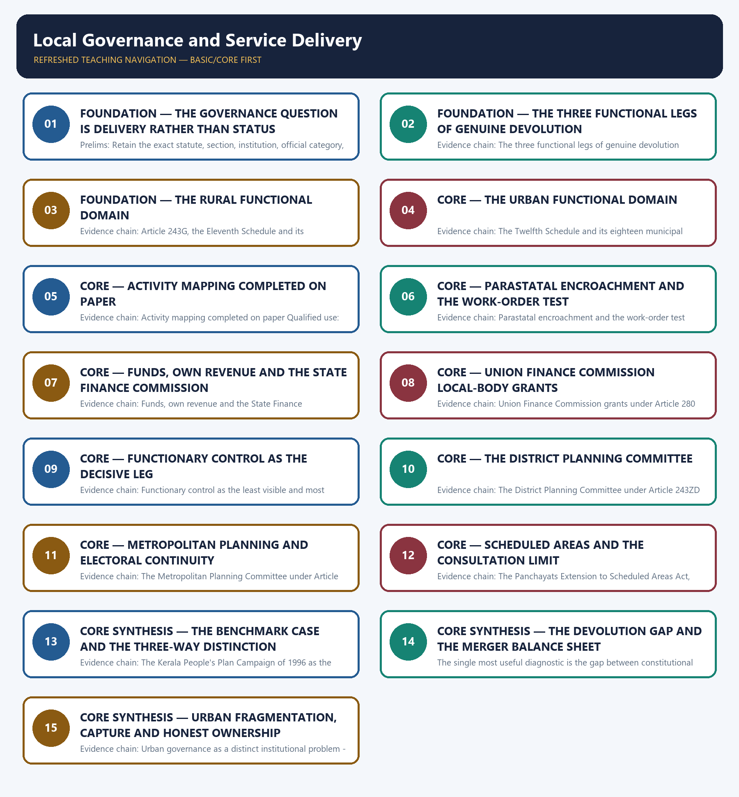

# Local Governance and Service Delivery — Learner-v2 Complete Learning Session

> **Authoring-only generation:** 2026-09-02. No PDF was rendered and no tracker or index was mutated.

### SOURCE, PROGRESSION AND CURRENT-LINKAGE AUDIT

- **Generation date:** 2026-09-02.
- **Repository-first evidence:** the Basic owner is taught first and preserved in full; the Advanced owner is retained only in the optional final teaching block.
- **OCR evidence:** Repository Markdown was primary. The OCR-searchable official General Studies question papers held under books\mains and books\more_previous_papers were used only to confirm the printed wording of routed Mains demands. No official answer key, marking scheme, page precision or unsupported quotation was imported from them.
- **Qdrant:** not used; repository Markdown and available OCR context were sufficient.
- **PYQ integrity:** Three direct General Studies Paper-II Mains demands and three applied objective demands are routed to this topic across the audited ledgers, and every routed Mains stem used below was confirmed word for word in the locally held OCR-searchable official question papers. The audited 2018-2023 Mains ledger routes the 2020 demand on the shift of local institutions from their formative phase of functions, functionaries and funds to the contemporary stage of functionality, and the 2022 demand on the extent to which decentralisation of power has changed the governance landscape at the grassroots, and the Basic owner records that core routing supersedes the older pointer to the Advanced companion, so both are answered from the core file. The audited 2024-2025 Mains ledger routes the 2024 demand on the role of local bodies in providing good governance at the local level and the pros and cons of merging rural local bodies with urban local bodies to this Basic owner. The audited 2018-2023 Prelims ledger routes the 2021 objective demand on the Right to the City concept and the United Nations human settlements programme and the 2022 objective demand on a national sanitation coalition and the national urban-affairs institute here, and the official 2018-2023 Preliminary Examination keys are not held locally, so no option, answer letter or distractor is recorded or inferred for either. The audited 2026 Prelims ledger routes the objective demand on the revamped rural self-governance scheme's objectives, duration and funding here; the 2026 Set-A key held locally is provisional, no answer letter is recorded or inferred, and no objective list, approval date, duration, outlay or Centre-State funding ratio is asserted because no official source for the revamped scheme was obtained. No official answer key or marking scheme is held locally for any routed Mains demand, so every model solution below is an authored answer route rather than an official key.
- **Live-link boundary:** One live official page was verified for this topic on 2026-09-02. The Ministry of Panchayati Raj's official website at panchayat.gov.in was read successfully on that date and states that the Ministry looks after the ongoing process of decentralisation and local governance in the States, that it was established in May 2004, and that with the passing of the seventy-third and seventy-fourth amendment Acts of the Constitution in 1993 the division of powers and functions was extended to local self-governments so that three levels of government now operate in India's federal system rather than two; the name of the incumbent minister appears on that page and is deliberately not recorded here because it is a volatile personnel fact. A further attempt was made on the same date to read the Ministry's page for the revamped rural self-governance scheme, and no usable official text could be extracted from it, so no objective list, approval date, duration, outlay or Centre-State funding ratio for that scheme is asserted anywhere in this package. Two additional official checks were attempted on the same date and failed with an access error, namely the Press Information Bureau release page and the Department of Administrative Reforms and Public Grievances website, so no content from either was read or used, and no secondary summary has been treated as an official source. The remaining dated official elements used are those already carried by the repository owners with their status checks, namely Article 243G with the Eleventh Schedule and its twenty-nine listed subjects, the Twelfth Schedule and its eighteen municipal functions, Article 243ZD with the four-fifths elected-member requirement for District Planning Committees, Article 243ZE for Metropolitan Planning Committees, Article 280(3)(bb) and Article 280(3)(c) for Union Finance Commission local-body grants, the Panchayats Extension to Scheduled Areas Act, 1996 applying to Fifth Schedule areas with a consultation requirement before land acquisition and resettlement, the Kerala People's Plan Campaign of 1996 as the benchmark, and the Ministry of Panchayati Raj Devolution Index as an official comparative diagnostic to be cited by edition and methodology, as checked by the owners on 21 July 2026. No devolution-index rank or score is asserted, no percentage of subjects or funds devolved in any State is asserted, no share of plan outlay is attached to the benchmark campaign, no local-body revenue, grant or property-tax figure is asserted, no count of States with functional District Planning Committees or pending local elections is asserted, and no representation percentage for women or for Scheduled Castes and Scheduled Tribes in local bodies is asserted. The composition, reservation and constitutional-status detail of the third tier is cross-linked to Polity rather than restated here.
- **Fact/inference discipline:** no current-affairs item, PYQ wording, figure or quotation is invented.

## BASIC LEARNING SESSION



*Distinct embedded teaching-navigation image. The separate continuous Cārvāka-style flowchart package remains an independent at-a-glance artifact.*

### SESSION 1 — FOUNDATION — THE GOVERNANCE QUESTION IS DELIVERY RATHER THAN STATUS

#### DEFINITION / WHAT THIS IS CALLED

**Plain-language definition:** Evidence chain: The governance question is delivery rather than constitutional status Qualified use: Set the correct scope in the first sentence of any local-governance demand.

**Technical definition:** Prelims: Retain the exact statute, section, institution, official category, dated edition or scope rule attached to The governance question is delivery rather than status.

#### ANSWER-GRABBING OPENING — WRITE/ADAPT IN THE EXAM

> Evidence chain: The governance question is delivery rather than constitutional status Qualified use: Set the correct scope in the first sentence of any local-governance demand.

#### MUST-WRITE KEYWORDS

- **FOUNDATION**
- **Evidence chain**
- **Qualified use**
- **The constitutional recognition of local bodies**
- **Polity**
- **Ministry**

**How to use them:** Frame the answer through FOUNDATION; define Evidence chain, connect Qualified use with The constitutional recognition of local bodies to explain the mechanism, and use Polity for the decisive comparison or qualification.

#### VISUAL FIRST

```text
THE GOVERNANCE QUESTION IS DELIVERY RATHER THAN STATUS
01. The governance question is delivery rather than constitutional status
BOUNDARY -> Composition, reservation and constitutional-status detail belong to Polity and not to this answer.
```

*This topic-specific rail fixes the evidence sequence and its exam boundary before analysis.*

#### CORE EXPLANATION

The constitutional recognition of local bodies is necessary and not sufficient, so the question this topic owns is whether devolution actually delivers services, while the composition, reservation and constitutional-status detail of the amendments that created the third tier is owned by Polity; the Ministry of Panchayati Raj's own official website, read on 2 September 2026, states that with the passing of the seventy-third and seventy-fourth amendment Acts of the Constitution in 1993 the division of powers and functions was extended to local self-governments so that India's federal system now works at three levels rather than two, and that the Ministry itself was established in May 2004.

#### NAMED EVIDENCE AND MECHANISM

- The constitutional recognition of local bodies is necessary and not sufficient, so the question this topic owns is whether devolution actually delivers services, while the composition, reservation and constitutional-status detail of the amendments that created the third tier is owned by Polity; the Ministry of Panchayati Raj's own official website, read on 2 September 2026, states that with the passing of the seventy-third and seventy-fourth amendment Acts of the Constitution in 1993 the division of powers and functions was extended to local self-governments so that India's federal system now works at three levels rather than two, and that the Ministry itself was established in May 2004.

#### EXAMINER CAUTION

- Composition, reservation and constitutional-status detail belong to Polity and not to this answer.

#### EXAM LINK

- **Prelims:** Retain the exact statute, section, institution, official category, dated edition or scope rule attached to The governance question is delivery rather than status.
- **Mains:** Set the correct scope in the first sentence of any local-governance demand.

#### MINI RECAP

- **Evidence chain:** The governance question is delivery rather than constitutional status
- **Qualified use:** Set the correct scope in the first sentence of any local-governance demand.

#### CLOSING RECALL FLOW — FOUNDATION — THE GOVERNANCE QUESTION IS DELIVERY RATHER THAN STATUS

```text
START / CONCEPT: FOUNDATION — The governance question is delivery rather than status
        |
        v
EXACT TERMS: FOUNDATION · Evidence chain · Qualified use · The constitutional recognition of local bodies · Polity · Ministry
        |
        v
MECHANISM / ARGUMENT: Prelims: Retain the exact statute, section, institution, official category, dated edition or scope rule attached to The governance question is delivery rather than status.
        |
        v
CONSEQUENCE / CONTRAST: The constitutional recognition of local bodies is necessary and not sufficient, so the question this topic owns is whether devolution actually delivers services, while the composition, reservation and constitutional-status detail of the amendments that created the third tier is owned by Polity; the Ministry of Panchayati Raj's own official website, read on 2 September 2026, states that with the passing of the seventy-third and seventy-fourth amendment Acts of the Constitution in 1993 the division of powers and functions was extended to local self-governments so that India's federal system now works at three levels rather than two, and that the Ministry itself was established in May 2004.
        |
        v
UPSC TRAP / ANSWER-USE: Do not miss this limiting distinction: the governance question is delivery rather than constitutional status Qualified use.
        |
        v
ANSWER-GRABBING FORMULATION: Evidence chain: The governance question is delivery rather than constitutional status Qualified use: Set the correct scope in the first sentence of any local-governance demand.
```
### SESSION 2 — FOUNDATION — THE THREE FUNCTIONAL LEGS OF GENUINE DEVOLUTION

#### DEFINITION / WHAT THIS IS CALLED

**Plain-language definition:** The three legs are inputs, and all three must move together or none delivers.

**Technical definition:** Evidence chain: The three functional legs of genuine devolution Qualified use: Replace a list of assigned subjects with the diagnostic frame the demand rewards.

#### ANSWER-GRABBING OPENING — WRITE/ADAPT IN THE EXAM

> Evidence chain: The three functional legs of genuine devolution Qualified use: Replace a list of assigned subjects with the diagnostic frame the demand rewards.

#### MUST-WRITE KEYWORDS

- **FOUNDATION**
- **The three functional legs of genuine devolution**
- **Evidence chain**
- **Qualified use**
- **Genuine**
- **The three legs**

**How to use them:** Frame the answer through FOUNDATION; define The three functional legs of genuine devolution, connect Evidence chain with Qualified use to explain the mechanism, and use Genuine for the decisive comparison or qualification.

#### VISUAL FIRST

```text
THE THREE FUNCTIONAL LEGS OF GENUINE DEVOLUTION
01. The three functional legs of genuine devolution
BOUNDARY -> The three legs are inputs, and all three must move together or none delivers.
```

*This topic-specific rail fixes the evidence sequence and its exam boundary before analysis.*

#### CORE EXPLANATION

Genuine devolution requires funds meaning own-source revenue and predictable formula-based transfers, functions meaning subjects actually transferred in practice rather than merely listed in a State law, and functionaries meaning staff genuinely accountable to and controlled by the local body rather than merely deputed while remaining answerable to a State department, and without all three moving together a local body holds constitutional status without delivery capacity.

#### NAMED EVIDENCE AND MECHANISM

- Genuine devolution requires funds meaning own-source revenue and predictable formula-based transfers, functions meaning subjects actually transferred in practice rather than merely listed in a State law, and functionaries meaning staff genuinely accountable to and controlled by the local body rather than merely deputed while remaining answerable to a State department, and without all three moving together a local body holds constitutional status without delivery capacity.

#### EXAMINER CAUTION

- The three legs are inputs, and all three must move together or none delivers.

#### EXAM LINK

- **Prelims:** Retain the exact statute, section, institution, official category, dated edition or scope rule attached to The three functional legs of genuine devolution.
- **Mains:** Replace a list of assigned subjects with the diagnostic frame the demand rewards.

#### MINI RECAP

- **Evidence chain:** The three functional legs of genuine devolution
- **Qualified use:** Replace a list of assigned subjects with the diagnostic frame the demand rewards.

#### CLOSING RECALL FLOW — FOUNDATION — THE THREE FUNCTIONAL LEGS OF GENUINE DEVOLUTION

```text
START / CONCEPT: FOUNDATION — The three functional legs of genuine devolution
        |
        v
EXACT TERMS: FOUNDATION · The three functional legs of genuine devolution · Evidence chain · Qualified use · Genuine · The three legs
        |
        v
MECHANISM / ARGUMENT: Genuine devolution requires funds meaning own-source revenue and predictable formula-based transfers, functions meaning subjects actually transferred in practice rather than merely listed in a State law, and functionaries meaning staff genuinely accountable to and controlled by the local body rather than merely deputed while remaining answerable to a State department, and without all three moving together a local body holds constitutional status without delivery capacity.
        |
        v
CONSEQUENCE / CONTRAST: The three legs are inputs, and all three must move together or none delivers.
        |
        v
UPSC TRAP / ANSWER-USE: Do not miss this limiting distinction: the three functional legs of genuine devolution Qualified use.
        |
        v
ANSWER-GRABBING FORMULATION: Evidence chain: The three functional legs of genuine devolution Qualified use: Replace a list of assigned subjects with the diagnostic frame the demand rewards.
```
### SESSION 3 — FOUNDATION — THE RURAL FUNCTIONAL DOMAIN

#### DEFINITION / WHAT THIS IS CALLED

**Plain-language definition:** Article 243G with the Eleventh Schedule supplies the constitutional devolution frame for Panchayats across twenty-nine listed subjects and therefore supplies the rural functional domain against which actual activity mapping is tested, but the Schedule is enabling rather than self-executing, so State law and the real transfer of funds and staff decide operational control.

**Technical definition:** Evidence chain: Article 243G, the Eleventh Schedule and its twenty-nine subjects Qualified use: Anchor a rural devolution answer in the correct constitutional article and schedule.

#### ANSWER-GRABBING OPENING — WRITE/ADAPT IN THE EXAM

> Article 243G with the Eleventh Schedule supplies the constitutional devolution frame for Panchayats across twenty-nine listed subjects and therefore supplies the rural functional domain against which actual activity mapping is tested, but the Schedule is enabling rather than self-executing, so State law and the real transfer of funds and staff decide operational control.

#### MUST-WRITE KEYWORDS

- **FOUNDATION**
- **The rural functional domain**
- **Evidence chain**
- **Qualified use**
- **Article 243G**
- **Article**

**How to use them:** Frame the answer through FOUNDATION; define The rural functional domain, connect Evidence chain with Qualified use to explain the mechanism, and use Article 243G for the decisive comparison or qualification.

#### VISUAL FIRST

```text
THE RURAL FUNCTIONAL DOMAIN
01. Article 243G, the Eleventh Schedule and its twenty-nine subjects
BOUNDARY -> The Schedule is enabling; State law and real transfer decide operational control.
```

*This topic-specific rail fixes the evidence sequence and its exam boundary before analysis.*

#### CORE EXPLANATION

Article 243G with the Eleventh Schedule supplies the constitutional devolution frame for Panchayats across twenty-nine listed subjects and therefore supplies the rural functional domain against which actual activity mapping is tested, but the Schedule is enabling rather than self-executing, so State law and the real transfer of funds and staff decide operational control.

#### NAMED EVIDENCE AND MECHANISM

- Article 243G with the Eleventh Schedule supplies the constitutional devolution frame for Panchayats across twenty-nine listed subjects and therefore supplies the rural functional domain against which actual activity mapping is tested, but the Schedule is enabling rather than self-executing, so State law and the real transfer of funds and staff decide operational control.

#### EXAMINER CAUTION

- The Schedule is enabling; State law and real transfer decide operational control.

#### EXAM LINK

- **Prelims:** Retain the exact statute, section, institution, official category, dated edition or scope rule attached to The rural functional domain.
- **Mains:** Anchor a rural devolution answer in the correct constitutional article and schedule.

#### MINI RECAP

- **Evidence chain:** Article 243G, the Eleventh Schedule and its twenty-nine subjects
- **Qualified use:** Anchor a rural devolution answer in the correct constitutional article and schedule.

#### CLOSING RECALL FLOW — FOUNDATION — THE RURAL FUNCTIONAL DOMAIN

```text
START / CONCEPT: FOUNDATION — The rural functional domain
        |
        v
EXACT TERMS: FOUNDATION · The rural functional domain · Evidence chain · Qualified use · Article 243G · Article
        |
        v
MECHANISM / ARGUMENT: Evidence chain: Article 243G, the Eleventh Schedule and its twenty-nine subjects Qualified use: Anchor a rural devolution answer in the correct constitutional article and schedule.
        |
        v
CONSEQUENCE / CONTRAST: The Schedule is enabling; State law and real transfer decide operational control.
        |
        v
UPSC TRAP / ANSWER-USE: Do not miss this limiting distinction: article 243G with the Eleventh Schedule supplies the constitutional devolution frame for Panchayats across...
        |
        v
ANSWER-GRABBING FORMULATION: Article 243G with the Eleventh Schedule supplies the constitutional devolution frame for Panchayats across twenty-nine listed subjects and therefore supplies the rural functional domain against which actual activity mapping is tested, but the Schedule is enabling rather than self-executing, so State law and the real transfer of funds and staff decide operational control.
```
### SESSION 4 — CORE — THE URBAN FUNCTIONAL DOMAIN

#### DEFINITION / WHAT THIS IS CALLED

**Plain-language definition:** The Twelfth Schedule lists eighteen municipal functions including urban planning, land-use regulation, water supply, sanitation, solid-waste management, roads, public health and slum improvement, and it supplies the urban functional domain against which real municipal devolution is tested, but listing a function does not prove that the municipality controls the budget, the staff or the implementing agency for it.

**Technical definition:** Evidence chain: The Twelfth Schedule and its eighteen municipal functions Qualified use: Test urban devolution against an assigned list rather than against an impression.

#### ANSWER-GRABBING OPENING — WRITE/ADAPT IN THE EXAM

> The Twelfth Schedule lists eighteen municipal functions including urban planning, land-use regulation, water supply, sanitation, solid-waste management, roads, public health and slum improvement, and it supplies the urban functional domain against which real municipal devolution is tested, but listing a function does not prove that the municipality controls the budget, the staff or the implementing agency for it.

#### MUST-WRITE KEYWORDS

- **The urban functional domain**
- **Evidence chain**
- **Qualified use**
- **The Twelfth Schedule**
- **Listing**
- **Qualified**

**How to use them:** Frame the answer through The urban functional domain; define Evidence chain, connect Qualified use with The Twelfth Schedule to explain the mechanism, and use Listing for the decisive comparison or qualification.

#### VISUAL FIRST

```text
THE URBAN FUNCTIONAL DOMAIN
01. The Twelfth Schedule and its eighteen municipal functions
BOUNDARY -> Listing a function does not prove control of its budget, staff or implementing agency.
```

*This topic-specific rail fixes the evidence sequence and its exam boundary before analysis.*

#### CORE EXPLANATION

The Twelfth Schedule lists eighteen municipal functions including urban planning, land-use regulation, water supply, sanitation, solid-waste management, roads, public health and slum improvement, and it supplies the urban functional domain against which real municipal devolution is tested, but listing a function does not prove that the municipality controls the budget, the staff or the implementing agency for it.

#### NAMED EVIDENCE AND MECHANISM

- The Twelfth Schedule lists eighteen municipal functions including urban planning, land-use regulation, water supply, sanitation, solid-waste management, roads, public health and slum improvement, and it supplies the urban functional domain against which real municipal devolution is tested, but listing a function does not prove that the municipality controls the budget, the staff or the implementing agency for it.

#### EXAMINER CAUTION

- Listing a function does not prove control of its budget, staff or implementing agency.

#### EXAM LINK

- **Prelims:** Retain the exact statute, section, institution, official category, dated edition or scope rule attached to The urban functional domain.
- **Mains:** Test urban devolution against an assigned list rather than against an impression.

#### MINI RECAP

- **Evidence chain:** The Twelfth Schedule and its eighteen municipal functions
- **Qualified use:** Test urban devolution against an assigned list rather than against an impression.

#### CLOSING RECALL FLOW — CORE — THE URBAN FUNCTIONAL DOMAIN

```text
START / CONCEPT: CORE — The urban functional domain
        |
        v
EXACT TERMS: The urban functional domain · Evidence chain · Qualified use · The Twelfth Schedule · Listing · Qualified
        |
        v
MECHANISM / ARGUMENT: Evidence chain: The Twelfth Schedule and its eighteen municipal functions Qualified use: Test urban devolution against an assigned list rather than against an impression.
        |
        v
CONSEQUENCE / CONTRAST: Listing a function does not prove control of its budget, staff or implementing agency.
        |
        v
UPSC TRAP / ANSWER-USE: Do not miss this limiting distinction: the Twelfth Schedule lists eighteen municipal functions including urban planning, land-use regulation, water supply...
        |
        v
ANSWER-GRABBING FORMULATION: The Twelfth Schedule lists eighteen municipal functions including urban planning, land-use regulation, water supply, sanitation, solid-waste management, roads, public health and slum improvement, and it supplies the urban functional domain against which real municipal devolution is tested, but listing a function does not prove that the municipality controls the budget, the staff or the implementing agency for it.
```
### SESSION 5 — CORE — ACTIVITY MAPPING COMPLETED ON PAPER

#### DEFINITION / WHAT THIS IS CALLED

**Plain-language definition:** Activity mapping is the formal exercise of listing which specific activity within a devolved subject belongs to which tier of local government, and it is what makes the transfer of a subject operationally meaningful, yet it has been widely completed on paper without matching fund and functionary transfer, so activity mapping alone is a necessary formal step and never by itself evidence of functional devolution.

**Technical definition:** Evidence chain: Activity mapping completed on paper Qualified use: Name the exact stage at which formal devolution stops being real.

#### ANSWER-GRABBING OPENING — WRITE/ADAPT IN THE EXAM

> Activity mapping is the formal exercise of listing which specific activity within a devolved subject belongs to which tier of local government, and it is what makes the transfer of a subject operationally meaningful, yet it has been widely completed on paper without matching fund and functionary transfer, so activity mapping alone is a necessary formal step and never by itself evidence of functional devolution.

#### MUST-WRITE KEYWORDS

- **Activity mapping completed on paper**
- **Evidence chain**
- **Qualified use**
- **Activity mapping**
- **Activity**
- **Activity mapping without fund and functionary transfer**

**How to use them:** Frame the answer through Activity mapping completed on paper; define Evidence chain, connect Qualified use with Activity mapping to explain the mechanism, and use Activity for the decisive comparison or qualification.

#### VISUAL FIRST

```text
ACTIVITY MAPPING COMPLETED ON PAPER
01. Activity mapping completed on paper
BOUNDARY -> Activity mapping without fund and functionary transfer is a formal step and nothing more.
```

*This topic-specific rail fixes the evidence sequence and its exam boundary before analysis.*

#### CORE EXPLANATION

Activity mapping is the formal exercise of listing which specific activity within a devolved subject belongs to which tier of local government, and it is what makes the transfer of a subject operationally meaningful, yet it has been widely completed on paper without matching fund and functionary transfer, so activity mapping alone is a necessary formal step and never by itself evidence of functional devolution.

#### NAMED EVIDENCE AND MECHANISM

- Activity mapping is the formal exercise of listing which specific activity within a devolved subject belongs to which tier of local government, and it is what makes the transfer of a subject operationally meaningful, yet it has been widely completed on paper without matching fund and functionary transfer, so activity mapping alone is a necessary formal step and never by itself evidence of functional devolution.

#### EXAMINER CAUTION

- Activity mapping without fund and functionary transfer is a formal step and nothing more.

#### EXAM LINK

- **Prelims:** Retain the exact statute, section, institution, official category, dated edition or scope rule attached to Activity mapping completed on paper.
- **Mains:** Name the exact stage at which formal devolution stops being real.

#### MINI RECAP

- **Evidence chain:** Activity mapping completed on paper
- **Qualified use:** Name the exact stage at which formal devolution stops being real.

#### CLOSING RECALL FLOW — CORE — ACTIVITY MAPPING COMPLETED ON PAPER

```text
START / CONCEPT: CORE — Activity mapping completed on paper
        |
        v
EXACT TERMS: Activity mapping completed on paper · Evidence chain · Qualified use · Activity mapping · Activity · Activity mapping without fund and functionary transfer
        |
        v
MECHANISM / ARGUMENT: Evidence chain: Activity mapping completed on paper Qualified use: Name the exact stage at which formal devolution stops being real.
        |
        v
CONSEQUENCE / CONTRAST: Activity mapping without fund and functionary transfer is a formal step and nothing more.
        |
        v
UPSC TRAP / ANSWER-USE: Do not miss this limiting distinction: activity mapping completed on paper Qualified use.
        |
        v
ANSWER-GRABBING FORMULATION: Activity mapping is the formal exercise of listing which specific activity within a devolved subject belongs to which tier of local government, and it is what makes the transfer of a subject operationally meaningful, yet it has been widely completed on paper without matching fund and functionary transfer, so activity mapping alone is a necessary formal step and never by itself evidence of functional devolution.
```
### SESSION 6 — CORE — PARASTATAL ENCROACHMENT AND THE WORK-ORDER TEST

#### DEFINITION / WHAT THIS IS CALLED

**Plain-language definition:** Parastatal encroachment is the well-documented pattern in which State boards and authorities such as water boards, housing boards and development authorities continue to exercise functions nominally devolved to local bodies, hollowing out the local government's practical delivery role even where the statutory devolution appears complete, and the concrete diagnostic question that exposes it is who holds the budget line and signs the work order.

**Technical definition:** Evidence chain: Parastatal encroachment and the work-order test Qualified use: Supply the most under-examined obstacle with a one-question test attached.

#### ANSWER-GRABBING OPENING — WRITE/ADAPT IN THE EXAM

> Evidence chain: Parastatal encroachment and the work-order test Qualified use: Supply the most under-examined obstacle with a one-question test attached.

#### MUST-WRITE KEYWORDS

- **Parastatal encroachment**
- **the work-order test**
- **Evidence chain**
- **Qualified use**
- **Parastatal**
- **The diagnostic**

**How to use them:** Frame the answer through Parastatal encroachment; define the work-order test, connect Evidence chain with Qualified use to explain the mechanism, and use Parastatal for the decisive comparison or qualification.

#### VISUAL FIRST

```text
PARASTATAL ENCROACHMENT AND THE WORK-ORDER TEST
01. Parastatal encroachment and the work-order test
BOUNDARY -> The diagnostic is who holds the budget line and signs the work order.
```

*This topic-specific rail fixes the evidence sequence and its exam boundary before analysis.*

#### CORE EXPLANATION

Parastatal encroachment is the well-documented pattern in which State boards and authorities such as water boards, housing boards and development authorities continue to exercise functions nominally devolved to local bodies, hollowing out the local government's practical delivery role even where the statutory devolution appears complete, and the concrete diagnostic question that exposes it is who holds the budget line and signs the work order.

#### NAMED EVIDENCE AND MECHANISM

- Parastatal encroachment is the well-documented pattern in which State boards and authorities such as water boards, housing boards and development authorities continue to exercise functions nominally devolved to local bodies, hollowing out the local government's practical delivery role even where the statutory devolution appears complete, and the concrete diagnostic question that exposes it is who holds the budget line and signs the work order.

#### EXAMINER CAUTION

- The diagnostic is who holds the budget line and signs the work order.

#### EXAM LINK

- **Prelims:** Retain the exact statute, section, institution, official category, dated edition or scope rule attached to Parastatal encroachment and the work-order test.
- **Mains:** Supply the most under-examined obstacle with a one-question test attached.

#### MINI RECAP

- **Evidence chain:** Parastatal encroachment and the work-order test
- **Qualified use:** Supply the most under-examined obstacle with a one-question test attached.

#### CLOSING RECALL FLOW — CORE — PARASTATAL ENCROACHMENT AND THE WORK-ORDER TEST

```text
START / CONCEPT: CORE — Parastatal encroachment and the work-order test
        |
        v
EXACT TERMS: Parastatal encroachment · the work-order test · Evidence chain · Qualified use · Parastatal · The diagnostic
        |
        v
MECHANISM / ARGUMENT: Parastatal encroachment is the well-documented pattern in which State boards and authorities such as water boards, housing boards and development authorities continue to exercise functions nominally devolved to local bodies, hollowing out the local government's practical delivery role even where the statutory devolution appears complete, and the concrete diagnostic question that exposes it is who holds the budget line and signs the work order.
        |
        v
CONSEQUENCE / CONTRAST: The diagnostic is who holds the budget line and signs the work order.
        |
        v
UPSC TRAP / ANSWER-USE: Do not miss this limiting distinction: parastatal encroachment and the work-order test Qualified use.
        |
        v
ANSWER-GRABBING FORMULATION: Evidence chain: Parastatal encroachment and the work-order test Qualified use: Supply the most under-examined obstacle with a one-question test attached.
```
### SESSION 7 — CORE — FUNDS, OWN REVENUE AND THE STATE FINANCE COMMISSION

#### DEFINITION / WHAT THIS IS CALLED

**Plain-language definition:** The funds leg depends on own-source revenue, on State Finance Commission recommendations for the devolution of State revenue to local bodies, and on the balance between tied and untied grants, because predominantly tied and project-specific grants make a local body an executing agency rather than a planning authority, and the constitution of State Finance Commissions and the acceptance of their recommendations are irregular in several States.

**Technical definition:** Evidence chain: Funds, own revenue and the State Finance Commission Qualified use: Explain fiscal weakness institutionally instead of asserting a revenue figure.

#### ANSWER-GRABBING OPENING — WRITE/ADAPT IN THE EXAM

> Evidence chain: Funds, own revenue and the State Finance Commission Qualified use: Explain fiscal weakness institutionally instead of asserting a revenue figure.

#### MUST-WRITE KEYWORDS

- **Funds**
- **own revenue**
- **the State Finance Commission**
- **Evidence chain**
- **Qualified use**
- **States**

**How to use them:** Frame the answer through Funds; define own revenue, connect the State Finance Commission with Evidence chain to explain the mechanism, and use Qualified use for the decisive comparison or qualification.

#### VISUAL FIRST

```text
FUNDS, OWN REVENUE AND THE STATE FINANCE COMMISSION
01. Funds, own revenue and the State Finance Commission
BOUNDARY -> Tied grants make a local body an executing agency rather than a planning authority.
```

*This topic-specific rail fixes the evidence sequence and its exam boundary before analysis.*

#### CORE EXPLANATION

The funds leg depends on own-source revenue, on State Finance Commission recommendations for the devolution of State revenue to local bodies, and on the balance between tied and untied grants, because predominantly tied and project-specific grants make a local body an executing agency rather than a planning authority, and the constitution of State Finance Commissions and the acceptance of their recommendations are irregular in several States.

#### NAMED EVIDENCE AND MECHANISM

- The funds leg depends on own-source revenue, on State Finance Commission recommendations for the devolution of State revenue to local bodies, and on the balance between tied and untied grants, because predominantly tied and project-specific grants make a local body an executing agency rather than a planning authority, and the constitution of State Finance Commissions and the acceptance of their recommendations are irregular in several States.

#### EXAMINER CAUTION

- Tied grants make a local body an executing agency rather than a planning authority.

#### EXAM LINK

- **Prelims:** Retain the exact statute, section, institution, official category, dated edition or scope rule attached to Funds, own revenue and the State Finance Commission.
- **Mains:** Explain fiscal weakness institutionally instead of asserting a revenue figure.

#### MINI RECAP

- **Evidence chain:** Funds, own revenue and the State Finance Commission
- **Qualified use:** Explain fiscal weakness institutionally instead of asserting a revenue figure.

#### CLOSING RECALL FLOW — CORE — FUNDS, OWN REVENUE AND THE STATE FINANCE COMMISSION

```text
START / CONCEPT: CORE — Funds, own revenue and the State Finance Commission
        |
        v
EXACT TERMS: Funds · own revenue · the State Finance Commission · Evidence chain · Qualified use · States
        |
        v
MECHANISM / ARGUMENT: The funds leg depends on own-source revenue, on State Finance Commission recommendations for the devolution of State revenue to local bodies, and on the balance between tied and untied grants, because predominantly tied and project-specific grants make a local body an executing agency rather than a planning authority, and the constitution of State Finance Commissions and the acceptance of their recommendations are irregular in several States.
        |
        v
CONSEQUENCE / CONTRAST: Mains: Explain fiscal weakness institutionally instead of asserting a revenue figure.
        |
        v
UPSC TRAP / ANSWER-USE: Do not miss this limiting distinction: funds, own revenue and the State Finance Commission Qualified use.
        |
        v
ANSWER-GRABBING FORMULATION: Evidence chain: Funds, own revenue and the State Finance Commission Qualified use: Explain fiscal weakness institutionally instead of asserting a revenue figure.
```
### SESSION 8 — CORE — UNION FINANCE COMMISSION LOCAL-BODY GRANTS

#### DEFINITION / WHAT THIS IS CALLED

**Plain-language definition:** Article 280(3)(bb) covers measures needed to augment the resources of Panchayats and Article 280(3)(c) the resources of Municipalities, in each case on the basis of State Finance Commission recommendations, so Union Finance Commission local-body grants supplement weak own revenue and can attach service and accounting conditions, but they cannot substitute for regular State Finance Commissions, for own-revenue effort or for control over functionaries, and tied grants constrain local choice.

**Technical definition:** Evidence chain: Union Finance Commission grants under Article 280 Qualified use: Complete the fiscal architecture with its exact constitutional clauses.

#### ANSWER-GRABBING OPENING — WRITE/ADAPT IN THE EXAM

> Article 280(3)(bb) covers measures needed to augment the resources of Panchayats and Article 280(3)(c) the resources of Municipalities, in each case on the basis of State Finance Commission recommendations, so Union Finance Commission local-body grants supplement weak own revenue and can attach service and accounting conditions, but they cannot substitute for regular State Finance Commissions, for own-revenue effort or for control over functionaries, and tied grants constrain local choice.

#### MUST-WRITE KEYWORDS

- **Union Finance Commission local-body grants**
- **Evidence chain**
- **Qualified use**
- **Article 280**
- **Article**
- **Panchayats**

**How to use them:** Frame the answer through Union Finance Commission local-body grants; define Evidence chain, connect Qualified use with Article 280 to explain the mechanism, and use Article for the decisive comparison or qualification.

#### VISUAL FIRST

```text
UNION FINANCE COMMISSION LOCAL-BODY GRANTS
01. Union Finance Commission grants under Article 280
BOUNDARY -> Grants supplement and cannot substitute for regular commissions or own-revenue effort.
```

*This topic-specific rail fixes the evidence sequence and its exam boundary before analysis.*

#### CORE EXPLANATION

Article 280(3)(bb) covers measures needed to augment the resources of Panchayats and Article 280(3)(c) the resources of Municipalities, in each case on the basis of State Finance Commission recommendations, so Union Finance Commission local-body grants supplement weak own revenue and can attach service and accounting conditions, but they cannot substitute for regular State Finance Commissions, for own-revenue effort or for control over functionaries, and tied grants constrain local choice.

#### NAMED EVIDENCE AND MECHANISM

- Article 280(3)(bb) covers measures needed to augment the resources of Panchayats and Article 280(3)(c) the resources of Municipalities, in each case on the basis of State Finance Commission recommendations, so Union Finance Commission local-body grants supplement weak own revenue and can attach service and accounting conditions, but they cannot substitute for regular State Finance Commissions, for own-revenue effort or for control over functionaries, and tied grants constrain local choice.

#### EXAMINER CAUTION

- Grants supplement and cannot substitute for regular commissions or own-revenue effort.

#### EXAM LINK

- **Prelims:** Retain the exact statute, section, institution, official category, dated edition or scope rule attached to Union Finance Commission local-body grants.
- **Mains:** Complete the fiscal architecture with its exact constitutional clauses.

#### MINI RECAP

- **Evidence chain:** Union Finance Commission grants under Article 280
- **Qualified use:** Complete the fiscal architecture with its exact constitutional clauses.

#### CLOSING RECALL FLOW — CORE — UNION FINANCE COMMISSION LOCAL-BODY GRANTS

```text
START / CONCEPT: CORE — Union Finance Commission local-body grants
        |
        v
EXACT TERMS: Union Finance Commission local-body grants · Evidence chain · Qualified use · Article 280 · Article · Panchayats
        |
        v
MECHANISM / ARGUMENT: Evidence chain: Union Finance Commission grants under Article 280 Qualified use: Complete the fiscal architecture with its exact constitutional clauses.
        |
        v
CONSEQUENCE / CONTRAST: The resulting consequence is that article 280(3)(bb) covers measures needed to augment the resources of Panchayats and Article 280(3)(c)...
        |
        v
UPSC TRAP / ANSWER-USE: Do not miss this limiting distinction: article 280(3)(bb) covers measures needed to augment the resources of Panchayats and Article 280(3)(c)...
        |
        v
ANSWER-GRABBING FORMULATION: Article 280(3)(bb) covers measures needed to augment the resources of Panchayats and Article 280(3)(c) the resources of Municipalities, in each case on the basis of State Finance Commission recommendations, so Union Finance Commission local-body grants supplement weak own revenue and can attach service and accounting conditions, but they cannot substitute for regular State Finance Commissions, for own-revenue effort or for control over functionaries, and tied grants constrain local choice.
```
### SESSION 9 — CORE — FUNCTIONARY CONTROL AS THE DECISIVE LEG

#### DEFINITION / WHAT THIS IS CALLED

**Plain-language definition:** Functionary control decides whether an elected local representative can direct the staff executing a devolved function or merely request it, because field staff such as engineers, health workers and teachers frequently remain administratively controlled by State line departments on whom their careers depend, and this is the least visible of the three legs, the least frequently written about and the most decisive, which makes naming it a differentiating move in an answer.

**Technical definition:** Evidence chain: Functionary control as the least visible and most decisive leg Qualified use: Make a differentiating move by naming the least visible of the three legs.

#### ANSWER-GRABBING OPENING — WRITE/ADAPT IN THE EXAM

> Functionary control decides whether an elected local representative can direct the staff executing a devolved function or merely request it, because field staff such as engineers, health workers and teachers frequently remain administratively controlled by State line departments on whom their careers depend, and this is the least visible of the three legs, the least frequently written about and the most decisive, which makes naming it a differentiating move in an answer.

#### MUST-WRITE KEYWORDS

- **Functionary control as the decisive leg**
- **Evidence chain**
- **Qualified use**
- **Functionary**
- **Deputation without control**
- **Deputation**

**How to use them:** Frame the answer through Functionary control as the decisive leg; define Evidence chain, connect Qualified use with Functionary to explain the mechanism, and use Deputation without control for the decisive comparison or qualification.

#### VISUAL FIRST

```text
FUNCTIONARY CONTROL AS THE DECISIVE LEG
01. Functionary control as the least visible and most decisive leg
BOUNDARY -> Deputation without control means the elected representative can request but not direct.
```

*This topic-specific rail fixes the evidence sequence and its exam boundary before analysis.*

#### CORE EXPLANATION

Functionary control decides whether an elected local representative can direct the staff executing a devolved function or merely request it, because field staff such as engineers, health workers and teachers frequently remain administratively controlled by State line departments on whom their careers depend, and this is the least visible of the three legs, the least frequently written about and the most decisive, which makes naming it a differentiating move in an answer.

#### NAMED EVIDENCE AND MECHANISM

- Functionary control decides whether an elected local representative can direct the staff executing a devolved function or merely request it, because field staff such as engineers, health workers and teachers frequently remain administratively controlled by State line departments on whom their careers depend, and this is the least visible of the three legs, the least frequently written about and the most decisive, which makes naming it a differentiating move in an answer.

#### EXAMINER CAUTION

- Deputation without control means the elected representative can request but not direct.

#### EXAM LINK

- **Prelims:** Retain the exact statute, section, institution, official category, dated edition or scope rule attached to Functionary control as the decisive leg.
- **Mains:** Make a differentiating move by naming the least visible of the three legs.

#### MINI RECAP

- **Evidence chain:** Functionary control as the least visible and most decisive leg
- **Qualified use:** Make a differentiating move by naming the least visible of the three legs.

#### CLOSING RECALL FLOW — CORE — FUNCTIONARY CONTROL AS THE DECISIVE LEG

```text
START / CONCEPT: CORE — Functionary control as the decisive leg
        |
        v
EXACT TERMS: Functionary control as the decisive leg · Evidence chain · Qualified use · Functionary · Deputation without control · Deputation
        |
        v
MECHANISM / ARGUMENT: Evidence chain: Functionary control as the least visible and most decisive leg Qualified use: Make a differentiating move by naming the least visible of the three legs.
        |
        v
CONSEQUENCE / CONTRAST: Deputation without control means the elected representative can request but not direct.
        |
        v
UPSC TRAP / ANSWER-USE: Do not miss this limiting distinction: deputation without control means the elected representative can request but not direct.
        |
        v
ANSWER-GRABBING FORMULATION: Functionary control decides whether an elected local representative can direct the staff executing a devolved function or merely request it, because field staff such as engineers, health workers and teachers frequently remain administratively controlled by State line departments on whom their careers depend, and this is the least visible of the three legs, the least frequently written about and the most decisive, which makes naming it a differentiating move in an answer.
```
### SESSION 10 — CORE — THE DISTRICT PLANNING COMMITTEE

#### DEFINITION / WHAT THIS IS CALLED

**Plain-language definition:** Article 243ZD requires the consolidation of Panchayat and Municipality plans and the preparation of a draft district plan, taking account of common interests such as spatial planning, sharing of water and other physical and natural resources, infrastructure and environmental conservation, with at least four-fifths of the members elected by and from the elected members of the Panchayats and Municipalities in the district in proportion to the rural and urban population, which makes the committee a representative coordinating body rather than a State-appointed district planning department; its operationalisation is uneven and many States have not made it an effective planning body.

**Technical definition:** Evidence chain: The District Planning Committee under Article 243ZD Qualified use: Use the correct article and composition rule for district-planning demands.

#### ANSWER-GRABBING OPENING — WRITE/ADAPT IN THE EXAM

> Article 243ZD requires the consolidation of Panchayat and Municipality plans and the preparation of a draft district plan, taking account of common interests such as spatial planning, sharing of water and other physical and natural resources, infrastructure and environmental conservation, with at least four-fifths of the members elected by and from the elected members of the Panchayats and Municipalities in the district in proportion to the rural and urban population, which makes the committee a representative coordinating body rather than a State-appointed district planning department; its operationalisation is uneven and many States have not made it an effective planning body.

#### MUST-WRITE KEYWORDS

- **The District Planning Committee**
- **Evidence chain**
- **Qualified use**
- **Article**
- **Panchayat**
- **Municipality**

**How to use them:** Frame the answer through The District Planning Committee; define Evidence chain, connect Qualified use with Article to explain the mechanism, and use Panchayat for the decisive comparison or qualification.

#### VISUAL FIRST

```text
THE DISTRICT PLANNING COMMITTEE
01. The District Planning Committee under Article 243ZD
BOUNDARY -> The four-fifths elected-member rule makes it representative and not a State department.
```

*This topic-specific rail fixes the evidence sequence and its exam boundary before analysis.*

#### CORE EXPLANATION

Article 243ZD requires the consolidation of Panchayat and Municipality plans and the preparation of a draft district plan, taking account of common interests such as spatial planning, sharing of water and other physical and natural resources, infrastructure and environmental conservation, with at least four-fifths of the members elected by and from the elected members of the Panchayats and Municipalities in the district in proportion to the rural and urban population, which makes the committee a representative coordinating body rather than a State-appointed district planning department; its operationalisation is uneven and many States have not made it an effective planning body.

#### NAMED EVIDENCE AND MECHANISM

- Article 243ZD requires the consolidation of Panchayat and Municipality plans and the preparation of a draft district plan, taking account of common interests such as spatial planning, sharing of water and other physical and natural resources, infrastructure and environmental conservation, with at least four-fifths of the members elected by and from the elected members of the Panchayats and Municipalities in the district in proportion to the rural and urban population, which makes the committee a representative coordinating body rather than a State-appointed district planning department; its operationalisation is uneven and many States have not made it an effective planning body.

#### EXAMINER CAUTION

- The four-fifths elected-member rule makes it representative and not a State department.

#### EXAM LINK

- **Prelims:** Retain the exact statute, section, institution, official category, dated edition or scope rule attached to The District Planning Committee.
- **Mains:** Use the correct article and composition rule for district-planning demands.

#### MINI RECAP

- **Evidence chain:** The District Planning Committee under Article 243ZD
- **Qualified use:** Use the correct article and composition rule for district-planning demands.

#### CLOSING RECALL FLOW — CORE — THE DISTRICT PLANNING COMMITTEE

```text
START / CONCEPT: CORE — The District Planning Committee
        |
        v
EXACT TERMS: The District Planning Committee · Evidence chain · Qualified use · Article · Panchayat · Municipality
        |
        v
MECHANISM / ARGUMENT: Evidence chain: The District Planning Committee under Article 243ZD Qualified use: Use the correct article and composition rule for district-planning demands.
        |
        v
CONSEQUENCE / CONTRAST: Mains: Use the correct article and composition rule for district-planning demands.
        |
        v
UPSC TRAP / ANSWER-USE: Do not miss this limiting distinction: article 243ZD requires the consolidation of Panchayat and Municipality plans and the preparation of...
        |
        v
ANSWER-GRABBING FORMULATION: Article 243ZD requires the consolidation of Panchayat and Municipality plans and the preparation of a draft district plan, taking account of common interests such as spatial planning, sharing of water and other physical and natural resources, infrastructure and environmental conservation, with at least four-fifths of the members elected by and from the elected members of the Panchayats and Municipalities in the district in proportion to the rural and urban population, which makes the committee a representative coordinating body rather than a State-appointed district planning department; its operationalisation is uneven and many States have not made it an effective planning body.
```
### SESSION 11 — CORE — METROPOLITAN PLANNING AND ELECTORAL CONTINUITY

#### DEFINITION / WHAT THIS IS CALLED

**Plain-language definition:** Article 243ZE provides for a Metropolitan Planning Committee to prepare a draft development plan for a metropolitan area by integrating municipal and Panchayat plans together with common spatial, infrastructure and environmental interests, which is the constitutional answer to fragmented metropolitan planning, and its constitution and effectiveness are State-variable so no national compliance count may be invented.

**Technical definition:** Evidence chain: The Metropolitan Planning Committee under Article 243ZE - State Election Commissions and the continuity precondition Qualified use: Cover the metropolitan and continuity gaps that most answers omit entirely.

#### ANSWER-GRABBING OPENING — WRITE/ADAPT IN THE EXAM

> Evidence chain: The Metropolitan Planning Committee under Article 243ZE - State Election Commissions and the continuity precondition Qualified use: Cover the metropolitan and continuity gaps that most answers omit entirely.

#### MUST-WRITE KEYWORDS

- **Metropolitan planning**
- **electoral continuity**
- **Evidence chain**
- **Qualified use**
- **Article**
- **Metropolitan Planning Committee**

**How to use them:** Frame the answer through Metropolitan planning; define electoral continuity, connect Evidence chain with Qualified use to explain the mechanism, and use Article for the decisive comparison or qualification.

#### VISUAL FIRST

```text
METROPOLITAN PLANNING AND ELECTORAL CONTINUITY
01. The Metropolitan Planning Committee under Article 243ZE
    |
    v
02. State Election Commissions and the continuity precondition
BOUNDARY -> Constitution and effectiveness are State-variable and no compliance count exists here.
```

*This topic-specific rail fixes the evidence sequence and its exam boundary before analysis.*

#### CORE EXPLANATION

Article 243ZE provides for a Metropolitan Planning Committee to prepare a draft development plan for a metropolitan area by integrating municipal and Panchayat plans together with common spatial, infrastructure and environmental interests, which is the constitutional answer to fragmented metropolitan planning, and its constitution and effectiveness are State-variable so no national compliance count may be invented. State Election Commissions conduct local-body elections and regular elections are the precondition of local accountability, but election timing is State-controlled, so delay and prolonged administrator rule are a recurring structural risk to functionality rather than an occasional administrative accident, and this belongs in any answer on the challenges to local-institution functionality.

#### NAMED EVIDENCE AND MECHANISM

- Article 243ZE provides for a Metropolitan Planning Committee to prepare a draft development plan for a metropolitan area by integrating municipal and Panchayat plans together with common spatial, infrastructure and environmental interests, which is the constitutional answer to fragmented metropolitan planning, and its constitution and effectiveness are State-variable so no national compliance count may be invented.
- State Election Commissions conduct local-body elections and regular elections are the precondition of local accountability, but election timing is State-controlled, so delay and prolonged administrator rule are a recurring structural risk to functionality rather than an occasional administrative accident, and this belongs in any answer on the challenges to local-institution functionality.

#### EXAMINER CAUTION

- Constitution and effectiveness are State-variable and no compliance count exists here.

#### EXAM LINK

- **Prelims:** Retain the exact statute, section, institution, official category, dated edition or scope rule attached to Metropolitan planning and electoral continuity.
- **Mains:** Cover the metropolitan and continuity gaps that most answers omit entirely.

#### MINI RECAP

- **Evidence chain:** The Metropolitan Planning Committee under Article 243ZE -> State Election Commissions and the continuity precondition
- **Qualified use:** Cover the metropolitan and continuity gaps that most answers omit entirely.

#### CLOSING RECALL FLOW — CORE — METROPOLITAN PLANNING AND ELECTORAL CONTINUITY

```text
START / CONCEPT: CORE — Metropolitan planning and electoral continuity
        |
        v
EXACT TERMS: Metropolitan planning · electoral continuity · Evidence chain · Qualified use · Article · Metropolitan Planning Committee
        |
        v
MECHANISM / ARGUMENT: Article 243ZE provides for a Metropolitan Planning Committee to prepare a draft development plan for a metropolitan area by integrating municipal and Panchayat plans together with common spatial, infrastructure and environmental interests, which is the constitutional answer to fragmented metropolitan planning, and its constitution and effectiveness are State-variable so no national compliance count may be invented.
        |
        v
CONSEQUENCE / CONTRAST: State Election Commissions conduct local-body elections and regular elections are the precondition of local accountability, but election timing is State-controlled, so delay and prolonged administrator rule are a recurring structural risk to functionality rather than an occasional administrative accident, and this belongs in any answer on the challenges to local-institution functionality.
        |
        v
UPSC TRAP / ANSWER-USE: Do not miss this limiting distinction: constitution and effectiveness are State-variable and no compliance count exists here.
        |
        v
ANSWER-GRABBING FORMULATION: Evidence chain: The Metropolitan Planning Committee under Article 243ZE - State Election Commissions and the continuity precondition Qualified use: Cover the metropolitan and continuity gaps that most answers omit entirely.
```
### SESSION 12 — CORE — SCHEDULED AREAS AND THE CONSULTATION LIMIT

#### DEFINITION / WHAT THIS IS CALLED

**Plain-language definition:** The Panchayats Extension to Scheduled Areas Act, 1996 extends the Panchayat provisions to Fifth Schedule areas with Gram Sabha powers over local plans, resources and dispute resolution, and it is the strongest statutory recognition of community authority in Scheduled Areas, but the precision that matters is that it requires consultation before land acquisition and resettlement in Scheduled Areas rather than a universal consent requirement, and it applies to Scheduled Areas rather than to all tribal-majority areas.

**Technical definition:** Evidence chain: The Panchayats Extension to Scheduled Areas Act, 1996 and the consultation limit Qualified use: Protect a Scheduled-Areas answer from the single commonest legal misstatement.

#### ANSWER-GRABBING OPENING — WRITE/ADAPT IN THE EXAM

> Evidence chain: The Panchayats Extension to Scheduled Areas Act, 1996 and the consultation limit Qualified use: Protect a Scheduled-Areas answer from the single commonest legal misstatement.

#### MUST-WRITE KEYWORDS

- **Scheduled Areas**
- **the consultation limit**
- **Evidence chain**
- **Qualified use**
- **The Panchayats Extension**
- **Scheduled Areas Act**

**How to use them:** Frame the answer through Scheduled Areas; define the consultation limit, connect Evidence chain with Qualified use to explain the mechanism, and use The Panchayats Extension for the decisive comparison or qualification.

#### VISUAL FIRST

```text
SCHEDULED AREAS AND THE CONSULTATION LIMIT
01. The Panchayats Extension to Scheduled Areas Act, 1996 and the consultation limit
BOUNDARY -> The statute requires consultation before land acquisition and resettlement, not consent.
```

*This topic-specific rail fixes the evidence sequence and its exam boundary before analysis.*

#### CORE EXPLANATION

The Panchayats Extension to Scheduled Areas Act, 1996 extends the Panchayat provisions to Fifth Schedule areas with Gram Sabha powers over local plans, resources and dispute resolution, and it is the strongest statutory recognition of community authority in Scheduled Areas, but the precision that matters is that it requires consultation before land acquisition and resettlement in Scheduled Areas rather than a universal consent requirement, and it applies to Scheduled Areas rather than to all tribal-majority areas.

#### NAMED EVIDENCE AND MECHANISM

- The Panchayats Extension to Scheduled Areas Act, 1996 extends the Panchayat provisions to Fifth Schedule areas with Gram Sabha powers over local plans, resources and dispute resolution, and it is the strongest statutory recognition of community authority in Scheduled Areas, but the precision that matters is that it requires consultation before land acquisition and resettlement in Scheduled Areas rather than a universal consent requirement, and it applies to Scheduled Areas rather than to all tribal-majority areas.

#### EXAMINER CAUTION

- The statute requires consultation before land acquisition and resettlement, not consent.

#### EXAM LINK

- **Prelims:** Retain the exact statute, section, institution, official category, dated edition or scope rule attached to Scheduled Areas and the consultation limit.
- **Mains:** Protect a Scheduled-Areas answer from the single commonest legal misstatement.

#### MINI RECAP

- **Evidence chain:** The Panchayats Extension to Scheduled Areas Act, 1996 and the consultation limit
- **Qualified use:** Protect a Scheduled-Areas answer from the single commonest legal misstatement.

#### CLOSING RECALL FLOW — CORE — SCHEDULED AREAS AND THE CONSULTATION LIMIT

```text
START / CONCEPT: CORE — Scheduled Areas and the consultation limit
        |
        v
EXACT TERMS: Scheduled Areas · the consultation limit · Evidence chain · Qualified use · The Panchayats Extension · Scheduled Areas Act
        |
        v
MECHANISM / ARGUMENT: The Panchayats Extension to Scheduled Areas Act, 1996 extends the Panchayat provisions to Fifth Schedule areas with Gram Sabha powers over local plans, resources and dispute resolution, and it is the strongest statutory recognition of community authority in Scheduled Areas, but the precision that matters is that it requires consultation before land acquisition and resettlement in Scheduled Areas rather than a universal consent requirement, and it applies to Scheduled Areas rather than to all tribal-majority areas.
        |
        v
CONSEQUENCE / CONTRAST: The statute requires consultation before land acquisition and resettlement, not consent.
        |
        v
UPSC TRAP / ANSWER-USE: Do not miss this limiting distinction: the Panchayats Extension to Scheduled Areas Act, 1996 and the consultation limit Qualified use.
        |
        v
ANSWER-GRABBING FORMULATION: Evidence chain: The Panchayats Extension to Scheduled Areas Act, 1996 and the consultation limit Qualified use: Protect a Scheduled-Areas answer from the single commonest legal misstatement.
```
### SESSION 13 — CORE SYNTHESIS — THE BENCHMARK CASE AND THE THREE-WAY DISTINCTION

#### DEFINITION / WHAT THIS IS CALLED

**Plain-language definition:** Deconcentration means field offices of a higher tier operating locally, delegation means agency functions performed on behalf of a higher tier, and devolution means the transfer of authority together with resources and accountability, so most Indian practice sits between the first two, and using the three-way distinction is the cleanest way to convert an extent demand into a graded rather than a binary answer.

**Technical definition:** Evidence chain: The Kerala People's Plan Campaign of 1996 as the benchmark - Deconcentration, delegation and devolution Qualified use: Convert an extent demand into a graded finding with a named positive benchmark.

#### ANSWER-GRABBING OPENING — WRITE/ADAPT IN THE EXAM

> Deconcentration means field offices of a higher tier operating locally, delegation means agency functions performed on behalf of a higher tier, and devolution means the transfer of authority together with resources and accountability, so most Indian practice sits between the first two, and using the three-way distinction is the cleanest way to convert an extent demand into a graded rather than a binary answer.

#### MUST-WRITE KEYWORDS

- **CORE SYNTHESIS**
- **The benchmark case**
- **the three-way distinction**
- **Evidence chain**
- **Qualified use**
- **The Kerala People's Plan Campaign**

**How to use them:** Frame the answer through CORE SYNTHESIS; define The benchmark case, connect the three-way distinction with Evidence chain to explain the mechanism, and use Qualified use for the decisive comparison or qualification.

#### VISUAL FIRST

```text
THE BENCHMARK CASE AND THE THREE-WAY DISTINCTION
01. The Kerala People's Plan Campaign of 1996 as the benchmark
    |
    v
02. Deconcentration, delegation and devolution
BOUNDARY -> Attach no percentage to the benchmark and grade the extent rather than answering yes or no.
```

*This topic-specific rail fixes the evidence sequence and its exam boundary before analysis.*

#### CORE EXPLANATION

The Kerala People's Plan Campaign of 1996 combined substantial devolution of plan resources with participatory local planning, genuine functional transfer and capacity-building support, and it is the benchmark demonstration that the three legs moving together produce results, which is also why its success cannot be attributed to fund devolution alone; no percentage of plan outlay is attached to it here because a dated official source would be required for any such figure. Deconcentration means field offices of a higher tier operating locally, delegation means agency functions performed on behalf of a higher tier, and devolution means the transfer of authority together with resources and accountability, so most Indian practice sits between the first two, and using the three-way distinction is the cleanest way to convert an extent demand into a graded rather than a binary answer.

#### NAMED EVIDENCE AND MECHANISM

- The Kerala People's Plan Campaign of 1996 combined substantial devolution of plan resources with participatory local planning, genuine functional transfer and capacity-building support, and it is the benchmark demonstration that the three legs moving together produce results, which is also why its success cannot be attributed to fund devolution alone; no percentage of plan outlay is attached to it here because a dated official source would be required for any such figure.
- Deconcentration means field offices of a higher tier operating locally, delegation means agency functions performed on behalf of a higher tier, and devolution means the transfer of authority together with resources and accountability, so most Indian practice sits between the first two, and using the three-way distinction is the cleanest way to convert an extent demand into a graded rather than a binary answer.

#### EXAMINER CAUTION

- Attach no percentage to the benchmark and grade the extent rather than answering yes or no.

#### EXAM LINK

- **Prelims:** Retain the exact statute, section, institution, official category, dated edition or scope rule attached to The benchmark case and the three-way distinction.
- **Mains:** Convert an extent demand into a graded finding with a named positive benchmark.

#### MINI RECAP

- **Evidence chain:** The Kerala People's Plan Campaign of 1996 as the benchmark -> Deconcentration, delegation and devolution
- **Qualified use:** Convert an extent demand into a graded finding with a named positive benchmark.

#### CLOSING RECALL FLOW — CORE SYNTHESIS — THE BENCHMARK CASE AND THE THREE-WAY DISTINCTION

```text
START / CONCEPT: CORE SYNTHESIS — The benchmark case and the three-way distinction
        |
        v
EXACT TERMS: CORE SYNTHESIS · The benchmark case · the three-way distinction · Evidence chain · Qualified use · The Kerala People's Plan Campaign
        |
        v
MECHANISM / ARGUMENT: Evidence chain: The Kerala People's Plan Campaign of 1996 as the benchmark - Deconcentration, delegation and devolution Qualified use: Convert an extent demand into a graded finding with a named positive benchmark.
        |
        v
CONSEQUENCE / CONTRAST: The Kerala People's Plan Campaign of 1996 combined substantial devolution of plan resources with participatory local planning, genuine functional transfer and capacity-building support, and it is the benchmark demonstration that the three legs moving together produce results, which is also why its success cannot be attributed to fund devolution alone; no percentage of plan outlay is attached to it here because a dated official source would be required for any such figure.
        |
        v
UPSC TRAP / ANSWER-USE: Do not miss this limiting distinction: the Kerala People's Plan Campaign of 1996 as the benchmark - Deconcentration, delegation and...
        |
        v
ANSWER-GRABBING FORMULATION: Deconcentration means field offices of a higher tier operating locally, delegation means agency functions performed on behalf of a higher tier, and devolution means the transfer of authority together with resources and accountability, so most Indian practice sits between the first two, and using the three-way distinction is the cleanest way to convert an extent demand into a graded rather than a binary answer.
```
### SESSION 14 — CORE SYNTHESIS — THE DEVOLUTION GAP AND THE MERGER BALANCE SHEET

#### DEFINITION / WHAT THIS IS CALLED

**Plain-language definition:** Merger is a genuine trade-off decided by criteria rather than by preference.

**Technical definition:** The single most useful diagnostic is the gap between constitutional recognition and actual devolution, and the defensible national finding is that political decentralisation has advanced further than fiscal and administrative decentralisation, since a permanent constitutional third tier, regular elections in most States, reservation that has brought large numbers of women and Scheduled Caste and Scheduled Tribe representatives into public office and a formal planning architecture coexist with partial fiscal and administrative authority and wide State variation.

#### ANSWER-GRABBING OPENING — WRITE/ADAPT IN THE EXAM

> Merger is a genuine trade-off decided by criteria rather than by preference.

#### MUST-WRITE KEYWORDS

- **CORE SYNTHESIS**
- **The devolution gap**
- **the merger balance sheet**
- **Evidence chain**
- **Qualified use**
- **The single most useful diagnostic**

**How to use them:** Frame the answer through CORE SYNTHESIS; define The devolution gap, connect the merger balance sheet with Evidence chain to explain the mechanism, and use Qualified use for the decisive comparison or qualification.

#### VISUAL FIRST

```text
THE DEVOLUTION GAP AND THE MERGER BALANCE SHEET
01. The devolution gap and the asymmetry finding
    |
    v
02. The case for rural and urban merger
    |
    v
03. The case against merger and the middle options
BOUNDARY -> Merger is a genuine trade-off decided by criteria rather than by preference.
```

*This topic-specific rail fixes the evidence sequence and its exam boundary before analysis.*

#### CORE EXPLANATION

The single most useful diagnostic is the gap between constitutional recognition and actual devolution, and the defensible national finding is that political decentralisation has advanced further than fiscal and administrative decentralisation, since a permanent constitutional third tier, regular elections in most States, reservation that has brought large numbers of women and Scheduled Caste and Scheduled Tribe representatives into public office and a formal planning architecture coexist with partial fiscal and administrative authority and wide State variation. Merger of a rural local body with an adjoining urban local body offers unified planning across a functionally continuous settlement, economies of scale in water, sanitation, solid waste and transport, elimination of jurisdictional overlap in peri-urban areas, access to urban-scale financing and technical capacity, and better alignment of service standards with actual density, which is a genuine service-delivery answer to a genuine peri-urban mismatch. Merger dilutes rural representation inside a larger urban body, disrupts established local revenue and tax arrangements often with a higher tax incidence on former rural residents, increases administrative distance from residents, can remove rural-specific entitlements and scheme eligibility tied to rural classification, and removes the village assembly as a direct-democracy forum for which municipal ward committees are not an equivalent; the decision should therefore be made on criteria of density trajectory, non-agricultural employment share, infrastructure contiguity, revenue-base compatibility and receiving-body capacity, and the middle options of service-level convergence without administrative merger, graduated reclassification with a transition period, transitional-area status and joint service authorities score well.

#### NAMED EVIDENCE AND MECHANISM

- The single most useful diagnostic is the gap between constitutional recognition and actual devolution, and the defensible national finding is that political decentralisation has advanced further than fiscal and administrative decentralisation, since a permanent constitutional third tier, regular elections in most States, reservation that has brought large numbers of women and Scheduled Caste and Scheduled Tribe representatives into public office and a formal planning architecture coexist with partial fiscal and administrative authority and wide State variation.
- Merger of a rural local body with an adjoining urban local body offers unified planning across a functionally continuous settlement, economies of scale in water, sanitation, solid waste and transport, elimination of jurisdictional overlap in peri-urban areas, access to urban-scale financing and technical capacity, and better alignment of service standards with actual density, which is a genuine service-delivery answer to a genuine peri-urban mismatch.
- Merger dilutes rural representation inside a larger urban body, disrupts established local revenue and tax arrangements often with a higher tax incidence on former rural residents, increases administrative distance from residents, can remove rural-specific entitlements and scheme eligibility tied to rural classification, and removes the village assembly as a direct-democracy forum for which municipal ward committees are not an equivalent; the decision should therefore be made on criteria of density trajectory, non-agricultural employment share, infrastructure contiguity, revenue-base compatibility and receiving-body capacity, and the middle options of service-level convergence without administrative merger, graduated reclassification with a transition period, transitional-area status and joint service authorities score well.

#### EXAMINER CAUTION

- Merger is a genuine trade-off decided by criteria rather than by preference.

#### EXAM LINK

- **Prelims:** Retain the exact statute, section, institution, official category, dated edition or scope rule attached to The devolution gap and the merger balance sheet.
- **Mains:** Give explicitly labelled advantages and disadvantages and then a decision rule.

#### MINI RECAP

- **Evidence chain:** The devolution gap and the asymmetry finding -> The case for rural and urban merger -> The case against merger and the middle options
- **Qualified use:** Give explicitly labelled advantages and disadvantages and then a decision rule.

#### CLOSING RECALL FLOW — CORE SYNTHESIS — THE DEVOLUTION GAP AND THE MERGER BALANCE SHEET

```text
START / CONCEPT: CORE SYNTHESIS — The devolution gap and the merger balance sheet
        |
        v
EXACT TERMS: CORE SYNTHESIS · The devolution gap · the merger balance sheet · Evidence chain · Qualified use · The single most useful diagnostic
        |
        v
MECHANISM / ARGUMENT: Evidence chain: The devolution gap and the asymmetry finding - The case for rural and urban merger - The case against merger and the middle options Qualified use: Give explicitly labelled advantages and disadvantages and then a decision rule.
        |
        v
CONSEQUENCE / CONTRAST: Merger dilutes rural representation inside a larger urban body, disrupts established local revenue and tax arrangements often with a higher tax incidence on former rural residents, increases administrative distance from residents, can remove rural-specific entitlements and scheme eligibility tied to rural classification, and removes the village assembly as a direct-democracy forum for which municipal ward committees are not an equivalent; the decision should therefore be made on criteria of density trajectory, non-agricultural employment share, infrastructure contiguity, revenue-base compatibility and receiving-body capacity, and the middle options of service-level convergence without administrative merger, graduated reclassification with a transition period, transitional-area status and joint service authorities score well.
        |
        v
UPSC TRAP / ANSWER-USE: Do not miss this limiting distinction: the single most useful diagnostic is the gap between constitutional recognition and actual devolution.
        |
        v
ANSWER-GRABBING FORMULATION: Merger is a genuine trade-off decided by criteria rather than by preference.
```
### SESSION 15 — CORE SYNTHESIS — URBAN FRAGMENTATION, CAPTURE AND HONEST OWNERSHIP

#### DEFINITION / WHAT THIS IS CALLED

**Plain-language definition:** Urban local bodies face a distinct problem set in which political leadership commonly sits with the Mayor and council while executive and staff control may sit with a State-appointed Municipal Commissioner under State law, property tax as the principal own-source revenue is constrained by narrow bases, outdated valuation, exemptions and weak collection, municipal bonds and pooled finance are available mainly to stronger bodies with predictable own revenue, and development authorities and water, sewerage, transport or housing agencies retain functions, staff and capital budgets outside the elected body, so the urban deficit is fragmentation of finance, functionaries, planning and answerability rather than an absence of assigned functions.

**Technical definition:** Evidence chain: Urban governance as a distinct institutional problem - Elite capture, equity trade-offs and honest question ownership Qualified use: Close a twenty-mark answer with the urban blind spot, equity trade-offs and ownership.

#### ANSWER-GRABBING OPENING — WRITE/ADAPT IN THE EXAM

> Prelims: Retain the exact statute, section, institution, official category, dated edition or scope rule attached to Urban fragmentation, capture and honest ownership.

#### MUST-WRITE KEYWORDS

- **CORE SYNTHESIS**
- **Urban fragmentation**
- **capture**
- **honest ownership**
- **Evidence chain**
- **Qualified use**

**How to use them:** Frame the answer through CORE SYNTHESIS; define Urban fragmentation, connect capture with honest ownership to explain the mechanism, and use Evidence chain for the decisive comparison or qualification.

#### VISUAL FIRST

```text
URBAN FRAGMENTATION, CAPTURE AND HONEST OWNERSHIP
01. Urban governance as a distinct institutional problem
    |
    v
02. Elite capture, equity trade-offs and honest question ownership
BOUNDARY -> The urban deficit is fragmented authority rather than missing functions, and routing is stated.
```

*This topic-specific rail fixes the evidence sequence and its exam boundary before analysis.*

#### CORE EXPLANATION

Urban local bodies face a distinct problem set in which political leadership commonly sits with the Mayor and council while executive and staff control may sit with a State-appointed Municipal Commissioner under State law, property tax as the principal own-source revenue is constrained by narrow bases, outdated valuation, exemptions and weak collection, municipal bonds and pooled finance are available mainly to stronger bodies with predictable own revenue, and development authorities and water, sewerage, transport or housing agencies retain functions, staff and capital budgets outside the elected body, so the urban deficit is fragmentation of finance, functionaries, planning and answerability rather than an absence of assigned functions. Devolving decisions to a village or ward can transfer them to locally dominant groups, and the correctives are rotation, reservation, disclosure, external facilitation and social audit, while reservation itself has changed who holds office more than who exercises authority in some places, which must be stated as a documented governance concern rather than as a statistic; equalising transfers remain a centralising instrument used for an equity purpose because local bodies with unequal own-revenue bases produce unequal services, and small units are close to citizens while too small for efficient infrastructure. On ownership, the audited ledgers route three General Studies Paper-II Mains demands and three objective demands to this owner, no devolution-index rank, devolved percentage, local-body revenue figure or scheme outlay is asserted anywhere, and the objectives, duration, outlay and funding ratio of the revamped rural self-governance scheme are deliberately left unstated because no official source for them was obtained.

#### NAMED EVIDENCE AND MECHANISM

- Urban local bodies face a distinct problem set in which political leadership commonly sits with the Mayor and council while executive and staff control may sit with a State-appointed Municipal Commissioner under State law, property tax as the principal own-source revenue is constrained by narrow bases, outdated valuation, exemptions and weak collection, municipal bonds and pooled finance are available mainly to stronger bodies with predictable own revenue, and development authorities and water, sewerage, transport or housing agencies retain functions, staff and capital budgets outside the elected body, so the urban deficit is fragmentation of finance, functionaries, planning and answerability rather than an absence of assigned functions.
- Devolving decisions to a village or ward can transfer them to locally dominant groups, and the correctives are rotation, reservation, disclosure, external facilitation and social audit, while reservation itself has changed who holds office more than who exercises authority in some places, which must be stated as a documented governance concern rather than as a statistic; equalising transfers remain a centralising instrument used for an equity purpose because local bodies with unequal own-revenue bases produce unequal services, and small units are close to citizens while too small for efficient infrastructure. On ownership, the audited ledgers route three General Studies Paper-II Mains demands and three objective demands to this owner, no devolution-index rank, devolved percentage, local-body revenue figure or scheme outlay is asserted anywhere, and the objectives, duration, outlay and funding ratio of the revamped rural self-governance scheme are deliberately left unstated because no official source for them was obtained.

#### EXAMINER CAUTION

- The urban deficit is fragmented authority rather than missing functions, and routing is stated.

#### EXAM LINK

- **Prelims:** Retain the exact statute, section, institution, official category, dated edition or scope rule attached to Urban fragmentation, capture and honest ownership.
- **Mains:** Close a twenty-mark answer with the urban blind spot, equity trade-offs and ownership.

#### MINI RECAP

- **Evidence chain:** Urban governance as a distinct institutional problem -> Elite capture, equity trade-offs and honest question ownership
- **Qualified use:** Close a twenty-mark answer with the urban blind spot, equity trade-offs and ownership.
#### COMPLETE BASIC OWNER EVIDENCE BANK

> **Subject:** Governance | **Tier:** Must-Do (foundation) | **GS Paper:** GS-II.
> **Core area:** The service-delivery angle of local bodies — the 3Fs, District Planning
> Committees, rural-urban merger, and the Kerala People's Plan Campaign.
> **Grounded in:** 73rd/74th Constitutional Amendment framework (Polity-owned structure);
> Kerala People's Plan Campaign (1996); audited 2024 GS-II PYQ; official UPSC GS-II syllabus
> ("devolution of powers and finances up to local levels").
> ✅ = source-grounded | ⚠️ = analytical inference | 📰 = current anchor.
> *Companion: `advanced/12_Local-Governance-and-Service-Delivery.md`.*

#### 1. Visual foundation

```text
GOVERNANCE'S QUESTION (not Polity's): DOES DEVOLUTION ACTUALLY DELIVER SERVICES?
        |
        v
              THE 3Fs OF GENUINE DEVOLUTION
   -----------------------------------------------
   |                  |                          |
   v                  v                          v
FUNDS             FUNCTIONS                FUNCTIONARIES
(own revenue +    (subjects actually       (staff genuinely under
 predictable       transferred, not         local body's control,
 transfers)         merely listed)           not on deputation only)
   |                  |                          |
   -----------------------------------------------
                       |
                       v
        WITHOUT ALL THREE, LOCAL BODIES HOLD A
        CONSTITUTIONAL STATUS WITHOUT DELIVERY CAPACITY
                       |
                       v
        DPC: District Planning Committee consolidates
        panchayat + municipal plans into one district plan
```

**Core proposition:** ⚠️ Constitutional recognition of local bodies (73rd/74th Amendments —
a Polity topic) is necessary but not sufficient for good local governance; genuine
service-delivery capacity requires the 3Fs to move together, and their incomplete transfer
across most Indian states is the central governance-quality problem this topic addresses.

#### 2. Essential definitions

| Concept | Exam-ready meaning |
|---|---|
| ✅ **The 3Fs of devolution** | Funds (own-source revenue and predictable, formula-based transfers), Functions (subjects actually transferred in practice, not merely listed in a state Panchayati Raj Act), and Functionaries (staff genuinely accountable to and controlled by the local body, not merely deputed while remaining answerable to a state department). |
| ✅ **District Planning Committee (DPC)** | Article 243ZD requires consolidation of Panchayat and Municipality plans and preparation of a draft district plan, considering common interests such as spatial planning, shared resources, infrastructure and environmental conservation. At least four-fifths of members are elected by and from local elected members in the district, proportionate to rural/urban population. |
| ✅ **Kerala People's Plan Campaign (1996)** | A landmark decentralised-planning initiative combining substantial plan-resource devolution, participatory planning, functional transfer and capacity support. Avoid a fixed "one-third" figure unless citing the relevant official period/document. |
| ✅ **PESA, 1996 dimension** | In Fifth Schedule areas, Gram Sabha approval/consultation and control provisions under PESA strengthen self-governance. PESA requires consultation before land acquisition/resettlement in Scheduled Areas; do not misstate this central provision as a universal consent requirement. |
| ⚠️ **Rural-urban local body merger** | Combining a rural local body (Gram Panchayat) with an adjoining urban local body (Municipality), typically in rapidly urbanising peri-urban areas, to provide unified planning and service delivery across a functionally continuous settlement. |
| ⚠️ **Service-delivery angle vs constitutional-structure angle** | Governance studies whether local bodies actually deliver services given their real functional/financial/functionary capacity; the 73rd/74th Amendments' composition, reservation and constitutional-status details are a Polity-owned topic — this file cross-links rather than repeats that content. |

#### 3. Why local service delivery succeeds or fails (mechanism)

1. **Constitutional recognition sets the possibility**, but actual service-delivery capacity
   depends on state-specific implementation of the 3Fs, which varies enormously across
   India.
2. **Fund devolution gaps:** many states transfer functions on paper without matching
   own-revenue powers or predictable formula-based grants, leaving local bodies
   fiscally dependent and unable to plan multi-year service delivery.
3. **Function devolution gaps:** several states retain de facto control over key subjects
   (e.g., water supply, primary education) through parastatal agencies even where the
   subject is nominally listed as a Panchayat/Municipal function.
4. **Functionary devolution gaps:** field staff (engineers, health workers, teachers) often
   remain administratively controlled by state-line departments rather than the local body,
   undermining the local body's ability to direct day-to-day service delivery.
5. **Rural-urban merger trade-off:** merging local bodies can rationalise planning and
   service delivery across a continuous urbanising area (pros: unified infrastructure
   planning, economies of scale) but can also dilute rural representation, disrupt
   established local revenue/tax structures, and increase administrative distance from
   rural residents (cons) — exactly the pros-and-cons the 2024 PYQ asks for.

#### 4. Institutions and tools

- ✅ **District Planning Committee (DPC)** — the constitutionally mandated body for
  consolidating rural and urban local development plans at the district level.
- ✅ **Kerala People's Plan Campaign model** — genuine, large-scale devolution of plan funds,
  functions and functionary support directly to Gram Panchayats and municipalities, widely
  cited as a benchmark decentralisation practice.
- ✅ **Ministry of Panchayati Raj Devolution Index 2024** — a current official diagnostic of
  state-level devolution. Cite its edition/methodology before using any rank.
- ⚠️ **State Finance Commissions** — recommend the distribution of state revenue between the
  state government and local bodies, directly affecting the "Funds" leg of the 3Fs
  (composition/constitutional-mandate detail is Polity-owned; here the focus is their
  service-delivery-capacity effect).

#### 5. Indian applications and examples

- ✅ 2024 GS-II PYQ (Q5) directly asks to analyse local bodies' role in providing good
  governance at the local level and to weigh the pros and cons of merging rural local bodies
  with urban local bodies — the expected answer uses the 3Fs framework to assess local
  bodies' current service-delivery capacity, then gives concrete pros (unified peri-urban
  planning, service economies of scale, reduced jurisdictional overlap) and cons (diluted
  rural voice, disrupted local revenue/tax bases, increased administrative distance) for
  rural-urban merger.
- ✅ Kerala's People's Plan Campaign (1996) is the standard positive illustration of
  genuine 3F devolution producing measurable local development gains.
- ⚠️ A peri-urban Gram Panchayat facing urban-level infrastructure demand (water, sanitation,
  traffic) without urban-local-body-level fiscal or planning capacity illustrates the
  functional mismatch that rural-urban merger proposals are meant to address.

#### 6. Must-Know Facts for Prelims

- ✅ The 3Fs of effective devolution are Funds, Functions and Functionaries.
- ✅ District Planning Committees consolidate Panchayat and Municipal development plans into
  a single district development plan.
- ✅ Kerala's People's Plan Campaign (1996) devolved a substantial share of the state's plan
  outlay directly to local bodies, making it India's most cited decentralised-planning
  benchmark.

#### 7. UPSC traps

- ❌ Constitutional recognition of local bodies guarantees effective service delivery. ->
  Effective delivery additionally requires actual devolution of Funds, Functions and
  Functionaries, which varies widely and is frequently incomplete across Indian states.
- ❌ Rural-urban merger has only advantages (or only disadvantages). -> The 2024 PYQ's own
  framing ("pros and cons") signals a balanced answer is expected — genuine planning/
  service-delivery gains exist alongside real risks of diluted rural representation and
  disrupted local governance structures.
- ❌ This topic duplicates the 73rd/74th Amendment's constitutional-structure detail. ->
  That composition/reservation/constitutional-status content is Polity-owned (see study
  links); Governance's angle is specifically the service-delivery capacity question.
- ❌ District Planning Committees function uniformly and effectively across all states. ->
  DPC functioning varies significantly; many states have not fully operationalised DPCs as
  effective, empowered planning bodies.

#### 8. 📰 Current anchor

- 📰 **Status checked 21 July 2026:** the Ministry of Panchayati Raj's Devolution Index
  Report 2024 is the current official comparative reference located for Panchayats. Use the
  report's edition and methodology, and do not extend PRI rankings automatically to urban
  local bodies.

#### 9. PYQ application

- ✅ 2024 Q5: "Analyse the role of local bodies in providing good governance at local level
  and bring out the pros and cons of merging the rural local bodies with the urban local
  bodies." — structure the answer as (a) local bodies' good-governance role assessed through
  the 3Fs framework (not a generic list of functions); (b) explicit pros of rural-urban
  merger (unified planning, service economies, reduced overlap); (c) explicit cons (diluted
  rural representation, disrupted revenue/tax base, increased administrative distance);
  (d) a balanced recommendation (e.g., functional/service-level convergence without full
  administrative merger, or graduated reclassification criteria).

#### 10. Mains angles

- ⚠️ Always assess local-body "good governance" through the 3Fs lens rather than reciting
  constitutional provisions (that content belongs in a Polity answer, not here).
- ⚠️ Use Kerala's People's Plan Campaign as the standard positive benchmark for genuine
  devolution whenever a question asks for a successful decentralisation example.
- ⚠️ For any merger/reorganisation question, structure the answer with explicit, separately
  labelled pros and cons rather than a blended discussion — examiners reward this clarity.
- ⚠️ Add inclusion safeguards: Gram Sabha/Ward consultation, PESA compliance where applicable,
  protection of rural representation/common resources, fiscal transition and continuity of
  essential services.

> **Answer thesis:** Local bodies can deliver good governance only where Funds, Functions
> and Functionaries are devolved together, not merely where they are constitutionally
> recognised; structural changes like rural-urban merger can improve peri-urban service
> delivery but carry real representational and fiscal costs that must be explicitly weighed,
> not assumed away.

#### 11. Probable questions

- ⚠️ **Prelims:** What are the "3Fs" that determine genuine devolution to local bodies in
  India?
- ⚠️ **Mains (10 marks):** Analyse the role of local bodies in providing good governance at
  the local level and bring out the pros and cons of merging rural local bodies with urban
  local bodies. *(2024 PYQ)*
- ⚠️ **Mains (15 marks):** Examine why Kerala's People's Plan Campaign is considered a
  benchmark for decentralised planning in India.

#### 12. Study links

- ✅ Advanced companion: `advanced/12_Local-Governance-and-Service-Delivery.md`.
- ✅ `02_Government-Policy-Design-and-Implementation.md` — convergence at the local-body
  delivery level.
- ✅ `14_Participatory-Governance.md` — Gram Sabha/Ward Committee participation quality.
- ✅ `Polity/basic/Panchayati-Raj.md`, `Polity/basic/Municipalities.md` — the
  constitutional structure, composition and reservation detail Polity owns.

#### 13. Answer architecture (10/15/20-mark support)

> **Scope.** All marks-bearing content for the *devolution of powers and finances to local
> levels* clause, including both demands the 2018–2023 ledger routed to `advanced/12`, is
> held **in this file**. `advanced/12` is optional enrichment only.
> ⚠️ **Boundary:** Polity owns the 73rd/74th Amendments' composition, reservation and
> constitutional-status detail. Governance owns whether devolution actually delivers.

##### 13.0 Direct Mains demands owned by this Core file

⚠️ **Core routing supersedes the older Advanced pointer.**

**(a) 2020 GS-II Q13 — from functions, functionaries and funds to functionality: the
challenges (15 marks, "highlight the challenges").** The stem's own phrasing is the answer's
structure — it asks how the **3Fs** become **functionality**. Executable route:
1. State the gap the stem names: the 3Fs are *inputs*; functionality is an *outcome*. A
   local body can have all three formally and still not function.
2. Challenge 1 — **functions transferred on paper only.** Activity mapping lists the
   activity; **parastatal encroachment** (water boards, housing boards, development
   authorities) retains it in practice. Diagnostic question: who signs the work order?
3. Challenge 2 — **funds without fiscal autonomy.** Predominantly **tied** grants and weak
   own-source revenue mean local bodies execute rather than plan; **State Finance
   Commission** constitution and acceptance of recommendations are irregular in several
   States.
4. Challenge 3 — **functionaries not accountable to the local body.** Staff on deputation
   remain answerable to the State line department for their careers, so the elected local
   representative can request but not direct.
5. Challenge 4 — **capacity**: elected representatives and staff often lack technical,
   planning and financial-management capability; first-time and reserved-seat
   representatives are least likely to receive it.
6. Challenge 5 — **accountability and internal governance**: irregular Gram Sabha
   functioning, weak audit of local accounts, elite capture, and the well-documented
   proxy-representation problem that hollows out reservation.
7. Challenge 6 — **elections and continuity**: local-body elections and the constitution of
   **State Election Commissions** are State-controlled, so delays and prolonged
   administrator rule are a recurring structural risk to functionality.
8. Challenge 7 — **fragmented parallel structures**: scheme-specific committees running
   alongside the Panchayat dilute a single accountable local authority.
9. Verdict: functionality requires the 3Fs to move **together and simultaneously**;
   sequenced or partial devolution produces the constitutional form without the capacity.
❌ Do not assert a devolution-index rank, a percentage of functions transferred, or a
State's SFC award share.

**(b) 2022 GS-II Q3 — decentralisation of power and the grassroots governance landscape
(10 marks, "to what extent").** "To what extent" requires a **graded** answer, not a binary.
Executable route: concede substantial change — a permanent constitutional third tier,
regular elections in most States, reservation that has brought large numbers of women and
SC/ST representatives into public office, and a formal planning architecture through
**District Planning Committees (Art 243ZD)**. Then bound the claim: political
decentralisation has advanced further than **fiscal** and **administrative**
decentralisation, which is the single most defensible framing available. Distinguish
**deconcentration** (field offices of a higher tier), **delegation** (agency functions) and
**devolution** (transfer of authority with resources and accountability) — most Indian
practice sits between the first two. Note wide **State variation** as the analytical finding
rather than an aside. Verdict: the landscape has changed decisively in *representation* and
only partially in *authority*.

**(c) 2026 Prelims Q74 — Revamped Rashtriya Gram Swaraj Abhiyan: objectives, duration and
funding.** ⚠️ **Bounded gap, honestly recorded.** This file supplies the durable governance
frame within which such a scheme sits: RGSA-type schemes belong to the **capacity-building**
leg of devolution — training elected representatives and functionaries, strengthening Gram
Panchayat Development Plan preparation, and supporting institutional infrastructure — and
they are typically **Centrally Sponsored Schemes**, hence cost-shared between the Union and
the States with a separate ratio for North-Eastern and Himalayan States and for UTs.
❌ **No objective list, approval date, scheme duration, outlay or Centre–State funding ratio
is asserted**, because no official source for the revamped scheme was obtained during this
audit and the 2026 key held locally is provisional. Verify against the Ministry of Panchayati
Raj before using any figure.

##### 13.1 Demand map

| Stem pattern | What is being tested | Opening move |
|---|---|---|
| "Role of local bodies in good governance" | Delivery capacity, not constitutional recital | Open with the 3Fs, not with the 73rd Amendment |
| "Pros and cons of \<structural change\>" | Balanced, separately labelled treatment | Label the two lists explicitly; examiners reward the clarity |
| "To what extent" | Gradation | Separate political, fiscal and administrative decentralisation |
| "Challenges to functionality" | Input vs outcome | The 3Fs are inputs; name what converts them |
| "PESA / Scheduled Areas" | Legal precision | Consultation vs consent, and Gram Sabha's specific powers |
| Novel structure (metropolitan authority, ward-level agency, merged body) | Transferability | Apply the merger criteria (§13.6) and the accountability question |

##### 13.2 Qualified theses

- **T1 (3F):** "Constitutional recognition made local bodies permanent; it did not make them
  capable. Delivery requires funds, functions and functionaries to move together, and their
  separation is the central governance failure in Indian decentralisation."
- **T2 (asymmetry):** "India has decentralised representation far more successfully than
  authority: elections and reservation are near-universal, while fiscal and administrative
  devolution remain partial and State-variable."
- **T3 (parastatal):** "The most under-examined obstacle is not the State government's
  reluctance in principle but the parastatal agency in practice, which continues to exercise
  functions nominally devolved."
- **T4 (merger):** "Rural–urban merger addresses a genuine peri-urban service mismatch and
  imposes genuine representational and fiscal costs; the defensible position is
  criteria-based reclassification, not a general rule in either direction."

##### 13.3 Mark-scaled structure

**10 marks** — the 3F frame; two named gaps with mechanisms; explicitly labelled pros and
cons where the stem asks; a criteria-based recommendation; verdict.

**15 marks** — thesis; the 3Fs traced from formal transfer to actual delivery; 4–6 evidence
units from §13.4; State variation as a finding; capacity and accountability layers; graded
verdict.

**20 marks** — thesis with criteria; the devolution chain (§13.5) end-to-end; the
three-way distinction deconcentration/delegation/devolution; fiscal architecture (own
revenue, SFC, tied vs untied grants) with the Union Finance Commission's local-body grants
as the other leg; PESA and Fifth Schedule areas as a distinct regime; urban governance as a
separate problem with its own institutional gaps; verdict with reversal condition.

##### 13.4 Evidence bank — institutions, mechanisms and limits

| Anchor | What it is | Mechanism | Limitation / caution |
|---|---|---|---|
| ✅ **The 3Fs** | Funds · Functions · Functionaries | The diagnostic frame for genuine devolution | Inputs, not outcomes; all three must move together |
| ✅ **Eleventh Schedule / Art 243G** | Constitutional devolution frame for Panchayats, with **29 listed subjects** | Supplies the rural functional domain against which actual activity mapping is tested | The Schedule is enabling; State law and real transfer of funds/staff determine operational control |
| ✅ **Activity mapping** | The formal exercise of listing which activity within a subject goes to which tier | Makes "transfer of a subject" operationally meaningful | Widely completed on paper without matching fund/functionary transfer |
| ✅ **Parastatal encroachment** | State boards and authorities retaining nominally devolved functions | Explains why formal devolution and actual control diverge | The concrete diagnostic: who holds the budget line and signs the work order? |
| ✅ **District Planning Committee — Art 243ZD** | Consolidates Panchayat and Municipality plans into a draft district plan, considering spatial planning, shared resources, infrastructure and environmental conservation; **at least four-fifths** of members elected by and from the district's elected local members, in proportion to rural/urban population | The constitutional mechanism for integrated district planning | ❌ Operationalisation is uneven; many States have not made DPCs effective planning bodies |
| ✅ **State Finance Commission** | State-level body recommending devolution of State revenue to local bodies | The fiscal precondition of the "Funds" leg | Constitution and acceptance of recommendations are irregular in several States; composition detail is Polity-owned |
| ✅ **State Election Commission** | Conducts local-body elections | Regular elections are the precondition of local accountability | Election timing is State-controlled; delay produces administrator rule |
| ✅ **Gram Sabha** | Village assembly of all registered voters | The direct-democracy accountability layer (see `14`) | Quorum, frequency and genuine deliberation vary enormously |
| ✅ **PESA, 1996** | Extends Panchayat provisions to **Fifth Schedule** areas with Gram Sabha powers over local plans, resources and dispute resolution | The strongest statutory recognition of community authority in Scheduled Areas | ⚠️ PESA requires **consultation** before land acquisition/resettlement in Scheduled Areas — ❌ do **not** misstate this as a universal **consent** requirement |
| ✅ **Kerala People's Plan Campaign, 1996** | Large-scale devolution of plan resources with participatory planning, functional transfer and capacity support | The benchmark demonstration that the 3Fs moving together produce results | ❌ Do not attach a "one-third of plan outlay" or any percentage without a dated official source |
| ✅ **Ministry of Panchayati Raj Devolution Index** | Official comparative diagnostic of State-level devolution to Panchayats | Enables like-for-like State comparison | 📰 Cite the **edition and methodology**; ❌ no rank asserted; **Panchayat-specific — do not extend to urban local bodies** |
| ✅ **Twelfth Schedule** | Constitutional list of **18 municipal functions**, including urban planning, land-use regulation, water supply, sanitation, solid waste, roads, public health and slum improvement | Supplies the functional domain against which real urban devolution is tested | Listing a function does not prove that the municipality controls its budget, staff or implementing agency |
| ✅ **Metropolitan Planning Committee — Art 243ZE** | Prepares a draft development plan for the metropolitan area by integrating municipal/panchayat plans and common spatial, infrastructure and environmental interests | Constitutional answer to fragmented metropolitan planning | Constitution and effectiveness are State-variable; do not invent a national compliance count |
| ✅ **Municipal own revenue / property tax** | Property tax is the principal own-source revenue instrument available to many ULBs | Links local service benefit, local revenue effort and accountability | Narrow bases, outdated valuation, exemptions and weak collection constrain yield; no undated revenue percentage is asserted |
| ✅ **Union Finance Commission local-body grants** | Art **280(3)(bb)** covers Panchayat resources and Art **280(3)(c)** Municipality resources, on the basis of State Finance Commission recommendations | Supplements weak own revenue and can attach service/accounting conditions | Grants cannot substitute for regular SFCs, own-revenue effort or control over functionaries; tied grants constrain local choice |
| ⚠️ **Municipal bonds / pooled finance** | Market borrowing route for creditworthy ULB infrastructure | Can link long-lived assets to long-term finance and strengthen disclosure discipline | Available mainly to stronger ULBs; debt service requires predictable own revenue and cannot finance every local body |
| ✅ **Mayor–Commissioner split** | Political leadership commonly sits with the Mayor/council while executive and staff control may sit with a State-appointed Municipal Commissioner under State law | Explains responsibility without matching authority | Institutional design varies by State; do not describe one model as nationally uniform |
| ✅ **Urban parastatals** | Development authorities, water/sewerage boards and transport or housing agencies can retain functions, staff and capital budgets outside the elected ULB | The urban form of parastatal encroachment | Expertise and scale may improve, but fragmented answerability and planning follow |

##### 13.5 Causal chain — from devolution design to service outcome

```text
CONSTITUTIONAL RECOGNITION      permanent third tier established (Polity owns this)
        v
STATE LAW + ACTIVITY MAPPING    which activities actually transfer? (States diverge here)
        v
FUND DESIGN                     own revenue | SFC devolution | tied vs untied grants
        v                       tied grants -> execution, not planning
FUNCTIONARY CONTROL             whose career does the field officer depend on?
        v                       deputation without control = request, not direction
CAPACITY                        technical staff, planning skill, financial management
        v
INTERNAL ACCOUNTABILITY         Gram Sabha, ward committees, local audit, disclosure
        v                       (failure modes: elite capture, proxy representation)
SERVICE OUTCOME                 water, sanitation, roads, streetlights, records, welfare
```

⚠️ **Where most States break: functionary control.** It is the least visible of the 3Fs, the
least frequently written about, and the most decisive — which makes naming it a
differentiating move.

##### 13.6 Merger and reclassification criteria (for any structural-change stem)

**Pros of rural–urban merger:** unified planning across a functionally continuous
settlement; economies of scale in water, sanitation, solid-waste and transport; elimination
of jurisdictional overlap in peri-urban areas; access to urban-scale financing and technical
capacity; better alignment of service standards with actual density.

**Cons:** dilution of rural representation in a larger urban body; disruption of established
local revenue and tax arrangements, often with a higher tax incidence on former rural
residents; greater administrative distance from residents; possible loss of rural-specific
entitlements and scheme eligibility tied to rural classification; and loss of the Gram Sabha
as a direct-democracy forum, for which municipal ward committees are not an equivalent.

**Decide by criteria, not by preference:** population density trajectory; share of
non-agricultural employment; infrastructure-sharing potential and contiguity; revenue-base
compatibility; and administrative capacity of the receiving body. **Middle options exist and
score well:** functional or service-level convergence without full administrative merger;
graduated reclassification with a transition period; transitional-area status under the
constitutional scheme; and joint service authorities for specific utilities.

##### 13.7 Counter-argument and trade-off bank

- ⚠️ **Decentralisation vs equity:** local bodies with unequal own-revenue bases produce
  unequal services; equalising transfers are a **centralising** instrument used for an
  equity purpose — a genuine tension, not a contradiction.
- ⚠️ **Local autonomy vs technical standards:** water quality, structural safety and
  environmental norms need capability that most small local bodies lack.
- ⚠️ **Elite capture:** devolving decisions to a village or ward can transfer them to locally
  dominant groups; correctives are rotation, reservation, disclosure, external facilitation
  and social audit (see `08`, `14`).
- ⚠️ **Scale vs proximity:** small units are close to citizens and too small for efficient
  infrastructure; larger units are efficient and remote.
- ⚠️ **Reservation vs proxy representation:** reserved seats have changed who holds office
  more than who exercises authority in some places — say this carefully, as a documented
  governance concern, without asserting a statistic.
- ⚠️ **Urban blind spot:** most decentralisation writing is rural. Urban local bodies face
  distinct problems — fragmented authority with parastatals and development authorities,
  weak ward committees, and dependence on State transfers — and an answer that notices this
  stands out.

**Dedicated urban-governance route (15/20 marks).** Open with the 74th Amendment's
constitutionalisation of ULBs but judge actual authority through the 3Fs. Use: Twelfth
Schedule functions; Art 243ZE MPC for metropolitan integration; municipal property-tax/own
revenue weakness; Mayor–Commissioner responsibility split; urban parastatals retaining
budgets and staff; Union FC grants under Art 280(3)(c); municipal bonds as a selective
route; weak ward-level participation; and State-specific variation. Conclude
that the deficit is not absence of assigned functions but fragmentation of finance,
functionaries, planning and answerability.

##### 13.8 Stakeholder and last-mile variation

- **Sarpanch/ward councillor:** holds responsibility with limited control over staff and
  untied funds.
- **Panchayat secretary / municipal officer:** the actual administrative capacity, often
  shared across several units.
- **Line-department field staff:** deputed to the local body, accountable to the State — the
  functionary gap in one sentence.
- **Parastatal agency:** holds the budget and the technical function for major services.
- **Gram Sabha member:** the accountability forum, effective only where meetings are real.
- **Peri-urban resident:** receives rural-standard services under urban-scale demand — the
  exact population the merger debate concerns.
- **Scheduled-Area community:** governed additionally by PESA, with Gram Sabha powers not
  available elsewhere.

##### 13.9 Verdict scaffolds

- **Good-governance stem:** "Local bodies can deliver good governance only where funds,
  functions and functionaries are devolved together; where they are not, constitutional
  status produces representation without capacity."
- **Merger stem:** "Merger is neither reform nor retrogression in itself: it improves
  peri-urban service delivery and costs rural voice and fiscal continuity, so the defensible
  policy is criteria-based reclassification with transitional protection."
- **Extent stem:** "Decentralisation in India has gone furthest in representation, some
  distance in planning form, and least far in fiscal and administrative authority — the gap
  between the three is the finding."
- **Novel-structure stem:** ask who holds the budget line, whose career the staff depend on,
  and which body the citizen can hold to account.

##### 13.10 Factual and current-status controls

- ✅ Safe: the 3Fs; activity mapping; parastatal encroachment; Art 243ZD and the DPC's
  four-fifths elected-member requirement with proportionate rural/urban representation;
  State Finance Commissions and State Election Commissions as State-level institutions;
  PESA, 1996 applying to **Fifth Schedule** areas with a **consultation** requirement before
  land acquisition/resettlement; Kerala's People's Plan Campaign, 1996 as the benchmark; the
  Ministry of Panchayati Raj Devolution Index as an official diagnostic.
- ❌ **Do not assert:** any Devolution Index rank or score; a percentage of subjects or funds
  devolved in any State; Kerala's devolved plan share; the number of States with functional
  DPCs; local-body revenue or grant figures; RGSA objectives, duration, outlay or funding
  ratio; women's or SC/ST representation percentages in local bodies; the number of States
  with pending local elections.
- ⚠️ **The 73rd/74th Amendments' composition, reservation and constitutional-status detail
  is Polity-owned.** Restating it from memory here is where fabricated article numbers and
  reservation fractions enter answers — cross-link `Polity/basic/Panchayati-Raj.md` and
  `Polity/basic/Municipalities.md` instead.
- ⚠️ **PESA precision matters:** consultation ≠ consent, and PESA applies to Scheduled Areas,
  not to all tribal-majority areas.

<!-- BEGIN GENERATED PYQ INTEGRATION: 2026 -->

#### 2026 PYQ Integration

> **Status:** 2026 question-level PYQ demand is integrated into this owner.
> **Provenance:** Audited local official-paper routing ledgers: `_PYQ-ROUTING-PRELIMS-2026.md`.
> **Answer-key rule:** The 2026 Prelims and CSAT Set-A keys held locally are **provisional**; no option or answer is recorded or inferred in this integration.

- **Year represented:** 2026
- **Paper(s):** Prelims GS-I
- **Routed question demands:** 1

| Year | Paper | Q | PYQ demand (neutral rendering) | Directive / format | Source status | Owner requirement |
|---:|---|---|---|---|---|---|
| 2026 | Prelims GS-I | 74 | Revamped Rashtriya Gram Swaraj Abhiyan objectives, duration, and funding | Objective question; provisional 2026 Set-A key present locally, answer not inferred | Provisional 2026 Set-A key present locally (`Ans-2026-GS1-Provisional`); key is provisional - no answer letter recorded or inferred here | Cover the named fact/concept and its likely statement-level distinctions. |

##### What this owner must now support

- Revamped Rashtriya Gram Swaraj Abhiyan objectives, duration, and funding

> This block integrates the 2026 examinable demand and paper metadata. It is kept separate from the 2018-2023 and 2024-2025 blocks and does not convert a provisionally-keyed, answer-free objective question into a solved answer.
<!-- END GENERATED PYQ INTEGRATION: 2026 -->

<!-- BEGIN GENERATED PYQ INTEGRATION: 2024-2025 -->

#### Recent PYQ Integration (2024-2025)

> **Status:** 2024-2025 question-level PYQ demand is integrated into this owner.
> **Provenance:** Audited local official-paper routing ledgers: `_PYQ-ROUTING-MAINS-GS1-GS2-ESSAY-2024-2025.md`.

- **Years represented:** 2024
- **Paper(s):** GS-II
- **Routed question demands:** 1

| Year | Paper | Q | PYQ demand (neutral rendering) | Directive / format | Source status | Owner requirement |
|---:|---|---|---|---|---|---|
| 2024 | GS-II | 5 | Role of local bodies; merging rural and urban local bodies | Analyse · 10 marks · 150 words | Routed to owning topic | Prepare context, core dimensions, evidence/examples, counterpoint and a concise conclusion. |

##### What this owner must now support

- Role of local bodies; merging rural and urban local bodies

> This block integrates the 2024-2025 examinable demand and paper metadata. It is kept separate from the 2018-2023 block and does not convert an unkeyed/answer-free objective question into a solved answer.
<!-- END GENERATED PYQ INTEGRATION: 2024-2025 -->

<!-- BEGIN GENERATED PYQ INTEGRATION: 2018-2023 -->

#### Historical PYQ Integration (2018-2023)

> **Status:** Question-level PYQ demand is integrated into this owner.
> **Provenance:** Audited local official-paper routing ledgers: `_PYQ-ROUTING-PRELIMS-2018-2023.md`.
> **Answer-key rule:** The official 2018-2023 Prelims/CSAT keys are not held locally; no option or answer has been inferred.

- **Years represented:** 2021, 2022
- **Paper(s):** Prelims GS-I
- **Routed question demands:** 2

| Year | Paper | Q | PYQ demand (neutral rendering) | Directive / format | Source status | Owner requirement |
|---:|---|---:|---|---|---|---|
| 2021 | Prelims GS-I | 81 | Right to the City concept and UN-Habitat | Objective question; official key unavailable locally | Routed; key unavailable locally | Cover the named fact/concept and its likely statement-level distinctions. |
| 2022 | Prelims GS-I | 74 | India Sanitation Coalition and National Institute of Urban Affairs | Objective question; official key unavailable locally | Routed; key unavailable locally | Cover the named fact/concept and its likely statement-level distinctions. |

##### What this owner must now support

- Right to the City concept and UN-Habitat
- India Sanitation Coalition and National Institute of Urban Affairs

> The table integrates the examinable demand and paper metadata. It does not turn an unkeyed objective question into a solved answer, and it does not claim that lexical presence alone proves full conceptual sufficiency.
<!-- END GENERATED PYQ INTEGRATION: 2018-2023 -->

#### CLOSING RECALL FLOW — CORE SYNTHESIS — URBAN FRAGMENTATION, CAPTURE AND HONEST OWNERSHIP

```text
START / CONCEPT: CORE SYNTHESIS — Urban fragmentation, capture and honest ownership
        |
        v
EXACT TERMS: CORE SYNTHESIS · Urban fragmentation · capture · honest ownership · Evidence chain · Qualified use
        |
        v
MECHANISM / ARGUMENT: Evidence chain: Urban governance as a distinct institutional problem - Elite capture, equity trade-offs and honest question ownership Qualified use: Close a twenty-mark answer with the urban blind spot, equity trade-offs and ownership.
        |
        v
CONSEQUENCE / CONTRAST: ⚠️ Decentralisation vs equity: local bodies with unequal own-revenue bases produce unequal services; equalising transfers are a centralising instrument used for an equity purpose — a genuine tension, not a contradiction. ⚠️ Local autonomy vs technical standards: water quality, structural safety and environmental norms need capability that most small local bodies lack. ⚠️ Elite capture: devolving decisions to a village or ward can transfer them to locally dominant groups; correctives are rotation, reservation, disclosure, external facilitation and social audit (see 08, 14). ⚠️ Scale vs proximity: small units are close to citizens and too small for efficient infrastructure; larger units are efficient and remote. ⚠️ Reservation vs proxy representation: reserved seats have changed who holds office more than who exercises authority in some places — say this carefully, as a documented governance concern, without asserting a statistic. ⚠️ Urban blind spot: most decentralisation writing is rural.
        |
        v
UPSC TRAP / ANSWER-USE: Urban local bodies face a distinct problem set in which political leadership commonly sits with the Mayor and council while executive and staff control may sit with a State-appointed Municipal Commissioner under State law, property tax as the principal own-source revenue is constrained by narrow bases, outdated valuation, exemptions and weak collection, municipal bonds and pooled finance are available mainly to stronger bodies with predictable own revenue, and development authorities and water, sewerage, transport or housing agencies retain functions, staff and capital budgets outside the elected body, so the urban deficit is fragmentation of finance, functionaries, planning and answerability rather than an absence of assigned functions.
        |
        v
ANSWER-GRABBING FORMULATION: Prelims: Retain the exact statute, section, institution, official category, dated edition or scope rule attached to Urban fragmentation, capture and honest ownership.
```
## BASIC MCQS / REMEDIATION

### Q1. Which statement correctly identifies The governance question is delivery rather than constitutional status?

A. The constitutional recognition of local bodies is necessary and not sufficient, so the question this topic owns is whether devolution actually delivers services, while the composition, reservation and constitutional-status detail of the amendments that created the third tier is owned by Polity; the Ministry of Panchayati Raj's own official website, read on 2 September 2026, states that with the passing of the seventy-third and seventy-fourth amendment Acts of the Constitution in 1993 the division of powers and functions was extended to local self-governments so that India's federal system now works at three levels rather than two, and that the Ministry itself was established in May 2004.
B. Genuine devolution requires funds meaning own-source revenue and predictable formula-based transfers, functions meaning subjects actually transferred in practice rather than merely listed in a State law, and functionaries meaning staff genuinely accountable to and controlled by the local body rather than merely deputed while remaining answerable to a State department, and without all three moving together a local body holds constitutional status without delivery capacity.
C. The Twelfth Schedule lists eighteen municipal functions including urban planning, land-use regulation, water supply, sanitation, solid-waste management, roads, public health and slum improvement, and it supplies the urban functional domain against which real municipal devolution is tested, but listing a function does not prove that the municipality controls the budget, the staff or the implementing agency for it.
D. Article 243G with the Eleventh Schedule supplies the constitutional devolution frame for Panchayats across twenty-nine listed subjects and therefore supplies the rural functional domain against which actual activity mapping is tested, but the Schedule is enabling rather than self-executing, so State law and the real transfer of funds and staff decide operational control.

**Answer: A.**
**Explanation:** The constitutional recognition of local bodies is necessary and not sufficient, so the question this topic owns is whether devolution actually delivers services, while the composition, reservation and constitutional-status detail of the amendments that created the third tier is owned by Polity; the Ministry of Panchayati Raj's own official website, read on 2 September 2026, states that with the passing of the seventy-third and seventy-fourth amendment Acts of the Constitution in 1993 the division of powers and functions was extended to local self-governments so that India's federal system now works at three levels rather than two, and that the Ministry itself was established in May 2004. The remaining options belong to different chronology, actor or analytical categories.

### Q2. Which chronology card should be filed under The governance question is delivery rather than constitutional status?

A. The Twelfth Schedule lists eighteen municipal functions including urban planning, land-use regulation, water supply, sanitation, solid-waste management, roads, public health and slum improvement, and it supplies the urban functional domain against which real municipal devolution is tested, but listing a function does not prove that the municipality controls the budget, the staff or the implementing agency for it.
B. The constitutional recognition of local bodies is necessary and not sufficient, so the question this topic owns is whether devolution actually delivers services, while the composition, reservation and constitutional-status detail of the amendments that created the third tier is owned by Polity; the Ministry of Panchayati Raj's own official website, read on 2 September 2026, states that with the passing of the seventy-third and seventy-fourth amendment Acts of the Constitution in 1993 the division of powers and functions was extended to local self-governments so that India's federal system now works at three levels rather than two, and that the Ministry itself was established in May 2004.
C. Article 243G with the Eleventh Schedule supplies the constitutional devolution frame for Panchayats across twenty-nine listed subjects and therefore supplies the rural functional domain against which actual activity mapping is tested, but the Schedule is enabling rather than self-executing, so State law and the real transfer of funds and staff decide operational control.
D. Activity mapping is the formal exercise of listing which specific activity within a devolved subject belongs to which tier of local government, and it is what makes the transfer of a subject operationally meaningful, yet it has been widely completed on paper without matching fund and functionary transfer, so activity mapping alone is a necessary formal step and never by itself evidence of functional devolution.

**Answer: B.**
**Explanation:** The constitutional recognition of local bodies is necessary and not sufficient, so the question this topic owns is whether devolution actually delivers services, while the composition, reservation and constitutional-status detail of the amendments that created the third tier is owned by Polity; the Ministry of Panchayati Raj's own official website, read on 2 September 2026, states that with the passing of the seventy-third and seventy-fourth amendment Acts of the Constitution in 1993 the division of powers and functions was extended to local self-governments so that India's federal system now works at three levels rather than two, and that the Ministry itself was established in May 2004. The remaining options belong to different chronology, actor or analytical categories.

### Q3. Which option preserves the source-bounded meaning of The governance question is delivery rather than constitutional status?

A. Activity mapping is the formal exercise of listing which specific activity within a devolved subject belongs to which tier of local government, and it is what makes the transfer of a subject operationally meaningful, yet it has been widely completed on paper without matching fund and functionary transfer, so activity mapping alone is a necessary formal step and never by itself evidence of functional devolution.
B. The Twelfth Schedule lists eighteen municipal functions including urban planning, land-use regulation, water supply, sanitation, solid-waste management, roads, public health and slum improvement, and it supplies the urban functional domain against which real municipal devolution is tested, but listing a function does not prove that the municipality controls the budget, the staff or the implementing agency for it.
C. The constitutional recognition of local bodies is necessary and not sufficient, so the question this topic owns is whether devolution actually delivers services, while the composition, reservation and constitutional-status detail of the amendments that created the third tier is owned by Polity; the Ministry of Panchayati Raj's own official website, read on 2 September 2026, states that with the passing of the seventy-third and seventy-fourth amendment Acts of the Constitution in 1993 the division of powers and functions was extended to local self-governments so that India's federal system now works at three levels rather than two, and that the Ministry itself was established in May 2004.
D. Parastatal encroachment is the well-documented pattern in which State boards and authorities such as water boards, housing boards and development authorities continue to exercise functions nominally devolved to local bodies, hollowing out the local government's practical delivery role even where the statutory devolution appears complete, and the concrete diagnostic question that exposes it is who holds the budget line and signs the work order.

**Answer: C.**
**Explanation:** The constitutional recognition of local bodies is necessary and not sufficient, so the question this topic owns is whether devolution actually delivers services, while the composition, reservation and constitutional-status detail of the amendments that created the third tier is owned by Polity; the Ministry of Panchayati Raj's own official website, read on 2 September 2026, states that with the passing of the seventy-third and seventy-fourth amendment Acts of the Constitution in 1993 the division of powers and functions was extended to local self-governments so that India's federal system now works at three levels rather than two, and that the Ministry itself was established in May 2004. The remaining options belong to different chronology, actor or analytical categories.

### Q4. Which statement avoids a close-option trap about The governance question is delivery rather than constitutional status?

A. The funds leg depends on own-source revenue, on State Finance Commission recommendations for the devolution of State revenue to local bodies, and on the balance between tied and untied grants, because predominantly tied and project-specific grants make a local body an executing agency rather than a planning authority, and the constitution of State Finance Commissions and the acceptance of their recommendations are irregular in several States.
B. Parastatal encroachment is the well-documented pattern in which State boards and authorities such as water boards, housing boards and development authorities continue to exercise functions nominally devolved to local bodies, hollowing out the local government's practical delivery role even where the statutory devolution appears complete, and the concrete diagnostic question that exposes it is who holds the budget line and signs the work order.
C. Activity mapping is the formal exercise of listing which specific activity within a devolved subject belongs to which tier of local government, and it is what makes the transfer of a subject operationally meaningful, yet it has been widely completed on paper without matching fund and functionary transfer, so activity mapping alone is a necessary formal step and never by itself evidence of functional devolution.
D. The constitutional recognition of local bodies is necessary and not sufficient, so the question this topic owns is whether devolution actually delivers services, while the composition, reservation and constitutional-status detail of the amendments that created the third tier is owned by Polity; the Ministry of Panchayati Raj's own official website, read on 2 September 2026, states that with the passing of the seventy-third and seventy-fourth amendment Acts of the Constitution in 1993 the division of powers and functions was extended to local self-governments so that India's federal system now works at three levels rather than two, and that the Ministry itself was established in May 2004.

**Answer: D.**
**Explanation:** The constitutional recognition of local bodies is necessary and not sufficient, so the question this topic owns is whether devolution actually delivers services, while the composition, reservation and constitutional-status detail of the amendments that created the third tier is owned by Polity; the Ministry of Panchayati Raj's own official website, read on 2 September 2026, states that with the passing of the seventy-third and seventy-fourth amendment Acts of the Constitution in 1993 the division of powers and functions was extended to local self-governments so that India's federal system now works at three levels rather than two, and that the Ministry itself was established in May 2004. The remaining options belong to different chronology, actor or analytical categories.

### Q5. Which statement correctly identifies The three functional legs of genuine devolution?

A. Genuine devolution requires funds meaning own-source revenue and predictable formula-based transfers, functions meaning subjects actually transferred in practice rather than merely listed in a State law, and functionaries meaning staff genuinely accountable to and controlled by the local body rather than merely deputed while remaining answerable to a State department, and without all three moving together a local body holds constitutional status without delivery capacity.
B. Article 243G with the Eleventh Schedule supplies the constitutional devolution frame for Panchayats across twenty-nine listed subjects and therefore supplies the rural functional domain against which actual activity mapping is tested, but the Schedule is enabling rather than self-executing, so State law and the real transfer of funds and staff decide operational control.
C. Activity mapping is the formal exercise of listing which specific activity within a devolved subject belongs to which tier of local government, and it is what makes the transfer of a subject operationally meaningful, yet it has been widely completed on paper without matching fund and functionary transfer, so activity mapping alone is a necessary formal step and never by itself evidence of functional devolution.
D. The Twelfth Schedule lists eighteen municipal functions including urban planning, land-use regulation, water supply, sanitation, solid-waste management, roads, public health and slum improvement, and it supplies the urban functional domain against which real municipal devolution is tested, but listing a function does not prove that the municipality controls the budget, the staff or the implementing agency for it.

**Answer: A.**
**Explanation:** Genuine devolution requires funds meaning own-source revenue and predictable formula-based transfers, functions meaning subjects actually transferred in practice rather than merely listed in a State law, and functionaries meaning staff genuinely accountable to and controlled by the local body rather than merely deputed while remaining answerable to a State department, and without all three moving together a local body holds constitutional status without delivery capacity. The remaining options belong to different chronology, actor or analytical categories.

### Q6. Which chronology card should be filed under The three functional legs of genuine devolution?

A. Parastatal encroachment is the well-documented pattern in which State boards and authorities such as water boards, housing boards and development authorities continue to exercise functions nominally devolved to local bodies, hollowing out the local government's practical delivery role even where the statutory devolution appears complete, and the concrete diagnostic question that exposes it is who holds the budget line and signs the work order.
B. Genuine devolution requires funds meaning own-source revenue and predictable formula-based transfers, functions meaning subjects actually transferred in practice rather than merely listed in a State law, and functionaries meaning staff genuinely accountable to and controlled by the local body rather than merely deputed while remaining answerable to a State department, and without all three moving together a local body holds constitutional status without delivery capacity.
C. The Twelfth Schedule lists eighteen municipal functions including urban planning, land-use regulation, water supply, sanitation, solid-waste management, roads, public health and slum improvement, and it supplies the urban functional domain against which real municipal devolution is tested, but listing a function does not prove that the municipality controls the budget, the staff or the implementing agency for it.
D. Activity mapping is the formal exercise of listing which specific activity within a devolved subject belongs to which tier of local government, and it is what makes the transfer of a subject operationally meaningful, yet it has been widely completed on paper without matching fund and functionary transfer, so activity mapping alone is a necessary formal step and never by itself evidence of functional devolution.

**Answer: B.**
**Explanation:** Genuine devolution requires funds meaning own-source revenue and predictable formula-based transfers, functions meaning subjects actually transferred in practice rather than merely listed in a State law, and functionaries meaning staff genuinely accountable to and controlled by the local body rather than merely deputed while remaining answerable to a State department, and without all three moving together a local body holds constitutional status without delivery capacity. The remaining options belong to different chronology, actor or analytical categories.

### Q7. Which option preserves the source-bounded meaning of The three functional legs of genuine devolution?

A. The funds leg depends on own-source revenue, on State Finance Commission recommendations for the devolution of State revenue to local bodies, and on the balance between tied and untied grants, because predominantly tied and project-specific grants make a local body an executing agency rather than a planning authority, and the constitution of State Finance Commissions and the acceptance of their recommendations are irregular in several States.
B. Activity mapping is the formal exercise of listing which specific activity within a devolved subject belongs to which tier of local government, and it is what makes the transfer of a subject operationally meaningful, yet it has been widely completed on paper without matching fund and functionary transfer, so activity mapping alone is a necessary formal step and never by itself evidence of functional devolution.
C. Genuine devolution requires funds meaning own-source revenue and predictable formula-based transfers, functions meaning subjects actually transferred in practice rather than merely listed in a State law, and functionaries meaning staff genuinely accountable to and controlled by the local body rather than merely deputed while remaining answerable to a State department, and without all three moving together a local body holds constitutional status without delivery capacity.
D. Parastatal encroachment is the well-documented pattern in which State boards and authorities such as water boards, housing boards and development authorities continue to exercise functions nominally devolved to local bodies, hollowing out the local government's practical delivery role even where the statutory devolution appears complete, and the concrete diagnostic question that exposes it is who holds the budget line and signs the work order.

**Answer: C.**
**Explanation:** Genuine devolution requires funds meaning own-source revenue and predictable formula-based transfers, functions meaning subjects actually transferred in practice rather than merely listed in a State law, and functionaries meaning staff genuinely accountable to and controlled by the local body rather than merely deputed while remaining answerable to a State department, and without all three moving together a local body holds constitutional status without delivery capacity. The remaining options belong to different chronology, actor or analytical categories.

### Q8. Which statement avoids a close-option trap about The three functional legs of genuine devolution?

A. Article 280(3)(bb) covers measures needed to augment the resources of Panchayats and Article 280(3)(c) the resources of Municipalities, in each case on the basis of State Finance Commission recommendations, so Union Finance Commission local-body grants supplement weak own revenue and can attach service and accounting conditions, but they cannot substitute for regular State Finance Commissions, for own-revenue effort or for control over functionaries, and tied grants constrain local choice.
B. Parastatal encroachment is the well-documented pattern in which State boards and authorities such as water boards, housing boards and development authorities continue to exercise functions nominally devolved to local bodies, hollowing out the local government's practical delivery role even where the statutory devolution appears complete, and the concrete diagnostic question that exposes it is who holds the budget line and signs the work order.
C. The funds leg depends on own-source revenue, on State Finance Commission recommendations for the devolution of State revenue to local bodies, and on the balance between tied and untied grants, because predominantly tied and project-specific grants make a local body an executing agency rather than a planning authority, and the constitution of State Finance Commissions and the acceptance of their recommendations are irregular in several States.
D. Genuine devolution requires funds meaning own-source revenue and predictable formula-based transfers, functions meaning subjects actually transferred in practice rather than merely listed in a State law, and functionaries meaning staff genuinely accountable to and controlled by the local body rather than merely deputed while remaining answerable to a State department, and without all three moving together a local body holds constitutional status without delivery capacity.

**Answer: D.**
**Explanation:** Genuine devolution requires funds meaning own-source revenue and predictable formula-based transfers, functions meaning subjects actually transferred in practice rather than merely listed in a State law, and functionaries meaning staff genuinely accountable to and controlled by the local body rather than merely deputed while remaining answerable to a State department, and without all three moving together a local body holds constitutional status without delivery capacity. The remaining options belong to different chronology, actor or analytical categories.

### Q9. Which statement correctly identifies Article 243G, the Eleventh Schedule and its twenty-nine subjects?

A. Article 243G with the Eleventh Schedule supplies the constitutional devolution frame for Panchayats across twenty-nine listed subjects and therefore supplies the rural functional domain against which actual activity mapping is tested, but the Schedule is enabling rather than self-executing, so State law and the real transfer of funds and staff decide operational control.
B. The Twelfth Schedule lists eighteen municipal functions including urban planning, land-use regulation, water supply, sanitation, solid-waste management, roads, public health and slum improvement, and it supplies the urban functional domain against which real municipal devolution is tested, but listing a function does not prove that the municipality controls the budget, the staff or the implementing agency for it.
C. Parastatal encroachment is the well-documented pattern in which State boards and authorities such as water boards, housing boards and development authorities continue to exercise functions nominally devolved to local bodies, hollowing out the local government's practical delivery role even where the statutory devolution appears complete, and the concrete diagnostic question that exposes it is who holds the budget line and signs the work order.
D. Activity mapping is the formal exercise of listing which specific activity within a devolved subject belongs to which tier of local government, and it is what makes the transfer of a subject operationally meaningful, yet it has been widely completed on paper without matching fund and functionary transfer, so activity mapping alone is a necessary formal step and never by itself evidence of functional devolution.

**Answer: A.**
**Explanation:** Article 243G with the Eleventh Schedule supplies the constitutional devolution frame for Panchayats across twenty-nine listed subjects and therefore supplies the rural functional domain against which actual activity mapping is tested, but the Schedule is enabling rather than self-executing, so State law and the real transfer of funds and staff decide operational control. The remaining options belong to different chronology, actor or analytical categories.

### Q10. Which chronology card should be filed under Article 243G, the Eleventh Schedule and its twenty-nine subjects?

A. Parastatal encroachment is the well-documented pattern in which State boards and authorities such as water boards, housing boards and development authorities continue to exercise functions nominally devolved to local bodies, hollowing out the local government's practical delivery role even where the statutory devolution appears complete, and the concrete diagnostic question that exposes it is who holds the budget line and signs the work order.
B. Article 243G with the Eleventh Schedule supplies the constitutional devolution frame for Panchayats across twenty-nine listed subjects and therefore supplies the rural functional domain against which actual activity mapping is tested, but the Schedule is enabling rather than self-executing, so State law and the real transfer of funds and staff decide operational control.
C. Activity mapping is the formal exercise of listing which specific activity within a devolved subject belongs to which tier of local government, and it is what makes the transfer of a subject operationally meaningful, yet it has been widely completed on paper without matching fund and functionary transfer, so activity mapping alone is a necessary formal step and never by itself evidence of functional devolution.
D. The funds leg depends on own-source revenue, on State Finance Commission recommendations for the devolution of State revenue to local bodies, and on the balance between tied and untied grants, because predominantly tied and project-specific grants make a local body an executing agency rather than a planning authority, and the constitution of State Finance Commissions and the acceptance of their recommendations are irregular in several States.

**Answer: B.**
**Explanation:** Article 243G with the Eleventh Schedule supplies the constitutional devolution frame for Panchayats across twenty-nine listed subjects and therefore supplies the rural functional domain against which actual activity mapping is tested, but the Schedule is enabling rather than self-executing, so State law and the real transfer of funds and staff decide operational control. The remaining options belong to different chronology, actor or analytical categories.

### Q11. Which option preserves the source-bounded meaning of Article 243G, the Eleventh Schedule and its twenty-nine subjects?

A. Parastatal encroachment is the well-documented pattern in which State boards and authorities such as water boards, housing boards and development authorities continue to exercise functions nominally devolved to local bodies, hollowing out the local government's practical delivery role even where the statutory devolution appears complete, and the concrete diagnostic question that exposes it is who holds the budget line and signs the work order.
B. Article 280(3)(bb) covers measures needed to augment the resources of Panchayats and Article 280(3)(c) the resources of Municipalities, in each case on the basis of State Finance Commission recommendations, so Union Finance Commission local-body grants supplement weak own revenue and can attach service and accounting conditions, but they cannot substitute for regular State Finance Commissions, for own-revenue effort or for control over functionaries, and tied grants constrain local choice.
C. Article 243G with the Eleventh Schedule supplies the constitutional devolution frame for Panchayats across twenty-nine listed subjects and therefore supplies the rural functional domain against which actual activity mapping is tested, but the Schedule is enabling rather than self-executing, so State law and the real transfer of funds and staff decide operational control.
D. The funds leg depends on own-source revenue, on State Finance Commission recommendations for the devolution of State revenue to local bodies, and on the balance between tied and untied grants, because predominantly tied and project-specific grants make a local body an executing agency rather than a planning authority, and the constitution of State Finance Commissions and the acceptance of their recommendations are irregular in several States.

**Answer: C.**
**Explanation:** Article 243G with the Eleventh Schedule supplies the constitutional devolution frame for Panchayats across twenty-nine listed subjects and therefore supplies the rural functional domain against which actual activity mapping is tested, but the Schedule is enabling rather than self-executing, so State law and the real transfer of funds and staff decide operational control. The remaining options belong to different chronology, actor or analytical categories.

### Q12. Which statement avoids a close-option trap about Article 243G, the Eleventh Schedule and its twenty-nine subjects?

A. Article 280(3)(bb) covers measures needed to augment the resources of Panchayats and Article 280(3)(c) the resources of Municipalities, in each case on the basis of State Finance Commission recommendations, so Union Finance Commission local-body grants supplement weak own revenue and can attach service and accounting conditions, but they cannot substitute for regular State Finance Commissions, for own-revenue effort or for control over functionaries, and tied grants constrain local choice.
B. Functionary control decides whether an elected local representative can direct the staff executing a devolved function or merely request it, because field staff such as engineers, health workers and teachers frequently remain administratively controlled by State line departments on whom their careers depend, and this is the least visible of the three legs, the least frequently written about and the most decisive, which makes naming it a differentiating move in an answer.
C. The funds leg depends on own-source revenue, on State Finance Commission recommendations for the devolution of State revenue to local bodies, and on the balance between tied and untied grants, because predominantly tied and project-specific grants make a local body an executing agency rather than a planning authority, and the constitution of State Finance Commissions and the acceptance of their recommendations are irregular in several States.
D. Article 243G with the Eleventh Schedule supplies the constitutional devolution frame for Panchayats across twenty-nine listed subjects and therefore supplies the rural functional domain against which actual activity mapping is tested, but the Schedule is enabling rather than self-executing, so State law and the real transfer of funds and staff decide operational control.

**Answer: D.**
**Explanation:** Article 243G with the Eleventh Schedule supplies the constitutional devolution frame for Panchayats across twenty-nine listed subjects and therefore supplies the rural functional domain against which actual activity mapping is tested, but the Schedule is enabling rather than self-executing, so State law and the real transfer of funds and staff decide operational control. The remaining options belong to different chronology, actor or analytical categories.

### Q13. Which statement correctly identifies The Twelfth Schedule and its eighteen municipal functions?

A. The Twelfth Schedule lists eighteen municipal functions including urban planning, land-use regulation, water supply, sanitation, solid-waste management, roads, public health and slum improvement, and it supplies the urban functional domain against which real municipal devolution is tested, but listing a function does not prove that the municipality controls the budget, the staff or the implementing agency for it.
B. The funds leg depends on own-source revenue, on State Finance Commission recommendations for the devolution of State revenue to local bodies, and on the balance between tied and untied grants, because predominantly tied and project-specific grants make a local body an executing agency rather than a planning authority, and the constitution of State Finance Commissions and the acceptance of their recommendations are irregular in several States.
C. Parastatal encroachment is the well-documented pattern in which State boards and authorities such as water boards, housing boards and development authorities continue to exercise functions nominally devolved to local bodies, hollowing out the local government's practical delivery role even where the statutory devolution appears complete, and the concrete diagnostic question that exposes it is who holds the budget line and signs the work order.
D. Activity mapping is the formal exercise of listing which specific activity within a devolved subject belongs to which tier of local government, and it is what makes the transfer of a subject operationally meaningful, yet it has been widely completed on paper without matching fund and functionary transfer, so activity mapping alone is a necessary formal step and never by itself evidence of functional devolution.

**Answer: A.**
**Explanation:** The Twelfth Schedule lists eighteen municipal functions including urban planning, land-use regulation, water supply, sanitation, solid-waste management, roads, public health and slum improvement, and it supplies the urban functional domain against which real municipal devolution is tested, but listing a function does not prove that the municipality controls the budget, the staff or the implementing agency for it. The remaining options belong to different chronology, actor or analytical categories.

### Q14. Which chronology card should be filed under The Twelfth Schedule and its eighteen municipal functions?

A. The funds leg depends on own-source revenue, on State Finance Commission recommendations for the devolution of State revenue to local bodies, and on the balance between tied and untied grants, because predominantly tied and project-specific grants make a local body an executing agency rather than a planning authority, and the constitution of State Finance Commissions and the acceptance of their recommendations are irregular in several States.
B. The Twelfth Schedule lists eighteen municipal functions including urban planning, land-use regulation, water supply, sanitation, solid-waste management, roads, public health and slum improvement, and it supplies the urban functional domain against which real municipal devolution is tested, but listing a function does not prove that the municipality controls the budget, the staff or the implementing agency for it.
C. Parastatal encroachment is the well-documented pattern in which State boards and authorities such as water boards, housing boards and development authorities continue to exercise functions nominally devolved to local bodies, hollowing out the local government's practical delivery role even where the statutory devolution appears complete, and the concrete diagnostic question that exposes it is who holds the budget line and signs the work order.
D. Article 280(3)(bb) covers measures needed to augment the resources of Panchayats and Article 280(3)(c) the resources of Municipalities, in each case on the basis of State Finance Commission recommendations, so Union Finance Commission local-body grants supplement weak own revenue and can attach service and accounting conditions, but they cannot substitute for regular State Finance Commissions, for own-revenue effort or for control over functionaries, and tied grants constrain local choice.

**Answer: B.**
**Explanation:** The Twelfth Schedule lists eighteen municipal functions including urban planning, land-use regulation, water supply, sanitation, solid-waste management, roads, public health and slum improvement, and it supplies the urban functional domain against which real municipal devolution is tested, but listing a function does not prove that the municipality controls the budget, the staff or the implementing agency for it. The remaining options belong to different chronology, actor or analytical categories.

### Q15. Which option preserves the source-bounded meaning of The Twelfth Schedule and its eighteen municipal functions?

A. Functionary control decides whether an elected local representative can direct the staff executing a devolved function or merely request it, because field staff such as engineers, health workers and teachers frequently remain administratively controlled by State line departments on whom their careers depend, and this is the least visible of the three legs, the least frequently written about and the most decisive, which makes naming it a differentiating move in an answer.
B. Article 280(3)(bb) covers measures needed to augment the resources of Panchayats and Article 280(3)(c) the resources of Municipalities, in each case on the basis of State Finance Commission recommendations, so Union Finance Commission local-body grants supplement weak own revenue and can attach service and accounting conditions, but they cannot substitute for regular State Finance Commissions, for own-revenue effort or for control over functionaries, and tied grants constrain local choice.
C. The Twelfth Schedule lists eighteen municipal functions including urban planning, land-use regulation, water supply, sanitation, solid-waste management, roads, public health and slum improvement, and it supplies the urban functional domain against which real municipal devolution is tested, but listing a function does not prove that the municipality controls the budget, the staff or the implementing agency for it.
D. The funds leg depends on own-source revenue, on State Finance Commission recommendations for the devolution of State revenue to local bodies, and on the balance between tied and untied grants, because predominantly tied and project-specific grants make a local body an executing agency rather than a planning authority, and the constitution of State Finance Commissions and the acceptance of their recommendations are irregular in several States.

**Answer: C.**
**Explanation:** The Twelfth Schedule lists eighteen municipal functions including urban planning, land-use regulation, water supply, sanitation, solid-waste management, roads, public health and slum improvement, and it supplies the urban functional domain against which real municipal devolution is tested, but listing a function does not prove that the municipality controls the budget, the staff or the implementing agency for it. The remaining options belong to different chronology, actor or analytical categories.

### Q16. Which statement avoids a close-option trap about The Twelfth Schedule and its eighteen municipal functions?

A. Article 280(3)(bb) covers measures needed to augment the resources of Panchayats and Article 280(3)(c) the resources of Municipalities, in each case on the basis of State Finance Commission recommendations, so Union Finance Commission local-body grants supplement weak own revenue and can attach service and accounting conditions, but they cannot substitute for regular State Finance Commissions, for own-revenue effort or for control over functionaries, and tied grants constrain local choice.
B. Article 243ZD requires the consolidation of Panchayat and Municipality plans and the preparation of a draft district plan, taking account of common interests such as spatial planning, sharing of water and other physical and natural resources, infrastructure and environmental conservation, with at least four-fifths of the members elected by and from the elected members of the Panchayats and Municipalities in the district in proportion to the rural and urban population, which makes the committee a representative coordinating body rather than a State-appointed district planning department; its operationalisation is uneven and many States have not made it an effective planning body.
C. Functionary control decides whether an elected local representative can direct the staff executing a devolved function or merely request it, because field staff such as engineers, health workers and teachers frequently remain administratively controlled by State line departments on whom their careers depend, and this is the least visible of the three legs, the least frequently written about and the most decisive, which makes naming it a differentiating move in an answer.
D. The Twelfth Schedule lists eighteen municipal functions including urban planning, land-use regulation, water supply, sanitation, solid-waste management, roads, public health and slum improvement, and it supplies the urban functional domain against which real municipal devolution is tested, but listing a function does not prove that the municipality controls the budget, the staff or the implementing agency for it.

**Answer: D.**
**Explanation:** The Twelfth Schedule lists eighteen municipal functions including urban planning, land-use regulation, water supply, sanitation, solid-waste management, roads, public health and slum improvement, and it supplies the urban functional domain against which real municipal devolution is tested, but listing a function does not prove that the municipality controls the budget, the staff or the implementing agency for it. The remaining options belong to different chronology, actor or analytical categories.

### Q17. Which statement correctly identifies Activity mapping completed on paper?

A. Activity mapping is the formal exercise of listing which specific activity within a devolved subject belongs to which tier of local government, and it is what makes the transfer of a subject operationally meaningful, yet it has been widely completed on paper without matching fund and functionary transfer, so activity mapping alone is a necessary formal step and never by itself evidence of functional devolution.
B. The funds leg depends on own-source revenue, on State Finance Commission recommendations for the devolution of State revenue to local bodies, and on the balance between tied and untied grants, because predominantly tied and project-specific grants make a local body an executing agency rather than a planning authority, and the constitution of State Finance Commissions and the acceptance of their recommendations are irregular in several States.
C. Parastatal encroachment is the well-documented pattern in which State boards and authorities such as water boards, housing boards and development authorities continue to exercise functions nominally devolved to local bodies, hollowing out the local government's practical delivery role even where the statutory devolution appears complete, and the concrete diagnostic question that exposes it is who holds the budget line and signs the work order.
D. Article 280(3)(bb) covers measures needed to augment the resources of Panchayats and Article 280(3)(c) the resources of Municipalities, in each case on the basis of State Finance Commission recommendations, so Union Finance Commission local-body grants supplement weak own revenue and can attach service and accounting conditions, but they cannot substitute for regular State Finance Commissions, for own-revenue effort or for control over functionaries, and tied grants constrain local choice.

**Answer: A.**
**Explanation:** Activity mapping is the formal exercise of listing which specific activity within a devolved subject belongs to which tier of local government, and it is what makes the transfer of a subject operationally meaningful, yet it has been widely completed on paper without matching fund and functionary transfer, so activity mapping alone is a necessary formal step and never by itself evidence of functional devolution. The remaining options belong to different chronology, actor or analytical categories.

### Q18. Which chronology card should be filed under Activity mapping completed on paper?

A. Article 280(3)(bb) covers measures needed to augment the resources of Panchayats and Article 280(3)(c) the resources of Municipalities, in each case on the basis of State Finance Commission recommendations, so Union Finance Commission local-body grants supplement weak own revenue and can attach service and accounting conditions, but they cannot substitute for regular State Finance Commissions, for own-revenue effort or for control over functionaries, and tied grants constrain local choice.
B. Activity mapping is the formal exercise of listing which specific activity within a devolved subject belongs to which tier of local government, and it is what makes the transfer of a subject operationally meaningful, yet it has been widely completed on paper without matching fund and functionary transfer, so activity mapping alone is a necessary formal step and never by itself evidence of functional devolution.
C. The funds leg depends on own-source revenue, on State Finance Commission recommendations for the devolution of State revenue to local bodies, and on the balance between tied and untied grants, because predominantly tied and project-specific grants make a local body an executing agency rather than a planning authority, and the constitution of State Finance Commissions and the acceptance of their recommendations are irregular in several States.
D. Functionary control decides whether an elected local representative can direct the staff executing a devolved function or merely request it, because field staff such as engineers, health workers and teachers frequently remain administratively controlled by State line departments on whom their careers depend, and this is the least visible of the three legs, the least frequently written about and the most decisive, which makes naming it a differentiating move in an answer.

**Answer: B.**
**Explanation:** Activity mapping is the formal exercise of listing which specific activity within a devolved subject belongs to which tier of local government, and it is what makes the transfer of a subject operationally meaningful, yet it has been widely completed on paper without matching fund and functionary transfer, so activity mapping alone is a necessary formal step and never by itself evidence of functional devolution. The remaining options belong to different chronology, actor or analytical categories.

### Q19. Which option preserves the source-bounded meaning of Activity mapping completed on paper?

A. Functionary control decides whether an elected local representative can direct the staff executing a devolved function or merely request it, because field staff such as engineers, health workers and teachers frequently remain administratively controlled by State line departments on whom their careers depend, and this is the least visible of the three legs, the least frequently written about and the most decisive, which makes naming it a differentiating move in an answer.
B. Article 243ZD requires the consolidation of Panchayat and Municipality plans and the preparation of a draft district plan, taking account of common interests such as spatial planning, sharing of water and other physical and natural resources, infrastructure and environmental conservation, with at least four-fifths of the members elected by and from the elected members of the Panchayats and Municipalities in the district in proportion to the rural and urban population, which makes the committee a representative coordinating body rather than a State-appointed district planning department; its operationalisation is uneven and many States have not made it an effective planning body.
C. Activity mapping is the formal exercise of listing which specific activity within a devolved subject belongs to which tier of local government, and it is what makes the transfer of a subject operationally meaningful, yet it has been widely completed on paper without matching fund and functionary transfer, so activity mapping alone is a necessary formal step and never by itself evidence of functional devolution.
D. Article 280(3)(bb) covers measures needed to augment the resources of Panchayats and Article 280(3)(c) the resources of Municipalities, in each case on the basis of State Finance Commission recommendations, so Union Finance Commission local-body grants supplement weak own revenue and can attach service and accounting conditions, but they cannot substitute for regular State Finance Commissions, for own-revenue effort or for control over functionaries, and tied grants constrain local choice.

**Answer: C.**
**Explanation:** Activity mapping is the formal exercise of listing which specific activity within a devolved subject belongs to which tier of local government, and it is what makes the transfer of a subject operationally meaningful, yet it has been widely completed on paper without matching fund and functionary transfer, so activity mapping alone is a necessary formal step and never by itself evidence of functional devolution. The remaining options belong to different chronology, actor or analytical categories.

### Q20. Which statement avoids a close-option trap about Activity mapping completed on paper?

A. Functionary control decides whether an elected local representative can direct the staff executing a devolved function or merely request it, because field staff such as engineers, health workers and teachers frequently remain administratively controlled by State line departments on whom their careers depend, and this is the least visible of the three legs, the least frequently written about and the most decisive, which makes naming it a differentiating move in an answer.
B. Article 243ZE provides for a Metropolitan Planning Committee to prepare a draft development plan for a metropolitan area by integrating municipal and Panchayat plans together with common spatial, infrastructure and environmental interests, which is the constitutional answer to fragmented metropolitan planning, and its constitution and effectiveness are State-variable so no national compliance count may be invented.
C. Article 243ZD requires the consolidation of Panchayat and Municipality plans and the preparation of a draft district plan, taking account of common interests such as spatial planning, sharing of water and other physical and natural resources, infrastructure and environmental conservation, with at least four-fifths of the members elected by and from the elected members of the Panchayats and Municipalities in the district in proportion to the rural and urban population, which makes the committee a representative coordinating body rather than a State-appointed district planning department; its operationalisation is uneven and many States have not made it an effective planning body.
D. Activity mapping is the formal exercise of listing which specific activity within a devolved subject belongs to which tier of local government, and it is what makes the transfer of a subject operationally meaningful, yet it has been widely completed on paper without matching fund and functionary transfer, so activity mapping alone is a necessary formal step and never by itself evidence of functional devolution.

**Answer: D.**
**Explanation:** Activity mapping is the formal exercise of listing which specific activity within a devolved subject belongs to which tier of local government, and it is what makes the transfer of a subject operationally meaningful, yet it has been widely completed on paper without matching fund and functionary transfer, so activity mapping alone is a necessary formal step and never by itself evidence of functional devolution. The remaining options belong to different chronology, actor or analytical categories.

### Q21. Which statement correctly identifies Parastatal encroachment and the work-order test?

A. Parastatal encroachment is the well-documented pattern in which State boards and authorities such as water boards, housing boards and development authorities continue to exercise functions nominally devolved to local bodies, hollowing out the local government's practical delivery role even where the statutory devolution appears complete, and the concrete diagnostic question that exposes it is who holds the budget line and signs the work order.
B. Article 280(3)(bb) covers measures needed to augment the resources of Panchayats and Article 280(3)(c) the resources of Municipalities, in each case on the basis of State Finance Commission recommendations, so Union Finance Commission local-body grants supplement weak own revenue and can attach service and accounting conditions, but they cannot substitute for regular State Finance Commissions, for own-revenue effort or for control over functionaries, and tied grants constrain local choice.
C. Functionary control decides whether an elected local representative can direct the staff executing a devolved function or merely request it, because field staff such as engineers, health workers and teachers frequently remain administratively controlled by State line departments on whom their careers depend, and this is the least visible of the three legs, the least frequently written about and the most decisive, which makes naming it a differentiating move in an answer.
D. The funds leg depends on own-source revenue, on State Finance Commission recommendations for the devolution of State revenue to local bodies, and on the balance between tied and untied grants, because predominantly tied and project-specific grants make a local body an executing agency rather than a planning authority, and the constitution of State Finance Commissions and the acceptance of their recommendations are irregular in several States.

**Answer: A.**
**Explanation:** Parastatal encroachment is the well-documented pattern in which State boards and authorities such as water boards, housing boards and development authorities continue to exercise functions nominally devolved to local bodies, hollowing out the local government's practical delivery role even where the statutory devolution appears complete, and the concrete diagnostic question that exposes it is who holds the budget line and signs the work order. The remaining options belong to different chronology, actor or analytical categories.

### Q22. Which chronology card should be filed under Parastatal encroachment and the work-order test?

A. Functionary control decides whether an elected local representative can direct the staff executing a devolved function or merely request it, because field staff such as engineers, health workers and teachers frequently remain administratively controlled by State line departments on whom their careers depend, and this is the least visible of the three legs, the least frequently written about and the most decisive, which makes naming it a differentiating move in an answer.
B. Parastatal encroachment is the well-documented pattern in which State boards and authorities such as water boards, housing boards and development authorities continue to exercise functions nominally devolved to local bodies, hollowing out the local government's practical delivery role even where the statutory devolution appears complete, and the concrete diagnostic question that exposes it is who holds the budget line and signs the work order.
C. Article 243ZD requires the consolidation of Panchayat and Municipality plans and the preparation of a draft district plan, taking account of common interests such as spatial planning, sharing of water and other physical and natural resources, infrastructure and environmental conservation, with at least four-fifths of the members elected by and from the elected members of the Panchayats and Municipalities in the district in proportion to the rural and urban population, which makes the committee a representative coordinating body rather than a State-appointed district planning department; its operationalisation is uneven and many States have not made it an effective planning body.
D. Article 280(3)(bb) covers measures needed to augment the resources of Panchayats and Article 280(3)(c) the resources of Municipalities, in each case on the basis of State Finance Commission recommendations, so Union Finance Commission local-body grants supplement weak own revenue and can attach service and accounting conditions, but they cannot substitute for regular State Finance Commissions, for own-revenue effort or for control over functionaries, and tied grants constrain local choice.

**Answer: B.**
**Explanation:** Parastatal encroachment is the well-documented pattern in which State boards and authorities such as water boards, housing boards and development authorities continue to exercise functions nominally devolved to local bodies, hollowing out the local government's practical delivery role even where the statutory devolution appears complete, and the concrete diagnostic question that exposes it is who holds the budget line and signs the work order. The remaining options belong to different chronology, actor or analytical categories.

### Q23. Which option preserves the source-bounded meaning of Parastatal encroachment and the work-order test?

A. Functionary control decides whether an elected local representative can direct the staff executing a devolved function or merely request it, because field staff such as engineers, health workers and teachers frequently remain administratively controlled by State line departments on whom their careers depend, and this is the least visible of the three legs, the least frequently written about and the most decisive, which makes naming it a differentiating move in an answer.
B. Article 243ZD requires the consolidation of Panchayat and Municipality plans and the preparation of a draft district plan, taking account of common interests such as spatial planning, sharing of water and other physical and natural resources, infrastructure and environmental conservation, with at least four-fifths of the members elected by and from the elected members of the Panchayats and Municipalities in the district in proportion to the rural and urban population, which makes the committee a representative coordinating body rather than a State-appointed district planning department; its operationalisation is uneven and many States have not made it an effective planning body.
C. Parastatal encroachment is the well-documented pattern in which State boards and authorities such as water boards, housing boards and development authorities continue to exercise functions nominally devolved to local bodies, hollowing out the local government's practical delivery role even where the statutory devolution appears complete, and the concrete diagnostic question that exposes it is who holds the budget line and signs the work order.
D. Article 243ZE provides for a Metropolitan Planning Committee to prepare a draft development plan for a metropolitan area by integrating municipal and Panchayat plans together with common spatial, infrastructure and environmental interests, which is the constitutional answer to fragmented metropolitan planning, and its constitution and effectiveness are State-variable so no national compliance count may be invented.

**Answer: C.**
**Explanation:** Parastatal encroachment is the well-documented pattern in which State boards and authorities such as water boards, housing boards and development authorities continue to exercise functions nominally devolved to local bodies, hollowing out the local government's practical delivery role even where the statutory devolution appears complete, and the concrete diagnostic question that exposes it is who holds the budget line and signs the work order. The remaining options belong to different chronology, actor or analytical categories.

### Q24. Which statement avoids a close-option trap about Parastatal encroachment and the work-order test?

A. State Election Commissions conduct local-body elections and regular elections are the precondition of local accountability, but election timing is State-controlled, so delay and prolonged administrator rule are a recurring structural risk to functionality rather than an occasional administrative accident, and this belongs in any answer on the challenges to local-institution functionality.
B. Article 243ZE provides for a Metropolitan Planning Committee to prepare a draft development plan for a metropolitan area by integrating municipal and Panchayat plans together with common spatial, infrastructure and environmental interests, which is the constitutional answer to fragmented metropolitan planning, and its constitution and effectiveness are State-variable so no national compliance count may be invented.
C. Article 243ZD requires the consolidation of Panchayat and Municipality plans and the preparation of a draft district plan, taking account of common interests such as spatial planning, sharing of water and other physical and natural resources, infrastructure and environmental conservation, with at least four-fifths of the members elected by and from the elected members of the Panchayats and Municipalities in the district in proportion to the rural and urban population, which makes the committee a representative coordinating body rather than a State-appointed district planning department; its operationalisation is uneven and many States have not made it an effective planning body.
D. Parastatal encroachment is the well-documented pattern in which State boards and authorities such as water boards, housing boards and development authorities continue to exercise functions nominally devolved to local bodies, hollowing out the local government's practical delivery role even where the statutory devolution appears complete, and the concrete diagnostic question that exposes it is who holds the budget line and signs the work order.

**Answer: D.**
**Explanation:** Parastatal encroachment is the well-documented pattern in which State boards and authorities such as water boards, housing boards and development authorities continue to exercise functions nominally devolved to local bodies, hollowing out the local government's practical delivery role even where the statutory devolution appears complete, and the concrete diagnostic question that exposes it is who holds the budget line and signs the work order. The remaining options belong to different chronology, actor or analytical categories.

### Q25. Which statement correctly identifies Funds, own revenue and the State Finance Commission?

A. The funds leg depends on own-source revenue, on State Finance Commission recommendations for the devolution of State revenue to local bodies, and on the balance between tied and untied grants, because predominantly tied and project-specific grants make a local body an executing agency rather than a planning authority, and the constitution of State Finance Commissions and the acceptance of their recommendations are irregular in several States.
B. Functionary control decides whether an elected local representative can direct the staff executing a devolved function or merely request it, because field staff such as engineers, health workers and teachers frequently remain administratively controlled by State line departments on whom their careers depend, and this is the least visible of the three legs, the least frequently written about and the most decisive, which makes naming it a differentiating move in an answer.
C. Article 243ZD requires the consolidation of Panchayat and Municipality plans and the preparation of a draft district plan, taking account of common interests such as spatial planning, sharing of water and other physical and natural resources, infrastructure and environmental conservation, with at least four-fifths of the members elected by and from the elected members of the Panchayats and Municipalities in the district in proportion to the rural and urban population, which makes the committee a representative coordinating body rather than a State-appointed district planning department; its operationalisation is uneven and many States have not made it an effective planning body.
D. Article 280(3)(bb) covers measures needed to augment the resources of Panchayats and Article 280(3)(c) the resources of Municipalities, in each case on the basis of State Finance Commission recommendations, so Union Finance Commission local-body grants supplement weak own revenue and can attach service and accounting conditions, but they cannot substitute for regular State Finance Commissions, for own-revenue effort or for control over functionaries, and tied grants constrain local choice.

**Answer: A.**
**Explanation:** The funds leg depends on own-source revenue, on State Finance Commission recommendations for the devolution of State revenue to local bodies, and on the balance between tied and untied grants, because predominantly tied and project-specific grants make a local body an executing agency rather than a planning authority, and the constitution of State Finance Commissions and the acceptance of their recommendations are irregular in several States. The remaining options belong to different chronology, actor or analytical categories.

### Q26. Which chronology card should be filed under Funds, own revenue and the State Finance Commission?

A. Functionary control decides whether an elected local representative can direct the staff executing a devolved function or merely request it, because field staff such as engineers, health workers and teachers frequently remain administratively controlled by State line departments on whom their careers depend, and this is the least visible of the three legs, the least frequently written about and the most decisive, which makes naming it a differentiating move in an answer.
B. The funds leg depends on own-source revenue, on State Finance Commission recommendations for the devolution of State revenue to local bodies, and on the balance between tied and untied grants, because predominantly tied and project-specific grants make a local body an executing agency rather than a planning authority, and the constitution of State Finance Commissions and the acceptance of their recommendations are irregular in several States.
C. Article 243ZE provides for a Metropolitan Planning Committee to prepare a draft development plan for a metropolitan area by integrating municipal and Panchayat plans together with common spatial, infrastructure and environmental interests, which is the constitutional answer to fragmented metropolitan planning, and its constitution and effectiveness are State-variable so no national compliance count may be invented.
D. Article 243ZD requires the consolidation of Panchayat and Municipality plans and the preparation of a draft district plan, taking account of common interests such as spatial planning, sharing of water and other physical and natural resources, infrastructure and environmental conservation, with at least four-fifths of the members elected by and from the elected members of the Panchayats and Municipalities in the district in proportion to the rural and urban population, which makes the committee a representative coordinating body rather than a State-appointed district planning department; its operationalisation is uneven and many States have not made it an effective planning body.

**Answer: B.**
**Explanation:** The funds leg depends on own-source revenue, on State Finance Commission recommendations for the devolution of State revenue to local bodies, and on the balance between tied and untied grants, because predominantly tied and project-specific grants make a local body an executing agency rather than a planning authority, and the constitution of State Finance Commissions and the acceptance of their recommendations are irregular in several States. The remaining options belong to different chronology, actor or analytical categories.

### Q27. Which option preserves the source-bounded meaning of Funds, own revenue and the State Finance Commission?

A. State Election Commissions conduct local-body elections and regular elections are the precondition of local accountability, but election timing is State-controlled, so delay and prolonged administrator rule are a recurring structural risk to functionality rather than an occasional administrative accident, and this belongs in any answer on the challenges to local-institution functionality.
B. Article 243ZE provides for a Metropolitan Planning Committee to prepare a draft development plan for a metropolitan area by integrating municipal and Panchayat plans together with common spatial, infrastructure and environmental interests, which is the constitutional answer to fragmented metropolitan planning, and its constitution and effectiveness are State-variable so no national compliance count may be invented.
C. The funds leg depends on own-source revenue, on State Finance Commission recommendations for the devolution of State revenue to local bodies, and on the balance between tied and untied grants, because predominantly tied and project-specific grants make a local body an executing agency rather than a planning authority, and the constitution of State Finance Commissions and the acceptance of their recommendations are irregular in several States.
D. Article 243ZD requires the consolidation of Panchayat and Municipality plans and the preparation of a draft district plan, taking account of common interests such as spatial planning, sharing of water and other physical and natural resources, infrastructure and environmental conservation, with at least four-fifths of the members elected by and from the elected members of the Panchayats and Municipalities in the district in proportion to the rural and urban population, which makes the committee a representative coordinating body rather than a State-appointed district planning department; its operationalisation is uneven and many States have not made it an effective planning body.

**Answer: C.**
**Explanation:** The funds leg depends on own-source revenue, on State Finance Commission recommendations for the devolution of State revenue to local bodies, and on the balance between tied and untied grants, because predominantly tied and project-specific grants make a local body an executing agency rather than a planning authority, and the constitution of State Finance Commissions and the acceptance of their recommendations are irregular in several States. The remaining options belong to different chronology, actor or analytical categories.

### Q28. Which statement avoids a close-option trap about Funds, own revenue and the State Finance Commission?

A. State Election Commissions conduct local-body elections and regular elections are the precondition of local accountability, but election timing is State-controlled, so delay and prolonged administrator rule are a recurring structural risk to functionality rather than an occasional administrative accident, and this belongs in any answer on the challenges to local-institution functionality.
B. The Panchayats Extension to Scheduled Areas Act, 1996 extends the Panchayat provisions to Fifth Schedule areas with Gram Sabha powers over local plans, resources and dispute resolution, and it is the strongest statutory recognition of community authority in Scheduled Areas, but the precision that matters is that it requires consultation before land acquisition and resettlement in Scheduled Areas rather than a universal consent requirement, and it applies to Scheduled Areas rather than to all tribal-majority areas.
C. Article 243ZE provides for a Metropolitan Planning Committee to prepare a draft development plan for a metropolitan area by integrating municipal and Panchayat plans together with common spatial, infrastructure and environmental interests, which is the constitutional answer to fragmented metropolitan planning, and its constitution and effectiveness are State-variable so no national compliance count may be invented.
D. The funds leg depends on own-source revenue, on State Finance Commission recommendations for the devolution of State revenue to local bodies, and on the balance between tied and untied grants, because predominantly tied and project-specific grants make a local body an executing agency rather than a planning authority, and the constitution of State Finance Commissions and the acceptance of their recommendations are irregular in several States.

**Answer: D.**
**Explanation:** The funds leg depends on own-source revenue, on State Finance Commission recommendations for the devolution of State revenue to local bodies, and on the balance between tied and untied grants, because predominantly tied and project-specific grants make a local body an executing agency rather than a planning authority, and the constitution of State Finance Commissions and the acceptance of their recommendations are irregular in several States. The remaining options belong to different chronology, actor or analytical categories.

### Q29. Which statement correctly identifies Union Finance Commission grants under Article 280?

A. Article 280(3)(bb) covers measures needed to augment the resources of Panchayats and Article 280(3)(c) the resources of Municipalities, in each case on the basis of State Finance Commission recommendations, so Union Finance Commission local-body grants supplement weak own revenue and can attach service and accounting conditions, but they cannot substitute for regular State Finance Commissions, for own-revenue effort or for control over functionaries, and tied grants constrain local choice.
B. Article 243ZD requires the consolidation of Panchayat and Municipality plans and the preparation of a draft district plan, taking account of common interests such as spatial planning, sharing of water and other physical and natural resources, infrastructure and environmental conservation, with at least four-fifths of the members elected by and from the elected members of the Panchayats and Municipalities in the district in proportion to the rural and urban population, which makes the committee a representative coordinating body rather than a State-appointed district planning department; its operationalisation is uneven and many States have not made it an effective planning body.
C. Article 243ZE provides for a Metropolitan Planning Committee to prepare a draft development plan for a metropolitan area by integrating municipal and Panchayat plans together with common spatial, infrastructure and environmental interests, which is the constitutional answer to fragmented metropolitan planning, and its constitution and effectiveness are State-variable so no national compliance count may be invented.
D. Functionary control decides whether an elected local representative can direct the staff executing a devolved function or merely request it, because field staff such as engineers, health workers and teachers frequently remain administratively controlled by State line departments on whom their careers depend, and this is the least visible of the three legs, the least frequently written about and the most decisive, which makes naming it a differentiating move in an answer.

**Answer: A.**
**Explanation:** Article 280(3)(bb) covers measures needed to augment the resources of Panchayats and Article 280(3)(b) the resources of Municipalities, in each case on the basis of State Finance Commission recommendations, so Union Finance Commission local-body grants supplement weak own revenue and can attach service and accounting conditions, but they cannot substitute for regular State Finance Commissions, for own-revenue effort or for control over functionaries, and tied grants constrain local choice. The remaining options belong to different chronology, actor or analytical categories.

### Q30. Which chronology card should be filed under Union Finance Commission grants under Article 280?

A. Article 243ZE provides for a Metropolitan Planning Committee to prepare a draft development plan for a metropolitan area by integrating municipal and Panchayat plans together with common spatial, infrastructure and environmental interests, which is the constitutional answer to fragmented metropolitan planning, and its constitution and effectiveness are State-variable so no national compliance count may be invented.
B. Article 280(3)(bb) covers measures needed to augment the resources of Panchayats and Article 280(3)(c) the resources of Municipalities, in each case on the basis of State Finance Commission recommendations, so Union Finance Commission local-body grants supplement weak own revenue and can attach service and accounting conditions, but they cannot substitute for regular State Finance Commissions, for own-revenue effort or for control over functionaries, and tied grants constrain local choice.
C. State Election Commissions conduct local-body elections and regular elections are the precondition of local accountability, but election timing is State-controlled, so delay and prolonged administrator rule are a recurring structural risk to functionality rather than an occasional administrative accident, and this belongs in any answer on the challenges to local-institution functionality.
D. Article 243ZD requires the consolidation of Panchayat and Municipality plans and the preparation of a draft district plan, taking account of common interests such as spatial planning, sharing of water and other physical and natural resources, infrastructure and environmental conservation, with at least four-fifths of the members elected by and from the elected members of the Panchayats and Municipalities in the district in proportion to the rural and urban population, which makes the committee a representative coordinating body rather than a State-appointed district planning department; its operationalisation is uneven and many States have not made it an effective planning body.

**Answer: B.**
**Explanation:** Article 280(3)(bb) covers measures needed to augment the resources of Panchayats and Article 280(3)(a) the resources of Municipalities, in each case on the basis of State Finance Commission recommendations, so Union Finance Commission local-body grants supplement weak own revenue and can attach service and accounting conditions, but they cannot substitute for regular State Finance Commissions, for own-revenue effort or for control over functionaries, and tied grants constrain local choice. The remaining options belong to different chronology, actor or analytical categories.

### Q31. Which option preserves the source-bounded meaning of Union Finance Commission grants under Article 280?

A. The Panchayats Extension to Scheduled Areas Act, 1996 extends the Panchayat provisions to Fifth Schedule areas with Gram Sabha powers over local plans, resources and dispute resolution, and it is the strongest statutory recognition of community authority in Scheduled Areas, but the precision that matters is that it requires consultation before land acquisition and resettlement in Scheduled Areas rather than a universal consent requirement, and it applies to Scheduled Areas rather than to all tribal-majority areas.
B. State Election Commissions conduct local-body elections and regular elections are the precondition of local accountability, but election timing is State-controlled, so delay and prolonged administrator rule are a recurring structural risk to functionality rather than an occasional administrative accident, and this belongs in any answer on the challenges to local-institution functionality.
C. Article 280(3)(bb) covers measures needed to augment the resources of Panchayats and Article 280(3)(c) the resources of Municipalities, in each case on the basis of State Finance Commission recommendations, so Union Finance Commission local-body grants supplement weak own revenue and can attach service and accounting conditions, but they cannot substitute for regular State Finance Commissions, for own-revenue effort or for control over functionaries, and tied grants constrain local choice.
D. Article 243ZE provides for a Metropolitan Planning Committee to prepare a draft development plan for a metropolitan area by integrating municipal and Panchayat plans together with common spatial, infrastructure and environmental interests, which is the constitutional answer to fragmented metropolitan planning, and its constitution and effectiveness are State-variable so no national compliance count may be invented.

**Answer: C.**
**Explanation:** Article 280(3)(bb) covers measures needed to augment the resources of Panchayats and Article 280(3)(c) the resources of Municipalities, in each case on the basis of State Finance Commission recommendations, so Union Finance Commission local-body grants supplement weak own revenue and can attach service and accounting conditions, but they cannot substitute for regular State Finance Commissions, for own-revenue effort or for control over functionaries, and tied grants constrain local choice. The remaining options belong to different chronology, actor or analytical categories.

### Q32. Which statement avoids a close-option trap about Union Finance Commission grants under Article 280?

A. The Kerala People's Plan Campaign of 1996 combined substantial devolution of plan resources with participatory local planning, genuine functional transfer and capacity-building support, and it is the benchmark demonstration that the three legs moving together produce results, which is also why its success cannot be attributed to fund devolution alone; no percentage of plan outlay is attached to it here because a dated official source would be required for any such figure.
B. State Election Commissions conduct local-body elections and regular elections are the precondition of local accountability, but election timing is State-controlled, so delay and prolonged administrator rule are a recurring structural risk to functionality rather than an occasional administrative accident, and this belongs in any answer on the challenges to local-institution functionality.
C. The Panchayats Extension to Scheduled Areas Act, 1996 extends the Panchayat provisions to Fifth Schedule areas with Gram Sabha powers over local plans, resources and dispute resolution, and it is the strongest statutory recognition of community authority in Scheduled Areas, but the precision that matters is that it requires consultation before land acquisition and resettlement in Scheduled Areas rather than a universal consent requirement, and it applies to Scheduled Areas rather than to all tribal-majority areas.
D. Article 280(3)(bb) covers measures needed to augment the resources of Panchayats and Article 280(3)(c) the resources of Municipalities, in each case on the basis of State Finance Commission recommendations, so Union Finance Commission local-body grants supplement weak own revenue and can attach service and accounting conditions, but they cannot substitute for regular State Finance Commissions, for own-revenue effort or for control over functionaries, and tied grants constrain local choice.

**Answer: D.**
**Explanation:** Article 280(3)(bb) covers measures needed to augment the resources of Panchayats and Article 280(3)(a) the resources of Municipalities, in each case on the basis of State Finance Commission recommendations, so Union Finance Commission local-body grants supplement weak own revenue and can attach service and accounting conditions, but they cannot substitute for regular State Finance Commissions, for own-revenue effort or for control over functionaries, and tied grants constrain local choice. The remaining options belong to different chronology, actor or analytical categories.

### Q33. Which statement correctly identifies Functionary control as the least visible and most decisive leg?

A. Functionary control decides whether an elected local representative can direct the staff executing a devolved function or merely request it, because field staff such as engineers, health workers and teachers frequently remain administratively controlled by State line departments on whom their careers depend, and this is the least visible of the three legs, the least frequently written about and the most decisive, which makes naming it a differentiating move in an answer.
B. State Election Commissions conduct local-body elections and regular elections are the precondition of local accountability, but election timing is State-controlled, so delay and prolonged administrator rule are a recurring structural risk to functionality rather than an occasional administrative accident, and this belongs in any answer on the challenges to local-institution functionality.
C. Article 243ZE provides for a Metropolitan Planning Committee to prepare a draft development plan for a metropolitan area by integrating municipal and Panchayat plans together with common spatial, infrastructure and environmental interests, which is the constitutional answer to fragmented metropolitan planning, and its constitution and effectiveness are State-variable so no national compliance count may be invented.
D. Article 243ZD requires the consolidation of Panchayat and Municipality plans and the preparation of a draft district plan, taking account of common interests such as spatial planning, sharing of water and other physical and natural resources, infrastructure and environmental conservation, with at least four-fifths of the members elected by and from the elected members of the Panchayats and Municipalities in the district in proportion to the rural and urban population, which makes the committee a representative coordinating body rather than a State-appointed district planning department; its operationalisation is uneven and many States have not made it an effective planning body.

**Answer: A.**
**Explanation:** Functionary control decides whether an elected local representative can direct the staff executing a devolved function or merely request it, because field staff such as engineers, health workers and teachers frequently remain administratively controlled by State line departments on whom their careers depend, and this is the least visible of the three legs, the least frequently written about and the most decisive, which makes naming it a differentiating move in an answer. The remaining options belong to different chronology, actor or analytical categories.

### Q34. Which chronology card should be filed under Functionary control as the least visible and most decisive leg?

A. Article 243ZE provides for a Metropolitan Planning Committee to prepare a draft development plan for a metropolitan area by integrating municipal and Panchayat plans together with common spatial, infrastructure and environmental interests, which is the constitutional answer to fragmented metropolitan planning, and its constitution and effectiveness are State-variable so no national compliance count may be invented.
B. Functionary control decides whether an elected local representative can direct the staff executing a devolved function or merely request it, because field staff such as engineers, health workers and teachers frequently remain administratively controlled by State line departments on whom their careers depend, and this is the least visible of the three legs, the least frequently written about and the most decisive, which makes naming it a differentiating move in an answer.
C. State Election Commissions conduct local-body elections and regular elections are the precondition of local accountability, but election timing is State-controlled, so delay and prolonged administrator rule are a recurring structural risk to functionality rather than an occasional administrative accident, and this belongs in any answer on the challenges to local-institution functionality.
D. The Panchayats Extension to Scheduled Areas Act, 1996 extends the Panchayat provisions to Fifth Schedule areas with Gram Sabha powers over local plans, resources and dispute resolution, and it is the strongest statutory recognition of community authority in Scheduled Areas, but the precision that matters is that it requires consultation before land acquisition and resettlement in Scheduled Areas rather than a universal consent requirement, and it applies to Scheduled Areas rather than to all tribal-majority areas.

**Answer: B.**
**Explanation:** Functionary control decides whether an elected local representative can direct the staff executing a devolved function or merely request it, because field staff such as engineers, health workers and teachers frequently remain administratively controlled by State line departments on whom their careers depend, and this is the least visible of the three legs, the least frequently written about and the most decisive, which makes naming it a differentiating move in an answer. The remaining options belong to different chronology, actor or analytical categories.

### Q35. Which option preserves the source-bounded meaning of Functionary control as the least visible and most decisive leg?

A. The Panchayats Extension to Scheduled Areas Act, 1996 extends the Panchayat provisions to Fifth Schedule areas with Gram Sabha powers over local plans, resources and dispute resolution, and it is the strongest statutory recognition of community authority in Scheduled Areas, but the precision that matters is that it requires consultation before land acquisition and resettlement in Scheduled Areas rather than a universal consent requirement, and it applies to Scheduled Areas rather than to all tribal-majority areas.
B. State Election Commissions conduct local-body elections and regular elections are the precondition of local accountability, but election timing is State-controlled, so delay and prolonged administrator rule are a recurring structural risk to functionality rather than an occasional administrative accident, and this belongs in any answer on the challenges to local-institution functionality.
C. Functionary control decides whether an elected local representative can direct the staff executing a devolved function or merely request it, because field staff such as engineers, health workers and teachers frequently remain administratively controlled by State line departments on whom their careers depend, and this is the least visible of the three legs, the least frequently written about and the most decisive, which makes naming it a differentiating move in an answer.
D. The Kerala People's Plan Campaign of 1996 combined substantial devolution of plan resources with participatory local planning, genuine functional transfer and capacity-building support, and it is the benchmark demonstration that the three legs moving together produce results, which is also why its success cannot be attributed to fund devolution alone; no percentage of plan outlay is attached to it here because a dated official source would be required for any such figure.

**Answer: C.**
**Explanation:** Functionary control decides whether an elected local representative can direct the staff executing a devolved function or merely request it, because field staff such as engineers, health workers and teachers frequently remain administratively controlled by State line departments on whom their careers depend, and this is the least visible of the three legs, the least frequently written about and the most decisive, which makes naming it a differentiating move in an answer. The remaining options belong to different chronology, actor or analytical categories.

### Q36. Which statement avoids a close-option trap about Functionary control as the least visible and most decisive leg?

A. The Kerala People's Plan Campaign of 1996 combined substantial devolution of plan resources with participatory local planning, genuine functional transfer and capacity-building support, and it is the benchmark demonstration that the three legs moving together produce results, which is also why its success cannot be attributed to fund devolution alone; no percentage of plan outlay is attached to it here because a dated official source would be required for any such figure.
B. Deconcentration means field offices of a higher tier operating locally, delegation means agency functions performed on behalf of a higher tier, and devolution means the transfer of authority together with resources and accountability, so most Indian practice sits between the first two, and using the three-way distinction is the cleanest way to convert an extent demand into a graded rather than a binary answer.
C. The Panchayats Extension to Scheduled Areas Act, 1996 extends the Panchayat provisions to Fifth Schedule areas with Gram Sabha powers over local plans, resources and dispute resolution, and it is the strongest statutory recognition of community authority in Scheduled Areas, but the precision that matters is that it requires consultation before land acquisition and resettlement in Scheduled Areas rather than a universal consent requirement, and it applies to Scheduled Areas rather than to all tribal-majority areas.
D. Functionary control decides whether an elected local representative can direct the staff executing a devolved function or merely request it, because field staff such as engineers, health workers and teachers frequently remain administratively controlled by State line departments on whom their careers depend, and this is the least visible of the three legs, the least frequently written about and the most decisive, which makes naming it a differentiating move in an answer.

**Answer: D.**
**Explanation:** Functionary control decides whether an elected local representative can direct the staff executing a devolved function or merely request it, because field staff such as engineers, health workers and teachers frequently remain administratively controlled by State line departments on whom their careers depend, and this is the least visible of the three legs, the least frequently written about and the most decisive, which makes naming it a differentiating move in an answer. The remaining options belong to different chronology, actor or analytical categories.

### Q37. Which statement correctly identifies The District Planning Committee under Article 243ZD?

A. Article 243ZD requires the consolidation of Panchayat and Municipality plans and the preparation of a draft district plan, taking account of common interests such as spatial planning, sharing of water and other physical and natural resources, infrastructure and environmental conservation, with at least four-fifths of the members elected by and from the elected members of the Panchayats and Municipalities in the district in proportion to the rural and urban population, which makes the committee a representative coordinating body rather than a State-appointed district planning department; its operationalisation is uneven and many States have not made it an effective planning body.
B. Article 243ZE provides for a Metropolitan Planning Committee to prepare a draft development plan for a metropolitan area by integrating municipal and Panchayat plans together with common spatial, infrastructure and environmental interests, which is the constitutional answer to fragmented metropolitan planning, and its constitution and effectiveness are State-variable so no national compliance count may be invented.
C. The Panchayats Extension to Scheduled Areas Act, 1996 extends the Panchayat provisions to Fifth Schedule areas with Gram Sabha powers over local plans, resources and dispute resolution, and it is the strongest statutory recognition of community authority in Scheduled Areas, but the precision that matters is that it requires consultation before land acquisition and resettlement in Scheduled Areas rather than a universal consent requirement, and it applies to Scheduled Areas rather than to all tribal-majority areas.
D. State Election Commissions conduct local-body elections and regular elections are the precondition of local accountability, but election timing is State-controlled, so delay and prolonged administrator rule are a recurring structural risk to functionality rather than an occasional administrative accident, and this belongs in any answer on the challenges to local-institution functionality.

**Answer: A.**
**Explanation:** Article 243ZD requires the consolidation of Panchayat and Municipality plans and the preparation of a draft district plan, taking account of common interests such as spatial planning, sharing of water and other physical and natural resources, infrastructure and environmental conservation, with at least four-fifths of the members elected by and from the elected members of the Panchayats and Municipalities in the district in proportion to the rural and urban population, which makes the committee a representative coordinating body rather than a State-appointed district planning department; its operationalisation is uneven and many States have not made it an effective planning body. The remaining options belong to different chronology, actor or analytical categories.

### Q38. Which chronology card should be filed under The District Planning Committee under Article 243ZD?

A. State Election Commissions conduct local-body elections and regular elections are the precondition of local accountability, but election timing is State-controlled, so delay and prolonged administrator rule are a recurring structural risk to functionality rather than an occasional administrative accident, and this belongs in any answer on the challenges to local-institution functionality.
B. Article 243ZD requires the consolidation of Panchayat and Municipality plans and the preparation of a draft district plan, taking account of common interests such as spatial planning, sharing of water and other physical and natural resources, infrastructure and environmental conservation, with at least four-fifths of the members elected by and from the elected members of the Panchayats and Municipalities in the district in proportion to the rural and urban population, which makes the committee a representative coordinating body rather than a State-appointed district planning department; its operationalisation is uneven and many States have not made it an effective planning body.
C. The Kerala People's Plan Campaign of 1996 combined substantial devolution of plan resources with participatory local planning, genuine functional transfer and capacity-building support, and it is the benchmark demonstration that the three legs moving together produce results, which is also why its success cannot be attributed to fund devolution alone; no percentage of plan outlay is attached to it here because a dated official source would be required for any such figure.
D. The Panchayats Extension to Scheduled Areas Act, 1996 extends the Panchayat provisions to Fifth Schedule areas with Gram Sabha powers over local plans, resources and dispute resolution, and it is the strongest statutory recognition of community authority in Scheduled Areas, but the precision that matters is that it requires consultation before land acquisition and resettlement in Scheduled Areas rather than a universal consent requirement, and it applies to Scheduled Areas rather than to all tribal-majority areas.

**Answer: B.**
**Explanation:** Article 243ZD requires the consolidation of Panchayat and Municipality plans and the preparation of a draft district plan, taking account of common interests such as spatial planning, sharing of water and other physical and natural resources, infrastructure and environmental conservation, with at least four-fifths of the members elected by and from the elected members of the Panchayats and Municipalities in the district in proportion to the rural and urban population, which makes the committee a representative coordinating body rather than a State-appointed district planning department; its operationalisation is uneven and many States have not made it an effective planning body. The remaining options belong to different chronology, actor or analytical categories.

### Q39. Which option preserves the source-bounded meaning of The District Planning Committee under Article 243ZD?

A. The Kerala People's Plan Campaign of 1996 combined substantial devolution of plan resources with participatory local planning, genuine functional transfer and capacity-building support, and it is the benchmark demonstration that the three legs moving together produce results, which is also why its success cannot be attributed to fund devolution alone; no percentage of plan outlay is attached to it here because a dated official source would be required for any such figure.
B. Deconcentration means field offices of a higher tier operating locally, delegation means agency functions performed on behalf of a higher tier, and devolution means the transfer of authority together with resources and accountability, so most Indian practice sits between the first two, and using the three-way distinction is the cleanest way to convert an extent demand into a graded rather than a binary answer.
C. Article 243ZD requires the consolidation of Panchayat and Municipality plans and the preparation of a draft district plan, taking account of common interests such as spatial planning, sharing of water and other physical and natural resources, infrastructure and environmental conservation, with at least four-fifths of the members elected by and from the elected members of the Panchayats and Municipalities in the district in proportion to the rural and urban population, which makes the committee a representative coordinating body rather than a State-appointed district planning department; its operationalisation is uneven and many States have not made it an effective planning body.
D. The Panchayats Extension to Scheduled Areas Act, 1996 extends the Panchayat provisions to Fifth Schedule areas with Gram Sabha powers over local plans, resources and dispute resolution, and it is the strongest statutory recognition of community authority in Scheduled Areas, but the precision that matters is that it requires consultation before land acquisition and resettlement in Scheduled Areas rather than a universal consent requirement, and it applies to Scheduled Areas rather than to all tribal-majority areas.

**Answer: C.**
**Explanation:** Article 243ZD requires the consolidation of Panchayat and Municipality plans and the preparation of a draft district plan, taking account of common interests such as spatial planning, sharing of water and other physical and natural resources, infrastructure and environmental conservation, with at least four-fifths of the members elected by and from the elected members of the Panchayats and Municipalities in the district in proportion to the rural and urban population, which makes the committee a representative coordinating body rather than a State-appointed district planning department; its operationalisation is uneven and many States have not made it an effective planning body. The remaining options belong to different chronology, actor or analytical categories.

### Q40. Which statement avoids a close-option trap about The District Planning Committee under Article 243ZD?

A. Deconcentration means field offices of a higher tier operating locally, delegation means agency functions performed on behalf of a higher tier, and devolution means the transfer of authority together with resources and accountability, so most Indian practice sits between the first two, and using the three-way distinction is the cleanest way to convert an extent demand into a graded rather than a binary answer.
B. The Kerala People's Plan Campaign of 1996 combined substantial devolution of plan resources with participatory local planning, genuine functional transfer and capacity-building support, and it is the benchmark demonstration that the three legs moving together produce results, which is also why its success cannot be attributed to fund devolution alone; no percentage of plan outlay is attached to it here because a dated official source would be required for any such figure.
C. The single most useful diagnostic is the gap between constitutional recognition and actual devolution, and the defensible national finding is that political decentralisation has advanced further than fiscal and administrative decentralisation, since a permanent constitutional third tier, regular elections in most States, reservation that has brought large numbers of women and Scheduled Caste and Scheduled Tribe representatives into public office and a formal planning architecture coexist with partial fiscal and administrative authority and wide State variation.
D. Article 243ZD requires the consolidation of Panchayat and Municipality plans and the preparation of a draft district plan, taking account of common interests such as spatial planning, sharing of water and other physical and natural resources, infrastructure and environmental conservation, with at least four-fifths of the members elected by and from the elected members of the Panchayats and Municipalities in the district in proportion to the rural and urban population, which makes the committee a representative coordinating body rather than a State-appointed district planning department; its operationalisation is uneven and many States have not made it an effective planning body.

**Answer: D.**
**Explanation:** Article 243ZD requires the consolidation of Panchayat and Municipality plans and the preparation of a draft district plan, taking account of common interests such as spatial planning, sharing of water and other physical and natural resources, infrastructure and environmental conservation, with at least four-fifths of the members elected by and from the elected members of the Panchayats and Municipalities in the district in proportion to the rural and urban population, which makes the committee a representative coordinating body rather than a State-appointed district planning department; its operationalisation is uneven and many States have not made it an effective planning body. The remaining options belong to different chronology, actor or analytical categories.

### Q41. Which statement correctly identifies The Metropolitan Planning Committee under Article 243ZE?

A. Article 243ZE provides for a Metropolitan Planning Committee to prepare a draft development plan for a metropolitan area by integrating municipal and Panchayat plans together with common spatial, infrastructure and environmental interests, which is the constitutional answer to fragmented metropolitan planning, and its constitution and effectiveness are State-variable so no national compliance count may be invented.
B. The Panchayats Extension to Scheduled Areas Act, 1996 extends the Panchayat provisions to Fifth Schedule areas with Gram Sabha powers over local plans, resources and dispute resolution, and it is the strongest statutory recognition of community authority in Scheduled Areas, but the precision that matters is that it requires consultation before land acquisition and resettlement in Scheduled Areas rather than a universal consent requirement, and it applies to Scheduled Areas rather than to all tribal-majority areas.
C. State Election Commissions conduct local-body elections and regular elections are the precondition of local accountability, but election timing is State-controlled, so delay and prolonged administrator rule are a recurring structural risk to functionality rather than an occasional administrative accident, and this belongs in any answer on the challenges to local-institution functionality.
D. The Kerala People's Plan Campaign of 1996 combined substantial devolution of plan resources with participatory local planning, genuine functional transfer and capacity-building support, and it is the benchmark demonstration that the three legs moving together produce results, which is also why its success cannot be attributed to fund devolution alone; no percentage of plan outlay is attached to it here because a dated official source would be required for any such figure.

**Answer: A.**
**Explanation:** Article 243ZE provides for a Metropolitan Planning Committee to prepare a draft development plan for a metropolitan area by integrating municipal and Panchayat plans together with common spatial, infrastructure and environmental interests, which is the constitutional answer to fragmented metropolitan planning, and its constitution and effectiveness are State-variable so no national compliance count may be invented. The remaining options belong to different chronology, actor or analytical categories.

### Q42. Which chronology card should be filed under The Metropolitan Planning Committee under Article 243ZE?

A. Deconcentration means field offices of a higher tier operating locally, delegation means agency functions performed on behalf of a higher tier, and devolution means the transfer of authority together with resources and accountability, so most Indian practice sits between the first two, and using the three-way distinction is the cleanest way to convert an extent demand into a graded rather than a binary answer.
B. Article 243ZE provides for a Metropolitan Planning Committee to prepare a draft development plan for a metropolitan area by integrating municipal and Panchayat plans together with common spatial, infrastructure and environmental interests, which is the constitutional answer to fragmented metropolitan planning, and its constitution and effectiveness are State-variable so no national compliance count may be invented.
C. The Panchayats Extension to Scheduled Areas Act, 1996 extends the Panchayat provisions to Fifth Schedule areas with Gram Sabha powers over local plans, resources and dispute resolution, and it is the strongest statutory recognition of community authority in Scheduled Areas, but the precision that matters is that it requires consultation before land acquisition and resettlement in Scheduled Areas rather than a universal consent requirement, and it applies to Scheduled Areas rather than to all tribal-majority areas.
D. The Kerala People's Plan Campaign of 1996 combined substantial devolution of plan resources with participatory local planning, genuine functional transfer and capacity-building support, and it is the benchmark demonstration that the three legs moving together produce results, which is also why its success cannot be attributed to fund devolution alone; no percentage of plan outlay is attached to it here because a dated official source would be required for any such figure.

**Answer: B.**
**Explanation:** Article 243ZE provides for a Metropolitan Planning Committee to prepare a draft development plan for a metropolitan area by integrating municipal and Panchayat plans together with common spatial, infrastructure and environmental interests, which is the constitutional answer to fragmented metropolitan planning, and its constitution and effectiveness are State-variable so no national compliance count may be invented. The remaining options belong to different chronology, actor or analytical categories.

### Q43. Which option preserves the source-bounded meaning of The Metropolitan Planning Committee under Article 243ZE?

A. The single most useful diagnostic is the gap between constitutional recognition and actual devolution, and the defensible national finding is that political decentralisation has advanced further than fiscal and administrative decentralisation, since a permanent constitutional third tier, regular elections in most States, reservation that has brought large numbers of women and Scheduled Caste and Scheduled Tribe representatives into public office and a formal planning architecture coexist with partial fiscal and administrative authority and wide State variation.
B. The Kerala People's Plan Campaign of 1996 combined substantial devolution of plan resources with participatory local planning, genuine functional transfer and capacity-building support, and it is the benchmark demonstration that the three legs moving together produce results, which is also why its success cannot be attributed to fund devolution alone; no percentage of plan outlay is attached to it here because a dated official source would be required for any such figure.
C. Article 243ZE provides for a Metropolitan Planning Committee to prepare a draft development plan for a metropolitan area by integrating municipal and Panchayat plans together with common spatial, infrastructure and environmental interests, which is the constitutional answer to fragmented metropolitan planning, and its constitution and effectiveness are State-variable so no national compliance count may be invented.
D. Deconcentration means field offices of a higher tier operating locally, delegation means agency functions performed on behalf of a higher tier, and devolution means the transfer of authority together with resources and accountability, so most Indian practice sits between the first two, and using the three-way distinction is the cleanest way to convert an extent demand into a graded rather than a binary answer.

**Answer: C.**
**Explanation:** Article 243ZE provides for a Metropolitan Planning Committee to prepare a draft development plan for a metropolitan area by integrating municipal and Panchayat plans together with common spatial, infrastructure and environmental interests, which is the constitutional answer to fragmented metropolitan planning, and its constitution and effectiveness are State-variable so no national compliance count may be invented. The remaining options belong to different chronology, actor or analytical categories.

### Q44. Which statement avoids a close-option trap about The Metropolitan Planning Committee under Article 243ZE?

A. Deconcentration means field offices of a higher tier operating locally, delegation means agency functions performed on behalf of a higher tier, and devolution means the transfer of authority together with resources and accountability, so most Indian practice sits between the first two, and using the three-way distinction is the cleanest way to convert an extent demand into a graded rather than a binary answer.
B. Merger of a rural local body with an adjoining urban local body offers unified planning across a functionally continuous settlement, economies of scale in water, sanitation, solid waste and transport, elimination of jurisdictional overlap in peri-urban areas, access to urban-scale financing and technical capacity, and better alignment of service standards with actual density, which is a genuine service-delivery answer to a genuine peri-urban mismatch.
C. The single most useful diagnostic is the gap between constitutional recognition and actual devolution, and the defensible national finding is that political decentralisation has advanced further than fiscal and administrative decentralisation, since a permanent constitutional third tier, regular elections in most States, reservation that has brought large numbers of women and Scheduled Caste and Scheduled Tribe representatives into public office and a formal planning architecture coexist with partial fiscal and administrative authority and wide State variation.
D. Article 243ZE provides for a Metropolitan Planning Committee to prepare a draft development plan for a metropolitan area by integrating municipal and Panchayat plans together with common spatial, infrastructure and environmental interests, which is the constitutional answer to fragmented metropolitan planning, and its constitution and effectiveness are State-variable so no national compliance count may be invented.

**Answer: D.**
**Explanation:** Article 243ZE provides for a Metropolitan Planning Committee to prepare a draft development plan for a metropolitan area by integrating municipal and Panchayat plans together with common spatial, infrastructure and environmental interests, which is the constitutional answer to fragmented metropolitan planning, and its constitution and effectiveness are State-variable so no national compliance count may be invented. The remaining options belong to different chronology, actor or analytical categories.

### Q45. Which statement correctly identifies State Election Commissions and the continuity precondition?

A. State Election Commissions conduct local-body elections and regular elections are the precondition of local accountability, but election timing is State-controlled, so delay and prolonged administrator rule are a recurring structural risk to functionality rather than an occasional administrative accident, and this belongs in any answer on the challenges to local-institution functionality.
B. Deconcentration means field offices of a higher tier operating locally, delegation means agency functions performed on behalf of a higher tier, and devolution means the transfer of authority together with resources and accountability, so most Indian practice sits between the first two, and using the three-way distinction is the cleanest way to convert an extent demand into a graded rather than a binary answer.
C. The Kerala People's Plan Campaign of 1996 combined substantial devolution of plan resources with participatory local planning, genuine functional transfer and capacity-building support, and it is the benchmark demonstration that the three legs moving together produce results, which is also why its success cannot be attributed to fund devolution alone; no percentage of plan outlay is attached to it here because a dated official source would be required for any such figure.
D. The Panchayats Extension to Scheduled Areas Act, 1996 extends the Panchayat provisions to Fifth Schedule areas with Gram Sabha powers over local plans, resources and dispute resolution, and it is the strongest statutory recognition of community authority in Scheduled Areas, but the precision that matters is that it requires consultation before land acquisition and resettlement in Scheduled Areas rather than a universal consent requirement, and it applies to Scheduled Areas rather than to all tribal-majority areas.

**Answer: A.**
**Explanation:** State Election Commissions conduct local-body elections and regular elections are the precondition of local accountability, but election timing is State-controlled, so delay and prolonged administrator rule are a recurring structural risk to functionality rather than an occasional administrative accident, and this belongs in any answer on the challenges to local-institution functionality. The remaining options belong to different chronology, actor or analytical categories.

### Q46. Which chronology card should be filed under State Election Commissions and the continuity precondition?

A. Deconcentration means field offices of a higher tier operating locally, delegation means agency functions performed on behalf of a higher tier, and devolution means the transfer of authority together with resources and accountability, so most Indian practice sits between the first two, and using the three-way distinction is the cleanest way to convert an extent demand into a graded rather than a binary answer.
B. State Election Commissions conduct local-body elections and regular elections are the precondition of local accountability, but election timing is State-controlled, so delay and prolonged administrator rule are a recurring structural risk to functionality rather than an occasional administrative accident, and this belongs in any answer on the challenges to local-institution functionality.
C. The Kerala People's Plan Campaign of 1996 combined substantial devolution of plan resources with participatory local planning, genuine functional transfer and capacity-building support, and it is the benchmark demonstration that the three legs moving together produce results, which is also why its success cannot be attributed to fund devolution alone; no percentage of plan outlay is attached to it here because a dated official source would be required for any such figure.
D. The single most useful diagnostic is the gap between constitutional recognition and actual devolution, and the defensible national finding is that political decentralisation has advanced further than fiscal and administrative decentralisation, since a permanent constitutional third tier, regular elections in most States, reservation that has brought large numbers of women and Scheduled Caste and Scheduled Tribe representatives into public office and a formal planning architecture coexist with partial fiscal and administrative authority and wide State variation.

**Answer: B.**
**Explanation:** State Election Commissions conduct local-body elections and regular elections are the precondition of local accountability, but election timing is State-controlled, so delay and prolonged administrator rule are a recurring structural risk to functionality rather than an occasional administrative accident, and this belongs in any answer on the challenges to local-institution functionality. The remaining options belong to different chronology, actor or analytical categories.

### Q47. Which option preserves the source-bounded meaning of State Election Commissions and the continuity precondition?

A. Merger of a rural local body with an adjoining urban local body offers unified planning across a functionally continuous settlement, economies of scale in water, sanitation, solid waste and transport, elimination of jurisdictional overlap in peri-urban areas, access to urban-scale financing and technical capacity, and better alignment of service standards with actual density, which is a genuine service-delivery answer to a genuine peri-urban mismatch.
B. Deconcentration means field offices of a higher tier operating locally, delegation means agency functions performed on behalf of a higher tier, and devolution means the transfer of authority together with resources and accountability, so most Indian practice sits between the first two, and using the three-way distinction is the cleanest way to convert an extent demand into a graded rather than a binary answer.
C. State Election Commissions conduct local-body elections and regular elections are the precondition of local accountability, but election timing is State-controlled, so delay and prolonged administrator rule are a recurring structural risk to functionality rather than an occasional administrative accident, and this belongs in any answer on the challenges to local-institution functionality.
D. The single most useful diagnostic is the gap between constitutional recognition and actual devolution, and the defensible national finding is that political decentralisation has advanced further than fiscal and administrative decentralisation, since a permanent constitutional third tier, regular elections in most States, reservation that has brought large numbers of women and Scheduled Caste and Scheduled Tribe representatives into public office and a formal planning architecture coexist with partial fiscal and administrative authority and wide State variation.

**Answer: C.**
**Explanation:** State Election Commissions conduct local-body elections and regular elections are the precondition of local accountability, but election timing is State-controlled, so delay and prolonged administrator rule are a recurring structural risk to functionality rather than an occasional administrative accident, and this belongs in any answer on the challenges to local-institution functionality. The remaining options belong to different chronology, actor or analytical categories.

### Q48. Which statement avoids a close-option trap about State Election Commissions and the continuity precondition?

A. Merger of a rural local body with an adjoining urban local body offers unified planning across a functionally continuous settlement, economies of scale in water, sanitation, solid waste and transport, elimination of jurisdictional overlap in peri-urban areas, access to urban-scale financing and technical capacity, and better alignment of service standards with actual density, which is a genuine service-delivery answer to a genuine peri-urban mismatch.
B. Merger dilutes rural representation inside a larger urban body, disrupts established local revenue and tax arrangements often with a higher tax incidence on former rural residents, increases administrative distance from residents, can remove rural-specific entitlements and scheme eligibility tied to rural classification, and removes the village assembly as a direct-democracy forum for which municipal ward committees are not an equivalent; the decision should therefore be made on criteria of density trajectory, non-agricultural employment share, infrastructure contiguity, revenue-base compatibility and receiving-body capacity, and the middle options of service-level convergence without administrative merger, graduated reclassification with a transition period, transitional-area status and joint service authorities score well.
C. The single most useful diagnostic is the gap between constitutional recognition and actual devolution, and the defensible national finding is that political decentralisation has advanced further than fiscal and administrative decentralisation, since a permanent constitutional third tier, regular elections in most States, reservation that has brought large numbers of women and Scheduled Caste and Scheduled Tribe representatives into public office and a formal planning architecture coexist with partial fiscal and administrative authority and wide State variation.
D. State Election Commissions conduct local-body elections and regular elections are the precondition of local accountability, but election timing is State-controlled, so delay and prolonged administrator rule are a recurring structural risk to functionality rather than an occasional administrative accident, and this belongs in any answer on the challenges to local-institution functionality.

**Answer: D.**
**Explanation:** State Election Commissions conduct local-body elections and regular elections are the precondition of local accountability, but election timing is State-controlled, so delay and prolonged administrator rule are a recurring structural risk to functionality rather than an occasional administrative accident, and this belongs in any answer on the challenges to local-institution functionality. The remaining options belong to different chronology, actor or analytical categories.

### Q49. Which statement correctly identifies The Panchayats Extension to Scheduled Areas Act, 1996 and the consultation limit?

A. The Panchayats Extension to Scheduled Areas Act, 1996 extends the Panchayat provisions to Fifth Schedule areas with Gram Sabha powers over local plans, resources and dispute resolution, and it is the strongest statutory recognition of community authority in Scheduled Areas, but the precision that matters is that it requires consultation before land acquisition and resettlement in Scheduled Areas rather than a universal consent requirement, and it applies to Scheduled Areas rather than to all tribal-majority areas.
B. The Kerala People's Plan Campaign of 1996 combined substantial devolution of plan resources with participatory local planning, genuine functional transfer and capacity-building support, and it is the benchmark demonstration that the three legs moving together produce results, which is also why its success cannot be attributed to fund devolution alone; no percentage of plan outlay is attached to it here because a dated official source would be required for any such figure.
C. The single most useful diagnostic is the gap between constitutional recognition and actual devolution, and the defensible national finding is that political decentralisation has advanced further than fiscal and administrative decentralisation, since a permanent constitutional third tier, regular elections in most States, reservation that has brought large numbers of women and Scheduled Caste and Scheduled Tribe representatives into public office and a formal planning architecture coexist with partial fiscal and administrative authority and wide State variation.
D. Deconcentration means field offices of a higher tier operating locally, delegation means agency functions performed on behalf of a higher tier, and devolution means the transfer of authority together with resources and accountability, so most Indian practice sits between the first two, and using the three-way distinction is the cleanest way to convert an extent demand into a graded rather than a binary answer.

**Answer: A.**
**Explanation:** The Panchayats Extension to Scheduled Areas Act, 1996 extends the Panchayat provisions to Fifth Schedule areas with Gram Sabha powers over local plans, resources and dispute resolution, and it is the strongest statutory recognition of community authority in Scheduled Areas, but the precision that matters is that it requires consultation before land acquisition and resettlement in Scheduled Areas rather than a universal consent requirement, and it applies to Scheduled Areas rather than to all tribal-majority areas. The remaining options belong to different chronology, actor or analytical categories.

### Q50. Which chronology card should be filed under The Panchayats Extension to Scheduled Areas Act, 1996 and the consultation limit?

A. The single most useful diagnostic is the gap between constitutional recognition and actual devolution, and the defensible national finding is that political decentralisation has advanced further than fiscal and administrative decentralisation, since a permanent constitutional third tier, regular elections in most States, reservation that has brought large numbers of women and Scheduled Caste and Scheduled Tribe representatives into public office and a formal planning architecture coexist with partial fiscal and administrative authority and wide State variation.
B. The Panchayats Extension to Scheduled Areas Act, 1996 extends the Panchayat provisions to Fifth Schedule areas with Gram Sabha powers over local plans, resources and dispute resolution, and it is the strongest statutory recognition of community authority in Scheduled Areas, but the precision that matters is that it requires consultation before land acquisition and resettlement in Scheduled Areas rather than a universal consent requirement, and it applies to Scheduled Areas rather than to all tribal-majority areas.
C. Merger of a rural local body with an adjoining urban local body offers unified planning across a functionally continuous settlement, economies of scale in water, sanitation, solid waste and transport, elimination of jurisdictional overlap in peri-urban areas, access to urban-scale financing and technical capacity, and better alignment of service standards with actual density, which is a genuine service-delivery answer to a genuine peri-urban mismatch.
D. Deconcentration means field offices of a higher tier operating locally, delegation means agency functions performed on behalf of a higher tier, and devolution means the transfer of authority together with resources and accountability, so most Indian practice sits between the first two, and using the three-way distinction is the cleanest way to convert an extent demand into a graded rather than a binary answer.

**Answer: B.**
**Explanation:** The Panchayats Extension to Scheduled Areas Act, 1996 extends the Panchayat provisions to Fifth Schedule areas with Gram Sabha powers over local plans, resources and dispute resolution, and it is the strongest statutory recognition of community authority in Scheduled Areas, but the precision that matters is that it requires consultation before land acquisition and resettlement in Scheduled Areas rather than a universal consent requirement, and it applies to Scheduled Areas rather than to all tribal-majority areas. The remaining options belong to different chronology, actor or analytical categories.

### Q51. Which option preserves the source-bounded meaning of The Panchayats Extension to Scheduled Areas Act, 1996 and the consultation limit?

A. Merger of a rural local body with an adjoining urban local body offers unified planning across a functionally continuous settlement, economies of scale in water, sanitation, solid waste and transport, elimination of jurisdictional overlap in peri-urban areas, access to urban-scale financing and technical capacity, and better alignment of service standards with actual density, which is a genuine service-delivery answer to a genuine peri-urban mismatch.
B. Merger dilutes rural representation inside a larger urban body, disrupts established local revenue and tax arrangements often with a higher tax incidence on former rural residents, increases administrative distance from residents, can remove rural-specific entitlements and scheme eligibility tied to rural classification, and removes the village assembly as a direct-democracy forum for which municipal ward committees are not an equivalent; the decision should therefore be made on criteria of density trajectory, non-agricultural employment share, infrastructure contiguity, revenue-base compatibility and receiving-body capacity, and the middle options of service-level convergence without administrative merger, graduated reclassification with a transition period, transitional-area status and joint service authorities score well.
C. The Panchayats Extension to Scheduled Areas Act, 1996 extends the Panchayat provisions to Fifth Schedule areas with Gram Sabha powers over local plans, resources and dispute resolution, and it is the strongest statutory recognition of community authority in Scheduled Areas, but the precision that matters is that it requires consultation before land acquisition and resettlement in Scheduled Areas rather than a universal consent requirement, and it applies to Scheduled Areas rather than to all tribal-majority areas.
D. The single most useful diagnostic is the gap between constitutional recognition and actual devolution, and the defensible national finding is that political decentralisation has advanced further than fiscal and administrative decentralisation, since a permanent constitutional third tier, regular elections in most States, reservation that has brought large numbers of women and Scheduled Caste and Scheduled Tribe representatives into public office and a formal planning architecture coexist with partial fiscal and administrative authority and wide State variation.

**Answer: C.**
**Explanation:** The Panchayats Extension to Scheduled Areas Act, 1996 extends the Panchayat provisions to Fifth Schedule areas with Gram Sabha powers over local plans, resources and dispute resolution, and it is the strongest statutory recognition of community authority in Scheduled Areas, but the precision that matters is that it requires consultation before land acquisition and resettlement in Scheduled Areas rather than a universal consent requirement, and it applies to Scheduled Areas rather than to all tribal-majority areas. The remaining options belong to different chronology, actor or analytical categories.

### Q52. Which statement avoids a close-option trap about The Panchayats Extension to Scheduled Areas Act, 1996 and the consultation limit?

A. Merger of a rural local body with an adjoining urban local body offers unified planning across a functionally continuous settlement, economies of scale in water, sanitation, solid waste and transport, elimination of jurisdictional overlap in peri-urban areas, access to urban-scale financing and technical capacity, and better alignment of service standards with actual density, which is a genuine service-delivery answer to a genuine peri-urban mismatch.
B. Merger dilutes rural representation inside a larger urban body, disrupts established local revenue and tax arrangements often with a higher tax incidence on former rural residents, increases administrative distance from residents, can remove rural-specific entitlements and scheme eligibility tied to rural classification, and removes the village assembly as a direct-democracy forum for which municipal ward committees are not an equivalent; the decision should therefore be made on criteria of density trajectory, non-agricultural employment share, infrastructure contiguity, revenue-base compatibility and receiving-body capacity, and the middle options of service-level convergence without administrative merger, graduated reclassification with a transition period, transitional-area status and joint service authorities score well.
C. Urban local bodies face a distinct problem set in which political leadership commonly sits with the Mayor and council while executive and staff control may sit with a State-appointed Municipal Commissioner under State law, property tax as the principal own-source revenue is constrained by narrow bases, outdated valuation, exemptions and weak collection, municipal bonds and pooled finance are available mainly to stronger bodies with predictable own revenue, and development authorities and water, sewerage, transport or housing agencies retain functions, staff and capital budgets outside the elected body, so the urban deficit is fragmentation of finance, functionaries, planning and answerability rather than an absence of assigned functions.
D. The Panchayats Extension to Scheduled Areas Act, 1996 extends the Panchayat provisions to Fifth Schedule areas with Gram Sabha powers over local plans, resources and dispute resolution, and it is the strongest statutory recognition of community authority in Scheduled Areas, but the precision that matters is that it requires consultation before land acquisition and resettlement in Scheduled Areas rather than a universal consent requirement, and it applies to Scheduled Areas rather than to all tribal-majority areas.

**Answer: D.**
**Explanation:** The Panchayats Extension to Scheduled Areas Act, 1996 extends the Panchayat provisions to Fifth Schedule areas with Gram Sabha powers over local plans, resources and dispute resolution, and it is the strongest statutory recognition of community authority in Scheduled Areas, but the precision that matters is that it requires consultation before land acquisition and resettlement in Scheduled Areas rather than a universal consent requirement, and it applies to Scheduled Areas rather than to all tribal-majority areas. The remaining options belong to different chronology, actor or analytical categories.

### Q53. Which statement correctly identifies The Kerala People's Plan Campaign of 1996 as the benchmark?

A. The Kerala People's Plan Campaign of 1996 combined substantial devolution of plan resources with participatory local planning, genuine functional transfer and capacity-building support, and it is the benchmark demonstration that the three legs moving together produce results, which is also why its success cannot be attributed to fund devolution alone; no percentage of plan outlay is attached to it here because a dated official source would be required for any such figure.
B. Merger of a rural local body with an adjoining urban local body offers unified planning across a functionally continuous settlement, economies of scale in water, sanitation, solid waste and transport, elimination of jurisdictional overlap in peri-urban areas, access to urban-scale financing and technical capacity, and better alignment of service standards with actual density, which is a genuine service-delivery answer to a genuine peri-urban mismatch.
C. The single most useful diagnostic is the gap between constitutional recognition and actual devolution, and the defensible national finding is that political decentralisation has advanced further than fiscal and administrative decentralisation, since a permanent constitutional third tier, regular elections in most States, reservation that has brought large numbers of women and Scheduled Caste and Scheduled Tribe representatives into public office and a formal planning architecture coexist with partial fiscal and administrative authority and wide State variation.
D. Deconcentration means field offices of a higher tier operating locally, delegation means agency functions performed on behalf of a higher tier, and devolution means the transfer of authority together with resources and accountability, so most Indian practice sits between the first two, and using the three-way distinction is the cleanest way to convert an extent demand into a graded rather than a binary answer.

**Answer: A.**
**Explanation:** The Kerala People's Plan Campaign of 1996 combined substantial devolution of plan resources with participatory local planning, genuine functional transfer and capacity-building support, and it is the benchmark demonstration that the three legs moving together produce results, which is also why its success cannot be attributed to fund devolution alone; no percentage of plan outlay is attached to it here because a dated official source would be required for any such figure. The remaining options belong to different chronology, actor or analytical categories.

### Q54. Which chronology card should be filed under The Kerala People's Plan Campaign of 1996 as the benchmark?

A. Merger dilutes rural representation inside a larger urban body, disrupts established local revenue and tax arrangements often with a higher tax incidence on former rural residents, increases administrative distance from residents, can remove rural-specific entitlements and scheme eligibility tied to rural classification, and removes the village assembly as a direct-democracy forum for which municipal ward committees are not an equivalent; the decision should therefore be made on criteria of density trajectory, non-agricultural employment share, infrastructure contiguity, revenue-base compatibility and receiving-body capacity, and the middle options of service-level convergence without administrative merger, graduated reclassification with a transition period, transitional-area status and joint service authorities score well.
B. The Kerala People's Plan Campaign of 1996 combined substantial devolution of plan resources with participatory local planning, genuine functional transfer and capacity-building support, and it is the benchmark demonstration that the three legs moving together produce results, which is also why its success cannot be attributed to fund devolution alone; no percentage of plan outlay is attached to it here because a dated official source would be required for any such figure.
C. Merger of a rural local body with an adjoining urban local body offers unified planning across a functionally continuous settlement, economies of scale in water, sanitation, solid waste and transport, elimination of jurisdictional overlap in peri-urban areas, access to urban-scale financing and technical capacity, and better alignment of service standards with actual density, which is a genuine service-delivery answer to a genuine peri-urban mismatch.
D. The single most useful diagnostic is the gap between constitutional recognition and actual devolution, and the defensible national finding is that political decentralisation has advanced further than fiscal and administrative decentralisation, since a permanent constitutional third tier, regular elections in most States, reservation that has brought large numbers of women and Scheduled Caste and Scheduled Tribe representatives into public office and a formal planning architecture coexist with partial fiscal and administrative authority and wide State variation.

**Answer: B.**
**Explanation:** The Kerala People's Plan Campaign of 1996 combined substantial devolution of plan resources with participatory local planning, genuine functional transfer and capacity-building support, and it is the benchmark demonstration that the three legs moving together produce results, which is also why its success cannot be attributed to fund devolution alone; no percentage of plan outlay is attached to it here because a dated official source would be required for any such figure. The remaining options belong to different chronology, actor or analytical categories.

### Q55. Which option preserves the source-bounded meaning of The Kerala People's Plan Campaign of 1996 as the benchmark?

A. Merger dilutes rural representation inside a larger urban body, disrupts established local revenue and tax arrangements often with a higher tax incidence on former rural residents, increases administrative distance from residents, can remove rural-specific entitlements and scheme eligibility tied to rural classification, and removes the village assembly as a direct-democracy forum for which municipal ward committees are not an equivalent; the decision should therefore be made on criteria of density trajectory, non-agricultural employment share, infrastructure contiguity, revenue-base compatibility and receiving-body capacity, and the middle options of service-level convergence without administrative merger, graduated reclassification with a transition period, transitional-area status and joint service authorities score well.
B. Urban local bodies face a distinct problem set in which political leadership commonly sits with the Mayor and council while executive and staff control may sit with a State-appointed Municipal Commissioner under State law, property tax as the principal own-source revenue is constrained by narrow bases, outdated valuation, exemptions and weak collection, municipal bonds and pooled finance are available mainly to stronger bodies with predictable own revenue, and development authorities and water, sewerage, transport or housing agencies retain functions, staff and capital budgets outside the elected body, so the urban deficit is fragmentation of finance, functionaries, planning and answerability rather than an absence of assigned functions.
C. The Kerala People's Plan Campaign of 1996 combined substantial devolution of plan resources with participatory local planning, genuine functional transfer and capacity-building support, and it is the benchmark demonstration that the three legs moving together produce results, which is also why its success cannot be attributed to fund devolution alone; no percentage of plan outlay is attached to it here because a dated official source would be required for any such figure.
D. Merger of a rural local body with an adjoining urban local body offers unified planning across a functionally continuous settlement, economies of scale in water, sanitation, solid waste and transport, elimination of jurisdictional overlap in peri-urban areas, access to urban-scale financing and technical capacity, and better alignment of service standards with actual density, which is a genuine service-delivery answer to a genuine peri-urban mismatch.

**Answer: C.**
**Explanation:** The Kerala People's Plan Campaign of 1996 combined substantial devolution of plan resources with participatory local planning, genuine functional transfer and capacity-building support, and it is the benchmark demonstration that the three legs moving together produce results, which is also why its success cannot be attributed to fund devolution alone; no percentage of plan outlay is attached to it here because a dated official source would be required for any such figure. The remaining options belong to different chronology, actor or analytical categories.

### Q56. Which statement avoids a close-option trap about The Kerala People's Plan Campaign of 1996 as the benchmark?

A. Devolving decisions to a village or ward can transfer them to locally dominant groups, and the correctives are rotation, reservation, disclosure, external facilitation and social audit, while reservation itself has changed who holds office more than who exercises authority in some places, which must be stated as a documented governance concern rather than as a statistic; equalising transfers remain a centralising instrument used for an equity purpose because local bodies with unequal own-revenue bases produce unequal services, and small units are close to citizens while too small for efficient infrastructure. On ownership, the audited ledgers route three General Studies Paper-II Mains demands and three objective demands to this owner, no devolution-index rank, devolved percentage, local-body revenue figure or scheme outlay is asserted anywhere, and the objectives, duration, outlay and funding ratio of the revamped rural self-governance scheme are deliberately left unstated because no official source for them was obtained.
B. Merger dilutes rural representation inside a larger urban body, disrupts established local revenue and tax arrangements often with a higher tax incidence on former rural residents, increases administrative distance from residents, can remove rural-specific entitlements and scheme eligibility tied to rural classification, and removes the village assembly as a direct-democracy forum for which municipal ward committees are not an equivalent; the decision should therefore be made on criteria of density trajectory, non-agricultural employment share, infrastructure contiguity, revenue-base compatibility and receiving-body capacity, and the middle options of service-level convergence without administrative merger, graduated reclassification with a transition period, transitional-area status and joint service authorities score well.
C. Urban local bodies face a distinct problem set in which political leadership commonly sits with the Mayor and council while executive and staff control may sit with a State-appointed Municipal Commissioner under State law, property tax as the principal own-source revenue is constrained by narrow bases, outdated valuation, exemptions and weak collection, municipal bonds and pooled finance are available mainly to stronger bodies with predictable own revenue, and development authorities and water, sewerage, transport or housing agencies retain functions, staff and capital budgets outside the elected body, so the urban deficit is fragmentation of finance, functionaries, planning and answerability rather than an absence of assigned functions.
D. The Kerala People's Plan Campaign of 1996 combined substantial devolution of plan resources with participatory local planning, genuine functional transfer and capacity-building support, and it is the benchmark demonstration that the three legs moving together produce results, which is also why its success cannot be attributed to fund devolution alone; no percentage of plan outlay is attached to it here because a dated official source would be required for any such figure.

**Answer: D.**
**Explanation:** The Kerala People's Plan Campaign of 1996 combined substantial devolution of plan resources with participatory local planning, genuine functional transfer and capacity-building support, and it is the benchmark demonstration that the three legs moving together produce results, which is also why its success cannot be attributed to fund devolution alone; no percentage of plan outlay is attached to it here because a dated official source would be required for any such figure. The remaining options belong to different chronology, actor or analytical categories.

### Q57. Which statement correctly identifies Deconcentration, delegation and devolution?

A. Deconcentration means field offices of a higher tier operating locally, delegation means agency functions performed on behalf of a higher tier, and devolution means the transfer of authority together with resources and accountability, so most Indian practice sits between the first two, and using the three-way distinction is the cleanest way to convert an extent demand into a graded rather than a binary answer.
B. The single most useful diagnostic is the gap between constitutional recognition and actual devolution, and the defensible national finding is that political decentralisation has advanced further than fiscal and administrative decentralisation, since a permanent constitutional third tier, regular elections in most States, reservation that has brought large numbers of women and Scheduled Caste and Scheduled Tribe representatives into public office and a formal planning architecture coexist with partial fiscal and administrative authority and wide State variation.
C. Merger dilutes rural representation inside a larger urban body, disrupts established local revenue and tax arrangements often with a higher tax incidence on former rural residents, increases administrative distance from residents, can remove rural-specific entitlements and scheme eligibility tied to rural classification, and removes the village assembly as a direct-democracy forum for which municipal ward committees are not an equivalent; the decision should therefore be made on criteria of density trajectory, non-agricultural employment share, infrastructure contiguity, revenue-base compatibility and receiving-body capacity, and the middle options of service-level convergence without administrative merger, graduated reclassification with a transition period, transitional-area status and joint service authorities score well.
D. Merger of a rural local body with an adjoining urban local body offers unified planning across a functionally continuous settlement, economies of scale in water, sanitation, solid waste and transport, elimination of jurisdictional overlap in peri-urban areas, access to urban-scale financing and technical capacity, and better alignment of service standards with actual density, which is a genuine service-delivery answer to a genuine peri-urban mismatch.

**Answer: A.**
**Explanation:** Deconcentration means field offices of a higher tier operating locally, delegation means agency functions performed on behalf of a higher tier, and devolution means the transfer of authority together with resources and accountability, so most Indian practice sits between the first two, and using the three-way distinction is the cleanest way to convert an extent demand into a graded rather than a binary answer. The remaining options belong to different chronology, actor or analytical categories.

### Q58. Which chronology card should be filed under Deconcentration, delegation and devolution?

A. Merger of a rural local body with an adjoining urban local body offers unified planning across a functionally continuous settlement, economies of scale in water, sanitation, solid waste and transport, elimination of jurisdictional overlap in peri-urban areas, access to urban-scale financing and technical capacity, and better alignment of service standards with actual density, which is a genuine service-delivery answer to a genuine peri-urban mismatch.
B. Deconcentration means field offices of a higher tier operating locally, delegation means agency functions performed on behalf of a higher tier, and devolution means the transfer of authority together with resources and accountability, so most Indian practice sits between the first two, and using the three-way distinction is the cleanest way to convert an extent demand into a graded rather than a binary answer.
C. Merger dilutes rural representation inside a larger urban body, disrupts established local revenue and tax arrangements often with a higher tax incidence on former rural residents, increases administrative distance from residents, can remove rural-specific entitlements and scheme eligibility tied to rural classification, and removes the village assembly as a direct-democracy forum for which municipal ward committees are not an equivalent; the decision should therefore be made on criteria of density trajectory, non-agricultural employment share, infrastructure contiguity, revenue-base compatibility and receiving-body capacity, and the middle options of service-level convergence without administrative merger, graduated reclassification with a transition period, transitional-area status and joint service authorities score well.
D. Urban local bodies face a distinct problem set in which political leadership commonly sits with the Mayor and council while executive and staff control may sit with a State-appointed Municipal Commissioner under State law, property tax as the principal own-source revenue is constrained by narrow bases, outdated valuation, exemptions and weak collection, municipal bonds and pooled finance are available mainly to stronger bodies with predictable own revenue, and development authorities and water, sewerage, transport or housing agencies retain functions, staff and capital budgets outside the elected body, so the urban deficit is fragmentation of finance, functionaries, planning and answerability rather than an absence of assigned functions.

**Answer: B.**
**Explanation:** Deconcentration means field offices of a higher tier operating locally, delegation means agency functions performed on behalf of a higher tier, and devolution means the transfer of authority together with resources and accountability, so most Indian practice sits between the first two, and using the three-way distinction is the cleanest way to convert an extent demand into a graded rather than a binary answer. The remaining options belong to different chronology, actor or analytical categories.

### Q59. Which option preserves the source-bounded meaning of Deconcentration, delegation and devolution?

A. Urban local bodies face a distinct problem set in which political leadership commonly sits with the Mayor and council while executive and staff control may sit with a State-appointed Municipal Commissioner under State law, property tax as the principal own-source revenue is constrained by narrow bases, outdated valuation, exemptions and weak collection, municipal bonds and pooled finance are available mainly to stronger bodies with predictable own revenue, and development authorities and water, sewerage, transport or housing agencies retain functions, staff and capital budgets outside the elected body, so the urban deficit is fragmentation of finance, functionaries, planning and answerability rather than an absence of assigned functions.
B. Merger dilutes rural representation inside a larger urban body, disrupts established local revenue and tax arrangements often with a higher tax incidence on former rural residents, increases administrative distance from residents, can remove rural-specific entitlements and scheme eligibility tied to rural classification, and removes the village assembly as a direct-democracy forum for which municipal ward committees are not an equivalent; the decision should therefore be made on criteria of density trajectory, non-agricultural employment share, infrastructure contiguity, revenue-base compatibility and receiving-body capacity, and the middle options of service-level convergence without administrative merger, graduated reclassification with a transition period, transitional-area status and joint service authorities score well.
C. Deconcentration means field offices of a higher tier operating locally, delegation means agency functions performed on behalf of a higher tier, and devolution means the transfer of authority together with resources and accountability, so most Indian practice sits between the first two, and using the three-way distinction is the cleanest way to convert an extent demand into a graded rather than a binary answer.
D. Devolving decisions to a village or ward can transfer them to locally dominant groups, and the correctives are rotation, reservation, disclosure, external facilitation and social audit, while reservation itself has changed who holds office more than who exercises authority in some places, which must be stated as a documented governance concern rather than as a statistic; equalising transfers remain a centralising instrument used for an equity purpose because local bodies with unequal own-revenue bases produce unequal services, and small units are close to citizens while too small for efficient infrastructure. On ownership, the audited ledgers route three General Studies Paper-II Mains demands and three objective demands to this owner, no devolution-index rank, devolved percentage, local-body revenue figure or scheme outlay is asserted anywhere, and the objectives, duration, outlay and funding ratio of the revamped rural self-governance scheme are deliberately left unstated because no official source for them was obtained.

**Answer: C.**
**Explanation:** Deconcentration means field offices of a higher tier operating locally, delegation means agency functions performed on behalf of a higher tier, and devolution means the transfer of authority together with resources and accountability, so most Indian practice sits between the first two, and using the three-way distinction is the cleanest way to convert an extent demand into a graded rather than a binary answer. The remaining options belong to different chronology, actor or analytical categories.

### Q60. Which statement avoids a close-option trap about Deconcentration, delegation and devolution?

A. The constitutional recognition of local bodies is necessary and not sufficient, so the question this topic owns is whether devolution actually delivers services, while the composition, reservation and constitutional-status detail of the amendments that created the third tier is owned by Polity; the Ministry of Panchayati Raj's own official website, read on 2 September 2026, states that with the passing of the seventy-third and seventy-fourth amendment Acts of the Constitution in 1993 the division of powers and functions was extended to local self-governments so that India's federal system now works at three levels rather than two, and that the Ministry itself was established in May 2004.
B. Devolving decisions to a village or ward can transfer them to locally dominant groups, and the correctives are rotation, reservation, disclosure, external facilitation and social audit, while reservation itself has changed who holds office more than who exercises authority in some places, which must be stated as a documented governance concern rather than as a statistic; equalising transfers remain a centralising instrument used for an equity purpose because local bodies with unequal own-revenue bases produce unequal services, and small units are close to citizens while too small for efficient infrastructure. On ownership, the audited ledgers route three General Studies Paper-II Mains demands and three objective demands to this owner, no devolution-index rank, devolved percentage, local-body revenue figure or scheme outlay is asserted anywhere, and the objectives, duration, outlay and funding ratio of the revamped rural self-governance scheme are deliberately left unstated because no official source for them was obtained.
C. Urban local bodies face a distinct problem set in which political leadership commonly sits with the Mayor and council while executive and staff control may sit with a State-appointed Municipal Commissioner under State law, property tax as the principal own-source revenue is constrained by narrow bases, outdated valuation, exemptions and weak collection, municipal bonds and pooled finance are available mainly to stronger bodies with predictable own revenue, and development authorities and water, sewerage, transport or housing agencies retain functions, staff and capital budgets outside the elected body, so the urban deficit is fragmentation of finance, functionaries, planning and answerability rather than an absence of assigned functions.
D. Deconcentration means field offices of a higher tier operating locally, delegation means agency functions performed on behalf of a higher tier, and devolution means the transfer of authority together with resources and accountability, so most Indian practice sits between the first two, and using the three-way distinction is the cleanest way to convert an extent demand into a graded rather than a binary answer.

**Answer: D.**
**Explanation:** Deconcentration means field offices of a higher tier operating locally, delegation means agency functions performed on behalf of a higher tier, and devolution means the transfer of authority together with resources and accountability, so most Indian practice sits between the first two, and using the three-way distinction is the cleanest way to convert an extent demand into a graded rather than a binary answer. The remaining options belong to different chronology, actor or analytical categories.

### Q61. Which statement correctly identifies The devolution gap and the asymmetry finding?

A. The single most useful diagnostic is the gap between constitutional recognition and actual devolution, and the defensible national finding is that political decentralisation has advanced further than fiscal and administrative decentralisation, since a permanent constitutional third tier, regular elections in most States, reservation that has brought large numbers of women and Scheduled Caste and Scheduled Tribe representatives into public office and a formal planning architecture coexist with partial fiscal and administrative authority and wide State variation.
B. Merger dilutes rural representation inside a larger urban body, disrupts established local revenue and tax arrangements often with a higher tax incidence on former rural residents, increases administrative distance from residents, can remove rural-specific entitlements and scheme eligibility tied to rural classification, and removes the village assembly as a direct-democracy forum for which municipal ward committees are not an equivalent; the decision should therefore be made on criteria of density trajectory, non-agricultural employment share, infrastructure contiguity, revenue-base compatibility and receiving-body capacity, and the middle options of service-level convergence without administrative merger, graduated reclassification with a transition period, transitional-area status and joint service authorities score well.
C. Urban local bodies face a distinct problem set in which political leadership commonly sits with the Mayor and council while executive and staff control may sit with a State-appointed Municipal Commissioner under State law, property tax as the principal own-source revenue is constrained by narrow bases, outdated valuation, exemptions and weak collection, municipal bonds and pooled finance are available mainly to stronger bodies with predictable own revenue, and development authorities and water, sewerage, transport or housing agencies retain functions, staff and capital budgets outside the elected body, so the urban deficit is fragmentation of finance, functionaries, planning and answerability rather than an absence of assigned functions.
D. Merger of a rural local body with an adjoining urban local body offers unified planning across a functionally continuous settlement, economies of scale in water, sanitation, solid waste and transport, elimination of jurisdictional overlap in peri-urban areas, access to urban-scale financing and technical capacity, and better alignment of service standards with actual density, which is a genuine service-delivery answer to a genuine peri-urban mismatch.

**Answer: A.**
**Explanation:** The single most useful diagnostic is the gap between constitutional recognition and actual devolution, and the defensible national finding is that political decentralisation has advanced further than fiscal and administrative decentralisation, since a permanent constitutional third tier, regular elections in most States, reservation that has brought large numbers of women and Scheduled Caste and Scheduled Tribe representatives into public office and a formal planning architecture coexist with partial fiscal and administrative authority and wide State variation. The remaining options belong to different chronology, actor or analytical categories.

### Q62. Which chronology card should be filed under The devolution gap and the asymmetry finding?

A. Devolving decisions to a village or ward can transfer them to locally dominant groups, and the correctives are rotation, reservation, disclosure, external facilitation and social audit, while reservation itself has changed who holds office more than who exercises authority in some places, which must be stated as a documented governance concern rather than as a statistic; equalising transfers remain a centralising instrument used for an equity purpose because local bodies with unequal own-revenue bases produce unequal services, and small units are close to citizens while too small for efficient infrastructure. On ownership, the audited ledgers route three General Studies Paper-II Mains demands and three objective demands to this owner, no devolution-index rank, devolved percentage, local-body revenue figure or scheme outlay is asserted anywhere, and the objectives, duration, outlay and funding ratio of the revamped rural self-governance scheme are deliberately left unstated because no official source for them was obtained.
B. The single most useful diagnostic is the gap between constitutional recognition and actual devolution, and the defensible national finding is that political decentralisation has advanced further than fiscal and administrative decentralisation, since a permanent constitutional third tier, regular elections in most States, reservation that has brought large numbers of women and Scheduled Caste and Scheduled Tribe representatives into public office and a formal planning architecture coexist with partial fiscal and administrative authority and wide State variation.
C. Urban local bodies face a distinct problem set in which political leadership commonly sits with the Mayor and council while executive and staff control may sit with a State-appointed Municipal Commissioner under State law, property tax as the principal own-source revenue is constrained by narrow bases, outdated valuation, exemptions and weak collection, municipal bonds and pooled finance are available mainly to stronger bodies with predictable own revenue, and development authorities and water, sewerage, transport or housing agencies retain functions, staff and capital budgets outside the elected body, so the urban deficit is fragmentation of finance, functionaries, planning and answerability rather than an absence of assigned functions.
D. Merger dilutes rural representation inside a larger urban body, disrupts established local revenue and tax arrangements often with a higher tax incidence on former rural residents, increases administrative distance from residents, can remove rural-specific entitlements and scheme eligibility tied to rural classification, and removes the village assembly as a direct-democracy forum for which municipal ward committees are not an equivalent; the decision should therefore be made on criteria of density trajectory, non-agricultural employment share, infrastructure contiguity, revenue-base compatibility and receiving-body capacity, and the middle options of service-level convergence without administrative merger, graduated reclassification with a transition period, transitional-area status and joint service authorities score well.

**Answer: B.**
**Explanation:** The single most useful diagnostic is the gap between constitutional recognition and actual devolution, and the defensible national finding is that political decentralisation has advanced further than fiscal and administrative decentralisation, since a permanent constitutional third tier, regular elections in most States, reservation that has brought large numbers of women and Scheduled Caste and Scheduled Tribe representatives into public office and a formal planning architecture coexist with partial fiscal and administrative authority and wide State variation. The remaining options belong to different chronology, actor or analytical categories.

### Q63. Which option preserves the source-bounded meaning of The devolution gap and the asymmetry finding?

A. The constitutional recognition of local bodies is necessary and not sufficient, so the question this topic owns is whether devolution actually delivers services, while the composition, reservation and constitutional-status detail of the amendments that created the third tier is owned by Polity; the Ministry of Panchayati Raj's own official website, read on 2 September 2026, states that with the passing of the seventy-third and seventy-fourth amendment Acts of the Constitution in 1993 the division of powers and functions was extended to local self-governments so that India's federal system now works at three levels rather than two, and that the Ministry itself was established in May 2004.
B. Devolving decisions to a village or ward can transfer them to locally dominant groups, and the correctives are rotation, reservation, disclosure, external facilitation and social audit, while reservation itself has changed who holds office more than who exercises authority in some places, which must be stated as a documented governance concern rather than as a statistic; equalising transfers remain a centralising instrument used for an equity purpose because local bodies with unequal own-revenue bases produce unequal services, and small units are close to citizens while too small for efficient infrastructure. On ownership, the audited ledgers route three General Studies Paper-II Mains demands and three objective demands to this owner, no devolution-index rank, devolved percentage, local-body revenue figure or scheme outlay is asserted anywhere, and the objectives, duration, outlay and funding ratio of the revamped rural self-governance scheme are deliberately left unstated because no official source for them was obtained.
C. The single most useful diagnostic is the gap between constitutional recognition and actual devolution, and the defensible national finding is that political decentralisation has advanced further than fiscal and administrative decentralisation, since a permanent constitutional third tier, regular elections in most States, reservation that has brought large numbers of women and Scheduled Caste and Scheduled Tribe representatives into public office and a formal planning architecture coexist with partial fiscal and administrative authority and wide State variation.
D. Urban local bodies face a distinct problem set in which political leadership commonly sits with the Mayor and council while executive and staff control may sit with a State-appointed Municipal Commissioner under State law, property tax as the principal own-source revenue is constrained by narrow bases, outdated valuation, exemptions and weak collection, municipal bonds and pooled finance are available mainly to stronger bodies with predictable own revenue, and development authorities and water, sewerage, transport or housing agencies retain functions, staff and capital budgets outside the elected body, so the urban deficit is fragmentation of finance, functionaries, planning and answerability rather than an absence of assigned functions.

**Answer: C.**
**Explanation:** The single most useful diagnostic is the gap between constitutional recognition and actual devolution, and the defensible national finding is that political decentralisation has advanced further than fiscal and administrative decentralisation, since a permanent constitutional third tier, regular elections in most States, reservation that has brought large numbers of women and Scheduled Caste and Scheduled Tribe representatives into public office and a formal planning architecture coexist with partial fiscal and administrative authority and wide State variation. The remaining options belong to different chronology, actor or analytical categories.

### Q64. Which statement avoids a close-option trap about The devolution gap and the asymmetry finding?

A. Devolving decisions to a village or ward can transfer them to locally dominant groups, and the correctives are rotation, reservation, disclosure, external facilitation and social audit, while reservation itself has changed who holds office more than who exercises authority in some places, which must be stated as a documented governance concern rather than as a statistic; equalising transfers remain a centralising instrument used for an equity purpose because local bodies with unequal own-revenue bases produce unequal services, and small units are close to citizens while too small for efficient infrastructure. On ownership, the audited ledgers route three General Studies Paper-II Mains demands and three objective demands to this owner, no devolution-index rank, devolved percentage, local-body revenue figure or scheme outlay is asserted anywhere, and the objectives, duration, outlay and funding ratio of the revamped rural self-governance scheme are deliberately left unstated because no official source for them was obtained.
B. Genuine devolution requires funds meaning own-source revenue and predictable formula-based transfers, functions meaning subjects actually transferred in practice rather than merely listed in a State law, and functionaries meaning staff genuinely accountable to and controlled by the local body rather than merely deputed while remaining answerable to a State department, and without all three moving together a local body holds constitutional status without delivery capacity.
C. The constitutional recognition of local bodies is necessary and not sufficient, so the question this topic owns is whether devolution actually delivers services, while the composition, reservation and constitutional-status detail of the amendments that created the third tier is owned by Polity; the Ministry of Panchayati Raj's own official website, read on 2 September 2026, states that with the passing of the seventy-third and seventy-fourth amendment Acts of the Constitution in 1993 the division of powers and functions was extended to local self-governments so that India's federal system now works at three levels rather than two, and that the Ministry itself was established in May 2004.
D. The single most useful diagnostic is the gap between constitutional recognition and actual devolution, and the defensible national finding is that political decentralisation has advanced further than fiscal and administrative decentralisation, since a permanent constitutional third tier, regular elections in most States, reservation that has brought large numbers of women and Scheduled Caste and Scheduled Tribe representatives into public office and a formal planning architecture coexist with partial fiscal and administrative authority and wide State variation.

**Answer: D.**
**Explanation:** The single most useful diagnostic is the gap between constitutional recognition and actual devolution, and the defensible national finding is that political decentralisation has advanced further than fiscal and administrative decentralisation, since a permanent constitutional third tier, regular elections in most States, reservation that has brought large numbers of women and Scheduled Caste and Scheduled Tribe representatives into public office and a formal planning architecture coexist with partial fiscal and administrative authority and wide State variation. The remaining options belong to different chronology, actor or analytical categories.

### Q65. Which statement correctly identifies The case for rural and urban merger?

A. Merger of a rural local body with an adjoining urban local body offers unified planning across a functionally continuous settlement, economies of scale in water, sanitation, solid waste and transport, elimination of jurisdictional overlap in peri-urban areas, access to urban-scale financing and technical capacity, and better alignment of service standards with actual density, which is a genuine service-delivery answer to a genuine peri-urban mismatch.
B. Urban local bodies face a distinct problem set in which political leadership commonly sits with the Mayor and council while executive and staff control may sit with a State-appointed Municipal Commissioner under State law, property tax as the principal own-source revenue is constrained by narrow bases, outdated valuation, exemptions and weak collection, municipal bonds and pooled finance are available mainly to stronger bodies with predictable own revenue, and development authorities and water, sewerage, transport or housing agencies retain functions, staff and capital budgets outside the elected body, so the urban deficit is fragmentation of finance, functionaries, planning and answerability rather than an absence of assigned functions.
C. Devolving decisions to a village or ward can transfer them to locally dominant groups, and the correctives are rotation, reservation, disclosure, external facilitation and social audit, while reservation itself has changed who holds office more than who exercises authority in some places, which must be stated as a documented governance concern rather than as a statistic; equalising transfers remain a centralising instrument used for an equity purpose because local bodies with unequal own-revenue bases produce unequal services, and small units are close to citizens while too small for efficient infrastructure. On ownership, the audited ledgers route three General Studies Paper-II Mains demands and three objective demands to this owner, no devolution-index rank, devolved percentage, local-body revenue figure or scheme outlay is asserted anywhere, and the objectives, duration, outlay and funding ratio of the revamped rural self-governance scheme are deliberately left unstated because no official source for them was obtained.
D. Merger dilutes rural representation inside a larger urban body, disrupts established local revenue and tax arrangements often with a higher tax incidence on former rural residents, increases administrative distance from residents, can remove rural-specific entitlements and scheme eligibility tied to rural classification, and removes the village assembly as a direct-democracy forum for which municipal ward committees are not an equivalent; the decision should therefore be made on criteria of density trajectory, non-agricultural employment share, infrastructure contiguity, revenue-base compatibility and receiving-body capacity, and the middle options of service-level convergence without administrative merger, graduated reclassification with a transition period, transitional-area status and joint service authorities score well.

**Answer: A.**
**Explanation:** Merger of a rural local body with an adjoining urban local body offers unified planning across a functionally continuous settlement, economies of scale in water, sanitation, solid waste and transport, elimination of jurisdictional overlap in peri-urban areas, access to urban-scale financing and technical capacity, and better alignment of service standards with actual density, which is a genuine service-delivery answer to a genuine peri-urban mismatch. The remaining options belong to different chronology, actor or analytical categories.

### Q66. Which chronology card should be filed under The case for rural and urban merger?

A. The constitutional recognition of local bodies is necessary and not sufficient, so the question this topic owns is whether devolution actually delivers services, while the composition, reservation and constitutional-status detail of the amendments that created the third tier is owned by Polity; the Ministry of Panchayati Raj's own official website, read on 2 September 2026, states that with the passing of the seventy-third and seventy-fourth amendment Acts of the Constitution in 1993 the division of powers and functions was extended to local self-governments so that India's federal system now works at three levels rather than two, and that the Ministry itself was established in May 2004.
B. Merger of a rural local body with an adjoining urban local body offers unified planning across a functionally continuous settlement, economies of scale in water, sanitation, solid waste and transport, elimination of jurisdictional overlap in peri-urban areas, access to urban-scale financing and technical capacity, and better alignment of service standards with actual density, which is a genuine service-delivery answer to a genuine peri-urban mismatch.
C. Urban local bodies face a distinct problem set in which political leadership commonly sits with the Mayor and council while executive and staff control may sit with a State-appointed Municipal Commissioner under State law, property tax as the principal own-source revenue is constrained by narrow bases, outdated valuation, exemptions and weak collection, municipal bonds and pooled finance are available mainly to stronger bodies with predictable own revenue, and development authorities and water, sewerage, transport or housing agencies retain functions, staff and capital budgets outside the elected body, so the urban deficit is fragmentation of finance, functionaries, planning and answerability rather than an absence of assigned functions.
D. Devolving decisions to a village or ward can transfer them to locally dominant groups, and the correctives are rotation, reservation, disclosure, external facilitation and social audit, while reservation itself has changed who holds office more than who exercises authority in some places, which must be stated as a documented governance concern rather than as a statistic; equalising transfers remain a centralising instrument used for an equity purpose because local bodies with unequal own-revenue bases produce unequal services, and small units are close to citizens while too small for efficient infrastructure. On ownership, the audited ledgers route three General Studies Paper-II Mains demands and three objective demands to this owner, no devolution-index rank, devolved percentage, local-body revenue figure or scheme outlay is asserted anywhere, and the objectives, duration, outlay and funding ratio of the revamped rural self-governance scheme are deliberately left unstated because no official source for them was obtained.

**Answer: B.**
**Explanation:** Merger of a rural local body with an adjoining urban local body offers unified planning across a functionally continuous settlement, economies of scale in water, sanitation, solid waste and transport, elimination of jurisdictional overlap in peri-urban areas, access to urban-scale financing and technical capacity, and better alignment of service standards with actual density, which is a genuine service-delivery answer to a genuine peri-urban mismatch. The remaining options belong to different chronology, actor or analytical categories.

### Q67. Which option preserves the source-bounded meaning of The case for rural and urban merger?

A. Genuine devolution requires funds meaning own-source revenue and predictable formula-based transfers, functions meaning subjects actually transferred in practice rather than merely listed in a State law, and functionaries meaning staff genuinely accountable to and controlled by the local body rather than merely deputed while remaining answerable to a State department, and without all three moving together a local body holds constitutional status without delivery capacity.
B. Devolving decisions to a village or ward can transfer them to locally dominant groups, and the correctives are rotation, reservation, disclosure, external facilitation and social audit, while reservation itself has changed who holds office more than who exercises authority in some places, which must be stated as a documented governance concern rather than as a statistic; equalising transfers remain a centralising instrument used for an equity purpose because local bodies with unequal own-revenue bases produce unequal services, and small units are close to citizens while too small for efficient infrastructure. On ownership, the audited ledgers route three General Studies Paper-II Mains demands and three objective demands to this owner, no devolution-index rank, devolved percentage, local-body revenue figure or scheme outlay is asserted anywhere, and the objectives, duration, outlay and funding ratio of the revamped rural self-governance scheme are deliberately left unstated because no official source for them was obtained.
C. Merger of a rural local body with an adjoining urban local body offers unified planning across a functionally continuous settlement, economies of scale in water, sanitation, solid waste and transport, elimination of jurisdictional overlap in peri-urban areas, access to urban-scale financing and technical capacity, and better alignment of service standards with actual density, which is a genuine service-delivery answer to a genuine peri-urban mismatch.
D. The constitutional recognition of local bodies is necessary and not sufficient, so the question this topic owns is whether devolution actually delivers services, while the composition, reservation and constitutional-status detail of the amendments that created the third tier is owned by Polity; the Ministry of Panchayati Raj's own official website, read on 2 September 2026, states that with the passing of the seventy-third and seventy-fourth amendment Acts of the Constitution in 1993 the division of powers and functions was extended to local self-governments so that India's federal system now works at three levels rather than two, and that the Ministry itself was established in May 2004.

**Answer: C.**
**Explanation:** Merger of a rural local body with an adjoining urban local body offers unified planning across a functionally continuous settlement, economies of scale in water, sanitation, solid waste and transport, elimination of jurisdictional overlap in peri-urban areas, access to urban-scale financing and technical capacity, and better alignment of service standards with actual density, which is a genuine service-delivery answer to a genuine peri-urban mismatch. The remaining options belong to different chronology, actor or analytical categories.

### Q68. Which statement avoids a close-option trap about The case for rural and urban merger?

A. The constitutional recognition of local bodies is necessary and not sufficient, so the question this topic owns is whether devolution actually delivers services, while the composition, reservation and constitutional-status detail of the amendments that created the third tier is owned by Polity; the Ministry of Panchayati Raj's own official website, read on 2 September 2026, states that with the passing of the seventy-third and seventy-fourth amendment Acts of the Constitution in 1993 the division of powers and functions was extended to local self-governments so that India's federal system now works at three levels rather than two, and that the Ministry itself was established in May 2004.
B. Article 243G with the Eleventh Schedule supplies the constitutional devolution frame for Panchayats across twenty-nine listed subjects and therefore supplies the rural functional domain against which actual activity mapping is tested, but the Schedule is enabling rather than self-executing, so State law and the real transfer of funds and staff decide operational control.
C. Genuine devolution requires funds meaning own-source revenue and predictable formula-based transfers, functions meaning subjects actually transferred in practice rather than merely listed in a State law, and functionaries meaning staff genuinely accountable to and controlled by the local body rather than merely deputed while remaining answerable to a State department, and without all three moving together a local body holds constitutional status without delivery capacity.
D. Merger of a rural local body with an adjoining urban local body offers unified planning across a functionally continuous settlement, economies of scale in water, sanitation, solid waste and transport, elimination of jurisdictional overlap in peri-urban areas, access to urban-scale financing and technical capacity, and better alignment of service standards with actual density, which is a genuine service-delivery answer to a genuine peri-urban mismatch.

**Answer: D.**
**Explanation:** Merger of a rural local body with an adjoining urban local body offers unified planning across a functionally continuous settlement, economies of scale in water, sanitation, solid waste and transport, elimination of jurisdictional overlap in peri-urban areas, access to urban-scale financing and technical capacity, and better alignment of service standards with actual density, which is a genuine service-delivery answer to a genuine peri-urban mismatch. The remaining options belong to different chronology, actor or analytical categories.

### Q69. Which statement correctly identifies The case against merger and the middle options?

A. Merger dilutes rural representation inside a larger urban body, disrupts established local revenue and tax arrangements often with a higher tax incidence on former rural residents, increases administrative distance from residents, can remove rural-specific entitlements and scheme eligibility tied to rural classification, and removes the village assembly as a direct-democracy forum for which municipal ward committees are not an equivalent; the decision should therefore be made on criteria of density trajectory, non-agricultural employment share, infrastructure contiguity, revenue-base compatibility and receiving-body capacity, and the middle options of service-level convergence without administrative merger, graduated reclassification with a transition period, transitional-area status and joint service authorities score well.
B. The constitutional recognition of local bodies is necessary and not sufficient, so the question this topic owns is whether devolution actually delivers services, while the composition, reservation and constitutional-status detail of the amendments that created the third tier is owned by Polity; the Ministry of Panchayati Raj's own official website, read on 2 September 2026, states that with the passing of the seventy-third and seventy-fourth amendment Acts of the Constitution in 1993 the division of powers and functions was extended to local self-governments so that India's federal system now works at three levels rather than two, and that the Ministry itself was established in May 2004.
C. Urban local bodies face a distinct problem set in which political leadership commonly sits with the Mayor and council while executive and staff control may sit with a State-appointed Municipal Commissioner under State law, property tax as the principal own-source revenue is constrained by narrow bases, outdated valuation, exemptions and weak collection, municipal bonds and pooled finance are available mainly to stronger bodies with predictable own revenue, and development authorities and water, sewerage, transport or housing agencies retain functions, staff and capital budgets outside the elected body, so the urban deficit is fragmentation of finance, functionaries, planning and answerability rather than an absence of assigned functions.
D. Devolving decisions to a village or ward can transfer them to locally dominant groups, and the correctives are rotation, reservation, disclosure, external facilitation and social audit, while reservation itself has changed who holds office more than who exercises authority in some places, which must be stated as a documented governance concern rather than as a statistic; equalising transfers remain a centralising instrument used for an equity purpose because local bodies with unequal own-revenue bases produce unequal services, and small units are close to citizens while too small for efficient infrastructure. On ownership, the audited ledgers route three General Studies Paper-II Mains demands and three objective demands to this owner, no devolution-index rank, devolved percentage, local-body revenue figure or scheme outlay is asserted anywhere, and the objectives, duration, outlay and funding ratio of the revamped rural self-governance scheme are deliberately left unstated because no official source for them was obtained.

**Answer: A.**
**Explanation:** Merger dilutes rural representation inside a larger urban body, disrupts established local revenue and tax arrangements often with a higher tax incidence on former rural residents, increases administrative distance from residents, can remove rural-specific entitlements and scheme eligibility tied to rural classification, and removes the village assembly as a direct-democracy forum for which municipal ward committees are not an equivalent; the decision should therefore be made on criteria of density trajectory, non-agricultural employment share, infrastructure contiguity, revenue-base compatibility and receiving-body capacity, and the middle options of service-level convergence without administrative merger, graduated reclassification with a transition period, transitional-area status and joint service authorities score well. The remaining options belong to different chronology, actor or analytical categories.

### Q70. Which chronology card should be filed under The case against merger and the middle options?

A. The constitutional recognition of local bodies is necessary and not sufficient, so the question this topic owns is whether devolution actually delivers services, while the composition, reservation and constitutional-status detail of the amendments that created the third tier is owned by Polity; the Ministry of Panchayati Raj's own official website, read on 2 September 2026, states that with the passing of the seventy-third and seventy-fourth amendment Acts of the Constitution in 1993 the division of powers and functions was extended to local self-governments so that India's federal system now works at three levels rather than two, and that the Ministry itself was established in May 2004.
B. Merger dilutes rural representation inside a larger urban body, disrupts established local revenue and tax arrangements often with a higher tax incidence on former rural residents, increases administrative distance from residents, can remove rural-specific entitlements and scheme eligibility tied to rural classification, and removes the village assembly as a direct-democracy forum for which municipal ward committees are not an equivalent; the decision should therefore be made on criteria of density trajectory, non-agricultural employment share, infrastructure contiguity, revenue-base compatibility and receiving-body capacity, and the middle options of service-level convergence without administrative merger, graduated reclassification with a transition period, transitional-area status and joint service authorities score well.
C. Devolving decisions to a village or ward can transfer them to locally dominant groups, and the correctives are rotation, reservation, disclosure, external facilitation and social audit, while reservation itself has changed who holds office more than who exercises authority in some places, which must be stated as a documented governance concern rather than as a statistic; equalising transfers remain a centralising instrument used for an equity purpose because local bodies with unequal own-revenue bases produce unequal services, and small units are close to citizens while too small for efficient infrastructure. On ownership, the audited ledgers route three General Studies Paper-II Mains demands and three objective demands to this owner, no devolution-index rank, devolved percentage, local-body revenue figure or scheme outlay is asserted anywhere, and the objectives, duration, outlay and funding ratio of the revamped rural self-governance scheme are deliberately left unstated because no official source for them was obtained.
D. Genuine devolution requires funds meaning own-source revenue and predictable formula-based transfers, functions meaning subjects actually transferred in practice rather than merely listed in a State law, and functionaries meaning staff genuinely accountable to and controlled by the local body rather than merely deputed while remaining answerable to a State department, and without all three moving together a local body holds constitutional status without delivery capacity.

**Answer: B.**
**Explanation:** Merger dilutes rural representation inside a larger urban body, disrupts established local revenue and tax arrangements often with a higher tax incidence on former rural residents, increases administrative distance from residents, can remove rural-specific entitlements and scheme eligibility tied to rural classification, and removes the village assembly as a direct-democracy forum for which municipal ward committees are not an equivalent; the decision should therefore be made on criteria of density trajectory, non-agricultural employment share, infrastructure contiguity, revenue-base compatibility and receiving-body capacity, and the middle options of service-level convergence without administrative merger, graduated reclassification with a transition period, transitional-area status and joint service authorities score well. The remaining options belong to different chronology, actor or analytical categories.

### Q71. Which option preserves the source-bounded meaning of The case against merger and the middle options?

A. The constitutional recognition of local bodies is necessary and not sufficient, so the question this topic owns is whether devolution actually delivers services, while the composition, reservation and constitutional-status detail of the amendments that created the third tier is owned by Polity; the Ministry of Panchayati Raj's own official website, read on 2 September 2026, states that with the passing of the seventy-third and seventy-fourth amendment Acts of the Constitution in 1993 the division of powers and functions was extended to local self-governments so that India's federal system now works at three levels rather than two, and that the Ministry itself was established in May 2004.
B. Genuine devolution requires funds meaning own-source revenue and predictable formula-based transfers, functions meaning subjects actually transferred in practice rather than merely listed in a State law, and functionaries meaning staff genuinely accountable to and controlled by the local body rather than merely deputed while remaining answerable to a State department, and without all three moving together a local body holds constitutional status without delivery capacity.
C. Merger dilutes rural representation inside a larger urban body, disrupts established local revenue and tax arrangements often with a higher tax incidence on former rural residents, increases administrative distance from residents, can remove rural-specific entitlements and scheme eligibility tied to rural classification, and removes the village assembly as a direct-democracy forum for which municipal ward committees are not an equivalent; the decision should therefore be made on criteria of density trajectory, non-agricultural employment share, infrastructure contiguity, revenue-base compatibility and receiving-body capacity, and the middle options of service-level convergence without administrative merger, graduated reclassification with a transition period, transitional-area status and joint service authorities score well.
D. Article 243G with the Eleventh Schedule supplies the constitutional devolution frame for Panchayats across twenty-nine listed subjects and therefore supplies the rural functional domain against which actual activity mapping is tested, but the Schedule is enabling rather than self-executing, so State law and the real transfer of funds and staff decide operational control.

**Answer: C.**
**Explanation:** Merger dilutes rural representation inside a larger urban body, disrupts established local revenue and tax arrangements often with a higher tax incidence on former rural residents, increases administrative distance from residents, can remove rural-specific entitlements and scheme eligibility tied to rural classification, and removes the village assembly as a direct-democracy forum for which municipal ward committees are not an equivalent; the decision should therefore be made on criteria of density trajectory, non-agricultural employment share, infrastructure contiguity, revenue-base compatibility and receiving-body capacity, and the middle options of service-level convergence without administrative merger, graduated reclassification with a transition period, transitional-area status and joint service authorities score well. The remaining options belong to different chronology, actor or analytical categories.

### Q72. Which statement avoids a close-option trap about The case against merger and the middle options?

A. The Twelfth Schedule lists eighteen municipal functions including urban planning, land-use regulation, water supply, sanitation, solid-waste management, roads, public health and slum improvement, and it supplies the urban functional domain against which real municipal devolution is tested, but listing a function does not prove that the municipality controls the budget, the staff or the implementing agency for it.
B. Genuine devolution requires funds meaning own-source revenue and predictable formula-based transfers, functions meaning subjects actually transferred in practice rather than merely listed in a State law, and functionaries meaning staff genuinely accountable to and controlled by the local body rather than merely deputed while remaining answerable to a State department, and without all three moving together a local body holds constitutional status without delivery capacity.
C. Article 243G with the Eleventh Schedule supplies the constitutional devolution frame for Panchayats across twenty-nine listed subjects and therefore supplies the rural functional domain against which actual activity mapping is tested, but the Schedule is enabling rather than self-executing, so State law and the real transfer of funds and staff decide operational control.
D. Merger dilutes rural representation inside a larger urban body, disrupts established local revenue and tax arrangements often with a higher tax incidence on former rural residents, increases administrative distance from residents, can remove rural-specific entitlements and scheme eligibility tied to rural classification, and removes the village assembly as a direct-democracy forum for which municipal ward committees are not an equivalent; the decision should therefore be made on criteria of density trajectory, non-agricultural employment share, infrastructure contiguity, revenue-base compatibility and receiving-body capacity, and the middle options of service-level convergence without administrative merger, graduated reclassification with a transition period, transitional-area status and joint service authorities score well.

**Answer: D.**
**Explanation:** Merger dilutes rural representation inside a larger urban body, disrupts established local revenue and tax arrangements often with a higher tax incidence on former rural residents, increases administrative distance from residents, can remove rural-specific entitlements and scheme eligibility tied to rural classification, and removes the village assembly as a direct-democracy forum for which municipal ward committees are not an equivalent; the decision should therefore be made on criteria of density trajectory, non-agricultural employment share, infrastructure contiguity, revenue-base compatibility and receiving-body capacity, and the middle options of service-level convergence without administrative merger, graduated reclassification with a transition period, transitional-area status and joint service authorities score well. The remaining options belong to different chronology, actor or analytical categories.

### Q73. Which statement correctly identifies Urban governance as a distinct institutional problem?

A. Urban local bodies face a distinct problem set in which political leadership commonly sits with the Mayor and council while executive and staff control may sit with a State-appointed Municipal Commissioner under State law, property tax as the principal own-source revenue is constrained by narrow bases, outdated valuation, exemptions and weak collection, municipal bonds and pooled finance are available mainly to stronger bodies with predictable own revenue, and development authorities and water, sewerage, transport or housing agencies retain functions, staff and capital budgets outside the elected body, so the urban deficit is fragmentation of finance, functionaries, planning and answerability rather than an absence of assigned functions.
B. Genuine devolution requires funds meaning own-source revenue and predictable formula-based transfers, functions meaning subjects actually transferred in practice rather than merely listed in a State law, and functionaries meaning staff genuinely accountable to and controlled by the local body rather than merely deputed while remaining answerable to a State department, and without all three moving together a local body holds constitutional status without delivery capacity.
C. Devolving decisions to a village or ward can transfer them to locally dominant groups, and the correctives are rotation, reservation, disclosure, external facilitation and social audit, while reservation itself has changed who holds office more than who exercises authority in some places, which must be stated as a documented governance concern rather than as a statistic; equalising transfers remain a centralising instrument used for an equity purpose because local bodies with unequal own-revenue bases produce unequal services, and small units are close to citizens while too small for efficient infrastructure. On ownership, the audited ledgers route three General Studies Paper-II Mains demands and three objective demands to this owner, no devolution-index rank, devolved percentage, local-body revenue figure or scheme outlay is asserted anywhere, and the objectives, duration, outlay and funding ratio of the revamped rural self-governance scheme are deliberately left unstated because no official source for them was obtained.
D. The constitutional recognition of local bodies is necessary and not sufficient, so the question this topic owns is whether devolution actually delivers services, while the composition, reservation and constitutional-status detail of the amendments that created the third tier is owned by Polity; the Ministry of Panchayati Raj's own official website, read on 2 September 2026, states that with the passing of the seventy-third and seventy-fourth amendment Acts of the Constitution in 1993 the division of powers and functions was extended to local self-governments so that India's federal system now works at three levels rather than two, and that the Ministry itself was established in May 2004.

**Answer: A.**
**Explanation:** Urban local bodies face a distinct problem set in which political leadership commonly sits with the Mayor and council while executive and staff control may sit with a State-appointed Municipal Commissioner under State law, property tax as the principal own-source revenue is constrained by narrow bases, outdated valuation, exemptions and weak collection, municipal bonds and pooled finance are available mainly to stronger bodies with predictable own revenue, and development authorities and water, sewerage, transport or housing agencies retain functions, staff and capital budgets outside the elected body, so the urban deficit is fragmentation of finance, functionaries, planning and answerability rather than an absence of assigned functions. The remaining options belong to different chronology, actor or analytical categories.

### Q74. Which chronology card should be filed under Urban governance as a distinct institutional problem?

A. The constitutional recognition of local bodies is necessary and not sufficient, so the question this topic owns is whether devolution actually delivers services, while the composition, reservation and constitutional-status detail of the amendments that created the third tier is owned by Polity; the Ministry of Panchayati Raj's own official website, read on 2 September 2026, states that with the passing of the seventy-third and seventy-fourth amendment Acts of the Constitution in 1993 the division of powers and functions was extended to local self-governments so that India's federal system now works at three levels rather than two, and that the Ministry itself was established in May 2004.
B. Urban local bodies face a distinct problem set in which political leadership commonly sits with the Mayor and council while executive and staff control may sit with a State-appointed Municipal Commissioner under State law, property tax as the principal own-source revenue is constrained by narrow bases, outdated valuation, exemptions and weak collection, municipal bonds and pooled finance are available mainly to stronger bodies with predictable own revenue, and development authorities and water, sewerage, transport or housing agencies retain functions, staff and capital budgets outside the elected body, so the urban deficit is fragmentation of finance, functionaries, planning and answerability rather than an absence of assigned functions.
C. Genuine devolution requires funds meaning own-source revenue and predictable formula-based transfers, functions meaning subjects actually transferred in practice rather than merely listed in a State law, and functionaries meaning staff genuinely accountable to and controlled by the local body rather than merely deputed while remaining answerable to a State department, and without all three moving together a local body holds constitutional status without delivery capacity.
D. Article 243G with the Eleventh Schedule supplies the constitutional devolution frame for Panchayats across twenty-nine listed subjects and therefore supplies the rural functional domain against which actual activity mapping is tested, but the Schedule is enabling rather than self-executing, so State law and the real transfer of funds and staff decide operational control.

**Answer: B.**
**Explanation:** Urban local bodies face a distinct problem set in which political leadership commonly sits with the Mayor and council while executive and staff control may sit with a State-appointed Municipal Commissioner under State law, property tax as the principal own-source revenue is constrained by narrow bases, outdated valuation, exemptions and weak collection, municipal bonds and pooled finance are available mainly to stronger bodies with predictable own revenue, and development authorities and water, sewerage, transport or housing agencies retain functions, staff and capital budgets outside the elected body, so the urban deficit is fragmentation of finance, functionaries, planning and answerability rather than an absence of assigned functions. The remaining options belong to different chronology, actor or analytical categories.

### Q75. Which option preserves the source-bounded meaning of Urban governance as a distinct institutional problem?

A. The Twelfth Schedule lists eighteen municipal functions including urban planning, land-use regulation, water supply, sanitation, solid-waste management, roads, public health and slum improvement, and it supplies the urban functional domain against which real municipal devolution is tested, but listing a function does not prove that the municipality controls the budget, the staff or the implementing agency for it.
B. Article 243G with the Eleventh Schedule supplies the constitutional devolution frame for Panchayats across twenty-nine listed subjects and therefore supplies the rural functional domain against which actual activity mapping is tested, but the Schedule is enabling rather than self-executing, so State law and the real transfer of funds and staff decide operational control.
C. Urban local bodies face a distinct problem set in which political leadership commonly sits with the Mayor and council while executive and staff control may sit with a State-appointed Municipal Commissioner under State law, property tax as the principal own-source revenue is constrained by narrow bases, outdated valuation, exemptions and weak collection, municipal bonds and pooled finance are available mainly to stronger bodies with predictable own revenue, and development authorities and water, sewerage, transport or housing agencies retain functions, staff and capital budgets outside the elected body, so the urban deficit is fragmentation of finance, functionaries, planning and answerability rather than an absence of assigned functions.
D. Genuine devolution requires funds meaning own-source revenue and predictable formula-based transfers, functions meaning subjects actually transferred in practice rather than merely listed in a State law, and functionaries meaning staff genuinely accountable to and controlled by the local body rather than merely deputed while remaining answerable to a State department, and without all three moving together a local body holds constitutional status without delivery capacity.

**Answer: C.**
**Explanation:** Urban local bodies face a distinct problem set in which political leadership commonly sits with the Mayor and council while executive and staff control may sit with a State-appointed Municipal Commissioner under State law, property tax as the principal own-source revenue is constrained by narrow bases, outdated valuation, exemptions and weak collection, municipal bonds and pooled finance are available mainly to stronger bodies with predictable own revenue, and development authorities and water, sewerage, transport or housing agencies retain functions, staff and capital budgets outside the elected body, so the urban deficit is fragmentation of finance, functionaries, planning and answerability rather than an absence of assigned functions. The remaining options belong to different chronology, actor or analytical categories.

### Q76. Which statement avoids a close-option trap about Urban governance as a distinct institutional problem?

A. The Twelfth Schedule lists eighteen municipal functions including urban planning, land-use regulation, water supply, sanitation, solid-waste management, roads, public health and slum improvement, and it supplies the urban functional domain against which real municipal devolution is tested, but listing a function does not prove that the municipality controls the budget, the staff or the implementing agency for it.
B. Activity mapping is the formal exercise of listing which specific activity within a devolved subject belongs to which tier of local government, and it is what makes the transfer of a subject operationally meaningful, yet it has been widely completed on paper without matching fund and functionary transfer, so activity mapping alone is a necessary formal step and never by itself evidence of functional devolution.
C. Article 243G with the Eleventh Schedule supplies the constitutional devolution frame for Panchayats across twenty-nine listed subjects and therefore supplies the rural functional domain against which actual activity mapping is tested, but the Schedule is enabling rather than self-executing, so State law and the real transfer of funds and staff decide operational control.
D. Urban local bodies face a distinct problem set in which political leadership commonly sits with the Mayor and council while executive and staff control may sit with a State-appointed Municipal Commissioner under State law, property tax as the principal own-source revenue is constrained by narrow bases, outdated valuation, exemptions and weak collection, municipal bonds and pooled finance are available mainly to stronger bodies with predictable own revenue, and development authorities and water, sewerage, transport or housing agencies retain functions, staff and capital budgets outside the elected body, so the urban deficit is fragmentation of finance, functionaries, planning and answerability rather than an absence of assigned functions.

**Answer: D.**
**Explanation:** Urban local bodies face a distinct problem set in which political leadership commonly sits with the Mayor and council while executive and staff control may sit with a State-appointed Municipal Commissioner under State law, property tax as the principal own-source revenue is constrained by narrow bases, outdated valuation, exemptions and weak collection, municipal bonds and pooled finance are available mainly to stronger bodies with predictable own revenue, and development authorities and water, sewerage, transport or housing agencies retain functions, staff and capital budgets outside the elected body, so the urban deficit is fragmentation of finance, functionaries, planning and answerability rather than an absence of assigned functions. The remaining options belong to different chronology, actor or analytical categories.

### Q77. Which statement correctly identifies Elite capture, equity trade-offs and honest question ownership?

A. Devolving decisions to a village or ward can transfer them to locally dominant groups, and the correctives are rotation, reservation, disclosure, external facilitation and social audit, while reservation itself has changed who holds office more than who exercises authority in some places, which must be stated as a documented governance concern rather than as a statistic; equalising transfers remain a centralising instrument used for an equity purpose because local bodies with unequal own-revenue bases produce unequal services, and small units are close to citizens while too small for efficient infrastructure. On ownership, the audited ledgers route three General Studies Paper-II Mains demands and three objective demands to this owner, no devolution-index rank, devolved percentage, local-body revenue figure or scheme outlay is asserted anywhere, and the objectives, duration, outlay and funding ratio of the revamped rural self-governance scheme are deliberately left unstated because no official source for them was obtained.
B. The constitutional recognition of local bodies is necessary and not sufficient, so the question this topic owns is whether devolution actually delivers services, while the composition, reservation and constitutional-status detail of the amendments that created the third tier is owned by Polity; the Ministry of Panchayati Raj's own official website, read on 2 September 2026, states that with the passing of the seventy-third and seventy-fourth amendment Acts of the Constitution in 1993 the division of powers and functions was extended to local self-governments so that India's federal system now works at three levels rather than two, and that the Ministry itself was established in May 2004.
C. Article 243G with the Eleventh Schedule supplies the constitutional devolution frame for Panchayats across twenty-nine listed subjects and therefore supplies the rural functional domain against which actual activity mapping is tested, but the Schedule is enabling rather than self-executing, so State law and the real transfer of funds and staff decide operational control.
D. Genuine devolution requires funds meaning own-source revenue and predictable formula-based transfers, functions meaning subjects actually transferred in practice rather than merely listed in a State law, and functionaries meaning staff genuinely accountable to and controlled by the local body rather than merely deputed while remaining answerable to a State department, and without all three moving together a local body holds constitutional status without delivery capacity.

**Answer: A.**
**Explanation:** Devolving decisions to a village or ward can transfer them to locally dominant groups, and the correctives are rotation, reservation, disclosure, external facilitation and social audit, while reservation itself has changed who holds office more than who exercises authority in some places, which must be stated as a documented governance concern rather than as a statistic; equalising transfers remain a centralising instrument used for an equity purpose because local bodies with unequal own-revenue bases produce unequal services, and small units are close to citizens while too small for efficient infrastructure. On ownership, the audited ledgers route three General Studies Paper-II Mains demands and three objective demands to this owner, no devolution-index rank, devolved percentage, local-body revenue figure or scheme outlay is asserted anywhere, and the objectives, duration, outlay and funding ratio of the revamped rural self-governance scheme are deliberately left unstated because no official source for them was obtained. The remaining options belong to different chronology, actor or analytical categories.

### Q78. Which chronology card should be filed under Elite capture, equity trade-offs and honest question ownership?

A. The Twelfth Schedule lists eighteen municipal functions including urban planning, land-use regulation, water supply, sanitation, solid-waste management, roads, public health and slum improvement, and it supplies the urban functional domain against which real municipal devolution is tested, but listing a function does not prove that the municipality controls the budget, the staff or the implementing agency for it.
B. Devolving decisions to a village or ward can transfer them to locally dominant groups, and the correctives are rotation, reservation, disclosure, external facilitation and social audit, while reservation itself has changed who holds office more than who exercises authority in some places, which must be stated as a documented governance concern rather than as a statistic; equalising transfers remain a centralising instrument used for an equity purpose because local bodies with unequal own-revenue bases produce unequal services, and small units are close to citizens while too small for efficient infrastructure. On ownership, the audited ledgers route three General Studies Paper-II Mains demands and three objective demands to this owner, no devolution-index rank, devolved percentage, local-body revenue figure or scheme outlay is asserted anywhere, and the objectives, duration, outlay and funding ratio of the revamped rural self-governance scheme are deliberately left unstated because no official source for them was obtained.
C. Article 243G with the Eleventh Schedule supplies the constitutional devolution frame for Panchayats across twenty-nine listed subjects and therefore supplies the rural functional domain against which actual activity mapping is tested, but the Schedule is enabling rather than self-executing, so State law and the real transfer of funds and staff decide operational control.
D. Genuine devolution requires funds meaning own-source revenue and predictable formula-based transfers, functions meaning subjects actually transferred in practice rather than merely listed in a State law, and functionaries meaning staff genuinely accountable to and controlled by the local body rather than merely deputed while remaining answerable to a State department, and without all three moving together a local body holds constitutional status without delivery capacity.

**Answer: B.**
**Explanation:** Devolving decisions to a village or ward can transfer them to locally dominant groups, and the correctives are rotation, reservation, disclosure, external facilitation and social audit, while reservation itself has changed who holds office more than who exercises authority in some places, which must be stated as a documented governance concern rather than as a statistic; equalising transfers remain a centralising instrument used for an equity purpose because local bodies with unequal own-revenue bases produce unequal services, and small units are close to citizens while too small for efficient infrastructure. On ownership, the audited ledgers route three General Studies Paper-II Mains demands and three objective demands to this owner, no devolution-index rank, devolved percentage, local-body revenue figure or scheme outlay is asserted anywhere, and the objectives, duration, outlay and funding ratio of the revamped rural self-governance scheme are deliberately left unstated because no official source for them was obtained. The remaining options belong to different chronology, actor or analytical categories.

### Q79. Which option preserves the source-bounded meaning of Elite capture, equity trade-offs and honest question ownership?

A. The Twelfth Schedule lists eighteen municipal functions including urban planning, land-use regulation, water supply, sanitation, solid-waste management, roads, public health and slum improvement, and it supplies the urban functional domain against which real municipal devolution is tested, but listing a function does not prove that the municipality controls the budget, the staff or the implementing agency for it.
B. Article 243G with the Eleventh Schedule supplies the constitutional devolution frame for Panchayats across twenty-nine listed subjects and therefore supplies the rural functional domain against which actual activity mapping is tested, but the Schedule is enabling rather than self-executing, so State law and the real transfer of funds and staff decide operational control.
C. Devolving decisions to a village or ward can transfer them to locally dominant groups, and the correctives are rotation, reservation, disclosure, external facilitation and social audit, while reservation itself has changed who holds office more than who exercises authority in some places, which must be stated as a documented governance concern rather than as a statistic; equalising transfers remain a centralising instrument used for an equity purpose because local bodies with unequal own-revenue bases produce unequal services, and small units are close to citizens while too small for efficient infrastructure. On ownership, the audited ledgers route three General Studies Paper-II Mains demands and three objective demands to this owner, no devolution-index rank, devolved percentage, local-body revenue figure or scheme outlay is asserted anywhere, and the objectives, duration, outlay and funding ratio of the revamped rural self-governance scheme are deliberately left unstated because no official source for them was obtained.
D. Activity mapping is the formal exercise of listing which specific activity within a devolved subject belongs to which tier of local government, and it is what makes the transfer of a subject operationally meaningful, yet it has been widely completed on paper without matching fund and functionary transfer, so activity mapping alone is a necessary formal step and never by itself evidence of functional devolution.

**Answer: C.**
**Explanation:** Devolving decisions to a village or ward can transfer them to locally dominant groups, and the correctives are rotation, reservation, disclosure, external facilitation and social audit, while reservation itself has changed who holds office more than who exercises authority in some places, which must be stated as a documented governance concern rather than as a statistic; equalising transfers remain a centralising instrument used for an equity purpose because local bodies with unequal own-revenue bases produce unequal services, and small units are close to citizens while too small for efficient infrastructure. On ownership, the audited ledgers route three General Studies Paper-II Mains demands and three objective demands to this owner, no devolution-index rank, devolved percentage, local-body revenue figure or scheme outlay is asserted anywhere, and the objectives, duration, outlay and funding ratio of the revamped rural self-governance scheme are deliberately left unstated because no official source for them was obtained. The remaining options belong to different chronology, actor or analytical categories.

### Q80. Which statement avoids a close-option trap about Elite capture, equity trade-offs and honest question ownership?

A. Parastatal encroachment is the well-documented pattern in which State boards and authorities such as water boards, housing boards and development authorities continue to exercise functions nominally devolved to local bodies, hollowing out the local government's practical delivery role even where the statutory devolution appears complete, and the concrete diagnostic question that exposes it is who holds the budget line and signs the work order.
B. Activity mapping is the formal exercise of listing which specific activity within a devolved subject belongs to which tier of local government, and it is what makes the transfer of a subject operationally meaningful, yet it has been widely completed on paper without matching fund and functionary transfer, so activity mapping alone is a necessary formal step and never by itself evidence of functional devolution.
C. The Twelfth Schedule lists eighteen municipal functions including urban planning, land-use regulation, water supply, sanitation, solid-waste management, roads, public health and slum improvement, and it supplies the urban functional domain against which real municipal devolution is tested, but listing a function does not prove that the municipality controls the budget, the staff or the implementing agency for it.
D. Devolving decisions to a village or ward can transfer them to locally dominant groups, and the correctives are rotation, reservation, disclosure, external facilitation and social audit, while reservation itself has changed who holds office more than who exercises authority in some places, which must be stated as a documented governance concern rather than as a statistic; equalising transfers remain a centralising instrument used for an equity purpose because local bodies with unequal own-revenue bases produce unequal services, and small units are close to citizens while too small for efficient infrastructure. On ownership, the audited ledgers route three General Studies Paper-II Mains demands and three objective demands to this owner, no devolution-index rank, devolved percentage, local-body revenue figure or scheme outlay is asserted anywhere, and the objectives, duration, outlay and funding ratio of the revamped rural self-governance scheme are deliberately left unstated because no official source for them was obtained.

**Answer: D.**
**Explanation:** Devolving decisions to a village or ward can transfer them to locally dominant groups, and the correctives are rotation, reservation, disclosure, external facilitation and social audit, while reservation itself has changed who holds office more than who exercises authority in some places, which must be stated as a documented governance concern rather than as a statistic; equalising transfers remain a centralising instrument used for an equity purpose because local bodies with unequal own-revenue bases produce unequal services, and small units are close to citizens while too small for efficient infrastructure. On ownership, the audited ledgers route three General Studies Paper-II Mains demands and three objective demands to this owner, no devolution-index rank, devolved percentage, local-body revenue figure or scheme outlay is asserted anywhere, and the objectives, duration, outlay and funding ratio of the revamped rural self-governance scheme are deliberately left unstated because no official source for them was obtained. The remaining options belong to different chronology, actor or analytical categories.

## PYQS AND ANSWER PRACTICE

### VERIFIED PYQ OWNERSHIP AUDIT

Three direct General Studies Paper-II Mains demands and three applied objective demands are routed to this topic across the audited ledgers, and every routed Mains stem used below was confirmed word for word in the locally held OCR-searchable official question papers. The audited 2018-2023 Mains ledger routes the 2020 demand on the shift of local institutions from their formative phase of functions, functionaries and funds to the contemporary stage of functionality, and the 2022 demand on the extent to which decentralisation of power has changed the governance landscape at the grassroots, and the Basic owner records that core routing supersedes the older pointer to the Advanced companion, so both are answered from the core file. The audited 2024-2025 Mains ledger routes the 2024 demand on the role of local bodies in providing good governance at the local level and the pros and cons of merging rural local bodies with urban local bodies to this Basic owner. The audited 2018-2023 Prelims ledger routes the 2021 objective demand on the Right to the City concept and the United Nations human settlements programme and the 2022 objective demand on a national sanitation coalition and the national urban-affairs institute here, and the official 2018-2023 Preliminary Examination keys are not held locally, so no option, answer letter or distractor is recorded or inferred for either. The audited 2026 Prelims ledger routes the objective demand on the revamped rural self-governance scheme's objectives, duration and funding here; the 2026 Set-A key held locally is provisional, no answer letter is recorded or inferred, and no objective list, approval date, duration, outlay or Centre-State funding ratio is asserted because no official source for the revamped scheme was obtained. No official answer key or marking scheme is held locally for any routed Mains demand, so every model solution below is an authored answer route rather than an official key.

### OWNER PYQ LEDGER EXTRACTS

#### 9. PYQ application

- ✅ 2024 Q5: "Analyse the role of local bodies in providing good governance at local level
  and bring out the pros and cons of merging the rural local bodies with the urban local
  bodies." — structure the answer as (a) local bodies' good-governance role assessed through
  the 3Fs framework (not a generic list of functions); (b) explicit pros of rural-urban
  merger (unified planning, service economies, reduced overlap); (c) explicit cons (diluted
  rural representation, disrupted revenue/tax base, increased administrative distance);
  (d) a balanced recommendation (e.g., functional/service-level convergence without full
  administrative merger, or graduated reclassification criteria).

#### 2026 PYQ Integration

> **Status:** 2026 question-level PYQ demand is integrated into this owner.
> **Provenance:** Audited local official-paper routing ledgers: `_PYQ-ROUTING-PRELIMS-2026.md`.
> **Answer-key rule:** The 2026 Prelims and CSAT Set-A keys held locally are **provisional**; no option or answer is recorded or inferred in this integration.

- **Year represented:** 2026
- **Paper(s):** Prelims GS-I
- **Routed question demands:** 1

| Year | Paper | Q | PYQ demand (neutral rendering) | Directive / format | Source status | Owner requirement |
|---:|---|---|---|---|---|---|
| 2026 | Prelims GS-I | 74 | Revamped Rashtriya Gram Swaraj Abhiyan objectives, duration, and funding | Objective question; provisional 2026 Set-A key present locally, answer not inferred | Provisional 2026 Set-A key present locally (`Ans-2026-GS1-Provisional`); key is provisional - no answer letter recorded or inferred here | Cover the named fact/concept and its likely statement-level distinctions. |

##### What this owner must now support

- Revamped Rashtriya Gram Swaraj Abhiyan objectives, duration, and funding

> This block integrates the 2026 examinable demand and paper metadata. It is kept separate from the 2018-2023 and 2024-2025 blocks and does not convert a provisionally-keyed, answer-free objective question into a solved answer.
<!-- END GENERATED PYQ INTEGRATION: 2026 -->

<!-- BEGIN GENERATED PYQ INTEGRATION: 2024-2025 -->

#### Recent PYQ Integration (2024-2025)

> **Status:** 2024-2025 question-level PYQ demand is integrated into this owner.
> **Provenance:** Audited local official-paper routing ledgers: `_PYQ-ROUTING-MAINS-GS1-GS2-ESSAY-2024-2025.md`.

- **Years represented:** 2024
- **Paper(s):** GS-II
- **Routed question demands:** 1

| Year | Paper | Q | PYQ demand (neutral rendering) | Directive / format | Source status | Owner requirement |
|---:|---|---|---|---|---|---|
| 2024 | GS-II | 5 | Role of local bodies; merging rural and urban local bodies | Analyse · 10 marks · 150 words | Routed to owning topic | Prepare context, core dimensions, evidence/examples, counterpoint and a concise conclusion. |

##### What this owner must now support

- Role of local bodies; merging rural and urban local bodies

> This block integrates the 2024-2025 examinable demand and paper metadata. It is kept separate from the 2018-2023 block and does not convert an unkeyed/answer-free objective question into a solved answer.
<!-- END GENERATED PYQ INTEGRATION: 2024-2025 -->

<!-- BEGIN GENERATED PYQ INTEGRATION: 2018-2023 -->

#### Historical PYQ Integration (2018-2023)

> **Status:** Question-level PYQ demand is integrated into this owner.
> **Provenance:** Audited local official-paper routing ledgers: `_PYQ-ROUTING-PRELIMS-2018-2023.md`.
> **Answer-key rule:** The official 2018-2023 Prelims/CSAT keys are not held locally; no option or answer has been inferred.

- **Years represented:** 2021, 2022
- **Paper(s):** Prelims GS-I
- **Routed question demands:** 2

| Year | Paper | Q | PYQ demand (neutral rendering) | Directive / format | Source status | Owner requirement |
|---:|---|---:|---|---|---|---|
| 2021 | Prelims GS-I | 81 | Right to the City concept and UN-Habitat | Objective question; official key unavailable locally | Routed; key unavailable locally | Cover the named fact/concept and its likely statement-level distinctions. |
| 2022 | Prelims GS-I | 74 | India Sanitation Coalition and National Institute of Urban Affairs | Objective question; official key unavailable locally | Routed; key unavailable locally | Cover the named fact/concept and its likely statement-level distinctions. |

##### What this owner must now support

- Right to the City concept and UN-Habitat
- India Sanitation Coalition and National Institute of Urban Affairs

> The table integrates the examinable demand and paper metadata. It does not turn an unkeyed objective question into a solved answer, and it does not claim that lexical presence alone proves full conceptual sufficiency.
<!-- END GENERATED PYQ INTEGRATION: 2018-2023 -->

#### 10. PYQ-based analytical application

- ✅ 2024 Q5 rewards using the 3Fs and devolution-gap diagnostic to assess local bodies'
  good-governance role (rather than reciting constitutional provisions), and applying
  explicit merger-decision criteria (density, revenue compatibility, service mismatch) to
  give a genuinely balanced pros/cons analysis rather than a generic list.

#### Historical PYQ Integration (2018-2023)

> **Status:** Question-level PYQ demand is integrated into this owner.
> **Provenance:** Audited local official-paper routing ledgers: `_PYQ-ROUTING-MAINS-GS1-GS2-ESSAY-2018-2023.md`.

- **Years represented:** 2020, 2022
- **Paper(s):** GS-II
- **Routed question demands:** 2

| Year | Paper | Q | PYQ demand (neutral rendering) | Directive / format | Source status | Owner requirement |
|---:|---|---:|---|---|---|---|
| 2020 | GS-II | 13 | Local institutions from functions functionaries and funds to functionality | Highlight the challenges · 15 marks · 250 words | Cross-cutting; service delivery and the constitutional tier both linked | Prepare context, core dimensions, evidence/examples, counterpoint and a concise conclusion. |
| 2022 | GS-II | 3 | Decentralisation of power and the governance landscape at the grassroots | To what extent · 10 marks · 150 words | Routed to owning topic | Prepare context, core dimensions, evidence/examples, counterpoint and a concise conclusion. |

##### What this owner must now support

- Local institutions from functions functionaries and funds to functionality
- Decentralisation of power and the governance landscape at the grassroots

> The table integrates the examinable demand and paper metadata. It does not turn an unkeyed objective question into a solved answer, and it does not claim that lexical presence alone proves full conceptual sufficiency.
<!-- END GENERATED PYQ INTEGRATION: 2018-2023 -->

### PYQ DEMAND CARD 1 — 2020 General Studies Paper-II

**Demand:** The strength and sustenance of local institutions in India has shifted from their formative phase of Functions, Functionaries and Funds to the contemporary stage of Functionality. Highlight the critical challenges faced by local institutions in terms of their functionality in recent times. Answer in 250 words for 15 marks.

**Status:** Routed by the audited 2018-2023 Mains ledger as a cross-cutting demand shared with the Polity Panchayati Raj owner, answered from the Basic owner under core routing, and confirmed word for word in the locally held official 2020 General Studies Paper-II. No official answer key is held locally, so the model solution is an authored answer route.

**Model solution:** Highlight the critical challenges is a diagnostic directive, and the stem hands you its own structure by naming the shift from three inputs to one outcome, so the organising sentence is that funds, functions and functionaries are inputs while functionality is an outcome, and a local body can hold all three formally and still not function. Then take the challenges at the points where the conversion actually fails. The first is functions transferred on paper only, because activity mapping lists the activity while parastatal encroachment keeps it in practice, since State water boards, housing boards and development authorities continue to hold the budget line and to sign the work order for services nominally devolved; the diagnostic question that settles it is who signs the work order. The second is funds without fiscal autonomy, because predominantly tied and project-specific grants make the local body an executing agency rather than a planning authority, own-source revenue is narrow with outdated property valuation and weak collection, and the constitution of State Finance Commissions and the acceptance of their recommendations are irregular in several States, while Union Finance Commission grants under Article 280(3)(bb) and Article 280(3)(c) supplement and cannot substitute for these. The third is functionaries not accountable to the local body, because staff on deputation depend on the State line department for their careers, so the elected representative can request but not direct, which is the least visible of the three legs and the most decisive. The fourth is capacity, because elected representatives and staff often lack technical, planning and financial-management capability and first-time and reserved-seat representatives are least likely to receive it. The fifth is internal accountability, covering irregular village-assembly functioning, weak audit of local accounts, elite capture and the documented proxy-representation problem that hollows out reservation. The sixth is electoral continuity, because local-body elections and State Election Commissions are State-controlled, so delay and prolonged administrator rule are a structural risk rather than an accident. The seventh is fragmented parallel structures, because scheme-specific committees running alongside the Panchayat dilute a single accountable local authority. Add the planning layer, since Article 243ZD requires a District Planning Committee with at least four-fifths of members elected by and from the district's elected local members in proportion to rural and urban population, and its uneven operationalisation reduces integrated planning to plan compilation. Conclude that functionality requires the three legs to move together and simultaneously, because sequenced or partial devolution reliably produces the constitutional form without the capacity. Assert no devolution-index rank, no percentage of functions transferred and no State award share.

### PYQ DEMAND CARD 2 — 2022 General Studies Paper-II

**Demand:** To what extent, in your opinion, has the decentralisation of power in India changed the governance landscape at the grassroots? Answer in 150 words for 10 marks.

**Status:** Routed to this owner by the audited 2018-2023 Mains ledger and confirmed word for word in the locally held official 2022 General Studies Paper-II. No official answer key is held locally, so the model solution is an authored answer route.

**Model solution:** To what extent demands a graded answer, so the fatal move is a binary verdict in either direction and the winning move is to grade three different kinds of decentralisation separately. Concede the real change first, because an extent answer that concedes nothing is not graded: the third tier is now permanent and constitutional, elections are held regularly in most States, reservation has brought large numbers of women and Scheduled Caste and Scheduled Tribe representatives into public office, and a formal planning architecture exists through District Planning Committees under Article 243ZD and Metropolitan Planning Committees under Article 243ZE. Then bound the claim with the single most defensible framing available, namely that political decentralisation has advanced considerably further than fiscal and administrative decentralisation. On the fiscal side, own-source revenue is narrow, State Finance Commission constitution and acceptance are irregular, and transfers are predominantly tied, so the local body executes rather than plans. On the administrative side, field staff remain answerable to State line departments for their careers and parastatal agencies retain functions, budgets and staff, so authority has moved much less than representation. Now supply the analytical instrument that makes the gradation precise: distinguish deconcentration, which is a field office of a higher tier, delegation, which is an agency function performed on behalf of a higher tier, and devolution, which is the transfer of authority together with resources and accountability, and observe that most Indian practice sits between the first two rather than at the third. Treat wide State variation as the analytical finding rather than as an aside, because the same constitutional frame produces very different local capacity across States, and the benchmark of the 1996 Kerala People's Plan Campaign shows what moving all three legs together looks like. Close with the graded verdict: the grassroots landscape has changed decisively in representation and in the permanence of the tier, moderately in planning form, and least of all in fiscal and administrative authority, so decentralisation in India is real, incomplete and unevenly distributed. Assert no rank, percentage, representation share or revenue figure.

### PYQ DEMAND CARD 3 — 2024 General Studies Paper-II

**Demand:** Analyse the role of local bodies in providing good governance at local level and bring out the pros and cons merging the rural local bodies with the urban local bodies. Answer in 150 words for 10 marks.

**Status:** Routed to this Basic owner by the audited 2024-2025 Mains ledger and confirmed word for word in the locally held official 2024 General Studies Paper-II. No official answer key is held locally, so the model solution is an authored answer route.

**Model solution:** The stem carries two directives, so the answer must be structured in two visibly separate parts, and examiners reward explicitly labelled lists in the second part. Begin the analysis of role through the three legs rather than through a recital of assigned subjects: local bodies deliver good governance where funds, functions and functionaries move together, and the working test of that is whether the body holds the budget line and controls the staff for the service in question. Show the mechanism briefly: functions listed under Article 243G with the Eleventh Schedule for Panchayats and the Twelfth Schedule for municipalities are enabling, activity mapping makes the transfer operational, and parastatal encroachment is what most often keeps the function with a State board even after formal devolution, while tied grants restrict planning and deputed staff restrict direction. State the honest finding that recognition has produced representation with only partial authority. Now the merger question, in two labelled lists. Advantages: unified planning across a functionally continuous peri-urban settlement, economies of scale in water, sanitation, solid waste and transport, elimination of jurisdictional overlap where a village abuts a growing city, access to urban-scale financing and technical capacity, and service standards aligned with actual density. Disadvantages: dilution of rural representation inside a larger urban body, disruption of established local revenue and tax arrangements often with a higher tax incidence on former rural residents, greater administrative distance from residents, possible loss of rural-specific entitlements and scheme eligibility tied to rural classification, and the loss of the village assembly as a direct-democracy forum for which municipal ward committees are not an equivalent. Then supply the decision rule, because analyse expects a reasoned position rather than a balanced shrug: decide by population density trajectory, share of non-agricultural employment, infrastructure-sharing potential and contiguity, revenue-base compatibility and the administrative capacity of the receiving body. Offer the middle options that score well, namely functional or service-level convergence without full administrative merger, graduated reclassification with a transition period, transitional-area status under the constitutional scheme, and joint service authorities for specific utilities. Conclude that merger is neither reform nor retrogression in itself and that criteria-based reclassification with transitional protection is the defensible policy. Assert no rank, revenue figure or scheme outlay.

### PYQ DEMAND CARD 4 — 2021 Preliminary Examination General Studies Paper-I

**Demand:** Objective demand on the Right to the City concept and the United Nations human settlements programme, routed to this owner by the audited 2018-2023 Prelims ledger.

**Status:** The official 2018-2023 Preliminary Examination key is not held locally, so no option, answer letter or distractor is recorded or inferred, and no institutional attribution, adoption date or membership fact is asserted beyond what the repository owners hold.

**Model solution:** The examinable content is the conceptual claim of a right to the city and its place in urban governance, so the safe method is to answer from the governance frame this owner holds rather than from a remembered institutional detail. State the concept as a normative claim that the city is a collective good whose planning, services and space should be shaped by and accessible to all its residents including the poorest, so that access to housing, water, sanitation, mobility and public space is framed as an entitlement of urban residence rather than as a benefit contingent on tenure, ownership or documentation. Then connect it to what this owner does hold, because that is what makes the statement testable. Its Indian institutional expression, if any, must run through the Twelfth Schedule functions of urban planning, land-use regulation, water supply, sanitation, solid-waste management, public health and slum improvement, and through whether the elected municipality actually controls the budget, the staff and the implementing agency for them, which it frequently does not because development authorities and water, transport and housing agencies retain functions, staff and capital budgets. Note the fragmentation consequence, since a right framed against the city is only as effective as the body a resident can hold to account, and in most Indian cities responsibility sits with the Mayor and council while executive and staff control sits with a State-appointed Municipal Commissioner under State law. Add the participation limit, because ward committees are the intended urban participatory layer and are weak in most States, and the village assembly has no urban equivalent of comparable directness. Finally apply the classification discipline that statement-based stems test: a normative concept is not a statute, a programme is not a right, and an international declaration or agenda does not by itself create a domestic legal entitlement. No option is selected, no answer letter is recorded, and no adoption date, signatory list or institutional attribution is asserted.

### PYQ DEMAND CARD 5 — 2022 Preliminary Examination General Studies Paper-I

**Demand:** Objective demand on a national sanitation coalition and the national urban-affairs institute, routed to this owner by the audited 2018-2023 Prelims ledger.

**Status:** The official 2018-2023 Preliminary Examination key is not held locally, so no option, answer letter or distractor is recorded or inferred, and no founding date, membership, funding or programme detail is asserted for either body named in the stem.

**Model solution:** The examinable skill is classifying urban institutional actors correctly, so the safe method is to test each statement against the actor taxonomy this owner holds rather than against a remembered organisational fact. Apply four distinctions. First, distinguish a constitutional or statutory local authority from a State parastatal, from a Union or State research and capacity institution, and from a multi-stakeholder coalition or non-governmental platform, because only the first has a territorial mandate and a citizen who can vote it out, while a coalition or platform convenes actors and cannot deliver a service or exercise a statutory power. Second, distinguish knowledge and capacity functions such as research, training, benchmarking, standards support and technical assistance from executive functions such as licensing, tariff setting, works execution and enforcement, and note that an institute performing the former does not thereby acquire the latter. Third, apply the sanitation-specific mapping: sanitation and solid-waste management are Twelfth Schedule municipal functions, so the accountable body remains the elected urban local body even where a State board, a coalition, a corporate-responsibility partner or a specialised agency finances, designs or operates part of the chain, and a statement transferring accountability to a partner misdescribes the design. Fourth, apply the funding and status test, since a body may be autonomous, government-supported, industry-convened or entirely voluntary, and its status determines whether its outputs are advisory or binding. Add the caution this owner enforces throughout: no membership count, founding date, funding pattern or programme outlay is asserted for any such body, because those are exactly the values a statement-based question manipulates and none is held here. No option is selected and no answer letter is recorded.

### PYQ DEMAND CARD 6 — 2026 Preliminary Examination General Studies Paper-I

**Demand:** Objective demand on the revamped rural self-governance scheme's objectives, duration and funding, routed to this owner by the audited 2026 Prelims ledger.

**Status:** The 2026 Set-A key held locally is provisional, so no answer letter is recorded or inferred, and no objective list, approval date, scheme duration, outlay or Centre-State funding ratio is asserted, because no official source for the revamped scheme was obtained during this generation.

**Model solution:** This is a deliberately bounded gap, recorded openly rather than filled by invention, and what this owner can legitimately supply is the durable governance frame within which such a scheme sits. Place the scheme type first: a rural self-governance capacity scheme belongs to the capacity-building leg of devolution rather than to the funds or functions legs, and its characteristic components are training of elected representatives and functionaries, support for the preparation of Gram Panchayat development plans, institutional infrastructure such as Panchayat buildings and connectivity, and the strengthening of State training institutions. Then place its fiscal type: schemes of this class are typically Centrally Sponsored Schemes, which means the cost is shared between the Union and the States under a ratio fixed in the scheme guidelines with a separate and generally more favourable ratio for North-Eastern and Himalayan States and for Union Territories, and the operative consequence is that a Union approval alone does not produce implementation because the State must budget its share and run the delivery machinery. Then apply the analytical test the owner enforces on any capacity scheme: training completion is an output, and the outcome is whether plans improve, whether devolved functions are actually exercised and whether the three legs move together, so a statement asserting improved local governance from a training figure is an output-outcome error. Finally state the boundary explicitly. No objective list, approval date, duration, outlay or funding ratio is asserted here, because no official source for the revamped scheme was obtained during this generation and the key held locally is provisional, so any figure must be verified against the Ministry of Panchayati Raj before use. No option is selected and no answer letter is recorded.

### ORIGINAL MAINS 1 — 10 MARKS

**Question:** Analyse the role of local bodies in providing good governance at the local level. Answer in about 150 words.

**Model thesis:** Local bodies deliver good governance only where funds, functions and functionaries move together, so the analysis must run through the three legs and the parastatal test rather than through a list of assigned subjects, and the honest finding is representation without proportionate authority.

**Claim → named evidence → analysis → qualification:**

- The constitutional recognition of local bodies is necessary and not sufficient, so the question this topic owns is whether devolution actually delivers services, while the composition, reservation and constitutional-status detail of the amendments that created the third tier is owned by Polity; the Ministry of Panchayati Raj's own official website, read on 2 September 2026, states that with the passing of the seventy-third and seventy-fourth amendment Acts of the Constitution in 1993 the division of powers and functions was extended to local self-governments so that India's federal system now works at three levels rather than two, and that the Ministry itself was established in May 2004.
- Genuine devolution requires funds meaning own-source revenue and predictable formula-based transfers, functions meaning subjects actually transferred in practice rather than merely listed in a State law, and functionaries meaning staff genuinely accountable to and controlled by the local body rather than merely deputed while remaining answerable to a State department, and without all three moving together a local body holds constitutional status without delivery capacity.
- Parastatal encroachment is the well-documented pattern in which State boards and authorities such as water boards, housing boards and development authorities continue to exercise functions nominally devolved to local bodies, hollowing out the local government's practical delivery role even where the statutory devolution appears complete, and the concrete diagnostic question that exposes it is who holds the budget line and signs the work order.
- The single most useful diagnostic is the gap between constitutional recognition and actual devolution, and the defensible national finding is that political decentralisation has advanced further than fiscal and administrative decentralisation, since a permanent constitutional third tier, regular elections in most States, reservation that has brought large numbers of women and Scheduled Caste and Scheduled Tribe representatives into public office and a formal planning architecture coexist with partial fiscal and administrative authority and wide State variation.

**Qualified conclusion:** Local bodies deliver good governance only where funds, functions and functionaries move together, so the analysis must run through the three legs and the parastatal test rather than through a list of assigned subjects, and the honest finding is representation without proportionate authority.

### ORIGINAL MAINS 2 — 10 MARKS

**Question:** To what extent has the decentralisation of power in India changed the governance landscape at the grassroots? Answer in about 150 words.

**Model thesis:** The extent is real in representation, partial in planning form and least in fiscal and administrative authority, so a graded answer separates political from fiscal and administrative decentralisation and uses the deconcentration, delegation and devolution distinction rather than returning a binary verdict.

**Claim → named evidence → analysis → qualification:**

- Deconcentration means field offices of a higher tier operating locally, delegation means agency functions performed on behalf of a higher tier, and devolution means the transfer of authority together with resources and accountability, so most Indian practice sits between the first two, and using the three-way distinction is the cleanest way to convert an extent demand into a graded rather than a binary answer.
- The single most useful diagnostic is the gap between constitutional recognition and actual devolution, and the defensible national finding is that political decentralisation has advanced further than fiscal and administrative decentralisation, since a permanent constitutional third tier, regular elections in most States, reservation that has brought large numbers of women and Scheduled Caste and Scheduled Tribe representatives into public office and a formal planning architecture coexist with partial fiscal and administrative authority and wide State variation.
- State Election Commissions conduct local-body elections and regular elections are the precondition of local accountability, but election timing is State-controlled, so delay and prolonged administrator rule are a recurring structural risk to functionality rather than an occasional administrative accident, and this belongs in any answer on the challenges to local-institution functionality.
- Functionary control decides whether an elected local representative can direct the staff executing a devolved function or merely request it, because field staff such as engineers, health workers and teachers frequently remain administratively controlled by State line departments on whom their careers depend, and this is the least visible of the three legs, the least frequently written about and the most decisive, which makes naming it a differentiating move in an answer.

**Qualified conclusion:** The extent is real in representation, partial in planning form and least in fiscal and administrative authority, so a graded answer separates political from fiscal and administrative decentralisation and uses the deconcentration, delegation and devolution distinction rather than returning a binary verdict.

### ORIGINAL MAINS 3 — 15 MARKS

**Question:** Highlight the challenges that stand between the three functional legs of devolution and the actual functionality of local institutions. Answer in about 250 words.

**Model thesis:** The three legs are inputs while functionality is an outcome, so the challenges must be named at the points where the conversion fails, namely functions retained by parastatals, tied funds without fiscal autonomy, functionaries whose careers depend elsewhere, missing capacity, weak internal accountability, interrupted electoral continuity and fragmented parallel structures.

**Claim → named evidence → analysis → qualification:**

- Activity mapping is the formal exercise of listing which specific activity within a devolved subject belongs to which tier of local government, and it is what makes the transfer of a subject operationally meaningful, yet it has been widely completed on paper without matching fund and functionary transfer, so activity mapping alone is a necessary formal step and never by itself evidence of functional devolution.
- Parastatal encroachment is the well-documented pattern in which State boards and authorities such as water boards, housing boards and development authorities continue to exercise functions nominally devolved to local bodies, hollowing out the local government's practical delivery role even where the statutory devolution appears complete, and the concrete diagnostic question that exposes it is who holds the budget line and signs the work order.
- The funds leg depends on own-source revenue, on State Finance Commission recommendations for the devolution of State revenue to local bodies, and on the balance between tied and untied grants, because predominantly tied and project-specific grants make a local body an executing agency rather than a planning authority, and the constitution of State Finance Commissions and the acceptance of their recommendations are irregular in several States.
- Functionary control decides whether an elected local representative can direct the staff executing a devolved function or merely request it, because field staff such as engineers, health workers and teachers frequently remain administratively controlled by State line departments on whom their careers depend, and this is the least visible of the three legs, the least frequently written about and the most decisive, which makes naming it a differentiating move in an answer.
- State Election Commissions conduct local-body elections and regular elections are the precondition of local accountability, but election timing is State-controlled, so delay and prolonged administrator rule are a recurring structural risk to functionality rather than an occasional administrative accident, and this belongs in any answer on the challenges to local-institution functionality.
- Devolving decisions to a village or ward can transfer them to locally dominant groups, and the correctives are rotation, reservation, disclosure, external facilitation and social audit, while reservation itself has changed who holds office more than who exercises authority in some places, which must be stated as a documented governance concern rather than as a statistic; equalising transfers remain a centralising instrument used for an equity purpose because local bodies with unequal own-revenue bases produce unequal services, and small units are close to citizens while too small for efficient infrastructure. On ownership, the audited ledgers route three General Studies Paper-II Mains demands and three objective demands to this owner, no devolution-index rank, devolved percentage, local-body revenue figure or scheme outlay is asserted anywhere, and the objectives, duration, outlay and funding ratio of the revamped rural self-governance scheme are deliberately left unstated because no official source for them was obtained.

**Qualified conclusion:** The three legs are inputs while functionality is an outcome, so the challenges must be named at the points where the conversion fails, namely functions retained by parastatals, tied funds without fiscal autonomy, functionaries whose careers depend elsewhere, missing capacity, weak internal accountability, interrupted electoral continuity and fragmented parallel structures.

### ORIGINAL MAINS 4 — 15 MARKS

**Question:** Examine why constitutional recognition of local bodies has not by itself produced local service-delivery capacity. Answer in about 250 words.

**Model thesis:** Recognition establishes a permanent third tier and leaves every operative decision to State law, activity mapping, fund design and functionary control, so the devolution gap is a State-level implementation variable rather than a constitutional defect, and the benchmark case shows what closing it requires.

**Claim → named evidence → analysis → qualification:**

- The constitutional recognition of local bodies is necessary and not sufficient, so the question this topic owns is whether devolution actually delivers services, while the composition, reservation and constitutional-status detail of the amendments that created the third tier is owned by Polity; the Ministry of Panchayati Raj's own official website, read on 2 September 2026, states that with the passing of the seventy-third and seventy-fourth amendment Acts of the Constitution in 1993 the division of powers and functions was extended to local self-governments so that India's federal system now works at three levels rather than two, and that the Ministry itself was established in May 2004.
- Article 243G with the Eleventh Schedule supplies the constitutional devolution frame for Panchayats across twenty-nine listed subjects and therefore supplies the rural functional domain against which actual activity mapping is tested, but the Schedule is enabling rather than self-executing, so State law and the real transfer of funds and staff decide operational control.
- The Twelfth Schedule lists eighteen municipal functions including urban planning, land-use regulation, water supply, sanitation, solid-waste management, roads, public health and slum improvement, and it supplies the urban functional domain against which real municipal devolution is tested, but listing a function does not prove that the municipality controls the budget, the staff or the implementing agency for it.
- The Kerala People's Plan Campaign of 1996 combined substantial devolution of plan resources with participatory local planning, genuine functional transfer and capacity-building support, and it is the benchmark demonstration that the three legs moving together produce results, which is also why its success cannot be attributed to fund devolution alone; no percentage of plan outlay is attached to it here because a dated official source would be required for any such figure.

**Qualified conclusion:** Recognition establishes a permanent third tier and leaves every operative decision to State law, activity mapping, fund design and functionary control, so the devolution gap is a State-level implementation variable rather than a constitutional defect, and the benchmark case shows what closing it requires.

### ORIGINAL MAINS 5 — 20 MARKS

**Question:** Assess the pros and cons of merging rural local bodies with urban local bodies and propose a defensible decision rule. Answer in about 300 words.

**Model thesis:** Merger is neither reform nor retrogression in itself because it answers a genuine peri-urban service mismatch while costing rural voice and fiscal continuity, so the defensible position is criteria-based reclassification with transitional protection and the availability of service-level convergence short of administrative merger.

**Claim → named evidence → analysis → qualification:**

- Merger of a rural local body with an adjoining urban local body offers unified planning across a functionally continuous settlement, economies of scale in water, sanitation, solid waste and transport, elimination of jurisdictional overlap in peri-urban areas, access to urban-scale financing and technical capacity, and better alignment of service standards with actual density, which is a genuine service-delivery answer to a genuine peri-urban mismatch.
- Merger dilutes rural representation inside a larger urban body, disrupts established local revenue and tax arrangements often with a higher tax incidence on former rural residents, increases administrative distance from residents, can remove rural-specific entitlements and scheme eligibility tied to rural classification, and removes the village assembly as a direct-democracy forum for which municipal ward committees are not an equivalent; the decision should therefore be made on criteria of density trajectory, non-agricultural employment share, infrastructure contiguity, revenue-base compatibility and receiving-body capacity, and the middle options of service-level convergence without administrative merger, graduated reclassification with a transition period, transitional-area status and joint service authorities score well.
- Urban local bodies face a distinct problem set in which political leadership commonly sits with the Mayor and council while executive and staff control may sit with a State-appointed Municipal Commissioner under State law, property tax as the principal own-source revenue is constrained by narrow bases, outdated valuation, exemptions and weak collection, municipal bonds and pooled finance are available mainly to stronger bodies with predictable own revenue, and development authorities and water, sewerage, transport or housing agencies retain functions, staff and capital budgets outside the elected body, so the urban deficit is fragmentation of finance, functionaries, planning and answerability rather than an absence of assigned functions.
- Article 243ZD requires the consolidation of Panchayat and Municipality plans and the preparation of a draft district plan, taking account of common interests such as spatial planning, sharing of water and other physical and natural resources, infrastructure and environmental conservation, with at least four-fifths of the members elected by and from the elected members of the Panchayats and Municipalities in the district in proportion to the rural and urban population, which makes the committee a representative coordinating body rather than a State-appointed district planning department; its operationalisation is uneven and many States have not made it an effective planning body.

**Qualified conclusion:** Merger is neither reform nor retrogression in itself because it answers a genuine peri-urban service mismatch while costing rural voice and fiscal continuity, so the defensible position is criteria-based reclassification with transitional protection and the availability of service-level convergence short of administrative merger.

### ORIGINAL MAINS 6 — 20 MARKS

**Question:** Assess urban local governance in India as a problem of fragmented authority rather than of missing functions. Answer in about 300 words.

**Model thesis:** The functions are constitutionally assigned and the authority is fragmented across a State-appointed executive, parastatal agencies holding budgets and staff, weak own revenue and thin ward-level participation, so an urban reform answer must reassemble finance, functionaries, planning and answerability rather than assign more functions.

**Claim → named evidence → analysis → qualification:**

- The Twelfth Schedule lists eighteen municipal functions including urban planning, land-use regulation, water supply, sanitation, solid-waste management, roads, public health and slum improvement, and it supplies the urban functional domain against which real municipal devolution is tested, but listing a function does not prove that the municipality controls the budget, the staff or the implementing agency for it.
- Urban local bodies face a distinct problem set in which political leadership commonly sits with the Mayor and council while executive and staff control may sit with a State-appointed Municipal Commissioner under State law, property tax as the principal own-source revenue is constrained by narrow bases, outdated valuation, exemptions and weak collection, municipal bonds and pooled finance are available mainly to stronger bodies with predictable own revenue, and development authorities and water, sewerage, transport or housing agencies retain functions, staff and capital budgets outside the elected body, so the urban deficit is fragmentation of finance, functionaries, planning and answerability rather than an absence of assigned functions.
- Article 243ZE provides for a Metropolitan Planning Committee to prepare a draft development plan for a metropolitan area by integrating municipal and Panchayat plans together with common spatial, infrastructure and environmental interests, which is the constitutional answer to fragmented metropolitan planning, and its constitution and effectiveness are State-variable so no national compliance count may be invented.
- Article 280(3)(bb) covers measures needed to augment the resources of Panchayats and Article 280(3)(c) the resources of Municipalities, in each case on the basis of State Finance Commission recommendations, so Union Finance Commission local-body grants supplement weak own revenue and can attach service and accounting conditions, but they cannot substitute for regular State Finance Commissions, for own-revenue effort or for control over functionaries, and tied grants constrain local choice.

**Qualified conclusion:** The functions are constitutionally assigned and the authority is fragmented across a State-appointed executive, parastatal agencies holding budgets and staff, weak own revenue and thin ward-level participation, so an urban reform answer must reassemble finance, functionaries, planning and answerability rather than assign more functions.

## OPTIONAL ADVANCED DEPTH — NOT REQUIRED FOR A CORE ANSWER

> **Subject:** Governance | **Tier:** Advanced | **GS Paper:** GS-II.
> **Core area:** The service-delivery angle of local bodies — the 3Fs, District Planning
> Committees, rural-urban merger, and the Kerala People's Plan Campaign.
> **Grounded in:** Kerala People's Plan Campaign (1996); audited 2024 GS-II PYQ; comparative
> Indian state decentralisation practice.
> ✅ = source-grounded | ⚠️ = inference/analysis | 📰 = current anchor.
> *Companion: `basic/12_Local-Governance-and-Service-Delivery.md`.*

#### 1. Architecture

```text
CONSTITUTIONAL STATUS (Polity-owned)         SERVICE-DELIVERY CAPACITY (Governance-owned)
73rd/74th Amendment recognition        -->    Actual 3F devolution on the ground
        |                                              |
        v                                              v
  NECESSARY BUT NOT SUFFICIENT              SUFFICIENT CONDITION FOR GENUINE
  CONDITION for local governance             LOCAL SERVICE DELIVERY
        |                                              |
        --------------------------------------------------
                              |
                              v
        THE "DEVOLUTION GAP": most Indian states recognise
        local bodies constitutionally while retaining de facto
        control through parastatals, deputed staff and weak
        own-revenue powers -- Kerala's 1996 campaign is the
        rare, deliberate exception
```

**Analytical claim:** ⚠️ The single most useful diagnostic for any Indian local-governance
question is measuring the *gap* between constitutional recognition and actual 3F devolution
— a state can score well on formal local-government structure while scoring poorly on real
service-delivery capacity, and vice versa in principle.

#### 2. Concepts and distinctions

| Concept | Precise meaning |
|---|---|
| ✅ **Activity mapping vs functional devolution** | "Activity mapping" is the formal exercise of listing which specific activities within a subject are transferred to which tier of local government; genuine functional devolution requires that this mapping is matched by actual administrative and financial authority — many states have completed activity mapping exercises on paper without matching functionary/fund transfer, producing a devolution gap. |
| ✅ **Parastatal encroachment** | State-level parastatal agencies (water boards, housing boards, development authorities) continuing to exercise functions nominally devolved to local bodies is a well-documented Indian pattern that hollows out local governments' practical service-delivery role even where the constitutional/statutory devolution appears complete. |
| ✅ **Kerala People's Plan Campaign's design features** | The 1996 campaign combined substantial plan-resource devolution, functional transfer, participatory local planning and capacity-building. Use a dated official source before attaching a precise percentage to the devolved share. |
| ⚠️ **Merger as service-continuity solution vs merger as representation-dilution risk** | Rural-urban merger addresses a genuine service-delivery mismatch (peri-urban areas needing urban-level infrastructure/planning capacity that rural local bodies structurally lack) but simultaneously creates a real risk of diluting rural political representation and disrupting locally rooted revenue/tax arrangements — the correct analytical frame treats this as a genuine trade-off requiring context-specific criteria (population density, urbanisation trajectory, revenue-base compatibility), not a one-size-fits-all prescription. |

#### 3. Detailed causal chain: from devolution design to service outcome

1. **Constitutional/statutory recognition** establishes local bodies as a formal third tier
   of government with defined subjects for potential devolution.
2. **State-specific activity mapping** determines, subject by subject, which specific
   activities are actually transferred — this stage is where states diverge sharply, with
   some (Kerala) mapping comprehensively and others retaining substantial parastatal control.
3. **Fund transfer design** (own-revenue assignment, State Finance Commission-recommended
   devolution, tied vs untied grants) determines whether local bodies have predictable,
   flexible resources to actually execute devolved functions — tied, project-specific grants
   from the state constrain local bodies' genuine planning autonomy even when nominally
   "devolved."
4. **Functionary control** determines whether local elected representatives can actually
   direct the staff executing a devolved function, or whether staff remain answerable
   primarily to a state-line department — a frequent, under-examined bottleneck since even
   well-funded, well-mapped functions can fail to deliver if the executing staff's real
   accountability lies elsewhere.
5. **Outcome divergence:** Kerala's 1996 campaign, having addressed all three dimensions
   together, produced measurable local development gains; most other states' partial
   devolution produces a persistent gap between formal local-government status and actual
   service-delivery capacity — precisely the 2024 PYQ's implicit diagnostic challenge.

##### Deeper analytical layers

- ⚠️ Rural-urban merger decisions are best evaluated using explicit criteria — population
  density trajectory, share of non-agricultural employment, infrastructure-sharing
  potential and revenue-base compatibility — rather than a blanket policy; applying such
  criteria to a specific case (e.g., a peri-urban Gram Panchayat abutting a rapidly growing
  city) produces a more rigorous, examiner-rewarded analysis than a generic pros/cons list.
- ⚠️ The devolution-gap diagnostic also explains why India's Good Governance Index (`01`)
  and similar assessments can show a state performing reasonably on aggregate governance
  metrics while its local bodies specifically remain fiscally and functionally weak —
  aggregate state-level governance quality and genuine local-body capacity are analytically
  distinct variables.
- ⚠️ Functionary-control gaps intersect with the civil-services generalist-specialist debate
  (`09`): local bodies often lack the technical staff (engineers, planners) needed to
  execute devolved infrastructure functions even where funds and formal authority exist —
  a capacity, not just an authority, constraint.

#### 4. Institutional and reform architecture

- ✅ District Planning Committees are the constitutionally mandated consolidation mechanism
  for rural-urban development planning, but their actual empowerment (staffing, technical
  support, real authority to approve/modify constituent plans) varies significantly across
  states — several states have not fully operationalised DPCs as effective bodies, reducing
  them to a formal plan-compilation exercise rather than a genuine integrated-planning
  institution.
- ✅ Article 243ZD's four-fifths elected-member rule and common-interest planning factors make
  DPCs representative coordinating bodies, not state-appointed district planning departments.
- ✅ The Ministry of Panchayati Raj Devolution Index Report 2024 provides a current,
  methodology-based PRI comparison; it should complement, not replace, state-specific
  activity mapping, SFC and functionary-control evidence.
- ✅ State Finance Commissions are the constitutionally mandated mechanism (composition/
  mandate detail is Polity-owned) for recommending local-body revenue devolution; their
  recommendations' actual acceptance and implementation by state governments varies, directly
  affecting the "Funds" leg of the 3Fs in practice.
- ⚠️ Kerala's continuing institutional practice (post-1996) of protecting the devolved plan-
  fund share through sustained political commitment across changes of state government is
  itself a notable governance-design feature, distinguishing durable decentralisation from a
  one-time campaign.

#### 5. Indian applications and boundary cases

- ⚠️ A rapidly urbanising Gram Panchayat on a metropolitan periphery facing traffic, water and
  waste-management demands beyond its fiscal/technical capacity illustrates the strongest
  case for rural-urban merger or at least functional-service convergence.
- ⚠️ Boundary case: a demographically still-agrarian Gram Panchayat with a distinct local
  political identity, merged administratively into an adjoining municipality primarily for
  the state's administrative convenience, illustrates the representation-dilution risk in
  its sharpest form — a merger decision here would likely fail the criteria-based test in
  Section 3.
- ⚠️ Parastatal water-board control persisting despite formal devolution of water supply to
  Panchayats/Municipalities in several states illustrates the parastatal-encroachment
  pattern directly.

#### 6. Limitations and trade-offs

- ⚠️ Full 3F devolution (Kerala-style) requires sustained political commitment across
  changes of state government and substantial capacity-building investment — a durability
  challenge, not merely an initial-design challenge.
- ⚠️ Rural-urban merger can improve service-delivery planning coherence but risks
  administrative distance and homogenised governance that overlooks rural-specific needs
  (agriculture-linked services, common property resource management) that urban-local-body
  frameworks are not designed around.
- ⚠️ Empowering DPCs fully would require states to cede real planning authority from state
  planning departments to a district-level body — a genuine devolution-of-power cost to the
  state government, explaining why DPC empowerment remains incomplete in many states.

#### 7. Must-Know Facts for Advanced Prelims

- ✅ Kerala's People's Plan Campaign (1996) devolved a substantial, guaranteed share of the
  state's plan outlay directly to local bodies alongside genuine functional transfer and
  participatory local planning.
- ✅ "Activity mapping" refers to the formal exercise of specifying which functions/
  activities within a devolved subject belong to which tier of local government — a
  necessary but insufficient step for genuine devolution.
- ✅ Parastatal agencies continuing to exercise nominally devolved functions is a
  well-documented pattern that undermines local bodies' actual service-delivery role in
  several Indian states.

#### 8. Advanced Prelims traps

- ❌ Activity mapping alone constitutes functional devolution. -> Activity mapping is a
  necessary formal step; genuine devolution additionally requires matching fund and
  functionary transfer.
- ❌ Kerala's success is attributable to fund devolution alone. -> It resulted from the
  combination of fund devolution, functional transfer, participatory planning and
  capacity-building support together, not fund transfer in isolation.
- ❌ District Planning Committees function as empowered, effective integrated-planning
  bodies uniformly across India. -> Their actual empowerment and effectiveness vary
  considerably; in several states they remain under-resourced or largely formal bodies.

#### 9. 📰 Current-anchor note

- 📰 **Status checked 21 July 2026:** cite the Devolution Index Report 2024 for PRI
  comparison. Urban devolution, DPC effectiveness and PESA implementation still require
  separate state-specific evidence.

#### 10. PYQ-based analytical application

- ✅ 2024 Q5 rewards using the 3Fs and devolution-gap diagnostic to assess local bodies'
  good-governance role (rather than reciting constitutional provisions), and applying
  explicit merger-decision criteria (density, revenue compatibility, service mismatch) to
  give a genuinely balanced pros/cons analysis rather than a generic list.

#### 11. Mains-ready framework

**Central thesis:** Local governance's service-delivery quality is determined by the
devolution gap between constitutional recognition and actual Funds-Functions-Functionaries
transfer, not by constitutional status alone; structural reorganisation like rural-urban
merger can close a genuine service-delivery mismatch but must be evaluated against explicit
criteria to avoid trading service gains for representational and fiscal losses.

1. State the 3Fs framework and the devolution-gap diagnostic.
2. Assess the specific case (state, local body type) against each of the 3Fs.
3. Cite Kerala's People's Plan Campaign as the benchmark combination of design features.
4. Apply explicit merger-decision criteria (density, revenue compatibility, service
   mismatch) if reorganisation is at issue.
5. Recommend a calibrated reform (full 3F devolution, empowered DPCs, criteria-based
   reorganisation) rather than a blanket structural prescription.
6. Add asymmetric localism: Scheduled Areas/PESA, metropolitan regions and peri-urban
   transitions require different institutional designs rather than one national template.

#### 12. Probable questions

- ⚠️ **Prelims:** What design features combined to make Kerala's 1996 People's Plan Campaign
  a benchmark decentralisation experiment?
- ⚠️ **Mains (15 marks):** "Constitutional recognition of local bodies is necessary but not
  sufficient for good local governance." Critically examine using the Funds-Functions-
  Functionaries framework.
- ⚠️ **Mains (10 marks):** What criteria should guide a decision to merge rural local bodies
  with adjoining urban local bodies?

#### 13. Study links

- ✅ Foundation companion: `basic/12_Local-Governance-and-Service-Delivery.md`.
- ✅ `02_Government-Policy-Design-and-Implementation.md` — convergence at the local-delivery
  level.
- ✅ `14_Participatory-Governance.md` — Gram Sabha-level participatory planning quality.
- ✅ `Polity/advanced/23_Panchayati-Raj.md`, `Polity/advanced/24_Municipalities.md` — the
  constitutional structure Polity owns.

<!-- BEGIN GENERATED PYQ INTEGRATION: 2018-2023 -->

#### Historical PYQ Integration (2018-2023)

> **Status:** Question-level PYQ demand is integrated into this owner.
> **Provenance:** Audited local official-paper routing ledgers: `_PYQ-ROUTING-MAINS-GS1-GS2-ESSAY-2018-2023.md`.

- **Years represented:** 2020, 2022
- **Paper(s):** GS-II
- **Routed question demands:** 2

| Year | Paper | Q | PYQ demand (neutral rendering) | Directive / format | Source status | Owner requirement |
|---:|---|---:|---|---|---|---|
| 2020 | GS-II | 13 | Local institutions from functions functionaries and funds to functionality | Highlight the challenges · 15 marks · 250 words | Cross-cutting; service delivery and the constitutional tier both linked | Prepare context, core dimensions, evidence/examples, counterpoint and a concise conclusion. |
| 2022 | GS-II | 3 | Decentralisation of power and the governance landscape at the grassroots | To what extent · 10 marks · 150 words | Routed to owning topic | Prepare context, core dimensions, evidence/examples, counterpoint and a concise conclusion. |

##### What this owner must now support

- Local institutions from functions functionaries and funds to functionality
- Decentralisation of power and the governance landscape at the grassroots

> The table integrates the examinable demand and paper metadata. It does not turn an unkeyed objective question into a solved answer, and it does not claim that lexical presence alone proves full conceptual sufficiency.
<!-- END GENERATED PYQ INTEGRATION: 2018-2023 -->

## CONSOLIDATED REGISTER NOTES

### Local Governance and Service Delivery: RAPID INSTITUTION, INSTRUMENT AND EVIDENCE MAP

1. **The governance question is delivery rather than constitutional status:** The constitutional recognition of local bodies is necessary and not sufficient, so the question this topic owns is whether devolution actually delivers services, while the composition, reservation and constitutional-status detail of the amendments that created the third tier is owned by Polity; the Ministry of Panchayati Raj's own official website, read on 2 September 2026, states that with the passing of the seventy-third and seventy-fourth amendment Acts of the Constitution in 1993 the division of powers and functions was extended to local self-governments so that India's federal system now works at three levels rather than two, and that the Ministry itself was established in May 2004.
2. **The three functional legs of genuine devolution:** Genuine devolution requires funds meaning own-source revenue and predictable formula-based transfers, functions meaning subjects actually transferred in practice rather than merely listed in a State law, and functionaries meaning staff genuinely accountable to and controlled by the local body rather than merely deputed while remaining answerable to a State department, and without all three moving together a local body holds constitutional status without delivery capacity.
3. **Article 243G, the Eleventh Schedule and its twenty-nine subjects:** Article 243G with the Eleventh Schedule supplies the constitutional devolution frame for Panchayats across twenty-nine listed subjects and therefore supplies the rural functional domain against which actual activity mapping is tested, but the Schedule is enabling rather than self-executing, so State law and the real transfer of funds and staff decide operational control.
4. **The Twelfth Schedule and its eighteen municipal functions:** The Twelfth Schedule lists eighteen municipal functions including urban planning, land-use regulation, water supply, sanitation, solid-waste management, roads, public health and slum improvement, and it supplies the urban functional domain against which real municipal devolution is tested, but listing a function does not prove that the municipality controls the budget, the staff or the implementing agency for it.
5. **Activity mapping completed on paper:** Activity mapping is the formal exercise of listing which specific activity within a devolved subject belongs to which tier of local government, and it is what makes the transfer of a subject operationally meaningful, yet it has been widely completed on paper without matching fund and functionary transfer, so activity mapping alone is a necessary formal step and never by itself evidence of functional devolution.
6. **Parastatal encroachment and the work-order test:** Parastatal encroachment is the well-documented pattern in which State boards and authorities such as water boards, housing boards and development authorities continue to exercise functions nominally devolved to local bodies, hollowing out the local government's practical delivery role even where the statutory devolution appears complete, and the concrete diagnostic question that exposes it is who holds the budget line and signs the work order.
7. **Funds, own revenue and the State Finance Commission:** The funds leg depends on own-source revenue, on State Finance Commission recommendations for the devolution of State revenue to local bodies, and on the balance between tied and untied grants, because predominantly tied and project-specific grants make a local body an executing agency rather than a planning authority, and the constitution of State Finance Commissions and the acceptance of their recommendations are irregular in several States.
8. **Union Finance Commission grants under Article 280:** Article 280(3)(bb) covers measures needed to augment the resources of Panchayats and Article 280(3)(c) the resources of Municipalities, in each case on the basis of State Finance Commission recommendations, so Union Finance Commission local-body grants supplement weak own revenue and can attach service and accounting conditions, but they cannot substitute for regular State Finance Commissions, for own-revenue effort or for control over functionaries, and tied grants constrain local choice.
9. **Functionary control as the least visible and most decisive leg:** Functionary control decides whether an elected local representative can direct the staff executing a devolved function or merely request it, because field staff such as engineers, health workers and teachers frequently remain administratively controlled by State line departments on whom their careers depend, and this is the least visible of the three legs, the least frequently written about and the most decisive, which makes naming it a differentiating move in an answer.
10. **The District Planning Committee under Article 243ZD:** Article 243ZD requires the consolidation of Panchayat and Municipality plans and the preparation of a draft district plan, taking account of common interests such as spatial planning, sharing of water and other physical and natural resources, infrastructure and environmental conservation, with at least four-fifths of the members elected by and from the elected members of the Panchayats and Municipalities in the district in proportion to the rural and urban population, which makes the committee a representative coordinating body rather than a State-appointed district planning department; its operationalisation is uneven and many States have not made it an effective planning body.
11. **The Metropolitan Planning Committee under Article 243ZE:** Article 243ZE provides for a Metropolitan Planning Committee to prepare a draft development plan for a metropolitan area by integrating municipal and Panchayat plans together with common spatial, infrastructure and environmental interests, which is the constitutional answer to fragmented metropolitan planning, and its constitution and effectiveness are State-variable so no national compliance count may be invented.
12. **State Election Commissions and the continuity precondition:** State Election Commissions conduct local-body elections and regular elections are the precondition of local accountability, but election timing is State-controlled, so delay and prolonged administrator rule are a recurring structural risk to functionality rather than an occasional administrative accident, and this belongs in any answer on the challenges to local-institution functionality.
13. **The Panchayats Extension to Scheduled Areas Act, 1996 and the consultation limit:** The Panchayats Extension to Scheduled Areas Act, 1996 extends the Panchayat provisions to Fifth Schedule areas with Gram Sabha powers over local plans, resources and dispute resolution, and it is the strongest statutory recognition of community authority in Scheduled Areas, but the precision that matters is that it requires consultation before land acquisition and resettlement in Scheduled Areas rather than a universal consent requirement, and it applies to Scheduled Areas rather than to all tribal-majority areas.
14. **The Kerala People's Plan Campaign of 1996 as the benchmark:** The Kerala People's Plan Campaign of 1996 combined substantial devolution of plan resources with participatory local planning, genuine functional transfer and capacity-building support, and it is the benchmark demonstration that the three legs moving together produce results, which is also why its success cannot be attributed to fund devolution alone; no percentage of plan outlay is attached to it here because a dated official source would be required for any such figure.
15. **Deconcentration, delegation and devolution:** Deconcentration means field offices of a higher tier operating locally, delegation means agency functions performed on behalf of a higher tier, and devolution means the transfer of authority together with resources and accountability, so most Indian practice sits between the first two, and using the three-way distinction is the cleanest way to convert an extent demand into a graded rather than a binary answer.
16. **The devolution gap and the asymmetry finding:** The single most useful diagnostic is the gap between constitutional recognition and actual devolution, and the defensible national finding is that political decentralisation has advanced further than fiscal and administrative decentralisation, since a permanent constitutional third tier, regular elections in most States, reservation that has brought large numbers of women and Scheduled Caste and Scheduled Tribe representatives into public office and a formal planning architecture coexist with partial fiscal and administrative authority and wide State variation.
17. **The case for rural and urban merger:** Merger of a rural local body with an adjoining urban local body offers unified planning across a functionally continuous settlement, economies of scale in water, sanitation, solid waste and transport, elimination of jurisdictional overlap in peri-urban areas, access to urban-scale financing and technical capacity, and better alignment of service standards with actual density, which is a genuine service-delivery answer to a genuine peri-urban mismatch.
18. **The case against merger and the middle options:** Merger dilutes rural representation inside a larger urban body, disrupts established local revenue and tax arrangements often with a higher tax incidence on former rural residents, increases administrative distance from residents, can remove rural-specific entitlements and scheme eligibility tied to rural classification, and removes the village assembly as a direct-democracy forum for which municipal ward committees are not an equivalent; the decision should therefore be made on criteria of density trajectory, non-agricultural employment share, infrastructure contiguity, revenue-base compatibility and receiving-body capacity, and the middle options of service-level convergence without administrative merger, graduated reclassification with a transition period, transitional-area status and joint service authorities score well.
19. **Urban governance as a distinct institutional problem:** Urban local bodies face a distinct problem set in which political leadership commonly sits with the Mayor and council while executive and staff control may sit with a State-appointed Municipal Commissioner under State law, property tax as the principal own-source revenue is constrained by narrow bases, outdated valuation, exemptions and weak collection, municipal bonds and pooled finance are available mainly to stronger bodies with predictable own revenue, and development authorities and water, sewerage, transport or housing agencies retain functions, staff and capital budgets outside the elected body, so the urban deficit is fragmentation of finance, functionaries, planning and answerability rather than an absence of assigned functions.
20. **Elite capture, equity trade-offs and honest question ownership:** Devolving decisions to a village or ward can transfer them to locally dominant groups, and the correctives are rotation, reservation, disclosure, external facilitation and social audit, while reservation itself has changed who holds office more than who exercises authority in some places, which must be stated as a documented governance concern rather than as a statistic; equalising transfers remain a centralising instrument used for an equity purpose because local bodies with unequal own-revenue bases produce unequal services, and small units are close to citizens while too small for efficient infrastructure. On ownership, the audited ledgers route three General Studies Paper-II Mains demands and three objective demands to this owner, no devolution-index rank, devolved percentage, local-body revenue figure or scheme outlay is asserted anywhere, and the objectives, duration, outlay and funding ratio of the revamped rural self-governance scheme are deliberately left unstated because no official source for them was obtained.

### Local Governance and Service Delivery: CLOSE-OPTION AND CAUSAL TRAPS

- Do not treat constitutional recognition of local bodies as a guarantee of effective service delivery.
- Do not treat activity mapping alone as functional devolution.
- Do not restate the seventy-third and seventy-fourth amendment composition, reservation or constitutional-status detail from memory, because Polity owns it.
- Do not describe the Panchayats Extension to Scheduled Areas Act, 1996 as creating a universal consent requirement; it requires consultation before land acquisition and resettlement in Scheduled Areas.
- Do not extend the Panchayats Extension to Scheduled Areas Act beyond Scheduled Areas to all tribal-majority areas.
- Do not attach a share of plan outlay or any percentage to the Kerala People's Plan Campaign without a dated official source.
- Do not assert a devolution-index rank or score for any State.
- Do not extend a Panchayat-specific devolution diagnostic automatically to urban local bodies.
- Do not assert a percentage of subjects or funds devolved in any State.
- Do not assert the number of States with functional District Planning Committees or with pending local elections.
- Do not assert local-body revenue, grant or property-tax collection figures.
- Do not assert the objectives, approval date, duration, outlay or Centre-State funding ratio of the revamped rural self-governance scheme.
- Do not assert women's or Scheduled Caste and Scheduled Tribe representation percentages in local bodies.
- Do not present rural and urban merger as having only advantages or only disadvantages.
- Do not describe the Mayor and Commissioner arrangement as nationally uniform, since it is fixed by State law.
- Do not treat municipal bonds as a route available to every local body.
- Do not answer a service-delivery demand by reciting constitutional provisions instead of assessing delivery capacity.

### Local Governance and Service Delivery: ANSWER-WRITING SPINE

```text
NAME THE NORM OR PROBLEM -> IDENTIFY THE DUTY-HOLDER AND THE BINDING FORM
-> GROUP NAMED EVIDENCE BY MECHANISM: STATUTE, RULE, SCHEME OR EXECUTIVE POLICY
-> LOCATE THE STAGE AT WHICH THE MECHANISM STOPS AND STATE THE REMEDY GAP
-> SEPARATE MEASURED OUTPUT FROM REALISED OUTCOME AND SCOPE FROM TERRITORIAL EXTENT
-> CLOSE WITH A GRADED VERDICT AND AN EXPLICIT STATUS OR DATA CAVEAT
```

### Local Governance and Service Delivery: CURRENT-STATUS AND DATA BOUNDARY

One live official page was verified for this topic on 2026-09-02. The Ministry of Panchayati Raj's official website at panchayat.gov.in was read successfully on that date and states that the Ministry looks after the ongoing process of decentralisation and local governance in the States, that it was established in May 2004, and that with the passing of the seventy-third and seventy-fourth amendment Acts of the Constitution in 1993 the division of powers and functions was extended to local self-governments so that three levels of government now operate in India's federal system rather than two; the name of the incumbent minister appears on that page and is deliberately not recorded here because it is a volatile personnel fact. A further attempt was made on the same date to read the Ministry's page for the revamped rural self-governance scheme, and no usable official text could be extracted from it, so no objective list, approval date, duration, outlay or Centre-State funding ratio for that scheme is asserted anywhere in this package. Two additional official checks were attempted on the same date and failed with an access error, namely the Press Information Bureau release page and the Department of Administrative Reforms and Public Grievances website, so no content from either was read or used, and no secondary summary has been treated as an official source. The remaining dated official elements used are those already carried by the repository owners with their status checks, namely Article 243G with the Eleventh Schedule and its twenty-nine listed subjects, the Twelfth Schedule and its eighteen municipal functions, Article 243ZD with the four-fifths elected-member requirement for District Planning Committees, Article 243ZE for Metropolitan Planning Committees, Article 280(3)(bb) and Article 280(3)(c) for Union Finance Commission local-body grants, the Panchayats Extension to Scheduled Areas Act, 1996 applying to Fifth Schedule areas with a consultation requirement before land acquisition and resettlement, the Kerala People's Plan Campaign of 1996 as the benchmark, and the Ministry of Panchayati Raj Devolution Index as an official comparative diagnostic to be cited by edition and methodology, as checked by the owners on 21 July 2026. No devolution-index rank or score is asserted, no percentage of subjects or funds devolved in any State is asserted, no share of plan outlay is attached to the benchmark campaign, no local-body revenue, grant or property-tax figure is asserted, no count of States with functional District Planning Committees or pending local elections is asserted, and no representation percentage for women or for Scheduled Castes and Scheduled Tribes in local bodies is asserted. The composition, reservation and constitutional-status detail of the third tier is cross-linked to Polity rather than restated here.

### COMPLETE TOPIC ASCII MASTER FLOW DIAGRAM

**High-yield use:** Follow the panels as one topic-specific conceptual atlas: root question, classifications, processes or arguments, comparisons, objections and a final answer-writing spine. This text-native master is separate from both graphical flowchart artifacts.

#### ASCII MASTER FLOW — PANEL 1/12: Three legs of devolution

```ascii-master
FUNDS -> own-source revenue plus predictable, formula-based transfers
FUNCTIONS -> subjects actually transferred in practice, not merely listed in State law
FUNCTIONARIES -> staff controlled by and answerable to the local body, not only deputed
RULE -> without all three together, constitutional status exists without delivery capacity
```

#### ASCII MASTER FLOW — PANEL 2/12: Two constitutional functional domains

```ascii-master
RURAL -> Article 243G with the Eleventh Schedule; twenty-nine listed subjects
URBAN -> the Twelfth Schedule; eighteen municipal functions
URBAN LIST INCLUDES -> planning, land use, water, sanitation, solid waste, public health
SHARED LIMIT -> a listed function is not proof of budget, staff or agency control
```

#### ASCII MASTER FLOW — PANEL 3/12: From listed subject to real control

```ascii-master
LISTED IN THE SCHEDULE -> the enabling constitutional frame only
-> STATE LAW: which subjects the State Act actually transfers
-> ACTIVITY MAPPING: which activity within a subject goes to which tier
-> FUND AND FUNCTIONARY TRANSFER: the step most often missing
-> WORK-ORDER TEST: who holds the budget line and signs the work order
```

#### ASCII MASTER FLOW — PANEL 4/12: Fiscal architecture card

```ascii-master
OWN REVENUE -> property tax and local levies; narrow base, outdated valuation
STATE FINANCE COMMISSION -> recommends devolution of State revenue to local bodies
UNION FINANCE COMMISSION -> Article 280(3)(bb) Panchayats; Article 280(3)(c) Municipalities
TIED AGAINST UNTIED -> tied grants convert a planning authority into an executing agency
```

#### ASCII MASTER FLOW — PANEL 5/12: Planning institutions

```ascii-master
DISTRICT PLANNING COMMITTEE -> Article 243ZD; consolidates Panchayat and Municipality plans
COMPOSITION RULE -> at least four-fifths elected by and from the district's elected members
PROPORTION -> seats in proportion to the rural and urban population of the district
METROPOLITAN PLANNING COMMITTEE -> Article 243ZE; draft development plan for the metro area
SHARED LIMIT -> constitution and effectiveness are State-variable; no compliance count
```

#### ASCII MASTER FLOW — PANEL 6/12: Scheduled Areas precision

```ascii-master
STATUTE -> the Panchayats Extension to Scheduled Areas Act, 1996
APPLIES TO -> Fifth Schedule areas, not to every tribal-majority area
GRAM SABHA -> powers over local plans, resources and dispute resolution
EXACT LIMIT -> consultation before land acquisition and resettlement, not consent
```

#### ASCII MASTER FLOW — PANEL 7/12: Three degrees of decentralisation

```ascii-master
DECONCENTRATION -> field offices of a higher tier operating locally
DELEGATION -> agency functions performed on behalf of a higher tier
DEVOLUTION -> transfer of authority together with resources and accountability
FINDING -> most Indian practice sits between the first two
```

#### ASCII MASTER FLOW — PANEL 8/12: Devolution chain to service outcome

```ascii-master
CONSTITUTIONAL RECOGNITION -> a permanent third tier is established
-> STATE LAW AND ACTIVITY MAPPING: States diverge sharply at this stage
-> FUND DESIGN: own revenue, commission devolution, tied against untied grants
-> FUNCTIONARY CONTROL: whose career does the field officer actually depend on
-> CAPACITY, then INTERNAL ACCOUNTABILITY: assembly, ward committee, local audit
-> SERVICE OUTCOME: water, sanitation, roads, streetlights, records, welfare
```

#### ASCII MASTER FLOW — PANEL 9/12: Merger balance sheet

```ascii-master
FOR -> unified planning across a functionally continuous settlement
FOR -> scale economies in water, sanitation, solid waste and transport
AGAINST -> diluted rural representation and disrupted local revenue arrangements
AGAINST -> greater administrative distance and loss of the village assembly forum
```

#### ASCII MASTER FLOW — PANEL 10/12: Decision rule for reclassification

```ascii-master
CRITERION 1 -> population density trajectory and non-agricultural employment share
CRITERION 2 -> infrastructure-sharing potential and territorial contiguity
CRITERION 3 -> revenue-base compatibility and capacity of the receiving body
MIDDLE OPTIONS -> service-level convergence, graduated reclassification, joint authorities
```

#### ASCII MASTER FLOW — PANEL 11/12: Urban fragmentation map

```ascii-master
POLITICAL LEADERSHIP -> Mayor and council under State law
EXECUTIVE CONTROL -> a State-appointed Municipal Commissioner in many States
FUNCTIONS AND BUDGETS -> development authorities and water, transport, housing agencies
FINANCE -> constrained property tax; municipal bonds only for stronger bodies
CONSEQUENCE -> responsibility without matching authority at the elected tier
```

#### ASCII MASTER FLOW — PANEL 12/12: Answer spine for a local-governance demand

```ascii-master
OPEN -> the three legs, not the amendment; delivery capacity, not constitutional recital
BUILD -> trace one service from listed subject to work order and name where it stops
CORRECT -> label advantages and disadvantages separately and give a criteria-based rule
CLOSE -> graded verdict on representation against authority with State variation stated
```
