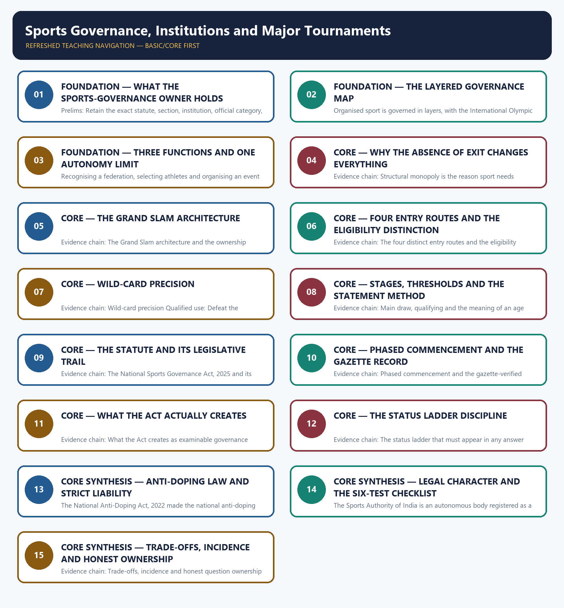

# Sports Governance, Institutions and Major Tournaments — Learner-v2 Complete Learning Session

> **Authoring-only generation:** 2026-09-02. No PDF was rendered and no tracker or index was mutated.

### SOURCE, PROGRESSION AND CURRENT-LINKAGE AUDIT

- **Generation date:** 2026-09-02.
- **Repository-first evidence:** the Basic owner is taught first and preserved in full; the Advanced owner is retained only in the optional final teaching block.
- **OCR evidence:** Repository Markdown was primary. The OCR-searchable official General Studies question papers held under books\mains and books\more_previous_papers were used only to confirm the printed wording of routed Mains demands. No official answer key, marking scheme, page precision or unsupported quotation was imported from them.
- **Qdrant:** not used; repository Markdown and available OCR context were sufficient.
- **PYQ integrity:** One applied objective demand is routed to this topic across the audited ledgers and no direct General Studies Mains demand in the audited 2018-2023 or 2024-2025 ledgers is routed here, so no Mains demand card is manufactured and no question is invented from the locally held OCR-searchable official papers. The audited 2026 Prelims ledger routes the objective demand on Grand Slam tennis governance, eligibility and wild-card participation rules to this Basic owner, and the owner's own generated 2026 integration block records the same routing. The 2026 Set-A key held locally is provisional, so no option, answer letter or distractor is recorded or inferred for it, and the demand card below supplies only the rule-architecture route by which each proposition in such an item is tested separately. The Indian statutory position was verified by the owners on 13 August 2026 and the tournament-rule position on 2 August 2026, and the package applies the status ladder throughout, so no unverified substantive-power section number, member count, tenure, age limit, quorum or penalty under the 2025 Act is asserted, no decision, inquiry or derecognition by the National Sports Board is asserted, no case decided by the National Sports Tribunal is asserted, no doping case, athlete name or sanction is asserted, no federation's recognition status is asserted, and no medal tally, funding figure or tournament result is asserted anywhere.
- **Live-link boundary:** One live official page was verified for this topic on 2026-09-02. A Ministry of Youth Affairs and Sports page on the official yas.gov.in domain was read successfully on that date and returned the text of the National Sports Policy, which states that the Central Government, in conjunction with the State Governments, the Indian Olympic Association and the National Sports Federations, will pursue the twin objectives of broad-basing of sports and achieving excellence in sports at the national and international levels, that broad-basing will primarily remain a responsibility of the State Governments while the Union Government actively supplements their efforts including for tapping latent talent in rural and tribal areas, that the Union Government and the Sports Authority of India in association with the Indian Olympic Association and the National Sports Federations will focus on achieving excellence, that a Resolution on the National Sports Policy was laid in both Houses of Parliament in August 1984, and that the question of inclusion of sports in the Concurrent List of the Constitution of India and the introduction of appropriate legislation for guiding all matters involving national and inter-State jurisdiction will be pursued; that last item is recorded strictly as a stated policy intention and is not treated as a claim about the present position of sports in the constitutional lists, and nothing further is inferred from the page. Seven further official checks were attempted on the same date and yielded no usable official text, namely the Sports Authority of India website, which returned a server error, the national anti-doping organisation's about page, which redirected away from any content, the Court of Arbitration for Sport's information pages, which returned not-found errors, the international tennis federation's rules and regulations page, which was blocked by a bot-protection interstitial, the world anti-doping agency's code page, which returned no extractable content, the international Olympic body's governance information page, which timed out, and the Press Information Bureau release page, which was refused with an access error; no content from any of them was read or used and no secondary summary has been treated as an official source. Every substantive statutory and tournament element in this package therefore rests on the repository owners with their own status checks, namely the National Sports Governance Act, 2025 introduced on 23 July 2025, passed on 11 and 12 August 2025, assented on 18 August 2025 as Act No. 25 of 2025, with select provisions in force from 1 January 2026 and a second tranche from 12 May 2026 under S.O. 2406(E) commencing sections 5(3) to 5(5), section 7, sections 17(8) to 17(9) and sections 18, 19, 21, 28 and 29, rules framed during 2026 whose individual contents remain secondary-reported, the National Sports Board and National Sports Tribunal as statutory creations whose recognition and jurisdiction provisions were not located in a commenced tranche, the National Sports Development Code of India, 2011 as the still-operative administrative recognition instrument read with the Act's deeming continuity, the National Anti-Doping Act, 2022 giving the national anti-doping organisation statutory status, the National Anti-Doping (Amendment) Act, 2025 recorded only from secondary reporting and therefore cited without section numbers or commencement dates, the Sports Authority of India as a society registered under the Societies Registration Act, 1860, and the Court of Arbitration for Sport as an international arbitral institution at Lausanne established in 1984, all as verified by the owners on 13 August 2026, together with the Grand Slam tournament and entry-route architecture verified by the owners on 2 August 2026. The controlling discipline applied throughout is that enactment is not commencement, commencement is not the framing of rules, rules are not the constitution of an institution and constitution is not operational jurisdiction. No unverified substantive-power section number, member count, tenure, age limit, quorum or penalty under the 2025 Act is asserted, no decision, inquiry or derecognition by the National Sports Board is asserted, no case decided by the National Sports Tribunal is asserted, no doping case, athlete name or sanction is asserted, no federation's recognition status is asserted, no tournament date, host, draw outcome or result is asserted, no medal tally is asserted, and no funding figure is asserted. Decorative match trivia is excluded by design, because the examinable content of this topic is institutional and legal rather than sporting.
- **Fact/inference discipline:** no current-affairs item, PYQ wording, figure or quotation is invented.

## BASIC LEARNING SESSION



*Distinct embedded teaching-navigation image. The separate continuous Cārvāka-style flowchart package remains an independent at-a-glance artifact.*

### SESSION 1 — FOUNDATION — WHAT THE SPORTS-GOVERNANCE OWNER HOLDS

#### DEFINITION / WHAT THIS IS CALLED

**Plain-language definition:** Evidence chain: What this owner holds and the two ways it is examined Qualified use: Set the correct scope and avoid decorative sporting detail from the first sentence.

**Technical definition:** Prelims: Retain the exact statute, section, institution, official category, dated edition or scope rule attached to What the sports-governance owner holds.

#### ANSWER-GRABBING OPENING — WRITE/ADAPT IN THE EXAM

> Evidence chain: What this owner holds and the two ways it is examined Qualified use: Set the correct scope and avoid decorative sporting detail from the first sentence.

#### MUST-WRITE KEYWORDS

- **FOUNDATION**
- **What the sports-governance owner holds**
- **Evidence chain**
- **Qualified use**
- **This topic**
- **This**

**How to use them:** Frame the answer through FOUNDATION; define What the sports-governance owner holds, connect Evidence chain with Qualified use to explain the mechanism, and use This topic for the decisive comparison or qualification.

#### VISUAL FIRST

```text
WHAT THE SPORTS-GOVERNANCE OWNER HOLDS
01. What this owner holds and the two ways it is examined
BOUNDARY -> No result, medal tally, athlete name, doping case or recognition status belongs in this answer.
```

*This topic-specific rail fixes the evidence sequence and its exam boundary before analysis.*

#### CORE EXPLANATION

This topic is examined in two very different ways, namely as objective precision about tournament and institutional rules and as a General Studies Paper-II governance case study on autonomy, accountability and rights in a self-regulating sector, and both are held in this owner; the analysis is confined to governance, statutory status, eligibility architecture, integrity systems and dispute routes, and it deliberately carries no match result, no medal tally, no athlete name, no doping case and no federation's current recognition status, because those are volatile or unverifiable and are not what either paper tests.

#### NAMED EVIDENCE AND MECHANISM

- This topic is examined in two very different ways, namely as objective precision about tournament and institutional rules and as a General Studies Paper-II governance case study on autonomy, accountability and rights in a self-regulating sector, and both are held in this owner; the analysis is confined to governance, statutory status, eligibility architecture, integrity systems and dispute routes, and it deliberately carries no match result, no medal tally, no athlete name, no doping case and no federation's current recognition status, because those are volatile or unverifiable and are not what either paper tests.

#### EXAMINER CAUTION

- No result, medal tally, athlete name, doping case or recognition status belongs in this answer.

#### EXAM LINK

- **Prelims:** Retain the exact statute, section, institution, official category, dated edition or scope rule attached to What the sports-governance owner holds.
- **Mains:** Set the correct scope and avoid decorative sporting detail from the first sentence.

#### MINI RECAP

- **Evidence chain:** What this owner holds and the two ways it is examined
- **Qualified use:** Set the correct scope and avoid decorative sporting detail from the first sentence.

#### CLOSING RECALL FLOW — FOUNDATION — WHAT THE SPORTS-GOVERNANCE OWNER HOLDS

```text
START / CONCEPT: FOUNDATION — What the sports-governance owner holds
        |
        v
EXACT TERMS: FOUNDATION · What the sports-governance owner holds · Evidence chain · Qualified use · This topic · This
        |
        v
MECHANISM / ARGUMENT: This topic is examined in two very different ways, namely as objective precision about tournament and institutional rules and as a General Studies Paper-II governance case study on autonomy, accountability and rights in a self-regulating sector, and both are held in this owner; the analysis is confined to governance, statutory status, eligibility architecture, integrity systems and dispute routes, and it deliberately carries no match result, no medal tally, no athlete name, no doping case and no federation's current recognition status, because those are volatile or unverifiable and are not what either paper tests.
        |
        v
CONSEQUENCE / CONTRAST: Prelims: Retain the exact statute, section, institution, official category, dated edition or scope rule attached to What the sports-governance owner holds.
        |
        v
UPSC TRAP / ANSWER-USE: Do not miss this limiting distinction: this topic is examined in two very different ways, namely as objective precision about...
        |
        v
ANSWER-GRABBING FORMULATION: Evidence chain: What this owner holds and the two ways it is examined Qualified use: Set the correct scope and avoid decorative sporting detail from the first sentence.
```
### SESSION 2 — FOUNDATION — THE LAYERED GOVERNANCE MAP

#### DEFINITION / WHAT THIS IS CALLED

**Plain-language definition:** Evidence chain: The layered governance map of organised sport - The distinct roles of the named institutions Qualified use: Place a disputed decision in the correct governing layer before analysing it.

**Technical definition:** Organised sport is governed in layers, with the International Olympic Committee governing the Olympic Movement and the Olympic Games, an international federation governing the common rules and recognition of its own sport, continental and national federations governing and representing the sport in their territory, and the tournament organiser or league governing entry conditions for its own event, above which sits the athlete's eligibility, entry, discipline and safeguarding; running parallel to that chain are an integrity layer built on the World Anti-Doping Code and implemented by a national anti-doping organisation, and a dispute layer running from internal appeal to a sport tribunal or to arbitration where applicable.

#### ANSWER-GRABBING OPENING — WRITE/ADAPT IN THE EXAM

> Evidence chain: The layered governance map of organised sport - The distinct roles of the named institutions Qualified use: Place a disputed decision in the correct governing layer before analysing it.

#### MUST-WRITE KEYWORDS

- **FOUNDATION**
- **The layered governance map**
- **Evidence chain**
- **Qualified use**
- **Organised sport**
- **Organised**

**How to use them:** Frame the answer through FOUNDATION; define The layered governance map, connect Evidence chain with Qualified use to explain the mechanism, and use Organised sport for the decisive comparison or qualification.

#### VISUAL FIRST

```text
THE LAYERED GOVERNANCE MAP
01. The layered governance map of organised sport
    |
    v
02. The distinct roles of the named institutions
BOUNDARY -> The Olympic body does not make the ordinary rules of every sport.
```

*This topic-specific rail fixes the evidence sequence and its exam boundary before analysis.*

#### CORE EXPLANATION

Organised sport is governed in layers, with the International Olympic Committee governing the Olympic Movement and the Olympic Games, an international federation governing the common rules and recognition of its own sport, continental and national federations governing and representing the sport in their territory, and the tournament organiser or league governing entry conditions for its own event, above which sits the athlete's eligibility, entry, discipline and safeguarding; running parallel to that chain are an integrity layer built on the World Anti-Doping Code and implemented by a national anti-doping organisation, and a dispute layer running from internal appeal to a sport tribunal or to arbitration where applicable. The International Olympic Committee is distinct from each sport's international federation, a national sports federation governs and represents its sport nationally subject to the applicable recognition and legal framework, the World Anti-Doping Agency writes the global code and standards and does not organise tournaments, the national anti-doping organisation implements testing and results management within its jurisdiction, the Court of Arbitration for Sport is an independent sports-dispute forum and not the ordinary rule-maker for any sport, the Ministry of Youth Affairs and Sports holds the Union policy and recognition framework, and the Sports Authority of India implements training, infrastructure and athlete support.

#### NAMED EVIDENCE AND MECHANISM

- Organised sport is governed in layers, with the International Olympic Committee governing the Olympic Movement and the Olympic Games, an international federation governing the common rules and recognition of its own sport, continental and national federations governing and representing the sport in their territory, and the tournament organiser or league governing entry conditions for its own event, above which sits the athlete's eligibility, entry, discipline and safeguarding; running parallel to that chain are an integrity layer built on the World Anti-Doping Code and implemented by a national anti-doping organisation, and a dispute layer running from internal appeal to a sport tribunal or to arbitration where applicable.
- The International Olympic Committee is distinct from each sport's international federation, a national sports federation governs and represents its sport nationally subject to the applicable recognition and legal framework, the World Anti-Doping Agency writes the global code and standards and does not organise tournaments, the national anti-doping organisation implements testing and results management within its jurisdiction, the Court of Arbitration for Sport is an independent sports-dispute forum and not the ordinary rule-maker for any sport, the Ministry of Youth Affairs and Sports holds the Union policy and recognition framework, and the Sports Authority of India implements training, infrastructure and athlete support.

#### EXAMINER CAUTION

- The Olympic body does not make the ordinary rules of every sport.

#### EXAM LINK

- **Prelims:** Retain the exact statute, section, institution, official category, dated edition or scope rule attached to The layered governance map.
- **Mains:** Place a disputed decision in the correct governing layer before analysing it.

#### MINI RECAP

- **Evidence chain:** The layered governance map of organised sport -> The distinct roles of the named institutions
- **Qualified use:** Place a disputed decision in the correct governing layer before analysing it.

#### CLOSING RECALL FLOW — FOUNDATION — THE LAYERED GOVERNANCE MAP

```text
START / CONCEPT: FOUNDATION — The layered governance map
        |
        v
EXACT TERMS: FOUNDATION · The layered governance map · Evidence chain · Qualified use · Organised sport · Organised
        |
        v
MECHANISM / ARGUMENT: Organised sport is governed in layers, with the International Olympic Committee governing the Olympic Movement and the Olympic Games, an international federation governing the common rules and recognition of its own sport, continental and national federations governing and representing the sport in their territory, and the tournament organiser or league governing entry conditions for its own event, above which sits the athlete's eligibility, entry, discipline and safeguarding; running parallel to that chain are an integrity layer built on the World Anti-Doping Code and implemented by a national anti-doping organisation, and a dispute layer running from internal appeal to a sport tribunal or to arbitration where applicable.
        |
        v
CONSEQUENCE / CONTRAST: The Olympic body does not make the ordinary rules of every sport.
        |
        v
UPSC TRAP / ANSWER-USE: The International Olympic Committee is distinct from each sport's international federation, a national sports federation governs and represents its sport nationally subject to the applicable recognition and legal framework, the World Anti-Doping Agency writes the global code and standards and does not organise tournaments, the national anti-doping organisation implements testing and results management within its jurisdiction, the Court of Arbitration for Sport is an independent sports-dispute forum and not the ordinary rule-maker for any sport, the Ministry of Youth Affairs and Sports holds the Union policy and recognition framework, and the Sports Authority of India implements training, infrastructure and athlete support.
        |
        v
ANSWER-GRABBING FORMULATION: Evidence chain: The layered governance map of organised sport - The distinct roles of the named institutions Qualified use: Place a disputed decision in the correct governing layer before analysing it.
```
### SESSION 3 — FOUNDATION — THREE FUNCTIONS AND ONE AUTONOMY LIMIT

#### DEFINITION / WHAT THIS IS CALLED

**Plain-language definition:** Evidence chain: Recognition, selection and organisation are three different functions - Autonomy is a functional protection and never a jurisdictional immunity Qualified use: Separate recognition, selection and organisation, then bound the autonomy claim.

**Technical definition:** Recognising a federation, selecting athletes and organising an event are distinct functions that are routinely merged in weak answers, and keeping them apart is what allows a governance analysis to locate the failure, because a complaint about a selection decision is not a complaint about recognition policy and a complaint about entry into an event is a matter for the organiser's rules rather than for the recognising authority.

#### ANSWER-GRABBING OPENING — WRITE/ADAPT IN THE EXAM

> Evidence chain: Recognition, selection and organisation are three different functions - Autonomy is a functional protection and never a jurisdictional immunity Qualified use: Separate recognition, selection and organisation, then bound the autonomy claim.

#### MUST-WRITE KEYWORDS

- **FOUNDATION**
- **Three functions**
- **one autonomy limit**
- **Evidence chain**
- **Qualified use**
- **Recognising**

**How to use them:** Frame the answer through FOUNDATION; define Three functions, connect one autonomy limit with Evidence chain to explain the mechanism, and use Qualified use for the decisive comparison or qualification.

#### VISUAL FIRST

```text
THREE FUNCTIONS AND ONE AUTONOMY LIMIT
01. Recognition, selection and organisation are three different functions
    |
    v
02. Autonomy is a functional protection and never a jurisdictional immunity
BOUNDARY -> Autonomy protects sporting judgement and never displaces law, audit or rights.
```

*This topic-specific rail fixes the evidence sequence and its exam boundary before analysis.*

#### CORE EXPLANATION

Recognising a federation, selecting athletes and organising an event are distinct functions that are routinely merged in weak answers, and keeping them apart is what allows a governance analysis to locate the failure, because a complaint about a selection decision is not a complaint about recognition policy and a complaint about entry into an event is a matter for the organiser's rules rather than for the recognising authority. Sporting autonomy is a functional protection for technical and selection decisions and it does not confer immunity from national law, from anti-doping rules, from financial accountability or from judicial review, because a body exercising monopoly power over a person's livelihood and career is exercising public power in substance whatever its legal form; the defensible line is that oversight directed at governance standards, finance and rights is categorically different from interference in team selection or technical rules, and it is that distinction which makes statutory regulation defensible against the charge of interference.

#### NAMED EVIDENCE AND MECHANISM

- Recognising a federation, selecting athletes and organising an event are distinct functions that are routinely merged in weak answers, and keeping them apart is what allows a governance analysis to locate the failure, because a complaint about a selection decision is not a complaint about recognition policy and a complaint about entry into an event is a matter for the organiser's rules rather than for the recognising authority.
- Sporting autonomy is a functional protection for technical and selection decisions and it does not confer immunity from national law, from anti-doping rules, from financial accountability or from judicial review, because a body exercising monopoly power over a person's livelihood and career is exercising public power in substance whatever its legal form; the defensible line is that oversight directed at governance standards, finance and rights is categorically different from interference in team selection or technical rules, and it is that distinction which makes statutory regulation defensible against the charge of interference.

#### EXAMINER CAUTION

- Autonomy protects sporting judgement and never displaces law, audit or rights.

#### EXAM LINK

- **Prelims:** Retain the exact statute, section, institution, official category, dated edition or scope rule attached to Three functions and one autonomy limit.
- **Mains:** Separate recognition, selection and organisation, then bound the autonomy claim.

#### MINI RECAP

- **Evidence chain:** Recognition, selection and organisation are three different functions -> Autonomy is a functional protection and never a jurisdictional immunity
- **Qualified use:** Separate recognition, selection and organisation, then bound the autonomy claim.

#### CLOSING RECALL FLOW — FOUNDATION — THREE FUNCTIONS AND ONE AUTONOMY LIMIT

```text
START / CONCEPT: FOUNDATION — Three functions and one autonomy limit
        |
        v
EXACT TERMS: FOUNDATION · Three functions · one autonomy limit · Evidence chain · Qualified use · Recognising
        |
        v
MECHANISM / ARGUMENT: Recognising a federation, selecting athletes and organising an event are distinct functions that are routinely merged in weak answers, and keeping them apart is what allows a governance analysis to locate the failure, because a complaint about a selection decision is not a complaint about recognition policy and a complaint about entry into an event is a matter for the organiser's rules rather than for the recognising authority.
        |
        v
CONSEQUENCE / CONTRAST: Sporting autonomy is a functional protection for technical and selection decisions and it does not confer immunity from national law, from anti-doping rules, from financial accountability or from judicial review, because a body exercising monopoly power over a person's livelihood and career is exercising public power in substance whatever its legal form; the defensible line is that oversight directed at governance standards, finance and rights is categorically different from interference in team selection or technical rules, and it is that distinction which makes statutory regulation defensible against the charge of interference.
        |
        v
UPSC TRAP / ANSWER-USE: Do not miss this limiting distinction: recognition, selection and organisation are three different functions - Autonomy is a functional protection...
        |
        v
ANSWER-GRABBING FORMULATION: Evidence chain: Recognition, selection and organisation are three different functions - Autonomy is a functional protection and never a jurisdictional immunity Qualified use: Separate recognition, selection and organisation, then bound the autonomy claim.
```
### SESSION 4 — CORE — WHY THE ABSENCE OF EXIT CHANGES EVERYTHING

#### DEFINITION / WHAT THIS IS CALLED

**Plain-language definition:** The governance problem in sport is structural monopoly, because there is ordinarily one federation per sport and no exit for the athlete, so the contractual and market disciplines that constrain an ordinary association do not operate and the athlete cannot take custom elsewhere; that absence of exit, rather than any assumption of bad faith, is what makes published criteria, recorded reasons and an independent appeal more important in sport than in most regulated sectors.

**Technical definition:** Evidence chain: Structural monopoly is the reason sport needs governing Qualified use: Explain why sport needs governing without moralising about federations.

#### ANSWER-GRABBING OPENING — WRITE/ADAPT IN THE EXAM

> The governance problem in sport is structural monopoly, because there is ordinarily one federation per sport and no exit for the athlete, so the contractual and market disciplines that constrain an ordinary association do not operate and the athlete cannot take custom elsewhere; that absence of exit, rather than any assumption of bad faith, is what makes published criteria, recorded reasons and an independent appeal more important in sport than in most regulated sectors.

#### MUST-WRITE KEYWORDS

- **Why the absence of exit changes everything**
- **Evidence chain**
- **Qualified use**
- **The governance problem in sport**
- **The problem**
- **Evidence chain: Structural monopoly**

**How to use them:** Frame the answer through Why the absence of exit changes everything; define Evidence chain, connect Qualified use with The governance problem in sport to explain the mechanism, and use The problem for the decisive comparison or qualification.

#### VISUAL FIRST

```text
WHY THE ABSENCE OF EXIT CHANGES EVERYTHING
01. Structural monopoly is the reason sport needs governing
BOUNDARY -> The problem is structural monopoly rather than any assumption of bad faith.
```

*This topic-specific rail fixes the evidence sequence and its exam boundary before analysis.*

#### CORE EXPLANATION

The governance problem in sport is structural monopoly, because there is ordinarily one federation per sport and no exit for the athlete, so the contractual and market disciplines that constrain an ordinary association do not operate and the athlete cannot take custom elsewhere; that absence of exit, rather than any assumption of bad faith, is what makes published criteria, recorded reasons and an independent appeal more important in sport than in most regulated sectors.

#### NAMED EVIDENCE AND MECHANISM

- The governance problem in sport is structural monopoly, because there is ordinarily one federation per sport and no exit for the athlete, so the contractual and market disciplines that constrain an ordinary association do not operate and the athlete cannot take custom elsewhere; that absence of exit, rather than any assumption of bad faith, is what makes published criteria, recorded reasons and an independent appeal more important in sport than in most regulated sectors.

#### EXAMINER CAUTION

- The problem is structural monopoly rather than any assumption of bad faith.

#### EXAM LINK

- **Prelims:** Retain the exact statute, section, institution, official category, dated edition or scope rule attached to Why the absence of exit changes everything.
- **Mains:** Explain why sport needs governing without moralising about federations.

#### MINI RECAP

- **Evidence chain:** Structural monopoly is the reason sport needs governing
- **Qualified use:** Explain why sport needs governing without moralising about federations.

#### CLOSING RECALL FLOW — CORE — WHY THE ABSENCE OF EXIT CHANGES EVERYTHING

```text
START / CONCEPT: CORE — Why the absence of exit changes everything
        |
        v
EXACT TERMS: Why the absence of exit changes everything · Evidence chain · Qualified use · The governance problem in sport · The problem · Evidence chain: Structural monopoly
        |
        v
MECHANISM / ARGUMENT: Evidence chain: Structural monopoly is the reason sport needs governing Qualified use: Explain why sport needs governing without moralising about federations.
        |
        v
CONSEQUENCE / CONTRAST: The problem is structural monopoly rather than any assumption of bad faith.
        |
        v
UPSC TRAP / ANSWER-USE: Do not miss this limiting distinction: explain why sport needs governing without moralising about federations.
        |
        v
ANSWER-GRABBING FORMULATION: The governance problem in sport is structural monopoly, because there is ordinarily one federation per sport and no exit for the athlete, so the contractual and market disciplines that constrain an ordinary association do not operate and the athlete cannot take custom elsewhere; that absence of exit, rather than any assumption of bad faith, is what makes published criteria, recorded reasons and an independent appeal more important in sport than in most regulated sectors.
```
### SESSION 5 — CORE — THE GRAND SLAM ARCHITECTURE

#### DEFINITION / WHAT THIS IS CALLED

**Plain-language definition:** The four Grand Slam tournaments are the Australian Open, Roland-Garros, Wimbledon and the US Open, and each event has its own organiser and ownership while the four cooperate through a shared governance structure and a common Grand Slam Rule Book, so a shared partnership in rule-making does not erase separate ownership and operation and the proposition that one owner operates all four is false; the owners verified the tournament-rule position on 2 August 2026.

**Technical definition:** Evidence chain: The Grand Slam architecture and the ownership distinction Qualified use: Get the institutional proposition right before touching eligibility.

#### ANSWER-GRABBING OPENING — WRITE/ADAPT IN THE EXAM

> The four Grand Slam tournaments are the Australian Open, Roland-Garros, Wimbledon and the US Open, and each event has its own organiser and ownership while the four cooperate through a shared governance structure and a common Grand Slam Rule Book, so a shared partnership in rule-making does not erase separate ownership and operation and the proposition that one owner operates all four is false; the owners verified the tournament-rule position on 2 August 2026.

#### MUST-WRITE KEYWORDS

- **The Grand Slam architecture**
- **Evidence chain**
- **Qualified use**
- **The four Grand Slam tournaments**
- **Grand Slam**
- **Australian Open**

**How to use them:** Frame the answer through The Grand Slam architecture; define Evidence chain, connect Qualified use with The four Grand Slam tournaments to explain the mechanism, and use Grand Slam for the decisive comparison or qualification.

#### VISUAL FIRST

```text
THE GRAND SLAM ARCHITECTURE
01. The Grand Slam architecture and the ownership distinction
BOUNDARY -> Cooperation in rule-making does not merge ownership or operation.
```

*This topic-specific rail fixes the evidence sequence and its exam boundary before analysis.*

#### CORE EXPLANATION

The four Grand Slam tournaments are the Australian Open, Roland-Garros, Wimbledon and the US Open, and each event has its own organiser and ownership while the four cooperate through a shared governance structure and a common Grand Slam Rule Book, so a shared partnership in rule-making does not erase separate ownership and operation and the proposition that one owner operates all four is false; the owners verified the tournament-rule position on 2 August 2026.

#### NAMED EVIDENCE AND MECHANISM

- The four Grand Slam tournaments are the Australian Open, Roland-Garros, Wimbledon and the US Open, and each event has its own organiser and ownership while the four cooperate through a shared governance structure and a common Grand Slam Rule Book, so a shared partnership in rule-making does not erase separate ownership and operation and the proposition that one owner operates all four is false; the owners verified the tournament-rule position on 2 August 2026.

#### EXAMINER CAUTION

- Cooperation in rule-making does not merge ownership or operation.

#### EXAM LINK

- **Prelims:** Retain the exact statute, section, institution, official category, dated edition or scope rule attached to The Grand Slam architecture.
- **Mains:** Get the institutional proposition right before touching eligibility.

#### MINI RECAP

- **Evidence chain:** The Grand Slam architecture and the ownership distinction
- **Qualified use:** Get the institutional proposition right before touching eligibility.

#### CLOSING RECALL FLOW — CORE — THE GRAND SLAM ARCHITECTURE

```text
START / CONCEPT: CORE — The Grand Slam architecture
        |
        v
EXACT TERMS: The Grand Slam architecture · Evidence chain · Qualified use · The four Grand Slam tournaments · Grand Slam · Australian Open
        |
        v
MECHANISM / ARGUMENT: Evidence chain: The Grand Slam architecture and the ownership distinction Qualified use: Get the institutional proposition right before touching eligibility.
        |
        v
CONSEQUENCE / CONTRAST: Cooperation in rule-making does not merge ownership or operation.
        |
        v
UPSC TRAP / ANSWER-USE: Do not miss this limiting distinction: the four Grand Slam tournaments are the Australian Open, Roland-Garros, Wimbledon and the US...
        |
        v
ANSWER-GRABBING FORMULATION: The four Grand Slam tournaments are the Australian Open, Roland-Garros, Wimbledon and the US Open, and each event has its own organiser and ownership while the four cooperate through a shared governance structure and a common Grand Slam Rule Book, so a shared partnership in rule-making does not erase separate ownership and operation and the proposition that one owner operates all four is false; the owners verified the tournament-rule position on 2 August 2026.
```
### SESSION 6 — CORE — FOUR ENTRY ROUTES AND THE ELIGIBILITY DISTINCTION

#### DEFINITION / WHAT THIS IS CALLED

**Plain-language definition:** Entry into a competition can arise through direct ranking acceptance, through qualifying, through a wild card or through a protected or special entry, and these routes are not interchangeable, so eligibility is a separate question from acceptance into a draw and a player who is internationally ranked does not thereby hold unlimited automatic entry; treating a broadly true description of elite sport as proof of a specific entry rule is the standard trap in this area.

**Technical definition:** Evidence chain: The four distinct entry routes and the eligibility distinction Qualified use: Replace an impression of elite sport with the exact route structure.

#### ANSWER-GRABBING OPENING — WRITE/ADAPT IN THE EXAM

> Evidence chain: The four distinct entry routes and the eligibility distinction Qualified use: Replace an impression of elite sport with the exact route structure.

#### MUST-WRITE KEYWORDS

- **Four entry routes**
- **the eligibility distinction**
- **Evidence chain**
- **Qualified use**
- **Entry**
- **Eligibility**

**How to use them:** Frame the answer through Four entry routes; define the eligibility distinction, connect Evidence chain with Qualified use to explain the mechanism, and use Entry for the decisive comparison or qualification.

#### VISUAL FIRST

```text
FOUR ENTRY ROUTES AND THE ELIGIBILITY DISTINCTION
01. The four distinct entry routes and the eligibility distinction
BOUNDARY -> Eligibility is a separate question from acceptance into a draw.
```

*This topic-specific rail fixes the evidence sequence and its exam boundary before analysis.*

#### CORE EXPLANATION

Entry into a competition can arise through direct ranking acceptance, through qualifying, through a wild card or through a protected or special entry, and these routes are not interchangeable, so eligibility is a separate question from acceptance into a draw and a player who is internationally ranked does not thereby hold unlimited automatic entry; treating a broadly true description of elite sport as proof of a specific entry rule is the standard trap in this area.

#### NAMED EVIDENCE AND MECHANISM

- Entry into a competition can arise through direct ranking acceptance, through qualifying, through a wild card or through a protected or special entry, and these routes are not interchangeable, so eligibility is a separate question from acceptance into a draw and a player who is internationally ranked does not thereby hold unlimited automatic entry; treating a broadly true description of elite sport as proof of a specific entry rule is the standard trap in this area.

#### EXAMINER CAUTION

- Eligibility is a separate question from acceptance into a draw.

#### EXAM LINK

- **Prelims:** Retain the exact statute, section, institution, official category, dated edition or scope rule attached to Four entry routes and the eligibility distinction.
- **Mains:** Replace an impression of elite sport with the exact route structure.

#### MINI RECAP

- **Evidence chain:** The four distinct entry routes and the eligibility distinction
- **Qualified use:** Replace an impression of elite sport with the exact route structure.

#### CLOSING RECALL FLOW — CORE — FOUR ENTRY ROUTES AND THE ELIGIBILITY DISTINCTION

```text
START / CONCEPT: CORE — Four entry routes and the eligibility distinction
        |
        v
EXACT TERMS: Four entry routes · the eligibility distinction · Evidence chain · Qualified use · Entry · Eligibility
        |
        v
MECHANISM / ARGUMENT: Entry into a competition can arise through direct ranking acceptance, through qualifying, through a wild card or through a protected or special entry, and these routes are not interchangeable, so eligibility is a separate question from acceptance into a draw and a player who is internationally ranked does not thereby hold unlimited automatic entry; treating a broadly true description of elite sport as proof of a specific entry rule is the standard trap in this area.
        |
        v
CONSEQUENCE / CONTRAST: Eligibility is a separate question from acceptance into a draw.
        |
        v
UPSC TRAP / ANSWER-USE: Do not miss this limiting distinction: the four distinct entry routes and the eligibility distinction Qualified use.
        |
        v
ANSWER-GRABBING FORMULATION: Evidence chain: The four distinct entry routes and the eligibility distinction Qualified use: Replace an impression of elite sport with the exact route structure.
```
### SESSION 7 — CORE — WILD-CARD PRECISION

#### DEFINITION / WHAT THIS IS CALLED

**Plain-language definition:** A wild card is a discretionary entry outside ordinary ranking-based acceptance, and two precisions decide objective statements about it, namely that it does not exempt the player from eligibility, conduct or anti-doping rules and that a limit on the number of wild-card slots available in a draw is not the same thing as a cap on how many wild cards a player may receive over a career; a statement that converts a slot limit into a lifetime player cap is therefore a distinct proposition that must be tested on its own.

**Technical definition:** Evidence chain: Wild-card precision Qualified use: Defeat the discretionary-entry proposition on its own terms.

#### ANSWER-GRABBING OPENING — WRITE/ADAPT IN THE EXAM

> A wild card is a discretionary entry outside ordinary ranking-based acceptance, and two precisions decide objective statements about it, namely that it does not exempt the player from eligibility, conduct or anti-doping rules and that a limit on the number of wild-card slots available in a draw is not the same thing as a cap on how many wild cards a player may receive over a career; a statement that converts a slot limit into a lifetime player cap is therefore a distinct proposition that must be tested on its own.

#### MUST-WRITE KEYWORDS

- **Wild-card precision**
- **Evidence chain**
- **Qualified use**
- **A wild card**
- **A limit on slots in a draw**
- **Wild-card**

**How to use them:** Frame the answer through Wild-card precision; define Evidence chain, connect Qualified use with A wild card to explain the mechanism, and use A limit on slots in a draw for the decisive comparison or qualification.

#### VISUAL FIRST

```text
WILD-CARD PRECISION
01. Wild-card precision
BOUNDARY -> A limit on slots in a draw is not a cap on a player.
```

*This topic-specific rail fixes the evidence sequence and its exam boundary before analysis.*

#### CORE EXPLANATION

A wild card is a discretionary entry outside ordinary ranking-based acceptance, and two precisions decide objective statements about it, namely that it does not exempt the player from eligibility, conduct or anti-doping rules and that a limit on the number of wild-card slots available in a draw is not the same thing as a cap on how many wild cards a player may receive over a career; a statement that converts a slot limit into a lifetime player cap is therefore a distinct proposition that must be tested on its own.

#### NAMED EVIDENCE AND MECHANISM

- A wild card is a discretionary entry outside ordinary ranking-based acceptance, and two precisions decide objective statements about it, namely that it does not exempt the player from eligibility, conduct or anti-doping rules and that a limit on the number of wild-card slots available in a draw is not the same thing as a cap on how many wild cards a player may receive over a career; a statement that converts a slot limit into a lifetime player cap is therefore a distinct proposition that must be tested on its own.

#### EXAMINER CAUTION

- A limit on slots in a draw is not a cap on a player.

#### EXAM LINK

- **Prelims:** Retain the exact statute, section, institution, official category, dated edition or scope rule attached to Wild-card precision.
- **Mains:** Defeat the discretionary-entry proposition on its own terms.

#### MINI RECAP

- **Evidence chain:** Wild-card precision
- **Qualified use:** Defeat the discretionary-entry proposition on its own terms.

#### CLOSING RECALL FLOW — CORE — WILD-CARD PRECISION

```text
START / CONCEPT: CORE — Wild-card precision
        |
        v
EXACT TERMS: Wild-card precision · Evidence chain · Qualified use · A wild card · A limit on slots in a draw · Wild-card
        |
        v
MECHANISM / ARGUMENT: Evidence chain: Wild-card precision Qualified use: Defeat the discretionary-entry proposition on its own terms.
        |
        v
CONSEQUENCE / CONTRAST: A limit on slots in a draw is not a cap on a player.
        |
        v
UPSC TRAP / ANSWER-USE: Do not miss this limiting distinction: a wild card is a discretionary entry outside ordinary ranking-based acceptance.
        |
        v
ANSWER-GRABBING FORMULATION: A wild card is a discretionary entry outside ordinary ranking-based acceptance, and two precisions decide objective statements about it, namely that it does not exempt the player from eligibility, conduct or anti-doping rules and that a limit on the number of wild-card slots available in a draw is not the same thing as a cap on how many wild cards a player may receive over a career; a statement that converts a slot limit into a lifetime player cap is therefore a distinct proposition that must be tested on its own.
```
### SESSION 8 — CORE — STAGES, THRESHOLDS AND THE STATEMENT METHOD

#### DEFINITION / WHAT THIS IS CALLED

**Plain-language definition:** The main draw and the qualifying competition are separate stages with separate draw sizes and separate entry routes, and an age threshold in a rule book is an eligibility condition rather than proof of acceptance into a draw, so an answer that reads an age rule as an entitlement to play has confused a condition of eligibility with an outcome of acceptance.

**Technical definition:** Evidence chain: Main draw, qualifying and the meaning of an age threshold - The statement-by-statement method for objective demands Qualified use: Apply proposition-by-proposition discipline to an objective demand.

#### ANSWER-GRABBING OPENING — WRITE/ADAPT IN THE EXAM

> The main draw and the qualifying competition are separate stages with separate draw sizes and separate entry routes, and an age threshold in a rule book is an eligibility condition rather than proof of acceptance into a draw, so an answer that reads an age rule as an entitlement to play has confused a condition of eligibility with an outcome of acceptance.

#### MUST-WRITE KEYWORDS

- **Stages**
- **thresholds**
- **the statement method**
- **Evidence chain**
- **Qualified use**
- **The main draw and the qualifying competition**

**How to use them:** Frame the answer through Stages; define thresholds, connect the statement method with Evidence chain to explain the mechanism, and use Qualified use for the decisive comparison or qualification.

#### VISUAL FIRST

```text
STAGES, THRESHOLDS AND THE STATEMENT METHOD
01. Main draw, qualifying and the meaning of an age threshold
    |
    v
02. The statement-by-statement method for objective demands
BOUNDARY -> A broadly true description of elite sport is not evidence of a specific rule.
```

*This topic-specific rail fixes the evidence sequence and its exam boundary before analysis.*

#### CORE EXPLANATION

The main draw and the qualifying competition are separate stages with separate draw sizes and separate entry routes, and an age threshold in a rule book is an eligibility condition rather than proof of acceptance into a draw, so an answer that reads an age rule as an entitlement to play has confused a condition of eligibility with an outcome of acceptance. An objective demand in this area typically combines an institutional proposition about shared governance, an eligibility proposition about age and ranking, and a wild-card proposition about caps, and the disciplined method is to evaluate each proposition separately against the applicable rule book rather than accepting or rejecting the set as a whole; a broadly accurate description of elite competition is not evidence of a specific entry rule, and this is precisely the confusion such items exploit.

#### NAMED EVIDENCE AND MECHANISM

- The main draw and the qualifying competition are separate stages with separate draw sizes and separate entry routes, and an age threshold in a rule book is an eligibility condition rather than proof of acceptance into a draw, so an answer that reads an age rule as an entitlement to play has confused a condition of eligibility with an outcome of acceptance.
- An objective demand in this area typically combines an institutional proposition about shared governance, an eligibility proposition about age and ranking, and a wild-card proposition about caps, and the disciplined method is to evaluate each proposition separately against the applicable rule book rather than accepting or rejecting the set as a whole; a broadly accurate description of elite competition is not evidence of a specific entry rule, and this is precisely the confusion such items exploit.

#### EXAMINER CAUTION

- A broadly true description of elite sport is not evidence of a specific rule.

#### EXAM LINK

- **Prelims:** Retain the exact statute, section, institution, official category, dated edition or scope rule attached to Stages, thresholds and the statement method.
- **Mains:** Apply proposition-by-proposition discipline to an objective demand.

#### MINI RECAP

- **Evidence chain:** Main draw, qualifying and the meaning of an age threshold -> The statement-by-statement method for objective demands
- **Qualified use:** Apply proposition-by-proposition discipline to an objective demand.

#### CLOSING RECALL FLOW — CORE — STAGES, THRESHOLDS AND THE STATEMENT METHOD

```text
START / CONCEPT: CORE — Stages, thresholds and the statement method
        |
        v
EXACT TERMS: Stages · thresholds · the statement method · Evidence chain · Qualified use · The main draw and the qualifying competition
        |
        v
MECHANISM / ARGUMENT: Evidence chain: Main draw, qualifying and the meaning of an age threshold - The statement-by-statement method for objective demands Qualified use: Apply proposition-by-proposition discipline to an objective demand.
        |
        v
CONSEQUENCE / CONTRAST: An objective demand in this area typically combines an institutional proposition about shared governance, an eligibility proposition about age and ranking, and a wild-card proposition about caps, and the disciplined method is to evaluate each proposition separately against the applicable rule book rather than accepting or rejecting the set as a whole; a broadly accurate description of elite competition is not evidence of a specific entry rule, and this is precisely the confusion such items exploit.
        |
        v
UPSC TRAP / ANSWER-USE: A broadly true description of elite sport is not evidence of a specific rule.
        |
        v
ANSWER-GRABBING FORMULATION: The main draw and the qualifying competition are separate stages with separate draw sizes and separate entry routes, and an age threshold in a rule book is an eligibility condition rather than proof of acceptance into a draw, so an answer that reads an age rule as an entitlement to play has confused a condition of eligibility with an outcome of acceptance.
```
### SESSION 9 — CORE — THE STATUTE AND ITS LEGISLATIVE TRAIL

#### DEFINITION / WHAT THIS IS CALLED

**Plain-language definition:** 25 of 2025, as verified by the owners on 13 August 2026, and its enactment means that any answer written on the earlier code-only framework, which described Indian sports governance without a national governance statute, is now wrong.

**Technical definition:** Evidence chain: The National Sports Governance Act, 2025 and its legislative trail Qualified use: Name the Act with its dates and number rather than gesturing at reform.

#### ANSWER-GRABBING OPENING — WRITE/ADAPT IN THE EXAM

> Evidence chain: The National Sports Governance Act, 2025 and its legislative trail Qualified use: Name the Act with its dates and number rather than gesturing at reform.

#### MUST-WRITE KEYWORDS

- **The statute**
- **its legislative trail**
- **Evidence chain**
- **Qualified use**
- **The National Sports Governance Act**
- **Lok Sabha**

**How to use them:** Frame the answer through The statute; define its legislative trail, connect Evidence chain with Qualified use to explain the mechanism, and use The National Sports Governance Act for the decisive comparison or qualification.

#### VISUAL FIRST

```text
THE STATUTE AND ITS LEGISLATIVE TRAIL
01. The National Sports Governance Act, 2025 and its legislative trail
BOUNDARY -> An answer written on the earlier code-only framework is now wrong.
```

*This topic-specific rail fixes the evidence sequence and its exam boundary before analysis.*

#### CORE EXPLANATION

The National Sports Governance Act, 2025 was introduced in the Lok Sabha on 23 July 2025, passed by the Lok Sabha on 11 August 2025 and by the Rajya Sabha on 12 August 2025, received assent on 18 August 2025 and is Act No. 25 of 2025, as verified by the owners on 13 August 2026, and its enactment means that any answer written on the earlier code-only framework, which described Indian sports governance without a national governance statute, is now wrong.

#### NAMED EVIDENCE AND MECHANISM

- The National Sports Governance Act, 2025 was introduced in the Lok Sabha on 23 July 2025, passed by the Lok Sabha on 11 August 2025 and by the Rajya Sabha on 12 August 2025, received assent on 18 August 2025 and is Act No. 25 of 2025, as verified by the owners on 13 August 2026, and its enactment means that any answer written on the earlier code-only framework, which described Indian sports governance without a national governance statute, is now wrong.

#### EXAMINER CAUTION

- An answer written on the earlier code-only framework is now wrong.

#### EXAM LINK

- **Prelims:** Retain the exact statute, section, institution, official category, dated edition or scope rule attached to The statute and its legislative trail.
- **Mains:** Name the Act with its dates and number rather than gesturing at reform.

#### MINI RECAP

- **Evidence chain:** The National Sports Governance Act, 2025 and its legislative trail
- **Qualified use:** Name the Act with its dates and number rather than gesturing at reform.

#### CLOSING RECALL FLOW — CORE — THE STATUTE AND ITS LEGISLATIVE TRAIL

```text
START / CONCEPT: CORE — The statute and its legislative trail
        |
        v
EXACT TERMS: The statute · its legislative trail · Evidence chain · Qualified use · The National Sports Governance Act · Lok Sabha
        |
        v
MECHANISM / ARGUMENT: 25 of 2025, as verified by the owners on 13 August 2026, and its enactment means that any answer written on the earlier code-only framework, which described Indian sports governance without a national governance statute, is now wrong.
        |
        v
CONSEQUENCE / CONTRAST: The National Sports Governance Act, 2025 was introduced in the Lok Sabha on 23 July 2025, passed by the Lok Sabha on 11 August 2025 and by the Rajya Sabha on 12 August 2025, received assent on 18 August 2025 and is Act No.
        |
        v
UPSC TRAP / ANSWER-USE: An answer written on the earlier code-only framework is now wrong.
        |
        v
ANSWER-GRABBING FORMULATION: Evidence chain: The National Sports Governance Act, 2025 and its legislative trail Qualified use: Name the Act with its dates and number rather than gesturing at reform.
```
### SESSION 10 — CORE — PHASED COMMENCEMENT AND THE GAZETTE RECORD

#### DEFINITION / WHAT THIS IS CALLED

**Plain-language definition:** Commencement of the Act is phased rather than immediate, with select provisions in force from 1 January 2026 and a second tranche from 12 May 2026 under S.O.

**Technical definition:** Evidence chain: Phased commencement and the gazette-verified tranche Qualified use: Cite commencement with its instrument instead of implying full operation.

#### ANSWER-GRABBING OPENING — WRITE/ADAPT IN THE EXAM

> Commencement of the Act is phased rather than immediate, with select provisions in force from 1 January 2026 and a second tranche from 12 May 2026 under S.O.

#### MUST-WRITE KEYWORDS

- **Phased commencement**
- **the gazette record**
- **Evidence chain**
- **Qualified use**
- **Commencement of the Act**
- **Commencement**

**How to use them:** Frame the answer through Phased commencement; define the gazette record, connect Evidence chain with Qualified use to explain the mechanism, and use Commencement of the Act for the decisive comparison or qualification.

#### VISUAL FIRST

```text
PHASED COMMENCEMENT AND THE GAZETTE RECORD
01. Phased commencement and the gazette-verified tranche
BOUNDARY -> Rule contents and the first tranche list remain secondary-reported and need verification.
```

*This topic-specific rail fixes the evidence sequence and its exam boundary before analysis.*

#### CORE EXPLANATION

Commencement of the Act is phased rather than immediate, with select provisions in force from 1 January 2026 and a second tranche from 12 May 2026 under S.O. 2406(E), which the owners record as commencing sections 5(3) to 5(5), section 7, section 17(8) to 17(9) and sections 18, 19, 21, 28 and 29; rules under the Act were framed during 2026 and their existence is recorded while individual rule contents remain secondary-reported and must be verified before detailed citation, and the specific list of provisions commenced on 1 January 2026 is likewise recorded as secondary-reported.

#### NAMED EVIDENCE AND MECHANISM

- Commencement of the Act is phased rather than immediate, with select provisions in force from 1 January 2026 and a second tranche from 12 May 2026 under S.O. 2406(E), which the owners record as commencing sections 5(3) to 5(5), section 7, section 17(8) to 17(9) and sections 18, 19, 21, 28 and 29; rules under the Act were framed during 2026 and their existence is recorded while individual rule contents remain secondary-reported and must be verified before detailed citation, and the specific list of provisions commenced on 1 January 2026 is likewise recorded as secondary-reported.

#### EXAMINER CAUTION

- Rule contents and the first tranche list remain secondary-reported and need verification.

#### EXAM LINK

- **Prelims:** Retain the exact statute, section, institution, official category, dated edition or scope rule attached to Phased commencement and the gazette record.
- **Mains:** Cite commencement with its instrument instead of implying full operation.

#### MINI RECAP

- **Evidence chain:** Phased commencement and the gazette-verified tranche
- **Qualified use:** Cite commencement with its instrument instead of implying full operation.

#### CLOSING RECALL FLOW — CORE — PHASED COMMENCEMENT AND THE GAZETTE RECORD

```text
START / CONCEPT: CORE — Phased commencement and the gazette record
        |
        v
EXACT TERMS: Phased commencement · the gazette record · Evidence chain · Qualified use · Commencement of the Act · Commencement
        |
        v
MECHANISM / ARGUMENT: Evidence chain: Phased commencement and the gazette-verified tranche Qualified use: Cite commencement with its instrument instead of implying full operation.
        |
        v
CONSEQUENCE / CONTRAST: 2406(E), which the owners record as commencing sections 5(3) to 5(5), section 7, section 17(8) to 17(9) and sections 18, 19, 21, 28 and 29; rules under the Act were framed during 2026 and their existence is recorded while individual rule contents remain secondary-reported and must be verified before detailed citation, and the specific list of provisions commenced on 1 January 2026 is likewise recorded as secondary-reported.
        |
        v
UPSC TRAP / ANSWER-USE: Do not miss this limiting distinction: phased commencement and the gazette-verified tranche Qualified use.
        |
        v
ANSWER-GRABBING FORMULATION: Commencement of the Act is phased rather than immediate, with select provisions in force from 1 January 2026 and a second tranche from 12 May 2026 under S.O.
```
### SESSION 11 — CORE — WHAT THE ACT ACTUALLY CREATES

#### DEFINITION / WHAT THIS IS CALLED

**Plain-language definition:** Prelims: Retain the exact statute, section, institution, official category, dated edition or scope rule attached to What the Act actually creates.

**Technical definition:** Evidence chain: What the Act creates as examinable governance content Qualified use: Supply the examinable institutional content of the reform.

#### ANSWER-GRABBING OPENING — WRITE/ADAPT IN THE EXAM

> Prelims: Retain the exact statute, section, institution, official category, dated edition or scope rule attached to What the Act actually creates.

#### MUST-WRITE KEYWORDS

- **What the Act actually creates**
- **Evidence chain**
- **Qualified use**
- **The Act**
- **National Sports Board**
- **National Sports Tribunal**

**How to use them:** Frame the answer through What the Act actually creates; define Evidence chain, connect Qualified use with The Act to explain the mechanism, and use National Sports Board for the decisive comparison or qualification.

#### VISUAL FIRST

```text
WHAT THE ACT ACTUALLY CREATES
01. What the Act creates as examinable governance content
BOUNDARY -> Design in the statute is not the same as exercise of the power.
```

*This topic-specific rail fixes the evidence sequence and its exam boundary before analysis.*

#### CORE EXPLANATION

The Act creates a National Sports Board as a statutory body whose recognition and regulatory jurisdiction it designs, a National Sports Tribunal as a statutory forum designed for sports disputes, and a structured statutory category of national sports bodies covering the Olympic and Paralympic bodies, National Sports Federations and regional federations with compliance conditions attached to recognition, and its stated purposes include alignment with international charter standards, athlete welfare and representation, ethics arrangements, gender representation and transparency, with bodies receiving public funding brought within the ambit of the Right to Information Act.

#### NAMED EVIDENCE AND MECHANISM

- The Act creates a National Sports Board as a statutory body whose recognition and regulatory jurisdiction it designs, a National Sports Tribunal as a statutory forum designed for sports disputes, and a structured statutory category of national sports bodies covering the Olympic and Paralympic bodies, National Sports Federations and regional federations with compliance conditions attached to recognition, and its stated purposes include alignment with international charter standards, athlete welfare and representation, ethics arrangements, gender representation and transparency, with bodies receiving public funding brought within the ambit of the Right to Information Act.

#### EXAMINER CAUTION

- Design in the statute is not the same as exercise of the power.

#### EXAM LINK

- **Prelims:** Retain the exact statute, section, institution, official category, dated edition or scope rule attached to What the Act actually creates.
- **Mains:** Supply the examinable institutional content of the reform.

#### MINI RECAP

- **Evidence chain:** What the Act creates as examinable governance content
- **Qualified use:** Supply the examinable institutional content of the reform.

#### CLOSING RECALL FLOW — CORE — WHAT THE ACT ACTUALLY CREATES

```text
START / CONCEPT: CORE — What the Act actually creates
        |
        v
EXACT TERMS: What the Act actually creates · Evidence chain · Qualified use · The Act · National Sports Board · National Sports Tribunal
        |
        v
MECHANISM / ARGUMENT: Evidence chain: What the Act creates as examinable governance content Qualified use: Supply the examinable institutional content of the reform.
        |
        v
CONSEQUENCE / CONTRAST: Design in the statute is not the same as exercise of the power.
        |
        v
UPSC TRAP / ANSWER-USE: Do not miss this limiting distinction: the Act creates a National Sports Board as a statutory body whose recognition and...
        |
        v
ANSWER-GRABBING FORMULATION: Prelims: Retain the exact statute, section, institution, official category, dated edition or scope rule attached to What the Act actually creates.
```
### SESSION 12 — CORE — THE STATUS LADDER DISCIPLINE

#### DEFINITION / WHAT THIS IS CALLED

**Plain-language definition:** The controlling discipline is the status ladder that enactment is not commencement of a provision, commencement is not the framing of rules, rules are not the constitution of an institution, and constitution is not operational jurisdiction, and applying that ladder to the verified record means that the principal recognition-power provision was not located in a commenced tranche as of 13 August 2026, that the Tribunal's jurisdiction and appeal provisions were likewise not located in the commenced tranches, and that the National Sports Development Code of India, 2011 therefore remains the operative recognition framework read with the Act's deeming continuity for previously recognised bodies until the recognition jurisdiction is commenced and operationalised.

**Technical definition:** Evidence chain: The status ladder that must appear in any answer Qualified use: Write the one paragraph that separates a current answer from an outdated one.

#### ANSWER-GRABBING OPENING — WRITE/ADAPT IN THE EXAM

> The controlling discipline is the status ladder that enactment is not commencement of a provision, commencement is not the framing of rules, rules are not the constitution of an institution, and constitution is not operational jurisdiction, and applying that ladder to the verified record means that the principal recognition-power provision was not located in a commenced tranche as of 13 August 2026, that the Tribunal's jurisdiction and appeal provisions were likewise not located in the commenced tranches, and that the National Sports Development Code of India, 2011 therefore remains the operative recognition framework read with the Act's deeming continuity for previously recognised bodies until the recognition jurisdiction is commenced and operationalised.

#### MUST-WRITE KEYWORDS

- **The status ladder discipline**
- **Evidence chain**
- **Qualified use**
- **The controlling discipline**
- **Tribunal's**
- **National Sports Development Code**

**How to use them:** Frame the answer through The status ladder discipline; define Evidence chain, connect Qualified use with The controlling discipline to explain the mechanism, and use Tribunal's for the decisive comparison or qualification.

#### VISUAL FIRST

```text
THE STATUS LADDER DISCIPLINE
01. The status ladder that must appear in any answer
BOUNDARY -> The 2011 Code remains the operative recognition framework on the verified record.
```

*This topic-specific rail fixes the evidence sequence and its exam boundary before analysis.*

#### CORE EXPLANATION

The controlling discipline is the status ladder that enactment is not commencement of a provision, commencement is not the framing of rules, rules are not the constitution of an institution, and constitution is not operational jurisdiction, and applying that ladder to the verified record means that the principal recognition-power provision was not located in a commenced tranche as of 13 August 2026, that the Tribunal's jurisdiction and appeal provisions were likewise not located in the commenced tranches, and that the National Sports Development Code of India, 2011 therefore remains the operative recognition framework read with the Act's deeming continuity for previously recognised bodies until the recognition jurisdiction is commenced and operationalised.

#### NAMED EVIDENCE AND MECHANISM

- The controlling discipline is the status ladder that enactment is not commencement of a provision, commencement is not the framing of rules, rules are not the constitution of an institution, and constitution is not operational jurisdiction, and applying that ladder to the verified record means that the principal recognition-power provision was not located in a commenced tranche as of 13 August 2026, that the Tribunal's jurisdiction and appeal provisions were likewise not located in the commenced tranches, and that the National Sports Development Code of India, 2011 therefore remains the operative recognition framework read with the Act's deeming continuity for previously recognised bodies until the recognition jurisdiction is commenced and operationalised.

#### EXAMINER CAUTION

- The 2011 Code remains the operative recognition framework on the verified record.

#### EXAM LINK

- **Prelims:** Retain the exact statute, section, institution, official category, dated edition or scope rule attached to The status ladder discipline.
- **Mains:** Write the one paragraph that separates a current answer from an outdated one.

#### MINI RECAP

- **Evidence chain:** The status ladder that must appear in any answer
- **Qualified use:** Write the one paragraph that separates a current answer from an outdated one.

#### CLOSING RECALL FLOW — CORE — THE STATUS LADDER DISCIPLINE

```text
START / CONCEPT: CORE — The status ladder discipline
        |
        v
EXACT TERMS: The status ladder discipline · Evidence chain · Qualified use · The controlling discipline · Tribunal's · National Sports Development Code
        |
        v
MECHANISM / ARGUMENT: Evidence chain: The status ladder that must appear in any answer Qualified use: Write the one paragraph that separates a current answer from an outdated one.
        |
        v
CONSEQUENCE / CONTRAST: The 2011 Code remains the operative recognition framework on the verified record.
        |
        v
UPSC TRAP / ANSWER-USE: Do not miss this limiting distinction: write the one paragraph that separates a current answer from an outdated one.
        |
        v
ANSWER-GRABBING FORMULATION: The controlling discipline is the status ladder that enactment is not commencement of a provision, commencement is not the framing of rules, rules are not the constitution of an institution, and constitution is not operational jurisdiction, and applying that ladder to the verified record means that the principal recognition-power provision was not located in a commenced tranche as of 13 August 2026, that the Tribunal's jurisdiction and appeal provisions were likewise not located in the commenced tranches, and that the National Sports Development Code of India, 2011 therefore remains the operative recognition framework read with the Act's deeming continuity for previously recognised bodies until the recognition jurisdiction is commenced and operationalised.
```
### SESSION 13 — CORE SYNTHESIS — ANTI-DOPING LAW AND STRICT LIABILITY

#### DEFINITION / WHAT THIS IS CALLED

**Plain-language definition:** The anti-doping chain runs from the World Anti-Doping Code, which the global agency writes, through the national statute and the national organisation that conducts testing and results management, to an appeal that may lie to the Court of Arbitration for Sport, and the single most examinable concept in it is strict liability, under which an athlete is responsible for what is found in their body irrespective of intent; strict liability is necessary because intent is generally unprovable and it is genuinely harsh on an athlete affected by contamination or by negligent support staff, which is why due process, accredited testing and reasoned results management are the conditions that keep it defensible.

**Technical definition:** The National Anti-Doping Act, 2022 made the national anti-doping organisation a statutory body in place of its earlier society-registered form and supplies the statutory framework for anti-doping rule violations and results management in India, which is a genuine change of legal status in 2022; a National Anti-Doping (Amendment) Act, 2025 has been enacted and its reported thrust is to strengthen the operational independence of that body's leadership from sports federations and government agencies, to relocate the power to constitute the appeal panel and to clarify appeal routes to the Court of Arbitration for Sport, but this item is recorded from secondary reporting rather than from a gazette text obtained during the audit, so it must be described as an enacted amendment whose detailed provisions require verification and its section numbers and commencement dates must not be stated.

#### ANSWER-GRABBING OPENING — WRITE/ADAPT IN THE EXAM

> The anti-doping chain runs from the World Anti-Doping Code, which the global agency writes, through the national statute and the national organisation that conducts testing and results management, to an appeal that may lie to the Court of Arbitration for Sport, and the single most examinable concept in it is strict liability, under which an athlete is responsible for what is found in their body irrespective of intent; strict liability is necessary because intent is generally unprovable and it is genuinely harsh on an athlete affected by contamination or by negligent support staff, which is why due process, accredited testing and reasoned results management are the conditions that keep it defensible.

#### MUST-WRITE KEYWORDS

- **CORE SYNTHESIS**
- **Anti-doping law**
- **strict liability**
- **Evidence chain**
- **Qualified use**
- **The National Anti-Doping Act**

**How to use them:** Frame the answer through CORE SYNTHESIS; define Anti-doping law, connect strict liability with Evidence chain to explain the mechanism, and use Qualified use for the decisive comparison or qualification.

#### VISUAL FIRST

```text
ANTI-DOPING LAW AND STRICT LIABILITY
01. The anti-doping statutory layer and the amendment recorded as unverified
    |
    v
02. Layered anti-doping jurisdiction and strict liability
BOUNDARY -> Section numbers and commencement dates of the 2025 amendment must not be stated.
```

*This topic-specific rail fixes the evidence sequence and its exam boundary before analysis.*

#### CORE EXPLANATION

The National Anti-Doping Act, 2022 made the national anti-doping organisation a statutory body in place of its earlier society-registered form and supplies the statutory framework for anti-doping rule violations and results management in India, which is a genuine change of legal status in 2022; a National Anti-Doping (Amendment) Act, 2025 has been enacted and its reported thrust is to strengthen the operational independence of that body's leadership from sports federations and government agencies, to relocate the power to constitute the appeal panel and to clarify appeal routes to the Court of Arbitration for Sport, but this item is recorded from secondary reporting rather than from a gazette text obtained during the audit, so it must be described as an enacted amendment whose detailed provisions require verification and its section numbers and commencement dates must not be stated. The anti-doping chain runs from the World Anti-Doping Code, which the global agency writes, through the national statute and the national organisation that conducts testing and results management, to an appeal that may lie to the Court of Arbitration for Sport, and the single most examinable concept in it is strict liability, under which an athlete is responsible for what is found in their body irrespective of intent; strict liability is necessary because intent is generally unprovable and it is genuinely harsh on an athlete affected by contamination or by negligent support staff, which is why due process, accredited testing and reasoned results management are the conditions that keep it defensible.

#### NAMED EVIDENCE AND MECHANISM

- The National Anti-Doping Act, 2022 made the national anti-doping organisation a statutory body in place of its earlier society-registered form and supplies the statutory framework for anti-doping rule violations and results management in India, which is a genuine change of legal status in 2022; a National Anti-Doping (Amendment) Act, 2025 has been enacted and its reported thrust is to strengthen the operational independence of that body's leadership from sports federations and government agencies, to relocate the power to constitute the appeal panel and to clarify appeal routes to the Court of Arbitration for Sport, but this item is recorded from secondary reporting rather than from a gazette text obtained during the audit, so it must be described as an enacted amendment whose detailed provisions require verification and its section numbers and commencement dates must not be stated.
- The anti-doping chain runs from the World Anti-Doping Code, which the global agency writes, through the national statute and the national organisation that conducts testing and results management, to an appeal that may lie to the Court of Arbitration for Sport, and the single most examinable concept in it is strict liability, under which an athlete is responsible for what is found in their body irrespective of intent; strict liability is necessary because intent is generally unprovable and it is genuinely harsh on an athlete affected by contamination or by negligent support staff, which is why due process, accredited testing and reasoned results management are the conditions that keep it defensible.

#### EXAMINER CAUTION

- Section numbers and commencement dates of the 2025 amendment must not be stated.

#### EXAM LINK

- **Prelims:** Retain the exact statute, section, institution, official category, dated edition or scope rule attached to Anti-doping law and strict liability.
- **Mains:** Handle a fast-moving integrity layer without overstating the record.

#### MINI RECAP

- **Evidence chain:** The anti-doping statutory layer and the amendment recorded as unverified -> Layered anti-doping jurisdiction and strict liability
- **Qualified use:** Handle a fast-moving integrity layer without overstating the record.

#### CLOSING RECALL FLOW — CORE SYNTHESIS — ANTI-DOPING LAW AND STRICT LIABILITY

```text
START / CONCEPT: CORE SYNTHESIS — Anti-doping law and strict liability
        |
        v
EXACT TERMS: CORE SYNTHESIS · Anti-doping law · strict liability · Evidence chain · Qualified use · The National Anti-Doping Act
        |
        v
MECHANISM / ARGUMENT: Evidence chain: The anti-doping statutory layer and the amendment recorded as unverified - Layered anti-doping jurisdiction and strict liability Qualified use: Handle a fast-moving integrity layer without overstating the record.
        |
        v
CONSEQUENCE / CONTRAST: The National Anti-Doping Act, 2022 made the national anti-doping organisation a statutory body in place of its earlier society-registered form and supplies the statutory framework for anti-doping rule violations and results management in India, which is a genuine change of legal status in 2022; a National Anti-Doping (Amendment) Act, 2025 has been enacted and its reported thrust is to strengthen the operational independence of that body's leadership from sports federations and government agencies, to relocate the power to constitute the appeal panel and to clarify appeal routes to the Court of Arbitration for Sport, but this item is recorded from secondary reporting rather than from a gazette text obtained during the audit, so it must be described as an enacted amendment whose detailed provisions require verification and its section numbers and commencement dates must not be stated.
        |
        v
UPSC TRAP / ANSWER-USE: Section numbers and commencement dates of the 2025 amendment must not be stated.
        |
        v
ANSWER-GRABBING FORMULATION: The anti-doping chain runs from the World Anti-Doping Code, which the global agency writes, through the national statute and the national organisation that conducts testing and results management, to an appeal that may lie to the Court of Arbitration for Sport, and the single most examinable concept in it is strict liability, under which an athlete is responsible for what is found in their body irrespective of intent; strict liability is necessary because intent is generally unprovable and it is genuinely harsh on an athlete affected by contamination or by negligent support staff, which is why due process, accredited testing and reasoned results management are the conditions that keep it defensible.
```
### SESSION 14 — CORE SYNTHESIS — LEGAL CHARACTER AND THE SIX-TEST CHECKLIST

#### DEFINITION / WHAT THIS IS CALLED

**Plain-language definition:** Evidence chain: Institutional legal character, the distinction most often got wrong - The six-test checklist for any sports body or governance failure Qualified use: Transfer the framework to an unfamiliar body or governance failure.

**Technical definition:** The Sports Authority of India is an autonomous body registered as a society under the Societies Registration Act, 1860 under the Ministry of Youth Affairs and Sports and is not a statutory corporation created by its own Act, and the 2025 statute brings sports bodies within a statutory regulatory framework without converting that organisational form; the national anti-doping organisation is statutory under the 2022 Act, the National Sports Board and the National Sports Tribunal are statutory creations under the 2025 Act, National Sports Federations remain private associations that require recognition, the Indian Olympic Association is the National Olympic Committee and a private body within the Olympic Movement whose charter autonomy coexists with national law, and the Court of Arbitration for Sport is an international arbitral institution based in Lausanne and established in 1984 rather than a court of any state or a rule-maker for any sport.

#### ANSWER-GRABBING OPENING — WRITE/ADAPT IN THE EXAM

> Evidence chain: Institutional legal character, the distinction most often got wrong - The six-test checklist for any sports body or governance failure Qualified use: Transfer the framework to an unfamiliar body or governance failure.

#### MUST-WRITE KEYWORDS

- **CORE SYNTHESIS**
- **Legal character**
- **the six-test checklist**
- **Evidence chain**
- **Qualified use**
- **The Sports Authority of India**

**How to use them:** Frame the answer through CORE SYNTHESIS; define Legal character, connect the six-test checklist with Evidence chain to explain the mechanism, and use Qualified use for the decisive comparison or qualification.

#### VISUAL FIRST

```text
LEGAL CHARACTER AND THE SIX-TEST CHECKLIST
01. Institutional legal character, the distinction most often got wrong
    |
    v
02. The six-test checklist for any sports body or governance failure
BOUNDARY -> A society is not a statutory corporation and an arbitral institution is not a court.
```

*This topic-specific rail fixes the evidence sequence and its exam boundary before analysis.*

#### CORE EXPLANATION

The Sports Authority of India is an autonomous body registered as a society under the Societies Registration Act, 1860 under the Ministry of Youth Affairs and Sports and is not a statutory corporation created by its own Act, and the 2025 statute brings sports bodies within a statutory regulatory framework without converting that organisational form; the national anti-doping organisation is statutory under the 2022 Act, the National Sports Board and the National Sports Tribunal are statutory creations under the 2025 Act, National Sports Federations remain private associations that require recognition, the Indian Olympic Association is the National Olympic Committee and a private body within the Olympic Movement whose charter autonomy coexists with national law, and the Court of Arbitration for Sport is an international arbitral institution based in Lausanne and established in 1984 rather than a court of any state or a rule-maker for any sport. Any sports body or governance failure, including an unfamiliar federation dispute or eligibility controversy, can be assessed on six tests, namely the basis of authority and whether it rests on statute, recognition, contract or a private rule book, recognition and its conditions including who recognises on what published criteria and whether recognition can be withdrawn with reasons, internal governance covering elections, tenure limits, athlete and gender representation, conflict-of-interest rules and published audited accounts, selection and eligibility covering whether criteria are published before the selection cycle, applied consistently and supported by reasons for exclusion, dispute resolution covering an independent forum with notice, hearing, reasons and appeal and whether the athlete is required to waive access to courts, and athlete protection covering safeguarding against abuse and harassment, grievance channels independent of the coach and federation, health and injury support and protection from retaliation for complaining.

#### NAMED EVIDENCE AND MECHANISM

- The Sports Authority of India is an autonomous body registered as a society under the Societies Registration Act, 1860 under the Ministry of Youth Affairs and Sports and is not a statutory corporation created by its own Act, and the 2025 statute brings sports bodies within a statutory regulatory framework without converting that organisational form; the national anti-doping organisation is statutory under the 2022 Act, the National Sports Board and the National Sports Tribunal are statutory creations under the 2025 Act, National Sports Federations remain private associations that require recognition, the Indian Olympic Association is the National Olympic Committee and a private body within the Olympic Movement whose charter autonomy coexists with national law, and the Court of Arbitration for Sport is an international arbitral institution based in Lausanne and established in 1984 rather than a court of any state or a rule-maker for any sport.
- Any sports body or governance failure, including an unfamiliar federation dispute or eligibility controversy, can be assessed on six tests, namely the basis of authority and whether it rests on statute, recognition, contract or a private rule book, recognition and its conditions including who recognises on what published criteria and whether recognition can be withdrawn with reasons, internal governance covering elections, tenure limits, athlete and gender representation, conflict-of-interest rules and published audited accounts, selection and eligibility covering whether criteria are published before the selection cycle, applied consistently and supported by reasons for exclusion, dispute resolution covering an independent forum with notice, hearing, reasons and appeal and whether the athlete is required to waive access to courts, and athlete protection covering safeguarding against abuse and harassment, grievance channels independent of the coach and federation, health and injury support and protection from retaliation for complaining.

#### EXAMINER CAUTION

- A society is not a statutory corporation and an arbitral institution is not a court.

#### EXAM LINK

- **Prelims:** Retain the exact statute, section, institution, official category, dated edition or scope rule attached to Legal character and the six-test checklist.
- **Mains:** Transfer the framework to an unfamiliar body or governance failure.

#### MINI RECAP

- **Evidence chain:** Institutional legal character, the distinction most often got wrong -> The six-test checklist for any sports body or governance failure
- **Qualified use:** Transfer the framework to an unfamiliar body or governance failure.

#### CLOSING RECALL FLOW — CORE SYNTHESIS — LEGAL CHARACTER AND THE SIX-TEST CHECKLIST

```text
START / CONCEPT: CORE SYNTHESIS — Legal character and the six-test checklist
        |
        v
EXACT TERMS: CORE SYNTHESIS · Legal character · the six-test checklist · Evidence chain · Qualified use · The Sports Authority of India
        |
        v
MECHANISM / ARGUMENT: The Sports Authority of India is an autonomous body registered as a society under the Societies Registration Act, 1860 under the Ministry of Youth Affairs and Sports and is not a statutory corporation created by its own Act, and the 2025 statute brings sports bodies within a statutory regulatory framework without converting that organisational form; the national anti-doping organisation is statutory under the 2022 Act, the National Sports Board and the National Sports Tribunal are statutory creations under the 2025 Act, National Sports Federations remain private associations that require recognition, the Indian Olympic Association is the National Olympic Committee and a private body within the Olympic Movement whose charter autonomy coexists with national law, and the Court of Arbitration for Sport is an international arbitral institution based in Lausanne and established in 1984 rather than a court of any state or a rule-maker for any sport.
        |
        v
CONSEQUENCE / CONTRAST: A society is not a statutory corporation and an arbitral institution is not a court.
        |
        v
UPSC TRAP / ANSWER-USE: Do not miss this limiting distinction: any sports body or governance failure, including an unfamiliar federation dispute or eligibility controversy...
        |
        v
ANSWER-GRABBING FORMULATION: Evidence chain: Institutional legal character, the distinction most often got wrong - The six-test checklist for any sports body or governance failure Qualified use: Transfer the framework to an unfamiliar body or governance failure.
```
### SESSION 15 — CORE SYNTHESIS — TRADE-OFFS, INCIDENCE AND HONEST OWNERSHIP

#### DEFINITION / WHAT THIS IS CALLED

**Plain-language definition:** ✅ Sports federation autonomy does not mean immunity from national law, anti-doping rules, financial accountability or judicial review. ✅ Recognition of a federation, selection of athletes and organisation of an event are distinct functions. ✅ Eligibility, qualification, ranking acceptance and wild-card entry are distinct routes or thresholds. ✅ WADA frames the global code; national bodies implement testing and results management within their jurisdiction. ✅ CAS adjudication is different from tournament administration. ❌ IOC governs every sport's ordinary rules. - International federations govern sport-specific rules. ❌ A wild card means rules do not apply. - The player bypasses ordinary ranking acceptance, not eligibility, conduct or anti-doping rules. ❌ Shared governance means a single owner operates all four Grand Slams. - Cooperation and ownership are separate questions.

**Technical definition:** Evidence chain: Trade-offs, incidence and honest question ownership Qualified use: Close a twenty-mark answer with balance, incidence and an explicit data boundary.

#### ANSWER-GRABBING OPENING — WRITE/ADAPT IN THE EXAM

> Evidence chain: Trade-offs, incidence and honest question ownership Qualified use: Close a twenty-mark answer with balance, incidence and an explicit data boundary.

#### MUST-WRITE KEYWORDS

- **CORE SYNTHESIS**
- **Trade-offs**
- **incidence**
- **honest ownership**
- **Evidence chain**
- **Qualified use**

**How to use them:** Frame the answer through CORE SYNTHESIS; define Trade-offs, connect incidence with honest ownership to explain the mechanism, and use Evidence chain for the decisive comparison or qualification.

#### VISUAL FIRST

```text
TRADE-OFFS, INCIDENCE AND HONEST OWNERSHIP
01. Trade-offs, incidence and honest question ownership
BOUNDARY -> Policy intention about the Concurrent List is not a claim about the present entry list.
```

*This topic-specific rail fixes the evidence sequence and its exam boundary before analysis.*

#### CORE EXPLANATION

The honest trade-offs are that international charters protect sports bodies from government interference so that excessive interference can risk international suspension of a national body while oversight of governance, finance and rights remains categorically different, that a specialist tribunal brings speed and domain knowledge which matter when a selection dispute must be settled before a competition while raising the same appointment-independence questions as tribunals generally, that governance attention and funding follow medals so broad-base and school sport have weaker constituencies, that event and broadcast revenue concentrates at federation and organiser level so athlete representation in governance is the mechanism that addresses it, and that a national statute does not by itself reform State-level associations; incidence is uneven because the athlete has the shortest career horizon, the least bargaining power and a real fear of retaliation, the coach and support staff hold day-to-day power which is why safeguarding channels must be independent of them, and the national federation holds monopoly recognition while depending on public funding. A Ministry of Youth Affairs and Sports page read on 2 September 2026 carries the National Sports Policy text stating that broad-basing of sports remains primarily a responsibility of the State Governments with the Union Government supplementing their efforts, and that the question of inclusion of sports in the Concurrent List of the Constitution and the introduction of appropriate legislation for guiding all matters involving national and inter-State jurisdiction will be pursued, which is recorded as a stated policy intention and not as a claim about the present entry-list position. On ownership, the audited 2026 Prelims ledger routes one objective demand on Grand Slam tennis governance, eligibility and wild-card participation rules to this Basic owner, the locally held 2026 Set-A key is provisional so no option, answer letter or distractor is recorded or inferred, and no direct Mains demand in the audited 2018-2023 or 2024-2025 ledgers is routed here; no unverified substantive-power section number, member count, tenure, age limit, quorum or penalty under the 2025 Act is asserted, no decision, inquiry or derecognition by the Board is asserted, no case decided by the Tribunal is asserted, no doping case, athlete name or sanction is asserted, no federation's recognition status is asserted, and no medal tally, funding figure or tournament result is asserted anywhere.

#### NAMED EVIDENCE AND MECHANISM

- The honest trade-offs are that international charters protect sports bodies from government interference so that excessive interference can risk international suspension of a national body while oversight of governance, finance and rights remains categorically different, that a specialist tribunal brings speed and domain knowledge which matter when a selection dispute must be settled before a competition while raising the same appointment-independence questions as tribunals generally, that governance attention and funding follow medals so broad-base and school sport have weaker constituencies, that event and broadcast revenue concentrates at federation and organiser level so athlete representation in governance is the mechanism that addresses it, and that a national statute does not by itself reform State-level associations; incidence is uneven because the athlete has the shortest career horizon, the least bargaining power and a real fear of retaliation, the coach and support staff hold day-to-day power which is why safeguarding channels must be independent of them, and the national federation holds monopoly recognition while depending on public funding. A Ministry of Youth Affairs and Sports page read on 2 September 2026 carries the National Sports Policy text stating that broad-basing of sports remains primarily a responsibility of the State Governments with the Union Government supplementing their efforts, and that the question of inclusion of sports in the Concurrent List of the Constitution and the introduction of appropriate legislation for guiding all matters involving national and inter-State jurisdiction will be pursued, which is recorded as a stated policy intention and not as a claim about the present entry-list position. On ownership, the audited 2026 Prelims ledger routes one objective demand on Grand Slam tennis governance, eligibility and wild-card participation rules to this Basic owner, the locally held 2026 Set-A key is provisional so no option, answer letter or distractor is recorded or inferred, and no direct Mains demand in the audited 2018-2023 or 2024-2025 ledgers is routed here; no unverified substantive-power section number, member count, tenure, age limit, quorum or penalty under the 2025 Act is asserted, no decision, inquiry or derecognition by the Board is asserted, no case decided by the Tribunal is asserted, no doping case, athlete name or sanction is asserted, no federation's recognition status is asserted, and no medal tally, funding figure or tournament result is asserted anywhere.

#### EXAMINER CAUTION

- Policy intention about the Concurrent List is not a claim about the present entry list.

#### EXAM LINK

- **Prelims:** Retain the exact statute, section, institution, official category, dated edition or scope rule attached to Trade-offs, incidence and honest ownership.
- **Mains:** Close a twenty-mark answer with balance, incidence and an explicit data boundary.

#### MINI RECAP

- **Evidence chain:** Trade-offs, incidence and honest question ownership
- **Qualified use:** Close a twenty-mark answer with balance, incidence and an explicit data boundary.
#### COMPLETE BASIC OWNER EVIDENCE BANK

> **Subject:** Governance | **Tier:** Must-Do (foundation) | **GS Paper:** GS-II + Prelims.
> **Core area:** International and Indian sports-governance layers, federation autonomy, tournament rule-making, eligibility, anti-doping and dispute resolution.
> **Grounded in:** ITF 2026 Grand Slam Rule Book; official IOC, WADA, CAS, Ministry of Youth Affairs and Sports, SAI and NADA institutional material; the **National Sports Governance Act, 2025 (Act No. 25 of 2025)**; official 2026 Prelims Set-A scan. Tournament rules verified 2 Aug 2026; Indian statutory position verified **13 Aug 2026**.
> ✅ = source-grounded | ⚠️ = analytical inference | 📰 = dated current anchor | ❌ = trap.
> *Companion: `advanced/16_Sports-Governance-Institutions-and-Major-Tournaments.md`.*

#### 1. Governance map

```text
IOC / international event owner
             |
international federation -> common sport rules and recognition
             |
continental / national federation
             |
tournament organiser / league / selection body
             |
athlete eligibility, entry, discipline and safeguarding

Parallel integrity layer: WADA Code -> national anti-doping body
Dispute layer: internal appeal -> sport tribunal / CAS where applicable
```

#### 2. Institution types

| Institution | Primary role |
|---|---|
| ✅ IOC | Olympic Movement and Olympic Games governance; distinct from each sport's international federation. |
| ✅ International federation | Governs a sport internationally and frames sport-specific rules. |
| ✅ National sports federation | Governs/represents the sport nationally, subject to the applicable recognition and legal framework. |
| ✅ WADA | Global anti-doping code and standards; it does not organise tournaments. |
| ✅ NADA India | India's national anti-doping organisation. |
| ✅ CAS | Independent sports-dispute forum; not the ordinary rule-maker for every sport. |
| ✅ Ministry of Youth Affairs and Sports | Union policy and recognition framework. |
| ✅ Sports Authority of India | Training, infrastructure and athlete-support implementation. |

#### 3. Grand Slam tennis architecture

✅ The four Grand Slam tournaments are the **Australian Open, Roland-Garros, Wimbledon and the US Open**. Each event has its own organiser, while the Grand Slams cooperate through a shared governance structure and a common Grand Slam Rule Book.

| Layer | Exam-ready distinction |
|---|---|
| Shared governance | Partnership/common rule-making among the four Grand Slam tournaments does not erase their separate ownership and operation. |
| Entry | Entry depends on the applicable ranking, acceptance and eligibility rules; "internationally ranked" does not mean unlimited automatic entry. |
| Age | The rule book must be read precisely: an age threshold is an eligibility condition, not proof of acceptance into the draw. |
| Wild card | A wild card is discretionary entry outside ordinary ranking-based acceptance; distinguish limits on slots in a draw from any alleged lifetime cap on a player. |
| Main draw vs qualifying | They are separate stages with separate draw sizes and entry routes. |

#### 4. 2026 question mechanism

The question combines three different propositions:

1. ✅ **Institutional proposition:** whether the four tournaments share a governance partnership.
2. ✅ **Eligibility proposition:** whether age and international ranking alone make all players eligible for entry.
3. ✅ **Wild-card proposition:** whether the rules cap how many wild cards a player may receive.

⚠️ Evaluate each statement against the rule book independently. Do not treat a broadly true description of elite tennis as proof of a specific entry rule.

#### 5. Must-know governance distinctions

- ✅ **Sports federation autonomy** does not mean immunity from national law, anti-doping rules, financial accountability or judicial review.
- ✅ **Recognition** of a federation, **selection** of athletes and **organisation** of an event are distinct functions.
- ✅ **Eligibility**, **qualification**, **ranking acceptance** and **wild-card entry** are distinct routes or thresholds.
- ✅ WADA frames the global code; national bodies implement testing and results management within their jurisdiction.
- ✅ CAS adjudication is different from tournament administration.
- ❌ IOC governs every sport's ordinary rules. -> International federations govern sport-specific rules.
- ❌ A wild card means rules do not apply. -> The player bypasses ordinary ranking acceptance, not eligibility, conduct or anti-doping rules.
- ❌ Shared governance means a single owner operates all four Grand Slams. -> Cooperation and ownership are separate questions.

#### 6. India's statutory sports-governance framework

📰 **Verified 13 August 2026.** ⚠️ **Major current-status update.** An earlier version of
this file described Indian sports governance without any national governance statute. That
is no longer the position, and an answer written on the older, code-only framework is now
wrong.

##### 6.1 The National Sports Governance Act, 2025

| Stage | Position |
|---|---|
| ✅ Introduced | Lok Sabha, **23 July 2025** |
| ✅ Passed | Lok Sabha **11 August 2025**; Rajya Sabha **12 August 2025** |
| ✅ Assent | **18 August 2025** — **Act No. 25 of 2025** |
| ✅ Commencement | Phased: select provisions from **1 January 2026**; a second tranche from **12 May 2026** under **S.O. 2406(E)** |
| ✅ Rules | Rules under the Act were framed during **2026**. Their existence is recorded; individual rule contents remain secondary-reported and must be verified before detailed citation |

**What the Act creates — the examinable governance content:**

- ✅ **National Sports Board** — a statutory body whose recognition/regulatory jurisdiction
  is designed by the Act. ⚠️ The principal recognition-power provision was not located in a
  commenced tranche as of 13 August 2026; do not present the Board as already exercising it.
- ✅ **National Sports Tribunal** — a statutory forum designed for sports disputes.
  ⚠️ Constitution-related provisions have commenced in phases, but the jurisdiction and
  appeal provisions were not located in the commenced tranches as of 13 August 2026. Do not
  claim that it has replaced ordinary litigation operationally.
- ✅ **National sports bodies framework** — a structured statutory category covering the
  Olympic and Paralympic bodies, National Sports Federations and regional federations, with
  compliance conditions attached to recognition.
- ✅ **Governance conditions** — the Act's stated purposes include alignment with
  international charter standards, athlete welfare and representation, ethics arrangements,
  gender representation and transparency, with bodies receiving public funding brought within
  the ambit of the **RTI Act**.

⚠️ **Status discipline that must appear in any answer.** The Act is **enacted** and
**partially commenced in at least two tranches**: 1 January and 12 May 2026. The **2011
National Sports Development Code remains the operative recognition framework**, read with
the Act's deeming continuity for previously recognised bodies, until the Act's recognition
jurisdiction is commenced and operationalised. The Tribunal is created in law but its
jurisdiction/appeal route is not yet operationally available on the verified tranche record.
❌ Do not assert that the Board or Tribunal has decided cases, derecognised a federation or
displaced every existing arrangement.

##### 6.2 Anti-doping

- ✅ **National Anti-Doping Act, 2022** made **NADA** a **statutory** body, replacing its
  earlier society-registered form, and provides the statutory framework for anti-doping
  rule violations and results management in India.
- 📰 A **National Anti-Doping (Amendment) Act, 2025** has been enacted. Its reported thrust
  is to strengthen the operational independence of NADA's leadership from sports federations
  and government agencies, to relocate the power to constitute the appeal panel, and to
  clarify appeal routes to the **Court of Arbitration for Sport**. ⚠️ This item is recorded
  from **secondary reporting**, not from a Gazette text obtained during this audit — describe
  it as an enacted amendment whose detailed provisions should be verified before citation.
  ❌ Do not state its section numbers or commencement dates.
- ✅ **WADA** frames the global World Anti-Doping Code and the international standards;
  national anti-doping organisations implement testing and results management within their
  jurisdiction. WADA does not organise competitions.

##### 6.3 Institutional legal character — the distinction most often got wrong

| Body | Legal character | Precision point |
|---|---|---|
| ✅ **Sports Authority of India (SAI)** | An **autonomous body registered as a society** under the Societies Registration Act, 1860, under the Ministry of Youth Affairs and Sports | ❌ **Not** a statutory corporation created by its own Act. The 2025 Act brings sports bodies under a statutory regulatory framework; it does not convert SAI's organisational form into a statutory body |
| ✅ **NADA** | **Statutory** under the National Anti-Doping Act, 2022 | Its status genuinely changed in 2022 — before that it was a registered society |
| ✅ **National Sports Board** | **Statutory** under the National Sports Governance Act, 2025 | Created in law; do not treat uncommenced recognition powers as operational |
| ✅ **National Sports Tribunal** | **Statutory** under the same Act | Created in law; verified commencement does not yet establish operational jurisdiction/appeal |
| ✅ **National Sports Federations** | Private associations that require **recognition** | As of 13 August 2026, continuity rests on the **National Sports Development Code of India, 2011** and the Act's deeming protection for previously recognised bodies; transition to the Act is incomplete |
| ✅ **Indian Olympic Association** | The National Olympic Committee, a private body within the Olympic Movement | Autonomy under the Olympic Charter coexists with national law; it is not immune from it |
| ✅ **CAS** | An **international arbitral institution** based in Lausanne, established in 1984 | An arbitral forum, **not** a court of any state and **not** a rule-maker for any sport |

#### 7. Answer architecture (10/15/20-mark support)

> **Scope.** This topic is examined in two very different ways: as **Prelims factual
> precision** about tournament and institutional rules, and as a **GS-II governance case
> study** on autonomy, accountability and rights in a self-regulating sector. Both are held
> **in this file**; `advanced/16` is optional enrichment only.

##### 7.1 Demand map

| Stem pattern | What is being tested | Opening move |
|---|---|---|
| "Federation autonomy vs accountability" | The core governance tension | Autonomy protects sporting decisions from politics; it never exempts from law, audit or rights |
| "Sports governance reform in India" | Current legal status | Name the 2025 Act with its **commencement stage**, not merely its existence |
| "Athlete rights / selection dispute" | Due process in a private body | Notice, criteria published in advance, reasons, appeal, independent forum |
| "Anti-doping" | Layered jurisdiction | WADA Code → national statute → results management → CAS appeal |
| Tournament-rule Prelims statements | Statement-by-statement discipline | Test each statement against the applicable rule book independently (§7.5) |
| Novel case (a new federation dispute, a governance failure, an eligibility controversy) | Transferability | Apply the six-test checklist (§7.4) |

##### 7.2 Qualified theses

- **T1 (autonomy):** "Sporting autonomy is a functional protection for technical and
  selection decisions, not a jurisdictional immunity: a body exercising monopoly power over
  a person's livelihood and career is exercising public power in substance, whatever its
  legal form."
- **T2 (monopoly):** "The governance problem in sport is structural monopoly — one federation
  per sport, with no exit for the athlete — which is why ordinary contractual and market
  disciplines do not apply and why statutory oversight became necessary."
- **T3 (Indian reform):** "India has moved sports governance from an executive code enforced
  through funding conditions to a statutory framework with a regulator and a tribunal — a
  real change in the basis of authority, whose effect will depend on how independently the
  new institutions are constituted and staffed."
- **T4 (rights):** "Athlete welfare, safeguarding and due process are not adjuncts to sports
  governance; they are the reason it needs governing, because the athlete is the party with
  the least bargaining power and the shortest career horizon."

##### 7.3 Mark-scaled structure

**10 marks** — the autonomy/accountability tension; the Indian statutory position with its
stage; one named mechanism (recognition, tribunal, anti-doping); one limitation; verdict.

**15 marks** — thesis; the governance layers (international federation → national federation
→ organiser → athlete, with the parallel integrity and dispute layers); 4–6 evidence units;
the monopoly and due-process analysis; the autonomy counter-argument; graded verdict.

**20 marks** — thesis with criteria; the six-test checklist applied; the shift from the 2011
Code to the 2025 Act analysed as a change in the **source of authority**; athlete rights,
safeguarding and grievance; anti-doping's layered jurisdiction and the athlete's
strict-liability burden; comparison with regulatory governance generally (see `11` — the same
autonomy–accountability–expertise trilemma appears here); verdict with reversal condition.

##### 7.4 Six-test checklist for any sports body or governance failure

1. **Basis of authority** — statute, recognition, contract or private rule book?
2. **Recognition and conditions** — who recognises it, on what published criteria, and can
   recognition be withdrawn with reasons?
3. **Internal governance** — elections, tenure limits, athlete and gender representation,
   conflict-of-interest rules, published accounts and audit.
4. **Selection and eligibility** — are criteria published **before** the selection cycle,
   applied consistently, and are reasons given for exclusion?
5. **Dispute resolution** — is there an independent forum, with notice, hearing, reasons and
   appeal; and is the athlete required to waive access to courts?
6. **Athlete protection** — safeguarding against abuse and harassment, grievance channels
   independent of the coach and federation, health and injury support, and protection from
   retaliation for complaining.

##### 7.5 Prelims-precision bank

- ✅ **Layered rule-making:** the **IOC** governs the Olympic Movement and the Games; each
  **international federation** governs its own sport's rules; the **organiser** governs its
  own event's entry conditions. ❌ The IOC does not make the ordinary rules of every sport.
- ✅ **Four distinct entry routes** to a competition: **direct ranking acceptance**,
  **qualifying**, **wild card** and **protected/special entry**. They are not
  interchangeable, and eligibility is a separate question from acceptance into a draw.
- ✅ **Wild card:** a discretionary entry outside ordinary ranking acceptance. ❌ It does not
  exempt the player from eligibility, conduct or anti-doping rules; and a limit on the number
  of wild-card **slots in a draw** is not the same as a cap on a **player**.
- ✅ **Grand Slam tennis:** the four tournaments — **Australian Open, Roland-Garros,
  Wimbledon and the US Open** — each have their own organiser and ownership, while
  cooperating through a shared governance structure and a common Grand Slam Rule Book.
  ❌ Shared governance does not mean a single owner operates all four.
- ✅ **Main draw and qualifying** are separate stages with separate draw sizes and entry
  routes. An age threshold is an **eligibility condition**, not proof of acceptance.
- ✅ **Anti-doping:** WADA writes the Code; the national anti-doping organisation tests and
  manages results; appeals may lie to **CAS**. Strict liability means an athlete is
  responsible for what is in their body irrespective of intent — the single most examinable
  anti-doping concept.
- ⚠️ **Method for statement questions:** evaluate each statement **separately** against the
  named rule book. A broadly true description of elite sport is not evidence of a specific
  entry rule, and this is exactly the trap the 2026 Prelims item exploits.

##### 7.6 Counter-argument and trade-off bank

- ⚠️ **Autonomy vs state oversight:** international charters protect sports bodies from
  government interference, and excessive interference can risk international suspension of a
  national body. **Reply:** oversight directed at governance standards, finance and rights is
  categorically different from interference in team selection or technical rules — and this
  distinction is what makes statutory regulation defensible.
- ⚠️ **Specialist tribunal vs ordinary courts:** a sports tribunal brings speed and domain
  knowledge, which matter enormously when a selection dispute must be resolved before a
  competition; it also raises the same appointment-independence questions as tribunals
  generally (see `11`).
- ⚠️ **Strict liability vs fairness:** anti-doping's strict liability is necessary because
  intent is unprovable and is genuinely harsh on athletes affected by contamination or
  negligent support staff.
- ⚠️ **Elite performance vs mass participation:** governance attention and funding follow
  medals; broad-base sport and school sport have weaker constituencies.
- ⚠️ **Commercial revenue vs athlete share:** event and broadcast revenue concentrates at the
  federation and organiser level; athlete representation in governance is the mechanism that
  addresses it.
- ⚠️ **Federal dimension:** sport involves both Union and State bodies and State associations;
  a national statute does not by itself reform State-level federations.

##### 7.7 Stakeholder variation

- **Athlete:** shortest career horizon, least bargaining power, highest cost of a wrong
  selection or eligibility decision, and real fear of retaliation for complaining.
- **National federation:** holds monopoly recognition and often depends on public funding.
- **International federation:** sets rules the national body must follow, creating a genuine
  conflict where national law and international rules diverge.
- **Government/SAI:** funds and supports, and must avoid the interference that would breach
  charter autonomy.
- **Coach and support staff:** hold the day-to-day power over an athlete, which is why
  safeguarding channels must be independent of them.
- **Event organiser and broadcaster:** shape the calendar and the commercial terms.

##### 7.8 Verdict scaffolds and factual controls

**Verdicts.**
- *Autonomy stem:* "Autonomy in sport is properly a shield for sporting decisions and has too
  often been used as a shield against accountability for money, selection and safeguarding —
  which is precisely the gap statutory regulation addresses."
- *Reform stem:* "India has changed the **basis** of sports governance from an executive code
  to a statute with a regulator and a tribunal; whether it changes the **practice** depends on
  how independently those institutions are constituted, and that evidence does not yet exist."
- *Athlete-rights stem:* "The athlete is the only participant who cannot exit, cannot
  negotiate and cannot wait — which is why published criteria, reasons and an independent,
  fast appeal matter more in sport than in most regulated sectors."
- *Novel-case stem:* run the six tests; a body that cannot state its selection criteria in
  advance has already failed the governance question, whatever the sporting merits.

**Factual and current-status controls.**
- ✅ Safe, verified **13 August 2026**: National Sports Governance Act, 2025 — introduced
  23 July 2025, passed 11 and 12 August 2025, assent **18 August 2025**, **Act No. 25 of
  2025**, select provisions in force from **1 January 2026** and a second tranche from
  **12 May 2026** under **S.O. 2406(E)**; rules framed during 2026;
  National Sports Board and National Sports Tribunal as statutory creations; National
  Anti-Doping Act, 2022 giving NADA statutory status; SAI as a **registered society**, not a
  statutory corporation; the National Sports Development Code of India, **2011** as the
  still-operative **administrative** recognition instrument during the incomplete statutory
  transition; CAS as an international arbitral
  institution at Lausanne, established 1984.
- ⚠️ **Recorded from secondary reporting, verify before citation:** the National Anti-Doping
  (Amendment) Act, 2025 and its contents; the specific list of provisions commenced on
  1 January 2026; and the individual rules notified during 2026.
- ✅ **Gazette-verified second tranche:** S.O. 2406(E), 12 May 2026 commenced s.5(3)–(5),
  s.7, s.17(8)–(9), ss.18, 19, 21, 28 and 29.
- ❌ **Do not assert:** any unverified substantive-power section number, member count,
  tenure, age limit, quorum or penalty under the 2025 Act; any decision, inquiry or
  derecognition by the National Sports Board;
  any case decided by the National Sports Tribunal; any doping case, athlete name or sanction;
  any federation's recognition status; any medal tally, funding figure or tournament result.
- ⚠️ **The controlling exam discipline for this topic is the same status ladder used
  throughout this folder:** enacted ≠ provision commenced ≠ rules framed ≠ institution
  constituted ≠ jurisdiction operational. As of 13 August 2026 the Act is in a phased
  transition; recognition continues under the 2011 Code/deeming arrangement, and no
  operational Tribunal jurisdiction is asserted.

#### 8. PYQ application

<!-- BEGIN GENERATED PYQ INTEGRATION: 2026 -->

#### 2026 PYQ Integration

> **Status:** 2026 question-level PYQ demand is integrated into this owner.
> **Provenance:** Audited local official-paper routing ledgers: `_PYQ-ROUTING-PRELIMS-2026.md`.
> **Answer-key rule:** The 2026 Prelims and CSAT Set-A keys held locally are **provisional**; no option or answer is recorded or inferred in this integration.

- **Year represented:** 2026
- **Paper(s):** Prelims GS-I
- **Routed question demands:** 1

| Year | Paper | Q | PYQ demand (neutral rendering) | Directive / format | Source status | Owner requirement |
|---:|---|---|---|---|---|---|
| 2026 | Prelims GS-I | 82 | Grand Slam tennis governance, eligibility, and wild-card participation rules | Objective question; provisional 2026 Set-A key present locally, answer not inferred | Provisional 2026 Set-A key present locally (`Ans-2026-GS1-Provisional`); key is provisional - no answer letter recorded or inferred here | Cover the named fact/concept and its likely statement-level distinctions. |

##### What this owner must now support

- Grand Slam tennis governance, eligibility, and wild-card participation rules

> This block integrates the 2026 examinable demand and paper metadata. It is kept separate from the 2018-2023 and 2024-2025 blocks and does not convert a provisionally-keyed, answer-free objective question into a solved answer.
<!-- END GENERATED PYQ INTEGRATION: 2026 -->

#### CLOSING RECALL FLOW — CORE SYNTHESIS — TRADE-OFFS, INCIDENCE AND HONEST OWNERSHIP

```text
START / CONCEPT: CORE SYNTHESIS — Trade-offs, incidence and honest ownership
        |
        v
EXACT TERMS: CORE SYNTHESIS · Trade-offs · incidence · honest ownership · Evidence chain · Qualified use
        |
        v
MECHANISM / ARGUMENT: ✅ Sports federation autonomy does not mean immunity from national law, anti-doping rules, financial accountability or judicial review. ✅ Recognition of a federation, selection of athletes and organisation of an event are distinct functions. ✅ Eligibility, qualification, ranking acceptance and wild-card entry are distinct routes or thresholds. ✅ WADA frames the global code; national bodies implement testing and results management within their jurisdiction. ✅ CAS adjudication is different from tournament administration. ❌ IOC governs every sport's ordinary rules. - International federations govern sport-specific rules. ❌ A wild card means rules do not apply. - The player bypasses ordinary ranking acceptance, not eligibility, conduct or anti-doping rules. ❌ Shared governance means a single owner operates all four Grand Slams. - Cooperation and ownership are separate questions.
        |
        v
CONSEQUENCE / CONTRAST: They are not interchangeable, and eligibility is a separate question from acceptance into a draw. ✅ Wild card: a discretionary entry outside ordinary ranking acceptance. ❌ It does not exempt the player from eligibility, conduct or anti-doping rules; and a limit on the number of wild-card slots in a draw is not the same as a cap on a player. ✅ Grand Slam tennis: the four tournaments — Australian Open, Roland-Garros, Wimbledon and the US Open — each have their own organiser and ownership, while cooperating through a shared governance structure and a common Grand Slam Rule Book. ❌ Shared governance does not mean a single owner operates all four. ✅ Main draw and qualifying are separate stages with separate draw sizes and entry routes.
        |
        v
UPSC TRAP / ANSWER-USE: Policy intention about the Concurrent List is not a claim about the present entry list.
        |
        v
ANSWER-GRABBING FORMULATION: Evidence chain: Trade-offs, incidence and honest question ownership Qualified use: Close a twenty-mark answer with balance, incidence and an explicit data boundary.
```
## BASIC MCQS / REMEDIATION

### Q1. Which statement correctly identifies What this owner holds and the two ways it is examined?

A. This topic is examined in two very different ways, namely as objective precision about tournament and institutional rules and as a General Studies Paper-II governance case study on autonomy, accountability and rights in a self-regulating sector, and both are held in this owner; the analysis is confined to governance, statutory status, eligibility architecture, integrity systems and dispute routes, and it deliberately carries no match result, no medal tally, no athlete name, no doping case and no federation's current recognition status, because those are volatile or unverifiable and are not what either paper tests.
B. Recognising a federation, selecting athletes and organising an event are distinct functions that are routinely merged in weak answers, and keeping them apart is what allows a governance analysis to locate the failure, because a complaint about a selection decision is not a complaint about recognition policy and a complaint about entry into an event is a matter for the organiser's rules rather than for the recognising authority.
C. Organised sport is governed in layers, with the International Olympic Committee governing the Olympic Movement and the Olympic Games, an international federation governing the common rules and recognition of its own sport, continental and national federations governing and representing the sport in their territory, and the tournament organiser or league governing entry conditions for its own event, above which sits the athlete's eligibility, entry, discipline and safeguarding; running parallel to that chain are an integrity layer built on the World Anti-Doping Code and implemented by a national anti-doping organisation, and a dispute layer running from internal appeal to a sport tribunal or to arbitration where applicable.
D. The International Olympic Committee is distinct from each sport's international federation, a national sports federation governs and represents its sport nationally subject to the applicable recognition and legal framework, the World Anti-Doping Agency writes the global code and standards and does not organise tournaments, the national anti-doping organisation implements testing and results management within its jurisdiction, the Court of Arbitration for Sport is an independent sports-dispute forum and not the ordinary rule-maker for any sport, the Ministry of Youth Affairs and Sports holds the Union policy and recognition framework, and the Sports Authority of India implements training, infrastructure and athlete support.

**Answer: A.**
**Explanation:** This topic is examined in two very different ways, namely as objective precision about tournament and institutional rules and as a General Studies Paper-II governance case study on autonomy, accountability and rights in a self-regulating sector, and both are held in this owner; the analysis is confined to governance, statutory status, eligibility architecture, integrity systems and dispute routes, and it deliberately carries no match result, no medal tally, no athlete name, no doping case and no federation's current recognition status, because those are volatile or unverifiable and are not what either paper tests. The remaining options belong to different chronology, actor or analytical categories.

### Q2. Which chronology card should be filed under What this owner holds and the two ways it is examined?

A. Sporting autonomy is a functional protection for technical and selection decisions and it does not confer immunity from national law, from anti-doping rules, from financial accountability or from judicial review, because a body exercising monopoly power over a person's livelihood and career is exercising public power in substance whatever its legal form; the defensible line is that oversight directed at governance standards, finance and rights is categorically different from interference in team selection or technical rules, and it is that distinction which makes statutory regulation defensible against the charge of interference.
B. This topic is examined in two very different ways, namely as objective precision about tournament and institutional rules and as a General Studies Paper-II governance case study on autonomy, accountability and rights in a self-regulating sector, and both are held in this owner; the analysis is confined to governance, statutory status, eligibility architecture, integrity systems and dispute routes, and it deliberately carries no match result, no medal tally, no athlete name, no doping case and no federation's current recognition status, because those are volatile or unverifiable and are not what either paper tests.
C. Recognising a federation, selecting athletes and organising an event are distinct functions that are routinely merged in weak answers, and keeping them apart is what allows a governance analysis to locate the failure, because a complaint about a selection decision is not a complaint about recognition policy and a complaint about entry into an event is a matter for the organiser's rules rather than for the recognising authority.
D. The International Olympic Committee is distinct from each sport's international federation, a national sports federation governs and represents its sport nationally subject to the applicable recognition and legal framework, the World Anti-Doping Agency writes the global code and standards and does not organise tournaments, the national anti-doping organisation implements testing and results management within its jurisdiction, the Court of Arbitration for Sport is an independent sports-dispute forum and not the ordinary rule-maker for any sport, the Ministry of Youth Affairs and Sports holds the Union policy and recognition framework, and the Sports Authority of India implements training, infrastructure and athlete support.

**Answer: B.**
**Explanation:** This topic is examined in two very different ways, namely as objective precision about tournament and institutional rules and as a General Studies Paper-II governance case study on autonomy, accountability and rights in a self-regulating sector, and both are held in this owner; the analysis is confined to governance, statutory status, eligibility architecture, integrity systems and dispute routes, and it deliberately carries no match result, no medal tally, no athlete name, no doping case and no federation's current recognition status, because those are volatile or unverifiable and are not what either paper tests. The remaining options belong to different chronology, actor or analytical categories.

### Q3. Which option preserves the source-bounded meaning of What this owner holds and the two ways it is examined?

A. Recognising a federation, selecting athletes and organising an event are distinct functions that are routinely merged in weak answers, and keeping them apart is what allows a governance analysis to locate the failure, because a complaint about a selection decision is not a complaint about recognition policy and a complaint about entry into an event is a matter for the organiser's rules rather than for the recognising authority.
B. Sporting autonomy is a functional protection for technical and selection decisions and it does not confer immunity from national law, from anti-doping rules, from financial accountability or from judicial review, because a body exercising monopoly power over a person's livelihood and career is exercising public power in substance whatever its legal form; the defensible line is that oversight directed at governance standards, finance and rights is categorically different from interference in team selection or technical rules, and it is that distinction which makes statutory regulation defensible against the charge of interference.
C. This topic is examined in two very different ways, namely as objective precision about tournament and institutional rules and as a General Studies Paper-II governance case study on autonomy, accountability and rights in a self-regulating sector, and both are held in this owner; the analysis is confined to governance, statutory status, eligibility architecture, integrity systems and dispute routes, and it deliberately carries no match result, no medal tally, no athlete name, no doping case and no federation's current recognition status, because those are volatile or unverifiable and are not what either paper tests.
D. The governance problem in sport is structural monopoly, because there is ordinarily one federation per sport and no exit for the athlete, so the contractual and market disciplines that constrain an ordinary association do not operate and the athlete cannot take custom elsewhere; that absence of exit, rather than any assumption of bad faith, is what makes published criteria, recorded reasons and an independent appeal more important in sport than in most regulated sectors.

**Answer: C.**
**Explanation:** This topic is examined in two very different ways, namely as objective precision about tournament and institutional rules and as a General Studies Paper-II governance case study on autonomy, accountability and rights in a self-regulating sector, and both are held in this owner; the analysis is confined to governance, statutory status, eligibility architecture, integrity systems and dispute routes, and it deliberately carries no match result, no medal tally, no athlete name, no doping case and no federation's current recognition status, because those are volatile or unverifiable and are not what either paper tests. The remaining options belong to different chronology, actor or analytical categories.

### Q4. Which statement avoids a close-option trap about What this owner holds and the two ways it is examined?

A. The governance problem in sport is structural monopoly, because there is ordinarily one federation per sport and no exit for the athlete, so the contractual and market disciplines that constrain an ordinary association do not operate and the athlete cannot take custom elsewhere; that absence of exit, rather than any assumption of bad faith, is what makes published criteria, recorded reasons and an independent appeal more important in sport than in most regulated sectors.
B. The four Grand Slam tournaments are the Australian Open, Roland-Garros, Wimbledon and the US Open, and each event has its own organiser and ownership while the four cooperate through a shared governance structure and a common Grand Slam Rule Book, so a shared partnership in rule-making does not erase separate ownership and operation and the proposition that one owner operates all four is false; the owners verified the tournament-rule position on 2 August 2026.
C. Sporting autonomy is a functional protection for technical and selection decisions and it does not confer immunity from national law, from anti-doping rules, from financial accountability or from judicial review, because a body exercising monopoly power over a person's livelihood and career is exercising public power in substance whatever its legal form; the defensible line is that oversight directed at governance standards, finance and rights is categorically different from interference in team selection or technical rules, and it is that distinction which makes statutory regulation defensible against the charge of interference.
D. This topic is examined in two very different ways, namely as objective precision about tournament and institutional rules and as a General Studies Paper-II governance case study on autonomy, accountability and rights in a self-regulating sector, and both are held in this owner; the analysis is confined to governance, statutory status, eligibility architecture, integrity systems and dispute routes, and it deliberately carries no match result, no medal tally, no athlete name, no doping case and no federation's current recognition status, because those are volatile or unverifiable and are not what either paper tests.

**Answer: D.**
**Explanation:** This topic is examined in two very different ways, namely as objective precision about tournament and institutional rules and as a General Studies Paper-II governance case study on autonomy, accountability and rights in a self-regulating sector, and both are held in this owner; the analysis is confined to governance, statutory status, eligibility architecture, integrity systems and dispute routes, and it deliberately carries no match result, no medal tally, no athlete name, no doping case and no federation's current recognition status, because those are volatile or unverifiable and are not what either paper tests. The remaining options belong to different chronology, actor or analytical categories.

### Q5. Which statement correctly identifies The layered governance map of organised sport?

A. Organised sport is governed in layers, with the International Olympic Committee governing the Olympic Movement and the Olympic Games, an international federation governing the common rules and recognition of its own sport, continental and national federations governing and representing the sport in their territory, and the tournament organiser or league governing entry conditions for its own event, above which sits the athlete's eligibility, entry, discipline and safeguarding; running parallel to that chain are an integrity layer built on the World Anti-Doping Code and implemented by a national anti-doping organisation, and a dispute layer running from internal appeal to a sport tribunal or to arbitration where applicable.
B. Recognising a federation, selecting athletes and organising an event are distinct functions that are routinely merged in weak answers, and keeping them apart is what allows a governance analysis to locate the failure, because a complaint about a selection decision is not a complaint about recognition policy and a complaint about entry into an event is a matter for the organiser's rules rather than for the recognising authority.
C. The International Olympic Committee is distinct from each sport's international federation, a national sports federation governs and represents its sport nationally subject to the applicable recognition and legal framework, the World Anti-Doping Agency writes the global code and standards and does not organise tournaments, the national anti-doping organisation implements testing and results management within its jurisdiction, the Court of Arbitration for Sport is an independent sports-dispute forum and not the ordinary rule-maker for any sport, the Ministry of Youth Affairs and Sports holds the Union policy and recognition framework, and the Sports Authority of India implements training, infrastructure and athlete support.
D. Sporting autonomy is a functional protection for technical and selection decisions and it does not confer immunity from national law, from anti-doping rules, from financial accountability or from judicial review, because a body exercising monopoly power over a person's livelihood and career is exercising public power in substance whatever its legal form; the defensible line is that oversight directed at governance standards, finance and rights is categorically different from interference in team selection or technical rules, and it is that distinction which makes statutory regulation defensible against the charge of interference.

**Answer: A.**
**Explanation:** Organised sport is governed in layers, with the International Olympic Committee governing the Olympic Movement and the Olympic Games, an international federation governing the common rules and recognition of its own sport, continental and national federations governing and representing the sport in their territory, and the tournament organiser or league governing entry conditions for its own event, above which sits the athlete's eligibility, entry, discipline and safeguarding; running parallel to that chain are an integrity layer built on the World Anti-Doping Code and implemented by a national anti-doping organisation, and a dispute layer running from internal appeal to a sport tribunal or to arbitration where applicable. The remaining options belong to different chronology, actor or analytical categories.

### Q6. Which chronology card should be filed under The layered governance map of organised sport?

A. The governance problem in sport is structural monopoly, because there is ordinarily one federation per sport and no exit for the athlete, so the contractual and market disciplines that constrain an ordinary association do not operate and the athlete cannot take custom elsewhere; that absence of exit, rather than any assumption of bad faith, is what makes published criteria, recorded reasons and an independent appeal more important in sport than in most regulated sectors.
B. Organised sport is governed in layers, with the International Olympic Committee governing the Olympic Movement and the Olympic Games, an international federation governing the common rules and recognition of its own sport, continental and national federations governing and representing the sport in their territory, and the tournament organiser or league governing entry conditions for its own event, above which sits the athlete's eligibility, entry, discipline and safeguarding; running parallel to that chain are an integrity layer built on the World Anti-Doping Code and implemented by a national anti-doping organisation, and a dispute layer running from internal appeal to a sport tribunal or to arbitration where applicable.
C. Recognising a federation, selecting athletes and organising an event are distinct functions that are routinely merged in weak answers, and keeping them apart is what allows a governance analysis to locate the failure, because a complaint about a selection decision is not a complaint about recognition policy and a complaint about entry into an event is a matter for the organiser's rules rather than for the recognising authority.
D. Sporting autonomy is a functional protection for technical and selection decisions and it does not confer immunity from national law, from anti-doping rules, from financial accountability or from judicial review, because a body exercising monopoly power over a person's livelihood and career is exercising public power in substance whatever its legal form; the defensible line is that oversight directed at governance standards, finance and rights is categorically different from interference in team selection or technical rules, and it is that distinction which makes statutory regulation defensible against the charge of interference.

**Answer: B.**
**Explanation:** Organised sport is governed in layers, with the International Olympic Committee governing the Olympic Movement and the Olympic Games, an international federation governing the common rules and recognition of its own sport, continental and national federations governing and representing the sport in their territory, and the tournament organiser or league governing entry conditions for its own event, above which sits the athlete's eligibility, entry, discipline and safeguarding; running parallel to that chain are an integrity layer built on the World Anti-Doping Code and implemented by a national anti-doping organisation, and a dispute layer running from internal appeal to a sport tribunal or to arbitration where applicable. The remaining options belong to different chronology, actor or analytical categories.

### Q7. Which option preserves the source-bounded meaning of The layered governance map of organised sport?

A. Sporting autonomy is a functional protection for technical and selection decisions and it does not confer immunity from national law, from anti-doping rules, from financial accountability or from judicial review, because a body exercising monopoly power over a person's livelihood and career is exercising public power in substance whatever its legal form; the defensible line is that oversight directed at governance standards, finance and rights is categorically different from interference in team selection or technical rules, and it is that distinction which makes statutory regulation defensible against the charge of interference.
B. The governance problem in sport is structural monopoly, because there is ordinarily one federation per sport and no exit for the athlete, so the contractual and market disciplines that constrain an ordinary association do not operate and the athlete cannot take custom elsewhere; that absence of exit, rather than any assumption of bad faith, is what makes published criteria, recorded reasons and an independent appeal more important in sport than in most regulated sectors.
C. Organised sport is governed in layers, with the International Olympic Committee governing the Olympic Movement and the Olympic Games, an international federation governing the common rules and recognition of its own sport, continental and national federations governing and representing the sport in their territory, and the tournament organiser or league governing entry conditions for its own event, above which sits the athlete's eligibility, entry, discipline and safeguarding; running parallel to that chain are an integrity layer built on the World Anti-Doping Code and implemented by a national anti-doping organisation, and a dispute layer running from internal appeal to a sport tribunal or to arbitration where applicable.
D. The four Grand Slam tournaments are the Australian Open, Roland-Garros, Wimbledon and the US Open, and each event has its own organiser and ownership while the four cooperate through a shared governance structure and a common Grand Slam Rule Book, so a shared partnership in rule-making does not erase separate ownership and operation and the proposition that one owner operates all four is false; the owners verified the tournament-rule position on 2 August 2026.

**Answer: C.**
**Explanation:** Organised sport is governed in layers, with the International Olympic Committee governing the Olympic Movement and the Olympic Games, an international federation governing the common rules and recognition of its own sport, continental and national federations governing and representing the sport in their territory, and the tournament organiser or league governing entry conditions for its own event, above which sits the athlete's eligibility, entry, discipline and safeguarding; running parallel to that chain are an integrity layer built on the World Anti-Doping Code and implemented by a national anti-doping organisation, and a dispute layer running from internal appeal to a sport tribunal or to arbitration where applicable. The remaining options belong to different chronology, actor or analytical categories.

### Q8. Which statement avoids a close-option trap about The layered governance map of organised sport?

A. Entry into a competition can arise through direct ranking acceptance, through qualifying, through a wild card or through a protected or special entry, and these routes are not interchangeable, so eligibility is a separate question from acceptance into a draw and a player who is internationally ranked does not thereby hold unlimited automatic entry; treating a broadly true description of elite sport as proof of a specific entry rule is the standard trap in this area.
B. The governance problem in sport is structural monopoly, because there is ordinarily one federation per sport and no exit for the athlete, so the contractual and market disciplines that constrain an ordinary association do not operate and the athlete cannot take custom elsewhere; that absence of exit, rather than any assumption of bad faith, is what makes published criteria, recorded reasons and an independent appeal more important in sport than in most regulated sectors.
C. The four Grand Slam tournaments are the Australian Open, Roland-Garros, Wimbledon and the US Open, and each event has its own organiser and ownership while the four cooperate through a shared governance structure and a common Grand Slam Rule Book, so a shared partnership in rule-making does not erase separate ownership and operation and the proposition that one owner operates all four is false; the owners verified the tournament-rule position on 2 August 2026.
D. Organised sport is governed in layers, with the International Olympic Committee governing the Olympic Movement and the Olympic Games, an international federation governing the common rules and recognition of its own sport, continental and national federations governing and representing the sport in their territory, and the tournament organiser or league governing entry conditions for its own event, above which sits the athlete's eligibility, entry, discipline and safeguarding; running parallel to that chain are an integrity layer built on the World Anti-Doping Code and implemented by a national anti-doping organisation, and a dispute layer running from internal appeal to a sport tribunal or to arbitration where applicable.

**Answer: D.**
**Explanation:** Organised sport is governed in layers, with the International Olympic Committee governing the Olympic Movement and the Olympic Games, an international federation governing the common rules and recognition of its own sport, continental and national federations governing and representing the sport in their territory, and the tournament organiser or league governing entry conditions for its own event, above which sits the athlete's eligibility, entry, discipline and safeguarding; running parallel to that chain are an integrity layer built on the World Anti-Doping Code and implemented by a national anti-doping organisation, and a dispute layer running from internal appeal to a sport tribunal or to arbitration where applicable. The remaining options belong to different chronology, actor or analytical categories.

### Q9. Which statement correctly identifies The distinct roles of the named institutions?

A. The International Olympic Committee is distinct from each sport's international federation, a national sports federation governs and represents its sport nationally subject to the applicable recognition and legal framework, the World Anti-Doping Agency writes the global code and standards and does not organise tournaments, the national anti-doping organisation implements testing and results management within its jurisdiction, the Court of Arbitration for Sport is an independent sports-dispute forum and not the ordinary rule-maker for any sport, the Ministry of Youth Affairs and Sports holds the Union policy and recognition framework, and the Sports Authority of India implements training, infrastructure and athlete support.
B. Recognising a federation, selecting athletes and organising an event are distinct functions that are routinely merged in weak answers, and keeping them apart is what allows a governance analysis to locate the failure, because a complaint about a selection decision is not a complaint about recognition policy and a complaint about entry into an event is a matter for the organiser's rules rather than for the recognising authority.
C. The governance problem in sport is structural monopoly, because there is ordinarily one federation per sport and no exit for the athlete, so the contractual and market disciplines that constrain an ordinary association do not operate and the athlete cannot take custom elsewhere; that absence of exit, rather than any assumption of bad faith, is what makes published criteria, recorded reasons and an independent appeal more important in sport than in most regulated sectors.
D. Sporting autonomy is a functional protection for technical and selection decisions and it does not confer immunity from national law, from anti-doping rules, from financial accountability or from judicial review, because a body exercising monopoly power over a person's livelihood and career is exercising public power in substance whatever its legal form; the defensible line is that oversight directed at governance standards, finance and rights is categorically different from interference in team selection or technical rules, and it is that distinction which makes statutory regulation defensible against the charge of interference.

**Answer: A.**
**Explanation:** The International Olympic Committee is distinct from each sport's international federation, a national sports federation governs and represents its sport nationally subject to the applicable recognition and legal framework, the World Anti-Doping Agency writes the global code and standards and does not organise tournaments, the national anti-doping organisation implements testing and results management within its jurisdiction, the Court of Arbitration for Sport is an independent sports-dispute forum and not the ordinary rule-maker for any sport, the Ministry of Youth Affairs and Sports holds the Union policy and recognition framework, and the Sports Authority of India implements training, infrastructure and athlete support. The remaining options belong to different chronology, actor or analytical categories.

### Q10. Which chronology card should be filed under The distinct roles of the named institutions?

A. The four Grand Slam tournaments are the Australian Open, Roland-Garros, Wimbledon and the US Open, and each event has its own organiser and ownership while the four cooperate through a shared governance structure and a common Grand Slam Rule Book, so a shared partnership in rule-making does not erase separate ownership and operation and the proposition that one owner operates all four is false; the owners verified the tournament-rule position on 2 August 2026.
B. The International Olympic Committee is distinct from each sport's international federation, a national sports federation governs and represents its sport nationally subject to the applicable recognition and legal framework, the World Anti-Doping Agency writes the global code and standards and does not organise tournaments, the national anti-doping organisation implements testing and results management within its jurisdiction, the Court of Arbitration for Sport is an independent sports-dispute forum and not the ordinary rule-maker for any sport, the Ministry of Youth Affairs and Sports holds the Union policy and recognition framework, and the Sports Authority of India implements training, infrastructure and athlete support.
C. Sporting autonomy is a functional protection for technical and selection decisions and it does not confer immunity from national law, from anti-doping rules, from financial accountability or from judicial review, because a body exercising monopoly power over a person's livelihood and career is exercising public power in substance whatever its legal form; the defensible line is that oversight directed at governance standards, finance and rights is categorically different from interference in team selection or technical rules, and it is that distinction which makes statutory regulation defensible against the charge of interference.
D. The governance problem in sport is structural monopoly, because there is ordinarily one federation per sport and no exit for the athlete, so the contractual and market disciplines that constrain an ordinary association do not operate and the athlete cannot take custom elsewhere; that absence of exit, rather than any assumption of bad faith, is what makes published criteria, recorded reasons and an independent appeal more important in sport than in most regulated sectors.

**Answer: B.**
**Explanation:** The International Olympic Committee is distinct from each sport's international federation, a national sports federation governs and represents its sport nationally subject to the applicable recognition and legal framework, the World Anti-Doping Agency writes the global code and standards and does not organise tournaments, the national anti-doping organisation implements testing and results management within its jurisdiction, the Court of Arbitration for Sport is an independent sports-dispute forum and not the ordinary rule-maker for any sport, the Ministry of Youth Affairs and Sports holds the Union policy and recognition framework, and the Sports Authority of India implements training, infrastructure and athlete support. The remaining options belong to different chronology, actor or analytical categories.

### Q11. Which option preserves the source-bounded meaning of The distinct roles of the named institutions?

A. The governance problem in sport is structural monopoly, because there is ordinarily one federation per sport and no exit for the athlete, so the contractual and market disciplines that constrain an ordinary association do not operate and the athlete cannot take custom elsewhere; that absence of exit, rather than any assumption of bad faith, is what makes published criteria, recorded reasons and an independent appeal more important in sport than in most regulated sectors.
B. Entry into a competition can arise through direct ranking acceptance, through qualifying, through a wild card or through a protected or special entry, and these routes are not interchangeable, so eligibility is a separate question from acceptance into a draw and a player who is internationally ranked does not thereby hold unlimited automatic entry; treating a broadly true description of elite sport as proof of a specific entry rule is the standard trap in this area.
C. The International Olympic Committee is distinct from each sport's international federation, a national sports federation governs and represents its sport nationally subject to the applicable recognition and legal framework, the World Anti-Doping Agency writes the global code and standards and does not organise tournaments, the national anti-doping organisation implements testing and results management within its jurisdiction, the Court of Arbitration for Sport is an independent sports-dispute forum and not the ordinary rule-maker for any sport, the Ministry of Youth Affairs and Sports holds the Union policy and recognition framework, and the Sports Authority of India implements training, infrastructure and athlete support.
D. The four Grand Slam tournaments are the Australian Open, Roland-Garros, Wimbledon and the US Open, and each event has its own organiser and ownership while the four cooperate through a shared governance structure and a common Grand Slam Rule Book, so a shared partnership in rule-making does not erase separate ownership and operation and the proposition that one owner operates all four is false; the owners verified the tournament-rule position on 2 August 2026.

**Answer: C.**
**Explanation:** The International Olympic Committee is distinct from each sport's international federation, a national sports federation governs and represents its sport nationally subject to the applicable recognition and legal framework, the World Anti-Doping Agency writes the global code and standards and does not organise tournaments, the national anti-doping organisation implements testing and results management within its jurisdiction, the Court of Arbitration for Sport is an independent sports-dispute forum and not the ordinary rule-maker for any sport, the Ministry of Youth Affairs and Sports holds the Union policy and recognition framework, and the Sports Authority of India implements training, infrastructure and athlete support. The remaining options belong to different chronology, actor or analytical categories.

### Q12. Which statement avoids a close-option trap about The distinct roles of the named institutions?

A. A wild card is a discretionary entry outside ordinary ranking-based acceptance, and two precisions decide objective statements about it, namely that it does not exempt the player from eligibility, conduct or anti-doping rules and that a limit on the number of wild-card slots available in a draw is not the same thing as a cap on how many wild cards a player may receive over a career; a statement that converts a slot limit into a lifetime player cap is therefore a distinct proposition that must be tested on its own.
B. Entry into a competition can arise through direct ranking acceptance, through qualifying, through a wild card or through a protected or special entry, and these routes are not interchangeable, so eligibility is a separate question from acceptance into a draw and a player who is internationally ranked does not thereby hold unlimited automatic entry; treating a broadly true description of elite sport as proof of a specific entry rule is the standard trap in this area.
C. The four Grand Slam tournaments are the Australian Open, Roland-Garros, Wimbledon and the US Open, and each event has its own organiser and ownership while the four cooperate through a shared governance structure and a common Grand Slam Rule Book, so a shared partnership in rule-making does not erase separate ownership and operation and the proposition that one owner operates all four is false; the owners verified the tournament-rule position on 2 August 2026.
D. The International Olympic Committee is distinct from each sport's international federation, a national sports federation governs and represents its sport nationally subject to the applicable recognition and legal framework, the World Anti-Doping Agency writes the global code and standards and does not organise tournaments, the national anti-doping organisation implements testing and results management within its jurisdiction, the Court of Arbitration for Sport is an independent sports-dispute forum and not the ordinary rule-maker for any sport, the Ministry of Youth Affairs and Sports holds the Union policy and recognition framework, and the Sports Authority of India implements training, infrastructure and athlete support.

**Answer: D.**
**Explanation:** The International Olympic Committee is distinct from each sport's international federation, a national sports federation governs and represents its sport nationally subject to the applicable recognition and legal framework, the World Anti-Doping Agency writes the global code and standards and does not organise tournaments, the national anti-doping organisation implements testing and results management within its jurisdiction, the Court of Arbitration for Sport is an independent sports-dispute forum and not the ordinary rule-maker for any sport, the Ministry of Youth Affairs and Sports holds the Union policy and recognition framework, and the Sports Authority of India implements training, infrastructure and athlete support. The remaining options belong to different chronology, actor or analytical categories.

### Q13. Which statement correctly identifies Recognition, selection and organisation are three different functions?

A. Recognising a federation, selecting athletes and organising an event are distinct functions that are routinely merged in weak answers, and keeping them apart is what allows a governance analysis to locate the failure, because a complaint about a selection decision is not a complaint about recognition policy and a complaint about entry into an event is a matter for the organiser's rules rather than for the recognising authority.
B. The governance problem in sport is structural monopoly, because there is ordinarily one federation per sport and no exit for the athlete, so the contractual and market disciplines that constrain an ordinary association do not operate and the athlete cannot take custom elsewhere; that absence of exit, rather than any assumption of bad faith, is what makes published criteria, recorded reasons and an independent appeal more important in sport than in most regulated sectors.
C. Sporting autonomy is a functional protection for technical and selection decisions and it does not confer immunity from national law, from anti-doping rules, from financial accountability or from judicial review, because a body exercising monopoly power over a person's livelihood and career is exercising public power in substance whatever its legal form; the defensible line is that oversight directed at governance standards, finance and rights is categorically different from interference in team selection or technical rules, and it is that distinction which makes statutory regulation defensible against the charge of interference.
D. The four Grand Slam tournaments are the Australian Open, Roland-Garros, Wimbledon and the US Open, and each event has its own organiser and ownership while the four cooperate through a shared governance structure and a common Grand Slam Rule Book, so a shared partnership in rule-making does not erase separate ownership and operation and the proposition that one owner operates all four is false; the owners verified the tournament-rule position on 2 August 2026.

**Answer: A.**
**Explanation:** Recognising a federation, selecting athletes and organising an event are distinct functions that are routinely merged in weak answers, and keeping them apart is what allows a governance analysis to locate the failure, because a complaint about a selection decision is not a complaint about recognition policy and a complaint about entry into an event is a matter for the organiser's rules rather than for the recognising authority. The remaining options belong to different chronology, actor or analytical categories.

### Q14. Which chronology card should be filed under Recognition, selection and organisation are three different functions?

A. The four Grand Slam tournaments are the Australian Open, Roland-Garros, Wimbledon and the US Open, and each event has its own organiser and ownership while the four cooperate through a shared governance structure and a common Grand Slam Rule Book, so a shared partnership in rule-making does not erase separate ownership and operation and the proposition that one owner operates all four is false; the owners verified the tournament-rule position on 2 August 2026.
B. Recognising a federation, selecting athletes and organising an event are distinct functions that are routinely merged in weak answers, and keeping them apart is what allows a governance analysis to locate the failure, because a complaint about a selection decision is not a complaint about recognition policy and a complaint about entry into an event is a matter for the organiser's rules rather than for the recognising authority.
C. The governance problem in sport is structural monopoly, because there is ordinarily one federation per sport and no exit for the athlete, so the contractual and market disciplines that constrain an ordinary association do not operate and the athlete cannot take custom elsewhere; that absence of exit, rather than any assumption of bad faith, is what makes published criteria, recorded reasons and an independent appeal more important in sport than in most regulated sectors.
D. Entry into a competition can arise through direct ranking acceptance, through qualifying, through a wild card or through a protected or special entry, and these routes are not interchangeable, so eligibility is a separate question from acceptance into a draw and a player who is internationally ranked does not thereby hold unlimited automatic entry; treating a broadly true description of elite sport as proof of a specific entry rule is the standard trap in this area.

**Answer: B.**
**Explanation:** Recognising a federation, selecting athletes and organising an event are distinct functions that are routinely merged in weak answers, and keeping them apart is what allows a governance analysis to locate the failure, because a complaint about a selection decision is not a complaint about recognition policy and a complaint about entry into an event is a matter for the organiser's rules rather than for the recognising authority. The remaining options belong to different chronology, actor or analytical categories.

### Q15. Which option preserves the source-bounded meaning of Recognition, selection and organisation are three different functions?

A. The four Grand Slam tournaments are the Australian Open, Roland-Garros, Wimbledon and the US Open, and each event has its own organiser and ownership while the four cooperate through a shared governance structure and a common Grand Slam Rule Book, so a shared partnership in rule-making does not erase separate ownership and operation and the proposition that one owner operates all four is false; the owners verified the tournament-rule position on 2 August 2026.
B. A wild card is a discretionary entry outside ordinary ranking-based acceptance, and two precisions decide objective statements about it, namely that it does not exempt the player from eligibility, conduct or anti-doping rules and that a limit on the number of wild-card slots available in a draw is not the same thing as a cap on how many wild cards a player may receive over a career; a statement that converts a slot limit into a lifetime player cap is therefore a distinct proposition that must be tested on its own.
C. Recognising a federation, selecting athletes and organising an event are distinct functions that are routinely merged in weak answers, and keeping them apart is what allows a governance analysis to locate the failure, because a complaint about a selection decision is not a complaint about recognition policy and a complaint about entry into an event is a matter for the organiser's rules rather than for the recognising authority.
D. Entry into a competition can arise through direct ranking acceptance, through qualifying, through a wild card or through a protected or special entry, and these routes are not interchangeable, so eligibility is a separate question from acceptance into a draw and a player who is internationally ranked does not thereby hold unlimited automatic entry; treating a broadly true description of elite sport as proof of a specific entry rule is the standard trap in this area.

**Answer: C.**
**Explanation:** Recognising a federation, selecting athletes and organising an event are distinct functions that are routinely merged in weak answers, and keeping them apart is what allows a governance analysis to locate the failure, because a complaint about a selection decision is not a complaint about recognition policy and a complaint about entry into an event is a matter for the organiser's rules rather than for the recognising authority. The remaining options belong to different chronology, actor or analytical categories.

### Q16. Which statement avoids a close-option trap about Recognition, selection and organisation are three different functions?

A. The main draw and the qualifying competition are separate stages with separate draw sizes and separate entry routes, and an age threshold in a rule book is an eligibility condition rather than proof of acceptance into a draw, so an answer that reads an age rule as an entitlement to play has confused a condition of eligibility with an outcome of acceptance.
B. A wild card is a discretionary entry outside ordinary ranking-based acceptance, and two precisions decide objective statements about it, namely that it does not exempt the player from eligibility, conduct or anti-doping rules and that a limit on the number of wild-card slots available in a draw is not the same thing as a cap on how many wild cards a player may receive over a career; a statement that converts a slot limit into a lifetime player cap is therefore a distinct proposition that must be tested on its own.
C. Entry into a competition can arise through direct ranking acceptance, through qualifying, through a wild card or through a protected or special entry, and these routes are not interchangeable, so eligibility is a separate question from acceptance into a draw and a player who is internationally ranked does not thereby hold unlimited automatic entry; treating a broadly true description of elite sport as proof of a specific entry rule is the standard trap in this area.
D. Recognising a federation, selecting athletes and organising an event are distinct functions that are routinely merged in weak answers, and keeping them apart is what allows a governance analysis to locate the failure, because a complaint about a selection decision is not a complaint about recognition policy and a complaint about entry into an event is a matter for the organiser's rules rather than for the recognising authority.

**Answer: D.**
**Explanation:** Recognising a federation, selecting athletes and organising an event are distinct functions that are routinely merged in weak answers, and keeping them apart is what allows a governance analysis to locate the failure, because a complaint about a selection decision is not a complaint about recognition policy and a complaint about entry into an event is a matter for the organiser's rules rather than for the recognising authority. The remaining options belong to different chronology, actor or analytical categories.

### Q17. Which statement correctly identifies Autonomy is a functional protection and never a jurisdictional immunity?

A. Sporting autonomy is a functional protection for technical and selection decisions and it does not confer immunity from national law, from anti-doping rules, from financial accountability or from judicial review, because a body exercising monopoly power over a person's livelihood and career is exercising public power in substance whatever its legal form; the defensible line is that oversight directed at governance standards, finance and rights is categorically different from interference in team selection or technical rules, and it is that distinction which makes statutory regulation defensible against the charge of interference.
B. Entry into a competition can arise through direct ranking acceptance, through qualifying, through a wild card or through a protected or special entry, and these routes are not interchangeable, so eligibility is a separate question from acceptance into a draw and a player who is internationally ranked does not thereby hold unlimited automatic entry; treating a broadly true description of elite sport as proof of a specific entry rule is the standard trap in this area.
C. The four Grand Slam tournaments are the Australian Open, Roland-Garros, Wimbledon and the US Open, and each event has its own organiser and ownership while the four cooperate through a shared governance structure and a common Grand Slam Rule Book, so a shared partnership in rule-making does not erase separate ownership and operation and the proposition that one owner operates all four is false; the owners verified the tournament-rule position on 2 August 2026.
D. The governance problem in sport is structural monopoly, because there is ordinarily one federation per sport and no exit for the athlete, so the contractual and market disciplines that constrain an ordinary association do not operate and the athlete cannot take custom elsewhere; that absence of exit, rather than any assumption of bad faith, is what makes published criteria, recorded reasons and an independent appeal more important in sport than in most regulated sectors.

**Answer: A.**
**Explanation:** Sporting autonomy is a functional protection for technical and selection decisions and it does not confer immunity from national law, from anti-doping rules, from financial accountability or from judicial review, because a body exercising monopoly power over a person's livelihood and career is exercising public power in substance whatever its legal form; the defensible line is that oversight directed at governance standards, finance and rights is categorically different from interference in team selection or technical rules, and it is that distinction which makes statutory regulation defensible against the charge of interference. The remaining options belong to different chronology, actor or analytical categories.

### Q18. Which chronology card should be filed under Autonomy is a functional protection and never a jurisdictional immunity?

A. A wild card is a discretionary entry outside ordinary ranking-based acceptance, and two precisions decide objective statements about it, namely that it does not exempt the player from eligibility, conduct or anti-doping rules and that a limit on the number of wild-card slots available in a draw is not the same thing as a cap on how many wild cards a player may receive over a career; a statement that converts a slot limit into a lifetime player cap is therefore a distinct proposition that must be tested on its own.
B. Sporting autonomy is a functional protection for technical and selection decisions and it does not confer immunity from national law, from anti-doping rules, from financial accountability or from judicial review, because a body exercising monopoly power over a person's livelihood and career is exercising public power in substance whatever its legal form; the defensible line is that oversight directed at governance standards, finance and rights is categorically different from interference in team selection or technical rules, and it is that distinction which makes statutory regulation defensible against the charge of interference.
C. The four Grand Slam tournaments are the Australian Open, Roland-Garros, Wimbledon and the US Open, and each event has its own organiser and ownership while the four cooperate through a shared governance structure and a common Grand Slam Rule Book, so a shared partnership in rule-making does not erase separate ownership and operation and the proposition that one owner operates all four is false; the owners verified the tournament-rule position on 2 August 2026.
D. Entry into a competition can arise through direct ranking acceptance, through qualifying, through a wild card or through a protected or special entry, and these routes are not interchangeable, so eligibility is a separate question from acceptance into a draw and a player who is internationally ranked does not thereby hold unlimited automatic entry; treating a broadly true description of elite sport as proof of a specific entry rule is the standard trap in this area.

**Answer: B.**
**Explanation:** Sporting autonomy is a functional protection for technical and selection decisions and it does not confer immunity from national law, from anti-doping rules, from financial accountability or from judicial review, because a body exercising monopoly power over a person's livelihood and career is exercising public power in substance whatever its legal form; the defensible line is that oversight directed at governance standards, finance and rights is categorically different from interference in team selection or technical rules, and it is that distinction which makes statutory regulation defensible against the charge of interference. The remaining options belong to different chronology, actor or analytical categories.

### Q19. Which option preserves the source-bounded meaning of Autonomy is a functional protection and never a jurisdictional immunity?

A. A wild card is a discretionary entry outside ordinary ranking-based acceptance, and two precisions decide objective statements about it, namely that it does not exempt the player from eligibility, conduct or anti-doping rules and that a limit on the number of wild-card slots available in a draw is not the same thing as a cap on how many wild cards a player may receive over a career; a statement that converts a slot limit into a lifetime player cap is therefore a distinct proposition that must be tested on its own.
B. Entry into a competition can arise through direct ranking acceptance, through qualifying, through a wild card or through a protected or special entry, and these routes are not interchangeable, so eligibility is a separate question from acceptance into a draw and a player who is internationally ranked does not thereby hold unlimited automatic entry; treating a broadly true description of elite sport as proof of a specific entry rule is the standard trap in this area.
C. Sporting autonomy is a functional protection for technical and selection decisions and it does not confer immunity from national law, from anti-doping rules, from financial accountability or from judicial review, because a body exercising monopoly power over a person's livelihood and career is exercising public power in substance whatever its legal form; the defensible line is that oversight directed at governance standards, finance and rights is categorically different from interference in team selection or technical rules, and it is that distinction which makes statutory regulation defensible against the charge of interference.
D. The main draw and the qualifying competition are separate stages with separate draw sizes and separate entry routes, and an age threshold in a rule book is an eligibility condition rather than proof of acceptance into a draw, so an answer that reads an age rule as an entitlement to play has confused a condition of eligibility with an outcome of acceptance.

**Answer: C.**
**Explanation:** Sporting autonomy is a functional protection for technical and selection decisions and it does not confer immunity from national law, from anti-doping rules, from financial accountability or from judicial review, because a body exercising monopoly power over a person's livelihood and career is exercising public power in substance whatever its legal form; the defensible line is that oversight directed at governance standards, finance and rights is categorically different from interference in team selection or technical rules, and it is that distinction which makes statutory regulation defensible against the charge of interference. The remaining options belong to different chronology, actor or analytical categories.

### Q20. Which statement avoids a close-option trap about Autonomy is a functional protection and never a jurisdictional immunity?

A. A wild card is a discretionary entry outside ordinary ranking-based acceptance, and two precisions decide objective statements about it, namely that it does not exempt the player from eligibility, conduct or anti-doping rules and that a limit on the number of wild-card slots available in a draw is not the same thing as a cap on how many wild cards a player may receive over a career; a statement that converts a slot limit into a lifetime player cap is therefore a distinct proposition that must be tested on its own.
B. An objective demand in this area typically combines an institutional proposition about shared governance, an eligibility proposition about age and ranking, and a wild-card proposition about caps, and the disciplined method is to evaluate each proposition separately against the applicable rule book rather than accepting or rejecting the set as a whole; a broadly accurate description of elite competition is not evidence of a specific entry rule, and this is precisely the confusion such items exploit.
C. The main draw and the qualifying competition are separate stages with separate draw sizes and separate entry routes, and an age threshold in a rule book is an eligibility condition rather than proof of acceptance into a draw, so an answer that reads an age rule as an entitlement to play has confused a condition of eligibility with an outcome of acceptance.
D. Sporting autonomy is a functional protection for technical and selection decisions and it does not confer immunity from national law, from anti-doping rules, from financial accountability or from judicial review, because a body exercising monopoly power over a person's livelihood and career is exercising public power in substance whatever its legal form; the defensible line is that oversight directed at governance standards, finance and rights is categorically different from interference in team selection or technical rules, and it is that distinction which makes statutory regulation defensible against the charge of interference.

**Answer: D.**
**Explanation:** Sporting autonomy is a functional protection for technical and selection decisions and it does not confer immunity from national law, from anti-doping rules, from financial accountability or from judicial review, because a body exercising monopoly power over a person's livelihood and career is exercising public power in substance whatever its legal form; the defensible line is that oversight directed at governance standards, finance and rights is categorically different from interference in team selection or technical rules, and it is that distinction which makes statutory regulation defensible against the charge of interference. The remaining options belong to different chronology, actor or analytical categories.

### Q21. Which statement correctly identifies Structural monopoly is the reason sport needs governing?

A. The governance problem in sport is structural monopoly, because there is ordinarily one federation per sport and no exit for the athlete, so the contractual and market disciplines that constrain an ordinary association do not operate and the athlete cannot take custom elsewhere; that absence of exit, rather than any assumption of bad faith, is what makes published criteria, recorded reasons and an independent appeal more important in sport than in most regulated sectors.
B. The four Grand Slam tournaments are the Australian Open, Roland-Garros, Wimbledon and the US Open, and each event has its own organiser and ownership while the four cooperate through a shared governance structure and a common Grand Slam Rule Book, so a shared partnership in rule-making does not erase separate ownership and operation and the proposition that one owner operates all four is false; the owners verified the tournament-rule position on 2 August 2026.
C. A wild card is a discretionary entry outside ordinary ranking-based acceptance, and two precisions decide objective statements about it, namely that it does not exempt the player from eligibility, conduct or anti-doping rules and that a limit on the number of wild-card slots available in a draw is not the same thing as a cap on how many wild cards a player may receive over a career; a statement that converts a slot limit into a lifetime player cap is therefore a distinct proposition that must be tested on its own.
D. Entry into a competition can arise through direct ranking acceptance, through qualifying, through a wild card or through a protected or special entry, and these routes are not interchangeable, so eligibility is a separate question from acceptance into a draw and a player who is internationally ranked does not thereby hold unlimited automatic entry; treating a broadly true description of elite sport as proof of a specific entry rule is the standard trap in this area.

**Answer: A.**
**Explanation:** The governance problem in sport is structural monopoly, because there is ordinarily one federation per sport and no exit for the athlete, so the contractual and market disciplines that constrain an ordinary association do not operate and the athlete cannot take custom elsewhere; that absence of exit, rather than any assumption of bad faith, is what makes published criteria, recorded reasons and an independent appeal more important in sport than in most regulated sectors. The remaining options belong to different chronology, actor or analytical categories.

### Q22. Which chronology card should be filed under Structural monopoly is the reason sport needs governing?

A. The main draw and the qualifying competition are separate stages with separate draw sizes and separate entry routes, and an age threshold in a rule book is an eligibility condition rather than proof of acceptance into a draw, so an answer that reads an age rule as an entitlement to play has confused a condition of eligibility with an outcome of acceptance.
B. The governance problem in sport is structural monopoly, because there is ordinarily one federation per sport and no exit for the athlete, so the contractual and market disciplines that constrain an ordinary association do not operate and the athlete cannot take custom elsewhere; that absence of exit, rather than any assumption of bad faith, is what makes published criteria, recorded reasons and an independent appeal more important in sport than in most regulated sectors.
C. A wild card is a discretionary entry outside ordinary ranking-based acceptance, and two precisions decide objective statements about it, namely that it does not exempt the player from eligibility, conduct or anti-doping rules and that a limit on the number of wild-card slots available in a draw is not the same thing as a cap on how many wild cards a player may receive over a career; a statement that converts a slot limit into a lifetime player cap is therefore a distinct proposition that must be tested on its own.
D. Entry into a competition can arise through direct ranking acceptance, through qualifying, through a wild card or through a protected or special entry, and these routes are not interchangeable, so eligibility is a separate question from acceptance into a draw and a player who is internationally ranked does not thereby hold unlimited automatic entry; treating a broadly true description of elite sport as proof of a specific entry rule is the standard trap in this area.

**Answer: B.**
**Explanation:** The governance problem in sport is structural monopoly, because there is ordinarily one federation per sport and no exit for the athlete, so the contractual and market disciplines that constrain an ordinary association do not operate and the athlete cannot take custom elsewhere; that absence of exit, rather than any assumption of bad faith, is what makes published criteria, recorded reasons and an independent appeal more important in sport than in most regulated sectors. The remaining options belong to different chronology, actor or analytical categories.

### Q23. Which option preserves the source-bounded meaning of Structural monopoly is the reason sport needs governing?

A. A wild card is a discretionary entry outside ordinary ranking-based acceptance, and two precisions decide objective statements about it, namely that it does not exempt the player from eligibility, conduct or anti-doping rules and that a limit on the number of wild-card slots available in a draw is not the same thing as a cap on how many wild cards a player may receive over a career; a statement that converts a slot limit into a lifetime player cap is therefore a distinct proposition that must be tested on its own.
B. An objective demand in this area typically combines an institutional proposition about shared governance, an eligibility proposition about age and ranking, and a wild-card proposition about caps, and the disciplined method is to evaluate each proposition separately against the applicable rule book rather than accepting or rejecting the set as a whole; a broadly accurate description of elite competition is not evidence of a specific entry rule, and this is precisely the confusion such items exploit.
C. The governance problem in sport is structural monopoly, because there is ordinarily one federation per sport and no exit for the athlete, so the contractual and market disciplines that constrain an ordinary association do not operate and the athlete cannot take custom elsewhere; that absence of exit, rather than any assumption of bad faith, is what makes published criteria, recorded reasons and an independent appeal more important in sport than in most regulated sectors.
D. The main draw and the qualifying competition are separate stages with separate draw sizes and separate entry routes, and an age threshold in a rule book is an eligibility condition rather than proof of acceptance into a draw, so an answer that reads an age rule as an entitlement to play has confused a condition of eligibility with an outcome of acceptance.

**Answer: C.**
**Explanation:** The governance problem in sport is structural monopoly, because there is ordinarily one federation per sport and no exit for the athlete, so the contractual and market disciplines that constrain an ordinary association do not operate and the athlete cannot take custom elsewhere; that absence of exit, rather than any assumption of bad faith, is what makes published criteria, recorded reasons and an independent appeal more important in sport than in most regulated sectors. The remaining options belong to different chronology, actor or analytical categories.

### Q24. Which statement avoids a close-option trap about Structural monopoly is the reason sport needs governing?

A. The main draw and the qualifying competition are separate stages with separate draw sizes and separate entry routes, and an age threshold in a rule book is an eligibility condition rather than proof of acceptance into a draw, so an answer that reads an age rule as an entitlement to play has confused a condition of eligibility with an outcome of acceptance.
B. The National Sports Governance Act, 2025 was introduced in the Lok Sabha on 23 July 2025, passed by the Lok Sabha on 11 August 2025 and by the Rajya Sabha on 12 August 2025, received assent on 18 August 2025 and is Act No. 25 of 2025, as verified by the owners on 13 August 2026, and its enactment means that any answer written on the earlier code-only framework, which described Indian sports governance without a national governance statute, is now wrong.
C. An objective demand in this area typically combines an institutional proposition about shared governance, an eligibility proposition about age and ranking, and a wild-card proposition about caps, and the disciplined method is to evaluate each proposition separately against the applicable rule book rather than accepting or rejecting the set as a whole; a broadly accurate description of elite competition is not evidence of a specific entry rule, and this is precisely the confusion such items exploit.
D. The governance problem in sport is structural monopoly, because there is ordinarily one federation per sport and no exit for the athlete, so the contractual and market disciplines that constrain an ordinary association do not operate and the athlete cannot take custom elsewhere; that absence of exit, rather than any assumption of bad faith, is what makes published criteria, recorded reasons and an independent appeal more important in sport than in most regulated sectors.

**Answer: D.**
**Explanation:** The governance problem in sport is structural monopoly, because there is ordinarily one federation per sport and no exit for the athlete, so the contractual and market disciplines that constrain an ordinary association do not operate and the athlete cannot take custom elsewhere; that absence of exit, rather than any assumption of bad faith, is what makes published criteria, recorded reasons and an independent appeal more important in sport than in most regulated sectors. The remaining options belong to different chronology, actor or analytical categories.

### Q25. Which statement correctly identifies The Grand Slam architecture and the ownership distinction?

A. The four Grand Slam tournaments are the Australian Open, Roland-Garros, Wimbledon and the US Open, and each event has its own organiser and ownership while the four cooperate through a shared governance structure and a common Grand Slam Rule Book, so a shared partnership in rule-making does not erase separate ownership and operation and the proposition that one owner operates all four is false; the owners verified the tournament-rule position on 2 August 2026.
B. The main draw and the qualifying competition are separate stages with separate draw sizes and separate entry routes, and an age threshold in a rule book is an eligibility condition rather than proof of acceptance into a draw, so an answer that reads an age rule as an entitlement to play has confused a condition of eligibility with an outcome of acceptance.
C. A wild card is a discretionary entry outside ordinary ranking-based acceptance, and two precisions decide objective statements about it, namely that it does not exempt the player from eligibility, conduct or anti-doping rules and that a limit on the number of wild-card slots available in a draw is not the same thing as a cap on how many wild cards a player may receive over a career; a statement that converts a slot limit into a lifetime player cap is therefore a distinct proposition that must be tested on its own.
D. Entry into a competition can arise through direct ranking acceptance, through qualifying, through a wild card or through a protected or special entry, and these routes are not interchangeable, so eligibility is a separate question from acceptance into a draw and a player who is internationally ranked does not thereby hold unlimited automatic entry; treating a broadly true description of elite sport as proof of a specific entry rule is the standard trap in this area.

**Answer: A.**
**Explanation:** The four Grand Slam tournaments are the Australian Open, Roland-Garros, Wimbledon and the US Open, and each event has its own organiser and ownership while the four cooperate through a shared governance structure and a common Grand Slam Rule Book, so a shared partnership in rule-making does not erase separate ownership and operation and the proposition that one owner operates all four is false; the owners verified the tournament-rule position on 2 August 2026. The remaining options belong to different chronology, actor or analytical categories.

### Q26. Which chronology card should be filed under The Grand Slam architecture and the ownership distinction?

A. An objective demand in this area typically combines an institutional proposition about shared governance, an eligibility proposition about age and ranking, and a wild-card proposition about caps, and the disciplined method is to evaluate each proposition separately against the applicable rule book rather than accepting or rejecting the set as a whole; a broadly accurate description of elite competition is not evidence of a specific entry rule, and this is precisely the confusion such items exploit.
B. The four Grand Slam tournaments are the Australian Open, Roland-Garros, Wimbledon and the US Open, and each event has its own organiser and ownership while the four cooperate through a shared governance structure and a common Grand Slam Rule Book, so a shared partnership in rule-making does not erase separate ownership and operation and the proposition that one owner operates all four is false; the owners verified the tournament-rule position on 2 August 2026.
C. The main draw and the qualifying competition are separate stages with separate draw sizes and separate entry routes, and an age threshold in a rule book is an eligibility condition rather than proof of acceptance into a draw, so an answer that reads an age rule as an entitlement to play has confused a condition of eligibility with an outcome of acceptance.
D. A wild card is a discretionary entry outside ordinary ranking-based acceptance, and two precisions decide objective statements about it, namely that it does not exempt the player from eligibility, conduct or anti-doping rules and that a limit on the number of wild-card slots available in a draw is not the same thing as a cap on how many wild cards a player may receive over a career; a statement that converts a slot limit into a lifetime player cap is therefore a distinct proposition that must be tested on its own.

**Answer: B.**
**Explanation:** The four Grand Slam tournaments are the Australian Open, Roland-Garros, Wimbledon and the US Open, and each event has its own organiser and ownership while the four cooperate through a shared governance structure and a common Grand Slam Rule Book, so a shared partnership in rule-making does not erase separate ownership and operation and the proposition that one owner operates all four is false; the owners verified the tournament-rule position on 2 August 2026. The remaining options belong to different chronology, actor or analytical categories.

### Q27. Which option preserves the source-bounded meaning of The Grand Slam architecture and the ownership distinction?

A. The National Sports Governance Act, 2025 was introduced in the Lok Sabha on 23 July 2025, passed by the Lok Sabha on 11 August 2025 and by the Rajya Sabha on 12 August 2025, received assent on 18 August 2025 and is Act No. 25 of 2025, as verified by the owners on 13 August 2026, and its enactment means that any answer written on the earlier code-only framework, which described Indian sports governance without a national governance statute, is now wrong.
B. The main draw and the qualifying competition are separate stages with separate draw sizes and separate entry routes, and an age threshold in a rule book is an eligibility condition rather than proof of acceptance into a draw, so an answer that reads an age rule as an entitlement to play has confused a condition of eligibility with an outcome of acceptance.
C. The four Grand Slam tournaments are the Australian Open, Roland-Garros, Wimbledon and the US Open, and each event has its own organiser and ownership while the four cooperate through a shared governance structure and a common Grand Slam Rule Book, so a shared partnership in rule-making does not erase separate ownership and operation and the proposition that one owner operates all four is false; the owners verified the tournament-rule position on 2 August 2026.
D. An objective demand in this area typically combines an institutional proposition about shared governance, an eligibility proposition about age and ranking, and a wild-card proposition about caps, and the disciplined method is to evaluate each proposition separately against the applicable rule book rather than accepting or rejecting the set as a whole; a broadly accurate description of elite competition is not evidence of a specific entry rule, and this is precisely the confusion such items exploit.

**Answer: C.**
**Explanation:** The four Grand Slam tournaments are the Australian Open, Roland-Garros, Wimbledon and the US Open, and each event has its own organiser and ownership while the four cooperate through a shared governance structure and a common Grand Slam Rule Book, so a shared partnership in rule-making does not erase separate ownership and operation and the proposition that one owner operates all four is false; the owners verified the tournament-rule position on 2 August 2026. The remaining options belong to different chronology, actor or analytical categories.

### Q28. Which statement avoids a close-option trap about The Grand Slam architecture and the ownership distinction?

A. Commencement of the Act is phased rather than immediate, with select provisions in force from 1 January 2026 and a second tranche from 12 May 2026 under S.O. 2406(E), which the owners record as commencing sections 5(3) to 5(5), section 7, section 17(8) to 17(9) and sections 18, 19, 21, 28 and 29; rules under the Act were framed during 2026 and their existence is recorded while individual rule contents remain secondary-reported and must be verified before detailed citation, and the specific list of provisions commenced on 1 January 2026 is likewise recorded as secondary-reported.
B. The National Sports Governance Act, 2025 was introduced in the Lok Sabha on 23 July 2025, passed by the Lok Sabha on 11 August 2025 and by the Rajya Sabha on 12 August 2025, received assent on 18 August 2025 and is Act No. 25 of 2025, as verified by the owners on 13 August 2026, and its enactment means that any answer written on the earlier code-only framework, which described Indian sports governance without a national governance statute, is now wrong.
C. An objective demand in this area typically combines an institutional proposition about shared governance, an eligibility proposition about age and ranking, and a wild-card proposition about caps, and the disciplined method is to evaluate each proposition separately against the applicable rule book rather than accepting or rejecting the set as a whole; a broadly accurate description of elite competition is not evidence of a specific entry rule, and this is precisely the confusion such items exploit.
D. The four Grand Slam tournaments are the Australian Open, Roland-Garros, Wimbledon and the US Open, and each event has its own organiser and ownership while the four cooperate through a shared governance structure and a common Grand Slam Rule Book, so a shared partnership in rule-making does not erase separate ownership and operation and the proposition that one owner operates all four is false; the owners verified the tournament-rule position on 2 August 2026.

**Answer: D.**
**Explanation:** The four Grand Slam tournaments are the Australian Open, Roland-Garros, Wimbledon and the US Open, and each event has its own organiser and ownership while the four cooperate through a shared governance structure and a common Grand Slam Rule Book, so a shared partnership in rule-making does not erase separate ownership and operation and the proposition that one owner operates all four is false; the owners verified the tournament-rule position on 2 August 2026. The remaining options belong to different chronology, actor or analytical categories.

### Q29. Which statement correctly identifies The four distinct entry routes and the eligibility distinction?

A. Entry into a competition can arise through direct ranking acceptance, through qualifying, through a wild card or through a protected or special entry, and these routes are not interchangeable, so eligibility is a separate question from acceptance into a draw and a player who is internationally ranked does not thereby hold unlimited automatic entry; treating a broadly true description of elite sport as proof of a specific entry rule is the standard trap in this area.
B. The main draw and the qualifying competition are separate stages with separate draw sizes and separate entry routes, and an age threshold in a rule book is an eligibility condition rather than proof of acceptance into a draw, so an answer that reads an age rule as an entitlement to play has confused a condition of eligibility with an outcome of acceptance.
C. An objective demand in this area typically combines an institutional proposition about shared governance, an eligibility proposition about age and ranking, and a wild-card proposition about caps, and the disciplined method is to evaluate each proposition separately against the applicable rule book rather than accepting or rejecting the set as a whole; a broadly accurate description of elite competition is not evidence of a specific entry rule, and this is precisely the confusion such items exploit.
D. A wild card is a discretionary entry outside ordinary ranking-based acceptance, and two precisions decide objective statements about it, namely that it does not exempt the player from eligibility, conduct or anti-doping rules and that a limit on the number of wild-card slots available in a draw is not the same thing as a cap on how many wild cards a player may receive over a career; a statement that converts a slot limit into a lifetime player cap is therefore a distinct proposition that must be tested on its own.

**Answer: A.**
**Explanation:** Entry into a competition can arise through direct ranking acceptance, through qualifying, through a wild card or through a protected or special entry, and these routes are not interchangeable, so eligibility is a separate question from acceptance into a draw and a player who is internationally ranked does not thereby hold unlimited automatic entry; treating a broadly true description of elite sport as proof of a specific entry rule is the standard trap in this area. The remaining options belong to different chronology, actor or analytical categories.

### Q30. Which chronology card should be filed under The four distinct entry routes and the eligibility distinction?

A. The National Sports Governance Act, 2025 was introduced in the Lok Sabha on 23 July 2025, passed by the Lok Sabha on 11 August 2025 and by the Rajya Sabha on 12 August 2025, received assent on 18 August 2025 and is Act No. 25 of 2025, as verified by the owners on 13 August 2026, and its enactment means that any answer written on the earlier code-only framework, which described Indian sports governance without a national governance statute, is now wrong.
B. Entry into a competition can arise through direct ranking acceptance, through qualifying, through a wild card or through a protected or special entry, and these routes are not interchangeable, so eligibility is a separate question from acceptance into a draw and a player who is internationally ranked does not thereby hold unlimited automatic entry; treating a broadly true description of elite sport as proof of a specific entry rule is the standard trap in this area.
C. The main draw and the qualifying competition are separate stages with separate draw sizes and separate entry routes, and an age threshold in a rule book is an eligibility condition rather than proof of acceptance into a draw, so an answer that reads an age rule as an entitlement to play has confused a condition of eligibility with an outcome of acceptance.
D. An objective demand in this area typically combines an institutional proposition about shared governance, an eligibility proposition about age and ranking, and a wild-card proposition about caps, and the disciplined method is to evaluate each proposition separately against the applicable rule book rather than accepting or rejecting the set as a whole; a broadly accurate description of elite competition is not evidence of a specific entry rule, and this is precisely the confusion such items exploit.

**Answer: B.**
**Explanation:** Entry into a competition can arise through direct ranking acceptance, through qualifying, through a wild card or through a protected or special entry, and these routes are not interchangeable, so eligibility is a separate question from acceptance into a draw and a player who is internationally ranked does not thereby hold unlimited automatic entry; treating a broadly true description of elite sport as proof of a specific entry rule is the standard trap in this area. The remaining options belong to different chronology, actor or analytical categories.

### Q31. Which option preserves the source-bounded meaning of The four distinct entry routes and the eligibility distinction?

A. An objective demand in this area typically combines an institutional proposition about shared governance, an eligibility proposition about age and ranking, and a wild-card proposition about caps, and the disciplined method is to evaluate each proposition separately against the applicable rule book rather than accepting or rejecting the set as a whole; a broadly accurate description of elite competition is not evidence of a specific entry rule, and this is precisely the confusion such items exploit.
B. The National Sports Governance Act, 2025 was introduced in the Lok Sabha on 23 July 2025, passed by the Lok Sabha on 11 August 2025 and by the Rajya Sabha on 12 August 2025, received assent on 18 August 2025 and is Act No. 25 of 2025, as verified by the owners on 13 August 2026, and its enactment means that any answer written on the earlier code-only framework, which described Indian sports governance without a national governance statute, is now wrong.
C. Entry into a competition can arise through direct ranking acceptance, through qualifying, through a wild card or through a protected or special entry, and these routes are not interchangeable, so eligibility is a separate question from acceptance into a draw and a player who is internationally ranked does not thereby hold unlimited automatic entry; treating a broadly true description of elite sport as proof of a specific entry rule is the standard trap in this area.
D. Commencement of the Act is phased rather than immediate, with select provisions in force from 1 January 2026 and a second tranche from 12 May 2026 under S.O. 2406(E), which the owners record as commencing sections 5(3) to 5(5), section 7, section 17(8) to 17(9) and sections 18, 19, 21, 28 and 29; rules under the Act were framed during 2026 and their existence is recorded while individual rule contents remain secondary-reported and must be verified before detailed citation, and the specific list of provisions commenced on 1 January 2026 is likewise recorded as secondary-reported.

**Answer: C.**
**Explanation:** Entry into a competition can arise through direct ranking acceptance, through qualifying, through a wild card or through a protected or special entry, and these routes are not interchangeable, so eligibility is a separate question from acceptance into a draw and a player who is internationally ranked does not thereby hold unlimited automatic entry; treating a broadly true description of elite sport as proof of a specific entry rule is the standard trap in this area. The remaining options belong to different chronology, actor or analytical categories.

### Q32. Which statement avoids a close-option trap about The four distinct entry routes and the eligibility distinction?

A. The Act creates a National Sports Board as a statutory body whose recognition and regulatory jurisdiction it designs, a National Sports Tribunal as a statutory forum designed for sports disputes, and a structured statutory category of national sports bodies covering the Olympic and Paralympic bodies, National Sports Federations and regional federations with compliance conditions attached to recognition, and its stated purposes include alignment with international charter standards, athlete welfare and representation, ethics arrangements, gender representation and transparency, with bodies receiving public funding brought within the ambit of the Right to Information Act.
B. The National Sports Governance Act, 2025 was introduced in the Lok Sabha on 23 July 2025, passed by the Lok Sabha on 11 August 2025 and by the Rajya Sabha on 12 August 2025, received assent on 18 August 2025 and is Act No. 25 of 2025, as verified by the owners on 13 August 2026, and its enactment means that any answer written on the earlier code-only framework, which described Indian sports governance without a national governance statute, is now wrong.
C. Commencement of the Act is phased rather than immediate, with select provisions in force from 1 January 2026 and a second tranche from 12 May 2026 under S.O. 2406(E), which the owners record as commencing sections 5(3) to 5(5), section 7, section 17(8) to 17(9) and sections 18, 19, 21, 28 and 29; rules under the Act were framed during 2026 and their existence is recorded while individual rule contents remain secondary-reported and must be verified before detailed citation, and the specific list of provisions commenced on 1 January 2026 is likewise recorded as secondary-reported.
D. Entry into a competition can arise through direct ranking acceptance, through qualifying, through a wild card or through a protected or special entry, and these routes are not interchangeable, so eligibility is a separate question from acceptance into a draw and a player who is internationally ranked does not thereby hold unlimited automatic entry; treating a broadly true description of elite sport as proof of a specific entry rule is the standard trap in this area.

**Answer: D.**
**Explanation:** Entry into a competition can arise through direct ranking acceptance, through qualifying, through a wild card or through a protected or special entry, and these routes are not interchangeable, so eligibility is a separate question from acceptance into a draw and a player who is internationally ranked does not thereby hold unlimited automatic entry; treating a broadly true description of elite sport as proof of a specific entry rule is the standard trap in this area. The remaining options belong to different chronology, actor or analytical categories.

### Q33. Which statement correctly identifies Wild-card precision?

A. A wild card is a discretionary entry outside ordinary ranking-based acceptance, and two precisions decide objective statements about it, namely that it does not exempt the player from eligibility, conduct or anti-doping rules and that a limit on the number of wild-card slots available in a draw is not the same thing as a cap on how many wild cards a player may receive over a career; a statement that converts a slot limit into a lifetime player cap is therefore a distinct proposition that must be tested on its own.
B. The main draw and the qualifying competition are separate stages with separate draw sizes and separate entry routes, and an age threshold in a rule book is an eligibility condition rather than proof of acceptance into a draw, so an answer that reads an age rule as an entitlement to play has confused a condition of eligibility with an outcome of acceptance.
C. The National Sports Governance Act, 2025 was introduced in the Lok Sabha on 23 July 2025, passed by the Lok Sabha on 11 August 2025 and by the Rajya Sabha on 12 August 2025, received assent on 18 August 2025 and is Act No. 25 of 2025, as verified by the owners on 13 August 2026, and its enactment means that any answer written on the earlier code-only framework, which described Indian sports governance without a national governance statute, is now wrong.
D. An objective demand in this area typically combines an institutional proposition about shared governance, an eligibility proposition about age and ranking, and a wild-card proposition about caps, and the disciplined method is to evaluate each proposition separately against the applicable rule book rather than accepting or rejecting the set as a whole; a broadly accurate description of elite competition is not evidence of a specific entry rule, and this is precisely the confusion such items exploit.

**Answer: A.**
**Explanation:** A wild card is a discretionary entry outside ordinary ranking-based acceptance, and two precisions decide objective statements about it, namely that it does not exempt the player from eligibility, conduct or anti-doping rules and that a limit on the number of wild-card slots available in a draw is not the same thing as a cap on how many wild cards a player may receive over a career; a statement that converts a slot limit into a lifetime player cap is therefore a distinct proposition that must be tested on its own. The remaining options belong to different chronology, actor or analytical categories.

### Q34. Which chronology card should be filed under Wild-card precision?

A. The National Sports Governance Act, 2025 was introduced in the Lok Sabha on 23 July 2025, passed by the Lok Sabha on 11 August 2025 and by the Rajya Sabha on 12 August 2025, received assent on 18 August 2025 and is Act No. 25 of 2025, as verified by the owners on 13 August 2026, and its enactment means that any answer written on the earlier code-only framework, which described Indian sports governance without a national governance statute, is now wrong.
B. A wild card is a discretionary entry outside ordinary ranking-based acceptance, and two precisions decide objective statements about it, namely that it does not exempt the player from eligibility, conduct or anti-doping rules and that a limit on the number of wild-card slots available in a draw is not the same thing as a cap on how many wild cards a player may receive over a career; a statement that converts a slot limit into a lifetime player cap is therefore a distinct proposition that must be tested on its own.
C. Commencement of the Act is phased rather than immediate, with select provisions in force from 1 January 2026 and a second tranche from 12 May 2026 under S.O. 2406(E), which the owners record as commencing sections 5(3) to 5(5), section 7, section 17(8) to 17(9) and sections 18, 19, 21, 28 and 29; rules under the Act were framed during 2026 and their existence is recorded while individual rule contents remain secondary-reported and must be verified before detailed citation, and the specific list of provisions commenced on 1 January 2026 is likewise recorded as secondary-reported.
D. An objective demand in this area typically combines an institutional proposition about shared governance, an eligibility proposition about age and ranking, and a wild-card proposition about caps, and the disciplined method is to evaluate each proposition separately against the applicable rule book rather than accepting or rejecting the set as a whole; a broadly accurate description of elite competition is not evidence of a specific entry rule, and this is precisely the confusion such items exploit.

**Answer: B.**
**Explanation:** A wild card is a discretionary entry outside ordinary ranking-based acceptance, and two precisions decide objective statements about it, namely that it does not exempt the player from eligibility, conduct or anti-doping rules and that a limit on the number of wild-card slots available in a draw is not the same thing as a cap on how many wild cards a player may receive over a career; a statement that converts a slot limit into a lifetime player cap is therefore a distinct proposition that must be tested on its own. The remaining options belong to different chronology, actor or analytical categories.

### Q35. Which option preserves the source-bounded meaning of Wild-card precision?

A. The Act creates a National Sports Board as a statutory body whose recognition and regulatory jurisdiction it designs, a National Sports Tribunal as a statutory forum designed for sports disputes, and a structured statutory category of national sports bodies covering the Olympic and Paralympic bodies, National Sports Federations and regional federations with compliance conditions attached to recognition, and its stated purposes include alignment with international charter standards, athlete welfare and representation, ethics arrangements, gender representation and transparency, with bodies receiving public funding brought within the ambit of the Right to Information Act.
B. Commencement of the Act is phased rather than immediate, with select provisions in force from 1 January 2026 and a second tranche from 12 May 2026 under S.O. 2406(E), which the owners record as commencing sections 5(3) to 5(5), section 7, section 17(8) to 17(9) and sections 18, 19, 21, 28 and 29; rules under the Act were framed during 2026 and their existence is recorded while individual rule contents remain secondary-reported and must be verified before detailed citation, and the specific list of provisions commenced on 1 January 2026 is likewise recorded as secondary-reported.
C. A wild card is a discretionary entry outside ordinary ranking-based acceptance, and two precisions decide objective statements about it, namely that it does not exempt the player from eligibility, conduct or anti-doping rules and that a limit on the number of wild-card slots available in a draw is not the same thing as a cap on how many wild cards a player may receive over a career; a statement that converts a slot limit into a lifetime player cap is therefore a distinct proposition that must be tested on its own.
D. The National Sports Governance Act, 2025 was introduced in the Lok Sabha on 23 July 2025, passed by the Lok Sabha on 11 August 2025 and by the Rajya Sabha on 12 August 2025, received assent on 18 August 2025 and is Act No. 25 of 2025, as verified by the owners on 13 August 2026, and its enactment means that any answer written on the earlier code-only framework, which described Indian sports governance without a national governance statute, is now wrong.

**Answer: C.**
**Explanation:** A wild card is a discretionary entry outside ordinary ranking-based acceptance, and two precisions decide objective statements about it, namely that it does not exempt the player from eligibility, conduct or anti-doping rules and that a limit on the number of wild-card slots available in a draw is not the same thing as a cap on how many wild cards a player may receive over a career; a statement that converts a slot limit into a lifetime player cap is therefore a distinct proposition that must be tested on its own. The remaining options belong to different chronology, actor or analytical categories.

### Q36. Which statement avoids a close-option trap about Wild-card precision?

A. The controlling discipline is the status ladder that enactment is not commencement of a provision, commencement is not the framing of rules, rules are not the constitution of an institution, and constitution is not operational jurisdiction, and applying that ladder to the verified record means that the principal recognition-power provision was not located in a commenced tranche as of 13 August 2026, that the Tribunal's jurisdiction and appeal provisions were likewise not located in the commenced tranches, and that the National Sports Development Code of India, 2011 therefore remains the operative recognition framework read with the Act's deeming continuity for previously recognised bodies until the recognition jurisdiction is commenced and operationalised.
B. Commencement of the Act is phased rather than immediate, with select provisions in force from 1 January 2026 and a second tranche from 12 May 2026 under S.O. 2406(E), which the owners record as commencing sections 5(3) to 5(5), section 7, section 17(8) to 17(9) and sections 18, 19, 21, 28 and 29; rules under the Act were framed during 2026 and their existence is recorded while individual rule contents remain secondary-reported and must be verified before detailed citation, and the specific list of provisions commenced on 1 January 2026 is likewise recorded as secondary-reported.
C. The Act creates a National Sports Board as a statutory body whose recognition and regulatory jurisdiction it designs, a National Sports Tribunal as a statutory forum designed for sports disputes, and a structured statutory category of national sports bodies covering the Olympic and Paralympic bodies, National Sports Federations and regional federations with compliance conditions attached to recognition, and its stated purposes include alignment with international charter standards, athlete welfare and representation, ethics arrangements, gender representation and transparency, with bodies receiving public funding brought within the ambit of the Right to Information Act.
D. A wild card is a discretionary entry outside ordinary ranking-based acceptance, and two precisions decide objective statements about it, namely that it does not exempt the player from eligibility, conduct or anti-doping rules and that a limit on the number of wild-card slots available in a draw is not the same thing as a cap on how many wild cards a player may receive over a career; a statement that converts a slot limit into a lifetime player cap is therefore a distinct proposition that must be tested on its own.

**Answer: D.**
**Explanation:** A wild card is a discretionary entry outside ordinary ranking-based acceptance, and two precisions decide objective statements about it, namely that it does not exempt the player from eligibility, conduct or anti-doping rules and that a limit on the number of wild-card slots available in a draw is not the same thing as a cap on how many wild cards a player may receive over a career; a statement that converts a slot limit into a lifetime player cap is therefore a distinct proposition that must be tested on its own. The remaining options belong to different chronology, actor or analytical categories.

### Q37. Which statement correctly identifies Main draw, qualifying and the meaning of an age threshold?

A. The main draw and the qualifying competition are separate stages with separate draw sizes and separate entry routes, and an age threshold in a rule book is an eligibility condition rather than proof of acceptance into a draw, so an answer that reads an age rule as an entitlement to play has confused a condition of eligibility with an outcome of acceptance.
B. An objective demand in this area typically combines an institutional proposition about shared governance, an eligibility proposition about age and ranking, and a wild-card proposition about caps, and the disciplined method is to evaluate each proposition separately against the applicable rule book rather than accepting or rejecting the set as a whole; a broadly accurate description of elite competition is not evidence of a specific entry rule, and this is precisely the confusion such items exploit.
C. The National Sports Governance Act, 2025 was introduced in the Lok Sabha on 23 July 2025, passed by the Lok Sabha on 11 August 2025 and by the Rajya Sabha on 12 August 2025, received assent on 18 August 2025 and is Act No. 25 of 2025, as verified by the owners on 13 August 2026, and its enactment means that any answer written on the earlier code-only framework, which described Indian sports governance without a national governance statute, is now wrong.
D. Commencement of the Act is phased rather than immediate, with select provisions in force from 1 January 2026 and a second tranche from 12 May 2026 under S.O. 2406(E), which the owners record as commencing sections 5(3) to 5(5), section 7, section 17(8) to 17(9) and sections 18, 19, 21, 28 and 29; rules under the Act were framed during 2026 and their existence is recorded while individual rule contents remain secondary-reported and must be verified before detailed citation, and the specific list of provisions commenced on 1 January 2026 is likewise recorded as secondary-reported.

**Answer: A.**
**Explanation:** The main draw and the qualifying competition are separate stages with separate draw sizes and separate entry routes, and an age threshold in a rule book is an eligibility condition rather than proof of acceptance into a draw, so an answer that reads an age rule as an entitlement to play has confused a condition of eligibility with an outcome of acceptance. The remaining options belong to different chronology, actor or analytical categories.

### Q38. Which chronology card should be filed under Main draw, qualifying and the meaning of an age threshold?

A. The Act creates a National Sports Board as a statutory body whose recognition and regulatory jurisdiction it designs, a National Sports Tribunal as a statutory forum designed for sports disputes, and a structured statutory category of national sports bodies covering the Olympic and Paralympic bodies, National Sports Federations and regional federations with compliance conditions attached to recognition, and its stated purposes include alignment with international charter standards, athlete welfare and representation, ethics arrangements, gender representation and transparency, with bodies receiving public funding brought within the ambit of the Right to Information Act.
B. The main draw and the qualifying competition are separate stages with separate draw sizes and separate entry routes, and an age threshold in a rule book is an eligibility condition rather than proof of acceptance into a draw, so an answer that reads an age rule as an entitlement to play has confused a condition of eligibility with an outcome of acceptance.
C. The National Sports Governance Act, 2025 was introduced in the Lok Sabha on 23 July 2025, passed by the Lok Sabha on 11 August 2025 and by the Rajya Sabha on 12 August 2025, received assent on 18 August 2025 and is Act No. 25 of 2025, as verified by the owners on 13 August 2026, and its enactment means that any answer written on the earlier code-only framework, which described Indian sports governance without a national governance statute, is now wrong.
D. Commencement of the Act is phased rather than immediate, with select provisions in force from 1 January 2026 and a second tranche from 12 May 2026 under S.O. 2406(E), which the owners record as commencing sections 5(3) to 5(5), section 7, section 17(8) to 17(9) and sections 18, 19, 21, 28 and 29; rules under the Act were framed during 2026 and their existence is recorded while individual rule contents remain secondary-reported and must be verified before detailed citation, and the specific list of provisions commenced on 1 January 2026 is likewise recorded as secondary-reported.

**Answer: B.**
**Explanation:** The main draw and the qualifying competition are separate stages with separate draw sizes and separate entry routes, and an age threshold in a rule book is an eligibility condition rather than proof of acceptance into a draw, so an answer that reads an age rule as an entitlement to play has confused a condition of eligibility with an outcome of acceptance. The remaining options belong to different chronology, actor or analytical categories.

### Q39. Which option preserves the source-bounded meaning of Main draw, qualifying and the meaning of an age threshold?

A. The controlling discipline is the status ladder that enactment is not commencement of a provision, commencement is not the framing of rules, rules are not the constitution of an institution, and constitution is not operational jurisdiction, and applying that ladder to the verified record means that the principal recognition-power provision was not located in a commenced tranche as of 13 August 2026, that the Tribunal's jurisdiction and appeal provisions were likewise not located in the commenced tranches, and that the National Sports Development Code of India, 2011 therefore remains the operative recognition framework read with the Act's deeming continuity for previously recognised bodies until the recognition jurisdiction is commenced and operationalised.
B. Commencement of the Act is phased rather than immediate, with select provisions in force from 1 January 2026 and a second tranche from 12 May 2026 under S.O. 2406(E), which the owners record as commencing sections 5(3) to 5(5), section 7, section 17(8) to 17(9) and sections 18, 19, 21, 28 and 29; rules under the Act were framed during 2026 and their existence is recorded while individual rule contents remain secondary-reported and must be verified before detailed citation, and the specific list of provisions commenced on 1 January 2026 is likewise recorded as secondary-reported.
C. The main draw and the qualifying competition are separate stages with separate draw sizes and separate entry routes, and an age threshold in a rule book is an eligibility condition rather than proof of acceptance into a draw, so an answer that reads an age rule as an entitlement to play has confused a condition of eligibility with an outcome of acceptance.
D. The Act creates a National Sports Board as a statutory body whose recognition and regulatory jurisdiction it designs, a National Sports Tribunal as a statutory forum designed for sports disputes, and a structured statutory category of national sports bodies covering the Olympic and Paralympic bodies, National Sports Federations and regional federations with compliance conditions attached to recognition, and its stated purposes include alignment with international charter standards, athlete welfare and representation, ethics arrangements, gender representation and transparency, with bodies receiving public funding brought within the ambit of the Right to Information Act.

**Answer: C.**
**Explanation:** The main draw and the qualifying competition are separate stages with separate draw sizes and separate entry routes, and an age threshold in a rule book is an eligibility condition rather than proof of acceptance into a draw, so an answer that reads an age rule as an entitlement to play has confused a condition of eligibility with an outcome of acceptance. The remaining options belong to different chronology, actor or analytical categories.

### Q40. Which statement avoids a close-option trap about Main draw, qualifying and the meaning of an age threshold?

A. The controlling discipline is the status ladder that enactment is not commencement of a provision, commencement is not the framing of rules, rules are not the constitution of an institution, and constitution is not operational jurisdiction, and applying that ladder to the verified record means that the principal recognition-power provision was not located in a commenced tranche as of 13 August 2026, that the Tribunal's jurisdiction and appeal provisions were likewise not located in the commenced tranches, and that the National Sports Development Code of India, 2011 therefore remains the operative recognition framework read with the Act's deeming continuity for previously recognised bodies until the recognition jurisdiction is commenced and operationalised.
B. The National Anti-Doping Act, 2022 made the national anti-doping organisation a statutory body in place of its earlier society-registered form and supplies the statutory framework for anti-doping rule violations and results management in India, which is a genuine change of legal status in 2022; a National Anti-Doping (Amendment) Act, 2025 has been enacted and its reported thrust is to strengthen the operational independence of that body's leadership from sports federations and government agencies, to relocate the power to constitute the appeal panel and to clarify appeal routes to the Court of Arbitration for Sport, but this item is recorded from secondary reporting rather than from a gazette text obtained during the audit, so it must be described as an enacted amendment whose detailed provisions require verification and its section numbers and commencement dates must not be stated.
C. The Act creates a National Sports Board as a statutory body whose recognition and regulatory jurisdiction it designs, a National Sports Tribunal as a statutory forum designed for sports disputes, and a structured statutory category of national sports bodies covering the Olympic and Paralympic bodies, National Sports Federations and regional federations with compliance conditions attached to recognition, and its stated purposes include alignment with international charter standards, athlete welfare and representation, ethics arrangements, gender representation and transparency, with bodies receiving public funding brought within the ambit of the Right to Information Act.
D. The main draw and the qualifying competition are separate stages with separate draw sizes and separate entry routes, and an age threshold in a rule book is an eligibility condition rather than proof of acceptance into a draw, so an answer that reads an age rule as an entitlement to play has confused a condition of eligibility with an outcome of acceptance.

**Answer: D.**
**Explanation:** The main draw and the qualifying competition are separate stages with separate draw sizes and separate entry routes, and an age threshold in a rule book is an eligibility condition rather than proof of acceptance into a draw, so an answer that reads an age rule as an entitlement to play has confused a condition of eligibility with an outcome of acceptance. The remaining options belong to different chronology, actor or analytical categories.

### Q41. Which statement correctly identifies The statement-by-statement method for objective demands?

A. An objective demand in this area typically combines an institutional proposition about shared governance, an eligibility proposition about age and ranking, and a wild-card proposition about caps, and the disciplined method is to evaluate each proposition separately against the applicable rule book rather than accepting or rejecting the set as a whole; a broadly accurate description of elite competition is not evidence of a specific entry rule, and this is precisely the confusion such items exploit.
B. The Act creates a National Sports Board as a statutory body whose recognition and regulatory jurisdiction it designs, a National Sports Tribunal as a statutory forum designed for sports disputes, and a structured statutory category of national sports bodies covering the Olympic and Paralympic bodies, National Sports Federations and regional federations with compliance conditions attached to recognition, and its stated purposes include alignment with international charter standards, athlete welfare and representation, ethics arrangements, gender representation and transparency, with bodies receiving public funding brought within the ambit of the Right to Information Act.
C. Commencement of the Act is phased rather than immediate, with select provisions in force from 1 January 2026 and a second tranche from 12 May 2026 under S.O. 2406(E), which the owners record as commencing sections 5(3) to 5(5), section 7, section 17(8) to 17(9) and sections 18, 19, 21, 28 and 29; rules under the Act were framed during 2026 and their existence is recorded while individual rule contents remain secondary-reported and must be verified before detailed citation, and the specific list of provisions commenced on 1 January 2026 is likewise recorded as secondary-reported.
D. The National Sports Governance Act, 2025 was introduced in the Lok Sabha on 23 July 2025, passed by the Lok Sabha on 11 August 2025 and by the Rajya Sabha on 12 August 2025, received assent on 18 August 2025 and is Act No. 25 of 2025, as verified by the owners on 13 August 2026, and its enactment means that any answer written on the earlier code-only framework, which described Indian sports governance without a national governance statute, is now wrong.

**Answer: A.**
**Explanation:** An objective demand in this area typically combines an institutional proposition about shared governance, an eligibility proposition about age and ranking, and a wild-card proposition about caps, and the disciplined method is to evaluate each proposition separately against the applicable rule book rather than accepting or rejecting the set as a whole; a broadly accurate description of elite competition is not evidence of a specific entry rule, and this is precisely the confusion such items exploit. The remaining options belong to different chronology, actor or analytical categories.

### Q42. Which chronology card should be filed under The statement-by-statement method for objective demands?

A. The Act creates a National Sports Board as a statutory body whose recognition and regulatory jurisdiction it designs, a National Sports Tribunal as a statutory forum designed for sports disputes, and a structured statutory category of national sports bodies covering the Olympic and Paralympic bodies, National Sports Federations and regional federations with compliance conditions attached to recognition, and its stated purposes include alignment with international charter standards, athlete welfare and representation, ethics arrangements, gender representation and transparency, with bodies receiving public funding brought within the ambit of the Right to Information Act.
B. An objective demand in this area typically combines an institutional proposition about shared governance, an eligibility proposition about age and ranking, and a wild-card proposition about caps, and the disciplined method is to evaluate each proposition separately against the applicable rule book rather than accepting or rejecting the set as a whole; a broadly accurate description of elite competition is not evidence of a specific entry rule, and this is precisely the confusion such items exploit.
C. The controlling discipline is the status ladder that enactment is not commencement of a provision, commencement is not the framing of rules, rules are not the constitution of an institution, and constitution is not operational jurisdiction, and applying that ladder to the verified record means that the principal recognition-power provision was not located in a commenced tranche as of 13 August 2026, that the Tribunal's jurisdiction and appeal provisions were likewise not located in the commenced tranches, and that the National Sports Development Code of India, 2011 therefore remains the operative recognition framework read with the Act's deeming continuity for previously recognised bodies until the recognition jurisdiction is commenced and operationalised.
D. Commencement of the Act is phased rather than immediate, with select provisions in force from 1 January 2026 and a second tranche from 12 May 2026 under S.O. 2406(E), which the owners record as commencing sections 5(3) to 5(5), section 7, section 17(8) to 17(9) and sections 18, 19, 21, 28 and 29; rules under the Act were framed during 2026 and their existence is recorded while individual rule contents remain secondary-reported and must be verified before detailed citation, and the specific list of provisions commenced on 1 January 2026 is likewise recorded as secondary-reported.

**Answer: B.**
**Explanation:** An objective demand in this area typically combines an institutional proposition about shared governance, an eligibility proposition about age and ranking, and a wild-card proposition about caps, and the disciplined method is to evaluate each proposition separately against the applicable rule book rather than accepting or rejecting the set as a whole; a broadly accurate description of elite competition is not evidence of a specific entry rule, and this is precisely the confusion such items exploit. The remaining options belong to different chronology, actor or analytical categories.

### Q43. Which option preserves the source-bounded meaning of The statement-by-statement method for objective demands?

A. The National Anti-Doping Act, 2022 made the national anti-doping organisation a statutory body in place of its earlier society-registered form and supplies the statutory framework for anti-doping rule violations and results management in India, which is a genuine change of legal status in 2022; a National Anti-Doping (Amendment) Act, 2025 has been enacted and its reported thrust is to strengthen the operational independence of that body's leadership from sports federations and government agencies, to relocate the power to constitute the appeal panel and to clarify appeal routes to the Court of Arbitration for Sport, but this item is recorded from secondary reporting rather than from a gazette text obtained during the audit, so it must be described as an enacted amendment whose detailed provisions require verification and its section numbers and commencement dates must not be stated.
B. The controlling discipline is the status ladder that enactment is not commencement of a provision, commencement is not the framing of rules, rules are not the constitution of an institution, and constitution is not operational jurisdiction, and applying that ladder to the verified record means that the principal recognition-power provision was not located in a commenced tranche as of 13 August 2026, that the Tribunal's jurisdiction and appeal provisions were likewise not located in the commenced tranches, and that the National Sports Development Code of India, 2011 therefore remains the operative recognition framework read with the Act's deeming continuity for previously recognised bodies until the recognition jurisdiction is commenced and operationalised.
C. An objective demand in this area typically combines an institutional proposition about shared governance, an eligibility proposition about age and ranking, and a wild-card proposition about caps, and the disciplined method is to evaluate each proposition separately against the applicable rule book rather than accepting or rejecting the set as a whole; a broadly accurate description of elite competition is not evidence of a specific entry rule, and this is precisely the confusion such items exploit.
D. The Act creates a National Sports Board as a statutory body whose recognition and regulatory jurisdiction it designs, a National Sports Tribunal as a statutory forum designed for sports disputes, and a structured statutory category of national sports bodies covering the Olympic and Paralympic bodies, National Sports Federations and regional federations with compliance conditions attached to recognition, and its stated purposes include alignment with international charter standards, athlete welfare and representation, ethics arrangements, gender representation and transparency, with bodies receiving public funding brought within the ambit of the Right to Information Act.

**Answer: C.**
**Explanation:** An objective demand in this area typically combines an institutional proposition about shared governance, an eligibility proposition about age and ranking, and a wild-card proposition about caps, and the disciplined method is to evaluate each proposition separately against the applicable rule book rather than accepting or rejecting the set as a whole; a broadly accurate description of elite competition is not evidence of a specific entry rule, and this is precisely the confusion such items exploit. The remaining options belong to different chronology, actor or analytical categories.

### Q44. Which statement avoids a close-option trap about The statement-by-statement method for objective demands?

A. The controlling discipline is the status ladder that enactment is not commencement of a provision, commencement is not the framing of rules, rules are not the constitution of an institution, and constitution is not operational jurisdiction, and applying that ladder to the verified record means that the principal recognition-power provision was not located in a commenced tranche as of 13 August 2026, that the Tribunal's jurisdiction and appeal provisions were likewise not located in the commenced tranches, and that the National Sports Development Code of India, 2011 therefore remains the operative recognition framework read with the Act's deeming continuity for previously recognised bodies until the recognition jurisdiction is commenced and operationalised.
B. The anti-doping chain runs from the World Anti-Doping Code, which the global agency writes, through the national statute and the national organisation that conducts testing and results management, to an appeal that may lie to the Court of Arbitration for Sport, and the single most examinable concept in it is strict liability, under which an athlete is responsible for what is found in their body irrespective of intent; strict liability is necessary because intent is generally unprovable and it is genuinely harsh on an athlete affected by contamination or by negligent support staff, which is why due process, accredited testing and reasoned results management are the conditions that keep it defensible.
C. The National Anti-Doping Act, 2022 made the national anti-doping organisation a statutory body in place of its earlier society-registered form and supplies the statutory framework for anti-doping rule violations and results management in India, which is a genuine change of legal status in 2022; a National Anti-Doping (Amendment) Act, 2025 has been enacted and its reported thrust is to strengthen the operational independence of that body's leadership from sports federations and government agencies, to relocate the power to constitute the appeal panel and to clarify appeal routes to the Court of Arbitration for Sport, but this item is recorded from secondary reporting rather than from a gazette text obtained during the audit, so it must be described as an enacted amendment whose detailed provisions require verification and its section numbers and commencement dates must not be stated.
D. An objective demand in this area typically combines an institutional proposition about shared governance, an eligibility proposition about age and ranking, and a wild-card proposition about caps, and the disciplined method is to evaluate each proposition separately against the applicable rule book rather than accepting or rejecting the set as a whole; a broadly accurate description of elite competition is not evidence of a specific entry rule, and this is precisely the confusion such items exploit.

**Answer: D.**
**Explanation:** An objective demand in this area typically combines an institutional proposition about shared governance, an eligibility proposition about age and ranking, and a wild-card proposition about caps, and the disciplined method is to evaluate each proposition separately against the applicable rule book rather than accepting or rejecting the set as a whole; a broadly accurate description of elite competition is not evidence of a specific entry rule, and this is precisely the confusion such items exploit. The remaining options belong to different chronology, actor or analytical categories.

### Q45. Which statement correctly identifies The National Sports Governance Act, 2025 and its legislative trail?

A. The National Sports Governance Act, 2025 was introduced in the Lok Sabha on 23 July 2025, passed by the Lok Sabha on 11 August 2025 and by the Rajya Sabha on 12 August 2025, received assent on 18 August 2025 and is Act No. 25 of 2025, as verified by the owners on 13 August 2026, and its enactment means that any answer written on the earlier code-only framework, which described Indian sports governance without a national governance statute, is now wrong.
B. Commencement of the Act is phased rather than immediate, with select provisions in force from 1 January 2026 and a second tranche from 12 May 2026 under S.O. 2406(E), which the owners record as commencing sections 5(3) to 5(5), section 7, section 17(8) to 17(9) and sections 18, 19, 21, 28 and 29; rules under the Act were framed during 2026 and their existence is recorded while individual rule contents remain secondary-reported and must be verified before detailed citation, and the specific list of provisions commenced on 1 January 2026 is likewise recorded as secondary-reported.
C. The controlling discipline is the status ladder that enactment is not commencement of a provision, commencement is not the framing of rules, rules are not the constitution of an institution, and constitution is not operational jurisdiction, and applying that ladder to the verified record means that the principal recognition-power provision was not located in a commenced tranche as of 13 August 2026, that the Tribunal's jurisdiction and appeal provisions were likewise not located in the commenced tranches, and that the National Sports Development Code of India, 2011 therefore remains the operative recognition framework read with the Act's deeming continuity for previously recognised bodies until the recognition jurisdiction is commenced and operationalised.
D. The Act creates a National Sports Board as a statutory body whose recognition and regulatory jurisdiction it designs, a National Sports Tribunal as a statutory forum designed for sports disputes, and a structured statutory category of national sports bodies covering the Olympic and Paralympic bodies, National Sports Federations and regional federations with compliance conditions attached to recognition, and its stated purposes include alignment with international charter standards, athlete welfare and representation, ethics arrangements, gender representation and transparency, with bodies receiving public funding brought within the ambit of the Right to Information Act.

**Answer: A.**
**Explanation:** The National Sports Governance Act, 2025 was introduced in the Lok Sabha on 23 July 2025, passed by the Lok Sabha on 11 August 2025 and by the Rajya Sabha on 12 August 2025, received assent on 18 August 2025 and is Act No. 25 of 2025, as verified by the owners on 13 August 2026, and its enactment means that any answer written on the earlier code-only framework, which described Indian sports governance without a national governance statute, is now wrong. The remaining options belong to different chronology, actor or analytical categories.

### Q46. Which chronology card should be filed under The National Sports Governance Act, 2025 and its legislative trail?

A. The National Anti-Doping Act, 2022 made the national anti-doping organisation a statutory body in place of its earlier society-registered form and supplies the statutory framework for anti-doping rule violations and results management in India, which is a genuine change of legal status in 2022; a National Anti-Doping (Amendment) Act, 2025 has been enacted and its reported thrust is to strengthen the operational independence of that body's leadership from sports federations and government agencies, to relocate the power to constitute the appeal panel and to clarify appeal routes to the Court of Arbitration for Sport, but this item is recorded from secondary reporting rather than from a gazette text obtained during the audit, so it must be described as an enacted amendment whose detailed provisions require verification and its section numbers and commencement dates must not be stated.
B. The National Sports Governance Act, 2025 was introduced in the Lok Sabha on 23 July 2025, passed by the Lok Sabha on 11 August 2025 and by the Rajya Sabha on 12 August 2025, received assent on 18 August 2025 and is Act No. 25 of 2025, as verified by the owners on 13 August 2026, and its enactment means that any answer written on the earlier code-only framework, which described Indian sports governance without a national governance statute, is now wrong.
C. The Act creates a National Sports Board as a statutory body whose recognition and regulatory jurisdiction it designs, a National Sports Tribunal as a statutory forum designed for sports disputes, and a structured statutory category of national sports bodies covering the Olympic and Paralympic bodies, National Sports Federations and regional federations with compliance conditions attached to recognition, and its stated purposes include alignment with international charter standards, athlete welfare and representation, ethics arrangements, gender representation and transparency, with bodies receiving public funding brought within the ambit of the Right to Information Act.
D. The controlling discipline is the status ladder that enactment is not commencement of a provision, commencement is not the framing of rules, rules are not the constitution of an institution, and constitution is not operational jurisdiction, and applying that ladder to the verified record means that the principal recognition-power provision was not located in a commenced tranche as of 13 August 2026, that the Tribunal's jurisdiction and appeal provisions were likewise not located in the commenced tranches, and that the National Sports Development Code of India, 2011 therefore remains the operative recognition framework read with the Act's deeming continuity for previously recognised bodies until the recognition jurisdiction is commenced and operationalised.

**Answer: B.**
**Explanation:** The National Sports Governance Act, 2025 was introduced in the Lok Sabha on 23 July 2025, passed by the Lok Sabha on 11 August 2025 and by the Rajya Sabha on 12 August 2025, received assent on 18 August 2025 and is Act No. 25 of 2025, as verified by the owners on 13 August 2026, and its enactment means that any answer written on the earlier code-only framework, which described Indian sports governance without a national governance statute, is now wrong. The remaining options belong to different chronology, actor or analytical categories.

### Q47. Which option preserves the source-bounded meaning of The National Sports Governance Act, 2025 and its legislative trail?

A. The anti-doping chain runs from the World Anti-Doping Code, which the global agency writes, through the national statute and the national organisation that conducts testing and results management, to an appeal that may lie to the Court of Arbitration for Sport, and the single most examinable concept in it is strict liability, under which an athlete is responsible for what is found in their body irrespective of intent; strict liability is necessary because intent is generally unprovable and it is genuinely harsh on an athlete affected by contamination or by negligent support staff, which is why due process, accredited testing and reasoned results management are the conditions that keep it defensible.
B. The National Anti-Doping Act, 2022 made the national anti-doping organisation a statutory body in place of its earlier society-registered form and supplies the statutory framework for anti-doping rule violations and results management in India, which is a genuine change of legal status in 2022; a National Anti-Doping (Amendment) Act, 2025 has been enacted and its reported thrust is to strengthen the operational independence of that body's leadership from sports federations and government agencies, to relocate the power to constitute the appeal panel and to clarify appeal routes to the Court of Arbitration for Sport, but this item is recorded from secondary reporting rather than from a gazette text obtained during the audit, so it must be described as an enacted amendment whose detailed provisions require verification and its section numbers and commencement dates must not be stated.
C. The National Sports Governance Act, 2025 was introduced in the Lok Sabha on 23 July 2025, passed by the Lok Sabha on 11 August 2025 and by the Rajya Sabha on 12 August 2025, received assent on 18 August 2025 and is Act No. 25 of 2025, as verified by the owners on 13 August 2026, and its enactment means that any answer written on the earlier code-only framework, which described Indian sports governance without a national governance statute, is now wrong.
D. The controlling discipline is the status ladder that enactment is not commencement of a provision, commencement is not the framing of rules, rules are not the constitution of an institution, and constitution is not operational jurisdiction, and applying that ladder to the verified record means that the principal recognition-power provision was not located in a commenced tranche as of 13 August 2026, that the Tribunal's jurisdiction and appeal provisions were likewise not located in the commenced tranches, and that the National Sports Development Code of India, 2011 therefore remains the operative recognition framework read with the Act's deeming continuity for previously recognised bodies until the recognition jurisdiction is commenced and operationalised.

**Answer: C.**
**Explanation:** The National Sports Governance Act, 2025 was introduced in the Lok Sabha on 23 July 2025, passed by the Lok Sabha on 11 August 2025 and by the Rajya Sabha on 12 August 2025, received assent on 18 August 2025 and is Act No. 25 of 2025, as verified by the owners on 13 August 2026, and its enactment means that any answer written on the earlier code-only framework, which described Indian sports governance without a national governance statute, is now wrong. The remaining options belong to different chronology, actor or analytical categories.

### Q48. Which statement avoids a close-option trap about The National Sports Governance Act, 2025 and its legislative trail?

A. The National Anti-Doping Act, 2022 made the national anti-doping organisation a statutory body in place of its earlier society-registered form and supplies the statutory framework for anti-doping rule violations and results management in India, which is a genuine change of legal status in 2022; a National Anti-Doping (Amendment) Act, 2025 has been enacted and its reported thrust is to strengthen the operational independence of that body's leadership from sports federations and government agencies, to relocate the power to constitute the appeal panel and to clarify appeal routes to the Court of Arbitration for Sport, but this item is recorded from secondary reporting rather than from a gazette text obtained during the audit, so it must be described as an enacted amendment whose detailed provisions require verification and its section numbers and commencement dates must not be stated.
B. The Sports Authority of India is an autonomous body registered as a society under the Societies Registration Act, 1860 under the Ministry of Youth Affairs and Sports and is not a statutory corporation created by its own Act, and the 2025 statute brings sports bodies within a statutory regulatory framework without converting that organisational form; the national anti-doping organisation is statutory under the 2022 Act, the National Sports Board and the National Sports Tribunal are statutory creations under the 2025 Act, National Sports Federations remain private associations that require recognition, the Indian Olympic Association is the National Olympic Committee and a private body within the Olympic Movement whose charter autonomy coexists with national law, and the Court of Arbitration for Sport is an international arbitral institution based in Lausanne and established in 1984 rather than a court of any state or a rule-maker for any sport.
C. The anti-doping chain runs from the World Anti-Doping Code, which the global agency writes, through the national statute and the national organisation that conducts testing and results management, to an appeal that may lie to the Court of Arbitration for Sport, and the single most examinable concept in it is strict liability, under which an athlete is responsible for what is found in their body irrespective of intent; strict liability is necessary because intent is generally unprovable and it is genuinely harsh on an athlete affected by contamination or by negligent support staff, which is why due process, accredited testing and reasoned results management are the conditions that keep it defensible.
D. The National Sports Governance Act, 2025 was introduced in the Lok Sabha on 23 July 2025, passed by the Lok Sabha on 11 August 2025 and by the Rajya Sabha on 12 August 2025, received assent on 18 August 2025 and is Act No. 25 of 2025, as verified by the owners on 13 August 2026, and its enactment means that any answer written on the earlier code-only framework, which described Indian sports governance without a national governance statute, is now wrong.

**Answer: D.**
**Explanation:** The National Sports Governance Act, 2025 was introduced in the Lok Sabha on 23 July 2025, passed by the Lok Sabha on 11 August 2025 and by the Rajya Sabha on 12 August 2025, received assent on 18 August 2025 and is Act No. 25 of 2025, as verified by the owners on 13 August 2026, and its enactment means that any answer written on the earlier code-only framework, which described Indian sports governance without a national governance statute, is now wrong. The remaining options belong to different chronology, actor or analytical categories.

### Q49. Which statement correctly identifies Phased commencement and the gazette-verified tranche?

A. Commencement of the Act is phased rather than immediate, with select provisions in force from 1 January 2026 and a second tranche from 12 May 2026 under S.O. 2406(E), which the owners record as commencing sections 5(3) to 5(5), section 7, section 17(8) to 17(9) and sections 18, 19, 21, 28 and 29; rules under the Act were framed during 2026 and their existence is recorded while individual rule contents remain secondary-reported and must be verified before detailed citation, and the specific list of provisions commenced on 1 January 2026 is likewise recorded as secondary-reported.
B. The National Anti-Doping Act, 2022 made the national anti-doping organisation a statutory body in place of its earlier society-registered form and supplies the statutory framework for anti-doping rule violations and results management in India, which is a genuine change of legal status in 2022; a National Anti-Doping (Amendment) Act, 2025 has been enacted and its reported thrust is to strengthen the operational independence of that body's leadership from sports federations and government agencies, to relocate the power to constitute the appeal panel and to clarify appeal routes to the Court of Arbitration for Sport, but this item is recorded from secondary reporting rather than from a gazette text obtained during the audit, so it must be described as an enacted amendment whose detailed provisions require verification and its section numbers and commencement dates must not be stated.
C. The Act creates a National Sports Board as a statutory body whose recognition and regulatory jurisdiction it designs, a National Sports Tribunal as a statutory forum designed for sports disputes, and a structured statutory category of national sports bodies covering the Olympic and Paralympic bodies, National Sports Federations and regional federations with compliance conditions attached to recognition, and its stated purposes include alignment with international charter standards, athlete welfare and representation, ethics arrangements, gender representation and transparency, with bodies receiving public funding brought within the ambit of the Right to Information Act.
D. The controlling discipline is the status ladder that enactment is not commencement of a provision, commencement is not the framing of rules, rules are not the constitution of an institution, and constitution is not operational jurisdiction, and applying that ladder to the verified record means that the principal recognition-power provision was not located in a commenced tranche as of 13 August 2026, that the Tribunal's jurisdiction and appeal provisions were likewise not located in the commenced tranches, and that the National Sports Development Code of India, 2011 therefore remains the operative recognition framework read with the Act's deeming continuity for previously recognised bodies until the recognition jurisdiction is commenced and operationalised.

**Answer: A.**
**Explanation:** Commencement of the Act is phased rather than immediate, with select provisions in force from 1 January 2026 and a second tranche from 12 May 2026 under S.O. 2406(E), which the owners record as commencing sections 5(3) to 5(5), section 7, section 17(8) to 17(9) and sections 18, 19, 21, 28 and 29; rules under the Act were framed during 2026 and their existence is recorded while individual rule contents remain secondary-reported and must be verified before detailed citation, and the specific list of provisions commenced on 1 January 2026 is likewise recorded as secondary-reported. The remaining options belong to different chronology, actor or analytical categories.

### Q50. Which chronology card should be filed under Phased commencement and the gazette-verified tranche?

A. The anti-doping chain runs from the World Anti-Doping Code, which the global agency writes, through the national statute and the national organisation that conducts testing and results management, to an appeal that may lie to the Court of Arbitration for Sport, and the single most examinable concept in it is strict liability, under which an athlete is responsible for what is found in their body irrespective of intent; strict liability is necessary because intent is generally unprovable and it is genuinely harsh on an athlete affected by contamination or by negligent support staff, which is why due process, accredited testing and reasoned results management are the conditions that keep it defensible.
B. Commencement of the Act is phased rather than immediate, with select provisions in force from 1 January 2026 and a second tranche from 12 May 2026 under S.O. 2406(E), which the owners record as commencing sections 5(3) to 5(5), section 7, section 17(8) to 17(9) and sections 18, 19, 21, 28 and 29; rules under the Act were framed during 2026 and their existence is recorded while individual rule contents remain secondary-reported and must be verified before detailed citation, and the specific list of provisions commenced on 1 January 2026 is likewise recorded as secondary-reported.
C. The National Anti-Doping Act, 2022 made the national anti-doping organisation a statutory body in place of its earlier society-registered form and supplies the statutory framework for anti-doping rule violations and results management in India, which is a genuine change of legal status in 2022; a National Anti-Doping (Amendment) Act, 2025 has been enacted and its reported thrust is to strengthen the operational independence of that body's leadership from sports federations and government agencies, to relocate the power to constitute the appeal panel and to clarify appeal routes to the Court of Arbitration for Sport, but this item is recorded from secondary reporting rather than from a gazette text obtained during the audit, so it must be described as an enacted amendment whose detailed provisions require verification and its section numbers and commencement dates must not be stated.
D. The controlling discipline is the status ladder that enactment is not commencement of a provision, commencement is not the framing of rules, rules are not the constitution of an institution, and constitution is not operational jurisdiction, and applying that ladder to the verified record means that the principal recognition-power provision was not located in a commenced tranche as of 13 August 2026, that the Tribunal's jurisdiction and appeal provisions were likewise not located in the commenced tranches, and that the National Sports Development Code of India, 2011 therefore remains the operative recognition framework read with the Act's deeming continuity for previously recognised bodies until the recognition jurisdiction is commenced and operationalised.

**Answer: B.**
**Explanation:** Commencement of the Act is phased rather than immediate, with select provisions in force from 1 January 2026 and a second tranche from 12 May 2026 under S.O. 2406(E), which the owners record as commencing sections 5(3) to 5(5), section 7, section 17(8) to 17(9) and sections 18, 19, 21, 28 and 29; rules under the Act were framed during 2026 and their existence is recorded while individual rule contents remain secondary-reported and must be verified before detailed citation, and the specific list of provisions commenced on 1 January 2026 is likewise recorded as secondary-reported. The remaining options belong to different chronology, actor or analytical categories.

### Q51. Which option preserves the source-bounded meaning of Phased commencement and the gazette-verified tranche?

A. The Sports Authority of India is an autonomous body registered as a society under the Societies Registration Act, 1860 under the Ministry of Youth Affairs and Sports and is not a statutory corporation created by its own Act, and the 2025 statute brings sports bodies within a statutory regulatory framework without converting that organisational form; the national anti-doping organisation is statutory under the 2022 Act, the National Sports Board and the National Sports Tribunal are statutory creations under the 2025 Act, National Sports Federations remain private associations that require recognition, the Indian Olympic Association is the National Olympic Committee and a private body within the Olympic Movement whose charter autonomy coexists with national law, and the Court of Arbitration for Sport is an international arbitral institution based in Lausanne and established in 1984 rather than a court of any state or a rule-maker for any sport.
B. The anti-doping chain runs from the World Anti-Doping Code, which the global agency writes, through the national statute and the national organisation that conducts testing and results management, to an appeal that may lie to the Court of Arbitration for Sport, and the single most examinable concept in it is strict liability, under which an athlete is responsible for what is found in their body irrespective of intent; strict liability is necessary because intent is generally unprovable and it is genuinely harsh on an athlete affected by contamination or by negligent support staff, which is why due process, accredited testing and reasoned results management are the conditions that keep it defensible.
C. Commencement of the Act is phased rather than immediate, with select provisions in force from 1 January 2026 and a second tranche from 12 May 2026 under S.O. 2406(E), which the owners record as commencing sections 5(3) to 5(5), section 7, section 17(8) to 17(9) and sections 18, 19, 21, 28 and 29; rules under the Act were framed during 2026 and their existence is recorded while individual rule contents remain secondary-reported and must be verified before detailed citation, and the specific list of provisions commenced on 1 January 2026 is likewise recorded as secondary-reported.
D. The National Anti-Doping Act, 2022 made the national anti-doping organisation a statutory body in place of its earlier society-registered form and supplies the statutory framework for anti-doping rule violations and results management in India, which is a genuine change of legal status in 2022; a National Anti-Doping (Amendment) Act, 2025 has been enacted and its reported thrust is to strengthen the operational independence of that body's leadership from sports federations and government agencies, to relocate the power to constitute the appeal panel and to clarify appeal routes to the Court of Arbitration for Sport, but this item is recorded from secondary reporting rather than from a gazette text obtained during the audit, so it must be described as an enacted amendment whose detailed provisions require verification and its section numbers and commencement dates must not be stated.

**Answer: C.**
**Explanation:** Commencement of the Act is phased rather than immediate, with select provisions in force from 1 January 2026 and a second tranche from 12 May 2026 under S.O. 2406(E), which the owners record as commencing sections 5(3) to 5(5), section 7, section 17(8) to 17(9) and sections 18, 19, 21, 28 and 29; rules under the Act were framed during 2026 and their existence is recorded while individual rule contents remain secondary-reported and must be verified before detailed citation, and the specific list of provisions commenced on 1 January 2026 is likewise recorded as secondary-reported. The remaining options belong to different chronology, actor or analytical categories.

### Q52. Which statement avoids a close-option trap about Phased commencement and the gazette-verified tranche?

A. Any sports body or governance failure, including an unfamiliar federation dispute or eligibility controversy, can be assessed on six tests, namely the basis of authority and whether it rests on statute, recognition, contract or a private rule book, recognition and its conditions including who recognises on what published criteria and whether recognition can be withdrawn with reasons, internal governance covering elections, tenure limits, athlete and gender representation, conflict-of-interest rules and published audited accounts, selection and eligibility covering whether criteria are published before the selection cycle, applied consistently and supported by reasons for exclusion, dispute resolution covering an independent forum with notice, hearing, reasons and appeal and whether the athlete is required to waive access to courts, and athlete protection covering safeguarding against abuse and harassment, grievance channels independent of the coach and federation, health and injury support and protection from retaliation for complaining.
B. The anti-doping chain runs from the World Anti-Doping Code, which the global agency writes, through the national statute and the national organisation that conducts testing and results management, to an appeal that may lie to the Court of Arbitration for Sport, and the single most examinable concept in it is strict liability, under which an athlete is responsible for what is found in their body irrespective of intent; strict liability is necessary because intent is generally unprovable and it is genuinely harsh on an athlete affected by contamination or by negligent support staff, which is why due process, accredited testing and reasoned results management are the conditions that keep it defensible.
C. The Sports Authority of India is an autonomous body registered as a society under the Societies Registration Act, 1860 under the Ministry of Youth Affairs and Sports and is not a statutory corporation created by its own Act, and the 2025 statute brings sports bodies within a statutory regulatory framework without converting that organisational form; the national anti-doping organisation is statutory under the 2022 Act, the National Sports Board and the National Sports Tribunal are statutory creations under the 2025 Act, National Sports Federations remain private associations that require recognition, the Indian Olympic Association is the National Olympic Committee and a private body within the Olympic Movement whose charter autonomy coexists with national law, and the Court of Arbitration for Sport is an international arbitral institution based in Lausanne and established in 1984 rather than a court of any state or a rule-maker for any sport.
D. Commencement of the Act is phased rather than immediate, with select provisions in force from 1 January 2026 and a second tranche from 12 May 2026 under S.O. 2406(E), which the owners record as commencing sections 5(3) to 5(5), section 7, section 17(8) to 17(9) and sections 18, 19, 21, 28 and 29; rules under the Act were framed during 2026 and their existence is recorded while individual rule contents remain secondary-reported and must be verified before detailed citation, and the specific list of provisions commenced on 1 January 2026 is likewise recorded as secondary-reported.

**Answer: D.**
**Explanation:** Commencement of the Act is phased rather than immediate, with select provisions in force from 1 January 2026 and a second tranche from 12 May 2026 under S.O. 2406(E), which the owners record as commencing sections 5(3) to 5(5), section 7, section 17(8) to 17(9) and sections 18, 19, 21, 28 and 29; rules under the Act were framed during 2026 and their existence is recorded while individual rule contents remain secondary-reported and must be verified before detailed citation, and the specific list of provisions commenced on 1 January 2026 is likewise recorded as secondary-reported. The remaining options belong to different chronology, actor or analytical categories.

### Q53. Which statement correctly identifies What the Act creates as examinable governance content?

A. The Act creates a National Sports Board as a statutory body whose recognition and regulatory jurisdiction it designs, a National Sports Tribunal as a statutory forum designed for sports disputes, and a structured statutory category of national sports bodies covering the Olympic and Paralympic bodies, National Sports Federations and regional federations with compliance conditions attached to recognition, and its stated purposes include alignment with international charter standards, athlete welfare and representation, ethics arrangements, gender representation and transparency, with bodies receiving public funding brought within the ambit of the Right to Information Act.
B. The anti-doping chain runs from the World Anti-Doping Code, which the global agency writes, through the national statute and the national organisation that conducts testing and results management, to an appeal that may lie to the Court of Arbitration for Sport, and the single most examinable concept in it is strict liability, under which an athlete is responsible for what is found in their body irrespective of intent; strict liability is necessary because intent is generally unprovable and it is genuinely harsh on an athlete affected by contamination or by negligent support staff, which is why due process, accredited testing and reasoned results management are the conditions that keep it defensible.
C. The controlling discipline is the status ladder that enactment is not commencement of a provision, commencement is not the framing of rules, rules are not the constitution of an institution, and constitution is not operational jurisdiction, and applying that ladder to the verified record means that the principal recognition-power provision was not located in a commenced tranche as of 13 August 2026, that the Tribunal's jurisdiction and appeal provisions were likewise not located in the commenced tranches, and that the National Sports Development Code of India, 2011 therefore remains the operative recognition framework read with the Act's deeming continuity for previously recognised bodies until the recognition jurisdiction is commenced and operationalised.
D. The National Anti-Doping Act, 2022 made the national anti-doping organisation a statutory body in place of its earlier society-registered form and supplies the statutory framework for anti-doping rule violations and results management in India, which is a genuine change of legal status in 2022; a National Anti-Doping (Amendment) Act, 2025 has been enacted and its reported thrust is to strengthen the operational independence of that body's leadership from sports federations and government agencies, to relocate the power to constitute the appeal panel and to clarify appeal routes to the Court of Arbitration for Sport, but this item is recorded from secondary reporting rather than from a gazette text obtained during the audit, so it must be described as an enacted amendment whose detailed provisions require verification and its section numbers and commencement dates must not be stated.

**Answer: A.**
**Explanation:** The Act creates a National Sports Board as a statutory body whose recognition and regulatory jurisdiction it designs, a National Sports Tribunal as a statutory forum designed for sports disputes, and a structured statutory category of national sports bodies covering the Olympic and Paralympic bodies, National Sports Federations and regional federations with compliance conditions attached to recognition, and its stated purposes include alignment with international charter standards, athlete welfare and representation, ethics arrangements, gender representation and transparency, with bodies receiving public funding brought within the ambit of the Right to Information Act. The remaining options belong to different chronology, actor or analytical categories.

### Q54. Which chronology card should be filed under What the Act creates as examinable governance content?

A. The anti-doping chain runs from the World Anti-Doping Code, which the global agency writes, through the national statute and the national organisation that conducts testing and results management, to an appeal that may lie to the Court of Arbitration for Sport, and the single most examinable concept in it is strict liability, under which an athlete is responsible for what is found in their body irrespective of intent; strict liability is necessary because intent is generally unprovable and it is genuinely harsh on an athlete affected by contamination or by negligent support staff, which is why due process, accredited testing and reasoned results management are the conditions that keep it defensible.
B. The Act creates a National Sports Board as a statutory body whose recognition and regulatory jurisdiction it designs, a National Sports Tribunal as a statutory forum designed for sports disputes, and a structured statutory category of national sports bodies covering the Olympic and Paralympic bodies, National Sports Federations and regional federations with compliance conditions attached to recognition, and its stated purposes include alignment with international charter standards, athlete welfare and representation, ethics arrangements, gender representation and transparency, with bodies receiving public funding brought within the ambit of the Right to Information Act.
C. The National Anti-Doping Act, 2022 made the national anti-doping organisation a statutory body in place of its earlier society-registered form and supplies the statutory framework for anti-doping rule violations and results management in India, which is a genuine change of legal status in 2022; a National Anti-Doping (Amendment) Act, 2025 has been enacted and its reported thrust is to strengthen the operational independence of that body's leadership from sports federations and government agencies, to relocate the power to constitute the appeal panel and to clarify appeal routes to the Court of Arbitration for Sport, but this item is recorded from secondary reporting rather than from a gazette text obtained during the audit, so it must be described as an enacted amendment whose detailed provisions require verification and its section numbers and commencement dates must not be stated.
D. The Sports Authority of India is an autonomous body registered as a society under the Societies Registration Act, 1860 under the Ministry of Youth Affairs and Sports and is not a statutory corporation created by its own Act, and the 2025 statute brings sports bodies within a statutory regulatory framework without converting that organisational form; the national anti-doping organisation is statutory under the 2022 Act, the National Sports Board and the National Sports Tribunal are statutory creations under the 2025 Act, National Sports Federations remain private associations that require recognition, the Indian Olympic Association is the National Olympic Committee and a private body within the Olympic Movement whose charter autonomy coexists with national law, and the Court of Arbitration for Sport is an international arbitral institution based in Lausanne and established in 1984 rather than a court of any state or a rule-maker for any sport.

**Answer: B.**
**Explanation:** The Act creates a National Sports Board as a statutory body whose recognition and regulatory jurisdiction it designs, a National Sports Tribunal as a statutory forum designed for sports disputes, and a structured statutory category of national sports bodies covering the Olympic and Paralympic bodies, National Sports Federations and regional federations with compliance conditions attached to recognition, and its stated purposes include alignment with international charter standards, athlete welfare and representation, ethics arrangements, gender representation and transparency, with bodies receiving public funding brought within the ambit of the Right to Information Act. The remaining options belong to different chronology, actor or analytical categories.

### Q55. Which option preserves the source-bounded meaning of What the Act creates as examinable governance content?

A. Any sports body or governance failure, including an unfamiliar federation dispute or eligibility controversy, can be assessed on six tests, namely the basis of authority and whether it rests on statute, recognition, contract or a private rule book, recognition and its conditions including who recognises on what published criteria and whether recognition can be withdrawn with reasons, internal governance covering elections, tenure limits, athlete and gender representation, conflict-of-interest rules and published audited accounts, selection and eligibility covering whether criteria are published before the selection cycle, applied consistently and supported by reasons for exclusion, dispute resolution covering an independent forum with notice, hearing, reasons and appeal and whether the athlete is required to waive access to courts, and athlete protection covering safeguarding against abuse and harassment, grievance channels independent of the coach and federation, health and injury support and protection from retaliation for complaining.
B. The anti-doping chain runs from the World Anti-Doping Code, which the global agency writes, through the national statute and the national organisation that conducts testing and results management, to an appeal that may lie to the Court of Arbitration for Sport, and the single most examinable concept in it is strict liability, under which an athlete is responsible for what is found in their body irrespective of intent; strict liability is necessary because intent is generally unprovable and it is genuinely harsh on an athlete affected by contamination or by negligent support staff, which is why due process, accredited testing and reasoned results management are the conditions that keep it defensible.
C. The Act creates a National Sports Board as a statutory body whose recognition and regulatory jurisdiction it designs, a National Sports Tribunal as a statutory forum designed for sports disputes, and a structured statutory category of national sports bodies covering the Olympic and Paralympic bodies, National Sports Federations and regional federations with compliance conditions attached to recognition, and its stated purposes include alignment with international charter standards, athlete welfare and representation, ethics arrangements, gender representation and transparency, with bodies receiving public funding brought within the ambit of the Right to Information Act.
D. The Sports Authority of India is an autonomous body registered as a society under the Societies Registration Act, 1860 under the Ministry of Youth Affairs and Sports and is not a statutory corporation created by its own Act, and the 2025 statute brings sports bodies within a statutory regulatory framework without converting that organisational form; the national anti-doping organisation is statutory under the 2022 Act, the National Sports Board and the National Sports Tribunal are statutory creations under the 2025 Act, National Sports Federations remain private associations that require recognition, the Indian Olympic Association is the National Olympic Committee and a private body within the Olympic Movement whose charter autonomy coexists with national law, and the Court of Arbitration for Sport is an international arbitral institution based in Lausanne and established in 1984 rather than a court of any state or a rule-maker for any sport.

**Answer: C.**
**Explanation:** The Act creates a National Sports Board as a statutory body whose recognition and regulatory jurisdiction it designs, a National Sports Tribunal as a statutory forum designed for sports disputes, and a structured statutory category of national sports bodies covering the Olympic and Paralympic bodies, National Sports Federations and regional federations with compliance conditions attached to recognition, and its stated purposes include alignment with international charter standards, athlete welfare and representation, ethics arrangements, gender representation and transparency, with bodies receiving public funding brought within the ambit of the Right to Information Act. The remaining options belong to different chronology, actor or analytical categories.

### Q56. Which statement avoids a close-option trap about What the Act creates as examinable governance content?

A. Any sports body or governance failure, including an unfamiliar federation dispute or eligibility controversy, can be assessed on six tests, namely the basis of authority and whether it rests on statute, recognition, contract or a private rule book, recognition and its conditions including who recognises on what published criteria and whether recognition can be withdrawn with reasons, internal governance covering elections, tenure limits, athlete and gender representation, conflict-of-interest rules and published audited accounts, selection and eligibility covering whether criteria are published before the selection cycle, applied consistently and supported by reasons for exclusion, dispute resolution covering an independent forum with notice, hearing, reasons and appeal and whether the athlete is required to waive access to courts, and athlete protection covering safeguarding against abuse and harassment, grievance channels independent of the coach and federation, health and injury support and protection from retaliation for complaining.
B. The honest trade-offs are that international charters protect sports bodies from government interference so that excessive interference can risk international suspension of a national body while oversight of governance, finance and rights remains categorically different, that a specialist tribunal brings speed and domain knowledge which matter when a selection dispute must be settled before a competition while raising the same appointment-independence questions as tribunals generally, that governance attention and funding follow medals so broad-base and school sport have weaker constituencies, that event and broadcast revenue concentrates at federation and organiser level so athlete representation in governance is the mechanism that addresses it, and that a national statute does not by itself reform State-level associations; incidence is uneven because the athlete has the shortest career horizon, the least bargaining power and a real fear of retaliation, the coach and support staff hold day-to-day power which is why safeguarding channels must be independent of them, and the national federation holds monopoly recognition while depending on public funding. A Ministry of Youth Affairs and Sports page read on 2 September 2026 carries the National Sports Policy text stating that broad-basing of sports remains primarily a responsibility of the State Governments with the Union Government supplementing their efforts, and that the question of inclusion of sports in the Concurrent List of the Constitution and the introduction of appropriate legislation for guiding all matters involving national and inter-State jurisdiction will be pursued, which is recorded as a stated policy intention and not as a claim about the present entry-list position. On ownership, the audited 2026 Prelims ledger routes one objective demand on Grand Slam tennis governance, eligibility and wild-card participation rules to this Basic owner, the locally held 2026 Set-A key is provisional so no option, answer letter or distractor is recorded or inferred, and no direct Mains demand in the audited 2018-2023 or 2024-2025 ledgers is routed here; no unverified substantive-power section number, member count, tenure, age limit, quorum or penalty under the 2025 Act is asserted, no decision, inquiry or derecognition by the Board is asserted, no case decided by the Tribunal is asserted, no doping case, athlete name or sanction is asserted, no federation's recognition status is asserted, and no medal tally, funding figure or tournament result is asserted anywhere.
C. The Sports Authority of India is an autonomous body registered as a society under the Societies Registration Act, 1860 under the Ministry of Youth Affairs and Sports and is not a statutory corporation created by its own Act, and the 2025 statute brings sports bodies within a statutory regulatory framework without converting that organisational form; the national anti-doping organisation is statutory under the 2022 Act, the National Sports Board and the National Sports Tribunal are statutory creations under the 2025 Act, National Sports Federations remain private associations that require recognition, the Indian Olympic Association is the National Olympic Committee and a private body within the Olympic Movement whose charter autonomy coexists with national law, and the Court of Arbitration for Sport is an international arbitral institution based in Lausanne and established in 1984 rather than a court of any state or a rule-maker for any sport.
D. The Act creates a National Sports Board as a statutory body whose recognition and regulatory jurisdiction it designs, a National Sports Tribunal as a statutory forum designed for sports disputes, and a structured statutory category of national sports bodies covering the Olympic and Paralympic bodies, National Sports Federations and regional federations with compliance conditions attached to recognition, and its stated purposes include alignment with international charter standards, athlete welfare and representation, ethics arrangements, gender representation and transparency, with bodies receiving public funding brought within the ambit of the Right to Information Act.

**Answer: D.**
**Explanation:** The Act creates a National Sports Board as a statutory body whose recognition and regulatory jurisdiction it designs, a National Sports Tribunal as a statutory forum designed for sports disputes, and a structured statutory category of national sports bodies covering the Olympic and Paralympic bodies, National Sports Federations and regional federations with compliance conditions attached to recognition, and its stated purposes include alignment with international charter standards, athlete welfare and representation, ethics arrangements, gender representation and transparency, with bodies receiving public funding brought within the ambit of the Right to Information Act. The remaining options belong to different chronology, actor or analytical categories.

### Q57. Which statement correctly identifies The status ladder that must appear in any answer?

A. The controlling discipline is the status ladder that enactment is not commencement of a provision, commencement is not the framing of rules, rules are not the constitution of an institution, and constitution is not operational jurisdiction, and applying that ladder to the verified record means that the principal recognition-power provision was not located in a commenced tranche as of 13 August 2026, that the Tribunal's jurisdiction and appeal provisions were likewise not located in the commenced tranches, and that the National Sports Development Code of India, 2011 therefore remains the operative recognition framework read with the Act's deeming continuity for previously recognised bodies until the recognition jurisdiction is commenced and operationalised.
B. The anti-doping chain runs from the World Anti-Doping Code, which the global agency writes, through the national statute and the national organisation that conducts testing and results management, to an appeal that may lie to the Court of Arbitration for Sport, and the single most examinable concept in it is strict liability, under which an athlete is responsible for what is found in their body irrespective of intent; strict liability is necessary because intent is generally unprovable and it is genuinely harsh on an athlete affected by contamination or by negligent support staff, which is why due process, accredited testing and reasoned results management are the conditions that keep it defensible.
C. The Sports Authority of India is an autonomous body registered as a society under the Societies Registration Act, 1860 under the Ministry of Youth Affairs and Sports and is not a statutory corporation created by its own Act, and the 2025 statute brings sports bodies within a statutory regulatory framework without converting that organisational form; the national anti-doping organisation is statutory under the 2022 Act, the National Sports Board and the National Sports Tribunal are statutory creations under the 2025 Act, National Sports Federations remain private associations that require recognition, the Indian Olympic Association is the National Olympic Committee and a private body within the Olympic Movement whose charter autonomy coexists with national law, and the Court of Arbitration for Sport is an international arbitral institution based in Lausanne and established in 1984 rather than a court of any state or a rule-maker for any sport.
D. The National Anti-Doping Act, 2022 made the national anti-doping organisation a statutory body in place of its earlier society-registered form and supplies the statutory framework for anti-doping rule violations and results management in India, which is a genuine change of legal status in 2022; a National Anti-Doping (Amendment) Act, 2025 has been enacted and its reported thrust is to strengthen the operational independence of that body's leadership from sports federations and government agencies, to relocate the power to constitute the appeal panel and to clarify appeal routes to the Court of Arbitration for Sport, but this item is recorded from secondary reporting rather than from a gazette text obtained during the audit, so it must be described as an enacted amendment whose detailed provisions require verification and its section numbers and commencement dates must not be stated.

**Answer: A.**
**Explanation:** The controlling discipline is the status ladder that enactment is not commencement of a provision, commencement is not the framing of rules, rules are not the constitution of an institution, and constitution is not operational jurisdiction, and applying that ladder to the verified record means that the principal recognition-power provision was not located in a commenced tranche as of 13 August 2026, that the Tribunal's jurisdiction and appeal provisions were likewise not located in the commenced tranches, and that the National Sports Development Code of India, 2011 therefore remains the operative recognition framework read with the Act's deeming continuity for previously recognised bodies until the recognition jurisdiction is commenced and operationalised. The remaining options belong to different chronology, actor or analytical categories.

### Q58. Which chronology card should be filed under The status ladder that must appear in any answer?

A. Any sports body or governance failure, including an unfamiliar federation dispute or eligibility controversy, can be assessed on six tests, namely the basis of authority and whether it rests on statute, recognition, contract or a private rule book, recognition and its conditions including who recognises on what published criteria and whether recognition can be withdrawn with reasons, internal governance covering elections, tenure limits, athlete and gender representation, conflict-of-interest rules and published audited accounts, selection and eligibility covering whether criteria are published before the selection cycle, applied consistently and supported by reasons for exclusion, dispute resolution covering an independent forum with notice, hearing, reasons and appeal and whether the athlete is required to waive access to courts, and athlete protection covering safeguarding against abuse and harassment, grievance channels independent of the coach and federation, health and injury support and protection from retaliation for complaining.
B. The controlling discipline is the status ladder that enactment is not commencement of a provision, commencement is not the framing of rules, rules are not the constitution of an institution, and constitution is not operational jurisdiction, and applying that ladder to the verified record means that the principal recognition-power provision was not located in a commenced tranche as of 13 August 2026, that the Tribunal's jurisdiction and appeal provisions were likewise not located in the commenced tranches, and that the National Sports Development Code of India, 2011 therefore remains the operative recognition framework read with the Act's deeming continuity for previously recognised bodies until the recognition jurisdiction is commenced and operationalised.
C. The anti-doping chain runs from the World Anti-Doping Code, which the global agency writes, through the national statute and the national organisation that conducts testing and results management, to an appeal that may lie to the Court of Arbitration for Sport, and the single most examinable concept in it is strict liability, under which an athlete is responsible for what is found in their body irrespective of intent; strict liability is necessary because intent is generally unprovable and it is genuinely harsh on an athlete affected by contamination or by negligent support staff, which is why due process, accredited testing and reasoned results management are the conditions that keep it defensible.
D. The Sports Authority of India is an autonomous body registered as a society under the Societies Registration Act, 1860 under the Ministry of Youth Affairs and Sports and is not a statutory corporation created by its own Act, and the 2025 statute brings sports bodies within a statutory regulatory framework without converting that organisational form; the national anti-doping organisation is statutory under the 2022 Act, the National Sports Board and the National Sports Tribunal are statutory creations under the 2025 Act, National Sports Federations remain private associations that require recognition, the Indian Olympic Association is the National Olympic Committee and a private body within the Olympic Movement whose charter autonomy coexists with national law, and the Court of Arbitration for Sport is an international arbitral institution based in Lausanne and established in 1984 rather than a court of any state or a rule-maker for any sport.

**Answer: B.**
**Explanation:** The controlling discipline is the status ladder that enactment is not commencement of a provision, commencement is not the framing of rules, rules are not the constitution of an institution, and constitution is not operational jurisdiction, and applying that ladder to the verified record means that the principal recognition-power provision was not located in a commenced tranche as of 13 August 2026, that the Tribunal's jurisdiction and appeal provisions were likewise not located in the commenced tranches, and that the National Sports Development Code of India, 2011 therefore remains the operative recognition framework read with the Act's deeming continuity for previously recognised bodies until the recognition jurisdiction is commenced and operationalised. The remaining options belong to different chronology, actor or analytical categories.

### Q59. Which option preserves the source-bounded meaning of The status ladder that must appear in any answer?

A. The Sports Authority of India is an autonomous body registered as a society under the Societies Registration Act, 1860 under the Ministry of Youth Affairs and Sports and is not a statutory corporation created by its own Act, and the 2025 statute brings sports bodies within a statutory regulatory framework without converting that organisational form; the national anti-doping organisation is statutory under the 2022 Act, the National Sports Board and the National Sports Tribunal are statutory creations under the 2025 Act, National Sports Federations remain private associations that require recognition, the Indian Olympic Association is the National Olympic Committee and a private body within the Olympic Movement whose charter autonomy coexists with national law, and the Court of Arbitration for Sport is an international arbitral institution based in Lausanne and established in 1984 rather than a court of any state or a rule-maker for any sport.
B. Any sports body or governance failure, including an unfamiliar federation dispute or eligibility controversy, can be assessed on six tests, namely the basis of authority and whether it rests on statute, recognition, contract or a private rule book, recognition and its conditions including who recognises on what published criteria and whether recognition can be withdrawn with reasons, internal governance covering elections, tenure limits, athlete and gender representation, conflict-of-interest rules and published audited accounts, selection and eligibility covering whether criteria are published before the selection cycle, applied consistently and supported by reasons for exclusion, dispute resolution covering an independent forum with notice, hearing, reasons and appeal and whether the athlete is required to waive access to courts, and athlete protection covering safeguarding against abuse and harassment, grievance channels independent of the coach and federation, health and injury support and protection from retaliation for complaining.
C. The controlling discipline is the status ladder that enactment is not commencement of a provision, commencement is not the framing of rules, rules are not the constitution of an institution, and constitution is not operational jurisdiction, and applying that ladder to the verified record means that the principal recognition-power provision was not located in a commenced tranche as of 13 August 2026, that the Tribunal's jurisdiction and appeal provisions were likewise not located in the commenced tranches, and that the National Sports Development Code of India, 2011 therefore remains the operative recognition framework read with the Act's deeming continuity for previously recognised bodies until the recognition jurisdiction is commenced and operationalised.
D. The honest trade-offs are that international charters protect sports bodies from government interference so that excessive interference can risk international suspension of a national body while oversight of governance, finance and rights remains categorically different, that a specialist tribunal brings speed and domain knowledge which matter when a selection dispute must be settled before a competition while raising the same appointment-independence questions as tribunals generally, that governance attention and funding follow medals so broad-base and school sport have weaker constituencies, that event and broadcast revenue concentrates at federation and organiser level so athlete representation in governance is the mechanism that addresses it, and that a national statute does not by itself reform State-level associations; incidence is uneven because the athlete has the shortest career horizon, the least bargaining power and a real fear of retaliation, the coach and support staff hold day-to-day power which is why safeguarding channels must be independent of them, and the national federation holds monopoly recognition while depending on public funding. A Ministry of Youth Affairs and Sports page read on 2 September 2026 carries the National Sports Policy text stating that broad-basing of sports remains primarily a responsibility of the State Governments with the Union Government supplementing their efforts, and that the question of inclusion of sports in the Concurrent List of the Constitution and the introduction of appropriate legislation for guiding all matters involving national and inter-State jurisdiction will be pursued, which is recorded as a stated policy intention and not as a claim about the present entry-list position. On ownership, the audited 2026 Prelims ledger routes one objective demand on Grand Slam tennis governance, eligibility and wild-card participation rules to this Basic owner, the locally held 2026 Set-A key is provisional so no option, answer letter or distractor is recorded or inferred, and no direct Mains demand in the audited 2018-2023 or 2024-2025 ledgers is routed here; no unverified substantive-power section number, member count, tenure, age limit, quorum or penalty under the 2025 Act is asserted, no decision, inquiry or derecognition by the Board is asserted, no case decided by the Tribunal is asserted, no doping case, athlete name or sanction is asserted, no federation's recognition status is asserted, and no medal tally, funding figure or tournament result is asserted anywhere.

**Answer: C.**
**Explanation:** The controlling discipline is the status ladder that enactment is not commencement of a provision, commencement is not the framing of rules, rules are not the constitution of an institution, and constitution is not operational jurisdiction, and applying that ladder to the verified record means that the principal recognition-power provision was not located in a commenced tranche as of 13 August 2026, that the Tribunal's jurisdiction and appeal provisions were likewise not located in the commenced tranches, and that the National Sports Development Code of India, 2011 therefore remains the operative recognition framework read with the Act's deeming continuity for previously recognised bodies until the recognition jurisdiction is commenced and operationalised. The remaining options belong to different chronology, actor or analytical categories.

### Q60. Which statement avoids a close-option trap about The status ladder that must appear in any answer?

A. Any sports body or governance failure, including an unfamiliar federation dispute or eligibility controversy, can be assessed on six tests, namely the basis of authority and whether it rests on statute, recognition, contract or a private rule book, recognition and its conditions including who recognises on what published criteria and whether recognition can be withdrawn with reasons, internal governance covering elections, tenure limits, athlete and gender representation, conflict-of-interest rules and published audited accounts, selection and eligibility covering whether criteria are published before the selection cycle, applied consistently and supported by reasons for exclusion, dispute resolution covering an independent forum with notice, hearing, reasons and appeal and whether the athlete is required to waive access to courts, and athlete protection covering safeguarding against abuse and harassment, grievance channels independent of the coach and federation, health and injury support and protection from retaliation for complaining.
B. The honest trade-offs are that international charters protect sports bodies from government interference so that excessive interference can risk international suspension of a national body while oversight of governance, finance and rights remains categorically different, that a specialist tribunal brings speed and domain knowledge which matter when a selection dispute must be settled before a competition while raising the same appointment-independence questions as tribunals generally, that governance attention and funding follow medals so broad-base and school sport have weaker constituencies, that event and broadcast revenue concentrates at federation and organiser level so athlete representation in governance is the mechanism that addresses it, and that a national statute does not by itself reform State-level associations; incidence is uneven because the athlete has the shortest career horizon, the least bargaining power and a real fear of retaliation, the coach and support staff hold day-to-day power which is why safeguarding channels must be independent of them, and the national federation holds monopoly recognition while depending on public funding. A Ministry of Youth Affairs and Sports page read on 2 September 2026 carries the National Sports Policy text stating that broad-basing of sports remains primarily a responsibility of the State Governments with the Union Government supplementing their efforts, and that the question of inclusion of sports in the Concurrent List of the Constitution and the introduction of appropriate legislation for guiding all matters involving national and inter-State jurisdiction will be pursued, which is recorded as a stated policy intention and not as a claim about the present entry-list position. On ownership, the audited 2026 Prelims ledger routes one objective demand on Grand Slam tennis governance, eligibility and wild-card participation rules to this Basic owner, the locally held 2026 Set-A key is provisional so no option, answer letter or distractor is recorded or inferred, and no direct Mains demand in the audited 2018-2023 or 2024-2025 ledgers is routed here; no unverified substantive-power section number, member count, tenure, age limit, quorum or penalty under the 2025 Act is asserted, no decision, inquiry or derecognition by the Board is asserted, no case decided by the Tribunal is asserted, no doping case, athlete name or sanction is asserted, no federation's recognition status is asserted, and no medal tally, funding figure or tournament result is asserted anywhere.
C. This topic is examined in two very different ways, namely as objective precision about tournament and institutional rules and as a General Studies Paper-II governance case study on autonomy, accountability and rights in a self-regulating sector, and both are held in this owner; the analysis is confined to governance, statutory status, eligibility architecture, integrity systems and dispute routes, and it deliberately carries no match result, no medal tally, no athlete name, no doping case and no federation's current recognition status, because those are volatile or unverifiable and are not what either paper tests.
D. The controlling discipline is the status ladder that enactment is not commencement of a provision, commencement is not the framing of rules, rules are not the constitution of an institution, and constitution is not operational jurisdiction, and applying that ladder to the verified record means that the principal recognition-power provision was not located in a commenced tranche as of 13 August 2026, that the Tribunal's jurisdiction and appeal provisions were likewise not located in the commenced tranches, and that the National Sports Development Code of India, 2011 therefore remains the operative recognition framework read with the Act's deeming continuity for previously recognised bodies until the recognition jurisdiction is commenced and operationalised.

**Answer: D.**
**Explanation:** The controlling discipline is the status ladder that enactment is not commencement of a provision, commencement is not the framing of rules, rules are not the constitution of an institution, and constitution is not operational jurisdiction, and applying that ladder to the verified record means that the principal recognition-power provision was not located in a commenced tranche as of 13 August 2026, that the Tribunal's jurisdiction and appeal provisions were likewise not located in the commenced tranches, and that the National Sports Development Code of India, 2011 therefore remains the operative recognition framework read with the Act's deeming continuity for previously recognised bodies until the recognition jurisdiction is commenced and operationalised. The remaining options belong to different chronology, actor or analytical categories.

### Q61. Which statement correctly identifies The anti-doping statutory layer and the amendment recorded as unverified?

A. The National Anti-Doping Act, 2022 made the national anti-doping organisation a statutory body in place of its earlier society-registered form and supplies the statutory framework for anti-doping rule violations and results management in India, which is a genuine change of legal status in 2022; a National Anti-Doping (Amendment) Act, 2025 has been enacted and its reported thrust is to strengthen the operational independence of that body's leadership from sports federations and government agencies, to relocate the power to constitute the appeal panel and to clarify appeal routes to the Court of Arbitration for Sport, but this item is recorded from secondary reporting rather than from a gazette text obtained during the audit, so it must be described as an enacted amendment whose detailed provisions require verification and its section numbers and commencement dates must not be stated.
B. Any sports body or governance failure, including an unfamiliar federation dispute or eligibility controversy, can be assessed on six tests, namely the basis of authority and whether it rests on statute, recognition, contract or a private rule book, recognition and its conditions including who recognises on what published criteria and whether recognition can be withdrawn with reasons, internal governance covering elections, tenure limits, athlete and gender representation, conflict-of-interest rules and published audited accounts, selection and eligibility covering whether criteria are published before the selection cycle, applied consistently and supported by reasons for exclusion, dispute resolution covering an independent forum with notice, hearing, reasons and appeal and whether the athlete is required to waive access to courts, and athlete protection covering safeguarding against abuse and harassment, grievance channels independent of the coach and federation, health and injury support and protection from retaliation for complaining.
C. The anti-doping chain runs from the World Anti-Doping Code, which the global agency writes, through the national statute and the national organisation that conducts testing and results management, to an appeal that may lie to the Court of Arbitration for Sport, and the single most examinable concept in it is strict liability, under which an athlete is responsible for what is found in their body irrespective of intent; strict liability is necessary because intent is generally unprovable and it is genuinely harsh on an athlete affected by contamination or by negligent support staff, which is why due process, accredited testing and reasoned results management are the conditions that keep it defensible.
D. The Sports Authority of India is an autonomous body registered as a society under the Societies Registration Act, 1860 under the Ministry of Youth Affairs and Sports and is not a statutory corporation created by its own Act, and the 2025 statute brings sports bodies within a statutory regulatory framework without converting that organisational form; the national anti-doping organisation is statutory under the 2022 Act, the National Sports Board and the National Sports Tribunal are statutory creations under the 2025 Act, National Sports Federations remain private associations that require recognition, the Indian Olympic Association is the National Olympic Committee and a private body within the Olympic Movement whose charter autonomy coexists with national law, and the Court of Arbitration for Sport is an international arbitral institution based in Lausanne and established in 1984 rather than a court of any state or a rule-maker for any sport.

**Answer: A.**
**Explanation:** The National Anti-Doping Act, 2022 made the national anti-doping organisation a statutory body in place of its earlier society-registered form and supplies the statutory framework for anti-doping rule violations and results management in India, which is a genuine change of legal status in 2022; a National Anti-Doping (Amendment) Act, 2025 has been enacted and its reported thrust is to strengthen the operational independence of that body's leadership from sports federations and government agencies, to relocate the power to constitute the appeal panel and to clarify appeal routes to the Court of Arbitration for Sport, but this item is recorded from secondary reporting rather than from a gazette text obtained during the audit, so it must be described as an enacted amendment whose detailed provisions require verification and its section numbers and commencement dates must not be stated. The remaining options belong to different chronology, actor or analytical categories.

### Q62. Which chronology card should be filed under The anti-doping statutory layer and the amendment recorded as unverified?

A. Any sports body or governance failure, including an unfamiliar federation dispute or eligibility controversy, can be assessed on six tests, namely the basis of authority and whether it rests on statute, recognition, contract or a private rule book, recognition and its conditions including who recognises on what published criteria and whether recognition can be withdrawn with reasons, internal governance covering elections, tenure limits, athlete and gender representation, conflict-of-interest rules and published audited accounts, selection and eligibility covering whether criteria are published before the selection cycle, applied consistently and supported by reasons for exclusion, dispute resolution covering an independent forum with notice, hearing, reasons and appeal and whether the athlete is required to waive access to courts, and athlete protection covering safeguarding against abuse and harassment, grievance channels independent of the coach and federation, health and injury support and protection from retaliation for complaining.
B. The National Anti-Doping Act, 2022 made the national anti-doping organisation a statutory body in place of its earlier society-registered form and supplies the statutory framework for anti-doping rule violations and results management in India, which is a genuine change of legal status in 2022; a National Anti-Doping (Amendment) Act, 2025 has been enacted and its reported thrust is to strengthen the operational independence of that body's leadership from sports federations and government agencies, to relocate the power to constitute the appeal panel and to clarify appeal routes to the Court of Arbitration for Sport, but this item is recorded from secondary reporting rather than from a gazette text obtained during the audit, so it must be described as an enacted amendment whose detailed provisions require verification and its section numbers and commencement dates must not be stated.
C. The honest trade-offs are that international charters protect sports bodies from government interference so that excessive interference can risk international suspension of a national body while oversight of governance, finance and rights remains categorically different, that a specialist tribunal brings speed and domain knowledge which matter when a selection dispute must be settled before a competition while raising the same appointment-independence questions as tribunals generally, that governance attention and funding follow medals so broad-base and school sport have weaker constituencies, that event and broadcast revenue concentrates at federation and organiser level so athlete representation in governance is the mechanism that addresses it, and that a national statute does not by itself reform State-level associations; incidence is uneven because the athlete has the shortest career horizon, the least bargaining power and a real fear of retaliation, the coach and support staff hold day-to-day power which is why safeguarding channels must be independent of them, and the national federation holds monopoly recognition while depending on public funding. A Ministry of Youth Affairs and Sports page read on 2 September 2026 carries the National Sports Policy text stating that broad-basing of sports remains primarily a responsibility of the State Governments with the Union Government supplementing their efforts, and that the question of inclusion of sports in the Concurrent List of the Constitution and the introduction of appropriate legislation for guiding all matters involving national and inter-State jurisdiction will be pursued, which is recorded as a stated policy intention and not as a claim about the present entry-list position. On ownership, the audited 2026 Prelims ledger routes one objective demand on Grand Slam tennis governance, eligibility and wild-card participation rules to this Basic owner, the locally held 2026 Set-A key is provisional so no option, answer letter or distractor is recorded or inferred, and no direct Mains demand in the audited 2018-2023 or 2024-2025 ledgers is routed here; no unverified substantive-power section number, member count, tenure, age limit, quorum or penalty under the 2025 Act is asserted, no decision, inquiry or derecognition by the Board is asserted, no case decided by the Tribunal is asserted, no doping case, athlete name or sanction is asserted, no federation's recognition status is asserted, and no medal tally, funding figure or tournament result is asserted anywhere.
D. The Sports Authority of India is an autonomous body registered as a society under the Societies Registration Act, 1860 under the Ministry of Youth Affairs and Sports and is not a statutory corporation created by its own Act, and the 2025 statute brings sports bodies within a statutory regulatory framework without converting that organisational form; the national anti-doping organisation is statutory under the 2022 Act, the National Sports Board and the National Sports Tribunal are statutory creations under the 2025 Act, National Sports Federations remain private associations that require recognition, the Indian Olympic Association is the National Olympic Committee and a private body within the Olympic Movement whose charter autonomy coexists with national law, and the Court of Arbitration for Sport is an international arbitral institution based in Lausanne and established in 1984 rather than a court of any state or a rule-maker for any sport.

**Answer: B.**
**Explanation:** The National Anti-Doping Act, 2022 made the national anti-doping organisation a statutory body in place of its earlier society-registered form and supplies the statutory framework for anti-doping rule violations and results management in India, which is a genuine change of legal status in 2022; a National Anti-Doping (Amendment) Act, 2025 has been enacted and its reported thrust is to strengthen the operational independence of that body's leadership from sports federations and government agencies, to relocate the power to constitute the appeal panel and to clarify appeal routes to the Court of Arbitration for Sport, but this item is recorded from secondary reporting rather than from a gazette text obtained during the audit, so it must be described as an enacted amendment whose detailed provisions require verification and its section numbers and commencement dates must not be stated. The remaining options belong to different chronology, actor or analytical categories.

### Q63. Which option preserves the source-bounded meaning of The anti-doping statutory layer and the amendment recorded as unverified?

A. Any sports body or governance failure, including an unfamiliar federation dispute or eligibility controversy, can be assessed on six tests, namely the basis of authority and whether it rests on statute, recognition, contract or a private rule book, recognition and its conditions including who recognises on what published criteria and whether recognition can be withdrawn with reasons, internal governance covering elections, tenure limits, athlete and gender representation, conflict-of-interest rules and published audited accounts, selection and eligibility covering whether criteria are published before the selection cycle, applied consistently and supported by reasons for exclusion, dispute resolution covering an independent forum with notice, hearing, reasons and appeal and whether the athlete is required to waive access to courts, and athlete protection covering safeguarding against abuse and harassment, grievance channels independent of the coach and federation, health and injury support and protection from retaliation for complaining.
B. This topic is examined in two very different ways, namely as objective precision about tournament and institutional rules and as a General Studies Paper-II governance case study on autonomy, accountability and rights in a self-regulating sector, and both are held in this owner; the analysis is confined to governance, statutory status, eligibility architecture, integrity systems and dispute routes, and it deliberately carries no match result, no medal tally, no athlete name, no doping case and no federation's current recognition status, because those are volatile or unverifiable and are not what either paper tests.
C. The National Anti-Doping Act, 2022 made the national anti-doping organisation a statutory body in place of its earlier society-registered form and supplies the statutory framework for anti-doping rule violations and results management in India, which is a genuine change of legal status in 2022; a National Anti-Doping (Amendment) Act, 2025 has been enacted and its reported thrust is to strengthen the operational independence of that body's leadership from sports federations and government agencies, to relocate the power to constitute the appeal panel and to clarify appeal routes to the Court of Arbitration for Sport, but this item is recorded from secondary reporting rather than from a gazette text obtained during the audit, so it must be described as an enacted amendment whose detailed provisions require verification and its section numbers and commencement dates must not be stated.
D. The honest trade-offs are that international charters protect sports bodies from government interference so that excessive interference can risk international suspension of a national body while oversight of governance, finance and rights remains categorically different, that a specialist tribunal brings speed and domain knowledge which matter when a selection dispute must be settled before a competition while raising the same appointment-independence questions as tribunals generally, that governance attention and funding follow medals so broad-base and school sport have weaker constituencies, that event and broadcast revenue concentrates at federation and organiser level so athlete representation in governance is the mechanism that addresses it, and that a national statute does not by itself reform State-level associations; incidence is uneven because the athlete has the shortest career horizon, the least bargaining power and a real fear of retaliation, the coach and support staff hold day-to-day power which is why safeguarding channels must be independent of them, and the national federation holds monopoly recognition while depending on public funding. A Ministry of Youth Affairs and Sports page read on 2 September 2026 carries the National Sports Policy text stating that broad-basing of sports remains primarily a responsibility of the State Governments with the Union Government supplementing their efforts, and that the question of inclusion of sports in the Concurrent List of the Constitution and the introduction of appropriate legislation for guiding all matters involving national and inter-State jurisdiction will be pursued, which is recorded as a stated policy intention and not as a claim about the present entry-list position. On ownership, the audited 2026 Prelims ledger routes one objective demand on Grand Slam tennis governance, eligibility and wild-card participation rules to this Basic owner, the locally held 2026 Set-A key is provisional so no option, answer letter or distractor is recorded or inferred, and no direct Mains demand in the audited 2018-2023 or 2024-2025 ledgers is routed here; no unverified substantive-power section number, member count, tenure, age limit, quorum or penalty under the 2025 Act is asserted, no decision, inquiry or derecognition by the Board is asserted, no case decided by the Tribunal is asserted, no doping case, athlete name or sanction is asserted, no federation's recognition status is asserted, and no medal tally, funding figure or tournament result is asserted anywhere.

**Answer: C.**
**Explanation:** The National Anti-Doping Act, 2022 made the national anti-doping organisation a statutory body in place of its earlier society-registered form and supplies the statutory framework for anti-doping rule violations and results management in India, which is a genuine change of legal status in 2022; a National Anti-Doping (Amendment) Act, 2025 has been enacted and its reported thrust is to strengthen the operational independence of that body's leadership from sports federations and government agencies, to relocate the power to constitute the appeal panel and to clarify appeal routes to the Court of Arbitration for Sport, but this item is recorded from secondary reporting rather than from a gazette text obtained during the audit, so it must be described as an enacted amendment whose detailed provisions require verification and its section numbers and commencement dates must not be stated. The remaining options belong to different chronology, actor or analytical categories.

### Q64. Which statement avoids a close-option trap about The anti-doping statutory layer and the amendment recorded as unverified?

A. The honest trade-offs are that international charters protect sports bodies from government interference so that excessive interference can risk international suspension of a national body while oversight of governance, finance and rights remains categorically different, that a specialist tribunal brings speed and domain knowledge which matter when a selection dispute must be settled before a competition while raising the same appointment-independence questions as tribunals generally, that governance attention and funding follow medals so broad-base and school sport have weaker constituencies, that event and broadcast revenue concentrates at federation and organiser level so athlete representation in governance is the mechanism that addresses it, and that a national statute does not by itself reform State-level associations; incidence is uneven because the athlete has the shortest career horizon, the least bargaining power and a real fear of retaliation, the coach and support staff hold day-to-day power which is why safeguarding channels must be independent of them, and the national federation holds monopoly recognition while depending on public funding. A Ministry of Youth Affairs and Sports page read on 2 September 2026 carries the National Sports Policy text stating that broad-basing of sports remains primarily a responsibility of the State Governments with the Union Government supplementing their efforts, and that the question of inclusion of sports in the Concurrent List of the Constitution and the introduction of appropriate legislation for guiding all matters involving national and inter-State jurisdiction will be pursued, which is recorded as a stated policy intention and not as a claim about the present entry-list position. On ownership, the audited 2026 Prelims ledger routes one objective demand on Grand Slam tennis governance, eligibility and wild-card participation rules to this Basic owner, the locally held 2026 Set-A key is provisional so no option, answer letter or distractor is recorded or inferred, and no direct Mains demand in the audited 2018-2023 or 2024-2025 ledgers is routed here; no unverified substantive-power section number, member count, tenure, age limit, quorum or penalty under the 2025 Act is asserted, no decision, inquiry or derecognition by the Board is asserted, no case decided by the Tribunal is asserted, no doping case, athlete name or sanction is asserted, no federation's recognition status is asserted, and no medal tally, funding figure or tournament result is asserted anywhere.
B. Organised sport is governed in layers, with the International Olympic Committee governing the Olympic Movement and the Olympic Games, an international federation governing the common rules and recognition of its own sport, continental and national federations governing and representing the sport in their territory, and the tournament organiser or league governing entry conditions for its own event, above which sits the athlete's eligibility, entry, discipline and safeguarding; running parallel to that chain are an integrity layer built on the World Anti-Doping Code and implemented by a national anti-doping organisation, and a dispute layer running from internal appeal to a sport tribunal or to arbitration where applicable.
C. This topic is examined in two very different ways, namely as objective precision about tournament and institutional rules and as a General Studies Paper-II governance case study on autonomy, accountability and rights in a self-regulating sector, and both are held in this owner; the analysis is confined to governance, statutory status, eligibility architecture, integrity systems and dispute routes, and it deliberately carries no match result, no medal tally, no athlete name, no doping case and no federation's current recognition status, because those are volatile or unverifiable and are not what either paper tests.
D. The National Anti-Doping Act, 2022 made the national anti-doping organisation a statutory body in place of its earlier society-registered form and supplies the statutory framework for anti-doping rule violations and results management in India, which is a genuine change of legal status in 2022; a National Anti-Doping (Amendment) Act, 2025 has been enacted and its reported thrust is to strengthen the operational independence of that body's leadership from sports federations and government agencies, to relocate the power to constitute the appeal panel and to clarify appeal routes to the Court of Arbitration for Sport, but this item is recorded from secondary reporting rather than from a gazette text obtained during the audit, so it must be described as an enacted amendment whose detailed provisions require verification and its section numbers and commencement dates must not be stated.

**Answer: D.**
**Explanation:** The National Anti-Doping Act, 2022 made the national anti-doping organisation a statutory body in place of its earlier society-registered form and supplies the statutory framework for anti-doping rule violations and results management in India, which is a genuine change of legal status in 2022; a National Anti-Doping (Amendment) Act, 2025 has been enacted and its reported thrust is to strengthen the operational independence of that body's leadership from sports federations and government agencies, to relocate the power to constitute the appeal panel and to clarify appeal routes to the Court of Arbitration for Sport, but this item is recorded from secondary reporting rather than from a gazette text obtained during the audit, so it must be described as an enacted amendment whose detailed provisions require verification and its section numbers and commencement dates must not be stated. The remaining options belong to different chronology, actor or analytical categories.

### Q65. Which statement correctly identifies Layered anti-doping jurisdiction and strict liability?

A. The anti-doping chain runs from the World Anti-Doping Code, which the global agency writes, through the national statute and the national organisation that conducts testing and results management, to an appeal that may lie to the Court of Arbitration for Sport, and the single most examinable concept in it is strict liability, under which an athlete is responsible for what is found in their body irrespective of intent; strict liability is necessary because intent is generally unprovable and it is genuinely harsh on an athlete affected by contamination or by negligent support staff, which is why due process, accredited testing and reasoned results management are the conditions that keep it defensible.
B. The honest trade-offs are that international charters protect sports bodies from government interference so that excessive interference can risk international suspension of a national body while oversight of governance, finance and rights remains categorically different, that a specialist tribunal brings speed and domain knowledge which matter when a selection dispute must be settled before a competition while raising the same appointment-independence questions as tribunals generally, that governance attention and funding follow medals so broad-base and school sport have weaker constituencies, that event and broadcast revenue concentrates at federation and organiser level so athlete representation in governance is the mechanism that addresses it, and that a national statute does not by itself reform State-level associations; incidence is uneven because the athlete has the shortest career horizon, the least bargaining power and a real fear of retaliation, the coach and support staff hold day-to-day power which is why safeguarding channels must be independent of them, and the national federation holds monopoly recognition while depending on public funding. A Ministry of Youth Affairs and Sports page read on 2 September 2026 carries the National Sports Policy text stating that broad-basing of sports remains primarily a responsibility of the State Governments with the Union Government supplementing their efforts, and that the question of inclusion of sports in the Concurrent List of the Constitution and the introduction of appropriate legislation for guiding all matters involving national and inter-State jurisdiction will be pursued, which is recorded as a stated policy intention and not as a claim about the present entry-list position. On ownership, the audited 2026 Prelims ledger routes one objective demand on Grand Slam tennis governance, eligibility and wild-card participation rules to this Basic owner, the locally held 2026 Set-A key is provisional so no option, answer letter or distractor is recorded or inferred, and no direct Mains demand in the audited 2018-2023 or 2024-2025 ledgers is routed here; no unverified substantive-power section number, member count, tenure, age limit, quorum or penalty under the 2025 Act is asserted, no decision, inquiry or derecognition by the Board is asserted, no case decided by the Tribunal is asserted, no doping case, athlete name or sanction is asserted, no federation's recognition status is asserted, and no medal tally, funding figure or tournament result is asserted anywhere.
C. Any sports body or governance failure, including an unfamiliar federation dispute or eligibility controversy, can be assessed on six tests, namely the basis of authority and whether it rests on statute, recognition, contract or a private rule book, recognition and its conditions including who recognises on what published criteria and whether recognition can be withdrawn with reasons, internal governance covering elections, tenure limits, athlete and gender representation, conflict-of-interest rules and published audited accounts, selection and eligibility covering whether criteria are published before the selection cycle, applied consistently and supported by reasons for exclusion, dispute resolution covering an independent forum with notice, hearing, reasons and appeal and whether the athlete is required to waive access to courts, and athlete protection covering safeguarding against abuse and harassment, grievance channels independent of the coach and federation, health and injury support and protection from retaliation for complaining.
D. The Sports Authority of India is an autonomous body registered as a society under the Societies Registration Act, 1860 under the Ministry of Youth Affairs and Sports and is not a statutory corporation created by its own Act, and the 2025 statute brings sports bodies within a statutory regulatory framework without converting that organisational form; the national anti-doping organisation is statutory under the 2022 Act, the National Sports Board and the National Sports Tribunal are statutory creations under the 2025 Act, National Sports Federations remain private associations that require recognition, the Indian Olympic Association is the National Olympic Committee and a private body within the Olympic Movement whose charter autonomy coexists with national law, and the Court of Arbitration for Sport is an international arbitral institution based in Lausanne and established in 1984 rather than a court of any state or a rule-maker for any sport.

**Answer: A.**
**Explanation:** The anti-doping chain runs from the World Anti-Doping Code, which the global agency writes, through the national statute and the national organisation that conducts testing and results management, to an appeal that may lie to the Court of Arbitration for Sport, and the single most examinable concept in it is strict liability, under which an athlete is responsible for what is found in their body irrespective of intent; strict liability is necessary because intent is generally unprovable and it is genuinely harsh on an athlete affected by contamination or by negligent support staff, which is why due process, accredited testing and reasoned results management are the conditions that keep it defensible. The remaining options belong to different chronology, actor or analytical categories.

### Q66. Which chronology card should be filed under Layered anti-doping jurisdiction and strict liability?

A. Any sports body or governance failure, including an unfamiliar federation dispute or eligibility controversy, can be assessed on six tests, namely the basis of authority and whether it rests on statute, recognition, contract or a private rule book, recognition and its conditions including who recognises on what published criteria and whether recognition can be withdrawn with reasons, internal governance covering elections, tenure limits, athlete and gender representation, conflict-of-interest rules and published audited accounts, selection and eligibility covering whether criteria are published before the selection cycle, applied consistently and supported by reasons for exclusion, dispute resolution covering an independent forum with notice, hearing, reasons and appeal and whether the athlete is required to waive access to courts, and athlete protection covering safeguarding against abuse and harassment, grievance channels independent of the coach and federation, health and injury support and protection from retaliation for complaining.
B. The anti-doping chain runs from the World Anti-Doping Code, which the global agency writes, through the national statute and the national organisation that conducts testing and results management, to an appeal that may lie to the Court of Arbitration for Sport, and the single most examinable concept in it is strict liability, under which an athlete is responsible for what is found in their body irrespective of intent; strict liability is necessary because intent is generally unprovable and it is genuinely harsh on an athlete affected by contamination or by negligent support staff, which is why due process, accredited testing and reasoned results management are the conditions that keep it defensible.
C. This topic is examined in two very different ways, namely as objective precision about tournament and institutional rules and as a General Studies Paper-II governance case study on autonomy, accountability and rights in a self-regulating sector, and both are held in this owner; the analysis is confined to governance, statutory status, eligibility architecture, integrity systems and dispute routes, and it deliberately carries no match result, no medal tally, no athlete name, no doping case and no federation's current recognition status, because those are volatile or unverifiable and are not what either paper tests.
D. The honest trade-offs are that international charters protect sports bodies from government interference so that excessive interference can risk international suspension of a national body while oversight of governance, finance and rights remains categorically different, that a specialist tribunal brings speed and domain knowledge which matter when a selection dispute must be settled before a competition while raising the same appointment-independence questions as tribunals generally, that governance attention and funding follow medals so broad-base and school sport have weaker constituencies, that event and broadcast revenue concentrates at federation and organiser level so athlete representation in governance is the mechanism that addresses it, and that a national statute does not by itself reform State-level associations; incidence is uneven because the athlete has the shortest career horizon, the least bargaining power and a real fear of retaliation, the coach and support staff hold day-to-day power which is why safeguarding channels must be independent of them, and the national federation holds monopoly recognition while depending on public funding. A Ministry of Youth Affairs and Sports page read on 2 September 2026 carries the National Sports Policy text stating that broad-basing of sports remains primarily a responsibility of the State Governments with the Union Government supplementing their efforts, and that the question of inclusion of sports in the Concurrent List of the Constitution and the introduction of appropriate legislation for guiding all matters involving national and inter-State jurisdiction will be pursued, which is recorded as a stated policy intention and not as a claim about the present entry-list position. On ownership, the audited 2026 Prelims ledger routes one objective demand on Grand Slam tennis governance, eligibility and wild-card participation rules to this Basic owner, the locally held 2026 Set-A key is provisional so no option, answer letter or distractor is recorded or inferred, and no direct Mains demand in the audited 2018-2023 or 2024-2025 ledgers is routed here; no unverified substantive-power section number, member count, tenure, age limit, quorum or penalty under the 2025 Act is asserted, no decision, inquiry or derecognition by the Board is asserted, no case decided by the Tribunal is asserted, no doping case, athlete name or sanction is asserted, no federation's recognition status is asserted, and no medal tally, funding figure or tournament result is asserted anywhere.

**Answer: B.**
**Explanation:** The anti-doping chain runs from the World Anti-Doping Code, which the global agency writes, through the national statute and the national organisation that conducts testing and results management, to an appeal that may lie to the Court of Arbitration for Sport, and the single most examinable concept in it is strict liability, under which an athlete is responsible for what is found in their body irrespective of intent; strict liability is necessary because intent is generally unprovable and it is genuinely harsh on an athlete affected by contamination or by negligent support staff, which is why due process, accredited testing and reasoned results management are the conditions that keep it defensible. The remaining options belong to different chronology, actor or analytical categories.

### Q67. Which option preserves the source-bounded meaning of Layered anti-doping jurisdiction and strict liability?

A. Organised sport is governed in layers, with the International Olympic Committee governing the Olympic Movement and the Olympic Games, an international federation governing the common rules and recognition of its own sport, continental and national federations governing and representing the sport in their territory, and the tournament organiser or league governing entry conditions for its own event, above which sits the athlete's eligibility, entry, discipline and safeguarding; running parallel to that chain are an integrity layer built on the World Anti-Doping Code and implemented by a national anti-doping organisation, and a dispute layer running from internal appeal to a sport tribunal or to arbitration where applicable.
B. This topic is examined in two very different ways, namely as objective precision about tournament and institutional rules and as a General Studies Paper-II governance case study on autonomy, accountability and rights in a self-regulating sector, and both are held in this owner; the analysis is confined to governance, statutory status, eligibility architecture, integrity systems and dispute routes, and it deliberately carries no match result, no medal tally, no athlete name, no doping case and no federation's current recognition status, because those are volatile or unverifiable and are not what either paper tests.
C. The anti-doping chain runs from the World Anti-Doping Code, which the global agency writes, through the national statute and the national organisation that conducts testing and results management, to an appeal that may lie to the Court of Arbitration for Sport, and the single most examinable concept in it is strict liability, under which an athlete is responsible for what is found in their body irrespective of intent; strict liability is necessary because intent is generally unprovable and it is genuinely harsh on an athlete affected by contamination or by negligent support staff, which is why due process, accredited testing and reasoned results management are the conditions that keep it defensible.
D. The honest trade-offs are that international charters protect sports bodies from government interference so that excessive interference can risk international suspension of a national body while oversight of governance, finance and rights remains categorically different, that a specialist tribunal brings speed and domain knowledge which matter when a selection dispute must be settled before a competition while raising the same appointment-independence questions as tribunals generally, that governance attention and funding follow medals so broad-base and school sport have weaker constituencies, that event and broadcast revenue concentrates at federation and organiser level so athlete representation in governance is the mechanism that addresses it, and that a national statute does not by itself reform State-level associations; incidence is uneven because the athlete has the shortest career horizon, the least bargaining power and a real fear of retaliation, the coach and support staff hold day-to-day power which is why safeguarding channels must be independent of them, and the national federation holds monopoly recognition while depending on public funding. A Ministry of Youth Affairs and Sports page read on 2 September 2026 carries the National Sports Policy text stating that broad-basing of sports remains primarily a responsibility of the State Governments with the Union Government supplementing their efforts, and that the question of inclusion of sports in the Concurrent List of the Constitution and the introduction of appropriate legislation for guiding all matters involving national and inter-State jurisdiction will be pursued, which is recorded as a stated policy intention and not as a claim about the present entry-list position. On ownership, the audited 2026 Prelims ledger routes one objective demand on Grand Slam tennis governance, eligibility and wild-card participation rules to this Basic owner, the locally held 2026 Set-A key is provisional so no option, answer letter or distractor is recorded or inferred, and no direct Mains demand in the audited 2018-2023 or 2024-2025 ledgers is routed here; no unverified substantive-power section number, member count, tenure, age limit, quorum or penalty under the 2025 Act is asserted, no decision, inquiry or derecognition by the Board is asserted, no case decided by the Tribunal is asserted, no doping case, athlete name or sanction is asserted, no federation's recognition status is asserted, and no medal tally, funding figure or tournament result is asserted anywhere.

**Answer: C.**
**Explanation:** The anti-doping chain runs from the World Anti-Doping Code, which the global agency writes, through the national statute and the national organisation that conducts testing and results management, to an appeal that may lie to the Court of Arbitration for Sport, and the single most examinable concept in it is strict liability, under which an athlete is responsible for what is found in their body irrespective of intent; strict liability is necessary because intent is generally unprovable and it is genuinely harsh on an athlete affected by contamination or by negligent support staff, which is why due process, accredited testing and reasoned results management are the conditions that keep it defensible. The remaining options belong to different chronology, actor or analytical categories.

### Q68. Which statement avoids a close-option trap about Layered anti-doping jurisdiction and strict liability?

A. The International Olympic Committee is distinct from each sport's international federation, a national sports federation governs and represents its sport nationally subject to the applicable recognition and legal framework, the World Anti-Doping Agency writes the global code and standards and does not organise tournaments, the national anti-doping organisation implements testing and results management within its jurisdiction, the Court of Arbitration for Sport is an independent sports-dispute forum and not the ordinary rule-maker for any sport, the Ministry of Youth Affairs and Sports holds the Union policy and recognition framework, and the Sports Authority of India implements training, infrastructure and athlete support.
B. This topic is examined in two very different ways, namely as objective precision about tournament and institutional rules and as a General Studies Paper-II governance case study on autonomy, accountability and rights in a self-regulating sector, and both are held in this owner; the analysis is confined to governance, statutory status, eligibility architecture, integrity systems and dispute routes, and it deliberately carries no match result, no medal tally, no athlete name, no doping case and no federation's current recognition status, because those are volatile or unverifiable and are not what either paper tests.
C. Organised sport is governed in layers, with the International Olympic Committee governing the Olympic Movement and the Olympic Games, an international federation governing the common rules and recognition of its own sport, continental and national federations governing and representing the sport in their territory, and the tournament organiser or league governing entry conditions for its own event, above which sits the athlete's eligibility, entry, discipline and safeguarding; running parallel to that chain are an integrity layer built on the World Anti-Doping Code and implemented by a national anti-doping organisation, and a dispute layer running from internal appeal to a sport tribunal or to arbitration where applicable.
D. The anti-doping chain runs from the World Anti-Doping Code, which the global agency writes, through the national statute and the national organisation that conducts testing and results management, to an appeal that may lie to the Court of Arbitration for Sport, and the single most examinable concept in it is strict liability, under which an athlete is responsible for what is found in their body irrespective of intent; strict liability is necessary because intent is generally unprovable and it is genuinely harsh on an athlete affected by contamination or by negligent support staff, which is why due process, accredited testing and reasoned results management are the conditions that keep it defensible.

**Answer: D.**
**Explanation:** The anti-doping chain runs from the World Anti-Doping Code, which the global agency writes, through the national statute and the national organisation that conducts testing and results management, to an appeal that may lie to the Court of Arbitration for Sport, and the single most examinable concept in it is strict liability, under which an athlete is responsible for what is found in their body irrespective of intent; strict liability is necessary because intent is generally unprovable and it is genuinely harsh on an athlete affected by contamination or by negligent support staff, which is why due process, accredited testing and reasoned results management are the conditions that keep it defensible. The remaining options belong to different chronology, actor or analytical categories.

### Q69. Which statement correctly identifies Institutional legal character, the distinction most often got wrong?

A. The Sports Authority of India is an autonomous body registered as a society under the Societies Registration Act, 1860 under the Ministry of Youth Affairs and Sports and is not a statutory corporation created by its own Act, and the 2025 statute brings sports bodies within a statutory regulatory framework without converting that organisational form; the national anti-doping organisation is statutory under the 2022 Act, the National Sports Board and the National Sports Tribunal are statutory creations under the 2025 Act, National Sports Federations remain private associations that require recognition, the Indian Olympic Association is the National Olympic Committee and a private body within the Olympic Movement whose charter autonomy coexists with national law, and the Court of Arbitration for Sport is an international arbitral institution based in Lausanne and established in 1984 rather than a court of any state or a rule-maker for any sport.
B. This topic is examined in two very different ways, namely as objective precision about tournament and institutional rules and as a General Studies Paper-II governance case study on autonomy, accountability and rights in a self-regulating sector, and both are held in this owner; the analysis is confined to governance, statutory status, eligibility architecture, integrity systems and dispute routes, and it deliberately carries no match result, no medal tally, no athlete name, no doping case and no federation's current recognition status, because those are volatile or unverifiable and are not what either paper tests.
C. The honest trade-offs are that international charters protect sports bodies from government interference so that excessive interference can risk international suspension of a national body while oversight of governance, finance and rights remains categorically different, that a specialist tribunal brings speed and domain knowledge which matter when a selection dispute must be settled before a competition while raising the same appointment-independence questions as tribunals generally, that governance attention and funding follow medals so broad-base and school sport have weaker constituencies, that event and broadcast revenue concentrates at federation and organiser level so athlete representation in governance is the mechanism that addresses it, and that a national statute does not by itself reform State-level associations; incidence is uneven because the athlete has the shortest career horizon, the least bargaining power and a real fear of retaliation, the coach and support staff hold day-to-day power which is why safeguarding channels must be independent of them, and the national federation holds monopoly recognition while depending on public funding. A Ministry of Youth Affairs and Sports page read on 2 September 2026 carries the National Sports Policy text stating that broad-basing of sports remains primarily a responsibility of the State Governments with the Union Government supplementing their efforts, and that the question of inclusion of sports in the Concurrent List of the Constitution and the introduction of appropriate legislation for guiding all matters involving national and inter-State jurisdiction will be pursued, which is recorded as a stated policy intention and not as a claim about the present entry-list position. On ownership, the audited 2026 Prelims ledger routes one objective demand on Grand Slam tennis governance, eligibility and wild-card participation rules to this Basic owner, the locally held 2026 Set-A key is provisional so no option, answer letter or distractor is recorded or inferred, and no direct Mains demand in the audited 2018-2023 or 2024-2025 ledgers is routed here; no unverified substantive-power section number, member count, tenure, age limit, quorum or penalty under the 2025 Act is asserted, no decision, inquiry or derecognition by the Board is asserted, no case decided by the Tribunal is asserted, no doping case, athlete name or sanction is asserted, no federation's recognition status is asserted, and no medal tally, funding figure or tournament result is asserted anywhere.
D. Any sports body or governance failure, including an unfamiliar federation dispute or eligibility controversy, can be assessed on six tests, namely the basis of authority and whether it rests on statute, recognition, contract or a private rule book, recognition and its conditions including who recognises on what published criteria and whether recognition can be withdrawn with reasons, internal governance covering elections, tenure limits, athlete and gender representation, conflict-of-interest rules and published audited accounts, selection and eligibility covering whether criteria are published before the selection cycle, applied consistently and supported by reasons for exclusion, dispute resolution covering an independent forum with notice, hearing, reasons and appeal and whether the athlete is required to waive access to courts, and athlete protection covering safeguarding against abuse and harassment, grievance channels independent of the coach and federation, health and injury support and protection from retaliation for complaining.

**Answer: A.**
**Explanation:** The Sports Authority of India is an autonomous body registered as a society under the Societies Registration Act, 1860 under the Ministry of Youth Affairs and Sports and is not a statutory corporation created by its own Act, and the 2025 statute brings sports bodies within a statutory regulatory framework without converting that organisational form; the national anti-doping organisation is statutory under the 2022 Act, the National Sports Board and the National Sports Tribunal are statutory creations under the 2025 Act, National Sports Federations remain private associations that require recognition, the Indian Olympic Association is the National Olympic Committee and a private body within the Olympic Movement whose charter autonomy coexists with national law, and the Court of Arbitration for Sport is an international arbitral institution based in Lausanne and established in 1984 rather than a court of any state or a rule-maker for any sport. The remaining options belong to different chronology, actor or analytical categories.

### Q70. Which chronology card should be filed under Institutional legal character, the distinction most often got wrong?

A. The honest trade-offs are that international charters protect sports bodies from government interference so that excessive interference can risk international suspension of a national body while oversight of governance, finance and rights remains categorically different, that a specialist tribunal brings speed and domain knowledge which matter when a selection dispute must be settled before a competition while raising the same appointment-independence questions as tribunals generally, that governance attention and funding follow medals so broad-base and school sport have weaker constituencies, that event and broadcast revenue concentrates at federation and organiser level so athlete representation in governance is the mechanism that addresses it, and that a national statute does not by itself reform State-level associations; incidence is uneven because the athlete has the shortest career horizon, the least bargaining power and a real fear of retaliation, the coach and support staff hold day-to-day power which is why safeguarding channels must be independent of them, and the national federation holds monopoly recognition while depending on public funding. A Ministry of Youth Affairs and Sports page read on 2 September 2026 carries the National Sports Policy text stating that broad-basing of sports remains primarily a responsibility of the State Governments with the Union Government supplementing their efforts, and that the question of inclusion of sports in the Concurrent List of the Constitution and the introduction of appropriate legislation for guiding all matters involving national and inter-State jurisdiction will be pursued, which is recorded as a stated policy intention and not as a claim about the present entry-list position. On ownership, the audited 2026 Prelims ledger routes one objective demand on Grand Slam tennis governance, eligibility and wild-card participation rules to this Basic owner, the locally held 2026 Set-A key is provisional so no option, answer letter or distractor is recorded or inferred, and no direct Mains demand in the audited 2018-2023 or 2024-2025 ledgers is routed here; no unverified substantive-power section number, member count, tenure, age limit, quorum or penalty under the 2025 Act is asserted, no decision, inquiry or derecognition by the Board is asserted, no case decided by the Tribunal is asserted, no doping case, athlete name or sanction is asserted, no federation's recognition status is asserted, and no medal tally, funding figure or tournament result is asserted anywhere.
B. The Sports Authority of India is an autonomous body registered as a society under the Societies Registration Act, 1860 under the Ministry of Youth Affairs and Sports and is not a statutory corporation created by its own Act, and the 2025 statute brings sports bodies within a statutory regulatory framework without converting that organisational form; the national anti-doping organisation is statutory under the 2022 Act, the National Sports Board and the National Sports Tribunal are statutory creations under the 2025 Act, National Sports Federations remain private associations that require recognition, the Indian Olympic Association is the National Olympic Committee and a private body within the Olympic Movement whose charter autonomy coexists with national law, and the Court of Arbitration for Sport is an international arbitral institution based in Lausanne and established in 1984 rather than a court of any state or a rule-maker for any sport.
C. Organised sport is governed in layers, with the International Olympic Committee governing the Olympic Movement and the Olympic Games, an international federation governing the common rules and recognition of its own sport, continental and national federations governing and representing the sport in their territory, and the tournament organiser or league governing entry conditions for its own event, above which sits the athlete's eligibility, entry, discipline and safeguarding; running parallel to that chain are an integrity layer built on the World Anti-Doping Code and implemented by a national anti-doping organisation, and a dispute layer running from internal appeal to a sport tribunal or to arbitration where applicable.
D. This topic is examined in two very different ways, namely as objective precision about tournament and institutional rules and as a General Studies Paper-II governance case study on autonomy, accountability and rights in a self-regulating sector, and both are held in this owner; the analysis is confined to governance, statutory status, eligibility architecture, integrity systems and dispute routes, and it deliberately carries no match result, no medal tally, no athlete name, no doping case and no federation's current recognition status, because those are volatile or unverifiable and are not what either paper tests.

**Answer: B.**
**Explanation:** The Sports Authority of India is an autonomous body registered as a society under the Societies Registration Act, 1860 under the Ministry of Youth Affairs and Sports and is not a statutory corporation created by its own Act, and the 2025 statute brings sports bodies within a statutory regulatory framework without converting that organisational form; the national anti-doping organisation is statutory under the 2022 Act, the National Sports Board and the National Sports Tribunal are statutory creations under the 2025 Act, National Sports Federations remain private associations that require recognition, the Indian Olympic Association is the National Olympic Committee and a private body within the Olympic Movement whose charter autonomy coexists with national law, and the Court of Arbitration for Sport is an international arbitral institution based in Lausanne and established in 1984 rather than a court of any state or a rule-maker for any sport. The remaining options belong to different chronology, actor or analytical categories.

### Q71. Which option preserves the source-bounded meaning of Institutional legal character, the distinction most often got wrong?

A. The International Olympic Committee is distinct from each sport's international federation, a national sports federation governs and represents its sport nationally subject to the applicable recognition and legal framework, the World Anti-Doping Agency writes the global code and standards and does not organise tournaments, the national anti-doping organisation implements testing and results management within its jurisdiction, the Court of Arbitration for Sport is an independent sports-dispute forum and not the ordinary rule-maker for any sport, the Ministry of Youth Affairs and Sports holds the Union policy and recognition framework, and the Sports Authority of India implements training, infrastructure and athlete support.
B. This topic is examined in two very different ways, namely as objective precision about tournament and institutional rules and as a General Studies Paper-II governance case study on autonomy, accountability and rights in a self-regulating sector, and both are held in this owner; the analysis is confined to governance, statutory status, eligibility architecture, integrity systems and dispute routes, and it deliberately carries no match result, no medal tally, no athlete name, no doping case and no federation's current recognition status, because those are volatile or unverifiable and are not what either paper tests.
C. The Sports Authority of India is an autonomous body registered as a society under the Societies Registration Act, 1860 under the Ministry of Youth Affairs and Sports and is not a statutory corporation created by its own Act, and the 2025 statute brings sports bodies within a statutory regulatory framework without converting that organisational form; the national anti-doping organisation is statutory under the 2022 Act, the National Sports Board and the National Sports Tribunal are statutory creations under the 2025 Act, National Sports Federations remain private associations that require recognition, the Indian Olympic Association is the National Olympic Committee and a private body within the Olympic Movement whose charter autonomy coexists with national law, and the Court of Arbitration for Sport is an international arbitral institution based in Lausanne and established in 1984 rather than a court of any state or a rule-maker for any sport.
D. Organised sport is governed in layers, with the International Olympic Committee governing the Olympic Movement and the Olympic Games, an international federation governing the common rules and recognition of its own sport, continental and national federations governing and representing the sport in their territory, and the tournament organiser or league governing entry conditions for its own event, above which sits the athlete's eligibility, entry, discipline and safeguarding; running parallel to that chain are an integrity layer built on the World Anti-Doping Code and implemented by a national anti-doping organisation, and a dispute layer running from internal appeal to a sport tribunal or to arbitration where applicable.

**Answer: C.**
**Explanation:** The Sports Authority of India is an autonomous body registered as a society under the Societies Registration Act, 1860 under the Ministry of Youth Affairs and Sports and is not a statutory corporation created by its own Act, and the 2025 statute brings sports bodies within a statutory regulatory framework without converting that organisational form; the national anti-doping organisation is statutory under the 2022 Act, the National Sports Board and the National Sports Tribunal are statutory creations under the 2025 Act, National Sports Federations remain private associations that require recognition, the Indian Olympic Association is the National Olympic Committee and a private body within the Olympic Movement whose charter autonomy coexists with national law, and the Court of Arbitration for Sport is an international arbitral institution based in Lausanne and established in 1984 rather than a court of any state or a rule-maker for any sport. The remaining options belong to different chronology, actor or analytical categories.

### Q72. Which statement avoids a close-option trap about Institutional legal character, the distinction most often got wrong?

A. Recognising a federation, selecting athletes and organising an event are distinct functions that are routinely merged in weak answers, and keeping them apart is what allows a governance analysis to locate the failure, because a complaint about a selection decision is not a complaint about recognition policy and a complaint about entry into an event is a matter for the organiser's rules rather than for the recognising authority.
B. The International Olympic Committee is distinct from each sport's international federation, a national sports federation governs and represents its sport nationally subject to the applicable recognition and legal framework, the World Anti-Doping Agency writes the global code and standards and does not organise tournaments, the national anti-doping organisation implements testing and results management within its jurisdiction, the Court of Arbitration for Sport is an independent sports-dispute forum and not the ordinary rule-maker for any sport, the Ministry of Youth Affairs and Sports holds the Union policy and recognition framework, and the Sports Authority of India implements training, infrastructure and athlete support.
C. Organised sport is governed in layers, with the International Olympic Committee governing the Olympic Movement and the Olympic Games, an international federation governing the common rules and recognition of its own sport, continental and national federations governing and representing the sport in their territory, and the tournament organiser or league governing entry conditions for its own event, above which sits the athlete's eligibility, entry, discipline and safeguarding; running parallel to that chain are an integrity layer built on the World Anti-Doping Code and implemented by a national anti-doping organisation, and a dispute layer running from internal appeal to a sport tribunal or to arbitration where applicable.
D. The Sports Authority of India is an autonomous body registered as a society under the Societies Registration Act, 1860 under the Ministry of Youth Affairs and Sports and is not a statutory corporation created by its own Act, and the 2025 statute brings sports bodies within a statutory regulatory framework without converting that organisational form; the national anti-doping organisation is statutory under the 2022 Act, the National Sports Board and the National Sports Tribunal are statutory creations under the 2025 Act, National Sports Federations remain private associations that require recognition, the Indian Olympic Association is the National Olympic Committee and a private body within the Olympic Movement whose charter autonomy coexists with national law, and the Court of Arbitration for Sport is an international arbitral institution based in Lausanne and established in 1984 rather than a court of any state or a rule-maker for any sport.

**Answer: D.**
**Explanation:** The Sports Authority of India is an autonomous body registered as a society under the Societies Registration Act, 1860 under the Ministry of Youth Affairs and Sports and is not a statutory corporation created by its own Act, and the 2025 statute brings sports bodies within a statutory regulatory framework without converting that organisational form; the national anti-doping organisation is statutory under the 2022 Act, the National Sports Board and the National Sports Tribunal are statutory creations under the 2025 Act, National Sports Federations remain private associations that require recognition, the Indian Olympic Association is the National Olympic Committee and a private body within the Olympic Movement whose charter autonomy coexists with national law, and the Court of Arbitration for Sport is an international arbitral institution based in Lausanne and established in 1984 rather than a court of any state or a rule-maker for any sport. The remaining options belong to different chronology, actor or analytical categories.

### Q73. Which statement correctly identifies The six-test checklist for any sports body or governance failure?

A. Any sports body or governance failure, including an unfamiliar federation dispute or eligibility controversy, can be assessed on six tests, namely the basis of authority and whether it rests on statute, recognition, contract or a private rule book, recognition and its conditions including who recognises on what published criteria and whether recognition can be withdrawn with reasons, internal governance covering elections, tenure limits, athlete and gender representation, conflict-of-interest rules and published audited accounts, selection and eligibility covering whether criteria are published before the selection cycle, applied consistently and supported by reasons for exclusion, dispute resolution covering an independent forum with notice, hearing, reasons and appeal and whether the athlete is required to waive access to courts, and athlete protection covering safeguarding against abuse and harassment, grievance channels independent of the coach and federation, health and injury support and protection from retaliation for complaining.
B. Organised sport is governed in layers, with the International Olympic Committee governing the Olympic Movement and the Olympic Games, an international federation governing the common rules and recognition of its own sport, continental and national federations governing and representing the sport in their territory, and the tournament organiser or league governing entry conditions for its own event, above which sits the athlete's eligibility, entry, discipline and safeguarding; running parallel to that chain are an integrity layer built on the World Anti-Doping Code and implemented by a national anti-doping organisation, and a dispute layer running from internal appeal to a sport tribunal or to arbitration where applicable.
C. The honest trade-offs are that international charters protect sports bodies from government interference so that excessive interference can risk international suspension of a national body while oversight of governance, finance and rights remains categorically different, that a specialist tribunal brings speed and domain knowledge which matter when a selection dispute must be settled before a competition while raising the same appointment-independence questions as tribunals generally, that governance attention and funding follow medals so broad-base and school sport have weaker constituencies, that event and broadcast revenue concentrates at federation and organiser level so athlete representation in governance is the mechanism that addresses it, and that a national statute does not by itself reform State-level associations; incidence is uneven because the athlete has the shortest career horizon, the least bargaining power and a real fear of retaliation, the coach and support staff hold day-to-day power which is why safeguarding channels must be independent of them, and the national federation holds monopoly recognition while depending on public funding. A Ministry of Youth Affairs and Sports page read on 2 September 2026 carries the National Sports Policy text stating that broad-basing of sports remains primarily a responsibility of the State Governments with the Union Government supplementing their efforts, and that the question of inclusion of sports in the Concurrent List of the Constitution and the introduction of appropriate legislation for guiding all matters involving national and inter-State jurisdiction will be pursued, which is recorded as a stated policy intention and not as a claim about the present entry-list position. On ownership, the audited 2026 Prelims ledger routes one objective demand on Grand Slam tennis governance, eligibility and wild-card participation rules to this Basic owner, the locally held 2026 Set-A key is provisional so no option, answer letter or distractor is recorded or inferred, and no direct Mains demand in the audited 2018-2023 or 2024-2025 ledgers is routed here; no unverified substantive-power section number, member count, tenure, age limit, quorum or penalty under the 2025 Act is asserted, no decision, inquiry or derecognition by the Board is asserted, no case decided by the Tribunal is asserted, no doping case, athlete name or sanction is asserted, no federation's recognition status is asserted, and no medal tally, funding figure or tournament result is asserted anywhere.
D. This topic is examined in two very different ways, namely as objective precision about tournament and institutional rules and as a General Studies Paper-II governance case study on autonomy, accountability and rights in a self-regulating sector, and both are held in this owner; the analysis is confined to governance, statutory status, eligibility architecture, integrity systems and dispute routes, and it deliberately carries no match result, no medal tally, no athlete name, no doping case and no federation's current recognition status, because those are volatile or unverifiable and are not what either paper tests.

**Answer: A.**
**Explanation:** Any sports body or governance failure, including an unfamiliar federation dispute or eligibility controversy, can be assessed on six tests, namely the basis of authority and whether it rests on statute, recognition, contract or a private rule book, recognition and its conditions including who recognises on what published criteria and whether recognition can be withdrawn with reasons, internal governance covering elections, tenure limits, athlete and gender representation, conflict-of-interest rules and published audited accounts, selection and eligibility covering whether criteria are published before the selection cycle, applied consistently and supported by reasons for exclusion, dispute resolution covering an independent forum with notice, hearing, reasons and appeal and whether the athlete is required to waive access to courts, and athlete protection covering safeguarding against abuse and harassment, grievance channels independent of the coach and federation, health and injury support and protection from retaliation for complaining. The remaining options belong to different chronology, actor or analytical categories.

### Q74. Which chronology card should be filed under The six-test checklist for any sports body or governance failure?

A. The International Olympic Committee is distinct from each sport's international federation, a national sports federation governs and represents its sport nationally subject to the applicable recognition and legal framework, the World Anti-Doping Agency writes the global code and standards and does not organise tournaments, the national anti-doping organisation implements testing and results management within its jurisdiction, the Court of Arbitration for Sport is an independent sports-dispute forum and not the ordinary rule-maker for any sport, the Ministry of Youth Affairs and Sports holds the Union policy and recognition framework, and the Sports Authority of India implements training, infrastructure and athlete support.
B. Any sports body or governance failure, including an unfamiliar federation dispute or eligibility controversy, can be assessed on six tests, namely the basis of authority and whether it rests on statute, recognition, contract or a private rule book, recognition and its conditions including who recognises on what published criteria and whether recognition can be withdrawn with reasons, internal governance covering elections, tenure limits, athlete and gender representation, conflict-of-interest rules and published audited accounts, selection and eligibility covering whether criteria are published before the selection cycle, applied consistently and supported by reasons for exclusion, dispute resolution covering an independent forum with notice, hearing, reasons and appeal and whether the athlete is required to waive access to courts, and athlete protection covering safeguarding against abuse and harassment, grievance channels independent of the coach and federation, health and injury support and protection from retaliation for complaining.
C. This topic is examined in two very different ways, namely as objective precision about tournament and institutional rules and as a General Studies Paper-II governance case study on autonomy, accountability and rights in a self-regulating sector, and both are held in this owner; the analysis is confined to governance, statutory status, eligibility architecture, integrity systems and dispute routes, and it deliberately carries no match result, no medal tally, no athlete name, no doping case and no federation's current recognition status, because those are volatile or unverifiable and are not what either paper tests.
D. Organised sport is governed in layers, with the International Olympic Committee governing the Olympic Movement and the Olympic Games, an international federation governing the common rules and recognition of its own sport, continental and national federations governing and representing the sport in their territory, and the tournament organiser or league governing entry conditions for its own event, above which sits the athlete's eligibility, entry, discipline and safeguarding; running parallel to that chain are an integrity layer built on the World Anti-Doping Code and implemented by a national anti-doping organisation, and a dispute layer running from internal appeal to a sport tribunal or to arbitration where applicable.

**Answer: B.**
**Explanation:** Any sports body or governance failure, including an unfamiliar federation dispute or eligibility controversy, can be assessed on six tests, namely the basis of authority and whether it rests on statute, recognition, contract or a private rule book, recognition and its conditions including who recognises on what published criteria and whether recognition can be withdrawn with reasons, internal governance covering elections, tenure limits, athlete and gender representation, conflict-of-interest rules and published audited accounts, selection and eligibility covering whether criteria are published before the selection cycle, applied consistently and supported by reasons for exclusion, dispute resolution covering an independent forum with notice, hearing, reasons and appeal and whether the athlete is required to waive access to courts, and athlete protection covering safeguarding against abuse and harassment, grievance channels independent of the coach and federation, health and injury support and protection from retaliation for complaining. The remaining options belong to different chronology, actor or analytical categories.

### Q75. Which option preserves the source-bounded meaning of The six-test checklist for any sports body or governance failure?

A. Organised sport is governed in layers, with the International Olympic Committee governing the Olympic Movement and the Olympic Games, an international federation governing the common rules and recognition of its own sport, continental and national federations governing and representing the sport in their territory, and the tournament organiser or league governing entry conditions for its own event, above which sits the athlete's eligibility, entry, discipline and safeguarding; running parallel to that chain are an integrity layer built on the World Anti-Doping Code and implemented by a national anti-doping organisation, and a dispute layer running from internal appeal to a sport tribunal or to arbitration where applicable.
B. The International Olympic Committee is distinct from each sport's international federation, a national sports federation governs and represents its sport nationally subject to the applicable recognition and legal framework, the World Anti-Doping Agency writes the global code and standards and does not organise tournaments, the national anti-doping organisation implements testing and results management within its jurisdiction, the Court of Arbitration for Sport is an independent sports-dispute forum and not the ordinary rule-maker for any sport, the Ministry of Youth Affairs and Sports holds the Union policy and recognition framework, and the Sports Authority of India implements training, infrastructure and athlete support.
C. Any sports body or governance failure, including an unfamiliar federation dispute or eligibility controversy, can be assessed on six tests, namely the basis of authority and whether it rests on statute, recognition, contract or a private rule book, recognition and its conditions including who recognises on what published criteria and whether recognition can be withdrawn with reasons, internal governance covering elections, tenure limits, athlete and gender representation, conflict-of-interest rules and published audited accounts, selection and eligibility covering whether criteria are published before the selection cycle, applied consistently and supported by reasons for exclusion, dispute resolution covering an independent forum with notice, hearing, reasons and appeal and whether the athlete is required to waive access to courts, and athlete protection covering safeguarding against abuse and harassment, grievance channels independent of the coach and federation, health and injury support and protection from retaliation for complaining.
D. Recognising a federation, selecting athletes and organising an event are distinct functions that are routinely merged in weak answers, and keeping them apart is what allows a governance analysis to locate the failure, because a complaint about a selection decision is not a complaint about recognition policy and a complaint about entry into an event is a matter for the organiser's rules rather than for the recognising authority.

**Answer: C.**
**Explanation:** Any sports body or governance failure, including an unfamiliar federation dispute or eligibility controversy, can be assessed on six tests, namely the basis of authority and whether it rests on statute, recognition, contract or a private rule book, recognition and its conditions including who recognises on what published criteria and whether recognition can be withdrawn with reasons, internal governance covering elections, tenure limits, athlete and gender representation, conflict-of-interest rules and published audited accounts, selection and eligibility covering whether criteria are published before the selection cycle, applied consistently and supported by reasons for exclusion, dispute resolution covering an independent forum with notice, hearing, reasons and appeal and whether the athlete is required to waive access to courts, and athlete protection covering safeguarding against abuse and harassment, grievance channels independent of the coach and federation, health and injury support and protection from retaliation for complaining. The remaining options belong to different chronology, actor or analytical categories.

### Q76. Which statement avoids a close-option trap about The six-test checklist for any sports body or governance failure?

A. Sporting autonomy is a functional protection for technical and selection decisions and it does not confer immunity from national law, from anti-doping rules, from financial accountability or from judicial review, because a body exercising monopoly power over a person's livelihood and career is exercising public power in substance whatever its legal form; the defensible line is that oversight directed at governance standards, finance and rights is categorically different from interference in team selection or technical rules, and it is that distinction which makes statutory regulation defensible against the charge of interference.
B. Recognising a federation, selecting athletes and organising an event are distinct functions that are routinely merged in weak answers, and keeping them apart is what allows a governance analysis to locate the failure, because a complaint about a selection decision is not a complaint about recognition policy and a complaint about entry into an event is a matter for the organiser's rules rather than for the recognising authority.
C. The International Olympic Committee is distinct from each sport's international federation, a national sports federation governs and represents its sport nationally subject to the applicable recognition and legal framework, the World Anti-Doping Agency writes the global code and standards and does not organise tournaments, the national anti-doping organisation implements testing and results management within its jurisdiction, the Court of Arbitration for Sport is an independent sports-dispute forum and not the ordinary rule-maker for any sport, the Ministry of Youth Affairs and Sports holds the Union policy and recognition framework, and the Sports Authority of India implements training, infrastructure and athlete support.
D. Any sports body or governance failure, including an unfamiliar federation dispute or eligibility controversy, can be assessed on six tests, namely the basis of authority and whether it rests on statute, recognition, contract or a private rule book, recognition and its conditions including who recognises on what published criteria and whether recognition can be withdrawn with reasons, internal governance covering elections, tenure limits, athlete and gender representation, conflict-of-interest rules and published audited accounts, selection and eligibility covering whether criteria are published before the selection cycle, applied consistently and supported by reasons for exclusion, dispute resolution covering an independent forum with notice, hearing, reasons and appeal and whether the athlete is required to waive access to courts, and athlete protection covering safeguarding against abuse and harassment, grievance channels independent of the coach and federation, health and injury support and protection from retaliation for complaining.

**Answer: D.**
**Explanation:** Any sports body or governance failure, including an unfamiliar federation dispute or eligibility controversy, can be assessed on six tests, namely the basis of authority and whether it rests on statute, recognition, contract or a private rule book, recognition and its conditions including who recognises on what published criteria and whether recognition can be withdrawn with reasons, internal governance covering elections, tenure limits, athlete and gender representation, conflict-of-interest rules and published audited accounts, selection and eligibility covering whether criteria are published before the selection cycle, applied consistently and supported by reasons for exclusion, dispute resolution covering an independent forum with notice, hearing, reasons and appeal and whether the athlete is required to waive access to courts, and athlete protection covering safeguarding against abuse and harassment, grievance channels independent of the coach and federation, health and injury support and protection from retaliation for complaining. The remaining options belong to different chronology, actor or analytical categories.

### Q77. Which statement correctly identifies Trade-offs, incidence and honest question ownership?

A. The honest trade-offs are that international charters protect sports bodies from government interference so that excessive interference can risk international suspension of a national body while oversight of governance, finance and rights remains categorically different, that a specialist tribunal brings speed and domain knowledge which matter when a selection dispute must be settled before a competition while raising the same appointment-independence questions as tribunals generally, that governance attention and funding follow medals so broad-base and school sport have weaker constituencies, that event and broadcast revenue concentrates at federation and organiser level so athlete representation in governance is the mechanism that addresses it, and that a national statute does not by itself reform State-level associations; incidence is uneven because the athlete has the shortest career horizon, the least bargaining power and a real fear of retaliation, the coach and support staff hold day-to-day power which is why safeguarding channels must be independent of them, and the national federation holds monopoly recognition while depending on public funding. A Ministry of Youth Affairs and Sports page read on 2 September 2026 carries the National Sports Policy text stating that broad-basing of sports remains primarily a responsibility of the State Governments with the Union Government supplementing their efforts, and that the question of inclusion of sports in the Concurrent List of the Constitution and the introduction of appropriate legislation for guiding all matters involving national and inter-State jurisdiction will be pursued, which is recorded as a stated policy intention and not as a claim about the present entry-list position. On ownership, the audited 2026 Prelims ledger routes one objective demand on Grand Slam tennis governance, eligibility and wild-card participation rules to this Basic owner, the locally held 2026 Set-A key is provisional so no option, answer letter or distractor is recorded or inferred, and no direct Mains demand in the audited 2018-2023 or 2024-2025 ledgers is routed here; no unverified substantive-power section number, member count, tenure, age limit, quorum or penalty under the 2025 Act is asserted, no decision, inquiry or derecognition by the Board is asserted, no case decided by the Tribunal is asserted, no doping case, athlete name or sanction is asserted, no federation's recognition status is asserted, and no medal tally, funding figure or tournament result is asserted anywhere.
B. This topic is examined in two very different ways, namely as objective precision about tournament and institutional rules and as a General Studies Paper-II governance case study on autonomy, accountability and rights in a self-regulating sector, and both are held in this owner; the analysis is confined to governance, statutory status, eligibility architecture, integrity systems and dispute routes, and it deliberately carries no match result, no medal tally, no athlete name, no doping case and no federation's current recognition status, because those are volatile or unverifiable and are not what either paper tests.
C. Organised sport is governed in layers, with the International Olympic Committee governing the Olympic Movement and the Olympic Games, an international federation governing the common rules and recognition of its own sport, continental and national federations governing and representing the sport in their territory, and the tournament organiser or league governing entry conditions for its own event, above which sits the athlete's eligibility, entry, discipline and safeguarding; running parallel to that chain are an integrity layer built on the World Anti-Doping Code and implemented by a national anti-doping organisation, and a dispute layer running from internal appeal to a sport tribunal or to arbitration where applicable.
D. The International Olympic Committee is distinct from each sport's international federation, a national sports federation governs and represents its sport nationally subject to the applicable recognition and legal framework, the World Anti-Doping Agency writes the global code and standards and does not organise tournaments, the national anti-doping organisation implements testing and results management within its jurisdiction, the Court of Arbitration for Sport is an independent sports-dispute forum and not the ordinary rule-maker for any sport, the Ministry of Youth Affairs and Sports holds the Union policy and recognition framework, and the Sports Authority of India implements training, infrastructure and athlete support.

**Answer: A.**
**Explanation:** The honest trade-offs are that international charters protect sports bodies from government interference so that excessive interference can risk international suspension of a national body while oversight of governance, finance and rights remains categorically different, that a specialist tribunal brings speed and domain knowledge which matter when a selection dispute must be settled before a competition while raising the same appointment-independence questions as tribunals generally, that governance attention and funding follow medals so broad-base and school sport have weaker constituencies, that event and broadcast revenue concentrates at federation and organiser level so athlete representation in governance is the mechanism that addresses it, and that a national statute does not by itself reform State-level associations; incidence is uneven because the athlete has the shortest career horizon, the least bargaining power and a real fear of retaliation, the coach and support staff hold day-to-day power which is why safeguarding channels must be independent of them, and the national federation holds monopoly recognition while depending on public funding. A Ministry of Youth Affairs and Sports page read on 2 September 2026 carries the National Sports Policy text stating that broad-basing of sports remains primarily a responsibility of the State Governments with the Union Government supplementing their efforts, and that the question of inclusion of sports in the Concurrent List of the Constitution and the introduction of appropriate legislation for guiding all matters involving national and inter-State jurisdiction will be pursued, which is recorded as a stated policy intention and not as a claim about the present entry-list position. On ownership, the audited 2026 Prelims ledger routes one objective demand on Grand Slam tennis governance, eligibility and wild-card participation rules to this Basic owner, the locally held 2026 Set-A key is provisional so no option, answer letter or distractor is recorded or inferred, and no direct Mains demand in the audited 2018-2023 or 2024-2025 ledgers is routed here; no unverified substantive-power section number, member count, tenure, age limit, quorum or penalty under the 2025 Act is asserted, no decision, inquiry or derecognition by the Board is asserted, no case decided by the Tribunal is asserted, no doping case, athlete name or sanction is asserted, no federation's recognition status is asserted, and no medal tally, funding figure or tournament result is asserted anywhere. The remaining options belong to different chronology, actor or analytical categories.

### Q78. Which chronology card should be filed under Trade-offs, incidence and honest question ownership?

A. The International Olympic Committee is distinct from each sport's international federation, a national sports federation governs and represents its sport nationally subject to the applicable recognition and legal framework, the World Anti-Doping Agency writes the global code and standards and does not organise tournaments, the national anti-doping organisation implements testing and results management within its jurisdiction, the Court of Arbitration for Sport is an independent sports-dispute forum and not the ordinary rule-maker for any sport, the Ministry of Youth Affairs and Sports holds the Union policy and recognition framework, and the Sports Authority of India implements training, infrastructure and athlete support.
B. The honest trade-offs are that international charters protect sports bodies from government interference so that excessive interference can risk international suspension of a national body while oversight of governance, finance and rights remains categorically different, that a specialist tribunal brings speed and domain knowledge which matter when a selection dispute must be settled before a competition while raising the same appointment-independence questions as tribunals generally, that governance attention and funding follow medals so broad-base and school sport have weaker constituencies, that event and broadcast revenue concentrates at federation and organiser level so athlete representation in governance is the mechanism that addresses it, and that a national statute does not by itself reform State-level associations; incidence is uneven because the athlete has the shortest career horizon, the least bargaining power and a real fear of retaliation, the coach and support staff hold day-to-day power which is why safeguarding channels must be independent of them, and the national federation holds monopoly recognition while depending on public funding. A Ministry of Youth Affairs and Sports page read on 2 September 2026 carries the National Sports Policy text stating that broad-basing of sports remains primarily a responsibility of the State Governments with the Union Government supplementing their efforts, and that the question of inclusion of sports in the Concurrent List of the Constitution and the introduction of appropriate legislation for guiding all matters involving national and inter-State jurisdiction will be pursued, which is recorded as a stated policy intention and not as a claim about the present entry-list position. On ownership, the audited 2026 Prelims ledger routes one objective demand on Grand Slam tennis governance, eligibility and wild-card participation rules to this Basic owner, the locally held 2026 Set-A key is provisional so no option, answer letter or distractor is recorded or inferred, and no direct Mains demand in the audited 2018-2023 or 2024-2025 ledgers is routed here; no unverified substantive-power section number, member count, tenure, age limit, quorum or penalty under the 2025 Act is asserted, no decision, inquiry or derecognition by the Board is asserted, no case decided by the Tribunal is asserted, no doping case, athlete name or sanction is asserted, no federation's recognition status is asserted, and no medal tally, funding figure or tournament result is asserted anywhere.
C. Recognising a federation, selecting athletes and organising an event are distinct functions that are routinely merged in weak answers, and keeping them apart is what allows a governance analysis to locate the failure, because a complaint about a selection decision is not a complaint about recognition policy and a complaint about entry into an event is a matter for the organiser's rules rather than for the recognising authority.
D. Organised sport is governed in layers, with the International Olympic Committee governing the Olympic Movement and the Olympic Games, an international federation governing the common rules and recognition of its own sport, continental and national federations governing and representing the sport in their territory, and the tournament organiser or league governing entry conditions for its own event, above which sits the athlete's eligibility, entry, discipline and safeguarding; running parallel to that chain are an integrity layer built on the World Anti-Doping Code and implemented by a national anti-doping organisation, and a dispute layer running from internal appeal to a sport tribunal or to arbitration where applicable.

**Answer: B.**
**Explanation:** The honest trade-offs are that international charters protect sports bodies from government interference so that excessive interference can risk international suspension of a national body while oversight of governance, finance and rights remains categorically different, that a specialist tribunal brings speed and domain knowledge which matter when a selection dispute must be settled before a competition while raising the same appointment-independence questions as tribunals generally, that governance attention and funding follow medals so broad-base and school sport have weaker constituencies, that event and broadcast revenue concentrates at federation and organiser level so athlete representation in governance is the mechanism that addresses it, and that a national statute does not by itself reform State-level associations; incidence is uneven because the athlete has the shortest career horizon, the least bargaining power and a real fear of retaliation, the coach and support staff hold day-to-day power which is why safeguarding channels must be independent of them, and the national federation holds monopoly recognition while depending on public funding. A Ministry of Youth Affairs and Sports page read on 2 September 2026 carries the National Sports Policy text stating that broad-basing of sports remains primarily a responsibility of the State Governments with the Union Government supplementing their efforts, and that the question of inclusion of sports in the Concurrent List of the Constitution and the introduction of appropriate legislation for guiding all matters involving national and inter-State jurisdiction will be pursued, which is recorded as a stated policy intention and not as a claim about the present entry-list position. On ownership, the audited 2026 Prelims ledger routes one objective demand on Grand Slam tennis governance, eligibility and wild-card participation rules to this Basic owner, the locally held 2026 Set-A key is provisional so no option, answer letter or distractor is recorded or inferred, and no direct Mains demand in the audited 2018-2023 or 2024-2025 ledgers is routed here; no unverified substantive-power section number, member count, tenure, age limit, quorum or penalty under the 2025 Act is asserted, no decision, inquiry or derecognition by the Board is asserted, no case decided by the Tribunal is asserted, no doping case, athlete name or sanction is asserted, no federation's recognition status is asserted, and no medal tally, funding figure or tournament result is asserted anywhere. The remaining options belong to different chronology, actor or analytical categories.

### Q79. Which option preserves the source-bounded meaning of Trade-offs, incidence and honest question ownership?

A. Recognising a federation, selecting athletes and organising an event are distinct functions that are routinely merged in weak answers, and keeping them apart is what allows a governance analysis to locate the failure, because a complaint about a selection decision is not a complaint about recognition policy and a complaint about entry into an event is a matter for the organiser's rules rather than for the recognising authority.
B. Sporting autonomy is a functional protection for technical and selection decisions and it does not confer immunity from national law, from anti-doping rules, from financial accountability or from judicial review, because a body exercising monopoly power over a person's livelihood and career is exercising public power in substance whatever its legal form; the defensible line is that oversight directed at governance standards, finance and rights is categorically different from interference in team selection or technical rules, and it is that distinction which makes statutory regulation defensible against the charge of interference.
C. The honest trade-offs are that international charters protect sports bodies from government interference so that excessive interference can risk international suspension of a national body while oversight of governance, finance and rights remains categorically different, that a specialist tribunal brings speed and domain knowledge which matter when a selection dispute must be settled before a competition while raising the same appointment-independence questions as tribunals generally, that governance attention and funding follow medals so broad-base and school sport have weaker constituencies, that event and broadcast revenue concentrates at federation and organiser level so athlete representation in governance is the mechanism that addresses it, and that a national statute does not by itself reform State-level associations; incidence is uneven because the athlete has the shortest career horizon, the least bargaining power and a real fear of retaliation, the coach and support staff hold day-to-day power which is why safeguarding channels must be independent of them, and the national federation holds monopoly recognition while depending on public funding. A Ministry of Youth Affairs and Sports page read on 2 September 2026 carries the National Sports Policy text stating that broad-basing of sports remains primarily a responsibility of the State Governments with the Union Government supplementing their efforts, and that the question of inclusion of sports in the Concurrent List of the Constitution and the introduction of appropriate legislation for guiding all matters involving national and inter-State jurisdiction will be pursued, which is recorded as a stated policy intention and not as a claim about the present entry-list position. On ownership, the audited 2026 Prelims ledger routes one objective demand on Grand Slam tennis governance, eligibility and wild-card participation rules to this Basic owner, the locally held 2026 Set-A key is provisional so no option, answer letter or distractor is recorded or inferred, and no direct Mains demand in the audited 2018-2023 or 2024-2025 ledgers is routed here; no unverified substantive-power section number, member count, tenure, age limit, quorum or penalty under the 2025 Act is asserted, no decision, inquiry or derecognition by the Board is asserted, no case decided by the Tribunal is asserted, no doping case, athlete name or sanction is asserted, no federation's recognition status is asserted, and no medal tally, funding figure or tournament result is asserted anywhere.
D. The International Olympic Committee is distinct from each sport's international federation, a national sports federation governs and represents its sport nationally subject to the applicable recognition and legal framework, the World Anti-Doping Agency writes the global code and standards and does not organise tournaments, the national anti-doping organisation implements testing and results management within its jurisdiction, the Court of Arbitration for Sport is an independent sports-dispute forum and not the ordinary rule-maker for any sport, the Ministry of Youth Affairs and Sports holds the Union policy and recognition framework, and the Sports Authority of India implements training, infrastructure and athlete support.

**Answer: C.**
**Explanation:** The honest trade-offs are that international charters protect sports bodies from government interference so that excessive interference can risk international suspension of a national body while oversight of governance, finance and rights remains categorically different, that a specialist tribunal brings speed and domain knowledge which matter when a selection dispute must be settled before a competition while raising the same appointment-independence questions as tribunals generally, that governance attention and funding follow medals so broad-base and school sport have weaker constituencies, that event and broadcast revenue concentrates at federation and organiser level so athlete representation in governance is the mechanism that addresses it, and that a national statute does not by itself reform State-level associations; incidence is uneven because the athlete has the shortest career horizon, the least bargaining power and a real fear of retaliation, the coach and support staff hold day-to-day power which is why safeguarding channels must be independent of them, and the national federation holds monopoly recognition while depending on public funding. A Ministry of Youth Affairs and Sports page read on 2 September 2026 carries the National Sports Policy text stating that broad-basing of sports remains primarily a responsibility of the State Governments with the Union Government supplementing their efforts, and that the question of inclusion of sports in the Concurrent List of the Constitution and the introduction of appropriate legislation for guiding all matters involving national and inter-State jurisdiction will be pursued, which is recorded as a stated policy intention and not as a claim about the present entry-list position. On ownership, the audited 2026 Prelims ledger routes one objective demand on Grand Slam tennis governance, eligibility and wild-card participation rules to this Basic owner, the locally held 2026 Set-A key is provisional so no option, answer letter or distractor is recorded or inferred, and no direct Mains demand in the audited 2018-2023 or 2024-2025 ledgers is routed here; no unverified substantive-power section number, member count, tenure, age limit, quorum or penalty under the 2025 Act is asserted, no decision, inquiry or derecognition by the Board is asserted, no case decided by the Tribunal is asserted, no doping case, athlete name or sanction is asserted, no federation's recognition status is asserted, and no medal tally, funding figure or tournament result is asserted anywhere. The remaining options belong to different chronology, actor or analytical categories.

### Q80. Which statement avoids a close-option trap about Trade-offs, incidence and honest question ownership?

A. The governance problem in sport is structural monopoly, because there is ordinarily one federation per sport and no exit for the athlete, so the contractual and market disciplines that constrain an ordinary association do not operate and the athlete cannot take custom elsewhere; that absence of exit, rather than any assumption of bad faith, is what makes published criteria, recorded reasons and an independent appeal more important in sport than in most regulated sectors.
B. Recognising a federation, selecting athletes and organising an event are distinct functions that are routinely merged in weak answers, and keeping them apart is what allows a governance analysis to locate the failure, because a complaint about a selection decision is not a complaint about recognition policy and a complaint about entry into an event is a matter for the organiser's rules rather than for the recognising authority.
C. Sporting autonomy is a functional protection for technical and selection decisions and it does not confer immunity from national law, from anti-doping rules, from financial accountability or from judicial review, because a body exercising monopoly power over a person's livelihood and career is exercising public power in substance whatever its legal form; the defensible line is that oversight directed at governance standards, finance and rights is categorically different from interference in team selection or technical rules, and it is that distinction which makes statutory regulation defensible against the charge of interference.
D. The honest trade-offs are that international charters protect sports bodies from government interference so that excessive interference can risk international suspension of a national body while oversight of governance, finance and rights remains categorically different, that a specialist tribunal brings speed and domain knowledge which matter when a selection dispute must be settled before a competition while raising the same appointment-independence questions as tribunals generally, that governance attention and funding follow medals so broad-base and school sport have weaker constituencies, that event and broadcast revenue concentrates at federation and organiser level so athlete representation in governance is the mechanism that addresses it, and that a national statute does not by itself reform State-level associations; incidence is uneven because the athlete has the shortest career horizon, the least bargaining power and a real fear of retaliation, the coach and support staff hold day-to-day power which is why safeguarding channels must be independent of them, and the national federation holds monopoly recognition while depending on public funding. A Ministry of Youth Affairs and Sports page read on 2 September 2026 carries the National Sports Policy text stating that broad-basing of sports remains primarily a responsibility of the State Governments with the Union Government supplementing their efforts, and that the question of inclusion of sports in the Concurrent List of the Constitution and the introduction of appropriate legislation for guiding all matters involving national and inter-State jurisdiction will be pursued, which is recorded as a stated policy intention and not as a claim about the present entry-list position. On ownership, the audited 2026 Prelims ledger routes one objective demand on Grand Slam tennis governance, eligibility and wild-card participation rules to this Basic owner, the locally held 2026 Set-A key is provisional so no option, answer letter or distractor is recorded or inferred, and no direct Mains demand in the audited 2018-2023 or 2024-2025 ledgers is routed here; no unverified substantive-power section number, member count, tenure, age limit, quorum or penalty under the 2025 Act is asserted, no decision, inquiry or derecognition by the Board is asserted, no case decided by the Tribunal is asserted, no doping case, athlete name or sanction is asserted, no federation's recognition status is asserted, and no medal tally, funding figure or tournament result is asserted anywhere.

**Answer: D.**
**Explanation:** The honest trade-offs are that international charters protect sports bodies from government interference so that excessive interference can risk international suspension of a national body while oversight of governance, finance and rights remains categorically different, that a specialist tribunal brings speed and domain knowledge which matter when a selection dispute must be settled before a competition while raising the same appointment-independence questions as tribunals generally, that governance attention and funding follow medals so broad-base and school sport have weaker constituencies, that event and broadcast revenue concentrates at federation and organiser level so athlete representation in governance is the mechanism that addresses it, and that a national statute does not by itself reform State-level associations; incidence is uneven because the athlete has the shortest career horizon, the least bargaining power and a real fear of retaliation, the coach and support staff hold day-to-day power which is why safeguarding channels must be independent of them, and the national federation holds monopoly recognition while depending on public funding. A Ministry of Youth Affairs and Sports page read on 2 September 2026 carries the National Sports Policy text stating that broad-basing of sports remains primarily a responsibility of the State Governments with the Union Government supplementing their efforts, and that the question of inclusion of sports in the Concurrent List of the Constitution and the introduction of appropriate legislation for guiding all matters involving national and inter-State jurisdiction will be pursued, which is recorded as a stated policy intention and not as a claim about the present entry-list position. On ownership, the audited 2026 Prelims ledger routes one objective demand on Grand Slam tennis governance, eligibility and wild-card participation rules to this Basic owner, the locally held 2026 Set-A key is provisional so no option, answer letter or distractor is recorded or inferred, and no direct Mains demand in the audited 2018-2023 or 2024-2025 ledgers is routed here; no unverified substantive-power section number, member count, tenure, age limit, quorum or penalty under the 2025 Act is asserted, no decision, inquiry or derecognition by the Board is asserted, no case decided by the Tribunal is asserted, no doping case, athlete name or sanction is asserted, no federation's recognition status is asserted, and no medal tally, funding figure or tournament result is asserted anywhere. The remaining options belong to different chronology, actor or analytical categories.

## PYQS AND ANSWER PRACTICE

### VERIFIED PYQ OWNERSHIP AUDIT

One applied objective demand is routed to this topic across the audited ledgers and no direct General Studies Mains demand in the audited 2018-2023 or 2024-2025 ledgers is routed here, so no Mains demand card is manufactured and no question is invented from the locally held OCR-searchable official papers. The audited 2026 Prelims ledger routes the objective demand on Grand Slam tennis governance, eligibility and wild-card participation rules to this Basic owner, and the owner's own generated 2026 integration block records the same routing. The 2026 Set-A key held locally is provisional, so no option, answer letter or distractor is recorded or inferred for it, and the demand card below supplies only the rule-architecture route by which each proposition in such an item is tested separately. The Indian statutory position was verified by the owners on 13 August 2026 and the tournament-rule position on 2 August 2026, and the package applies the status ladder throughout, so no unverified substantive-power section number, member count, tenure, age limit, quorum or penalty under the 2025 Act is asserted, no decision, inquiry or derecognition by the National Sports Board is asserted, no case decided by the National Sports Tribunal is asserted, no doping case, athlete name or sanction is asserted, no federation's recognition status is asserted, and no medal tally, funding figure or tournament result is asserted anywhere.

### OWNER PYQ LEDGER EXTRACTS

#### 8. PYQ application

<!-- BEGIN GENERATED PYQ INTEGRATION: 2026 -->

#### 2026 PYQ Integration

> **Status:** 2026 question-level PYQ demand is integrated into this owner.
> **Provenance:** Audited local official-paper routing ledgers: `_PYQ-ROUTING-PRELIMS-2026.md`.
> **Answer-key rule:** The 2026 Prelims and CSAT Set-A keys held locally are **provisional**; no option or answer is recorded or inferred in this integration.

- **Year represented:** 2026
- **Paper(s):** Prelims GS-I
- **Routed question demands:** 1

| Year | Paper | Q | PYQ demand (neutral rendering) | Directive / format | Source status | Owner requirement |
|---:|---|---|---|---|---|---|
| 2026 | Prelims GS-I | 82 | Grand Slam tennis governance, eligibility, and wild-card participation rules | Objective question; provisional 2026 Set-A key present locally, answer not inferred | Provisional 2026 Set-A key present locally (`Ans-2026-GS1-Provisional`); key is provisional - no answer letter recorded or inferred here | Cover the named fact/concept and its likely statement-level distinctions. |

##### What this owner must now support

- Grand Slam tennis governance, eligibility, and wild-card participation rules

> This block integrates the 2026 examinable demand and paper metadata. It is kept separate from the 2018-2023 and 2024-2025 blocks and does not convert a provisionally-keyed, answer-free objective question into a solved answer.
<!-- END GENERATED PYQ INTEGRATION: 2026 -->

### PYQ DEMAND CARD 1 — 2026 Preliminary Examination General Studies Paper-I

**Demand:** Objective demand on Grand Slam tennis governance, eligibility and wild-card participation rules, routed to this Basic owner by the audited 2026 Prelims ledger and by the owner's own 2026 integration block.

**Status:** The 2026 Set-A key held locally is provisional, so no option, answer letter or distractor is recorded or inferred, and no tournament result, player or draw outcome is asserted. The tournament-rule position underlying this route was verified by the owners on 2 August 2026.

**Model solution:** An item of this family combines three propositions that are true or false independently, so the method is to separate them before judging any of them. Take the institutional proposition first. The four Grand Slam tournaments are the Australian Open, Roland-Garros, Wimbledon and the US Open, each with its own organiser and its own operation, and they cooperate through a shared governance structure and a common Grand Slam Rule Book; cooperation in rule-making is therefore compatible with four separate owners, and any statement that shared governance means a single owner operates all four is false on that ground alone. Take the eligibility proposition second. Entry into a competition arises through four distinct routes, namely direct ranking acceptance, qualifying, a wild card and a protected or special entry, and eligibility is a condition that a player must satisfy while acceptance into a draw is a separate outcome produced by one of those routes, so a statement that an internationally ranked player of a stated age is thereby entitled to enter confuses a condition with an outcome. Add the stage precision that supports it: the main draw and the qualifying competition are separate stages with separate draw sizes and separate entry routes, and an age threshold in a rule book is an eligibility condition rather than proof of acceptance. Take the wild-card proposition third, and read it with the greatest care because it is where such items usually turn. A wild card is a discretionary entry outside ordinary ranking-based acceptance, and it does not exempt the recipient from eligibility, conduct or anti-doping rules; further, a limit on the number of wild-card slots available within a draw is a rule about the event, while a cap on how many wild cards a single player may receive is a rule about the player, and the two must not be inferred from each other. Now state the general discipline that the item is testing. A broadly accurate description of elite tennis is not evidence of a specific entry rule, so each statement must be checked against the named rule book on its own terms rather than accepted because the overall picture sounds right. Close on the honest boundary: because the locally held 2026 key is provisional, no option may be selected here, no answer letter is inferred, and no distractor is reconstructed; what the routing establishes is the obligation to hold the rule architecture precisely, not an entitlement to state an answer.

### ORIGINAL MAINS 1 — 10 MARKS

**Question:** Distinguish the roles of the Olympic body, an international federation, a national federation and a tournament organiser in the governance of sport. Answer in about 150 words.

**Model thesis:** Each layer makes a different kind of rule and a governance answer must place the disputed decision in the correct layer, because a complaint about entry belongs to the organiser, a complaint about sport rules to the international federation and a complaint about recognition to the national framework.

**Claim → named evidence → analysis → qualification:**

- Organised sport is governed in layers, with the International Olympic Committee governing the Olympic Movement and the Olympic Games, an international federation governing the common rules and recognition of its own sport, continental and national federations governing and representing the sport in their territory, and the tournament organiser or league governing entry conditions for its own event, above which sits the athlete's eligibility, entry, discipline and safeguarding; running parallel to that chain are an integrity layer built on the World Anti-Doping Code and implemented by a national anti-doping organisation, and a dispute layer running from internal appeal to a sport tribunal or to arbitration where applicable.
- The International Olympic Committee is distinct from each sport's international federation, a national sports federation governs and represents its sport nationally subject to the applicable recognition and legal framework, the World Anti-Doping Agency writes the global code and standards and does not organise tournaments, the national anti-doping organisation implements testing and results management within its jurisdiction, the Court of Arbitration for Sport is an independent sports-dispute forum and not the ordinary rule-maker for any sport, the Ministry of Youth Affairs and Sports holds the Union policy and recognition framework, and the Sports Authority of India implements training, infrastructure and athlete support.
- Recognising a federation, selecting athletes and organising an event are distinct functions that are routinely merged in weak answers, and keeping them apart is what allows a governance analysis to locate the failure, because a complaint about a selection decision is not a complaint about recognition policy and a complaint about entry into an event is a matter for the organiser's rules rather than for the recognising authority.
- This topic is examined in two very different ways, namely as objective precision about tournament and institutional rules and as a General Studies Paper-II governance case study on autonomy, accountability and rights in a self-regulating sector, and both are held in this owner; the analysis is confined to governance, statutory status, eligibility architecture, integrity systems and dispute routes, and it deliberately carries no match result, no medal tally, no athlete name, no doping case and no federation's current recognition status, because those are volatile or unverifiable and are not what either paper tests.

**Qualified conclusion:** Each layer makes a different kind of rule and a governance answer must place the disputed decision in the correct layer, because a complaint about entry belongs to the organiser, a complaint about sport rules to the international federation and a complaint about recognition to the national framework.

### ORIGINAL MAINS 2 — 10 MARKS

**Question:** Explain why autonomy of sports federations cannot be treated as immunity from public accountability. Answer in about 150 words.

**Model thesis:** Autonomy protects technical and selection judgement while monopoly control over a person's livelihood makes the power public in substance, so oversight of governance, finance and rights is categorically different from interference in selection and is therefore defensible.

**Claim → named evidence → analysis → qualification:**

- Sporting autonomy is a functional protection for technical and selection decisions and it does not confer immunity from national law, from anti-doping rules, from financial accountability or from judicial review, because a body exercising monopoly power over a person's livelihood and career is exercising public power in substance whatever its legal form; the defensible line is that oversight directed at governance standards, finance and rights is categorically different from interference in team selection or technical rules, and it is that distinction which makes statutory regulation defensible against the charge of interference.
- The governance problem in sport is structural monopoly, because there is ordinarily one federation per sport and no exit for the athlete, so the contractual and market disciplines that constrain an ordinary association do not operate and the athlete cannot take custom elsewhere; that absence of exit, rather than any assumption of bad faith, is what makes published criteria, recorded reasons and an independent appeal more important in sport than in most regulated sectors.
- Any sports body or governance failure, including an unfamiliar federation dispute or eligibility controversy, can be assessed on six tests, namely the basis of authority and whether it rests on statute, recognition, contract or a private rule book, recognition and its conditions including who recognises on what published criteria and whether recognition can be withdrawn with reasons, internal governance covering elections, tenure limits, athlete and gender representation, conflict-of-interest rules and published audited accounts, selection and eligibility covering whether criteria are published before the selection cycle, applied consistently and supported by reasons for exclusion, dispute resolution covering an independent forum with notice, hearing, reasons and appeal and whether the athlete is required to waive access to courts, and athlete protection covering safeguarding against abuse and harassment, grievance channels independent of the coach and federation, health and injury support and protection from retaliation for complaining.
- The honest trade-offs are that international charters protect sports bodies from government interference so that excessive interference can risk international suspension of a national body while oversight of governance, finance and rights remains categorically different, that a specialist tribunal brings speed and domain knowledge which matter when a selection dispute must be settled before a competition while raising the same appointment-independence questions as tribunals generally, that governance attention and funding follow medals so broad-base and school sport have weaker constituencies, that event and broadcast revenue concentrates at federation and organiser level so athlete representation in governance is the mechanism that addresses it, and that a national statute does not by itself reform State-level associations; incidence is uneven because the athlete has the shortest career horizon, the least bargaining power and a real fear of retaliation, the coach and support staff hold day-to-day power which is why safeguarding channels must be independent of them, and the national federation holds monopoly recognition while depending on public funding. A Ministry of Youth Affairs and Sports page read on 2 September 2026 carries the National Sports Policy text stating that broad-basing of sports remains primarily a responsibility of the State Governments with the Union Government supplementing their efforts, and that the question of inclusion of sports in the Concurrent List of the Constitution and the introduction of appropriate legislation for guiding all matters involving national and inter-State jurisdiction will be pursued, which is recorded as a stated policy intention and not as a claim about the present entry-list position. On ownership, the audited 2026 Prelims ledger routes one objective demand on Grand Slam tennis governance, eligibility and wild-card participation rules to this Basic owner, the locally held 2026 Set-A key is provisional so no option, answer letter or distractor is recorded or inferred, and no direct Mains demand in the audited 2018-2023 or 2024-2025 ledgers is routed here; no unverified substantive-power section number, member count, tenure, age limit, quorum or penalty under the 2025 Act is asserted, no decision, inquiry or derecognition by the Board is asserted, no case decided by the Tribunal is asserted, no doping case, athlete name or sanction is asserted, no federation's recognition status is asserted, and no medal tally, funding figure or tournament result is asserted anywhere.

**Qualified conclusion:** Autonomy protects technical and selection judgement while monopoly control over a person's livelihood makes the power public in substance, so oversight of governance, finance and rights is categorically different from interference in selection and is therefore defensible.

### ORIGINAL MAINS 3 — 15 MARKS

**Question:** Examine the shift in Indian sports governance from an executive code to a statutory framework. Answer in about 250 words.

**Model thesis:** The change is real because the source of authority has moved from funding-linked administrative conditions to a statute with a regulator and a tribunal, but the change in practice is unproven because commencement is phased and the recognition jurisdiction was not located in a commenced tranche on the verified record.

**Claim → named evidence → analysis → qualification:**

- The National Sports Governance Act, 2025 was introduced in the Lok Sabha on 23 July 2025, passed by the Lok Sabha on 11 August 2025 and by the Rajya Sabha on 12 August 2025, received assent on 18 August 2025 and is Act No. 25 of 2025, as verified by the owners on 13 August 2026, and its enactment means that any answer written on the earlier code-only framework, which described Indian sports governance without a national governance statute, is now wrong.
- Commencement of the Act is phased rather than immediate, with select provisions in force from 1 January 2026 and a second tranche from 12 May 2026 under S.O. 2406(E), which the owners record as commencing sections 5(3) to 5(5), section 7, section 17(8) to 17(9) and sections 18, 19, 21, 28 and 29; rules under the Act were framed during 2026 and their existence is recorded while individual rule contents remain secondary-reported and must be verified before detailed citation, and the specific list of provisions commenced on 1 January 2026 is likewise recorded as secondary-reported.
- The Act creates a National Sports Board as a statutory body whose recognition and regulatory jurisdiction it designs, a National Sports Tribunal as a statutory forum designed for sports disputes, and a structured statutory category of national sports bodies covering the Olympic and Paralympic bodies, National Sports Federations and regional federations with compliance conditions attached to recognition, and its stated purposes include alignment with international charter standards, athlete welfare and representation, ethics arrangements, gender representation and transparency, with bodies receiving public funding brought within the ambit of the Right to Information Act.
- The controlling discipline is the status ladder that enactment is not commencement of a provision, commencement is not the framing of rules, rules are not the constitution of an institution, and constitution is not operational jurisdiction, and applying that ladder to the verified record means that the principal recognition-power provision was not located in a commenced tranche as of 13 August 2026, that the Tribunal's jurisdiction and appeal provisions were likewise not located in the commenced tranches, and that the National Sports Development Code of India, 2011 therefore remains the operative recognition framework read with the Act's deeming continuity for previously recognised bodies until the recognition jurisdiction is commenced and operationalised.

**Qualified conclusion:** The change is real because the source of authority has moved from funding-linked administrative conditions to a statute with a regulator and a tribunal, but the change in practice is unproven because commencement is phased and the recognition jurisdiction was not located in a commenced tranche on the verified record.

### ORIGINAL MAINS 4 — 15 MARKS

**Question:** Examine the governance conditions that make anti-doping enforcement fair as well as effective. Answer in about 250 words.

**Model thesis:** Strict liability is necessary because intent is unprovable and harsh because contamination and negligent support staff fall on the athlete, so fairness depends on accredited testing, reasoned results management, an independent appeal route and an authority whose leadership is insulated from the bodies it regulates.

**Claim → named evidence → analysis → qualification:**

- The National Anti-Doping Act, 2022 made the national anti-doping organisation a statutory body in place of its earlier society-registered form and supplies the statutory framework for anti-doping rule violations and results management in India, which is a genuine change of legal status in 2022; a National Anti-Doping (Amendment) Act, 2025 has been enacted and its reported thrust is to strengthen the operational independence of that body's leadership from sports federations and government agencies, to relocate the power to constitute the appeal panel and to clarify appeal routes to the Court of Arbitration for Sport, but this item is recorded from secondary reporting rather than from a gazette text obtained during the audit, so it must be described as an enacted amendment whose detailed provisions require verification and its section numbers and commencement dates must not be stated.
- The anti-doping chain runs from the World Anti-Doping Code, which the global agency writes, through the national statute and the national organisation that conducts testing and results management, to an appeal that may lie to the Court of Arbitration for Sport, and the single most examinable concept in it is strict liability, under which an athlete is responsible for what is found in their body irrespective of intent; strict liability is necessary because intent is generally unprovable and it is genuinely harsh on an athlete affected by contamination or by negligent support staff, which is why due process, accredited testing and reasoned results management are the conditions that keep it defensible.
- The International Olympic Committee is distinct from each sport's international federation, a national sports federation governs and represents its sport nationally subject to the applicable recognition and legal framework, the World Anti-Doping Agency writes the global code and standards and does not organise tournaments, the national anti-doping organisation implements testing and results management within its jurisdiction, the Court of Arbitration for Sport is an independent sports-dispute forum and not the ordinary rule-maker for any sport, the Ministry of Youth Affairs and Sports holds the Union policy and recognition framework, and the Sports Authority of India implements training, infrastructure and athlete support.
- Any sports body or governance failure, including an unfamiliar federation dispute or eligibility controversy, can be assessed on six tests, namely the basis of authority and whether it rests on statute, recognition, contract or a private rule book, recognition and its conditions including who recognises on what published criteria and whether recognition can be withdrawn with reasons, internal governance covering elections, tenure limits, athlete and gender representation, conflict-of-interest rules and published audited accounts, selection and eligibility covering whether criteria are published before the selection cycle, applied consistently and supported by reasons for exclusion, dispute resolution covering an independent forum with notice, hearing, reasons and appeal and whether the athlete is required to waive access to courts, and athlete protection covering safeguarding against abuse and harassment, grievance channels independent of the coach and federation, health and injury support and protection from retaliation for complaining.

**Qualified conclusion:** Strict liability is necessary because intent is unprovable and harsh because contamination and negligent support staff fall on the athlete, so fairness depends on accredited testing, reasoned results management, an independent appeal route and an authority whose leadership is insulated from the bodies it regulates.

### ORIGINAL MAINS 5 — 20 MARKS

**Question:** Assess how an objective demand about tournament eligibility should be analysed proposition by proposition. Answer in about 300 words.

**Model thesis:** Such an item combines an institutional claim, an eligibility claim and a discretionary-entry claim that are true or false independently, so the disciplined method separates ownership from cooperation, eligibility from acceptance and a draw-slot limit from a player cap before any judgement is offered.

**Claim → named evidence → analysis → qualification:**

- The four Grand Slam tournaments are the Australian Open, Roland-Garros, Wimbledon and the US Open, and each event has its own organiser and ownership while the four cooperate through a shared governance structure and a common Grand Slam Rule Book, so a shared partnership in rule-making does not erase separate ownership and operation and the proposition that one owner operates all four is false; the owners verified the tournament-rule position on 2 August 2026.
- Entry into a competition can arise through direct ranking acceptance, through qualifying, through a wild card or through a protected or special entry, and these routes are not interchangeable, so eligibility is a separate question from acceptance into a draw and a player who is internationally ranked does not thereby hold unlimited automatic entry; treating a broadly true description of elite sport as proof of a specific entry rule is the standard trap in this area.
- A wild card is a discretionary entry outside ordinary ranking-based acceptance, and two precisions decide objective statements about it, namely that it does not exempt the player from eligibility, conduct or anti-doping rules and that a limit on the number of wild-card slots available in a draw is not the same thing as a cap on how many wild cards a player may receive over a career; a statement that converts a slot limit into a lifetime player cap is therefore a distinct proposition that must be tested on its own.
- An objective demand in this area typically combines an institutional proposition about shared governance, an eligibility proposition about age and ranking, and a wild-card proposition about caps, and the disciplined method is to evaluate each proposition separately against the applicable rule book rather than accepting or rejecting the set as a whole; a broadly accurate description of elite competition is not evidence of a specific entry rule, and this is precisely the confusion such items exploit.

**Qualified conclusion:** Such an item combines an institutional claim, an eligibility claim and a discretionary-entry claim that are true or false independently, so the disciplined method separates ownership from cooperation, eligibility from acceptance and a draw-slot limit from a player cap before any judgement is offered.

### ORIGINAL MAINS 6 — 20 MARKS

**Question:** Assess the governance of a self-regulating sector in which the regulated party cannot exit, using sport as the case. Answer in about 300 words.

**Model thesis:** Absence of exit removes the market discipline that ordinarily restrains a private association, so the governance answer must rebuild that discipline through published criteria, recorded reasons, independent dispute resolution, safeguarding independent of the coach and representation of the party with least bargaining power.

**Claim → named evidence → analysis → qualification:**

- The governance problem in sport is structural monopoly, because there is ordinarily one federation per sport and no exit for the athlete, so the contractual and market disciplines that constrain an ordinary association do not operate and the athlete cannot take custom elsewhere; that absence of exit, rather than any assumption of bad faith, is what makes published criteria, recorded reasons and an independent appeal more important in sport than in most regulated sectors.
- Any sports body or governance failure, including an unfamiliar federation dispute or eligibility controversy, can be assessed on six tests, namely the basis of authority and whether it rests on statute, recognition, contract or a private rule book, recognition and its conditions including who recognises on what published criteria and whether recognition can be withdrawn with reasons, internal governance covering elections, tenure limits, athlete and gender representation, conflict-of-interest rules and published audited accounts, selection and eligibility covering whether criteria are published before the selection cycle, applied consistently and supported by reasons for exclusion, dispute resolution covering an independent forum with notice, hearing, reasons and appeal and whether the athlete is required to waive access to courts, and athlete protection covering safeguarding against abuse and harassment, grievance channels independent of the coach and federation, health and injury support and protection from retaliation for complaining.
- The honest trade-offs are that international charters protect sports bodies from government interference so that excessive interference can risk international suspension of a national body while oversight of governance, finance and rights remains categorically different, that a specialist tribunal brings speed and domain knowledge which matter when a selection dispute must be settled before a competition while raising the same appointment-independence questions as tribunals generally, that governance attention and funding follow medals so broad-base and school sport have weaker constituencies, that event and broadcast revenue concentrates at federation and organiser level so athlete representation in governance is the mechanism that addresses it, and that a national statute does not by itself reform State-level associations; incidence is uneven because the athlete has the shortest career horizon, the least bargaining power and a real fear of retaliation, the coach and support staff hold day-to-day power which is why safeguarding channels must be independent of them, and the national federation holds monopoly recognition while depending on public funding. A Ministry of Youth Affairs and Sports page read on 2 September 2026 carries the National Sports Policy text stating that broad-basing of sports remains primarily a responsibility of the State Governments with the Union Government supplementing their efforts, and that the question of inclusion of sports in the Concurrent List of the Constitution and the introduction of appropriate legislation for guiding all matters involving national and inter-State jurisdiction will be pursued, which is recorded as a stated policy intention and not as a claim about the present entry-list position. On ownership, the audited 2026 Prelims ledger routes one objective demand on Grand Slam tennis governance, eligibility and wild-card participation rules to this Basic owner, the locally held 2026 Set-A key is provisional so no option, answer letter or distractor is recorded or inferred, and no direct Mains demand in the audited 2018-2023 or 2024-2025 ledgers is routed here; no unverified substantive-power section number, member count, tenure, age limit, quorum or penalty under the 2025 Act is asserted, no decision, inquiry or derecognition by the Board is asserted, no case decided by the Tribunal is asserted, no doping case, athlete name or sanction is asserted, no federation's recognition status is asserted, and no medal tally, funding figure or tournament result is asserted anywhere.
- The Sports Authority of India is an autonomous body registered as a society under the Societies Registration Act, 1860 under the Ministry of Youth Affairs and Sports and is not a statutory corporation created by its own Act, and the 2025 statute brings sports bodies within a statutory regulatory framework without converting that organisational form; the national anti-doping organisation is statutory under the 2022 Act, the National Sports Board and the National Sports Tribunal are statutory creations under the 2025 Act, National Sports Federations remain private associations that require recognition, the Indian Olympic Association is the National Olympic Committee and a private body within the Olympic Movement whose charter autonomy coexists with national law, and the Court of Arbitration for Sport is an international arbitral institution based in Lausanne and established in 1984 rather than a court of any state or a rule-maker for any sport.

**Qualified conclusion:** Absence of exit removes the market discipline that ordinarily restrains a private association, so the governance answer must rebuild that discipline through published criteria, recorded reasons, independent dispute resolution, safeguarding independent of the coach and representation of the party with least bargaining power.

## OPTIONAL ADVANCED DEPTH — NOT REQUIRED FOR A CORE ANSWER

> **Subject:** Governance | **Tier:** Advanced | **GS Paper:** GS-II.
> **Purpose:** Federation autonomy, athlete rights, integrity systems and tournament-governance trade-offs beyond the Core rule distinctions.
> *Companion: `basic/16_Sports-Governance-Institutions-and-Major-Tournaments.md`.*

#### 1. Central tension

```text
sporting autonomy and expertise
              vs
public accountability, athlete rights and integrity
```

⚠️ Sports bodies need technical autonomy to frame competition rules, yet monopoly control over recognition, selection and entry creates risks of opacity, conflict of interest and weak remedies.

#### 2. Analytical matrix

| Governance issue | Risk | Reform principle |
|---|---|---|
| Federation elections | Entrenchment and conflict of interest | Transparent constitution, terms and independent scrutiny |
| Athlete selection | Unreasoned exclusion | Published criteria, recorded decisions and appeal |
| Event entry/wild cards | Discretion or favouritism | Rule-bound discretion and conflict disclosure |
| Anti-doping | Rights error or uneven enforcement | Due process, accredited testing and reasoned results management |
| Safeguarding | Power imbalance and abuse | Independent reporting and athlete-centred protection |
| Commercial rights | Revenue concentration | Transparent contracting and reinvestment in sport development |

#### 3. Mains framework

1. Identify the rule-making body and its legal/institutional character.
2. Separate technical autonomy from public accountability.
3. Locate athlete rights: notice, reasons, hearing, appeal, privacy and safeguarding.
4. Identify the integrity layer: anti-doping, match manipulation and conflict of interest.
5. Recommend transparent rules and independent review without judicialising every sporting decision.

## CONSOLIDATED REGISTER NOTES

### Sports Governance, Institutions and Major Tournaments: RAPID INSTITUTION, INSTRUMENT AND EVIDENCE MAP

1. **What this owner holds and the two ways it is examined:** This topic is examined in two very different ways, namely as objective precision about tournament and institutional rules and as a General Studies Paper-II governance case study on autonomy, accountability and rights in a self-regulating sector, and both are held in this owner; the analysis is confined to governance, statutory status, eligibility architecture, integrity systems and dispute routes, and it deliberately carries no match result, no medal tally, no athlete name, no doping case and no federation's current recognition status, because those are volatile or unverifiable and are not what either paper tests.
2. **The layered governance map of organised sport:** Organised sport is governed in layers, with the International Olympic Committee governing the Olympic Movement and the Olympic Games, an international federation governing the common rules and recognition of its own sport, continental and national federations governing and representing the sport in their territory, and the tournament organiser or league governing entry conditions for its own event, above which sits the athlete's eligibility, entry, discipline and safeguarding; running parallel to that chain are an integrity layer built on the World Anti-Doping Code and implemented by a national anti-doping organisation, and a dispute layer running from internal appeal to a sport tribunal or to arbitration where applicable.
3. **The distinct roles of the named institutions:** The International Olympic Committee is distinct from each sport's international federation, a national sports federation governs and represents its sport nationally subject to the applicable recognition and legal framework, the World Anti-Doping Agency writes the global code and standards and does not organise tournaments, the national anti-doping organisation implements testing and results management within its jurisdiction, the Court of Arbitration for Sport is an independent sports-dispute forum and not the ordinary rule-maker for any sport, the Ministry of Youth Affairs and Sports holds the Union policy and recognition framework, and the Sports Authority of India implements training, infrastructure and athlete support.
4. **Recognition, selection and organisation are three different functions:** Recognising a federation, selecting athletes and organising an event are distinct functions that are routinely merged in weak answers, and keeping them apart is what allows a governance analysis to locate the failure, because a complaint about a selection decision is not a complaint about recognition policy and a complaint about entry into an event is a matter for the organiser's rules rather than for the recognising authority.
5. **Autonomy is a functional protection and never a jurisdictional immunity:** Sporting autonomy is a functional protection for technical and selection decisions and it does not confer immunity from national law, from anti-doping rules, from financial accountability or from judicial review, because a body exercising monopoly power over a person's livelihood and career is exercising public power in substance whatever its legal form; the defensible line is that oversight directed at governance standards, finance and rights is categorically different from interference in team selection or technical rules, and it is that distinction which makes statutory regulation defensible against the charge of interference.
6. **Structural monopoly is the reason sport needs governing:** The governance problem in sport is structural monopoly, because there is ordinarily one federation per sport and no exit for the athlete, so the contractual and market disciplines that constrain an ordinary association do not operate and the athlete cannot take custom elsewhere; that absence of exit, rather than any assumption of bad faith, is what makes published criteria, recorded reasons and an independent appeal more important in sport than in most regulated sectors.
7. **The Grand Slam architecture and the ownership distinction:** The four Grand Slam tournaments are the Australian Open, Roland-Garros, Wimbledon and the US Open, and each event has its own organiser and ownership while the four cooperate through a shared governance structure and a common Grand Slam Rule Book, so a shared partnership in rule-making does not erase separate ownership and operation and the proposition that one owner operates all four is false; the owners verified the tournament-rule position on 2 August 2026.
8. **The four distinct entry routes and the eligibility distinction:** Entry into a competition can arise through direct ranking acceptance, through qualifying, through a wild card or through a protected or special entry, and these routes are not interchangeable, so eligibility is a separate question from acceptance into a draw and a player who is internationally ranked does not thereby hold unlimited automatic entry; treating a broadly true description of elite sport as proof of a specific entry rule is the standard trap in this area.
9. **Wild-card precision:** A wild card is a discretionary entry outside ordinary ranking-based acceptance, and two precisions decide objective statements about it, namely that it does not exempt the player from eligibility, conduct or anti-doping rules and that a limit on the number of wild-card slots available in a draw is not the same thing as a cap on how many wild cards a player may receive over a career; a statement that converts a slot limit into a lifetime player cap is therefore a distinct proposition that must be tested on its own.
10. **Main draw, qualifying and the meaning of an age threshold:** The main draw and the qualifying competition are separate stages with separate draw sizes and separate entry routes, and an age threshold in a rule book is an eligibility condition rather than proof of acceptance into a draw, so an answer that reads an age rule as an entitlement to play has confused a condition of eligibility with an outcome of acceptance.
11. **The statement-by-statement method for objective demands:** An objective demand in this area typically combines an institutional proposition about shared governance, an eligibility proposition about age and ranking, and a wild-card proposition about caps, and the disciplined method is to evaluate each proposition separately against the applicable rule book rather than accepting or rejecting the set as a whole; a broadly accurate description of elite competition is not evidence of a specific entry rule, and this is precisely the confusion such items exploit.
12. **The National Sports Governance Act, 2025 and its legislative trail:** The National Sports Governance Act, 2025 was introduced in the Lok Sabha on 23 July 2025, passed by the Lok Sabha on 11 August 2025 and by the Rajya Sabha on 12 August 2025, received assent on 18 August 2025 and is Act No. 25 of 2025, as verified by the owners on 13 August 2026, and its enactment means that any answer written on the earlier code-only framework, which described Indian sports governance without a national governance statute, is now wrong.
13. **Phased commencement and the gazette-verified tranche:** Commencement of the Act is phased rather than immediate, with select provisions in force from 1 January 2026 and a second tranche from 12 May 2026 under S.O. 2406(E), which the owners record as commencing sections 5(3) to 5(5), section 7, section 17(8) to 17(9) and sections 18, 19, 21, 28 and 29; rules under the Act were framed during 2026 and their existence is recorded while individual rule contents remain secondary-reported and must be verified before detailed citation, and the specific list of provisions commenced on 1 January 2026 is likewise recorded as secondary-reported.
14. **What the Act creates as examinable governance content:** The Act creates a National Sports Board as a statutory body whose recognition and regulatory jurisdiction it designs, a National Sports Tribunal as a statutory forum designed for sports disputes, and a structured statutory category of national sports bodies covering the Olympic and Paralympic bodies, National Sports Federations and regional federations with compliance conditions attached to recognition, and its stated purposes include alignment with international charter standards, athlete welfare and representation, ethics arrangements, gender representation and transparency, with bodies receiving public funding brought within the ambit of the Right to Information Act.
15. **The status ladder that must appear in any answer:** The controlling discipline is the status ladder that enactment is not commencement of a provision, commencement is not the framing of rules, rules are not the constitution of an institution, and constitution is not operational jurisdiction, and applying that ladder to the verified record means that the principal recognition-power provision was not located in a commenced tranche as of 13 August 2026, that the Tribunal's jurisdiction and appeal provisions were likewise not located in the commenced tranches, and that the National Sports Development Code of India, 2011 therefore remains the operative recognition framework read with the Act's deeming continuity for previously recognised bodies until the recognition jurisdiction is commenced and operationalised.
16. **The anti-doping statutory layer and the amendment recorded as unverified:** The National Anti-Doping Act, 2022 made the national anti-doping organisation a statutory body in place of its earlier society-registered form and supplies the statutory framework for anti-doping rule violations and results management in India, which is a genuine change of legal status in 2022; a National Anti-Doping (Amendment) Act, 2025 has been enacted and its reported thrust is to strengthen the operational independence of that body's leadership from sports federations and government agencies, to relocate the power to constitute the appeal panel and to clarify appeal routes to the Court of Arbitration for Sport, but this item is recorded from secondary reporting rather than from a gazette text obtained during the audit, so it must be described as an enacted amendment whose detailed provisions require verification and its section numbers and commencement dates must not be stated.
17. **Layered anti-doping jurisdiction and strict liability:** The anti-doping chain runs from the World Anti-Doping Code, which the global agency writes, through the national statute and the national organisation that conducts testing and results management, to an appeal that may lie to the Court of Arbitration for Sport, and the single most examinable concept in it is strict liability, under which an athlete is responsible for what is found in their body irrespective of intent; strict liability is necessary because intent is generally unprovable and it is genuinely harsh on an athlete affected by contamination or by negligent support staff, which is why due process, accredited testing and reasoned results management are the conditions that keep it defensible.
18. **Institutional legal character, the distinction most often got wrong:** The Sports Authority of India is an autonomous body registered as a society under the Societies Registration Act, 1860 under the Ministry of Youth Affairs and Sports and is not a statutory corporation created by its own Act, and the 2025 statute brings sports bodies within a statutory regulatory framework without converting that organisational form; the national anti-doping organisation is statutory under the 2022 Act, the National Sports Board and the National Sports Tribunal are statutory creations under the 2025 Act, National Sports Federations remain private associations that require recognition, the Indian Olympic Association is the National Olympic Committee and a private body within the Olympic Movement whose charter autonomy coexists with national law, and the Court of Arbitration for Sport is an international arbitral institution based in Lausanne and established in 1984 rather than a court of any state or a rule-maker for any sport.
19. **The six-test checklist for any sports body or governance failure:** Any sports body or governance failure, including an unfamiliar federation dispute or eligibility controversy, can be assessed on six tests, namely the basis of authority and whether it rests on statute, recognition, contract or a private rule book, recognition and its conditions including who recognises on what published criteria and whether recognition can be withdrawn with reasons, internal governance covering elections, tenure limits, athlete and gender representation, conflict-of-interest rules and published audited accounts, selection and eligibility covering whether criteria are published before the selection cycle, applied consistently and supported by reasons for exclusion, dispute resolution covering an independent forum with notice, hearing, reasons and appeal and whether the athlete is required to waive access to courts, and athlete protection covering safeguarding against abuse and harassment, grievance channels independent of the coach and federation, health and injury support and protection from retaliation for complaining.
20. **Trade-offs, incidence and honest question ownership:** The honest trade-offs are that international charters protect sports bodies from government interference so that excessive interference can risk international suspension of a national body while oversight of governance, finance and rights remains categorically different, that a specialist tribunal brings speed and domain knowledge which matter when a selection dispute must be settled before a competition while raising the same appointment-independence questions as tribunals generally, that governance attention and funding follow medals so broad-base and school sport have weaker constituencies, that event and broadcast revenue concentrates at federation and organiser level so athlete representation in governance is the mechanism that addresses it, and that a national statute does not by itself reform State-level associations; incidence is uneven because the athlete has the shortest career horizon, the least bargaining power and a real fear of retaliation, the coach and support staff hold day-to-day power which is why safeguarding channels must be independent of them, and the national federation holds monopoly recognition while depending on public funding. A Ministry of Youth Affairs and Sports page read on 2 September 2026 carries the National Sports Policy text stating that broad-basing of sports remains primarily a responsibility of the State Governments with the Union Government supplementing their efforts, and that the question of inclusion of sports in the Concurrent List of the Constitution and the introduction of appropriate legislation for guiding all matters involving national and inter-State jurisdiction will be pursued, which is recorded as a stated policy intention and not as a claim about the present entry-list position. On ownership, the audited 2026 Prelims ledger routes one objective demand on Grand Slam tennis governance, eligibility and wild-card participation rules to this Basic owner, the locally held 2026 Set-A key is provisional so no option, answer letter or distractor is recorded or inferred, and no direct Mains demand in the audited 2018-2023 or 2024-2025 ledgers is routed here; no unverified substantive-power section number, member count, tenure, age limit, quorum or penalty under the 2025 Act is asserted, no decision, inquiry or derecognition by the Board is asserted, no case decided by the Tribunal is asserted, no doping case, athlete name or sanction is asserted, no federation's recognition status is asserted, and no medal tally, funding figure or tournament result is asserted anywhere.

### Sports Governance, Institutions and Major Tournaments: CLOSE-OPTION AND CAUSAL TRAPS

- Do not state that the International Olympic Committee makes the ordinary competition rules of every sport, because international federations do.
- Do not treat sporting autonomy as immunity from national law, anti-doping rules, financial accountability or judicial review.
- Do not merge recognition of a federation, selection of athletes and organisation of an event into one function.
- Do not claim that shared Grand Slam governance means a single owner operates all four tournaments.
- Do not treat international ranking as conferring unlimited automatic entry, because eligibility and acceptance are different questions.
- Do not convert a limit on wild-card slots in a draw into a cap on how many wild cards a player may receive.
- Do not suggest that a wild card exempts a player from eligibility, conduct or anti-doping rules.
- Do not read an age threshold as proof of acceptance into a draw, because it is an eligibility condition.
- Do not evaluate a set of objective statements as a block, because each proposition must be tested separately against the applicable rule book.
- Do not describe Indian sports governance as having no national governance statute, because the National Sports Governance Act, 2025 is enacted.
- Do not treat enactment as commencement, commencement as rules, rules as constitution of an institution, or constitution as operational jurisdiction.
- Do not present the National Sports Board as already exercising its recognition power or the National Sports Tribunal as having replaced ordinary litigation.
- Do not assert any unverified substantive-power section number, member count, tenure, age limit, quorum or penalty under the 2025 Act.
- Do not assert any decision, inquiry or derecognition by the Board, any case decided by the Tribunal, or any federation's recognition status.
- Do not state section numbers or commencement dates for the National Anti-Doping (Amendment) Act, 2025, which is recorded only from secondary reporting.
- Do not describe the Sports Authority of India as a statutory corporation, because it is a society registered under the Societies Registration Act, 1860.
- Do not describe the Court of Arbitration for Sport as a court of any state or as a rule-maker for any sport.
- Do not assert any doping case, athlete name or sanction, any medal tally, funding figure or tournament result.
- Do not claim that sports has been placed in the Concurrent List, because the policy text records only that the question will be pursued.

### Sports Governance, Institutions and Major Tournaments: ANSWER-WRITING SPINE

```text
NAME THE NORM OR PROBLEM -> IDENTIFY THE DUTY-HOLDER AND THE BINDING FORM
-> GROUP NAMED EVIDENCE BY MECHANISM: STATUTE, RULE, SCHEME OR EXECUTIVE POLICY
-> LOCATE THE STAGE AT WHICH THE MECHANISM STOPS AND STATE THE REMEDY GAP
-> SEPARATE MEASURED OUTPUT FROM REALISED OUTCOME AND SCOPE FROM TERRITORIAL EXTENT
-> CLOSE WITH A GRADED VERDICT AND AN EXPLICIT STATUS OR DATA CAVEAT
```

### Sports Governance, Institutions and Major Tournaments: CURRENT-STATUS AND DATA BOUNDARY

One live official page was verified for this topic on 2026-09-02. A Ministry of Youth Affairs and Sports page on the official yas.gov.in domain was read successfully on that date and returned the text of the National Sports Policy, which states that the Central Government, in conjunction with the State Governments, the Indian Olympic Association and the National Sports Federations, will pursue the twin objectives of broad-basing of sports and achieving excellence in sports at the national and international levels, that broad-basing will primarily remain a responsibility of the State Governments while the Union Government actively supplements their efforts including for tapping latent talent in rural and tribal areas, that the Union Government and the Sports Authority of India in association with the Indian Olympic Association and the National Sports Federations will focus on achieving excellence, that a Resolution on the National Sports Policy was laid in both Houses of Parliament in August 1984, and that the question of inclusion of sports in the Concurrent List of the Constitution of India and the introduction of appropriate legislation for guiding all matters involving national and inter-State jurisdiction will be pursued; that last item is recorded strictly as a stated policy intention and is not treated as a claim about the present position of sports in the constitutional lists, and nothing further is inferred from the page. Seven further official checks were attempted on the same date and yielded no usable official text, namely the Sports Authority of India website, which returned a server error, the national anti-doping organisation's about page, which redirected away from any content, the Court of Arbitration for Sport's information pages, which returned not-found errors, the international tennis federation's rules and regulations page, which was blocked by a bot-protection interstitial, the world anti-doping agency's code page, which returned no extractable content, the international Olympic body's governance information page, which timed out, and the Press Information Bureau release page, which was refused with an access error; no content from any of them was read or used and no secondary summary has been treated as an official source. Every substantive statutory and tournament element in this package therefore rests on the repository owners with their own status checks, namely the National Sports Governance Act, 2025 introduced on 23 July 2025, passed on 11 and 12 August 2025, assented on 18 August 2025 as Act No. 25 of 2025, with select provisions in force from 1 January 2026 and a second tranche from 12 May 2026 under S.O. 2406(E) commencing sections 5(3) to 5(5), section 7, sections 17(8) to 17(9) and sections 18, 19, 21, 28 and 29, rules framed during 2026 whose individual contents remain secondary-reported, the National Sports Board and National Sports Tribunal as statutory creations whose recognition and jurisdiction provisions were not located in a commenced tranche, the National Sports Development Code of India, 2011 as the still-operative administrative recognition instrument read with the Act's deeming continuity, the National Anti-Doping Act, 2022 giving the national anti-doping organisation statutory status, the National Anti-Doping (Amendment) Act, 2025 recorded only from secondary reporting and therefore cited without section numbers or commencement dates, the Sports Authority of India as a society registered under the Societies Registration Act, 1860, and the Court of Arbitration for Sport as an international arbitral institution at Lausanne established in 1984, all as verified by the owners on 13 August 2026, together with the Grand Slam tournament and entry-route architecture verified by the owners on 2 August 2026. The controlling discipline applied throughout is that enactment is not commencement, commencement is not the framing of rules, rules are not the constitution of an institution and constitution is not operational jurisdiction. No unverified substantive-power section number, member count, tenure, age limit, quorum or penalty under the 2025 Act is asserted, no decision, inquiry or derecognition by the National Sports Board is asserted, no case decided by the National Sports Tribunal is asserted, no doping case, athlete name or sanction is asserted, no federation's recognition status is asserted, no tournament date, host, draw outcome or result is asserted, no medal tally is asserted, and no funding figure is asserted. Decorative match trivia is excluded by design, because the examinable content of this topic is institutional and legal rather than sporting.

### COMPLETE TOPIC ASCII MASTER FLOW DIAGRAM

**High-yield use:** Follow the panels as one topic-specific conceptual atlas: root question, classifications, processes or arguments, comparisons, objections and a final answer-writing spine. This text-native master is separate from both graphical flowchart artifacts.

#### ASCII MASTER FLOW — PANEL 1/12: Governance layer map

```ascii-master
OLYMPIC BODY -> the Olympic Movement and the Games; not the rule-maker for each sport
INTERNATIONAL FEDERATION -> common sport rules and international recognition
CONTINENTAL AND NATIONAL FEDERATION -> governs and represents the sport in territory
ORGANISER OR LEAGUE -> entry conditions and conduct of its own event
ATHLETE -> eligibility, entry, discipline and safeguarding sit at the end of the chain
```

#### ASCII MASTER FLOW — PANEL 2/12: Parallel integrity and dispute layers

```ascii-master
INTEGRITY LAYER -> global anti-doping code, then the national anti-doping organisation
DISPUTE LAYER -> internal appeal, then a sport tribunal or arbitration where applicable
SEPARATION -> the code writer does not organise events; the arbitral forum makes no rules
STRICT LIABILITY -> the athlete answers for what is in the body, irrespective of intent
```

#### ASCII MASTER FLOW — PANEL 3/12: Three functions kept apart

```ascii-master
RECOGNITION -> who is entitled to represent the sport, on published criteria
SELECTION -> who is chosen to compete, on criteria published before the cycle
ORGANISATION -> who may enter this event, on the organiser's own entry rules
USE -> locate the complaint in one function before proposing a remedy
```

#### ASCII MASTER FLOW — PANEL 4/12: Autonomy against accountability

```ascii-master
AUTONOMY PROTECTS -> technical rules and selection judgement from political direction
-> MONOPOLY: one federation per sport and no exit for the athlete
-> PUBLIC POWER IN SUBSTANCE: livelihood and career depend on the body's decision
-> OVERSIGHT OF GOVERNANCE, FINANCE AND RIGHTS is not interference in selection
RISK IF CROSSED -> interference in selection can expose a body to charter consequences
```

#### ASCII MASTER FLOW — PANEL 5/12: Grand Slam architecture card

```ascii-master
THE FOUR -> Australian Open, Roland-Garros, Wimbledon and the US Open
OWNERSHIP -> each event has its own organiser and its own operation
COOPERATION -> a shared governance structure and a common Grand Slam Rule Book
FALSE PROPOSITION -> shared governance means one owner operates all four
```

#### ASCII MASTER FLOW — PANEL 6/12: Four entry routes

```ascii-master
DIRECT RANKING ACCEPTANCE -> entry earned by position on the applicable ranking
QUALIFYING -> a separate stage with its own draw size and its own entry route
WILD CARD -> discretionary entry outside ordinary ranking acceptance
PROTECTED OR SPECIAL ENTRY -> a defined exception route under the rule book
RULE -> eligibility is a condition; acceptance into a draw is an outcome
```

#### ASCII MASTER FLOW — PANEL 7/12: Wild-card proposition test

```ascii-master
WHAT IT IS -> discretionary entry bypassing ordinary ranking acceptance
WHAT IT IS NOT -> an exemption from eligibility, conduct or anti-doping rules
SLOT LIMIT -> a cap on wild-card places available within a given draw
PLAYER CAP -> a separate proposition about one player over a career; test it alone
```

#### ASCII MASTER FLOW — PANEL 8/12: Statutory trail of the 2025 Act

```ascii-master
23 JULY 2025 -> introduced in the Lok Sabha
11 AND 12 AUGUST 2025 -> passed by the Lok Sabha and the Rajya Sabha
18 AUGUST 2025 -> assent; the National Sports Governance Act, 2025, Act No. 25 of 2025
1 JANUARY 2026 -> first tranche of select provisions in force
12 MAY 2026 -> second tranche under S.O. 2406(E); rules framed during 2026
```

#### ASCII MASTER FLOW — PANEL 9/12: Status ladder discipline

```ascii-master
ENACTED -> the Act has received assent and carries a number
-> PROVISION COMMENCED: only the notified tranches are in force
-> RULES FRAMED: existence recorded; individual contents need verification
-> INSTITUTION CONSTITUTED: creation in law is not the exercise of a power
-> JURISDICTION OPERATIONAL: not asserted, so the 2011 Code still governs recognition
```

#### ASCII MASTER FLOW — PANEL 10/12: Institutional legal character

```ascii-master
SPORTS AUTHORITY OF INDIA -> society under the Societies Registration Act, 1860
NATIONAL ANTI-DOPING ORGANISATION -> statutory under the 2022 Act; a real 2022 change
BOARD AND TRIBUNAL -> statutory creations under the 2025 Act; powers not all commenced
NATIONAL FEDERATIONS -> private associations that require recognition to represent
ARBITRAL FORUM -> an international arbitral institution at Lausanne, established 1984
```

#### ASCII MASTER FLOW — PANEL 11/12: Six-test checklist for a sports body

```ascii-master
1 BASIS OF AUTHORITY -> statute, recognition, contract or a private rule book
2 RECOGNITION -> published criteria, and withdrawal with recorded reasons
3 INTERNAL GOVERNANCE -> elections, tenure limits, athlete and gender representation
4 SELECTION -> criteria published before the cycle and reasons given for exclusion
5 DISPUTE -> independent forum with notice, hearing, reasons and appeal
6 ATHLETE PROTECTION -> safeguarding independent of coach, and no retaliation
```

#### ASCII MASTER FLOW — PANEL 12/12: Answer spine for a sports-governance demand

```ascii-master
OPEN -> name the layer and the legal character of the body actually in dispute
BUILD -> autonomy as protection for sporting judgement, bounded by law and rights
CORRECT -> apply the status ladder and never treat enactment as operation
CLOSE -> graded verdict on basis of authority against practice, with no result cited
```
