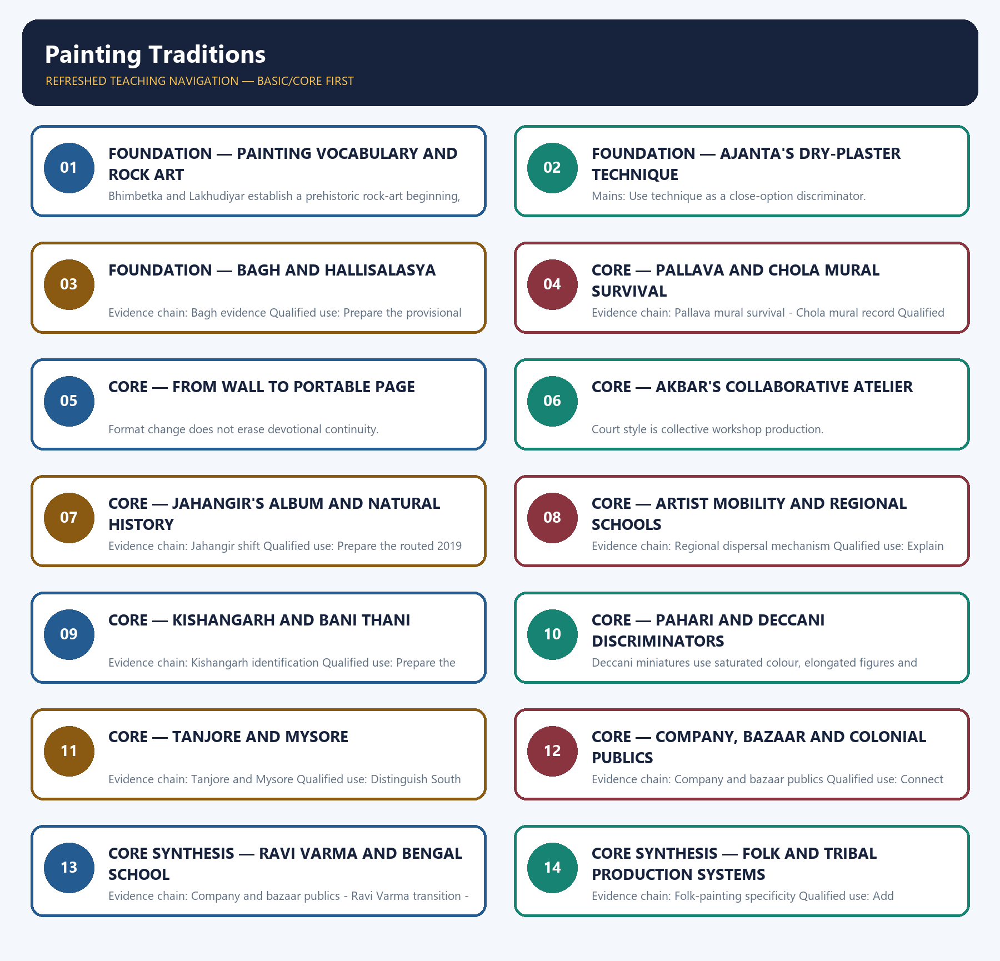

# Painting Traditions — Learner-v2 Complete Learning Session

> **Authoring-only generation:** 2026-09-01. No PDF was rendered and no tracker or index was mutated.

### SOURCE, PROGRESSION AND CURRENT-LINKAGE AUDIT

- **Generation date:** 2026-09-01.
- **Repository-first evidence:** the Basic owner is taught first and preserved in full; the Advanced owner is retained only in the optional final teaching block.
- **OCR evidence:** Repository Markdown was primary. The available OCR-searchable Nitin Singhania Indian Art and Culture PDF was retained as a supplementary source; no unsupported page precision, quotation or dynamic status was imported from it.
- **Qdrant:** not used; repository Markdown and available OCR context were sufficient.
- **PYQ integrity:** No direct GS-I Mains PYQ is routed to painting in the audited ledgers. The package retains the verified 2018 Bani Thani and 2019 Jahangir objective routes without inferring unavailable keys, and the 2026 Hallisalasya route without inferring its provisional answer.
- **Live-link boundary:** Lalit Kala Akademi's official page was fetched on 2026-09-01. It records that the 64th National Exhibition of Art award ceremony was held on 24 September 2025 and awards were conferred on 20 artists. The linkage is used only for the living national visual-arts institution, not to infer a historical school, artwork category or stylistic claim.
- **Fact/inference discipline:** no current-affairs item, PYQ wording, figure or quotation is invented.

## BASIC LEARNING SESSION

### DEEP-REVIEW LEARNING CONTRACT

| Control | Binding rule for this package |
|---|---|
| Syllabus boundary | Complete Indian Art and Culture Core is taught by form, chronology, region, patronage and function before optional enrichment. |
| Evidence method | Claim → named monument/object/text/form/institution/community → analysis → qualification. |
| Chronology | Origin, surviving evidence, patronage phase, later adaptation, recognition and present status remain distinct. |
| Classification | Architecture, sculpture, painting, music, dance, theatre, language, craft, religion, heritage and cinema terms are compared on common axes without collapsing categories. |
| Interpretation | Style labels, iconographic readings, continuity, synthesis and social representation remain evidence-bounded rather than essentialist. |
| Practice contract | Every solved item has directive/demand decoding, a detailed examiner-grade model, executable compression plan, marks rationale and answer-specific improvement. |
| Approval | This immutable successor remains `approved: false` pending explicit approval. |

**Canonical Basic/Core owner:** `upsc-ai-kit\knowledge\Indian-Art-and-Culture\basic\07_Painting-Traditions.md`  
**Canonical topic owner:** `upsc-ai-kit\knowledge\Indian-Art-and-Culture\basic\07_Painting-Traditions.md`  
**Optional Advanced owner:** `upsc-ai-kit\knowledge\Indian-Art-and-Culture\advanced\07_Painting-Traditions.md`  
**Official syllabus mapping:** `upsc-ai-kit\knowledge\Indian-Art-and-Culture\OFFICIAL-UPSC-SYLLABUS-MAPPING.md`

### EVIDENCE, PYQ AND CURRENT-STATUS CONTROL

- **Material evidence:** plans, fabric, technique, iconography, performance grammar, inscriptions, manuscripts, films and institutional records are identified before interpretation.
- **Attribution discipline:** patron, date, school, region, author, performer, community and function are stated only to the precision supported by the owner.
- **Quantitative discipline:** dimensions, counts, inscription years, lists, awards and registrations retain source, date, status and uncertainty; no figure is invented.
- **Interpretive discipline:** civilisational ranking, communal essentialism, timeless continuity, single-origin claims and treating commissioned representation as a social census are rejected.
- **PYQ discipline:** repository routing ledgers and locally held papers control wording and metadata; neutral rendering, reconstruction and unavailable official keys remain explicitly labelled.
- **Current-status note, rechecked 2026-09-01:** Lalit Kala Akademi's official page was fetched on 2026-09-01. It records that the 64th National Exhibition of Art award ceremony was held on 24 September 2025 and awards were conferred on 20 artists. The linkage is used only for the living national visual-arts institution, not to infer a historical school, artwork category or stylistic claim.

**Live/official context sources recorded by the predecessor generation:**

- `https://lalitkala.gov.in/event_details/317`




*Distinct embedded teaching-navigation image. The separate continuous Cārvāka-style flowchart package remains an independent at-a-glance artifact.*

### SESSION 1 — FOUNDATION — PAINTING VOCABULARY AND ROCK ART

#### DEFINITION / WHAT THIS IS CALLED

**Plain-language definition:** Evidence chain: Shadanga of painting - Rock-art foundation Qualified use: Establish the reading vocabulary.

**Technical definition:** Bhimbetka and Lakhudiyar establish a prehistoric rock-art beginning, while a petroglyph is an engraving and must not be confused with a painted image.

#### ANSWER-GRABBING OPENING — WRITE/ADAPT IN THE EXAM

> Evidence chain: Shadanga of painting - Rock-art foundation Qualified use: Establish the reading vocabulary.

#### MUST-WRITE KEYWORDS

- **FOUNDATION**
- **Painting vocabulary**
- **rock art**
- **Evidence chain**
- **Qualified use**
- **Bhimbetka**

**How to use them:** Frame the answer through FOUNDATION; define Painting vocabulary, connect rock art with Evidence chain to explain the mechanism, and use Qualified use for the decisive comparison or qualification.

#### VISUAL FIRST

```text
PAINTING VOCABULARY AND ROCK ART
01. Shadanga of painting
    |
    v
02. Rock-art foundation
BOUNDARY -> Separate painted images from petroglyphs and technical limbs.
```

*This topic-specific rail fixes the evidence sequence and its exam boundary before analysis.*

#### CORE EXPLANATION

Roopbheda, Pramana, Bhava, Lavanya Yojana, Sadrishya and Varnikabhanga organise appearance, proportion, expression, composition, resemblance and brush-colour treatment. Bhimbetka and Lakhudiyar establish a prehistoric rock-art beginning, while a petroglyph is an engraving and must not be confused with a painted image.

#### NAMED EVIDENCE AND MECHANISM

- Roopbheda, Pramana, Bhava, Lavanya Yojana, Sadrishya and Varnikabhanga organise appearance, proportion, expression, composition, resemblance and brush-colour treatment.
- Bhimbetka and Lakhudiyar establish a prehistoric rock-art beginning, while a petroglyph is an engraving and must not be confused with a painted image.

#### EXAMINER CAUTION

- Separate painted images from petroglyphs and technical limbs.

#### EXAM LINK

- **Prelims:** Retain the exact form, region, text, technique or institution attached to Painting vocabulary and rock art.
- **Mains:** Establish the reading vocabulary.

#### MINI RECAP

- **Evidence chain:** Shadanga of painting -> Rock-art foundation
- **Qualified use:** Establish the reading vocabulary.

#### CLOSING RECALL FLOW — FOUNDATION — PAINTING VOCABULARY AND ROCK ART

```text
START / CONCEPT: FOUNDATION — Painting vocabulary and rock art
        |
        v
EXACT TERMS: FOUNDATION · Painting vocabulary · rock art · Evidence chain · Qualified use · Bhimbetka
        |
        v
MECHANISM / ARGUMENT: Bhimbetka and Lakhudiyar establish a prehistoric rock-art beginning, while a petroglyph is an engraving and must not be confused with a painted image.
        |
        v
CONSEQUENCE / CONTRAST: The resulting consequence is that shadanga of painting - Rock-art foundation Qualified use.
        |
        v
UPSC TRAP / ANSWER-USE: Do not miss this limiting distinction: shadanga of painting - Rock-art foundation Qualified use.
        |
        v
ANSWER-GRABBING FORMULATION: Evidence chain: Shadanga of painting - Rock-art foundation Qualified use: Establish the reading vocabulary.
```
### SESSION 2 — FOUNDATION — AJANTA'S DRY-PLASTER TECHNIQUE

#### DEFINITION / WHAT THIS IS CALLED

**Plain-language definition:** Evidence chain: Ajanta technique Qualified use: Use technique as a close-option discriminator.

**Technical definition:** Mains: Use technique as a close-option discriminator.

#### ANSWER-GRABBING OPENING — WRITE/ADAPT IN THE EXAM

> Evidence chain: Ajanta technique Qualified use: Use technique as a close-option discriminator.

#### MUST-WRITE KEYWORDS

- **FOUNDATION**
- **Ajanta's dry-plaster technique**
- **Evidence chain**
- **Qualified use**
- **Ajanta**
- **Fresco secco**

**How to use them:** Frame the answer through FOUNDATION; define Ajanta's dry-plaster technique, connect Evidence chain with Qualified use to explain the mechanism, and use Ajanta for the decisive comparison or qualification.

#### VISUAL FIRST

```text
AJANTA'S DRY-PLASTER TECHNIQUE
01. Ajanta technique
BOUNDARY -> Fresco secco is safer than true fresco.
```

*This topic-specific rail fixes the evidence sequence and its exam boundary before analysis.*

#### CORE EXPLANATION

Ajanta pigments were generally applied after prepared plaster dried, so fresco secco or tempera is safer than calling the murals true wet fresco.

#### NAMED EVIDENCE AND MECHANISM

- Ajanta pigments were generally applied after prepared plaster dried, so fresco secco or tempera is safer than calling the murals true wet fresco.

#### EXAMINER CAUTION

- Fresco secco is safer than true fresco.

#### EXAM LINK

- **Prelims:** Retain the exact form, region, text, technique or institution attached to Ajanta's dry-plaster technique.
- **Mains:** Use technique as a close-option discriminator.

#### MINI RECAP

- **Evidence chain:** Ajanta technique
- **Qualified use:** Use technique as a close-option discriminator.

#### CLOSING RECALL FLOW — FOUNDATION — AJANTA'S DRY-PLASTER TECHNIQUE

```text
START / CONCEPT: FOUNDATION — Ajanta's dry-plaster technique
        |
        v
EXACT TERMS: FOUNDATION · Ajanta's dry-plaster technique · Evidence chain · Qualified use · Ajanta · Fresco secco
        |
        v
MECHANISM / ARGUMENT: Ajanta pigments were generally applied after prepared plaster dried, so fresco secco or tempera is safer than calling the murals true wet fresco.
        |
        v
CONSEQUENCE / CONTRAST: Mains: Use technique as a close-option discriminator.
        |
        v
UPSC TRAP / ANSWER-USE: Do not miss this limiting distinction: fresco secco is safer than true fresco.
        |
        v
ANSWER-GRABBING FORMULATION: Evidence chain: Ajanta technique Qualified use: Use technique as a close-option discriminator.
```
### SESSION 3 — FOUNDATION — BAGH AND HALLISALASYA

#### DEFINITION / WHAT THIS IS CALLED

**Plain-language definition:** Bagh lies on the Baghni river in Dhar district; Cave 4 is Rang Mahal, while Hallisalasya is attributed to Bagh paintings generally and not to a specified cave.

**Technical definition:** Evidence chain: Bagh evidence Qualified use: Prepare the provisional 2026 route without an answer letter.

#### ANSWER-GRABBING OPENING — WRITE/ADAPT IN THE EXAM

> Bagh lies on the Baghni river in Dhar district; Cave 4 is Rang Mahal, while Hallisalasya is attributed to Bagh paintings generally and not to a specified cave.

#### MUST-WRITE KEYWORDS

- **FOUNDATION**
- **Bagh**
- **Hallisalasya**
- **Evidence chain**
- **Qualified use**
- **Baghni**

**How to use them:** Frame the answer through FOUNDATION; define Bagh, connect Hallisalasya with Evidence chain to explain the mechanism, and use Qualified use for the decisive comparison or qualification.

#### VISUAL FIRST

```text
BAGH AND HALLISALASYA
01. Bagh evidence
BOUNDARY -> Do not assign the dance to Cave 4.
```

*This topic-specific rail fixes the evidence sequence and its exam boundary before analysis.*

#### CORE EXPLANATION

Bagh lies on the Baghni river in Dhar district; Cave 4 is Rang Mahal, while Hallisalasya is attributed to Bagh paintings generally and not to a specified cave.

#### NAMED EVIDENCE AND MECHANISM

- Bagh lies on the Baghni river in Dhar district; Cave 4 is Rang Mahal, while Hallisalasya is attributed to Bagh paintings generally and not to a specified cave.

#### EXAMINER CAUTION

- Do not assign the dance to Cave 4.

#### EXAM LINK

- **Prelims:** Retain the exact form, region, text, technique or institution attached to Bagh and Hallisalasya.
- **Mains:** Prepare the provisional 2026 route without an answer letter.

#### MINI RECAP

- **Evidence chain:** Bagh evidence
- **Qualified use:** Prepare the provisional 2026 route without an answer letter.

#### CLOSING RECALL FLOW — FOUNDATION — BAGH AND HALLISALASYA

```text
START / CONCEPT: FOUNDATION — Bagh and Hallisalasya
        |
        v
EXACT TERMS: FOUNDATION · Bagh · Hallisalasya · Evidence chain · Qualified use · Baghni
        |
        v
MECHANISM / ARGUMENT: Evidence chain: Bagh evidence Qualified use: Prepare the provisional 2026 route without an answer letter.
        |
        v
CONSEQUENCE / CONTRAST: Do not assign the dance to Cave 4.
        |
        v
UPSC TRAP / ANSWER-USE: Do not miss this limiting distinction: bagh lies on the Baghni river in Dhar district.
        |
        v
ANSWER-GRABBING FORMULATION: Bagh lies on the Baghni river in Dhar district; Cave 4 is Rang Mahal, while Hallisalasya is attributed to Bagh paintings generally and not to a specified cave.
```
### SESSION 4 — CORE — PALLAVA AND CHOLA MURAL SURVIVAL

#### DEFINITION / WHAT THIS IS CALLED

**Plain-language definition:** The principal surviving Pallava mural locations are Kailasanatha at Kanchipuram and Talagishwara at Panamalai; survival scarcity is not proof of low original production.

**Technical definition:** Evidence chain: Pallava mural survival - Chola mural record Qualified use: Support dynastic art answers with a provenance caveat.

#### ANSWER-GRABBING OPENING — WRITE/ADAPT IN THE EXAM

> The principal surviving Pallava mural locations are Kailasanatha at Kanchipuram and Talagishwara at Panamalai; survival scarcity is not proof of low original production.

#### MUST-WRITE KEYWORDS

- **Pallava**
- **Chola mural survival**
- **Evidence chain**
- **Qualified use**
- **The principal surviving Pallava mural locations**
- **Kailasanatha**

**How to use them:** Frame the answer through Pallava; define Chola mural survival, connect Evidence chain with Qualified use to explain the mechanism, and use The principal surviving Pallava mural locations for the decisive comparison or qualification.

#### VISUAL FIRST

```text
PALLAVA AND CHOLA MURAL SURVIVAL
01. Pallava mural survival
    |
    v
02. Chola mural record
BOUNDARY -> Survival is not total historical production.
```

*This topic-specific rail fixes the evidence sequence and its exam boundary before analysis.*

#### CORE EXPLANATION

The principal surviving Pallava mural locations are Kailasanatha at Kanchipuram and Talagishwara at Panamalai; survival scarcity is not proof of low original production. Vijaya Cholishwaram and Brihadishvara preserve the principal Chola wall-painting record, with Rajaraja and Karuvur Devar and later Nayaka superimposition at Brihadishvara.

#### NAMED EVIDENCE AND MECHANISM

- The principal surviving Pallava mural locations are Kailasanatha at Kanchipuram and Talagishwara at Panamalai; survival scarcity is not proof of low original production.
- Vijaya Cholishwaram and Brihadishvara preserve the principal Chola wall-painting record, with Rajaraja and Karuvur Devar and later Nayaka superimposition at Brihadishvara.

#### EXAMINER CAUTION

- Survival is not total historical production.

#### EXAM LINK

- **Prelims:** Retain the exact form, region, text, technique or institution attached to Pallava and Chola mural survival.
- **Mains:** Support dynastic art answers with a provenance caveat.

#### MINI RECAP

- **Evidence chain:** Pallava mural survival -> Chola mural record
- **Qualified use:** Support dynastic art answers with a provenance caveat.

#### CLOSING RECALL FLOW — CORE — PALLAVA AND CHOLA MURAL SURVIVAL

```text
START / CONCEPT: CORE — Pallava and Chola mural survival
        |
        v
EXACT TERMS: Pallava · Chola mural survival · Evidence chain · Qualified use · The principal surviving Pallava mural locations · Kailasanatha
        |
        v
MECHANISM / ARGUMENT: Evidence chain: Pallava mural survival - Chola mural record Qualified use: Support dynastic art answers with a provenance caveat.
        |
        v
CONSEQUENCE / CONTRAST: Survival is not total historical production.
        |
        v
UPSC TRAP / ANSWER-USE: Do not miss this limiting distinction: the principal surviving Pallava mural locations are Kailasanatha at Kanchipuram and Talagishwara at Panamalai.
        |
        v
ANSWER-GRABBING FORMULATION: The principal surviving Pallava mural locations are Kailasanatha at Kanchipuram and Talagishwara at Panamalai; survival scarcity is not proof of low original production.
```
### SESSION 5 — CORE — FROM WALL TO PORTABLE PAGE

#### DEFINITION / WHAT THIS IS CALLED

**Plain-language definition:** Evidence chain: Format-patronage relation - Pala and Western Indian manuscripts Qualified use: Turn chronology into a patronage argument.

**Technical definition:** Format change does not erase devotional continuity.

#### ANSWER-GRABBING OPENING — WRITE/ADAPT IN THE EXAM

> Format change does not erase devotional continuity.

#### MUST-WRITE KEYWORDS

- **From wall to portable page**
- **Evidence chain**
- **Qualified use**
- **Format**
- **Format-patronage**
- **Pala**

**How to use them:** Frame the answer through From wall to portable page; define Evidence chain, connect Qualified use with Format to explain the mechanism, and use Format-patronage for the decisive comparison or qualification.

#### VISUAL FIRST

```text
FROM WALL TO PORTABLE PAGE
01. Format-patronage relation
    |
    v
02. Pala and Western Indian manuscripts
BOUNDARY -> Format change does not erase devotional continuity.
```

*This topic-specific rail fixes the evidence sequence and its exam boundary before analysis.*

#### CORE EXPLANATION

Monumental murals require architectural sponsorship and collective viewing, whereas portable manuscripts and albums enable smaller royal or elite commissions and regional dispersal. Pala Buddhist and Western Indian or Jain manuscript traditions precede Mughal miniatures and preserve devotional page-based painting under monastic and mercantile patronage.

#### NAMED EVIDENCE AND MECHANISM

- Monumental murals require architectural sponsorship and collective viewing, whereas portable manuscripts and albums enable smaller royal or elite commissions and regional dispersal.
- Pala Buddhist and Western Indian or Jain manuscript traditions precede Mughal miniatures and preserve devotional page-based painting under monastic and mercantile patronage.

#### EXAMINER CAUTION

- Format change does not erase devotional continuity.

#### EXAM LINK

- **Prelims:** Retain the exact form, region, text, technique or institution attached to From wall to portable page.
- **Mains:** Turn chronology into a patronage argument.

#### MINI RECAP

- **Evidence chain:** Format-patronage relation -> Pala and Western Indian manuscripts
- **Qualified use:** Turn chronology into a patronage argument.

#### CLOSING RECALL FLOW — CORE — FROM WALL TO PORTABLE PAGE

```text
START / CONCEPT: CORE — From wall to portable page
        |
        v
EXACT TERMS: From wall to portable page · Evidence chain · Qualified use · Format · Format-patronage · Pala
        |
        v
MECHANISM / ARGUMENT: Evidence chain: Format-patronage relation - Pala and Western Indian manuscripts Qualified use: Turn chronology into a patronage argument.
        |
        v
CONSEQUENCE / CONTRAST: The resulting consequence is that format change does not erase devotional continuity.
        |
        v
UPSC TRAP / ANSWER-USE: Do not miss this limiting distinction: format change does not erase devotional continuity.
        |
        v
ANSWER-GRABBING FORMULATION: Format change does not erase devotional continuity.
```
### SESSION 6 — CORE — AKBAR'S COLLABORATIVE ATELIER

#### DEFINITION / WHAT THIS IS CALLED

**Plain-language definition:** Evidence chain: Akbar atelier Qualified use: Explain manuscript scale and labour.

**Technical definition:** Court style is collective workshop production.

#### ANSWER-GRABBING OPENING — WRITE/ADAPT IN THE EXAM

> Evidence chain: Akbar atelier Qualified use: Explain manuscript scale and labour.

#### MUST-WRITE KEYWORDS

- **Akbar's collaborative atelier**
- **Evidence chain**
- **Qualified use**
- **Court style**
- **Court**
- **Akbar**

**How to use them:** Frame the answer through Akbar's collaborative atelier; define Evidence chain, connect Qualified use with Court style to explain the mechanism, and use Court for the decisive comparison or qualification.

#### VISUAL FIRST

```text
AKBAR'S COLLABORATIVE ATELIER
01. Akbar atelier
BOUNDARY -> Court style is collective workshop production.
```

*This topic-specific rail fixes the evidence sequence and its exam boundary before analysis.*

#### CORE EXPLANATION

Akbar's karkhana produced large illustrated manuscripts through collaborative labour by artists drawn from multiple regions and religious backgrounds.

#### NAMED EVIDENCE AND MECHANISM

- Akbar's karkhana produced large illustrated manuscripts through collaborative labour by artists drawn from multiple regions and religious backgrounds.

#### EXAMINER CAUTION

- Court style is collective workshop production.

#### EXAM LINK

- **Prelims:** Retain the exact form, region, text, technique or institution attached to Akbar's collaborative atelier.
- **Mains:** Explain manuscript scale and labour.

#### MINI RECAP

- **Evidence chain:** Akbar atelier
- **Qualified use:** Explain manuscript scale and labour.

#### CLOSING RECALL FLOW — CORE — AKBAR'S COLLABORATIVE ATELIER

```text
START / CONCEPT: CORE — Akbar's collaborative atelier
        |
        v
EXACT TERMS: Akbar's collaborative atelier · Evidence chain · Qualified use · Court style · Court · Akbar
        |
        v
MECHANISM / ARGUMENT: Court style is collective workshop production.
        |
        v
CONSEQUENCE / CONTRAST: Mains: Explain manuscript scale and labour.
        |
        v
UPSC TRAP / ANSWER-USE: Do not miss this limiting distinction: evidence chain: Akbar atelier Qualified use: Explain manuscript scale and labour.
        |
        v
ANSWER-GRABBING FORMULATION: Evidence chain: Akbar atelier Qualified use: Explain manuscript scale and labour.
```
### SESSION 7 — CORE — JAHANGIR'S ALBUM AND NATURAL HISTORY

#### DEFINITION / WHAT THIS IS CALLED

**Plain-language definition:** A shift of emphasis is not a total break.

**Technical definition:** Evidence chain: Jahangir shift Qualified use: Prepare the routed 2019 objective distinction.

#### ANSWER-GRABBING OPENING — WRITE/ADAPT IN THE EXAM

> A shift of emphasis is not a total break.

#### MUST-WRITE KEYWORDS

- **Jahangir's album**
- **natural history**
- **Evidence chain**
- **Qualified use**
- **A shift of emphasis**
- **Jahangir**

**How to use them:** Frame the answer through Jahangir's album; define natural history, connect Evidence chain with Qualified use to explain the mechanism, and use A shift of emphasis for the decisive comparison or qualification.

#### VISUAL FIRST

```text
JAHANGIR'S ALBUM AND NATURAL HISTORY
01. Jahangir shift
BOUNDARY -> A shift of emphasis is not a total break.
```

*This topic-specific rail fixes the evidence sequence and its exam boundary before analysis.*

#### CORE EXPLANATION

Jahangir-era painting emphasised album pages, individual portraiture and natural history, with Mansur associated with flora-fauna observation.

#### NAMED EVIDENCE AND MECHANISM

- Jahangir-era painting emphasised album pages, individual portraiture and natural history, with Mansur associated with flora-fauna observation.

#### EXAMINER CAUTION

- A shift of emphasis is not a total break.

#### EXAM LINK

- **Prelims:** Retain the exact form, region, text, technique or institution attached to Jahangir's album and natural history.
- **Mains:** Prepare the routed 2019 objective distinction.

#### MINI RECAP

- **Evidence chain:** Jahangir shift
- **Qualified use:** Prepare the routed 2019 objective distinction.

#### CLOSING RECALL FLOW — CORE — JAHANGIR'S ALBUM AND NATURAL HISTORY

```text
START / CONCEPT: CORE — Jahangir's album and natural history
        |
        v
EXACT TERMS: Jahangir's album · natural history · Evidence chain · Qualified use · A shift of emphasis · Jahangir
        |
        v
MECHANISM / ARGUMENT: Evidence chain: Jahangir shift Qualified use: Prepare the routed 2019 objective distinction.
        |
        v
CONSEQUENCE / CONTRAST: The resulting consequence is that a shift of emphasis is not a total break.
        |
        v
UPSC TRAP / ANSWER-USE: Do not miss this limiting distinction: a shift of emphasis is not a total break.
        |
        v
ANSWER-GRABBING FORMULATION: A shift of emphasis is not a total break.
```
### SESSION 8 — CORE — ARTIST MOBILITY AND REGIONAL SCHOOLS

#### DEFINITION / WHAT THIS IS CALLED

**Plain-language definition:** Regional identity is porous, not sealed.

**Technical definition:** Evidence chain: Regional dispersal mechanism Qualified use: Explain diffusion after imperial contraction.

#### ANSWER-GRABBING OPENING — WRITE/ADAPT IN THE EXAM

> Evidence chain: Regional dispersal mechanism Qualified use: Explain diffusion after imperial contraction.

#### MUST-WRITE KEYWORDS

- **Artist mobility**
- **regional schools**
- **Evidence chain**
- **Qualified use**
- **Regional identity**
- **Regional**

**How to use them:** Frame the answer through Artist mobility; define regional schools, connect Evidence chain with Qualified use to explain the mechanism, and use Regional identity for the decisive comparison or qualification.

#### VISUAL FIRST

```text
ARTIST MOBILITY AND REGIONAL SCHOOLS
01. Regional dispersal mechanism
BOUNDARY -> Regional identity is porous, not sealed.
```

*This topic-specific rail fixes the evidence sequence and its exam boundary before analysis.*

#### CORE EXPLANATION

Reduced imperial patronage and artist mobility helped regional Rajasthani and Pahari centres adapt shared miniature resources rather than develop as sealed ethnic styles.

#### NAMED EVIDENCE AND MECHANISM

- Reduced imperial patronage and artist mobility helped regional Rajasthani and Pahari centres adapt shared miniature resources rather than develop as sealed ethnic styles.

#### EXAMINER CAUTION

- Regional identity is porous, not sealed.

#### EXAM LINK

- **Prelims:** Retain the exact form, region, text, technique or institution attached to Artist mobility and regional schools.
- **Mains:** Explain diffusion after imperial contraction.

#### MINI RECAP

- **Evidence chain:** Regional dispersal mechanism
- **Qualified use:** Explain diffusion after imperial contraction.

#### CLOSING RECALL FLOW — CORE — ARTIST MOBILITY AND REGIONAL SCHOOLS

```text
START / CONCEPT: CORE — Artist mobility and regional schools
        |
        v
EXACT TERMS: Artist mobility · regional schools · Evidence chain · Qualified use · Regional identity · Regional
        |
        v
MECHANISM / ARGUMENT: Regional identity is porous, not sealed.
        |
        v
CONSEQUENCE / CONTRAST: Mains: Explain diffusion after imperial contraction.
        |
        v
UPSC TRAP / ANSWER-USE: Do not miss this limiting distinction: regional identity is porous, not sealed.
        |
        v
ANSWER-GRABBING FORMULATION: Evidence chain: Regional dispersal mechanism Qualified use: Explain diffusion after imperial contraction.
```
### SESSION 9 — CORE — KISHANGARH AND BANI THANI

#### DEFINITION / WHAT THIS IS CALLED

**Plain-language definition:** Bani Thani belongs to the Kishangarh school and is associated with Nihal Chand; it must not be assigned to Kangra, Bundi or Jaipur.

**Technical definition:** Evidence chain: Kishangarh identification Qualified use: Prepare the routed 2018 identification.

#### ANSWER-GRABBING OPENING — WRITE/ADAPT IN THE EXAM

> Bani Thani belongs to the Kishangarh school and is associated with Nihal Chand; it must not be assigned to Kangra, Bundi or Jaipur.

#### MUST-WRITE KEYWORDS

- **Kishangarh**
- **Bani Thani**
- **Evidence chain**
- **Qualified use**
- **Bani Thani belongs to the Kishangarh school and**
- **Nihal Chand**

**How to use them:** Frame the answer through Kishangarh; define Bani Thani, connect Evidence chain with Qualified use to explain the mechanism, and use Bani Thani belongs to the Kishangarh school and for the decisive comparison or qualification.

#### VISUAL FIRST

```text
KISHANGARH AND BANI THANI
01. Kishangarh identification
BOUNDARY -> Keep school and artist attribution exact.
```

*This topic-specific rail fixes the evidence sequence and its exam boundary before analysis.*

#### CORE EXPLANATION

Bani Thani belongs to the Kishangarh school and is associated with Nihal Chand; it must not be assigned to Kangra, Bundi or Jaipur.

#### NAMED EVIDENCE AND MECHANISM

- Bani Thani belongs to the Kishangarh school and is associated with Nihal Chand; it must not be assigned to Kangra, Bundi or Jaipur.

#### EXAMINER CAUTION

- Keep school and artist attribution exact.

#### EXAM LINK

- **Prelims:** Retain the exact form, region, text, technique or institution attached to Kishangarh and Bani Thani.
- **Mains:** Prepare the routed 2018 identification.

#### MINI RECAP

- **Evidence chain:** Kishangarh identification
- **Qualified use:** Prepare the routed 2018 identification.

#### CLOSING RECALL FLOW — CORE — KISHANGARH AND BANI THANI

```text
START / CONCEPT: CORE — Kishangarh and Bani Thani
        |
        v
EXACT TERMS: Kishangarh · Bani Thani · Evidence chain · Qualified use · Bani Thani belongs to the Kishangarh school and · Nihal Chand
        |
        v
MECHANISM / ARGUMENT: Evidence chain: Kishangarh identification Qualified use: Prepare the routed 2018 identification.
        |
        v
CONSEQUENCE / CONTRAST: The resulting consequence is that bani Thani belongs to the Kishangarh school and is associated with Nihal Chand.
        |
        v
UPSC TRAP / ANSWER-USE: Do not miss this limiting distinction: bani Thani belongs to the Kishangarh school and is associated with Nihal Chand.
        |
        v
ANSWER-GRABBING FORMULATION: Bani Thani belongs to the Kishangarh school and is associated with Nihal Chand; it must not be assigned to Kangra, Bundi or Jaipur.
```
### SESSION 10 — CORE — PAHARI AND DECCANI DISCRIMINATORS

#### DEFINITION / WHAT THIS IS CALLED

**Plain-language definition:** Evidence chain: Pahari sequence - Deccani distinction Qualified use: Build close-option elimination.

**Technical definition:** Deccani miniatures use saturated colour, elongated figures and fantastic landscapes within Persianate-Deccan court culture; shared Persian roots do not make them Mughal.

#### ANSWER-GRABBING OPENING — WRITE/ADAPT IN THE EXAM

> Deccani miniatures use saturated colour, elongated figures and fantastic landscapes within Persianate-Deccan court culture; shared Persian roots do not make them Mughal.

#### MUST-WRITE KEYWORDS

- **Pahari**
- **Deccani discriminators**
- **Evidence chain**
- **Qualified use**
- **Basohli**
- **Guler**

**How to use them:** Frame the answer through Pahari; define Deccani discriminators, connect Evidence chain with Qualified use to explain the mechanism, and use Basohli for the decisive comparison or qualification.

#### VISUAL FIRST

```text
PAHARI AND DECCANI DISCRIMINATORS
01. Pahari sequence
    |
    v
02. Deccani distinction
BOUNDARY -> Compare palette, line, theme and court ecology.
```

*This topic-specific rail fixes the evidence sequence and its exam boundary before analysis.*

#### CORE EXPLANATION

Basohli is marked by intense colour and bold line, while Guler and Kangra move toward softer naturalism and lyrical Krishna-poetry themes. Deccani miniatures use saturated colour, elongated figures and fantastic landscapes within Persianate-Deccan court culture; shared Persian roots do not make them Mughal.

#### NAMED EVIDENCE AND MECHANISM

- Basohli is marked by intense colour and bold line, while Guler and Kangra move toward softer naturalism and lyrical Krishna-poetry themes.
- Deccani miniatures use saturated colour, elongated figures and fantastic landscapes within Persianate-Deccan court culture; shared Persian roots do not make them Mughal.

#### EXAMINER CAUTION

- Compare palette, line, theme and court ecology.

#### EXAM LINK

- **Prelims:** Retain the exact form, region, text, technique or institution attached to Pahari and Deccani discriminators.
- **Mains:** Build close-option elimination.

#### MINI RECAP

- **Evidence chain:** Pahari sequence -> Deccani distinction
- **Qualified use:** Build close-option elimination.

#### CLOSING RECALL FLOW — CORE — PAHARI AND DECCANI DISCRIMINATORS

```text
START / CONCEPT: CORE — Pahari and Deccani discriminators
        |
        v
EXACT TERMS: Pahari · Deccani discriminators · Evidence chain · Qualified use · Basohli · Guler
        |
        v
MECHANISM / ARGUMENT: Basohli is marked by intense colour and bold line, while Guler and Kangra move toward softer naturalism and lyrical Krishna-poetry themes.
        |
        v
CONSEQUENCE / CONTRAST: Evidence chain: Pahari sequence - Deccani distinction Qualified use: Build close-option elimination.
        |
        v
UPSC TRAP / ANSWER-USE: Do not miss this limiting distinction: deccani miniatures use saturated colour, elongated figures and fantastic landscapes within Persianate-Deccan court culture.
        |
        v
ANSWER-GRABBING FORMULATION: Deccani miniatures use saturated colour, elongated figures and fantastic landscapes within Persianate-Deccan court culture; shared Persian roots do not make them Mughal.
```
### SESSION 11 — CORE — TANJORE AND MYSORE

#### DEFINITION / WHAT THIS IS CALLED

**Plain-language definition:** Tanjore painting is identified by devotional icons, gesso relief and gold coating; Mysore is a distinct South Indian tradition and must not be treated as its synonym.

**Technical definition:** Evidence chain: Tanjore and Mysore Qualified use: Distinguish South Indian miniature traditions.

#### ANSWER-GRABBING OPENING — WRITE/ADAPT IN THE EXAM

> Tanjore painting is identified by devotional icons, gesso relief and gold coating; Mysore is a distinct South Indian tradition and must not be treated as its synonym.

#### MUST-WRITE KEYWORDS

- **Tanjore**
- **Mysore**
- **Evidence chain**
- **Qualified use**
- **Tanjore painting**
- **South Indian**

**How to use them:** Frame the answer through Tanjore; define Mysore, connect Evidence chain with Qualified use to explain the mechanism, and use Tanjore painting for the decisive comparison or qualification.

#### VISUAL FIRST

```text
TANJORE AND MYSORE
01. Tanjore and Mysore
BOUNDARY -> Gold-gesso is a Tanjore marker, not a generic southern feature.
```

*This topic-specific rail fixes the evidence sequence and its exam boundary before analysis.*

#### CORE EXPLANATION

Tanjore painting is identified by devotional icons, gesso relief and gold coating; Mysore is a distinct South Indian tradition and must not be treated as its synonym.

#### NAMED EVIDENCE AND MECHANISM

- Tanjore painting is identified by devotional icons, gesso relief and gold coating; Mysore is a distinct South Indian tradition and must not be treated as its synonym.

#### EXAMINER CAUTION

- Gold-gesso is a Tanjore marker, not a generic southern feature.

#### EXAM LINK

- **Prelims:** Retain the exact form, region, text, technique or institution attached to Tanjore and Mysore.
- **Mains:** Distinguish South Indian miniature traditions.

#### MINI RECAP

- **Evidence chain:** Tanjore and Mysore
- **Qualified use:** Distinguish South Indian miniature traditions.

#### CLOSING RECALL FLOW — CORE — TANJORE AND MYSORE

```text
START / CONCEPT: CORE — Tanjore and Mysore
        |
        v
EXACT TERMS: Tanjore · Mysore · Evidence chain · Qualified use · Tanjore painting · South Indian
        |
        v
MECHANISM / ARGUMENT: Evidence chain: Tanjore and Mysore Qualified use: Distinguish South Indian miniature traditions.
        |
        v
CONSEQUENCE / CONTRAST: Gold-gesso is a Tanjore marker, not a generic southern feature.
        |
        v
UPSC TRAP / ANSWER-USE: Do not miss this limiting distinction: tanjore painting is identified by devotional icons, gesso relief and gold coating.
        |
        v
ANSWER-GRABBING FORMULATION: Tanjore painting is identified by devotional icons, gesso relief and gold coating; Mysore is a distinct South Indian tradition and must not be treated as its synonym.
```
### SESSION 12 — CORE — COMPANY, BAZAAR AND COLONIAL PUBLICS

#### DEFINITION / WHAT THIS IS CALLED

**Plain-language definition:** Company painting served colonial patrons and documentation, whereas bazaar and Kalighat production addressed pilgrimage and commercial publics; neither is a single uniform school.

**Technical definition:** Evidence chain: Company and bazaar publics Qualified use: Connect market and documentation.

#### ANSWER-GRABBING OPENING — WRITE/ADAPT IN THE EXAM

> Company painting served colonial patrons and documentation, whereas bazaar and Kalighat production addressed pilgrimage and commercial publics; neither is a single uniform school.

#### MUST-WRITE KEYWORDS

- **Company**
- **bazaar**
- **colonial publics**
- **Evidence chain**
- **Qualified use**
- **Kalighat**

**How to use them:** Frame the answer through Company; define bazaar, connect colonial publics with Evidence chain to explain the mechanism, and use Qualified use for the decisive comparison or qualification.

#### VISUAL FIRST

```text
COMPANY, BAZAAR AND COLONIAL PUBLICS
01. Company and bazaar publics
BOUNDARY -> Different buyers produced different images.
```

*This topic-specific rail fixes the evidence sequence and its exam boundary before analysis.*

#### CORE EXPLANATION

Company painting served colonial patrons and documentation, whereas bazaar and Kalighat production addressed pilgrimage and commercial publics; neither is a single uniform school.

#### NAMED EVIDENCE AND MECHANISM

- Company painting served colonial patrons and documentation, whereas bazaar and Kalighat production addressed pilgrimage and commercial publics; neither is a single uniform school.

#### EXAMINER CAUTION

- Different buyers produced different images.

#### EXAM LINK

- **Prelims:** Retain the exact form, region, text, technique or institution attached to Company, bazaar and colonial publics.
- **Mains:** Connect market and documentation.

#### MINI RECAP

- **Evidence chain:** Company and bazaar publics
- **Qualified use:** Connect market and documentation.

#### CLOSING RECALL FLOW — CORE — COMPANY, BAZAAR AND COLONIAL PUBLICS

```text
START / CONCEPT: CORE — Company, bazaar and colonial publics
        |
        v
EXACT TERMS: Company · bazaar · colonial publics · Evidence chain · Qualified use · Kalighat
        |
        v
MECHANISM / ARGUMENT: Evidence chain: Company and bazaar publics Qualified use: Connect market and documentation.
        |
        v
CONSEQUENCE / CONTRAST: The resulting consequence is that company painting served colonial patrons and documentation.
        |
        v
UPSC TRAP / ANSWER-USE: Do not miss this limiting distinction: company painting served colonial patrons and documentation.
        |
        v
ANSWER-GRABBING FORMULATION: Company painting served colonial patrons and documentation, whereas bazaar and Kalighat production addressed pilgrimage and commercial publics; neither is a single uniform school.
```
### SESSION 13 — CORE SYNTHESIS — RAVI VARMA AND BENGAL SCHOOL

#### DEFINITION / WHAT THIS IS CALLED

**Plain-language definition:** Company painting served colonial patrons and documentation, whereas bazaar and Kalighat production addressed pilgrimage and commercial publics; neither is a single uniform school.

**Technical definition:** Evidence chain: Company and bazaar publics - Ravi Varma transition - Bengal School programme Qualified use: Build the modern-painting sequence.

#### ANSWER-GRABBING OPENING — WRITE/ADAPT IN THE EXAM

> Evidence chain: Company and bazaar publics - Ravi Varma transition - Bengal School programme Qualified use: Build the modern-painting sequence.

#### MUST-WRITE KEYWORDS

- **CORE SYNTHESIS**
- **Ravi Varma**
- **Bengal School**
- **Evidence chain**
- **Qualified use**
- **Company**

**How to use them:** Frame the answer through CORE SYNTHESIS; define Ravi Varma, connect Bengal School with Evidence chain to explain the mechanism, and use Qualified use for the decisive comparison or qualification.

#### VISUAL FIRST

```text
RAVI VARMA AND BENGAL SCHOOL
01. Company and bazaar publics
    |
    v
02. Ravi Varma transition
    |
    v
03. Bengal School programme
BOUNDARY -> Nationalist reaction still involved selective exchange.
```

*This topic-specific rail fixes the evidence sequence and its exam boundary before analysis.*

#### CORE EXPLANATION

Company painting served colonial patrons and documentation, whereas bazaar and Kalighat production addressed pilgrimage and commercial publics; neither is a single uniform school. Raja Ravi Varma applied European academic realism to Indian mythological subjects and expanded their print circulation, creating the immediate contrast used by Bengal School critics. Abanindranath Tagore's Bengal School used wash, subdued colour and Ajanta, Mughal and Rajasthani resources as a nationalist reaction to colonial and academic idioms.

#### NAMED EVIDENCE AND MECHANISM

- Company painting served colonial patrons and documentation, whereas bazaar and Kalighat production addressed pilgrimage and commercial publics; neither is a single uniform school.
- Raja Ravi Varma applied European academic realism to Indian mythological subjects and expanded their print circulation, creating the immediate contrast used by Bengal School critics.
- Abanindranath Tagore's Bengal School used wash, subdued colour and Ajanta, Mughal and Rajasthani resources as a nationalist reaction to colonial and academic idioms.

#### EXAMINER CAUTION

- Nationalist reaction still involved selective exchange.

#### EXAM LINK

- **Prelims:** Retain the exact form, region, text, technique or institution attached to Ravi Varma and Bengal School.
- **Mains:** Build the modern-painting sequence.

#### MINI RECAP

- **Evidence chain:** Company and bazaar publics -> Ravi Varma transition -> Bengal School programme
- **Qualified use:** Build the modern-painting sequence.

#### CLOSING RECALL FLOW — CORE SYNTHESIS — RAVI VARMA AND BENGAL SCHOOL

```text
START / CONCEPT: CORE SYNTHESIS — Ravi Varma and Bengal School
        |
        v
EXACT TERMS: CORE SYNTHESIS · Ravi Varma · Bengal School · Evidence chain · Qualified use · Company
        |
        v
MECHANISM / ARGUMENT: Company painting served colonial patrons and documentation, whereas bazaar and Kalighat production addressed pilgrimage and commercial publics; neither is a single uniform school.
        |
        v
CONSEQUENCE / CONTRAST: The resulting consequence is that company and bazaar publics - Ravi Varma transition - Bengal School programme Qualified use.
        |
        v
UPSC TRAP / ANSWER-USE: Do not miss this limiting distinction: company and bazaar publics - Ravi Varma transition - Bengal School programme Qualified use.
        |
        v
ANSWER-GRABBING FORMULATION: Evidence chain: Company and bazaar publics - Ravi Varma transition - Bengal School programme Qualified use: Build the modern-painting sequence.
```
### SESSION 14 — CORE SYNTHESIS — FOLK AND TRIBAL PRODUCTION SYSTEMS

#### DEFINITION / WHAT THIS IS CALLED

**Plain-language definition:** Madhubani, Warli, Pattachitra, Kalamkari, Gond, Phad and Thangka differ by region, support, community, ritual function and market; folk and tribal are not homogeneous labels.

**Technical definition:** Evidence chain: Folk-painting specificity Qualified use: Add living-heritage analysis.

#### ANSWER-GRABBING OPENING — WRITE/ADAPT IN THE EXAM

> Madhubani, Warli, Pattachitra, Kalamkari, Gond, Phad and Thangka differ by region, support, community, ritual function and market; folk and tribal are not homogeneous labels.

#### MUST-WRITE KEYWORDS

- **CORE SYNTHESIS**
- **Folk**
- **tribal production systems**
- **Evidence chain**
- **Qualified use**
- **Madhubani**

**How to use them:** Frame the answer through CORE SYNTHESIS; define Folk, connect tribal production systems with Evidence chain to explain the mechanism, and use Qualified use for the decisive comparison or qualification.

#### VISUAL FIRST

```text
FOLK AND TRIBAL PRODUCTION SYSTEMS
01. Folk-painting specificity
BOUNDARY -> Region, support and community must remain specific.
```

*This topic-specific rail fixes the evidence sequence and its exam boundary before analysis.*

#### CORE EXPLANATION

Madhubani, Warli, Pattachitra, Kalamkari, Gond, Phad and Thangka differ by region, support, community, ritual function and market; folk and tribal are not homogeneous labels.

#### NAMED EVIDENCE AND MECHANISM

- Madhubani, Warli, Pattachitra, Kalamkari, Gond, Phad and Thangka differ by region, support, community, ritual function and market; folk and tribal are not homogeneous labels.

#### EXAMINER CAUTION

- Region, support and community must remain specific.

#### EXAM LINK

- **Prelims:** Retain the exact form, region, text, technique or institution attached to Folk and tribal production systems.
- **Mains:** Add living-heritage analysis.

#### MINI RECAP

- **Evidence chain:** Folk-painting specificity
- **Qualified use:** Add living-heritage analysis.

#### CLOSING RECALL FLOW — CORE SYNTHESIS — FOLK AND TRIBAL PRODUCTION SYSTEMS

```text
START / CONCEPT: CORE SYNTHESIS — Folk and tribal production systems
        |
        v
EXACT TERMS: CORE SYNTHESIS · Folk · tribal production systems · Evidence chain · Qualified use · Madhubani
        |
        v
MECHANISM / ARGUMENT: Evidence chain: Folk-painting specificity Qualified use: Add living-heritage analysis.
        |
        v
CONSEQUENCE / CONTRAST: Region, support and community must remain specific.
        |
        v
UPSC TRAP / ANSWER-USE: Do not miss this limiting distinction: madhubani, Warli, Pattachitra, Kalamkari, Gond, Phad and Thangka differ by region, support, community, ritual...
        |
        v
ANSWER-GRABBING FORMULATION: Madhubani, Warli, Pattachitra, Kalamkari, Gond, Phad and Thangka differ by region, support, community, ritual function and market; folk and tribal are not homogeneous labels.
```
### CORE SYNTHESIS — PYQ audit and living institutional link

#### VISUAL FIRST

```text
PYQ AUDIT AND LIVING INSTITUTIONAL LINK
01. Painting PYQ and live boundary
    |
    v
02. Format-patronage relation
BOUNDARY -> The 2025 exhibition proves current institutional activity only.
```

*This topic-specific rail fixes the evidence sequence and its exam boundary before analysis.*

#### CORE EXPLANATION

The verified routes are objective demands on Bani Thani, Jahangir-era portraiture and provisional Hallisalasya; Lalit Kala Akademi's 2025 exhibition is a living institutional link, not historical-style evidence. Monumental murals require architectural sponsorship and collective viewing, whereas portable manuscripts and albums enable smaller royal or elite commissions and regional dispersal.

#### NAMED EVIDENCE AND MECHANISM

- The verified routes are objective demands on Bani Thani, Jahangir-era portraiture and provisional Hallisalasya; Lalit Kala Akademi's 2025 exhibition is a living institutional link, not historical-style evidence.
- Monumental murals require architectural sponsorship and collective viewing, whereas portable manuscripts and albums enable smaller royal or elite commissions and regional dispersal.

#### EXAMINER CAUTION

- The 2025 exhibition proves current institutional activity only.

#### EXAM LINK

- **Prelims:** Retain the exact form, region, text, technique or institution attached to PYQ audit and living institutional link.
- **Mains:** Close with a bounded current linkage.

#### MINI RECAP

- **Evidence chain:** Painting PYQ and live boundary -> Format-patronage relation
- **Qualified use:** Close with a bounded current linkage.
#### COMPLETE BASIC OWNER EVIDENCE BANK

> **Subject:** Indian Art & Culture | **Tier:** Must-Do (foundation) |
> **GS Paper:** GS-I.
> **Core area:** Rock art; principles of painting; murals (Ajanta, Bagh,
> Sittanavasal); miniature painting (Pala, Rajasthani, Pahari, Deccan,
> Mughal); modern, folk and tribal painting.
> **Grounded in:** Nitin Singhania, *Indian Art and Culture*, PDF pp.
> 309-377; R.S. Sharma, *India's Ancient Past*, PDF pp. 347-355; Satish
> Chandra, *History of Medieval India*, PDF pp. 328-334; Satish Chandra,
> *Medieval History, 1526-1748, Part 2*, PDF pp. 389-392;
> `00_Master-Framework.md` Section 3; audited UPSC Mains 2024 GS
> Paper I (supports Topic 03's questions).
> ✅ = source-grounded | ⚠️ = analytical inference | 📰 = current anchor | ❌ = trap.
> *Companion: `advanced/07_Painting-Traditions.md`.*

#### 1. Snapshot and syllabus fit

✅ This topic spans painting from prehistoric rock art to modern and
tribal painting traditions, and supports (without directly owning) the
2024 Pallava and Chola PYQs through mural evidence at Pallava/Chola sites.
⚠️ No 2024/2025 Mains question tests painting as a stand-alone topic, but
it is a dense Prelims source (named caves, named schools, named artists).

#### 2. Essential vocabulary

| Term | Exam-ready meaning |
|---|---|
| ✅ **Roopbheda, Pramana, Bhava, Lavanya Yojana, Sadrishya, Varnikabhanga** | The six limbs (Shadanga) of Indian painting per classical treatise: looks/appearance, proportion/structure, expression, aesthetic composition, resemblance, and use of brush/colours (*Nitin…pdf*, PDF p. 309-ff outline). |
| ✅ **Fresco secco** | A mural technique using pigment applied to a dried (not wet) plaster surface — the technique used at Ajanta, per the book (*Nitin…pdf*, PDF p. 58, cross-referenced from topic 02). |
| ✅ **Petroglyph** | A prehistoric rock engraving, distinct from a painted rock image. |
| ✅ **Pichhwai, Madhubani, Warli, Kalamkari, Pattachitra, Thangka, Phad, Gond** | Named regional traditions with distinct supports, communities, workshop systems and ritual/market uses; never treat them as one "folk style." |
| ✅ **Company Painting vs. Bazaar/Kalighat markets** | Company painting served European patrons and documentation; urban bazaar traditions served pilgrimage and commercial publics. Both are internally diverse, not one school. |

#### 3. Core classification

✅ Indian painting traditions are classified broadly into: **prehistoric
rock art** (Bhimbetka, Lakhudiyar); **mural painting** (Ajanta, Ellora,
Bagh, Sittanavasal, Pallava/Pandya/Chola/Vijayanagara/Nayaka/Kerala/
Rajasthani/Pahari/Ladakh murals); **miniature painting** (early Pala and
Apabhramsa schools, Delhi Sultanate-period transition, Mughal-era
miniatures, regional Rajasthani/Pahari schools, South Indian miniature
traditions such as Tanjore and Mysore); **modern painting** (Company/
Bazaar painting, Raja Ravi Varma, Bengal School); and **folk/tribal
painting** (Madhubani, Warli, Pattachitra, Kalamkari, Gond, and others)
(*Nitin…pdf*, PDF pp. 309-377 outline).

#### 4. Foundation narrative

✅ Painting evidence begins with rock art (Bhimbetka rock shelters, Madhya
Pradesh; Lakhudiyar, Uttarakhand) and continues through the Buddhist cave
tradition. Ajanta paintings were executed over prepared plaster, generally
with pigments applied after the surface had dried; "fresco secco/tempera"
is safer than calling them true wet fresco. Bagh
Caves, Dhar district, more materialistic in emphasis than Ajanta's
spiritual focus) and Sittanavasal (Pandya-period Jain cave paintings)
(cross-referenced to topic 02 for Ajanta/Ellora/Bagh architecture). ✅
South Indian mural traditions continue under the Pallavas (fragments at
Kailasanatha Temple, Kanchipuram, and Talagishwara temple, Panamalai —
two principal surviving Pallava mural locations in the source,
*Nitin…pdf*, PDF p. 88, cross-referenced from topic 03), and later under
the Cholas, Vijayanagara and Nayaka rulers (Lepakshi murals at the
Veerbhadra Temple). ✅ Miniature painting traces a lineage from Pala
Buddhist manuscript illustration in eastern India and Western Indian/Jain
manuscript painting in Gujarat-Rajasthan, through
a Delhi Sultanate-period transition, into Mughal
miniature tradition (illustrated manuscripts such as the Tutinama, and
Jahangir-era portraiture and natural history). Satish Chandra stresses the
imperial atelier's mixed Hindu-Muslim workforce and collaborative
production. Dispersal of artists after reduced imperial patronage aided
regional schools — Rajasthani
(Mewar, Amber-Jaipur, Marwar, Kishangarh — home of the famous "Bani-Thani"
by Nihal Chand), Pahari (Basholi, Kangra, Guler, Jammu/Dogra, Kullu-Mandi),
and South Indian traditions (Tanjore painting, famous for gold-coating;
Mysore painting; Ganjifa/Ganjapa cards, GI-tagged). ✅ Modern Indian
painting includes Company and Bazaar painting (colonial-period hybrid
styles), Raja Ravi Varma's academic-realist mythological paintings, and
the Bengal School (Abanindranath Tagore and contemporaries, a nationalist,
anti-academic reaction). ✅ Folk and tribal painting traditions named in
the book include Madhubani (Bihar), Warli (Maharashtra), Pattachitra
(Odisha), Kalamkari (Andhra Pradesh), Kalighat (Bengal), Thangka
(Buddhist/Himalayan), Phad (Rajasthan), Gond (Madhya Pradesh), Cheriyal
scroll (Telangana), Pithora (Gujarat), Saura and Paitkar (both associated
with tribal Odisha/Jharkhand traditions), and Santhal painting.

#### 5. Visual map or comparison table

```text
PREHISTORIC ROCK ART (Bhimbetka, Lakhudiyar)
        |
        v
MURAL PAINTING (cave/temple walls)
Ajanta (Buddhist) -> Bagh -> Sittanavasal (Jain) ->
Pallava/Chola/Vijayanagara/Nayaka/Kerala/Rajasthani/Pahari murals
        |
        v
MINIATURE PAINTING (manuscript/album)
Pala (Buddhist) + Apabhramsa (Jain) -> Sultanate transition ->
Mughal -> Rajasthani (Mewar, Kishangarh...) + Pahari (Basholi, Kangra...)
+ South Indian (Tanjore, Mysore)
        |
        v
MODERN PAINTING
Company/Bazaar painting -> Raja Ravi Varma -> Bengal School
        |
        v
FOLK/TRIBAL PAINTING (Madhubani, Warli, Pattachitra, Kalamkari,
Gond, Thangka, Phad, and others)
```

| Tradition | Region | Material/technique |
|---|---|---|
| ✅ Madhubani | Bihar (Mithila) | Natural pigments, line-and-fill technique on paper/cloth |
| ✅ Warli | Maharashtra | White pigment on mud/cow-dung base, geometric figures |
| ✅ Pattachitra | Odisha | Cloth/palm-leaf scroll painting |
| ✅ Kalamkari | Andhra Pradesh | Hand-painted/block-printed textile art, natural dyes |
| ✅ Thangka | Himalayan Buddhist regions | Scroll painting on cotton/silk applique, religious iconography |

| Court/region | High-yield distinction |
|---|---|
| ✅ Mughal-Akbar | Large illustrated manuscripts, narrative action, collaborative karkhana |
| ✅ Mughal-Jahangir | Album page, portraiture, flora/fauna naturalism; Mansur |
| ✅ Deccani | Saturated colour, elongated figures, fantastic landscape and Persianate-Deccan court culture |
| ✅ Mewar/Bundi/Kota | Bold colour; court, hunt and Krishna/Ragamala themes with regional variation |
| ✅ Kishangarh | Lyrical Radha-Krishna imagery; *Bani Thani* associated with Nihal Chand |
| ✅ Basohli/Guler/Kangra | From intense Basohli colour to Guler/Kangra naturalism and Krishna poetry |

#### 6. Source spine

✅ *Nitin…pdf*, PDF pp. 309-377 (Chapter 7, "Indian Paintings" — full
chapter outline and content), the direct spine for Sections 2-4. ✅ For
§13.6B additionally: PDF p. 63 (the Bagh caves' location, dating, Cave 4/
Rang Mahal and the Hallisalasya reference, in the architecture chapter),
PDF pp. 323-324 (the Bagh mural description and the two-Gupta-examples
statement) and PDF pp. 181, 186 (the source's own reproduced objective
question **and answer key** used to verify the Bagh identification).

#### 7. Exact PYQ application

⚠️ No GS-I Mains question in the audited 2024-2025 papers directly tests
painting as a stand-alone topic. ✅ This topic **supports** (does not own)
the 2024 Q2 Pallava question and 2024 Q11 Chola question (topic 03) by
supplying the mural-painting evidence (Pallava murals at Kanchipuram and
Panamalai) relevant to a full "art and architecture" or "art and
literature" answer on those dynasties.

#### 8. 📰 Current anchor

- 📰 ASI's conservation mandate expressly includes murals/paintings
  (developed in topic 14); Mysore Ganjifa cards carry a GI tag (cross-
  referenced to topic 12) — verify the current GI status and registration
  year against the GI Registry rather than assuming permanence.

#### 9. ❌ Traps and corrections

- ❌ All Indian mural technique is "true fresco" (wet-plaster). -> Ajanta's
  technique is specifically identified as fresco secco (dry-plaster),
  not true fresco — retain source-specific technique terminology.
- ❌ Pallava mural painting survives extensively. -> The source identifies
  two principal surviving locations (Kailasanatha, Kanchipuram, and
  Talagirishvara, Panamalai); phrase this as a survival record, not proof
  of originally limited production.
- ❌ Miniature painting is a single, undifferentiated Mughal-era style. ->
  It has distinct pre-Mughal (Pala, Apabhramsa) origins and diverges into
  multiple regional schools (Rajasthani sub-schools, Pahari sub-schools,
  South Indian traditions) after the Mughal period.
- ❌ "Apabhramsa school" is the only or universally preferred label for
  western Indian Jain manuscripts. -> Use Western Indian/Jain school and
  explain language, region, support and patronage.
- ✅ **Local PYQ traps:** CSE 2019 associates the move from manuscript
  series toward albums/individual portraiture with Jahangir; CSE 2018
  places *Bani Thani* in Kishangarh; CSE 2017 locates Padmapani at Ajanta.
- ❌ Folk/tribal painting is a homogeneous category. -> Each named
  tradition (Madhubani, Warli, Pattachitra, etc.) has a distinct region,
  community and material base; treating them as interchangeable loses
  exam-relevant specificity.

#### 10. Mains framework

1. Name the specific tradition/school before describing technique or
   subject matter.
2. Distinguish mural from miniature painting as the two major format
   categories.
3. Use the Pala/Apabhramsa-to-Mughal-to-regional lineage to answer any
   miniature-painting evolution question.
4. Cite a named folk/tribal tradition with its region and material when a
   question invites contemporary/living-heritage discussion.
5. Cross-reference topic 12 for any GI-tagged painting form (e.g. Mysore
   Ganjifa, Madhubani) and topic 14 for conservation status.

#### 11. Boundaries with other subjects

- ❌ **Modern History owns** the Swadeshi movement and nationalist politics
  surrounding the Bengal School in full depth. This file owns the
  **stylistic and technique content** of that movement.
- ❌ **Indian Society owns** tribal community living conditions and
  socio-economic context as a social-science question. This file owns
  tribal painting **as an art form** (material, motif, technique).
- ✅ Cross-links: Topic 03 (Pallava/Chola mural evidence), Topic 06
  (shared iconographic vocabulary with sculpture), Topic 12 (GI-tagged
  folk/tribal painting forms), Topic 14 (conservation of murals).

#### 12. Companion links

- ✅ Advanced companion: `advanced/07_Painting-Traditions.md`.
- ✅ `00_Master-Framework.md` Section 3 — terminology precision reused for
  fresco secco vs. true fresco.
- ⚠️ **Cross-links:** Topic 03 (Pallava/Chola murals), Topic 06 (sculpture-
  painting iconographic overlap), Topic 12 (GI-tagged folk painting),
  Topic 14 (conservation of murals/paintings).

#### 13. Answer architecture (10/15/20-mark support)

> **Core-sufficiency note.** This file supplies the painting half of the
> **2024 Pallava (Q2)** and **2024 Chola (Q11)** answers and independently
> owns school-identification, format-and-patronage, and modern/nationalist
> painting demands. Nothing here requires `advanced/07`.

##### 13.1 Directive and demand map

| If the question says | It is really testing | Do NOT write |
|---|---|---|
| *Trace the evolution of Indian painting* | Format change (rock → wall → manuscript → album → canvas/print) tied to patronage change | A chronological list of schools |
| *Mughal painting and its regional legacy* | The atelier as a collective workshop, and dispersal as the mechanism of regional diffusion | "Mughal painting influenced Rajput painting" |
| *Distinguish the Rajasthani and Pahari schools* | Sub-school-level distinctions (Mewar/Bundi/Kishangarh; Basohli/Guler/Kangra) with theme and palette | Treating each as one style |
| *Murals as historical evidence* | Survival bias, patron themes, technique, superimposition | Assuming what survives is what existed |
| *Folk and tribal painting today* | Material, community, region, market, GI, transmission | "Folk art is colourful and traditional" |
| *Painting and the national movement* | Bengal School as a double reaction — against Company hybridity and against academic realism | "Artists supported the freedom struggle" |
| *Contribution of a dynasty to painting* | Named surviving works, patron, theme, and an honest survival caveat | Generic "painting flourished" |

##### 13.2 Qualified thesis options

- ⚠️ **Format-and-patronage thesis (most reusable):** "Indian painting's
  history is best told as a sequence of formats, each matched to a
  patronage and a viewing public: monumental murals for collective
  devotional viewing, manuscript and album miniatures for private
  connoisseurship, and print and canvas for a mass and market public."
- ⚠️ **Workshop thesis:** "The Mughal miniature was produced by a
  collaborative *karkhana*, not by isolated geniuses — which is why the
  dispersal of trained artists after imperial patronage contracted was
  enough to seed Rajasthani and Pahari schools."
- ⚠️ **Survival-bias thesis:** "Judgements about painting traditions must
  distinguish what was produced from what survived: only two Pallava mural
  locations and two Chola mural temples survive, and reading that as
  evidence of a thin tradition confuses preservation with production."
- ⚠️ **Nationalist-art thesis:** "The Bengal School's significance is that
  it made technique itself a political statement — rejecting both Company
  painting's colonial commission and Ravi Varma's European academic
  realism in favour of an idiom claimed as Indian."
- ⚠️ **Living-tradition thesis:** "Folk and tribal painting is not a
  survival from the past but a functioning production system — material,
  community, ritual use and market together — and GI protection touches
  only one link of it (topic 12)."

##### 13.3 Mark-scaled structures

| Marks | Structure |
|---|---|
| **10** | Thesis → the format concerned → two named works/schools with technique and theme → one limitation (survival or attribution) → verdict |
| **15** | Thesis → mural-to-miniature format shift → Mughal atelier mechanism → two regional sub-schools with distinctions → modern/folk closing dimension → verdict |
| **20** | All of the above → **plus** the full chronological arc from rock art → technique discussion (fresco secco, pigments, supports) → patronage-and-audience analysis → conservation status → folk/tribal living-tradition dimension → verdict answering the exact wording |

##### 13.4 Evidence bank A — Pallava and Chola painting (the 2024 PYQ support route)

| Case | ✅ Named evidence | Significance | Caution |
|---|---|---|---|
| Pallava patron | ✅ Mahendravarman was "the first great patron of art and architecture," with appellations *Vichitra Chitta* (curious mind), *Chettakri* (temple builder) and *Chitrakarppulli* ("a tiger among painters"); wall paintings survive in the rock-cut caves of Mamandur (*Nitin…pdf*, PDF p. 324) | Ties painting patronage to a **named** ruler with contemporary epithets | ⚠️ Epithets are honorific; do not read them as biography |
| Pallava climax | ✅ Narasimhavarman II Rajasimha (700-720 CE) patronised the best Pallava wall painting; the ambulatory passage around the main shrine of the **Kailasanatha Temple, Kanchi**, carries paintings themed on Shiva-Parvati legends; the temple at **Panamalai** preserves Parvati watching Shiva's dance; paintings of royal figures and a Jain muni have been found in the Jain caves of Annamalai Hill (*Nitin…pdf*, PDF p. 324) | Two named locations plus a third Jain-cave reference — enough for a 10-mark answer without Advanced | ❌ These are "the only two surviving examples of the Pallava mural paintings" (PDF p. 88) — a survival statement |
| Wider Tamil context | ✅ Wall painting in Tamil Nadu appears to date from the 7th century AD, with literary mention already in *Silappadikaram* and *Manimekalai* in the 5th century AD (*Nitin…pdf*, PDF p. 324) | Textual evidence supplies what material evidence lost | ⚠️ Literary mention proves the practice was known, not its scale |
| Pandya parallel | ✅ Pandya patronage of the rock-cut Jain temple paintings at **Sittanavasal** (floral creepers, dancing celestial nymphs, birds; poorly preserved) and Tirumalaipuram, where nothing significant remains; Sittanavasal's murals used the fresco technique with mineral colours and are said to link the Ajanta paintings (4th-6th century AD) to the 11th-century Chola paintings at Thanjavur (*Nitin…pdf*, PDF pp. 324-325) | Converts a list of sites into a **chain of transmission** | ⚠️ "Said to provide a link" is the book's own hedge — keep it |
| Chola climax | ✅ Chola wall painting survives in only two temples: Vijaya Cholishwaram, the first Chola temple with wall paintings (only faint lines visible), and **Brihadeswara, "the most outstanding centre of Chola wall painting"** and "the biggest centre of wall painting in India after Ajanta" — Shiva in Kailash, the devotee Sundarar, Shiva as Tripurantaka, Nataraja, Dakshinamurti and Lingodbhava, plus a portrait of **Rajaraja Chola I with his guru Karuvur Devar** (*Nitin…pdf*, PDF p. 327) | A named royal portrait inside a temple is unusually strong patronage evidence | ⚠️ The Brihadeswara paintings are Rajaraja-period **with Nayaka-period superimpositions** — say so; layering is itself an exam-worthy point |
| Transitional site | ✅ Armamalai Cave (Tamil Nadu), a rock-cut Shiva cave preserving 8th-9th century murals of the Pallava period later patronised by the Cholas, originally a Jain monastery, with Jain Tirthankaras, monks and devotees depicted and the tales of the Astathik Palakas on walls and roof (*Nitin…pdf*, PDF p. 327) | Shows sectarian re-use and a Pallava-to-Chola painting bridge | ⚠️ Attribution of individual panels is not settled |

##### 13.5 Evidence bank B — format, patronage and audience (the reusable comparison)

| Format | ✅ Patronage | Viewing context | ✅ Named case |
|---|---|---|---|
| Rock art | Pre-state communities | Open, communal | Bhimbetka (MP), Lakhudiyar (Uttarakhand) |
| Cave mural | Monastic/royal endowment | Collective, devotional, in situ | Ajanta, Bagh, Sittanavasal |
| Temple mural | Royal/temple-trust | Public devotional | Kailasanatha Kanchi; Brihadeswara Thanjavur; Lepakshi Veerbhadra (Vijayanagara) |
| Manuscript miniature | Monastic then royal | Private, page-by-page | Pala Buddhist manuscripts; Western Indian/Jain manuscripts; Mughal *Tutinama* |
| Album page | Individual imperial | Connoisseurial | Jahangir-era portraiture and natural history (Mansur) |
| Regional court miniature | Rajput and hill courts | Court and devotional | Kishangarh *Bani Thani* (associated with Nihal Chand); Basohli, Guler, Kangra |
| Colonial hybrid | British East India Company patrons and commercial buyers | Private collection, documentation | Company painting at Patna, Varanasi, Thanjavur |
| Print and canvas | Market and nationalist public | Mass circulation, exhibition | Raja Ravi Varma; Bengal School (Abanindranath Tagore) |
| Community/ritual | Household, shrine, market | Ritual and, latterly, commercial | Madhubani, Warli, Pattachitra, Kalamkari, Gond, Phad, Thangka |

⚠️ **Mechanism to state:** as the *payer* changes, the *size, portability
and subject* of painting change with them — this single sentence converts
a chronology into an argument.

##### 13.6 Evidence bank C — school identification (the Prelims-facing bank, answered not listed)

| School | Palette/technique | Theme/format | Close-option distinction |
|---|---|---|---|
| ✅ Mughal (Akbar) | Dense narrative composition, collaborative karkhana | Large illustrated manuscripts, action | Manuscript series, **not** single album portraits |
| ✅ Mughal (Jahangir) | Refined naturalism | Album pages, portraiture, flora and fauna (Mansur) | The shift from manuscript series to individual portraiture/albums is the Jahangir marker |
| ✅ Deccani | Saturated colour, elongated figures | Fantastic landscape, Persianate-Deccan court culture | Not Mughal despite shared Persianate roots |
| ✅ Mewar/Bundi/Kota | Bold, flat colour | Court, hunt, Krishna and Ragamala themes | Bundi/Kota hunt scenes differ from Mewar court sets |
| ✅ Kishangarh | Lyrical, elongated features | Radha-Krishna; *Bani Thani* associated with Nihal Chand | Kishangarh, **not** Kangra, for *Bani Thani* |
| ✅ Basohli | Intense colour, bold line | Early Pahari devotional | Precedes and differs from Kangra naturalism |
| ✅ Guler/Kangra | Softer naturalism, lyrical line | Krishna poetry, Gita Govinda themes | Kangra is late Pahari, not early |
| ✅ Tanjore | Gold-coating, gesso relief | South Indian devotional icons | Distinct from Mysore painting |
| ✅ Madhubani (Bihar/Mithila) | Natural pigments, line-and-fill | Ritual and narrative | Not Warli's geometric white-on-earth idiom |
| ✅ Warli (Maharashtra) | White pigment on mud/cow-dung ground | Geometric figures, communal scenes | Not Gond's dotted/linear infill |
| ✅ Pattachitra (Odisha) | Cloth/palm-leaf scroll | Jagannath and Puranic themes | Not Phad's Rajasthani narrative scroll |
| ✅ Kalamkari (Andhra Pradesh) | Hand-drawn/block-printed textile, natural dyes and mordants | Temple hangings and narrative cloth | A **textile** process — overlaps topic 12 |
| ✅ Thangka (Himalayan Buddhist) | Scroll on cotton/silk, applique | Religious iconography | Not a folk secular form |

⚠️ **Provenance caution for identification questions:** attribute a named
work to a school only where this file or a cited source supports it;
do not invent artist-work pairs.

##### 13.6A Evidence bank C+ — modern Indian painting (named, sourced)

| Figure/movement | ✅ Evidence | Analytical significance |
|---|---|---|
| Raja Ravi Varma | ✅ Works include *Ladies in the Moonlight*, *Shakuntala*, *Damayanti and Swan*, and the widely recognised *Ravana kidnapping Sita and killing Jatayu* from the Ramayana (*Nitin…pdf*, PDF p. 359) | European academic realism applied to Indian mythological subjects, reproduced for a mass print public |
| Abanindranath Tagore | ✅ Originated the Bengal School idea in the early 20th century; the *Arabian Nights* series; **Bharat Mata (1905)**; sought to embed Swadeshi values in Indian art and reduce the influence of Western materialist style (*Nitin…pdf*, PDF p. 359) | Technique as nationalist argument |
| Bengal School features | ✅ Indian themes (Mahakali, Shiva-Parvati, Krishna and Gopis); inspiration from **Ajanta** in rhythm, grace and harmony; linear delicacy and softness of figure; **wash technique** with subdued colour; visible Mughal and Rajasthani influence; refined light and shade; literary, religious and historical subject matter (*Nitin…pdf*, PDF pp. 359-360) | Gives a 15-mark answer six named stylistic criteria instead of "Indian style" |
| The double rejection | ✅ Bengal School painters rejected Raja Ravi Varma's art as **imitative and westernised** (*Nitin…pdf*, PDF p. 361) | The reaction was against colonial hybridity **and** academic realism — the two-front argument |
| Nandalal Bose | ✅ Associated with Santiniketan; the white-on-black Gandhi sketch of the **Dandi March**, iconic in the 1930s; entrusted with illustrating the original document of the **Constitution of India** and with sketching the emblems of the **Bharat Ratna and Padma awards**; *Shiva and Sati* (*Nitin…pdf*, PDF p. 361) | Art entering the iconography of the state itself |
| Rabindranath Tagore | ✅ Small-format paintings using dominant black lines to make the subject prominent; some art historians link his paintings to his writings (*Nitin…pdf*, PDF p. 361) | ⚠️ Report the link as a scholarly reading, not a fact |
| Other Bengal School painters | ✅ Asit Kumar Haldar, Manishi Dey, Mukul Dey, Sunayani Devi (*Nitin…pdf*, PDF p. 361) | Names beyond the two famous figures |
| Sister Nivedita | ✅ Margaret Elizabeth Noble (1867-1911) promoted science and art, mentored young Bengal School artists, and urged them away from aping Western art toward indigenous roots; her assessment of *Bharat Mata* — "the first great masterpiece in a new style" — is quotable **as her recorded statement** (*Nitin…pdf*, PDF pp. 362-363) | Shows an institutional and intellectual support network behind a "school" |
| Cubist current | ✅ Indian Cubist painting, inspired by European Cubism, broke down and reassembled objects using abstract forms; **M.F. Husain** frequently used the horse motif to depict fluidity of motion (*Nitin…pdf*, PDF p. 363) | Modernism absorbed rather than imitated |
| Progressive Artists Group | ✅ Formed after **1947** by six founding members — **F.N. Souza, S.H. Raza, M.F. Husain, K.H. Ara, H.A. Gade and S.K. Bakre** — blending bold progressive themes with abstraction, drawing on European Modernism **without a uniform style** (*Nitin…pdf*, PDF pp. 363-364) | The post-Independence break from both academic realism and Bengal School revivalism |
| Named work-artist pairs | ✅ *Journey's End* — Abanindranath Tagore; *Tiller of the Soil (Indian Farmer)* — Nandalal Bose (*Nitin…pdf*, PDF pp. 361-362) | ⚠️ Other rows in the book's table are OCR-truncated; do **not** complete a partial artist name from memory |
| Folk-painting origin case | ✅ **Pichhwai** (Rajasthan, mainly Nathdwara) depicts Krishna as Sreenathji within Vaishnavism, originally made as temple hangings for the **Pushtimarg Sampradaya** and now a major Nathdwara export; **Vallabhacharya**, founder of Pushtimarg, is credited with introducing the form in the 16th century. **Madhubani/Mithila**, traditionally painted by women of villages around Madhubani town in Bihar, depicts Krishna, Rama, Durga, Lakshmi and Shiva with symbolic motifs such as fish for luck and fertility (*Nitin…pdf*, PDF p. 364) | Ritual origin → temple use → export market: the craft-ecology chain of topic 12 applied to painting |

⚠️ **Answer use:** a modern-painting question is won by showing the
*sequence of reactions* — Company painting for colonial patrons → Ravi
Varma's academic realism for a print public → the Bengal School's
Ajanta-inspired, wash-technique nationalism → post-1947 modernism with no
single style — each with a named artist and a named work.

##### 13.6B Evidence bank C++ — the Bagh caves, Cave 4 (Rang Mahal) and the Hallisalasya identification

> **Why this section exists.** A hostile review found that the routed 2026
> Prelims demand — *Hallisalasya painting and iconographic subject in the
> Bagh Caves* — was named only in this file's generated PYQ block, with no
> supporting fact anywhere in Core. The rows below close that, and are
> deliberately written as a **cautious identification** rather than as a
> confident art-historical thesis.

| Element | ✅ Evidence, as the source states it | Answer use | Caution |
|---|---|---|---|
| Location | ✅ "Located on the **bank of the Baghni river** in the **Dhar district of Madhya Pradesh**, it is a group of **nine Buddhist caves** developed around the **5th-6th century AD**, i.e. mainly during the **Gupta period**. Majority of the caves here are **viharas** and only a few chaitya halls" (*Nitin…pdf*, PDF p. 63) | The locational discriminator against Ajanta's Waghora gorge (topic 02 §13.6A) | ❌ Not a gorge site, not Maharashtra |
| Dating, second statement | ✅ Elsewhere the source dates the excavations "between the **5th and 7th centuries CE** (mainly Gupta period)" and calls the group "the **'Ajanta of Central India'**" (*Nitin…pdf*, PDF p. 323) | Either range is quotable **as the book's** | ⚠️ The book gives **two different ranges** (5th-6th and 5th-7th). Report the book's own variation rather than choosing silently |
| The paired-Gupta fact | ✅ "The **two examples of Gupta period mural paintings are Ajanta Caves and Bagh Caves**" (*Nitin…pdf*, PDF p. 324) | The single most likely objective pairing | ✅ Corroborated at key level: the source reproduces **CSE 2009**'s "There are only two known examples of cave painting of the Gupta period… Where is the other surviving example?" with **(a) Bagh Caves** (PDF p. 181), and its **own answer key gives item 77 as (a)** (PDF p. 186) |
| **Cave 4 — Rang Mahal** | ✅ "The most significant cave here is **Rang Mahal (Cave 04)**" (*Nitin…pdf*, PDF p. 63); ✅ "**Cave 4, known as Rang Mahal**, has beautiful murals on the walls depicting the **Buddhist Jataka Tales**" (PDF p. 323) | The cave number **and** its name **and** its subject — the three facts an identification question can combine | ⚠️ Do not extend "Rang Mahal" to the Jaisalmer Fort's Rang Mahal (a Rajasthani mural site, PDF p. 335) or to Shah Jahan's Rang Mahal |
| **Hallisalasya dance** | ✅ "Bagh Cave paintings also depict **Hallisalasya Dance**, which is a classical Indian dance form which used to be performed in **royal courts, temples, and ceremonial gatherings**. **In the Gupta period, it was often depicted as a devotional or courtly dance in art and sculpture**" (*Nitin…pdf*, PDF p. 63) | This is the **whole** of the local evidence for the routed demand — a named dance, a named site, a named period, three named performance settings, and the Gupta-period characterisation as a **devotional or courtly** dance in **art and sculpture** | ⚠️ **Correction recorded (final pass, 2026-08-13).** An earlier revision of this file reported the sentence as **truncated** at "devotional or court…" and **prohibited completing it**. Re-extraction of the local PDF shows the sentence is **complete**, and the full wording is quoted above; the false truncation and its prohibition are withdrawn. ❌ The remaining, still-valid cautions: do not assign the dance to a modern classical form or equate it with one, do not name a specific cave for it (the source attributes it to the Bagh paintings generally, not to Cave 4), and do not supply an iconographic reading beyond "**devotional or courtly**" |
| Wider programme | ✅ Painted walls and ceilings with **Jataka tales, Bodhisattvas and divine figures**; ceiling panels with **floral and geometric motifs**; the paintings are "among the best surviving examples of Indian classical mural art" and "depict Buddhist religious themes in the light of the **contemporary lifestyle of people** and are also **secular in nature**" (*Nitin…pdf*, PDF pp. 63, 323) | Supplies the "why it matters" line after the identification | ⚠️ "Secular in nature" is the book's phrase for the subject matter, not a claim about patronage |

**The Bagh-versus-Ajanta comparison, stated cautiously**

| Axis | ✅ Bagh, per the source | ✅ Ajanta, per the source | ⚠️ How far the contrast may be pushed |
|---|---|---|---|
| Modelling and outline | "The figures are **more tightly modelled, have stronger outlines**, and are **more earthly and human**" (PDF p. 323) | The Ajanta idiom is the implied reference point | This is a **formal** observation and is safe to write |
| The book's own summary formula | "Mural paintings in the Bagh caves are **more materialistic than spiritualistic**" (PDF p. 63) | Ajanta's focus is described as spiritual | ⚠️ **Do not overstate this binary.** It is a **relative** comparison in the source's own words, not a doctrinal classification: the same page says Bagh's subjects are Jataka tales, Bodhisattvas and divine figures, i.e. **Buddhist religious themes**, which cannot be "materialistic" in any doctrinal sense. Write it as *the source's descriptive contrast of emphasis*, attribute it, and immediately qualify it with the religious subject matter |
| Technique | The source does not give a distinct Bagh technique term | Ajanta is **fresco secco/tempera**, not true fresco | ❌ Do not transfer Ajanta's technique label to Bagh |

⚠️ **The identification rule for this family:** answer with **site + river/
district + period + cave number + cave name + subject**, in that order, and
stop. The demand is factual recall with close options, and every additional
interpretive sentence is a new place to be wrong.

##### 13.7 Technique, conservation and the survival argument

- ✅ **Technique discipline:** Ajanta's paintings were executed over
  prepared plaster with pigments generally applied after the surface had
  dried — "fresco secco/tempera" is safer than "true fresco"; Sittanavasal
  is described as painted using the fresco technique with mineral colours
  (*Nitin…pdf*, PDF pp. 58, 325).
- ⚠️ **Superimposition as evidence:** Nayaka-period overpainting at
  Brihadeswara means a single wall can hold two periods; conservation must
  choose which layer to present, which is a genuine
  restoration-versus-conservation dilemma (topic 14).
- ⚠️ **Survival-bias rule to write explicitly:** "Only two Pallava mural
  locations and two Chola mural temples survive. This constrains what can
  be claimed about the scale of the tradition, not what can be claimed
  about its quality."

##### 13.8 Reasoned verdict scaffolds

- **Evolution demand:** "Indian painting did not simply change style; it
  changed size, surface and audience, and each of those changes followed a
  change in who was paying."
- **Dynastic-contribution demand:** "The Pallava and Chola painting record
  is small in quantity and large in significance — two surviving Pallava
  locations and two Chola temples carry a named royal portrait, a
  documented patron and a demonstrable link between Ajanta and Thanjavur."
- **Modern demand:** "By the twentieth century painting had become an
  argument about what Indian art should be, which is why the Bengal
  School's technique mattered politically as much as its subjects did."

##### 13.9 Factual-risk and dynamic-status controls

- ❌ Do not call Ajanta's technique true fresco.
- ❌ Do not push the "Bagh is more materialistic than spiritualistic"
  contrast beyond the source's own relative, descriptive wording; the same
  source records Bagh's subjects as Jataka tales, Bodhisattvas and divine
  figures (§13.6B).
- ❌ **Hallisalasya — corrected (final pass, 2026-08-13).** The source
  sentence is **not truncated**; it runs in full to "**In the Gupta period,
  it was often depicted as a devotional or courtly dance in art and
  sculpture**" (*Nitin…pdf*, PDF p. 63, §13.6B). The earlier "complete the
  truncation is prohibited" control was based on a bad extraction and is
  **withdrawn**. ✅ Quote the full sentence. ❌ Still prohibited: assigning
  the dance to a specific Bagh cave, equating it with a named modern
  classical dance form, or reading it iconographically beyond the source's
  "devotional or courtly."
- ⚠️ The source gives **two** date ranges for the Bagh excavations (5th-6th
  and 5th-7th centuries CE); cite whichever is used **as the book's** and
  do not present either as settled.
- ❌ Do not present the paucity of Pallava murals as proof of a minor
  tradition.
- ❌ Do not attribute *Bani Thani* to any school other than Kishangarh, or
  invent an artist for an unattributed work.
- ❌ Do not invent pigment recipes, panel dimensions or dates for
  individual murals.
- ⚠️ GI status of any painting form (e.g. Mysore Ganjifa, Madhubani) must be
  cited from topic 12/the GI Registry with its date; conservation and
  display status route through topic 14.
<!-- BEGIN GENERATED PYQ INTEGRATION: 2026 -->

#### 2026 PYQ Integration

> **Status:** 2026 question-level PYQ demand is integrated into this owner.
> **Provenance:** Audited local official-paper routing ledgers: `_PYQ-ROUTING-PRELIMS-2026.md`.
> **Answer-key rule:** The 2026 Prelims and CSAT Set-A keys held locally are **provisional**; no option or answer is recorded or inferred in this integration.

- **Year represented:** 2026
- **Paper(s):** Prelims GS-I
- **Routed question demands:** 1

| Year | Paper | Q | PYQ demand (neutral rendering) | Directive / format | Source status | Owner requirement |
|---:|---|---|---|---|---|---|
| 2026 | Prelims GS-I | 5 | Hallisalasya painting and iconographic subject in the Bagh Caves | Objective question; provisional 2026 Set-A key present locally, answer not inferred | Provisional 2026 Set-A key present locally (`Ans-2026-GS1-Provisional`); key is provisional - no answer letter recorded or inferred here | Cover the named fact/concept and its likely statement-level distinctions. |

##### What this owner must now support

- Hallisalasya painting and iconographic subject in the Bagh Caves

> This block integrates the 2026 examinable demand and paper metadata. It is kept separate from the 2018-2023 and 2024-2025 blocks and does not convert a provisionally-keyed, answer-free objective question into a solved answer.
<!-- END GENERATED PYQ INTEGRATION: 2026 -->

<!-- BEGIN GENERATED PYQ INTEGRATION: 2018-2023 -->

#### Historical PYQ Integration (2018-2023)

> **Status:** Question-level PYQ demand is integrated into this owner.
> **Provenance:** Audited local official-paper routing ledgers: `_PYQ-ROUTING-PRELIMS-2018-2023.md`.
> **Answer-key rule:** The official 2018-2023 Prelims/CSAT keys are not held locally; no option or answer has been inferred.

- **Years represented:** 2018, 2019
- **Paper(s):** Prelims GS-I
- **Routed question demands:** 2

| Year | Paper | Q | PYQ demand (neutral rendering) | Directive / format | Source status | Owner requirement |
|---:|---|---:|---|---|---|---|
| 2018 | Prelims GS-I | 42 | Bani Thani painting and its Rajasthani school attribution | Objective question; official key unavailable locally | Routed; key unavailable locally | Cover the named fact/concept and its likely statement-level distinctions. |
| 2019 | Prelims GS-I | 17 | Mughal painting tradition shift to individual portraiture | Objective question; official key unavailable locally | Routed; key unavailable locally | Cover the named fact/concept and its likely statement-level distinctions. |

##### What this owner must now support

- Bani Thani painting and its Rajasthani school attribution
- Mughal painting tradition shift to individual portraiture

> The table integrates the examinable demand and paper metadata. It does not turn an unkeyed objective question into a solved answer, and it does not claim that lexical presence alone proves full conceptual sufficiency.
<!-- END GENERATED PYQ INTEGRATION: 2018-2023 -->
### INDIAN ART AND CULTURE DEEP-REVIEW CORE CONTROL

- **Must remember:** Painting chronology runs from rock art and Ajanta-Bagh murals through Pallava-Chola walls, Pala and Jain manuscripts, Mughal ateliers, regional miniatures, Company-bazaar publics and nationalist modern responses.
- **Close distinction:** Ajanta is more safely described as fresco secco or tempera than true wet fresco; Bani Thani is Kishangarh, while Basohli, Guler, Kangra, Deccani, Tanjore and Mysore retain distinct identifiers.
- **Evidence / interpretation limit:** Survival scarcity does not prove low original production, shared Persianate resources do not make every miniature Mughal, and folk or tribal traditions require region, support, community and function.

## BASIC MCQS / REMEDIATION

### Q1. Which statement correctly identifies Shadanga of painting?

A. Roopbheda, Pramana, Bhava, Lavanya Yojana, Sadrishya and Varnikabhanga organise appearance, proportion, expression, composition, resemblance and brush-colour treatment.
B. Bagh lies on the Baghni river in Dhar district; Cave 4 is Rang Mahal, while Hallisalasya is attributed to Bagh paintings generally and not to a specified cave.
C. Bhimbetka and Lakhudiyar establish a prehistoric rock-art beginning, while a petroglyph is an engraving and must not be confused with a painted image.
D. Ajanta pigments were generally applied after prepared plaster dried, so fresco secco or tempera is safer than calling the murals true wet fresco.

**Answer: A.**
**Explanation:** Roopbheda, Pramana, Bhava, Lavanya Yojana, Sadrishya and Varnikabhanga organise appearance, proportion, expression, composition, resemblance and brush-colour treatment. The remaining options belong to different chronology, actor or analytical categories.

### Q2. Which chronology card should be filed under Shadanga of painting?

A. The principal surviving Pallava mural locations are Kailasanatha at Kanchipuram and Talagishwara at Panamalai; survival scarcity is not proof of low original production.
B. Roopbheda, Pramana, Bhava, Lavanya Yojana, Sadrishya and Varnikabhanga organise appearance, proportion, expression, composition, resemblance and brush-colour treatment.
C. Bagh lies on the Baghni river in Dhar district; Cave 4 is Rang Mahal, while Hallisalasya is attributed to Bagh paintings generally and not to a specified cave.
D. Ajanta pigments were generally applied after prepared plaster dried, so fresco secco or tempera is safer than calling the murals true wet fresco.

**Answer: B.**
**Explanation:** Roopbheda, Pramana, Bhava, Lavanya Yojana, Sadrishya and Varnikabhanga organise appearance, proportion, expression, composition, resemblance and brush-colour treatment. The remaining options belong to different chronology, actor or analytical categories.

### Q3. Which option preserves the source-bounded meaning of Shadanga of painting?

A. Bagh lies on the Baghni river in Dhar district; Cave 4 is Rang Mahal, while Hallisalasya is attributed to Bagh paintings generally and not to a specified cave.
B. The principal surviving Pallava mural locations are Kailasanatha at Kanchipuram and Talagishwara at Panamalai; survival scarcity is not proof of low original production.
C. Roopbheda, Pramana, Bhava, Lavanya Yojana, Sadrishya and Varnikabhanga organise appearance, proportion, expression, composition, resemblance and brush-colour treatment.
D. Vijaya Cholishwaram and Brihadishvara preserve the principal Chola wall-painting record, with Rajaraja and Karuvur Devar and later Nayaka superimposition at Brihadishvara.

**Answer: C.**
**Explanation:** Roopbheda, Pramana, Bhava, Lavanya Yojana, Sadrishya and Varnikabhanga organise appearance, proportion, expression, composition, resemblance and brush-colour treatment. The remaining options belong to different chronology, actor or analytical categories.

### Q4. Which statement avoids a close-option trap about Shadanga of painting?

A. The principal surviving Pallava mural locations are Kailasanatha at Kanchipuram and Talagishwara at Panamalai; survival scarcity is not proof of low original production.
B. Vijaya Cholishwaram and Brihadishvara preserve the principal Chola wall-painting record, with Rajaraja and Karuvur Devar and later Nayaka superimposition at Brihadishvara.
C. Monumental murals require architectural sponsorship and collective viewing, whereas portable manuscripts and albums enable smaller royal or elite commissions and regional dispersal.
D. Roopbheda, Pramana, Bhava, Lavanya Yojana, Sadrishya and Varnikabhanga organise appearance, proportion, expression, composition, resemblance and brush-colour treatment.

**Answer: D.**
**Explanation:** Roopbheda, Pramana, Bhava, Lavanya Yojana, Sadrishya and Varnikabhanga organise appearance, proportion, expression, composition, resemblance and brush-colour treatment. The remaining options belong to different chronology, actor or analytical categories.

### Q5. Which statement correctly identifies Rock-art foundation?

A. Bhimbetka and Lakhudiyar establish a prehistoric rock-art beginning, while a petroglyph is an engraving and must not be confused with a painted image.
B. The principal surviving Pallava mural locations are Kailasanatha at Kanchipuram and Talagishwara at Panamalai; survival scarcity is not proof of low original production.
C. Bagh lies on the Baghni river in Dhar district; Cave 4 is Rang Mahal, while Hallisalasya is attributed to Bagh paintings generally and not to a specified cave.
D. Ajanta pigments were generally applied after prepared plaster dried, so fresco secco or tempera is safer than calling the murals true wet fresco.

**Answer: A.**
**Explanation:** Bhimbetka and Lakhudiyar establish a prehistoric rock-art beginning, while a petroglyph is an engraving and must not be confused with a painted image. The remaining options belong to different chronology, actor or analytical categories.

### Q6. Which chronology card should be filed under Rock-art foundation?

A. Bagh lies on the Baghni river in Dhar district; Cave 4 is Rang Mahal, while Hallisalasya is attributed to Bagh paintings generally and not to a specified cave.
B. Bhimbetka and Lakhudiyar establish a prehistoric rock-art beginning, while a petroglyph is an engraving and must not be confused with a painted image.
C. The principal surviving Pallava mural locations are Kailasanatha at Kanchipuram and Talagishwara at Panamalai; survival scarcity is not proof of low original production.
D. Vijaya Cholishwaram and Brihadishvara preserve the principal Chola wall-painting record, with Rajaraja and Karuvur Devar and later Nayaka superimposition at Brihadishvara.

**Answer: B.**
**Explanation:** Bhimbetka and Lakhudiyar establish a prehistoric rock-art beginning, while a petroglyph is an engraving and must not be confused with a painted image. The remaining options belong to different chronology, actor or analytical categories.

### Q7. Which option preserves the source-bounded meaning of Rock-art foundation?

A. Monumental murals require architectural sponsorship and collective viewing, whereas portable manuscripts and albums enable smaller royal or elite commissions and regional dispersal.
B. The principal surviving Pallava mural locations are Kailasanatha at Kanchipuram and Talagishwara at Panamalai; survival scarcity is not proof of low original production.
C. Bhimbetka and Lakhudiyar establish a prehistoric rock-art beginning, while a petroglyph is an engraving and must not be confused with a painted image.
D. Vijaya Cholishwaram and Brihadishvara preserve the principal Chola wall-painting record, with Rajaraja and Karuvur Devar and later Nayaka superimposition at Brihadishvara.

**Answer: C.**
**Explanation:** Bhimbetka and Lakhudiyar establish a prehistoric rock-art beginning, while a petroglyph is an engraving and must not be confused with a painted image. The remaining options belong to different chronology, actor or analytical categories.

### Q8. Which statement avoids a close-option trap about Rock-art foundation?

A. Monumental murals require architectural sponsorship and collective viewing, whereas portable manuscripts and albums enable smaller royal or elite commissions and regional dispersal.
B. Pala Buddhist and Western Indian or Jain manuscript traditions precede Mughal miniatures and preserve devotional page-based painting under monastic and mercantile patronage.
C. Vijaya Cholishwaram and Brihadishvara preserve the principal Chola wall-painting record, with Rajaraja and Karuvur Devar and later Nayaka superimposition at Brihadishvara.
D. Bhimbetka and Lakhudiyar establish a prehistoric rock-art beginning, while a petroglyph is an engraving and must not be confused with a painted image.

**Answer: D.**
**Explanation:** Bhimbetka and Lakhudiyar establish a prehistoric rock-art beginning, while a petroglyph is an engraving and must not be confused with a painted image. The remaining options belong to different chronology, actor or analytical categories.

### Q9. Which statement correctly identifies Ajanta technique?

A. Ajanta pigments were generally applied after prepared plaster dried, so fresco secco or tempera is safer than calling the murals true wet fresco.
B. Bagh lies on the Baghni river in Dhar district; Cave 4 is Rang Mahal, while Hallisalasya is attributed to Bagh paintings generally and not to a specified cave.
C. The principal surviving Pallava mural locations are Kailasanatha at Kanchipuram and Talagishwara at Panamalai; survival scarcity is not proof of low original production.
D. Vijaya Cholishwaram and Brihadishvara preserve the principal Chola wall-painting record, with Rajaraja and Karuvur Devar and later Nayaka superimposition at Brihadishvara.

**Answer: A.**
**Explanation:** Ajanta pigments were generally applied after prepared plaster dried, so fresco secco or tempera is safer than calling the murals true wet fresco. The remaining options belong to different chronology, actor or analytical categories.

### Q10. Which chronology card should be filed under Ajanta technique?

A. Vijaya Cholishwaram and Brihadishvara preserve the principal Chola wall-painting record, with Rajaraja and Karuvur Devar and later Nayaka superimposition at Brihadishvara.
B. Ajanta pigments were generally applied after prepared plaster dried, so fresco secco or tempera is safer than calling the murals true wet fresco.
C. Monumental murals require architectural sponsorship and collective viewing, whereas portable manuscripts and albums enable smaller royal or elite commissions and regional dispersal.
D. The principal surviving Pallava mural locations are Kailasanatha at Kanchipuram and Talagishwara at Panamalai; survival scarcity is not proof of low original production.

**Answer: B.**
**Explanation:** Ajanta pigments were generally applied after prepared plaster dried, so fresco secco or tempera is safer than calling the murals true wet fresco. The remaining options belong to different chronology, actor or analytical categories.

### Q11. Which option preserves the source-bounded meaning of Ajanta technique?

A. Monumental murals require architectural sponsorship and collective viewing, whereas portable manuscripts and albums enable smaller royal or elite commissions and regional dispersal.
B. Pala Buddhist and Western Indian or Jain manuscript traditions precede Mughal miniatures and preserve devotional page-based painting under monastic and mercantile patronage.
C. Ajanta pigments were generally applied after prepared plaster dried, so fresco secco or tempera is safer than calling the murals true wet fresco.
D. Vijaya Cholishwaram and Brihadishvara preserve the principal Chola wall-painting record, with Rajaraja and Karuvur Devar and later Nayaka superimposition at Brihadishvara.

**Answer: C.**
**Explanation:** Ajanta pigments were generally applied after prepared plaster dried, so fresco secco or tempera is safer than calling the murals true wet fresco. The remaining options belong to different chronology, actor or analytical categories.

### Q12. Which statement avoids a close-option trap about Ajanta technique?

A. Akbar's karkhana produced large illustrated manuscripts through collaborative labour by artists drawn from multiple regions and religious backgrounds.
B. Monumental murals require architectural sponsorship and collective viewing, whereas portable manuscripts and albums enable smaller royal or elite commissions and regional dispersal.
C. Pala Buddhist and Western Indian or Jain manuscript traditions precede Mughal miniatures and preserve devotional page-based painting under monastic and mercantile patronage.
D. Ajanta pigments were generally applied after prepared plaster dried, so fresco secco or tempera is safer than calling the murals true wet fresco.

**Answer: D.**
**Explanation:** Ajanta pigments were generally applied after prepared plaster dried, so fresco secco or tempera is safer than calling the murals true wet fresco. The remaining options belong to different chronology, actor or analytical categories.

### Q13. Which statement correctly identifies Bagh evidence?

A. Bagh lies on the Baghni river in Dhar district; Cave 4 is Rang Mahal, while Hallisalasya is attributed to Bagh paintings generally and not to a specified cave.
B. Monumental murals require architectural sponsorship and collective viewing, whereas portable manuscripts and albums enable smaller royal or elite commissions and regional dispersal.
C. The principal surviving Pallava mural locations are Kailasanatha at Kanchipuram and Talagishwara at Panamalai; survival scarcity is not proof of low original production.
D. Vijaya Cholishwaram and Brihadishvara preserve the principal Chola wall-painting record, with Rajaraja and Karuvur Devar and later Nayaka superimposition at Brihadishvara.

**Answer: A.**
**Explanation:** Bagh lies on the Baghni river in Dhar district; Cave 4 is Rang Mahal, while Hallisalasya is attributed to Bagh paintings generally and not to a specified cave. The remaining options belong to different chronology, actor or analytical categories.

### Q14. Which chronology card should be filed under Bagh evidence?

A. Pala Buddhist and Western Indian or Jain manuscript traditions precede Mughal miniatures and preserve devotional page-based painting under monastic and mercantile patronage.
B. Bagh lies on the Baghni river in Dhar district; Cave 4 is Rang Mahal, while Hallisalasya is attributed to Bagh paintings generally and not to a specified cave.
C. Vijaya Cholishwaram and Brihadishvara preserve the principal Chola wall-painting record, with Rajaraja and Karuvur Devar and later Nayaka superimposition at Brihadishvara.
D. Monumental murals require architectural sponsorship and collective viewing, whereas portable manuscripts and albums enable smaller royal or elite commissions and regional dispersal.

**Answer: B.**
**Explanation:** Bagh lies on the Baghni river in Dhar district; Cave 4 is Rang Mahal, while Hallisalasya is attributed to Bagh paintings generally and not to a specified cave. The remaining options belong to different chronology, actor or analytical categories.

### Q15. Which option preserves the source-bounded meaning of Bagh evidence?

A. Pala Buddhist and Western Indian or Jain manuscript traditions precede Mughal miniatures and preserve devotional page-based painting under monastic and mercantile patronage.
B. Akbar's karkhana produced large illustrated manuscripts through collaborative labour by artists drawn from multiple regions and religious backgrounds.
C. Bagh lies on the Baghni river in Dhar district; Cave 4 is Rang Mahal, while Hallisalasya is attributed to Bagh paintings generally and not to a specified cave.
D. Monumental murals require architectural sponsorship and collective viewing, whereas portable manuscripts and albums enable smaller royal or elite commissions and regional dispersal.

**Answer: C.**
**Explanation:** Bagh lies on the Baghni river in Dhar district; Cave 4 is Rang Mahal, while Hallisalasya is attributed to Bagh paintings generally and not to a specified cave. The remaining options belong to different chronology, actor or analytical categories.

### Q16. Which statement avoids a close-option trap about Bagh evidence?

A. Pala Buddhist and Western Indian or Jain manuscript traditions precede Mughal miniatures and preserve devotional page-based painting under monastic and mercantile patronage.
B. Jahangir-era painting emphasised album pages, individual portraiture and natural history, with Mansur associated with flora-fauna observation.
C. Akbar's karkhana produced large illustrated manuscripts through collaborative labour by artists drawn from multiple regions and religious backgrounds.
D. Bagh lies on the Baghni river in Dhar district; Cave 4 is Rang Mahal, while Hallisalasya is attributed to Bagh paintings generally and not to a specified cave.

**Answer: D.**
**Explanation:** Bagh lies on the Baghni river in Dhar district; Cave 4 is Rang Mahal, while Hallisalasya is attributed to Bagh paintings generally and not to a specified cave. The remaining options belong to different chronology, actor or analytical categories.

### Q17. Which statement correctly identifies Pallava mural survival?

A. The principal surviving Pallava mural locations are Kailasanatha at Kanchipuram and Talagishwara at Panamalai; survival scarcity is not proof of low original production.
B. Pala Buddhist and Western Indian or Jain manuscript traditions precede Mughal miniatures and preserve devotional page-based painting under monastic and mercantile patronage.
C. Monumental murals require architectural sponsorship and collective viewing, whereas portable manuscripts and albums enable smaller royal or elite commissions and regional dispersal.
D. Vijaya Cholishwaram and Brihadishvara preserve the principal Chola wall-painting record, with Rajaraja and Karuvur Devar and later Nayaka superimposition at Brihadishvara.

**Answer: A.**
**Explanation:** The principal surviving Pallava mural locations are Kailasanatha at Kanchipuram and Talagishwara at Panamalai; survival scarcity is not proof of low original production. The remaining options belong to different chronology, actor or analytical categories.

### Q18. Which chronology card should be filed under Pallava mural survival?

A. Monumental murals require architectural sponsorship and collective viewing, whereas portable manuscripts and albums enable smaller royal or elite commissions and regional dispersal.
B. The principal surviving Pallava mural locations are Kailasanatha at Kanchipuram and Talagishwara at Panamalai; survival scarcity is not proof of low original production.
C. Pala Buddhist and Western Indian or Jain manuscript traditions precede Mughal miniatures and preserve devotional page-based painting under monastic and mercantile patronage.
D. Akbar's karkhana produced large illustrated manuscripts through collaborative labour by artists drawn from multiple regions and religious backgrounds.

**Answer: B.**
**Explanation:** The principal surviving Pallava mural locations are Kailasanatha at Kanchipuram and Talagishwara at Panamalai; survival scarcity is not proof of low original production. The remaining options belong to different chronology, actor or analytical categories.

### Q19. Which option preserves the source-bounded meaning of Pallava mural survival?

A. Pala Buddhist and Western Indian or Jain manuscript traditions precede Mughal miniatures and preserve devotional page-based painting under monastic and mercantile patronage.
B. Akbar's karkhana produced large illustrated manuscripts through collaborative labour by artists drawn from multiple regions and religious backgrounds.
C. The principal surviving Pallava mural locations are Kailasanatha at Kanchipuram and Talagishwara at Panamalai; survival scarcity is not proof of low original production.
D. Jahangir-era painting emphasised album pages, individual portraiture and natural history, with Mansur associated with flora-fauna observation.

**Answer: C.**
**Explanation:** The principal surviving Pallava mural locations are Kailasanatha at Kanchipuram and Talagishwara at Panamalai; survival scarcity is not proof of low original production. The remaining options belong to different chronology, actor or analytical categories.

### Q20. Which statement avoids a close-option trap about Pallava mural survival?

A. Jahangir-era painting emphasised album pages, individual portraiture and natural history, with Mansur associated with flora-fauna observation.
B. Akbar's karkhana produced large illustrated manuscripts through collaborative labour by artists drawn from multiple regions and religious backgrounds.
C. Reduced imperial patronage and artist mobility helped regional Rajasthani and Pahari centres adapt shared miniature resources rather than develop as sealed ethnic styles.
D. The principal surviving Pallava mural locations are Kailasanatha at Kanchipuram and Talagishwara at Panamalai; survival scarcity is not proof of low original production.

**Answer: D.**
**Explanation:** The principal surviving Pallava mural locations are Kailasanatha at Kanchipuram and Talagishwara at Panamalai; survival scarcity is not proof of low original production. The remaining options belong to different chronology, actor or analytical categories.

### Q21. Which statement correctly identifies Chola mural record?

A. Vijaya Cholishwaram and Brihadishvara preserve the principal Chola wall-painting record, with Rajaraja and Karuvur Devar and later Nayaka superimposition at Brihadishvara.
B. Akbar's karkhana produced large illustrated manuscripts through collaborative labour by artists drawn from multiple regions and religious backgrounds.
C. Pala Buddhist and Western Indian or Jain manuscript traditions precede Mughal miniatures and preserve devotional page-based painting under monastic and mercantile patronage.
D. Monumental murals require architectural sponsorship and collective viewing, whereas portable manuscripts and albums enable smaller royal or elite commissions and regional dispersal.

**Answer: A.**
**Explanation:** Vijaya Cholishwaram and Brihadishvara preserve the principal Chola wall-painting record, with Rajaraja and Karuvur Devar and later Nayaka superimposition at Brihadishvara. The remaining options belong to different chronology, actor or analytical categories.

### Q22. Which chronology card should be filed under Chola mural record?

A. Jahangir-era painting emphasised album pages, individual portraiture and natural history, with Mansur associated with flora-fauna observation.
B. Vijaya Cholishwaram and Brihadishvara preserve the principal Chola wall-painting record, with Rajaraja and Karuvur Devar and later Nayaka superimposition at Brihadishvara.
C. Pala Buddhist and Western Indian or Jain manuscript traditions precede Mughal miniatures and preserve devotional page-based painting under monastic and mercantile patronage.
D. Akbar's karkhana produced large illustrated manuscripts through collaborative labour by artists drawn from multiple regions and religious backgrounds.

**Answer: B.**
**Explanation:** Vijaya Cholishwaram and Brihadishvara preserve the principal Chola wall-painting record, with Rajaraja and Karuvur Devar and later Nayaka superimposition at Brihadishvara. The remaining options belong to different chronology, actor or analytical categories.

### Q23. Which option preserves the source-bounded meaning of Chola mural record?

A. Reduced imperial patronage and artist mobility helped regional Rajasthani and Pahari centres adapt shared miniature resources rather than develop as sealed ethnic styles.
B. Jahangir-era painting emphasised album pages, individual portraiture and natural history, with Mansur associated with flora-fauna observation.
C. Vijaya Cholishwaram and Brihadishvara preserve the principal Chola wall-painting record, with Rajaraja and Karuvur Devar and later Nayaka superimposition at Brihadishvara.
D. Akbar's karkhana produced large illustrated manuscripts through collaborative labour by artists drawn from multiple regions and religious backgrounds.

**Answer: C.**
**Explanation:** Vijaya Cholishwaram and Brihadishvara preserve the principal Chola wall-painting record, with Rajaraja and Karuvur Devar and later Nayaka superimposition at Brihadishvara. The remaining options belong to different chronology, actor or analytical categories.

### Q24. Which statement avoids a close-option trap about Chola mural record?

A. Bani Thani belongs to the Kishangarh school and is associated with Nihal Chand; it must not be assigned to Kangra, Bundi or Jaipur.
B. Reduced imperial patronage and artist mobility helped regional Rajasthani and Pahari centres adapt shared miniature resources rather than develop as sealed ethnic styles.
C. Jahangir-era painting emphasised album pages, individual portraiture and natural history, with Mansur associated with flora-fauna observation.
D. Vijaya Cholishwaram and Brihadishvara preserve the principal Chola wall-painting record, with Rajaraja and Karuvur Devar and later Nayaka superimposition at Brihadishvara.

**Answer: D.**
**Explanation:** Vijaya Cholishwaram and Brihadishvara preserve the principal Chola wall-painting record, with Rajaraja and Karuvur Devar and later Nayaka superimposition at Brihadishvara. The remaining options belong to different chronology, actor or analytical categories.

### Q25. Which statement correctly identifies Format-patronage relation?

A. Monumental murals require architectural sponsorship and collective viewing, whereas portable manuscripts and albums enable smaller royal or elite commissions and regional dispersal.
B. Akbar's karkhana produced large illustrated manuscripts through collaborative labour by artists drawn from multiple regions and religious backgrounds.
C. Jahangir-era painting emphasised album pages, individual portraiture and natural history, with Mansur associated with flora-fauna observation.
D. Pala Buddhist and Western Indian or Jain manuscript traditions precede Mughal miniatures and preserve devotional page-based painting under monastic and mercantile patronage.

**Answer: A.**
**Explanation:** Monumental murals require architectural sponsorship and collective viewing, whereas portable manuscripts and albums enable smaller royal or elite commissions and regional dispersal. The remaining options belong to different chronology, actor or analytical categories.

### Q26. Which chronology card should be filed under Format-patronage relation?

A. Akbar's karkhana produced large illustrated manuscripts through collaborative labour by artists drawn from multiple regions and religious backgrounds.
B. Monumental murals require architectural sponsorship and collective viewing, whereas portable manuscripts and albums enable smaller royal or elite commissions and regional dispersal.
C. Reduced imperial patronage and artist mobility helped regional Rajasthani and Pahari centres adapt shared miniature resources rather than develop as sealed ethnic styles.
D. Jahangir-era painting emphasised album pages, individual portraiture and natural history, with Mansur associated with flora-fauna observation.

**Answer: B.**
**Explanation:** Monumental murals require architectural sponsorship and collective viewing, whereas portable manuscripts and albums enable smaller royal or elite commissions and regional dispersal. The remaining options belong to different chronology, actor or analytical categories.

### Q27. Which option preserves the source-bounded meaning of Format-patronage relation?

A. Bani Thani belongs to the Kishangarh school and is associated with Nihal Chand; it must not be assigned to Kangra, Bundi or Jaipur.
B. Reduced imperial patronage and artist mobility helped regional Rajasthani and Pahari centres adapt shared miniature resources rather than develop as sealed ethnic styles.
C. Monumental murals require architectural sponsorship and collective viewing, whereas portable manuscripts and albums enable smaller royal or elite commissions and regional dispersal.
D. Jahangir-era painting emphasised album pages, individual portraiture and natural history, with Mansur associated with flora-fauna observation.

**Answer: C.**
**Explanation:** Monumental murals require architectural sponsorship and collective viewing, whereas portable manuscripts and albums enable smaller royal or elite commissions and regional dispersal. The remaining options belong to different chronology, actor or analytical categories.

### Q28. Which statement avoids a close-option trap about Format-patronage relation?

A. Bani Thani belongs to the Kishangarh school and is associated with Nihal Chand; it must not be assigned to Kangra, Bundi or Jaipur.
B. Reduced imperial patronage and artist mobility helped regional Rajasthani and Pahari centres adapt shared miniature resources rather than develop as sealed ethnic styles.
C. Basohli is marked by intense colour and bold line, while Guler and Kangra move toward softer naturalism and lyrical Krishna-poetry themes.
D. Monumental murals require architectural sponsorship and collective viewing, whereas portable manuscripts and albums enable smaller royal or elite commissions and regional dispersal.

**Answer: D.**
**Explanation:** Monumental murals require architectural sponsorship and collective viewing, whereas portable manuscripts and albums enable smaller royal or elite commissions and regional dispersal. The remaining options belong to different chronology, actor or analytical categories.

### Q29. Which statement correctly identifies Pala and Western Indian manuscripts?

A. Pala Buddhist and Western Indian or Jain manuscript traditions precede Mughal miniatures and preserve devotional page-based painting under monastic and mercantile patronage.
B. Jahangir-era painting emphasised album pages, individual portraiture and natural history, with Mansur associated with flora-fauna observation.
C. Akbar's karkhana produced large illustrated manuscripts through collaborative labour by artists drawn from multiple regions and religious backgrounds.
D. Reduced imperial patronage and artist mobility helped regional Rajasthani and Pahari centres adapt shared miniature resources rather than develop as sealed ethnic styles.

**Answer: A.**
**Explanation:** Pala Buddhist and Western Indian or Jain manuscript traditions precede Mughal miniatures and preserve devotional page-based painting under monastic and mercantile patronage. The remaining options belong to different chronology, actor or analytical categories.

### Q30. Which chronology card should be filed under Pala and Western Indian manuscripts?

A. Reduced imperial patronage and artist mobility helped regional Rajasthani and Pahari centres adapt shared miniature resources rather than develop as sealed ethnic styles.
B. Pala Buddhist and Western Indian or Jain manuscript traditions precede Mughal miniatures and preserve devotional page-based painting under monastic and mercantile patronage.
C. Jahangir-era painting emphasised album pages, individual portraiture and natural history, with Mansur associated with flora-fauna observation.
D. Bani Thani belongs to the Kishangarh school and is associated with Nihal Chand; it must not be assigned to Kangra, Bundi or Jaipur.

**Answer: B.**
**Explanation:** Pala Buddhist and Western Indian or Jain manuscript traditions precede Mughal miniatures and preserve devotional page-based painting under monastic and mercantile patronage. The remaining options belong to different chronology, actor or analytical categories.

### Q31. Which option preserves the source-bounded meaning of Pala and Western Indian manuscripts?

A. Reduced imperial patronage and artist mobility helped regional Rajasthani and Pahari centres adapt shared miniature resources rather than develop as sealed ethnic styles.
B. Bani Thani belongs to the Kishangarh school and is associated with Nihal Chand; it must not be assigned to Kangra, Bundi or Jaipur.
C. Pala Buddhist and Western Indian or Jain manuscript traditions precede Mughal miniatures and preserve devotional page-based painting under monastic and mercantile patronage.
D. Basohli is marked by intense colour and bold line, while Guler and Kangra move toward softer naturalism and lyrical Krishna-poetry themes.

**Answer: C.**
**Explanation:** Pala Buddhist and Western Indian or Jain manuscript traditions precede Mughal miniatures and preserve devotional page-based painting under monastic and mercantile patronage. The remaining options belong to different chronology, actor or analytical categories.

### Q32. Which statement avoids a close-option trap about Pala and Western Indian manuscripts?

A. Bani Thani belongs to the Kishangarh school and is associated with Nihal Chand; it must not be assigned to Kangra, Bundi or Jaipur.
B. Deccani miniatures use saturated colour, elongated figures and fantastic landscapes within Persianate-Deccan court culture; shared Persian roots do not make them Mughal.
C. Basohli is marked by intense colour and bold line, while Guler and Kangra move toward softer naturalism and lyrical Krishna-poetry themes.
D. Pala Buddhist and Western Indian or Jain manuscript traditions precede Mughal miniatures and preserve devotional page-based painting under monastic and mercantile patronage.

**Answer: D.**
**Explanation:** Pala Buddhist and Western Indian or Jain manuscript traditions precede Mughal miniatures and preserve devotional page-based painting under monastic and mercantile patronage. The remaining options belong to different chronology, actor or analytical categories.

### Q33. Which statement correctly identifies Akbar atelier?

A. Akbar's karkhana produced large illustrated manuscripts through collaborative labour by artists drawn from multiple regions and religious backgrounds.
B. Bani Thani belongs to the Kishangarh school and is associated with Nihal Chand; it must not be assigned to Kangra, Bundi or Jaipur.
C. Jahangir-era painting emphasised album pages, individual portraiture and natural history, with Mansur associated with flora-fauna observation.
D. Reduced imperial patronage and artist mobility helped regional Rajasthani and Pahari centres adapt shared miniature resources rather than develop as sealed ethnic styles.

**Answer: A.**
**Explanation:** Akbar's karkhana produced large illustrated manuscripts through collaborative labour by artists drawn from multiple regions and religious backgrounds. The remaining options belong to different chronology, actor or analytical categories.

### Q34. Which chronology card should be filed under Akbar atelier?

A. Reduced imperial patronage and artist mobility helped regional Rajasthani and Pahari centres adapt shared miniature resources rather than develop as sealed ethnic styles.
B. Akbar's karkhana produced large illustrated manuscripts through collaborative labour by artists drawn from multiple regions and religious backgrounds.
C. Basohli is marked by intense colour and bold line, while Guler and Kangra move toward softer naturalism and lyrical Krishna-poetry themes.
D. Bani Thani belongs to the Kishangarh school and is associated with Nihal Chand; it must not be assigned to Kangra, Bundi or Jaipur.

**Answer: B.**
**Explanation:** Akbar's karkhana produced large illustrated manuscripts through collaborative labour by artists drawn from multiple regions and religious backgrounds. The remaining options belong to different chronology, actor or analytical categories.

### Q35. Which option preserves the source-bounded meaning of Akbar atelier?

A. Bani Thani belongs to the Kishangarh school and is associated with Nihal Chand; it must not be assigned to Kangra, Bundi or Jaipur.
B. Deccani miniatures use saturated colour, elongated figures and fantastic landscapes within Persianate-Deccan court culture; shared Persian roots do not make them Mughal.
C. Akbar's karkhana produced large illustrated manuscripts through collaborative labour by artists drawn from multiple regions and religious backgrounds.
D. Basohli is marked by intense colour and bold line, while Guler and Kangra move toward softer naturalism and lyrical Krishna-poetry themes.

**Answer: C.**
**Explanation:** Akbar's karkhana produced large illustrated manuscripts through collaborative labour by artists drawn from multiple regions and religious backgrounds. The remaining options belong to different chronology, actor or analytical categories.

### Q36. Which statement avoids a close-option trap about Akbar atelier?

A. Basohli is marked by intense colour and bold line, while Guler and Kangra move toward softer naturalism and lyrical Krishna-poetry themes.
B. Tanjore painting is identified by devotional icons, gesso relief and gold coating; Mysore is a distinct South Indian tradition and must not be treated as its synonym.
C. Deccani miniatures use saturated colour, elongated figures and fantastic landscapes within Persianate-Deccan court culture; shared Persian roots do not make them Mughal.
D. Akbar's karkhana produced large illustrated manuscripts through collaborative labour by artists drawn from multiple regions and religious backgrounds.

**Answer: D.**
**Explanation:** Akbar's karkhana produced large illustrated manuscripts through collaborative labour by artists drawn from multiple regions and religious backgrounds. The remaining options belong to different chronology, actor or analytical categories.

### Q37. Which statement correctly identifies Jahangir shift?

A. Jahangir-era painting emphasised album pages, individual portraiture and natural history, with Mansur associated with flora-fauna observation.
B. Basohli is marked by intense colour and bold line, while Guler and Kangra move toward softer naturalism and lyrical Krishna-poetry themes.
C. Bani Thani belongs to the Kishangarh school and is associated with Nihal Chand; it must not be assigned to Kangra, Bundi or Jaipur.
D. Reduced imperial patronage and artist mobility helped regional Rajasthani and Pahari centres adapt shared miniature resources rather than develop as sealed ethnic styles.

**Answer: A.**
**Explanation:** Jahangir-era painting emphasised album pages, individual portraiture and natural history, with Mansur associated with flora-fauna observation. The remaining options belong to different chronology, actor or analytical categories.

### Q38. Which chronology card should be filed under Jahangir shift?

A. Bani Thani belongs to the Kishangarh school and is associated with Nihal Chand; it must not be assigned to Kangra, Bundi or Jaipur.
B. Jahangir-era painting emphasised album pages, individual portraiture and natural history, with Mansur associated with flora-fauna observation.
C. Deccani miniatures use saturated colour, elongated figures and fantastic landscapes within Persianate-Deccan court culture; shared Persian roots do not make them Mughal.
D. Basohli is marked by intense colour and bold line, while Guler and Kangra move toward softer naturalism and lyrical Krishna-poetry themes.

**Answer: B.**
**Explanation:** Jahangir-era painting emphasised album pages, individual portraiture and natural history, with Mansur associated with flora-fauna observation. The remaining options belong to different chronology, actor or analytical categories.

### Q39. Which option preserves the source-bounded meaning of Jahangir shift?

A. Deccani miniatures use saturated colour, elongated figures and fantastic landscapes within Persianate-Deccan court culture; shared Persian roots do not make them Mughal.
B. Tanjore painting is identified by devotional icons, gesso relief and gold coating; Mysore is a distinct South Indian tradition and must not be treated as its synonym.
C. Jahangir-era painting emphasised album pages, individual portraiture and natural history, with Mansur associated with flora-fauna observation.
D. Basohli is marked by intense colour and bold line, while Guler and Kangra move toward softer naturalism and lyrical Krishna-poetry themes.

**Answer: C.**
**Explanation:** Jahangir-era painting emphasised album pages, individual portraiture and natural history, with Mansur associated with flora-fauna observation. The remaining options belong to different chronology, actor or analytical categories.

### Q40. Which statement avoids a close-option trap about Jahangir shift?

A. Deccani miniatures use saturated colour, elongated figures and fantastic landscapes within Persianate-Deccan court culture; shared Persian roots do not make them Mughal.
B. Company painting served colonial patrons and documentation, whereas bazaar and Kalighat production addressed pilgrimage and commercial publics; neither is a single uniform school.
C. Tanjore painting is identified by devotional icons, gesso relief and gold coating; Mysore is a distinct South Indian tradition and must not be treated as its synonym.
D. Jahangir-era painting emphasised album pages, individual portraiture and natural history, with Mansur associated with flora-fauna observation.

**Answer: D.**
**Explanation:** Jahangir-era painting emphasised album pages, individual portraiture and natural history, with Mansur associated with flora-fauna observation. The remaining options belong to different chronology, actor or analytical categories.

### Q41. Which statement correctly identifies Regional dispersal mechanism?

A. Reduced imperial patronage and artist mobility helped regional Rajasthani and Pahari centres adapt shared miniature resources rather than develop as sealed ethnic styles.
B. Deccani miniatures use saturated colour, elongated figures and fantastic landscapes within Persianate-Deccan court culture; shared Persian roots do not make them Mughal.
C. Basohli is marked by intense colour and bold line, while Guler and Kangra move toward softer naturalism and lyrical Krishna-poetry themes.
D. Bani Thani belongs to the Kishangarh school and is associated with Nihal Chand; it must not be assigned to Kangra, Bundi or Jaipur.

**Answer: A.**
**Explanation:** Reduced imperial patronage and artist mobility helped regional Rajasthani and Pahari centres adapt shared miniature resources rather than develop as sealed ethnic styles. The remaining options belong to different chronology, actor or analytical categories.

### Q42. Which chronology card should be filed under Regional dispersal mechanism?

A. Deccani miniatures use saturated colour, elongated figures and fantastic landscapes within Persianate-Deccan court culture; shared Persian roots do not make them Mughal.
B. Reduced imperial patronage and artist mobility helped regional Rajasthani and Pahari centres adapt shared miniature resources rather than develop as sealed ethnic styles.
C. Tanjore painting is identified by devotional icons, gesso relief and gold coating; Mysore is a distinct South Indian tradition and must not be treated as its synonym.
D. Basohli is marked by intense colour and bold line, while Guler and Kangra move toward softer naturalism and lyrical Krishna-poetry themes.

**Answer: B.**
**Explanation:** Reduced imperial patronage and artist mobility helped regional Rajasthani and Pahari centres adapt shared miniature resources rather than develop as sealed ethnic styles. The remaining options belong to different chronology, actor or analytical categories.

### Q43. Which option preserves the source-bounded meaning of Regional dispersal mechanism?

A. Tanjore painting is identified by devotional icons, gesso relief and gold coating; Mysore is a distinct South Indian tradition and must not be treated as its synonym.
B. Company painting served colonial patrons and documentation, whereas bazaar and Kalighat production addressed pilgrimage and commercial publics; neither is a single uniform school.
C. Reduced imperial patronage and artist mobility helped regional Rajasthani and Pahari centres adapt shared miniature resources rather than develop as sealed ethnic styles.
D. Deccani miniatures use saturated colour, elongated figures and fantastic landscapes within Persianate-Deccan court culture; shared Persian roots do not make them Mughal.

**Answer: C.**
**Explanation:** Reduced imperial patronage and artist mobility helped regional Rajasthani and Pahari centres adapt shared miniature resources rather than develop as sealed ethnic styles. The remaining options belong to different chronology, actor or analytical categories.

### Q44. Which statement avoids a close-option trap about Regional dispersal mechanism?

A. Company painting served colonial patrons and documentation, whereas bazaar and Kalighat production addressed pilgrimage and commercial publics; neither is a single uniform school.
B. Tanjore painting is identified by devotional icons, gesso relief and gold coating; Mysore is a distinct South Indian tradition and must not be treated as its synonym.
C. Raja Ravi Varma applied European academic realism to Indian mythological subjects and expanded their print circulation, creating the immediate contrast used by Bengal School critics.
D. Reduced imperial patronage and artist mobility helped regional Rajasthani and Pahari centres adapt shared miniature resources rather than develop as sealed ethnic styles.

**Answer: D.**
**Explanation:** Reduced imperial patronage and artist mobility helped regional Rajasthani and Pahari centres adapt shared miniature resources rather than develop as sealed ethnic styles. The remaining options belong to different chronology, actor or analytical categories.

### Q45. Which statement correctly identifies Kishangarh identification?

A. Bani Thani belongs to the Kishangarh school and is associated with Nihal Chand; it must not be assigned to Kangra, Bundi or Jaipur.
B. Deccani miniatures use saturated colour, elongated figures and fantastic landscapes within Persianate-Deccan court culture; shared Persian roots do not make them Mughal.
C. Tanjore painting is identified by devotional icons, gesso relief and gold coating; Mysore is a distinct South Indian tradition and must not be treated as its synonym.
D. Basohli is marked by intense colour and bold line, while Guler and Kangra move toward softer naturalism and lyrical Krishna-poetry themes.

**Answer: A.**
**Explanation:** Bani Thani belongs to the Kishangarh school and is associated with Nihal Chand; it must not be assigned to Kangra, Bundi or Jaipur. The remaining options belong to different chronology, actor or analytical categories.

### Q46. Which chronology card should be filed under Kishangarh identification?

A. Tanjore painting is identified by devotional icons, gesso relief and gold coating; Mysore is a distinct South Indian tradition and must not be treated as its synonym.
B. Bani Thani belongs to the Kishangarh school and is associated with Nihal Chand; it must not be assigned to Kangra, Bundi or Jaipur.
C. Company painting served colonial patrons and documentation, whereas bazaar and Kalighat production addressed pilgrimage and commercial publics; neither is a single uniform school.
D. Deccani miniatures use saturated colour, elongated figures and fantastic landscapes within Persianate-Deccan court culture; shared Persian roots do not make them Mughal.

**Answer: B.**
**Explanation:** Bani Thani belongs to the Kishangarh school and is associated with Nihal Chand; it must not be assigned to Kangra, Bundi or Jaipur. The remaining options belong to different chronology, actor or analytical categories.

### Q47. Which option preserves the source-bounded meaning of Kishangarh identification?

A. Raja Ravi Varma applied European academic realism to Indian mythological subjects and expanded their print circulation, creating the immediate contrast used by Bengal School critics.
B. Tanjore painting is identified by devotional icons, gesso relief and gold coating; Mysore is a distinct South Indian tradition and must not be treated as its synonym.
C. Bani Thani belongs to the Kishangarh school and is associated with Nihal Chand; it must not be assigned to Kangra, Bundi or Jaipur.
D. Company painting served colonial patrons and documentation, whereas bazaar and Kalighat production addressed pilgrimage and commercial publics; neither is a single uniform school.

**Answer: C.**
**Explanation:** Bani Thani belongs to the Kishangarh school and is associated with Nihal Chand; it must not be assigned to Kangra, Bundi or Jaipur. The remaining options belong to different chronology, actor or analytical categories.

### Q48. Which statement avoids a close-option trap about Kishangarh identification?

A. Raja Ravi Varma applied European academic realism to Indian mythological subjects and expanded their print circulation, creating the immediate contrast used by Bengal School critics.
B. Company painting served colonial patrons and documentation, whereas bazaar and Kalighat production addressed pilgrimage and commercial publics; neither is a single uniform school.
C. Abanindranath Tagore's Bengal School used wash, subdued colour and Ajanta, Mughal and Rajasthani resources as a nationalist reaction to colonial and academic idioms.
D. Bani Thani belongs to the Kishangarh school and is associated with Nihal Chand; it must not be assigned to Kangra, Bundi or Jaipur.

**Answer: D.**
**Explanation:** Bani Thani belongs to the Kishangarh school and is associated with Nihal Chand; it must not be assigned to Kangra, Bundi or Jaipur. The remaining options belong to different chronology, actor or analytical categories.

### Q49. Which statement correctly identifies Pahari sequence?

A. Basohli is marked by intense colour and bold line, while Guler and Kangra move toward softer naturalism and lyrical Krishna-poetry themes.
B. Company painting served colonial patrons and documentation, whereas bazaar and Kalighat production addressed pilgrimage and commercial publics; neither is a single uniform school.
C. Tanjore painting is identified by devotional icons, gesso relief and gold coating; Mysore is a distinct South Indian tradition and must not be treated as its synonym.
D. Deccani miniatures use saturated colour, elongated figures and fantastic landscapes within Persianate-Deccan court culture; shared Persian roots do not make them Mughal.

**Answer: A.**
**Explanation:** Basohli is marked by intense colour and bold line, while Guler and Kangra move toward softer naturalism and lyrical Krishna-poetry themes. The remaining options belong to different chronology, actor or analytical categories.

### Q50. Which chronology card should be filed under Pahari sequence?

A. Raja Ravi Varma applied European academic realism to Indian mythological subjects and expanded their print circulation, creating the immediate contrast used by Bengal School critics.
B. Basohli is marked by intense colour and bold line, while Guler and Kangra move toward softer naturalism and lyrical Krishna-poetry themes.
C. Tanjore painting is identified by devotional icons, gesso relief and gold coating; Mysore is a distinct South Indian tradition and must not be treated as its synonym.
D. Company painting served colonial patrons and documentation, whereas bazaar and Kalighat production addressed pilgrimage and commercial publics; neither is a single uniform school.

**Answer: B.**
**Explanation:** Basohli is marked by intense colour and bold line, while Guler and Kangra move toward softer naturalism and lyrical Krishna-poetry themes. The remaining options belong to different chronology, actor or analytical categories.

### Q51. Which option preserves the source-bounded meaning of Pahari sequence?

A. Abanindranath Tagore's Bengal School used wash, subdued colour and Ajanta, Mughal and Rajasthani resources as a nationalist reaction to colonial and academic idioms.
B. Raja Ravi Varma applied European academic realism to Indian mythological subjects and expanded their print circulation, creating the immediate contrast used by Bengal School critics.
C. Basohli is marked by intense colour and bold line, while Guler and Kangra move toward softer naturalism and lyrical Krishna-poetry themes.
D. Company painting served colonial patrons and documentation, whereas bazaar and Kalighat production addressed pilgrimage and commercial publics; neither is a single uniform school.

**Answer: C.**
**Explanation:** Basohli is marked by intense colour and bold line, while Guler and Kangra move toward softer naturalism and lyrical Krishna-poetry themes. The remaining options belong to different chronology, actor or analytical categories.

### Q52. Which statement avoids a close-option trap about Pahari sequence?

A. Abanindranath Tagore's Bengal School used wash, subdued colour and Ajanta, Mughal and Rajasthani resources as a nationalist reaction to colonial and academic idioms.
B. Raja Ravi Varma applied European academic realism to Indian mythological subjects and expanded their print circulation, creating the immediate contrast used by Bengal School critics.
C. Madhubani, Warli, Pattachitra, Kalamkari, Gond, Phad and Thangka differ by region, support, community, ritual function and market; folk and tribal are not homogeneous labels.
D. Basohli is marked by intense colour and bold line, while Guler and Kangra move toward softer naturalism and lyrical Krishna-poetry themes.

**Answer: D.**
**Explanation:** Basohli is marked by intense colour and bold line, while Guler and Kangra move toward softer naturalism and lyrical Krishna-poetry themes. The remaining options belong to different chronology, actor or analytical categories.

### Q53. Which statement correctly identifies Deccani distinction?

A. Deccani miniatures use saturated colour, elongated figures and fantastic landscapes within Persianate-Deccan court culture; shared Persian roots do not make them Mughal.
B. Raja Ravi Varma applied European academic realism to Indian mythological subjects and expanded their print circulation, creating the immediate contrast used by Bengal School critics.
C. Tanjore painting is identified by devotional icons, gesso relief and gold coating; Mysore is a distinct South Indian tradition and must not be treated as its synonym.
D. Company painting served colonial patrons and documentation, whereas bazaar and Kalighat production addressed pilgrimage and commercial publics; neither is a single uniform school.

**Answer: A.**
**Explanation:** Deccani miniatures use saturated colour, elongated figures and fantastic landscapes within Persianate-Deccan court culture; shared Persian roots do not make them Mughal. The remaining options belong to different chronology, actor or analytical categories.

### Q54. Which chronology card should be filed under Deccani distinction?

A. Raja Ravi Varma applied European academic realism to Indian mythological subjects and expanded their print circulation, creating the immediate contrast used by Bengal School critics.
B. Deccani miniatures use saturated colour, elongated figures and fantastic landscapes within Persianate-Deccan court culture; shared Persian roots do not make them Mughal.
C. Company painting served colonial patrons and documentation, whereas bazaar and Kalighat production addressed pilgrimage and commercial publics; neither is a single uniform school.
D. Abanindranath Tagore's Bengal School used wash, subdued colour and Ajanta, Mughal and Rajasthani resources as a nationalist reaction to colonial and academic idioms.

**Answer: B.**
**Explanation:** Deccani miniatures use saturated colour, elongated figures and fantastic landscapes within Persianate-Deccan court culture; shared Persian roots do not make them Mughal. The remaining options belong to different chronology, actor or analytical categories.

### Q55. Which option preserves the source-bounded meaning of Deccani distinction?

A. Madhubani, Warli, Pattachitra, Kalamkari, Gond, Phad and Thangka differ by region, support, community, ritual function and market; folk and tribal are not homogeneous labels.
B. Abanindranath Tagore's Bengal School used wash, subdued colour and Ajanta, Mughal and Rajasthani resources as a nationalist reaction to colonial and academic idioms.
C. Deccani miniatures use saturated colour, elongated figures and fantastic landscapes within Persianate-Deccan court culture; shared Persian roots do not make them Mughal.
D. Raja Ravi Varma applied European academic realism to Indian mythological subjects and expanded their print circulation, creating the immediate contrast used by Bengal School critics.

**Answer: C.**
**Explanation:** Deccani miniatures use saturated colour, elongated figures and fantastic landscapes within Persianate-Deccan court culture; shared Persian roots do not make them Mughal. The remaining options belong to different chronology, actor or analytical categories.

### Q56. Which statement avoids a close-option trap about Deccani distinction?

A. Madhubani, Warli, Pattachitra, Kalamkari, Gond, Phad and Thangka differ by region, support, community, ritual function and market; folk and tribal are not homogeneous labels.
B. Abanindranath Tagore's Bengal School used wash, subdued colour and Ajanta, Mughal and Rajasthani resources as a nationalist reaction to colonial and academic idioms.
C. The verified routes are objective demands on Bani Thani, Jahangir-era portraiture and provisional Hallisalasya; Lalit Kala Akademi's 2025 exhibition is a living institutional link, not historical-style evidence.
D. Deccani miniatures use saturated colour, elongated figures and fantastic landscapes within Persianate-Deccan court culture; shared Persian roots do not make them Mughal.

**Answer: D.**
**Explanation:** Deccani miniatures use saturated colour, elongated figures and fantastic landscapes within Persianate-Deccan court culture; shared Persian roots do not make them Mughal. The remaining options belong to different chronology, actor or analytical categories.

### Q57. Which statement correctly identifies Tanjore and Mysore?

A. Tanjore painting is identified by devotional icons, gesso relief and gold coating; Mysore is a distinct South Indian tradition and must not be treated as its synonym.
B. Company painting served colonial patrons and documentation, whereas bazaar and Kalighat production addressed pilgrimage and commercial publics; neither is a single uniform school.
C. Abanindranath Tagore's Bengal School used wash, subdued colour and Ajanta, Mughal and Rajasthani resources as a nationalist reaction to colonial and academic idioms.
D. Raja Ravi Varma applied European academic realism to Indian mythological subjects and expanded their print circulation, creating the immediate contrast used by Bengal School critics.

**Answer: A.**
**Explanation:** Tanjore painting is identified by devotional icons, gesso relief and gold coating; Mysore is a distinct South Indian tradition and must not be treated as its synonym. The remaining options belong to different chronology, actor or analytical categories.

### Q58. Which chronology card should be filed under Tanjore and Mysore?

A. Raja Ravi Varma applied European academic realism to Indian mythological subjects and expanded their print circulation, creating the immediate contrast used by Bengal School critics.
B. Tanjore painting is identified by devotional icons, gesso relief and gold coating; Mysore is a distinct South Indian tradition and must not be treated as its synonym.
C. Abanindranath Tagore's Bengal School used wash, subdued colour and Ajanta, Mughal and Rajasthani resources as a nationalist reaction to colonial and academic idioms.
D. Madhubani, Warli, Pattachitra, Kalamkari, Gond, Phad and Thangka differ by region, support, community, ritual function and market; folk and tribal are not homogeneous labels.

**Answer: B.**
**Explanation:** Tanjore painting is identified by devotional icons, gesso relief and gold coating; Mysore is a distinct South Indian tradition and must not be treated as its synonym. The remaining options belong to different chronology, actor or analytical categories.

### Q59. Which option preserves the source-bounded meaning of Tanjore and Mysore?

A. Madhubani, Warli, Pattachitra, Kalamkari, Gond, Phad and Thangka differ by region, support, community, ritual function and market; folk and tribal are not homogeneous labels.
B. Abanindranath Tagore's Bengal School used wash, subdued colour and Ajanta, Mughal and Rajasthani resources as a nationalist reaction to colonial and academic idioms.
C. Tanjore painting is identified by devotional icons, gesso relief and gold coating; Mysore is a distinct South Indian tradition and must not be treated as its synonym.
D. The verified routes are objective demands on Bani Thani, Jahangir-era portraiture and provisional Hallisalasya; Lalit Kala Akademi's 2025 exhibition is a living institutional link, not historical-style evidence.

**Answer: C.**
**Explanation:** Tanjore painting is identified by devotional icons, gesso relief and gold coating; Mysore is a distinct South Indian tradition and must not be treated as its synonym. The remaining options belong to different chronology, actor or analytical categories.

### Q60. Which statement avoids a close-option trap about Tanjore and Mysore?

A. Roopbheda, Pramana, Bhava, Lavanya Yojana, Sadrishya and Varnikabhanga organise appearance, proportion, expression, composition, resemblance and brush-colour treatment.
B. Madhubani, Warli, Pattachitra, Kalamkari, Gond, Phad and Thangka differ by region, support, community, ritual function and market; folk and tribal are not homogeneous labels.
C. The verified routes are objective demands on Bani Thani, Jahangir-era portraiture and provisional Hallisalasya; Lalit Kala Akademi's 2025 exhibition is a living institutional link, not historical-style evidence.
D. Tanjore painting is identified by devotional icons, gesso relief and gold coating; Mysore is a distinct South Indian tradition and must not be treated as its synonym.

**Answer: D.**
**Explanation:** Tanjore painting is identified by devotional icons, gesso relief and gold coating; Mysore is a distinct South Indian tradition and must not be treated as its synonym. The remaining options belong to different chronology, actor or analytical categories.

### Q61. Which statement correctly identifies Company and bazaar publics?

A. Company painting served colonial patrons and documentation, whereas bazaar and Kalighat production addressed pilgrimage and commercial publics; neither is a single uniform school.
B. Raja Ravi Varma applied European academic realism to Indian mythological subjects and expanded their print circulation, creating the immediate contrast used by Bengal School critics.
C. Madhubani, Warli, Pattachitra, Kalamkari, Gond, Phad and Thangka differ by region, support, community, ritual function and market; folk and tribal are not homogeneous labels.
D. Abanindranath Tagore's Bengal School used wash, subdued colour and Ajanta, Mughal and Rajasthani resources as a nationalist reaction to colonial and academic idioms.

**Answer: A.**
**Explanation:** Company painting served colonial patrons and documentation, whereas bazaar and Kalighat production addressed pilgrimage and commercial publics; neither is a single uniform school. The remaining options belong to different chronology, actor or analytical categories.

### Q62. Which chronology card should be filed under Company and bazaar publics?

A. Madhubani, Warli, Pattachitra, Kalamkari, Gond, Phad and Thangka differ by region, support, community, ritual function and market; folk and tribal are not homogeneous labels.
B. Company painting served colonial patrons and documentation, whereas bazaar and Kalighat production addressed pilgrimage and commercial publics; neither is a single uniform school.
C. The verified routes are objective demands on Bani Thani, Jahangir-era portraiture and provisional Hallisalasya; Lalit Kala Akademi's 2025 exhibition is a living institutional link, not historical-style evidence.
D. Abanindranath Tagore's Bengal School used wash, subdued colour and Ajanta, Mughal and Rajasthani resources as a nationalist reaction to colonial and academic idioms.

**Answer: B.**
**Explanation:** Company painting served colonial patrons and documentation, whereas bazaar and Kalighat production addressed pilgrimage and commercial publics; neither is a single uniform school. The remaining options belong to different chronology, actor or analytical categories.

### Q63. Which option preserves the source-bounded meaning of Company and bazaar publics?

A. Roopbheda, Pramana, Bhava, Lavanya Yojana, Sadrishya and Varnikabhanga organise appearance, proportion, expression, composition, resemblance and brush-colour treatment.
B. The verified routes are objective demands on Bani Thani, Jahangir-era portraiture and provisional Hallisalasya; Lalit Kala Akademi's 2025 exhibition is a living institutional link, not historical-style evidence.
C. Company painting served colonial patrons and documentation, whereas bazaar and Kalighat production addressed pilgrimage and commercial publics; neither is a single uniform school.
D. Madhubani, Warli, Pattachitra, Kalamkari, Gond, Phad and Thangka differ by region, support, community, ritual function and market; folk and tribal are not homogeneous labels.

**Answer: C.**
**Explanation:** Company painting served colonial patrons and documentation, whereas bazaar and Kalighat production addressed pilgrimage and commercial publics; neither is a single uniform school. The remaining options belong to different chronology, actor or analytical categories.

### Q64. Which statement avoids a close-option trap about Company and bazaar publics?

A. The verified routes are objective demands on Bani Thani, Jahangir-era portraiture and provisional Hallisalasya; Lalit Kala Akademi's 2025 exhibition is a living institutional link, not historical-style evidence.
B. Roopbheda, Pramana, Bhava, Lavanya Yojana, Sadrishya and Varnikabhanga organise appearance, proportion, expression, composition, resemblance and brush-colour treatment.
C. Bhimbetka and Lakhudiyar establish a prehistoric rock-art beginning, while a petroglyph is an engraving and must not be confused with a painted image.
D. Company painting served colonial patrons and documentation, whereas bazaar and Kalighat production addressed pilgrimage and commercial publics; neither is a single uniform school.

**Answer: D.**
**Explanation:** Company painting served colonial patrons and documentation, whereas bazaar and Kalighat production addressed pilgrimage and commercial publics; neither is a single uniform school. The remaining options belong to different chronology, actor or analytical categories.

### Q65. Which statement correctly identifies Ravi Varma transition?

A. Raja Ravi Varma applied European academic realism to Indian mythological subjects and expanded their print circulation, creating the immediate contrast used by Bengal School critics.
B. The verified routes are objective demands on Bani Thani, Jahangir-era portraiture and provisional Hallisalasya; Lalit Kala Akademi's 2025 exhibition is a living institutional link, not historical-style evidence.
C. Abanindranath Tagore's Bengal School used wash, subdued colour and Ajanta, Mughal and Rajasthani resources as a nationalist reaction to colonial and academic idioms.
D. Madhubani, Warli, Pattachitra, Kalamkari, Gond, Phad and Thangka differ by region, support, community, ritual function and market; folk and tribal are not homogeneous labels.

**Answer: A.**
**Explanation:** Raja Ravi Varma applied European academic realism to Indian mythological subjects and expanded their print circulation, creating the immediate contrast used by Bengal School critics. The remaining options belong to different chronology, actor or analytical categories.

### Q66. Which chronology card should be filed under Ravi Varma transition?

A. Roopbheda, Pramana, Bhava, Lavanya Yojana, Sadrishya and Varnikabhanga organise appearance, proportion, expression, composition, resemblance and brush-colour treatment.
B. Raja Ravi Varma applied European academic realism to Indian mythological subjects and expanded their print circulation, creating the immediate contrast used by Bengal School critics.
C. The verified routes are objective demands on Bani Thani, Jahangir-era portraiture and provisional Hallisalasya; Lalit Kala Akademi's 2025 exhibition is a living institutional link, not historical-style evidence.
D. Madhubani, Warli, Pattachitra, Kalamkari, Gond, Phad and Thangka differ by region, support, community, ritual function and market; folk and tribal are not homogeneous labels.

**Answer: B.**
**Explanation:** Raja Ravi Varma applied European academic realism to Indian mythological subjects and expanded their print circulation, creating the immediate contrast used by Bengal School critics. The remaining options belong to different chronology, actor or analytical categories.

### Q67. Which option preserves the source-bounded meaning of Ravi Varma transition?

A. The verified routes are objective demands on Bani Thani, Jahangir-era portraiture and provisional Hallisalasya; Lalit Kala Akademi's 2025 exhibition is a living institutional link, not historical-style evidence.
B. Bhimbetka and Lakhudiyar establish a prehistoric rock-art beginning, while a petroglyph is an engraving and must not be confused with a painted image.
C. Raja Ravi Varma applied European academic realism to Indian mythological subjects and expanded their print circulation, creating the immediate contrast used by Bengal School critics.
D. Roopbheda, Pramana, Bhava, Lavanya Yojana, Sadrishya and Varnikabhanga organise appearance, proportion, expression, composition, resemblance and brush-colour treatment.

**Answer: C.**
**Explanation:** Raja Ravi Varma applied European academic realism to Indian mythological subjects and expanded their print circulation, creating the immediate contrast used by Bengal School critics. The remaining options belong to different chronology, actor or analytical categories.

### Q68. Which statement avoids a close-option trap about Ravi Varma transition?

A. Roopbheda, Pramana, Bhava, Lavanya Yojana, Sadrishya and Varnikabhanga organise appearance, proportion, expression, composition, resemblance and brush-colour treatment.
B. Ajanta pigments were generally applied after prepared plaster dried, so fresco secco or tempera is safer than calling the murals true wet fresco.
C. Bhimbetka and Lakhudiyar establish a prehistoric rock-art beginning, while a petroglyph is an engraving and must not be confused with a painted image.
D. Raja Ravi Varma applied European academic realism to Indian mythological subjects and expanded their print circulation, creating the immediate contrast used by Bengal School critics.

**Answer: D.**
**Explanation:** Raja Ravi Varma applied European academic realism to Indian mythological subjects and expanded their print circulation, creating the immediate contrast used by Bengal School critics. The remaining options belong to different chronology, actor or analytical categories.

### Q69. Which statement correctly identifies Bengal School programme?

A. Abanindranath Tagore's Bengal School used wash, subdued colour and Ajanta, Mughal and Rajasthani resources as a nationalist reaction to colonial and academic idioms.
B. Madhubani, Warli, Pattachitra, Kalamkari, Gond, Phad and Thangka differ by region, support, community, ritual function and market; folk and tribal are not homogeneous labels.
C. The verified routes are objective demands on Bani Thani, Jahangir-era portraiture and provisional Hallisalasya; Lalit Kala Akademi's 2025 exhibition is a living institutional link, not historical-style evidence.
D. Roopbheda, Pramana, Bhava, Lavanya Yojana, Sadrishya and Varnikabhanga organise appearance, proportion, expression, composition, resemblance and brush-colour treatment.

**Answer: A.**
**Explanation:** Abanindranath Tagore's Bengal School used wash, subdued colour and Ajanta, Mughal and Rajasthani resources as a nationalist reaction to colonial and academic idioms. The remaining options belong to different chronology, actor or analytical categories.

### Q70. Which chronology card should be filed under Bengal School programme?

A. The verified routes are objective demands on Bani Thani, Jahangir-era portraiture and provisional Hallisalasya; Lalit Kala Akademi's 2025 exhibition is a living institutional link, not historical-style evidence.
B. Abanindranath Tagore's Bengal School used wash, subdued colour and Ajanta, Mughal and Rajasthani resources as a nationalist reaction to colonial and academic idioms.
C. Bhimbetka and Lakhudiyar establish a prehistoric rock-art beginning, while a petroglyph is an engraving and must not be confused with a painted image.
D. Roopbheda, Pramana, Bhava, Lavanya Yojana, Sadrishya and Varnikabhanga organise appearance, proportion, expression, composition, resemblance and brush-colour treatment.

**Answer: B.**
**Explanation:** Abanindranath Tagore's Bengal School used wash, subdued colour and Ajanta, Mughal and Rajasthani resources as a nationalist reaction to colonial and academic idioms. The remaining options belong to different chronology, actor or analytical categories.

### Q71. Which option preserves the source-bounded meaning of Bengal School programme?

A. Bhimbetka and Lakhudiyar establish a prehistoric rock-art beginning, while a petroglyph is an engraving and must not be confused with a painted image.
B. Roopbheda, Pramana, Bhava, Lavanya Yojana, Sadrishya and Varnikabhanga organise appearance, proportion, expression, composition, resemblance and brush-colour treatment.
C. Abanindranath Tagore's Bengal School used wash, subdued colour and Ajanta, Mughal and Rajasthani resources as a nationalist reaction to colonial and academic idioms.
D. Ajanta pigments were generally applied after prepared plaster dried, so fresco secco or tempera is safer than calling the murals true wet fresco.

**Answer: C.**
**Explanation:** Abanindranath Tagore's Bengal School used wash, subdued colour and Ajanta, Mughal and Rajasthani resources as a nationalist reaction to colonial and academic idioms. The remaining options belong to different chronology, actor or analytical categories.

### Q72. Which statement avoids a close-option trap about Bengal School programme?

A. Bhimbetka and Lakhudiyar establish a prehistoric rock-art beginning, while a petroglyph is an engraving and must not be confused with a painted image.
B. Ajanta pigments were generally applied after prepared plaster dried, so fresco secco or tempera is safer than calling the murals true wet fresco.
C. Bagh lies on the Baghni river in Dhar district; Cave 4 is Rang Mahal, while Hallisalasya is attributed to Bagh paintings generally and not to a specified cave.
D. Abanindranath Tagore's Bengal School used wash, subdued colour and Ajanta, Mughal and Rajasthani resources as a nationalist reaction to colonial and academic idioms.

**Answer: D.**
**Explanation:** Abanindranath Tagore's Bengal School used wash, subdued colour and Ajanta, Mughal and Rajasthani resources as a nationalist reaction to colonial and academic idioms. The remaining options belong to different chronology, actor or analytical categories.

### Q73. Which statement correctly identifies Folk-painting specificity?

A. Madhubani, Warli, Pattachitra, Kalamkari, Gond, Phad and Thangka differ by region, support, community, ritual function and market; folk and tribal are not homogeneous labels.
B. The verified routes are objective demands on Bani Thani, Jahangir-era portraiture and provisional Hallisalasya; Lalit Kala Akademi's 2025 exhibition is a living institutional link, not historical-style evidence.
C. Roopbheda, Pramana, Bhava, Lavanya Yojana, Sadrishya and Varnikabhanga organise appearance, proportion, expression, composition, resemblance and brush-colour treatment.
D. Bhimbetka and Lakhudiyar establish a prehistoric rock-art beginning, while a petroglyph is an engraving and must not be confused with a painted image.

**Answer: A.**
**Explanation:** Madhubani, Warli, Pattachitra, Kalamkari, Gond, Phad and Thangka differ by region, support, community, ritual function and market; folk and tribal are not homogeneous labels. The remaining options belong to different chronology, actor or analytical categories.

### Q74. Which chronology card should be filed under Folk-painting specificity?

A. Ajanta pigments were generally applied after prepared plaster dried, so fresco secco or tempera is safer than calling the murals true wet fresco.
B. Madhubani, Warli, Pattachitra, Kalamkari, Gond, Phad and Thangka differ by region, support, community, ritual function and market; folk and tribal are not homogeneous labels.
C. Bhimbetka and Lakhudiyar establish a prehistoric rock-art beginning, while a petroglyph is an engraving and must not be confused with a painted image.
D. Roopbheda, Pramana, Bhava, Lavanya Yojana, Sadrishya and Varnikabhanga organise appearance, proportion, expression, composition, resemblance and brush-colour treatment.

**Answer: B.**
**Explanation:** Madhubani, Warli, Pattachitra, Kalamkari, Gond, Phad and Thangka differ by region, support, community, ritual function and market; folk and tribal are not homogeneous labels. The remaining options belong to different chronology, actor or analytical categories.

### Q75. Which option preserves the source-bounded meaning of Folk-painting specificity?

A. Ajanta pigments were generally applied after prepared plaster dried, so fresco secco or tempera is safer than calling the murals true wet fresco.
B. Bhimbetka and Lakhudiyar establish a prehistoric rock-art beginning, while a petroglyph is an engraving and must not be confused with a painted image.
C. Madhubani, Warli, Pattachitra, Kalamkari, Gond, Phad and Thangka differ by region, support, community, ritual function and market; folk and tribal are not homogeneous labels.
D. Bagh lies on the Baghni river in Dhar district; Cave 4 is Rang Mahal, while Hallisalasya is attributed to Bagh paintings generally and not to a specified cave.

**Answer: C.**
**Explanation:** Madhubani, Warli, Pattachitra, Kalamkari, Gond, Phad and Thangka differ by region, support, community, ritual function and market; folk and tribal are not homogeneous labels. The remaining options belong to different chronology, actor or analytical categories.

### Q76. Which statement avoids a close-option trap about Folk-painting specificity?

A. Bagh lies on the Baghni river in Dhar district; Cave 4 is Rang Mahal, while Hallisalasya is attributed to Bagh paintings generally and not to a specified cave.
B. Ajanta pigments were generally applied after prepared plaster dried, so fresco secco or tempera is safer than calling the murals true wet fresco.
C. The principal surviving Pallava mural locations are Kailasanatha at Kanchipuram and Talagishwara at Panamalai; survival scarcity is not proof of low original production.
D. Madhubani, Warli, Pattachitra, Kalamkari, Gond, Phad and Thangka differ by region, support, community, ritual function and market; folk and tribal are not homogeneous labels.

**Answer: D.**
**Explanation:** Madhubani, Warli, Pattachitra, Kalamkari, Gond, Phad and Thangka differ by region, support, community, ritual function and market; folk and tribal are not homogeneous labels. The remaining options belong to different chronology, actor or analytical categories.

### Q77. Which statement correctly identifies Painting PYQ and live boundary?

A. The verified routes are objective demands on Bani Thani, Jahangir-era portraiture and provisional Hallisalasya; Lalit Kala Akademi's 2025 exhibition is a living institutional link, not historical-style evidence.
B. Bhimbetka and Lakhudiyar establish a prehistoric rock-art beginning, while a petroglyph is an engraving and must not be confused with a painted image.
C. Roopbheda, Pramana, Bhava, Lavanya Yojana, Sadrishya and Varnikabhanga organise appearance, proportion, expression, composition, resemblance and brush-colour treatment.
D. Ajanta pigments were generally applied after prepared plaster dried, so fresco secco or tempera is safer than calling the murals true wet fresco.

**Answer: A.**
**Explanation:** The verified routes are objective demands on Bani Thani, Jahangir-era portraiture and provisional Hallisalasya; Lalit Kala Akademi's 2025 exhibition is a living institutional link, not historical-style evidence. The remaining options belong to different chronology, actor or analytical categories.

**Demand decoding:** The directive **answer** requires a direct position on “Q77. Which statement correctly identifies Painting PYQ and live boundary?”, every clause and time boundary, common-axis organisation, named evidence, a counter-position and a qualified verdict.

**Detailed examiner-grade model answer:**

**Introduction and thesis:** The answer must resolve the cultural demand in “Q77. Which statement correctly identifies Painting PYQ and live boundary?”.

**Analytical body:**

1. **Claim and named evidence:** Q77. Which statement correctly identifies Painting PYQ and live boundary? **Analysis:** Link form, medium, technique, patronage or performance context to the directive instead of merely listing the example. **Qualification:** State its chronological, regional, attributional or status boundary.
2. **Claim and named evidence:** A. The verified routes are objective demands on Bani Thani, Jahangir-era portraiture and provisional Hallisalasya; Lalit Kala Akademi's 2025 exhibition is a living institutional link, not historical-style evidence. **Analysis:** Link form, medium, technique, patronage or performance context to the directive instead of merely listing the example. **Qualification:** State its chronological, regional, attributional or status boundary.
3. **Claim and named evidence:** B. Bhimbetka and Lakhudiyar establish a prehistoric rock-art beginning, while a petroglyph is an engraving and must not be confused with a painted image. **Analysis:** Link form, medium, technique, patronage or performance context to the directive instead of merely listing the example. **Qualification:** State its chronological, regional, attributional or status boundary.
4. **Claim and named evidence:** C. Roopbheda, Pramana, Bhava, Lavanya Yojana, Sadrishya and Varnikabhanga organise appearance, proportion, expression, composition, resemblance and brush-colour treatment. **Analysis:** Link form, medium, technique, patronage or performance context to the directive instead of merely listing the example. **Qualification:** State its chronological, regional, attributional or status boundary.

**Counter-position / limit:** A shared motif, material, religious setting or institutional label does not by itself establish identical function, direct descent, homogeneous community meaning or complete safeguarding.

**Qualified conclusion:** The answer must resolve the cultural demand in “Q77. Which statement correctly identifies Painting PYQ and live boundary?”.

**Executable exam-length answer / compression plan:** For a 15-mark answer, open with a two-sentence definition and thesis; organise five named monuments, objects, forms, texts, practitioners, communities or institutions as claim → evidence → analysis → qualification; reserve the final lines for a graded close.

**Why this earns marks:** The answer obeys the directive, compares like with like, connects form and patronage to social meaning, and avoids list-making, essentialism, false continuity and unsupported attribution.

**How to improve this answer:** For “Q77. Which statement correctly identifies Painting PYQ and live boundary?”, replace the weakest generalisation with one additional named monument, object, text, technique, community or official record and state what that evidence cannot prove.

### Q78. Which chronology card should be filed under Painting PYQ and live boundary?

A. Ajanta pigments were generally applied after prepared plaster dried, so fresco secco or tempera is safer than calling the murals true wet fresco.
B. The verified routes are objective demands on Bani Thani, Jahangir-era portraiture and provisional Hallisalasya; Lalit Kala Akademi's 2025 exhibition is a living institutional link, not historical-style evidence.
C. Bagh lies on the Baghni river in Dhar district; Cave 4 is Rang Mahal, while Hallisalasya is attributed to Bagh paintings generally and not to a specified cave.
D. Bhimbetka and Lakhudiyar establish a prehistoric rock-art beginning, while a petroglyph is an engraving and must not be confused with a painted image.

**Answer: B.**
**Explanation:** The verified routes are objective demands on Bani Thani, Jahangir-era portraiture and provisional Hallisalasya; Lalit Kala Akademi's 2025 exhibition is a living institutional link, not historical-style evidence. The remaining options belong to different chronology, actor or analytical categories.

**Demand decoding:** The directive **answer** requires a direct position on “Q78. Which chronology card should be filed under Painting PYQ and live boundary?”, every clause and time boundary, common-axis organisation, named evidence, a counter-position and a qualified verdict.

**Detailed examiner-grade model answer:**

**Introduction and thesis:** The answer must resolve the cultural demand in “Q78. Which chronology card should be filed under Painting PYQ and live boundary?”.

**Analytical body:**

1. **Claim and named evidence:** Q78. Which chronology card should be filed under Painting PYQ and live boundary? **Analysis:** Link form, medium, technique, patronage or performance context to the directive instead of merely listing the example. **Qualification:** State its chronological, regional, attributional or status boundary.
2. **Claim and named evidence:** A. Ajanta pigments were generally applied after prepared plaster dried, so fresco secco or tempera is safer than calling the murals true wet fresco. **Analysis:** Link form, medium, technique, patronage or performance context to the directive instead of merely listing the example. **Qualification:** State its chronological, regional, attributional or status boundary.
3. **Claim and named evidence:** B. The verified routes are objective demands on Bani Thani, Jahangir-era portraiture and provisional Hallisalasya; Lalit Kala Akademi's 2025 exhibition is a living institutional link, not historical-style evidence. **Analysis:** Link form, medium, technique, patronage or performance context to the directive instead of merely listing the example. **Qualification:** State its chronological, regional, attributional or status boundary.
4. **Claim and named evidence:** C. Bagh lies on the Baghni river in Dhar district; Cave 4 is Rang Mahal, while Hallisalasya is attributed to Bagh paintings generally and not to a specified cave. **Analysis:** Link form, medium, technique, patronage or performance context to the directive instead of merely listing the example. **Qualification:** State its chronological, regional, attributional or status boundary.

**Counter-position / limit:** A shared motif, material, religious setting or institutional label does not by itself establish identical function, direct descent, homogeneous community meaning or complete safeguarding.

**Qualified conclusion:** The answer must resolve the cultural demand in “Q78. Which chronology card should be filed under Painting PYQ and live boundary?”.

**Executable exam-length answer / compression plan:** For a 15-mark answer, open with a two-sentence definition and thesis; organise five named monuments, objects, forms, texts, practitioners, communities or institutions as claim → evidence → analysis → qualification; reserve the final lines for a graded close.

**Why this earns marks:** The answer obeys the directive, compares like with like, connects form and patronage to social meaning, and avoids list-making, essentialism, false continuity and unsupported attribution.

**How to improve this answer:** For “Q78. Which chronology card should be filed under Painting PYQ and live boundary?”, replace the weakest generalisation with one additional named monument, object, text, technique, community or official record and state what that evidence cannot prove.

### Q79. Which option preserves the source-bounded meaning of Painting PYQ and live boundary?

A. The principal surviving Pallava mural locations are Kailasanatha at Kanchipuram and Talagishwara at Panamalai; survival scarcity is not proof of low original production.
B. Ajanta pigments were generally applied after prepared plaster dried, so fresco secco or tempera is safer than calling the murals true wet fresco.
C. The verified routes are objective demands on Bani Thani, Jahangir-era portraiture and provisional Hallisalasya; Lalit Kala Akademi's 2025 exhibition is a living institutional link, not historical-style evidence.
D. Bagh lies on the Baghni river in Dhar district; Cave 4 is Rang Mahal, while Hallisalasya is attributed to Bagh paintings generally and not to a specified cave.

**Answer: C.**
**Explanation:** The verified routes are objective demands on Bani Thani, Jahangir-era portraiture and provisional Hallisalasya; Lalit Kala Akademi's 2025 exhibition is a living institutional link, not historical-style evidence. The remaining options belong to different chronology, actor or analytical categories.

**Demand decoding:** Treat “Q79. Which option preserves the source-bounded meaning of Painting PYQ and live boundary?” as a form, chronology, region, patron, medium and status problem. Verify every pairing independently without inventing an official key.

**Detailed examiner-grade model answer:**

**Introduction and thesis:** The answer must resolve the cultural demand in “Q79. Which option preserves the source-bounded meaning of Painting PYQ and live boundary?”.

**Analytical body:**

1. **Claim and named evidence:** Q79. Which option preserves the source-bounded meaning of Painting PYQ and live boundary? **Analysis:** Link form, medium, technique, patronage or performance context to the directive instead of merely listing the example. **Qualification:** State its chronological, regional, attributional or status boundary.
2. **Claim and named evidence:** A. The principal surviving Pallava mural locations are Kailasanatha at Kanchipuram and Talagishwara at Panamalai; survival scarcity is not proof of low original production. **Analysis:** Link form, medium, technique, patronage or performance context to the directive instead of merely listing the example. **Qualification:** State its chronological, regional, attributional or status boundary.
3. **Claim and named evidence:** B. Ajanta pigments were generally applied after prepared plaster dried, so fresco secco or tempera is safer than calling the murals true wet fresco. **Analysis:** Link form, medium, technique, patronage or performance context to the directive instead of merely listing the example. **Qualification:** State its chronological, regional, attributional or status boundary.
4. **Claim and named evidence:** C. The verified routes are objective demands on Bani Thani, Jahangir-era portraiture and provisional Hallisalasya; Lalit Kala Akademi's 2025 exhibition is a living institutional link, not historical-style evidence. **Analysis:** Link form, medium, technique, patronage or performance context to the directive instead of merely listing the example. **Qualification:** State its chronological, regional, attributional or status boundary.

**Counter-position / limit:** A shared motif, material, religious setting or institutional label does not by itself establish identical function, direct descent, homogeneous community meaning or complete safeguarding.

**Qualified conclusion:** The answer must resolve the cultural demand in “Q79. Which option preserves the source-bounded meaning of Painting PYQ and live boundary?”.

**Executable exam-length answer / compression plan:** Fix the category and period; pair form with region, material, patron or institution; separate historical fact from later label or current recognition; eliminate the closest distractor.

**Why this earns marks:** It preserves answer-text integrity and exact category mapping while keeping reasoned elimination separate from an official key.

**How to improve this answer:** For “Q79. Which option preserves the source-bounded meaning of Painting PYQ and live boundary?”, state why the nearest distractor fails on medium, region, chronology, patronage, terminology or recognition status.

### Q80. Which statement avoids a close-option trap about Painting PYQ and live boundary?

A. Vijaya Cholishwaram and Brihadishvara preserve the principal Chola wall-painting record, with Rajaraja and Karuvur Devar and later Nayaka superimposition at Brihadishvara.
B. Bagh lies on the Baghni river in Dhar district; Cave 4 is Rang Mahal, while Hallisalasya is attributed to Bagh paintings generally and not to a specified cave.
C. The principal surviving Pallava mural locations are Kailasanatha at Kanchipuram and Talagishwara at Panamalai; survival scarcity is not proof of low original production.
D. The verified routes are objective demands on Bani Thani, Jahangir-era portraiture and provisional Hallisalasya; Lalit Kala Akademi's 2025 exhibition is a living institutional link, not historical-style evidence.

**Answer: D.**
**Explanation:** The verified routes are objective demands on Bani Thani, Jahangir-era portraiture and provisional Hallisalasya; Lalit Kala Akademi's 2025 exhibition is a living institutional link, not historical-style evidence. The remaining options belong to different chronology, actor or analytical categories.

## PYQS AND ANSWER PRACTICE

**Demand decoding:** Treat “Q80. Which statement avoids a close-option trap about Painting PYQ and live boundary?” as a form, chronology, region, patron, medium and status problem. Verify every pairing independently without inventing an official key.

**Detailed examiner-grade model answer:**

**Introduction and thesis:** The answer must resolve the cultural demand in “Q80. Which statement avoids a close-option trap about Painting PYQ and live boundary?”.

**Analytical body:**

1. **Claim and named evidence:** Q80. Which statement avoids a close-option trap about Painting PYQ and live boundary? **Analysis:** Link form, medium, technique, patronage or performance context to the directive instead of merely listing the example. **Qualification:** State its chronological, regional, attributional or status boundary.
2. **Claim and named evidence:** A. Vijaya Cholishwaram and Brihadishvara preserve the principal Chola wall-painting record, with Rajaraja and Karuvur Devar and later Nayaka superimposition at Brihadishvara. **Analysis:** Link form, medium, technique, patronage or performance context to the directive instead of merely listing the example. **Qualification:** State its chronological, regional, attributional or status boundary.
3. **Claim and named evidence:** B. Bagh lies on the Baghni river in Dhar district; Cave 4 is Rang Mahal, while Hallisalasya is attributed to Bagh paintings generally and not to a specified cave. **Analysis:** Link form, medium, technique, patronage or performance context to the directive instead of merely listing the example. **Qualification:** State its chronological, regional, attributional or status boundary.
4. **Claim and named evidence:** C. The principal surviving Pallava mural locations are Kailasanatha at Kanchipuram and Talagishwara at Panamalai; survival scarcity is not proof of low original production. **Analysis:** Link form, medium, technique, patronage or performance context to the directive instead of merely listing the example. **Qualification:** State its chronological, regional, attributional or status boundary.

**Counter-position / limit:** A shared motif, material, religious setting or institutional label does not by itself establish identical function, direct descent, homogeneous community meaning or complete safeguarding.

**Qualified conclusion:** The answer must resolve the cultural demand in “Q80. Which statement avoids a close-option trap about Painting PYQ and live boundary?”.

**Executable exam-length answer / compression plan:** Fix the category and period; pair form with region, material, patron or institution; separate historical fact from later label or current recognition; eliminate the closest distractor.

**Why this earns marks:** It preserves answer-text integrity and exact category mapping while keeping reasoned elimination separate from an official key.

**How to improve this answer:** For “Q80. Which statement avoids a close-option trap about Painting PYQ and live boundary?”, state why the nearest distractor fails on medium, region, chronology, patronage, terminology or recognition status.

### TRANSPARENT ZERO-DIRECT-PYQ AUDIT

No direct GS-I Mains PYQ is routed to painting in the audited ledgers. The package retains the verified 2018 Bani Thani and 2019 Jahangir objective routes without inferring unavailable keys, and the 2026 Hallisalasya route without inferring its provisional answer.

### OWNER PYQ LEDGER EXTRACTS

#### 7. Exact PYQ application

⚠️ No GS-I Mains question in the audited 2024-2025 papers directly tests
painting as a stand-alone topic. ✅ This topic **supports** (does not own)
the 2024 Q2 Pallava question and 2024 Q11 Chola question (topic 03) by
supplying the mural-painting evidence (Pallava murals at Kanchipuram and
Panamalai) relevant to a full "art and architecture" or "art and
literature" answer on those dynasties.

#### 2026 PYQ Integration

> **Status:** 2026 question-level PYQ demand is integrated into this owner.
> **Provenance:** Audited local official-paper routing ledgers: `_PYQ-ROUTING-PRELIMS-2026.md`.
> **Answer-key rule:** The 2026 Prelims and CSAT Set-A keys held locally are **provisional**; no option or answer is recorded or inferred in this integration.

- **Year represented:** 2026
- **Paper(s):** Prelims GS-I
- **Routed question demands:** 1

| Year | Paper | Q | PYQ demand (neutral rendering) | Directive / format | Source status | Owner requirement |
|---:|---|---|---|---|---|---|
| 2026 | Prelims GS-I | 5 | Hallisalasya painting and iconographic subject in the Bagh Caves | Objective question; provisional 2026 Set-A key present locally, answer not inferred | Provisional 2026 Set-A key present locally (`Ans-2026-GS1-Provisional`); key is provisional - no answer letter recorded or inferred here | Cover the named fact/concept and its likely statement-level distinctions. |

##### What this owner must now support

- Hallisalasya painting and iconographic subject in the Bagh Caves

> This block integrates the 2026 examinable demand and paper metadata. It is kept separate from the 2018-2023 and 2024-2025 blocks and does not convert a provisionally-keyed, answer-free objective question into a solved answer.
<!-- END GENERATED PYQ INTEGRATION: 2026 -->

<!-- BEGIN GENERATED PYQ INTEGRATION: 2018-2023 -->

#### Historical PYQ Integration (2018-2023)

> **Status:** Question-level PYQ demand is integrated into this owner.
> **Provenance:** Audited local official-paper routing ledgers: `_PYQ-ROUTING-PRELIMS-2018-2023.md`.
> **Answer-key rule:** The official 2018-2023 Prelims/CSAT keys are not held locally; no option or answer has been inferred.

- **Years represented:** 2018, 2019
- **Paper(s):** Prelims GS-I
- **Routed question demands:** 2

| Year | Paper | Q | PYQ demand (neutral rendering) | Directive / format | Source status | Owner requirement |
|---:|---|---:|---|---|---|---|
| 2018 | Prelims GS-I | 42 | Bani Thani painting and its Rajasthani school attribution | Objective question; official key unavailable locally | Routed; key unavailable locally | Cover the named fact/concept and its likely statement-level distinctions. |
| 2019 | Prelims GS-I | 17 | Mughal painting tradition shift to individual portraiture | Objective question; official key unavailable locally | Routed; key unavailable locally | Cover the named fact/concept and its likely statement-level distinctions. |

##### What this owner must now support

- Bani Thani painting and its Rajasthani school attribution
- Mughal painting tradition shift to individual portraiture

> The table integrates the examinable demand and paper metadata. It does not turn an unkeyed objective question into a solved answer, and it does not claim that lexical presence alone proves full conceptual sufficiency.
<!-- END GENERATED PYQ INTEGRATION: 2018-2023 -->

#### 8. Exact PYQ application

⚠️ No GS-I Mains question in the audited 2024-2025 papers directly tests
painting. ✅ This topic's format-patronage argument (Section 1)
strengthens a full answer to **2024 Q2** (Pallava contribution to "art and
literature") by explaining why so little Pallava mural evidence survives
without implying the tradition was minor, and strengthens **2024 Q11**
(Chola "highest achievements... in art and architecture") by cross-
referencing Chola-period mural fragments alongside the better-preserved
bronze and stone sculptural record (topic 06).

### ORIGINAL MAINS 1 — 10 MARKS

**Question:** Explain why survival bias matters when assessing Indian mural traditions. Answer in about 150 words.

**Model thesis:** The small Pallava and Chola survival record constrains quantity claims but cannot measure original production; named fragments, literary evidence and superimposed layers must be read together.

**Claim → named evidence → analysis → qualification:**

- Ajanta pigments were generally applied after prepared plaster dried, so fresco secco or tempera is safer than calling the murals true wet fresco.
- The principal surviving Pallava mural locations are Kailasanatha at Kanchipuram and Talagishwara at Panamalai; survival scarcity is not proof of low original production.
- Vijaya Cholishwaram and Brihadishvara preserve the principal Chola wall-painting record, with Rajaraja and Karuvur Devar and later Nayaka superimposition at Brihadishvara.

**Qualified conclusion:** The small Pallava and Chola survival record constrains quantity claims but cannot measure original production; named fragments, literary evidence and superimposed layers must be read together.

**Demand decoding:** The directive **explain** requires a direct position on “Explain why survival bias matters when assessing Indian mural traditions. Answer in about 150…”, every clause and time boundary, common-axis organisation, named evidence, a counter-position and a qualified verdict.

**Detailed examiner-grade model answer:**

**Introduction and thesis:** The small Pallava and Chola survival record constrains quantity claims but cannot measure original production; named fragments, literary evidence and superimposed layers must be read together.

**Analytical body:**

1. **Claim and named evidence:** Ajanta pigments were generally applied after prepared plaster dried, so fresco secco or tempera is safer than calling the murals true wet fresco. **Analysis:** Link form, medium, technique, patronage or performance context to the directive instead of merely listing the example. **Qualification:** State its chronological, regional, attributional or status boundary.
2. **Claim and named evidence:** The principal surviving Pallava mural locations are Kailasanatha at Kanchipuram and Talagishwara at Panamalai; survival scarcity is not proof of low original production. **Analysis:** Link form, medium, technique, patronage or performance context to the directive instead of merely listing the example. **Qualification:** State its chronological, regional, attributional or status boundary.
3. **Claim and named evidence:** Vijaya Cholishwaram and Brihadishvara preserve the principal Chola wall-painting record, with Rajaraja and Karuvur Devar and later Nayaka superimposition at Brihadishvara. **Analysis:** Link form, medium, technique, patronage or performance context to the directive instead of merely listing the example. **Qualification:** State its chronological, regional, attributional or status boundary.

**Counter-position / limit:** A shared motif, material, religious setting or institutional label does not by itself establish identical function, direct descent, homogeneous community meaning or complete safeguarding.

**Qualified conclusion:** The small Pallava and Chola survival record constrains quantity claims but cannot measure original production; named fragments, literary evidence and superimposed layers must be read together.

**Executable exam-length answer / compression plan:** For a 10-mark answer, open with a two-sentence definition and thesis; organise three named monuments, objects, forms, texts, practitioners, communities or institutions as claim → evidence → analysis → qualification; reserve the final lines for a graded close.

**Why this earns marks:** The answer obeys the directive, compares like with like, connects form and patronage to social meaning, and avoids list-making, essentialism, false continuity and unsupported attribution.

**How to improve this answer:** For “Explain why survival bias matters when assessing Indian mural traditions. Answer in about 150…”, replace the weakest generalisation with one additional named monument, object, text, technique, community or official record and state what that evidence cannot prove.

### ORIGINAL MAINS 2 — 10 MARKS

**Question:** Distinguish Akbar-era manuscript painting from Jahangir-era album painting. Answer in about 150 words.

**Model thesis:** The shift is from collaborative narrative manuscript series to refined album portraiture and natural history, reflecting a changed patronal gaze rather than a complete workshop rupture.

**Claim → named evidence → analysis → qualification:**

- Akbar's karkhana produced large illustrated manuscripts through collaborative labour by artists drawn from multiple regions and religious backgrounds.
- Jahangir-era painting emphasised album pages, individual portraiture and natural history, with Mansur associated with flora-fauna observation.

**Qualified conclusion:** The shift is from collaborative narrative manuscript series to refined album portraiture and natural history, reflecting a changed patronal gaze rather than a complete workshop rupture.

**Demand decoding:** The directive **answer** requires a direct position on “Distinguish Akbar-era manuscript painting from Jahangir-era album painting. Answer in about…”, every clause and time boundary, common-axis organisation, named evidence, a counter-position and a qualified verdict.

**Detailed examiner-grade model answer:**

**Introduction and thesis:** The shift is from collaborative narrative manuscript series to refined album portraiture and natural history, reflecting a changed patronal gaze rather than a complete workshop rupture.

**Analytical body:**

1. **Claim and named evidence:** Akbar's karkhana produced large illustrated manuscripts through collaborative labour by artists drawn from multiple regions and religious backgrounds. **Analysis:** Link form, medium, technique, patronage or performance context to the directive instead of merely listing the example. **Qualification:** State its chronological, regional, attributional or status boundary.
2. **Claim and named evidence:** Jahangir-era painting emphasised album pages, individual portraiture and natural history, with Mansur associated with flora-fauna observation. **Analysis:** Link form, medium, technique, patronage or performance context to the directive instead of merely listing the example. **Qualification:** State its chronological, regional, attributional or status boundary.

**Counter-position / limit:** A shared motif, material, religious setting or institutional label does not by itself establish identical function, direct descent, homogeneous community meaning or complete safeguarding.

**Qualified conclusion:** The shift is from collaborative narrative manuscript series to refined album portraiture and natural history, reflecting a changed patronal gaze rather than a complete workshop rupture.

**Executable exam-length answer / compression plan:** For a 10-mark answer, open with a two-sentence definition and thesis; organise three named monuments, objects, forms, texts, practitioners, communities or institutions as claim → evidence → analysis → qualification; reserve the final lines for a graded close.

**Why this earns marks:** The answer obeys the directive, compares like with like, connects form and patronage to social meaning, and avoids list-making, essentialism, false continuity and unsupported attribution.

**How to improve this answer:** For “Distinguish Akbar-era manuscript painting from Jahangir-era album painting. Answer in about…”, replace the weakest generalisation with one additional named monument, object, text, technique, community or official record and state what that evidence cannot prove.

### ORIGINAL MAINS 3 — 15 MARKS

**Question:** Trace the evolution of Indian painting through changes of format and audience. Answer in about 250 words.

**Model thesis:** Rock surface, cave and temple wall, manuscript, album, canvas and print each altered portability, patronage, subject and viewing public.

**Claim → named evidence → analysis → qualification:**

- Bhimbetka and Lakhudiyar establish a prehistoric rock-art beginning, while a petroglyph is an engraving and must not be confused with a painted image.
- Monumental murals require architectural sponsorship and collective viewing, whereas portable manuscripts and albums enable smaller royal or elite commissions and regional dispersal.
- Pala Buddhist and Western Indian or Jain manuscript traditions precede Mughal miniatures and preserve devotional page-based painting under monastic and mercantile patronage.
- Company painting served colonial patrons and documentation, whereas bazaar and Kalighat production addressed pilgrimage and commercial publics; neither is a single uniform school.
- Raja Ravi Varma applied European academic realism to Indian mythological subjects and expanded their print circulation, creating the immediate contrast used by Bengal School critics.

**Qualified conclusion:** Rock surface, cave and temple wall, manuscript, album, canvas and print each altered portability, patronage, subject and viewing public.

**Demand decoding:** The directive **trace** requires a direct position on “Trace the evolution of Indian painting through changes of format and audience. Answer in…”, every clause and time boundary, common-axis organisation, named evidence, a counter-position and a qualified verdict.

**Detailed examiner-grade model answer:**

**Introduction and thesis:** Rock surface, cave and temple wall, manuscript, album, canvas and print each altered portability, patronage, subject and viewing public.

**Analytical body:**

1. **Claim and named evidence:** Bhimbetka and Lakhudiyar establish a prehistoric rock-art beginning, while a petroglyph is an engraving and must not be confused with a painted image. **Analysis:** Link form, medium, technique, patronage or performance context to the directive instead of merely listing the example. **Qualification:** State its chronological, regional, attributional or status boundary.
2. **Claim and named evidence:** Monumental murals require architectural sponsorship and collective viewing, whereas portable manuscripts and albums enable smaller royal or elite commissions and regional dispersal. **Analysis:** Link form, medium, technique, patronage or performance context to the directive instead of merely listing the example. **Qualification:** State its chronological, regional, attributional or status boundary.
3. **Claim and named evidence:** Pala Buddhist and Western Indian or Jain manuscript traditions precede Mughal miniatures and preserve devotional page-based painting under monastic and mercantile patronage. **Analysis:** Link form, medium, technique, patronage or performance context to the directive instead of merely listing the example. **Qualification:** State its chronological, regional, attributional or status boundary.
4. **Claim and named evidence:** Company painting served colonial patrons and documentation, whereas bazaar and Kalighat production addressed pilgrimage and commercial publics; neither is a single uniform school. **Analysis:** Link form, medium, technique, patronage or performance context to the directive instead of merely listing the example. **Qualification:** State its chronological, regional, attributional or status boundary.
5. **Claim and named evidence:** Raja Ravi Varma applied European academic realism to Indian mythological subjects and expanded their print circulation, creating the immediate contrast used by Bengal School critics. **Analysis:** Link form, medium, technique, patronage or performance context to the directive instead of merely listing the example. **Qualification:** State its chronological, regional, attributional or status boundary.

**Counter-position / limit:** A shared motif, material, religious setting or institutional label does not by itself establish identical function, direct descent, homogeneous community meaning or complete safeguarding.

**Qualified conclusion:** Rock surface, cave and temple wall, manuscript, album, canvas and print each altered portability, patronage, subject and viewing public.

**Executable exam-length answer / compression plan:** For a 15-mark answer, open with a two-sentence definition and thesis; organise five named monuments, objects, forms, texts, practitioners, communities or institutions as claim → evidence → analysis → qualification; reserve the final lines for a graded close.

**Why this earns marks:** The answer obeys the directive, compares like with like, connects form and patronage to social meaning, and avoids list-making, essentialism, false continuity and unsupported attribution.

**How to improve this answer:** For “Trace the evolution of Indian painting through changes of format and audience. Answer in…”, replace the weakest generalisation with one additional named monument, object, text, technique, community or official record and state what that evidence cannot prove.

### ORIGINAL MAINS 4 — 15 MARKS

**Question:** Compare major Rajasthani, Pahari and Deccani miniature idioms. Answer in about 250 words.

**Model thesis:** Common miniature resources were regionally reworked through palette, line, theme and court ecology; Kishangarh, Basohli-Kangra and Deccani distinctions should be made on identical axes.

**Claim → named evidence → analysis → qualification:**

- Reduced imperial patronage and artist mobility helped regional Rajasthani and Pahari centres adapt shared miniature resources rather than develop as sealed ethnic styles.
- Bani Thani belongs to the Kishangarh school and is associated with Nihal Chand; it must not be assigned to Kangra, Bundi or Jaipur.
- Basohli is marked by intense colour and bold line, while Guler and Kangra move toward softer naturalism and lyrical Krishna-poetry themes.
- Deccani miniatures use saturated colour, elongated figures and fantastic landscapes within Persianate-Deccan court culture; shared Persian roots do not make them Mughal.

**Qualified conclusion:** Common miniature resources were regionally reworked through palette, line, theme and court ecology; Kishangarh, Basohli-Kangra and Deccani distinctions should be made on identical axes.

**Demand decoding:** The directive **compare** requires a direct position on “Compare major Rajasthani, Pahari and Deccani miniature idioms. Answer in about 250 words.”, every clause and time boundary, common-axis organisation, named evidence, a counter-position and a qualified verdict.

**Detailed examiner-grade model answer:**

**Introduction and thesis:** Common miniature resources were regionally reworked through palette, line, theme and court ecology; Kishangarh, Basohli-Kangra and Deccani distinctions should be made on identical axes.

**Analytical body:**

1. **Claim and named evidence:** Reduced imperial patronage and artist mobility helped regional Rajasthani and Pahari centres adapt shared miniature resources rather than develop as sealed ethnic styles. **Analysis:** Link form, medium, technique, patronage or performance context to the directive instead of merely listing the example. **Qualification:** State its chronological, regional, attributional or status boundary.
2. **Claim and named evidence:** Bani Thani belongs to the Kishangarh school and is associated with Nihal Chand; it must not be assigned to Kangra, Bundi or Jaipur. **Analysis:** Link form, medium, technique, patronage or performance context to the directive instead of merely listing the example. **Qualification:** State its chronological, regional, attributional or status boundary.
3. **Claim and named evidence:** Basohli is marked by intense colour and bold line, while Guler and Kangra move toward softer naturalism and lyrical Krishna-poetry themes. **Analysis:** Link form, medium, technique, patronage or performance context to the directive instead of merely listing the example. **Qualification:** State its chronological, regional, attributional or status boundary.
4. **Claim and named evidence:** Deccani miniatures use saturated colour, elongated figures and fantastic landscapes within Persianate-Deccan court culture; shared Persian roots do not make them Mughal. **Analysis:** Link form, medium, technique, patronage or performance context to the directive instead of merely listing the example. **Qualification:** State its chronological, regional, attributional or status boundary.

**Counter-position / limit:** A shared motif, material, religious setting or institutional label does not by itself establish identical function, direct descent, homogeneous community meaning or complete safeguarding.

**Qualified conclusion:** Common miniature resources were regionally reworked through palette, line, theme and court ecology; Kishangarh, Basohli-Kangra and Deccani distinctions should be made on identical axes.

**Executable exam-length answer / compression plan:** For a 15-mark answer, open with a two-sentence definition and thesis; organise five named monuments, objects, forms, texts, practitioners, communities or institutions as claim → evidence → analysis → qualification; reserve the final lines for a graded close.

**Why this earns marks:** The answer obeys the directive, compares like with like, connects form and patronage to social meaning, and avoids list-making, essentialism, false continuity and unsupported attribution.

**How to improve this answer:** For “Compare major Rajasthani, Pahari and Deccani miniature idioms. Answer in about 250 words.”, replace the weakest generalisation with one additional named monument, object, text, technique, community or official record and state what that evidence cannot prove.

### ORIGINAL MAINS 5 — 20 MARKS

**Question:** Assess the relationship between patronage and stylistic change in Indian painting. Answer in about 300 words.

**Model thesis:** Institutional mural sponsorship, monastic manuscript production, imperial karkhanas, regional courts, colonial commissions and nationalist publics successively changed format and subject without creating sealed traditions.

**Claim → named evidence → analysis → qualification:**

- Monumental murals require architectural sponsorship and collective viewing, whereas portable manuscripts and albums enable smaller royal or elite commissions and regional dispersal.
- Pala Buddhist and Western Indian or Jain manuscript traditions precede Mughal miniatures and preserve devotional page-based painting under monastic and mercantile patronage.
- Akbar's karkhana produced large illustrated manuscripts through collaborative labour by artists drawn from multiple regions and religious backgrounds.
- Jahangir-era painting emphasised album pages, individual portraiture and natural history, with Mansur associated with flora-fauna observation.
- Reduced imperial patronage and artist mobility helped regional Rajasthani and Pahari centres adapt shared miniature resources rather than develop as sealed ethnic styles.
- Company painting served colonial patrons and documentation, whereas bazaar and Kalighat production addressed pilgrimage and commercial publics; neither is a single uniform school.
- Abanindranath Tagore's Bengal School used wash, subdued colour and Ajanta, Mughal and Rajasthani resources as a nationalist reaction to colonial and academic idioms.

**Qualified conclusion:** Institutional mural sponsorship, monastic manuscript production, imperial karkhanas, regional courts, colonial commissions and nationalist publics successively changed format and subject without creating sealed traditions.

**Demand decoding:** The directive **assess** requires a direct position on “Assess the relationship between patronage and stylistic change in Indian painting. Answer in…”, every clause and time boundary, common-axis organisation, named evidence, a counter-position and a qualified verdict.

**Detailed examiner-grade model answer:**

**Introduction and thesis:** Institutional mural sponsorship, monastic manuscript production, imperial karkhanas, regional courts, colonial commissions and nationalist publics successively changed format and subject without creating sealed traditions.

**Analytical body:**

1. **Claim and named evidence:** Monumental murals require architectural sponsorship and collective viewing, whereas portable manuscripts and albums enable smaller royal or elite commissions and regional dispersal. **Analysis:** Link form, medium, technique, patronage or performance context to the directive instead of merely listing the example. **Qualification:** State its chronological, regional, attributional or status boundary.
2. **Claim and named evidence:** Pala Buddhist and Western Indian or Jain manuscript traditions precede Mughal miniatures and preserve devotional page-based painting under monastic and mercantile patronage. **Analysis:** Link form, medium, technique, patronage or performance context to the directive instead of merely listing the example. **Qualification:** State its chronological, regional, attributional or status boundary.
3. **Claim and named evidence:** Akbar's karkhana produced large illustrated manuscripts through collaborative labour by artists drawn from multiple regions and religious backgrounds. **Analysis:** Link form, medium, technique, patronage or performance context to the directive instead of merely listing the example. **Qualification:** State its chronological, regional, attributional or status boundary.
4. **Claim and named evidence:** Jahangir-era painting emphasised album pages, individual portraiture and natural history, with Mansur associated with flora-fauna observation. **Analysis:** Link form, medium, technique, patronage or performance context to the directive instead of merely listing the example. **Qualification:** State its chronological, regional, attributional or status boundary.
5. **Claim and named evidence:** Reduced imperial patronage and artist mobility helped regional Rajasthani and Pahari centres adapt shared miniature resources rather than develop as sealed ethnic styles. **Analysis:** Link form, medium, technique, patronage or performance context to the directive instead of merely listing the example. **Qualification:** State its chronological, regional, attributional or status boundary.
6. **Claim and named evidence:** Company painting served colonial patrons and documentation, whereas bazaar and Kalighat production addressed pilgrimage and commercial publics; neither is a single uniform school. **Analysis:** Link form, medium, technique, patronage or performance context to the directive instead of merely listing the example. **Qualification:** State its chronological, regional, attributional or status boundary.
7. **Claim and named evidence:** Abanindranath Tagore's Bengal School used wash, subdued colour and Ajanta, Mughal and Rajasthani resources as a nationalist reaction to colonial and academic idioms. **Analysis:** Link form, medium, technique, patronage or performance context to the directive instead of merely listing the example. **Qualification:** State its chronological, regional, attributional or status boundary.

**Counter-position / limit:** A shared motif, material, religious setting or institutional label does not by itself establish identical function, direct descent, homogeneous community meaning or complete safeguarding.

**Qualified conclusion:** Institutional mural sponsorship, monastic manuscript production, imperial karkhanas, regional courts, colonial commissions and nationalist publics successively changed format and subject without creating sealed traditions.

**Executable exam-length answer / compression plan:** For a 20-mark answer, open with a two-sentence definition and thesis; organise six to eight named monuments, objects, forms, texts, practitioners, communities or institutions as claim → evidence → analysis → qualification; reserve the final lines for a graded close.

**Why this earns marks:** The answer obeys the directive, compares like with like, connects form and patronage to social meaning, and avoids list-making, essentialism, false continuity and unsupported attribution.

**How to improve this answer:** For “Assess the relationship between patronage and stylistic change in Indian painting. Answer in…”, replace the weakest generalisation with one additional named monument, object, text, technique, community or official record and state what that evidence cannot prove.

### ORIGINAL MAINS 6 — 20 MARKS

**Question:** Discuss modern, folk and tribal painting as living cultural systems. Answer in about 300 words.

**Model thesis:** Ravi Varma, the Bengal School and community traditions show different relations among technique, market, ritual, nationalism and institutions; protection cannot reduce them to decorative survivals.

**Claim → named evidence → analysis → qualification:**

- Raja Ravi Varma applied European academic realism to Indian mythological subjects and expanded their print circulation, creating the immediate contrast used by Bengal School critics.
- Abanindranath Tagore's Bengal School used wash, subdued colour and Ajanta, Mughal and Rajasthani resources as a nationalist reaction to colonial and academic idioms.
- Madhubani, Warli, Pattachitra, Kalamkari, Gond, Phad and Thangka differ by region, support, community, ritual function and market; folk and tribal are not homogeneous labels.
- The verified routes are objective demands on Bani Thani, Jahangir-era portraiture and provisional Hallisalasya; Lalit Kala Akademi's 2025 exhibition is a living institutional link, not historical-style evidence.

**Qualified conclusion:** Ravi Varma, the Bengal School and community traditions show different relations among technique, market, ritual, nationalism and institutions; protection cannot reduce them to decorative survivals.

**Demand decoding:** The directive **discuss** requires a direct position on “Discuss modern, folk and tribal painting as living cultural systems. Answer in about 300…”, every clause and time boundary, common-axis organisation, named evidence, a counter-position and a qualified verdict.

**Detailed examiner-grade model answer:**

**Introduction and thesis:** Ravi Varma, the Bengal School and community traditions show different relations among technique, market, ritual, nationalism and institutions; protection cannot reduce them to decorative survivals.

**Analytical body:**

1. **Claim and named evidence:** Raja Ravi Varma applied European academic realism to Indian mythological subjects and expanded their print circulation, creating the immediate contrast used by Bengal School critics. **Analysis:** Link form, medium, technique, patronage or performance context to the directive instead of merely listing the example. **Qualification:** State its chronological, regional, attributional or status boundary.
2. **Claim and named evidence:** Abanindranath Tagore's Bengal School used wash, subdued colour and Ajanta, Mughal and Rajasthani resources as a nationalist reaction to colonial and academic idioms. **Analysis:** Link form, medium, technique, patronage or performance context to the directive instead of merely listing the example. **Qualification:** State its chronological, regional, attributional or status boundary.
3. **Claim and named evidence:** Madhubani, Warli, Pattachitra, Kalamkari, Gond, Phad and Thangka differ by region, support, community, ritual function and market; folk and tribal are not homogeneous labels. **Analysis:** Link form, medium, technique, patronage or performance context to the directive instead of merely listing the example. **Qualification:** State its chronological, regional, attributional or status boundary.
4. **Claim and named evidence:** The verified routes are objective demands on Bani Thani, Jahangir-era portraiture and provisional Hallisalasya; Lalit Kala Akademi's 2025 exhibition is a living institutional link, not historical-style evidence. **Analysis:** Link form, medium, technique, patronage or performance context to the directive instead of merely listing the example. **Qualification:** State its chronological, regional, attributional or status boundary.

**Counter-position / limit:** A shared motif, material, religious setting or institutional label does not by itself establish identical function, direct descent, homogeneous community meaning or complete safeguarding.

**Qualified conclusion:** Ravi Varma, the Bengal School and community traditions show different relations among technique, market, ritual, nationalism and institutions; protection cannot reduce them to decorative survivals.

**Executable exam-length answer / compression plan:** For a 20-mark answer, open with a two-sentence definition and thesis; organise six to eight named monuments, objects, forms, texts, practitioners, communities or institutions as claim → evidence → analysis → qualification; reserve the final lines for a graded close.

**Why this earns marks:** The answer obeys the directive, compares like with like, connects form and patronage to social meaning, and avoids list-making, essentialism, false continuity and unsupported attribution.

**How to improve this answer:** For “Discuss modern, folk and tribal painting as living cultural systems. Answer in about 300…”, replace the weakest generalisation with one additional named monument, object, text, technique, community or official record and state what that evidence cannot prove.

## OPTIONAL ADVANCED DEPTH — NOT REQUIRED FOR A CORE ANSWER

> **Subject:** Indian Art & Culture | **Tier:** Advanced | **GS Paper:** GS-I.
> **Core area:** Patronage, medium and format shift (mural to manuscript/
> album); regional-school divergence; colonial-era nationalism in painting;
> provenance and conservation.
> **Grounded in:** Nitin Singhania, *Indian Art and Culture*, PDF pp.
> 309-377; Satish Chandra, *History of Medieval India*, PDF pp. 328-334;
> Satish Chandra, *Medieval History, 1526-1748, Part 2*, PDF pp. 389-392;
> `00_Master-Framework.md` Sections 4-5; audited UPSC Mains 2024
> GS Paper I (supports Topic 03).
> ✅ = source-grounded | ⚠️ = inference/analysis | 📰 = current anchor | ❌ = trap.
> *Companion: `basic/07_Painting-Traditions.md`.*

#### 1. Analytical question and thesis

**Question:** Why did Indian painting shift its dominant format from
public mural (cave/temple wall) to private manuscript/album miniature, and
what did each format's patronage structure make possible or impossible?
**Thesis:** ⚠️ The mural-to-miniature shift tracks a broader patronage
shift — from institutional/royal-monumental sponsorship intended for
collective, devotional viewing (Ajanta, Pallava temple murals) to
individual royal or elite manuscript/album commissions intended for
private, connoisseurial viewing (Mughal, Rajasthani, Pahari miniatures) —
and this format shift is what enabled painting's later fragmentation into
many small, regionally distinct schools rather than a few large,
monument-scale traditions.

#### 2. Advanced vocabulary

| Term | Precise meaning |
|---|---|
| ⚠️ **Format-patronage correlation** | Mural painting requires monumental architectural sponsorship (a temple, cave, or palace wall) and is inherently public/collective; manuscript/album painting requires only a patron, an artist and portable material, enabling smaller, more numerous, more regionally dispersed patronage centres — this correlation explains why miniature schools multiplied (Mewar, Kishangarh, Basholi, Kangra...) in a way mural schools structurally could not. |
| ✅ **Provenance gap** | The book's own acknowledgment that only two examples of Pallava mural painting survive (*Nitin…pdf*, PDF p. 88, cross-referenced via topic 03) is a provenance/survival-bias point: absence of surviving murals from a period does not mean mural painting was absent, only that it did not survive — a caution against reading "surviving evidence" as "total historical production." |
| ✅ **Nationalist anti-academicism (Bengal School)** | The Bengal School's emergence as a reaction against both colonial "Company painting" hybridity and Raja Ravi Varma's European academic-realist technique represents painting functioning as a deliberate cultural-political statement, not merely a stylistic preference. |

#### 3. Comparative framework

| Format | Patronage structure | Viewing context | Representative case |
|---|---|---|---|
| ✅ Mural (cave/temple) | Institutional/royal, monumental-scale | Public/congregational, devotional | Ajanta (Buddhist monastic patronage) |
| ✅ Mural (temple, later) | Royal/temple-trust, site-specific | Public/devotional, but at named regional temples | Lepakshi Veerbhadra Temple (Vijayanagara) |
| ✅ Manuscript/album miniature | Individual royal/elite commission | Private, connoisseurial | Mughal Tutinama; Kishangarh's "Bani-Thani" |
| ✅ Colonial hybrid (Company/Bazaar) | British East India Company officials/commercial market | Private collection/commercial sale | Patna, Varanasi, Thanjavur Company painting |
| ✅ Nationalist reaction (Bengal School) | Cultural-political movement, not court patronage | Public exhibition, print circulation | Abanindranath Tagore and contemporaries |

#### 4. Evidence, form and interpretation

⚠️ Applying the provenance-gap caution (Section 2) to the Pallava case:
the book's explicit statement that only two mural fragments survive
should not be read as evidence that Pallava painting was minor or
undeveloped — rather, it should be read alongside the Pallavas' extensive
architectural and literary patronage (topic 03, topic 11) as evidence
that painting was likely a comparably significant, simply less
durable, medium. ✅ The lineage from Pala and Western Indian/Jain manuscript
illustration (religious, community-specific — Buddhist and Jain
respectively) into Mughal secular/courtly miniature painting marks a
format **and** subject-matter shift together: devotional manuscript
illustration gives way to courtly portraiture, hunting scenes and
literary illustration under Mughal patronage, before Rajasthani and
Pahari schools reintroduce devotional (Krishna-centred, Ragamala) themes
within the miniature format. ⚠️ The Bengal School's critique of colonial academic naturalism and Ravi
Varma's oil-and-canvas idiom should be read as a nationalist intervention,
but not as a total rejection of all European or pan-Asian exchange:
Japanese wash techniques and transnational networks also shaped it.

✅ Satish Chandra's Mughal atelier evidence complicates "court style" as a
single hand: Akbar's karkhana assembled artists from Gwalior, Gujarat,
Lahore, Kashmir and Malwa; manuscripts were collaborative; Jahangir's
portrait/natural-history emphasis altered format; later dispersal helped
Rajasthan and Pahari centres. Continuity therefore worked through mobile
artists, not sealed dynastic boxes.

#### 5. Visual synthesis table

```text
MURAL (public, monumental, institutional patronage)
   Ajanta -> Pallava/Chola/Vijayanagara temple murals
              |
              v  [format + patronage shift]
MANUSCRIPT/ALBUM MINIATURE (private, portable, individual patronage)
   Pala/Apabhramsa (devotional) -> Mughal (courtly/secular) ->
   Rajasthani + Pahari (devotional themes return, within miniature format)
              |
              v  [colonial disruption]
COMPANY/BAZAAR PAINTING (commercial/colonial hybrid)
              |
              v  [nationalist reaction]
BENGAL SCHOOL (anti-colonial, anti-academic painting movement)
```

#### 6. Direct-book source spine

✅ *Nitin…pdf*, PDF pp. 309-377, with particular reliance on the mural
section (Ajanta, Bagh, Pallava/Chola murals) and the miniature-painting
section (Pala/Apabhramsa origins through Mughal and regional schools to
modern/Bengal School painting).

#### 7. 📰 Dated official anchor

- 📰 No urgent current-status correction is required for this topic's core
  classificatory claims; any claim about a specific painting's current
  museum location, attribution dispute, or a living folk-painting
  community's GI/award status should be verified against the relevant
  museum, GI Registry, or SNA/LKA release before citation (see topics 12
  and 14).

#### 8. Exact PYQ application

⚠️ No GS-I Mains question in the audited 2024-2025 papers directly tests
painting. ✅ This topic's format-patronage argument (Section 1)
strengthens a full answer to **2024 Q2** (Pallava contribution to "art and
literature") by explaining why so little Pallava mural evidence survives
without implying the tradition was minor, and strengthens **2024 Q11**
(Chola "highest achievements... in art and architecture") by cross-
referencing Chola-period mural fragments alongside the better-preserved
bronze and stone sculptural record (topic 06).

#### 9. ❌ Attribution, chronology and numeric traps

- ❌ Treating the paucity of surviving Pallava murals as proof mural
  painting was a minor Pallava art form. -> Apply the provenance-gap
  caution: survival bias, not necessarily low original production, likely
  explains the gap.
- ❌ Treating Mughal miniature painting as continuous with, rather than a
  format-and-subject departure from, the Pala/Apabhramsa manuscript
  tradition. -> The devotional-to-courtly subject shift is a specific,
  namable transition, not a seamless continuation.
- ❌ Treating the Bengal School as merely "traditional-style" painting. ->
  It was a deliberate, two-front cultural-political reaction against both
  colonial commercial painting and European academic realism.
- ❌ Treating Mughal, Rajasthani, Pahari and Deccani as isolated ethnic
  essences. -> Artists, manuscripts, pigments and compositions circulated
  across courts; regional schools selectively reworked shared resources.

#### 10. Mains answer frameworks

**Central thesis:** Indian painting's evolution should be argued through
the mural-to-miniature format-patronage shift, with the colonial-era
Company/Bazaar-to-Bengal-School sequence as its clearest instance of
painting functioning as deliberate cultural-political argument rather
than a neutral stylistic drift.

1. **Name the specific format (mural vs. miniature) and its patronage
   structure** before describing subject matter.
2. **Use the provenance-gap caution** wherever a question risks
   conflating "few surviving examples" with "minor original tradition"
   (directly relevant to the Pallava PYQ).
3. **Trace the devotional-to-courtly-and-back-to-devotional** subject
   arc across Pala/Apabhramsa -> Mughal -> Rajasthani/Pahari schools.
4. **Frame the Bengal School as a two-front nationalist argument**, not
   simply a return to "traditional" painting.
5. **Close with a named GI-tagged or SNA/LKA-recognised living tradition**
   (cross-referenced to topics 12 and 14) for current relevance.

#### 11. Subject boundaries

- ❌ **Modern History owns** the Swadeshi movement and the political
  history of Indian nationalism in full depth.
- ❌ **Indian Society owns** the socio-economic conditions of practising
  folk/tribal painting communities today as a living-community question.
- ✅ This file's format-patronage method is reusable wherever another
  topic (e.g. topic 08's music gharana system, topic 09's dance revival
  narratives) needs to explain why an art form fragmented into multiple
  regional schools.

#### 12. Companion links

- ✅ Foundation companion: `basic/07_Painting-Traditions.md`.
- ✅ `00_Master-Framework.md` Section 4 — the evidence hierarchy, applied
  here to the provenance-gap caution.
- ⚠️ **Cross-links:** Topic 03 (Pallava/Chola mural evidence supporting
  the direct 2024 PYQs), Topic 12 (GI-tagged folk painting), Topic 14
  (conservation/GI/award status verification).

#### 13. Verification ledger and open cautions

- ✅ Verified against *Nitin…pdf*, PDF pp. 309-377 directly (chapter
  outline and named traditions).
- ⚠️ Open caution: this file's chapter-outline-level grounding for the
  individual folk/tribal painting entries (Madhubani, Warli, Pattachitra,
  etc.) was verified from the book's own table of contents/heading
  structure rather than a full paragraph-by-paragraph read of each
  tradition's dedicated section; treat any single-tradition factual
  claim beyond what is stated in `basic/07` as requiring a direct
  page-level re-check before use in a high-stakes answer.

## CONSOLIDATED REGISTER NOTES

### COMPLETE TOPIC ASCII MASTER FLOW DIAGRAM

#### ASCII MASTER FLOW — PANEL 1/12: Painting reading axes

```ascii-master
FORMAT -> rock, wall, page, album or canvas
TECHNIQUE -> engraving, dry plaster, wash or print
PATRON -> monastery, court, market or community
AUDIENCE -> collective, private or mass
MUST REMEMBER: Painting chronology runs from rock art and Ajanta-Bagh murals through
  Pallava-Chola walls, Pala and Jain manuscripts, Mughal ateliers, regional miniatures,
  Company-bazaar publics and nationalist modern responses.
```

#### ASCII MASTER FLOW — PANEL 2/12: Mural technique firewall

```ascii-master
AJANTA -> prepared plaster, pigment after drying
TRUE FRESCO -> pigment into wet plaster
BAGH -> do not transfer Ajanta's label automatically
RULE -> technique must be site-specific
```

#### ASCII MASTER FLOW — PANEL 3/12: Bagh identification card

```ascii-master
SITE -> Baghni river, Dhar district
CAVE 4 -> Rang Mahal, Jataka murals
HALLISALASYA -> Bagh paintings generally
LIMIT -> no modern-form equivalence
```

#### ASCII MASTER FLOW — PANEL 4/12: Southern mural survival

```ascii-master
PALLAVA -> Kanchipuram and Panamalai
PANDYA -> Sittanavasal bridge
CHOLA -> Vijaya Cholishwaram and Brihadishvara
NAYAKA -> later superimposition
```

#### ASCII MASTER FLOW — PANEL 5/12: Format-patronage shift

```ascii-master
MONUMENTAL WALL -> institutional sponsor
MANUSCRIPT -> portable devotional page
ALBUM -> private connoisseurial patron
PRINT / CANVAS -> market and public
```

#### ASCII MASTER FLOW — PANEL 6/12: Mughal atelier change

```ascii-master
AKBAR -> narrative manuscript series
WORKSHOP -> collaborative karkhana
JAHANGIR -> album portrait and natural history
CONTINUITY -> mobile trained artists
```

#### ASCII MASTER FLOW — PANEL 7/12: Regional miniature map

```ascii-master
KISHANGARH -> Bani Thani, Nihal Chand
BASOHLI -> bold line and intense colour
GULER / KANGRA -> lyrical naturalism
DECCAN -> saturated Persianate court idiom
```

#### ASCII MASTER FLOW — PANEL 8/12: South Indian distinction

```ascii-master
TANJORE -> gesso relief and gold coating
MYSORE -> separate court tradition
DEVOTIONAL ICON -> shared broad purpose
TRAP -> shared region is not identity
```

#### ASCII MASTER FLOW — PANEL 9/12: Colonial public matrix

```ascii-master
COMPANY -> European patron and documentation
BAZAAR / KALIGHAT -> commercial public
RAVI VARMA -> academic realism and prints
BENGAL SCHOOL -> nationalist wash idiom
```

#### ASCII MASTER FLOW — PANEL 10/12: Folk-painting discriminator

```ascii-master
MADHUBANI -> Mithila line-and-fill
WARLI -> white geometric figures on earth ground
PATTACHITRA -> Odisha cloth or palm leaf
KALAMKARI -> narrative textile process
CLOSE DISTINCTION: Ajanta is more safely described as fresco secco or tempera than true wet
  fresco; Bani Thani is Kishangarh, while Basohli, Guler, Kangra, Deccani, Tanjore and Mysore
  retain distinct identifiers.
```

#### ASCII MASTER FLOW — PANEL 11/12: Survival-bias ladder

```ascii-master
SURVIVING OBJECT -> direct evidence
LITERARY REFERENCE -> practice was known
MISSING WALL -> preservation gap
VERDICT -> do not equate survival with production
EVIDENCE LIMIT: Survival scarcity does not prove low original production, shared Persianate
  resources do not make every miniature Mughal, and folk or tribal traditions require region,
  support, community and function.
```

#### ASCII MASTER FLOW — PANEL 12/12: Painting answer spine

```ascii-master
DEFINE -> format and technique
TRACE -> patron and audience change
COMPARE -> named school on common axes
QUALIFY -> survival, attribution and current status
```
