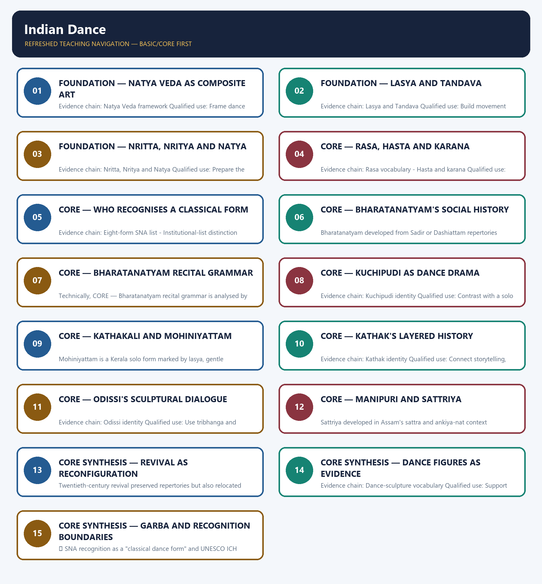

# Indian Dance — Learner-v2 Complete Learning Session

> **Authoring-only generation:** 2026-09-01. No PDF was rendered and no tracker or index was mutated.

### SOURCE, PROGRESSION AND CURRENT-LINKAGE AUDIT

- **Generation date:** 2026-09-01.
- **Repository-first evidence:** the Basic owner is taught first and preserved in full; the Advanced owner is retained only in the optional final teaching block.
- **OCR evidence:** Repository Markdown was primary. The available OCR-searchable Nitin Singhania Indian Art and Culture PDF was retained as a supplementary source; no unsupported page precision, quotation or dynamic status was imported from it.
- **Qdrant:** not used; repository Markdown and available OCR context were sufficient.
- **PYQ integrity:** No direct GS-I Mains PYQ is routed to Indian dance in the audited ledgers. The 2024 objective route on India's latest UNESCO ICH inclusion is retained in the owner extract with its official-key status, but the package does not infer or reproduce an answer letter.
- **Live-link boundary:** UNESCO's official Garba element page was fetched on 2026-09-01. Its metadata describes Garba as a ritual and devotional Navaratri dance around a lit earthenware pot or image of Amba. The package retains the verified 2023 inscription and expressly does not convert UNESCO ICH status into SNA classical recognition or a changing 'latest Indian element' claim.
- **Fact/inference discipline:** no current-affairs item, PYQ wording, figure or quotation is invented.

## BASIC LEARNING SESSION

### DEEP-REVIEW LEARNING CONTRACT

| Control | Binding rule for this package |
|---|---|
| Syllabus boundary | Complete Indian Art and Culture Core is taught by form, chronology, region, patronage and function before optional enrichment. |
| Evidence method | Claim → named monument/object/text/form/institution/community → analysis → qualification. |
| Chronology | Origin, surviving evidence, patronage phase, later adaptation, recognition and present status remain distinct. |
| Classification | Architecture, sculpture, painting, music, dance, theatre, language, craft, religion, heritage and cinema terms are compared on common axes without collapsing categories. |
| Interpretation | Style labels, iconographic readings, continuity, synthesis and social representation remain evidence-bounded rather than essentialist. |
| Practice contract | Every solved item has directive/demand decoding, a detailed examiner-grade model, executable compression plan, marks rationale and answer-specific improvement. |
| Approval | This immutable successor remains `approved: false` pending explicit approval. |

**Canonical Basic/Core owner:** `upsc-ai-kit\knowledge\Indian-Art-and-Culture\basic\09_Indian-Dance.md`  
**Canonical topic owner:** `upsc-ai-kit\knowledge\Indian-Art-and-Culture\basic\09_Indian-Dance.md`  
**Optional Advanced owner:** `upsc-ai-kit\knowledge\Indian-Art-and-Culture\advanced\09_Indian-Dance.md`  
**Official syllabus mapping:** `upsc-ai-kit\knowledge\Indian-Art-and-Culture\OFFICIAL-UPSC-SYLLABUS-MAPPING.md`

### EVIDENCE, PYQ AND CURRENT-STATUS CONTROL

- **Material evidence:** plans, fabric, technique, iconography, performance grammar, inscriptions, manuscripts, films and institutional records are identified before interpretation.
- **Attribution discipline:** patron, date, school, region, author, performer, community and function are stated only to the precision supported by the owner.
- **Quantitative discipline:** dimensions, counts, inscription years, lists, awards and registrations retain source, date, status and uncertainty; no figure is invented.
- **Interpretive discipline:** civilisational ranking, communal essentialism, timeless continuity, single-origin claims and treating commissioned representation as a social census are rejected.
- **PYQ discipline:** repository routing ledgers and locally held papers control wording and metadata; neutral rendering, reconstruction and unavailable official keys remain explicitly labelled.
- **Current-status note, rechecked 2026-09-01:** UNESCO's official Garba element page was fetched on 2026-09-01. Its metadata describes Garba as a ritual and devotional Navaratri dance around a lit earthenware pot or image of Amba. The package retains the verified 2023 inscription and expressly does not convert UNESCO ICH status into SNA classical recognition or a changing 'latest Indian element' claim.

**Live/official context sources recorded by the predecessor generation:**

- `https://ich.unesco.org/en/RL/garba-of-gujarat-01962`




*Distinct embedded teaching-navigation image. The separate continuous Cārvāka-style flowchart package remains an independent at-a-glance artifact.*

### SESSION 1 — FOUNDATION — NATYA VEDA AS COMPOSITE ART

#### DEFINITION / WHAT THIS IS CALLED

**Plain-language definition:** The layered Natyashastra tradition presents performance as a composite of text, enactment, music and rasa; a broad late-BCE to early-CE range is safer than a falsely exact composition date.

**Technical definition:** Evidence chain: Natya Veda framework Qualified use: Frame dance with music, text, enactment and rasa.

#### ANSWER-GRABBING OPENING — WRITE/ADAPT IN THE EXAM

> The layered Natyashastra tradition presents performance as a composite of text, enactment, music and rasa; a broad late-BCE to early-CE range is safer than a falsely exact composition date.

#### MUST-WRITE KEYWORDS

- **FOUNDATION**
- **Natya Veda as composite art**
- **Evidence chain**
- **Qualified use**
- **Natyashastra**
- **BCE**

**How to use them:** Frame the answer through FOUNDATION; define Natya Veda as composite art, connect Evidence chain with Qualified use to explain the mechanism, and use Natyashastra for the decisive comparison or qualification.

#### VISUAL FIRST

```text
NATYA VEDA AS COMPOSITE ART
01. Natya Veda framework
BOUNDARY -> Use a broad textual date and distinguish prescription from practice.
```

*This topic-specific rail fixes the evidence sequence and its exam boundary before analysis.*

#### CORE EXPLANATION

The layered Natyashastra tradition presents performance as a composite of text, enactment, music and rasa; a broad late-BCE to early-CE range is safer than a falsely exact composition date.

#### NAMED EVIDENCE AND MECHANISM

- The layered Natyashastra tradition presents performance as a composite of text, enactment, music and rasa; a broad late-BCE to early-CE range is safer than a falsely exact composition date.

#### EXAMINER CAUTION

- Use a broad textual date and distinguish prescription from practice.

#### EXAM LINK

- **Prelims:** Retain the exact form, region, text, technique or institution attached to Natya Veda as composite art.
- **Mains:** Frame dance with music, text, enactment and rasa.

#### MINI RECAP

- **Evidence chain:** Natya Veda framework
- **Qualified use:** Frame dance with music, text, enactment and rasa.

#### CLOSING RECALL FLOW — FOUNDATION — NATYA VEDA AS COMPOSITE ART

```text
START / CONCEPT: FOUNDATION — Natya Veda as composite art
        |
        v
EXACT TERMS: FOUNDATION · Natya Veda as composite art · Evidence chain · Qualified use · Natyashastra · BCE
        |
        v
MECHANISM / ARGUMENT: Evidence chain: Natya Veda framework Qualified use: Frame dance with music, text, enactment and rasa.
        |
        v
CONSEQUENCE / CONTRAST: Use a broad textual date and distinguish prescription from practice.
        |
        v
UPSC TRAP / ANSWER-USE: Do not miss this limiting distinction: frame dance with music, text, enactment and rasa.
        |
        v
ANSWER-GRABBING FORMULATION: The layered Natyashastra tradition presents performance as a composite of text, enactment, music and rasa; a broad late-BCE to early-CE range is safer than a falsely exact composition date.
```
### SESSION 2 — FOUNDATION — LASYA AND TANDAVA

#### DEFINITION / WHAT THIS IS CALLED

**Plain-language definition:** Lasya and Tandava identify graceful-expressive and vigorous-rhythmic aspects of dance; they are qualities of movement, not rigid rules limiting performers by gender.

**Technical definition:** Evidence chain: Lasya and Tandava Qualified use: Build movement vocabulary.

#### ANSWER-GRABBING OPENING — WRITE/ADAPT IN THE EXAM

> Lasya and Tandava identify graceful-expressive and vigorous-rhythmic aspects of dance; they are qualities of movement, not rigid rules limiting performers by gender.

#### MUST-WRITE KEYWORDS

- **FOUNDATION**
- **Lasya**
- **Tandava**
- **Evidence chain**
- **Qualified use**
- **Tandava Qualified**

**How to use them:** Frame the answer through FOUNDATION; define Lasya, connect Tandava with Evidence chain to explain the mechanism, and use Qualified use for the decisive comparison or qualification.

#### VISUAL FIRST

```text
LASYA AND TANDAVA
01. Lasya and Tandava
BOUNDARY -> Qualities are not gender-exclusive rules.
```

*This topic-specific rail fixes the evidence sequence and its exam boundary before analysis.*

#### CORE EXPLANATION

Lasya and Tandava identify graceful-expressive and vigorous-rhythmic aspects of dance; they are qualities of movement, not rigid rules limiting performers by gender.

#### NAMED EVIDENCE AND MECHANISM

- Lasya and Tandava identify graceful-expressive and vigorous-rhythmic aspects of dance; they are qualities of movement, not rigid rules limiting performers by gender.

#### EXAMINER CAUTION

- Qualities are not gender-exclusive rules.

#### EXAM LINK

- **Prelims:** Retain the exact form, region, text, technique or institution attached to Lasya and Tandava.
- **Mains:** Build movement vocabulary.

#### MINI RECAP

- **Evidence chain:** Lasya and Tandava
- **Qualified use:** Build movement vocabulary.

#### CLOSING RECALL FLOW — FOUNDATION — LASYA AND TANDAVA

```text
START / CONCEPT: FOUNDATION — Lasya and Tandava
        |
        v
EXACT TERMS: FOUNDATION · Lasya · Tandava · Evidence chain · Qualified use · Tandava Qualified
        |
        v
MECHANISM / ARGUMENT: Evidence chain: Lasya and Tandava Qualified use: Build movement vocabulary.
        |
        v
CONSEQUENCE / CONTRAST: The resulting consequence is that lasya and Tandava identify graceful-expressive and vigorous-rhythmic aspects of dance.
        |
        v
UPSC TRAP / ANSWER-USE: Do not miss this limiting distinction: lasya and Tandava identify graceful-expressive and vigorous-rhythmic aspects of dance.
        |
        v
ANSWER-GRABBING FORMULATION: Lasya and Tandava identify graceful-expressive and vigorous-rhythmic aspects of dance; they are qualities of movement, not rigid rules limiting performers by gender.
```
### SESSION 3 — FOUNDATION — NRITTA, NRITYA AND NATYA

#### DEFINITION / WHAT THIS IS CALLED

**Plain-language definition:** Nritta is pure rhythmic movement, Nritya expression through gesture and emotion, and Natya dramatic representation; the three terms are not interchangeable.

**Technical definition:** Evidence chain: Nritta, Nritya and Natya Qualified use: Prepare the most common terminology test.

#### ANSWER-GRABBING OPENING — WRITE/ADAPT IN THE EXAM

> Nritta is pure rhythmic movement, Nritya expression through gesture and emotion, and Natya dramatic representation; the three terms are not interchangeable.

#### MUST-WRITE KEYWORDS

- **FOUNDATION**
- **Nritta**
- **Nritya**
- **Natya**
- **Evidence chain**
- **Qualified use**

**How to use them:** Frame the answer through FOUNDATION; define Nritta, connect Nritya with Natya to explain the mechanism, and use Evidence chain for the decisive comparison or qualification.

#### VISUAL FIRST

```text
NRITTA, NRITYA AND NATYA
01. Nritta, Nritya and Natya
BOUNDARY -> Keep pure movement, expression and drama distinct.
```

*This topic-specific rail fixes the evidence sequence and its exam boundary before analysis.*

#### CORE EXPLANATION

Nritta is pure rhythmic movement, Nritya expression through gesture and emotion, and Natya dramatic representation; the three terms are not interchangeable.

#### NAMED EVIDENCE AND MECHANISM

- Nritta is pure rhythmic movement, Nritya expression through gesture and emotion, and Natya dramatic representation; the three terms are not interchangeable.

#### EXAMINER CAUTION

- Keep pure movement, expression and drama distinct.

#### EXAM LINK

- **Prelims:** Retain the exact form, region, text, technique or institution attached to Nritta, Nritya and Natya.
- **Mains:** Prepare the most common terminology test.

#### MINI RECAP

- **Evidence chain:** Nritta, Nritya and Natya
- **Qualified use:** Prepare the most common terminology test.

#### CLOSING RECALL FLOW — FOUNDATION — NRITTA, NRITYA AND NATYA

```text
START / CONCEPT: FOUNDATION — Nritta, Nritya and Natya
        |
        v
EXACT TERMS: FOUNDATION · Nritta · Nritya · Natya · Evidence chain · Qualified use
        |
        v
MECHANISM / ARGUMENT: Evidence chain: Nritta, Nritya and Natya Qualified use: Prepare the most common terminology test.
        |
        v
CONSEQUENCE / CONTRAST: The resulting consequence is that nritta is pure rhythmic movement, Nritya expression through gesture and emotion.
        |
        v
UPSC TRAP / ANSWER-USE: Do not miss this limiting distinction: nritta is pure rhythmic movement, Nritya expression through gesture and emotion.
        |
        v
ANSWER-GRABBING FORMULATION: Nritta is pure rhythmic movement, Nritya expression through gesture and emotion, and Natya dramatic representation; the three terms are not interchangeable.
```
### SESSION 4 — CORE — RASA, HASTA AND KARANA

#### DEFINITION / WHAT THIS IS CALLED

**Plain-language definition:** A hasta or mudra is a codified hand gesture, while a karana is a coordinated whole-body movement unit; the famous number 108 belongs to karanas, not basic mudras.

**Technical definition:** Evidence chain: Rasa vocabulary - Hasta and karana Qualified use: Link aesthetic mood to gesture and body.

#### ANSWER-GRABBING OPENING — WRITE/ADAPT IN THE EXAM

> A hasta or mudra is a codified hand gesture, while a karana is a coordinated whole-body movement unit; the famous number 108 belongs to karanas, not basic mudras.

#### MUST-WRITE KEYWORDS

- **Rasa**
- **hasta**
- **karana**
- **Evidence chain**
- **Qualified use**
- **A hasta or mudra**

**How to use them:** Frame the answer through Rasa; define hasta, connect karana with Evidence chain to explain the mechanism, and use Qualified use for the decisive comparison or qualification.

#### VISUAL FIRST

```text
RASA, HASTA AND KARANA
01. Rasa vocabulary
    |
    v
02. Hasta and karana
BOUNDARY -> The number 108 belongs to karanas.
```

*This topic-specific rail fixes the evidence sequence and its exam boundary before analysis.*

#### CORE EXPLANATION

Shringara, Roudra, Bibhatsa, Veera, Shanta, Haasya, Karuna, Bhayanaka and Adbhuta form the nine-rasa performance vocabulary shared with music and theatre. A hasta or mudra is a codified hand gesture, while a karana is a coordinated whole-body movement unit; the famous number 108 belongs to karanas, not basic mudras.

#### NAMED EVIDENCE AND MECHANISM

- Shringara, Roudra, Bibhatsa, Veera, Shanta, Haasya, Karuna, Bhayanaka and Adbhuta form the nine-rasa performance vocabulary shared with music and theatre.
- A hasta or mudra is a codified hand gesture, while a karana is a coordinated whole-body movement unit; the famous number 108 belongs to karanas, not basic mudras.

#### EXAMINER CAUTION

- The number 108 belongs to karanas.

#### EXAM LINK

- **Prelims:** Retain the exact form, region, text, technique or institution attached to Rasa, hasta and karana.
- **Mains:** Link aesthetic mood to gesture and body.

#### MINI RECAP

- **Evidence chain:** Rasa vocabulary -> Hasta and karana
- **Qualified use:** Link aesthetic mood to gesture and body.

#### CLOSING RECALL FLOW — CORE — RASA, HASTA AND KARANA

```text
START / CONCEPT: CORE — Rasa, hasta and karana
        |
        v
EXACT TERMS: Rasa · hasta · karana · Evidence chain · Qualified use · A hasta or mudra
        |
        v
MECHANISM / ARGUMENT: Evidence chain: Rasa vocabulary - Hasta and karana Qualified use: Link aesthetic mood to gesture and body.
        |
        v
CONSEQUENCE / CONTRAST: The resulting consequence is that a hasta or mudra is a codified hand gesture.
        |
        v
UPSC TRAP / ANSWER-USE: Do not miss this limiting distinction: a hasta or mudra is a codified hand gesture.
        |
        v
ANSWER-GRABBING FORMULATION: A hasta or mudra is a codified hand gesture, while a karana is a coordinated whole-body movement unit; the famous number 108 belongs to karanas, not basic mudras.
```
### SESSION 5 — CORE — WHO RECOGNISES A CLASSICAL FORM

#### DEFINITION / WHAT THIS IS CALLED

**Plain-language definition:** SNA, Ministry and UNESCO lists are different.

**Technical definition:** Evidence chain: Eight-form SNA list - Institutional-list distinction Qualified use: Build institutional precision.

#### ANSWER-GRABBING OPENING — WRITE/ADAPT IN THE EXAM

> The owner separately records a Ministry of Culture list of nine including Chhau; it must not be merged with the SNA eight-form list or with UNESCO inscriptions.

#### MUST-WRITE KEYWORDS

- **Who recognises a classical form**
- **Evidence chain**
- **Qualified use**
- **Ministry**
- **Culture**
- **Chhau**

**How to use them:** Frame the answer through Who recognises a classical form; define Evidence chain, connect Qualified use with Ministry to explain the mechanism, and use Culture for the decisive comparison or qualification.

#### VISUAL FIRST

```text
WHO RECOGNISES A CLASSICAL FORM
01. Eight-form SNA list
    |
    v
02. Institutional-list distinction
BOUNDARY -> SNA, Ministry and UNESCO lists are different.
```

*This topic-specific rail fixes the evidence sequence and its exam boundary before analysis.*

#### CORE EXPLANATION

The Sangeet Natak Akademi list contains Bharatanatyam, Kuchipudi, Kathakali, Mohiniyattam, Kathak, Odissi, Manipuri and Sattriya. The owner separately records a Ministry of Culture list of nine including Chhau; it must not be merged with the SNA eight-form list or with UNESCO inscriptions.

#### NAMED EVIDENCE AND MECHANISM

- The Sangeet Natak Akademi list contains Bharatanatyam, Kuchipudi, Kathakali, Mohiniyattam, Kathak, Odissi, Manipuri and Sattriya.
- The owner separately records a Ministry of Culture list of nine including Chhau; it must not be merged with the SNA eight-form list or with UNESCO inscriptions.

#### EXAMINER CAUTION

- SNA, Ministry and UNESCO lists are different.

#### EXAM LINK

- **Prelims:** Retain the exact form, region, text, technique or institution attached to Who recognises a classical form.
- **Mains:** Build institutional precision.

#### MINI RECAP

- **Evidence chain:** Eight-form SNA list -> Institutional-list distinction
- **Qualified use:** Build institutional precision.

#### CLOSING RECALL FLOW — CORE — WHO RECOGNISES A CLASSICAL FORM

```text
START / CONCEPT: CORE — Who recognises a classical form
        |
        v
EXACT TERMS: Who recognises a classical form · Evidence chain · Qualified use · Ministry · Culture · Chhau
        |
        v
MECHANISM / ARGUMENT: Evidence chain: Eight-form SNA list - Institutional-list distinction Qualified use: Build institutional precision.
        |
        v
CONSEQUENCE / CONTRAST: SNA, Ministry and UNESCO lists are different.
        |
        v
UPSC TRAP / ANSWER-USE: Do not miss this limiting distinction: the owner separately records a Ministry of Culture list of nine including Chhau.
        |
        v
ANSWER-GRABBING FORMULATION: The owner separately records a Ministry of Culture list of nine including Chhau; it must not be merged with the SNA eight-form list or with UNESCO inscriptions.
```
### SESSION 6 — CORE — BHARATANATYAM'S SOCIAL HISTORY

#### DEFINITION / WHAT THIS IS CALLED

**Plain-language definition:** Evidence chain: Bharatanatyam history Qualified use: Prepare a critical revival answer.

**Technical definition:** Bharatanatyam developed from Sadir or Dashiattam repertories transmitted by hereditary practitioners and was reconfigured through anti-nautch disruption and named revival actors.

#### ANSWER-GRABBING OPENING — WRITE/ADAPT IN THE EXAM

> Evidence chain: Bharatanatyam history Qualified use: Prepare a critical revival answer.

#### MUST-WRITE KEYWORDS

- **Bharatanatyam's social history**
- **Evidence chain**
- **Qualified use**
- **Bharatanatyam**
- **Sadir**
- **Dashiattam**

**How to use them:** Frame the answer through Bharatanatyam's social history; define Evidence chain, connect Qualified use with Bharatanatyam to explain the mechanism, and use Sadir for the decisive comparison or qualification.

#### VISUAL FIRST

```text
BHARATANATYAM'S SOCIAL HISTORY
01. Bharatanatyam history
BOUNDARY -> Revival must retain hereditary knowledge and anti-nautch rupture.
```

*This topic-specific rail fixes the evidence sequence and its exam boundary before analysis.*

#### CORE EXPLANATION

Bharatanatyam developed from Sadir or Dashiattam repertories transmitted by hereditary practitioners and was reconfigured through anti-nautch disruption and named revival actors.

#### NAMED EVIDENCE AND MECHANISM

- Bharatanatyam developed from Sadir or Dashiattam repertories transmitted by hereditary practitioners and was reconfigured through anti-nautch disruption and named revival actors.

#### EXAMINER CAUTION

- Revival must retain hereditary knowledge and anti-nautch rupture.

#### EXAM LINK

- **Prelims:** Retain the exact form, region, text, technique or institution attached to Bharatanatyam's social history.
- **Mains:** Prepare a critical revival answer.

#### MINI RECAP

- **Evidence chain:** Bharatanatyam history
- **Qualified use:** Prepare a critical revival answer.

#### CLOSING RECALL FLOW — CORE — BHARATANATYAM'S SOCIAL HISTORY

```text
START / CONCEPT: CORE — Bharatanatyam's social history
        |
        v
EXACT TERMS: Bharatanatyam's social history · Evidence chain · Qualified use · Bharatanatyam · Sadir · Dashiattam
        |
        v
MECHANISM / ARGUMENT: Bharatanatyam developed from Sadir or Dashiattam repertories transmitted by hereditary practitioners and was reconfigured through anti-nautch disruption and named revival actors.
        |
        v
CONSEQUENCE / CONTRAST: Revival must retain hereditary knowledge and anti-nautch rupture.
        |
        v
UPSC TRAP / ANSWER-USE: Do not miss this limiting distinction: evidence chain: Bharatanatyam history Qualified use: Prepare a critical revival answer.
        |
        v
ANSWER-GRABBING FORMULATION: Evidence chain: Bharatanatyam history Qualified use: Prepare a critical revival answer.
```
### SESSION 7 — CORE — BHARATANATYAM RECITAL GRAMMAR

#### DEFINITION / WHAT THIS IS CALLED

**Plain-language definition:** Evidence chain: Bharatanatyam recital Qualified use: Build sequence-based identification.

**Technical definition:** Technically, CORE — Bharatanatyam recital grammar is analysed by relating Bharatanatyam recital grammar to Evidence chain, then testing the relationship through Qualified use and Bharatanatyam.

#### ANSWER-GRABBING OPENING — WRITE/ADAPT IN THE EXAM

> Evidence chain: Bharatanatyam recital Qualified use: Build sequence-based identification.

#### MUST-WRITE KEYWORDS

- **Bharatanatyam recital grammar**
- **Evidence chain**
- **Qualified use**
- **Bharatanatyam**
- **Qualified**
- **Build**

**How to use them:** Frame the answer through Bharatanatyam recital grammar; define Evidence chain, connect Qualified use with Bharatanatyam to explain the mechanism, and use Qualified for the decisive comparison or qualification.

#### VISUAL FIRST

```text
BHARATANATYAM RECITAL GRAMMAR
01. Bharatanatyam recital
BOUNDARY -> Do not import unsourced recital variants.
```

*This topic-specific rail fixes the evidence sequence and its exam boundary before analysis.*

#### CORE EXPLANATION

The Tanjore Quartet codified a recital sequence including Alarippu, Jatiswaram, Shabdam, Varnam, Padam, Jawali and Thillana.

#### NAMED EVIDENCE AND MECHANISM

- The Tanjore Quartet codified a recital sequence including Alarippu, Jatiswaram, Shabdam, Varnam, Padam, Jawali and Thillana.

#### EXAMINER CAUTION

- Do not import unsourced recital variants.

#### EXAM LINK

- **Prelims:** Retain the exact form, region, text, technique or institution attached to Bharatanatyam recital grammar.
- **Mains:** Build sequence-based identification.

#### MINI RECAP

- **Evidence chain:** Bharatanatyam recital
- **Qualified use:** Build sequence-based identification.

#### CLOSING RECALL FLOW — CORE — BHARATANATYAM RECITAL GRAMMAR

```text
START / CONCEPT: CORE — Bharatanatyam recital grammar
        |
        v
EXACT TERMS: Bharatanatyam recital grammar · Evidence chain · Qualified use · Bharatanatyam · Qualified · Build
        |
        v
MECHANISM / ARGUMENT: Do not import unsourced recital variants.
        |
        v
CONSEQUENCE / CONTRAST: The resulting consequence is that evidence chain: Bharatanatyam recital Qualified use: Build sequence-based identification.
        |
        v
UPSC TRAP / ANSWER-USE: Do not miss this limiting distinction: evidence chain: Bharatanatyam recital Qualified use: Build sequence-based identification.
        |
        v
ANSWER-GRABBING FORMULATION: Evidence chain: Bharatanatyam recital Qualified use: Build sequence-based identification.
```
### SESSION 8 — CORE — KUCHIPUDI AS DANCE DRAMA

#### DEFINITION / WHAT THIS IS CALLED

**Plain-language definition:** Kuchipudi is linked to Kuchelapuram in Andhra Pradesh, travelling actor traditions and Siddhendra; its dance-drama origin distinguishes it from a temple-solo narrative.

**Technical definition:** Evidence chain: Kuchipudi identity Qualified use: Contrast with a solo temple-stage history.

#### ANSWER-GRABBING OPENING — WRITE/ADAPT IN THE EXAM

> Kuchipudi is linked to Kuchelapuram in Andhra Pradesh, travelling actor traditions and Siddhendra; its dance-drama origin distinguishes it from a temple-solo narrative.

#### MUST-WRITE KEYWORDS

- **Kuchipudi as dance drama**
- **Evidence chain**
- **Qualified use**
- **Kuchipudi**
- **Kuchelapuram**
- **Andhra Pradesh**

**How to use them:** Frame the answer through Kuchipudi as dance drama; define Evidence chain, connect Qualified use with Kuchipudi to explain the mechanism, and use Kuchelapuram for the decisive comparison or qualification.

#### VISUAL FIRST

```text
KUCHIPUDI AS DANCE DRAMA
01. Kuchipudi identity
BOUNDARY -> Kuchelapuram and itinerant actors are discriminators.
```

*This topic-specific rail fixes the evidence sequence and its exam boundary before analysis.*

#### CORE EXPLANATION

Kuchipudi is linked to Kuchelapuram in Andhra Pradesh, travelling actor traditions and Siddhendra; its dance-drama origin distinguishes it from a temple-solo narrative.

#### NAMED EVIDENCE AND MECHANISM

- Kuchipudi is linked to Kuchelapuram in Andhra Pradesh, travelling actor traditions and Siddhendra; its dance-drama origin distinguishes it from a temple-solo narrative.

#### EXAMINER CAUTION

- Kuchelapuram and itinerant actors are discriminators.

#### EXAM LINK

- **Prelims:** Retain the exact form, region, text, technique or institution attached to Kuchipudi as dance drama.
- **Mains:** Contrast with a solo temple-stage history.

#### MINI RECAP

- **Evidence chain:** Kuchipudi identity
- **Qualified use:** Contrast with a solo temple-stage history.

#### CLOSING RECALL FLOW — CORE — KUCHIPUDI AS DANCE DRAMA

```text
START / CONCEPT: CORE — Kuchipudi as dance drama
        |
        v
EXACT TERMS: Kuchipudi as dance drama · Evidence chain · Qualified use · Kuchipudi · Kuchelapuram · Andhra Pradesh
        |
        v
MECHANISM / ARGUMENT: Evidence chain: Kuchipudi identity Qualified use: Contrast with a solo temple-stage history.
        |
        v
CONSEQUENCE / CONTRAST: Kuchelapuram and itinerant actors are discriminators.
        |
        v
UPSC TRAP / ANSWER-USE: Do not miss this limiting distinction: contrast with a solo temple-stage history.
        |
        v
ANSWER-GRABBING FORMULATION: Kuchipudi is linked to Kuchelapuram in Andhra Pradesh, travelling actor traditions and Siddhendra; its dance-drama origin distinguishes it from a temple-solo narrative.
```
### SESSION 9 — CORE — KATHAKALI AND MOHINIYATTAM

#### DEFINITION / WHAT THIS IS CALLED

**Plain-language definition:** Kathakali is Kerala dance-drama with Attakkatha text, Manipravalam, gesture-led acting, elaborate make-up and percussion; it is not Mohiniyattam's solo lasya form.

**Technical definition:** Mohiniyattam is a Kerala solo form marked by lasya, gentle unthumped footwork and white-gold Kasavu costume; Nagabandha belongs to Manipuri, not Mohiniyattam.

#### ANSWER-GRABBING OPENING — WRITE/ADAPT IN THE EXAM

> Kathakali is Kerala dance-drama with Attakkatha text, Manipravalam, gesture-led acting, elaborate make-up and percussion; it is not Mohiniyattam's solo lasya form.

#### MUST-WRITE KEYWORDS

- **Kathakali**
- **Mohiniyattam**
- **Evidence chain**
- **Qualified use**
- **Kerala**
- **Attakkatha**

**How to use them:** Frame the answer through Kathakali; define Mohiniyattam, connect Evidence chain with Qualified use to explain the mechanism, and use Kerala for the decisive comparison or qualification.

#### VISUAL FIRST

```text
KATHAKALI AND MOHINIYATTAM
01. Kathakali identity
    |
    v
02. Mohiniyattam identity
BOUNDARY -> Shared Kerala origin does not erase genre difference.
```

*This topic-specific rail fixes the evidence sequence and its exam boundary before analysis.*

#### CORE EXPLANATION

Kathakali is Kerala dance-drama with Attakkatha text, Manipravalam, gesture-led acting, elaborate make-up and percussion; it is not Mohiniyattam's solo lasya form. Mohiniyattam is a Kerala solo form marked by lasya, gentle unthumped footwork and white-gold Kasavu costume; Nagabandha belongs to Manipuri, not Mohiniyattam.

#### NAMED EVIDENCE AND MECHANISM

- Kathakali is Kerala dance-drama with Attakkatha text, Manipravalam, gesture-led acting, elaborate make-up and percussion; it is not Mohiniyattam's solo lasya form.
- Mohiniyattam is a Kerala solo form marked by lasya, gentle unthumped footwork and white-gold Kasavu costume; Nagabandha belongs to Manipuri, not Mohiniyattam.

#### EXAMINER CAUTION

- Shared Kerala origin does not erase genre difference.

#### EXAM LINK

- **Prelims:** Retain the exact form, region, text, technique or institution attached to Kathakali and Mohiniyattam.
- **Mains:** Use costume, text, troupe and footwork.

#### MINI RECAP

- **Evidence chain:** Kathakali identity -> Mohiniyattam identity
- **Qualified use:** Use costume, text, troupe and footwork.

#### CLOSING RECALL FLOW — CORE — KATHAKALI AND MOHINIYATTAM

```text
START / CONCEPT: CORE — Kathakali and Mohiniyattam
        |
        v
EXACT TERMS: Kathakali · Mohiniyattam · Evidence chain · Qualified use · Kerala · Attakkatha
        |
        v
MECHANISM / ARGUMENT: Mohiniyattam is a Kerala solo form marked by lasya, gentle unthumped footwork and white-gold Kasavu costume; Nagabandha belongs to Manipuri, not Mohiniyattam.
        |
        v
CONSEQUENCE / CONTRAST: Evidence chain: Kathakali identity - Mohiniyattam identity Qualified use: Use costume, text, troupe and footwork.
        |
        v
UPSC TRAP / ANSWER-USE: Shared Kerala origin does not erase genre difference.
        |
        v
ANSWER-GRABBING FORMULATION: Kathakali is Kerala dance-drama with Attakkatha text, Manipravalam, gesture-led acting, elaborate make-up and percussion; it is not Mohiniyattam's solo lasya form.
```
### SESSION 10 — CORE — KATHAK'S LAYERED HISTORY

#### DEFINITION / WHAT THIS IS CALLED

**Plain-language definition:** Kathak combines storytelling, tatkar footwork and chakkars through temple and court histories; it should not be reduced to either a purely Mughal or purely temple form.

**Technical definition:** Evidence chain: Kathak identity Qualified use: Connect storytelling, tatkar and chakkars.

#### ANSWER-GRABBING OPENING — WRITE/ADAPT IN THE EXAM

> Kathak combines storytelling, tatkar footwork and chakkars through temple and court histories; it should not be reduced to either a purely Mughal or purely temple form.

#### MUST-WRITE KEYWORDS

- **Kathak's layered history**
- **Evidence chain**
- **Qualified use**
- **Kathak**
- **Mughal**
- **Qualified**

**How to use them:** Frame the answer through Kathak's layered history; define Evidence chain, connect Qualified use with Kathak to explain the mechanism, and use Mughal for the decisive comparison or qualification.

#### VISUAL FIRST

```text
KATHAK'S LAYERED HISTORY
01. Kathak identity
BOUNDARY -> Avoid a single-origin court or temple story.
```

*This topic-specific rail fixes the evidence sequence and its exam boundary before analysis.*

#### CORE EXPLANATION

Kathak combines storytelling, tatkar footwork and chakkars through temple and court histories; it should not be reduced to either a purely Mughal or purely temple form.

#### NAMED EVIDENCE AND MECHANISM

- Kathak combines storytelling, tatkar footwork and chakkars through temple and court histories; it should not be reduced to either a purely Mughal or purely temple form.

#### EXAMINER CAUTION

- Avoid a single-origin court or temple story.

#### EXAM LINK

- **Prelims:** Retain the exact form, region, text, technique or institution attached to Kathak's layered history.
- **Mains:** Connect storytelling, tatkar and chakkars.

#### MINI RECAP

- **Evidence chain:** Kathak identity
- **Qualified use:** Connect storytelling, tatkar and chakkars.

#### CLOSING RECALL FLOW — CORE — KATHAK'S LAYERED HISTORY

```text
START / CONCEPT: CORE — Kathak's layered history
        |
        v
EXACT TERMS: Kathak's layered history · Evidence chain · Qualified use · Kathak · Mughal · Qualified
        |
        v
MECHANISM / ARGUMENT: Evidence chain: Kathak identity Qualified use: Connect storytelling, tatkar and chakkars.
        |
        v
CONSEQUENCE / CONTRAST: The resulting consequence is that kathak combines storytelling, tatkar footwork and chakkars through temple and court histories.
        |
        v
UPSC TRAP / ANSWER-USE: Do not miss this limiting distinction: kathak combines storytelling, tatkar footwork and chakkars through temple and court histories.
        |
        v
ANSWER-GRABBING FORMULATION: Kathak combines storytelling, tatkar footwork and chakkars through temple and court histories; it should not be reduced to either a purely Mughal or purely temple form.
```
### SESSION 11 — CORE — ODISSI'S SCULPTURAL DIALOGUE

#### DEFINITION / WHAT THIS IS CALLED

**Plain-language definition:** Mobile sculpture is an analogy, not proof of unchanged choreography.

**Technical definition:** Evidence chain: Odissi identity Qualified use: Use tribhanga and chowk precisely.

#### ANSWER-GRABBING OPENING — WRITE/ADAPT IN THE EXAM

> Odissi uses tribhanga and chowk, torso articulation, Gita Govinda repertoire and mahari-gotipua histories; its mobile-sculpture analogy does not prove an unchanged ancient choreography.

#### MUST-WRITE KEYWORDS

- **Odissi's sculptural dialogue**
- **Evidence chain**
- **Qualified use**
- **Odissi**
- **Gita Govinda**
- **Mobile sculpture**

**How to use them:** Frame the answer through Odissi's sculptural dialogue; define Evidence chain, connect Qualified use with Odissi to explain the mechanism, and use Gita Govinda for the decisive comparison or qualification.

#### VISUAL FIRST

```text
ODISSI'S SCULPTURAL DIALOGUE
01. Odissi identity
BOUNDARY -> Mobile sculpture is an analogy, not proof of unchanged choreography.
```

*This topic-specific rail fixes the evidence sequence and its exam boundary before analysis.*

#### CORE EXPLANATION

Odissi uses tribhanga and chowk, torso articulation, Gita Govinda repertoire and mahari-gotipua histories; its mobile-sculpture analogy does not prove an unchanged ancient choreography.

#### NAMED EVIDENCE AND MECHANISM

- Odissi uses tribhanga and chowk, torso articulation, Gita Govinda repertoire and mahari-gotipua histories; its mobile-sculpture analogy does not prove an unchanged ancient choreography.

#### EXAMINER CAUTION

- Mobile sculpture is an analogy, not proof of unchanged choreography.

#### EXAM LINK

- **Prelims:** Retain the exact form, region, text, technique or institution attached to Odissi's sculptural dialogue.
- **Mains:** Use tribhanga and chowk precisely.

#### MINI RECAP

- **Evidence chain:** Odissi identity
- **Qualified use:** Use tribhanga and chowk precisely.

#### CLOSING RECALL FLOW — CORE — ODISSI'S SCULPTURAL DIALOGUE

```text
START / CONCEPT: CORE — Odissi's sculptural dialogue
        |
        v
EXACT TERMS: Odissi's sculptural dialogue · Evidence chain · Qualified use · Odissi · Gita Govinda · Mobile sculpture
        |
        v
MECHANISM / ARGUMENT: Evidence chain: Odissi identity Qualified use: Use tribhanga and chowk precisely.
        |
        v
CONSEQUENCE / CONTRAST: Mobile sculpture is an analogy, not proof of unchanged choreography.
        |
        v
UPSC TRAP / ANSWER-USE: Do not miss this limiting distinction: mains: Use tribhanga and chowk precisely.
        |
        v
ANSWER-GRABBING FORMULATION: Odissi uses tribhanga and chowk, torso articulation, Gita Govinda repertoire and mahari-gotipua histories; its mobile-sculpture analogy does not prove an unchanged ancient choreography.
```
### SESSION 12 — CORE — MANIPURI AND SATTRIYA

#### DEFINITION / WHAT THIS IS CALLED

**Plain-language definition:** Evidence chain: Manipuri identity - Sattriya identity Qualified use: Break close options with pung and sattra.

**Technical definition:** Sattriya developed in Assam's sattra and ankiya-nat context associated with Sankaradeva, with mati-akhora as a movement base.

#### ANSWER-GRABBING OPENING — WRITE/ADAPT IN THE EXAM

> Evidence chain: Manipuri identity - Sattriya identity Qualified use: Break close options with pung and sattra.

#### MUST-WRITE KEYWORDS

- **Manipuri**
- **Sattriya**
- **Evidence chain**
- **Qualified use**
- **Assam's**
- **Sankaradeva**

**How to use them:** Frame the answer through Manipuri; define Sattriya, connect Evidence chain with Qualified use to explain the mechanism, and use Assam's for the decisive comparison or qualification.

#### VISUAL FIRST

```text
MANIPURI AND SATTRIYA
01. Manipuri identity
    |
    v
02. Sattriya identity
BOUNDARY -> Shared devotion needs institutional discriminators.
```

*This topic-specific rail fixes the evidence sequence and its exam boundary before analysis.*

#### CORE EXPLANATION

Manipuri Vaishnava performance emphasises raslila, pung or cholom traditions, restrained facial display and Nagabandha rather than Odissi's torso-led tribhanga. Sattriya developed in Assam's sattra and ankiya-nat context associated with Sankaradeva, with mati-akhora as a movement base.

#### NAMED EVIDENCE AND MECHANISM

- Manipuri Vaishnava performance emphasises raslila, pung or cholom traditions, restrained facial display and Nagabandha rather than Odissi's torso-led tribhanga.
- Sattriya developed in Assam's sattra and ankiya-nat context associated with Sankaradeva, with mati-akhora as a movement base.

#### EXAMINER CAUTION

- Shared devotion needs institutional discriminators.

#### EXAM LINK

- **Prelims:** Retain the exact form, region, text, technique or institution attached to Manipuri and Sattriya.
- **Mains:** Break close options with pung and sattra.

#### MINI RECAP

- **Evidence chain:** Manipuri identity -> Sattriya identity
- **Qualified use:** Break close options with pung and sattra.

#### CLOSING RECALL FLOW — CORE — MANIPURI AND SATTRIYA

```text
START / CONCEPT: CORE — Manipuri and Sattriya
        |
        v
EXACT TERMS: Manipuri · Sattriya · Evidence chain · Qualified use · Assam's · Sankaradeva
        |
        v
MECHANISM / ARGUMENT: Sattriya developed in Assam's sattra and ankiya-nat context associated with Sankaradeva, with mati-akhora as a movement base.
        |
        v
CONSEQUENCE / CONTRAST: The resulting consequence is that manipuri identity - Sattriya identity Qualified use.
        |
        v
UPSC TRAP / ANSWER-USE: Do not miss this limiting distinction: manipuri identity - Sattriya identity Qualified use.
        |
        v
ANSWER-GRABBING FORMULATION: Evidence chain: Manipuri identity - Sattriya identity Qualified use: Break close options with pung and sattra.
```
### SESSION 13 — CORE SYNTHESIS — REVIVAL AS RECONFIGURATION

#### DEFINITION / WHAT THIS IS CALLED

**Plain-language definition:** Evidence chain: Revival and reconfiguration Qualified use: Add the gender-community dimension.

**Technical definition:** Twentieth-century revival preserved repertories but also relocated authority from hereditary communities to institutions and elite stages; continuity and rupture must be argued together.

#### ANSWER-GRABBING OPENING — WRITE/ADAPT IN THE EXAM

> Twentieth-century revival preserved repertories but also relocated authority from hereditary communities to institutions and elite stages; continuity and rupture must be argued together.

#### MUST-WRITE KEYWORDS

- **CORE SYNTHESIS**
- **Revival as reconfiguration**
- **Evidence chain**
- **Qualified use**
- **Twentieth-century**
- **Revival**

**How to use them:** Frame the answer through CORE SYNTHESIS; define Revival as reconfiguration, connect Evidence chain with Qualified use to explain the mechanism, and use Twentieth-century for the decisive comparison or qualification.

#### VISUAL FIRST

```text
REVIVAL AS RECONFIGURATION
01. Revival and reconfiguration
BOUNDARY -> Preservation and displacement occurred together.
```

*This topic-specific rail fixes the evidence sequence and its exam boundary before analysis.*

#### CORE EXPLANATION

Twentieth-century revival preserved repertories but also relocated authority from hereditary communities to institutions and elite stages; continuity and rupture must be argued together.

#### NAMED EVIDENCE AND MECHANISM

- Twentieth-century revival preserved repertories but also relocated authority from hereditary communities to institutions and elite stages; continuity and rupture must be argued together.

#### EXAMINER CAUTION

- Preservation and displacement occurred together.

#### EXAM LINK

- **Prelims:** Retain the exact form, region, text, technique or institution attached to Revival as reconfiguration.
- **Mains:** Add the gender-community dimension.

#### MINI RECAP

- **Evidence chain:** Revival and reconfiguration
- **Qualified use:** Add the gender-community dimension.

#### CLOSING RECALL FLOW — CORE SYNTHESIS — REVIVAL AS RECONFIGURATION

```text
START / CONCEPT: CORE SYNTHESIS — Revival as reconfiguration
        |
        v
EXACT TERMS: CORE SYNTHESIS · Revival as reconfiguration · Evidence chain · Qualified use · Twentieth-century · Revival
        |
        v
MECHANISM / ARGUMENT: Evidence chain: Revival and reconfiguration Qualified use: Add the gender-community dimension.
        |
        v
CONSEQUENCE / CONTRAST: The resulting consequence is that twentieth-century revival preserved repertories but also relocated authority from hereditary communities to institutions and...
        |
        v
UPSC TRAP / ANSWER-USE: Do not miss this limiting distinction: twentieth-century revival preserved repertories but also relocated authority from hereditary communities to institutions and...
        |
        v
ANSWER-GRABBING FORMULATION: Twentieth-century revival preserved repertories but also relocated authority from hereditary communities to institutions and elite stages; continuity and rupture must be argued together.
```
### SESSION 14 — CORE SYNTHESIS — DANCE FIGURES AS EVIDENCE

#### DEFINITION / WHAT THIS IS CALLED

**Plain-language definition:** Dancer figures at Khajuraho, Konark, Ellora and Chidambaram share posture and gesture vocabularies with dance, but sculpture proves an idiom of movement rather than a complete named choreography.

**Technical definition:** Evidence chain: Dance-sculpture vocabulary Qualified use: Support sculpture and temple questions.

#### ANSWER-GRABBING OPENING — WRITE/ADAPT IN THE EXAM

> Dancer figures at Khajuraho, Konark, Ellora and Chidambaram share posture and gesture vocabularies with dance, but sculpture proves an idiom of movement rather than a complete named choreography.

#### MUST-WRITE KEYWORDS

- **CORE SYNTHESIS**
- **Dance figures as evidence**
- **Evidence chain**
- **Qualified use**
- **Dancer**
- **Khajuraho**

**How to use them:** Frame the answer through CORE SYNTHESIS; define Dance figures as evidence, connect Evidence chain with Qualified use to explain the mechanism, and use Dancer for the decisive comparison or qualification.

#### VISUAL FIRST

```text
DANCE FIGURES AS EVIDENCE
01. Dance-sculpture vocabulary
BOUNDARY -> Sculpture preserves movement idiom, not a full repertoire.
```

*This topic-specific rail fixes the evidence sequence and its exam boundary before analysis.*

#### CORE EXPLANATION

Dancer figures at Khajuraho, Konark, Ellora and Chidambaram share posture and gesture vocabularies with dance, but sculpture proves an idiom of movement rather than a complete named choreography.

#### NAMED EVIDENCE AND MECHANISM

- Dancer figures at Khajuraho, Konark, Ellora and Chidambaram share posture and gesture vocabularies with dance, but sculpture proves an idiom of movement rather than a complete named choreography.

#### EXAMINER CAUTION

- Sculpture preserves movement idiom, not a full repertoire.

#### EXAM LINK

- **Prelims:** Retain the exact form, region, text, technique or institution attached to Dance figures as evidence.
- **Mains:** Support sculpture and temple questions.

#### MINI RECAP

- **Evidence chain:** Dance-sculpture vocabulary
- **Qualified use:** Support sculpture and temple questions.

#### CLOSING RECALL FLOW — CORE SYNTHESIS — DANCE FIGURES AS EVIDENCE

```text
START / CONCEPT: CORE SYNTHESIS — Dance figures as evidence
        |
        v
EXACT TERMS: CORE SYNTHESIS · Dance figures as evidence · Evidence chain · Qualified use · Dancer · Khajuraho
        |
        v
MECHANISM / ARGUMENT: Evidence chain: Dance-sculpture vocabulary Qualified use: Support sculpture and temple questions.
        |
        v
CONSEQUENCE / CONTRAST: The resulting consequence is that dancer figures at Khajuraho, Konark, Ellora and Chidambaram share posture and gesture vocabularies with...
        |
        v
UPSC TRAP / ANSWER-USE: Do not miss this limiting distinction: dancer figures at Khajuraho, Konark, Ellora and Chidambaram share posture and gesture vocabularies with...
        |
        v
ANSWER-GRABBING FORMULATION: Dancer figures at Khajuraho, Konark, Ellora and Chidambaram share posture and gesture vocabularies with dance, but sculpture proves an idiom of movement rather than a complete named choreography.
```
### SESSION 15 — CORE SYNTHESIS — GARBA AND RECOGNITION BOUNDARIES

#### DEFINITION / WHAT THIS IS CALLED

**Plain-language definition:** 📰 UNESCO inscribed Garba of Gujarat on the Representative List of the Intangible Cultural Heritage of Humanity in 2023 — a folk (not SNA classical) dance form; verify current ICH status against UNESCO's own element page before citing (see topic 14 for the full ICH ledger). ⚠️ Recognition by the Sangeet Natak Akademi as one of the eight classical forms and inscription on a UNESCO list are two separate, non interchangeable forms of recognition — do not conflate them.

**Technical definition:** ❌ SNA recognition as a "classical dance form" and UNESCO ICH inscription are the same kind of status. - They are governed by entirely different bodies and criteria (national cultural-academy recognition vs. international treaty-based inscription); a dance form can hold one, both, or neither. ❌ Nritta, Natya and Nritya are interchangeable terms for "dance." - Each denotes a specific, distinct component (pure movement, drama, expression respectively) per Nandikeshvara's Abhinaya Darpana. ❌ Lasya and Tandava map simply onto "soft" and "hard" dance styles performed by specific genders exclusively. - They denote aspects/ qualities present in dance generally, not a rigid gender-exclusive performance rule. ❌ All eight classical forms share an identical origin narrative. - Each has a distinct regional and historical origin (e.g.

#### ANSWER-GRABBING OPENING — WRITE/ADAPT IN THE EXAM

> 📰 UNESCO inscribed Garba of Gujarat on the Representative List of the Intangible Cultural Heritage of Humanity in 2023 — a folk (not SNA classical) dance form; verify current ICH status against UNESCO's own element page before citing (see topic 14 for the full ICH ledger). ⚠️ Recognition by the Sangeet Natak Akademi as one of the eight classical forms and inscription on a UNESCO list are two separate, non interchangeable forms of recognition — do not conflate them.

#### MUST-WRITE KEYWORDS

- **CORE SYNTHESIS**
- **Garba**
- **recognition boundaries**
- **Evidence chain**
- **Qualified use**
- **Subject**

**How to use them:** Frame the answer through CORE SYNTHESIS; define Garba, connect recognition boundaries with Evidence chain to explain the mechanism, and use Qualified use for the decisive comparison or qualification.

#### VISUAL FIRST

```text
GARBA AND RECOGNITION BOUNDARIES
01. Recognition tracks
    |
    v
02. Garba official linkage
BOUNDARY -> UNESCO inscription is not classical-form recognition.
```

*This topic-specific rail fixes the evidence sequence and its exam boundary before analysis.*

#### CORE EXPLANATION

SNA classical recognition and UNESCO Intangible Cultural Heritage inscription are different institutional acts; a form may hold one, both or neither. UNESCO describes Garba as a ritual and devotional Navaratri dance around a lit earthen pot or image of Amba; its 2023 inscription is a folk-dance linkage, not SNA classical status.

#### NAMED EVIDENCE AND MECHANISM

- SNA classical recognition and UNESCO Intangible Cultural Heritage inscription are different institutional acts; a form may hold one, both or neither.
- UNESCO describes Garba as a ritual and devotional Navaratri dance around a lit earthen pot or image of Amba; its 2023 inscription is a folk-dance linkage, not SNA classical status.

#### EXAMINER CAUTION

- UNESCO inscription is not classical-form recognition.

#### EXAM LINK

- **Prelims:** Retain the exact form, region, text, technique or institution attached to Garba and recognition boundaries.
- **Mains:** Close with a directly fetched official linkage.

#### MINI RECAP

- **Evidence chain:** Recognition tracks -> Garba official linkage
- **Qualified use:** Close with a directly fetched official linkage.
#### COMPLETE BASIC OWNER EVIDENCE BANK

> **Subject:** Indian Art & Culture | **Tier:** Must-Do (foundation) |
> **GS Paper:** GS-I.
> **Core area:** Natya Shastra concepts (Lasya/Tandava, Nritta/Nritya/
> Natya, nine rasas, mudras); the eight SNA-recognised classical dance
> forms; folk dance.
> **Grounded in:** Nitin Singhania, *Indian Art and Culture*, PDF pp.
> 458-499; `00_Master-Framework.md` Section 3; audited UPSC Mains 2024-2025
> GS Paper I (no direct question; cross-links to Topic 03's Chandella PYQ).
> ✅ = source-grounded | ⚠️ = analytical inference | 📰 = current anchor | ❌ = trap.
> *Companion: `advanced/09_Indian-Dance.md`.*

#### 1. Snapshot and syllabus fit

✅ This topic covers the Natya Shastra's foundational dance vocabulary and
the eight Sangeet Natak Akademi (SNA)-recognised classical dance forms.
⚠️ No 2024/2025 Mains question tests dance directly, but its posture/
gesture vocabulary directly supports reading Chandella and Chola temple
sculpture (topics 03, 06), since dance and sculpture share a common
gestural language.

#### 2. Essential vocabulary

| Term | Exam-ready meaning |
|---|---|
| ✅ **Natya Veda** | The *Natyashastra*, a layered text conventionally attributed to Bharata and broadly dated across the late centuries BCE/early centuries CE, narrates drama as a "fifth Veda" combining text, enactment, music and rasa. Avoid a falsely exact composition date. |
| ✅ **Lasya vs. Tandava** | Lasya = graceful, feminine aspect of dance (bhava, rasa, abhinaya emphasis); Tandava = rhythmic, masculine aspect (movement emphasis) (*Nitin…pdf*, PDF p. 459). |
| ✅ **Nritta, Natya, Nritya** | Per Nandikeshvara's *Abhinaya Darpana*: Nritta = rhythmic steps without expression; Natya = dramatic/story representation; Nritya = expression/emotion through mudras (*Nitin…pdf*, PDF p. 460). |
| ✅ **Nine rasas** | Shringara (love), Roudra (anger), Bibhatsa (disgust), Veera (heroism), Shanta (peace), Haasya (laughter), Karuna (sorrow), Bhayanaka (horror), Adbhuta (wonder) — the same rasa framework used in music (topic 08) (*Nitin…pdf*, PDF p. 460). |
| ✅ **Hasta/mudra and karana** | Hasta/mudra = codified hand gesture; karana = coordinated unit of body movement. The famous number 108 belongs to *karanas*, not "108 fundamental mudras." |
| ✅ **Guru-shishya parampara** | The core transmission principle of Indian classical dance — true knowledge transfer occurs only through a guru, passing on distinct traditions (sampradayas) (*Nitin…pdf*, PDF p. 461). |

#### 3. Core classification

✅ Sangeet Natak Akademi's standard list has **eight
classical dance forms**: Bharatanatyam, Kuchipudi, Kathakali, Mohiniyattam,
Kathak, Odissi, Manipuri and Sattriya (*Nitin…pdf*, PDF pp. 461-462).
Nitin separately notes a Ministry of Culture list of nine including Chhau;
do not merge the two institutional lists.

#### 4. Foundation narrative

✅ **Bharatanatyam** (Tamil Nadu) traces to *Sadir*, the solo temple-
dancer (devadasi) performance, also called Dashiattam; revived by E.
Krishna Iyer after the devadasi system's decline, and given global
recognition by Rukmini Devi Arundale (*Nitin…pdf*, PDF p. 462). ✅ The
"Tanjore Quartet" (Chinnaiah, Ponniah, Vadivelu, Sivanandam) defined its
recital structure: Alarippu, Jatiswaram, Shabdam, Varnam, Padam, Jawali,
Thillana (*Nitin…pdf*, PDF pp. 462-463). ✅ Bharatanatyam uses adavu (movement units), hasta (hand gestures) and
Bhavabhinaya (facial expression), with performances opening with worship
of Ganapati and Nataraja (*Nitin…pdf*, PDF p. 463). ✅ **Kuchipudi**
(Andhra Pradesh) is named after Kuchelapuram village, originally
performed by travelling actors (Kusselavas), associated with Siddhendra
(*Nitin…pdf*, PDF p. 464). ⚠️ Kathakali, Mohiniyattam (Kerala), Kathak
(North India), Odissi (Odisha), Manipuri (Manipur) and Sattriya (Assam)
each have distinct regional origin stories, costume, and repertoire
structures documented in the book's dedicated sections (*Nitin…pdf*, PDF
pp. 458-499), each governed by the same guru-shishya transmission
principle.

#### 5. Visual map or comparison table

```text
BHARATA'S NATYA SHASTRA (Natya Veda: Paathya + Abhinaya + Geet + Rasa)
              |
    +---------+---------+
    v                   v
  LASYA               TANDAVA
  (graceful,           (rhythmic,
  feminine)            masculine)
              |
              v
NRITTA (pure movement) | NATYA (drama) | NRITYA (expression, via mudras)
              |
              v
EIGHT SNA CLASSICAL FORMS
Bharatanatyam | Kuchipudi | Kathakali | Mohiniyattam |
Kathak | Odissi | Manipuri | Sattriya
```

| Dance form | Region | Origin association |
|---|---|---|
| ✅ Bharatanatyam | Tamil Nadu | Sadir/devadasi tradition; Tanjore Quartet |
| ✅ Kuchipudi | Andhra Pradesh | Kuchelapuram village; Siddhendra |
| ✅ Kathakali | Kerala | Dance-drama; elaborate make-up/costume; gesture-led acting |
| ✅ Mohiniyattam | Kerala | Solo lasya-oriented form; swaying movement, white-gold costume |
| ✅ Kathak | North India | Storytelling, tatkar footwork, chakkars; temple and court histories |
| ✅ Odissi | Odisha | Tribhanga/chauka, Jayadeva repertoire, sculptural dialogue |
| ✅ Manipuri | Manipur | Vaishnava raslila and pung/cholom traditions; restrained facial display |
| ✅ Sattriya | Assam | Sankaradeva's sattra/ankiya-nat context; mati-akhora movement base |

#### 6. Source spine

✅ *Nitin…pdf*, PDF pp. 458-499 (Chapter 11, "Indian Dance" — full chapter:
Background, Aspects of Dance, Indian Classical Dance Forms, Folk Dances
of India), the direct spine for Sections 2-4.

#### 7. Exact PYQ application

⚠️ No GS-I Mains question in the audited 2024-2025 papers directly tests
Indian dance. This topic's mudra/posture vocabulary directly supports a
stronger answer to **2025 Q3** (Chandella sculpture, owned by topic 03) by
supplying the gestural vocabulary (Abhaya Mudra, Tandava, Lasya) used to
read dynamic figural sculpture at Khajuraho and in Chola Nataraja bronzes
(topic 06).

#### 8. 📰 Current anchor

- 📰 UNESCO inscribed **Garba of Gujarat** on the Representative List of
  the Intangible Cultural Heritage of Humanity in 2023 — a folk (not SNA
  classical) dance form; verify current ICH status against UNESCO's own
  element page before citing (see topic 14 for the full ICH ledger). ⚠️
  Recognition by the Sangeet Natak Akademi as one of the eight classical
  forms and inscription on a UNESCO list are two separate, non-
  interchangeable forms of recognition — do not conflate them.

#### 9. ❌ Traps and corrections

- ❌ SNA recognition as a "classical dance form" and UNESCO ICH inscription
  are the same kind of status. -> They are governed by entirely different
  bodies and criteria (national cultural-academy recognition vs.
  international treaty-based inscription); a dance form can hold one,
  both, or neither.
- ❌ Nritta, Natya and Nritya are interchangeable terms for "dance." -> Each
  denotes a specific, distinct component (pure movement, drama, expression
  respectively) per Nandikeshvara's *Abhinaya Darpana*.
- ❌ Lasya and Tandava map simply onto "soft" and "hard" dance styles
  performed by specific genders exclusively. -> They denote aspects/
  qualities present in dance generally, not a rigid gender-exclusive
  performance rule.
- ❌ All eight classical forms share an identical origin narrative. -> Each
  has a distinct regional and historical origin (e.g. Bharatanatyam's
  devadasi-tradition origin is specific to Tamil Nadu and not shared by
  Kathak or Sattriya).
- ❌ The number 108 refers to basic dance mudras. -> It refers to karanas
  in the *Natyashastra* tradition; hand-gesture counts vary by treatise.
- ❌ Bharatanatyam passed unchanged from an ancient temple origin to the
  modern stage. -> Sadir repertories, hereditary practitioners,
  anti-nautch disruption and twentieth-century reconfiguration/revival all
  shaped the present form.
- ✅ **Local PYQ trap:** CSE 2014 on Sattriya tests Assam, sattra/monastic
  association and devotional performance; do not confuse it with
  Manipuri or a generic folk form.

#### 10. Mains framework

1. Root any dance answer in the Natya Shastra's four-element Natya Veda
   framework before naming a specific form.
2. Use the Nritta/Natya/Nritya distinction with precision.
3. Name the SNA's eight classical forms accurately, distinguishing SNA
   recognition from any separate UNESCO ICH status.
4. Cross-reference topic 06 for how the same mudra/posture vocabulary
   applies to reading temple sculpture (especially Khajuraho/Chola).
5. Close with a current, dated status line (SNA recognition year or
   UNESCO ICH inscription year) rather than an undated general claim.

#### 11. Boundaries with other subjects

- ❌ **Indian Society owns** the socio-economic and gender history of the
  devadasi system as a living-community/social-reform question in depth.
  This file owns the **art-form and technique** that emerged from that
  tradition (Bharatanatyam/Sadir).
- ❌ **Topic 13 owns** the philosophical/aesthetic theory underlying rasa
  as a doctrine in full depth. This file applies rasa as **performance
  vocabulary**.
- ✅ Cross-links: Topic 03 (Chandella sculpture-dance posture links),
  Topic 06 (shared mudra/iconographic vocabulary), Topic 08 (shared rasa
  framework with music), Topic 14 (SNA/UNESCO recognition status).

#### 12. Companion links

- ✅ Advanced companion: `advanced/09_Indian-Dance.md`.
- ✅ `00_Master-Framework.md` Section 3 — the Nritta/Nritya/Natya
  terminology comparison reused here.
- ⚠️ **Cross-links:** Topic 03 (Chandella dossier), Topic 06 (sculpture-
  dance posture overlap), Topic 08 (shared rasa framework), Topic 14
  (SNA/UNESCO recognition ledger).

#### 13. Answer architecture (10/15/20-mark support)

> **Core-sufficiency note.** Dance is the folder's highest-frequency
> Prelims **identification** owner and the standard supplier of the
> living-tradition dimension in performing-arts answers. This section adds
> the eight-form identification bank with close-option distinctions and the
> revival/institutionalisation analysis, so `advanced/09` is optional.

##### 13.1 Directive and demand map

| If the question says | It is really testing | Do NOT write |
|---|---|---|
| *Identify the classical dance form from named features* | Region + costume + music + repertoire + signature posture, discriminated against the nearest rival form | A general description that fits three forms |
| *Discuss the Natya Shastra's contribution to Indian dance* | Nritta/Nritya/Natya, rasa, and dance as a composite art | "The Natya Shastra is an ancient text on dance" |
| *Classical dance and temple sculpture* | The shared gestural vocabulary and its limits as evidence | "Sculptures show dancers, so dance is ancient" |
| *Revival of classical dance in the twentieth century* | Devadasi decline, anti-nautch, named reformers, institutional reconstruction, and who was displaced | "Dance was revived after independence" |
| *Folk and classical dance* | Function, occasion and transmission — without ranking | Calling folk dance "primitive" |
| *Recognition and safeguarding of dance* | SNA classical status versus UNESCO ICH inscription | Conflating the two |
| *Dance as social history* | Patronage, gender, community and change | Treating dance as timeless |

##### 13.2 Qualified thesis options

- ⚠️ **Composite-art thesis:** "The Natya Shastra's decisive contribution is
  that it treats performance as one composite art — text, enactment, music
  and rasa together — which is why Indian dance is analysed through
  categories (nritta, nritya, natya, abhinaya, rasa) rather than through
  steps."
- ⚠️ **Reconstruction thesis (the most examinable):** "The eight classical
  forms as we know them are the outcome of twentieth-century
  reconstruction and institutional recognition acting on much older
  regional practices — continuity is real, but so is the break."
- ⚠️ **Recognition thesis:** "The Sangeet Natak Akademi's identification of
  eight classical forms is a twentieth-century institutional act, and a
  form's social history should never be assumed to begin with its
  recognition."
- ⚠️ **Sculpture-and-dance thesis:** "The shared vocabulary of posture and
  gesture makes temple sculpture readable through dance categories and
  vice versa — but sculpture evidences the *idiom* of movement, not the
  choreography of any particular tradition."

##### 13.3 Mark-scaled structures

| Marks | Structure |
|---|---|
| **10** | Thesis → the concept or form named precisely → two or three distinguishing features with region and repertoire → one caution (revival or recognition) → verdict |
| **15** | Thesis → Natya Shastra frame → two forms compared on origin/technique/costume/music → revival narrative with named actors → recognition status distinction → verdict |
| **20** | All of the above → **plus** the sculpture-dance link → gender and community dimension → folk-classical relationship → safeguarding institutions and their limits → verdict answering the exact wording |

##### 13.4 Evidence bank A — eight-form identification (with close-option discriminators)

| Form | ✅ Region and origin | ✅ Signature technique/posture | ✅ Costume/music marker | Nearest confusion, and how to break it |
|---|---|---|---|---|
| Bharatanatyam | Tamil Nadu; from *Sadir*/Dashiattam, the solo temple-dancer (devadasi) performance | Adavu movement units, hasta gestures, Bhavabhinaya; recital opens with worship of Ganapati and Nataraja | Tanjore Quartet recital order: Alarippu, Jatiswaram, Shabdam, Varnam, Padam, Jawali, Thillana | vs Mohiniyattam: Bharatanatyam has strong rhythmic footwork; Mohiniyattam is marked by an **absence of thumping**, gentle footwork |
| Kuchipudi | Andhra Pradesh; named after Kuchelapuram village, performed by travelling actors (Kusselavas), associated with Siddhendra | Dance-drama origin with speech and enactment | — | vs Bharatanatyam: Kuchipudi's origin is itinerant dance-**drama**, not temple solo |
| Kathakali | Kerala; dance-drama derived from Ramanattam | Gesture-led acting, remarkable representation of rasas; minimal props; generally an **all-male troupe**; open-air performance | Song text called **Attakkatha**, language **Manipravalam** (Sanskrit + Malayalam); chenda and maddala drums; symbolises sky/ether (*Nitin…pdf*, PDF pp. 466-468) | vs Mohiniyattam: both Kerala, but Kathakali is male-troupe dance-drama with elaborate make-up; Mohiniyattam is solo lasya |
| Mohiniyattam | Kerala; "dance of the enchantress," developed further by Vadivelu in the 19th century, prominent under Travancore rulers, notably Swathi Thirunal; revived by V.N. Menon with Kalyani Amma | Combines Bharatanatyam's grace with Kathakali's vigour; gentle footwork, dominant **Lasya**; 40 basic movements called *Atavakul/Atavus*; **Nagabandha is Manipuri, not Mohiniyattam** | White/off-white **Kasavu** saree with gold brocade, no elaborate facial make-up, ghungroo; Manipravalam narration; cymbals, veena, drums, flute; symbolises **air** (*Nitin…pdf*, PDF pp. 469-470) | vs Odissi: both lyrical, but Odissi's torso-led tribhanga/chowk and Bomkai/Sambalpuri costume differ from the plain Kasavu white |
| Kathak | North India | Storytelling, tatkar footwork, chakkars | Temple and court histories | vs Bharatanatyam: Kathak's spins and flat-footed tatkar contrast with the bent-knee araimandi idiom |
| Odissi | Odisha; earliest examples associated with the Udayagiri-Khandagiri caves; name from *Odra nritya* in the Natya Shastra; practised by **maharis**, patronised by the Jain king Kharavela; after Vaishnavism the mahari system lapsed and boys dressed as females — **gotipuas** — continued it, while *Nartala* continued at royal courts; internationally revived in the mid-20th century through Charles Fabri and Indrani Rahman | **Tribhanga** (three-bend) and **Chowk** (masculine, hands spread) postures; static lower body with torso movement; called "mobile sculpture" | Sequence: Mangalacharan → Batu nritya → Pallavi → Tharijham → conclusion (Moksha or Trikhanda majura); Hindustani accompaniment with manjira, pakhawaj, sitar, flute; *Gita Govinda* lyrics; Bomkai/Sambalpuri sarees; symbolises **water** (*Nitin…pdf*, PDF pp. 470-472) | vs Bharatanatyam: shared mudras, but Odissi's torso deflection and chowk are distinctive |
| Manipuri | Manipur; mythological origin in Shiva-Parvati's dance with local Gandharvas; prominence with 15th-century Vaishnavism; Raja Bhag Chandra's 18th-century revival; Rabindranath Tagore introduced it at Santiniketan | Emphasis on **devotion rather than sensuality**; face veiled and facial expression less important; Lasya emphasised; **Nagabandha mudra** connecting the body in a figure-of-eight | Long skirt; **pung** drum central, with flute, khartals and dhols; Ras Leela theme; Jayadeva and Chandidas compositions (*Nitin…pdf*, PDF pp. 473-474) | vs Odissi: Manipuri restrains facial abhinaya; Odissi foregrounds it |
| Sattriya | Assam; Sankaradeva's sattra/ankiya-nat context | Mati-akhora movement base | Monastic/devotional performance setting | vs Manipuri: both Vaishnava, but Sattriya's institutional home is the Assamese **sattra** |

⚠️ **Identification rule:** answer an identification demand by naming the
*discriminating* feature, not a shared one. Devotional Vaishnava themes fit
Manipuri, Sattriya and Odissi alike; the pung drum, the sattra and the
mahari/gotipua history do not.

##### 13.5 Evidence bank B — Natya Shastra concepts, used analytically

| Concept | ✅ Content | Analytical use |
|---|---|---|
| Natya Veda | A layered text conventionally attributed to Bharata, broadly dated across the late centuries BCE/early centuries CE, presenting drama as a "fifth Veda" combining text, enactment, music and rasa | Frames dance as composite art; ❌ avoid a falsely exact composition date |
| Nritta / Nritya / Natya | Per Nandikeshvara's *Abhinaya Darpana*: pure rhythmic movement / expression through mudras / dramatic representation (*Nitin…pdf*, PDF p. 460) | The precision test in almost every dance question |
| Lasya / Tandava | Graceful and rhythmic aspects (*Nitin…pdf*, PDF p. 459) | ❌ Not a rigid gender rule; they are qualities, present in varying emphasis |
| Nine rasas | Shringara, Roudra, Bibhatsa, Veera, Shanta, Haasya, Karuna, Bhayanaka, Adbhuta (*Nitin…pdf*, PDF p. 460) | Shared with music (topic 08) and sculpture reading (topic 06) |
| Hasta/mudra vs karana | Codified hand gesture versus coordinated whole-body movement unit | ❌ The number 108 belongs to **karanas**, not mudras |
| Guru-shishya parampara | Transmission through a guru, carrying distinct *sampradayas* (*Nitin…pdf*, PDF p. 461) | Explains stylistic plurality inside one named form |

##### 13.6 Evidence bank C — revival, institutionalisation and their costs

- ✅ **Named revival actors:** E. Krishna Iyer's revival of Bharatanatyam
  after the devadasi system's decline and Rukmini Devi Arundale's global
  recognition of the form (*Nitin…pdf*, PDF p. 462); V.N. Menon and Kalyani
  Amma for Mohiniyattam; Charles Fabri and Indrani Rahman for Odissi's
  mid-20th-century international acclaim; Raja Bhag Chandra and
  Rabindranath Tagore for Manipuri.
- ⚠️ **What revival cost:** reconstruction rested on repertoire and
  knowledge held by hereditary practitioners — maharis, devadasis,
  gotipuas — whose social position was simultaneously being dismantled by
  anti-nautch reform. An answer that presents revival as pure recovery
  omits the displaced.
- ⚠️ **Institutional layer:** the SNA's eight-form list is itself a
  twentieth-century act; Nitin separately notes a Ministry of Culture list
  of nine that includes Chhau. ❌ Do not merge the two institutional lists.
- ⚠️ **Feudal-change evidence:** the book records that with the breakdown of
  the feudal set-up, Kathakali's support base changed (*Nitin…pdf*, PDF p.
  467) — a concrete patronage-shift example usable for any
  performing-arts-and-patronage demand.

##### 13.7 Dance, sculpture and the cross-topic argument

- ✅ Sculptures of dancers at **Khajuraho, Konark, Ellora and Chidambaram**
  depict poses associated with Bharatanatyam, Odissi and other classical
  forms (*Nitin…pdf*, PDF p. 473) — the single most useful cross-link for
  topic 03's 2025 question and topic 06's reading method.
- ✅ Tribhanga, innate to Odissi, is the same three-bend posture used
  extensively by the Amaravati sculptors and seen in the Harappan Dancing
  Girl (topic 06).
- ⚠️ **Limit:** sculpture proves that a movement idiom existed and was
  valued; it does not prove that a specific named classical form was
  performed in that period.

##### 13.8 Reasoned verdict scaffolds

- **Identification/description:** "Each classical form is best defined by
  the single feature no other form shares — Kathakali's Attakkatha and
  all-male troupe, Mohiniyattam's Kasavu and unthumped footwork, Odissi's
  torso-led tribhanga, Manipuri's pung and veiled face."
- **Revival:** "Twentieth-century revival saved the repertoire and
  relocated its practitioners; both halves of that sentence belong in the
  answer."
- **Recognition:** "SNA classical status and UNESCO ICH inscription measure
  different things — national canon formation and international
  safeguarding — and a form may hold one, both or neither."

##### 13.9 Factual-risk and dynamic-status controls

- ❌ Do not present any classical form as unbroken from antiquity.
- ❌ Do not equate 108 karanas with 108 mudras.
- ❌ Do not conflate SNA recognition with UNESCO ICH inscription.
- ❌ Do not invent proponent names, recital-item names or costume details
  beyond those recorded above.
- 📰 **Dated anchors usable as they stand:** Garba of Gujarat inscribed on
  the UNESCO Representative List in **2023**; Kutiyattam (Kerala Sanskrit
  theatre, topic 10) in **2008**. ⚠️ ICH totals and "latest inclusion"
  claims are time-bound and must be taken from topic 14 with its
  verification date — the 2024 Prelims "latest inclusion" question is a
  live example of a date-sensitive answer.

<!-- BEGIN GENERATED PYQ INTEGRATION: 2024-2025 -->

#### Recent PYQ Integration (2024-2025)

> **Status:** 2024-2025 question-level PYQ demand is integrated into this owner.
> **Provenance:** Audited local official-paper routing ledgers: `_PYQ-ROUTING-PRELIMS-2024-2025.md`.
> **Answer-key rule:** The official 2024-2025 Prelims Set-A keys are present in the repository and CSAT Set-A keys are supplied; even so, no option or answer is recorded or inferred in this integration.

- **Years represented:** 2024
- **Paper(s):** Prelims GS-I
- **Routed question demands:** 1

| Year | Paper | Q | PYQ demand (neutral rendering) | Directive / format | Source status | Owner requirement |
|---:|---|---|---|---|---|---|
| 2024 | Prelims GS-I | 60 | Latest Indian inclusion in the UNESCO Intangible Cultural Heritage List | Objective question; official Set-A key available locally, answer not inferred | Key available locally (official Set-A answer key present); answer not recorded here | Cover the named fact/concept and its likely statement-level distinctions. |

##### What this owner must now support

- Latest Indian inclusion in the UNESCO Intangible Cultural Heritage List

> This block integrates the 2024-2025 examinable demand and paper metadata. It is kept separate from the 2018-2023 block and does not convert an unkeyed/answer-free objective question into a solved answer.
<!-- END GENERATED PYQ INTEGRATION: 2024-2025 -->

#### CLOSING RECALL FLOW — CORE SYNTHESIS — GARBA AND RECOGNITION BOUNDARIES

```text
START / CONCEPT: CORE SYNTHESIS — Garba and recognition boundaries
        |
        v
EXACT TERMS: CORE SYNTHESIS · Garba · recognition boundaries · Evidence chain · Qualified use · Subject
        |
        v
MECHANISM / ARGUMENT: Evidence chain: Recognition tracks - Garba official linkage Qualified use: Close with a directly fetched official linkage.
        |
        v
CONSEQUENCE / CONTRAST: ❌ Do not present any classical form as unbroken from antiquity. ❌ Do not equate 108 karanas with 108 mudras. ❌ Do not conflate SNA recognition with UNESCO ICH inscription. ❌ Do not invent proponent names, recital-item names or costume details beyond those recorded above. 📰 Dated anchors usable as they stand: Garba of Gujarat inscribed on the UNESCO Representative List in 2023; Kutiyattam (Kerala Sanskrit theatre, topic 10) in 2008. ⚠️ ICH totals and "latest inclusion" claims are time-bound and must be taken from topic 14 with its verification date — the 2024 Prelims "latest inclusion" question is a live example of a date-sensitive answer.
        |
        v
UPSC TRAP / ANSWER-USE: UNESCO describes Garba as a ritual and devotional Navaratri dance around a lit earthen pot or image of Amba; its 2023 inscription is a folk-dance linkage, not SNA classical status.
        |
        v
ANSWER-GRABBING FORMULATION: 📰 UNESCO inscribed Garba of Gujarat on the Representative List of the Intangible Cultural Heritage of Humanity in 2023 — a folk (not SNA classical) dance form; verify current ICH status against UNESCO's own element page before citing (see topic 14 for the full ICH ledger). ⚠️ Recognition by the Sangeet Natak Akademi as one of the eight classical forms and inscription on a UNESCO list are two separate, non interchangeable forms of recognition — do not conflate them.
```
### INDIAN ART AND CULTURE DEEP-REVIEW CORE CONTROL

- **Must remember:** Dance requires the Natyashastra composite of text, enactment, music and rasa, then exact separation of nritta, nritya and natya, hasta and karana, classical-form lists, regional forms and institutional recognition.
- **Close distinction:** Lasya and Tandava are movement qualities rather than gender-exclusive rules; 108 refers to karanas, and the Sangeet Natak Akademi eight-form list must not be merged with a Ministry list including Chhau or UNESCO status.
- **Evidence / interpretation limit:** Treatise dates and gesture counts are layered or text-dependent; sculpture-dance links support comparison but do not prove that a surviving pose had one unchanged meaning across periods.

## BASIC MCQS / REMEDIATION

### Q1. Which statement correctly identifies Natya Veda framework?

A. The layered Natyashastra tradition presents performance as a composite of text, enactment, music and rasa; a broad late-BCE to early-CE range is safer than a falsely exact composition date.
B. Shringara, Roudra, Bibhatsa, Veera, Shanta, Haasya, Karuna, Bhayanaka and Adbhuta form the nine-rasa performance vocabulary shared with music and theatre.
C. Lasya and Tandava identify graceful-expressive and vigorous-rhythmic aspects of dance; they are qualities of movement, not rigid rules limiting performers by gender.
D. Nritta is pure rhythmic movement, Nritya expression through gesture and emotion, and Natya dramatic representation; the three terms are not interchangeable.

**Answer: A.**
**Explanation:** The layered Natyashastra tradition presents performance as a composite of text, enactment, music and rasa; a broad late-BCE to early-CE range is safer than a falsely exact composition date. The remaining options belong to different chronology, actor or analytical categories.

### Q2. Which chronology card should be filed under Natya Veda framework?

A. A hasta or mudra is a codified hand gesture, while a karana is a coordinated whole-body movement unit; the famous number 108 belongs to karanas, not basic mudras.
B. The layered Natyashastra tradition presents performance as a composite of text, enactment, music and rasa; a broad late-BCE to early-CE range is safer than a falsely exact composition date.
C. Nritta is pure rhythmic movement, Nritya expression through gesture and emotion, and Natya dramatic representation; the three terms are not interchangeable.
D. Shringara, Roudra, Bibhatsa, Veera, Shanta, Haasya, Karuna, Bhayanaka and Adbhuta form the nine-rasa performance vocabulary shared with music and theatre.

**Answer: B.**
**Explanation:** The layered Natyashastra tradition presents performance as a composite of text, enactment, music and rasa; a broad late-BCE to early-CE range is safer than a falsely exact composition date. The remaining options belong to different chronology, actor or analytical categories.

### Q3. Which option preserves the source-bounded meaning of Natya Veda framework?

A. A hasta or mudra is a codified hand gesture, while a karana is a coordinated whole-body movement unit; the famous number 108 belongs to karanas, not basic mudras.
B. Shringara, Roudra, Bibhatsa, Veera, Shanta, Haasya, Karuna, Bhayanaka and Adbhuta form the nine-rasa performance vocabulary shared with music and theatre.
C. The layered Natyashastra tradition presents performance as a composite of text, enactment, music and rasa; a broad late-BCE to early-CE range is safer than a falsely exact composition date.
D. The Sangeet Natak Akademi list contains Bharatanatyam, Kuchipudi, Kathakali, Mohiniyattam, Kathak, Odissi, Manipuri and Sattriya.

**Answer: C.**
**Explanation:** The layered Natyashastra tradition presents performance as a composite of text, enactment, music and rasa; a broad late-BCE to early-CE range is safer than a falsely exact composition date. The remaining options belong to different chronology, actor or analytical categories.

### Q4. Which statement avoids a close-option trap about Natya Veda framework?

A. The owner separately records a Ministry of Culture list of nine including Chhau; it must not be merged with the SNA eight-form list or with UNESCO inscriptions.
B. The Sangeet Natak Akademi list contains Bharatanatyam, Kuchipudi, Kathakali, Mohiniyattam, Kathak, Odissi, Manipuri and Sattriya.
C. A hasta or mudra is a codified hand gesture, while a karana is a coordinated whole-body movement unit; the famous number 108 belongs to karanas, not basic mudras.
D. The layered Natyashastra tradition presents performance as a composite of text, enactment, music and rasa; a broad late-BCE to early-CE range is safer than a falsely exact composition date.

**Answer: D.**
**Explanation:** The layered Natyashastra tradition presents performance as a composite of text, enactment, music and rasa; a broad late-BCE to early-CE range is safer than a falsely exact composition date. The remaining options belong to different chronology, actor or analytical categories.

### Q5. Which statement correctly identifies Lasya and Tandava?

A. Lasya and Tandava identify graceful-expressive and vigorous-rhythmic aspects of dance; they are qualities of movement, not rigid rules limiting performers by gender.
B. A hasta or mudra is a codified hand gesture, while a karana is a coordinated whole-body movement unit; the famous number 108 belongs to karanas, not basic mudras.
C. Shringara, Roudra, Bibhatsa, Veera, Shanta, Haasya, Karuna, Bhayanaka and Adbhuta form the nine-rasa performance vocabulary shared with music and theatre.
D. Nritta is pure rhythmic movement, Nritya expression through gesture and emotion, and Natya dramatic representation; the three terms are not interchangeable.

**Answer: A.**
**Explanation:** Lasya and Tandava identify graceful-expressive and vigorous-rhythmic aspects of dance; they are qualities of movement, not rigid rules limiting performers by gender. The remaining options belong to different chronology, actor or analytical categories.

### Q6. Which chronology card should be filed under Lasya and Tandava?

A. The Sangeet Natak Akademi list contains Bharatanatyam, Kuchipudi, Kathakali, Mohiniyattam, Kathak, Odissi, Manipuri and Sattriya.
B. Lasya and Tandava identify graceful-expressive and vigorous-rhythmic aspects of dance; they are qualities of movement, not rigid rules limiting performers by gender.
C. Shringara, Roudra, Bibhatsa, Veera, Shanta, Haasya, Karuna, Bhayanaka and Adbhuta form the nine-rasa performance vocabulary shared with music and theatre.
D. A hasta or mudra is a codified hand gesture, while a karana is a coordinated whole-body movement unit; the famous number 108 belongs to karanas, not basic mudras.

**Answer: B.**
**Explanation:** Lasya and Tandava identify graceful-expressive and vigorous-rhythmic aspects of dance; they are qualities of movement, not rigid rules limiting performers by gender. The remaining options belong to different chronology, actor or analytical categories.

### Q7. Which option preserves the source-bounded meaning of Lasya and Tandava?

A. The Sangeet Natak Akademi list contains Bharatanatyam, Kuchipudi, Kathakali, Mohiniyattam, Kathak, Odissi, Manipuri and Sattriya.
B. A hasta or mudra is a codified hand gesture, while a karana is a coordinated whole-body movement unit; the famous number 108 belongs to karanas, not basic mudras.
C. Lasya and Tandava identify graceful-expressive and vigorous-rhythmic aspects of dance; they are qualities of movement, not rigid rules limiting performers by gender.
D. The owner separately records a Ministry of Culture list of nine including Chhau; it must not be merged with the SNA eight-form list or with UNESCO inscriptions.

**Answer: C.**
**Explanation:** Lasya and Tandava identify graceful-expressive and vigorous-rhythmic aspects of dance; they are qualities of movement, not rigid rules limiting performers by gender. The remaining options belong to different chronology, actor or analytical categories.

### Q8. Which statement avoids a close-option trap about Lasya and Tandava?

A. The Sangeet Natak Akademi list contains Bharatanatyam, Kuchipudi, Kathakali, Mohiniyattam, Kathak, Odissi, Manipuri and Sattriya.
B. The owner separately records a Ministry of Culture list of nine including Chhau; it must not be merged with the SNA eight-form list or with UNESCO inscriptions.
C. Bharatanatyam developed from Sadir or Dashiattam repertories transmitted by hereditary practitioners and was reconfigured through anti-nautch disruption and named revival actors.
D. Lasya and Tandava identify graceful-expressive and vigorous-rhythmic aspects of dance; they are qualities of movement, not rigid rules limiting performers by gender.

**Answer: D.**
**Explanation:** Lasya and Tandava identify graceful-expressive and vigorous-rhythmic aspects of dance; they are qualities of movement, not rigid rules limiting performers by gender. The remaining options belong to different chronology, actor or analytical categories.

### Q9. Which statement correctly identifies Nritta, Nritya and Natya?

A. Nritta is pure rhythmic movement, Nritya expression through gesture and emotion, and Natya dramatic representation; the three terms are not interchangeable.
B. Shringara, Roudra, Bibhatsa, Veera, Shanta, Haasya, Karuna, Bhayanaka and Adbhuta form the nine-rasa performance vocabulary shared with music and theatre.
C. The Sangeet Natak Akademi list contains Bharatanatyam, Kuchipudi, Kathakali, Mohiniyattam, Kathak, Odissi, Manipuri and Sattriya.
D. A hasta or mudra is a codified hand gesture, while a karana is a coordinated whole-body movement unit; the famous number 108 belongs to karanas, not basic mudras.

**Answer: A.**
**Explanation:** Nritta is pure rhythmic movement, Nritya expression through gesture and emotion, and Natya dramatic representation; the three terms are not interchangeable. The remaining options belong to different chronology, actor or analytical categories.

### Q10. Which chronology card should be filed under Nritta, Nritya and Natya?

A. The Sangeet Natak Akademi list contains Bharatanatyam, Kuchipudi, Kathakali, Mohiniyattam, Kathak, Odissi, Manipuri and Sattriya.
B. Nritta is pure rhythmic movement, Nritya expression through gesture and emotion, and Natya dramatic representation; the three terms are not interchangeable.
C. The owner separately records a Ministry of Culture list of nine including Chhau; it must not be merged with the SNA eight-form list or with UNESCO inscriptions.
D. A hasta or mudra is a codified hand gesture, while a karana is a coordinated whole-body movement unit; the famous number 108 belongs to karanas, not basic mudras.

**Answer: B.**
**Explanation:** Nritta is pure rhythmic movement, Nritya expression through gesture and emotion, and Natya dramatic representation; the three terms are not interchangeable. The remaining options belong to different chronology, actor or analytical categories.

### Q11. Which option preserves the source-bounded meaning of Nritta, Nritya and Natya?

A. The Sangeet Natak Akademi list contains Bharatanatyam, Kuchipudi, Kathakali, Mohiniyattam, Kathak, Odissi, Manipuri and Sattriya.
B. The owner separately records a Ministry of Culture list of nine including Chhau; it must not be merged with the SNA eight-form list or with UNESCO inscriptions.
C. Nritta is pure rhythmic movement, Nritya expression through gesture and emotion, and Natya dramatic representation; the three terms are not interchangeable.
D. Bharatanatyam developed from Sadir or Dashiattam repertories transmitted by hereditary practitioners and was reconfigured through anti-nautch disruption and named revival actors.

**Answer: C.**
**Explanation:** Nritta is pure rhythmic movement, Nritya expression through gesture and emotion, and Natya dramatic representation; the three terms are not interchangeable. The remaining options belong to different chronology, actor or analytical categories.

### Q12. Which statement avoids a close-option trap about Nritta, Nritya and Natya?

A. The owner separately records a Ministry of Culture list of nine including Chhau; it must not be merged with the SNA eight-form list or with UNESCO inscriptions.
B. Bharatanatyam developed from Sadir or Dashiattam repertories transmitted by hereditary practitioners and was reconfigured through anti-nautch disruption and named revival actors.
C. The Tanjore Quartet codified a recital sequence including Alarippu, Jatiswaram, Shabdam, Varnam, Padam, Jawali and Thillana.
D. Nritta is pure rhythmic movement, Nritya expression through gesture and emotion, and Natya dramatic representation; the three terms are not interchangeable.

**Answer: D.**
**Explanation:** Nritta is pure rhythmic movement, Nritya expression through gesture and emotion, and Natya dramatic representation; the three terms are not interchangeable. The remaining options belong to different chronology, actor or analytical categories.

### Q13. Which statement correctly identifies Rasa vocabulary?

A. Shringara, Roudra, Bibhatsa, Veera, Shanta, Haasya, Karuna, Bhayanaka and Adbhuta form the nine-rasa performance vocabulary shared with music and theatre.
B. The Sangeet Natak Akademi list contains Bharatanatyam, Kuchipudi, Kathakali, Mohiniyattam, Kathak, Odissi, Manipuri and Sattriya.
C. The owner separately records a Ministry of Culture list of nine including Chhau; it must not be merged with the SNA eight-form list or with UNESCO inscriptions.
D. A hasta or mudra is a codified hand gesture, while a karana is a coordinated whole-body movement unit; the famous number 108 belongs to karanas, not basic mudras.

**Answer: A.**
**Explanation:** Shringara, Roudra, Bibhatsa, Veera, Shanta, Haasya, Karuna, Bhayanaka and Adbhuta form the nine-rasa performance vocabulary shared with music and theatre. The remaining options belong to different chronology, actor or analytical categories.

### Q14. Which chronology card should be filed under Rasa vocabulary?

A. Bharatanatyam developed from Sadir or Dashiattam repertories transmitted by hereditary practitioners and was reconfigured through anti-nautch disruption and named revival actors.
B. Shringara, Roudra, Bibhatsa, Veera, Shanta, Haasya, Karuna, Bhayanaka and Adbhuta form the nine-rasa performance vocabulary shared with music and theatre.
C. The owner separately records a Ministry of Culture list of nine including Chhau; it must not be merged with the SNA eight-form list or with UNESCO inscriptions.
D. The Sangeet Natak Akademi list contains Bharatanatyam, Kuchipudi, Kathakali, Mohiniyattam, Kathak, Odissi, Manipuri and Sattriya.

**Answer: B.**
**Explanation:** Shringara, Roudra, Bibhatsa, Veera, Shanta, Haasya, Karuna, Bhayanaka and Adbhuta form the nine-rasa performance vocabulary shared with music and theatre. The remaining options belong to different chronology, actor or analytical categories.

### Q15. Which option preserves the source-bounded meaning of Rasa vocabulary?

A. The Tanjore Quartet codified a recital sequence including Alarippu, Jatiswaram, Shabdam, Varnam, Padam, Jawali and Thillana.
B. The owner separately records a Ministry of Culture list of nine including Chhau; it must not be merged with the SNA eight-form list or with UNESCO inscriptions.
C. Shringara, Roudra, Bibhatsa, Veera, Shanta, Haasya, Karuna, Bhayanaka and Adbhuta form the nine-rasa performance vocabulary shared with music and theatre.
D. Bharatanatyam developed from Sadir or Dashiattam repertories transmitted by hereditary practitioners and was reconfigured through anti-nautch disruption and named revival actors.

**Answer: C.**
**Explanation:** Shringara, Roudra, Bibhatsa, Veera, Shanta, Haasya, Karuna, Bhayanaka and Adbhuta form the nine-rasa performance vocabulary shared with music and theatre. The remaining options belong to different chronology, actor or analytical categories.

### Q16. Which statement avoids a close-option trap about Rasa vocabulary?

A. Bharatanatyam developed from Sadir or Dashiattam repertories transmitted by hereditary practitioners and was reconfigured through anti-nautch disruption and named revival actors.
B. The Tanjore Quartet codified a recital sequence including Alarippu, Jatiswaram, Shabdam, Varnam, Padam, Jawali and Thillana.
C. Kuchipudi is linked to Kuchelapuram in Andhra Pradesh, travelling actor traditions and Siddhendra; its dance-drama origin distinguishes it from a temple-solo narrative.
D. Shringara, Roudra, Bibhatsa, Veera, Shanta, Haasya, Karuna, Bhayanaka and Adbhuta form the nine-rasa performance vocabulary shared with music and theatre.

**Answer: D.**
**Explanation:** Shringara, Roudra, Bibhatsa, Veera, Shanta, Haasya, Karuna, Bhayanaka and Adbhuta form the nine-rasa performance vocabulary shared with music and theatre. The remaining options belong to different chronology, actor or analytical categories.

### Q17. Which statement correctly identifies Hasta and karana?

A. A hasta or mudra is a codified hand gesture, while a karana is a coordinated whole-body movement unit; the famous number 108 belongs to karanas, not basic mudras.
B. The owner separately records a Ministry of Culture list of nine including Chhau; it must not be merged with the SNA eight-form list or with UNESCO inscriptions.
C. The Sangeet Natak Akademi list contains Bharatanatyam, Kuchipudi, Kathakali, Mohiniyattam, Kathak, Odissi, Manipuri and Sattriya.
D. Bharatanatyam developed from Sadir or Dashiattam repertories transmitted by hereditary practitioners and was reconfigured through anti-nautch disruption and named revival actors.

**Answer: A.**
**Explanation:** A hasta or mudra is a codified hand gesture, while a karana is a coordinated whole-body movement unit; the famous number 108 belongs to karanas, not basic mudras. The remaining options belong to different chronology, actor or analytical categories.

### Q18. Which chronology card should be filed under Hasta and karana?

A. The Tanjore Quartet codified a recital sequence including Alarippu, Jatiswaram, Shabdam, Varnam, Padam, Jawali and Thillana.
B. A hasta or mudra is a codified hand gesture, while a karana is a coordinated whole-body movement unit; the famous number 108 belongs to karanas, not basic mudras.
C. Bharatanatyam developed from Sadir or Dashiattam repertories transmitted by hereditary practitioners and was reconfigured through anti-nautch disruption and named revival actors.
D. The owner separately records a Ministry of Culture list of nine including Chhau; it must not be merged with the SNA eight-form list or with UNESCO inscriptions.

**Answer: B.**
**Explanation:** A hasta or mudra is a codified hand gesture, while a karana is a coordinated whole-body movement unit; the famous number 108 belongs to karanas, not basic mudras. The remaining options belong to different chronology, actor or analytical categories.

### Q19. Which option preserves the source-bounded meaning of Hasta and karana?

A. The Tanjore Quartet codified a recital sequence including Alarippu, Jatiswaram, Shabdam, Varnam, Padam, Jawali and Thillana.
B. Kuchipudi is linked to Kuchelapuram in Andhra Pradesh, travelling actor traditions and Siddhendra; its dance-drama origin distinguishes it from a temple-solo narrative.
C. A hasta or mudra is a codified hand gesture, while a karana is a coordinated whole-body movement unit; the famous number 108 belongs to karanas, not basic mudras.
D. Bharatanatyam developed from Sadir or Dashiattam repertories transmitted by hereditary practitioners and was reconfigured through anti-nautch disruption and named revival actors.

**Answer: C.**
**Explanation:** A hasta or mudra is a codified hand gesture, while a karana is a coordinated whole-body movement unit; the famous number 108 belongs to karanas, not basic mudras. The remaining options belong to different chronology, actor or analytical categories.

### Q20. Which statement avoids a close-option trap about Hasta and karana?

A. Kathakali is Kerala dance-drama with Attakkatha text, Manipravalam, gesture-led acting, elaborate make-up and percussion; it is not Mohiniyattam's solo lasya form.
B. The Tanjore Quartet codified a recital sequence including Alarippu, Jatiswaram, Shabdam, Varnam, Padam, Jawali and Thillana.
C. Kuchipudi is linked to Kuchelapuram in Andhra Pradesh, travelling actor traditions and Siddhendra; its dance-drama origin distinguishes it from a temple-solo narrative.
D. A hasta or mudra is a codified hand gesture, while a karana is a coordinated whole-body movement unit; the famous number 108 belongs to karanas, not basic mudras.

**Answer: D.**
**Explanation:** A hasta or mudra is a codified hand gesture, while a karana is a coordinated whole-body movement unit; the famous number 108 belongs to karanas, not basic mudras. The remaining options belong to different chronology, actor or analytical categories.

### Q21. Which statement correctly identifies Eight-form SNA list?

A. The Sangeet Natak Akademi list contains Bharatanatyam, Kuchipudi, Kathakali, Mohiniyattam, Kathak, Odissi, Manipuri and Sattriya.
B. Bharatanatyam developed from Sadir or Dashiattam repertories transmitted by hereditary practitioners and was reconfigured through anti-nautch disruption and named revival actors.
C. The owner separately records a Ministry of Culture list of nine including Chhau; it must not be merged with the SNA eight-form list or with UNESCO inscriptions.
D. The Tanjore Quartet codified a recital sequence including Alarippu, Jatiswaram, Shabdam, Varnam, Padam, Jawali and Thillana.

**Answer: A.**
**Explanation:** The Sangeet Natak Akademi list contains Bharatanatyam, Kuchipudi, Kathakali, Mohiniyattam, Kathak, Odissi, Manipuri and Sattriya. The remaining options belong to different chronology, actor or analytical categories.

### Q22. Which chronology card should be filed under Eight-form SNA list?

A. Bharatanatyam developed from Sadir or Dashiattam repertories transmitted by hereditary practitioners and was reconfigured through anti-nautch disruption and named revival actors.
B. The Sangeet Natak Akademi list contains Bharatanatyam, Kuchipudi, Kathakali, Mohiniyattam, Kathak, Odissi, Manipuri and Sattriya.
C. Kuchipudi is linked to Kuchelapuram in Andhra Pradesh, travelling actor traditions and Siddhendra; its dance-drama origin distinguishes it from a temple-solo narrative.
D. The Tanjore Quartet codified a recital sequence including Alarippu, Jatiswaram, Shabdam, Varnam, Padam, Jawali and Thillana.

**Answer: B.**
**Explanation:** The Sangeet Natak Akademi list contains Bharatanatyam, Kuchipudi, Kathakali, Mohiniyattam, Kathak, Odissi, Manipuri and Sattriya. The remaining options belong to different chronology, actor or analytical categories.

### Q23. Which option preserves the source-bounded meaning of Eight-form SNA list?

A. Kuchipudi is linked to Kuchelapuram in Andhra Pradesh, travelling actor traditions and Siddhendra; its dance-drama origin distinguishes it from a temple-solo narrative.
B. Kathakali is Kerala dance-drama with Attakkatha text, Manipravalam, gesture-led acting, elaborate make-up and percussion; it is not Mohiniyattam's solo lasya form.
C. The Sangeet Natak Akademi list contains Bharatanatyam, Kuchipudi, Kathakali, Mohiniyattam, Kathak, Odissi, Manipuri and Sattriya.
D. The Tanjore Quartet codified a recital sequence including Alarippu, Jatiswaram, Shabdam, Varnam, Padam, Jawali and Thillana.

**Answer: C.**
**Explanation:** The Sangeet Natak Akademi list contains Bharatanatyam, Kuchipudi, Kathakali, Mohiniyattam, Kathak, Odissi, Manipuri and Sattriya. The remaining options belong to different chronology, actor or analytical categories.

### Q24. Which statement avoids a close-option trap about Eight-form SNA list?

A. Kathakali is Kerala dance-drama with Attakkatha text, Manipravalam, gesture-led acting, elaborate make-up and percussion; it is not Mohiniyattam's solo lasya form.
B. Mohiniyattam is a Kerala solo form marked by lasya, gentle unthumped footwork and white-gold Kasavu costume; Nagabandha belongs to Manipuri, not Mohiniyattam.
C. Kuchipudi is linked to Kuchelapuram in Andhra Pradesh, travelling actor traditions and Siddhendra; its dance-drama origin distinguishes it from a temple-solo narrative.
D. The Sangeet Natak Akademi list contains Bharatanatyam, Kuchipudi, Kathakali, Mohiniyattam, Kathak, Odissi, Manipuri and Sattriya.

**Answer: D.**
**Explanation:** The Sangeet Natak Akademi list contains Bharatanatyam, Kuchipudi, Kathakali, Mohiniyattam, Kathak, Odissi, Manipuri and Sattriya. The remaining options belong to different chronology, actor or analytical categories.

### Q25. Which statement correctly identifies Institutional-list distinction?

A. The owner separately records a Ministry of Culture list of nine including Chhau; it must not be merged with the SNA eight-form list or with UNESCO inscriptions.
B. Kuchipudi is linked to Kuchelapuram in Andhra Pradesh, travelling actor traditions and Siddhendra; its dance-drama origin distinguishes it from a temple-solo narrative.
C. Bharatanatyam developed from Sadir or Dashiattam repertories transmitted by hereditary practitioners and was reconfigured through anti-nautch disruption and named revival actors.
D. The Tanjore Quartet codified a recital sequence including Alarippu, Jatiswaram, Shabdam, Varnam, Padam, Jawali and Thillana.

**Answer: A.**
**Explanation:** The owner separately records a Ministry of Culture list of nine including Chhau; it must not be merged with the SNA eight-form list or with UNESCO inscriptions. The remaining options belong to different chronology, actor or analytical categories.

### Q26. Which chronology card should be filed under Institutional-list distinction?

A. Kathakali is Kerala dance-drama with Attakkatha text, Manipravalam, gesture-led acting, elaborate make-up and percussion; it is not Mohiniyattam's solo lasya form.
B. The owner separately records a Ministry of Culture list of nine including Chhau; it must not be merged with the SNA eight-form list or with UNESCO inscriptions.
C. The Tanjore Quartet codified a recital sequence including Alarippu, Jatiswaram, Shabdam, Varnam, Padam, Jawali and Thillana.
D. Kuchipudi is linked to Kuchelapuram in Andhra Pradesh, travelling actor traditions and Siddhendra; its dance-drama origin distinguishes it from a temple-solo narrative.

**Answer: B.**
**Explanation:** The owner separately records a Ministry of Culture list of nine including Chhau; it must not be merged with the SNA eight-form list or with UNESCO inscriptions. The remaining options belong to different chronology, actor or analytical categories.

### Q27. Which option preserves the source-bounded meaning of Institutional-list distinction?

A. Mohiniyattam is a Kerala solo form marked by lasya, gentle unthumped footwork and white-gold Kasavu costume; Nagabandha belongs to Manipuri, not Mohiniyattam.
B. Kuchipudi is linked to Kuchelapuram in Andhra Pradesh, travelling actor traditions and Siddhendra; its dance-drama origin distinguishes it from a temple-solo narrative.
C. The owner separately records a Ministry of Culture list of nine including Chhau; it must not be merged with the SNA eight-form list or with UNESCO inscriptions.
D. Kathakali is Kerala dance-drama with Attakkatha text, Manipravalam, gesture-led acting, elaborate make-up and percussion; it is not Mohiniyattam's solo lasya form.

**Answer: C.**
**Explanation:** The owner separately records a Ministry of Culture list of nine including Chhau; it must not be merged with the SNA eight-form list or with UNESCO inscriptions. The remaining options belong to different chronology, actor or analytical categories.

### Q28. Which statement avoids a close-option trap about Institutional-list distinction?

A. Kathak combines storytelling, tatkar footwork and chakkars through temple and court histories; it should not be reduced to either a purely Mughal or purely temple form.
B. Mohiniyattam is a Kerala solo form marked by lasya, gentle unthumped footwork and white-gold Kasavu costume; Nagabandha belongs to Manipuri, not Mohiniyattam.
C. Kathakali is Kerala dance-drama with Attakkatha text, Manipravalam, gesture-led acting, elaborate make-up and percussion; it is not Mohiniyattam's solo lasya form.
D. The owner separately records a Ministry of Culture list of nine including Chhau; it must not be merged with the SNA eight-form list or with UNESCO inscriptions.

**Answer: D.**
**Explanation:** The owner separately records a Ministry of Culture list of nine including Chhau; it must not be merged with the SNA eight-form list or with UNESCO inscriptions. The remaining options belong to different chronology, actor or analytical categories.

### Q29. Which statement correctly identifies Bharatanatyam history?

A. Bharatanatyam developed from Sadir or Dashiattam repertories transmitted by hereditary practitioners and was reconfigured through anti-nautch disruption and named revival actors.
B. Kuchipudi is linked to Kuchelapuram in Andhra Pradesh, travelling actor traditions and Siddhendra; its dance-drama origin distinguishes it from a temple-solo narrative.
C. Kathakali is Kerala dance-drama with Attakkatha text, Manipravalam, gesture-led acting, elaborate make-up and percussion; it is not Mohiniyattam's solo lasya form.
D. The Tanjore Quartet codified a recital sequence including Alarippu, Jatiswaram, Shabdam, Varnam, Padam, Jawali and Thillana.

**Answer: A.**
**Explanation:** Bharatanatyam developed from Sadir or Dashiattam repertories transmitted by hereditary practitioners and was reconfigured through anti-nautch disruption and named revival actors. The remaining options belong to different chronology, actor or analytical categories.

### Q30. Which chronology card should be filed under Bharatanatyam history?

A. Kuchipudi is linked to Kuchelapuram in Andhra Pradesh, travelling actor traditions and Siddhendra; its dance-drama origin distinguishes it from a temple-solo narrative.
B. Bharatanatyam developed from Sadir or Dashiattam repertories transmitted by hereditary practitioners and was reconfigured through anti-nautch disruption and named revival actors.
C. Mohiniyattam is a Kerala solo form marked by lasya, gentle unthumped footwork and white-gold Kasavu costume; Nagabandha belongs to Manipuri, not Mohiniyattam.
D. Kathakali is Kerala dance-drama with Attakkatha text, Manipravalam, gesture-led acting, elaborate make-up and percussion; it is not Mohiniyattam's solo lasya form.

**Answer: B.**
**Explanation:** Bharatanatyam developed from Sadir or Dashiattam repertories transmitted by hereditary practitioners and was reconfigured through anti-nautch disruption and named revival actors. The remaining options belong to different chronology, actor or analytical categories.

### Q31. Which option preserves the source-bounded meaning of Bharatanatyam history?

A. Kathak combines storytelling, tatkar footwork and chakkars through temple and court histories; it should not be reduced to either a purely Mughal or purely temple form.
B. Kathakali is Kerala dance-drama with Attakkatha text, Manipravalam, gesture-led acting, elaborate make-up and percussion; it is not Mohiniyattam's solo lasya form.
C. Bharatanatyam developed from Sadir or Dashiattam repertories transmitted by hereditary practitioners and was reconfigured through anti-nautch disruption and named revival actors.
D. Mohiniyattam is a Kerala solo form marked by lasya, gentle unthumped footwork and white-gold Kasavu costume; Nagabandha belongs to Manipuri, not Mohiniyattam.

**Answer: C.**
**Explanation:** Bharatanatyam developed from Sadir or Dashiattam repertories transmitted by hereditary practitioners and was reconfigured through anti-nautch disruption and named revival actors. The remaining options belong to different chronology, actor or analytical categories.

### Q32. Which statement avoids a close-option trap about Bharatanatyam history?

A. Odissi uses tribhanga and chowk, torso articulation, Gita Govinda repertoire and mahari-gotipua histories; its mobile-sculpture analogy does not prove an unchanged ancient choreography.
B. Kathak combines storytelling, tatkar footwork and chakkars through temple and court histories; it should not be reduced to either a purely Mughal or purely temple form.
C. Mohiniyattam is a Kerala solo form marked by lasya, gentle unthumped footwork and white-gold Kasavu costume; Nagabandha belongs to Manipuri, not Mohiniyattam.
D. Bharatanatyam developed from Sadir or Dashiattam repertories transmitted by hereditary practitioners and was reconfigured through anti-nautch disruption and named revival actors.

**Answer: D.**
**Explanation:** Bharatanatyam developed from Sadir or Dashiattam repertories transmitted by hereditary practitioners and was reconfigured through anti-nautch disruption and named revival actors. The remaining options belong to different chronology, actor or analytical categories.

### Q33. Which statement correctly identifies Bharatanatyam recital?

A. The Tanjore Quartet codified a recital sequence including Alarippu, Jatiswaram, Shabdam, Varnam, Padam, Jawali and Thillana.
B. Kuchipudi is linked to Kuchelapuram in Andhra Pradesh, travelling actor traditions and Siddhendra; its dance-drama origin distinguishes it from a temple-solo narrative.
C. Mohiniyattam is a Kerala solo form marked by lasya, gentle unthumped footwork and white-gold Kasavu costume; Nagabandha belongs to Manipuri, not Mohiniyattam.
D. Kathakali is Kerala dance-drama with Attakkatha text, Manipravalam, gesture-led acting, elaborate make-up and percussion; it is not Mohiniyattam's solo lasya form.

**Answer: A.**
**Explanation:** The Tanjore Quartet codified a recital sequence including Alarippu, Jatiswaram, Shabdam, Varnam, Padam, Jawali and Thillana. The remaining options belong to different chronology, actor or analytical categories.

### Q34. Which chronology card should be filed under Bharatanatyam recital?

A. Kathakali is Kerala dance-drama with Attakkatha text, Manipravalam, gesture-led acting, elaborate make-up and percussion; it is not Mohiniyattam's solo lasya form.
B. The Tanjore Quartet codified a recital sequence including Alarippu, Jatiswaram, Shabdam, Varnam, Padam, Jawali and Thillana.
C. Kathak combines storytelling, tatkar footwork and chakkars through temple and court histories; it should not be reduced to either a purely Mughal or purely temple form.
D. Mohiniyattam is a Kerala solo form marked by lasya, gentle unthumped footwork and white-gold Kasavu costume; Nagabandha belongs to Manipuri, not Mohiniyattam.

**Answer: B.**
**Explanation:** The Tanjore Quartet codified a recital sequence including Alarippu, Jatiswaram, Shabdam, Varnam, Padam, Jawali and Thillana. The remaining options belong to different chronology, actor or analytical categories.

### Q35. Which option preserves the source-bounded meaning of Bharatanatyam recital?

A. Mohiniyattam is a Kerala solo form marked by lasya, gentle unthumped footwork and white-gold Kasavu costume; Nagabandha belongs to Manipuri, not Mohiniyattam.
B. Kathak combines storytelling, tatkar footwork and chakkars through temple and court histories; it should not be reduced to either a purely Mughal or purely temple form.
C. The Tanjore Quartet codified a recital sequence including Alarippu, Jatiswaram, Shabdam, Varnam, Padam, Jawali and Thillana.
D. Odissi uses tribhanga and chowk, torso articulation, Gita Govinda repertoire and mahari-gotipua histories; its mobile-sculpture analogy does not prove an unchanged ancient choreography.

**Answer: C.**
**Explanation:** The Tanjore Quartet codified a recital sequence including Alarippu, Jatiswaram, Shabdam, Varnam, Padam, Jawali and Thillana. The remaining options belong to different chronology, actor or analytical categories.

### Q36. Which statement avoids a close-option trap about Bharatanatyam recital?

A. Odissi uses tribhanga and chowk, torso articulation, Gita Govinda repertoire and mahari-gotipua histories; its mobile-sculpture analogy does not prove an unchanged ancient choreography.
B. Manipuri Vaishnava performance emphasises raslila, pung or cholom traditions, restrained facial display and Nagabandha rather than Odissi's torso-led tribhanga.
C. Kathak combines storytelling, tatkar footwork and chakkars through temple and court histories; it should not be reduced to either a purely Mughal or purely temple form.
D. The Tanjore Quartet codified a recital sequence including Alarippu, Jatiswaram, Shabdam, Varnam, Padam, Jawali and Thillana.

**Answer: D.**
**Explanation:** The Tanjore Quartet codified a recital sequence including Alarippu, Jatiswaram, Shabdam, Varnam, Padam, Jawali and Thillana. The remaining options belong to different chronology, actor or analytical categories.

### Q37. Which statement correctly identifies Kuchipudi identity?

A. Kuchipudi is linked to Kuchelapuram in Andhra Pradesh, travelling actor traditions and Siddhendra; its dance-drama origin distinguishes it from a temple-solo narrative.
B. Kathakali is Kerala dance-drama with Attakkatha text, Manipravalam, gesture-led acting, elaborate make-up and percussion; it is not Mohiniyattam's solo lasya form.
C. Kathak combines storytelling, tatkar footwork and chakkars through temple and court histories; it should not be reduced to either a purely Mughal or purely temple form.
D. Mohiniyattam is a Kerala solo form marked by lasya, gentle unthumped footwork and white-gold Kasavu costume; Nagabandha belongs to Manipuri, not Mohiniyattam.

**Answer: A.**
**Explanation:** Kuchipudi is linked to Kuchelapuram in Andhra Pradesh, travelling actor traditions and Siddhendra; its dance-drama origin distinguishes it from a temple-solo narrative. The remaining options belong to different chronology, actor or analytical categories.

### Q38. Which chronology card should be filed under Kuchipudi identity?

A. Kathak combines storytelling, tatkar footwork and chakkars through temple and court histories; it should not be reduced to either a purely Mughal or purely temple form.
B. Kuchipudi is linked to Kuchelapuram in Andhra Pradesh, travelling actor traditions and Siddhendra; its dance-drama origin distinguishes it from a temple-solo narrative.
C. Odissi uses tribhanga and chowk, torso articulation, Gita Govinda repertoire and mahari-gotipua histories; its mobile-sculpture analogy does not prove an unchanged ancient choreography.
D. Mohiniyattam is a Kerala solo form marked by lasya, gentle unthumped footwork and white-gold Kasavu costume; Nagabandha belongs to Manipuri, not Mohiniyattam.

**Answer: B.**
**Explanation:** Kuchipudi is linked to Kuchelapuram in Andhra Pradesh, travelling actor traditions and Siddhendra; its dance-drama origin distinguishes it from a temple-solo narrative. The remaining options belong to different chronology, actor or analytical categories.

### Q39. Which option preserves the source-bounded meaning of Kuchipudi identity?

A. Kathak combines storytelling, tatkar footwork and chakkars through temple and court histories; it should not be reduced to either a purely Mughal or purely temple form.
B. Manipuri Vaishnava performance emphasises raslila, pung or cholom traditions, restrained facial display and Nagabandha rather than Odissi's torso-led tribhanga.
C. Kuchipudi is linked to Kuchelapuram in Andhra Pradesh, travelling actor traditions and Siddhendra; its dance-drama origin distinguishes it from a temple-solo narrative.
D. Odissi uses tribhanga and chowk, torso articulation, Gita Govinda repertoire and mahari-gotipua histories; its mobile-sculpture analogy does not prove an unchanged ancient choreography.

**Answer: C.**
**Explanation:** Kuchipudi is linked to Kuchelapuram in Andhra Pradesh, travelling actor traditions and Siddhendra; its dance-drama origin distinguishes it from a temple-solo narrative. The remaining options belong to different chronology, actor or analytical categories.

### Q40. Which statement avoids a close-option trap about Kuchipudi identity?

A. Sattriya developed in Assam's sattra and ankiya-nat context associated with Sankaradeva, with mati-akhora as a movement base.
B. Manipuri Vaishnava performance emphasises raslila, pung or cholom traditions, restrained facial display and Nagabandha rather than Odissi's torso-led tribhanga.
C. Odissi uses tribhanga and chowk, torso articulation, Gita Govinda repertoire and mahari-gotipua histories; its mobile-sculpture analogy does not prove an unchanged ancient choreography.
D. Kuchipudi is linked to Kuchelapuram in Andhra Pradesh, travelling actor traditions and Siddhendra; its dance-drama origin distinguishes it from a temple-solo narrative.

**Answer: D.**
**Explanation:** Kuchipudi is linked to Kuchelapuram in Andhra Pradesh, travelling actor traditions and Siddhendra; its dance-drama origin distinguishes it from a temple-solo narrative. The remaining options belong to different chronology, actor or analytical categories.

### Q41. Which statement correctly identifies Kathakali identity?

A. Kathakali is Kerala dance-drama with Attakkatha text, Manipravalam, gesture-led acting, elaborate make-up and percussion; it is not Mohiniyattam's solo lasya form.
B. Mohiniyattam is a Kerala solo form marked by lasya, gentle unthumped footwork and white-gold Kasavu costume; Nagabandha belongs to Manipuri, not Mohiniyattam.
C. Odissi uses tribhanga and chowk, torso articulation, Gita Govinda repertoire and mahari-gotipua histories; its mobile-sculpture analogy does not prove an unchanged ancient choreography.
D. Kathak combines storytelling, tatkar footwork and chakkars through temple and court histories; it should not be reduced to either a purely Mughal or purely temple form.

**Answer: A.**
**Explanation:** Kathakali is Kerala dance-drama with Attakkatha text, Manipravalam, gesture-led acting, elaborate make-up and percussion; it is not Mohiniyattam's solo lasya form. The remaining options belong to different chronology, actor or analytical categories.

### Q42. Which chronology card should be filed under Kathakali identity?

A. Manipuri Vaishnava performance emphasises raslila, pung or cholom traditions, restrained facial display and Nagabandha rather than Odissi's torso-led tribhanga.
B. Kathakali is Kerala dance-drama with Attakkatha text, Manipravalam, gesture-led acting, elaborate make-up and percussion; it is not Mohiniyattam's solo lasya form.
C. Kathak combines storytelling, tatkar footwork and chakkars through temple and court histories; it should not be reduced to either a purely Mughal or purely temple form.
D. Odissi uses tribhanga and chowk, torso articulation, Gita Govinda repertoire and mahari-gotipua histories; its mobile-sculpture analogy does not prove an unchanged ancient choreography.

**Answer: B.**
**Explanation:** Kathakali is Kerala dance-drama with Attakkatha text, Manipravalam, gesture-led acting, elaborate make-up and percussion; it is not Mohiniyattam's solo lasya form. The remaining options belong to different chronology, actor or analytical categories.

### Q43. Which option preserves the source-bounded meaning of Kathakali identity?

A. Sattriya developed in Assam's sattra and ankiya-nat context associated with Sankaradeva, with mati-akhora as a movement base.
B. Odissi uses tribhanga and chowk, torso articulation, Gita Govinda repertoire and mahari-gotipua histories; its mobile-sculpture analogy does not prove an unchanged ancient choreography.
C. Kathakali is Kerala dance-drama with Attakkatha text, Manipravalam, gesture-led acting, elaborate make-up and percussion; it is not Mohiniyattam's solo lasya form.
D. Manipuri Vaishnava performance emphasises raslila, pung or cholom traditions, restrained facial display and Nagabandha rather than Odissi's torso-led tribhanga.

**Answer: C.**
**Explanation:** Kathakali is Kerala dance-drama with Attakkatha text, Manipravalam, gesture-led acting, elaborate make-up and percussion; it is not Mohiniyattam's solo lasya form. The remaining options belong to different chronology, actor or analytical categories.

### Q44. Which statement avoids a close-option trap about Kathakali identity?

A. Sattriya developed in Assam's sattra and ankiya-nat context associated with Sankaradeva, with mati-akhora as a movement base.
B. Manipuri Vaishnava performance emphasises raslila, pung or cholom traditions, restrained facial display and Nagabandha rather than Odissi's torso-led tribhanga.
C. Twentieth-century revival preserved repertories but also relocated authority from hereditary communities to institutions and elite stages; continuity and rupture must be argued together.
D. Kathakali is Kerala dance-drama with Attakkatha text, Manipravalam, gesture-led acting, elaborate make-up and percussion; it is not Mohiniyattam's solo lasya form.

**Answer: D.**
**Explanation:** Kathakali is Kerala dance-drama with Attakkatha text, Manipravalam, gesture-led acting, elaborate make-up and percussion; it is not Mohiniyattam's solo lasya form. The remaining options belong to different chronology, actor or analytical categories.

### Q45. Which statement correctly identifies Mohiniyattam identity?

A. Mohiniyattam is a Kerala solo form marked by lasya, gentle unthumped footwork and white-gold Kasavu costume; Nagabandha belongs to Manipuri, not Mohiniyattam.
B. Odissi uses tribhanga and chowk, torso articulation, Gita Govinda repertoire and mahari-gotipua histories; its mobile-sculpture analogy does not prove an unchanged ancient choreography.
C. Kathak combines storytelling, tatkar footwork and chakkars through temple and court histories; it should not be reduced to either a purely Mughal or purely temple form.
D. Manipuri Vaishnava performance emphasises raslila, pung or cholom traditions, restrained facial display and Nagabandha rather than Odissi's torso-led tribhanga.

**Answer: A.**
**Explanation:** Mohiniyattam is a Kerala solo form marked by lasya, gentle unthumped footwork and white-gold Kasavu costume; Nagabandha belongs to Manipuri, not Mohiniyattam. The remaining options belong to different chronology, actor or analytical categories.

### Q46. Which chronology card should be filed under Mohiniyattam identity?

A. Sattriya developed in Assam's sattra and ankiya-nat context associated with Sankaradeva, with mati-akhora as a movement base.
B. Mohiniyattam is a Kerala solo form marked by lasya, gentle unthumped footwork and white-gold Kasavu costume; Nagabandha belongs to Manipuri, not Mohiniyattam.
C. Odissi uses tribhanga and chowk, torso articulation, Gita Govinda repertoire and mahari-gotipua histories; its mobile-sculpture analogy does not prove an unchanged ancient choreography.
D. Manipuri Vaishnava performance emphasises raslila, pung or cholom traditions, restrained facial display and Nagabandha rather than Odissi's torso-led tribhanga.

**Answer: B.**
**Explanation:** Mohiniyattam is a Kerala solo form marked by lasya, gentle unthumped footwork and white-gold Kasavu costume; Nagabandha belongs to Manipuri, not Mohiniyattam. The remaining options belong to different chronology, actor or analytical categories.

### Q47. Which option preserves the source-bounded meaning of Mohiniyattam identity?

A. Twentieth-century revival preserved repertories but also relocated authority from hereditary communities to institutions and elite stages; continuity and rupture must be argued together.
B. Manipuri Vaishnava performance emphasises raslila, pung or cholom traditions, restrained facial display and Nagabandha rather than Odissi's torso-led tribhanga.
C. Mohiniyattam is a Kerala solo form marked by lasya, gentle unthumped footwork and white-gold Kasavu costume; Nagabandha belongs to Manipuri, not Mohiniyattam.
D. Sattriya developed in Assam's sattra and ankiya-nat context associated with Sankaradeva, with mati-akhora as a movement base.

**Answer: C.**
**Explanation:** Mohiniyattam is a Kerala solo form marked by lasya, gentle unthumped footwork and white-gold Kasavu costume; Nagabandha belongs to Manipuri, not Mohiniyattam. The remaining options belong to different chronology, actor or analytical categories.

### Q48. Which statement avoids a close-option trap about Mohiniyattam identity?

A. Dancer figures at Khajuraho, Konark, Ellora and Chidambaram share posture and gesture vocabularies with dance, but sculpture proves an idiom of movement rather than a complete named choreography.
B. Sattriya developed in Assam's sattra and ankiya-nat context associated with Sankaradeva, with mati-akhora as a movement base.
C. Twentieth-century revival preserved repertories but also relocated authority from hereditary communities to institutions and elite stages; continuity and rupture must be argued together.
D. Mohiniyattam is a Kerala solo form marked by lasya, gentle unthumped footwork and white-gold Kasavu costume; Nagabandha belongs to Manipuri, not Mohiniyattam.

**Answer: D.**
**Explanation:** Mohiniyattam is a Kerala solo form marked by lasya, gentle unthumped footwork and white-gold Kasavu costume; Nagabandha belongs to Manipuri, not Mohiniyattam. The remaining options belong to different chronology, actor or analytical categories.

### Q49. Which statement correctly identifies Kathak identity?

A. Kathak combines storytelling, tatkar footwork and chakkars through temple and court histories; it should not be reduced to either a purely Mughal or purely temple form.
B. Odissi uses tribhanga and chowk, torso articulation, Gita Govinda repertoire and mahari-gotipua histories; its mobile-sculpture analogy does not prove an unchanged ancient choreography.
C. Sattriya developed in Assam's sattra and ankiya-nat context associated with Sankaradeva, with mati-akhora as a movement base.
D. Manipuri Vaishnava performance emphasises raslila, pung or cholom traditions, restrained facial display and Nagabandha rather than Odissi's torso-led tribhanga.

**Answer: A.**
**Explanation:** Kathak combines storytelling, tatkar footwork and chakkars through temple and court histories; it should not be reduced to either a purely Mughal or purely temple form. The remaining options belong to different chronology, actor or analytical categories.

### Q50. Which chronology card should be filed under Kathak identity?

A. Sattriya developed in Assam's sattra and ankiya-nat context associated with Sankaradeva, with mati-akhora as a movement base.
B. Kathak combines storytelling, tatkar footwork and chakkars through temple and court histories; it should not be reduced to either a purely Mughal or purely temple form.
C. Twentieth-century revival preserved repertories but also relocated authority from hereditary communities to institutions and elite stages; continuity and rupture must be argued together.
D. Manipuri Vaishnava performance emphasises raslila, pung or cholom traditions, restrained facial display and Nagabandha rather than Odissi's torso-led tribhanga.

**Answer: B.**
**Explanation:** Kathak combines storytelling, tatkar footwork and chakkars through temple and court histories; it should not be reduced to either a purely Mughal or purely temple form. The remaining options belong to different chronology, actor or analytical categories.

### Q51. Which option preserves the source-bounded meaning of Kathak identity?

A. Sattriya developed in Assam's sattra and ankiya-nat context associated with Sankaradeva, with mati-akhora as a movement base.
B. Twentieth-century revival preserved repertories but also relocated authority from hereditary communities to institutions and elite stages; continuity and rupture must be argued together.
C. Kathak combines storytelling, tatkar footwork and chakkars through temple and court histories; it should not be reduced to either a purely Mughal or purely temple form.
D. Dancer figures at Khajuraho, Konark, Ellora and Chidambaram share posture and gesture vocabularies with dance, but sculpture proves an idiom of movement rather than a complete named choreography.

**Answer: C.**
**Explanation:** Kathak combines storytelling, tatkar footwork and chakkars through temple and court histories; it should not be reduced to either a purely Mughal or purely temple form. The remaining options belong to different chronology, actor or analytical categories.

### Q52. Which statement avoids a close-option trap about Kathak identity?

A. Twentieth-century revival preserved repertories but also relocated authority from hereditary communities to institutions and elite stages; continuity and rupture must be argued together.
B. Dancer figures at Khajuraho, Konark, Ellora and Chidambaram share posture and gesture vocabularies with dance, but sculpture proves an idiom of movement rather than a complete named choreography.
C. SNA classical recognition and UNESCO Intangible Cultural Heritage inscription are different institutional acts; a form may hold one, both or neither.
D. Kathak combines storytelling, tatkar footwork and chakkars through temple and court histories; it should not be reduced to either a purely Mughal or purely temple form.

**Answer: D.**
**Explanation:** Kathak combines storytelling, tatkar footwork and chakkars through temple and court histories; it should not be reduced to either a purely Mughal or purely temple form. The remaining options belong to different chronology, actor or analytical categories.

### Q53. Which statement correctly identifies Odissi identity?

A. Odissi uses tribhanga and chowk, torso articulation, Gita Govinda repertoire and mahari-gotipua histories; its mobile-sculpture analogy does not prove an unchanged ancient choreography.
B. Twentieth-century revival preserved repertories but also relocated authority from hereditary communities to institutions and elite stages; continuity and rupture must be argued together.
C. Sattriya developed in Assam's sattra and ankiya-nat context associated with Sankaradeva, with mati-akhora as a movement base.
D. Manipuri Vaishnava performance emphasises raslila, pung or cholom traditions, restrained facial display and Nagabandha rather than Odissi's torso-led tribhanga.

**Answer: A.**
**Explanation:** Odissi uses tribhanga and chowk, torso articulation, Gita Govinda repertoire and mahari-gotipua histories; its mobile-sculpture analogy does not prove an unchanged ancient choreography. The remaining options belong to different chronology, actor or analytical categories.

### Q54. Which chronology card should be filed under Odissi identity?

A. Sattriya developed in Assam's sattra and ankiya-nat context associated with Sankaradeva, with mati-akhora as a movement base.
B. Odissi uses tribhanga and chowk, torso articulation, Gita Govinda repertoire and mahari-gotipua histories; its mobile-sculpture analogy does not prove an unchanged ancient choreography.
C. Dancer figures at Khajuraho, Konark, Ellora and Chidambaram share posture and gesture vocabularies with dance, but sculpture proves an idiom of movement rather than a complete named choreography.
D. Twentieth-century revival preserved repertories but also relocated authority from hereditary communities to institutions and elite stages; continuity and rupture must be argued together.

**Answer: B.**
**Explanation:** Odissi uses tribhanga and chowk, torso articulation, Gita Govinda repertoire and mahari-gotipua histories; its mobile-sculpture analogy does not prove an unchanged ancient choreography. The remaining options belong to different chronology, actor or analytical categories.

### Q55. Which option preserves the source-bounded meaning of Odissi identity?

A. Twentieth-century revival preserved repertories but also relocated authority from hereditary communities to institutions and elite stages; continuity and rupture must be argued together.
B. SNA classical recognition and UNESCO Intangible Cultural Heritage inscription are different institutional acts; a form may hold one, both or neither.
C. Odissi uses tribhanga and chowk, torso articulation, Gita Govinda repertoire and mahari-gotipua histories; its mobile-sculpture analogy does not prove an unchanged ancient choreography.
D. Dancer figures at Khajuraho, Konark, Ellora and Chidambaram share posture and gesture vocabularies with dance, but sculpture proves an idiom of movement rather than a complete named choreography.

**Answer: C.**
**Explanation:** Odissi uses tribhanga and chowk, torso articulation, Gita Govinda repertoire and mahari-gotipua histories; its mobile-sculpture analogy does not prove an unchanged ancient choreography. The remaining options belong to different chronology, actor or analytical categories.

### Q56. Which statement avoids a close-option trap about Odissi identity?

A. Dancer figures at Khajuraho, Konark, Ellora and Chidambaram share posture and gesture vocabularies with dance, but sculpture proves an idiom of movement rather than a complete named choreography.
B. UNESCO describes Garba as a ritual and devotional Navaratri dance around a lit earthen pot or image of Amba; its 2023 inscription is a folk-dance linkage, not SNA classical status.
C. SNA classical recognition and UNESCO Intangible Cultural Heritage inscription are different institutional acts; a form may hold one, both or neither.
D. Odissi uses tribhanga and chowk, torso articulation, Gita Govinda repertoire and mahari-gotipua histories; its mobile-sculpture analogy does not prove an unchanged ancient choreography.

**Answer: D.**
**Explanation:** Odissi uses tribhanga and chowk, torso articulation, Gita Govinda repertoire and mahari-gotipua histories; its mobile-sculpture analogy does not prove an unchanged ancient choreography. The remaining options belong to different chronology, actor or analytical categories.

### Q57. Which statement correctly identifies Manipuri identity?

A. Manipuri Vaishnava performance emphasises raslila, pung or cholom traditions, restrained facial display and Nagabandha rather than Odissi's torso-led tribhanga.
B. Twentieth-century revival preserved repertories but also relocated authority from hereditary communities to institutions and elite stages; continuity and rupture must be argued together.
C. Dancer figures at Khajuraho, Konark, Ellora and Chidambaram share posture and gesture vocabularies with dance, but sculpture proves an idiom of movement rather than a complete named choreography.
D. Sattriya developed in Assam's sattra and ankiya-nat context associated with Sankaradeva, with mati-akhora as a movement base.

**Answer: A.**
**Explanation:** Manipuri Vaishnava performance emphasises raslila, pung or cholom traditions, restrained facial display and Nagabandha rather than Odissi's torso-led tribhanga. The remaining options belong to different chronology, actor or analytical categories.

### Q58. Which chronology card should be filed under Manipuri identity?

A. Twentieth-century revival preserved repertories but also relocated authority from hereditary communities to institutions and elite stages; continuity and rupture must be argued together.
B. Manipuri Vaishnava performance emphasises raslila, pung or cholom traditions, restrained facial display and Nagabandha rather than Odissi's torso-led tribhanga.
C. Dancer figures at Khajuraho, Konark, Ellora and Chidambaram share posture and gesture vocabularies with dance, but sculpture proves an idiom of movement rather than a complete named choreography.
D. SNA classical recognition and UNESCO Intangible Cultural Heritage inscription are different institutional acts; a form may hold one, both or neither.

**Answer: B.**
**Explanation:** Manipuri Vaishnava performance emphasises raslila, pung or cholom traditions, restrained facial display and Nagabandha rather than Odissi's torso-led tribhanga. The remaining options belong to different chronology, actor or analytical categories.

### Q59. Which option preserves the source-bounded meaning of Manipuri identity?

A. Dancer figures at Khajuraho, Konark, Ellora and Chidambaram share posture and gesture vocabularies with dance, but sculpture proves an idiom of movement rather than a complete named choreography.
B. UNESCO describes Garba as a ritual and devotional Navaratri dance around a lit earthen pot or image of Amba; its 2023 inscription is a folk-dance linkage, not SNA classical status.
C. Manipuri Vaishnava performance emphasises raslila, pung or cholom traditions, restrained facial display and Nagabandha rather than Odissi's torso-led tribhanga.
D. SNA classical recognition and UNESCO Intangible Cultural Heritage inscription are different institutional acts; a form may hold one, both or neither.

**Answer: C.**
**Explanation:** Manipuri Vaishnava performance emphasises raslila, pung or cholom traditions, restrained facial display and Nagabandha rather than Odissi's torso-led tribhanga. The remaining options belong to different chronology, actor or analytical categories.

### Q60. Which statement avoids a close-option trap about Manipuri identity?

A. UNESCO describes Garba as a ritual and devotional Navaratri dance around a lit earthen pot or image of Amba; its 2023 inscription is a folk-dance linkage, not SNA classical status.
B. The layered Natyashastra tradition presents performance as a composite of text, enactment, music and rasa; a broad late-BCE to early-CE range is safer than a falsely exact composition date.
C. SNA classical recognition and UNESCO Intangible Cultural Heritage inscription are different institutional acts; a form may hold one, both or neither.
D. Manipuri Vaishnava performance emphasises raslila, pung or cholom traditions, restrained facial display and Nagabandha rather than Odissi's torso-led tribhanga.

**Answer: D.**
**Explanation:** Manipuri Vaishnava performance emphasises raslila, pung or cholom traditions, restrained facial display and Nagabandha rather than Odissi's torso-led tribhanga. The remaining options belong to different chronology, actor or analytical categories.

### Q61. Which statement correctly identifies Sattriya identity?

A. Sattriya developed in Assam's sattra and ankiya-nat context associated with Sankaradeva, with mati-akhora as a movement base.
B. SNA classical recognition and UNESCO Intangible Cultural Heritage inscription are different institutional acts; a form may hold one, both or neither.
C. Twentieth-century revival preserved repertories but also relocated authority from hereditary communities to institutions and elite stages; continuity and rupture must be argued together.
D. Dancer figures at Khajuraho, Konark, Ellora and Chidambaram share posture and gesture vocabularies with dance, but sculpture proves an idiom of movement rather than a complete named choreography.

**Answer: A.**
**Explanation:** Sattriya developed in Assam's sattra and ankiya-nat context associated with Sankaradeva, with mati-akhora as a movement base. The remaining options belong to different chronology, actor or analytical categories.

### Q62. Which chronology card should be filed under Sattriya identity?

A. Dancer figures at Khajuraho, Konark, Ellora and Chidambaram share posture and gesture vocabularies with dance, but sculpture proves an idiom of movement rather than a complete named choreography.
B. Sattriya developed in Assam's sattra and ankiya-nat context associated with Sankaradeva, with mati-akhora as a movement base.
C. UNESCO describes Garba as a ritual and devotional Navaratri dance around a lit earthen pot or image of Amba; its 2023 inscription is a folk-dance linkage, not SNA classical status.
D. SNA classical recognition and UNESCO Intangible Cultural Heritage inscription are different institutional acts; a form may hold one, both or neither.

**Answer: B.**
**Explanation:** Sattriya developed in Assam's sattra and ankiya-nat context associated with Sankaradeva, with mati-akhora as a movement base. The remaining options belong to different chronology, actor or analytical categories.

### Q63. Which option preserves the source-bounded meaning of Sattriya identity?

A. UNESCO describes Garba as a ritual and devotional Navaratri dance around a lit earthen pot or image of Amba; its 2023 inscription is a folk-dance linkage, not SNA classical status.
B. SNA classical recognition and UNESCO Intangible Cultural Heritage inscription are different institutional acts; a form may hold one, both or neither.
C. Sattriya developed in Assam's sattra and ankiya-nat context associated with Sankaradeva, with mati-akhora as a movement base.
D. The layered Natyashastra tradition presents performance as a composite of text, enactment, music and rasa; a broad late-BCE to early-CE range is safer than a falsely exact composition date.

**Answer: C.**
**Explanation:** Sattriya developed in Assam's sattra and ankiya-nat context associated with Sankaradeva, with mati-akhora as a movement base. The remaining options belong to different chronology, actor or analytical categories.

### Q64. Which statement avoids a close-option trap about Sattriya identity?

A. Lasya and Tandava identify graceful-expressive and vigorous-rhythmic aspects of dance; they are qualities of movement, not rigid rules limiting performers by gender.
B. UNESCO describes Garba as a ritual and devotional Navaratri dance around a lit earthen pot or image of Amba; its 2023 inscription is a folk-dance linkage, not SNA classical status.
C. The layered Natyashastra tradition presents performance as a composite of text, enactment, music and rasa; a broad late-BCE to early-CE range is safer than a falsely exact composition date.
D. Sattriya developed in Assam's sattra and ankiya-nat context associated with Sankaradeva, with mati-akhora as a movement base.

**Answer: D.**
**Explanation:** Sattriya developed in Assam's sattra and ankiya-nat context associated with Sankaradeva, with mati-akhora as a movement base. The remaining options belong to different chronology, actor or analytical categories.

### Q65. Which statement correctly identifies Revival and reconfiguration?

A. Twentieth-century revival preserved repertories but also relocated authority from hereditary communities to institutions and elite stages; continuity and rupture must be argued together.
B. SNA classical recognition and UNESCO Intangible Cultural Heritage inscription are different institutional acts; a form may hold one, both or neither.
C. UNESCO describes Garba as a ritual and devotional Navaratri dance around a lit earthen pot or image of Amba; its 2023 inscription is a folk-dance linkage, not SNA classical status.
D. Dancer figures at Khajuraho, Konark, Ellora and Chidambaram share posture and gesture vocabularies with dance, but sculpture proves an idiom of movement rather than a complete named choreography.

**Answer: A.**
**Explanation:** Twentieth-century revival preserved repertories but also relocated authority from hereditary communities to institutions and elite stages; continuity and rupture must be argued together. The remaining options belong to different chronology, actor or analytical categories.

### Q66. Which chronology card should be filed under Revival and reconfiguration?

A. The layered Natyashastra tradition presents performance as a composite of text, enactment, music and rasa; a broad late-BCE to early-CE range is safer than a falsely exact composition date.
B. Twentieth-century revival preserved repertories but also relocated authority from hereditary communities to institutions and elite stages; continuity and rupture must be argued together.
C. UNESCO describes Garba as a ritual and devotional Navaratri dance around a lit earthen pot or image of Amba; its 2023 inscription is a folk-dance linkage, not SNA classical status.
D. SNA classical recognition and UNESCO Intangible Cultural Heritage inscription are different institutional acts; a form may hold one, both or neither.

**Answer: B.**
**Explanation:** Twentieth-century revival preserved repertories but also relocated authority from hereditary communities to institutions and elite stages; continuity and rupture must be argued together. The remaining options belong to different chronology, actor or analytical categories.

### Q67. Which option preserves the source-bounded meaning of Revival and reconfiguration?

A. The layered Natyashastra tradition presents performance as a composite of text, enactment, music and rasa; a broad late-BCE to early-CE range is safer than a falsely exact composition date.
B. UNESCO describes Garba as a ritual and devotional Navaratri dance around a lit earthen pot or image of Amba; its 2023 inscription is a folk-dance linkage, not SNA classical status.
C. Twentieth-century revival preserved repertories but also relocated authority from hereditary communities to institutions and elite stages; continuity and rupture must be argued together.
D. Lasya and Tandava identify graceful-expressive and vigorous-rhythmic aspects of dance; they are qualities of movement, not rigid rules limiting performers by gender.

**Answer: C.**
**Explanation:** Twentieth-century revival preserved repertories but also relocated authority from hereditary communities to institutions and elite stages; continuity and rupture must be argued together. The remaining options belong to different chronology, actor or analytical categories.

### Q68. Which statement avoids a close-option trap about Revival and reconfiguration?

A. Nritta is pure rhythmic movement, Nritya expression through gesture and emotion, and Natya dramatic representation; the three terms are not interchangeable.
B. Lasya and Tandava identify graceful-expressive and vigorous-rhythmic aspects of dance; they are qualities of movement, not rigid rules limiting performers by gender.
C. The layered Natyashastra tradition presents performance as a composite of text, enactment, music and rasa; a broad late-BCE to early-CE range is safer than a falsely exact composition date.
D. Twentieth-century revival preserved repertories but also relocated authority from hereditary communities to institutions and elite stages; continuity and rupture must be argued together.

**Answer: D.**
**Explanation:** Twentieth-century revival preserved repertories but also relocated authority from hereditary communities to institutions and elite stages; continuity and rupture must be argued together. The remaining options belong to different chronology, actor or analytical categories.

### Q69. Which statement correctly identifies Dance-sculpture vocabulary?

A. Dancer figures at Khajuraho, Konark, Ellora and Chidambaram share posture and gesture vocabularies with dance, but sculpture proves an idiom of movement rather than a complete named choreography.
B. SNA classical recognition and UNESCO Intangible Cultural Heritage inscription are different institutional acts; a form may hold one, both or neither.
C. UNESCO describes Garba as a ritual and devotional Navaratri dance around a lit earthen pot or image of Amba; its 2023 inscription is a folk-dance linkage, not SNA classical status.
D. The layered Natyashastra tradition presents performance as a composite of text, enactment, music and rasa; a broad late-BCE to early-CE range is safer than a falsely exact composition date.

**Answer: A.**
**Explanation:** Dancer figures at Khajuraho, Konark, Ellora and Chidambaram share posture and gesture vocabularies with dance, but sculpture proves an idiom of movement rather than a complete named choreography. The remaining options belong to different chronology, actor or analytical categories.

### Q70. Which chronology card should be filed under Dance-sculpture vocabulary?

A. The layered Natyashastra tradition presents performance as a composite of text, enactment, music and rasa; a broad late-BCE to early-CE range is safer than a falsely exact composition date.
B. Dancer figures at Khajuraho, Konark, Ellora and Chidambaram share posture and gesture vocabularies with dance, but sculpture proves an idiom of movement rather than a complete named choreography.
C. Lasya and Tandava identify graceful-expressive and vigorous-rhythmic aspects of dance; they are qualities of movement, not rigid rules limiting performers by gender.
D. UNESCO describes Garba as a ritual and devotional Navaratri dance around a lit earthen pot or image of Amba; its 2023 inscription is a folk-dance linkage, not SNA classical status.

**Answer: B.**
**Explanation:** Dancer figures at Khajuraho, Konark, Ellora and Chidambaram share posture and gesture vocabularies with dance, but sculpture proves an idiom of movement rather than a complete named choreography. The remaining options belong to different chronology, actor or analytical categories.

### Q71. Which option preserves the source-bounded meaning of Dance-sculpture vocabulary?

A. Lasya and Tandava identify graceful-expressive and vigorous-rhythmic aspects of dance; they are qualities of movement, not rigid rules limiting performers by gender.
B. The layered Natyashastra tradition presents performance as a composite of text, enactment, music and rasa; a broad late-BCE to early-CE range is safer than a falsely exact composition date.
C. Dancer figures at Khajuraho, Konark, Ellora and Chidambaram share posture and gesture vocabularies with dance, but sculpture proves an idiom of movement rather than a complete named choreography.
D. Nritta is pure rhythmic movement, Nritya expression through gesture and emotion, and Natya dramatic representation; the three terms are not interchangeable.

**Answer: C.**
**Explanation:** Dancer figures at Khajuraho, Konark, Ellora and Chidambaram share posture and gesture vocabularies with dance, but sculpture proves an idiom of movement rather than a complete named choreography. The remaining options belong to different chronology, actor or analytical categories.

### Q72. Which statement avoids a close-option trap about Dance-sculpture vocabulary?

A. Shringara, Roudra, Bibhatsa, Veera, Shanta, Haasya, Karuna, Bhayanaka and Adbhuta form the nine-rasa performance vocabulary shared with music and theatre.
B. Lasya and Tandava identify graceful-expressive and vigorous-rhythmic aspects of dance; they are qualities of movement, not rigid rules limiting performers by gender.
C. Nritta is pure rhythmic movement, Nritya expression through gesture and emotion, and Natya dramatic representation; the three terms are not interchangeable.
D. Dancer figures at Khajuraho, Konark, Ellora and Chidambaram share posture and gesture vocabularies with dance, but sculpture proves an idiom of movement rather than a complete named choreography.

**Answer: D.**
**Explanation:** Dancer figures at Khajuraho, Konark, Ellora and Chidambaram share posture and gesture vocabularies with dance, but sculpture proves an idiom of movement rather than a complete named choreography. The remaining options belong to different chronology, actor or analytical categories.

### Q73. Which statement correctly identifies Recognition tracks?

A. SNA classical recognition and UNESCO Intangible Cultural Heritage inscription are different institutional acts; a form may hold one, both or neither.
B. UNESCO describes Garba as a ritual and devotional Navaratri dance around a lit earthen pot or image of Amba; its 2023 inscription is a folk-dance linkage, not SNA classical status.
C. The layered Natyashastra tradition presents performance as a composite of text, enactment, music and rasa; a broad late-BCE to early-CE range is safer than a falsely exact composition date.
D. Lasya and Tandava identify graceful-expressive and vigorous-rhythmic aspects of dance; they are qualities of movement, not rigid rules limiting performers by gender.

**Answer: A.**
**Explanation:** SNA classical recognition and UNESCO Intangible Cultural Heritage inscription are different institutional acts; a form may hold one, both or neither. The remaining options belong to different chronology, actor or analytical categories.

### Q74. Which chronology card should be filed under Recognition tracks?

A. Lasya and Tandava identify graceful-expressive and vigorous-rhythmic aspects of dance; they are qualities of movement, not rigid rules limiting performers by gender.
B. SNA classical recognition and UNESCO Intangible Cultural Heritage inscription are different institutional acts; a form may hold one, both or neither.
C. The layered Natyashastra tradition presents performance as a composite of text, enactment, music and rasa; a broad late-BCE to early-CE range is safer than a falsely exact composition date.
D. Nritta is pure rhythmic movement, Nritya expression through gesture and emotion, and Natya dramatic representation; the three terms are not interchangeable.

**Answer: B.**
**Explanation:** SNA classical recognition and UNESCO Intangible Cultural Heritage inscription are different institutional acts; a form may hold one, both or neither. The remaining options belong to different chronology, actor or analytical categories.

### Q75. Which option preserves the source-bounded meaning of Recognition tracks?

A. Shringara, Roudra, Bibhatsa, Veera, Shanta, Haasya, Karuna, Bhayanaka and Adbhuta form the nine-rasa performance vocabulary shared with music and theatre.
B. Lasya and Tandava identify graceful-expressive and vigorous-rhythmic aspects of dance; they are qualities of movement, not rigid rules limiting performers by gender.
C. SNA classical recognition and UNESCO Intangible Cultural Heritage inscription are different institutional acts; a form may hold one, both or neither.
D. Nritta is pure rhythmic movement, Nritya expression through gesture and emotion, and Natya dramatic representation; the three terms are not interchangeable.

**Answer: C.**
**Explanation:** SNA classical recognition and UNESCO Intangible Cultural Heritage inscription are different institutional acts; a form may hold one, both or neither. The remaining options belong to different chronology, actor or analytical categories.

### Q76. Which statement avoids a close-option trap about Recognition tracks?

A. A hasta or mudra is a codified hand gesture, while a karana is a coordinated whole-body movement unit; the famous number 108 belongs to karanas, not basic mudras.
B. Shringara, Roudra, Bibhatsa, Veera, Shanta, Haasya, Karuna, Bhayanaka and Adbhuta form the nine-rasa performance vocabulary shared with music and theatre.
C. Nritta is pure rhythmic movement, Nritya expression through gesture and emotion, and Natya dramatic representation; the three terms are not interchangeable.
D. SNA classical recognition and UNESCO Intangible Cultural Heritage inscription are different institutional acts; a form may hold one, both or neither.

**Answer: D.**
**Explanation:** SNA classical recognition and UNESCO Intangible Cultural Heritage inscription are different institutional acts; a form may hold one, both or neither. The remaining options belong to different chronology, actor or analytical categories.

### Q77. Which statement correctly identifies Garba official linkage?

A. UNESCO describes Garba as a ritual and devotional Navaratri dance around a lit earthen pot or image of Amba; its 2023 inscription is a folk-dance linkage, not SNA classical status.
B. The layered Natyashastra tradition presents performance as a composite of text, enactment, music and rasa; a broad late-BCE to early-CE range is safer than a falsely exact composition date.
C. Nritta is pure rhythmic movement, Nritya expression through gesture and emotion, and Natya dramatic representation; the three terms are not interchangeable.
D. Lasya and Tandava identify graceful-expressive and vigorous-rhythmic aspects of dance; they are qualities of movement, not rigid rules limiting performers by gender.

**Answer: A.**
**Explanation:** UNESCO describes Garba as a ritual and devotional Navaratri dance around a lit earthen pot or image of Amba; its 2023 inscription is a folk-dance linkage, not SNA classical status. The remaining options belong to different chronology, actor or analytical categories.

### Q78. Which chronology card should be filed under Garba official linkage?

A. Lasya and Tandava identify graceful-expressive and vigorous-rhythmic aspects of dance; they are qualities of movement, not rigid rules limiting performers by gender.
B. UNESCO describes Garba as a ritual and devotional Navaratri dance around a lit earthen pot or image of Amba; its 2023 inscription is a folk-dance linkage, not SNA classical status.
C. Shringara, Roudra, Bibhatsa, Veera, Shanta, Haasya, Karuna, Bhayanaka and Adbhuta form the nine-rasa performance vocabulary shared with music and theatre.
D. Nritta is pure rhythmic movement, Nritya expression through gesture and emotion, and Natya dramatic representation; the three terms are not interchangeable.

**Answer: B.**
**Explanation:** UNESCO describes Garba as a ritual and devotional Navaratri dance around a lit earthen pot or image of Amba; its 2023 inscription is a folk-dance linkage, not SNA classical status. The remaining options belong to different chronology, actor or analytical categories.

### Q79. Which option preserves the source-bounded meaning of Garba official linkage?

A. Nritta is pure rhythmic movement, Nritya expression through gesture and emotion, and Natya dramatic representation; the three terms are not interchangeable.
B. A hasta or mudra is a codified hand gesture, while a karana is a coordinated whole-body movement unit; the famous number 108 belongs to karanas, not basic mudras.
C. UNESCO describes Garba as a ritual and devotional Navaratri dance around a lit earthen pot or image of Amba; its 2023 inscription is a folk-dance linkage, not SNA classical status.
D. Shringara, Roudra, Bibhatsa, Veera, Shanta, Haasya, Karuna, Bhayanaka and Adbhuta form the nine-rasa performance vocabulary shared with music and theatre.

**Answer: C.**
**Explanation:** UNESCO describes Garba as a ritual and devotional Navaratri dance around a lit earthen pot or image of Amba; its 2023 inscription is a folk-dance linkage, not SNA classical status. The remaining options belong to different chronology, actor or analytical categories.

### Q80. Which statement avoids a close-option trap about Garba official linkage?

A. The Sangeet Natak Akademi list contains Bharatanatyam, Kuchipudi, Kathakali, Mohiniyattam, Kathak, Odissi, Manipuri and Sattriya.
B. Shringara, Roudra, Bibhatsa, Veera, Shanta, Haasya, Karuna, Bhayanaka and Adbhuta form the nine-rasa performance vocabulary shared with music and theatre.
C. A hasta or mudra is a codified hand gesture, while a karana is a coordinated whole-body movement unit; the famous number 108 belongs to karanas, not basic mudras.
D. UNESCO describes Garba as a ritual and devotional Navaratri dance around a lit earthen pot or image of Amba; its 2023 inscription is a folk-dance linkage, not SNA classical status.

**Answer: D.**
**Explanation:** UNESCO describes Garba as a ritual and devotional Navaratri dance around a lit earthen pot or image of Amba; its 2023 inscription is a folk-dance linkage, not SNA classical status. The remaining options belong to different chronology, actor or analytical categories.

## PYQS AND ANSWER PRACTICE

### TRANSPARENT ZERO-DIRECT-PYQ AUDIT

No direct GS-I Mains PYQ is routed to Indian dance in the audited ledgers. The 2024 objective route on India's latest UNESCO ICH inclusion is retained in the owner extract with its official-key status, but the package does not infer or reproduce an answer letter.

### OWNER PYQ LEDGER EXTRACTS

#### 7. Exact PYQ application

⚠️ No GS-I Mains question in the audited 2024-2025 papers directly tests
Indian dance. This topic's mudra/posture vocabulary directly supports a
stronger answer to **2025 Q3** (Chandella sculpture, owned by topic 03) by
supplying the gestural vocabulary (Abhaya Mudra, Tandava, Lasya) used to
read dynamic figural sculpture at Khajuraho and in Chola Nataraja bronzes
(topic 06).

#### Recent PYQ Integration (2024-2025)

> **Status:** 2024-2025 question-level PYQ demand is integrated into this owner.
> **Provenance:** Audited local official-paper routing ledgers: `_PYQ-ROUTING-PRELIMS-2024-2025.md`.
> **Answer-key rule:** The official 2024-2025 Prelims Set-A keys are present in the repository and CSAT Set-A keys are supplied; even so, no option or answer is recorded or inferred in this integration.

- **Years represented:** 2024
- **Paper(s):** Prelims GS-I
- **Routed question demands:** 1

| Year | Paper | Q | PYQ demand (neutral rendering) | Directive / format | Source status | Owner requirement |
|---:|---|---|---|---|---|---|
| 2024 | Prelims GS-I | 60 | Latest Indian inclusion in the UNESCO Intangible Cultural Heritage List | Objective question; official Set-A key available locally, answer not inferred | Key available locally (official Set-A answer key present); answer not recorded here | Cover the named fact/concept and its likely statement-level distinctions. |

##### What this owner must now support

- Latest Indian inclusion in the UNESCO Intangible Cultural Heritage List

> This block integrates the 2024-2025 examinable demand and paper metadata. It is kept separate from the 2018-2023 block and does not convert an unkeyed/answer-free objective question into a solved answer.
<!-- END GENERATED PYQ INTEGRATION: 2024-2025 -->

#### 8. Exact PYQ application

⚠️ No GS-I Mains question in the audited 2024-2025 papers directly tests
dance. ✅ This topic's shared-vocabulary argument (Section 4) is a direct,
advanced-tier strengthening tool for **2025 Q3** (Chandella sculpture,
topic 03): an advanced answer can explicitly note that Khajuraho's dynamic
figural sculpture should be read using the same Tandava/Lasya and mudra
vocabulary the Natya Shastra defines for dance, since the source text
itself unites the two arts.

### ORIGINAL MAINS 1 — 10 MARKS

**Question:** Distinguish Nritta, Nritya and Natya and explain their analytical value. Answer in about 150 words.

**Model thesis:** The three categories separate pure rhythmic movement, expressive gesture and dramatic representation, allowing a performance to be analysed as a composite rather than called simply dance.

**Claim → named evidence → analysis → qualification:**

- The layered Natyashastra tradition presents performance as a composite of text, enactment, music and rasa; a broad late-BCE to early-CE range is safer than a falsely exact composition date.
- Nritta is pure rhythmic movement, Nritya expression through gesture and emotion, and Natya dramatic representation; the three terms are not interchangeable.
- Shringara, Roudra, Bibhatsa, Veera, Shanta, Haasya, Karuna, Bhayanaka and Adbhuta form the nine-rasa performance vocabulary shared with music and theatre.

**Qualified conclusion:** The three categories separate pure rhythmic movement, expressive gesture and dramatic representation, allowing a performance to be analysed as a composite rather than called simply dance.

**Demand decoding:** The directive **explain** requires a direct position on “Distinguish Nritta, Nritya and Natya and explain their analytical value. Answer in about 150…”, every clause and time boundary, common-axis organisation, named evidence, a counter-position and a qualified verdict.

**Detailed examiner-grade model answer:**

**Introduction and thesis:** The three categories separate pure rhythmic movement, expressive gesture and dramatic representation, allowing a performance to be analysed as a composite rather than called simply dance.

**Analytical body:**

1. **Claim and named evidence:** The layered Natyashastra tradition presents performance as a composite of text, enactment, music and rasa; a broad late-BCE to early-CE range is safer than a falsely exact composition date. **Analysis:** Link form, medium, technique, patronage or performance context to the directive instead of merely listing the example. **Qualification:** State its chronological, regional, attributional or status boundary.
2. **Claim and named evidence:** Nritta is pure rhythmic movement, Nritya expression through gesture and emotion, and Natya dramatic representation; the three terms are not interchangeable. **Analysis:** Link form, medium, technique, patronage or performance context to the directive instead of merely listing the example. **Qualification:** State its chronological, regional, attributional or status boundary.
3. **Claim and named evidence:** Shringara, Roudra, Bibhatsa, Veera, Shanta, Haasya, Karuna, Bhayanaka and Adbhuta form the nine-rasa performance vocabulary shared with music and theatre. **Analysis:** Link form, medium, technique, patronage or performance context to the directive instead of merely listing the example. **Qualification:** State its chronological, regional, attributional or status boundary.

**Counter-position / limit:** A shared motif, material, religious setting or institutional label does not by itself establish identical function, direct descent, homogeneous community meaning or complete safeguarding.

**Qualified conclusion:** The three categories separate pure rhythmic movement, expressive gesture and dramatic representation, allowing a performance to be analysed as a composite rather than called simply dance.

**Executable exam-length answer / compression plan:** For a 10-mark answer, open with a two-sentence definition and thesis; organise three named monuments, objects, forms, texts, practitioners, communities or institutions as claim → evidence → analysis → qualification; reserve the final lines for a graded close.

**Why this earns marks:** The answer obeys the directive, compares like with like, connects form and patronage to social meaning, and avoids list-making, essentialism, false continuity and unsupported attribution.

**How to improve this answer:** For “Distinguish Nritta, Nritya and Natya and explain their analytical value. Answer in about 150…”, replace the weakest generalisation with one additional named monument, object, text, technique, community or official record and state what that evidence cannot prove.

### ORIGINAL MAINS 2 — 10 MARKS

**Question:** Why must SNA classical recognition be separated from UNESCO ICH inscription? Answer in about 150 words.

**Model thesis:** One is national canon formation by a cultural academy and the other treaty-based international safeguarding; neither alone reconstructs a form's social history.

**Claim → named evidence → analysis → qualification:**

- The Sangeet Natak Akademi list contains Bharatanatyam, Kuchipudi, Kathakali, Mohiniyattam, Kathak, Odissi, Manipuri and Sattriya.
- The owner separately records a Ministry of Culture list of nine including Chhau; it must not be merged with the SNA eight-form list or with UNESCO inscriptions.
- SNA classical recognition and UNESCO Intangible Cultural Heritage inscription are different institutional acts; a form may hold one, both or neither.
- UNESCO describes Garba as a ritual and devotional Navaratri dance around a lit earthen pot or image of Amba; its 2023 inscription is a folk-dance linkage, not SNA classical status.

**Qualified conclusion:** One is national canon formation by a cultural academy and the other treaty-based international safeguarding; neither alone reconstructs a form's social history.

**Demand decoding:** The directive **answer** requires a direct position on “Why must SNA classical recognition be separated from UNESCO ICH inscription? Answer in about…”, every clause and time boundary, common-axis organisation, named evidence, a counter-position and a qualified verdict.

**Detailed examiner-grade model answer:**

**Introduction and thesis:** One is national canon formation by a cultural academy and the other treaty-based international safeguarding; neither alone reconstructs a form's social history.

**Analytical body:**

1. **Claim and named evidence:** The Sangeet Natak Akademi list contains Bharatanatyam, Kuchipudi, Kathakali, Mohiniyattam, Kathak, Odissi, Manipuri and Sattriya. **Analysis:** Link form, medium, technique, patronage or performance context to the directive instead of merely listing the example. **Qualification:** State its chronological, regional, attributional or status boundary.
2. **Claim and named evidence:** The owner separately records a Ministry of Culture list of nine including Chhau; it must not be merged with the SNA eight-form list or with UNESCO inscriptions. **Analysis:** Link form, medium, technique, patronage or performance context to the directive instead of merely listing the example. **Qualification:** State its chronological, regional, attributional or status boundary.
3. **Claim and named evidence:** SNA classical recognition and UNESCO Intangible Cultural Heritage inscription are different institutional acts; a form may hold one, both or neither. **Analysis:** Link form, medium, technique, patronage or performance context to the directive instead of merely listing the example. **Qualification:** State its chronological, regional, attributional or status boundary.
4. **Claim and named evidence:** UNESCO describes Garba as a ritual and devotional Navaratri dance around a lit earthen pot or image of Amba; its 2023 inscription is a folk-dance linkage, not SNA classical status. **Analysis:** Link form, medium, technique, patronage or performance context to the directive instead of merely listing the example. **Qualification:** State its chronological, regional, attributional or status boundary.

**Counter-position / limit:** A shared motif, material, religious setting or institutional label does not by itself establish identical function, direct descent, homogeneous community meaning or complete safeguarding.

**Qualified conclusion:** One is national canon formation by a cultural academy and the other treaty-based international safeguarding; neither alone reconstructs a form's social history.

**Executable exam-length answer / compression plan:** For a 10-mark answer, open with a two-sentence definition and thesis; organise three named monuments, objects, forms, texts, practitioners, communities or institutions as claim → evidence → analysis → qualification; reserve the final lines for a graded close.

**Why this earns marks:** The answer obeys the directive, compares like with like, connects form and patronage to social meaning, and avoids list-making, essentialism, false continuity and unsupported attribution.

**How to improve this answer:** For “Why must SNA classical recognition be separated from UNESCO ICH inscription? Answer in about…”, replace the weakest generalisation with one additional named monument, object, text, technique, community or official record and state what that evidence cannot prove.

### ORIGINAL MAINS 3 — 15 MARKS

**Question:** Compare Bharatanatyam and Kuchipudi through origin, format and transmission. Answer in about 250 words.

**Model thesis:** A Sadir-derived solo recital and an itinerant dance-drama tradition now share classical status, but their social origins, stage grammars and revival histories remain distinct.

**Claim → named evidence → analysis → qualification:**

- Bharatanatyam developed from Sadir or Dashiattam repertories transmitted by hereditary practitioners and was reconfigured through anti-nautch disruption and named revival actors.
- The Tanjore Quartet codified a recital sequence including Alarippu, Jatiswaram, Shabdam, Varnam, Padam, Jawali and Thillana.
- Kuchipudi is linked to Kuchelapuram in Andhra Pradesh, travelling actor traditions and Siddhendra; its dance-drama origin distinguishes it from a temple-solo narrative.
- Twentieth-century revival preserved repertories but also relocated authority from hereditary communities to institutions and elite stages; continuity and rupture must be argued together.

**Qualified conclusion:** A Sadir-derived solo recital and an itinerant dance-drama tradition now share classical status, but their social origins, stage grammars and revival histories remain distinct.

**Demand decoding:** The directive **compare** requires a direct position on “Compare Bharatanatyam and Kuchipudi through origin, format and transmission. Answer in about…”, every clause and time boundary, common-axis organisation, named evidence, a counter-position and a qualified verdict.

**Detailed examiner-grade model answer:**

**Introduction and thesis:** A Sadir-derived solo recital and an itinerant dance-drama tradition now share classical status, but their social origins, stage grammars and revival histories remain distinct.

**Analytical body:**

1. **Claim and named evidence:** Bharatanatyam developed from Sadir or Dashiattam repertories transmitted by hereditary practitioners and was reconfigured through anti-nautch disruption and named revival actors. **Analysis:** Link form, medium, technique, patronage or performance context to the directive instead of merely listing the example. **Qualification:** State its chronological, regional, attributional or status boundary.
2. **Claim and named evidence:** The Tanjore Quartet codified a recital sequence including Alarippu, Jatiswaram, Shabdam, Varnam, Padam, Jawali and Thillana. **Analysis:** Link form, medium, technique, patronage or performance context to the directive instead of merely listing the example. **Qualification:** State its chronological, regional, attributional or status boundary.
3. **Claim and named evidence:** Kuchipudi is linked to Kuchelapuram in Andhra Pradesh, travelling actor traditions and Siddhendra; its dance-drama origin distinguishes it from a temple-solo narrative. **Analysis:** Link form, medium, technique, patronage or performance context to the directive instead of merely listing the example. **Qualification:** State its chronological, regional, attributional or status boundary.
4. **Claim and named evidence:** Twentieth-century revival preserved repertories but also relocated authority from hereditary communities to institutions and elite stages; continuity and rupture must be argued together. **Analysis:** Link form, medium, technique, patronage or performance context to the directive instead of merely listing the example. **Qualification:** State its chronological, regional, attributional or status boundary.

**Counter-position / limit:** A shared motif, material, religious setting or institutional label does not by itself establish identical function, direct descent, homogeneous community meaning or complete safeguarding.

**Qualified conclusion:** A Sadir-derived solo recital and an itinerant dance-drama tradition now share classical status, but their social origins, stage grammars and revival histories remain distinct.

**Executable exam-length answer / compression plan:** For a 15-mark answer, open with a two-sentence definition and thesis; organise five named monuments, objects, forms, texts, practitioners, communities or institutions as claim → evidence → analysis → qualification; reserve the final lines for a graded close.

**Why this earns marks:** The answer obeys the directive, compares like with like, connects form and patronage to social meaning, and avoids list-making, essentialism, false continuity and unsupported attribution.

**How to improve this answer:** For “Compare Bharatanatyam and Kuchipudi through origin, format and transmission. Answer in about…”, replace the weakest generalisation with one additional named monument, object, text, technique, community or official record and state what that evidence cannot prove.

### ORIGINAL MAINS 4 — 15 MARKS

**Question:** Compare Odissi, Manipuri and Sattriya using close-option discriminators. Answer in about 250 words.

**Model thesis:** Tribhanga-chowk and mahari-gotipua history, pung-led restrained raslila, and sattra-ankiya-nat institutions distinguish three devotional eastern forms more securely than shared Vaishnava themes.

**Claim → named evidence → analysis → qualification:**

- Odissi uses tribhanga and chowk, torso articulation, Gita Govinda repertoire and mahari-gotipua histories; its mobile-sculpture analogy does not prove an unchanged ancient choreography.
- Manipuri Vaishnava performance emphasises raslila, pung or cholom traditions, restrained facial display and Nagabandha rather than Odissi's torso-led tribhanga.
- Sattriya developed in Assam's sattra and ankiya-nat context associated with Sankaradeva, with mati-akhora as a movement base.

**Qualified conclusion:** Tribhanga-chowk and mahari-gotipua history, pung-led restrained raslila, and sattra-ankiya-nat institutions distinguish three devotional eastern forms more securely than shared Vaishnava themes.

**Demand decoding:** Treat “Compare Odissi, Manipuri and Sattriya using close-option discriminators. Answer in about 250…” as a form, chronology, region, patron, medium and status problem. Verify every pairing independently without inventing an official key.

**Detailed examiner-grade model answer:**

**Introduction and thesis:** Tribhanga-chowk and mahari-gotipua history, pung-led restrained raslila, and sattra-ankiya-nat institutions distinguish three devotional eastern forms more securely than shared Vaishnava themes.

**Analytical body:**

1. **Claim and named evidence:** Odissi uses tribhanga and chowk, torso articulation, Gita Govinda repertoire and mahari-gotipua histories; its mobile-sculpture analogy does not prove an unchanged ancient choreography. **Analysis:** Link form, medium, technique, patronage or performance context to the directive instead of merely listing the example. **Qualification:** State its chronological, regional, attributional or status boundary.
2. **Claim and named evidence:** Manipuri Vaishnava performance emphasises raslila, pung or cholom traditions, restrained facial display and Nagabandha rather than Odissi's torso-led tribhanga. **Analysis:** Link form, medium, technique, patronage or performance context to the directive instead of merely listing the example. **Qualification:** State its chronological, regional, attributional or status boundary.
3. **Claim and named evidence:** Sattriya developed in Assam's sattra and ankiya-nat context associated with Sankaradeva, with mati-akhora as a movement base. **Analysis:** Link form, medium, technique, patronage or performance context to the directive instead of merely listing the example. **Qualification:** State its chronological, regional, attributional or status boundary.

**Counter-position / limit:** A shared motif, material, religious setting or institutional label does not by itself establish identical function, direct descent, homogeneous community meaning or complete safeguarding.

**Qualified conclusion:** Tribhanga-chowk and mahari-gotipua history, pung-led restrained raslila, and sattra-ankiya-nat institutions distinguish three devotional eastern forms more securely than shared Vaishnava themes.

**Executable exam-length answer / compression plan:** Fix the category and period; pair form with region, material, patron or institution; separate historical fact from later label or current recognition; eliminate the closest distractor.

**Why this earns marks:** It preserves answer-text integrity and exact category mapping while keeping reasoned elimination separate from an official key.

**How to improve this answer:** For “Compare Odissi, Manipuri and Sattriya using close-option discriminators. Answer in about 250…”, state why the nearest distractor fails on medium, region, chronology, patronage, terminology or recognition status.

### ORIGINAL MAINS 5 — 20 MARKS

**Question:** Critically assess twentieth-century revival and institutionalisation of Indian classical dance. Answer in about 300 words.

**Model thesis:** Revival preserved repertoire, widened stages and created recognised canons, but selectively reconstructed older practices and displaced or obscured hereditary communities.

**Claim → named evidence → analysis → qualification:**

- The Sangeet Natak Akademi list contains Bharatanatyam, Kuchipudi, Kathakali, Mohiniyattam, Kathak, Odissi, Manipuri and Sattriya.
- The owner separately records a Ministry of Culture list of nine including Chhau; it must not be merged with the SNA eight-form list or with UNESCO inscriptions.
- Bharatanatyam developed from Sadir or Dashiattam repertories transmitted by hereditary practitioners and was reconfigured through anti-nautch disruption and named revival actors.
- Twentieth-century revival preserved repertories but also relocated authority from hereditary communities to institutions and elite stages; continuity and rupture must be argued together.
- SNA classical recognition and UNESCO Intangible Cultural Heritage inscription are different institutional acts; a form may hold one, both or neither.

**Qualified conclusion:** Revival preserved repertoire, widened stages and created recognised canons, but selectively reconstructed older practices and displaced or obscured hereditary communities.

**Demand decoding:** The directive **critically assess** requires a direct position on “Critically assess twentieth-century revival and institutionalisation of Indian classical…”, every clause and time boundary, common-axis organisation, named evidence, a counter-position and a qualified verdict.

**Detailed examiner-grade model answer:**

**Introduction and thesis:** Revival preserved repertoire, widened stages and created recognised canons, but selectively reconstructed older practices and displaced or obscured hereditary communities.

**Analytical body:**

1. **Claim and named evidence:** The Sangeet Natak Akademi list contains Bharatanatyam, Kuchipudi, Kathakali, Mohiniyattam, Kathak, Odissi, Manipuri and Sattriya. **Analysis:** Link form, medium, technique, patronage or performance context to the directive instead of merely listing the example. **Qualification:** State its chronological, regional, attributional or status boundary.
2. **Claim and named evidence:** The owner separately records a Ministry of Culture list of nine including Chhau; it must not be merged with the SNA eight-form list or with UNESCO inscriptions. **Analysis:** Link form, medium, technique, patronage or performance context to the directive instead of merely listing the example. **Qualification:** State its chronological, regional, attributional or status boundary.
3. **Claim and named evidence:** Bharatanatyam developed from Sadir or Dashiattam repertories transmitted by hereditary practitioners and was reconfigured through anti-nautch disruption and named revival actors. **Analysis:** Link form, medium, technique, patronage or performance context to the directive instead of merely listing the example. **Qualification:** State its chronological, regional, attributional or status boundary.
4. **Claim and named evidence:** Twentieth-century revival preserved repertories but also relocated authority from hereditary communities to institutions and elite stages; continuity and rupture must be argued together. **Analysis:** Link form, medium, technique, patronage or performance context to the directive instead of merely listing the example. **Qualification:** State its chronological, regional, attributional or status boundary.
5. **Claim and named evidence:** SNA classical recognition and UNESCO Intangible Cultural Heritage inscription are different institutional acts; a form may hold one, both or neither. **Analysis:** Link form, medium, technique, patronage or performance context to the directive instead of merely listing the example. **Qualification:** State its chronological, regional, attributional or status boundary.

**Counter-position / limit:** A shared motif, material, religious setting or institutional label does not by itself establish identical function, direct descent, homogeneous community meaning or complete safeguarding.

**Qualified conclusion:** Revival preserved repertoire, widened stages and created recognised canons, but selectively reconstructed older practices and displaced or obscured hereditary communities.

**Executable exam-length answer / compression plan:** For a 20-mark answer, open with a two-sentence definition and thesis; organise six to eight named monuments, objects, forms, texts, practitioners, communities or institutions as claim → evidence → analysis → qualification; reserve the final lines for a graded close.

**Why this earns marks:** The answer obeys the directive, compares like with like, connects form and patronage to social meaning, and avoids list-making, essentialism, false continuity and unsupported attribution.

**How to improve this answer:** For “Critically assess twentieth-century revival and institutionalisation of Indian classical…”, replace the weakest generalisation with one additional named monument, object, text, technique, community or official record and state what that evidence cannot prove.

### ORIGINAL MAINS 6 — 20 MARKS

**Question:** Examine the relationship among dance, sculpture, music and theatre in Indian aesthetics. Answer in about 300 words.

**Model thesis:** The Natyashastra's composite-art framework and shared rasa, gesture and movement vocabulary connect the arts, while each medium preserves different evidence and cannot prove the full content of another.

**Claim → named evidence → analysis → qualification:**

- The layered Natyashastra tradition presents performance as a composite of text, enactment, music and rasa; a broad late-BCE to early-CE range is safer than a falsely exact composition date.
- Lasya and Tandava identify graceful-expressive and vigorous-rhythmic aspects of dance; they are qualities of movement, not rigid rules limiting performers by gender.
- Shringara, Roudra, Bibhatsa, Veera, Shanta, Haasya, Karuna, Bhayanaka and Adbhuta form the nine-rasa performance vocabulary shared with music and theatre.
- A hasta or mudra is a codified hand gesture, while a karana is a coordinated whole-body movement unit; the famous number 108 belongs to karanas, not basic mudras.
- Dancer figures at Khajuraho, Konark, Ellora and Chidambaram share posture and gesture vocabularies with dance, but sculpture proves an idiom of movement rather than a complete named choreography.

**Qualified conclusion:** The Natyashastra's composite-art framework and shared rasa, gesture and movement vocabulary connect the arts, while each medium preserves different evidence and cannot prove the full content of another.

**Demand decoding:** The directive **examine** requires a direct position on “Examine the relationship among dance, sculpture, music and theatre in Indian aesthetics.…”, every clause and time boundary, common-axis organisation, named evidence, a counter-position and a qualified verdict.

**Detailed examiner-grade model answer:**

**Introduction and thesis:** The Natyashastra's composite-art framework and shared rasa, gesture and movement vocabulary connect the arts, while each medium preserves different evidence and cannot prove the full content of another.

**Analytical body:**

1. **Claim and named evidence:** The layered Natyashastra tradition presents performance as a composite of text, enactment, music and rasa; a broad late-BCE to early-CE range is safer than a falsely exact composition date. **Analysis:** Link form, medium, technique, patronage or performance context to the directive instead of merely listing the example. **Qualification:** State its chronological, regional, attributional or status boundary.
2. **Claim and named evidence:** Lasya and Tandava identify graceful-expressive and vigorous-rhythmic aspects of dance; they are qualities of movement, not rigid rules limiting performers by gender. **Analysis:** Link form, medium, technique, patronage or performance context to the directive instead of merely listing the example. **Qualification:** State its chronological, regional, attributional or status boundary.
3. **Claim and named evidence:** Shringara, Roudra, Bibhatsa, Veera, Shanta, Haasya, Karuna, Bhayanaka and Adbhuta form the nine-rasa performance vocabulary shared with music and theatre. **Analysis:** Link form, medium, technique, patronage or performance context to the directive instead of merely listing the example. **Qualification:** State its chronological, regional, attributional or status boundary.
4. **Claim and named evidence:** A hasta or mudra is a codified hand gesture, while a karana is a coordinated whole-body movement unit; the famous number 108 belongs to karanas, not basic mudras. **Analysis:** Link form, medium, technique, patronage or performance context to the directive instead of merely listing the example. **Qualification:** State its chronological, regional, attributional or status boundary.
5. **Claim and named evidence:** Dancer figures at Khajuraho, Konark, Ellora and Chidambaram share posture and gesture vocabularies with dance, but sculpture proves an idiom of movement rather than a complete named choreography. **Analysis:** Link form, medium, technique, patronage or performance context to the directive instead of merely listing the example. **Qualification:** State its chronological, regional, attributional or status boundary.

**Counter-position / limit:** A shared motif, material, religious setting or institutional label does not by itself establish identical function, direct descent, homogeneous community meaning or complete safeguarding.

**Qualified conclusion:** The Natyashastra's composite-art framework and shared rasa, gesture and movement vocabulary connect the arts, while each medium preserves different evidence and cannot prove the full content of another.

**Executable exam-length answer / compression plan:** For a 20-mark answer, open with a two-sentence definition and thesis; organise six to eight named monuments, objects, forms, texts, practitioners, communities or institutions as claim → evidence → analysis → qualification; reserve the final lines for a graded close.

**Why this earns marks:** The answer obeys the directive, compares like with like, connects form and patronage to social meaning, and avoids list-making, essentialism, false continuity and unsupported attribution.

**How to improve this answer:** For “Examine the relationship among dance, sculpture, music and theatre in Indian aesthetics.…”, replace the weakest generalisation with one additional named monument, object, text, technique, community or official record and state what that evidence cannot prove.

## OPTIONAL ADVANCED DEPTH — NOT REQUIRED FOR A CORE ANSWER

> **Subject:** Indian Art & Culture | **Tier:** Advanced | **GS Paper:** GS-I.
> **Core area:** Recognition versus living practice; gender and revival
> history; dance-sculpture-music interlinkage; regional performance
> comparison.
> **Grounded in:** Nitin Singhania, *Indian Art and Culture*, PDF pp.
> 458-499; `00_Master-Framework.md` Sections 4-5; audited UPSC Mains
> 2024-2025 GS Paper I (cross-links to Topic 03's direct PYQ).
> ✅ = source-grounded | ⚠️ = inference/analysis | 📰 = current anchor | ❌ = trap.
> *Companion: `basic/09_Indian-Dance.md`.*

#### 1. Analytical question and thesis

**Question:** How should the relationship between "classical" recognition
(SNA's eight forms) and a dance form's actual community/living-practice
history be argued, and how does dance sculpture's shared vocabulary
sharpen a Chandella/temple-sculpture answer?
**Thesis:** ⚠️ SNA classical-form recognition is a 20th-century
institutional act (developed in topic 14) layered onto much older,
socially varied living practices (e.g. Bharatanatyam's devadasi-tradition
origin, which involved significant social disruption and later
institutional revival) — an advanced answer must keep the *institutional
recognition timeline* and the *actual social history of the practice*
analytically distinct, and should use dance's codified mudra/rasa
vocabulary as a direct interpretive tool for reading temple sculpture,
since sculpture and dance share Bharata's Natya Shastra as a common root
text.

#### 2. Advanced vocabulary

| Term | Precise meaning |
|---|---|
| ⚠️ **Revival/reconfiguration vs. unchanged continuity** | Modern Bharatanatyam emerged through Sadir repertories, hereditary practitioners, anti-nautch disruption and selective twentieth-century reconstruction by multiple actors. "Revival" should not erase the communities whose knowledge made reconstruction possible. |
| ✅ **Shared root-text vocabulary** | Because the Natya Shastra explicitly names dance as a "complete art" uniting "music, sculpture, poetry and drama" (*Nitin…pdf*, PDF p. 458), the same mudra and rasa vocabulary this topic defines for dance is directly applicable to reading temple sculpture (topic 06) — this is not an analogy imposed externally but a connection the source text itself makes. |
| ⚠️ **Institutional-recognition timeline** | The SNA's identification of exactly eight classical forms is itself a 20th-century institutional act (developed fully in topic 14); a dance form's much longer social/regional history should not be assumed to date only from its SNA recognition. |

#### 3. Comparative framework

| Dimension | Bharatanatyam (revival case) | Kuchipudi (community-origin case) | Analytical point |
|---|---|---|---|
| ✅ Origin association | Sadir/devadasi temple-dance tradition | Travelling actors (Kusselavas), Kuchelapuram village, associated with Siddhendra | Distinct social origins — temple-attached solo female performance vs. travelling troupe performance |
| ✅ Disruption/reconfiguration | Anti-nautch pressure and institutional change disrupted hereditary practice; E. Krishna Iyer, Rukmini Devi and hereditary teachers shaped modern staging | Not documented in the book as having undergone the same institutional reconfiguration | Compare specific histories; do not apply one revival template universally |
| ✅ Institutional recognition | One of the SNA's eight classical forms | One of the SNA's eight classical forms | Both hold identical current institutional status despite different social histories |

#### 4. Evidence, form and interpretation

✅ The book's explicit description of the Natya Shastra as uniting "music,
sculpture, poetry, and drama" into one art form (*Nitin…pdf*, PDF p. 458)
directly authorises using dance's technical vocabulary (Tandava/Lasya,
Nritta/Nritya/Natya, the nine rasas, mudras) as an interpretive lens for
reading temple sculpture — the correct application being: a dynamic,
twisting sculptural figure at Khajuraho or a Chola bronze Nataraja should
be read using the *same* posture/gesture vocabulary this topic defines,
not a separately invented "art-critical" vocabulary. ⚠️ Applying the
revival-narrative caution (Section 2) to Bharatanatyam specifically: an
advanced answer should name anti-nautch disruption, hereditary
practitioners and the specific
individuals (E. Krishna Iyer, Rukmini Devi Arundale) credited with
reconfiguration, rather than presenting either an unchanged ancient line
or a rescue performed only by elite revivalists.

#### 5. Visual synthesis table

```text
NATYA SHASTRA (shared root text: music + sculpture + poetry + drama)
              |
    +---------+---------+
    v                   v
DANCE VOCABULARY     SCULPTURE READING METHOD
(Tandava/Lasya,      (topic 06's six-factor method)
Nritta/Nritya/Natya,        |
nine rasas, mudras)         v
    |                APPLIED TOGETHER to read dynamic
    v                temple figures (Khajuraho, Chola
DIRECTLY APPLICABLE  Nataraja) with a single shared
to sculpture-reading vocabulary, not two separate ones
```

#### 6. Direct-book source spine

✅ *Nitin…pdf*, PDF pp. 458-464 — the Natya Shastra framework, Lasya/
Tandava, Nritta/Natya/Nritya, nine rasas, mudras, and the Bharatanatyam
origin/revival account (Sadir, devadasi decline, E. Krishna Iyer,
Rukmini Devi Arundale, Tanjore Quartet).

#### 7. 📰 Dated official anchor

- 📰 UNESCO's 2023 inscription of Garba of Gujarat on the Representative
  List of the Intangible Cultural Heritage of Humanity is a **folk**
  (non-SNA-classical) dance recognition — a useful comparative case for
  distinguishing "classical" (SNA) from "living/folk" (UNESCO ICH)
  recognition tracks; verify current inscription status against UNESCO's
  own element page (topic 14).

#### 8. Exact PYQ application

⚠️ No GS-I Mains question in the audited 2024-2025 papers directly tests
dance. ✅ This topic's shared-vocabulary argument (Section 4) is a direct,
advanced-tier strengthening tool for **2025 Q3** (Chandella sculpture,
topic 03): an advanced answer can explicitly note that Khajuraho's dynamic
figural sculpture should be read using the same Tandava/Lasya and mudra
vocabulary the Natya Shastra defines for dance, since the source text
itself unites the two arts.

#### 9. ❌ Attribution, chronology and numeric traps

- ❌ Presenting Bharatanatyam as an unbroken tradition without
  acknowledging the devadasi-system decline and 20th-century revival. ->
  The book documents a specific disruption-and-revival narrative that
  should be named explicitly.
- ❌ Presenting revivalists as creating the form from nothing. -> They
  reorganised and publicised repertoires transmitted by hereditary
  performers and teachers; continuity and rupture must be held together.
- ❌ Equating 108 karanas with 108 mudras. -> Karanas are whole-body
  movement units; hasta lists are separate and text-specific.
- ❌ Treating SNA's eight-classical-forms list as an ancient classification
  rather than a modern institutional recognition act. -> This is a
  20th-century institutional decision (developed in topic 14), layered
  onto much older regional practices.
- ❌ Conflating UNESCO ICH inscription (e.g. Garba, 2023) with SNA
  classical-form status. -> These are separate recognition tracks with
  different criteria and governing bodies.

#### 10. Mains answer frameworks

**Central thesis:** Indian dance should be argued through the Natya
Shastra's shared vocabulary with sculpture and music, with SNA classical
recognition kept analytically distinct from a form's own, often more
socially complex, practice history (most clearly illustrated by
Bharatanatyam's devadasi-decline-and-revival narrative).

1. **Root the answer in the Natya Shastra's unifying framework** (music +
   sculpture + poetry + drama) before naming any specific form.
2. **Distinguish institutional recognition (SNA, UNESCO ICH) from social
   practice history** explicitly.
3. **Use the shared mudra/rasa vocabulary** to connect a dance answer to
   sculpture (topic 06) or Chandella (topic 03) where relevant.
4. **Name a specific revival narrative** (Bharatanatyam) rather than
   presenting all classical forms as uniformly continuous traditions.
5. **Close with a current, dated recognition status** (SNA or UNESCO ICH)
   rather than an undated generic claim.

#### 11. Subject boundaries

- ❌ **Indian Society owns** the devadasi system's social history, gender
  and reform-movement dimensions in full depth (a significant social-
  reform question in its own right). This file owns the **resulting
  dance form and its technical vocabulary**.
- ❌ **Topic 13 owns** the philosophical/aesthetic theory of rasa as
  doctrine in depth.
- ✅ This file's shared-vocabulary argument is the direct analytical bridge
  to topic 06's sculpture-reading method and topic 03's Chandella dossier.

#### 12. Companion links

- ✅ Foundation companion: `basic/09_Indian-Dance.md`.
- ✅ `00_Master-Framework.md` Section 2 — the "how to read a monument,
  artwork or performance" method, here extended to the dance-sculpture
  shared vocabulary.
- ⚠️ **Cross-links:** Topic 03 (Chandella dossier, direct PYQ
  strengthening), Topic 06 (sculpture-reading method), Topic 14 (SNA/
  UNESCO recognition ledger).

#### 13. Verification ledger and open cautions

- ✅ Verified against *Nitin…pdf*, PDF pp. 458-464 directly.
- ⚠️ Open caution: this file's treatment of Kathakali, Mohiniyattam,
  Kathak, Odissi, Manipuri and Sattriya relies on the book's chapter
  structure/outline rather than a full paragraph-level read of each
  form's dedicated section; verify any specific factual claim about
  these six forms beyond what `basic/09` states before using it as a
  standalone Prelims fact.

## CONSOLIDATED REGISTER NOTES

### COMPLETE TOPIC ASCII MASTER FLOW DIAGRAM

#### ASCII MASTER FLOW — PANEL 1/12: Composite performance root

```ascii-master
TEXT -> narrative and dialogue
ENACTMENT -> body, face and gesture
MUSIC -> melody and rhythm
RASA -> aesthetic reception
MUST REMEMBER: Dance requires the Natyashastra composite of text, enactment, music and rasa,
  then exact separation of nritta, nritya and natya, hasta and karana, classical-form lists,
  regional forms and institutional recognition.
```

#### ASCII MASTER FLOW — PANEL 2/12: Movement vocabulary

```ascii-master
LASYA -> graceful and expressive quality
TANDAVA -> vigorous rhythmic quality
NRITTA -> pure movement
NRITYA / NATYA -> expression and drama
```

#### ASCII MASTER FLOW — PANEL 3/12: Gesture firewall

```ascii-master
HASTA / MUDRA -> hand gesture
KARANA -> whole-body movement unit
108 -> attached to karanas
TRAP -> do not convert the number to mudras
```

#### ASCII MASTER FLOW — PANEL 4/12: Recognition map

```ascii-master
SNA -> eight classical forms
MINISTRY LIST -> separately includes Chhau
UNESCO ICH -> safeguarding inscription
RULE -> three non-interchangeable records
```

#### ASCII MASTER FLOW — PANEL 5/12: Bharatanatyam change

```ascii-master
SADIR / HEREDITARY PRACTICE -> repertory base
ANTI-NAUTCH -> disruption
IYER + RUKMINI DEVI -> reconfiguration
MODERN STAGE -> wider canon and new authority
```

#### ASCII MASTER FLOW — PANEL 6/12: Recital sequence

```ascii-master
ALARIPPU -> opening
JATISWARAM / SHABDAM -> movement and expression
VARNAM / PADAM / JAWALI -> developed core
THILLANA -> rhythmic close
```

#### ASCII MASTER FLOW — PANEL 7/12: Andhra discriminator

```ascii-master
KUCHIPUDI -> itinerant dance-drama origin
KUCHELAPURAM -> place-name anchor
SIDDHENDRA -> association
BHARATANATYAM -> different solo history
```

#### ASCII MASTER FLOW — PANEL 8/12: Kerala pair

```ascii-master
KATHAKALI -> Attakkatha, make-up, troupe and percussion
MOHINIYATTAM -> solo lasya and Kasavu
COMMON -> Kerala performance ecology
DISTINCTION -> drama versus lyrical solo
```

#### ASCII MASTER FLOW — PANEL 9/12: Eastern three-form key

```ascii-master
ODISSI -> tribhanga, chowk, mahari and gotipua
MANIPURI -> pung, raslila and restrained face
SATTRIYA -> sattra, ankiya nat and mati-akhora
TRAP -> devotion alone cannot identify
```

#### ASCII MASTER FLOW — PANEL 10/12: Dance-sculpture bridge

```ascii-master
POSE -> movement idiom made visible
MUDRA -> shared gestural vocabulary
TEMPLE SITE -> patron-selected sacred context
LIMIT -> no complete modern choreography proved
CLOSE DISTINCTION: Lasya and Tandava are movement qualities rather than gender-exclusive
  rules; 108 refers to karanas, and the Sangeet Natak Akademi eight-form list must not be
  merged with a Ministry list including Chhau or UNESCO status.
```

#### ASCII MASTER FLOW — PANEL 11/12: Garba official card

```ascii-master
OCCASION -> Navaratri
CENTRE -> lit earthen pot or image of Amba
MOVEMENT -> communal circular dance
STATUS -> UNESCO ICH 2023, not SNA classical
EVIDENCE LIMIT: Treatise dates and gesture counts are layered or text-dependent;
  sculpture-dance links support comparison but do not prove that a surviving pose had one
  unchanged meaning across periods.
```

#### ASCII MASTER FLOW — PANEL 12/12: Dance answer spine

```ascii-master
DEFINE -> component, form or recognition track
IDENTIFY -> region and unique discriminator
ANALYSE -> patronage, revival and community
QUALIFY -> continuity, sculpture and status
```
