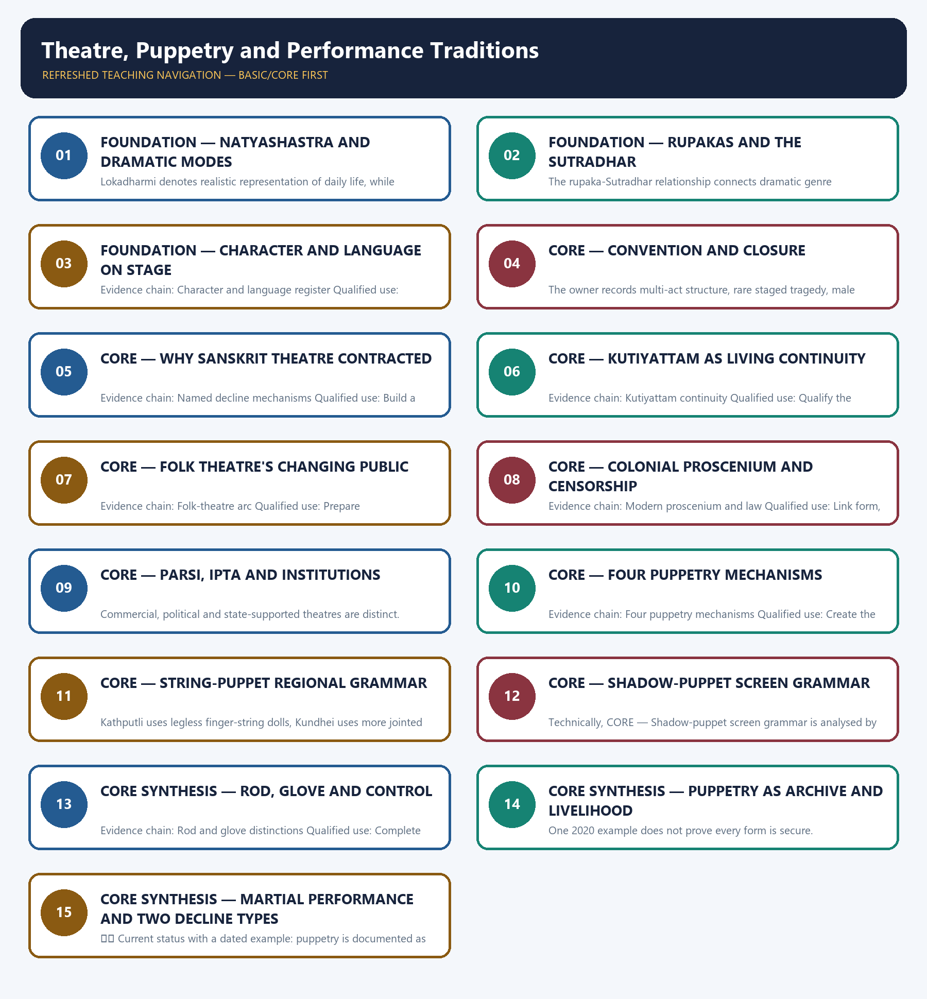

# Theatre, Puppetry and Performance Traditions — Learner-v2 Complete Learning Session

> **Authoring-only generation:** 2026-09-01. No PDF was rendered and no tracker or index was mutated.

### SOURCE, PROGRESSION AND CURRENT-LINKAGE AUDIT

- **Generation date:** 2026-09-01.
- **Repository-first evidence:** the Basic owner is taught first and preserved in full; the Advanced owner is retained only in the optional final teaching block.
- **OCR evidence:** Repository Markdown was primary. The available OCR-searchable Nitin Singhania Indian Art and Culture PDF was retained as a supplementary source; no unsupported page precision, quotation or dynamic status was imported from it.
- **Qdrant:** not used; repository Markdown and available OCR context were sufficient.
- **PYQ integrity:** No direct routed PYQ for theatre, puppetry or performance traditions appears in the audited 2018-2026 ledgers used by this authoring engine. Older question references inside the Basic owner remain contextual examples and are not promoted into solved PYQ cards without a controlling routed record.
- **Live-link boundary:** UNESCO's official Kutiyattam element page was fetched on 2026-09-01. Its metadata identifies Kutiyattam as a Kerala synthesis of Sanskrit classicism and local tradition with codified eye and hand expression. The package uses the official 2008 Representative List status as a living-safeguarding link and does not invent a new inscription, award or current performer count.
- **Fact/inference discipline:** no current-affairs item, PYQ wording, figure or quotation is invented.

## BASIC LEARNING SESSION

### DEEP-REVIEW LEARNING CONTRACT

| Control | Binding rule for this package |
|---|---|
| Syllabus boundary | Complete Indian Art and Culture Core is taught by form, chronology, region, patronage and function before optional enrichment. |
| Evidence method | Claim → named monument/object/text/form/institution/community → analysis → qualification. |
| Chronology | Origin, surviving evidence, patronage phase, later adaptation, recognition and present status remain distinct. |
| Classification | Architecture, sculpture, painting, music, dance, theatre, language, craft, religion, heritage and cinema terms are compared on common axes without collapsing categories. |
| Interpretation | Style labels, iconographic readings, continuity, synthesis and social representation remain evidence-bounded rather than essentialist. |
| Practice contract | Every solved item has directive/demand decoding, a detailed examiner-grade model, executable compression plan, marks rationale and answer-specific improvement. |
| Approval | This immutable successor remains `approved: false` pending explicit approval. |

**Canonical Basic/Core owner:** `upsc-ai-kit\knowledge\Indian-Art-and-Culture\basic\10_Theatre-Puppetry-and-Performance-Traditions.md`  
**Canonical topic owner:** `upsc-ai-kit\knowledge\Indian-Art-and-Culture\basic\10_Theatre-Puppetry-and-Performance-Traditions.md`  
**Optional Advanced owner:** `upsc-ai-kit\knowledge\Indian-Art-and-Culture\advanced\10_Theatre-Puppetry-and-Performance-Traditions.md`  
**Official syllabus mapping:** `upsc-ai-kit\knowledge\Indian-Art-and-Culture\OFFICIAL-UPSC-SYLLABUS-MAPPING.md`

### EVIDENCE, PYQ AND CURRENT-STATUS CONTROL

- **Material evidence:** plans, fabric, technique, iconography, performance grammar, inscriptions, manuscripts, films and institutional records are identified before interpretation.
- **Attribution discipline:** patron, date, school, region, author, performer, community and function are stated only to the precision supported by the owner.
- **Quantitative discipline:** dimensions, counts, inscription years, lists, awards and registrations retain source, date, status and uncertainty; no figure is invented.
- **Interpretive discipline:** civilisational ranking, communal essentialism, timeless continuity, single-origin claims and treating commissioned representation as a social census are rejected.
- **PYQ discipline:** repository routing ledgers and locally held papers control wording and metadata; neutral rendering, reconstruction and unavailable official keys remain explicitly labelled.
- **Current-status note, rechecked 2026-09-01:** UNESCO's official Kutiyattam element page was fetched on 2026-09-01. Its metadata identifies Kutiyattam as a Kerala synthesis of Sanskrit classicism and local tradition with codified eye and hand expression. The package uses the official 2008 Representative List status as a living-safeguarding link and does not invent a new inscription, award or current performer count.

**Live/official context sources recorded by the predecessor generation:**

- `https://ich.unesco.org/en/RL/kutiyattam-sanskrit-theatre-00010`




*Distinct embedded teaching-navigation image. The separate continuous Cārvāka-style flowchart package remains an independent at-a-glance artifact.*

### SESSION 1 — FOUNDATION — NATYASHASTRA AND DRAMATIC MODES

#### DEFINITION / WHAT THIS IS CALLED

**Plain-language definition:** Evidence chain: Natyashastra dramaturgy - Lokadharmi and Natyadharmi Qualified use: Establish the dramaturgical method.

**Technical definition:** Lokadharmi denotes realistic representation of daily life, while Natyadharmi denotes conventional, stylised and symbolic narration.

#### ANSWER-GRABBING OPENING — WRITE/ADAPT IN THE EXAM

> Evidence chain: Natyashastra dramaturgy - Lokadharmi and Natyadharmi Qualified use: Establish the dramaturgical method.

#### MUST-WRITE KEYWORDS

- **FOUNDATION**
- **Natyashastra**
- **dramatic modes**
- **Evidence chain**
- **Qualified use**
- **Lokadharmi**

**How to use them:** Frame the answer through FOUNDATION; define Natyashastra, connect dramatic modes with Evidence chain to explain the mechanism, and use Qualified use for the decisive comparison or qualification.

#### VISUAL FIRST

```text
NATYASHASTRA AND DRAMATIC MODES
01. Natyashastra dramaturgy
    |
    v
02. Lokadharmi and Natyadharmi
BOUNDARY -> Textual prescription is not identical to every historical performance.
```

*This topic-specific rail fixes the evidence sequence and its exam boundary before analysis.*

#### CORE EXPLANATION

Bharata's layered Natyashastra codifies plot, character, rasa, preliminaries and staging while narrating theatre as a Natya Veda assembled from the four Vedas. Lokadharmi denotes realistic representation of daily life, while Natyadharmi denotes conventional, stylised and symbolic narration.

#### NAMED EVIDENCE AND MECHANISM

- Bharata's layered Natyashastra codifies plot, character, rasa, preliminaries and staging while narrating theatre as a Natya Veda assembled from the four Vedas.
- Lokadharmi denotes realistic representation of daily life, while Natyadharmi denotes conventional, stylised and symbolic narration.

#### EXAMINER CAUTION

- Textual prescription is not identical to every historical performance.

#### EXAM LINK

- **Prelims:** Retain the exact form, region, text, technique or institution attached to Natyashastra and dramatic modes.
- **Mains:** Establish the dramaturgical method.

#### MINI RECAP

- **Evidence chain:** Natyashastra dramaturgy -> Lokadharmi and Natyadharmi
- **Qualified use:** Establish the dramaturgical method.

#### CLOSING RECALL FLOW — FOUNDATION — NATYASHASTRA AND DRAMATIC MODES

```text
START / CONCEPT: FOUNDATION — Natyashastra and dramatic modes
        |
        v
EXACT TERMS: FOUNDATION · Natyashastra · dramatic modes · Evidence chain · Qualified use · Lokadharmi
        |
        v
MECHANISM / ARGUMENT: Lokadharmi denotes realistic representation of daily life, while Natyadharmi denotes conventional, stylised and symbolic narration.
        |
        v
CONSEQUENCE / CONTRAST: Textual prescription is not identical to every historical performance.
        |
        v
UPSC TRAP / ANSWER-USE: Do not miss this limiting distinction: lokadharmi denotes realistic representation of daily life.
        |
        v
ANSWER-GRABBING FORMULATION: Evidence chain: Natyashastra dramaturgy - Lokadharmi and Natyadharmi Qualified use: Establish the dramaturgical method.
```
### SESSION 2 — FOUNDATION — RUPAKAS AND THE SUTRADHAR

#### DEFINITION / WHAT THIS IS CALLED

**Plain-language definition:** Rupakas are the ten classified dramatic forms, while the Sutradhar conducts the preliminaries and introduces a Sanskrit play.

**Technical definition:** The rupaka-Sutradhar relationship connects dramatic genre classification with the stage function that frames performance and audience entry.

#### ANSWER-GRABBING OPENING — WRITE/ADAPT IN THE EXAM

> Classical Sanskrit theatre joined a precise genre taxonomy to a Sutradhar-led performance threshold.

#### MUST-WRITE KEYWORDS

- **rupaka**
- **Sutradhar**
- **dramatic genre**
- **preliminaries**
- **play introduction**
- **stage function**

**How to use them:** Frame the answer through rupaka; define Sutradhar, connect dramatic genre with preliminaries to explain the mechanism, and use play introduction for the decisive comparison or qualification.

#### VISUAL FIRST

```text
RUPAKAS AND THE SUTRADHAR
01. Natyashastra dramaturgy
    |
    v
02. Ten rupakas
    |
    v
03. Sutradhar function
BOUNDARY -> Keep the genre list and stage function exact.
```

*This topic-specific rail fixes the evidence sequence and its exam boundary before analysis.*

#### CORE EXPLANATION

Bharata's layered Natyashastra codifies plot, character, rasa, preliminaries and staging while narrating theatre as a Natya Veda assembled from the four Vedas. Nataka, Prakarana, Bhana, Prahasana, Dima, Vyayoga, Samavakara, Vithi, Ihamriga and Utsrishtikanka form the recorded ten-rupaka classification. In Sanskrit theatre the Sutradhar conducts preliminaries and introduces the play; in puppetry the term also evokes the string-holder and narrator.

#### NAMED EVIDENCE AND MECHANISM

- Bharata's layered Natyashastra codifies plot, character, rasa, preliminaries and staging while narrating theatre as a Natya Veda assembled from the four Vedas.
- Nataka, Prakarana, Bhana, Prahasana, Dima, Vyayoga, Samavakara, Vithi, Ihamriga and Utsrishtikanka form the recorded ten-rupaka classification.
- In Sanskrit theatre the Sutradhar conducts preliminaries and introduces the play; in puppetry the term also evokes the string-holder and narrator.

#### EXAMINER CAUTION

- Keep the genre list and stage function exact.

#### EXAM LINK

- **Prelims:** Retain the exact form, region, text, technique or institution attached to Rupakas and the Sutradhar.
- **Mains:** Build classical-theatre vocabulary.

#### MINI RECAP

- **Evidence chain:** Natyashastra dramaturgy -> Ten rupakas -> Sutradhar function
- **Qualified use:** Build classical-theatre vocabulary.

#### CLOSING RECALL FLOW — FOUNDATION — RUPAKAS AND THE SUTRADHAR

```text
START / CONCEPT: FOUNDATION — Rupakas and the Sutradhar
        |
        v
EXACT TERMS: rupaka · Sutradhar · dramatic genre · preliminaries · play introduction · stage function
        |
        v
MECHANISM / ARGUMENT: Classify the ten rupakas, then explain how the Sutradhar prepares and introduces the staged work.
        |
        v
CONSEQUENCE / CONTRAST: Genre and stage office can be analysed together without confusing textual classification with a character role.
        |
        v
UPSC TRAP / ANSWER-USE: Do not reduce the Sutradhar to a puppet-string holder or treat the ten rupakas as performance stages.
        |
        v
ANSWER-GRABBING FORMULATION: Classical Sanskrit theatre joined a precise genre taxonomy to a Sutradhar-led performance threshold.
```
### SESSION 3 — FOUNDATION — CHARACTER AND LANGUAGE ON STAGE

#### DEFINITION / WHAT THIS IS CALLED

**Plain-language definition:** Nayaka, Nayika and Vidusaka are broad character types, and the Vidusaka's traditional Prakrit speech shows language register marking stage position.

**Technical definition:** Evidence chain: Character and language register Qualified use: Connect role, satire and language.

#### ANSWER-GRABBING OPENING — WRITE/ADAPT IN THE EXAM

> Nayaka, Nayika and Vidusaka are broad character types, and the Vidusaka's traditional Prakrit speech shows language register marking stage position.

#### MUST-WRITE KEYWORDS

- **FOUNDATION**
- **Character**
- **language on stage**
- **Evidence chain**
- **Qualified use**
- **Nayaka, Nayika and Vidusaka**

**How to use them:** Frame the answer through FOUNDATION; define Character, connect language on stage with Evidence chain to explain the mechanism, and use Qualified use for the decisive comparison or qualification.

#### VISUAL FIRST

```text
CHARACTER AND LANGUAGE ON STAGE
01. Character and language register
BOUNDARY -> Prakrit use is a stage-register fact, not a social census.
```

*This topic-specific rail fixes the evidence sequence and its exam boundary before analysis.*

#### CORE EXPLANATION

Nayaka, Nayika and Vidusaka are broad character types, and the Vidusaka's traditional Prakrit speech shows language register marking stage position.

#### NAMED EVIDENCE AND MECHANISM

- Nayaka, Nayika and Vidusaka are broad character types, and the Vidusaka's traditional Prakrit speech shows language register marking stage position.

#### EXAMINER CAUTION

- Prakrit use is a stage-register fact, not a social census.

#### EXAM LINK

- **Prelims:** Retain the exact form, region, text, technique or institution attached to Character and language on stage.
- **Mains:** Connect role, satire and language.

#### MINI RECAP

- **Evidence chain:** Character and language register
- **Qualified use:** Connect role, satire and language.

#### CLOSING RECALL FLOW — FOUNDATION — CHARACTER AND LANGUAGE ON STAGE

```text
START / CONCEPT: FOUNDATION — Character and language on stage
        |
        v
EXACT TERMS: FOUNDATION · Character · language on stage · Evidence chain · Qualified use · Nayaka, Nayika and Vidusaka
        |
        v
MECHANISM / ARGUMENT: Evidence chain: Character and language register Qualified use: Connect role, satire and language.
        |
        v
CONSEQUENCE / CONTRAST: Prakrit use is a stage-register fact, not a social census.
        |
        v
UPSC TRAP / ANSWER-USE: Do not miss this limiting distinction: character and language register Qualified use.
        |
        v
ANSWER-GRABBING FORMULATION: Nayaka, Nayika and Vidusaka are broad character types, and the Vidusaka's traditional Prakrit speech shows language register marking stage position.
```
### SESSION 4 — CORE — CONVENTION AND CLOSURE

#### DEFINITION / WHAT THIS IS CALLED

**Plain-language definition:** Rare tragedy is a recorded convention, not universal proof.

**Technical definition:** The owner records multi-act structure, rare staged tragedy, male protagonists who ordinarily achieve their aim and closure restoring order; these are prescriptive conventions, not a census of every performance.

#### ANSWER-GRABBING OPENING — WRITE/ADAPT IN THE EXAM

> The owner records multi-act structure, rare staged tragedy, male protagonists who ordinarily achieve their aim and closure restoring order; these are prescriptive conventions, not a census of every performance.

#### MUST-WRITE KEYWORDS

- **Convention**
- **closure**
- **Evidence chain**
- **Qualified use**
- **Rare tragedy**
- **Rare**

**How to use them:** Frame the answer through Convention; define closure, connect Evidence chain with Qualified use to explain the mechanism, and use Rare tragedy for the decisive comparison or qualification.

#### VISUAL FIRST

```text
CONVENTION AND CLOSURE
01. Dramaturgical convention
BOUNDARY -> Rare tragedy is a recorded convention, not universal proof.
```

*This topic-specific rail fixes the evidence sequence and its exam boundary before analysis.*

#### CORE EXPLANATION

The owner records multi-act structure, rare staged tragedy, male protagonists who ordinarily achieve their aim and closure restoring order; these are prescriptive conventions, not a census of every performance.

#### NAMED EVIDENCE AND MECHANISM

- The owner records multi-act structure, rare staged tragedy, male protagonists who ordinarily achieve their aim and closure restoring order; these are prescriptive conventions, not a census of every performance.

#### EXAMINER CAUTION

- Rare tragedy is a recorded convention, not universal proof.

#### EXAM LINK

- **Prelims:** Retain the exact form, region, text, technique or institution attached to Convention and closure.
- **Mains:** Explain the system through accepted rules.

#### MINI RECAP

- **Evidence chain:** Dramaturgical convention
- **Qualified use:** Explain the system through accepted rules.

#### CLOSING RECALL FLOW — CORE — CONVENTION AND CLOSURE

```text
START / CONCEPT: CORE — Convention and closure
        |
        v
EXACT TERMS: Convention · closure · Evidence chain · Qualified use · Rare tragedy · Rare
        |
        v
MECHANISM / ARGUMENT: Evidence chain: Dramaturgical convention Qualified use: Explain the system through accepted rules.
        |
        v
CONSEQUENCE / CONTRAST: Rare tragedy is a recorded convention, not universal proof.
        |
        v
UPSC TRAP / ANSWER-USE: Do not miss this limiting distinction: explain the system through accepted rules.
        |
        v
ANSWER-GRABBING FORMULATION: The owner records multi-act structure, rare staged tragedy, male protagonists who ordinarily achieve their aim and closure restoring order; these are prescriptive conventions, not a census of every performance.
```
### SESSION 5 — CORE — WHY SANSKRIT THEATRE CONTRACTED

#### DEFINITION / WHAT THIS IS CALLED

**Plain-language definition:** The source's causes are multiple and not mutually exclusive.

**Technical definition:** Evidence chain: Named decline mechanisms Qualified use: Build a causal answer.

#### ANSWER-GRABBING OPENING — WRITE/ADAPT IN THE EXAM

> The source's causes are multiple and not mutually exclusive.

#### MUST-WRITE KEYWORDS

- **Why Sanskrit theatre contracted**
- **Evidence chain**
- **Qualified use**
- **The source's causes**
- **Named**
- **Qualified**

**How to use them:** Frame the answer through Why Sanskrit theatre contracted; define Evidence chain, connect Qualified use with The source's causes to explain the mechanism, and use Named for the decisive comparison or qualification.

#### VISUAL FIRST

```text
WHY SANSKRIT THEATRE CONTRACTED
01. Named decline mechanisms
BOUNDARY -> The source's causes are multiple and not mutually exclusive.
```

*This topic-specific rail fixes the evidence sequence and its exam boundary before analysis.*

#### CORE EXPLANATION

The source attributes Sanskrit theatre's contraction to writers moving toward poetry and song, difficult rule-bound Sanskrit losing reach, and changed patronage under later courts.

#### NAMED EVIDENCE AND MECHANISM

- The source attributes Sanskrit theatre's contraction to writers moving toward poetry and song, difficult rule-bound Sanskrit losing reach, and changed patronage under later courts.

#### EXAMINER CAUTION

- The source's causes are multiple and not mutually exclusive.

#### EXAM LINK

- **Prelims:** Retain the exact form, region, text, technique or institution attached to Why Sanskrit theatre contracted.
- **Mains:** Build a causal answer.

#### MINI RECAP

- **Evidence chain:** Named decline mechanisms
- **Qualified use:** Build a causal answer.

#### CLOSING RECALL FLOW — CORE — WHY SANSKRIT THEATRE CONTRACTED

```text
START / CONCEPT: CORE — Why Sanskrit theatre contracted
        |
        v
EXACT TERMS: Why Sanskrit theatre contracted · Evidence chain · Qualified use · The source's causes · Named · Qualified
        |
        v
MECHANISM / ARGUMENT: Evidence chain: Named decline mechanisms Qualified use: Build a causal answer.
        |
        v
CONSEQUENCE / CONTRAST: The resulting consequence is that the source's causes are multiple and not mutually exclusive.
        |
        v
UPSC TRAP / ANSWER-USE: Do not miss this limiting distinction: the source's causes are multiple and not mutually exclusive.
        |
        v
ANSWER-GRABBING FORMULATION: The source's causes are multiple and not mutually exclusive.
```
### SESSION 6 — CORE — KUTIYATTAM AS LIVING CONTINUITY

#### DEFINITION / WHAT THIS IS CALLED

**Plain-language definition:** Kutiyattam preserves a living Kerala Sanskrit-theatre lineage with codified gesture, Sanskrit-Prakrit-Malayalam use, Nirvahana and temple-theatre institutions; Sanskrit theatre is therefore not wholly extinct.

**Technical definition:** Evidence chain: Kutiyattam continuity Qualified use: Qualify the decline narrative.

#### ANSWER-GRABBING OPENING — WRITE/ADAPT IN THE EXAM

> Kutiyattam preserves a living Kerala Sanskrit-theatre lineage with codified gesture, Sanskrit-Prakrit-Malayalam use, Nirvahana and temple-theatre institutions; Sanskrit theatre is therefore not wholly extinct.

#### MUST-WRITE KEYWORDS

- **Kutiyattam as living continuity**
- **Evidence chain**
- **Qualified use**
- **Kutiyattam**
- **Kerala Sanskrit-theatre**
- **Sanskrit-Prakrit-Malayalam**

**How to use them:** Frame the answer through Kutiyattam as living continuity; define Evidence chain, connect Qualified use with Kutiyattam to explain the mechanism, and use Kerala Sanskrit-theatre for the decisive comparison or qualification.

#### VISUAL FIRST

```text
KUTIYATTAM AS LIVING CONTINUITY
01. Kutiyattam continuity
BOUNDARY -> Do not turn an old inscription into a claim of unchanged practice.
```

*This topic-specific rail fixes the evidence sequence and its exam boundary before analysis.*

#### CORE EXPLANATION

Kutiyattam preserves a living Kerala Sanskrit-theatre lineage with codified gesture, Sanskrit-Prakrit-Malayalam use, Nirvahana and temple-theatre institutions; Sanskrit theatre is therefore not wholly extinct.

#### NAMED EVIDENCE AND MECHANISM

- Kutiyattam preserves a living Kerala Sanskrit-theatre lineage with codified gesture, Sanskrit-Prakrit-Malayalam use, Nirvahana and temple-theatre institutions; Sanskrit theatre is therefore not wholly extinct.

#### EXAMINER CAUTION

- Do not turn an old inscription into a claim of unchanged practice.

#### EXAM LINK

- **Prelims:** Retain the exact form, region, text, technique or institution attached to Kutiyattam as living continuity.
- **Mains:** Qualify the decline narrative.

#### MINI RECAP

- **Evidence chain:** Kutiyattam continuity
- **Qualified use:** Qualify the decline narrative.

#### CLOSING RECALL FLOW — CORE — KUTIYATTAM AS LIVING CONTINUITY

```text
START / CONCEPT: CORE — Kutiyattam as living continuity
        |
        v
EXACT TERMS: Kutiyattam as living continuity · Evidence chain · Qualified use · Kutiyattam · Kerala Sanskrit-theatre · Sanskrit-Prakrit-Malayalam
        |
        v
MECHANISM / ARGUMENT: Evidence chain: Kutiyattam continuity Qualified use: Qualify the decline narrative.
        |
        v
CONSEQUENCE / CONTRAST: Do not turn an old inscription into a claim of unchanged practice.
        |
        v
UPSC TRAP / ANSWER-USE: Do not miss this limiting distinction: kutiyattam preserves a living Kerala Sanskrit-theatre lineage with codified gesture, Sanskrit-Prakrit-Malayalam use, Nirvahana and...
        |
        v
ANSWER-GRABBING FORMULATION: Kutiyattam preserves a living Kerala Sanskrit-theatre lineage with codified gesture, Sanskrit-Prakrit-Malayalam use, Nirvahana and temple-theatre institutions; Sanskrit theatre is therefore not wholly extinct.
```
### SESSION 7 — CORE — FOLK THEATRE'S CHANGING PUBLIC

#### DEFINITION / WHAT THIS IS CALLED

**Plain-language definition:** Folk theatre developed through devotional themes, romance and local heroes, and later social messages, using regional language and rural performance ecologies.

**Technical definition:** Evidence chain: Folk-theatre arc Qualified use: Prepare communication and change questions.

#### ANSWER-GRABBING OPENING — WRITE/ADAPT IN THE EXAM

> Folk theatre developed through devotional themes, romance and local heroes, and later social messages, using regional language and rural performance ecologies.

#### MUST-WRITE KEYWORDS

- **Folk theatre's changing public**
- **Evidence chain**
- **Qualified use**
- **Folk**
- **Devotional**
- **Folk-theatre**

**How to use them:** Frame the answer through Folk theatre's changing public; define Evidence chain, connect Qualified use with Folk to explain the mechanism, and use Devotional for the decisive comparison or qualification.

#### VISUAL FIRST

```text
FOLK THEATRE'S CHANGING PUBLIC
01. Folk-theatre arc
BOUNDARY -> Devotional, heroic and social-message phases can overlap.
```

*This topic-specific rail fixes the evidence sequence and its exam boundary before analysis.*

#### CORE EXPLANATION

Folk theatre developed through devotional themes, romance and local heroes, and later social messages, using regional language and rural performance ecologies.

#### NAMED EVIDENCE AND MECHANISM

- Folk theatre developed through devotional themes, romance and local heroes, and later social messages, using regional language and rural performance ecologies.

#### EXAMINER CAUTION

- Devotional, heroic and social-message phases can overlap.

#### EXAM LINK

- **Prelims:** Retain the exact form, region, text, technique or institution attached to Folk theatre's changing public.
- **Mains:** Prepare communication and change questions.

#### MINI RECAP

- **Evidence chain:** Folk-theatre arc
- **Qualified use:** Prepare communication and change questions.

#### CLOSING RECALL FLOW — CORE — FOLK THEATRE'S CHANGING PUBLIC

```text
START / CONCEPT: CORE — Folk theatre's changing public
        |
        v
EXACT TERMS: Folk theatre's changing public · Evidence chain · Qualified use · Folk · Devotional · Folk-theatre
        |
        v
MECHANISM / ARGUMENT: Evidence chain: Folk-theatre arc Qualified use: Prepare communication and change questions.
        |
        v
CONSEQUENCE / CONTRAST: Devotional, heroic and social-message phases can overlap.
        |
        v
UPSC TRAP / ANSWER-USE: Do not miss this limiting distinction: folk theatre developed through devotional themes, romance and local heroes.
        |
        v
ANSWER-GRABBING FORMULATION: Folk theatre developed through devotional themes, romance and local heroes, and later social messages, using regional language and rural performance ecologies.
```
### SESSION 8 — CORE — COLONIAL PROSCENIUM AND CENSORSHIP

#### DEFINITION / WHAT THIS IS CALLED

**Plain-language definition:** Colonial urban theatre adopted commercial proscenium spaces and addressed social and political themes; the Dramatic Performances Act of 1876 demonstrates state concern with its political effect.

**Technical definition:** Evidence chain: Modern proscenium and law Qualified use: Link form, city and political effect.

#### ANSWER-GRABBING OPENING — WRITE/ADAPT IN THE EXAM

> Colonial urban theatre adopted commercial proscenium spaces and addressed social and political themes; the Dramatic Performances Act of 1876 demonstrates state concern with its political effect.

#### MUST-WRITE KEYWORDS

- **Colonial proscenium**
- **censorship**
- **Evidence chain**
- **Qualified use**
- **Colonial**
- **Dramatic Performances Act**

**How to use them:** Frame the answer through Colonial proscenium; define censorship, connect Evidence chain with Qualified use to explain the mechanism, and use Colonial for the decisive comparison or qualification.

#### VISUAL FIRST

```text
COLONIAL PROSCENIUM AND CENSORSHIP
01. Modern proscenium and law
BOUNDARY -> The 1876 Act proves concern, not total suppression.
```

*This topic-specific rail fixes the evidence sequence and its exam boundary before analysis.*

#### CORE EXPLANATION

Colonial urban theatre adopted commercial proscenium spaces and addressed social and political themes; the Dramatic Performances Act of 1876 demonstrates state concern with its political effect.

#### NAMED EVIDENCE AND MECHANISM

- Colonial urban theatre adopted commercial proscenium spaces and addressed social and political themes; the Dramatic Performances Act of 1876 demonstrates state concern with its political effect.

#### EXAMINER CAUTION

- The 1876 Act proves concern, not total suppression.

#### EXAM LINK

- **Prelims:** Retain the exact form, region, text, technique or institution attached to Colonial proscenium and censorship.
- **Mains:** Link form, city and political effect.

#### MINI RECAP

- **Evidence chain:** Modern proscenium and law
- **Qualified use:** Link form, city and political effect.

#### CLOSING RECALL FLOW — CORE — COLONIAL PROSCENIUM AND CENSORSHIP

```text
START / CONCEPT: CORE — Colonial proscenium and censorship
        |
        v
EXACT TERMS: Colonial proscenium · censorship · Evidence chain · Qualified use · Colonial · Dramatic Performances Act
        |
        v
MECHANISM / ARGUMENT: Evidence chain: Modern proscenium and law Qualified use: Link form, city and political effect.
        |
        v
CONSEQUENCE / CONTRAST: The 1876 Act proves concern, not total suppression.
        |
        v
UPSC TRAP / ANSWER-USE: Do not miss this limiting distinction: colonial urban theatre adopted commercial proscenium spaces and addressed social and political themes.
        |
        v
ANSWER-GRABBING FORMULATION: Colonial urban theatre adopted commercial proscenium spaces and addressed social and political themes; the Dramatic Performances Act of 1876 demonstrates state concern with its political effect.
```
### SESSION 9 — CORE — PARSI, IPTA AND INSTITUTIONS

#### DEFINITION / WHAT THIS IS CALLED

**Plain-language definition:** Evidence chain: Parsi and political theatre - Institutional modern stage Qualified use: Build the modern-stage sequence.

**Technical definition:** Commercial, political and state-supported theatres are distinct.

#### ANSWER-GRABBING OPENING — WRITE/ADAPT IN THE EXAM

> Evidence chain: Parsi and political theatre - Institutional modern stage Qualified use: Build the modern-stage sequence.

#### MUST-WRITE KEYWORDS

- **Parsi**
- **IPTA**
- **institutions**
- **Evidence chain**
- **Qualified use**
- **Commercial, political and state-supported theatres**

**How to use them:** Frame the answer through Parsi; define IPTA, connect institutions with Evidence chain to explain the mechanism, and use Qualified use for the decisive comparison or qualification.

#### VISUAL FIRST

```text
PARSI, IPTA AND INSTITUTIONS
01. Parsi and political theatre
    |
    v
02. Institutional modern stage
BOUNDARY -> Commercial, political and state-supported theatres are distinct.
```

*This topic-specific rail fixes the evidence sequence and its exam boundary before analysis.*

#### CORE EXPLANATION

Parsi theatre linked commercial multilingual melodrama to early cinema, while IPTA organised theatre around famine and social mobilisation; they represent different modern performance economies. Prithvi Theatre, Sangeet Natak Akademi, National School of Drama and regional repertories shifted support toward touring, ticketing, grants and formal training.

#### NAMED EVIDENCE AND MECHANISM

- Parsi theatre linked commercial multilingual melodrama to early cinema, while IPTA organised theatre around famine and social mobilisation; they represent different modern performance economies.
- Prithvi Theatre, Sangeet Natak Akademi, National School of Drama and regional repertories shifted support toward touring, ticketing, grants and formal training.

#### EXAMINER CAUTION

- Commercial, political and state-supported theatres are distinct.

#### EXAM LINK

- **Prelims:** Retain the exact form, region, text, technique or institution attached to Parsi, IPTA and institutions.
- **Mains:** Build the modern-stage sequence.

#### MINI RECAP

- **Evidence chain:** Parsi and political theatre -> Institutional modern stage
- **Qualified use:** Build the modern-stage sequence.

#### CLOSING RECALL FLOW — CORE — PARSI, IPTA AND INSTITUTIONS

```text
START / CONCEPT: CORE — Parsi, IPTA and institutions
        |
        v
EXACT TERMS: Parsi · IPTA · institutions · Evidence chain · Qualified use · Commercial, political and state-supported theatres
        |
        v
MECHANISM / ARGUMENT: Commercial, political and state-supported theatres are distinct.
        |
        v
CONSEQUENCE / CONTRAST: The resulting consequence is that parsi and political theatre - Institutional modern stage Qualified use.
        |
        v
UPSC TRAP / ANSWER-USE: Do not miss this limiting distinction: parsi and political theatre - Institutional modern stage Qualified use.
        |
        v
ANSWER-GRABBING FORMULATION: Evidence chain: Parsi and political theatre - Institutional modern stage Qualified use: Build the modern-stage sequence.
```
### SESSION 10 — CORE — FOUR PUPPETRY MECHANISMS

#### DEFINITION / WHAT THIS IS CALLED

**Plain-language definition:** Indian puppetry is classified into string, shadow, rod and glove forms; mechanism, construction and movement must be named before region.

**Technical definition:** Evidence chain: Four puppetry mechanisms Qualified use: Create the classification spine.

#### ANSWER-GRABBING OPENING — WRITE/ADAPT IN THE EXAM

> Indian puppetry is classified into string, shadow, rod and glove forms; mechanism, construction and movement must be named before region.

#### MUST-WRITE KEYWORDS

- **Four puppetry mechanisms**
- **Evidence chain**
- **Qualified use**
- **Indian puppetry**
- **Indian**
- **Four**

**How to use them:** Frame the answer through Four puppetry mechanisms; define Evidence chain, connect Qualified use with Indian puppetry to explain the mechanism, and use Indian for the decisive comparison or qualification.

#### VISUAL FIRST

```text
FOUR PUPPETRY MECHANISMS
01. Four puppetry mechanisms
BOUNDARY -> Name control technology before examples.
```

*This topic-specific rail fixes the evidence sequence and its exam boundary before analysis.*

#### CORE EXPLANATION

Indian puppetry is classified into string, shadow, rod and glove forms; mechanism, construction and movement must be named before region.

#### NAMED EVIDENCE AND MECHANISM

- Indian puppetry is classified into string, shadow, rod and glove forms; mechanism, construction and movement must be named before region.

#### EXAMINER CAUTION

- Name control technology before examples.

#### EXAM LINK

- **Prelims:** Retain the exact form, region, text, technique or institution attached to Four puppetry mechanisms.
- **Mains:** Create the classification spine.

#### MINI RECAP

- **Evidence chain:** Four puppetry mechanisms
- **Qualified use:** Create the classification spine.

#### CLOSING RECALL FLOW — CORE — FOUR PUPPETRY MECHANISMS

```text
START / CONCEPT: CORE — Four puppetry mechanisms
        |
        v
EXACT TERMS: Four puppetry mechanisms · Evidence chain · Qualified use · Indian puppetry · Indian · Four
        |
        v
MECHANISM / ARGUMENT: Evidence chain: Four puppetry mechanisms Qualified use: Create the classification spine.
        |
        v
CONSEQUENCE / CONTRAST: The resulting consequence is that evidence chain: Four puppetry mechanisms Qualified use: Create the classification spine.
        |
        v
UPSC TRAP / ANSWER-USE: Do not miss this limiting distinction: evidence chain: Four puppetry mechanisms Qualified use: Create the classification spine.
        |
        v
ANSWER-GRABBING FORMULATION: Indian puppetry is classified into string, shadow, rod and glove forms; mechanism, construction and movement must be named before region.
```
### SESSION 11 — CORE — STRING-PUPPET REGIONAL GRAMMAR

#### DEFINITION / WHAT THIS IS CALLED

**Plain-language definition:** Evidence chain: String-puppet distinctions Qualified use: Break close options among marionettes.

**Technical definition:** Kathputli uses legless finger-string dolls, Kundhei uses more jointed Odissi-influenced figures, and Gombeyatta adapts Yakshagana character design with multiple puppeteers.

#### ANSWER-GRABBING OPENING — WRITE/ADAPT IN THE EXAM

> Evidence chain: String-puppet distinctions Qualified use: Break close options among marionettes.

#### MUST-WRITE KEYWORDS

- **String-puppet regional grammar**
- **Evidence chain**
- **Qualified use**
- **Kathputli**
- **Kundhei**
- **Odissi-influenced**

**How to use them:** Frame the answer through String-puppet regional grammar; define Evidence chain, connect Qualified use with Kathputli to explain the mechanism, and use Kundhei for the decisive comparison or qualification.

#### VISUAL FIRST

```text
STRING-PUPPET REGIONAL GRAMMAR
01. String-puppet distinctions
BOUNDARY -> Jointing, legs and character design differ.
```

*This topic-specific rail fixes the evidence sequence and its exam boundary before analysis.*

#### CORE EXPLANATION

Kathputli uses legless finger-string dolls, Kundhei uses more jointed Odissi-influenced figures, and Gombeyatta adapts Yakshagana character design with multiple puppeteers.

#### NAMED EVIDENCE AND MECHANISM

- Kathputli uses legless finger-string dolls, Kundhei uses more jointed Odissi-influenced figures, and Gombeyatta adapts Yakshagana character design with multiple puppeteers.

#### EXAMINER CAUTION

- Jointing, legs and character design differ.

#### EXAM LINK

- **Prelims:** Retain the exact form, region, text, technique or institution attached to String-puppet regional grammar.
- **Mains:** Break close options among marionettes.

#### MINI RECAP

- **Evidence chain:** String-puppet distinctions
- **Qualified use:** Break close options among marionettes.

#### CLOSING RECALL FLOW — CORE — STRING-PUPPET REGIONAL GRAMMAR

```text
START / CONCEPT: CORE — String-puppet regional grammar
        |
        v
EXACT TERMS: String-puppet regional grammar · Evidence chain · Qualified use · Kathputli · Kundhei · Odissi-influenced
        |
        v
MECHANISM / ARGUMENT: Kathputli uses legless finger-string dolls, Kundhei uses more jointed Odissi-influenced figures, and Gombeyatta adapts Yakshagana character design with multiple puppeteers.
        |
        v
CONSEQUENCE / CONTRAST: The resulting consequence is that evidence chain: String-puppet distinctions Qualified use: Break close options among marionettes.
        |
        v
UPSC TRAP / ANSWER-USE: Do not miss this limiting distinction: evidence chain: String-puppet distinctions Qualified use: Break close options among marionettes.
        |
        v
ANSWER-GRABBING FORMULATION: Evidence chain: String-puppet distinctions Qualified use: Break close options among marionettes.
```
### SESSION 12 — CORE — SHADOW-PUPPET SCREEN GRAMMAR

#### DEFINITION / WHAT THIS IS CALLED

**Plain-language definition:** Evidence chain: Shadow-puppet distinctions Qualified use: Identify light-screen performance.

**Technical definition:** Technically, CORE — Shadow-puppet screen grammar is analysed by relating Shadow-puppet screen grammar to Evidence chain, then testing the relationship through Qualified use and Shadow-puppet.

#### ANSWER-GRABBING OPENING — WRITE/ADAPT IN THE EXAM

> Evidence chain: Shadow-puppet distinctions Qualified use: Identify light-screen performance.

#### MUST-WRITE KEYWORDS

- **Shadow-puppet screen grammar**
- **Evidence chain**
- **Qualified use**
- **Shadow-puppet**
- **Qualified**
- **Identify**

**How to use them:** Frame the answer through Shadow-puppet screen grammar; define Evidence chain, connect Qualified use with Shadow-puppet to explain the mechanism, and use Qualified for the decisive comparison or qualification.

#### VISUAL FIRST

```text
SHADOW-PUPPET SCREEN GRAMMAR
01. Shadow-puppet distinctions
BOUNDARY -> Do not universalise one material or scale.
```

*This topic-specific rail fixes the evidence sequence and its exam boundary before analysis.*

#### CORE EXPLANATION

Tholu Bommalata, Togalu Gombeyatta and Ravana Chhaya project cut-outs against a lit screen; leather, opacity, scale and regional narrative practice vary.

#### NAMED EVIDENCE AND MECHANISM

- Tholu Bommalata, Togalu Gombeyatta and Ravana Chhaya project cut-outs against a lit screen; leather, opacity, scale and regional narrative practice vary.

#### EXAMINER CAUTION

- Do not universalise one material or scale.

#### EXAM LINK

- **Prelims:** Retain the exact form, region, text, technique or institution attached to Shadow-puppet screen grammar.
- **Mains:** Identify light-screen performance.

#### MINI RECAP

- **Evidence chain:** Shadow-puppet distinctions
- **Qualified use:** Identify light-screen performance.

#### CLOSING RECALL FLOW — CORE — SHADOW-PUPPET SCREEN GRAMMAR

```text
START / CONCEPT: CORE — Shadow-puppet screen grammar
        |
        v
EXACT TERMS: Shadow-puppet screen grammar · Evidence chain · Qualified use · Shadow-puppet · Qualified · Identify
        |
        v
MECHANISM / ARGUMENT: Do not universalise one material or scale.
        |
        v
CONSEQUENCE / CONTRAST: The resulting consequence is that evidence chain: Shadow-puppet distinctions Qualified use: Identify light-screen performance.
        |
        v
UPSC TRAP / ANSWER-USE: Do not miss this limiting distinction: evidence chain: Shadow-puppet distinctions Qualified use: Identify light-screen performance.
        |
        v
ANSWER-GRABBING FORMULATION: Evidence chain: Shadow-puppet distinctions Qualified use: Identify light-screen performance.
```
### SESSION 13 — CORE SYNTHESIS — ROD, GLOVE AND CONTROL

#### DEFINITION / WHAT THIS IS CALLED

**Plain-language definition:** Rod and finger control are mechanically different.

**Technical definition:** Evidence chain: Rod and glove distinctions Qualified use: Complete the four-category comparison.

#### ANSWER-GRABBING OPENING — WRITE/ADAPT IN THE EXAM

> Putul Nach and Yampuri use rods from below or behind, while Kerala Pavakoothu uses fingers inside a sleeve-like body to control head and arms.

#### MUST-WRITE KEYWORDS

- **CORE SYNTHESIS**
- **Rod**
- **glove**
- **control**
- **Evidence chain**
- **Qualified use**

**How to use them:** Frame the answer through CORE SYNTHESIS; define Rod, connect glove with control to explain the mechanism, and use Evidence chain for the decisive comparison or qualification.

#### VISUAL FIRST

```text
ROD, GLOVE AND CONTROL
01. Rod and glove distinctions
BOUNDARY -> Rod and finger control are mechanically different.
```

*This topic-specific rail fixes the evidence sequence and its exam boundary before analysis.*

#### CORE EXPLANATION

Putul Nach and Yampuri use rods from below or behind, while Kerala Pavakoothu uses fingers inside a sleeve-like body to control head and arms.

#### NAMED EVIDENCE AND MECHANISM

- Putul Nach and Yampuri use rods from below or behind, while Kerala Pavakoothu uses fingers inside a sleeve-like body to control head and arms.

#### EXAMINER CAUTION

- Rod and finger control are mechanically different.

#### EXAM LINK

- **Prelims:** Retain the exact form, region, text, technique or institution attached to Rod, glove and control.
- **Mains:** Complete the four-category comparison.

#### MINI RECAP

- **Evidence chain:** Rod and glove distinctions
- **Qualified use:** Complete the four-category comparison.

#### CLOSING RECALL FLOW — CORE SYNTHESIS — ROD, GLOVE AND CONTROL

```text
START / CONCEPT: CORE SYNTHESIS — Rod, glove and control
        |
        v
EXACT TERMS: CORE SYNTHESIS · Rod · glove · control · Evidence chain · Qualified use
        |
        v
MECHANISM / ARGUMENT: Evidence chain: Rod and glove distinctions Qualified use: Complete the four-category comparison.
        |
        v
CONSEQUENCE / CONTRAST: Rod and finger control are mechanically different.
        |
        v
UPSC TRAP / ANSWER-USE: Do not miss this limiting distinction: putul Nach and Yampuri use rods from below or behind.
        |
        v
ANSWER-GRABBING FORMULATION: Putul Nach and Yampuri use rods from below or behind, while Kerala Pavakoothu uses fingers inside a sleeve-like body to control head and arms.
```
### SESSION 14 — CORE SYNTHESIS — PUPPETRY AS ARCHIVE AND LIVELIHOOD

#### DEFINITION / WHAT THIS IS CALLED

**Plain-language definition:** Evidence chain: Puppetry as archive - Current puppetry vulnerability Qualified use: Connect transmission to current vulnerability.

**Technical definition:** One 2020 example does not prove every form is secure.

#### ANSWER-GRABBING OPENING — WRITE/ADAPT IN THE EXAM

> Evidence chain: Puppetry as archive - Current puppetry vulnerability Qualified use: Connect transmission to current vulnerability.

#### MUST-WRITE KEYWORDS

- **CORE SYNTHESIS**
- **Puppetry as archive**
- **livelihood**
- **Evidence chain**
- **Qualified use**
- **One**

**How to use them:** Frame the answer through CORE SYNTHESIS; define Puppetry as archive, connect livelihood with Evidence chain to explain the mechanism, and use Qualified use for the decisive comparison or qualification.

#### VISUAL FIRST

```text
PUPPETRY AS ARCHIVE AND LIVELIHOOD
01. Puppetry as archive
    |
    v
02. Current puppetry vulnerability
BOUNDARY -> One 2020 example does not prove every form is secure.
```

*This topic-specific rail fixes the evidence sequence and its exam boundary before analysis.*

#### CORE EXPLANATION

References in the Mahabharata and Silappadikaram and the Bhagavad Gita's puppeteer metaphor support puppetry as a vehicle of epic, devotional and philosophical transmission, not children's entertainment alone. The owner documents lack of funding and captive audience as current pressures and names Anupama Hoskere, Dhaatu and a 2020 SNA Puraskar as a bounded revival example.

#### NAMED EVIDENCE AND MECHANISM

- References in the Mahabharata and Silappadikaram and the Bhagavad Gita's puppeteer metaphor support puppetry as a vehicle of epic, devotional and philosophical transmission, not children's entertainment alone.
- The owner documents lack of funding and captive audience as current pressures and names Anupama Hoskere, Dhaatu and a 2020 SNA Puraskar as a bounded revival example.

#### EXAMINER CAUTION

- One 2020 example does not prove every form is secure.

#### EXAM LINK

- **Prelims:** Retain the exact form, region, text, technique or institution attached to Puppetry as archive and livelihood.
- **Mains:** Connect transmission to current vulnerability.

#### MINI RECAP

- **Evidence chain:** Puppetry as archive -> Current puppetry vulnerability
- **Qualified use:** Connect transmission to current vulnerability.

#### CLOSING RECALL FLOW — CORE SYNTHESIS — PUPPETRY AS ARCHIVE AND LIVELIHOOD

```text
START / CONCEPT: CORE SYNTHESIS — Puppetry as archive and livelihood
        |
        v
EXACT TERMS: CORE SYNTHESIS · Puppetry as archive · livelihood · Evidence chain · Qualified use · One
        |
        v
MECHANISM / ARGUMENT: One 2020 example does not prove every form is secure.
        |
        v
CONSEQUENCE / CONTRAST: The resulting consequence is that puppetry as archive - Current puppetry vulnerability Qualified use.
        |
        v
UPSC TRAP / ANSWER-USE: Do not miss this limiting distinction: puppetry as archive - Current puppetry vulnerability Qualified use.
        |
        v
ANSWER-GRABBING FORMULATION: Evidence chain: Puppetry as archive - Current puppetry vulnerability Qualified use: Connect transmission to current vulnerability.
```
### SESSION 15 — CORE SYNTHESIS — MARTIAL PERFORMANCE AND TWO DECLINE TYPES

#### DEFINITION / WHAT THIS IS CALLED

**Plain-language definition:** CORE SYNTHESIS — Martial performance and two decline types comprises CORE SYNTHESIS, Martial performance and two decline types as its core connected dimensions.

**Technical definition:** ⚠️ Current status with a dated example: puppetry is documented as in decline "because of lack of funding and captive audience," with named, dated revival effort — Anupama Hoskere, SNA Puraskar 2020, through her organisation "Dhaatu" (Nitin…pdf, PDF pp.

#### ANSWER-GRABBING OPENING — WRITE/ADAPT IN THE EXAM

> ⚠️ Convention thesis: "Sanskrit theatre is best explained through the rules it accepted — act structure, a male protagonist who succeeds, language assigned by character type, a Sutradhar-led ritual opening — because those rules, not individual plots, are what made it a distinct performance system." ⚠️ Two-decline thesis (the highest-value distinction here) "Classical Sanskrit theatre's decline is a completed historical process with identifiable literary, linguistic and patronage causes, whereas puppetry's decline is a current, documented crisis of funding and audience — and the two require different responses: documentation and revival in one case, livelihood support in the other." ⚠️ Archive thesis: "Puppetry functioned as a transmission vehicle for textual and mythological material across centuries, which is why it carries references from the Mahabharata and Silappadikaram and why the Bhagavad Gita's puppeteer metaphor gives it a philosophical dimension." ⚠️ Continuum thesis: "Martial traditions in India occupy a continuum between combat training and choreographed display, and the same practice can move along it — which is why they must be described by weapon, movement, community and occasion rather than as one 'ancient martial art'.".

#### MUST-WRITE KEYWORDS

- **CORE SYNTHESIS**
- **Martial performance**
- **two decline types**
- **Evidence chain**
- **Qualified use**
- **Subject**

**How to use them:** Frame the answer through CORE SYNTHESIS; define Martial performance, connect two decline types with Evidence chain to explain the mechanism, and use Qualified use for the decisive comparison or qualification.

#### VISUAL FIRST

```text
MARTIAL PERFORMANCE AND TWO DECLINE TYPES
01. Martial-performance continuum
    |
    v
02. Two-decline distinction
BOUNDARY -> Combat, ritual and staged display must remain distinct.
```

*This topic-specific rail fixes the evidence sequence and its exam boundary before analysis.*

#### CORE EXPLANATION

Kalaripayattu, Silambam, Thang-ta, Gatka, Mardani Khel and Pari-khanda or Chhau-linked forms differ by weapon, pedagogy, community and degree of staged display. Classical Sanskrit theatre underwent historical contraction yet retains living Kutiyattam continuity, while puppetry faces ongoing policy-actionable vulnerability; the two require different safeguarding responses.

#### NAMED EVIDENCE AND MECHANISM

- Kalaripayattu, Silambam, Thang-ta, Gatka, Mardani Khel and Pari-khanda or Chhau-linked forms differ by weapon, pedagogy, community and degree of staged display.
- Classical Sanskrit theatre underwent historical contraction yet retains living Kutiyattam continuity, while puppetry faces ongoing policy-actionable vulnerability; the two require different safeguarding responses.

#### EXAMINER CAUTION

- Combat, ritual and staged display must remain distinct.

#### EXAM LINK

- **Prelims:** Retain the exact form, region, text, technique or institution attached to Martial performance and two decline types.
- **Mains:** Close with differentiated safeguarding.

#### MINI RECAP

- **Evidence chain:** Martial-performance continuum -> Two-decline distinction
- **Qualified use:** Close with differentiated safeguarding.
#### COMPLETE BASIC OWNER EVIDENCE BANK

> **Subject:** Indian Art & Culture | **Tier:** Must-Do (foundation) |
> **GS Paper:** GS-I.
> **Core area:** Classical Sanskrit theatre; folk and modern Indian
> theatre; string/shadow/glove/rod puppetry; martial and ritual-performance
> traditions.
> **Grounded in:** Nitin Singhania, *Indian Art and Culture*, PDF pp.
> 500-568; `00_Master-Framework.md` Section 3; audited UPSC Mains 2024-2025
> GS Paper I (no direct question).
> ✅ = source-grounded | ⚠️ = analytical inference | 📰 = current anchor | ❌ = trap.
> *Companion: `advanced/10_Theatre-Puppetry-and-Performance-Traditions.md`.*

#### 1. Snapshot and syllabus fit

✅ This topic covers classical Sanskrit theatre's conventions, folk/modern
theatre, and India's four-category puppetry classification. ⚠️ No 2024/
2025 Mains question tests this topic directly; it is primarily a
vocabulary/Prelims source, and its Sutradhar/puppetry vocabulary usefully
cross-links with music (topic 08) and dance (topic 09).

#### 2. Essential vocabulary

| Term | Exam-ready meaning |
|---|---|
| ⚠️ **Sitabenga and Jogimara Caves** | Archaeological spaces and inscriptions linked by some scholars to performance; the popular "world's oldest amphitheatre" label is disputed and should not be stated as settled fact. |
| ✅ **Lokadharmi vs. Natyadharmi** | Lokadharmi = realistic depiction of daily life; Natyadharmi = conventional, stylised, symbolic narration (*Nitin…pdf*, PDF p. 501). |
| ✅ **Ten rupakas** | Nataka, Prakarana, Bhana, Prahasana, Dima, Vyayoga, Samavakara, Vithi, Ihamriga and Utsrishtikanka; spellings and lists must not be reconstructed from faulty OCR. |
| ✅ **Sutradhar** | The stage manager/director figure in classical Sanskrit theatre, who performs preliminaries and introduces the play; in puppetry the term is also interpreted as "holder of strings" and narrator (*Nitin…pdf*, PDF pp. 502, 540-542). |
| ✅ **Nayaka, Nayika, Vidusaka** | The three broad character types in Sanskrit plays: hero, heroine, and the comic/satirical clown who traditionally spoke Prakrit while others spoke Sanskrit (*Nitin…pdf*, PDF p. 503). |
| ✅ **Four puppetry categories** | String puppets (marionettes), shadow puppets, rod puppets, and glove puppets — India's broad puppetry classification (*Nitin…pdf*, PDF p. 541-ff). |

#### 3. Core classification

✅ Sanskrit dramaturgy uses codified plot, character, rasa, preliminaries
and stage conventions. The book itself records the conventions as
"rigid": plays were generally four- to seven-act works; they "always had
happy endings (unlike the Greek tragedies), where the hero wins or does
not die," and "portrayal of tragedy was almost rare"; the protagonist was
male and attained the object of his desire; and the play had a defined
opening, progression, development, pause and conclusion (*Nitin…pdf*, PDF
p. 502). ⚠️ Treat these as **dramaturgical conventions recorded in a
prescriptive tradition**, not as a proven description of every performance
in every region and century; catastrophic action was generally not shown on
stage and closure commonly restored order. ✅
Puppetry in India is classified into **four categories**: string
puppets (marionettes), shadow puppets, rod puppets and glove puppets, each
with named regional traditions (*Nitin…pdf*, PDF p. 541-ff).

#### 4. Foundation narrative

✅ Theatre in India began as a blend of music, dance and acting, described
through terms like nataka, rupaka, drishyakavya and preksakavya; Bharata's
Natya Shastra (200 BC-200 AD) is the first treatise on dramaturgy,
describing the Natya Veda's creation by Brahma from the four Vedas
(*Nitin…pdf*, PDF pp. 501-503). ⚠️ Claims that every Sanskrit stage held 400 persons, was physically
two-storeyed or categorically excluded masks should not be universalised
from a summary; stage houses varied and performance texts distinguish
convention from archaeological reconstruction. ✅ Puppetry's Indian antiquity is
evidenced from the Harappa/Mohenjo-daro periods, with references in the
Mahabharata, the Tamil text *Silappadikaram*, and marionette theatre from
500 BC; the Bhagavad Gita's metaphor of God as a puppeteer gives the art
form a philosophical dimension, and the narrator/puppeteer figure is also
called Sutradhar (*Nitin…pdf*, PDF pp. 540-548). ✅ Named string-
puppet traditions include Kathputli (Rajasthan, legless wooden dolls
controlled by finger-tied strings), Kundhei/Kandhei Nacha (Odisha, more
jointed, showing Odissi dance influence), and Gombeyatta (Karnataka,
styled on Yakshagana theatre characters, using multiple puppeteers)
(*Nitin…pdf*, PDF pp. 542-545).

✅ **Four mechanisms, regional distinctions:**

| Mechanism | Examples | Distinction |
|---|---|---|
| String | Kathputli (Rajasthan), Kundhei (Odisha), Gombeyatta (Karnataka) | Suspended/manipulated by strings; construction and jointing vary |
| Shadow | Tholu Bommalata (Andhra Pradesh), Togalu Gombeyatta (Karnataka), Ravana Chhaya (Odisha) | Leather or opaque cut-outs projected against a lit screen |
| Glove | Pavakoothu (Kerala) | Head/arms controlled by fingers inside a sleeve-like body |
| Rod | Putul Nach (West Bengal), Yampuri (Bihar) | Figures moved by rods from below/behind |

✅ **Martial-performance map:** Kalaripayattu (Kerala), Silambam (Tamil
Nadu), Thang-ta (Manipur), Gatka (Punjab), Mardani Khel (Maharashtra) and
Pari-khanda/Chhau-linked traditions (eastern India) must be mapped by
weapon, movement and community rather than called one "ancient Indian
martial art." Nitin, PDF pp. 552-560. ⚠️ Antiquity claims in oral lineages
should be distinguished from securely dated textual evidence.

⚠️ Puppetry is documented as
currently in decline "because of lack of funding and captive audience,"
with revival efforts such as Anupama Hoskere's (SNA Puraskar, 2020, via
her organisation "Dhaatu") named as a specific, dated example
(*Nitin…pdf*, PDF pp. 540-548).

#### 5. Visual map or comparison table

```text
CLASSICAL SANSKRIT THEATRE (Natya Shastra, Bharata)
Lokadharmi (realistic) vs. Natyadharmi (stylised)
Nataka/Prakarana (described in detail) + 8 other named types
Characters: Nayaka (hero) | Nayika (heroine) | Vidusaka (clown)
              |
              v
FOLK AND MODERN THEATRE (regional forms, post-Sanskrit-decline)
              |
              v
PUPPETRY (four categories)
STRING (Kathputli, Kundhei, Gombeyatta) | SHADOW | ROD | GLOVE
```

| Puppet tradition | Region | Distinguishing feature |
|---|---|---|
| ✅ Kathputli | Rajasthan | Legless dolls, finger-string control |
| ✅ Kundhei/Kandhei Nacha | Odisha | More joints; Odissi-dance-influenced movement |
| ✅ Gombeyatta | Karnataka | Styled on Yakshagana theatre; multiple puppeteers |

#### 6. Source spine

✅ *Nitin…pdf*, PDF pp. 500-568 (Chapter 12, "Indian Theatre, Puppetry,
Circus, Martial Arts and Sports Forms" — theatre and puppetry sections),
the direct spine for Sections 2-4.

#### 7. Exact PYQ application

⚠️ No GS-I Mains question in the audited 2024-2025 papers directly tests
theatre or puppetry. This topic supplies vocabulary (Sutradhar, puppetry
classification) reusable in any future performance-tradition question and
cross-links with topics 08-09 for shared performance-art vocabulary.

#### 8. 📰 Current anchor

- 📰 **Kutiyattam (Sanskrit theatre of Kerala)** was inscribed on UNESCO's
  Representative List of the Intangible Cultural Heritage of Humanity in
  2008 — the earliest and most theatre-specific Indian ICH inscription
  (cross-referenced to topic 14's full ICH ledger); verify current status
  against UNESCO's own element page. 📰 Puppetry's documented decline and
  the SNA's specific 2020 award to Anupama Hoskere illustrate an active,
  dated safeguarding effort rather than an assumed static tradition.

#### 9. ❌ Traps and corrections

- ❌ Sanskrit plays regularly ended in tragedy, similar to Greek drama. ->
  The book is explicit that "portrayal of tragedy was almost rare" and
  plays "always had happy endings."
- ❌ Sanskrit theatre used masks extensively, as in some other classical
  traditions. -> Mask use is form-specific; do not extrapolate one
  Sanskrit-theatre summary to Kutiyattam, folk theatre or dance-drama.
- ❌ India's four puppetry categories are stylistically interchangeable. ->
  String, shadow, rod and glove puppetry each have distinct construction
  and control mechanisms (e.g. Kathputli's legless, finger-string design
  vs. Kundhei's more jointed, triangular-prop design).
- ❌ Puppetry is a thriving, unthreatened tradition. -> The book explicitly
  documents its current decline due to funding and audience shortages,
  alongside specific named revival efforts.
- ❌ Martial traditions are interchangeable war dances. -> Kalaripayattu,
  Silambam, Thang-ta and Gatka have different regions, weapon systems,
  pedagogies and ritual/performance contexts.
- ✅ **Local PYQ routes:** CSE 2014 identifies Kalaripayattu as a living
  martial tradition of South India; CSE 2011 asks regional theatre forms
  such as Bhand Pather, Swang, Maach, Bhaona, Mudiyettu and Dashavatar.

#### 10. Mains framework

1. Root any theatre answer in the Natya Shastra's dramaturgical framework
   before naming a specific form or play type.
2. Use the Lokadharmi/Natyadharmi and Nayaka/Nayika/Vidusaka distinctions
   with precision.
3. Name a specific puppetry tradition (Kathputli, Kundhei, Gombeyatta)
   with its region and technique rather than describing "Indian puppetry"
   generically.
4. Use the documented decline-and-revival narrative (Anupama Hoskere/
   Dhaatu) as a current-relevance closing point.
5. Cross-reference topic 14 for UNESCO ICH status (e.g. Kutiyattam, 2008).

#### 11. Boundaries with other subjects

- ❌ **Governance owns** film/media regulation and sport policy as
  contemporary governance questions; this file's brief mention of circus/
  martial arts/sports forms in the book's chapter title is noted only for
  completeness and is not separately developed here as those areas'
  primary ownership sits elsewhere.
- ❌ **Indian Society owns** the socio-economic living conditions of
  puppeteer and folk-theatre communities as a livelihood question in
  depth.
- ✅ Cross-links: Topic 08 (shared musical accompaniment), Topic 09
  (shared performance vocabulary, e.g. Odissi-influenced Kundhei
  puppetry), Topic 14 (UNESCO ICH status of Kutiyattam and safeguarding
  more broadly).

#### 12. Companion links

- ✅ Advanced companion:
  `advanced/10_Theatre-Puppetry-and-Performance-Traditions.md`.
- ✅ `00_Master-Framework.md` Section 3 — terminology precision reused for
  the puppetry-category distinctions.
- ⚠️ **Cross-links:** Topic 08 (music-theatre overlap), Topic 09 (dance-
  puppetry stylistic overlap, e.g. Kundhei/Odissi), Topic 14 (UNESCO ICH
  and SNA safeguarding recognition).

#### 13. Answer architecture (10/15/20-mark support)

> **Core-sufficiency note.** This topic owns the Sanskrit-dramaturgy,
> folk-theatre, puppetry and martial/ritual-performance demand families —
> including the recurring Prelims form-to-region matching demand. This
> section makes `basic/10` sufficient for them without `advanced/10`.

##### 13.1 Directive and demand map

| If the question says | It is really testing | Do NOT write |
|---|---|---|
| *Discuss the conventions of classical Sanskrit theatre* | Codified structure, characters, language register and staging, plus what "convention" means | A plot summary of one play |
| *Why did Sanskrit theatre decline?* | Named causes plus the survival of Kutiyattam as a living lineage | "It died out with ancient India" |
| *Folk theatre as a vehicle of social communication* | Rural roots, devotional origin, later social themes, post-Independence messaging | "Folk theatre entertains villagers" |
| *Classify Indian puppetry* | Four mechanisms, each with construction, control and named regional traditions | Naming four categories with no mechanism |
| *Compare puppetry traditions* | Material, movement, region and function on one axis | Four separate descriptions |
| *Martial and ritual performance traditions* | Weapon, movement, community and performance context, region by region | "India has many ancient martial arts" |
| *Safeguarding of performance traditions* | The **difference** between a completed historical decline and a current documented one | Treating all decline as the same problem |

##### 13.2 Qualified thesis options

- ⚠️ **Convention thesis:** "Sanskrit theatre is best explained through the
  rules it accepted — act structure, a male protagonist who succeeds,
  language assigned by character type, a Sutradhar-led ritual opening —
  because those rules, not individual plots, are what made it a distinct
  performance system."
- ⚠️ **Two-decline thesis (the highest-value distinction here):**
  "Classical Sanskrit theatre's decline is a **completed historical
  process** with identifiable literary, linguistic and patronage causes,
  whereas puppetry's decline is a **current, documented** crisis of funding
  and audience — and the two require different responses: documentation and
  revival in one case, livelihood support in the other."
- ⚠️ **Archive thesis:** "Puppetry functioned as a transmission vehicle for
  textual and mythological material across centuries, which is why it
  carries references from the Mahabharata and *Silappadikaram* and why the
  Bhagavad Gita's puppeteer metaphor gives it a philosophical dimension."
- ⚠️ **Continuum thesis:** "Martial traditions in India occupy a continuum
  between combat training and choreographed display, and the same practice
  can move along it — which is why they must be described by weapon,
  movement, community and occasion rather than as one 'ancient martial
  art'."

##### 13.3 Mark-scaled structures

| Marks | Structure |
|---|---|
| **10** | Thesis → the form defined with its precise vocabulary → two named regional examples with technique → one caution → verdict |
| **15** | Thesis → classical convention or puppetry classification → regional comparison table in prose → decline/revival with a dated example → recognition status → verdict |
| **20** | All of the above → **plus** the theatre-to-folk-to-modern arc → performance economy and community → conservation/livelihood distinction → recognition instruments and their limits → verdict answering the exact wording |

##### 13.4 Evidence bank A — classical Sanskrit theatre (convention, staging, decline)

| Element | ✅ Evidence | Analytical significance | Caution |
|---|---|---|---|
| Dramaturgic authority | ✅ Bharata's *Natya Shastra* (c. 200 BC-200 AD) is the first treatise on dramaturgy, describing Brahma's creation of the Natya Veda from the four Vedas (*Nitin…pdf*, PDF pp. 501-503) | Establishes theatre as a codified, sacralised art | ⚠️ A layered text; avoid a falsely exact date |
| Mode | ✅ **Lokadharmi** (realistic depiction of daily life) versus **Natyadharmi** (conventional, stylised, symbolic narration) (*Nitin…pdf*, PDF p. 501) | The precision pair most often tested | — |
| Play types | ✅ Ten *rupakas*: Nataka, Prakarana, Bhana, Prahasana, Dima, Vyayoga, Samavakara, Vithi, Ihamriga, Utsrishtikanka | Genre classification | ❌ Do not reconstruct spellings from faulty OCR |
| Ritual opening | ✅ Pre-play rituals (Purva-raga) behind the curtain; the **Sutradhar**, dressed in white, enters with assistants, offers prayers, invokes blessings, summons the leading lady and announces the time and place (*Nitin…pdf*, PDF p. 502) | Shows performance beginning as ritual, not as narrative | — |
| Staging | ✅ Per Bharata the theatre could accommodate around 400 persons; stages were two-storeyed, upper for the celestial and lower for the terrestrial sphere; curtains intensified impact; **masks were not used** (*Nitin…pdf*, PDF p. 502) | Concrete, citable staging detail | ⚠️ This is Bharata's prescription; do not present it as an archaeologically verified description of every stage |
| Characters | ✅ **Nayaka** (hero: Lalita, Shanta, Uddhata types; may be a *Pratinayaka* antagonist such as Ravana or Duryodhana), **Nayika** (queens, friends, courtesans/Ganika, divine lady/Divya), **Vidusaka** (the noble, good-hearted comic friend who questions prevailing social norms through satire and traditionally spoke **Prakrit** while others spoke Sanskrit) (*Nitin…pdf*, PDF pp. 502-503) | The Vidusaka's Prakrit is direct evidence that **language register marked social position on stage** (topic 11) | — |
| Decline, named causes | ✅ Writers moved from plays to poems and songs; strict rules and difficult Sanskrit reduced popularity while Pali and Prakrit became common; under Muslim rulers dance and music were patronised more than theatre (*Nitin…pdf*, PDF p. 503) | Three distinct mechanisms — authorial, linguistic and patronage | ⚠️ These are the book's reasons; present them as such, and note they are not mutually exclusive |
| Living survival | ✅ **Kutiyattam/Koodiyattam** is India's oldest continuing form of theatre, surviving since the 10th century AD in Kerala, completely adhering to Natya Shastra rules, traditionally the privilege of the Chakyar and Nambiar castes; performed in Sanskrit, Prakrit and Malayalam with **Mizhavu** and **Edakka** instruments; every character begins with **Nirvahana**, a recollection of past events, before the story unfolds with social, philosophical and political commentary; Margi Madhu Chakyar is a leading exponent (*Nitin…pdf*, PDF pp. 503-504) | Refutes "Sanskrit theatre is dead" and supplies the ICH link | 📰 UNESCO ICH inscription **2008** — cite the year via topic 14 |

##### 13.5 Evidence bank B — folk theatre and the modern stage

- ✅ **Origins and function:** folk theatre reflects local lifestyle, social
  norms, beliefs and customs; unlike the sophisticated urban Sanskrit
  theatre it has rural roots and a rustic style; most forms began in the
  15th-16th century with devotional themes, later added love stories and
  local heroes, and after Independence carried social lessons alongside
  entertainment (*Nitin…pdf*, PDF p. 504).
- ⚠️ **Analytical use:** this three-stage arc — devotional → romantic/heroic
  → social-message — is a ready causal structure for any "theatre as a
  vehicle of social change" demand, and it is regionally instantiated by
  the recorded Prelims set Bhand Pather, Swang, Maach, Bhaona, Mudiyettu
  and Dashavatar.
- ⚠️ **Modern theatre:** post-Independence Indian theatre operates through
  institutional and urban circuits (the National School of Drama, itself
  parented by the Sangeet Natak Akademi and independent since 1975 — topic
  14), which changes the economics of performance from patronage and
  occasion to ticketing, grants and training.

##### 13.5A Evidence bank B+ — modern Indian theatre (named and dated)

| Element | ✅ Evidence | Analytical significance |
|---|---|---|
| Colonial origin and form | ✅ Modern Indian theatre grew during the colonial era, influenced by Sanskrit **and** Western texts; urban centres such as Calcutta and Madras led to **proscenium**-style theatre; theatres became commercial and plays addressed dowry, caste, religious hypocrisy and politics (*Nitin…pdf*, PDF p. 537) | A hybrid form born of the colonial city, not of court patronage |
| State control | ✅ The **Dramatic Performances Act (1876)** was imposed to curb political themes (*Nitin…pdf*, PDF p. 537) | Direct evidence that theatre was politically consequential enough to legislate against — the theatre parallel to the 1927 Cinematograph Committee (topic 15) |
| Early venues | ✅ The Calcutta Theatre / New Playhouse, founded **1775**, active until 1808; Gaiety Theatre in Madras (Raghupathy Venkaiah) as the first permanent cinema theatre there; a Gaiety Theatre in Shimla since **1887** (*Nitin…pdf*, PDF p. 537) | Named, dated institutional anchors |
| Parsi theatre | ✅ Famous in western India from the **1850s to 1920s**, with plays in Gujarati and Marathi, colourful backdrops and music, and themes of romance, humour and melodrama; from the 1930s many Parsi producers moved into film-making (*Nitin…pdf*, PDF p. 537) | The bridge between commercial stage and early cinema (topic 15) |
| Literary theatre | ✅ Rabindranath Tagore wrote his first play, *Valmiki Pratibha*, at 20; *Raktakarabi* (Red Oleanders), *Chitrangada*, *Post-Office*, on nationalism, spirituality and socio-political themes; other figures include Prasanna Kumar Thakur, Girishchandra Ghosh and Dinabandhu Mitra (*Nildarpan*) (*Nitin…pdf*, PDF pp. 537-538) | Theatre as a vehicle of nationalist and social critique |
| Organised political theatre | ✅ The **Indian People's Theatre Association (1943)**, cultural wing of the Communist Party, disbanded in 1947 but formative; plays on social themes such as the Bengal famine; Balraj Sahni, Prithviraj Kapoor, Bijon Bhattacharya, Ritwik Ghatak and Utpal Dutt associated with it; it now exists in Chhattisgarh, Punjab and West Bengal (*Nitin…pdf*, PDF p. 538) | The clearest case of theatre as organised political mobilisation |
| Touring and permanent theatre | ✅ **Prithvi Theatre**, established **1944** by Prithviraj Kapoor, a moving theatre with an entourage of 150 artists and more than 2,000 plays; a permanent theatre opened in Mumbai in **1978** (*Nitin…pdf*, PDF p. 538) | Mobility as a distribution strategy before permanent venues |
| Institutional consolidation | ✅ The **Sangeet Natak Akademi (1952)** promoted the performing arts including theatre; the **National School of Drama** produced leading theatre personalities (*Nitin…pdf*, PDF p. 538) | The post-1947 shift from patron to institution |
| Regional and traditional revival | ✅ **Kalakshetra Manipur**, formed by **Heisnam Kanhailal in 1969** to keep traditional theatre alive; **Ratan Thiyam's Chorus Repertory Theatre, 1976** (*Nitin…pdf*, PDF p. 538) | Modern institutions deliberately re-embedding traditional form |
| Named practitioners | ✅ Girish Chandra Ghosh (1844-1912), largely responsible for the golden age of Bengali theatre, co-founder of the Great National Theatre — the first Bengali professional theatre company, 1872 — author of nearly 40 plays; **Binodini Dasi** (1863-1941), "Notee Binodini," prima donna of Bengali theatre and the first woman in India to become a notable stage performer from the Bengal Presidency in the 1870s, whose autobiography *Amar Katha* was published in 1913 and who contributed to founding the Star Theatre, Kolkata, in 1883; Samasa and Adya Rangacharya, Kuvempu, Subramanya Bharathiar, Veeresalingam Pantulu, Sreekandan Nair, Bhartendu Harishchandra and Jaishankar Prasad; **Badal Sircar** (1925-2011), pioneer of modern Indian and street theatre, who developed the **Third Theatre** movement of small, experimental, socially conscious plays with minimalist staging and direct actor-audience interaction; B.V. Karanth (1929-2002); K.V. Subbanna (1932-2005), founder of **NINASAM** and a Ramon Magsaysay awardee; and Indira Parthasarathy, Girish Karnad, Habib Tanvir, Vijay Tendulkar, Vijaya Mehta, Dharamvir Bharati, Mohan Rakesh, Chandrashekhar Kambar and P. Lankesh (*Nitin…pdf*, PDF pp. 538-540) | ⚠️ Binodini Dasi is the file's strongest gender-and-performance evidence unit; Badal Sircar's Third Theatre is its strongest "theatre as social tool" unit |

⚠️ **Structure this bank supports:** colonial hybrid form → commercial
proscenium stage → legislative control (1876) → nationalist and social
drama → organised political theatre (IPTA) → institutionalisation (SNA,
NSD) → regional revival (Kalakshetra Manipur, Chorus Repertory) →
experimental street theatre (Third Theatre). That is a complete 20-mark
spine drawn entirely from Core.

##### 13.6 Evidence bank C — puppetry classified by mechanism, region and function

| Mechanism | ✅ Named traditions | Construction/control | Distinguishing point |
|---|---|---|---|
| String | Kathputli (Rajasthan); Kundhei/Kandhei Nacha (Odisha); Gombeyatta (Karnataka) | Suspended and manipulated by strings | Kathputli figures are legless with finger-tied strings; Kundhei is more jointed with Odissi-influenced movement; Gombeyatta is styled on Yakshagana characters and uses multiple puppeteers |
| Shadow | Tholu Bommalata (Andhra Pradesh); Togalu Gombeyatta (Karnataka); Ravana Chhaya (Odisha) | Leather or opaque cut-outs projected against a lit screen | Light, screen and translucency are the medium; colour treatment differs by tradition |
| Rod | Putul Nach (West Bengal); Yampuri (Bihar) | Figures moved by rods from below or behind | Larger figures, standing manipulation |
| Glove | Pavakoothu (Kerala) | Head and arms controlled by fingers inside a sleeve-like body | Most intimate scale; single-performer viable |

✅ **Antiquity and archive value:** puppetry's Indian antiquity is evidenced
from the Harappa/Mohenjo-daro periods, with references in the Mahabharata
and the Tamil *Silappadikaram*, marionette theatre from 500 BC, and the
Bhagavad Gita's metaphor of God as a puppeteer giving the form a
philosophical dimension; the narrator/puppeteer is also called Sutradhar
(*Nitin…pdf*, PDF pp. 540-548).

⚠️ **Current status with a dated example:** puppetry is documented as in
decline "because of lack of funding and captive audience," with named,
dated revival effort — Anupama Hoskere, SNA Puraskar **2020**, through her
organisation "Dhaatu" (*Nitin…pdf*, PDF pp. 540-548). This is the file's
best single safeguarding evidence unit: problem → named actor → dated
recognition.

##### 13.7 Evidence bank D — martial and ritual performance

| Tradition | ✅ Region | Character |
|---|---|---|
| Kalaripayattu | Kerala | Weapon and body training with a living pedagogic lineage |
| Silambam | Tamil Nadu | Staff-based system |
| Thang-ta | Manipur | Sword-and-spear practice that also appears as choreographed display; influenced by/allied to Manipuri dance |
| Gatka | Punjab | Sikh martial practice and public demonstration |
| Mardani Khel | Maharashtra | Regional armed practice |
| Pari-khanda / Chhau-linked | Eastern India | Martial movement absorbed into masked dance-drama |

(*Nitin…pdf*, PDF pp. 552-560.) ⚠️ **Two disciplines:** map by weapon,
movement and community rather than calling them one "ancient Indian
martial art"; and distinguish antiquity claims in oral lineages from
securely dated textual evidence.

##### 13.8 Reasoned verdict scaffolds

- **Sanskrit theatre:** "Sanskrit theatre did not simply die; its authors,
  its language and its patrons moved, and the one lineage that kept
  performing — Kutiyattam — survives precisely because it was embedded in a
  regional institution rather than in an imperial court."
- **Puppetry:** "Puppetry's crisis is economic before it is cultural: the
  skill survives, the audience and the funding do not, which is why
  recognition awards and organised revival matter more here than
  documentation alone."
- **Performance traditions generally:** "The strongest safeguarding claim
  is not that these forms are old but that they are still performed — and
  that continued performance, not preservation in an archive, is what
  keeps them alive."

##### 13.9 Factual-risk and dynamic-status controls

- ❌ Do not reverse chaitya-like technical terms or the four puppetry
  mechanisms.
- ❌ Do not claim masks were used in classical Sanskrit theatre; the book
  states they were not — but do not extrapolate that to Kutiyattam, folk
  theatre or dance-drama, which have their own conventions.
- ❌ Do not present Sanskrit theatre as wholly extinct.
- ❌ Do not invent puppeteer names, troupe names or award years.
- ⚠️ The **Sitabenga and Jogimara** "world's oldest amphitheatre" label is
  disputed; do not state it as settled.
- 📰 Dated anchors: Kutiyattam ICH **2008**; SNA Puraskar to Anupama
  Hoskere **2020**. All ICH totals and current award lists route through
  topic 14 with its verification date.

#### CLOSING RECALL FLOW — CORE SYNTHESIS — MARTIAL PERFORMANCE AND TWO DECLINE TYPES

```text
START / CONCEPT: CORE SYNTHESIS — Martial performance and two decline types
        |
        v
EXACT TERMS: CORE SYNTHESIS · Martial performance · two decline types · Evidence chain · Qualified use · Subject
        |
        v
MECHANISM / ARGUMENT: ✅ Martial-performance map: Kalaripayattu (Kerala), Silambam (Tamil Nadu), Thang-ta (Manipur), Gatka (Punjab), Mardani Khel (Maharashtra) and Pari-khanda/Chhau-linked traditions (eastern India) must be mapped by weapon, movement and community rather than called one "ancient Indian martial art." Nitin, PDF pp.
        |
        v
CONSEQUENCE / CONTRAST: ❌ Governance owns film/media regulation and sport policy as contemporary governance questions; this file's brief mention of circus/ martial arts/sports forms in the book's chapter title is noted only for completeness and is not separately developed here as those areas' primary ownership sits elsewhere. ❌ Indian Society owns the socio-economic living conditions of puppeteer and folk-theatre communities as a livelihood question in depth. ✅ Cross-links: Topic 08 (shared musical accompaniment), Topic 09 (shared performance vocabulary, e.g.
        |
        v
UPSC TRAP / ANSWER-USE: 502). ⚠️ Treat these as dramaturgical conventions recorded in a prescriptive tradition, not as a proven description of every performance in every region and century; catastrophic action was generally not shown on stage and closure commonly restored order. ✅ Puppetry in India is classified into four categories: string puppets (marionettes), shadow puppets, rod puppets and glove puppets, each with named regional traditions (Nitin…pdf, PDF p.
        |
        v
ANSWER-GRABBING FORMULATION: ⚠️ Convention thesis: "Sanskrit theatre is best explained through the rules it accepted — act structure, a male protagonist who succeeds, language assigned by character type, a Sutradhar-led ritual opening — because those rules, not individual plots, are what made it a distinct performance system." ⚠️ Two-decline thesis (the highest-value distinction here) "Classical Sanskrit theatre's decline is a completed historical process with identifiable literary, linguistic and patronage causes, whereas puppetry's decline is a current, documented crisis of funding and audience — and the two require different responses: documentation and revival in one case, livelihood support in the other." ⚠️ Archive thesis: "Puppetry functioned as a transmission vehicle for textual and mythological material across centuries, which is why it carries references from the Mahabharata and Silappadikaram and why the Bhagavad Gita's puppeteer metaphor gives it a philosophical dimension." ⚠️ Continuum thesis: "Martial traditions in India occupy a continuum between combat training and choreographed display, and the same practice can move along it — which is why they must be described by weapon, movement, community and occasion rather than as one 'ancient martial art'.".
```
### INDIAN ART AND CULTURE DEEP-REVIEW CORE CONTROL

- **Must remember:** Performance history joins Natyashastra dramaturgy, lokadharmi and natyadharmi modes, ten rupakas, Sanskrit stage roles and registers, regional folk theatre, four puppet media and post-1947 institutions.
- **Close distinction:** Lokadharmi is realistic and natyadharmi stylised; the Sutradhar's classical stage role and puppetry's string-holder-narrator resonance are related but not identical, and puppet forms must retain material and region.
- **Evidence / interpretation limit:** Prescriptive dramaturgical conventions are not a census of every performance; Sitabenga-Jogimara priority claims, mask generalisations and falsely exact decline stories require qualification.

## BASIC MCQS / REMEDIATION

### Q1. Which statement correctly identifies Natyashastra dramaturgy?

A. Bharata's layered Natyashastra codifies plot, character, rasa, preliminaries and staging while narrating theatre as a Natya Veda assembled from the four Vedas.
B. In Sanskrit theatre the Sutradhar conducts preliminaries and introduces the play; in puppetry the term also evokes the string-holder and narrator.
C. Lokadharmi denotes realistic representation of daily life, while Natyadharmi denotes conventional, stylised and symbolic narration.
D. Nataka, Prakarana, Bhana, Prahasana, Dima, Vyayoga, Samavakara, Vithi, Ihamriga and Utsrishtikanka form the recorded ten-rupaka classification.

**Answer: A.**
**Explanation:** Bharata's layered Natyashastra codifies plot, character, rasa, preliminaries and staging while narrating theatre as a Natya Veda assembled from the four Vedas. The remaining options belong to different chronology, actor or analytical categories.

### Q2. Which chronology card should be filed under Natyashastra dramaturgy?

A. In Sanskrit theatre the Sutradhar conducts preliminaries and introduces the play; in puppetry the term also evokes the string-holder and narrator.
B. Bharata's layered Natyashastra codifies plot, character, rasa, preliminaries and staging while narrating theatre as a Natya Veda assembled from the four Vedas.
C. Nataka, Prakarana, Bhana, Prahasana, Dima, Vyayoga, Samavakara, Vithi, Ihamriga and Utsrishtikanka form the recorded ten-rupaka classification.
D. Nayaka, Nayika and Vidusaka are broad character types, and the Vidusaka's traditional Prakrit speech shows language register marking stage position.

**Answer: B.**
**Explanation:** Bharata's layered Natyashastra codifies plot, character, rasa, preliminaries and staging while narrating theatre as a Natya Veda assembled from the four Vedas. The remaining options belong to different chronology, actor or analytical categories.

### Q3. Which option preserves the source-bounded meaning of Natyashastra dramaturgy?

A. The owner records multi-act structure, rare staged tragedy, male protagonists who ordinarily achieve their aim and closure restoring order; these are prescriptive conventions, not a census of every performance.
B. Nayaka, Nayika and Vidusaka are broad character types, and the Vidusaka's traditional Prakrit speech shows language register marking stage position.
C. Bharata's layered Natyashastra codifies plot, character, rasa, preliminaries and staging while narrating theatre as a Natya Veda assembled from the four Vedas.
D. In Sanskrit theatre the Sutradhar conducts preliminaries and introduces the play; in puppetry the term also evokes the string-holder and narrator.

**Answer: C.**
**Explanation:** Bharata's layered Natyashastra codifies plot, character, rasa, preliminaries and staging while narrating theatre as a Natya Veda assembled from the four Vedas. The remaining options belong to different chronology, actor or analytical categories.

### Q4. Which statement avoids a close-option trap about Natyashastra dramaturgy?

A. Nayaka, Nayika and Vidusaka are broad character types, and the Vidusaka's traditional Prakrit speech shows language register marking stage position.
B. The owner records multi-act structure, rare staged tragedy, male protagonists who ordinarily achieve their aim and closure restoring order; these are prescriptive conventions, not a census of every performance.
C. The source attributes Sanskrit theatre's contraction to writers moving toward poetry and song, difficult rule-bound Sanskrit losing reach, and changed patronage under later courts.
D. Bharata's layered Natyashastra codifies plot, character, rasa, preliminaries and staging while narrating theatre as a Natya Veda assembled from the four Vedas.

**Answer: D.**
**Explanation:** Bharata's layered Natyashastra codifies plot, character, rasa, preliminaries and staging while narrating theatre as a Natya Veda assembled from the four Vedas. The remaining options belong to different chronology, actor or analytical categories.

### Q5. Which statement correctly identifies Lokadharmi and Natyadharmi?

A. Lokadharmi denotes realistic representation of daily life, while Natyadharmi denotes conventional, stylised and symbolic narration.
B. Nayaka, Nayika and Vidusaka are broad character types, and the Vidusaka's traditional Prakrit speech shows language register marking stage position.
C. In Sanskrit theatre the Sutradhar conducts preliminaries and introduces the play; in puppetry the term also evokes the string-holder and narrator.
D. Nataka, Prakarana, Bhana, Prahasana, Dima, Vyayoga, Samavakara, Vithi, Ihamriga and Utsrishtikanka form the recorded ten-rupaka classification.

**Answer: A.**
**Explanation:** Lokadharmi denotes realistic representation of daily life, while Natyadharmi denotes conventional, stylised and symbolic narration. The remaining options belong to different chronology, actor or analytical categories.

### Q6. Which chronology card should be filed under Lokadharmi and Natyadharmi?

A. In Sanskrit theatre the Sutradhar conducts preliminaries and introduces the play; in puppetry the term also evokes the string-holder and narrator.
B. Lokadharmi denotes realistic representation of daily life, while Natyadharmi denotes conventional, stylised and symbolic narration.
C. The owner records multi-act structure, rare staged tragedy, male protagonists who ordinarily achieve their aim and closure restoring order; these are prescriptive conventions, not a census of every performance.
D. Nayaka, Nayika and Vidusaka are broad character types, and the Vidusaka's traditional Prakrit speech shows language register marking stage position.

**Answer: B.**
**Explanation:** Lokadharmi denotes realistic representation of daily life, while Natyadharmi denotes conventional, stylised and symbolic narration. The remaining options belong to different chronology, actor or analytical categories.

### Q7. Which option preserves the source-bounded meaning of Lokadharmi and Natyadharmi?

A. Nayaka, Nayika and Vidusaka are broad character types, and the Vidusaka's traditional Prakrit speech shows language register marking stage position.
B. The source attributes Sanskrit theatre's contraction to writers moving toward poetry and song, difficult rule-bound Sanskrit losing reach, and changed patronage under later courts.
C. Lokadharmi denotes realistic representation of daily life, while Natyadharmi denotes conventional, stylised and symbolic narration.
D. The owner records multi-act structure, rare staged tragedy, male protagonists who ordinarily achieve their aim and closure restoring order; these are prescriptive conventions, not a census of every performance.

**Answer: C.**
**Explanation:** Lokadharmi denotes realistic representation of daily life, while Natyadharmi denotes conventional, stylised and symbolic narration. The remaining options belong to different chronology, actor or analytical categories.

### Q8. Which statement avoids a close-option trap about Lokadharmi and Natyadharmi?

A. The source attributes Sanskrit theatre's contraction to writers moving toward poetry and song, difficult rule-bound Sanskrit losing reach, and changed patronage under later courts.
B. The owner records multi-act structure, rare staged tragedy, male protagonists who ordinarily achieve their aim and closure restoring order; these are prescriptive conventions, not a census of every performance.
C. Kutiyattam preserves a living Kerala Sanskrit-theatre lineage with codified gesture, Sanskrit-Prakrit-Malayalam use, Nirvahana and temple-theatre institutions; Sanskrit theatre is therefore not wholly extinct.
D. Lokadharmi denotes realistic representation of daily life, while Natyadharmi denotes conventional, stylised and symbolic narration.

**Answer: D.**
**Explanation:** Lokadharmi denotes realistic representation of daily life, while Natyadharmi denotes conventional, stylised and symbolic narration. The remaining options belong to different chronology, actor or analytical categories.

### Q9. Which statement correctly identifies Ten rupakas?

A. Nataka, Prakarana, Bhana, Prahasana, Dima, Vyayoga, Samavakara, Vithi, Ihamriga and Utsrishtikanka form the recorded ten-rupaka classification.
B. The owner records multi-act structure, rare staged tragedy, male protagonists who ordinarily achieve their aim and closure restoring order; these are prescriptive conventions, not a census of every performance.
C. In Sanskrit theatre the Sutradhar conducts preliminaries and introduces the play; in puppetry the term also evokes the string-holder and narrator.
D. Nayaka, Nayika and Vidusaka are broad character types, and the Vidusaka's traditional Prakrit speech shows language register marking stage position.

**Answer: A.**
**Explanation:** Nataka, Prakarana, Bhana, Prahasana, Dima, Vyayoga, Samavakara, Vithi, Ihamriga and Utsrishtikanka form the recorded ten-rupaka classification. The remaining options belong to different chronology, actor or analytical categories.

### Q10. Which chronology card should be filed under Ten rupakas?

A. Nayaka, Nayika and Vidusaka are broad character types, and the Vidusaka's traditional Prakrit speech shows language register marking stage position.
B. Nataka, Prakarana, Bhana, Prahasana, Dima, Vyayoga, Samavakara, Vithi, Ihamriga and Utsrishtikanka form the recorded ten-rupaka classification.
C. The source attributes Sanskrit theatre's contraction to writers moving toward poetry and song, difficult rule-bound Sanskrit losing reach, and changed patronage under later courts.
D. The owner records multi-act structure, rare staged tragedy, male protagonists who ordinarily achieve their aim and closure restoring order; these are prescriptive conventions, not a census of every performance.

**Answer: B.**
**Explanation:** Nataka, Prakarana, Bhana, Prahasana, Dima, Vyayoga, Samavakara, Vithi, Ihamriga and Utsrishtikanka form the recorded ten-rupaka classification. The remaining options belong to different chronology, actor or analytical categories.

### Q11. Which option preserves the source-bounded meaning of Ten rupakas?

A. Kutiyattam preserves a living Kerala Sanskrit-theatre lineage with codified gesture, Sanskrit-Prakrit-Malayalam use, Nirvahana and temple-theatre institutions; Sanskrit theatre is therefore not wholly extinct.
B. The source attributes Sanskrit theatre's contraction to writers moving toward poetry and song, difficult rule-bound Sanskrit losing reach, and changed patronage under later courts.
C. Nataka, Prakarana, Bhana, Prahasana, Dima, Vyayoga, Samavakara, Vithi, Ihamriga and Utsrishtikanka form the recorded ten-rupaka classification.
D. The owner records multi-act structure, rare staged tragedy, male protagonists who ordinarily achieve their aim and closure restoring order; these are prescriptive conventions, not a census of every performance.

**Answer: C.**
**Explanation:** Nataka, Prakarana, Bhana, Prahasana, Dima, Vyayoga, Samavakara, Vithi, Ihamriga and Utsrishtikanka form the recorded ten-rupaka classification. The remaining options belong to different chronology, actor or analytical categories.

### Q12. Which statement avoids a close-option trap about Ten rupakas?

A. The source attributes Sanskrit theatre's contraction to writers moving toward poetry and song, difficult rule-bound Sanskrit losing reach, and changed patronage under later courts.
B. Kutiyattam preserves a living Kerala Sanskrit-theatre lineage with codified gesture, Sanskrit-Prakrit-Malayalam use, Nirvahana and temple-theatre institutions; Sanskrit theatre is therefore not wholly extinct.
C. Folk theatre developed through devotional themes, romance and local heroes, and later social messages, using regional language and rural performance ecologies.
D. Nataka, Prakarana, Bhana, Prahasana, Dima, Vyayoga, Samavakara, Vithi, Ihamriga and Utsrishtikanka form the recorded ten-rupaka classification.

**Answer: D.**
**Explanation:** Nataka, Prakarana, Bhana, Prahasana, Dima, Vyayoga, Samavakara, Vithi, Ihamriga and Utsrishtikanka form the recorded ten-rupaka classification. The remaining options belong to different chronology, actor or analytical categories.

### Q13. Which statement correctly identifies Sutradhar function?

A. In Sanskrit theatre the Sutradhar conducts preliminaries and introduces the play; in puppetry the term also evokes the string-holder and narrator.
B. The source attributes Sanskrit theatre's contraction to writers moving toward poetry and song, difficult rule-bound Sanskrit losing reach, and changed patronage under later courts.
C. Nayaka, Nayika and Vidusaka are broad character types, and the Vidusaka's traditional Prakrit speech shows language register marking stage position.
D. The owner records multi-act structure, rare staged tragedy, male protagonists who ordinarily achieve their aim and closure restoring order; these are prescriptive conventions, not a census of every performance.

**Answer: A.**
**Explanation:** In Sanskrit theatre the Sutradhar conducts preliminaries and introduces the play; in puppetry the term also evokes the string-holder and narrator. The remaining options belong to different chronology, actor or analytical categories.

### Q14. Which chronology card should be filed under Sutradhar function?

A. The owner records multi-act structure, rare staged tragedy, male protagonists who ordinarily achieve their aim and closure restoring order; these are prescriptive conventions, not a census of every performance.
B. In Sanskrit theatre the Sutradhar conducts preliminaries and introduces the play; in puppetry the term also evokes the string-holder and narrator.
C. The source attributes Sanskrit theatre's contraction to writers moving toward poetry and song, difficult rule-bound Sanskrit losing reach, and changed patronage under later courts.
D. Kutiyattam preserves a living Kerala Sanskrit-theatre lineage with codified gesture, Sanskrit-Prakrit-Malayalam use, Nirvahana and temple-theatre institutions; Sanskrit theatre is therefore not wholly extinct.

**Answer: B.**
**Explanation:** In Sanskrit theatre the Sutradhar conducts preliminaries and introduces the play; in puppetry the term also evokes the string-holder and narrator. The remaining options belong to different chronology, actor or analytical categories.

### Q15. Which option preserves the source-bounded meaning of Sutradhar function?

A. The source attributes Sanskrit theatre's contraction to writers moving toward poetry and song, difficult rule-bound Sanskrit losing reach, and changed patronage under later courts.
B. Kutiyattam preserves a living Kerala Sanskrit-theatre lineage with codified gesture, Sanskrit-Prakrit-Malayalam use, Nirvahana and temple-theatre institutions; Sanskrit theatre is therefore not wholly extinct.
C. In Sanskrit theatre the Sutradhar conducts preliminaries and introduces the play; in puppetry the term also evokes the string-holder and narrator.
D. Folk theatre developed through devotional themes, romance and local heroes, and later social messages, using regional language and rural performance ecologies.

**Answer: C.**
**Explanation:** In Sanskrit theatre the Sutradhar conducts preliminaries and introduces the play; in puppetry the term also evokes the string-holder and narrator. The remaining options belong to different chronology, actor or analytical categories.

### Q16. Which statement avoids a close-option trap about Sutradhar function?

A. Colonial urban theatre adopted commercial proscenium spaces and addressed social and political themes; the Dramatic Performances Act of 1876 demonstrates state concern with its political effect.
B. Kutiyattam preserves a living Kerala Sanskrit-theatre lineage with codified gesture, Sanskrit-Prakrit-Malayalam use, Nirvahana and temple-theatre institutions; Sanskrit theatre is therefore not wholly extinct.
C. Folk theatre developed through devotional themes, romance and local heroes, and later social messages, using regional language and rural performance ecologies.
D. In Sanskrit theatre the Sutradhar conducts preliminaries and introduces the play; in puppetry the term also evokes the string-holder and narrator.

**Answer: D.**
**Explanation:** In Sanskrit theatre the Sutradhar conducts preliminaries and introduces the play; in puppetry the term also evokes the string-holder and narrator. The remaining options belong to different chronology, actor or analytical categories.

### Q17. Which statement correctly identifies Character and language register?

A. Nayaka, Nayika and Vidusaka are broad character types, and the Vidusaka's traditional Prakrit speech shows language register marking stage position.
B. The owner records multi-act structure, rare staged tragedy, male protagonists who ordinarily achieve their aim and closure restoring order; these are prescriptive conventions, not a census of every performance.
C. The source attributes Sanskrit theatre's contraction to writers moving toward poetry and song, difficult rule-bound Sanskrit losing reach, and changed patronage under later courts.
D. Kutiyattam preserves a living Kerala Sanskrit-theatre lineage with codified gesture, Sanskrit-Prakrit-Malayalam use, Nirvahana and temple-theatre institutions; Sanskrit theatre is therefore not wholly extinct.

**Answer: A.**
**Explanation:** Nayaka, Nayika and Vidusaka are broad character types, and the Vidusaka's traditional Prakrit speech shows language register marking stage position. The remaining options belong to different chronology, actor or analytical categories.

### Q18. Which chronology card should be filed under Character and language register?

A. The source attributes Sanskrit theatre's contraction to writers moving toward poetry and song, difficult rule-bound Sanskrit losing reach, and changed patronage under later courts.
B. Nayaka, Nayika and Vidusaka are broad character types, and the Vidusaka's traditional Prakrit speech shows language register marking stage position.
C. Kutiyattam preserves a living Kerala Sanskrit-theatre lineage with codified gesture, Sanskrit-Prakrit-Malayalam use, Nirvahana and temple-theatre institutions; Sanskrit theatre is therefore not wholly extinct.
D. Folk theatre developed through devotional themes, romance and local heroes, and later social messages, using regional language and rural performance ecologies.

**Answer: B.**
**Explanation:** Nayaka, Nayika and Vidusaka are broad character types, and the Vidusaka's traditional Prakrit speech shows language register marking stage position. The remaining options belong to different chronology, actor or analytical categories.

### Q19. Which option preserves the source-bounded meaning of Character and language register?

A. Kutiyattam preserves a living Kerala Sanskrit-theatre lineage with codified gesture, Sanskrit-Prakrit-Malayalam use, Nirvahana and temple-theatre institutions; Sanskrit theatre is therefore not wholly extinct.
B. Colonial urban theatre adopted commercial proscenium spaces and addressed social and political themes; the Dramatic Performances Act of 1876 demonstrates state concern with its political effect.
C. Nayaka, Nayika and Vidusaka are broad character types, and the Vidusaka's traditional Prakrit speech shows language register marking stage position.
D. Folk theatre developed through devotional themes, romance and local heroes, and later social messages, using regional language and rural performance ecologies.

**Answer: C.**
**Explanation:** Nayaka, Nayika and Vidusaka are broad character types, and the Vidusaka's traditional Prakrit speech shows language register marking stage position. The remaining options belong to different chronology, actor or analytical categories.

### Q20. Which statement avoids a close-option trap about Character and language register?

A. Parsi theatre linked commercial multilingual melodrama to early cinema, while IPTA organised theatre around famine and social mobilisation; they represent different modern performance economies.
B. Colonial urban theatre adopted commercial proscenium spaces and addressed social and political themes; the Dramatic Performances Act of 1876 demonstrates state concern with its political effect.
C. Folk theatre developed through devotional themes, romance and local heroes, and later social messages, using regional language and rural performance ecologies.
D. Nayaka, Nayika and Vidusaka are broad character types, and the Vidusaka's traditional Prakrit speech shows language register marking stage position.

**Answer: D.**
**Explanation:** Nayaka, Nayika and Vidusaka are broad character types, and the Vidusaka's traditional Prakrit speech shows language register marking stage position. The remaining options belong to different chronology, actor or analytical categories.

### Q21. Which statement correctly identifies Dramaturgical convention?

A. The owner records multi-act structure, rare staged tragedy, male protagonists who ordinarily achieve their aim and closure restoring order; these are prescriptive conventions, not a census of every performance.
B. The source attributes Sanskrit theatre's contraction to writers moving toward poetry and song, difficult rule-bound Sanskrit losing reach, and changed patronage under later courts.
C. Kutiyattam preserves a living Kerala Sanskrit-theatre lineage with codified gesture, Sanskrit-Prakrit-Malayalam use, Nirvahana and temple-theatre institutions; Sanskrit theatre is therefore not wholly extinct.
D. Folk theatre developed through devotional themes, romance and local heroes, and later social messages, using regional language and rural performance ecologies.

**Answer: A.**
**Explanation:** The owner records multi-act structure, rare staged tragedy, male protagonists who ordinarily achieve their aim and closure restoring order; these are prescriptive conventions, not a census of every performance. The remaining options belong to different chronology, actor or analytical categories.

### Q22. Which chronology card should be filed under Dramaturgical convention?

A. Colonial urban theatre adopted commercial proscenium spaces and addressed social and political themes; the Dramatic Performances Act of 1876 demonstrates state concern with its political effect.
B. The owner records multi-act structure, rare staged tragedy, male protagonists who ordinarily achieve their aim and closure restoring order; these are prescriptive conventions, not a census of every performance.
C. Kutiyattam preserves a living Kerala Sanskrit-theatre lineage with codified gesture, Sanskrit-Prakrit-Malayalam use, Nirvahana and temple-theatre institutions; Sanskrit theatre is therefore not wholly extinct.
D. Folk theatre developed through devotional themes, romance and local heroes, and later social messages, using regional language and rural performance ecologies.

**Answer: B.**
**Explanation:** The owner records multi-act structure, rare staged tragedy, male protagonists who ordinarily achieve their aim and closure restoring order; these are prescriptive conventions, not a census of every performance. The remaining options belong to different chronology, actor or analytical categories.

### Q23. Which option preserves the source-bounded meaning of Dramaturgical convention?

A. Colonial urban theatre adopted commercial proscenium spaces and addressed social and political themes; the Dramatic Performances Act of 1876 demonstrates state concern with its political effect.
B. Folk theatre developed through devotional themes, romance and local heroes, and later social messages, using regional language and rural performance ecologies.
C. The owner records multi-act structure, rare staged tragedy, male protagonists who ordinarily achieve their aim and closure restoring order; these are prescriptive conventions, not a census of every performance.
D. Parsi theatre linked commercial multilingual melodrama to early cinema, while IPTA organised theatre around famine and social mobilisation; they represent different modern performance economies.

**Answer: C.**
**Explanation:** The owner records multi-act structure, rare staged tragedy, male protagonists who ordinarily achieve their aim and closure restoring order; these are prescriptive conventions, not a census of every performance. The remaining options belong to different chronology, actor or analytical categories.

### Q24. Which statement avoids a close-option trap about Dramaturgical convention?

A. Parsi theatre linked commercial multilingual melodrama to early cinema, while IPTA organised theatre around famine and social mobilisation; they represent different modern performance economies.
B. Colonial urban theatre adopted commercial proscenium spaces and addressed social and political themes; the Dramatic Performances Act of 1876 demonstrates state concern with its political effect.
C. Prithvi Theatre, Sangeet Natak Akademi, National School of Drama and regional repertories shifted support toward touring, ticketing, grants and formal training.
D. The owner records multi-act structure, rare staged tragedy, male protagonists who ordinarily achieve their aim and closure restoring order; these are prescriptive conventions, not a census of every performance.

**Answer: D.**
**Explanation:** The owner records multi-act structure, rare staged tragedy, male protagonists who ordinarily achieve their aim and closure restoring order; these are prescriptive conventions, not a census of every performance. The remaining options belong to different chronology, actor or analytical categories.

### Q25. Which statement correctly identifies Named decline mechanisms?

A. The source attributes Sanskrit theatre's contraction to writers moving toward poetry and song, difficult rule-bound Sanskrit losing reach, and changed patronage under later courts.
B. Folk theatre developed through devotional themes, romance and local heroes, and later social messages, using regional language and rural performance ecologies.
C. Colonial urban theatre adopted commercial proscenium spaces and addressed social and political themes; the Dramatic Performances Act of 1876 demonstrates state concern with its political effect.
D. Kutiyattam preserves a living Kerala Sanskrit-theatre lineage with codified gesture, Sanskrit-Prakrit-Malayalam use, Nirvahana and temple-theatre institutions; Sanskrit theatre is therefore not wholly extinct.

**Answer: A.**
**Explanation:** The source attributes Sanskrit theatre's contraction to writers moving toward poetry and song, difficult rule-bound Sanskrit losing reach, and changed patronage under later courts. The remaining options belong to different chronology, actor or analytical categories.

### Q26. Which chronology card should be filed under Named decline mechanisms?

A. Parsi theatre linked commercial multilingual melodrama to early cinema, while IPTA organised theatre around famine and social mobilisation; they represent different modern performance economies.
B. The source attributes Sanskrit theatre's contraction to writers moving toward poetry and song, difficult rule-bound Sanskrit losing reach, and changed patronage under later courts.
C. Folk theatre developed through devotional themes, romance and local heroes, and later social messages, using regional language and rural performance ecologies.
D. Colonial urban theatre adopted commercial proscenium spaces and addressed social and political themes; the Dramatic Performances Act of 1876 demonstrates state concern with its political effect.

**Answer: B.**
**Explanation:** The source attributes Sanskrit theatre's contraction to writers moving toward poetry and song, difficult rule-bound Sanskrit losing reach, and changed patronage under later courts. The remaining options belong to different chronology, actor or analytical categories.

### Q27. Which option preserves the source-bounded meaning of Named decline mechanisms?

A. Prithvi Theatre, Sangeet Natak Akademi, National School of Drama and regional repertories shifted support toward touring, ticketing, grants and formal training.
B. Parsi theatre linked commercial multilingual melodrama to early cinema, while IPTA organised theatre around famine and social mobilisation; they represent different modern performance economies.
C. The source attributes Sanskrit theatre's contraction to writers moving toward poetry and song, difficult rule-bound Sanskrit losing reach, and changed patronage under later courts.
D. Colonial urban theatre adopted commercial proscenium spaces and addressed social and political themes; the Dramatic Performances Act of 1876 demonstrates state concern with its political effect.

**Answer: C.**
**Explanation:** The source attributes Sanskrit theatre's contraction to writers moving toward poetry and song, difficult rule-bound Sanskrit losing reach, and changed patronage under later courts. The remaining options belong to different chronology, actor or analytical categories.

### Q28. Which statement avoids a close-option trap about Named decline mechanisms?

A. Indian puppetry is classified into string, shadow, rod and glove forms; mechanism, construction and movement must be named before region.
B. Parsi theatre linked commercial multilingual melodrama to early cinema, while IPTA organised theatre around famine and social mobilisation; they represent different modern performance economies.
C. Prithvi Theatre, Sangeet Natak Akademi, National School of Drama and regional repertories shifted support toward touring, ticketing, grants and formal training.
D. The source attributes Sanskrit theatre's contraction to writers moving toward poetry and song, difficult rule-bound Sanskrit losing reach, and changed patronage under later courts.

**Answer: D.**
**Explanation:** The source attributes Sanskrit theatre's contraction to writers moving toward poetry and song, difficult rule-bound Sanskrit losing reach, and changed patronage under later courts. The remaining options belong to different chronology, actor or analytical categories.

### Q29. Which statement correctly identifies Kutiyattam continuity?

A. Kutiyattam preserves a living Kerala Sanskrit-theatre lineage with codified gesture, Sanskrit-Prakrit-Malayalam use, Nirvahana and temple-theatre institutions; Sanskrit theatre is therefore not wholly extinct.
B. Folk theatre developed through devotional themes, romance and local heroes, and later social messages, using regional language and rural performance ecologies.
C. Colonial urban theatre adopted commercial proscenium spaces and addressed social and political themes; the Dramatic Performances Act of 1876 demonstrates state concern with its political effect.
D. Parsi theatre linked commercial multilingual melodrama to early cinema, while IPTA organised theatre around famine and social mobilisation; they represent different modern performance economies.

**Answer: A.**
**Explanation:** Kutiyattam preserves a living Kerala Sanskrit-theatre lineage with codified gesture, Sanskrit-Prakrit-Malayalam use, Nirvahana and temple-theatre institutions; Sanskrit theatre is therefore not wholly extinct. The remaining options belong to different chronology, actor or analytical categories.

### Q30. Which chronology card should be filed under Kutiyattam continuity?

A. Parsi theatre linked commercial multilingual melodrama to early cinema, while IPTA organised theatre around famine and social mobilisation; they represent different modern performance economies.
B. Kutiyattam preserves a living Kerala Sanskrit-theatre lineage with codified gesture, Sanskrit-Prakrit-Malayalam use, Nirvahana and temple-theatre institutions; Sanskrit theatre is therefore not wholly extinct.
C. Colonial urban theatre adopted commercial proscenium spaces and addressed social and political themes; the Dramatic Performances Act of 1876 demonstrates state concern with its political effect.
D. Prithvi Theatre, Sangeet Natak Akademi, National School of Drama and regional repertories shifted support toward touring, ticketing, grants and formal training.

**Answer: B.**
**Explanation:** Kutiyattam preserves a living Kerala Sanskrit-theatre lineage with codified gesture, Sanskrit-Prakrit-Malayalam use, Nirvahana and temple-theatre institutions; Sanskrit theatre is therefore not wholly extinct. The remaining options belong to different chronology, actor or analytical categories.

### Q31. Which option preserves the source-bounded meaning of Kutiyattam continuity?

A. Parsi theatre linked commercial multilingual melodrama to early cinema, while IPTA organised theatre around famine and social mobilisation; they represent different modern performance economies.
B. Indian puppetry is classified into string, shadow, rod and glove forms; mechanism, construction and movement must be named before region.
C. Kutiyattam preserves a living Kerala Sanskrit-theatre lineage with codified gesture, Sanskrit-Prakrit-Malayalam use, Nirvahana and temple-theatre institutions; Sanskrit theatre is therefore not wholly extinct.
D. Prithvi Theatre, Sangeet Natak Akademi, National School of Drama and regional repertories shifted support toward touring, ticketing, grants and formal training.

**Answer: C.**
**Explanation:** Kutiyattam preserves a living Kerala Sanskrit-theatre lineage with codified gesture, Sanskrit-Prakrit-Malayalam use, Nirvahana and temple-theatre institutions; Sanskrit theatre is therefore not wholly extinct. The remaining options belong to different chronology, actor or analytical categories.

### Q32. Which statement avoids a close-option trap about Kutiyattam continuity?

A. Indian puppetry is classified into string, shadow, rod and glove forms; mechanism, construction and movement must be named before region.
B. Prithvi Theatre, Sangeet Natak Akademi, National School of Drama and regional repertories shifted support toward touring, ticketing, grants and formal training.
C. Kathputli uses legless finger-string dolls, Kundhei uses more jointed Odissi-influenced figures, and Gombeyatta adapts Yakshagana character design with multiple puppeteers.
D. Kutiyattam preserves a living Kerala Sanskrit-theatre lineage with codified gesture, Sanskrit-Prakrit-Malayalam use, Nirvahana and temple-theatre institutions; Sanskrit theatre is therefore not wholly extinct.

**Answer: D.**
**Explanation:** Kutiyattam preserves a living Kerala Sanskrit-theatre lineage with codified gesture, Sanskrit-Prakrit-Malayalam use, Nirvahana and temple-theatre institutions; Sanskrit theatre is therefore not wholly extinct. The remaining options belong to different chronology, actor or analytical categories.

### Q33. Which statement correctly identifies Folk-theatre arc?

A. Folk theatre developed through devotional themes, romance and local heroes, and later social messages, using regional language and rural performance ecologies.
B. Prithvi Theatre, Sangeet Natak Akademi, National School of Drama and regional repertories shifted support toward touring, ticketing, grants and formal training.
C. Parsi theatre linked commercial multilingual melodrama to early cinema, while IPTA organised theatre around famine and social mobilisation; they represent different modern performance economies.
D. Colonial urban theatre adopted commercial proscenium spaces and addressed social and political themes; the Dramatic Performances Act of 1876 demonstrates state concern with its political effect.

**Answer: A.**
**Explanation:** Folk theatre developed through devotional themes, romance and local heroes, and later social messages, using regional language and rural performance ecologies. The remaining options belong to different chronology, actor or analytical categories.

### Q34. Which chronology card should be filed under Folk-theatre arc?

A. Parsi theatre linked commercial multilingual melodrama to early cinema, while IPTA organised theatre around famine and social mobilisation; they represent different modern performance economies.
B. Folk theatre developed through devotional themes, romance and local heroes, and later social messages, using regional language and rural performance ecologies.
C. Indian puppetry is classified into string, shadow, rod and glove forms; mechanism, construction and movement must be named before region.
D. Prithvi Theatre, Sangeet Natak Akademi, National School of Drama and regional repertories shifted support toward touring, ticketing, grants and formal training.

**Answer: B.**
**Explanation:** Folk theatre developed through devotional themes, romance and local heroes, and later social messages, using regional language and rural performance ecologies. The remaining options belong to different chronology, actor or analytical categories.

### Q35. Which option preserves the source-bounded meaning of Folk-theatre arc?

A. Kathputli uses legless finger-string dolls, Kundhei uses more jointed Odissi-influenced figures, and Gombeyatta adapts Yakshagana character design with multiple puppeteers.
B. Prithvi Theatre, Sangeet Natak Akademi, National School of Drama and regional repertories shifted support toward touring, ticketing, grants and formal training.
C. Folk theatre developed through devotional themes, romance and local heroes, and later social messages, using regional language and rural performance ecologies.
D. Indian puppetry is classified into string, shadow, rod and glove forms; mechanism, construction and movement must be named before region.

**Answer: C.**
**Explanation:** Folk theatre developed through devotional themes, romance and local heroes, and later social messages, using regional language and rural performance ecologies. The remaining options belong to different chronology, actor or analytical categories.

### Q36. Which statement avoids a close-option trap about Folk-theatre arc?

A. Kathputli uses legless finger-string dolls, Kundhei uses more jointed Odissi-influenced figures, and Gombeyatta adapts Yakshagana character design with multiple puppeteers.
B. Indian puppetry is classified into string, shadow, rod and glove forms; mechanism, construction and movement must be named before region.
C. Tholu Bommalata, Togalu Gombeyatta and Ravana Chhaya project cut-outs against a lit screen; leather, opacity, scale and regional narrative practice vary.
D. Folk theatre developed through devotional themes, romance and local heroes, and later social messages, using regional language and rural performance ecologies.

**Answer: D.**
**Explanation:** Folk theatre developed through devotional themes, romance and local heroes, and later social messages, using regional language and rural performance ecologies. The remaining options belong to different chronology, actor or analytical categories.

### Q37. Which statement correctly identifies Modern proscenium and law?

A. Colonial urban theatre adopted commercial proscenium spaces and addressed social and political themes; the Dramatic Performances Act of 1876 demonstrates state concern with its political effect.
B. Prithvi Theatre, Sangeet Natak Akademi, National School of Drama and regional repertories shifted support toward touring, ticketing, grants and formal training.
C. Indian puppetry is classified into string, shadow, rod and glove forms; mechanism, construction and movement must be named before region.
D. Parsi theatre linked commercial multilingual melodrama to early cinema, while IPTA organised theatre around famine and social mobilisation; they represent different modern performance economies.

**Answer: A.**
**Explanation:** Colonial urban theatre adopted commercial proscenium spaces and addressed social and political themes; the Dramatic Performances Act of 1876 demonstrates state concern with its political effect. The remaining options belong to different chronology, actor or analytical categories.

### Q38. Which chronology card should be filed under Modern proscenium and law?

A. Indian puppetry is classified into string, shadow, rod and glove forms; mechanism, construction and movement must be named before region.
B. Colonial urban theatre adopted commercial proscenium spaces and addressed social and political themes; the Dramatic Performances Act of 1876 demonstrates state concern with its political effect.
C. Kathputli uses legless finger-string dolls, Kundhei uses more jointed Odissi-influenced figures, and Gombeyatta adapts Yakshagana character design with multiple puppeteers.
D. Prithvi Theatre, Sangeet Natak Akademi, National School of Drama and regional repertories shifted support toward touring, ticketing, grants and formal training.

**Answer: B.**
**Explanation:** Colonial urban theatre adopted commercial proscenium spaces and addressed social and political themes; the Dramatic Performances Act of 1876 demonstrates state concern with its political effect. The remaining options belong to different chronology, actor or analytical categories.

### Q39. Which option preserves the source-bounded meaning of Modern proscenium and law?

A. Kathputli uses legless finger-string dolls, Kundhei uses more jointed Odissi-influenced figures, and Gombeyatta adapts Yakshagana character design with multiple puppeteers.
B. Tholu Bommalata, Togalu Gombeyatta and Ravana Chhaya project cut-outs against a lit screen; leather, opacity, scale and regional narrative practice vary.
C. Colonial urban theatre adopted commercial proscenium spaces and addressed social and political themes; the Dramatic Performances Act of 1876 demonstrates state concern with its political effect.
D. Indian puppetry is classified into string, shadow, rod and glove forms; mechanism, construction and movement must be named before region.

**Answer: C.**
**Explanation:** Colonial urban theatre adopted commercial proscenium spaces and addressed social and political themes; the Dramatic Performances Act of 1876 demonstrates state concern with its political effect. The remaining options belong to different chronology, actor or analytical categories.

### Q40. Which statement avoids a close-option trap about Modern proscenium and law?

A. Tholu Bommalata, Togalu Gombeyatta and Ravana Chhaya project cut-outs against a lit screen; leather, opacity, scale and regional narrative practice vary.
B. Kathputli uses legless finger-string dolls, Kundhei uses more jointed Odissi-influenced figures, and Gombeyatta adapts Yakshagana character design with multiple puppeteers.
C. Putul Nach and Yampuri use rods from below or behind, while Kerala Pavakoothu uses fingers inside a sleeve-like body to control head and arms.
D. Colonial urban theatre adopted commercial proscenium spaces and addressed social and political themes; the Dramatic Performances Act of 1876 demonstrates state concern with its political effect.

**Answer: D.**
**Explanation:** Colonial urban theatre adopted commercial proscenium spaces and addressed social and political themes; the Dramatic Performances Act of 1876 demonstrates state concern with its political effect. The remaining options belong to different chronology, actor or analytical categories.

### Q41. Which statement correctly identifies Parsi and political theatre?

A. Parsi theatre linked commercial multilingual melodrama to early cinema, while IPTA organised theatre around famine and social mobilisation; they represent different modern performance economies.
B. Kathputli uses legless finger-string dolls, Kundhei uses more jointed Odissi-influenced figures, and Gombeyatta adapts Yakshagana character design with multiple puppeteers.
C. Prithvi Theatre, Sangeet Natak Akademi, National School of Drama and regional repertories shifted support toward touring, ticketing, grants and formal training.
D. Indian puppetry is classified into string, shadow, rod and glove forms; mechanism, construction and movement must be named before region.

**Answer: A.**
**Explanation:** Parsi theatre linked commercial multilingual melodrama to early cinema, while IPTA organised theatre around famine and social mobilisation; they represent different modern performance economies. The remaining options belong to different chronology, actor or analytical categories.

### Q42. Which chronology card should be filed under Parsi and political theatre?

A. Indian puppetry is classified into string, shadow, rod and glove forms; mechanism, construction and movement must be named before region.
B. Parsi theatre linked commercial multilingual melodrama to early cinema, while IPTA organised theatre around famine and social mobilisation; they represent different modern performance economies.
C. Tholu Bommalata, Togalu Gombeyatta and Ravana Chhaya project cut-outs against a lit screen; leather, opacity, scale and regional narrative practice vary.
D. Kathputli uses legless finger-string dolls, Kundhei uses more jointed Odissi-influenced figures, and Gombeyatta adapts Yakshagana character design with multiple puppeteers.

**Answer: B.**
**Explanation:** Parsi theatre linked commercial multilingual melodrama to early cinema, while IPTA organised theatre around famine and social mobilisation; they represent different modern performance economies. The remaining options belong to different chronology, actor or analytical categories.

### Q43. Which option preserves the source-bounded meaning of Parsi and political theatre?

A. Kathputli uses legless finger-string dolls, Kundhei uses more jointed Odissi-influenced figures, and Gombeyatta adapts Yakshagana character design with multiple puppeteers.
B. Tholu Bommalata, Togalu Gombeyatta and Ravana Chhaya project cut-outs against a lit screen; leather, opacity, scale and regional narrative practice vary.
C. Parsi theatre linked commercial multilingual melodrama to early cinema, while IPTA organised theatre around famine and social mobilisation; they represent different modern performance economies.
D. Putul Nach and Yampuri use rods from below or behind, while Kerala Pavakoothu uses fingers inside a sleeve-like body to control head and arms.

**Answer: C.**
**Explanation:** Parsi theatre linked commercial multilingual melodrama to early cinema, while IPTA organised theatre around famine and social mobilisation; they represent different modern performance economies. The remaining options belong to different chronology, actor or analytical categories.

### Q44. Which statement avoids a close-option trap about Parsi and political theatre?

A. Putul Nach and Yampuri use rods from below or behind, while Kerala Pavakoothu uses fingers inside a sleeve-like body to control head and arms.
B. References in the Mahabharata and Silappadikaram and the Bhagavad Gita's puppeteer metaphor support puppetry as a vehicle of epic, devotional and philosophical transmission, not children's entertainment alone.
C. Tholu Bommalata, Togalu Gombeyatta and Ravana Chhaya project cut-outs against a lit screen; leather, opacity, scale and regional narrative practice vary.
D. Parsi theatre linked commercial multilingual melodrama to early cinema, while IPTA organised theatre around famine and social mobilisation; they represent different modern performance economies.

**Answer: D.**
**Explanation:** Parsi theatre linked commercial multilingual melodrama to early cinema, while IPTA organised theatre around famine and social mobilisation; they represent different modern performance economies. The remaining options belong to different chronology, actor or analytical categories.

### Q45. Which statement correctly identifies Institutional modern stage?

A. Prithvi Theatre, Sangeet Natak Akademi, National School of Drama and regional repertories shifted support toward touring, ticketing, grants and formal training.
B. Kathputli uses legless finger-string dolls, Kundhei uses more jointed Odissi-influenced figures, and Gombeyatta adapts Yakshagana character design with multiple puppeteers.
C. Tholu Bommalata, Togalu Gombeyatta and Ravana Chhaya project cut-outs against a lit screen; leather, opacity, scale and regional narrative practice vary.
D. Indian puppetry is classified into string, shadow, rod and glove forms; mechanism, construction and movement must be named before region.

**Answer: A.**
**Explanation:** Prithvi Theatre, Sangeet Natak Akademi, National School of Drama and regional repertories shifted support toward touring, ticketing, grants and formal training. The remaining options belong to different chronology, actor or analytical categories.

### Q46. Which chronology card should be filed under Institutional modern stage?

A. Tholu Bommalata, Togalu Gombeyatta and Ravana Chhaya project cut-outs against a lit screen; leather, opacity, scale and regional narrative practice vary.
B. Prithvi Theatre, Sangeet Natak Akademi, National School of Drama and regional repertories shifted support toward touring, ticketing, grants and formal training.
C. Putul Nach and Yampuri use rods from below or behind, while Kerala Pavakoothu uses fingers inside a sleeve-like body to control head and arms.
D. Kathputli uses legless finger-string dolls, Kundhei uses more jointed Odissi-influenced figures, and Gombeyatta adapts Yakshagana character design with multiple puppeteers.

**Answer: B.**
**Explanation:** Prithvi Theatre, Sangeet Natak Akademi, National School of Drama and regional repertories shifted support toward touring, ticketing, grants and formal training. The remaining options belong to different chronology, actor or analytical categories.

### Q47. Which option preserves the source-bounded meaning of Institutional modern stage?

A. Tholu Bommalata, Togalu Gombeyatta and Ravana Chhaya project cut-outs against a lit screen; leather, opacity, scale and regional narrative practice vary.
B. References in the Mahabharata and Silappadikaram and the Bhagavad Gita's puppeteer metaphor support puppetry as a vehicle of epic, devotional and philosophical transmission, not children's entertainment alone.
C. Prithvi Theatre, Sangeet Natak Akademi, National School of Drama and regional repertories shifted support toward touring, ticketing, grants and formal training.
D. Putul Nach and Yampuri use rods from below or behind, while Kerala Pavakoothu uses fingers inside a sleeve-like body to control head and arms.

**Answer: C.**
**Explanation:** Prithvi Theatre, Sangeet Natak Akademi, National School of Drama and regional repertories shifted support toward touring, ticketing, grants and formal training. The remaining options belong to different chronology, actor or analytical categories.

### Q48. Which statement avoids a close-option trap about Institutional modern stage?

A. Putul Nach and Yampuri use rods from below or behind, while Kerala Pavakoothu uses fingers inside a sleeve-like body to control head and arms.
B. References in the Mahabharata and Silappadikaram and the Bhagavad Gita's puppeteer metaphor support puppetry as a vehicle of epic, devotional and philosophical transmission, not children's entertainment alone.
C. The owner documents lack of funding and captive audience as current pressures and names Anupama Hoskere, Dhaatu and a 2020 SNA Puraskar as a bounded revival example.
D. Prithvi Theatre, Sangeet Natak Akademi, National School of Drama and regional repertories shifted support toward touring, ticketing, grants and formal training.

**Answer: D.**
**Explanation:** Prithvi Theatre, Sangeet Natak Akademi, National School of Drama and regional repertories shifted support toward touring, ticketing, grants and formal training. The remaining options belong to different chronology, actor or analytical categories.

### Q49. Which statement correctly identifies Four puppetry mechanisms?

A. Indian puppetry is classified into string, shadow, rod and glove forms; mechanism, construction and movement must be named before region.
B. Tholu Bommalata, Togalu Gombeyatta and Ravana Chhaya project cut-outs against a lit screen; leather, opacity, scale and regional narrative practice vary.
C. Kathputli uses legless finger-string dolls, Kundhei uses more jointed Odissi-influenced figures, and Gombeyatta adapts Yakshagana character design with multiple puppeteers.
D. Putul Nach and Yampuri use rods from below or behind, while Kerala Pavakoothu uses fingers inside a sleeve-like body to control head and arms.

**Answer: A.**
**Explanation:** Indian puppetry is classified into string, shadow, rod and glove forms; mechanism, construction and movement must be named before region. The remaining options belong to different chronology, actor or analytical categories.

### Q50. Which chronology card should be filed under Four puppetry mechanisms?

A. Putul Nach and Yampuri use rods from below or behind, while Kerala Pavakoothu uses fingers inside a sleeve-like body to control head and arms.
B. Indian puppetry is classified into string, shadow, rod and glove forms; mechanism, construction and movement must be named before region.
C. Tholu Bommalata, Togalu Gombeyatta and Ravana Chhaya project cut-outs against a lit screen; leather, opacity, scale and regional narrative practice vary.
D. References in the Mahabharata and Silappadikaram and the Bhagavad Gita's puppeteer metaphor support puppetry as a vehicle of epic, devotional and philosophical transmission, not children's entertainment alone.

**Answer: B.**
**Explanation:** Indian puppetry is classified into string, shadow, rod and glove forms; mechanism, construction and movement must be named before region. The remaining options belong to different chronology, actor or analytical categories.

### Q51. Which option preserves the source-bounded meaning of Four puppetry mechanisms?

A. References in the Mahabharata and Silappadikaram and the Bhagavad Gita's puppeteer metaphor support puppetry as a vehicle of epic, devotional and philosophical transmission, not children's entertainment alone.
B. The owner documents lack of funding and captive audience as current pressures and names Anupama Hoskere, Dhaatu and a 2020 SNA Puraskar as a bounded revival example.
C. Indian puppetry is classified into string, shadow, rod and glove forms; mechanism, construction and movement must be named before region.
D. Putul Nach and Yampuri use rods from below or behind, while Kerala Pavakoothu uses fingers inside a sleeve-like body to control head and arms.

**Answer: C.**
**Explanation:** Indian puppetry is classified into string, shadow, rod and glove forms; mechanism, construction and movement must be named before region. The remaining options belong to different chronology, actor or analytical categories.

### Q52. Which statement avoids a close-option trap about Four puppetry mechanisms?

A. Kalaripayattu, Silambam, Thang-ta, Gatka, Mardani Khel and Pari-khanda or Chhau-linked forms differ by weapon, pedagogy, community and degree of staged display.
B. The owner documents lack of funding and captive audience as current pressures and names Anupama Hoskere, Dhaatu and a 2020 SNA Puraskar as a bounded revival example.
C. References in the Mahabharata and Silappadikaram and the Bhagavad Gita's puppeteer metaphor support puppetry as a vehicle of epic, devotional and philosophical transmission, not children's entertainment alone.
D. Indian puppetry is classified into string, shadow, rod and glove forms; mechanism, construction and movement must be named before region.

**Answer: D.**
**Explanation:** Indian puppetry is classified into string, shadow, rod and glove forms; mechanism, construction and movement must be named before region. The remaining options belong to different chronology, actor or analytical categories.

### Q53. Which statement correctly identifies String-puppet distinctions?

A. Kathputli uses legless finger-string dolls, Kundhei uses more jointed Odissi-influenced figures, and Gombeyatta adapts Yakshagana character design with multiple puppeteers.
B. Putul Nach and Yampuri use rods from below or behind, while Kerala Pavakoothu uses fingers inside a sleeve-like body to control head and arms.
C. Tholu Bommalata, Togalu Gombeyatta and Ravana Chhaya project cut-outs against a lit screen; leather, opacity, scale and regional narrative practice vary.
D. References in the Mahabharata and Silappadikaram and the Bhagavad Gita's puppeteer metaphor support puppetry as a vehicle of epic, devotional and philosophical transmission, not children's entertainment alone.

**Answer: A.**
**Explanation:** Kathputli uses legless finger-string dolls, Kundhei uses more jointed Odissi-influenced figures, and Gombeyatta adapts Yakshagana character design with multiple puppeteers. The remaining options belong to different chronology, actor or analytical categories.

### Q54. Which chronology card should be filed under String-puppet distinctions?

A. Putul Nach and Yampuri use rods from below or behind, while Kerala Pavakoothu uses fingers inside a sleeve-like body to control head and arms.
B. Kathputli uses legless finger-string dolls, Kundhei uses more jointed Odissi-influenced figures, and Gombeyatta adapts Yakshagana character design with multiple puppeteers.
C. References in the Mahabharata and Silappadikaram and the Bhagavad Gita's puppeteer metaphor support puppetry as a vehicle of epic, devotional and philosophical transmission, not children's entertainment alone.
D. The owner documents lack of funding and captive audience as current pressures and names Anupama Hoskere, Dhaatu and a 2020 SNA Puraskar as a bounded revival example.

**Answer: B.**
**Explanation:** Kathputli uses legless finger-string dolls, Kundhei uses more jointed Odissi-influenced figures, and Gombeyatta adapts Yakshagana character design with multiple puppeteers. The remaining options belong to different chronology, actor or analytical categories.

### Q55. Which option preserves the source-bounded meaning of String-puppet distinctions?

A. Kalaripayattu, Silambam, Thang-ta, Gatka, Mardani Khel and Pari-khanda or Chhau-linked forms differ by weapon, pedagogy, community and degree of staged display.
B. The owner documents lack of funding and captive audience as current pressures and names Anupama Hoskere, Dhaatu and a 2020 SNA Puraskar as a bounded revival example.
C. Kathputli uses legless finger-string dolls, Kundhei uses more jointed Odissi-influenced figures, and Gombeyatta adapts Yakshagana character design with multiple puppeteers.
D. References in the Mahabharata and Silappadikaram and the Bhagavad Gita's puppeteer metaphor support puppetry as a vehicle of epic, devotional and philosophical transmission, not children's entertainment alone.

**Answer: C.**
**Explanation:** Kathputli uses legless finger-string dolls, Kundhei uses more jointed Odissi-influenced figures, and Gombeyatta adapts Yakshagana character design with multiple puppeteers. The remaining options belong to different chronology, actor or analytical categories.

### Q56. Which statement avoids a close-option trap about String-puppet distinctions?

A. Classical Sanskrit theatre underwent historical contraction yet retains living Kutiyattam continuity, while puppetry faces ongoing policy-actionable vulnerability; the two require different safeguarding responses.
B. Kalaripayattu, Silambam, Thang-ta, Gatka, Mardani Khel and Pari-khanda or Chhau-linked forms differ by weapon, pedagogy, community and degree of staged display.
C. The owner documents lack of funding and captive audience as current pressures and names Anupama Hoskere, Dhaatu and a 2020 SNA Puraskar as a bounded revival example.
D. Kathputli uses legless finger-string dolls, Kundhei uses more jointed Odissi-influenced figures, and Gombeyatta adapts Yakshagana character design with multiple puppeteers.

**Answer: D.**
**Explanation:** Kathputli uses legless finger-string dolls, Kundhei uses more jointed Odissi-influenced figures, and Gombeyatta adapts Yakshagana character design with multiple puppeteers. The remaining options belong to different chronology, actor or analytical categories.

### Q57. Which statement correctly identifies Shadow-puppet distinctions?

A. Tholu Bommalata, Togalu Gombeyatta and Ravana Chhaya project cut-outs against a lit screen; leather, opacity, scale and regional narrative practice vary.
B. References in the Mahabharata and Silappadikaram and the Bhagavad Gita's puppeteer metaphor support puppetry as a vehicle of epic, devotional and philosophical transmission, not children's entertainment alone.
C. Putul Nach and Yampuri use rods from below or behind, while Kerala Pavakoothu uses fingers inside a sleeve-like body to control head and arms.
D. The owner documents lack of funding and captive audience as current pressures and names Anupama Hoskere, Dhaatu and a 2020 SNA Puraskar as a bounded revival example.

**Answer: A.**
**Explanation:** Tholu Bommalata, Togalu Gombeyatta and Ravana Chhaya project cut-outs against a lit screen; leather, opacity, scale and regional narrative practice vary. The remaining options belong to different chronology, actor or analytical categories.

### Q58. Which chronology card should be filed under Shadow-puppet distinctions?

A. The owner documents lack of funding and captive audience as current pressures and names Anupama Hoskere, Dhaatu and a 2020 SNA Puraskar as a bounded revival example.
B. Tholu Bommalata, Togalu Gombeyatta and Ravana Chhaya project cut-outs against a lit screen; leather, opacity, scale and regional narrative practice vary.
C. References in the Mahabharata and Silappadikaram and the Bhagavad Gita's puppeteer metaphor support puppetry as a vehicle of epic, devotional and philosophical transmission, not children's entertainment alone.
D. Kalaripayattu, Silambam, Thang-ta, Gatka, Mardani Khel and Pari-khanda or Chhau-linked forms differ by weapon, pedagogy, community and degree of staged display.

**Answer: B.**
**Explanation:** Tholu Bommalata, Togalu Gombeyatta and Ravana Chhaya project cut-outs against a lit screen; leather, opacity, scale and regional narrative practice vary. The remaining options belong to different chronology, actor or analytical categories.

### Q59. Which option preserves the source-bounded meaning of Shadow-puppet distinctions?

A. Kalaripayattu, Silambam, Thang-ta, Gatka, Mardani Khel and Pari-khanda or Chhau-linked forms differ by weapon, pedagogy, community and degree of staged display.
B. Classical Sanskrit theatre underwent historical contraction yet retains living Kutiyattam continuity, while puppetry faces ongoing policy-actionable vulnerability; the two require different safeguarding responses.
C. Tholu Bommalata, Togalu Gombeyatta and Ravana Chhaya project cut-outs against a lit screen; leather, opacity, scale and regional narrative practice vary.
D. The owner documents lack of funding and captive audience as current pressures and names Anupama Hoskere, Dhaatu and a 2020 SNA Puraskar as a bounded revival example.

**Answer: C.**
**Explanation:** Tholu Bommalata, Togalu Gombeyatta and Ravana Chhaya project cut-outs against a lit screen; leather, opacity, scale and regional narrative practice vary. The remaining options belong to different chronology, actor or analytical categories.

### Q60. Which statement avoids a close-option trap about Shadow-puppet distinctions?

A. Bharata's layered Natyashastra codifies plot, character, rasa, preliminaries and staging while narrating theatre as a Natya Veda assembled from the four Vedas.
B. Kalaripayattu, Silambam, Thang-ta, Gatka, Mardani Khel and Pari-khanda or Chhau-linked forms differ by weapon, pedagogy, community and degree of staged display.
C. Classical Sanskrit theatre underwent historical contraction yet retains living Kutiyattam continuity, while puppetry faces ongoing policy-actionable vulnerability; the two require different safeguarding responses.
D. Tholu Bommalata, Togalu Gombeyatta and Ravana Chhaya project cut-outs against a lit screen; leather, opacity, scale and regional narrative practice vary.

**Answer: D.**
**Explanation:** Tholu Bommalata, Togalu Gombeyatta and Ravana Chhaya project cut-outs against a lit screen; leather, opacity, scale and regional narrative practice vary. The remaining options belong to different chronology, actor or analytical categories.

### Q61. Which statement correctly identifies Rod and glove distinctions?

A. Putul Nach and Yampuri use rods from below or behind, while Kerala Pavakoothu uses fingers inside a sleeve-like body to control head and arms.
B. References in the Mahabharata and Silappadikaram and the Bhagavad Gita's puppeteer metaphor support puppetry as a vehicle of epic, devotional and philosophical transmission, not children's entertainment alone.
C. Kalaripayattu, Silambam, Thang-ta, Gatka, Mardani Khel and Pari-khanda or Chhau-linked forms differ by weapon, pedagogy, community and degree of staged display.
D. The owner documents lack of funding and captive audience as current pressures and names Anupama Hoskere, Dhaatu and a 2020 SNA Puraskar as a bounded revival example.

**Answer: A.**
**Explanation:** Putul Nach and Yampuri use rods from below or behind, while Kerala Pavakoothu uses fingers inside a sleeve-like body to control head and arms. The remaining options belong to different chronology, actor or analytical categories.

### Q62. Which chronology card should be filed under Rod and glove distinctions?

A. Classical Sanskrit theatre underwent historical contraction yet retains living Kutiyattam continuity, while puppetry faces ongoing policy-actionable vulnerability; the two require different safeguarding responses.
B. Putul Nach and Yampuri use rods from below or behind, while Kerala Pavakoothu uses fingers inside a sleeve-like body to control head and arms.
C. Kalaripayattu, Silambam, Thang-ta, Gatka, Mardani Khel and Pari-khanda or Chhau-linked forms differ by weapon, pedagogy, community and degree of staged display.
D. The owner documents lack of funding and captive audience as current pressures and names Anupama Hoskere, Dhaatu and a 2020 SNA Puraskar as a bounded revival example.

**Answer: B.**
**Explanation:** Putul Nach and Yampuri use rods from below or behind, while Kerala Pavakoothu uses fingers inside a sleeve-like body to control head and arms. The remaining options belong to different chronology, actor or analytical categories.

### Q63. Which option preserves the source-bounded meaning of Rod and glove distinctions?

A. Classical Sanskrit theatre underwent historical contraction yet retains living Kutiyattam continuity, while puppetry faces ongoing policy-actionable vulnerability; the two require different safeguarding responses.
B. Bharata's layered Natyashastra codifies plot, character, rasa, preliminaries and staging while narrating theatre as a Natya Veda assembled from the four Vedas.
C. Putul Nach and Yampuri use rods from below or behind, while Kerala Pavakoothu uses fingers inside a sleeve-like body to control head and arms.
D. Kalaripayattu, Silambam, Thang-ta, Gatka, Mardani Khel and Pari-khanda or Chhau-linked forms differ by weapon, pedagogy, community and degree of staged display.

**Answer: C.**
**Explanation:** Putul Nach and Yampuri use rods from below or behind, while Kerala Pavakoothu uses fingers inside a sleeve-like body to control head and arms. The remaining options belong to different chronology, actor or analytical categories.

### Q64. Which statement avoids a close-option trap about Rod and glove distinctions?

A. Lokadharmi denotes realistic representation of daily life, while Natyadharmi denotes conventional, stylised and symbolic narration.
B. Bharata's layered Natyashastra codifies plot, character, rasa, preliminaries and staging while narrating theatre as a Natya Veda assembled from the four Vedas.
C. Classical Sanskrit theatre underwent historical contraction yet retains living Kutiyattam continuity, while puppetry faces ongoing policy-actionable vulnerability; the two require different safeguarding responses.
D. Putul Nach and Yampuri use rods from below or behind, while Kerala Pavakoothu uses fingers inside a sleeve-like body to control head and arms.

**Answer: D.**
**Explanation:** Putul Nach and Yampuri use rods from below or behind, while Kerala Pavakoothu uses fingers inside a sleeve-like body to control head and arms. The remaining options belong to different chronology, actor or analytical categories.

### Q65. Which statement correctly identifies Puppetry as archive?

A. References in the Mahabharata and Silappadikaram and the Bhagavad Gita's puppeteer metaphor support puppetry as a vehicle of epic, devotional and philosophical transmission, not children's entertainment alone.
B. The owner documents lack of funding and captive audience as current pressures and names Anupama Hoskere, Dhaatu and a 2020 SNA Puraskar as a bounded revival example.
C. Classical Sanskrit theatre underwent historical contraction yet retains living Kutiyattam continuity, while puppetry faces ongoing policy-actionable vulnerability; the two require different safeguarding responses.
D. Kalaripayattu, Silambam, Thang-ta, Gatka, Mardani Khel and Pari-khanda or Chhau-linked forms differ by weapon, pedagogy, community and degree of staged display.

**Answer: A.**
**Explanation:** References in the Mahabharata and Silappadikaram and the Bhagavad Gita's puppeteer metaphor support puppetry as a vehicle of epic, devotional and philosophical transmission, not children's entertainment alone. The remaining options belong to different chronology, actor or analytical categories.

### Q66. Which chronology card should be filed under Puppetry as archive?

A. Kalaripayattu, Silambam, Thang-ta, Gatka, Mardani Khel and Pari-khanda or Chhau-linked forms differ by weapon, pedagogy, community and degree of staged display.
B. References in the Mahabharata and Silappadikaram and the Bhagavad Gita's puppeteer metaphor support puppetry as a vehicle of epic, devotional and philosophical transmission, not children's entertainment alone.
C. Classical Sanskrit theatre underwent historical contraction yet retains living Kutiyattam continuity, while puppetry faces ongoing policy-actionable vulnerability; the two require different safeguarding responses.
D. Bharata's layered Natyashastra codifies plot, character, rasa, preliminaries and staging while narrating theatre as a Natya Veda assembled from the four Vedas.

**Answer: B.**
**Explanation:** References in the Mahabharata and Silappadikaram and the Bhagavad Gita's puppeteer metaphor support puppetry as a vehicle of epic, devotional and philosophical transmission, not children's entertainment alone. The remaining options belong to different chronology, actor or analytical categories.

### Q67. Which option preserves the source-bounded meaning of Puppetry as archive?

A. Bharata's layered Natyashastra codifies plot, character, rasa, preliminaries and staging while narrating theatre as a Natya Veda assembled from the four Vedas.
B. Classical Sanskrit theatre underwent historical contraction yet retains living Kutiyattam continuity, while puppetry faces ongoing policy-actionable vulnerability; the two require different safeguarding responses.
C. References in the Mahabharata and Silappadikaram and the Bhagavad Gita's puppeteer metaphor support puppetry as a vehicle of epic, devotional and philosophical transmission, not children's entertainment alone.
D. Lokadharmi denotes realistic representation of daily life, while Natyadharmi denotes conventional, stylised and symbolic narration.

**Answer: C.**
**Explanation:** References in the Mahabharata and Silappadikaram and the Bhagavad Gita's puppeteer metaphor support puppetry as a vehicle of epic, devotional and philosophical transmission, not children's entertainment alone. The remaining options belong to different chronology, actor or analytical categories.

### Q68. Which statement avoids a close-option trap about Puppetry as archive?

A. Nataka, Prakarana, Bhana, Prahasana, Dima, Vyayoga, Samavakara, Vithi, Ihamriga and Utsrishtikanka form the recorded ten-rupaka classification.
B. Lokadharmi denotes realistic representation of daily life, while Natyadharmi denotes conventional, stylised and symbolic narration.
C. Bharata's layered Natyashastra codifies plot, character, rasa, preliminaries and staging while narrating theatre as a Natya Veda assembled from the four Vedas.
D. References in the Mahabharata and Silappadikaram and the Bhagavad Gita's puppeteer metaphor support puppetry as a vehicle of epic, devotional and philosophical transmission, not children's entertainment alone.

**Answer: D.**
**Explanation:** References in the Mahabharata and Silappadikaram and the Bhagavad Gita's puppeteer metaphor support puppetry as a vehicle of epic, devotional and philosophical transmission, not children's entertainment alone. The remaining options belong to different chronology, actor or analytical categories.

### Q69. Which statement correctly identifies Current puppetry vulnerability?

A. The owner documents lack of funding and captive audience as current pressures and names Anupama Hoskere, Dhaatu and a 2020 SNA Puraskar as a bounded revival example.
B. Kalaripayattu, Silambam, Thang-ta, Gatka, Mardani Khel and Pari-khanda or Chhau-linked forms differ by weapon, pedagogy, community and degree of staged display.
C. Bharata's layered Natyashastra codifies plot, character, rasa, preliminaries and staging while narrating theatre as a Natya Veda assembled from the four Vedas.
D. Classical Sanskrit theatre underwent historical contraction yet retains living Kutiyattam continuity, while puppetry faces ongoing policy-actionable vulnerability; the two require different safeguarding responses.

**Answer: A.**
**Explanation:** The owner documents lack of funding and captive audience as current pressures and names Anupama Hoskere, Dhaatu and a 2020 SNA Puraskar as a bounded revival example. The remaining options belong to different chronology, actor or analytical categories.

### Q70. Which chronology card should be filed under Current puppetry vulnerability?

A. Bharata's layered Natyashastra codifies plot, character, rasa, preliminaries and staging while narrating theatre as a Natya Veda assembled from the four Vedas.
B. The owner documents lack of funding and captive audience as current pressures and names Anupama Hoskere, Dhaatu and a 2020 SNA Puraskar as a bounded revival example.
C. Lokadharmi denotes realistic representation of daily life, while Natyadharmi denotes conventional, stylised and symbolic narration.
D. Classical Sanskrit theatre underwent historical contraction yet retains living Kutiyattam continuity, while puppetry faces ongoing policy-actionable vulnerability; the two require different safeguarding responses.

**Answer: B.**
**Explanation:** The owner documents lack of funding and captive audience as current pressures and names Anupama Hoskere, Dhaatu and a 2020 SNA Puraskar as a bounded revival example. The remaining options belong to different chronology, actor or analytical categories.

### Q71. Which option preserves the source-bounded meaning of Current puppetry vulnerability?

A. Bharata's layered Natyashastra codifies plot, character, rasa, preliminaries and staging while narrating theatre as a Natya Veda assembled from the four Vedas.
B. Nataka, Prakarana, Bhana, Prahasana, Dima, Vyayoga, Samavakara, Vithi, Ihamriga and Utsrishtikanka form the recorded ten-rupaka classification.
C. The owner documents lack of funding and captive audience as current pressures and names Anupama Hoskere, Dhaatu and a 2020 SNA Puraskar as a bounded revival example.
D. Lokadharmi denotes realistic representation of daily life, while Natyadharmi denotes conventional, stylised and symbolic narration.

**Answer: C.**
**Explanation:** The owner documents lack of funding and captive audience as current pressures and names Anupama Hoskere, Dhaatu and a 2020 SNA Puraskar as a bounded revival example. The remaining options belong to different chronology, actor or analytical categories.

### Q72. Which statement avoids a close-option trap about Current puppetry vulnerability?

A. Lokadharmi denotes realistic representation of daily life, while Natyadharmi denotes conventional, stylised and symbolic narration.
B. Nataka, Prakarana, Bhana, Prahasana, Dima, Vyayoga, Samavakara, Vithi, Ihamriga and Utsrishtikanka form the recorded ten-rupaka classification.
C. In Sanskrit theatre the Sutradhar conducts preliminaries and introduces the play; in puppetry the term also evokes the string-holder and narrator.
D. The owner documents lack of funding and captive audience as current pressures and names Anupama Hoskere, Dhaatu and a 2020 SNA Puraskar as a bounded revival example.

**Answer: D.**
**Explanation:** The owner documents lack of funding and captive audience as current pressures and names Anupama Hoskere, Dhaatu and a 2020 SNA Puraskar as a bounded revival example. The remaining options belong to different chronology, actor or analytical categories.

### Q73. Which statement correctly identifies Martial-performance continuum?

A. Kalaripayattu, Silambam, Thang-ta, Gatka, Mardani Khel and Pari-khanda or Chhau-linked forms differ by weapon, pedagogy, community and degree of staged display.
B. Lokadharmi denotes realistic representation of daily life, while Natyadharmi denotes conventional, stylised and symbolic narration.
C. Classical Sanskrit theatre underwent historical contraction yet retains living Kutiyattam continuity, while puppetry faces ongoing policy-actionable vulnerability; the two require different safeguarding responses.
D. Bharata's layered Natyashastra codifies plot, character, rasa, preliminaries and staging while narrating theatre as a Natya Veda assembled from the four Vedas.

**Answer: A.**
**Explanation:** Kalaripayattu, Silambam, Thang-ta, Gatka, Mardani Khel and Pari-khanda or Chhau-linked forms differ by weapon, pedagogy, community and degree of staged display. The remaining options belong to different chronology, actor or analytical categories.

### Q74. Which chronology card should be filed under Martial-performance continuum?

A. Lokadharmi denotes realistic representation of daily life, while Natyadharmi denotes conventional, stylised and symbolic narration.
B. Kalaripayattu, Silambam, Thang-ta, Gatka, Mardani Khel and Pari-khanda or Chhau-linked forms differ by weapon, pedagogy, community and degree of staged display.
C. Nataka, Prakarana, Bhana, Prahasana, Dima, Vyayoga, Samavakara, Vithi, Ihamriga and Utsrishtikanka form the recorded ten-rupaka classification.
D. Bharata's layered Natyashastra codifies plot, character, rasa, preliminaries and staging while narrating theatre as a Natya Veda assembled from the four Vedas.

**Answer: B.**
**Explanation:** Kalaripayattu, Silambam, Thang-ta, Gatka, Mardani Khel and Pari-khanda or Chhau-linked forms differ by weapon, pedagogy, community and degree of staged display. The remaining options belong to different chronology, actor or analytical categories.

### Q75. Which option preserves the source-bounded meaning of Martial-performance continuum?

A. In Sanskrit theatre the Sutradhar conducts preliminaries and introduces the play; in puppetry the term also evokes the string-holder and narrator.
B. Lokadharmi denotes realistic representation of daily life, while Natyadharmi denotes conventional, stylised and symbolic narration.
C. Kalaripayattu, Silambam, Thang-ta, Gatka, Mardani Khel and Pari-khanda or Chhau-linked forms differ by weapon, pedagogy, community and degree of staged display.
D. Nataka, Prakarana, Bhana, Prahasana, Dima, Vyayoga, Samavakara, Vithi, Ihamriga and Utsrishtikanka form the recorded ten-rupaka classification.

**Answer: C.**
**Explanation:** Kalaripayattu, Silambam, Thang-ta, Gatka, Mardani Khel and Pari-khanda or Chhau-linked forms differ by weapon, pedagogy, community and degree of staged display. The remaining options belong to different chronology, actor or analytical categories.

### Q76. Which statement avoids a close-option trap about Martial-performance continuum?

A. In Sanskrit theatre the Sutradhar conducts preliminaries and introduces the play; in puppetry the term also evokes the string-holder and narrator.
B. Nayaka, Nayika and Vidusaka are broad character types, and the Vidusaka's traditional Prakrit speech shows language register marking stage position.
C. Nataka, Prakarana, Bhana, Prahasana, Dima, Vyayoga, Samavakara, Vithi, Ihamriga and Utsrishtikanka form the recorded ten-rupaka classification.
D. Kalaripayattu, Silambam, Thang-ta, Gatka, Mardani Khel and Pari-khanda or Chhau-linked forms differ by weapon, pedagogy, community and degree of staged display.

**Answer: D.**
**Explanation:** Kalaripayattu, Silambam, Thang-ta, Gatka, Mardani Khel and Pari-khanda or Chhau-linked forms differ by weapon, pedagogy, community and degree of staged display. The remaining options belong to different chronology, actor or analytical categories.

### Q77. Which statement correctly identifies Two-decline distinction?

A. Classical Sanskrit theatre underwent historical contraction yet retains living Kutiyattam continuity, while puppetry faces ongoing policy-actionable vulnerability; the two require different safeguarding responses.
B. Lokadharmi denotes realistic representation of daily life, while Natyadharmi denotes conventional, stylised and symbolic narration.
C. Nataka, Prakarana, Bhana, Prahasana, Dima, Vyayoga, Samavakara, Vithi, Ihamriga and Utsrishtikanka form the recorded ten-rupaka classification.
D. Bharata's layered Natyashastra codifies plot, character, rasa, preliminaries and staging while narrating theatre as a Natya Veda assembled from the four Vedas.

**Answer: A.**
**Explanation:** Classical Sanskrit theatre underwent historical contraction yet retains living Kutiyattam continuity, while puppetry faces ongoing policy-actionable vulnerability; the two require different safeguarding responses. The remaining options belong to different chronology, actor or analytical categories.

### Q78. Which chronology card should be filed under Two-decline distinction?

A. Lokadharmi denotes realistic representation of daily life, while Natyadharmi denotes conventional, stylised and symbolic narration.
B. Classical Sanskrit theatre underwent historical contraction yet retains living Kutiyattam continuity, while puppetry faces ongoing policy-actionable vulnerability; the two require different safeguarding responses.
C. In Sanskrit theatre the Sutradhar conducts preliminaries and introduces the play; in puppetry the term also evokes the string-holder and narrator.
D. Nataka, Prakarana, Bhana, Prahasana, Dima, Vyayoga, Samavakara, Vithi, Ihamriga and Utsrishtikanka form the recorded ten-rupaka classification.

**Answer: B.**
**Explanation:** Classical Sanskrit theatre underwent historical contraction yet retains living Kutiyattam continuity, while puppetry faces ongoing policy-actionable vulnerability; the two require different safeguarding responses. The remaining options belong to different chronology, actor or analytical categories.

### Q79. Which option preserves the source-bounded meaning of Two-decline distinction?

A. Nayaka, Nayika and Vidusaka are broad character types, and the Vidusaka's traditional Prakrit speech shows language register marking stage position.
B. Nataka, Prakarana, Bhana, Prahasana, Dima, Vyayoga, Samavakara, Vithi, Ihamriga and Utsrishtikanka form the recorded ten-rupaka classification.
C. Classical Sanskrit theatre underwent historical contraction yet retains living Kutiyattam continuity, while puppetry faces ongoing policy-actionable vulnerability; the two require different safeguarding responses.
D. In Sanskrit theatre the Sutradhar conducts preliminaries and introduces the play; in puppetry the term also evokes the string-holder and narrator.

**Answer: C.**
**Explanation:** Classical Sanskrit theatre underwent historical contraction yet retains living Kutiyattam continuity, while puppetry faces ongoing policy-actionable vulnerability; the two require different safeguarding responses. The remaining options belong to different chronology, actor or analytical categories.

### Q80. Which statement avoids a close-option trap about Two-decline distinction?

A. In Sanskrit theatre the Sutradhar conducts preliminaries and introduces the play; in puppetry the term also evokes the string-holder and narrator.
B. Nayaka, Nayika and Vidusaka are broad character types, and the Vidusaka's traditional Prakrit speech shows language register marking stage position.
C. The owner records multi-act structure, rare staged tragedy, male protagonists who ordinarily achieve their aim and closure restoring order; these are prescriptive conventions, not a census of every performance.
D. Classical Sanskrit theatre underwent historical contraction yet retains living Kutiyattam continuity, while puppetry faces ongoing policy-actionable vulnerability; the two require different safeguarding responses.

**Answer: D.**
**Explanation:** Classical Sanskrit theatre underwent historical contraction yet retains living Kutiyattam continuity, while puppetry faces ongoing policy-actionable vulnerability; the two require different safeguarding responses. The remaining options belong to different chronology, actor or analytical categories.

## PYQS AND ANSWER PRACTICE

### TRANSPARENT ZERO-DIRECT-PYQ AUDIT

No direct routed PYQ for theatre, puppetry or performance traditions appears in the audited 2018-2026 ledgers used by this authoring engine. Older question references inside the Basic owner remain contextual examples and are not promoted into solved PYQ cards without a controlling routed record.

### OWNER PYQ LEDGER EXTRACTS

#### 7. Exact PYQ application

⚠️ No GS-I Mains question in the audited 2024-2025 papers directly tests
theatre or puppetry. This topic supplies vocabulary (Sutradhar, puppetry
classification) reusable in any future performance-tradition question and
cross-links with topics 08-09 for shared performance-art vocabulary.

#### 8. Exact PYQ application

⚠️ No GS-I Mains question in the audited 2024-2025 papers directly tests
this topic. An advanced answer on a hypothetical question about
safeguarding declining performance traditions should use the completed-
vs-ongoing decline distinction (Section 2) and the puppetry-as-archive
framing (Section 4) as its analytical spine.

### ORIGINAL MAINS 1 — 10 MARKS

**Question:** Distinguish Lokadharmi and Natyadharmi and explain their dramatic use. Answer in about 150 words.

**Model thesis:** The pair separates realistic representation from stylised symbolic convention and provides a method for analysing how Indian performance moves between everyday action and codified theatrical language.

**Claim → named evidence → analysis → qualification:**

- Bharata's layered Natyashastra codifies plot, character, rasa, preliminaries and staging while narrating theatre as a Natya Veda assembled from the four Vedas.
- Lokadharmi denotes realistic representation of daily life, while Natyadharmi denotes conventional, stylised and symbolic narration.
- The owner records multi-act structure, rare staged tragedy, male protagonists who ordinarily achieve their aim and closure restoring order; these are prescriptive conventions, not a census of every performance.

**Qualified conclusion:** The pair separates realistic representation from stylised symbolic convention and provides a method for analysing how Indian performance moves between everyday action and codified theatrical language.

**Demand decoding:** The directive **explain** requires a direct position on “Distinguish Lokadharmi and Natyadharmi and explain their dramatic use. Answer in about 150…”, every clause and time boundary, common-axis organisation, named evidence, a counter-position and a qualified verdict.

**Detailed examiner-grade model answer:**

**Introduction and thesis:** The pair separates realistic representation from stylised symbolic convention and provides a method for analysing how Indian performance moves between everyday action and codified theatrical language.

**Analytical body:**

1. **Claim and named evidence:** Bharata's layered Natyashastra codifies plot, character, rasa, preliminaries and staging while narrating theatre as a Natya Veda assembled from the four Vedas. **Analysis:** Link form, medium, technique, patronage or performance context to the directive instead of merely listing the example. **Qualification:** State its chronological, regional, attributional or status boundary.
2. **Claim and named evidence:** Lokadharmi denotes realistic representation of daily life, while Natyadharmi denotes conventional, stylised and symbolic narration. **Analysis:** Link form, medium, technique, patronage or performance context to the directive instead of merely listing the example. **Qualification:** State its chronological, regional, attributional or status boundary.
3. **Claim and named evidence:** The owner records multi-act structure, rare staged tragedy, male protagonists who ordinarily achieve their aim and closure restoring order; these are prescriptive conventions, not a census of every performance. **Analysis:** Link form, medium, technique, patronage or performance context to the directive instead of merely listing the example. **Qualification:** State its chronological, regional, attributional or status boundary.

**Counter-position / limit:** A shared motif, material, religious setting or institutional label does not by itself establish identical function, direct descent, homogeneous community meaning or complete safeguarding.

**Qualified conclusion:** The pair separates realistic representation from stylised symbolic convention and provides a method for analysing how Indian performance moves between everyday action and codified theatrical language.

**Executable exam-length answer / compression plan:** For a 10-mark answer, open with a two-sentence definition and thesis; organise three named monuments, objects, forms, texts, practitioners, communities or institutions as claim → evidence → analysis → qualification; reserve the final lines for a graded close.

**Why this earns marks:** The answer obeys the directive, compares like with like, connects form and patronage to social meaning, and avoids list-making, essentialism, false continuity and unsupported attribution.

**How to improve this answer:** For “Distinguish Lokadharmi and Natyadharmi and explain their dramatic use. Answer in about 150…”, replace the weakest generalisation with one additional named monument, object, text, technique, community or official record and state what that evidence cannot prove.

### ORIGINAL MAINS 2 — 10 MARKS

**Question:** Classify Indian puppetry by mechanism with named examples. Answer in about 150 words.

**Model thesis:** String, shadow, rod and glove forms are defined by control technology; Kathputli, Tholu Bommalata, Putul Nach and Pavakoothu should be matched to mechanism and region.

**Claim → named evidence → analysis → qualification:**

- Indian puppetry is classified into string, shadow, rod and glove forms; mechanism, construction and movement must be named before region.
- Kathputli uses legless finger-string dolls, Kundhei uses more jointed Odissi-influenced figures, and Gombeyatta adapts Yakshagana character design with multiple puppeteers.
- Tholu Bommalata, Togalu Gombeyatta and Ravana Chhaya project cut-outs against a lit screen; leather, opacity, scale and regional narrative practice vary.
- Putul Nach and Yampuri use rods from below or behind, while Kerala Pavakoothu uses fingers inside a sleeve-like body to control head and arms.

**Qualified conclusion:** String, shadow, rod and glove forms are defined by control technology; Kathputli, Tholu Bommalata, Putul Nach and Pavakoothu should be matched to mechanism and region.

**Demand decoding:** The directive **answer** requires a direct position on “Classify Indian puppetry by mechanism with named examples. Answer in about 150 words.”, every clause and time boundary, common-axis organisation, named evidence, a counter-position and a qualified verdict.

**Detailed examiner-grade model answer:**

**Introduction and thesis:** String, shadow, rod and glove forms are defined by control technology; Kathputli, Tholu Bommalata, Putul Nach and Pavakoothu should be matched to mechanism and region.

**Analytical body:**

1. **Claim and named evidence:** Indian puppetry is classified into string, shadow, rod and glove forms; mechanism, construction and movement must be named before region. **Analysis:** Link form, medium, technique, patronage or performance context to the directive instead of merely listing the example. **Qualification:** State its chronological, regional, attributional or status boundary.
2. **Claim and named evidence:** Kathputli uses legless finger-string dolls, Kundhei uses more jointed Odissi-influenced figures, and Gombeyatta adapts Yakshagana character design with multiple puppeteers. **Analysis:** Link form, medium, technique, patronage or performance context to the directive instead of merely listing the example. **Qualification:** State its chronological, regional, attributional or status boundary.
3. **Claim and named evidence:** Tholu Bommalata, Togalu Gombeyatta and Ravana Chhaya project cut-outs against a lit screen; leather, opacity, scale and regional narrative practice vary. **Analysis:** Link form, medium, technique, patronage or performance context to the directive instead of merely listing the example. **Qualification:** State its chronological, regional, attributional or status boundary.
4. **Claim and named evidence:** Putul Nach and Yampuri use rods from below or behind, while Kerala Pavakoothu uses fingers inside a sleeve-like body to control head and arms. **Analysis:** Link form, medium, technique, patronage or performance context to the directive instead of merely listing the example. **Qualification:** State its chronological, regional, attributional or status boundary.

**Counter-position / limit:** A shared motif, material, religious setting or institutional label does not by itself establish identical function, direct descent, homogeneous community meaning or complete safeguarding.

**Qualified conclusion:** String, shadow, rod and glove forms are defined by control technology; Kathputli, Tholu Bommalata, Putul Nach and Pavakoothu should be matched to mechanism and region.

**Executable exam-length answer / compression plan:** For a 10-mark answer, open with a two-sentence definition and thesis; organise three named monuments, objects, forms, texts, practitioners, communities or institutions as claim → evidence → analysis → qualification; reserve the final lines for a graded close.

**Why this earns marks:** The answer obeys the directive, compares like with like, connects form and patronage to social meaning, and avoids list-making, essentialism, false continuity and unsupported attribution.

**How to improve this answer:** For “Classify Indian puppetry by mechanism with named examples. Answer in about 150 words.”, replace the weakest generalisation with one additional named monument, object, text, technique, community or official record and state what that evidence cannot prove.

### ORIGINAL MAINS 3 — 15 MARKS

**Question:** Why did Sanskrit theatre contract, and in what sense does Kutiyattam complicate a decline narrative? Answer in about 250 words.

**Model thesis:** Literary, linguistic and patronage shifts weakened court Sanskrit drama, but a regional temple institution preserved living performance; contraction is therefore not extinction.

**Claim → named evidence → analysis → qualification:**

- The source attributes Sanskrit theatre's contraction to writers moving toward poetry and song, difficult rule-bound Sanskrit losing reach, and changed patronage under later courts.
- Kutiyattam preserves a living Kerala Sanskrit-theatre lineage with codified gesture, Sanskrit-Prakrit-Malayalam use, Nirvahana and temple-theatre institutions; Sanskrit theatre is therefore not wholly extinct.
- Classical Sanskrit theatre underwent historical contraction yet retains living Kutiyattam continuity, while puppetry faces ongoing policy-actionable vulnerability; the two require different safeguarding responses.

**Qualified conclusion:** Literary, linguistic and patronage shifts weakened court Sanskrit drama, but a regional temple institution preserved living performance; contraction is therefore not extinction.

**Demand decoding:** The directive **answer** requires a direct position on “Why did Sanskrit theatre contract, and in what sense does Kutiyattam complicate a decline…”, every clause and time boundary, common-axis organisation, named evidence, a counter-position and a qualified verdict.

**Detailed examiner-grade model answer:**

**Introduction and thesis:** Literary, linguistic and patronage shifts weakened court Sanskrit drama, but a regional temple institution preserved living performance; contraction is therefore not extinction.

**Analytical body:**

1. **Claim and named evidence:** The source attributes Sanskrit theatre's contraction to writers moving toward poetry and song, difficult rule-bound Sanskrit losing reach, and changed patronage under later courts. **Analysis:** Link form, medium, technique, patronage or performance context to the directive instead of merely listing the example. **Qualification:** State its chronological, regional, attributional or status boundary.
2. **Claim and named evidence:** Kutiyattam preserves a living Kerala Sanskrit-theatre lineage with codified gesture, Sanskrit-Prakrit-Malayalam use, Nirvahana and temple-theatre institutions; Sanskrit theatre is therefore not wholly extinct. **Analysis:** Link form, medium, technique, patronage or performance context to the directive instead of merely listing the example. **Qualification:** State its chronological, regional, attributional or status boundary.
3. **Claim and named evidence:** Classical Sanskrit theatre underwent historical contraction yet retains living Kutiyattam continuity, while puppetry faces ongoing policy-actionable vulnerability; the two require different safeguarding responses. **Analysis:** Link form, medium, technique, patronage or performance context to the directive instead of merely listing the example. **Qualification:** State its chronological, regional, attributional or status boundary.

**Counter-position / limit:** A shared motif, material, religious setting or institutional label does not by itself establish identical function, direct descent, homogeneous community meaning or complete safeguarding.

**Qualified conclusion:** Literary, linguistic and patronage shifts weakened court Sanskrit drama, but a regional temple institution preserved living performance; contraction is therefore not extinction.

**Executable exam-length answer / compression plan:** For a 15-mark answer, open with a two-sentence definition and thesis; organise five named monuments, objects, forms, texts, practitioners, communities or institutions as claim → evidence → analysis → qualification; reserve the final lines for a graded close.

**Why this earns marks:** The answer obeys the directive, compares like with like, connects form and patronage to social meaning, and avoids list-making, essentialism, false continuity and unsupported attribution.

**How to improve this answer:** For “Why did Sanskrit theatre contract, and in what sense does Kutiyattam complicate a decline…”, replace the weakest generalisation with one additional named monument, object, text, technique, community or official record and state what that evidence cannot prove.

### ORIGINAL MAINS 4 — 15 MARKS

**Question:** Trace the development of modern Indian theatre as a social and political medium. Answer in about 250 words.

**Model thesis:** Colonial proscenium commerce, censorship, Parsi circulation, nationalist-social drama, IPTA mobilisation and post-Independence institutions created successive publics.

**Claim → named evidence → analysis → qualification:**

- Folk theatre developed through devotional themes, romance and local heroes, and later social messages, using regional language and rural performance ecologies.
- Colonial urban theatre adopted commercial proscenium spaces and addressed social and political themes; the Dramatic Performances Act of 1876 demonstrates state concern with its political effect.
- Parsi theatre linked commercial multilingual melodrama to early cinema, while IPTA organised theatre around famine and social mobilisation; they represent different modern performance economies.
- Prithvi Theatre, Sangeet Natak Akademi, National School of Drama and regional repertories shifted support toward touring, ticketing, grants and formal training.

**Qualified conclusion:** Colonial proscenium commerce, censorship, Parsi circulation, nationalist-social drama, IPTA mobilisation and post-Independence institutions created successive publics.

**Demand decoding:** The directive **trace** requires a direct position on “Trace the development of modern Indian theatre as a social and political medium. Answer in…”, every clause and time boundary, common-axis organisation, named evidence, a counter-position and a qualified verdict.

**Detailed examiner-grade model answer:**

**Introduction and thesis:** Colonial proscenium commerce, censorship, Parsi circulation, nationalist-social drama, IPTA mobilisation and post-Independence institutions created successive publics.

**Analytical body:**

1. **Claim and named evidence:** Folk theatre developed through devotional themes, romance and local heroes, and later social messages, using regional language and rural performance ecologies. **Analysis:** Link form, medium, technique, patronage or performance context to the directive instead of merely listing the example. **Qualification:** State its chronological, regional, attributional or status boundary.
2. **Claim and named evidence:** Colonial urban theatre adopted commercial proscenium spaces and addressed social and political themes; the Dramatic Performances Act of 1876 demonstrates state concern with its political effect. **Analysis:** Link form, medium, technique, patronage or performance context to the directive instead of merely listing the example. **Qualification:** State its chronological, regional, attributional or status boundary.
3. **Claim and named evidence:** Parsi theatre linked commercial multilingual melodrama to early cinema, while IPTA organised theatre around famine and social mobilisation; they represent different modern performance economies. **Analysis:** Link form, medium, technique, patronage or performance context to the directive instead of merely listing the example. **Qualification:** State its chronological, regional, attributional or status boundary.
4. **Claim and named evidence:** Prithvi Theatre, Sangeet Natak Akademi, National School of Drama and regional repertories shifted support toward touring, ticketing, grants and formal training. **Analysis:** Link form, medium, technique, patronage or performance context to the directive instead of merely listing the example. **Qualification:** State its chronological, regional, attributional or status boundary.

**Counter-position / limit:** A shared motif, material, religious setting or institutional label does not by itself establish identical function, direct descent, homogeneous community meaning or complete safeguarding.

**Qualified conclusion:** Colonial proscenium commerce, censorship, Parsi circulation, nationalist-social drama, IPTA mobilisation and post-Independence institutions created successive publics.

**Executable exam-length answer / compression plan:** For a 15-mark answer, open with a two-sentence definition and thesis; organise five named monuments, objects, forms, texts, practitioners, communities or institutions as claim → evidence → analysis → qualification; reserve the final lines for a graded close.

**Why this earns marks:** The answer obeys the directive, compares like with like, connects form and patronage to social meaning, and avoids list-making, essentialism, false continuity and unsupported attribution.

**How to improve this answer:** For “Trace the development of modern Indian theatre as a social and political medium. Answer in…”, replace the weakest generalisation with one additional named monument, object, text, technique, community or official record and state what that evidence cannot prove.

### ORIGINAL MAINS 5 — 20 MARKS

**Question:** Discuss puppetry as an archive and a vulnerable living tradition. Answer in about 300 words.

**Model thesis:** Mechanism-specific regional forms transmit epics and philosophy through integrated craft, music and theatre, yet current audience and funding pressures require performer-centred safeguarding rather than museum preservation alone.

**Claim → named evidence → analysis → qualification:**

- Indian puppetry is classified into string, shadow, rod and glove forms; mechanism, construction and movement must be named before region.
- Kathputli uses legless finger-string dolls, Kundhei uses more jointed Odissi-influenced figures, and Gombeyatta adapts Yakshagana character design with multiple puppeteers.
- Tholu Bommalata, Togalu Gombeyatta and Ravana Chhaya project cut-outs against a lit screen; leather, opacity, scale and regional narrative practice vary.
- Putul Nach and Yampuri use rods from below or behind, while Kerala Pavakoothu uses fingers inside a sleeve-like body to control head and arms.
- References in the Mahabharata and Silappadikaram and the Bhagavad Gita's puppeteer metaphor support puppetry as a vehicle of epic, devotional and philosophical transmission, not children's entertainment alone.
- The owner documents lack of funding and captive audience as current pressures and names Anupama Hoskere, Dhaatu and a 2020 SNA Puraskar as a bounded revival example.

**Qualified conclusion:** Mechanism-specific regional forms transmit epics and philosophy through integrated craft, music and theatre, yet current audience and funding pressures require performer-centred safeguarding rather than museum preservation alone.

**Demand decoding:** The directive **discuss** requires a direct position on “Discuss puppetry as an archive and a vulnerable living tradition. Answer in about 300 words.”, every clause and time boundary, common-axis organisation, named evidence, a counter-position and a qualified verdict.

**Detailed examiner-grade model answer:**

**Introduction and thesis:** Mechanism-specific regional forms transmit epics and philosophy through integrated craft, music and theatre, yet current audience and funding pressures require performer-centred safeguarding rather than museum preservation alone.

**Analytical body:**

1. **Claim and named evidence:** Indian puppetry is classified into string, shadow, rod and glove forms; mechanism, construction and movement must be named before region. **Analysis:** Link form, medium, technique, patronage or performance context to the directive instead of merely listing the example. **Qualification:** State its chronological, regional, attributional or status boundary.
2. **Claim and named evidence:** Kathputli uses legless finger-string dolls, Kundhei uses more jointed Odissi-influenced figures, and Gombeyatta adapts Yakshagana character design with multiple puppeteers. **Analysis:** Link form, medium, technique, patronage or performance context to the directive instead of merely listing the example. **Qualification:** State its chronological, regional, attributional or status boundary.
3. **Claim and named evidence:** Tholu Bommalata, Togalu Gombeyatta and Ravana Chhaya project cut-outs against a lit screen; leather, opacity, scale and regional narrative practice vary. **Analysis:** Link form, medium, technique, patronage or performance context to the directive instead of merely listing the example. **Qualification:** State its chronological, regional, attributional or status boundary.
4. **Claim and named evidence:** Putul Nach and Yampuri use rods from below or behind, while Kerala Pavakoothu uses fingers inside a sleeve-like body to control head and arms. **Analysis:** Link form, medium, technique, patronage or performance context to the directive instead of merely listing the example. **Qualification:** State its chronological, regional, attributional or status boundary.
5. **Claim and named evidence:** References in the Mahabharata and Silappadikaram and the Bhagavad Gita's puppeteer metaphor support puppetry as a vehicle of epic, devotional and philosophical transmission, not children's entertainment alone. **Analysis:** Link form, medium, technique, patronage or performance context to the directive instead of merely listing the example. **Qualification:** State its chronological, regional, attributional or status boundary.
6. **Claim and named evidence:** The owner documents lack of funding and captive audience as current pressures and names Anupama Hoskere, Dhaatu and a 2020 SNA Puraskar as a bounded revival example. **Analysis:** Link form, medium, technique, patronage or performance context to the directive instead of merely listing the example. **Qualification:** State its chronological, regional, attributional or status boundary.

**Counter-position / limit:** A shared motif, material, religious setting or institutional label does not by itself establish identical function, direct descent, homogeneous community meaning or complete safeguarding.

**Qualified conclusion:** Mechanism-specific regional forms transmit epics and philosophy through integrated craft, music and theatre, yet current audience and funding pressures require performer-centred safeguarding rather than museum preservation alone.

**Executable exam-length answer / compression plan:** For a 20-mark answer, open with a two-sentence definition and thesis; organise six to eight named monuments, objects, forms, texts, practitioners, communities or institutions as claim → evidence → analysis → qualification; reserve the final lines for a graded close.

**Why this earns marks:** The answer obeys the directive, compares like with like, connects form and patronage to social meaning, and avoids list-making, essentialism, false continuity and unsupported attribution.

**How to improve this answer:** For “Discuss puppetry as an archive and a vulnerable living tradition. Answer in about 300 words.”, replace the weakest generalisation with one additional named monument, object, text, technique, community or official record and state what that evidence cannot prove.

### ORIGINAL MAINS 6 — 20 MARKS

**Question:** Examine India's performance traditions as a continuum of ritual, theatre, martial practice and public communication. Answer in about 300 words.

**Model thesis:** Codified Sanskrit drama, folk theatre, puppetry and martial display use different institutions and bodies but repeatedly combine narrative, music, gesture and community; analysis must preserve their distinct ecologies.

**Claim → named evidence → analysis → qualification:**

- Bharata's layered Natyashastra codifies plot, character, rasa, preliminaries and staging while narrating theatre as a Natya Veda assembled from the four Vedas.
- Folk theatre developed through devotional themes, romance and local heroes, and later social messages, using regional language and rural performance ecologies.
- References in the Mahabharata and Silappadikaram and the Bhagavad Gita's puppeteer metaphor support puppetry as a vehicle of epic, devotional and philosophical transmission, not children's entertainment alone.
- Kalaripayattu, Silambam, Thang-ta, Gatka, Mardani Khel and Pari-khanda or Chhau-linked forms differ by weapon, pedagogy, community and degree of staged display.
- Classical Sanskrit theatre underwent historical contraction yet retains living Kutiyattam continuity, while puppetry faces ongoing policy-actionable vulnerability; the two require different safeguarding responses.

**Qualified conclusion:** Codified Sanskrit drama, folk theatre, puppetry and martial display use different institutions and bodies but repeatedly combine narrative, music, gesture and community; analysis must preserve their distinct ecologies.

**Demand decoding:** The directive **examine** requires a direct position on “Examine India's performance traditions as a continuum of ritual, theatre, martial practice…”, every clause and time boundary, common-axis organisation, named evidence, a counter-position and a qualified verdict.

**Detailed examiner-grade model answer:**

**Introduction and thesis:** Codified Sanskrit drama, folk theatre, puppetry and martial display use different institutions and bodies but repeatedly combine narrative, music, gesture and community; analysis must preserve their distinct ecologies.

**Analytical body:**

1. **Claim and named evidence:** Bharata's layered Natyashastra codifies plot, character, rasa, preliminaries and staging while narrating theatre as a Natya Veda assembled from the four Vedas. **Analysis:** Link form, medium, technique, patronage or performance context to the directive instead of merely listing the example. **Qualification:** State its chronological, regional, attributional or status boundary.
2. **Claim and named evidence:** Folk theatre developed through devotional themes, romance and local heroes, and later social messages, using regional language and rural performance ecologies. **Analysis:** Link form, medium, technique, patronage or performance context to the directive instead of merely listing the example. **Qualification:** State its chronological, regional, attributional or status boundary.
3. **Claim and named evidence:** References in the Mahabharata and Silappadikaram and the Bhagavad Gita's puppeteer metaphor support puppetry as a vehicle of epic, devotional and philosophical transmission, not children's entertainment alone. **Analysis:** Link form, medium, technique, patronage or performance context to the directive instead of merely listing the example. **Qualification:** State its chronological, regional, attributional or status boundary.
4. **Claim and named evidence:** Kalaripayattu, Silambam, Thang-ta, Gatka, Mardani Khel and Pari-khanda or Chhau-linked forms differ by weapon, pedagogy, community and degree of staged display. **Analysis:** Link form, medium, technique, patronage or performance context to the directive instead of merely listing the example. **Qualification:** State its chronological, regional, attributional or status boundary.
5. **Claim and named evidence:** Classical Sanskrit theatre underwent historical contraction yet retains living Kutiyattam continuity, while puppetry faces ongoing policy-actionable vulnerability; the two require different safeguarding responses. **Analysis:** Link form, medium, technique, patronage or performance context to the directive instead of merely listing the example. **Qualification:** State its chronological, regional, attributional or status boundary.

**Counter-position / limit:** A shared motif, material, religious setting or institutional label does not by itself establish identical function, direct descent, homogeneous community meaning or complete safeguarding.

**Qualified conclusion:** Codified Sanskrit drama, folk theatre, puppetry and martial display use different institutions and bodies but repeatedly combine narrative, music, gesture and community; analysis must preserve their distinct ecologies.

**Executable exam-length answer / compression plan:** For a 20-mark answer, open with a two-sentence definition and thesis; organise six to eight named monuments, objects, forms, texts, practitioners, communities or institutions as claim → evidence → analysis → qualification; reserve the final lines for a graded close.

**Why this earns marks:** The answer obeys the directive, compares like with like, connects form and patronage to social meaning, and avoids list-making, essentialism, false continuity and unsupported attribution.

**How to improve this answer:** For “Examine India's performance traditions as a continuum of ritual, theatre, martial practice…”, replace the weakest generalisation with one additional named monument, object, text, technique, community or official record and state what that evidence cannot prove.

## OPTIONAL ADVANCED DEPTH — NOT REQUIRED FOR A CORE ANSWER

> **Subject:** Indian Art & Culture | **Tier:** Advanced | **GS Paper:** GS-I.
> **Core area:** Performance as archive; community ownership of living
> traditions; theatre/puppetry/martial-performance ecologies; safeguarding
> design for declining forms.
> **Grounded in:** Nitin Singhania, *Indian Art and Culture*, PDF pp.
> 500-568; `00_Master-Framework.md` Sections 4-5; audited UPSC Mains
> 2024-2025 GS Paper I (no direct question).
> ✅ = source-grounded | ⚠️ = inference/analysis | 📰 = current anchor | ❌ = trap.
> *Companion: `basic/10_Theatre-Puppetry-and-Performance-Traditions.md`.*

#### 1. Analytical question and thesis

**Question:** Why does India's puppetry tradition face a documented
decline while classical Sanskrit theatre's decline was already historical
by the medieval period, and what does each case teach about safeguarding
living performance traditions?
**Thesis:** ⚠️ Classical Sanskrit theatre's decline is a **completed
historical process** (the book itself lists specific causal reasons,
developed in Section 4), whereas puppetry's decline is a **current,
ongoing, and documented** crisis (funding and audience shortage) — the
correct advanced-answer discipline is to treat these as two structurally
different kinds of "decline" requiring different analytical and policy
responses, not a single generic "traditional art forms are dying out"
narrative.

#### 2. Advanced vocabulary

| Term | Precise meaning |
|---|---|
| ⚠️ **Transformation vs. ongoing vulnerability** | Courtly Sanskrit drama lost its earlier patronage ecology but survives through texts and living forms such as Kutiyattam; puppetry faces current audience/funding pressures. Neither can be reduced to "dead" versus "alive." |
| ✅ **Performance as archive** | The Sutradhar/puppetry link to the Mahabharata, *Silappadikaram* and the Bhagavad Gita's puppeteer metaphor (*Nitin…pdf*, PDF pp. 540-542) shows puppetry functioning as a transmission vehicle for textual/mythological material across centuries — performance here is itself a form of documentation, not merely entertainment. |
| ⚠️ **Multi-art integration as resilience factor** | Puppetry incorporates dance, music, theatre, sculpture and painting (*Nitin…pdf*, PDF pp. 540-548); this integration can sustain it but also makes safeguarding dependent on several linked skills. |

#### 3. Comparative framework

| Dimension | Classical Sanskrit theatre | Puppetry |
|---|---|---|
| ✅ Historical trajectory | Court Sanskrit drama contracted and transformed; Kutiyattam preserves a living Sanskrit-theatre lineage | Ongoing, current vulnerability with region-specific survival |
| ✅ Evidence type | Textual/inscriptional (Natya Shastra, named play conventions) | Living-practice evidence (named contemporary artists, SNA awards) |
| ✅ Documented cause | Multiple named historical reasons (Section 4) | Funding and audience shortage (present-day, structural) |
| ⚠️ Safeguarding response | Kutiyattam transmission, archives, actor training and performance spaces | Active: artists, repertories, audiences and institutions; needs vary by puppet mechanism/region |

#### 4. Evidence, form and interpretation

⚠️ Applying the transformation-vs-vulnerability distinction: the book
lists specific reasons for Sanskrit theatre's decline (developed further
in the book's own dedicated sub-section, cross-referenced from
`basic/10`) as a closed historical episode; puppetry's decline, by
contrast, is described with present-tense causal language ("puppetry is
**currently** on decline") and an explicitly dated response (2020 SNA
award) — an advanced answer should not declare Sanskrit theatre wholly extinct
because Kutiyattam remains a living, UNESCO-inscribed lineage. Historical
contraction and contemporary safeguarding can coexist.

⚠️ Martial arts also move between combat, ritual, sport and stage:
Thang-ta can appear as martial training and choreographed display; Chhau
draws on martial movement; Gatka is both Sikh martial practice and public
demonstration. Safeguarding must preserve pedagogy and community context,
not just festival spectacle. ✅ The book's puppetry-as-archive framing
(Mahabharata, Silappadikaram, Bhagavad Gita references) supports treating
puppetry not merely as entertainment but as a documented transmission
mechanism for epic and devotional material — a stronger analytical
framing than "puppetry is a folk entertainment form."

#### 5. Visual synthesis table

```text
CLASSICAL SANSKRIT THEATRE               PUPPETRY
(historical contraction and          vs  (ongoing regional vulnerability:
living Kutiyattam continuity)            funding + audience shortage)
        |                                        |
        v                                        v
LIVING-TEXT/PERFORMANCE SAFEGUARDING     ACTIVE SAFEGUARDING RESPONSE
(Kutiyattam, archives, training)         (artists, repertory, audiences,
                                          organisational effort - Dhaatu)
```

#### 6. Direct-book source spine

✅ *Nitin…pdf*, PDF pp. 501-503 (Sanskrit theatre conventions and
character types) and PDF pp. 540-548 (puppetry's Indian origin,
philosophical dimension, four-category classification, decline and named
revival effort).

#### 7. 📰 Dated official anchor

- 📰 Kutiyattam (Sanskrit theatre, Kerala) remains UNESCO ICH-inscribed
  since 2008 (topic 14 ledger); the SNA's 2020 Puraskar to Anupama
  Hoskere for puppetry revival is the most specific, dated safeguarding
  fact available in this topic — cite it precisely rather than a vague
  "puppetry is being revived" claim, and verify any more recent SNA
  puppetry-specific award against SNA's own current list before citing.

#### 8. Exact PYQ application

⚠️ No GS-I Mains question in the audited 2024-2025 papers directly tests
this topic. An advanced answer on a hypothetical question about
safeguarding declining performance traditions should use the completed-
vs-ongoing decline distinction (Section 2) and the puppetry-as-archive
framing (Section 4) as its analytical spine.

#### 9. ❌ Attribution, chronology and numeric traps

- ❌ Treating Sanskrit theatre's decline and puppetry's decline as the
  same phenomenon requiring the same policy response. -> One is a
  completed historical process; the other is an ongoing, currently
  documented crisis with active, dated safeguarding responses.
- ❌ Saying historical Sanskrit theatre needs only textual study. ->
  Kutiyattam demonstrates living transmission; archives, performers,
  temples/theatres and training institutions all matter.
- ❌ Presenting puppetry as merely a children's entertainment form. -> The
  book's own account frames it as carrying philosophical significance
  (the Bhagavad Gita's puppeteer metaphor) and textual/mythological
  transmission (Mahabharata, Silappadikaram references).
- ❌ Assuming all four puppetry categories face identical decline
  pressures or safeguarding needs. -> The book documents funding/audience
  shortage as a general pressure but names a specific revival example
  (string puppetry via Dhaatu); do not generalise this single case to all
  four categories without qualification.

#### 10. Mains answer frameworks

**Central thesis:** Performance-tradition safeguarding questions should
distinguish completed historical decline (Sanskrit theatre) from ongoing,
policy-actionable decline (puppetry), and should treat puppetry as a
documented transmission/archive mechanism, not merely entertainment.

1. **Classify the decline type** (completed/historical vs. ongoing/
   current) before proposing any safeguarding measure.
2. **Use the puppetry-as-archive framing** (Mahabharata, Silappadikaram,
   Bhagavad Gita) to argue for its documentary as well as artistic value.
3. **Cite the Anupama Hoskere/Dhaatu example** as a concrete, dated
   safeguarding case study.
4. **Cross-reference topic 14's UNESCO ICH framework** (safeguarding vs.
   museum-style preservation) for the institutional/policy dimension.
5. **Avoid generic "preserve our heritage" conclusions** — name the
   specific funding/audience mechanism the source identifies as the
   actual cause of decline.

#### 11. Subject boundaries

- ❌ **Indian Society owns** the livelihood and socio-economic
  circumstances of puppeteer/folk-theatre communities as a living-
  community question in full depth.
- ❌ **Governance owns** cultural-policy funding mechanisms as a public-
  administration question in their own right; this file owns the
  **art-form's documented condition**, not detailed budget/scheme
  analysis.
- ✅ This file's completed-vs-ongoing decline distinction is reusable
  wherever another topic (e.g. topic 12's craft ecology) needs to
  distinguish historical from current threats to a living tradition.

#### 12. Companion links

- ✅ Foundation companion:
  `basic/10_Theatre-Puppetry-and-Performance-Traditions.md`.
- ✅ `00_Master-Framework.md` Section 5 — the current-claim verification
  protocol, applied here to the SNA 2020 puppetry award.
- ⚠️ **Cross-links:** Topic 12 (craft-ecology safeguarding parallels),
  Topic 14 (UNESCO ICH safeguarding-vs-preservation distinction).

#### 13. Verification ledger and open cautions

- ✅ Verified against *Nitin…pdf*, PDF pp. 500-503 and PDF pp. 540-548
  directly.
- ⚠️ Open caution: this file's account of the "reasons for decline" of
  Sanskrit theatre relies on the book's own sub-section heading
  ("Reasons for Decline of Sanskrit Theatre") without a full line-by-line
  re-extraction of each listed reason; verify the specific list before
  citing individual causes as exam facts.

## CONSOLIDATED REGISTER NOTES

### COMPLETE TOPIC ASCII MASTER FLOW DIAGRAM

#### ASCII MASTER FLOW — PANEL 1/12: Dramatic root system

```ascii-master
PLOT -> codified progression
CHARACTER -> Nayaka, Nayika and Vidusaka
RASA -> audience reception
STAGE -> ritual opening and convention
MUST REMEMBER: Performance history joins Natyashastra dramaturgy, lokadharmi and natyadharmi
  modes, ten rupakas, Sanskrit stage roles and registers, regional folk theatre, four puppet
  media and post-1947 institutions.
```

#### ASCII MASTER FLOW — PANEL 2/12: Dramatic-mode firewall

```ascii-master
LOKADHARMI -> realistic daily-life representation
NATYADHARMI -> stylised symbolic narration
PERFORMANCE -> may combine both
TRAP -> do not reverse the pair
```

#### ASCII MASTER FLOW — PANEL 3/12: Sutradhar role chain

```ascii-master
PRELIMINARIES -> ritual preparation
INTRODUCTION -> time, place and play
STAGE MANAGEMENT -> performance order
PUPPETRY -> narrator and holder-of-strings sense
```

#### ASCII MASTER FLOW — PANEL 4/12: Character-language map

```ascii-master
NAYAKA -> hero type
NAYIKA -> heroine type
VIDUSAKA -> comic and satirical friend
PRAKRIT -> marked speech register
```

#### ASCII MASTER FLOW — PANEL 5/12: Decline and survival

```ascii-master
WRITERS SHIFT -> poetry and song
LANGUAGE BARRIER -> Sanskrit loses reach
PATRONAGE SHIFT -> court ecology changes
KUTIYATTAM -> regional living continuity
```

#### ASCII MASTER FLOW — PANEL 6/12: Folk-theatre arc

```ascii-master
DEVOTIONAL -> early regional themes
ROMANCE / HERO -> local narrative expansion
SOCIAL MESSAGE -> post-Independence use
RULE -> stages overlap by region
```

#### ASCII MASTER FLOW — PANEL 7/12: Modern theatre sequence

```ascii-master
PROSCENIUM -> colonial city and commerce
1876 ACT -> political control
PARSI / IPTA -> circulation and mobilisation
SNA / NSD -> institutional training
```

#### ASCII MASTER FLOW — PANEL 8/12: Puppetry mechanism matrix

```ascii-master
STRING -> suspended marionette
SHADOW -> cut-out before a lit screen
ROD -> figure moved from below or behind
GLOVE -> fingers inside a sleeve body
```

#### ASCII MASTER FLOW — PANEL 9/12: String-puppet distinctions

```ascii-master
KATHPUTLI -> legless Rajasthan doll
KUNDHEI -> jointed Odisha figure
GOMBEYATTA -> Yakshagana-styled Karnataka figure
CONTROL -> strings, but different bodies
```

#### ASCII MASTER FLOW — PANEL 10/12: Shadow, rod and glove map

```ascii-master
THOLU BOMMALATA -> Andhra shadow
RAVANA CHHAYA -> Odisha shadow
PUTUL NACH / YAMPURI -> rod
PAVAKOOTHU -> Kerala glove
CLOSE DISTINCTION: Lokadharmi is realistic and natyadharmi stylised; the Sutradhar's classical
  stage role and puppetry's string-holder-narrator resonance are related but not identical,
  and puppet forms must retain material and region.
```

#### ASCII MASTER FLOW — PANEL 11/12: Performance vulnerability test

```ascii-master
TEXT SURVIVES? -> archive and teaching
PERFORMER SURVIVES? -> skill transmission
AUDIENCE + FUNDING? -> living ecology
RESPONSE -> form-specific safeguarding
EVIDENCE LIMIT: Prescriptive dramaturgical conventions are not a census of every performance;
  Sitabenga-Jogimara priority claims, mask generalisations and falsely exact decline stories
  require qualification.
```

#### ASCII MASTER FLOW — PANEL 12/12: Performance answer spine

```ascii-master
DEFINE -> mode, genre or control mechanism
TRACE -> patronage and public
COMPARE -> region, body and institution
QUALIFY -> convention, continuity and vulnerability
```
