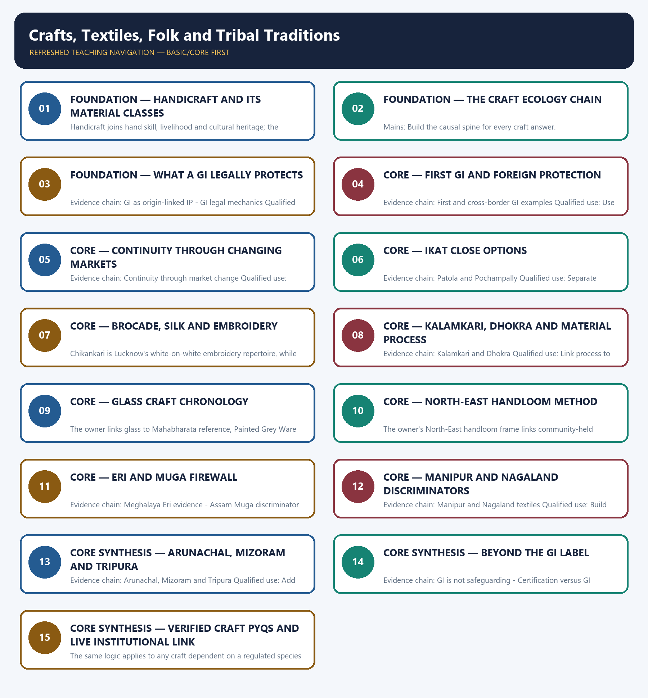

# Crafts, Textiles, Folk and Tribal Traditions — Learner-v2 Complete Learning Session

> **Authoring-only generation:** 2026-09-01. No PDF was rendered and no tracker or index was mutated.

### SOURCE, PROGRESSION AND CURRENT-LINKAGE AUDIT

- **Generation date:** 2026-09-01.
- **Repository-first evidence:** the Basic owner is taught first and preserved in full; the Advanced owner is retained only in the optional final teaching block.
- **OCR evidence:** Repository Markdown was primary. The available OCR-searchable Nitin Singhania Indian Art and Culture PDF was retained as a supplementary source; no unsupported page precision, quotation or dynamic status was imported from it.
- **Qdrant:** not used; repository Markdown and available OCR context were sufficient.
- **PYQ integrity:** No direct GS-I Mains PYQ is routed to Topic 12. The audited direct objective routes are the two 2018 matching demands and the provisional 2026 Eri-Oeko-Tex demand; the 2024 handicraft-decline and diversity-marginality Mains questions remain adjacent routes owned by Modern History or Economy and Indian Society.
- **Live-link boundary:** The Development Commissioner (Handlooms) official 2025 award-selection document was located and checked on 2026-09-01. It is used only to show that handloom skill receives current institutional recognition; no recipient, count, fibre attribution, GI status or certification claim is imported from the document.
- **Fact/inference discipline:** no current-affairs item, PYQ wording, figure or quotation is invented.

## BASIC LEARNING SESSION

### DEEP-REVIEW LEARNING CONTRACT

| Control | Binding rule for this package |
|---|---|
| Syllabus boundary | Complete Indian Art and Culture Core is taught by form, chronology, region, patronage and function before optional enrichment. |
| Evidence method | Claim → named monument/object/text/form/institution/community → analysis → qualification. |
| Chronology | Origin, surviving evidence, patronage phase, later adaptation, recognition and present status remain distinct. |
| Classification | Architecture, sculpture, painting, music, dance, theatre, language, craft, religion, heritage and cinema terms are compared on common axes without collapsing categories. |
| Interpretation | Style labels, iconographic readings, continuity, synthesis and social representation remain evidence-bounded rather than essentialist. |
| Practice contract | Every solved item has directive/demand decoding, a detailed examiner-grade model, executable compression plan, marks rationale and answer-specific improvement. |
| Approval | This immutable successor remains `approved: false` pending explicit approval. |

**Canonical Basic/Core owner:** `upsc-ai-kit\knowledge\Indian-Art-and-Culture\basic\12_Crafts-Textiles-Folk-and-Tribal-Traditions.md`  
**Canonical topic owner:** `upsc-ai-kit\knowledge\Indian-Art-and-Culture\basic\12_Crafts-Textiles-Folk-and-Tribal-Traditions.md`  
**Optional Advanced owner:** `upsc-ai-kit\knowledge\Indian-Art-and-Culture\advanced\12_Crafts-Textiles-Folk-and-Tribal-Traditions.md`  
**Official syllabus mapping:** `upsc-ai-kit\knowledge\Indian-Art-and-Culture\OFFICIAL-UPSC-SYLLABUS-MAPPING.md`

### EVIDENCE, PYQ AND CURRENT-STATUS CONTROL

- **Material evidence:** plans, fabric, technique, iconography, performance grammar, inscriptions, manuscripts, films and institutional records are identified before interpretation.
- **Attribution discipline:** patron, date, school, region, author, performer, community and function are stated only to the precision supported by the owner.
- **Quantitative discipline:** dimensions, counts, inscription years, lists, awards and registrations retain source, date, status and uncertainty; no figure is invented.
- **Interpretive discipline:** civilisational ranking, communal essentialism, timeless continuity, single-origin claims and treating commissioned representation as a social census are rejected.
- **PYQ discipline:** repository routing ledgers and locally held papers control wording and metadata; neutral rendering, reconstruction and unavailable official keys remain explicitly labelled.
- **Current-status note, rechecked 2026-09-04:** The Development Commissioner (Handlooms) official 2025 award-selection document was located and checked on 2026-09-01. It is used only to show that handloom skill receives current institutional recognition; no recipient, count, fibre attribution, GI status or certification claim is imported from the document.

**Live/official context sources recorded by the predecessor generation:**

- `https://handlooms.gov.in/assets/img/upcoming_markeing/Selection%20of%20Handloom%20Awards%202025.pdf`




*Distinct embedded teaching-navigation image. The separate continuous Cārvāka-style flowchart package remains an independent at-a-glance artifact.*

### SESSION 1 — FOUNDATION — HANDICRAFT AND ITS MATERIAL CLASSES

#### DEFINITION / WHAT THIS IS CALLED

**Plain-language definition:** Evidence chain: Handicraft and material classes Qualified use: Define the scope before naming examples.

**Technical definition:** Handicraft joins hand skill, livelihood and cultural heritage; the owner's material classes include glass, cloth, ivory, silver, clay, bronze, other metals, leather, wood, toys, stone and floor designs.

#### ANSWER-GRABBING OPENING — WRITE/ADAPT IN THE EXAM

> Evidence chain: Handicraft and material classes Qualified use: Define the scope before naming examples.

#### MUST-WRITE KEYWORDS

- **FOUNDATION**
- **Handicraft**
- **its material classes**
- **Evidence chain**
- **Qualified use**
- **Qualified**

**How to use them:** Frame the answer through FOUNDATION; define Handicraft, connect its material classes with Evidence chain to explain the mechanism, and use Qualified use for the decisive comparison or qualification.

#### VISUAL FIRST

```text
HANDICRAFT AND ITS MATERIAL CLASSES
01. Handicraft and material classes
BOUNDARY -> A material list becomes analysis only when linked to skill and livelihood.
```

*This topic-specific rail fixes the evidence sequence and its exam boundary before analysis.*

#### CORE EXPLANATION

Handicraft joins hand skill, livelihood and cultural heritage; the owner's material classes include glass, cloth, ivory, silver, clay, bronze, other metals, leather, wood, toys, stone and floor designs.

#### NAMED EVIDENCE AND MECHANISM

- Handicraft joins hand skill, livelihood and cultural heritage; the owner's material classes include glass, cloth, ivory, silver, clay, bronze, other metals, leather, wood, toys, stone and floor designs.

#### EXAMINER CAUTION

- A material list becomes analysis only when linked to skill and livelihood.

#### EXAM LINK

- **Prelims:** Retain the exact form, region, text, technique or institution attached to Handicraft and its material classes.
- **Mains:** Define the scope before naming examples.

#### MINI RECAP

- **Evidence chain:** Handicraft and material classes
- **Qualified use:** Define the scope before naming examples.

#### CLOSING RECALL FLOW — FOUNDATION — HANDICRAFT AND ITS MATERIAL CLASSES

```text
START / CONCEPT: FOUNDATION — Handicraft and its material classes
        |
        v
EXACT TERMS: FOUNDATION · Handicraft · its material classes · Evidence chain · Qualified use · Qualified
        |
        v
MECHANISM / ARGUMENT: Handicraft joins hand skill, livelihood and cultural heritage; the owner's material classes include glass, cloth, ivory, silver, clay, bronze, other metals, leather, wood, toys, stone and floor designs.
        |
        v
CONSEQUENCE / CONTRAST: The resulting consequence is that handicraft and material classes Qualified use.
        |
        v
UPSC TRAP / ANSWER-USE: Do not miss this limiting distinction: handicraft and material classes Qualified use.
        |
        v
ANSWER-GRABBING FORMULATION: Evidence chain: Handicraft and material classes Qualified use: Define the scope before naming examples.
```
### SESSION 2 — FOUNDATION — THE CRAFT ECOLOGY CHAIN

#### DEFINITION / WHAT THIS IS CALLED

**Plain-language definition:** Evidence chain: Craft ecology chain Qualified use: Build the causal spine for every craft answer.

**Technical definition:** Mains: Build the causal spine for every craft answer.

#### ANSWER-GRABBING OPENING — WRITE/ADAPT IN THE EXAM

> Evidence chain: Craft ecology chain Qualified use: Build the causal spine for every craft answer.

#### MUST-WRITE KEYWORDS

- **FOUNDATION**
- **The craft ecology chain**
- **Evidence chain**
- **Qualified use**
- **Legal recognition**
- **Legal**

**How to use them:** Frame the answer through FOUNDATION; define The craft ecology chain, connect Evidence chain with Qualified use to explain the mechanism, and use Legal recognition for the decisive comparison or qualification.

#### VISUAL FIRST

```text
THE CRAFT ECOLOGY CHAIN
01. Craft ecology chain
BOUNDARY -> Legal recognition is one link, not the whole system.
```

*This topic-specific rail fixes the evidence sequence and its exam boundary before analysis.*

#### CORE EXPLANATION

A craft survives through linked raw material, skill, producing community, market access, legal recognition and safeguarding; failure at any earlier link cannot be repaired by a label alone.

#### NAMED EVIDENCE AND MECHANISM

- A craft survives through linked raw material, skill, producing community, market access, legal recognition and safeguarding; failure at any earlier link cannot be repaired by a label alone.

#### EXAMINER CAUTION

- Legal recognition is one link, not the whole system.

#### EXAM LINK

- **Prelims:** Retain the exact form, region, text, technique or institution attached to The craft ecology chain.
- **Mains:** Build the causal spine for every craft answer.

#### MINI RECAP

- **Evidence chain:** Craft ecology chain
- **Qualified use:** Build the causal spine for every craft answer.

#### CLOSING RECALL FLOW — FOUNDATION — THE CRAFT ECOLOGY CHAIN

```text
START / CONCEPT: FOUNDATION — The craft ecology chain
        |
        v
EXACT TERMS: FOUNDATION · The craft ecology chain · Evidence chain · Qualified use · Legal recognition · Legal
        |
        v
MECHANISM / ARGUMENT: Mains: Build the causal spine for every craft answer.
        |
        v
CONSEQUENCE / CONTRAST: Legal recognition is one link, not the whole system.
        |
        v
UPSC TRAP / ANSWER-USE: Do not miss this limiting distinction: build the causal spine for every craft answer.
        |
        v
ANSWER-GRABBING FORMULATION: Evidence chain: Craft ecology chain Qualified use: Build the causal spine for every craft answer.
```
### SESSION 3 — FOUNDATION — WHAT A GI LEGALLY PROTECTS

#### DEFINITION / WHAT THIS IS CALLED

**Plain-language definition:** A Geographical Indication protects an origin-linked product name for authorised users; it is not a quality certificate, UNESCO heritage status or community-welfare guarantee.

**Technical definition:** Evidence chain: GI as origin-linked IP - GI legal mechanics Qualified use: State the instrument and statutory limit precisely.

#### ANSWER-GRABBING OPENING — WRITE/ADAPT IN THE EXAM

> A Geographical Indication protects an origin-linked product name for authorised users; it is not a quality certificate, UNESCO heritage status or community-welfare guarantee.

#### MUST-WRITE KEYWORDS

- **FOUNDATION**
- **What a GI legally protects**
- **Evidence chain**
- **Qualified use**
- **Geographical Indication**
- **UNESCO**

**How to use them:** Frame the answer through FOUNDATION; define What a GI legally protects, connect Evidence chain with Qualified use to explain the mechanism, and use Geographical Indication for the decisive comparison or qualification.

#### VISUAL FIRST

```text
WHAT A GI LEGALLY PROTECTS
01. GI as origin-linked IP
    |
    v
02. GI legal mechanics
BOUNDARY -> Origin-linked name protection is not quality or welfare certification.
```

*This topic-specific rail fixes the evidence sequence and its exam boundary before analysis.*

#### CORE EXPLANATION

A Geographical Indication protects an origin-linked product name for authorised users; it is not a quality certificate, UNESCO heritage status or community-welfare guarantee. India's sui generis GI Act of 1999 has operated since 2003, covers goods rather than services, is administered through the GI Registry at Chennai under DPIIT, and grants renewable ten-year registration.

#### NAMED EVIDENCE AND MECHANISM

- A Geographical Indication protects an origin-linked product name for authorised users; it is not a quality certificate, UNESCO heritage status or community-welfare guarantee.
- India's sui generis GI Act of 1999 has operated since 2003, covers goods rather than services, is administered through the GI Registry at Chennai under DPIIT, and grants renewable ten-year registration.

#### EXAMINER CAUTION

- Origin-linked name protection is not quality or welfare certification.

#### EXAM LINK

- **Prelims:** Retain the exact form, region, text, technique or institution attached to What a GI legally protects.
- **Mains:** State the instrument and statutory limit precisely.

#### MINI RECAP

- **Evidence chain:** GI as origin-linked IP -> GI legal mechanics
- **Qualified use:** State the instrument and statutory limit precisely.

#### CLOSING RECALL FLOW — FOUNDATION — WHAT A GI LEGALLY PROTECTS

```text
START / CONCEPT: FOUNDATION — What a GI legally protects
        |
        v
EXACT TERMS: FOUNDATION · What a GI legally protects · Evidence chain · Qualified use · Geographical Indication · UNESCO
        |
        v
MECHANISM / ARGUMENT: India's sui generis GI Act of 1999 has operated since 2003, covers goods rather than services, is administered through the GI Registry at Chennai under DPIIT, and grants renewable ten-year registration.
        |
        v
CONSEQUENCE / CONTRAST: Evidence chain: GI as origin-linked IP - GI legal mechanics Qualified use: State the instrument and statutory limit precisely.
        |
        v
UPSC TRAP / ANSWER-USE: Origin-linked name protection is not quality or welfare certification.
        |
        v
ANSWER-GRABBING FORMULATION: A Geographical Indication protects an origin-linked product name for authorised users; it is not a quality certificate, UNESCO heritage status or community-welfare guarantee.
```
### SESSION 4 — CORE — FIRST GI AND FOREIGN PROTECTION

#### DEFINITION / WHAT THIS IS CALLED

**Plain-language definition:** Darjeeling Tea was India's first GI-tagged product in 2004-05, while Kangra Tea obtained separate European Union protection; an Indian registration does not automatically extend abroad.

**Technical definition:** Evidence chain: First and cross-border GI examples Qualified use: Use dated examples without implying automatic extension.

#### ANSWER-GRABBING OPENING — WRITE/ADAPT IN THE EXAM

> Darjeeling Tea was India's first GI-tagged product in 2004-05, while Kangra Tea obtained separate European Union protection; an Indian registration does not automatically extend abroad.

#### MUST-WRITE KEYWORDS

- **First GI**
- **foreign protection**
- **Evidence chain**
- **Qualified use**
- **Darjeeling Tea**
- **2004-05**

**How to use them:** Frame the answer through First GI; define foreign protection, connect Evidence chain with Qualified use to explain the mechanism, and use Darjeeling Tea for the decisive comparison or qualification.

#### VISUAL FIRST

```text
FIRST GI AND FOREIGN PROTECTION
01. First and cross-border GI examples
BOUNDARY -> Cross-border protection requires a separate jurisdictional act.
```

*This topic-specific rail fixes the evidence sequence and its exam boundary before analysis.*

#### CORE EXPLANATION

Darjeeling Tea was India's first GI-tagged product in 2004-05, while Kangra Tea obtained separate European Union protection; an Indian registration does not automatically extend abroad.

#### NAMED EVIDENCE AND MECHANISM

- Darjeeling Tea was India's first GI-tagged product in 2004-05, while Kangra Tea obtained separate European Union protection; an Indian registration does not automatically extend abroad.

#### EXAMINER CAUTION

- Cross-border protection requires a separate jurisdictional act.

#### EXAM LINK

- **Prelims:** Retain the exact form, region, text, technique or institution attached to First GI and foreign protection.
- **Mains:** Use dated examples without implying automatic extension.

#### MINI RECAP

- **Evidence chain:** First and cross-border GI examples
- **Qualified use:** Use dated examples without implying automatic extension.

#### CLOSING RECALL FLOW — CORE — FIRST GI AND FOREIGN PROTECTION

```text
START / CONCEPT: CORE — First GI and foreign protection
        |
        v
EXACT TERMS: First GI · foreign protection · Evidence chain · Qualified use · Darjeeling Tea · 2004-05
        |
        v
MECHANISM / ARGUMENT: Evidence chain: First and cross-border GI examples Qualified use: Use dated examples without implying automatic extension.
        |
        v
CONSEQUENCE / CONTRAST: Cross-border protection requires a separate jurisdictional act.
        |
        v
UPSC TRAP / ANSWER-USE: Do not miss this limiting distinction: use dated examples without implying automatic extension.
        |
        v
ANSWER-GRABBING FORMULATION: Darjeeling Tea was India's first GI-tagged product in 2004-05, while Kangra Tea obtained separate European Union protection; an Indian registration does not automatically extend abroad.
```
### SESSION 5 — CORE — CONTINUITY THROUGH CHANGING MARKETS

#### DEFINITION / WHAT THIS IS CALLED

**Plain-language definition:** Harappan, Sangam, medieval karkhana, merchant-export, colonial, tourism and GI markets changed patronage, scale, motif and labour, so continuity means selective adaptation rather than unchanged production.

**Technical definition:** Evidence chain: Continuity through market change Qualified use: Trace adaptation across historical markets.

#### ANSWER-GRABBING OPENING — WRITE/ADAPT IN THE EXAM

> Evidence chain: Continuity through market change Qualified use: Trace adaptation across historical markets.

#### MUST-WRITE KEYWORDS

- **Continuity through changing markets**
- **Evidence chain**
- **Qualified use**
- **Harappan**
- **Sangam**
- **GI**

**How to use them:** Frame the answer through Continuity through changing markets; define Evidence chain, connect Qualified use with Harappan to explain the mechanism, and use Sangam for the decisive comparison or qualification.

#### VISUAL FIRST

```text
CONTINUITY THROUGH CHANGING MARKETS
01. Continuity through market change
BOUNDARY -> Continuity does not mean unchanged design, patronage or labour.
```

*This topic-specific rail fixes the evidence sequence and its exam boundary before analysis.*

#### CORE EXPLANATION

Harappan, Sangam, medieval karkhana, merchant-export, colonial, tourism and GI markets changed patronage, scale, motif and labour, so continuity means selective adaptation rather than unchanged production.

#### NAMED EVIDENCE AND MECHANISM

- Harappan, Sangam, medieval karkhana, merchant-export, colonial, tourism and GI markets changed patronage, scale, motif and labour, so continuity means selective adaptation rather than unchanged production.

#### EXAMINER CAUTION

- Continuity does not mean unchanged design, patronage or labour.

#### EXAM LINK

- **Prelims:** Retain the exact form, region, text, technique or institution attached to Continuity through changing markets.
- **Mains:** Trace adaptation across historical markets.

#### MINI RECAP

- **Evidence chain:** Continuity through market change
- **Qualified use:** Trace adaptation across historical markets.

#### CLOSING RECALL FLOW — CORE — CONTINUITY THROUGH CHANGING MARKETS

```text
START / CONCEPT: CORE — Continuity through changing markets
        |
        v
EXACT TERMS: Continuity through changing markets · Evidence chain · Qualified use · Harappan · Sangam · GI
        |
        v
MECHANISM / ARGUMENT: Harappan, Sangam, medieval karkhana, merchant-export, colonial, tourism and GI markets changed patronage, scale, motif and labour, so continuity means selective adaptation rather than unchanged production.
        |
        v
CONSEQUENCE / CONTRAST: Continuity does not mean unchanged design, patronage or labour.
        |
        v
UPSC TRAP / ANSWER-USE: Do not miss this limiting distinction: continuity through market change Qualified use.
        |
        v
ANSWER-GRABBING FORMULATION: Evidence chain: Continuity through market change Qualified use: Trace adaptation across historical markets.
```
### SESSION 6 — CORE — IKAT CLOSE OPTIONS

#### DEFINITION / WHAT THIS IS CALLED

**Plain-language definition:** Patola from Patan uses double ikat, while Pochampally in Telangana uses resist-dyed yarn and may be single or double ikat; technique and centre must be stated together.

**Technical definition:** Evidence chain: Patola and Pochampally Qualified use: Separate Patola from Pochampally.

#### ANSWER-GRABBING OPENING — WRITE/ADAPT IN THE EXAM

> Patola from Patan uses double ikat, while Pochampally in Telangana uses resist-dyed yarn and may be single or double ikat; technique and centre must be stated together.

#### MUST-WRITE KEYWORDS

- **Ikat close options**
- **Evidence chain**
- **Qualified use**
- **Patola**
- **Patan**
- **Pochampally**

**How to use them:** Frame the answer through Ikat close options; define Evidence chain, connect Qualified use with Patola to explain the mechanism, and use Patan for the decisive comparison or qualification.

#### VISUAL FIRST

```text
IKAT CLOSE OPTIONS
01. Patola and Pochampally
BOUNDARY -> State centre and resist-dye logic together.
```

*This topic-specific rail fixes the evidence sequence and its exam boundary before analysis.*

#### CORE EXPLANATION

Patola from Patan uses double ikat, while Pochampally in Telangana uses resist-dyed yarn and may be single or double ikat; technique and centre must be stated together.

#### NAMED EVIDENCE AND MECHANISM

- Patola from Patan uses double ikat, while Pochampally in Telangana uses resist-dyed yarn and may be single or double ikat; technique and centre must be stated together.

#### EXAMINER CAUTION

- State centre and resist-dye logic together.

#### EXAM LINK

- **Prelims:** Retain the exact form, region, text, technique or institution attached to Ikat close options.
- **Mains:** Separate Patola from Pochampally.

#### MINI RECAP

- **Evidence chain:** Patola and Pochampally
- **Qualified use:** Separate Patola from Pochampally.

#### CLOSING RECALL FLOW — CORE — IKAT CLOSE OPTIONS

```text
START / CONCEPT: CORE — Ikat close options
        |
        v
EXACT TERMS: Ikat close options · Evidence chain · Qualified use · Patola · Patan · Pochampally
        |
        v
MECHANISM / ARGUMENT: Evidence chain: Patola and Pochampally Qualified use: Separate Patola from Pochampally.
        |
        v
CONSEQUENCE / CONTRAST: The resulting consequence is that patola from Patan uses double ikat.
        |
        v
UPSC TRAP / ANSWER-USE: Do not miss this limiting distinction: patola from Patan uses double ikat.
        |
        v
ANSWER-GRABBING FORMULATION: Patola from Patan uses double ikat, while Pochampally in Telangana uses resist-dyed yarn and may be single or double ikat; technique and centre must be stated together.
```
### SESSION 7 — CORE — BROCADE, SILK AND EMBROIDERY

#### DEFINITION / WHAT THIS IS CALLED

**Plain-language definition:** Kanchipuram silk is distinguished by contrasting borders joined to the body, while Banarasi brocade uses supplementary-weft zari; neither is embroidery.

**Technical definition:** Chikankari is Lucknow's white-on-white embroidery repertoire, while Kantha is Bengal running-stitch quilting or embroidery associated with reused cloth traditions.

#### ANSWER-GRABBING OPENING — WRITE/ADAPT IN THE EXAM

> Kanchipuram silk is distinguished by contrasting borders joined to the body, while Banarasi brocade uses supplementary-weft zari; neither is embroidery.

#### MUST-WRITE KEYWORDS

- **Brocade**
- **silk**
- **embroidery**
- **Evidence chain**
- **Qualified use**
- **Kanchipuram silk**

**How to use them:** Frame the answer through Brocade; define silk, connect embroidery with Evidence chain to explain the mechanism, and use Qualified use for the decisive comparison or qualification.

#### VISUAL FIRST

```text
BROCADE, SILK AND EMBROIDERY
01. Kanchipuram and Banarasi
    |
    v
02. Chikankari and Kantha
BOUNDARY -> A weave is not embroidery and reuse can be intrinsic to form.
```

*This topic-specific rail fixes the evidence sequence and its exam boundary before analysis.*

#### CORE EXPLANATION

Kanchipuram silk is distinguished by contrasting borders joined to the body, while Banarasi brocade uses supplementary-weft zari; neither is embroidery. Chikankari is Lucknow's white-on-white embroidery repertoire, while Kantha is Bengal running-stitch quilting or embroidery associated with reused cloth traditions.

#### NAMED EVIDENCE AND MECHANISM

- Kanchipuram silk is distinguished by contrasting borders joined to the body, while Banarasi brocade uses supplementary-weft zari; neither is embroidery.
- Chikankari is Lucknow's white-on-white embroidery repertoire, while Kantha is Bengal running-stitch quilting or embroidery associated with reused cloth traditions.

#### EXAMINER CAUTION

- A weave is not embroidery and reuse can be intrinsic to form.

#### EXAM LINK

- **Prelims:** Retain the exact form, region, text, technique or institution attached to Brocade, silk and embroidery.
- **Mains:** Prepare four-tradition comparison.

#### MINI RECAP

- **Evidence chain:** Kanchipuram and Banarasi -> Chikankari and Kantha
- **Qualified use:** Prepare four-tradition comparison.

#### CLOSING RECALL FLOW — CORE — BROCADE, SILK AND EMBROIDERY

```text
START / CONCEPT: CORE — Brocade, silk and embroidery
        |
        v
EXACT TERMS: Brocade · silk · embroidery · Evidence chain · Qualified use · Kanchipuram silk
        |
        v
MECHANISM / ARGUMENT: Chikankari is Lucknow's white-on-white embroidery repertoire, while Kantha is Bengal running-stitch quilting or embroidery associated with reused cloth traditions.
        |
        v
CONSEQUENCE / CONTRAST: A weave is not embroidery and reuse can be intrinsic to form.
        |
        v
UPSC TRAP / ANSWER-USE: Do not miss this limiting distinction: kanchipuram and Banarasi - Chikankari and Kantha Qualified use.
        |
        v
ANSWER-GRABBING FORMULATION: Kanchipuram silk is distinguished by contrasting borders joined to the body, while Banarasi brocade uses supplementary-weft zari; neither is embroidery.
```
### SESSION 8 — CORE — KALAMKARI, DHOKRA AND MATERIAL PROCESS

#### DEFINITION / WHAT THIS IS CALLED

**Plain-language definition:** Kalamkari uses hand-drawn or block-printed cotton with mordant or resist processes in Andhra Pradesh and Telangana centres, while Dhokra is lost-wax non-ferrous casting across central and eastern artisan communities.

**Technical definition:** Evidence chain: Kalamkari and Dhokra Qualified use: Link process to product.

#### ANSWER-GRABBING OPENING — WRITE/ADAPT IN THE EXAM

> Kalamkari uses hand-drawn or block-printed cotton with mordant or resist processes in Andhra Pradesh and Telangana centres, while Dhokra is lost-wax non-ferrous casting across central and eastern artisan communities.

#### MUST-WRITE KEYWORDS

- **Kalamkari**
- **Dhokra**
- **material process**
- **Evidence chain**
- **Qualified use**
- **Andhra Pradesh**

**How to use them:** Frame the answer through Kalamkari; define Dhokra, connect material process with Evidence chain to explain the mechanism, and use Qualified use for the decisive comparison or qualification.

#### VISUAL FIRST

```text
KALAMKARI, DHOKRA AND MATERIAL PROCESS
01. Kalamkari and Dhokra
BOUNDARY -> Surface design and lost-wax casting solve different material problems.
```

*This topic-specific rail fixes the evidence sequence and its exam boundary before analysis.*

#### CORE EXPLANATION

Kalamkari uses hand-drawn or block-printed cotton with mordant or resist processes in Andhra Pradesh and Telangana centres, while Dhokra is lost-wax non-ferrous casting across central and eastern artisan communities.

#### NAMED EVIDENCE AND MECHANISM

- Kalamkari uses hand-drawn or block-printed cotton with mordant or resist processes in Andhra Pradesh and Telangana centres, while Dhokra is lost-wax non-ferrous casting across central and eastern artisan communities.

#### EXAMINER CAUTION

- Surface design and lost-wax casting solve different material problems.

#### EXAM LINK

- **Prelims:** Retain the exact form, region, text, technique or institution attached to Kalamkari, Dhokra and material process.
- **Mains:** Link process to product.

#### MINI RECAP

- **Evidence chain:** Kalamkari and Dhokra
- **Qualified use:** Link process to product.

#### CLOSING RECALL FLOW — CORE — KALAMKARI, DHOKRA AND MATERIAL PROCESS

```text
START / CONCEPT: CORE — Kalamkari, Dhokra and material process
        |
        v
EXACT TERMS: Kalamkari · Dhokra · material process · Evidence chain · Qualified use · Andhra Pradesh
        |
        v
MECHANISM / ARGUMENT: Evidence chain: Kalamkari and Dhokra Qualified use: Link process to product.
        |
        v
CONSEQUENCE / CONTRAST: The resulting consequence is that kalamkari uses hand-drawn or block-printed cotton with mordant or resist processes in Andhra Pradesh...
        |
        v
UPSC TRAP / ANSWER-USE: Do not miss this limiting distinction: kalamkari uses hand-drawn or block-printed cotton with mordant or resist processes in Andhra Pradesh...
        |
        v
ANSWER-GRABBING FORMULATION: Kalamkari uses hand-drawn or block-printed cotton with mordant or resist processes in Andhra Pradesh and Telangana centres, while Dhokra is lost-wax non-ferrous casting across central and eastern artisan communities.
```
### SESSION 9 — CORE — GLASS CRAFT CHRONOLOGY

#### DEFINITION / WHAT THIS IS CALLED

**Plain-language definition:** Evidence chain: Glass craft chronology Qualified use: Construct a cautious craft-history chain.

**Technical definition:** The owner links glass to Mahabharata reference, Painted Grey Ware evidence, the term kanch or kaca in the Shatapatha Brahmana, and a Brahmapuri-Kolhapur industry producing lenticular beads.

#### ANSWER-GRABBING OPENING — WRITE/ADAPT IN THE EXAM

> Evidence chain: Glass craft chronology Qualified use: Construct a cautious craft-history chain.

#### MUST-WRITE KEYWORDS

- **Glass craft chronology**
- **Evidence chain**
- **Qualified use**
- **Mahabharata**
- **Painted Grey Ware**
- **Shatapatha Brahmana**

**How to use them:** Frame the answer through Glass craft chronology; define Evidence chain, connect Qualified use with Mahabharata to explain the mechanism, and use Painted Grey Ware for the decisive comparison or qualification.

#### VISUAL FIRST

```text
GLASS CRAFT CHRONOLOGY
01. Glass craft chronology
BOUNDARY -> Textual reference and archaeological evidence are different evidence classes.
```

*This topic-specific rail fixes the evidence sequence and its exam boundary before analysis.*

#### CORE EXPLANATION

The owner links glass to Mahabharata reference, Painted Grey Ware evidence, the term kanch or kaca in the Shatapatha Brahmana, and a Brahmapuri-Kolhapur industry producing lenticular beads.

#### NAMED EVIDENCE AND MECHANISM

- The owner links glass to Mahabharata reference, Painted Grey Ware evidence, the term kanch or kaca in the Shatapatha Brahmana, and a Brahmapuri-Kolhapur industry producing lenticular beads.

#### EXAMINER CAUTION

- Textual reference and archaeological evidence are different evidence classes.

#### EXAM LINK

- **Prelims:** Retain the exact form, region, text, technique or institution attached to Glass craft chronology.
- **Mains:** Construct a cautious craft-history chain.

#### MINI RECAP

- **Evidence chain:** Glass craft chronology
- **Qualified use:** Construct a cautious craft-history chain.

#### CLOSING RECALL FLOW — CORE — GLASS CRAFT CHRONOLOGY

```text
START / CONCEPT: CORE — Glass craft chronology
        |
        v
EXACT TERMS: Glass craft chronology · Evidence chain · Qualified use · Mahabharata · Painted Grey Ware · Shatapatha Brahmana
        |
        v
MECHANISM / ARGUMENT: The owner links glass to Mahabharata reference, Painted Grey Ware evidence, the term kanch or kaca in the Shatapatha Brahmana, and a Brahmapuri-Kolhapur industry producing lenticular beads.
        |
        v
CONSEQUENCE / CONTRAST: Textual reference and archaeological evidence are different evidence classes.
        |
        v
UPSC TRAP / ANSWER-USE: Do not miss this limiting distinction: evidence chain: Glass craft chronology Qualified use: Construct a cautious craft-history chain.
        |
        v
ANSWER-GRABBING FORMULATION: Evidence chain: Glass craft chronology Qualified use: Construct a cautious craft-history chain.
```
### SESSION 10 — CORE — NORTH-EAST HANDLOOM METHOD

#### DEFINITION / WHAT THIS IS CALLED

**Plain-language definition:** Evidence chain: North-East handloom process Qualified use: Replace anonymous tribal labels with sourced specificity.

**Technical definition:** The owner's North-East handloom frame links community-held knowledge to ginning, spinning and weaving; region, community, fibre, process and product must be recorded together.

#### ANSWER-GRABBING OPENING — WRITE/ADAPT IN THE EXAM

> Evidence chain: North-East handloom process Qualified use: Replace anonymous tribal labels with sourced specificity.

#### MUST-WRITE KEYWORDS

- **North-East handloom method**
- **Evidence chain**
- **Qualified use**
- **North-East**
- **Region**
- **Qualified**

**How to use them:** Frame the answer through North-East handloom method; define Evidence chain, connect Qualified use with North-East to explain the mechanism, and use Region for the decisive comparison or qualification.

#### VISUAL FIRST

```text
NORTH-EAST HANDLOOM METHOD
01. North-East handloom process
BOUNDARY -> Region must be joined to community, fibre, process and product.
```

*This topic-specific rail fixes the evidence sequence and its exam boundary before analysis.*

#### CORE EXPLANATION

The owner's North-East handloom frame links community-held knowledge to ginning, spinning and weaving; region, community, fibre, process and product must be recorded together.

#### NAMED EVIDENCE AND MECHANISM

- The owner's North-East handloom frame links community-held knowledge to ginning, spinning and weaving; region, community, fibre, process and product must be recorded together.

#### EXAMINER CAUTION

- Region must be joined to community, fibre, process and product.

#### EXAM LINK

- **Prelims:** Retain the exact form, region, text, technique or institution attached to North-East handloom method.
- **Mains:** Replace anonymous tribal labels with sourced specificity.

#### MINI RECAP

- **Evidence chain:** North-East handloom process
- **Qualified use:** Replace anonymous tribal labels with sourced specificity.

#### CLOSING RECALL FLOW — CORE — NORTH-EAST HANDLOOM METHOD

```text
START / CONCEPT: CORE — North-East handloom method
        |
        v
EXACT TERMS: North-East handloom method · Evidence chain · Qualified use · North-East · Region · Qualified
        |
        v
MECHANISM / ARGUMENT: The owner's North-East handloom frame links community-held knowledge to ginning, spinning and weaving; region, community, fibre, process and product must be recorded together.
        |
        v
CONSEQUENCE / CONTRAST: Region must be joined to community, fibre, process and product.
        |
        v
UPSC TRAP / ANSWER-USE: Do not miss this limiting distinction: replace anonymous tribal labels with sourced specificity.
        |
        v
ANSWER-GRABBING FORMULATION: Evidence chain: North-East handloom process Qualified use: Replace anonymous tribal labels with sourced specificity.
```
### SESSION 11 — CORE — ERI AND MUGA FIREWALL

#### DEFINITION / WHAT THIS IS CALLED

**Plain-language definition:** Assam is identified with golden Muga silk, while mekhela chador occurs in both Assam and Meghalaya and therefore cannot identify a state by itself.

**Technical definition:** Evidence chain: Meghalaya Eri evidence - Assam Muga discriminator Qualified use: Prepare the provisional 2026 route without solving it.

#### ANSWER-GRABBING OPENING — WRITE/ADAPT IN THE EXAM

> Assam is identified with golden Muga silk, while mekhela chador occurs in both Assam and Meghalaya and therefore cannot identify a state by itself.

#### MUST-WRITE KEYWORDS

- **Eri**
- **Muga firewall**
- **Evidence chain**
- **Qualified use**
- **Eri silk**
- **Meghalaya**

**How to use them:** Frame the answer through Eri; define Muga firewall, connect Evidence chain with Qualified use to explain the mechanism, and use Eri silk for the decisive comparison or qualification.

#### VISUAL FIRST

```text
ERI AND MUGA FIREWALL
01. Meghalaya Eri evidence
    |
    v
02. Assam Muga discriminator
BOUNDARY -> A shared garment cannot identify the fibre or state alone.
```

*This topic-specific rail fixes the evidence sequence and its exam boundary before analysis.*

#### CORE EXPLANATION

Eri silk is commonly produced in Meghalaya, where Garo, Khasi and Jaintia communities are described as skilled weavers of shawls, sarongs and mekhela chadors using silk and cotton. Assam is identified with golden Muga silk, while mekhela chador occurs in both Assam and Meghalaya and therefore cannot identify a state by itself.

#### NAMED EVIDENCE AND MECHANISM

- Eri silk is commonly produced in Meghalaya, where Garo, Khasi and Jaintia communities are described as skilled weavers of shawls, sarongs and mekhela chadors using silk and cotton.
- Assam is identified with golden Muga silk, while mekhela chador occurs in both Assam and Meghalaya and therefore cannot identify a state by itself.

#### EXAMINER CAUTION

- A shared garment cannot identify the fibre or state alone.

#### EXAM LINK

- **Prelims:** Retain the exact form, region, text, technique or institution attached to Eri and Muga firewall.
- **Mains:** Prepare the provisional 2026 route without solving it.

#### MINI RECAP

- **Evidence chain:** Meghalaya Eri evidence -> Assam Muga discriminator
- **Qualified use:** Prepare the provisional 2026 route without solving it.

#### CLOSING RECALL FLOW — CORE — ERI AND MUGA FIREWALL

```text
START / CONCEPT: CORE — Eri and Muga firewall
        |
        v
EXACT TERMS: Eri · Muga firewall · Evidence chain · Qualified use · Eri silk · Meghalaya
        |
        v
MECHANISM / ARGUMENT: Evidence chain: Meghalaya Eri evidence - Assam Muga discriminator Qualified use: Prepare the provisional 2026 route without solving it.
        |
        v
CONSEQUENCE / CONTRAST: Eri silk is commonly produced in Meghalaya, where Garo, Khasi and Jaintia communities are described as skilled weavers of shawls, sarongs and mekhela chadors using silk and cotton.
        |
        v
UPSC TRAP / ANSWER-USE: Do not miss this limiting distinction: assam is identified with golden Muga silk.
        |
        v
ANSWER-GRABBING FORMULATION: Assam is identified with golden Muga silk, while mekhela chador occurs in both Assam and Meghalaya and therefore cannot identify a state by itself.
```
### SESSION 12 — CORE — MANIPUR AND NAGALAND DISCRIMINATORS

#### DEFINITION / WHAT THIS IS CALLED

**Plain-language definition:** Manipur is linked with Moirang Phee and the Phanek, while Nagaland traditions use tribe-specific patterns, vibrant colours and natural dyes; neither should be reduced to a single pan-state motif.

**Technical definition:** Evidence chain: Manipur and Nagaland textiles Qualified use: Build close-option confidence.

#### ANSWER-GRABBING OPENING — WRITE/ADAPT IN THE EXAM

> Manipur is linked with Moirang Phee and the Phanek, while Nagaland traditions use tribe-specific patterns, vibrant colours and natural dyes; neither should be reduced to a single pan-state motif.

#### MUST-WRITE KEYWORDS

- **Manipur**
- **Nagaland discriminators**
- **Evidence chain**
- **Qualified use**
- **Moirang Phee**
- **Phanek**

**How to use them:** Frame the answer through Manipur; define Nagaland discriminators, connect Evidence chain with Qualified use to explain the mechanism, and use Moirang Phee for the decisive comparison or qualification.

#### VISUAL FIRST

```text
MANIPUR AND NAGALAND DISCRIMINATORS
01. Manipur and Nagaland textiles
BOUNDARY -> Named fabrics and motif systems must remain distinct.
```

*This topic-specific rail fixes the evidence sequence and its exam boundary before analysis.*

#### CORE EXPLANATION

Manipur is linked with Moirang Phee and the Phanek, while Nagaland traditions use tribe-specific patterns, vibrant colours and natural dyes; neither should be reduced to a single pan-state motif.

#### NAMED EVIDENCE AND MECHANISM

- Manipur is linked with Moirang Phee and the Phanek, while Nagaland traditions use tribe-specific patterns, vibrant colours and natural dyes; neither should be reduced to a single pan-state motif.

#### EXAMINER CAUTION

- Named fabrics and motif systems must remain distinct.

#### EXAM LINK

- **Prelims:** Retain the exact form, region, text, technique or institution attached to Manipur and Nagaland discriminators.
- **Mains:** Build close-option confidence.

#### MINI RECAP

- **Evidence chain:** Manipur and Nagaland textiles
- **Qualified use:** Build close-option confidence.

#### CLOSING RECALL FLOW — CORE — MANIPUR AND NAGALAND DISCRIMINATORS

```text
START / CONCEPT: CORE — Manipur and Nagaland discriminators
        |
        v
EXACT TERMS: Manipur · Nagaland discriminators · Evidence chain · Qualified use · Moirang Phee · Phanek
        |
        v
MECHANISM / ARGUMENT: Evidence chain: Manipur and Nagaland textiles Qualified use: Build close-option confidence.
        |
        v
CONSEQUENCE / CONTRAST: Named fabrics and motif systems must remain distinct.
        |
        v
UPSC TRAP / ANSWER-USE: Do not miss this limiting distinction: manipur is linked with Moirang Phee and the Phanek.
        |
        v
ANSWER-GRABBING FORMULATION: Manipur is linked with Moirang Phee and the Phanek, while Nagaland traditions use tribe-specific patterns, vibrant colours and natural dyes; neither should be reduced to a single pan-state motif.
```
### SESSION 13 — CORE SYNTHESIS — ARUNACHAL, MIZORAM AND TRIPURA

#### DEFINITION / WHAT THIS IS CALLED

**Plain-language definition:** Adi, Apatani, Nyishi and Monpa weaving anchors Arunachal Pradesh; women are the primary weavers of Mizoram's Puan; Tripura is described through striped and dispersed-embroidery patterning.

**Technical definition:** Evidence chain: Arunachal, Mizoram and Tripura Qualified use: Add gendered labour and pattern evidence.

#### ANSWER-GRABBING OPENING — WRITE/ADAPT IN THE EXAM

> Adi, Apatani, Nyishi and Monpa weaving anchors Arunachal Pradesh; women are the primary weavers of Mizoram's Puan; Tripura is described through striped and dispersed-embroidery patterning.

#### MUST-WRITE KEYWORDS

- **CORE SYNTHESIS**
- **Arunachal**
- **Mizoram**
- **Tripura**
- **Evidence chain**
- **Qualified use**

**How to use them:** Frame the answer through CORE SYNTHESIS; define Arunachal, connect Mizoram with Tripura to explain the mechanism, and use Evidence chain for the decisive comparison or qualification.

#### VISUAL FIRST

```text
ARUNACHAL, MIZORAM AND TRIPURA
01. Arunachal, Mizoram and Tripura
BOUNDARY -> Do not flatten several communities into a single North-East style.
```

*This topic-specific rail fixes the evidence sequence and its exam boundary before analysis.*

#### CORE EXPLANATION

Adi, Apatani, Nyishi and Monpa weaving anchors Arunachal Pradesh; women are the primary weavers of Mizoram's Puan; Tripura is described through striped and dispersed-embroidery patterning.

#### NAMED EVIDENCE AND MECHANISM

- Adi, Apatani, Nyishi and Monpa weaving anchors Arunachal Pradesh; women are the primary weavers of Mizoram's Puan; Tripura is described through striped and dispersed-embroidery patterning.

#### EXAMINER CAUTION

- Do not flatten several communities into a single North-East style.

#### EXAM LINK

- **Prelims:** Retain the exact form, region, text, technique or institution attached to Arunachal, Mizoram and Tripura.
- **Mains:** Add gendered labour and pattern evidence.

#### MINI RECAP

- **Evidence chain:** Arunachal, Mizoram and Tripura
- **Qualified use:** Add gendered labour and pattern evidence.

#### CLOSING RECALL FLOW — CORE SYNTHESIS — ARUNACHAL, MIZORAM AND TRIPURA

```text
START / CONCEPT: CORE SYNTHESIS — Arunachal, Mizoram and Tripura
        |
        v
EXACT TERMS: CORE SYNTHESIS · Arunachal · Mizoram · Tripura · Evidence chain · Qualified use
        |
        v
MECHANISM / ARGUMENT: Evidence chain: Arunachal, Mizoram and Tripura Qualified use: Add gendered labour and pattern evidence.
        |
        v
CONSEQUENCE / CONTRAST: Do not flatten several communities into a single North-East style.
        |
        v
UPSC TRAP / ANSWER-USE: Do not miss this limiting distinction: arunachal, Mizoram and Tripura Qualified use.
        |
        v
ANSWER-GRABBING FORMULATION: Adi, Apatani, Nyishi and Monpa weaving anchors Arunachal Pradesh; women are the primary weavers of Mizoram's Puan; Tripura is described through striped and dispersed-embroidery patterning.
```
### SESSION 14 — CORE SYNTHESIS — BEYOND THE GI LABEL

#### DEFINITION / WHAT THIS IS CALLED

**Plain-language definition:** Wildlife-law limits bar revivalist arguments for new ivory production; invisible preparatory labour and copying outside a protected name show why ecology, gender and design appropriation require analysis beyond GI.

**Technical definition:** Evidence chain: GI is not safeguarding - Certification versus GI boundary - Ecology, gender and appropriation Qualified use: Evaluate livelihood, ecology, labour and appropriation.

#### ANSWER-GRABBING OPENING — WRITE/ADAPT IN THE EXAM

> Wildlife-law limits bar revivalist arguments for new ivory production; invisible preparatory labour and copying outside a protected name show why ecology, gender and design appropriation require analysis beyond GI.

#### MUST-WRITE KEYWORDS

- **CORE SYNTHESIS**
- **Beyond the GI label**
- **Evidence chain**
- **Qualified use**
- **GI**
- **Oeko-Tex**

**How to use them:** Frame the answer through CORE SYNTHESIS; define Beyond the GI label, connect Evidence chain with Qualified use to explain the mechanism, and use GI for the decisive comparison or qualification.

#### VISUAL FIRST

```text
BEYOND THE GI LABEL
01. GI is not safeguarding
    |
    v
02. Certification versus GI boundary
    |
    v
03. Ecology, gender and appropriation
BOUNDARY -> Unsupported certification detail must remain a disclosed gap.
```

*This topic-specific rail fixes the evidence sequence and its exam boundary before analysis.*

#### CORE EXPLANATION

GI intervenes at legal recognition but does not by itself secure raw material, fair price, labour conditions, design protection, market power or intergenerational skill transmission. The routed Oeko-Tex demand combines a voluntary textile-testing standard with Eri production; the owner supports the Eri fact but holds no verified criteria or current producer-status evidence for the certification half. Wildlife-law limits bar revivalist arguments for new ivory production; invisible preparatory labour and copying outside a protected name show why ecology, gender and design appropriation require analysis beyond GI.

#### NAMED EVIDENCE AND MECHANISM

- GI intervenes at legal recognition but does not by itself secure raw material, fair price, labour conditions, design protection, market power or intergenerational skill transmission.
- The routed Oeko-Tex demand combines a voluntary textile-testing standard with Eri production; the owner supports the Eri fact but holds no verified criteria or current producer-status evidence for the certification half.
- Wildlife-law limits bar revivalist arguments for new ivory production; invisible preparatory labour and copying outside a protected name show why ecology, gender and design appropriation require analysis beyond GI.

#### EXAMINER CAUTION

- Unsupported certification detail must remain a disclosed gap.

#### EXAM LINK

- **Prelims:** Retain the exact form, region, text, technique or institution attached to Beyond the GI label.
- **Mains:** Evaluate livelihood, ecology, labour and appropriation.

#### MINI RECAP

- **Evidence chain:** GI is not safeguarding -> Certification versus GI boundary -> Ecology, gender and appropriation
- **Qualified use:** Evaluate livelihood, ecology, labour and appropriation.

#### CLOSING RECALL FLOW — CORE SYNTHESIS — BEYOND THE GI LABEL

```text
START / CONCEPT: CORE SYNTHESIS — Beyond the GI label
        |
        v
EXACT TERMS: CORE SYNTHESIS · Beyond the GI label · Evidence chain · Qualified use · GI · Oeko-Tex
        |
        v
MECHANISM / ARGUMENT: GI intervenes at legal recognition but does not by itself secure raw material, fair price, labour conditions, design protection, market power or intergenerational skill transmission.
        |
        v
CONSEQUENCE / CONTRAST: Evidence chain: GI is not safeguarding - Certification versus GI boundary - Ecology, gender and appropriation Qualified use: Evaluate livelihood, ecology, labour and appropriation.
        |
        v
UPSC TRAP / ANSWER-USE: The routed Oeko-Tex demand combines a voluntary textile-testing standard with Eri production; the owner supports the Eri fact but holds no verified criteria or current producer-status evidence for the certification half.
        |
        v
ANSWER-GRABBING FORMULATION: Wildlife-law limits bar revivalist arguments for new ivory production; invisible preparatory labour and copying outside a protected name show why ecology, gender and design appropriation require analysis beyond GI.
```
### SESSION 15 — CORE SYNTHESIS — VERIFIED CRAFT PYQS AND LIVE INSTITUTIONAL LINK

#### DEFINITION / WHAT THIS IS CALLED

**Plain-language definition:** The official 2025 handloom-award document is used only as evidence of current institutional recognition, not as a source for unverified winners.

**Technical definition:** The same logic applies to any craft dependent on a regulated species or a depleting material. ⚠️ Gender and community: where a craft's preparatory labour (spinning, sorting, finishing) is domestic and its marketed stage is not, recognition and income attach to the visible stage.

#### ANSWER-GRABBING OPENING — WRITE/ADAPT IN THE EXAM

> Evidence chain: Verified craft routes and live boundary Qualified use: Close with evidence, boundary and dated-source discipline.

#### MUST-WRITE KEYWORDS

- **CORE SYNTHESIS**
- **Verified craft PYQs**
- **live institutional link**
- **Evidence chain**
- **Qualified use**
- **Subject**

**How to use them:** Frame the answer through CORE SYNTHESIS; define Verified craft PYQs, connect live institutional link with Evidence chain to explain the mechanism, and use Qualified use for the decisive comparison or qualification.

#### VISUAL FIRST

```text
VERIFIED CRAFT PYQS AND LIVE INSTITUTIONAL LINK
01. Verified craft routes and live boundary
BOUNDARY -> Current awards cannot prove technique or tribal attribution.
```

*This topic-specific rail fixes the evidence sequence and its exam boundary before analysis.*

#### CORE EXPLANATION

The routed demands cover 2018 folk-culture and textile matching plus provisional 2026 Eri-Oeko-Tex; deindustrialisation-as-context, not this topic's primary claim, means this topic supplies specific craft-material vocabulary while Modern History and Economy own the causal verdict. The official 2025 handloom-award document is used only as evidence of current institutional recognition, not as a source for unverified winners.

#### NAMED EVIDENCE AND MECHANISM

- The routed demands cover 2018 folk-culture and textile matching plus provisional 2026 Eri-Oeko-Tex; deindustrialisation-as-context, not this topic's primary claim, means this topic supplies specific craft-material vocabulary while Modern History and Economy own the causal verdict. The official 2025 handloom-award document is used only as evidence of current institutional recognition, not as a source for unverified winners.

#### EXAMINER CAUTION

- Current awards cannot prove technique or tribal attribution.

#### EXAM LINK

- **Prelims:** Retain the exact form, region, text, technique or institution attached to Verified craft PYQs and live institutional link.
- **Mains:** Close with evidence, boundary and dated-source discipline.

#### MINI RECAP

- **Evidence chain:** Verified craft routes and live boundary
- **Qualified use:** Close with evidence, boundary and dated-source discipline.
#### COMPLETE BASIC OWNER EVIDENCE BANK

> **Subject:** Indian Art & Culture | **Tier:** Must-Do (foundation) |
> **GS Paper:** GS-I.
> **Core area:** Handicrafts (glassware, textiles, ivory, silver, pottery,
> bronze, wood, stoneware); Geographical Indications (GI) as origin-linked
> intellectual property; craft-community livelihoods.
> **Grounded in:** Nitin Singhania, *Indian Art and Culture*, PDF pp.
> 378-410; R.S. Sharma, *India's Ancient Past*, PDF pp. 97-103, 250-260,
> 347-355; Satish Chandra, *History of Medieval India*, PDF pp. 118-149,
> 317-327; Satish Chandra, *Medieval History, 1526-1748, Part 2*, PDF pp.
> 358-401; `00_Master-Framework.md` Section 3; audited UPSC Mains 2024 GS
> Paper I (adjacent only).
> ✅ = source-grounded | ⚠️ = analytical inference | 📰 = current anchor | ❌ = trap.
> *Companion: `advanced/12_Crafts-Textiles-Folk-and-Tribal-Traditions.md`.*

#### 1. Snapshot and syllabus fit

✅ This topic covers Indian handicrafts (material-wise) and the GI
registration system. ⚠️ It has **adjacent-only** PYQ relevance: the 2024
Industrial Revolution/handicrafts-decline question and the 2024 cultural-
diversity/marginality question both touch this topic's subject matter but
are **primarily owned by Modern History/Economy and Indian Society**
respectively (see Section 7).

#### 2. Essential vocabulary

| Term | Exam-ready meaning |
|---|---|
| ✅ **Handicraft** | An "amalgamation of all things crafted by hand," serving as both livelihood and cultural heritage, especially for tribal and rural communities (*Nitin…pdf*, PDF p. 378). |
| ✅ **Geographical Indication (GI)** | "A sign that a particular item has originated from a particular region only," ensuring only registered authorised users may use the product name (*Nitin…pdf*, PDF p. 406). |
| ✅ **GI Registry** | The Government of India office (Chennai) issuing GI certification, functioning under DPIIT, Ministry of Commerce and Industry (*Nitin…pdf*, PDF p. 407). |
| ✅ **GI validity** | GI registration is valid for 10 years, renewable every 10 years; certification covers 34 classes; application fee is Rs. 5,000 (*Nitin…pdf*, PDF p. 407). |
| ✅ **Sui generis method** | Per WIPO, one of three GI-protection methods — a law exclusively and specifically designed for GIs (the other two being certification/collective marks, and general business-practice/consumer-protection law) (*Nitin…pdf*, PDF p. 408). |

#### 3. Core classification

✅ The book classifies Indian handicrafts by material: glassware, cloth
handicrafts, ivory carving, silver crafts, clay and pottery work, bronze
crafts, other metal crafts, leather products, wooden work, toys,
stoneware, and floor designs (*Nitin…pdf*, PDF p. 378). ✅ GI protection
under Indian law operates through the **Geographical Indications of Goods
(Registration & Protection) Act, 1999** (in force since 2003), covering
only goods (not services) (*Nitin…pdf*, PDF p. 407).

#### 4. Foundation narrative

✅ Glassmaking's earliest Indian reference is in the Mahabharata, with
archaeological evidence from the Painted Grey Ware culture (Ganges
Valley, 1000 BC) and a documented glass industry at Brahmapuri/Kolhapur
(Maharashtra, 2nd century BC-2nd century AD, producing lenticular beads);
the Vedic *Shatapatha Brahmana* uses the term "kanch/kaca" for glass
(*Nitin…pdf*, PDF p. 379). ✅ **Darjeeling Tea was India's first GI-tagged
product**, registered in 2004-05 (*Nitin…pdf*, PDF p. 407). ✅ As of July
2025 (per the book's own count), **658 goods** held GI status in India;
as of April 2025, **Uttar Pradesh held the highest number of GI tags (77
registered products)**, surpassing Tamil Nadu's previous lead
(*Nitin…pdf*, PDF pp. 406-407). ✅ Kerala's Nilambur Teak received a GI
tag (Nilambur also has a prominent teak museum and historic plantation
landscape); Kangra Tea (Himachal Pradesh) additionally secured
protected GI status in the **European Union** (*Nitin…pdf*, PDF pp.
407-408).

✅ **Regional craft-textile distinctions:**

| Tradition | Region/community | Technique/product trap |
|---|---|---|
| Patola | Patan, Gujarat | Double ikat; not Pochampally/Kanchipuram |
| Pochampally ikat | Telangana | Resist-dyed yarn; may be single/double ikat |
| Kanchipuram silk | Tamil Nadu | Contrasting borders joined to body; silk weaving |
| Banarasi brocade | Varanasi, Uttar Pradesh | Supplementary-weft zari/brocade traditions |
| Chikankari | Lucknow, Uttar Pradesh | White-on-white embroidery repertoire |
| Kantha | Bengal | Running-stitch quilting/embroidery from reused cloth traditions |
| Kalamkari | Andhra Pradesh/Telangana centres | Hand-drawn/printed cotton textile with mordant/resist processes |
| Dhokra | Central/eastern Indian artisan communities | Lost-wax non-ferrous metal casting; not a single-state monopoly |

✅ Continuity does not mean unchanged production. R.S. Sharma records
Harappan bead, shell, pottery, metal and textile skills and Sangam-era
cotton/silk trade; Satish Chandra records karkhanas, weavers, dyers and
export textiles under medieval markets. Court, temple, guild, merchant,
colonial and contemporary GI/tourism markets successively reshaped design
and labour.

⚠️ Ivory carving belongs to historical craft study, but contemporary
answers must acknowledge wildlife-protection and trade restrictions; do
not present new ivory production as a safeguarding objective.

#### 5. Visual map or comparison table

```text
MATERIAL/SKILL (glass, cloth, ivory, silver, pottery, bronze,
metal, leather, wood, stone)
        |
        v
COMMUNITY / LIVELIHOOD (tribal and rural craft producers)
        |
        v
MARKET / RECOGNITION
GI Registry (Chennai, under DPIIT) --> GI tag (10-year validity,
34 classes, Rs. 5,000 fee) --> possible cross-border protection
(e.g. Kangra Tea in the EU)
        |
        v
SAFEGUARDING (cross-referenced to Topic 14)
```

| GI fact | Detail |
|---|---|
| ✅ First GI-tagged product | Darjeeling Tea (2004-05) |
| ✅ Total GI count (book, July 2025) | 658 goods |
| ✅ Top GI state (book, April 2025) | Uttar Pradesh (77 products), surpassing Tamil Nadu |
| ✅ Governing Act | GI of Goods (Registration & Protection) Act, 1999 (in force 2003) |
| ✅ International frameworks | Paris Convention; WTO TRIPS Agreement |

#### 6. Source spine

✅ *Nitin…pdf*, PDF pp. 378-410 (Chapter 8, "Indian Handicrafts," and
Chapter 9, "Geographical Indications" — full chapters), the direct spine
for Sections 2-4. ✅ §13.5A draws specifically on PDF pp. 390-391 (the
"Textile Industry in North East India" section, including the Eri silk and
Meghalaya weaver-community fact).

#### 7. Exact PYQ application

⚠️ **2024 Q13 (adjacent-only), verbatim:** "How far was the Industial
Revolution in England responsible for the decline of hadicrafts and
cottage industries in India? (Answer in 250 words)" (source spelling
defects "Industial" and "hadicrafts" preserved exactly as supplied,
`UPSC Mains 2024 GS Paper I.txt:91-96`). ⚠️ This question's primary
ownership is **Modern History/Economy** (the deindustrialisation debate);
this topic supports it only by supplying the material/craft-form
vocabulary (glassware, cloth, metal crafts) whose colonial-era economic
displacement is the question's actual subject.

⚠️ **2024 Q20 (adjacent-only), verbatim:** "Critically analyse the
proposition that there is a high correlation between India's cultural
diversities and socio-economic marginalities. (Answer in 250 words)"
(`UPSC Mains 2024 GS Paper I.txt:138-143`). ⚠️ This question's primary
ownership is **Indian Society**; this topic supports it only insofar as
tribal/rural craft-community livelihoods illustrate a specific instance
of the diversity-marginality relationship, without this topic itself
answering the sociological question.

#### 8. 📰 Current anchor

- 📰 The book reports **658 registered goods as of July 2025**. A later
  exact total should be cited only from a dated GI Registry registered-
  status extract or an identified DPIIT parliamentary reply; do not derive
  it from the Registry's all-applications display or repeat an unsupported
  web-search total.

#### 9. ❌ Traps and corrections

- ❌ A GI tag is a quality certificate or a cultural-heritage designation.
  -> It is specifically **origin-linked intellectual property** under the
  GI Act, 1999 — protecting the exclusive right to use a place-linked
  product name, not certifying quality or granting heritage status.
- ❌ GI registration is permanent once granted. -> It is valid for 10
  years and must be renewed every 10 years.
- ❌ GI protection covers services as well as goods. -> The book is
  explicit that "only goods can be given GI certification (not
  services)."
- ❌ Tamil Nadu currently holds the most GI tags in India. -> As of April
  2025 (per the book), Uttar Pradesh (77 products) had surpassed Tamil
  Nadu's previous lead — verify the current leading state against the GI
  Registry before citing.
- ❌ One textile name identifies one technique everywhere. -> Ikat,
  brocade, embroidery, painted/printed cloth and appliqué use different
  production logics; map name + region + technique.
- ❌ A GI protects an entire community or guarantees authenticity by
  itself. -> It protects an origin-linked name for authorised users;
  labour conditions, raw materials, design copying and benefit-sharing
  require separate institutions.
- ✅ **Local PYQ trap:** CSE 2015 defines Kalamkari as hand-painted cotton
  textile in South India; CSE 2018's craft-state matching tests precise
  regional attribution.

#### 10. Mains framework

1. Distinguish handicraft (material/community-based livelihood and
   heritage) from GI (a specific legal/IP status) as two related but
   distinct concepts.
2. Cite Darjeeling Tea's 2004-05 first-GI status as the concrete opening
   fact for any GI-related answer.
3. Use the sui generis/certification-mark/business-practice three-method
   WIPO framework where a question invites comparative IP-protection
   analysis.
4. For the 2024 Q13/Q20 adjacent PYQs, explicitly acknowledge their
   primary ownership elsewhere while supplying this topic's specific
   craft/material vocabulary as support.
5. Close with a dated, current GI-total figure rather than an undated
   round number.

#### 11. Boundaries with other subjects

- ❌ **Modern History/Economy owns** the Industrial Revolution-and-
  deindustrialisation debate (2024 Q13) as its primary subject.
- ❌ **Indian Society owns** the diversity-marginality correlation (2024
  Q20) as its primary subject.
- ❌ **Economy owns** tourism and craft-market economics as a sectoral
  economic question.
- ✅ Cross-links: Topic 07 (GI-tagged folk/tribal painting forms overlap
  with craft traditions), Topic 14 (GI Registry as an institutional
  ledger entry, distinct from WHS/ICH/Memory of the World).

#### 12. Companion links

- ✅ Advanced companion:
  `advanced/12_Crafts-Textiles-Folk-and-Tribal-Traditions.md`.
- ✅ `00_Master-Framework.md` Section 3 — the WHS/ICH/Memory of the
  World/GI category-distinction table, reused here for the GI-specific
  detail.
- ⚠️ **Cross-links:** Topic 07 (folk/tribal painting-craft overlap), Topic
  14 (GI Registry within the institutional ledger).

#### 13. Answer architecture (10/15/20-mark support)

> **Core-sufficiency note.** This topic owns craft/textile identification,
> the GI instrument and craft-livelihood analysis, and it **supports** two
> adjacent 2024 questions owned elsewhere. This section makes `basic/12`
> sufficient for those roles without `advanced/12`.

##### 13.1 Directive and demand map

| If the question says | It is really testing | Do NOT write |
|---|---|---|
| *Discuss GI as an instrument for safeguarding craft* | What GI legally does — and the four things it does not do | "GI protects our traditional crafts" |
| *Craft as livelihood and heritage* | The material → skill → community → market → recognition chain | "Handicrafts are our cultural heritage" |
| *Identify a named craft/textile* | Region + community + process + product, discriminated from the nearest look-alike | A one-word state match |
| *Decline of Indian handicrafts under colonialism* | This file's material vocabulary, handed to the primary owner | Answering a deindustrialisation question from craft description |
| *Cultural diversity and socio-economic marginality* | A specific craft-community instance, handed to the primary owner | A sociological argument this folder does not own |
| *Ecology and craft* | Raw material dependence, resource regulation, sustainability | Romanticised "eco-friendly traditional art" |
| *Gender and craft* | Where women's labour sits in the production chain and where it is invisible | Unsupported generalisation |

##### 13.2 Qualified thesis options

- ⚠️ **Narrow-instrument thesis (the highest-value point here):** "A
  Geographical Indication is origin-linked intellectual property, not a
  safeguarding programme: it protects the exclusive right to use a
  place-linked product **name** by authorised users, for goods only, for a
  renewable ten-year term — it does not by itself secure income, working
  conditions, raw-material access or skill transmission."
- ⚠️ **Chain thesis:** "Craft survives only if every link holds — material,
  skill, producing community, market access, legal recognition and
  safeguarding — and public policy typically intervenes at the legal link
  while the material and market links fail."
- ⚠️ **Continuity-with-change thesis:** "Craft continuity does not mean
  unchanged production: court, temple, guild, merchant, colonial and
  contemporary GI/tourism markets each reshaped design, scale and labour."
- ⚠️ **Boundary thesis (for the adjacent PYQs):** "This topic supplies the
  material and craft-form vocabulary; the deindustrialisation verdict
  belongs to Modern History/Economy and the diversity-marginality
  proposition to Indian Society, and an answer should say so rather than
  improvise those disciplines."

##### 13.3 Mark-scaled structures

| Marks | Structure |
|---|---|
| **10** | Thesis → the instrument or craft defined precisely → two named cases with region and process → one limitation → verdict |
| **15** | Thesis → the craft-ecology chain → three or four named craft/textile cases → GI mechanism with its statutory detail → livelihood/market limitation → verdict |
| **20** | All of the above → **plus** the historical production layer (Harappan to medieval karkhana to colonial) → ecology, gender and appropriation dimensions → international protection with a named case → institutional route → verdict answering the exact wording |

##### 13.4 Evidence bank A — the GI instrument, stated precisely

| Element | ✅ Evidence | Analytical use | Limitation |
|---|---|---|---|
| Definition | ✅ "A sign that a particular item has originated from a particular region only," ensuring only registered authorised users may use the product name (*Nitin…pdf*, PDF p. 406) | Fixes the answer on **name protection**, not quality certification | ❌ Not a quality mark, not a heritage designation |
| Statute | ✅ Geographical Indications of Goods (Registration & Protection) Act, 1999, in force since 2003, covering only **goods**, not services (*Nitin…pdf*, PDF p. 407) | Domestic IP law — explicitly **not** a UNESCO category | ❌ Never list GI beside WHS/ICH as a UNESCO tag |
| Administration | ✅ GI Registry, Chennai, under DPIIT, Ministry of Commerce and Industry (*Nitin…pdf*, PDF p. 407) | Names the institution instead of "the government" | — |
| Term and scope | ✅ Valid 10 years, renewable every 10 years; covers 34 classes; application fee Rs. 5,000 (*Nitin…pdf*, PDF p. 407) | Renewability is the point most often missed | ❌ Registration is not permanent |
| International frameworks | ✅ Paris Convention; WTO TRIPS Agreement; WIPO's three protection methods, of which *sui generis* is a law designed exclusively for GIs (the others being certification/collective marks and general business-practice/consumer-protection law) (*Nitin…pdf*, PDF p. 408) | Supplies a comparative IP frame for a 20-mark demand | ⚠️ India's route is the *sui generis* Act |
| First and cross-border cases | ✅ **Darjeeling Tea** was India's first GI-tagged product, registered 2004-05; **Kangra Tea** (Himachal Pradesh) additionally secured protected GI status in the **European Union**; Kerala's **Nilambur Teak** holds a GI (*Nitin…pdf*, PDF pp. 407-408) | Kangra Tea is the concrete answer to "is a domestic GI valid abroad?" — only through separate registration | ❌ Domestic GI does not travel automatically |

##### 13.5 Evidence bank B — craft and textile identification (region · community · process · product)

| Tradition | ✅ Region | Process/product | Close-option discriminator |
|---|---|---|---|
| Patola | Patan, Gujarat | **Double** ikat, resist-dyed in both warp and weft | Not Pochampally, not Kanchipuram |
| Pochampally ikat | Telangana | Resist-dyed yarn; may be single or double ikat | Ikat family, different centre and pattern logic |
| Kanchipuram silk | Tamil Nadu | Contrasting borders joined to the body; silk weaving | Border-joining technique is the marker |
| Banarasi brocade | Varanasi, Uttar Pradesh | Supplementary-weft zari/brocade | A *weave* tradition, not embroidery |
| Chikankari | Lucknow, Uttar Pradesh | White-on-white **embroidery** repertoire | Embroidery, not weave |
| Kantha | Bengal | Running-stitch quilting/embroidery from reused cloth | Reuse is intrinsic to the form |
| Kalamkari | Andhra Pradesh/Telangana centres | Hand-drawn or block-printed cotton with mordant/resist dyeing | A *surface* process; overlaps topic 07 |
| Dhokra | Central and eastern Indian artisan communities | Lost-wax non-ferrous metal casting | ❌ Not a single-state monopoly |
| Glassware | Ganges valley and Deccan antecedents | ✅ Earliest Indian reference in the Mahabharata; Painted Grey Ware evidence (Ganges valley, 1000 BC); documented glass industry at Brahmapuri/Kolhapur, Maharashtra, 2nd century BC-2nd century AD, producing lenticular beads; the Vedic *Shatapatha Brahmana* uses "kanch/kaca" for glass (*Nitin…pdf*, PDF p. 379) | The one craft in this file with a full antiquity chain |
| Material-wise classes | Pan-Indian | ✅ Glassware, cloth handicrafts, ivory carving, silver crafts, clay and pottery, bronze crafts, other metal crafts, leather products, wooden work, toys, stoneware, floor designs (*Nitin…pdf*, PDF p. 378) | The book's own classification — use it as an answer spine |

##### 13.5A Evidence bank B+ — North-East handloom, and the Eri silk fact stated exactly

> **Why this section exists.** A hostile review found that the routed 2026
> Prelims demand naming **Eri silk** had no supporting fact in Core — the
> file recorded only the **Oeko-Tex** half of it as a bounded gap. The
> Eri-silk production fact **is** locally sourced and is now written; the
> certification half remains bounded, and the two are deliberately kept
> apart below.

| State | ✅ Community / weavers | ✅ Fibre and product | Discriminator |
|---|---|---|---|
| **Meghalaya** | ✅ "The **Garo, Khasi and Jaintia** tribes of Meghalaya are **skilled weavers**, known for their handwoven fabrics" (*Nitin…pdf*, PDF p. 391) | ✅ "**Eri silk is commonly produced in this region.** The tribes weave a variety of garments like **shawls, sarongs and mekhela chadors** by using **both silk and cotton** fabrics" (PDF p. 391) | ✅ **This is the answerable Eri-silk fact:** fibre + state + three named communities + product range. ❌ Do not attribute Eri silk exclusively to Assam, and do not confuse **Eri** with **Muga** |
| **Assam** | — | ✅ Famous for silk production, "particularly the **golden Muga silk**," used for sarees, **mekhela chadors** and other garments (PDF p. 390) | ✅ **Muga = Assam, golden.** The mekhela chador is woven in **both** Assam and Meghalaya, so it cannot by itself identify a state |
| **Manipur** | — | ✅ **Moirang Phee** (a silk fabric combining silk and cotton) and the **Phanek**, a wraparound skirt worn by Manipuri women, usually woven in vibrant colours with traditional motifs (PDF p. 390) | Named fabric plus named garment |
| **Nagaland** | ✅ "Each tribe of Nagaland has its **unique patterns and motifs** which reflect their cultural identity" | ✅ Vibrant colours, intricate designs, **natural dyes** (PDF pp. 390-391) | Motif-as-identity is the point, not a single state style |
| **Arunachal Pradesh** | ✅ **Adi, Apatani and Nyishi** tribes for intricate weaves; the **Monpa** tribe for vibrant colours | ✅ Handwoven jackets, skirts, shawls and traditional dresses (PDF p. 391) | Four named communities |
| **Mizoram** | ✅ **Women are primarily responsible** for weaving | ✅ The **Puan** — in Mizo, cloth decorated with exclusive needlework in the shape of a stripe or an arrow, worn by both men and women (PDF p. 391) | ⚠️ The gendered division of labour is stated by the source and is directly usable in a craft-livelihood answer |
| **Tripura** | — | ✅ Vertical and horizontal stripes with dispersed embroidery in various colours (PDF p. 391) | Pattern grammar, not a named fabric |

⚠️ **Answer use:** North-East handloom is the folder's clearest case of
**community-held technique** — the fibre, the weaver group and the garment
are named together, which is exactly the "region · community · process ·
product" structure §13.5 demands. ✅ The source's own frame: "Each tribe in
the Northeast Indian states has an expertise in weaving," using the
traditional sequence of **ginning, spinning and weaving** (PDF p. 390).

❌ **The firewall that must not be crossed.** The **production** fact
(Eri silk, Meghalaya, Garo/Khasi/Jaintia weavers) is **source-supported and
writable**. The **Oeko-Tex certification** half of the same routed demand
is **not**: no local source carries its criteria, its scope, its issuing
body's standards or the current certification status of any Indian
producer. ⚠️ Answer the production half from this table, answer the
certification half only at the level of the **certification-versus-GI
distinction** in §13.9, and **write nothing else**. Conflating a
voluntary private textile-testing standard with a statutory GI is the
error the question is built to catch.

⚠️ **Identification rule:** name + region alone is a matching exercise;
name + region + **process** is an answer. Ikat, brocade, embroidery,
painted/printed cloth and applique use different production logics.

##### 13.6 Evidence bank C — the craft-ecology chain and where it breaks

```text
RAW MATERIAL  ->  SKILL / TECHNIQUE  ->  PRODUCING COMMUNITY
      |                                        |
      v                                        v
 ecological and              transmission depends on
 regulatory limits           apprenticeship and income
      |                                        |
      +----------------> MARKET ACCESS <-------+
                              |
                              v
                   LEGAL RECOGNITION (GI)  <-- intervenes ONLY here
                              |
                              v
                    SAFEGUARDING (topic 14)
```

- ⚠️ **The analytical payoff:** a GI tag intervenes at the legal-recognition
  link only. It does not by itself guarantee raw-material supply, fair
  price, working conditions, design protection against copying by
  authorised users, or intergenerational skill transmission — which is why
  GI-tagged crafts can still decline.
- ✅ **Historical production layer:** R.S. Sharma records Harappan bead,
  shell, pottery, metal and textile skills and Sangam-era cotton and silk
  trade; Satish Chandra records artisans, master-craftsmen, karkhanas,
  putting-out/*dadni* relations and export textiles under medieval markets.
  ⚠️ Use this to show that craft production has always been organised
  through markets and intermediaries, not only through households.
- ⚠️ **Ecology and regulation:** ivory carving belongs to historical craft
  study; contemporary answers must acknowledge wildlife-protection and
  trade restrictions and must not present new ivory production as a
  safeguarding objective. The same logic applies to any craft dependent on
  a regulated species or a depleting material.
- ⚠️ **Gender and community:** where a craft's preparatory labour
  (spinning, sorting, finishing) is domestic and its marketed stage is not,
  recognition and income attach to the visible stage. State this as a
  structural observation; ❌ do not attach unsupported statistics.
- ⚠️ **Appropriation:** a GI protects a *name*, so design motifs can be
  copied by non-registered producers outside the protected name — the gap
  through which cultural appropriation claims usually run.

##### 13.7 Boundary hand-offs for the two adjacent 2024 PYQs

| PYQ | Primary owner | ✅ What this file supplies | ❌ What it must not attempt |
|---|---|---|---|
| 2024 Q13 — Industrial Revolution and the decline of handicrafts/cottage industries | Modern History / Economy | The craft classes and processes that were displaced (glassware, cloth handicrafts, metal crafts), and the medieval production organisation that preceded them | Tariff policy, revenue systems, the deindustrialisation debate's verdict |
| 2024 Q20 — cultural diversities and socio-economic marginalities | Indian Society | One concrete instance: tribal and rural craft communities whose livelihood depends on a culturally specific skill with weak market power | The sociological proposition itself, or any correlation claim |

##### 13.8 Reasoned verdict scaffolds

- **GI demand:** "GI is a necessary but strikingly narrow instrument: it
  secures a name against misuse and leaves every other condition of a
  craft's survival to institutions that the GI Act does not create."
- **Livelihood demand:** "Craft policy fails when it treats a craft as a
  product to be certified rather than as a production system to be
  sustained."
- **Continuity demand:** "Indian craft traditions have survived by changing
  patron and market repeatedly; the contemporary question is whether the
  tourism-and-certification market can reproduce skill as effectively as
  the court, temple and export markets once did."

##### 13.9 Factual-risk and dynamic-status controls

- ⚠️ **Dynamic figures, dated and bounded:** the book reports **658
  registered goods as of July 2025**, and **Uttar Pradesh with 77
  registered products as of April 2025**, having surpassed Tamil Nadu.
  ❌ Do not present either as today's figure. A later total may be cited
  only from a dated GI Registry registered-status extract or an identified
  DPIIT parliamentary reply — never from the Registry's all-applications
  display and never from an unsupported web total.
- ❌ Do not state a GI registration year for a craft unless it is recorded
  here or taken from a dated Registry source.
- ❌ Do not claim that a domestic GI is automatically protected abroad.
- ❌ Do not present GI as a UNESCO category or as equivalent to ICH.
- ❌ Do not invent artisan numbers, export values or employment figures.
- ⚠️ The 2026 routed Prelims demand on **Oeko-Tex certification for Eri
  silk** has **two separable halves**, and only one is answerable.
  ✅ **Answerable:** the production fact — **Eri silk is commonly produced
  in Meghalaya**, where the **Garo, Khasi and Jaintia** tribes are skilled
  weavers producing shawls, sarongs and mekhela chadors from silk and
  cotton (*Nitin…pdf*, PDF p. 391; §13.5A). ❌ **Bounded gap, unchanged:**
  **Oeko-Tex** is a private/voluntary textile-testing standard, a different
  instrument from a statutory GI; **this folder holds no dated source on
  its criteria, scope, issuing standards or any Indian producer's current
  certification status**, so answer that half only at the level of the
  certification-versus-GI distinction and invent no standard details,
  numbers or dates.
- ❌ Do not attribute Eri silk exclusively to Assam; **Muga** is the golden
  Assam silk, and the **mekhela chador** is woven in both states, so it
  cannot identify a state on its own.
<!-- BEGIN GENERATED PYQ INTEGRATION: 2026 -->

#### 2026 PYQ Integration

> **Status:** 2026 question-level PYQ demand is integrated into this owner.
> **Provenance:** Audited local official-paper routing ledgers: `_PYQ-ROUTING-PRELIMS-2026.md`.
> **Answer-key rule:** The 2026 Prelims and CSAT Set-A keys held locally are **provisional**; no option or answer is recorded or inferred in this integration.

- **Year represented:** 2026
- **Paper(s):** Prelims GS-I
- **Routed question demands:** 1

| Year | Paper | Q | PYQ demand (neutral rendering) | Directive / format | Source status | Owner requirement |
|---:|---|---|---|---|---|---|
| 2026 | Prelims GS-I | 29 | Oeko-Tex certification for Eri silk and eco-conscious textile markets | Objective question; provisional 2026 Set-A key present locally, answer not inferred | Provisional 2026 Set-A key present locally (`Ans-2026-GS1-Provisional`); key is provisional - no answer letter recorded or inferred here | Cover the named fact/concept and its likely statement-level distinctions. |

##### What this owner must now support

- Oeko-Tex certification for Eri silk and eco-conscious textile markets

> This block integrates the 2026 examinable demand and paper metadata. It is kept separate from the 2018-2023 and 2024-2025 blocks and does not convert a provisionally-keyed, answer-free objective question into a solved answer.
<!-- END GENERATED PYQ INTEGRATION: 2026 -->

<!-- BEGIN GENERATED PYQ INTEGRATION: 2018-2023 -->

#### Historical PYQ Integration (2018-2023)

> **Status:** Question-level PYQ demand is integrated into this owner.
> **Provenance:** Audited local official-paper routing ledgers: `_PYQ-ROUTING-PRELIMS-2018-2023.md`.
> **Answer-key rule:** The official 2018-2023 Prelims/CSAT keys are not held locally; no option or answer has been inferred.

- **Years represented:** 2018
- **Paper(s):** Prelims GS-I
- **Routed question demands:** 2

| Year | Paper | Q | PYQ demand (neutral rendering) | Directive / format | Source status | Owner requirement |
|---:|---|---:|---|---|---|---|
| 2018 | Prelims GS-I | 22 | Chapchar Kut Khongjom Parba Thang-Ta folk cultural traditions | Objective question; official key unavailable locally | Routed; key unavailable locally | Cover the named fact/concept and its likely statement-level distinctions. |
| 2018 | Prelims GS-I | 54 | Regional textile craft heritage Puthukuli Sujni Uppada pairs | Objective question; official key unavailable locally | Routed; key unavailable locally | Cover the named fact/concept and its likely statement-level distinctions. |

##### What this owner must now support

- Chapchar Kut Khongjom Parba Thang-Ta folk cultural traditions
- Regional textile craft heritage Puthukuli Sujni Uppada pairs

> The table integrates the examinable demand and paper metadata. It does not turn an unkeyed objective question into a solved answer, and it does not claim that lexical presence alone proves full conceptual sufficiency.
<!-- END GENERATED PYQ INTEGRATION: 2018-2023 -->

#### CLOSING RECALL FLOW — CORE SYNTHESIS — VERIFIED CRAFT PYQS AND LIVE INSTITUTIONAL LINK

```text
START / CONCEPT: CORE SYNTHESIS — Verified craft PYQs and live institutional link
        |
        v
EXACT TERMS: CORE SYNTHESIS · Verified craft PYQs · live institutional link · Evidence chain · Qualified use · Subject
        |
        v
MECHANISM / ARGUMENT: ⚠️ Narrow-instrument thesis (the highest-value point here): "A Geographical Indication is origin-linked intellectual property, not a safeguarding programme: it protects the exclusive right to use a place-linked product name by authorised users, for goods only, for a renewable ten-year term — it does not by itself secure income, working conditions, raw-material access or skill transmission." ⚠️ Chain thesis: "Craft survives only if every link holds — material, skill, producing community, market access, legal recognition and safeguarding — and public policy typically intervenes at the legal link while the material and market links fail." ⚠️ Continuity-with-change thesis: "Craft continuity does not mean unchanged production: court, temple, guild, merchant, colonial and contemporary GI/tourism markets each reshaped design, scale and labour." ⚠️ Boundary thesis (for the adjacent PYQs): "This topic supplies the material and craft-form vocabulary; the deindustrialisation verdict belongs to Modern History/Economy and the diversity-marginality proposition to Indian Society, and an answer should say so rather than improvise those disciplines.".
        |
        v
CONSEQUENCE / CONTRAST: The official 2025 handloom-award document is used only as evidence of current institutional recognition, not as a source for unverified winners.
        |
        v
UPSC TRAP / ANSWER-USE: ⚠️ Ivory carving belongs to historical craft study, but contemporary answers must acknowledge wildlife-protection and trade restrictions; do not present new ivory production as a safeguarding objective.
        |
        v
ANSWER-GRABBING FORMULATION: Evidence chain: Verified craft routes and live boundary Qualified use: Close with evidence, boundary and dated-source discipline.
```
### INDIAN ART AND CULTURE DEEP-REVIEW CORE CONTROL

- **Must remember:** Craft survival depends on raw material, skill, community, market, legal recognition and safeguarding, while textiles must pair technique and centre: Patola double ikat, Pochampally resist dye, Banarasi brocade and Chikankari embroidery.
- **Close distinction:** A Geographical Indication protects an origin-linked goods name for authorised users under the 1999 Act, operational since 2003 with renewable ten-year registration; it is neither UNESCO status nor a quality certificate.
- **Evidence / interpretation limit:** GI does not guarantee fair price, ecology, labour conditions or transmission, Indian protection does not automatically extend abroad, and folk or tribal production must retain community, gender and appropriation limits.

## BASIC MCQS / REMEDIATION

### Q1. Which statement correctly identifies Handicraft and material classes?

A. Handicraft joins hand skill, livelihood and cultural heritage; the owner's material classes include glass, cloth, ivory, silver, clay, bronze, other metals, leather, wood, toys, stone and floor designs.
B. India's sui generis GI Act of 1999 has operated since 2003, covers goods rather than services, is administered through the GI Registry at Chennai under DPIIT, and grants renewable ten-year registration.
C. A craft survives through linked raw material, skill, producing community, market access, legal recognition and safeguarding; failure at any earlier link cannot be repaired by a label alone.
D. A Geographical Indication protects an origin-linked product name for authorised users; it is not a quality certificate, UNESCO heritage status or community-welfare guarantee.

**Answer: A.**
**Explanation:** Handicraft joins hand skill, livelihood and cultural heritage; the owner's material classes include glass, cloth, ivory, silver, clay, bronze, other metals, leather, wood, toys, stone and floor designs. The remaining options belong to different chronology, actor or analytical categories.

### Q2. Which chronology card should be filed under Handicraft and material classes?

A. India's sui generis GI Act of 1999 has operated since 2003, covers goods rather than services, is administered through the GI Registry at Chennai under DPIIT, and grants renewable ten-year registration.
B. Handicraft joins hand skill, livelihood and cultural heritage; the owner's material classes include glass, cloth, ivory, silver, clay, bronze, other metals, leather, wood, toys, stone and floor designs.
C. A Geographical Indication protects an origin-linked product name for authorised users; it is not a quality certificate, UNESCO heritage status or community-welfare guarantee.
D. Darjeeling Tea was India's first GI-tagged product in 2004-05, while Kangra Tea obtained separate European Union protection; an Indian registration does not automatically extend abroad.

**Answer: B.**
**Explanation:** Handicraft joins hand skill, livelihood and cultural heritage; the owner's material classes include glass, cloth, ivory, silver, clay, bronze, other metals, leather, wood, toys, stone and floor designs. The remaining options belong to different chronology, actor or analytical categories.

### Q3. Which option preserves the source-bounded meaning of Handicraft and material classes?

A. Darjeeling Tea was India's first GI-tagged product in 2004-05, while Kangra Tea obtained separate European Union protection; an Indian registration does not automatically extend abroad.
B. Harappan, Sangam, medieval karkhana, merchant-export, colonial, tourism and GI markets changed patronage, scale, motif and labour, so continuity means selective adaptation rather than unchanged production.
C. Handicraft joins hand skill, livelihood and cultural heritage; the owner's material classes include glass, cloth, ivory, silver, clay, bronze, other metals, leather, wood, toys, stone and floor designs.
D. India's sui generis GI Act of 1999 has operated since 2003, covers goods rather than services, is administered through the GI Registry at Chennai under DPIIT, and grants renewable ten-year registration.

**Answer: C.**
**Explanation:** Handicraft joins hand skill, livelihood and cultural heritage; the owner's material classes include glass, cloth, ivory, silver, clay, bronze, other metals, leather, wood, toys, stone and floor designs. The remaining options belong to different chronology, actor or analytical categories.

### Q4. Which statement avoids a close-option trap about Handicraft and material classes?

A. Darjeeling Tea was India's first GI-tagged product in 2004-05, while Kangra Tea obtained separate European Union protection; an Indian registration does not automatically extend abroad.
B. Harappan, Sangam, medieval karkhana, merchant-export, colonial, tourism and GI markets changed patronage, scale, motif and labour, so continuity means selective adaptation rather than unchanged production.
C. Patola from Patan uses double ikat, while Pochampally in Telangana uses resist-dyed yarn and may be single or double ikat; technique and centre must be stated together.
D. Handicraft joins hand skill, livelihood and cultural heritage; the owner's material classes include glass, cloth, ivory, silver, clay, bronze, other metals, leather, wood, toys, stone and floor designs.

**Answer: D.**
**Explanation:** Handicraft joins hand skill, livelihood and cultural heritage; the owner's material classes include glass, cloth, ivory, silver, clay, bronze, other metals, leather, wood, toys, stone and floor designs. The remaining options belong to different chronology, actor or analytical categories.

### Q5. Which statement correctly identifies Craft ecology chain?

A. A craft survives through linked raw material, skill, producing community, market access, legal recognition and safeguarding; failure at any earlier link cannot be repaired by a label alone.
B. Darjeeling Tea was India's first GI-tagged product in 2004-05, while Kangra Tea obtained separate European Union protection; an Indian registration does not automatically extend abroad.
C. India's sui generis GI Act of 1999 has operated since 2003, covers goods rather than services, is administered through the GI Registry at Chennai under DPIIT, and grants renewable ten-year registration.
D. A Geographical Indication protects an origin-linked product name for authorised users; it is not a quality certificate, UNESCO heritage status or community-welfare guarantee.

**Answer: A.**
**Explanation:** A craft survives through linked raw material, skill, producing community, market access, legal recognition and safeguarding; failure at any earlier link cannot be repaired by a label alone. The remaining options belong to different chronology, actor or analytical categories.

### Q6. Which chronology card should be filed under Craft ecology chain?

A. India's sui generis GI Act of 1999 has operated since 2003, covers goods rather than services, is administered through the GI Registry at Chennai under DPIIT, and grants renewable ten-year registration.
B. A craft survives through linked raw material, skill, producing community, market access, legal recognition and safeguarding; failure at any earlier link cannot be repaired by a label alone.
C. Darjeeling Tea was India's first GI-tagged product in 2004-05, while Kangra Tea obtained separate European Union protection; an Indian registration does not automatically extend abroad.
D. Harappan, Sangam, medieval karkhana, merchant-export, colonial, tourism and GI markets changed patronage, scale, motif and labour, so continuity means selective adaptation rather than unchanged production.

**Answer: B.**
**Explanation:** A craft survives through linked raw material, skill, producing community, market access, legal recognition and safeguarding; failure at any earlier link cannot be repaired by a label alone. The remaining options belong to different chronology, actor or analytical categories.

### Q7. Which option preserves the source-bounded meaning of Craft ecology chain?

A. Harappan, Sangam, medieval karkhana, merchant-export, colonial, tourism and GI markets changed patronage, scale, motif and labour, so continuity means selective adaptation rather than unchanged production.
B. Patola from Patan uses double ikat, while Pochampally in Telangana uses resist-dyed yarn and may be single or double ikat; technique and centre must be stated together.
C. A craft survives through linked raw material, skill, producing community, market access, legal recognition and safeguarding; failure at any earlier link cannot be repaired by a label alone.
D. Darjeeling Tea was India's first GI-tagged product in 2004-05, while Kangra Tea obtained separate European Union protection; an Indian registration does not automatically extend abroad.

**Answer: C.**
**Explanation:** A craft survives through linked raw material, skill, producing community, market access, legal recognition and safeguarding; failure at any earlier link cannot be repaired by a label alone. The remaining options belong to different chronology, actor or analytical categories.

### Q8. Which statement avoids a close-option trap about Craft ecology chain?

A. Harappan, Sangam, medieval karkhana, merchant-export, colonial, tourism and GI markets changed patronage, scale, motif and labour, so continuity means selective adaptation rather than unchanged production.
B. Kanchipuram silk is distinguished by contrasting borders joined to the body, while Banarasi brocade uses supplementary-weft zari; neither is embroidery.
C. Patola from Patan uses double ikat, while Pochampally in Telangana uses resist-dyed yarn and may be single or double ikat; technique and centre must be stated together.
D. A craft survives through linked raw material, skill, producing community, market access, legal recognition and safeguarding; failure at any earlier link cannot be repaired by a label alone.

**Answer: D.**
**Explanation:** A craft survives through linked raw material, skill, producing community, market access, legal recognition and safeguarding; failure at any earlier link cannot be repaired by a label alone. The remaining options belong to different chronology, actor or analytical categories.

### Q9. Which statement correctly identifies GI as origin-linked IP?

A. A Geographical Indication protects an origin-linked product name for authorised users; it is not a quality certificate, UNESCO heritage status or community-welfare guarantee.
B. Darjeeling Tea was India's first GI-tagged product in 2004-05, while Kangra Tea obtained separate European Union protection; an Indian registration does not automatically extend abroad.
C. India's sui generis GI Act of 1999 has operated since 2003, covers goods rather than services, is administered through the GI Registry at Chennai under DPIIT, and grants renewable ten-year registration.
D. Harappan, Sangam, medieval karkhana, merchant-export, colonial, tourism and GI markets changed patronage, scale, motif and labour, so continuity means selective adaptation rather than unchanged production.

**Answer: A.**
**Explanation:** A Geographical Indication protects an origin-linked product name for authorised users; it is not a quality certificate, UNESCO heritage status or community-welfare guarantee. The remaining options belong to different chronology, actor or analytical categories.

### Q10. Which chronology card should be filed under GI as origin-linked IP?

A. Patola from Patan uses double ikat, while Pochampally in Telangana uses resist-dyed yarn and may be single or double ikat; technique and centre must be stated together.
B. A Geographical Indication protects an origin-linked product name for authorised users; it is not a quality certificate, UNESCO heritage status or community-welfare guarantee.
C. Darjeeling Tea was India's first GI-tagged product in 2004-05, while Kangra Tea obtained separate European Union protection; an Indian registration does not automatically extend abroad.
D. Harappan, Sangam, medieval karkhana, merchant-export, colonial, tourism and GI markets changed patronage, scale, motif and labour, so continuity means selective adaptation rather than unchanged production.

**Answer: B.**
**Explanation:** A Geographical Indication protects an origin-linked product name for authorised users; it is not a quality certificate, UNESCO heritage status or community-welfare guarantee. The remaining options belong to different chronology, actor or analytical categories.

### Q11. Which option preserves the source-bounded meaning of GI as origin-linked IP?

A. Harappan, Sangam, medieval karkhana, merchant-export, colonial, tourism and GI markets changed patronage, scale, motif and labour, so continuity means selective adaptation rather than unchanged production.
B. Kanchipuram silk is distinguished by contrasting borders joined to the body, while Banarasi brocade uses supplementary-weft zari; neither is embroidery.
C. A Geographical Indication protects an origin-linked product name for authorised users; it is not a quality certificate, UNESCO heritage status or community-welfare guarantee.
D. Patola from Patan uses double ikat, while Pochampally in Telangana uses resist-dyed yarn and may be single or double ikat; technique and centre must be stated together.

**Answer: C.**
**Explanation:** A Geographical Indication protects an origin-linked product name for authorised users; it is not a quality certificate, UNESCO heritage status or community-welfare guarantee. The remaining options belong to different chronology, actor or analytical categories.

### Q12. Which statement avoids a close-option trap about GI as origin-linked IP?

A. Patola from Patan uses double ikat, while Pochampally in Telangana uses resist-dyed yarn and may be single or double ikat; technique and centre must be stated together.
B. Kanchipuram silk is distinguished by contrasting borders joined to the body, while Banarasi brocade uses supplementary-weft zari; neither is embroidery.
C. Chikankari is Lucknow's white-on-white embroidery repertoire, while Kantha is Bengal running-stitch quilting or embroidery associated with reused cloth traditions.
D. A Geographical Indication protects an origin-linked product name for authorised users; it is not a quality certificate, UNESCO heritage status or community-welfare guarantee.

**Answer: D.**
**Explanation:** A Geographical Indication protects an origin-linked product name for authorised users; it is not a quality certificate, UNESCO heritage status or community-welfare guarantee. The remaining options belong to different chronology, actor or analytical categories.

### Q13. Which statement correctly identifies GI legal mechanics?

A. India's sui generis GI Act of 1999 has operated since 2003, covers goods rather than services, is administered through the GI Registry at Chennai under DPIIT, and grants renewable ten-year registration.
B. Darjeeling Tea was India's first GI-tagged product in 2004-05, while Kangra Tea obtained separate European Union protection; an Indian registration does not automatically extend abroad.
C. Harappan, Sangam, medieval karkhana, merchant-export, colonial, tourism and GI markets changed patronage, scale, motif and labour, so continuity means selective adaptation rather than unchanged production.
D. Patola from Patan uses double ikat, while Pochampally in Telangana uses resist-dyed yarn and may be single or double ikat; technique and centre must be stated together.

**Answer: A.**
**Explanation:** India's sui generis GI Act of 1999 has operated since 2003, covers goods rather than services, is administered through the GI Registry at Chennai under DPIIT, and grants renewable ten-year registration. The remaining options belong to different chronology, actor or analytical categories.

### Q14. Which chronology card should be filed under GI legal mechanics?

A. Kanchipuram silk is distinguished by contrasting borders joined to the body, while Banarasi brocade uses supplementary-weft zari; neither is embroidery.
B. India's sui generis GI Act of 1999 has operated since 2003, covers goods rather than services, is administered through the GI Registry at Chennai under DPIIT, and grants renewable ten-year registration.
C. Patola from Patan uses double ikat, while Pochampally in Telangana uses resist-dyed yarn and may be single or double ikat; technique and centre must be stated together.
D. Harappan, Sangam, medieval karkhana, merchant-export, colonial, tourism and GI markets changed patronage, scale, motif and labour, so continuity means selective adaptation rather than unchanged production.

**Answer: B.**
**Explanation:** India's sui generis GI Act of 1999 has operated since 2003, covers goods rather than services, is administered through the GI Registry at Chennai under DPIIT, and grants renewable ten-year registration. The remaining options belong to different chronology, actor or analytical categories.

### Q15. Which option preserves the source-bounded meaning of GI legal mechanics?

A. Patola from Patan uses double ikat, while Pochampally in Telangana uses resist-dyed yarn and may be single or double ikat; technique and centre must be stated together.
B. Kanchipuram silk is distinguished by contrasting borders joined to the body, while Banarasi brocade uses supplementary-weft zari; neither is embroidery.
C. India's sui generis GI Act of 1999 has operated since 2003, covers goods rather than services, is administered through the GI Registry at Chennai under DPIIT, and grants renewable ten-year registration.
D. Chikankari is Lucknow's white-on-white embroidery repertoire, while Kantha is Bengal running-stitch quilting or embroidery associated with reused cloth traditions.

**Answer: C.**
**Explanation:** India's sui generis GI Act of 1999 has operated since 2003, covers goods rather than services, is administered through the GI Registry at Chennai under DPIIT, and grants renewable ten-year registration. The remaining options belong to different chronology, actor or analytical categories.

### Q16. Which statement avoids a close-option trap about GI legal mechanics?

A. Kalamkari uses hand-drawn or block-printed cotton with mordant or resist processes in Andhra Pradesh and Telangana centres, while Dhokra is lost-wax non-ferrous casting across central and eastern artisan communities.
B. Kanchipuram silk is distinguished by contrasting borders joined to the body, while Banarasi brocade uses supplementary-weft zari; neither is embroidery.
C. Chikankari is Lucknow's white-on-white embroidery repertoire, while Kantha is Bengal running-stitch quilting or embroidery associated with reused cloth traditions.
D. India's sui generis GI Act of 1999 has operated since 2003, covers goods rather than services, is administered through the GI Registry at Chennai under DPIIT, and grants renewable ten-year registration.

**Answer: D.**
**Explanation:** India's sui generis GI Act of 1999 has operated since 2003, covers goods rather than services, is administered through the GI Registry at Chennai under DPIIT, and grants renewable ten-year registration. The remaining options belong to different chronology, actor or analytical categories.

### Q17. Which statement correctly identifies First and cross-border GI examples?

A. Darjeeling Tea was India's first GI-tagged product in 2004-05, while Kangra Tea obtained separate European Union protection; an Indian registration does not automatically extend abroad.
B. Harappan, Sangam, medieval karkhana, merchant-export, colonial, tourism and GI markets changed patronage, scale, motif and labour, so continuity means selective adaptation rather than unchanged production.
C. Patola from Patan uses double ikat, while Pochampally in Telangana uses resist-dyed yarn and may be single or double ikat; technique and centre must be stated together.
D. Kanchipuram silk is distinguished by contrasting borders joined to the body, while Banarasi brocade uses supplementary-weft zari; neither is embroidery.

**Answer: A.**
**Explanation:** Darjeeling Tea was India's first GI-tagged product in 2004-05, while Kangra Tea obtained separate European Union protection; an Indian registration does not automatically extend abroad. The remaining options belong to different chronology, actor or analytical categories.

### Q18. Which chronology card should be filed under First and cross-border GI examples?

A. Kanchipuram silk is distinguished by contrasting borders joined to the body, while Banarasi brocade uses supplementary-weft zari; neither is embroidery.
B. Darjeeling Tea was India's first GI-tagged product in 2004-05, while Kangra Tea obtained separate European Union protection; an Indian registration does not automatically extend abroad.
C. Chikankari is Lucknow's white-on-white embroidery repertoire, while Kantha is Bengal running-stitch quilting or embroidery associated with reused cloth traditions.
D. Patola from Patan uses double ikat, while Pochampally in Telangana uses resist-dyed yarn and may be single or double ikat; technique and centre must be stated together.

**Answer: B.**
**Explanation:** Darjeeling Tea was India's first GI-tagged product in 2004-05, while Kangra Tea obtained separate European Union protection; an Indian registration does not automatically extend abroad. The remaining options belong to different chronology, actor or analytical categories.

### Q19. Which option preserves the source-bounded meaning of First and cross-border GI examples?

A. Chikankari is Lucknow's white-on-white embroidery repertoire, while Kantha is Bengal running-stitch quilting or embroidery associated with reused cloth traditions.
B. Kalamkari uses hand-drawn or block-printed cotton with mordant or resist processes in Andhra Pradesh and Telangana centres, while Dhokra is lost-wax non-ferrous casting across central and eastern artisan communities.
C. Darjeeling Tea was India's first GI-tagged product in 2004-05, while Kangra Tea obtained separate European Union protection; an Indian registration does not automatically extend abroad.
D. Kanchipuram silk is distinguished by contrasting borders joined to the body, while Banarasi brocade uses supplementary-weft zari; neither is embroidery.

**Answer: C.**
**Explanation:** Darjeeling Tea was India's first GI-tagged product in 2004-05, while Kangra Tea obtained separate European Union protection; an Indian registration does not automatically extend abroad. The remaining options belong to different chronology, actor or analytical categories.

### Q20. Which statement avoids a close-option trap about First and cross-border GI examples?

A. The owner links glass to Mahabharata reference, Painted Grey Ware evidence, the term kanch or kaca in the Shatapatha Brahmana, and a Brahmapuri-Kolhapur industry producing lenticular beads.
B. Kalamkari uses hand-drawn or block-printed cotton with mordant or resist processes in Andhra Pradesh and Telangana centres, while Dhokra is lost-wax non-ferrous casting across central and eastern artisan communities.
C. Chikankari is Lucknow's white-on-white embroidery repertoire, while Kantha is Bengal running-stitch quilting or embroidery associated with reused cloth traditions.
D. Darjeeling Tea was India's first GI-tagged product in 2004-05, while Kangra Tea obtained separate European Union protection; an Indian registration does not automatically extend abroad.

**Answer: D.**
**Explanation:** Darjeeling Tea was India's first GI-tagged product in 2004-05, while Kangra Tea obtained separate European Union protection; an Indian registration does not automatically extend abroad. The remaining options belong to different chronology, actor or analytical categories.

### Q21. Which statement correctly identifies Continuity through market change?

A. Harappan, Sangam, medieval karkhana, merchant-export, colonial, tourism and GI markets changed patronage, scale, motif and labour, so continuity means selective adaptation rather than unchanged production.
B. Kanchipuram silk is distinguished by contrasting borders joined to the body, while Banarasi brocade uses supplementary-weft zari; neither is embroidery.
C. Patola from Patan uses double ikat, while Pochampally in Telangana uses resist-dyed yarn and may be single or double ikat; technique and centre must be stated together.
D. Chikankari is Lucknow's white-on-white embroidery repertoire, while Kantha is Bengal running-stitch quilting or embroidery associated with reused cloth traditions.

**Answer: A.**
**Explanation:** Harappan, Sangam, medieval karkhana, merchant-export, colonial, tourism and GI markets changed patronage, scale, motif and labour, so continuity means selective adaptation rather than unchanged production. The remaining options belong to different chronology, actor or analytical categories.

### Q22. Which chronology card should be filed under Continuity through market change?

A. Kanchipuram silk is distinguished by contrasting borders joined to the body, while Banarasi brocade uses supplementary-weft zari; neither is embroidery.
B. Harappan, Sangam, medieval karkhana, merchant-export, colonial, tourism and GI markets changed patronage, scale, motif and labour, so continuity means selective adaptation rather than unchanged production.
C. Chikankari is Lucknow's white-on-white embroidery repertoire, while Kantha is Bengal running-stitch quilting or embroidery associated with reused cloth traditions.
D. Kalamkari uses hand-drawn or block-printed cotton with mordant or resist processes in Andhra Pradesh and Telangana centres, while Dhokra is lost-wax non-ferrous casting across central and eastern artisan communities.

**Answer: B.**
**Explanation:** Harappan, Sangam, medieval karkhana, merchant-export, colonial, tourism and GI markets changed patronage, scale, motif and labour, so continuity means selective adaptation rather than unchanged production. The remaining options belong to different chronology, actor or analytical categories.

### Q23. Which option preserves the source-bounded meaning of Continuity through market change?

A. Kalamkari uses hand-drawn or block-printed cotton with mordant or resist processes in Andhra Pradesh and Telangana centres, while Dhokra is lost-wax non-ferrous casting across central and eastern artisan communities.
B. Chikankari is Lucknow's white-on-white embroidery repertoire, while Kantha is Bengal running-stitch quilting or embroidery associated with reused cloth traditions.
C. Harappan, Sangam, medieval karkhana, merchant-export, colonial, tourism and GI markets changed patronage, scale, motif and labour, so continuity means selective adaptation rather than unchanged production.
D. The owner links glass to Mahabharata reference, Painted Grey Ware evidence, the term kanch or kaca in the Shatapatha Brahmana, and a Brahmapuri-Kolhapur industry producing lenticular beads.

**Answer: C.**
**Explanation:** Harappan, Sangam, medieval karkhana, merchant-export, colonial, tourism and GI markets changed patronage, scale, motif and labour, so continuity means selective adaptation rather than unchanged production. The remaining options belong to different chronology, actor or analytical categories.

### Q24. Which statement avoids a close-option trap about Continuity through market change?

A. The owner's North-East handloom frame links community-held knowledge to ginning, spinning and weaving; region, community, fibre, process and product must be recorded together.
B. The owner links glass to Mahabharata reference, Painted Grey Ware evidence, the term kanch or kaca in the Shatapatha Brahmana, and a Brahmapuri-Kolhapur industry producing lenticular beads.
C. Kalamkari uses hand-drawn or block-printed cotton with mordant or resist processes in Andhra Pradesh and Telangana centres, while Dhokra is lost-wax non-ferrous casting across central and eastern artisan communities.
D. Harappan, Sangam, medieval karkhana, merchant-export, colonial, tourism and GI markets changed patronage, scale, motif and labour, so continuity means selective adaptation rather than unchanged production.

**Answer: D.**
**Explanation:** Harappan, Sangam, medieval karkhana, merchant-export, colonial, tourism and GI markets changed patronage, scale, motif and labour, so continuity means selective adaptation rather than unchanged production. The remaining options belong to different chronology, actor or analytical categories.

### Q25. Which statement correctly identifies Patola and Pochampally?

A. Patola from Patan uses double ikat, while Pochampally in Telangana uses resist-dyed yarn and may be single or double ikat; technique and centre must be stated together.
B. Chikankari is Lucknow's white-on-white embroidery repertoire, while Kantha is Bengal running-stitch quilting or embroidery associated with reused cloth traditions.
C. Kalamkari uses hand-drawn or block-printed cotton with mordant or resist processes in Andhra Pradesh and Telangana centres, while Dhokra is lost-wax non-ferrous casting across central and eastern artisan communities.
D. Kanchipuram silk is distinguished by contrasting borders joined to the body, while Banarasi brocade uses supplementary-weft zari; neither is embroidery.

**Answer: A.**
**Explanation:** Patola from Patan uses double ikat, while Pochampally in Telangana uses resist-dyed yarn and may be single or double ikat; technique and centre must be stated together. The remaining options belong to different chronology, actor or analytical categories.

### Q26. Which chronology card should be filed under Patola and Pochampally?

A. The owner links glass to Mahabharata reference, Painted Grey Ware evidence, the term kanch or kaca in the Shatapatha Brahmana, and a Brahmapuri-Kolhapur industry producing lenticular beads.
B. Patola from Patan uses double ikat, while Pochampally in Telangana uses resist-dyed yarn and may be single or double ikat; technique and centre must be stated together.
C. Kalamkari uses hand-drawn or block-printed cotton with mordant or resist processes in Andhra Pradesh and Telangana centres, while Dhokra is lost-wax non-ferrous casting across central and eastern artisan communities.
D. Chikankari is Lucknow's white-on-white embroidery repertoire, while Kantha is Bengal running-stitch quilting or embroidery associated with reused cloth traditions.

**Answer: B.**
**Explanation:** Patola from Patan uses double ikat, while Pochampally in Telangana uses resist-dyed yarn and may be single or double ikat; technique and centre must be stated together. The remaining options belong to different chronology, actor or analytical categories.

### Q27. Which option preserves the source-bounded meaning of Patola and Pochampally?

A. Kalamkari uses hand-drawn or block-printed cotton with mordant or resist processes in Andhra Pradesh and Telangana centres, while Dhokra is lost-wax non-ferrous casting across central and eastern artisan communities.
B. The owner's North-East handloom frame links community-held knowledge to ginning, spinning and weaving; region, community, fibre, process and product must be recorded together.
C. Patola from Patan uses double ikat, while Pochampally in Telangana uses resist-dyed yarn and may be single or double ikat; technique and centre must be stated together.
D. The owner links glass to Mahabharata reference, Painted Grey Ware evidence, the term kanch or kaca in the Shatapatha Brahmana, and a Brahmapuri-Kolhapur industry producing lenticular beads.

**Answer: C.**
**Explanation:** Patola from Patan uses double ikat, while Pochampally in Telangana uses resist-dyed yarn and may be single or double ikat; technique and centre must be stated together. The remaining options belong to different chronology, actor or analytical categories.

### Q28. Which statement avoids a close-option trap about Patola and Pochampally?

A. The owner links glass to Mahabharata reference, Painted Grey Ware evidence, the term kanch or kaca in the Shatapatha Brahmana, and a Brahmapuri-Kolhapur industry producing lenticular beads.
B. The owner's North-East handloom frame links community-held knowledge to ginning, spinning and weaving; region, community, fibre, process and product must be recorded together.
C. Eri silk is commonly produced in Meghalaya, where Garo, Khasi and Jaintia communities are described as skilled weavers of shawls, sarongs and mekhela chadors using silk and cotton.
D. Patola from Patan uses double ikat, while Pochampally in Telangana uses resist-dyed yarn and may be single or double ikat; technique and centre must be stated together.

**Answer: D.**
**Explanation:** Patola from Patan uses double ikat, while Pochampally in Telangana uses resist-dyed yarn and may be single or double ikat; technique and centre must be stated together. The remaining options belong to different chronology, actor or analytical categories.

### Q29. Which statement correctly identifies Kanchipuram and Banarasi?

A. Kanchipuram silk is distinguished by contrasting borders joined to the body, while Banarasi brocade uses supplementary-weft zari; neither is embroidery.
B. Kalamkari uses hand-drawn or block-printed cotton with mordant or resist processes in Andhra Pradesh and Telangana centres, while Dhokra is lost-wax non-ferrous casting across central and eastern artisan communities.
C. The owner links glass to Mahabharata reference, Painted Grey Ware evidence, the term kanch or kaca in the Shatapatha Brahmana, and a Brahmapuri-Kolhapur industry producing lenticular beads.
D. Chikankari is Lucknow's white-on-white embroidery repertoire, while Kantha is Bengal running-stitch quilting or embroidery associated with reused cloth traditions.

**Answer: A.**
**Explanation:** Kanchipuram silk is distinguished by contrasting borders joined to the body, while Banarasi brocade uses supplementary-weft zari; neither is embroidery. The remaining options belong to different chronology, actor or analytical categories.

### Q30. Which chronology card should be filed under Kanchipuram and Banarasi?

A. The owner links glass to Mahabharata reference, Painted Grey Ware evidence, the term kanch or kaca in the Shatapatha Brahmana, and a Brahmapuri-Kolhapur industry producing lenticular beads.
B. Kanchipuram silk is distinguished by contrasting borders joined to the body, while Banarasi brocade uses supplementary-weft zari; neither is embroidery.
C. The owner's North-East handloom frame links community-held knowledge to ginning, spinning and weaving; region, community, fibre, process and product must be recorded together.
D. Kalamkari uses hand-drawn or block-printed cotton with mordant or resist processes in Andhra Pradesh and Telangana centres, while Dhokra is lost-wax non-ferrous casting across central and eastern artisan communities.

**Answer: B.**
**Explanation:** Kanchipuram silk is distinguished by contrasting borders joined to the body, while Banarasi brocade uses supplementary-weft zari; neither is embroidery. The remaining options belong to different chronology, actor or analytical categories.

### Q31. Which option preserves the source-bounded meaning of Kanchipuram and Banarasi?

A. The owner's North-East handloom frame links community-held knowledge to ginning, spinning and weaving; region, community, fibre, process and product must be recorded together.
B. The owner links glass to Mahabharata reference, Painted Grey Ware evidence, the term kanch or kaca in the Shatapatha Brahmana, and a Brahmapuri-Kolhapur industry producing lenticular beads.
C. Kanchipuram silk is distinguished by contrasting borders joined to the body, while Banarasi brocade uses supplementary-weft zari; neither is embroidery.
D. Eri silk is commonly produced in Meghalaya, where Garo, Khasi and Jaintia communities are described as skilled weavers of shawls, sarongs and mekhela chadors using silk and cotton.

**Answer: C.**
**Explanation:** Kanchipuram silk is distinguished by contrasting borders joined to the body, while Banarasi brocade uses supplementary-weft zari; neither is embroidery. The remaining options belong to different chronology, actor or analytical categories.

### Q32. Which statement avoids a close-option trap about Kanchipuram and Banarasi?

A. Assam is identified with golden Muga silk, while mekhela chador occurs in both Assam and Meghalaya and therefore cannot identify a state by itself.
B. Eri silk is commonly produced in Meghalaya, where Garo, Khasi and Jaintia communities are described as skilled weavers of shawls, sarongs and mekhela chadors using silk and cotton.
C. The owner's North-East handloom frame links community-held knowledge to ginning, spinning and weaving; region, community, fibre, process and product must be recorded together.
D. Kanchipuram silk is distinguished by contrasting borders joined to the body, while Banarasi brocade uses supplementary-weft zari; neither is embroidery.

**Answer: D.**
**Explanation:** Kanchipuram silk is distinguished by contrasting borders joined to the body, while Banarasi brocade uses supplementary-weft zari; neither is embroidery. The remaining options belong to different chronology, actor or analytical categories.

### Q33. Which statement correctly identifies Chikankari and Kantha?

A. Chikankari is Lucknow's white-on-white embroidery repertoire, while Kantha is Bengal running-stitch quilting or embroidery associated with reused cloth traditions.
B. The owner links glass to Mahabharata reference, Painted Grey Ware evidence, the term kanch or kaca in the Shatapatha Brahmana, and a Brahmapuri-Kolhapur industry producing lenticular beads.
C. Kalamkari uses hand-drawn or block-printed cotton with mordant or resist processes in Andhra Pradesh and Telangana centres, while Dhokra is lost-wax non-ferrous casting across central and eastern artisan communities.
D. The owner's North-East handloom frame links community-held knowledge to ginning, spinning and weaving; region, community, fibre, process and product must be recorded together.

**Answer: A.**
**Explanation:** Chikankari is Lucknow's white-on-white embroidery repertoire, while Kantha is Bengal running-stitch quilting or embroidery associated with reused cloth traditions. The remaining options belong to different chronology, actor or analytical categories.

### Q34. Which chronology card should be filed under Chikankari and Kantha?

A. Eri silk is commonly produced in Meghalaya, where Garo, Khasi and Jaintia communities are described as skilled weavers of shawls, sarongs and mekhela chadors using silk and cotton.
B. Chikankari is Lucknow's white-on-white embroidery repertoire, while Kantha is Bengal running-stitch quilting or embroidery associated with reused cloth traditions.
C. The owner's North-East handloom frame links community-held knowledge to ginning, spinning and weaving; region, community, fibre, process and product must be recorded together.
D. The owner links glass to Mahabharata reference, Painted Grey Ware evidence, the term kanch or kaca in the Shatapatha Brahmana, and a Brahmapuri-Kolhapur industry producing lenticular beads.

**Answer: B.**
**Explanation:** Chikankari is Lucknow's white-on-white embroidery repertoire, while Kantha is Bengal running-stitch quilting or embroidery associated with reused cloth traditions. The remaining options belong to different chronology, actor or analytical categories.

### Q35. Which option preserves the source-bounded meaning of Chikankari and Kantha?

A. Eri silk is commonly produced in Meghalaya, where Garo, Khasi and Jaintia communities are described as skilled weavers of shawls, sarongs and mekhela chadors using silk and cotton.
B. The owner's North-East handloom frame links community-held knowledge to ginning, spinning and weaving; region, community, fibre, process and product must be recorded together.
C. Chikankari is Lucknow's white-on-white embroidery repertoire, while Kantha is Bengal running-stitch quilting or embroidery associated with reused cloth traditions.
D. Assam is identified with golden Muga silk, while mekhela chador occurs in both Assam and Meghalaya and therefore cannot identify a state by itself.

**Answer: C.**
**Explanation:** Chikankari is Lucknow's white-on-white embroidery repertoire, while Kantha is Bengal running-stitch quilting or embroidery associated with reused cloth traditions. The remaining options belong to different chronology, actor or analytical categories.

### Q36. Which statement avoids a close-option trap about Chikankari and Kantha?

A. Assam is identified with golden Muga silk, while mekhela chador occurs in both Assam and Meghalaya and therefore cannot identify a state by itself.
B. Eri silk is commonly produced in Meghalaya, where Garo, Khasi and Jaintia communities are described as skilled weavers of shawls, sarongs and mekhela chadors using silk and cotton.
C. Manipur is linked with Moirang Phee and the Phanek, while Nagaland traditions use tribe-specific patterns, vibrant colours and natural dyes; neither should be reduced to a single pan-state motif.
D. Chikankari is Lucknow's white-on-white embroidery repertoire, while Kantha is Bengal running-stitch quilting or embroidery associated with reused cloth traditions.

**Answer: D.**
**Explanation:** Chikankari is Lucknow's white-on-white embroidery repertoire, while Kantha is Bengal running-stitch quilting or embroidery associated with reused cloth traditions. The remaining options belong to different chronology, actor or analytical categories.

### Q37. Which statement correctly identifies Kalamkari and Dhokra?

A. Kalamkari uses hand-drawn or block-printed cotton with mordant or resist processes in Andhra Pradesh and Telangana centres, while Dhokra is lost-wax non-ferrous casting across central and eastern artisan communities.
B. The owner links glass to Mahabharata reference, Painted Grey Ware evidence, the term kanch or kaca in the Shatapatha Brahmana, and a Brahmapuri-Kolhapur industry producing lenticular beads.
C. Eri silk is commonly produced in Meghalaya, where Garo, Khasi and Jaintia communities are described as skilled weavers of shawls, sarongs and mekhela chadors using silk and cotton.
D. The owner's North-East handloom frame links community-held knowledge to ginning, spinning and weaving; region, community, fibre, process and product must be recorded together.

**Answer: A.**
**Explanation:** Kalamkari uses hand-drawn or block-printed cotton with mordant or resist processes in Andhra Pradesh and Telangana centres, while Dhokra is lost-wax non-ferrous casting across central and eastern artisan communities. The remaining options belong to different chronology, actor or analytical categories.

### Q38. Which chronology card should be filed under Kalamkari and Dhokra?

A. The owner's North-East handloom frame links community-held knowledge to ginning, spinning and weaving; region, community, fibre, process and product must be recorded together.
B. Kalamkari uses hand-drawn or block-printed cotton with mordant or resist processes in Andhra Pradesh and Telangana centres, while Dhokra is lost-wax non-ferrous casting across central and eastern artisan communities.
C. Assam is identified with golden Muga silk, while mekhela chador occurs in both Assam and Meghalaya and therefore cannot identify a state by itself.
D. Eri silk is commonly produced in Meghalaya, where Garo, Khasi and Jaintia communities are described as skilled weavers of shawls, sarongs and mekhela chadors using silk and cotton.

**Answer: B.**
**Explanation:** Kalamkari uses hand-drawn or block-printed cotton with mordant or resist processes in Andhra Pradesh and Telangana centres, while Dhokra is lost-wax non-ferrous casting across central and eastern artisan communities. The remaining options belong to different chronology, actor or analytical categories.

### Q39. Which option preserves the source-bounded meaning of Kalamkari and Dhokra?

A. Assam is identified with golden Muga silk, while mekhela chador occurs in both Assam and Meghalaya and therefore cannot identify a state by itself.
B. Manipur is linked with Moirang Phee and the Phanek, while Nagaland traditions use tribe-specific patterns, vibrant colours and natural dyes; neither should be reduced to a single pan-state motif.
C. Kalamkari uses hand-drawn or block-printed cotton with mordant or resist processes in Andhra Pradesh and Telangana centres, while Dhokra is lost-wax non-ferrous casting across central and eastern artisan communities.
D. Eri silk is commonly produced in Meghalaya, where Garo, Khasi and Jaintia communities are described as skilled weavers of shawls, sarongs and mekhela chadors using silk and cotton.

**Answer: C.**
**Explanation:** Kalamkari uses hand-drawn or block-printed cotton with mordant or resist processes in Andhra Pradesh and Telangana centres, while Dhokra is lost-wax non-ferrous casting across central and eastern artisan communities. The remaining options belong to different chronology, actor or analytical categories.

### Q40. Which statement avoids a close-option trap about Kalamkari and Dhokra?

A. Assam is identified with golden Muga silk, while mekhela chador occurs in both Assam and Meghalaya and therefore cannot identify a state by itself.
B. Manipur is linked with Moirang Phee and the Phanek, while Nagaland traditions use tribe-specific patterns, vibrant colours and natural dyes; neither should be reduced to a single pan-state motif.
C. Adi, Apatani, Nyishi and Monpa weaving anchors Arunachal Pradesh; women are the primary weavers of Mizoram's Puan; Tripura is described through striped and dispersed-embroidery patterning.
D. Kalamkari uses hand-drawn or block-printed cotton with mordant or resist processes in Andhra Pradesh and Telangana centres, while Dhokra is lost-wax non-ferrous casting across central and eastern artisan communities.

**Answer: D.**
**Explanation:** Kalamkari uses hand-drawn or block-printed cotton with mordant or resist processes in Andhra Pradesh and Telangana centres, while Dhokra is lost-wax non-ferrous casting across central and eastern artisan communities. The remaining options belong to different chronology, actor or analytical categories.

### Q41. Which statement correctly identifies Glass craft chronology?

A. The owner links glass to Mahabharata reference, Painted Grey Ware evidence, the term kanch or kaca in the Shatapatha Brahmana, and a Brahmapuri-Kolhapur industry producing lenticular beads.
B. Assam is identified with golden Muga silk, while mekhela chador occurs in both Assam and Meghalaya and therefore cannot identify a state by itself.
C. The owner's North-East handloom frame links community-held knowledge to ginning, spinning and weaving; region, community, fibre, process and product must be recorded together.
D. Eri silk is commonly produced in Meghalaya, where Garo, Khasi and Jaintia communities are described as skilled weavers of shawls, sarongs and mekhela chadors using silk and cotton.

**Answer: A.**
**Explanation:** The owner links glass to Mahabharata reference, Painted Grey Ware evidence, the term kanch or kaca in the Shatapatha Brahmana, and a Brahmapuri-Kolhapur industry producing lenticular beads. The remaining options belong to different chronology, actor or analytical categories.

### Q42. Which chronology card should be filed under Glass craft chronology?

A. Assam is identified with golden Muga silk, while mekhela chador occurs in both Assam and Meghalaya and therefore cannot identify a state by itself.
B. The owner links glass to Mahabharata reference, Painted Grey Ware evidence, the term kanch or kaca in the Shatapatha Brahmana, and a Brahmapuri-Kolhapur industry producing lenticular beads.
C. Manipur is linked with Moirang Phee and the Phanek, while Nagaland traditions use tribe-specific patterns, vibrant colours and natural dyes; neither should be reduced to a single pan-state motif.
D. Eri silk is commonly produced in Meghalaya, where Garo, Khasi and Jaintia communities are described as skilled weavers of shawls, sarongs and mekhela chadors using silk and cotton.

**Answer: B.**
**Explanation:** The owner links glass to Mahabharata reference, Painted Grey Ware evidence, the term kanch or kaca in the Shatapatha Brahmana, and a Brahmapuri-Kolhapur industry producing lenticular beads. The remaining options belong to different chronology, actor or analytical categories.

### Q43. Which option preserves the source-bounded meaning of Glass craft chronology?

A. Adi, Apatani, Nyishi and Monpa weaving anchors Arunachal Pradesh; women are the primary weavers of Mizoram's Puan; Tripura is described through striped and dispersed-embroidery patterning.
B. Assam is identified with golden Muga silk, while mekhela chador occurs in both Assam and Meghalaya and therefore cannot identify a state by itself.
C. The owner links glass to Mahabharata reference, Painted Grey Ware evidence, the term kanch or kaca in the Shatapatha Brahmana, and a Brahmapuri-Kolhapur industry producing lenticular beads.
D. Manipur is linked with Moirang Phee and the Phanek, while Nagaland traditions use tribe-specific patterns, vibrant colours and natural dyes; neither should be reduced to a single pan-state motif.

**Answer: C.**
**Explanation:** The owner links glass to Mahabharata reference, Painted Grey Ware evidence, the term kanch or kaca in the Shatapatha Brahmana, and a Brahmapuri-Kolhapur industry producing lenticular beads. The remaining options belong to different chronology, actor or analytical categories.

### Q44. Which statement avoids a close-option trap about Glass craft chronology?

A. GI intervenes at legal recognition but does not by itself secure raw material, fair price, labour conditions, design protection, market power or intergenerational skill transmission.
B. Manipur is linked with Moirang Phee and the Phanek, while Nagaland traditions use tribe-specific patterns, vibrant colours and natural dyes; neither should be reduced to a single pan-state motif.
C. Adi, Apatani, Nyishi and Monpa weaving anchors Arunachal Pradesh; women are the primary weavers of Mizoram's Puan; Tripura is described through striped and dispersed-embroidery patterning.
D. The owner links glass to Mahabharata reference, Painted Grey Ware evidence, the term kanch or kaca in the Shatapatha Brahmana, and a Brahmapuri-Kolhapur industry producing lenticular beads.

**Answer: D.**
**Explanation:** The owner links glass to Mahabharata reference, Painted Grey Ware evidence, the term kanch or kaca in the Shatapatha Brahmana, and a Brahmapuri-Kolhapur industry producing lenticular beads. The remaining options belong to different chronology, actor or analytical categories.

### Q45. Which statement correctly identifies North-East handloom process?

A. The owner's North-East handloom frame links community-held knowledge to ginning, spinning and weaving; region, community, fibre, process and product must be recorded together.
B. Eri silk is commonly produced in Meghalaya, where Garo, Khasi and Jaintia communities are described as skilled weavers of shawls, sarongs and mekhela chadors using silk and cotton.
C. Manipur is linked with Moirang Phee and the Phanek, while Nagaland traditions use tribe-specific patterns, vibrant colours and natural dyes; neither should be reduced to a single pan-state motif.
D. Assam is identified with golden Muga silk, while mekhela chador occurs in both Assam and Meghalaya and therefore cannot identify a state by itself.

**Answer: A.**
**Explanation:** The owner's North-East handloom frame links community-held knowledge to ginning, spinning and weaving; region, community, fibre, process and product must be recorded together. The remaining options belong to different chronology, actor or analytical categories.

### Q46. Which chronology card should be filed under North-East handloom process?

A. Adi, Apatani, Nyishi and Monpa weaving anchors Arunachal Pradesh; women are the primary weavers of Mizoram's Puan; Tripura is described through striped and dispersed-embroidery patterning.
B. The owner's North-East handloom frame links community-held knowledge to ginning, spinning and weaving; region, community, fibre, process and product must be recorded together.
C. Manipur is linked with Moirang Phee and the Phanek, while Nagaland traditions use tribe-specific patterns, vibrant colours and natural dyes; neither should be reduced to a single pan-state motif.
D. Assam is identified with golden Muga silk, while mekhela chador occurs in both Assam and Meghalaya and therefore cannot identify a state by itself.

**Answer: B.**
**Explanation:** The owner's North-East handloom frame links community-held knowledge to ginning, spinning and weaving; region, community, fibre, process and product must be recorded together. The remaining options belong to different chronology, actor or analytical categories.

### Q47. Which option preserves the source-bounded meaning of North-East handloom process?

A. Adi, Apatani, Nyishi and Monpa weaving anchors Arunachal Pradesh; women are the primary weavers of Mizoram's Puan; Tripura is described through striped and dispersed-embroidery patterning.
B. GI intervenes at legal recognition but does not by itself secure raw material, fair price, labour conditions, design protection, market power or intergenerational skill transmission.
C. The owner's North-East handloom frame links community-held knowledge to ginning, spinning and weaving; region, community, fibre, process and product must be recorded together.
D. Manipur is linked with Moirang Phee and the Phanek, while Nagaland traditions use tribe-specific patterns, vibrant colours and natural dyes; neither should be reduced to a single pan-state motif.

**Answer: C.**
**Explanation:** The owner's North-East handloom frame links community-held knowledge to ginning, spinning and weaving; region, community, fibre, process and product must be recorded together. The remaining options belong to different chronology, actor or analytical categories.

### Q48. Which statement avoids a close-option trap about North-East handloom process?

A. The routed Oeko-Tex demand combines a voluntary textile-testing standard with Eri production; the owner supports the Eri fact but holds no verified criteria or current producer-status evidence for the certification half.
B. Adi, Apatani, Nyishi and Monpa weaving anchors Arunachal Pradesh; women are the primary weavers of Mizoram's Puan; Tripura is described through striped and dispersed-embroidery patterning.
C. GI intervenes at legal recognition but does not by itself secure raw material, fair price, labour conditions, design protection, market power or intergenerational skill transmission.
D. The owner's North-East handloom frame links community-held knowledge to ginning, spinning and weaving; region, community, fibre, process and product must be recorded together.

**Answer: D.**
**Explanation:** The owner's North-East handloom frame links community-held knowledge to ginning, spinning and weaving; region, community, fibre, process and product must be recorded together. The remaining options belong to different chronology, actor or analytical categories.

### Q49. Which statement correctly identifies Meghalaya Eri evidence?

A. Eri silk is commonly produced in Meghalaya, where Garo, Khasi and Jaintia communities are described as skilled weavers of shawls, sarongs and mekhela chadors using silk and cotton.
B. Adi, Apatani, Nyishi and Monpa weaving anchors Arunachal Pradesh; women are the primary weavers of Mizoram's Puan; Tripura is described through striped and dispersed-embroidery patterning.
C. Manipur is linked with Moirang Phee and the Phanek, while Nagaland traditions use tribe-specific patterns, vibrant colours and natural dyes; neither should be reduced to a single pan-state motif.
D. Assam is identified with golden Muga silk, while mekhela chador occurs in both Assam and Meghalaya and therefore cannot identify a state by itself.

**Answer: A.**
**Explanation:** Eri silk is commonly produced in Meghalaya, where Garo, Khasi and Jaintia communities are described as skilled weavers of shawls, sarongs and mekhela chadors using silk and cotton. The remaining options belong to different chronology, actor or analytical categories.

### Q50. Which chronology card should be filed under Meghalaya Eri evidence?

A. Manipur is linked with Moirang Phee and the Phanek, while Nagaland traditions use tribe-specific patterns, vibrant colours and natural dyes; neither should be reduced to a single pan-state motif.
B. Eri silk is commonly produced in Meghalaya, where Garo, Khasi and Jaintia communities are described as skilled weavers of shawls, sarongs and mekhela chadors using silk and cotton.
C. Adi, Apatani, Nyishi and Monpa weaving anchors Arunachal Pradesh; women are the primary weavers of Mizoram's Puan; Tripura is described through striped and dispersed-embroidery patterning.
D. GI intervenes at legal recognition but does not by itself secure raw material, fair price, labour conditions, design protection, market power or intergenerational skill transmission.

**Answer: B.**
**Explanation:** Eri silk is commonly produced in Meghalaya, where Garo, Khasi and Jaintia communities are described as skilled weavers of shawls, sarongs and mekhela chadors using silk and cotton. The remaining options belong to different chronology, actor or analytical categories.

### Q51. Which option preserves the source-bounded meaning of Meghalaya Eri evidence?

A. The routed Oeko-Tex demand combines a voluntary textile-testing standard with Eri production; the owner supports the Eri fact but holds no verified criteria or current producer-status evidence for the certification half.
B. GI intervenes at legal recognition but does not by itself secure raw material, fair price, labour conditions, design protection, market power or intergenerational skill transmission.
C. Eri silk is commonly produced in Meghalaya, where Garo, Khasi and Jaintia communities are described as skilled weavers of shawls, sarongs and mekhela chadors using silk and cotton.
D. Adi, Apatani, Nyishi and Monpa weaving anchors Arunachal Pradesh; women are the primary weavers of Mizoram's Puan; Tripura is described through striped and dispersed-embroidery patterning.

**Answer: C.**
**Explanation:** Eri silk is commonly produced in Meghalaya, where Garo, Khasi and Jaintia communities are described as skilled weavers of shawls, sarongs and mekhela chadors using silk and cotton. The remaining options belong to different chronology, actor or analytical categories.

### Q52. Which statement avoids a close-option trap about Meghalaya Eri evidence?

A. Wildlife-law limits bar revivalist arguments for new ivory production; invisible preparatory labour and copying outside a protected name show why ecology, gender and design appropriation require analysis beyond GI.
B. GI intervenes at legal recognition but does not by itself secure raw material, fair price, labour conditions, design protection, market power or intergenerational skill transmission.
C. The routed Oeko-Tex demand combines a voluntary textile-testing standard with Eri production; the owner supports the Eri fact but holds no verified criteria or current producer-status evidence for the certification half.
D. Eri silk is commonly produced in Meghalaya, where Garo, Khasi and Jaintia communities are described as skilled weavers of shawls, sarongs and mekhela chadors using silk and cotton.

**Answer: D.**
**Explanation:** Eri silk is commonly produced in Meghalaya, where Garo, Khasi and Jaintia communities are described as skilled weavers of shawls, sarongs and mekhela chadors using silk and cotton. The remaining options belong to different chronology, actor or analytical categories.

### Q53. Which statement correctly identifies Assam Muga discriminator?

A. Assam is identified with golden Muga silk, while mekhela chador occurs in both Assam and Meghalaya and therefore cannot identify a state by itself.
B. GI intervenes at legal recognition but does not by itself secure raw material, fair price, labour conditions, design protection, market power or intergenerational skill transmission.
C. Manipur is linked with Moirang Phee and the Phanek, while Nagaland traditions use tribe-specific patterns, vibrant colours and natural dyes; neither should be reduced to a single pan-state motif.
D. Adi, Apatani, Nyishi and Monpa weaving anchors Arunachal Pradesh; women are the primary weavers of Mizoram's Puan; Tripura is described through striped and dispersed-embroidery patterning.

**Answer: A.**
**Explanation:** Assam is identified with golden Muga silk, while mekhela chador occurs in both Assam and Meghalaya and therefore cannot identify a state by itself. The remaining options belong to different chronology, actor or analytical categories.

### Q54. Which chronology card should be filed under Assam Muga discriminator?

A. The routed Oeko-Tex demand combines a voluntary textile-testing standard with Eri production; the owner supports the Eri fact but holds no verified criteria or current producer-status evidence for the certification half.
B. Assam is identified with golden Muga silk, while mekhela chador occurs in both Assam and Meghalaya and therefore cannot identify a state by itself.
C. GI intervenes at legal recognition but does not by itself secure raw material, fair price, labour conditions, design protection, market power or intergenerational skill transmission.
D. Adi, Apatani, Nyishi and Monpa weaving anchors Arunachal Pradesh; women are the primary weavers of Mizoram's Puan; Tripura is described through striped and dispersed-embroidery patterning.

**Answer: B.**
**Explanation:** Assam is identified with golden Muga silk, while mekhela chador occurs in both Assam and Meghalaya and therefore cannot identify a state by itself. The remaining options belong to different chronology, actor or analytical categories.

### Q55. Which option preserves the source-bounded meaning of Assam Muga discriminator?

A. Wildlife-law limits bar revivalist arguments for new ivory production; invisible preparatory labour and copying outside a protected name show why ecology, gender and design appropriation require analysis beyond GI.
B. The routed Oeko-Tex demand combines a voluntary textile-testing standard with Eri production; the owner supports the Eri fact but holds no verified criteria or current producer-status evidence for the certification half.
C. Assam is identified with golden Muga silk, while mekhela chador occurs in both Assam and Meghalaya and therefore cannot identify a state by itself.
D. GI intervenes at legal recognition but does not by itself secure raw material, fair price, labour conditions, design protection, market power or intergenerational skill transmission.

**Answer: C.**
**Explanation:** Assam is identified with golden Muga silk, while mekhela chador occurs in both Assam and Meghalaya and therefore cannot identify a state by itself. The remaining options belong to different chronology, actor or analytical categories.

### Q56. Which statement avoids a close-option trap about Assam Muga discriminator?

A. The routed demands cover 2018 folk-culture and textile matching plus provisional 2026 Eri-Oeko-Tex; deindustrialisation-as-context, not this topic's primary claim, means this topic supplies specific craft-material vocabulary while Modern History and Economy own the causal verdict. The official 2025 handloom-award document is used only as evidence of current institutional recognition, not as a source for unverified winners.
B. Wildlife-law limits bar revivalist arguments for new ivory production; invisible preparatory labour and copying outside a protected name show why ecology, gender and design appropriation require analysis beyond GI.
C. The routed Oeko-Tex demand combines a voluntary textile-testing standard with Eri production; the owner supports the Eri fact but holds no verified criteria or current producer-status evidence for the certification half.
D. Assam is identified with golden Muga silk, while mekhela chador occurs in both Assam and Meghalaya and therefore cannot identify a state by itself.

**Answer: D.**
**Explanation:** Assam is identified with golden Muga silk, while mekhela chador occurs in both Assam and Meghalaya and therefore cannot identify a state by itself. The remaining options belong to different chronology, actor or analytical categories.

### Q57. Which statement correctly identifies Manipur and Nagaland textiles?

A. Manipur is linked with Moirang Phee and the Phanek, while Nagaland traditions use tribe-specific patterns, vibrant colours and natural dyes; neither should be reduced to a single pan-state motif.
B. GI intervenes at legal recognition but does not by itself secure raw material, fair price, labour conditions, design protection, market power or intergenerational skill transmission.
C. The routed Oeko-Tex demand combines a voluntary textile-testing standard with Eri production; the owner supports the Eri fact but holds no verified criteria or current producer-status evidence for the certification half.
D. Adi, Apatani, Nyishi and Monpa weaving anchors Arunachal Pradesh; women are the primary weavers of Mizoram's Puan; Tripura is described through striped and dispersed-embroidery patterning.

**Answer: A.**
**Explanation:** Manipur is linked with Moirang Phee and the Phanek, while Nagaland traditions use tribe-specific patterns, vibrant colours and natural dyes; neither should be reduced to a single pan-state motif. The remaining options belong to different chronology, actor or analytical categories.

### Q58. Which chronology card should be filed under Manipur and Nagaland textiles?

A. The routed Oeko-Tex demand combines a voluntary textile-testing standard with Eri production; the owner supports the Eri fact but holds no verified criteria or current producer-status evidence for the certification half.
B. Manipur is linked with Moirang Phee and the Phanek, while Nagaland traditions use tribe-specific patterns, vibrant colours and natural dyes; neither should be reduced to a single pan-state motif.
C. Wildlife-law limits bar revivalist arguments for new ivory production; invisible preparatory labour and copying outside a protected name show why ecology, gender and design appropriation require analysis beyond GI.
D. GI intervenes at legal recognition but does not by itself secure raw material, fair price, labour conditions, design protection, market power or intergenerational skill transmission.

**Answer: B.**
**Explanation:** Manipur is linked with Moirang Phee and the Phanek, while Nagaland traditions use tribe-specific patterns, vibrant colours and natural dyes; neither should be reduced to a single pan-state motif. The remaining options belong to different chronology, actor or analytical categories.

### Q59. Which option preserves the source-bounded meaning of Manipur and Nagaland textiles?

A. Wildlife-law limits bar revivalist arguments for new ivory production; invisible preparatory labour and copying outside a protected name show why ecology, gender and design appropriation require analysis beyond GI.
B. The routed demands cover 2018 folk-culture and textile matching plus provisional 2026 Eri-Oeko-Tex; deindustrialisation-as-context, not this topic's primary claim, means this topic supplies specific craft-material vocabulary while Modern History and Economy own the causal verdict. The official 2025 handloom-award document is used only as evidence of current institutional recognition, not as a source for unverified winners.
C. Manipur is linked with Moirang Phee and the Phanek, while Nagaland traditions use tribe-specific patterns, vibrant colours and natural dyes; neither should be reduced to a single pan-state motif.
D. The routed Oeko-Tex demand combines a voluntary textile-testing standard with Eri production; the owner supports the Eri fact but holds no verified criteria or current producer-status evidence for the certification half.

**Answer: C.**
**Explanation:** Manipur is linked with Moirang Phee and the Phanek, while Nagaland traditions use tribe-specific patterns, vibrant colours and natural dyes; neither should be reduced to a single pan-state motif. The remaining options belong to different chronology, actor or analytical categories.

### Q60. Which statement avoids a close-option trap about Manipur and Nagaland textiles?

A. Wildlife-law limits bar revivalist arguments for new ivory production; invisible preparatory labour and copying outside a protected name show why ecology, gender and design appropriation require analysis beyond GI.
B. The routed demands cover 2018 folk-culture and textile matching plus provisional 2026 Eri-Oeko-Tex; deindustrialisation-as-context, not this topic's primary claim, means this topic supplies specific craft-material vocabulary while Modern History and Economy own the causal verdict. The official 2025 handloom-award document is used only as evidence of current institutional recognition, not as a source for unverified winners.
C. Handicraft joins hand skill, livelihood and cultural heritage; the owner's material classes include glass, cloth, ivory, silver, clay, bronze, other metals, leather, wood, toys, stone and floor designs.
D. Manipur is linked with Moirang Phee and the Phanek, while Nagaland traditions use tribe-specific patterns, vibrant colours and natural dyes; neither should be reduced to a single pan-state motif.

**Answer: D.**
**Explanation:** Manipur is linked with Moirang Phee and the Phanek, while Nagaland traditions use tribe-specific patterns, vibrant colours and natural dyes; neither should be reduced to a single pan-state motif. The remaining options belong to different chronology, actor or analytical categories.

### Q61. Which statement correctly identifies Arunachal, Mizoram and Tripura?

A. Adi, Apatani, Nyishi and Monpa weaving anchors Arunachal Pradesh; women are the primary weavers of Mizoram's Puan; Tripura is described through striped and dispersed-embroidery patterning.
B. The routed Oeko-Tex demand combines a voluntary textile-testing standard with Eri production; the owner supports the Eri fact but holds no verified criteria or current producer-status evidence for the certification half.
C. GI intervenes at legal recognition but does not by itself secure raw material, fair price, labour conditions, design protection, market power or intergenerational skill transmission.
D. Wildlife-law limits bar revivalist arguments for new ivory production; invisible preparatory labour and copying outside a protected name show why ecology, gender and design appropriation require analysis beyond GI.

**Answer: A.**
**Explanation:** Adi, Apatani, Nyishi and Monpa weaving anchors Arunachal Pradesh; women are the primary weavers of Mizoram's Puan; Tripura is described through striped and dispersed-embroidery patterning. The remaining options belong to different chronology, actor or analytical categories.

### Q62. Which chronology card should be filed under Arunachal, Mizoram and Tripura?

A. The routed Oeko-Tex demand combines a voluntary textile-testing standard with Eri production; the owner supports the Eri fact but holds no verified criteria or current producer-status evidence for the certification half.
B. Adi, Apatani, Nyishi and Monpa weaving anchors Arunachal Pradesh; women are the primary weavers of Mizoram's Puan; Tripura is described through striped and dispersed-embroidery patterning.
C. The routed demands cover 2018 folk-culture and textile matching plus provisional 2026 Eri-Oeko-Tex; deindustrialisation-as-context, not this topic's primary claim, means this topic supplies specific craft-material vocabulary while Modern History and Economy own the causal verdict. The official 2025 handloom-award document is used only as evidence of current institutional recognition, not as a source for unverified winners.
D. Wildlife-law limits bar revivalist arguments for new ivory production; invisible preparatory labour and copying outside a protected name show why ecology, gender and design appropriation require analysis beyond GI.

**Answer: B.**
**Explanation:** Adi, Apatani, Nyishi and Monpa weaving anchors Arunachal Pradesh; women are the primary weavers of Mizoram's Puan; Tripura is described through striped and dispersed-embroidery patterning. The remaining options belong to different chronology, actor or analytical categories.

### Q63. Which option preserves the source-bounded meaning of Arunachal, Mizoram and Tripura?

A. Wildlife-law limits bar revivalist arguments for new ivory production; invisible preparatory labour and copying outside a protected name show why ecology, gender and design appropriation require analysis beyond GI.
B. The routed demands cover 2018 folk-culture and textile matching plus provisional 2026 Eri-Oeko-Tex; deindustrialisation-as-context, not this topic's primary claim, means this topic supplies specific craft-material vocabulary while Modern History and Economy own the causal verdict. The official 2025 handloom-award document is used only as evidence of current institutional recognition, not as a source for unverified winners.
C. Adi, Apatani, Nyishi and Monpa weaving anchors Arunachal Pradesh; women are the primary weavers of Mizoram's Puan; Tripura is described through striped and dispersed-embroidery patterning.
D. Handicraft joins hand skill, livelihood and cultural heritage; the owner's material classes include glass, cloth, ivory, silver, clay, bronze, other metals, leather, wood, toys, stone and floor designs.

**Answer: C.**
**Explanation:** Adi, Apatani, Nyishi and Monpa weaving anchors Arunachal Pradesh; women are the primary weavers of Mizoram's Puan; Tripura is described through striped and dispersed-embroidery patterning. The remaining options belong to different chronology, actor or analytical categories.

### Q64. Which statement avoids a close-option trap about Arunachal, Mizoram and Tripura?

A. Handicraft joins hand skill, livelihood and cultural heritage; the owner's material classes include glass, cloth, ivory, silver, clay, bronze, other metals, leather, wood, toys, stone and floor designs.
B. The routed demands cover 2018 folk-culture and textile matching plus provisional 2026 Eri-Oeko-Tex; deindustrialisation-as-context, not this topic's primary claim, means this topic supplies specific craft-material vocabulary while Modern History and Economy own the causal verdict. The official 2025 handloom-award document is used only as evidence of current institutional recognition, not as a source for unverified winners.
C. A craft survives through linked raw material, skill, producing community, market access, legal recognition and safeguarding; failure at any earlier link cannot be repaired by a label alone.
D. Adi, Apatani, Nyishi and Monpa weaving anchors Arunachal Pradesh; women are the primary weavers of Mizoram's Puan; Tripura is described through striped and dispersed-embroidery patterning.

**Answer: D.**
**Explanation:** Adi, Apatani, Nyishi and Monpa weaving anchors Arunachal Pradesh; women are the primary weavers of Mizoram's Puan; Tripura is described through striped and dispersed-embroidery patterning. The remaining options belong to different chronology, actor or analytical categories.

### Q65. Which statement correctly identifies GI is not safeguarding?

A. GI intervenes at legal recognition but does not by itself secure raw material, fair price, labour conditions, design protection, market power or intergenerational skill transmission.
B. The routed demands cover 2018 folk-culture and textile matching plus provisional 2026 Eri-Oeko-Tex; deindustrialisation-as-context, not this topic's primary claim, means this topic supplies specific craft-material vocabulary while Modern History and Economy own the causal verdict. The official 2025 handloom-award document is used only as evidence of current institutional recognition, not as a source for unverified winners.
C. The routed Oeko-Tex demand combines a voluntary textile-testing standard with Eri production; the owner supports the Eri fact but holds no verified criteria or current producer-status evidence for the certification half.
D. Wildlife-law limits bar revivalist arguments for new ivory production; invisible preparatory labour and copying outside a protected name show why ecology, gender and design appropriation require analysis beyond GI.

**Answer: A.**
**Explanation:** GI intervenes at legal recognition but does not by itself secure raw material, fair price, labour conditions, design protection, market power or intergenerational skill transmission. The remaining options belong to different chronology, actor or analytical categories.

### Q66. Which chronology card should be filed under GI is not safeguarding?

A. Handicraft joins hand skill, livelihood and cultural heritage; the owner's material classes include glass, cloth, ivory, silver, clay, bronze, other metals, leather, wood, toys, stone and floor designs.
B. GI intervenes at legal recognition but does not by itself secure raw material, fair price, labour conditions, design protection, market power or intergenerational skill transmission.
C. The routed demands cover 2018 folk-culture and textile matching plus provisional 2026 Eri-Oeko-Tex; deindustrialisation-as-context, not this topic's primary claim, means this topic supplies specific craft-material vocabulary while Modern History and Economy own the causal verdict. The official 2025 handloom-award document is used only as evidence of current institutional recognition, not as a source for unverified winners.
D. Wildlife-law limits bar revivalist arguments for new ivory production; invisible preparatory labour and copying outside a protected name show why ecology, gender and design appropriation require analysis beyond GI.

**Answer: B.**
**Explanation:** GI intervenes at legal recognition but does not by itself secure raw material, fair price, labour conditions, design protection, market power or intergenerational skill transmission. The remaining options belong to different chronology, actor or analytical categories.

### Q67. Which option preserves the source-bounded meaning of GI is not safeguarding?

A. The routed demands cover 2018 folk-culture and textile matching plus provisional 2026 Eri-Oeko-Tex; deindustrialisation-as-context, not this topic's primary claim, means this topic supplies specific craft-material vocabulary while Modern History and Economy own the causal verdict. The official 2025 handloom-award document is used only as evidence of current institutional recognition, not as a source for unverified winners.
B. A craft survives through linked raw material, skill, producing community, market access, legal recognition and safeguarding; failure at any earlier link cannot be repaired by a label alone.
C. GI intervenes at legal recognition but does not by itself secure raw material, fair price, labour conditions, design protection, market power or intergenerational skill transmission.
D. Handicraft joins hand skill, livelihood and cultural heritage; the owner's material classes include glass, cloth, ivory, silver, clay, bronze, other metals, leather, wood, toys, stone and floor designs.

**Answer: C.**
**Explanation:** GI intervenes at legal recognition but does not by itself secure raw material, fair price, labour conditions, design protection, market power or intergenerational skill transmission. The remaining options belong to different chronology, actor or analytical categories.

### Q68. Which statement avoids a close-option trap about GI is not safeguarding?

A. A Geographical Indication protects an origin-linked product name for authorised users; it is not a quality certificate, UNESCO heritage status or community-welfare guarantee.
B. A craft survives through linked raw material, skill, producing community, market access, legal recognition and safeguarding; failure at any earlier link cannot be repaired by a label alone.
C. Handicraft joins hand skill, livelihood and cultural heritage; the owner's material classes include glass, cloth, ivory, silver, clay, bronze, other metals, leather, wood, toys, stone and floor designs.
D. GI intervenes at legal recognition but does not by itself secure raw material, fair price, labour conditions, design protection, market power or intergenerational skill transmission.

**Answer: D.**
**Explanation:** GI intervenes at legal recognition but does not by itself secure raw material, fair price, labour conditions, design protection, market power or intergenerational skill transmission. The remaining options belong to different chronology, actor or analytical categories.

### Q69. Which statement correctly identifies Certification versus GI boundary?

A. The routed Oeko-Tex demand combines a voluntary textile-testing standard with Eri production; the owner supports the Eri fact but holds no verified criteria or current producer-status evidence for the certification half.
B. Wildlife-law limits bar revivalist arguments for new ivory production; invisible preparatory labour and copying outside a protected name show why ecology, gender and design appropriation require analysis beyond GI.
C. The routed demands cover 2018 folk-culture and textile matching plus provisional 2026 Eri-Oeko-Tex; deindustrialisation-as-context, not this topic's primary claim, means this topic supplies specific craft-material vocabulary while Modern History and Economy own the causal verdict. The official 2025 handloom-award document is used only as evidence of current institutional recognition, not as a source for unverified winners.
D. Handicraft joins hand skill, livelihood and cultural heritage; the owner's material classes include glass, cloth, ivory, silver, clay, bronze, other metals, leather, wood, toys, stone and floor designs.

**Answer: A.**
**Explanation:** The routed Oeko-Tex demand combines a voluntary textile-testing standard with Eri production; the owner supports the Eri fact but holds no verified criteria or current producer-status evidence for the certification half. The remaining options belong to different chronology, actor or analytical categories.

### Q70. Which chronology card should be filed under Certification versus GI boundary?

A. Handicraft joins hand skill, livelihood and cultural heritage; the owner's material classes include glass, cloth, ivory, silver, clay, bronze, other metals, leather, wood, toys, stone and floor designs.
B. The routed Oeko-Tex demand combines a voluntary textile-testing standard with Eri production; the owner supports the Eri fact but holds no verified criteria or current producer-status evidence for the certification half.
C. A craft survives through linked raw material, skill, producing community, market access, legal recognition and safeguarding; failure at any earlier link cannot be repaired by a label alone.
D. The routed demands cover 2018 folk-culture and textile matching plus provisional 2026 Eri-Oeko-Tex; deindustrialisation-as-context, not this topic's primary claim, means this topic supplies specific craft-material vocabulary while Modern History and Economy own the causal verdict. The official 2025 handloom-award document is used only as evidence of current institutional recognition, not as a source for unverified winners.

**Answer: B.**
**Explanation:** The routed Oeko-Tex demand combines a voluntary textile-testing standard with Eri production; the owner supports the Eri fact but holds no verified criteria or current producer-status evidence for the certification half. The remaining options belong to different chronology, actor or analytical categories.

### Q71. Which option preserves the source-bounded meaning of Certification versus GI boundary?

A. A craft survives through linked raw material, skill, producing community, market access, legal recognition and safeguarding; failure at any earlier link cannot be repaired by a label alone.
B. Handicraft joins hand skill, livelihood and cultural heritage; the owner's material classes include glass, cloth, ivory, silver, clay, bronze, other metals, leather, wood, toys, stone and floor designs.
C. The routed Oeko-Tex demand combines a voluntary textile-testing standard with Eri production; the owner supports the Eri fact but holds no verified criteria or current producer-status evidence for the certification half.
D. A Geographical Indication protects an origin-linked product name for authorised users; it is not a quality certificate, UNESCO heritage status or community-welfare guarantee.

**Answer: C.**
**Explanation:** The routed Oeko-Tex demand combines a voluntary textile-testing standard with Eri production; the owner supports the Eri fact but holds no verified criteria or current producer-status evidence for the certification half. The remaining options belong to different chronology, actor or analytical categories.

### Q72. Which statement avoids a close-option trap about Certification versus GI boundary?

A. A Geographical Indication protects an origin-linked product name for authorised users; it is not a quality certificate, UNESCO heritage status or community-welfare guarantee.
B. A craft survives through linked raw material, skill, producing community, market access, legal recognition and safeguarding; failure at any earlier link cannot be repaired by a label alone.
C. India's sui generis GI Act of 1999 has operated since 2003, covers goods rather than services, is administered through the GI Registry at Chennai under DPIIT, and grants renewable ten-year registration.
D. The routed Oeko-Tex demand combines a voluntary textile-testing standard with Eri production; the owner supports the Eri fact but holds no verified criteria or current producer-status evidence for the certification half.

**Answer: D.**
**Explanation:** The routed Oeko-Tex demand combines a voluntary textile-testing standard with Eri production; the owner supports the Eri fact but holds no verified criteria or current producer-status evidence for the certification half. The remaining options belong to different chronology, actor or analytical categories.

### Q73. Which statement correctly identifies Ecology, gender and appropriation?

A. Wildlife-law limits bar revivalist arguments for new ivory production; invisible preparatory labour and copying outside a protected name show why ecology, gender and design appropriation require analysis beyond GI.
B. Handicraft joins hand skill, livelihood and cultural heritage; the owner's material classes include glass, cloth, ivory, silver, clay, bronze, other metals, leather, wood, toys, stone and floor designs.
C. The routed demands cover 2018 folk-culture and textile matching plus provisional 2026 Eri-Oeko-Tex; deindustrialisation-as-context, not this topic's primary claim, means this topic supplies specific craft-material vocabulary while Modern History and Economy own the causal verdict. The official 2025 handloom-award document is used only as evidence of current institutional recognition, not as a source for unverified winners.
D. A craft survives through linked raw material, skill, producing community, market access, legal recognition and safeguarding; failure at any earlier link cannot be repaired by a label alone.

**Answer: A.**
**Explanation:** Wildlife-law limits bar revivalist arguments for new ivory production; invisible preparatory labour and copying outside a protected name show why ecology, gender and design appropriation require analysis beyond GI. The remaining options belong to different chronology, actor or analytical categories.

### Q74. Which chronology card should be filed under Ecology, gender and appropriation?

A. A craft survives through linked raw material, skill, producing community, market access, legal recognition and safeguarding; failure at any earlier link cannot be repaired by a label alone.
B. Wildlife-law limits bar revivalist arguments for new ivory production; invisible preparatory labour and copying outside a protected name show why ecology, gender and design appropriation require analysis beyond GI.
C. A Geographical Indication protects an origin-linked product name for authorised users; it is not a quality certificate, UNESCO heritage status or community-welfare guarantee.
D. Handicraft joins hand skill, livelihood and cultural heritage; the owner's material classes include glass, cloth, ivory, silver, clay, bronze, other metals, leather, wood, toys, stone and floor designs.

**Answer: B.**
**Explanation:** Wildlife-law limits bar revivalist arguments for new ivory production; invisible preparatory labour and copying outside a protected name show why ecology, gender and design appropriation require analysis beyond GI. The remaining options belong to different chronology, actor or analytical categories.

### Q75. Which option preserves the source-bounded meaning of Ecology, gender and appropriation?

A. A Geographical Indication protects an origin-linked product name for authorised users; it is not a quality certificate, UNESCO heritage status or community-welfare guarantee.
B. India's sui generis GI Act of 1999 has operated since 2003, covers goods rather than services, is administered through the GI Registry at Chennai under DPIIT, and grants renewable ten-year registration.
C. Wildlife-law limits bar revivalist arguments for new ivory production; invisible preparatory labour and copying outside a protected name show why ecology, gender and design appropriation require analysis beyond GI.
D. A craft survives through linked raw material, skill, producing community, market access, legal recognition and safeguarding; failure at any earlier link cannot be repaired by a label alone.

**Answer: C.**
**Explanation:** Wildlife-law limits bar revivalist arguments for new ivory production; invisible preparatory labour and copying outside a protected name show why ecology, gender and design appropriation require analysis beyond GI. The remaining options belong to different chronology, actor or analytical categories.

### Q76. Which statement avoids a close-option trap about Ecology, gender and appropriation?

A. India's sui generis GI Act of 1999 has operated since 2003, covers goods rather than services, is administered through the GI Registry at Chennai under DPIIT, and grants renewable ten-year registration.
B. Darjeeling Tea was India's first GI-tagged product in 2004-05, while Kangra Tea obtained separate European Union protection; an Indian registration does not automatically extend abroad.
C. A Geographical Indication protects an origin-linked product name for authorised users; it is not a quality certificate, UNESCO heritage status or community-welfare guarantee.
D. Wildlife-law limits bar revivalist arguments for new ivory production; invisible preparatory labour and copying outside a protected name show why ecology, gender and design appropriation require analysis beyond GI.

**Answer: D.**
**Explanation:** Wildlife-law limits bar revivalist arguments for new ivory production; invisible preparatory labour and copying outside a protected name show why ecology, gender and design appropriation require analysis beyond GI. The remaining options belong to different chronology, actor or analytical categories.

### Q77. Which statement correctly identifies Verified craft routes and live boundary?

A. The routed demands cover 2018 folk-culture and textile matching plus provisional 2026 Eri-Oeko-Tex; deindustrialisation-as-context, not this topic's primary claim, means this topic supplies specific craft-material vocabulary while Modern History and Economy own the causal verdict. The official 2025 handloom-award document is used only as evidence of current institutional recognition, not as a source for unverified winners.
B. Handicraft joins hand skill, livelihood and cultural heritage; the owner's material classes include glass, cloth, ivory, silver, clay, bronze, other metals, leather, wood, toys, stone and floor designs.
C. A craft survives through linked raw material, skill, producing community, market access, legal recognition and safeguarding; failure at any earlier link cannot be repaired by a label alone.
D. A Geographical Indication protects an origin-linked product name for authorised users; it is not a quality certificate, UNESCO heritage status or community-welfare guarantee.

**Answer: A.**
**Explanation:** The routed demands cover 2018 folk-culture and textile matching plus provisional 2026 Eri-Oeko-Tex; deindustrialisation-as-context, not this topic's primary claim, means this topic supplies specific craft-material vocabulary while Modern History and Economy own the causal verdict. The official 2025 handloom-award document is used only as evidence of current institutional recognition, not as a source for unverified winners. The remaining options belong to different chronology, actor or analytical categories.

### Q78. Which chronology card should be filed under Verified craft routes and live boundary?

A. India's sui generis GI Act of 1999 has operated since 2003, covers goods rather than services, is administered through the GI Registry at Chennai under DPIIT, and grants renewable ten-year registration.
B. The routed demands cover 2018 folk-culture and textile matching plus provisional 2026 Eri-Oeko-Tex; deindustrialisation-as-context, not this topic's primary claim, means this topic supplies specific craft-material vocabulary while Modern History and Economy own the causal verdict. The official 2025 handloom-award document is used only as evidence of current institutional recognition, not as a source for unverified winners.
C. A Geographical Indication protects an origin-linked product name for authorised users; it is not a quality certificate, UNESCO heritage status or community-welfare guarantee.
D. A craft survives through linked raw material, skill, producing community, market access, legal recognition and safeguarding; failure at any earlier link cannot be repaired by a label alone.

**Answer: B.**
**Explanation:** The routed demands cover 2018 folk-culture and textile matching plus provisional 2026 Eri-Oeko-Tex; deindustrialisation-as-context, not this topic's primary claim, means this topic supplies specific craft-material vocabulary while Modern History and Economy own the causal verdict. The official 2025 handloom-award document is used only as evidence of current institutional recognition, not as a source for unverified winners. The remaining options belong to different chronology, actor or analytical categories.

### Q79. Which option preserves the source-bounded meaning of Verified craft routes and live boundary?

A. A Geographical Indication protects an origin-linked product name for authorised users; it is not a quality certificate, UNESCO heritage status or community-welfare guarantee.
B. India's sui generis GI Act of 1999 has operated since 2003, covers goods rather than services, is administered through the GI Registry at Chennai under DPIIT, and grants renewable ten-year registration.
C. The routed demands cover 2018 folk-culture and textile matching plus provisional 2026 Eri-Oeko-Tex; deindustrialisation-as-context, not this topic's primary claim, means this topic supplies specific craft-material vocabulary while Modern History and Economy own the causal verdict. The official 2025 handloom-award document is used only as evidence of current institutional recognition, not as a source for unverified winners.
D. Darjeeling Tea was India's first GI-tagged product in 2004-05, while Kangra Tea obtained separate European Union protection; an Indian registration does not automatically extend abroad.

**Answer: C.**
**Explanation:** The routed demands cover 2018 folk-culture and textile matching plus provisional 2026 Eri-Oeko-Tex; deindustrialisation-as-context, not this topic's primary claim, means this topic supplies specific craft-material vocabulary while Modern History and Economy own the causal verdict. The official 2025 handloom-award document is used only as evidence of current institutional recognition, not as a source for unverified winners. The remaining options belong to different chronology, actor or analytical categories.

### Q80. Which statement avoids a close-option trap about Verified craft routes and live boundary?

A. India's sui generis GI Act of 1999 has operated since 2003, covers goods rather than services, is administered through the GI Registry at Chennai under DPIIT, and grants renewable ten-year registration.
B. Harappan, Sangam, medieval karkhana, merchant-export, colonial, tourism and GI markets changed patronage, scale, motif and labour, so continuity means selective adaptation rather than unchanged production.
C. Darjeeling Tea was India's first GI-tagged product in 2004-05, while Kangra Tea obtained separate European Union protection; an Indian registration does not automatically extend abroad.
D. The routed demands cover 2018 folk-culture and textile matching plus provisional 2026 Eri-Oeko-Tex; deindustrialisation-as-context, not this topic's primary claim, means this topic supplies specific craft-material vocabulary while Modern History and Economy own the causal verdict. The official 2025 handloom-award document is used only as evidence of current institutional recognition, not as a source for unverified winners.

**Answer: D.**
**Explanation:** The routed demands cover 2018 folk-culture and textile matching plus provisional 2026 Eri-Oeko-Tex; deindustrialisation-as-context, not this topic's primary claim, means this topic supplies specific craft-material vocabulary while Modern History and Economy own the causal verdict. The official 2025 handloom-award document is used only as evidence of current institutional recognition, not as a source for unverified winners. The remaining options belong to different chronology, actor or analytical categories.

## PYQS AND ANSWER PRACTICE

### TRANSPARENT ZERO-DIRECT-PYQ AUDIT

No direct GS-I Mains PYQ is routed to Topic 12. The audited direct objective routes are the two 2018 matching demands and the provisional 2026 Eri-Oeko-Tex demand; the 2024 handicraft-decline and diversity-marginality Mains questions remain adjacent routes owned by Modern History or Economy and Indian Society.

### OWNER PYQ LEDGER EXTRACTS

#### 7. Exact PYQ application

⚠️ **2024 Q13 (adjacent-only), verbatim:** "How far was the Industial
Revolution in England responsible for the decline of hadicrafts and
cottage industries in India? (Answer in 250 words)" (source spelling
defects "Industial" and "hadicrafts" preserved exactly as supplied,
`UPSC Mains 2024 GS Paper I.txt:91-96`). ⚠️ This question's primary
ownership is **Modern History/Economy** (the deindustrialisation debate);
this topic supports it only by supplying the material/craft-form
vocabulary (glassware, cloth, metal crafts) whose colonial-era economic
displacement is the question's actual subject.

⚠️ **2024 Q20 (adjacent-only), verbatim:** "Critically analyse the
proposition that there is a high correlation between India's cultural
diversities and socio-economic marginalities. (Answer in 250 words)"
(`UPSC Mains 2024 GS Paper I.txt:138-143`). ⚠️ This question's primary
ownership is **Indian Society**; this topic supports it only insofar as
tribal/rural craft-community livelihoods illustrate a specific instance
of the diversity-marginality relationship, without this topic itself
answering the sociological question.

#### 2026 PYQ Integration

> **Status:** 2026 question-level PYQ demand is integrated into this owner.
> **Provenance:** Audited local official-paper routing ledgers: `_PYQ-ROUTING-PRELIMS-2026.md`.
> **Answer-key rule:** The 2026 Prelims and CSAT Set-A keys held locally are **provisional**; no option or answer is recorded or inferred in this integration.

- **Year represented:** 2026
- **Paper(s):** Prelims GS-I
- **Routed question demands:** 1

| Year | Paper | Q | PYQ demand (neutral rendering) | Directive / format | Source status | Owner requirement |
|---:|---|---|---|---|---|---|
| 2026 | Prelims GS-I | 29 | Oeko-Tex certification for Eri silk and eco-conscious textile markets | Objective question; provisional 2026 Set-A key present locally, answer not inferred | Provisional 2026 Set-A key present locally (`Ans-2026-GS1-Provisional`); key is provisional - no answer letter recorded or inferred here | Cover the named fact/concept and its likely statement-level distinctions. |

##### What this owner must now support

- Oeko-Tex certification for Eri silk and eco-conscious textile markets

> This block integrates the 2026 examinable demand and paper metadata. It is kept separate from the 2018-2023 and 2024-2025 blocks and does not convert a provisionally-keyed, answer-free objective question into a solved answer.
<!-- END GENERATED PYQ INTEGRATION: 2026 -->

<!-- BEGIN GENERATED PYQ INTEGRATION: 2018-2023 -->

#### Historical PYQ Integration (2018-2023)

> **Status:** Question-level PYQ demand is integrated into this owner.
> **Provenance:** Audited local official-paper routing ledgers: `_PYQ-ROUTING-PRELIMS-2018-2023.md`.
> **Answer-key rule:** The official 2018-2023 Prelims/CSAT keys are not held locally; no option or answer has been inferred.

- **Years represented:** 2018
- **Paper(s):** Prelims GS-I
- **Routed question demands:** 2

| Year | Paper | Q | PYQ demand (neutral rendering) | Directive / format | Source status | Owner requirement |
|---:|---|---:|---|---|---|---|
| 2018 | Prelims GS-I | 22 | Chapchar Kut Khongjom Parba Thang-Ta folk cultural traditions | Objective question; official key unavailable locally | Routed; key unavailable locally | Cover the named fact/concept and its likely statement-level distinctions. |
| 2018 | Prelims GS-I | 54 | Regional textile craft heritage Puthukuli Sujni Uppada pairs | Objective question; official key unavailable locally | Routed; key unavailable locally | Cover the named fact/concept and its likely statement-level distinctions. |

##### What this owner must now support

- Chapchar Kut Khongjom Parba Thang-Ta folk cultural traditions
- Regional textile craft heritage Puthukuli Sujni Uppada pairs

> The table integrates the examinable demand and paper metadata. It does not turn an unkeyed objective question into a solved answer, and it does not claim that lexical presence alone proves full conceptual sufficiency.
<!-- END GENERATED PYQ INTEGRATION: 2018-2023 -->

#### 8. Exact PYQ application

⚠️ **2024 Q13 (adjacent-only):** this file's contribution is the explicit
craft-ecology-chain boundary statement (Section 4) — naming which part of
the deindustrialisation debate this topic supports (the object/material
vocabulary) and which part it does not own (the causal economic
argument), rather than attempting a full Modern History/Economy answer
under this subject's label.

⚠️ **2024 Q20 (adjacent-only):** similarly, this topic's craft-community
livelihood material can illustrate, but not itself resolve, the broader
diversity-marginality correlation question owned by Indian Society.

### ORIGINAL MAINS 1 — 10 MARKS

**Question:** Distinguish a craft tradition from a Geographical Indication. Answer in about 150 words.

**Model thesis:** Craft is a production ecology of material, skill, community and market, whereas GI is a narrow renewable right over an origin-linked name.

**Claim → named evidence → analysis → qualification:**

- Handicraft joins hand skill, livelihood and cultural heritage; the owner's material classes include glass, cloth, ivory, silver, clay, bronze, other metals, leather, wood, toys, stone and floor designs.
- A craft survives through linked raw material, skill, producing community, market access, legal recognition and safeguarding; failure at any earlier link cannot be repaired by a label alone.
- A Geographical Indication protects an origin-linked product name for authorised users; it is not a quality certificate, UNESCO heritage status or community-welfare guarantee.
- India's sui generis GI Act of 1999 has operated since 2003, covers goods rather than services, is administered through the GI Registry at Chennai under DPIIT, and grants renewable ten-year registration.

**Qualified conclusion:** Craft is a production ecology of material, skill, community and market, whereas GI is a narrow renewable right over an origin-linked name.

**Demand decoding:** The directive **answer** requires a direct position on “Distinguish a craft tradition from a Geographical Indication. Answer in about 150 words.”, every clause and time boundary, common-axis organisation, named evidence, a counter-position and a qualified verdict.

**Detailed examiner-grade model answer:**

**Introduction and thesis:** Craft is a production ecology of material, skill, community and market, whereas GI is a narrow renewable right over an origin-linked name.

**Analytical body:**

1. **Claim and named evidence:** Handicraft joins hand skill, livelihood and cultural heritage; the owner's material classes include glass, cloth, ivory, silver, clay, bronze, other metals, leather, wood, toys, stone and floor designs. **Analysis:** Link form, medium, technique, patronage or performance context to the directive instead of merely listing the example. **Qualification:** State its chronological, regional, attributional or status boundary.
2. **Claim and named evidence:** A craft survives through linked raw material, skill, producing community, market access, legal recognition and safeguarding; failure at any earlier link cannot be repaired by a label alone. **Analysis:** Link form, medium, technique, patronage or performance context to the directive instead of merely listing the example. **Qualification:** State its chronological, regional, attributional or status boundary.
3. **Claim and named evidence:** A Geographical Indication protects an origin-linked product name for authorised users; it is not a quality certificate, UNESCO heritage status or community-welfare guarantee. **Analysis:** Link form, medium, technique, patronage or performance context to the directive instead of merely listing the example. **Qualification:** State its chronological, regional, attributional or status boundary.
4. **Claim and named evidence:** India's sui generis GI Act of 1999 has operated since 2003, covers goods rather than services, is administered through the GI Registry at Chennai under DPIIT, and grants renewable ten-year registration. **Analysis:** Link form, medium, technique, patronage or performance context to the directive instead of merely listing the example. **Qualification:** State its chronological, regional, attributional or status boundary.

**Counter-position / limit:** A shared motif, material, religious setting or institutional label does not by itself establish identical function, direct descent, homogeneous community meaning or complete safeguarding.

**Qualified conclusion:** Craft is a production ecology of material, skill, community and market, whereas GI is a narrow renewable right over an origin-linked name.

**Executable exam-length answer / compression plan:** For a 10-mark answer, open with a two-sentence definition and thesis; organise three named monuments, objects, forms, texts, practitioners, communities or institutions as claim → evidence → analysis → qualification; reserve the final lines for a graded close.

**Why this earns marks:** The answer obeys the directive, compares like with like, connects form and patronage to social meaning, and avoids list-making, essentialism, false continuity and unsupported attribution.

**How to improve this answer:** For “Distinguish a craft tradition from a Geographical Indication. Answer in about 150 words.”, replace the weakest generalisation with one additional named monument, object, text, technique, community or official record and state what that evidence cannot prove.

### ORIGINAL MAINS 2 — 10 MARKS

**Question:** Compare ikat, brocade, embroidery and painted or printed textile processes with examples. Answer in about 150 words.

**Model thesis:** Process, region and product together distinguish textile traditions more reliably than a one-word state match.

**Claim → named evidence → analysis → qualification:**

- Patola from Patan uses double ikat, while Pochampally in Telangana uses resist-dyed yarn and may be single or double ikat; technique and centre must be stated together.
- Kanchipuram silk is distinguished by contrasting borders joined to the body, while Banarasi brocade uses supplementary-weft zari; neither is embroidery.
- Chikankari is Lucknow's white-on-white embroidery repertoire, while Kantha is Bengal running-stitch quilting or embroidery associated with reused cloth traditions.
- Kalamkari uses hand-drawn or block-printed cotton with mordant or resist processes in Andhra Pradesh and Telangana centres, while Dhokra is lost-wax non-ferrous casting across central and eastern artisan communities.

**Qualified conclusion:** Process, region and product together distinguish textile traditions more reliably than a one-word state match.

**Demand decoding:** The directive **compare** requires a direct position on “Compare ikat, brocade, embroidery and painted or printed textile processes with examples.…”, every clause and time boundary, common-axis organisation, named evidence, a counter-position and a qualified verdict.

**Detailed examiner-grade model answer:**

**Introduction and thesis:** Process, region and product together distinguish textile traditions more reliably than a one-word state match.

**Analytical body:**

1. **Claim and named evidence:** Patola from Patan uses double ikat, while Pochampally in Telangana uses resist-dyed yarn and may be single or double ikat; technique and centre must be stated together. **Analysis:** Link form, medium, technique, patronage or performance context to the directive instead of merely listing the example. **Qualification:** State its chronological, regional, attributional or status boundary.
2. **Claim and named evidence:** Kanchipuram silk is distinguished by contrasting borders joined to the body, while Banarasi brocade uses supplementary-weft zari; neither is embroidery. **Analysis:** Link form, medium, technique, patronage or performance context to the directive instead of merely listing the example. **Qualification:** State its chronological, regional, attributional or status boundary.
3. **Claim and named evidence:** Chikankari is Lucknow's white-on-white embroidery repertoire, while Kantha is Bengal running-stitch quilting or embroidery associated with reused cloth traditions. **Analysis:** Link form, medium, technique, patronage or performance context to the directive instead of merely listing the example. **Qualification:** State its chronological, regional, attributional or status boundary.
4. **Claim and named evidence:** Kalamkari uses hand-drawn or block-printed cotton with mordant or resist processes in Andhra Pradesh and Telangana centres, while Dhokra is lost-wax non-ferrous casting across central and eastern artisan communities. **Analysis:** Link form, medium, technique, patronage or performance context to the directive instead of merely listing the example. **Qualification:** State its chronological, regional, attributional or status boundary.

**Counter-position / limit:** A shared motif, material, religious setting or institutional label does not by itself establish identical function, direct descent, homogeneous community meaning or complete safeguarding.

**Qualified conclusion:** Process, region and product together distinguish textile traditions more reliably than a one-word state match.

**Executable exam-length answer / compression plan:** For a 10-mark answer, open with a two-sentence definition and thesis; organise three named monuments, objects, forms, texts, practitioners, communities or institutions as claim → evidence → analysis → qualification; reserve the final lines for a graded close.

**Why this earns marks:** The answer obeys the directive, compares like with like, connects form and patronage to social meaning, and avoids list-making, essentialism, false continuity and unsupported attribution.

**How to improve this answer:** For “Compare ikat, brocade, embroidery and painted or printed textile processes with examples.…”, replace the weakest generalisation with one additional named monument, object, text, technique, community or official record and state what that evidence cannot prove.

### ORIGINAL MAINS 3 — 15 MARKS

**Question:** Explain why GI recognition cannot by itself safeguard craft livelihoods. Answer in about 250 words.

**Model thesis:** Name protection acts at only one link of the craft ecology chain and leaves material access, income, labour conditions, transmission and market power unresolved.

**Claim → named evidence → analysis → qualification:**

- A craft survives through linked raw material, skill, producing community, market access, legal recognition and safeguarding; failure at any earlier link cannot be repaired by a label alone.
- GI intervenes at legal recognition but does not by itself secure raw material, fair price, labour conditions, design protection, market power or intergenerational skill transmission.
- Wildlife-law limits bar revivalist arguments for new ivory production; invisible preparatory labour and copying outside a protected name show why ecology, gender and design appropriation require analysis beyond GI.

**Qualified conclusion:** Name protection acts at only one link of the craft ecology chain and leaves material access, income, labour conditions, transmission and market power unresolved.

**Demand decoding:** The directive **explain** requires a direct position on “Explain why GI recognition cannot by itself safeguard craft livelihoods. Answer in about 250…”, every clause and time boundary, common-axis organisation, named evidence, a counter-position and a qualified verdict.

**Detailed examiner-grade model answer:**

**Introduction and thesis:** Name protection acts at only one link of the craft ecology chain and leaves material access, income, labour conditions, transmission and market power unresolved.

**Analytical body:**

1. **Claim and named evidence:** A craft survives through linked raw material, skill, producing community, market access, legal recognition and safeguarding; failure at any earlier link cannot be repaired by a label alone. **Analysis:** Link form, medium, technique, patronage or performance context to the directive instead of merely listing the example. **Qualification:** State its chronological, regional, attributional or status boundary.
2. **Claim and named evidence:** GI intervenes at legal recognition but does not by itself secure raw material, fair price, labour conditions, design protection, market power or intergenerational skill transmission. **Analysis:** Link form, medium, technique, patronage or performance context to the directive instead of merely listing the example. **Qualification:** State its chronological, regional, attributional or status boundary.
3. **Claim and named evidence:** Wildlife-law limits bar revivalist arguments for new ivory production; invisible preparatory labour and copying outside a protected name show why ecology, gender and design appropriation require analysis beyond GI. **Analysis:** Link form, medium, technique, patronage or performance context to the directive instead of merely listing the example. **Qualification:** State its chronological, regional, attributional or status boundary.

**Counter-position / limit:** A shared motif, material, religious setting or institutional label does not by itself establish identical function, direct descent, homogeneous community meaning or complete safeguarding.

**Qualified conclusion:** Name protection acts at only one link of the craft ecology chain and leaves material access, income, labour conditions, transmission and market power unresolved.

**Executable exam-length answer / compression plan:** For a 15-mark answer, open with a two-sentence definition and thesis; organise five named monuments, objects, forms, texts, practitioners, communities or institutions as claim → evidence → analysis → qualification; reserve the final lines for a graded close.

**Why this earns marks:** The answer obeys the directive, compares like with like, connects form and patronage to social meaning, and avoids list-making, essentialism, false continuity and unsupported attribution.

**How to improve this answer:** For “Explain why GI recognition cannot by itself safeguard craft livelihoods. Answer in about 250…”, replace the weakest generalisation with one additional named monument, object, text, technique, community or official record and state what that evidence cannot prove.

### ORIGINAL MAINS 4 — 15 MARKS

**Question:** Assess North-East handloom traditions through community, fibre, process and product. Answer in about 250 words.

**Model thesis:** Named community-held weaving systems reveal regional plurality, but close-option discipline is needed for Eri, Muga and shared garments.

**Claim → named evidence → analysis → qualification:**

- The owner's North-East handloom frame links community-held knowledge to ginning, spinning and weaving; region, community, fibre, process and product must be recorded together.
- Eri silk is commonly produced in Meghalaya, where Garo, Khasi and Jaintia communities are described as skilled weavers of shawls, sarongs and mekhela chadors using silk and cotton.
- Assam is identified with golden Muga silk, while mekhela chador occurs in both Assam and Meghalaya and therefore cannot identify a state by itself.
- Manipur is linked with Moirang Phee and the Phanek, while Nagaland traditions use tribe-specific patterns, vibrant colours and natural dyes; neither should be reduced to a single pan-state motif.
- Adi, Apatani, Nyishi and Monpa weaving anchors Arunachal Pradesh; women are the primary weavers of Mizoram's Puan; Tripura is described through striped and dispersed-embroidery patterning.

**Qualified conclusion:** Named community-held weaving systems reveal regional plurality, but close-option discipline is needed for Eri, Muga and shared garments.

**Demand decoding:** The directive **assess** requires a direct position on “Assess North-East handloom traditions through community, fibre, process and product. Answer…”, every clause and time boundary, common-axis organisation, named evidence, a counter-position and a qualified verdict.

**Detailed examiner-grade model answer:**

**Introduction and thesis:** Named community-held weaving systems reveal regional plurality, but close-option discipline is needed for Eri, Muga and shared garments.

**Analytical body:**

1. **Claim and named evidence:** The owner's North-East handloom frame links community-held knowledge to ginning, spinning and weaving; region, community, fibre, process and product must be recorded together. **Analysis:** Link form, medium, technique, patronage or performance context to the directive instead of merely listing the example. **Qualification:** State its chronological, regional, attributional or status boundary.
2. **Claim and named evidence:** Eri silk is commonly produced in Meghalaya, where Garo, Khasi and Jaintia communities are described as skilled weavers of shawls, sarongs and mekhela chadors using silk and cotton. **Analysis:** Link form, medium, technique, patronage or performance context to the directive instead of merely listing the example. **Qualification:** State its chronological, regional, attributional or status boundary.
3. **Claim and named evidence:** Assam is identified with golden Muga silk, while mekhela chador occurs in both Assam and Meghalaya and therefore cannot identify a state by itself. **Analysis:** Link form, medium, technique, patronage or performance context to the directive instead of merely listing the example. **Qualification:** State its chronological, regional, attributional or status boundary.
4. **Claim and named evidence:** Manipur is linked with Moirang Phee and the Phanek, while Nagaland traditions use tribe-specific patterns, vibrant colours and natural dyes; neither should be reduced to a single pan-state motif. **Analysis:** Link form, medium, technique, patronage or performance context to the directive instead of merely listing the example. **Qualification:** State its chronological, regional, attributional or status boundary.
5. **Claim and named evidence:** Adi, Apatani, Nyishi and Monpa weaving anchors Arunachal Pradesh; women are the primary weavers of Mizoram's Puan; Tripura is described through striped and dispersed-embroidery patterning. **Analysis:** Link form, medium, technique, patronage or performance context to the directive instead of merely listing the example. **Qualification:** State its chronological, regional, attributional or status boundary.

**Counter-position / limit:** A shared motif, material, religious setting or institutional label does not by itself establish identical function, direct descent, homogeneous community meaning or complete safeguarding.

**Qualified conclusion:** Named community-held weaving systems reveal regional plurality, but close-option discipline is needed for Eri, Muga and shared garments.

**Executable exam-length answer / compression plan:** For a 15-mark answer, open with a two-sentence definition and thesis; organise five named monuments, objects, forms, texts, practitioners, communities or institutions as claim → evidence → analysis → qualification; reserve the final lines for a graded close.

**Why this earns marks:** The answer obeys the directive, compares like with like, connects form and patronage to social meaning, and avoids list-making, essentialism, false continuity and unsupported attribution.

**How to improve this answer:** For “Assess North-East handloom traditions through community, fibre, process and product. Answer…”, replace the weakest generalisation with one additional named monument, object, text, technique, community or official record and state what that evidence cannot prove.

### ORIGINAL MAINS 5 — 20 MARKS

**Question:** Trace continuity and change in Indian craft production from early material cultures to contemporary markets. Answer in about 300 words.

**Model thesis:** Technique can persist while patrons, intermediaries, designs and market institutions change, making adaptation rather than stasis the key historical argument.

**Claim → named evidence → analysis → qualification:**

- Harappan, Sangam, medieval karkhana, merchant-export, colonial, tourism and GI markets changed patronage, scale, motif and labour, so continuity means selective adaptation rather than unchanged production.
- The owner links glass to Mahabharata reference, Painted Grey Ware evidence, the term kanch or kaca in the Shatapatha Brahmana, and a Brahmapuri-Kolhapur industry producing lenticular beads.
- GI intervenes at legal recognition but does not by itself secure raw material, fair price, labour conditions, design protection, market power or intergenerational skill transmission.

**Qualified conclusion:** Technique can persist while patrons, intermediaries, designs and market institutions change, making adaptation rather than stasis the key historical argument.

**Demand decoding:** The directive **trace** requires a direct position on “Trace continuity and change in Indian craft production from early material cultures to…”, every clause and time boundary, common-axis organisation, named evidence, a counter-position and a qualified verdict.

**Detailed examiner-grade model answer:**

**Introduction and thesis:** Technique can persist while patrons, intermediaries, designs and market institutions change, making adaptation rather than stasis the key historical argument.

**Analytical body:**

1. **Claim and named evidence:** Harappan, Sangam, medieval karkhana, merchant-export, colonial, tourism and GI markets changed patronage, scale, motif and labour, so continuity means selective adaptation rather than unchanged production. **Analysis:** Link form, medium, technique, patronage or performance context to the directive instead of merely listing the example. **Qualification:** State its chronological, regional, attributional or status boundary.
2. **Claim and named evidence:** The owner links glass to Mahabharata reference, Painted Grey Ware evidence, the term kanch or kaca in the Shatapatha Brahmana, and a Brahmapuri-Kolhapur industry producing lenticular beads. **Analysis:** Link form, medium, technique, patronage or performance context to the directive instead of merely listing the example. **Qualification:** State its chronological, regional, attributional or status boundary.
3. **Claim and named evidence:** GI intervenes at legal recognition but does not by itself secure raw material, fair price, labour conditions, design protection, market power or intergenerational skill transmission. **Analysis:** Link form, medium, technique, patronage or performance context to the directive instead of merely listing the example. **Qualification:** State its chronological, regional, attributional or status boundary.

**Counter-position / limit:** A shared motif, material, religious setting or institutional label does not by itself establish identical function, direct descent, homogeneous community meaning or complete safeguarding.

**Qualified conclusion:** Technique can persist while patrons, intermediaries, designs and market institutions change, making adaptation rather than stasis the key historical argument.

**Executable exam-length answer / compression plan:** For a 20-mark answer, open with a two-sentence definition and thesis; organise six to eight named monuments, objects, forms, texts, practitioners, communities or institutions as claim → evidence → analysis → qualification; reserve the final lines for a graded close.

**Why this earns marks:** The answer obeys the directive, compares like with like, connects form and patronage to social meaning, and avoids list-making, essentialism, false continuity and unsupported attribution.

**How to improve this answer:** For “Trace continuity and change in Indian craft production from early material cultures to…”, replace the weakest generalisation with one additional named monument, object, text, technique, community or official record and state what that evidence cannot prove.

### ORIGINAL MAINS 6 — 20 MARKS

**Question:** Discuss the institutional and ethical framework needed to conserve living craft traditions. Answer in about 300 words.

**Model thesis:** Effective safeguarding combines legal recognition with ecology, fair market access, visible labour, transmission, documentation and carefully bounded certification claims.

**Claim → named evidence → analysis → qualification:**

- A Geographical Indication protects an origin-linked product name for authorised users; it is not a quality certificate, UNESCO heritage status or community-welfare guarantee.
- Darjeeling Tea was India's first GI-tagged product in 2004-05, while Kangra Tea obtained separate European Union protection; an Indian registration does not automatically extend abroad.
- The routed Oeko-Tex demand combines a voluntary textile-testing standard with Eri production; the owner supports the Eri fact but holds no verified criteria or current producer-status evidence for the certification half.
- Wildlife-law limits bar revivalist arguments for new ivory production; invisible preparatory labour and copying outside a protected name show why ecology, gender and design appropriation require analysis beyond GI.
- The routed demands cover 2018 folk-culture and textile matching plus provisional 2026 Eri-Oeko-Tex; deindustrialisation-as-context, not this topic's primary claim, means this topic supplies specific craft-material vocabulary while Modern History and Economy own the causal verdict. The official 2025 handloom-award document is used only as evidence of current institutional recognition, not as a source for unverified winners.

**Qualified conclusion:** Effective safeguarding combines legal recognition with ecology, fair market access, visible labour, transmission, documentation and carefully bounded certification claims.

**Demand decoding:** The directive **discuss** requires a direct position on “Discuss the institutional and ethical framework needed to conserve living craft traditions.…”, every clause and time boundary, common-axis organisation, named evidence, a counter-position and a qualified verdict.

**Detailed examiner-grade model answer:**

**Introduction and thesis:** Effective safeguarding combines legal recognition with ecology, fair market access, visible labour, transmission, documentation and carefully bounded certification claims.

**Analytical body:**

1. **Claim and named evidence:** A Geographical Indication protects an origin-linked product name for authorised users; it is not a quality certificate, UNESCO heritage status or community-welfare guarantee. **Analysis:** Link form, medium, technique, patronage or performance context to the directive instead of merely listing the example. **Qualification:** State its chronological, regional, attributional or status boundary.
2. **Claim and named evidence:** Darjeeling Tea was India's first GI-tagged product in 2004-05, while Kangra Tea obtained separate European Union protection; an Indian registration does not automatically extend abroad. **Analysis:** Link form, medium, technique, patronage or performance context to the directive instead of merely listing the example. **Qualification:** State its chronological, regional, attributional or status boundary.
3. **Claim and named evidence:** The routed Oeko-Tex demand combines a voluntary textile-testing standard with Eri production; the owner supports the Eri fact but holds no verified criteria or current producer-status evidence for the certification half. **Analysis:** Link form, medium, technique, patronage or performance context to the directive instead of merely listing the example. **Qualification:** State its chronological, regional, attributional or status boundary.
4. **Claim and named evidence:** Wildlife-law limits bar revivalist arguments for new ivory production; invisible preparatory labour and copying outside a protected name show why ecology, gender and design appropriation require analysis beyond GI. **Analysis:** Link form, medium, technique, patronage or performance context to the directive instead of merely listing the example. **Qualification:** State its chronological, regional, attributional or status boundary.
5. **Claim and named evidence:** The routed demands cover 2018 folk-culture and textile matching plus provisional 2026 Eri-Oeko-Tex; deindustrialisation-as-context, not this topic's primary claim, means this topic supplies specific craft-material vocabulary while Modern History and Economy own the causal verdict. The official 2025 handloom-award document is used only as evidence of current institutional recognition, not as a source for unverified winners. **Analysis:** Link form, medium, technique, patronage or performance context to the directive instead of merely listing the example. **Qualification:** State its chronological, regional, attributional or status boundary.

**Counter-position / limit:** A shared motif, material, religious setting or institutional label does not by itself establish identical function, direct descent, homogeneous community meaning or complete safeguarding.

**Qualified conclusion:** Effective safeguarding combines legal recognition with ecology, fair market access, visible labour, transmission, documentation and carefully bounded certification claims.

**Executable exam-length answer / compression plan:** For a 20-mark answer, open with a two-sentence definition and thesis; organise six to eight named monuments, objects, forms, texts, practitioners, communities or institutions as claim → evidence → analysis → qualification; reserve the final lines for a graded close.

**Why this earns marks:** The answer obeys the directive, compares like with like, connects form and patronage to social meaning, and avoids list-making, essentialism, false continuity and unsupported attribution.

**How to improve this answer:** For “Discuss the institutional and ethical framework needed to conserve living craft traditions.…”, replace the weakest generalisation with one additional named monument, object, text, technique, community or official record and state what that evidence cannot prove.

## OPTIONAL ADVANCED DEPTH — NOT REQUIRED FOR A CORE ANSWER

> **Subject:** Indian Art & Culture | **Tier:** Advanced | **GS Paper:** GS-I.
> **Core area:** Craft ecology (material-skill-community-market-GI-
> safeguarding chain); colonial deindustrialisation as a contextual bridge;
> GI as a contested/limited safeguarding tool.
> **Grounded in:** Nitin Singhania, *Indian Art and Culture*, PDF pp.
> 378-410; R.S. Sharma, *India's Ancient Past*, PDF pp. 97-103, 250-260;
> Satish Chandra, *History of Medieval India*, PDF pp. 317-327; Satish
> Chandra, *Medieval History, 1526-1748, Part 2*, PDF pp. 358-401;
> `00_Master-Framework.md` Sections 4-5; audited UPSC Mains 2024
> GS Paper I (adjacent only).
> ✅ = source-grounded | ⚠️ = inference/analysis | 📰 = current anchor | ❌ = trap.
> *Companion: `basic/12_Crafts-Textiles-Folk-and-Tribal-Traditions.md`.*

#### 1. Analytical question and thesis

**Question:** Does a GI tag actually safeguard a craft tradition and its
producing community, or does it protect only the product's market name —
and how should this topic engage the adjacent Industrial Revolution
question without overstepping into Modern History/Economy's primary
territory?
**Thesis:** ⚠️ A GI tag is a narrow, market-facing intellectual-property
instrument (protecting a product name's exclusive regional association)
and should not be conflated with comprehensive craft-community
safeguarding (which requires skill transmission, fair market access and
livelihood security) — this distinction is the necessary analytical
bridge between the legal instrument (Section 3-4 here) and the
deindustrialisation question (2024 Q13), which asks about the historical
economic *decline* of the very handicraft base that GI protection today
only partially addresses.

#### 2. Advanced vocabulary

| Term | Precise meaning |
|---|---|
| ⚠️ **Craft ecology chain** | Material -> skill/technique -> producing community -> market access -> legal recognition (GI) -> safeguarding — a GI tag intervenes only at the "legal recognition" link; it does not by itself guarantee skill transmission or fair market access at the earlier links. |
| ✅ **GI as narrow IP instrument, not livelihood guarantee** | The book's own description of GI as protecting only the *product name's* exclusive regional use (*Nitin…pdf*, PDF p. 406) — not the producing community's income, working conditions or skill transmission — is the precise legal boundary an advanced answer must not overstate. |
| ⚠️ **Deindustrialisation-as-context, not this topic's primary claim** | The 2024 Q13 PYQ's actual analytical content (whether English industrial goods displaced Indian handicrafts/cottage industries) belongs to Modern History/Economy; this file's role is to supply the **specific craft-material vocabulary** (glassware, metal crafts, cloth handicrafts) that gives that debate concrete content, not to adjudicate the deindustrialisation thesis itself. |
| ⚠️ **Continuity through market change** | A craft may retain a technique while changing patron, motif, scale or product: temple/court/guild demand can become merchant-export, colonial exhibition, tourist or GI market demand. Continuity is therefore selective adaptation, not fossilisation. |

#### 3. Comparative framework

| Instrument/mechanism | What it protects | What it does NOT guarantee |
|---|---|---|
| ✅ GI tag | Exclusive regional-name use for a specific good, for a renewable 10-year term | Producer income, skill transmission to the next generation, fair-trade market access |
| ⚠️ EU cross-registration (e.g. Kangra Tea) | Additional export-market legal protection | Domestic-market fair pricing or producer welfare |
| ⚠️ SNA/LKA/Sahitya Akademi-type recognition (topic 14, for comparison) | Individual/institutional prestige recognition | Community-wide livelihood security |

#### 4. Evidence, form and interpretation

✅ The book's GI chapter is explicit that certification protects "goods"
only (not services) and lapses without renewal every 10 years
(*Nitin…pdf*, PDF p. 407) — this is direct textual evidence that GI
status is a bounded, renewable legal instrument, not a permanent
heritage designation or a livelihood guarantee. ⚠️ Applying the craft-
ecology chain (Section 2) to the 2024 Q13 adjacent PYQ: a fully
responsible advanced answer should state plainly that this topic's
material (glassware, cloth handicrafts, metal crafts) supplies the
*object* of the Industrial Revolution's alleged displacement effect, while
the *causal economic argument itself* (mechanised English textiles/goods
undercutting Indian handicraft producers, tariff and trade-policy effects,
deindustrialisation debates among historians) is Modern History/Economy's
analytical territory — an advanced answer from this file should
explicitly flag this boundary rather than attempting the full economic-
historical argument itself. ✅ Kangra Tea's EU GI registration
(*Nitin…pdf*, PDF p. 408) is a rare, concrete example of an Indian GI
achieving cross-border legal recognition — useful evidence for any
question on GI's international dimension, distinct from purely domestic
GI registration.

✅ Medieval evidence adds the missing production layer: Satish Chandra
describes artisans, master-craftsmen, karkhanas, putting-out/dadni
relations and export textiles. An advanced craft answer should therefore
track who controls raw material, tools, credit and market access — not only
the finished object's motif.

#### 5. Visual synthesis table

```text
CRAFT ECOLOGY CHAIN
material -> skill/technique -> producing community -> market access
                                                            |
                                                            v
                                              GI TAG (narrow legal
                                              recognition of product
                                              name only)
                                                            |
                                                            v
                                    DOES NOT AUTOMATICALLY SECURE:
                                    skill transmission, fair pricing,
                                    community livelihood
                                                            |
                                                            v
                    [2024 Q13 boundary]: colonial-era
                    deindustrialisation is a DIFFERENT, EARLIER
                    disruption to this SAME chain — Modern
                    History/Economy's analytical territory
```

#### 6. Direct-book source spine

✅ *Nitin…pdf*, PDF pp. 378, 406-408 — the handicrafts chapter's opening
framing (livelihood + cultural heritage) and the GI chapter's legal
mechanics (validity period, goods-only scope, Darjeeling Tea's first-GI
status, Kangra Tea's EU registration).

#### 7. 📰 Dated official anchor

- 📰 The book reports **658 registered goods as of July 2025**. For a later
  exact total, cite a dated GI Registry registered-status extract or an
  identified DPIIT parliamentary reply; the Registry's all-applications
  display is not itself a count of registered Indian GIs.

#### 8. Exact PYQ application

⚠️ **2024 Q13 (adjacent-only):** this file's contribution is the explicit
craft-ecology-chain boundary statement (Section 4) — naming which part of
the deindustrialisation debate this topic supports (the object/material
vocabulary) and which part it does not own (the causal economic
argument), rather than attempting a full Modern History/Economy answer
under this subject's label.

⚠️ **2024 Q20 (adjacent-only):** similarly, this topic's craft-community
livelihood material can illustrate, but not itself resolve, the broader
diversity-marginality correlation question owned by Indian Society.

#### 9. ❌ Attribution, chronology and numeric traps

- ❌ Presenting a GI tag as equivalent to comprehensive craft-community
  safeguarding. -> It protects only the product name's regional
  exclusivity for a renewable term; it does not itself secure skill
  transmission or livelihood.
- ❌ Attempting to fully resolve the Industrial-Revolution-and-handicrafts-
  decline debate (2024 Q13) as if it were this topic's primary content. ->
  This file supports that debate's material vocabulary only; the causal
  economic-historical argument belongs to Modern History/Economy.
- ❌ Treating all GI registrations as domestically valid internationally.
  -> Only specific, separately registered cases (e.g. Kangra Tea in the
  EU) carry cross-border legal protection; a domestic Indian GI tag does
  not automatically extend abroad.
- ❌ Treating "tribal craft" as anonymous timeless community expression. ->
  Name the producing community where the source supports it, recognise
  individual makers/design change, and avoid freezing living people into
  an ahistorical label.
- ❌ Proposing ivory production as heritage revival. -> Historical
  documentation and museum conservation are distinct from contemporary
  wildlife-law compliance.

#### 10. Mains answer frameworks

**Central thesis:** GI protection should be argued as a narrow, bounded
legal instrument within a much longer craft-ecology chain, and any
adjacent question on colonial-era deindustrialisation should be answered
by explicitly naming this topic's boundary with Modern History/Economy
rather than overreaching into that subject's causal-argument territory.

1. **Name the specific craft/material** before discussing any GI or
   safeguarding mechanism.
2. **State explicitly what a GI tag does and does not protect** (Section
   4) wherever a question risks conflating legal recognition with
   comprehensive safeguarding.
3. **For 2024 Q13/Q20**, state the boundary explicitly: this topic
   supplies material vocabulary; the causal/sociological argument belongs
   to Modern History/Economy and Indian Society respectively.
4. **Cite Darjeeling Tea (2004-05) and Kangra Tea (EU registration)** as
   concrete, dated GI examples.
5. **Close with a GI total only when a dated registered-status extract or
   identified parliamentary reply supports it**; otherwise omit the count.

#### 11. Subject boundaries

- ❌ **Modern History/Economy owns** the Industrial Revolution-and-
  deindustrialisation causal debate (2024 Q13) in full analytical depth.
- ❌ **Indian Society owns** the diversity-marginality correlation (2024
  Q20) in full analytical depth.
- ✅ This file's craft-ecology-chain method is directly reusable for topic
  07's folk/tribal painting-market questions and topic 14's institutional
  ledger.

#### 12. Companion links

- ✅ Foundation companion:
  `basic/12_Crafts-Textiles-Folk-and-Tribal-Traditions.md`.
- ✅ `00_Master-Framework.md` Section 5 — the current-claim verification
  protocol, applied here to the GI total.
- ⚠️ **Cross-links:** Topic 07 (folk/tribal painting-craft market overlap),
  Topic 14 (GI within the institutional/heritage-category ledger).

#### 13. Verification ledger and open cautions

- ✅ Verified against *Nitin…pdf*, PDF pp. 378, 406-408 directly.
- ⚠️ Open caution: the book's 658 figure is explicitly dated July 2025.
  Any later total requires a dated registered-status extract or identified
  DPIIT parliamentary reply; the all-applications display cannot substitute
  for that evidence.

## CONSOLIDATED REGISTER NOTES

### COMPLETE TOPIC ASCII MASTER FLOW DIAGRAM

#### ASCII MASTER FLOW — PANEL 1/12: Craft ecology root

```ascii-master
RAW MATERIAL -> ecological access
SKILL -> technique and apprenticeship
COMMUNITY -> labour and transmission
MARKET / LAW -> access, GI and safeguarding
MUST REMEMBER: Craft survival depends on raw material, skill, community, market, legal
  recognition and safeguarding, while textiles must pair technique and centre: Patola double
  ikat, Pochampally resist dye, Banarasi brocade and Chikankari embroidery.
MUST REMEMBER: Craft survival depends on raw material, skill, community, market, legal
  recognition and safeguarding, while textiles must pair technique and centre: Patola double
  ikat, Pochampally resist dye, Banarasi brocade and Chikankari embroidery.
```

#### ASCII MASTER FLOW — PANEL 2/12: GI legal boundary

```ascii-master
GI -> origin-linked product name
TERM -> ten years, renewable
SCOPE -> goods, not services
LIMIT -> no automatic livelihood guarantee
```

#### ASCII MASTER FLOW — PANEL 3/12: Cross-border protection

```ascii-master
DARJEELING TEA -> first Indian GI
INDIAN GI -> domestic protection
KANGRA TEA -> separate EU protection
RULE -> rights do not travel automatically
```

#### ASCII MASTER FLOW — PANEL 4/12: Ikat matrix

```ascii-master
PATOLA -> Patan, double ikat
POCHAMPALLY -> Telangana, single or double ikat
COMMON -> resist-dyed yarn
TRAP -> centre plus process must match
```

#### ASCII MASTER FLOW — PANEL 5/12: Textile process ladder

```ascii-master
KANCHIPURAM -> joined silk border
BANARASI -> supplementary-weft brocade
CHIKANKARI -> white embroidery
KANTHA -> running stitch and reused cloth
```

#### ASCII MASTER FLOW — PANEL 6/12: Surface and metal process

```ascii-master
KALAMKARI -> mordant or resist cotton surface
DHOKRA -> lost-wax metal casting
PROCESS -> determines tools and labour
RULE -> shared craft label proves nothing
```

#### ASCII MASTER FLOW — PANEL 7/12: Glass evidence chain

```ascii-master
TEXT -> Mahabharata and Shatapatha Brahmana
PGW -> archaeological glass evidence
BRAHMAPURI / KOLHAPUR -> bead industry
LIMIT -> evidence classes must remain separate
```

#### ASCII MASTER FLOW — PANEL 8/12: North-East method

```ascii-master
COMMUNITY -> identify the weavers
FIBRE -> Eri, Muga, silk or cotton
PROCESS -> ginning, spinning and weaving
PRODUCT -> garment and motif
```

#### ASCII MASTER FLOW — PANEL 9/12: Eri-Muga firewall

```ascii-master
MEGHALAYA -> Eri, Garo-Khasi-Jaintia
ASSAM -> golden Muga
MEKHELA CHADOR -> shared garment
TRAP -> garment alone cannot identify state
```

#### ASCII MASTER FLOW — PANEL 10/12: Regional handloom map

```ascii-master
MANIPUR -> Moirang Phee and Phanek
NAGALAND -> tribe-specific motifs and natural dyes
ARUNACHAL -> Adi, Apatani, Nyishi and Monpa
MIZORAM / TRIPURA -> Puan, stripes and embroidery
CLOSE DISTINCTION: A Geographical Indication protects an origin-linked goods name for
  authorised users under the 1999 Act, operational since 2003 with renewable ten-year
  registration; it is neither UNESCO status nor a quality certificate.
CLOSE DISTINCTION: A Geographical Indication protects an origin-linked goods name for
  authorised users under the 1999 Act, operational since 2003 with renewable ten-year
  registration; it is neither UNESCO status nor a quality certificate.
```

#### ASCII MASTER FLOW — PANEL 11/12: Certification gap test

```ascii-master
PRODUCTION FACT VERIFIED? -> write Eri evidence
CERTIFICATION CRITERIA VERIFIED? -> no
GI COMPARISON -> legal instrument only
VERDICT -> disclose the bounded gap
EVIDENCE LIMIT: GI does not guarantee fair price, ecology, labour conditions or transmission,
  Indian protection does not automatically extend abroad, and folk or tribal production must
  retain community, gender and appropriation limits.
EVIDENCE LIMIT: GI does not guarantee fair price, ecology, labour conditions or transmission,
  Indian protection does not automatically extend abroad, and folk or tribal production must
  retain community, gender and appropriation limits.
```

#### ASCII MASTER FLOW — PANEL 12/12: Craft answer spine

```ascii-master
DEFINE -> material, skill and community
IDENTIFY -> region, process and product
ANALYSE -> market, law, ecology and labour
QUALIFY -> status, ownership and source limits
```
