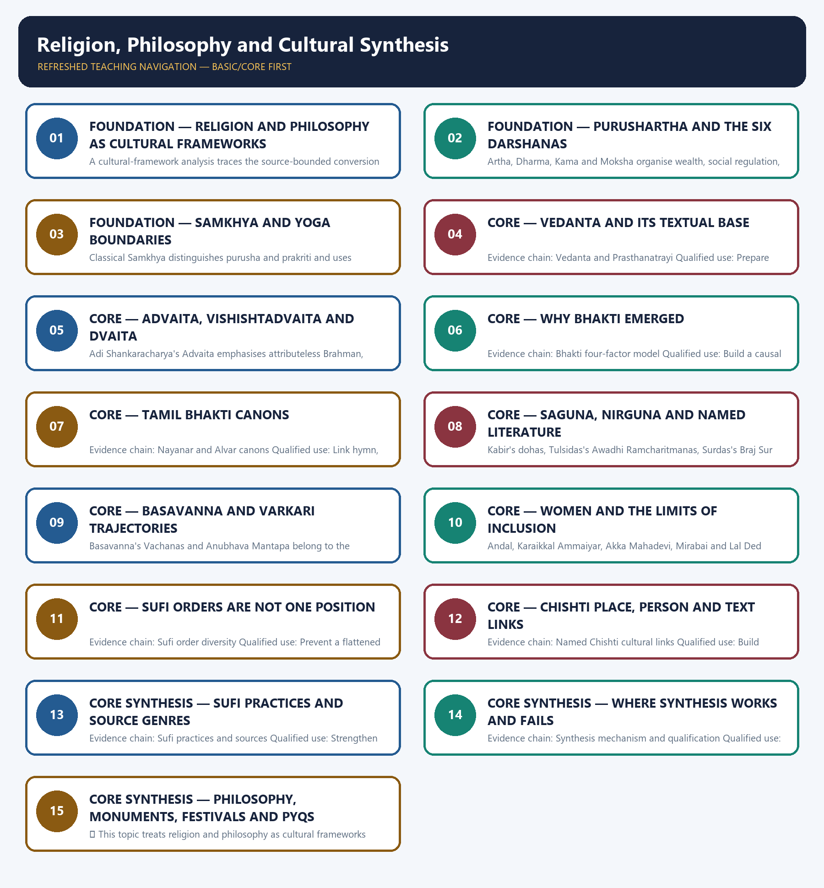

# Religion, Philosophy and Cultural Synthesis — Learner-v2 Complete Learning Session

> **Authoring-only generation:** 2026-09-01. No PDF was rendered and no tracker or index was mutated.

### SOURCE, PROGRESSION AND CURRENT-LINKAGE AUDIT

- **Generation date:** 2026-09-01.
- **Repository-first evidence:** the Basic owner is taught first and preserved in full; the Advanced owner is retained only in the optional final teaching block.
- **OCR evidence:** Repository Markdown was primary. The available OCR-searchable Nitin Singhania Indian Art and Culture PDF was retained as a supplementary source; no unsupported page precision, quotation or dynamic status was imported from it.
- **Qdrant:** not used; repository Markdown and available OCR context were sufficient.
- **PYQ integrity:** The verified direct Mains route is 2020 GS-I on Indian philosophy and tradition shaping monuments and art. The 2022 Ramanuja and Somnath objective routes remain answer-letter-free, with the Somnath-Al-Biruni-Pran Pratishtha demand explicitly bounded where local evidence is absent; the 2025 Akbar question is adjacent and owned by Medieval History.
- **Live-link boundary:** The Ministry of Culture page fetched on 2026-09-01 records Deepavali's inscription on 10 December 2025 at the twentieth Intergovernmental Committee session at the Red Fort and states that Sangeet Natak Akademi prepared the nomination. The package uses it as a living-heritage and community-transmission example, not as proof of one uniform religious meaning or of doctrinal synthesis.
- **Fact/inference discipline:** no current-affairs item, PYQ wording, figure or quotation is invented.

## BASIC LEARNING SESSION

### DEEP-REVIEW LEARNING CONTRACT

| Control | Binding rule for this package |
|---|---|
| Syllabus boundary | Complete Indian Art and Culture Core is taught by form, chronology, region, patronage and function before optional enrichment. |
| Evidence method | Claim → named monument/object/text/form/institution/community → analysis → qualification. |
| Chronology | Origin, surviving evidence, patronage phase, later adaptation, recognition and present status remain distinct. |
| Classification | Architecture, sculpture, painting, music, dance, theatre, language, craft, religion, heritage and cinema terms are compared on common axes without collapsing categories. |
| Interpretation | Style labels, iconographic readings, continuity, synthesis and social representation remain evidence-bounded rather than essentialist. |
| Practice contract | Every solved item has directive/demand decoding, a detailed examiner-grade model, executable compression plan, marks rationale and answer-specific improvement. |
| Approval | This immutable successor remains `approved: false` pending explicit approval. |

**Canonical Basic/Core owner:** `upsc-ai-kit\knowledge\Indian-Art-and-Culture\basic\13_Religion-Philosophy-and-Cultural-Synthesis.md`  
**Canonical topic owner:** `upsc-ai-kit\knowledge\Indian-Art-and-Culture\basic\13_Religion-Philosophy-and-Cultural-Synthesis.md`  
**Optional Advanced owner:** `upsc-ai-kit\knowledge\Indian-Art-and-Culture\advanced\13_Religion-Philosophy-and-Cultural-Synthesis.md`  
**Official syllabus mapping:** `upsc-ai-kit\knowledge\Indian-Art-and-Culture\OFFICIAL-UPSC-SYLLABUS-MAPPING.md`

### EVIDENCE, PYQ AND CURRENT-STATUS CONTROL

- **Material evidence:** plans, fabric, technique, iconography, performance grammar, inscriptions, manuscripts, films and institutional records are identified before interpretation.
- **Attribution discipline:** patron, date, school, region, author, performer, community and function are stated only to the precision supported by the owner.
- **Quantitative discipline:** dimensions, counts, inscription years, lists, awards and registrations retain source, date, status and uncertainty; no figure is invented.
- **Interpretive discipline:** civilisational ranking, communal essentialism, timeless continuity, single-origin claims and treating commissioned representation as a social census are rejected.
- **PYQ discipline:** repository routing ledgers and locally held papers control wording and metadata; neutral rendering, reconstruction and unavailable official keys remain explicitly labelled.
- **Current-status note, rechecked 2026-09-04:** The Ministry of Culture page fetched on 2026-09-01 records Deepavali's inscription on 10 December 2025 at the twentieth Intergovernmental Committee session at the Red Fort and states that Sangeet Natak Akademi prepared the nomination. The package uses it as a living-heritage and community-transmission example, not as proof of one uniform religious meaning or of doctrinal synthesis.

**Live/official context sources recorded by the predecessor generation:**

- `https://culture.gov.in/events/deepavali-inscribed-unescos-intangible-cultural-heritage-list`




*Distinct embedded teaching-navigation image. The separate continuous Cārvāka-style flowchart package remains an independent at-a-glance artifact.*

### SESSION 1 — FOUNDATION — RELIGION AND PHILOSOPHY AS CULTURAL FRAMEWORKS

#### DEFINITION / WHAT THIS IS CALLED

**Plain-language definition:** Religion and philosophy become cultural frameworks when beliefs shape patronage, language, social practice and artistic form.

**Technical definition:** A cultural-framework analysis traces the source-bounded conversion of doctrine or practice into institutions, expressive forms, publics and material evidence without attempting a full theological proof.

#### ANSWER-GRABBING OPENING — WRITE/ADAPT IN THE EXAM

> Religion enters art-and-culture analysis through the institutions, forms and social practices that make belief publicly visible.

#### MUST-WRITE KEYWORDS

- **cultural framework**
- **belief**
- **patronage**
- **language**
- **social practice**
- **art form**

**How to use them:** Define the cultural rather than doctrinal scope, then connect one belief to a named patronage, language, practice or monument and state the specialist-owner boundary.

#### VISUAL FIRST

```text
RELIGION AND PHILOSOPHY AS CULTURAL FRAMEWORKS
01. Cultural-framework boundary
BOUNDARY -> Doctrinal proof and political policy remain with their specialist owners.
```

*This topic-specific rail fixes the evidence sequence and its exam boundary before analysis.*

#### CORE EXPLANATION

This topic studies religion and philosophy where they shape patronage, form, social practice, language and monuments; full doctrinal argument belongs to Philosophy and political policy detail to History.

#### NAMED EVIDENCE AND MECHANISM

- This topic studies religion and philosophy where they shape patronage, form, social practice, language and monuments; full doctrinal argument belongs to Philosophy and political policy detail to History.

#### EXAMINER CAUTION

- Doctrinal proof and political policy remain with their specialist owners.

#### EXAM LINK

- **Prelims:** Retain the exact form, region, text, technique or institution attached to Religion and philosophy as cultural frameworks.
- **Mains:** Define the art-and-culture question.

#### MINI RECAP

- **Evidence chain:** Cultural-framework boundary
- **Qualified use:** Define the art-and-culture question.

#### CLOSING RECALL FLOW — FOUNDATION — RELIGION AND PHILOSOPHY AS CULTURAL FRAMEWORKS

```text
START / CONCEPT: FOUNDATION — Religion and philosophy as cultural frameworks
        |
        v
EXACT TERMS: cultural framework · belief · patronage · language · social practice · art form
        |
        v
MECHANISM / ARGUMENT: Evidence chain: Cultural-framework boundary Qualified use: Define the art-and-culture question.
        |
        v
CONSEQUENCE / CONTRAST: The resulting consequence is that evidence chain: Cultural-framework boundary Qualified use: Define the art-and-culture question.
        |
        v
UPSC TRAP / ANSWER-USE: Do not miss this limiting distinction: evidence chain: Cultural-framework boundary Qualified use: Define the art-and-culture question.
        |
        v
ANSWER-GRABBING FORMULATION: Religion enters art-and-culture analysis through the institutions, forms and social practices that make belief publicly visible.
```
### SESSION 2 — FOUNDATION — PURUSHARTHA AND THE SIX DARSHANAS

#### DEFINITION / WHAT THIS IS CALLED

**Plain-language definition:** Evidence chain: Purushartha framework - Six orthodox darshanas Qualified use: Connect philosophical classification to cultural form.

**Technical definition:** Artha, Dharma, Kama and Moksha organise wealth, social regulation, pleasure or love, and salvation; the cultural use is to explain why art can represent several legitimate human ends together.

#### ANSWER-GRABBING OPENING — WRITE/ADAPT IN THE EXAM

> Evidence chain: Purushartha framework - Six orthodox darshanas Qualified use: Connect philosophical classification to cultural form.

#### MUST-WRITE KEYWORDS

- **FOUNDATION**
- **Purushartha**
- **the six darshanas**
- **Evidence chain**
- **Qualified use**
- **Artha**

**How to use them:** Frame the answer through FOUNDATION; define Purushartha, connect the six darshanas with Evidence chain to explain the mechanism, and use Qualified use for the decisive comparison or qualification.

#### VISUAL FIRST

```text
PURUSHARTHA AND THE SIX DARSHANAS
01. Purushartha framework
    |
    v
02. Six orthodox darshanas
BOUNDARY -> A framework of ends and schools is not a list of religions.
```

*This topic-specific rail fixes the evidence sequence and its exam boundary before analysis.*

#### CORE EXPLANATION

Artha, Dharma, Kama and Moksha organise wealth, social regulation, pleasure or love, and salvation; the cultural use is to explain why art can represent several legitimate human ends together. Samkhya, Yoga, Nyaya, Vaisheshika, Mimamsa and Vedanta are six Vedic-authority-accepting schools of inquiry, not six separate religions.

#### NAMED EVIDENCE AND MECHANISM

- Artha, Dharma, Kama and Moksha organise wealth, social regulation, pleasure or love, and salvation; the cultural use is to explain why art can represent several legitimate human ends together.
- Samkhya, Yoga, Nyaya, Vaisheshika, Mimamsa and Vedanta are six Vedic-authority-accepting schools of inquiry, not six separate religions.

#### EXAMINER CAUTION

- A framework of ends and schools is not a list of religions.

#### EXAM LINK

- **Prelims:** Retain the exact form, region, text, technique or institution attached to Purushartha and the six darshanas.
- **Mains:** Connect philosophical classification to cultural form.

#### MINI RECAP

- **Evidence chain:** Purushartha framework -> Six orthodox darshanas
- **Qualified use:** Connect philosophical classification to cultural form.

#### CLOSING RECALL FLOW — FOUNDATION — PURUSHARTHA AND THE SIX DARSHANAS

```text
START / CONCEPT: FOUNDATION — Purushartha and the six darshanas
        |
        v
EXACT TERMS: FOUNDATION · Purushartha · the six darshanas · Evidence chain · Qualified use · Artha
        |
        v
MECHANISM / ARGUMENT: Artha, Dharma, Kama and Moksha organise wealth, social regulation, pleasure or love, and salvation; the cultural use is to explain why art can represent several legitimate human ends together.
        |
        v
CONSEQUENCE / CONTRAST: Samkhya, Yoga, Nyaya, Vaisheshika, Mimamsa and Vedanta are six Vedic-authority-accepting schools of inquiry, not six separate religions.
        |
        v
UPSC TRAP / ANSWER-USE: A framework of ends and schools is not a list of religions.
        |
        v
ANSWER-GRABBING FORMULATION: Evidence chain: Purushartha framework - Six orthodox darshanas Qualified use: Connect philosophical classification to cultural form.
```
### SESSION 3 — FOUNDATION — SAMKHYA AND YOGA BOUNDARIES

#### DEFINITION / WHAT THIS IS CALLED

**Plain-language definition:** Evidence chain: Samkhya and Yoga caution Qualified use: Use only the sourced minimum doctrinal content.

**Technical definition:** Classical Samkhya distinguishes purusha and prakriti and uses perception, inference and testimony, while Patanjali's layered Yogasutra systematises citta-vritti control and eight-limbed practice; neither text should receive a falsely certain authorship or date.

#### ANSWER-GRABBING OPENING — WRITE/ADAPT IN THE EXAM

> Classical Samkhya distinguishes purusha and prakriti and uses perception, inference and testimony, while Patanjali's layered Yogasutra systematises citta-vritti control and eight-limbed practice; neither text should receive a falsely certain authorship or date.

#### MUST-WRITE KEYWORDS

- **FOUNDATION**
- **Samkhya**
- **Yoga boundaries**
- **Evidence chain**
- **Qualified use**
- **Classical Samkhya**

**How to use them:** Frame the answer through FOUNDATION; define Samkhya, connect Yoga boundaries with Evidence chain to explain the mechanism, and use Qualified use for the decisive comparison or qualification.

#### VISUAL FIRST

```text
SAMKHYA AND YOGA BOUNDARIES
01. Samkhya and Yoga caution
BOUNDARY -> Authorship and dating must remain qualified.
```

*This topic-specific rail fixes the evidence sequence and its exam boundary before analysis.*

#### CORE EXPLANATION

Classical Samkhya distinguishes purusha and prakriti and uses perception, inference and testimony, while Patanjali's layered Yogasutra systematises citta-vritti control and eight-limbed practice; neither text should receive a falsely certain authorship or date.

#### NAMED EVIDENCE AND MECHANISM

- Classical Samkhya distinguishes purusha and prakriti and uses perception, inference and testimony, while Patanjali's layered Yogasutra systematises citta-vritti control and eight-limbed practice; neither text should receive a falsely certain authorship or date.

#### EXAMINER CAUTION

- Authorship and dating must remain qualified.

#### EXAM LINK

- **Prelims:** Retain the exact form, region, text, technique or institution attached to Samkhya and Yoga boundaries.
- **Mains:** Use only the sourced minimum doctrinal content.

#### MINI RECAP

- **Evidence chain:** Samkhya and Yoga caution
- **Qualified use:** Use only the sourced minimum doctrinal content.

#### CLOSING RECALL FLOW — FOUNDATION — SAMKHYA AND YOGA BOUNDARIES

```text
START / CONCEPT: FOUNDATION — Samkhya and Yoga boundaries
        |
        v
EXACT TERMS: FOUNDATION · Samkhya · Yoga boundaries · Evidence chain · Qualified use · Classical Samkhya
        |
        v
MECHANISM / ARGUMENT: Evidence chain: Samkhya and Yoga caution Qualified use: Use only the sourced minimum doctrinal content.
        |
        v
CONSEQUENCE / CONTRAST: Authorship and dating must remain qualified.
        |
        v
UPSC TRAP / ANSWER-USE: Do not miss this limiting distinction: use only the sourced minimum doctrinal content.
        |
        v
ANSWER-GRABBING FORMULATION: Classical Samkhya distinguishes purusha and prakriti and uses perception, inference and testimony, while Patanjali's layered Yogasutra systematises citta-vritti control and eight-limbed practice; neither text should receive a falsely certain authorship or date.
```
### SESSION 4 — CORE — VEDANTA AND ITS TEXTUAL BASE

#### DEFINITION / WHAT THIS IS CALLED

**Plain-language definition:** Vedanta draws on the Upanishads, Bhagavad Gita and Brahma Sutras as the Prasthanatrayi and connects Brahman, atman, karma, rebirth and liberation; doctrinal disputes remain outside this cultural owner.

**Technical definition:** Evidence chain: Vedanta and Prasthanatrayi Qualified use: Prepare the parent-school frame.

#### ANSWER-GRABBING OPENING — WRITE/ADAPT IN THE EXAM

> Vedanta draws on the Upanishads, Bhagavad Gita and Brahma Sutras as the Prasthanatrayi and connects Brahman, atman, karma, rebirth and liberation; doctrinal disputes remain outside this cultural owner.

#### MUST-WRITE KEYWORDS

- **Vedanta**
- **its textual base**
- **Evidence chain**
- **Qualified use**
- **Upanishads**
- **Bhagavad Gita**

**How to use them:** Frame the answer through Vedanta; define its textual base, connect Evidence chain with Qualified use to explain the mechanism, and use Upanishads for the decisive comparison or qualification.

#### VISUAL FIRST

```text
VEDANTA AND ITS TEXTUAL BASE
01. Vedanta and Prasthanatrayi
BOUNDARY -> The cultural owner does not adjudicate doctrinal objections.
```

*This topic-specific rail fixes the evidence sequence and its exam boundary before analysis.*

#### CORE EXPLANATION

Vedanta draws on the Upanishads, Bhagavad Gita and Brahma Sutras as the Prasthanatrayi and connects Brahman, atman, karma, rebirth and liberation; doctrinal disputes remain outside this cultural owner.

#### NAMED EVIDENCE AND MECHANISM

- Vedanta draws on the Upanishads, Bhagavad Gita and Brahma Sutras as the Prasthanatrayi and connects Brahman, atman, karma, rebirth and liberation; doctrinal disputes remain outside this cultural owner.

#### EXAMINER CAUTION

- The cultural owner does not adjudicate doctrinal objections.

#### EXAM LINK

- **Prelims:** Retain the exact form, region, text, technique or institution attached to Vedanta and its textual base.
- **Mains:** Prepare the parent-school frame.

#### MINI RECAP

- **Evidence chain:** Vedanta and Prasthanatrayi
- **Qualified use:** Prepare the parent-school frame.

#### CLOSING RECALL FLOW — CORE — VEDANTA AND ITS TEXTUAL BASE

```text
START / CONCEPT: CORE — Vedanta and its textual base
        |
        v
EXACT TERMS: Vedanta · its textual base · Evidence chain · Qualified use · Upanishads · Bhagavad Gita
        |
        v
MECHANISM / ARGUMENT: Evidence chain: Vedanta and Prasthanatrayi Qualified use: Prepare the parent-school frame.
        |
        v
CONSEQUENCE / CONTRAST: The cultural owner does not adjudicate doctrinal objections.
        |
        v
UPSC TRAP / ANSWER-USE: Do not miss this limiting distinction: vedanta draws on the Upanishads, Bhagavad Gita and Brahma Sutras as the Prasthanatrayi and...
        |
        v
ANSWER-GRABBING FORMULATION: Vedanta draws on the Upanishads, Bhagavad Gita and Brahma Sutras as the Prasthanatrayi and connects Brahman, atman, karma, rebirth and liberation; doctrinal disputes remain outside this cultural owner.
```
### SESSION 5 — CORE — ADVAITA, VISHISHTADVAITA AND DVAITA

#### DEFINITION / WHAT THIS IS CALLED

**Plain-language definition:** Evidence chain: Advaita cultural anchor - Ramanuja and devotion - Dvaita and attribution trap Qualified use: Compare attributes, means and institutions.

**Technical definition:** Adi Shankaracharya's Advaita emphasises attributeless Brahman, knowledge and jivanmukti and is linked with the Dashanami order and four mathas; this is a sourced cultural-institutional consequence, not a full philosophical proof.

#### ANSWER-GRABBING OPENING — WRITE/ADAPT IN THE EXAM

> Adi Shankaracharya's Advaita emphasises attributeless Brahman, knowledge and jivanmukti and is linked with the Dashanami order and four mathas; this is a sourced cultural-institutional consequence, not a full philosophical proof.

#### MUST-WRITE KEYWORDS

- **Advaita**
- **Vishishtadvaita**
- **Dvaita**
- **Evidence chain**
- **Qualified use**
- **Adi Shankaracharya's Advaita**

**How to use them:** Frame the answer through Advaita; define Vishishtadvaita, connect Dvaita with Evidence chain to explain the mechanism, and use Qualified use for the decisive comparison or qualification.

#### VISUAL FIRST

```text
ADVAITA, VISHISHTADVAITA AND DVAITA
01. Advaita cultural anchor
    |
    v
02. Ramanuja and devotion
    |
    v
03. Dvaita and attribution trap
BOUNDARY -> Do not invent a Dvaita salvation formula or misassign Pushtimarg.
```

*This topic-specific rail fixes the evidence sequence and its exam boundary before analysis.*

#### CORE EXPLANATION

Adi Shankaracharya's Advaita emphasises attributeless Brahman, knowledge and jivanmukti and is linked with the Dashanami order and four mathas; this is a sourced cultural-institutional consequence, not a full philosophical proof. Ramanuja's Vishishtadvaita treats Brahman as possessing attributes and gives love and devotion a central salvific role, explaining its Saguna and temple-devotional cultural alignment. Madhvacharya is linked with Dvaita and the Brahma Sampradaya, while Pushtimarg belongs to Vallabhacharya; the source does not supply a separate Dvaita salvation formula and none should be invented.

#### NAMED EVIDENCE AND MECHANISM

- Adi Shankaracharya's Advaita emphasises attributeless Brahman, knowledge and jivanmukti and is linked with the Dashanami order and four mathas; this is a sourced cultural-institutional consequence, not a full philosophical proof.
- Ramanuja's Vishishtadvaita treats Brahman as possessing attributes and gives love and devotion a central salvific role, explaining its Saguna and temple-devotional cultural alignment.
- Madhvacharya is linked with Dvaita and the Brahma Sampradaya, while Pushtimarg belongs to Vallabhacharya; the source does not supply a separate Dvaita salvation formula and none should be invented.

#### EXAMINER CAUTION

- Do not invent a Dvaita salvation formula or misassign Pushtimarg.

#### EXAM LINK

- **Prelims:** Retain the exact form, region, text, technique or institution attached to Advaita, Vishishtadvaita and Dvaita.
- **Mains:** Compare attributes, means and institutions.

#### MINI RECAP

- **Evidence chain:** Advaita cultural anchor -> Ramanuja and devotion -> Dvaita and attribution trap
- **Qualified use:** Compare attributes, means and institutions.

#### CLOSING RECALL FLOW — CORE — ADVAITA, VISHISHTADVAITA AND DVAITA

```text
START / CONCEPT: CORE — Advaita, Vishishtadvaita and Dvaita
        |
        v
EXACT TERMS: Advaita · Vishishtadvaita · Dvaita · Evidence chain · Qualified use · Adi Shankaracharya's Advaita
        |
        v
MECHANISM / ARGUMENT: Evidence chain: Advaita cultural anchor - Ramanuja and devotion - Dvaita and attribution trap Qualified use: Compare attributes, means and institutions.
        |
        v
CONSEQUENCE / CONTRAST: Madhvacharya is linked with Dvaita and the Brahma Sampradaya, while Pushtimarg belongs to Vallabhacharya; the source does not supply a separate Dvaita salvation formula and none should be invented.
        |
        v
UPSC TRAP / ANSWER-USE: Do not invent a Dvaita salvation formula or misassign Pushtimarg.
        |
        v
ANSWER-GRABBING FORMULATION: Adi Shankaracharya's Advaita emphasises attributeless Brahman, knowledge and jivanmukti and is linked with the Dashanami order and four mathas; this is a sourced cultural-institutional consequence, not a full philosophical proof.
```
### SESSION 6 — CORE — WHY BHAKTI EMERGED

#### DEFINITION / WHAT THIS IS CALLED

**Plain-language definition:** Prelims: Retain the exact form, region, text, technique or institution attached to Why Bhakti emerged.

**Technical definition:** Evidence chain: Bhakti four-factor model Qualified use: Build a causal rather than saint-list answer.

#### ANSWER-GRABBING OPENING — WRITE/ADAPT IN THE EXAM

> Prelims: Retain the exact form, region, text, technique or institution attached to Why Bhakti emerged.

#### MUST-WRITE KEYWORDS

- **Why Bhakti emerged**
- **Evidence chain**
- **Qualified use**
- **Buddhist**
- **Jain**
- **Four**

**How to use them:** Frame the answer through Why Bhakti emerged; define Evidence chain, connect Qualified use with Buddhist to explain the mechanism, and use Jain for the decisive comparison or qualification.

#### VISUAL FIRST

```text
WHY BHAKTI EMERGED
01. Bhakti four-factor model
BOUNDARY -> Four causes do not imply one origin or diffusion date.
```

*This topic-specific rail fixes the evidence sequence and its exam boundary before analysis.*

#### CORE EXPLANATION

The owner's causal frame combines reaction to orthodoxy and caste rigidity, inclusion of marginalised communities, space created by Buddhist and Jain decline, and royal patronage; no single diffusion story explains all regions.

#### NAMED EVIDENCE AND MECHANISM

- The owner's causal frame combines reaction to orthodoxy and caste rigidity, inclusion of marginalised communities, space created by Buddhist and Jain decline, and royal patronage; no single diffusion story explains all regions.

#### EXAMINER CAUTION

- Four causes do not imply one origin or diffusion date.

#### EXAM LINK

- **Prelims:** Retain the exact form, region, text, technique or institution attached to Why Bhakti emerged.
- **Mains:** Build a causal rather than saint-list answer.

#### MINI RECAP

- **Evidence chain:** Bhakti four-factor model
- **Qualified use:** Build a causal rather than saint-list answer.

#### CLOSING RECALL FLOW — CORE — WHY BHAKTI EMERGED

```text
START / CONCEPT: CORE — Why Bhakti emerged
        |
        v
EXACT TERMS: Why Bhakti emerged · Evidence chain · Qualified use · Buddhist · Jain · Four
        |
        v
MECHANISM / ARGUMENT: The owner's causal frame combines reaction to orthodoxy and caste rigidity, inclusion of marginalised communities, space created by Buddhist and Jain decline, and royal patronage; no single diffusion story explains all regions.
        |
        v
CONSEQUENCE / CONTRAST: Four causes do not imply one origin or diffusion date.
        |
        v
UPSC TRAP / ANSWER-USE: Evidence chain: Bhakti four-factor model Qualified use: Build a causal rather than saint-list answer.
        |
        v
ANSWER-GRABBING FORMULATION: Prelims: Retain the exact form, region, text, technique or institution attached to Why Bhakti emerged.
```
### SESSION 7 — CORE — TAMIL BHAKTI CANONS

#### DEFINITION / WHAT THIS IS CALLED

**Plain-language definition:** Nayanars are the canonical sixty-three Tamil Shaiva saints and Alvars the canonical twelve Tamil Vaishnava saints whose hymns form the Nalayira Divya Prabandham; Andal is the sole woman in the Alvar canon.

**Technical definition:** Evidence chain: Nayanar and Alvar canons Qualified use: Link hymn, temple and gender evidence.

#### ANSWER-GRABBING OPENING — WRITE/ADAPT IN THE EXAM

> Nayanars are the canonical sixty-three Tamil Shaiva saints and Alvars the canonical twelve Tamil Vaishnava saints whose hymns form the Nalayira Divya Prabandham; Andal is the sole woman in the Alvar canon.

#### MUST-WRITE KEYWORDS

- **Tamil Bhakti canons**
- **Evidence chain**
- **Qualified use**
- **Nayanars**
- **Tamil Shaiva**
- **Alvars**

**How to use them:** Frame the answer through Tamil Bhakti canons; define Evidence chain, connect Qualified use with Nayanars to explain the mechanism, and use Tamil Shaiva for the decisive comparison or qualification.

#### VISUAL FIRST

```text
TAMIL BHAKTI CANONS
01. Nayanar and Alvar canons
BOUNDARY -> Canonical numbers and language must remain exact.
```

*This topic-specific rail fixes the evidence sequence and its exam boundary before analysis.*

#### CORE EXPLANATION

Nayanars are the canonical sixty-three Tamil Shaiva saints and Alvars the canonical twelve Tamil Vaishnava saints whose hymns form the Nalayira Divya Prabandham; Andal is the sole woman in the Alvar canon.

#### NAMED EVIDENCE AND MECHANISM

- Nayanars are the canonical sixty-three Tamil Shaiva saints and Alvars the canonical twelve Tamil Vaishnava saints whose hymns form the Nalayira Divya Prabandham; Andal is the sole woman in the Alvar canon.

#### EXAMINER CAUTION

- Canonical numbers and language must remain exact.

#### EXAM LINK

- **Prelims:** Retain the exact form, region, text, technique or institution attached to Tamil Bhakti canons.
- **Mains:** Link hymn, temple and gender evidence.

#### MINI RECAP

- **Evidence chain:** Nayanar and Alvar canons
- **Qualified use:** Link hymn, temple and gender evidence.

#### CLOSING RECALL FLOW — CORE — TAMIL BHAKTI CANONS

```text
START / CONCEPT: CORE — Tamil Bhakti canons
        |
        v
EXACT TERMS: Tamil Bhakti canons · Evidence chain · Qualified use · Nayanars · Tamil Shaiva · Alvars
        |
        v
MECHANISM / ARGUMENT: Evidence chain: Nayanar and Alvar canons Qualified use: Link hymn, temple and gender evidence.
        |
        v
CONSEQUENCE / CONTRAST: Canonical numbers and language must remain exact.
        |
        v
UPSC TRAP / ANSWER-USE: Do not miss this limiting distinction: nayanars are the canonical sixty-three Tamil Shaiva saints and Alvars the canonical twelve Tamil...
        |
        v
ANSWER-GRABBING FORMULATION: Nayanars are the canonical sixty-three Tamil Shaiva saints and Alvars the canonical twelve Tamil Vaishnava saints whose hymns form the Nalayira Divya Prabandham; Andal is the sole woman in the Alvar canon.
```
### SESSION 8 — CORE — SAGUNA, NIRGUNA AND NAMED LITERATURE

#### DEFINITION / WHAT THIS IS CALLED

**Plain-language definition:** Evidence chain: Saguna and Nirguna variety - Named Bhakti literature Qualified use: Prepare literature-contribution answers.

**Technical definition:** Kabir's dohas, Tulsidas's Awadhi Ramcharitmanas, Surdas's Braj Sur Sagar and the multilingual Sant Bhasha show devotion widening literary publics through different languages and forms.

#### ANSWER-GRABBING OPENING — WRITE/ADAPT IN THE EXAM

> Evidence chain: Saguna and Nirguna variety - Named Bhakti literature Qualified use: Prepare literature-contribution answers.

#### MUST-WRITE KEYWORDS

- **Saguna**
- **Nirguna**
- **named literature**
- **Evidence chain**
- **Qualified use**
- **Kabir's**

**How to use them:** Frame the answer through Saguna; define Nirguna, connect named literature with Evidence chain to explain the mechanism, and use Qualified use for the decisive comparison or qualification.

#### VISUAL FIRST

```text
SAGUNA, NIRGUNA AND NAMED LITERATURE
01. Saguna and Nirguna variety
    |
    v
02. Named Bhakti literature
BOUNDARY -> Internal variety needs language, form and named text.
```

*This topic-specific rail fixes the evidence sequence and its exam boundary before analysis.*

#### CORE EXPLANATION

Saguna Bhakti worships a deity with form and attributes, while Nirguna Bhakti stresses the formless divine; the classification helps comparison but cannot erase regional chronology or internal difference. Kabir's dohas, Tulsidas's Awadhi Ramcharitmanas, Surdas's Braj Sur Sagar and the multilingual Sant Bhasha show devotion widening literary publics through different languages and forms.

#### NAMED EVIDENCE AND MECHANISM

- Saguna Bhakti worships a deity with form and attributes, while Nirguna Bhakti stresses the formless divine; the classification helps comparison but cannot erase regional chronology or internal difference.
- Kabir's dohas, Tulsidas's Awadhi Ramcharitmanas, Surdas's Braj Sur Sagar and the multilingual Sant Bhasha show devotion widening literary publics through different languages and forms.

#### EXAMINER CAUTION

- Internal variety needs language, form and named text.

#### EXAM LINK

- **Prelims:** Retain the exact form, region, text, technique or institution attached to Saguna, Nirguna and named literature.
- **Mains:** Prepare literature-contribution answers.

#### MINI RECAP

- **Evidence chain:** Saguna and Nirguna variety -> Named Bhakti literature
- **Qualified use:** Prepare literature-contribution answers.

#### CLOSING RECALL FLOW — CORE — SAGUNA, NIRGUNA AND NAMED LITERATURE

```text
START / CONCEPT: CORE — Saguna, Nirguna and named literature
        |
        v
EXACT TERMS: Saguna · Nirguna · named literature · Evidence chain · Qualified use · Kabir's
        |
        v
MECHANISM / ARGUMENT: Kabir's dohas, Tulsidas's Awadhi Ramcharitmanas, Surdas's Braj Sur Sagar and the multilingual Sant Bhasha show devotion widening literary publics through different languages and forms.
        |
        v
CONSEQUENCE / CONTRAST: The resulting consequence is that saguna and Nirguna variety - Named Bhakti literature Qualified use.
        |
        v
UPSC TRAP / ANSWER-USE: Do not miss this limiting distinction: saguna and Nirguna variety - Named Bhakti literature Qualified use.
        |
        v
ANSWER-GRABBING FORMULATION: Evidence chain: Saguna and Nirguna variety - Named Bhakti literature Qualified use: Prepare literature-contribution answers.
```
### SESSION 9 — CORE — BASAVANNA AND VARKARI TRAJECTORIES

#### DEFINITION / WHAT THIS IS CALLED

**Plain-language definition:** Evidence chain: Basavanna and Varkari streams Qualified use: Compare Kannada and Marathi institutions.

**Technical definition:** Basavanna's Vachanas and Anubhava Mantapa belong to the Lingayat formation, while Jnaneshwar, Namdev, Eknath and Tukaram mark a distinct Marathi Varkari stream; Lingayat and Veerashaiva must not be equated.

#### ANSWER-GRABBING OPENING — WRITE/ADAPT IN THE EXAM

> Basavanna's Vachanas and Anubhava Mantapa belong to the Lingayat formation, while Jnaneshwar, Namdev, Eknath and Tukaram mark a distinct Marathi Varkari stream; Lingayat and Veerashaiva must not be equated.

#### MUST-WRITE KEYWORDS

- **Basavanna**
- **Varkari trajectories**
- **Evidence chain**
- **Qualified use**
- **Basavanna's Vachanas**
- **Anubhava Mantapa**

**How to use them:** Frame the answer through Basavanna; define Varkari trajectories, connect Evidence chain with Qualified use to explain the mechanism, and use Basavanna's Vachanas for the decisive comparison or qualification.

#### VISUAL FIRST

```text
BASAVANNA AND VARKARI TRAJECTORIES
01. Basavanna and Varkari streams
BOUNDARY -> Lingayat and Veerashaiva are not synonyms; Eknath dates conflict.
```

*This topic-specific rail fixes the evidence sequence and its exam boundary before analysis.*

#### CORE EXPLANATION

Basavanna's Vachanas and Anubhava Mantapa belong to the Lingayat formation, while Jnaneshwar, Namdev, Eknath and Tukaram mark a distinct Marathi Varkari stream; Lingayat and Veerashaiva must not be equated.

#### NAMED EVIDENCE AND MECHANISM

- Basavanna's Vachanas and Anubhava Mantapa belong to the Lingayat formation, while Jnaneshwar, Namdev, Eknath and Tukaram mark a distinct Marathi Varkari stream; Lingayat and Veerashaiva must not be equated.

#### EXAMINER CAUTION

- Lingayat and Veerashaiva are not synonyms; Eknath dates conflict.

#### EXAM LINK

- **Prelims:** Retain the exact form, region, text, technique or institution attached to Basavanna and Varkari trajectories.
- **Mains:** Compare Kannada and Marathi institutions.

#### MINI RECAP

- **Evidence chain:** Basavanna and Varkari streams
- **Qualified use:** Compare Kannada and Marathi institutions.

#### CLOSING RECALL FLOW — CORE — BASAVANNA AND VARKARI TRAJECTORIES

```text
START / CONCEPT: CORE — Basavanna and Varkari trajectories
        |
        v
EXACT TERMS: Basavanna · Varkari trajectories · Evidence chain · Qualified use · Basavanna's Vachanas · Anubhava Mantapa
        |
        v
MECHANISM / ARGUMENT: Evidence chain: Basavanna and Varkari streams Qualified use: Compare Kannada and Marathi institutions.
        |
        v
CONSEQUENCE / CONTRAST: Lingayat and Veerashaiva are not synonyms; Eknath dates conflict.
        |
        v
UPSC TRAP / ANSWER-USE: Do not miss this limiting distinction: basavanna's Vachanas and Anubhava Mantapa belong to the Lingayat formation.
        |
        v
ANSWER-GRABBING FORMULATION: Basavanna's Vachanas and Anubhava Mantapa belong to the Lingayat formation, while Jnaneshwar, Namdev, Eknath and Tukaram mark a distinct Marathi Varkari stream; Lingayat and Veerashaiva must not be equated.
```
### SESSION 10 — CORE — WOMEN AND THE LIMITS OF INCLUSION

#### DEFINITION / WHAT THIS IS CALLED

**Plain-language definition:** Evidence chain: Women and institutional limits Qualified use: Write inclusion and patriarchal qualification together.

**Technical definition:** Andal, Karaikkal Ammaiyar, Akka Mahadevi, Mirabai and Lal Ded show uneven regional participation, but the evidence does not justify the claim that Bhakti abolished patriarchy or gave women equal authority.

#### ANSWER-GRABBING OPENING — WRITE/ADAPT IN THE EXAM

> Andal, Karaikkal Ammaiyar, Akka Mahadevi, Mirabai and Lal Ded show uneven regional participation, but the evidence does not justify the claim that Bhakti abolished patriarchy or gave women equal authority.

#### MUST-WRITE KEYWORDS

- **Women**
- **the limits of inclusion**
- **Evidence chain**
- **Qualified use**
- **Andal**
- **Karaikkal Ammaiyar**

**How to use them:** Frame the answer through Women; define the limits of inclusion, connect Evidence chain with Qualified use to explain the mechanism, and use Andal for the decisive comparison or qualification.

#### VISUAL FIRST

```text
WOMEN AND THE LIMITS OF INCLUSION
01. Women and institutional limits
BOUNDARY -> Named participation does not establish equality.
```

*This topic-specific rail fixes the evidence sequence and its exam boundary before analysis.*

#### CORE EXPLANATION

Andal, Karaikkal Ammaiyar, Akka Mahadevi, Mirabai and Lal Ded show uneven regional participation, but the evidence does not justify the claim that Bhakti abolished patriarchy or gave women equal authority.

#### NAMED EVIDENCE AND MECHANISM

- Andal, Karaikkal Ammaiyar, Akka Mahadevi, Mirabai and Lal Ded show uneven regional participation, but the evidence does not justify the claim that Bhakti abolished patriarchy or gave women equal authority.

#### EXAMINER CAUTION

- Named participation does not establish equality.

#### EXAM LINK

- **Prelims:** Retain the exact form, region, text, technique or institution attached to Women and the limits of inclusion.
- **Mains:** Write inclusion and patriarchal qualification together.

#### MINI RECAP

- **Evidence chain:** Women and institutional limits
- **Qualified use:** Write inclusion and patriarchal qualification together.

#### CLOSING RECALL FLOW — CORE — WOMEN AND THE LIMITS OF INCLUSION

```text
START / CONCEPT: CORE — Women and the limits of inclusion
        |
        v
EXACT TERMS: Women · the limits of inclusion · Evidence chain · Qualified use · Andal · Karaikkal Ammaiyar
        |
        v
MECHANISM / ARGUMENT: Evidence chain: Women and institutional limits Qualified use: Write inclusion and patriarchal qualification together.
        |
        v
CONSEQUENCE / CONTRAST: Named participation does not establish equality.
        |
        v
UPSC TRAP / ANSWER-USE: Do not miss this limiting distinction: andal, Karaikkal Ammaiyar, Akka Mahadevi, Mirabai and Lal Ded show uneven regional participation.
        |
        v
ANSWER-GRABBING FORMULATION: Andal, Karaikkal Ammaiyar, Akka Mahadevi, Mirabai and Lal Ded show uneven regional participation, but the evidence does not justify the claim that Bhakti abolished patriarchy or gave women equal authority.
```
### SESSION 11 — CORE — SUFI ORDERS ARE NOT ONE POSITION

#### DEFINITION / WHAT THIS IS CALLED

**Plain-language definition:** Prelims: Retain the exact form, region, text, technique or institution attached to Sufi orders are not one position.

**Technical definition:** Evidence chain: Sufi order diversity Qualified use: Prevent a flattened synthesis answer.

#### ANSWER-GRABBING OPENING — WRITE/ADAPT IN THE EXAM

> Prelims: Retain the exact form, region, text, technique or institution attached to Sufi orders are not one position.

#### MUST-WRITE KEYWORDS

- **Evidence chain**
- **Qualified use**
- **Retain**
- **Sufi**
- **Qualified**
- **Prevent**

**How to use them:** Frame the answer through Evidence chain; define Qualified use, connect Retain with Sufi to explain the mechanism, and use Qualified for the decisive comparison or qualification.

#### VISUAL FIRST

```text
SUFI ORDERS ARE NOT ONE POSITION
01. Sufi order diversity
BOUNDARY -> Property, court distance and ritual vary by silsilah.
```

*This topic-specific rail fixes the evidence sequence and its exam boundary before analysis.*

#### CORE EXPLANATION

Chishti, Suhrawardi, Qadiri, Naqshbandi, Shattari and other silsilahs differed over property, court proximity, ritual and scholarship; Sufism cannot be reduced to one uniformly syncretic position.

#### NAMED EVIDENCE AND MECHANISM

- Chishti, Suhrawardi, Qadiri, Naqshbandi, Shattari and other silsilahs differed over property, court proximity, ritual and scholarship; Sufism cannot be reduced to one uniformly syncretic position.

#### EXAMINER CAUTION

- Property, court distance and ritual vary by silsilah.

#### EXAM LINK

- **Prelims:** Retain the exact form, region, text, technique or institution attached to Sufi orders are not one position.
- **Mains:** Prevent a flattened synthesis answer.

#### MINI RECAP

- **Evidence chain:** Sufi order diversity
- **Qualified use:** Prevent a flattened synthesis answer.

#### CLOSING RECALL FLOW — CORE — SUFI ORDERS ARE NOT ONE POSITION

```text
START / CONCEPT: CORE — Sufi orders are not one position
        |
        v
EXACT TERMS: Evidence chain · Qualified use · Retain · Sufi · Qualified · Prevent
        |
        v
MECHANISM / ARGUMENT: Evidence chain: Sufi order diversity Qualified use: Prevent a flattened synthesis answer.
        |
        v
CONSEQUENCE / CONTRAST: The resulting consequence is that retain the exact form, region, text, technique or institution attached to Sufi orders are...
        |
        v
UPSC TRAP / ANSWER-USE: Do not miss this limiting distinction: retain the exact form, region, text, technique or institution attached to Sufi orders are...
        |
        v
ANSWER-GRABBING FORMULATION: Prelims: Retain the exact form, region, text, technique or institution attached to Sufi orders are not one position.
```
### SESSION 12 — CORE — CHISHTI PLACE, PERSON AND TEXT LINKS

#### DEFINITION / WHAT THIS IS CALLED

**Plain-language definition:** Prelims: Retain the exact form, region, text, technique or institution attached to Chishti place, person and text links.

**Technical definition:** Evidence chain: Named Chishti cultural links Qualified use: Build evidence around Ajmer, Delhi and the Adi Granth.

#### ANSWER-GRABBING OPENING — WRITE/ADAPT IN THE EXAM

> Prelims: Retain the exact form, region, text, technique or institution attached to Chishti place, person and text links.

#### MUST-WRITE KEYWORDS

- **Chishti place**
- **person**
- **text links**
- **Evidence chain**
- **Qualified use**
- **Named**

**How to use them:** Frame the answer through Chishti place; define person, connect text links with Evidence chain to explain the mechanism, and use Qualified use for the decisive comparison or qualification.

#### VISUAL FIRST

```text
CHISHTI PLACE, PERSON AND TEXT LINKS
01. Named Chishti cultural links
BOUNDARY -> Named cultural links do not prove doctrinal merger.
```

*This topic-specific rail fixes the evidence sequence and its exam boundary before analysis.*

#### CORE EXPLANATION

Moinuddin Chishti's Ajmer khanqah and urs, Nizamuddin Auliya's service ethic, Amir Khusrau's music-poetry link and Baba Farid's verses in the Adi Granth provide named practice, place, person and text evidence.

#### NAMED EVIDENCE AND MECHANISM

- Moinuddin Chishti's Ajmer khanqah and urs, Nizamuddin Auliya's service ethic, Amir Khusrau's music-poetry link and Baba Farid's verses in the Adi Granth provide named practice, place, person and text evidence.

#### EXAMINER CAUTION

- Named cultural links do not prove doctrinal merger.

#### EXAM LINK

- **Prelims:** Retain the exact form, region, text, technique or institution attached to Chishti place, person and text links.
- **Mains:** Build evidence around Ajmer, Delhi and the Adi Granth.

#### MINI RECAP

- **Evidence chain:** Named Chishti cultural links
- **Qualified use:** Build evidence around Ajmer, Delhi and the Adi Granth.

#### CLOSING RECALL FLOW — CORE — CHISHTI PLACE, PERSON AND TEXT LINKS

```text
START / CONCEPT: CORE — Chishti place, person and text links
        |
        v
EXACT TERMS: Chishti place · person · text links · Evidence chain · Qualified use · Named
        |
        v
MECHANISM / ARGUMENT: Evidence chain: Named Chishti cultural links Qualified use: Build evidence around Ajmer, Delhi and the Adi Granth.
        |
        v
CONSEQUENCE / CONTRAST: Named cultural links do not prove doctrinal merger.
        |
        v
UPSC TRAP / ANSWER-USE: Do not miss this limiting distinction: build evidence around Ajmer, Delhi and the Adi Granth.
        |
        v
ANSWER-GRABBING FORMULATION: Prelims: Retain the exact form, region, text, technique or institution attached to Chishti place, person and text links.
```
### SESSION 13 — CORE SYNTHESIS — SUFI PRACTICES AND SOURCE GENRES

#### DEFINITION / WHAT THIS IS CALLED

**Plain-language definition:** Sama, zikr, ziyarat, pir-murid and khanqah are distinct practices or institutions, while malfuzat, maktubat and tazkiras are conversations, letters and biographies with different evidentiary value.

**Technical definition:** Evidence chain: Sufi practices and sources Qualified use: Strengthen evidence criticism.

#### ANSWER-GRABBING OPENING — WRITE/ADAPT IN THE EXAM

> Sama, zikr, ziyarat, pir-murid and khanqah are distinct practices or institutions, while malfuzat, maktubat and tazkiras are conversations, letters and biographies with different evidentiary value.

#### MUST-WRITE KEYWORDS

- **CORE SYNTHESIS**
- **Sufi practices**
- **source genres**
- **Evidence chain**
- **Qualified use**
- **Sama, zikr, ziyarat, pir-murid and khanqah**

**How to use them:** Frame the answer through CORE SYNTHESIS; define Sufi practices, connect source genres with Evidence chain to explain the mechanism, and use Qualified use for the decisive comparison or qualification.

#### VISUAL FIRST

```text
SUFI PRACTICES AND SOURCE GENRES
01. Sufi practices and sources
BOUNDARY -> Practice vocabulary and source genres answer different questions.
```

*This topic-specific rail fixes the evidence sequence and its exam boundary before analysis.*

#### CORE EXPLANATION

Sama, zikr, ziyarat, pir-murid and khanqah are distinct practices or institutions, while malfuzat, maktubat and tazkiras are conversations, letters and biographies with different evidentiary value.

#### NAMED EVIDENCE AND MECHANISM

- Sama, zikr, ziyarat, pir-murid and khanqah are distinct practices or institutions, while malfuzat, maktubat and tazkiras are conversations, letters and biographies with different evidentiary value.

#### EXAMINER CAUTION

- Practice vocabulary and source genres answer different questions.

#### EXAM LINK

- **Prelims:** Retain the exact form, region, text, technique or institution attached to Sufi practices and source genres.
- **Mains:** Strengthen evidence criticism.

#### MINI RECAP

- **Evidence chain:** Sufi practices and sources
- **Qualified use:** Strengthen evidence criticism.

#### CLOSING RECALL FLOW — CORE SYNTHESIS — SUFI PRACTICES AND SOURCE GENRES

```text
START / CONCEPT: CORE SYNTHESIS — Sufi practices and source genres
        |
        v
EXACT TERMS: CORE SYNTHESIS · Sufi practices · source genres · Evidence chain · Qualified use · Sama, zikr, ziyarat, pir-murid and khanqah
        |
        v
MECHANISM / ARGUMENT: Evidence chain: Sufi practices and sources Qualified use: Strengthen evidence criticism.
        |
        v
CONSEQUENCE / CONTRAST: The resulting consequence is that sama, zikr, ziyarat, pir-murid and khanqah are distinct practices or institutions.
        |
        v
UPSC TRAP / ANSWER-USE: Do not miss this limiting distinction: sama, zikr, ziyarat, pir-murid and khanqah are distinct practices or institutions.
        |
        v
ANSWER-GRABBING FORMULATION: Sama, zikr, ziyarat, pir-murid and khanqah are distinct practices or institutions, while malfuzat, maktubat and tazkiras are conversations, letters and biographies with different evidentiary value.
```
### SESSION 14 — CORE SYNTHESIS — WHERE SYNTHESIS WORKS AND FAILS

#### DEFINITION / WHAT THIS IS CALLED

**Plain-language definition:** Cultural synthesis is strongest when shown through shared spaces, music, translation, vernacular texts and pilgrimage, and weakest when asserted as merged doctrine; the Naqshbandi counter-current and Din-i-Ilahi's lack of mass acceptance are necessary qualifications.

**Technical definition:** Evidence chain: Synthesis mechanism and qualification Qualified use: Use mechanism plus counter-current.

#### ANSWER-GRABBING OPENING — WRITE/ADAPT IN THE EXAM

> Cultural synthesis is strongest when shown through shared spaces, music, translation, vernacular texts and pilgrimage, and weakest when asserted as merged doctrine; the Naqshbandi counter-current and Din-i-Ilahi's lack of mass acceptance are necessary qualifications.

#### MUST-WRITE KEYWORDS

- **CORE SYNTHESIS**
- **Where synthesis works**
- **fails**
- **Evidence chain**
- **Qualified use**
- **Cultural synthesis**

**How to use them:** Frame the answer through CORE SYNTHESIS; define Where synthesis works, connect fails with Evidence chain to explain the mechanism, and use Qualified use for the decisive comparison or qualification.

#### VISUAL FIRST

```text
WHERE SYNTHESIS WORKS AND FAILS
01. Synthesis mechanism and qualification
BOUNDARY -> Shared form is stronger evidence than a claim of merged theology.
```

*This topic-specific rail fixes the evidence sequence and its exam boundary before analysis.*

#### CORE EXPLANATION

Cultural synthesis is strongest when shown through shared spaces, music, translation, vernacular texts and pilgrimage, and weakest when asserted as merged doctrine; the Naqshbandi counter-current and Din-i-Ilahi's lack of mass acceptance are necessary qualifications.

#### NAMED EVIDENCE AND MECHANISM

- Cultural synthesis is strongest when shown through shared spaces, music, translation, vernacular texts and pilgrimage, and weakest when asserted as merged doctrine; the Naqshbandi counter-current and Din-i-Ilahi's lack of mass acceptance are necessary qualifications.

#### EXAMINER CAUTION

- Shared form is stronger evidence than a claim of merged theology.

#### EXAM LINK

- **Prelims:** Retain the exact form, region, text, technique or institution attached to Where synthesis works and fails.
- **Mains:** Use mechanism plus counter-current.

#### MINI RECAP

- **Evidence chain:** Synthesis mechanism and qualification
- **Qualified use:** Use mechanism plus counter-current.

#### CLOSING RECALL FLOW — CORE SYNTHESIS — WHERE SYNTHESIS WORKS AND FAILS

```text
START / CONCEPT: CORE SYNTHESIS — Where synthesis works and fails
        |
        v
EXACT TERMS: CORE SYNTHESIS · Where synthesis works · fails · Evidence chain · Qualified use · Cultural synthesis
        |
        v
MECHANISM / ARGUMENT: Evidence chain: Synthesis mechanism and qualification Qualified use: Use mechanism plus counter-current.
        |
        v
CONSEQUENCE / CONTRAST: Shared form is stronger evidence than a claim of merged theology.
        |
        v
UPSC TRAP / ANSWER-USE: Do not miss this limiting distinction: synthesis mechanism and qualification Qualified use.
        |
        v
ANSWER-GRABBING FORMULATION: Cultural synthesis is strongest when shown through shared spaces, music, translation, vernacular texts and pilgrimage, and weakest when asserted as merged doctrine; the Naqshbandi counter-current and Din-i-Ilahi's lack of mass acceptance are necessary qualifications.
```
### SESSION 15 — CORE SYNTHESIS — PHILOSOPHY, MONUMENTS, FESTIVALS AND PYQS

#### DEFINITION / WHAT THIS IS CALLED

**Plain-language definition:** CORE SYNTHESIS — Philosophy, monuments, festivals and PYQs comprises CORE SYNTHESIS, Philosophy and monuments as its core connected dimensions.

**Technical definition:** ✅ This topic treats religion and philosophy as cultural frameworks shaping expressive form, patronage and social practice — not as doctrinal theology in its own right (owned by the Philosophy folder). ⚠️ Its only PYQ relevance is adjacent: the 2025 Akbar's-religious-syncretism question, primarily owned by Medieval History/topic 04.

#### ANSWER-GRABBING OPENING — WRITE/ADAPT IN THE EXAM

> This file owns the philosophy half; the named monuments come from basic/01-basic/06, and every one of them is already in Core. ⚠️ The trap in this question is to write a philosophy essay with a monument bolted on.

#### MUST-WRITE KEYWORDS

- **CORE SYNTHESIS**
- **Philosophy**
- **monuments**
- **festivals**
- **PYQs**
- **Evidence chain**

**How to use them:** Frame the answer through CORE SYNTHESIS; define Philosophy, connect monuments with festivals to explain the mechanism, and use PYQs for the decisive comparison or qualification.

#### VISUAL FIRST

```text
PHILOSOPHY, MONUMENTS, FESTIVALS AND PYQS
01. Philosophy converted into form
    |
    v
02. Festivals and verified routes
BOUNDARY -> Do not invent patron intention or solve unsupported objective halves.
```

*This topic-specific rail fixes the evidence sequence and its exam boundary before analysis.*

#### CORE EXPLANATION

Purushartha at Khajuraho, Buddhist aniconism, relic-centred stupas, Nandi's axial placement and Nayanar legends at Airavatesvara show ideas becoming design decisions, but patron intention must not be invented. Kumbh, Ramlila, Durga Puja, Garba and Deepavali join sacred geography, performance, artisan labour and safeguarding; Deepavali's 2025 ICH inscription is a current living-heritage link, while the direct routed Mains demand is the 2020 philosophy-and-monuments question.

#### NAMED EVIDENCE AND MECHANISM

- Purushartha at Khajuraho, Buddhist aniconism, relic-centred stupas, Nandi's axial placement and Nayanar legends at Airavatesvara show ideas becoming design decisions, but patron intention must not be invented.
- Kumbh, Ramlila, Durga Puja, Garba and Deepavali join sacred geography, performance, artisan labour and safeguarding; Deepavali's 2025 ICH inscription is a current living-heritage link, while the direct routed Mains demand is the 2020 philosophy-and-monuments question.

#### EXAMINER CAUTION

- Do not invent patron intention or solve unsupported objective halves.

#### EXAM LINK

- **Prelims:** Retain the exact form, region, text, technique or institution attached to Philosophy, monuments, festivals and PYQs.
- **Mains:** Prepare the direct 2020 route and current ICH close.

#### MINI RECAP

- **Evidence chain:** Philosophy converted into form -> Festivals and verified routes
- **Qualified use:** Prepare the direct 2020 route and current ICH close.
#### COMPLETE BASIC OWNER EVIDENCE BANK

> **Subject:** Indian Art & Culture | **Tier:** Must-Do (foundation) |
> **GS Paper:** GS-I.
> **Core area:** Religions as cultural frameworks; Bhakti and Sufi
> traditions; the six orthodox darshanas; plural sacred spaces and
> expressive forms.
> **Grounded in:** Nitin Singhania, *Indian Art and Culture*, PDF pp.
> 739-909; R.S. Sharma, *India's Ancient Past*, PDF pp. 151-165, 316-326,
> 347-355; Satish Chandra, *History of Medieval India*, PDF pp. 61-67,
> 197-211, 334-345; Satish Chandra, *Medieval History, 1526-1748, Part 2*,
> PDF pp. 376-395; `00_Master-
> Framework.md` Section 3; audited UPSC Mains 2025 GS Paper I (adjacent
> only).
> ✅ = source-grounded | ⚠️ = analytical inference | 📰 = current anchor | ❌ = trap.
> *Companion: `advanced/13_Religion-Philosophy-and-Cultural-Synthesis.md`.*

#### 1. Snapshot and syllabus fit

✅ This topic treats religion and philosophy **as cultural frameworks**
shaping expressive form, patronage and social practice — not as doctrinal
theology in its own right (owned by the Philosophy folder). ⚠️ Its only
PYQ relevance is **adjacent**: the 2025 Akbar's-religious-syncretism
question, primarily owned by Medieval History/topic 04.

#### 2. Essential vocabulary

| Term | Exam-ready meaning |
|---|---|
| ✅ **Purushartha** | The four goals of human pursuit: Artha (wealth), Dharma (social regulation), Kama (physical pleasure/love), Moksha (salvation) (*Nitin…pdf*, PDF pp. 860-861). |
| ✅ **Shada Darshanas** | The six orthodox (Vedic-authority-accepting) schools of philosophy: Samkhya, Yoga, Nyaya, Vaisheshika, Mimamsa, Vedanta (*Nitin…pdf*, PDF p. 861). |
| ✅ **Nayanars vs. Alvars** | Nayanars = the canonical 63 Tamil Shaiva saints; Alvars = the canonical 12 Tamil Vaishnava saints whose hymns were compiled as the *Nalayira Divya Prabandham*. Andal is the only woman in the Alvar canon. |
| ✅ **Saguna vs. Nirguna Bhakti** | Saguna school worships God with form/attributes; Nirguna school worships God as formless/attributeless (*Nitin…pdf*, PDF p. 828-ff outline). |
| ✅ **Malfuzat** | Recorded conversations of Sufi saints, a key primary-source genre for reconstructing Sufi history (*Nitin…pdf*, PDF p. 828-ff outline). |

#### 3. Core classification

✅ Indian philosophy split, by the start of the Christian Era, into an
**Orthodox school** (Vedas as supreme revealed scripture — the six Shada
Darshanas) and a heterodox school (developed in the advanced tier)
(*Nitin…pdf*, PDF p. 861). ✅ Saguna/Nirguna is a useful later classification, but Bhakti developed
through multiple regional trajectories rather than one south-to-north
relay. Tamil Alvar/Nayanar traditions (c. 6th-9th centuries) are early
major formations; Virashaiva, Marathi, Kannada, Bengali, Assamese, North
Indian sant and Vaishnava traditions followed different chronologies.

#### 4. Foundation narrative

✅ The Bhakti movement's causes include reaction against Brahmanical
orthodoxy and caste rigidity, promotion of equality/inclusion for
marginalised communities, the stagnation of Buddhism and Jainism creating
space for devotional religion, and royal patronage (e.g. Chola support
for the Shaivite movement in Tamil Nadu) (*Nitin…pdf*, PDF p. 829). ✅
Nayanars (Shiva devotees) and Alvars (Vishnu devotees) preached devotion
as the path to salvation, composed primarily in Tamil rather than Sanskrit, and emphasised personal
devotion; later temple compilation and Brahmanical/royal institutions
also shaped their transmission. They
explicitly opposed Buddhist/Jain asceticism (*Nitin…pdf*, PDF pp.
829-830). ✅ Hymns of the 12 Alvars were compiled as the *Nalayira Divya
Prabandham*; Andal is the sole woman in the canonical Alvar list. ⚠️
Nayanars are directly cross-referenced in this folder's
architecture topic — the Airavatesvara Temple at Darasuram (topic 03)
displays legends of the "sixty-three Nayanars" as part of its sculptural
programme, directly linking Bhakti hagiography to Chola temple art
(*Nitin…pdf*, PDF p. 92, cross-referenced from topic 03).

⚠️ Samkhya is traditionally associated with Kapila, but the extant
*Samkhya Sutra* is late and should not be assigned to him as settled fact.
Classical Samkhya distinguishes purusha and prakriti
and three means of knowledge — Pratyaksha (perception), Anumana
(inference), Shabda (hearing) (*Nitin…pdf*, PDF pp. 862-863). ✅ Patanjali's *Yogasutra* is a layered text of debated date, commonly
placed in the early centuries BCE/CE; it systematises citta-vritti control
and eight-limbed practice. Do not reduce every Indian yoga tradition to
"union of individual and universal spirit."

✅ **Sufi distinctions:** Chishti and Suhrawardi were influential early
orders in India, later joined by Qadiri, Naqshbandi and others. Satish
Chandra notes borrowing of practices and shared devotional spaces while
insisting that Sufi ideological structures remained Islamic — interaction
without identity-erasure. Malfuzat (discourses), maktubat (letters) and
tazkiras (biographies) are different source genres.

✅ **Fairs/festivals as cultural systems, not lists:**

| Type | Examples | Analytical anchor |
|---|---|---|
| Pilgrimage-congregation | Kumbh Mela at Prayagraj, Haridwar, Ujjain, Nashik | Sacred geography, temporary urbanism, sanitation and safeguarding |
| Agricultural/seasonal | Pongal, Bihu, Onam, Baisakhi, Hornbill-linked seasonal/community calendars | Ecology, harvest and regional identity |
| Ritual-performance | Ramlila, Ramman, Mudiyettu, Durga Puja, Garba | Music/dance/theatre, artisan labour and community transmission |
| Multi-community festival | Deepavali; shared regional observances of fairs/saint shrines | Participation varies by region/community; never claim one uniform meaning |

#### 5. Visual map or comparison table

```text
PURUSHARTHA (Artha, Dharma, Kama, Moksha)
              |
              v
ORTHODOX SCHOOL (Vedic authority accepted)
Samkhya | Yoga | Nyaya | Vaisheshika | Mimamsa | Vedanta
              |
              v
REGIONAL BHAKTI TRAJECTORIES
Tamil Alvar/Nayanar (early major formation) | Virashaiva/Kannada |
Marathi Varkari | North Indian sant/Vaishnava | Bengal/Assam and others
   NAYANARS (Shaiva)          ALVARS (Vaishnava)
   canonical 63               canonical 12, Nalayira Divya Prabandham
              |
              v
SUFI MOVEMENT (parallel devotional-mystical tradition, distinct orders)
```

| Concept | Meaning |
|---|---|
| ✅ Artha | Economic means/wealth (Arthashastra) |
| ✅ Dharma | Regulation of social order (Dharmasastra) |
| ✅ Kama | Physical pleasure/love (Kamasutra) |
| ✅ Moksha | Salvation (darshana texts) |

#### 6. Source spine

✅ *Nitin…pdf*, PDF pp. 828-864 (Chapter 20, "Bhakti and Sufi Traditions,"
and Chapter 21, "Schools of Philosophy" — the sections directly used
here), the direct spine for Sections 2-4. ✅ Additionally used for the
named-evidence banks in §§13.4A-13.4C, 13.5A-13.5B and 13.6A: PDF pp.
866-873 (Vedanta, its sub-schools, Mimamsa and Charvaka); PDF pp. 742-744
(sampradayas — Ramanandi, Brahma/Dvaita, Pushtimarg); PDF pp. 686-696
(Bhakti's role in the rise of Hindi, Awadhi, Braj Bhasha and Marathi
literature); PDF pp. 657, 695 (the Adi Granth and Sant Bhasha); PDF pp.
438, 443, 445-446, 479, 531 (Bhakti and Sufi song, dance and theatre
forms); PDF pp. 122-123 (the twelve Jyotirlingas); PDF p. 878 (Tyagaraja
Aradhana and Phool Walon Ki Sair); PDF pp. 1016, 1031-1033 (Al-Biruni).
✅ **§13.6B** (philosophy shaping monuments) draws on PDF pp. 72, 860-861
plus the named monuments already held in `basic/01`-`basic/06`.
✅ **§13.6C** (smaller religious communities) draws on PDF p. **147**
(Parsi fire-temple grades and the Yasna ceremony), pp. **655-656, 760,
762** (Zoroastrian texts, origin and migration; *Qissa-i Sanjan*), pp.
**754-755** (Christianity and the St Thomas/Syrian Christian record),
pp. **763-764** (Judaism, the five Indian Jewish communities and the named
synagogues) and p. **537** (Parsi theatre and its move into film).

#### 7. Exact PYQ application

⚠️ **2025 Q2 (adjacent-only), verbatim:** "Examine the main aspects of
Akbar's religious syncretism. (Answer in 150 words)"
(`UPSC Mains 2025 GS Paper 1.txt:11-12`). ⚠️ This question's primary
ownership is **Medieval History**; this topic supports it by supplying
the cultural-synthesis framework (how devotional/mystical movements like
Bhakti and Sufism created a receptive religious-pluralist environment)
within which Akbar's *Sulh-i-Kul* and *Din-i-Ilahi* (topic 04's
architectural setting at Fatehpur Sikri's Ibadat Khana) should be
understood — this topic does not itself own the doctrinal analysis of
Akbar's specific policy.

#### 8. 📰 Current anchor

- 📰 UNESCO inscribed **Deepavali (Diwali)** on the Representative List of
  the Intangible Cultural Heritage of Humanity in 2025 — a living,
  pan-India religious-cultural practice relevant to this topic's
  "religion as cultural framework" lens; verify current inscription
  details against UNESCO's own element page (topic 14 ledger).

#### 9. ❌ Traps and corrections

- ❌ Bhakti and Sufism were identical movements with different names. ->
  They are historically distinct traditions (Hindu devotional movement
  vs. Islamic mystical movement) that developed in parallel and
  influenced each other, but are not the same movement.
- ❌ The Bhakti movement began in North India. -> The Tamil devotional
  traditions of South India are among its earliest major formations, but
  later regional Bhakti histories do not follow one simple diffusion date.
- ❌ All Alvars were male. -> Andal is the woman represented in the
  canonical list of twelve; avoid the anachronistic "Meera of the South"
  shortcut.
- ❌ The six darshanas are six competing, mutually exclusive religions. ->
  They are six schools of philosophical inquiry within the orthodox
  (Vedic-accepting) tradition, sharing the common Purushartha framework.
- ❌ Nayanars and Alvars composed in both Tamil and Telugu. -> Their
  canonical hymn traditions are Tamil; Telugu Bhakti has separate later
  histories.
- ❌ Bhakti or Sufism automatically abolished caste, gender hierarchy or
  doctrinal difference. -> Individual saints and communities varied;
  inclusion, institutionalisation and contestation must be studied
  together.
- ✅ **Local PYQ routes:** CSE 2021 asks Bhakti literature's contribution;
  CSE 2020 links philosophy/tradition to monuments; CSE 2019 tests false
  saint chronology; CSE 2014 tests Bijak/Pushtimarg attribution.

#### 10. Mains framework

1. Frame religion/philosophy as a **cultural** question (patronage,
   expressive form, social inclusion) rather than a theological one.
2. Distinguish Nayanars from Alvars precisely, and cite the Chola-period
   architectural cross-link (Airavatesvara Temple) for a comparative,
   cross-topic answer.
3. Use the Saguna/Nirguna distinction to differentiate Bhakti's internal
   variety, avoiding a monolithic description.
4. For Akbar-related questions (2025 Q2), explicitly state the boundary:
   this topic supplies the cultural-synthesis context; Medieval
   History/topic 04 own the doctrinal and architectural specifics.
5. Cross-reference topic 14 for the UNESCO ICH status of living
   religious-cultural practices (e.g. Deepavali, 2025).

#### 11. Boundaries with other subjects

- ❌ **Philosophy owns** the doctrinal depth of the six darshanas,
  Buddhist and Jain philosophy in full analytical rigour. This file owns
  **religion and philosophy as they shape cultural form, patronage and
  expression**.
- ❌ **Medieval/Modern History owns** the political-religious policy
  history (Akbar's syncretism, Aurangzeb's policies) in full depth.
- ❌ **Indian Society owns** caste, gender and marginality outcomes as
  living-community social-science questions.
- ✅ Cross-links: Topic 03 (Chola Nayanar sculptural references), Topic 04
  (Akbar's Ibadat Khana as the architectural setting for syncretism),
  Topic 14 (UNESCO ICH status of living religious-cultural practices).

#### 12. Companion links

- ✅ Advanced companion:
  `advanced/13_Religion-Philosophy-and-Cultural-Synthesis.md`.
- ✅ `00_Master-Framework.md` Section 3 — terminology precision reused for
  the Saguna/Nirguna and orthodox/heterodox distinctions.
- ⚠️ **Cross-links:** Topic 03 (Chola/Nayanar cross-reference), Topic 04
  (Akbar's Ibadat Khana), Topic 14 (UNESCO ICH status of Deepavali and
  other living religious-cultural practices).

#### 13. Answer architecture (10/15/20-mark support)

> **Core-sufficiency note.** This topic owns religion and philosophy **as
> cultural expression** — Bhakti and Sufi movements, the darshanas as a
> framework, fairs and festivals as systems, and synthesis as a qualified
> claim. This section makes `basic/13` sufficient for those demands without
> `advanced/13`, and keeps doctrinal depth routed to Philosophy.

##### 13.0 Direct Mains demands owned by this Core file

> **Core routing supersedes older `advanced/` pointers (final pass,
> 2026-08-13).** The controlling ledger
> [`_PYQ-ROUTING-MAINS-GS1-GS2-ESSAY-2018-2023.md`](../../_PYQ-ROUTING-MAINS-GS1-GS2-ESSAY-2018-2023.md)
> routes the demand below to `advanced/13`. It is answerable **from Core
> alone**, and Core is the owner of record.

| Year | Verbatim routed demand | Directive · marks | ✅ Core section that answers it |
|---|---|---|---|
| **2020** | Indian philosophy and tradition in shaping monuments and art | Discuss · 15 · 250 words | **§13.6B** — nine doctrine → design-decision → named-monument → qualification units and a six-step structure, drawing named monuments from `basic/01`-`basic/06` |

⚠️ **The trap this route exists to prevent** is a philosophy essay with a
monument bolted on. ❌ Do not assert that any Indian temple plan was
*derived* from a named philosophical text, and do not supply Vastu or
Shilpa-shastra rules — **no local source in this folder carries them**
(§13.9).

##### 13.1 Directive and demand map

| If the question says | It is really testing | Do NOT write |
|---|---|---|
| *Discuss the causes and character of the Bhakti movement* | A causal model, not a saint list, plus its internal variety | "Saints preached devotion and equality" |
| *Bhakti literature's contribution to Indian culture* | Language, audience, form and transmission — the cultural, not doctrinal, effect | Doctrinal exposition |
| *Bhakti and Sufi interaction* | Shared devotional space and borrowing **without** identity-erasure | "They merged into one syncretic faith" |
| *Indian philosophy and tradition in shaping monuments and art* | Concrete belief → form links (Nayanar legends in temple sculpture; iconography; Purushartha frame) | Abstract philosophy with no monument |
| *Evaluate the claim of religious synthesis* | Where synthesis is demonstrable and where it is asserted | A harmony-only narrative |
| *Fairs and festivals as cultural systems* | Sacred geography, temporary urbanism, artisan labour, ecology, safeguarding | A festival calendar |
| *Religion and social inclusion* | Whose access changed, whose did not, and how institutionalisation altered both | "Bhakti abolished caste" |
| *Contribution of Bhakti **literature** / to the growth of regional languages* | Named saint + language + form + specific text, each with a limit — the transfer out of Sanskrit and outward from the Brahman author | A saint-list with no text, no language and no limit |
| *Women in the Bhakti movement* | Named women by region and tradition, the **two unequal routes** (leaving home / practising within the household), and the patriarchy-and-appropriation qualification | "Bhakti gave women equality" |
| *Compare the schools of Vedanta / a named Acharya's teaching on salvation* | Brahman **with or without attributes**, and **devotion versus knowledge** as the means of salvation, tied to a named exponent and century | Reciting "Advaita, Vishishtadvaita, Dvaita" with no doctrinal content |
| *Sufi saints and their contribution / a named order* | A named saint, a named khanqah or seat, a named practice, and the **order-by-order differences** | "The Sufis preached love and tolerance" |

##### 13.2 Qualified thesis options

- ⚠️ **Causal thesis:** "The Bhakti movement is best explained as a
  convergence of four conditions the sources themselves name — reaction
  against Brahmanical orthodoxy and caste rigidity, the inclusion of
  marginalised communities, the decline of Buddhism and Jainism, and royal
  patronage — which is why it appears in different regions at different
  times rather than diffusing from one point."
- ⚠️ **Qualified-synthesis thesis:** "Cultural synthesis in India is
  demonstrable in shared practice, shared space, translation and borrowed
  form, and much weaker as a claim about merged doctrine — Satish Chandra's
  evidence shows Sufi ideological structures remaining Islamic even where
  practices and spaces were shared."
- ⚠️ **Anti-harmony-narrative thesis:** "Devotional movements were not
  uniformly irenic: opposition to Buddhism and Jainism was one of the major
  themes of Tamil Bhakti hymns, so a 'pure harmony' account misdescribes
  the sources."
- ⚠️ **Institutionalisation thesis:** "Bhakti's cultural power grew as it
  became temple-embedded, but embedding also transferred authority to
  temples, Brahman managers and royal patrons — which is why the movement's
  inclusive rhetoric and its institutional outcomes must be assessed
  separately."
- ⚠️ **Expression thesis (for art-facing demands):** "Belief becomes visible
  in Indian art through specific, traceable conversions — Purushartha into
  a life-world programme, Nayanar hagiography into temple relief, rasa into
  performance grammar — and an answer should trace one such conversion
  rather than assert a general spirituality."

##### 13.3 Mark-scaled structures

| Marks | Structure |
|---|---|
| **10** | Thesis → the movement/concept defined → two named strands or saints/orders with what each contributed → one qualification → verdict |
| **15** | Thesis → four-factor causal model → regional trajectories → Saguna/Nirguna internal variety **with named saints from §13.4A** → Sufi parallel with the non-merger caution **and at least two named orders from §13.5A** → cultural output (language, music, festival, temple art) → verdict |
| **15 (Bhakti literature's contribution)** | Run **§13.4C** end to end: thesis (three transfers) → 5-8 of the eight named units, each as language + region + form + contribution + limit → the Hindi/regional-language sentence → performance forms → the institutional-afterlife qualification → verdict |
| **15 (Vedanta comparison / a named Acharya)** | Run **§13.6A**: the parent school and Prasthanatrayi → Shankaracharya (nirguna Brahman, jnana, Jivanmukti, four mathas) → Ramanuja (saguna Brahman, devotion) → Madhvacharya (Dvaita, Brahma Sampradaya, Gaudiya/ISKCON lineage) → the one-line contrast → the cultural consequence (temple devotion, Hoysala patronage) |
| **15 (philosophy shaping monuments and art — the 2020 route)** | Run **§13.6B**'s six-step structure: doctrine-made-buildable thesis → two *conception* units (aniconism → symbol; relic cult → stupa) → three *shaping* units (shramana withdrawal → excavated architecture; vahana → Nandi mandapa; bhakti → enclosure and gopuram) → one *art-programme* unit (Purushartha → Khajuraho) → the counter-weight that philosophy is never the only variable → verdict |
| **10/15 (smaller religious communities / composite culture)** | Run **§13.6C**: migration-trade-refuge thesis → Parsi fire-temple grades with the plain-exterior doctrine → the five Jewish communities distinguished **by language**, with named synagogues → the St Thomas/Malabar 52 AD tradition, attributed as the community's own record → the minority-essentialism caution → verdict |
| **20** | All of the above → **plus** the darshana framework → source-genre discipline (malfuzat/maktubat/tazkira) with a named example → institutionalisation and its costs → festivals as living heritage with a dated ICH anchor → verdict answering the exact wording |
| **20 (named Bhakti-Sufi synthesis)** | Run the five-part spine at the close of **§13.5A**: practice → text → place → person → the limit; every step carries a name, and the Naqshbandi counter-current and the inam-grant economics are stated before the verdict |

##### 13.4 Evidence bank A — Bhakti: causes, strands and cultural output

| Element | ✅ Evidence | Significance | Caution |
|---|---|---|---|
| Four causes | ✅ Reaction against Brahmanical orthodoxy and caste rigidity; promotion of equality/inclusion for marginalised communities; stagnation of Buddhism and Jainism creating space for devotional religion; royal patronage, e.g. Chola support for the Shaivite movement in Tamil Nadu (*Nitin…pdf*, PDF p. 829) | Gives a **causal model** instead of a narrative | ⚠️ Royal patronage is named as causal, not incidental — do not omit it |
| Early major formation | ✅ Nayanars (Shiva devotees) and Alvars (Vishnu devotees) preached devotion as the path to salvation, composed primarily in Tamil rather than Sanskrit, and emphasised personal devotion; they explicitly opposed Buddhist and Jain asceticism (*Nitin…pdf*, PDF pp. 829-830) | Language choice is itself the cultural contribution — devotion in the spoken tongue | ❌ Opposition to Buddhism/Jainism was a **defining theme**, not an aside |
| Canon and gender | ✅ The hymns of the 12 Alvars were compiled as the *Nalayira Divya Prabandham*; the Nayanar canon numbers 63; **Andal is the only woman among the canonical twelve Alvars** | A precise, citable inclusion-and-limit fact | ❌ Avoid the anachronistic "Meera of the South" shortcut |
| Internal variety | ✅ Saguna (God with form and attributes) versus Nirguna (formless, attributeless) schools (*Nitin…pdf*, PDF p. 828-ff) | Prevents a monolithic description | ⚠️ A later classification applied to earlier material |
| Regional trajectories | ✅ Tamil Alvar/Nayanar traditions (c. 6th-9th centuries) are early major formations; Virashaiva, Marathi, Kannada, Bengali, Assamese, North Indian sant and Vaishnava traditions followed different chronologies | Kills the "south-to-north relay" story | ❌ Do not assign one diffusion date |
| Institutional outcome | ✅ Early Tamil Bhakti became temple-embedded and could strengthen rulers and Brahman managers even while opening devotion beyond Vedic scholarship (Satish Chandra) | The balance point every "did Bhakti liberate?" answer needs | — |
| Art-history conversion | ✅ The Airavatesvara Temple at Darasuram displays the legends of the sixty-three Nayanars in its sculptural programme (*Nitin…pdf*, PDF p. 92; topic 03) | The clearest single case of devotional movement becoming royal temple art | — |

##### 13.4A Evidence bank A+ — the named Bhakti roster (region · language · form · contribution · limit)

> **Why this bank exists.** A hostile review found that this file explained
> Bhakti's *causes, schools and impact* but named almost no saint outside
> the Alvar/Nayanar frame — so a demand naming Kabir, Ramanuja, Tukaram or
> "the contribution of Bhakti literature" could only be answered with
> generalities. Every row below is line-verified against the locally held
> Nitin Singhania PDF. ⚠️ **Discipline for this whole bank:** do **not**
> flatten every saint into the same social programme. The source itself
> distinguishes what each contributed; an answer that gives Kabir,
> Tukaram and Chaitanya the same three sentences has not read them.

**A. Nirguna school — God as formless and without attributes**

| Saint | ✅ Region / language | ✅ Form and specific contribution | Limit / caution |
|---|---|---|---|
| **Kabir** | Born in **Varanasi** (*Nitin…pdf*, PDF p. 291); wrote in Hindi and in *Sant Bhasha* | ✅ Named by the source as one of the three key Nirguna figures (PDF p. 835); famous for his **dohas (couplets)** "used by the common people of India even today" (PDF p. 687); a **disciple of Ramananda** and part of the Ramanandi Sampradaya, though he later founded the separate **Kabirpanthi** sect (PDF pp. 743-744); included in the **Adi Granth** as one of two **Muslim Bhagats** alongside Baba Farid (PDF p. 657); his songs exemplify the *Suphi* strand in **Baul Sangeet** (PDF p. 438) | ⚠️ The Ramananda-discipleship and the Kabirpanthi break are both in the source; do not present the first without the second. ❌ Do not attribute the *Bijak* to Dadu Dayal — a recorded local PYQ trap |
| **Guru Nanak** | Punjab; Punjabi/Braj | ✅ Named as a key Nirguna figure (PDF p. 835); his **dohas**, with Kabir's and Dadu's, are in the **Adi Granth**, "a very composite text" written in **Gurmukhi** (PDF p. 695); ✅ **Sant Bhasha**, the language of the Nirguna mystics, draws on Punjabi, Apabhramsa, Hindi, Braj Bhasha, Sanskrit, Khariboli and Persian (PDF p. 657) — a linguistic fact that *is itself* the synthesis argument | ⚠️ Sikh doctrinal and institutional history is not owned here; this file owns the **literary and devotional** contribution |
| **Dadu Dayal** | North India | ✅ The third named Nirguna figure (PDF p. 835); his dohas are in the Adi Granth (PDF p. 695) | ⚠️ The source gives little beyond the naming; do not invent a biography |
| **Ravidas / Raidas** | Born in **Varanasi** (PDF p. 291) | ✅ Named among the **Bhagats** whose teachings are in the Adi Granth (PDF p. 657); ✅ **Guru Raidas was the preceptor of Mirabai** (PDF p. 837) | ⚠️ The preceptor link is the source's statement, not a dated relationship |

✅ **The school stated precisely:** the Nirguna school "viewed God as
formless and without attributes, emphasising **knowledge over rituals**,
rejecting scriptures and idol worship, and **opposing Brahmin supremacy**,"
valued personal encounters with God, and **blended Vaishnava Bhakti,
Nathpanthi and Sufi traditions** (*Nitin…pdf*, PDF p. 835).

**B. Saguna school — God with form, worshipped in incarnation and image**

| Saint | ✅ Region / language | ✅ Form and specific contribution | Limit / caution |
|---|---|---|---|
| **Ramanuja** | Tamil country; Sanskrit | ✅ Named by the source as belonging to the Saguna school (PDF p. 835); ✅ chief exponent of **Vishishtadvaita** (qualified monism), 11th-12th century (PDF p. 868); ✅ **his intervention changed the Vedanta school** — against Shankaracharya he "considers brahm to be **with attributes**" and holds **love and devotion**, not *jnana* alone, to be the means of attaining salvation (PDF p. 867); ✅ as **Ramanujacharya** he influenced the Hoysala king **Vishnuvardhana**'s conversion from Jainism to Vaishnavism (PDF p. 105; topic 03 §13.9A) | ⚠️ Doctrinal argument and reply belong to the Philosophy folder; this file owns the *cultural* consequence — a philosophy that legitimised image worship and temple devotion |
| **Ramananda** | North India; Hindi | ✅ Named in the Saguna school (PDF p. 835); ✅ the **Advaita scholar** whose followers form the **Ramanandi Sampradaya**, "the largest monastic group within Hinduism," worshipping Rama; sub-groups **Tyagi and Naga**; immediate disciples included **Dhanna and Pipa**, whose hymns are in the **Adi Granth** (PDF p. 743) | ⚠️ The source calls Ramananda an *Advaita* scholar while placing him in the Saguna school — report both, do not reconcile them silently |
| **Chaitanya Mahaprabhu** | Bengal | ✅ Named in the Saguna school (PDF p. 835); ✅ promoted **Gaudiya Vaishnavism**, associated with the Brahma Sampradaya, the lineage to which **ISKCON** belongs (PDF p. 744); ✅ he is said to have **revived Gaudiya Nritya** (PDF p. 479, topic 09) and to have **initiated Jatra**, the open-air folk theatre of eastern India, using it to propagate his teachings during his travels through rural Bengal (PDF p. 531, topic 10) | ⚠️ "It is said/believed" is the source's own hedge for the dance and theatre claims — keep it. This is nonetheless the folder's best evidence that Bhakti **created performance forms** |
| **Tulsidas** | Awadh; **Awadhi** | ✅ A Vaishnava saint, devotee of **Rama**, who "became immortal by writing **Ramcharitmanas** in the Awadhi language"; other works **Vinaya Patrika, Krishna Gitavali, Kavitavali, Gitavali, Sahitya Ratna, Dohavali, Vairagya Sandipani** (PDF p. 688); belonged to the **Ramanandi** sect (PDF p. 743); ✅ **Ramcharitmanas was inscribed on UNESCO's Memory of the World register in 2024** (PDF p. 620; topic 14) | ⚠️ Ram-Bhakti is one of the **two** Saguna groups; the other is Krishna-Bhakti (PDF p. 835) |
| **Surdas** | Braj; **Braj Bhasha** | ✅ Wrote **Sur Sagar**, on Krishna's infancy and his adolescent affairs with the gopis (PDF p. 688); ✅ "the most well known member" of the **Ashtachhap**, the eight poet-disciples of **Vallabhacharya** who sang Haveli Sangeet, established **1565 AD** with the foundation of **Pushtimarg**, each member assigned a part of the daily worship (PDF p. 837) | ⚠️ Ashtachhap membership is the point tested; do not merge the eight into one name |
| **Basavanna** | Karnataka; **Kannada** | ✅ Founder of the **Lingayat** tradition (12th century CE), emphasising exclusive worship of the **Ishtalinga** (a symbol of the formless divine), an egalitarian society, rejection of caste and elaborate ritual; scripture the **Vachanas**; strong emphasis on equality, anti-caste positions and women's participation, with post-puberty marriage and re-marriage encouraged; established the **Anubhava Mantapa** at Basavakalyan (Bidar district), "the world's inaugural spiritual assembly," led by the sage **Allama Prabhu** and recognised as **the birthplace of Vachana literature** (PDF pp. 832-834) | ❌ **Lingayats are not the same as Veerashaivas**: the traditional Veerashaiva community is said to pre-date Basavanna, traces its origin to the **Panchacharyas** (Renuka, Daruka, Ghantakarna, Dhenukarna, Vishvakarna), accepts some Vedic tradition and may still acknowledge varna. ⚠️ Note the Ishtalinga is a symbol of the **formless** divine inside a school usually classed as Shaiva-devotional — do not force it into the Saguna/Nirguna binary |

**C. The Maharashtra Varkari stream — a distinct chronology, not a footnote**

| Saint | ✅ Dates / language | ✅ Form and specific contribution | Limit / caution |
|---|---|---|---|
| **Jnaneshwar / Gyaneshwar** | **1275-96**; Marathi | ✅ The **oldest known work in Marathi** is his, from the 13th century; **credited with beginning the kirtan in Maharashtra**; wrote a detailed **commentary on the Bhagavad Gita in Marathi** (PDF p. 696); a prominent figure of the sect whose pilgrimage carries the **Ringan and Dhava** events (PDF p. 743) | ⚠️ "Credited with" is the source's own attribution language |
| **Namdev** | **1270-1350**; Marathi | ✅ Wrote "a great many **Abhangas**" on devotion to God (PDF p. 696); named among the **Bhagats** in the **Adi Granth** (PDF p. 657) — i.e. a Marathi saint entering the Punjabi canon; **Abhanga** is recorded as a Maharashtra song form "in praise of the God Vithobha," composed and sung by Tukaram and Namdev (PDF p. 446; topic 08) | ⚠️ The source reproduces a local PYQ statement pair on Namdev's role in transmitting southern Bhakti northwards and his monotheism (PDF p. 851) — treat it as a question, not as the book's own assertion |
| **Eknath** | ⚠️ **Two conflicting source dates — see below**; Marathi | ✅ With him "the seed of literary genius germinated again" after a gap from the mid-14th to the early 16th century (PDF p. 696) | ⚠️ The gap-and-revival periodisation is the source's. ❌ **Do not state an exact lifespan** — the same book gives **"Eknath (1533-99)"** in the Varkari sect list (PDF p. 743) and **"Saint Eknath was born in 1518"** in the Marathi literature chapter (PDF p. 696). The conflict is **unresolved** in this folder's evidence base; write "**sixteenth-century**" and the contribution, and report both dates only if the demand is explicitly about chronology (§13.9) |
| **Tukaram** | **1598-1650**; Marathi | ✅ "The greatest poet in Marathi literature," who preached **asceticism, toleration and devotion to God**, composed **Abhanga** poetry compiled as the **Tukaramgatha**, and discussed the conflict between **Pravritti and Nivritti** — passion for life, family and business against the desire to renounce and seek Moksha (PDF p. 696) | 📰 The **Sant Tukaram Shila Mandir** at Dehu, Pune district, was inaugurated in **2022** (PDF p. 836) — a dated current anchor |
| **Ramdas** | 17th century; Marathi | ✅ Wrote **Dasbodh**, "containing sermons on abstract as well as practical topics" (PDF p. 696) | ⚠️ Political readings of Ramdas belong to Medieval History, not here |

⚠️ **The periodisation to state:** the source divides Marathi devotional
literature into an early period **c. 1200-1350**, a dormant phase from the
mid-14th to the early 16th century, and a "most brilliant" third period
from the early 17th century to the close of Peshwa rule (PDF p. 696). A
Bhakti answer that carries one chronology is weaker than one that shows
the movement had **different clocks in different regions**.

##### 13.4B Evidence bank A++ — women in the Bhakti movement (named, regional, and honestly qualified)

| Woman | ✅ Region / tradition | ✅ Form and specific contribution | Limit / caution |
|---|---|---|---|
| **Karaikkal Ammaiyar** | Tamil country; **Nayanar** (Shaiva) | ✅ One of the **three women among the 63 Nayanars** — the others being **Mangayarkkarasiyar**, a queen of the Pandya kingdom, and **Isaignaniyar**, the mother of the Nayanar Sundarar; Karaikkal Ammaiyar was "a poet and devoted to Lord Shiva from childhood" and **adopted the path of asceticism** to attain her goal (*Nitin…pdf*, PDF pp. 831, 838) | ⚠️ Isaignaniyar's inclusion "is attributed to her familial connection" — the source itself flags an unequal basis for inclusion, which is exactly the qualification a gender question needs |
| **Andal** | Tamil country; **Alvar** (Vaishnava), 8th century | ✅ **The only female Alvar** among the canonical twelve; composed **Thiruppavai** and **Nachiyar Thirumozhi** in **pure Tamil**; her hymns form part of the **Nalayira Divya Prabandham**, the collection of 4,000 Tamil verses by the Alvars (PDF pp. 831, 838) | ❌ Avoid the anachronistic "Meera of the South" shortcut, which the source records but which reads a later north-Indian figure back onto an earlier Tamil one |
| **Akka Mahadevi (Akkamahadevi)** | Southern **Karnataka**; Virashaiva/Lingayat, 12th century | ✅ A devotee of **Shiva**, called **"Akka" — elder sister — by Basavanna, Prabhu Deva, Madivalayya and Chenna Basavanna**, the leading philosophers of her time (PDF pp. 837-838) | ⚠️ The honorific is evidence of standing *conferred by men*; note that rather than reading it as unqualified equality |
| **Mirabai** | **Rajasthan/Mewar**; Krishna-Bhakti | ✅ From a **ruling Rajput family**, married to the son of **Rana Sanga of Mewar**, she treated **Krishna as her husband**; her poems present Krishna as yogi and lover and herself as his yogini; a well-known composition is **"Paayoji Maine Ram Ratan Dhan Paayo"**; **Guru Raidas was her preceptor** (PDF p. 837); ✅ she "renounced the world for Lord Krishna and wrote bhakti poetry and **bhajans**" (PDF p. 688), and is named among the major medieval expounders of the **bhajan** with Tulsidas, Surdas and Kabir (PDF p. 445; topic 08) | ⚠️ The renunciation is inseparable from her elite marital status — the source supplies the class fact, so use it rather than a generic "she defied society" |
| **Janabai** | Maharashtra; **Shudra** caste, 13th-14th century | ✅ Worked in the household of the saint **Namdeva**; **despite having no formal education composed over 300 poems** about her life, daily chores and the restrictions of being a low-caste woman (PDF p. 838); ✅ separately recorded as **the oldest known female writer in Marathi** (PDF p. 696) | ⚠️ This is the folder's single strongest caste-**and**-gender case; do not lose it by listing her name only |
| **Bahina (Bahinabai)** | Maharashtra; 17th century | ✅ A poet-saint who wrote **abhangas portraying the working life of women, especially in the fields** (PDF p. 838) | ⚠️ Labour, not only devotion, is the content — say so |
| **Lal Ded** | Kashmir | ⚠️ **Promoted from `advanced/13` as a name only.** The Advanced companion lists her with Karaikkal Ammaiyar, Akka Mahadevi and Mirabai as evidence that no single roster measures Bhakti's gender participation. ❌ **No local source in this folder carries her dates, verses, language details or biography**, so nothing beyond the regional attribution may be written | ⚠️ **Bounded gap, disclosed:** cite her only as a Kashmiri example when arguing regional breadth; never supply a composition, date or doctrinal position |

⚠️ **The qualification every women-in-Bhakti answer must carry.** The
source's own framing is that women participated "by defying social norms
by **leaving home** for devotion **or practicing it within their
households**" (PDF p. 837) — two different and unequal routes. ❌ Do **not**
convert this into a claim that Bhakti emancipated women: the same source
records that a woman's inclusion in the Nayanar canon could rest on a male
relative, that only one of twelve Alvars was a woman, and that the best
attested low-caste woman's poetry (Janabai) survives from **inside a male
saint's household**. ⚠️ **Appropriation caution:** several of these women
are now claimed by later sectarian, regional and nationalist projects; a
strong answer distinguishes what the compositions say from what movements
have since made them say, and does not present modern commemoration as
medieval fact.

##### 13.4C Evidence bank A+++ — the 15-mark Bhakti-literature engine

> **The demand:** "Assess the contribution of Bhakti literature to Indian
> culture / to the growth of regional languages." (15 marks, 250 words.)
> **Thesis to use:** ⚠️ "Bhakti's literary contribution is best measured
> not by devotional sentiment but by three concrete transfers — it moved
> composition **out of Sanskrit into the spoken tongue**, it moved
> authorship **outward from the Brahman scholar** to weavers, tailors,
> maidservants and cultivators, and it fixed the **first canonical texts**
> of several modern Indian literary languages — while remaining, in its own
> institutional outcomes, less egalitarian than its verses."

**Eight named evidence units — each is language + region + form +
contribution + limit:**

| # | ✅ Unit | Language / region | Form | Contribution | Limit |
|---:|---|---|---|---|---|
| 1 | **Alvar/Nayanar corpus** — *Nalayira Divya Prabandham* (4,000 verses, 12 Alvars) and *Tevaram* (compiled by **Appar, Sambandar and Sundarar** in the 10th century AD) | **Tamil**; Tamil country | Hymn canon | Devotion composed in the spoken tongue, "not requiring priests, making the movement widely popular"; Nayanars included **oil-mongers and Vellalars** as well as Brahmins and nobles (PDF pp. 829-831) | ❌ Composed in **Tamil**, not Telugu; the canon was later temple-embedded |
| 2 | **Kabir's dohas** | **Hindi / Sant Bhasha**; Varanasi and the Gangetic north | Couplet | Couplets "used by the common people of India even today" (PDF p. 687) — the clearest case of devotional verse becoming everyday speech | ⚠️ Transmission was oral for generations; textual recensions differ |
| 3 | **Adi Granth** | **Gurmukhi**, with Hindi/Braj and **Sant Bhasha** | Scriptural anthology | "A very composite text" carrying dohas of **Kabir, Dadu and Nanak** and the teachings of Bhagats including **Ramananda, Namdev, Ravidas, Parmanand, Sain, Surdas** and two **Muslim Bhagats — Kabir and Baba Farid** (PDF pp. 657, 695) | ✅ This single unit proves cross-regional **and** cross-confessional literary circulation without asserting a merged religion |
| 4 | **Jnaneshwar's Gita commentary** | **Marathi**; Maharashtra | Commentary + kirtan | The **oldest known work in Marathi**; credited with beginning the **kirtan** in Maharashtra (PDF p. 696) | ⚠️ "Oldest known" is a survival statement |
| 5 | **Namdev's and Tukaram's Abhangas** | **Marathi**; Maharashtra | Abhanga | A named song form "in praise of the God Vithobha" (PDF p. 446); Tukaram's **Tukaramgatha** stages the **Pravritti-versus-Nivritti** conflict (PDF p. 696) | ⚠️ Do not date individual abhangas |
| 6 | **Tulsidas's Ramcharitmanas** | **Awadhi**; Awadh | Epic retelling | Made a Sanskrit epic available in a spoken dialect; ✅ **UNESCO Memory of the World, 2024** (PDF p. 620; topic 14) | ⚠️ The MoW year is the **manuscript register**, not the composition date |
| 7 | **Surdas's Sur Sagar and the Ashtachhap** | **Braj Bhasha**; Mathura-Vrindavan | Pada / devotional song | Eight poet-disciples of **Vallabhacharya**, established **1565 AD** with **Pushtimarg**, singing **Haveli Sangeet**, each assigned a part of daily worship (PDF p. 837) | ⚠️ A liturgical division of labour, i.e. institutionalised, not spontaneous |
| 8 | **Vachana literature** | **Kannada**; Karnataka | Vachana (free-verse utterance) | The **Anubhava Mantapa** is "recognised as the birthplace of Vachana literature," which "played a pivotal role in disseminating the principles of Veerashaivism" (PDF p. 834) | ⚠️ Basavanna's Lingayat egalitarianism must not be projected onto Veerashaivism, which "may still acknowledge varna" |

⚠️ **Two further transferable contributions, both sourced:** (i) **Hindi
itself** "received its biggest boost with the Bhakti movement, which
shunned the use of Sanskrit as it was the language of the Brahmins," after
which "from the 12th century onwards, a sharp rise in regional languages
such as Bengali, Hindi, Marathi and Gujarati was seen" (PDF p. 687;
topic 11) — the strongest single sentence available for a
language-growth demand. (ii) Bhakti generated **performance** genres, not
only texts: kirtan in Maharashtra, **Jatra** in Bengal (initiated by
Chaitanya Mahaprabhu, PDF p. 531), **Gaudiya Nritya**'s revival (PDF
p. 479), **Sankirtana** in Manipur, **Abhanga**, **Bhajan** and Assam's
**Borgeet**, composed by **Sankardeva and Madhavdeva** in the 15th-16th
centuries and associated with **Ekasarana Dharma** (PDF p. 443; topics
08-10).

**Closing verdict for the 15-mark answer:** ⚠️ "Bhakti literature's
contribution is therefore structural rather than sentimental — it fixed
the first canonical texts of several modern Indian languages, admitted
authors the Sanskrit tradition excluded, and produced performance forms
still in use; but the same movement's institutional afterlife — sects,
sampradayas, endowed shrines and later state commemoration — reattached
that literature to authority, which is why its egalitarian claims should
be assessed in the verses rather than assumed from the movement."

##### 13.5 Evidence bank B — Sufi traditions and the interaction question

- ✅ **Orders:** Chishti and Suhrawardi were influential early orders in
  India, later joined by Qadiri, Naqshbandi and others.
- ✅ **Source genres, which must not be conflated:** *malfuzat* (recorded
  conversations/discourses), *maktubat* (letters) and *tazkiras*
  (biographies) — different genres with different evidentiary value.
- ✅ **The interaction rule:** Satish Chandra notes borrowing of practices
  and shared devotional spaces while insisting that Sufi ideological
  structures remained Islamic — **interaction without identity-erasure**.
- ⚠️ **Where synthesis is strongest:** shared shrines and pilgrimage, music
  and devotional song (topic 08), vernacular literary production (topic
  11), architectural setting and patronage (topic 04), and translation
  activity — all *practices*, all traceable.
- ❌ **Where the claim overreaches:** merged theology, a single
  "composite religion," or a general Hindu-Muslim harmony asserted without
  a named practice, place or text. ✅ *Din-i-Ilahi* itself "never had mass
  acceptance" (*Nitin…pdf*, PDF p. 140, topic 04) — the standard evidence
  that elite syncretic projects did not become social facts.

##### 13.5A Evidence bank B+ — named Sufi saints and orders (the synthesis demand, made answerable)

> **Why this bank exists.** The review found that §13.5 gave the *rules*
> for arguing about Sufi-Bhakti interaction but named **no saint, no
> khanqah and no dated practice**, so a 20-mark "named synthesis" demand
> collapsed into method with nothing to apply it to.

✅ **Frame, stated precisely:** Sufism is the mystical arm of Islam, known
as **tasawwuf**; the term derives from Arabic *suf* (wool) or *safa*
(purity); **in India the Sufi movement began around 1300 AD and reached
South India by the 15th century** (*Nitin…pdf*, PDF p. 840). ✅ Sufis were
organised into orders or **silsilahs**; the **Ain-i-Akbari** mentions a
dozen; they divide into **Ba-shara** (in favour of Sharia) and **Be-shara**
(against it), the latter called **Qalandars, Madaris, Malangs, Haidaris**,
who "hardly left any written accounts" (PDF pp. 843, 848).

| Order / saint | ✅ Seat and date | ✅ Practice and cultural contribution | Court-distance and other qualification |
|---|---|---|---|
| **Chishti silsilah — Khwaja Moinuddin Chishti** | **1143-1236 AD**; originally from **Chisht**, near Herat in Afghanistan, where the order began in **930 AD**; established his **khanqah at Ajmer** | ✅ Founded the Chishti order in India and worked **"for the poorest sections of the society,"** which is why he is known as **Gharib Nawaz**, comforter of the poor; an annual **Urs** congregation is held at Ajmer after his death; ✅ the Mughal princess **Jahanara Begum**, daughter of Shah Jahan and Mumtaz Mahal, wrote **Munis al-Arwah** (*Confidant of Spirits*), his biography; ✅ the order's philosophy rests on **Wahdat-al-wujud**, "which is very similar to the Vedantic philosophy" (PDF p. 843) | ⚠️ The order is named after a **place**, unlike most silsilahs named after a founder. ⚠️ The Vedanta resemblance is the **source's** comparison — cite it as a resemblance of doctrine-language, not as evidence of merger |
| **Chishti — Sheikh Nizamuddin Auliya** | Delhi | ✅ Known as **Mahbub-e-Ilahi**; "believed in drawing close to God through **renunciation of the world and service to humanity**"; addressed by disciples as **sultan-ul-mashaikh**; ✅ **Amir Khusrau was his most famous disciple** — the single most productive Sufi-to-culture link in this folder, since Khusrau is credited as **father of Qawwali** and with introducing **Ghazal, Tarana and Trivat** (PDF pp. 844, 431; topic 08); he bestowed the title **Ain-i-Hind** ("Mirror of India") on Sheikh Sirajuddin Usmani (PDF p. 844) | ✅ **The court-distance qualification, sourced:** the Sufis "extended their spiritual authority over the world and **leased their political sovereignty to kings**, charging them with the worldly business of administration, warfare, taxation and so forth" (PDF p. 847) — spiritual authority asserted *by* keeping worldly rule at arm's length. ❌ Do not credit Khusrau with **certainly** inventing sitar, tabla, khayal or qawwali (topic 08 prohibits it) |
| **Chishti — other named saints** | Delhi, Punjab, Nagaur, the Deccan | ✅ **Qutbuddin Bakhtiyar Kaki**, direct disciple of Moinuddin, in whose memory **Qutb-ud-din Aibak began the Qutub Minar**; ✅ **Fariduddin Ganj-i-shakar (Baba Farid)**, who propagated Sufism mainly in **Punjab** and whose verses enter the **Adi Granth**; ✅ **Sheikh Nasiruddin Mahmud**, titled **Chiraag-e-Dilli**; ✅ **Sheikh Hamiduddin of Nagaur**, titled **Sultan-e-Tarkeen**, who **translated many Persian books into Hindi**; ✅ **Sheikh Burhanuddin Gharib**, founder of the Chishti community in **South India**; ✅ **Sheikh Salim Chishti** of Fatehpur Sikri, favoured by **Akbar**, who named his first son **Salim** after him (PDF pp. 843-844) | ⚠️ Salim Chishti is the counter-case to the court-distance rule — the same order that began at a distance from power later stood at its centre; a good answer names **both** |
| **Suhrawardi silsilah** | Founded by **Sheikh Shihabuddin Suhrawardi** in Baghdad; established in India by **Sheikh Bahauddin Zakariya (1182-1262)**, titled **Sheikh-ul-Islam** by **Iltutmish**, with his first khanqah at **Multan** | ✅ Held that a Sufi should own **property, knowledge and hal** (mystical enlightenment); observed religious rituals and advocated a **fusion of mysticism and *ilm* (scholarship)**; popular in **Punjab, Sindh, Kashmir and parts of Bengal**; zenith under **Sheikh Ruknuddin (1251-1335)** (PDF p. 845) | ⚠️ **The contrast that kills a flattened answer:** the Suhrawardis **rejected** Chishti practices such as bowing at initiation, and accepted property and state proximity that the Chishtis avoided. ❌ Do not describe "the Sufis" as holding one position |
| **Qadiriyya** | Introduced by **Shah Nimatullah**; popular in **Punjab, especially Sindh** | ✅ Its pirs supported **Wahdat al-wujud**; **Miyan Mir** enrolled Prince **Dara Shikoh**, whose writings show the influence; Urdu poets **Hasrat Mohani** and **Muhammad Iqbal** belonged to this order (PDF p. 845) | ⚠️ Dara Shikoh's translation project belongs to Medieval History/topic 11 |
| **Naqshbandi** | Established by **Khwaja Baha-ud-Din Naqshband**; popular under **Akbar** | ✅ Its most popular saint, **Ahmad Sirhindi**, styled himself **Mujaddid**, reformer of the new millennium; the silsilah was **radical in nature** and had **Aurangzeb** among its followers (PDF pp. 845-846) | ❌ This row is the standing refutation of "Sufism was uniformly syncretic" — cite it whenever a question invites a harmony narrative |
| **Shattari** | Established by **Sheikh Sirajuddin Abdullah Shattar**; popular in **Malwa, Jaunpur and Bengal** | ✅ **Tansen**, the legendary musician of Akbar's court, was a follower of this order (PDF p. 846) — a direct order-to-music link (topic 08) | — |
| **Kubrawiya / Firdausia** | Founded by **Najm-ad-Din Kubra** in modern Turkmenistan | ✅ Popular in **eastern India, Bangladesh and Mauritius** (PDF p. 846) | ⚠️ "It did not undergo any major expansion" — the source's own limit |

✅ **Practice vocabulary that must be used precisely** (PDF pp. 840-842):
**fana** (spiritual merger with Allah) · **insan-e-kamil** (the perfect
human) · **zikr/dhikr** (constant remembrance, the reciter being a *dakir*)
· **wahdat-al-wujud** (unity of God and being) · **sama** (spiritual dance
and music, which the source expressly notes "is not Islamic") ·
**muraqabah** (Sufi meditation) · **ziyarat** (pilgrimage to tombs and
associated sites) · **pir/shaikh** (teacher) and **murid** (disciple) ·
**khalifa** (successor) and **muqaddam** (representative) · **wilaya**
(sainthood) · **tasfiyat al-qulub** (purification of hearts). ✅ Three
stages of Sufi history are given as **Khanqah (10th century)**, **Tariqa
(11th-14th century, institutionalisation)** and **Tarifa (15th century
onwards)** (PDF p. 841).

⚠️ **Named-synthesis answer spine (20 marks), executable from this bank:**
(i) *practice* — **sama**, and the shared song forms qawwali, ghazal and
the **Baul Gaan**, whose lyrics carry both Hindu Bhakti and *Suphi*
influence and are "exemplified by the songs of **Kabir**" (PDF p. 438);
(ii) *text* — **Kabir and Baba Farid** inside the **Adi Granth**, and
**Sheikh Hamiduddin's** Persian-to-Hindi translation; (iii) *place* —
Ajmer's **Urs**, and the **Phool Walon Ki Sair** of Delhi, in which floral
fans are carried from **Khwaja Bakhtiyar Kaki's tomb to the Yogmaya
Temple**, patronised by **Akbar II** in the 19th century, banned by the
British and **reinstated in 1962 by Jawaharlal Nehru** (PDF p. 878);
(iv) *person* — **Amir Khusrau** and **Pir Budhan Shah**, "venerated by
Sikhs, Muslims, and Hindus," who had a spiritual discourse with **Guru
Nanak** at Rawalpindi (PDF p. 846); (v) *the limit* — the **Naqshbandi**
counter-current, the Sufis' own economic base in **inam land grants** which
"institutionalised the cult of the sheikh" (PDF p. 846), and the source's
own conclusion that despite wide social effects, the shrines' "**main
function was to be a religious institution**" (PDF p. 847).

⚠️ **Source-genre discipline (unchanged, now with a name):** **malfuzat**
(conversations), **maktubat** (letters) and **tazkiras** (biographies) are
different genres; ✅ *Munis al-Arwah* by **Jahanara Begum** is a usable
named example of the biographical genre, and early Chishti teachings are
compiled in **Suhrawardi's *Awarif al-Ma'arif*** and **Ali Hujwiri's
*Kashf al-Mahjub*** (PDF p. 845).

##### 13.5B Bounded gap — the routed Somnath/Jyotirlinga/Pran Pratishtha demand

> ⚠️ **Recorded honestly rather than answered by fabrication.** This file's
> generated PYQ block routes a 2022 Prelims demand rendered as *"Somnath
> Temple Jyotirlinga Al-Biruni and Pran Pratishtha."* The local sources
> support **only part** of it.

- ✅ **Supported:** the **Somnath Temple, Saurashtra**, heads the source's
  list of the **twelve Jyotirlingas dedicated to Shiva**, which also
  includes **Nageshvara** (Devbhumi Dwarka district), **Mallikarjuna
  Swami** (Srisailam), **Mahakaleshwar** (Ujjain), **Omkareshwar**
  (Khandwa district), **Kashi Vishwanath** (Varanasi) and **Kedarnath**
  (*Nitin…pdf*, PDF p. 123). ✅ **Al-Biruni** is in the source as the
  11th-century Persian scholar and author of **Kitab-ul-Hind**, who came to
  India in the context of Mahmud's campaigns (PDF pp. 1016, 1031-1033) —
  and, in this folder specifically, as the traveller who called
  **Khajuraho** the capital of **Jajahuti** (PDF p. 82; topic 03).
- ❌ **Not supported anywhere locally:** any **Al-Biruni account of the
  Somnath temple or its raid**; and the term **Pran Pratishtha**, its
  ritual definition, or any dated consecration event. ❌ **Do not write
  either.** ⚠️ This is a **bounded, disclosed gap**, not a covered demand;
  it is recorded as such in the folder audit's routed-fact ledger.
- ⚠️ **What may legitimately be written if the demand appears:** the
  Jyotirlinga list and its Shaiva frame from this file; Al-Biruni's
  identity and work as a source-critical traveller; and, for the temple's
  political history, an explicit hand-off to **Medieval History**, which
  owns the raid narrative.

##### 13.6 Evidence bank C — philosophy as a cultural framework

| Concept | ✅ Content | Cultural conversion |
|---|---|---|
| Purushartha | Artha (wealth), Dharma (social regulation), Kama (pleasure/love), Moksha (salvation), each with its own textual tradition — Arthashastra, Dharmasastra, Kamasutra, darshana texts (*Nitin…pdf*, PDF pp. 860-861) | The framework within which a temple programme can legitimately depict wealth, duty, desire and release together — directly useful for topic 03's "breadth of life" reading |
| Shada Darshanas | Samkhya, Yoga, Nyaya, Vaisheshika, Mimamsa, Vedanta — the six orthodox (Vedic-authority-accepting) schools (*Nitin…pdf*, PDF p. 861) | Six schools of **inquiry** inside one tradition, not six competing religions |
| Samkhya | Distinguishes purusha and prakriti; three means of knowledge — Pratyaksha (perception), Anumana (inference), Shabda (testimony) (*Nitin…pdf*, PDF pp. 862-863) | ⚠️ Traditionally associated with Kapila, but the extant *Samkhya Sutra* is late and must not be assigned to him as settled fact |
| Yoga | Patanjali's *Yogasutra*, a layered text of debated date, systematising control of citta-vritti and eight-limbed practice | ❌ Do not reduce every Indian yoga tradition to "union of individual and universal spirit" |

⚠️ **Boundary:** doctrinal argument, objection and reply belong to the
Philosophy folder. Here, philosophy is used only where it explains
patronage, form, subject matter or practice.

##### 13.6A Evidence bank C+ — Vedanta and its sub-schools (the routed 2022 Ramanuja demand, answered)

> **Directly answers** the routed 2022 Prelims demand recorded in this
> file's generated PYQ block — *Ramanuja philosophy teachings on salvation
> and devotion*. ⚠️ **Boundary preserved:** doctrinal argument, objection
> and reply remain with the Philosophy folder; what follows is the minimum
> sourced content needed to answer an objective or comparative demand from
> Core, and it is deliberately confined to salvation and devotion.

✅ **The parent school.** *Vedanta* = "Veda" + "ant," the end of the Vedas;
it upholds the philosophies of life elaborated in the **Upanishads**; the
oldest foundational text is the **Brahmasutra of Badarayana**; it propounds
that **Brahman is the reality of life and everything else is unreal or
maya**, and that the **atman** is similar to Brahman, so that knowledge of
the self yields knowledge of Brahman and salvation. Vedanta supports
**karma and rebirth (punarjanma)**, teaching that present suffering may
result from past action, and that **liberation is possible only through
realising Brahman** (*Nitin…pdf*, PDF pp. 867-868). ✅ The **Prasthanatrayi**
— the Upanishads, the Bhagavad Gita and the Brahma Sutras — are the three
primary sources of knowledge in Vedanta (PDF p. 868).

| School | ✅ Chief exponent | ✅ Position on Brahman | ✅ Means of salvation | Caution |
|---|---|---|---|---|
| **Advaita** (monism / non-dualism) | **Adi Shankaracharya**, **8th century AD**, probably from Kerala; the source calls Advaita "the oldest extant" sub-school and notes its emphasis on **Jivanmukti** — liberation **achievable in this life**, unlike schools that place moksha after death (PDF pp. 836, 868) | ✅ Brahman is **without attributes** (*nirguna*) (PDF p. 867) | ✅ **Knowledge — jnana/gyan — is the main means of attaining salvation**, through self-knowledge and comprehension of the identity of Atman and Brahman (PDF pp. 867-868) | ✅ He established the **Dashanami Sampradaya** and four **mathas / Amnaya Peethas** with headquarters at **Dwaraka** (west), **Puri, Odisha** (east), **Sringeri** (south) and **Badrikashrama, Uttarakhand** (north), and wrote the **Upadesasahasri** (PDF p. 836). ⚠️ The table row for Advaita in the source is partly clipped in the local PDF; nothing beyond the text quoted here may be attributed to it |
| **Vishishtadvaita** (qualified monism) | **Ramanuja**, **11th-12th century** (PDF p. 868) | ✅ **Brahman with attributes** — "He considers b[rahm to be with] attributes," directly against Shankaracharya (PDF p. 867) | ✅ **Love and devotion**, not knowledge alone, are the means (PDF p. 867) | ✅ This is precisely the **salvation-and-devotion** distinction the routed 2022 demand tests, and it is also **why Ramanuja belongs to the Saguna school of Bhakti** (PDF p. 835) — philosophy and devotional practice line up. ⚠️ Do not describe Vishishtadvaita as "part Advaita, part Dvaita" |
| **Dvaita** (dualism) | **Madhvacharya** | ✅ Founder of the **Brahma Sampradaya**, associated with Vishnu as *Para-Brahma*, "based on the **Dvaita Vedanta** philosophy and **Sadh Vaishnavism** propounded by Madhvacharya"; **Gaudiya Vaishnavism**, promoted by **Chaitanya Mahaprabhu**, is associated with this sect, and **ISKCON** belongs to this sampradaya (PDF p. 744) | ⚠️ The local source states Madhvacharya's **school and lineage**, not a separate salvation formula, so an answer should give the sampradaya chain rather than invent a soteriology | ❌ **Do not** attribute the **Pushtimarg** philosophy to Madhvacharya — Pushtimarg was founded by **Vallabhacharya** around **1500 AD**, and the mis-pairing is a recorded local PYQ trap (PDF pp. 744, 856) |

⚠️ **Contrast to write in one line when the demand is comparative:**
"Shankaracharya's Brahman is attributeless and reached through knowledge;
Ramanuja's Brahman has attributes and is reached through devotion — which
is why Advaita produced a monastic order and Ramanuja's lineage produced a
temple-and-devotion tradition, and why a Hoysala king who came under
**Ramanujacharya's** influence went on to build **Chennakeshava at Belur**
(topic 03 §13.9A)."

⚠️ **Also available from this file for a broader Vedanta demand:**
**Mimamsa** — salvation through **performance of Vedic ritual with proper
understanding**, via the *Sutras of Jaimini*, **Sabar Swami** and
**Kumarila Bhatta**, a position that "legitimised social divisions and
reinforced Brahman dominance" (PDF p. 866); and the heterodox **Charvaka/
Lokayata** school, the propounder of "the materialistic view to achieve
salvation," rejecting the supernatural, God, Brahman and salvation, and
recognising only four elements — fire, earth, water and air (PDF pp.
870-871). ⚠️ The 2007 Mains demand "Write a short note on Charvaka" is
reproduced in the source (PDF p. 873) and is answerable from this block.

##### 13.6B Evidence bank C++ — how philosophy and tradition shaped Indian monuments and art (the direct 2020 GS-I 15-mark route)

> **Direct Mains route, promoted to Core (final pass, 2026-08-13).**
> **CSE 2020 GS-I Q11 — "Indian philosophy and tradition played a
> significant role in conceiving and shaping the monuments and their art
> in India. Discuss."** (15 marks · 250 words). The controlling ledger
> [`_PYQ-ROUTING-MAINS-GS1-GS2-ESSAY-2018-2023.md`](../../_PYQ-ROUTING-MAINS-GS1-GS2-ESSAY-2018-2023.md)
> pointed this at `advanced/13`. **Core routing supersedes that pointer.**
> This file owns the *philosophy* half; the named monuments come from
> `basic/01`-`basic/06`, and every one of them is already in Core.
>
> ⚠️ **The trap in this question** is to write a philosophy essay with a
> monument bolted on. The directive is "conceiving **and** shaping" — so
> each unit must show a **doctrine or tradition** converting into a
> **design decision**, and then be qualified.

| # | ✅ Philosophical / traditional idea | ✅ Design decision it produced | ✅ Named monument or art evidence | ⚠️ Qualification |
|---|---|---|---|---|
| 1 | **Purushartha** — artha, dharma, kama and moksha, each with its own textual tradition (§13.6, PDF pp. 860-861) | A temple programme may legitimately depict **wealth, duty, desire and release together** on one elevation | **Khajuraho**'s full "breadth of life" programme — dancers, musicians, teachers, disciples, courtly figures and mithuna reliefs (`basic/03` §§13.5, 13.10) | ⚠️ This is an *interpretive* frame widely used to explain Khajuraho; the Chandella patrons left no statement of it. Attribute it as a reading, not as a documented intention |
| 2 | **Aniconism** — a doctrinal reluctance to embody the Buddha | Sacred presence indicated by **symbol** rather than body: empty throne, Bodhi tree, wheel, stupa, footprint | Bharhut and early Sanchi reliefs; the symbol-to-event code (`basic/06` §13.6; `basic/02` §13.6B) | ✅ Fully sourced; ⚠️ the later human image marks a change in **devotional practice**, not merely in skill |
| 3 | **The relic cult and commemoration** | The **stupa** as a repository — anda, harmika, chattra, vedika, pradakshinapatha — a form built for **circumambulation, not entry** | Sanchi's Great Stupa; the source's own note that stupa-making is **pre-Buddhist** and not exclusively Buddhist (`basic/02` §13.5) | ⚠️ The pre-Buddhist origin is the strongest counter to "Buddhism invented the stupa" |
| 4 | **Ascetic withdrawal (shramana)** | **Excavated** architecture: viharas for residence, chaityas for congregation, cut into hillsides away from settlements | Barabar and Nagarjuni for the **Ajivikas** under Ashoka and Dasharatha; Ellora's viharas outnumbering chaityas; Udayagiri-Khandagiri for the Jains (`basic/02` §§13.4, 13.6E) | ✅ The best case of **doctrine dictating building type**; ⚠️ royal endowment means the form also served political display |
| 5 | **Vahana and deity relationship** | The mount is **built as a separate structure on the temple axis**, "placed just before the sanctum sanctorum" (PDF p. 72) | **Nandi mandapas** at Brihadishvara, Lepakshi, Ellora Kailasa, Ramappa and the Hoysala group (`basic/06` §13.6A E) | ✅ Sourced definition plus five named cases — the cleanest doctrine-to-plan chain available |
| 6 | **Bhakti** — devotion as the means of salvation, against knowledge alone (§13.6A) | Temple building **for congregational devotion and procession**: enclosures, corridors, temple tanks, gopurams to be seen from outside | **Vishnuvardhana**'s conversion under **Ramanujacharya** and his commissions at Belur (`basic/03` §13.9A C); the Nayaka **prakaram** and graded-gopura system; the Nayanar legends carved at Airavatesvara (`basic/03` §13.10) | ⚠️ Patronage and politics operate alongside devotion; a Hoysala temple is also a dynastic statement |
| 7 | **Vedanta's Brahman-and-maya frame** and the **Prasthanatrayi** (§13.6A) | The **garbhagriha** as a small, dark, undecorated core beneath an elaborate exterior — the unmanifest at the centre, the manifest world outside | The Nagara and Dravida sanctum-plus-shikhara/vimana logic (`basic/03` §3) | ⚠️ **Bounded.** This folder's sources do **not** state that the plan was *derived* from Vedanta. Present it as a **correspondence** a candidate may argue, explicitly flagged, not as a documented derivation |
| 8 | **Cosmology and direction** | Orientation and directional programme: the Sarnath abacus animals set to **four directions**, the four lions "spreading Dharma in all directions" | Sarnath capital (`basic/06` §13.6A B) | ✅ Sourced; ⚠️ do not generalise it into a claim about all Indian monuments being cardinally planned |
| 9 | **Syncretic and shared sacred space** | The **same rock or site** occupied successively by different traditions, and shared formal vocabulary across faiths | Ellora's 34 caves — 12 Buddhist, 17 Hindu, 5 Jain; Khajuraho's Hindu **and** Jain temples in one idiom (`basic/02` §13.4; `basic/03`) | ⚠️ Evidence of **continuing sanctity and competitive patronage**, ❌ not of a designed interfaith project (§13.8) |

**The 15-mark structure**

| Step | Content |
|---|---|
| 1. Thesis | ⚠️ "Indian monuments are best read as **doctrine made buildable**: each tradition posed a different practical problem — how to house a relic, how to indicate an unrepresentable presence, how to shelter an ascetic, how to move a crowd around a deity — and the resulting forms differ because the problems did." |
| 2. Conception (2 units) | Aniconism → symbol (unit 2); the relic cult → stupa (unit 3) |
| 3. Shaping (3 units) | Shramana withdrawal → excavated architecture (unit 4); vahana → Nandi mandapa (unit 5); bhakti → enclosure, corridor, gopuram (unit 6) |
| 4. Art programme (1 unit) | Purushartha → Khajuraho's breadth of life (unit 1) |
| 5. Counter-weight ⚠️ | **Philosophy is never the only variable.** Material and technique (`basic/06` §13.2's material thesis), dynastic legitimation (Pattadakal's Virupaksha commemorating a **conquest of Kanchipuram**), guild and merchant finance (the **Ayyavole 500**), and available stone all shape the same monuments. An answer that makes philosophy sufficient is over-claiming |
| 6. Verdict | ⚠️ "Philosophy conceived the *programme* and tradition supplied the *vocabulary*, but patronage decided the *scale* — which is why the same doctrine yields a rock-cut cell in one century and a walled temple city in another." |

- ❌ **Prohibitions for this bank.** Do not assert that any Indian temple
  plan was *derived* from a named philosophical text; the folder's sources
  do not support it (unit 7 is explicitly bounded). Do not attribute a
  design intention to a patron who left no such statement. Do not turn
  Ellora into evidence of planned religious tolerance (§13.8). Do not
  supply Vastu or Shilpa-shastra rules, chapter names or measurements —
  **no local source in this folder carries them**, and this is the most
  likely fabrication point in this question.

##### 13.6C Evidence bank C+++ — smaller religious communities as cultural evidence (bounded)

> **Why this exists.** A hostile review found that this folder's cultural
> evidence stopped at Hindu, Buddhist, Jain, Islamic and Sikh traditions,
> so a demand on India's **smaller religious communities** — a standard
> "composite culture" and "minority heritage" angle — had no named
> evidence. Every row below is source-grounded; where the folder holds
> nothing, the row says so instead of filling the space.

| Community | ✅ Architecture | ✅ Text | ✅ Ritual / practice | ✅ Cultural contribution recorded in this folder |
|---|---|---|---|---|
| **Parsi / Zoroastrian** | ✅ **Three grades of fire temple**: **Atash Behram** ("Fire of Victory"), **Atash Adaran** and **Atash Dadgah**. There are **eight Atash Behrams in India** and **more than 100 Dadgahs**, mostly in **Maharashtra and Gujarat**. The exterior is "generally kept simple because the idea is to hold a sacred fire and Yasna ceremony… rather than glorification of the faith"; there is an **inner sanctum** where the fire is kept and **vents for the smoke to escape** (*Nitin…pdf*, PDF p. 147) | ✅ The **Avesta**, with **Yashts** (praise) and the **Khordeh Avesta** (daily prayers); the **Denkard**, "the Encyclopaedia of Zoroastrianism," 10th century AD, without divine status; the **Bundahishn** ("Primal Creations") on cosmogony; and the **Qissa-i Sanjan**, an account of the Zoroastrian migration to India whose first chapter ends with the **establishment of the fire temple at Sanjan (Gujarat)** (PDF pp. 655-656, 762) | ✅ The **Yasna** ceremony, performed by high priests called **Dasturs**; **Atash Behram** is the highest grade of fire and involves the gathering of **16 types of fire** (PDF p. 147) | ✅ Monotheism centred on **Ahura Mazda** against **Angra Mainyu**; founded by **Zarathustra** in Persia around the **7th century BC**; first contact with India **between the 8th and 10th century AD**, fleeing Iran after the Islamic invasions; known as **Parsis and Iranis** and "presently among the smallest (and most rapidly shrinking) communities in India" (PDF p. 760). ✅ **Parsi Theatre**, famous in western India **1850s-1920s**, in Gujarati and Marathi with colourful backdrops and music; **from the 1930s many Parsi producers went into film-making** (PDF p. 537; `basic/10`, `basic/15`) |
| **Jewish** | ✅ Named **synagogues**: **Magen David Synagogue, Kolkata**; **Paradesi Synagogue, Cochin**; **Ohel David Synagogue, Pune** — the **largest in India**, also called **Lal Deval** (PDF p. 764) | ✅ The **Torah** (the first five books of the **Tanakh**); the **Talmud**; **Halakhah** as the totality of laws and ordinances regulating observance and daily life (PDF p. 763) | ✅ Separate prayer halls called **synagogues**; religious services called **Eliyahu-hanavi**, the thanksgiving to Elijah the Prophet; male worshippers wear the **tsisith** or prayer shawl (PDF p. 763) | ✅ **Five major Jewish communities** in India, each with its own **language marker**: the **Malayalam-speaking Cochin Jews**; the **Marathi-speaking Bene Israel**; the **Baghdadi Jews**, who came from West Asia as traders and settled mainly around **Surat**, now mainly in **Mumbai and Kolkata**; the **Bnei Menashe** on the India-Myanmar border in **Manipur and Mizoram**, comprising **Mizo, Kuki and Chin** tribes; and the **Bene Ephraim**, Telugu-speaking, who converted in the **1990s**. ✅ **The largest Jewish community in India is the Bene Israel** (PDF pp. 763-764) |
| **Syrian Christian / St Thomas Christian** | ⚠️ **Bounded — no church building is described in this folder's sources.** Do not name or describe one | ✅ The **Bible** as Old and New Testament, with the four Gospels of Matthew, Mark, Luke and John; Christianity broadly split into **Catholic, Protestant and Eastern Orthodox** branches (PDF pp. 754-755) | ⚠️ **Bounded** — no distinct Syrian Christian liturgical practice is described | ✅ "As per the written records of the **Saint Thomas Christians, also known as Syrian Christians of India**, Christianity was introduced in the Indian subcontinent by **Thomas the Apostle** (one of the 12 Apostles), who sailed to the **Malabar region in present-day Kerala in 52 AD**" (PDF p. 755). ⚠️ Note the source's own framing — "**as per the written records of**" the community — so present it as the tradition's account, not as settled history. ✅ **Kerala Murals** are attributed by the source to Kerala's strong economic base built on contact with **Greeks, Romans and Persians** (PDF p. 331; `basic/07`) |

**How to use this bank**

- ⚠️ **The argument, not the list:** these communities are evidence that
  Indian cultural formation runs through **migration, trade and refuge**,
  not only through indigenous development — the Parsis arrive fleeing
  Iran; the Baghdadi Jews arrive as **traders**; the Malabar Christian
  tradition claims a **1st-century maritime** origin. Each converts a
  "composite culture" answer from assertion into named evidence.
- ⚠️ **Language as the marker:** the five Jewish communities are
  distinguished in the source **by language** — Malayalam, Marathi,
  Telugu, plus regional-tribal affiliation. That makes them a precise
  example of **regional absorption**: a religion retained, a language
  adopted (`basic/11`).
- ⚠️ **Architecture as doctrine (cross-link to §13.6B unit 4):** the
  Parsi fire temple's **deliberately plain exterior** — because the point
  is to hold a sacred fire, "rather than glorification of the faith" — is
  one of the folder's clearest cases of a doctrine producing a building
  decision, and it is stated in the source's own words.
- ⚠️ **Minority-essentialism caution.** ❌ Do not write these communities as
  static, homogeneous or vanishing "survivals." The source's own material
  shows them **changing**: Parsi theatre becoming Parsi film production in
  the 1930s, the Bene Ephraim converting in the **1990s**, the Bnei
  Menashe constructing genealogies. ❌ Do not aggregate them into "Indian
  minorities" — they differ in origin, date, language and practice, and
  the marks are in the differences. ❌ Do not state population figures,
  decline rates or current legal status for any of them; the folder holds
  none, and the "most rapidly shrinking" phrase is the **source's
  characterisation**, to be attributed rather than quantified.

##### 13.7 Evidence bank D — fairs and festivals as cultural systems

| Type | ✅ Examples | Analytical anchor |
|---|---|---|
| Pilgrimage-congregation | Kumbh Mela at Prayagraj, Haridwar, Ujjain, Nashik | Sacred geography, temporary urbanism, sanitation, crowd and safeguarding management |
| Agricultural/seasonal | Pongal, Bihu, Onam, Baisakhi, Hornbill-linked seasonal calendars | Ecology, harvest cycle and regional identity |
| Ritual-performance | Ramlila, Ramman, Mudiyettu, Durga Puja, Garba | Music, dance and theatre plus artisan labour and community transmission (topics 07-10) |
| Multi-community | Deepavali; shared regional observances at fairs and saint shrines | ⚠️ Participation varies by region and community; never claim one uniform meaning |

⚠️ **Why this earns marks:** a festival answer that names the *system* —
sacred geography, artisan economy, transmission, safeguarding pressure —
outperforms one that lists festivals by state.

##### 13.8 Reasoned verdict scaffolds

- **Bhakti:** "Bhakti's cultural achievement was to move devotion into the
  spoken language and the public temple; its social achievement was real
  but partial, because the same institutionalisation that spread it also
  reattached it to existing authority."
- **Synthesis:** "Synthesis is best defended at the level of practice,
  space and form, and best qualified at the level of doctrine and
  identity — an answer that keeps those levels apart will be both accurate
  and balanced."
- **Philosophy and art:** "Indian philosophy shaped art less by supplying
  subjects than by supplying a legitimate framework of ends, which is why
  temple programmes could depict duty, wealth, desire and release in one
  scheme."

##### 13.9 Factual-risk and dynamic-status controls

- ❌ Do not present Bhakti or Sufism as automatically abolishing caste,
  gender hierarchy or doctrinal difference.
- ❌ Do not present the two movements as one movement.
- ❌ Do not claim Nayanar/Alvar composition in Telugu; their canonical hymn
  traditions are Tamil.
- ❌ Do not assign the extant *Samkhya Sutra* to Kapila or fix a precise
  date for the *Yogasutra*.
- ❌ Do not invent saint chronologies, guru-disciple links or textual
  attributions — recorded local Prelims traps include false saint
  chronology and Bijak/Pushtimarg attribution. ✅ **Pushtimarg was founded
  by Vallabhacharya (c. 1500 AD), not by Madhvacharya** (§13.6A).
- ❌ Do not flatten the Bhakti roster: Kabir's couplets, Tulsidas's Awadhi
  epic, Basavanna's Vachana-and-Anubhava-Mantapa institution and Tukaram's
  Abhangas are **different** contributions in **different** languages.
- ❌ Do not equate **Lingayats with Veerashaivas**, and do not project
  Basavanna's anti-caste position onto the older Veerashaiva tradition.
- ❌ Do not claim Bhakti emancipated women; state the two unequal routes,
  the single woman among twelve Alvars, and the familial basis of one
  Nayanar woman's inclusion (§13.4B).
- ❌ **Do not write anything about Lal Ded beyond her Kashmiri
  attribution** — no dates, verses, language detail or doctrine exists in
  any local source (a disclosed bounded gap, §13.4B).
- ❌ **Do not write an Al-Biruni account of Somnath, or define/date a Pran
  Pratishtha** — neither exists locally (a disclosed bounded gap, §13.5B).
- ❌ **Eknath's exact lifespan is prohibited (source conflict, recorded
  2026-08-13).** The same book gives **"Eknath (1533-99)"** among the
  Varkari saints (PDF p. 743) and **"Saint Eknath was born in 1518"** in
  the Marathi literature chapter (PDF p. 696). Both are the source's own
  and neither is corrected by it, so the conflict is **open and
  unresolved** in this folder. ✅ Write "**sixteenth-century Marathi saint
  of the Varkari tradition**" plus his contribution; ⚠️ report **both**
  dates, each with its page, only when the demand is explicitly
  chronological; ❌ never present either as *the* date, and never build a
  chronology, contemporaneity claim or relative-ordering argument on it.
- ❌ **Philosophy-and-monuments bank (§13.6B):** do not assert that a
  temple plan was *derived* from a named philosophical text; do not supply
  Vastu or Shilpa-shastra rules, chapters or measurements — none exist in
  this folder; do not attribute a design intention to a patron who left no
  statement of it.
- ❌ **Smaller-communities bank (§13.6C):** do not describe a Syrian
  Christian church building or liturgy (bounded — the folder holds none);
  do not state population figures, decline rates or legal status for any
  community; do not aggregate the five Jewish communities into one; do not
  present the 52 AD St Thomas arrival as settled history rather than as
  the community's own written record.
- ❌ Do not describe "the Sufis" as holding one position: the Suhrawardis
  accepted property and state proximity and rejected Chishti initiation
  practice, and the Naqshbandi order was radical and counted Aurangzeb
  among its followers (§13.5A).
- ❌ Do not build an essentialised Hindu/Muslim binary, and do not replace
  it with an equally unevidenced harmony narrative.
- 📰 **Dated anchor:** UNESCO inscribed **Deepavali** on the Representative
  List of the Intangible Cultural Heritage of Humanity in **2025**; cite
  the year through topic 14 and verify element details against UNESCO's own
  page. ICH totals are dynamic and never belong in this file.

<!-- BEGIN GENERATED PYQ INTEGRATION: 2018-2023 -->

#### Historical PYQ Integration (2018-2023)

> **Status:** Question-level PYQ demand is integrated into this owner.
> **Provenance:** Audited local official-paper routing ledgers: `_PYQ-ROUTING-PRELIMS-2018-2023.md`.
> **Answer-key rule:** The official 2018-2023 Prelims/CSAT keys are not held locally; no option or answer has been inferred.

- **Years represented:** 2022
- **Paper(s):** Prelims GS-I
- **Routed question demands:** 2

| Year | Paper | Q | PYQ demand (neutral rendering) | Directive / format | Source status | Owner requirement |
|---:|---|---:|---|---|---|---|
| 2022 | Prelims GS-I | 95 | Ramanuja philosophy teachings on salvation and devotion | Objective question; official key unavailable locally | Routed; key unavailable locally | Cover the named fact/concept and its likely statement-level distinctions. |
| 2022 | Prelims GS-I | 96 | Somnath Temple Jyotirlinga Al-Biruni and Pran Pratishtha | Objective question; official key unavailable locally | Routed; key unavailable locally | Cover the named fact/concept and its likely statement-level distinctions. |

##### What this owner must now support

- Ramanuja philosophy teachings on salvation and devotion
- Somnath Temple Jyotirlinga Al-Biruni and Pran Pratishtha

> The table integrates the examinable demand and paper metadata. It does not turn an unkeyed objective question into a solved answer, and it does not claim that lexical presence alone proves full conceptual sufficiency.
<!-- END GENERATED PYQ INTEGRATION: 2018-2023 -->

#### CLOSING RECALL FLOW — CORE SYNTHESIS — PHILOSOPHY, MONUMENTS, FESTIVALS AND PYQS

```text
START / CONCEPT: CORE SYNTHESIS — Philosophy, monuments, festivals and PYQs
        |
        v
EXACT TERMS: CORE SYNTHESIS · Philosophy · monuments · festivals · PYQs · Evidence chain
        |
        v
MECHANISM / ARGUMENT: Bhakti: "Bhakti's cultural achievement was to move devotion into the spoken language and the public temple; its social achievement was real but partial, because the same institutionalisation that spread it also reattached it to existing authority." Synthesis: "Synthesis is best defended at the level of practice, space and form, and best qualified at the level of doctrine and identity — an answer that keeps those levels apart will be both accurate and balanced." Philosophy and art: "Indian philosophy shaped art less by supplying subjects than by supplying a legitimate framework of ends, which is why temple programmes could depict duty, wealth, desire and release in one scheme.".
        |
        v
CONSEQUENCE / CONTRAST: ⚠️ The trap this route exists to prevent is a philosophy essay with a monument bolted on. ❌ Do not assert that any Indian temple plan was derived from a named philosophical text, and do not supply Vastu or Shilpa-shastra rules — no local source in this folder carries them (§13.9).
        |
        v
UPSC TRAP / ANSWER-USE: Kumbh, Ramlila, Durga Puja, Garba and Deepavali join sacred geography, performance, artisan labour and safeguarding; Deepavali's 2025 ICH inscription is a current living-heritage link, while the direct routed Mains demand is the 2020 philosophy-and-monuments question.
        |
        v
ANSWER-GRABBING FORMULATION: This file owns the philosophy half; the named monuments come from basic/01-basic/06, and every one of them is already in Core. ⚠️ The trap in this question is to write a philosophy essay with a monument bolted on.
```
### INDIAN ART AND CULTURE DEEP-REVIEW CORE CONTROL

- **Must remember:** The cultural-synthesis frame connects purusharthas, six orthodox darshanas, Buddhist and Jain traditions, Bhakti and Sufi movements, sectarian institutions, language, patronage, monuments and shared social practice.
- **Close distinction:** The six darshanas are schools accepting Vedic authority rather than six religions; Samkhya, Yoga, Advaita, Vishishtadvaita and devotional forms must not be flattened into one doctrine or full metaphysical proof.
- **Evidence / interpretation limit:** Cultural interaction is neither timeless harmony nor permanent conflict: named institutions, texts, patrons, regions and social exclusions must qualify any synthesis claim.

## BASIC MCQS / REMEDIATION

### Q1. Which statement correctly identifies Cultural-framework boundary?

A. This topic studies religion and philosophy where they shape patronage, form, social practice, language and monuments; full doctrinal argument belongs to Philosophy and political policy detail to History.
B. Samkhya, Yoga, Nyaya, Vaisheshika, Mimamsa and Vedanta are six Vedic-authority-accepting schools of inquiry, not six separate religions.
C. Classical Samkhya distinguishes purusha and prakriti and uses perception, inference and testimony, while Patanjali's layered Yogasutra systematises citta-vritti control and eight-limbed practice; neither text should receive a falsely certain authorship or date.
D. Artha, Dharma, Kama and Moksha organise wealth, social regulation, pleasure or love, and salvation; the cultural use is to explain why art can represent several legitimate human ends together.

**Answer: A.**
**Explanation:** This topic studies religion and philosophy where they shape patronage, form, social practice, language and monuments; full doctrinal argument belongs to Philosophy and political policy detail to History. The remaining options belong to different chronology, actor or analytical categories.

### Q2. Which chronology card should be filed under Cultural-framework boundary?

A. Samkhya, Yoga, Nyaya, Vaisheshika, Mimamsa and Vedanta are six Vedic-authority-accepting schools of inquiry, not six separate religions.
B. This topic studies religion and philosophy where they shape patronage, form, social practice, language and monuments; full doctrinal argument belongs to Philosophy and political policy detail to History.
C. Vedanta draws on the Upanishads, Bhagavad Gita and Brahma Sutras as the Prasthanatrayi and connects Brahman, atman, karma, rebirth and liberation; doctrinal disputes remain outside this cultural owner.
D. Classical Samkhya distinguishes purusha and prakriti and uses perception, inference and testimony, while Patanjali's layered Yogasutra systematises citta-vritti control and eight-limbed practice; neither text should receive a falsely certain authorship or date.

**Answer: B.**
**Explanation:** This topic studies religion and philosophy where they shape patronage, form, social practice, language and monuments; full doctrinal argument belongs to Philosophy and political policy detail to History. The remaining options belong to different chronology, actor or analytical categories.

### Q3. Which option preserves the source-bounded meaning of Cultural-framework boundary?

A. Adi Shankaracharya's Advaita emphasises attributeless Brahman, knowledge and jivanmukti and is linked with the Dashanami order and four mathas; this is a sourced cultural-institutional consequence, not a full philosophical proof.
B. Vedanta draws on the Upanishads, Bhagavad Gita and Brahma Sutras as the Prasthanatrayi and connects Brahman, atman, karma, rebirth and liberation; doctrinal disputes remain outside this cultural owner.
C. This topic studies religion and philosophy where they shape patronage, form, social practice, language and monuments; full doctrinal argument belongs to Philosophy and political policy detail to History.
D. Classical Samkhya distinguishes purusha and prakriti and uses perception, inference and testimony, while Patanjali's layered Yogasutra systematises citta-vritti control and eight-limbed practice; neither text should receive a falsely certain authorship or date.

**Answer: C.**
**Explanation:** This topic studies religion and philosophy where they shape patronage, form, social practice, language and monuments; full doctrinal argument belongs to Philosophy and political policy detail to History. The remaining options belong to different chronology, actor or analytical categories.

### Q4. Which statement avoids a close-option trap about Cultural-framework boundary?

A. Adi Shankaracharya's Advaita emphasises attributeless Brahman, knowledge and jivanmukti and is linked with the Dashanami order and four mathas; this is a sourced cultural-institutional consequence, not a full philosophical proof.
B. Vedanta draws on the Upanishads, Bhagavad Gita and Brahma Sutras as the Prasthanatrayi and connects Brahman, atman, karma, rebirth and liberation; doctrinal disputes remain outside this cultural owner.
C. Ramanuja's Vishishtadvaita treats Brahman as possessing attributes and gives love and devotion a central salvific role, explaining its Saguna and temple-devotional cultural alignment.
D. This topic studies religion and philosophy where they shape patronage, form, social practice, language and monuments; full doctrinal argument belongs to Philosophy and political policy detail to History.

**Answer: D.**
**Explanation:** This topic studies religion and philosophy where they shape patronage, form, social practice, language and monuments; full doctrinal argument belongs to Philosophy and political policy detail to History. The remaining options belong to different chronology, actor or analytical categories.

### Q5. Which statement correctly identifies Purushartha framework?

A. Artha, Dharma, Kama and Moksha organise wealth, social regulation, pleasure or love, and salvation; the cultural use is to explain why art can represent several legitimate human ends together.
B. Samkhya, Yoga, Nyaya, Vaisheshika, Mimamsa and Vedanta are six Vedic-authority-accepting schools of inquiry, not six separate religions.
C. Classical Samkhya distinguishes purusha and prakriti and uses perception, inference and testimony, while Patanjali's layered Yogasutra systematises citta-vritti control and eight-limbed practice; neither text should receive a falsely certain authorship or date.
D. Vedanta draws on the Upanishads, Bhagavad Gita and Brahma Sutras as the Prasthanatrayi and connects Brahman, atman, karma, rebirth and liberation; doctrinal disputes remain outside this cultural owner.

**Answer: A.**
**Explanation:** Artha, Dharma, Kama and Moksha organise wealth, social regulation, pleasure or love, and salvation; the cultural use is to explain why art can represent several legitimate human ends together. The remaining options belong to different chronology, actor or analytical categories.

### Q6. Which chronology card should be filed under Purushartha framework?

A. Adi Shankaracharya's Advaita emphasises attributeless Brahman, knowledge and jivanmukti and is linked with the Dashanami order and four mathas; this is a sourced cultural-institutional consequence, not a full philosophical proof.
B. Artha, Dharma, Kama and Moksha organise wealth, social regulation, pleasure or love, and salvation; the cultural use is to explain why art can represent several legitimate human ends together.
C. Vedanta draws on the Upanishads, Bhagavad Gita and Brahma Sutras as the Prasthanatrayi and connects Brahman, atman, karma, rebirth and liberation; doctrinal disputes remain outside this cultural owner.
D. Classical Samkhya distinguishes purusha and prakriti and uses perception, inference and testimony, while Patanjali's layered Yogasutra systematises citta-vritti control and eight-limbed practice; neither text should receive a falsely certain authorship or date.

**Answer: B.**
**Explanation:** Artha, Dharma, Kama and Moksha organise wealth, social regulation, pleasure or love, and salvation; the cultural use is to explain why art can represent several legitimate human ends together. The remaining options belong to different chronology, actor or analytical categories.

### Q7. Which option preserves the source-bounded meaning of Purushartha framework?

A. Vedanta draws on the Upanishads, Bhagavad Gita and Brahma Sutras as the Prasthanatrayi and connects Brahman, atman, karma, rebirth and liberation; doctrinal disputes remain outside this cultural owner.
B. Ramanuja's Vishishtadvaita treats Brahman as possessing attributes and gives love and devotion a central salvific role, explaining its Saguna and temple-devotional cultural alignment.
C. Artha, Dharma, Kama and Moksha organise wealth, social regulation, pleasure or love, and salvation; the cultural use is to explain why art can represent several legitimate human ends together.
D. Adi Shankaracharya's Advaita emphasises attributeless Brahman, knowledge and jivanmukti and is linked with the Dashanami order and four mathas; this is a sourced cultural-institutional consequence, not a full philosophical proof.

**Answer: C.**
**Explanation:** Artha, Dharma, Kama and Moksha organise wealth, social regulation, pleasure or love, and salvation; the cultural use is to explain why art can represent several legitimate human ends together. The remaining options belong to different chronology, actor or analytical categories.

### Q8. Which statement avoids a close-option trap about Purushartha framework?

A. Ramanuja's Vishishtadvaita treats Brahman as possessing attributes and gives love and devotion a central salvific role, explaining its Saguna and temple-devotional cultural alignment.
B. Madhvacharya is linked with Dvaita and the Brahma Sampradaya, while Pushtimarg belongs to Vallabhacharya; the source does not supply a separate Dvaita salvation formula and none should be invented.
C. Adi Shankaracharya's Advaita emphasises attributeless Brahman, knowledge and jivanmukti and is linked with the Dashanami order and four mathas; this is a sourced cultural-institutional consequence, not a full philosophical proof.
D. Artha, Dharma, Kama and Moksha organise wealth, social regulation, pleasure or love, and salvation; the cultural use is to explain why art can represent several legitimate human ends together.

**Answer: D.**
**Explanation:** Artha, Dharma, Kama and Moksha organise wealth, social regulation, pleasure or love, and salvation; the cultural use is to explain why art can represent several legitimate human ends together. The remaining options belong to different chronology, actor or analytical categories.

### Q9. Which statement correctly identifies Six orthodox darshanas?

A. Samkhya, Yoga, Nyaya, Vaisheshika, Mimamsa and Vedanta are six Vedic-authority-accepting schools of inquiry, not six separate religions.
B. Adi Shankaracharya's Advaita emphasises attributeless Brahman, knowledge and jivanmukti and is linked with the Dashanami order and four mathas; this is a sourced cultural-institutional consequence, not a full philosophical proof.
C. Classical Samkhya distinguishes purusha and prakriti and uses perception, inference and testimony, while Patanjali's layered Yogasutra systematises citta-vritti control and eight-limbed practice; neither text should receive a falsely certain authorship or date.
D. Vedanta draws on the Upanishads, Bhagavad Gita and Brahma Sutras as the Prasthanatrayi and connects Brahman, atman, karma, rebirth and liberation; doctrinal disputes remain outside this cultural owner.

**Answer: A.**
**Explanation:** Samkhya, Yoga, Nyaya, Vaisheshika, Mimamsa and Vedanta are six Vedic-authority-accepting schools of inquiry, not six separate religions. The remaining options belong to different chronology, actor or analytical categories.

### Q10. Which chronology card should be filed under Six orthodox darshanas?

A. Adi Shankaracharya's Advaita emphasises attributeless Brahman, knowledge and jivanmukti and is linked with the Dashanami order and four mathas; this is a sourced cultural-institutional consequence, not a full philosophical proof.
B. Samkhya, Yoga, Nyaya, Vaisheshika, Mimamsa and Vedanta are six Vedic-authority-accepting schools of inquiry, not six separate religions.
C. Vedanta draws on the Upanishads, Bhagavad Gita and Brahma Sutras as the Prasthanatrayi and connects Brahman, atman, karma, rebirth and liberation; doctrinal disputes remain outside this cultural owner.
D. Ramanuja's Vishishtadvaita treats Brahman as possessing attributes and gives love and devotion a central salvific role, explaining its Saguna and temple-devotional cultural alignment.

**Answer: B.**
**Explanation:** Samkhya, Yoga, Nyaya, Vaisheshika, Mimamsa and Vedanta are six Vedic-authority-accepting schools of inquiry, not six separate religions. The remaining options belong to different chronology, actor or analytical categories.

### Q11. Which option preserves the source-bounded meaning of Six orthodox darshanas?

A. Ramanuja's Vishishtadvaita treats Brahman as possessing attributes and gives love and devotion a central salvific role, explaining its Saguna and temple-devotional cultural alignment.
B. Adi Shankaracharya's Advaita emphasises attributeless Brahman, knowledge and jivanmukti and is linked with the Dashanami order and four mathas; this is a sourced cultural-institutional consequence, not a full philosophical proof.
C. Samkhya, Yoga, Nyaya, Vaisheshika, Mimamsa and Vedanta are six Vedic-authority-accepting schools of inquiry, not six separate religions.
D. Madhvacharya is linked with Dvaita and the Brahma Sampradaya, while Pushtimarg belongs to Vallabhacharya; the source does not supply a separate Dvaita salvation formula and none should be invented.

**Answer: C.**
**Explanation:** Samkhya, Yoga, Nyaya, Vaisheshika, Mimamsa and Vedanta are six Vedic-authority-accepting schools of inquiry, not six separate religions. The remaining options belong to different chronology, actor or analytical categories.

### Q12. Which statement avoids a close-option trap about Six orthodox darshanas?

A. Madhvacharya is linked with Dvaita and the Brahma Sampradaya, while Pushtimarg belongs to Vallabhacharya; the source does not supply a separate Dvaita salvation formula and none should be invented.
B. The owner's causal frame combines reaction to orthodoxy and caste rigidity, inclusion of marginalised communities, space created by Buddhist and Jain decline, and royal patronage; no single diffusion story explains all regions.
C. Ramanuja's Vishishtadvaita treats Brahman as possessing attributes and gives love and devotion a central salvific role, explaining its Saguna and temple-devotional cultural alignment.
D. Samkhya, Yoga, Nyaya, Vaisheshika, Mimamsa and Vedanta are six Vedic-authority-accepting schools of inquiry, not six separate religions.

**Answer: D.**
**Explanation:** Samkhya, Yoga, Nyaya, Vaisheshika, Mimamsa and Vedanta are six Vedic-authority-accepting schools of inquiry, not six separate religions. The remaining options belong to different chronology, actor or analytical categories.

### Q13. Which statement correctly identifies Samkhya and Yoga caution?

A. Classical Samkhya distinguishes purusha and prakriti and uses perception, inference and testimony, while Patanjali's layered Yogasutra systematises citta-vritti control and eight-limbed practice; neither text should receive a falsely certain authorship or date.
B. Vedanta draws on the Upanishads, Bhagavad Gita and Brahma Sutras as the Prasthanatrayi and connects Brahman, atman, karma, rebirth and liberation; doctrinal disputes remain outside this cultural owner.
C. Adi Shankaracharya's Advaita emphasises attributeless Brahman, knowledge and jivanmukti and is linked with the Dashanami order and four mathas; this is a sourced cultural-institutional consequence, not a full philosophical proof.
D. Ramanuja's Vishishtadvaita treats Brahman as possessing attributes and gives love and devotion a central salvific role, explaining its Saguna and temple-devotional cultural alignment.

**Answer: A.**
**Explanation:** Classical Samkhya distinguishes purusha and prakriti and uses perception, inference and testimony, while Patanjali's layered Yogasutra systematises citta-vritti control and eight-limbed practice; neither text should receive a falsely certain authorship or date. The remaining options belong to different chronology, actor or analytical categories.

### Q14. Which chronology card should be filed under Samkhya and Yoga caution?

A. Adi Shankaracharya's Advaita emphasises attributeless Brahman, knowledge and jivanmukti and is linked with the Dashanami order and four mathas; this is a sourced cultural-institutional consequence, not a full philosophical proof.
B. Classical Samkhya distinguishes purusha and prakriti and uses perception, inference and testimony, while Patanjali's layered Yogasutra systematises citta-vritti control and eight-limbed practice; neither text should receive a falsely certain authorship or date.
C. Madhvacharya is linked with Dvaita and the Brahma Sampradaya, while Pushtimarg belongs to Vallabhacharya; the source does not supply a separate Dvaita salvation formula and none should be invented.
D. Ramanuja's Vishishtadvaita treats Brahman as possessing attributes and gives love and devotion a central salvific role, explaining its Saguna and temple-devotional cultural alignment.

**Answer: B.**
**Explanation:** Classical Samkhya distinguishes purusha and prakriti and uses perception, inference and testimony, while Patanjali's layered Yogasutra systematises citta-vritti control and eight-limbed practice; neither text should receive a falsely certain authorship or date. The remaining options belong to different chronology, actor or analytical categories.

### Q15. Which option preserves the source-bounded meaning of Samkhya and Yoga caution?

A. The owner's causal frame combines reaction to orthodoxy and caste rigidity, inclusion of marginalised communities, space created by Buddhist and Jain decline, and royal patronage; no single diffusion story explains all regions.
B. Madhvacharya is linked with Dvaita and the Brahma Sampradaya, while Pushtimarg belongs to Vallabhacharya; the source does not supply a separate Dvaita salvation formula and none should be invented.
C. Classical Samkhya distinguishes purusha and prakriti and uses perception, inference and testimony, while Patanjali's layered Yogasutra systematises citta-vritti control and eight-limbed practice; neither text should receive a falsely certain authorship or date.
D. Ramanuja's Vishishtadvaita treats Brahman as possessing attributes and gives love and devotion a central salvific role, explaining its Saguna and temple-devotional cultural alignment.

**Answer: C.**
**Explanation:** Classical Samkhya distinguishes purusha and prakriti and uses perception, inference and testimony, while Patanjali's layered Yogasutra systematises citta-vritti control and eight-limbed practice; neither text should receive a falsely certain authorship or date. The remaining options belong to different chronology, actor or analytical categories.

### Q16. Which statement avoids a close-option trap about Samkhya and Yoga caution?

A. Madhvacharya is linked with Dvaita and the Brahma Sampradaya, while Pushtimarg belongs to Vallabhacharya; the source does not supply a separate Dvaita salvation formula and none should be invented.
B. Nayanars are the canonical sixty-three Tamil Shaiva saints and Alvars the canonical twelve Tamil Vaishnava saints whose hymns form the Nalayira Divya Prabandham; Andal is the sole woman in the Alvar canon.
C. The owner's causal frame combines reaction to orthodoxy and caste rigidity, inclusion of marginalised communities, space created by Buddhist and Jain decline, and royal patronage; no single diffusion story explains all regions.
D. Classical Samkhya distinguishes purusha and prakriti and uses perception, inference and testimony, while Patanjali's layered Yogasutra systematises citta-vritti control and eight-limbed practice; neither text should receive a falsely certain authorship or date.

**Answer: D.**
**Explanation:** Classical Samkhya distinguishes purusha and prakriti and uses perception, inference and testimony, while Patanjali's layered Yogasutra systematises citta-vritti control and eight-limbed practice; neither text should receive a falsely certain authorship or date. The remaining options belong to different chronology, actor or analytical categories.

### Q17. Which statement correctly identifies Vedanta and Prasthanatrayi?

A. Vedanta draws on the Upanishads, Bhagavad Gita and Brahma Sutras as the Prasthanatrayi and connects Brahman, atman, karma, rebirth and liberation; doctrinal disputes remain outside this cultural owner.
B. Madhvacharya is linked with Dvaita and the Brahma Sampradaya, while Pushtimarg belongs to Vallabhacharya; the source does not supply a separate Dvaita salvation formula and none should be invented.
C. Ramanuja's Vishishtadvaita treats Brahman as possessing attributes and gives love and devotion a central salvific role, explaining its Saguna and temple-devotional cultural alignment.
D. Adi Shankaracharya's Advaita emphasises attributeless Brahman, knowledge and jivanmukti and is linked with the Dashanami order and four mathas; this is a sourced cultural-institutional consequence, not a full philosophical proof.

**Answer: A.**
**Explanation:** Vedanta draws on the Upanishads, Bhagavad Gita and Brahma Sutras as the Prasthanatrayi and connects Brahman, atman, karma, rebirth and liberation; doctrinal disputes remain outside this cultural owner. The remaining options belong to different chronology, actor or analytical categories.

### Q18. Which chronology card should be filed under Vedanta and Prasthanatrayi?

A. Madhvacharya is linked with Dvaita and the Brahma Sampradaya, while Pushtimarg belongs to Vallabhacharya; the source does not supply a separate Dvaita salvation formula and none should be invented.
B. Vedanta draws on the Upanishads, Bhagavad Gita and Brahma Sutras as the Prasthanatrayi and connects Brahman, atman, karma, rebirth and liberation; doctrinal disputes remain outside this cultural owner.
C. The owner's causal frame combines reaction to orthodoxy and caste rigidity, inclusion of marginalised communities, space created by Buddhist and Jain decline, and royal patronage; no single diffusion story explains all regions.
D. Ramanuja's Vishishtadvaita treats Brahman as possessing attributes and gives love and devotion a central salvific role, explaining its Saguna and temple-devotional cultural alignment.

**Answer: B.**
**Explanation:** Vedanta draws on the Upanishads, Bhagavad Gita and Brahma Sutras as the Prasthanatrayi and connects Brahman, atman, karma, rebirth and liberation; doctrinal disputes remain outside this cultural owner. The remaining options belong to different chronology, actor or analytical categories.

### Q19. Which option preserves the source-bounded meaning of Vedanta and Prasthanatrayi?

A. Madhvacharya is linked with Dvaita and the Brahma Sampradaya, while Pushtimarg belongs to Vallabhacharya; the source does not supply a separate Dvaita salvation formula and none should be invented.
B. The owner's causal frame combines reaction to orthodoxy and caste rigidity, inclusion of marginalised communities, space created by Buddhist and Jain decline, and royal patronage; no single diffusion story explains all regions.
C. Vedanta draws on the Upanishads, Bhagavad Gita and Brahma Sutras as the Prasthanatrayi and connects Brahman, atman, karma, rebirth and liberation; doctrinal disputes remain outside this cultural owner.
D. Nayanars are the canonical sixty-three Tamil Shaiva saints and Alvars the canonical twelve Tamil Vaishnava saints whose hymns form the Nalayira Divya Prabandham; Andal is the sole woman in the Alvar canon.

**Answer: C.**
**Explanation:** Vedanta draws on the Upanishads, Bhagavad Gita and Brahma Sutras as the Prasthanatrayi and connects Brahman, atman, karma, rebirth and liberation; doctrinal disputes remain outside this cultural owner. The remaining options belong to different chronology, actor or analytical categories.

### Q20. Which statement avoids a close-option trap about Vedanta and Prasthanatrayi?

A. Saguna Bhakti worships a deity with form and attributes, while Nirguna Bhakti stresses the formless divine; the classification helps comparison but cannot erase regional chronology or internal difference.
B. Nayanars are the canonical sixty-three Tamil Shaiva saints and Alvars the canonical twelve Tamil Vaishnava saints whose hymns form the Nalayira Divya Prabandham; Andal is the sole woman in the Alvar canon.
C. The owner's causal frame combines reaction to orthodoxy and caste rigidity, inclusion of marginalised communities, space created by Buddhist and Jain decline, and royal patronage; no single diffusion story explains all regions.
D. Vedanta draws on the Upanishads, Bhagavad Gita and Brahma Sutras as the Prasthanatrayi and connects Brahman, atman, karma, rebirth and liberation; doctrinal disputes remain outside this cultural owner.

**Answer: D.**
**Explanation:** Vedanta draws on the Upanishads, Bhagavad Gita and Brahma Sutras as the Prasthanatrayi and connects Brahman, atman, karma, rebirth and liberation; doctrinal disputes remain outside this cultural owner. The remaining options belong to different chronology, actor or analytical categories.

### Q21. Which statement correctly identifies Advaita cultural anchor?

A. Adi Shankaracharya's Advaita emphasises attributeless Brahman, knowledge and jivanmukti and is linked with the Dashanami order and four mathas; this is a sourced cultural-institutional consequence, not a full philosophical proof.
B. Ramanuja's Vishishtadvaita treats Brahman as possessing attributes and gives love and devotion a central salvific role, explaining its Saguna and temple-devotional cultural alignment.
C. Madhvacharya is linked with Dvaita and the Brahma Sampradaya, while Pushtimarg belongs to Vallabhacharya; the source does not supply a separate Dvaita salvation formula and none should be invented.
D. The owner's causal frame combines reaction to orthodoxy and caste rigidity, inclusion of marginalised communities, space created by Buddhist and Jain decline, and royal patronage; no single diffusion story explains all regions.

**Answer: A.**
**Explanation:** Adi Shankaracharya's Advaita emphasises attributeless Brahman, knowledge and jivanmukti and is linked with the Dashanami order and four mathas; this is a sourced cultural-institutional consequence, not a full philosophical proof. The remaining options belong to different chronology, actor or analytical categories.

### Q22. Which chronology card should be filed under Advaita cultural anchor?

A. Nayanars are the canonical sixty-three Tamil Shaiva saints and Alvars the canonical twelve Tamil Vaishnava saints whose hymns form the Nalayira Divya Prabandham; Andal is the sole woman in the Alvar canon.
B. Adi Shankaracharya's Advaita emphasises attributeless Brahman, knowledge and jivanmukti and is linked with the Dashanami order and four mathas; this is a sourced cultural-institutional consequence, not a full philosophical proof.
C. The owner's causal frame combines reaction to orthodoxy and caste rigidity, inclusion of marginalised communities, space created by Buddhist and Jain decline, and royal patronage; no single diffusion story explains all regions.
D. Madhvacharya is linked with Dvaita and the Brahma Sampradaya, while Pushtimarg belongs to Vallabhacharya; the source does not supply a separate Dvaita salvation formula and none should be invented.

**Answer: B.**
**Explanation:** Adi Shankaracharya's Advaita emphasises attributeless Brahman, knowledge and jivanmukti and is linked with the Dashanami order and four mathas; this is a sourced cultural-institutional consequence, not a full philosophical proof. The remaining options belong to different chronology, actor or analytical categories.

### Q23. Which option preserves the source-bounded meaning of Advaita cultural anchor?

A. Nayanars are the canonical sixty-three Tamil Shaiva saints and Alvars the canonical twelve Tamil Vaishnava saints whose hymns form the Nalayira Divya Prabandham; Andal is the sole woman in the Alvar canon.
B. Saguna Bhakti worships a deity with form and attributes, while Nirguna Bhakti stresses the formless divine; the classification helps comparison but cannot erase regional chronology or internal difference.
C. Adi Shankaracharya's Advaita emphasises attributeless Brahman, knowledge and jivanmukti and is linked with the Dashanami order and four mathas; this is a sourced cultural-institutional consequence, not a full philosophical proof.
D. The owner's causal frame combines reaction to orthodoxy and caste rigidity, inclusion of marginalised communities, space created by Buddhist and Jain decline, and royal patronage; no single diffusion story explains all regions.

**Answer: C.**
**Explanation:** Adi Shankaracharya's Advaita emphasises attributeless Brahman, knowledge and jivanmukti and is linked with the Dashanami order and four mathas; this is a sourced cultural-institutional consequence, not a full philosophical proof. The remaining options belong to different chronology, actor or analytical categories.

### Q24. Which statement avoids a close-option trap about Advaita cultural anchor?

A. Kabir's dohas, Tulsidas's Awadhi Ramcharitmanas, Surdas's Braj Sur Sagar and the multilingual Sant Bhasha show devotion widening literary publics through different languages and forms.
B. Saguna Bhakti worships a deity with form and attributes, while Nirguna Bhakti stresses the formless divine; the classification helps comparison but cannot erase regional chronology or internal difference.
C. Nayanars are the canonical sixty-three Tamil Shaiva saints and Alvars the canonical twelve Tamil Vaishnava saints whose hymns form the Nalayira Divya Prabandham; Andal is the sole woman in the Alvar canon.
D. Adi Shankaracharya's Advaita emphasises attributeless Brahman, knowledge and jivanmukti and is linked with the Dashanami order and four mathas; this is a sourced cultural-institutional consequence, not a full philosophical proof.

**Answer: D.**
**Explanation:** Adi Shankaracharya's Advaita emphasises attributeless Brahman, knowledge and jivanmukti and is linked with the Dashanami order and four mathas; this is a sourced cultural-institutional consequence, not a full philosophical proof. The remaining options belong to different chronology, actor or analytical categories.

### Q25. Which statement correctly identifies Ramanuja and devotion?

A. Ramanuja's Vishishtadvaita treats Brahman as possessing attributes and gives love and devotion a central salvific role, explaining its Saguna and temple-devotional cultural alignment.
B. Madhvacharya is linked with Dvaita and the Brahma Sampradaya, while Pushtimarg belongs to Vallabhacharya; the source does not supply a separate Dvaita salvation formula and none should be invented.
C. The owner's causal frame combines reaction to orthodoxy and caste rigidity, inclusion of marginalised communities, space created by Buddhist and Jain decline, and royal patronage; no single diffusion story explains all regions.
D. Nayanars are the canonical sixty-three Tamil Shaiva saints and Alvars the canonical twelve Tamil Vaishnava saints whose hymns form the Nalayira Divya Prabandham; Andal is the sole woman in the Alvar canon.

**Answer: A.**
**Explanation:** Ramanuja's Vishishtadvaita treats Brahman as possessing attributes and gives love and devotion a central salvific role, explaining its Saguna and temple-devotional cultural alignment. The remaining options belong to different chronology, actor or analytical categories.

### Q26. Which chronology card should be filed under Ramanuja and devotion?

A. Saguna Bhakti worships a deity with form and attributes, while Nirguna Bhakti stresses the formless divine; the classification helps comparison but cannot erase regional chronology or internal difference.
B. Ramanuja's Vishishtadvaita treats Brahman as possessing attributes and gives love and devotion a central salvific role, explaining its Saguna and temple-devotional cultural alignment.
C. The owner's causal frame combines reaction to orthodoxy and caste rigidity, inclusion of marginalised communities, space created by Buddhist and Jain decline, and royal patronage; no single diffusion story explains all regions.
D. Nayanars are the canonical sixty-three Tamil Shaiva saints and Alvars the canonical twelve Tamil Vaishnava saints whose hymns form the Nalayira Divya Prabandham; Andal is the sole woman in the Alvar canon.

**Answer: B.**
**Explanation:** Ramanuja's Vishishtadvaita treats Brahman as possessing attributes and gives love and devotion a central salvific role, explaining its Saguna and temple-devotional cultural alignment. The remaining options belong to different chronology, actor or analytical categories.

### Q27. Which option preserves the source-bounded meaning of Ramanuja and devotion?

A. Kabir's dohas, Tulsidas's Awadhi Ramcharitmanas, Surdas's Braj Sur Sagar and the multilingual Sant Bhasha show devotion widening literary publics through different languages and forms.
B. Saguna Bhakti worships a deity with form and attributes, while Nirguna Bhakti stresses the formless divine; the classification helps comparison but cannot erase regional chronology or internal difference.
C. Ramanuja's Vishishtadvaita treats Brahman as possessing attributes and gives love and devotion a central salvific role, explaining its Saguna and temple-devotional cultural alignment.
D. Nayanars are the canonical sixty-three Tamil Shaiva saints and Alvars the canonical twelve Tamil Vaishnava saints whose hymns form the Nalayira Divya Prabandham; Andal is the sole woman in the Alvar canon.

**Answer: C.**
**Explanation:** Ramanuja's Vishishtadvaita treats Brahman as possessing attributes and gives love and devotion a central salvific role, explaining its Saguna and temple-devotional cultural alignment. The remaining options belong to different chronology, actor or analytical categories.

### Q28. Which statement avoids a close-option trap about Ramanuja and devotion?

A. Saguna Bhakti worships a deity with form and attributes, while Nirguna Bhakti stresses the formless divine; the classification helps comparison but cannot erase regional chronology or internal difference.
B. Kabir's dohas, Tulsidas's Awadhi Ramcharitmanas, Surdas's Braj Sur Sagar and the multilingual Sant Bhasha show devotion widening literary publics through different languages and forms.
C. Basavanna's Vachanas and Anubhava Mantapa belong to the Lingayat formation, while Jnaneshwar, Namdev, Eknath and Tukaram mark a distinct Marathi Varkari stream; Lingayat and Veerashaiva must not be equated.
D. Ramanuja's Vishishtadvaita treats Brahman as possessing attributes and gives love and devotion a central salvific role, explaining its Saguna and temple-devotional cultural alignment.

**Answer: D.**
**Explanation:** Ramanuja's Vishishtadvaita treats Brahman as possessing attributes and gives love and devotion a central salvific role, explaining its Saguna and temple-devotional cultural alignment. The remaining options belong to different chronology, actor or analytical categories.

### Q29. Which statement correctly identifies Dvaita and attribution trap?

A. Madhvacharya is linked with Dvaita and the Brahma Sampradaya, while Pushtimarg belongs to Vallabhacharya; the source does not supply a separate Dvaita salvation formula and none should be invented.
B. The owner's causal frame combines reaction to orthodoxy and caste rigidity, inclusion of marginalised communities, space created by Buddhist and Jain decline, and royal patronage; no single diffusion story explains all regions.
C. Saguna Bhakti worships a deity with form and attributes, while Nirguna Bhakti stresses the formless divine; the classification helps comparison but cannot erase regional chronology or internal difference.
D. Nayanars are the canonical sixty-three Tamil Shaiva saints and Alvars the canonical twelve Tamil Vaishnava saints whose hymns form the Nalayira Divya Prabandham; Andal is the sole woman in the Alvar canon.

**Answer: A.**
**Explanation:** Madhvacharya is linked with Dvaita and the Brahma Sampradaya, while Pushtimarg belongs to Vallabhacharya; the source does not supply a separate Dvaita salvation formula and none should be invented. The remaining options belong to different chronology, actor or analytical categories.

### Q30. Which chronology card should be filed under Dvaita and attribution trap?

A. Nayanars are the canonical sixty-three Tamil Shaiva saints and Alvars the canonical twelve Tamil Vaishnava saints whose hymns form the Nalayira Divya Prabandham; Andal is the sole woman in the Alvar canon.
B. Madhvacharya is linked with Dvaita and the Brahma Sampradaya, while Pushtimarg belongs to Vallabhacharya; the source does not supply a separate Dvaita salvation formula and none should be invented.
C. Kabir's dohas, Tulsidas's Awadhi Ramcharitmanas, Surdas's Braj Sur Sagar and the multilingual Sant Bhasha show devotion widening literary publics through different languages and forms.
D. Saguna Bhakti worships a deity with form and attributes, while Nirguna Bhakti stresses the formless divine; the classification helps comparison but cannot erase regional chronology or internal difference.

**Answer: B.**
**Explanation:** Madhvacharya is linked with Dvaita and the Brahma Sampradaya, while Pushtimarg belongs to Vallabhacharya; the source does not supply a separate Dvaita salvation formula and none should be invented. The remaining options belong to different chronology, actor or analytical categories.

### Q31. Which option preserves the source-bounded meaning of Dvaita and attribution trap?

A. Kabir's dohas, Tulsidas's Awadhi Ramcharitmanas, Surdas's Braj Sur Sagar and the multilingual Sant Bhasha show devotion widening literary publics through different languages and forms.
B. Basavanna's Vachanas and Anubhava Mantapa belong to the Lingayat formation, while Jnaneshwar, Namdev, Eknath and Tukaram mark a distinct Marathi Varkari stream; Lingayat and Veerashaiva must not be equated.
C. Madhvacharya is linked with Dvaita and the Brahma Sampradaya, while Pushtimarg belongs to Vallabhacharya; the source does not supply a separate Dvaita salvation formula and none should be invented.
D. Saguna Bhakti worships a deity with form and attributes, while Nirguna Bhakti stresses the formless divine; the classification helps comparison but cannot erase regional chronology or internal difference.

**Answer: C.**
**Explanation:** Madhvacharya is linked with Dvaita and the Brahma Sampradaya, while Pushtimarg belongs to Vallabhacharya; the source does not supply a separate Dvaita salvation formula and none should be invented. The remaining options belong to different chronology, actor or analytical categories.

### Q32. Which statement avoids a close-option trap about Dvaita and attribution trap?

A. Kabir's dohas, Tulsidas's Awadhi Ramcharitmanas, Surdas's Braj Sur Sagar and the multilingual Sant Bhasha show devotion widening literary publics through different languages and forms.
B. Andal, Karaikkal Ammaiyar, Akka Mahadevi, Mirabai and Lal Ded show uneven regional participation, but the evidence does not justify the claim that Bhakti abolished patriarchy or gave women equal authority.
C. Basavanna's Vachanas and Anubhava Mantapa belong to the Lingayat formation, while Jnaneshwar, Namdev, Eknath and Tukaram mark a distinct Marathi Varkari stream; Lingayat and Veerashaiva must not be equated.
D. Madhvacharya is linked with Dvaita and the Brahma Sampradaya, while Pushtimarg belongs to Vallabhacharya; the source does not supply a separate Dvaita salvation formula and none should be invented.

**Answer: D.**
**Explanation:** Madhvacharya is linked with Dvaita and the Brahma Sampradaya, while Pushtimarg belongs to Vallabhacharya; the source does not supply a separate Dvaita salvation formula and none should be invented. The remaining options belong to different chronology, actor or analytical categories.

### Q33. Which statement correctly identifies Bhakti four-factor model?

A. The owner's causal frame combines reaction to orthodoxy and caste rigidity, inclusion of marginalised communities, space created by Buddhist and Jain decline, and royal patronage; no single diffusion story explains all regions.
B. Nayanars are the canonical sixty-three Tamil Shaiva saints and Alvars the canonical twelve Tamil Vaishnava saints whose hymns form the Nalayira Divya Prabandham; Andal is the sole woman in the Alvar canon.
C. Saguna Bhakti worships a deity with form and attributes, while Nirguna Bhakti stresses the formless divine; the classification helps comparison but cannot erase regional chronology or internal difference.
D. Kabir's dohas, Tulsidas's Awadhi Ramcharitmanas, Surdas's Braj Sur Sagar and the multilingual Sant Bhasha show devotion widening literary publics through different languages and forms.

**Answer: A.**
**Explanation:** The owner's causal frame combines reaction to orthodoxy and caste rigidity, inclusion of marginalised communities, space created by Buddhist and Jain decline, and royal patronage; no single diffusion story explains all regions. The remaining options belong to different chronology, actor or analytical categories.

### Q34. Which chronology card should be filed under Bhakti four-factor model?

A. Saguna Bhakti worships a deity with form and attributes, while Nirguna Bhakti stresses the formless divine; the classification helps comparison but cannot erase regional chronology or internal difference.
B. The owner's causal frame combines reaction to orthodoxy and caste rigidity, inclusion of marginalised communities, space created by Buddhist and Jain decline, and royal patronage; no single diffusion story explains all regions.
C. Kabir's dohas, Tulsidas's Awadhi Ramcharitmanas, Surdas's Braj Sur Sagar and the multilingual Sant Bhasha show devotion widening literary publics through different languages and forms.
D. Basavanna's Vachanas and Anubhava Mantapa belong to the Lingayat formation, while Jnaneshwar, Namdev, Eknath and Tukaram mark a distinct Marathi Varkari stream; Lingayat and Veerashaiva must not be equated.

**Answer: B.**
**Explanation:** The owner's causal frame combines reaction to orthodoxy and caste rigidity, inclusion of marginalised communities, space created by Buddhist and Jain decline, and royal patronage; no single diffusion story explains all regions. The remaining options belong to different chronology, actor or analytical categories.

### Q35. Which option preserves the source-bounded meaning of Bhakti four-factor model?

A. Kabir's dohas, Tulsidas's Awadhi Ramcharitmanas, Surdas's Braj Sur Sagar and the multilingual Sant Bhasha show devotion widening literary publics through different languages and forms.
B. Basavanna's Vachanas and Anubhava Mantapa belong to the Lingayat formation, while Jnaneshwar, Namdev, Eknath and Tukaram mark a distinct Marathi Varkari stream; Lingayat and Veerashaiva must not be equated.
C. The owner's causal frame combines reaction to orthodoxy and caste rigidity, inclusion of marginalised communities, space created by Buddhist and Jain decline, and royal patronage; no single diffusion story explains all regions.
D. Andal, Karaikkal Ammaiyar, Akka Mahadevi, Mirabai and Lal Ded show uneven regional participation, but the evidence does not justify the claim that Bhakti abolished patriarchy or gave women equal authority.

**Answer: C.**
**Explanation:** The owner's causal frame combines reaction to orthodoxy and caste rigidity, inclusion of marginalised communities, space created by Buddhist and Jain decline, and royal patronage; no single diffusion story explains all regions. The remaining options belong to different chronology, actor or analytical categories.

### Q36. Which statement avoids a close-option trap about Bhakti four-factor model?

A. Chishti, Suhrawardi, Qadiri, Naqshbandi, Shattari and other silsilahs differed over property, court proximity, ritual and scholarship; Sufism cannot be reduced to one uniformly syncretic position.
B. Andal, Karaikkal Ammaiyar, Akka Mahadevi, Mirabai and Lal Ded show uneven regional participation, but the evidence does not justify the claim that Bhakti abolished patriarchy or gave women equal authority.
C. Basavanna's Vachanas and Anubhava Mantapa belong to the Lingayat formation, while Jnaneshwar, Namdev, Eknath and Tukaram mark a distinct Marathi Varkari stream; Lingayat and Veerashaiva must not be equated.
D. The owner's causal frame combines reaction to orthodoxy and caste rigidity, inclusion of marginalised communities, space created by Buddhist and Jain decline, and royal patronage; no single diffusion story explains all regions.

**Answer: D.**
**Explanation:** The owner's causal frame combines reaction to orthodoxy and caste rigidity, inclusion of marginalised communities, space created by Buddhist and Jain decline, and royal patronage; no single diffusion story explains all regions. The remaining options belong to different chronology, actor or analytical categories.

### Q37. Which statement correctly identifies Nayanar and Alvar canons?

A. Nayanars are the canonical sixty-three Tamil Shaiva saints and Alvars the canonical twelve Tamil Vaishnava saints whose hymns form the Nalayira Divya Prabandham; Andal is the sole woman in the Alvar canon.
B. Kabir's dohas, Tulsidas's Awadhi Ramcharitmanas, Surdas's Braj Sur Sagar and the multilingual Sant Bhasha show devotion widening literary publics through different languages and forms.
C. Basavanna's Vachanas and Anubhava Mantapa belong to the Lingayat formation, while Jnaneshwar, Namdev, Eknath and Tukaram mark a distinct Marathi Varkari stream; Lingayat and Veerashaiva must not be equated.
D. Saguna Bhakti worships a deity with form and attributes, while Nirguna Bhakti stresses the formless divine; the classification helps comparison but cannot erase regional chronology or internal difference.

**Answer: A.**
**Explanation:** Nayanars are the canonical sixty-three Tamil Shaiva saints and Alvars the canonical twelve Tamil Vaishnava saints whose hymns form the Nalayira Divya Prabandham; Andal is the sole woman in the Alvar canon. The remaining options belong to different chronology, actor or analytical categories.

### Q38. Which chronology card should be filed under Nayanar and Alvar canons?

A. Basavanna's Vachanas and Anubhava Mantapa belong to the Lingayat formation, while Jnaneshwar, Namdev, Eknath and Tukaram mark a distinct Marathi Varkari stream; Lingayat and Veerashaiva must not be equated.
B. Nayanars are the canonical sixty-three Tamil Shaiva saints and Alvars the canonical twelve Tamil Vaishnava saints whose hymns form the Nalayira Divya Prabandham; Andal is the sole woman in the Alvar canon.
C. Andal, Karaikkal Ammaiyar, Akka Mahadevi, Mirabai and Lal Ded show uneven regional participation, but the evidence does not justify the claim that Bhakti abolished patriarchy or gave women equal authority.
D. Kabir's dohas, Tulsidas's Awadhi Ramcharitmanas, Surdas's Braj Sur Sagar and the multilingual Sant Bhasha show devotion widening literary publics through different languages and forms.

**Answer: B.**
**Explanation:** Nayanars are the canonical sixty-three Tamil Shaiva saints and Alvars the canonical twelve Tamil Vaishnava saints whose hymns form the Nalayira Divya Prabandham; Andal is the sole woman in the Alvar canon. The remaining options belong to different chronology, actor or analytical categories.

### Q39. Which option preserves the source-bounded meaning of Nayanar and Alvar canons?

A. Basavanna's Vachanas and Anubhava Mantapa belong to the Lingayat formation, while Jnaneshwar, Namdev, Eknath and Tukaram mark a distinct Marathi Varkari stream; Lingayat and Veerashaiva must not be equated.
B. Andal, Karaikkal Ammaiyar, Akka Mahadevi, Mirabai and Lal Ded show uneven regional participation, but the evidence does not justify the claim that Bhakti abolished patriarchy or gave women equal authority.
C. Nayanars are the canonical sixty-three Tamil Shaiva saints and Alvars the canonical twelve Tamil Vaishnava saints whose hymns form the Nalayira Divya Prabandham; Andal is the sole woman in the Alvar canon.
D. Chishti, Suhrawardi, Qadiri, Naqshbandi, Shattari and other silsilahs differed over property, court proximity, ritual and scholarship; Sufism cannot be reduced to one uniformly syncretic position.

**Answer: C.**
**Explanation:** Nayanars are the canonical sixty-three Tamil Shaiva saints and Alvars the canonical twelve Tamil Vaishnava saints whose hymns form the Nalayira Divya Prabandham; Andal is the sole woman in the Alvar canon. The remaining options belong to different chronology, actor or analytical categories.

### Q40. Which statement avoids a close-option trap about Nayanar and Alvar canons?

A. Moinuddin Chishti's Ajmer khanqah and urs, Nizamuddin Auliya's service ethic, Amir Khusrau's music-poetry link and Baba Farid's verses in the Adi Granth provide named practice, place, person and text evidence.
B. Andal, Karaikkal Ammaiyar, Akka Mahadevi, Mirabai and Lal Ded show uneven regional participation, but the evidence does not justify the claim that Bhakti abolished patriarchy or gave women equal authority.
C. Chishti, Suhrawardi, Qadiri, Naqshbandi, Shattari and other silsilahs differed over property, court proximity, ritual and scholarship; Sufism cannot be reduced to one uniformly syncretic position.
D. Nayanars are the canonical sixty-three Tamil Shaiva saints and Alvars the canonical twelve Tamil Vaishnava saints whose hymns form the Nalayira Divya Prabandham; Andal is the sole woman in the Alvar canon.

**Answer: D.**
**Explanation:** Nayanars are the canonical sixty-three Tamil Shaiva saints and Alvars the canonical twelve Tamil Vaishnava saints whose hymns form the Nalayira Divya Prabandham; Andal is the sole woman in the Alvar canon. The remaining options belong to different chronology, actor or analytical categories.

### Q41. Which statement correctly identifies Saguna and Nirguna variety?

A. Saguna Bhakti worships a deity with form and attributes, while Nirguna Bhakti stresses the formless divine; the classification helps comparison but cannot erase regional chronology or internal difference.
B. Andal, Karaikkal Ammaiyar, Akka Mahadevi, Mirabai and Lal Ded show uneven regional participation, but the evidence does not justify the claim that Bhakti abolished patriarchy or gave women equal authority.
C. Basavanna's Vachanas and Anubhava Mantapa belong to the Lingayat formation, while Jnaneshwar, Namdev, Eknath and Tukaram mark a distinct Marathi Varkari stream; Lingayat and Veerashaiva must not be equated.
D. Kabir's dohas, Tulsidas's Awadhi Ramcharitmanas, Surdas's Braj Sur Sagar and the multilingual Sant Bhasha show devotion widening literary publics through different languages and forms.

**Answer: A.**
**Explanation:** Saguna Bhakti worships a deity with form and attributes, while Nirguna Bhakti stresses the formless divine; the classification helps comparison but cannot erase regional chronology or internal difference. The remaining options belong to different chronology, actor or analytical categories.

### Q42. Which chronology card should be filed under Saguna and Nirguna variety?

A. Andal, Karaikkal Ammaiyar, Akka Mahadevi, Mirabai and Lal Ded show uneven regional participation, but the evidence does not justify the claim that Bhakti abolished patriarchy or gave women equal authority.
B. Saguna Bhakti worships a deity with form and attributes, while Nirguna Bhakti stresses the formless divine; the classification helps comparison but cannot erase regional chronology or internal difference.
C. Chishti, Suhrawardi, Qadiri, Naqshbandi, Shattari and other silsilahs differed over property, court proximity, ritual and scholarship; Sufism cannot be reduced to one uniformly syncretic position.
D. Basavanna's Vachanas and Anubhava Mantapa belong to the Lingayat formation, while Jnaneshwar, Namdev, Eknath and Tukaram mark a distinct Marathi Varkari stream; Lingayat and Veerashaiva must not be equated.

**Answer: B.**
**Explanation:** Saguna Bhakti worships a deity with form and attributes, while Nirguna Bhakti stresses the formless divine; the classification helps comparison but cannot erase regional chronology or internal difference. The remaining options belong to different chronology, actor or analytical categories.

### Q43. Which option preserves the source-bounded meaning of Saguna and Nirguna variety?

A. Moinuddin Chishti's Ajmer khanqah and urs, Nizamuddin Auliya's service ethic, Amir Khusrau's music-poetry link and Baba Farid's verses in the Adi Granth provide named practice, place, person and text evidence.
B. Chishti, Suhrawardi, Qadiri, Naqshbandi, Shattari and other silsilahs differed over property, court proximity, ritual and scholarship; Sufism cannot be reduced to one uniformly syncretic position.
C. Saguna Bhakti worships a deity with form and attributes, while Nirguna Bhakti stresses the formless divine; the classification helps comparison but cannot erase regional chronology or internal difference.
D. Andal, Karaikkal Ammaiyar, Akka Mahadevi, Mirabai and Lal Ded show uneven regional participation, but the evidence does not justify the claim that Bhakti abolished patriarchy or gave women equal authority.

**Answer: C.**
**Explanation:** Saguna Bhakti worships a deity with form and attributes, while Nirguna Bhakti stresses the formless divine; the classification helps comparison but cannot erase regional chronology or internal difference. The remaining options belong to different chronology, actor or analytical categories.

### Q44. Which statement avoids a close-option trap about Saguna and Nirguna variety?

A. Moinuddin Chishti's Ajmer khanqah and urs, Nizamuddin Auliya's service ethic, Amir Khusrau's music-poetry link and Baba Farid's verses in the Adi Granth provide named practice, place, person and text evidence.
B. Sama, zikr, ziyarat, pir-murid and khanqah are distinct practices or institutions, while malfuzat, maktubat and tazkiras are conversations, letters and biographies with different evidentiary value.
C. Chishti, Suhrawardi, Qadiri, Naqshbandi, Shattari and other silsilahs differed over property, court proximity, ritual and scholarship; Sufism cannot be reduced to one uniformly syncretic position.
D. Saguna Bhakti worships a deity with form and attributes, while Nirguna Bhakti stresses the formless divine; the classification helps comparison but cannot erase regional chronology or internal difference.

**Answer: D.**
**Explanation:** Saguna Bhakti worships a deity with form and attributes, while Nirguna Bhakti stresses the formless divine; the classification helps comparison but cannot erase regional chronology or internal difference. The remaining options belong to different chronology, actor or analytical categories.

### Q45. Which statement correctly identifies Named Bhakti literature?

A. Kabir's dohas, Tulsidas's Awadhi Ramcharitmanas, Surdas's Braj Sur Sagar and the multilingual Sant Bhasha show devotion widening literary publics through different languages and forms.
B. Chishti, Suhrawardi, Qadiri, Naqshbandi, Shattari and other silsilahs differed over property, court proximity, ritual and scholarship; Sufism cannot be reduced to one uniformly syncretic position.
C. Basavanna's Vachanas and Anubhava Mantapa belong to the Lingayat formation, while Jnaneshwar, Namdev, Eknath and Tukaram mark a distinct Marathi Varkari stream; Lingayat and Veerashaiva must not be equated.
D. Andal, Karaikkal Ammaiyar, Akka Mahadevi, Mirabai and Lal Ded show uneven regional participation, but the evidence does not justify the claim that Bhakti abolished patriarchy or gave women equal authority.

**Answer: A.**
**Explanation:** Kabir's dohas, Tulsidas's Awadhi Ramcharitmanas, Surdas's Braj Sur Sagar and the multilingual Sant Bhasha show devotion widening literary publics through different languages and forms. The remaining options belong to different chronology, actor or analytical categories.

### Q46. Which chronology card should be filed under Named Bhakti literature?

A. Chishti, Suhrawardi, Qadiri, Naqshbandi, Shattari and other silsilahs differed over property, court proximity, ritual and scholarship; Sufism cannot be reduced to one uniformly syncretic position.
B. Kabir's dohas, Tulsidas's Awadhi Ramcharitmanas, Surdas's Braj Sur Sagar and the multilingual Sant Bhasha show devotion widening literary publics through different languages and forms.
C. Moinuddin Chishti's Ajmer khanqah and urs, Nizamuddin Auliya's service ethic, Amir Khusrau's music-poetry link and Baba Farid's verses in the Adi Granth provide named practice, place, person and text evidence.
D. Andal, Karaikkal Ammaiyar, Akka Mahadevi, Mirabai and Lal Ded show uneven regional participation, but the evidence does not justify the claim that Bhakti abolished patriarchy or gave women equal authority.

**Answer: B.**
**Explanation:** Kabir's dohas, Tulsidas's Awadhi Ramcharitmanas, Surdas's Braj Sur Sagar and the multilingual Sant Bhasha show devotion widening literary publics through different languages and forms. The remaining options belong to different chronology, actor or analytical categories.

### Q47. Which option preserves the source-bounded meaning of Named Bhakti literature?

A. Moinuddin Chishti's Ajmer khanqah and urs, Nizamuddin Auliya's service ethic, Amir Khusrau's music-poetry link and Baba Farid's verses in the Adi Granth provide named practice, place, person and text evidence.
B. Sama, zikr, ziyarat, pir-murid and khanqah are distinct practices or institutions, while malfuzat, maktubat and tazkiras are conversations, letters and biographies with different evidentiary value.
C. Kabir's dohas, Tulsidas's Awadhi Ramcharitmanas, Surdas's Braj Sur Sagar and the multilingual Sant Bhasha show devotion widening literary publics through different languages and forms.
D. Chishti, Suhrawardi, Qadiri, Naqshbandi, Shattari and other silsilahs differed over property, court proximity, ritual and scholarship; Sufism cannot be reduced to one uniformly syncretic position.

**Answer: C.**
**Explanation:** Kabir's dohas, Tulsidas's Awadhi Ramcharitmanas, Surdas's Braj Sur Sagar and the multilingual Sant Bhasha show devotion widening literary publics through different languages and forms. The remaining options belong to different chronology, actor or analytical categories.

### Q48. Which statement avoids a close-option trap about Named Bhakti literature?

A. Moinuddin Chishti's Ajmer khanqah and urs, Nizamuddin Auliya's service ethic, Amir Khusrau's music-poetry link and Baba Farid's verses in the Adi Granth provide named practice, place, person and text evidence.
B. Cultural synthesis is strongest when shown through shared spaces, music, translation, vernacular texts and pilgrimage, and weakest when asserted as merged doctrine; the Naqshbandi counter-current and Din-i-Ilahi's lack of mass acceptance are necessary qualifications.
C. Sama, zikr, ziyarat, pir-murid and khanqah are distinct practices or institutions, while malfuzat, maktubat and tazkiras are conversations, letters and biographies with different evidentiary value.
D. Kabir's dohas, Tulsidas's Awadhi Ramcharitmanas, Surdas's Braj Sur Sagar and the multilingual Sant Bhasha show devotion widening literary publics through different languages and forms.

**Answer: D.**
**Explanation:** Kabir's dohas, Tulsidas's Awadhi Ramcharitmanas, Surdas's Braj Sur Sagar and the multilingual Sant Bhasha show devotion widening literary publics through different languages and forms. The remaining options belong to different chronology, actor or analytical categories.

### Q49. Which statement correctly identifies Basavanna and Varkari streams?

A. Basavanna's Vachanas and Anubhava Mantapa belong to the Lingayat formation, while Jnaneshwar, Namdev, Eknath and Tukaram mark a distinct Marathi Varkari stream; Lingayat and Veerashaiva must not be equated.
B. Moinuddin Chishti's Ajmer khanqah and urs, Nizamuddin Auliya's service ethic, Amir Khusrau's music-poetry link and Baba Farid's verses in the Adi Granth provide named practice, place, person and text evidence.
C. Chishti, Suhrawardi, Qadiri, Naqshbandi, Shattari and other silsilahs differed over property, court proximity, ritual and scholarship; Sufism cannot be reduced to one uniformly syncretic position.
D. Andal, Karaikkal Ammaiyar, Akka Mahadevi, Mirabai and Lal Ded show uneven regional participation, but the evidence does not justify the claim that Bhakti abolished patriarchy or gave women equal authority.

**Answer: A.**
**Explanation:** Basavanna's Vachanas and Anubhava Mantapa belong to the Lingayat formation, while Jnaneshwar, Namdev, Eknath and Tukaram mark a distinct Marathi Varkari stream; Lingayat and Veerashaiva must not be equated. The remaining options belong to different chronology, actor or analytical categories.

### Q50. Which chronology card should be filed under Basavanna and Varkari streams?

A. Chishti, Suhrawardi, Qadiri, Naqshbandi, Shattari and other silsilahs differed over property, court proximity, ritual and scholarship; Sufism cannot be reduced to one uniformly syncretic position.
B. Basavanna's Vachanas and Anubhava Mantapa belong to the Lingayat formation, while Jnaneshwar, Namdev, Eknath and Tukaram mark a distinct Marathi Varkari stream; Lingayat and Veerashaiva must not be equated.
C. Sama, zikr, ziyarat, pir-murid and khanqah are distinct practices or institutions, while malfuzat, maktubat and tazkiras are conversations, letters and biographies with different evidentiary value.
D. Moinuddin Chishti's Ajmer khanqah and urs, Nizamuddin Auliya's service ethic, Amir Khusrau's music-poetry link and Baba Farid's verses in the Adi Granth provide named practice, place, person and text evidence.

**Answer: B.**
**Explanation:** Basavanna's Vachanas and Anubhava Mantapa belong to the Lingayat formation, while Jnaneshwar, Namdev, Eknath and Tukaram mark a distinct Marathi Varkari stream; Lingayat and Veerashaiva must not be equated. The remaining options belong to different chronology, actor or analytical categories.

### Q51. Which option preserves the source-bounded meaning of Basavanna and Varkari streams?

A. Cultural synthesis is strongest when shown through shared spaces, music, translation, vernacular texts and pilgrimage, and weakest when asserted as merged doctrine; the Naqshbandi counter-current and Din-i-Ilahi's lack of mass acceptance are necessary qualifications.
B. Moinuddin Chishti's Ajmer khanqah and urs, Nizamuddin Auliya's service ethic, Amir Khusrau's music-poetry link and Baba Farid's verses in the Adi Granth provide named practice, place, person and text evidence.
C. Basavanna's Vachanas and Anubhava Mantapa belong to the Lingayat formation, while Jnaneshwar, Namdev, Eknath and Tukaram mark a distinct Marathi Varkari stream; Lingayat and Veerashaiva must not be equated.
D. Sama, zikr, ziyarat, pir-murid and khanqah are distinct practices or institutions, while malfuzat, maktubat and tazkiras are conversations, letters and biographies with different evidentiary value.

**Answer: C.**
**Explanation:** Basavanna's Vachanas and Anubhava Mantapa belong to the Lingayat formation, while Jnaneshwar, Namdev, Eknath and Tukaram mark a distinct Marathi Varkari stream; Lingayat and Veerashaiva must not be equated. The remaining options belong to different chronology, actor or analytical categories.

### Q52. Which statement avoids a close-option trap about Basavanna and Varkari streams?

A. Purushartha at Khajuraho, Buddhist aniconism, relic-centred stupas, Nandi's axial placement and Nayanar legends at Airavatesvara show ideas becoming design decisions, but patron intention must not be invented.
B. Sama, zikr, ziyarat, pir-murid and khanqah are distinct practices or institutions, while malfuzat, maktubat and tazkiras are conversations, letters and biographies with different evidentiary value.
C. Cultural synthesis is strongest when shown through shared spaces, music, translation, vernacular texts and pilgrimage, and weakest when asserted as merged doctrine; the Naqshbandi counter-current and Din-i-Ilahi's lack of mass acceptance are necessary qualifications.
D. Basavanna's Vachanas and Anubhava Mantapa belong to the Lingayat formation, while Jnaneshwar, Namdev, Eknath and Tukaram mark a distinct Marathi Varkari stream; Lingayat and Veerashaiva must not be equated.

**Answer: D.**
**Explanation:** Basavanna's Vachanas and Anubhava Mantapa belong to the Lingayat formation, while Jnaneshwar, Namdev, Eknath and Tukaram mark a distinct Marathi Varkari stream; Lingayat and Veerashaiva must not be equated. The remaining options belong to different chronology, actor or analytical categories.

### Q53. Which statement correctly identifies Women and institutional limits?

A. Andal, Karaikkal Ammaiyar, Akka Mahadevi, Mirabai and Lal Ded show uneven regional participation, but the evidence does not justify the claim that Bhakti abolished patriarchy or gave women equal authority.
B. Chishti, Suhrawardi, Qadiri, Naqshbandi, Shattari and other silsilahs differed over property, court proximity, ritual and scholarship; Sufism cannot be reduced to one uniformly syncretic position.
C. Moinuddin Chishti's Ajmer khanqah and urs, Nizamuddin Auliya's service ethic, Amir Khusrau's music-poetry link and Baba Farid's verses in the Adi Granth provide named practice, place, person and text evidence.
D. Sama, zikr, ziyarat, pir-murid and khanqah are distinct practices or institutions, while malfuzat, maktubat and tazkiras are conversations, letters and biographies with different evidentiary value.

**Answer: A.**
**Explanation:** Andal, Karaikkal Ammaiyar, Akka Mahadevi, Mirabai and Lal Ded show uneven regional participation, but the evidence does not justify the claim that Bhakti abolished patriarchy or gave women equal authority. The remaining options belong to different chronology, actor or analytical categories.

### Q54. Which chronology card should be filed under Women and institutional limits?

A. Cultural synthesis is strongest when shown through shared spaces, music, translation, vernacular texts and pilgrimage, and weakest when asserted as merged doctrine; the Naqshbandi counter-current and Din-i-Ilahi's lack of mass acceptance are necessary qualifications.
B. Andal, Karaikkal Ammaiyar, Akka Mahadevi, Mirabai and Lal Ded show uneven regional participation, but the evidence does not justify the claim that Bhakti abolished patriarchy or gave women equal authority.
C. Sama, zikr, ziyarat, pir-murid and khanqah are distinct practices or institutions, while malfuzat, maktubat and tazkiras are conversations, letters and biographies with different evidentiary value.
D. Moinuddin Chishti's Ajmer khanqah and urs, Nizamuddin Auliya's service ethic, Amir Khusrau's music-poetry link and Baba Farid's verses in the Adi Granth provide named practice, place, person and text evidence.

**Answer: B.**
**Explanation:** Andal, Karaikkal Ammaiyar, Akka Mahadevi, Mirabai and Lal Ded show uneven regional participation, but the evidence does not justify the claim that Bhakti abolished patriarchy or gave women equal authority. The remaining options belong to different chronology, actor or analytical categories.

### Q55. Which option preserves the source-bounded meaning of Women and institutional limits?

A. Purushartha at Khajuraho, Buddhist aniconism, relic-centred stupas, Nandi's axial placement and Nayanar legends at Airavatesvara show ideas becoming design decisions, but patron intention must not be invented.
B. Sama, zikr, ziyarat, pir-murid and khanqah are distinct practices or institutions, while malfuzat, maktubat and tazkiras are conversations, letters and biographies with different evidentiary value.
C. Andal, Karaikkal Ammaiyar, Akka Mahadevi, Mirabai and Lal Ded show uneven regional participation, but the evidence does not justify the claim that Bhakti abolished patriarchy or gave women equal authority.
D. Cultural synthesis is strongest when shown through shared spaces, music, translation, vernacular texts and pilgrimage, and weakest when asserted as merged doctrine; the Naqshbandi counter-current and Din-i-Ilahi's lack of mass acceptance are necessary qualifications.

**Answer: C.**
**Explanation:** Andal, Karaikkal Ammaiyar, Akka Mahadevi, Mirabai and Lal Ded show uneven regional participation, but the evidence does not justify the claim that Bhakti abolished patriarchy or gave women equal authority. The remaining options belong to different chronology, actor or analytical categories.

### Q56. Which statement avoids a close-option trap about Women and institutional limits?

A. Cultural synthesis is strongest when shown through shared spaces, music, translation, vernacular texts and pilgrimage, and weakest when asserted as merged doctrine; the Naqshbandi counter-current and Din-i-Ilahi's lack of mass acceptance are necessary qualifications.
B. Kumbh, Ramlila, Durga Puja, Garba and Deepavali join sacred geography, performance, artisan labour and safeguarding; Deepavali's 2025 ICH inscription is a current living-heritage link, while the direct routed Mains demand is the 2020 philosophy-and-monuments question.
C. Purushartha at Khajuraho, Buddhist aniconism, relic-centred stupas, Nandi's axial placement and Nayanar legends at Airavatesvara show ideas becoming design decisions, but patron intention must not be invented.
D. Andal, Karaikkal Ammaiyar, Akka Mahadevi, Mirabai and Lal Ded show uneven regional participation, but the evidence does not justify the claim that Bhakti abolished patriarchy or gave women equal authority.

**Answer: D.**
**Explanation:** Andal, Karaikkal Ammaiyar, Akka Mahadevi, Mirabai and Lal Ded show uneven regional participation, but the evidence does not justify the claim that Bhakti abolished patriarchy or gave women equal authority. The remaining options belong to different chronology, actor or analytical categories.

### Q57. Which statement correctly identifies Sufi order diversity?

A. Chishti, Suhrawardi, Qadiri, Naqshbandi, Shattari and other silsilahs differed over property, court proximity, ritual and scholarship; Sufism cannot be reduced to one uniformly syncretic position.
B. Sama, zikr, ziyarat, pir-murid and khanqah are distinct practices or institutions, while malfuzat, maktubat and tazkiras are conversations, letters and biographies with different evidentiary value.
C. Moinuddin Chishti's Ajmer khanqah and urs, Nizamuddin Auliya's service ethic, Amir Khusrau's music-poetry link and Baba Farid's verses in the Adi Granth provide named practice, place, person and text evidence.
D. Cultural synthesis is strongest when shown through shared spaces, music, translation, vernacular texts and pilgrimage, and weakest when asserted as merged doctrine; the Naqshbandi counter-current and Din-i-Ilahi's lack of mass acceptance are necessary qualifications.

**Answer: A.**
**Explanation:** Chishti, Suhrawardi, Qadiri, Naqshbandi, Shattari and other silsilahs differed over property, court proximity, ritual and scholarship; Sufism cannot be reduced to one uniformly syncretic position. The remaining options belong to different chronology, actor or analytical categories.

### Q58. Which chronology card should be filed under Sufi order diversity?

A. Sama, zikr, ziyarat, pir-murid and khanqah are distinct practices or institutions, while malfuzat, maktubat and tazkiras are conversations, letters and biographies with different evidentiary value.
B. Chishti, Suhrawardi, Qadiri, Naqshbandi, Shattari and other silsilahs differed over property, court proximity, ritual and scholarship; Sufism cannot be reduced to one uniformly syncretic position.
C. Cultural synthesis is strongest when shown through shared spaces, music, translation, vernacular texts and pilgrimage, and weakest when asserted as merged doctrine; the Naqshbandi counter-current and Din-i-Ilahi's lack of mass acceptance are necessary qualifications.
D. Purushartha at Khajuraho, Buddhist aniconism, relic-centred stupas, Nandi's axial placement and Nayanar legends at Airavatesvara show ideas becoming design decisions, but patron intention must not be invented.

**Answer: B.**
**Explanation:** Chishti, Suhrawardi, Qadiri, Naqshbandi, Shattari and other silsilahs differed over property, court proximity, ritual and scholarship; Sufism cannot be reduced to one uniformly syncretic position. The remaining options belong to different chronology, actor or analytical categories.

### Q59. Which option preserves the source-bounded meaning of Sufi order diversity?

A. Cultural synthesis is strongest when shown through shared spaces, music, translation, vernacular texts and pilgrimage, and weakest when asserted as merged doctrine; the Naqshbandi counter-current and Din-i-Ilahi's lack of mass acceptance are necessary qualifications.
B. Kumbh, Ramlila, Durga Puja, Garba and Deepavali join sacred geography, performance, artisan labour and safeguarding; Deepavali's 2025 ICH inscription is a current living-heritage link, while the direct routed Mains demand is the 2020 philosophy-and-monuments question.
C. Chishti, Suhrawardi, Qadiri, Naqshbandi, Shattari and other silsilahs differed over property, court proximity, ritual and scholarship; Sufism cannot be reduced to one uniformly syncretic position.
D. Purushartha at Khajuraho, Buddhist aniconism, relic-centred stupas, Nandi's axial placement and Nayanar legends at Airavatesvara show ideas becoming design decisions, but patron intention must not be invented.

**Answer: C.**
**Explanation:** Chishti, Suhrawardi, Qadiri, Naqshbandi, Shattari and other silsilahs differed over property, court proximity, ritual and scholarship; Sufism cannot be reduced to one uniformly syncretic position. The remaining options belong to different chronology, actor or analytical categories.

### Q60. Which statement avoids a close-option trap about Sufi order diversity?

A. This topic studies religion and philosophy where they shape patronage, form, social practice, language and monuments; full doctrinal argument belongs to Philosophy and political policy detail to History.
B. Kumbh, Ramlila, Durga Puja, Garba and Deepavali join sacred geography, performance, artisan labour and safeguarding; Deepavali's 2025 ICH inscription is a current living-heritage link, while the direct routed Mains demand is the 2020 philosophy-and-monuments question.
C. Purushartha at Khajuraho, Buddhist aniconism, relic-centred stupas, Nandi's axial placement and Nayanar legends at Airavatesvara show ideas becoming design decisions, but patron intention must not be invented.
D. Chishti, Suhrawardi, Qadiri, Naqshbandi, Shattari and other silsilahs differed over property, court proximity, ritual and scholarship; Sufism cannot be reduced to one uniformly syncretic position.

**Answer: D.**
**Explanation:** Chishti, Suhrawardi, Qadiri, Naqshbandi, Shattari and other silsilahs differed over property, court proximity, ritual and scholarship; Sufism cannot be reduced to one uniformly syncretic position. The remaining options belong to different chronology, actor or analytical categories.

### Q61. Which statement correctly identifies Named Chishti cultural links?

A. Moinuddin Chishti's Ajmer khanqah and urs, Nizamuddin Auliya's service ethic, Amir Khusrau's music-poetry link and Baba Farid's verses in the Adi Granth provide named practice, place, person and text evidence.
B. Purushartha at Khajuraho, Buddhist aniconism, relic-centred stupas, Nandi's axial placement and Nayanar legends at Airavatesvara show ideas becoming design decisions, but patron intention must not be invented.
C. Sama, zikr, ziyarat, pir-murid and khanqah are distinct practices or institutions, while malfuzat, maktubat and tazkiras are conversations, letters and biographies with different evidentiary value.
D. Cultural synthesis is strongest when shown through shared spaces, music, translation, vernacular texts and pilgrimage, and weakest when asserted as merged doctrine; the Naqshbandi counter-current and Din-i-Ilahi's lack of mass acceptance are necessary qualifications.

**Answer: A.**
**Explanation:** Moinuddin Chishti's Ajmer khanqah and urs, Nizamuddin Auliya's service ethic, Amir Khusrau's music-poetry link and Baba Farid's verses in the Adi Granth provide named practice, place, person and text evidence. The remaining options belong to different chronology, actor or analytical categories.

### Q62. Which chronology card should be filed under Named Chishti cultural links?

A. Purushartha at Khajuraho, Buddhist aniconism, relic-centred stupas, Nandi's axial placement and Nayanar legends at Airavatesvara show ideas becoming design decisions, but patron intention must not be invented.
B. Moinuddin Chishti's Ajmer khanqah and urs, Nizamuddin Auliya's service ethic, Amir Khusrau's music-poetry link and Baba Farid's verses in the Adi Granth provide named practice, place, person and text evidence.
C. Cultural synthesis is strongest when shown through shared spaces, music, translation, vernacular texts and pilgrimage, and weakest when asserted as merged doctrine; the Naqshbandi counter-current and Din-i-Ilahi's lack of mass acceptance are necessary qualifications.
D. Kumbh, Ramlila, Durga Puja, Garba and Deepavali join sacred geography, performance, artisan labour and safeguarding; Deepavali's 2025 ICH inscription is a current living-heritage link, while the direct routed Mains demand is the 2020 philosophy-and-monuments question.

**Answer: B.**
**Explanation:** Moinuddin Chishti's Ajmer khanqah and urs, Nizamuddin Auliya's service ethic, Amir Khusrau's music-poetry link and Baba Farid's verses in the Adi Granth provide named practice, place, person and text evidence. The remaining options belong to different chronology, actor or analytical categories.

### Q63. Which option preserves the source-bounded meaning of Named Chishti cultural links?

A. Purushartha at Khajuraho, Buddhist aniconism, relic-centred stupas, Nandi's axial placement and Nayanar legends at Airavatesvara show ideas becoming design decisions, but patron intention must not be invented.
B. Kumbh, Ramlila, Durga Puja, Garba and Deepavali join sacred geography, performance, artisan labour and safeguarding; Deepavali's 2025 ICH inscription is a current living-heritage link, while the direct routed Mains demand is the 2020 philosophy-and-monuments question.
C. Moinuddin Chishti's Ajmer khanqah and urs, Nizamuddin Auliya's service ethic, Amir Khusrau's music-poetry link and Baba Farid's verses in the Adi Granth provide named practice, place, person and text evidence.
D. This topic studies religion and philosophy where they shape patronage, form, social practice, language and monuments; full doctrinal argument belongs to Philosophy and political policy detail to History.

**Answer: C.**
**Explanation:** Moinuddin Chishti's Ajmer khanqah and urs, Nizamuddin Auliya's service ethic, Amir Khusrau's music-poetry link and Baba Farid's verses in the Adi Granth provide named practice, place, person and text evidence. The remaining options belong to different chronology, actor or analytical categories.

### Q64. Which statement avoids a close-option trap about Named Chishti cultural links?

A. Kumbh, Ramlila, Durga Puja, Garba and Deepavali join sacred geography, performance, artisan labour and safeguarding; Deepavali's 2025 ICH inscription is a current living-heritage link, while the direct routed Mains demand is the 2020 philosophy-and-monuments question.
B. This topic studies religion and philosophy where they shape patronage, form, social practice, language and monuments; full doctrinal argument belongs to Philosophy and political policy detail to History.
C. Artha, Dharma, Kama and Moksha organise wealth, social regulation, pleasure or love, and salvation; the cultural use is to explain why art can represent several legitimate human ends together.
D. Moinuddin Chishti's Ajmer khanqah and urs, Nizamuddin Auliya's service ethic, Amir Khusrau's music-poetry link and Baba Farid's verses in the Adi Granth provide named practice, place, person and text evidence.

**Answer: D.**
**Explanation:** Moinuddin Chishti's Ajmer khanqah and urs, Nizamuddin Auliya's service ethic, Amir Khusrau's music-poetry link and Baba Farid's verses in the Adi Granth provide named practice, place, person and text evidence. The remaining options belong to different chronology, actor or analytical categories.

### Q65. Which statement correctly identifies Sufi practices and sources?

A. Sama, zikr, ziyarat, pir-murid and khanqah are distinct practices or institutions, while malfuzat, maktubat and tazkiras are conversations, letters and biographies with different evidentiary value.
B. Cultural synthesis is strongest when shown through shared spaces, music, translation, vernacular texts and pilgrimage, and weakest when asserted as merged doctrine; the Naqshbandi counter-current and Din-i-Ilahi's lack of mass acceptance are necessary qualifications.
C. Kumbh, Ramlila, Durga Puja, Garba and Deepavali join sacred geography, performance, artisan labour and safeguarding; Deepavali's 2025 ICH inscription is a current living-heritage link, while the direct routed Mains demand is the 2020 philosophy-and-monuments question.
D. Purushartha at Khajuraho, Buddhist aniconism, relic-centred stupas, Nandi's axial placement and Nayanar legends at Airavatesvara show ideas becoming design decisions, but patron intention must not be invented.

**Answer: A.**
**Explanation:** Sama, zikr, ziyarat, pir-murid and khanqah are distinct practices or institutions, while malfuzat, maktubat and tazkiras are conversations, letters and biographies with different evidentiary value. The remaining options belong to different chronology, actor or analytical categories.

### Q66. Which chronology card should be filed under Sufi practices and sources?

A. Purushartha at Khajuraho, Buddhist aniconism, relic-centred stupas, Nandi's axial placement and Nayanar legends at Airavatesvara show ideas becoming design decisions, but patron intention must not be invented.
B. Sama, zikr, ziyarat, pir-murid and khanqah are distinct practices or institutions, while malfuzat, maktubat and tazkiras are conversations, letters and biographies with different evidentiary value.
C. Kumbh, Ramlila, Durga Puja, Garba and Deepavali join sacred geography, performance, artisan labour and safeguarding; Deepavali's 2025 ICH inscription is a current living-heritage link, while the direct routed Mains demand is the 2020 philosophy-and-monuments question.
D. This topic studies religion and philosophy where they shape patronage, form, social practice, language and monuments; full doctrinal argument belongs to Philosophy and political policy detail to History.

**Answer: B.**
**Explanation:** Sama, zikr, ziyarat, pir-murid and khanqah are distinct practices or institutions, while malfuzat, maktubat and tazkiras are conversations, letters and biographies with different evidentiary value. The remaining options belong to different chronology, actor or analytical categories.

### Q67. Which option preserves the source-bounded meaning of Sufi practices and sources?

A. This topic studies religion and philosophy where they shape patronage, form, social practice, language and monuments; full doctrinal argument belongs to Philosophy and political policy detail to History.
B. Kumbh, Ramlila, Durga Puja, Garba and Deepavali join sacred geography, performance, artisan labour and safeguarding; Deepavali's 2025 ICH inscription is a current living-heritage link, while the direct routed Mains demand is the 2020 philosophy-and-monuments question.
C. Sama, zikr, ziyarat, pir-murid and khanqah are distinct practices or institutions, while malfuzat, maktubat and tazkiras are conversations, letters and biographies with different evidentiary value.
D. Artha, Dharma, Kama and Moksha organise wealth, social regulation, pleasure or love, and salvation; the cultural use is to explain why art can represent several legitimate human ends together.

**Answer: C.**
**Explanation:** Sama, zikr, ziyarat, pir-murid and khanqah are distinct practices or institutions, while malfuzat, maktubat and tazkiras are conversations, letters and biographies with different evidentiary value. The remaining options belong to different chronology, actor or analytical categories.

### Q68. Which statement avoids a close-option trap about Sufi practices and sources?

A. Artha, Dharma, Kama and Moksha organise wealth, social regulation, pleasure or love, and salvation; the cultural use is to explain why art can represent several legitimate human ends together.
B. This topic studies religion and philosophy where they shape patronage, form, social practice, language and monuments; full doctrinal argument belongs to Philosophy and political policy detail to History.
C. Samkhya, Yoga, Nyaya, Vaisheshika, Mimamsa and Vedanta are six Vedic-authority-accepting schools of inquiry, not six separate religions.
D. Sama, zikr, ziyarat, pir-murid and khanqah are distinct practices or institutions, while malfuzat, maktubat and tazkiras are conversations, letters and biographies with different evidentiary value.

**Answer: D.**
**Explanation:** Sama, zikr, ziyarat, pir-murid and khanqah are distinct practices or institutions, while malfuzat, maktubat and tazkiras are conversations, letters and biographies with different evidentiary value. The remaining options belong to different chronology, actor or analytical categories.

### Q69. Which statement correctly identifies Synthesis mechanism and qualification?

A. Cultural synthesis is strongest when shown through shared spaces, music, translation, vernacular texts and pilgrimage, and weakest when asserted as merged doctrine; the Naqshbandi counter-current and Din-i-Ilahi's lack of mass acceptance are necessary qualifications.
B. Purushartha at Khajuraho, Buddhist aniconism, relic-centred stupas, Nandi's axial placement and Nayanar legends at Airavatesvara show ideas becoming design decisions, but patron intention must not be invented.
C. This topic studies religion and philosophy where they shape patronage, form, social practice, language and monuments; full doctrinal argument belongs to Philosophy and political policy detail to History.
D. Kumbh, Ramlila, Durga Puja, Garba and Deepavali join sacred geography, performance, artisan labour and safeguarding; Deepavali's 2025 ICH inscription is a current living-heritage link, while the direct routed Mains demand is the 2020 philosophy-and-monuments question.

**Answer: A.**
**Explanation:** Cultural synthesis is strongest when shown through shared spaces, music, translation, vernacular texts and pilgrimage, and weakest when asserted as merged doctrine; the Naqshbandi counter-current and Din-i-Ilahi's lack of mass acceptance are necessary qualifications. The remaining options belong to different chronology, actor or analytical categories.

### Q70. Which chronology card should be filed under Synthesis mechanism and qualification?

A. This topic studies religion and philosophy where they shape patronage, form, social practice, language and monuments; full doctrinal argument belongs to Philosophy and political policy detail to History.
B. Cultural synthesis is strongest when shown through shared spaces, music, translation, vernacular texts and pilgrimage, and weakest when asserted as merged doctrine; the Naqshbandi counter-current and Din-i-Ilahi's lack of mass acceptance are necessary qualifications.
C. Artha, Dharma, Kama and Moksha organise wealth, social regulation, pleasure or love, and salvation; the cultural use is to explain why art can represent several legitimate human ends together.
D. Kumbh, Ramlila, Durga Puja, Garba and Deepavali join sacred geography, performance, artisan labour and safeguarding; Deepavali's 2025 ICH inscription is a current living-heritage link, while the direct routed Mains demand is the 2020 philosophy-and-monuments question.

**Answer: B.**
**Explanation:** Cultural synthesis is strongest when shown through shared spaces, music, translation, vernacular texts and pilgrimage, and weakest when asserted as merged doctrine; the Naqshbandi counter-current and Din-i-Ilahi's lack of mass acceptance are necessary qualifications. The remaining options belong to different chronology, actor or analytical categories.

### Q71. Which option preserves the source-bounded meaning of Synthesis mechanism and qualification?

A. Artha, Dharma, Kama and Moksha organise wealth, social regulation, pleasure or love, and salvation; the cultural use is to explain why art can represent several legitimate human ends together.
B. Samkhya, Yoga, Nyaya, Vaisheshika, Mimamsa and Vedanta are six Vedic-authority-accepting schools of inquiry, not six separate religions.
C. Cultural synthesis is strongest when shown through shared spaces, music, translation, vernacular texts and pilgrimage, and weakest when asserted as merged doctrine; the Naqshbandi counter-current and Din-i-Ilahi's lack of mass acceptance are necessary qualifications.
D. This topic studies religion and philosophy where they shape patronage, form, social practice, language and monuments; full doctrinal argument belongs to Philosophy and political policy detail to History.

**Answer: C.**
**Explanation:** Cultural synthesis is strongest when shown through shared spaces, music, translation, vernacular texts and pilgrimage, and weakest when asserted as merged doctrine; the Naqshbandi counter-current and Din-i-Ilahi's lack of mass acceptance are necessary qualifications. The remaining options belong to different chronology, actor or analytical categories.

### Q72. Which statement avoids a close-option trap about Synthesis mechanism and qualification?

A. Classical Samkhya distinguishes purusha and prakriti and uses perception, inference and testimony, while Patanjali's layered Yogasutra systematises citta-vritti control and eight-limbed practice; neither text should receive a falsely certain authorship or date.
B. Artha, Dharma, Kama and Moksha organise wealth, social regulation, pleasure or love, and salvation; the cultural use is to explain why art can represent several legitimate human ends together.
C. Samkhya, Yoga, Nyaya, Vaisheshika, Mimamsa and Vedanta are six Vedic-authority-accepting schools of inquiry, not six separate religions.
D. Cultural synthesis is strongest when shown through shared spaces, music, translation, vernacular texts and pilgrimage, and weakest when asserted as merged doctrine; the Naqshbandi counter-current and Din-i-Ilahi's lack of mass acceptance are necessary qualifications.

**Answer: D.**
**Explanation:** Cultural synthesis is strongest when shown through shared spaces, music, translation, vernacular texts and pilgrimage, and weakest when asserted as merged doctrine; the Naqshbandi counter-current and Din-i-Ilahi's lack of mass acceptance are necessary qualifications. The remaining options belong to different chronology, actor or analytical categories.

### Q73. Which statement correctly identifies Philosophy converted into form?

A. Purushartha at Khajuraho, Buddhist aniconism, relic-centred stupas, Nandi's axial placement and Nayanar legends at Airavatesvara show ideas becoming design decisions, but patron intention must not be invented.
B. This topic studies religion and philosophy where they shape patronage, form, social practice, language and monuments; full doctrinal argument belongs to Philosophy and political policy detail to History.
C. Kumbh, Ramlila, Durga Puja, Garba and Deepavali join sacred geography, performance, artisan labour and safeguarding; Deepavali's 2025 ICH inscription is a current living-heritage link, while the direct routed Mains demand is the 2020 philosophy-and-monuments question.
D. Artha, Dharma, Kama and Moksha organise wealth, social regulation, pleasure or love, and salvation; the cultural use is to explain why art can represent several legitimate human ends together.

**Answer: A.**
**Explanation:** Purushartha at Khajuraho, Buddhist aniconism, relic-centred stupas, Nandi's axial placement and Nayanar legends at Airavatesvara show ideas becoming design decisions, but patron intention must not be invented. The remaining options belong to different chronology, actor or analytical categories.

### Q74. Which chronology card should be filed under Philosophy converted into form?

A. This topic studies religion and philosophy where they shape patronage, form, social practice, language and monuments; full doctrinal argument belongs to Philosophy and political policy detail to History.
B. Purushartha at Khajuraho, Buddhist aniconism, relic-centred stupas, Nandi's axial placement and Nayanar legends at Airavatesvara show ideas becoming design decisions, but patron intention must not be invented.
C. Artha, Dharma, Kama and Moksha organise wealth, social regulation, pleasure or love, and salvation; the cultural use is to explain why art can represent several legitimate human ends together.
D. Samkhya, Yoga, Nyaya, Vaisheshika, Mimamsa and Vedanta are six Vedic-authority-accepting schools of inquiry, not six separate religions.

**Answer: B.**
**Explanation:** Purushartha at Khajuraho, Buddhist aniconism, relic-centred stupas, Nandi's axial placement and Nayanar legends at Airavatesvara show ideas becoming design decisions, but patron intention must not be invented. The remaining options belong to different chronology, actor or analytical categories.

### Q75. Which option preserves the source-bounded meaning of Philosophy converted into form?

A. Samkhya, Yoga, Nyaya, Vaisheshika, Mimamsa and Vedanta are six Vedic-authority-accepting schools of inquiry, not six separate religions.
B. Artha, Dharma, Kama and Moksha organise wealth, social regulation, pleasure or love, and salvation; the cultural use is to explain why art can represent several legitimate human ends together.
C. Purushartha at Khajuraho, Buddhist aniconism, relic-centred stupas, Nandi's axial placement and Nayanar legends at Airavatesvara show ideas becoming design decisions, but patron intention must not be invented.
D. Classical Samkhya distinguishes purusha and prakriti and uses perception, inference and testimony, while Patanjali's layered Yogasutra systematises citta-vritti control and eight-limbed practice; neither text should receive a falsely certain authorship or date.

**Answer: C.**
**Explanation:** Purushartha at Khajuraho, Buddhist aniconism, relic-centred stupas, Nandi's axial placement and Nayanar legends at Airavatesvara show ideas becoming design decisions, but patron intention must not be invented. The remaining options belong to different chronology, actor or analytical categories.

### Q76. Which statement avoids a close-option trap about Philosophy converted into form?

A. Samkhya, Yoga, Nyaya, Vaisheshika, Mimamsa and Vedanta are six Vedic-authority-accepting schools of inquiry, not six separate religions.
B. Vedanta draws on the Upanishads, Bhagavad Gita and Brahma Sutras as the Prasthanatrayi and connects Brahman, atman, karma, rebirth and liberation; doctrinal disputes remain outside this cultural owner.
C. Classical Samkhya distinguishes purusha and prakriti and uses perception, inference and testimony, while Patanjali's layered Yogasutra systematises citta-vritti control and eight-limbed practice; neither text should receive a falsely certain authorship or date.
D. Purushartha at Khajuraho, Buddhist aniconism, relic-centred stupas, Nandi's axial placement and Nayanar legends at Airavatesvara show ideas becoming design decisions, but patron intention must not be invented.

**Answer: D.**
**Explanation:** Purushartha at Khajuraho, Buddhist aniconism, relic-centred stupas, Nandi's axial placement and Nayanar legends at Airavatesvara show ideas becoming design decisions, but patron intention must not be invented. The remaining options belong to different chronology, actor or analytical categories.

### Q77. Which statement correctly identifies Festivals and verified routes?

A. Kumbh, Ramlila, Durga Puja, Garba and Deepavali join sacred geography, performance, artisan labour and safeguarding; Deepavali's 2025 ICH inscription is a current living-heritage link, while the direct routed Mains demand is the 2020 philosophy-and-monuments question.
B. Artha, Dharma, Kama and Moksha organise wealth, social regulation, pleasure or love, and salvation; the cultural use is to explain why art can represent several legitimate human ends together.
C. This topic studies religion and philosophy where they shape patronage, form, social practice, language and monuments; full doctrinal argument belongs to Philosophy and political policy detail to History.
D. Samkhya, Yoga, Nyaya, Vaisheshika, Mimamsa and Vedanta are six Vedic-authority-accepting schools of inquiry, not six separate religions.

**Answer: A.**
**Explanation:** Kumbh, Ramlila, Durga Puja, Garba and Deepavali join sacred geography, performance, artisan labour and safeguarding; Deepavali's 2025 ICH inscription is a current living-heritage link, while the direct routed Mains demand is the 2020 philosophy-and-monuments question. The remaining options belong to different chronology, actor or analytical categories.

### Q78. Which chronology card should be filed under Festivals and verified routes?

A. Artha, Dharma, Kama and Moksha organise wealth, social regulation, pleasure or love, and salvation; the cultural use is to explain why art can represent several legitimate human ends together.
B. Kumbh, Ramlila, Durga Puja, Garba and Deepavali join sacred geography, performance, artisan labour and safeguarding; Deepavali's 2025 ICH inscription is a current living-heritage link, while the direct routed Mains demand is the 2020 philosophy-and-monuments question.
C. Classical Samkhya distinguishes purusha and prakriti and uses perception, inference and testimony, while Patanjali's layered Yogasutra systematises citta-vritti control and eight-limbed practice; neither text should receive a falsely certain authorship or date.
D. Samkhya, Yoga, Nyaya, Vaisheshika, Mimamsa and Vedanta are six Vedic-authority-accepting schools of inquiry, not six separate religions.

**Answer: B.**
**Explanation:** Kumbh, Ramlila, Durga Puja, Garba and Deepavali join sacred geography, performance, artisan labour and safeguarding; Deepavali's 2025 ICH inscription is a current living-heritage link, while the direct routed Mains demand is the 2020 philosophy-and-monuments question. The remaining options belong to different chronology, actor or analytical categories.

### Q79. Which option preserves the source-bounded meaning of Festivals and verified routes?

A. Samkhya, Yoga, Nyaya, Vaisheshika, Mimamsa and Vedanta are six Vedic-authority-accepting schools of inquiry, not six separate religions.
B. Classical Samkhya distinguishes purusha and prakriti and uses perception, inference and testimony, while Patanjali's layered Yogasutra systematises citta-vritti control and eight-limbed practice; neither text should receive a falsely certain authorship or date.
C. Kumbh, Ramlila, Durga Puja, Garba and Deepavali join sacred geography, performance, artisan labour and safeguarding; Deepavali's 2025 ICH inscription is a current living-heritage link, while the direct routed Mains demand is the 2020 philosophy-and-monuments question.
D. Vedanta draws on the Upanishads, Bhagavad Gita and Brahma Sutras as the Prasthanatrayi and connects Brahman, atman, karma, rebirth and liberation; doctrinal disputes remain outside this cultural owner.

**Answer: C.**
**Explanation:** Kumbh, Ramlila, Durga Puja, Garba and Deepavali join sacred geography, performance, artisan labour and safeguarding; Deepavali's 2025 ICH inscription is a current living-heritage link, while the direct routed Mains demand is the 2020 philosophy-and-monuments question. The remaining options belong to different chronology, actor or analytical categories.

### Q80. Which statement avoids a close-option trap about Festivals and verified routes?

A. Vedanta draws on the Upanishads, Bhagavad Gita and Brahma Sutras as the Prasthanatrayi and connects Brahman, atman, karma, rebirth and liberation; doctrinal disputes remain outside this cultural owner.
B. Classical Samkhya distinguishes purusha and prakriti and uses perception, inference and testimony, while Patanjali's layered Yogasutra systematises citta-vritti control and eight-limbed practice; neither text should receive a falsely certain authorship or date.
C. Adi Shankaracharya's Advaita emphasises attributeless Brahman, knowledge and jivanmukti and is linked with the Dashanami order and four mathas; this is a sourced cultural-institutional consequence, not a full philosophical proof.
D. Kumbh, Ramlila, Durga Puja, Garba and Deepavali join sacred geography, performance, artisan labour and safeguarding; Deepavali's 2025 ICH inscription is a current living-heritage link, while the direct routed Mains demand is the 2020 philosophy-and-monuments question.

**Answer: D.**
**Explanation:** Kumbh, Ramlila, Durga Puja, Garba and Deepavali join sacred geography, performance, artisan labour and safeguarding; Deepavali's 2025 ICH inscription is a current living-heritage link, while the direct routed Mains demand is the 2020 philosophy-and-monuments question. The remaining options belong to different chronology, actor or analytical categories.

## PYQS AND ANSWER PRACTICE

### VERIFIED PYQ OWNERSHIP AUDIT

The verified direct Mains route is 2020 GS-I on Indian philosophy and tradition shaping monuments and art. The 2022 Ramanuja and Somnath objective routes remain answer-letter-free, with the Somnath-Al-Biruni-Pran Pratishtha demand explicitly bounded where local evidence is absent; the 2025 Akbar question is adjacent and owned by Medieval History.

### OWNER PYQ LEDGER EXTRACTS

#### 7. Exact PYQ application

⚠️ **2025 Q2 (adjacent-only), verbatim:** "Examine the main aspects of
Akbar's religious syncretism. (Answer in 150 words)"
(`UPSC Mains 2025 GS Paper 1.txt:11-12`). ⚠️ This question's primary
ownership is **Medieval History**; this topic supports it by supplying
the cultural-synthesis framework (how devotional/mystical movements like
Bhakti and Sufism created a receptive religious-pluralist environment)
within which Akbar's *Sulh-i-Kul* and *Din-i-Ilahi* (topic 04's
architectural setting at Fatehpur Sikri's Ibadat Khana) should be
understood — this topic does not itself own the doctrinal analysis of
Akbar's specific policy.

#### Historical PYQ Integration (2018-2023)

> **Status:** Question-level PYQ demand is integrated into this owner.
> **Provenance:** Audited local official-paper routing ledgers: `_PYQ-ROUTING-PRELIMS-2018-2023.md`.
> **Answer-key rule:** The official 2018-2023 Prelims/CSAT keys are not held locally; no option or answer has been inferred.

- **Years represented:** 2022
- **Paper(s):** Prelims GS-I
- **Routed question demands:** 2

| Year | Paper | Q | PYQ demand (neutral rendering) | Directive / format | Source status | Owner requirement |
|---:|---|---:|---|---|---|---|
| 2022 | Prelims GS-I | 95 | Ramanuja philosophy teachings on salvation and devotion | Objective question; official key unavailable locally | Routed; key unavailable locally | Cover the named fact/concept and its likely statement-level distinctions. |
| 2022 | Prelims GS-I | 96 | Somnath Temple Jyotirlinga Al-Biruni and Pran Pratishtha | Objective question; official key unavailable locally | Routed; key unavailable locally | Cover the named fact/concept and its likely statement-level distinctions. |

##### What this owner must now support

- Ramanuja philosophy teachings on salvation and devotion
- Somnath Temple Jyotirlinga Al-Biruni and Pran Pratishtha

> The table integrates the examinable demand and paper metadata. It does not turn an unkeyed objective question into a solved answer, and it does not claim that lexical presence alone proves full conceptual sufficiency.
<!-- END GENERATED PYQ INTEGRATION: 2018-2023 -->

#### 8. Exact PYQ application

⚠️ **2025 Q2 (adjacent-only), advanced support:** an advanced answer on
Akbar's religious syncretism should apply this file's "name the mechanism
and the limit" discipline (Section 1): specify *Sulh-i-Kul* and the
Ibadat Khana debates as the mechanism (topic 04), and explicitly cite
*Din-i-Ilahi*'s lack of mass acceptance as the documented limit — while
maintaining that the doctrinal and political ownership of this answer
belongs to Medieval History/topic 04, not this topic.

#### Historical PYQ Integration (2018-2023)

> **Status:** Question-level PYQ demand is integrated into this owner.
> **Provenance:** Audited local official-paper routing ledgers: `_PYQ-ROUTING-MAINS-GS1-GS2-ESSAY-2018-2023.md`.

- **Years represented:** 2020
- **Paper(s):** GS-I
- **Routed question demands:** 1

| Year | Paper | Q | PYQ demand (neutral rendering) | Directive / format | Source status | Owner requirement |
|---:|---|---:|---|---|---|---|
| 2020 | GS-I | 11 | Indian philosophy and tradition in shaping monuments and art | Discuss · 15 marks · 250 words | Routed to owning topic | Prepare context, core dimensions, evidence/examples, counterpoint and a concise conclusion. |

##### What this owner must now support

- Indian philosophy and tradition in shaping monuments and art

> The table integrates the examinable demand and paper metadata. It does not turn an unkeyed objective question into a solved answer, and it does not claim that lexical presence alone proves full conceptual sufficiency.
<!-- END GENERATED PYQ INTEGRATION: 2018-2023 -->

### PYQ DEMAND CARD 1 — 2020 GS-I

**Demand:** Indian philosophy and tradition played a significant role in conceiving and shaping the monuments and their art in India. Discuss. (Answer in 250 words)

**Status:** Verified routed direct Mains demand; Core ownership supersedes the legacy Advanced pointer.

**Model solution:** Open with doctrine made visible through design. Use aniconism and the stupa for conception; Nandi's axial placement, Bhakti temple enclosure and Nayanar reliefs for shaping; Purushartha as a qualified reading of Khajuraho. End by stating that philosophy operated with patronage, material, craft and political context rather than mechanically determining form.

**Demand decoding:** The directive **answer** requires a direct position on “PYQ DEMAND CARD 1 — 2020 GS-I”, every clause and time boundary, common-axis organisation, named evidence, a counter-position and a qualified verdict.

**Detailed examiner-grade model answer:**

**Introduction and thesis:** Open with doctrine made visible through design. Use aniconism and the stupa for conception; Nandi's axial placement, Bhakti temple enclosure and Nayanar reliefs for shaping; Purushartha as a qualified reading of Khajuraho. End by stating that philosophy operated with patronage, material, craft and political context rather than mechanically determining form.

**Qualification:** Bound the claim by period, region, medium, patronage and evidence status; do not convert similarity into direct descent or a commissioned representation into a social census.

**Executable exam-length answer / compression plan:** For a 15-mark answer, open with a two-sentence definition and thesis; organise five named monuments, objects, forms, texts, practitioners, communities or institutions as claim → evidence → analysis → qualification; reserve the final lines for a graded close.

**Why this earns marks:** The answer obeys the directive, compares like with like, connects form and patronage to social meaning, and avoids list-making, essentialism, false continuity and unsupported attribution.

**How to improve this answer:** For “PYQ DEMAND CARD 1 — 2020 GS-I”, replace the weakest generalisation with one additional named monument, object, text, technique, community or official record and state what that evidence cannot prove.

### ORIGINAL MAINS 1 — 10 MARKS

**Question:** Distinguish religion as doctrine from religion as a cultural framework. Answer in about 150 words.

**Model thesis:** Art-and-culture analysis asks how belief changes language, patronage, form, institution and practice while leaving doctrinal proof to the specialist owner.

**Claim → named evidence → analysis → qualification:**

- This topic studies religion and philosophy where they shape patronage, form, social practice, language and monuments; full doctrinal argument belongs to Philosophy and political policy detail to History.
- Purushartha at Khajuraho, Buddhist aniconism, relic-centred stupas, Nandi's axial placement and Nayanar legends at Airavatesvara show ideas becoming design decisions, but patron intention must not be invented.

**Qualified conclusion:** Art-and-culture analysis asks how belief changes language, patronage, form, institution and practice while leaving doctrinal proof to the specialist owner.

**Demand decoding:** The directive **answer** requires a direct position on “Distinguish religion as doctrine from religion as a cultural framework. Answer in about 150…”, every clause and time boundary, common-axis organisation, named evidence, a counter-position and a qualified verdict.

**Detailed examiner-grade model answer:**

**Introduction and thesis:** Art-and-culture analysis asks how belief changes language, patronage, form, institution and practice while leaving doctrinal proof to the specialist owner.

**Analytical body:**

1. **Claim and named evidence:** This topic studies religion and philosophy where they shape patronage, form, social practice, language and monuments; full doctrinal argument belongs to Philosophy and political policy detail to History. **Analysis:** Link form, medium, technique, patronage or performance context to the directive instead of merely listing the example. **Qualification:** State its chronological, regional, attributional or status boundary.
2. **Claim and named evidence:** Purushartha at Khajuraho, Buddhist aniconism, relic-centred stupas, Nandi's axial placement and Nayanar legends at Airavatesvara show ideas becoming design decisions, but patron intention must not be invented. **Analysis:** Link form, medium, technique, patronage or performance context to the directive instead of merely listing the example. **Qualification:** State its chronological, regional, attributional or status boundary.

**Counter-position / limit:** A shared motif, material, religious setting or institutional label does not by itself establish identical function, direct descent, homogeneous community meaning or complete safeguarding.

**Qualified conclusion:** Art-and-culture analysis asks how belief changes language, patronage, form, institution and practice while leaving doctrinal proof to the specialist owner.

**Executable exam-length answer / compression plan:** For a 10-mark answer, open with a two-sentence definition and thesis; organise three named monuments, objects, forms, texts, practitioners, communities or institutions as claim → evidence → analysis → qualification; reserve the final lines for a graded close.

**Why this earns marks:** The answer obeys the directive, compares like with like, connects form and patronage to social meaning, and avoids list-making, essentialism, false continuity and unsupported attribution.

**How to improve this answer:** For “Distinguish religion as doctrine from religion as a cultural framework. Answer in about 150…”, replace the weakest generalisation with one additional named monument, object, text, technique, community or official record and state what that evidence cannot prove.

### ORIGINAL MAINS 2 — 10 MARKS

**Question:** Compare Saguna and Nirguna Bhakti using named literary evidence. Answer in about 150 words.

**Model thesis:** The distinction becomes useful only when form, language, audience and regional trajectory are attached to named saints and texts.

**Claim → named evidence → analysis → qualification:**

- Nayanars are the canonical sixty-three Tamil Shaiva saints and Alvars the canonical twelve Tamil Vaishnava saints whose hymns form the Nalayira Divya Prabandham; Andal is the sole woman in the Alvar canon.
- Saguna Bhakti worships a deity with form and attributes, while Nirguna Bhakti stresses the formless divine; the classification helps comparison but cannot erase regional chronology or internal difference.
- Kabir's dohas, Tulsidas's Awadhi Ramcharitmanas, Surdas's Braj Sur Sagar and the multilingual Sant Bhasha show devotion widening literary publics through different languages and forms.

**Qualified conclusion:** The distinction becomes useful only when form, language, audience and regional trajectory are attached to named saints and texts.

**Demand decoding:** The directive **compare** requires a direct position on “Compare Saguna and Nirguna Bhakti using named literary evidence. Answer in about 150 words.”, every clause and time boundary, common-axis organisation, named evidence, a counter-position and a qualified verdict.

**Detailed examiner-grade model answer:**

**Introduction and thesis:** The distinction becomes useful only when form, language, audience and regional trajectory are attached to named saints and texts.

**Analytical body:**

1. **Claim and named evidence:** Nayanars are the canonical sixty-three Tamil Shaiva saints and Alvars the canonical twelve Tamil Vaishnava saints whose hymns form the Nalayira Divya Prabandham; Andal is the sole woman in the Alvar canon. **Analysis:** Link form, medium, technique, patronage or performance context to the directive instead of merely listing the example. **Qualification:** State its chronological, regional, attributional or status boundary.
2. **Claim and named evidence:** Saguna Bhakti worships a deity with form and attributes, while Nirguna Bhakti stresses the formless divine; the classification helps comparison but cannot erase regional chronology or internal difference. **Analysis:** Link form, medium, technique, patronage or performance context to the directive instead of merely listing the example. **Qualification:** State its chronological, regional, attributional or status boundary.
3. **Claim and named evidence:** Kabir's dohas, Tulsidas's Awadhi Ramcharitmanas, Surdas's Braj Sur Sagar and the multilingual Sant Bhasha show devotion widening literary publics through different languages and forms. **Analysis:** Link form, medium, technique, patronage or performance context to the directive instead of merely listing the example. **Qualification:** State its chronological, regional, attributional or status boundary.

**Counter-position / limit:** A shared motif, material, religious setting or institutional label does not by itself establish identical function, direct descent, homogeneous community meaning or complete safeguarding.

**Qualified conclusion:** The distinction becomes useful only when form, language, audience and regional trajectory are attached to named saints and texts.

**Executable exam-length answer / compression plan:** For a 10-mark answer, open with a two-sentence definition and thesis; organise three named monuments, objects, forms, texts, practitioners, communities or institutions as claim → evidence → analysis → qualification; reserve the final lines for a graded close.

**Why this earns marks:** The answer obeys the directive, compares like with like, connects form and patronage to social meaning, and avoids list-making, essentialism, false continuity and unsupported attribution.

**How to improve this answer:** For “Compare Saguna and Nirguna Bhakti using named literary evidence. Answer in about 150 words.”, replace the weakest generalisation with one additional named monument, object, text, technique, community or official record and state what that evidence cannot prove.

### ORIGINAL MAINS 3 — 15 MARKS

**Question:** Explain the causes, regional trajectories and limits of the Bhakti movement. Answer in about 250 words.

**Model thesis:** A four-factor causal model and named regional streams show inclusion and cultural production alongside temple institutionalisation, hierarchy and unequal gender outcomes.

**Claim → named evidence → analysis → qualification:**

- The owner's causal frame combines reaction to orthodoxy and caste rigidity, inclusion of marginalised communities, space created by Buddhist and Jain decline, and royal patronage; no single diffusion story explains all regions.
- Nayanars are the canonical sixty-three Tamil Shaiva saints and Alvars the canonical twelve Tamil Vaishnava saints whose hymns form the Nalayira Divya Prabandham; Andal is the sole woman in the Alvar canon.
- Basavanna's Vachanas and Anubhava Mantapa belong to the Lingayat formation, while Jnaneshwar, Namdev, Eknath and Tukaram mark a distinct Marathi Varkari stream; Lingayat and Veerashaiva must not be equated.
- Andal, Karaikkal Ammaiyar, Akka Mahadevi, Mirabai and Lal Ded show uneven regional participation, but the evidence does not justify the claim that Bhakti abolished patriarchy or gave women equal authority.

**Qualified conclusion:** A four-factor causal model and named regional streams show inclusion and cultural production alongside temple institutionalisation, hierarchy and unequal gender outcomes.

**Demand decoding:** The directive **explain** requires a direct position on “Explain the causes, regional trajectories and limits of the Bhakti movement. Answer in about…”, every clause and time boundary, common-axis organisation, named evidence, a counter-position and a qualified verdict.

**Detailed examiner-grade model answer:**

**Introduction and thesis:** A four-factor causal model and named regional streams show inclusion and cultural production alongside temple institutionalisation, hierarchy and unequal gender outcomes.

**Analytical body:**

1. **Claim and named evidence:** The owner's causal frame combines reaction to orthodoxy and caste rigidity, inclusion of marginalised communities, space created by Buddhist and Jain decline, and royal patronage; no single diffusion story explains all regions. **Analysis:** Link form, medium, technique, patronage or performance context to the directive instead of merely listing the example. **Qualification:** State its chronological, regional, attributional or status boundary.
2. **Claim and named evidence:** Nayanars are the canonical sixty-three Tamil Shaiva saints and Alvars the canonical twelve Tamil Vaishnava saints whose hymns form the Nalayira Divya Prabandham; Andal is the sole woman in the Alvar canon. **Analysis:** Link form, medium, technique, patronage or performance context to the directive instead of merely listing the example. **Qualification:** State its chronological, regional, attributional or status boundary.
3. **Claim and named evidence:** Basavanna's Vachanas and Anubhava Mantapa belong to the Lingayat formation, while Jnaneshwar, Namdev, Eknath and Tukaram mark a distinct Marathi Varkari stream; Lingayat and Veerashaiva must not be equated. **Analysis:** Link form, medium, technique, patronage or performance context to the directive instead of merely listing the example. **Qualification:** State its chronological, regional, attributional or status boundary.
4. **Claim and named evidence:** Andal, Karaikkal Ammaiyar, Akka Mahadevi, Mirabai and Lal Ded show uneven regional participation, but the evidence does not justify the claim that Bhakti abolished patriarchy or gave women equal authority. **Analysis:** Link form, medium, technique, patronage or performance context to the directive instead of merely listing the example. **Qualification:** State its chronological, regional, attributional or status boundary.

**Counter-position / limit:** A shared motif, material, religious setting or institutional label does not by itself establish identical function, direct descent, homogeneous community meaning or complete safeguarding.

**Qualified conclusion:** A four-factor causal model and named regional streams show inclusion and cultural production alongside temple institutionalisation, hierarchy and unequal gender outcomes.

**Executable exam-length answer / compression plan:** For a 15-mark answer, open with a two-sentence definition and thesis; organise five named monuments, objects, forms, texts, practitioners, communities or institutions as claim → evidence → analysis → qualification; reserve the final lines for a graded close.

**Why this earns marks:** The answer obeys the directive, compares like with like, connects form and patronage to social meaning, and avoids list-making, essentialism, false continuity and unsupported attribution.

**How to improve this answer:** For “Explain the causes, regional trajectories and limits of the Bhakti movement. Answer in about…”, replace the weakest generalisation with one additional named monument, object, text, technique, community or official record and state what that evidence cannot prove.

### ORIGINAL MAINS 4 — 15 MARKS

**Question:** Compare major Sufi orders and assess their cultural interaction with Bhakti traditions. Answer in about 250 words.

**Model thesis:** Named differences among silsilahs prevent a harmony-only narrative, while place, text, music and pilgrimage demonstrate real interaction without doctrinal merger.

**Claim → named evidence → analysis → qualification:**

- Chishti, Suhrawardi, Qadiri, Naqshbandi, Shattari and other silsilahs differed over property, court proximity, ritual and scholarship; Sufism cannot be reduced to one uniformly syncretic position.
- Moinuddin Chishti's Ajmer khanqah and urs, Nizamuddin Auliya's service ethic, Amir Khusrau's music-poetry link and Baba Farid's verses in the Adi Granth provide named practice, place, person and text evidence.
- Sama, zikr, ziyarat, pir-murid and khanqah are distinct practices or institutions, while malfuzat, maktubat and tazkiras are conversations, letters and biographies with different evidentiary value.
- Cultural synthesis is strongest when shown through shared spaces, music, translation, vernacular texts and pilgrimage, and weakest when asserted as merged doctrine; the Naqshbandi counter-current and Din-i-Ilahi's lack of mass acceptance are necessary qualifications.

**Qualified conclusion:** Named differences among silsilahs prevent a harmony-only narrative, while place, text, music and pilgrimage demonstrate real interaction without doctrinal merger.

**Demand decoding:** The directive **compare** requires a direct position on “Compare major Sufi orders and assess their cultural interaction with Bhakti traditions.…”, every clause and time boundary, common-axis organisation, named evidence, a counter-position and a qualified verdict.

**Detailed examiner-grade model answer:**

**Introduction and thesis:** Named differences among silsilahs prevent a harmony-only narrative, while place, text, music and pilgrimage demonstrate real interaction without doctrinal merger.

**Analytical body:**

1. **Claim and named evidence:** Chishti, Suhrawardi, Qadiri, Naqshbandi, Shattari and other silsilahs differed over property, court proximity, ritual and scholarship; Sufism cannot be reduced to one uniformly syncretic position. **Analysis:** Link form, medium, technique, patronage or performance context to the directive instead of merely listing the example. **Qualification:** State its chronological, regional, attributional or status boundary.
2. **Claim and named evidence:** Moinuddin Chishti's Ajmer khanqah and urs, Nizamuddin Auliya's service ethic, Amir Khusrau's music-poetry link and Baba Farid's verses in the Adi Granth provide named practice, place, person and text evidence. **Analysis:** Link form, medium, technique, patronage or performance context to the directive instead of merely listing the example. **Qualification:** State its chronological, regional, attributional or status boundary.
3. **Claim and named evidence:** Sama, zikr, ziyarat, pir-murid and khanqah are distinct practices or institutions, while malfuzat, maktubat and tazkiras are conversations, letters and biographies with different evidentiary value. **Analysis:** Link form, medium, technique, patronage or performance context to the directive instead of merely listing the example. **Qualification:** State its chronological, regional, attributional or status boundary.
4. **Claim and named evidence:** Cultural synthesis is strongest when shown through shared spaces, music, translation, vernacular texts and pilgrimage, and weakest when asserted as merged doctrine; the Naqshbandi counter-current and Din-i-Ilahi's lack of mass acceptance are necessary qualifications. **Analysis:** Link form, medium, technique, patronage or performance context to the directive instead of merely listing the example. **Qualification:** State its chronological, regional, attributional or status boundary.

**Counter-position / limit:** A shared motif, material, religious setting or institutional label does not by itself establish identical function, direct descent, homogeneous community meaning or complete safeguarding.

**Qualified conclusion:** Named differences among silsilahs prevent a harmony-only narrative, while place, text, music and pilgrimage demonstrate real interaction without doctrinal merger.

**Executable exam-length answer / compression plan:** For a 15-mark answer, open with a two-sentence definition and thesis; organise five named monuments, objects, forms, texts, practitioners, communities or institutions as claim → evidence → analysis → qualification; reserve the final lines for a graded close.

**Why this earns marks:** The answer obeys the directive, compares like with like, connects form and patronage to social meaning, and avoids list-making, essentialism, false continuity and unsupported attribution.

**How to improve this answer:** For “Compare major Sufi orders and assess their cultural interaction with Bhakti traditions.…”, replace the weakest generalisation with one additional named monument, object, text, technique, community or official record and state what that evidence cannot prove.

### ORIGINAL MAINS 5 — 20 MARKS

**Question:** Discuss how Indian philosophy and tradition shaped monuments and art. Answer in about 300 words.

**Model thesis:** The answer must trace each doctrine or practice into a concrete design decision and named monument, then qualify philosophy against patronage, material and politics.

**Claim → named evidence → analysis → qualification:**

- Artha, Dharma, Kama and Moksha organise wealth, social regulation, pleasure or love, and salvation; the cultural use is to explain why art can represent several legitimate human ends together.
- Samkhya, Yoga, Nyaya, Vaisheshika, Mimamsa and Vedanta are six Vedic-authority-accepting schools of inquiry, not six separate religions.
- Classical Samkhya distinguishes purusha and prakriti and uses perception, inference and testimony, while Patanjali's layered Yogasutra systematises citta-vritti control and eight-limbed practice; neither text should receive a falsely certain authorship or date.
- Vedanta draws on the Upanishads, Bhagavad Gita and Brahma Sutras as the Prasthanatrayi and connects Brahman, atman, karma, rebirth and liberation; doctrinal disputes remain outside this cultural owner.
- Adi Shankaracharya's Advaita emphasises attributeless Brahman, knowledge and jivanmukti and is linked with the Dashanami order and four mathas; this is a sourced cultural-institutional consequence, not a full philosophical proof.
- Ramanuja's Vishishtadvaita treats Brahman as possessing attributes and gives love and devotion a central salvific role, explaining its Saguna and temple-devotional cultural alignment.
- Purushartha at Khajuraho, Buddhist aniconism, relic-centred stupas, Nandi's axial placement and Nayanar legends at Airavatesvara show ideas becoming design decisions, but patron intention must not be invented.

**Qualified conclusion:** The answer must trace each doctrine or practice into a concrete design decision and named monument, then qualify philosophy against patronage, material and politics.

**Demand decoding:** The directive **discuss** requires a direct position on “Discuss how Indian philosophy and tradition shaped monuments and art. Answer in about 300…”, every clause and time boundary, common-axis organisation, named evidence, a counter-position and a qualified verdict.

**Detailed examiner-grade model answer:**

**Introduction and thesis:** The answer must trace each doctrine or practice into a concrete design decision and named monument, then qualify philosophy against patronage, material and politics.

**Analytical body:**

1. **Claim and named evidence:** Artha, Dharma, Kama and Moksha organise wealth, social regulation, pleasure or love, and salvation; the cultural use is to explain why art can represent several legitimate human ends together. **Analysis:** Link form, medium, technique, patronage or performance context to the directive instead of merely listing the example. **Qualification:** State its chronological, regional, attributional or status boundary.
2. **Claim and named evidence:** Samkhya, Yoga, Nyaya, Vaisheshika, Mimamsa and Vedanta are six Vedic-authority-accepting schools of inquiry, not six separate religions. **Analysis:** Link form, medium, technique, patronage or performance context to the directive instead of merely listing the example. **Qualification:** State its chronological, regional, attributional or status boundary.
3. **Claim and named evidence:** Classical Samkhya distinguishes purusha and prakriti and uses perception, inference and testimony, while Patanjali's layered Yogasutra systematises citta-vritti control and eight-limbed practice; neither text should receive a falsely certain authorship or date. **Analysis:** Link form, medium, technique, patronage or performance context to the directive instead of merely listing the example. **Qualification:** State its chronological, regional, attributional or status boundary.
4. **Claim and named evidence:** Vedanta draws on the Upanishads, Bhagavad Gita and Brahma Sutras as the Prasthanatrayi and connects Brahman, atman, karma, rebirth and liberation; doctrinal disputes remain outside this cultural owner. **Analysis:** Link form, medium, technique, patronage or performance context to the directive instead of merely listing the example. **Qualification:** State its chronological, regional, attributional or status boundary.
5. **Claim and named evidence:** Adi Shankaracharya's Advaita emphasises attributeless Brahman, knowledge and jivanmukti and is linked with the Dashanami order and four mathas; this is a sourced cultural-institutional consequence, not a full philosophical proof. **Analysis:** Link form, medium, technique, patronage or performance context to the directive instead of merely listing the example. **Qualification:** State its chronological, regional, attributional or status boundary.
6. **Claim and named evidence:** Ramanuja's Vishishtadvaita treats Brahman as possessing attributes and gives love and devotion a central salvific role, explaining its Saguna and temple-devotional cultural alignment. **Analysis:** Link form, medium, technique, patronage or performance context to the directive instead of merely listing the example. **Qualification:** State its chronological, regional, attributional or status boundary.
7. **Claim and named evidence:** Purushartha at Khajuraho, Buddhist aniconism, relic-centred stupas, Nandi's axial placement and Nayanar legends at Airavatesvara show ideas becoming design decisions, but patron intention must not be invented. **Analysis:** Link form, medium, technique, patronage or performance context to the directive instead of merely listing the example. **Qualification:** State its chronological, regional, attributional or status boundary.

**Counter-position / limit:** A shared motif, material, religious setting or institutional label does not by itself establish identical function, direct descent, homogeneous community meaning or complete safeguarding.

**Qualified conclusion:** The answer must trace each doctrine or practice into a concrete design decision and named monument, then qualify philosophy against patronage, material and politics.

**Executable exam-length answer / compression plan:** For a 20-mark answer, open with a two-sentence definition and thesis; organise six to eight named monuments, objects, forms, texts, practitioners, communities or institutions as claim → evidence → analysis → qualification; reserve the final lines for a graded close.

**Why this earns marks:** The answer obeys the directive, compares like with like, connects form and patronage to social meaning, and avoids list-making, essentialism, false continuity and unsupported attribution.

**How to improve this answer:** For “Discuss how Indian philosophy and tradition shaped monuments and art. Answer in about 300…”, replace the weakest generalisation with one additional named monument, object, text, technique, community or official record and state what that evidence cannot prove.

### ORIGINAL MAINS 6 — 20 MARKS

**Question:** Evaluate cultural synthesis in India through literature, performance, pilgrimage and festivals. Answer in about 300 words.

**Model thesis:** Synthesis is demonstrable at the level of shared practice and circulation but remains unequal, contested and bounded at the level of doctrine and authority.

**Claim → named evidence → analysis → qualification:**

- Kabir's dohas, Tulsidas's Awadhi Ramcharitmanas, Surdas's Braj Sur Sagar and the multilingual Sant Bhasha show devotion widening literary publics through different languages and forms.
- Moinuddin Chishti's Ajmer khanqah and urs, Nizamuddin Auliya's service ethic, Amir Khusrau's music-poetry link and Baba Farid's verses in the Adi Granth provide named practice, place, person and text evidence.
- Cultural synthesis is strongest when shown through shared spaces, music, translation, vernacular texts and pilgrimage, and weakest when asserted as merged doctrine; the Naqshbandi counter-current and Din-i-Ilahi's lack of mass acceptance are necessary qualifications.
- Kumbh, Ramlila, Durga Puja, Garba and Deepavali join sacred geography, performance, artisan labour and safeguarding; Deepavali's 2025 ICH inscription is a current living-heritage link, while the direct routed Mains demand is the 2020 philosophy-and-monuments question.

**Qualified conclusion:** Synthesis is demonstrable at the level of shared practice and circulation but remains unequal, contested and bounded at the level of doctrine and authority.

**Demand decoding:** The directive **evaluate** requires a direct position on “Evaluate cultural synthesis in India through literature, performance, pilgrimage and…”, every clause and time boundary, common-axis organisation, named evidence, a counter-position and a qualified verdict.

**Detailed examiner-grade model answer:**

**Introduction and thesis:** Synthesis is demonstrable at the level of shared practice and circulation but remains unequal, contested and bounded at the level of doctrine and authority.

**Analytical body:**

1. **Claim and named evidence:** Kabir's dohas, Tulsidas's Awadhi Ramcharitmanas, Surdas's Braj Sur Sagar and the multilingual Sant Bhasha show devotion widening literary publics through different languages and forms. **Analysis:** Link form, medium, technique, patronage or performance context to the directive instead of merely listing the example. **Qualification:** State its chronological, regional, attributional or status boundary.
2. **Claim and named evidence:** Moinuddin Chishti's Ajmer khanqah and urs, Nizamuddin Auliya's service ethic, Amir Khusrau's music-poetry link and Baba Farid's verses in the Adi Granth provide named practice, place, person and text evidence. **Analysis:** Link form, medium, technique, patronage or performance context to the directive instead of merely listing the example. **Qualification:** State its chronological, regional, attributional or status boundary.
3. **Claim and named evidence:** Cultural synthesis is strongest when shown through shared spaces, music, translation, vernacular texts and pilgrimage, and weakest when asserted as merged doctrine; the Naqshbandi counter-current and Din-i-Ilahi's lack of mass acceptance are necessary qualifications. **Analysis:** Link form, medium, technique, patronage or performance context to the directive instead of merely listing the example. **Qualification:** State its chronological, regional, attributional or status boundary.
4. **Claim and named evidence:** Kumbh, Ramlila, Durga Puja, Garba and Deepavali join sacred geography, performance, artisan labour and safeguarding; Deepavali's 2025 ICH inscription is a current living-heritage link, while the direct routed Mains demand is the 2020 philosophy-and-monuments question. **Analysis:** Link form, medium, technique, patronage or performance context to the directive instead of merely listing the example. **Qualification:** State its chronological, regional, attributional or status boundary.

**Counter-position / limit:** A shared motif, material, religious setting or institutional label does not by itself establish identical function, direct descent, homogeneous community meaning or complete safeguarding.

**Qualified conclusion:** Synthesis is demonstrable at the level of shared practice and circulation but remains unequal, contested and bounded at the level of doctrine and authority.

**Executable exam-length answer / compression plan:** For a 20-mark answer, open with a two-sentence definition and thesis; organise six to eight named monuments, objects, forms, texts, practitioners, communities or institutions as claim → evidence → analysis → qualification; reserve the final lines for a graded close.

**Why this earns marks:** The answer obeys the directive, compares like with like, connects form and patronage to social meaning, and avoids list-making, essentialism, false continuity and unsupported attribution.

**How to improve this answer:** For “Evaluate cultural synthesis in India through literature, performance, pilgrimage and…”, replace the weakest generalisation with one additional named monument, object, text, technique, community or official record and state what that evidence cannot prove.

## OPTIONAL ADVANCED DEPTH — NOT REQUIRED FOR A CORE ANSWER

> **Subject:** Indian Art & Culture | **Tier:** Advanced | **GS Paper:** GS-I.
> **Core area:** Synthesis, contestation and vernacularisation; gender and
> caste dimensions of Bhakti; comparing concepts without theology-as-fact;
> material expression of religious pluralism.
> **Grounded in:** Nitin Singhania, *Indian Art and Culture*, PDF pp.
> 739-909; R.S. Sharma, *India's Ancient Past*, PDF pp. 151-165, 316-326;
> Satish Chandra, *History of Medieval India*, PDF pp. 61-67, 197-211,
> 334-345; Satish Chandra, *Medieval History, 1526-1748, Part 2*, PDF pp.
> 376-395; `00_Master-Framework.md` Sections 4-5; audited UPSC Mains 2025
> GS Paper I (adjacent only).
> ✅ = source-grounded | ⚠️ = inference/analysis | 📰 = current anchor | ❌ = trap.
> *Companion: `basic/13_Religion-Philosophy-and-Cultural-Synthesis.md`.*

#### 1. Analytical question and thesis

**Question:** How should "religious synthesis" (whether Bhakti's
vernacular inclusivity or Akbar's syncretism) be argued without erasing
the real differences, contestations and limits each movement contained?
**Thesis:** ⚠️ "Synthesis" claims in Indian religious-cultural history are
strongest when they name a **specific mechanism** of inclusion (vernacular
language removing the Sanskrit/Brahmin gatekeeping barrier; no
priestly intermediation required; direct royal patronage) and a
**specific limit** (Bhakti's continued operation within, not outside, a
broadly Brahmanical religious universe; Akbar's Din-i-Ilahi's documented
lack of mass acceptance) — a normatively "harmonious" reading that erases
these mechanisms and limits is analytically weaker than one that names
them precisely.

#### 2. Advanced vocabulary

| Term | Precise meaning |
|---|---|
| ⚠️ **Vernacularisation as expanded public** | Tamil and later regional-language composition widened access and created new devotional publics, but temple compilation, court patronage, caste and learned institutions continued. It was expansion/reconfiguration, not the simple removal of every gatekeeper. |
| ✅ **Opposition as a defining, not incidental, feature** | The book states Bhakti saints' opposition to Buddhism and Jainism was "one of the major themes in Tamil Bhakti hymns" (*Nitin…pdf*, PDF p. 829) — Bhakti's identity was partly constituted through this opposition, not merely coincidental to a separate positive devotional message. |
| ⚠️ **Patronage-dependent growth** | Royal patronage (Chola support for Shaivism) is named as a specific growth factor (*Nitin…pdf*, PDF p. 829) — Bhakti's spread should be argued as partly a function of political sponsorship, not solely organic popular religious sentiment. |
| ✅ **Gendered participation without tokenism** | Andal is the only woman among the canonical twelve Alvars, but women also appear in other regional Bhakti histories (e.g. Karaikkal Ammaiyar, Akka Mahadevi, Mirabai, Lal Ded). One roster cannot measure all Bhakti gender participation. |

#### 3. Comparative framework

| Dimension | Bhakti movement (Nayanars/Alvars) | Akbar's syncretism (Sulh-i-Kul/Din-i-Ilahi) |
|---|---|---|
| ✅ Inclusion mechanism | Vernacular language, no priestly intermediation | Interfaith debate forum (Ibadat Khana, topic 04) |
| ✅ Growth driver | Royal patronage (Chola-Shaivism) | Imperial patronage (Akbar's own initiative) |
| ✅ Documented limit | Continued within a broadly Brahmanical religious universe; opposition to Buddhism/Jainism as a defining feature | *Din-i-Ilahi* "never had mass acceptance" (*Nitin…pdf*, PDF p. 140, topic 04) |
| ⚠️ Gender dimension | Women participated unevenly across regions and canons; institutional remembrance is selective | Not directly addressed in the book's architecture-focused Akbar material |

#### 4. Evidence, form and interpretation

✅ Reading the book's own causal list for Bhakti's emergence (reaction to
Brahmanical orthodoxy/caste rigidity; inclusion of marginalised
communities; the decline of Buddhism/Jainism; royal patronage,
*Nitin…pdf*, PDF p. 829) as a textbook **four-factor model** allows a
starting point, but the factors require qualification:
source-grounded advanced answer rather than a vague "Bhakti promoted
unity" claim — each factor should be named and, where possible, linked to
a specific example (Chola patronage for the Shaivite/Nayanar tradition,
cross-referenced to topic 03's Airavatesvara Temple). ⚠️ The
"opposition to Buddhism and Jainism" theme (Section 2) should be read
alongside this folder's general caution against reading "synthesis" as
uniform harmony (per the module blueprint's own guidance): Bhakti's
inclusivity toward marginalised Hindu communities coexisted with active
sectarian rivalry against non-Vedic traditions — both facts should be
held together in an advanced answer, not selectively cited. Satish Chandra further shows that early Tamil Bhakti
became temple-embedded and could strengthen rulers and Brahman managers
even while opening devotion beyond Vedic scholarship.

⚠️ Fairs and festivals make "synthesis" observable but not automatic.
Kumbh Mela, dargah fairs, Ramlila, Durga Puja, Garba and Deepavali mobilise
pilgrims, performers, artisans, vendors and state agencies. Shared
participation may coexist with region-specific meanings, exclusion,
commercialisation and environmental pressure.

#### 5. Visual synthesis table

```text
BHAKTI'S FOUR-FACTOR EMERGENCE MODEL
1. reaction to Brahmanical orthodoxy/caste rigidity
2. inclusion of marginalised communities (vernacular, no priest needed)
3. space created by Buddhist/Jainist decline
4. royal patronage (e.g. Chola-Shaivism)
              |
              v
DOCUMENTED LIMITS (hold alongside the inclusion claim, not instead of it)
- opposition to Buddhism/Jainism as a DEFINING feature, not incidental
- gender representation still limited (1 female among 12 Alvars)
```

#### 6. Direct-book source spine

✅ *Nitin…pdf*, PDF pp. 828-831 (Bhakti movement's causes, Nayanars/Alvars,
Andal), cross-referenced to PDF p. 92 (topic 03's Airavatesvara Temple
Nayanar reference) and PDF p. 140 (topic 04's Din-i-Ilahi acceptance
caveat).

#### 7. 📰 Dated official anchor

- 📰 UNESCO's 2025 inscription of Deepavali on the Representative List of
  the Intangible Cultural Heritage of Humanity offers a living,
  contemporary case of a pan-Indian religious-cultural practice with
  cross-community (not exclusively sectarian) observance; verify current
  inscription details against UNESCO's own element page before citing
  specifics beyond the year (topic 14 ledger).

#### 8. Exact PYQ application

⚠️ **2025 Q2 (adjacent-only), advanced support:** an advanced answer on
Akbar's religious syncretism should apply this file's "name the mechanism
and the limit" discipline (Section 1): specify *Sulh-i-Kul* and the
Ibadat Khana debates as the mechanism (topic 04), and explicitly cite
*Din-i-Ilahi*'s lack of mass acceptance as the documented limit — while
maintaining that the doctrinal and political ownership of this answer
belongs to Medieval History/topic 04, not this topic.

#### 9. ❌ Attribution, chronology and numeric traps

- ❌ Presenting Bhakti as a movement of pure, unqualified religious
  harmony. -> The book's own material shows opposition to Buddhism/
  Jainism was a defining, not incidental, theme — hold both the
  inclusion and the opposition together.
- ❌ Treating royal patronage as incidental to Bhakti's spread. -> The book
  names it as one of the specific causal factors (Chola-Shaivism
  patronage).
- ❌ Assuming Bhakti's inclusivity extended equally across gender. -> Andal
  is the sole woman in the canonical Alvar list, but that roster cannot
  stand for all regions; compare Karaikkal Ammaiyar, Akka Mahadevi,
  Mirabai and Lal Ded.
- ❌ Treating cultural synthesis as a finished harmonious mixture. ->
  Identify the mechanism, participants, unequal power, borrowing,
  resistance and limit in each case.

#### 10. Mains answer frameworks

**Central thesis:** Religious-cultural synthesis claims (Bhakti or
Akbar's syncretism alike) should be argued through a paired
mechanism-and-limit structure — naming the specific inclusion mechanism
and the specific documented limit together — rather than through a
single-sided "harmony" narrative.

1. **Name the specific inclusion mechanism** (vernacular language, no
   priestly intermediation, or interfaith debate forum).
2. **Name the specific growth driver** (royal/imperial patronage).
3. **Name the specific documented limit** (opposition to rival traditions,
   gender representation limits, or lack of mass acceptance).
4. **Cross-reference the relevant architecture topic** (03 for Nayanar/
   Chola links, 04 for Akbar's Ibadat Khana) for material-culture
   evidence.
5. **Close with a current, dated ICH or cultural-practice anchor**
   (Deepavali 2025) where relevant, cross-referenced to topic 14.

#### 11. Subject boundaries

- ❌ **Philosophy owns** the doctrinal depth of Bhakti theology and the
  six darshanas' metaphysical arguments in full rigour.
- ❌ **Medieval/Modern History owns** the detailed political-religious
  policy history of Akbar, Aurangzeb and later rulers.
- ❌ **Indian Society owns** caste and gender outcomes as living-community
  social-science questions in depth.
- ✅ This file's mechanism-and-limit method is directly reusable wherever
  another topic risks an uncritical "synthesis"/"harmony" claim (e.g.
  topic 04's Indo-Islamic architecture discussion).

#### 12. Companion links

- ✅ Foundation companion:
  `basic/13_Religion-Philosophy-and-Cultural-Synthesis.md`.
- ✅ `00_Master-Framework.md` Section 4 — the evidence hierarchy, applied
  here to Bhakti's causal-factor and limit claims.
- ⚠️ **Cross-links:** Topic 03 (Chola/Nayanar sculptural reference), Topic
  04 (Akbar's Ibadat Khana and Din-i-Ilahi), Topic 14 (UNESCO ICH status
  of Deepavali).

#### 13. Verification ledger and open cautions

- ✅ Verified against *Nitin…pdf*, PDF pp. 828-831 directly, cross-checked
  against topic 03 (PDF p. 92) and topic 04 (PDF p. 140) citations.
- ⚠️ Open caution: this file's six-darshanas material (Samkhya, Yoga
  specifically) is verified from `basic/13`; the remaining four schools
  (Nyaya, Vaisheshika, Mimamsa, Vedanta) were confirmed only at the
  classification level (PDF p. 861), not through a full paragraph-level
  re-extraction — verify any specific doctrinal claim about these four
  schools against the book directly before use in a high-stakes answer.

<!-- BEGIN GENERATED PYQ INTEGRATION: 2018-2023 -->

#### Historical PYQ Integration (2018-2023)

> **Status:** Question-level PYQ demand is integrated into this owner.
> **Provenance:** Audited local official-paper routing ledgers: `_PYQ-ROUTING-MAINS-GS1-GS2-ESSAY-2018-2023.md`.

- **Years represented:** 2020
- **Paper(s):** GS-I
- **Routed question demands:** 1

| Year | Paper | Q | PYQ demand (neutral rendering) | Directive / format | Source status | Owner requirement |
|---:|---|---:|---|---|---|---|
| 2020 | GS-I | 11 | Indian philosophy and tradition in shaping monuments and art | Discuss · 15 marks · 250 words | Routed to owning topic | Prepare context, core dimensions, evidence/examples, counterpoint and a concise conclusion. |

##### What this owner must now support

- Indian philosophy and tradition in shaping monuments and art

> The table integrates the examinable demand and paper metadata. It does not turn an unkeyed objective question into a solved answer, and it does not claim that lexical presence alone proves full conceptual sufficiency.
<!-- END GENERATED PYQ INTEGRATION: 2018-2023 -->

## CONSOLIDATED REGISTER NOTES

### COMPLETE TOPIC ASCII MASTER FLOW DIAGRAM

#### ASCII MASTER FLOW — PANEL 1/12: Cultural-framework root

```ascii-master
BELIEF -> subject and symbolism
PATRONAGE -> institution and monument
LANGUAGE -> devotional public
PRACTICE -> pilgrimage, music and festival
MUST REMEMBER: The cultural-synthesis frame connects purusharthas, six orthodox darshanas,
  Buddhist and Jain traditions, Bhakti and Sufi movements, sectarian institutions, language,
  patronage, monuments and shared social practice.
MUST REMEMBER: The cultural-synthesis frame connects purusharthas, six orthodox darshanas,
  Buddhist and Jain traditions, Bhakti and Sufi movements, sectarian institutions, language,
  patronage, monuments and shared social practice.
```

#### ASCII MASTER FLOW — PANEL 2/12: Purushartha map

```ascii-master
ARTHA -> material means
DHARMA -> social regulation
KAMA -> pleasure and love
MOKSHA -> liberation
```

#### ASCII MASTER FLOW — PANEL 3/12: Vedanta discriminator

```ascii-master
ADVAITA -> nirguna, knowledge, jivanmukti
VISHISHTADVAITA -> attributes and devotion
DVAITA -> Madhva and Brahma Sampradaya
TRAP -> Pushtimarg belongs to Vallabha
```

#### ASCII MASTER FLOW — PANEL 4/12: Bhakti causal model

```ascii-master
ORTHODOXY / CASTE RIGIDITY -> reaction
MARGINALISED PUBLICS -> inclusion claim
BUDDHIST-JAIN DECLINE -> religious space
ROYAL PATRONAGE -> institutional growth
```

#### ASCII MASTER FLOW — PANEL 5/12: Tamil canon matrix

```ascii-master
NAYANARS -> 63, Shaiva, Tamil
ALVARS -> 12, Vaishnava, Tamil
ANDAL -> sole woman in Alvar canon
TEMPLE -> compilation and sculptural afterlife
```

#### ASCII MASTER FLOW — PANEL 6/12: Bhakti literature rail

```ascii-master
KABIR -> doha and Sant Bhasha
TULSIDAS -> Awadhi Ramcharitmanas
SURDAS -> Braj Sur Sagar
BASAVANNA / TUKARAM -> Vachana and Abhanga
```

#### ASCII MASTER FLOW — PANEL 7/12: Women and authority

```ascii-master
NAMED WOMAN -> identify region and tradition
ROUTE -> household or renunciant practice
CANON -> test institutional remembrance
VERDICT -> participation did not equal emancipation
```

#### ASCII MASTER FLOW — PANEL 8/12: Sufi order matrix

```ascii-master
CHISHTI -> service and court distance
SUHRAWARDI -> property and scholarship
QADIRI / SHATTARI -> named cultural links
NAQSHBANDI -> counter-current to harmony
```

#### ASCII MASTER FLOW — PANEL 9/12: Chishti cultural circuit

```ascii-master
AJMER -> Moinuddin, khanqah and urs
DELHI -> Nizamuddin and Amir Khusrau
PUNJAB -> Baba Farid in Adi Granth
RULE -> place, person, practice and text
```

#### ASCII MASTER FLOW — PANEL 10/12: Sufi evidence grammar

```ascii-master
MALFUZAT -> conversations
MAKTUBAT -> letters
TAZKIRAS -> biographies
SAMA / ZIYARAT -> practice, not source genre
CLOSE DISTINCTION: The six darshanas are schools accepting Vedic authority rather than six
  religions; Samkhya, Yoga, Advaita, Vishishtadvaita and devotional forms must not be
  flattened into one doctrine or full metaphysical proof.
CLOSE DISTINCTION: The six darshanas are schools accepting Vedic authority rather than six
  religions; Samkhya, Yoga, Advaita, Vishishtadvaita and devotional forms must not be
  flattened into one doctrine or full metaphysical proof.
```

#### ASCII MASTER FLOW — PANEL 11/12: Synthesis test

```ascii-master
SHARED SPACE / FORM? -> name it
TRANSLATION / TEXT? -> identify it
DOCTRINAL MERGER? -> prove, do not assume
LIMIT -> power, opposition and counter-current
EVIDENCE LIMIT: Cultural interaction is neither timeless harmony nor permanent conflict: named
  institutions, texts, patrons, regions and social exclusions must qualify any synthesis
  claim.
EVIDENCE LIMIT: Cultural interaction is neither timeless harmony nor permanent conflict: named
  institutions, texts, patrons, regions and social exclusions must qualify any synthesis
  claim.
```

#### ASCII MASTER FLOW — PANEL 12/12: Philosophy-to-art spine

```ascii-master
IDEA -> identify the doctrine or practice
DESIGN -> show the formal conversion
MONUMENT -> name the evidence
QUALIFY -> patronage, material and intention
```
