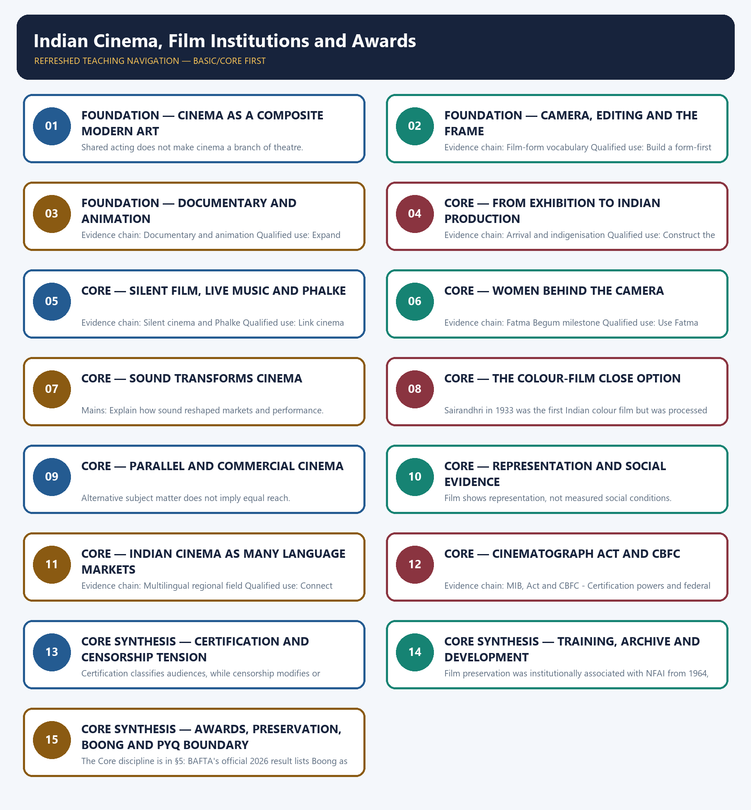

# Indian Cinema, Film Institutions and Awards — Learner-v2 Complete Learning Session

> **Authoring-only generation:** 2026-09-01. No PDF was rendered and no tracker or index was mutated.

### SOURCE, PROGRESSION AND CURRENT-LINKAGE AUDIT

- **Generation date:** 2026-09-01.
- **Repository-first evidence:** the Basic owner is taught first and preserved in full; the Advanced owner is retained only in the optional final teaching block.
- **OCR evidence:** Repository Markdown was primary. The available OCR-searchable Nitin Singhania Indian Art and Culture PDF was retained as a supplementary source; no unsupported page precision, quotation or dynamic status was imported from it.
- **Qdrant:** not used; repository Markdown and available OCR context were sufficient.
- **PYQ integrity:** No direct GS-I Mains PYQ is routed to Topic 15. The only audited direct route is the provisional 2026 objective demand on Boong, its BAFTA category, credited person and claimed milestone; no answer letter or universal first claim is inferred.
- **Live-link boundary:** The Ministry of Information and Broadcasting and BAFTA pages were fetched on 2026-09-01. MIB confirms NFDC's 1975 setup and the Government's 23 December 2020 decision merging the functions of Films Division, DFF, NFAI and CFSI into NFDC; BAFTA lists Boong with Lakshmipriya Devi and Ritesh Sidhwani in Children's and Family Film. No current recipient list, archive total, box-office figure or broader first claim is added.
- **Fact/inference discipline:** no current-affairs item, PYQ wording, figure or quotation is invented.

## BASIC LEARNING SESSION

### DEEP-REVIEW LEARNING CONTRACT

| Control | Binding rule for this package |
|---|---|
| Syllabus boundary | Complete Indian Art and Culture Core is taught by form, chronology, region, patronage and function before optional enrichment. |
| Evidence method | Claim → named monument/object/text/form/institution/community → analysis → qualification. |
| Chronology | Origin, surviving evidence, patronage phase, later adaptation, recognition and present status remain distinct. |
| Classification | Architecture, sculpture, painting, music, dance, theatre, language, craft, religion, heritage and cinema terms are compared on common axes without collapsing categories. |
| Interpretation | Style labels, iconographic readings, continuity, synthesis and social representation remain evidence-bounded rather than essentialist. |
| Practice contract | Every solved item has directive/demand decoding, a detailed examiner-grade model, executable compression plan, marks rationale and answer-specific improvement. |
| Approval | This immutable successor remains `approved: false` pending explicit approval. |

**Canonical Basic/Core owner:** `upsc-ai-kit\knowledge\Indian-Art-and-Culture\basic\15_Indian-Cinema-Film-Institutions-and-Awards.md`  
**Canonical topic owner:** `upsc-ai-kit\knowledge\Indian-Art-and-Culture\basic\15_Indian-Cinema-Film-Institutions-and-Awards.md`  
**Optional Advanced owner:** `upsc-ai-kit\knowledge\Indian-Art-and-Culture\advanced\15_Indian-Cinema-Film-Institutions-and-Awards.md`  
**Official syllabus mapping:** `upsc-ai-kit\knowledge\Indian-Art-and-Culture\OFFICIAL-UPSC-SYLLABUS-MAPPING.md`

### EVIDENCE, PYQ AND CURRENT-STATUS CONTROL

- **Material evidence:** plans, fabric, technique, iconography, performance grammar, inscriptions, manuscripts, films and institutional records are identified before interpretation.
- **Attribution discipline:** patron, date, school, region, author, performer, community and function are stated only to the precision supported by the owner.
- **Quantitative discipline:** dimensions, counts, inscription years, lists, awards and registrations retain source, date, status and uncertainty; no figure is invented.
- **Interpretive discipline:** civilisational ranking, communal essentialism, timeless continuity, single-origin claims and treating commissioned representation as a social census are rejected.
- **PYQ discipline:** repository routing ledgers and locally held papers control wording and metadata; neutral rendering, reconstruction and unavailable official keys remain explicitly labelled.
- **Current-status note, rechecked 2026-09-04:** The Ministry of Information and Broadcasting and BAFTA pages were fetched on 2026-09-01. MIB confirms NFDC's 1975 setup and the Government's 23 December 2020 decision merging the functions of Films Division, DFF, NFAI and CFSI into NFDC; BAFTA lists Boong with Lakshmipriya Devi and Ritesh Sidhwani in Children's and Family Film. No current recipient list, archive total, box-office figure or broader first claim is added.

**Live/official context sources recorded by the predecessor generation:**

- `https://www.mib.gov.in/en/ministry/organizations/national-film-development-corporation-limited`
- `https://www.bafta.org/awards/film/childrens-family/`




*Distinct embedded teaching-navigation image. The separate continuous Cārvāka-style flowchart package remains an independent at-a-glance artifact.*

### SESSION 1 — FOUNDATION — CINEMA AS A COMPOSITE MODERN ART

#### DEFINITION / WHAT THIS IS CALLED

**Plain-language definition:** Evidence chain: Cinema as composite art Qualified use: Define the medium through form and circulation.

**Technical definition:** Shared acting does not make cinema a branch of theatre.

#### ANSWER-GRABBING OPENING — WRITE/ADAPT IN THE EXAM

> Shared acting does not make cinema a branch of theatre.

#### MUST-WRITE KEYWORDS

- **FOUNDATION**
- **Cinema as a composite modern art**
- **Evidence chain**
- **Qualified use**
- **Shared**
- **Cinema**

**How to use them:** Frame the answer through FOUNDATION; define Cinema as a composite modern art, connect Evidence chain with Qualified use to explain the mechanism, and use Shared for the decisive comparison or qualification.

#### VISUAL FIRST

```text
CINEMA AS A COMPOSITE MODERN ART
01. Cinema as composite art
BOUNDARY -> Shared acting does not make cinema a branch of theatre.
```

*This topic-specific rail fixes the evidence sequence and its exam boundary before analysis.*

#### CORE EXPLANATION

Cinema combines literature or story, performance, moving image, colour and production design, music and sound, and editing, then adds reproducibility and mass circulation.

#### NAMED EVIDENCE AND MECHANISM

- Cinema combines literature or story, performance, moving image, colour and production design, music and sound, and editing, then adds reproducibility and mass circulation.

#### EXAMINER CAUTION

- Shared acting does not make cinema a branch of theatre.

#### EXAM LINK

- **Prelims:** Retain the exact form, region, text, technique or institution attached to Cinema as a composite modern art.
- **Mains:** Define the medium through form and circulation.

#### MINI RECAP

- **Evidence chain:** Cinema as composite art
- **Qualified use:** Define the medium through form and circulation.

#### CLOSING RECALL FLOW — FOUNDATION — CINEMA AS A COMPOSITE MODERN ART

```text
START / CONCEPT: FOUNDATION — Cinema as a composite modern art
        |
        v
EXACT TERMS: FOUNDATION · Cinema as a composite modern art · Evidence chain · Qualified use · Shared · Cinema
        |
        v
MECHANISM / ARGUMENT: Evidence chain: Cinema as composite art Qualified use: Define the medium through form and circulation.
        |
        v
CONSEQUENCE / CONTRAST: The resulting consequence is that shared acting does not make cinema a branch of theatre.
        |
        v
UPSC TRAP / ANSWER-USE: Do not miss this limiting distinction: shared acting does not make cinema a branch of theatre.
        |
        v
ANSWER-GRABBING FORMULATION: Shared acting does not make cinema a branch of theatre.
```
### SESSION 2 — FOUNDATION — CAMERA, EDITING AND THE FRAME

#### DEFINITION / WHAT THIS IS CALLED

**Plain-language definition:** Cinematography creates moving images through camera, lens, lighting, framing and movement; editing arranges shots; mise-en-scene organises setting, costume, light, performance and composition within the frame.

**Technical definition:** Evidence chain: Film-form vocabulary Qualified use: Build a form-first answer.

#### ANSWER-GRABBING OPENING — WRITE/ADAPT IN THE EXAM

> Cinematography creates moving images through camera, lens, lighting, framing and movement; editing arranges shots; mise-en-scene organises setting, costume, light, performance and composition within the frame.

#### MUST-WRITE KEYWORDS

- **FOUNDATION**
- **Camera**
- **editing**
- **the frame**
- **Evidence chain**
- **Qualified use**

**How to use them:** Frame the answer through FOUNDATION; define Camera, connect editing with the frame to explain the mechanism, and use Evidence chain for the decisive comparison or qualification.

#### VISUAL FIRST

```text
CAMERA, EDITING AND THE FRAME
01. Film-form vocabulary
BOUNDARY -> Technical vocabulary must explain how meaning is made.
```

*This topic-specific rail fixes the evidence sequence and its exam boundary before analysis.*

#### CORE EXPLANATION

Cinematography creates moving images through camera, lens, lighting, framing and movement; editing arranges shots; mise-en-scene organises setting, costume, light, performance and composition within the frame.

#### NAMED EVIDENCE AND MECHANISM

- Cinematography creates moving images through camera, lens, lighting, framing and movement; editing arranges shots; mise-en-scene organises setting, costume, light, performance and composition within the frame.

#### EXAMINER CAUTION

- Technical vocabulary must explain how meaning is made.

#### EXAM LINK

- **Prelims:** Retain the exact form, region, text, technique or institution attached to Camera, editing and the frame.
- **Mains:** Build a form-first answer.

#### MINI RECAP

- **Evidence chain:** Film-form vocabulary
- **Qualified use:** Build a form-first answer.

#### CLOSING RECALL FLOW — FOUNDATION — CAMERA, EDITING AND THE FRAME

```text
START / CONCEPT: FOUNDATION — Camera, editing and the frame
        |
        v
EXACT TERMS: FOUNDATION · Camera · editing · the frame · Evidence chain · Qualified use
        |
        v
MECHANISM / ARGUMENT: Evidence chain: Film-form vocabulary Qualified use: Build a form-first answer.
        |
        v
CONSEQUENCE / CONTRAST: Technical vocabulary must explain how meaning is made.
        |
        v
UPSC TRAP / ANSWER-USE: Do not miss this limiting distinction: cinematography creates moving images through camera, lens, lighting, framing and movement.
        |
        v
ANSWER-GRABBING FORMULATION: Cinematography creates moving images through camera, lens, lighting, framing and movement; editing arranges shots; mise-en-scene organises setting, costume, light, performance and composition within the frame.
```
### SESSION 3 — FOUNDATION — DOCUMENTARY AND ANIMATION

#### DEFINITION / WHAT THIS IS CALLED

**Plain-language definition:** Documentary is non-fiction but still selected and framed, while animation creates movement from drawn, modelled or computer-generated frames; neither is a lesser appendage to feature fiction.

**Technical definition:** Evidence chain: Documentary and animation Qualified use: Expand the field beyond feature fiction.

#### ANSWER-GRABBING OPENING — WRITE/ADAPT IN THE EXAM

> Documentary is non-fiction but still selected and framed, while animation creates movement from drawn, modelled or computer-generated frames; neither is a lesser appendage to feature fiction.

#### MUST-WRITE KEYWORDS

- **FOUNDATION**
- **Documentary**
- **animation**
- **Evidence chain**
- **Qualified use**
- **Non-fiction**

**How to use them:** Frame the answer through FOUNDATION; define Documentary, connect animation with Evidence chain to explain the mechanism, and use Qualified use for the decisive comparison or qualification.

#### VISUAL FIRST

```text
DOCUMENTARY AND ANIMATION
01. Documentary and animation
BOUNDARY -> Non-fiction remains framed and animation remains cinema.
```

*This topic-specific rail fixes the evidence sequence and its exam boundary before analysis.*

#### CORE EXPLANATION

Documentary is non-fiction but still selected and framed, while animation creates movement from drawn, modelled or computer-generated frames; neither is a lesser appendage to feature fiction.

#### NAMED EVIDENCE AND MECHANISM

- Documentary is non-fiction but still selected and framed, while animation creates movement from drawn, modelled or computer-generated frames; neither is a lesser appendage to feature fiction.

#### EXAMINER CAUTION

- Non-fiction remains framed and animation remains cinema.

#### EXAM LINK

- **Prelims:** Retain the exact form, region, text, technique or institution attached to Documentary and animation.
- **Mains:** Expand the field beyond feature fiction.

#### MINI RECAP

- **Evidence chain:** Documentary and animation
- **Qualified use:** Expand the field beyond feature fiction.

#### CLOSING RECALL FLOW — FOUNDATION — DOCUMENTARY AND ANIMATION

```text
START / CONCEPT: FOUNDATION — Documentary and animation
        |
        v
EXACT TERMS: FOUNDATION · Documentary · animation · Evidence chain · Qualified use · Non-fiction
        |
        v
MECHANISM / ARGUMENT: Evidence chain: Documentary and animation Qualified use: Expand the field beyond feature fiction.
        |
        v
CONSEQUENCE / CONTRAST: Non-fiction remains framed and animation remains cinema.
        |
        v
UPSC TRAP / ANSWER-USE: Do not miss this limiting distinction: documentary is non-fiction but still selected and framed.
        |
        v
ANSWER-GRABBING FORMULATION: Documentary is non-fiction but still selected and framed, while animation creates movement from drawn, modelled or computer-generated frames; neither is a lesser appendage to feature fiction.
```
### SESSION 4 — CORE — FROM EXHIBITION TO INDIAN PRODUCTION

#### DEFINITION / WHAT THIS IS CALLED

**Plain-language definition:** Motion pictures were shown in Bombay in 1896, an Indian-shot film appeared in 1897, Indian filmmakers made shorts by 1899 and Indian-owned exhibition infrastructure developed before the indigenous feature of 1913.

**Technical definition:** Evidence chain: Arrival and indigenisation Qualified use: Construct the indigenisation chronology.

#### ANSWER-GRABBING OPENING — WRITE/ADAPT IN THE EXAM

> Motion pictures were shown in Bombay in 1896, an Indian-shot film appeared in 1897, Indian filmmakers made shorts by 1899 and Indian-owned exhibition infrastructure developed before the indigenous feature of 1913.

#### MUST-WRITE KEYWORDS

- **From exhibition to Indian production**
- **Evidence chain**
- **Qualified use**
- **Motion**
- **Bombay**
- **Indian-shot**

**How to use them:** Frame the answer through From exhibition to Indian production; define Evidence chain, connect Qualified use with Motion to explain the mechanism, and use Bombay for the decisive comparison or qualification.

#### VISUAL FIRST

```text
FROM EXHIBITION TO INDIAN PRODUCTION
01. Arrival and indigenisation
BOUNDARY -> Several different firsts occur between 1896 and 1913.
```

*This topic-specific rail fixes the evidence sequence and its exam boundary before analysis.*

#### CORE EXPLANATION

Motion pictures were shown in Bombay in 1896, an Indian-shot film appeared in 1897, Indian filmmakers made shorts by 1899 and Indian-owned exhibition infrastructure developed before the indigenous feature of 1913.

#### NAMED EVIDENCE AND MECHANISM

- Motion pictures were shown in Bombay in 1896, an Indian-shot film appeared in 1897, Indian filmmakers made shorts by 1899 and Indian-owned exhibition infrastructure developed before the indigenous feature of 1913.

#### EXAMINER CAUTION

- Several different firsts occur between 1896 and 1913.

#### EXAM LINK

- **Prelims:** Retain the exact form, region, text, technique or institution attached to From exhibition to Indian production.
- **Mains:** Construct the indigenisation chronology.

#### MINI RECAP

- **Evidence chain:** Arrival and indigenisation
- **Qualified use:** Construct the indigenisation chronology.

#### CLOSING RECALL FLOW — CORE — FROM EXHIBITION TO INDIAN PRODUCTION

```text
START / CONCEPT: CORE — From exhibition to Indian production
        |
        v
EXACT TERMS: From exhibition to Indian production · Evidence chain · Qualified use · Motion · Bombay · Indian-shot
        |
        v
MECHANISM / ARGUMENT: Evidence chain: Arrival and indigenisation Qualified use: Construct the indigenisation chronology.
        |
        v
CONSEQUENCE / CONTRAST: The resulting consequence is that motion pictures were shown in Bombay in 1896, an Indian-shot film appeared in 1897...
        |
        v
UPSC TRAP / ANSWER-USE: Do not miss this limiting distinction: motion pictures were shown in Bombay in 1896, an Indian-shot film appeared in 1897...
        |
        v
ANSWER-GRABBING FORMULATION: Motion pictures were shown in Bombay in 1896, an Indian-shot film appeared in 1897, Indian filmmakers made shorts by 1899 and Indian-owned exhibition infrastructure developed before the indigenous feature of 1913.
```
### SESSION 5 — CORE — SILENT FILM, LIVE MUSIC AND PHALKE

#### DEFINITION / WHAT THIS IS CALLED

**Plain-language definition:** Indian silent films used live musical accompaniment; Raja Harishchandra in 1913 is the first indigenous Indian silent feature, while Lanka Dahan in 1917 is identified as the first box-office hit.

**Technical definition:** Evidence chain: Silent cinema and Phalke Qualified use: Link cinema with music and exhibition.

#### ANSWER-GRABBING OPENING — WRITE/ADAPT IN THE EXAM

> Indian silent films used live musical accompaniment; Raja Harishchandra in 1913 is the first indigenous Indian silent feature, while Lanka Dahan in 1917 is identified as the first box-office hit.

#### MUST-WRITE KEYWORDS

- **Silent film**
- **live music**
- **Phalke**
- **Evidence chain**
- **Qualified use**
- **Indian**

**How to use them:** Frame the answer through Silent film; define live music, connect Phalke with Evidence chain to explain the mechanism, and use Qualified use for the decisive comparison or qualification.

#### VISUAL FIRST

```text
SILENT FILM, LIVE MUSIC AND PHALKE
01. Silent cinema and Phalke
BOUNDARY -> First feature and first box-office hit are distinct.
```

*This topic-specific rail fixes the evidence sequence and its exam boundary before analysis.*

#### CORE EXPLANATION

Indian silent films used live musical accompaniment; Raja Harishchandra in 1913 is the first indigenous Indian silent feature, while Lanka Dahan in 1917 is identified as the first box-office hit.

#### NAMED EVIDENCE AND MECHANISM

- Indian silent films used live musical accompaniment; Raja Harishchandra in 1913 is the first indigenous Indian silent feature, while Lanka Dahan in 1917 is identified as the first box-office hit.

#### EXAMINER CAUTION

- First feature and first box-office hit are distinct.

#### EXAM LINK

- **Prelims:** Retain the exact form, region, text, technique or institution attached to Silent film, live music and Phalke.
- **Mains:** Link cinema with music and exhibition.

#### MINI RECAP

- **Evidence chain:** Silent cinema and Phalke
- **Qualified use:** Link cinema with music and exhibition.

#### CLOSING RECALL FLOW — CORE — SILENT FILM, LIVE MUSIC AND PHALKE

```text
START / CONCEPT: CORE — Silent film, live music and Phalke
        |
        v
EXACT TERMS: Silent film · live music · Phalke · Evidence chain · Qualified use · Indian
        |
        v
MECHANISM / ARGUMENT: Evidence chain: Silent cinema and Phalke Qualified use: Link cinema with music and exhibition.
        |
        v
CONSEQUENCE / CONTRAST: First feature and first box-office hit are distinct.
        |
        v
UPSC TRAP / ANSWER-USE: Do not miss this limiting distinction: indian silent films used live musical accompaniment.
        |
        v
ANSWER-GRABBING FORMULATION: Indian silent films used live musical accompaniment; Raja Harishchandra in 1913 is the first indigenous Indian silent feature, while Lanka Dahan in 1917 is identified as the first box-office hit.
```
### SESSION 6 — CORE — WOMEN BEHIND THE CAMERA

#### DEFINITION / WHAT THIS IS CALLED

**Plain-language definition:** Fatma Begum became the first Indian woman to produce and direct her own film with Bulbul-e-Paristan in 1926; this is a dated production-history fact, not a general claim about equality in the industry.

**Technical definition:** Evidence chain: Fatma Begum milestone Qualified use: Use Fatma Begum as named production evidence.

#### ANSWER-GRABBING OPENING — WRITE/ADAPT IN THE EXAM

> Fatma Begum became the first Indian woman to produce and direct her own film with Bulbul-e-Paristan in 1926; this is a dated production-history fact, not a general claim about equality in the industry.

#### MUST-WRITE KEYWORDS

- **Women behind the camera**
- **Evidence chain**
- **Qualified use**
- **Fatma Begum**
- **Indian**
- **Bulbul-e-Paristan**

**How to use them:** Frame the answer through Women behind the camera; define Evidence chain, connect Qualified use with Fatma Begum to explain the mechanism, and use Indian for the decisive comparison or qualification.

#### VISUAL FIRST

```text
WOMEN BEHIND THE CAMERA
01. Fatma Begum milestone
BOUNDARY -> One milestone does not prove industry-wide equality.
```

*This topic-specific rail fixes the evidence sequence and its exam boundary before analysis.*

#### CORE EXPLANATION

Fatma Begum became the first Indian woman to produce and direct her own film with Bulbul-e-Paristan in 1926; this is a dated production-history fact, not a general claim about equality in the industry.

#### NAMED EVIDENCE AND MECHANISM

- Fatma Begum became the first Indian woman to produce and direct her own film with Bulbul-e-Paristan in 1926; this is a dated production-history fact, not a general claim about equality in the industry.

#### EXAMINER CAUTION

- One milestone does not prove industry-wide equality.

#### EXAM LINK

- **Prelims:** Retain the exact form, region, text, technique or institution attached to Women behind the camera.
- **Mains:** Use Fatma Begum as named production evidence.

#### MINI RECAP

- **Evidence chain:** Fatma Begum milestone
- **Qualified use:** Use Fatma Begum as named production evidence.

#### CLOSING RECALL FLOW — CORE — WOMEN BEHIND THE CAMERA

```text
START / CONCEPT: CORE — Women behind the camera
        |
        v
EXACT TERMS: Women behind the camera · Evidence chain · Qualified use · Fatma Begum · Indian · Bulbul-e-Paristan
        |
        v
MECHANISM / ARGUMENT: Evidence chain: Fatma Begum milestone Qualified use: Use Fatma Begum as named production evidence.
        |
        v
CONSEQUENCE / CONTRAST: One milestone does not prove industry-wide equality.
        |
        v
UPSC TRAP / ANSWER-USE: Do not miss this limiting distinction: use Fatma Begum as named production evidence.
        |
        v
ANSWER-GRABBING FORMULATION: Fatma Begum became the first Indian woman to produce and direct her own film with Bulbul-e-Paristan in 1926; this is a dated production-history fact, not a general claim about equality in the industry.
```
### SESSION 7 — CORE — SOUND TRANSFORMS CINEMA

#### DEFINITION / WHAT THIS IS CALLED

**Plain-language definition:** Evidence chain: Talkie and recorded song Qualified use: Explain how sound reshaped markets and performance.

**Technical definition:** Mains: Explain how sound reshaped markets and performance.

#### ANSWER-GRABBING OPENING — WRITE/ADAPT IN THE EXAM

> Evidence chain: Talkie and recorded song Qualified use: Explain how sound reshaped markets and performance.

#### MUST-WRITE KEYWORDS

- **Sound transforms cinema**
- **Evidence chain**
- **Qualified use**
- **Alam-Ara**
- **Indian**
- **W.M**

**How to use them:** Frame the answer through Sound transforms cinema; define Evidence chain, connect Qualified use with Alam-Ara to explain the mechanism, and use Indian for the decisive comparison or qualification.

#### VISUAL FIRST

```text
SOUND TRANSFORMS CINEMA
01. Talkie and recorded song
BOUNDARY -> Talkie, playback and recorded song are separate claims.
```

*This topic-specific rail fixes the evidence sequence and its exam boundary before analysis.*

#### CORE EXPLANATION

Alam-Ara in 1931 was the first Indian talkie, with W.M. Khan associated with the first recorded song in Indian cinema; sound changed performance, music and language markets.

#### NAMED EVIDENCE AND MECHANISM

- Alam-Ara in 1931 was the first Indian talkie, with W.M. Khan associated with the first recorded song in Indian cinema; sound changed performance, music and language markets.

#### EXAMINER CAUTION

- Talkie, playback and recorded song are separate claims.

#### EXAM LINK

- **Prelims:** Retain the exact form, region, text, technique or institution attached to Sound transforms cinema.
- **Mains:** Explain how sound reshaped markets and performance.

#### MINI RECAP

- **Evidence chain:** Talkie and recorded song
- **Qualified use:** Explain how sound reshaped markets and performance.

#### CLOSING RECALL FLOW — CORE — SOUND TRANSFORMS CINEMA

```text
START / CONCEPT: CORE — Sound transforms cinema
        |
        v
EXACT TERMS: Sound transforms cinema · Evidence chain · Qualified use · Alam-Ara · Indian · W.M
        |
        v
MECHANISM / ARGUMENT: Alam-Ara in 1931 was the first Indian talkie, with W.M.
        |
        v
CONSEQUENCE / CONTRAST: Mains: Explain how sound reshaped markets and performance.
        |
        v
UPSC TRAP / ANSWER-USE: Do not miss this limiting distinction: talkie, playback and recorded song are separate claims.
        |
        v
ANSWER-GRABBING FORMULATION: Evidence chain: Talkie and recorded song Qualified use: Explain how sound reshaped markets and performance.
```
### SESSION 8 — CORE — THE COLOUR-FILM CLOSE OPTION

#### DEFINITION / WHAT THIS IS CALLED

**Plain-language definition:** Evidence chain: Colour-film firewall Qualified use: Defeat the 1933 versus 1937 trap.

**Technical definition:** Sairandhri in 1933 was the first Indian colour film but was processed in Germany, whereas Kisan Kanya in 1937 was the first indigenously made colour film.

#### ANSWER-GRABBING OPENING — WRITE/ADAPT IN THE EXAM

> Evidence chain: Colour-film firewall Qualified use: Defeat the 1933 versus 1937 trap.

#### MUST-WRITE KEYWORDS

- **The colour-film close option**
- **Evidence chain**
- **Qualified use**
- **Sairandhri**
- **Indian**
- **Germany**

**How to use them:** Frame the answer through The colour-film close option; define Evidence chain, connect Qualified use with Sairandhri to explain the mechanism, and use Indian for the decisive comparison or qualification.

#### VISUAL FIRST

```text
THE COLOUR-FILM CLOSE OPTION
01. Colour-film firewall
BOUNDARY -> Processing abroad and indigenous production are different criteria.
```

*This topic-specific rail fixes the evidence sequence and its exam boundary before analysis.*

#### CORE EXPLANATION

Sairandhri in 1933 was the first Indian colour film but was processed in Germany, whereas Kisan Kanya in 1937 was the first indigenously made colour film.

#### NAMED EVIDENCE AND MECHANISM

- Sairandhri in 1933 was the first Indian colour film but was processed in Germany, whereas Kisan Kanya in 1937 was the first indigenously made colour film.

#### EXAMINER CAUTION

- Processing abroad and indigenous production are different criteria.

#### EXAM LINK

- **Prelims:** Retain the exact form, region, text, technique or institution attached to The colour-film close option.
- **Mains:** Defeat the 1933 versus 1937 trap.

#### MINI RECAP

- **Evidence chain:** Colour-film firewall
- **Qualified use:** Defeat the 1933 versus 1937 trap.

#### CLOSING RECALL FLOW — CORE — THE COLOUR-FILM CLOSE OPTION

```text
START / CONCEPT: CORE — The colour-film close option
        |
        v
EXACT TERMS: The colour-film close option · Evidence chain · Qualified use · Sairandhri · Indian · Germany
        |
        v
MECHANISM / ARGUMENT: Sairandhri in 1933 was the first Indian colour film but was processed in Germany, whereas Kisan Kanya in 1937 was the first indigenously made colour film.
        |
        v
CONSEQUENCE / CONTRAST: Processing abroad and indigenous production are different criteria.
        |
        v
UPSC TRAP / ANSWER-USE: Do not miss this limiting distinction: sairandhri in 1933 was the first Indian colour film but was processed in Germany.
        |
        v
ANSWER-GRABBING FORMULATION: Evidence chain: Colour-film firewall Qualified use: Defeat the 1933 versus 1937 trap.
```
### SESSION 9 — CORE — PARALLEL AND COMMERCIAL CINEMA

#### DEFINITION / WHAT THIS IS CALLED

**Plain-language definition:** Evidence chain: Parallel cinema Qualified use: Compare form, theme and circulation.

**Technical definition:** Alternative subject matter does not imply equal reach.

#### ANSWER-GRABBING OPENING — WRITE/ADAPT IN THE EXAM

> Evidence chain: Parallel cinema Qualified use: Compare form, theme and circulation.

#### MUST-WRITE KEYWORDS

- **Parallel**
- **commercial cinema**
- **Evidence chain**
- **Qualified use**
- **Alternative**
- **Qualified**

**How to use them:** Frame the answer through Parallel; define commercial cinema, connect Evidence chain with Qualified use to explain the mechanism, and use Alternative for the decisive comparison or qualification.

#### VISUAL FIRST

```text
PARALLEL AND COMMERCIAL CINEMA
01. Parallel cinema
BOUNDARY -> Alternative subject matter does not imply equal reach.
```

*This topic-specific rail fixes the evidence sequence and its exam boundary before analysis.*

#### CORE EXPLANATION

From the late 1940s parallel cinema offered an alternative to mainstream commercial production through poverty, injustice and everyday suffering, with Satyajit Ray, Ritwik Ghatak, Guru Dutt and Shyam Benegal named by the owner.

#### NAMED EVIDENCE AND MECHANISM

- From the late 1940s parallel cinema offered an alternative to mainstream commercial production through poverty, injustice and everyday suffering, with Satyajit Ray, Ritwik Ghatak, Guru Dutt and Shyam Benegal named by the owner.

#### EXAMINER CAUTION

- Alternative subject matter does not imply equal reach.

#### EXAM LINK

- **Prelims:** Retain the exact form, region, text, technique or institution attached to Parallel and commercial cinema.
- **Mains:** Compare form, theme and circulation.

#### MINI RECAP

- **Evidence chain:** Parallel cinema
- **Qualified use:** Compare form, theme and circulation.

#### CLOSING RECALL FLOW — CORE — PARALLEL AND COMMERCIAL CINEMA

```text
START / CONCEPT: CORE — Parallel and commercial cinema
        |
        v
EXACT TERMS: Parallel · commercial cinema · Evidence chain · Qualified use · Alternative · Qualified
        |
        v
MECHANISM / ARGUMENT: Alternative subject matter does not imply equal reach.
        |
        v
CONSEQUENCE / CONTRAST: The resulting consequence is that evidence chain: Parallel cinema Qualified use: Compare form, theme and circulation.
        |
        v
UPSC TRAP / ANSWER-USE: Do not miss this limiting distinction: evidence chain: Parallel cinema Qualified use: Compare form, theme and circulation.
        |
        v
ANSWER-GRABBING FORMULATION: Evidence chain: Parallel cinema Qualified use: Compare form, theme and circulation.
```
### SESSION 10 — CORE — REPRESENTATION AND SOCIAL EVIDENCE

#### DEFINITION / WHAT THIS IS CALLED

**Plain-language definition:** Evidence chain: Representation is bounded evidence Qualified use: Use gender and class evidence cautiously.

**Technical definition:** Film shows representation, not measured social conditions.

#### ANSWER-GRABBING OPENING — WRITE/ADAPT IN THE EXAM

> Evidence chain: Representation is bounded evidence Qualified use: Use gender and class evidence cautiously.

#### MUST-WRITE KEYWORDS

- **Representation**
- **social evidence**
- **Evidence chain**
- **Qualified use**
- **Films**
- **Film**

**How to use them:** Frame the answer through Representation; define social evidence, connect Evidence chain with Qualified use to explain the mechanism, and use Films for the decisive comparison or qualification.

#### VISUAL FIRST

```text
REPRESENTATION AND SOCIAL EVIDENCE
01. Representation is bounded evidence
BOUNDARY -> Film shows representation, not measured social conditions.
```

*This topic-specific rail fixes the evidence sequence and its exam boundary before analysis.*

#### CORE EXPLANATION

Films reveal how gender, caste, region and nation were represented and what producers expected audiences to accept, but they are not direct social surveys or measures of lived conditions.

#### NAMED EVIDENCE AND MECHANISM

- Films reveal how gender, caste, region and nation were represented and what producers expected audiences to accept, but they are not direct social surveys or measures of lived conditions.

#### EXAMINER CAUTION

- Film shows representation, not measured social conditions.

#### EXAM LINK

- **Prelims:** Retain the exact form, region, text, technique or institution attached to Representation and social evidence.
- **Mains:** Use gender and class evidence cautiously.

#### MINI RECAP

- **Evidence chain:** Representation is bounded evidence
- **Qualified use:** Use gender and class evidence cautiously.

#### CLOSING RECALL FLOW — CORE — REPRESENTATION AND SOCIAL EVIDENCE

```text
START / CONCEPT: CORE — Representation and social evidence
        |
        v
EXACT TERMS: Representation · social evidence · Evidence chain · Qualified use · Films · Film
        |
        v
MECHANISM / ARGUMENT: Film shows representation, not measured social conditions.
        |
        v
CONSEQUENCE / CONTRAST: Films reveal how gender, caste, region and nation were represented and what producers expected audiences to accept, but they are not direct social surveys or measures of lived conditions.
        |
        v
UPSC TRAP / ANSWER-USE: Do not miss this limiting distinction: use gender and class evidence cautiously.
        |
        v
ANSWER-GRABBING FORMULATION: Evidence chain: Representation is bounded evidence Qualified use: Use gender and class evidence cautiously.
```
### SESSION 11 — CORE — INDIAN CINEMA AS MANY LANGUAGE MARKETS

#### DEFINITION / WHAT THIS IS CALLED

**Plain-language definition:** Indian cinema is structured through multiple language markets, regional production, dubbing and administration; it cannot be equated with Hindi-language cinema or Bollywood.

**Technical definition:** Evidence chain: Multilingual regional field Qualified use: Connect language, dubbing and regional administration.

#### ANSWER-GRABBING OPENING — WRITE/ADAPT IN THE EXAM

> Indian cinema is structured through multiple language markets, regional production, dubbing and administration; it cannot be equated with Hindi-language cinema or Bollywood.

#### MUST-WRITE KEYWORDS

- **Indian cinema as many language markets**
- **Evidence chain**
- **Qualified use**
- **Indian cinema**
- **Indian**
- **Hindi-language**

**How to use them:** Frame the answer through Indian cinema as many language markets; define Evidence chain, connect Qualified use with Indian cinema to explain the mechanism, and use Indian for the decisive comparison or qualification.

#### VISUAL FIRST

```text
INDIAN CINEMA AS MANY LANGUAGE MARKETS
01. Multilingual regional field
BOUNDARY -> National cinema cannot be reduced to Bollywood.
```

*This topic-specific rail fixes the evidence sequence and its exam boundary before analysis.*

#### CORE EXPLANATION

Indian cinema is structured through multiple language markets, regional production, dubbing and administration; it cannot be equated with Hindi-language cinema or Bollywood.

#### NAMED EVIDENCE AND MECHANISM

- Indian cinema is structured through multiple language markets, regional production, dubbing and administration; it cannot be equated with Hindi-language cinema or Bollywood.

#### EXAMINER CAUTION

- National cinema cannot be reduced to Bollywood.

#### EXAM LINK

- **Prelims:** Retain the exact form, region, text, technique or institution attached to Indian cinema as many language markets.
- **Mains:** Connect language, dubbing and regional administration.

#### MINI RECAP

- **Evidence chain:** Multilingual regional field
- **Qualified use:** Connect language, dubbing and regional administration.

#### CLOSING RECALL FLOW — CORE — INDIAN CINEMA AS MANY LANGUAGE MARKETS

```text
START / CONCEPT: CORE — Indian cinema as many language markets
        |
        v
EXACT TERMS: Indian cinema as many language markets · Evidence chain · Qualified use · Indian cinema · Indian · Hindi-language
        |
        v
MECHANISM / ARGUMENT: Evidence chain: Multilingual regional field Qualified use: Connect language, dubbing and regional administration.
        |
        v
CONSEQUENCE / CONTRAST: The resulting consequence is that indian cinema is structured through multiple language markets, regional production, dubbing and administration.
        |
        v
UPSC TRAP / ANSWER-USE: Do not miss this limiting distinction: indian cinema is structured through multiple language markets, regional production, dubbing and administration.
        |
        v
ANSWER-GRABBING FORMULATION: Indian cinema is structured through multiple language markets, regional production, dubbing and administration; it cannot be equated with Hindi-language cinema or Bollywood.
```
### SESSION 12 — CORE — CINEMATOGRAPH ACT AND CBFC

#### DEFINITION / WHAT THIS IS CALLED

**Plain-language definition:** The Ministry of Information and Broadcasting is the Union policy anchor, the Cinematograph Act, 1952 supplies the certification framework, and CBFC certifies public exhibition rather than judging artistic merit.

**Technical definition:** Evidence chain: MIB, Act and CBFC - Certification powers and federal split Qualified use: Map law, Board and enforcement.

#### ANSWER-GRABBING OPENING — WRITE/ADAPT IN THE EXAM

> The Ministry of Information and Broadcasting is the Union policy anchor, the Cinematograph Act, 1952 supplies the certification framework, and CBFC certifies public exhibition rather than judging artistic merit.

#### MUST-WRITE KEYWORDS

- **Cinematograph Act**
- **CBFC**
- **Evidence chain**
- **Qualified use**
- **The Ministry of Information and Broadcasting**
- **The Ministry**

**How to use them:** Frame the answer through Cinematograph Act; define CBFC, connect Evidence chain with Qualified use to explain the mechanism, and use The Ministry of Information and Broadcasting for the decisive comparison or qualification.

#### VISUAL FIRST

```text
CINEMATOGRAPH ACT AND CBFC
01. MIB, Act and CBFC
    |
    v
02. Certification powers and federal split
BOUNDARY -> The regulator is not a jury and States do not issue certificates.
```

*This topic-specific rail fixes the evidence sequence and its exam boundary before analysis.*

#### CORE EXPLANATION

The Ministry of Information and Broadcasting is the Union policy anchor, the Cinematograph Act, 1952 supplies the certification framework, and CBFC certifies public exhibition rather than judging artistic merit. The statutory scheme permits audience categories, modifications or refusal of sanction; certification is a Union function while State governments enforce exhibition controls in their domains.

#### NAMED EVIDENCE AND MECHANISM

- The Ministry of Information and Broadcasting is the Union policy anchor, the Cinematograph Act, 1952 supplies the certification framework, and CBFC certifies public exhibition rather than judging artistic merit.
- The statutory scheme permits audience categories, modifications or refusal of sanction; certification is a Union function while State governments enforce exhibition controls in their domains.

#### EXAMINER CAUTION

- The regulator is not a jury and States do not issue certificates.

#### EXAM LINK

- **Prelims:** Retain the exact form, region, text, technique or institution attached to Cinematograph Act and CBFC.
- **Mains:** Map law, Board and enforcement.

#### MINI RECAP

- **Evidence chain:** MIB, Act and CBFC -> Certification powers and federal split
- **Qualified use:** Map law, Board and enforcement.

#### CLOSING RECALL FLOW — CORE — CINEMATOGRAPH ACT AND CBFC

```text
START / CONCEPT: CORE — Cinematograph Act and CBFC
        |
        v
EXACT TERMS: Cinematograph Act · CBFC · Evidence chain · Qualified use · The Ministry of Information and Broadcasting · The Ministry
        |
        v
MECHANISM / ARGUMENT: Evidence chain: MIB, Act and CBFC - Certification powers and federal split Qualified use: Map law, Board and enforcement.
        |
        v
CONSEQUENCE / CONTRAST: The statutory scheme permits audience categories, modifications or refusal of sanction; certification is a Union function while State governments enforce exhibition controls in their domains.
        |
        v
UPSC TRAP / ANSWER-USE: The regulator is not a jury and States do not issue certificates.
        |
        v
ANSWER-GRABBING FORMULATION: The Ministry of Information and Broadcasting is the Union policy anchor, the Cinematograph Act, 1952 supplies the certification framework, and CBFC certifies public exhibition rather than judging artistic merit.
```
### SESSION 13 — CORE SYNTHESIS — CERTIFICATION AND CENSORSHIP TENSION

#### DEFINITION / WHAT THIS IS CALLED

**Plain-language definition:** Evidence chain: Certification versus censorship Qualified use: Write a balanced regulatory verdict.

**Technical definition:** Certification classifies audiences, while censorship modifies or suppresses content; India's formal certification system can have censoring effects through excision and refusal powers, and current appellate or sub-category claims require dated verification.

#### ANSWER-GRABBING OPENING — WRITE/ADAPT IN THE EXAM

> Certification classifies audiences, while censorship modifies or suppresses content; India's formal certification system can have censoring effects through excision and refusal powers, and current appellate or sub-category claims require dated verification.

#### MUST-WRITE KEYWORDS

- **CORE SYNTHESIS**
- **Certification**
- **censorship tension**
- **Evidence chain**
- **Qualified use**
- **India's**

**How to use them:** Frame the answer through CORE SYNTHESIS; define Certification, connect censorship tension with Evidence chain to explain the mechanism, and use Qualified use for the decisive comparison or qualification.

#### VISUAL FIRST

```text
CERTIFICATION AND CENSORSHIP TENSION
01. Certification versus censorship
BOUNDARY -> Current appellate and category claims need dated official verification.
```

*This topic-specific rail fixes the evidence sequence and its exam boundary before analysis.*

#### CORE EXPLANATION

Certification classifies audiences, while censorship modifies or suppresses content; India's formal certification system can have censoring effects through excision and refusal powers, and current appellate or sub-category claims require dated verification.

#### NAMED EVIDENCE AND MECHANISM

- Certification classifies audiences, while censorship modifies or suppresses content; India's formal certification system can have censoring effects through excision and refusal powers, and current appellate or sub-category claims require dated verification.

#### EXAMINER CAUTION

- Current appellate and category claims need dated official verification.

#### EXAM LINK

- **Prelims:** Retain the exact form, region, text, technique or institution attached to Certification and censorship tension.
- **Mains:** Write a balanced regulatory verdict.

#### MINI RECAP

- **Evidence chain:** Certification versus censorship
- **Qualified use:** Write a balanced regulatory verdict.

#### CLOSING RECALL FLOW — CORE SYNTHESIS — CERTIFICATION AND CENSORSHIP TENSION

```text
START / CONCEPT: CORE SYNTHESIS — Certification and censorship tension
        |
        v
EXACT TERMS: CORE SYNTHESIS · Certification · censorship tension · Evidence chain · Qualified use · India's
        |
        v
MECHANISM / ARGUMENT: Evidence chain: Certification versus censorship Qualified use: Write a balanced regulatory verdict.
        |
        v
CONSEQUENCE / CONTRAST: The resulting consequence is that while censorship modifies or suppresses content.
        |
        v
UPSC TRAP / ANSWER-USE: Do not miss this limiting distinction: while censorship modifies or suppresses content.
        |
        v
ANSWER-GRABBING FORMULATION: Certification classifies audiences, while censorship modifies or suppresses content; India's formal certification system can have censoring effects through excision and refusal powers, and current appellate or sub-category claims require dated verification.
```
### SESSION 14 — CORE SYNTHESIS — TRAINING, ARCHIVE AND DEVELOPMENT

#### DEFINITION / WHAT THIS IS CALLED

**Plain-language definition:** Evidence chain: FTII training function - NFAI and NFDC consolidation Qualified use: Compare FTII, NFAI and NFDC.

**Technical definition:** Film preservation was institutionally associated with NFAI from 1964, while the Government's 23 December 2020 decision merged the functions of NFAI, Films Division, DFF and CFSI into NFDC's integrated development architecture.

#### ANSWER-GRABBING OPENING — WRITE/ADAPT IN THE EXAM

> Film preservation was institutionally associated with NFAI from 1964, while the Government's 23 December 2020 decision merged the functions of NFAI, Films Division, DFF and CFSI into NFDC's integrated development architecture.

#### MUST-WRITE KEYWORDS

- **CORE SYNTHESIS**
- **Training**
- **archive**
- **development**
- **Evidence chain**
- **Qualified use**

**How to use them:** Frame the answer through CORE SYNTHESIS; define Training, connect archive with development to explain the mechanism, and use Evidence chain for the decisive comparison or qualification.

#### VISUAL FIRST

```text
TRAINING, ARCHIVE AND DEVELOPMENT
01. FTII training function
    |
    v
02. NFAI and NFDC consolidation
BOUNDARY -> Institutional consolidation does not erase functional differences.
```

*This topic-specific rail fixes the evidence sequence and its exam boundary before analysis.*

#### CORE EXPLANATION

FTII at Pune, established in 1960 as a society under the Ministry of Information and Broadcasting, performs training rather than certification, archiving or awards. Film preservation was institutionally associated with NFAI from 1964, while the Government's 23 December 2020 decision merged the functions of NFAI, Films Division, DFF and CFSI into NFDC's integrated development architecture.

#### NAMED EVIDENCE AND MECHANISM

- FTII at Pune, established in 1960 as a society under the Ministry of Information and Broadcasting, performs training rather than certification, archiving or awards.
- Film preservation was institutionally associated with NFAI from 1964, while the Government's 23 December 2020 decision merged the functions of NFAI, Films Division, DFF and CFSI into NFDC's integrated development architecture.

#### EXAMINER CAUTION

- Institutional consolidation does not erase functional differences.

#### EXAM LINK

- **Prelims:** Retain the exact form, region, text, technique or institution attached to Training, archive and development.
- **Mains:** Compare FTII, NFAI and NFDC.

#### MINI RECAP

- **Evidence chain:** FTII training function -> NFAI and NFDC consolidation
- **Qualified use:** Compare FTII, NFAI and NFDC.

#### CLOSING RECALL FLOW — CORE SYNTHESIS — TRAINING, ARCHIVE AND DEVELOPMENT

```text
START / CONCEPT: CORE SYNTHESIS — Training, archive and development
        |
        v
EXACT TERMS: CORE SYNTHESIS · Training · archive · development · Evidence chain · Qualified use
        |
        v
MECHANISM / ARGUMENT: Evidence chain: FTII training function - NFAI and NFDC consolidation Qualified use: Compare FTII, NFAI and NFDC.
        |
        v
CONSEQUENCE / CONTRAST: Institutional consolidation does not erase functional differences.
        |
        v
UPSC TRAP / ANSWER-USE: Do not miss this limiting distinction: film preservation was institutionally associated with NFAI from 1964.
        |
        v
ANSWER-GRABBING FORMULATION: Film preservation was institutionally associated with NFAI from 1964, while the Government's 23 December 2020 decision merged the functions of NFAI, Films Division, DFF and CFSI into NFDC's integrated development architecture.
```
### SESSION 15 — CORE SYNTHESIS — AWARDS, PRESERVATION, BOONG AND PYQ BOUNDARY

#### DEFINITION / WHAT THIS IS CALLED

**Plain-language definition:** National Film Awards, BAFTA, Academy Awards and Cannes, Venice or Berlin prizes belong to different institutions; festival selection, nomination and winning are separate statuses.

**Technical definition:** The Core discipline is in §5: BAFTA's official 2026 result lists Boong as winner in the Children's & Family Film category; the director is Lakshmipriya Devi; "won a BAFTA" is too broad for statement elimination, and any "first Indian film" claim must be tied to the exact category and a dated source. ⚠️ No answer letter is recorded or inferred, because the locally held 2026 Set-A key is provisional. ⚠️ Mains: no audited 2024-2025 GS-I question tests cinema directly.

#### ANSWER-GRABBING OPENING — WRITE/ADAPT IN THE EXAM

> ❌ Do not confuse Sairandhri (1933, first colour, processed in Germany) with Kisan Kanya (1937, first indigenously made colour film). ❌ Do not treat certification as an award, festival selection as a prize, or BAFTA and the Academy Awards as one institution. ❌ Do not assert the current status of FCAT, current certificate sub-categories, archive holdings or institutional mergers without a dated official source. ✅ §11.5A now supplies the merger fact with its date and verification (NFAI, Films Division, DFF and CFSI into NFDC with effect from 1 April 2022, verified 13 August 2026); cite it with that status and re-verify before treating it as current. ❌ Institution prohibitions (§11.5A): do not state FTII's courses, intake, alumni, directors or controversies; do not state NFAI holdings, reel counts, restoration projects or budgets; do not name recent Dadasaheb Phalke or National Film Award recipients from memory; do not describe NFDC's widened mandate as statutory — it followed an administrative consolidation. ❌ Do not state award winners, box-office figures, industry output or screen counts from memory; award and current lists must be dated or bounded. ⚠️ The Boong facts in §5 carry a stated verification date (2 August and a category-specific milestone caution; keep both when citing.

#### MUST-WRITE KEYWORDS

- **CORE SYNTHESIS**
- **Awards**
- **Boong**
- **PYQ boundary**
- **Evidence chain**
- **Qualified use**

**How to use them:** Frame the answer through CORE SYNTHESIS; define Awards, connect Boong with PYQ boundary to explain the mechanism, and use Evidence chain for the decisive comparison or qualification.

#### VISUAL FIRST

```text
AWARDS, PRESERVATION, BOONG AND PYQ BOUNDARY
01. Award and festival firewall
    |
    v
02. Dadasaheb Phalke Award
    |
    v
03. Preservation and soft power
    |
    v
04. Boong and verified route
BOUNDARY -> Recognition must remain category-specific and cannot prove value.
```

*This topic-specific rail fixes the evidence sequence and its exam boundary before analysis.*

#### CORE EXPLANATION

National Film Awards, BAFTA, Academy Awards and Cannes, Venice or Berlin prizes belong to different institutions; festival selection, nomination and winning are separate statuses. Instituted in 1969, the Dadasaheb Phalke Award is India's highest award in cinema and commemorates the maker of Raja Harishchandra; its stable identity must be separated from changing administrative arrangements and recipients. Film preservation confronts material decay, obsolete formats and selection bias, while festivals, awards and streaming widen visibility; international recognition is neither preservation nor proof of cultural superiority. BAFTA's official category page lists Boong with Lakshmipriya Devi and Ritesh Sidhwani in Children's and Family Film; the provisional 2026 objective route tests category, person and milestone separately, and no answer letter is inferred.

#### NAMED EVIDENCE AND MECHANISM

- National Film Awards, BAFTA, Academy Awards and Cannes, Venice or Berlin prizes belong to different institutions; festival selection, nomination and winning are separate statuses.
- Instituted in 1969, the Dadasaheb Phalke Award is India's highest award in cinema and commemorates the maker of Raja Harishchandra; its stable identity must be separated from changing administrative arrangements and recipients.
- Film preservation confronts material decay, obsolete formats and selection bias, while festivals, awards and streaming widen visibility; international recognition is neither preservation nor proof of cultural superiority.
- BAFTA's official category page lists Boong with Lakshmipriya Devi and Ritesh Sidhwani in Children's and Family Film; the provisional 2026 objective route tests category, person and milestone separately, and no answer letter is inferred.

#### EXAMINER CAUTION

- Recognition must remain category-specific and cannot prove value.

#### EXAM LINK

- **Prelims:** Retain the exact form, region, text, technique or institution attached to Awards, preservation, Boong and PYQ boundary.
- **Mains:** Close with verified institutions and no inferred answer letter.

#### MINI RECAP

- **Evidence chain:** Award and festival firewall -> Dadasaheb Phalke Award -> Preservation and soft power -> Boong and verified route
- **Qualified use:** Close with verified institutions and no inferred answer letter.
#### COMPLETE BASIC OWNER EVIDENCE BANK

> **Subject:** Indian Art & Culture | **Tier:** Must-Do (foundation) | **GS Paper:** GS-I + Prelims.
> **Core area:** Cinema as a modern Indian art form; film language; institutions, certification, preservation, festivals and national/international awards.
> **Grounded in:** Cinematograph Act and official Ministry of Information and Broadcasting/CBFC/NFDC material; BAFTA 2026 Children's & Family Film result; official 2026 Prelims Set-A scan. Current award facts verified 2 Aug 2026.
> ✅ = source-grounded | ⚠️ = analytical inference | 📰 = dated current anchor | ❌ = trap.
> *Companion: `advanced/15_Indian-Cinema-Film-Institutions-and-Awards.md`.*

#### 1. Cinema as a composite art

```text
story / literature
      + performance
      + image, colour and production design
      + music and sound
      + editing and montage
      |
      v
cinema -> mass circulation -> memory, identity and soft power
```

✅ Cinema belongs within "art forms ... from ancient to modern times" and should not be forced into theatre merely because both use acting.

#### 2. Essential vocabulary

| Term | Exam-ready meaning |
|---|---|
| ✅ Cinematography | Creation of the moving image through camera, lens, lighting, framing and movement. |
| ✅ Editing | Selection and arrangement of shots to create continuity, rhythm, contrast or meaning. |
| ✅ Mise-en-scene | What is arranged within the frame: setting, costume, lighting, performance and composition. |
| ✅ Documentary | Non-fiction cinematic form; it still involves selection and framing rather than being an unmediated record. |
| ✅ Animation | Moving-image form created through drawn, modelled or computer-generated frames. |
| ✅ Film certification | Statutory classification for public exhibition; it is not the same as a quality award. |
| ✅ Film preservation | Conservation, restoration, cataloguing and access for film and related material. |

#### 3. Indian institutional architecture

| Institution/law | Core role |
|---|---|
| ✅ Ministry of Information and Broadcasting | Union policy and administrative anchor for film and broadcasting. |
| ✅ CBFC | Certifies films for public exhibition under the Cinematograph framework; it is not a film-award jury. |
| 📰 FTII, Pune | **Training** — established **1960**, a society under the Societies Registration Act, 1860, under MIB (verified 13 August 2026; §11.5A). Neither regulator nor archive. |
| 📰 NFAI | **Archiving/preservation** — established **1964** under MIB at Pune; **merged into NFDC with effect from 1 April 2022** along with the Films Division, the Directorate of Film Festivals and CFSI (verified 13 August 2026; §11.5A). |
| ✅ NFDC | Public-sector film-development and promotion institution with film-production, market/festival and preservation-related functions under the current consolidated architecture. |
| ✅ National Film Awards | Indian national recognition across feature, non-feature and cinema-writing categories under the official awards framework. |
| ✅ Dadasaheb Phalke Award | **Instituted 1969**; India's highest award in cinema, commemorating Dadasaheb Phalke (1870-1944), maker of *Raja Harishchandra* (1913); awarded by the Directorate of Film Festivals (*Nitin…pdf*, PDF p. 977). |
| ✅ International Film Festival of India | International festival platform hosted in India; a festival screening is not automatically an award. |
| ✅ Cinematograph Act, 1952 | Central statutory framework for certification and public exhibition, as amended. |

#### 4. Award and festival distinctions

| Recognition | What it is | Do not confuse with |
|---|---|---|
| ✅ National Film Awards | Indian national awards | CBFC certification |
| ✅ BAFTA Film Awards | Awards of the British Academy of Film and Television Arts | Academy Awards/Oscars |
| ✅ Academy Awards | Awards of the US Academy of Motion Picture Arts and Sciences | A film festival prize |
| ✅ Cannes/Venice/Berlin awards | Prizes awarded within distinct international film festivals | BAFTA or Oscars |
| ✅ Festival selection/premiere | A film is programmed or screened | Winning the festival's prize |

#### 5. 2026 current anchor: *Boong*

- 📰 ✅ BAFTA's official 2026 result lists ***Boong*** as the winner in the **Children's & Family Film** category.
- ✅ The film was directed by **Lakshmipriya Devi**.
- ✅ The question tests the award, director and claimed Indian milestone as separate statements.
- ⚠️ Preserve the exact category. "Won a BAFTA" is too broad for statement elimination.
- ⚠️ "First Indian film" claims must be tied to the exact category and dated source, not expanded into "first Indian film ever to receive any BAFTA recognition."

#### 6. Must-know traps

- ❌ Certification is an award for artistic merit. -> Certification concerns eligibility for public exhibition.
- ❌ BAFTA and the Academy Awards are the same institution. -> They are separate award systems.
- ❌ Festival selection equals prize victory. -> Selection, nomination and winning are distinct statuses.
- ❌ Indian cinema means only Hindi-language cinema. -> It includes multiple language, regional, documentary, animation and independent traditions.
- ❌ Theatre and cinema have identical form. -> Cinema's camera, editing, recorded sound and reproducibility create a distinct medium.
- ✅ Record film title, language, director, category, year and status separately.

#### 7. History of Indian cinema (source-grounded)

| Phase | ✅ Evidence | Why it matters |
|---|---|---|
| Arrival, 1896-1907 | The Lumière Brothers introduced motion pictures to India, showing six silent films in Bombay in **1896**; the first Indian-shot film, *Coconut Fair and Our Indian Empire*, appeared in **1897**; **Harishchandra Bhatavdekar ("Save Dada")** made the first motion venture by an Indian with two short films in **1899**; F.B. Thanawalla made *Taboot Procession* and *Splendid New Views of Bombay*; **Hiralal Sen** was known for *Indian Life and Scenes* (1903); Major Warwick established the first cinema house in Madras in **1900**, and Jamshedji Madan the Elphinstone Picture House in Calcutta in **1907** (*Nitin…pdf*, PDF pp. 570-571) | Cinema entered India as an imported technology and was indigenised within three years — exhibition infrastructure preceded production |
| Silent era, 1910-1920s | Silent films were accompanied by **live music** on sarangi, tabla, harmonium and violin; the first Indo-British collaboration was *Pundalik* (1912, N.G. Chitre and R.G. Torney); **Dadasaheb Phalke** produced *Raja Harishchandra* (**1913**), the first indigenous Indian silent feature, and is known as the father of Indian cinema, also credited with *Mohini Bhasmasur*, *Satyavan Savitri* and the first box-office hit *Lanka Dahan* (**1917**); the Kohinoor Film Company and Phalke's Hindustan Cinema Films Company opened in 1918; entertainment tax was imposed in Calcutta in 1922 and Bombay in 1923; **Fatma Begum** became the first Indian woman to produce and direct her own film, *Bulbul-e-Paristan* (**1926**) (*Nitin…pdf*, PDF pp. 571-572) | "Silent" cinema in India was never silent — live accompaniment ties film to the music traditions of topic 08 |
| Colonial regulation | The **Indian Cinematograph Committee** was founded by the British Raj in **1927** to examine the adequacy of censorship and scrutinise the "immoral effect" of cinematograph films (*Nitin…pdf*, PDF p. 571) | State anxiety about cinema's mass reach is older than independence |
| Talkies and firsts | *Alam-Ara* (**1931**, Ardeshir Irani), the first talking film; **W.M. Khan** India's first playback singer with "De de khuda ke naam par," the first recorded song in Indian cinema; *Sairandhri* (1933, Prabhat), the first Indian colour film, processed in Germany; *Devdas* (1935, P.C. Barua), first to use the studio system; *Hunterwali* (1935, J.B.H. and Homi Wadia) with "Fearless Nadia"; *Kisan Kanya* (**1937**, Ardeshir Irani), the first **indigenously made** colour film; *Naujawan* (1937), the first film without any song; *Premsagar* (**1939**, K. Subrahmanyam), the first South Indian film (*Nitin…pdf*, PDF pp. 572-573) | ⚠️ Note the deliberate distinction between the *first colour film* (1933, processed abroad) and the *first indigenously made colour film* (1937) — a classic statement-elimination trap |
| Parallel cinema | Emerged in the **late 1940s** as an alternative to mainstream commercial films, focused on poverty, social injustice and human suffering, drawing on literature and theatre; **Satyajit Ray, Ritwik Ghatak, Guru Dutt and Shyam Benegal** are the book's named figures (*Nitin…pdf*, PDF pp. 570, 573-574) | Supplies the "two forms of cinema" frame: entertainment and the alternative/parallel tradition reflecting everyday reality |

#### 8. Certification, censorship and the regulatory frame

- ✅ **Statute:** the **Cinematograph Act, 1952** was instituted to certify
  films, and its major function was to set out the constitution and
  functioning of the **Central Board of Film Certification (CBFC)**
  (*Nitin…pdf*, PDF p. 575).
- ✅ **Composition and powers:** the Act provides for a Chairman and a team
  of **not fewer than 12 and not more than 25** members appointed by the
  Central Government; the Board examines a film and may decide it should
  not be exhibited on grounds of offence to a geographical area, age group,
  religious denomination or political group, may direct modifications and
  excisions, and may refuse to sanction a film for public exhibition if
  changes are not made (*Nitin…pdf*, PDF p. 575).
- ✅ **Federal split:** certification is a Union subject, but **enforcement
  of censorship in their respective domains lies with the State
  governments** (*Nitin…pdf*, PDF p. 575).
- ✅ **Categories:** originally **U** (universal) and **A** (adults only);
  in **1983** the Cinematograph (Certification) Rules added **UA**
  (unrestricted, with parental guidance for children under 12) and **S**
  (restricted to a specialised audience such as doctors or engineers)
  (*Nitin…pdf*, PDF pp. 575-576).
- ✅ **Appeal:** the **Film Certification Appellate Tribunal (FCAT)** was
  established under section 5D of the 1952 Act to hear appeals against
  Board decisions (*Nitin…pdf*, PDF p. 576). ⚠️ This is the book's
  description of the statutory scheme; verify FCAT's **current** existence
  and any later sub-categorisation of certificates against a dated official
  source before presenting either as today's position.
- ✅ **CBFC institutional detail:** set up in **1950** as the Central Board
  of Film Censors and renamed under the 1952 Act; directly under the
  Ministry of Information and Broadcasting; head office in Mumbai with
  regional offices at Delhi, Kolkata, Chennai, Bengaluru, Guwahati,
  Cuttack, Thiruvananthapuram and Hyderabad; Chairman and members appointed
  by the government, usually for three years or more (*Nitin…pdf*, PDF pp.
  576-577).
- ✅ **Scope:** all films need a certificate, including imported foreign
  films and films dubbed into another language, which need a fresh
  certificate; films made specially for Doordarshan are the exception;
  **CBFC certification is not required for television programmes and
  serials**, which are governed by the Content/Advertisement Code under the
  **Cable Television Network (Regulation) Act, 1995**; exhibition of
  uncertified films is a **cognisable and non-bailable** offence under the
  Cinematograph Act, 1952, while offences under the Cable TV Act are
  non-cognisable (*Nitin…pdf*, PDF p. 577).
- ⚠️ **The analytical distinction to state:** certification classifies a
  film for exhibition to specified audiences; censorship modifies or
  suppresses content. The Indian scheme is formally certification, but the
  power to require excisions and to refuse sanction gives it a censoring
  effect — which is exactly the tension an examiner is testing.

#### 9. Cinema, society and the regional field

- ✅ **Social function:** post-Independence films "shaped our identity as a
  nation and reached both urban and rural areas," reflect socio-economic
  and political life, and create empathy with characters; cinema divides
  broadly into entertainment cinema and the alternative/parallel tradition
  reflecting everyday realities (*Nitin…pdf*, PDF p. 570).
- ✅ **Women on screen, periodised** (*Nitin…pdf*, PDF pp. 573-574): the
  silent period focused on restrictions placed on women's lives; **1920-40**
  directors such as V. Shantaram, Dhiren Ganguli and Baburao Painter took
  up emancipation themes — the ban on child marriage, abolition of sati,
  and later widow remarriage, women's education and workplace equality;
  **1960-80** portrayal became "extremely stereotypical," glorifying
  motherhood, fidelity and sacrifice; parallel cinema by Ray, Ghatak, Guru
  Dutt and Benegal depicted women's real struggles and liberation; current
  cinema portrays the modern woman balancing career, motherhood and
  identity. ⚠️ This periodisation is the book's; present it as a reading of
  representation, not as social history.
- ⚠️ **Regional plurality:** Indian cinema is multilingual by structure, not
  by exception — *Premsagar* (1939) as the first South Indian film, the
  CBFC's eight regional offices dealing specifically with regional films,
  and the fresh-certificate requirement for dubbed versions all evidence a
  film field administered as many language markets rather than one.
  ❌ Do not equate Indian cinema with Hindi-language cinema.
- ⚠️ **Preservation:** film is a fragile medium (nitrate and acetate decay,
  colour fading, obsolete formats), and commercial value rather than
  cultural value usually decides what is restored. India's preservation and
  promotion functions sit within the consolidated public film architecture
  under the Ministry of Information and Broadcasting (§3). ❌ Do not state
  archive holdings, restoration counts or institutional merger dates
  without a dated official source.
- ⚠️ **Soft power:** festival selection, international awards and streaming
  distribution extend reach, but recognition by one jury in one category in
  one year is not a measure of cultural value — see §6.

#### 10. PYQ application

- ✅ **2026 Prelims (routed, provisional key):** the *Boong* item tests
  **award, category, director and the claimed milestone as separate
  statements**. The Core discipline is in §5: BAFTA's official 2026 result
  lists *Boong* as winner in the **Children's & Family Film** category;
  the director is **Lakshmipriya Devi**; "won a BAFTA" is too broad for
  statement elimination, and any "first Indian film" claim must be tied to
  the exact category and a dated source. ⚠️ No answer letter is recorded or
  inferred, because the locally held 2026 Set-A key is provisional.
- ⚠️ **Mains:** no audited 2024-2025 GS-I question tests cinema directly.
  The realistic Mains routes are (i) cinema as a modern art form under the
  syllabus phrase "art forms ... from ancient to modern times", (ii) cinema
  and social change or representation, and (iii) certification versus
  freedom of expression, for which the constitutional-rights doctrine is
  owned by Polity and only the cultural/institutional frame belongs here.

#### 11. Answer architecture (10/15/20-mark support)

> **Core-sufficiency note.** `advanced/15` holds only an analytical matrix
> and has **no page-level source grounding**, so every factual claim about
> Indian cinema must come from this Core file. Sections 7-10 above were
> added for exactly that reason: Core now carries the history, the
> regulatory scheme and the social reading, and Advanced adds optional
> framing only.

##### 11.1 Directive and demand map

| If the question says | It is really testing | Do NOT write |
|---|---|---|
| *Cinema as a modern Indian art form* | Composite form (image, sound, performance, editing) plus mass circulation | A history of famous films |
| *Trace the development of Indian cinema* | Technology → indigenisation → sound → colour → parallel cinema, with named firsts | An undated list of milestones |
| *Certification versus censorship* | The formal scheme, the powers that make it censoring in effect, and the federal split | "The CBFC censors films" |
| *Cinema and social change* | Representation as evidence of changing norms, with its limits | Treating films as social surveys |
| *Regional cinema and cultural plurality* | Multilingual structure, regional administration, dubbing and distribution | Equating Indian cinema with Bollywood |
| *Film as heritage / preservation* | Material fragility, selection bias in what is saved, institutional custody | "Old films should be preserved" |
| *Cinema and soft power* | Reach and recognition versus dependence on external validation | Treating an award as proof of value |

##### 11.2 Qualified thesis options

- ⚠️ **Indigenisation thesis:** "Indian cinema's formative achievement was
  speed of indigenisation — an imported technology of 1896 was producing
  Indian-shot films by 1897, Indian-owned exhibition by 1907 and an
  indigenous feature by 1913 — and its content was localised through
  mythological subject matter and live musical accompaniment before it was
  localised technically."
- ⚠️ **Certification thesis:** "India's scheme is certification in form and
  partly censorship in effect: the Board classifies films by audience, but
  its power to require excisions and to refuse sanction means the
  distinction holds legally more than it holds practically."
- ⚠️ **Two-cinemas thesis:** "Indian cinema has run on two tracks since the
  late 1940s — a commercial entertainment cinema of mass reach and a
  parallel cinema of social realism — and the questions worth asking are
  about how each was financed and who each reached."
- ⚠️ **Representation thesis (qualified):** "Films evidence how women,
  regions and communities were **represented** at a given moment, which is
  evidence of prevailing norms and of what producers thought audiences
  would accept — not direct evidence of social conditions."
- ⚠️ **Plurality thesis:** "The single most important structural fact about
  Indian cinema is that it is administered, produced and consumed as many
  language markets, which is why a national cinema policy is always also a
  federal and linguistic question."

##### 11.3 Mark-scaled structures

| Marks | Structure |
|---|---|
| **10** | Thesis → the concept or phase defined → two named, dated cases → one limitation → verdict |
| **15** | Thesis → the historical arc with firsts → the institutional/regulatory frame → a social or regional dimension → one qualification → verdict |
| **20** | All of the above → **plus** form (how meaning is made) → political economy of finance and distribution → preservation and archival selection → soft power with its caveat → verdict answering the exact wording |

##### 11.4 Evidence bank A — dated firsts (identification-ready, trap-aware)

| Claim | ✅ Fact | The trap it defeats |
|---|---|---|
| First exhibition | Lumière Brothers, six silent films, Bombay, **1896** | Not the first *Indian* film |
| First Indian-shot film | *Coconut Fair and Our Indian Empire*, **1897** | Distinct from the first Indian-made feature |
| First venture by an Indian | Harishchandra Bhatavdekar ("Save Dada"), two shorts, **1899** | Not Phalke |
| First indigenous Indian silent feature | *Raja Harishchandra*, **1913**, Dadasaheb Phalke | Phalke is "father of Indian cinema"; the first *exhibition* is 1896 |
| First box-office hit | *Lanka Dahan*, **1917** | Not *Raja Harishchandra* |
| First Indian woman producer-director | Fatma Begum, *Bulbul-e-Paristan*, **1926** | Frequently omitted |
| First talkie | *Alam-Ara*, **1931**, Ardeshir Irani | First recorded song "De de khuda ke naam par"; first playback singer W.M. Khan |
| First Indian colour film | *Sairandhri*, **1933**, Prabhat — **processed in Germany** | ≠ first indigenously made colour film |
| First indigenously made colour film | *Kisan Kanya*, **1937**, Ardeshir Irani | The paired trap with 1933 |
| First film without any song | *Naujawan*, **1937** | — |
| First South Indian film | *Premsagar*, **1939**, K. Subrahmanyam | — |
| Highest Indian award in cinema | **Dadasaheb Phalke Award**, commemorating Phalke (1870-1944), selected by a jury (*Nitin…pdf*, PDF p. 977) | ≠ National Film Award category; ≠ certification |

##### 11.5 Evidence bank B — institutions and instruments, distinguished

| Instrument | What it does | What it is **not** |
|---|---|---|
| Cinematograph Act, 1952 | Provides for certification and the CBFC's constitution and functioning | Not an awards statute |
| CBFC | Certifies films for public exhibition; may require modification or refuse sanction; under MIB; Mumbai head office with eight regional offices | Not a jury, not a quality assessor |
| State governments | Enforce censorship within their domains | Do not certify |
| Cable Television Network (Regulation) Act, 1995 | Governs cable TV programme and advertisement content | Not CBFC certification; its offences are non-cognisable |
| FCAT (s. 5D) | Statutory appeal against Board decisions, as described in the book | ⚠️ Current status must be verified against a dated source |
| National Film Awards | National recognition across feature, non-feature and cinema-writing categories | Not certification |
| IFFI | International festival platform hosted in India | Selection ≠ prize |
| BAFTA / Academy Awards / Cannes-Venice-Berlin | Separate award systems and festival prizes of distinct institutions | Not interchangeable with one another |

##### 11.5A Evidence bank B+ — film institutions by **function**, with FTII and the archive

> **Why this exists.** A hostile review found that this file named the
> **regulator** (CBFC), the **statute** (Cinematograph Act, 1952), the
> **awards** and the **festival**, but no **training** institution and no
> **archive** — so any question on India's film-institutional architecture,
> or on film **preservation**, had nothing to cite. ⚠️ The organising
> principle is **function**: certification, training, archiving,
> development/production, festival and awards are **five different jobs**,
> and an answer that merges them is making a substantive error.

| Function | ✅ Institution | ✅ What is verified, and by whom | ⚠️ Status discipline |
|---|---|---|---|
| **Certification** | **Central Board of Film Certification (CBFC)** | ✅ Set up in **1950** as the **Central Board of Film Censors**; renamed under the **Cinematograph Act, 1952**; directly under the **Ministry of Information and Broadcasting**; head office in **Mumbai**, with regional offices at **Delhi, Kolkata, Chennai, Bengaluru, Guwahati, Cuttack, Thiruvananthapuram and Hyderabad**; a film cannot be screened in theatres without its certificate (*Nitin…pdf*, PDF p. 576). ✅ The 1952 Act provides for a Chairman and a body of **not less than 12 and not more than 25** members appointed by the Central Government (PDF p. 575), and for the **Film Certification Appellate Tribunal (FCAT)** under **section 5D** (PDF p. 576) | ✅ Statute, founding years and regional-office list are **stable**. ⚠️ **FCAT's current existence must be verified against a dated official source before it is asserted in the present tense** (§11.8) |
| **Training** | **Film and Television Institute of India (FTII), Pune** | 📰 **Established 1960**; functions as a **society registered under the Societies Registration Act, 1860**, under the **Ministry of Information and Broadcasting** (Government of India material, verified **13 August 2026**). ⚠️ **The locally held source does not carry FTII at all** — this row is externally sourced and is tagged accordingly | ⚠️ ❌ Do not state FTII's courses, intake, campus history, notable alumni, directors or any controversy; none is verified here. ✅ Its examinable point is **functional**: India's film-training institution is **neither the regulator nor the archive** |
| **Archiving / preservation** | **National Film Archive of India (NFAI)** | 📰 **Established 1964** as a unit under the **Ministry of Information and Broadcasting**, at **Pune**, for film preservation. 📰 **Merged into the National Film Development Corporation (NFDC)** with effect from **1 April 2022**, together with the **Films Division**, the **Directorate of Film Festivals** and the **Children's Film Society, India** — a Ministry of Information and Broadcasting decision consolidating preservation, documentary/short-film production and festival organisation under **NFDC**, with asset ownership remaining with the Government of India (verified **13 August 2026**) | ⚠️ **This is the file's most dynamic institutional fact and the reason the §3 table says "under the current consolidated architecture."** ✅ Safe formulation: "film preservation was institutionally housed in the **NFAI (1964)** and, following the **2022 consolidation**, sits within **NFDC**." ❌ Do not state archive holdings, reel counts, restoration project names or budgets |
| **Development / production** | **NFDC** | ✅ Public-sector film-development and promotion institution with production, market/festival and preservation-related functions under the current consolidated architecture (§3) | ⚠️ Its mandate **widened** in 2022 by absorption, not by statute — say "consolidated," not "created" |
| **Festival** | **International Film Festival of India (IFFI)** | ✅ International festival platform hosted in India (§§3, 4) | ❌ Selection or a premiere is **not** a prize |
| **Awards** | **National Film Awards**; **Dadasaheb Phalke Award** | ✅ The **Dadasaheb Phalke Award**, **instituted 1969**, is "India's **highest award in cinema**," commemorating **Dadasaheb Phalke (1870-1944)**, maker of India's **first full-length feature film, *Raja Harishchandra* (1913)**; it is awarded by the **Directorate of Film Festivals** (*Nitin…pdf*, PDF p. 977) | ⚠️ **The awarding body is itself affected by the 2022 consolidation** — the Directorate of Film Festivals was among the units merged into NFDC. ✅ Cite the award, its year of institution and its namesake as **stable**; ⚠️ attach the **current** awarding arrangement only with a dated source. ❌ Do not name recent recipients from memory |

- ⚠️ **The distinction that earns the mark:** a **certificate** is a legal
  precondition for exhibition; a **training** institution reproduces the
  workforce; an **archive** preserves the object; a **development**
  corporation finances and promotes; a **festival** exhibits; an **award**
  recognises. India has separate bodies for each, and the **2022
  consolidation** merged four of them into one corporation — which is
  exactly the kind of institutional change a "discuss India's film
  institutions" answer should name, date and evaluate rather than list.
- ⚠️ **The evaluative line available:** consolidation promises efficiency
  and risks the loss of specialist mandates — an archive's preservation
  logic is not a production corporation's logic. ❌ Do not assert that
  outcome as fact; write it as the stated rationale (resource utilisation)
  against the known risk, and stop.
- ❌ **Provenance flag for this bank.** The **CBFC**, **Cinematograph Act**
  and **Dadasaheb Phalke Award** rows come from the locally held
  *Nitin Singhania* PDF, pages cited. The **FTII** and **NFAI/NFDC** rows
  come from **Government of India material verified 13 August 2026** and
  are marked 📰; the local PDF carries neither institution. Both must be
  cited with that status.

- **Claim:** cinema is evidence of changing social norms. **Evidence:** the
  1920-40 reform themes (child marriage, sati abolition, widow remarriage,
  women's education, workplace equality) and the 1960-80 stereotypical
  turn. **Significance:** the *direction* of change is not linear —
  representation regressed even as social legislation advanced.
  **Limitation:** representation reflects what producers expected audiences
  to accept, not measured social conditions.
- **Claim:** parallel cinema widened what film could be about. **Evidence:**
  a movement from the late 1940s addressing poverty, social injustice and
  suffering, drawing on literature and theatre, with Ray, Ghatak, Guru Dutt
  and Benegal named. **Significance:** it created an Indian art-cinema
  canon and an alternative funding and festival circuit. **Limitation:**
  reach was far narrower than commercial cinema's.
- **Claim:** cinema is a federal-linguistic field. **Evidence:** the first
  South Indian film in 1939; CBFC regional offices; fresh certification for
  dubbed versions. **Significance:** national film policy is always also
  language policy. **Limitation:** this file holds no dated data on
  industry size or output by language — do not supply figures.

##### 11.7 Reasoned verdict scaffolds

- **Art-form demand:** "Cinema belongs in the syllabus's 'ancient to modern'
  arc because it does what earlier Indian art forms did — combine narrative,
  music, performance and image — while adding reproducibility and mass
  reach, which changes both its influence and its regulation."
- **Regulation demand:** "The Indian scheme is defensible as
  audience-classification and questionable as content-control, and the
  honest verdict distinguishes the two rather than defending or condemning
  the Board as a whole."
- **Soft-power demand:** "International recognition expands visibility and
  is a poor measure of cultural value; the stronger claim for Indian cinema
  is the breadth of its domestic linguistic production, not the number of
  its foreign prizes."

##### 11.8 Factual-risk and dynamic-status controls

- ❌ Do not confuse *Sairandhri* (1933, first colour, processed in Germany)
  with *Kisan Kanya* (1937, first indigenously made colour film).
- ❌ Do not treat certification as an award, festival selection as a prize,
  or BAFTA and the Academy Awards as one institution.
- ❌ Do not assert the current status of FCAT, current certificate
  sub-categories, archive holdings or institutional mergers without a dated
  official source. ✅ **§11.5A** now supplies the merger fact with its date
  and verification (**NFAI, Films Division, DFF and CFSI into NFDC with
  effect from 1 April 2022**, verified **13 August 2026**); cite it with
  that status and re-verify before treating it as current.
- ❌ **Institution prohibitions (§11.5A):** do not state FTII's courses,
  intake, alumni, directors or controversies; do not state NFAI holdings,
  reel counts, restoration projects or budgets; do not name recent
  Dadasaheb Phalke or National Film Award recipients from memory; do not
  describe NFDC's widened mandate as statutory — it followed an
  administrative consolidation.
- ❌ Do not state award winners, box-office figures, industry output or
  screen counts from memory; award and current lists must be **dated or
  bounded**.
- ⚠️ The *Boong* facts in §5 carry a stated verification date (2 August
  2026) and a category-specific milestone caution; keep both when citing.

<!-- BEGIN GENERATED PYQ INTEGRATION: 2026 -->

#### 2026 PYQ Integration

> **Status:** 2026 question-level PYQ demand is integrated into this owner.
> **Provenance:** Audited local official-paper routing ledgers: `_PYQ-ROUTING-PRELIMS-2026.md`.
> **Answer-key rule:** The 2026 Prelims and CSAT Set-A keys held locally are **provisional**; no option or answer is recorded or inferred in this integration.

- **Year represented:** 2026
- **Paper(s):** Prelims GS-I
- **Routed question demands:** 1

| Year | Paper | Q | PYQ demand (neutral rendering) | Directive / format | Source status | Owner requirement |
|---:|---|---|---|---|---|---|
| 2026 | Prelims GS-I | 85 | Film Boong, BAFTA recognition, director, and Indian cinema milestone | Objective question; provisional 2026 Set-A key present locally, answer not inferred | Provisional 2026 Set-A key present locally (`Ans-2026-GS1-Provisional`); key is provisional - no answer letter recorded or inferred here | Cover the named fact/concept and its likely statement-level distinctions. |

##### What this owner must now support

- Film Boong, BAFTA recognition, director, and Indian cinema milestone

> This block integrates the 2026 examinable demand and paper metadata. It is kept separate from the 2018-2023 and 2024-2025 blocks and does not convert a provisionally-keyed, answer-free objective question into a solved answer.
<!-- END GENERATED PYQ INTEGRATION: 2026 -->

#### CLOSING RECALL FLOW — CORE SYNTHESIS — AWARDS, PRESERVATION, BOONG AND PYQ BOUNDARY

```text
START / CONCEPT: CORE SYNTHESIS — Awards, preservation, Boong and PYQ boundary
        |
        v
EXACT TERMS: CORE SYNTHESIS · Awards · Boong · PYQ boundary · Evidence chain · Qualified use
        |
        v
MECHANISM / ARGUMENT: 📰 ✅ BAFTA's official 2026 result lists Boong as the winner in the Children's & Family Film category. ✅ The film was directed by Lakshmipriya Devi. ✅ The question tests the award, director and claimed Indian milestone as separate statements. ⚠️ Preserve the exact category.
        |
        v
CONSEQUENCE / CONTRAST: Film preservation confronts material decay, obsolete formats and selection bias, while festivals, awards and streaming widen visibility; international recognition is neither preservation nor proof of cultural superiority.
        |
        v
UPSC TRAP / ANSWER-USE: Do not miss this limiting distinction: award and festival firewall - Dadasaheb Phalke Award - Preservation and soft power...
        |
        v
ANSWER-GRABBING FORMULATION: ❌ Do not confuse Sairandhri (1933, first colour, processed in Germany) with Kisan Kanya (1937, first indigenously made colour film). ❌ Do not treat certification as an award, festival selection as a prize, or BAFTA and the Academy Awards as one institution. ❌ Do not assert the current status of FCAT, current certificate sub-categories, archive holdings or institutional mergers without a dated official source. ✅ §11.5A now supplies the merger fact with its date and verification (NFAI, Films Division, DFF and CFSI into NFDC with effect from 1 April 2022, verified 13 August 2026); cite it with that status and re-verify before treating it as current. ❌ Institution prohibitions (§11.5A): do not state FTII's courses, intake, alumni, directors or controversies; do not state NFAI holdings, reel counts, restoration projects or budgets; do not name recent Dadasaheb Phalke or National Film Award recipients from memory; do not describe NFDC's widened mandate as statutory — it followed an administrative consolidation. ❌ Do not state award winners, box-office figures, industry output or screen counts from memory; award and current lists must be dated or bounded. ⚠️ The Boong facts in §5 carry a stated verification date (2 August and a category-specific milestone caution; keep both when citing.
```
### INDIAN ART AND CULTURE DEEP-REVIEW CORE CONTROL

- **Must remember:** Cinema chronology distinguishes the 1896 Bombay exhibition, Indian-shot and Indian-made shorts, Raja Harishchandra (1913), Fatma Begum's 1926 milestone, Alam-Ara (1931), studio and parallel-cinema phases.
- **Close distinction:** Cinematography, editing and mise-en-scene are different film-form tools; documentary is framed non-fiction, animation is a distinct moving-image method, and first exhibition, first shot film and first indigenous feature are separate claims.
- **Evidence / interpretation limit:** Awards and institutions require exact current names, categories, dates and official status; milestone narratives must not imply equality, documentary neutrality or a single-language national cinema.

## BASIC MCQS / REMEDIATION

### Q1. Which statement correctly identifies Cinema as composite art?

A. Cinema combines literature or story, performance, moving image, colour and production design, music and sound, and editing, then adds reproducibility and mass circulation.
B. Documentary is non-fiction but still selected and framed, while animation creates movement from drawn, modelled or computer-generated frames; neither is a lesser appendage to feature fiction.
C. Motion pictures were shown in Bombay in 1896, an Indian-shot film appeared in 1897, Indian filmmakers made shorts by 1899 and Indian-owned exhibition infrastructure developed before the indigenous feature of 1913.
D. Cinematography creates moving images through camera, lens, lighting, framing and movement; editing arranges shots; mise-en-scene organises setting, costume, light, performance and composition within the frame.

**Answer: A.**
**Explanation:** Cinema combines literature or story, performance, moving image, colour and production design, music and sound, and editing, then adds reproducibility and mass circulation. The remaining options belong to different chronology, actor or analytical categories.

### Q2. Which chronology card should be filed under Cinema as composite art?

A. Documentary is non-fiction but still selected and framed, while animation creates movement from drawn, modelled or computer-generated frames; neither is a lesser appendage to feature fiction.
B. Cinema combines literature or story, performance, moving image, colour and production design, music and sound, and editing, then adds reproducibility and mass circulation.
C. Motion pictures were shown in Bombay in 1896, an Indian-shot film appeared in 1897, Indian filmmakers made shorts by 1899 and Indian-owned exhibition infrastructure developed before the indigenous feature of 1913.
D. Indian silent films used live musical accompaniment; Raja Harishchandra in 1913 is the first indigenous Indian silent feature, while Lanka Dahan in 1917 is identified as the first box-office hit.

**Answer: B.**
**Explanation:** Cinema combines literature or story, performance, moving image, colour and production design, music and sound, and editing, then adds reproducibility and mass circulation. The remaining options belong to different chronology, actor or analytical categories.

### Q3. Which option preserves the source-bounded meaning of Cinema as composite art?

A. Indian silent films used live musical accompaniment; Raja Harishchandra in 1913 is the first indigenous Indian silent feature, while Lanka Dahan in 1917 is identified as the first box-office hit.
B. Motion pictures were shown in Bombay in 1896, an Indian-shot film appeared in 1897, Indian filmmakers made shorts by 1899 and Indian-owned exhibition infrastructure developed before the indigenous feature of 1913.
C. Cinema combines literature or story, performance, moving image, colour and production design, music and sound, and editing, then adds reproducibility and mass circulation.
D. Fatma Begum became the first Indian woman to produce and direct her own film with Bulbul-e-Paristan in 1926; this is a dated production-history fact, not a general claim about equality in the industry.

**Answer: C.**
**Explanation:** Cinema combines literature or story, performance, moving image, colour and production design, music and sound, and editing, then adds reproducibility and mass circulation. The remaining options belong to different chronology, actor or analytical categories.

### Q4. Which statement avoids a close-option trap about Cinema as composite art?

A. Fatma Begum became the first Indian woman to produce and direct her own film with Bulbul-e-Paristan in 1926; this is a dated production-history fact, not a general claim about equality in the industry.
B. Alam-Ara in 1931 was the first Indian talkie, with W.M. Khan associated with the first recorded song in Indian cinema; sound changed performance, music and language markets.
C. Indian silent films used live musical accompaniment; Raja Harishchandra in 1913 is the first indigenous Indian silent feature, while Lanka Dahan in 1917 is identified as the first box-office hit.
D. Cinema combines literature or story, performance, moving image, colour and production design, music and sound, and editing, then adds reproducibility and mass circulation.

**Answer: D.**
**Explanation:** Cinema combines literature or story, performance, moving image, colour and production design, music and sound, and editing, then adds reproducibility and mass circulation. The remaining options belong to different chronology, actor or analytical categories.

### Q5. Which statement correctly identifies Film-form vocabulary?

A. Cinematography creates moving images through camera, lens, lighting, framing and movement; editing arranges shots; mise-en-scene organises setting, costume, light, performance and composition within the frame.
B. Documentary is non-fiction but still selected and framed, while animation creates movement from drawn, modelled or computer-generated frames; neither is a lesser appendage to feature fiction.
C. Motion pictures were shown in Bombay in 1896, an Indian-shot film appeared in 1897, Indian filmmakers made shorts by 1899 and Indian-owned exhibition infrastructure developed before the indigenous feature of 1913.
D. Indian silent films used live musical accompaniment; Raja Harishchandra in 1913 is the first indigenous Indian silent feature, while Lanka Dahan in 1917 is identified as the first box-office hit.

**Answer: A.**
**Explanation:** Cinematography creates moving images through camera, lens, lighting, framing and movement; editing arranges shots; mise-en-scene organises setting, costume, light, performance and composition within the frame. The remaining options belong to different chronology, actor or analytical categories.

### Q6. Which chronology card should be filed under Film-form vocabulary?

A. Indian silent films used live musical accompaniment; Raja Harishchandra in 1913 is the first indigenous Indian silent feature, while Lanka Dahan in 1917 is identified as the first box-office hit.
B. Cinematography creates moving images through camera, lens, lighting, framing and movement; editing arranges shots; mise-en-scene organises setting, costume, light, performance and composition within the frame.
C. Motion pictures were shown in Bombay in 1896, an Indian-shot film appeared in 1897, Indian filmmakers made shorts by 1899 and Indian-owned exhibition infrastructure developed before the indigenous feature of 1913.
D. Fatma Begum became the first Indian woman to produce and direct her own film with Bulbul-e-Paristan in 1926; this is a dated production-history fact, not a general claim about equality in the industry.

**Answer: B.**
**Explanation:** Cinematography creates moving images through camera, lens, lighting, framing and movement; editing arranges shots; mise-en-scene organises setting, costume, light, performance and composition within the frame. The remaining options belong to different chronology, actor or analytical categories.

### Q7. Which option preserves the source-bounded meaning of Film-form vocabulary?

A. Alam-Ara in 1931 was the first Indian talkie, with W.M. Khan associated with the first recorded song in Indian cinema; sound changed performance, music and language markets.
B. Fatma Begum became the first Indian woman to produce and direct her own film with Bulbul-e-Paristan in 1926; this is a dated production-history fact, not a general claim about equality in the industry.
C. Cinematography creates moving images through camera, lens, lighting, framing and movement; editing arranges shots; mise-en-scene organises setting, costume, light, performance and composition within the frame.
D. Indian silent films used live musical accompaniment; Raja Harishchandra in 1913 is the first indigenous Indian silent feature, while Lanka Dahan in 1917 is identified as the first box-office hit.

**Answer: C.**
**Explanation:** Cinematography creates moving images through camera, lens, lighting, framing and movement; editing arranges shots; mise-en-scene organises setting, costume, light, performance and composition within the frame. The remaining options belong to different chronology, actor or analytical categories.

### Q8. Which statement avoids a close-option trap about Film-form vocabulary?

A. Alam-Ara in 1931 was the first Indian talkie, with W.M. Khan associated with the first recorded song in Indian cinema; sound changed performance, music and language markets.
B. Fatma Begum became the first Indian woman to produce and direct her own film with Bulbul-e-Paristan in 1926; this is a dated production-history fact, not a general claim about equality in the industry.
C. Sairandhri in 1933 was the first Indian colour film but was processed in Germany, whereas Kisan Kanya in 1937 was the first indigenously made colour film.
D. Cinematography creates moving images through camera, lens, lighting, framing and movement; editing arranges shots; mise-en-scene organises setting, costume, light, performance and composition within the frame.

**Answer: D.**
**Explanation:** Cinematography creates moving images through camera, lens, lighting, framing and movement; editing arranges shots; mise-en-scene organises setting, costume, light, performance and composition within the frame. The remaining options belong to different chronology, actor or analytical categories.

### Q9. Which statement correctly identifies Documentary and animation?

A. Documentary is non-fiction but still selected and framed, while animation creates movement from drawn, modelled or computer-generated frames; neither is a lesser appendage to feature fiction.
B. Indian silent films used live musical accompaniment; Raja Harishchandra in 1913 is the first indigenous Indian silent feature, while Lanka Dahan in 1917 is identified as the first box-office hit.
C. Motion pictures were shown in Bombay in 1896, an Indian-shot film appeared in 1897, Indian filmmakers made shorts by 1899 and Indian-owned exhibition infrastructure developed before the indigenous feature of 1913.
D. Fatma Begum became the first Indian woman to produce and direct her own film with Bulbul-e-Paristan in 1926; this is a dated production-history fact, not a general claim about equality in the industry.

**Answer: A.**
**Explanation:** Documentary is non-fiction but still selected and framed, while animation creates movement from drawn, modelled or computer-generated frames; neither is a lesser appendage to feature fiction. The remaining options belong to different chronology, actor or analytical categories.

### Q10. Which chronology card should be filed under Documentary and animation?

A. Indian silent films used live musical accompaniment; Raja Harishchandra in 1913 is the first indigenous Indian silent feature, while Lanka Dahan in 1917 is identified as the first box-office hit.
B. Documentary is non-fiction but still selected and framed, while animation creates movement from drawn, modelled or computer-generated frames; neither is a lesser appendage to feature fiction.
C. Fatma Begum became the first Indian woman to produce and direct her own film with Bulbul-e-Paristan in 1926; this is a dated production-history fact, not a general claim about equality in the industry.
D. Alam-Ara in 1931 was the first Indian talkie, with W.M. Khan associated with the first recorded song in Indian cinema; sound changed performance, music and language markets.

**Answer: B.**
**Explanation:** Documentary is non-fiction but still selected and framed, while animation creates movement from drawn, modelled or computer-generated frames; neither is a lesser appendage to feature fiction. The remaining options belong to different chronology, actor or analytical categories.

### Q11. Which option preserves the source-bounded meaning of Documentary and animation?

A. Fatma Begum became the first Indian woman to produce and direct her own film with Bulbul-e-Paristan in 1926; this is a dated production-history fact, not a general claim about equality in the industry.
B. Sairandhri in 1933 was the first Indian colour film but was processed in Germany, whereas Kisan Kanya in 1937 was the first indigenously made colour film.
C. Documentary is non-fiction but still selected and framed, while animation creates movement from drawn, modelled or computer-generated frames; neither is a lesser appendage to feature fiction.
D. Alam-Ara in 1931 was the first Indian talkie, with W.M. Khan associated with the first recorded song in Indian cinema; sound changed performance, music and language markets.

**Answer: C.**
**Explanation:** Documentary is non-fiction but still selected and framed, while animation creates movement from drawn, modelled or computer-generated frames; neither is a lesser appendage to feature fiction. The remaining options belong to different chronology, actor or analytical categories.

### Q12. Which statement avoids a close-option trap about Documentary and animation?

A. Sairandhri in 1933 was the first Indian colour film but was processed in Germany, whereas Kisan Kanya in 1937 was the first indigenously made colour film.
B. Alam-Ara in 1931 was the first Indian talkie, with W.M. Khan associated with the first recorded song in Indian cinema; sound changed performance, music and language markets.
C. From the late 1940s parallel cinema offered an alternative to mainstream commercial production through poverty, injustice and everyday suffering, with Satyajit Ray, Ritwik Ghatak, Guru Dutt and Shyam Benegal named by the owner.
D. Documentary is non-fiction but still selected and framed, while animation creates movement from drawn, modelled or computer-generated frames; neither is a lesser appendage to feature fiction.

**Answer: D.**
**Explanation:** Documentary is non-fiction but still selected and framed, while animation creates movement from drawn, modelled or computer-generated frames; neither is a lesser appendage to feature fiction. The remaining options belong to different chronology, actor or analytical categories.

### Q13. Which statement correctly identifies Arrival and indigenisation?

A. Motion pictures were shown in Bombay in 1896, an Indian-shot film appeared in 1897, Indian filmmakers made shorts by 1899 and Indian-owned exhibition infrastructure developed before the indigenous feature of 1913.
B. Indian silent films used live musical accompaniment; Raja Harishchandra in 1913 is the first indigenous Indian silent feature, while Lanka Dahan in 1917 is identified as the first box-office hit.
C. Fatma Begum became the first Indian woman to produce and direct her own film with Bulbul-e-Paristan in 1926; this is a dated production-history fact, not a general claim about equality in the industry.
D. Alam-Ara in 1931 was the first Indian talkie, with W.M. Khan associated with the first recorded song in Indian cinema; sound changed performance, music and language markets.

**Answer: A.**
**Explanation:** Motion pictures were shown in Bombay in 1896, an Indian-shot film appeared in 1897, Indian filmmakers made shorts by 1899 and Indian-owned exhibition infrastructure developed before the indigenous feature of 1913. The remaining options belong to different chronology, actor or analytical categories.

### Q14. Which chronology card should be filed under Arrival and indigenisation?

A. Sairandhri in 1933 was the first Indian colour film but was processed in Germany, whereas Kisan Kanya in 1937 was the first indigenously made colour film.
B. Motion pictures were shown in Bombay in 1896, an Indian-shot film appeared in 1897, Indian filmmakers made shorts by 1899 and Indian-owned exhibition infrastructure developed before the indigenous feature of 1913.
C. Fatma Begum became the first Indian woman to produce and direct her own film with Bulbul-e-Paristan in 1926; this is a dated production-history fact, not a general claim about equality in the industry.
D. Alam-Ara in 1931 was the first Indian talkie, with W.M. Khan associated with the first recorded song in Indian cinema; sound changed performance, music and language markets.

**Answer: B.**
**Explanation:** Motion pictures were shown in Bombay in 1896, an Indian-shot film appeared in 1897, Indian filmmakers made shorts by 1899 and Indian-owned exhibition infrastructure developed before the indigenous feature of 1913. The remaining options belong to different chronology, actor or analytical categories.

### Q15. Which option preserves the source-bounded meaning of Arrival and indigenisation?

A. From the late 1940s parallel cinema offered an alternative to mainstream commercial production through poverty, injustice and everyday suffering, with Satyajit Ray, Ritwik Ghatak, Guru Dutt and Shyam Benegal named by the owner.
B. Alam-Ara in 1931 was the first Indian talkie, with W.M. Khan associated with the first recorded song in Indian cinema; sound changed performance, music and language markets.
C. Motion pictures were shown in Bombay in 1896, an Indian-shot film appeared in 1897, Indian filmmakers made shorts by 1899 and Indian-owned exhibition infrastructure developed before the indigenous feature of 1913.
D. Sairandhri in 1933 was the first Indian colour film but was processed in Germany, whereas Kisan Kanya in 1937 was the first indigenously made colour film.

**Answer: C.**
**Explanation:** Motion pictures were shown in Bombay in 1896, an Indian-shot film appeared in 1897, Indian filmmakers made shorts by 1899 and Indian-owned exhibition infrastructure developed before the indigenous feature of 1913. The remaining options belong to different chronology, actor or analytical categories.

### Q16. Which statement avoids a close-option trap about Arrival and indigenisation?

A. Sairandhri in 1933 was the first Indian colour film but was processed in Germany, whereas Kisan Kanya in 1937 was the first indigenously made colour film.
B. From the late 1940s parallel cinema offered an alternative to mainstream commercial production through poverty, injustice and everyday suffering, with Satyajit Ray, Ritwik Ghatak, Guru Dutt and Shyam Benegal named by the owner.
C. Films reveal how gender, caste, region and nation were represented and what producers expected audiences to accept, but they are not direct social surveys or measures of lived conditions.
D. Motion pictures were shown in Bombay in 1896, an Indian-shot film appeared in 1897, Indian filmmakers made shorts by 1899 and Indian-owned exhibition infrastructure developed before the indigenous feature of 1913.

**Answer: D.**
**Explanation:** Motion pictures were shown in Bombay in 1896, an Indian-shot film appeared in 1897, Indian filmmakers made shorts by 1899 and Indian-owned exhibition infrastructure developed before the indigenous feature of 1913. The remaining options belong to different chronology, actor or analytical categories.

### Q17. Which statement correctly identifies Silent cinema and Phalke?

A. Indian silent films used live musical accompaniment; Raja Harishchandra in 1913 is the first indigenous Indian silent feature, while Lanka Dahan in 1917 is identified as the first box-office hit.
B. Sairandhri in 1933 was the first Indian colour film but was processed in Germany, whereas Kisan Kanya in 1937 was the first indigenously made colour film.
C. Fatma Begum became the first Indian woman to produce and direct her own film with Bulbul-e-Paristan in 1926; this is a dated production-history fact, not a general claim about equality in the industry.
D. Alam-Ara in 1931 was the first Indian talkie, with W.M. Khan associated with the first recorded song in Indian cinema; sound changed performance, music and language markets.

**Answer: A.**
**Explanation:** Indian silent films used live musical accompaniment; Raja Harishchandra in 1913 is the first indigenous Indian silent feature, while Lanka Dahan in 1917 is identified as the first box-office hit. The remaining options belong to different chronology, actor or analytical categories.

### Q18. Which chronology card should be filed under Silent cinema and Phalke?

A. From the late 1940s parallel cinema offered an alternative to mainstream commercial production through poverty, injustice and everyday suffering, with Satyajit Ray, Ritwik Ghatak, Guru Dutt and Shyam Benegal named by the owner.
B. Indian silent films used live musical accompaniment; Raja Harishchandra in 1913 is the first indigenous Indian silent feature, while Lanka Dahan in 1917 is identified as the first box-office hit.
C. Sairandhri in 1933 was the first Indian colour film but was processed in Germany, whereas Kisan Kanya in 1937 was the first indigenously made colour film.
D. Alam-Ara in 1931 was the first Indian talkie, with W.M. Khan associated with the first recorded song in Indian cinema; sound changed performance, music and language markets.

**Answer: B.**
**Explanation:** Indian silent films used live musical accompaniment; Raja Harishchandra in 1913 is the first indigenous Indian silent feature, while Lanka Dahan in 1917 is identified as the first box-office hit. The remaining options belong to different chronology, actor or analytical categories.

### Q19. Which option preserves the source-bounded meaning of Silent cinema and Phalke?

A. From the late 1940s parallel cinema offered an alternative to mainstream commercial production through poverty, injustice and everyday suffering, with Satyajit Ray, Ritwik Ghatak, Guru Dutt and Shyam Benegal named by the owner.
B. Sairandhri in 1933 was the first Indian colour film but was processed in Germany, whereas Kisan Kanya in 1937 was the first indigenously made colour film.
C. Indian silent films used live musical accompaniment; Raja Harishchandra in 1913 is the first indigenous Indian silent feature, while Lanka Dahan in 1917 is identified as the first box-office hit.
D. Films reveal how gender, caste, region and nation were represented and what producers expected audiences to accept, but they are not direct social surveys or measures of lived conditions.

**Answer: C.**
**Explanation:** Indian silent films used live musical accompaniment; Raja Harishchandra in 1913 is the first indigenous Indian silent feature, while Lanka Dahan in 1917 is identified as the first box-office hit. The remaining options belong to different chronology, actor or analytical categories.

### Q20. Which statement avoids a close-option trap about Silent cinema and Phalke?

A. Films reveal how gender, caste, region and nation were represented and what producers expected audiences to accept, but they are not direct social surveys or measures of lived conditions.
B. Indian cinema is structured through multiple language markets, regional production, dubbing and administration; it cannot be equated with Hindi-language cinema or Bollywood.
C. From the late 1940s parallel cinema offered an alternative to mainstream commercial production through poverty, injustice and everyday suffering, with Satyajit Ray, Ritwik Ghatak, Guru Dutt and Shyam Benegal named by the owner.
D. Indian silent films used live musical accompaniment; Raja Harishchandra in 1913 is the first indigenous Indian silent feature, while Lanka Dahan in 1917 is identified as the first box-office hit.

**Answer: D.**
**Explanation:** Indian silent films used live musical accompaniment; Raja Harishchandra in 1913 is the first indigenous Indian silent feature, while Lanka Dahan in 1917 is identified as the first box-office hit. The remaining options belong to different chronology, actor or analytical categories.

### Q21. Which statement correctly identifies Fatma Begum milestone?

A. Fatma Begum became the first Indian woman to produce and direct her own film with Bulbul-e-Paristan in 1926; this is a dated production-history fact, not a general claim about equality in the industry.
B. From the late 1940s parallel cinema offered an alternative to mainstream commercial production through poverty, injustice and everyday suffering, with Satyajit Ray, Ritwik Ghatak, Guru Dutt and Shyam Benegal named by the owner.
C. Alam-Ara in 1931 was the first Indian talkie, with W.M. Khan associated with the first recorded song in Indian cinema; sound changed performance, music and language markets.
D. Sairandhri in 1933 was the first Indian colour film but was processed in Germany, whereas Kisan Kanya in 1937 was the first indigenously made colour film.

**Answer: A.**
**Explanation:** Fatma Begum became the first Indian woman to produce and direct her own film with Bulbul-e-Paristan in 1926; this is a dated production-history fact, not a general claim about equality in the industry. The remaining options belong to different chronology, actor or analytical categories.

### Q22. Which chronology card should be filed under Fatma Begum milestone?

A. Films reveal how gender, caste, region and nation were represented and what producers expected audiences to accept, but they are not direct social surveys or measures of lived conditions.
B. Fatma Begum became the first Indian woman to produce and direct her own film with Bulbul-e-Paristan in 1926; this is a dated production-history fact, not a general claim about equality in the industry.
C. Sairandhri in 1933 was the first Indian colour film but was processed in Germany, whereas Kisan Kanya in 1937 was the first indigenously made colour film.
D. From the late 1940s parallel cinema offered an alternative to mainstream commercial production through poverty, injustice and everyday suffering, with Satyajit Ray, Ritwik Ghatak, Guru Dutt and Shyam Benegal named by the owner.

**Answer: B.**
**Explanation:** Fatma Begum became the first Indian woman to produce and direct her own film with Bulbul-e-Paristan in 1926; this is a dated production-history fact, not a general claim about equality in the industry. The remaining options belong to different chronology, actor or analytical categories.

### Q23. Which option preserves the source-bounded meaning of Fatma Begum milestone?

A. From the late 1940s parallel cinema offered an alternative to mainstream commercial production through poverty, injustice and everyday suffering, with Satyajit Ray, Ritwik Ghatak, Guru Dutt and Shyam Benegal named by the owner.
B. Films reveal how gender, caste, region and nation were represented and what producers expected audiences to accept, but they are not direct social surveys or measures of lived conditions.
C. Fatma Begum became the first Indian woman to produce and direct her own film with Bulbul-e-Paristan in 1926; this is a dated production-history fact, not a general claim about equality in the industry.
D. Indian cinema is structured through multiple language markets, regional production, dubbing and administration; it cannot be equated with Hindi-language cinema or Bollywood.

**Answer: C.**
**Explanation:** Fatma Begum became the first Indian woman to produce and direct her own film with Bulbul-e-Paristan in 1926; this is a dated production-history fact, not a general claim about equality in the industry. The remaining options belong to different chronology, actor or analytical categories.

### Q24. Which statement avoids a close-option trap about Fatma Begum milestone?

A. Films reveal how gender, caste, region and nation were represented and what producers expected audiences to accept, but they are not direct social surveys or measures of lived conditions.
B. The Ministry of Information and Broadcasting is the Union policy anchor, the Cinematograph Act, 1952 supplies the certification framework, and CBFC certifies public exhibition rather than judging artistic merit.
C. Indian cinema is structured through multiple language markets, regional production, dubbing and administration; it cannot be equated with Hindi-language cinema or Bollywood.
D. Fatma Begum became the first Indian woman to produce and direct her own film with Bulbul-e-Paristan in 1926; this is a dated production-history fact, not a general claim about equality in the industry.

**Answer: D.**
**Explanation:** Fatma Begum became the first Indian woman to produce and direct her own film with Bulbul-e-Paristan in 1926; this is a dated production-history fact, not a general claim about equality in the industry. The remaining options belong to different chronology, actor or analytical categories.

### Q25. Which statement correctly identifies Talkie and recorded song?

A. Alam-Ara in 1931 was the first Indian talkie, with W.M. Khan associated with the first recorded song in Indian cinema; sound changed performance, music and language markets.
B. Films reveal how gender, caste, region and nation were represented and what producers expected audiences to accept, but they are not direct social surveys or measures of lived conditions.
C. From the late 1940s parallel cinema offered an alternative to mainstream commercial production through poverty, injustice and everyday suffering, with Satyajit Ray, Ritwik Ghatak, Guru Dutt and Shyam Benegal named by the owner.
D. Sairandhri in 1933 was the first Indian colour film but was processed in Germany, whereas Kisan Kanya in 1937 was the first indigenously made colour film.

**Answer: A.**
**Explanation:** Alam-Ara in 1931 was the first Indian talkie, with W.M. Khan associated with the first recorded song in Indian cinema; sound changed performance, music and language markets. The remaining options belong to different chronology, actor or analytical categories.

### Q26. Which chronology card should be filed under Talkie and recorded song?

A. From the late 1940s parallel cinema offered an alternative to mainstream commercial production through poverty, injustice and everyday suffering, with Satyajit Ray, Ritwik Ghatak, Guru Dutt and Shyam Benegal named by the owner.
B. Alam-Ara in 1931 was the first Indian talkie, with W.M. Khan associated with the first recorded song in Indian cinema; sound changed performance, music and language markets.
C. Indian cinema is structured through multiple language markets, regional production, dubbing and administration; it cannot be equated with Hindi-language cinema or Bollywood.
D. Films reveal how gender, caste, region and nation were represented and what producers expected audiences to accept, but they are not direct social surveys or measures of lived conditions.

**Answer: B.**
**Explanation:** Alam-Ara in 1931 was the first Indian talkie, with W.M. Khan associated with the first recorded song in Indian cinema; sound changed performance, music and language markets. The remaining options belong to different chronology, actor or analytical categories.

### Q27. Which option preserves the source-bounded meaning of Talkie and recorded song?

A. Films reveal how gender, caste, region and nation were represented and what producers expected audiences to accept, but they are not direct social surveys or measures of lived conditions.
B. Indian cinema is structured through multiple language markets, regional production, dubbing and administration; it cannot be equated with Hindi-language cinema or Bollywood.
C. Alam-Ara in 1931 was the first Indian talkie, with W.M. Khan associated with the first recorded song in Indian cinema; sound changed performance, music and language markets.
D. The Ministry of Information and Broadcasting is the Union policy anchor, the Cinematograph Act, 1952 supplies the certification framework, and CBFC certifies public exhibition rather than judging artistic merit.

**Answer: C.**
**Explanation:** Alam-Ara in 1931 was the first Indian talkie, with W.M. Khan associated with the first recorded song in Indian cinema; sound changed performance, music and language markets. The remaining options belong to different chronology, actor or analytical categories.

### Q28. Which statement avoids a close-option trap about Talkie and recorded song?

A. The statutory scheme permits audience categories, modifications or refusal of sanction; certification is a Union function while State governments enforce exhibition controls in their domains.
B. Indian cinema is structured through multiple language markets, regional production, dubbing and administration; it cannot be equated with Hindi-language cinema or Bollywood.
C. The Ministry of Information and Broadcasting is the Union policy anchor, the Cinematograph Act, 1952 supplies the certification framework, and CBFC certifies public exhibition rather than judging artistic merit.
D. Alam-Ara in 1931 was the first Indian talkie, with W.M. Khan associated with the first recorded song in Indian cinema; sound changed performance, music and language markets.

**Answer: D.**
**Explanation:** Alam-Ara in 1931 was the first Indian talkie, with W.M. Khan associated with the first recorded song in Indian cinema; sound changed performance, music and language markets. The remaining options belong to different chronology, actor or analytical categories.

### Q29. Which statement correctly identifies Colour-film firewall?

A. Sairandhri in 1933 was the first Indian colour film but was processed in Germany, whereas Kisan Kanya in 1937 was the first indigenously made colour film.
B. From the late 1940s parallel cinema offered an alternative to mainstream commercial production through poverty, injustice and everyday suffering, with Satyajit Ray, Ritwik Ghatak, Guru Dutt and Shyam Benegal named by the owner.
C. Films reveal how gender, caste, region and nation were represented and what producers expected audiences to accept, but they are not direct social surveys or measures of lived conditions.
D. Indian cinema is structured through multiple language markets, regional production, dubbing and administration; it cannot be equated with Hindi-language cinema or Bollywood.

**Answer: A.**
**Explanation:** Sairandhri in 1933 was the first Indian colour film but was processed in Germany, whereas Kisan Kanya in 1937 was the first indigenously made colour film. The remaining options belong to different chronology, actor or analytical categories.

### Q30. Which chronology card should be filed under Colour-film firewall?

A. Indian cinema is structured through multiple language markets, regional production, dubbing and administration; it cannot be equated with Hindi-language cinema or Bollywood.
B. Sairandhri in 1933 was the first Indian colour film but was processed in Germany, whereas Kisan Kanya in 1937 was the first indigenously made colour film.
C. The Ministry of Information and Broadcasting is the Union policy anchor, the Cinematograph Act, 1952 supplies the certification framework, and CBFC certifies public exhibition rather than judging artistic merit.
D. Films reveal how gender, caste, region and nation were represented and what producers expected audiences to accept, but they are not direct social surveys or measures of lived conditions.

**Answer: B.**
**Explanation:** Sairandhri in 1933 was the first Indian colour film but was processed in Germany, whereas Kisan Kanya in 1937 was the first indigenously made colour film. The remaining options belong to different chronology, actor or analytical categories.

### Q31. Which option preserves the source-bounded meaning of Colour-film firewall?

A. The statutory scheme permits audience categories, modifications or refusal of sanction; certification is a Union function while State governments enforce exhibition controls in their domains.
B. Indian cinema is structured through multiple language markets, regional production, dubbing and administration; it cannot be equated with Hindi-language cinema or Bollywood.
C. Sairandhri in 1933 was the first Indian colour film but was processed in Germany, whereas Kisan Kanya in 1937 was the first indigenously made colour film.
D. The Ministry of Information and Broadcasting is the Union policy anchor, the Cinematograph Act, 1952 supplies the certification framework, and CBFC certifies public exhibition rather than judging artistic merit.

**Answer: C.**
**Explanation:** Sairandhri in 1933 was the first Indian colour film but was processed in Germany, whereas Kisan Kanya in 1937 was the first indigenously made colour film. The remaining options belong to different chronology, actor or analytical categories.

### Q32. Which statement avoids a close-option trap about Colour-film firewall?

A. The statutory scheme permits audience categories, modifications or refusal of sanction; certification is a Union function while State governments enforce exhibition controls in their domains.
B. Certification classifies audiences, while censorship modifies or suppresses content; India's formal certification system can have censoring effects through excision and refusal powers, and current appellate or sub-category claims require dated verification.
C. The Ministry of Information and Broadcasting is the Union policy anchor, the Cinematograph Act, 1952 supplies the certification framework, and CBFC certifies public exhibition rather than judging artistic merit.
D. Sairandhri in 1933 was the first Indian colour film but was processed in Germany, whereas Kisan Kanya in 1937 was the first indigenously made colour film.

**Answer: D.**
**Explanation:** Sairandhri in 1933 was the first Indian colour film but was processed in Germany, whereas Kisan Kanya in 1937 was the first indigenously made colour film. The remaining options belong to different chronology, actor or analytical categories.

### Q33. Which statement correctly identifies Parallel cinema?

A. From the late 1940s parallel cinema offered an alternative to mainstream commercial production through poverty, injustice and everyday suffering, with Satyajit Ray, Ritwik Ghatak, Guru Dutt and Shyam Benegal named by the owner.
B. Films reveal how gender, caste, region and nation were represented and what producers expected audiences to accept, but they are not direct social surveys or measures of lived conditions.
C. Indian cinema is structured through multiple language markets, regional production, dubbing and administration; it cannot be equated with Hindi-language cinema or Bollywood.
D. The Ministry of Information and Broadcasting is the Union policy anchor, the Cinematograph Act, 1952 supplies the certification framework, and CBFC certifies public exhibition rather than judging artistic merit.

**Answer: A.**
**Explanation:** From the late 1940s parallel cinema offered an alternative to mainstream commercial production through poverty, injustice and everyday suffering, with Satyajit Ray, Ritwik Ghatak, Guru Dutt and Shyam Benegal named by the owner. The remaining options belong to different chronology, actor or analytical categories.

### Q34. Which chronology card should be filed under Parallel cinema?

A. Indian cinema is structured through multiple language markets, regional production, dubbing and administration; it cannot be equated with Hindi-language cinema or Bollywood.
B. From the late 1940s parallel cinema offered an alternative to mainstream commercial production through poverty, injustice and everyday suffering, with Satyajit Ray, Ritwik Ghatak, Guru Dutt and Shyam Benegal named by the owner.
C. The statutory scheme permits audience categories, modifications or refusal of sanction; certification is a Union function while State governments enforce exhibition controls in their domains.
D. The Ministry of Information and Broadcasting is the Union policy anchor, the Cinematograph Act, 1952 supplies the certification framework, and CBFC certifies public exhibition rather than judging artistic merit.

**Answer: B.**
**Explanation:** From the late 1940s parallel cinema offered an alternative to mainstream commercial production through poverty, injustice and everyday suffering, with Satyajit Ray, Ritwik Ghatak, Guru Dutt and Shyam Benegal named by the owner. The remaining options belong to different chronology, actor or analytical categories.

### Q35. Which option preserves the source-bounded meaning of Parallel cinema?

A. The Ministry of Information and Broadcasting is the Union policy anchor, the Cinematograph Act, 1952 supplies the certification framework, and CBFC certifies public exhibition rather than judging artistic merit.
B. The statutory scheme permits audience categories, modifications or refusal of sanction; certification is a Union function while State governments enforce exhibition controls in their domains.
C. From the late 1940s parallel cinema offered an alternative to mainstream commercial production through poverty, injustice and everyday suffering, with Satyajit Ray, Ritwik Ghatak, Guru Dutt and Shyam Benegal named by the owner.
D. Certification classifies audiences, while censorship modifies or suppresses content; India's formal certification system can have censoring effects through excision and refusal powers, and current appellate or sub-category claims require dated verification.

**Answer: C.**
**Explanation:** From the late 1940s parallel cinema offered an alternative to mainstream commercial production through poverty, injustice and everyday suffering, with Satyajit Ray, Ritwik Ghatak, Guru Dutt and Shyam Benegal named by the owner. The remaining options belong to different chronology, actor or analytical categories.

### Q36. Which statement avoids a close-option trap about Parallel cinema?

A. FTII at Pune, established in 1960 as a society under the Ministry of Information and Broadcasting, performs training rather than certification, archiving or awards.
B. Certification classifies audiences, while censorship modifies or suppresses content; India's formal certification system can have censoring effects through excision and refusal powers, and current appellate or sub-category claims require dated verification.
C. The statutory scheme permits audience categories, modifications or refusal of sanction; certification is a Union function while State governments enforce exhibition controls in their domains.
D. From the late 1940s parallel cinema offered an alternative to mainstream commercial production through poverty, injustice and everyday suffering, with Satyajit Ray, Ritwik Ghatak, Guru Dutt and Shyam Benegal named by the owner.

**Answer: D.**
**Explanation:** From the late 1940s parallel cinema offered an alternative to mainstream commercial production through poverty, injustice and everyday suffering, with Satyajit Ray, Ritwik Ghatak, Guru Dutt and Shyam Benegal named by the owner. The remaining options belong to different chronology, actor or analytical categories.

### Q37. Which statement correctly identifies Representation is bounded evidence?

A. Films reveal how gender, caste, region and nation were represented and what producers expected audiences to accept, but they are not direct social surveys or measures of lived conditions.
B. The statutory scheme permits audience categories, modifications or refusal of sanction; certification is a Union function while State governments enforce exhibition controls in their domains.
C. The Ministry of Information and Broadcasting is the Union policy anchor, the Cinematograph Act, 1952 supplies the certification framework, and CBFC certifies public exhibition rather than judging artistic merit.
D. Indian cinema is structured through multiple language markets, regional production, dubbing and administration; it cannot be equated with Hindi-language cinema or Bollywood.

**Answer: A.**
**Explanation:** Films reveal how gender, caste, region and nation were represented and what producers expected audiences to accept, but they are not direct social surveys or measures of lived conditions. The remaining options belong to different chronology, actor or analytical categories.

### Q38. Which chronology card should be filed under Representation is bounded evidence?

A. Certification classifies audiences, while censorship modifies or suppresses content; India's formal certification system can have censoring effects through excision and refusal powers, and current appellate or sub-category claims require dated verification.
B. Films reveal how gender, caste, region and nation were represented and what producers expected audiences to accept, but they are not direct social surveys or measures of lived conditions.
C. The Ministry of Information and Broadcasting is the Union policy anchor, the Cinematograph Act, 1952 supplies the certification framework, and CBFC certifies public exhibition rather than judging artistic merit.
D. The statutory scheme permits audience categories, modifications or refusal of sanction; certification is a Union function while State governments enforce exhibition controls in their domains.

**Answer: B.**
**Explanation:** Films reveal how gender, caste, region and nation were represented and what producers expected audiences to accept, but they are not direct social surveys or measures of lived conditions. The remaining options belong to different chronology, actor or analytical categories.

### Q39. Which option preserves the source-bounded meaning of Representation is bounded evidence?

A. FTII at Pune, established in 1960 as a society under the Ministry of Information and Broadcasting, performs training rather than certification, archiving or awards.
B. The statutory scheme permits audience categories, modifications or refusal of sanction; certification is a Union function while State governments enforce exhibition controls in their domains.
C. Films reveal how gender, caste, region and nation were represented and what producers expected audiences to accept, but they are not direct social surveys or measures of lived conditions.
D. Certification classifies audiences, while censorship modifies or suppresses content; India's formal certification system can have censoring effects through excision and refusal powers, and current appellate or sub-category claims require dated verification.

**Answer: C.**
**Explanation:** Films reveal how gender, caste, region and nation were represented and what producers expected audiences to accept, but they are not direct social surveys or measures of lived conditions. The remaining options belong to different chronology, actor or analytical categories.

### Q40. Which statement avoids a close-option trap about Representation is bounded evidence?

A. Film preservation was institutionally associated with NFAI from 1964, while the Government's 23 December 2020 decision merged the functions of NFAI, Films Division, DFF and CFSI into NFDC's integrated development architecture.
B. Certification classifies audiences, while censorship modifies or suppresses content; India's formal certification system can have censoring effects through excision and refusal powers, and current appellate or sub-category claims require dated verification.
C. FTII at Pune, established in 1960 as a society under the Ministry of Information and Broadcasting, performs training rather than certification, archiving or awards.
D. Films reveal how gender, caste, region and nation were represented and what producers expected audiences to accept, but they are not direct social surveys or measures of lived conditions.

**Answer: D.**
**Explanation:** Films reveal how gender, caste, region and nation were represented and what producers expected audiences to accept, but they are not direct social surveys or measures of lived conditions. The remaining options belong to different chronology, actor or analytical categories.

### Q41. Which statement correctly identifies Multilingual regional field?

A. Indian cinema is structured through multiple language markets, regional production, dubbing and administration; it cannot be equated with Hindi-language cinema or Bollywood.
B. Certification classifies audiences, while censorship modifies or suppresses content; India's formal certification system can have censoring effects through excision and refusal powers, and current appellate or sub-category claims require dated verification.
C. The Ministry of Information and Broadcasting is the Union policy anchor, the Cinematograph Act, 1952 supplies the certification framework, and CBFC certifies public exhibition rather than judging artistic merit.
D. The statutory scheme permits audience categories, modifications or refusal of sanction; certification is a Union function while State governments enforce exhibition controls in their domains.

**Answer: A.**
**Explanation:** Indian cinema is structured through multiple language markets, regional production, dubbing and administration; it cannot be equated with Hindi-language cinema or Bollywood. The remaining options belong to different chronology, actor or analytical categories.

### Q42. Which chronology card should be filed under Multilingual regional field?

A. Certification classifies audiences, while censorship modifies or suppresses content; India's formal certification system can have censoring effects through excision and refusal powers, and current appellate or sub-category claims require dated verification.
B. Indian cinema is structured through multiple language markets, regional production, dubbing and administration; it cannot be equated with Hindi-language cinema or Bollywood.
C. FTII at Pune, established in 1960 as a society under the Ministry of Information and Broadcasting, performs training rather than certification, archiving or awards.
D. The statutory scheme permits audience categories, modifications or refusal of sanction; certification is a Union function while State governments enforce exhibition controls in their domains.

**Answer: B.**
**Explanation:** Indian cinema is structured through multiple language markets, regional production, dubbing and administration; it cannot be equated with Hindi-language cinema or Bollywood. The remaining options belong to different chronology, actor or analytical categories.

### Q43. Which option preserves the source-bounded meaning of Multilingual regional field?

A. Certification classifies audiences, while censorship modifies or suppresses content; India's formal certification system can have censoring effects through excision and refusal powers, and current appellate or sub-category claims require dated verification.
B. FTII at Pune, established in 1960 as a society under the Ministry of Information and Broadcasting, performs training rather than certification, archiving or awards.
C. Indian cinema is structured through multiple language markets, regional production, dubbing and administration; it cannot be equated with Hindi-language cinema or Bollywood.
D. Film preservation was institutionally associated with NFAI from 1964, while the Government's 23 December 2020 decision merged the functions of NFAI, Films Division, DFF and CFSI into NFDC's integrated development architecture.

**Answer: C.**
**Explanation:** Indian cinema is structured through multiple language markets, regional production, dubbing and administration; it cannot be equated with Hindi-language cinema or Bollywood. The remaining options belong to different chronology, actor or analytical categories.

### Q44. Which statement avoids a close-option trap about Multilingual regional field?

A. National Film Awards, BAFTA, Academy Awards and Cannes, Venice or Berlin prizes belong to different institutions; festival selection, nomination and winning are separate statuses.
B. FTII at Pune, established in 1960 as a society under the Ministry of Information and Broadcasting, performs training rather than certification, archiving or awards.
C. Film preservation was institutionally associated with NFAI from 1964, while the Government's 23 December 2020 decision merged the functions of NFAI, Films Division, DFF and CFSI into NFDC's integrated development architecture.
D. Indian cinema is structured through multiple language markets, regional production, dubbing and administration; it cannot be equated with Hindi-language cinema or Bollywood.

**Answer: D.**
**Explanation:** Indian cinema is structured through multiple language markets, regional production, dubbing and administration; it cannot be equated with Hindi-language cinema or Bollywood. The remaining options belong to different chronology, actor or analytical categories.

### Q45. Which statement correctly identifies MIB, Act and CBFC?

A. The Ministry of Information and Broadcasting is the Union policy anchor, the Cinematograph Act, 1952 supplies the certification framework, and CBFC certifies public exhibition rather than judging artistic merit.
B. FTII at Pune, established in 1960 as a society under the Ministry of Information and Broadcasting, performs training rather than certification, archiving or awards.
C. Certification classifies audiences, while censorship modifies or suppresses content; India's formal certification system can have censoring effects through excision and refusal powers, and current appellate or sub-category claims require dated verification.
D. The statutory scheme permits audience categories, modifications or refusal of sanction; certification is a Union function while State governments enforce exhibition controls in their domains.

**Answer: A.**
**Explanation:** The Ministry of Information and Broadcasting is the Union policy anchor, the Cinematograph Act, 1952 supplies the certification framework, and CBFC certifies public exhibition rather than judging artistic merit. The remaining options belong to different chronology, actor or analytical categories.

### Q46. Which chronology card should be filed under MIB, Act and CBFC?

A. Film preservation was institutionally associated with NFAI from 1964, while the Government's 23 December 2020 decision merged the functions of NFAI, Films Division, DFF and CFSI into NFDC's integrated development architecture.
B. The Ministry of Information and Broadcasting is the Union policy anchor, the Cinematograph Act, 1952 supplies the certification framework, and CBFC certifies public exhibition rather than judging artistic merit.
C. FTII at Pune, established in 1960 as a society under the Ministry of Information and Broadcasting, performs training rather than certification, archiving or awards.
D. Certification classifies audiences, while censorship modifies or suppresses content; India's formal certification system can have censoring effects through excision and refusal powers, and current appellate or sub-category claims require dated verification.

**Answer: B.**
**Explanation:** The Ministry of Information and Broadcasting is the Union policy anchor, the Cinematograph Act, 1952 supplies the certification framework, and CBFC certifies public exhibition rather than judging artistic merit. The remaining options belong to different chronology, actor or analytical categories.

### Q47. Which option preserves the source-bounded meaning of MIB, Act and CBFC?

A. National Film Awards, BAFTA, Academy Awards and Cannes, Venice or Berlin prizes belong to different institutions; festival selection, nomination and winning are separate statuses.
B. FTII at Pune, established in 1960 as a society under the Ministry of Information and Broadcasting, performs training rather than certification, archiving or awards.
C. The Ministry of Information and Broadcasting is the Union policy anchor, the Cinematograph Act, 1952 supplies the certification framework, and CBFC certifies public exhibition rather than judging artistic merit.
D. Film preservation was institutionally associated with NFAI from 1964, while the Government's 23 December 2020 decision merged the functions of NFAI, Films Division, DFF and CFSI into NFDC's integrated development architecture.

**Answer: C.**
**Explanation:** The Ministry of Information and Broadcasting is the Union policy anchor, the Cinematograph Act, 1952 supplies the certification framework, and CBFC certifies public exhibition rather than judging artistic merit. The remaining options belong to different chronology, actor or analytical categories.

### Q48. Which statement avoids a close-option trap about MIB, Act and CBFC?

A. Instituted in 1969, the Dadasaheb Phalke Award is India's highest award in cinema and commemorates the maker of Raja Harishchandra; its stable identity must be separated from changing administrative arrangements and recipients.
B. Film preservation was institutionally associated with NFAI from 1964, while the Government's 23 December 2020 decision merged the functions of NFAI, Films Division, DFF and CFSI into NFDC's integrated development architecture.
C. National Film Awards, BAFTA, Academy Awards and Cannes, Venice or Berlin prizes belong to different institutions; festival selection, nomination and winning are separate statuses.
D. The Ministry of Information and Broadcasting is the Union policy anchor, the Cinematograph Act, 1952 supplies the certification framework, and CBFC certifies public exhibition rather than judging artistic merit.

**Answer: D.**
**Explanation:** The Ministry of Information and Broadcasting is the Union policy anchor, the Cinematograph Act, 1952 supplies the certification framework, and CBFC certifies public exhibition rather than judging artistic merit. The remaining options belong to different chronology, actor or analytical categories.

### Q49. Which statement correctly identifies Certification powers and federal split?

A. The statutory scheme permits audience categories, modifications or refusal of sanction; certification is a Union function while State governments enforce exhibition controls in their domains.
B. Film preservation was institutionally associated with NFAI from 1964, while the Government's 23 December 2020 decision merged the functions of NFAI, Films Division, DFF and CFSI into NFDC's integrated development architecture.
C. Certification classifies audiences, while censorship modifies or suppresses content; India's formal certification system can have censoring effects through excision and refusal powers, and current appellate or sub-category claims require dated verification.
D. FTII at Pune, established in 1960 as a society under the Ministry of Information and Broadcasting, performs training rather than certification, archiving or awards.

**Answer: A.**
**Explanation:** The statutory scheme permits audience categories, modifications or refusal of sanction; certification is a Union function while State governments enforce exhibition controls in their domains. The remaining options belong to different chronology, actor or analytical categories.

### Q50. Which chronology card should be filed under Certification powers and federal split?

A. National Film Awards, BAFTA, Academy Awards and Cannes, Venice or Berlin prizes belong to different institutions; festival selection, nomination and winning are separate statuses.
B. The statutory scheme permits audience categories, modifications or refusal of sanction; certification is a Union function while State governments enforce exhibition controls in their domains.
C. Film preservation was institutionally associated with NFAI from 1964, while the Government's 23 December 2020 decision merged the functions of NFAI, Films Division, DFF and CFSI into NFDC's integrated development architecture.
D. FTII at Pune, established in 1960 as a society under the Ministry of Information and Broadcasting, performs training rather than certification, archiving or awards.

**Answer: B.**
**Explanation:** The statutory scheme permits audience categories, modifications or refusal of sanction; certification is a Union function while State governments enforce exhibition controls in their domains. The remaining options belong to different chronology, actor or analytical categories.

### Q51. Which option preserves the source-bounded meaning of Certification powers and federal split?

A. Film preservation was institutionally associated with NFAI from 1964, while the Government's 23 December 2020 decision merged the functions of NFAI, Films Division, DFF and CFSI into NFDC's integrated development architecture.
B. National Film Awards, BAFTA, Academy Awards and Cannes, Venice or Berlin prizes belong to different institutions; festival selection, nomination and winning are separate statuses.
C. The statutory scheme permits audience categories, modifications or refusal of sanction; certification is a Union function while State governments enforce exhibition controls in their domains.
D. Instituted in 1969, the Dadasaheb Phalke Award is India's highest award in cinema and commemorates the maker of Raja Harishchandra; its stable identity must be separated from changing administrative arrangements and recipients.

**Answer: C.**
**Explanation:** The statutory scheme permits audience categories, modifications or refusal of sanction; certification is a Union function while State governments enforce exhibition controls in their domains. The remaining options belong to different chronology, actor or analytical categories.

### Q52. Which statement avoids a close-option trap about Certification powers and federal split?

A. Instituted in 1969, the Dadasaheb Phalke Award is India's highest award in cinema and commemorates the maker of Raja Harishchandra; its stable identity must be separated from changing administrative arrangements and recipients.
B. Film preservation confronts material decay, obsolete formats and selection bias, while festivals, awards and streaming widen visibility; international recognition is neither preservation nor proof of cultural superiority.
C. National Film Awards, BAFTA, Academy Awards and Cannes, Venice or Berlin prizes belong to different institutions; festival selection, nomination and winning are separate statuses.
D. The statutory scheme permits audience categories, modifications or refusal of sanction; certification is a Union function while State governments enforce exhibition controls in their domains.

**Answer: D.**
**Explanation:** The statutory scheme permits audience categories, modifications or refusal of sanction; certification is a Union function while State governments enforce exhibition controls in their domains. The remaining options belong to different chronology, actor or analytical categories.

### Q53. Which statement correctly identifies Certification versus censorship?

A. Certification classifies audiences, while censorship modifies or suppresses content; India's formal certification system can have censoring effects through excision and refusal powers, and current appellate or sub-category claims require dated verification.
B. National Film Awards, BAFTA, Academy Awards and Cannes, Venice or Berlin prizes belong to different institutions; festival selection, nomination and winning are separate statuses.
C. FTII at Pune, established in 1960 as a society under the Ministry of Information and Broadcasting, performs training rather than certification, archiving or awards.
D. Film preservation was institutionally associated with NFAI from 1964, while the Government's 23 December 2020 decision merged the functions of NFAI, Films Division, DFF and CFSI into NFDC's integrated development architecture.

**Answer: A.**
**Explanation:** Certification classifies audiences, while censorship modifies or suppresses content; India's formal certification system can have censoring effects through excision and refusal powers, and current appellate or sub-category claims require dated verification. The remaining options belong to different chronology, actor or analytical categories.

### Q54. Which chronology card should be filed under Certification versus censorship?

A. National Film Awards, BAFTA, Academy Awards and Cannes, Venice or Berlin prizes belong to different institutions; festival selection, nomination and winning are separate statuses.
B. Certification classifies audiences, while censorship modifies or suppresses content; India's formal certification system can have censoring effects through excision and refusal powers, and current appellate or sub-category claims require dated verification.
C. Film preservation was institutionally associated with NFAI from 1964, while the Government's 23 December 2020 decision merged the functions of NFAI, Films Division, DFF and CFSI into NFDC's integrated development architecture.
D. Instituted in 1969, the Dadasaheb Phalke Award is India's highest award in cinema and commemorates the maker of Raja Harishchandra; its stable identity must be separated from changing administrative arrangements and recipients.

**Answer: B.**
**Explanation:** Certification classifies audiences, while censorship modifies or suppresses content; India's formal certification system can have censoring effects through excision and refusal powers, and current appellate or sub-category claims require dated verification. The remaining options belong to different chronology, actor or analytical categories.

### Q55. Which option preserves the source-bounded meaning of Certification versus censorship?

A. Instituted in 1969, the Dadasaheb Phalke Award is India's highest award in cinema and commemorates the maker of Raja Harishchandra; its stable identity must be separated from changing administrative arrangements and recipients.
B. Film preservation confronts material decay, obsolete formats and selection bias, while festivals, awards and streaming widen visibility; international recognition is neither preservation nor proof of cultural superiority.
C. Certification classifies audiences, while censorship modifies or suppresses content; India's formal certification system can have censoring effects through excision and refusal powers, and current appellate or sub-category claims require dated verification.
D. National Film Awards, BAFTA, Academy Awards and Cannes, Venice or Berlin prizes belong to different institutions; festival selection, nomination and winning are separate statuses.

**Answer: C.**
**Explanation:** Certification classifies audiences, while censorship modifies or suppresses content; India's formal certification system can have censoring effects through excision and refusal powers, and current appellate or sub-category claims require dated verification. The remaining options belong to different chronology, actor or analytical categories.

### Q56. Which statement avoids a close-option trap about Certification versus censorship?

A. BAFTA's official category page lists Boong with Lakshmipriya Devi and Ritesh Sidhwani in Children's and Family Film; the provisional 2026 objective route tests category, person and milestone separately, and no answer letter is inferred.
B. Film preservation confronts material decay, obsolete formats and selection bias, while festivals, awards and streaming widen visibility; international recognition is neither preservation nor proof of cultural superiority.
C. Instituted in 1969, the Dadasaheb Phalke Award is India's highest award in cinema and commemorates the maker of Raja Harishchandra; its stable identity must be separated from changing administrative arrangements and recipients.
D. Certification classifies audiences, while censorship modifies or suppresses content; India's formal certification system can have censoring effects through excision and refusal powers, and current appellate or sub-category claims require dated verification.

**Answer: D.**
**Explanation:** Certification classifies audiences, while censorship modifies or suppresses content; India's formal certification system can have censoring effects through excision and refusal powers, and current appellate or sub-category claims require dated verification. The remaining options belong to different chronology, actor or analytical categories.

### Q57. Which statement correctly identifies FTII training function?

A. FTII at Pune, established in 1960 as a society under the Ministry of Information and Broadcasting, performs training rather than certification, archiving or awards.
B. Film preservation was institutionally associated with NFAI from 1964, while the Government's 23 December 2020 decision merged the functions of NFAI, Films Division, DFF and CFSI into NFDC's integrated development architecture.
C. Instituted in 1969, the Dadasaheb Phalke Award is India's highest award in cinema and commemorates the maker of Raja Harishchandra; its stable identity must be separated from changing administrative arrangements and recipients.
D. National Film Awards, BAFTA, Academy Awards and Cannes, Venice or Berlin prizes belong to different institutions; festival selection, nomination and winning are separate statuses.

**Answer: A.**
**Explanation:** FTII at Pune, established in 1960 as a society under the Ministry of Information and Broadcasting, performs training rather than certification, archiving or awards. The remaining options belong to different chronology, actor or analytical categories.

### Q58. Which chronology card should be filed under FTII training function?

A. National Film Awards, BAFTA, Academy Awards and Cannes, Venice or Berlin prizes belong to different institutions; festival selection, nomination and winning are separate statuses.
B. FTII at Pune, established in 1960 as a society under the Ministry of Information and Broadcasting, performs training rather than certification, archiving or awards.
C. Film preservation confronts material decay, obsolete formats and selection bias, while festivals, awards and streaming widen visibility; international recognition is neither preservation nor proof of cultural superiority.
D. Instituted in 1969, the Dadasaheb Phalke Award is India's highest award in cinema and commemorates the maker of Raja Harishchandra; its stable identity must be separated from changing administrative arrangements and recipients.

**Answer: B.**
**Explanation:** FTII at Pune, established in 1960 as a society under the Ministry of Information and Broadcasting, performs training rather than certification, archiving or awards. The remaining options belong to different chronology, actor or analytical categories.

### Q59. Which option preserves the source-bounded meaning of FTII training function?

A. Instituted in 1969, the Dadasaheb Phalke Award is India's highest award in cinema and commemorates the maker of Raja Harishchandra; its stable identity must be separated from changing administrative arrangements and recipients.
B. BAFTA's official category page lists Boong with Lakshmipriya Devi and Ritesh Sidhwani in Children's and Family Film; the provisional 2026 objective route tests category, person and milestone separately, and no answer letter is inferred.
C. FTII at Pune, established in 1960 as a society under the Ministry of Information and Broadcasting, performs training rather than certification, archiving or awards.
D. Film preservation confronts material decay, obsolete formats and selection bias, while festivals, awards and streaming widen visibility; international recognition is neither preservation nor proof of cultural superiority.

**Answer: C.**
**Explanation:** FTII at Pune, established in 1960 as a society under the Ministry of Information and Broadcasting, performs training rather than certification, archiving or awards. The remaining options belong to different chronology, actor or analytical categories.

### Q60. Which statement avoids a close-option trap about FTII training function?

A. BAFTA's official category page lists Boong with Lakshmipriya Devi and Ritesh Sidhwani in Children's and Family Film; the provisional 2026 objective route tests category, person and milestone separately, and no answer letter is inferred.
B. Film preservation confronts material decay, obsolete formats and selection bias, while festivals, awards and streaming widen visibility; international recognition is neither preservation nor proof of cultural superiority.
C. Cinema combines literature or story, performance, moving image, colour and production design, music and sound, and editing, then adds reproducibility and mass circulation.
D. FTII at Pune, established in 1960 as a society under the Ministry of Information and Broadcasting, performs training rather than certification, archiving or awards.

**Answer: D.**
**Explanation:** FTII at Pune, established in 1960 as a society under the Ministry of Information and Broadcasting, performs training rather than certification, archiving or awards. The remaining options belong to different chronology, actor or analytical categories.

### Q61. Which statement correctly identifies NFAI and NFDC consolidation?

A. Film preservation was institutionally associated with NFAI from 1964, while the Government's 23 December 2020 decision merged the functions of NFAI, Films Division, DFF and CFSI into NFDC's integrated development architecture.
B. National Film Awards, BAFTA, Academy Awards and Cannes, Venice or Berlin prizes belong to different institutions; festival selection, nomination and winning are separate statuses.
C. Film preservation confronts material decay, obsolete formats and selection bias, while festivals, awards and streaming widen visibility; international recognition is neither preservation nor proof of cultural superiority.
D. Instituted in 1969, the Dadasaheb Phalke Award is India's highest award in cinema and commemorates the maker of Raja Harishchandra; its stable identity must be separated from changing administrative arrangements and recipients.

**Answer: A.**
**Explanation:** Film preservation was institutionally associated with NFAI from 1964, while the Government's 23 December 2020 decision merged the functions of NFAI, Films Division, DFF and CFSI into NFDC's integrated development architecture. The remaining options belong to different chronology, actor or analytical categories.

### Q62. Which chronology card should be filed under NFAI and NFDC consolidation?

A. Instituted in 1969, the Dadasaheb Phalke Award is India's highest award in cinema and commemorates the maker of Raja Harishchandra; its stable identity must be separated from changing administrative arrangements and recipients.
B. Film preservation was institutionally associated with NFAI from 1964, while the Government's 23 December 2020 decision merged the functions of NFAI, Films Division, DFF and CFSI into NFDC's integrated development architecture.
C. Film preservation confronts material decay, obsolete formats and selection bias, while festivals, awards and streaming widen visibility; international recognition is neither preservation nor proof of cultural superiority.
D. BAFTA's official category page lists Boong with Lakshmipriya Devi and Ritesh Sidhwani in Children's and Family Film; the provisional 2026 objective route tests category, person and milestone separately, and no answer letter is inferred.

**Answer: B.**
**Explanation:** Film preservation was institutionally associated with NFAI from 1964, while the Government's 23 December 2020 decision merged the functions of NFAI, Films Division, DFF and CFSI into NFDC's integrated development architecture. The remaining options belong to different chronology, actor or analytical categories.

### Q63. Which option preserves the source-bounded meaning of NFAI and NFDC consolidation?

A. BAFTA's official category page lists Boong with Lakshmipriya Devi and Ritesh Sidhwani in Children's and Family Film; the provisional 2026 objective route tests category, person and milestone separately, and no answer letter is inferred.
B. Cinema combines literature or story, performance, moving image, colour and production design, music and sound, and editing, then adds reproducibility and mass circulation.
C. Film preservation was institutionally associated with NFAI from 1964, while the Government's 23 December 2020 decision merged the functions of NFAI, Films Division, DFF and CFSI into NFDC's integrated development architecture.
D. Film preservation confronts material decay, obsolete formats and selection bias, while festivals, awards and streaming widen visibility; international recognition is neither preservation nor proof of cultural superiority.

**Answer: C.**
**Explanation:** Film preservation was institutionally associated with NFAI from 1964, while the Government's 23 December 2020 decision merged the functions of NFAI, Films Division, DFF and CFSI into NFDC's integrated development architecture. The remaining options belong to different chronology, actor or analytical categories.

### Q64. Which statement avoids a close-option trap about NFAI and NFDC consolidation?

A. Cinema combines literature or story, performance, moving image, colour and production design, music and sound, and editing, then adds reproducibility and mass circulation.
B. BAFTA's official category page lists Boong with Lakshmipriya Devi and Ritesh Sidhwani in Children's and Family Film; the provisional 2026 objective route tests category, person and milestone separately, and no answer letter is inferred.
C. Cinematography creates moving images through camera, lens, lighting, framing and movement; editing arranges shots; mise-en-scene organises setting, costume, light, performance and composition within the frame.
D. Film preservation was institutionally associated with NFAI from 1964, while the Government's 23 December 2020 decision merged the functions of NFAI, Films Division, DFF and CFSI into NFDC's integrated development architecture.

**Answer: D.**
**Explanation:** Film preservation was institutionally associated with NFAI from 1964, while the Government's 23 December 2020 decision merged the functions of NFAI, Films Division, DFF and CFSI into NFDC's integrated development architecture. The remaining options belong to different chronology, actor or analytical categories.

### Q65. Which statement correctly identifies Award and festival firewall?

A. National Film Awards, BAFTA, Academy Awards and Cannes, Venice or Berlin prizes belong to different institutions; festival selection, nomination and winning are separate statuses.
B. Instituted in 1969, the Dadasaheb Phalke Award is India's highest award in cinema and commemorates the maker of Raja Harishchandra; its stable identity must be separated from changing administrative arrangements and recipients.
C. Film preservation confronts material decay, obsolete formats and selection bias, while festivals, awards and streaming widen visibility; international recognition is neither preservation nor proof of cultural superiority.
D. BAFTA's official category page lists Boong with Lakshmipriya Devi and Ritesh Sidhwani in Children's and Family Film; the provisional 2026 objective route tests category, person and milestone separately, and no answer letter is inferred.

**Answer: A.**
**Explanation:** National Film Awards, BAFTA, Academy Awards and Cannes, Venice or Berlin prizes belong to different institutions; festival selection, nomination and winning are separate statuses. The remaining options belong to different chronology, actor or analytical categories.

### Q66. Which chronology card should be filed under Award and festival firewall?

A. Cinema combines literature or story, performance, moving image, colour and production design, music and sound, and editing, then adds reproducibility and mass circulation.
B. National Film Awards, BAFTA, Academy Awards and Cannes, Venice or Berlin prizes belong to different institutions; festival selection, nomination and winning are separate statuses.
C. Film preservation confronts material decay, obsolete formats and selection bias, while festivals, awards and streaming widen visibility; international recognition is neither preservation nor proof of cultural superiority.
D. BAFTA's official category page lists Boong with Lakshmipriya Devi and Ritesh Sidhwani in Children's and Family Film; the provisional 2026 objective route tests category, person and milestone separately, and no answer letter is inferred.

**Answer: B.**
**Explanation:** National Film Awards, BAFTA, Academy Awards and Cannes, Venice or Berlin prizes belong to different institutions; festival selection, nomination and winning are separate statuses. The remaining options belong to different chronology, actor or analytical categories.

### Q67. Which option preserves the source-bounded meaning of Award and festival firewall?

A. Cinematography creates moving images through camera, lens, lighting, framing and movement; editing arranges shots; mise-en-scene organises setting, costume, light, performance and composition within the frame.
B. BAFTA's official category page lists Boong with Lakshmipriya Devi and Ritesh Sidhwani in Children's and Family Film; the provisional 2026 objective route tests category, person and milestone separately, and no answer letter is inferred.
C. National Film Awards, BAFTA, Academy Awards and Cannes, Venice or Berlin prizes belong to different institutions; festival selection, nomination and winning are separate statuses.
D. Cinema combines literature or story, performance, moving image, colour and production design, music and sound, and editing, then adds reproducibility and mass circulation.

**Answer: C.**
**Explanation:** National Film Awards, BAFTA, Academy Awards and Cannes, Venice or Berlin prizes belong to different institutions; festival selection, nomination and winning are separate statuses. The remaining options belong to different chronology, actor or analytical categories.

### Q68. Which statement avoids a close-option trap about Award and festival firewall?

A. Documentary is non-fiction but still selected and framed, while animation creates movement from drawn, modelled or computer-generated frames; neither is a lesser appendage to feature fiction.
B. Cinematography creates moving images through camera, lens, lighting, framing and movement; editing arranges shots; mise-en-scene organises setting, costume, light, performance and composition within the frame.
C. Cinema combines literature or story, performance, moving image, colour and production design, music and sound, and editing, then adds reproducibility and mass circulation.
D. National Film Awards, BAFTA, Academy Awards and Cannes, Venice or Berlin prizes belong to different institutions; festival selection, nomination and winning are separate statuses.

**Answer: D.**
**Explanation:** National Film Awards, BAFTA, Academy Awards and Cannes, Venice or Berlin prizes belong to different institutions; festival selection, nomination and winning are separate statuses. The remaining options belong to different chronology, actor or analytical categories.

### Q69. Which statement correctly identifies Dadasaheb Phalke Award?

A. Instituted in 1969, the Dadasaheb Phalke Award is India's highest award in cinema and commemorates the maker of Raja Harishchandra; its stable identity must be separated from changing administrative arrangements and recipients.
B. BAFTA's official category page lists Boong with Lakshmipriya Devi and Ritesh Sidhwani in Children's and Family Film; the provisional 2026 objective route tests category, person and milestone separately, and no answer letter is inferred.
C. Film preservation confronts material decay, obsolete formats and selection bias, while festivals, awards and streaming widen visibility; international recognition is neither preservation nor proof of cultural superiority.
D. Cinema combines literature or story, performance, moving image, colour and production design, music and sound, and editing, then adds reproducibility and mass circulation.

**Answer: A.**
**Explanation:** Instituted in 1969, the Dadasaheb Phalke Award is India's highest award in cinema and commemorates the maker of Raja Harishchandra; its stable identity must be separated from changing administrative arrangements and recipients. The remaining options belong to different chronology, actor or analytical categories.

### Q70. Which chronology card should be filed under Dadasaheb Phalke Award?

A. BAFTA's official category page lists Boong with Lakshmipriya Devi and Ritesh Sidhwani in Children's and Family Film; the provisional 2026 objective route tests category, person and milestone separately, and no answer letter is inferred.
B. Instituted in 1969, the Dadasaheb Phalke Award is India's highest award in cinema and commemorates the maker of Raja Harishchandra; its stable identity must be separated from changing administrative arrangements and recipients.
C. Cinema combines literature or story, performance, moving image, colour and production design, music and sound, and editing, then adds reproducibility and mass circulation.
D. Cinematography creates moving images through camera, lens, lighting, framing and movement; editing arranges shots; mise-en-scene organises setting, costume, light, performance and composition within the frame.

**Answer: B.**
**Explanation:** Instituted in 1969, the Dadasaheb Phalke Award is India's highest award in cinema and commemorates the maker of Raja Harishchandra; its stable identity must be separated from changing administrative arrangements and recipients. The remaining options belong to different chronology, actor or analytical categories.

### Q71. Which option preserves the source-bounded meaning of Dadasaheb Phalke Award?

A. Documentary is non-fiction but still selected and framed, while animation creates movement from drawn, modelled or computer-generated frames; neither is a lesser appendage to feature fiction.
B. Cinema combines literature or story, performance, moving image, colour and production design, music and sound, and editing, then adds reproducibility and mass circulation.
C. Instituted in 1969, the Dadasaheb Phalke Award is India's highest award in cinema and commemorates the maker of Raja Harishchandra; its stable identity must be separated from changing administrative arrangements and recipients.
D. Cinematography creates moving images through camera, lens, lighting, framing and movement; editing arranges shots; mise-en-scene organises setting, costume, light, performance and composition within the frame.

**Answer: C.**
**Explanation:** Instituted in 1969, the Dadasaheb Phalke Award is India's highest award in cinema and commemorates the maker of Raja Harishchandra; its stable identity must be separated from changing administrative arrangements and recipients. The remaining options belong to different chronology, actor or analytical categories.

### Q72. Which statement avoids a close-option trap about Dadasaheb Phalke Award?

A. Motion pictures were shown in Bombay in 1896, an Indian-shot film appeared in 1897, Indian filmmakers made shorts by 1899 and Indian-owned exhibition infrastructure developed before the indigenous feature of 1913.
B. Documentary is non-fiction but still selected and framed, while animation creates movement from drawn, modelled or computer-generated frames; neither is a lesser appendage to feature fiction.
C. Cinematography creates moving images through camera, lens, lighting, framing and movement; editing arranges shots; mise-en-scene organises setting, costume, light, performance and composition within the frame.
D. Instituted in 1969, the Dadasaheb Phalke Award is India's highest award in cinema and commemorates the maker of Raja Harishchandra; its stable identity must be separated from changing administrative arrangements and recipients.

**Answer: D.**
**Explanation:** Instituted in 1969, the Dadasaheb Phalke Award is India's highest award in cinema and commemorates the maker of Raja Harishchandra; its stable identity must be separated from changing administrative arrangements and recipients. The remaining options belong to different chronology, actor or analytical categories.

### Q73. Which statement correctly identifies Preservation and soft power?

A. Film preservation confronts material decay, obsolete formats and selection bias, while festivals, awards and streaming widen visibility; international recognition is neither preservation nor proof of cultural superiority.
B. Cinema combines literature or story, performance, moving image, colour and production design, music and sound, and editing, then adds reproducibility and mass circulation.
C. BAFTA's official category page lists Boong with Lakshmipriya Devi and Ritesh Sidhwani in Children's and Family Film; the provisional 2026 objective route tests category, person and milestone separately, and no answer letter is inferred.
D. Cinematography creates moving images through camera, lens, lighting, framing and movement; editing arranges shots; mise-en-scene organises setting, costume, light, performance and composition within the frame.

**Answer: A.**
**Explanation:** Film preservation confronts material decay, obsolete formats and selection bias, while festivals, awards and streaming widen visibility; international recognition is neither preservation nor proof of cultural superiority. The remaining options belong to different chronology, actor or analytical categories.

### Q74. Which chronology card should be filed under Preservation and soft power?

A. Cinematography creates moving images through camera, lens, lighting, framing and movement; editing arranges shots; mise-en-scene organises setting, costume, light, performance and composition within the frame.
B. Film preservation confronts material decay, obsolete formats and selection bias, while festivals, awards and streaming widen visibility; international recognition is neither preservation nor proof of cultural superiority.
C. Cinema combines literature or story, performance, moving image, colour and production design, music and sound, and editing, then adds reproducibility and mass circulation.
D. Documentary is non-fiction but still selected and framed, while animation creates movement from drawn, modelled or computer-generated frames; neither is a lesser appendage to feature fiction.

**Answer: B.**
**Explanation:** Film preservation confronts material decay, obsolete formats and selection bias, while festivals, awards and streaming widen visibility; international recognition is neither preservation nor proof of cultural superiority. The remaining options belong to different chronology, actor or analytical categories.

### Q75. Which option preserves the source-bounded meaning of Preservation and soft power?

A. Cinematography creates moving images through camera, lens, lighting, framing and movement; editing arranges shots; mise-en-scene organises setting, costume, light, performance and composition within the frame.
B. Documentary is non-fiction but still selected and framed, while animation creates movement from drawn, modelled or computer-generated frames; neither is a lesser appendage to feature fiction.
C. Film preservation confronts material decay, obsolete formats and selection bias, while festivals, awards and streaming widen visibility; international recognition is neither preservation nor proof of cultural superiority.
D. Motion pictures were shown in Bombay in 1896, an Indian-shot film appeared in 1897, Indian filmmakers made shorts by 1899 and Indian-owned exhibition infrastructure developed before the indigenous feature of 1913.

**Answer: C.**
**Explanation:** Film preservation confronts material decay, obsolete formats and selection bias, while festivals, awards and streaming widen visibility; international recognition is neither preservation nor proof of cultural superiority. The remaining options belong to different chronology, actor or analytical categories.

### Q76. Which statement avoids a close-option trap about Preservation and soft power?

A. Motion pictures were shown in Bombay in 1896, an Indian-shot film appeared in 1897, Indian filmmakers made shorts by 1899 and Indian-owned exhibition infrastructure developed before the indigenous feature of 1913.
B. Indian silent films used live musical accompaniment; Raja Harishchandra in 1913 is the first indigenous Indian silent feature, while Lanka Dahan in 1917 is identified as the first box-office hit.
C. Documentary is non-fiction but still selected and framed, while animation creates movement from drawn, modelled or computer-generated frames; neither is a lesser appendage to feature fiction.
D. Film preservation confronts material decay, obsolete formats and selection bias, while festivals, awards and streaming widen visibility; international recognition is neither preservation nor proof of cultural superiority.

**Answer: D.**
**Explanation:** Film preservation confronts material decay, obsolete formats and selection bias, while festivals, awards and streaming widen visibility; international recognition is neither preservation nor proof of cultural superiority. The remaining options belong to different chronology, actor or analytical categories.

### Q77. Which statement correctly identifies Boong and verified route?

A. BAFTA's official category page lists Boong with Lakshmipriya Devi and Ritesh Sidhwani in Children's and Family Film; the provisional 2026 objective route tests category, person and milestone separately, and no answer letter is inferred.
B. Cinematography creates moving images through camera, lens, lighting, framing and movement; editing arranges shots; mise-en-scene organises setting, costume, light, performance and composition within the frame.
C. Documentary is non-fiction but still selected and framed, while animation creates movement from drawn, modelled or computer-generated frames; neither is a lesser appendage to feature fiction.
D. Cinema combines literature or story, performance, moving image, colour and production design, music and sound, and editing, then adds reproducibility and mass circulation.

**Answer: A.**
**Explanation:** BAFTA's official category page lists Boong with Lakshmipriya Devi and Ritesh Sidhwani in Children's and Family Film; the provisional 2026 objective route tests category, person and milestone separately, and no answer letter is inferred. The remaining options belong to different chronology, actor or analytical categories.

### Q78. Which chronology card should be filed under Boong and verified route?

A. Cinematography creates moving images through camera, lens, lighting, framing and movement; editing arranges shots; mise-en-scene organises setting, costume, light, performance and composition within the frame.
B. BAFTA's official category page lists Boong with Lakshmipriya Devi and Ritesh Sidhwani in Children's and Family Film; the provisional 2026 objective route tests category, person and milestone separately, and no answer letter is inferred.
C. Motion pictures were shown in Bombay in 1896, an Indian-shot film appeared in 1897, Indian filmmakers made shorts by 1899 and Indian-owned exhibition infrastructure developed before the indigenous feature of 1913.
D. Documentary is non-fiction but still selected and framed, while animation creates movement from drawn, modelled or computer-generated frames; neither is a lesser appendage to feature fiction.

**Answer: B.**
**Explanation:** BAFTA's official category page lists Boong with Lakshmipriya Devi and Ritesh Sidhwani in Children's and Family Film; the provisional 2026 objective route tests category, person and milestone separately, and no answer letter is inferred. The remaining options belong to different chronology, actor or analytical categories.

### Q79. Which option preserves the source-bounded meaning of Boong and verified route?

A. Motion pictures were shown in Bombay in 1896, an Indian-shot film appeared in 1897, Indian filmmakers made shorts by 1899 and Indian-owned exhibition infrastructure developed before the indigenous feature of 1913.
B. Documentary is non-fiction but still selected and framed, while animation creates movement from drawn, modelled or computer-generated frames; neither is a lesser appendage to feature fiction.
C. BAFTA's official category page lists Boong with Lakshmipriya Devi and Ritesh Sidhwani in Children's and Family Film; the provisional 2026 objective route tests category, person and milestone separately, and no answer letter is inferred.
D. Indian silent films used live musical accompaniment; Raja Harishchandra in 1913 is the first indigenous Indian silent feature, while Lanka Dahan in 1917 is identified as the first box-office hit.

**Answer: C.**
**Explanation:** BAFTA's official category page lists Boong with Lakshmipriya Devi and Ritesh Sidhwani in Children's and Family Film; the provisional 2026 objective route tests category, person and milestone separately, and no answer letter is inferred. The remaining options belong to different chronology, actor or analytical categories.

### Q80. Which statement avoids a close-option trap about Boong and verified route?

A. Fatma Begum became the first Indian woman to produce and direct her own film with Bulbul-e-Paristan in 1926; this is a dated production-history fact, not a general claim about equality in the industry.
B. Motion pictures were shown in Bombay in 1896, an Indian-shot film appeared in 1897, Indian filmmakers made shorts by 1899 and Indian-owned exhibition infrastructure developed before the indigenous feature of 1913.
C. Indian silent films used live musical accompaniment; Raja Harishchandra in 1913 is the first indigenous Indian silent feature, while Lanka Dahan in 1917 is identified as the first box-office hit.
D. BAFTA's official category page lists Boong with Lakshmipriya Devi and Ritesh Sidhwani in Children's and Family Film; the provisional 2026 objective route tests category, person and milestone separately, and no answer letter is inferred.

**Answer: D.**
**Explanation:** BAFTA's official category page lists Boong with Lakshmipriya Devi and Ritesh Sidhwani in Children's and Family Film; the provisional 2026 objective route tests category, person and milestone separately, and no answer letter is inferred. The remaining options belong to different chronology, actor or analytical categories.

## PYQS AND ANSWER PRACTICE

### TRANSPARENT ZERO-DIRECT-PYQ AUDIT

No direct GS-I Mains PYQ is routed to Topic 15. The only audited direct route is the provisional 2026 objective demand on Boong, its BAFTA category, credited person and claimed milestone; no answer letter or universal first claim is inferred.

### OWNER PYQ LEDGER EXTRACTS

#### 10. PYQ application

- ✅ **2026 Prelims (routed, provisional key):** the *Boong* item tests
  **award, category, director and the claimed milestone as separate
  statements**. The Core discipline is in §5: BAFTA's official 2026 result
  lists *Boong* as winner in the **Children's & Family Film** category;
  the director is **Lakshmipriya Devi**; "won a BAFTA" is too broad for
  statement elimination, and any "first Indian film" claim must be tied to
  the exact category and a dated source. ⚠️ No answer letter is recorded or
  inferred, because the locally held 2026 Set-A key is provisional.
- ⚠️ **Mains:** no audited 2024-2025 GS-I question tests cinema directly.
  The realistic Mains routes are (i) cinema as a modern art form under the
  syllabus phrase "art forms ... from ancient to modern times", (ii) cinema
  and social change or representation, and (iii) certification versus
  freedom of expression, for which the constitutional-rights doctrine is
  owned by Polity and only the cultural/institutional frame belongs here.

#### 2026 PYQ Integration

> **Status:** 2026 question-level PYQ demand is integrated into this owner.
> **Provenance:** Audited local official-paper routing ledgers: `_PYQ-ROUTING-PRELIMS-2026.md`.
> **Answer-key rule:** The 2026 Prelims and CSAT Set-A keys held locally are **provisional**; no option or answer is recorded or inferred in this integration.

- **Year represented:** 2026
- **Paper(s):** Prelims GS-I
- **Routed question demands:** 1

| Year | Paper | Q | PYQ demand (neutral rendering) | Directive / format | Source status | Owner requirement |
|---:|---|---|---|---|---|---|
| 2026 | Prelims GS-I | 85 | Film Boong, BAFTA recognition, director, and Indian cinema milestone | Objective question; provisional 2026 Set-A key present locally, answer not inferred | Provisional 2026 Set-A key present locally (`Ans-2026-GS1-Provisional`); key is provisional - no answer letter recorded or inferred here | Cover the named fact/concept and its likely statement-level distinctions. |

##### What this owner must now support

- Film Boong, BAFTA recognition, director, and Indian cinema milestone

> This block integrates the 2026 examinable demand and paper metadata. It is kept separate from the 2018-2023 and 2024-2025 blocks and does not convert a provisionally-keyed, answer-free objective question into a solved answer.
<!-- END GENERATED PYQ INTEGRATION: 2026 -->

### ORIGINAL MAINS 1 — 10 MARKS

**Question:** Explain why cinema is a distinct composite modern art form. Answer in about 150 words.

**Model thesis:** Cinema recombines older narrative, performance, image and music traditions through camera, editing, recorded sound and mass reproducibility.

**Claim → named evidence → analysis → qualification:**

- Cinema combines literature or story, performance, moving image, colour and production design, music and sound, and editing, then adds reproducibility and mass circulation.
- Cinematography creates moving images through camera, lens, lighting, framing and movement; editing arranges shots; mise-en-scene organises setting, costume, light, performance and composition within the frame.
- Documentary is non-fiction but still selected and framed, while animation creates movement from drawn, modelled or computer-generated frames; neither is a lesser appendage to feature fiction.

**Qualified conclusion:** Cinema recombines older narrative, performance, image and music traditions through camera, editing, recorded sound and mass reproducibility.

**Demand decoding:** The directive **explain** requires a direct position on “Explain why cinema is a distinct composite modern art form. Answer in about 150 words.”, every clause and time boundary, common-axis organisation, named evidence, a counter-position and a qualified verdict.

**Detailed examiner-grade model answer:**

**Introduction and thesis:** Cinema recombines older narrative, performance, image and music traditions through camera, editing, recorded sound and mass reproducibility.

**Analytical body:**

1. **Claim and named evidence:** Cinema combines literature or story, performance, moving image, colour and production design, music and sound, and editing, then adds reproducibility and mass circulation. **Analysis:** Link form, medium, technique, patronage or performance context to the directive instead of merely listing the example. **Qualification:** State its chronological, regional, attributional or status boundary.
2. **Claim and named evidence:** Cinematography creates moving images through camera, lens, lighting, framing and movement; editing arranges shots; mise-en-scene organises setting, costume, light, performance and composition within the frame. **Analysis:** Link form, medium, technique, patronage or performance context to the directive instead of merely listing the example. **Qualification:** State its chronological, regional, attributional or status boundary.
3. **Claim and named evidence:** Documentary is non-fiction but still selected and framed, while animation creates movement from drawn, modelled or computer-generated frames; neither is a lesser appendage to feature fiction. **Analysis:** Link form, medium, technique, patronage or performance context to the directive instead of merely listing the example. **Qualification:** State its chronological, regional, attributional or status boundary.

**Counter-position / limit:** A shared motif, material, religious setting or institutional label does not by itself establish identical function, direct descent, homogeneous community meaning or complete safeguarding.

**Qualified conclusion:** Cinema recombines older narrative, performance, image and music traditions through camera, editing, recorded sound and mass reproducibility.

**Executable exam-length answer / compression plan:** For a 10-mark answer, open with a two-sentence definition and thesis; organise three named monuments, objects, forms, texts, practitioners, communities or institutions as claim → evidence → analysis → qualification; reserve the final lines for a graded close.

**Why this earns marks:** The answer obeys the directive, compares like with like, connects form and patronage to social meaning, and avoids list-making, essentialism, false continuity and unsupported attribution.

**How to improve this answer:** For “Explain why cinema is a distinct composite modern art form. Answer in about 150 words.”, replace the weakest generalisation with one additional named monument, object, text, technique, community or official record and state what that evidence cannot prove.

### ORIGINAL MAINS 2 — 10 MARKS

**Question:** Distinguish film certification, festival selection and an award. Answer in about 150 words.

**Model thesis:** Certification is a legal exhibition decision, festival selection is programming, and an award is institutional recognition after a distinct jury process.

**Claim → named evidence → analysis → qualification:**

- The Ministry of Information and Broadcasting is the Union policy anchor, the Cinematograph Act, 1952 supplies the certification framework, and CBFC certifies public exhibition rather than judging artistic merit.
- Certification classifies audiences, while censorship modifies or suppresses content; India's formal certification system can have censoring effects through excision and refusal powers, and current appellate or sub-category claims require dated verification.
- National Film Awards, BAFTA, Academy Awards and Cannes, Venice or Berlin prizes belong to different institutions; festival selection, nomination and winning are separate statuses.

**Qualified conclusion:** Certification is a legal exhibition decision, festival selection is programming, and an award is institutional recognition after a distinct jury process.

**Demand decoding:** The directive **answer** requires a direct position on “Distinguish film certification, festival selection and an award. Answer in about 150 words.”, every clause and time boundary, common-axis organisation, named evidence, a counter-position and a qualified verdict.

**Detailed examiner-grade model answer:**

**Introduction and thesis:** Certification is a legal exhibition decision, festival selection is programming, and an award is institutional recognition after a distinct jury process.

**Analytical body:**

1. **Claim and named evidence:** The Ministry of Information and Broadcasting is the Union policy anchor, the Cinematograph Act, 1952 supplies the certification framework, and CBFC certifies public exhibition rather than judging artistic merit. **Analysis:** Link form, medium, technique, patronage or performance context to the directive instead of merely listing the example. **Qualification:** State its chronological, regional, attributional or status boundary.
2. **Claim and named evidence:** Certification classifies audiences, while censorship modifies or suppresses content; India's formal certification system can have censoring effects through excision and refusal powers, and current appellate or sub-category claims require dated verification. **Analysis:** Link form, medium, technique, patronage or performance context to the directive instead of merely listing the example. **Qualification:** State its chronological, regional, attributional or status boundary.
3. **Claim and named evidence:** National Film Awards, BAFTA, Academy Awards and Cannes, Venice or Berlin prizes belong to different institutions; festival selection, nomination and winning are separate statuses. **Analysis:** Link form, medium, technique, patronage or performance context to the directive instead of merely listing the example. **Qualification:** State its chronological, regional, attributional or status boundary.

**Counter-position / limit:** A shared motif, material, religious setting or institutional label does not by itself establish identical function, direct descent, homogeneous community meaning or complete safeguarding.

**Qualified conclusion:** Certification is a legal exhibition decision, festival selection is programming, and an award is institutional recognition after a distinct jury process.

**Executable exam-length answer / compression plan:** For a 10-mark answer, open with a two-sentence definition and thesis; organise three named monuments, objects, forms, texts, practitioners, communities or institutions as claim → evidence → analysis → qualification; reserve the final lines for a graded close.

**Why this earns marks:** The answer obeys the directive, compares like with like, connects form and patronage to social meaning, and avoids list-making, essentialism, false continuity and unsupported attribution.

**How to improve this answer:** For “Distinguish film certification, festival selection and an award. Answer in about 150 words.”, replace the weakest generalisation with one additional named monument, object, text, technique, community or official record and state what that evidence cannot prove.

### ORIGINAL MAINS 3 — 15 MARKS

**Question:** Trace the early development and indigenisation of Indian cinema. Answer in about 250 words.

**Model thesis:** Imported exhibition technology was rapidly localised through Indian shooting, ownership, live musical practice, feature production, sound and colour, with every first kept distinct.

**Claim → named evidence → analysis → qualification:**

- Motion pictures were shown in Bombay in 1896, an Indian-shot film appeared in 1897, Indian filmmakers made shorts by 1899 and Indian-owned exhibition infrastructure developed before the indigenous feature of 1913.
- Indian silent films used live musical accompaniment; Raja Harishchandra in 1913 is the first indigenous Indian silent feature, while Lanka Dahan in 1917 is identified as the first box-office hit.
- Fatma Begum became the first Indian woman to produce and direct her own film with Bulbul-e-Paristan in 1926; this is a dated production-history fact, not a general claim about equality in the industry.
- Alam-Ara in 1931 was the first Indian talkie, with W.M. Khan associated with the first recorded song in Indian cinema; sound changed performance, music and language markets.
- Sairandhri in 1933 was the first Indian colour film but was processed in Germany, whereas Kisan Kanya in 1937 was the first indigenously made colour film.

**Qualified conclusion:** Imported exhibition technology was rapidly localised through Indian shooting, ownership, live musical practice, feature production, sound and colour, with every first kept distinct.

**Demand decoding:** The directive **trace** requires a direct position on “Trace the early development and indigenisation of Indian cinema. Answer in about 250 words.”, every clause and time boundary, common-axis organisation, named evidence, a counter-position and a qualified verdict.

**Detailed examiner-grade model answer:**

**Introduction and thesis:** Imported exhibition technology was rapidly localised through Indian shooting, ownership, live musical practice, feature production, sound and colour, with every first kept distinct.

**Analytical body:**

1. **Claim and named evidence:** Motion pictures were shown in Bombay in 1896, an Indian-shot film appeared in 1897, Indian filmmakers made shorts by 1899 and Indian-owned exhibition infrastructure developed before the indigenous feature of 1913. **Analysis:** Link form, medium, technique, patronage or performance context to the directive instead of merely listing the example. **Qualification:** State its chronological, regional, attributional or status boundary.
2. **Claim and named evidence:** Indian silent films used live musical accompaniment; Raja Harishchandra in 1913 is the first indigenous Indian silent feature, while Lanka Dahan in 1917 is identified as the first box-office hit. **Analysis:** Link form, medium, technique, patronage or performance context to the directive instead of merely listing the example. **Qualification:** State its chronological, regional, attributional or status boundary.
3. **Claim and named evidence:** Fatma Begum became the first Indian woman to produce and direct her own film with Bulbul-e-Paristan in 1926; this is a dated production-history fact, not a general claim about equality in the industry. **Analysis:** Link form, medium, technique, patronage or performance context to the directive instead of merely listing the example. **Qualification:** State its chronological, regional, attributional or status boundary.
4. **Claim and named evidence:** Alam-Ara in 1931 was the first Indian talkie, with W.M. Khan associated with the first recorded song in Indian cinema; sound changed performance, music and language markets. **Analysis:** Link form, medium, technique, patronage or performance context to the directive instead of merely listing the example. **Qualification:** State its chronological, regional, attributional or status boundary.
5. **Claim and named evidence:** Sairandhri in 1933 was the first Indian colour film but was processed in Germany, whereas Kisan Kanya in 1937 was the first indigenously made colour film. **Analysis:** Link form, medium, technique, patronage or performance context to the directive instead of merely listing the example. **Qualification:** State its chronological, regional, attributional or status boundary.

**Counter-position / limit:** A shared motif, material, religious setting or institutional label does not by itself establish identical function, direct descent, homogeneous community meaning or complete safeguarding.

**Qualified conclusion:** Imported exhibition technology was rapidly localised through Indian shooting, ownership, live musical practice, feature production, sound and colour, with every first kept distinct.

**Executable exam-length answer / compression plan:** For a 15-mark answer, open with a two-sentence definition and thesis; organise five named monuments, objects, forms, texts, practitioners, communities or institutions as claim → evidence → analysis → qualification; reserve the final lines for a graded close.

**Why this earns marks:** The answer obeys the directive, compares like with like, connects form and patronage to social meaning, and avoids list-making, essentialism, false continuity and unsupported attribution.

**How to improve this answer:** For “Trace the early development and indigenisation of Indian cinema. Answer in about 250 words.”, replace the weakest generalisation with one additional named monument, object, text, technique, community or official record and state what that evidence cannot prove.

### ORIGINAL MAINS 4 — 15 MARKS

**Question:** Assess cinema as evidence of social change and regional plurality. Answer in about 250 words.

**Model thesis:** Film representation records cultural imagination and audience expectation across many language markets, but it cannot substitute for measured social history.

**Claim → named evidence → analysis → qualification:**

- From the late 1940s parallel cinema offered an alternative to mainstream commercial production through poverty, injustice and everyday suffering, with Satyajit Ray, Ritwik Ghatak, Guru Dutt and Shyam Benegal named by the owner.
- Films reveal how gender, caste, region and nation were represented and what producers expected audiences to accept, but they are not direct social surveys or measures of lived conditions.
- Indian cinema is structured through multiple language markets, regional production, dubbing and administration; it cannot be equated with Hindi-language cinema or Bollywood.

**Qualified conclusion:** Film representation records cultural imagination and audience expectation across many language markets, but it cannot substitute for measured social history.

**Demand decoding:** The directive **assess** requires a direct position on “Assess cinema as evidence of social change and regional plurality. Answer in about 250 words.”, every clause and time boundary, common-axis organisation, named evidence, a counter-position and a qualified verdict.

**Detailed examiner-grade model answer:**

**Introduction and thesis:** Film representation records cultural imagination and audience expectation across many language markets, but it cannot substitute for measured social history.

**Analytical body:**

1. **Claim and named evidence:** From the late 1940s parallel cinema offered an alternative to mainstream commercial production through poverty, injustice and everyday suffering, with Satyajit Ray, Ritwik Ghatak, Guru Dutt and Shyam Benegal named by the owner. **Analysis:** Link form, medium, technique, patronage or performance context to the directive instead of merely listing the example. **Qualification:** State its chronological, regional, attributional or status boundary.
2. **Claim and named evidence:** Films reveal how gender, caste, region and nation were represented and what producers expected audiences to accept, but they are not direct social surveys or measures of lived conditions. **Analysis:** Link form, medium, technique, patronage or performance context to the directive instead of merely listing the example. **Qualification:** State its chronological, regional, attributional or status boundary.
3. **Claim and named evidence:** Indian cinema is structured through multiple language markets, regional production, dubbing and administration; it cannot be equated with Hindi-language cinema or Bollywood. **Analysis:** Link form, medium, technique, patronage or performance context to the directive instead of merely listing the example. **Qualification:** State its chronological, regional, attributional or status boundary.

**Counter-position / limit:** A shared motif, material, religious setting or institutional label does not by itself establish identical function, direct descent, homogeneous community meaning or complete safeguarding.

**Qualified conclusion:** Film representation records cultural imagination and audience expectation across many language markets, but it cannot substitute for measured social history.

**Executable exam-length answer / compression plan:** For a 15-mark answer, open with a two-sentence definition and thesis; organise five named monuments, objects, forms, texts, practitioners, communities or institutions as claim → evidence → analysis → qualification; reserve the final lines for a graded close.

**Why this earns marks:** The answer obeys the directive, compares like with like, connects form and patronage to social meaning, and avoids list-making, essentialism, false continuity and unsupported attribution.

**How to improve this answer:** For “Assess cinema as evidence of social change and regional plurality. Answer in about 250 words.”, replace the weakest generalisation with one additional named monument, object, text, technique, community or official record and state what that evidence cannot prove.

### ORIGINAL MAINS 5 — 20 MARKS

**Question:** Critically examine India's film-institutional architecture. Answer in about 300 words.

**Model thesis:** Certification, training, archiving, development, festivals and awards perform different functions, while consolidation promises coordination and raises a specialist-mandate risk that must remain analytical rather than asserted.

**Claim → named evidence → analysis → qualification:**

- The Ministry of Information and Broadcasting is the Union policy anchor, the Cinematograph Act, 1952 supplies the certification framework, and CBFC certifies public exhibition rather than judging artistic merit.
- The statutory scheme permits audience categories, modifications or refusal of sanction; certification is a Union function while State governments enforce exhibition controls in their domains.
- Certification classifies audiences, while censorship modifies or suppresses content; India's formal certification system can have censoring effects through excision and refusal powers, and current appellate or sub-category claims require dated verification.
- FTII at Pune, established in 1960 as a society under the Ministry of Information and Broadcasting, performs training rather than certification, archiving or awards.
- Film preservation was institutionally associated with NFAI from 1964, while the Government's 23 December 2020 decision merged the functions of NFAI, Films Division, DFF and CFSI into NFDC's integrated development architecture.
- Instituted in 1969, the Dadasaheb Phalke Award is India's highest award in cinema and commemorates the maker of Raja Harishchandra; its stable identity must be separated from changing administrative arrangements and recipients.

**Qualified conclusion:** Certification, training, archiving, development, festivals and awards perform different functions, while consolidation promises coordination and raises a specialist-mandate risk that must remain analytical rather than asserted.

**Demand decoding:** The directive **critically examine** requires a direct position on “Critically examine India's film-institutional architecture. Answer in about 300 words.”, every clause and time boundary, common-axis organisation, named evidence, a counter-position and a qualified verdict.

**Detailed examiner-grade model answer:**

**Introduction and thesis:** Certification, training, archiving, development, festivals and awards perform different functions, while consolidation promises coordination and raises a specialist-mandate risk that must remain analytical rather than asserted.

**Analytical body:**

1. **Claim and named evidence:** The Ministry of Information and Broadcasting is the Union policy anchor, the Cinematograph Act, 1952 supplies the certification framework, and CBFC certifies public exhibition rather than judging artistic merit. **Analysis:** Link form, medium, technique, patronage or performance context to the directive instead of merely listing the example. **Qualification:** State its chronological, regional, attributional or status boundary.
2. **Claim and named evidence:** The statutory scheme permits audience categories, modifications or refusal of sanction; certification is a Union function while State governments enforce exhibition controls in their domains. **Analysis:** Link form, medium, technique, patronage or performance context to the directive instead of merely listing the example. **Qualification:** State its chronological, regional, attributional or status boundary.
3. **Claim and named evidence:** Certification classifies audiences, while censorship modifies or suppresses content; India's formal certification system can have censoring effects through excision and refusal powers, and current appellate or sub-category claims require dated verification. **Analysis:** Link form, medium, technique, patronage or performance context to the directive instead of merely listing the example. **Qualification:** State its chronological, regional, attributional or status boundary.
4. **Claim and named evidence:** FTII at Pune, established in 1960 as a society under the Ministry of Information and Broadcasting, performs training rather than certification, archiving or awards. **Analysis:** Link form, medium, technique, patronage or performance context to the directive instead of merely listing the example. **Qualification:** State its chronological, regional, attributional or status boundary.
5. **Claim and named evidence:** Film preservation was institutionally associated with NFAI from 1964, while the Government's 23 December 2020 decision merged the functions of NFAI, Films Division, DFF and CFSI into NFDC's integrated development architecture. **Analysis:** Link form, medium, technique, patronage or performance context to the directive instead of merely listing the example. **Qualification:** State its chronological, regional, attributional or status boundary.
6. **Claim and named evidence:** Instituted in 1969, the Dadasaheb Phalke Award is India's highest award in cinema and commemorates the maker of Raja Harishchandra; its stable identity must be separated from changing administrative arrangements and recipients. **Analysis:** Link form, medium, technique, patronage or performance context to the directive instead of merely listing the example. **Qualification:** State its chronological, regional, attributional or status boundary.

**Counter-position / limit:** A shared motif, material, religious setting or institutional label does not by itself establish identical function, direct descent, homogeneous community meaning or complete safeguarding.

**Qualified conclusion:** Certification, training, archiving, development, festivals and awards perform different functions, while consolidation promises coordination and raises a specialist-mandate risk that must remain analytical rather than asserted.

**Executable exam-length answer / compression plan:** For a 20-mark answer, open with a two-sentence definition and thesis; organise six to eight named monuments, objects, forms, texts, practitioners, communities or institutions as claim → evidence → analysis → qualification; reserve the final lines for a graded close.

**Why this earns marks:** The answer obeys the directive, compares like with like, connects form and patronage to social meaning, and avoids list-making, essentialism, false continuity and unsupported attribution.

**How to improve this answer:** For “Critically examine India's film-institutional architecture. Answer in about 300 words.”, replace the weakest generalisation with one additional named monument, object, text, technique, community or official record and state what that evidence cannot prove.

### ORIGINAL MAINS 6 — 20 MARKS

**Question:** Discuss preservation, awards and soft power in Indian cinema. Answer in about 300 words.

**Model thesis:** Cultural value depends on form, regional representation, archival survival and access; awards expand visibility but should neither determine preservation priorities nor stand in for significance.

**Claim → named evidence → analysis → qualification:**

- Film preservation confronts material decay, obsolete formats and selection bias, while festivals, awards and streaming widen visibility; international recognition is neither preservation nor proof of cultural superiority.
- BAFTA's official category page lists Boong with Lakshmipriya Devi and Ritesh Sidhwani in Children's and Family Film; the provisional 2026 objective route tests category, person and milestone separately, and no answer letter is inferred.
- National Film Awards, BAFTA, Academy Awards and Cannes, Venice or Berlin prizes belong to different institutions; festival selection, nomination and winning are separate statuses.

**Qualified conclusion:** Cultural value depends on form, regional representation, archival survival and access; awards expand visibility but should neither determine preservation priorities nor stand in for significance.

**Demand decoding:** The directive **discuss** requires a direct position on “Discuss preservation, awards and soft power in Indian cinema. Answer in about 300 words.”, every clause and time boundary, common-axis organisation, named evidence, a counter-position and a qualified verdict.

**Detailed examiner-grade model answer:**

**Introduction and thesis:** Cultural value depends on form, regional representation, archival survival and access; awards expand visibility but should neither determine preservation priorities nor stand in for significance.

**Analytical body:**

1. **Claim and named evidence:** Film preservation confronts material decay, obsolete formats and selection bias, while festivals, awards and streaming widen visibility; international recognition is neither preservation nor proof of cultural superiority. **Analysis:** Link form, medium, technique, patronage or performance context to the directive instead of merely listing the example. **Qualification:** State its chronological, regional, attributional or status boundary.
2. **Claim and named evidence:** BAFTA's official category page lists Boong with Lakshmipriya Devi and Ritesh Sidhwani in Children's and Family Film; the provisional 2026 objective route tests category, person and milestone separately, and no answer letter is inferred. **Analysis:** Link form, medium, technique, patronage or performance context to the directive instead of merely listing the example. **Qualification:** State its chronological, regional, attributional or status boundary.
3. **Claim and named evidence:** National Film Awards, BAFTA, Academy Awards and Cannes, Venice or Berlin prizes belong to different institutions; festival selection, nomination and winning are separate statuses. **Analysis:** Link form, medium, technique, patronage or performance context to the directive instead of merely listing the example. **Qualification:** State its chronological, regional, attributional or status boundary.

**Counter-position / limit:** A shared motif, material, religious setting or institutional label does not by itself establish identical function, direct descent, homogeneous community meaning or complete safeguarding.

**Qualified conclusion:** Cultural value depends on form, regional representation, archival survival and access; awards expand visibility but should neither determine preservation priorities nor stand in for significance.

**Executable exam-length answer / compression plan:** For a 20-mark answer, open with a two-sentence definition and thesis; organise six to eight named monuments, objects, forms, texts, practitioners, communities or institutions as claim → evidence → analysis → qualification; reserve the final lines for a graded close.

**Why this earns marks:** The answer obeys the directive, compares like with like, connects form and patronage to social meaning, and avoids list-making, essentialism, false continuity and unsupported attribution.

**How to improve this answer:** For “Discuss preservation, awards and soft power in Indian cinema. Answer in about 300 words.”, replace the weakest generalisation with one additional named monument, object, text, technique, community or official record and state what that evidence cannot prove.

## OPTIONAL ADVANCED DEPTH — NOT REQUIRED FOR A CORE ANSWER

> **Subject:** Indian Art & Culture | **Tier:** Advanced | **GS Paper:** GS-I.
> **Purpose:** Cinema as cultural memory, regional representation, soft power and a field of preservation/certification debate.
> *Companion: `basic/15_Indian-Cinema-Film-Institutions-and-Awards.md`.*

#### 1. Analytical proposition

⚠️ Cinema is simultaneously an art form, an industry, an archive of social memory and a mass medium. A strong answer therefore combines form with institutions and avoids treating box-office success as the measure of cultural importance.

#### 2. Analytical matrix

| Dimension | Question |
|---|---|
| Form | How do camera, editing, sound and performance create meaning? |
| Representation | Whose language, region, gender, caste, tribe or borderland experience becomes visible? |
| Political economy | Who finances, distributes and controls access to screens/platforms? |
| Regulation | How should certification balance expression, age suitability and public order? |
| Preservation | Which films and related records are restored, catalogued and made accessible? |
| Soft power | How do festivals and awards expand international visibility without becoming the sole test of value? |

#### 3. *Boong* as a case study

⚠️ The film's international recognition can illustrate the visibility of regional and Northeast Indian storytelling. The analytical point is not merely that an award was won, but that global circulation can widen the cultural map through which Indian cinema is perceived.

#### 4. Mains-ready tensions

- Artistic freedom vs certification and age classification.
- National canon vs linguistic and regional plurality.
- Commercial preservation incentives vs fragile archival heritage.
- International recognition vs dependence on external validation.
- Streaming access vs platform concentration and discoverability.

#### 5. Advanced trap

❌ **An international award establishes universal cultural superiority.**  
✅ It records recognition by a particular institution, category and jury in a particular year; cultural significance requires a wider analysis of form, context and reception.

## CONSOLIDATED REGISTER NOTES

### COMPLETE TOPIC ASCII MASTER FLOW DIAGRAM

#### ASCII MASTER FLOW — PANEL 1/12: Composite-art root

```ascii-master
STORY / LITERATURE -> narrative
PERFORMANCE + DESIGN -> staged world
CAMERA + SOUND -> recorded form
EDITING + CIRCULATION -> cinematic meaning and reach
MUST REMEMBER: Cinema chronology distinguishes the 1896 Bombay exhibition, Indian-shot and
  Indian-made shorts, Raja Harishchandra (1913), Fatma Begum's 1926 milestone, Alam-Ara
  (1931), studio and parallel-cinema phases.
MUST REMEMBER: Cinema chronology distinguishes the 1896 Bombay exhibition, Indian-shot and
  Indian-made shorts, Raja Harishchandra (1913), Fatma Begum's 1926 milestone, Alam-Ara
  (1931), studio and parallel-cinema phases.
```

#### ASCII MASTER FLOW — PANEL 2/12: Film-form grammar

```ascii-master
CINEMATOGRAPHY -> moving image
EDITING -> shot arrangement
MISE-EN-SCENE -> within-frame design
DOCUMENTARY -> selected non-fiction
```

#### ASCII MASTER FLOW — PANEL 3/12: Indigenisation timeline

```ascii-master
1896 -> Bombay exhibition
1897 / 1899 -> Indian-shot and Indian-made shorts
1907 -> Indian-owned exhibition house
1913 -> indigenous silent feature
```

#### ASCII MASTER FLOW — PANEL 4/12: Silent-era circuit

```ascii-master
SILENT IMAGE -> live instruments
PHALKE -> Raja Harishchandra
LANKA DAHAN -> box-office milestone
MASS PUBLIC -> myth, music and reproducibility
```

#### ASCII MASTER FLOW — PANEL 5/12: Sound-colour sequence

```ascii-master
1931 -> Alam-Ara talkie
RECORDED SONG -> W.M. Khan
1933 -> Sairandhri, processed abroad
1937 -> Kisan Kanya, indigenous colour
```

#### ASCII MASTER FLOW — PANEL 6/12: Two-cinema matrix

```ascii-master
COMMERCIAL -> mass entertainment
PARALLEL -> social-realist alternative
COMMON -> production and distribution constraints
LIMIT -> reach and value are not identical
```

#### ASCII MASTER FLOW — PANEL 7/12: Representation test

```ascii-master
WHAT IS SHOWN? -> representation
WHO PRODUCED IT? -> institutional choice
WHO WAS ADDRESSED? -> expected audience
LIMIT -> not a social census
```

#### ASCII MASTER FLOW — PANEL 8/12: Multilingual field

```ascii-master
LANGUAGE MARKET -> production
REGIONAL OFFICE -> administration
DUBBING -> fresh certification issue
RULE -> Indian cinema exceeds Hindi cinema
```

#### ASCII MASTER FLOW — PANEL 9/12: Regulatory chain

```ascii-master
CINEMATOGRAPH ACT -> statutory frame
CBFC -> certificate and modifications
PUBLIC EXHIBITION -> legal threshold
STATES -> enforcement in their domains
```

#### ASCII MASTER FLOW — PANEL 10/12: Institution function map

```ascii-master
FTII -> training
NFAI -> preservation legacy
NFDC -> integrated development and promotion
IFFI / AWARDS -> exhibition and recognition
CLOSE DISTINCTION: Cinematography, editing and mise-en-scene are different film-form tools;
  documentary is framed non-fiction, animation is a distinct moving-image method, and first
  exhibition, first shot film and first indigenous feature are separate claims.
CLOSE DISTINCTION: Cinematography, editing and mise-en-scene are different film-form tools;
  documentary is framed non-fiction, animation is a distinct moving-image method, and first
  exhibition, first shot film and first indigenous feature are separate claims.
```

#### ASCII MASTER FLOW — PANEL 11/12: Recognition firewall

```ascii-master
CERTIFICATE -> exhibition status
SELECTION -> festival programming
NOMINATION -> award consideration
WIN -> exact institution, category and year
EVIDENCE LIMIT: Awards and institutions require exact current names, categories, dates and
  official status; milestone narratives must not imply equality, documentary neutrality or a
  single-language national cinema.
EVIDENCE LIMIT: Awards and institutions require exact current names, categories, dates and
  official status; milestone narratives must not imply equality, documentary neutrality or a
  single-language national cinema.
```

#### ASCII MASTER FLOW — PANEL 12/12: Cinema answer spine

```ascii-master
FORM -> camera, sound and editing
HISTORY -> dated firsts
INSTITUTION -> function and law
QUALIFY -> representation, preservation and award limits
```
