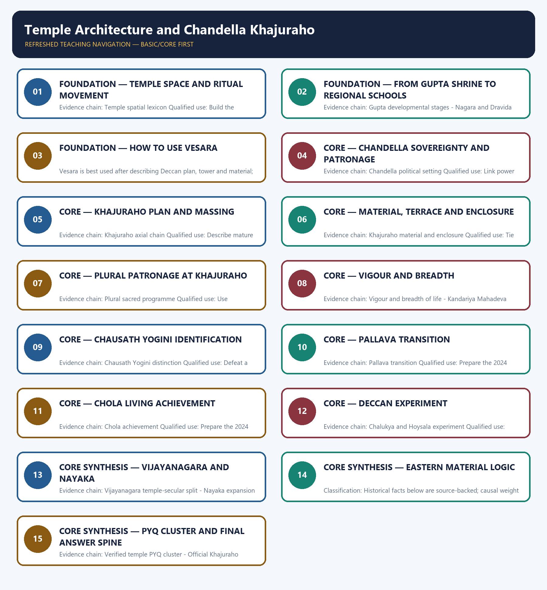

# Temple Architecture and Chandella Khajuraho — Learner-v2 Complete Learning Session

> **Authoring-only generation:** 2026-09-01. No PDF was rendered and no tracker or index was mutated.

### SOURCE, PROGRESSION AND CURRENT-LINKAGE AUDIT

- **Generation date:** 2026-09-01.
- **Repository-first evidence:** the Basic owner is taught first and preserved in full; the Advanced owner is retained only in the optional final teaching block.
- **OCR evidence:** Repository Markdown was primary. The available OCR-searchable Nitin Singhania Indian Art and Culture PDF was retained as a supplementary source; no unsupported page precision, quotation or dynamic status was imported from it.
- **Qdrant:** not used; repository Markdown and available OCR context were sufficient.
- **PYQ integrity:** Verified owned Mains routes are the 2024 Pallava and Chola demands, the 2025 Chandella demand, and the routed 2022 demand on medieval temple sculpture as social evidence. The 2026 objective route remains provisionally keyed and is not solved.
- **Live-link boundary:** UNESCO's official Khajuraho Group of Monuments page was fetched on 2026-09-01. It corroborates the axial Nagara plan, clustered spires, integrated sacred-secular sculpture and ASI management. No unsupported visitor or conservation figure is added.
- **Fact/inference discipline:** no current-affairs item, PYQ wording, figure or quotation is invented.

## BASIC LEARNING SESSION



*Distinct embedded teaching-navigation image. The separate continuous Cārvāka-style flowchart package remains an independent at-a-glance artifact.*

### SESSION 1 — FOUNDATION — TEMPLE SPACE AND RITUAL MOVEMENT

#### DEFINITION / WHAT THIS IS CALLED

**Plain-language definition:** Precise definition: Temple space and ritual movement is the source-bounded relationship among and Temple spatial lexicon within Temple Architecture and Chandella Khajuraho.

**Technical definition:** Evidence chain: Temple spatial lexicon Qualified use: Build the common lexicon.

#### ANSWER-GRABBING OPENING — WRITE/ADAPT IN THE EXAM

> Precise definition: Temple space and ritual movement is the source-bounded relationship among and Temple spatial lexicon within Temple Architecture and Chandella Khajuraho.

#### MUST-WRITE KEYWORDS

- **FOUNDATION**
- **Temple space**
- **ritual movement**
- **Precise definition**
- **Evidence chain**
- **Qualified use**

**How to use them:** Frame the answer through FOUNDATION; define Temple space, connect ritual movement with Precise definition to explain the mechanism, and use Evidence chain for the decisive comparison or qualification.

##### VISUAL FIRST

```text
TEMPLE SPACE AND RITUAL MOVEMENT
01. Temple spatial lexicon
BOUNDARY -> Vocabulary must describe a sequence of access.
```

*This topic-specific rail fixes the evidence sequence and its exam boundary before analysis.*

##### CONCEPT DEFINITIONS

- **Precise definition:** Temple space and ritual movement is the source-bounded relationship among  and Temple spatial lexicon within Temple Architecture and Chandella Khajuraho.
- **Classification:** Historical facts below are source-backed; causal weight and evaluative verdicts are analytical synthesis.

##### CORE EXPLANATION

Garbhagriha, mandapa, antarala, ardhamandapa, pradakshina patha, vahana and platform describe a ritual sequence rather than decorative labels.

##### NAMED EVIDENCE AND MECHANISM

- Garbhagriha, mandapa, antarala, ardhamandapa, pradakshina patha, vahana and platform describe a ritual sequence rather than decorative labels.

##### EXAMINER CAUTION

- Vocabulary must describe a sequence of access.

##### EXAM LINK

- **Prelims:** Retain the exact actor, date, document and category in Temple space and ritual movement.
- **Mains:** Build the common lexicon.

##### MINI RECAP

- **Evidence chain:** Temple spatial lexicon
- **Qualified use:** Build the common lexicon.

#### CLOSING RECALL FLOW — FOUNDATION — TEMPLE SPACE AND RITUAL MOVEMENT

```text
START / CONCEPT: FOUNDATION — Temple space and ritual movement
        |
        v
EXACT TERMS: FOUNDATION · Temple space · ritual movement · Precise definition · Evidence chain · Qualified use
        |
        v
MECHANISM / ARGUMENT: Evidence chain: Temple spatial lexicon Qualified use: Build the common lexicon.
        |
        v
CONSEQUENCE / CONTRAST: Classification: Historical facts below are source-backed; causal weight and evaluative verdicts are analytical synthesis.
        |
        v
UPSC TRAP / ANSWER-USE: Do not miss this limiting distinction: vocabulary must describe a sequence of access.
        |
        v
ANSWER-GRABBING FORMULATION: Precise definition: Temple space and ritual movement is the source-bounded relationship among and Temple spatial lexicon within Temple Architecture and Chandella Khajuraho.
```
### SESSION 2 — FOUNDATION — FROM GUPTA SHRINE TO REGIONAL SCHOOLS

#### DEFINITION / WHAT THIS IS CALLED

**Plain-language definition:** Precise definition: From Gupta shrine to regional schools is the source-bounded relationship among Gupta developmental stages and Nagara and Dravida within Temple Architecture and Chandella Khajuraho.

**Technical definition:** Evidence chain: Gupta developmental stages - Nagara and Dravida Qualified use: Explain the structural branching.

#### ANSWER-GRABBING OPENING — WRITE/ADAPT IN THE EXAM

> Precise definition: From Gupta shrine to regional schools is the source-bounded relationship among Gupta developmental stages and Nagara and Dravida within Temple Architecture and Chandella Khajuraho.

#### MUST-WRITE KEYWORDS

- **FOUNDATION**
- **From Gupta shrine to regional schools**
- **Precise definition**
- **Evidence chain**
- **Qualified use**
- **Precise definition: From Gupta shrine to regional schools**

**How to use them:** Frame the answer through FOUNDATION; define From Gupta shrine to regional schools, connect Precise definition with Evidence chain to explain the mechanism, and use Qualified use for the decisive comparison or qualification.

##### VISUAL FIRST

```text
FROM GUPTA SHRINE TO REGIONAL SCHOOLS
01. Gupta developmental stages
    |
    v
02. Nagara and Dravida
BOUNDARY -> Development was not one straight national line.
```

*This topic-specific rail fixes the evidence sequence and its exam boundary before analysis.*

##### CONCEPT DEFINITIONS

- **Precise definition:** From Gupta shrine to regional schools is the source-bounded relationship among Gupta developmental stages and Nagara and Dravida within Temple Architecture and Chandella Khajuraho.
- **Classification:** Historical facts below are source-backed; causal weight and evaluative verdicts are analytical synthesis.

##### CORE EXPLANATION

Early structural temples moved from flat-roofed square shrines through raised and circumambulatory plans toward shikhara, panchayatana and varied ground plans. Nagara commonly emphasises a curvilinear sanctum shikhara; Dravida organises a walled axial complex with a tiered vimana and increasingly prominent gopuram.

##### NAMED EVIDENCE AND MECHANISM

- Early structural temples moved from flat-roofed square shrines through raised and circumambulatory plans toward shikhara, panchayatana and varied ground plans.
- Nagara commonly emphasises a curvilinear sanctum shikhara; Dravida organises a walled axial complex with a tiered vimana and increasingly prominent gopuram.

##### EXAMINER CAUTION

- Development was not one straight national line.

##### EXAM LINK

- **Prelims:** Retain the exact actor, date, document and category in From Gupta shrine to regional schools.
- **Mains:** Explain the structural branching.

##### MINI RECAP

- **Evidence chain:** Gupta developmental stages -> Nagara and Dravida
- **Qualified use:** Explain the structural branching.

#### CLOSING RECALL FLOW — FOUNDATION — FROM GUPTA SHRINE TO REGIONAL SCHOOLS

```text
START / CONCEPT: FOUNDATION — From Gupta shrine to regional schools
        |
        v
EXACT TERMS: FOUNDATION · From Gupta shrine to regional schools · Precise definition · Evidence chain · Qualified use · Precise definition: From Gupta shrine to regional schools
        |
        v
MECHANISM / ARGUMENT: Evidence chain: Gupta developmental stages - Nagara and Dravida Qualified use: Explain the structural branching.
        |
        v
CONSEQUENCE / CONTRAST: Development was not one straight national line.
        |
        v
UPSC TRAP / ANSWER-USE: Do not miss this limiting distinction: causal weight and evaluative verdicts are analytical synthesis.
        |
        v
ANSWER-GRABBING FORMULATION: Precise definition: From Gupta shrine to regional schools is the source-bounded relationship among Gupta developmental stages and Nagara and Dravida within Temple Architecture and Chandella Khajuraho.
```
### SESSION 3 — FOUNDATION — HOW TO USE VESARA

#### DEFINITION / WHAT THIS IS CALLED

**Plain-language definition:** Precise definition: How to use Vesara is the source-bounded relationship among and Vesara caution within Temple Architecture and Chandella Khajuraho.

**Technical definition:** Vesara is best used after describing Deccan plan, tower and material; it is not a mechanically equal mixture of Nagara and Dravida.

#### ANSWER-GRABBING OPENING — WRITE/ADAPT IN THE EXAM

> Precise definition: How to use Vesara is the source-bounded relationship among and Vesara caution within Temple Architecture and Chandella Khajuraho.

#### MUST-WRITE KEYWORDS

- **FOUNDATION**
- **How to use Vesara**
- **Precise definition**
- **Evidence chain**
- **Qualified use**
- **Precise**

**How to use them:** Frame the answer through FOUNDATION; define How to use Vesara, connect Precise definition with Evidence chain to explain the mechanism, and use Qualified use for the decisive comparison or qualification.

##### VISUAL FIRST

```text
HOW TO USE VESARA
01. Vesara caution
BOUNDARY -> Describe form before applying the label.
```

*This topic-specific rail fixes the evidence sequence and its exam boundary before analysis.*

##### CONCEPT DEFINITIONS

- **Precise definition:** How to use Vesara is the source-bounded relationship among  and Vesara caution within Temple Architecture and Chandella Khajuraho.
- **Classification:** Historical facts below are source-backed; causal weight and evaluative verdicts are analytical synthesis.

##### CORE EXPLANATION

Vesara is best used after describing Deccan plan, tower and material; it is not a mechanically equal mixture of Nagara and Dravida.

##### NAMED EVIDENCE AND MECHANISM

- Vesara is best used after describing Deccan plan, tower and material; it is not a mechanically equal mixture of Nagara and Dravida.

##### EXAMINER CAUTION

- Describe form before applying the label.

##### EXAM LINK

- **Prelims:** Retain the exact actor, date, document and category in How to use Vesara.
- **Mains:** Avoid the mechanical-hybrid trap.

##### MINI RECAP

- **Evidence chain:** Vesara caution
- **Qualified use:** Avoid the mechanical-hybrid trap.

#### CLOSING RECALL FLOW — FOUNDATION — HOW TO USE VESARA

```text
START / CONCEPT: FOUNDATION — How to use Vesara
        |
        v
EXACT TERMS: FOUNDATION · How to use Vesara · Precise definition · Evidence chain · Qualified use · Precise
        |
        v
MECHANISM / ARGUMENT: Evidence chain: Vesara caution Qualified use: Avoid the mechanical-hybrid trap.
        |
        v
CONSEQUENCE / CONTRAST: Vesara is best used after describing Deccan plan, tower and material; it is not a mechanically equal mixture of Nagara and Dravida.
        |
        v
UPSC TRAP / ANSWER-USE: Do not miss this limiting distinction: retain the exact actor, date, document and category in How to use Vesara.
        |
        v
ANSWER-GRABBING FORMULATION: Precise definition: How to use Vesara is the source-bounded relationship among and Vesara caution within Temple Architecture and Chandella Khajuraho.
```
### SESSION 4 — CORE — CHANDELLA SOVEREIGNTY AND PATRONAGE

#### DEFINITION / WHAT THIS IS CALLED

**Plain-language definition:** Precise definition: Chandella sovereignty and patronage is the source-bounded relationship among and Chandella political setting within Temple Architecture and Chandella Khajuraho.

**Technical definition:** Evidence chain: Chandella political setting Qualified use: Link power to temple building.

#### ANSWER-GRABBING OPENING — WRITE/ADAPT IN THE EXAM

> Precise definition: Chandella sovereignty and patronage is the source-bounded relationship among and Chandella political setting within Temple Architecture and Chandella Khajuraho.

#### MUST-WRITE KEYWORDS

- **Chandella sovereignty**
- **patronage**
- **Precise definition**
- **Evidence chain**
- **Qualified use**
- **Precise definition: Chandella sovereignty and patronage**

**How to use them:** Frame the answer through Chandella sovereignty; define patronage, connect Precise definition with Evidence chain to explain the mechanism, and use Qualified use for the decisive comparison or qualification.

##### VISUAL FIRST

```text
CHANDELLA SOVEREIGNTY AND PATRONAGE
01. Chandella political setting
BOUNDARY -> Political context explains confidence, not a one-to-one victory monument.
```

*This topic-specific rail fixes the evidence sequence and its exam boundary before analysis.*

##### CONCEPT DEFINITIONS

- **Precise definition:** Chandella sovereignty and patronage is the source-bounded relationship among  and Chandella political setting within Temple Architecture and Chandella Khajuraho.
- **Classification:** Historical facts below are source-backed; causal weight and evaluative verdicts are analytical synthesis.

##### CORE EXPLANATION

Jejabhukti's Chandellas used temple patronage during political self-assertion, with Dhanga's maharajadhiraja title providing the key sovereignty context.

##### NAMED EVIDENCE AND MECHANISM

- Jejabhukti's Chandellas used temple patronage during political self-assertion, with Dhanga's maharajadhiraja title providing the key sovereignty context.

##### EXAMINER CAUTION

- Political context explains confidence, not a one-to-one victory monument.

##### EXAM LINK

- **Prelims:** Retain the exact actor, date, document and category in Chandella sovereignty and patronage.
- **Mains:** Link power to temple building.

##### MINI RECAP

- **Evidence chain:** Chandella political setting
- **Qualified use:** Link power to temple building.

#### CLOSING RECALL FLOW — CORE — CHANDELLA SOVEREIGNTY AND PATRONAGE

```text
START / CONCEPT: CORE — Chandella sovereignty and patronage
        |
        v
EXACT TERMS: Chandella sovereignty · patronage · Precise definition · Evidence chain · Qualified use · Precise definition: Chandella sovereignty and patronage
        |
        v
MECHANISM / ARGUMENT: Evidence chain: Chandella political setting Qualified use: Link power to temple building.
        |
        v
CONSEQUENCE / CONTRAST: Political context explains confidence, not a one-to-one victory monument.
        |
        v
UPSC TRAP / ANSWER-USE: Do not miss this limiting distinction: causal weight and evaluative verdicts are analytical synthesis.
        |
        v
ANSWER-GRABBING FORMULATION: Precise definition: Chandella sovereignty and patronage is the source-bounded relationship among and Chandella political setting within Temple Architecture and Chandella Khajuraho.
```
### SESSION 5 — CORE — KHAJURAHO PLAN AND MASSING

#### DEFINITION / WHAT THIS IS CALLED

**Plain-language definition:** Precise definition: Khajuraho plan and massing is the source-bounded relationship among and Khajuraho axial chain within Temple Architecture and Chandella Khajuraho.

**Technical definition:** Evidence chain: Khajuraho axial chain Qualified use: Describe mature Nagara morphology.

#### ANSWER-GRABBING OPENING — WRITE/ADAPT IN THE EXAM

> Precise definition: Khajuraho plan and massing is the source-bounded relationship among and Khajuraho axial chain within Temple Architecture and Chandella Khajuraho.

#### MUST-WRITE KEYWORDS

- **Khajuraho plan**
- **massing**
- **Precise definition**
- **Evidence chain**
- **Qualified use**
- **Precise definition: Khajuraho plan and massing**

**How to use them:** Frame the answer through Khajuraho plan; define massing, connect Precise definition with Evidence chain to explain the mechanism, and use Qualified use for the decisive comparison or qualification.

##### VISUAL FIRST

```text
KHAJURAHO PLAN AND MASSING
01. Khajuraho axial chain
BOUNDARY -> Keep shikhara, urushringa and axial spaces distinct.
```

*This topic-specific rail fixes the evidence sequence and its exam boundary before analysis.*

##### CONCEPT DEFINITIONS

- **Precise definition:** Khajuraho plan and massing is the source-bounded relationship among  and Khajuraho axial chain within Temple Architecture and Chandella Khajuraho.
- **Classification:** Historical facts below are source-backed; causal weight and evaluative verdicts are analytical synthesis.

##### CORE EXPLANATION

A high jagati supports ardhamandapa, mandapa, antarala and garbhagriha beneath a clustered shikhara of urushringas.

##### NAMED EVIDENCE AND MECHANISM

- A high jagati supports ardhamandapa, mandapa, antarala and garbhagriha beneath a clustered shikhara of urushringas.

##### EXAMINER CAUTION

- Keep shikhara, urushringa and axial spaces distinct.

##### EXAM LINK

- **Prelims:** Retain the exact actor, date, document and category in Khajuraho plan and massing.
- **Mains:** Describe mature Nagara morphology.

##### MINI RECAP

- **Evidence chain:** Khajuraho axial chain
- **Qualified use:** Describe mature Nagara morphology.

#### CLOSING RECALL FLOW — CORE — KHAJURAHO PLAN AND MASSING

```text
START / CONCEPT: CORE — Khajuraho plan and massing
        |
        v
EXACT TERMS: Khajuraho plan · massing · Precise definition · Evidence chain · Qualified use · Precise definition: Khajuraho plan and massing
        |
        v
MECHANISM / ARGUMENT: Evidence chain: Khajuraho axial chain Qualified use: Describe mature Nagara morphology.
        |
        v
CONSEQUENCE / CONTRAST: Classification: Historical facts below are source-backed; causal weight and evaluative verdicts are analytical synthesis.
        |
        v
UPSC TRAP / ANSWER-USE: Do not miss this limiting distinction: khajuraho plan and massing is the source-bounded relationship among and Khajuraho axial chain within...
        |
        v
ANSWER-GRABBING FORMULATION: Precise definition: Khajuraho plan and massing is the source-bounded relationship among and Khajuraho axial chain within Temple Architecture and Chandella Khajuraho.
```
### SESSION 6 — CORE — MATERIAL, TERRACE AND ENCLOSURE

#### DEFINITION / WHAT THIS IS CALLED

**Plain-language definition:** Precise definition: Material, terrace and enclosure is the source-bounded relationship among and Khajuraho material and enclosure within Temple Architecture and Chandella Khajuraho.

**Technical definition:** Evidence chain: Khajuraho material and enclosure Qualified use: Tie material to carving and viewing.

#### ANSWER-GRABBING OPENING — WRITE/ADAPT IN THE EXAM

> Precise definition: Material, terrace and enclosure is the source-bounded relationship among and Khajuraho material and enclosure within Temple Architecture and Chandella Khajuraho.

#### MUST-WRITE KEYWORDS

- **Material**
- **terrace**
- **enclosure**
- **Precise definition**
- **Evidence chain**
- **Qualified use**

**How to use them:** Frame the answer through Material; define terrace, connect enclosure with Precise definition to explain the mechanism, and use Evidence chain for the decisive comparison or qualification.

##### VISUAL FIRST

```text
MATERIAL, TERRACE AND ENCLOSURE
01. Khajuraho material and enclosure
BOUNDARY -> Sandstone dominates but granite exceptions matter.
```

*This topic-specific rail fixes the evidence sequence and its exam boundary before analysis.*

##### CONCEPT DEFINITIONS

- **Precise definition:** Material, terrace and enclosure is the source-bounded relationship among  and Khajuraho material and enclosure within Temple Architecture and Chandella Khajuraho.
- **Classification:** Historical facts below are source-backed; causal weight and evaluative verdicts are analytical synthesis.

##### CORE EXPLANATION

Most temples use fine-grained sandstone on open terraces without an enclosure wall, while granite exceptions prevent a uniform-material claim.

##### NAMED EVIDENCE AND MECHANISM

- Most temples use fine-grained sandstone on open terraces without an enclosure wall, while granite exceptions prevent a uniform-material claim.

##### EXAMINER CAUTION

- Sandstone dominates but granite exceptions matter.

##### EXAM LINK

- **Prelims:** Retain the exact actor, date, document and category in Material, terrace and enclosure.
- **Mains:** Tie material to carving and viewing.

##### MINI RECAP

- **Evidence chain:** Khajuraho material and enclosure
- **Qualified use:** Tie material to carving and viewing.

#### CLOSING RECALL FLOW — CORE — MATERIAL, TERRACE AND ENCLOSURE

```text
START / CONCEPT: CORE — Material, terrace and enclosure
        |
        v
EXACT TERMS: Material · terrace · enclosure · Precise definition · Evidence chain · Qualified use
        |
        v
MECHANISM / ARGUMENT: Evidence chain: Khajuraho material and enclosure Qualified use: Tie material to carving and viewing.
        |
        v
CONSEQUENCE / CONTRAST: Most temples use fine-grained sandstone on open terraces without an enclosure wall, while granite exceptions prevent a uniform-material claim.
        |
        v
UPSC TRAP / ANSWER-USE: Do not miss this limiting distinction: causal weight and evaluative verdicts are analytical synthesis.
        |
        v
ANSWER-GRABBING FORMULATION: Precise definition: Material, terrace and enclosure is the source-bounded relationship among and Khajuraho material and enclosure within Temple Architecture and Chandella Khajuraho.
```
### SESSION 7 — CORE — PLURAL PATRONAGE AT KHAJURAHO

#### DEFINITION / WHAT THIS IS CALLED

**Plain-language definition:** Precise definition: Plural patronage at Khajuraho is the source-bounded relationship among and Plural sacred programme within Temple Architecture and Chandella Khajuraho.

**Technical definition:** Evidence chain: Plural sacred programme Qualified use: Use dedication breadth analytically.

#### ANSWER-GRABBING OPENING — WRITE/ADAPT IN THE EXAM

> Precise definition: Plural patronage at Khajuraho is the source-bounded relationship among and Plural sacred programme within Temple Architecture and Chandella Khajuraho.

#### MUST-WRITE KEYWORDS

- **Plural patronage at Khajuraho**
- **Precise definition**
- **Evidence chain**
- **Qualified use**
- **Precise definition: Plural patronage at Khajuraho**
- **Precise**

**How to use them:** Frame the answer through Plural patronage at Khajuraho; define Precise definition, connect Evidence chain with Qualified use to explain the mechanism, and use Precise definition: Plural patronage at Khajuraho for the decisive comparison or qualification.

##### VISUAL FIRST

```text
PLURAL PATRONAGE AT KHAJURAHO
01. Plural sacred programme
BOUNDARY -> Shared idiom does not erase sectarian programmes.
```

*This topic-specific rail fixes the evidence sequence and its exam boundary before analysis.*

##### CONCEPT DEFINITIONS

- **Precise definition:** Plural patronage at Khajuraho is the source-bounded relationship among  and Plural sacred programme within Temple Architecture and Chandella Khajuraho.
- **Classification:** Historical facts below are source-backed; causal weight and evaluative verdicts are analytical synthesis.

##### CORE EXPLANATION

Shaiva, Vaishnava, Surya, Ganesha and Jain dedications share the Khajuraho landscape and regional architectural idiom.

##### NAMED EVIDENCE AND MECHANISM

- Shaiva, Vaishnava, Surya, Ganesha and Jain dedications share the Khajuraho landscape and regional architectural idiom.

##### EXAMINER CAUTION

- Shared idiom does not erase sectarian programmes.

##### EXAM LINK

- **Prelims:** Retain the exact actor, date, document and category in Plural patronage at Khajuraho.
- **Mains:** Use dedication breadth analytically.

##### MINI RECAP

- **Evidence chain:** Plural sacred programme
- **Qualified use:** Use dedication breadth analytically.

#### CLOSING RECALL FLOW — CORE — PLURAL PATRONAGE AT KHAJURAHO

```text
START / CONCEPT: CORE — Plural patronage at Khajuraho
        |
        v
EXACT TERMS: Plural patronage at Khajuraho · Precise definition · Evidence chain · Qualified use · Precise definition: Plural patronage at Khajuraho · Precise
        |
        v
MECHANISM / ARGUMENT: Evidence chain: Plural sacred programme Qualified use: Use dedication breadth analytically.
        |
        v
CONSEQUENCE / CONTRAST: Shared idiom does not erase sectarian programmes.
        |
        v
UPSC TRAP / ANSWER-USE: Do not miss this limiting distinction: causal weight and evaluative verdicts are analytical synthesis.
        |
        v
ANSWER-GRABBING FORMULATION: Precise definition: Plural patronage at Khajuraho is the source-bounded relationship among and Plural sacred programme within Temple Architecture and Chandella Khajuraho.
```
### SESSION 8 — CORE — VIGOUR AND BREADTH

#### DEFINITION / WHAT THIS IS CALLED

**Plain-language definition:** Precise definition: Vigour and breadth is the source-bounded relationship among Vigour and breadth of life and Kandariya Mahadeva within Temple Architecture and Chandella Khajuraho.

**Technical definition:** Evidence chain: Vigour and breadth of life - Kandariya Mahadeva Qualified use: Answer the 2025 demand.

#### ANSWER-GRABBING OPENING — WRITE/ADAPT IN THE EXAM

> Precise definition: Vigour and breadth is the source-bounded relationship among Vigour and breadth of life and Kandariya Mahadeva within Temple Architecture and Chandella Khajuraho.

#### MUST-WRITE KEYWORDS

- **Vigour**
- **breadth**
- **Precise definition**
- **Evidence chain**
- **Qualified use**
- **Precise definition: Vigour and breadth**

**How to use them:** Frame the answer through Vigour; define breadth, connect Precise definition with Evidence chain to explain the mechanism, and use Qualified use for the decisive comparison or qualification.

##### VISUAL FIRST

```text
VIGOUR AND BREADTH
01. Vigour and breadth of life
    |
    v
02. Kandariya Mahadeva
BOUNDARY -> Maithuna is one register, not the definition.
```

*This topic-specific rail fixes the evidence sequence and its exam boundary before analysis.*

##### CONCEPT DEFINITIONS

- **Precise definition:** Vigour and breadth is the source-bounded relationship among Vigour and breadth of life and Kandariya Mahadeva within Temple Architecture and Chandella Khajuraho.
- **Classification:** Historical facts below are source-backed; causal weight and evaluative verdicts are analytical synthesis.

##### CORE EXPLANATION

Dynamic figures and deep carving create vigour, while deities, worshippers, teachers, dancers, musicians, courtly scenes, vyalas and maithuna create breadth. The largest and loftiest Khajuraho temple is the culminating case for mature Nagara massing and integrated sculpture.

##### NAMED EVIDENCE AND MECHANISM

- Dynamic figures and deep carving create vigour, while deities, worshippers, teachers, dancers, musicians, courtly scenes, vyalas and maithuna create breadth.
- The largest and loftiest Khajuraho temple is the culminating case for mature Nagara massing and integrated sculpture.

##### EXAMINER CAUTION

- Maithuna is one register, not the definition.

##### EXAM LINK

- **Prelims:** Retain the exact actor, date, document and category in Vigour and breadth.
- **Mains:** Answer the 2025 demand.

##### MINI RECAP

- **Evidence chain:** Vigour and breadth of life -> Kandariya Mahadeva
- **Qualified use:** Answer the 2025 demand.

#### CLOSING RECALL FLOW — CORE — VIGOUR AND BREADTH

```text
START / CONCEPT: CORE — Vigour and breadth
        |
        v
EXACT TERMS: Vigour · breadth · Precise definition · Evidence chain · Qualified use · Precise definition: Vigour and breadth
        |
        v
MECHANISM / ARGUMENT: Evidence chain: Vigour and breadth of life - Kandariya Mahadeva Qualified use: Answer the 2025 demand.
        |
        v
CONSEQUENCE / CONTRAST: Dynamic figures and deep carving create vigour, while deities, worshippers, teachers, dancers, musicians, courtly scenes, vyalas and maithuna create breadth.
        |
        v
UPSC TRAP / ANSWER-USE: Maithuna is one register, not the definition.
        |
        v
ANSWER-GRABBING FORMULATION: Precise definition: Vigour and breadth is the source-bounded relationship among Vigour and breadth of life and Kandariya Mahadeva within Temple Architecture and Chandella Khajuraho.
```
### SESSION 9 — CORE — CHAUSATH YOGINI IDENTIFICATION

#### DEFINITION / WHAT THIS IS CALLED

**Plain-language definition:** Precise definition: Chausath Yogini identification is the source-bounded relationship among and Chausath Yogini distinction within Temple Architecture and Chandella Khajuraho.

**Technical definition:** Evidence chain: Chausath Yogini distinction Qualified use: Defeat a high-risk objective trap.

#### ANSWER-GRABBING OPENING — WRITE/ADAPT IN THE EXAM

> Precise definition: Chausath Yogini identification is the source-bounded relationship among and Chausath Yogini distinction within Temple Architecture and Chandella Khajuraho.

#### MUST-WRITE KEYWORDS

- **Chausath Yogini identification**
- **Precise definition**
- **Evidence chain**
- **Qualified use**
- **Precise definition: Chausath Yogini identification**
- **Precise**

**How to use them:** Frame the answer through Chausath Yogini identification; define Precise definition, connect Evidence chain with Qualified use to explain the mechanism, and use Precise definition: Chausath Yogini identification for the decisive comparison or qualification.

##### VISUAL FIRST

```text
CHAUSATH YOGINI IDENTIFICATION
01. Chausath Yogini distinction
BOUNDARY -> Khajuraho and Mitaoli are different monuments.
```

*This topic-specific rail fixes the evidence sequence and its exam boundary before analysis.*

##### CONCEPT DEFINITIONS

- **Precise definition:** Chausath Yogini identification is the source-bounded relationship among  and Chausath Yogini distinction within Temple Architecture and Chandella Khajuraho.
- **Classification:** Historical facts below are source-backed; causal weight and evaluative verdicts are analytical synthesis.

##### CORE EXPLANATION

Khajuraho's early open-air granite Chausath Yogini enclosure must not be confused with the circular Kachchhapaghata-period Mitaoli temple near Morena.

##### NAMED EVIDENCE AND MECHANISM

- Khajuraho's early open-air granite Chausath Yogini enclosure must not be confused with the circular Kachchhapaghata-period Mitaoli temple near Morena.

##### EXAMINER CAUTION

- Khajuraho and Mitaoli are different monuments.

##### EXAM LINK

- **Prelims:** Retain the exact actor, date, document and category in Chausath Yogini identification.
- **Mains:** Defeat a high-risk objective trap.

##### MINI RECAP

- **Evidence chain:** Chausath Yogini distinction
- **Qualified use:** Defeat a high-risk objective trap.

#### CLOSING RECALL FLOW — CORE — CHAUSATH YOGINI IDENTIFICATION

```text
START / CONCEPT: CORE — Chausath Yogini identification
        |
        v
EXACT TERMS: Chausath Yogini identification · Precise definition · Evidence chain · Qualified use · Precise definition: Chausath Yogini identification · Precise
        |
        v
MECHANISM / ARGUMENT: Evidence chain: Chausath Yogini distinction Qualified use: Defeat a high-risk objective trap.
        |
        v
CONSEQUENCE / CONTRAST: Khajuraho's early open-air granite Chausath Yogini enclosure must not be confused with the circular Kachchhapaghata-period Mitaoli temple near Morena.
        |
        v
UPSC TRAP / ANSWER-USE: Do not miss this limiting distinction: causal weight and evaluative verdicts are analytical synthesis.
        |
        v
ANSWER-GRABBING FORMULATION: Precise definition: Chausath Yogini identification is the source-bounded relationship among and Chausath Yogini distinction within Temple Architecture and Chandella Khajuraho.
```
### SESSION 10 — CORE — PALLAVA TRANSITION

#### DEFINITION / WHAT THIS IS CALLED

**Plain-language definition:** Precise definition: Pallava transition is the source-bounded relationship among and Pallava transition within Temple Architecture and Chandella Khajuraho.

**Technical definition:** Evidence chain: Pallava transition Qualified use: Prepare the 2024 ten-marker.

#### ANSWER-GRABBING OPENING — WRITE/ADAPT IN THE EXAM

> Precise definition: Pallava transition is the source-bounded relationship among and Pallava transition within Temple Architecture and Chandella Khajuraho.

#### MUST-WRITE KEYWORDS

- **Pallava transition**
- **Precise definition**
- **Evidence chain**
- **Qualified use**
- **Precise definition: Pallava transition**
- **Precise**

**How to use them:** Frame the answer through Pallava transition; define Precise definition, connect Evidence chain with Qualified use to explain the mechanism, and use Precise definition: Pallava transition for the decisive comparison or qualification.

##### VISUAL FIRST

```text
PALLAVA TRANSITION
01. Pallava transition
BOUNDARY -> Estimate a trajectory, not a monument list.
```

*This topic-specific rail fixes the evidence sequence and its exam boundary before analysis.*

##### CONCEPT DEFINITIONS

- **Precise definition:** Pallava transition is the source-bounded relationship among  and Pallava transition within Temple Architecture and Chandella Khajuraho.
- **Classification:** Historical facts below are source-backed; causal weight and evaluative verdicts are analytical synthesis.

##### CORE EXPLANATION

Pallava patronage moved from rock-cut mandapas to monolithic rathas and structural temples, with Mahabalipuram and Kanchipuram linking architecture, painting and letters.

##### NAMED EVIDENCE AND MECHANISM

- Pallava patronage moved from rock-cut mandapas to monolithic rathas and structural temples, with Mahabalipuram and Kanchipuram linking architecture, painting and letters.

##### EXAMINER CAUTION

- Estimate a trajectory, not a monument list.

##### EXAM LINK

- **Prelims:** Retain the exact actor, date, document and category in Pallava transition.
- **Mains:** Prepare the 2024 ten-marker.

##### MINI RECAP

- **Evidence chain:** Pallava transition
- **Qualified use:** Prepare the 2024 ten-marker.

#### CLOSING RECALL FLOW — CORE — PALLAVA TRANSITION

```text
START / CONCEPT: CORE — Pallava transition
        |
        v
EXACT TERMS: Pallava transition · Precise definition · Evidence chain · Qualified use · Precise definition: Pallava transition · Precise
        |
        v
MECHANISM / ARGUMENT: Evidence chain: Pallava transition Qualified use: Prepare the 2024 ten-marker.
        |
        v
CONSEQUENCE / CONTRAST: Classification: Historical facts below are source-backed; causal weight and evaluative verdicts are analytical synthesis.
        |
        v
UPSC TRAP / ANSWER-USE: Do not miss this limiting distinction: pallava transition is the source-bounded relationship among and Pallava transition within Temple Architecture and...
        |
        v
ANSWER-GRABBING FORMULATION: Precise definition: Pallava transition is the source-bounded relationship among and Pallava transition within Temple Architecture and Chandella Khajuraho.
```
### SESSION 11 — CORE — CHOLA LIVING ACHIEVEMENT

#### DEFINITION / WHAT THIS IS CALLED

**Plain-language definition:** Precise definition: Chola living achievement is the source-bounded relationship among and Chola achievement within Temple Architecture and Chandella Khajuraho.

**Technical definition:** Evidence chain: Chola achievement Qualified use: Prepare the 2024 fifteen-marker.

#### ANSWER-GRABBING OPENING — WRITE/ADAPT IN THE EXAM

> Precise definition: Chola living achievement is the source-bounded relationship among and Chola achievement within Temple Architecture and Chandella Khajuraho.

#### MUST-WRITE KEYWORDS

- **Chola living achievement**
- **Precise definition**
- **Evidence chain**
- **Qualified use**
- **Precise definition: Chola living achievement**
- **Precise**

**How to use them:** Frame the answer through Chola living achievement; define Precise definition, connect Evidence chain with Qualified use to explain the mechanism, and use Precise definition: Chola living achievement for the decisive comparison or qualification.

##### VISUAL FIRST

```text
CHOLA LIVING ACHIEVEMENT
01. Chola achievement
BOUNDARY -> Balance monumentality with administration and living use.
```

*This topic-specific rail fixes the evidence sequence and its exam boundary before analysis.*

##### CONCEPT DEFINITIONS

- **Precise definition:** Chola living achievement is the source-bounded relationship among  and Chola achievement within Temple Architecture and Chandella Khajuraho.
- **Classification:** Historical facts below are source-backed; causal weight and evaluative verdicts are analytical synthesis.

##### CORE EXPLANATION

Chola legacy combines monumental granite temples, bronze icons, murals, inscriptions and living ritual, with Brihadishvara as the architectural climax.

##### NAMED EVIDENCE AND MECHANISM

- Chola legacy combines monumental granite temples, bronze icons, murals, inscriptions and living ritual, with Brihadishvara as the architectural climax.

##### EXAMINER CAUTION

- Balance monumentality with administration and living use.

##### EXAM LINK

- **Prelims:** Retain the exact actor, date, document and category in Chola living achievement.
- **Mains:** Prepare the 2024 fifteen-marker.

##### MINI RECAP

- **Evidence chain:** Chola achievement
- **Qualified use:** Prepare the 2024 fifteen-marker.

#### CLOSING RECALL FLOW — CORE — CHOLA LIVING ACHIEVEMENT

```text
START / CONCEPT: CORE — Chola living achievement
        |
        v
EXACT TERMS: Chola living achievement · Precise definition · Evidence chain · Qualified use · Precise definition: Chola living achievement · Precise
        |
        v
MECHANISM / ARGUMENT: Evidence chain: Chola achievement Qualified use: Prepare the 2024 fifteen-marker.
        |
        v
CONSEQUENCE / CONTRAST: Balance monumentality with administration and living use.
        |
        v
UPSC TRAP / ANSWER-USE: Do not miss this limiting distinction: causal weight and evaluative verdicts are analytical synthesis.
        |
        v
ANSWER-GRABBING FORMULATION: Precise definition: Chola living achievement is the source-bounded relationship among and Chola achievement within Temple Architecture and Chandella Khajuraho.
```
### SESSION 12 — CORE — DECCAN EXPERIMENT

#### DEFINITION / WHAT THIS IS CALLED

**Plain-language definition:** Precise definition: Deccan experiment is the source-bounded relationship among and Chalukya and Hoysala experiment within Temple Architecture and Chandella Khajuraho.

**Technical definition:** Evidence chain: Chalukya and Hoysala experiment Qualified use: Compare plan, tower and material.

#### ANSWER-GRABBING OPENING — WRITE/ADAPT IN THE EXAM

> Precise definition: Deccan experiment is the source-bounded relationship among and Chalukya and Hoysala experiment within Temple Architecture and Chandella Khajuraho.

#### MUST-WRITE KEYWORDS

- **Deccan experiment**
- **Precise definition**
- **Evidence chain**
- **Qualified use**
- **Precise definition: Deccan experiment**
- **Precise**

**How to use them:** Frame the answer through Deccan experiment; define Precise definition, connect Evidence chain with Qualified use to explain the mechanism, and use Precise definition: Deccan experiment for the decisive comparison or qualification.

##### VISUAL FIRST

```text
DECCAN EXPERIMENT
01. Chalukya and Hoysala experiment
BOUNDARY -> Pattadakal and Hoysala evidence must precede Vesara.
```

*This topic-specific rail fixes the evidence sequence and its exam boundary before analysis.*

##### CONCEPT DEFINITIONS

- **Precise definition:** Deccan experiment is the source-bounded relationship among  and Chalukya and Hoysala experiment within Temple Architecture and Chandella Khajuraho.
- **Classification:** Historical facts below are source-backed; causal weight and evaluative verdicts are analytical synthesis.

##### CORE EXPLANATION

Aihole-Badami-Pattadakal and Hoysala stellate soapstone temples demonstrate Deccan selection from northern and southern grammars.

##### NAMED EVIDENCE AND MECHANISM

- Aihole-Badami-Pattadakal and Hoysala stellate soapstone temples demonstrate Deccan selection from northern and southern grammars.

##### EXAMINER CAUTION

- Pattadakal and Hoysala evidence must precede Vesara.

##### EXAM LINK

- **Prelims:** Retain the exact actor, date, document and category in Deccan experiment.
- **Mains:** Compare plan, tower and material.

##### MINI RECAP

- **Evidence chain:** Chalukya and Hoysala experiment
- **Qualified use:** Compare plan, tower and material.

#### CLOSING RECALL FLOW — CORE — DECCAN EXPERIMENT

```text
START / CONCEPT: CORE — Deccan experiment
        |
        v
EXACT TERMS: Deccan experiment · Precise definition · Evidence chain · Qualified use · Precise definition: Deccan experiment · Precise
        |
        v
MECHANISM / ARGUMENT: Evidence chain: Chalukya and Hoysala experiment Qualified use: Compare plan, tower and material.
        |
        v
CONSEQUENCE / CONTRAST: Aihole-Badami-Pattadakal and Hoysala stellate soapstone temples demonstrate Deccan selection from northern and southern grammars.
        |
        v
UPSC TRAP / ANSWER-USE: Do not miss this limiting distinction: causal weight and evaluative verdicts are analytical synthesis.
        |
        v
ANSWER-GRABBING FORMULATION: Precise definition: Deccan experiment is the source-bounded relationship among and Chalukya and Hoysala experiment within Temple Architecture and Chandella Khajuraho.
```
### SESSION 13 — CORE SYNTHESIS — VIJAYANAGARA AND NAYAKA

#### DEFINITION / WHAT THIS IS CALLED

**Plain-language definition:** Precise definition: Vijayanagara and Nayaka is the source-bounded relationship among Vijayanagara temple-secular split and Nayaka expansion within Temple Architecture and Chandella Khajuraho.

**Technical definition:** Evidence chain: Vijayanagara temple-secular split - Nayaka expansion Qualified use: Trace the late Dravida trajectory.

#### ANSWER-GRABBING OPENING — WRITE/ADAPT IN THE EXAM

> Precise definition: Vijayanagara and Nayaka is the source-bounded relationship among Vijayanagara temple-secular split and Nayaka expansion within Temple Architecture and Chandella Khajuraho.

#### MUST-WRITE KEYWORDS

- **CORE SYNTHESIS**
- **Vijayanagara**
- **Nayaka**
- **Precise definition**
- **Evidence chain**
- **Qualified use**

**How to use them:** Frame the answer through CORE SYNTHESIS; define Vijayanagara, connect Nayaka with Precise definition to explain the mechanism, and use Evidence chain for the decisive comparison or qualification.

##### VISUAL FIRST

```text
VIJAYANAGARA AND NAYAKA
01. Vijayanagara temple-secular split
    |
    v
02. Nayaka expansion
BOUNDARY -> Keep temple and royal-secular zones distinct.
```

*This topic-specific rail fixes the evidence sequence and its exam boundary before analysis.*

##### CONCEPT DEFINITIONS

- **Precise definition:** Vijayanagara and Nayaka is the source-bounded relationship among Vijayanagara temple-secular split and Nayaka expansion within Temple Architecture and Chandella Khajuraho.
- **Classification:** Historical facts below are source-backed; causal weight and evaluative verdicts are analytical synthesis.

##### CORE EXPLANATION

Hampi's temples extend Dravida gopuram and mandapa forms, while Islamicate arches and domes are strongest in the royal and secular zone. Nayaka building enlarged older complexes through graded gopurams, prakarams, temple tanks, stucco superstructures and processional halls.

##### NAMED EVIDENCE AND MECHANISM

- Hampi's temples extend Dravida gopuram and mandapa forms, while Islamicate arches and domes are strongest in the royal and secular zone.
- Nayaka building enlarged older complexes through graded gopurams, prakarams, temple tanks, stucco superstructures and processional halls.

##### EXAMINER CAUTION

- Keep temple and royal-secular zones distinct.

##### EXAM LINK

- **Prelims:** Retain the exact actor, date, document and category in Vijayanagara and Nayaka.
- **Mains:** Trace the late Dravida trajectory.

##### MINI RECAP

- **Evidence chain:** Vijayanagara temple-secular split -> Nayaka expansion
- **Qualified use:** Trace the late Dravida trajectory.

#### CLOSING RECALL FLOW — CORE SYNTHESIS — VIJAYANAGARA AND NAYAKA

```text
START / CONCEPT: CORE SYNTHESIS — Vijayanagara and Nayaka
        |
        v
EXACT TERMS: CORE SYNTHESIS · Vijayanagara · Nayaka · Precise definition · Evidence chain · Qualified use
        |
        v
MECHANISM / ARGUMENT: Evidence chain: Vijayanagara temple-secular split - Nayaka expansion Qualified use: Trace the late Dravida trajectory.
        |
        v
CONSEQUENCE / CONTRAST: Hampi's temples extend Dravida gopuram and mandapa forms, while Islamicate arches and domes are strongest in the royal and secular zone.
        |
        v
UPSC TRAP / ANSWER-USE: Do not miss this limiting distinction: causal weight and evaluative verdicts are analytical synthesis.
        |
        v
ANSWER-GRABBING FORMULATION: Precise definition: Vijayanagara and Nayaka is the source-bounded relationship among Vijayanagara temple-secular split and Nayaka expansion within Temple Architecture and Chandella Khajuraho.
```
### SESSION 14 — CORE SYNTHESIS — EASTERN MATERIAL LOGIC

#### DEFINITION / WHAT THIS IS CALLED

**Plain-language definition:** Precise definition: Eastern material logic is the source-bounded relationship among and Pala-Sena eastern school within Temple Architecture and Chandella Khajuraho.

**Technical definition:** Classification: Historical facts below are source-backed; causal weight and evaluative verdicts are analytical synthesis.

#### ANSWER-GRABBING OPENING — WRITE/ADAPT IN THE EXAM

> Precise definition: Eastern material logic is the source-bounded relationship among and Pala-Sena eastern school within Temple Architecture and Chandella Khajuraho.

#### MUST-WRITE KEYWORDS

- **CORE SYNTHESIS**
- **Eastern material logic**
- **Precise definition**
- **Evidence chain**
- **Qualified use**
- **Precise definition: Eastern material logic**

**How to use them:** Frame the answer through CORE SYNTHESIS; define Eastern material logic, connect Precise definition with Evidence chain to explain the mechanism, and use Qualified use for the decisive comparison or qualification.

##### VISUAL FIRST

```text
EASTERN MATERIAL LOGIC
01. Pala-Sena eastern school
BOUNDARY -> Do not invent unsupported Kerala or Ahom vocabularies.
```

*This topic-specific rail fixes the evidence sequence and its exam boundary before analysis.*

##### CONCEPT DEFINITIONS

- **Precise definition:** Eastern material logic is the source-bounded relationship among  and Pala-Sena eastern school within Temple Architecture and Chandella Khajuraho.
- **Classification:** Historical facts below are source-backed; causal weight and evaluative verdicts are analytical synthesis.

##### CORE EXPLANATION

Bengal's brick and terracotta architecture joined Buddhist and Hindu patronage and translated the bamboo-hut roof into the Bangla roof later used by Mughals.

##### NAMED EVIDENCE AND MECHANISM

- Bengal's brick and terracotta architecture joined Buddhist and Hindu patronage and translated the bamboo-hut roof into the Bangla roof later used by Mughals.

##### EXAMINER CAUTION

- Do not invent unsupported Kerala or Ahom vocabularies.

##### EXAM LINK

- **Prelims:** Retain the exact actor, date, document and category in Eastern material logic.
- **Mains:** Add the Pala-Sena regional case.

##### MINI RECAP

- **Evidence chain:** Pala-Sena eastern school
- **Qualified use:** Add the Pala-Sena regional case.

#### CLOSING RECALL FLOW — CORE SYNTHESIS — EASTERN MATERIAL LOGIC

```text
START / CONCEPT: CORE SYNTHESIS — Eastern material logic
        |
        v
EXACT TERMS: CORE SYNTHESIS · Eastern material logic · Precise definition · Evidence chain · Qualified use · Precise definition: Eastern material logic
        |
        v
MECHANISM / ARGUMENT: Evidence chain: Pala-Sena eastern school Qualified use: Add the Pala-Sena regional case.
        |
        v
CONSEQUENCE / CONTRAST: Do not invent unsupported Kerala or Ahom vocabularies.
        |
        v
UPSC TRAP / ANSWER-USE: Do not miss this limiting distinction: causal weight and evaluative verdicts are analytical synthesis.
        |
        v
ANSWER-GRABBING FORMULATION: Precise definition: Eastern material logic is the source-bounded relationship among and Pala-Sena eastern school within Temple Architecture and Chandella Khajuraho.
```
### SESSION 15 — CORE SYNTHESIS — PYQ CLUSTER AND FINAL ANSWER SPINE

#### DEFINITION / WHAT THIS IS CALLED

**Plain-language definition:** Precise definition: PYQ cluster and final answer spine is the source-bounded relationship among Verified temple PYQ cluster, Official Khajuraho linkage and Temple answer spine within Temple Architecture and Chandella Khajuraho.

**Technical definition:** Evidence chain: Verified temple PYQ cluster - Official Khajuraho linkage - Temple answer spine Qualified use: Integrate all direct demand families.

#### ANSWER-GRABBING OPENING — WRITE/ADAPT IN THE EXAM

> Precise definition: PYQ cluster and final answer spine is the source-bounded relationship among Verified temple PYQ cluster, Official Khajuraho linkage and Temple answer spine within Temple Architecture and Chandella Khajuraho.

#### MUST-WRITE KEYWORDS

- **CORE SYNTHESIS**
- **PYQ cluster**
- **final answer spine**
- **Precise definition**
- **Evidence chain**
- **Qualified use**

**How to use them:** Frame the answer through CORE SYNTHESIS; define PYQ cluster, connect final answer spine with Precise definition to explain the mechanism, and use Evidence chain for the decisive comparison or qualification.

##### VISUAL FIRST

```text
PYQ CLUSTER AND FINAL ANSWER SPINE
01. Verified temple PYQ cluster
    |
    v
02. Official Khajuraho linkage
    |
    v
03. Temple answer spine
BOUNDARY -> Use official status as a close, not a substitute for analysis.
```

*This topic-specific rail fixes the evidence sequence and its exam boundary before analysis.*

##### CONCEPT DEFINITIONS

- **Precise definition:** PYQ cluster and final answer spine is the source-bounded relationship among Verified temple PYQ cluster, Official Khajuraho linkage and Temple answer spine within Temple Architecture and Chandella Khajuraho.
- **Classification:** Historical facts below are source-backed; causal weight and evaluative verdicts are analytical synthesis.

##### CORE EXPLANATION

The Core owner supports direct 2024 Pallava and Chola demands, the 2025 Chandella demand and the routed 2022 temple-sculpture social-life demand. UNESCO's official property page describes axial Nagara spaces, clustered spires and sacred-secular sculptural themes under ASI management. A strong answer names school, morphology, patron, monument, sculptural programme, comparison, evidence limit and heritage status in that order.

##### NAMED EVIDENCE AND MECHANISM

- The Core owner supports direct 2024 Pallava and Chola demands, the 2025 Chandella demand and the routed 2022 temple-sculpture social-life demand.
- UNESCO's official property page describes axial Nagara spaces, clustered spires and sacred-secular sculptural themes under ASI management.
- A strong answer names school, morphology, patron, monument, sculptural programme, comparison, evidence limit and heritage status in that order.

##### EXAMINER CAUTION

- Use official status as a close, not a substitute for analysis.

##### EXAM LINK

- **Prelims:** Retain the exact actor, date, document and category in PYQ cluster and final answer spine.
- **Mains:** Integrate all direct demand families.

##### MINI RECAP

- **Evidence chain:** Verified temple PYQ cluster -> Official Khajuraho linkage -> Temple answer spine
- **Qualified use:** Integrate all direct demand families.

#### COMPLETE BASIC OWNER EVIDENCE BANK

> **Subject:** Indian Art & Culture | **Tier:** Must-Do (foundation) |
> **GS Paper:** GS-I.
> **Core area:** Temple lexicon (garbhagriha, mandapa, shikhara); Nagara,
> Dravida and Vesara styles; regional schools (Odisha, Solanki, Pallava,
> Chola, Chalukya, Hoysala, Vijayanagara, Nayaka); **Chandella/Chandela
> Khajuraho dossier**.
> **Grounded in:** Nitin Singhania, *Indian Art and Culture*, PDF pp. 69-124
> (Khajuraho pp. 79-82; South Indian schools pp. 84-121); `00_Master-
> Framework.md` Sections 3, 6; Satish Chandra, *History of Medieval India*,
> PDF pp. 43-46, 73-77; audited UPSC Mains 2024-2025 GS Paper I.
> ✅ = source-grounded | ⚠️ = analytical inference | 📰 = current anchor | ❌ = trap.
> *Companion: `advanced/03_Temple-Architecture-and-Chandella-Khajuraho.md`.*

#### 1. Snapshot and syllabus fit

✅ This topic carries the temple-architecture vocabulary tested across
nearly every Art & Culture question and holds **three of the four audited
direct PYQs** in this folder: the 2024 Pallava and Chola questions and the
2025 Chandella-sculpture question. ⚠️ It is the single most exam-critical
topic in this module; the Chandella/Khajuraho material below is mandatory
reading, not optional detail.

#### 2. Essential vocabulary

| Term | Exam-ready meaning |
|---|---|
| ✅ **Garbhagriha** | Sanctum sanctorum, literally "womb house" — small cubicle housing the principal deity (*Nitin…pdf*, PDF p. 72). |
| ✅ **Mandapa** | Entrance portico/hall for worshippers to gather (*Nitin…pdf*, PDF p. 72). |
| ✅ **Shikhara** | Mountain-like spire, pyramidal to curvilinear in shape (*Nitin…pdf*, PDF p. 72). |
| ✅ **Vahana** | The deity's vehicle/mount, placed before the sanctum (*Nitin…pdf*, PDF p. 72). |
| ✅ **Panchayatana style** | Principal shrine with four subsidiary shrines at the platform's corners, producing a five-shrine/quincunx arrangement; not every example preserves every subsidiary shrine. |
| ✅ **Ardhamandapa / antarala** | Ardhamandapa = intermediate porch before the main mandapa; antarala = vestibule connecting mandapa to garbhagriha (Chola usage, *Nitin…pdf*, PDF p. 90). |
| ✅ **Ratha divisions** | Triratha/pancharatha/saptaratha/navaratha — the number of vertical wall-plane projections on a Nagara temple (*Nitin…pdf*, PDF p. 73). |
| ✅ **Vimana vs. Nagara shikhara** | Dravida vimana = tiered superstructure over a sanctum; Nagara shikhara = usually curvilinear sanctum tower. Principal and subsidiary shrines may each carry superstructures; gopura means gateway tower, not sanctum tower. |
| ✅ **Gopuram** | Dravidian-style monumental gateway tower at the boundary wall (*Nitin…pdf*, PDF p. 89). |
| ✅ **Jagati** | The high platform terrace on which Khajuraho's temples stand, with no enclosure wall around them (*Nitin…pdf*, PDF p. 80). |
| ✅ **Urushringa** | A subsidiary miniature spire clustered against the main shikhara; clustering produces the mountain-range silhouette of mature Nagara temples. |
| ✅ **Deul (Rekha / Pidha / Khakhara)** | The three Odisha (Kalinga) tower types: Rekha Deula = curvilinear-spired sanctum; Pidha Deula = square hall with pyramidal roof for rituals; Khakhara Deula = barrel-shaped shrine, often for goddess worship (*Nitin…pdf*, PDF p. 76). |
| ✅ **Devakoshtha** | Niches formed by pilasters on Chola outer walls, holding images of deities (*Nitin…pdf*, PDF p. 90). |
| ✅ **Parivaralaya** | A subsidiary shrine surrounding a Chola main shrine, seen in the earliest Chola phase at Narttamalai (*Nitin…pdf*, PDF p. 90). |

#### 3. Core classification

✅ Gupta-period temple architecture developed through five stages (flat-
roofed square shrine -> raised platform with pradakshina path -> emergence
of shikhara and Panchayatana plan -> rectangular main shrine -> circular
shrine), from which two great regional traditions branched: **Nagara**
(northern India, from the 5th century AD) and **Dravida** (peninsular
India, from the 7th century, under the Pallavas) (*Nitin…pdf*, PDF pp.
69-72, 84). ✅ A third, hybrid **Vesara** (Karnataka) school combined both
(*Nitin…pdf*, PDF p. 95). ✅ Nagara had three regional sub-schools: Odisha
(Kalinga), Khajuraho (Chandella), and Solanki/Maru-Gurjara (*Nitin…pdf*,
PDF p. 74).

#### 4. Foundation narrative — Chandella Khajuraho

✅ **Political-cultural setting:** The Khajuraho region was known as Vats
in ancient times, Jejabhukti in the medieval period, and Bundelkhand since
the 14th century (*Nitin…pdf*, PDF p. 79). ✅ The Chandela dynasty ruled
central India between the 9th and 13th centuries AD, contemporaries of the
Rashtrakutas, Pratiharas and Palas; their capital was Kharjju-ravahaka
(Khajuraho) (*Nitin…pdf*, PDF p. 79). ✅ Early rulers Jayashakti (also
called Jejjaka/Jeja, giving the name Jejabhukti) and Vijayashakti expanded
under Harsha and Yashovarman within the Gurjara-Pratihara political sphere;
**Dhanga**, the first fully independent Chandela king, took the title
*maharajadhiraja*, and several Khajuraho temples date to his reign
(*Nitin…pdf*, PDF pp. 79-80).

✅ **Architecture:** Khajuraho's mature temples use Nagara forms,
with fine-grained buff, pink and pale-yellow sandstone, erected on high
platform terraces **without any
enclosure wall**; all temples except the Chaturbhuja temple face sunrise
(*Nitin…pdf*, PDF p. 80). ⚠️ Material is not uniform: ASI identifies
Chausath Yogini, Brahma and Mahadeva as granite exceptions.

✅ **Plural patronage:** Of the surviving temples, six are dedicated to
Shiva, eight to Vishnu, one to Ganesha, one to the Sun, and four to Jain
Tirthankaras — Shaiva, Vaishnava and Jain sects side by side on one site
(*Nitin…pdf*, PDF p. 80).

✅ **Major monuments:** The earlier, less splendid group comprises
Chausath-yogini, Brahma, Varaha and Lalgu; a second, entirely sandstone
group comprises Lakshmana and Duladeo temples and the Mahadeva temples
(*Nitin…pdf*, PDF p. 80). Other named temples include Parsvanath,
Vishvanath, Jagadambi and Chitragupta (also a Surya/Sun temple)
(*Nitin…pdf*, PDF pp. 80-81). ✅ **Chausath-yogini** is the earliest
building at Khajuraho — a **rectangular**, open-air granite enclosure
reflecting Yogini/Tantric
and Shaiva traditions, one of about 13 surviving Chausath Yogini temples
in India (*Nitin…pdf*, PDF p. 81). ✅ **Kandariya Mahadeva Temple**
(dedicated to Shiva) is the largest and loftiest monument at Khajuraho,
marking "the peak of the architectural and sculptural efflorescence"
(*Nitin…pdf*, PDF pp. 80-81).

✅ **Sculptural programme:** Both Hindu and Jain Khajuraho temples feature
a variety of artwork, **including but not limited to** erotic maithuna
reliefs; Vishnu-dedicated sculptures include Vyalas (hybrid lion-bodied
imaginary animals) also found in other Indian temples (*Nitin…pdf*, PDF
p. 81). ❌ Treating the erotic imagery as the sole or defining content of
Khajuraho's sculpture is a trap this file explicitly corrects — the book's
own listing shows deities, Tantric/Shakti imagery (Chausath-yogini),
mythical animals (Vyalas) and Jain Tirthankara sculpture as equally
present components.

✅ **Rediscovery and heritage status:** The temple town "sank from public
consciousness" after the Chandella dynasty's 13th-century decline; British
engineer T.S. Burt rediscovered the ruins in 1838, with subsequent
documentation under Alexander Cunningham (*Nitin…pdf*, PDF pp. 82-83). ✅
Khajuraho was inscribed on the **UNESCO World Heritage List in 1986**,
recognised for "outstanding architecture, diversity of temple forms, and
testimony to the Chandela civilisation" (*Nitin…pdf*, PDF p. 83). ⚠️ Note
the book itself uses both "Chandela" (dynastic name) and "Chandella"
(descriptive, at PDF p. 82) — the audited 2025 PYQ uses "Chandella," which
this file preserves exactly as asked.

#### 5. Visual map or comparison table

```text
JEJABHUKTI / BUNDELKHAND (Chandella heartland)
              |
              v
DHANGA asserts independence (maharajadhiraja)
              |
              v
NAGARA-STYLE TEMPLES on raised platforms, NO enclosure wall
buff/pink/pale-yellow sandstone
              |
   +----------+----------+-----------+
   v          v          v           v
SHAIVA     VAISHNAVA    JAIN      OTHER (Ganesha, Surya)
(6 temples)(8 temples)(4 temples)  (2 temples)
              |
              v
SCULPTURAL PROGRAMME: deities + secular/court life + dancers +
musicians + teachers/disciples + Vyalas + maithuna (ONE element
among many, not the whole)
              |
              v
UNESCO World Heritage List, 1986
```

| Temple | Deity/type | Group |
|---|---|---|
| ✅ Chausath-yogini | Tantric/Shakti (64 yoginis) | Earliest, open-air |
| ✅ Lakshmana | Vaishnava | Second (sandstone) group |
| ✅ Kandariya Mahadeva | Shaiva | Largest/loftiest |
| ✅ Vishvanath | Shaiva | Major temple |
| ✅ Parsvanath | Jain Tirthankara | Jain group |
| ✅ Chitragupta | Surya (Sun) | Distinct dedication |
| ✅ Matangeshvara | Shaiva | Only temple still an active worship site |

| Regional school | Structural distinction | High-value comparison |
|---|---|---|
| ✅ Odisha/Kalinga | Rekha deul sanctum + pidha deul hall; walled complex | Konark/Bhubaneswar also carry mithuna imagery |
| ✅ Khajuraho | High jagati, connected halls, clustered subsidiary spires, no enclosure wall | Sandstone integration of wall and sculpture |
| ✅ Chola Dravida | Axial walled complex; pyramidal vimana; later emphasis on gopura | Brihadishvara's scale and inscriptional/bronze ecology |
| ✅ Hoysala | Stellate plans, soapstone, dense horizontal friezes | Multiple shrines and lathe-turned pillars; "Vesara" label should be qualified — see §13.9A for named monuments and patrons |
| ✅ Early Chalukya (Badami) | Aihole → Badami → Pattadakal; Dravida **and** Nagara shikharas on one site | Virupaksha (Lokmahadevi/Vikramaditya II) vs Papanatha; Pattadakal UNESCO 1987 |
| ✅ Rashtrakuta | Monolithic temple carved from living rock | Kailasa, Ellora Cave 16 (Krishna I); Ellora UNESCO 1983; detail owned by topic 02 |
| ✅ Vijayanagara | Gateway-dominated temple plus a separate Indo-Islamic-influenced royal zone | Hampi: Raya Gopuram, Vitthala complex with Kalyana Mandapa and Yali pillars, Mahanavami Dibba, Lotus Mahal; UNESCO 1986 |
| ✅ Nayaka | Concentric enclosures with graded gopuras, prakaram corridors, tanks | Meenakshi, Madurai (Tirumala Nayaka, 14 gopurams); granite core with stucco superstructure |

#### 6. Source spine

✅ *Nitin…pdf*, PDF pp. 69-83 (temple architecture styles and the
Khajuraho/Chandella section in full); PDF pp. 84-121 (Pallava, Chola,
Vesara/Chalukya, Hoysala, Kakatiya, Vijayanagara, Nayaka and Pala-Sena
schools), with the southern/Deccan evidence bank in §13.9A drawn
specifically from PDF pp. 95-119 and the **eastern school in §13.9D from
PDF pp. 120-121**; PDF p. **331** (Kerala murals and palaces, via topic
07, used in §13.9D B); PDF pp. 156, 166-169 and 185 (the
source's own reproduced objective questions **and answer key**, used in
§§13.9B-13.9C); PDF p. 329 (Lepakshi, via topic 07); PDF p. **212** (the
Kalyanasundara Murti, via topic 06, used in §13.10).
📰 UNESCO property page for *Sacred Ensembles of the Hoysalas* — component
names and 2023 inscription, verified **13 August 2026** (topic 14).

#### 7. Exact PYQ application

✅ **2025 Q3, verbatim:** "'The sculptors filled the Chandella artform with
resilient vigor and breadth of life.' Elucidate. (Answer in 150 words)"
(`UPSC Mains 2025 GS Paper 1.txt:14-18`). ⚠️ A 150-word answer should: (i)
name Khajuraho/Chandella Nagara architecture briefly; (ii) show "resilient
vigour" through the dynamism of figural sculpture — dancers, musicians,
divine and secular figures, mithuna couples, Vyalas — in active, twisting
postures rather than static poses; (iii) show "breadth of life" through
the sculptural programme's range (deities, courtly life, ascetics,
animals, erotic imagery as one part among many); (iv) close by naming
Kandariya Mahadeva as the culminating example and the 1986 UNESCO
inscription as the current-status anchor.

✅ **2024 Q2, verbatim:** "Estimate the contribution of Pallavas of Kanchi
for the development of art and literature of South India. (Answer in 150
words)" (`UPSC Mains 2024 GS Paper I.txt:15-20`). ⚠️ Answer should cite:
Pallava temple architecture beginning under Mahendravarman I (610-630 AD);
A.H. Longhurst's four chronological styles (Mahendravarman, Mamalla,
Rajasimha, Nandivarman); the Mahabalipuram monolithic Pancha Rathas and
Shore Temple (UNESCO 1984); Kanchipuram as capital and centre of Sanskrit
scholarship (Dandin's *Avantisundari Katha*) — literature contribution
belongs jointly to topic 11.

✅ **2024 Q11, verbatim:** "Though the great Cholas are no more yet their
name is still remembered with great pride because of their highest
achievements in the domain of art and architecture. Comment. (Answer in
250 words)" (`UPSC Mains 2024 GS Paper I.txt:77-82`). ⚠️ Answer should
cite: Brihadishvara Temple, Thanjavur (built by Rajaraja I in the early
eleventh century, also called Rajarajeshvara, Periya Kovil and Dakshina
Meru) — a fully granite temple with a huge vimana that the book describes
as about 60 m tall; the "Great Living Chola Temples" UNESCO inscription
(Thanjavur 1987; Gangaikondacholapuram and Darasuram added 2004); Chola
bronze sculpture, especially the Nataraja (developed fully in topic 06);
the elaborate temple-administration Tamil inscription at Airavatesvara
Temple as evidence of institutional sophistication. ❌ Do not quote a
decimal vimana height or a precise consecration year: this folder's
sources support "early 11th century" and "about 60 m," and any more exact
figure must come from a separately cited dated source.

#### 8. 📰 Current anchor

- 📰 Khajuraho remains a UNESCO World Heritage property (inscribed 1986)
  under ASI/AMASR management; the Great Living Chola Temples (1987,
  extended 2004) and the Group of Monuments at Mahabalipuram (1984) remain
  separately inscribed properties — current management/conservation
  status should be verified against ASI's own dated releases (see topic
  14) rather than assumed unchanged.

#### 9. ❌ Traps and corrections

- ❌ Khajuraho's sculpture is "the erotic temples" and nothing more. -> The
  book's own breakdown (six Shaiva, eight Vaishnava, one Ganesha, one
  Surya, four Jain temples, with sculpture spanning deities, secular life,
  Vyalas and Tantric imagery) refutes any single-motif reduction.
- ❌ All Khajuraho temples share identical orientation. -> Only the
  Chaturbhuja temple does not face sunrise; treating all temples as
  uniformly oriented is incorrect.
- ❌ "Chandela" and "Chandella" are a spelling error to be silently
  corrected. -> Both spellings appear in the source material itself; this
  file preserves the PYQ's own "Chandella" spelling exactly where quoting
  or answering that question.
- ❌ Nagara shikhara and Dravida vimana are simply the same object, or one
  appears exactly once while the other appears over every shrine. -> Both
  are sanctum-superstructure terms with regional morphologies; multi-shrine
  complexes require monument-specific description.
- ❌ Chausath Yogini at Khajuraho is circular and sandstone. -> ASI and
  UNESCO describe this exceptional early shrine as rectangular; it is one
  of Khajuraho's granite monuments.
- ❌ Vesara is a universally agreed third style made by mechanically mixing
  Nagara and Dravida halves. -> It is a useful but inconsistently used
  label; describe Chalukya/Hoysala plan, tower and material before naming
  the category. ✅ The demonstrable evidence is at **Pattadakal**, where the
  Virupaksha carries a **Dravidian** shikhara and the Papanatha a **north
  Indian Nagara** shikhara on a similar plan (§13.9A).
- ❌ There is only one Virupaksha temple. -> The **Pattadakal** Virupaksha
  is Early Chalukyan, commissioned by Queen Lokmahadevi; the **Hampi**
  Virupaksha is Vijayanagara, begun in the Sangama period and expanded by
  Krishnadevaraya. Naming the wrong dynasty is a recorded objective trap.
- ❌ Mahanavami Dibba is a temple, or the Hampi Virupaksha temple stands on
  it. -> It is a **royal ceremonial platform** used for ritual purposes and
  army reviews; the two are separate structures (a recorded local PYQ
  statement pair).
- ❌ Kalyana Mandapas are an Indo-Islamic or Chalukyan feature. -> A Kalyana
  Mandapa is a **wedding hall** in a Hindu temple complex, and the source's
  own answer key makes the CSE 2019 answer **Vijayanagara** (§13.9B).
- ❌ The Khajuraho Chausath-yogini and the Morena/Mitaoli Chausath Yogini
  are the same monument. -> Different sites, dynasties, materials and
  plans; see §13.9C.
- ❌ The Great Living Chola Temples means three separate World Heritage
  properties. -> It is one serial World Heritage property comprising three
  temple complexes: Thanjavur (inscribed 1987), with Gangaikondacholapuram
  and Darasuram added in the 2004 extension.

#### 10. Mains framework

1. Name the specific school (Nagara/Dravida/Vesara) and dynasty before any
   description.
2. Use precise vocabulary (garbhagriha, mandapa, shikhara/vimana, ratha
   divisions) rather than generic praise.
3. For Khajuraho specifically: open with Jejabhukti/Bundelkhand and
   Dhanga's independence, then architecture, then the **full** sculptural
   programme, then UNESCO 1986.
4. For Pallava/Chola: root the answer in a named monument (Mahabalipuram
   Pancha Rathas/Shore Temple; Brihadishvara Thanjavur) with its dynasty
   and approximate date.
5. Close with the current UNESCO/ASI status as the exam-ready closing
   line.

#### 11. Boundaries with other subjects

- ❌ **Ancient/Medieval History owns** the detailed political chronology
  of the Chandela, Pallava, Chola, Chalukya and Hoysala dynasties. This
  file owns the **architectural and sculptural** record of their
  patronage.
- ❌ **Philosophy/Society owns** the deeper doctrinal or gender-studies
  reading of Tantric/Shakti traditions and erotic sculpture. This file
  presents the sculptural programme as art-historical evidence, not as a
  doctrinal or social-theory argument.
- ✅ Cross-links: Topic 06 (sculptural technique and iconographic reading
  method), Topic 09 (dance postures shared with temple sculpture), Topic
  14 (UNESCO/ASI conservation of Khajuraho and the Chola temples).

#### 12. Companion links

- ✅ Advanced companion:
  `advanced/03_Temple-Architecture-and-Chandella-Khajuraho.md` (complete
  Chandella case dossier).
- ✅ `00_Master-Framework.md` Section 6 — the regional-comparison matrix of
  temple schools reused here.
- ⚠️ **Cross-links:** Topic 06 (Chola bronze/Nataraja sculpture), Topic 09
  (dance-sculpture posture links), Topic 14 (UNESCO/ASI management of
  Khajuraho, Mahabalipuram, Hampi, Pattadakal, the Hoysala ensembles and
  the Chola temples).
- ✅ **New cross-links created by the southern/Deccan bank (§13.9A):**
  Topic 02 (Ellora Kailasa, Cave 16, and the Baroda inscription — the
  Rashtrakuta row is deliberately thin here to avoid duplication), Topic 04
  (the Kalyana Mandapa ownership correction, §13.9B), Topic 05 (the
  Mitaoli/Chausath Yogini Parliament resemblance, §13.9C), Topic 07
  (Lepakshi Vijayanagara murals and their incomplete Kalyana Mandapa),
  Topic 11 (Aihole Prashasti as Sanskrit-in-old-Kannada-script epigraphy;
  Hoysala Kannada and Sanskrit literary patronage), Topic 13 (Ramanujacharya's
  influence on Vishnuvardhana), Topic 14 (the dated WHS ledger, which now
  carries Pattadakal 1987, Ramappa 2021 and the Hoysala ensembles 2023).

#### 13. Answer architecture (10/15/20-mark support)

> **Core-sufficiency note.** This section makes `basic/03` independently
> sufficient for **all three direct PYQs routed here** — 2025 Q3
> (Chandella sculpture, 10 marks), 2024 Q2 (Pallava contribution, 10
> marks) and 2024 Q11 (Chola achievement, 15 marks) — and for unfamiliar
> re-wordings across description, comparison, patronage, continuity and
> conservation demands. `advanced/03` is optional historiography and
> micro-detail; **skipping it cannot cost marks.**

##### 13.0 Direct Mains demands owned by this Core file

> **Core routing supersedes older `advanced/` pointers (final pass,
> 2026-08-13).** This file already owns three verbatim 2024-25 GS-I
> demands (§7). The row below adds the **2018-2023** demand for which this
> file is joint owner, and which the controlling ledger
> [`_PYQ-ROUTING-MAINS-GS1-GS2-ESSAY-2018-2023.md`](../../_PYQ-ROUTING-MAINS-GS1-GS2-ESSAY-2018-2023.md)
> pointed at `advanced/06`.

| Year | Verbatim routed demand | Directive · marks | ✅ Core section that answers it |
|---|---|---|---|
| **2024 Q2** | Contribution of the Pallavas of Kanchi to the art and literature of South India | Estimate · 10 · 150 words | **§13.8** (+ `basic/07`, `basic/11`) |
| **2024 Q11** | The great Cholas remembered with pride for achievements in art and architecture | Comment · 15 · 250 words | **§13.9** (+ `basic/06`, `basic/07`) |
| **2025 Q3** | Sculptors filled the Chandella artform with resilient vigour and breadth of life | Elucidate · 10 · 150 words | **§§13.4, 13.5** (+ `basic/06`) |
| **2022 Q1** | Medieval Indian temple sculptures as evidence of social life | How will you explain · 10 · 150 words | **§13.10** — the seven-register evidence bank; method and source-criticism in `basic/06` **§13.6C** |

⚠️ **This file also supports the 2022 lion-and-bull demand** owned by
`basic/06` §13.6A, through §13.9A's **Nandi**, **Yali** and **Vyala**
material, and the **2020 philosophy-and-monuments** demand owned by
`basic/13` §13.6B, through its named monuments and patrons.

##### 13.1 Directive and demand map

| If the question says | It is really testing | Do NOT write |
|---|---|---|
| *"Sculptors filled the Chandella artform with resilient vigour and breadth of life." Elucidate* | Two separate claims: **vigour** = how figures are carved (posture, movement, depth); **breadth of life** = what is carved (the range of subjects) | A paragraph about erotic sculpture and nothing else |
| *Estimate the contribution of the Pallavas of Kanchi to art and literature* | "Estimate" = weigh a contribution, so name the innovations, show the sequence, and state limits | A list of Mahabalipuram monuments with no development logic |
| *The Cholas are remembered with pride for their achievements in art and architecture. Comment* | Why the memory survives: scale, technique, bronzes, painting, inscriptions, and a **living** temple tradition | Praise adjectives without a named temple or technique |
| *Compare Nagara and Dravida temple architecture* | Morphology at named monuments (spire, enclosure, gateway, subsidiary shrines) | A dynastic list masquerading as a comparison |
| *Temple architecture as evidence of state formation / patronage* | Patronage as legitimacy: newly independent or newly imperial dynasties build | "Kings were religious, so they built temples" |
| *Regional schools of Nagara architecture* | Khajuraho vs Odisha vs Solanki as three distinct solutions | Treating "Nagara" as one uniform style |
| *Trace the development of temple architecture in South India / from the Pallavas to the Nayakas* | A **trajectory with a mechanism** — rock-cut → monolithic → structural → imperial vimana → gateway-dominated enclosure — carried by named monuments at each step | A dynasty-by-dynasty paragraph list with no change being explained |
| *Vesara / the Deccan hybrid style* | Whether you can describe **plan, tower and material at named Chalukya and Hoysala monuments** before applying the label | "Vesara is a mixture of Nagara and Dravida" as the whole answer |
| *Vijayanagara architecture* | The **temple/secular split**: Dravidian temple grammar plus Indo-Islamic palace forms, plus named royal-ceremonial structures | Treating Lotus Mahal or Mahanavami Dibba as temples |
| *Temple sculpture as a source of social history* | Secular registers — dancers, musicians, teachers, courtly life — read as evidence with caution | Reading sculpture as a literal photograph of society |
| *Conservation of temple heritage* | Rediscovery, inscription, ASI/AMASR management, tourism pressure, living-worship status | "Government should preserve our heritage" |

##### 13.2 Qualified thesis options

- ⚠️ **Chandella (2025 wording):** "Khajuraho's sculptors achieved vigour
  through carving method — deep relief in fine-grained sandstone, twisting
  and flexed bodies integrated into the wall mass — and breadth through
  programme, placing deities, Vyalas, dancers, musicians, worshippers,
  courtly life and maithuna reliefs within one continuous scheme; the
  erotic register is one part of that breadth, not its definition."
- ⚠️ **Pallava:** "The Pallava contribution is best estimated as a
  *transition* rather than a style: within roughly three centuries the
  same dynasty moved from excavated rock-cut mandapas to monolithic
  rathas to structural stone temples, while its capital Kanchipuram
  sustained Sanskrit letters and its walls carried the only surviving
  Pallava murals."
- ⚠️ **Chola:** "Chola pride rests on three achievements that survive
  together — monumental granite temple building, portable bronze icons,
  and an inscriptional-administrative record — and on the fact that these
  temples remain living places of worship rather than ruins."
- ⚠️ **Comparative/regional:** "Nagara and Dravida are best distinguished
  by where architectural emphasis falls: Nagara concentrates it on the
  sanctum spire in an open, wall-less terrace, while Dravida distributes
  it across a walled axial enclosure with a pyramidal vimana and an
  increasingly dominant gateway."
- ⚠️ **Patronage:** "In both Bundelkhand and the Tamil country, the most
  ambitious temple building follows political self-assertion — Dhanga's
  independence and Rajaraja I's imperial consolidation — which makes the
  temple a statement of sovereignty as much as of devotion."

##### 13.3 Mark-scaled structures

| Marks | Structure |
|---|---|
| **10 (Chandella, 150 words)** | Thesis separating vigour from breadth → carving method and material → three or four named subject registers → one comparative line (Konark/Bhubaneswar parallel) → Kandariya Mahadeva as culmination → UNESCO 1986 close |
| **10 (Pallava, 150 words)** | Thesis (transition) → Mahendravarman I rock-cut beginning → Mamalla monolithic rathas → Rajasimha structural Shore Temple → Kanchipuram letters (Dandin) and the two surviving murals → UNESCO 1984 close with a survival caveat |
| **15 (Chola, 250 words)** | Thesis (three surviving achievements) → phased temple development → Brihadishvara as technical climax → bronzes and murals → inscriptions and temple administration → limits (labour, resource extraction, incompleteness at Gangaikondacholapuram) → living-temple/UNESCO close |
| **15 (Vesara / Deccan hybridity)** | Thesis (Vesara is a *label* applied to a real experimental practice, not a mechanical half-and-half) → Aihole as incubator, Badami as refinement, Pattadakal as culmination → the Virupaksha (Dravida shikhara) versus Papanatha (Nagara shikhara) pair **on one site** as the decisive evidence → Hoysala morphology (stellate jagati, soapstone, friezes, lathe-turned pillars) with the book's own "Dravidian morphology plus Bhumija plus Nagara" formulation → label caution → verdict (§13.9A) |
| **20 (trace one southern trajectory: Pallava → Nayaka)** | **Executable route, all from §§13.8, 13.9, 13.9A:** vocabulary frame (vimana/gopura/prakara/mandapa) → **Pallava** Mandagapattu → Pancha Rathas → Shore Temple (rock-cut to structural) → **Chola** Narttamalai → Brihadishvara → Gangaikondacholapuram's incompleteness → **Early Chalukya/Deccan counter-current** Aihole-Badami-Pattadakal with Virupaksha (Lokmahadevi, Vikramaditya II's Kanchi victory) → **Rashtrakuta** monolithic Kailasa at Ellora → **Hoysala** Belur/Halebidu/Somanathapura → **Vijayanagara** Hampi (Raya Gopuram, Vitthala complex, Kalyana Mandapa, Yali pillars) with the temple/secular split → **Nayaka** Meenakshi Madurai (gopura hierarchy, prakara, stucco) → the vimana-to-gopura shift of emphasis as the single organising mechanism → conservation/UNESCO status (1984, 1986, 1987, 2004, 2021, 2023) → graded verdict |
| **20 (any other broad temple demand)** | Vocabulary frame → three or four regional schools with named monuments **and named patrons** → patronage mechanism → sculptural/iconographic programme → social-history register with source caution → comparison across schools → conservation/status → graded verdict answering the exact wording |
| **10/15 (regional schools of Indian temple architecture)** | Nagara sub-schools (Odisha, Khajuraho, Solanki) from §13.7A → southern/Deccan schools from §13.9A → the **eastern Pala-Sena/Bengal** school from §13.9D A (8th-12th c., Buddhist Pala and Hindu Sena patronage in one school, terracotta brick, the **Bangla roof** later adopted by Mughal architects, Barakar and Bishnupur) → material-drives-form as the organising mechanism → §13.9D B's honest statement of which regions this evidence base does **not** cover → verdict |
| **10 (2022 medieval temple sculpture as social evidence)** | Run **§13.10**: selected-social-evidence thesis → three registers with named monuments → the register that shows the limit → the commissioned-representation rule → verdict (method and source-criticism in `basic/06` §13.6C) |

##### 13.4 Evidence bank A — Chandella/Khajuraho: **vigour** (how it is carved)

| Element | ✅ Named evidence | Why it produces "vigour" | Caution |
|---|---|---|---|
| Material | ✅ Fine-grained sandstone in buff, pink and pale-yellow shades (*Nitin…pdf*, PDF p. 80) | A fine, even grain takes deep undercutting, so limbs and ornament can be released from the wall plane | ⚠️ Material is not uniform — ASI identifies Chausath Yogini, Brahma and Mahadeva as granite exceptions |
| Wall as sculpture field | ✅ Lofty temples on a high jagati terrace **without any enclosure wall** (*Nitin…pdf*, PDF p. 80) | With no boundary wall, the exterior *is* the display surface, seen in raking daylight from all sides | ⚠️ Absence of an enclosure is a Khajuraho/Nagara trait, not a universal Indian one |
| Figural treatment | ✅ Sculpture spanning deities, worshippers, dancers, musicians, teachers and disciples, courtly life, Vyalas and maithuna reliefs (*Nitin…pdf*, PDF p. 81) | Movement is generated by flexed, twisting, interacting bodies rather than frontal static icons | ⚠️ Describe posture in general terms; do not invent named postures for specific panels |
| Hybrid motifs | ✅ Vyalas — hybrid imaginary animals with lions' bodies — on Vishnu-dedicated shrines, also found in other Indian temples (*Nitin…pdf*, PDF p. 81) | A recurring energetic motif, useful because it is *specific* and shared, not generic ornament | ❌ Do not present Vyalas as unique to Khajuraho |
| Culmination | ✅ Kandariya Mahadeva, dedicated to Shiva, the largest and loftiest monument, where "the peak of the architectural and sculptural efflorescence" is found (*Nitin…pdf*, PDF pp. 80-81) | Gives the answer a single named climax instead of a general claim | ⚠️ Individual ruler-to-temple attributions are not supported beyond "several temples were built during Dhanga's reign" |

##### 13.5 Evidence bank B — Chandella/Khajuraho: **breadth of life** (what is carved)

- ✅ **Sacred breadth by dedication:** of the surviving temples, six are to
  Shiva, eight to Vishnu, one to Ganesha, one to the Sun and four to Jain
  Tirthankaras (*Nitin…pdf*, PDF p. 80). One site, one architectural
  idiom, three sects — the strongest single fact for a plural-patronage
  argument.
- ✅ **Named monuments carrying that breadth:** Chausath-yogini (earliest
  building, open-air, Tantric/Shakti associations); Lakshmana and Duladeo
  (the second, sandstone group, with the Mahadeva temples); Parsvanath
  (Jain); Chitragupta (the Surya/Sun temple); Vishvanath and Jagadambi;
  Kandariya Mahadeva (largest); Matangeshvara, the one temple that remains
  an active site of worship (*Nitin…pdf*, PDF pp. 80-81).
- ✅ **Social breadth:** the sculptural programme includes worshippers,
  dancers, musicians, teachers and disciples, and courtly life alongside
  deities (*Nitin…pdf*, PDF p. 81) — this, not the erotic register, is
  what "breadth of life" most directly names.
- ⚠️ **The erotic register, correctly proportioned:** both the Hindu and
  the Jain temples at Khajuraho carry a variety of artwork "including
  erotic element depicted through maithuna reliefs on the temple walls"
  (*Nitin…pdf*, PDF p. 81). Two disciplines follow:
  - ❌ **Proportion:** the source lists maithuna as *one item within* a
    variety, never as the whole. Do **not** state any percentage or
    fraction of Khajuraho sculpture as erotic — no source in this folder
    supplies one, so any figure would be fabricated.
  - ❌ **Uniqueness:** the same source states that "like Khajuraho temples,
    the erotic element is also prominent in the temples of Konark and
    Bhubaneswar" (*Nitin…pdf*, PDF p. 75), and Konark's chariot walls
    carry erotic mithuna scenes (*Nitin…pdf*, PDF p. 78). Khajuraho's
    erotic imagery is therefore a **regional parallel**, not a Chandella
    invention.
  - ⚠️ **Interpretation:** competing readings (Tantric, ritual, symbolic,
    didactic, or simply part of a full depiction of worldly life) are
    *interpretations*. State that interpretations differ; do not assert
    one as proven, and do not invent a textual authority for any of them.
- ✅ **Documentary breadth:** the 11th-century Persian traveller Al-Biruni
  mentioned Khajuraho as the capital of Jajahuti, and Ibn Battuta, who
  visited India in the 14th century, referred to it as "Kajarra"
  (*Nitin…pdf*, PDF p. 82) — external written notice of the site while it
  still mattered.
- ✅ **Reception and afterlife:** the town "sank from public consciousness"
  after the Chandella dynasty expired in the 13th century; T.S. Burt, a
  British engineer, ventured in search of it in 1838, and the temples were
  subsequently documented under Alexander Cunningham (*Nitin…pdf*, PDF p.
  82). ✅ The 10th-century Bhand Deva Temple in Rajasthan was built in the
  style of the Khajuraho monuments and is often called "Little Khajuraho"
  (*Nitin…pdf*, PDF p. 82) — evidence that the idiom travelled.

##### 13.6 Evidence bank C — Chandella political setting and patronage mechanism

- ✅ The tract was known as Vats in ancient times, Jejabhukti in the
  medieval period and Bundelkhand since the 14th century; the Chandela
  dynasty ruled central India between the 9th and 13th centuries, with
  Kharjju-ravahaka (Khajuraho) as capital (*Nitin…pdf*, PDF p. 79).
- ✅ Jayashakti (also Jejjaka/Jeja, giving Jejabhukti its name) and
  Vijayashakti were prominent early rulers; expansion continued under
  Harsha and Yashovarman, who appear to have acknowledged Pala overlordship;
  with the decline of the Pratiharas and Palas, **Dhanga**, the first
  independent Chandela king, took the title *maharajadhiraja*, and several
  Khajuraho temples were built during his reign (*Nitin…pdf*, PDF pp.
  79-80).
- ⚠️ **Mechanism to state in an answer:** temple building on this scale
  follows, rather than precedes, political self-assertion. Independence
  creates both the surplus and the need for a visible statement of
  sovereignty — the same logic that links Rajaraja I's imperial
  consolidation to Brihadishvara. ❌ Do not extend this into a claim that
  any particular temple was built to commemorate a particular victory.
- ⚠️ **Earlier regional foundation:** between the 4th and 6th centuries,
  the Gupta period saw a resurgence of the arts with leading centres at
  Bhumara, Khoh, Nachna and Deogarh, all with significant temples
  (*Nitin…pdf*, PDF p. 79) — useful to show Khajuraho as a culmination of
  a central-Indian tradition rather than a sudden appearance.

##### 13.7 Evidence bank D — mature Nagara comparison (Khajuraho against its peers)

| Dimension | ✅ Khajuraho (Chandella) | ✅ Odisha/Kalinga | ✅ Solanki/Maru-Gurjara | Analytical use |
|---|---|---|---|---|
| Superstructure | Shikhara with clustered urushringas producing a mountain-range mass | Three deul types — Rekha (curvilinear sanctum), Pidha (pyramidal ritual hall), Khakhara (barrel-roofed, often goddess shrines) (*Nitin…pdf*, PDF p. 76) | Shikhara with a distinctive step-tank complement | Shows "Nagara" is a family of solutions |
| Enclosure | ✅ No enclosure wall; high jagati terrace (PDF p. 80) | ✅ Odisha temples usually have boundary walls (PDF p. 75) | Temple plus stepped *surya kund* nearby (PDF p. 83) | The clearest single contrast within Nagara |
| Wall treatment | Dense integrated figural programme | ✅ Lavishly decorated exteriors with generally bare interiors (PDF p. 75) | ✅ The book notes walls devoid of carvings, with decorative *torans* at porticos (PDF p. 83) | Prevents a blanket "all Nagara temples are richly carved" claim |
| Erotic register | Present, one register among many | ✅ Prominent at Konark and Bhubaneswar (PDF pp. 75, 78) | Not the school's emphasis | Kills the "unique to Khajuraho" trap |
| Named exemplars | Kandariya Mahadeva; Chausath-yogini; Parsvanath | Parsurameswar (Shailodbhava, 7th c.), Vaitala (Khakhara, 9th c.), Mukteswar (Somavamshi, 10th c.), Rajarani (11th c.), Lingaraja (Somavamshi, 11th c.), Jagannath Puri (Eastern Ganga, 12th c.), Konark (Narasimhadeva I, 13th c., UNESCO 1984) | Modhera Sun Temple, Gujarat (1026-27, Bhima I) | Gives 5-8 named cases for a 20-mark demand |
| Orientation/alignment | ✅ All temples except Chaturbhuja face sunrise (PDF p. 80) | — | ✅ Most temples east-facing; at the equinoxes sunlight reaches the central shrine (PDF p. 83) | Function-and-form evidence, not decoration |

⚠️ **Vesara caution:** describe plan, tower and material at Chalukya/
Hoysala monuments before applying the label; "Vesara" is used
inconsistently and should not be presented as a settled third box.

##### 13.8 Evidence bank E — Pallava contribution (the direct 2024 Q2 route, answerable from Core alone)

**Architecture — a four-stage sequence, not a list:**

| Stage | ✅ Evidence | What changed |
|---|---|---|
| Beginning | ✅ Temple architecture in South India began under Mahendravarman I (610-630 AD); A.H. Longhurst classified Pallava architecture into four chronological styles — Mahendravarman (610-640), Mamalla (640-670, under Narasimhavarman I), Rajasimha (674-800) and Nandivarman (800-900) (*Nitin…pdf*, PDF p. 84) | Rock-cut temples with pillared mandapas and a garbhagriha at the end |
| Mamalla | ✅ Mandapas divided into separate monolithic rathas, such as the **Pancha Rathas** — five temples carved from a single rock, each named after the Pandavas and Draupadi, using all known forms of plan and elevation: Draupadi ratha a simple hut-like structure, Arjuna ratha a *dvitala vimana* with a mukhamandapa, Bhima ratha rectangular with a wagon-vaulted roof, Dharmaraja ratha a *tritala vimana*, and Nakula-Sahadeva ratha apsidal — "which indicates the experimental tendency of the architect" (*Nitin…pdf*, PDF pp. 85-86) | Deliberate experimentation with form, in stone, at one site |
| Rajasimha | ✅ The **Shore Temple** complex at Mamallapuram, overlooking the Bay of Bengal, assigned to Rajasimha (8th century): "During his reign, the rock-cut technique of temple was replaced by structural temples." Three shrine areas hold a Shiva linga, a Somaskanda sculpture (Shiva with Uma and Skanda) and Vishnu resting on Ananta (*Nitin…pdf*, PDF p. 86) | The decisive technical shift from excavation to construction |
| Other sites | ✅ Mandagapattu cave temple, Villupuram (Mahendravarman I) — the earliest Pallava rock-cut work, its inscription stressing a temple made without timber, metal or brick; Mamandur cave temples near Kanchipuram, carrying Mahendravarman I's titles including *Vichitrachitta* and *Satrumalla*; the Ganesh Ratha (late 7th century); Varaha and Mahisasurmardini mandapas; the great open-air relief carved across two boulders, read either as the Descent of the Ganga or as Arjuna's Penance (*Nitin…pdf*, PDF pp. 86-87) | Named breadth beyond the two famous monuments |

**Painting:** ✅ Mahendravarman was "the first great patron of art and
architecture," given appellations such as *Vichitra Chitta*, *Chettakri*
and *Chitrakarppulli* ("a tiger among painters"), and wall paintings
survive in the rock-cut caves of Mamandur; Narasimhavarman II Rajasimha
(700-720 CE) patronised the best Pallava wall painting, in the ambulatory
passage of the Kailasanatha Temple at Kanchi, with Shiva-Parvati legends
as its theme, while Panamalai preserves Parvati watching Shiva's dance
(*Nitin…pdf*, PDF pp. 88, 324; topic 07). ❌ Survival caution: the
Kailasanatha fragments and the Panamalai remnants are "the only two
surviving examples of the Pallava mural paintings" — a statement about
**survival**, not about how much was originally painted.

**Literature:** ✅ Kanchipuram was the Pallava capital (4th-9th centuries);
in the *Avantisundari Katha*, the 7th-8th century Sanskrit scholar Dandin,
who lived in Tamil Nadu and was associated with the Pallava court, praised
artists for repairing a Vishnu sculpture at Mamallapuram (*Nitin…pdf*, PDF
p. 87) — a single citation that simultaneously evidences literary
patronage *and* contemporary art practice. ✅ Bilingual Tamil-Sanskrit
Pallava inscriptions appear from the 7th century onward, and Vatteluttu was
replaced by the Pallava-Grantha script in the Pallava court (*Nitin…pdf*,
PDF pp. 588, 608; topic 11).

**Reception and status:** ✅ Marco Polo referred to the port town as the
"Seven Pagodas," of which the Shore Temple survives; UNESCO inscribed the
"Group of Monuments at Mahabalipuram" as a World Heritage Site in **1984**
(*Nitin…pdf*, PDF pp. 86-87).

⚠️ **Limits to state when the directive is "estimate":** Pallava mural
survival is minimal; the Longhurst four-style scheme is a modern
classification, not a Pallava self-description; and structural temple
building did not end with the Pallavas — the Cholas "continued the
Pallavas' legacy" (*Nitin…pdf*, PDF p. 88), so the contribution is best
framed as **initiating a trajectory** rather than completing one.

##### 13.9 Evidence bank F — Chola achievement (the direct 2024 Q11 route, answerable from Core alone)

**Phased architecture (shows development, not a single monument):**

- ✅ Earliest phase — a Shiva temple at **Narttamalai**, built by Vijayalaya
  in the mid-9th century: vimana joined by ardha-mandapa, main shrine
  surrounded by six subsidiary shrines (*parivaralayas*), dvarapalas
  flanking the entrance (*Nitin…pdf*, PDF p. 90).
- ✅ Next phase — under Aditya I and Parantaka I (late 9th/early 10th
  century): Brahmapureshvara, Nageshvaraswami and Koranganatha temples;
  antarala and mukhamandapa added; pilasters divide outer walls into
  *devakoshtha* niches holding deity images (*Nitin…pdf*, PDF p. 90).
- ✅ Third phase — **Chola queen Shembiyan Mahadevi**, patron during the
  reign of her husband Gandaraditya and her son Uttama I, under whom many
  brick temples were rebuilt in stone (*Nitin…pdf*, PDF p. 91). ⚠️ Use this
  to show that Chola patronage was not exclusively male or royal-male.
- ✅ Climax — **Brihadishvara, Thanjavur**, built by Rajaraja I in the early
  11th century (also Rajarajeshvara, Periya Kovil, Dakshina Meru): a huge
  vimana the book gives as about 60 m with a towering pyramidal shikhara;
  pillared porch, mukhamandapa, ardhamandapa, antarala and garbhagriha;
  profuse outer-wall ornament; a huge rectangular enclosure with large
  gopurams; a big Nandi Mandapa with the country's second-largest
  monolithic Nandi (the largest being at Lepakshi Veerbhadra Temple);
  **the first fully granite temple in the world** (*Nitin…pdf*, PDF p. 91).
- ✅ Successor and late phases — Rajendra I's Brihadishvara at
  Gangaikondacholapuram, which the book notes cannot be compared with
  Thanjavur because it was **incomplete**, with a lower vimana and an
  inward-curving shikhara though more heavily sculpted walls; and a 12th-13th
  century phase in which the **gopura became more dominant than the
  vimana**, exemplified by the Chidambaram temple under Kulottunga I
  (*Nitin…pdf*, PDF p. 92).
- ✅ **Airavatesvara, Darasuram** (12th century, Rajaraja II, named after
  Indra's white elephant): displays Vaishnava and Shakta traditions
  alongside Shaiva ones and the legends of the sixty-three Nayanars; the
  Rajagambhira Thirumandapam royal courtyard with carved pillars and
  horse-drawn stone chariots (*Nitin…pdf*, PDF p. 92).

**Sculpture and bronze:** ✅ Chola temples placed exceptional importance on
sculptural decoration; the Nataraja in *tandava* posture is the key piece,
whose earliest known example is at the Ravana Phadi Cave, Aihole, under
early Chalukya rule, but which "reached its peak under the Cholas"
(*Nitin…pdf*, PDF p. 211; iconography developed in topic 06). ✅ Many South
Indian Shiva temples have a separate *natana-sabha* for the Nataraja
image; the Chidambaram bronze Nataraja, the Thanjavur Brihadeeswara
Nataraja, Pallava cave stone reliefs and Hoysala wall panels are the
book's named comparative set (*Nitin…pdf*, PDF p. 212).

**Painting:** ✅ Chola wall painting survives in only two temples; Vijaya
Cholishwaram is the first with wall paintings, of which only faint lines
remain, while **Brihadeswara is "the most outstanding centre of Chola wall
painting"** and "the biggest centre of wall painting in India after
Ajanta," with Shiva in Kailash, the devotee Sundarar, Shiva as
Tripurantaka, Nataraja, Dakshinamurti and Lingodbhava, and a portrait of
Rajaraja Chola I with his guru Karuvur Devar; the paintings date from
Rajaraja's time with **Nayaka-period superimpositions** (*Nitin…pdf*, PDF
p. 327; topic 07).

**Institutions and inscriptions:** ✅ Inscriptions have been found in the
Brihadishvara premises, and a Tamil inscription at Airavatesvara describes
the temple, deities, methods of daily worship, donations, festivals and
the way the temple was to be administered — guidelines the book calls
"rather unprecedented in the history"; Rajaraja even appointed an
astronomer, "Prenkani," to announce festival dates from planetary
movements (*Nitin…pdf*, PDF pp. 91-93).

**Living legacy and status:** ✅ Three Chola temples form the UNESCO "Great
Living Chola Temples" — Brihadisvara Thanjavur inscribed **1987**, with
Gangaikondacholapuram and Airavatesvara Darasuram added as extensions in
**2004** (*Nitin…pdf*, PDF p. 93). ⚠️ The word *living* is the answer's
best closing device: these are functioning temples, which is precisely why
Chola achievement is "still remembered with great pride" rather than
merely excavated.

⚠️ **Limits and counterpoints for a "Comment" directive:** Gangaikondacholapuram
was left incomplete; the late shift from vimana to gopura shows the Chola
formula being superseded rather than perpetuated; monumental granite
building and temple endowment presuppose extraction of surplus and
organised labour, which the art-historical record celebrates but does not
describe; and the inclusive Shaiva-Vaishnava-Shakta iconography at
Brihadishvara and Darasuram should be read as the temple's own claim to
comprehensiveness, not as proof of social equality. ❌ Political and
revenue history belongs to Ancient/Medieval History; do not import a
dynastic narrative.

##### 13.9A Evidence bank F+ — southern and Deccan temple schools (named monument · named patron · significance · caution)

> **Why this bank exists.** A hostile review found that Chalukya, Rashtrakuta,
> Hoysala, Vijayanagara and Nayaka were named in this file's classification
> and comparison tables but carried **no named monument, patron or dated
> case** anywhere in Core — so the "Vesara," "trace the southern trajectory"
> and "Kalyana Mandapa" demand families were unanswerable without
> fabrication. Every row below is line-verified against the locally held
> Nitin Singhania PDF.

**A. Early Chalukya of Badami (Aihole → Badami → Pattadakal) — the
experiment that produced the "Vesara" label**

| Device/form | ✅ Named monument · patron | Significance | Limitation / label caution |
|---|---|---|---|
| Temple laboratory | ✅ **Aihole**, on the Malaprabha river, Karnataka — "Cradle of Hindu Temple Architecture," first capital of the Early Chalukyas **till 543 AD**, after which **Pulakeshin I** shifted the capital to Vatapi (Badami); over 120 temples; named after the merchant guild **Ayyavole/Ayyavole 500** (*Nitin…pdf*, PDF pp. 95-98) | A single site where plan types were tried out — the reason a hybrid label became necessary at all | ⚠️ "Cradle" is the book's descriptive phrase, not a dating claim |
| Apsidal plan borrowed from Buddhist practice | ✅ **Durga Temple, Aihole**, c. 7th-8th century AD under Chalukyan king **Vijayaditya** — apsidal, "believed to be inspired by Buddhist chaityas," probably named after a nearby fort (*durg*) and **believed to be dedicated to the Sun God Aditya, not to the goddess Durga**; high-relief Narasimha, Ardhanarishvara, Vishnu on Garuda, Varaha, Mahisamardini and Harihara (*Nitin…pdf*, PDF pp. 96-97) | The strongest single case that temple form crossed sectarian lines | ❌ Do not translate the name as a Durga dedication — the book explicitly corrects this |
| Timber prototype in stone | ✅ **Lad Khan Temple, Aihole**, c. 7th-8th century — square plan "akin to a village panchayat hall," a **rooftop shrine instead of a shikhara**, sloping two-tiered roof fitted with stone logs "definitely inspired by wooden structures"; carries an inscription referring to the **Ayyavole merchant guild** (*Nitin…pdf*, PDF p. 97) | Joins architectural form to a **commercial** patron class, not only royalty | ⚠️ The Lad Khan name is late and anecdotal (a general said to have lived there) |
| Earliest rock-cut phase at Aihole | ✅ **Ravana Phadi**, 6th century AD — Nataraja surrounded by larger-than-life **saptamatrikas** (*Nitin…pdf*, PDF p. 97) | Rock-cut and structural work proceed side by side, not in sequence | ⚠️ Do not present rock-cut → structural as a clean chronological ladder here |
| Epigraphic self-record | ✅ **Aihole Prashasti** on the Jain temple wall, Meguti hill — composed by the court poet **Ravikirti** in honour of **Pulakeshin II**, in **Sanskrit language and old Kannada script**, listing victories over the Gangas of Mysore, Alupas, Konkan, Kadambas of Banavasi and Kunala, and naming the poets **Bharavi and Kalidasa** (*Nitin…pdf*, PDF p. 98) | The Deccan equivalent of Hathigumpha: a monument that is also a text | ⚠️ It is a eulogy (*prashasti*); its claims are commemorative, not neutral |
| Rock-cut cave complex | ✅ **Badami cave temples**, Bagalkote district, near the Malaprabha and the man-made Agastya lake; town formerly **Vatapi**, the Early Chalukyas' second capital; begun by **Pulakeshin I**, continued by **Kirtivarman I**, completed by **Mangalesha**; carved from **soft red sandstone**; **four caves — three Brahmanical, one Jain** (Cave 1 Nataraja, Mahishasuramardini, Ardhanarishvara; Cave 2 Vishnu/Trivikrama/Harihara; **Cave 3 the largest and the earliest dated Hindu temple in the Deccan**, carrying **Mangalesha's four-line old-Kannada inscription of 578 AD**; Cave 4 Jain tirthankaras — Parsvanath, Mahavir, Bahubali) (*Nitin…pdf*, PDF pp. 99-101) | A dated, patron-named, sect-plural cave group — the Deccan's answer to Ellora at a smaller scale | ⚠️ Badami is **not** a World Heritage property; it sits on UNESCO's **Tentative List** with Aihole and Pattadakal under "Evolution of Temple Architecture — Aihole-Badami-Pattadakal" |
| The culmination, and the decisive Vesara evidence | ✅ **Pattadakal**, UNESCO World Heritage Site **1987**, on the Malaprabha in Bagalkot district; historically the site of Chalukyan royal coronations (**Pattabhisheka**); largely 7th-8th century; **nine Hindu and one Jain temple**; explicitly "blends the north Indian Naagar style and the South Indian Dravidian style" (*Nitin…pdf*, PDF pp. 101-102) | One site where both superstructure grammars stand side by side — this is what makes the hybridity claim demonstrable rather than asserted | ⚠️ Cite the 1987 year, not a count of Chalukyan WHS properties |
| Victory temple, queen's commission | ✅ **Virupaksha Temple, Pattadakal** — the largest and "most profusely sculpted shrine," this Shiva temple **commissioned by Queen Lokmahadevi in the 8th century AD to commemorate the conquest of the Pallava capital Kanchipuram by her husband, the Chalukyan king Vikramaditya II**; pillared hall, antechamber and sanctum with an enclosed circumambulation passage; its **shikhara is built in Dravidian style**, with deep carvings mostly of Shiva on the outer-wall niches (*Nitin…pdf*, PDF p. 102) | Patronage-as-legitimacy with a named **queen**, a named **king** and a named **war** — the single best patronage row in this file after Dhanga and Rajaraja I | ⚠️ The source spells the patron **Lokmahadevi**; "Lokamahadevi" is a common variant. ❌ Do not confuse it with the **Virupaksha Temple at Hampi** (Vijayanagara, §C below) |
| Companion queen's commission | ✅ **Mallikarjuna Temple, Pattadakal** — "a similar… though smaller in size" temple **commissioned by Queen Trilok Mahadevi**, with carvings of **Samudra Manthan** and **Mahisasuramardini** (*Nitin…pdf*, PDF pp. 102-103) | Two royal women commissioning on one site — usable in any gender-and-patronage demand | ⚠️ The book supplies the commission and the carvings only; do not add dates or dedications it does not give |
| The Nagara half of the pair | ✅ **Papanatha Temple, Pattadakal** — dedicated to Shiva, "similar to Virupaksha temple in its plan, but its **shikhar is built in the north Indian Nagara style**," outer walls carved with **Ramayana** panels (*Nitin…pdf*, PDF p. 103) | Same plan, different superstructure grammar, same site — the cleanest possible demonstration that Vesara names a *practice of selection* | ⚠️ This is the row that must be written before the word "Vesara" is used |
| Successor patronage on the same site | ✅ **Jain Narayana Temple, Pattadakal** — "Unlike the Hindu temples which were constructed by Chalukyas," it was built by the **Rashtrakuta dynasty in the 9th century AD** (*Nitin…pdf*, PDF p. 103) | Site continuity across a dynastic change | ⚠️ Do not attribute it to the Chalukyas |

⚠️ **The book's own three-stage formulation, quotable as a spine:** "Aihole
served as the incubator for the concepts that would lead to this
integration of styles. These concepts were further refined at Badami during
the 6th-7th centuries. And finally, the culmination of this into a matured
phase came out in the monuments of Pattadakal" (*Nitin…pdf*, PDF p. 103).

**B. Rashtrakuta — the monolithic extreme**

| Device/form | ✅ Named monument · patron | Significance | Limitation / label caution |
|---|---|---|---|
| Temple *carved* rather than built | ✅ **Kailasa/Kailashnatha Temple, Cave 16, Ellora** — a **monolithic** temple of **Krishna I**, Rashtrakuta, 8th century, listed by the book among the three Vesara-making dynasties' works (*Nitin…pdf*, PDF pp. 60-62, 95; **topic 02** §13.4) | The limiting case of Deccan experiment: the whole temple is excavated top-down from living rock, so plan, elevation and sculpture are one operation | ⚠️ Its architectural detail and inscriptional record are owned by **topic 02**; cross-link rather than duplicate |
| Independent textual witness | ✅ The **Baroda copper-plate grant of Karkaraja II** refers to **Elapura** and to the Kailasa temple built by **Krishnaraja**, describing it as a wonder that astonished even celestial beings (*Nitin…pdf*, PDF p. 60; topic 02) | A rare case where a surviving Deccan monument has a contemporary text naming its builder | ⚠️ A eulogistic grant — rhetoric, not measurement |
| Status | ✅ **Ellora, UNESCO 1983**; ✅ a **Dantidurga** inscription of the 8th century survives on the back wall of the front mandapa of **Cave 15** (*Nitin…pdf*, PDF p. 62) | Supplies the conservation/status close for a Rashtrakuta answer | ⚠️ Route counts through topic 14 |

**C. Hoysala — stellate plan and soapstone**

| Device/form | ✅ Named monument · patron | Significance | Limitation / label caution |
|---|---|---|---|
| Dynasty and seats | ✅ The Hoysalas ruled large parts of present Karnataka, parts of Tamil Nadu and south-western Telangana between the **11th and 14th centuries AD**; capital initially at **Belur**, later moved to **Dwarasamudra (modern Halebidu)**; more than **100** temples survive (*Nitin…pdf*, PDF pp. 103-104) | Locates the school in space and time before any description | ⚠️ "More than 100 surviving" is the book's figure; do not convert it into a precise count |
| The three canonical temples | ✅ **Chennakeshava Temple, Belur** (banks of the Yagachi); ✅ **Hoysaleswara Temple, Halebidu** (banks of the Dwarasamudra lake); ✅ **Keshava/Chennakeshava Temple, Somanathapura** (banks of the Kaveri) — all three **inscribed as a UNESCO World Heritage Site in 2023** (*Nitin…pdf*, PDF pp. 104; **UNESCO property page for *Sacred Ensembles of the Hoysalas*, verified 13 August 2026**) | Three named monuments plus a dated status line — enough to close a 15-mark Hoysala demand from Core alone | ⚠️ UNESCO's official component names are **Channakeshava Temple, Belur**; **Hoysalesvara Temple, Halebidu**; and **Keshava Temple, Somanathapura**. The book's table labels the Somanathapura temple "Chennakeshava"; prefer the **UNESCO** naming in an answer and do not treat the variation as an error to argue about |
| Named royal patron with a motive | ✅ **Vishnuvardhana** (12th century), the most notable ruler, **converted from Jainism to Vaishnavism under the influence of the philosopher Ramanujacharya**, and commissioned the **Chennakeshava Temple at Belur to commemorate his victory over the Cholas**, and also the **Hoysaleswara Temple at Halebidu** (*Nitin…pdf*, PDF p. 105) | Ties Deccan temple building to (i) a war, (ii) a religious conversion and (iii) a named philosopher — the strongest patronage-plus-doctrine row in the folder; cross-links directly to **topic 13** §13.6A on Ramanuja's Vishishtadvaita | ⚠️ The conversion is the book's statement about influence, not a dated event; do not build a chronology on it |
| Material | ✅ **Chloritic schist (soapstone)** — "soft and easy to carve when quarried, but it hardens over time" (*Nitin…pdf*, PDF p. 105) | The material explains the carving density instead of merely praising it | ⚠️ Do not extend the soapstone claim to non-Hoysala Deccan temples |
| Plan | ✅ Built on a raised platform called **jagati** following a **stellate (star-shaped)** design, with walls in a **zig-zag** pattern; **multiple shrines arranged around a central pillared hall**, forming a complex star shape; the star-shaped four-foot-high platform carries an extended terrace acting as the **pradakshinapatha** (*Nitin…pdf*, PDF p. 105) | Converts "star-shaped temple" from an adjective into a described circulation system | ⚠️ Khajuraho also uses a *jagati*; the word is shared, the geometry is not |
| Surface and support | ✅ Outer walls covered with **sculptural friezes** (Ramayana, Mahabharata, mythological scenes, animals, floral motifs); **lathe-turned pillars** inside the mandapas; frieze bands of **elephants, lions, scrolls, horses, makaras, swans** and deities; a **Nandi Pavilion** and a separate **kalyani** (temple tank) for ceremonial use (*Nitin…pdf*, PDF p. 105) | Gives the four or five concrete details a 15-mark description needs | ⚠️ Frieze *order* varies between the three temples; do not fix a sequence |
| Style label, stated precisely | ✅ The book says Hoysala temples are "constructed in **Vesara** style," having "a **Dravidian morphology** along with substantial influences from the **Bhumija** style prevalent in Central India, [and] the **Nagara** traditions of northern and western India" (*Nitin…pdf*, PDF p. 106) | This exact sentence is the safest way to use the word "Vesara" in an answer | ❌ Do not describe Vesara as a 50-50 mixture; describe the morphology first, then name the label |
| Makers named | ✅ **Dasoja, Chavana and Mallithamma** were prominent Hoysala architects and sculptors (*Nitin…pdf*, PDF p. 106); ✅ UNESCO records that the **numerous signatures left by the artists** are "an unusual practice in the Indian subcontinent," evidencing artistic agency and standing (**UNESCO OUV, verified 13 August 2026**) | Named craftsmen — rare, and decisive in any "who made Indian art" demand | ⚠️ Do not assign a specific temple to a specific named sculptor |
| Sectarian plurality | ✅ The Hoysala rulers "were the followers of Jainism and Hinduism," patronised **Kannada and Sanskrit** literature with contributions from Jain and Brahmin poets, and **Halebidu has a walled complex containing three Jain basadi of the Hoysala period** (*Nitin…pdf*, PDF pp. 104-106) | Prevents a single-sect reading of the school | ⚠️ Literary patronage detail belongs to topic 11 |

**D. Vijayanagara — and the temple/secular distinction UPSC actually tests**

| Device/form | ✅ Named monument · patron | Significance | Limitation / label caution |
|---|---|---|---|
| Setting and dynasty frame | ✅ 14th-16th century on the **Tungabhadra** in present central Karnataka, also called **Pampa Kshetra**; founded by **Harihara and Bukka in 1336 AD**; **Hampi** the capital; four ruling dynasties — **Sangama (1336-1485), Saluva (1485-1503), Tuluva (1491-1570), Aravidu (1542-1646)** (*Nitin…pdf*, PDF pp. 110-111) | Dates the school precisely without importing political history | ⚠️ Political narrative belongs to Medieval History |
| The synthesis claim, stated as sources not adjectives | ✅ Vijayanagara temple architecture "combined the architectural features of the **Cholas, the Hoysalas, the Pandyas, the Chalukyas, and even the Indo-Islamic style of Bijapur**"; a unique feature was the **wide chariot streets flanked by a row of pillared mandapas** (*Nitin…pdf*, PDF p. 111) | Names the five borrowed traditions instead of saying "eclectic" | ⚠️ "Even Indo-Islamic" applies most visibly to the **secular** buildings (row below) |
| Sanctum-to-gateway shift | ✅ **Virupaksha Temple, Hampi** — dedicated to Shiva, **the patron deity of Vijayanagara**; a **50-metre large gopuram**; construction begun in the **Sangama** period and later expanded by **Krishnadevaraya** of the Tuluva dynasty; the **Raya Gopuram**, a monumental entrance tower, was "introduced in temple architecture for the first time by Raja Krishnadevaraya" (*Nitin…pdf*, PDF p. 113) | The single clearest evidence for the Dravida trajectory's late transfer of emphasis from **vimana to gopura** — the mechanism that carries a 20-mark answer from Chola to Nayaka | ❌ Do **not** confuse this Hampi Virupaksha with the **Chalukyan Virupaksha at Pattadakal** (§A). ⚠️ Cite "50-metre" as the book's figure |
| The complex that supplies the objective facts | ✅ **Vitthala Temple Complex, Hampi** — dedicated to Vishnu worshipped in the **Vitthala** form, constructed by **Krishnadevaraya**; the iconic **stone chariot** (explicitly **not monolithic**) that appears on the ₹50 currency note; **musical pillars in the Rang Mandapa**; the complex "also has **Kalyana Mandapa** which refers to a **wedding hall**, and [is] often used for various celebrations and events" (*Nitin…pdf*, PDF pp. 113-114) | This row alone closes the **CSE 2019 Kalyana Mandapa** objective demand — see §13.9B | ⚠️ The stone chariot is often wrongly called monolithic; the book says it is not |
| Guardian motif | ✅ **Yali** — "a mythical creature (part Horse part lion)… a prominent sculpture engraved in the temple pillars of Vijayanagara empire… said to be a guardian creature, protecting human beings both physically and spiritually" (*Nitin…pdf*, PDF p. 114); in Tamil literature it has a cat-like body, a lion's head with elephant tusks and a serpent's tail, and it becomes "symbolic of the **Nayaka** architectural identity" (*Nitin…pdf*, PDF p. 118) | A single motif that demonstrably carries across the Vijayanagara → Nayaka transition | ⚠️ The two descriptions differ slightly; report the tradition, not one canonical anatomy |
| **Royal/secular, not temple** | ✅ **Mahanavami Dibba** — a huge, high platform at Hampi "used for **ritual purposes**"; the Portuguese traveller **Domingo Paes** records that it was erected by **Krishnadevaraya to mark his victorious military campaign in Odisha** in the early 16th century; the king celebrated the nine days of **Mahanavami** here and **reviewed his armies**; the three-tiered stepped platform carries daily-life scenes (*Nitin…pdf*, PDF p. 114) | The key distinction row: this is **royal ceremonial architecture**, not a temple — and a recorded objective trap | ❌ **The Virupaksha temple is not located on the Mahanavami Dibba** (a recorded local PYQ statement pair, CAPF 2024). ⚠️ Attribution rests on a **traveller's** account |
| Temple with a named royal builder | ✅ **Hazara Rama Temple**, constructed by **Devaraya II**, dedicated to Rama, with **Ramayana reliefs**; its pillars "produce different melodious sounds on being hit" (*Nitin…pdf*, PDF p. 114) | A second named temple with a second named patron | ⚠️ Do not merge its musical pillars with the Vitthala Rang Mandapa's |
| Indo-Islamic in the **secular** register | ✅ **Lotus Mahal** — arched roof with **Indo-Islamic influence**, built in the **Zenana enclosure** and reserved for the royal women; a **domed elephant stable**; the **Queen's Bath** with a stepped design and Indo-Islamic arches; the monolithic rock-cut **Lakshmi Narasimha on Shesha**, "one of the masterpieces of Indian sculpture" (*Nitin…pdf*, PDF pp. 114-115) | Shows the empire adopting Islamicate form for **palace** buildings while keeping temple form Dravidian — the precise, defensible version of "synthesis" | ❌ Do not claim Indo-Islamic form in the Hampi *temples*; the evidence is in the secular/royal zone |
| End and rediscovery | ✅ Defeated by a coalition of the **Adil Shahi, Nizam Shahi, Qutub Shahi and Barid Shahi**; the capital was conquered, looted and destroyed in **1565 at the Battle of Talikota**, after which the capital shifted to **Penukonda** and then **Chandragiri**; the ruins were brought to light in **1800** by **Colonel Colin Mackenzie**, the first Surveyor General of India, with **Alexander Rea** also contributing; **Robert Sewell** published *A Forgotten Empire* in **1900**; **UNESCO 1986**, "Group of Monuments at Hampi" (*Nitin…pdf*, PDF pp. 115-116) | Gives the destruction-and-recovery arc that a conservation-facing question needs | ⚠️ Hampi was **previously** on the Danger List and has been removed (topic 14) |
| Painting cross-link | ✅ **Lepakshi Veerabhadra** murals are among the finest examples of Vijayanagara mural art; the Rang Mandapa has **70** richly carved pillars and the famous **hanging pillar**; **the Kalyana Mandapa there is incomplete**, but carries an intricately sculpted depiction of the divine wedding of **Shiva and Parvati** (*Nitin…pdf*, PDF p. 329; **topic 07**) | A second, independent Kalyana Mandapa case — and evidence that the form is a *hall type*, not a one-off | ⚠️ Painting detail belongs to topic 07 |

**E. Nayaka — the late-Dravidian expansion of gateway, corridor and hall**

| Device/form | ✅ Named monument · patron | Significance | Limitation / label caution |
|---|---|---|---|
| Political origin of the style | ✅ The **Nayakas were feudatories under the Vijayanagara Empire**; after the **Battle of Talikota (1565)** the **Madurai Nayakas** asserted greater autonomy and ruled from the **16th to the 18th century**; they "revitalised temples previously ransacked by the Delhi Sultans" and founded the **Nayaka style** (*Nitin…pdf*, PDF pp. 116-117) | Explains why the style is *additive* — it is repair and enlargement of existing temples, not new foundation | ⚠️ "Ransacked by the Delhi Sultans" is the book's framing; do not extend it into a general destruction narrative |
| Position in the trajectory | ✅ "The Nayaka style is a **continuation of the late Vijayanagara style** and was influenced by the local **Chola and Pandyan** traditions… **Pallavas and Cholas were the pioneers of early Dravidian architecture whereas Nayakas were the pioneers of the late Dravidian architecture**" (*Nitin…pdf*, PDF p. 117) | The exact sentence that makes a "trace the trajectory" answer defensible end-to-end | ⚠️ It is the book's periodisation, and should be attributed as such |
| Centres and chief patron | ✅ **Madurai, Thanjavur, Tiruchirapalli, Gingee and Ikkeri**; the style "flourished principally under the rule of King **Thirumalai Nayak** in the 17th century" (*Nitin…pdf*, PDF p. 117) | Named geography plus a named patron | ⚠️ The book spells the ruler both **Thirumalai Nayak** and **Tirumala Nayaka** |
| The plan device | ✅ The whole temple enclosed within **rectangular premises with high walls**, entered through **gopurams on the east and west**; **concentric rectangles** added within higher enclosing walls leaving open space between inner and outer perimeters; four entrances, **each wall's gopuram larger than the previous one**; on the outer side, a **pillared hall** and a **square water tank** (*Nitin…pdf*, PDF p. 117) | A described spatial system — the answer to "how did Dravida temples grow?" | ⚠️ The graded-gopura rule is the book's general description, not a survey of every temple |
| Material logic | ✅ **Granite** for the temple core; **stucco (mortar over brick)** for superstructures and gopurams (*Nitin…pdf*, PDF p. 117) | Explains why the gopuras could be huge and brightly figured while the sanctum stayed austere | ⚠️ Stucco is also why gopura imagery is repeatedly renewed — dates of visible figures are not construction dates |
| Corridor and tank | ✅ Emphasis on **large gopurams, large temple tanks and wide corridors called prakarams**, facilitating processions and **pradakshina**; **Shri Ramanathaswamy Temple, Rameswaram**, has the **longest prakaram in the world** (*Nitin…pdf*, PDF pp. 117-118) | Converts "big temple" into a named, functional device | ⚠️ The superlative is the book's claim; cite it as such |
| Column and painted gopura | ✅ **Narrative and composite columns**; gopurams **heavily painted** with warriors, deities and animals, "especially the **Yali**… symbolic of the Nayaka architectural identity" (*Nitin…pdf*, PDF p. 118) | The motif-continuity link back to Vijayanagara | — |
| The exemplar | ✅ **Meenakshi Temple, Madurai**, on the banks of the **Vaigai** — "one of the finest examples of the Nayaka style"; the temple has historic roots but **most of the present campus was repaired, renovated and expanded in the 17th century by Tirumala Nayaka**; dedicated to **Meenakshi** (a form of Parvati) and **Sundareshwar** (a form of Shiva), with her brother **Alagar** (a form of Vishnu), so it "represents the confluence of the **Shaivism, Shaktism and Vaishnavism** denominations"; one of the **Paadal Petra Sthalam** (the **276** Shiva temples revered in the verses of the Tamil **Saiva Nayanars** of the 6th-9th century AD); temple tank **Potramarai Kulam** (Golden-Lotus Pond); **14 gopurams**; the **Tamil Nadu State Emblem** design is based on the Meenakshi temple gopuram (*Nitin…pdf*, PDF pp. 118-119) | One monument that supplies form, patron, date, doctrine, canon-membership and a live state symbol | ❌ Do not date the whole temple to the Nayakas — the book says the present *campus* is 17th-century Nayaka work on older roots |
| Other Nayaka contributions | ✅ **Shri Ranganathaswamy Temple, Srirangam** (Ranganatha, a form of Vishnu, on the Kaveri) and **Shri Ramanathaswamy Temple, Rameswaram** (Shiva) "had immense contribution from the Nayaka rulers" (*Nitin…pdf*, PDF p. 119) | Two safe additional names when the demand asks for breadth | ⚠️ "Contribution to," not "built by" |

**F. Kakatiya — the Deccan case with the most recent status anchor**

| Device/form | ✅ Named monument · patron | Significance | Limitation / label caution |
|---|---|---|---|
| Foundation engineering | ✅ **Ramappa (Kakatiya Rudreshwara) Temple**, near Ramappa Lake, **Mulugu district, Telangana**, built in the **13th century AD**, dedicated to Shiva, constructed in the interest of **Recharla Rudra**, a general of the Kakatiya king **Ganapati Deva**, and taking about **40 years**; **UNESCO World Heritage Site, 2021**; "perhaps the only temple in the country which is known by the name of its **architect, Ramappa**"; **sandbox technique** (foundation pit filled with sand-lime, jaggery and black myrobalan, acting as a cushion); **floating stone** in the ceiling; star-shaped platform; pinkish sandstone with **black basalt** for the polished figure sculpture (*Nitin…pdf*, PDF pp. 108-110) | The strongest single "technology of temple building" row in the folder, with a dated UNESCO close | ⚠️ Marco Polo's "brightest star in the galaxy of temples" is reported by the book as **supposed**, not documented |
| Style hybridity, again | ✅ **Thousand Pillar (Sri Rudreshwara Swamy) Temple, Warangal** — built between the 12th and 14th centuries by order of the Kakatiya king **Rudra Deva**, in the "later Chalukyan and the early Kakatiyan style," with a **star-shaped platform** and the **sand-box technique**; a **Trikutalayam** of three shrines (Rudreswara, Vasudeva, Surya); an inscription of **King Rudradeva** records the construction date; damaged by the **Tughlaq** invasion of the Deccan in the 14th century and later restored with a grant from **Mir Osman Ali Khan**, the 7th Nizam (*Nitin…pdf*, PDF pp. 106-108) | Extends the "borrowed morphology" argument beyond the Chalukya-Hoysala pair | ⚠️ The Thousand Pillar Temple, Warangal Fort and the **Kakatiya Kala Thoranam** are on the **Tentative List**, not inscribed |

⚠️ **Vesara verdict scaffold (use when the label itself is the demand):**
"Vesara is best defended as a *label for a practice* rather than a third
box: at Pattadakal the same builders raised a Dravida shikhara over the
Virupaksha and a Nagara shikhara over the Papanatha, and the Hoysalas are
described by the source itself as Dravidian in morphology with Bhumija and
Nagara influences — so the honest claim is that Deccan patrons selected
from both northern and southern grammars, and that the category came
afterwards to describe what they had already done."

##### 13.9B The Kalyana Mandapa objective demand — correct ownership

> **Correction recorded.** The generated 2018-2023 PYQ block in
> `basic/04_Indo-Islamic-and-Regional-Architecture.md` carries the **CSE
> 2019 "Kalyana Mandapas" routed demand**. That block is machine-generated
> from the routing ledger and is preserved intact, but the demand is
> **substantively owned here**: a Kalyana Mandapa is a Hindu temple hall
> type, not an Indo-Islamic form, and the examinable answer is a South
> Indian kingdom.

- ✅ **The fact:** the **Vitthala Temple Complex at Hampi** "also has
  **Kalyana Mandapa** which refers to a **wedding hall**, and often used
  for various celebrations and events" (*Nitin…pdf*, PDF p. 114) — i.e. the
  device is a **Vijayanagara** feature.
- ✅ **The second, independent case:** the **Kalyana Mandapa at the
  Lepakshi Veerabhadra temple** is incomplete but sculpted with the divine
  wedding of Shiva and Parvati (*Nitin…pdf*, PDF p. 329; topic 07) — also
  Vijayanagara.
- ✅ **The objective answer, source-verified:** the locally held source
  reproduces the question "Building '**Kalyana Mandapas**' was a notable
  feature in the temple construction in the kingdom of — (a) Chalukya
  (b) Chandela (c) Rashtrakuta (d) **Vijayanagara**" (**CSE 2019**) at
  *Nitin…pdf*, PDF pp. 168-169, and its **own answer key gives item 41 as
  (d)** at PDF p. 185. The answer is therefore **Vijayanagara**, verified
  from the source's key rather than inferred.
- ⚠️ **Why the distractors are attractive, and how to kill them:** Chalukya
  owns **Pattadakal's Virupaksha/Papanatha** pair (§A), Chandela owns
  **Khajuraho** (§4), and Rashtrakuta owns the **Ellora Kailasa** (§B) —
  none of them is associated with the wedding-hall type in this folder's
  sources.
- ✅ **Cross-link:** `basic/04` **§13.10** records the same correction on its
  side; the Indo-Islamic file must not answer this demand from mosque,
  tomb or palace vocabulary.

##### 13.9C The Chausath Yogini objective demand — Khajuraho and Morena distinguished

- ✅ **Khajuraho's Chausath-yogini** is the earliest building at the site —
  an open-air **granite** enclosure reflecting Yogini/Tantric and Shaiva
  traditions, one of about **13** surviving Chausath Yogini temples in
  India (*Nitin…pdf*, PDF p. 81). ⚠️ The circular-versus-rectangular
  source conflict for **this** shrine is recorded in §13.12 and is **not**
  resolved by the Morena facts below.
- ✅ **Morena (Mitaoli), Madhya Pradesh — now source-verified:** the
  locally held source reproduces **CSE 2021**'s question "With reference to
  Chausath Yogini Temple situated near **Morena**…" with statements
  including "**1. It is a circular temple built during the reign of the
  Kachchhapaghata dynasty**"; "2. It is the only circular temple built in
  India"; "3. It was meant to promote the Vaishnava sect in the region";
  and "4. Its design has given rise to a popular belief that it was the
  inspiration behind the Indian Parliament building" (*Nitin…pdf*, PDF pp.
  166-167), and its **own answer key gives item 35 as (c) — "1 and 4"**
  (PDF p. 185). ✅ So the source supports, at key level, that the **Morena/
  Mitaoli Chausath Yogini temple is circular and of the Kachchhapaghata
  period**, and that the Parliament-inspiration story is a **popular
  belief**. ❌ Statements 2 and 3 are **not** supported: it is **not** the
  only circular temple in India, and it was **not** meant to promote the
  Vaishnava sect.
- ✅ **The independent corroboration inside the same book:** "The
  construction of the old one [the 1927 Parliament building] was influenced
  by **Chausath Yogini Temple at Mitaoli in Madhya Pradesh**" (*Nitin…pdf*,
  PDF p. 156; topic 05). ⚠️ `basic/05` correctly labels the design
  influence a **debated resemblance**; the CSE 2021 key only certifies that
  a *popular belief* exists, which is exactly what topic 05 says.
- ❌ **Do not merge the two temples.** Khajuraho's Chausath-yogini
  (Chandella, granite, ASI/UNESCO describe it as rectangular) and Mitaoli's
  (Morena, Kachchhapaghata, circular per the source's key) are different
  monuments, and an objective question naming **Morena** is not answered
  from the Khajuraho row.


##### 13.10 Evidence bank G — medieval temple sculpture as social-history evidence (the direct 2022 GS-I 10-mark route)

> **Direct Mains route, promoted to Core (final pass, 2026-08-13).**
> **CSE 2022 GS-I Q1 — "Medieval Indian temple sculptures represent the
> social life of those days. How will you explain this statement?"**
> (10 marks · 150 words). The controlling ledger
> [`_PYQ-ROUTING-MAINS-GS1-GS2-ESSAY-2018-2023.md`](../../_PYQ-ROUTING-MAINS-GS1-GS2-ESSAY-2018-2023.md)
> pointed this demand at `advanced/06`. **Core routing supersedes that
> pointer:** the register table below is the named-evidence half and
> `basic/06` **§13.6C** is the method-and-source-criticism half. Neither
> requires an `advanced/` file.
>
> ⚠️ **Heading restored (final pass).** This bank previously existed as an
> orphaned table with **no `### 13.10` heading**, so it was invisible to
> the file's own numbering and to every cross-link that pointed at it —
> including this file's §13.9B, the audit's stress tests and `basic/06`.
> The heading is now restored and the cross-links corrected.

| Register | ✅ Named evidence | What it can evidence | What it cannot evidence |
|---|---|---|---|
| Performance | Dancers and musicians in the Khajuraho programme (PDF p. 81) | That music and dance were valued and visually codified | The exact repertoire performed |
| Instruction | Teachers and disciples in the same programme (PDF p. 81) | That transmission of learning was a depictable social value | Literacy rates or institutional structure |
| Court and everyday life | Secular/courtly figures at Khajuraho; the Rajagambhira royal courtyard at Darasuram (PDF pp. 81, 92) | That temples represented the social world around them | That depiction equals description |
| Devotional movement | Legends of the sixty-three Nayanars at Airavatesvara (PDF p. 92) | Bhakti hagiography entering royal temple art (topic 13) | The internal beliefs of worshippers |
| Gender and patronage | Shembiyan Mahadevi's rebuilding programme (PDF p. 91) | Elite women as major patrons | The condition of women generally |
| Ritual and life-cycle | **Kalyanasundara Murti** (9th century AD) rendering *panigrahana* — Shiva accepting Parvati's right hand as she steps forward with a bashful expression — through two separate statuettes (PDF p. 212, `basic/06` §13.7) | That a **marriage rite** was known, codified and worth depicting | That the rite was performed identically outside elite contexts |
| Labour and craft | **Dasoja, Chavana and Mallithamma** signing Hoysala work (§13.9A C); the Ayyavole 500 merchant guild's Lad Khan inscription at Aihole (§13.9A A) | That named artisans and organised merchant bodies existed and could claim visibility | Wage levels, workshop size or artisan social status |

⚠️ **Discipline:** temple sculpture is *representation commissioned by
patrons*, so it evidences what patrons chose to make visible. Say this
explicitly when a question asks whether sculpture is a reliable source.

⚠️ **The 10-mark structure for the 2022 wording.** The directive is "how
will you explain **this statement**" — the examiner supplies the claim, so
marks come from **qualifying and evidencing** it, not from repeating it.
Thesis (temple sculpture is *selected* social evidence) → three registers
above with named monuments → one register that shows the **limit** (erotic
sculpture cannot be read as social behaviour; royal temples cannot be read
as village life) → the commissioned-representation rule → verdict.

##### 13.9D Evidence bank F++ — the eastern school, and the regional schools this folder does **not** hold

> **Why this exists.** A hostile review found that the folder's regional
> architecture stopped at the Nagara sub-schools and the southern/Deccan
> dynasties: the **Pala-Sena / Bengal** school was named once with no
> content, and **Kerala** and **Ahom** architecture had no owner at all.
> This section closes the first and **bounds the other two honestly**
> instead of inventing them.

**A. Pala and Sena — the eastern (Bengal) school, now Core-answerable**

| Element | ✅ Sourced content (*Nitin…pdf*, PDF pp. 120-121) | Analytical use |
|---|---|---|
| Period and patrons | "In the **Bengal region**, the style of architecture came to be known as **Pala and Sena school** of architecture. It developed **between the 8th and 12th century AD** under the patronage of the **Pala** and **Sena** dynasties" | A dated regional school with two named dynasties |
| Religious character | The **Palas** were "primarily **Buddhist** rulers following the **Mahayana** tradition, but were very tolerant and patronised both religions," building "a lot of **viharas, chaityas and stupas**"; the **Senas** "were **Hindus** and built temples of Hindu gods, and **also sustained Buddhist architecture**" — so "the architecture reflected the influence of **both** religions" | ✅ The folder's best **single-school two-religion** case, and a precise, non-vague statement of patronage plurality — far stronger than "India was tolerant" |
| Pala monuments | The universities of **Nalanda, Jagaddala, Odantapuri and Vikramshila**; **Somapura Mahavihara**, "a magnificent monastery in **Bangladesh**" | ✅ Links directly to `basic/14` §13.8A's **Nalanda (2016 WHS)** row and to `basic/11` on learning institutions |
| Sena form — the roof | Buildings had "a **curved or sloping roof, as in bamboo huts**," which "became popularly known as the '**Bangla roof**' and was **later adopted by the Mughal architects**" | ✅ **The highest-value fact in this bank:** a *vernacular* form entering *imperial* architecture — the clean counter-example to a top-down account of Indian style, and a direct hand-off to `basic/04` |
| Material | "**Burnt bricks and clay, known as terracotta bricks**, was the principal building material used" | ✅ Material determined by geology — the alluvial delta has no building stone (`basic/06` §13.7A) |
| Tower | "A tall, **curving shikhara** crowned by a large **amalaka**, **similar to the Odisha School**" | ✅ Places the school inside the **Nagara** family while keeping it distinct |
| Sculpture | Both **stone and metal**, stone the major component; "the figures were unique in their **highly lustrous finish**" | ✅ A named regional sculptural signature for `basic/06` |
| Named examples | **Siddhesvara Mahadeva Temple, Barakar**, and the temples around **Bishnupur (West Bengal)** | ⚠️ **Bishnupur is a Tentative-List entry, not an inscribed WHS** (`basic/14` §13.11) — do not upgrade it |

- ⚠️ **The argument to write:** the Bengal school shows **material driving
  form** (no stone → terracotta brick → moulded relief façades), **religion
  layered rather than replaced** (Buddhist Pala viharas sustained by Hindu
  Sena patrons), and **influence running upward** (the bamboo-hut roof
  becoming the Bangla roof of Mughal architecture). Any one of the three is
  a 15-mark paragraph.
- ❌ Do not date individual Bengal temples, name their patrons, or state
  Somapura's dimensions; do not describe Bishnupur's terracotta panel
  iconography — the source gives none of it.

**B. Regional schools this folder does *not* hold — bounded, not filled**

| Region | What Core **does** hold | ❌ What must **not** be written |
|---|---|---|
| **Kerala** | ✅ **Murals only**, and they are well sourced: temple and palace wall paintings at **Trivanchikulam Shiva Temple**, **Rama Temple, Triparayar**, **Padmanabhaswamy Temple, Thiruvananthapuram**, and **Pundareekapuram Krishna Temple**; **Guruvayur Temple**, "also known as **Dwarka of the South**," with sophisticated wall painting on Krishna's childhood; the richest paintings in **Padmanabhapuram, Krishnapuram and Matancheri Palaces**; and the economic explanation the source offers — "it was the strong economic resource base," built on contact with **Greeks, Romans and Persians**, "that made Kerala a strong centre of flourishing art" (*Nitin…pdf*, PDF p. 331; `basic/07`). ✅ Kerala also owns **Kutiyattam** and **Mudiyettu** as dated ICH elements (`basic/14` §13.8B) and **Kathakali/Mohiniyattam** (`basic/09`) | ❌ **No Kerala architectural style is described in this folder's sources.** Do not write about sloping tiled roofs, timber construction, circular *srikovil* sanctums, *nalambalam* enclosures or *koothambalam* theatre halls as sourced facts. ✅ If a question demands Kerala, answer it through **murals, performance and the palaces named above** — where the folder is strong — and say the architectural style is outside this evidence base |
| **Ahom / Assam** | ✅ **Moidams — the Mound-Burial System of the Ahom Dynasty**, Charaideo, inscribed **26 July 2024**, a Tai-Ahom royal necropolis of mound-covered vaults created from the **13th to 19th** centuries, criteria (iii) and (iv), sitting within a **continuing ancestor-worship landscape** (`basic/14` §§8, 13.8A, 13.9). ✅ Assam also owns **Sattriya**, **Bihu** and the **Gogona** (`basic/08`, `basic/09`), and **Sankardeva's Borgeet** (`basic/08`) | ❌ Do not name Ahom palaces, *Kareng Ghar*, *Rang Ghar*, *Talatal Ghar* or Ahom brick-and-mortar technique — **none appears in this folder's sources**. ✅ The Moidams row is a **complete** answer to a funerary-architecture or recent-WHS demand; do not extend it |
| **Sikh** | ✅ Held in `basic/04`: the Sikh style "used multiple **chhatris**, shallow cornices, onion domes" and related devices, treated as one of the **Rajput/Sikh/Awadh** regional styles developing under Mughal influence | ⚠️ Do not name a specific gurdwara, its patron or its dates unless `basic/04` carries them; ⚠️ **Sri Harimandir Sahib is a Tentative-List entry**, not an inscribed WHS (`basic/14` §13.11) |

⚠️ **The discipline this table enforces.** A regional-architecture question
is answered by naming the schools the folder **can** evidence — Odisha,
Khajuraho, Solanki, Pallava, Chola, Chalukya, Rashtrakuta, Hoysala,
Kakatiya, Vijayanagara, Nayaka, **Pala-Sena** — and by routing the rest to
the dimensions where Core is strong. ❌ Inventing a Kerala or Ahom
architectural vocabulary to look complete is the exact failure mode this
audit cycle exists to prevent.

##### 13.11 Conservation, status and reasoned verdict scaffolds

- ✅ **Status anchors available in Core:** Khajuraho, UNESCO World Heritage
  List **1986**, for outstanding architecture, diversity of temple forms
  and testimony to the Chandela civilisation (PDF p. 83); Mahabalipuram
  **1984**; Konark **1984**; Great Living Chola Temples **1987/2004**.
  ⚠️ Route any count, danger-list or management claim through topic 14's
  dated ledger.
- ⚠️ **Conservation tension worth naming:** Khajuraho's temples stand on
  open, unwalled terraces, so visitor access and the display surface are
  the same surface — the tourism-versus-integrity trade-off is structural,
  not incidental. Matangeshvara's continuing worship additionally makes it
  a *living* monument, where conservation must accommodate ritual use.
- **Verdict — Chandella:** "The Chandella sculptors' achievement is that
  vigour and breadth are the same achievement: the carving method that
  gives figures their movement is what allows an entire social and sacred
  world to be placed on one wall."
- **Verdict — Pallava:** "Estimated fairly, the Pallava contribution is
  foundational rather than final — they converted rock into architecture,
  architecture into structure, and a capital into a literary centre, and
  the Cholas inherited all three."
- **Verdict — Chola:** "The Cholas are remembered because their
  achievement was simultaneously monumental, portable and documented — and
  because, uniquely, it is still in use."

##### 13.12 Factual-risk and dynamic-status controls

- ❌ **Do not state** a percentage or fraction of Khajuraho sculpture that
  is erotic; no source here supplies one.
- ❌ **Do not assign** individual Khajuraho temples to named rulers beyond
  the book's own "several of the Khajuraho temples were built during
  [Dhanga's] reign."
- ❌ **Do not state** a current count of surviving Khajuraho temples as
  today's figure; the book's group descriptions are book-period, and ASI's
  own dated release governs.
- ⚠️ **Source conflict recorded:** the book calls Khajuraho's Chausath-yogini
  structure **circular** (PDF p. 81) while ASI/UNESCO describe this
  particular shrine as **rectangular** and granite. This file follows
  ASI/UNESCO and flags the conflict rather than silently choosing; the
  book's own sidebar concedes that Chausath Yogini temples are "typically
  with circular or sometimes rectangular enclosures," with about 13
  surviving in India, mostly 9th-11th century.
- ❌ **Do not quote** a decimal vimana height, a precise consecration date,
  or a temple-count for the Chola empire beyond the book's own "over a
  thousand temples until their rule in 1279."
- ⚠️ **Spelling discipline:** the source uses both "Chandela" and
  "Chandella"; the 2025 PYQ uses "Chandella," which must be preserved when
  answering it.
- ⚠️ **UNESCO years are stable facts; UNESCO *counts* are not.** Inscription
  years (1983, 1984, 1986, 1987, 2004, 2021, 2023) may be cited; totals
  must come from topic 14 with its verification date.
- ❌ **Do not** attribute the **Jain Narayana Temple at Pattadakal** to the
  Chalukyas; the source assigns it to the **Rashtrakutas**, 9th century.
- ❌ **Do not** call the Hampi Vitthala **stone chariot** monolithic; the
  source explicitly says it is not.
- ❌ **Do not** claim Indo-Islamic influence in the Hampi **temples**; the
  source locates it in the **secular/royal** buildings (Lotus Mahal,
  Queen's Bath, elephant stable).
- ⚠️ **Naming variants recorded, not silently resolved:** Lokmahadevi /
  Lokamahadevi; Thirumalai Nayak / Tirumala Nayaka; and the Somanathapura
  temple, which the book's table calls **Chennakeshava** while UNESCO's
  official component name is **Keshava Temple**. Prefer UNESCO for the
  inscribed property, and do not present either variant as an error.
- ⚠️ **Traveller-sourced attributions are flagged, not upgraded:** Domingo
  Paes on the Mahanavami Dibba's builder and occasion, and Marco Polo's
  reported phrase for the Ramappa temple, are travellers' reports.
- ❌ **Do not** state a Hoysala surviving-temple count more precisely than
  the source's "more than 100," or a Meenakshi gopura count other than the
  source's **14**.
<!-- BEGIN GENERATED PYQ INTEGRATION: 2026 -->

#### 2026 PYQ Integration

> **Status:** 2026 question-level PYQ demand is integrated into this owner.
> **Provenance:** Audited local official-paper routing ledgers: `_PYQ-ROUTING-PRELIMS-2026.md`.
> **Answer-key rule:** The 2026 Prelims and CSAT Set-A keys held locally are **provisional**; no option or answer is recorded or inferred in this integration.

- **Year represented:** 2026
- **Paper(s):** Prelims GS-I
- **Routed question demands:** 1

| Year | Paper | Q | PYQ demand (neutral rendering) | Directive / format | Source status | Owner requirement |
|---:|---|---|---|---|---|---|
| 2026 | Prelims GS-I | 4 | Nagara-style shikhara among early Indian temple architecture examples | Objective question; provisional 2026 Set-A key present locally, answer not inferred | Provisional 2026 Set-A key present locally (`Ans-2026-GS1-Provisional`); key is provisional - no answer letter recorded or inferred here | Cover the named fact/concept and its likely statement-level distinctions. |

##### What this owner must now support

- Nagara-style shikhara among early Indian temple architecture examples

> This block integrates the 2026 examinable demand and paper metadata. It is kept separate from the 2018-2023 and 2024-2025 blocks and does not convert a provisionally-keyed, answer-free objective question into a solved answer.
<!-- END GENERATED PYQ INTEGRATION: 2026 -->

<!-- BEGIN GENERATED PYQ INTEGRATION: 2024-2025 -->

#### Recent PYQ Integration (2024-2025)

> **Status:** 2024-2025 question-level PYQ demand is integrated into this owner.
> **Provenance:** Audited local official-paper routing ledgers: `_PYQ-ROUTING-MAINS-GS1-GS2-ESSAY-2024-2025.md`.

- **Years represented:** 2024, 2025
- **Paper(s):** GS-I
- **Routed question demands:** 2

| Year | Paper | Q | PYQ demand (neutral rendering) | Directive / format | Source status | Owner requirement |
|---:|---|---|---|---|---|---|
| 2024 | GS-I | 11 | Cholas' achievements in art and architecture | Comment · 15 marks · 250 words | Routed to owning topic | Prepare context, core dimensions, evidence/examples, counterpoint and a concise conclusion. |
| 2025 | GS-I | 3 | Chandella artform - resilient vigour and breadth of life | Elucidate · 10 marks · 150 words | Routed to owning topic | Prepare context, core dimensions, evidence/examples, counterpoint and a concise conclusion. |

##### What this owner must now support

- Cholas' achievements in art and architecture
- Chandella artform - resilient vigour and breadth of life

> This block integrates the 2024-2025 examinable demand and paper metadata. It is kept separate from the 2018-2023 block and does not convert an unkeyed/answer-free objective question into a solved answer.
<!-- END GENERATED PYQ INTEGRATION: 2024-2025 -->

<!-- BEGIN GENERATED PYQ INTEGRATION: 2018-2023 -->

#### Historical PYQ Integration (2018-2023)

> **Status:** Question-level PYQ demand is integrated into this owner.
> **Provenance:** Audited local official-paper routing ledgers: `_PYQ-ROUTING-PRELIMS-2018-2023.md`.
> **Answer-key rule:** The official 2018-2023 Prelims/CSAT keys are not held locally; no option or answer has been inferred.

- **Years represented:** 2021
- **Paper(s):** Prelims GS-I
- **Routed question demands:** 1

| Year | Paper | Q | PYQ demand (neutral rendering) | Directive / format | Source status | Owner requirement |
|---:|---|---:|---|---|---|---|
| 2021 | Prelims GS-I | 31 | Chausath Yogini Temple Morena Kachchhapaghata architecture | Objective question; official key unavailable locally | Routed; key unavailable locally | Cover the named fact/concept and its likely statement-level distinctions. |

##### What this owner must now support

- Chausath Yogini Temple Morena Kachchhapaghata architecture

> The table integrates the examinable demand and paper metadata. It does not turn an unkeyed objective question into a solved answer, and it does not claim that lexical presence alone proves full conceptual sufficiency.
<!-- END GENERATED PYQ INTEGRATION: 2018-2023 -->

#### CLOSING RECALL FLOW — CORE SYNTHESIS — PYQ CLUSTER AND FINAL ANSWER SPINE

```text
START / CONCEPT: CORE SYNTHESIS — PYQ cluster and final answer spine
        |
        v
EXACT TERMS: CORE SYNTHESIS · PYQ cluster · final answer spine · Precise definition · Evidence chain · Qualified use
        |
        v
MECHANISM / ARGUMENT: ⚠️ The book's own three-stage formulation, quotable as a spine: "Aihole served as the incubator for the concepts that would lead to this integration of styles.
        |
        v
CONSEQUENCE / CONTRAST: Evidence chain: Verified temple PYQ cluster - Official Khajuraho linkage - Temple answer spine Qualified use: Integrate all direct demand families.
        |
        v
UPSC TRAP / ANSWER-USE: Use official status as a close, not a substitute for analysis.
        |
        v
ANSWER-GRABBING FORMULATION: Precise definition: PYQ cluster and final answer spine is the source-bounded relationship among Verified temple PYQ cluster, Official Khajuraho linkage and Temple answer spine within Temple Architecture and Chandella Khajuraho.
```
## BASIC MCQS / REMEDIATION

### Q1. Which statement correctly identifies Temple spatial lexicon?

A. Garbhagriha, mandapa, antarala, ardhamandapa, pradakshina patha, vahana and platform describe a ritual sequence rather than decorative labels.
B. Vesara is best used after describing Deccan plan, tower and material; it is not a mechanically equal mixture of Nagara and Dravida.
C. Nagara commonly emphasises a curvilinear sanctum shikhara; Dravida organises a walled axial complex with a tiered vimana and increasingly prominent gopuram.
D. Early structural temples moved from flat-roofed square shrines through raised and circumambulatory plans toward shikhara, panchayatana and varied ground plans.

**Answer: A.**
**Explanation:** Garbhagriha, mandapa, antarala, ardhamandapa, pradakshina patha, vahana and platform describe a ritual sequence rather than decorative labels. The remaining options belong to different chronology, actor or analytical categories.

### Q2. Which chronology card should be filed under Temple spatial lexicon?

A. Nagara commonly emphasises a curvilinear sanctum shikhara; Dravida organises a walled axial complex with a tiered vimana and increasingly prominent gopuram.
B. Garbhagriha, mandapa, antarala, ardhamandapa, pradakshina patha, vahana and platform describe a ritual sequence rather than decorative labels.
C. Jejabhukti's Chandellas used temple patronage during political self-assertion, with Dhanga's maharajadhiraja title providing the key sovereignty context.
D. Vesara is best used after describing Deccan plan, tower and material; it is not a mechanically equal mixture of Nagara and Dravida.

**Answer: B.**
**Explanation:** Garbhagriha, mandapa, antarala, ardhamandapa, pradakshina patha, vahana and platform describe a ritual sequence rather than decorative labels. The remaining options belong to different chronology, actor or analytical categories.

### Q3. Which option preserves the source-bounded meaning of Temple spatial lexicon?

A. Jejabhukti's Chandellas used temple patronage during political self-assertion, with Dhanga's maharajadhiraja title providing the key sovereignty context.
B. A high jagati supports ardhamandapa, mandapa, antarala and garbhagriha beneath a clustered shikhara of urushringas.
C. Garbhagriha, mandapa, antarala, ardhamandapa, pradakshina patha, vahana and platform describe a ritual sequence rather than decorative labels.
D. Vesara is best used after describing Deccan plan, tower and material; it is not a mechanically equal mixture of Nagara and Dravida.

**Answer: C.**
**Explanation:** Garbhagriha, mandapa, antarala, ardhamandapa, pradakshina patha, vahana and platform describe a ritual sequence rather than decorative labels. The remaining options belong to different chronology, actor or analytical categories.

### Q4. Which statement avoids a close-option trap about Temple spatial lexicon?

A. Jejabhukti's Chandellas used temple patronage during political self-assertion, with Dhanga's maharajadhiraja title providing the key sovereignty context.
B. A high jagati supports ardhamandapa, mandapa, antarala and garbhagriha beneath a clustered shikhara of urushringas.
C. Most temples use fine-grained sandstone on open terraces without an enclosure wall, while granite exceptions prevent a uniform-material claim.
D. Garbhagriha, mandapa, antarala, ardhamandapa, pradakshina patha, vahana and platform describe a ritual sequence rather than decorative labels.

**Answer: D.**
**Explanation:** Garbhagriha, mandapa, antarala, ardhamandapa, pradakshina patha, vahana and platform describe a ritual sequence rather than decorative labels. The remaining options belong to different chronology, actor or analytical categories.

### Q5. Which statement correctly identifies Gupta developmental stages?

A. Early structural temples moved from flat-roofed square shrines through raised and circumambulatory plans toward shikhara, panchayatana and varied ground plans.
B. Nagara commonly emphasises a curvilinear sanctum shikhara; Dravida organises a walled axial complex with a tiered vimana and increasingly prominent gopuram.
C. Jejabhukti's Chandellas used temple patronage during political self-assertion, with Dhanga's maharajadhiraja title providing the key sovereignty context.
D. Vesara is best used after describing Deccan plan, tower and material; it is not a mechanically equal mixture of Nagara and Dravida.

**Answer: A.**
**Explanation:** Early structural temples moved from flat-roofed square shrines through raised and circumambulatory plans toward shikhara, panchayatana and varied ground plans. The remaining options belong to different chronology, actor or analytical categories.

### Q6. Which chronology card should be filed under Gupta developmental stages?

A. A high jagati supports ardhamandapa, mandapa, antarala and garbhagriha beneath a clustered shikhara of urushringas.
B. Early structural temples moved from flat-roofed square shrines through raised and circumambulatory plans toward shikhara, panchayatana and varied ground plans.
C. Vesara is best used after describing Deccan plan, tower and material; it is not a mechanically equal mixture of Nagara and Dravida.
D. Jejabhukti's Chandellas used temple patronage during political self-assertion, with Dhanga's maharajadhiraja title providing the key sovereignty context.

**Answer: B.**
**Explanation:** Early structural temples moved from flat-roofed square shrines through raised and circumambulatory plans toward shikhara, panchayatana and varied ground plans. The remaining options belong to different chronology, actor or analytical categories.

### Q7. Which option preserves the source-bounded meaning of Gupta developmental stages?

A. A high jagati supports ardhamandapa, mandapa, antarala and garbhagriha beneath a clustered shikhara of urushringas.
B. Jejabhukti's Chandellas used temple patronage during political self-assertion, with Dhanga's maharajadhiraja title providing the key sovereignty context.
C. Early structural temples moved from flat-roofed square shrines through raised and circumambulatory plans toward shikhara, panchayatana and varied ground plans.
D. Most temples use fine-grained sandstone on open terraces without an enclosure wall, while granite exceptions prevent a uniform-material claim.

**Answer: C.**
**Explanation:** Early structural temples moved from flat-roofed square shrines through raised and circumambulatory plans toward shikhara, panchayatana and varied ground plans. The remaining options belong to different chronology, actor or analytical categories.

### Q8. Which statement avoids a close-option trap about Gupta developmental stages?

A. Most temples use fine-grained sandstone on open terraces without an enclosure wall, while granite exceptions prevent a uniform-material claim.
B. Shaiva, Vaishnava, Surya, Ganesha and Jain dedications share the Khajuraho landscape and regional architectural idiom.
C. A high jagati supports ardhamandapa, mandapa, antarala and garbhagriha beneath a clustered shikhara of urushringas.
D. Early structural temples moved from flat-roofed square shrines through raised and circumambulatory plans toward shikhara, panchayatana and varied ground plans.

**Answer: D.**
**Explanation:** Early structural temples moved from flat-roofed square shrines through raised and circumambulatory plans toward shikhara, panchayatana and varied ground plans. The remaining options belong to different chronology, actor or analytical categories.

### Q9. Which statement correctly identifies Nagara and Dravida?

A. Nagara commonly emphasises a curvilinear sanctum shikhara; Dravida organises a walled axial complex with a tiered vimana and increasingly prominent gopuram.
B. A high jagati supports ardhamandapa, mandapa, antarala and garbhagriha beneath a clustered shikhara of urushringas.
C. Vesara is best used after describing Deccan plan, tower and material; it is not a mechanically equal mixture of Nagara and Dravida.
D. Jejabhukti's Chandellas used temple patronage during political self-assertion, with Dhanga's maharajadhiraja title providing the key sovereignty context.

**Answer: A.**
**Explanation:** Nagara commonly emphasises a curvilinear sanctum shikhara; Dravida organises a walled axial complex with a tiered vimana and increasingly prominent gopuram. The remaining options belong to different chronology, actor or analytical categories.

### Q10. Which chronology card should be filed under Nagara and Dravida?

A. Most temples use fine-grained sandstone on open terraces without an enclosure wall, while granite exceptions prevent a uniform-material claim.
B. Nagara commonly emphasises a curvilinear sanctum shikhara; Dravida organises a walled axial complex with a tiered vimana and increasingly prominent gopuram.
C. Jejabhukti's Chandellas used temple patronage during political self-assertion, with Dhanga's maharajadhiraja title providing the key sovereignty context.
D. A high jagati supports ardhamandapa, mandapa, antarala and garbhagriha beneath a clustered shikhara of urushringas.

**Answer: B.**
**Explanation:** Nagara commonly emphasises a curvilinear sanctum shikhara; Dravida organises a walled axial complex with a tiered vimana and increasingly prominent gopuram. The remaining options belong to different chronology, actor or analytical categories.

### Q11. Which option preserves the source-bounded meaning of Nagara and Dravida?

A. A high jagati supports ardhamandapa, mandapa, antarala and garbhagriha beneath a clustered shikhara of urushringas.
B. Most temples use fine-grained sandstone on open terraces without an enclosure wall, while granite exceptions prevent a uniform-material claim.
C. Nagara commonly emphasises a curvilinear sanctum shikhara; Dravida organises a walled axial complex with a tiered vimana and increasingly prominent gopuram.
D. Shaiva, Vaishnava, Surya, Ganesha and Jain dedications share the Khajuraho landscape and regional architectural idiom.

**Answer: C.**
**Explanation:** Nagara commonly emphasises a curvilinear sanctum shikhara; Dravida organises a walled axial complex with a tiered vimana and increasingly prominent gopuram. The remaining options belong to different chronology, actor or analytical categories.

### Q12. Which statement avoids a close-option trap about Nagara and Dravida?

A. Dynamic figures and deep carving create vigour, while deities, worshippers, teachers, dancers, musicians, courtly scenes, vyalas and maithuna create breadth.
B. Shaiva, Vaishnava, Surya, Ganesha and Jain dedications share the Khajuraho landscape and regional architectural idiom.
C. Most temples use fine-grained sandstone on open terraces without an enclosure wall, while granite exceptions prevent a uniform-material claim.
D. Nagara commonly emphasises a curvilinear sanctum shikhara; Dravida organises a walled axial complex with a tiered vimana and increasingly prominent gopuram.

**Answer: D.**
**Explanation:** Nagara commonly emphasises a curvilinear sanctum shikhara; Dravida organises a walled axial complex with a tiered vimana and increasingly prominent gopuram. The remaining options belong to different chronology, actor or analytical categories.

### Q13. Which statement correctly identifies Vesara caution?

A. Vesara is best used after describing Deccan plan, tower and material; it is not a mechanically equal mixture of Nagara and Dravida.
B. Most temples use fine-grained sandstone on open terraces without an enclosure wall, while granite exceptions prevent a uniform-material claim.
C. A high jagati supports ardhamandapa, mandapa, antarala and garbhagriha beneath a clustered shikhara of urushringas.
D. Jejabhukti's Chandellas used temple patronage during political self-assertion, with Dhanga's maharajadhiraja title providing the key sovereignty context.

**Answer: A.**
**Explanation:** Vesara is best used after describing Deccan plan, tower and material; it is not a mechanically equal mixture of Nagara and Dravida. The remaining options belong to different chronology, actor or analytical categories.

### Q14. Which chronology card should be filed under Vesara caution?

A. Shaiva, Vaishnava, Surya, Ganesha and Jain dedications share the Khajuraho landscape and regional architectural idiom.
B. Vesara is best used after describing Deccan plan, tower and material; it is not a mechanically equal mixture of Nagara and Dravida.
C. Most temples use fine-grained sandstone on open terraces without an enclosure wall, while granite exceptions prevent a uniform-material claim.
D. A high jagati supports ardhamandapa, mandapa, antarala and garbhagriha beneath a clustered shikhara of urushringas.

**Answer: B.**
**Explanation:** Vesara is best used after describing Deccan plan, tower and material; it is not a mechanically equal mixture of Nagara and Dravida. The remaining options belong to different chronology, actor or analytical categories.

### Q15. Which option preserves the source-bounded meaning of Vesara caution?

A. Most temples use fine-grained sandstone on open terraces without an enclosure wall, while granite exceptions prevent a uniform-material claim.
B. Shaiva, Vaishnava, Surya, Ganesha and Jain dedications share the Khajuraho landscape and regional architectural idiom.
C. Vesara is best used after describing Deccan plan, tower and material; it is not a mechanically equal mixture of Nagara and Dravida.
D. Dynamic figures and deep carving create vigour, while deities, worshippers, teachers, dancers, musicians, courtly scenes, vyalas and maithuna create breadth.

**Answer: C.**
**Explanation:** Vesara is best used after describing Deccan plan, tower and material; it is not a mechanically equal mixture of Nagara and Dravida. The remaining options belong to different chronology, actor or analytical categories.

### Q16. Which statement avoids a close-option trap about Vesara caution?

A. The largest and loftiest Khajuraho temple is the culminating case for mature Nagara massing and integrated sculpture.
B. Shaiva, Vaishnava, Surya, Ganesha and Jain dedications share the Khajuraho landscape and regional architectural idiom.
C. Dynamic figures and deep carving create vigour, while deities, worshippers, teachers, dancers, musicians, courtly scenes, vyalas and maithuna create breadth.
D. Vesara is best used after describing Deccan plan, tower and material; it is not a mechanically equal mixture of Nagara and Dravida.

**Answer: D.**
**Explanation:** Vesara is best used after describing Deccan plan, tower and material; it is not a mechanically equal mixture of Nagara and Dravida. The remaining options belong to different chronology, actor or analytical categories.

### Q17. Which statement correctly identifies Chandella political setting?

A. Jejabhukti's Chandellas used temple patronage during political self-assertion, with Dhanga's maharajadhiraja title providing the key sovereignty context.
B. Most temples use fine-grained sandstone on open terraces without an enclosure wall, while granite exceptions prevent a uniform-material claim.
C. Shaiva, Vaishnava, Surya, Ganesha and Jain dedications share the Khajuraho landscape and regional architectural idiom.
D. A high jagati supports ardhamandapa, mandapa, antarala and garbhagriha beneath a clustered shikhara of urushringas.

**Answer: A.**
**Explanation:** Jejabhukti's Chandellas used temple patronage during political self-assertion, with Dhanga's maharajadhiraja title providing the key sovereignty context. The remaining options belong to different chronology, actor or analytical categories.

### Q18. Which chronology card should be filed under Chandella political setting?

A. Shaiva, Vaishnava, Surya, Ganesha and Jain dedications share the Khajuraho landscape and regional architectural idiom.
B. Jejabhukti's Chandellas used temple patronage during political self-assertion, with Dhanga's maharajadhiraja title providing the key sovereignty context.
C. Most temples use fine-grained sandstone on open terraces without an enclosure wall, while granite exceptions prevent a uniform-material claim.
D. Dynamic figures and deep carving create vigour, while deities, worshippers, teachers, dancers, musicians, courtly scenes, vyalas and maithuna create breadth.

**Answer: B.**
**Explanation:** Jejabhukti's Chandellas used temple patronage during political self-assertion, with Dhanga's maharajadhiraja title providing the key sovereignty context. The remaining options belong to different chronology, actor or analytical categories.

### Q19. Which option preserves the source-bounded meaning of Chandella political setting?

A. Shaiva, Vaishnava, Surya, Ganesha and Jain dedications share the Khajuraho landscape and regional architectural idiom.
B. Dynamic figures and deep carving create vigour, while deities, worshippers, teachers, dancers, musicians, courtly scenes, vyalas and maithuna create breadth.
C. Jejabhukti's Chandellas used temple patronage during political self-assertion, with Dhanga's maharajadhiraja title providing the key sovereignty context.
D. The largest and loftiest Khajuraho temple is the culminating case for mature Nagara massing and integrated sculpture.

**Answer: C.**
**Explanation:** Jejabhukti's Chandellas used temple patronage during political self-assertion, with Dhanga's maharajadhiraja title providing the key sovereignty context. The remaining options belong to different chronology, actor or analytical categories.

### Q20. Which statement avoids a close-option trap about Chandella political setting?

A. The largest and loftiest Khajuraho temple is the culminating case for mature Nagara massing and integrated sculpture.
B. Khajuraho's early open-air granite Chausath Yogini enclosure must not be confused with the circular Kachchhapaghata-period Mitaoli temple near Morena.
C. Dynamic figures and deep carving create vigour, while deities, worshippers, teachers, dancers, musicians, courtly scenes, vyalas and maithuna create breadth.
D. Jejabhukti's Chandellas used temple patronage during political self-assertion, with Dhanga's maharajadhiraja title providing the key sovereignty context.

**Answer: D.**
**Explanation:** Jejabhukti's Chandellas used temple patronage during political self-assertion, with Dhanga's maharajadhiraja title providing the key sovereignty context. The remaining options belong to different chronology, actor or analytical categories.

### Q21. Which statement correctly identifies Khajuraho axial chain?

A. A high jagati supports ardhamandapa, mandapa, antarala and garbhagriha beneath a clustered shikhara of urushringas.
B. Most temples use fine-grained sandstone on open terraces without an enclosure wall, while granite exceptions prevent a uniform-material claim.
C. Shaiva, Vaishnava, Surya, Ganesha and Jain dedications share the Khajuraho landscape and regional architectural idiom.
D. Dynamic figures and deep carving create vigour, while deities, worshippers, teachers, dancers, musicians, courtly scenes, vyalas and maithuna create breadth.

**Answer: A.**
**Explanation:** A high jagati supports ardhamandapa, mandapa, antarala and garbhagriha beneath a clustered shikhara of urushringas. The remaining options belong to different chronology, actor or analytical categories.

### Q22. Which chronology card should be filed under Khajuraho axial chain?

A. Shaiva, Vaishnava, Surya, Ganesha and Jain dedications share the Khajuraho landscape and regional architectural idiom.
B. A high jagati supports ardhamandapa, mandapa, antarala and garbhagriha beneath a clustered shikhara of urushringas.
C. The largest and loftiest Khajuraho temple is the culminating case for mature Nagara massing and integrated sculpture.
D. Dynamic figures and deep carving create vigour, while deities, worshippers, teachers, dancers, musicians, courtly scenes, vyalas and maithuna create breadth.

**Answer: B.**
**Explanation:** A high jagati supports ardhamandapa, mandapa, antarala and garbhagriha beneath a clustered shikhara of urushringas. The remaining options belong to different chronology, actor or analytical categories.

### Q23. Which option preserves the source-bounded meaning of Khajuraho axial chain?

A. Dynamic figures and deep carving create vigour, while deities, worshippers, teachers, dancers, musicians, courtly scenes, vyalas and maithuna create breadth.
B. The largest and loftiest Khajuraho temple is the culminating case for mature Nagara massing and integrated sculpture.
C. A high jagati supports ardhamandapa, mandapa, antarala and garbhagriha beneath a clustered shikhara of urushringas.
D. Khajuraho's early open-air granite Chausath Yogini enclosure must not be confused with the circular Kachchhapaghata-period Mitaoli temple near Morena.

**Answer: C.**
**Explanation:** A high jagati supports ardhamandapa, mandapa, antarala and garbhagriha beneath a clustered shikhara of urushringas. The remaining options belong to different chronology, actor or analytical categories.

### Q24. Which statement avoids a close-option trap about Khajuraho axial chain?

A. Khajuraho's early open-air granite Chausath Yogini enclosure must not be confused with the circular Kachchhapaghata-period Mitaoli temple near Morena.
B. Pallava patronage moved from rock-cut mandapas to monolithic rathas and structural temples, with Mahabalipuram and Kanchipuram linking architecture, painting and letters.
C. The largest and loftiest Khajuraho temple is the culminating case for mature Nagara massing and integrated sculpture.
D. A high jagati supports ardhamandapa, mandapa, antarala and garbhagriha beneath a clustered shikhara of urushringas.

**Answer: D.**
**Explanation:** A high jagati supports ardhamandapa, mandapa, antarala and garbhagriha beneath a clustered shikhara of urushringas. The remaining options belong to different chronology, actor or analytical categories.

### Q25. Which statement correctly identifies Khajuraho material and enclosure?

A. Most temples use fine-grained sandstone on open terraces without an enclosure wall, while granite exceptions prevent a uniform-material claim.
B. Dynamic figures and deep carving create vigour, while deities, worshippers, teachers, dancers, musicians, courtly scenes, vyalas and maithuna create breadth.
C. The largest and loftiest Khajuraho temple is the culminating case for mature Nagara massing and integrated sculpture.
D. Shaiva, Vaishnava, Surya, Ganesha and Jain dedications share the Khajuraho landscape and regional architectural idiom.

**Answer: A.**
**Explanation:** Most temples use fine-grained sandstone on open terraces without an enclosure wall, while granite exceptions prevent a uniform-material claim. The remaining options belong to different chronology, actor or analytical categories.

### Q26. Which chronology card should be filed under Khajuraho material and enclosure?

A. Dynamic figures and deep carving create vigour, while deities, worshippers, teachers, dancers, musicians, courtly scenes, vyalas and maithuna create breadth.
B. Most temples use fine-grained sandstone on open terraces without an enclosure wall, while granite exceptions prevent a uniform-material claim.
C. Khajuraho's early open-air granite Chausath Yogini enclosure must not be confused with the circular Kachchhapaghata-period Mitaoli temple near Morena.
D. The largest and loftiest Khajuraho temple is the culminating case for mature Nagara massing and integrated sculpture.

**Answer: B.**
**Explanation:** Most temples use fine-grained sandstone on open terraces without an enclosure wall, while granite exceptions prevent a uniform-material claim. The remaining options belong to different chronology, actor or analytical categories.

### Q27. Which option preserves the source-bounded meaning of Khajuraho material and enclosure?

A. Pallava patronage moved from rock-cut mandapas to monolithic rathas and structural temples, with Mahabalipuram and Kanchipuram linking architecture, painting and letters.
B. Khajuraho's early open-air granite Chausath Yogini enclosure must not be confused with the circular Kachchhapaghata-period Mitaoli temple near Morena.
C. Most temples use fine-grained sandstone on open terraces without an enclosure wall, while granite exceptions prevent a uniform-material claim.
D. The largest and loftiest Khajuraho temple is the culminating case for mature Nagara massing and integrated sculpture.

**Answer: C.**
**Explanation:** Most temples use fine-grained sandstone on open terraces without an enclosure wall, while granite exceptions prevent a uniform-material claim. The remaining options belong to different chronology, actor or analytical categories.

### Q28. Which statement avoids a close-option trap about Khajuraho material and enclosure?

A. Pallava patronage moved from rock-cut mandapas to monolithic rathas and structural temples, with Mahabalipuram and Kanchipuram linking architecture, painting and letters.
B. Khajuraho's early open-air granite Chausath Yogini enclosure must not be confused with the circular Kachchhapaghata-period Mitaoli temple near Morena.
C. Chola legacy combines monumental granite temples, bronze icons, murals, inscriptions and living ritual, with Brihadishvara as the architectural climax.
D. Most temples use fine-grained sandstone on open terraces without an enclosure wall, while granite exceptions prevent a uniform-material claim.

**Answer: D.**
**Explanation:** Most temples use fine-grained sandstone on open terraces without an enclosure wall, while granite exceptions prevent a uniform-material claim. The remaining options belong to different chronology, actor or analytical categories.

### Q29. Which statement correctly identifies Plural sacred programme?

A. Shaiva, Vaishnava, Surya, Ganesha and Jain dedications share the Khajuraho landscape and regional architectural idiom.
B. Dynamic figures and deep carving create vigour, while deities, worshippers, teachers, dancers, musicians, courtly scenes, vyalas and maithuna create breadth.
C. Khajuraho's early open-air granite Chausath Yogini enclosure must not be confused with the circular Kachchhapaghata-period Mitaoli temple near Morena.
D. The largest and loftiest Khajuraho temple is the culminating case for mature Nagara massing and integrated sculpture.

**Answer: A.**
**Explanation:** Shaiva, Vaishnava, Surya, Ganesha and Jain dedications share the Khajuraho landscape and regional architectural idiom. The remaining options belong to different chronology, actor or analytical categories.

### Q30. Which chronology card should be filed under Plural sacred programme?

A. The largest and loftiest Khajuraho temple is the culminating case for mature Nagara massing and integrated sculpture.
B. Shaiva, Vaishnava, Surya, Ganesha and Jain dedications share the Khajuraho landscape and regional architectural idiom.
C. Pallava patronage moved from rock-cut mandapas to monolithic rathas and structural temples, with Mahabalipuram and Kanchipuram linking architecture, painting and letters.
D. Khajuraho's early open-air granite Chausath Yogini enclosure must not be confused with the circular Kachchhapaghata-period Mitaoli temple near Morena.

**Answer: B.**
**Explanation:** Shaiva, Vaishnava, Surya, Ganesha and Jain dedications share the Khajuraho landscape and regional architectural idiom. The remaining options belong to different chronology, actor or analytical categories.

### Q31. Which option preserves the source-bounded meaning of Plural sacred programme?

A. Khajuraho's early open-air granite Chausath Yogini enclosure must not be confused with the circular Kachchhapaghata-period Mitaoli temple near Morena.
B. Pallava patronage moved from rock-cut mandapas to monolithic rathas and structural temples, with Mahabalipuram and Kanchipuram linking architecture, painting and letters.
C. Shaiva, Vaishnava, Surya, Ganesha and Jain dedications share the Khajuraho landscape and regional architectural idiom.
D. Chola legacy combines monumental granite temples, bronze icons, murals, inscriptions and living ritual, with Brihadishvara as the architectural climax.

**Answer: C.**
**Explanation:** Shaiva, Vaishnava, Surya, Ganesha and Jain dedications share the Khajuraho landscape and regional architectural idiom. The remaining options belong to different chronology, actor or analytical categories.

### Q32. Which statement avoids a close-option trap about Plural sacred programme?

A. Chola legacy combines monumental granite temples, bronze icons, murals, inscriptions and living ritual, with Brihadishvara as the architectural climax.
B. Aihole-Badami-Pattadakal and Hoysala stellate soapstone temples demonstrate Deccan selection from northern and southern grammars.
C. Pallava patronage moved from rock-cut mandapas to monolithic rathas and structural temples, with Mahabalipuram and Kanchipuram linking architecture, painting and letters.
D. Shaiva, Vaishnava, Surya, Ganesha and Jain dedications share the Khajuraho landscape and regional architectural idiom.

**Answer: D.**
**Explanation:** Shaiva, Vaishnava, Surya, Ganesha and Jain dedications share the Khajuraho landscape and regional architectural idiom. The remaining options belong to different chronology, actor or analytical categories.

### Q33. Which statement correctly identifies Vigour and breadth of life?

A. Dynamic figures and deep carving create vigour, while deities, worshippers, teachers, dancers, musicians, courtly scenes, vyalas and maithuna create breadth.
B. Pallava patronage moved from rock-cut mandapas to monolithic rathas and structural temples, with Mahabalipuram and Kanchipuram linking architecture, painting and letters.
C. The largest and loftiest Khajuraho temple is the culminating case for mature Nagara massing and integrated sculpture.
D. Khajuraho's early open-air granite Chausath Yogini enclosure must not be confused with the circular Kachchhapaghata-period Mitaoli temple near Morena.

**Answer: A.**
**Explanation:** Dynamic figures and deep carving create vigour, while deities, worshippers, teachers, dancers, musicians, courtly scenes, vyalas and maithuna create breadth. The remaining options belong to different chronology, actor or analytical categories.

### Q34. Which chronology card should be filed under Vigour and breadth of life?

A. Chola legacy combines monumental granite temples, bronze icons, murals, inscriptions and living ritual, with Brihadishvara as the architectural climax.
B. Dynamic figures and deep carving create vigour, while deities, worshippers, teachers, dancers, musicians, courtly scenes, vyalas and maithuna create breadth.
C. Khajuraho's early open-air granite Chausath Yogini enclosure must not be confused with the circular Kachchhapaghata-period Mitaoli temple near Morena.
D. Pallava patronage moved from rock-cut mandapas to monolithic rathas and structural temples, with Mahabalipuram and Kanchipuram linking architecture, painting and letters.

**Answer: B.**
**Explanation:** Dynamic figures and deep carving create vigour, while deities, worshippers, teachers, dancers, musicians, courtly scenes, vyalas and maithuna create breadth. The remaining options belong to different chronology, actor or analytical categories.

### Q35. Which option preserves the source-bounded meaning of Vigour and breadth of life?

A. Chola legacy combines monumental granite temples, bronze icons, murals, inscriptions and living ritual, with Brihadishvara as the architectural climax.
B. Aihole-Badami-Pattadakal and Hoysala stellate soapstone temples demonstrate Deccan selection from northern and southern grammars.
C. Dynamic figures and deep carving create vigour, while deities, worshippers, teachers, dancers, musicians, courtly scenes, vyalas and maithuna create breadth.
D. Pallava patronage moved from rock-cut mandapas to monolithic rathas and structural temples, with Mahabalipuram and Kanchipuram linking architecture, painting and letters.

**Answer: C.**
**Explanation:** Dynamic figures and deep carving create vigour, while deities, worshippers, teachers, dancers, musicians, courtly scenes, vyalas and maithuna create breadth. The remaining options belong to different chronology, actor or analytical categories.

### Q36. Which statement avoids a close-option trap about Vigour and breadth of life?

A. Aihole-Badami-Pattadakal and Hoysala stellate soapstone temples demonstrate Deccan selection from northern and southern grammars.
B. Hampi's temples extend Dravida gopuram and mandapa forms, while Islamicate arches and domes are strongest in the royal and secular zone.
C. Chola legacy combines monumental granite temples, bronze icons, murals, inscriptions and living ritual, with Brihadishvara as the architectural climax.
D. Dynamic figures and deep carving create vigour, while deities, worshippers, teachers, dancers, musicians, courtly scenes, vyalas and maithuna create breadth.

**Answer: D.**
**Explanation:** Dynamic figures and deep carving create vigour, while deities, worshippers, teachers, dancers, musicians, courtly scenes, vyalas and maithuna create breadth. The remaining options belong to different chronology, actor or analytical categories.

### Q37. Which statement correctly identifies Kandariya Mahadeva?

A. The largest and loftiest Khajuraho temple is the culminating case for mature Nagara massing and integrated sculpture.
B. Khajuraho's early open-air granite Chausath Yogini enclosure must not be confused with the circular Kachchhapaghata-period Mitaoli temple near Morena.
C. Pallava patronage moved from rock-cut mandapas to monolithic rathas and structural temples, with Mahabalipuram and Kanchipuram linking architecture, painting and letters.
D. Chola legacy combines monumental granite temples, bronze icons, murals, inscriptions and living ritual, with Brihadishvara as the architectural climax.

**Answer: A.**
**Explanation:** The largest and loftiest Khajuraho temple is the culminating case for mature Nagara massing and integrated sculpture. The remaining options belong to different chronology, actor or analytical categories.

### Q38. Which chronology card should be filed under Kandariya Mahadeva?

A. Chola legacy combines monumental granite temples, bronze icons, murals, inscriptions and living ritual, with Brihadishvara as the architectural climax.
B. The largest and loftiest Khajuraho temple is the culminating case for mature Nagara massing and integrated sculpture.
C. Aihole-Badami-Pattadakal and Hoysala stellate soapstone temples demonstrate Deccan selection from northern and southern grammars.
D. Pallava patronage moved from rock-cut mandapas to monolithic rathas and structural temples, with Mahabalipuram and Kanchipuram linking architecture, painting and letters.

**Answer: B.**
**Explanation:** The largest and loftiest Khajuraho temple is the culminating case for mature Nagara massing and integrated sculpture. The remaining options belong to different chronology, actor or analytical categories.

### Q39. Which option preserves the source-bounded meaning of Kandariya Mahadeva?

A. Chola legacy combines monumental granite temples, bronze icons, murals, inscriptions and living ritual, with Brihadishvara as the architectural climax.
B. Hampi's temples extend Dravida gopuram and mandapa forms, while Islamicate arches and domes are strongest in the royal and secular zone.
C. The largest and loftiest Khajuraho temple is the culminating case for mature Nagara massing and integrated sculpture.
D. Aihole-Badami-Pattadakal and Hoysala stellate soapstone temples demonstrate Deccan selection from northern and southern grammars.

**Answer: C.**
**Explanation:** The largest and loftiest Khajuraho temple is the culminating case for mature Nagara massing and integrated sculpture. The remaining options belong to different chronology, actor or analytical categories.

### Q40. Which statement avoids a close-option trap about Kandariya Mahadeva?

A. Aihole-Badami-Pattadakal and Hoysala stellate soapstone temples demonstrate Deccan selection from northern and southern grammars.
B. Hampi's temples extend Dravida gopuram and mandapa forms, while Islamicate arches and domes are strongest in the royal and secular zone.
C. Nayaka building enlarged older complexes through graded gopurams, prakarams, temple tanks, stucco superstructures and processional halls.
D. The largest and loftiest Khajuraho temple is the culminating case for mature Nagara massing and integrated sculpture.

**Answer: D.**
**Explanation:** The largest and loftiest Khajuraho temple is the culminating case for mature Nagara massing and integrated sculpture. The remaining options belong to different chronology, actor or analytical categories.

### Q41. Which statement correctly identifies Chausath Yogini distinction?

A. Khajuraho's early open-air granite Chausath Yogini enclosure must not be confused with the circular Kachchhapaghata-period Mitaoli temple near Morena.
B. Pallava patronage moved from rock-cut mandapas to monolithic rathas and structural temples, with Mahabalipuram and Kanchipuram linking architecture, painting and letters.
C. Chola legacy combines monumental granite temples, bronze icons, murals, inscriptions and living ritual, with Brihadishvara as the architectural climax.
D. Aihole-Badami-Pattadakal and Hoysala stellate soapstone temples demonstrate Deccan selection from northern and southern grammars.

**Answer: A.**
**Explanation:** Khajuraho's early open-air granite Chausath Yogini enclosure must not be confused with the circular Kachchhapaghata-period Mitaoli temple near Morena. The remaining options belong to different chronology, actor or analytical categories.

### Q42. Which chronology card should be filed under Chausath Yogini distinction?

A. Chola legacy combines monumental granite temples, bronze icons, murals, inscriptions and living ritual, with Brihadishvara as the architectural climax.
B. Khajuraho's early open-air granite Chausath Yogini enclosure must not be confused with the circular Kachchhapaghata-period Mitaoli temple near Morena.
C. Aihole-Badami-Pattadakal and Hoysala stellate soapstone temples demonstrate Deccan selection from northern and southern grammars.
D. Hampi's temples extend Dravida gopuram and mandapa forms, while Islamicate arches and domes are strongest in the royal and secular zone.

**Answer: B.**
**Explanation:** Khajuraho's early open-air granite Chausath Yogini enclosure must not be confused with the circular Kachchhapaghata-period Mitaoli temple near Morena. The remaining options belong to different chronology, actor or analytical categories.

### Q43. Which option preserves the source-bounded meaning of Chausath Yogini distinction?

A. Hampi's temples extend Dravida gopuram and mandapa forms, while Islamicate arches and domes are strongest in the royal and secular zone.
B. Nayaka building enlarged older complexes through graded gopurams, prakarams, temple tanks, stucco superstructures and processional halls.
C. Khajuraho's early open-air granite Chausath Yogini enclosure must not be confused with the circular Kachchhapaghata-period Mitaoli temple near Morena.
D. Aihole-Badami-Pattadakal and Hoysala stellate soapstone temples demonstrate Deccan selection from northern and southern grammars.

**Answer: C.**
**Explanation:** Khajuraho's early open-air granite Chausath Yogini enclosure must not be confused with the circular Kachchhapaghata-period Mitaoli temple near Morena. The remaining options belong to different chronology, actor or analytical categories.

### Q44. Which statement avoids a close-option trap about Chausath Yogini distinction?

A. Bengal's brick and terracotta architecture joined Buddhist and Hindu patronage and translated the bamboo-hut roof into the Bangla roof later used by Mughals.
B. Nayaka building enlarged older complexes through graded gopurams, prakarams, temple tanks, stucco superstructures and processional halls.
C. Hampi's temples extend Dravida gopuram and mandapa forms, while Islamicate arches and domes are strongest in the royal and secular zone.
D. Khajuraho's early open-air granite Chausath Yogini enclosure must not be confused with the circular Kachchhapaghata-period Mitaoli temple near Morena.

**Answer: D.**
**Explanation:** Khajuraho's early open-air granite Chausath Yogini enclosure must not be confused with the circular Kachchhapaghata-period Mitaoli temple near Morena. The remaining options belong to different chronology, actor or analytical categories.

### Q45. Which statement correctly identifies Pallava transition?

A. Pallava patronage moved from rock-cut mandapas to monolithic rathas and structural temples, with Mahabalipuram and Kanchipuram linking architecture, painting and letters.
B. Hampi's temples extend Dravida gopuram and mandapa forms, while Islamicate arches and domes are strongest in the royal and secular zone.
C. Chola legacy combines monumental granite temples, bronze icons, murals, inscriptions and living ritual, with Brihadishvara as the architectural climax.
D. Aihole-Badami-Pattadakal and Hoysala stellate soapstone temples demonstrate Deccan selection from northern and southern grammars.

**Answer: A.**
**Explanation:** Pallava patronage moved from rock-cut mandapas to monolithic rathas and structural temples, with Mahabalipuram and Kanchipuram linking architecture, painting and letters. The remaining options belong to different chronology, actor or analytical categories.

### Q46. Which chronology card should be filed under Pallava transition?

A. Hampi's temples extend Dravida gopuram and mandapa forms, while Islamicate arches and domes are strongest in the royal and secular zone.
B. Pallava patronage moved from rock-cut mandapas to monolithic rathas and structural temples, with Mahabalipuram and Kanchipuram linking architecture, painting and letters.
C. Nayaka building enlarged older complexes through graded gopurams, prakarams, temple tanks, stucco superstructures and processional halls.
D. Aihole-Badami-Pattadakal and Hoysala stellate soapstone temples demonstrate Deccan selection from northern and southern grammars.

**Answer: B.**
**Explanation:** Pallava patronage moved from rock-cut mandapas to monolithic rathas and structural temples, with Mahabalipuram and Kanchipuram linking architecture, painting and letters. The remaining options belong to different chronology, actor or analytical categories.

### Q47. Which option preserves the source-bounded meaning of Pallava transition?

A. Nayaka building enlarged older complexes through graded gopurams, prakarams, temple tanks, stucco superstructures and processional halls.
B. Bengal's brick and terracotta architecture joined Buddhist and Hindu patronage and translated the bamboo-hut roof into the Bangla roof later used by Mughals.
C. Pallava patronage moved from rock-cut mandapas to monolithic rathas and structural temples, with Mahabalipuram and Kanchipuram linking architecture, painting and letters.
D. Hampi's temples extend Dravida gopuram and mandapa forms, while Islamicate arches and domes are strongest in the royal and secular zone.

**Answer: C.**
**Explanation:** Pallava patronage moved from rock-cut mandapas to monolithic rathas and structural temples, with Mahabalipuram and Kanchipuram linking architecture, painting and letters. The remaining options belong to different chronology, actor or analytical categories.

### Q48. Which statement avoids a close-option trap about Pallava transition?

A. Nayaka building enlarged older complexes through graded gopurams, prakarams, temple tanks, stucco superstructures and processional halls.
B. Bengal's brick and terracotta architecture joined Buddhist and Hindu patronage and translated the bamboo-hut roof into the Bangla roof later used by Mughals.
C. The Core owner supports direct 2024 Pallava and Chola demands, the 2025 Chandella demand and the routed 2022 temple-sculpture social-life demand.
D. Pallava patronage moved from rock-cut mandapas to monolithic rathas and structural temples, with Mahabalipuram and Kanchipuram linking architecture, painting and letters.

**Answer: D.**
**Explanation:** Pallava patronage moved from rock-cut mandapas to monolithic rathas and structural temples, with Mahabalipuram and Kanchipuram linking architecture, painting and letters. The remaining options belong to different chronology, actor or analytical categories.

### Q49. Which statement correctly identifies Chola achievement?

A. Chola legacy combines monumental granite temples, bronze icons, murals, inscriptions and living ritual, with Brihadishvara as the architectural climax.
B. Hampi's temples extend Dravida gopuram and mandapa forms, while Islamicate arches and domes are strongest in the royal and secular zone.
C. Nayaka building enlarged older complexes through graded gopurams, prakarams, temple tanks, stucco superstructures and processional halls.
D. Aihole-Badami-Pattadakal and Hoysala stellate soapstone temples demonstrate Deccan selection from northern and southern grammars.

**Answer: A.**
**Explanation:** Chola legacy combines monumental granite temples, bronze icons, murals, inscriptions and living ritual, with Brihadishvara as the architectural climax. The remaining options belong to different chronology, actor or analytical categories.

### Q50. Which chronology card should be filed under Chola achievement?

A. Bengal's brick and terracotta architecture joined Buddhist and Hindu patronage and translated the bamboo-hut roof into the Bangla roof later used by Mughals.
B. Chola legacy combines monumental granite temples, bronze icons, murals, inscriptions and living ritual, with Brihadishvara as the architectural climax.
C. Hampi's temples extend Dravida gopuram and mandapa forms, while Islamicate arches and domes are strongest in the royal and secular zone.
D. Nayaka building enlarged older complexes through graded gopurams, prakarams, temple tanks, stucco superstructures and processional halls.

**Answer: B.**
**Explanation:** Chola legacy combines monumental granite temples, bronze icons, murals, inscriptions and living ritual, with Brihadishvara as the architectural climax. The remaining options belong to different chronology, actor or analytical categories.

### Q51. Which option preserves the source-bounded meaning of Chola achievement?

A. The Core owner supports direct 2024 Pallava and Chola demands, the 2025 Chandella demand and the routed 2022 temple-sculpture social-life demand.
B. Bengal's brick and terracotta architecture joined Buddhist and Hindu patronage and translated the bamboo-hut roof into the Bangla roof later used by Mughals.
C. Chola legacy combines monumental granite temples, bronze icons, murals, inscriptions and living ritual, with Brihadishvara as the architectural climax.
D. Nayaka building enlarged older complexes through graded gopurams, prakarams, temple tanks, stucco superstructures and processional halls.

**Answer: C.**
**Explanation:** Chola legacy combines monumental granite temples, bronze icons, murals, inscriptions and living ritual, with Brihadishvara as the architectural climax. The remaining options belong to different chronology, actor or analytical categories.

### Q52. Which statement avoids a close-option trap about Chola achievement?

A. UNESCO's official property page describes axial Nagara spaces, clustered spires and sacred-secular sculptural themes under ASI management.
B. Bengal's brick and terracotta architecture joined Buddhist and Hindu patronage and translated the bamboo-hut roof into the Bangla roof later used by Mughals.
C. The Core owner supports direct 2024 Pallava and Chola demands, the 2025 Chandella demand and the routed 2022 temple-sculpture social-life demand.
D. Chola legacy combines monumental granite temples, bronze icons, murals, inscriptions and living ritual, with Brihadishvara as the architectural climax.

**Answer: D.**
**Explanation:** Chola legacy combines monumental granite temples, bronze icons, murals, inscriptions and living ritual, with Brihadishvara as the architectural climax. The remaining options belong to different chronology, actor or analytical categories.

### Q53. Which statement correctly identifies Chalukya and Hoysala experiment?

A. Aihole-Badami-Pattadakal and Hoysala stellate soapstone temples demonstrate Deccan selection from northern and southern grammars.
B. Hampi's temples extend Dravida gopuram and mandapa forms, while Islamicate arches and domes are strongest in the royal and secular zone.
C. Nayaka building enlarged older complexes through graded gopurams, prakarams, temple tanks, stucco superstructures and processional halls.
D. Bengal's brick and terracotta architecture joined Buddhist and Hindu patronage and translated the bamboo-hut roof into the Bangla roof later used by Mughals.

**Answer: A.**
**Explanation:** Aihole-Badami-Pattadakal and Hoysala stellate soapstone temples demonstrate Deccan selection from northern and southern grammars. The remaining options belong to different chronology, actor or analytical categories.

### Q54. Which chronology card should be filed under Chalukya and Hoysala experiment?

A. The Core owner supports direct 2024 Pallava and Chola demands, the 2025 Chandella demand and the routed 2022 temple-sculpture social-life demand.
B. Aihole-Badami-Pattadakal and Hoysala stellate soapstone temples demonstrate Deccan selection from northern and southern grammars.
C. Nayaka building enlarged older complexes through graded gopurams, prakarams, temple tanks, stucco superstructures and processional halls.
D. Bengal's brick and terracotta architecture joined Buddhist and Hindu patronage and translated the bamboo-hut roof into the Bangla roof later used by Mughals.

**Answer: B.**
**Explanation:** Aihole-Badami-Pattadakal and Hoysala stellate soapstone temples demonstrate Deccan selection from northern and southern grammars. The remaining options belong to different chronology, actor or analytical categories.

### Q55. Which option preserves the source-bounded meaning of Chalukya and Hoysala experiment?

A. UNESCO's official property page describes axial Nagara spaces, clustered spires and sacred-secular sculptural themes under ASI management.
B. The Core owner supports direct 2024 Pallava and Chola demands, the 2025 Chandella demand and the routed 2022 temple-sculpture social-life demand.
C. Aihole-Badami-Pattadakal and Hoysala stellate soapstone temples demonstrate Deccan selection from northern and southern grammars.
D. Bengal's brick and terracotta architecture joined Buddhist and Hindu patronage and translated the bamboo-hut roof into the Bangla roof later used by Mughals.

**Answer: C.**
**Explanation:** Aihole-Badami-Pattadakal and Hoysala stellate soapstone temples demonstrate Deccan selection from northern and southern grammars. The remaining options belong to different chronology, actor or analytical categories.

### Q56. Which statement avoids a close-option trap about Chalukya and Hoysala experiment?

A. A strong answer names school, morphology, patron, monument, sculptural programme, comparison, evidence limit and heritage status in that order.
B. UNESCO's official property page describes axial Nagara spaces, clustered spires and sacred-secular sculptural themes under ASI management.
C. The Core owner supports direct 2024 Pallava and Chola demands, the 2025 Chandella demand and the routed 2022 temple-sculpture social-life demand.
D. Aihole-Badami-Pattadakal and Hoysala stellate soapstone temples demonstrate Deccan selection from northern and southern grammars.

**Answer: D.**
**Explanation:** Aihole-Badami-Pattadakal and Hoysala stellate soapstone temples demonstrate Deccan selection from northern and southern grammars. The remaining options belong to different chronology, actor or analytical categories.

### Q57. Which statement correctly identifies Vijayanagara temple-secular split?

A. Hampi's temples extend Dravida gopuram and mandapa forms, while Islamicate arches and domes are strongest in the royal and secular zone.
B. Nayaka building enlarged older complexes through graded gopurams, prakarams, temple tanks, stucco superstructures and processional halls.
C. Bengal's brick and terracotta architecture joined Buddhist and Hindu patronage and translated the bamboo-hut roof into the Bangla roof later used by Mughals.
D. The Core owner supports direct 2024 Pallava and Chola demands, the 2025 Chandella demand and the routed 2022 temple-sculpture social-life demand.

**Answer: A.**
**Explanation:** Hampi's temples extend Dravida gopuram and mandapa forms, while Islamicate arches and domes are strongest in the royal and secular zone. The remaining options belong to different chronology, actor or analytical categories.

### Q58. Which chronology card should be filed under Vijayanagara temple-secular split?

A. Bengal's brick and terracotta architecture joined Buddhist and Hindu patronage and translated the bamboo-hut roof into the Bangla roof later used by Mughals.
B. Hampi's temples extend Dravida gopuram and mandapa forms, while Islamicate arches and domes are strongest in the royal and secular zone.
C. UNESCO's official property page describes axial Nagara spaces, clustered spires and sacred-secular sculptural themes under ASI management.
D. The Core owner supports direct 2024 Pallava and Chola demands, the 2025 Chandella demand and the routed 2022 temple-sculpture social-life demand.

**Answer: B.**
**Explanation:** Hampi's temples extend Dravida gopuram and mandapa forms, while Islamicate arches and domes are strongest in the royal and secular zone. The remaining options belong to different chronology, actor or analytical categories.

### Q59. Which option preserves the source-bounded meaning of Vijayanagara temple-secular split?

A. The Core owner supports direct 2024 Pallava and Chola demands, the 2025 Chandella demand and the routed 2022 temple-sculpture social-life demand.
B. A strong answer names school, morphology, patron, monument, sculptural programme, comparison, evidence limit and heritage status in that order.
C. Hampi's temples extend Dravida gopuram and mandapa forms, while Islamicate arches and domes are strongest in the royal and secular zone.
D. UNESCO's official property page describes axial Nagara spaces, clustered spires and sacred-secular sculptural themes under ASI management.

**Answer: C.**
**Explanation:** Hampi's temples extend Dravida gopuram and mandapa forms, while Islamicate arches and domes are strongest in the royal and secular zone. The remaining options belong to different chronology, actor or analytical categories.

### Q60. Which statement avoids a close-option trap about Vijayanagara temple-secular split?

A. A strong answer names school, morphology, patron, monument, sculptural programme, comparison, evidence limit and heritage status in that order.
B. Garbhagriha, mandapa, antarala, ardhamandapa, pradakshina patha, vahana and platform describe a ritual sequence rather than decorative labels.
C. UNESCO's official property page describes axial Nagara spaces, clustered spires and sacred-secular sculptural themes under ASI management.
D. Hampi's temples extend Dravida gopuram and mandapa forms, while Islamicate arches and domes are strongest in the royal and secular zone.

**Answer: D.**
**Explanation:** Hampi's temples extend Dravida gopuram and mandapa forms, while Islamicate arches and domes are strongest in the royal and secular zone. The remaining options belong to different chronology, actor or analytical categories.

### Q61. Which statement correctly identifies Nayaka expansion?

A. Nayaka building enlarged older complexes through graded gopurams, prakarams, temple tanks, stucco superstructures and processional halls.
B. Bengal's brick and terracotta architecture joined Buddhist and Hindu patronage and translated the bamboo-hut roof into the Bangla roof later used by Mughals.
C. The Core owner supports direct 2024 Pallava and Chola demands, the 2025 Chandella demand and the routed 2022 temple-sculpture social-life demand.
D. UNESCO's official property page describes axial Nagara spaces, clustered spires and sacred-secular sculptural themes under ASI management.

**Answer: A.**
**Explanation:** Nayaka building enlarged older complexes through graded gopurams, prakarams, temple tanks, stucco superstructures and processional halls. The remaining options belong to different chronology, actor or analytical categories.

### Q62. Which chronology card should be filed under Nayaka expansion?

A. A strong answer names school, morphology, patron, monument, sculptural programme, comparison, evidence limit and heritage status in that order.
B. Nayaka building enlarged older complexes through graded gopurams, prakarams, temple tanks, stucco superstructures and processional halls.
C. UNESCO's official property page describes axial Nagara spaces, clustered spires and sacred-secular sculptural themes under ASI management.
D. The Core owner supports direct 2024 Pallava and Chola demands, the 2025 Chandella demand and the routed 2022 temple-sculpture social-life demand.

**Answer: B.**
**Explanation:** Nayaka building enlarged older complexes through graded gopurams, prakarams, temple tanks, stucco superstructures and processional halls. The remaining options belong to different chronology, actor or analytical categories.

### Q63. Which option preserves the source-bounded meaning of Nayaka expansion?

A. UNESCO's official property page describes axial Nagara spaces, clustered spires and sacred-secular sculptural themes under ASI management.
B. A strong answer names school, morphology, patron, monument, sculptural programme, comparison, evidence limit and heritage status in that order.
C. Nayaka building enlarged older complexes through graded gopurams, prakarams, temple tanks, stucco superstructures and processional halls.
D. Garbhagriha, mandapa, antarala, ardhamandapa, pradakshina patha, vahana and platform describe a ritual sequence rather than decorative labels.

**Answer: C.**
**Explanation:** Nayaka building enlarged older complexes through graded gopurams, prakarams, temple tanks, stucco superstructures and processional halls. The remaining options belong to different chronology, actor or analytical categories.

### Q64. Which statement avoids a close-option trap about Nayaka expansion?

A. Garbhagriha, mandapa, antarala, ardhamandapa, pradakshina patha, vahana and platform describe a ritual sequence rather than decorative labels.
B. A strong answer names school, morphology, patron, monument, sculptural programme, comparison, evidence limit and heritage status in that order.
C. Early structural temples moved from flat-roofed square shrines through raised and circumambulatory plans toward shikhara, panchayatana and varied ground plans.
D. Nayaka building enlarged older complexes through graded gopurams, prakarams, temple tanks, stucco superstructures and processional halls.

**Answer: D.**
**Explanation:** Nayaka building enlarged older complexes through graded gopurams, prakarams, temple tanks, stucco superstructures and processional halls. The remaining options belong to different chronology, actor or analytical categories.

### Q65. Which statement correctly identifies Pala-Sena eastern school?

A. Bengal's brick and terracotta architecture joined Buddhist and Hindu patronage and translated the bamboo-hut roof into the Bangla roof later used by Mughals.
B. UNESCO's official property page describes axial Nagara spaces, clustered spires and sacred-secular sculptural themes under ASI management.
C. The Core owner supports direct 2024 Pallava and Chola demands, the 2025 Chandella demand and the routed 2022 temple-sculpture social-life demand.
D. A strong answer names school, morphology, patron, monument, sculptural programme, comparison, evidence limit and heritage status in that order.

**Answer: A.**
**Explanation:** Bengal's brick and terracotta architecture joined Buddhist and Hindu patronage and translated the bamboo-hut roof into the Bangla roof later used by Mughals. The remaining options belong to different chronology, actor or analytical categories.

### Q66. Which chronology card should be filed under Pala-Sena eastern school?

A. A strong answer names school, morphology, patron, monument, sculptural programme, comparison, evidence limit and heritage status in that order.
B. Bengal's brick and terracotta architecture joined Buddhist and Hindu patronage and translated the bamboo-hut roof into the Bangla roof later used by Mughals.
C. UNESCO's official property page describes axial Nagara spaces, clustered spires and sacred-secular sculptural themes under ASI management.
D. Garbhagriha, mandapa, antarala, ardhamandapa, pradakshina patha, vahana and platform describe a ritual sequence rather than decorative labels.

**Answer: B.**
**Explanation:** Bengal's brick and terracotta architecture joined Buddhist and Hindu patronage and translated the bamboo-hut roof into the Bangla roof later used by Mughals. The remaining options belong to different chronology, actor or analytical categories.

### Q67. Which option preserves the source-bounded meaning of Pala-Sena eastern school?

A. A strong answer names school, morphology, patron, monument, sculptural programme, comparison, evidence limit and heritage status in that order.
B. Garbhagriha, mandapa, antarala, ardhamandapa, pradakshina patha, vahana and platform describe a ritual sequence rather than decorative labels.
C. Bengal's brick and terracotta architecture joined Buddhist and Hindu patronage and translated the bamboo-hut roof into the Bangla roof later used by Mughals.
D. Early structural temples moved from flat-roofed square shrines through raised and circumambulatory plans toward shikhara, panchayatana and varied ground plans.

**Answer: C.**
**Explanation:** Bengal's brick and terracotta architecture joined Buddhist and Hindu patronage and translated the bamboo-hut roof into the Bangla roof later used by Mughals. The remaining options belong to different chronology, actor or analytical categories.

### Q68. Which statement avoids a close-option trap about Pala-Sena eastern school?

A. Early structural temples moved from flat-roofed square shrines through raised and circumambulatory plans toward shikhara, panchayatana and varied ground plans.
B. Garbhagriha, mandapa, antarala, ardhamandapa, pradakshina patha, vahana and platform describe a ritual sequence rather than decorative labels.
C. Nagara commonly emphasises a curvilinear sanctum shikhara; Dravida organises a walled axial complex with a tiered vimana and increasingly prominent gopuram.
D. Bengal's brick and terracotta architecture joined Buddhist and Hindu patronage and translated the bamboo-hut roof into the Bangla roof later used by Mughals.

**Answer: D.**
**Explanation:** Bengal's brick and terracotta architecture joined Buddhist and Hindu patronage and translated the bamboo-hut roof into the Bangla roof later used by Mughals. The remaining options belong to different chronology, actor or analytical categories.

### Q69. Which statement correctly identifies Verified temple PYQ cluster?

A. The Core owner supports direct 2024 Pallava and Chola demands, the 2025 Chandella demand and the routed 2022 temple-sculpture social-life demand.
B. UNESCO's official property page describes axial Nagara spaces, clustered spires and sacred-secular sculptural themes under ASI management.
C. A strong answer names school, morphology, patron, monument, sculptural programme, comparison, evidence limit and heritage status in that order.
D. Garbhagriha, mandapa, antarala, ardhamandapa, pradakshina patha, vahana and platform describe a ritual sequence rather than decorative labels.

**Answer: A.**
**Explanation:** The Core owner supports direct 2024 Pallava and Chola demands, the 2025 Chandella demand and the routed 2022 temple-sculpture social-life demand. The remaining options belong to different chronology, actor or analytical categories.

### Q70. Which chronology card should be filed under Verified temple PYQ cluster?

A. Garbhagriha, mandapa, antarala, ardhamandapa, pradakshina patha, vahana and platform describe a ritual sequence rather than decorative labels.
B. The Core owner supports direct 2024 Pallava and Chola demands, the 2025 Chandella demand and the routed 2022 temple-sculpture social-life demand.
C. Early structural temples moved from flat-roofed square shrines through raised and circumambulatory plans toward shikhara, panchayatana and varied ground plans.
D. A strong answer names school, morphology, patron, monument, sculptural programme, comparison, evidence limit and heritage status in that order.

**Answer: B.**
**Explanation:** The Core owner supports direct 2024 Pallava and Chola demands, the 2025 Chandella demand and the routed 2022 temple-sculpture social-life demand. The remaining options belong to different chronology, actor or analytical categories.

### Q71. Which option preserves the source-bounded meaning of Verified temple PYQ cluster?

A. Garbhagriha, mandapa, antarala, ardhamandapa, pradakshina patha, vahana and platform describe a ritual sequence rather than decorative labels.
B. Nagara commonly emphasises a curvilinear sanctum shikhara; Dravida organises a walled axial complex with a tiered vimana and increasingly prominent gopuram.
C. The Core owner supports direct 2024 Pallava and Chola demands, the 2025 Chandella demand and the routed 2022 temple-sculpture social-life demand.
D. Early structural temples moved from flat-roofed square shrines through raised and circumambulatory plans toward shikhara, panchayatana and varied ground plans.

**Answer: C.**
**Explanation:** The Core owner supports direct 2024 Pallava and Chola demands, the 2025 Chandella demand and the routed 2022 temple-sculpture social-life demand. The remaining options belong to different chronology, actor or analytical categories.

### Q72. Which statement avoids a close-option trap about Verified temple PYQ cluster?

A. Vesara is best used after describing Deccan plan, tower and material; it is not a mechanically equal mixture of Nagara and Dravida.
B. Nagara commonly emphasises a curvilinear sanctum shikhara; Dravida organises a walled axial complex with a tiered vimana and increasingly prominent gopuram.
C. Early structural temples moved from flat-roofed square shrines through raised and circumambulatory plans toward shikhara, panchayatana and varied ground plans.
D. The Core owner supports direct 2024 Pallava and Chola demands, the 2025 Chandella demand and the routed 2022 temple-sculpture social-life demand.

**Answer: D.**
**Explanation:** The Core owner supports direct 2024 Pallava and Chola demands, the 2025 Chandella demand and the routed 2022 temple-sculpture social-life demand. The remaining options belong to different chronology, actor or analytical categories.

### Q73. Which statement correctly identifies Official Khajuraho linkage?

A. UNESCO's official property page describes axial Nagara spaces, clustered spires and sacred-secular sculptural themes under ASI management.
B. Early structural temples moved from flat-roofed square shrines through raised and circumambulatory plans toward shikhara, panchayatana and varied ground plans.
C. A strong answer names school, morphology, patron, monument, sculptural programme, comparison, evidence limit and heritage status in that order.
D. Garbhagriha, mandapa, antarala, ardhamandapa, pradakshina patha, vahana and platform describe a ritual sequence rather than decorative labels.

**Answer: A.**
**Explanation:** UNESCO's official property page describes axial Nagara spaces, clustered spires and sacred-secular sculptural themes under ASI management. The remaining options belong to different chronology, actor or analytical categories.

### Q74. Which chronology card should be filed under Official Khajuraho linkage?

A. Early structural temples moved from flat-roofed square shrines through raised and circumambulatory plans toward shikhara, panchayatana and varied ground plans.
B. UNESCO's official property page describes axial Nagara spaces, clustered spires and sacred-secular sculptural themes under ASI management.
C. Garbhagriha, mandapa, antarala, ardhamandapa, pradakshina patha, vahana and platform describe a ritual sequence rather than decorative labels.
D. Nagara commonly emphasises a curvilinear sanctum shikhara; Dravida organises a walled axial complex with a tiered vimana and increasingly prominent gopuram.

**Answer: B.**
**Explanation:** UNESCO's official property page describes axial Nagara spaces, clustered spires and sacred-secular sculptural themes under ASI management. The remaining options belong to different chronology, actor or analytical categories.

### Q75. Which option preserves the source-bounded meaning of Official Khajuraho linkage?

A. Vesara is best used after describing Deccan plan, tower and material; it is not a mechanically equal mixture of Nagara and Dravida.
B. Nagara commonly emphasises a curvilinear sanctum shikhara; Dravida organises a walled axial complex with a tiered vimana and increasingly prominent gopuram.
C. UNESCO's official property page describes axial Nagara spaces, clustered spires and sacred-secular sculptural themes under ASI management.
D. Early structural temples moved from flat-roofed square shrines through raised and circumambulatory plans toward shikhara, panchayatana and varied ground plans.

**Answer: C.**
**Explanation:** UNESCO's official property page describes axial Nagara spaces, clustered spires and sacred-secular sculptural themes under ASI management. The remaining options belong to different chronology, actor or analytical categories.

### Q76. Which statement avoids a close-option trap about Official Khajuraho linkage?

A. Vesara is best used after describing Deccan plan, tower and material; it is not a mechanically equal mixture of Nagara and Dravida.
B. Nagara commonly emphasises a curvilinear sanctum shikhara; Dravida organises a walled axial complex with a tiered vimana and increasingly prominent gopuram.
C. Jejabhukti's Chandellas used temple patronage during political self-assertion, with Dhanga's maharajadhiraja title providing the key sovereignty context.
D. UNESCO's official property page describes axial Nagara spaces, clustered spires and sacred-secular sculptural themes under ASI management.

**Answer: D.**
**Explanation:** UNESCO's official property page describes axial Nagara spaces, clustered spires and sacred-secular sculptural themes under ASI management. The remaining options belong to different chronology, actor or analytical categories.

### Q77. Which statement correctly identifies Temple answer spine?

A. A strong answer names school, morphology, patron, monument, sculptural programme, comparison, evidence limit and heritage status in that order.
B. Early structural temples moved from flat-roofed square shrines through raised and circumambulatory plans toward shikhara, panchayatana and varied ground plans.
C. Garbhagriha, mandapa, antarala, ardhamandapa, pradakshina patha, vahana and platform describe a ritual sequence rather than decorative labels.
D. Nagara commonly emphasises a curvilinear sanctum shikhara; Dravida organises a walled axial complex with a tiered vimana and increasingly prominent gopuram.

**Answer: A.**
**Explanation:** A strong answer names school, morphology, patron, monument, sculptural programme, comparison, evidence limit and heritage status in that order. The remaining options belong to different chronology, actor or analytical categories.

### Q78. Which chronology card should be filed under Temple answer spine?

A. Vesara is best used after describing Deccan plan, tower and material; it is not a mechanically equal mixture of Nagara and Dravida.
B. A strong answer names school, morphology, patron, monument, sculptural programme, comparison, evidence limit and heritage status in that order.
C. Nagara commonly emphasises a curvilinear sanctum shikhara; Dravida organises a walled axial complex with a tiered vimana and increasingly prominent gopuram.
D. Early structural temples moved from flat-roofed square shrines through raised and circumambulatory plans toward shikhara, panchayatana and varied ground plans.

**Answer: B.**
**Explanation:** A strong answer names school, morphology, patron, monument, sculptural programme, comparison, evidence limit and heritage status in that order. The remaining options belong to different chronology, actor or analytical categories.

### Q79. Which option preserves the source-bounded meaning of Temple answer spine?

A. Vesara is best used after describing Deccan plan, tower and material; it is not a mechanically equal mixture of Nagara and Dravida.
B. Nagara commonly emphasises a curvilinear sanctum shikhara; Dravida organises a walled axial complex with a tiered vimana and increasingly prominent gopuram.
C. A strong answer names school, morphology, patron, monument, sculptural programme, comparison, evidence limit and heritage status in that order.
D. Jejabhukti's Chandellas used temple patronage during political self-assertion, with Dhanga's maharajadhiraja title providing the key sovereignty context.

**Answer: C.**
**Explanation:** A strong answer names school, morphology, patron, monument, sculptural programme, comparison, evidence limit and heritage status in that order. The remaining options belong to different chronology, actor or analytical categories.

### Q80. Which statement avoids a close-option trap about Temple answer spine?

A. Vesara is best used after describing Deccan plan, tower and material; it is not a mechanically equal mixture of Nagara and Dravida.
B. A high jagati supports ardhamandapa, mandapa, antarala and garbhagriha beneath a clustered shikhara of urushringas.
C. Jejabhukti's Chandellas used temple patronage during political self-assertion, with Dhanga's maharajadhiraja title providing the key sovereignty context.
D. A strong answer names school, morphology, patron, monument, sculptural programme, comparison, evidence limit and heritage status in that order.

**Answer: D.**
**Explanation:** A strong answer names school, morphology, patron, monument, sculptural programme, comparison, evidence limit and heritage status in that order. The remaining options belong to different chronology, actor or analytical categories.

## PYQS AND ANSWER PRACTICE

### VERIFIED PYQ OWNERSHIP AUDIT

Verified owned Mains routes are the 2024 Pallava and Chola demands, the 2025 Chandella demand, and the routed 2022 demand on medieval temple sculpture as social evidence. The 2026 objective route remains provisionally keyed and is not solved.

### OWNER PYQ LEDGER EXTRACTS

#### 7. Exact PYQ application

✅ **2025 Q3, verbatim:** "'The sculptors filled the Chandella artform with
resilient vigor and breadth of life.' Elucidate. (Answer in 150 words)"
(`UPSC Mains 2025 GS Paper 1.txt:14-18`). ⚠️ A 150-word answer should: (i)
name Khajuraho/Chandella Nagara architecture briefly; (ii) show "resilient
vigour" through the dynamism of figural sculpture — dancers, musicians,
divine and secular figures, mithuna couples, Vyalas — in active, twisting
postures rather than static poses; (iii) show "breadth of life" through
the sculptural programme's range (deities, courtly life, ascetics,
animals, erotic imagery as one part among many); (iv) close by naming
Kandariya Mahadeva as the culminating example and the 1986 UNESCO
inscription as the current-status anchor.

✅ **2024 Q2, verbatim:** "Estimate the contribution of Pallavas of Kanchi
for the development of art and literature of South India. (Answer in 150
words)" (`UPSC Mains 2024 GS Paper I.txt:15-20`). ⚠️ Answer should cite:
Pallava temple architecture beginning under Mahendravarman I (610-630 AD);
A.H. Longhurst's four chronological styles (Mahendravarman, Mamalla,
Rajasimha, Nandivarman); the Mahabalipuram monolithic Pancha Rathas and
Shore Temple (UNESCO 1984); Kanchipuram as capital and centre of Sanskrit
scholarship (Dandin's *Avantisundari Katha*) — literature contribution
belongs jointly to topic 11.

✅ **2024 Q11, verbatim:** "Though the great Cholas are no more yet their
name is still remembered with great pride because of their highest
achievements in the domain of art and architecture. Comment. (Answer in
250 words)" (`UPSC Mains 2024 GS Paper I.txt:77-82`). ⚠️ Answer should
cite: Brihadishvara Temple, Thanjavur (built by Rajaraja I in the early
eleventh century, also called Rajarajeshvara, Periya Kovil and Dakshina
Meru) — a fully granite temple with a huge vimana that the book describes
as about 60 m tall; the "Great Living Chola Temples" UNESCO inscription
(Thanjavur 1987; Gangaikondacholapuram and Darasuram added 2004); Chola
bronze sculpture, especially the Nataraja (developed fully in topic 06);
the elaborate temple-administration Tamil inscription at Airavatesvara
Temple as evidence of institutional sophistication. ❌ Do not quote a
decimal vimana height or a precise consecration year: this folder's
sources support "early 11th century" and "about 60 m," and any more exact
figure must come from a separately cited dated source.

#### 2026 PYQ Integration

> **Status:** 2026 question-level PYQ demand is integrated into this owner.
> **Provenance:** Audited local official-paper routing ledgers: `_PYQ-ROUTING-PRELIMS-2026.md`.
> **Answer-key rule:** The 2026 Prelims and CSAT Set-A keys held locally are **provisional**; no option or answer is recorded or inferred in this integration.

- **Year represented:** 2026
- **Paper(s):** Prelims GS-I
- **Routed question demands:** 1

| Year | Paper | Q | PYQ demand (neutral rendering) | Directive / format | Source status | Owner requirement |
|---:|---|---|---|---|---|---|
| 2026 | Prelims GS-I | 4 | Nagara-style shikhara among early Indian temple architecture examples | Objective question; provisional 2026 Set-A key present locally, answer not inferred | Provisional 2026 Set-A key present locally (`Ans-2026-GS1-Provisional`); key is provisional - no answer letter recorded or inferred here | Cover the named fact/concept and its likely statement-level distinctions. |

##### What this owner must now support

- Nagara-style shikhara among early Indian temple architecture examples

> This block integrates the 2026 examinable demand and paper metadata. It is kept separate from the 2018-2023 and 2024-2025 blocks and does not convert a provisionally-keyed, answer-free objective question into a solved answer.
<!-- END GENERATED PYQ INTEGRATION: 2026 -->

<!-- BEGIN GENERATED PYQ INTEGRATION: 2024-2025 -->

#### Recent PYQ Integration (2024-2025)

> **Status:** 2024-2025 question-level PYQ demand is integrated into this owner.
> **Provenance:** Audited local official-paper routing ledgers: `_PYQ-ROUTING-MAINS-GS1-GS2-ESSAY-2024-2025.md`.

- **Years represented:** 2024, 2025
- **Paper(s):** GS-I
- **Routed question demands:** 2

| Year | Paper | Q | PYQ demand (neutral rendering) | Directive / format | Source status | Owner requirement |
|---:|---|---|---|---|---|---|
| 2024 | GS-I | 11 | Cholas' achievements in art and architecture | Comment · 15 marks · 250 words | Routed to owning topic | Prepare context, core dimensions, evidence/examples, counterpoint and a concise conclusion. |
| 2025 | GS-I | 3 | Chandella artform - resilient vigour and breadth of life | Elucidate · 10 marks · 150 words | Routed to owning topic | Prepare context, core dimensions, evidence/examples, counterpoint and a concise conclusion. |

##### What this owner must now support

- Cholas' achievements in art and architecture
- Chandella artform - resilient vigour and breadth of life

> This block integrates the 2024-2025 examinable demand and paper metadata. It is kept separate from the 2018-2023 block and does not convert an unkeyed/answer-free objective question into a solved answer.
<!-- END GENERATED PYQ INTEGRATION: 2024-2025 -->

<!-- BEGIN GENERATED PYQ INTEGRATION: 2018-2023 -->

#### Historical PYQ Integration (2018-2023)

> **Status:** Question-level PYQ demand is integrated into this owner.
> **Provenance:** Audited local official-paper routing ledgers: `_PYQ-ROUTING-PRELIMS-2018-2023.md`.
> **Answer-key rule:** The official 2018-2023 Prelims/CSAT keys are not held locally; no option or answer has been inferred.

- **Years represented:** 2021
- **Paper(s):** Prelims GS-I
- **Routed question demands:** 1

| Year | Paper | Q | PYQ demand (neutral rendering) | Directive / format | Source status | Owner requirement |
|---:|---|---:|---|---|---|---|
| 2021 | Prelims GS-I | 31 | Chausath Yogini Temple Morena Kachchhapaghata architecture | Objective question; official key unavailable locally | Routed; key unavailable locally | Cover the named fact/concept and its likely statement-level distinctions. |

##### What this owner must now support

- Chausath Yogini Temple Morena Kachchhapaghata architecture

> The table integrates the examinable demand and paper metadata. It does not turn an unkeyed objective question into a solved answer, and it does not claim that lexical presence alone proves full conceptual sufficiency.
<!-- END GENERATED PYQ INTEGRATION: 2018-2023 -->

#### 8. Exact PYQ application

✅ **2025 Q3, verbatim:** "'The sculptors filled the Chandella artform with
resilient vigor and breadth of life.' Elucidate. (Answer in 150 words)"
(`UPSC Mains 2025 GS Paper 1.txt:14-18`). ⚠️ **Advanced-tier answer
architecture:** (i) name Dhanga's political autonomy as the enabling
condition for ambitious temple patronage; (ii) define "resilient vigour"
through the dynamic, muscular, multi-postured figural style across the
**entire** programme; (iii) define "breadth of life" through the
programme's range (deities, secular life, ascetics, animals, intimacy)
and the plural Shaiva-Vaishnava-Jain patronage as evidence of "life" in
its full civilisational sense, not only erotic content; (iv) close with
Kandariya Mahadeva as the culminating case and the 1986 UNESCO inscription
as the current-status anchor — all within 150 words, which requires
tight, non-redundant phrasing.

✅ **2024 Q11 (Cholas), cross-reference:** the Great Living Chola Temples'
comparative vimana/gopuram model (Section 3) supplies a contrast case for
any answer that must distinguish Nagara (Khajuraho) from Dravida (Chola)
achievement in the same essay.

### PYQ DEMAND CARD 1 — 2025 GS-I

**Demand:** 'The sculptors filled the Chandella artform with resilient vigor and breadth of life.' Elucidate. (Answer in 150 words)

**Status:** Verified verbatim in the Basic owner.

**Model solution:** Separate vigour as carving method from breadth as subject range; cite sandstone, dynamic figures, sacred and secular registers, vyalas and maithuna as one element; close with Kandariya Mahadeva.

### PYQ DEMAND CARD 2 — 2024 GS-I

**Demand:** Estimate the contribution of Pallavas of Kanchi for the development of art and literature of South India. (Answer in 150 words)

**Status:** Verified verbatim in the Basic owner.

**Model solution:** Estimate the rock-cut to monolithic to structural sequence through Mandagapattu, Pancha Rathas and Shore Temple, then add Kanchipuram, murals, inscriptions and Dandin with a survival limitation.

### PYQ DEMAND CARD 3 — 2024 GS-I

**Demand:** Though the great Cholas are no more yet their name is still remembered with great pride because of their highest achievements in the domain of art and architecture. Comment. (Answer in 250 words)

**Status:** Verified verbatim in the Basic owner.

**Model solution:** Use Brihadishvara for granite scale, Nataraja for bronze, murals and inscriptions for cultural-administrative depth, and the living UNESCO serial property for afterlife; qualify labour and incomplete survivals.

### PYQ DEMAND CARD 4 — 2022 GS-I

**Demand:** Medieval Indian temple sculptures represent the social life of those days. How will you explain this statement?

**Status:** Verified routed wording in the Core owner.

**Model solution:** Use dancers and musicians, teachers and disciples, courtly scenes, patron women and named artisans as selected evidence; state that commissioned images are representations, not a statistical photograph of society.

### ORIGINAL MAINS 1 — 10 MARKS

**Question:** Elucidate the resilient vigour and breadth of life in Chandella art. Answer in about 150 words.

**Model thesis:** Khajuraho's vigour comes from dynamic carving integrated with sandstone walls; breadth comes from its sacred, social, animal, performance and intimate registers, of which maithuna is only one.

**Claim → named evidence → analysis → qualification:**

- A high jagati supports ardhamandapa, mandapa, antarala and garbhagriha beneath a clustered shikhara of urushringas.
- Most temples use fine-grained sandstone on open terraces without an enclosure wall, while granite exceptions prevent a uniform-material claim.
- Shaiva, Vaishnava, Surya, Ganesha and Jain dedications share the Khajuraho landscape and regional architectural idiom.
- Dynamic figures and deep carving create vigour, while deities, worshippers, teachers, dancers, musicians, courtly scenes, vyalas and maithuna create breadth.
- The largest and loftiest Khajuraho temple is the culminating case for mature Nagara massing and integrated sculpture.

**Qualified conclusion:** Khajuraho's vigour comes from dynamic carving integrated with sandstone walls; breadth comes from its sacred, social, animal, performance and intimate registers, of which maithuna is only one.

### ORIGINAL MAINS 2 — 10 MARKS

**Question:** Estimate the Pallava contribution to South Indian art and architecture. Answer in about 150 words.

**Model thesis:** The Pallava achievement was a transition from excavated mandapas to monolithic experiments and structural temples, joined to mural and Sanskrit-Tamil literary patronage.

**Claim → named evidence → analysis → qualification:**

- Pallava patronage moved from rock-cut mandapas to monolithic rathas and structural temples, with Mahabalipuram and Kanchipuram linking architecture, painting and letters.

**Qualified conclusion:** The Pallava achievement was a transition from excavated mandapas to monolithic experiments and structural temples, joined to mural and Sanskrit-Tamil literary patronage.

### ORIGINAL MAINS 3 — 15 MARKS

**Question:** Why are the Cholas remembered for art and architecture? Answer in about 250 words.

**Model thesis:** Monumental granite building, portable bronzes, murals, inscriptions, administration and continuing worship survive together, giving Chola patronage both scale and living afterlife.

**Claim → named evidence → analysis → qualification:**

- Chola legacy combines monumental granite temples, bronze icons, murals, inscriptions and living ritual, with Brihadishvara as the architectural climax.

**Qualified conclusion:** Monumental granite building, portable bronzes, murals, inscriptions, administration and continuing worship survive together, giving Chola patronage both scale and living afterlife.

### ORIGINAL MAINS 4 — 15 MARKS

**Question:** Temple sculpture is selected evidence of medieval social life. Explain. Answer in about 250 words.

**Model thesis:** Performance, learning, courtly activity, ritual and labour appear in commissioned programmes, but representation records what patrons made visible rather than society statistically.

**Claim → named evidence → analysis → qualification:**

- Dynamic figures and deep carving create vigour, while deities, worshippers, teachers, dancers, musicians, courtly scenes, vyalas and maithuna create breadth.
- The Core owner supports direct 2024 Pallava and Chola demands, the 2025 Chandella demand and the routed 2022 temple-sculpture social-life demand.

**Qualified conclusion:** Performance, learning, courtly activity, ritual and labour appear in commissioned programmes, but representation records what patrons made visible rather than society statistically.

### ORIGINAL MAINS 5 — 20 MARKS

**Question:** Trace the development of South Indian temple architecture from Pallava to Nayaka. Answer in about 300 words.

**Model thesis:** The organising movement is rock-cut to structural temple, imperial vimana, Deccan experiment, gateway-dominated Vijayanagara complex and Nayaka enclosure expansion.

**Claim → named evidence → analysis → qualification:**

- Pallava patronage moved from rock-cut mandapas to monolithic rathas and structural temples, with Mahabalipuram and Kanchipuram linking architecture, painting and letters.
- Chola legacy combines monumental granite temples, bronze icons, murals, inscriptions and living ritual, with Brihadishvara as the architectural climax.
- Aihole-Badami-Pattadakal and Hoysala stellate soapstone temples demonstrate Deccan selection from northern and southern grammars.
- Hampi's temples extend Dravida gopuram and mandapa forms, while Islamicate arches and domes are strongest in the royal and secular zone.
- Nayaka building enlarged older complexes through graded gopurams, prakarams, temple tanks, stucco superstructures and processional halls.

**Qualified conclusion:** The organising movement is rock-cut to structural temple, imperial vimana, Deccan experiment, gateway-dominated Vijayanagara complex and Nayaka enclosure expansion.

### ORIGINAL MAINS 6 — 20 MARKS

**Question:** Compare major regional schools of Indian temple architecture. Answer in about 300 words.

**Model thesis:** Nagara, Dravida, Deccan and eastern schools differ through tower, enclosure, plan, material and patronage; named monuments reveal a family of regional solutions, not rigid boxes.

**Claim → named evidence → analysis → qualification:**

- Nagara commonly emphasises a curvilinear sanctum shikhara; Dravida organises a walled axial complex with a tiered vimana and increasingly prominent gopuram.
- Vesara is best used after describing Deccan plan, tower and material; it is not a mechanically equal mixture of Nagara and Dravida.
- A high jagati supports ardhamandapa, mandapa, antarala and garbhagriha beneath a clustered shikhara of urushringas.
- Aihole-Badami-Pattadakal and Hoysala stellate soapstone temples demonstrate Deccan selection from northern and southern grammars.
- Bengal's brick and terracotta architecture joined Buddhist and Hindu patronage and translated the bamboo-hut roof into the Bangla roof later used by Mughals.
- A strong answer names school, morphology, patron, monument, sculptural programme, comparison, evidence limit and heritage status in that order.

**Qualified conclusion:** Nagara, Dravida, Deccan and eastern schools differ through tower, enclosure, plan, material and patronage; named monuments reveal a family of regional solutions, not rigid boxes.

## OPTIONAL ADVANCED DEPTH — NOT REQUIRED FOR A CORE ANSWER

> **Subject:** Indian Art & Culture | **Tier:** Advanced | **GS Paper:** GS-I.
> **Core area:** Comparative temple morphology and patronage across Nagara/
> Dravida/Vesara schools; **complete Chandella/Khajuraho case dossier**
> (political setting, mature Nagara morphology, sculptural programme,
> comparative significance, UNESCO heritage layer, conservation).
> **Grounded in:** Nitin Singhania, *Indian Art and Culture*, PDF pp. 69-124
> (Khajuraho pp. 79-83); `00_Master-Framework.md` Sections 6-7; audited
> UPSC Mains 2024-2025 GS Paper I; Satish Chandra, *History of Medieval
> India*, PDF pp. 73-77; ASI/UNESCO Chausath Yogini documentation.
> ✅ = source-grounded | ⚠️ = inference/analysis | 📰 = current anchor | ❌ = trap.
> *Companion: `basic/03_Temple-Architecture-and-Chandella-Khajuraho.md`.*

#### 1. Analytical question and thesis

**Question:** What makes Khajuraho a Chandella **cultural landscape** —
integrating political autonomy, mature architectural morphology and a
comprehensive sculptural programme — rather than a curiosity reducible to
"the erotic temples," and how does it compare with contemporaneous Odisha,
Chola, Hoysala and Jain temple traditions?
**Thesis:** ⚠️ Khajuraho is best argued as the physical expression of a
newly independent regional dynasty (Dhanga's Chandellas) using the
**most mature form of Nagara architecture** and an **integrated,
multi-register sculptural programme** to assert cultural and religious
authority across Shaiva, Vaishnava and Jain patronage simultaneously — a
reading that both answers the 2025 PYQ's "resilient vigour and breadth of
life" framing and resists the single-motif ("erotic temple") reduction
that is this topic's most common analytical failure.

#### 2. Advanced vocabulary

| Term | Precise meaning |
|---|---|
| ✅ **Jejabhukti** | The Chandella principality's medieval name, derived from ruler Jayashakti/Jejjaka/Jeja (*Nitin…pdf*, PDF p. 80) — the direct political-geographic precursor to modern Bundelkhand. |
| ✅ **Maharajadhiraja (Dhanga)** | Title associated with Dhanga's assertion of Chandella autonomy from the Gurjara-Pratihara political sphere; Nitin's Pala-overlordship wording is not retained as settled chronology. |
| ⚠️ **Clustered urushringas** | The characteristic Khajuraho/mature-Nagara device of surrounding the main shikhara with a cluster of smaller replica spires (urushringas), producing a mountain-range silhouette that visually amplifies the central tower's height — the architectural expression of the shikhara-as-mountain (Meru) concept. |
| ✅ **Axial architectural chain** | Jagati (platform) -> ardhamandapa (entrance porch) -> mandapa (hall) -> antarala (vestibule) -> garbhagriha (sanctum), crowned by the shikhara — the mature Nagara sequence Khajuraho exemplifies in fully developed form. |
| ✅ **Integrated sculptural programme** | The Khajuraho sculptural corpus spans deities, minor/clan deities, worshippers, secular courtly life, dancers, musicians, teachers and disciples, Vyalas, and maithuna/erotic imagery — mithuna is **one register within**, not the totality of, this programme (*Nitin…pdf*, PDF p. 81). |

#### 3. Comparative framework

| Dimension | Khajuraho (Chandella, Nagara) | Odisha/Konark (Nagara, Kalinga sub-style) | Great Living Chola Temples (Dravida) | Hoysala (Vesara) | Jain complexes (Khajuraho group) |
|---|---|---|---|---|---|
| ✅ Spire form | Shikhara with clustered urushringas | Deul (Rekha/Pidha/Khakhara types) | Vimana (stepped pyramid) + gopuram | Stellate platform, composite Vesara towers | Shikhara, same Nagara idiom as Hindu temples on-site |
| ✅ Enclosure | No boundary wall, raised terrace | Boundary walls present | High boundary walls, gopuram entrances | Star-shaped jagati, extended terrace | No enclosure wall (shared site plan with Hindu temples) |
| ✅ Sculptural emphasis | Deities + secular/courtly life + Vyalas + mithuna | Erotic elements also prominent (Konark, Bhubaneswar) — a documented **parallel**, not a Khajuraho exclusivity | Bronze icons (Nataraja), narrative epic friezes, devakosthas | Dense friezes in soapstone: epics, animals, dancers | Tirthankara imagery integrated into the same sculptural vocabulary |
| ✅ Patronage character | Chandella power emerging from the Gurjara-Pratihara sphere and asserting autonomy | Long dynastic sequence (Shailodbhava to Eastern Ganga) | Sustained imperial patronage over three generations (Rajaraja I, Rajendra I, Rajaraja II) | Regional Hoysala patronage across Jain, Shaiva and Vaishnava institutions; individual conversion narratives require source caution | Contemporary Chandella patronage within the same cultural landscape |
| ✅ Heritage status | UNESCO WHS, 1986 | Konark UNESCO WHS, 1984 | UNESCO WHS ("Great Living Chola Temples"), 1987 + 2004 extension | UNESCO WHS ("Sacred Ensembles of the Hoysala"), 2023 | Included within the same 1986 Khajuraho inscription |

⚠️ **Why this matters analytically:** the erotic sculptural element at
Khajuraho is *not unique* to the Chandellas — the book explicitly notes
"like Khajuraho temples, the erotic element is also prominent in the
temples of Konark and Bhubaneswar" (*Nitin…pdf*, PDF p. 75) — which means
any answer that treats mithuna imagery as Khajuraho's defining or unique
feature has missed a comparative point the source material itself
supplies.

#### 4. Evidence, form and interpretation

✅ **Political-cultural setting, concisely:** Jayashakti/Vijayashakti
(early rulers) -> expansion under Harsha and Yashovarman in the
Gurjara-Pratihara political sphere -> Dhanga's assertion of fuller
independence as *maharajadhiraja* on the decline of the Pratiharas and
Palas (*Nitin…pdf*, PDF pp. 79-80). ⚠️ The consequence for artistic
production: temple-building under Dhanga and successors functioned as a
statement of a newly sovereign dynasty's cultural and religious
legitimacy — a pattern comparable to the Cholas' temple-building under
Rajaraja I following consolidated imperial power (Section 3 above).

✅ **Architecture in the axial chain:** Khajuraho temples are built on
raised jagati platforms without an enclosure wall; the fully developed
Nagara sequence (ardhamandapa -> mandapa -> antarala -> garbhagriha,
crowned by the shikhara) reaches its most elaborate expression in the
Kandariya Mahadeva Temple, described by the book as the site of "the peak
of the architectural and sculptural efflorescence" (*Nitin…pdf*, PDF pp.
80-81). ✅ **Material and spatial design:** fine-grained buff, pink and
pale-yellow sandstone; all temples except Chaturbhuja face sunrise
(*Nitin…pdf*, PDF p. 80) — ⚠️ this near-universal but not absolute
east-facing orientation should never be presented as exceptionless.

✅ **Sculptural programme beyond the erotic:** the book's breakdown by
dedication (six Shaiva, eight Vaishnava, one Ganesha, one Surya, four Jain
temples) is itself evidence of programme breadth before any individual
sculpture is even discussed; Vyala figures (hybrid lion-bodied creatures)
recur across Vishnu-dedicated shrines, and Chausath-yogini's rectangular,
open-air granite Yogini form is architecturally unlike any other Khajuraho
structure (*Nitin…pdf*, PDF pp. 80-81). ⚠️ Reading the 2025 PYQ's phrase
"resilient vigour and breadth of life": "vigour" maps onto the dynamic,
twisting, muscular postures used across the entire figural programme
(not only mithuna figures), and "breadth of life" maps onto the
programme's range — gods, ascetics, courtiers, dancers, musicians, mythical
animals and human intimacy together, read as one continuous register of
lived and sacred experience rather than a single scandalous exception.

✅ **Named monuments as comparative cases, not an undifferentiated list:**
Chausath-yogini (earliest, rectangular open-air granite Yogini shrine);
Lakshmana and
Duladeo (second, sandstone group); Vishvanath (major Shaiva temple);
Parsvanath (principal Jain temple); Chitragupta (Surya/Sun dedication,
unusual for the region); Kandariya Mahadeva (largest, most sculpturally
dense, Shaiva) (*Nitin…pdf*, PDF pp. 80-81). ⚠️ Each of these should be
cited as a *specific* case illustrating a *specific* point (earliest
form, sectarian range, or peak scale) — not interchangeably as generic
"Khajuraho temples."

#### 5. Visual synthesis table

```text
POLITICAL AUTONOMY (Dhanga, maharajadhiraja)
              |
              v
MATURE NAGARA MORPHOLOGY
jagati -> ardhamandapa -> mandapa -> antarala -> garbhagriha -> shikhara
(clustered urushringas amplify vertical mass)
              |
              v
INTEGRATED SCULPTURAL PROGRAMME
deities | minor/clan deities | worshippers | secular/courtly life |
dancers | musicians | teachers/disciples | Vyalas | maithuna (ONE part)
              |
              v
PLURAL PATRONAGE: Shaiva (6) + Vaishnava (8) + Jain (4) + Surya (1) +
Ganesha (1), same site, same architectural idiom
              |
              v
COMPARATIVE SIGNIFICANCE: parallels (not uniqueness) with Konark/
Bhubaneswar erotic imagery; contrast with Chola vimana/gopuram enclosure
model and Hoysala stellate soapstone density
              |
              v
UNESCO WORLD HERITAGE LIST, 1986 -> ASI/AMASR management ->
conservation, tourism and integrity questions (Section 6)
```

#### 6. Direct-book source spine

✅ *Nitin…pdf*, PDF pp. 79-83 — the complete Khajuraho/Chandella section,
covering Jejabhukti/Bundelkhand naming, Chandela dynastic sequence,
Nagara architecture, material, plural patronage, named monuments, erotic
sculpture placed in context, 1838 rediscovery (T.S. Burt), and the 1986
UNESCO inscription. Cross-referenced against PDF p. 75 (Odisha/Konark
erotic-sculpture parallel), PDF pp. 89-93 (Chola Dravida comparison), PDF
pp. 103-106 (Hoysala Vesara comparison).

#### 7. 📰 Dated official anchor

- 📰 UNESCO's Khajuraho Group of Monuments property remains inscribed
  since 1986 under ASI/AMASR management, consistent with the book's own
  account; the Ministry of Culture's own property page corroborates
  Chandella-period dating and the integration of architecture and
  sculpture as a single conservation unit. ⚠️ Any claim about the *current
  number of standing/surviving* Khajuraho temples, visitor-management
  measures, or a specific recent conservation project should be checked
  against ASI's own dated release rather than the book's descriptive
  count, since ASI's site-management bulletins are updated more
  frequently than a textbook edition.

#### 8. Exact PYQ application

✅ **2025 Q3, verbatim:** "'The sculptors filled the Chandella artform with
resilient vigor and breadth of life.' Elucidate. (Answer in 150 words)"
(`UPSC Mains 2025 GS Paper 1.txt:14-18`). ⚠️ **Advanced-tier answer
architecture:** (i) name Dhanga's political autonomy as the enabling
condition for ambitious temple patronage; (ii) define "resilient vigour"
through the dynamic, muscular, multi-postured figural style across the
**entire** programme; (iii) define "breadth of life" through the
programme's range (deities, secular life, ascetics, animals, intimacy)
and the plural Shaiva-Vaishnava-Jain patronage as evidence of "life" in
its full civilisational sense, not only erotic content; (iv) close with
Kandariya Mahadeva as the culminating case and the 1986 UNESCO inscription
as the current-status anchor — all within 150 words, which requires
tight, non-redundant phrasing.

✅ **2024 Q11 (Cholas), cross-reference:** the Great Living Chola Temples'
comparative vimana/gopuram model (Section 3) supplies a contrast case for
any answer that must distinguish Nagara (Khajuraho) from Dravida (Chola)
achievement in the same essay.

#### 9. ❌ Attribution, chronology and numeric traps

- ❌ Presenting mithuna/erotic sculpture as unique to Khajuraho. -> The
  book itself documents the same feature at Konark and Bhubaneswar
  (Odisha, Nagara/Kalinga sub-style) — Khajuraho's erotic imagery is a
  **regional parallel**, not an isolated Chandella invention.
- ❌ Treating every Khajuraho temple's orientation, scale or dedication as
  identical. -> Orientation has one documented exception (Chaturbhuja);
  scale and sculptural density vary sharply between the earliest group
  (Chausath-yogini, Brahma, Varaha, Lalgu) and the later sandstone group
  (Lakshmana, Duladeo, Mahadeva temples, culminating in Kandariya
  Mahadeva).
- ❌ Confusing the number of *surviving* Khajuraho temples with the current
  UNESCO property's own documented count. -> Use UNESCO's/ASI's current
  property description for any exact figure rather than an approximate
  count from secondary sources.
- ❌ Attributing a specific named temple to a specific Chandella ruler
  without direct source support. -> The book attributes "several" temples
  to Dhanga's reign generally; do not invent a one-to-one ruler-to-temple
  attribution beyond what the source supports.
- ❌ Repeating the textbook's circular-plan description for Khajuraho's
  Chausath Yogini. -> Official ASI/UNESCO documentation identifies its
  exceptional rectangular plan and granite fabric.
- ❌ Treating "Vesara" as a settled, self-explanatory category. -> Use it
  after, not instead of, describing the stellate plan, soapstone carving,
  shrine multiplicity and tower profile of a Hoysala monument.
- ❌ Silently normalising "Chandella" to "Chandela" (or vice versa) when
  quoting the PYQ. -> Preserve the PYQ's own "Chandella" spelling exactly
  when answering that specific question, while noting both spellings
  occur in the source material.

#### 10. Mains answer frameworks

**Central thesis:** Khajuraho should be argued as a Chandella cultural
landscape — political autonomy, mature Nagara morphology and an
integrated sculptural programme working together — with mithuna imagery
positioned as one register within a "breadth of life" reading, not as the
temple's defining subject.

1. **Open with Dhanga's political autonomy** as the enabling condition,
   not with the erotic sculpture.
2. **Trace the axial architectural chain** (jagati to shikhara) with
   correct vocabulary.
3. **Present the sculptural programme as multi-register** — deities,
   secular life, Vyalas, Tantric/Shakti imagery (Chausath-yogini), and
   maithuna together.
4. **Use one comparative case** (Odisha/Konark's parallel erotic imagery,
   or the Chola vimana/gopuram model, or Hoysala's stellate density) to
   show comparative fluency.
5. **Close with the 1986 UNESCO inscription** and a conservation/tourism/
   integrity note (Section 11) rather than a generic concluding line.

#### 11. Subject boundaries

- ❌ **Medieval History owns** the detailed Chandella-Pratihara-Pala
  political and military narrative. This file uses that narrative only to
  the extent it explains the *timing and confidence* of Chandella temple
  patronage.
- ❌ **Society/Gender Studies owns** a doctrinal or normative reading of
  sexuality, gender and sacred space in Tantric traditions. This file
  reads the sculptural evidence art-historically, not normatively.
- ⚠️ **Conservation, tourism and integrity trade-off (examiner angle):**
  Khajuraho's UNESCO status has brought sustained international attention
  and tourism revenue, but heavy visitor footfall and photography at a
  site with open, unenclosed platforms raises the same conservation-
  versus-access tension seen across UNESCO-inscribed Indian monuments
  (developed generally in topic 14); a complete advanced answer notes
  this trade-off rather than treating UNESCO inscription as an
  unqualified, cost-free benefit.
- ✅ Cross-links: Topic 06 (sculptural technique/iconographic reading
  applied to Khajuraho and Chola bronzes), Topic 09 (dance postures and
  abhinaya gestures shared with temple sculpture, including at
  Khajuraho), Topic 14 (UNESCO 1986 inscription, ASI/AMASR management,
  conservation and tourism policy).

#### 12. Companion links

- ✅ Foundation companion:
  `basic/03_Temple-Architecture-and-Chandella-Khajuraho.md`.
- ✅ `00_Master-Framework.md` Sections 6-7 — the regional-comparison matrix
  and the Chandella case-study route.
- ⚠️ **Mandatory cross-links:** Topic 06 (sculpture/iconography reading
  method), Topic 09 (dance-sculpture posture links), Topic 14 (UNESCO/ASI
  conservation and tourism architecture).

#### 13. Verification ledger and open cautions

- ✅ Verified directly against *Nitin…pdf*, PDF pp. 79-83, cross-checked
  against PDF p. 75 (Odisha parallel), PDF pp. 89-93 (Chola comparison)
  and PDF pp. 103-106 (Hoysala comparison).
- ⚠️ Open caution: the precise current count of intact versus partially
  ruined Khajuraho structures, and any recent ASI conservation project
  specific to Khajuraho, should be checked against ASI's own dated
  release before being cited as a current figure in a Mains answer, since
  this file's research cutoff (21 July 2026) relied on the book's own
  descriptive account rather than a fresh site-specific ASI fetch.

## CONSOLIDATED REGISTER NOTES

### COMPLETE TOPIC ASCII MASTER FLOW DIAGRAM

**High-yield use:** Follow the panels as one topic-specific conceptual atlas: root question, classifications, processes or arguments, comparisons, objections and a final answer-writing spine. This text-native master is separate from both graphical flowchart artifacts.

#### ASCII MASTER FLOW — PANEL 1/12: Temple ritual sequence

```ascii-master
JAGATI -> elevated sacred platform
MANDAPA -> congregational approach
ANTARALA -> transition to sanctum
GARBHAGRIHA -> deity and ritual focus
```

#### ASCII MASTER FLOW — PANEL 2/12: Regional morphology

```ascii-master
NAGARA -> curvilinear shikhara
DRAVIDA -> tiered vimana and enclosure
DECCAN -> selective northern-southern grammar
EASTERN -> brick, terracotta and Bangla roof
```

#### ASCII MASTER FLOW — PANEL 3/12: Khajuraho power-to-form

```ascii-master
CHANELLA ASSERTION -> visible patronage need
DHANGA -> maharajadhiraja context
TEMPLE CLUSTER -> sovereignty in stone
LIMIT -> no invented victory dedication
```

#### ASCII MASTER FLOW — PANEL 4/12: Khajuraho axial chain

```ascii-master
ARDHAMANDAPA -> entrance porch
MANDAPA -> hall
ANTARALA -> vestibule
GARBHAGRIHA + SHIKHARA -> sacred climax
```

#### ASCII MASTER FLOW — PANEL 5/12: Mountain silhouette

```ascii-master
MAIN SHIKHARA -> central vertical mass
URUSHRINGAS -> clustered replica spires
JAGATI -> raised horizontal base
RESULT -> mountain-range composition
```

#### ASCII MASTER FLOW — PANEL 6/12: Breadth-of-life ledger

```ascii-master
SACRED -> deities and worshippers
SOCIAL -> teachers, dancers and musicians
IMAGINATIVE -> vyalas and narrative forms
INTIMATE -> maithuna as one register
```

#### ASCII MASTER FLOW — PANEL 7/12: Chausath Yogini distinction

```ascii-master
KHAJURAHO -> Chandella landscape
KHAJURAHO FORM -> open-air granite enclosure
MITAOLI -> near Morena, Kachchhapaghata
MITAOLI FORM -> circular; popular Parliament link
```

#### ASCII MASTER FLOW — PANEL 8/12: Pallava transition

```ascii-master
MAHENDRAVARMAN -> rock-cut mandapas
MAMALLA -> monolithic Pancha Rathas
RAJASIMHA -> structural Shore Temple
LEGACY -> Chola structural expansion
```

#### ASCII MASTER FLOW — PANEL 9/12: Chola achievement system

```ascii-master
GRANITE TEMPLE -> monumental state form
BRONZE + MURAL -> portable and painted art
INSCRIPTION -> administration and patronage
LIVING WORSHIP -> continuing cultural memory
```

#### ASCII MASTER FLOW — PANEL 10/12: Deccan experiment

```ascii-master
PATTADAKAL VIRUPAKSHA -> Dravida tower
PATTADAKAL PAPANATHA -> Nagara tower
HOYSALA -> stellate soapstone density
VERDICT -> describe evidence before Vesara
```

#### ASCII MASTER FLOW — PANEL 11/12: Late Dravida shift

```ascii-master
CHOLA -> vimana-dominant imperial complex
VIJAYANAGARA -> raya gopuram and mandapas
NAYAKA -> graded gateways and prakarams
FUNCTION -> procession, gathering and ritual expansion
```

#### ASCII MASTER FLOW — PANEL 12/12: Temple answer spine

```ascii-master
NAME -> school, dynasty and monument
DESCRIBE -> plan, tower, material and enclosure
ANALYSE -> patronage, sculpture and society
QUALIFY -> comparison, source limit and status
```
