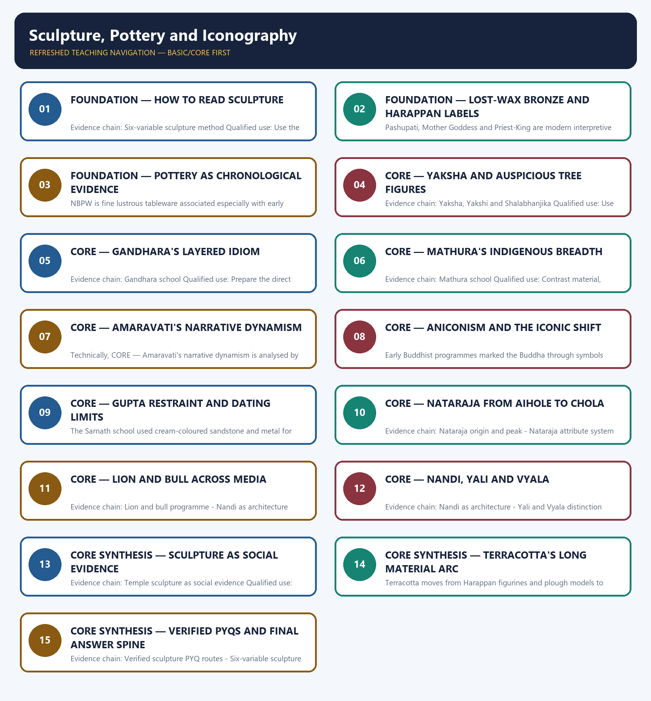

# Sculpture, Pottery and Iconography — Learner-v2 Complete Learning Session

> **Authoring-only generation:** 2026-09-01. No PDF was rendered and no tracker or index was mutated.

### SOURCE, PROGRESSION AND CURRENT-LINKAGE AUDIT

- **Generation date:** 2026-09-01.
- **Repository-first evidence:** the Basic owner is taught first and preserved in full; the Advanced owner is retained only in the optional final teaching block.
- **OCR evidence:** Repository Markdown was primary. The available OCR-searchable Nitin Singhania Indian Art and Culture PDF was retained as a supplementary source; no unsupported page precision, quotation or dynamic status was imported from it.
- **Qdrant:** not used; repository Markdown and available OCR context were sufficient.
- **PYQ integrity:** Three direct GS-I Mains demands are verified in the 2018-2023 routing ledger: 2019 Gandhara external elements, 2022 medieval temple sculpture as social evidence, and 2022 lion-bull significance. The 2026 empty-seat objective route has only a provisional key and is retained unsolved.
- **Live-link boundary:** No directly relevant live official item was verified for this topic on 2026-09-01. The package therefore says 'no verified live item' and does not invent a date, status, project or figure.
- **Fact/inference discipline:** no current-affairs item, PYQ wording, figure or quotation is invented.

## BASIC LEARNING SESSION



*Distinct embedded teaching-navigation image. The separate continuous Cārvāka-style flowchart package remains an independent at-a-glance artifact.*

### SESSION 1 — FOUNDATION — HOW TO READ SCULPTURE

#### DEFINITION / WHAT THIS IS CALLED

**Plain-language definition:** Read sculpture through material, posture or gesture, iconographic attribute, patron, site context and cross-site comparison; this converts visual description into bounded historical analysis.

**Technical definition:** Evidence chain: Six-variable sculpture method Qualified use: Use the six variables as the method for the whole topic.

#### ANSWER-GRABBING OPENING — WRITE/ADAPT IN THE EXAM

> Read sculpture through material, posture or gesture, iconographic attribute, patron, site context and cross-site comparison; this converts visual description into bounded historical analysis.

#### MUST-WRITE KEYWORDS

- **FOUNDATION**
- **How to read sculpture**
- **Evidence chain**
- **Qualified use**
- **Read**
- **Description**

**How to use them:** Frame the answer through FOUNDATION; define How to read sculpture, connect Evidence chain with Qualified use to explain the mechanism, and use Read for the decisive comparison or qualification.

#### VISUAL FIRST

```text
HOW TO READ SCULPTURE
01. Six-variable sculpture method
BOUNDARY -> Description must connect form to evidence and its limits.
```

*This topic-specific rail fixes the evidence sequence and its exam boundary before analysis.*

#### CORE EXPLANATION

Read sculpture through material, posture or gesture, iconographic attribute, patron, site context and cross-site comparison; this converts visual description into bounded historical analysis.

#### NAMED EVIDENCE AND MECHANISM

- Read sculpture through material, posture or gesture, iconographic attribute, patron, site context and cross-site comparison; this converts visual description into bounded historical analysis.

#### EXAMINER CAUTION

- Description must connect form to evidence and its limits.

#### EXAM LINK

- **Prelims:** Retain the exact form, region, text, technique or institution attached to How to read sculpture.
- **Mains:** Use the six variables as the method for the whole topic.

#### MINI RECAP

- **Evidence chain:** Six-variable sculpture method
- **Qualified use:** Use the six variables as the method for the whole topic.

#### CLOSING RECALL FLOW — FOUNDATION — HOW TO READ SCULPTURE

```text
START / CONCEPT: FOUNDATION — How to read sculpture
        |
        v
EXACT TERMS: FOUNDATION · How to read sculpture · Evidence chain · Qualified use · Read · Description
        |
        v
MECHANISM / ARGUMENT: Evidence chain: Six-variable sculpture method Qualified use: Use the six variables as the method for the whole topic.
        |
        v
CONSEQUENCE / CONTRAST: Mains: Use the six variables as the method for the whole topic.
        |
        v
UPSC TRAP / ANSWER-USE: Do not miss this limiting distinction: description must connect form to evidence and its limits.
        |
        v
ANSWER-GRABBING FORMULATION: Read sculpture through material, posture or gesture, iconographic attribute, patron, site context and cross-site comparison; this converts visual description into bounded historical analysis.
```
### SESSION 2 — FOUNDATION — LOST-WAX BRONZE AND HARAPPAN LABELS

#### DEFINITION / WHAT THIS IS CALLED

**Plain-language definition:** In lost-wax casting a wax model is clay-coated, heated so the wax drains away, and filled with molten metal; the technique is evidenced from the Indus tradition and later enabled free-standing bronzes.

**Technical definition:** Pashupati, Mother Goddess and Priest-King are modern interpretive labels for Harappan objects, not identities read from the undeciphered script.

#### ANSWER-GRABBING OPENING — WRITE/ADAPT IN THE EXAM

> In lost-wax casting a wax model is clay-coated, heated so the wax drains away, and filled with molten metal; the technique is evidenced from the Indus tradition and later enabled free-standing bronzes.

#### MUST-WRITE KEYWORDS

- **FOUNDATION**
- **Lost-wax bronze**
- **Harappan labels**
- **Evidence chain**
- **Qualified use**
- **In lost-wax casting a wax model**

**How to use them:** Frame the answer through FOUNDATION; define Lost-wax bronze, connect Harappan labels with Evidence chain to explain the mechanism, and use Qualified use for the decisive comparison or qualification.

#### VISUAL FIRST

```text
LOST-WAX BRONZE AND HARAPPAN LABELS
01. Cire-perdue technique
    |
    v
02. Harappan label caution
BOUNDARY -> Technique is fact; object identity remains interpretive.
```

*This topic-specific rail fixes the evidence sequence and its exam boundary before analysis.*

#### CORE EXPLANATION

In lost-wax casting a wax model is clay-coated, heated so the wax drains away, and filled with molten metal; the technique is evidenced from the Indus tradition and later enabled free-standing bronzes. Pashupati, Mother Goddess and Priest-King are modern interpretive labels for Harappan objects, not identities read from the undeciphered script.

#### NAMED EVIDENCE AND MECHANISM

- In lost-wax casting a wax model is clay-coated, heated so the wax drains away, and filled with molten metal; the technique is evidenced from the Indus tradition and later enabled free-standing bronzes.
- Pashupati, Mother Goddess and Priest-King are modern interpretive labels for Harappan objects, not identities read from the undeciphered script.

#### EXAMINER CAUTION

- Technique is fact; object identity remains interpretive.

#### EXAM LINK

- **Prelims:** Retain the exact form, region, text, technique or institution attached to Lost-wax bronze and Harappan labels.
- **Mains:** Separate secure manufacture from disputed meaning.

#### MINI RECAP

- **Evidence chain:** Cire-perdue technique -> Harappan label caution
- **Qualified use:** Separate secure manufacture from disputed meaning.

#### CLOSING RECALL FLOW — FOUNDATION — LOST-WAX BRONZE AND HARAPPAN LABELS

```text
START / CONCEPT: FOUNDATION — Lost-wax bronze and Harappan labels
        |
        v
EXACT TERMS: FOUNDATION · Lost-wax bronze · Harappan labels · Evidence chain · Qualified use · In lost-wax casting a wax model
        |
        v
MECHANISM / ARGUMENT: Evidence chain: Cire-perdue technique - Harappan label caution Qualified use: Separate secure manufacture from disputed meaning.
        |
        v
CONSEQUENCE / CONTRAST: Pashupati, Mother Goddess and Priest-King are modern interpretive labels for Harappan objects, not identities read from the undeciphered script.
        |
        v
UPSC TRAP / ANSWER-USE: Do not miss this limiting distinction: technique is fact; object identity remains interpretive.
        |
        v
ANSWER-GRABBING FORMULATION: In lost-wax casting a wax model is clay-coated, heated so the wax drains away, and filled with molten metal; the technique is evidenced from the Indus tradition and later enabled free-standing bronzes.
```
### SESSION 3 — FOUNDATION — POTTERY AS CHRONOLOGICAL EVIDENCE

#### DEFINITION / WHAT THIS IS CALLED

**Plain-language definition:** Evidence chain: Pottery sequence - Northern Black Polished Ware Qualified use: Build a material-culture sequence.

**Technical definition:** NBPW is fine lustrous tableware associated especially with early historic urbanisation; it is not exclusively a Mauryan court product and is not the same as Black-and-Red Ware.

#### ANSWER-GRABBING OPENING — WRITE/ADAPT IN THE EXAM

> Evidence chain: Pottery sequence - Northern Black Polished Ware Qualified use: Build a material-culture sequence.

#### MUST-WRITE KEYWORDS

- **FOUNDATION**
- **Pottery as chronological evidence**
- **Evidence chain**
- **Qualified use**
- **NBPW**
- **Mauryan**

**How to use them:** Frame the answer through FOUNDATION; define Pottery as chronological evidence, connect Evidence chain with Qualified use to explain the mechanism, and use NBPW for the decisive comparison or qualification.

#### VISUAL FIRST

```text
POTTERY AS CHRONOLOGICAL EVIDENCE
01. Pottery sequence
    |
    v
02. Northern Black Polished Ware
BOUNDARY -> Harappan Red Ware, Black-and-Red Ware and NBPW are distinct.
```

*This topic-specific rail fixes the evidence sequence and its exam boundary before analysis.*

#### CORE EXPLANATION

The source spine runs from Neolithic hand-made coarse ware through Chalcolithic painted wares, Harappan Red Ware and Painted Grey Ware to Northern Black Polished Ware. NBPW is fine lustrous tableware associated especially with early historic urbanisation; it is not exclusively a Mauryan court product and is not the same as Black-and-Red Ware.

#### NAMED EVIDENCE AND MECHANISM

- The source spine runs from Neolithic hand-made coarse ware through Chalcolithic painted wares, Harappan Red Ware and Painted Grey Ware to Northern Black Polished Ware.
- NBPW is fine lustrous tableware associated especially with early historic urbanisation; it is not exclusively a Mauryan court product and is not the same as Black-and-Red Ware.

#### EXAMINER CAUTION

- Harappan Red Ware, Black-and-Red Ware and NBPW are distinct.

#### EXAM LINK

- **Prelims:** Retain the exact form, region, text, technique or institution attached to Pottery as chronological evidence.
- **Mains:** Build a material-culture sequence.

#### MINI RECAP

- **Evidence chain:** Pottery sequence -> Northern Black Polished Ware
- **Qualified use:** Build a material-culture sequence.

#### CLOSING RECALL FLOW — FOUNDATION — POTTERY AS CHRONOLOGICAL EVIDENCE

```text
START / CONCEPT: FOUNDATION — Pottery as chronological evidence
        |
        v
EXACT TERMS: FOUNDATION · Pottery as chronological evidence · Evidence chain · Qualified use · NBPW · Mauryan
        |
        v
MECHANISM / ARGUMENT: NBPW is fine lustrous tableware associated especially with early historic urbanisation; it is not exclusively a Mauryan court product and is not the same as Black-and-Red Ware.
        |
        v
CONSEQUENCE / CONTRAST: Harappan Red Ware, Black-and-Red Ware and NBPW are distinct.
        |
        v
UPSC TRAP / ANSWER-USE: Do not miss this limiting distinction: nBPW is fine lustrous tableware associated especially with early historic urbanisation.
        |
        v
ANSWER-GRABBING FORMULATION: Evidence chain: Pottery sequence - Northern Black Polished Ware Qualified use: Build a material-culture sequence.
```
### SESSION 4 — CORE — YAKSHA AND AUSPICIOUS TREE FIGURES

#### DEFINITION / WHAT THIS IS CALLED

**Plain-language definition:** Yaksha and Yakshi figures connect water, fertility, trees and wilderness with multiple religions; the Shalabhanjika is a tree-holding yakshi used as an auspicious bracket figure.

**Technical definition:** Evidence chain: Yaksha, Yakshi and Shalabhanjika Qualified use: Use motif continuity without claiming unchanged meaning.

#### ANSWER-GRABBING OPENING — WRITE/ADAPT IN THE EXAM

> Yaksha and Yakshi figures connect water, fertility, trees and wilderness with multiple religions; the Shalabhanjika is a tree-holding yakshi used as an auspicious bracket figure.

#### MUST-WRITE KEYWORDS

- **Yaksha**
- **auspicious tree figures**
- **Evidence chain**
- **Qualified use**
- **Yakshi**
- **Shalabhanjika**

**How to use them:** Frame the answer through Yaksha; define auspicious tree figures, connect Evidence chain with Qualified use to explain the mechanism, and use Yakshi for the decisive comparison or qualification.

#### VISUAL FIRST

```text
YAKSHA AND AUSPICIOUS TREE FIGURES
01. Yaksha, Yakshi and Shalabhanjika
BOUNDARY -> Absorption across religions does not erase local cult roots.
```

*This topic-specific rail fixes the evidence sequence and its exam boundary before analysis.*

#### CORE EXPLANATION

Yaksha and Yakshi figures connect water, fertility, trees and wilderness with multiple religions; the Shalabhanjika is a tree-holding yakshi used as an auspicious bracket figure.

#### NAMED EVIDENCE AND MECHANISM

- Yaksha and Yakshi figures connect water, fertility, trees and wilderness with multiple religions; the Shalabhanjika is a tree-holding yakshi used as an auspicious bracket figure.

#### EXAMINER CAUTION

- Absorption across religions does not erase local cult roots.

#### EXAM LINK

- **Prelims:** Retain the exact form, region, text, technique or institution attached to Yaksha and auspicious tree figures.
- **Mains:** Use motif continuity without claiming unchanged meaning.

#### MINI RECAP

- **Evidence chain:** Yaksha, Yakshi and Shalabhanjika
- **Qualified use:** Use motif continuity without claiming unchanged meaning.

#### CLOSING RECALL FLOW — CORE — YAKSHA AND AUSPICIOUS TREE FIGURES

```text
START / CONCEPT: CORE — Yaksha and auspicious tree figures
        |
        v
EXACT TERMS: Yaksha · auspicious tree figures · Evidence chain · Qualified use · Yakshi · Shalabhanjika
        |
        v
MECHANISM / ARGUMENT: Evidence chain: Yaksha, Yakshi and Shalabhanjika Qualified use: Use motif continuity without claiming unchanged meaning.
        |
        v
CONSEQUENCE / CONTRAST: Absorption across religions does not erase local cult roots.
        |
        v
UPSC TRAP / ANSWER-USE: Do not miss this limiting distinction: use motif continuity without claiming unchanged meaning.
        |
        v
ANSWER-GRABBING FORMULATION: Yaksha and Yakshi figures connect water, fertility, trees and wilderness with multiple religions; the Shalabhanjika is a tree-holding yakshi used as an auspicious bracket figure.
```
### SESSION 5 — CORE — GANDHARA'S LAYERED IDIOM

#### DEFINITION / WHAT THIS IS CALLED

**Plain-language definition:** Gandhara sculpture used bluish-grey sandstone and later stucco for a mainly Buddhist programme whose drapery, hair and body modelling show Hellenistic, Parthian and Central Asian layers.

**Technical definition:** Evidence chain: Gandhara school Qualified use: Prepare the direct 2019 route.

#### ANSWER-GRABBING OPENING — WRITE/ADAPT IN THE EXAM

> Gandhara sculpture used bluish-grey sandstone and later stucco for a mainly Buddhist programme whose drapery, hair and body modelling show Hellenistic, Parthian and Central Asian layers.

#### MUST-WRITE KEYWORDS

- **Gandhara's layered idiom**
- **Evidence chain**
- **Qualified use**
- **Gandhara**
- **Buddhist**
- **Hellenistic**

**How to use them:** Frame the answer through Gandhara's layered idiom; define Evidence chain, connect Qualified use with Gandhara to explain the mechanism, and use Buddhist for the decisive comparison or qualification.

#### VISUAL FIRST

```text
GANDHARA'S LAYERED IDIOM
01. Gandhara school
BOUNDARY -> Name Greco-Bactrian and Central Asian strands separately.
```

*This topic-specific rail fixes the evidence sequence and its exam boundary before analysis.*

#### CORE EXPLANATION

Gandhara sculpture used bluish-grey sandstone and later stucco for a mainly Buddhist programme whose drapery, hair and body modelling show Hellenistic, Parthian and Central Asian layers.

#### NAMED EVIDENCE AND MECHANISM

- Gandhara sculpture used bluish-grey sandstone and later stucco for a mainly Buddhist programme whose drapery, hair and body modelling show Hellenistic, Parthian and Central Asian layers.

#### EXAMINER CAUTION

- Name Greco-Bactrian and Central Asian strands separately.

#### EXAM LINK

- **Prelims:** Retain the exact form, region, text, technique or institution attached to Gandhara's layered idiom.
- **Mains:** Prepare the direct 2019 route.

#### MINI RECAP

- **Evidence chain:** Gandhara school
- **Qualified use:** Prepare the direct 2019 route.

#### CLOSING RECALL FLOW — CORE — GANDHARA'S LAYERED IDIOM

```text
START / CONCEPT: CORE — Gandhara's layered idiom
        |
        v
EXACT TERMS: Gandhara's layered idiom · Evidence chain · Qualified use · Gandhara · Buddhist · Hellenistic
        |
        v
MECHANISM / ARGUMENT: Evidence chain: Gandhara school Qualified use: Prepare the direct 2019 route.
        |
        v
CONSEQUENCE / CONTRAST: The resulting consequence is that gandhara sculpture used bluish-grey sandstone and later stucco for a mainly Buddhist programme whose...
        |
        v
UPSC TRAP / ANSWER-USE: Do not miss this limiting distinction: gandhara sculpture used bluish-grey sandstone and later stucco for a mainly Buddhist programme whose...
        |
        v
ANSWER-GRABBING FORMULATION: Gandhara sculpture used bluish-grey sandstone and later stucco for a mainly Buddhist programme whose drapery, hair and body modelling show Hellenistic, Parthian and Central Asian layers.
```
### SESSION 6 — CORE — MATHURA'S INDIGENOUS BREADTH

#### DEFINITION / WHAT THIS IS CALLED

**Plain-language definition:** Mathura developed in spotted red sandstone, served Buddhist, Hindu and Jain patrons, and used attributes or avayudhas and emphatic halos within an indigenous visual grammar.

**Technical definition:** Evidence chain: Mathura school Qualified use: Contrast material, scope and attribute grammar.

#### ANSWER-GRABBING OPENING — WRITE/ADAPT IN THE EXAM

> Mathura developed in spotted red sandstone, served Buddhist, Hindu and Jain patrons, and used attributes or avayudhas and emphatic halos within an indigenous visual grammar.

#### MUST-WRITE KEYWORDS

- **Mathura's indigenous breadth**
- **Evidence chain**
- **Qualified use**
- **Mathura**
- **Buddhist**
- **Hindu**

**How to use them:** Frame the answer through Mathura's indigenous breadth; define Evidence chain, connect Qualified use with Mathura to explain the mechanism, and use Buddhist for the decisive comparison or qualification.

#### VISUAL FIRST

```text
MATHURA'S INDIGENOUS BREADTH
01. Mathura school
BOUNDARY -> Religious plurality is a key discriminator.
```

*This topic-specific rail fixes the evidence sequence and its exam boundary before analysis.*

#### CORE EXPLANATION

Mathura developed in spotted red sandstone, served Buddhist, Hindu and Jain patrons, and used attributes or avayudhas and emphatic halos within an indigenous visual grammar.

#### NAMED EVIDENCE AND MECHANISM

- Mathura developed in spotted red sandstone, served Buddhist, Hindu and Jain patrons, and used attributes or avayudhas and emphatic halos within an indigenous visual grammar.

#### EXAMINER CAUTION

- Religious plurality is a key discriminator.

#### EXAM LINK

- **Prelims:** Retain the exact form, region, text, technique or institution attached to Mathura's indigenous breadth.
- **Mains:** Contrast material, scope and attribute grammar.

#### MINI RECAP

- **Evidence chain:** Mathura school
- **Qualified use:** Contrast material, scope and attribute grammar.

#### CLOSING RECALL FLOW — CORE — MATHURA'S INDIGENOUS BREADTH

```text
START / CONCEPT: CORE — Mathura's indigenous breadth
        |
        v
EXACT TERMS: Mathura's indigenous breadth · Evidence chain · Qualified use · Mathura · Buddhist · Hindu
        |
        v
MECHANISM / ARGUMENT: Evidence chain: Mathura school Qualified use: Contrast material, scope and attribute grammar.
        |
        v
CONSEQUENCE / CONTRAST: Religious plurality is a key discriminator.
        |
        v
UPSC TRAP / ANSWER-USE: Do not miss this limiting distinction: contrast material, scope and attribute grammar.
        |
        v
ANSWER-GRABBING FORMULATION: Mathura developed in spotted red sandstone, served Buddhist, Hindu and Jain patrons, and used attributes or avayudhas and emphatic halos within an indigenous visual grammar.
```
### SESSION 7 — CORE — AMARAVATI'S NARRATIVE DYNAMISM

#### DEFINITION / WHAT THIS IS CALLED

**Plain-language definition:** Evidence chain: Amaravati school Qualified use: Complete the three-school comparison.

**Technical definition:** Technically, CORE — Amaravati's narrative dynamism is analysed by relating Amaravati's narrative dynamism to Evidence chain, then testing the relationship through Qualified use and Gandhara's.

#### ANSWER-GRABBING OPENING — WRITE/ADAPT IN THE EXAM

> Do not borrow Gandhara's foreign-influence formula.

#### MUST-WRITE KEYWORDS

- **Amaravati's narrative dynamism**
- **Evidence chain**
- **Qualified use**
- **Gandhara's**
- **Amaravati**
- **Qualified**

**How to use them:** Frame the answer through Amaravati's narrative dynamism; define Evidence chain, connect Qualified use with Gandhara's to explain the mechanism, and use Amaravati for the decisive comparison or qualification.

#### VISUAL FIRST

```text
AMARAVATI'S NARRATIVE DYNAMISM
01. Amaravati school
BOUNDARY -> Do not borrow Gandhara's foreign-influence formula.
```

*This topic-specific rail fixes the evidence sequence and its exam boundary before analysis.*

#### CORE EXPLANATION

Amaravati or Vengi sculpture used dynamic narrative relief, greenish-white limestone and extensive tribhanga within a mainly Buddhist Satavahana and later Ikshvaku setting.

#### NAMED EVIDENCE AND MECHANISM

- Amaravati or Vengi sculpture used dynamic narrative relief, greenish-white limestone and extensive tribhanga within a mainly Buddhist Satavahana and later Ikshvaku setting.

#### EXAMINER CAUTION

- Do not borrow Gandhara's foreign-influence formula.

#### EXAM LINK

- **Prelims:** Retain the exact form, region, text, technique or institution attached to Amaravati's narrative dynamism.
- **Mains:** Complete the three-school comparison.

#### MINI RECAP

- **Evidence chain:** Amaravati school
- **Qualified use:** Complete the three-school comparison.

#### CLOSING RECALL FLOW — CORE — AMARAVATI'S NARRATIVE DYNAMISM

```text
START / CONCEPT: CORE — Amaravati's narrative dynamism
        |
        v
EXACT TERMS: Amaravati's narrative dynamism · Evidence chain · Qualified use · Gandhara's · Amaravati · Qualified
        |
        v
MECHANISM / ARGUMENT: Evidence chain: Amaravati school Qualified use: Complete the three-school comparison.
        |
        v
CONSEQUENCE / CONTRAST: The resulting consequence is that do not borrow Gandhara's foreign-influence formula.
        |
        v
UPSC TRAP / ANSWER-USE: Do not miss this limiting distinction: do not borrow Gandhara's foreign-influence formula.
        |
        v
ANSWER-GRABBING FORMULATION: Do not borrow Gandhara's foreign-influence formula.
```
### SESSION 8 — CORE — ANICONISM AND THE ICONIC SHIFT

#### DEFINITION / WHAT THIS IS CALLED

**Plain-language definition:** Evidence chain: Aniconic symbolism - Parallel iconic shift Qualified use: Explain representational change cautiously.

**Technical definition:** Early Buddhist programmes marked the Buddha through symbols such as the empty throne, Bodhi tree, wheel, footprints and stupa; an empty seat is a presence-marker, not a missing figure.

#### ANSWER-GRABBING OPENING — WRITE/ADAPT IN THE EXAM

> Evidence chain: Aniconic symbolism - Parallel iconic shift Qualified use: Explain representational change cautiously.

#### MUST-WRITE KEYWORDS

- **Aniconism**
- **the iconic shift**
- **Evidence chain**
- **Qualified use**
- **Early Buddhist**
- **Buddha**

**How to use them:** Frame the answer through Aniconism; define the iconic shift, connect Evidence chain with Qualified use to explain the mechanism, and use Early Buddhist for the decisive comparison or qualification.

#### VISUAL FIRST

```text
ANICONISM AND THE ICONIC SHIFT
01. Aniconic symbolism
    |
    v
02. Parallel iconic shift
BOUNDARY -> A symbol is not absence, and priority remains debated.
```

*This topic-specific rail fixes the evidence sequence and its exam boundary before analysis.*

#### CORE EXPLANATION

Early Buddhist programmes marked the Buddha through symbols such as the empty throne, Bodhi tree, wheel, footprints and stupa; an empty seat is a presence-marker, not a missing figure. Anthropomorphic Buddha images emerged in broadly overlapping early-CE contexts at Gandhara and Mathura, so neither school should be declared the uncontested sole origin.

#### NAMED EVIDENCE AND MECHANISM

- Early Buddhist programmes marked the Buddha through symbols such as the empty throne, Bodhi tree, wheel, footprints and stupa; an empty seat is a presence-marker, not a missing figure.
- Anthropomorphic Buddha images emerged in broadly overlapping early-CE contexts at Gandhara and Mathura, so neither school should be declared the uncontested sole origin.

#### EXAMINER CAUTION

- A symbol is not absence, and priority remains debated.

#### EXAM LINK

- **Prelims:** Retain the exact form, region, text, technique or institution attached to Aniconism and the iconic shift.
- **Mains:** Explain representational change cautiously.

#### MINI RECAP

- **Evidence chain:** Aniconic symbolism -> Parallel iconic shift
- **Qualified use:** Explain representational change cautiously.

#### CLOSING RECALL FLOW — CORE — ANICONISM AND THE ICONIC SHIFT

```text
START / CONCEPT: CORE — Aniconism and the iconic shift
        |
        v
EXACT TERMS: Aniconism · the iconic shift · Evidence chain · Qualified use · Early Buddhist · Buddha
        |
        v
MECHANISM / ARGUMENT: Early Buddhist programmes marked the Buddha through symbols such as the empty throne, Bodhi tree, wheel, footprints and stupa; an empty seat is a presence-marker, not a missing figure.
        |
        v
CONSEQUENCE / CONTRAST: A symbol is not absence, and priority remains debated.
        |
        v
UPSC TRAP / ANSWER-USE: Do not miss this limiting distinction: anthropomorphic Buddha images emerged in broadly overlapping early-CE contexts at Gandhara and Mathura, so...
        |
        v
ANSWER-GRABBING FORMULATION: Evidence chain: Aniconic symbolism - Parallel iconic shift Qualified use: Explain representational change cautiously.
```
### SESSION 9 — CORE — GUPTA RESTRAINT AND DATING LIMITS

#### DEFINITION / WHAT THIS IS CALLED

**Plain-language definition:** Evidence chain: Gupta Sarnath idiom Qualified use: Add a chronological bridge to southern sculpture.

**Technical definition:** The Sarnath school used cream-coloured sandstone and metal for subtly modelled, thinly draped figures; the Sultanganj copper Buddha is safer described as late or post-Gupta.

#### ANSWER-GRABBING OPENING — WRITE/ADAPT IN THE EXAM

> Evidence chain: Gupta Sarnath idiom Qualified use: Add a chronological bridge to southern sculpture.

#### MUST-WRITE KEYWORDS

- **Gupta restraint**
- **dating limits**
- **Evidence chain**
- **Qualified use**
- **The Sarnath**
- **Sultanganj**

**How to use them:** Frame the answer through Gupta restraint; define dating limits, connect Evidence chain with Qualified use to explain the mechanism, and use The Sarnath for the decisive comparison or qualification.

#### VISUAL FIRST

```text
GUPTA RESTRAINT AND DATING LIMITS
01. Gupta Sarnath idiom
BOUNDARY -> Late or post-Gupta is safer for Sultanganj.
```

*This topic-specific rail fixes the evidence sequence and its exam boundary before analysis.*

#### CORE EXPLANATION

The Sarnath school used cream-coloured sandstone and metal for subtly modelled, thinly draped figures; the Sultanganj copper Buddha is safer described as late or post-Gupta.

#### NAMED EVIDENCE AND MECHANISM

- The Sarnath school used cream-coloured sandstone and metal for subtly modelled, thinly draped figures; the Sultanganj copper Buddha is safer described as late or post-Gupta.

#### EXAMINER CAUTION

- Late or post-Gupta is safer for Sultanganj.

#### EXAM LINK

- **Prelims:** Retain the exact form, region, text, technique or institution attached to Gupta restraint and dating limits.
- **Mains:** Add a chronological bridge to southern sculpture.

#### MINI RECAP

- **Evidence chain:** Gupta Sarnath idiom
- **Qualified use:** Add a chronological bridge to southern sculpture.

#### CLOSING RECALL FLOW — CORE — GUPTA RESTRAINT AND DATING LIMITS

```text
START / CONCEPT: CORE — Gupta restraint and dating limits
        |
        v
EXACT TERMS: Gupta restraint · dating limits · Evidence chain · Qualified use · The Sarnath · Sultanganj
        |
        v
MECHANISM / ARGUMENT: The Sarnath school used cream-coloured sandstone and metal for subtly modelled, thinly draped figures; the Sultanganj copper Buddha is safer described as late or post-Gupta.
        |
        v
CONSEQUENCE / CONTRAST: Late or post-Gupta is safer for Sultanganj.
        |
        v
UPSC TRAP / ANSWER-USE: Do not miss this limiting distinction: add a chronological bridge to southern sculpture.
        |
        v
ANSWER-GRABBING FORMULATION: Evidence chain: Gupta Sarnath idiom Qualified use: Add a chronological bridge to southern sculpture.
```
### SESSION 10 — CORE — NATARAJA FROM AIHOLE TO CHOLA

#### DEFINITION / WHAT THIS IS CALLED

**Plain-language definition:** CORE — Nataraja from Aihole to Chola comprises Nataraja from Aihole to Chola, Evidence chain and Qualified use as its core connected dimensions.

**Technical definition:** Evidence chain: Nataraja origin and peak - Nataraja attribute system Qualified use: Build a full named-image answer.

#### ANSWER-GRABBING OPENING — WRITE/ADAPT IN THE EXAM

> The earliest known Nataraja example in the owner is at Ravana Phadi, Aihole, under early Chalukya rule; Chola bronzes perfected and ritualised the form rather than originating it.

#### MUST-WRITE KEYWORDS

- **Nataraja from Aihole to Chola**
- **Evidence chain**
- **Qualified use**
- **The earliest known Nataraja example in the owner**
- **Nataraja**
- **Ravana Phadi**

**How to use them:** Frame the answer through Nataraja from Aihole to Chola; define Evidence chain, connect Qualified use with The earliest known Nataraja example in the owner to explain the mechanism, and use Nataraja for the decisive comparison or qualification.

#### VISUAL FIRST

```text
NATARAJA FROM AIHOLE TO CHOLA
01. Nataraja origin and peak
    |
    v
02. Nataraja attribute system
BOUNDARY -> Distinguish origin, peak and iconographic meaning.
```

*This topic-specific rail fixes the evidence sequence and its exam boundary before analysis.*

#### CORE EXPLANATION

The earliest known Nataraja example in the owner is at Ravana Phadi, Aihole, under early Chalukya rule; Chola bronzes perfected and ritualised the form rather than originating it. Damaru signifies creation, fire destruction, abhaya reassurance, the raised foot release, Apasmara ignorance and the surrounding aureole cyclical time; each attribute must be read in position.

#### NAMED EVIDENCE AND MECHANISM

- The earliest known Nataraja example in the owner is at Ravana Phadi, Aihole, under early Chalukya rule; Chola bronzes perfected and ritualised the form rather than originating it.
- Damaru signifies creation, fire destruction, abhaya reassurance, the raised foot release, Apasmara ignorance and the surrounding aureole cyclical time; each attribute must be read in position.

#### EXAMINER CAUTION

- Distinguish origin, peak and iconographic meaning.

#### EXAM LINK

- **Prelims:** Retain the exact form, region, text, technique or institution attached to Nataraja from Aihole to Chola.
- **Mains:** Build a full named-image answer.

#### MINI RECAP

- **Evidence chain:** Nataraja origin and peak -> Nataraja attribute system
- **Qualified use:** Build a full named-image answer.

#### CLOSING RECALL FLOW — CORE — NATARAJA FROM AIHOLE TO CHOLA

```text
START / CONCEPT: CORE — Nataraja from Aihole to Chola
        |
        v
EXACT TERMS: Nataraja from Aihole to Chola · Evidence chain · Qualified use · The earliest known Nataraja example in the owner · Nataraja · Ravana Phadi
        |
        v
MECHANISM / ARGUMENT: Evidence chain: Nataraja origin and peak - Nataraja attribute system Qualified use: Build a full named-image answer.
        |
        v
CONSEQUENCE / CONTRAST: Damaru signifies creation, fire destruction, abhaya reassurance, the raised foot release, Apasmara ignorance and the surrounding aureole cyclical time; each attribute must be read in position.
        |
        v
UPSC TRAP / ANSWER-USE: Do not miss this limiting distinction: mains: Build a full named-image answer.
        |
        v
ANSWER-GRABBING FORMULATION: The earliest known Nataraja example in the owner is at Ravana Phadi, Aihole, under early Chalukya rule; Chola bronzes perfected and ritualised the form rather than originating it.
```
### SESSION 11 — CORE — LION AND BULL ACROSS MEDIA

#### DEFINITION / WHAT THIS IS CALLED

**Plain-language definition:** At Shaiva temples the bull is not merely ornament: a Nandi mandapa or pavilion stands axially before the sanctum, as at Brihadishvara, Ellora Kailasa and Ramappa.

**Technical definition:** Evidence chain: Lion and bull programme - Nandi as architecture Qualified use: Prepare the direct 2022 animal-symbol route.

#### ANSWER-GRABBING OPENING — WRITE/ADAPT IN THE EXAM

> At Shaiva temples the bull is not merely ornament: a Nandi mandapa or pavilion stands axially before the sanctum, as at Brihadishvara, Ellora Kailasa and Ramappa.

#### MUST-WRITE KEYWORDS

- **Lion**
- **bull across media**
- **Evidence chain**
- **Qualified use**
- **At Shaiva temples the bull**
- **At Shaiva**

**How to use them:** Frame the answer through Lion; define bull across media, connect Evidence chain with Qualified use to explain the mechanism, and use At Shaiva temples the bull for the decisive comparison or qualification.

#### VISUAL FIRST

```text
LION AND BULL ACROSS MEDIA
01. Lion and bull programme
    |
    v
02. Nandi as architecture
BOUNDARY -> Keep Harappan, Buddhist and imperial claims source-separated.
```

*This topic-specific rail fixes the evidence sequence and its exam boundary before analysis.*

#### CORE EXPLANATION

Rampurva preserves an inscribed Ashokan lion pillar and an uninscribed bull pillar, while the Sarnath abacus places lion and bull within a wider Buddhist and imperial symbol system. At Shaiva temples the bull is not merely ornament: a Nandi mandapa or pavilion stands axially before the sanctum, as at Brihadishvara, Ellora Kailasa and Ramappa.

#### NAMED EVIDENCE AND MECHANISM

- Rampurva preserves an inscribed Ashokan lion pillar and an uninscribed bull pillar, while the Sarnath abacus places lion and bull within a wider Buddhist and imperial symbol system.
- At Shaiva temples the bull is not merely ornament: a Nandi mandapa or pavilion stands axially before the sanctum, as at Brihadishvara, Ellora Kailasa and Ramappa.

#### EXAMINER CAUTION

- Keep Harappan, Buddhist and imperial claims source-separated.

#### EXAM LINK

- **Prelims:** Retain the exact form, region, text, technique or institution attached to Lion and bull across media.
- **Mains:** Prepare the direct 2022 animal-symbol route.

#### MINI RECAP

- **Evidence chain:** Lion and bull programme -> Nandi as architecture
- **Qualified use:** Prepare the direct 2022 animal-symbol route.

#### CLOSING RECALL FLOW — CORE — LION AND BULL ACROSS MEDIA

```text
START / CONCEPT: CORE — Lion and bull across media
        |
        v
EXACT TERMS: Lion · bull across media · Evidence chain · Qualified use · At Shaiva temples the bull · At Shaiva
        |
        v
MECHANISM / ARGUMENT: Evidence chain: Lion and bull programme - Nandi as architecture Qualified use: Prepare the direct 2022 animal-symbol route.
        |
        v
CONSEQUENCE / CONTRAST: The resulting consequence is that at Shaiva temples the bull is not merely ornament.
        |
        v
UPSC TRAP / ANSWER-USE: Do not miss this limiting distinction: at Shaiva temples the bull is not merely ornament.
        |
        v
ANSWER-GRABBING FORMULATION: At Shaiva temples the bull is not merely ornament: a Nandi mandapa or pavilion stands axially before the sanctum, as at Brihadishvara, Ellora Kailasa and Ramappa.
```
### SESSION 12 — CORE — NANDI, YALI AND VYALA

#### DEFINITION / WHAT THIS IS CALLED

**Plain-language definition:** Yali is a composite lion-based guardian associated especially with Vijayanagara pillars and Nayaka identity, while Khajuraho Vyalas are hybrid imaginary animals with lions' bodies.

**Technical definition:** Evidence chain: Nandi as architecture - Yali and Vyala distinction Qualified use: Link iconography to temple planning.

#### ANSWER-GRABBING OPENING — WRITE/ADAPT IN THE EXAM

> Yali is a composite lion-based guardian associated especially with Vijayanagara pillars and Nayaka identity, while Khajuraho Vyalas are hybrid imaginary animals with lions' bodies.

#### MUST-WRITE KEYWORDS

- **Nandi**
- **Yali**
- **Vyala**
- **Evidence chain**
- **Qualified use**
- **At Shaiva temples the bull**

**How to use them:** Frame the answer through Nandi; define Yali, connect Vyala with Evidence chain to explain the mechanism, and use Qualified use for the decisive comparison or qualification.

#### VISUAL FIRST

```text
NANDI, YALI AND VYALA
01. Nandi as architecture
    |
    v
02. Yali and Vyala distinction
BOUNDARY -> Placed architecture and hybrid ornament solve different problems.
```

*This topic-specific rail fixes the evidence sequence and its exam boundary before analysis.*

#### CORE EXPLANATION

At Shaiva temples the bull is not merely ornament: a Nandi mandapa or pavilion stands axially before the sanctum, as at Brihadishvara, Ellora Kailasa and Ramappa. Yali is a composite lion-based guardian associated especially with Vijayanagara pillars and Nayaka identity, while Khajuraho Vyalas are hybrid imaginary animals with lions' bodies.

#### NAMED EVIDENCE AND MECHANISM

- At Shaiva temples the bull is not merely ornament: a Nandi mandapa or pavilion stands axially before the sanctum, as at Brihadishvara, Ellora Kailasa and Ramappa.
- Yali is a composite lion-based guardian associated especially with Vijayanagara pillars and Nayaka identity, while Khajuraho Vyalas are hybrid imaginary animals with lions' bodies.

#### EXAMINER CAUTION

- Placed architecture and hybrid ornament solve different problems.

#### EXAM LINK

- **Prelims:** Retain the exact form, region, text, technique or institution attached to Nandi, Yali and Vyala.
- **Mains:** Link iconography to temple planning.

#### MINI RECAP

- **Evidence chain:** Nandi as architecture -> Yali and Vyala distinction
- **Qualified use:** Link iconography to temple planning.

#### CLOSING RECALL FLOW — CORE — NANDI, YALI AND VYALA

```text
START / CONCEPT: CORE — Nandi, Yali and Vyala
        |
        v
EXACT TERMS: Nandi · Yali · Vyala · Evidence chain · Qualified use · At Shaiva temples the bull
        |
        v
MECHANISM / ARGUMENT: Evidence chain: Nandi as architecture - Yali and Vyala distinction Qualified use: Link iconography to temple planning.
        |
        v
CONSEQUENCE / CONTRAST: At Shaiva temples the bull is not merely ornament: a Nandi mandapa or pavilion stands axially before the sanctum, as at Brihadishvara, Ellora Kailasa and Ramappa.
        |
        v
UPSC TRAP / ANSWER-USE: Do not miss this limiting distinction: yali is a composite lion-based guardian associated especially with Vijayanagara pillars and Nayaka identity.
        |
        v
ANSWER-GRABBING FORMULATION: Yali is a composite lion-based guardian associated especially with Vijayanagara pillars and Nayaka identity, while Khajuraho Vyalas are hybrid imaginary animals with lions' bodies.
```
### SESSION 13 — CORE SYNTHESIS — SCULPTURE AS SOCIAL EVIDENCE

#### DEFINITION / WHAT THIS IS CALLED

**Plain-language definition:** Commissioned visibility is not representative social data.

**Technical definition:** Evidence chain: Temple sculpture as social evidence Qualified use: Prepare the direct 2022 social-life route.

#### ANSWER-GRABBING OPENING — WRITE/ADAPT IN THE EXAM

> Evidence chain: Temple sculpture as social evidence Qualified use: Prepare the direct 2022 social-life route.

#### MUST-WRITE KEYWORDS

- **CORE SYNTHESIS**
- **Sculpture as social evidence**
- **Evidence chain**
- **Qualified use**
- **Dancers**
- **Commissioned visibility**

**How to use them:** Frame the answer through CORE SYNTHESIS; define Sculpture as social evidence, connect Evidence chain with Qualified use to explain the mechanism, and use Dancers for the decisive comparison or qualification.

#### VISUAL FIRST

```text
SCULPTURE AS SOCIAL EVIDENCE
01. Temple sculpture as social evidence
BOUNDARY -> Commissioned visibility is not representative social data.
```

*This topic-specific rail fixes the evidence sequence and its exam boundary before analysis.*

#### CORE EXPLANATION

Dancers, musicians, teachers, couples and ritual scenes show what patrons selected for visibility; carvings are commissioned representations, not statistical photographs of medieval society.

#### NAMED EVIDENCE AND MECHANISM

- Dancers, musicians, teachers, couples and ritual scenes show what patrons selected for visibility; carvings are commissioned representations, not statistical photographs of medieval society.

#### EXAMINER CAUTION

- Commissioned visibility is not representative social data.

#### EXAM LINK

- **Prelims:** Retain the exact form, region, text, technique or institution attached to Sculpture as social evidence.
- **Mains:** Prepare the direct 2022 social-life route.

#### MINI RECAP

- **Evidence chain:** Temple sculpture as social evidence
- **Qualified use:** Prepare the direct 2022 social-life route.

#### CLOSING RECALL FLOW — CORE SYNTHESIS — SCULPTURE AS SOCIAL EVIDENCE

```text
START / CONCEPT: CORE SYNTHESIS — Sculpture as social evidence
        |
        v
EXACT TERMS: CORE SYNTHESIS · Sculpture as social evidence · Evidence chain · Qualified use · Dancers · Commissioned visibility
        |
        v
MECHANISM / ARGUMENT: Commissioned visibility is not representative social data.
        |
        v
CONSEQUENCE / CONTRAST: Dancers, musicians, teachers, couples and ritual scenes show what patrons selected for visibility; carvings are commissioned representations, not statistical photographs of medieval society.
        |
        v
UPSC TRAP / ANSWER-USE: Do not miss this limiting distinction: temple sculpture as social evidence Qualified use.
        |
        v
ANSWER-GRABBING FORMULATION: Evidence chain: Temple sculpture as social evidence Qualified use: Prepare the direct 2022 social-life route.
```
### SESSION 14 — CORE SYNTHESIS — TERRACOTTA'S LONG MATERIAL ARC

#### DEFINITION / WHAT THIS IS CALLED

**Plain-language definition:** Evidence chain: Terracotta continuity Qualified use: Add the pottery and living-material dimension.

**Technical definition:** Terracotta moves from Harappan figurines and plough models to Chandraketugarh craft, Gupta plaques and Bengal architectural relief, linking domestic objects, urban workshops and façades.

#### ANSWER-GRABBING OPENING — WRITE/ADAPT IN THE EXAM

> Evidence chain: Terracotta continuity Qualified use: Add the pottery and living-material dimension.

#### MUST-WRITE KEYWORDS

- **CORE SYNTHESIS**
- **Terracotta's long material arc**
- **Evidence chain**
- **Qualified use**
- **Terracotta**
- **Harappan**

**How to use them:** Frame the answer through CORE SYNTHESIS; define Terracotta's long material arc, connect Evidence chain with Qualified use to explain the mechanism, and use Terracotta for the decisive comparison or qualification.

#### VISUAL FIRST

```text
TERRACOTTA'S LONG MATERIAL ARC
01. Terracotta continuity
BOUNDARY -> Object continuity does not prove unchanged community or meaning.
```

*This topic-specific rail fixes the evidence sequence and its exam boundary before analysis.*

#### CORE EXPLANATION

Terracotta moves from Harappan figurines and plough models to Chandraketugarh craft, Gupta plaques and Bengal architectural relief, linking domestic objects, urban workshops and façades.

#### NAMED EVIDENCE AND MECHANISM

- Terracotta moves from Harappan figurines and plough models to Chandraketugarh craft, Gupta plaques and Bengal architectural relief, linking domestic objects, urban workshops and façades.

#### EXAMINER CAUTION

- Object continuity does not prove unchanged community or meaning.

#### EXAM LINK

- **Prelims:** Retain the exact form, region, text, technique or institution attached to Terracotta's long material arc.
- **Mains:** Add the pottery and living-material dimension.

#### MINI RECAP

- **Evidence chain:** Terracotta continuity
- **Qualified use:** Add the pottery and living-material dimension.

#### CLOSING RECALL FLOW — CORE SYNTHESIS — TERRACOTTA'S LONG MATERIAL ARC

```text
START / CONCEPT: CORE SYNTHESIS — Terracotta's long material arc
        |
        v
EXACT TERMS: CORE SYNTHESIS · Terracotta's long material arc · Evidence chain · Qualified use · Terracotta · Harappan
        |
        v
MECHANISM / ARGUMENT: Terracotta moves from Harappan figurines and plough models to Chandraketugarh craft, Gupta plaques and Bengal architectural relief, linking domestic objects, urban workshops and façades.
        |
        v
CONSEQUENCE / CONTRAST: The resulting consequence is that add the pottery and living-material dimension.
        |
        v
UPSC TRAP / ANSWER-USE: Object continuity does not prove unchanged community or meaning.
        |
        v
ANSWER-GRABBING FORMULATION: Evidence chain: Terracotta continuity Qualified use: Add the pottery and living-material dimension.
```
### SESSION 15 — CORE SYNTHESIS — VERIFIED PYQS AND FINAL ANSWER SPINE

#### DEFINITION / WHAT THIS IS CALLED

**Plain-language definition:** ⚠️ Analytical spine (the argument, not the list): terracotta is the only Indian medium that is simultaneously the cheapest, the most widely distributed, the least durable in the open and the most continuously practised.

**Technical definition:** Evidence chain: Verified sculpture PYQ routes - Six-variable sculpture method Qualified use: Integrate method, evidence, comparison and qualification.

#### ANSWER-GRABBING OPENING — WRITE/ADAPT IN THE EXAM

> ⚠️ Analytical spine (the argument, not the list): terracotta is the only Indian medium that is simultaneously the cheapest, the most widely distributed, the least durable in the open and the most continuously practised.

#### MUST-WRITE KEYWORDS

- **CORE SYNTHESIS**
- **Verified PYQs**
- **final answer spine**
- **Evidence chain**
- **Qualified use**
- **Subject**

**How to use them:** Frame the answer through CORE SYNTHESIS; define Verified PYQs, connect final answer spine with Evidence chain to explain the mechanism, and use Qualified use for the decisive comparison or qualification.

#### VISUAL FIRST

```text
VERIFIED PYQS AND FINAL ANSWER SPINE
01. Verified sculpture PYQ routes
    |
    v
02. Six-variable sculpture method
BOUNDARY -> Do not solve the provisional 2026 objective route.
```

*This topic-specific rail fixes the evidence sequence and its exam boundary before analysis.*

#### CORE EXPLANATION

The routed direct Mains cluster comprises 2019 Gandhara external elements and the 2022 demands on medieval temple sculpture as social evidence and lion-bull significance. Read sculpture through material, posture or gesture, iconographic attribute, patron, site context and cross-site comparison; this converts visual description into bounded historical analysis.

#### NAMED EVIDENCE AND MECHANISM

- The routed direct Mains cluster comprises 2019 Gandhara external elements and the 2022 demands on medieval temple sculpture as social evidence and lion-bull significance.
- Read sculpture through material, posture or gesture, iconographic attribute, patron, site context and cross-site comparison; this converts visual description into bounded historical analysis.

#### EXAMINER CAUTION

- Do not solve the provisional 2026 objective route.

#### EXAM LINK

- **Prelims:** Retain the exact form, region, text, technique or institution attached to Verified PYQs and final answer spine.
- **Mains:** Integrate method, evidence, comparison and qualification.

#### MINI RECAP

- **Evidence chain:** Verified sculpture PYQ routes -> Six-variable sculpture method
- **Qualified use:** Integrate method, evidence, comparison and qualification.
#### COMPLETE BASIC OWNER EVIDENCE BANK

> **Subject:** Indian Art & Culture | **Tier:** Must-Do (foundation) |
> **GS Paper:** GS-I.
> **Core area:** Harappan seals/bronzes/pottery; Mauryan Yaksha-Yakshi;
> Gandhara-Mathura-Amaravati schools; Gupta sculpture; South Indian temple
> sculpture; Chola Nataraja bronze; Mughal sculpture.
> **Grounded in:** Nitin Singhania, *Indian Art and Culture*, PDF pp.
> 189-218; R.S. Sharma, *India's Ancient Past*, PDF pp. 211-223, 347-355;
> R.S. Sharma, *Ancient India*, PDF pp. 121-123, 156-159;
> `00_Master-Framework.md` Sections 2-3; audited UPSC Mains 2025
> GS Paper I (supports Topic 03's direct question).
> ✅ = source-grounded | ⚠️ = analytical inference | 📰 = current anchor | ❌ = trap.
> *Companion: `advanced/06_Sculpture-Pottery-and-Iconography.md`.*

#### 1. Snapshot and syllabus fit

✅ This topic covers sculpture and pottery from the Harappan civilisation
through the Mughal period, and supplies the iconographic vocabulary
(mudras, Nataraja, Yaksha-Yakshi) that the 2025 Chandella-sculpture PYQ
(owned by topic 03) directly requires. ⚠️ No PYQ tests this topic in
isolation, but it is inseparable from any temple-architecture or
iconography question.

#### 2. Essential vocabulary

| Term | Exam-ready meaning |
|---|---|
| ✅ **Cire-perdue (lost-wax) technique** | Bronze-casting method known since the Indus Valley period: wax figure coated in clay, heated to melt out the wax, then filled with molten metal (*Nitin…pdf*, PDF pp. 190, 195). |
| ✅ **Yaksha/Yakshi** | Folk deities/nature spirits connected with water, fertility, trees and wilderness, absorbed into Vedic, Buddhist, Jain and Hindu worship; Yakshi is the female counterpart, associated with fertility (*Nitin…pdf*, PDF pp. 197-198). |
| ✅ **Shalabhanjika** | A yakshi-holding-a-tree motif, common as a bracket figure on stupa gateways (Sanchi, Bharhut) and later in Hoysala temples; symbolises fertility and auspiciousness (*Nitin…pdf*, PDF pp. 198-199). |
| ✅ **Northern Black Polished Ware (NBPW)** | Fine, highly lustrous tableware, often black/steel-grey but also other shades; associated especially with early historic urbanisation, not exclusively the Mauryan court. |
| ✅ **Kirtimukha** | A monster-faced decorative motif common in South Indian temple iconography, also found in Buddhist architecture (*Nitin…pdf*, PDF p. 208). |
| ✅ **Nataraja** | Shiva as the Lord of Dance in Tandava posture; a defining Chola sculptural icon, though its earliest known example is at the Ravana Phadi Cave, Aihole (early Chalukya period) (*Nitin…pdf*, PDF pp. 210-211). |

#### 3. Core classification

✅ Post-Mauryan sculpture developed through **three regional schools**:
**Gandhara** (Greek/Hellenistic-influenced, Buddhist, bluish-grey
sandstone/stucco), **Mathura** (indigenous, all-three-religions, red
sandstone), and **Amaravati** (Krishna river basin, dynamic/narrative
Tribhanga-posture art, also called the Vengi School) (*Nitin…pdf*, PDF
pp. 200-204). ✅ Harappan pottery is predominantly red ware, often painted in black, with
plain and painted varieties; it should not be collapsed into the separate,
wider archaeological category "Black-and-Red Ware." Pottery traditions
proceed chronologically from Neolithic hand-made coarse ware through
Chalcolithic painted ware (Ahar, Malwa, Jorwe), Harappan Red Ware, Painted
Grey Ware (Vedic age), to Mauryan NBPW (*Nitin…pdf*, PDF pp. 194, 199).

#### 4. Foundation narrative

✅ Famous Harappan objects: the so-called **Pashupati Seal** (steatite,
Mohenjo-daro, a horned seated figure whose proto-Shiva identification R.S.
Sharma explicitly calls doubtful); the **Dancing Girl** (one of the
earliest celebrated South Asian lost-wax bronzes, often described through
the later term tribhanga); terracotta female figures, whose automatic
"Mother Goddess" label is interpretive rather than certain; and the **Bearded
Priest** (steatite, Mohenjo-daro) (*Nitin…pdf*, PDF pp. 191-193). ✅ The
**Didarganj Chauri-bearer/Yakshi** (often dated Mauryan, but also assigned
by scholars to later centuries) and the
**Parkham Yaksha** exemplify Mauryan-period Yaksha/Yakshi sculpture,
carrying the characteristic Mauryan polish (*Nitin…pdf*, PDF pp. 197-198).
✅ Gandhara and Mathura both participated, around the early centuries CE,
in the shift toward anthropomorphic Buddha images; priority between them is
debated, so "Gandhara first" should not be stated as settled. Earlier
Buddhist monuments often used symbolic representation
(footprint, throne, wheel, tree); Greco-Roman influence shows in wavy
hair, slender musculature, pleated garments, and elongated earlobes
(*Nitin…pdf*, PDF pp. 201-202). ✅ The Mathura school used avayudhas
(attribute-symbols) to represent Hindu gods (e.g. Shiva through linga)
and depicted Buddha largely in Abhaya Mudra, with a larger, geometrically
decorated halo than Gandhara (*Nitin…pdf*, PDF p. 203). ✅ Gupta and immediately post-Gupta
sculpture developed around Sarnath, using cream-coloured sandstone and
metal, with subtly modelled, thinly draped figures. The c. seventh-century
Sultanganj copper Buddha is safer described as late/post-Gupta rather than
an uncontested Gupta-period work.

✅ **Nataraja iconography (Chola):** rear right hand holds the damaru
(creation-sound); rear left hand holds fire (destruction); front right
hand in Abhaya Mudra (reassurance); the front left hand points toward the
upraised foot to indicate the path of salvation, in the pose called
**Gajahasta** ("elephant hand"); the left leg in the **bhujangatrasita**
stance represents *tirobhava*, kicking away the veil of maya from the
devotee's mind;
the supporting foot subdues the dwarf Apasmara/Muyalaka
(ignorance/forgetfulness); matted locks may include the Ganga motif; one
male and one female earring represent Ardhanarishvara fusion; a snake
symbolises dormant kundalini power; a surrounding nimbus represents
unending time cycles (*Nitin…pdf*, PDF pp. 211-212). ✅ Many South Indian
Shiva temples keep a separate **natana-sabha** for the Nataraja image; the
book's named comparative set is the Chidambaram Chola bronze masterpiece,
stone reliefs in Pallava cave temples, panels on Hoysala temple walls and
the Thanjavur Brihadeeswara Nataraja (*Nitin…pdf*, PDF p. 212). ✅ The **earliest
known Nataraja sculpture** was excavated at the Ravana Phadi Cave, Aihole,
under early Chalukya rule — **before** it reached its peak development
under the Cholas (*Nitin…pdf*, PDF p. 211) — an important chronological
correction to any answer assuming Nataraja iconography originated with the
Cholas.

#### 5. Visual map or comparison table

```text
HARAPPAN (seals, Dancing Girl, cire-perdue bronze)
        |
        v
MAURYAN (Yaksha/Yakshi, Mauryan polish, NBPW)
        |
        v
POST-MAURYAN THREE SCHOOLS
   GANDHARA          MATHURA           AMARAVATI
   (Hellenistic,      (indigenous,      (Krishna river,
   Buddhist,          three religions,  narrative/dynamic,
   bluish-grey        red sandstone)    Tribhanga posture)
   stone/stucco)
        |
        v
GUPTA (Sarnath school, cream sandstone, draped figures)
        |
        v
SOUTH INDIAN TEMPLE SCULPTURE (Kirtimukha, musical pillars,
Saptamatrikas) -> CHOLA (Nataraja bronze masterpiece)
```

| School | External influence | Material | Religious scope |
|---|---|---|---|
| ✅ Gandhara | Heavy Greek/Hellenistic (also called Indo-Greek art) | Bluish-grey sandstone; later stucco | Mainly Buddhist |
| ✅ Mathura | Indigenous development | Spotted red sandstone | Buddhism, Hinduism, Jainism |
| ✅ Amaravati (Vengi School) | Indigenous, narrative-focused | Local stone, dynamic reliefs | Mainly Buddhist |

| Reading problem | Safe formulation |
|---|---|
| Pashupati seal | "Horned seated figure, often interpreted as proto-Shiva; identification disputed" |
| Didarganj figure | "Chauri-bearer traditionally dated Mauryan; chronology debated" |
| First Buddha image | "Gandhara and Mathura developed anthropomorphic Buddha imagery in broadly overlapping early-CE contexts" |
| Nataraja | "Pre-Chola antecedents, including Aihole; Chola bronzes achieved canonical portable form" |

#### 6. Source spine

✅ *Nitin…pdf*, PDF pp. 189-214 (Chapter 3, "Sculpture and Pottery" — full
chapter), the direct spine for Sections 2-4.

#### 7. Exact PYQ application

✅ **2025 Q3 (Chandella sculpture), supported by this topic:** while
Topic 03 owns the direct answer, this topic supplies the **iconographic
reading method** — reading posture, gesture, material and comparative
motif (as applied to Nataraja above) — that a strong answer on "resilient
vigour and breadth of life" in Chandella sculpture should also apply to
Khajuraho's figural corpus. ⚠️ No Mains question in the audited 2024-2025
papers tests sculpture/pottery/iconography as a stand-alone topic.

#### 8. 📰 Current anchor

- 📰 ASI's conservation mandate explicitly extends to sculptures (loose and
  in-situ) alongside monuments and paintings; verify any claim about a
  specific sculpture's current conservation or display status (e.g.
  museum relocation) against ASI's or the relevant museum's own dated
  release — see topic 14.

#### 9. ❌ Traps and corrections

- ❌ The Nataraja iconography originated with the Cholas. -> The book is
  explicit that its earliest known example is at Aihole's Ravana Phadi
  Cave under the early Chalukyas; the Cholas brought it to its peak, not
  its origin.
- ❌ Gandhara unquestionably made the first human Buddha image. -> R.S.
  Sharma records both Gandhara and Mathura production in the Kushana age;
  priority remains debated.
- ❌ "Mother Goddess," "Priest-King" and "Pashupati" are deciphered
  Harappan identities. -> These are modern labels/interpretations; the
  script remains undeciphered.
- ✅ **Local PYQ routes:** CSE 2019 asks for Central Asian and
  Greco-Bactrian elements in Gandhara; CSE 2022 asks the significance of
  lion and bull figures. Both reward material, context and symbol
  distinctions rather than one-line labels.
- ❌ Gandhara art is purely Greek art relocated to India. -> It combines
  Parthian, Central Asian/Bactrian and Greco-Roman influences layered
  over a Buddhist iconographic programme — "Indo-Greek" is a shorthand,
  not a literal equivalence.
- ❌ Mathura school sculpture was religiously exclusive to one faith. -> It
  was influenced by "all three religions of the time" — Buddhism,
  Hinduism and Jainism.
- ❌ All Harappan sculpture is crude/unrefined. -> The Dancing Girl and
  Pashupati seal show sophisticated technique (lost-wax casting, fine
  steatite carving), even though some terracotta figures are comparatively
  crude.
- ❌ Harappan painted pottery is simply "Black-and-Red Ware." -> Most
  Harappan pottery is red ware with black-painted designs; Black-and-Red
  Ware is a separate technical category found in several cultures.

#### 10. Mains framework

1. Identify the specific school/period before describing any sculpture.
2. Use precise iconographic vocabulary (mudra names, motif names) rather
   than generic description.
3. Where a question invites comparison (e.g. Gandhara vs. Mathura), use
   the material/influence/religious-scope table (Section 5) as the
   answer's spine.
4. Apply the Nataraja iconographic-reading method to any other named
   sculpture (e.g. Khajuraho figures, topic 03) for a comparative,
   higher-scoring answer.
5. Close with a current conservation/display status line where relevant,
   cross-referenced to topic 14.

#### 11. Boundaries with other subjects

- ❌ **Ancient History owns** the political chronology of the Mauryan,
  Shunga, Kushana and Gupta periods. This file owns the **sculptural
  form, technique and iconography** produced under their patronage.
- ❌ **Topic 13 owns** the doctrinal significance of Hindu/Buddhist/Jain
  iconography as religious philosophy. This file reads iconography as
  **art-historical evidence** of belief and patronage, not as theology.
- ✅ Cross-links: Topic 02 (the monuments where much of this sculpture is
  found), Topic 03 (Chandella and Chola sculptural programmes), Topic 09
  (shared postures/mudras between sculpture and classical dance).

#### 12. Companion links

- ✅ Advanced companion: `advanced/06_Sculpture-Pottery-and-Iconography.md`.
- ✅ `00_Master-Framework.md` Section 2 — the "how to read a monument or
  artwork" method reused here.
- ⚠️ **Cross-links:** Topic 02 (rock-cut monuments housing this sculpture),
  Topic 03 (Chandella/Chola sculptural programmes), Topic 09 (dance-
  sculpture posture parallels).

#### 13. Answer architecture (10/15/20-mark support)

> **Core-sufficiency note.** This topic supplies the reading method that
> the **2025 Chandella sculpture question** and the **2024 Chola question**
> both need, and independently owns recurring school-comparison,
> iconographic-identification and aniconic-symbolism demands. Nothing here
> requires `advanced/06`.

##### 13.0 Direct Mains demands owned by this Core file

> **Core routing supersedes older `advanced/` pointers (final pass,
> 2026-08-13).** The controlling ledger
> [`_PYQ-ROUTING-MAINS-GS1-GS2-ESSAY-2018-2023.md`](../../_PYQ-ROUTING-MAINS-GS1-GS2-ESSAY-2018-2023.md)
> routes three GS-I Mains demands to `advanced/06`. All three are now
> answerable **from this Core file alone**, and Core is the owner of
> record; the Advanced pointers are legacy and are not required.

| Year | Verbatim routed demand | Directive · marks | ✅ Core section that answers it |
|---|---|---|---|
| **2019** | Central Asian and Greco-Bactrian elements in Gandhara art | Highlight · 10 · 150 words | **§13.6B** (+ §13.5) |
| **2022** | Medieval Indian temple sculptures as evidence of social life | How will you explain · 10 · 150 words | **§13.6C** (+ §13.4, §13.8); register bank in `basic/03` **§13.10** |
| **2022** | Lion and bull figures in Indian mythology, art and architecture | Discuss the significance · 15 · 250 words | **§13.6A** (+ `basic/02` §13.6C, `basic/03` §13.9A) |

⚠️ **Two of these three were not answerable from Core before this pass.**
The **2019 Gandhara** demand needed the two external strands separated by
name (§13.6B), and the **2022 lion-and-bull** demand had no evidence bank
anywhere in the folder (§13.6A). ❌ Do not treat a routed demand as covered
because a ledger points at it; only a named Core section is coverage.

##### 13.1 Directive and demand map

| If the question says | It is really testing | Do NOT write |
|---|---|---|
| *Highlight the Central Asian and Greco-Bactrian elements in Gandhara art* | Layered external influence over a Buddhist iconographic programme | "Gandhara art is Greek art in India" |
| *Compare the Gandhara, Mathura and Amaravati schools* | Material, influence, religious scope, treatment and format, school by school | Three separate paragraphs with no axis of comparison |
| *Discuss the significance of animal figures (lion, bull, elephant) in Indian art* | Symbol → context → function, across religions and periods | A list of animals with one-word meanings |
| *Medieval temple sculpture as evidence of social life* | Secular registers read as patron-selected representation | Treating carvings as photographs |
| *Explain the iconography of a named image* | The systematic attribute-by-attribute method (as for Nataraja) | Generic admiration |
| *Trace the shift from symbolic to human representation of the Buddha* | Aniconic symbol set → early anthropomorphic images → the priority debate | "Gandhara made the first Buddha image" |
| *Sculpture and technique* | Material determining what carving or casting can achieve (cire-perdue, stone type, stucco) | Ignoring material entirely |

##### 13.2 Qualified thesis options

- ⚠️ **Method thesis (most transferable):** "Any Indian sculpture can be
  read through six variables — material, posture and gesture, iconographic
  attribute, patron, site context and cross-site comparison — and an answer
  that applies them in order will outperform one that describes appearance."
- ⚠️ **Influence thesis:** "Gandhara is best described as a Buddhist
  iconographic programme executed in a Hellenised visual idiom under
  Kushana patronage — the subject is Indian, the surface treatment is
  borrowed, and calling it 'Greek art' inverts the relationship."
- ⚠️ **Parallel-development thesis:** "Anthropomorphic Buddha imagery
  emerged in broadly overlapping early-centuries-CE contexts at both
  Gandhara and Mathura; priority is disputed, and the exam-safe position
  is parallel development rather than a single origin."
- ⚠️ **Peak-not-origin thesis:** "Chola bronzes perfected rather than
  invented the Nataraja: the earliest known example is at Aihole under
  early Chalukya rule, and what the Cholas contributed was the canonical,
  portable, ritually processional form."
- ⚠️ **Material thesis:** "Material is not a background detail: cire-perdue
  bronze permits the free limbs and open silhouette of the Nataraja, and
  fine-grained sandstone permits the deep undercutting of Khajuraho's
  figures — technique makes the aesthetic possible."

##### 13.3 Mark-scaled structures

| Marks | Structure |
|---|---|
| **10** | Thesis → school or image identified → two or three named attributes/features with meaning → one comparison → one caution → verdict |
| **10 (2019 Gandhara route)** | Run **§13.6B** end to end: thesis (Indian subject, Hellenised idiom, Kushana patronage) → Greco-Bactrian elements named (wavy hair, modelled musculature, pleated drapery, bluish-grey sandstone/stucco) → Central Asian strand named separately (Kushana patronage, Parthian/Bactrian layering) → the Indian core that was **not** borrowed → one Mathura contrast → outward diffusion → verdict |
| **10 (2022 social-life route)** | Run **§13.6C**: claim → two or three named registers from `basic/03` §13.10 → the six-variable method applied to one of them → the commissioned-representation qualification → verdict |
| **15** | Thesis → the six-variable method named → two schools compared on material/influence/scope → one iconographic worked example → chronological correction (Aihole/Chola or Gandhara/Mathura) → verdict |
| **15 (2022 lion-and-bull route)** | Run **§13.6A**'s nine-step structure: thesis of two functions → bounded mythology leg → Harappan art leg with the undeciphered-script caution → Buddhist leg (Rampurva pair, Sarnath abacus) → bull architecture (Nandi mandapas) → lion architecture (Yali/Vyala) → change over time → source qualification → national-emblem verdict |
| **20** | All of the above → **plus** the pottery/material-culture sequence → aniconic-to-iconic shift → social-history reading with its limits → conservation/display status caution → verdict answering the exact wording |

##### 13.4 Evidence bank A — the six-variable reading method (with a worked application)

| Variable | Question to ask | ✅ Worked example — Chandella/Khajuraho figures (for 2025 Q3, owned by topic 03) |
|---|---|---|
| Material | What does the medium permit? | Fine-grained sandstone permits deep, precise relief and undercutting |
| Posture/gesture | Static or dynamic; what does the body do? | Flexed, twisting, interacting figures — dancers, musicians, mithuna couples — rather than frontal static poses |
| Iconographic attribute | Which specific motif recurs? | Vyalas — hybrid lion-bodied imaginary animals — a named motif, not generic "animal ornament" |
| Patron | Who commissioned it and why? | Chandella royal and elite patronage under a newly independent dynasty (topic 03) |
| Site context | Where is it placed and who sees it? | Open, unwalled platform terraces, unlike the walled Dravida enclosure |
| Cross-site comparison | What does it resemble and differ from? | Comparable in density to Hoysala friezes, different in programme from Chola bronze icon-making |

⚠️ The same six columns can be re-run for a Gandhara Buddha, a Chola
Nataraja, a Mauryan yaksha or an unfamiliar image in a future paper — this
is the file's main future-question insurance.

##### 13.5 Evidence bank B — school comparison (Gandhara / Mathura / Amaravati)

| Axis | ✅ Gandhara | ✅ Mathura | ✅ Amaravati (Vengi) |
|---|---|---|---|
| External influence | Heavy Greek/Hellenistic, layered with Parthian and Central Asian/Bactrian elements | Indigenous development | ✅ "Developed on purely indigenous lines with no foreign influence" (*Nitin…pdf*, PDF p. 301) |
| Material | Bluish-grey sandstone; later stucco | Spotted red sandstone | Greenish-white limestone |
| Religious scope | Mainly Buddhist | Buddhism, Hinduism **and** Jainism | Mainly Buddhist |
| Treatment | Wavy hair, slender musculature, pleated garments, elongated earlobes; composed stillness | Avayudhas (attribute-symbols) for Hindu deities; Buddha largely in Abhaya Mudra; larger geometrically decorated halo | ✅ Narrative art — relief medallions telling whole episodes (e.g. the Buddha taming an elephant); **Tribhanga** posture used extensively |
| Patronage | Kushana | Kushana and successors | ✅ Satavahana, later also Ikshvaku (3rd-4th century AD) |
| Diffusion | Central Asian and East Asian transmission | Pan-north Indian | ✅ A Buddha image with robe on the left shoulder and the other hand in Abhayamudra became iconic and was replicated across South and Southeast Asia |

(*Nitin…pdf*, PDF pp. 200-205, 299-301.) ⚠️ **Answer rule:** compare along a
named axis — influence, material, scope, treatment, patronage, diffusion —
never as three descriptive blocks.

##### 13.6 Evidence bank C — aniconic symbolism and the iconic shift

- ✅ **The symbol set, event by event** (*Nitin…pdf*, PDF p. 776): birth —
  bull, elephant, lotus, footprint; great renunciation — horse, empty
  throne, begging bowl; enlightenment — vajrasana, Bodhi tree; sermons —
  wheel, lion, deer; death/parinirvana — stupa.
- ✅ **The rule to state:** "The early Buddhist sculptors did not show
  Buddha in human form. They indicated Buddha's presence through Empty
  Throne, Bodhi Tree, Wheel, Stupa — indicating four important events
  (renunciation, enlightenment, first sermon, death) in the life of
  Buddha" (*Nitin…pdf*, PDF p. 776). ✅ The book separately records
  representation "by his footprint, his throne, and his..." symbols at
  PDF p. 201, and notes at PDF p. 53 that idols of the Buddha were carved
  later.
- ⚠️ **Analytical significance:** the empty seat is not an absence but a
  *presence-marker*; it records a doctrinal reluctance to embody the
  Buddha, and the later human image marks a change in devotional practice,
  not merely in artistic skill.
- ❌ **Priority caution:** do not state that Gandhara made the first human
  Buddha image; R.S. Sharma records both Gandhara and Mathura production in
  the Kushana age and priority remains debated.

##### 13.6A Evidence bank C+ — the lion and the bull: mythology, art and architecture (the direct 2022 GS-I 15-mark route)

> **Direct Mains route, promoted to Core (final pass, 2026-08-13).**
> **CSE 2022 GS-I Q13 — "Discuss the significance of the lion and bull
> figures in Indian mythology, art and architecture"** (15 marks · 250
> words). The controlling ledger
> [`_PYQ-ROUTING-MAINS-GS1-GS2-ESSAY-2018-2023.md`](../../_PYQ-ROUTING-MAINS-GS1-GS2-ESSAY-2018-2023.md)
> pointed this demand at `advanced/06`. **Core routing now supersedes that
> pointer:** this file is the substantive owner, supported by `basic/02`
> (Mauryan pillars, Buddhist symbolism) and `basic/03` (Nandi, Yali,
> Vyala in temple programmes). No `advanced/` file is required.
>
> ⚠️ **The question has three legs and they must be kept separate**, because
> the evidence for each is of a different kind: **mythology** (textual and
> devotional association), **art** (sculpture, seals, relief, symbol) and
> **architecture** (structural and programmatic placement). An answer that
> merges them into "animals were important in Indian culture" scores as a
> list.

**A. The single strongest evidence unit — Rampurva, where the lion and the
bull stand side by side**

- ✅ **"In Rampurva, there are two Ashokan pillars found (one with a lion
  capital and one with a bull capital). The lion capital pillar is
  inscribed with the Major Pillar Edicts I to VI. However, the bull capital
  pillar does not have inscriptions"** (*Nitin…pdf*, PDF pp. 233-234).
  Rampurva (**Bihar**) is one of the **seven** locations of the Major Pillar
  Edicts (PDF p. 233).
- ⚠️ **Why this is the best single unit in the whole answer:** one site,
  one patron, one period, **two animals, two different functions**. The
  **lion** carries the imperial-political message and the **edict text**;
  the **bull** carries none. The inscription distinction is a *fact*, not
  an inference, and it lets the answer argue that the two animals were not
  interchangeable decorative choices — the lion was recruited to speak,
  the bull was not.
- ❌ **Do not** say the Rampurva bull pillar is "uninscribed because it is
  earlier," or assign it to a non-Ashokan dynasty; the source states only
  that it lacks inscriptions.

**B. The Sarnath abacus — the lion and the bull inside one programme**

| ✅ Element | ✅ Sourced content (*Nitin…pdf*, PDF pp. 42-44) | Analytical use |
|---|---|---|
| Capital | **Four lions standing back-to-back** on a **circular abacus**, with **bull, horse, lion and elephant** carvings and the **Dharmachakra** | The lion appears twice — as the crowning figure *and* as one of the four abacus animals; the bull appears once, as an abacus animal |
| Directions | Abacus animals represent four directions — **galloping horse (west), elephant (east), bull (south), lion (north)**; they "seem to follow each other turning the wheel of existence till eternity" | A cosmological reading, not a menagerie: the animals are a *system* |
| Biographical meanings | **Elephant** = the dream of **Queen Maya**, a white elephant entering her womb; **Bull** = the **zodiac sign of Taurus, the month in which Buddha was born**; **Horse** = **Kanthaka**, used to leave the princely life; **Lion** = **the attainment of enlightenment** | The decisive line for this question: within one capital, the **bull marks birth** and the **lion marks enlightenment** — beginning and culmination of the same life |
| The four lions | Symbolise **Buddha spreading Dharma in all directions**; built in commemoration of the first sermon, **Dharmachakrapravartana** | Lion = the *voice* of doctrine (cf. the Buddha as "lion of the Shakyas" is **not** in this source — do not add it) |
| Modern status | The **abacus and the animal part** form the **official national emblem of India**, adopted **26 January 1950**; **Satyameva Jayate**, from the **Mundaka Upanishad**, is inscribed below the abacus in Devanagari; the capital is crowned by the **Dharma Chakra** | Converts a mythology question into a **living-symbol** conclusion — the strongest available closing move |
| Comparators | **Vaishali (Kolhua)**: **single lion capital, no abacus**, with Major Pillar Edict VI. **Sanchi**: four lions back-to-back like Sarnath but a **flatter abacus with alternating pairs of geese and flame palmettes**, c. **250 BC**, carrying the **Schism Edict** and a later Gupta **Sankha Lipi** inscription (PDF pp. 43, 47) | Shows the lion capital as a **repeated imperial type with local variation** — evidence of a programme, not a one-off |

**C. Buddhist aniconic meaning — the bull as a birth symbol**

- ✅ In the aniconic symbol set, the **birth** of the Buddha is indicated by
  **bull, elephant, lotus and footprint**; the **sermons** by **wheel,
  lion and deer** (*Nitin…pdf*, PDF p. 776; §13.6 above).
- ⚠️ **Analytical use:** this is independent corroboration of the Sarnath
  reading — in a tradition that refused to show the Buddha's body, the
  **bull stood in for birth** and the **lion for preaching**. Two media
  (pillar capital and narrative relief), one consistent code.
- ❌ Do not claim the aniconic phase "prohibited" animal imagery; what it
  avoided was the **human figure of the Buddha** (§13.6).

**D. Harappan evidence — with the archaeological caution stated, not hidden**

- ✅ **The seal corpus:** common animal motifs include a **unicorn, humped
  bull, rhinoceros, tiger, elephant, buffalo, bison, goat, markhor, ibex
  and crocodile**; **"no evidence of cow and lion has been found on any
  seal"** (*Nitin…pdf*, PDF p. 191). ✅ The famous seals named by the source
  are the **Pashupati Seal** and the **Unicorn Seal**.
- ✅ **A second Harappan bull object:** the **bronze bull of Kalibangan**,
  cast by the **cire-perdue (lost-wax)** method known from the Indus period
  (PDF p. 193).
- ⚠️ **Caution that earns marks:** the humped bull (zebu) is *frequent* on
  Harappan seals, but the script is **undeciphered** and "Pashupati,"
  "Mother Goddess" and "Priest-King" are **modern labels** (§13.7). So the
  honest formulation is: **the bull was a privileged image in Harappan
  visual culture; what it meant to Harappans cannot be recovered, and later
  Shaiva meaning must not be read backwards into it.**
- ❌ **The high-value trap:** the **lion is absent** from the Harappan seal
  corpus while the **bull is prominent** — so the lion's Indian career, on
  this evidence, begins **later** and is tied to **imperial and royal**
  usage, not to the earliest urban civilisation. ⚠️ Note also that **cow**
  is absent, which is why "Cow" is the correct answer to the reproduced
  CSE 2001 item asking which animal was **not** represented in Harappan
  seals and terracotta (PDF p. 184).

**E. The bull in Hindu architecture — Nandi as a placed, structural figure**

| ✅ Named case | ✅ Sourced content | Architectural point |
|---|---|---|
| **Brihadishvara, Thanjavur** | A big **Nandi Mandap** in front of the temple with a **massive monolithic Nandi, the second largest in the country** (*Nitin…pdf*, PDF p. 91) | The bull is given **its own building**, on the temple's axis — the clearest proof that it is architecture, not ornament |
| **Lepakshi Veerabhadra, Andhra Pradesh** | Holds the **largest monolithic Nandi (bull) in the country** (PDF p. 329) | Gives the answer a superlative pair (largest / second largest) that is source-checked |
| **Kailasa, Ellora (Cave 16)** | Two-storeyed temple housing a shivalingam, with a **Nandi mandapa** and two flagstaff pillars in the courtyard (PDF p. 61) | The same axial arrangement executed **monolithically**, by excavation rather than construction (`basic/02`) |
| **Ramappa, Kakatiya** | A **monolithic Nandi** within the premises; the main temple stands in front of the **Nandi Pavilion** (PDF pp. 107, 109) | Shows the arrangement persisting into the 13th century and into a UNESCO-listed property (`basic/14` §13.8A) |
| **Hoysala (Somanathapura group)** | The **Nandi Pavilion** and a separate **kalyani** (temple tank) "are noted for their ceremonial use" (PDF p. 105) | Ties the bull to **ritual procession and ceremony**, not merely to iconography |

- ⚠️ **Mythology leg, bounded honestly.** The **vahana** is defined in this
  folder's sources as "the mount or vehicle of the main deity… placed just
  before the sanctum sanctorum" (*Nitin…pdf*, PDF p. 72), and Nandi is
  placed exactly there in every case above, facing a **Shiva** sanctum. ✅
  That much is fully supported: **the bull is Shiva's mount and its
  architectural position encodes that relationship.** ❌ **Do not** narrate
  a Nandi origin myth, a Puranic episode, a Vedic identification of the
  bull with Rudra, or a "Dharma has four legs / bull of dharma" reading —
  **no local source in this folder supplies any of them**, and this is the
  single most likely place to fabricate in this question. If the answer
  needs a mythological sentence, use the **Sarnath Taurus/birth** meaning
  and the **vahana** definition, both of which are sourced.

**F. The lion in temple architecture — Yali and Vyala as composite forms**

- ✅ **Yali** — a **composite lion figure** that "becomes symbolic of the
  **Nayaka architectural identity**," carved on gopurams and on the pillars
  of **Vijayanagara** temples; in **Tamil literature** it is a mythical
  creature with a **cat-like body, the head of a lion with the tusks of an
  elephant and the tail of a serpent**, described as **more powerful than
  the lion, the tiger or the elephant**, and understood as a **guardian
  creature protecting human beings both physically and spiritually**
  (*Nitin…pdf*, PDF pp. 114, 118). ✅ In the South Indian sculpture chapter
  the Yali is given as "a mythological creature with the head and body of a
  lion and the trunk, tusks of an elephant" (PDF p. 209).
- ⚠️ **Two source formulations of the Yali's anatomy exist** (p. 118 "cat-like
  body… tail of a serpent"; p. 209 "head and body of a lion… trunk and tusks
  of an elephant"). ✅ Both are the same source; state the **composite,
  lion-based, elephant-tusked** core and do **not** present either variant
  as an error.
- ✅ **Vyala** — at **Khajuraho**, sculptures on temples dedicated to Vishnu
  include the **Vyalas, "hybrid imaginary animals with lions' bodies,"**
  also found in other Indian temples (*Nitin…pdf*, PDF p. 81; `basic/03`
  §13.4).
- ✅ **Friezes:** the Hoysala temples carry bands of **elephants, lions,
  scrolls, horses, makaras and swans** (PDF p. 105) — the lion inside a
  **repeating ordered register**, i.e. as structure, not incident.
- ⚠️ **Analytical point:** in temple architecture the lion is rarely a
  naturalistic lion. It is **hybridised (Yali/Vyala) and multiplied
  (friezes, pillar bases)** and it does **guardian and load-bearing**
  duty. That is a genuine contrast with the Mauryan lion, which is
  **singular, naturalistic, elevated and inscribed**.

**G. The 15-mark structure (executable end to end from this file)**

| Step | What to write | Named evidence |
|---|---|---|
| 1. Thesis (2 lines) | ⚠️ "The lion and the bull are not two decorative animals but two *functions*: across Indian traditions the bull is repeatedly attached to **birth, fertility, agrarian power and the deity's service**, while the lion is attached to **authority, doctrine and guardianship** — which is why they can stand at the same site, in the same reign, and still do different work." | Rampurva |
| 2. Mythology leg (short, bounded) | Bull as **vahana** placed before the Shiva sanctum; bull as **Taurus/birth month**; lion as **enlightenment**; Yali in **Tamil literature** as guardian | PDF pp. 43-44, 72, 118 |
| 3. Art leg — earliest | Harappan **humped bull** frequent, **lion absent** from seals; **bronze bull of Kalibangan**; the undeciphered-script caution | PDF pp. 191, 193 |
| 4. Art leg — Buddhist | Aniconic **bull = birth**, **lion = sermon**; Sarnath's four-lion capital and four-animal abacus; the **Rampurva** inscribed-lion / uninscribed-bull pair | PDF pp. 42-44, 233-234, 776 |
| 5. Architecture leg — bull | **Nandi mandapa** as a building on axis: Thanjavur (second largest monolith), Lepakshi (largest), Ellora Kailasa, Ramappa, Hoysala Nandi Pavilion with kalyani | PDF pp. 61, 91, 105, 107, 109, 329 |
| 6. Architecture leg — lion | **Yali** on Vijayanagara pillars and Nayaka gopurams; **Vyala** at Khajuraho; lion friezes at Hoysala sites | PDF pp. 81, 105, 114, 118 |
| 7. Change over time | Lion: naturalistic and imperial (Mauryan) → hybrid and protective (medieval Yali/Vyala). Bull: Harappan image without recoverable meaning → Buddhist birth-symbol → Shaiva vahana with dedicated architecture | Cross-file |
| 8. Qualification | Symbol meanings are **reconstructed from later texts and from context**; the Harappan corpus cannot be read through Puranic categories; and depiction records **patron choice**, not popular belief (§13.8) | — |
| 9. Verdict | ⚠️ "The two animals endure because each solved a different representational problem — the bull made **generative power** visible and the lion made **authority** visible — and the survival of the Sarnath lions on the **national emblem since 26 January 1950** shows the second problem is still being solved the same way." | PDF p. 43 |

⚠️ **Factual cautions specific to this bank.** ❌ Do not attribute the
Sarnath capital's animals to any meaning other than the four the source
gives. ❌ Do not claim a lion appears on Harappan seals. ❌ Do not supply a
Nandi or bull myth, a Nandi name-etymology, or a Vedic bull identification
from memory. ❌ Do not date the Rampurva bull pillar independently of
Ashoka. ❌ Do not state Yali dimensions, counts of pillars, or a temple's
Yali total. ⚠️ Sanchi's lion-capital pillar is dated "around 250 BC" by the
source; keep the approximation.

##### 13.6B Evidence bank C++ — Gandhara's Central Asian and Greco-Bactrian elements (the direct 2019 GS-I 10-mark route)

> **Direct Mains route, promoted to Core (final pass, 2026-08-13).**
> **CSE 2019 GS-I Q1 — "Highlight the Central Asian and Greco-Bactrian
> elements in Gandhara art"** (10 marks · 150 words). The controlling
> ledger routed this to `advanced/06` and to
> `Ancient-Indian-History/advanced/16`. **Core routing supersedes both
> pointers:** the demand is answerable here, from §13.5 plus the
> disaggregation below. The Ancient History Core file on Central Asian
> contacts remains a legitimate *support*, not a requirement.

⚠️ **What the directive "highlight" demands:** named elements, each
attributed to the *right* source of influence. The commonest failure is to
answer "Greek influence" six times. The question names **two distinct
external strands** — **Greco-Bactrian** (Hellenistic, transmitted through
the Bactrian Greek kingdoms) and **Central Asian** (Kushana, Parthian,
Saka) — and marks follow from telling them apart.

| Strand | ✅ Element visible in the sculpture | ✅ Source basis | ⚠️ How to phrase it |
|---|---|---|---|
| **Greco-Bactrian / Hellenistic** | **Wavy hair**; **slender musculature** and anatomically modelled bodies; **pleated, heavy drapery** with realistic folds; **composed stillness** of expression; **elongated earlobes** treated naturalistically | *Nitin…pdf*, PDF pp. 200-205, 299-301 (§13.5) | The **surface treatment** and the **human body** are Hellenised |
| **Greco-Bactrian, in material** | **Bluish-grey sandstone**, and **stucco** in the later phase | Same | Material choice belongs with the workshop tradition, not the subject |
| **Central Asian — patronage** | **Kushana** patronage; the school flourishes under a dynasty of Central Asian origin | Same; `Ancient-Indian-History` Core on Kushana contacts | Patronage is the *mechanism* by which the influence arrived — say so |
| **Central Asian — layered influence** | Influence explicitly described as "heavy Greek/Hellenistic, **layered with Parthian and Central Asian/Bactrian elements**" | §13.5, from PDF pp. 200-205 | "Layered" is the exam word: successive, not simultaneous |
| **Indian core that was *not* borrowed** | The **subject** — a Buddhist iconographic programme; **mudras** (Gandhara Buddha commonly in **Abhaya Mudra** in the comparator school); the **halo**; the monastic robe | §13.5 | This is what turns a list into an argument |
| **Diffusion outward** | Gandhara transmitted **into Central Asia and East Asia** | §13.5 | Influence ran both ways — a strong closing line |

- ⚠️ **Thesis to use (from §13.2, unchanged):** "Gandhara is best described
  as a **Buddhist iconographic programme executed in a Hellenised visual
  idiom under Kushana patronage** — the subject is Indian, the surface
  treatment is borrowed, and calling it 'Greek art' inverts the
  relationship."
- ⚠️ **Comparison that earns the extra mark in 150 words:** one clause on
  **Mathura** — indigenous development, **spotted red sandstone**,
  Buddhist *and* Hindu *and* Jain scope — proves the Gandhara features are
  **not** simply "what Indian sculpture looked like then" (§13.5).
- ❌ **Cautions:** do not name individual Greek or Bactrian rulers, artists,
  workshops or dates from memory; do not assert that Gandhara produced the
  **first** human Buddha image (priority is disputed — §13.6); do not
  reduce Gandhara to "Greek art"; do not attribute Amaravati's features to
  foreign influence, since the source states it "developed on purely
  indigenous lines with no foreign influence" (PDF p. 301).

##### 13.6C The 2022 medieval-temple-sculpture demand — this file's half

> **Direct Mains route, promoted to Core (final pass, 2026-08-13).**
> **CSE 2022 GS-I Q1 — "Medieval Indian temple sculptures represent the
> social life of those days. How will you explain this statement?"**
> (10 marks · 150 words). The controlling ledger pointed this at
> `advanced/06`; **Core routing supersedes it.** Joint ownership:
> **`basic/03` §13.10** holds the register-by-register social-evidence bank
> (performance, instruction, court and everyday life, devotional movement,
> gender and patronage, with what each can and cannot evidence);
> **this file** supplies the reading method and the source-criticism that
> the directive "how will you explain" actually rewards.

- ✅ **Method:** run §13.4's six variables — material, posture/gesture,
  iconographic attribute, patron, site context, cross-site comparison — on
  the sculpted register, then convert each into a social claim.
- ✅ **Named evidence available here:** the Khajuraho programme's dancers,
  musicians, teachers and disciples, and its **Vyalas** (PDF p. 81);
  **Shalabhanjika** as a fertility/auspiciousness motif carried across
  Hindu, Buddhist and Jain art for a millennium (PDF pp. 198-199);
  **Kalyanasundara Murti** (9th century AD) rendering *panigrahana*, the
  marriage ceremony, through two statuettes — Shiva accepting Parvati's
  right hand as she steps forward with a bashful expression (PDF p. 212) —
  the single best "sculpture depicts a **social ritual**" case in Core;
  **Saptamatrikas** and **Kirtimukha** as South Indian programme elements
  (PDF pp. 208-209).
- ⚠️ **The explanation the directive wants:** sculpture is *commissioned
  representation*. It is strong evidence of **what patrons chose to make
  visible** and of the **techniques and materials available**; it is weak
  evidence of belief, behaviour or the condition of ordinary people. Say
  this **inside** the answer rather than treating carvings as photographs
  (§13.8).
- ❌ Do not use Khajuraho's erotic sculpture as a demographic or moral
  claim about medieval society; do not generalise from royal temples to
  village life.

| Object/class | ✅ Evidence | Analytical use | Caution |
|---|---|---|---|
| Cire-perdue bronze | ✅ Lost-wax casting known since the Indus period: wax figure clay-coated, heated to melt out the wax, filled with molten metal (*Nitin…pdf*, PDF pp. 190, 195) | The single technical thread running from the Dancing Girl to Chola bronzes | ⚠️ Continuity of technique is not continuity of style or meaning |
| Harappan figures | ✅ So-called Pashupati seal (steatite, Mohenjo-daro); Dancing Girl; terracotta female figures; Bearded Priest (*Nitin…pdf*, PDF pp. 191-193) | Shows sophistication alongside crudity in the same corpus | ❌ "Mother Goddess," "Priest-King" and "Pashupati" are modern labels; the script is undeciphered |
| Yaksha/Yakshi | ✅ Folk deities of water, fertility, trees and wilderness, absorbed into Vedic, Buddhist, Jain and Hindu worship; Didarganj chauri-bearer and Parkham Yaksha with Mauryan polish (*Nitin…pdf*, PDF pp. 197-198) | Popular cult entering monumental sculpture — the best evidence against a purely court-driven art history | ⚠️ Didarganj's Mauryan date is debated |
| Shalabhanjika | ✅ Yakshi-holding-a-tree motif, a bracket figure at Sanchi and Bharhut, later in Hoysala temples; fertility/auspiciousness (*Nitin…pdf*, PDF pp. 198-199) | A motif traceable across a millennium and three religions | — |
| Pottery sequence | ✅ Neolithic hand-made coarse ware → Chalcolithic painted ware (Ahar, Malwa, Jorwe) → Harappan Red Ware → Painted Grey Ware → NBPW (*Nitin…pdf*, PDF pp. 194, 199) | Datable material-culture spine for any "sources" question | ❌ Harappan pottery is mostly red ware with black painting, **not** the separate Black-and-Red Ware category |
| Gupta sculpture | ✅ Sarnath school, cream-coloured sandstone and metal, subtly modelled thinly draped figures; the c. 7th-century Sultanganj copper Buddha safer described as late/post-Gupta | The restraint contrast against both Gandhara drama and later Chandella density | ⚠️ Do not date Sultanganj firmly to the Gupta period |
| South Indian temple sculpture | ✅ Kirtimukha (monster-face motif, also in Buddhist architecture), musical pillars, Saptamatrikas (*Nitin…pdf*, PDF p. 208); Kalyanasundara Murti (9th century AD) representing *panigrahana*, the marriage ceremony, through two separate statuettes — Shiva accepting Parvati's right hand as she steps forward with a bashful expression (*Nitin…pdf*, PDF p. 212) | Named, describable cases for a South Indian sculpture demand | — |

##### 13.7A Evidence bank D+ — terracotta as a continuous Indian tradition

> **Why this exists.** A hostile review found that terracotta appeared in
> this folder only as scattered rows — a Harappan figurine here, a Gupta
> plaque there — with **no continuity argument**, although "terracotta
> tradition from Harappa to the present" is a standard 10/15-mark demand
> and a recurring objective pairing.

| Phase | ✅ Named evidence (*Nitin…pdf*) | Material / technique | Function |
|---|---|---|---|
| **Harappan** | **Terracotta female figures** among the Mohenjo-daro/Harappan corpus; **terracotta models of ploughs at Bahawalpur and Banawali**; **terracotta seals** alongside steatite, agate, chert, copper and faience (PDF pp. 37, 190, 193) | ✅ **Fire-baked clay**; the figures were made using the **pinching** method; the source itself records that terracotta sculptures were **"less in number and crude in shape and form"** compared with the bronzes (PDF p. 193) | Domestic/ritual images, and — in the plough models — a **technological record** |
| **Early historic** | **Chandraketugarh** (near the Bidyadhari river, North 24 Parganas, West Bengal), "filled with amazing terracotta sculpture," with **NBPW** relics and Maurya/Kushana/Gupta-period sculpture; its terracotta art "exhibits an amazing degree of precision and craftsmanship" (PDF p. 38). ⚠️ The routed **CSE 2021** pairing **Chandraketugarh : terracotta art** is reproduced in the source (PDF p. 167) | Moulded and modelled fired clay | Urban craft production, and a datable site marker |
| **Gupta** | Terracotta figures classified as (i) **gods and goddesses** and (ii) **male and female figures**; Buddha figures and ornaments at **Devnimori (Gujarat)**; a large collection of **plaques at Bikaner and Ahichchhatra**; distinctive **heads from Akhnur (Kashmir)**; numerous objects from **Bhita** (PDF p. 208) | Plaque and figure moulding | ✅ The phase where terracotta carries a **full religious programme**, not only folk imagery |
| **Regional architecture** | The **Bengal school** used **burnt bricks and clay, "known as terracotta bricks," as the principal building material** (PDF p. 121) | Structural brick with moulded relief | ✅ The decisive continuity case: terracotta moves from **object** to **building material and façade programme** (`basic/03`, `basic/04`) |
| **Living craft** | ⚠️ **Bounded.** See the caution below | — | — |

- ⚠️ **Analytical spine (the argument, not the list):** terracotta is the
  only Indian medium that is simultaneously **the cheapest**, **the most
  widely distributed**, **the least durable in the open** and **the most
  continuously practised**. That combination is why it survives best where
  it was *fired and buried* (seals, plaques, figurines) or *built into a
  wall* (Bengal), and why its social range — domestic shrine to royal
  temple façade — is wider than that of stone or bronze.
- ⚠️ **Community and continuity, honestly bounded.** ❌ **No local source in
  this folder names Bankura horses, Molela plaques, or any specific
  present-day potter community as a terracotta tradition.** Do **not**
  supply them as facts. ✅ What *is* supported for continuity is: the
  **cire-perdue** metal technique "even today… practised in many parts of
  the country" (PDF p. 193) as the parallel case of an unbroken technique;
  **Gundiyali and Lodai** in Kutch, Gujarat, recorded as "famous **pottery
  making villages**" (PDF p. 196) — pottery, not figurative terracotta,
  and the distinction must be kept; and the **Bengal terracotta-brick**
  building tradition. ⚠️ If a question demands living terracotta centres by
  name, write the **mechanism** (hereditary artisan communities, local
  clay, festival and shrine demand, GI-type protection routed through
  `basic/12`) and say plainly that named centres are outside this folder's
  verified evidence, rather than inventing them.
- ❌ Do not date Chandraketugarh, do not assign it to a named dynasty
  beyond the periods listed, and do not state figurine dimensions,
  firing temperatures or counts.

- **School comparison:** "The three post-Mauryan schools are best
  distinguished not by quality but by problem: Gandhara solved how to give
  the Buddha a body, Mathura how to give Indian deities a shared visual
  grammar, and Amaravati how to tell a story on a curved stone surface."
- **Iconography:** "Indian iconography is legible because it is systematic:
  each attribute carries an assigned meaning, so identification and
  interpretation are the same operation performed carefully."
- **Sculpture as evidence:** "Sculpture is reliable evidence of what
  patrons wanted made visible and of the technical means available to make
  it; it is unreliable evidence of everyday belief and behaviour, and the
  distinction should be stated rather than assumed."

##### 13.9 Factual-risk and dynamic-status controls

- ❌ Do not state that Chola patronage originated Nataraja iconography.
- ❌ Do not date the Didarganj Yakshi firmly to the Mauryan period.
- ❌ Do not treat "Pashupati," "Mother Goddess" or "Priest-King" as
  deciphered identities.
- ❌ Do not reduce Gandhara to "Greek art."
- ❌ **Lion/bull bank (§13.6A):** do not place a **lion** on any Harappan
  seal; do not narrate a Nandi, Rudra-bull or "bull of dharma" myth from
  memory; do not add meanings to the Sarnath abacus animals beyond the
  four the source assigns; do not date the Rampurva bull pillar apart from
  Ashoka; do not present either of the source's two Yali anatomies as an
  error.
- ❌ **Terracotta bank (§13.7A):** do not name a living terracotta centre,
  community or product (Bankura, Molela or any other) as verified — the
  folder's sources do not carry them.
- ❌ Do not invent sculpture heights, weights, alloy compositions or museum
  accession details.
- ⚠️ Any claim about a sculpture's **current** location, display or
  conservation status — including the Amaravati marbles held abroad — needs
  a dated official source; repatriation claims are governed by topic 14's
  rule requiring object, institution, provenance and date.

<!-- BEGIN GENERATED PYQ INTEGRATION: 2026 -->

#### 2026 PYQ Integration

> **Status:** 2026 question-level PYQ demand is integrated into this owner.
> **Provenance:** Audited local official-paper routing ledgers: `_PYQ-ROUTING-PRELIMS-2026.md`.
> **Answer-key rule:** The 2026 Prelims and CSAT Set-A keys held locally are **provisional**; no option or answer is recorded or inferred in this integration.

- **Year represented:** 2026
- **Paper(s):** Prelims GS-I
- **Routed question demands:** 1

| Year | Paper | Q | PYQ demand (neutral rendering) | Directive / format | Source status | Owner requirement |
|---:|---|---|---|---|---|---|
| 2026 | Prelims GS-I | 12 | Empty seat symbolism in early Buddhist visual and sacred iconography | Objective question; provisional 2026 Set-A key present locally, answer not inferred | Provisional 2026 Set-A key present locally (`Ans-2026-GS1-Provisional`); key is provisional - no answer letter recorded or inferred here | Cover the named fact/concept and its likely statement-level distinctions. |

##### What this owner must now support

- Empty seat symbolism in early Buddhist visual and sacred iconography

> This block integrates the 2026 examinable demand and paper metadata. It is kept separate from the 2018-2023 and 2024-2025 blocks and does not convert a provisionally-keyed, answer-free objective question into a solved answer.
<!-- END GENERATED PYQ INTEGRATION: 2026 -->

#### CLOSING RECALL FLOW — CORE SYNTHESIS — VERIFIED PYQS AND FINAL ANSWER SPINE

```text
START / CONCEPT: CORE SYNTHESIS — Verified PYQs and final answer spine
        |
        v
EXACT TERMS: CORE SYNTHESIS · Verified PYQs · final answer spine · Evidence chain · Qualified use · Subject
        |
        v
MECHANISM / ARGUMENT: 196) — pottery, not figurative terracotta, and the distinction must be kept; and the Bengal terracotta-brick building tradition. ⚠️ If a question demands living terracotta centres by name, write the mechanism (hereditary artisan communities, local clay, festival and shrine demand, GI-type protection routed through basic/12) and say plainly that named centres are outside this folder's verified evidence, rather than inventing them. ❌ Do not date Chandraketugarh, do not assign it to a named dynasty beyond the periods listed, and do not state figurine dimensions, firing temperatures or counts.
        |
        v
CONSEQUENCE / CONTRAST: ❌ Do not state that Chola patronage originated Nataraja iconography. ❌ Do not date the Didarganj Yakshi firmly to the Mauryan period. ❌ Do not treat "Pashupati," "Mother Goddess" or "Priest-King" as deciphered identities. ❌ Do not reduce Gandhara to "Greek art." ❌ Lion/bull bank (§13.6A): do not place a lion on any Harappan seal; do not narrate a Nandi, Rudra-bull or "bull of dharma" myth from memory; do not add meanings to the Sarnath abacus animals beyond the four the source assigns; do not date the Rampurva bull pillar apart from Ashoka; do not present either of the source's two Yali anatomies as an error. ❌ Terracotta bank (§13.7A): do not name a living terracotta centre, community or product (Bankura, Molela or any other) as verified — the folder's sources do not carry them. ❌ Do not invent sculpture heights, weights, alloy compositions or museum accession details. ⚠️ Any claim about a sculpture's current location, display or conservation status — including the Amaravati marbles held abroad — needs a dated official source; repatriation claims are governed by topic 14's rule requiring object, institution, provenance and date.
        |
        v
UPSC TRAP / ANSWER-USE: 197-198). ✅ Gandhara and Mathura both participated, around the early centuries CE, in the shift toward anthropomorphic Buddha images; priority between them is debated, so "Gandhara first" should not be stated as settled.
        |
        v
ANSWER-GRABBING FORMULATION: ⚠️ Analytical spine (the argument, not the list): terracotta is the only Indian medium that is simultaneously the cheapest, the most widely distributed, the least durable in the open and the most continuously practised.
```
## BASIC MCQS / REMEDIATION

### Q1. Which statement correctly identifies Six-variable sculpture method?

A. Read sculpture through material, posture or gesture, iconographic attribute, patron, site context and cross-site comparison; this converts visual description into bounded historical analysis.
B. In lost-wax casting a wax model is clay-coated, heated so the wax drains away, and filled with molten metal; the technique is evidenced from the Indus tradition and later enabled free-standing bronzes.
C. Pashupati, Mother Goddess and Priest-King are modern interpretive labels for Harappan objects, not identities read from the undeciphered script.
D. The source spine runs from Neolithic hand-made coarse ware through Chalcolithic painted wares, Harappan Red Ware and Painted Grey Ware to Northern Black Polished Ware.

**Answer: A.**
**Explanation:** Read sculpture through material, posture or gesture, iconographic attribute, patron, site context and cross-site comparison; this converts visual description into bounded historical analysis. The remaining options belong to different chronology, actor or analytical categories.

### Q2. Which chronology card should be filed under Six-variable sculpture method?

A. The source spine runs from Neolithic hand-made coarse ware through Chalcolithic painted wares, Harappan Red Ware and Painted Grey Ware to Northern Black Polished Ware.
B. Read sculpture through material, posture or gesture, iconographic attribute, patron, site context and cross-site comparison; this converts visual description into bounded historical analysis.
C. NBPW is fine lustrous tableware associated especially with early historic urbanisation; it is not exclusively a Mauryan court product and is not the same as Black-and-Red Ware.
D. Pashupati, Mother Goddess and Priest-King are modern interpretive labels for Harappan objects, not identities read from the undeciphered script.

**Answer: B.**
**Explanation:** Read sculpture through material, posture or gesture, iconographic attribute, patron, site context and cross-site comparison; this converts visual description into bounded historical analysis. The remaining options belong to different chronology, actor or analytical categories.

### Q3. Which option preserves the source-bounded meaning of Six-variable sculpture method?

A. The source spine runs from Neolithic hand-made coarse ware through Chalcolithic painted wares, Harappan Red Ware and Painted Grey Ware to Northern Black Polished Ware.
B. NBPW is fine lustrous tableware associated especially with early historic urbanisation; it is not exclusively a Mauryan court product and is not the same as Black-and-Red Ware.
C. Read sculpture through material, posture or gesture, iconographic attribute, patron, site context and cross-site comparison; this converts visual description into bounded historical analysis.
D. Yaksha and Yakshi figures connect water, fertility, trees and wilderness with multiple religions; the Shalabhanjika is a tree-holding yakshi used as an auspicious bracket figure.

**Answer: C.**
**Explanation:** Read sculpture through material, posture or gesture, iconographic attribute, patron, site context and cross-site comparison; this converts visual description into bounded historical analysis. The remaining options belong to different chronology, actor or analytical categories.

### Q4. Which statement avoids a close-option trap about Six-variable sculpture method?

A. Gandhara sculpture used bluish-grey sandstone and later stucco for a mainly Buddhist programme whose drapery, hair and body modelling show Hellenistic, Parthian and Central Asian layers.
B. NBPW is fine lustrous tableware associated especially with early historic urbanisation; it is not exclusively a Mauryan court product and is not the same as Black-and-Red Ware.
C. Yaksha and Yakshi figures connect water, fertility, trees and wilderness with multiple religions; the Shalabhanjika is a tree-holding yakshi used as an auspicious bracket figure.
D. Read sculpture through material, posture or gesture, iconographic attribute, patron, site context and cross-site comparison; this converts visual description into bounded historical analysis.

**Answer: D.**
**Explanation:** Read sculpture through material, posture or gesture, iconographic attribute, patron, site context and cross-site comparison; this converts visual description into bounded historical analysis. The remaining options belong to different chronology, actor or analytical categories.

### Q5. Which statement correctly identifies Cire-perdue technique?

A. In lost-wax casting a wax model is clay-coated, heated so the wax drains away, and filled with molten metal; the technique is evidenced from the Indus tradition and later enabled free-standing bronzes.
B. The source spine runs from Neolithic hand-made coarse ware through Chalcolithic painted wares, Harappan Red Ware and Painted Grey Ware to Northern Black Polished Ware.
C. Pashupati, Mother Goddess and Priest-King are modern interpretive labels for Harappan objects, not identities read from the undeciphered script.
D. NBPW is fine lustrous tableware associated especially with early historic urbanisation; it is not exclusively a Mauryan court product and is not the same as Black-and-Red Ware.

**Answer: A.**
**Explanation:** In lost-wax casting a wax model is clay-coated, heated so the wax drains away, and filled with molten metal; the technique is evidenced from the Indus tradition and later enabled free-standing bronzes. The remaining options belong to different chronology, actor or analytical categories.

### Q6. Which chronology card should be filed under Cire-perdue technique?

A. Yaksha and Yakshi figures connect water, fertility, trees and wilderness with multiple religions; the Shalabhanjika is a tree-holding yakshi used as an auspicious bracket figure.
B. In lost-wax casting a wax model is clay-coated, heated so the wax drains away, and filled with molten metal; the technique is evidenced from the Indus tradition and later enabled free-standing bronzes.
C. NBPW is fine lustrous tableware associated especially with early historic urbanisation; it is not exclusively a Mauryan court product and is not the same as Black-and-Red Ware.
D. The source spine runs from Neolithic hand-made coarse ware through Chalcolithic painted wares, Harappan Red Ware and Painted Grey Ware to Northern Black Polished Ware.

**Answer: B.**
**Explanation:** In lost-wax casting a wax model is clay-coated, heated so the wax drains away, and filled with molten metal; the technique is evidenced from the Indus tradition and later enabled free-standing bronzes. The remaining options belong to different chronology, actor or analytical categories.

### Q7. Which option preserves the source-bounded meaning of Cire-perdue technique?

A. NBPW is fine lustrous tableware associated especially with early historic urbanisation; it is not exclusively a Mauryan court product and is not the same as Black-and-Red Ware.
B. Yaksha and Yakshi figures connect water, fertility, trees and wilderness with multiple religions; the Shalabhanjika is a tree-holding yakshi used as an auspicious bracket figure.
C. In lost-wax casting a wax model is clay-coated, heated so the wax drains away, and filled with molten metal; the technique is evidenced from the Indus tradition and later enabled free-standing bronzes.
D. Gandhara sculpture used bluish-grey sandstone and later stucco for a mainly Buddhist programme whose drapery, hair and body modelling show Hellenistic, Parthian and Central Asian layers.

**Answer: C.**
**Explanation:** In lost-wax casting a wax model is clay-coated, heated so the wax drains away, and filled with molten metal; the technique is evidenced from the Indus tradition and later enabled free-standing bronzes. The remaining options belong to different chronology, actor or analytical categories.

### Q8. Which statement avoids a close-option trap about Cire-perdue technique?

A. Yaksha and Yakshi figures connect water, fertility, trees and wilderness with multiple religions; the Shalabhanjika is a tree-holding yakshi used as an auspicious bracket figure.
B. Gandhara sculpture used bluish-grey sandstone and later stucco for a mainly Buddhist programme whose drapery, hair and body modelling show Hellenistic, Parthian and Central Asian layers.
C. Mathura developed in spotted red sandstone, served Buddhist, Hindu and Jain patrons, and used attributes or avayudhas and emphatic halos within an indigenous visual grammar.
D. In lost-wax casting a wax model is clay-coated, heated so the wax drains away, and filled with molten metal; the technique is evidenced from the Indus tradition and later enabled free-standing bronzes.

**Answer: D.**
**Explanation:** In lost-wax casting a wax model is clay-coated, heated so the wax drains away, and filled with molten metal; the technique is evidenced from the Indus tradition and later enabled free-standing bronzes. The remaining options belong to different chronology, actor or analytical categories.

### Q9. Which statement correctly identifies Harappan label caution?

A. Pashupati, Mother Goddess and Priest-King are modern interpretive labels for Harappan objects, not identities read from the undeciphered script.
B. The source spine runs from Neolithic hand-made coarse ware through Chalcolithic painted wares, Harappan Red Ware and Painted Grey Ware to Northern Black Polished Ware.
C. NBPW is fine lustrous tableware associated especially with early historic urbanisation; it is not exclusively a Mauryan court product and is not the same as Black-and-Red Ware.
D. Yaksha and Yakshi figures connect water, fertility, trees and wilderness with multiple religions; the Shalabhanjika is a tree-holding yakshi used as an auspicious bracket figure.

**Answer: A.**
**Explanation:** Pashupati, Mother Goddess and Priest-King are modern interpretive labels for Harappan objects, not identities read from the undeciphered script. The remaining options belong to different chronology, actor or analytical categories.

### Q10. Which chronology card should be filed under Harappan label caution?

A. Yaksha and Yakshi figures connect water, fertility, trees and wilderness with multiple religions; the Shalabhanjika is a tree-holding yakshi used as an auspicious bracket figure.
B. Pashupati, Mother Goddess and Priest-King are modern interpretive labels for Harappan objects, not identities read from the undeciphered script.
C. Gandhara sculpture used bluish-grey sandstone and later stucco for a mainly Buddhist programme whose drapery, hair and body modelling show Hellenistic, Parthian and Central Asian layers.
D. NBPW is fine lustrous tableware associated especially with early historic urbanisation; it is not exclusively a Mauryan court product and is not the same as Black-and-Red Ware.

**Answer: B.**
**Explanation:** Pashupati, Mother Goddess and Priest-King are modern interpretive labels for Harappan objects, not identities read from the undeciphered script. The remaining options belong to different chronology, actor or analytical categories.

### Q11. Which option preserves the source-bounded meaning of Harappan label caution?

A. Yaksha and Yakshi figures connect water, fertility, trees and wilderness with multiple religions; the Shalabhanjika is a tree-holding yakshi used as an auspicious bracket figure.
B. Gandhara sculpture used bluish-grey sandstone and later stucco for a mainly Buddhist programme whose drapery, hair and body modelling show Hellenistic, Parthian and Central Asian layers.
C. Pashupati, Mother Goddess and Priest-King are modern interpretive labels for Harappan objects, not identities read from the undeciphered script.
D. Mathura developed in spotted red sandstone, served Buddhist, Hindu and Jain patrons, and used attributes or avayudhas and emphatic halos within an indigenous visual grammar.

**Answer: C.**
**Explanation:** Pashupati, Mother Goddess and Priest-King are modern interpretive labels for Harappan objects, not identities read from the undeciphered script. The remaining options belong to different chronology, actor or analytical categories.

### Q12. Which statement avoids a close-option trap about Harappan label caution?

A. Mathura developed in spotted red sandstone, served Buddhist, Hindu and Jain patrons, and used attributes or avayudhas and emphatic halos within an indigenous visual grammar.
B. Gandhara sculpture used bluish-grey sandstone and later stucco for a mainly Buddhist programme whose drapery, hair and body modelling show Hellenistic, Parthian and Central Asian layers.
C. Amaravati or Vengi sculpture used dynamic narrative relief, greenish-white limestone and extensive tribhanga within a mainly Buddhist Satavahana and later Ikshvaku setting.
D. Pashupati, Mother Goddess and Priest-King are modern interpretive labels for Harappan objects, not identities read from the undeciphered script.

**Answer: D.**
**Explanation:** Pashupati, Mother Goddess and Priest-King are modern interpretive labels for Harappan objects, not identities read from the undeciphered script. The remaining options belong to different chronology, actor or analytical categories.

### Q13. Which statement correctly identifies Pottery sequence?

A. The source spine runs from Neolithic hand-made coarse ware through Chalcolithic painted wares, Harappan Red Ware and Painted Grey Ware to Northern Black Polished Ware.
B. NBPW is fine lustrous tableware associated especially with early historic urbanisation; it is not exclusively a Mauryan court product and is not the same as Black-and-Red Ware.
C. Gandhara sculpture used bluish-grey sandstone and later stucco for a mainly Buddhist programme whose drapery, hair and body modelling show Hellenistic, Parthian and Central Asian layers.
D. Yaksha and Yakshi figures connect water, fertility, trees and wilderness with multiple religions; the Shalabhanjika is a tree-holding yakshi used as an auspicious bracket figure.

**Answer: A.**
**Explanation:** The source spine runs from Neolithic hand-made coarse ware through Chalcolithic painted wares, Harappan Red Ware and Painted Grey Ware to Northern Black Polished Ware. The remaining options belong to different chronology, actor or analytical categories.

### Q14. Which chronology card should be filed under Pottery sequence?

A. Gandhara sculpture used bluish-grey sandstone and later stucco for a mainly Buddhist programme whose drapery, hair and body modelling show Hellenistic, Parthian and Central Asian layers.
B. The source spine runs from Neolithic hand-made coarse ware through Chalcolithic painted wares, Harappan Red Ware and Painted Grey Ware to Northern Black Polished Ware.
C. Yaksha and Yakshi figures connect water, fertility, trees and wilderness with multiple religions; the Shalabhanjika is a tree-holding yakshi used as an auspicious bracket figure.
D. Mathura developed in spotted red sandstone, served Buddhist, Hindu and Jain patrons, and used attributes or avayudhas and emphatic halos within an indigenous visual grammar.

**Answer: B.**
**Explanation:** The source spine runs from Neolithic hand-made coarse ware through Chalcolithic painted wares, Harappan Red Ware and Painted Grey Ware to Northern Black Polished Ware. The remaining options belong to different chronology, actor or analytical categories.

### Q15. Which option preserves the source-bounded meaning of Pottery sequence?

A. Mathura developed in spotted red sandstone, served Buddhist, Hindu and Jain patrons, and used attributes or avayudhas and emphatic halos within an indigenous visual grammar.
B. Gandhara sculpture used bluish-grey sandstone and later stucco for a mainly Buddhist programme whose drapery, hair and body modelling show Hellenistic, Parthian and Central Asian layers.
C. The source spine runs from Neolithic hand-made coarse ware through Chalcolithic painted wares, Harappan Red Ware and Painted Grey Ware to Northern Black Polished Ware.
D. Amaravati or Vengi sculpture used dynamic narrative relief, greenish-white limestone and extensive tribhanga within a mainly Buddhist Satavahana and later Ikshvaku setting.

**Answer: C.**
**Explanation:** The source spine runs from Neolithic hand-made coarse ware through Chalcolithic painted wares, Harappan Red Ware and Painted Grey Ware to Northern Black Polished Ware. The remaining options belong to different chronology, actor or analytical categories.

### Q16. Which statement avoids a close-option trap about Pottery sequence?

A. Mathura developed in spotted red sandstone, served Buddhist, Hindu and Jain patrons, and used attributes or avayudhas and emphatic halos within an indigenous visual grammar.
B. Amaravati or Vengi sculpture used dynamic narrative relief, greenish-white limestone and extensive tribhanga within a mainly Buddhist Satavahana and later Ikshvaku setting.
C. Early Buddhist programmes marked the Buddha through symbols such as the empty throne, Bodhi tree, wheel, footprints and stupa; an empty seat is a presence-marker, not a missing figure.
D. The source spine runs from Neolithic hand-made coarse ware through Chalcolithic painted wares, Harappan Red Ware and Painted Grey Ware to Northern Black Polished Ware.

**Answer: D.**
**Explanation:** The source spine runs from Neolithic hand-made coarse ware through Chalcolithic painted wares, Harappan Red Ware and Painted Grey Ware to Northern Black Polished Ware. The remaining options belong to different chronology, actor or analytical categories.

### Q17. Which statement correctly identifies Northern Black Polished Ware?

A. NBPW is fine lustrous tableware associated especially with early historic urbanisation; it is not exclusively a Mauryan court product and is not the same as Black-and-Red Ware.
B. Mathura developed in spotted red sandstone, served Buddhist, Hindu and Jain patrons, and used attributes or avayudhas and emphatic halos within an indigenous visual grammar.
C. Yaksha and Yakshi figures connect water, fertility, trees and wilderness with multiple religions; the Shalabhanjika is a tree-holding yakshi used as an auspicious bracket figure.
D. Gandhara sculpture used bluish-grey sandstone and later stucco for a mainly Buddhist programme whose drapery, hair and body modelling show Hellenistic, Parthian and Central Asian layers.

**Answer: A.**
**Explanation:** NBPW is fine lustrous tableware associated especially with early historic urbanisation; it is not exclusively a Mauryan court product and is not the same as Black-and-Red Ware. The remaining options belong to different chronology, actor or analytical categories.

### Q18. Which chronology card should be filed under Northern Black Polished Ware?

A. Mathura developed in spotted red sandstone, served Buddhist, Hindu and Jain patrons, and used attributes or avayudhas and emphatic halos within an indigenous visual grammar.
B. NBPW is fine lustrous tableware associated especially with early historic urbanisation; it is not exclusively a Mauryan court product and is not the same as Black-and-Red Ware.
C. Amaravati or Vengi sculpture used dynamic narrative relief, greenish-white limestone and extensive tribhanga within a mainly Buddhist Satavahana and later Ikshvaku setting.
D. Gandhara sculpture used bluish-grey sandstone and later stucco for a mainly Buddhist programme whose drapery, hair and body modelling show Hellenistic, Parthian and Central Asian layers.

**Answer: B.**
**Explanation:** NBPW is fine lustrous tableware associated especially with early historic urbanisation; it is not exclusively a Mauryan court product and is not the same as Black-and-Red Ware. The remaining options belong to different chronology, actor or analytical categories.

### Q19. Which option preserves the source-bounded meaning of Northern Black Polished Ware?

A. Mathura developed in spotted red sandstone, served Buddhist, Hindu and Jain patrons, and used attributes or avayudhas and emphatic halos within an indigenous visual grammar.
B. Amaravati or Vengi sculpture used dynamic narrative relief, greenish-white limestone and extensive tribhanga within a mainly Buddhist Satavahana and later Ikshvaku setting.
C. NBPW is fine lustrous tableware associated especially with early historic urbanisation; it is not exclusively a Mauryan court product and is not the same as Black-and-Red Ware.
D. Early Buddhist programmes marked the Buddha through symbols such as the empty throne, Bodhi tree, wheel, footprints and stupa; an empty seat is a presence-marker, not a missing figure.

**Answer: C.**
**Explanation:** NBPW is fine lustrous tableware associated especially with early historic urbanisation; it is not exclusively a Mauryan court product and is not the same as Black-and-Red Ware. The remaining options belong to different chronology, actor or analytical categories.

### Q20. Which statement avoids a close-option trap about Northern Black Polished Ware?

A. Amaravati or Vengi sculpture used dynamic narrative relief, greenish-white limestone and extensive tribhanga within a mainly Buddhist Satavahana and later Ikshvaku setting.
B. Anthropomorphic Buddha images emerged in broadly overlapping early-CE contexts at Gandhara and Mathura, so neither school should be declared the uncontested sole origin.
C. Early Buddhist programmes marked the Buddha through symbols such as the empty throne, Bodhi tree, wheel, footprints and stupa; an empty seat is a presence-marker, not a missing figure.
D. NBPW is fine lustrous tableware associated especially with early historic urbanisation; it is not exclusively a Mauryan court product and is not the same as Black-and-Red Ware.

**Answer: D.**
**Explanation:** NBPW is fine lustrous tableware associated especially with early historic urbanisation; it is not exclusively a Mauryan court product and is not the same as Black-and-Red Ware. The remaining options belong to different chronology, actor or analytical categories.

### Q21. Which statement correctly identifies Yaksha, Yakshi and Shalabhanjika?

A. Yaksha and Yakshi figures connect water, fertility, trees and wilderness with multiple religions; the Shalabhanjika is a tree-holding yakshi used as an auspicious bracket figure.
B. Amaravati or Vengi sculpture used dynamic narrative relief, greenish-white limestone and extensive tribhanga within a mainly Buddhist Satavahana and later Ikshvaku setting.
C. Gandhara sculpture used bluish-grey sandstone and later stucco for a mainly Buddhist programme whose drapery, hair and body modelling show Hellenistic, Parthian and Central Asian layers.
D. Mathura developed in spotted red sandstone, served Buddhist, Hindu and Jain patrons, and used attributes or avayudhas and emphatic halos within an indigenous visual grammar.

**Answer: A.**
**Explanation:** Yaksha and Yakshi figures connect water, fertility, trees and wilderness with multiple religions; the Shalabhanjika is a tree-holding yakshi used as an auspicious bracket figure. The remaining options belong to different chronology, actor or analytical categories.

### Q22. Which chronology card should be filed under Yaksha, Yakshi and Shalabhanjika?

A. Early Buddhist programmes marked the Buddha through symbols such as the empty throne, Bodhi tree, wheel, footprints and stupa; an empty seat is a presence-marker, not a missing figure.
B. Yaksha and Yakshi figures connect water, fertility, trees and wilderness with multiple religions; the Shalabhanjika is a tree-holding yakshi used as an auspicious bracket figure.
C. Amaravati or Vengi sculpture used dynamic narrative relief, greenish-white limestone and extensive tribhanga within a mainly Buddhist Satavahana and later Ikshvaku setting.
D. Mathura developed in spotted red sandstone, served Buddhist, Hindu and Jain patrons, and used attributes or avayudhas and emphatic halos within an indigenous visual grammar.

**Answer: B.**
**Explanation:** Yaksha and Yakshi figures connect water, fertility, trees and wilderness with multiple religions; the Shalabhanjika is a tree-holding yakshi used as an auspicious bracket figure. The remaining options belong to different chronology, actor or analytical categories.

### Q23. Which option preserves the source-bounded meaning of Yaksha, Yakshi and Shalabhanjika?

A. Anthropomorphic Buddha images emerged in broadly overlapping early-CE contexts at Gandhara and Mathura, so neither school should be declared the uncontested sole origin.
B. Early Buddhist programmes marked the Buddha through symbols such as the empty throne, Bodhi tree, wheel, footprints and stupa; an empty seat is a presence-marker, not a missing figure.
C. Yaksha and Yakshi figures connect water, fertility, trees and wilderness with multiple religions; the Shalabhanjika is a tree-holding yakshi used as an auspicious bracket figure.
D. Amaravati or Vengi sculpture used dynamic narrative relief, greenish-white limestone and extensive tribhanga within a mainly Buddhist Satavahana and later Ikshvaku setting.

**Answer: C.**
**Explanation:** Yaksha and Yakshi figures connect water, fertility, trees and wilderness with multiple religions; the Shalabhanjika is a tree-holding yakshi used as an auspicious bracket figure. The remaining options belong to different chronology, actor or analytical categories.

### Q24. Which statement avoids a close-option trap about Yaksha, Yakshi and Shalabhanjika?

A. Early Buddhist programmes marked the Buddha through symbols such as the empty throne, Bodhi tree, wheel, footprints and stupa; an empty seat is a presence-marker, not a missing figure.
B. Anthropomorphic Buddha images emerged in broadly overlapping early-CE contexts at Gandhara and Mathura, so neither school should be declared the uncontested sole origin.
C. The Sarnath school used cream-coloured sandstone and metal for subtly modelled, thinly draped figures; the Sultanganj copper Buddha is safer described as late or post-Gupta.
D. Yaksha and Yakshi figures connect water, fertility, trees and wilderness with multiple religions; the Shalabhanjika is a tree-holding yakshi used as an auspicious bracket figure.

**Answer: D.**
**Explanation:** Yaksha and Yakshi figures connect water, fertility, trees and wilderness with multiple religions; the Shalabhanjika is a tree-holding yakshi used as an auspicious bracket figure. The remaining options belong to different chronology, actor or analytical categories.

### Q25. Which statement correctly identifies Gandhara school?

A. Gandhara sculpture used bluish-grey sandstone and later stucco for a mainly Buddhist programme whose drapery, hair and body modelling show Hellenistic, Parthian and Central Asian layers.
B. Amaravati or Vengi sculpture used dynamic narrative relief, greenish-white limestone and extensive tribhanga within a mainly Buddhist Satavahana and later Ikshvaku setting.
C. Early Buddhist programmes marked the Buddha through symbols such as the empty throne, Bodhi tree, wheel, footprints and stupa; an empty seat is a presence-marker, not a missing figure.
D. Mathura developed in spotted red sandstone, served Buddhist, Hindu and Jain patrons, and used attributes or avayudhas and emphatic halos within an indigenous visual grammar.

**Answer: A.**
**Explanation:** Gandhara sculpture used bluish-grey sandstone and later stucco for a mainly Buddhist programme whose drapery, hair and body modelling show Hellenistic, Parthian and Central Asian layers. The remaining options belong to different chronology, actor or analytical categories.

### Q26. Which chronology card should be filed under Gandhara school?

A. Early Buddhist programmes marked the Buddha through symbols such as the empty throne, Bodhi tree, wheel, footprints and stupa; an empty seat is a presence-marker, not a missing figure.
B. Gandhara sculpture used bluish-grey sandstone and later stucco for a mainly Buddhist programme whose drapery, hair and body modelling show Hellenistic, Parthian and Central Asian layers.
C. Anthropomorphic Buddha images emerged in broadly overlapping early-CE contexts at Gandhara and Mathura, so neither school should be declared the uncontested sole origin.
D. Amaravati or Vengi sculpture used dynamic narrative relief, greenish-white limestone and extensive tribhanga within a mainly Buddhist Satavahana and later Ikshvaku setting.

**Answer: B.**
**Explanation:** Gandhara sculpture used bluish-grey sandstone and later stucco for a mainly Buddhist programme whose drapery, hair and body modelling show Hellenistic, Parthian and Central Asian layers. The remaining options belong to different chronology, actor or analytical categories.

### Q27. Which option preserves the source-bounded meaning of Gandhara school?

A. Early Buddhist programmes marked the Buddha through symbols such as the empty throne, Bodhi tree, wheel, footprints and stupa; an empty seat is a presence-marker, not a missing figure.
B. The Sarnath school used cream-coloured sandstone and metal for subtly modelled, thinly draped figures; the Sultanganj copper Buddha is safer described as late or post-Gupta.
C. Gandhara sculpture used bluish-grey sandstone and later stucco for a mainly Buddhist programme whose drapery, hair and body modelling show Hellenistic, Parthian and Central Asian layers.
D. Anthropomorphic Buddha images emerged in broadly overlapping early-CE contexts at Gandhara and Mathura, so neither school should be declared the uncontested sole origin.

**Answer: C.**
**Explanation:** Gandhara sculpture used bluish-grey sandstone and later stucco for a mainly Buddhist programme whose drapery, hair and body modelling show Hellenistic, Parthian and Central Asian layers. The remaining options belong to different chronology, actor or analytical categories.

### Q28. Which statement avoids a close-option trap about Gandhara school?

A. The Sarnath school used cream-coloured sandstone and metal for subtly modelled, thinly draped figures; the Sultanganj copper Buddha is safer described as late or post-Gupta.
B. The earliest known Nataraja example in the owner is at Ravana Phadi, Aihole, under early Chalukya rule; Chola bronzes perfected and ritualised the form rather than originating it.
C. Anthropomorphic Buddha images emerged in broadly overlapping early-CE contexts at Gandhara and Mathura, so neither school should be declared the uncontested sole origin.
D. Gandhara sculpture used bluish-grey sandstone and later stucco for a mainly Buddhist programme whose drapery, hair and body modelling show Hellenistic, Parthian and Central Asian layers.

**Answer: D.**
**Explanation:** Gandhara sculpture used bluish-grey sandstone and later stucco for a mainly Buddhist programme whose drapery, hair and body modelling show Hellenistic, Parthian and Central Asian layers. The remaining options belong to different chronology, actor or analytical categories.

### Q29. Which statement correctly identifies Mathura school?

A. Mathura developed in spotted red sandstone, served Buddhist, Hindu and Jain patrons, and used attributes or avayudhas and emphatic halos within an indigenous visual grammar.
B. Anthropomorphic Buddha images emerged in broadly overlapping early-CE contexts at Gandhara and Mathura, so neither school should be declared the uncontested sole origin.
C. Early Buddhist programmes marked the Buddha through symbols such as the empty throne, Bodhi tree, wheel, footprints and stupa; an empty seat is a presence-marker, not a missing figure.
D. Amaravati or Vengi sculpture used dynamic narrative relief, greenish-white limestone and extensive tribhanga within a mainly Buddhist Satavahana and later Ikshvaku setting.

**Answer: A.**
**Explanation:** Mathura developed in spotted red sandstone, served Buddhist, Hindu and Jain patrons, and used attributes or avayudhas and emphatic halos within an indigenous visual grammar. The remaining options belong to different chronology, actor or analytical categories.

### Q30. Which chronology card should be filed under Mathura school?

A. Early Buddhist programmes marked the Buddha through symbols such as the empty throne, Bodhi tree, wheel, footprints and stupa; an empty seat is a presence-marker, not a missing figure.
B. Mathura developed in spotted red sandstone, served Buddhist, Hindu and Jain patrons, and used attributes or avayudhas and emphatic halos within an indigenous visual grammar.
C. The Sarnath school used cream-coloured sandstone and metal for subtly modelled, thinly draped figures; the Sultanganj copper Buddha is safer described as late or post-Gupta.
D. Anthropomorphic Buddha images emerged in broadly overlapping early-CE contexts at Gandhara and Mathura, so neither school should be declared the uncontested sole origin.

**Answer: B.**
**Explanation:** Mathura developed in spotted red sandstone, served Buddhist, Hindu and Jain patrons, and used attributes or avayudhas and emphatic halos within an indigenous visual grammar. The remaining options belong to different chronology, actor or analytical categories.

### Q31. Which option preserves the source-bounded meaning of Mathura school?

A. Anthropomorphic Buddha images emerged in broadly overlapping early-CE contexts at Gandhara and Mathura, so neither school should be declared the uncontested sole origin.
B. The Sarnath school used cream-coloured sandstone and metal for subtly modelled, thinly draped figures; the Sultanganj copper Buddha is safer described as late or post-Gupta.
C. Mathura developed in spotted red sandstone, served Buddhist, Hindu and Jain patrons, and used attributes or avayudhas and emphatic halos within an indigenous visual grammar.
D. The earliest known Nataraja example in the owner is at Ravana Phadi, Aihole, under early Chalukya rule; Chola bronzes perfected and ritualised the form rather than originating it.

**Answer: C.**
**Explanation:** Mathura developed in spotted red sandstone, served Buddhist, Hindu and Jain patrons, and used attributes or avayudhas and emphatic halos within an indigenous visual grammar. The remaining options belong to different chronology, actor or analytical categories.

### Q32. Which statement avoids a close-option trap about Mathura school?

A. Damaru signifies creation, fire destruction, abhaya reassurance, the raised foot release, Apasmara ignorance and the surrounding aureole cyclical time; each attribute must be read in position.
B. The Sarnath school used cream-coloured sandstone and metal for subtly modelled, thinly draped figures; the Sultanganj copper Buddha is safer described as late or post-Gupta.
C. The earliest known Nataraja example in the owner is at Ravana Phadi, Aihole, under early Chalukya rule; Chola bronzes perfected and ritualised the form rather than originating it.
D. Mathura developed in spotted red sandstone, served Buddhist, Hindu and Jain patrons, and used attributes or avayudhas and emphatic halos within an indigenous visual grammar.

**Answer: D.**
**Explanation:** Mathura developed in spotted red sandstone, served Buddhist, Hindu and Jain patrons, and used attributes or avayudhas and emphatic halos within an indigenous visual grammar. The remaining options belong to different chronology, actor or analytical categories.

### Q33. Which statement correctly identifies Amaravati school?

A. Amaravati or Vengi sculpture used dynamic narrative relief, greenish-white limestone and extensive tribhanga within a mainly Buddhist Satavahana and later Ikshvaku setting.
B. The Sarnath school used cream-coloured sandstone and metal for subtly modelled, thinly draped figures; the Sultanganj copper Buddha is safer described as late or post-Gupta.
C. Early Buddhist programmes marked the Buddha through symbols such as the empty throne, Bodhi tree, wheel, footprints and stupa; an empty seat is a presence-marker, not a missing figure.
D. Anthropomorphic Buddha images emerged in broadly overlapping early-CE contexts at Gandhara and Mathura, so neither school should be declared the uncontested sole origin.

**Answer: A.**
**Explanation:** Amaravati or Vengi sculpture used dynamic narrative relief, greenish-white limestone and extensive tribhanga within a mainly Buddhist Satavahana and later Ikshvaku setting. The remaining options belong to different chronology, actor or analytical categories.

### Q34. Which chronology card should be filed under Amaravati school?

A. Anthropomorphic Buddha images emerged in broadly overlapping early-CE contexts at Gandhara and Mathura, so neither school should be declared the uncontested sole origin.
B. Amaravati or Vengi sculpture used dynamic narrative relief, greenish-white limestone and extensive tribhanga within a mainly Buddhist Satavahana and later Ikshvaku setting.
C. The earliest known Nataraja example in the owner is at Ravana Phadi, Aihole, under early Chalukya rule; Chola bronzes perfected and ritualised the form rather than originating it.
D. The Sarnath school used cream-coloured sandstone and metal for subtly modelled, thinly draped figures; the Sultanganj copper Buddha is safer described as late or post-Gupta.

**Answer: B.**
**Explanation:** Amaravati or Vengi sculpture used dynamic narrative relief, greenish-white limestone and extensive tribhanga within a mainly Buddhist Satavahana and later Ikshvaku setting. The remaining options belong to different chronology, actor or analytical categories.

### Q35. Which option preserves the source-bounded meaning of Amaravati school?

A. The Sarnath school used cream-coloured sandstone and metal for subtly modelled, thinly draped figures; the Sultanganj copper Buddha is safer described as late or post-Gupta.
B. The earliest known Nataraja example in the owner is at Ravana Phadi, Aihole, under early Chalukya rule; Chola bronzes perfected and ritualised the form rather than originating it.
C. Amaravati or Vengi sculpture used dynamic narrative relief, greenish-white limestone and extensive tribhanga within a mainly Buddhist Satavahana and later Ikshvaku setting.
D. Damaru signifies creation, fire destruction, abhaya reassurance, the raised foot release, Apasmara ignorance and the surrounding aureole cyclical time; each attribute must be read in position.

**Answer: C.**
**Explanation:** Amaravati or Vengi sculpture used dynamic narrative relief, greenish-white limestone and extensive tribhanga within a mainly Buddhist Satavahana and later Ikshvaku setting. The remaining options belong to different chronology, actor or analytical categories.

### Q36. Which statement avoids a close-option trap about Amaravati school?

A. Damaru signifies creation, fire destruction, abhaya reassurance, the raised foot release, Apasmara ignorance and the surrounding aureole cyclical time; each attribute must be read in position.
B. The earliest known Nataraja example in the owner is at Ravana Phadi, Aihole, under early Chalukya rule; Chola bronzes perfected and ritualised the form rather than originating it.
C. Rampurva preserves an inscribed Ashokan lion pillar and an uninscribed bull pillar, while the Sarnath abacus places lion and bull within a wider Buddhist and imperial symbol system.
D. Amaravati or Vengi sculpture used dynamic narrative relief, greenish-white limestone and extensive tribhanga within a mainly Buddhist Satavahana and later Ikshvaku setting.

**Answer: D.**
**Explanation:** Amaravati or Vengi sculpture used dynamic narrative relief, greenish-white limestone and extensive tribhanga within a mainly Buddhist Satavahana and later Ikshvaku setting. The remaining options belong to different chronology, actor or analytical categories.

### Q37. Which statement correctly identifies Aniconic symbolism?

A. Early Buddhist programmes marked the Buddha through symbols such as the empty throne, Bodhi tree, wheel, footprints and stupa; an empty seat is a presence-marker, not a missing figure.
B. Anthropomorphic Buddha images emerged in broadly overlapping early-CE contexts at Gandhara and Mathura, so neither school should be declared the uncontested sole origin.
C. The Sarnath school used cream-coloured sandstone and metal for subtly modelled, thinly draped figures; the Sultanganj copper Buddha is safer described as late or post-Gupta.
D. The earliest known Nataraja example in the owner is at Ravana Phadi, Aihole, under early Chalukya rule; Chola bronzes perfected and ritualised the form rather than originating it.

**Answer: A.**
**Explanation:** Early Buddhist programmes marked the Buddha through symbols such as the empty throne, Bodhi tree, wheel, footprints and stupa; an empty seat is a presence-marker, not a missing figure. The remaining options belong to different chronology, actor or analytical categories.

### Q38. Which chronology card should be filed under Aniconic symbolism?

A. The earliest known Nataraja example in the owner is at Ravana Phadi, Aihole, under early Chalukya rule; Chola bronzes perfected and ritualised the form rather than originating it.
B. Early Buddhist programmes marked the Buddha through symbols such as the empty throne, Bodhi tree, wheel, footprints and stupa; an empty seat is a presence-marker, not a missing figure.
C. The Sarnath school used cream-coloured sandstone and metal for subtly modelled, thinly draped figures; the Sultanganj copper Buddha is safer described as late or post-Gupta.
D. Damaru signifies creation, fire destruction, abhaya reassurance, the raised foot release, Apasmara ignorance and the surrounding aureole cyclical time; each attribute must be read in position.

**Answer: B.**
**Explanation:** Early Buddhist programmes marked the Buddha through symbols such as the empty throne, Bodhi tree, wheel, footprints and stupa; an empty seat is a presence-marker, not a missing figure. The remaining options belong to different chronology, actor or analytical categories.

### Q39. Which option preserves the source-bounded meaning of Aniconic symbolism?

A. The earliest known Nataraja example in the owner is at Ravana Phadi, Aihole, under early Chalukya rule; Chola bronzes perfected and ritualised the form rather than originating it.
B. Rampurva preserves an inscribed Ashokan lion pillar and an uninscribed bull pillar, while the Sarnath abacus places lion and bull within a wider Buddhist and imperial symbol system.
C. Early Buddhist programmes marked the Buddha through symbols such as the empty throne, Bodhi tree, wheel, footprints and stupa; an empty seat is a presence-marker, not a missing figure.
D. Damaru signifies creation, fire destruction, abhaya reassurance, the raised foot release, Apasmara ignorance and the surrounding aureole cyclical time; each attribute must be read in position.

**Answer: C.**
**Explanation:** Early Buddhist programmes marked the Buddha through symbols such as the empty throne, Bodhi tree, wheel, footprints and stupa; an empty seat is a presence-marker, not a missing figure. The remaining options belong to different chronology, actor or analytical categories.

### Q40. Which statement avoids a close-option trap about Aniconic symbolism?

A. Rampurva preserves an inscribed Ashokan lion pillar and an uninscribed bull pillar, while the Sarnath abacus places lion and bull within a wider Buddhist and imperial symbol system.
B. At Shaiva temples the bull is not merely ornament: a Nandi mandapa or pavilion stands axially before the sanctum, as at Brihadishvara, Ellora Kailasa and Ramappa.
C. Damaru signifies creation, fire destruction, abhaya reassurance, the raised foot release, Apasmara ignorance and the surrounding aureole cyclical time; each attribute must be read in position.
D. Early Buddhist programmes marked the Buddha through symbols such as the empty throne, Bodhi tree, wheel, footprints and stupa; an empty seat is a presence-marker, not a missing figure.

**Answer: D.**
**Explanation:** Early Buddhist programmes marked the Buddha through symbols such as the empty throne, Bodhi tree, wheel, footprints and stupa; an empty seat is a presence-marker, not a missing figure. The remaining options belong to different chronology, actor or analytical categories.

### Q41. Which statement correctly identifies Parallel iconic shift?

A. Anthropomorphic Buddha images emerged in broadly overlapping early-CE contexts at Gandhara and Mathura, so neither school should be declared the uncontested sole origin.
B. The earliest known Nataraja example in the owner is at Ravana Phadi, Aihole, under early Chalukya rule; Chola bronzes perfected and ritualised the form rather than originating it.
C. The Sarnath school used cream-coloured sandstone and metal for subtly modelled, thinly draped figures; the Sultanganj copper Buddha is safer described as late or post-Gupta.
D. Damaru signifies creation, fire destruction, abhaya reassurance, the raised foot release, Apasmara ignorance and the surrounding aureole cyclical time; each attribute must be read in position.

**Answer: A.**
**Explanation:** Anthropomorphic Buddha images emerged in broadly overlapping early-CE contexts at Gandhara and Mathura, so neither school should be declared the uncontested sole origin. The remaining options belong to different chronology, actor or analytical categories.

### Q42. Which chronology card should be filed under Parallel iconic shift?

A. Damaru signifies creation, fire destruction, abhaya reassurance, the raised foot release, Apasmara ignorance and the surrounding aureole cyclical time; each attribute must be read in position.
B. Anthropomorphic Buddha images emerged in broadly overlapping early-CE contexts at Gandhara and Mathura, so neither school should be declared the uncontested sole origin.
C. The earliest known Nataraja example in the owner is at Ravana Phadi, Aihole, under early Chalukya rule; Chola bronzes perfected and ritualised the form rather than originating it.
D. Rampurva preserves an inscribed Ashokan lion pillar and an uninscribed bull pillar, while the Sarnath abacus places lion and bull within a wider Buddhist and imperial symbol system.

**Answer: B.**
**Explanation:** Anthropomorphic Buddha images emerged in broadly overlapping early-CE contexts at Gandhara and Mathura, so neither school should be declared the uncontested sole origin. The remaining options belong to different chronology, actor or analytical categories.

### Q43. Which option preserves the source-bounded meaning of Parallel iconic shift?

A. Rampurva preserves an inscribed Ashokan lion pillar and an uninscribed bull pillar, while the Sarnath abacus places lion and bull within a wider Buddhist and imperial symbol system.
B. Damaru signifies creation, fire destruction, abhaya reassurance, the raised foot release, Apasmara ignorance and the surrounding aureole cyclical time; each attribute must be read in position.
C. Anthropomorphic Buddha images emerged in broadly overlapping early-CE contexts at Gandhara and Mathura, so neither school should be declared the uncontested sole origin.
D. At Shaiva temples the bull is not merely ornament: a Nandi mandapa or pavilion stands axially before the sanctum, as at Brihadishvara, Ellora Kailasa and Ramappa.

**Answer: C.**
**Explanation:** Anthropomorphic Buddha images emerged in broadly overlapping early-CE contexts at Gandhara and Mathura, so neither school should be declared the uncontested sole origin. The remaining options belong to different chronology, actor or analytical categories.

### Q44. Which statement avoids a close-option trap about Parallel iconic shift?

A. Yali is a composite lion-based guardian associated especially with Vijayanagara pillars and Nayaka identity, while Khajuraho Vyalas are hybrid imaginary animals with lions' bodies.
B. Rampurva preserves an inscribed Ashokan lion pillar and an uninscribed bull pillar, while the Sarnath abacus places lion and bull within a wider Buddhist and imperial symbol system.
C. At Shaiva temples the bull is not merely ornament: a Nandi mandapa or pavilion stands axially before the sanctum, as at Brihadishvara, Ellora Kailasa and Ramappa.
D. Anthropomorphic Buddha images emerged in broadly overlapping early-CE contexts at Gandhara and Mathura, so neither school should be declared the uncontested sole origin.

**Answer: D.**
**Explanation:** Anthropomorphic Buddha images emerged in broadly overlapping early-CE contexts at Gandhara and Mathura, so neither school should be declared the uncontested sole origin. The remaining options belong to different chronology, actor or analytical categories.

### Q45. Which statement correctly identifies Gupta Sarnath idiom?

A. The Sarnath school used cream-coloured sandstone and metal for subtly modelled, thinly draped figures; the Sultanganj copper Buddha is safer described as late or post-Gupta.
B. Rampurva preserves an inscribed Ashokan lion pillar and an uninscribed bull pillar, while the Sarnath abacus places lion and bull within a wider Buddhist and imperial symbol system.
C. Damaru signifies creation, fire destruction, abhaya reassurance, the raised foot release, Apasmara ignorance and the surrounding aureole cyclical time; each attribute must be read in position.
D. The earliest known Nataraja example in the owner is at Ravana Phadi, Aihole, under early Chalukya rule; Chola bronzes perfected and ritualised the form rather than originating it.

**Answer: A.**
**Explanation:** The Sarnath school used cream-coloured sandstone and metal for subtly modelled, thinly draped figures; the Sultanganj copper Buddha is safer described as late or post-Gupta. The remaining options belong to different chronology, actor or analytical categories.

### Q46. Which chronology card should be filed under Gupta Sarnath idiom?

A. Damaru signifies creation, fire destruction, abhaya reassurance, the raised foot release, Apasmara ignorance and the surrounding aureole cyclical time; each attribute must be read in position.
B. The Sarnath school used cream-coloured sandstone and metal for subtly modelled, thinly draped figures; the Sultanganj copper Buddha is safer described as late or post-Gupta.
C. Rampurva preserves an inscribed Ashokan lion pillar and an uninscribed bull pillar, while the Sarnath abacus places lion and bull within a wider Buddhist and imperial symbol system.
D. At Shaiva temples the bull is not merely ornament: a Nandi mandapa or pavilion stands axially before the sanctum, as at Brihadishvara, Ellora Kailasa and Ramappa.

**Answer: B.**
**Explanation:** The Sarnath school used cream-coloured sandstone and metal for subtly modelled, thinly draped figures; the Sultanganj copper Buddha is safer described as late or post-Gupta. The remaining options belong to different chronology, actor or analytical categories.

### Q47. Which option preserves the source-bounded meaning of Gupta Sarnath idiom?

A. At Shaiva temples the bull is not merely ornament: a Nandi mandapa or pavilion stands axially before the sanctum, as at Brihadishvara, Ellora Kailasa and Ramappa.
B. Rampurva preserves an inscribed Ashokan lion pillar and an uninscribed bull pillar, while the Sarnath abacus places lion and bull within a wider Buddhist and imperial symbol system.
C. The Sarnath school used cream-coloured sandstone and metal for subtly modelled, thinly draped figures; the Sultanganj copper Buddha is safer described as late or post-Gupta.
D. Yali is a composite lion-based guardian associated especially with Vijayanagara pillars and Nayaka identity, while Khajuraho Vyalas are hybrid imaginary animals with lions' bodies.

**Answer: C.**
**Explanation:** The Sarnath school used cream-coloured sandstone and metal for subtly modelled, thinly draped figures; the Sultanganj copper Buddha is safer described as late or post-Gupta. The remaining options belong to different chronology, actor or analytical categories.

### Q48. Which statement avoids a close-option trap about Gupta Sarnath idiom?

A. At Shaiva temples the bull is not merely ornament: a Nandi mandapa or pavilion stands axially before the sanctum, as at Brihadishvara, Ellora Kailasa and Ramappa.
B. Dancers, musicians, teachers, couples and ritual scenes show what patrons selected for visibility; carvings are commissioned representations, not statistical photographs of medieval society.
C. Yali is a composite lion-based guardian associated especially with Vijayanagara pillars and Nayaka identity, while Khajuraho Vyalas are hybrid imaginary animals with lions' bodies.
D. The Sarnath school used cream-coloured sandstone and metal for subtly modelled, thinly draped figures; the Sultanganj copper Buddha is safer described as late or post-Gupta.

**Answer: D.**
**Explanation:** The Sarnath school used cream-coloured sandstone and metal for subtly modelled, thinly draped figures; the Sultanganj copper Buddha is safer described as late or post-Gupta. The remaining options belong to different chronology, actor or analytical categories.

### Q49. Which statement correctly identifies Nataraja origin and peak?

A. The earliest known Nataraja example in the owner is at Ravana Phadi, Aihole, under early Chalukya rule; Chola bronzes perfected and ritualised the form rather than originating it.
B. At Shaiva temples the bull is not merely ornament: a Nandi mandapa or pavilion stands axially before the sanctum, as at Brihadishvara, Ellora Kailasa and Ramappa.
C. Rampurva preserves an inscribed Ashokan lion pillar and an uninscribed bull pillar, while the Sarnath abacus places lion and bull within a wider Buddhist and imperial symbol system.
D. Damaru signifies creation, fire destruction, abhaya reassurance, the raised foot release, Apasmara ignorance and the surrounding aureole cyclical time; each attribute must be read in position.

**Answer: A.**
**Explanation:** The earliest known Nataraja example in the owner is at Ravana Phadi, Aihole, under early Chalukya rule; Chola bronzes perfected and ritualised the form rather than originating it. The remaining options belong to different chronology, actor or analytical categories.

### Q50. Which chronology card should be filed under Nataraja origin and peak?

A. Rampurva preserves an inscribed Ashokan lion pillar and an uninscribed bull pillar, while the Sarnath abacus places lion and bull within a wider Buddhist and imperial symbol system.
B. The earliest known Nataraja example in the owner is at Ravana Phadi, Aihole, under early Chalukya rule; Chola bronzes perfected and ritualised the form rather than originating it.
C. At Shaiva temples the bull is not merely ornament: a Nandi mandapa or pavilion stands axially before the sanctum, as at Brihadishvara, Ellora Kailasa and Ramappa.
D. Yali is a composite lion-based guardian associated especially with Vijayanagara pillars and Nayaka identity, while Khajuraho Vyalas are hybrid imaginary animals with lions' bodies.

**Answer: B.**
**Explanation:** The earliest known Nataraja example in the owner is at Ravana Phadi, Aihole, under early Chalukya rule; Chola bronzes perfected and ritualised the form rather than originating it. The remaining options belong to different chronology, actor or analytical categories.

### Q51. Which option preserves the source-bounded meaning of Nataraja origin and peak?

A. Dancers, musicians, teachers, couples and ritual scenes show what patrons selected for visibility; carvings are commissioned representations, not statistical photographs of medieval society.
B. Yali is a composite lion-based guardian associated especially with Vijayanagara pillars and Nayaka identity, while Khajuraho Vyalas are hybrid imaginary animals with lions' bodies.
C. The earliest known Nataraja example in the owner is at Ravana Phadi, Aihole, under early Chalukya rule; Chola bronzes perfected and ritualised the form rather than originating it.
D. At Shaiva temples the bull is not merely ornament: a Nandi mandapa or pavilion stands axially before the sanctum, as at Brihadishvara, Ellora Kailasa and Ramappa.

**Answer: C.**
**Explanation:** The earliest known Nataraja example in the owner is at Ravana Phadi, Aihole, under early Chalukya rule; Chola bronzes perfected and ritualised the form rather than originating it. The remaining options belong to different chronology, actor or analytical categories.

### Q52. Which statement avoids a close-option trap about Nataraja origin and peak?

A. Terracotta moves from Harappan figurines and plough models to Chandraketugarh craft, Gupta plaques and Bengal architectural relief, linking domestic objects, urban workshops and façades.
B. Dancers, musicians, teachers, couples and ritual scenes show what patrons selected for visibility; carvings are commissioned representations, not statistical photographs of medieval society.
C. Yali is a composite lion-based guardian associated especially with Vijayanagara pillars and Nayaka identity, while Khajuraho Vyalas are hybrid imaginary animals with lions' bodies.
D. The earliest known Nataraja example in the owner is at Ravana Phadi, Aihole, under early Chalukya rule; Chola bronzes perfected and ritualised the form rather than originating it.

**Answer: D.**
**Explanation:** The earliest known Nataraja example in the owner is at Ravana Phadi, Aihole, under early Chalukya rule; Chola bronzes perfected and ritualised the form rather than originating it. The remaining options belong to different chronology, actor or analytical categories.

### Q53. Which statement correctly identifies Nataraja attribute system?

A. Damaru signifies creation, fire destruction, abhaya reassurance, the raised foot release, Apasmara ignorance and the surrounding aureole cyclical time; each attribute must be read in position.
B. Rampurva preserves an inscribed Ashokan lion pillar and an uninscribed bull pillar, while the Sarnath abacus places lion and bull within a wider Buddhist and imperial symbol system.
C. Yali is a composite lion-based guardian associated especially with Vijayanagara pillars and Nayaka identity, while Khajuraho Vyalas are hybrid imaginary animals with lions' bodies.
D. At Shaiva temples the bull is not merely ornament: a Nandi mandapa or pavilion stands axially before the sanctum, as at Brihadishvara, Ellora Kailasa and Ramappa.

**Answer: A.**
**Explanation:** Damaru signifies creation, fire destruction, abhaya reassurance, the raised foot release, Apasmara ignorance and the surrounding aureole cyclical time; each attribute must be read in position. The remaining options belong to different chronology, actor or analytical categories.

### Q54. Which chronology card should be filed under Nataraja attribute system?

A. Yali is a composite lion-based guardian associated especially with Vijayanagara pillars and Nayaka identity, while Khajuraho Vyalas are hybrid imaginary animals with lions' bodies.
B. Damaru signifies creation, fire destruction, abhaya reassurance, the raised foot release, Apasmara ignorance and the surrounding aureole cyclical time; each attribute must be read in position.
C. At Shaiva temples the bull is not merely ornament: a Nandi mandapa or pavilion stands axially before the sanctum, as at Brihadishvara, Ellora Kailasa and Ramappa.
D. Dancers, musicians, teachers, couples and ritual scenes show what patrons selected for visibility; carvings are commissioned representations, not statistical photographs of medieval society.

**Answer: B.**
**Explanation:** Damaru signifies creation, fire destruction, abhaya reassurance, the raised foot release, Apasmara ignorance and the surrounding aureole cyclical time; each attribute must be read in position. The remaining options belong to different chronology, actor or analytical categories.

### Q55. Which option preserves the source-bounded meaning of Nataraja attribute system?

A. Yali is a composite lion-based guardian associated especially with Vijayanagara pillars and Nayaka identity, while Khajuraho Vyalas are hybrid imaginary animals with lions' bodies.
B. Terracotta moves from Harappan figurines and plough models to Chandraketugarh craft, Gupta plaques and Bengal architectural relief, linking domestic objects, urban workshops and façades.
C. Damaru signifies creation, fire destruction, abhaya reassurance, the raised foot release, Apasmara ignorance and the surrounding aureole cyclical time; each attribute must be read in position.
D. Dancers, musicians, teachers, couples and ritual scenes show what patrons selected for visibility; carvings are commissioned representations, not statistical photographs of medieval society.

**Answer: C.**
**Explanation:** Damaru signifies creation, fire destruction, abhaya reassurance, the raised foot release, Apasmara ignorance and the surrounding aureole cyclical time; each attribute must be read in position. The remaining options belong to different chronology, actor or analytical categories.

### Q56. Which statement avoids a close-option trap about Nataraja attribute system?

A. Terracotta moves from Harappan figurines and plough models to Chandraketugarh craft, Gupta plaques and Bengal architectural relief, linking domestic objects, urban workshops and façades.
B. The routed direct Mains cluster comprises 2019 Gandhara external elements and the 2022 demands on medieval temple sculpture as social evidence and lion-bull significance.
C. Dancers, musicians, teachers, couples and ritual scenes show what patrons selected for visibility; carvings are commissioned representations, not statistical photographs of medieval society.
D. Damaru signifies creation, fire destruction, abhaya reassurance, the raised foot release, Apasmara ignorance and the surrounding aureole cyclical time; each attribute must be read in position.

**Answer: D.**
**Explanation:** Damaru signifies creation, fire destruction, abhaya reassurance, the raised foot release, Apasmara ignorance and the surrounding aureole cyclical time; each attribute must be read in position. The remaining options belong to different chronology, actor or analytical categories.

### Q57. Which statement correctly identifies Lion and bull programme?

A. Rampurva preserves an inscribed Ashokan lion pillar and an uninscribed bull pillar, while the Sarnath abacus places lion and bull within a wider Buddhist and imperial symbol system.
B. Dancers, musicians, teachers, couples and ritual scenes show what patrons selected for visibility; carvings are commissioned representations, not statistical photographs of medieval society.
C. Yali is a composite lion-based guardian associated especially with Vijayanagara pillars and Nayaka identity, while Khajuraho Vyalas are hybrid imaginary animals with lions' bodies.
D. At Shaiva temples the bull is not merely ornament: a Nandi mandapa or pavilion stands axially before the sanctum, as at Brihadishvara, Ellora Kailasa and Ramappa.

**Answer: A.**
**Explanation:** Rampurva preserves an inscribed Ashokan lion pillar and an uninscribed bull pillar, while the Sarnath abacus places lion and bull within a wider Buddhist and imperial symbol system. The remaining options belong to different chronology, actor or analytical categories.

### Q58. Which chronology card should be filed under Lion and bull programme?

A. Yali is a composite lion-based guardian associated especially with Vijayanagara pillars and Nayaka identity, while Khajuraho Vyalas are hybrid imaginary animals with lions' bodies.
B. Rampurva preserves an inscribed Ashokan lion pillar and an uninscribed bull pillar, while the Sarnath abacus places lion and bull within a wider Buddhist and imperial symbol system.
C. Terracotta moves from Harappan figurines and plough models to Chandraketugarh craft, Gupta plaques and Bengal architectural relief, linking domestic objects, urban workshops and façades.
D. Dancers, musicians, teachers, couples and ritual scenes show what patrons selected for visibility; carvings are commissioned representations, not statistical photographs of medieval society.

**Answer: B.**
**Explanation:** Rampurva preserves an inscribed Ashokan lion pillar and an uninscribed bull pillar, while the Sarnath abacus places lion and bull within a wider Buddhist and imperial symbol system. The remaining options belong to different chronology, actor or analytical categories.

### Q59. Which option preserves the source-bounded meaning of Lion and bull programme?

A. Terracotta moves from Harappan figurines and plough models to Chandraketugarh craft, Gupta plaques and Bengal architectural relief, linking domestic objects, urban workshops and façades.
B. The routed direct Mains cluster comprises 2019 Gandhara external elements and the 2022 demands on medieval temple sculpture as social evidence and lion-bull significance.
C. Rampurva preserves an inscribed Ashokan lion pillar and an uninscribed bull pillar, while the Sarnath abacus places lion and bull within a wider Buddhist and imperial symbol system.
D. Dancers, musicians, teachers, couples and ritual scenes show what patrons selected for visibility; carvings are commissioned representations, not statistical photographs of medieval society.

**Answer: C.**
**Explanation:** Rampurva preserves an inscribed Ashokan lion pillar and an uninscribed bull pillar, while the Sarnath abacus places lion and bull within a wider Buddhist and imperial symbol system. The remaining options belong to different chronology, actor or analytical categories.

### Q60. Which statement avoids a close-option trap about Lion and bull programme?

A. Terracotta moves from Harappan figurines and plough models to Chandraketugarh craft, Gupta plaques and Bengal architectural relief, linking domestic objects, urban workshops and façades.
B. Read sculpture through material, posture or gesture, iconographic attribute, patron, site context and cross-site comparison; this converts visual description into bounded historical analysis.
C. The routed direct Mains cluster comprises 2019 Gandhara external elements and the 2022 demands on medieval temple sculpture as social evidence and lion-bull significance.
D. Rampurva preserves an inscribed Ashokan lion pillar and an uninscribed bull pillar, while the Sarnath abacus places lion and bull within a wider Buddhist and imperial symbol system.

**Answer: D.**
**Explanation:** Rampurva preserves an inscribed Ashokan lion pillar and an uninscribed bull pillar, while the Sarnath abacus places lion and bull within a wider Buddhist and imperial symbol system. The remaining options belong to different chronology, actor or analytical categories.

### Q61. Which statement correctly identifies Nandi as architecture?

A. At Shaiva temples the bull is not merely ornament: a Nandi mandapa or pavilion stands axially before the sanctum, as at Brihadishvara, Ellora Kailasa and Ramappa.
B. Terracotta moves from Harappan figurines and plough models to Chandraketugarh craft, Gupta plaques and Bengal architectural relief, linking domestic objects, urban workshops and façades.
C. Yali is a composite lion-based guardian associated especially with Vijayanagara pillars and Nayaka identity, while Khajuraho Vyalas are hybrid imaginary animals with lions' bodies.
D. Dancers, musicians, teachers, couples and ritual scenes show what patrons selected for visibility; carvings are commissioned representations, not statistical photographs of medieval society.

**Answer: A.**
**Explanation:** At Shaiva temples the bull is not merely ornament: a Nandi mandapa or pavilion stands axially before the sanctum, as at Brihadishvara, Ellora Kailasa and Ramappa. The remaining options belong to different chronology, actor or analytical categories.

### Q62. Which chronology card should be filed under Nandi as architecture?

A. Dancers, musicians, teachers, couples and ritual scenes show what patrons selected for visibility; carvings are commissioned representations, not statistical photographs of medieval society.
B. At Shaiva temples the bull is not merely ornament: a Nandi mandapa or pavilion stands axially before the sanctum, as at Brihadishvara, Ellora Kailasa and Ramappa.
C. The routed direct Mains cluster comprises 2019 Gandhara external elements and the 2022 demands on medieval temple sculpture as social evidence and lion-bull significance.
D. Terracotta moves from Harappan figurines and plough models to Chandraketugarh craft, Gupta plaques and Bengal architectural relief, linking domestic objects, urban workshops and façades.

**Answer: B.**
**Explanation:** At Shaiva temples the bull is not merely ornament: a Nandi mandapa or pavilion stands axially before the sanctum, as at Brihadishvara, Ellora Kailasa and Ramappa. The remaining options belong to different chronology, actor or analytical categories.

### Q63. Which option preserves the source-bounded meaning of Nandi as architecture?

A. The routed direct Mains cluster comprises 2019 Gandhara external elements and the 2022 demands on medieval temple sculpture as social evidence and lion-bull significance.
B. Terracotta moves from Harappan figurines and plough models to Chandraketugarh craft, Gupta plaques and Bengal architectural relief, linking domestic objects, urban workshops and façades.
C. At Shaiva temples the bull is not merely ornament: a Nandi mandapa or pavilion stands axially before the sanctum, as at Brihadishvara, Ellora Kailasa and Ramappa.
D. Read sculpture through material, posture or gesture, iconographic attribute, patron, site context and cross-site comparison; this converts visual description into bounded historical analysis.

**Answer: C.**
**Explanation:** At Shaiva temples the bull is not merely ornament: a Nandi mandapa or pavilion stands axially before the sanctum, as at Brihadishvara, Ellora Kailasa and Ramappa. The remaining options belong to different chronology, actor or analytical categories.

### Q64. Which statement avoids a close-option trap about Nandi as architecture?

A. The routed direct Mains cluster comprises 2019 Gandhara external elements and the 2022 demands on medieval temple sculpture as social evidence and lion-bull significance.
B. Read sculpture through material, posture or gesture, iconographic attribute, patron, site context and cross-site comparison; this converts visual description into bounded historical analysis.
C. In lost-wax casting a wax model is clay-coated, heated so the wax drains away, and filled with molten metal; the technique is evidenced from the Indus tradition and later enabled free-standing bronzes.
D. At Shaiva temples the bull is not merely ornament: a Nandi mandapa or pavilion stands axially before the sanctum, as at Brihadishvara, Ellora Kailasa and Ramappa.

**Answer: D.**
**Explanation:** At Shaiva temples the bull is not merely ornament: a Nandi mandapa or pavilion stands axially before the sanctum, as at Brihadishvara, Ellora Kailasa and Ramappa. The remaining options belong to different chronology, actor or analytical categories.

### Q65. Which statement correctly identifies Yali and Vyala distinction?

A. Yali is a composite lion-based guardian associated especially with Vijayanagara pillars and Nayaka identity, while Khajuraho Vyalas are hybrid imaginary animals with lions' bodies.
B. Dancers, musicians, teachers, couples and ritual scenes show what patrons selected for visibility; carvings are commissioned representations, not statistical photographs of medieval society.
C. The routed direct Mains cluster comprises 2019 Gandhara external elements and the 2022 demands on medieval temple sculpture as social evidence and lion-bull significance.
D. Terracotta moves from Harappan figurines and plough models to Chandraketugarh craft, Gupta plaques and Bengal architectural relief, linking domestic objects, urban workshops and façades.

**Answer: A.**
**Explanation:** Yali is a composite lion-based guardian associated especially with Vijayanagara pillars and Nayaka identity, while Khajuraho Vyalas are hybrid imaginary animals with lions' bodies. The remaining options belong to different chronology, actor or analytical categories.

### Q66. Which chronology card should be filed under Yali and Vyala distinction?

A. Terracotta moves from Harappan figurines and plough models to Chandraketugarh craft, Gupta plaques and Bengal architectural relief, linking domestic objects, urban workshops and façades.
B. Yali is a composite lion-based guardian associated especially with Vijayanagara pillars and Nayaka identity, while Khajuraho Vyalas are hybrid imaginary animals with lions' bodies.
C. The routed direct Mains cluster comprises 2019 Gandhara external elements and the 2022 demands on medieval temple sculpture as social evidence and lion-bull significance.
D. Read sculpture through material, posture or gesture, iconographic attribute, patron, site context and cross-site comparison; this converts visual description into bounded historical analysis.

**Answer: B.**
**Explanation:** Yali is a composite lion-based guardian associated especially with Vijayanagara pillars and Nayaka identity, while Khajuraho Vyalas are hybrid imaginary animals with lions' bodies. The remaining options belong to different chronology, actor or analytical categories.

### Q67. Which option preserves the source-bounded meaning of Yali and Vyala distinction?

A. The routed direct Mains cluster comprises 2019 Gandhara external elements and the 2022 demands on medieval temple sculpture as social evidence and lion-bull significance.
B. In lost-wax casting a wax model is clay-coated, heated so the wax drains away, and filled with molten metal; the technique is evidenced from the Indus tradition and later enabled free-standing bronzes.
C. Yali is a composite lion-based guardian associated especially with Vijayanagara pillars and Nayaka identity, while Khajuraho Vyalas are hybrid imaginary animals with lions' bodies.
D. Read sculpture through material, posture or gesture, iconographic attribute, patron, site context and cross-site comparison; this converts visual description into bounded historical analysis.

**Answer: C.**
**Explanation:** Yali is a composite lion-based guardian associated especially with Vijayanagara pillars and Nayaka identity, while Khajuraho Vyalas are hybrid imaginary animals with lions' bodies. The remaining options belong to different chronology, actor or analytical categories.

### Q68. Which statement avoids a close-option trap about Yali and Vyala distinction?

A. In lost-wax casting a wax model is clay-coated, heated so the wax drains away, and filled with molten metal; the technique is evidenced from the Indus tradition and later enabled free-standing bronzes.
B. Pashupati, Mother Goddess and Priest-King are modern interpretive labels for Harappan objects, not identities read from the undeciphered script.
C. Read sculpture through material, posture or gesture, iconographic attribute, patron, site context and cross-site comparison; this converts visual description into bounded historical analysis.
D. Yali is a composite lion-based guardian associated especially with Vijayanagara pillars and Nayaka identity, while Khajuraho Vyalas are hybrid imaginary animals with lions' bodies.

**Answer: D.**
**Explanation:** Yali is a composite lion-based guardian associated especially with Vijayanagara pillars and Nayaka identity, while Khajuraho Vyalas are hybrid imaginary animals with lions' bodies. The remaining options belong to different chronology, actor or analytical categories.

### Q69. Which statement correctly identifies Temple sculpture as social evidence?

A. Dancers, musicians, teachers, couples and ritual scenes show what patrons selected for visibility; carvings are commissioned representations, not statistical photographs of medieval society.
B. Read sculpture through material, posture or gesture, iconographic attribute, patron, site context and cross-site comparison; this converts visual description into bounded historical analysis.
C. The routed direct Mains cluster comprises 2019 Gandhara external elements and the 2022 demands on medieval temple sculpture as social evidence and lion-bull significance.
D. Terracotta moves from Harappan figurines and plough models to Chandraketugarh craft, Gupta plaques and Bengal architectural relief, linking domestic objects, urban workshops and façades.

**Answer: A.**
**Explanation:** Dancers, musicians, teachers, couples and ritual scenes show what patrons selected for visibility; carvings are commissioned representations, not statistical photographs of medieval society. The remaining options belong to different chronology, actor or analytical categories.

### Q70. Which chronology card should be filed under Temple sculpture as social evidence?

A. The routed direct Mains cluster comprises 2019 Gandhara external elements and the 2022 demands on medieval temple sculpture as social evidence and lion-bull significance.
B. Dancers, musicians, teachers, couples and ritual scenes show what patrons selected for visibility; carvings are commissioned representations, not statistical photographs of medieval society.
C. Read sculpture through material, posture or gesture, iconographic attribute, patron, site context and cross-site comparison; this converts visual description into bounded historical analysis.
D. In lost-wax casting a wax model is clay-coated, heated so the wax drains away, and filled with molten metal; the technique is evidenced from the Indus tradition and later enabled free-standing bronzes.

**Answer: B.**
**Explanation:** Dancers, musicians, teachers, couples and ritual scenes show what patrons selected for visibility; carvings are commissioned representations, not statistical photographs of medieval society. The remaining options belong to different chronology, actor or analytical categories.

### Q71. Which option preserves the source-bounded meaning of Temple sculpture as social evidence?

A. In lost-wax casting a wax model is clay-coated, heated so the wax drains away, and filled with molten metal; the technique is evidenced from the Indus tradition and later enabled free-standing bronzes.
B. Read sculpture through material, posture or gesture, iconographic attribute, patron, site context and cross-site comparison; this converts visual description into bounded historical analysis.
C. Dancers, musicians, teachers, couples and ritual scenes show what patrons selected for visibility; carvings are commissioned representations, not statistical photographs of medieval society.
D. Pashupati, Mother Goddess and Priest-King are modern interpretive labels for Harappan objects, not identities read from the undeciphered script.

**Answer: C.**
**Explanation:** Dancers, musicians, teachers, couples and ritual scenes show what patrons selected for visibility; carvings are commissioned representations, not statistical photographs of medieval society. The remaining options belong to different chronology, actor or analytical categories.

### Q72. Which statement avoids a close-option trap about Temple sculpture as social evidence?

A. In lost-wax casting a wax model is clay-coated, heated so the wax drains away, and filled with molten metal; the technique is evidenced from the Indus tradition and later enabled free-standing bronzes.
B. The source spine runs from Neolithic hand-made coarse ware through Chalcolithic painted wares, Harappan Red Ware and Painted Grey Ware to Northern Black Polished Ware.
C. Pashupati, Mother Goddess and Priest-King are modern interpretive labels for Harappan objects, not identities read from the undeciphered script.
D. Dancers, musicians, teachers, couples and ritual scenes show what patrons selected for visibility; carvings are commissioned representations, not statistical photographs of medieval society.

**Answer: D.**
**Explanation:** Dancers, musicians, teachers, couples and ritual scenes show what patrons selected for visibility; carvings are commissioned representations, not statistical photographs of medieval society. The remaining options belong to different chronology, actor or analytical categories.

### Q73. Which statement correctly identifies Terracotta continuity?

A. Terracotta moves from Harappan figurines and plough models to Chandraketugarh craft, Gupta plaques and Bengal architectural relief, linking domestic objects, urban workshops and façades.
B. Read sculpture through material, posture or gesture, iconographic attribute, patron, site context and cross-site comparison; this converts visual description into bounded historical analysis.
C. The routed direct Mains cluster comprises 2019 Gandhara external elements and the 2022 demands on medieval temple sculpture as social evidence and lion-bull significance.
D. In lost-wax casting a wax model is clay-coated, heated so the wax drains away, and filled with molten metal; the technique is evidenced from the Indus tradition and later enabled free-standing bronzes.

**Answer: A.**
**Explanation:** Terracotta moves from Harappan figurines and plough models to Chandraketugarh craft, Gupta plaques and Bengal architectural relief, linking domestic objects, urban workshops and façades. The remaining options belong to different chronology, actor or analytical categories.

### Q74. Which chronology card should be filed under Terracotta continuity?

A. Pashupati, Mother Goddess and Priest-King are modern interpretive labels for Harappan objects, not identities read from the undeciphered script.
B. Terracotta moves from Harappan figurines and plough models to Chandraketugarh craft, Gupta plaques and Bengal architectural relief, linking domestic objects, urban workshops and façades.
C. Read sculpture through material, posture or gesture, iconographic attribute, patron, site context and cross-site comparison; this converts visual description into bounded historical analysis.
D. In lost-wax casting a wax model is clay-coated, heated so the wax drains away, and filled with molten metal; the technique is evidenced from the Indus tradition and later enabled free-standing bronzes.

**Answer: B.**
**Explanation:** Terracotta moves from Harappan figurines and plough models to Chandraketugarh craft, Gupta plaques and Bengal architectural relief, linking domestic objects, urban workshops and façades. The remaining options belong to different chronology, actor or analytical categories.

### Q75. Which option preserves the source-bounded meaning of Terracotta continuity?

A. The source spine runs from Neolithic hand-made coarse ware through Chalcolithic painted wares, Harappan Red Ware and Painted Grey Ware to Northern Black Polished Ware.
B. Pashupati, Mother Goddess and Priest-King are modern interpretive labels for Harappan objects, not identities read from the undeciphered script.
C. Terracotta moves from Harappan figurines and plough models to Chandraketugarh craft, Gupta plaques and Bengal architectural relief, linking domestic objects, urban workshops and façades.
D. In lost-wax casting a wax model is clay-coated, heated so the wax drains away, and filled with molten metal; the technique is evidenced from the Indus tradition and later enabled free-standing bronzes.

**Answer: C.**
**Explanation:** Terracotta moves from Harappan figurines and plough models to Chandraketugarh craft, Gupta plaques and Bengal architectural relief, linking domestic objects, urban workshops and façades. The remaining options belong to different chronology, actor or analytical categories.

### Q76. Which statement avoids a close-option trap about Terracotta continuity?

A. The source spine runs from Neolithic hand-made coarse ware through Chalcolithic painted wares, Harappan Red Ware and Painted Grey Ware to Northern Black Polished Ware.
B. Pashupati, Mother Goddess and Priest-King are modern interpretive labels for Harappan objects, not identities read from the undeciphered script.
C. NBPW is fine lustrous tableware associated especially with early historic urbanisation; it is not exclusively a Mauryan court product and is not the same as Black-and-Red Ware.
D. Terracotta moves from Harappan figurines and plough models to Chandraketugarh craft, Gupta plaques and Bengal architectural relief, linking domestic objects, urban workshops and façades.

**Answer: D.**
**Explanation:** Terracotta moves from Harappan figurines and plough models to Chandraketugarh craft, Gupta plaques and Bengal architectural relief, linking domestic objects, urban workshops and façades. The remaining options belong to different chronology, actor or analytical categories.

### Q77. Which statement correctly identifies Verified sculpture PYQ routes?

A. The routed direct Mains cluster comprises 2019 Gandhara external elements and the 2022 demands on medieval temple sculpture as social evidence and lion-bull significance.
B. Pashupati, Mother Goddess and Priest-King are modern interpretive labels for Harappan objects, not identities read from the undeciphered script.
C. In lost-wax casting a wax model is clay-coated, heated so the wax drains away, and filled with molten metal; the technique is evidenced from the Indus tradition and later enabled free-standing bronzes.
D. Read sculpture through material, posture or gesture, iconographic attribute, patron, site context and cross-site comparison; this converts visual description into bounded historical analysis.

**Answer: A.**
**Explanation:** The routed direct Mains cluster comprises 2019 Gandhara external elements and the 2022 demands on medieval temple sculpture as social evidence and lion-bull significance. The remaining options belong to different chronology, actor or analytical categories.

### Q78. Which chronology card should be filed under Verified sculpture PYQ routes?

A. Pashupati, Mother Goddess and Priest-King are modern interpretive labels for Harappan objects, not identities read from the undeciphered script.
B. The routed direct Mains cluster comprises 2019 Gandhara external elements and the 2022 demands on medieval temple sculpture as social evidence and lion-bull significance.
C. The source spine runs from Neolithic hand-made coarse ware through Chalcolithic painted wares, Harappan Red Ware and Painted Grey Ware to Northern Black Polished Ware.
D. In lost-wax casting a wax model is clay-coated, heated so the wax drains away, and filled with molten metal; the technique is evidenced from the Indus tradition and later enabled free-standing bronzes.

**Answer: B.**
**Explanation:** The routed direct Mains cluster comprises 2019 Gandhara external elements and the 2022 demands on medieval temple sculpture as social evidence and lion-bull significance. The remaining options belong to different chronology, actor or analytical categories.

### Q79. Which option preserves the source-bounded meaning of Verified sculpture PYQ routes?

A. Pashupati, Mother Goddess and Priest-King are modern interpretive labels for Harappan objects, not identities read from the undeciphered script.
B. NBPW is fine lustrous tableware associated especially with early historic urbanisation; it is not exclusively a Mauryan court product and is not the same as Black-and-Red Ware.
C. The routed direct Mains cluster comprises 2019 Gandhara external elements and the 2022 demands on medieval temple sculpture as social evidence and lion-bull significance.
D. The source spine runs from Neolithic hand-made coarse ware through Chalcolithic painted wares, Harappan Red Ware and Painted Grey Ware to Northern Black Polished Ware.

**Answer: C.**
**Explanation:** The routed direct Mains cluster comprises 2019 Gandhara external elements and the 2022 demands on medieval temple sculpture as social evidence and lion-bull significance. The remaining options belong to different chronology, actor or analytical categories.

### Q80. Which statement avoids a close-option trap about Verified sculpture PYQ routes?

A. NBPW is fine lustrous tableware associated especially with early historic urbanisation; it is not exclusively a Mauryan court product and is not the same as Black-and-Red Ware.
B. Yaksha and Yakshi figures connect water, fertility, trees and wilderness with multiple religions; the Shalabhanjika is a tree-holding yakshi used as an auspicious bracket figure.
C. The source spine runs from Neolithic hand-made coarse ware through Chalcolithic painted wares, Harappan Red Ware and Painted Grey Ware to Northern Black Polished Ware.
D. The routed direct Mains cluster comprises 2019 Gandhara external elements and the 2022 demands on medieval temple sculpture as social evidence and lion-bull significance.

**Answer: D.**
**Explanation:** The routed direct Mains cluster comprises 2019 Gandhara external elements and the 2022 demands on medieval temple sculpture as social evidence and lion-bull significance. The remaining options belong to different chronology, actor or analytical categories.

## PYQS AND ANSWER PRACTICE

### VERIFIED PYQ OWNERSHIP AUDIT

Three direct GS-I Mains demands are verified in the 2018-2023 routing ledger: 2019 Gandhara external elements, 2022 medieval temple sculpture as social evidence, and 2022 lion-bull significance. The 2026 empty-seat objective route has only a provisional key and is retained unsolved.

### OWNER PYQ LEDGER EXTRACTS

#### 7. Exact PYQ application

✅ **2025 Q3 (Chandella sculpture), supported by this topic:** while
Topic 03 owns the direct answer, this topic supplies the **iconographic
reading method** — reading posture, gesture, material and comparative
motif (as applied to Nataraja above) — that a strong answer on "resilient
vigour and breadth of life" in Chandella sculpture should also apply to
Khajuraho's figural corpus. ⚠️ No Mains question in the audited 2024-2025
papers tests sculpture/pottery/iconography as a stand-alone topic.

#### 2026 PYQ Integration

> **Status:** 2026 question-level PYQ demand is integrated into this owner.
> **Provenance:** Audited local official-paper routing ledgers: `_PYQ-ROUTING-PRELIMS-2026.md`.
> **Answer-key rule:** The 2026 Prelims and CSAT Set-A keys held locally are **provisional**; no option or answer is recorded or inferred in this integration.

- **Year represented:** 2026
- **Paper(s):** Prelims GS-I
- **Routed question demands:** 1

| Year | Paper | Q | PYQ demand (neutral rendering) | Directive / format | Source status | Owner requirement |
|---:|---|---|---|---|---|---|
| 2026 | Prelims GS-I | 12 | Empty seat symbolism in early Buddhist visual and sacred iconography | Objective question; provisional 2026 Set-A key present locally, answer not inferred | Provisional 2026 Set-A key present locally (`Ans-2026-GS1-Provisional`); key is provisional - no answer letter recorded or inferred here | Cover the named fact/concept and its likely statement-level distinctions. |

##### What this owner must now support

- Empty seat symbolism in early Buddhist visual and sacred iconography

> This block integrates the 2026 examinable demand and paper metadata. It is kept separate from the 2018-2023 and 2024-2025 blocks and does not convert a provisionally-keyed, answer-free objective question into a solved answer.
<!-- END GENERATED PYQ INTEGRATION: 2026 -->

#### 8. Exact PYQ application

✅ **2025 Q3 (Chandella sculpture), advanced support:** apply the
six-factor method (Section 4) to structure a topic-03 answer with
explicit evidentiary categories rather than adjective-heavy description.
⚠️ No Mains question in the audited 2024-2025 papers tests sculpture/
pottery/iconography as a stand-alone topic; this file's contribution is
entirely in strengthening topic 03's and topic 09's answers.

#### Historical PYQ Integration (2018-2023)

> **Status:** Question-level PYQ demand is integrated into this owner.
> **Provenance:** Audited local official-paper routing ledgers: `_PYQ-ROUTING-MAINS-GS1-GS2-ESSAY-2018-2023.md`.

- **Years represented:** 2019, 2022
- **Paper(s):** GS-I
- **Routed question demands:** 3

| Year | Paper | Q | PYQ demand (neutral rendering) | Directive / format | Source status | Owner requirement |
|---:|---|---:|---|---|---|---|
| 2019 | GS-I | 1 | Central Asian and Greco-Bactrian elements in Gandhara art | Highlight · 10 marks · 150 words | Cross-cutting; art form and Kushana contact both linked | Prepare context, core dimensions, evidence/examples, counterpoint and a concise conclusion. |
| 2022 | GS-I | 1 | Medieval Indian temple sculptures as evidence of social life | How will you explain · 10 marks · 150 words | Routed to owning topic | Prepare context, core dimensions, evidence/examples, counterpoint and a concise conclusion. |
| 2022 | GS-I | 13 | Lion and bull figures in Indian mythology art and architecture | Discuss the significance · 15 marks · 250 words | Routed to owning topic | Prepare context, core dimensions, evidence/examples, counterpoint and a concise conclusion. |

##### What this owner must now support

- Central Asian and Greco-Bactrian elements in Gandhara art
- Medieval Indian temple sculptures as evidence of social life
- Lion and bull figures in Indian mythology art and architecture

> The table integrates the examinable demand and paper metadata. It does not turn an unkeyed objective question into a solved answer, and it does not claim that lexical presence alone proves full conceptual sufficiency.
<!-- END GENERATED PYQ INTEGRATION: 2018-2023 -->

### PYQ DEMAND CARD 1 — 2019 GS-I

**Demand:** Highlight the Central Asian and Greco-Bactrian elements in Gandhara art. (Answer in 150 words)

**Status:** Verified routed direct Mains demand.

**Model solution:** Separate Greco-Bactrian body modelling, wavy hair, pleated drapery and workshop material from Central Asian Kushana patronage and layered Parthian-Bactrian transmission; retain the Buddhist subject and add one Mathura contrast.

### PYQ DEMAND CARD 2 — 2022 GS-I

**Demand:** Medieval Indian temple sculptures represent the social life of those days. How will you explain this statement? (Answer in 150 words)

**Status:** Verified routed direct Mains demand.

**Model solution:** Use dancers, musicians, teachers, couples and ritual scenes as patron-selected registers; apply material, posture and site context; qualify that commissioned temple images are not demographic photographs.

### PYQ DEMAND CARD 3 — 2022 GS-I

**Demand:** Discuss the significance of the lion and bull figures in Indian mythology, art and architecture. (Answer in 250 words)

**Status:** Verified routed direct Mains demand.

**Model solution:** Keep mythology, art and architecture as separate legs; use Harappan bull caution, Rampurva and Sarnath, Nandi mandapas and Yali-Vyala programmes; close with the national-emblem continuity without inventing meanings.

### ORIGINAL MAINS 1 — 10 MARKS

**Question:** Highlight the Central Asian and Greco-Bactrian elements in Gandhara art. Answer in about 150 words.

**Model thesis:** Gandhara was a Buddhist iconographic programme rendered in a Hellenised surface idiom under Kushana patronage; named external elements must be separated from the Indian subject.

**Claim → named evidence → analysis → qualification:**

- Gandhara sculpture used bluish-grey sandstone and later stucco for a mainly Buddhist programme whose drapery, hair and body modelling show Hellenistic, Parthian and Central Asian layers.
- Mathura developed in spotted red sandstone, served Buddhist, Hindu and Jain patrons, and used attributes or avayudhas and emphatic halos within an indigenous visual grammar.
- Anthropomorphic Buddha images emerged in broadly overlapping early-CE contexts at Gandhara and Mathura, so neither school should be declared the uncontested sole origin.

**Qualified conclusion:** Gandhara was a Buddhist iconographic programme rendered in a Hellenised surface idiom under Kushana patronage; named external elements must be separated from the Indian subject.

### ORIGINAL MAINS 2 — 10 MARKS

**Question:** How can medieval temple sculpture be used as evidence of social life? Answer in about 150 words.

**Model thesis:** Temple sculpture records patron-selected social and ritual visibility through named registers, but cannot be treated as a representative census of ordinary life.

**Claim → named evidence → analysis → qualification:**

- Read sculpture through material, posture or gesture, iconographic attribute, patron, site context and cross-site comparison; this converts visual description into bounded historical analysis.
- Dancers, musicians, teachers, couples and ritual scenes show what patrons selected for visibility; carvings are commissioned representations, not statistical photographs of medieval society.

**Qualified conclusion:** Temple sculpture records patron-selected social and ritual visibility through named registers, but cannot be treated as a representative census of ordinary life.

### ORIGINAL MAINS 3 — 15 MARKS

**Question:** Compare the Gandhara, Mathura and Amaravati schools on common axes. Answer in about 250 words.

**Model thesis:** Material, religious scope, external influence, posture, narrative treatment and patronage reveal three different workshop solutions rather than a quality hierarchy.

**Claim → named evidence → analysis → qualification:**

- Gandhara sculpture used bluish-grey sandstone and later stucco for a mainly Buddhist programme whose drapery, hair and body modelling show Hellenistic, Parthian and Central Asian layers.
- Mathura developed in spotted red sandstone, served Buddhist, Hindu and Jain patrons, and used attributes or avayudhas and emphatic halos within an indigenous visual grammar.
- Amaravati or Vengi sculpture used dynamic narrative relief, greenish-white limestone and extensive tribhanga within a mainly Buddhist Satavahana and later Ikshvaku setting.
- Anthropomorphic Buddha images emerged in broadly overlapping early-CE contexts at Gandhara and Mathura, so neither school should be declared the uncontested sole origin.

**Qualified conclusion:** Material, religious scope, external influence, posture, narrative treatment and patronage reveal three different workshop solutions rather than a quality hierarchy.

### ORIGINAL MAINS 4 — 15 MARKS

**Question:** Explain the development and iconographic structure of Nataraja. Answer in about 250 words.

**Model thesis:** Nataraja must be traced from an early Chalukya antecedent to the Chola canonical bronze and decoded attribute by attribute through casting, gesture and ritual mobility.

**Claim → named evidence → analysis → qualification:**

- In lost-wax casting a wax model is clay-coated, heated so the wax drains away, and filled with molten metal; the technique is evidenced from the Indus tradition and later enabled free-standing bronzes.
- The earliest known Nataraja example in the owner is at Ravana Phadi, Aihole, under early Chalukya rule; Chola bronzes perfected and ritualised the form rather than originating it.
- Damaru signifies creation, fire destruction, abhaya reassurance, the raised foot release, Apasmara ignorance and the surrounding aureole cyclical time; each attribute must be read in position.

**Qualified conclusion:** Nataraja must be traced from an early Chalukya antecedent to the Chola canonical bronze and decoded attribute by attribute through casting, gesture and ritual mobility.

### ORIGINAL MAINS 5 — 20 MARKS

**Question:** Discuss the significance of lion and bull figures in Indian mythology, art and architecture. Answer in about 300 words.

**Model thesis:** The lion repeatedly visualised authority and doctrine while the bull marked generative, biographical and Shaiva-vahana meanings; Harappan, Buddhist and temple evidence must remain source-separated.

**Claim → named evidence → analysis → qualification:**

- Pashupati, Mother Goddess and Priest-King are modern interpretive labels for Harappan objects, not identities read from the undeciphered script.
- Early Buddhist programmes marked the Buddha through symbols such as the empty throne, Bodhi tree, wheel, footprints and stupa; an empty seat is a presence-marker, not a missing figure.
- Rampurva preserves an inscribed Ashokan lion pillar and an uninscribed bull pillar, while the Sarnath abacus places lion and bull within a wider Buddhist and imperial symbol system.
- At Shaiva temples the bull is not merely ornament: a Nandi mandapa or pavilion stands axially before the sanctum, as at Brihadishvara, Ellora Kailasa and Ramappa.
- Yali is a composite lion-based guardian associated especially with Vijayanagara pillars and Nayaka identity, while Khajuraho Vyalas are hybrid imaginary animals with lions' bodies.

**Qualified conclusion:** The lion repeatedly visualised authority and doctrine while the bull marked generative, biographical and Shaiva-vahana meanings; Harappan, Buddhist and temple evidence must remain source-separated.

### ORIGINAL MAINS 6 — 20 MARKS

**Question:** Trace the relationship between material, technique and meaning in Indian sculpture and pottery. Answer in about 300 words.

**Model thesis:** Clay, stone, stucco and bronze enabled different scales, movements and survival patterns; technique shaped representation while chronology and attribution limits prevent a simple progress story.

**Claim → named evidence → analysis → qualification:**

- In lost-wax casting a wax model is clay-coated, heated so the wax drains away, and filled with molten metal; the technique is evidenced from the Indus tradition and later enabled free-standing bronzes.
- The source spine runs from Neolithic hand-made coarse ware through Chalcolithic painted wares, Harappan Red Ware and Painted Grey Ware to Northern Black Polished Ware.
- NBPW is fine lustrous tableware associated especially with early historic urbanisation; it is not exclusively a Mauryan court product and is not the same as Black-and-Red Ware.
- Yaksha and Yakshi figures connect water, fertility, trees and wilderness with multiple religions; the Shalabhanjika is a tree-holding yakshi used as an auspicious bracket figure.
- The Sarnath school used cream-coloured sandstone and metal for subtly modelled, thinly draped figures; the Sultanganj copper Buddha is safer described as late or post-Gupta.
- Terracotta moves from Harappan figurines and plough models to Chandraketugarh craft, Gupta plaques and Bengal architectural relief, linking domestic objects, urban workshops and façades.

**Qualified conclusion:** Clay, stone, stucco and bronze enabled different scales, movements and survival patterns; technique shaped representation while chronology and attribution limits prevent a simple progress story.

## OPTIONAL ADVANCED DEPTH — NOT REQUIRED FOR A CORE ANSWER

> **Subject:** Indian Art & Culture | **Tier:** Advanced | **GS Paper:** GS-I.
> **Core area:** Visual-reading method (material + posture + icon + patron +
> site + comparison); aniconism-to-iconism as an interpretive argument;
> Nataraja and Chandella sculpture as comparative case studies.
> **Grounded in:** Nitin Singhania, *Indian Art and Culture*, PDF pp.
> 189-214; R.S. Sharma, *India's Ancient Past*, PDF pp. 211-223, 347-355;
> `00_Master-Framework.md` Sections 4-5; audited UPSC Mains 2025
> GS Paper I (supports Topic 03).
> ✅ = source-grounded | ⚠️ = inference/analysis | 📰 = current anchor | ❌ = trap.
> *Companion: `basic/06_Sculpture-Pottery-and-Iconography.md`.*

#### 1. Analytical question and thesis

**Question:** What is the correct method for reading Indian sculpture as
historical evidence, and how does that method sharpen an answer on
Chandella sculpture's "resilient vigour and breadth of life"?
**Thesis:** ⚠️ Indian sculpture should be read through a six-factor method
— material, posture/gesture, iconographic attribute, patron, site context,
and cross-site comparison — and this method, applied rigorously to
Khajuraho's figural corpus, is what separates a description ("erotic
sculptures exist at Khajuraho") from an analytical argument ("Khajuraho's
sculptural programme uses dynamic posture and comprehensive subject range
to embody a comprehensive vision of sacred and secular life").

#### 2. Advanced vocabulary

| Term | Precise meaning |
|---|---|
| ✅ **Aniconic-to-iconic argument** | Early Buddhist programmes frequently represented the Buddha through symbols; anthropomorphic images emerged in Gandhara and Mathura in broadly overlapping early-CE contexts. Avoid treating either school as the uncontested sole origin. |
| ✅ **Tribhanga posture** | A "three-bend" body posture (used extensively at Amaravati, and seen in the Harappan Dancing Girl) conveying dynamism and grace — a specific, namable posture rather than generic "graceful pose" (*Nitin…pdf*, PDF pp. 192, 204). |
| ⚠️ **Iconographic attribute reading (avayudha method)** | Reading a Hindu deity's identity through carried attribute/symbol (Shiva through linga, Vishnu through specific avatars) rather than through inscription alone — the Mathura school's signature interpretive technique, reusable wherever an unlabelled sculpture must be identified. |
| ✅ **Chronological correction technique** | Using the Ravana Phadi Cave Nataraja (early Chalukya) to correct the common assumption that Chola patronage originated, rather than perfected, Nataraja iconography (*Nitin…pdf*, PDF p. 211) — a model for how advanced answers should distinguish "origin" from "peak development." |

#### 3. Comparative framework

| Case | Material/technique | Posture/gesture | Patron/site | Comparative point |
|---|---|---|---|---|
| ✅ Nataraja (Chola bronze) | Cire-perdue bronze | Tandava, bhujangatrasita leg stance, multiple symbolic hand gestures | Chola temples (Chidambaram, Thanjavur) | Peak development of an Aihole-originated (Chalukya) iconographic form |
| ✅ Khajuraho figural sculpture | Sandstone relief, often high relief | Dynamic, flexed, multi-postured figures across sacred, courtly and everyday registers | Chandella (topic 03) | "Resilient vigour" = rhythmic modelling; "breadth of life" = subject-range comprehensiveness |
| ✅ Gandhara Buddha | Grey stone/stucco | Static, serene, Greco-Roman-influenced drapery | Kushana patronage | Contrast: composed stillness vs. Khajuraho/Chola dynamism |
| ✅ Mathura Yaksha (Parkham) | Red sandstone | Frontal, monumental, "massive strength and gravity" (*Nitin…pdf*, PDF p. 198) | Mauryan-period popular cult | Early precedent for the scale and physical presence later seen in temple sculpture |

#### 4. Evidence, form and interpretation

✅ Applying the six-factor method to the 2025 PYQ's Chandella phrase:
**material** (fine-grained sandstone permitting deep, precise relief
carving); **posture/gesture** (dynamic, twisting figures — dancers,
musicians, mithuna couples — rather than static frontal poses);
**iconographic attribute** (Vyalas as a specific recurring hybrid-animal
motif, distinct from a generic "decorative animal"); **patron** (Chandella
royal and elite patronage under an independent dynasty, topic 03);
**site context** (open platforms without enclosure walls, unlike the
walled Dravida temple complexes); **cross-site comparison** (Khajuraho's
sculptural density is comparable to, but not identical in programme to,
Hoysala's stellate-platform friezes or Chola bronze icon-making) —
together these six factors substantiate "resilient vigour" (posture
dynamism) and "breadth of life" (programme comprehensiveness) as
evidence-based claims rather than paraphrase of the question. ⚠️ The
book's own chronological correction on Nataraja (Aihole origin, Chola
peak) models the discipline an advanced answer needs: never assume the
dynasty most famous for a form also originated it.

#### 5. Visual synthesis table

```text
SIX-FACTOR SCULPTURE-READING METHOD
material  ->  posture/gesture  ->  iconographic attribute  ->
patron  ->  site context  ->  cross-site comparison
              |
              v
APPLIED TO KHAJURAHO (2025 PYQ):
sandstone (precise relief) + dynamic multi-posture figures +
Vyalas/Tantric imagery + Chandella patronage + unenclosed
terraces + comparison with Hoysala/Chola = evidence-based
"resilient vigour and breadth of life"
```

#### 6. Direct-book source spine

✅ *Nitin…pdf*, PDF pp. 197-198 (Yaksha/Yakshi, Parkham/Didarganj), PDF pp.
200-204 (Gandhara/Mathura/Amaravati comparison), PDF pp. 210-212 (Nataraja
iconography and its Aihole origin), cross-referenced to PDF pp. 80-81
(Khajuraho sculptural programme, topic 03).

#### 7. 📰 Dated official anchor

- 📰 No urgent current-status correction is required for this topic's
  core iconographic claims (Nataraja iconography, Gandhara/Mathura/
  Amaravati classification are stable scholarly consensus); any claim
  about a *specific* sculpture's current museum location or repatriation
  status should be checked against the relevant museum's or ASI's own
  dated release before citation (see topic 14's repatriation-caution
  note).

#### 8. Exact PYQ application

✅ **2025 Q3 (Chandella sculpture), advanced support:** apply the
six-factor method (Section 4) to structure a topic-03 answer with
explicit evidentiary categories rather than adjective-heavy description.
⚠️ No Mains question in the audited 2024-2025 papers tests sculpture/
pottery/iconography as a stand-alone topic; this file's contribution is
entirely in strengthening topic 03's and topic 09's answers.

#### 9. ❌ Attribution, chronology and numeric traps

- ❌ Treating Chola patronage as the origin of Nataraja iconography. -> The
  book places its earliest known example at Aihole under the early
  Chalukyas; advanced answers must make this origin/peak distinction
  explicitly.
- ❌ Treating "Indo-Greek" (Gandhara) as meaning the sculpture is
  literally Greek art without Indian content. -> It is a Buddhist
  iconographic and doctrinal programme executed with Hellenistic/
  Parthian/Central Asian stylistic influence — content and style must be
  distinguished.
- ❌ Assuming iconographic attribute identification always over-rides
  contextual/inscriptional evidence. -> Use avayudha/attribute reading as
  a *supporting* method, not a substitute for an available inscription or
  documented provenance.
- ❌ Treating traditional museum labels as decoded Harappan identities. ->
  "Pashupati," "Mother Goddess" and "Priest-King" are hypotheses or
  conveniences, not readings from the undeciphered script.
- ❌ Assigning Didarganj automatically to the Mauryas. -> Its polish supports
  that attribution, but stylistic and chronological arguments for later
  dating remain; state the debate.

#### 10. Mains answer frameworks

**Central thesis:** Indian sculpture should be argued through the
six-factor method (material, posture, attribute, patron, site,
comparison), which converts descriptive praise into evidence-based
analysis — most powerfully demonstrated by applying it to Khajuraho's
"resilient vigour and breadth of life" and to the Nataraja's
Aihole-to-Chola developmental arc.

1. **Never open with generic praise** ("India has a rich sculptural
   tradition") — open with the specific school/dynasty/site.
2. **Apply the six-factor method explicitly**, naming each factor.
3. **Use the Nataraja origin/peak distinction** as a model whenever a
   question risks conflating a form's originator with its most famous
   patron.
4. **Cross-reference topic 03's Chandella dossier** for the fullest
   application of this method to a single case.
5. **Close with a comparison** (Gandhara vs. Mathura, or Khajuraho vs.
   Hoysala/Chola) to demonstrate comparative fluency.

#### 11. Subject boundaries

- ❌ **Topic 13 owns** the doctrinal/theological significance of
  iconographic attributes (e.g. what Shiva's Tandava *means* in Shaiva
  philosophy). This file owns the **art-historical reading method** only.
- ❌ **Ancient/Medieval History owns** the political chronology of the
  Kushana, Satavahana and Chola periods in depth.
- ✅ This file's six-factor method is directly reusable for topic 03's
  advanced Chandella dossier and topic 07's painting-analysis method.

#### 12. Companion links

- ✅ Foundation companion: `basic/06_Sculpture-Pottery-and-Iconography.md`.
- ✅ `00_Master-Framework.md` Section 2 — the "how to read a monument,
  artwork or performance" method this file's six-factor approach extends.
- ⚠️ **Cross-links:** Topic 03 (Chandella sculptural-programme dossier,
  the primary application of this file's method), Topic 09 (shared
  postures/mudras between sculpture and dance).

#### 13. Verification ledger and open cautions

- ✅ Verified against *Nitin…pdf*, PDF pp. 189-214 directly.
- ⚠️ Open caution: this file's cross-reference to Khajuraho sculpture
  (topic 03) relies on that topic's own page citations (PDF pp. 80-81);
  no separate iconography-specific passage on Khajuraho beyond what
  topic 03 already cites was independently verified in this chapter.

<!-- BEGIN GENERATED PYQ INTEGRATION: 2018-2023 -->

#### Historical PYQ Integration (2018-2023)

> **Status:** Question-level PYQ demand is integrated into this owner.
> **Provenance:** Audited local official-paper routing ledgers: `_PYQ-ROUTING-MAINS-GS1-GS2-ESSAY-2018-2023.md`.

- **Years represented:** 2019, 2022
- **Paper(s):** GS-I
- **Routed question demands:** 3

| Year | Paper | Q | PYQ demand (neutral rendering) | Directive / format | Source status | Owner requirement |
|---:|---|---:|---|---|---|---|
| 2019 | GS-I | 1 | Central Asian and Greco-Bactrian elements in Gandhara art | Highlight · 10 marks · 150 words | Cross-cutting; art form and Kushana contact both linked | Prepare context, core dimensions, evidence/examples, counterpoint and a concise conclusion. |
| 2022 | GS-I | 1 | Medieval Indian temple sculptures as evidence of social life | How will you explain · 10 marks · 150 words | Routed to owning topic | Prepare context, core dimensions, evidence/examples, counterpoint and a concise conclusion. |
| 2022 | GS-I | 13 | Lion and bull figures in Indian mythology art and architecture | Discuss the significance · 15 marks · 250 words | Routed to owning topic | Prepare context, core dimensions, evidence/examples, counterpoint and a concise conclusion. |

##### What this owner must now support

- Central Asian and Greco-Bactrian elements in Gandhara art
- Medieval Indian temple sculptures as evidence of social life
- Lion and bull figures in Indian mythology art and architecture

> The table integrates the examinable demand and paper metadata. It does not turn an unkeyed objective question into a solved answer, and it does not claim that lexical presence alone proves full conceptual sufficiency.
<!-- END GENERATED PYQ INTEGRATION: 2018-2023 -->

## CONSOLIDATED REGISTER NOTES

### COMPLETE TOPIC ASCII MASTER FLOW DIAGRAM

**High-yield use:** Follow the panels as one topic-specific conceptual atlas: root question, classifications, processes or arguments, comparisons, objections and a final answer-writing spine. This text-native master is separate from both graphical flowchart artifacts.

#### ASCII MASTER FLOW — PANEL 1/12: Six-variable reading rail

```ascii-master
MATERIAL -> what carving or casting permits
POSTURE + ATTRIBUTE -> identity and action
PATRON + SITE -> commissioned context
COMPARISON -> similarity, difference and limit
```

#### ASCII MASTER FLOW — PANEL 2/12: Lost-wax and label firewall

```ascii-master
WAX MODEL -> clay investment
HEAT -> wax leaves a cavity
MOLTEN METAL -> bronze form
MEANING -> separate from a museum label
```

#### ASCII MASTER FLOW — PANEL 3/12: Pottery chronology

```ascii-master
NEOLITHIC -> coarse hand-made ware
CHALCOLITHIC -> Ahar, Malwa and Jorwe painted wares
HARAPPAN / PGW -> separate chronological markers
NBPW -> fine early historic tableware
```

#### ASCII MASTER FLOW — PANEL 4/12: Three-school matrix

```ascii-master
GANDHARA -> grey stone, Buddhist, layered influence
MATHURA -> red stone, three religions, attributes
AMARAVATI -> limestone, Buddhist narrative, tribhanga
RULE -> compare on the same axes
```

#### ASCII MASTER FLOW — PANEL 5/12: Aniconic to iconic

```ascii-master
EMPTY THRONE / TREE / WHEEL -> symbolic presence
DEVOTIONAL CHANGE -> human image becomes central
GANDHARA + MATHURA -> overlapping early-CE contexts
CAUTION -> no uncontested sole origin
```

#### ASCII MASTER FLOW — PANEL 6/12: Gupta bridge

```ascii-master
SARNATH -> cream sandstone
BODY -> subtle modelling and thin drapery
SULTANGANJ -> late or post-Gupta caution
BRIDGE -> restraint before denser temple programmes
```

#### ASCII MASTER FLOW — PANEL 7/12: Nataraja chronology

```ascii-master
AIHOLE -> early known antecedent
CHOLA -> canonical portable bronze
TEMPLE PROCESSION -> ritual mobility
RULE -> peak is not origin
```

#### ASCII MASTER FLOW — PANEL 8/12: Nataraja attribute map

```ascii-master
DAMARU / FIRE -> creation and destruction
ABHAYA / RAISED FOOT -> reassurance and release
APASMARA -> ignorance subdued
AUREOLE -> recurring time
```

#### ASCII MASTER FLOW — PANEL 9/12: Lion-bull evidence ladder

```ascii-master
HARAPPAN -> bull visible, meaning unrecoverable
RAMPURVA -> inscribed lion, uninscribed bull
SARNATH -> animals inside a Buddhist-imperial system
TEMPLE -> Nandi, Yali and Vyala gain placed roles
```

#### ASCII MASTER FLOW — PANEL 10/12: Temple animal placement

```ascii-master
NANDI -> axial pavilion before Shiva
YALI -> composite guardian on southern pillars
VYALA -> lion-bodied hybrid at Khajuraho
DISTINCTION -> building, guardian and motif
```

#### ASCII MASTER FLOW — PANEL 11/12: Social-evidence test

```ascii-master
FIGURE -> dancer, musician, teacher or couple
PATRON -> selected what became visible
CLAIM -> valued activity or ritual idiom
LIMIT -> not a census of society
```

#### ASCII MASTER FLOW — PANEL 12/12: Sculpture answer spine

```ascii-master
DEFINE -> school, object or symbol
EVIDENCE -> material, posture, attribute and site
COMPARE -> period or regional workshop
QUALIFY -> attribution, priority and social inference
```
