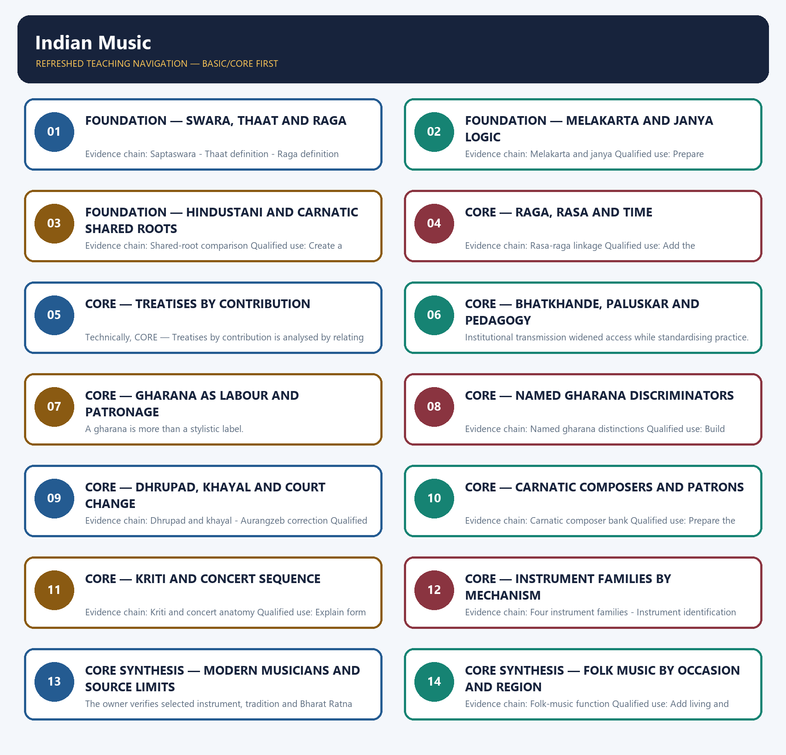

# Indian Music — Learner-v2 Complete Learning Session

> **Authoring-only generation:** 2026-09-01. No PDF was rendered and no tracker or index was mutated.

### SOURCE, PROGRESSION AND CURRENT-LINKAGE AUDIT

- **Generation date:** 2026-09-01.
- **Repository-first evidence:** the Basic owner is taught first and preserved in full; the Advanced owner is retained only in the optional final teaching block.
- **OCR evidence:** Repository Markdown was primary. The available OCR-searchable Nitin Singhania Indian Art and Culture PDF was retained as a supplementary source; no unsupported page precision, quotation or dynamic status was imported from it.
- **Qdrant:** not used; repository Markdown and available OCR context were sufficient.
- **PYQ integrity:** No direct GS-I Mains PYQ is routed to Indian music in the audited ledgers. Verified objective routes are retained for 2018 Tyagaraja-Annamacharya, 2019 Tansen, 2025 Gandharva Mahavidyalaya, and the provisional 2026 raga-equivalence and Mallikarjun Mansur demands; no withheld answer is inferred.
- **Live-link boundary:** Sangeet Natak Akademi's official awardees page was fetched on 2026-09-01 and displayed a 2025 award record. It is used only to verify that the national performing-arts recognition list is a live, updateable official record; no musician's gharana, repertoire, instrument classification or unsourced award claim is inferred from it.
- **Fact/inference discipline:** no current-affairs item, PYQ wording, figure or quotation is invented.

## BASIC LEARNING SESSION



*Distinct embedded teaching-navigation image. The separate continuous Cārvāka-style flowchart package remains an independent at-a-glance artifact.*

### SESSION 1 — FOUNDATION — SWARA, THAAT AND RAGA

#### DEFINITION / WHAT THIS IS CALLED

**Plain-language definition:** A thaat is an unsung Hindustani parent scale of seven notes stated in ascending order, without vaadi-samvadi or an independent emotional identity.

**Technical definition:** Evidence chain: Saptaswara - Thaat definition - Raga definition Qualified use: Build the foundational theory vocabulary.

#### ANSWER-GRABBING OPENING — WRITE/ADAPT IN THE EXAM

> Evidence chain: Saptaswara - Thaat definition - Raga definition Qualified use: Build the foundational theory vocabulary.

#### MUST-WRITE KEYWORDS

- **FOUNDATION**
- **Swara**
- **thaat**
- **raga**
- **Evidence chain**
- **Qualified use**

**How to use them:** Frame the answer through FOUNDATION; define Swara, connect thaat with raga to explain the mechanism, and use Evidence chain for the decisive comparison or qualification.

#### VISUAL FIRST

```text
SWARA, THAAT AND RAGA
01. Saptaswara
    |
    v
02. Thaat definition
    |
    v
03. Raga definition
BOUNDARY -> Parent scale and performed melody are distinct.
```

*This topic-specific rail fixes the evidence sequence and its exam boundary before analysis.*

#### CORE EXPLANATION

Shadja, Rishabha, Gandhara, Madhyama, Panchama, Dhaivata and Nishada form the seven-note base shared across Indian classical traditions. A thaat is an unsung Hindustani parent scale of seven notes stated in ascending order, without vaadi-samvadi or an independent emotional identity. A raga is a melodic entity with aaroha-avaroha, characteristic note hierarchy and phrase, five, six or seven notes, and aesthetic or temporal associations.

#### NAMED EVIDENCE AND MECHANISM

- Shadja, Rishabha, Gandhara, Madhyama, Panchama, Dhaivata and Nishada form the seven-note base shared across Indian classical traditions.
- A thaat is an unsung Hindustani parent scale of seven notes stated in ascending order, without vaadi-samvadi or an independent emotional identity.
- A raga is a melodic entity with aaroha-avaroha, characteristic note hierarchy and phrase, five, six or seven notes, and aesthetic or temporal associations.

#### EXAMINER CAUTION

- Parent scale and performed melody are distinct.

#### EXAM LINK

- **Prelims:** Retain the exact form, region, text, technique or institution attached to Swara, thaat and raga.
- **Mains:** Build the foundational theory vocabulary.

#### MINI RECAP

- **Evidence chain:** Saptaswara -> Thaat definition -> Raga definition
- **Qualified use:** Build the foundational theory vocabulary.

#### CLOSING RECALL FLOW — FOUNDATION — SWARA, THAAT AND RAGA

```text
START / CONCEPT: FOUNDATION — Swara, thaat and raga
        |
        v
EXACT TERMS: FOUNDATION · Swara · thaat · raga · Evidence chain · Qualified use
        |
        v
MECHANISM / ARGUMENT: A thaat is an unsung Hindustani parent scale of seven notes stated in ascending order, without vaadi-samvadi or an independent emotional identity.
        |
        v
CONSEQUENCE / CONTRAST: A raga is a melodic entity with aaroha-avaroha, characteristic note hierarchy and phrase, five, six or seven notes, and aesthetic or temporal associations.
        |
        v
UPSC TRAP / ANSWER-USE: Do not miss this limiting distinction: mains: Build the foundational theory vocabulary.
        |
        v
ANSWER-GRABBING FORMULATION: Evidence chain: Saptaswara - Thaat definition - Raga definition Qualified use: Build the foundational theory vocabulary.
```
### SESSION 2 — FOUNDATION — MELAKARTA AND JANYA LOGIC

#### DEFINITION / WHAT THIS IS CALLED

**Plain-language definition:** Carnatic theory uses seventy-two sampurna melakarta or janaka parent ragas, with janya ragas derived from them; melakarta is not another name for a Hindustani thaat.

**Technical definition:** Evidence chain: Melakarta and janya Qualified use: Prepare system-comparison questions.

#### ANSWER-GRABBING OPENING — WRITE/ADAPT IN THE EXAM

> Carnatic theory uses seventy-two sampurna melakarta or janaka parent ragas, with janya ragas derived from them; melakarta is not another name for a Hindustani thaat.

#### MUST-WRITE KEYWORDS

- **FOUNDATION**
- **Melakarta**
- **janya logic**
- **Evidence chain**
- **Qualified use**
- **Carnatic**

**How to use them:** Frame the answer through FOUNDATION; define Melakarta, connect janya logic with Evidence chain to explain the mechanism, and use Qualified use for the decisive comparison or qualification.

#### VISUAL FIRST

```text
MELAKARTA AND JANYA LOGIC
01. Melakarta and janya
BOUNDARY -> Do not map seventy-two melakartas onto ten thaats.
```

*This topic-specific rail fixes the evidence sequence and its exam boundary before analysis.*

#### CORE EXPLANATION

Carnatic theory uses seventy-two sampurna melakarta or janaka parent ragas, with janya ragas derived from them; melakarta is not another name for a Hindustani thaat.

#### NAMED EVIDENCE AND MECHANISM

- Carnatic theory uses seventy-two sampurna melakarta or janaka parent ragas, with janya ragas derived from them; melakarta is not another name for a Hindustani thaat.

#### EXAMINER CAUTION

- Do not map seventy-two melakartas onto ten thaats.

#### EXAM LINK

- **Prelims:** Retain the exact form, region, text, technique or institution attached to Melakarta and janya logic.
- **Mains:** Prepare system-comparison questions.

#### MINI RECAP

- **Evidence chain:** Melakarta and janya
- **Qualified use:** Prepare system-comparison questions.

#### CLOSING RECALL FLOW — FOUNDATION — MELAKARTA AND JANYA LOGIC

```text
START / CONCEPT: FOUNDATION — Melakarta and janya logic
        |
        v
EXACT TERMS: FOUNDATION · Melakarta · janya logic · Evidence chain · Qualified use · Carnatic
        |
        v
MECHANISM / ARGUMENT: Evidence chain: Melakarta and janya Qualified use: Prepare system-comparison questions.
        |
        v
CONSEQUENCE / CONTRAST: Do not map seventy-two melakartas onto ten thaats.
        |
        v
UPSC TRAP / ANSWER-USE: Do not miss this limiting distinction: carnatic theory uses seventy-two sampurna melakarta or janaka parent ragas, with janya ragas derived...
        |
        v
ANSWER-GRABBING FORMULATION: Carnatic theory uses seventy-two sampurna melakarta or janaka parent ragas, with janya ragas derived from them; melakarta is not another name for a Hindustani thaat.
```
### SESSION 3 — FOUNDATION — HINDUSTANI AND CARNATIC SHARED ROOTS

#### DEFINITION / WHAT THIS IS CALLED

**Plain-language definition:** Hindustani and Carnatic music share older theory but differ in classification, repertoire, ornament and performance sequence; neither is improvisation-free or culturally pure.

**Technical definition:** Evidence chain: Shared-root comparison Qualified use: Create a balanced comparison thesis.

#### ANSWER-GRABBING OPENING — WRITE/ADAPT IN THE EXAM

> Hindustani and Carnatic music share older theory but differ in classification, repertoire, ornament and performance sequence; neither is improvisation-free or culturally pure.

#### MUST-WRITE KEYWORDS

- **FOUNDATION**
- **Hindustani**
- **Carnatic shared roots**
- **Evidence chain**
- **Qualified use**
- **Carnatic**

**How to use them:** Frame the answer through FOUNDATION; define Hindustani, connect Carnatic shared roots with Evidence chain to explain the mechanism, and use Qualified use for the decisive comparison or qualification.

#### VISUAL FIRST

```text
HINDUSTANI AND CARNATIC SHARED ROOTS
01. Shared-root comparison
BOUNDARY -> Reject foreign-versus-pure and improvisation-versus-fixed binaries.
```

*This topic-specific rail fixes the evidence sequence and its exam boundary before analysis.*

#### CORE EXPLANATION

Hindustani and Carnatic music share older theory but differ in classification, repertoire, ornament and performance sequence; neither is improvisation-free or culturally pure.

#### NAMED EVIDENCE AND MECHANISM

- Hindustani and Carnatic music share older theory but differ in classification, repertoire, ornament and performance sequence; neither is improvisation-free or culturally pure.

#### EXAMINER CAUTION

- Reject foreign-versus-pure and improvisation-versus-fixed binaries.

#### EXAM LINK

- **Prelims:** Retain the exact form, region, text, technique or institution attached to Hindustani and Carnatic shared roots.
- **Mains:** Create a balanced comparison thesis.

#### MINI RECAP

- **Evidence chain:** Shared-root comparison
- **Qualified use:** Create a balanced comparison thesis.

#### CLOSING RECALL FLOW — FOUNDATION — HINDUSTANI AND CARNATIC SHARED ROOTS

```text
START / CONCEPT: FOUNDATION — Hindustani and Carnatic shared roots
        |
        v
EXACT TERMS: FOUNDATION · Hindustani · Carnatic shared roots · Evidence chain · Qualified use · Carnatic
        |
        v
MECHANISM / ARGUMENT: Evidence chain: Shared-root comparison Qualified use: Create a balanced comparison thesis.
        |
        v
CONSEQUENCE / CONTRAST: Mains: Create a balanced comparison thesis.
        |
        v
UPSC TRAP / ANSWER-USE: Do not miss this limiting distinction: hindustani and Carnatic music share older theory but differ in classification, repertoire, ornament and...
        |
        v
ANSWER-GRABBING FORMULATION: Hindustani and Carnatic music share older theory but differ in classification, repertoire, ornament and performance sequence; neither is improvisation-free or culturally pure.
```
### SESSION 4 — CORE — RAGA, RASA AND TIME

#### DEFINITION / WHAT THIS IS CALLED

**Plain-language definition:** Music uses the wider nine-rasa aesthetic vocabulary by associating melodic treatment with mood, time or season; such associations are tradition-specific rather than universal acoustical laws.

**Technical definition:** Evidence chain: Rasa-raga linkage Qualified use: Add the cross-performing-arts dimension.

#### ANSWER-GRABBING OPENING — WRITE/ADAPT IN THE EXAM

> Music uses the wider nine-rasa aesthetic vocabulary by associating melodic treatment with mood, time or season; such associations are tradition-specific rather than universal acoustical laws.

#### MUST-WRITE KEYWORDS

- **Raga**
- **rasa**
- **time**
- **Evidence chain**
- **Qualified use**
- **Music**

**How to use them:** Frame the answer through Raga; define rasa, connect time with Evidence chain to explain the mechanism, and use Qualified use for the decisive comparison or qualification.

#### VISUAL FIRST

```text
RAGA, RASA AND TIME
01. Rasa-raga linkage
BOUNDARY -> Associations are aesthetic conventions, not universal physical laws.
```

*This topic-specific rail fixes the evidence sequence and its exam boundary before analysis.*

#### CORE EXPLANATION

Music uses the wider nine-rasa aesthetic vocabulary by associating melodic treatment with mood, time or season; such associations are tradition-specific rather than universal acoustical laws.

#### NAMED EVIDENCE AND MECHANISM

- Music uses the wider nine-rasa aesthetic vocabulary by associating melodic treatment with mood, time or season; such associations are tradition-specific rather than universal acoustical laws.

#### EXAMINER CAUTION

- Associations are aesthetic conventions, not universal physical laws.

#### EXAM LINK

- **Prelims:** Retain the exact form, region, text, technique or institution attached to Raga, rasa and time.
- **Mains:** Add the cross-performing-arts dimension.

#### MINI RECAP

- **Evidence chain:** Rasa-raga linkage
- **Qualified use:** Add the cross-performing-arts dimension.

#### CLOSING RECALL FLOW — CORE — RAGA, RASA AND TIME

```text
START / CONCEPT: CORE — Raga, rasa and time
        |
        v
EXACT TERMS: Raga · rasa · time · Evidence chain · Qualified use · Music
        |
        v
MECHANISM / ARGUMENT: Evidence chain: Rasa-raga linkage Qualified use: Add the cross-performing-arts dimension.
        |
        v
CONSEQUENCE / CONTRAST: Associations are aesthetic conventions, not universal physical laws.
        |
        v
UPSC TRAP / ANSWER-USE: Do not miss this limiting distinction: music uses the wider nine-rasa aesthetic vocabulary by associating melodic treatment with mood, time...
        |
        v
ANSWER-GRABBING FORMULATION: Music uses the wider nine-rasa aesthetic vocabulary by associating melodic treatment with mood, time or season; such associations are tradition-specific rather than universal acoustical laws.
```
### SESSION 5 — CORE — TREATISES BY CONTRIBUTION

#### DEFINITION / WHAT THIS IS CALLED

**Plain-language definition:** Evidence chain: Treatise contribution chain Qualified use: Build a chronological theory spine.

**Technical definition:** Technically, CORE — Treatises by contribution is analysed by relating Treatises by contribution to Evidence chain, then testing the relationship through Qualified use and Bharata.

#### ANSWER-GRABBING OPENING — WRITE/ADAPT IN THE EXAM

> Evidence chain: Treatise contribution chain Qualified use: Build a chronological theory spine.

#### MUST-WRITE KEYWORDS

- **Treatises by contribution**
- **Evidence chain**
- **Qualified use**
- **Bharata**
- **Matanga's Brihaddeshi**
- **Sharngadeva's Sangita Ratnakara**

**How to use them:** Frame the answer through Treatises by contribution; define Evidence chain, connect Qualified use with Bharata to explain the mechanism, and use Matanga's Brihaddeshi for the decisive comparison or qualification.

#### VISUAL FIRST

```text
TREATISES BY CONTRIBUTION
01. Treatise contribution chain
BOUNDARY -> A title list without conceptual contribution earns little.
```

*This topic-specific rail fixes the evidence sequence and its exam boundary before analysis.*

#### CORE EXPLANATION

Bharata links music with drama, Matanga's Brihaddeshi defines raga, Sharngadeva's Sangita Ratnakara precedes bifurcation, and Venkatamakhin systematises melakarta.

#### NAMED EVIDENCE AND MECHANISM

- Bharata links music with drama, Matanga's Brihaddeshi defines raga, Sharngadeva's Sangita Ratnakara precedes bifurcation, and Venkatamakhin systematises melakarta.

#### EXAMINER CAUTION

- A title list without conceptual contribution earns little.

#### EXAM LINK

- **Prelims:** Retain the exact form, region, text, technique or institution attached to Treatises by contribution.
- **Mains:** Build a chronological theory spine.

#### MINI RECAP

- **Evidence chain:** Treatise contribution chain
- **Qualified use:** Build a chronological theory spine.

#### CLOSING RECALL FLOW — CORE — TREATISES BY CONTRIBUTION

```text
START / CONCEPT: CORE — Treatises by contribution
        |
        v
EXACT TERMS: Treatises by contribution · Evidence chain · Qualified use · Bharata · Matanga's Brihaddeshi · Sharngadeva's Sangita Ratnakara
        |
        v
MECHANISM / ARGUMENT: Bharata links music with drama, Matanga's Brihaddeshi defines raga, Sharngadeva's Sangita Ratnakara precedes bifurcation, and Venkatamakhin systematises melakarta.
        |
        v
CONSEQUENCE / CONTRAST: Mains: Build a chronological theory spine.
        |
        v
UPSC TRAP / ANSWER-USE: Do not miss this limiting distinction: evidence chain: Treatise contribution chain Qualified use: Build a chronological theory spine.
        |
        v
ANSWER-GRABBING FORMULATION: Evidence chain: Treatise contribution chain Qualified use: Build a chronological theory spine.
```
### SESSION 6 — CORE — BHATKHANDE, PALUSKAR AND PEDAGOGY

#### DEFINITION / WHAT THIS IS CALLED

**Plain-language definition:** Evidence chain: Modern pedagogy Qualified use: Prepare the 2025 objective route.

**Technical definition:** Institutional transmission widened access while standardising practice.

#### ANSWER-GRABBING OPENING — WRITE/ADAPT IN THE EXAM

> Evidence chain: Modern pedagogy Qualified use: Prepare the 2025 objective route.

#### MUST-WRITE KEYWORDS

- **Bhatkhande**
- **Paluskar**
- **pedagogy**
- **Evidence chain**
- **Qualified use**
- **Institutional**

**How to use them:** Frame the answer through Bhatkhande; define Paluskar, connect pedagogy with Evidence chain to explain the mechanism, and use Qualified use for the decisive comparison or qualification.

#### VISUAL FIRST

```text
BHATKHANDE, PALUSKAR AND PEDAGOGY
01. Modern pedagogy
BOUNDARY -> Institutional transmission widened access while standardising practice.
```

*This topic-specific rail fixes the evidence sequence and its exam boundary before analysis.*

#### CORE EXPLANATION

V.N. Bhatkhande systematised thaat-based Hindustani pedagogy, while V.D. Paluskar founded Gandharva Mahavidyalaya in 1901 to teach and transmit classical music.

#### NAMED EVIDENCE AND MECHANISM

- V.N. Bhatkhande systematised thaat-based Hindustani pedagogy, while V.D. Paluskar founded Gandharva Mahavidyalaya in 1901 to teach and transmit classical music.

#### EXAMINER CAUTION

- Institutional transmission widened access while standardising practice.

#### EXAM LINK

- **Prelims:** Retain the exact form, region, text, technique or institution attached to Bhatkhande, Paluskar and pedagogy.
- **Mains:** Prepare the 2025 objective route.

#### MINI RECAP

- **Evidence chain:** Modern pedagogy
- **Qualified use:** Prepare the 2025 objective route.

#### CLOSING RECALL FLOW — CORE — BHATKHANDE, PALUSKAR AND PEDAGOGY

```text
START / CONCEPT: CORE — Bhatkhande, Paluskar and pedagogy
        |
        v
EXACT TERMS: Bhatkhande · Paluskar · pedagogy · Evidence chain · Qualified use · Institutional
        |
        v
MECHANISM / ARGUMENT: Institutional transmission widened access while standardising practice.
        |
        v
CONSEQUENCE / CONTRAST: The resulting consequence is that evidence chain: Modern pedagogy Qualified use: Prepare the 2025 objective route.
        |
        v
UPSC TRAP / ANSWER-USE: Do not miss this limiting distinction: evidence chain: Modern pedagogy Qualified use: Prepare the 2025 objective route.
        |
        v
ANSWER-GRABBING FORMULATION: Evidence chain: Modern pedagogy Qualified use: Prepare the 2025 objective route.
```
### SESSION 7 — CORE — GHARANA AS LABOUR AND PATRONAGE

#### DEFINITION / WHAT THIS IS CALLED

**Plain-language definition:** A gharana is a family or lineage-based structure that concentrates specialised technique, ties it to patronage and reproduces it through descent or long apprenticeship.

**Technical definition:** A gharana is more than a stylistic label.

#### ANSWER-GRABBING OPENING — WRITE/ADAPT IN THE EXAM

> A gharana is a family or lineage-based structure that concentrates specialised technique, ties it to patronage and reproduces it through descent or long apprenticeship.

#### MUST-WRITE KEYWORDS

- **Gharana as labour**
- **patronage**
- **Evidence chain**
- **Qualified use**
- **A gharana**
- **Gharana**

**How to use them:** Frame the answer through Gharana as labour; define patronage, connect Evidence chain with Qualified use to explain the mechanism, and use A gharana for the decisive comparison or qualification.

#### VISUAL FIRST

```text
GHARANA AS LABOUR AND PATRONAGE
01. Gharana as transmission ecology
BOUNDARY -> A gharana is more than a stylistic label.
```

*This topic-specific rail fixes the evidence sequence and its exam boundary before analysis.*

#### CORE EXPLANATION

A gharana is a family or lineage-based structure that concentrates specialised technique, ties it to patronage and reproduces it through descent or long apprenticeship.

#### NAMED EVIDENCE AND MECHANISM

- A gharana is a family or lineage-based structure that concentrates specialised technique, ties it to patronage and reproduces it through descent or long apprenticeship.

#### EXAMINER CAUTION

- A gharana is more than a stylistic label.

#### EXAM LINK

- **Prelims:** Retain the exact form, region, text, technique or institution attached to Gharana as labour and patronage.
- **Mains:** Explain transmission as social organisation.

#### MINI RECAP

- **Evidence chain:** Gharana as transmission ecology
- **Qualified use:** Explain transmission as social organisation.

#### CLOSING RECALL FLOW — CORE — GHARANA AS LABOUR AND PATRONAGE

```text
START / CONCEPT: CORE — Gharana as labour and patronage
        |
        v
EXACT TERMS: Gharana as labour · patronage · Evidence chain · Qualified use · A gharana · Gharana
        |
        v
MECHANISM / ARGUMENT: Evidence chain: Gharana as transmission ecology Qualified use: Explain transmission as social organisation.
        |
        v
CONSEQUENCE / CONTRAST: A gharana is more than a stylistic label.
        |
        v
UPSC TRAP / ANSWER-USE: Do not miss this limiting distinction: mains: Explain transmission as social organisation.
        |
        v
ANSWER-GRABBING FORMULATION: A gharana is a family or lineage-based structure that concentrates specialised technique, ties it to patronage and reproduces it through descent or long apprenticeship.
```
### SESSION 8 — CORE — NAMED GHARANA DISCRIMINATORS

#### DEFINITION / WHAT THIS IS CALLED

**Plain-language definition:** Dagar centres Dhrupad, Darbhanga balances alaap and layakari, Gwalior is the oldest khayal gharana, Kirana stresses swara, Agra blends khayal and Dhrupad-Dhamar, and Patiala favours thumri-ghazal.

**Technical definition:** Evidence chain: Named gharana distinctions Qualified use: Build Prelims elimination.

#### ANSWER-GRABBING OPENING — WRITE/ADAPT IN THE EXAM

> Dagar centres Dhrupad, Darbhanga balances alaap and layakari, Gwalior is the oldest khayal gharana, Kirana stresses swara, Agra blends khayal and Dhrupad-Dhamar, and Patiala favours thumri-ghazal.

#### MUST-WRITE KEYWORDS

- **Named gharana discriminators**
- **Evidence chain**
- **Qualified use**
- **Dagar**
- **Dhrupad**
- **Darbhanga**

**How to use them:** Frame the answer through Named gharana discriminators; define Evidence chain, connect Qualified use with Dagar to explain the mechanism, and use Dhrupad for the decisive comparison or qualification.

#### VISUAL FIRST

```text
NAMED GHARANA DISCRIMINATORS
01. Named gharana distinctions
BOUNDARY -> Do not swap exponents or specialisations.
```

*This topic-specific rail fixes the evidence sequence and its exam boundary before analysis.*

#### CORE EXPLANATION

Dagar centres Dhrupad, Darbhanga balances alaap and layakari, Gwalior is the oldest khayal gharana, Kirana stresses swara, Agra blends khayal and Dhrupad-Dhamar, and Patiala favours thumri-ghazal.

#### NAMED EVIDENCE AND MECHANISM

- Dagar centres Dhrupad, Darbhanga balances alaap and layakari, Gwalior is the oldest khayal gharana, Kirana stresses swara, Agra blends khayal and Dhrupad-Dhamar, and Patiala favours thumri-ghazal.

#### EXAMINER CAUTION

- Do not swap exponents or specialisations.

#### EXAM LINK

- **Prelims:** Retain the exact form, region, text, technique or institution attached to Named gharana discriminators.
- **Mains:** Build Prelims elimination.

#### MINI RECAP

- **Evidence chain:** Named gharana distinctions
- **Qualified use:** Build Prelims elimination.

#### CLOSING RECALL FLOW — CORE — NAMED GHARANA DISCRIMINATORS

```text
START / CONCEPT: CORE — Named gharana discriminators
        |
        v
EXACT TERMS: Named gharana discriminators · Evidence chain · Qualified use · Dagar · Dhrupad · Darbhanga
        |
        v
MECHANISM / ARGUMENT: Evidence chain: Named gharana distinctions Qualified use: Build Prelims elimination.
        |
        v
CONSEQUENCE / CONTRAST: Do not swap exponents or specialisations.
        |
        v
UPSC TRAP / ANSWER-USE: Do not miss this limiting distinction: evidence chain: Named gharana distinctions Qualified use: Build Prelims elimination.
        |
        v
ANSWER-GRABBING FORMULATION: Dagar centres Dhrupad, Darbhanga balances alaap and layakari, Gwalior is the oldest khayal gharana, Kirana stresses swara, Agra blends khayal and Dhrupad-Dhamar, and Patiala favours thumri-ghazal.
```
### SESSION 9 — CORE — DHRUPAD, KHAYAL AND COURT CHANGE

#### DEFINITION / WHAT THIS IS CALLED

**Plain-language definition:** Dhrupad is an older austere vocal form with vani and gharana lineages, while khayal permits a different improvisational and compositional field; one is not merely the fast version of the other.

**Technical definition:** Evidence chain: Dhrupad and khayal - Aurangzeb correction Qualified use: Correct the Aurangzeb cliché.

#### ANSWER-GRABBING OPENING — WRITE/ADAPT IN THE EXAM

> Dhrupad is an older austere vocal form with vani and gharana lineages, while khayal permits a different improvisational and compositional field; one is not merely the fast version of the other.

#### MUST-WRITE KEYWORDS

- **Dhrupad**
- **khayal**
- **court change**
- **Evidence chain**
- **Qualified use**
- **Imperial**

**How to use them:** Frame the answer through Dhrupad; define khayal, connect court change with Evidence chain to explain the mechanism, and use Qualified use for the decisive comparison or qualification.

#### VISUAL FIRST

```text
DHRUPAD, KHAYAL AND COURT CHANGE
01. Dhrupad and khayal
    |
    v
02. Aurangzeb correction
BOUNDARY -> Court restriction was redirection, not extinction.
```

*This topic-specific rail fixes the evidence sequence and its exam boundary before analysis.*

#### CORE EXPLANATION

Dhrupad is an older austere vocal form with vani and gharana lineages, while khayal permits a different improvisational and compositional field; one is not merely the fast version of the other. Imperial court singing was curtailed, but instruments, elite patronage and music writing continued; Aurangzeb played the veena and Sadarang-Adarang later strengthened khayal under Muhammad Shah.

#### NAMED EVIDENCE AND MECHANISM

- Dhrupad is an older austere vocal form with vani and gharana lineages, while khayal permits a different improvisational and compositional field; one is not merely the fast version of the other.
- Imperial court singing was curtailed, but instruments, elite patronage and music writing continued; Aurangzeb played the veena and Sadarang-Adarang later strengthened khayal under Muhammad Shah.

#### EXAMINER CAUTION

- Court restriction was redirection, not extinction.

#### EXAM LINK

- **Prelims:** Retain the exact form, region, text, technique or institution attached to Dhrupad, khayal and court change.
- **Mains:** Correct the Aurangzeb cliché.

#### MINI RECAP

- **Evidence chain:** Dhrupad and khayal -> Aurangzeb correction
- **Qualified use:** Correct the Aurangzeb cliché.

#### CLOSING RECALL FLOW — CORE — DHRUPAD, KHAYAL AND COURT CHANGE

```text
START / CONCEPT: CORE — Dhrupad, khayal and court change
        |
        v
EXACT TERMS: Dhrupad · khayal · court change · Evidence chain · Qualified use · Imperial
        |
        v
MECHANISM / ARGUMENT: Evidence chain: Dhrupad and khayal - Aurangzeb correction Qualified use: Correct the Aurangzeb cliché.
        |
        v
CONSEQUENCE / CONTRAST: Imperial court singing was curtailed, but instruments, elite patronage and music writing continued; Aurangzeb played the veena and Sadarang-Adarang later strengthened khayal under Muhammad Shah.
        |
        v
UPSC TRAP / ANSWER-USE: Court restriction was redirection, not extinction.
        |
        v
ANSWER-GRABBING FORMULATION: Dhrupad is an older austere vocal form with vani and gharana lineages, while khayal permits a different improvisational and compositional field; one is not merely the fast version of the other.
```
### SESSION 10 — CORE — CARNATIC COMPOSERS AND PATRONS

#### DEFINITION / WHAT THIS IS CALLED

**Plain-language definition:** Annamacharya praised Venkateswara, Purandara Dasa is honoured for pedagogic and repertorial foundations, and Tyagaraja, Muthuswami Dikshitar and Syama Sastri form the Carnatic Trinity.

**Technical definition:** Evidence chain: Carnatic composer bank Qualified use: Prepare the 2018 objective route.

#### ANSWER-GRABBING OPENING — WRITE/ADAPT IN THE EXAM

> Annamacharya praised Venkateswara, Purandara Dasa is honoured for pedagogic and repertorial foundations, and Tyagaraja, Muthuswami Dikshitar and Syama Sastri form the Carnatic Trinity.

#### MUST-WRITE KEYWORDS

- **Carnatic composers**
- **patrons**
- **Evidence chain**
- **Qualified use**
- **Annamacharya praised Venkateswara, Purandara Dasa**
- **Annamacharya**

**How to use them:** Frame the answer through Carnatic composers; define patrons, connect Evidence chain with Qualified use to explain the mechanism, and use Annamacharya praised Venkateswara, Purandara Dasa for the decisive comparison or qualification.

#### VISUAL FIRST

```text
CARNATIC COMPOSERS AND PATRONS
01. Carnatic composer bank
BOUNDARY -> Keep Venkateswara, Krishna and the Trinity distinct.
```

*This topic-specific rail fixes the evidence sequence and its exam boundary before analysis.*

#### CORE EXPLANATION

Annamacharya praised Venkateswara, Purandara Dasa is honoured for pedagogic and repertorial foundations, and Tyagaraja, Muthuswami Dikshitar and Syama Sastri form the Carnatic Trinity.

#### NAMED EVIDENCE AND MECHANISM

- Annamacharya praised Venkateswara, Purandara Dasa is honoured for pedagogic and repertorial foundations, and Tyagaraja, Muthuswami Dikshitar and Syama Sastri form the Carnatic Trinity.

#### EXAMINER CAUTION

- Keep Venkateswara, Krishna and the Trinity distinct.

#### EXAM LINK

- **Prelims:** Retain the exact form, region, text, technique or institution attached to Carnatic composers and patrons.
- **Mains:** Prepare the 2018 objective route.

#### MINI RECAP

- **Evidence chain:** Carnatic composer bank
- **Qualified use:** Prepare the 2018 objective route.

#### CLOSING RECALL FLOW — CORE — CARNATIC COMPOSERS AND PATRONS

```text
START / CONCEPT: CORE — Carnatic composers and patrons
        |
        v
EXACT TERMS: Carnatic composers · patrons · Evidence chain · Qualified use · Annamacharya praised Venkateswara, Purandara Dasa · Annamacharya
        |
        v
MECHANISM / ARGUMENT: Evidence chain: Carnatic composer bank Qualified use: Prepare the 2018 objective route.
        |
        v
CONSEQUENCE / CONTRAST: The resulting consequence is that evidence chain: Carnatic composer bank Qualified use: Prepare the 2018 objective route.
        |
        v
UPSC TRAP / ANSWER-USE: Do not miss this limiting distinction: evidence chain: Carnatic composer bank Qualified use: Prepare the 2018 objective route.
        |
        v
ANSWER-GRABBING FORMULATION: Annamacharya praised Venkateswara, Purandara Dasa is honoured for pedagogic and repertorial foundations, and Tyagaraja, Muthuswami Dikshitar and Syama Sastri form the Carnatic Trinity.
```
### SESSION 11 — CORE — KRITI AND CONCERT SEQUENCE

#### DEFINITION / WHAT THIS IS CALLED

**Plain-language definition:** A kriti is a composed Carnatic form set to raga and tala with pallavi, anupallavi and charana; concerts also use varnam, alapana, niraval, kalpana swara, tanam and tillana.

**Technical definition:** Evidence chain: Kriti and concert anatomy Qualified use: Explain form and manodharma.

#### ANSWER-GRABBING OPENING — WRITE/ADAPT IN THE EXAM

> A kriti is a composed Carnatic form set to raga and tala with pallavi, anupallavi and charana; concerts also use varnam, alapana, niraval, kalpana swara, tanam and tillana.

#### MUST-WRITE KEYWORDS

- **Kriti**
- **concert sequence**
- **Evidence chain**
- **Qualified use**
- **A kriti**
- **Carnatic**

**How to use them:** Frame the answer through Kriti; define concert sequence, connect Evidence chain with Qualified use to explain the mechanism, and use A kriti for the decisive comparison or qualification.

#### VISUAL FIRST

```text
KRITI AND CONCERT SEQUENCE
01. Kriti and concert anatomy
BOUNDARY -> Do not invent a formal definition of kirtana.
```

*This topic-specific rail fixes the evidence sequence and its exam boundary before analysis.*

#### CORE EXPLANATION

A kriti is a composed Carnatic form set to raga and tala with pallavi, anupallavi and charana; concerts also use varnam, alapana, niraval, kalpana swara, tanam and tillana.

#### NAMED EVIDENCE AND MECHANISM

- A kriti is a composed Carnatic form set to raga and tala with pallavi, anupallavi and charana; concerts also use varnam, alapana, niraval, kalpana swara, tanam and tillana.

#### EXAMINER CAUTION

- Do not invent a formal definition of kirtana.

#### EXAM LINK

- **Prelims:** Retain the exact form, region, text, technique or institution attached to Kriti and concert sequence.
- **Mains:** Explain form and manodharma.

#### MINI RECAP

- **Evidence chain:** Kriti and concert anatomy
- **Qualified use:** Explain form and manodharma.

#### CLOSING RECALL FLOW — CORE — KRITI AND CONCERT SEQUENCE

```text
START / CONCEPT: CORE — Kriti and concert sequence
        |
        v
EXACT TERMS: Kriti · concert sequence · Evidence chain · Qualified use · A kriti · Carnatic
        |
        v
MECHANISM / ARGUMENT: Evidence chain: Kriti and concert anatomy Qualified use: Explain form and manodharma.
        |
        v
CONSEQUENCE / CONTRAST: Do not invent a formal definition of kirtana.
        |
        v
UPSC TRAP / ANSWER-USE: Do not miss this limiting distinction: a kriti is a composed Carnatic form set to raga and tala with pallavi...
        |
        v
ANSWER-GRABBING FORMULATION: A kriti is a composed Carnatic form set to raga and tala with pallavi, anupallavi and charana; concerts also use varnam, alapana, niraval, kalpana swara, tanam and tillana.
```
### SESSION 12 — CORE — INSTRUMENT FAMILIES BY MECHANISM

#### DEFINITION / WHAT THIS IS CALLED

**Plain-language definition:** Santoor is a struck string instrument, ghatam and jaltarang are Ghana, tabla and mridangam are Avanaddha, and no inventor or unsupported invention date should be attached to them.

**Technical definition:** Evidence chain: Four instrument families - Instrument identification limits Qualified use: Prepare instrument identification.

#### ANSWER-GRABBING OPENING — WRITE/ADAPT IN THE EXAM

> Santoor is a struck string instrument, ghatam and jaltarang are Ghana, tabla and mridangam are Avanaddha, and no inventor or unsupported invention date should be attached to them.

#### MUST-WRITE KEYWORDS

- **Instrument families by mechanism**
- **Evidence chain**
- **Qualified use**
- **Tata**
- **Sushira**
- **Avanaddha**

**How to use them:** Frame the answer through Instrument families by mechanism; define Evidence chain, connect Qualified use with Tata to explain the mechanism, and use Sushira for the decisive comparison or qualification.

#### VISUAL FIRST

```text
INSTRUMENT FAMILIES BY MECHANISM
01. Four instrument families
    |
    v
02. Instrument identification limits
BOUNDARY -> Membrane, air, string and solid-body tests control classification.
```

*This topic-specific rail fixes the evidence sequence and its exam boundary before analysis.*

#### CORE EXPLANATION

Tata are chordophones, Sushira aerophones, Avanaddha membranophones and Ghana idiophones; the presence of a stretched membrane separates Avanaddha from solid-bodied Ghana. Santoor is a struck string instrument, ghatam and jaltarang are Ghana, tabla and mridangam are Avanaddha, and no inventor or unsupported invention date should be attached to them.

#### NAMED EVIDENCE AND MECHANISM

- Tata are chordophones, Sushira aerophones, Avanaddha membranophones and Ghana idiophones; the presence of a stretched membrane separates Avanaddha from solid-bodied Ghana.
- Santoor is a struck string instrument, ghatam and jaltarang are Ghana, tabla and mridangam are Avanaddha, and no inventor or unsupported invention date should be attached to them.

#### EXAMINER CAUTION

- Membrane, air, string and solid-body tests control classification.

#### EXAM LINK

- **Prelims:** Retain the exact form, region, text, technique or institution attached to Instrument families by mechanism.
- **Mains:** Prepare instrument identification.

#### MINI RECAP

- **Evidence chain:** Four instrument families -> Instrument identification limits
- **Qualified use:** Prepare instrument identification.

#### CLOSING RECALL FLOW — CORE — INSTRUMENT FAMILIES BY MECHANISM

```text
START / CONCEPT: CORE — Instrument families by mechanism
        |
        v
EXACT TERMS: Instrument families by mechanism · Evidence chain · Qualified use · Tata · Sushira · Avanaddha
        |
        v
MECHANISM / ARGUMENT: Evidence chain: Four instrument families - Instrument identification limits Qualified use: Prepare instrument identification.
        |
        v
CONSEQUENCE / CONTRAST: Tata are chordophones, Sushira aerophones, Avanaddha membranophones and Ghana idiophones; the presence of a stretched membrane separates Avanaddha from solid-bodied Ghana.
        |
        v
UPSC TRAP / ANSWER-USE: Do not miss this limiting distinction: four instrument families - Instrument identification limits Qualified use.
        |
        v
ANSWER-GRABBING FORMULATION: Santoor is a struck string instrument, ghatam and jaltarang are Ghana, tabla and mridangam are Avanaddha, and no inventor or unsupported invention date should be attached to them.
```
### SESSION 13 — CORE SYNTHESIS — MODERN MUSICIANS AND SOURCE LIMITS

#### DEFINITION / WHAT THIS IS CALLED

**Plain-language definition:** Evidence chain: Modern musician precision Qualified use: Model attribution discipline.

**Technical definition:** The owner verifies selected instrument, tradition and Bharat Ratna pairings but prohibits adding unsupported gurus, gharanas, films or awards; Ravi Shankar is not assigned a gharana there.

#### ANSWER-GRABBING OPENING — WRITE/ADAPT IN THE EXAM

> Evidence chain: Modern musician precision Qualified use: Model attribution discipline.

#### MUST-WRITE KEYWORDS

- **CORE SYNTHESIS**
- **Modern musicians**
- **source limits**
- **Evidence chain**
- **Qualified use**
- **Bharat Ratna**

**How to use them:** Frame the answer through CORE SYNTHESIS; define Modern musicians, connect source limits with Evidence chain to explain the mechanism, and use Qualified use for the decisive comparison or qualification.

#### VISUAL FIRST

```text
MODERN MUSICIANS AND SOURCE LIMITS
01. Modern musician precision
BOUNDARY -> Do not fill recorded gaps from memory.
```

*This topic-specific rail fixes the evidence sequence and its exam boundary before analysis.*

#### CORE EXPLANATION

The owner verifies selected instrument, tradition and Bharat Ratna pairings but prohibits adding unsupported gurus, gharanas, films or awards; Ravi Shankar is not assigned a gharana there.

#### NAMED EVIDENCE AND MECHANISM

- The owner verifies selected instrument, tradition and Bharat Ratna pairings but prohibits adding unsupported gurus, gharanas, films or awards; Ravi Shankar is not assigned a gharana there.

#### EXAMINER CAUTION

- Do not fill recorded gaps from memory.

#### EXAM LINK

- **Prelims:** Retain the exact form, region, text, technique or institution attached to Modern musicians and source limits.
- **Mains:** Model attribution discipline.

#### MINI RECAP

- **Evidence chain:** Modern musician precision
- **Qualified use:** Model attribution discipline.

#### CLOSING RECALL FLOW — CORE SYNTHESIS — MODERN MUSICIANS AND SOURCE LIMITS

```text
START / CONCEPT: CORE SYNTHESIS — Modern musicians and source limits
        |
        v
EXACT TERMS: CORE SYNTHESIS · Modern musicians · source limits · Evidence chain · Qualified use · Bharat Ratna
        |
        v
MECHANISM / ARGUMENT: The owner verifies selected instrument, tradition and Bharat Ratna pairings but prohibits adding unsupported gurus, gharanas, films or awards; Ravi Shankar is not assigned a gharana there.
        |
        v
CONSEQUENCE / CONTRAST: Do not fill recorded gaps from memory.
        |
        v
UPSC TRAP / ANSWER-USE: Do not miss this limiting distinction: the owner verifies selected instrument, tradition and Bharat Ratna pairings but prohibits adding unsupported...
        |
        v
ANSWER-GRABBING FORMULATION: Evidence chain: Modern musician precision Qualified use: Model attribution discipline.
```
### SESSION 14 — CORE SYNTHESIS — FOLK MUSIC BY OCCASION AND REGION

#### DEFINITION / WHAT THIS IS CALLED

**Plain-language definition:** Baul, Pandavani, Panihari, Lavani, Powada, Khongjom Parba and other forms are best distinguished by region, occasion, theme and transmission rather than ranked below classical music.

**Technical definition:** Evidence chain: Folk-music function Qualified use: Add living and historical memory functions.

#### ANSWER-GRABBING OPENING — WRITE/ADAPT IN THE EXAM

> Baul, Pandavani, Panihari, Lavani, Powada, Khongjom Parba and other forms are best distinguished by region, occasion, theme and transmission rather than ranked below classical music.

#### MUST-WRITE KEYWORDS

- **CORE SYNTHESIS**
- **Folk music by occasion**
- **region**
- **Evidence chain**
- **Qualified use**
- **Baul**

**How to use them:** Frame the answer through CORE SYNTHESIS; define Folk music by occasion, connect region with Evidence chain to explain the mechanism, and use Qualified use for the decisive comparison or qualification.

#### VISUAL FIRST

```text
FOLK MUSIC BY OCCASION AND REGION
01. Folk-music function
BOUNDARY -> Difference of function is not hierarchy.
```

*This topic-specific rail fixes the evidence sequence and its exam boundary before analysis.*

#### CORE EXPLANATION

Baul, Pandavani, Panihari, Lavani, Powada, Khongjom Parba and other forms are best distinguished by region, occasion, theme and transmission rather than ranked below classical music.

#### NAMED EVIDENCE AND MECHANISM

- Baul, Pandavani, Panihari, Lavani, Powada, Khongjom Parba and other forms are best distinguished by region, occasion, theme and transmission rather than ranked below classical music.

#### EXAMINER CAUTION

- Difference of function is not hierarchy.

#### EXAM LINK

- **Prelims:** Retain the exact form, region, text, technique or institution attached to Folk music by occasion and region.
- **Mains:** Add living and historical memory functions.

#### MINI RECAP

- **Evidence chain:** Folk-music function
- **Qualified use:** Add living and historical memory functions.

#### CLOSING RECALL FLOW — CORE SYNTHESIS — FOLK MUSIC BY OCCASION AND REGION

```text
START / CONCEPT: CORE SYNTHESIS — Folk music by occasion and region
        |
        v
EXACT TERMS: CORE SYNTHESIS · Folk music by occasion · region · Evidence chain · Qualified use · Baul
        |
        v
MECHANISM / ARGUMENT: Evidence chain: Folk-music function Qualified use: Add living and historical memory functions.
        |
        v
CONSEQUENCE / CONTRAST: Difference of function is not hierarchy.
        |
        v
UPSC TRAP / ANSWER-USE: Do not miss this limiting distinction: baul, Pandavani, Panihari, Lavani, Powada, Khongjom Parba and other forms are best distinguished by...
        |
        v
ANSWER-GRABBING FORMULATION: Baul, Pandavani, Panihari, Lavani, Powada, Khongjom Parba and other forms are best distinguished by region, occasion, theme and transmission rather than ranked below classical music.
```
### CORE SYNTHESIS — SNA linkage and PYQ audit

#### VISUAL FIRST

```text
SNA LINKAGE AND PYQ AUDIT
01. Institutional recognition boundary
    |
    v
02. Music PYQ audit
BOUNDARY -> A current award list does not prove musical attributes.
```

*This topic-specific rail fixes the evidence sequence and its exam boundary before analysis.*

#### CORE EXPLANATION

Sangeet Natak Akademi award lists are dynamic official recognition records; an award does not define a raga, gharana, instrument family or the historical value of a tradition. Verified routes are objective demands on Tyagaraja-Annamacharya, Tansen, Gandharva Mahavidyalaya and two provisional 2026 questions; no direct routed Mains demand is invented.

#### NAMED EVIDENCE AND MECHANISM

- Sangeet Natak Akademi award lists are dynamic official recognition records; an award does not define a raga, gharana, instrument family or the historical value of a tradition.
- Verified routes are objective demands on Tyagaraja-Annamacharya, Tansen, Gandharva Mahavidyalaya and two provisional 2026 questions; no direct routed Mains demand is invented.

#### EXAMINER CAUTION

- A current award list does not prove musical attributes.

#### EXAM LINK

- **Prelims:** Retain the exact form, region, text, technique or institution attached to SNA linkage and PYQ audit.
- **Mains:** Close with transparent objective-route handling.

#### MINI RECAP

- **Evidence chain:** Institutional recognition boundary -> Music PYQ audit
- **Qualified use:** Close with transparent objective-route handling.
#### COMPLETE BASIC OWNER EVIDENCE BANK

> **Subject:** Indian Art & Culture | **Tier:** Must-Do (foundation) |
> **GS Paper:** GS-I.
> **Core area:** Swara-raga-tala vocabulary; Hindustani vs. Carnatic music;
> gharana system; Dhrupad/Khayal/Thumri/Tappa/Ghazal styles; instruments;
> folk music.
> **Grounded in:** Nitin Singhania, *Indian Art and Culture*, PDF pp.
> 411-457; Satish Chandra, *History of Medieval India*, PDF pp. 332-334;
> Satish Chandra, *Medieval History, 1526-1748, Part 2*, PDF pp. 394-395;
> `00_Master-Framework.md` Section 3; audited UPSC Mains 2024-2025
> GS Paper I (no direct question).
> ✅ = source-grounded | ⚠️ = analytical inference | 📰 = current anchor | ❌ = trap.
> *Companion: `advanced/08_Indian-Music.md`.*

#### 1. Snapshot and syllabus fit

✅ This topic covers Indian music's swara-raga-tala vocabulary, the
Hindustani-Carnatic division, gharana-based transmission, and named
musical styles/instruments. ⚠️ No 2024/2025 Mains question tests this
topic directly; it is primarily a Prelims and vocabulary-support topic
for any performing-arts question.

#### 2. Essential vocabulary

| Term | Exam-ready meaning |
|---|---|
| ✅ **Saptaswara** | The seven notes — Shadja (Sa), Rishabha (Re), Gandhara (Ga), Madhyama (Ma), Panchama (Pa), Dhaivata (Dha), Nishada (Ni) — the base scale of Indian music (*Nitin…pdf*, PDF pp. 411-ff). |
| ✅ **Raga** | A melodic framework associated with a specific time of day/season and evoked mood (rasa) — e.g. Bhairav (dawn, peace), Malkauns (midnight, bravery) (*Nitin…pdf*, PDF pp. 411-ff). |
| ✅ **Thaat vs. Raga** | A thaat is a parent scale (must have seven notes, only ascending-descending structure, no vaadi/samvadi note, named after a raga); a raga is a specific melodic entity (can have five/six/seven notes, has aaroha-avaroha and melody, has vaadi/samvadi notes) (*Nitin…pdf*, PDF pp. 411-ff). |
| ✅ **Gharana** | A hereditary/regional stylistic lineage of musical transmission (e.g. Dagar, Darbhanga, Gwalior, Kirana, Agra, Patiala, Bhendibazaar gharanas), each with a distinct vani/style and named exponents (*Nitin…pdf*, PDF pp. 411-ff). |
| ✅ **Dhrupad, Khayal, Thumri, Tappa, Ghazal, Tarana** | Named vocal styles of Hindustani music, each with a distinct structure, tempo and emotional register (*Nitin…pdf*, PDF pp. 411-ff). |
| ✅ **Sthayee/Mukhda vs. Antara** | The first (most-repeated) part of a composition vs. its second part (*Nitin…pdf*, PDF pp. 411-ff). |

#### 3. Core classification

✅ Indian classical music divides into two major traditions:
**Hindustani** and **Carnatic**. Both draw on older shared theory and both
contain extensive improvisation. Hindustani practice developed through
North Indian courtly, devotional and Persianate encounters; Carnatic
practice crystallised around South Indian temple/court/sabha networks.
Their contrast is one of grammar, repertoire, ornament and performance
sequence — not "foreign versus pure" or "improvised versus fixed."
✅ Hindustani vocal music
sub-classifies into styles including Dhrupad (oldest, associated with
Mian Tansen), Khayal, Thumri, Tappa, Ghazal and Tarana, each carried by
specific gharanas.

#### 4. Foundation narrative

✅ The Rasa framework used in music mirrors the Natya Shastra's nine
rasas (Shringara/love, Hasya/humour, Karuna/pathos, Raudra/anger,
Bhayanaka/horror, Veer/bravery, Adbhuta/wonder, Bibhatsya/disgust,
Shant/peace), each linked to specific ragas (e.g. Shringara with Raga
Kafi/Desh; Karuna with Raga Bhairavi) (*Nitin…pdf*, PDF pp. 411-ff). ✅
The Gharana system carries named lineages: Dagar Gharana (Dagar Vani,
Dhrupad); Darbhanga Gharana (Khandar Vani, equal focus on Alaap and
Layakari); Gwalior Gharana (oldest Khayal gharana, equal emphasis across
elements); Kirana Gharana (precise swara focus, Abdul Karim Khan); Agra
Gharana (blend of Khayal and Dhrupad-Dhamar); Patiala Gharana (Thumri/
Ghazal specialisation, Bade Ghulam Ali Khan); Bhendibazaar Gharana
(breath-control emphasis) (*Nitin…pdf*, PDF pp. 411-ff). ✅ Thumri, Tappa
and Ghazal are named as distinct semi-classical Hindustani styles, each
with its own historical origin and performance context (*Nitin…pdf*, PDF
pp. 411-ff).

✅ **Treatise spine:** Bharata's *Natyashastra* discusses music with drama;
Matanga's *Brihaddeshi* is associated with an early definition of raga;
Sharngadeva's *Sangita Ratnakara* (13th century) is a major pre-bifurcation
authority; Venkatamakhin's *Chaturdandi Prakasika* underlies the
melakarta approach; modern Hindustani pedagogy was systematised by V.N.
Bhatkhande and V.D. Paluskar. ✅ Carnatic classification uses 72
melakarta parent ragas and derived janya ragas; this is not the same system
as Hindustani thaats.

✅ Satish Chandra corrects a common Aurangzeb cliché: singing was removed
from the imperial court, but instrumental music continued; royal women and
nobles patronised music, Aurangzeb played the veena, and substantial music
literature was produced. Sadarang and Adarang later strengthened khayal
under Muhammad Shah; the invention dates of tabla and sitar remain
uncertain (*Part 2*, PDF pp. 394-395).

#### 5. Visual map or comparison table

```text
SAPTASWARA (Sa Re Ga Ma Pa Dha Ni)
        |
        v
THAAT (parent scale) --------> RAGA (specific melodic entity,
                                      time/season/rasa-linked)
        |
        v
HINDUSTANI MUSIC                    CARNATIC MUSIC
(North Indian court/devotional       (South Indian temple/court/
and Persianate encounters;           sabha ecology; extensive
extensive improvisation)             manodharma improvisation)
        |
        v
DHRUPAD -> KHAYAL -> THUMRI/TAPPA/GHAZAL/TARANA
(carried through GHARANAS: Dagar, Darbhanga, Gwalior,
Kirana, Agra, Patiala, Bhendibazaar...)
```

| Basis | Hindustani music | Carnatic music |
|---|---|---|
| ✅ Historical ecology | North Indian temple, devotional, Sultanate/Mughal and regional-court networks | South Indian temple, court and later sabha networks |
| ✅ Parent-scale system | Bhatkhande's 10 thaats (pedagogic classification) | 72 melakartas; janya ragas derived from them |
| ✅ Improvisation | Alap, bol-bant, taan, layakari, etc. | Alapana, niraval, kalpana swara, tanam, pallavi, etc. |
| ✅ Major forms | Dhrupad, khayal, thumri, tappa, tarana | Kriti, varnam, padam, javali, tillana, ragam-tanam-pallavi |

#### 6. Source spine

✅ *Nitin…pdf*, PDF pp. 411-457 (Chapter 10, "Indian Music" — full chapter
outline: history, anatomy, classification, semi-classical Hindustani
styles, Carnatic music, treatises, folk music, instruments), the direct
spine for Sections 2-4. ✅ §13.7A draws specifically on PDF pp. 428-434
(Carnatic form anatomy, the Hindustani-Carnatic difference table and the
"Notable Musicians/Patrons" tables) and PDF p. 878 (the **Tyagaraja
Aradhana** and the **Trinity of Carnatic music**, in the festivals
chapter). ✅ **§13.7B** (musical instruments) draws specifically on PDF pp.
**447-450** — the four-fold classification table and the **Santoor** note;
**§13.7C** (modern musicians) on PDF pp. **433** and **435** — the
"Notable Musicians" tables with dates, forms and Bharat Ratna years — and
on PDF p. **291** for the **Benaras Gharana** and its named exponents.

#### 7. Exact PYQ application

⚠️ No GS-I Mains question in the audited 2024-2025 papers directly tests
Indian music. This topic supplies vocabulary and classification
(gharana, raga-rasa linkage, Hindustani-Carnatic distinction) reusable in
any future performing-arts question and supports topic 09 (dance-music
accompaniment) and topic 10 (theatre-music overlap).

#### 8. 📰 Current anchor

- 📰 Sangeet Natak Akademi (SNA) is the nodal body recognising and
  awarding classical musicians (developed in topic 14); verify the most
  recent SNA award year covered before citing any specific awardee as
  current, since award lists are updated periodically and this file does
  not assume any specific recent awardee.

#### 9. ❌ Traps and corrections

- ❌ Thaat and raga are interchangeable terms. -> A thaat is a parent
  scale (seven notes, no vaadi/samvadi, ascending-descending structure
  only); a raga is a specific melodic entity with its own vaadi/samvadi
  notes and can have five, six or seven notes.
- ❌ Hindustani and Carnatic music are stylistically identical traditions
  with only geographic labels distinguishing them. -> They differ in
  repertoire, ornament, rhythmic treatment, parent-scale classification
  and performance sequence, while sharing older theoretical roots.
- ❌ All gharanas share an identical stylistic emphasis. -> Each gharana
  (Dagar, Darbhanga, Gwalior, Kirana, Agra, Patiala, Bhendibazaar) has a
  distinct named specialisation (e.g. Kirana's precise-swara focus vs.
  Patiala's Thumri/Ghazal specialisation).
- ❌ Carnatic music has little or no improvisation. -> Manodharma is
  fundamental; its formats differ from Hindustani improvisation.
- ❌ Aurangzeb "buried music" throughout the empire. -> Court singing was
  curtailed, not all music; instruments, noble/household patronage and
  treatise production continued.
- ✅ **Local PYQ traps:** CSE 2019 treats claims that Tansen "invented many
  ragas" cautiously; CSE 2018 distinguishes Tyagaraja's mainly Rama-centred
  kritis and rejects simplistic contemporaneity claims.

#### 10. Mains framework

1. Define the Hindustani-Carnatic distinction before naming any specific
   style or musician.
2. Use the thaat-vs-raga distinction with precision wherever a question
   tests classification.
3. Name a specific gharana with its distinguishing feature rather than
   describing "classical music" generically.
4. Link a named raga to its rasa/time-of-day association where the
   question invites an aesthetic-theory dimension.
5. Cross-reference topic 09 (dance) and topic 10 (theatre) for shared
   musical accompaniment traditions.

#### 11. Boundaries with other subjects

- ❌ **Topic 13 owns** the religious/devotional movements (Bhakti, Sufi)
  that produced much devotional music; this file owns the **musical
  form, structure and lineage**, not the devotional doctrine.
- ❌ **Science & Technology owns** the acoustic physics of sound and
  instrument construction as a technical/scientific question.
- ✅ Cross-links: Topic 09 (music-dance accompaniment), Topic 10
  (music-theatre overlap), Topic 14 (SNA recognition and awards).

#### 12. Companion links

- ✅ Advanced companion: `advanced/08_Indian-Music.md`.
- ✅ `00_Master-Framework.md` Section 3 — terminology-precision discipline
  reused for the thaat/raga distinction.
- ⚠️ **Cross-links:** Topic 09 (dance-music accompaniment), Topic 10
  (theatre-music overlap), Topic 14 (SNA institutional recognition).

#### 13. Answer architecture (10/15/20-mark support)

> **Core-sufficiency note.** Music has no direct Mains PYQ in the audited
> set, but it is a dense Prelims owner and the standard supplier of the
> "performing arts and patronage" dimension in broader culture answers.
> This section makes `basic/08` sufficient for identification, comparison,
> patronage-change and safeguarding demands without `advanced/08`.

##### 13.1 Directive and demand map

| If the question says | It is really testing | Do NOT write |
|---|---|---|
| *Compare Hindustani and Carnatic music* | Grammar, classification system, improvisation format, repertoire and patronage ecology | "One is North Indian and the other South Indian" |
| *Discuss the gharana system* | Transmission as a **labour and patronage structure**, not merely a style label | "A gharana is a school of music" |
| *Classify Indian musical instruments / identify a named instrument* | The **four-fold Tata–Sushira–Avanaddha–Ghana** system, its sound mechanism and the instrument's tradition and region (**§13.7B**) | "String, wind and percussion" with no Sanskrit family and no mechanism |
| *Name the exponents of an instrument or gharana* | Instrument **family** kept distinct from performance **genre**, with dated recognition (**§§13.7B, 13.7C**) | Attaching a genre (dhrupad, Sufiana kalam) to an instrument family |
| *Music and patronage across political change* | Redirection of patronage — court → household → sabha → concert hall → recording → **state recognition** | "Aurangzeb banned music" |
| *Treatises and the theory of Indian music* | Which text contributed which concept | A list of titles and authors |
| *Raga, rasa and time* | The aesthetic system linking melody to mood and hour | "Ragas create emotions" |
| *Folk and classical music* | Difference of function, transmission and setting — without a hierarchy | Calling folk music "less developed" |
| *Safeguarding of musical traditions* | Institutions, recognition, documentation, livelihood | "Government should promote classical music" |

##### 13.2 Qualified thesis options

- ⚠️ **Shared-root thesis:** "Hindustani and Carnatic music are two
  developments of a shared older theory, differentiated by classification
  system, improvisational grammar, ornament and performance sequence — not
  by the presence or absence of improvisation, and not by any 'foreign
  versus pure' contrast."
- ⚠️ **Gharana thesis:** "A gharana is best understood as a
  family-or-lineage-based structure that concentrated specialised musical
  skill for court and elite patronage, and then adapted to urban concert
  and recording patronage as princely courts declined."
- ⚠️ **Patronage-redirection thesis:** "Indian music's history shows that
  the loss of one patronage node redirects a tradition rather than
  extinguishing it — court singing was curtailed under Aurangzeb while
  instrumental practice, household and noble patronage and music writing
  continued, and khayal was later expanded under Muhammad Shah."
- ⚠️ **Institutionalisation thesis:** "Twentieth-century notation,
  pedagogy and institution-building made classical music transmissible
  outside hereditary lineages, which widened access while standardising
  what had been plural."

##### 13.3 Mark-scaled structures

| Marks | Structure |
|---|---|
| **10** | Thesis → the distinction demanded, stated precisely → two named forms/gharanas/treatises with their contribution → one qualification → verdict |
| **10 (instrument classification/identification)** | Run **§13.7B**: the four-fold **Tata–Sushira–Avanaddha–Ghana** system named in Sanskrit and in Western terms → the sound mechanism that defines each → two or three named instruments per family with tradition and region → the membrane test that separates Avanaddha from Ghana → the family-versus-genre discipline → one named exponent from §13.7C → verdict |
| **15** | Thesis → theory spine (swara-thaat/melakarta-raga-tala) → tradition comparison on four axes → gharana/patronage mechanism → one dated institutional or safeguarding anchor → verdict |
| **15 (composer/patronage comparison)** | Run **§13.7A**: thesis (who paid and who was praised) → the Carnatic composer bank with dates, forms and patrons → the Hindustani court/gharana bank from §§13.5, 13.7 → the kriti/kirtana and khayal/dhrupad form contrast → the institutional-afterlife contrast (Tyagaraja Aradhana against the gharana) → verdict |
| **20** | All of the above → **plus** treatise chronology → the medieval patronage case with its correction → folk-classical relationship without hierarchy → modern institutionalisation and its costs → verdict answering the exact wording |
| **20 (patronage across both traditions)** | §13.7A's three-axis patronage table run in full → **temple/empire** (Annamacharya, Purandara Dasa, Venkatamakhin) against **court** (Tansen, Sadarang, Man Singh Tomar, Ibrahim Adil Shah II) → the **ruler-composer** cases (Swathi Thirunal, Maharana Kumbha) → the Aurangzeb correction (§13.7) → what replaced patronage after the courts (festival, gharana, concert, radio, recording) → the safeguarding instruments and their limits (§13.8) → verdict |

##### 13.4 Evidence bank A — theory spine (identification-ready)

| Concept | ✅ Precise content | Exam use |
|---|---|---|
| Saptaswara | Shadja, Rishabha, Gandhara, Madhyama, Panchama, Dhaivata, Nishada | The base scale both traditions share |
| Thaat | A parent **scale**: must have seven of the twelve notes, is stated in ascending order only, carries no vaadi/samvadi, has no emotional quality and is **not sung**; Hindustani pedagogy currently uses a 10-thaat classification — Bilawal, Khamaj, Kafi, Asavari, Bhairavi, Bhairav, Kalyan, Marwa, Poorvi and Todi (*Nitin…pdf*, PDF pp. 419-421) | The thaat-versus-raga distinction is the single most testable point here |
| Raga | A melodic entity with aaroha-avaroha, vaadi/samvadi notes, five/six/seven notes, and time-season-rasa association | Never interchangeable with thaat |
| Melakarta | Venkatamakhi's 17th-century Carnatic system of **72 parent (Melakarta/Janaka) ragas**, each *sampurna* (all seven notes in ascent and descent), from which *janya* (derived) ragas are formed — e.g. Mayamalavagowla yields Malahari (*Nitin…pdf*, PDF p. 416) | Do not equate 72 melakartas with 10 thaats |
| Rasa linkage | The nine-rasa framework shared with dance (topic 09), with ragas associated to moods and hours | Supplies the aesthetic-theory dimension |
| Sthayee/Mukhda vs Antara | First, most-repeated section versus second section of a composition | Composition-structure vocabulary |

##### 13.5 Evidence bank B — treatise chronology (who contributed what)

| Treatise | ✅ Contribution |
|---|---|
| Bharata, *Natyashastra* | Discusses music together with drama; the rasa framework (topics 09-10) |
| Matanga, *Brihaddeshi* (6th-8th century) | ✅ Focused on defining the term **raga** (*Nitin…pdf*, PDF p. 412) |
| Sharngadeva, *Sangita Ratnakara* (13th century) | Major authority written before the Hindustani-Carnatic bifurcation |
| Venkatamakhin, *Chaturdandiprakashika* (17th century) | ✅ Underlies the **melakarta** approach (*Nitin…pdf*, PDF pp. 412, 416) |
| V.N. Bhatkhande (1860-1936) | Thaat-based classification and modern Hindustani pedagogy |
| V.D. Paluskar (1872-1931) | ✅ Set up the **Gandharva Mahavidyalaya in 1901** expressly to teach music (*Nitin…pdf*, PDF pp. 451-452); the Bhatkhande institution was founded in 1926 and later renamed the Bhatkhande Music Institute Deemed University |

⚠️ **Answer use:** a treatise question is answered by *contribution*, not by
title-plus-author recall — say which concept each text fixed.

##### 13.6 Evidence bank C — traditions compared on named axes

| Axis | ✅ Hindustani | ✅ Carnatic |
|---|---|---|
| Historical ecology | North Indian temple, devotional, Sultanate/Mughal and regional-court networks | South Indian temple, court and later sabha networks |
| Parent-scale system | 10 thaats (pedagogic) | 72 melakartas with janya derivation |
| Improvisation | Alap, bol-bant, taan, layakari | Manodharma: alapana, niraval, kalpana swara, tanam, ragam-tanam-pallavi |
| Major forms | Dhrupad, khayal, thumri, tappa, tarana, ghazal | Kriti, varnam, padam, javali, tillana, RTP |
| Transmission label | Gharana-named lineages | Guru-shishya, less commonly gharana-labelled |

❌ **Two traps to close in any comparison:** Carnatic music is *not*
improvisation-free — manodharma is extensive; and the two traditions are
*not* merely geographic labels for one identical practice.

##### 13.7 Evidence bank D — gharanas and patronage as a mechanism

| Gharana | ✅ Distinguishing emphasis |
|---|---|
| Dagar | Dagar Vani; Dhrupad |
| Darbhanga | Khandar Vani; equal focus on alaap and layakari |
| Gwalior | Oldest khayal gharana; balanced emphasis across elements |
| Kirana | Precise swara focus (Abdul Karim Khan) |
| Agra | Blend of khayal with Dhrupad-Dhamar |
| Patiala | Thumri/ghazal specialisation (Bade Ghulam Ali Khan) |
| Bhendibazaar | Breath-control emphasis |

⚠️ **Mechanism to state:** a gharana concentrates a scarce skill in a
household, ties it to a patron, and reproduces it by descent or long
apprenticeship. When princely patronage contracted, the same lineages
moved to urban concert, radio, teaching and recording — which is why
gharana identity survived the disappearance of the courts that created it.

✅ **The Aurangzeb correction, stated as evidence:** singing was removed
from the imperial court, but instrumental music continued, royal women and
nobles patronised music, Aurangzeb himself played the veena, and
substantial music literature was produced; Sadarang and Adarang later
strengthened khayal under Muhammad Shah (Satish Chandra, *Part 2*, PDF pp.
394-395). ⚠️ The invention dates of tabla and sitar remain uncertain.

##### 13.7A Evidence bank D+ — Carnatic composers and patronage (the routed Tyagaraja/Annamacharya demands, closed)

> **Why this section exists.** A hostile review found that §13.6's
> Hindustani-versus-Carnatic comparison had **named exponents on the
> Hindustani side only** (gharana founders, Sadarang, Tansen), so a
> 15/20-mark "compare the two traditions through their composers and
> patrons" demand — and the routed **2018 Prelims** demand on *Tyagaraja
> Kritis and Annamacharya kirtanas* — could not be answered from Core.

**A. The composer bank (name · dates · contribution · patronage · limit)**

| Composer | ✅ Dates | ✅ Contribution and form | ✅ Patronage / legacy | Limit |
|---|---|---|---|---|
| **Annamacharya** | ✅ **1408-1503** | ✅ "**First known Carnatic composer**"; composed **Sankirtanas in praise of Lord Venkateswara** (*Nitin…pdf*, PDF p. 433) | ✅ **Patronised by Vijayanagara rulers**; remembered as the **"Grandfather of Telugu songwriting"** (PDF p. 433) | ✅ **This row alone answers the routed 2018 demand's Annamacharya half:** his compositions praise **Venkateswara**, not Krishna. ⚠️ Do not name individual sankirtanas |
| **Purandara Dasa** | ✅ **1484-1564** | ✅ "**Founding father of Carnatic music**"; composed **Dasa Sahitya**; separately, "**Purandara Dasa (1484-1564) is referred to as the Pitamaha or the father/grandfather of Carnatic music**" (PDF pp. 429, 433) | ✅ **Patronised by the Vijayanagara Empire**; revered as **"Pitamaha of Carnatic Music"**; a **devotee of Lord Krishna** (PDF pp. 433-434) | ⚠️ "Founding father" is a traditional honorific about **pedagogy and repertoire**, not a claim that he invented the tradition |
| **Tyagaraja** | Not dated in the local source | ✅ A **saint-composer** whose **Kritis** are the core of the Carnatic concert repertoire; the **Tyagaraja Aradhana**, held mainly at **Thiruvaiyaru, Tamil Nadu**, commemorates his **samadhi** and features leading Carnatic musicians paying tribute (*Nitin…pdf*, PDF p. 878) | ✅ "Saint Tyagaraja along with **Muthuswami Dikshitar** and **Syama Sastri**, comprise the **Trinity of Carnatic music**" (PDF p. 878) | ❌ **The routed 2018 demand's trap:** do **not** say Tyagaraja's kritis are mostly in praise of **Krishna**, and do **not** make Tyagaraja and Annamacharya **contemporaries** — Annamacharya is dated **1408-1503** in the same source, and the Trinity belongs to a much later period. ⚠️ The local source gives Tyagaraja **no birth/death years** — do not supply any |
| **Muthuswami Dikshitar** | Not dated in the local source | ✅ Named as one of the three members of the **Carnatic Trinity** (PDF p. 878) | ⚠️ No patronage detail locally | ❌ Do not attribute compositions, ragas or a language preference to him from memory |
| **Syama Sastri** | Not dated in the local source | ✅ Named as the third member of the **Carnatic Trinity** (PDF p. 878) | ⚠️ No patronage detail locally | ❌ Same prohibition as above |
| **Kshetrayya** | ✅ **1600-1680** | ✅ Composer of **Padams and Keertanas** (PDF p. 434) | ✅ A **travelling poet**; his **Padams are still sung in Bharatanatyam and Kuchipudi** (PDF p. 434) | ✅ The clearest music-to-dance transmission row in this file (topic 09) |
| **Bhadrachala Ramadasu** | ✅ **1620-1680** | ✅ A **Vaggeyakara** — composer of both words and music — writing **Telugu devotional compositions for Lord Rama** (PDF p. 434) | ✅ **Imprisoned by the Golconda Sultan**; revered as a saint-composer (PDF p. 434) | ⚠️ The imprisonment is the source's statement; do not build a political narrative on it |
| **Venkatamakhin** | ✅ **17th century** | ✅ **Musicologist**; introduced the **Melakarta** system; authored the **Chaturdandiprakashika**; composed **24 Ashtapadis** for the deity **Tyagesha at Tiruvarur** (PDF p. 434) | ⚠️ No court named locally | ✅ The bridge between §13.4's theory spine and this composer bank — the same man supplies the 72-melakarta scheme |
| **Swathi Thirunal Rama Varma** | ✅ **1813-1846**, **Maharaja of Travancore** | ✅ A **composer in both Hindustani and Carnatic styles** (PDF p. 434) | ✅ **Patron of the Thanjavur Quartet**; "his death was mourned by the **Royal Asiatic Society of Great Britain**" (PDF p. 434) | ✅ The single best **ruler-as-composer** case in the folder — patronage and authorship in one person |
| **Thanjavur Quartet** — **Chinnaiah, Ponniah, Sivanandam, Vadivelu** | ✅ **19th century** | ✅ **Codified the Bharatanatyam repertoire** (PDF p. 434) | ✅ **Court musicians of Swathi Thirunal** (PDF p. 434) | ✅ Four named brothers, a named patron and a named outcome — usable in topic 09's revival argument as well |

**B. The form distinction, stated only as far as the source supports it**

| Term | ✅ What the source says | Safe use | ❌ What must not be written |
|---|---|---|---|
| **Kriti** | ✅ "Carnatic music is **kriti based** and focuses more on the **sahitya** or the quality of the lyrics of the musical piece. The **Kriti is a highly evolved musical song set to a certain raga and fixed tala** or rhythmic cycle" (*Nitin…pdf*, PDF p. 428) | Describe it as the **central, highly evolved composed form** of the Carnatic concert, defined by a fixed raga and tala and by the primacy of the text | ❌ Do not define kriti by a fixed number of sections beyond the Pallavi / Anu Pallavi / Charana structure the source gives |
| **Kirtana / Sankirtana** | ✅ The source uses **kirtana** of **Annamacharya**'s devotional songs in praise of **Venkateswara** and **sankirtana** of the same corpus (PDF pp. 433, 456); ✅ **Sankirtana** is separately recorded as **Manipur's** ritual singing, drumming and dancing by the Vaishnava community (PDF p. 443) | Treat **kirtana/sankirtana** as the **earlier, congregational-devotional** song type from which the concert kriti developed, and note that the same word names a distinct **Manipuri ritual form** | ❌ **Do not** assert a formal-structural definition of kirtana, or a dated evolutionary sequence from kirtana to kriti; the local source supplies neither. ⚠️ Say "the source uses kirtana for Annamacharya's devotional songs and kriti for the evolved concert form" and stop |
| **Composition anatomy** | ✅ **Pallavi** (first or second thematic lines, repeated in each stanza, "the Piece de Resistance" in **Ragam Thanam Pallavi**); **Anu Pallavi** (two lines following the Pallavi, sung at the beginning and sometimes towards the end, not necessarily repeated after every Charanam); **Charana** (the final and longest verse) (PDF pp. 428-429) | The three-part anatomy is the safest thing to write about any Carnatic composition | — |
| **Other forms** | ✅ Besides the kriti: **Varnam** (for beginners and as concert openers), **Padam**, **Javalis**, **Tillanas**; a typical concert begins with a **Varnam**, followed by **Alapana**, **Neraval**, **Kalpana swaras**, and ends with lighter pieces such as a **Tillana**; **Swara-Kalpana** is improvised with a drummer at medium and fast paces; melodic improvisation in free rhythm with mridangam is **Tanam**, and pieces without mridangam are **Ragam** (PDF pp. 428-429) | Gives the concert **order**, which is a stronger answer than a form list | — |

**C. The patronage mechanism, stated comparatively (the 15/20-mark engine)**

| Axis | ✅ Carnatic evidence | ✅ Hindustani evidence | ⚠️ The analytical point |
|---|---|---|---|
| Primary patron type | **Temple and empire**: Annamacharya and Purandara Dasa under **Vijayanagara**; Venkatamakhin composing for the deity **Tyagesha at Tiruvarur**; Bhadrachala Ramadasu's Rama compositions | **Court**: Tansen under **Akbar** (earlier under **Raja Ramchandra of Rewa**); **Sadarang (Nyamat Khan, 1670-1748)** shaping khyal as court musician of **Muhammad Shah**; **Raja Man Singh Tomar** compiling the **Mankautuhal** at Gwalior; **Ibrahim Adil Shah II** writing the **Kitab-i-Nauras** (*Nitin…pdf*, PDF pp. 431-433) | The source's own summary: Carnatic music "remains closely tied to **temple and spiritual traditions** of South India, **unlike Hindustani music which flourished under Mughal courts**" (PDF p. 429) |
| Princely-state patron | **Swathi Thirunal** of Travancore — patron **and** composer, sustaining the **Thanjavur Quartet** | **Maharana Kumbha** of Mewar — wrote **Sangeet Raja**, **Sangeet Mimansa** and other treatises and played the veena (PDF p. 431) | Rulers on both sides authored as well as funded; patronage was not only money |
| Institutional afterlife | The **Tyagaraja Aradhana** at Thiruvaiyaru — a **saint's samadhi** becoming an annual professional gathering | The **gharana** — a household concentrating a scarce skill, surviving the courts through concert, radio, teaching and recording (§13.7) | ⚠️ Both traditions replaced vanished patrons with a **new institution**; the Carnatic replacement was a **festival tied to a saint**, the Hindustani a **lineage tied to a household**. That contrast is the thesis a comparison answer should argue |
| Influence claim | ✅ The source describes Carnatic influence as **indigenous** and notes **"only one particular prescribed style of singing"** with **less scope for improvisation** | ✅ **Arab, Persian and Afghan** influence, with several sub-styles producing **gharanas** | ❌ **Do not repeat the source's "less scope for improvisation" without §13.6's correction** — the same book describes **manodharma** (alapana, neraval, kalpana swara, tanam, RTP) at length, so the claim is about **codified style**, not absence of improvisation |

⚠️ **Verdict scaffold for a comparison demand:** "The two traditions are
best compared through **who paid and who was praised**: Carnatic
composition grew where the addressee was a deity and the patron an empire
or a temple, producing a saint-composer canon still organised around
Tyagaraja's samadhi; Hindustani composition grew where the addressee was a
patron and the venue a court, producing lineages that outlived the courts
by moving into concert and recording. The musical differences — kriti and
sahitya against khayal and gharana idiom — follow from that difference of
address, not from geography alone."

##### 13.7B Evidence bank D++ — musical instruments: the four-fold classification, identification and traps

> **Why this exists.** A hostile review found that **musical instruments
> were absent from Core altogether** — the folder taught raga, tala,
> gharana, treatise and composer, but a candidate could not have said which
> family the **ghatam** belongs to, what a **sushira vadya** is, or which
> instrument accompanies **Sufiana kalam**. Instrument identification is
> one of the highest-frequency objective demands in this subject, and it
> also supplies the "material and technique" leg of any 15-mark music
> answer. Source: *Nitin…pdf*, PDF pp. **447-450**.

✅ **The classification is four-fold and the Sanskrit names are examinable
in both directions** (Sanskrit → Western category, and instrument →
family):

| ✅ Sanskrit family | ✅ Western equivalent | ✅ Sound mechanism, in the source's words | ✅ Classical examples | ✅ Folk / regional examples |
|---|---|---|---|---|
| **Tata Vadya** | **Chordophones** | "They are **string instruments**" — sound from a stretched, vibrating string | **Bowed:** Sarangi, Esraj/Dilruba, Violin. **Plectral:** Sitar, Veena, Tanpura, Guitar. **Struck:** Gotuvadyam, Swaramandal | **Bowed:** Chikara (Rajasthan/UP/MP), Sarinda (Santhals, Assam, Rajasthan), Tingteila (Nagaland), Kamaicha (Rajasthan, **Manganiyars**). **Plectral:** Tumbi (Punjab, Bhangra), Ektara/Tun Tuna (wandering monks), Dotara (**Bauls**), Onavillu (Kerala, bamboo) |
| **Sushira Vadya** | **Aerophones** | "They include all the **wind instruments**" — sound from an enclosed air column | Bansuri (Flute), **Shehnai**, Pungi, Ninkirns | Pungi/Been (snake charmers), Algoza (Punjab, double flute), Tangmuri (Meghalaya), Titti (South India, bagpipe), Mashak (Uttarakhand, Rajasthan, UP), Gogona (Assam, **Bihu**), Ejuk Tapung (Assam, rare) |
| **Avanaddha / Awanaddha Vadya** | **Membranophones** | "They are **percussion instruments, and one has to strike** to generate musical sound" — a stretched membrane over a resonator | **Tabla**, Drum, Dhol, Congo, **Mridangam**, **Bhumi Dundubhi** (ancient earth drum) | Ghumot (Goa, Ganesh festival), Idakka (Kerala, Damru-like), Udukai (Tamil Nadu, Damru-type), Sambal (Maharashtra, Konkan), Tamak (Santhals, two-headed drum), Diggi (Uttar Pradesh) |
| **Ghana Vadya** | **Idiophones** | "They are **non-drum percussion** instruments which **do not require tuning**" — the body of the instrument itself vibrates | Manjira/Jhanj, **Jaltarang**, Kanch-tarang, Ghungroo, **Ghatam**, Khartal | Chimta (Punjab, fire tongs), Gharha (Punjab, earthen pots), Andelu (Burra-Katha, hollow metal rings) |

> 🔑 **Mnemonic for the four families, in the source's own table order:**
> **A-S-G-T** — **A**vanaddha (strike a skin) · **S**ushira (blow through a
> hollow) · **G**hana (strike a solid) · **T**ata (pluck or bow a string).
> The single discriminator between **Avanaddha** and **Ghana** is the
> **membrane**: both are struck, only Avanaddha has a skin, and the source
> makes the point by saying Ghana instruments **do not require tuning**.

**✅ Tradition, region and named exponents (from the source's own "Usage"
column and elsewhere in the chapter)**

| ✅ Instrument | ✅ Family | ✅ Tradition / region | ✅ Named association |
|---|---|---|---|
| **Tabla** | Avanaddha | **Hindustani** | ⚠️ Popularly attributed to Amir Khusrau — **contested**, see §13.10 |
| **Mridangam** | Avanaddha | **Carnatic** | — |
| **Shehnai** | Sushira | Hindustani; classical **and** "national events" | ✅ **Ustad Bismillah Khan** (PDF p. 448) |
| **Bansuri / flute** | Sushira | Hindustani | ✅ **Hariprasad Chaurasia**; the source also names **Krishna** as the mythic flute association (PDF p. 448) |
| **Sarangi** | Tata (bowed) | Hindustani | ✅ "Sarangi pioneers — **Bhangash family**" (PDF p. 449) |
| **Sitar** | Tata (plectral) | Hindustani | ✅ Sitar **gharanas — Jaipur, Varanasi, Etawah** (PDF pp. 449-450) |
| **Veena** | Tata (plectral) | Carnatic-associated | ✅ "**Saraswati's instrument**" (PDF p. 450) |
| **Santoor** | Tata (struck) | **Jammu and Kashmir**, "since ancient times" | ✅ **100-stringed**; ✅ **Sufiana kalam** music is accompanied by the Santoor (PDF p. 450) |
| **Pungi / Been** | Sushira | Rajasthan; snake charmers | ✅ The instrument of the **Kalbelia** dance (§13.8; `basic/09`) |
| **Kamaicha** | Tata (bowed, folk) | Rajasthan | ✅ **Manganiyars** |
| **Dotara** | Tata (plectral, folk) | Bengal | ✅ **Bauls** |
| **Ektara / Tun Tuna** | Tata (plectral, folk) | Pan-Indian | ✅ **Wandering monks** |
| **Gogona** | Sushira | Assam | ✅ **Bihu** |
| **Ghumot** | Avanaddha | Goa | ✅ **Ganesh festival** |
| **Chimta** | Ghana | Punjab | ✅ Literally **fire tongs** — an everyday object recruited as an instrument |
| **Ghatam** | Ghana | Carnatic percussion | ✅ Source groups the Ghana classical set as **"rhythm-keepers, ancient (Harappan)"** |

**❌ Close-option traps — the four that decide an instrument question**

| Trap | ❌ Wrong | ✅ Right |
|---|---|---|
| **Ghatam / Jaltarang misfiled as drums** | "Percussion ⇒ membranophone" | Both are **Ghana Vadya (idiophones)**: **non-drum** percussion, **no tuning required**. A ghatam is a **pot**, a jaltarang is a set of **bowls** — no membrane, so not Avanaddha |
| **Family confused with genre** | "Shehnai is a genre"; "Dhrupad is an instrument"; "Sufiana kalam is an instrument" | **Family** = how the sound is made (Sushira). **Genre/form** = what is performed (dhrupad, khayal, thumri, **Sufiana kalam**, Rabindra Sangeet, Haveli Sangeet). The **Santoor accompanies** Sufiana kalam — the instrument and the genre are different objects (§13.6) |
| **Region attached to the wrong instrument** | Santoor placed in Rajasthan; Kamaicha in Kashmir | **Santoor — Jammu and Kashmir**; **Kamaicha — Rajasthan (Manganiyars)**; **Tumbi — Punjab (Bhangra)**; **Gogona — Assam (Bihu)**; **Idakka — Kerala**; **Udukai — Tamil Nadu**; **Sambal — Maharashtra/Konkan**; **Tangmuri — Meghalaya** |
| **Tradition attached to the wrong drum** | "Mridangam is Hindustani" | **Tabla — Hindustani; Mridangam — Carnatic** (PDF p. 448). This is the single most repeated instrument pairing in objective papers |

- ⚠️ **Struck chordophones are real and are the sleeper option:**
  **Gotuvadyam** and **Swaramandal** are classified by the source as
  **Tata Vadya (c) Struck (Classical)**, "played with hammers or sticks."
  An option that calls a struck instrument a *percussion* instrument is
  testing exactly this: the **string**, not the striking, fixes the family.
- ⚠️ **Antiquity claim, stated as the source states it:** the Ghana
  classical set is glossed "rhythm-keepers, **ancient (Harappan)**," and
  **Bhumi Dundubhi** is glossed "**ancient earth drum**." ❌ Do not convert
  either gloss into an excavated-object claim or a date.
- ❌ **Prohibitions for this bank.** Do not assign an inventor or an
  invention date to any instrument; do not state string counts other than
  the Santoor's **100**, which the source gives; do not add gharanas to the
  sitar list beyond **Jaipur, Varanasi and Etawah**; do not attribute an
  instrument to a performer not named above; do not translate a folk
  instrument's name or assign it a community the source does not give.

##### 13.7C Evidence bank D+++ — modern musicians, source-grounded and bounded

> **Why this exists.** The same review found that Core could name
> **treatises, gharanas and Carnatic composers** but not a single
> **twentieth-century performer**, so any demand touching modern classical
> music, national recognition or the "living tradition" angle had no named
> evidence. Every row below is taken from the source's own table at
> *Nitin…pdf*, PDF pp. **433, 435**, and nothing has been added to it.

| ✅ Musician | ✅ Dates | ✅ Instrument / form | ✅ Tradition, gharana or association | ✅ Recognition and legacy, as sourced |
|---|---|---|---|---|
| **Pandit Bhimsen Joshi** | **1922-2011** | **Khayal** exponent (vocal) | **Kirana Gharana** — whose emphasis, from §13.7, is precise tuning of swaras, slow tempo, **melody over rhythm** and clear pronunciation | ✅ **Bharat Ratna (2008)**; famous for **"Mile Sur Mera Tumhara"** |
| **Ustad Bismillah Khan** | **1916-2006** | **Shehnai** maestro (Sushira Vadya, §13.7B) | ✅ **Benaras Gharana** of Hindustani classical music, which the source says produced "gems like **Bismillah Khan, Sitara Devi, Girija Devi**" (PDF p. 291) | ✅ **Bharat Ratna (2001)**; **popularised the shehnai in classical and national events** |
| **Pandit Ravi Shankar** | **1920-2012** | **Sitar** maestro (Tata Vadya, plectral) | ⚠️ The source gives **no gharana** for him — do not supply one | ✅ **Bharat Ratna (1999)**; **globalised Indian classical music; collaborated internationally** |
| **M.S. Subbulakshmi** | **1916-2004** | **Carnatic vocalist** | Carnatic | ✅ **Bharat Ratna (1998)**; **global ambassador of Carnatic music** |
| **Gangubai Hangal** | ⚠️ Not dated in the source | Vocal | ✅ **Kirana Gharana** (§13.7, PDF p. 425) | ⚠️ Named as a Kirana exponent only; ❌ no award or date may be added |
| **Abdul Karim Khan · Abdul Wahid Khan** | ⚠️ 20th century, per the gharana table | Vocal | ✅ **Kirana Gharana** — popularisers of the gharana | ⚠️ Named as exponents only |
| **Faiyyaz Khan · Vilayat Hussain Khan** | ⚠️ Not dated | Vocal | ✅ **Agra (Rangila) Gharana** — blend of khayal with dhrupad-dhamar, stress on **bandish** | ⚠️ Named as exponents only |

- ⚠️ **How to use this in an answer, not just recall it.** The four Bharat
  Ratna rows give a **dated, official recognition sequence — 1998, 1999,
  2001, 2008 —** across **two traditions** (Carnatic vocal, Hindustani
  vocal) and **two instruments** (sitar, shehnai). That is the strongest
  available evidence for the argument that after the princely courts
  ended, the **state replaced the patron**: recognition, not employment,
  became the reward structure (§13.7's patronage-redirection thesis).
  ✅ Pair it with the **institutional** instruments in §13.8 (Sangeet Natak
  Akademi awards, the **Ustad Bismillah Khan Yuva Puraskar** for artists
  under 40 — named after the shehnai maestro in this very table) to show
  patronage becoming **bureaucratic and generational**.
- ⚠️ **Instrument-family discipline (the cross-check with §13.7B):**
  Bismillah Khan = **shehnai = Sushira Vadya = aerophone**; Ravi Shankar =
  **sitar = Tata Vadya, plectral = chordophone**; Bhimsen Joshi and
  M.S. Subbulakshmi are **vocalists and belong to no instrument family at
  all**. An objective item that pairs a musician with a *family* is testing
  exactly this chain.
- ❌ **Bounded and prohibited.** Do **not** state a birthplace, a guru, a
  disciple, a raga speciality, a film credit, a Padma award or any
  additional honour for any musician above — the local source gives none of
  these. Do **not** give Ravi Shankar a gharana. Do **not** attribute the
  **Benaras Gharana** to Bhimsen Joshi (he is **Kirana**) or the **Kirana
  Gharana** to Bismillah Khan (he is associated with **Benaras**); crossing
  these two is the most likely error this bank has to prevent.
- ❌ **The Mallikarjun Mansur gap remains open and is not closed by this
  bank.** No local source in this folder names **Pandit Mallikarjun
  Mansur** or attributes him to a gharana. The routed 2026 Prelims demand
  is still answerable only at the level of gharana logic and the named
  gharanas; **inventing a gharana attribution for him is prohibited**
  (§13.10). ⚠️ The correct exam behaviour is to leave that one item blank,
  not to guess from the Kirana/Agra/Benaras names now available.

- ⚠️ **Non-hierarchical distinction:** classical traditions are marked by
  codified theory, long apprenticeship and concert/temple settings; folk
  traditions by community transmission, occasion-bound performance
  (harvest, wedding, ritual) and regional language. ✅ The book itself frames
  it as "classical bound by tradition and folk as the free voice of the
  people," with folk music thematically diverse, rhythm-based and often
  dance-oriented, and with notable traditions in every state (*Nitin…pdf*,
  PDF p. 438). The difference is of *function and transmission*, not of
  value — an answer that ranks them loses the analytical point.

##### 13.8 Evidence bank E — folk music (region · theme · marker)

**✅ Named folk-music bank (region · theme · marker):**

| Form | ✅ Region | ✅ Theme/marker |
|---|---|---|
| Baul / Baul Gaan | West Bengal, Assam, Tripura | Both a Bengali religious sect and a song form; lyrics carry Hindu Bhakti and Sufi influence, exemplified in songs of Kabir; exponents include Lalon Fakir, Purno Chandra Das, Naboni Das, Sanatan Das Thakur Baul, Yotin Das (PDF p. 438) |
| Pandavani | Chhattisgarh | Based on the Mahabharata with **Bhima** as hero; combines *gayan* (singing) and *vadan* (playing), usually to the rhythm of a tambura; **Teejanbai** — 📰 Padma Shri **1988** (official Padma Awards record, verified 13 August 2026; the local PDF p. 439 carries **1987** — source conflict recorded, official year used), Padma Bhushan 2003, Padma Vibhushan 2019 (PDF p. 439) |
| Panihari | Rajasthan | Water-themed: women fetching water in matkas, scarcity and distance, sometimes romantic or about household relations (PDF p. 439) |
| Lavani | Maharashtra | Combined dance-and-song genre performed to the **dholki** (PDF p. 440) |
| Wanawan | Jammu and Kashmir | Auspicious wedding songs |
| Alha | Madhya Pradesh (also Braj, Awadhi, Bhojpuri) | Heroic ballads with a Mahabharata link |
| Ovi | Maharashtra and Goa | Women's songs — marriage, lullabies |
| Pai songs | Madhya Pradesh | Rain, harvest, festivals |
| Maand | Rajasthan | Courtly praise of Rajput rulers |
| Powada | Maharashtra | Heroic deeds, Shivaji |
| Khongjom Parba | Manipur | The Battle of Khongjom (1891) |
| Bhavageete | Karnataka and Maharashtra | Love, nature, philosophy |
| Mando | Goa | Indo-Western blend, social themes |
| Sohar | Bihar | Sung at childbirth |
| Zikir | Assam | Embodies the teaching of Islam |
| Tamang Selo | Sikkim | Love, sorrow, humour |
| Ja-jin-ja / Nyioga | Arunachal Pradesh | Sung during, and at the end of, marriage ceremonies |
| Heliamleu / Neuleu / Hereileu / Hekaileu | Nagaland | Dancing songs / legends and myths / war songs / songs about oneself |
| Dollu Kunitha | Karnataka | Drum dance named after the *dollu*, performed by the Kuruba community |

(*Nitin…pdf*, PDF pp. 438-441.) ⚠️ **Two analytical uses:** first, this bank
answers occasion-based demands (wedding, childbirth, harvest, war, water)
rather than state-matching alone; second, Baul and Zikir show devotional
folk music crossing the Bhakti-Sufi boundary that topic 13 analyses, and
Khongjom Parba shows folk music functioning as historical memory.

⚠️ **Fusion caution:** the book notes that classical and folk music
intermingle over time and other forms emerge (*Nitin…pdf*, PDF p. 444) —
so treat the classical/folk line as a working distinction, not a barrier.

- ⚠️ **Safeguarding route:** Sangeet Natak Akademi recognition and awards
  are the national instrument; UNESCO ICH inscription is a separate
  international one (topic 14). ❌ Never treat the two as the same status.

##### 13.9 Reasoned verdict scaffolds

- **Comparison:** "The two classical traditions differ most where they had
  to solve the same problem differently — how to classify melody and how to
  organise improvisation — and are closest where they inherited the same
  answer."
- **Gharana:** "The gharana's durability shows that Indian classical music
  was reproduced by social organisation as much as by theory."
- **Patronage:** "Indian music's survival across political ruptures is
  evidence that traditions adapt their patron rather than their substance."

##### 13.10 Factual-risk and dynamic-status controls

- ❌ Do not credit Amir Khusrau with certainly inventing the sitar, tabla,
  khayal or qawwali; these are popular attributions and should be flagged
  as contested unless a contemporaneous source is cited.
- ❌ Do not assign an invention date to the tabla or sitar.
- ❌ Do not claim Tansen "invented" ragas.
- ❌ **Do not make Tyagaraja and Annamacharya contemporaries**, and do not
  say Tyagaraja's kritis are mostly in praise of **Krishna** —
  Annamacharya (**1408-1503**) composed **sankirtanas/kirtanas in praise of
  Venkateswara**, and the Trinity is much later (§13.7A). This pairing is
  the recorded 2018 Prelims trap.
- ❌ Do not supply birth or death years for **Tyagaraja, Muthuswami
  Dikshitar or Syama Sastri** — the local source dates none of the three.
- ❌ Do not attribute compositions, ragas, languages or courts to Dikshitar
  or Syama Sastri; the source names them **only** as the other two members
  of the Carnatic Trinity.
- ❌ Do not repeat the source's "less scope for improvisation" for Carnatic
  music without the §13.6 correction — **manodharma** is extensive.
- ❌ Do not assert a formal definition of **kirtana** or a dated evolution
  from kirtana to kriti; state only what §13.7A's form table supports.
- ❌ **Recorded Core gap:** this folder's sources do **not** name Pandit
  Mallikarjun Mansur or attribute him to a gharana. The routed 2026 Prelims
  demand is therefore answerable only at the level of gharana logic and the
  named gharanas above; **do not invent a gharana attribution** for him.
  ⚠️ **This gap is not closed by §13.7C.** The modern-musician bank added
  in the final pass names Bhimsen Joshi (Kirana), Bismillah Khan (Benaras
  association), Ravi Shankar (no gharana in the source), M.S. Subbulakshmi,
  Gangubai Hangal (Kirana), the two Kirana popularisers and the two Agra
  exponents — **and no one else**. Mansur is not among them, and the
  presence of nearby gharana names must not be used to guess.
- ❌ **Instrument prohibitions (§13.7B):** do not assign an inventor or an
  invention date to any instrument; do not state string counts other than
  the Santoor's **100**; do not add sitar gharanas beyond **Jaipur,
  Varanasi and Etawah**; do not convert the source's "ancient (Harappan)"
  gloss on Ghana instruments, or "ancient earth drum" for Bhumi Dundubhi,
  into an excavated-object or dated claim; do not file **ghatam** or
  **jaltarang** as membranophones.
- ❌ **Modern-musician prohibitions (§13.7C):** do not add a birthplace,
  guru, disciple, raga speciality, film credit, Padma award or any honour
  beyond the four sourced **Bharat Ratna** years (M.S. Subbulakshmi 1998,
  Ravi Shankar 1999, Bismillah Khan 2001, Bhimsen Joshi 2008); do not give
  Ravi Shankar a gharana; do not swap **Bhimsen Joshi = Kirana** with
  **Bismillah Khan = Benaras**.
- ⚠️ SNA awardee lists change; cite an awardee only with the award year
  from a dated source (topic 14).
- ⚠️ Gharana founder and exponent names beyond those listed above should be
  verified against the book's own table before being used as standalone
  Prelims facts.
<!-- BEGIN GENERATED PYQ INTEGRATION: 2026 -->

#### 2026 PYQ Integration

> **Status:** 2026 question-level PYQ demand is integrated into this owner.
> **Provenance:** Audited local official-paper routing ledgers: `_PYQ-ROUTING-PRELIMS-2026.md`.
> **Answer-key rule:** The 2026 Prelims and CSAT Set-A keys held locally are **provisional**; no option or answer is recorded or inferred in this integration.

- **Year represented:** 2026
- **Paper(s):** Prelims GS-I
- **Routed question demands:** 2

| Year | Paper | Q | PYQ demand (neutral rendering) | Directive / format | Source status | Owner requirement |
|---:|---|---|---|---|---|---|
| 2026 | Prelims GS-I | 1 | Carnatic and Hindustani raga equivalence in Indian classical music traditions | Objective question; provisional 2026 Set-A key present locally, answer not inferred | Provisional 2026 Set-A key present locally (`Ans-2026-GS1-Provisional`); key is provisional - no answer letter recorded or inferred here | Cover the named fact/concept and its likely statement-level distinctions. |
| 2026 | Prelims GS-I | 19 | Pandit Mallikarjun Mansur and Hindustani classical music gharanas | Objective question; provisional 2026 Set-A key present locally, answer not inferred | Provisional 2026 Set-A key present locally (`Ans-2026-GS1-Provisional`); key is provisional - no answer letter recorded or inferred here | Cover the named fact/concept and its likely statement-level distinctions. |

##### What this owner must now support

- Carnatic and Hindustani raga equivalence in Indian classical music traditions
- Pandit Mallikarjun Mansur and Hindustani classical music gharanas

> This block integrates the 2026 examinable demand and paper metadata. It is kept separate from the 2018-2023 and 2024-2025 blocks and does not convert a provisionally-keyed, answer-free objective question into a solved answer.
<!-- END GENERATED PYQ INTEGRATION: 2026 -->

<!-- BEGIN GENERATED PYQ INTEGRATION: 2024-2025 -->

#### Recent PYQ Integration (2024-2025)

> **Status:** 2024-2025 question-level PYQ demand is integrated into this owner.
> **Provenance:** Audited local official-paper routing ledgers: `_PYQ-ROUTING-PRELIMS-2024-2025.md`.
> **Answer-key rule:** The official 2024-2025 Prelims Set-A keys are present in the repository and CSAT Set-A keys are supplied; even so, no option or answer is recorded or inferred in this integration.

- **Years represented:** 2025
- **Paper(s):** Prelims GS-I
- **Routed question demands:** 1

| Year | Paper | Q | PYQ demand (neutral rendering) | Directive / format | Source status | Owner requirement |
|---:|---|---|---|---|---|---|
| 2025 | Prelims GS-I | 18 | First Gandharva Mahavidyalaya (Vishnu Digambar Paluskar, 1901) | Objective question; official Set-A key available locally, answer not inferred | Key available locally (official Set-A answer key present); answer not recorded here | Cover the named fact/concept and its likely statement-level distinctions. |

##### What this owner must now support

- First Gandharva Mahavidyalaya (Vishnu Digambar Paluskar, 1901)

> This block integrates the 2024-2025 examinable demand and paper metadata. It is kept separate from the 2018-2023 block and does not convert an unkeyed/answer-free objective question into a solved answer.
<!-- END GENERATED PYQ INTEGRATION: 2024-2025 -->

<!-- BEGIN GENERATED PYQ INTEGRATION: 2018-2023 -->

#### Historical PYQ Integration (2018-2023)

> **Status:** Question-level PYQ demand is integrated into this owner.
> **Provenance:** Audited local official-paper routing ledgers: `_PYQ-ROUTING-PRELIMS-2018-2023.md`.
> **Answer-key rule:** The official 2018-2023 Prelims/CSAT keys are not held locally; no option or answer has been inferred.

- **Years represented:** 2018, 2019
- **Paper(s):** Prelims GS-I
- **Routed question demands:** 2

| Year | Paper | Q | PYQ demand (neutral rendering) | Directive / format | Source status | Owner requirement |
|---:|---|---:|---|---|---|---|
| 2018 | Prelims GS-I | 44 | Tyagaraja Kritis Annamacharya kirtanas facts in classical music | Objective question; official key unavailable locally | Routed; key unavailable locally | Cover the named fact/concept and its likely statement-level distinctions. |
| 2019 | Prelims GS-I | 16 | Mian Tansen and Mughal court music tradition | Objective question; official key unavailable locally | Routed; key unavailable locally | Cover the named fact/concept and its likely statement-level distinctions. |

##### What this owner must now support

- Tyagaraja Kritis Annamacharya kirtanas facts in classical music
- Mian Tansen and Mughal court music tradition

> The table integrates the examinable demand and paper metadata. It does not turn an unkeyed objective question into a solved answer, and it does not claim that lexical presence alone proves full conceptual sufficiency.
<!-- END GENERATED PYQ INTEGRATION: 2018-2023 -->
## BASIC MCQS / REMEDIATION

### Q1. Which statement correctly identifies Saptaswara?

A. Shadja, Rishabha, Gandhara, Madhyama, Panchama, Dhaivata and Nishada form the seven-note base shared across Indian classical traditions.
B. Carnatic theory uses seventy-two sampurna melakarta or janaka parent ragas, with janya ragas derived from them; melakarta is not another name for a Hindustani thaat.
C. A thaat is an unsung Hindustani parent scale of seven notes stated in ascending order, without vaadi-samvadi or an independent emotional identity.
D. A raga is a melodic entity with aaroha-avaroha, characteristic note hierarchy and phrase, five, six or seven notes, and aesthetic or temporal associations.

**Answer: A.**
**Explanation:** Shadja, Rishabha, Gandhara, Madhyama, Panchama, Dhaivata and Nishada form the seven-note base shared across Indian classical traditions. The remaining options belong to different chronology, actor or analytical categories.

### Q2. Which chronology card should be filed under Saptaswara?

A. A raga is a melodic entity with aaroha-avaroha, characteristic note hierarchy and phrase, five, six or seven notes, and aesthetic or temporal associations.
B. Shadja, Rishabha, Gandhara, Madhyama, Panchama, Dhaivata and Nishada form the seven-note base shared across Indian classical traditions.
C. Carnatic theory uses seventy-two sampurna melakarta or janaka parent ragas, with janya ragas derived from them; melakarta is not another name for a Hindustani thaat.
D. Hindustani and Carnatic music share older theory but differ in classification, repertoire, ornament and performance sequence; neither is improvisation-free or culturally pure.

**Answer: B.**
**Explanation:** Shadja, Rishabha, Gandhara, Madhyama, Panchama, Dhaivata and Nishada form the seven-note base shared across Indian classical traditions. The remaining options belong to different chronology, actor or analytical categories.

### Q3. Which option preserves the source-bounded meaning of Saptaswara?

A. Hindustani and Carnatic music share older theory but differ in classification, repertoire, ornament and performance sequence; neither is improvisation-free or culturally pure.
B. Music uses the wider nine-rasa aesthetic vocabulary by associating melodic treatment with mood, time or season; such associations are tradition-specific rather than universal acoustical laws.
C. Shadja, Rishabha, Gandhara, Madhyama, Panchama, Dhaivata and Nishada form the seven-note base shared across Indian classical traditions.
D. Carnatic theory uses seventy-two sampurna melakarta or janaka parent ragas, with janya ragas derived from them; melakarta is not another name for a Hindustani thaat.

**Answer: C.**
**Explanation:** Shadja, Rishabha, Gandhara, Madhyama, Panchama, Dhaivata and Nishada form the seven-note base shared across Indian classical traditions. The remaining options belong to different chronology, actor or analytical categories.

### Q4. Which statement avoids a close-option trap about Saptaswara?

A. Bharata links music with drama, Matanga's Brihaddeshi defines raga, Sharngadeva's Sangita Ratnakara precedes bifurcation, and Venkatamakhin systematises melakarta.
B. Hindustani and Carnatic music share older theory but differ in classification, repertoire, ornament and performance sequence; neither is improvisation-free or culturally pure.
C. Music uses the wider nine-rasa aesthetic vocabulary by associating melodic treatment with mood, time or season; such associations are tradition-specific rather than universal acoustical laws.
D. Shadja, Rishabha, Gandhara, Madhyama, Panchama, Dhaivata and Nishada form the seven-note base shared across Indian classical traditions.

**Answer: D.**
**Explanation:** Shadja, Rishabha, Gandhara, Madhyama, Panchama, Dhaivata and Nishada form the seven-note base shared across Indian classical traditions. The remaining options belong to different chronology, actor or analytical categories.

### Q5. Which statement correctly identifies Thaat definition?

A. A thaat is an unsung Hindustani parent scale of seven notes stated in ascending order, without vaadi-samvadi or an independent emotional identity.
B. Hindustani and Carnatic music share older theory but differ in classification, repertoire, ornament and performance sequence; neither is improvisation-free or culturally pure.
C. Carnatic theory uses seventy-two sampurna melakarta or janaka parent ragas, with janya ragas derived from them; melakarta is not another name for a Hindustani thaat.
D. A raga is a melodic entity with aaroha-avaroha, characteristic note hierarchy and phrase, five, six or seven notes, and aesthetic or temporal associations.

**Answer: A.**
**Explanation:** A thaat is an unsung Hindustani parent scale of seven notes stated in ascending order, without vaadi-samvadi or an independent emotional identity. The remaining options belong to different chronology, actor or analytical categories.

### Q6. Which chronology card should be filed under Thaat definition?

A. Carnatic theory uses seventy-two sampurna melakarta or janaka parent ragas, with janya ragas derived from them; melakarta is not another name for a Hindustani thaat.
B. A thaat is an unsung Hindustani parent scale of seven notes stated in ascending order, without vaadi-samvadi or an independent emotional identity.
C. Music uses the wider nine-rasa aesthetic vocabulary by associating melodic treatment with mood, time or season; such associations are tradition-specific rather than universal acoustical laws.
D. Hindustani and Carnatic music share older theory but differ in classification, repertoire, ornament and performance sequence; neither is improvisation-free or culturally pure.

**Answer: B.**
**Explanation:** A thaat is an unsung Hindustani parent scale of seven notes stated in ascending order, without vaadi-samvadi or an independent emotional identity. The remaining options belong to different chronology, actor or analytical categories.

### Q7. Which option preserves the source-bounded meaning of Thaat definition?

A. Bharata links music with drama, Matanga's Brihaddeshi defines raga, Sharngadeva's Sangita Ratnakara precedes bifurcation, and Venkatamakhin systematises melakarta.
B. Music uses the wider nine-rasa aesthetic vocabulary by associating melodic treatment with mood, time or season; such associations are tradition-specific rather than universal acoustical laws.
C. A thaat is an unsung Hindustani parent scale of seven notes stated in ascending order, without vaadi-samvadi or an independent emotional identity.
D. Hindustani and Carnatic music share older theory but differ in classification, repertoire, ornament and performance sequence; neither is improvisation-free or culturally pure.

**Answer: C.**
**Explanation:** A thaat is an unsung Hindustani parent scale of seven notes stated in ascending order, without vaadi-samvadi or an independent emotional identity. The remaining options belong to different chronology, actor or analytical categories.

### Q8. Which statement avoids a close-option trap about Thaat definition?

A. Music uses the wider nine-rasa aesthetic vocabulary by associating melodic treatment with mood, time or season; such associations are tradition-specific rather than universal acoustical laws.
B. Bharata links music with drama, Matanga's Brihaddeshi defines raga, Sharngadeva's Sangita Ratnakara precedes bifurcation, and Venkatamakhin systematises melakarta.
C. V.N. Bhatkhande systematised thaat-based Hindustani pedagogy, while V.D. Paluskar founded Gandharva Mahavidyalaya in 1901 to teach and transmit classical music.
D. A thaat is an unsung Hindustani parent scale of seven notes stated in ascending order, without vaadi-samvadi or an independent emotional identity.

**Answer: D.**
**Explanation:** A thaat is an unsung Hindustani parent scale of seven notes stated in ascending order, without vaadi-samvadi or an independent emotional identity. The remaining options belong to different chronology, actor or analytical categories.

### Q9. Which statement correctly identifies Raga definition?

A. A raga is a melodic entity with aaroha-avaroha, characteristic note hierarchy and phrase, five, six or seven notes, and aesthetic or temporal associations.
B. Hindustani and Carnatic music share older theory but differ in classification, repertoire, ornament and performance sequence; neither is improvisation-free or culturally pure.
C. Carnatic theory uses seventy-two sampurna melakarta or janaka parent ragas, with janya ragas derived from them; melakarta is not another name for a Hindustani thaat.
D. Music uses the wider nine-rasa aesthetic vocabulary by associating melodic treatment with mood, time or season; such associations are tradition-specific rather than universal acoustical laws.

**Answer: A.**
**Explanation:** A raga is a melodic entity with aaroha-avaroha, characteristic note hierarchy and phrase, five, six or seven notes, and aesthetic or temporal associations. The remaining options belong to different chronology, actor or analytical categories.

### Q10. Which chronology card should be filed under Raga definition?

A. Music uses the wider nine-rasa aesthetic vocabulary by associating melodic treatment with mood, time or season; such associations are tradition-specific rather than universal acoustical laws.
B. A raga is a melodic entity with aaroha-avaroha, characteristic note hierarchy and phrase, five, six or seven notes, and aesthetic or temporal associations.
C. Hindustani and Carnatic music share older theory but differ in classification, repertoire, ornament and performance sequence; neither is improvisation-free or culturally pure.
D. Bharata links music with drama, Matanga's Brihaddeshi defines raga, Sharngadeva's Sangita Ratnakara precedes bifurcation, and Venkatamakhin systematises melakarta.

**Answer: B.**
**Explanation:** A raga is a melodic entity with aaroha-avaroha, characteristic note hierarchy and phrase, five, six or seven notes, and aesthetic or temporal associations. The remaining options belong to different chronology, actor or analytical categories.

### Q11. Which option preserves the source-bounded meaning of Raga definition?

A. Bharata links music with drama, Matanga's Brihaddeshi defines raga, Sharngadeva's Sangita Ratnakara precedes bifurcation, and Venkatamakhin systematises melakarta.
B. V.N. Bhatkhande systematised thaat-based Hindustani pedagogy, while V.D. Paluskar founded Gandharva Mahavidyalaya in 1901 to teach and transmit classical music.
C. A raga is a melodic entity with aaroha-avaroha, characteristic note hierarchy and phrase, five, six or seven notes, and aesthetic or temporal associations.
D. Music uses the wider nine-rasa aesthetic vocabulary by associating melodic treatment with mood, time or season; such associations are tradition-specific rather than universal acoustical laws.

**Answer: C.**
**Explanation:** A raga is a melodic entity with aaroha-avaroha, characteristic note hierarchy and phrase, five, six or seven notes, and aesthetic or temporal associations. The remaining options belong to different chronology, actor or analytical categories.

### Q12. Which statement avoids a close-option trap about Raga definition?

A. V.N. Bhatkhande systematised thaat-based Hindustani pedagogy, while V.D. Paluskar founded Gandharva Mahavidyalaya in 1901 to teach and transmit classical music.
B. Bharata links music with drama, Matanga's Brihaddeshi defines raga, Sharngadeva's Sangita Ratnakara precedes bifurcation, and Venkatamakhin systematises melakarta.
C. A gharana is a family or lineage-based structure that concentrates specialised technique, ties it to patronage and reproduces it through descent or long apprenticeship.
D. A raga is a melodic entity with aaroha-avaroha, characteristic note hierarchy and phrase, five, six or seven notes, and aesthetic or temporal associations.

**Answer: D.**
**Explanation:** A raga is a melodic entity with aaroha-avaroha, characteristic note hierarchy and phrase, five, six or seven notes, and aesthetic or temporal associations. The remaining options belong to different chronology, actor or analytical categories.

### Q13. Which statement correctly identifies Melakarta and janya?

A. Carnatic theory uses seventy-two sampurna melakarta or janaka parent ragas, with janya ragas derived from them; melakarta is not another name for a Hindustani thaat.
B. Hindustani and Carnatic music share older theory but differ in classification, repertoire, ornament and performance sequence; neither is improvisation-free or culturally pure.
C. Music uses the wider nine-rasa aesthetic vocabulary by associating melodic treatment with mood, time or season; such associations are tradition-specific rather than universal acoustical laws.
D. Bharata links music with drama, Matanga's Brihaddeshi defines raga, Sharngadeva's Sangita Ratnakara precedes bifurcation, and Venkatamakhin systematises melakarta.

**Answer: A.**
**Explanation:** Carnatic theory uses seventy-two sampurna melakarta or janaka parent ragas, with janya ragas derived from them; melakarta is not another name for a Hindustani thaat. The remaining options belong to different chronology, actor or analytical categories.

### Q14. Which chronology card should be filed under Melakarta and janya?

A. Music uses the wider nine-rasa aesthetic vocabulary by associating melodic treatment with mood, time or season; such associations are tradition-specific rather than universal acoustical laws.
B. Carnatic theory uses seventy-two sampurna melakarta or janaka parent ragas, with janya ragas derived from them; melakarta is not another name for a Hindustani thaat.
C. V.N. Bhatkhande systematised thaat-based Hindustani pedagogy, while V.D. Paluskar founded Gandharva Mahavidyalaya in 1901 to teach and transmit classical music.
D. Bharata links music with drama, Matanga's Brihaddeshi defines raga, Sharngadeva's Sangita Ratnakara precedes bifurcation, and Venkatamakhin systematises melakarta.

**Answer: B.**
**Explanation:** Carnatic theory uses seventy-two sampurna melakarta or janaka parent ragas, with janya ragas derived from them; melakarta is not another name for a Hindustani thaat. The remaining options belong to different chronology, actor or analytical categories.

### Q15. Which option preserves the source-bounded meaning of Melakarta and janya?

A. A gharana is a family or lineage-based structure that concentrates specialised technique, ties it to patronage and reproduces it through descent or long apprenticeship.
B. Bharata links music with drama, Matanga's Brihaddeshi defines raga, Sharngadeva's Sangita Ratnakara precedes bifurcation, and Venkatamakhin systematises melakarta.
C. Carnatic theory uses seventy-two sampurna melakarta or janaka parent ragas, with janya ragas derived from them; melakarta is not another name for a Hindustani thaat.
D. V.N. Bhatkhande systematised thaat-based Hindustani pedagogy, while V.D. Paluskar founded Gandharva Mahavidyalaya in 1901 to teach and transmit classical music.

**Answer: C.**
**Explanation:** Carnatic theory uses seventy-two sampurna melakarta or janaka parent ragas, with janya ragas derived from them; melakarta is not another name for a Hindustani thaat. The remaining options belong to different chronology, actor or analytical categories.

### Q16. Which statement avoids a close-option trap about Melakarta and janya?

A. A gharana is a family or lineage-based structure that concentrates specialised technique, ties it to patronage and reproduces it through descent or long apprenticeship.
B. V.N. Bhatkhande systematised thaat-based Hindustani pedagogy, while V.D. Paluskar founded Gandharva Mahavidyalaya in 1901 to teach and transmit classical music.
C. Dagar centres Dhrupad, Darbhanga balances alaap and layakari, Gwalior is the oldest khayal gharana, Kirana stresses swara, Agra blends khayal and Dhrupad-Dhamar, and Patiala favours thumri-ghazal.
D. Carnatic theory uses seventy-two sampurna melakarta or janaka parent ragas, with janya ragas derived from them; melakarta is not another name for a Hindustani thaat.

**Answer: D.**
**Explanation:** Carnatic theory uses seventy-two sampurna melakarta or janaka parent ragas, with janya ragas derived from them; melakarta is not another name for a Hindustani thaat. The remaining options belong to different chronology, actor or analytical categories.

### Q17. Which statement correctly identifies Shared-root comparison?

A. Hindustani and Carnatic music share older theory but differ in classification, repertoire, ornament and performance sequence; neither is improvisation-free or culturally pure.
B. Music uses the wider nine-rasa aesthetic vocabulary by associating melodic treatment with mood, time or season; such associations are tradition-specific rather than universal acoustical laws.
C. V.N. Bhatkhande systematised thaat-based Hindustani pedagogy, while V.D. Paluskar founded Gandharva Mahavidyalaya in 1901 to teach and transmit classical music.
D. Bharata links music with drama, Matanga's Brihaddeshi defines raga, Sharngadeva's Sangita Ratnakara precedes bifurcation, and Venkatamakhin systematises melakarta.

**Answer: A.**
**Explanation:** Hindustani and Carnatic music share older theory but differ in classification, repertoire, ornament and performance sequence; neither is improvisation-free or culturally pure. The remaining options belong to different chronology, actor or analytical categories.

### Q18. Which chronology card should be filed under Shared-root comparison?

A. V.N. Bhatkhande systematised thaat-based Hindustani pedagogy, while V.D. Paluskar founded Gandharva Mahavidyalaya in 1901 to teach and transmit classical music.
B. Hindustani and Carnatic music share older theory but differ in classification, repertoire, ornament and performance sequence; neither is improvisation-free or culturally pure.
C. Bharata links music with drama, Matanga's Brihaddeshi defines raga, Sharngadeva's Sangita Ratnakara precedes bifurcation, and Venkatamakhin systematises melakarta.
D. A gharana is a family or lineage-based structure that concentrates specialised technique, ties it to patronage and reproduces it through descent or long apprenticeship.

**Answer: B.**
**Explanation:** Hindustani and Carnatic music share older theory but differ in classification, repertoire, ornament and performance sequence; neither is improvisation-free or culturally pure. The remaining options belong to different chronology, actor or analytical categories.

### Q19. Which option preserves the source-bounded meaning of Shared-root comparison?

A. Dagar centres Dhrupad, Darbhanga balances alaap and layakari, Gwalior is the oldest khayal gharana, Kirana stresses swara, Agra blends khayal and Dhrupad-Dhamar, and Patiala favours thumri-ghazal.
B. V.N. Bhatkhande systematised thaat-based Hindustani pedagogy, while V.D. Paluskar founded Gandharva Mahavidyalaya in 1901 to teach and transmit classical music.
C. Hindustani and Carnatic music share older theory but differ in classification, repertoire, ornament and performance sequence; neither is improvisation-free or culturally pure.
D. A gharana is a family or lineage-based structure that concentrates specialised technique, ties it to patronage and reproduces it through descent or long apprenticeship.

**Answer: C.**
**Explanation:** Hindustani and Carnatic music share older theory but differ in classification, repertoire, ornament and performance sequence; neither is improvisation-free or culturally pure. The remaining options belong to different chronology, actor or analytical categories.

### Q20. Which statement avoids a close-option trap about Shared-root comparison?

A. Dhrupad is an older austere vocal form with vani and gharana lineages, while khayal permits a different improvisational and compositional field; one is not merely the fast version of the other.
B. Dagar centres Dhrupad, Darbhanga balances alaap and layakari, Gwalior is the oldest khayal gharana, Kirana stresses swara, Agra blends khayal and Dhrupad-Dhamar, and Patiala favours thumri-ghazal.
C. A gharana is a family or lineage-based structure that concentrates specialised technique, ties it to patronage and reproduces it through descent or long apprenticeship.
D. Hindustani and Carnatic music share older theory but differ in classification, repertoire, ornament and performance sequence; neither is improvisation-free or culturally pure.

**Answer: D.**
**Explanation:** Hindustani and Carnatic music share older theory but differ in classification, repertoire, ornament and performance sequence; neither is improvisation-free or culturally pure. The remaining options belong to different chronology, actor or analytical categories.

### Q21. Which statement correctly identifies Rasa-raga linkage?

A. Music uses the wider nine-rasa aesthetic vocabulary by associating melodic treatment with mood, time or season; such associations are tradition-specific rather than universal acoustical laws.
B. A gharana is a family or lineage-based structure that concentrates specialised technique, ties it to patronage and reproduces it through descent or long apprenticeship.
C. V.N. Bhatkhande systematised thaat-based Hindustani pedagogy, while V.D. Paluskar founded Gandharva Mahavidyalaya in 1901 to teach and transmit classical music.
D. Bharata links music with drama, Matanga's Brihaddeshi defines raga, Sharngadeva's Sangita Ratnakara precedes bifurcation, and Venkatamakhin systematises melakarta.

**Answer: A.**
**Explanation:** Music uses the wider nine-rasa aesthetic vocabulary by associating melodic treatment with mood, time or season; such associations are tradition-specific rather than universal acoustical laws. The remaining options belong to different chronology, actor or analytical categories.

### Q22. Which chronology card should be filed under Rasa-raga linkage?

A. A gharana is a family or lineage-based structure that concentrates specialised technique, ties it to patronage and reproduces it through descent or long apprenticeship.
B. Music uses the wider nine-rasa aesthetic vocabulary by associating melodic treatment with mood, time or season; such associations are tradition-specific rather than universal acoustical laws.
C. Dagar centres Dhrupad, Darbhanga balances alaap and layakari, Gwalior is the oldest khayal gharana, Kirana stresses swara, Agra blends khayal and Dhrupad-Dhamar, and Patiala favours thumri-ghazal.
D. V.N. Bhatkhande systematised thaat-based Hindustani pedagogy, while V.D. Paluskar founded Gandharva Mahavidyalaya in 1901 to teach and transmit classical music.

**Answer: B.**
**Explanation:** Music uses the wider nine-rasa aesthetic vocabulary by associating melodic treatment with mood, time or season; such associations are tradition-specific rather than universal acoustical laws. The remaining options belong to different chronology, actor or analytical categories.

### Q23. Which option preserves the source-bounded meaning of Rasa-raga linkage?

A. A gharana is a family or lineage-based structure that concentrates specialised technique, ties it to patronage and reproduces it through descent or long apprenticeship.
B. Dagar centres Dhrupad, Darbhanga balances alaap and layakari, Gwalior is the oldest khayal gharana, Kirana stresses swara, Agra blends khayal and Dhrupad-Dhamar, and Patiala favours thumri-ghazal.
C. Music uses the wider nine-rasa aesthetic vocabulary by associating melodic treatment with mood, time or season; such associations are tradition-specific rather than universal acoustical laws.
D. Dhrupad is an older austere vocal form with vani and gharana lineages, while khayal permits a different improvisational and compositional field; one is not merely the fast version of the other.

**Answer: C.**
**Explanation:** Music uses the wider nine-rasa aesthetic vocabulary by associating melodic treatment with mood, time or season; such associations are tradition-specific rather than universal acoustical laws. The remaining options belong to different chronology, actor or analytical categories.

### Q24. Which statement avoids a close-option trap about Rasa-raga linkage?

A. Dhrupad is an older austere vocal form with vani and gharana lineages, while khayal permits a different improvisational and compositional field; one is not merely the fast version of the other.
B. Dagar centres Dhrupad, Darbhanga balances alaap and layakari, Gwalior is the oldest khayal gharana, Kirana stresses swara, Agra blends khayal and Dhrupad-Dhamar, and Patiala favours thumri-ghazal.
C. Imperial court singing was curtailed, but instruments, elite patronage and music writing continued; Aurangzeb played the veena and Sadarang-Adarang later strengthened khayal under Muhammad Shah.
D. Music uses the wider nine-rasa aesthetic vocabulary by associating melodic treatment with mood, time or season; such associations are tradition-specific rather than universal acoustical laws.

**Answer: D.**
**Explanation:** Music uses the wider nine-rasa aesthetic vocabulary by associating melodic treatment with mood, time or season; such associations are tradition-specific rather than universal acoustical laws. The remaining options belong to different chronology, actor or analytical categories.

### Q25. Which statement correctly identifies Treatise contribution chain?

A. Bharata links music with drama, Matanga's Brihaddeshi defines raga, Sharngadeva's Sangita Ratnakara precedes bifurcation, and Venkatamakhin systematises melakarta.
B. A gharana is a family or lineage-based structure that concentrates specialised technique, ties it to patronage and reproduces it through descent or long apprenticeship.
C. V.N. Bhatkhande systematised thaat-based Hindustani pedagogy, while V.D. Paluskar founded Gandharva Mahavidyalaya in 1901 to teach and transmit classical music.
D. Dagar centres Dhrupad, Darbhanga balances alaap and layakari, Gwalior is the oldest khayal gharana, Kirana stresses swara, Agra blends khayal and Dhrupad-Dhamar, and Patiala favours thumri-ghazal.

**Answer: A.**
**Explanation:** Bharata links music with drama, Matanga's Brihaddeshi defines raga, Sharngadeva's Sangita Ratnakara precedes bifurcation, and Venkatamakhin systematises melakarta. The remaining options belong to different chronology, actor or analytical categories.

### Q26. Which chronology card should be filed under Treatise contribution chain?

A. Dhrupad is an older austere vocal form with vani and gharana lineages, while khayal permits a different improvisational and compositional field; one is not merely the fast version of the other.
B. Bharata links music with drama, Matanga's Brihaddeshi defines raga, Sharngadeva's Sangita Ratnakara precedes bifurcation, and Venkatamakhin systematises melakarta.
C. A gharana is a family or lineage-based structure that concentrates specialised technique, ties it to patronage and reproduces it through descent or long apprenticeship.
D. Dagar centres Dhrupad, Darbhanga balances alaap and layakari, Gwalior is the oldest khayal gharana, Kirana stresses swara, Agra blends khayal and Dhrupad-Dhamar, and Patiala favours thumri-ghazal.

**Answer: B.**
**Explanation:** Bharata links music with drama, Matanga's Brihaddeshi defines raga, Sharngadeva's Sangita Ratnakara precedes bifurcation, and Venkatamakhin systematises melakarta. The remaining options belong to different chronology, actor or analytical categories.

### Q27. Which option preserves the source-bounded meaning of Treatise contribution chain?

A. Imperial court singing was curtailed, but instruments, elite patronage and music writing continued; Aurangzeb played the veena and Sadarang-Adarang later strengthened khayal under Muhammad Shah.
B. Dhrupad is an older austere vocal form with vani and gharana lineages, while khayal permits a different improvisational and compositional field; one is not merely the fast version of the other.
C. Bharata links music with drama, Matanga's Brihaddeshi defines raga, Sharngadeva's Sangita Ratnakara precedes bifurcation, and Venkatamakhin systematises melakarta.
D. Dagar centres Dhrupad, Darbhanga balances alaap and layakari, Gwalior is the oldest khayal gharana, Kirana stresses swara, Agra blends khayal and Dhrupad-Dhamar, and Patiala favours thumri-ghazal.

**Answer: C.**
**Explanation:** Bharata links music with drama, Matanga's Brihaddeshi defines raga, Sharngadeva's Sangita Ratnakara precedes bifurcation, and Venkatamakhin systematises melakarta. The remaining options belong to different chronology, actor or analytical categories.

### Q28. Which statement avoids a close-option trap about Treatise contribution chain?

A. Imperial court singing was curtailed, but instruments, elite patronage and music writing continued; Aurangzeb played the veena and Sadarang-Adarang later strengthened khayal under Muhammad Shah.
B. Annamacharya praised Venkateswara, Purandara Dasa is honoured for pedagogic and repertorial foundations, and Tyagaraja, Muthuswami Dikshitar and Syama Sastri form the Carnatic Trinity.
C. Dhrupad is an older austere vocal form with vani and gharana lineages, while khayal permits a different improvisational and compositional field; one is not merely the fast version of the other.
D. Bharata links music with drama, Matanga's Brihaddeshi defines raga, Sharngadeva's Sangita Ratnakara precedes bifurcation, and Venkatamakhin systematises melakarta.

**Answer: D.**
**Explanation:** Bharata links music with drama, Matanga's Brihaddeshi defines raga, Sharngadeva's Sangita Ratnakara precedes bifurcation, and Venkatamakhin systematises melakarta. The remaining options belong to different chronology, actor or analytical categories.

### Q29. Which statement correctly identifies Modern pedagogy?

A. V.N. Bhatkhande systematised thaat-based Hindustani pedagogy, while V.D. Paluskar founded Gandharva Mahavidyalaya in 1901 to teach and transmit classical music.
B. Dagar centres Dhrupad, Darbhanga balances alaap and layakari, Gwalior is the oldest khayal gharana, Kirana stresses swara, Agra blends khayal and Dhrupad-Dhamar, and Patiala favours thumri-ghazal.
C. Dhrupad is an older austere vocal form with vani and gharana lineages, while khayal permits a different improvisational and compositional field; one is not merely the fast version of the other.
D. A gharana is a family or lineage-based structure that concentrates specialised technique, ties it to patronage and reproduces it through descent or long apprenticeship.

**Answer: A.**
**Explanation:** V.N. Bhatkhande systematised thaat-based Hindustani pedagogy, while V.D. Paluskar founded Gandharva Mahavidyalaya in 1901 to teach and transmit classical music. The remaining options belong to different chronology, actor or analytical categories.

### Q30. Which chronology card should be filed under Modern pedagogy?

A. Imperial court singing was curtailed, but instruments, elite patronage and music writing continued; Aurangzeb played the veena and Sadarang-Adarang later strengthened khayal under Muhammad Shah.
B. V.N. Bhatkhande systematised thaat-based Hindustani pedagogy, while V.D. Paluskar founded Gandharva Mahavidyalaya in 1901 to teach and transmit classical music.
C. Dagar centres Dhrupad, Darbhanga balances alaap and layakari, Gwalior is the oldest khayal gharana, Kirana stresses swara, Agra blends khayal and Dhrupad-Dhamar, and Patiala favours thumri-ghazal.
D. Dhrupad is an older austere vocal form with vani and gharana lineages, while khayal permits a different improvisational and compositional field; one is not merely the fast version of the other.

**Answer: B.**
**Explanation:** V.N. Bhatkhande systematised thaat-based Hindustani pedagogy, while V.D. Paluskar founded Gandharva Mahavidyalaya in 1901 to teach and transmit classical music. The remaining options belong to different chronology, actor or analytical categories.

### Q31. Which option preserves the source-bounded meaning of Modern pedagogy?

A. Dhrupad is an older austere vocal form with vani and gharana lineages, while khayal permits a different improvisational and compositional field; one is not merely the fast version of the other.
B. Imperial court singing was curtailed, but instruments, elite patronage and music writing continued; Aurangzeb played the veena and Sadarang-Adarang later strengthened khayal under Muhammad Shah.
C. V.N. Bhatkhande systematised thaat-based Hindustani pedagogy, while V.D. Paluskar founded Gandharva Mahavidyalaya in 1901 to teach and transmit classical music.
D. Annamacharya praised Venkateswara, Purandara Dasa is honoured for pedagogic and repertorial foundations, and Tyagaraja, Muthuswami Dikshitar and Syama Sastri form the Carnatic Trinity.

**Answer: C.**
**Explanation:** V.N. Bhatkhande systematised thaat-based Hindustani pedagogy, while V.D. Paluskar founded Gandharva Mahavidyalaya in 1901 to teach and transmit classical music. The remaining options belong to different chronology, actor or analytical categories.

### Q32. Which statement avoids a close-option trap about Modern pedagogy?

A. Imperial court singing was curtailed, but instruments, elite patronage and music writing continued; Aurangzeb played the veena and Sadarang-Adarang later strengthened khayal under Muhammad Shah.
B. A kriti is a composed Carnatic form set to raga and tala with pallavi, anupallavi and charana; concerts also use varnam, alapana, niraval, kalpana swara, tanam and tillana.
C. Annamacharya praised Venkateswara, Purandara Dasa is honoured for pedagogic and repertorial foundations, and Tyagaraja, Muthuswami Dikshitar and Syama Sastri form the Carnatic Trinity.
D. V.N. Bhatkhande systematised thaat-based Hindustani pedagogy, while V.D. Paluskar founded Gandharva Mahavidyalaya in 1901 to teach and transmit classical music.

**Answer: D.**
**Explanation:** V.N. Bhatkhande systematised thaat-based Hindustani pedagogy, while V.D. Paluskar founded Gandharva Mahavidyalaya in 1901 to teach and transmit classical music. The remaining options belong to different chronology, actor or analytical categories.

### Q33. Which statement correctly identifies Gharana as transmission ecology?

A. A gharana is a family or lineage-based structure that concentrates specialised technique, ties it to patronage and reproduces it through descent or long apprenticeship.
B. Dhrupad is an older austere vocal form with vani and gharana lineages, while khayal permits a different improvisational and compositional field; one is not merely the fast version of the other.
C. Dagar centres Dhrupad, Darbhanga balances alaap and layakari, Gwalior is the oldest khayal gharana, Kirana stresses swara, Agra blends khayal and Dhrupad-Dhamar, and Patiala favours thumri-ghazal.
D. Imperial court singing was curtailed, but instruments, elite patronage and music writing continued; Aurangzeb played the veena and Sadarang-Adarang later strengthened khayal under Muhammad Shah.

**Answer: A.**
**Explanation:** A gharana is a family or lineage-based structure that concentrates specialised technique, ties it to patronage and reproduces it through descent or long apprenticeship. The remaining options belong to different chronology, actor or analytical categories.

### Q34. Which chronology card should be filed under Gharana as transmission ecology?

A. Dhrupad is an older austere vocal form with vani and gharana lineages, while khayal permits a different improvisational and compositional field; one is not merely the fast version of the other.
B. A gharana is a family or lineage-based structure that concentrates specialised technique, ties it to patronage and reproduces it through descent or long apprenticeship.
C. Annamacharya praised Venkateswara, Purandara Dasa is honoured for pedagogic and repertorial foundations, and Tyagaraja, Muthuswami Dikshitar and Syama Sastri form the Carnatic Trinity.
D. Imperial court singing was curtailed, but instruments, elite patronage and music writing continued; Aurangzeb played the veena and Sadarang-Adarang later strengthened khayal under Muhammad Shah.

**Answer: B.**
**Explanation:** A gharana is a family or lineage-based structure that concentrates specialised technique, ties it to patronage and reproduces it through descent or long apprenticeship. The remaining options belong to different chronology, actor or analytical categories.

### Q35. Which option preserves the source-bounded meaning of Gharana as transmission ecology?

A. A kriti is a composed Carnatic form set to raga and tala with pallavi, anupallavi and charana; concerts also use varnam, alapana, niraval, kalpana swara, tanam and tillana.
B. Imperial court singing was curtailed, but instruments, elite patronage and music writing continued; Aurangzeb played the veena and Sadarang-Adarang later strengthened khayal under Muhammad Shah.
C. A gharana is a family or lineage-based structure that concentrates specialised technique, ties it to patronage and reproduces it through descent or long apprenticeship.
D. Annamacharya praised Venkateswara, Purandara Dasa is honoured for pedagogic and repertorial foundations, and Tyagaraja, Muthuswami Dikshitar and Syama Sastri form the Carnatic Trinity.

**Answer: C.**
**Explanation:** A gharana is a family or lineage-based structure that concentrates specialised technique, ties it to patronage and reproduces it through descent or long apprenticeship. The remaining options belong to different chronology, actor or analytical categories.

### Q36. Which statement avoids a close-option trap about Gharana as transmission ecology?

A. Tata are chordophones, Sushira aerophones, Avanaddha membranophones and Ghana idiophones; the presence of a stretched membrane separates Avanaddha from solid-bodied Ghana.
B. Annamacharya praised Venkateswara, Purandara Dasa is honoured for pedagogic and repertorial foundations, and Tyagaraja, Muthuswami Dikshitar and Syama Sastri form the Carnatic Trinity.
C. A kriti is a composed Carnatic form set to raga and tala with pallavi, anupallavi and charana; concerts also use varnam, alapana, niraval, kalpana swara, tanam and tillana.
D. A gharana is a family or lineage-based structure that concentrates specialised technique, ties it to patronage and reproduces it through descent or long apprenticeship.

**Answer: D.**
**Explanation:** A gharana is a family or lineage-based structure that concentrates specialised technique, ties it to patronage and reproduces it through descent or long apprenticeship. The remaining options belong to different chronology, actor or analytical categories.

### Q37. Which statement correctly identifies Named gharana distinctions?

A. Dagar centres Dhrupad, Darbhanga balances alaap and layakari, Gwalior is the oldest khayal gharana, Kirana stresses swara, Agra blends khayal and Dhrupad-Dhamar, and Patiala favours thumri-ghazal.
B. Imperial court singing was curtailed, but instruments, elite patronage and music writing continued; Aurangzeb played the veena and Sadarang-Adarang later strengthened khayal under Muhammad Shah.
C. Annamacharya praised Venkateswara, Purandara Dasa is honoured for pedagogic and repertorial foundations, and Tyagaraja, Muthuswami Dikshitar and Syama Sastri form the Carnatic Trinity.
D. Dhrupad is an older austere vocal form with vani and gharana lineages, while khayal permits a different improvisational and compositional field; one is not merely the fast version of the other.

**Answer: A.**
**Explanation:** Dagar centres Dhrupad, Darbhanga balances alaap and layakari, Gwalior is the oldest khayal gharana, Kirana stresses swara, Agra blends khayal and Dhrupad-Dhamar, and Patiala favours thumri-ghazal. The remaining options belong to different chronology, actor or analytical categories.

### Q38. Which chronology card should be filed under Named gharana distinctions?

A. Imperial court singing was curtailed, but instruments, elite patronage and music writing continued; Aurangzeb played the veena and Sadarang-Adarang later strengthened khayal under Muhammad Shah.
B. Dagar centres Dhrupad, Darbhanga balances alaap and layakari, Gwalior is the oldest khayal gharana, Kirana stresses swara, Agra blends khayal and Dhrupad-Dhamar, and Patiala favours thumri-ghazal.
C. A kriti is a composed Carnatic form set to raga and tala with pallavi, anupallavi and charana; concerts also use varnam, alapana, niraval, kalpana swara, tanam and tillana.
D. Annamacharya praised Venkateswara, Purandara Dasa is honoured for pedagogic and repertorial foundations, and Tyagaraja, Muthuswami Dikshitar and Syama Sastri form the Carnatic Trinity.

**Answer: B.**
**Explanation:** Dagar centres Dhrupad, Darbhanga balances alaap and layakari, Gwalior is the oldest khayal gharana, Kirana stresses swara, Agra blends khayal and Dhrupad-Dhamar, and Patiala favours thumri-ghazal. The remaining options belong to different chronology, actor or analytical categories.

### Q39. Which option preserves the source-bounded meaning of Named gharana distinctions?

A. Tata are chordophones, Sushira aerophones, Avanaddha membranophones and Ghana idiophones; the presence of a stretched membrane separates Avanaddha from solid-bodied Ghana.
B. Annamacharya praised Venkateswara, Purandara Dasa is honoured for pedagogic and repertorial foundations, and Tyagaraja, Muthuswami Dikshitar and Syama Sastri form the Carnatic Trinity.
C. Dagar centres Dhrupad, Darbhanga balances alaap and layakari, Gwalior is the oldest khayal gharana, Kirana stresses swara, Agra blends khayal and Dhrupad-Dhamar, and Patiala favours thumri-ghazal.
D. A kriti is a composed Carnatic form set to raga and tala with pallavi, anupallavi and charana; concerts also use varnam, alapana, niraval, kalpana swara, tanam and tillana.

**Answer: C.**
**Explanation:** Dagar centres Dhrupad, Darbhanga balances alaap and layakari, Gwalior is the oldest khayal gharana, Kirana stresses swara, Agra blends khayal and Dhrupad-Dhamar, and Patiala favours thumri-ghazal. The remaining options belong to different chronology, actor or analytical categories.

### Q40. Which statement avoids a close-option trap about Named gharana distinctions?

A. Santoor is a struck string instrument, ghatam and jaltarang are Ghana, tabla and mridangam are Avanaddha, and no inventor or unsupported invention date should be attached to them.
B. A kriti is a composed Carnatic form set to raga and tala with pallavi, anupallavi and charana; concerts also use varnam, alapana, niraval, kalpana swara, tanam and tillana.
C. Tata are chordophones, Sushira aerophones, Avanaddha membranophones and Ghana idiophones; the presence of a stretched membrane separates Avanaddha from solid-bodied Ghana.
D. Dagar centres Dhrupad, Darbhanga balances alaap and layakari, Gwalior is the oldest khayal gharana, Kirana stresses swara, Agra blends khayal and Dhrupad-Dhamar, and Patiala favours thumri-ghazal.

**Answer: D.**
**Explanation:** Dagar centres Dhrupad, Darbhanga balances alaap and layakari, Gwalior is the oldest khayal gharana, Kirana stresses swara, Agra blends khayal and Dhrupad-Dhamar, and Patiala favours thumri-ghazal. The remaining options belong to different chronology, actor or analytical categories.

### Q41. Which statement correctly identifies Dhrupad and khayal?

A. Dhrupad is an older austere vocal form with vani and gharana lineages, while khayal permits a different improvisational and compositional field; one is not merely the fast version of the other.
B. Annamacharya praised Venkateswara, Purandara Dasa is honoured for pedagogic and repertorial foundations, and Tyagaraja, Muthuswami Dikshitar and Syama Sastri form the Carnatic Trinity.
C. Imperial court singing was curtailed, but instruments, elite patronage and music writing continued; Aurangzeb played the veena and Sadarang-Adarang later strengthened khayal under Muhammad Shah.
D. A kriti is a composed Carnatic form set to raga and tala with pallavi, anupallavi and charana; concerts also use varnam, alapana, niraval, kalpana swara, tanam and tillana.

**Answer: A.**
**Explanation:** Dhrupad is an older austere vocal form with vani and gharana lineages, while khayal permits a different improvisational and compositional field; one is not merely the fast version of the other. The remaining options belong to different chronology, actor or analytical categories.

### Q42. Which chronology card should be filed under Dhrupad and khayal?

A. A kriti is a composed Carnatic form set to raga and tala with pallavi, anupallavi and charana; concerts also use varnam, alapana, niraval, kalpana swara, tanam and tillana.
B. Dhrupad is an older austere vocal form with vani and gharana lineages, while khayal permits a different improvisational and compositional field; one is not merely the fast version of the other.
C. Tata are chordophones, Sushira aerophones, Avanaddha membranophones and Ghana idiophones; the presence of a stretched membrane separates Avanaddha from solid-bodied Ghana.
D. Annamacharya praised Venkateswara, Purandara Dasa is honoured for pedagogic and repertorial foundations, and Tyagaraja, Muthuswami Dikshitar and Syama Sastri form the Carnatic Trinity.

**Answer: B.**
**Explanation:** Dhrupad is an older austere vocal form with vani and gharana lineages, while khayal permits a different improvisational and compositional field; one is not merely the fast version of the other. The remaining options belong to different chronology, actor or analytical categories.

### Q43. Which option preserves the source-bounded meaning of Dhrupad and khayal?

A. Tata are chordophones, Sushira aerophones, Avanaddha membranophones and Ghana idiophones; the presence of a stretched membrane separates Avanaddha from solid-bodied Ghana.
B. Santoor is a struck string instrument, ghatam and jaltarang are Ghana, tabla and mridangam are Avanaddha, and no inventor or unsupported invention date should be attached to them.
C. Dhrupad is an older austere vocal form with vani and gharana lineages, while khayal permits a different improvisational and compositional field; one is not merely the fast version of the other.
D. A kriti is a composed Carnatic form set to raga and tala with pallavi, anupallavi and charana; concerts also use varnam, alapana, niraval, kalpana swara, tanam and tillana.

**Answer: C.**
**Explanation:** Dhrupad is an older austere vocal form with vani and gharana lineages, while khayal permits a different improvisational and compositional field; one is not merely the fast version of the other. The remaining options belong to different chronology, actor or analytical categories.

### Q44. Which statement avoids a close-option trap about Dhrupad and khayal?

A. Tata are chordophones, Sushira aerophones, Avanaddha membranophones and Ghana idiophones; the presence of a stretched membrane separates Avanaddha from solid-bodied Ghana.
B. The owner verifies selected instrument, tradition and Bharat Ratna pairings but prohibits adding unsupported gurus, gharanas, films or awards; Ravi Shankar is not assigned a gharana there.
C. Santoor is a struck string instrument, ghatam and jaltarang are Ghana, tabla and mridangam are Avanaddha, and no inventor or unsupported invention date should be attached to them.
D. Dhrupad is an older austere vocal form with vani and gharana lineages, while khayal permits a different improvisational and compositional field; one is not merely the fast version of the other.

**Answer: D.**
**Explanation:** Dhrupad is an older austere vocal form with vani and gharana lineages, while khayal permits a different improvisational and compositional field; one is not merely the fast version of the other. The remaining options belong to different chronology, actor or analytical categories.

### Q45. Which statement correctly identifies Aurangzeb correction?

A. Imperial court singing was curtailed, but instruments, elite patronage and music writing continued; Aurangzeb played the veena and Sadarang-Adarang later strengthened khayal under Muhammad Shah.
B. Annamacharya praised Venkateswara, Purandara Dasa is honoured for pedagogic and repertorial foundations, and Tyagaraja, Muthuswami Dikshitar and Syama Sastri form the Carnatic Trinity.
C. A kriti is a composed Carnatic form set to raga and tala with pallavi, anupallavi and charana; concerts also use varnam, alapana, niraval, kalpana swara, tanam and tillana.
D. Tata are chordophones, Sushira aerophones, Avanaddha membranophones and Ghana idiophones; the presence of a stretched membrane separates Avanaddha from solid-bodied Ghana.

**Answer: A.**
**Explanation:** Imperial court singing was curtailed, but instruments, elite patronage and music writing continued; Aurangzeb played the veena and Sadarang-Adarang later strengthened khayal under Muhammad Shah. The remaining options belong to different chronology, actor or analytical categories.

### Q46. Which chronology card should be filed under Aurangzeb correction?

A. Santoor is a struck string instrument, ghatam and jaltarang are Ghana, tabla and mridangam are Avanaddha, and no inventor or unsupported invention date should be attached to them.
B. Imperial court singing was curtailed, but instruments, elite patronage and music writing continued; Aurangzeb played the veena and Sadarang-Adarang later strengthened khayal under Muhammad Shah.
C. A kriti is a composed Carnatic form set to raga and tala with pallavi, anupallavi and charana; concerts also use varnam, alapana, niraval, kalpana swara, tanam and tillana.
D. Tata are chordophones, Sushira aerophones, Avanaddha membranophones and Ghana idiophones; the presence of a stretched membrane separates Avanaddha from solid-bodied Ghana.

**Answer: B.**
**Explanation:** Imperial court singing was curtailed, but instruments, elite patronage and music writing continued; Aurangzeb played the veena and Sadarang-Adarang later strengthened khayal under Muhammad Shah. The remaining options belong to different chronology, actor or analytical categories.

### Q47. Which option preserves the source-bounded meaning of Aurangzeb correction?

A. Tata are chordophones, Sushira aerophones, Avanaddha membranophones and Ghana idiophones; the presence of a stretched membrane separates Avanaddha from solid-bodied Ghana.
B. The owner verifies selected instrument, tradition and Bharat Ratna pairings but prohibits adding unsupported gurus, gharanas, films or awards; Ravi Shankar is not assigned a gharana there.
C. Imperial court singing was curtailed, but instruments, elite patronage and music writing continued; Aurangzeb played the veena and Sadarang-Adarang later strengthened khayal under Muhammad Shah.
D. Santoor is a struck string instrument, ghatam and jaltarang are Ghana, tabla and mridangam are Avanaddha, and no inventor or unsupported invention date should be attached to them.

**Answer: C.**
**Explanation:** Imperial court singing was curtailed, but instruments, elite patronage and music writing continued; Aurangzeb played the veena and Sadarang-Adarang later strengthened khayal under Muhammad Shah. The remaining options belong to different chronology, actor or analytical categories.

### Q48. Which statement avoids a close-option trap about Aurangzeb correction?

A. Baul, Pandavani, Panihari, Lavani, Powada, Khongjom Parba and other forms are best distinguished by region, occasion, theme and transmission rather than ranked below classical music.
B. Santoor is a struck string instrument, ghatam and jaltarang are Ghana, tabla and mridangam are Avanaddha, and no inventor or unsupported invention date should be attached to them.
C. The owner verifies selected instrument, tradition and Bharat Ratna pairings but prohibits adding unsupported gurus, gharanas, films or awards; Ravi Shankar is not assigned a gharana there.
D. Imperial court singing was curtailed, but instruments, elite patronage and music writing continued; Aurangzeb played the veena and Sadarang-Adarang later strengthened khayal under Muhammad Shah.

**Answer: D.**
**Explanation:** Imperial court singing was curtailed, but instruments, elite patronage and music writing continued; Aurangzeb played the veena and Sadarang-Adarang later strengthened khayal under Muhammad Shah. The remaining options belong to different chronology, actor or analytical categories.

### Q49. Which statement correctly identifies Carnatic composer bank?

A. Annamacharya praised Venkateswara, Purandara Dasa is honoured for pedagogic and repertorial foundations, and Tyagaraja, Muthuswami Dikshitar and Syama Sastri form the Carnatic Trinity.
B. Santoor is a struck string instrument, ghatam and jaltarang are Ghana, tabla and mridangam are Avanaddha, and no inventor or unsupported invention date should be attached to them.
C. Tata are chordophones, Sushira aerophones, Avanaddha membranophones and Ghana idiophones; the presence of a stretched membrane separates Avanaddha from solid-bodied Ghana.
D. A kriti is a composed Carnatic form set to raga and tala with pallavi, anupallavi and charana; concerts also use varnam, alapana, niraval, kalpana swara, tanam and tillana.

**Answer: A.**
**Explanation:** Annamacharya praised Venkateswara, Purandara Dasa is honoured for pedagogic and repertorial foundations, and Tyagaraja, Muthuswami Dikshitar and Syama Sastri form the Carnatic Trinity. The remaining options belong to different chronology, actor or analytical categories.

### Q50. Which chronology card should be filed under Carnatic composer bank?

A. Tata are chordophones, Sushira aerophones, Avanaddha membranophones and Ghana idiophones; the presence of a stretched membrane separates Avanaddha from solid-bodied Ghana.
B. Annamacharya praised Venkateswara, Purandara Dasa is honoured for pedagogic and repertorial foundations, and Tyagaraja, Muthuswami Dikshitar and Syama Sastri form the Carnatic Trinity.
C. Santoor is a struck string instrument, ghatam and jaltarang are Ghana, tabla and mridangam are Avanaddha, and no inventor or unsupported invention date should be attached to them.
D. The owner verifies selected instrument, tradition and Bharat Ratna pairings but prohibits adding unsupported gurus, gharanas, films or awards; Ravi Shankar is not assigned a gharana there.

**Answer: B.**
**Explanation:** Annamacharya praised Venkateswara, Purandara Dasa is honoured for pedagogic and repertorial foundations, and Tyagaraja, Muthuswami Dikshitar and Syama Sastri form the Carnatic Trinity. The remaining options belong to different chronology, actor or analytical categories.

### Q51. Which option preserves the source-bounded meaning of Carnatic composer bank?

A. Santoor is a struck string instrument, ghatam and jaltarang are Ghana, tabla and mridangam are Avanaddha, and no inventor or unsupported invention date should be attached to them.
B. The owner verifies selected instrument, tradition and Bharat Ratna pairings but prohibits adding unsupported gurus, gharanas, films or awards; Ravi Shankar is not assigned a gharana there.
C. Annamacharya praised Venkateswara, Purandara Dasa is honoured for pedagogic and repertorial foundations, and Tyagaraja, Muthuswami Dikshitar and Syama Sastri form the Carnatic Trinity.
D. Baul, Pandavani, Panihari, Lavani, Powada, Khongjom Parba and other forms are best distinguished by region, occasion, theme and transmission rather than ranked below classical music.

**Answer: C.**
**Explanation:** Annamacharya praised Venkateswara, Purandara Dasa is honoured for pedagogic and repertorial foundations, and Tyagaraja, Muthuswami Dikshitar and Syama Sastri form the Carnatic Trinity. The remaining options belong to different chronology, actor or analytical categories.

### Q52. Which statement avoids a close-option trap about Carnatic composer bank?

A. Sangeet Natak Akademi award lists are dynamic official recognition records; an award does not define a raga, gharana, instrument family or the historical value of a tradition.
B. The owner verifies selected instrument, tradition and Bharat Ratna pairings but prohibits adding unsupported gurus, gharanas, films or awards; Ravi Shankar is not assigned a gharana there.
C. Baul, Pandavani, Panihari, Lavani, Powada, Khongjom Parba and other forms are best distinguished by region, occasion, theme and transmission rather than ranked below classical music.
D. Annamacharya praised Venkateswara, Purandara Dasa is honoured for pedagogic and repertorial foundations, and Tyagaraja, Muthuswami Dikshitar and Syama Sastri form the Carnatic Trinity.

**Answer: D.**
**Explanation:** Annamacharya praised Venkateswara, Purandara Dasa is honoured for pedagogic and repertorial foundations, and Tyagaraja, Muthuswami Dikshitar and Syama Sastri form the Carnatic Trinity. The remaining options belong to different chronology, actor or analytical categories.

### Q53. Which statement correctly identifies Kriti and concert anatomy?

A. A kriti is a composed Carnatic form set to raga and tala with pallavi, anupallavi and charana; concerts also use varnam, alapana, niraval, kalpana swara, tanam and tillana.
B. Santoor is a struck string instrument, ghatam and jaltarang are Ghana, tabla and mridangam are Avanaddha, and no inventor or unsupported invention date should be attached to them.
C. The owner verifies selected instrument, tradition and Bharat Ratna pairings but prohibits adding unsupported gurus, gharanas, films or awards; Ravi Shankar is not assigned a gharana there.
D. Tata are chordophones, Sushira aerophones, Avanaddha membranophones and Ghana idiophones; the presence of a stretched membrane separates Avanaddha from solid-bodied Ghana.

**Answer: A.**
**Explanation:** A kriti is a composed Carnatic form set to raga and tala with pallavi, anupallavi and charana; concerts also use varnam, alapana, niraval, kalpana swara, tanam and tillana. The remaining options belong to different chronology, actor or analytical categories.

### Q54. Which chronology card should be filed under Kriti and concert anatomy?

A. The owner verifies selected instrument, tradition and Bharat Ratna pairings but prohibits adding unsupported gurus, gharanas, films or awards; Ravi Shankar is not assigned a gharana there.
B. A kriti is a composed Carnatic form set to raga and tala with pallavi, anupallavi and charana; concerts also use varnam, alapana, niraval, kalpana swara, tanam and tillana.
C. Baul, Pandavani, Panihari, Lavani, Powada, Khongjom Parba and other forms are best distinguished by region, occasion, theme and transmission rather than ranked below classical music.
D. Santoor is a struck string instrument, ghatam and jaltarang are Ghana, tabla and mridangam are Avanaddha, and no inventor or unsupported invention date should be attached to them.

**Answer: B.**
**Explanation:** A kriti is a composed Carnatic form set to raga and tala with pallavi, anupallavi and charana; concerts also use varnam, alapana, niraval, kalpana swara, tanam and tillana. The remaining options belong to different chronology, actor or analytical categories.

### Q55. Which option preserves the source-bounded meaning of Kriti and concert anatomy?

A. The owner verifies selected instrument, tradition and Bharat Ratna pairings but prohibits adding unsupported gurus, gharanas, films or awards; Ravi Shankar is not assigned a gharana there.
B. Baul, Pandavani, Panihari, Lavani, Powada, Khongjom Parba and other forms are best distinguished by region, occasion, theme and transmission rather than ranked below classical music.
C. A kriti is a composed Carnatic form set to raga and tala with pallavi, anupallavi and charana; concerts also use varnam, alapana, niraval, kalpana swara, tanam and tillana.
D. Sangeet Natak Akademi award lists are dynamic official recognition records; an award does not define a raga, gharana, instrument family or the historical value of a tradition.

**Answer: C.**
**Explanation:** A kriti is a composed Carnatic form set to raga and tala with pallavi, anupallavi and charana; concerts also use varnam, alapana, niraval, kalpana swara, tanam and tillana. The remaining options belong to different chronology, actor or analytical categories.

### Q56. Which statement avoids a close-option trap about Kriti and concert anatomy?

A. Verified routes are objective demands on Tyagaraja-Annamacharya, Tansen, Gandharva Mahavidyalaya and two provisional 2026 questions; no direct routed Mains demand is invented.
B. Sangeet Natak Akademi award lists are dynamic official recognition records; an award does not define a raga, gharana, instrument family or the historical value of a tradition.
C. Baul, Pandavani, Panihari, Lavani, Powada, Khongjom Parba and other forms are best distinguished by region, occasion, theme and transmission rather than ranked below classical music.
D. A kriti is a composed Carnatic form set to raga and tala with pallavi, anupallavi and charana; concerts also use varnam, alapana, niraval, kalpana swara, tanam and tillana.

**Answer: D.**
**Explanation:** A kriti is a composed Carnatic form set to raga and tala with pallavi, anupallavi and charana; concerts also use varnam, alapana, niraval, kalpana swara, tanam and tillana. The remaining options belong to different chronology, actor or analytical categories.

### Q57. Which statement correctly identifies Four instrument families?

A. Tata are chordophones, Sushira aerophones, Avanaddha membranophones and Ghana idiophones; the presence of a stretched membrane separates Avanaddha from solid-bodied Ghana.
B. Santoor is a struck string instrument, ghatam and jaltarang are Ghana, tabla and mridangam are Avanaddha, and no inventor or unsupported invention date should be attached to them.
C. The owner verifies selected instrument, tradition and Bharat Ratna pairings but prohibits adding unsupported gurus, gharanas, films or awards; Ravi Shankar is not assigned a gharana there.
D. Baul, Pandavani, Panihari, Lavani, Powada, Khongjom Parba and other forms are best distinguished by region, occasion, theme and transmission rather than ranked below classical music.

**Answer: A.**
**Explanation:** Tata are chordophones, Sushira aerophones, Avanaddha membranophones and Ghana idiophones; the presence of a stretched membrane separates Avanaddha from solid-bodied Ghana. The remaining options belong to different chronology, actor or analytical categories.

### Q58. Which chronology card should be filed under Four instrument families?

A. Sangeet Natak Akademi award lists are dynamic official recognition records; an award does not define a raga, gharana, instrument family or the historical value of a tradition.
B. Tata are chordophones, Sushira aerophones, Avanaddha membranophones and Ghana idiophones; the presence of a stretched membrane separates Avanaddha from solid-bodied Ghana.
C. Baul, Pandavani, Panihari, Lavani, Powada, Khongjom Parba and other forms are best distinguished by region, occasion, theme and transmission rather than ranked below classical music.
D. The owner verifies selected instrument, tradition and Bharat Ratna pairings but prohibits adding unsupported gurus, gharanas, films or awards; Ravi Shankar is not assigned a gharana there.

**Answer: B.**
**Explanation:** Tata are chordophones, Sushira aerophones, Avanaddha membranophones and Ghana idiophones; the presence of a stretched membrane separates Avanaddha from solid-bodied Ghana. The remaining options belong to different chronology, actor or analytical categories.

### Q59. Which option preserves the source-bounded meaning of Four instrument families?

A. Verified routes are objective demands on Tyagaraja-Annamacharya, Tansen, Gandharva Mahavidyalaya and two provisional 2026 questions; no direct routed Mains demand is invented.
B. Sangeet Natak Akademi award lists are dynamic official recognition records; an award does not define a raga, gharana, instrument family or the historical value of a tradition.
C. Tata are chordophones, Sushira aerophones, Avanaddha membranophones and Ghana idiophones; the presence of a stretched membrane separates Avanaddha from solid-bodied Ghana.
D. Baul, Pandavani, Panihari, Lavani, Powada, Khongjom Parba and other forms are best distinguished by region, occasion, theme and transmission rather than ranked below classical music.

**Answer: C.**
**Explanation:** Tata are chordophones, Sushira aerophones, Avanaddha membranophones and Ghana idiophones; the presence of a stretched membrane separates Avanaddha from solid-bodied Ghana. The remaining options belong to different chronology, actor or analytical categories.

### Q60. Which statement avoids a close-option trap about Four instrument families?

A. Verified routes are objective demands on Tyagaraja-Annamacharya, Tansen, Gandharva Mahavidyalaya and two provisional 2026 questions; no direct routed Mains demand is invented.
B. Sangeet Natak Akademi award lists are dynamic official recognition records; an award does not define a raga, gharana, instrument family or the historical value of a tradition.
C. Shadja, Rishabha, Gandhara, Madhyama, Panchama, Dhaivata and Nishada form the seven-note base shared across Indian classical traditions.
D. Tata are chordophones, Sushira aerophones, Avanaddha membranophones and Ghana idiophones; the presence of a stretched membrane separates Avanaddha from solid-bodied Ghana.

**Answer: D.**
**Explanation:** Tata are chordophones, Sushira aerophones, Avanaddha membranophones and Ghana idiophones; the presence of a stretched membrane separates Avanaddha from solid-bodied Ghana. The remaining options belong to different chronology, actor or analytical categories.

### Q61. Which statement correctly identifies Instrument identification limits?

A. Santoor is a struck string instrument, ghatam and jaltarang are Ghana, tabla and mridangam are Avanaddha, and no inventor or unsupported invention date should be attached to them.
B. Sangeet Natak Akademi award lists are dynamic official recognition records; an award does not define a raga, gharana, instrument family or the historical value of a tradition.
C. The owner verifies selected instrument, tradition and Bharat Ratna pairings but prohibits adding unsupported gurus, gharanas, films or awards; Ravi Shankar is not assigned a gharana there.
D. Baul, Pandavani, Panihari, Lavani, Powada, Khongjom Parba and other forms are best distinguished by region, occasion, theme and transmission rather than ranked below classical music.

**Answer: A.**
**Explanation:** Santoor is a struck string instrument, ghatam and jaltarang are Ghana, tabla and mridangam are Avanaddha, and no inventor or unsupported invention date should be attached to them. The remaining options belong to different chronology, actor or analytical categories.

### Q62. Which chronology card should be filed under Instrument identification limits?

A. Verified routes are objective demands on Tyagaraja-Annamacharya, Tansen, Gandharva Mahavidyalaya and two provisional 2026 questions; no direct routed Mains demand is invented.
B. Santoor is a struck string instrument, ghatam and jaltarang are Ghana, tabla and mridangam are Avanaddha, and no inventor or unsupported invention date should be attached to them.
C. Baul, Pandavani, Panihari, Lavani, Powada, Khongjom Parba and other forms are best distinguished by region, occasion, theme and transmission rather than ranked below classical music.
D. Sangeet Natak Akademi award lists are dynamic official recognition records; an award does not define a raga, gharana, instrument family or the historical value of a tradition.

**Answer: B.**
**Explanation:** Santoor is a struck string instrument, ghatam and jaltarang are Ghana, tabla and mridangam are Avanaddha, and no inventor or unsupported invention date should be attached to them. The remaining options belong to different chronology, actor or analytical categories.

### Q63. Which option preserves the source-bounded meaning of Instrument identification limits?

A. Shadja, Rishabha, Gandhara, Madhyama, Panchama, Dhaivata and Nishada form the seven-note base shared across Indian classical traditions.
B. Sangeet Natak Akademi award lists are dynamic official recognition records; an award does not define a raga, gharana, instrument family or the historical value of a tradition.
C. Santoor is a struck string instrument, ghatam and jaltarang are Ghana, tabla and mridangam are Avanaddha, and no inventor or unsupported invention date should be attached to them.
D. Verified routes are objective demands on Tyagaraja-Annamacharya, Tansen, Gandharva Mahavidyalaya and two provisional 2026 questions; no direct routed Mains demand is invented.

**Answer: C.**
**Explanation:** Santoor is a struck string instrument, ghatam and jaltarang are Ghana, tabla and mridangam are Avanaddha, and no inventor or unsupported invention date should be attached to them. The remaining options belong to different chronology, actor or analytical categories.

### Q64. Which statement avoids a close-option trap about Instrument identification limits?

A. Shadja, Rishabha, Gandhara, Madhyama, Panchama, Dhaivata and Nishada form the seven-note base shared across Indian classical traditions.
B. A thaat is an unsung Hindustani parent scale of seven notes stated in ascending order, without vaadi-samvadi or an independent emotional identity.
C. Verified routes are objective demands on Tyagaraja-Annamacharya, Tansen, Gandharva Mahavidyalaya and two provisional 2026 questions; no direct routed Mains demand is invented.
D. Santoor is a struck string instrument, ghatam and jaltarang are Ghana, tabla and mridangam are Avanaddha, and no inventor or unsupported invention date should be attached to them.

**Answer: D.**
**Explanation:** Santoor is a struck string instrument, ghatam and jaltarang are Ghana, tabla and mridangam are Avanaddha, and no inventor or unsupported invention date should be attached to them. The remaining options belong to different chronology, actor or analytical categories.

### Q65. Which statement correctly identifies Modern musician precision?

A. The owner verifies selected instrument, tradition and Bharat Ratna pairings but prohibits adding unsupported gurus, gharanas, films or awards; Ravi Shankar is not assigned a gharana there.
B. Sangeet Natak Akademi award lists are dynamic official recognition records; an award does not define a raga, gharana, instrument family or the historical value of a tradition.
C. Baul, Pandavani, Panihari, Lavani, Powada, Khongjom Parba and other forms are best distinguished by region, occasion, theme and transmission rather than ranked below classical music.
D. Verified routes are objective demands on Tyagaraja-Annamacharya, Tansen, Gandharva Mahavidyalaya and two provisional 2026 questions; no direct routed Mains demand is invented.

**Answer: A.**
**Explanation:** The owner verifies selected instrument, tradition and Bharat Ratna pairings but prohibits adding unsupported gurus, gharanas, films or awards; Ravi Shankar is not assigned a gharana there. The remaining options belong to different chronology, actor or analytical categories.

### Q66. Which chronology card should be filed under Modern musician precision?

A. Verified routes are objective demands on Tyagaraja-Annamacharya, Tansen, Gandharva Mahavidyalaya and two provisional 2026 questions; no direct routed Mains demand is invented.
B. The owner verifies selected instrument, tradition and Bharat Ratna pairings but prohibits adding unsupported gurus, gharanas, films or awards; Ravi Shankar is not assigned a gharana there.
C. Shadja, Rishabha, Gandhara, Madhyama, Panchama, Dhaivata and Nishada form the seven-note base shared across Indian classical traditions.
D. Sangeet Natak Akademi award lists are dynamic official recognition records; an award does not define a raga, gharana, instrument family or the historical value of a tradition.

**Answer: B.**
**Explanation:** The owner verifies selected instrument, tradition and Bharat Ratna pairings but prohibits adding unsupported gurus, gharanas, films or awards; Ravi Shankar is not assigned a gharana there. The remaining options belong to different chronology, actor or analytical categories.

### Q67. Which option preserves the source-bounded meaning of Modern musician precision?

A. Verified routes are objective demands on Tyagaraja-Annamacharya, Tansen, Gandharva Mahavidyalaya and two provisional 2026 questions; no direct routed Mains demand is invented.
B. Shadja, Rishabha, Gandhara, Madhyama, Panchama, Dhaivata and Nishada form the seven-note base shared across Indian classical traditions.
C. The owner verifies selected instrument, tradition and Bharat Ratna pairings but prohibits adding unsupported gurus, gharanas, films or awards; Ravi Shankar is not assigned a gharana there.
D. A thaat is an unsung Hindustani parent scale of seven notes stated in ascending order, without vaadi-samvadi or an independent emotional identity.

**Answer: C.**
**Explanation:** The owner verifies selected instrument, tradition and Bharat Ratna pairings but prohibits adding unsupported gurus, gharanas, films or awards; Ravi Shankar is not assigned a gharana there. The remaining options belong to different chronology, actor or analytical categories.

### Q68. Which statement avoids a close-option trap about Modern musician precision?

A. Shadja, Rishabha, Gandhara, Madhyama, Panchama, Dhaivata and Nishada form the seven-note base shared across Indian classical traditions.
B. A thaat is an unsung Hindustani parent scale of seven notes stated in ascending order, without vaadi-samvadi or an independent emotional identity.
C. A raga is a melodic entity with aaroha-avaroha, characteristic note hierarchy and phrase, five, six or seven notes, and aesthetic or temporal associations.
D. The owner verifies selected instrument, tradition and Bharat Ratna pairings but prohibits adding unsupported gurus, gharanas, films or awards; Ravi Shankar is not assigned a gharana there.

**Answer: D.**
**Explanation:** The owner verifies selected instrument, tradition and Bharat Ratna pairings but prohibits adding unsupported gurus, gharanas, films or awards; Ravi Shankar is not assigned a gharana there. The remaining options belong to different chronology, actor or analytical categories.

### Q69. Which statement correctly identifies Folk-music function?

A. Baul, Pandavani, Panihari, Lavani, Powada, Khongjom Parba and other forms are best distinguished by region, occasion, theme and transmission rather than ranked below classical music.
B. Verified routes are objective demands on Tyagaraja-Annamacharya, Tansen, Gandharva Mahavidyalaya and two provisional 2026 questions; no direct routed Mains demand is invented.
C. Shadja, Rishabha, Gandhara, Madhyama, Panchama, Dhaivata and Nishada form the seven-note base shared across Indian classical traditions.
D. Sangeet Natak Akademi award lists are dynamic official recognition records; an award does not define a raga, gharana, instrument family or the historical value of a tradition.

**Answer: A.**
**Explanation:** Baul, Pandavani, Panihari, Lavani, Powada, Khongjom Parba and other forms are best distinguished by region, occasion, theme and transmission rather than ranked below classical music. The remaining options belong to different chronology, actor or analytical categories.

### Q70. Which chronology card should be filed under Folk-music function?

A. Verified routes are objective demands on Tyagaraja-Annamacharya, Tansen, Gandharva Mahavidyalaya and two provisional 2026 questions; no direct routed Mains demand is invented.
B. Baul, Pandavani, Panihari, Lavani, Powada, Khongjom Parba and other forms are best distinguished by region, occasion, theme and transmission rather than ranked below classical music.
C. A thaat is an unsung Hindustani parent scale of seven notes stated in ascending order, without vaadi-samvadi or an independent emotional identity.
D. Shadja, Rishabha, Gandhara, Madhyama, Panchama, Dhaivata and Nishada form the seven-note base shared across Indian classical traditions.

**Answer: B.**
**Explanation:** Baul, Pandavani, Panihari, Lavani, Powada, Khongjom Parba and other forms are best distinguished by region, occasion, theme and transmission rather than ranked below classical music. The remaining options belong to different chronology, actor or analytical categories.

### Q71. Which option preserves the source-bounded meaning of Folk-music function?

A. A thaat is an unsung Hindustani parent scale of seven notes stated in ascending order, without vaadi-samvadi or an independent emotional identity.
B. A raga is a melodic entity with aaroha-avaroha, characteristic note hierarchy and phrase, five, six or seven notes, and aesthetic or temporal associations.
C. Baul, Pandavani, Panihari, Lavani, Powada, Khongjom Parba and other forms are best distinguished by region, occasion, theme and transmission rather than ranked below classical music.
D. Shadja, Rishabha, Gandhara, Madhyama, Panchama, Dhaivata and Nishada form the seven-note base shared across Indian classical traditions.

**Answer: C.**
**Explanation:** Baul, Pandavani, Panihari, Lavani, Powada, Khongjom Parba and other forms are best distinguished by region, occasion, theme and transmission rather than ranked below classical music. The remaining options belong to different chronology, actor or analytical categories.

### Q72. Which statement avoids a close-option trap about Folk-music function?

A. A raga is a melodic entity with aaroha-avaroha, characteristic note hierarchy and phrase, five, six or seven notes, and aesthetic or temporal associations.
B. A thaat is an unsung Hindustani parent scale of seven notes stated in ascending order, without vaadi-samvadi or an independent emotional identity.
C. Carnatic theory uses seventy-two sampurna melakarta or janaka parent ragas, with janya ragas derived from them; melakarta is not another name for a Hindustani thaat.
D. Baul, Pandavani, Panihari, Lavani, Powada, Khongjom Parba and other forms are best distinguished by region, occasion, theme and transmission rather than ranked below classical music.

**Answer: D.**
**Explanation:** Baul, Pandavani, Panihari, Lavani, Powada, Khongjom Parba and other forms are best distinguished by region, occasion, theme and transmission rather than ranked below classical music. The remaining options belong to different chronology, actor or analytical categories.

### Q73. Which statement correctly identifies Institutional recognition boundary?

A. Sangeet Natak Akademi award lists are dynamic official recognition records; an award does not define a raga, gharana, instrument family or the historical value of a tradition.
B. A thaat is an unsung Hindustani parent scale of seven notes stated in ascending order, without vaadi-samvadi or an independent emotional identity.
C. Verified routes are objective demands on Tyagaraja-Annamacharya, Tansen, Gandharva Mahavidyalaya and two provisional 2026 questions; no direct routed Mains demand is invented.
D. Shadja, Rishabha, Gandhara, Madhyama, Panchama, Dhaivata and Nishada form the seven-note base shared across Indian classical traditions.

**Answer: A.**
**Explanation:** Sangeet Natak Akademi award lists are dynamic official recognition records; an award does not define a raga, gharana, instrument family or the historical value of a tradition. The remaining options belong to different chronology, actor or analytical categories.

### Q74. Which chronology card should be filed under Institutional recognition boundary?

A. A raga is a melodic entity with aaroha-avaroha, characteristic note hierarchy and phrase, five, six or seven notes, and aesthetic or temporal associations.
B. Sangeet Natak Akademi award lists are dynamic official recognition records; an award does not define a raga, gharana, instrument family or the historical value of a tradition.
C. A thaat is an unsung Hindustani parent scale of seven notes stated in ascending order, without vaadi-samvadi or an independent emotional identity.
D. Shadja, Rishabha, Gandhara, Madhyama, Panchama, Dhaivata and Nishada form the seven-note base shared across Indian classical traditions.

**Answer: B.**
**Explanation:** Sangeet Natak Akademi award lists are dynamic official recognition records; an award does not define a raga, gharana, instrument family or the historical value of a tradition. The remaining options belong to different chronology, actor or analytical categories.

### Q75. Which option preserves the source-bounded meaning of Institutional recognition boundary?

A. Carnatic theory uses seventy-two sampurna melakarta or janaka parent ragas, with janya ragas derived from them; melakarta is not another name for a Hindustani thaat.
B. A raga is a melodic entity with aaroha-avaroha, characteristic note hierarchy and phrase, five, six or seven notes, and aesthetic or temporal associations.
C. Sangeet Natak Akademi award lists are dynamic official recognition records; an award does not define a raga, gharana, instrument family or the historical value of a tradition.
D. A thaat is an unsung Hindustani parent scale of seven notes stated in ascending order, without vaadi-samvadi or an independent emotional identity.

**Answer: C.**
**Explanation:** Sangeet Natak Akademi award lists are dynamic official recognition records; an award does not define a raga, gharana, instrument family or the historical value of a tradition. The remaining options belong to different chronology, actor or analytical categories.

### Q76. Which statement avoids a close-option trap about Institutional recognition boundary?

A. Hindustani and Carnatic music share older theory but differ in classification, repertoire, ornament and performance sequence; neither is improvisation-free or culturally pure.
B. Carnatic theory uses seventy-two sampurna melakarta or janaka parent ragas, with janya ragas derived from them; melakarta is not another name for a Hindustani thaat.
C. A raga is a melodic entity with aaroha-avaroha, characteristic note hierarchy and phrase, five, six or seven notes, and aesthetic or temporal associations.
D. Sangeet Natak Akademi award lists are dynamic official recognition records; an award does not define a raga, gharana, instrument family or the historical value of a tradition.

**Answer: D.**
**Explanation:** Sangeet Natak Akademi award lists are dynamic official recognition records; an award does not define a raga, gharana, instrument family or the historical value of a tradition. The remaining options belong to different chronology, actor or analytical categories.

### Q77. Which statement correctly identifies Music PYQ audit?

A. Verified routes are objective demands on Tyagaraja-Annamacharya, Tansen, Gandharva Mahavidyalaya and two provisional 2026 questions; no direct routed Mains demand is invented.
B. Shadja, Rishabha, Gandhara, Madhyama, Panchama, Dhaivata and Nishada form the seven-note base shared across Indian classical traditions.
C. A raga is a melodic entity with aaroha-avaroha, characteristic note hierarchy and phrase, five, six or seven notes, and aesthetic or temporal associations.
D. A thaat is an unsung Hindustani parent scale of seven notes stated in ascending order, without vaadi-samvadi or an independent emotional identity.

**Answer: A.**
**Explanation:** Verified routes are objective demands on Tyagaraja-Annamacharya, Tansen, Gandharva Mahavidyalaya and two provisional 2026 questions; no direct routed Mains demand is invented. The remaining options belong to different chronology, actor or analytical categories.

### Q78. Which chronology card should be filed under Music PYQ audit?

A. Carnatic theory uses seventy-two sampurna melakarta or janaka parent ragas, with janya ragas derived from them; melakarta is not another name for a Hindustani thaat.
B. Verified routes are objective demands on Tyagaraja-Annamacharya, Tansen, Gandharva Mahavidyalaya and two provisional 2026 questions; no direct routed Mains demand is invented.
C. A thaat is an unsung Hindustani parent scale of seven notes stated in ascending order, without vaadi-samvadi or an independent emotional identity.
D. A raga is a melodic entity with aaroha-avaroha, characteristic note hierarchy and phrase, five, six or seven notes, and aesthetic or temporal associations.

**Answer: B.**
**Explanation:** Verified routes are objective demands on Tyagaraja-Annamacharya, Tansen, Gandharva Mahavidyalaya and two provisional 2026 questions; no direct routed Mains demand is invented. The remaining options belong to different chronology, actor or analytical categories.

### Q79. Which option preserves the source-bounded meaning of Music PYQ audit?

A. Hindustani and Carnatic music share older theory but differ in classification, repertoire, ornament and performance sequence; neither is improvisation-free or culturally pure.
B. Carnatic theory uses seventy-two sampurna melakarta or janaka parent ragas, with janya ragas derived from them; melakarta is not another name for a Hindustani thaat.
C. Verified routes are objective demands on Tyagaraja-Annamacharya, Tansen, Gandharva Mahavidyalaya and two provisional 2026 questions; no direct routed Mains demand is invented.
D. A raga is a melodic entity with aaroha-avaroha, characteristic note hierarchy and phrase, five, six or seven notes, and aesthetic or temporal associations.

**Answer: C.**
**Explanation:** Verified routes are objective demands on Tyagaraja-Annamacharya, Tansen, Gandharva Mahavidyalaya and two provisional 2026 questions; no direct routed Mains demand is invented. The remaining options belong to different chronology, actor or analytical categories.

### Q80. Which statement avoids a close-option trap about Music PYQ audit?

A. Carnatic theory uses seventy-two sampurna melakarta or janaka parent ragas, with janya ragas derived from them; melakarta is not another name for a Hindustani thaat.
B. Music uses the wider nine-rasa aesthetic vocabulary by associating melodic treatment with mood, time or season; such associations are tradition-specific rather than universal acoustical laws.
C. Hindustani and Carnatic music share older theory but differ in classification, repertoire, ornament and performance sequence; neither is improvisation-free or culturally pure.
D. Verified routes are objective demands on Tyagaraja-Annamacharya, Tansen, Gandharva Mahavidyalaya and two provisional 2026 questions; no direct routed Mains demand is invented.

**Answer: D.**
**Explanation:** Verified routes are objective demands on Tyagaraja-Annamacharya, Tansen, Gandharva Mahavidyalaya and two provisional 2026 questions; no direct routed Mains demand is invented. The remaining options belong to different chronology, actor or analytical categories.

## PYQS AND ANSWER PRACTICE

### TRANSPARENT ZERO-DIRECT-PYQ AUDIT

No direct GS-I Mains PYQ is routed to Indian music in the audited ledgers. Verified objective routes are retained for 2018 Tyagaraja-Annamacharya, 2019 Tansen, 2025 Gandharva Mahavidyalaya, and the provisional 2026 raga-equivalence and Mallikarjun Mansur demands; no withheld answer is inferred.

### OWNER PYQ LEDGER EXTRACTS

#### 7. Exact PYQ application

⚠️ No GS-I Mains question in the audited 2024-2025 papers directly tests
Indian music. This topic supplies vocabulary and classification
(gharana, raga-rasa linkage, Hindustani-Carnatic distinction) reusable in
any future performing-arts question and supports topic 09 (dance-music
accompaniment) and topic 10 (theatre-music overlap).

#### 2026 PYQ Integration

> **Status:** 2026 question-level PYQ demand is integrated into this owner.
> **Provenance:** Audited local official-paper routing ledgers: `_PYQ-ROUTING-PRELIMS-2026.md`.
> **Answer-key rule:** The 2026 Prelims and CSAT Set-A keys held locally are **provisional**; no option or answer is recorded or inferred in this integration.

- **Year represented:** 2026
- **Paper(s):** Prelims GS-I
- **Routed question demands:** 2

| Year | Paper | Q | PYQ demand (neutral rendering) | Directive / format | Source status | Owner requirement |
|---:|---|---|---|---|---|---|
| 2026 | Prelims GS-I | 1 | Carnatic and Hindustani raga equivalence in Indian classical music traditions | Objective question; provisional 2026 Set-A key present locally, answer not inferred | Provisional 2026 Set-A key present locally (`Ans-2026-GS1-Provisional`); key is provisional - no answer letter recorded or inferred here | Cover the named fact/concept and its likely statement-level distinctions. |
| 2026 | Prelims GS-I | 19 | Pandit Mallikarjun Mansur and Hindustani classical music gharanas | Objective question; provisional 2026 Set-A key present locally, answer not inferred | Provisional 2026 Set-A key present locally (`Ans-2026-GS1-Provisional`); key is provisional - no answer letter recorded or inferred here | Cover the named fact/concept and its likely statement-level distinctions. |

##### What this owner must now support

- Carnatic and Hindustani raga equivalence in Indian classical music traditions
- Pandit Mallikarjun Mansur and Hindustani classical music gharanas

> This block integrates the 2026 examinable demand and paper metadata. It is kept separate from the 2018-2023 and 2024-2025 blocks and does not convert a provisionally-keyed, answer-free objective question into a solved answer.
<!-- END GENERATED PYQ INTEGRATION: 2026 -->

<!-- BEGIN GENERATED PYQ INTEGRATION: 2024-2025 -->

#### Recent PYQ Integration (2024-2025)

> **Status:** 2024-2025 question-level PYQ demand is integrated into this owner.
> **Provenance:** Audited local official-paper routing ledgers: `_PYQ-ROUTING-PRELIMS-2024-2025.md`.
> **Answer-key rule:** The official 2024-2025 Prelims Set-A keys are present in the repository and CSAT Set-A keys are supplied; even so, no option or answer is recorded or inferred in this integration.

- **Years represented:** 2025
- **Paper(s):** Prelims GS-I
- **Routed question demands:** 1

| Year | Paper | Q | PYQ demand (neutral rendering) | Directive / format | Source status | Owner requirement |
|---:|---|---|---|---|---|---|
| 2025 | Prelims GS-I | 18 | First Gandharva Mahavidyalaya (Vishnu Digambar Paluskar, 1901) | Objective question; official Set-A key available locally, answer not inferred | Key available locally (official Set-A answer key present); answer not recorded here | Cover the named fact/concept and its likely statement-level distinctions. |

##### What this owner must now support

- First Gandharva Mahavidyalaya (Vishnu Digambar Paluskar, 1901)

> This block integrates the 2024-2025 examinable demand and paper metadata. It is kept separate from the 2018-2023 block and does not convert an unkeyed/answer-free objective question into a solved answer.
<!-- END GENERATED PYQ INTEGRATION: 2024-2025 -->

<!-- BEGIN GENERATED PYQ INTEGRATION: 2018-2023 -->

#### Historical PYQ Integration (2018-2023)

> **Status:** Question-level PYQ demand is integrated into this owner.
> **Provenance:** Audited local official-paper routing ledgers: `_PYQ-ROUTING-PRELIMS-2018-2023.md`.
> **Answer-key rule:** The official 2018-2023 Prelims/CSAT keys are not held locally; no option or answer has been inferred.

- **Years represented:** 2018, 2019
- **Paper(s):** Prelims GS-I
- **Routed question demands:** 2

| Year | Paper | Q | PYQ demand (neutral rendering) | Directive / format | Source status | Owner requirement |
|---:|---|---:|---|---|---|---|
| 2018 | Prelims GS-I | 44 | Tyagaraja Kritis Annamacharya kirtanas facts in classical music | Objective question; official key unavailable locally | Routed; key unavailable locally | Cover the named fact/concept and its likely statement-level distinctions. |
| 2019 | Prelims GS-I | 16 | Mian Tansen and Mughal court music tradition | Objective question; official key unavailable locally | Routed; key unavailable locally | Cover the named fact/concept and its likely statement-level distinctions. |

##### What this owner must now support

- Tyagaraja Kritis Annamacharya kirtanas facts in classical music
- Mian Tansen and Mughal court music tradition

> The table integrates the examinable demand and paper metadata. It does not turn an unkeyed objective question into a solved answer, and it does not claim that lexical presence alone proves full conceptual sufficiency.
<!-- END GENERATED PYQ INTEGRATION: 2018-2023 -->

#### 8. Exact PYQ application

⚠️ No GS-I Mains question in the audited 2024-2025 papers directly tests
Indian music. This topic's attribution-caution method (Section 2)
strengthens any future answer touching Amir Khusrau's contributions
(commonly tested at the Prelims level) by requiring source-specific
verification rather than repeating popular but unverified attribution
claims.

### ORIGINAL MAINS 1 — 10 MARKS

**Question:** Distinguish thaat, raga and melakarta as systems of melodic classification. Answer in about 150 words.

**Model thesis:** Thaat and melakarta are parent-scale devices in different traditions, while raga is the performed melodic entity; note count, phrase, hierarchy and emotional identity prevent interchangeability.

**Claim → named evidence → analysis → qualification:**

- A thaat is an unsung Hindustani parent scale of seven notes stated in ascending order, without vaadi-samvadi or an independent emotional identity.
- A raga is a melodic entity with aaroha-avaroha, characteristic note hierarchy and phrase, five, six or seven notes, and aesthetic or temporal associations.
- Carnatic theory uses seventy-two sampurna melakarta or janaka parent ragas, with janya ragas derived from them; melakarta is not another name for a Hindustani thaat.

**Qualified conclusion:** Thaat and melakarta are parent-scale devices in different traditions, while raga is the performed melodic entity; note count, phrase, hierarchy and emotional identity prevent interchangeability.

### ORIGINAL MAINS 2 — 10 MARKS

**Question:** Explain the gharana as a system of musical transmission. Answer in about 150 words.

**Model thesis:** A gharana concentrates technique through lineage and apprenticeship, links skill to patronage and survives political change by moving into concert, radio, teaching and recording.

**Claim → named evidence → analysis → qualification:**

- A gharana is a family or lineage-based structure that concentrates specialised technique, ties it to patronage and reproduces it through descent or long apprenticeship.
- Dagar centres Dhrupad, Darbhanga balances alaap and layakari, Gwalior is the oldest khayal gharana, Kirana stresses swara, Agra blends khayal and Dhrupad-Dhamar, and Patiala favours thumri-ghazal.

**Qualified conclusion:** A gharana concentrates technique through lineage and apprenticeship, links skill to patronage and survives political change by moving into concert, radio, teaching and recording.

### ORIGINAL MAINS 3 — 15 MARKS

**Question:** Compare Hindustani and Carnatic music on common analytical axes. Answer in about 250 words.

**Model thesis:** The traditions share theory but organise parent scales, improvisation, repertoire, patronage and performance sequence differently; comparison must reject foreign-pure and fixed-improvised binaries.

**Claim → named evidence → analysis → qualification:**

- Hindustani and Carnatic music share older theory but differ in classification, repertoire, ornament and performance sequence; neither is improvisation-free or culturally pure.
- Music uses the wider nine-rasa aesthetic vocabulary by associating melodic treatment with mood, time or season; such associations are tradition-specific rather than universal acoustical laws.
- Bharata links music with drama, Matanga's Brihaddeshi defines raga, Sharngadeva's Sangita Ratnakara precedes bifurcation, and Venkatamakhin systematises melakarta.
- Annamacharya praised Venkateswara, Purandara Dasa is honoured for pedagogic and repertorial foundations, and Tyagaraja, Muthuswami Dikshitar and Syama Sastri form the Carnatic Trinity.
- A kriti is a composed Carnatic form set to raga and tala with pallavi, anupallavi and charana; concerts also use varnam, alapana, niraval, kalpana swara, tanam and tillana.

**Qualified conclusion:** The traditions share theory but organise parent scales, improvisation, repertoire, patronage and performance sequence differently; comparison must reject foreign-pure and fixed-improvised binaries.

### ORIGINAL MAINS 4 — 15 MARKS

**Question:** Assess the role of treatises and modern institutions in standardising Indian music. Answer in about 250 words.

**Model thesis:** Texts fixed concepts such as raga and melakarta, while Bhatkhande, Paluskar and institutions widened transmission beyond hereditary circles but also standardised plural practice.

**Claim → named evidence → analysis → qualification:**

- Bharata links music with drama, Matanga's Brihaddeshi defines raga, Sharngadeva's Sangita Ratnakara precedes bifurcation, and Venkatamakhin systematises melakarta.
- V.N. Bhatkhande systematised thaat-based Hindustani pedagogy, while V.D. Paluskar founded Gandharva Mahavidyalaya in 1901 to teach and transmit classical music.
- Sangeet Natak Akademi award lists are dynamic official recognition records; an award does not define a raga, gharana, instrument family or the historical value of a tradition.

**Qualified conclusion:** Texts fixed concepts such as raga and melakarta, while Bhatkhande, Paluskar and institutions widened transmission beyond hereditary circles but also standardised plural practice.

### ORIGINAL MAINS 5 — 20 MARKS

**Question:** Trace changing patronage and transmission in Indian classical music. Answer in about 300 words.

**Model thesis:** Temple, court, household, gharana, sabha, festival, school, radio and recording redirected traditions rather than simply replacing one another; the Aurangzeb case tests this continuity.

**Claim → named evidence → analysis → qualification:**

- A gharana is a family or lineage-based structure that concentrates specialised technique, ties it to patronage and reproduces it through descent or long apprenticeship.
- Imperial court singing was curtailed, but instruments, elite patronage and music writing continued; Aurangzeb played the veena and Sadarang-Adarang later strengthened khayal under Muhammad Shah.
- Annamacharya praised Venkateswara, Purandara Dasa is honoured for pedagogic and repertorial foundations, and Tyagaraja, Muthuswami Dikshitar and Syama Sastri form the Carnatic Trinity.
- A kriti is a composed Carnatic form set to raga and tala with pallavi, anupallavi and charana; concerts also use varnam, alapana, niraval, kalpana swara, tanam and tillana.
- Sangeet Natak Akademi award lists are dynamic official recognition records; an award does not define a raga, gharana, instrument family or the historical value of a tradition.

**Qualified conclusion:** Temple, court, household, gharana, sabha, festival, school, radio and recording redirected traditions rather than simply replacing one another; the Aurangzeb case tests this continuity.

### ORIGINAL MAINS 6 — 20 MARKS

**Question:** Discuss the relationship among classical theory, instruments and folk function in Indian music. Answer in about 300 words.

**Model thesis:** Scale and raga theory, instrument sound mechanisms and occasion-bound folk repertoires are distinct but interacting systems; none supplies a hierarchy of cultural worth.

**Claim → named evidence → analysis → qualification:**

- Shadja, Rishabha, Gandhara, Madhyama, Panchama, Dhaivata and Nishada form the seven-note base shared across Indian classical traditions.
- Music uses the wider nine-rasa aesthetic vocabulary by associating melodic treatment with mood, time or season; such associations are tradition-specific rather than universal acoustical laws.
- Tata are chordophones, Sushira aerophones, Avanaddha membranophones and Ghana idiophones; the presence of a stretched membrane separates Avanaddha from solid-bodied Ghana.
- Santoor is a struck string instrument, ghatam and jaltarang are Ghana, tabla and mridangam are Avanaddha, and no inventor or unsupported invention date should be attached to them.
- Baul, Pandavani, Panihari, Lavani, Powada, Khongjom Parba and other forms are best distinguished by region, occasion, theme and transmission rather than ranked below classical music.

**Qualified conclusion:** Scale and raga theory, instrument sound mechanisms and occasion-bound folk repertoires are distinct but interacting systems; none supplies a hierarchy of cultural worth.

## OPTIONAL ADVANCED DEPTH — NOT REQUIRED FOR A CORE ANSWER

> **Subject:** Indian Art & Culture | **Tier:** Advanced | **GS Paper:** GS-I.
> **Core area:** Treatises and textual authority; gharana as patronage
> ecology; performance ecology and transmission; claims around attributed
> inventions; safeguarding of living musical traditions.
> **Grounded in:** Nitin Singhania, *Indian Art and Culture*, PDF pp.
> 411-457; Satish Chandra, *History of Medieval India*, PDF pp. 332-334;
> Satish Chandra, *Medieval History, 1526-1748, Part 2*, PDF pp. 394-395;
> `00_Master-Framework.md` Sections 4-5; audited UPSC Mains
> 2024-2025 GS Paper I (no direct question).
> ✅ = source-grounded | ⚠️ = inference/analysis | 📰 = current anchor | ❌ = trap.
> *Companion: `basic/08_Indian-Music.md`.*

#### 1. Analytical question and thesis

**Question:** How did the gharana system function as a patronage and
transmission ecology, and why must claims about musical "invention" (e.g.
attributions to Amir Khusrau) be treated with source-critical caution?
**Thesis:** ⚠️ The gharana system should be read as a historically
specific response to courtly and later urban patronage structures —
concentrating specialised technique within families/lineages to preserve
a marketable, transmissible skill — and popular attributions of musical
"invention" to single named figures (most commonly Amir Khusrau) require
the same source-critical caution this folder applies elsewhere (topic
02's inscriptional silence, topic 06's Nataraja origin/peak distinction),
since oral transmission and legend-formation make single-inventor claims
difficult to verify against a contemporaneous textual source.

#### 2. Advanced vocabulary

| Term | Precise meaning |
|---|---|
| ⚠️ **Gharana as patronage ecology** | A gharana is not merely a "school of thought" but a family/lineage-based labour structure that concentrated specialised musical skill for court or elite patronage, later adapting to urban concert and recording-industry patronage after the decline of princely courts. |
| ⚠️ **Attribution caution (Amir Khusrau)** | Numerous instruments (sitar, tabla) and musical forms (qawwali, khayal) are popularly attributed to Amir Khusrau in secondary/popular literature; such attributions should be flagged as contested/legendary unless a specific contemporaneous source is cited, following this folder's general evidentiary-caution discipline (Section 4, `00_Master-Framework.md`). |
| ✅ **Rasa-raga linkage as aesthetic theory** | The book's raga-rasa-time/season table (*Nitin…pdf*, PDF pp. 411-ff) reflects the same nine-rasa aesthetic framework used in dance (Natya Shastra, topic 09) and applied specifically to melodic structure in music — demonstrating a shared aesthetic vocabulary across Indian performing arts, not an independent musical invention. |

#### 3. Comparative framework

| Dimension | Hindustani music | Carnatic music |
|---|---|---|
| ✅ Transmission structure | Gharana (family/regional lineage) | Guru-shishya parampara, less rigidly gharana-labelled |
| ✅ Historical formation | Older Indian theory plus devotional, courtly and Persianate encounters | Older Indian theory plus temple, court and later sabha institutions |
| ✅ Improvisational grammar | Alap, bol, taan and layakari within form/gharana conventions | Manodharma through alapana, niraval, kalpana swara and RTP |
| ⚠️ Patronage history | Courtly (Mughal and regional courts) transitioning to urban concert/recording-industry patronage | Temple and Zamindari patronage transitioning to sabha (concert-society) patronage |

#### 4. Evidence, form and interpretation

⚠️ Applying the evidentiary-caution method from `00_Master-Framework.md`
Section 4 to music-specific claims: any statement that a specific musical
form, instrument or raga was "invented" by a single named individual
(most commonly claims involving Amir Khusrau) should be treated the same
way this folder treats unattributed temple-sculpture claims (topic 03)
or contested Elephanta-cave dynastic attribution (topic 02) — as a
popular tradition requiring verification against a contemporaneous
source before being presented as settled fact in a Mains answer. ✅ The
gharana system's regional/family specialisation (Section 3) mirrors the
same "layered patronage" logic seen in architecture (topic 02's Sanchi,
topic 04's Delhi Sultanate imperial/provincial split) — a transmissible,
brand-like specialisation that outlives any individual patron.

✅ Satish Chandra supplies a continuity/change test: Aurangzeb's court
restricted singing, yet instrumental practice, elite patronage and music
writing continued; under Muhammad Shah, Sadarang/Adarang expanded khayal.
The episode shows that loss of one patronage node redirects a tradition
rather than automatically extinguishing it.

#### 5. Visual synthesis table

```text
COURTLY/TEMPLE PATRONAGE (Mughal courts; South Indian temples/zamindars)
              |
              v
GHARANA / GURU-SHISHYA TRANSMISSION
(family- or lineage-based specialisation, transmissible skill)
              |
              v  [decline of princely patronage, 20th century]
URBAN CONCERT / RECORDING-INDUSTRY / SABHA PATRONAGE
              |
              v
LIVING TRADITION requiring SNA recognition + safeguarding
(cross-referenced to topic 14)
```

#### 6. Direct-book source spine

✅ *Nitin…pdf*, PDF pp. 411-457 — the gharana tables, raga-rasa
correspondence table, and Hindustani-Carnatic comparison table are the
direct spine for this file's advanced analysis.

#### 7. 📰 Dated official anchor

- 📰 Sangeet Natak Akademi's awardee list is the authoritative current
  record of recognised musicians; at research time (21 July 2026) this
  file does not assume the list extends beyond its last verified year —
  cite only a specific, dated SNA release for any named recent awardee
  (see topic 14).

#### 8. Exact PYQ application

⚠️ No GS-I Mains question in the audited 2024-2025 papers directly tests
Indian music. This topic's attribution-caution method (Section 2)
strengthens any future answer touching Amir Khusrau's contributions
(commonly tested at the Prelims level) by requiring source-specific
verification rather than repeating popular but unverified attribution
claims.

#### 9. ❌ Attribution, chronology and numeric traps

- ❌ Presenting Amir Khusrau as the certain, sole inventor of the sitar,
  tabla, khayal or qawwali. -> These are widely popularised but
  historically contested attributions; state them as "popularly
  attributed to" rather than settled fact.
- ❌ Treating the gharana system as a purely artistic (non-economic)
  phenomenon. -> It also functioned as a family-based labour/patronage
  structure, protecting a transmissible, marketable skill across
  generations.
- ❌ Assuming Carnatic music has no improvisational element at all. -> The
  premise is wrong: Carnatic manodharma is extensive, though organised
  through forms different from Hindustani alap/taan practice.
- ❌ Turning Hindustani/Carnatic into foreign/indigenous essences. -> Both
  are historical formations with shared theory and region-specific
  exchanges, institutions and repertoires.

#### 10. Mains answer frameworks

**Central thesis:** Indian music's gharana system should be argued as a
patronage-driven transmission ecology, and any claim of individual
"invention" in this tradition requires the same source-critical caution
applied elsewhere in this folder to contested attribution.

1. **Name the specific gharana/style** before making any broader claim
   about "Indian classical music."
2. **Frame the gharana as a patronage/transmission structure**, not
   merely a stylistic label.
3. **Flag any invention-attribution claim** (especially involving Amir
   Khusrau) as contested unless independently sourced.
4. **Use the shared rasa framework** to connect a music answer with
   dance/theatre questions (topics 09-10) for cross-topic fluency.
5. **Close with SNA recognition** as the current-institutional anchor,
   cross-referenced to topic 14.

#### 11. Subject boundaries

- ❌ **Topic 13 owns** the devotional/doctrinal content of Bhakti and Sufi
  music traditions. This file owns the **musical form and lineage**.
- ❌ **Science & Technology owns** acoustic physics and instrument
  engineering as a technical discipline.
- ✅ This file's attribution-caution method is directly reusable wherever
  a later topic risks repeating an unverified "invented by" claim (e.g.
  topic 10's theatre/puppetry attributions).

#### 12. Companion links

- ✅ Foundation companion: `basic/08_Indian-Music.md`.
- ✅ `00_Master-Framework.md` Section 4 — the evidence hierarchy, extended
  here to musical-attribution claims.
- ⚠️ **Cross-links:** Topic 09 (shared rasa framework with dance), Topic
  13 (Bhakti/Sufi devotional music content), Topic 14 (SNA recognition).

#### 13. Verification ledger and open cautions

- ✅ Verified against *Nitin…pdf*, PDF pp. 411-457 directly (chapter
  outline, gharana tables, raga-rasa table, Hindustani-Carnatic
  comparison table).
- ⚠️ Open caution: this file's treatment of specific gharana founders and
  named exponents relies on tabular content that was partially
  OCR-fragmented in the source extraction; verify any specific exponent
  name against the book's own table before using it as a standalone
  Prelims fact.

## CONSOLIDATED REGISTER NOTES

### COMPLETE TOPIC ASCII MASTER FLOW DIAGRAM

**High-yield use:** Follow the panels as one topic-specific conceptual atlas: root question, classifications, processes or arguments, comparisons, objections and a final answer-writing spine. This text-native master is separate from both graphical flowchart artifacts.

#### ASCII MASTER FLOW — PANEL 1/12: Melodic hierarchy

```ascii-master
SAPTASWARA -> shared note base
THAAT / MELAKARTA -> parent-scale systems
RAGA -> performed melodic identity
TALA -> rhythmic cycle framing performance
```

#### ASCII MASTER FLOW — PANEL 2/12: Thaat-raga firewall

```ascii-master
THAAT -> seven-note unsung scale
RAGA -> phrase, hierarchy and melodic identity
MELAKARTA -> Carnatic sampurna parent
JANYA -> derived Carnatic raga
```

#### ASCII MASTER FLOW — PANEL 3/12: Two-tradition matrix

```ascii-master
HINDUSTANI -> thaat, gharana, alap and khayal
CARNATIC -> melakarta, kriti and manodharma
SHARED -> swara, raga, tala and older theory
REJECT -> foreign versus pure
```

#### ASCII MASTER FLOW — PANEL 4/12: Treatise contribution chain

```ascii-master
BHARATA -> music with drama and rasa
MATANGA -> early raga definition
SHARNGADEVA -> pre-bifurcation synthesis
VENKATAMAKHIN -> melakarta system
```

#### ASCII MASTER FLOW — PANEL 5/12: Modern pedagogy shift

```ascii-master
HEREDITARY LINEAGE -> concentrated technique
PALUSKAR 1901 -> institutional teaching
BHATKHANDE -> pedagogic classification
RESULT -> wider access and standardisation
```

#### ASCII MASTER FLOW — PANEL 6/12: Gharana mechanism

```ascii-master
HOUSEHOLD / LINEAGE -> specialised skill
PATRON -> court or elite support
APPRENTICESHIP -> controlled transmission
NEW MEDIA -> concert, radio and recording
```

#### ASCII MASTER FLOW — PANEL 7/12: Gharana discriminator

```ascii-master
DAGAR -> Dhrupad
GWALIOR -> old khayal lineage
KIRANA -> precise swara
PATIALA -> thumri and ghazal
```

#### ASCII MASTER FLOW — PANEL 8/12: Aurangzeb correction rail

```ascii-master
COURT SINGING -> curtailed
INSTRUMENTS -> continued
WOMEN / NOBLES -> retained patronage
MUHAMMAD SHAH -> khayal strengthened later
```

#### ASCII MASTER FLOW — PANEL 9/12: Carnatic composer map

```ascii-master
ANNAMACHARYA -> Venkateswara sankirtanas
PURANDARA DASA -> pedagogic foundation
TYAGARAJA + DIKSHITAR + SYAMA SASTRI -> Trinity
VENKATAMAKHIN -> theory and composition
```

#### ASCII MASTER FLOW — PANEL 10/12: Instrument mechanism test

```ascii-master
TATA -> vibrating string
SUSHIRA -> vibrating air column
AVANADDHA -> stretched membrane
GHANA -> solid body vibrates
```

#### ASCII MASTER FLOW — PANEL 11/12: Folk-function map

```ascii-master
PANDAVANI -> epic memory, Chhattisgarh
PANIHARI -> water and women's labour, Rajasthan
POWADA -> heroic memory, Maharashtra
KHONGJOM PARBA -> battle memory, Manipur
```

#### ASCII MASTER FLOW — PANEL 12/12: Music answer spine

```ascii-master
DEFINE -> note, scale, raga or form
COMPARE -> grammar, repertoire and patronage
EVIDENCE -> treatise, gharana, composer or instrument
QUALIFY -> attribution, key and current-list limits
```
