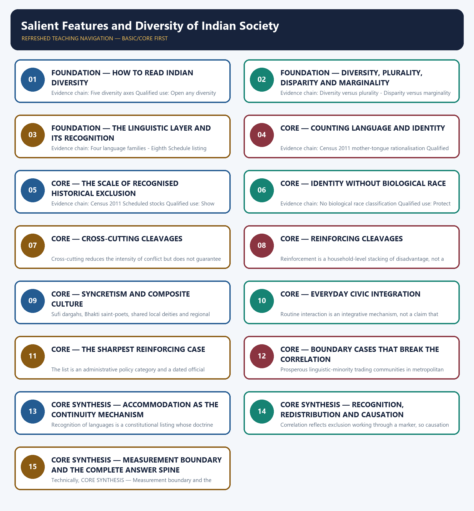

# Salient Features and Diversity of Indian Society — Learner-v2 Complete Learning Session

> **Authoring-only generation:** 2026-09-02. No PDF was rendered and no tracker or index was mutated.

### SOURCE, PROGRESSION AND CURRENT-LINKAGE AUDIT

- **Generation date:** 2026-09-02.
- **Repository-first evidence:** the Basic owner is taught first and preserved in full; the Advanced owner is retained only in the optional final teaching block.
- **OCR evidence:** Repository Markdown was primary. The OCR-searchable official General Studies Paper-I question papers held under books\mains and books\more_previous_papers were used only to confirm the wording of routed Mains PYQs. No official answer key, marking scheme, page precision or unsupported quotation was imported from them.
- **Qdrant:** not used; repository Markdown and available OCR context were sufficient.
- **PYQ integrity:** Two direct General Studies Paper-I demands are verified for this owner from the audited routing ledgers and confirmed word for word in the locally held official question papers: 2024 GS-I Q20 and 2019 GS-I Q8. The 2019 demand is routed in the ledger to the Advanced owner while the Core owner records that Core routing supersedes it; both are therefore answered here from the Basic spine. The generated 2018-2023 Prelims block additionally routes two 2023 objective items on national sports awards and the Chess Olympiad mascot and trophies. Those are documented current-affairs routing artefacts with no Indian Society content, their official keys are not held locally, and this package neither claims them nor infers an option for them.
- **Live-link boundary:** No additional live official item was verified for this topic on 2026-09-02. The package uses only the dated official anchors already carried by the repository owners: the Ministry of Tribal Affairs state-wise Particularly Vulnerable Tribal Groups list dated 9 July 2024, Gazette S.O. 2681(E) dated 16 June 2025 fixing Census 2027 reference dates, the Press Information Bureau announcement of 30 April 2025 confirming caste enumeration, and Census 2011 as the last completed full count. No caste, demographic or district figure is invented, and the Census 2027 exercise is described only as prospective.
- **Fact/inference discipline:** no current-affairs item, PYQ wording, figure or quotation is invented.

## BASIC LEARNING SESSION

### DEEP-REVIEW LEARNING CONTRACT

| Control | Binding rule for this package |
|---|---|
| Syllabus boundary | Complete Indian Society Basic/Core is answer-complete before optional Advanced depth. |
| Concept method | Define and distinguish the institution, identity, process, legal category and measured indicator before analysis. |
| Sociological method | Structure/institution → mechanism and agency → differentiated group/region outcome → feedback, resistance and qualification. |
| Evidence method | Claim → named Indian community/region/institution/dataset → analysis → source-date-status or causal qualification. |
| Non-homogenisation | Caste, tribe, women, religion, region and rural/urban groups retain internal class, gender, locality and historical variation. |
| Boundary method | Constitutional right, statutory mandate, executive scheme, implementation and lived social outcome remain distinct. |
| Practice contract | Every solved item has demand decoding, a detailed examiner-grade model, executable timed/compression plan, marks rationale and answer-specific improvement. |
| Approval | This immutable successor remains `approved: false` pending explicit approval. |

**Canonical Basic/Core owner:** `upsc-ai-kit\knowledge\Indian-Society\basic\01_Salient-Features-and-Diversity-of-Indian-Society.md`  
**Canonical topic owner:** `upsc-ai-kit\knowledge\Indian-Society\basic\01_Salient-Features-and-Diversity-of-Indian-Society.md`  
**Optional Advanced owner:** `upsc-ai-kit\knowledge\Indian-Society\advanced\01_Salient-Features-and-Diversity-of-Indian-Society.md`  
**Official syllabus mapping:** `upsc-ai-kit\knowledge\Indian-Society\OFFICIAL-UPSC-SYLLABUS-MAPPING.md`

### EVIDENCE, PYQ AND CURRENT-STATUS CONTROL

- **Definition discipline:** close concepts and legal-administrative categories share a comparison axis and are never treated as synonyms.
- **Mechanism discipline:** correlation, temporal sequence and aggregate association do not establish causation; identify institutions, incentives, norms, power and agency.
- **Historical discipline:** colonial, constitutional, developmental, liberalisation and contemporary phases are separated without a linear tradition-to-modernity story.
- **Intersectional discipline:** overlapping caste, tribe, class, gender, religion, disability, region and life-course positions are analysed without creating a single homogeneous category.
- **India discipline:** use named communities, movements, institutions, cities, states and regional contrasts without stereotyping or treating one case as nationally representative.
- **Data discipline:** Census 2011, NFHS, PLFS, SRS, Agriculture Census, MPI and scheme claims retain source, reference period, release date, coverage and provisional/final status.
- **PYQ discipline:** repository routing ledgers and locally held papers control wording and metadata; reconstructed wording and unavailable official keys remain labelled.
- **Current-status note, rechecked 2026-09-02:** No additional live official item was verified for this topic on 2026-09-02. The package uses only the dated official anchors already carried by the repository owners: the Ministry of Tribal Affairs state-wise Particularly Vulnerable Tribal Groups list dated 9 July 2024, Gazette S.O. 2681(E) dated 16 June 2025 fixing Census 2027 reference dates, the Press Information Bureau announcement of 30 April 2025 confirming caste enumeration, and Census 2011 as the last completed full count. No caste, demographic or district figure is invented, and the Census 2027 exercise is described only as prospective.

**Live/official context sources recorded by the predecessor generation:**

- No volatile live claim is necessary for the static sociological core.




*Distinct embedded teaching-navigation image. The separate continuous Cārvāka-style flowchart package remains an independent at-a-glance artifact.*

### SESSION 1 — FOUNDATION — HOW TO READ INDIAN DIVERSITY

#### DEFINITION / WHAT THIS IS CALLED

**Plain-language definition:** Indian diversity runs along ethnic or ethno-linguistic, linguistic, religious, regional and caste-tribe axes that are layered and overlapping rather than parallel, so cohesion depends on whether the axes reinforce each other or cut across each other.

**Technical definition:** Evidence chain: Five diversity axes Qualified use: Open any diversity answer with the axis structure rather than a list of adjectives.

#### ANSWER-GRABBING OPENING — WRITE/ADAPT IN THE EXAM

> Indian diversity runs along ethnic or ethno-linguistic, linguistic, religious, regional and caste-tribe axes that are layered and overlapping rather than parallel, so cohesion depends on whether the axes reinforce each other or cut across each other.

#### MUST-WRITE KEYWORDS

- **FOUNDATION**
- **How to read Indian diversity**
- **Evidence chain**
- **Qualified use**
- **Indian**
- **Difference**

**How to use them:** Frame the answer through FOUNDATION; define How to read Indian diversity, connect Evidence chain with Qualified use to explain the mechanism, and use Indian for the decisive comparison or qualification.

#### VISUAL FIRST

```text
HOW TO READ INDIAN DIVERSITY
01. Five diversity axes
BOUNDARY -> Difference is a fact; cohesion is an outcome that depends on how the axes interact.
```

*This topic-specific rail fixes the evidence sequence and its exam boundary before analysis.*

#### CORE EXPLANATION

Indian diversity runs along ethnic or ethno-linguistic, linguistic, religious, regional and caste-tribe axes that are layered and overlapping rather than parallel, so cohesion depends on whether the axes reinforce each other or cut across each other.

#### NAMED EVIDENCE AND MECHANISM

- Indian diversity runs along ethnic or ethno-linguistic, linguistic, religious, regional and caste-tribe axes that are layered and overlapping rather than parallel, so cohesion depends on whether the axes reinforce each other or cut across each other.

#### EXAMINER CAUTION

- Difference is a fact; cohesion is an outcome that depends on how the axes interact.

#### EXAM LINK

- **Prelims:** Retain the exact unit, named scholar, official category, dated statistic or legal boundary attached to How to read Indian diversity.
- **Mains:** Open any diversity answer with the axis structure rather than a list of adjectives.

#### MINI RECAP

- **Evidence chain:** Five diversity axes
- **Qualified use:** Open any diversity answer with the axis structure rather than a list of adjectives.

#### CLOSING RECALL FLOW — FOUNDATION — HOW TO READ INDIAN DIVERSITY

```text
START / CONCEPT: FOUNDATION — How to read Indian diversity
        |
        v
EXACT TERMS: FOUNDATION · How to read Indian diversity · Evidence chain · Qualified use · Indian · Difference
        |
        v
MECHANISM / ARGUMENT: Difference is a fact; cohesion is an outcome that depends on how the axes interact.
        |
        v
CONSEQUENCE / CONTRAST: Evidence chain: Five diversity axes Qualified use: Open any diversity answer with the axis structure rather than a list of adjectives.
        |
        v
UPSC TRAP / ANSWER-USE: Do not miss this limiting distinction: indian diversity runs along ethnic or ethno-linguistic, linguistic, religious, regional and caste-tribe axes that...
        |
        v
ANSWER-GRABBING FORMULATION: Indian diversity runs along ethnic or ethno-linguistic, linguistic, religious, regional and caste-tribe axes that are layered and overlapping rather than parallel, so cohesion depends on whether the axes reinforce each other or cut across each other.
```
### SESSION 2 — FOUNDATION — DIVERSITY, PLURALITY, DISPARITY AND MARGINALITY

#### DEFINITION / WHAT THIS IS CALLED

**Plain-language definition:** Diversity is the objective presence of different identities, while plurality is coexistence with mutual recognition, so a headcount of difference is not by itself evidence of acceptance.

**Technical definition:** Evidence chain: Diversity versus plurality - Disparity versus marginality Qualified use: Convert a definitional demand into four precise, example-backed distinctions.

#### ANSWER-GRABBING OPENING — WRITE/ADAPT IN THE EXAM

> Evidence chain: Diversity versus plurality - Disparity versus marginality Qualified use: Convert a definitional demand into four precise, example-backed distinctions.

#### MUST-WRITE KEYWORDS

- **FOUNDATION**
- **Diversity**
- **plurality**
- **disparity**
- **marginality**
- **Evidence chain**

**How to use them:** Frame the answer through FOUNDATION; define Diversity, connect plurality with disparity to explain the mechanism, and use marginality for the decisive comparison or qualification.

#### VISUAL FIRST

```text
DIVERSITY, PLURALITY, DISPARITY AND MARGINALITY
01. Diversity versus plurality
    |
    v
02. Disparity versus marginality
BOUNDARY -> Each term prevents a specific error, so the four must be kept apart under time pressure.
```

*This topic-specific rail fixes the evidence sequence and its exam boundary before analysis.*

#### CORE EXPLANATION

Diversity is the objective presence of different identities, while plurality is coexistence with mutual recognition, so a headcount of difference is not by itself evidence of acceptance. Disparity is unequal development outcomes between groups or regions, while marginality is exclusion from opportunity, resources or voice; neither follows automatically from the fact of difference.

#### NAMED EVIDENCE AND MECHANISM

- Diversity is the objective presence of different identities, while plurality is coexistence with mutual recognition, so a headcount of difference is not by itself evidence of acceptance.
- Disparity is unequal development outcomes between groups or regions, while marginality is exclusion from opportunity, resources or voice; neither follows automatically from the fact of difference.

#### EXAMINER CAUTION

- Each term prevents a specific error, so the four must be kept apart under time pressure.

#### EXAM LINK

- **Prelims:** Retain the exact unit, named scholar, official category, dated statistic or legal boundary attached to Diversity, plurality, disparity and marginality.
- **Mains:** Convert a definitional demand into four precise, example-backed distinctions.

#### MINI RECAP

- **Evidence chain:** Diversity versus plurality -> Disparity versus marginality
- **Qualified use:** Convert a definitional demand into four precise, example-backed distinctions.

#### CLOSING RECALL FLOW — FOUNDATION — DIVERSITY, PLURALITY, DISPARITY AND MARGINALITY

```text
START / CONCEPT: FOUNDATION — Diversity, plurality, disparity and marginality
        |
        v
EXACT TERMS: FOUNDATION · Diversity · plurality · disparity · marginality · Evidence chain
        |
        v
MECHANISM / ARGUMENT: Diversity is the objective presence of different identities, while plurality is coexistence with mutual recognition, so a headcount of difference is not by itself evidence of acceptance.
        |
        v
CONSEQUENCE / CONTRAST: Disparity is unequal development outcomes between groups or regions, while marginality is exclusion from opportunity, resources or voice; neither follows automatically from the fact of difference.
        |
        v
UPSC TRAP / ANSWER-USE: Do not miss this limiting distinction: each term prevents a specific error, so the four must be kept apart under...
        |
        v
ANSWER-GRABBING FORMULATION: Evidence chain: Diversity versus plurality - Disparity versus marginality Qualified use: Convert a definitional demand into four precise, example-backed distinctions.
```
### SESSION 3 — FOUNDATION — THE LINGUISTIC LAYER AND ITS RECOGNITION

#### DEFINITION / WHAT THIS IS CALLED

**Plain-language definition:** The Eighth Schedule of the Constitution currently lists 22 languages; the constitutional doctrine of that listing belongs to Polity and is cited here only as recognition evidence.

**Technical definition:** Evidence chain: Four language families - Eighth Schedule listing Qualified use: Supply the recognition half of a continuity or accommodation argument.

#### ANSWER-GRABBING OPENING — WRITE/ADAPT IN THE EXAM

> The Eighth Schedule of the Constitution currently lists 22 languages; the constitutional doctrine of that listing belongs to Polity and is cited here only as recognition evidence.

#### MUST-WRITE KEYWORDS

- **FOUNDATION**
- **The linguistic layer**
- **its recognition**
- **Evidence chain**
- **Qualified use**
- **Indo-Aryan, Dravidian, Austroasiatic and Tibeto-Burman**

**How to use them:** Frame the answer through FOUNDATION; define The linguistic layer, connect its recognition with Evidence chain to explain the mechanism, and use Qualified use for the decisive comparison or qualification.

#### VISUAL FIRST

```text
THE LINGUISTIC LAYER AND ITS RECOGNITION
01. Four language families
    |
    v
02. Eighth Schedule listing
BOUNDARY -> The four-family shorthand is a teaching device, not an exhaustive taxonomy.
```

*This topic-specific rail fixes the evidence sequence and its exam boundary before analysis.*

#### CORE EXPLANATION

Indo-Aryan, Dravidian, Austroasiatic and Tibeto-Burman are the four large language families commonly used in UPSC texts, and that shorthand is not an exhaustive taxonomy of every Indian language. The Eighth Schedule of the Constitution currently lists 22 languages; the constitutional doctrine of that listing belongs to Polity and is cited here only as recognition evidence.

#### NAMED EVIDENCE AND MECHANISM

- Indo-Aryan, Dravidian, Austroasiatic and Tibeto-Burman are the four large language families commonly used in UPSC texts, and that shorthand is not an exhaustive taxonomy of every Indian language.
- The Eighth Schedule of the Constitution currently lists 22 languages; the constitutional doctrine of that listing belongs to Polity and is cited here only as recognition evidence.

#### EXAMINER CAUTION

- The four-family shorthand is a teaching device, not an exhaustive taxonomy.

#### EXAM LINK

- **Prelims:** Retain the exact unit, named scholar, official category, dated statistic or legal boundary attached to The linguistic layer and its recognition.
- **Mains:** Supply the recognition half of a continuity or accommodation argument.

#### MINI RECAP

- **Evidence chain:** Four language families -> Eighth Schedule listing
- **Qualified use:** Supply the recognition half of a continuity or accommodation argument.

#### CLOSING RECALL FLOW — FOUNDATION — THE LINGUISTIC LAYER AND ITS RECOGNITION

```text
START / CONCEPT: FOUNDATION — The linguistic layer and its recognition
        |
        v
EXACT TERMS: FOUNDATION · The linguistic layer · its recognition · Evidence chain · Qualified use · Indo-Aryan, Dravidian, Austroasiatic and Tibeto-Burman
        |
        v
MECHANISM / ARGUMENT: Evidence chain: Four language families - Eighth Schedule listing Qualified use: Supply the recognition half of a continuity or accommodation argument.
        |
        v
CONSEQUENCE / CONTRAST: Indo-Aryan, Dravidian, Austroasiatic and Tibeto-Burman are the four large language families commonly used in UPSC texts, and that shorthand is not an exhaustive taxonomy of every Indian language.
        |
        v
UPSC TRAP / ANSWER-USE: The four-family shorthand is a teaching device, not an exhaustive taxonomy.
        |
        v
ANSWER-GRABBING FORMULATION: The Eighth Schedule of the Constitution currently lists 22 languages; the constitutional doctrine of that listing belongs to Polity and is cited here only as recognition evidence.
```
### SESSION 4 — CORE — COUNTING LANGUAGE AND IDENTITY

#### DEFINITION / WHAT THIS IS CALLED

**Plain-language definition:** A rationalised Census figure is a measurement decision, not a natural count of languages.

**Technical definition:** Evidence chain: Census 2011 mother-tongue rationalisation Qualified use: Give the scale evidence that a diversity answer needs to stop being adjectival.

#### ANSWER-GRABBING OPENING — WRITE/ADAPT IN THE EXAM

> A rationalised Census figure is a measurement decision, not a natural count of languages.

#### MUST-WRITE KEYWORDS

- **Counting language**
- **identity**
- **Evidence chain**
- **Qualified use**
- **A rationalised Census figure**
- **Census**

**How to use them:** Frame the answer through Counting language; define identity, connect Evidence chain with Qualified use to explain the mechanism, and use A rationalised Census figure for the decisive comparison or qualification.

#### VISUAL FIRST

```text
COUNTING LANGUAGE AND IDENTITY
01. Census 2011 mother-tongue rationalisation
BOUNDARY -> A rationalised Census figure is a measurement decision, not a natural count of languages.
```

*This topic-specific rail fixes the evidence sequence and its exam boundary before analysis.*

#### CORE EXPLANATION

Census 2011 recorded over 19,500 raw mother-tongue returns, rationalised into 121 languages spoken by 10,000 or more persons, which fixes the scale of linguistic depth.

#### NAMED EVIDENCE AND MECHANISM

- Census 2011 recorded over 19,500 raw mother-tongue returns, rationalised into 121 languages spoken by 10,000 or more persons, which fixes the scale of linguistic depth.

#### EXAMINER CAUTION

- A rationalised Census figure is a measurement decision, not a natural count of languages.

#### EXAM LINK

- **Prelims:** Retain the exact unit, named scholar, official category, dated statistic or legal boundary attached to Counting language and identity.
- **Mains:** Give the scale evidence that a diversity answer needs to stop being adjectival.

#### MINI RECAP

- **Evidence chain:** Census 2011 mother-tongue rationalisation
- **Qualified use:** Give the scale evidence that a diversity answer needs to stop being adjectival.

#### CLOSING RECALL FLOW — CORE — COUNTING LANGUAGE AND IDENTITY

```text
START / CONCEPT: CORE — Counting language and identity
        |
        v
EXACT TERMS: Counting language · identity · Evidence chain · Qualified use · A rationalised Census figure · Census
        |
        v
MECHANISM / ARGUMENT: Evidence chain: Census 2011 mother-tongue rationalisation Qualified use: Give the scale evidence that a diversity answer needs to stop being adjectival.
        |
        v
CONSEQUENCE / CONTRAST: The resulting consequence is that a rationalised Census figure is a measurement decision, not a natural count of languages.
        |
        v
UPSC TRAP / ANSWER-USE: Do not miss this limiting distinction: a rationalised Census figure is a measurement decision, not a natural count of languages.
        |
        v
ANSWER-GRABBING FORMULATION: A rationalised Census figure is a measurement decision, not a natural count of languages.
```
### SESSION 5 — CORE — THE SCALE OF RECOGNISED HISTORICAL EXCLUSION

#### DEFINITION / WHAT THIS IS CALLED

**Plain-language definition:** At Census 2011, the last completed full count, Scheduled Tribes were about 8.6 per cent and Scheduled Castes about 16.6 per cent of the population, so diversity questions are also distribution questions.

**Technical definition:** Evidence chain: Census 2011 Scheduled stocks Qualified use: Show that diversity questions are simultaneously distribution questions.

#### ANSWER-GRABBING OPENING — WRITE/ADAPT IN THE EXAM

> At Census 2011, the last completed full count, Scheduled Tribes were about 8.6 per cent and Scheduled Castes about 16.6 per cent of the population, so diversity questions are also distribution questions.

#### MUST-WRITE KEYWORDS

- **The scale of recognised historical exclusion**
- **Evidence chain**
- **Qualified use**
- **At Census**
- **Scheduled Tribes**
- **Scheduled Castes**

**How to use them:** Frame the answer through The scale of recognised historical exclusion; define Evidence chain, connect Qualified use with At Census to explain the mechanism, and use Scheduled Tribes for the decisive comparison or qualification.

#### VISUAL FIRST

```text
THE SCALE OF RECOGNISED HISTORICAL EXCLUSION
01. Census 2011 Scheduled stocks
BOUNDARY -> Census 2011 shares are a stock from the last completed full count, not a current estimate.
```

*This topic-specific rail fixes the evidence sequence and its exam boundary before analysis.*

#### CORE EXPLANATION

At Census 2011, the last completed full count, Scheduled Tribes were about 8.6 per cent and Scheduled Castes about 16.6 per cent of the population, so diversity questions are also distribution questions.

#### NAMED EVIDENCE AND MECHANISM

- At Census 2011, the last completed full count, Scheduled Tribes were about 8.6 per cent and Scheduled Castes about 16.6 per cent of the population, so diversity questions are also distribution questions.

#### EXAMINER CAUTION

- Census 2011 shares are a stock from the last completed full count, not a current estimate.

#### EXAM LINK

- **Prelims:** Retain the exact unit, named scholar, official category, dated statistic or legal boundary attached to The scale of recognised historical exclusion.
- **Mains:** Show that diversity questions are simultaneously distribution questions.

#### MINI RECAP

- **Evidence chain:** Census 2011 Scheduled stocks
- **Qualified use:** Show that diversity questions are simultaneously distribution questions.

#### CLOSING RECALL FLOW — CORE — THE SCALE OF RECOGNISED HISTORICAL EXCLUSION

```text
START / CONCEPT: CORE — The scale of recognised historical exclusion
        |
        v
EXACT TERMS: The scale of recognised historical exclusion · Evidence chain · Qualified use · At Census · Scheduled Tribes · Scheduled Castes
        |
        v
MECHANISM / ARGUMENT: Evidence chain: Census 2011 Scheduled stocks Qualified use: Show that diversity questions are simultaneously distribution questions.
        |
        v
CONSEQUENCE / CONTRAST: Census 2011 shares are a stock from the last completed full count, not a current estimate.
        |
        v
UPSC TRAP / ANSWER-USE: Do not miss this limiting distinction: show that diversity questions are simultaneously distribution questions.
        |
        v
ANSWER-GRABBING FORMULATION: At Census 2011, the last completed full count, Scheduled Tribes were about 8.6 per cent and Scheduled Castes about 16.6 per cent of the population, so diversity questions are also distribution questions.
```
### SESSION 6 — CORE — IDENTITY WITHOUT BIOLOGICAL RACE

#### DEFINITION / WHAT THIS IS CALLED

**Plain-language definition:** Older physical-anthropology labels are not a sound description of contemporary Indian society, and official Census operations do not classify Indians into biological races; self-identification, language, culture and regional history are used instead.

**Technical definition:** Evidence chain: No biological race classification Qualified use: Protect an answer from a discredited framing that examiners penalise.

#### ANSWER-GRABBING OPENING — WRITE/ADAPT IN THE EXAM

> Older physical-anthropology labels are not a sound description of contemporary Indian society, and official Census operations do not classify Indians into biological races; self-identification, language, culture and regional history are used instead.

#### MUST-WRITE KEYWORDS

- **Identity without biological race**
- **Evidence chain**
- **Qualified use**
- **Older physical-anthropology labels**
- **Older**
- **Indian**

**How to use them:** Frame the answer through Identity without biological race; define Evidence chain, connect Qualified use with Older physical-anthropology labels to explain the mechanism, and use Older for the decisive comparison or qualification.

#### VISUAL FIRST

```text
IDENTITY WITHOUT BIOLOGICAL RACE
01. No biological race classification
BOUNDARY -> Older anthropological labels are not a sound description of contemporary society.
```

*This topic-specific rail fixes the evidence sequence and its exam boundary before analysis.*

#### CORE EXPLANATION

Older physical-anthropology labels are not a sound description of contemporary Indian society, and official Census operations do not classify Indians into biological races; self-identification, language, culture and regional history are used instead.

#### NAMED EVIDENCE AND MECHANISM

- Older physical-anthropology labels are not a sound description of contemporary Indian society, and official Census operations do not classify Indians into biological races; self-identification, language, culture and regional history are used instead.

#### EXAMINER CAUTION

- Older anthropological labels are not a sound description of contemporary society.

#### EXAM LINK

- **Prelims:** Retain the exact unit, named scholar, official category, dated statistic or legal boundary attached to Identity without biological race.
- **Mains:** Protect an answer from a discredited framing that examiners penalise.

#### MINI RECAP

- **Evidence chain:** No biological race classification
- **Qualified use:** Protect an answer from a discredited framing that examiners penalise.

#### CLOSING RECALL FLOW — CORE — IDENTITY WITHOUT BIOLOGICAL RACE

```text
START / CONCEPT: CORE — Identity without biological race
        |
        v
EXACT TERMS: Identity without biological race · Evidence chain · Qualified use · Older physical-anthropology labels · Older · Indian
        |
        v
MECHANISM / ARGUMENT: Evidence chain: No biological race classification Qualified use: Protect an answer from a discredited framing that examiners penalise.
        |
        v
CONSEQUENCE / CONTRAST: Older anthropological labels are not a sound description of contemporary society.
        |
        v
UPSC TRAP / ANSWER-USE: Do not miss this limiting distinction: older physical-anthropology labels are not a sound description of contemporary Indian society.
        |
        v
ANSWER-GRABBING FORMULATION: Older physical-anthropology labels are not a sound description of contemporary Indian society, and official Census operations do not classify Indians into biological races; self-identification, language, culture and regional history are used instead.
```
### SESSION 7 — CORE — CROSS-CUTTING CLEAVAGES

#### DEFINITION / WHAT THIS IS CALLED

**Plain-language definition:** Evidence chain: Cross-cutting cleavage Qualified use: Build the analytical device that decides when the correlation fails.

**Technical definition:** Cross-cutting reduces the intensity of conflict but does not guarantee harmony.

#### ANSWER-GRABBING OPENING — WRITE/ADAPT IN THE EXAM

> Cross-cutting reduces the intensity of conflict but does not guarantee harmony.

#### MUST-WRITE KEYWORDS

- **Cross-cutting cleavages**
- **Evidence chain**
- **Qualified use**
- **Where**
- **Cross-cutting**
- **Build**

**How to use them:** Frame the answer through Cross-cutting cleavages; define Evidence chain, connect Qualified use with Where to explain the mechanism, and use Cross-cutting for the decisive comparison or qualification.

#### VISUAL FIRST

```text
CROSS-CUTTING CLEAVAGES
01. Cross-cutting cleavage
BOUNDARY -> Cross-cutting reduces the intensity of conflict but does not guarantee harmony.
```

*This topic-specific rail fixes the evidence sequence and its exam boundary before analysis.*

#### CORE EXPLANATION

Where identity axes do not align, disadvantage on one axis is often offset on another, so no single identity always predicts deprivation and group conflict is less intense.

#### NAMED EVIDENCE AND MECHANISM

- Where identity axes do not align, disadvantage on one axis is often offset on another, so no single identity always predicts deprivation and group conflict is less intense.

#### EXAMINER CAUTION

- Cross-cutting reduces the intensity of conflict but does not guarantee harmony.

#### EXAM LINK

- **Prelims:** Retain the exact unit, named scholar, official category, dated statistic or legal boundary attached to Cross-cutting cleavages.
- **Mains:** Build the analytical device that decides when the correlation fails.

#### MINI RECAP

- **Evidence chain:** Cross-cutting cleavage
- **Qualified use:** Build the analytical device that decides when the correlation fails.

#### CLOSING RECALL FLOW — CORE — CROSS-CUTTING CLEAVAGES

```text
START / CONCEPT: CORE — Cross-cutting cleavages
        |
        v
EXACT TERMS: Cross-cutting cleavages · Evidence chain · Qualified use · Where · Cross-cutting · Build
        |
        v
MECHANISM / ARGUMENT: Evidence chain: Cross-cutting cleavage Qualified use: Build the analytical device that decides when the correlation fails.
        |
        v
CONSEQUENCE / CONTRAST: Where identity axes do not align, disadvantage on one axis is often offset on another, so no single identity always predicts deprivation and group conflict is less intense.
        |
        v
UPSC TRAP / ANSWER-USE: Do not miss this limiting distinction: build the analytical device that decides when the correlation fails.
        |
        v
ANSWER-GRABBING FORMULATION: Cross-cutting reduces the intensity of conflict but does not guarantee harmony.
```
### SESSION 8 — CORE — REINFORCING CLEAVAGES

#### DEFINITION / WHAT THIS IS CALLED

**Plain-language definition:** Evidence chain: Reinforcing cleavage Qualified use: Build the analytical device that decides when the correlation holds.

**Technical definition:** Reinforcement is a household-level stacking of disadvantage, not a group stereotype.

#### ANSWER-GRABBING OPENING — WRITE/ADAPT IN THE EXAM

> Evidence chain: Reinforcing cleavage Qualified use: Build the analytical device that decides when the correlation holds.

#### MUST-WRITE KEYWORDS

- **Reinforcing cleavages**
- **Evidence chain**
- **Qualified use**
- **Reinforcement**
- **Build**
- **Reinforcing**

**How to use them:** Frame the answer through Reinforcing cleavages; define Evidence chain, connect Qualified use with Reinforcement to explain the mechanism, and use Build for the decisive comparison or qualification.

#### VISUAL FIRST

```text
REINFORCING CLEAVAGES
01. Reinforcing cleavage
BOUNDARY -> Reinforcement is a household-level stacking of disadvantage, not a group stereotype.
```

*This topic-specific rail fixes the evidence sequence and its exam boundary before analysis.*

#### CORE EXPLANATION

Where remoteness, low literacy, asset-poverty and minority status stack on the same household, ordinary diversity compounds into marginality and the correlation the examiner asks about becomes strong.

#### NAMED EVIDENCE AND MECHANISM

- Where remoteness, low literacy, asset-poverty and minority status stack on the same household, ordinary diversity compounds into marginality and the correlation the examiner asks about becomes strong.

#### EXAMINER CAUTION

- Reinforcement is a household-level stacking of disadvantage, not a group stereotype.

#### EXAM LINK

- **Prelims:** Retain the exact unit, named scholar, official category, dated statistic or legal boundary attached to Reinforcing cleavages.
- **Mains:** Build the analytical device that decides when the correlation holds.

#### MINI RECAP

- **Evidence chain:** Reinforcing cleavage
- **Qualified use:** Build the analytical device that decides when the correlation holds.

#### CLOSING RECALL FLOW — CORE — REINFORCING CLEAVAGES

```text
START / CONCEPT: CORE — Reinforcing cleavages
        |
        v
EXACT TERMS: Reinforcing cleavages · Evidence chain · Qualified use · Reinforcement · Build · Reinforcing
        |
        v
MECHANISM / ARGUMENT: Reinforcement is a household-level stacking of disadvantage, not a group stereotype.
        |
        v
CONSEQUENCE / CONTRAST: Mains: Build the analytical device that decides when the correlation holds.
        |
        v
UPSC TRAP / ANSWER-USE: Do not miss this limiting distinction: build the analytical device that decides when the correlation holds.
        |
        v
ANSWER-GRABBING FORMULATION: Evidence chain: Reinforcing cleavage Qualified use: Build the analytical device that decides when the correlation holds.
```
### SESSION 9 — CORE — SYNCRETISM AND COMPOSITE CULTURE

#### DEFINITION / WHAT THIS IS CALLED

**Plain-language definition:** Composite culture describes interwoven practice, not proof of uniform social mixing.

**Technical definition:** Sufi dargahs, Bhakti saint-poets, shared local deities and regional festivals such as Onam, Bihu and Pongal create composite belonging that crosses religion and region.

#### ANSWER-GRABBING OPENING — WRITE/ADAPT IN THE EXAM

> Composite culture describes interwoven practice, not proof of uniform social mixing.

#### MUST-WRITE KEYWORDS

- **Syncretism**
- **composite culture**
- **Evidence chain**
- **Qualified use**
- **Sufi**
- **Bhakti**

**How to use them:** Frame the answer through Syncretism; define composite culture, connect Evidence chain with Qualified use to explain the mechanism, and use Sufi for the decisive comparison or qualification.

#### VISUAL FIRST

```text
SYNCRETISM AND COMPOSITE CULTURE
01. Syncretic integrative traditions
BOUNDARY -> Composite culture describes interwoven practice, not proof of uniform social mixing.
```

*This topic-specific rail fixes the evidence sequence and its exam boundary before analysis.*

#### CORE EXPLANATION

Sufi dargahs, Bhakti saint-poets, shared local deities and regional festivals such as Onam, Bihu and Pongal create composite belonging that crosses religion and region.

#### NAMED EVIDENCE AND MECHANISM

- Sufi dargahs, Bhakti saint-poets, shared local deities and regional festivals such as Onam, Bihu and Pongal create composite belonging that crosses religion and region.

#### EXAMINER CAUTION

- Composite culture describes interwoven practice, not proof of uniform social mixing.

#### EXAM LINK

- **Prelims:** Retain the exact unit, named scholar, official category, dated statistic or legal boundary attached to Syncretism and composite culture.
- **Mains:** Supply the named integrative evidence that a cohesion answer requires.

#### MINI RECAP

- **Evidence chain:** Syncretic integrative traditions
- **Qualified use:** Supply the named integrative evidence that a cohesion answer requires.

#### CLOSING RECALL FLOW — CORE — SYNCRETISM AND COMPOSITE CULTURE

```text
START / CONCEPT: CORE — Syncretism and composite culture
        |
        v
EXACT TERMS: Syncretism · composite culture · Evidence chain · Qualified use · Sufi · Bhakti
        |
        v
MECHANISM / ARGUMENT: Sufi dargahs, Bhakti saint-poets, shared local deities and regional festivals such as Onam, Bihu and Pongal create composite belonging that crosses religion and region.
        |
        v
CONSEQUENCE / CONTRAST: Evidence chain: Syncretic integrative traditions Qualified use: Supply the named integrative evidence that a cohesion answer requires.
        |
        v
UPSC TRAP / ANSWER-USE: Do not miss this limiting distinction: supply the named integrative evidence that a cohesion answer requires.
        |
        v
ANSWER-GRABBING FORMULATION: Composite culture describes interwoven practice, not proof of uniform social mixing.
```
### SESSION 10 — CORE — EVERYDAY CIVIC INTEGRATION

#### DEFINITION / WHAT THIS IS CALLED

**Plain-language definition:** Evidence chain: Everyday civic integration Qualified use: Add a low-cost, continuously renewed integration mechanism to the answer.

**Technical definition:** Routine interaction is an integrative mechanism, not a claim that discrimination has ended.

#### ANSWER-GRABBING OPENING — WRITE/ADAPT IN THE EXAM

> Evidence chain: Everyday civic integration Qualified use: Add a low-cost, continuously renewed integration mechanism to the answer.

#### MUST-WRITE KEYWORDS

- **Everyday civic integration**
- **Evidence chain**
- **Qualified use**
- **Common**
- **Routine interaction**
- **Routine**

**How to use them:** Frame the answer through Everyday civic integration; define Evidence chain, connect Qualified use with Common to explain the mechanism, and use Routine interaction for the decisive comparison or qualification.

#### VISUAL FIRST

```text
EVERYDAY CIVIC INTEGRATION
01. Everyday civic integration
BOUNDARY -> Routine interaction is an integrative mechanism, not a claim that discrimination has ended.
```

*This topic-specific rail fixes the evidence sequence and its exam boundary before analysis.*

#### CORE EXPLANATION

Common schools, markets, elections and public transport work as routine integrative spaces in which diverse groups interact, and internal migration for work normalises mixed neighbourhoods.

#### NAMED EVIDENCE AND MECHANISM

- Common schools, markets, elections and public transport work as routine integrative spaces in which diverse groups interact, and internal migration for work normalises mixed neighbourhoods.

#### EXAMINER CAUTION

- Routine interaction is an integrative mechanism, not a claim that discrimination has ended.

#### EXAM LINK

- **Prelims:** Retain the exact unit, named scholar, official category, dated statistic or legal boundary attached to Everyday civic integration.
- **Mains:** Add a low-cost, continuously renewed integration mechanism to the answer.

#### MINI RECAP

- **Evidence chain:** Everyday civic integration
- **Qualified use:** Add a low-cost, continuously renewed integration mechanism to the answer.

#### CLOSING RECALL FLOW — CORE — EVERYDAY CIVIC INTEGRATION

```text
START / CONCEPT: CORE — Everyday civic integration
        |
        v
EXACT TERMS: Everyday civic integration · Evidence chain · Qualified use · Common · Routine interaction · Routine
        |
        v
MECHANISM / ARGUMENT: Routine interaction is an integrative mechanism, not a claim that discrimination has ended.
        |
        v
CONSEQUENCE / CONTRAST: Common schools, markets, elections and public transport work as routine integrative spaces in which diverse groups interact, and internal migration for work normalises mixed neighbourhoods.
        |
        v
UPSC TRAP / ANSWER-USE: Do not miss this limiting distinction: add a low-cost, continuously renewed integration mechanism to the answer.
        |
        v
ANSWER-GRABBING FORMULATION: Evidence chain: Everyday civic integration Qualified use: Add a low-cost, continuously renewed integration mechanism to the answer.
```
### SESSION 11 — CORE — THE SHARPEST REINFORCING CASE

#### DEFINITION / WHAT THIS IS CALLED

**Plain-language definition:** Evidence chain: Particularly Vulnerable Tribal Groups Qualified use: Anchor the reinforcing half of the correlation in one dated official source.

**Technical definition:** The list is an administrative policy category and a dated official document, not a ranking of peoples.

#### ANSWER-GRABBING OPENING — WRITE/ADAPT IN THE EXAM

> Evidence chain: Particularly Vulnerable Tribal Groups Qualified use: Anchor the reinforcing half of the correlation in one dated official source.

#### MUST-WRITE KEYWORDS

- **The sharpest reinforcing case**
- **Evidence chain**
- **Qualified use**
- **The list**
- **Particularly Vulnerable Tribal Groups Qualified**
- **Anchor**

**How to use them:** Frame the answer through The sharpest reinforcing case; define Evidence chain, connect Qualified use with The list to explain the mechanism, and use Particularly Vulnerable Tribal Groups Qualified for the decisive comparison or qualification.

#### VISUAL FIRST

```text
THE SHARPEST REINFORCING CASE
01. Particularly Vulnerable Tribal Groups
BOUNDARY -> The list is an administrative policy category and a dated official document, not a ranking of peoples.
```

*This topic-specific rail fixes the evidence sequence and its exam boundary before analysis.*

#### CORE EXPLANATION

The Ministry of Tribal Affairs state-wise list dated 9 July 2024 identifies 75 Particularly Vulnerable Tribal Groups in 18 States and the Union Territory of Andaman and Nicobar Islands, with legacy criteria including pre-agricultural technology, low literacy, stagnant or declining population and subsistence economy.

#### NAMED EVIDENCE AND MECHANISM

- The Ministry of Tribal Affairs state-wise list dated 9 July 2024 identifies 75 Particularly Vulnerable Tribal Groups in 18 States and the Union Territory of Andaman and Nicobar Islands, with legacy criteria including pre-agricultural technology, low literacy, stagnant or declining population and subsistence economy.

#### EXAMINER CAUTION

- The list is an administrative policy category and a dated official document, not a ranking of peoples.

#### EXAM LINK

- **Prelims:** Retain the exact unit, named scholar, official category, dated statistic or legal boundary attached to The sharpest reinforcing case.
- **Mains:** Anchor the reinforcing half of the correlation in one dated official source.

#### MINI RECAP

- **Evidence chain:** Particularly Vulnerable Tribal Groups
- **Qualified use:** Anchor the reinforcing half of the correlation in one dated official source.

#### CLOSING RECALL FLOW — CORE — THE SHARPEST REINFORCING CASE

```text
START / CONCEPT: CORE — The sharpest reinforcing case
        |
        v
EXACT TERMS: The sharpest reinforcing case · Evidence chain · Qualified use · The list · Particularly Vulnerable Tribal Groups Qualified · Anchor
        |
        v
MECHANISM / ARGUMENT: The list is an administrative policy category and a dated official document, not a ranking of peoples.
        |
        v
CONSEQUENCE / CONTRAST: The resulting consequence is that the list is an administrative policy category and a dated official document, not a...
        |
        v
UPSC TRAP / ANSWER-USE: Do not miss this limiting distinction: the list is an administrative policy category and a dated official document, not a...
        |
        v
ANSWER-GRABBING FORMULATION: Evidence chain: Particularly Vulnerable Tribal Groups Qualified use: Anchor the reinforcing half of the correlation in one dated official source.
```
### SESSION 12 — CORE — BOUNDARY CASES THAT BREAK THE CORRELATION

#### DEFINITION / WHAT THIS IS CALLED

**Plain-language definition:** Both boundary cases are group-level illustrations and carry no invented income or prevalence figure.

**Technical definition:** Prosperous linguistic-minority trading communities in metropolitan India and several Sikh and Jain business communities show that cultural distinctiveness does not by itself predict deprivation.

#### ANSWER-GRABBING OPENING — WRITE/ADAPT IN THE EXAM

> Prosperous linguistic-minority trading communities in metropolitan India and several Sikh and Jain business communities show that cultural distinctiveness does not by itself predict deprivation.

#### MUST-WRITE KEYWORDS

- **Boundary cases that break the correlation**
- **Evidence chain**
- **Qualified use**
- **Prosperous**
- **India**
- **Sikh**

**How to use them:** Frame the answer through Boundary cases that break the correlation; define Evidence chain, connect Qualified use with Prosperous to explain the mechanism, and use India for the decisive comparison or qualification.

#### VISUAL FIRST

```text
BOUNDARY CASES THAT BREAK THE CORRELATION
01. Diversity without marginality
    |
    v
02. Marginality without a cultural marker
BOUNDARY -> Both boundary cases are group-level illustrations and carry no invented income or prevalence figure.
```

*This topic-specific rail fixes the evidence sequence and its exam boundary before analysis.*

#### CORE EXPLANATION

Prosperous linguistic-minority trading communities in metropolitan India and several Sikh and Jain business communities show that cultural distinctiveness does not by itself predict deprivation. A landless labouring household of the locally dominant caste in a poor region shows class-based deprivation operating without a distinct cultural marker, so the correlation is not symmetric.

#### NAMED EVIDENCE AND MECHANISM

- Prosperous linguistic-minority trading communities in metropolitan India and several Sikh and Jain business communities show that cultural distinctiveness does not by itself predict deprivation.
- A landless labouring household of the locally dominant caste in a poor region shows class-based deprivation operating without a distinct cultural marker, so the correlation is not symmetric.

#### EXAMINER CAUTION

- Both boundary cases are group-level illustrations and carry no invented income or prevalence figure.

#### EXAM LINK

- **Prelims:** Retain the exact unit, named scholar, official category, dated statistic or legal boundary attached to Boundary cases that break the correlation.
- **Mains:** Supply the counter-evidence that a critical directive demands.

#### MINI RECAP

- **Evidence chain:** Diversity without marginality -> Marginality without a cultural marker
- **Qualified use:** Supply the counter-evidence that a critical directive demands.

#### CLOSING RECALL FLOW — CORE — BOUNDARY CASES THAT BREAK THE CORRELATION

```text
START / CONCEPT: CORE — Boundary cases that break the correlation
        |
        v
EXACT TERMS: Boundary cases that break the correlation · Evidence chain · Qualified use · Prosperous · India · Sikh
        |
        v
MECHANISM / ARGUMENT: Both boundary cases are group-level illustrations and carry no invented income or prevalence figure.
        |
        v
CONSEQUENCE / CONTRAST: A landless labouring household of the locally dominant caste in a poor region shows class-based deprivation operating without a distinct cultural marker, so the correlation is not symmetric.
        |
        v
UPSC TRAP / ANSWER-USE: Do not miss this limiting distinction: diversity without marginality - Marginality without a cultural marker Qualified use.
        |
        v
ANSWER-GRABBING FORMULATION: Prosperous linguistic-minority trading communities in metropolitan India and several Sikh and Jain business communities show that cultural distinctiveness does not by itself predict deprivation.
```
### SESSION 13 — CORE SYNTHESIS — ACCOMMODATION AS THE CONTINUITY MECHANISM

#### DEFINITION / WHAT THIS IS CALLED

**Plain-language definition:** Evidence chain: Accommodation as the continuity mechanism Qualified use: Answer the continuity demand with a mechanism rather than a celebration.

**Technical definition:** Recognition of languages is a constitutional listing whose doctrine belongs to Polity.

#### ANSWER-GRABBING OPENING — WRITE/ADAPT IN THE EXAM

> Evidence chain: Accommodation as the continuity mechanism Qualified use: Answer the continuity demand with a mechanism rather than a celebration.

#### MUST-WRITE KEYWORDS

- **CORE SYNTHESIS**
- **Accommodation as the continuity mechanism**
- **Evidence chain**
- **Qualified use**
- **Recognition of languages**
- **Recognition**

**How to use them:** Frame the answer through CORE SYNTHESIS; define Accommodation as the continuity mechanism, connect Evidence chain with Qualified use to explain the mechanism, and use Recognition of languages for the decisive comparison or qualification.

#### VISUAL FIRST

```text
ACCOMMODATION AS THE CONTINUITY MECHANISM
01. Accommodation as the continuity mechanism
BOUNDARY -> Recognition of languages is a constitutional listing whose doctrine belongs to Polity.
```

*This topic-specific rail fixes the evidence sequence and its exam boundary before analysis.*

#### CORE EXPLANATION

Indian cultural continuity worked through accommodative absorption and institutional recognition rather than insulation, illustrated by the States Reorganisation Act, 1956 accommodating linguistic assertion through statehood.

#### NAMED EVIDENCE AND MECHANISM

- Indian cultural continuity worked through accommodative absorption and institutional recognition rather than insulation, illustrated by the States Reorganisation Act, 1956 accommodating linguistic assertion through statehood.

#### EXAMINER CAUTION

- Recognition of languages is a constitutional listing whose doctrine belongs to Polity.

#### EXAM LINK

- **Prelims:** Retain the exact unit, named scholar, official category, dated statistic or legal boundary attached to Accommodation as the continuity mechanism.
- **Mains:** Answer the continuity demand with a mechanism rather than a celebration.

#### MINI RECAP

- **Evidence chain:** Accommodation as the continuity mechanism
- **Qualified use:** Answer the continuity demand with a mechanism rather than a celebration.

#### CLOSING RECALL FLOW — CORE SYNTHESIS — ACCOMMODATION AS THE CONTINUITY MECHANISM

```text
START / CONCEPT: CORE SYNTHESIS — Accommodation as the continuity mechanism
        |
        v
EXACT TERMS: CORE SYNTHESIS · Accommodation as the continuity mechanism · Evidence chain · Qualified use · Recognition of languages · Recognition
        |
        v
MECHANISM / ARGUMENT: Recognition of languages is a constitutional listing whose doctrine belongs to Polity.
        |
        v
CONSEQUENCE / CONTRAST: The resulting consequence is that accommodation as the continuity mechanism Qualified use.
        |
        v
UPSC TRAP / ANSWER-USE: Do not miss this limiting distinction: accommodation as the continuity mechanism Qualified use.
        |
        v
ANSWER-GRABBING FORMULATION: Evidence chain: Accommodation as the continuity mechanism Qualified use: Answer the continuity demand with a mechanism rather than a celebration.
```
### SESSION 14 — CORE SYNTHESIS — RECOGNITION, REDISTRIBUTION AND CAUSATION

#### DEFINITION / WHAT THIS IS CALLED

**Plain-language definition:** Evidence chain: Recognition versus redistribution - Correlation is not causation Qualified use: Convert the analysis into a policy verdict that survives a critical directive.

**Technical definition:** Correlation reflects exclusion working through a marker, so causation must not be attached to identity itself.

#### ANSWER-GRABBING OPENING — WRITE/ADAPT IN THE EXAM

> Evidence chain: Recognition versus redistribution - Correlation is not causation Qualified use: Convert the analysis into a policy verdict that survives a critical directive.

#### MUST-WRITE KEYWORDS

- **CORE SYNTHESIS**
- **Recognition**
- **redistribution**
- **causation**
- **Evidence chain**
- **Qualified use**

**How to use them:** Frame the answer through CORE SYNTHESIS; define Recognition, connect redistribution with causation to explain the mechanism, and use Evidence chain for the decisive comparison or qualification.

#### VISUAL FIRST

```text
RECOGNITION, REDISTRIBUTION AND CAUSATION
01. Recognition versus redistribution
    |
    v
02. Correlation is not causation
BOUNDARY -> Correlation reflects exclusion working through a marker, so causation must not be attached to identity itself.
```

*This topic-specific rail fixes the evidence sequence and its exam boundary before analysis.*

#### CORE EXPLANATION

Recognition addresses disrespect for identity and culture while redistribution addresses unequal resources and opportunity, so a response that supplies only symbolic recognition leaves an access or asset gap intact. Historical exclusion, geographic remoteness and asset-poverty are the causal drivers of deprivation, and cultural diversity is usually the visible marker rather than the mechanism that produces it.

#### NAMED EVIDENCE AND MECHANISM

- Recognition addresses disrespect for identity and culture while redistribution addresses unequal resources and opportunity, so a response that supplies only symbolic recognition leaves an access or asset gap intact.
- Historical exclusion, geographic remoteness and asset-poverty are the causal drivers of deprivation, and cultural diversity is usually the visible marker rather than the mechanism that produces it.

#### EXAMINER CAUTION

- Correlation reflects exclusion working through a marker, so causation must not be attached to identity itself.

#### EXAM LINK

- **Prelims:** Retain the exact unit, named scholar, official category, dated statistic or legal boundary attached to Recognition, redistribution and causation.
- **Mains:** Convert the analysis into a policy verdict that survives a critical directive.

#### MINI RECAP

- **Evidence chain:** Recognition versus redistribution -> Correlation is not causation
- **Qualified use:** Convert the analysis into a policy verdict that survives a critical directive.

#### CLOSING RECALL FLOW — CORE SYNTHESIS — RECOGNITION, REDISTRIBUTION AND CAUSATION

```text
START / CONCEPT: CORE SYNTHESIS — Recognition, redistribution and causation
        |
        v
EXACT TERMS: CORE SYNTHESIS · Recognition · redistribution · causation · Evidence chain · Qualified use
        |
        v
MECHANISM / ARGUMENT: Correlation reflects exclusion working through a marker, so causation must not be attached to identity itself.
        |
        v
CONSEQUENCE / CONTRAST: Recognition addresses disrespect for identity and culture while redistribution addresses unequal resources and opportunity, so a response that supplies only symbolic recognition leaves an access or asset gap intact.
        |
        v
UPSC TRAP / ANSWER-USE: Historical exclusion, geographic remoteness and asset-poverty are the causal drivers of deprivation, and cultural diversity is usually the visible marker rather than the mechanism that produces it.
        |
        v
ANSWER-GRABBING FORMULATION: Evidence chain: Recognition versus redistribution - Correlation is not causation Qualified use: Convert the analysis into a policy verdict that survives a critical directive.
```
### SESSION 15 — CORE SYNTHESIS — MEASUREMENT BOUNDARY AND THE COMPLETE ANSWER SPINE

#### DEFINITION / WHAT THIS IS CALLED

**Plain-language definition:** Evidence chain: Census 2027 measurement boundary - Verified direct Mains demands Qualified use: Assemble the final diversity answer spine with an explicit measurement caveat.

**Technical definition:** Technically, CORE SYNTHESIS — Measurement boundary and the complete answer spine is analysed by relating CORE SYNTHESIS to Measurement boundary, then testing the relationship through the complete answer spine and Evidence chain.

#### ANSWER-GRABBING OPENING — WRITE/ADAPT IN THE EXAM

> Evidence chain: Census 2027 measurement boundary - Verified direct Mains demands Qualified use: Assemble the final diversity answer spine with an explicit measurement caveat.

#### MUST-WRITE KEYWORDS

- **CORE SYNTHESIS**
- **Measurement boundary**
- **the complete answer spine**
- **Evidence chain**
- **Qualified use**
- **Subject**

**How to use them:** Frame the answer through CORE SYNTHESIS; define Measurement boundary, connect the complete answer spine with Evidence chain to explain the mechanism, and use Qualified use for the decisive comparison or qualification.

#### VISUAL FIRST

```text
MEASUREMENT BOUNDARY AND THE COMPLETE ANSWER SPINE
01. Census 2027 measurement boundary
    |
    v
02. Verified direct Mains demands
BOUNDARY -> The Census 2027 caste enumeration is prospective, so no caste figure may be quoted.
```

*This topic-specific rail fixes the evidence sequence and its exam boundary before analysis.*

#### CORE EXPLANATION

Gazette S.O. 2681(E) dated 16 June 2025 fixes Census 2027 reference dates at 1 October 2026 for Ladakh and specified snow-bound areas and 1 March 2027 elsewhere, and the Press Information Bureau announcement of 30 April 2025 confirms caste enumeration; the exercise is prospective, yields no figure to quote and is not India's first historical caste enumeration. Two direct General Studies Paper-I demands are verified for this owner: the 2024 question requiring a critical analysis of the proposition of a high correlation between India's cultural diversities and socio-economic marginalities in 250 words, and the 2019 question asking what makes Indian society unique in sustaining its culture in 150 words.

#### NAMED EVIDENCE AND MECHANISM

- Gazette S.O. 2681(E) dated 16 June 2025 fixes Census 2027 reference dates at 1 October 2026 for Ladakh and specified snow-bound areas and 1 March 2027 elsewhere, and the Press Information Bureau announcement of 30 April 2025 confirms caste enumeration; the exercise is prospective, yields no figure to quote and is not India's first historical caste enumeration.
- Two direct General Studies Paper-I demands are verified for this owner: the 2024 question requiring a critical analysis of the proposition of a high correlation between India's cultural diversities and socio-economic marginalities in 250 words, and the 2019 question asking what makes Indian society unique in sustaining its culture in 150 words.

#### EXAMINER CAUTION

- The Census 2027 caste enumeration is prospective, so no caste figure may be quoted.

#### EXAM LINK

- **Prelims:** Retain the exact unit, named scholar, official category, dated statistic or legal boundary attached to Measurement boundary and the complete answer spine.
- **Mains:** Assemble the final diversity answer spine with an explicit measurement caveat.

#### MINI RECAP

- **Evidence chain:** Census 2027 measurement boundary -> Verified direct Mains demands
- **Qualified use:** Assemble the final diversity answer spine with an explicit measurement caveat.
#### COMPLETE BASIC OWNER EVIDENCE BANK

> **Subject:** Indian Society | **Tier:** Must-Do (foundation) | **GS Paper:** GS-I.
> **Core area:** Forms of diversity in Indian society, unity-in-diversity as a lived
> arrangement, and the link between cultural diversity and socio-economic marginality.
> **Grounded in:** Census of India (2011, last full count); Census 2027 Gazette/PIB
> announcement; Ministry of Tribal Affairs PVTG list; audited 2024 GS-I Mains PYQ.
> ✅ = source-grounded | ⚠️ = analytical inference | 📰 = current anchor.
> *Companion: `advanced/01_Salient-Features-and-Diversity-of-Indian-Society.md`.*

#### 1. Visual foundation

```text
FORMS OF DIVERSITY IN INDIA
   |
   +-- Ethnic/ethno-linguistic
   +-- Linguistic (families, dialects)
   +-- Religious (major faiths + sects)
   +-- Regional (physiographic, cultural zones)
   +-- Caste and tribe (stratification, identity)
        |
        v
   LAYERED, OVERLAPPING, NOT PARALLEL
        |
        v
   INTEGRATIVE MECHANISMS          MARGINALISING PRESSURES
   syncretism, shared festivals,   overlapping deprivation,
   composite regional culture,     exclusion from mobility,
   plural civic institutions       identity-based disadvantage
        |                                |
        +---------------+----------------+
                         v
              UNITY-IN-DIVERSITY OUTCOME
        (cohesion where diversity and
         marginality do not coincide)
```

**Core proposition:** ⚠️ Indian diversity is not a single axis but several overlapping
axes (ethnicity, language, religion, region, caste/tribe); social cohesion depends on whether
these axes reinforce each other into compounded disadvantage or cut across each other so
that no single identity always predicts deprivation.

#### 2. Essential definitions

| Concept | Exam-ready meaning |
|---|---|
| ✅ **Diversity** | The objective presence of multiple ethnic, linguistic, religious, regional or caste/tribe identities within one society. |
| ✅ **Plurality** | A social condition where multiple identities coexist with mutual recognition, distinct from mere numerical diversity. |
| ⚠️ **Unity-in-diversity** | A civilisational and constitutional aspiration that difference need not produce division if integrative institutions are strong. |
| ⚠️ **Marginality** | Socio-economic exclusion from mainstream opportunity, resources or voice, often but not always tied to an identity group. |
| ✅ **Syncretism** | The blending of practices across religious or cultural traditions into a shared, composite form (e.g., Sufi-Bhakti idioms, shared shrine worship). |
| ⚠️ **Composite culture** | A regional or national culture formed through long interaction among diverse groups, not the dominance of one. |

#### 3. How Indian diversity is structured

1. **Ethnicity and ancestry:** ⚠️ Older physical-anthropology labels such as
   “Proto-Australoid” or “Mongoloid” are not a sound way to describe contemporary Indian
   society. Use self-identification, language, culture and regional history; official Census
   operations do not classify Indians into biological “races.”
2. **Linguistic layer:** ✅ Indo-Aryan, Dravidian, Austroasiatic and Tibeto-Burman are the
   four large families commonly used in UPSC texts; this is not an exhaustive taxonomy of all
   Indian languages. The Eighth Schedule recognises 22 languages (constitutional listing
   itself is Polity's territory).
3. **Religious layer:** ✅ Hinduism, Islam, Christianity, Sikhism, Buddhism, Jainism and
   Zoroastrianism coexist, each with internal sectarian variation, plus tribal faiths.
4. **Regional layer:** ⚠️ Physiographic and cultural-zone diversity (Himalayan, Indo-Gangetic,
   peninsular, coastal, island) produces distinct cuisines, dress, festivals and social norms.
5. **Caste/tribe layer:** ✅ Thousands of locally situated jatis and constitutionally
   notified Scheduled Tribes overlay the other layers; there is no current all-India count of
   all jatis that should be quoted as a settled fact. Their intersections can be
   cross-cutting or reinforcing.
6. **Layering outcome:** ⚠️ Cross-cutting identities can reduce the chance that one identity
   predicts every disadvantage, but do not guarantee harmony. Where identities reinforce
   (for example, remoteness, low schooling and asset poverty affecting a tribal household),
   diversity can become a visible marker of marginality.

#### 4. Integrative and marginalising mechanisms

- ✅ **Syncretic traditions:** Sufi dargahs, Bhakti saint-poets, shared local deities and
  regional festivals (Onam, Bihu, Pongal) create composite belonging across religion and
  region.
- ✅ **Civic and economic institutions:** common schools, markets, elections and public
  transport function as everyday integrative spaces where diverse groups interact routinely.
- ⚠️ **Migration and urban mixing:** internal migration for work brings different linguistic
  and regional groups into shared neighbourhoods, gradually normalising diversity.
- ⚠️ **Marginalising pressures:** remoteness (tribal areas), historical stigma (caste),
  minority-concentration districts with weak infrastructure, and linguistic-minority status
  in a state can each independently reduce access to opportunity.
- ⚠️ **Compounding risk:** when religious-minority status, rural residence and low income
  coincide in the same household, ordinary diversity becomes marginality — this is the
  analytical core the 2024 PYQ tests.

#### 5. Indian applications and PYQ mapping

- ✅ **2024 GS-I PYQ (15 marks):** "Critically analyse the proposition that there is a high
  correlation between India's cultural diversities and socio-economic marginalities." The
  expected answer: (a) state the proposition — cultural difference often coincides with
  deprivation (tribal areas, some religious-minority-concentration districts, certain caste
  groups); (b) critically test it — many diverse groups are prosperous (Parsis, several
  Sikh and Jain trading communities, dominant landholding castes), showing the correlation
  is conditional, not universal; (c) conclude that the causal driver is *historical exclusion
  and geographic remoteness*, not diversity itself, so policy must target the exclusion
  mechanism rather than treat diversity as inherently disadvantaging.
- ⚠️ A linguistic-minority trader community that is economically prosperous illustrates
  diversity without marginality; a remote Particularly Vulnerable Tribal Group illustrates
  diversity compounding into marginality through geographic and infrastructural exclusion.

#### 6. Must-Know Facts for Prelims

- ✅ Four major language families in India: Indo-Aryan, Dravidian, Austroasiatic,
  Tibeto-Burman.
- ✅ Eighth Schedule of the Constitution currently lists 22 languages (constitutional detail;
  full doctrine is Polity's territory).
- ✅ Census 2011 (last full Census) recorded over 19,500 raw mother-tongue returns,
  rationalised into 121 languages spoken by 10,000 or more persons.
- ✅ Scheduled Tribes formed about 8.6% and Scheduled Castes about 16.6% of India's
  population at Census 2011 — the most recent verified full-Census figures.
- 📰 The Government announced caste enumeration in the forthcoming Census 2027. This is not
  the first caste count in Indian history; it is a new all-India enumeration after
  post-Independence Censuses did not enumerate all castes. No results exist as of 21 July
  2026.

#### 7. UPSC traps

- ❌ Diversity and disparity mean the same thing. -> Diversity is the presence of different
  identities; disparity is unequal outcomes between groups or regions — a diverse society
  need not be a disparate one (see Topic 14 for the exact 2024 Q17 distinction).
- ❌ Unity-in-diversity means conflict never occurs in India. -> It is an aspiration and an
  observed civilisational pattern, not a guarantee; communal and regional tensions coexist
  with syncretic integration (Topics 13-14).
- ❌ Every minority or tribal group is automatically marginalised. -> Marginality is
  conditional on historical exclusion and access, not an automatic consequence of being
  culturally distinct — several diverse communities are economically prosperous.
- ❌ India's diversity is only religious and linguistic. -> Regional, ethnic/ethno-linguistic and
  caste/tribe axes are equally salient and often analytically more decisive for marginality
  outcomes than religion or language alone.

#### 8. 📰 Current anchor

- 📰 Gazette S.O. 2681(E) (16 June 2025) fixes Census 2027 reference dates at 1 October 2026
  for Ladakh and specified snow-bound areas, and 1 March 2027 elsewhere. PIB's 30 April 2025
  announcement confirms caste enumeration. It remains prospective as of 21 July 2026; do not
  cite a caste-count figure or imply that the exercise is India's first historical caste
  enumeration.

#### 9. PYQ application

- ✅ **2024 GS-I (15 marks):** structure as proposition -> critical test with counter-examples
  -> causal reframing (exclusion/remoteness, not diversity per se) -> policy implication
  (target the exclusion mechanism, not the identity marker).

#### 10. Mains angles

- ⚠️ Always separate "diversity as fact" from "marginality as outcome" before answering any
  diversity-linked question.
- ⚠️ Use cross-cutting versus reinforcing identity axes as the core analytical device.
- ⚠️ Label Census 2011 stocks, forthcoming Census 2027 operations and survey estimates
  separately; none alone establishes that identity *causes* deprivation.
- ⚠️ Anchor examples in named, verifiable groups rather than generic claims.

> **Answer thesis:** India's cultural diversity correlates with socio-economic marginality
> only where identity axes reinforce historical exclusion and geographic remoteness; where
> axes cross-cut, diversity coexists with prosperity and integration, so the 2024 PYQ's
> proposition must be accepted conditionally, not affirmed as a universal law.

#### 11. Probable questions

- ⚠️ **Prelims:** Which four language families are represented among India's languages?
- ✅ **Mains (15 marks, 2024 GS-I PYQ, verbatim):** Critically analyse the proposition that
  there is a high correlation between India's cultural diversities and socio-economic
  marginalities.
- ⚠️ **Mains (10 marks):** Distinguish between diversity and plurality with Indian examples.
- ⚠️ **Mains (15 marks):** Examine how cross-cutting identities help India manage its
  cultural diversity without descending into permanent conflict.

#### 12. Study links

- ✅ Advanced companion: `advanced/01_Salient-Features-and-Diversity-of-Indian-Society.md`.
- ✅ `Geography/basic/37_Cultural-and-Social-Geography-of-India.md` — spatial cultural-region
  typology (do not re-derive here).
- ✅ `14_Regionalism.md` — the exact diversity-vs-disparity distinction (2024 Q17).
- ✅ `13_Communalism.md` — when religious diversity turns into mobilisation and conflict.
- ✅ `15_Secularism.md` — syncretism and shared public space as lived practice.

#### 13. Answer architecture (10/15/20-mark support)

> Core-only. Everything needed to write a directive-sensitive, thesis-led answer on
> diversity, plurality, cultural continuity and diversity-linked marginality is in this
> section. `advanced/01` adds optional refinement (cross-cutting cleavage theory,
> recognition-versus-redistribution) and is not required to score.

##### 13.1 Directive-to-structure map

| Directive | What is actually being tested | Structure that scores |
|---|---|---|
| **Discuss** (what makes Indian society unique / sustains its culture) | Whether you can name *mechanisms* of continuity, not adjectives | Mechanism-by-mechanism: transmission → accommodation → adaptation → institutional carriers, each with an example |
| **Critically analyse** (diversity–marginality correlation) | Whether you will test the proposition, not restate it | Proposition → supporting cases → counter-cases → causal reframing → conditional verdict |
| **Examine / Elucidate** (unity in diversity, integration) | Whether you separate the fact of difference from the outcome of cohesion | Two-column: integrative mechanism vs marginalising pressure, then the condition that decides which dominates |
| **Distinguish / Differentiate** (diversity vs plurality vs disparity vs marginality) | Definitional precision under time pressure | Definition → Indian instance → the error the distinction prevents, four times |
| **Comment / Justify** (is diversity a strength or a strain?) | Whether you take a qualified position | Thesis first, then the condition under which each side holds |

##### 13.2 Thesis bank (pick one, then defend it)

- **T1 (correlation questions):** ⚠️ Diversity is a *marker*, not a *mechanism*, of marginality;
  the correlation holds only where identity axes reinforce historical exclusion and
  geographic remoteness on the same household.
- **T2 (continuity questions):** ⚠️ Indian culture has persisted less through insulation than
  through **accommodative absorption** — the capacity to add a tradition without
  extinguishing the previous one, carried by decentralised transmission institutions.
- **T3 (cohesion questions):** ⚠️ Cohesion in India is produced not by the absence of
  difference but by the presence of *cross-cutting* difference plus institutions that keep
  difference from converting into permanent deprivation.
- **T4 (policy questions):** ⚠️ Diversity policy fails when it supplies recognition where
  redistribution was needed, or the reverse; the diagnosis must precede the instrument.

##### 13.3 Mark-scaled spines

**10 marks / 150 words — "What makes Indian society unique in sustaining its culture?"**
1. One-line thesis (T2). 2. Layered, not replaced: four axes coexisting (language,
religion, region, caste/tribe). 3. Transmission carriers: family and jati socialisation,
ritual calendar, pilgrimage and festival circuits, oral–textual dual transmission.
4. Accommodation: syncretic idioms (Sufi–Bhakti, shared shrines) absorbing new traditions.
5. Adaptation: composite regional cultures (Onam, Bihu, Pongal) renewing continuously.
6. Qualification: continuity is not uniformity — hierarchy and exclusion persisted inside
the same continuity. 7. Verdict sentence.

**15 marks / 250 words — "Critically analyse the high correlation between cultural
diversities and socio-economic marginalities" (2024 GS-I Q20).**
1. State the proposition exactly. 2. Where it holds — reinforcing cases (E1, E2).
3. Where it fails — cross-cutting counter-cases (E3, E4). 4. Causal reframing: exclusion and
remoteness are the mechanism; identity is the visible marker (E5). 5. Measurement caution:
Census stock vs survey estimate; aggregation masks sub-group reality. 6. Policy implication:
target the exclusion mechanism, not the identity marker. 7. Conditional verdict — accept the
proposition *where cleavages reinforce*, reject it as a universal law.

**20 marks — "Diversity, plurality and cohesion in India: a critical assessment."**
Add to the 15-mark spine: (a) the four-way distinction of §13.5; (b) a period dimension —
pre-Independence composite culture, linguistic reorganisation, present-day contestation;
(c) the integration-gap diagnosis from `00_Master-Framework.md` §4; (d) a cross-owner
synthesis paragraph — `14_Regionalism.md` for disparity, `13_Communalism.md` for
mobilisation, `15_Secularism.md` for coexistence — with each borrowing labelled.

##### 13.4 Evidence bank — `claim → named evidence → significance → limitation`

- **E1 — Reinforcing cleavage.** *Claim:* diversity converts to marginality when
  disadvantages stack. *Evidence:* Particularly Vulnerable Tribal Groups — MoTA's list dated
  9 July 2024 identifies **75 PVTGs in 18 States and the UT of Andaman & Nicobar Islands**,
  with legacy criteria including pre-agricultural technology, low literacy and subsistence
  economy. *Significance:* identity distinctiveness, remoteness and asset-poverty coincide in
  one population, so the correlation is strongest here. *Limitation:* the criteria are
  administrative policy categories, not a ranking of communities, and PVTG conditions vary
  by state.
- **E2 — Scale of the diverse population.** *Claim:* diversity in India is a
  structural, not a residual, fact. *Evidence:* at **Census 2011** — the last completed full
  count — Scheduled Tribes were about **8.6%** and Scheduled Castes about **16.6%** of the
  population. *Significance:* a quarter of the population sits inside constitutionally
  recognised historically excluded categories, so diversity questions are also distribution
  questions. *Limitation:* a 2011 **stock**, not a current estimate; Census 2027 has produced
  no results as of the volatile-source check.
- **E3 — Diversity without marginality.** *Claim:* cultural distinctiveness does not
  predict deprivation. *Evidence:* prosperous linguistic-minority trading communities in
  metropolitan India, and several Sikh and Jain business communities. *Significance:* these
  break any deterministic reading of the proposition. *Limitation:* ⚠️ analytical group-level
  illustration; do not attach an invented income or share figure to it.
- **E4 — Marginality without conspicuous diversity.** *Claim:* deprivation is not always
  identity-marked. *Evidence:* a landless labouring household of the locally *dominant*
  caste in a poor region. *Significance:* shows class-based marginality operating without a
  distinct cultural marker, so the correlation is not symmetric. *Limitation:* ⚠️ illustrative
  case, not a prevalence claim.
- **E5 — Linguistic depth as continuity evidence.** *Claim:* India sustained diversity
  through recognition rather than suppression. *Evidence:* Census 2011 rationalised over
  **19,500 raw mother-tongue returns into 121 languages** spoken by 10,000 or more persons;
  the **Eighth Schedule lists 22 languages**; the **States Reorganisation Act, 1956**
  accommodated linguistic assertion through statehood. *Significance:* institutional
  accommodation, not homogenisation, is the Indian continuity mechanism. *Limitation:*
  recognition of 22 languages is a constitutional listing (Polity's territory) and is not a
  claim about the vitality of the remaining languages.
- **E6 — Prospective, not usable, data.** *Claim:* caste-linked deprivation is still
  statistically invisible at the all-India level. *Evidence:* **Gazette S.O. 2681(E)
  (16 June 2025)** fixes Census 2027 reference dates — 1 October 2026 for Ladakh and
  specified snow-bound areas, 1 March 2027 elsewhere — and the **PIB announcement of
  30 April 2025** confirms caste enumeration. *Significance:* the measurement gap itself is
  an answer point. *Limitation:* prospective operation; no caste count may be quoted, and it
  must not be called India's first historical caste enumeration.

##### 13.5 The four-term distinction examiners test

| Term | Precise content | Error it prevents |
|---|---|---|
| **Diversity** | Objective presence of different identities | Treating difference as a problem |
| **Plurality** | Coexistence *with mutual recognition* | Equating headcount variety with acceptance |
| **Disparity** | Unequal development outcomes between groups/regions | Answering a disparity question with culture (2024 Q17) |
| **Marginality** | Exclusion from opportunity, resources or voice | Assuming every distinct group is excluded |

##### 13.6 Balance bank (mandatory for `critically`)

- ⚠️ **Against the proposition:** prosperous diverse communities (E3); deprivation inside
  dominant groups (E4); intra-group variation by region and urban–rural location.
- ⚠️ **Against a naive celebration:** unity-in-diversity is an aspiration and an observed
  pattern, not a guarantee — communal and regional tension coexists with syncretism.
- ⚠️ **Against biological framing:** older physical-anthropology labels are not a sound
  description of contemporary Indian society; Census operations do not classify Indians into
  biological races.
- ⚠️ **Method caution:** correlation ≠ causation; national aggregates mask which sub-group is
  reinforced-marginal.

##### 13.7 Verdict scaffolds

- **Conditional acceptance:** "The proposition holds where identity axes reinforce — as with
  remote PVTG populations — and fails where they cross-cut, so it should be read as a
  conditional empirical pattern, not a law of Indian society."
- **Mechanism verdict:** "Diversity marks disadvantage; historical exclusion and remoteness
  produce it. Policy that manages identity while leaving the exclusion mechanism intact will
  reproduce the correlation it claims to address."
- **Continuity verdict:** "Indian culture endured by absorbing rather than resisting, which
  is also why hierarchy endured alongside it — continuity and inequality were carried by the
  same institutions."

##### 13.8 Direct Mains demands this Core file must answer alone

| Year · Paper · Q | Demand | Authoritative ledger owner | Core route |
|---|---|---|---|
| 2024 · GS-I · Q20 | Correlation between cultural diversity and socio-economic marginalities | `Indian-Society/basic/01` ✅ this file | §13.3 15-mark spine + E1–E6 |
| 2019 · GS-I · Q8 | What makes Indian society unique in sustaining its culture | ledger points to `advanced/01` | **Core routing supersedes:** §13.3 10-mark spine (T2) |
| 2020 · GS-I · Q18 | Diversity and pluralism under threat from globalisation | ledger points to `advanced/11` | Core owner is `11_Effects-of-Globalisation-on-Indian-Society.md` §13; use §13.5 here for the plurality half |

> ⚠️ **Documented routing defect (bounded, not answered).** The generated 2018-2023 block
> below carries two 2023 Prelims rows — national sports awards and the Chess Olympiad
> mascot/trophies. These are **current-affairs routing artefacts with no Indian Society
> content**; this file does not claim them, does not answer them from memory, and they must
> not be counted as gaps in this owner. `Modern-Indian-History/basic/38` records the same
> class of artefact for its own generated block.

<!-- BEGIN GENERATED PYQ INTEGRATION: 2024-2025 -->

#### Recent PYQ Integration (2024-2025)

> **Status:** 2024-2025 question-level PYQ demand is integrated into this owner.
> **Provenance:** Audited local official-paper routing ledgers: `_PYQ-ROUTING-MAINS-GS1-GS2-ESSAY-2024-2025.md`.

- **Years represented:** 2024
- **Paper(s):** GS-I
- **Routed question demands:** 1

| Year | Paper | Q | PYQ demand (neutral rendering) | Directive / format | Source status | Owner requirement |
|---:|---|---|---|---|---|---|
| 2024 | GS-I | 20 | Correlation between cultural diversity and socio-economic marginalities | Critically analyse · 15 marks · 250 words | Routed to owning topic | Prepare context, core dimensions, evidence/examples, counterpoint and a concise conclusion. |

##### What this owner must now support

- Correlation between cultural diversity and socio-economic marginalities

> This block integrates the 2024-2025 examinable demand and paper metadata. It is kept separate from the 2018-2023 block and does not convert an unkeyed/answer-free objective question into a solved answer.
<!-- END GENERATED PYQ INTEGRATION: 2024-2025 -->

<!-- BEGIN GENERATED PYQ INTEGRATION: 2018-2023 -->

#### Historical PYQ Integration (2018-2023)

> **Status:** Question-level PYQ demand is integrated into this owner.
> **Provenance:** Audited local official-paper routing ledgers: `_PYQ-ROUTING-PRELIMS-2018-2023.md`.
> **Answer-key rule:** The official 2018-2023 Prelims/CSAT keys are not held locally; no option or answer has been inferred.

- **Years represented:** 2023
- **Paper(s):** Prelims GS-I
- **Routed question demands:** 2

| Year | Paper | Q | PYQ demand (neutral rendering) | Directive / format | Source status | Owner requirement |
|---:|---|---:|---|---|---|---|
| 2023 | Prelims GS-I | 95 | National sports awards Khel Ratna Arjuna Dronacharya criteria | Objective question; official key unavailable locally | Routed; key unavailable locally | Cover the named fact/concept and its likely statement-level distinctions. |
| 2023 | Prelims GS-I | 96 | Chess Olympiad 2022 India mascot Thambi trophies | Objective question; official key unavailable locally | Routed; key unavailable locally | Cover the named fact/concept and its likely statement-level distinctions. |

##### What this owner must now support

- National sports awards Khel Ratna Arjuna Dronacharya criteria
- Chess Olympiad 2022 India mascot Thambi trophies

> The table integrates the examinable demand and paper metadata. It does not turn an unkeyed objective question into a solved answer, and it does not claim that lexical presence alone proves full conceptual sufficiency.
<!-- END GENERATED PYQ INTEGRATION: 2018-2023 -->

#### CLOSING RECALL FLOW — CORE SYNTHESIS — MEASUREMENT BOUNDARY AND THE COMPLETE ANSWER SPINE

```text
START / CONCEPT: CORE SYNTHESIS — Measurement boundary and the complete answer spine
        |
        v
EXACT TERMS: CORE SYNTHESIS · Measurement boundary · the complete answer spine · Evidence chain · Qualified use · Subject
        |
        v
MECHANISM / ARGUMENT: Regional layer: ⚠️ Physiographic and cultural-zone diversity (Himalayan, Indo-Gangetic, peninsular, coastal, island) produces distinct cuisines, dress, festivals and social norms.
        |
        v
CONSEQUENCE / CONTRAST: Ethnicity and ancestry: ⚠️ Older physical-anthropology labels such as “Proto-Australoid” or “Mongoloid” are not a sound way to describe contemporary Indian society.
        |
        v
UPSC TRAP / ANSWER-USE: Layering outcome: ⚠️ Cross-cutting identities can reduce the chance that one identity predicts every disadvantage, but do not guarantee harmony.
        |
        v
ANSWER-GRABBING FORMULATION: Evidence chain: Census 2027 measurement boundary - Verified direct Mains demands Qualified use: Assemble the final diversity answer spine with an explicit measurement caveat.
```
### INDIAN SOCIETY DEEP-REVIEW CORE CONTROL

- **Must remember:** Indian society is plural, stratified and relational: language, religion, caste, tribe, class, gender, region, rural-urban location and migration overlap, while constitutional citizenship and institutions create unity without erasing difference.
- **Close distinction:** Diversity is not inequality, pluralism is not assimilation, integration is not homogenisation, and coexistence is not proof of equal power; intersectionality explains combined disadvantages without treating every identity combination as identical.
- **Evidence / interpretation limit:** Use Census 2011 language/religion baselines, the notified PVTG position and named regional examples with source-date-status labels; neither harmony nor conflict is timeless, and correlation between diversity and marginality is not sufficient causation.

## BASIC MCQS / REMEDIATION

### Q1. Which statement correctly identifies Five diversity axes?

A. Indian diversity runs along ethnic or ethno-linguistic, linguistic, religious, regional and caste-tribe axes that are layered and overlapping rather than parallel, so cohesion depends on whether the axes reinforce each other or cut across each other.
B. Indo-Aryan, Dravidian, Austroasiatic and Tibeto-Burman are the four large language families commonly used in UPSC texts, and that shorthand is not an exhaustive taxonomy of every Indian language.
C. Disparity is unequal development outcomes between groups or regions, while marginality is exclusion from opportunity, resources or voice; neither follows automatically from the fact of difference.
D. Diversity is the objective presence of different identities, while plurality is coexistence with mutual recognition, so a headcount of difference is not by itself evidence of acceptance.

**Answer: A.**
**Explanation:** Indian diversity runs along ethnic or ethno-linguistic, linguistic, religious, regional and caste-tribe axes that are layered and overlapping rather than parallel, so cohesion depends on whether the axes reinforce each other or cut across each other. The remaining options belong to different chronology, actor or analytical categories.

### Q2. Which chronology card should be filed under Five diversity axes?

A. The Eighth Schedule of the Constitution currently lists 22 languages; the constitutional doctrine of that listing belongs to Polity and is cited here only as recognition evidence.
B. Indian diversity runs along ethnic or ethno-linguistic, linguistic, religious, regional and caste-tribe axes that are layered and overlapping rather than parallel, so cohesion depends on whether the axes reinforce each other or cut across each other.
C. Indo-Aryan, Dravidian, Austroasiatic and Tibeto-Burman are the four large language families commonly used in UPSC texts, and that shorthand is not an exhaustive taxonomy of every Indian language.
D. Disparity is unequal development outcomes between groups or regions, while marginality is exclusion from opportunity, resources or voice; neither follows automatically from the fact of difference.

**Answer: B.**
**Explanation:** Indian diversity runs along ethnic or ethno-linguistic, linguistic, religious, regional and caste-tribe axes that are layered and overlapping rather than parallel, so cohesion depends on whether the axes reinforce each other or cut across each other. The remaining options belong to different chronology, actor or analytical categories.

### Q3. Which option preserves the source-bounded meaning of Five diversity axes?

A. Indo-Aryan, Dravidian, Austroasiatic and Tibeto-Burman are the four large language families commonly used in UPSC texts, and that shorthand is not an exhaustive taxonomy of every Indian language.
B. Census 2011 recorded over 19,500 raw mother-tongue returns, rationalised into 121 languages spoken by 10,000 or more persons, which fixes the scale of linguistic depth.
C. Indian diversity runs along ethnic or ethno-linguistic, linguistic, religious, regional and caste-tribe axes that are layered and overlapping rather than parallel, so cohesion depends on whether the axes reinforce each other or cut across each other.
D. The Eighth Schedule of the Constitution currently lists 22 languages; the constitutional doctrine of that listing belongs to Polity and is cited here only as recognition evidence.

**Answer: C.**
**Explanation:** Indian diversity runs along ethnic or ethno-linguistic, linguistic, religious, regional and caste-tribe axes that are layered and overlapping rather than parallel, so cohesion depends on whether the axes reinforce each other or cut across each other. The remaining options belong to different chronology, actor or analytical categories.

### Q4. Which statement avoids a close-option trap about Five diversity axes?

A. At Census 2011, the last completed full count, Scheduled Tribes were about 8.6 per cent and Scheduled Castes about 16.6 per cent of the population, so diversity questions are also distribution questions.
B. The Eighth Schedule of the Constitution currently lists 22 languages; the constitutional doctrine of that listing belongs to Polity and is cited here only as recognition evidence.
C. Census 2011 recorded over 19,500 raw mother-tongue returns, rationalised into 121 languages spoken by 10,000 or more persons, which fixes the scale of linguistic depth.
D. Indian diversity runs along ethnic or ethno-linguistic, linguistic, religious, regional and caste-tribe axes that are layered and overlapping rather than parallel, so cohesion depends on whether the axes reinforce each other or cut across each other.

**Answer: D.**
**Explanation:** Indian diversity runs along ethnic or ethno-linguistic, linguistic, religious, regional and caste-tribe axes that are layered and overlapping rather than parallel, so cohesion depends on whether the axes reinforce each other or cut across each other. The remaining options belong to different chronology, actor or analytical categories.

### Q5. Which statement correctly identifies Diversity versus plurality?

A. Diversity is the objective presence of different identities, while plurality is coexistence with mutual recognition, so a headcount of difference is not by itself evidence of acceptance.
B. The Eighth Schedule of the Constitution currently lists 22 languages; the constitutional doctrine of that listing belongs to Polity and is cited here only as recognition evidence.
C. Indo-Aryan, Dravidian, Austroasiatic and Tibeto-Burman are the four large language families commonly used in UPSC texts, and that shorthand is not an exhaustive taxonomy of every Indian language.
D. Disparity is unequal development outcomes between groups or regions, while marginality is exclusion from opportunity, resources or voice; neither follows automatically from the fact of difference.

**Answer: A.**
**Explanation:** Diversity is the objective presence of different identities, while plurality is coexistence with mutual recognition, so a headcount of difference is not by itself evidence of acceptance. The remaining options belong to different chronology, actor or analytical categories.

### Q6. Which chronology card should be filed under Diversity versus plurality?

A. The Eighth Schedule of the Constitution currently lists 22 languages; the constitutional doctrine of that listing belongs to Polity and is cited here only as recognition evidence.
B. Diversity is the objective presence of different identities, while plurality is coexistence with mutual recognition, so a headcount of difference is not by itself evidence of acceptance.
C. Census 2011 recorded over 19,500 raw mother-tongue returns, rationalised into 121 languages spoken by 10,000 or more persons, which fixes the scale of linguistic depth.
D. Indo-Aryan, Dravidian, Austroasiatic and Tibeto-Burman are the four large language families commonly used in UPSC texts, and that shorthand is not an exhaustive taxonomy of every Indian language.

**Answer: B.**
**Explanation:** Diversity is the objective presence of different identities, while plurality is coexistence with mutual recognition, so a headcount of difference is not by itself evidence of acceptance. The remaining options belong to different chronology, actor or analytical categories.

### Q7. Which option preserves the source-bounded meaning of Diversity versus plurality?

A. Census 2011 recorded over 19,500 raw mother-tongue returns, rationalised into 121 languages spoken by 10,000 or more persons, which fixes the scale of linguistic depth.
B. The Eighth Schedule of the Constitution currently lists 22 languages; the constitutional doctrine of that listing belongs to Polity and is cited here only as recognition evidence.
C. Diversity is the objective presence of different identities, while plurality is coexistence with mutual recognition, so a headcount of difference is not by itself evidence of acceptance.
D. At Census 2011, the last completed full count, Scheduled Tribes were about 8.6 per cent and Scheduled Castes about 16.6 per cent of the population, so diversity questions are also distribution questions.

**Answer: C.**
**Explanation:** Diversity is the objective presence of different identities, while plurality is coexistence with mutual recognition, so a headcount of difference is not by itself evidence of acceptance. The remaining options belong to different chronology, actor or analytical categories.

### Q8. Which statement avoids a close-option trap about Diversity versus plurality?

A. Census 2011 recorded over 19,500 raw mother-tongue returns, rationalised into 121 languages spoken by 10,000 or more persons, which fixes the scale of linguistic depth.
B. Older physical-anthropology labels are not a sound description of contemporary Indian society, and official Census operations do not classify Indians into biological races; self-identification, language, culture and regional history are used instead.
C. At Census 2011, the last completed full count, Scheduled Tribes were about 8.6 per cent and Scheduled Castes about 16.6 per cent of the population, so diversity questions are also distribution questions.
D. Diversity is the objective presence of different identities, while plurality is coexistence with mutual recognition, so a headcount of difference is not by itself evidence of acceptance.

**Answer: D.**
**Explanation:** Diversity is the objective presence of different identities, while plurality is coexistence with mutual recognition, so a headcount of difference is not by itself evidence of acceptance. The remaining options belong to different chronology, actor or analytical categories.

### Q9. Which statement correctly identifies Disparity versus marginality?

A. Disparity is unequal development outcomes between groups or regions, while marginality is exclusion from opportunity, resources or voice; neither follows automatically from the fact of difference.
B. Indo-Aryan, Dravidian, Austroasiatic and Tibeto-Burman are the four large language families commonly used in UPSC texts, and that shorthand is not an exhaustive taxonomy of every Indian language.
C. The Eighth Schedule of the Constitution currently lists 22 languages; the constitutional doctrine of that listing belongs to Polity and is cited here only as recognition evidence.
D. Census 2011 recorded over 19,500 raw mother-tongue returns, rationalised into 121 languages spoken by 10,000 or more persons, which fixes the scale of linguistic depth.

**Answer: A.**
**Explanation:** Disparity is unequal development outcomes between groups or regions, while marginality is exclusion from opportunity, resources or voice; neither follows automatically from the fact of difference. The remaining options belong to different chronology, actor or analytical categories.

### Q10. Which chronology card should be filed under Disparity versus marginality?

A. The Eighth Schedule of the Constitution currently lists 22 languages; the constitutional doctrine of that listing belongs to Polity and is cited here only as recognition evidence.
B. Disparity is unequal development outcomes between groups or regions, while marginality is exclusion from opportunity, resources or voice; neither follows automatically from the fact of difference.
C. Census 2011 recorded over 19,500 raw mother-tongue returns, rationalised into 121 languages spoken by 10,000 or more persons, which fixes the scale of linguistic depth.
D. At Census 2011, the last completed full count, Scheduled Tribes were about 8.6 per cent and Scheduled Castes about 16.6 per cent of the population, so diversity questions are also distribution questions.

**Answer: B.**
**Explanation:** Disparity is unequal development outcomes between groups or regions, while marginality is exclusion from opportunity, resources or voice; neither follows automatically from the fact of difference. The remaining options belong to different chronology, actor or analytical categories.

### Q11. Which option preserves the source-bounded meaning of Disparity versus marginality?

A. Census 2011 recorded over 19,500 raw mother-tongue returns, rationalised into 121 languages spoken by 10,000 or more persons, which fixes the scale of linguistic depth.
B. Older physical-anthropology labels are not a sound description of contemporary Indian society, and official Census operations do not classify Indians into biological races; self-identification, language, culture and regional history are used instead.
C. Disparity is unequal development outcomes between groups or regions, while marginality is exclusion from opportunity, resources or voice; neither follows automatically from the fact of difference.
D. At Census 2011, the last completed full count, Scheduled Tribes were about 8.6 per cent and Scheduled Castes about 16.6 per cent of the population, so diversity questions are also distribution questions.

**Answer: C.**
**Explanation:** Disparity is unequal development outcomes between groups or regions, while marginality is exclusion from opportunity, resources or voice; neither follows automatically from the fact of difference. The remaining options belong to different chronology, actor or analytical categories.

### Q12. Which statement avoids a close-option trap about Disparity versus marginality?

A. Older physical-anthropology labels are not a sound description of contemporary Indian society, and official Census operations do not classify Indians into biological races; self-identification, language, culture and regional history are used instead.
B. At Census 2011, the last completed full count, Scheduled Tribes were about 8.6 per cent and Scheduled Castes about 16.6 per cent of the population, so diversity questions are also distribution questions.
C. Where identity axes do not align, disadvantage on one axis is often offset on another, so no single identity always predicts deprivation and group conflict is less intense.
D. Disparity is unequal development outcomes between groups or regions, while marginality is exclusion from opportunity, resources or voice; neither follows automatically from the fact of difference.

**Answer: D.**
**Explanation:** Disparity is unequal development outcomes between groups or regions, while marginality is exclusion from opportunity, resources or voice; neither follows automatically from the fact of difference. The remaining options belong to different chronology, actor or analytical categories.

### Q13. Which statement correctly identifies Four language families?

A. Indo-Aryan, Dravidian, Austroasiatic and Tibeto-Burman are the four large language families commonly used in UPSC texts, and that shorthand is not an exhaustive taxonomy of every Indian language.
B. Census 2011 recorded over 19,500 raw mother-tongue returns, rationalised into 121 languages spoken by 10,000 or more persons, which fixes the scale of linguistic depth.
C. The Eighth Schedule of the Constitution currently lists 22 languages; the constitutional doctrine of that listing belongs to Polity and is cited here only as recognition evidence.
D. At Census 2011, the last completed full count, Scheduled Tribes were about 8.6 per cent and Scheduled Castes about 16.6 per cent of the population, so diversity questions are also distribution questions.

**Answer: A.**
**Explanation:** Indo-Aryan, Dravidian, Austroasiatic and Tibeto-Burman are the four large language families commonly used in UPSC texts, and that shorthand is not an exhaustive taxonomy of every Indian language. The remaining options belong to different chronology, actor or analytical categories.

### Q14. Which chronology card should be filed under Four language families?

A. Census 2011 recorded over 19,500 raw mother-tongue returns, rationalised into 121 languages spoken by 10,000 or more persons, which fixes the scale of linguistic depth.
B. Indo-Aryan, Dravidian, Austroasiatic and Tibeto-Burman are the four large language families commonly used in UPSC texts, and that shorthand is not an exhaustive taxonomy of every Indian language.
C. At Census 2011, the last completed full count, Scheduled Tribes were about 8.6 per cent and Scheduled Castes about 16.6 per cent of the population, so diversity questions are also distribution questions.
D. Older physical-anthropology labels are not a sound description of contemporary Indian society, and official Census operations do not classify Indians into biological races; self-identification, language, culture and regional history are used instead.

**Answer: B.**
**Explanation:** Indo-Aryan, Dravidian, Austroasiatic and Tibeto-Burman are the four large language families commonly used in UPSC texts, and that shorthand is not an exhaustive taxonomy of every Indian language. The remaining options belong to different chronology, actor or analytical categories.

### Q15. Which option preserves the source-bounded meaning of Four language families?

A. At Census 2011, the last completed full count, Scheduled Tribes were about 8.6 per cent and Scheduled Castes about 16.6 per cent of the population, so diversity questions are also distribution questions.
B. Where identity axes do not align, disadvantage on one axis is often offset on another, so no single identity always predicts deprivation and group conflict is less intense.
C. Indo-Aryan, Dravidian, Austroasiatic and Tibeto-Burman are the four large language families commonly used in UPSC texts, and that shorthand is not an exhaustive taxonomy of every Indian language.
D. Older physical-anthropology labels are not a sound description of contemporary Indian society, and official Census operations do not classify Indians into biological races; self-identification, language, culture and regional history are used instead.

**Answer: C.**
**Explanation:** Indo-Aryan, Dravidian, Austroasiatic and Tibeto-Burman are the four large language families commonly used in UPSC texts, and that shorthand is not an exhaustive taxonomy of every Indian language. The remaining options belong to different chronology, actor or analytical categories.

### Q16. Which statement avoids a close-option trap about Four language families?

A. Where remoteness, low literacy, asset-poverty and minority status stack on the same household, ordinary diversity compounds into marginality and the correlation the examiner asks about becomes strong.
B. Where identity axes do not align, disadvantage on one axis is often offset on another, so no single identity always predicts deprivation and group conflict is less intense.
C. Older physical-anthropology labels are not a sound description of contemporary Indian society, and official Census operations do not classify Indians into biological races; self-identification, language, culture and regional history are used instead.
D. Indo-Aryan, Dravidian, Austroasiatic and Tibeto-Burman are the four large language families commonly used in UPSC texts, and that shorthand is not an exhaustive taxonomy of every Indian language.

**Answer: D.**
**Explanation:** Indo-Aryan, Dravidian, Austroasiatic and Tibeto-Burman are the four large language families commonly used in UPSC texts, and that shorthand is not an exhaustive taxonomy of every Indian language. The remaining options belong to different chronology, actor or analytical categories.

### Q17. Which statement correctly identifies Eighth Schedule listing?

A. The Eighth Schedule of the Constitution currently lists 22 languages; the constitutional doctrine of that listing belongs to Polity and is cited here only as recognition evidence.
B. Census 2011 recorded over 19,500 raw mother-tongue returns, rationalised into 121 languages spoken by 10,000 or more persons, which fixes the scale of linguistic depth.
C. At Census 2011, the last completed full count, Scheduled Tribes were about 8.6 per cent and Scheduled Castes about 16.6 per cent of the population, so diversity questions are also distribution questions.
D. Older physical-anthropology labels are not a sound description of contemporary Indian society, and official Census operations do not classify Indians into biological races; self-identification, language, culture and regional history are used instead.

**Answer: A.**
**Explanation:** The Eighth Schedule of the Constitution currently lists 22 languages; the constitutional doctrine of that listing belongs to Polity and is cited here only as recognition evidence. The remaining options belong to different chronology, actor or analytical categories.

### Q18. Which chronology card should be filed under Eighth Schedule listing?

A. At Census 2011, the last completed full count, Scheduled Tribes were about 8.6 per cent and Scheduled Castes about 16.6 per cent of the population, so diversity questions are also distribution questions.
B. The Eighth Schedule of the Constitution currently lists 22 languages; the constitutional doctrine of that listing belongs to Polity and is cited here only as recognition evidence.
C. Older physical-anthropology labels are not a sound description of contemporary Indian society, and official Census operations do not classify Indians into biological races; self-identification, language, culture and regional history are used instead.
D. Where identity axes do not align, disadvantage on one axis is often offset on another, so no single identity always predicts deprivation and group conflict is less intense.

**Answer: B.**
**Explanation:** The Eighth Schedule of the Constitution currently lists 22 languages; the constitutional doctrine of that listing belongs to Polity and is cited here only as recognition evidence. The remaining options belong to different chronology, actor or analytical categories.

### Q19. Which option preserves the source-bounded meaning of Eighth Schedule listing?

A. Where identity axes do not align, disadvantage on one axis is often offset on another, so no single identity always predicts deprivation and group conflict is less intense.
B. Where remoteness, low literacy, asset-poverty and minority status stack on the same household, ordinary diversity compounds into marginality and the correlation the examiner asks about becomes strong.
C. The Eighth Schedule of the Constitution currently lists 22 languages; the constitutional doctrine of that listing belongs to Polity and is cited here only as recognition evidence.
D. Older physical-anthropology labels are not a sound description of contemporary Indian society, and official Census operations do not classify Indians into biological races; self-identification, language, culture and regional history are used instead.

**Answer: C.**
**Explanation:** The Eighth Schedule of the Constitution currently lists 22 languages; the constitutional doctrine of that listing belongs to Polity and is cited here only as recognition evidence. The remaining options belong to different chronology, actor or analytical categories.

### Q20. Which statement avoids a close-option trap about Eighth Schedule listing?

A. Sufi dargahs, Bhakti saint-poets, shared local deities and regional festivals such as Onam, Bihu and Pongal create composite belonging that crosses religion and region.
B. Where identity axes do not align, disadvantage on one axis is often offset on another, so no single identity always predicts deprivation and group conflict is less intense.
C. Where remoteness, low literacy, asset-poverty and minority status stack on the same household, ordinary diversity compounds into marginality and the correlation the examiner asks about becomes strong.
D. The Eighth Schedule of the Constitution currently lists 22 languages; the constitutional doctrine of that listing belongs to Polity and is cited here only as recognition evidence.

**Answer: D.**
**Explanation:** The Eighth Schedule of the Constitution currently lists 22 languages; the constitutional doctrine of that listing belongs to Polity and is cited here only as recognition evidence. The remaining options belong to different chronology, actor or analytical categories.

### Q21. Which statement correctly identifies Census 2011 mother-tongue rationalisation?

A. Census 2011 recorded over 19,500 raw mother-tongue returns, rationalised into 121 languages spoken by 10,000 or more persons, which fixes the scale of linguistic depth.
B. Older physical-anthropology labels are not a sound description of contemporary Indian society, and official Census operations do not classify Indians into biological races; self-identification, language, culture and regional history are used instead.
C. Where identity axes do not align, disadvantage on one axis is often offset on another, so no single identity always predicts deprivation and group conflict is less intense.
D. At Census 2011, the last completed full count, Scheduled Tribes were about 8.6 per cent and Scheduled Castes about 16.6 per cent of the population, so diversity questions are also distribution questions.

**Answer: A.**
**Explanation:** Census 2011 recorded over 19,500 raw mother-tongue returns, rationalised into 121 languages spoken by 10,000 or more persons, which fixes the scale of linguistic depth. The remaining options belong to different chronology, actor or analytical categories.

### Q22. Which chronology card should be filed under Census 2011 mother-tongue rationalisation?

A. Older physical-anthropology labels are not a sound description of contemporary Indian society, and official Census operations do not classify Indians into biological races; self-identification, language, culture and regional history are used instead.
B. Census 2011 recorded over 19,500 raw mother-tongue returns, rationalised into 121 languages spoken by 10,000 or more persons, which fixes the scale of linguistic depth.
C. Where identity axes do not align, disadvantage on one axis is often offset on another, so no single identity always predicts deprivation and group conflict is less intense.
D. Where remoteness, low literacy, asset-poverty and minority status stack on the same household, ordinary diversity compounds into marginality and the correlation the examiner asks about becomes strong.

**Answer: B.**
**Explanation:** Census 2011 recorded over 19,500 raw mother-tongue returns, rationalised into 121 languages spoken by 10,000 or more persons, which fixes the scale of linguistic depth. The remaining options belong to different chronology, actor or analytical categories.

### Q23. Which option preserves the source-bounded meaning of Census 2011 mother-tongue rationalisation?

A. Where identity axes do not align, disadvantage on one axis is often offset on another, so no single identity always predicts deprivation and group conflict is less intense.
B. Where remoteness, low literacy, asset-poverty and minority status stack on the same household, ordinary diversity compounds into marginality and the correlation the examiner asks about becomes strong.
C. Census 2011 recorded over 19,500 raw mother-tongue returns, rationalised into 121 languages spoken by 10,000 or more persons, which fixes the scale of linguistic depth.
D. Sufi dargahs, Bhakti saint-poets, shared local deities and regional festivals such as Onam, Bihu and Pongal create composite belonging that crosses religion and region.

**Answer: C.**
**Explanation:** Census 2011 recorded over 19,500 raw mother-tongue returns, rationalised into 121 languages spoken by 10,000 or more persons, which fixes the scale of linguistic depth. The remaining options belong to different chronology, actor or analytical categories.

### Q24. Which statement avoids a close-option trap about Census 2011 mother-tongue rationalisation?

A. Where remoteness, low literacy, asset-poverty and minority status stack on the same household, ordinary diversity compounds into marginality and the correlation the examiner asks about becomes strong.
B. Common schools, markets, elections and public transport work as routine integrative spaces in which diverse groups interact, and internal migration for work normalises mixed neighbourhoods.
C. Sufi dargahs, Bhakti saint-poets, shared local deities and regional festivals such as Onam, Bihu and Pongal create composite belonging that crosses religion and region.
D. Census 2011 recorded over 19,500 raw mother-tongue returns, rationalised into 121 languages spoken by 10,000 or more persons, which fixes the scale of linguistic depth.

**Answer: D.**
**Explanation:** Census 2011 recorded over 19,500 raw mother-tongue returns, rationalised into 121 languages spoken by 10,000 or more persons, which fixes the scale of linguistic depth. The remaining options belong to different chronology, actor or analytical categories.

### Q25. Which statement correctly identifies Census 2011 Scheduled stocks?

A. At Census 2011, the last completed full count, Scheduled Tribes were about 8.6 per cent and Scheduled Castes about 16.6 per cent of the population, so diversity questions are also distribution questions.
B. Where identity axes do not align, disadvantage on one axis is often offset on another, so no single identity always predicts deprivation and group conflict is less intense.
C. Older physical-anthropology labels are not a sound description of contemporary Indian society, and official Census operations do not classify Indians into biological races; self-identification, language, culture and regional history are used instead.
D. Where remoteness, low literacy, asset-poverty and minority status stack on the same household, ordinary diversity compounds into marginality and the correlation the examiner asks about becomes strong.

**Answer: A.**
**Explanation:** At Census 2011, the last completed full count, Scheduled Tribes were about 8.6 per cent and Scheduled Castes about 16.6 per cent of the population, so diversity questions are also distribution questions. The remaining options belong to different chronology, actor or analytical categories.

### Q26. Which chronology card should be filed under Census 2011 Scheduled stocks?

A. Sufi dargahs, Bhakti saint-poets, shared local deities and regional festivals such as Onam, Bihu and Pongal create composite belonging that crosses religion and region.
B. At Census 2011, the last completed full count, Scheduled Tribes were about 8.6 per cent and Scheduled Castes about 16.6 per cent of the population, so diversity questions are also distribution questions.
C. Where identity axes do not align, disadvantage on one axis is often offset on another, so no single identity always predicts deprivation and group conflict is less intense.
D. Where remoteness, low literacy, asset-poverty and minority status stack on the same household, ordinary diversity compounds into marginality and the correlation the examiner asks about becomes strong.

**Answer: B.**
**Explanation:** At Census 2011, the last completed full count, Scheduled Tribes were about 8.6 per cent and Scheduled Castes about 16.6 per cent of the population, so diversity questions are also distribution questions. The remaining options belong to different chronology, actor or analytical categories.

### Q27. Which option preserves the source-bounded meaning of Census 2011 Scheduled stocks?

A. Where remoteness, low literacy, asset-poverty and minority status stack on the same household, ordinary diversity compounds into marginality and the correlation the examiner asks about becomes strong.
B. Sufi dargahs, Bhakti saint-poets, shared local deities and regional festivals such as Onam, Bihu and Pongal create composite belonging that crosses religion and region.
C. At Census 2011, the last completed full count, Scheduled Tribes were about 8.6 per cent and Scheduled Castes about 16.6 per cent of the population, so diversity questions are also distribution questions.
D. Common schools, markets, elections and public transport work as routine integrative spaces in which diverse groups interact, and internal migration for work normalises mixed neighbourhoods.

**Answer: C.**
**Explanation:** At Census 2011, the last completed full count, Scheduled Tribes were about 8.6 per cent and Scheduled Castes about 16.6 per cent of the population, so diversity questions are also distribution questions. The remaining options belong to different chronology, actor or analytical categories.

### Q28. Which statement avoids a close-option trap about Census 2011 Scheduled stocks?

A. Common schools, markets, elections and public transport work as routine integrative spaces in which diverse groups interact, and internal migration for work normalises mixed neighbourhoods.
B. Sufi dargahs, Bhakti saint-poets, shared local deities and regional festivals such as Onam, Bihu and Pongal create composite belonging that crosses religion and region.
C. The Ministry of Tribal Affairs state-wise list dated 9 July 2024 identifies 75 Particularly Vulnerable Tribal Groups in 18 States and the Union Territory of Andaman and Nicobar Islands, with legacy criteria including pre-agricultural technology, low literacy, stagnant or declining population and subsistence economy.
D. At Census 2011, the last completed full count, Scheduled Tribes were about 8.6 per cent and Scheduled Castes about 16.6 per cent of the population, so diversity questions are also distribution questions.

**Answer: D.**
**Explanation:** At Census 2011, the last completed full count, Scheduled Tribes were about 8.6 per cent and Scheduled Castes about 16.6 per cent of the population, so diversity questions are also distribution questions. The remaining options belong to different chronology, actor or analytical categories.

### Q29. Which statement correctly identifies No biological race classification?

A. Older physical-anthropology labels are not a sound description of contemporary Indian society, and official Census operations do not classify Indians into biological races; self-identification, language, culture and regional history are used instead.
B. Where remoteness, low literacy, asset-poverty and minority status stack on the same household, ordinary diversity compounds into marginality and the correlation the examiner asks about becomes strong.
C. Sufi dargahs, Bhakti saint-poets, shared local deities and regional festivals such as Onam, Bihu and Pongal create composite belonging that crosses religion and region.
D. Where identity axes do not align, disadvantage on one axis is often offset on another, so no single identity always predicts deprivation and group conflict is less intense.

**Answer: A.**
**Explanation:** Older physical-anthropology labels are not a sound description of contemporary Indian society, and official Census operations do not classify Indians into biological races; self-identification, language, culture and regional history are used instead. The remaining options belong to different chronology, actor or analytical categories.

### Q30. Which chronology card should be filed under No biological race classification?

A. Where remoteness, low literacy, asset-poverty and minority status stack on the same household, ordinary diversity compounds into marginality and the correlation the examiner asks about becomes strong.
B. Older physical-anthropology labels are not a sound description of contemporary Indian society, and official Census operations do not classify Indians into biological races; self-identification, language, culture and regional history are used instead.
C. Sufi dargahs, Bhakti saint-poets, shared local deities and regional festivals such as Onam, Bihu and Pongal create composite belonging that crosses religion and region.
D. Common schools, markets, elections and public transport work as routine integrative spaces in which diverse groups interact, and internal migration for work normalises mixed neighbourhoods.

**Answer: B.**
**Explanation:** Older physical-anthropology labels are not a sound description of contemporary Indian society, and official Census operations do not classify Indians into biological races; self-identification, language, culture and regional history are used instead. The remaining options belong to different chronology, actor or analytical categories.

### Q31. Which option preserves the source-bounded meaning of No biological race classification?

A. The Ministry of Tribal Affairs state-wise list dated 9 July 2024 identifies 75 Particularly Vulnerable Tribal Groups in 18 States and the Union Territory of Andaman and Nicobar Islands, with legacy criteria including pre-agricultural technology, low literacy, stagnant or declining population and subsistence economy.
B. Sufi dargahs, Bhakti saint-poets, shared local deities and regional festivals such as Onam, Bihu and Pongal create composite belonging that crosses religion and region.
C. Older physical-anthropology labels are not a sound description of contemporary Indian society, and official Census operations do not classify Indians into biological races; self-identification, language, culture and regional history are used instead.
D. Common schools, markets, elections and public transport work as routine integrative spaces in which diverse groups interact, and internal migration for work normalises mixed neighbourhoods.

**Answer: C.**
**Explanation:** Older physical-anthropology labels are not a sound description of contemporary Indian society, and official Census operations do not classify Indians into biological races; self-identification, language, culture and regional history are used instead. The remaining options belong to different chronology, actor or analytical categories.

### Q32. Which statement avoids a close-option trap about No biological race classification?

A. The Ministry of Tribal Affairs state-wise list dated 9 July 2024 identifies 75 Particularly Vulnerable Tribal Groups in 18 States and the Union Territory of Andaman and Nicobar Islands, with legacy criteria including pre-agricultural technology, low literacy, stagnant or declining population and subsistence economy.
B. Common schools, markets, elections and public transport work as routine integrative spaces in which diverse groups interact, and internal migration for work normalises mixed neighbourhoods.
C. Prosperous linguistic-minority trading communities in metropolitan India and several Sikh and Jain business communities show that cultural distinctiveness does not by itself predict deprivation.
D. Older physical-anthropology labels are not a sound description of contemporary Indian society, and official Census operations do not classify Indians into biological races; self-identification, language, culture and regional history are used instead.

**Answer: D.**
**Explanation:** Older physical-anthropology labels are not a sound description of contemporary Indian society, and official Census operations do not classify Indians into biological races; self-identification, language, culture and regional history are used instead. The remaining options belong to different chronology, actor or analytical categories.

### Q33. Which statement correctly identifies Cross-cutting cleavage?

A. Where identity axes do not align, disadvantage on one axis is often offset on another, so no single identity always predicts deprivation and group conflict is less intense.
B. Where remoteness, low literacy, asset-poverty and minority status stack on the same household, ordinary diversity compounds into marginality and the correlation the examiner asks about becomes strong.
C. Common schools, markets, elections and public transport work as routine integrative spaces in which diverse groups interact, and internal migration for work normalises mixed neighbourhoods.
D. Sufi dargahs, Bhakti saint-poets, shared local deities and regional festivals such as Onam, Bihu and Pongal create composite belonging that crosses religion and region.

**Answer: A.**
**Explanation:** Where identity axes do not align, disadvantage on one axis is often offset on another, so no single identity always predicts deprivation and group conflict is less intense. The remaining options belong to different chronology, actor or analytical categories.

### Q34. Which chronology card should be filed under Cross-cutting cleavage?

A. Common schools, markets, elections and public transport work as routine integrative spaces in which diverse groups interact, and internal migration for work normalises mixed neighbourhoods.
B. Where identity axes do not align, disadvantage on one axis is often offset on another, so no single identity always predicts deprivation and group conflict is less intense.
C. Sufi dargahs, Bhakti saint-poets, shared local deities and regional festivals such as Onam, Bihu and Pongal create composite belonging that crosses religion and region.
D. The Ministry of Tribal Affairs state-wise list dated 9 July 2024 identifies 75 Particularly Vulnerable Tribal Groups in 18 States and the Union Territory of Andaman and Nicobar Islands, with legacy criteria including pre-agricultural technology, low literacy, stagnant or declining population and subsistence economy.

**Answer: B.**
**Explanation:** Where identity axes do not align, disadvantage on one axis is often offset on another, so no single identity always predicts deprivation and group conflict is less intense. The remaining options belong to different chronology, actor or analytical categories.

### Q35. Which option preserves the source-bounded meaning of Cross-cutting cleavage?

A. Prosperous linguistic-minority trading communities in metropolitan India and several Sikh and Jain business communities show that cultural distinctiveness does not by itself predict deprivation.
B. The Ministry of Tribal Affairs state-wise list dated 9 July 2024 identifies 75 Particularly Vulnerable Tribal Groups in 18 States and the Union Territory of Andaman and Nicobar Islands, with legacy criteria including pre-agricultural technology, low literacy, stagnant or declining population and subsistence economy.
C. Where identity axes do not align, disadvantage on one axis is often offset on another, so no single identity always predicts deprivation and group conflict is less intense.
D. Common schools, markets, elections and public transport work as routine integrative spaces in which diverse groups interact, and internal migration for work normalises mixed neighbourhoods.

**Answer: C.**
**Explanation:** Where identity axes do not align, disadvantage on one axis is often offset on another, so no single identity always predicts deprivation and group conflict is less intense. The remaining options belong to different chronology, actor or analytical categories.

### Q36. Which statement avoids a close-option trap about Cross-cutting cleavage?

A. The Ministry of Tribal Affairs state-wise list dated 9 July 2024 identifies 75 Particularly Vulnerable Tribal Groups in 18 States and the Union Territory of Andaman and Nicobar Islands, with legacy criteria including pre-agricultural technology, low literacy, stagnant or declining population and subsistence economy.
B. A landless labouring household of the locally dominant caste in a poor region shows class-based deprivation operating without a distinct cultural marker, so the correlation is not symmetric.
C. Prosperous linguistic-minority trading communities in metropolitan India and several Sikh and Jain business communities show that cultural distinctiveness does not by itself predict deprivation.
D. Where identity axes do not align, disadvantage on one axis is often offset on another, so no single identity always predicts deprivation and group conflict is less intense.

**Answer: D.**
**Explanation:** Where identity axes do not align, disadvantage on one axis is often offset on another, so no single identity always predicts deprivation and group conflict is less intense. The remaining options belong to different chronology, actor or analytical categories.

### Q37. Which statement correctly identifies Reinforcing cleavage?

A. Where remoteness, low literacy, asset-poverty and minority status stack on the same household, ordinary diversity compounds into marginality and the correlation the examiner asks about becomes strong.
B. Common schools, markets, elections and public transport work as routine integrative spaces in which diverse groups interact, and internal migration for work normalises mixed neighbourhoods.
C. Sufi dargahs, Bhakti saint-poets, shared local deities and regional festivals such as Onam, Bihu and Pongal create composite belonging that crosses religion and region.
D. The Ministry of Tribal Affairs state-wise list dated 9 July 2024 identifies 75 Particularly Vulnerable Tribal Groups in 18 States and the Union Territory of Andaman and Nicobar Islands, with legacy criteria including pre-agricultural technology, low literacy, stagnant or declining population and subsistence economy.

**Answer: A.**
**Explanation:** Where remoteness, low literacy, asset-poverty and minority status stack on the same household, ordinary diversity compounds into marginality and the correlation the examiner asks about becomes strong. The remaining options belong to different chronology, actor or analytical categories.

### Q38. Which chronology card should be filed under Reinforcing cleavage?

A. Common schools, markets, elections and public transport work as routine integrative spaces in which diverse groups interact, and internal migration for work normalises mixed neighbourhoods.
B. Where remoteness, low literacy, asset-poverty and minority status stack on the same household, ordinary diversity compounds into marginality and the correlation the examiner asks about becomes strong.
C. Prosperous linguistic-minority trading communities in metropolitan India and several Sikh and Jain business communities show that cultural distinctiveness does not by itself predict deprivation.
D. The Ministry of Tribal Affairs state-wise list dated 9 July 2024 identifies 75 Particularly Vulnerable Tribal Groups in 18 States and the Union Territory of Andaman and Nicobar Islands, with legacy criteria including pre-agricultural technology, low literacy, stagnant or declining population and subsistence economy.

**Answer: B.**
**Explanation:** Where remoteness, low literacy, asset-poverty and minority status stack on the same household, ordinary diversity compounds into marginality and the correlation the examiner asks about becomes strong. The remaining options belong to different chronology, actor or analytical categories.

### Q39. Which option preserves the source-bounded meaning of Reinforcing cleavage?

A. A landless labouring household of the locally dominant caste in a poor region shows class-based deprivation operating without a distinct cultural marker, so the correlation is not symmetric.
B. The Ministry of Tribal Affairs state-wise list dated 9 July 2024 identifies 75 Particularly Vulnerable Tribal Groups in 18 States and the Union Territory of Andaman and Nicobar Islands, with legacy criteria including pre-agricultural technology, low literacy, stagnant or declining population and subsistence economy.
C. Where remoteness, low literacy, asset-poverty and minority status stack on the same household, ordinary diversity compounds into marginality and the correlation the examiner asks about becomes strong.
D. Prosperous linguistic-minority trading communities in metropolitan India and several Sikh and Jain business communities show that cultural distinctiveness does not by itself predict deprivation.

**Answer: C.**
**Explanation:** Where remoteness, low literacy, asset-poverty and minority status stack on the same household, ordinary diversity compounds into marginality and the correlation the examiner asks about becomes strong. The remaining options belong to different chronology, actor or analytical categories.

### Q40. Which statement avoids a close-option trap about Reinforcing cleavage?

A. Prosperous linguistic-minority trading communities in metropolitan India and several Sikh and Jain business communities show that cultural distinctiveness does not by itself predict deprivation.
B. A landless labouring household of the locally dominant caste in a poor region shows class-based deprivation operating without a distinct cultural marker, so the correlation is not symmetric.
C. Indian cultural continuity worked through accommodative absorption and institutional recognition rather than insulation, illustrated by the States Reorganisation Act, 1956 accommodating linguistic assertion through statehood.
D. Where remoteness, low literacy, asset-poverty and minority status stack on the same household, ordinary diversity compounds into marginality and the correlation the examiner asks about becomes strong.

**Answer: D.**
**Explanation:** Where remoteness, low literacy, asset-poverty and minority status stack on the same household, ordinary diversity compounds into marginality and the correlation the examiner asks about becomes strong. The remaining options belong to different chronology, actor or analytical categories.

### Q41. Which statement correctly identifies Syncretic integrative traditions?

A. Sufi dargahs, Bhakti saint-poets, shared local deities and regional festivals such as Onam, Bihu and Pongal create composite belonging that crosses religion and region.
B. Prosperous linguistic-minority trading communities in metropolitan India and several Sikh and Jain business communities show that cultural distinctiveness does not by itself predict deprivation.
C. Common schools, markets, elections and public transport work as routine integrative spaces in which diverse groups interact, and internal migration for work normalises mixed neighbourhoods.
D. The Ministry of Tribal Affairs state-wise list dated 9 July 2024 identifies 75 Particularly Vulnerable Tribal Groups in 18 States and the Union Territory of Andaman and Nicobar Islands, with legacy criteria including pre-agricultural technology, low literacy, stagnant or declining population and subsistence economy.

**Answer: A.**
**Explanation:** Sufi dargahs, Bhakti saint-poets, shared local deities and regional festivals such as Onam, Bihu and Pongal create composite belonging that crosses religion and region. The remaining options belong to different chronology, actor or analytical categories.

### Q42. Which chronology card should be filed under Syncretic integrative traditions?

A. Prosperous linguistic-minority trading communities in metropolitan India and several Sikh and Jain business communities show that cultural distinctiveness does not by itself predict deprivation.
B. Sufi dargahs, Bhakti saint-poets, shared local deities and regional festivals such as Onam, Bihu and Pongal create composite belonging that crosses religion and region.
C. The Ministry of Tribal Affairs state-wise list dated 9 July 2024 identifies 75 Particularly Vulnerable Tribal Groups in 18 States and the Union Territory of Andaman and Nicobar Islands, with legacy criteria including pre-agricultural technology, low literacy, stagnant or declining population and subsistence economy.
D. A landless labouring household of the locally dominant caste in a poor region shows class-based deprivation operating without a distinct cultural marker, so the correlation is not symmetric.

**Answer: B.**
**Explanation:** Sufi dargahs, Bhakti saint-poets, shared local deities and regional festivals such as Onam, Bihu and Pongal create composite belonging that crosses religion and region. The remaining options belong to different chronology, actor or analytical categories.

### Q43. Which option preserves the source-bounded meaning of Syncretic integrative traditions?

A. Indian cultural continuity worked through accommodative absorption and institutional recognition rather than insulation, illustrated by the States Reorganisation Act, 1956 accommodating linguistic assertion through statehood.
B. A landless labouring household of the locally dominant caste in a poor region shows class-based deprivation operating without a distinct cultural marker, so the correlation is not symmetric.
C. Sufi dargahs, Bhakti saint-poets, shared local deities and regional festivals such as Onam, Bihu and Pongal create composite belonging that crosses religion and region.
D. Prosperous linguistic-minority trading communities in metropolitan India and several Sikh and Jain business communities show that cultural distinctiveness does not by itself predict deprivation.

**Answer: C.**
**Explanation:** Sufi dargahs, Bhakti saint-poets, shared local deities and regional festivals such as Onam, Bihu and Pongal create composite belonging that crosses religion and region. The remaining options belong to different chronology, actor or analytical categories.

### Q44. Which statement avoids a close-option trap about Syncretic integrative traditions?

A. Indian cultural continuity worked through accommodative absorption and institutional recognition rather than insulation, illustrated by the States Reorganisation Act, 1956 accommodating linguistic assertion through statehood.
B. A landless labouring household of the locally dominant caste in a poor region shows class-based deprivation operating without a distinct cultural marker, so the correlation is not symmetric.
C. Recognition addresses disrespect for identity and culture while redistribution addresses unequal resources and opportunity, so a response that supplies only symbolic recognition leaves an access or asset gap intact.
D. Sufi dargahs, Bhakti saint-poets, shared local deities and regional festivals such as Onam, Bihu and Pongal create composite belonging that crosses religion and region.

**Answer: D.**
**Explanation:** Sufi dargahs, Bhakti saint-poets, shared local deities and regional festivals such as Onam, Bihu and Pongal create composite belonging that crosses religion and region. The remaining options belong to different chronology, actor or analytical categories.

### Q45. Which statement correctly identifies Everyday civic integration?

A. Common schools, markets, elections and public transport work as routine integrative spaces in which diverse groups interact, and internal migration for work normalises mixed neighbourhoods.
B. A landless labouring household of the locally dominant caste in a poor region shows class-based deprivation operating without a distinct cultural marker, so the correlation is not symmetric.
C. The Ministry of Tribal Affairs state-wise list dated 9 July 2024 identifies 75 Particularly Vulnerable Tribal Groups in 18 States and the Union Territory of Andaman and Nicobar Islands, with legacy criteria including pre-agricultural technology, low literacy, stagnant or declining population and subsistence economy.
D. Prosperous linguistic-minority trading communities in metropolitan India and several Sikh and Jain business communities show that cultural distinctiveness does not by itself predict deprivation.

**Answer: A.**
**Explanation:** Common schools, markets, elections and public transport work as routine integrative spaces in which diverse groups interact, and internal migration for work normalises mixed neighbourhoods. The remaining options belong to different chronology, actor or analytical categories.

### Q46. Which chronology card should be filed under Everyday civic integration?

A. Prosperous linguistic-minority trading communities in metropolitan India and several Sikh and Jain business communities show that cultural distinctiveness does not by itself predict deprivation.
B. Common schools, markets, elections and public transport work as routine integrative spaces in which diverse groups interact, and internal migration for work normalises mixed neighbourhoods.
C. Indian cultural continuity worked through accommodative absorption and institutional recognition rather than insulation, illustrated by the States Reorganisation Act, 1956 accommodating linguistic assertion through statehood.
D. A landless labouring household of the locally dominant caste in a poor region shows class-based deprivation operating without a distinct cultural marker, so the correlation is not symmetric.

**Answer: B.**
**Explanation:** Common schools, markets, elections and public transport work as routine integrative spaces in which diverse groups interact, and internal migration for work normalises mixed neighbourhoods. The remaining options belong to different chronology, actor or analytical categories.

### Q47. Which option preserves the source-bounded meaning of Everyday civic integration?

A. Indian cultural continuity worked through accommodative absorption and institutional recognition rather than insulation, illustrated by the States Reorganisation Act, 1956 accommodating linguistic assertion through statehood.
B. A landless labouring household of the locally dominant caste in a poor region shows class-based deprivation operating without a distinct cultural marker, so the correlation is not symmetric.
C. Common schools, markets, elections and public transport work as routine integrative spaces in which diverse groups interact, and internal migration for work normalises mixed neighbourhoods.
D. Recognition addresses disrespect for identity and culture while redistribution addresses unequal resources and opportunity, so a response that supplies only symbolic recognition leaves an access or asset gap intact.

**Answer: C.**
**Explanation:** Common schools, markets, elections and public transport work as routine integrative spaces in which diverse groups interact, and internal migration for work normalises mixed neighbourhoods. The remaining options belong to different chronology, actor or analytical categories.

### Q48. Which statement avoids a close-option trap about Everyday civic integration?

A. Historical exclusion, geographic remoteness and asset-poverty are the causal drivers of deprivation, and cultural diversity is usually the visible marker rather than the mechanism that produces it.
B. Indian cultural continuity worked through accommodative absorption and institutional recognition rather than insulation, illustrated by the States Reorganisation Act, 1956 accommodating linguistic assertion through statehood.
C. Recognition addresses disrespect for identity and culture while redistribution addresses unequal resources and opportunity, so a response that supplies only symbolic recognition leaves an access or asset gap intact.
D. Common schools, markets, elections and public transport work as routine integrative spaces in which diverse groups interact, and internal migration for work normalises mixed neighbourhoods.

**Answer: D.**
**Explanation:** Common schools, markets, elections and public transport work as routine integrative spaces in which diverse groups interact, and internal migration for work normalises mixed neighbourhoods. The remaining options belong to different chronology, actor or analytical categories.

### Q49. Which statement correctly identifies Particularly Vulnerable Tribal Groups?

A. The Ministry of Tribal Affairs state-wise list dated 9 July 2024 identifies 75 Particularly Vulnerable Tribal Groups in 18 States and the Union Territory of Andaman and Nicobar Islands, with legacy criteria including pre-agricultural technology, low literacy, stagnant or declining population and subsistence economy.
B. Indian cultural continuity worked through accommodative absorption and institutional recognition rather than insulation, illustrated by the States Reorganisation Act, 1956 accommodating linguistic assertion through statehood.
C. A landless labouring household of the locally dominant caste in a poor region shows class-based deprivation operating without a distinct cultural marker, so the correlation is not symmetric.
D. Prosperous linguistic-minority trading communities in metropolitan India and several Sikh and Jain business communities show that cultural distinctiveness does not by itself predict deprivation.

**Answer: A.**
**Explanation:** The Ministry of Tribal Affairs state-wise list dated 9 July 2024 identifies 75 Particularly Vulnerable Tribal Groups in 18 States and the Union Territory of Andaman and Nicobar Islands, with legacy criteria including pre-agricultural technology, low literacy, stagnant or declining population and subsistence economy. The remaining options belong to different chronology, actor or analytical categories.

### Q50. Which chronology card should be filed under Particularly Vulnerable Tribal Groups?

A. Indian cultural continuity worked through accommodative absorption and institutional recognition rather than insulation, illustrated by the States Reorganisation Act, 1956 accommodating linguistic assertion through statehood.
B. The Ministry of Tribal Affairs state-wise list dated 9 July 2024 identifies 75 Particularly Vulnerable Tribal Groups in 18 States and the Union Territory of Andaman and Nicobar Islands, with legacy criteria including pre-agricultural technology, low literacy, stagnant or declining population and subsistence economy.
C. A landless labouring household of the locally dominant caste in a poor region shows class-based deprivation operating without a distinct cultural marker, so the correlation is not symmetric.
D. Recognition addresses disrespect for identity and culture while redistribution addresses unequal resources and opportunity, so a response that supplies only symbolic recognition leaves an access or asset gap intact.

**Answer: B.**
**Explanation:** The Ministry of Tribal Affairs state-wise list dated 9 July 2024 identifies 75 Particularly Vulnerable Tribal Groups in 18 States and the Union Territory of Andaman and Nicobar Islands, with legacy criteria including pre-agricultural technology, low literacy, stagnant or declining population and subsistence economy. The remaining options belong to different chronology, actor or analytical categories.

### Q51. Which option preserves the source-bounded meaning of Particularly Vulnerable Tribal Groups?

A. Indian cultural continuity worked through accommodative absorption and institutional recognition rather than insulation, illustrated by the States Reorganisation Act, 1956 accommodating linguistic assertion through statehood.
B. Recognition addresses disrespect for identity and culture while redistribution addresses unequal resources and opportunity, so a response that supplies only symbolic recognition leaves an access or asset gap intact.
C. The Ministry of Tribal Affairs state-wise list dated 9 July 2024 identifies 75 Particularly Vulnerable Tribal Groups in 18 States and the Union Territory of Andaman and Nicobar Islands, with legacy criteria including pre-agricultural technology, low literacy, stagnant or declining population and subsistence economy.
D. Historical exclusion, geographic remoteness and asset-poverty are the causal drivers of deprivation, and cultural diversity is usually the visible marker rather than the mechanism that produces it.

**Answer: C.**
**Explanation:** The Ministry of Tribal Affairs state-wise list dated 9 July 2024 identifies 75 Particularly Vulnerable Tribal Groups in 18 States and the Union Territory of Andaman and Nicobar Islands, with legacy criteria including pre-agricultural technology, low literacy, stagnant or declining population and subsistence economy. The remaining options belong to different chronology, actor or analytical categories.

### Q52. Which statement avoids a close-option trap about Particularly Vulnerable Tribal Groups?

A. Recognition addresses disrespect for identity and culture while redistribution addresses unequal resources and opportunity, so a response that supplies only symbolic recognition leaves an access or asset gap intact.
B. Historical exclusion, geographic remoteness and asset-poverty are the causal drivers of deprivation, and cultural diversity is usually the visible marker rather than the mechanism that produces it.
C. Gazette S.O. 2681(E) dated 16 June 2025 fixes Census 2027 reference dates at 1 October 2026 for Ladakh and specified snow-bound areas and 1 March 2027 elsewhere, and the Press Information Bureau announcement of 30 April 2025 confirms caste enumeration; the exercise is prospective, yields no figure to quote and is not India's first historical caste enumeration.
D. The Ministry of Tribal Affairs state-wise list dated 9 July 2024 identifies 75 Particularly Vulnerable Tribal Groups in 18 States and the Union Territory of Andaman and Nicobar Islands, with legacy criteria including pre-agricultural technology, low literacy, stagnant or declining population and subsistence economy.

**Answer: D.**
**Explanation:** The Ministry of Tribal Affairs state-wise list dated 9 July 2024 identifies 75 Particularly Vulnerable Tribal Groups in 18 States and the Union Territory of Andaman and Nicobar Islands, with legacy criteria including pre-agricultural technology, low literacy, stagnant or declining population and subsistence economy. The remaining options belong to different chronology, actor or analytical categories.

### Q53. Which statement correctly identifies Diversity without marginality?

A. Prosperous linguistic-minority trading communities in metropolitan India and several Sikh and Jain business communities show that cultural distinctiveness does not by itself predict deprivation.
B. Recognition addresses disrespect for identity and culture while redistribution addresses unequal resources and opportunity, so a response that supplies only symbolic recognition leaves an access or asset gap intact.
C. A landless labouring household of the locally dominant caste in a poor region shows class-based deprivation operating without a distinct cultural marker, so the correlation is not symmetric.
D. Indian cultural continuity worked through accommodative absorption and institutional recognition rather than insulation, illustrated by the States Reorganisation Act, 1956 accommodating linguistic assertion through statehood.

**Answer: A.**
**Explanation:** Prosperous linguistic-minority trading communities in metropolitan India and several Sikh and Jain business communities show that cultural distinctiveness does not by itself predict deprivation. The remaining options belong to different chronology, actor or analytical categories.

### Q54. Which chronology card should be filed under Diversity without marginality?

A. Historical exclusion, geographic remoteness and asset-poverty are the causal drivers of deprivation, and cultural diversity is usually the visible marker rather than the mechanism that produces it.
B. Prosperous linguistic-minority trading communities in metropolitan India and several Sikh and Jain business communities show that cultural distinctiveness does not by itself predict deprivation.
C. Recognition addresses disrespect for identity and culture while redistribution addresses unequal resources and opportunity, so a response that supplies only symbolic recognition leaves an access or asset gap intact.
D. Indian cultural continuity worked through accommodative absorption and institutional recognition rather than insulation, illustrated by the States Reorganisation Act, 1956 accommodating linguistic assertion through statehood.

**Answer: B.**
**Explanation:** Prosperous linguistic-minority trading communities in metropolitan India and several Sikh and Jain business communities show that cultural distinctiveness does not by itself predict deprivation. The remaining options belong to different chronology, actor or analytical categories.

### Q55. Which option preserves the source-bounded meaning of Diversity without marginality?

A. Gazette S.O. 2681(E) dated 16 June 2025 fixes Census 2027 reference dates at 1 October 2026 for Ladakh and specified snow-bound areas and 1 March 2027 elsewhere, and the Press Information Bureau announcement of 30 April 2025 confirms caste enumeration; the exercise is prospective, yields no figure to quote and is not India's first historical caste enumeration.
B. Recognition addresses disrespect for identity and culture while redistribution addresses unequal resources and opportunity, so a response that supplies only symbolic recognition leaves an access or asset gap intact.
C. Prosperous linguistic-minority trading communities in metropolitan India and several Sikh and Jain business communities show that cultural distinctiveness does not by itself predict deprivation.
D. Historical exclusion, geographic remoteness and asset-poverty are the causal drivers of deprivation, and cultural diversity is usually the visible marker rather than the mechanism that produces it.

**Answer: C.**
**Explanation:** Prosperous linguistic-minority trading communities in metropolitan India and several Sikh and Jain business communities show that cultural distinctiveness does not by itself predict deprivation. The remaining options belong to different chronology, actor or analytical categories.

### Q56. Which statement avoids a close-option trap about Diversity without marginality?

A. Historical exclusion, geographic remoteness and asset-poverty are the causal drivers of deprivation, and cultural diversity is usually the visible marker rather than the mechanism that produces it.
B. Gazette S.O. 2681(E) dated 16 June 2025 fixes Census 2027 reference dates at 1 October 2026 for Ladakh and specified snow-bound areas and 1 March 2027 elsewhere, and the Press Information Bureau announcement of 30 April 2025 confirms caste enumeration; the exercise is prospective, yields no figure to quote and is not India's first historical caste enumeration.
C. Two direct General Studies Paper-I demands are verified for this owner: the 2024 question requiring a critical analysis of the proposition of a high correlation between India's cultural diversities and socio-economic marginalities in 250 words, and the 2019 question asking what makes Indian society unique in sustaining its culture in 150 words.
D. Prosperous linguistic-minority trading communities in metropolitan India and several Sikh and Jain business communities show that cultural distinctiveness does not by itself predict deprivation.

**Answer: D.**
**Explanation:** Prosperous linguistic-minority trading communities in metropolitan India and several Sikh and Jain business communities show that cultural distinctiveness does not by itself predict deprivation. The remaining options belong to different chronology, actor or analytical categories.

### Q57. Which statement correctly identifies Marginality without a cultural marker?

A. A landless labouring household of the locally dominant caste in a poor region shows class-based deprivation operating without a distinct cultural marker, so the correlation is not symmetric.
B. Historical exclusion, geographic remoteness and asset-poverty are the causal drivers of deprivation, and cultural diversity is usually the visible marker rather than the mechanism that produces it.
C. Indian cultural continuity worked through accommodative absorption and institutional recognition rather than insulation, illustrated by the States Reorganisation Act, 1956 accommodating linguistic assertion through statehood.
D. Recognition addresses disrespect for identity and culture while redistribution addresses unequal resources and opportunity, so a response that supplies only symbolic recognition leaves an access or asset gap intact.

**Answer: A.**
**Explanation:** A landless labouring household of the locally dominant caste in a poor region shows class-based deprivation operating without a distinct cultural marker, so the correlation is not symmetric. The remaining options belong to different chronology, actor or analytical categories.

### Q58. Which chronology card should be filed under Marginality without a cultural marker?

A. Recognition addresses disrespect for identity and culture while redistribution addresses unequal resources and opportunity, so a response that supplies only symbolic recognition leaves an access or asset gap intact.
B. A landless labouring household of the locally dominant caste in a poor region shows class-based deprivation operating without a distinct cultural marker, so the correlation is not symmetric.
C. Historical exclusion, geographic remoteness and asset-poverty are the causal drivers of deprivation, and cultural diversity is usually the visible marker rather than the mechanism that produces it.
D. Gazette S.O. 2681(E) dated 16 June 2025 fixes Census 2027 reference dates at 1 October 2026 for Ladakh and specified snow-bound areas and 1 March 2027 elsewhere, and the Press Information Bureau announcement of 30 April 2025 confirms caste enumeration; the exercise is prospective, yields no figure to quote and is not India's first historical caste enumeration.

**Answer: B.**
**Explanation:** A landless labouring household of the locally dominant caste in a poor region shows class-based deprivation operating without a distinct cultural marker, so the correlation is not symmetric. The remaining options belong to different chronology, actor or analytical categories.

### Q59. Which option preserves the source-bounded meaning of Marginality without a cultural marker?

A. Gazette S.O. 2681(E) dated 16 June 2025 fixes Census 2027 reference dates at 1 October 2026 for Ladakh and specified snow-bound areas and 1 March 2027 elsewhere, and the Press Information Bureau announcement of 30 April 2025 confirms caste enumeration; the exercise is prospective, yields no figure to quote and is not India's first historical caste enumeration.
B. Historical exclusion, geographic remoteness and asset-poverty are the causal drivers of deprivation, and cultural diversity is usually the visible marker rather than the mechanism that produces it.
C. A landless labouring household of the locally dominant caste in a poor region shows class-based deprivation operating without a distinct cultural marker, so the correlation is not symmetric.
D. Two direct General Studies Paper-I demands are verified for this owner: the 2024 question requiring a critical analysis of the proposition of a high correlation between India's cultural diversities and socio-economic marginalities in 250 words, and the 2019 question asking what makes Indian society unique in sustaining its culture in 150 words.

**Answer: C.**
**Explanation:** A landless labouring household of the locally dominant caste in a poor region shows class-based deprivation operating without a distinct cultural marker, so the correlation is not symmetric. The remaining options belong to different chronology, actor or analytical categories.

### Q60. Which statement avoids a close-option trap about Marginality without a cultural marker?

A. Indian diversity runs along ethnic or ethno-linguistic, linguistic, religious, regional and caste-tribe axes that are layered and overlapping rather than parallel, so cohesion depends on whether the axes reinforce each other or cut across each other.
B. Gazette S.O. 2681(E) dated 16 June 2025 fixes Census 2027 reference dates at 1 October 2026 for Ladakh and specified snow-bound areas and 1 March 2027 elsewhere, and the Press Information Bureau announcement of 30 April 2025 confirms caste enumeration; the exercise is prospective, yields no figure to quote and is not India's first historical caste enumeration.
C. Two direct General Studies Paper-I demands are verified for this owner: the 2024 question requiring a critical analysis of the proposition of a high correlation between India's cultural diversities and socio-economic marginalities in 250 words, and the 2019 question asking what makes Indian society unique in sustaining its culture in 150 words.
D. A landless labouring household of the locally dominant caste in a poor region shows class-based deprivation operating without a distinct cultural marker, so the correlation is not symmetric.

**Answer: D.**
**Explanation:** A landless labouring household of the locally dominant caste in a poor region shows class-based deprivation operating without a distinct cultural marker, so the correlation is not symmetric. The remaining options belong to different chronology, actor or analytical categories.

### Q61. Which statement correctly identifies Accommodation as the continuity mechanism?

A. Indian cultural continuity worked through accommodative absorption and institutional recognition rather than insulation, illustrated by the States Reorganisation Act, 1956 accommodating linguistic assertion through statehood.
B. Recognition addresses disrespect for identity and culture while redistribution addresses unequal resources and opportunity, so a response that supplies only symbolic recognition leaves an access or asset gap intact.
C. Historical exclusion, geographic remoteness and asset-poverty are the causal drivers of deprivation, and cultural diversity is usually the visible marker rather than the mechanism that produces it.
D. Gazette S.O. 2681(E) dated 16 June 2025 fixes Census 2027 reference dates at 1 October 2026 for Ladakh and specified snow-bound areas and 1 March 2027 elsewhere, and the Press Information Bureau announcement of 30 April 2025 confirms caste enumeration; the exercise is prospective, yields no figure to quote and is not India's first historical caste enumeration.

**Answer: A.**
**Explanation:** Indian cultural continuity worked through accommodative absorption and institutional recognition rather than insulation, illustrated by the States Reorganisation Act, 1956 accommodating linguistic assertion through statehood. The remaining options belong to different chronology, actor or analytical categories.

### Q62. Which chronology card should be filed under Accommodation as the continuity mechanism?

A. Two direct General Studies Paper-I demands are verified for this owner: the 2024 question requiring a critical analysis of the proposition of a high correlation between India's cultural diversities and socio-economic marginalities in 250 words, and the 2019 question asking what makes Indian society unique in sustaining its culture in 150 words.
B. Indian cultural continuity worked through accommodative absorption and institutional recognition rather than insulation, illustrated by the States Reorganisation Act, 1956 accommodating linguistic assertion through statehood.
C. Gazette S.O. 2681(E) dated 16 June 2025 fixes Census 2027 reference dates at 1 October 2026 for Ladakh and specified snow-bound areas and 1 March 2027 elsewhere, and the Press Information Bureau announcement of 30 April 2025 confirms caste enumeration; the exercise is prospective, yields no figure to quote and is not India's first historical caste enumeration.
D. Historical exclusion, geographic remoteness and asset-poverty are the causal drivers of deprivation, and cultural diversity is usually the visible marker rather than the mechanism that produces it.

**Answer: B.**
**Explanation:** Indian cultural continuity worked through accommodative absorption and institutional recognition rather than insulation, illustrated by the States Reorganisation Act, 1956 accommodating linguistic assertion through statehood. The remaining options belong to different chronology, actor or analytical categories.

### Q63. Which option preserves the source-bounded meaning of Accommodation as the continuity mechanism?

A. Indian diversity runs along ethnic or ethno-linguistic, linguistic, religious, regional and caste-tribe axes that are layered and overlapping rather than parallel, so cohesion depends on whether the axes reinforce each other or cut across each other.
B. Gazette S.O. 2681(E) dated 16 June 2025 fixes Census 2027 reference dates at 1 October 2026 for Ladakh and specified snow-bound areas and 1 March 2027 elsewhere, and the Press Information Bureau announcement of 30 April 2025 confirms caste enumeration; the exercise is prospective, yields no figure to quote and is not India's first historical caste enumeration.
C. Indian cultural continuity worked through accommodative absorption and institutional recognition rather than insulation, illustrated by the States Reorganisation Act, 1956 accommodating linguistic assertion through statehood.
D. Two direct General Studies Paper-I demands are verified for this owner: the 2024 question requiring a critical analysis of the proposition of a high correlation between India's cultural diversities and socio-economic marginalities in 250 words, and the 2019 question asking what makes Indian society unique in sustaining its culture in 150 words.

**Answer: C.**
**Explanation:** Indian cultural continuity worked through accommodative absorption and institutional recognition rather than insulation, illustrated by the States Reorganisation Act, 1956 accommodating linguistic assertion through statehood. The remaining options belong to different chronology, actor or analytical categories.

### Q64. Which statement avoids a close-option trap about Accommodation as the continuity mechanism?

A. Indian diversity runs along ethnic or ethno-linguistic, linguistic, religious, regional and caste-tribe axes that are layered and overlapping rather than parallel, so cohesion depends on whether the axes reinforce each other or cut across each other.
B. Diversity is the objective presence of different identities, while plurality is coexistence with mutual recognition, so a headcount of difference is not by itself evidence of acceptance.
C. Two direct General Studies Paper-I demands are verified for this owner: the 2024 question requiring a critical analysis of the proposition of a high correlation between India's cultural diversities and socio-economic marginalities in 250 words, and the 2019 question asking what makes Indian society unique in sustaining its culture in 150 words.
D. Indian cultural continuity worked through accommodative absorption and institutional recognition rather than insulation, illustrated by the States Reorganisation Act, 1956 accommodating linguistic assertion through statehood.

**Answer: D.**
**Explanation:** Indian cultural continuity worked through accommodative absorption and institutional recognition rather than insulation, illustrated by the States Reorganisation Act, 1956 accommodating linguistic assertion through statehood. The remaining options belong to different chronology, actor or analytical categories.

### Q65. Which statement correctly identifies Recognition versus redistribution?

A. Recognition addresses disrespect for identity and culture while redistribution addresses unequal resources and opportunity, so a response that supplies only symbolic recognition leaves an access or asset gap intact.
B. Two direct General Studies Paper-I demands are verified for this owner: the 2024 question requiring a critical analysis of the proposition of a high correlation between India's cultural diversities and socio-economic marginalities in 250 words, and the 2019 question asking what makes Indian society unique in sustaining its culture in 150 words.
C. Historical exclusion, geographic remoteness and asset-poverty are the causal drivers of deprivation, and cultural diversity is usually the visible marker rather than the mechanism that produces it.
D. Gazette S.O. 2681(E) dated 16 June 2025 fixes Census 2027 reference dates at 1 October 2026 for Ladakh and specified snow-bound areas and 1 March 2027 elsewhere, and the Press Information Bureau announcement of 30 April 2025 confirms caste enumeration; the exercise is prospective, yields no figure to quote and is not India's first historical caste enumeration.

**Answer: A.**
**Explanation:** Recognition addresses disrespect for identity and culture while redistribution addresses unequal resources and opportunity, so a response that supplies only symbolic recognition leaves an access or asset gap intact. The remaining options belong to different chronology, actor or analytical categories.

### Q66. Which chronology card should be filed under Recognition versus redistribution?

A. Gazette S.O. 2681(E) dated 16 June 2025 fixes Census 2027 reference dates at 1 October 2026 for Ladakh and specified snow-bound areas and 1 March 2027 elsewhere, and the Press Information Bureau announcement of 30 April 2025 confirms caste enumeration; the exercise is prospective, yields no figure to quote and is not India's first historical caste enumeration.
B. Recognition addresses disrespect for identity and culture while redistribution addresses unequal resources and opportunity, so a response that supplies only symbolic recognition leaves an access or asset gap intact.
C. Two direct General Studies Paper-I demands are verified for this owner: the 2024 question requiring a critical analysis of the proposition of a high correlation between India's cultural diversities and socio-economic marginalities in 250 words, and the 2019 question asking what makes Indian society unique in sustaining its culture in 150 words.
D. Indian diversity runs along ethnic or ethno-linguistic, linguistic, religious, regional and caste-tribe axes that are layered and overlapping rather than parallel, so cohesion depends on whether the axes reinforce each other or cut across each other.

**Answer: B.**
**Explanation:** Recognition addresses disrespect for identity and culture while redistribution addresses unequal resources and opportunity, so a response that supplies only symbolic recognition leaves an access or asset gap intact. The remaining options belong to different chronology, actor or analytical categories.

### Q67. Which option preserves the source-bounded meaning of Recognition versus redistribution?

A. Two direct General Studies Paper-I demands are verified for this owner: the 2024 question requiring a critical analysis of the proposition of a high correlation between India's cultural diversities and socio-economic marginalities in 250 words, and the 2019 question asking what makes Indian society unique in sustaining its culture in 150 words.
B. Diversity is the objective presence of different identities, while plurality is coexistence with mutual recognition, so a headcount of difference is not by itself evidence of acceptance.
C. Recognition addresses disrespect for identity and culture while redistribution addresses unequal resources and opportunity, so a response that supplies only symbolic recognition leaves an access or asset gap intact.
D. Indian diversity runs along ethnic or ethno-linguistic, linguistic, religious, regional and caste-tribe axes that are layered and overlapping rather than parallel, so cohesion depends on whether the axes reinforce each other or cut across each other.

**Answer: C.**
**Explanation:** Recognition addresses disrespect for identity and culture while redistribution addresses unequal resources and opportunity, so a response that supplies only symbolic recognition leaves an access or asset gap intact. The remaining options belong to different chronology, actor or analytical categories.

### Q68. Which statement avoids a close-option trap about Recognition versus redistribution?

A. Indian diversity runs along ethnic or ethno-linguistic, linguistic, religious, regional and caste-tribe axes that are layered and overlapping rather than parallel, so cohesion depends on whether the axes reinforce each other or cut across each other.
B. Disparity is unequal development outcomes between groups or regions, while marginality is exclusion from opportunity, resources or voice; neither follows automatically from the fact of difference.
C. Diversity is the objective presence of different identities, while plurality is coexistence with mutual recognition, so a headcount of difference is not by itself evidence of acceptance.
D. Recognition addresses disrespect for identity and culture while redistribution addresses unequal resources and opportunity, so a response that supplies only symbolic recognition leaves an access or asset gap intact.

**Answer: D.**
**Explanation:** Recognition addresses disrespect for identity and culture while redistribution addresses unequal resources and opportunity, so a response that supplies only symbolic recognition leaves an access or asset gap intact. The remaining options belong to different chronology, actor or analytical categories.

### Q69. Which statement correctly identifies Correlation is not causation?

A. Historical exclusion, geographic remoteness and asset-poverty are the causal drivers of deprivation, and cultural diversity is usually the visible marker rather than the mechanism that produces it.
B. Gazette S.O. 2681(E) dated 16 June 2025 fixes Census 2027 reference dates at 1 October 2026 for Ladakh and specified snow-bound areas and 1 March 2027 elsewhere, and the Press Information Bureau announcement of 30 April 2025 confirms caste enumeration; the exercise is prospective, yields no figure to quote and is not India's first historical caste enumeration.
C. Indian diversity runs along ethnic or ethno-linguistic, linguistic, religious, regional and caste-tribe axes that are layered and overlapping rather than parallel, so cohesion depends on whether the axes reinforce each other or cut across each other.
D. Two direct General Studies Paper-I demands are verified for this owner: the 2024 question requiring a critical analysis of the proposition of a high correlation between India's cultural diversities and socio-economic marginalities in 250 words, and the 2019 question asking what makes Indian society unique in sustaining its culture in 150 words.

**Answer: A.**
**Explanation:** Historical exclusion, geographic remoteness and asset-poverty are the causal drivers of deprivation, and cultural diversity is usually the visible marker rather than the mechanism that produces it. The remaining options belong to different chronology, actor or analytical categories.

### Q70. Which chronology card should be filed under Correlation is not causation?

A. Two direct General Studies Paper-I demands are verified for this owner: the 2024 question requiring a critical analysis of the proposition of a high correlation between India's cultural diversities and socio-economic marginalities in 250 words, and the 2019 question asking what makes Indian society unique in sustaining its culture in 150 words.
B. Historical exclusion, geographic remoteness and asset-poverty are the causal drivers of deprivation, and cultural diversity is usually the visible marker rather than the mechanism that produces it.
C. Diversity is the objective presence of different identities, while plurality is coexistence with mutual recognition, so a headcount of difference is not by itself evidence of acceptance.
D. Indian diversity runs along ethnic or ethno-linguistic, linguistic, religious, regional and caste-tribe axes that are layered and overlapping rather than parallel, so cohesion depends on whether the axes reinforce each other or cut across each other.

**Answer: B.**
**Explanation:** Historical exclusion, geographic remoteness and asset-poverty are the causal drivers of deprivation, and cultural diversity is usually the visible marker rather than the mechanism that produces it. The remaining options belong to different chronology, actor or analytical categories.

### Q71. Which option preserves the source-bounded meaning of Correlation is not causation?

A. Disparity is unequal development outcomes between groups or regions, while marginality is exclusion from opportunity, resources or voice; neither follows automatically from the fact of difference.
B. Diversity is the objective presence of different identities, while plurality is coexistence with mutual recognition, so a headcount of difference is not by itself evidence of acceptance.
C. Historical exclusion, geographic remoteness and asset-poverty are the causal drivers of deprivation, and cultural diversity is usually the visible marker rather than the mechanism that produces it.
D. Indian diversity runs along ethnic or ethno-linguistic, linguistic, religious, regional and caste-tribe axes that are layered and overlapping rather than parallel, so cohesion depends on whether the axes reinforce each other or cut across each other.

**Answer: C.**
**Explanation:** Historical exclusion, geographic remoteness and asset-poverty are the causal drivers of deprivation, and cultural diversity is usually the visible marker rather than the mechanism that produces it. The remaining options belong to different chronology, actor or analytical categories.

### Q72. Which statement avoids a close-option trap about Correlation is not causation?

A. Indo-Aryan, Dravidian, Austroasiatic and Tibeto-Burman are the four large language families commonly used in UPSC texts, and that shorthand is not an exhaustive taxonomy of every Indian language.
B. Disparity is unequal development outcomes between groups or regions, while marginality is exclusion from opportunity, resources or voice; neither follows automatically from the fact of difference.
C. Diversity is the objective presence of different identities, while plurality is coexistence with mutual recognition, so a headcount of difference is not by itself evidence of acceptance.
D. Historical exclusion, geographic remoteness and asset-poverty are the causal drivers of deprivation, and cultural diversity is usually the visible marker rather than the mechanism that produces it.

**Answer: D.**
**Explanation:** Historical exclusion, geographic remoteness and asset-poverty are the causal drivers of deprivation, and cultural diversity is usually the visible marker rather than the mechanism that produces it. The remaining options belong to different chronology, actor or analytical categories.

### Q73. Which statement correctly identifies Census 2027 measurement boundary?

A. Gazette S.O. 2681(E) dated 16 June 2025 fixes Census 2027 reference dates at 1 October 2026 for Ladakh and specified snow-bound areas and 1 March 2027 elsewhere, and the Press Information Bureau announcement of 30 April 2025 confirms caste enumeration; the exercise is prospective, yields no figure to quote and is not India's first historical caste enumeration.
B. Two direct General Studies Paper-I demands are verified for this owner: the 2024 question requiring a critical analysis of the proposition of a high correlation between India's cultural diversities and socio-economic marginalities in 250 words, and the 2019 question asking what makes Indian society unique in sustaining its culture in 150 words.
C. Indian diversity runs along ethnic or ethno-linguistic, linguistic, religious, regional and caste-tribe axes that are layered and overlapping rather than parallel, so cohesion depends on whether the axes reinforce each other or cut across each other.
D. Diversity is the objective presence of different identities, while plurality is coexistence with mutual recognition, so a headcount of difference is not by itself evidence of acceptance.

**Answer: A.**
**Explanation:** Gazette S.O. 2681(E) dated 16 June 2025 fixes Census 2027 reference dates at 1 October 2026 for Ladakh and specified snow-bound areas and 1 March 2027 elsewhere, and the Press Information Bureau announcement of 30 April 2025 confirms caste enumeration; the exercise is prospective, yields no figure to quote and is not India's first historical caste enumeration. The remaining options belong to different chronology, actor or analytical categories.

### Q74. Which chronology card should be filed under Census 2027 measurement boundary?

A. Indian diversity runs along ethnic or ethno-linguistic, linguistic, religious, regional and caste-tribe axes that are layered and overlapping rather than parallel, so cohesion depends on whether the axes reinforce each other or cut across each other.
B. Gazette S.O. 2681(E) dated 16 June 2025 fixes Census 2027 reference dates at 1 October 2026 for Ladakh and specified snow-bound areas and 1 March 2027 elsewhere, and the Press Information Bureau announcement of 30 April 2025 confirms caste enumeration; the exercise is prospective, yields no figure to quote and is not India's first historical caste enumeration.
C. Diversity is the objective presence of different identities, while plurality is coexistence with mutual recognition, so a headcount of difference is not by itself evidence of acceptance.
D. Disparity is unequal development outcomes between groups or regions, while marginality is exclusion from opportunity, resources or voice; neither follows automatically from the fact of difference.

**Answer: B.**
**Explanation:** Gazette S.O. 2681(E) dated 16 June 2025 fixes Census 2027 reference dates at 1 October 2026 for Ladakh and specified snow-bound areas and 1 March 2027 elsewhere, and the Press Information Bureau announcement of 30 April 2025 confirms caste enumeration; the exercise is prospective, yields no figure to quote and is not India's first historical caste enumeration. The remaining options belong to different chronology, actor or analytical categories.

### Q75. Which option preserves the source-bounded meaning of Census 2027 measurement boundary?

A. Diversity is the objective presence of different identities, while plurality is coexistence with mutual recognition, so a headcount of difference is not by itself evidence of acceptance.
B. Disparity is unequal development outcomes between groups or regions, while marginality is exclusion from opportunity, resources or voice; neither follows automatically from the fact of difference.
C. Gazette S.O. 2681(E) dated 16 June 2025 fixes Census 2027 reference dates at 1 October 2026 for Ladakh and specified snow-bound areas and 1 March 2027 elsewhere, and the Press Information Bureau announcement of 30 April 2025 confirms caste enumeration; the exercise is prospective, yields no figure to quote and is not India's first historical caste enumeration.
D. Indo-Aryan, Dravidian, Austroasiatic and Tibeto-Burman are the four large language families commonly used in UPSC texts, and that shorthand is not an exhaustive taxonomy of every Indian language.

**Answer: C.**
**Explanation:** Gazette S.O. 2681(E) dated 16 June 2025 fixes Census 2027 reference dates at 1 October 2026 for Ladakh and specified snow-bound areas and 1 March 2027 elsewhere, and the Press Information Bureau announcement of 30 April 2025 confirms caste enumeration; the exercise is prospective, yields no figure to quote and is not India's first historical caste enumeration. The remaining options belong to different chronology, actor or analytical categories.

### Q76. Which statement avoids a close-option trap about Census 2027 measurement boundary?

A. Disparity is unequal development outcomes between groups or regions, while marginality is exclusion from opportunity, resources or voice; neither follows automatically from the fact of difference.
B. Indo-Aryan, Dravidian, Austroasiatic and Tibeto-Burman are the four large language families commonly used in UPSC texts, and that shorthand is not an exhaustive taxonomy of every Indian language.
C. The Eighth Schedule of the Constitution currently lists 22 languages; the constitutional doctrine of that listing belongs to Polity and is cited here only as recognition evidence.
D. Gazette S.O. 2681(E) dated 16 June 2025 fixes Census 2027 reference dates at 1 October 2026 for Ladakh and specified snow-bound areas and 1 March 2027 elsewhere, and the Press Information Bureau announcement of 30 April 2025 confirms caste enumeration; the exercise is prospective, yields no figure to quote and is not India's first historical caste enumeration.

**Answer: D.**
**Explanation:** Gazette S.O. 2681(E) dated 16 June 2025 fixes Census 2027 reference dates at 1 October 2026 for Ladakh and specified snow-bound areas and 1 March 2027 elsewhere, and the Press Information Bureau announcement of 30 April 2025 confirms caste enumeration; the exercise is prospective, yields no figure to quote and is not India's first historical caste enumeration. The remaining options belong to different chronology, actor or analytical categories.

### Q77. Which statement correctly identifies Verified direct Mains demands?

A. Two direct General Studies Paper-I demands are verified for this owner: the 2024 question requiring a critical analysis of the proposition of a high correlation between India's cultural diversities and socio-economic marginalities in 250 words, and the 2019 question asking what makes Indian society unique in sustaining its culture in 150 words.
B. Disparity is unequal development outcomes between groups or regions, while marginality is exclusion from opportunity, resources or voice; neither follows automatically from the fact of difference.
C. Diversity is the objective presence of different identities, while plurality is coexistence with mutual recognition, so a headcount of difference is not by itself evidence of acceptance.
D. Indian diversity runs along ethnic or ethno-linguistic, linguistic, religious, regional and caste-tribe axes that are layered and overlapping rather than parallel, so cohesion depends on whether the axes reinforce each other or cut across each other.

**Answer: A.**
**Explanation:** Two direct General Studies Paper-I demands are verified for this owner: the 2024 question requiring a critical analysis of the proposition of a high correlation between India's cultural diversities and socio-economic marginalities in 250 words, and the 2019 question asking what makes Indian society unique in sustaining its culture in 150 words. The remaining options belong to different chronology, actor or analytical categories.

### Q78. Which chronology card should be filed under Verified direct Mains demands?

A. Diversity is the objective presence of different identities, while plurality is coexistence with mutual recognition, so a headcount of difference is not by itself evidence of acceptance.
B. Two direct General Studies Paper-I demands are verified for this owner: the 2024 question requiring a critical analysis of the proposition of a high correlation between India's cultural diversities and socio-economic marginalities in 250 words, and the 2019 question asking what makes Indian society unique in sustaining its culture in 150 words.
C. Disparity is unequal development outcomes between groups or regions, while marginality is exclusion from opportunity, resources or voice; neither follows automatically from the fact of difference.
D. Indo-Aryan, Dravidian, Austroasiatic and Tibeto-Burman are the four large language families commonly used in UPSC texts, and that shorthand is not an exhaustive taxonomy of every Indian language.

**Answer: B.**
**Explanation:** Two direct General Studies Paper-I demands are verified for this owner: the 2024 question requiring a critical analysis of the proposition of a high correlation between India's cultural diversities and socio-economic marginalities in 250 words, and the 2019 question asking what makes Indian society unique in sustaining its culture in 150 words. The remaining options belong to different chronology, actor or analytical categories.

### Q79. Which option preserves the source-bounded meaning of Verified direct Mains demands?

A. Disparity is unequal development outcomes between groups or regions, while marginality is exclusion from opportunity, resources or voice; neither follows automatically from the fact of difference.
B. Indo-Aryan, Dravidian, Austroasiatic and Tibeto-Burman are the four large language families commonly used in UPSC texts, and that shorthand is not an exhaustive taxonomy of every Indian language.
C. Two direct General Studies Paper-I demands are verified for this owner: the 2024 question requiring a critical analysis of the proposition of a high correlation between India's cultural diversities and socio-economic marginalities in 250 words, and the 2019 question asking what makes Indian society unique in sustaining its culture in 150 words.
D. The Eighth Schedule of the Constitution currently lists 22 languages; the constitutional doctrine of that listing belongs to Polity and is cited here only as recognition evidence.

**Answer: C.**
**Explanation:** Two direct General Studies Paper-I demands are verified for this owner: the 2024 question requiring a critical analysis of the proposition of a high correlation between India's cultural diversities and socio-economic marginalities in 250 words, and the 2019 question asking what makes Indian society unique in sustaining its culture in 150 words. The remaining options belong to different chronology, actor or analytical categories.

### Q80. Which statement avoids a close-option trap about Verified direct Mains demands?

A. Census 2011 recorded over 19,500 raw mother-tongue returns, rationalised into 121 languages spoken by 10,000 or more persons, which fixes the scale of linguistic depth.
B. The Eighth Schedule of the Constitution currently lists 22 languages; the constitutional doctrine of that listing belongs to Polity and is cited here only as recognition evidence.
C. Indo-Aryan, Dravidian, Austroasiatic and Tibeto-Burman are the four large language families commonly used in UPSC texts, and that shorthand is not an exhaustive taxonomy of every Indian language.
D. Two direct General Studies Paper-I demands are verified for this owner: the 2024 question requiring a critical analysis of the proposition of a high correlation between India's cultural diversities and socio-economic marginalities in 250 words, and the 2019 question asking what makes Indian society unique in sustaining its culture in 150 words.

**Answer: D.**
**Explanation:** Two direct General Studies Paper-I demands are verified for this owner: the 2024 question requiring a critical analysis of the proposition of a high correlation between India's cultural diversities and socio-economic marginalities in 250 words, and the 2019 question asking what makes Indian society unique in sustaining its culture in 150 words. The remaining options belong to different chronology, actor or analytical categories.

## PYQS AND ANSWER PRACTICE

### VERIFIED PYQ OWNERSHIP AUDIT

Two direct General Studies Paper-I demands are verified for this owner from the audited routing ledgers and confirmed word for word in the locally held official question papers: 2024 GS-I Q20 and 2019 GS-I Q8. The 2019 demand is routed in the ledger to the Advanced owner while the Core owner records that Core routing supersedes it; both are therefore answered here from the Basic spine. The generated 2018-2023 Prelims block additionally routes two 2023 objective items on national sports awards and the Chess Olympiad mascot and trophies. Those are documented current-affairs routing artefacts with no Indian Society content, their official keys are not held locally, and this package neither claims them nor infers an option for them.

### OWNER PYQ LEDGER EXTRACTS

#### 5. Indian applications and PYQ mapping

- ✅ **2024 GS-I PYQ (15 marks):** "Critically analyse the proposition that there is a high
  correlation between India's cultural diversities and socio-economic marginalities." The
  expected answer: (a) state the proposition — cultural difference often coincides with
  deprivation (tribal areas, some religious-minority-concentration districts, certain caste
  groups); (b) critically test it — many diverse groups are prosperous (Parsis, several
  Sikh and Jain trading communities, dominant landholding castes), showing the correlation
  is conditional, not universal; (c) conclude that the causal driver is *historical exclusion
  and geographic remoteness*, not diversity itself, so policy must target the exclusion
  mechanism rather than treat diversity as inherently disadvantaging.
- ⚠️ A linguistic-minority trader community that is economically prosperous illustrates
  diversity without marginality; a remote Particularly Vulnerable Tribal Group illustrates
  diversity compounding into marginality through geographic and infrastructural exclusion.

#### 9. PYQ application

- ✅ **2024 GS-I (15 marks):** structure as proposition -> critical test with counter-examples
  -> causal reframing (exclusion/remoteness, not diversity per se) -> policy implication
  (target the exclusion mechanism, not the identity marker).

#### Recent PYQ Integration (2024-2025)

> **Status:** 2024-2025 question-level PYQ demand is integrated into this owner.
> **Provenance:** Audited local official-paper routing ledgers: `_PYQ-ROUTING-MAINS-GS1-GS2-ESSAY-2024-2025.md`.

- **Years represented:** 2024
- **Paper(s):** GS-I
- **Routed question demands:** 1

| Year | Paper | Q | PYQ demand (neutral rendering) | Directive / format | Source status | Owner requirement |
|---:|---|---|---|---|---|---|
| 2024 | GS-I | 20 | Correlation between cultural diversity and socio-economic marginalities | Critically analyse · 15 marks · 250 words | Routed to owning topic | Prepare context, core dimensions, evidence/examples, counterpoint and a concise conclusion. |

##### What this owner must now support

- Correlation between cultural diversity and socio-economic marginalities

> This block integrates the 2024-2025 examinable demand and paper metadata. It is kept separate from the 2018-2023 block and does not convert an unkeyed/answer-free objective question into a solved answer.
<!-- END GENERATED PYQ INTEGRATION: 2024-2025 -->

<!-- BEGIN GENERATED PYQ INTEGRATION: 2018-2023 -->

#### Historical PYQ Integration (2018-2023)

> **Status:** Question-level PYQ demand is integrated into this owner.
> **Provenance:** Audited local official-paper routing ledgers: `_PYQ-ROUTING-PRELIMS-2018-2023.md`.
> **Answer-key rule:** The official 2018-2023 Prelims/CSAT keys are not held locally; no option or answer has been inferred.

- **Years represented:** 2023
- **Paper(s):** Prelims GS-I
- **Routed question demands:** 2

| Year | Paper | Q | PYQ demand (neutral rendering) | Directive / format | Source status | Owner requirement |
|---:|---|---:|---|---|---|---|
| 2023 | Prelims GS-I | 95 | National sports awards Khel Ratna Arjuna Dronacharya criteria | Objective question; official key unavailable locally | Routed; key unavailable locally | Cover the named fact/concept and its likely statement-level distinctions. |
| 2023 | Prelims GS-I | 96 | Chess Olympiad 2022 India mascot Thambi trophies | Objective question; official key unavailable locally | Routed; key unavailable locally | Cover the named fact/concept and its likely statement-level distinctions. |

##### What this owner must now support

- National sports awards Khel Ratna Arjuna Dronacharya criteria
- Chess Olympiad 2022 India mascot Thambi trophies

> The table integrates the examinable demand and paper metadata. It does not turn an unkeyed objective question into a solved answer, and it does not claim that lexical presence alone proves full conceptual sufficiency.
<!-- END GENERATED PYQ INTEGRATION: 2018-2023 -->

#### 10. PYQ-based analytical application

- ✅ **2024 GS-I (15 marks, verbatim):** "Critically analyse the proposition that there is a
  high correlation between India's cultural diversities and socio-economic marginalities."
  Analytical route: (a) state the correlation with named examples (PVTGs, some
  minority-concentration districts); (b) apply the cross-cutting/reinforcing framework to
  show the correlation is conditional; (c) invoke the recognition-redistribution
  distinction to argue that policy responses must match the actual gap (resource versus
  respect); (d) conclude that diversity is a marker, not a cause, of marginality, so the
  proposition should be accepted only where cleavages reinforce, not as a universal law.

#### Historical PYQ Integration (2018-2023)

> **Status:** Question-level PYQ demand is integrated into this owner.
> **Provenance:** Audited local official-paper routing ledgers: `_PYQ-ROUTING-MAINS-GS1-GS2-ESSAY-2018-2023.md`.

- **Years represented:** 2019
- **Paper(s):** GS-I
- **Routed question demands:** 1

| Year | Paper | Q | PYQ demand (neutral rendering) | Directive / format | Source status | Owner requirement |
|---:|---|---:|---|---|---|---|
| 2019 | GS-I | 8 | What makes Indian society unique in sustaining its culture | Discuss · 10 marks · 150 words | Routed to owning topic | Prepare context, core dimensions, evidence/examples, counterpoint and a concise conclusion. |

##### What this owner must now support

- What makes Indian society unique in sustaining its culture

> The table integrates the examinable demand and paper metadata. It does not turn an unkeyed objective question into a solved answer, and it does not claim that lexical presence alone proves full conceptual sufficiency.
<!-- END GENERATED PYQ INTEGRATION: 2018-2023 -->

### PYQ DEMAND CARD 1 — 2024 GS-I Q20

**Demand:** Critically analyse the proposition that there is a high correlation between India's cultural diversities and socio-economic marginalities. (Answer in 250 words) 15 marks.

**Status:** Verified verbatim in the audited 2024-2025 Mains routing ledger and in the locally held official 2024 General Studies Paper-I.

**Model solution:** Open by stating the proposition exactly as an analytical claim to be tested rather than restated, and separate diversity as a fact from marginality as an outcome. Show where it holds: the Ministry of Tribal Affairs list dated 9 July 2024 identifies 75 Particularly Vulnerable Tribal Groups in 18 States and the Union Territory of Andaman and Nicobar Islands, whose legacy criteria of pre-agricultural technology, low literacy, stagnant or declining population and subsistence economy stack identity distinctiveness, remoteness and asset-poverty on one population, which proves the reinforcing-cleavage case; the qualification is that these are administrative criteria and conditions vary by State. Show where it fails: prosperous linguistic-minority trading communities and several Sikh and Jain business communities are culturally distinct and economically integrated, while a landless labouring household of the locally dominant caste is deprived without a distinct cultural marker, which proves the correlation is neither universal nor symmetric; the qualification is that both are group-level illustrations carrying no invented income figure. Reframe causally: historical exclusion and geographic remoteness are the mechanism and diversity is the visible marker, so policy that manages identity while leaving exclusion intact reproduces the pattern it claims to address. Add the measurement caution that Census 2011 recorded Scheduled Tribes at about 8.6 per cent and Scheduled Castes at about 16.6 per cent as a stock, that national aggregates mask which sub-group is reinforced-marginal, and that the Census 2027 caste enumeration announced by the Press Information Bureau on 30 April 2025 with reference dates fixed by Gazette S.O. 2681(E) is prospective and yields no figure. Conclude with a conditional verdict: accept the proposition where cleavages reinforce, reject it as a law of Indian society, and target the exclusion mechanism rather than the identity marker. Why this earns marks: it tests the proposition instead of restating it, supplies dated named evidence on both sides, reframes correlation as marker rather than mechanism, and closes with a graded, policy-relevant verdict.

**Demand decoding:** The directive **answer** requires a direct position on “PYQ DEMAND CARD 1 — 2024 GS-I Q20”, all clauses, a sociological mechanism, historical trajectory, intersectional and regional variation, named Indian evidence, constitutional/institutional boundaries and a qualified conclusion.

**Detailed examiner-grade model answer:**

**Introduction and thesis:** Open by stating the proposition exactly as an analytical claim to be tested rather than restated, and separate diversity as a fact from marginality as an outcome. Show where it holds: the Ministry of Tribal Affairs list dated 9 July 2024 identifies 75 Particularly Vulnerable Tribal Groups in 18 States and the Union Territory of Andaman and Nicobar Islands, whose legacy criteria of pre-agricultural technology, low literacy, stagnant or declining population and subsistence economy stack identity distinctiveness, remoteness and asset-poverty on one population, which proves the reinforcing-cleavage case; the qualification is that these are administrative criteria and conditions vary by State. Show where it fails: prosperous linguistic-minority trading communities and several Sikh and Jain business communities are culturally distinct and economically integrated, while a landless labouring household of the locally dominant caste is deprived without a distinct cultural marker, which proves the correlation is neither universal nor symmetric; the qualification is that both are group-level illustrations carrying no invented income figure. Reframe causally: historical exclusion and geographic remoteness are the mechanism and diversity is the visible marker, so policy that manages identity while leaving exclusion intact reproduces the pattern it claims to address. Add the measurement caution that Census 2011 recorded Scheduled Tribes at about 8.6 per cent and Scheduled Castes at about 16.6 per cent as a stock, that national aggregates mask which sub-group is reinforced-marginal, and that the Census 2027 caste enumeration announced by the Press Information Bureau on 30 April 2025 with reference dates fixed by Gazette S.O. 2681(E) is prospective and yields no figure. Conclude with a conditional verdict: accept the proposition where cleavages reinforce, reject it as a law of Indian society, and target the exclusion mechanism rather than the identity marker. Why this earns marks: it tests the proposition instead of restating it, supplies dated named evidence on both sides, reframes correlation as marker rather than mechanism, and closes with a graded, policy-relevant verdict.

**Analytical body:**

1. **Claim and named evidence:** Demand: Critically analyse the proposition that there is a high correlation between India's cultural diversities and socio-economic marginalities. (Answer in 250 words) 15 marks. **Analysis:** Connect structure or institution → norm/incentive/power/agency mechanism → differentiated social outcome → feedback or policy implication. **Qualification:** State internal group variation, regional/historical scope, correlation-versus-causation or legal-norm-versus-lived-outcome boundary.
2. **Claim and named evidence:** Status: Verified verbatim in the audited 2024-2025 Mains routing ledger and in the locally held official 2024 General Studies Paper-I. **Analysis:** Connect structure or institution → norm/incentive/power/agency mechanism → differentiated social outcome → feedback or policy implication. **Qualification:** State internal group variation, regional/historical scope, correlation-versus-causation or legal-norm-versus-lived-outcome boundary.

**Counter-position / limit:** Neither a constitutional provision, one scheme, aggregate correlation nor a single community example establishes uniform implementation, causation or national experience; test institutions, power, agency, intersectionality, region, period and evidence status.

**Qualified conclusion:** Open by stating the proposition exactly as an analytical claim to be tested rather than restated, and separate diversity as a fact from marginality as an outcome. Show where it holds: the Ministry of Tribal Affairs list dated 9 July 2024 identifies 75 Particularly Vulnerable Tribal Groups in 18 States and the Union Territory of Andaman and Nicobar Islands, whose legacy criteria of pre-agricultural technology, low literacy, stagnant or declining population and subsistence economy stack identity distinctiveness, remoteness and asset-poverty on one population, which proves the reinforcing-cleavage case; the qualification is that these are administrative criteria and conditions vary by State. Show where it fails: prosperous linguistic-minority trading communities and several Sikh and Jain business communities are culturally distinct and economically integrated, while a landless labouring household of the locally dominant caste is deprived without a distinct cultural marker, which proves the correlation is neither universal nor symmetric; the qualification is that both are group-level illustrations carrying no invented income figure. Reframe causally: historical exclusion and geographic remoteness are the mechanism and diversity is the visible marker, so policy that manages identity while leaving exclusion intact reproduces the pattern it claims to address. Add the measurement caution that Census 2011 recorded Scheduled Tribes at about 8.6 per cent and Scheduled Castes at about 16.6 per cent as a stock, that national aggregates mask which sub-group is reinforced-marginal, and that the Census 2027 caste enumeration announced by the Press Information Bureau on 30 April 2025 with reference dates fixed by Gazette S.O. 2681(E) is prospective and yields no figure. Conclude with a conditional verdict: accept the proposition where cleavages reinforce, reject it as a law of Indian society, and target the exclusion mechanism rather than the identity marker. Why this earns marks: it tests the proposition instead of restating it, supplies dated named evidence on both sides, reframes correlation as marker rather than mechanism, and closes with a graded, policy-relevant verdict.

**Executable exam-length answer / compression plan:** For a 15-mark answer, spend about one-sixth of the time decoding the directive and drawing the mechanism; define and state a thesis; organise five points as claim → named evidence → analysis → qualification; compress examples before mechanisms and reserve the final minute for causation, group variation and legal-outcome limits.

**How to improve this answer:** For “PYQ DEMAND CARD 1 — 2024 GS-I Q20”, replace the weakest generalisation with one named community, region, institution, movement or source-dated dataset and state what that evidence cannot establish.

### PYQ DEMAND CARD 2 — 2019 GS-I Q8

**Demand:** What makes the Indian society unique in sustaining its culture? Discuss. (Answer in 150 words) 10 marks.

**Status:** Verified verbatim in the audited 2018-2023 Mains routing ledger and in the locally held official General Studies Paper-I. The ledger routes it to the Advanced owner; the Core owner records that Core routing supersedes, so it is answered from the Basic spine.

**Model solution:** Open with the mechanism thesis that Indian culture persisted through accommodative absorption rather than insulation. Give the layering evidence: ethnic, linguistic, religious, regional and caste-tribe axes coexisted instead of one replacing another, and Census 2011 rationalised over 19,500 raw mother-tongue returns into 121 languages spoken by 10,000 or more persons, which proves depth was retained rather than flattened; the qualification is that a rationalised count is a measurement decision. Give the transmission evidence: family and jati socialisation, ritual calendars and festival circuits such as Onam, Bihu and Pongal, and syncretic idioms including Sufi dargahs and Bhakti saint-poetry, which proves continuity was carried by decentralised institutions rather than a central authority. Give the institutional evidence: recognition through the Eighth Schedule listing of 22 languages and territorial accommodation through the States Reorganisation Act, 1956, which proves that assertion was absorbed into governance instead of being suppressed. Qualify honestly that continuity is not uniformity, because hierarchy and exclusion persisted inside the same transmitting institutions. Conclude that uniqueness lies in the capacity to add without extinguishing, which is also why inequality endured alongside continuity. Why this earns marks: it answers the directive with named mechanisms and dated evidence, avoids adjectival celebration, and supplies a qualification that converts description into analysis.

**Demand decoding:** The directive **answer** requires a direct position on “PYQ DEMAND CARD 2 — 2019 GS-I Q8”, all clauses, a sociological mechanism, historical trajectory, intersectional and regional variation, named Indian evidence, constitutional/institutional boundaries and a qualified conclusion.

**Detailed examiner-grade model answer:**

**Introduction and thesis:** Open with the mechanism thesis that Indian culture persisted through accommodative absorption rather than insulation. Give the layering evidence: ethnic, linguistic, religious, regional and caste-tribe axes coexisted instead of one replacing another, and Census 2011 rationalised over 19,500 raw mother-tongue returns into 121 languages spoken by 10,000 or more persons, which proves depth was retained rather than flattened; the qualification is that a rationalised count is a measurement decision. Give the transmission evidence: family and jati socialisation, ritual calendars and festival circuits such as Onam, Bihu and Pongal, and syncretic idioms including Sufi dargahs and Bhakti saint-poetry, which proves continuity was carried by decentralised institutions rather than a central authority. Give the institutional evidence: recognition through the Eighth Schedule listing of 22 languages and territorial accommodation through the States Reorganisation Act, 1956, which proves that assertion was absorbed into governance instead of being suppressed. Qualify honestly that continuity is not uniformity, because hierarchy and exclusion persisted inside the same transmitting institutions. Conclude that uniqueness lies in the capacity to add without extinguishing, which is also why inequality endured alongside continuity. Why this earns marks: it answers the directive with named mechanisms and dated evidence, avoids adjectival celebration, and supplies a qualification that converts description into analysis.

**Analytical body:**

1. **Claim and named evidence:** Demand: What makes the Indian society unique in sustaining its culture? Discuss. (Answer in 150 words) 10 marks. **Analysis:** Connect structure or institution → norm/incentive/power/agency mechanism → differentiated social outcome → feedback or policy implication. **Qualification:** State internal group variation, regional/historical scope, correlation-versus-causation or legal-norm-versus-lived-outcome boundary.

**Counter-position / limit:** Neither a constitutional provision, one scheme, aggregate correlation nor a single community example establishes uniform implementation, causation or national experience; test institutions, power, agency, intersectionality, region, period and evidence status.

**Qualified conclusion:** Open with the mechanism thesis that Indian culture persisted through accommodative absorption rather than insulation. Give the layering evidence: ethnic, linguistic, religious, regional and caste-tribe axes coexisted instead of one replacing another, and Census 2011 rationalised over 19,500 raw mother-tongue returns into 121 languages spoken by 10,000 or more persons, which proves depth was retained rather than flattened; the qualification is that a rationalised count is a measurement decision. Give the transmission evidence: family and jati socialisation, ritual calendars and festival circuits such as Onam, Bihu and Pongal, and syncretic idioms including Sufi dargahs and Bhakti saint-poetry, which proves continuity was carried by decentralised institutions rather than a central authority. Give the institutional evidence: recognition through the Eighth Schedule listing of 22 languages and territorial accommodation through the States Reorganisation Act, 1956, which proves that assertion was absorbed into governance instead of being suppressed. Qualify honestly that continuity is not uniformity, because hierarchy and exclusion persisted inside the same transmitting institutions. Conclude that uniqueness lies in the capacity to add without extinguishing, which is also why inequality endured alongside continuity. Why this earns marks: it answers the directive with named mechanisms and dated evidence, avoids adjectival celebration, and supplies a qualification that converts description into analysis.

**Executable exam-length answer / compression plan:** For a 15-mark answer, spend about one-sixth of the time decoding the directive and drawing the mechanism; define and state a thesis; organise five points as claim → named evidence → analysis → qualification; compress examples before mechanisms and reserve the final minute for causation, group variation and legal-outcome limits.

**How to improve this answer:** For “PYQ DEMAND CARD 2 — 2019 GS-I Q8”, replace the weakest generalisation with one named community, region, institution, movement or source-dated dataset and state what that evidence cannot establish.

### ORIGINAL MAINS 1 — 10 MARKS

**Question:** Discuss what makes Indian society unique in sustaining its culture. Answer in about 150 words.

**Model thesis:** Indian culture persisted through accommodative absorption and institutional recognition rather than insulation, carried by decentralised transmission and syncretic idioms, while hierarchy survived inside the same continuity.

**Claim → named evidence → analysis → qualification:**

- Indian diversity runs along ethnic or ethno-linguistic, linguistic, religious, regional and caste-tribe axes that are layered and overlapping rather than parallel, so cohesion depends on whether the axes reinforce each other or cut across each other.
- Sufi dargahs, Bhakti saint-poets, shared local deities and regional festivals such as Onam, Bihu and Pongal create composite belonging that crosses religion and region.
- Common schools, markets, elections and public transport work as routine integrative spaces in which diverse groups interact, and internal migration for work normalises mixed neighbourhoods.
- Indian cultural continuity worked through accommodative absorption and institutional recognition rather than insulation, illustrated by the States Reorganisation Act, 1956 accommodating linguistic assertion through statehood.
- Indo-Aryan, Dravidian, Austroasiatic and Tibeto-Burman are the four large language families commonly used in UPSC texts, and that shorthand is not an exhaustive taxonomy of every Indian language.
- Census 2011 recorded over 19,500 raw mother-tongue returns, rationalised into 121 languages spoken by 10,000 or more persons, which fixes the scale of linguistic depth.

**Qualified conclusion:** Indian culture persisted through accommodative absorption and institutional recognition rather than insulation, carried by decentralised transmission and syncretic idioms, while hierarchy survived inside the same continuity.

**Demand decoding:** The directive **discuss** requires a direct position on “Discuss what makes Indian society unique in sustaining its culture. Answer in about 150 words.”, all clauses, a sociological mechanism, historical trajectory, intersectional and regional variation, named Indian evidence, constitutional/institutional boundaries and a qualified conclusion.

**Detailed examiner-grade model answer:**

**Introduction and thesis:** Indian culture persisted through accommodative absorption and institutional recognition rather than insulation, carried by decentralised transmission and syncretic idioms, while hierarchy survived inside the same continuity.

**Analytical body:**

1. **Claim and named evidence:** Indian diversity runs along ethnic or ethno-linguistic, linguistic, religious, regional and caste-tribe axes that are layered and overlapping rather than parallel, so cohesion depends on whether the axes reinforce each other or cut across each other. **Analysis:** Connect structure or institution → norm/incentive/power/agency mechanism → differentiated social outcome → feedback or policy implication. **Qualification:** State internal group variation, regional/historical scope, correlation-versus-causation or legal-norm-versus-lived-outcome boundary.
2. **Claim and named evidence:** Sufi dargahs, Bhakti saint-poets, shared local deities and regional festivals such as Onam, Bihu and Pongal create composite belonging that crosses religion and region. **Analysis:** Connect structure or institution → norm/incentive/power/agency mechanism → differentiated social outcome → feedback or policy implication. **Qualification:** State internal group variation, regional/historical scope, correlation-versus-causation or legal-norm-versus-lived-outcome boundary.
3. **Claim and named evidence:** Common schools, markets, elections and public transport work as routine integrative spaces in which diverse groups interact, and internal migration for work normalises mixed neighbourhoods. **Analysis:** Connect structure or institution → norm/incentive/power/agency mechanism → differentiated social outcome → feedback or policy implication. **Qualification:** State internal group variation, regional/historical scope, correlation-versus-causation or legal-norm-versus-lived-outcome boundary.
4. **Claim and named evidence:** Indian cultural continuity worked through accommodative absorption and institutional recognition rather than insulation, illustrated by the States Reorganisation Act, 1956 accommodating linguistic assertion through statehood. **Analysis:** Connect structure or institution → norm/incentive/power/agency mechanism → differentiated social outcome → feedback or policy implication. **Qualification:** State internal group variation, regional/historical scope, correlation-versus-causation or legal-norm-versus-lived-outcome boundary.
5. **Claim and named evidence:** Indo-Aryan, Dravidian, Austroasiatic and Tibeto-Burman are the four large language families commonly used in UPSC texts, and that shorthand is not an exhaustive taxonomy of every Indian language. **Analysis:** Connect structure or institution → norm/incentive/power/agency mechanism → differentiated social outcome → feedback or policy implication. **Qualification:** State internal group variation, regional/historical scope, correlation-versus-causation or legal-norm-versus-lived-outcome boundary.
6. **Claim and named evidence:** Census 2011 recorded over 19,500 raw mother-tongue returns, rationalised into 121 languages spoken by 10,000 or more persons, which fixes the scale of linguistic depth. **Analysis:** Connect structure or institution → norm/incentive/power/agency mechanism → differentiated social outcome → feedback or policy implication. **Qualification:** State internal group variation, regional/historical scope, correlation-versus-causation or legal-norm-versus-lived-outcome boundary.

**Counter-position / limit:** Neither a constitutional provision, one scheme, aggregate correlation nor a single community example establishes uniform implementation, causation or national experience; test institutions, power, agency, intersectionality, region, period and evidence status.

**Qualified conclusion:** Indian culture persisted through accommodative absorption and institutional recognition rather than insulation, carried by decentralised transmission and syncretic idioms, while hierarchy survived inside the same continuity.

**Executable exam-length answer / compression plan:** For a 10-mark answer, spend about one-sixth of the time decoding the directive and drawing the mechanism; define and state a thesis; organise three points as claim → named evidence → analysis → qualification; compress examples before mechanisms and reserve the final minute for causation, group variation and legal-outcome limits.

**Why this earns marks:** The answer obeys the directive, explains rather than lists, integrates India-centric evidence and avoids homogenisation, legalism and causal overclaim.

**How to improve this answer:** For “Discuss what makes Indian society unique in sustaining its culture. Answer in about 150 words.”, replace the weakest generalisation with one named community, region, institution, movement or source-dated dataset and state what that evidence cannot establish.

### ORIGINAL MAINS 2 — 10 MARKS

**Question:** Distinguish diversity, plurality, disparity and marginality using Indian examples. Answer in about 150 words.

**Model thesis:** The four terms separate the fact of difference, the quality of coexistence, the inequality of outcomes and the condition of exclusion, and confusing them produces the commonest answer error in this topic.

**Claim → named evidence → analysis → qualification:**

- Diversity is the objective presence of different identities, while plurality is coexistence with mutual recognition, so a headcount of difference is not by itself evidence of acceptance.
- Disparity is unequal development outcomes between groups or regions, while marginality is exclusion from opportunity, resources or voice; neither follows automatically from the fact of difference.

**Qualified conclusion:** The four terms separate the fact of difference, the quality of coexistence, the inequality of outcomes and the condition of exclusion, and confusing them produces the commonest answer error in this topic.

**Demand decoding:** The directive **answer** requires a direct position on “Distinguish diversity, plurality, disparity and marginality using Indian examples. Answer in…”, all clauses, a sociological mechanism, historical trajectory, intersectional and regional variation, named Indian evidence, constitutional/institutional boundaries and a qualified conclusion.

**Detailed examiner-grade model answer:**

**Introduction and thesis:** The four terms separate the fact of difference, the quality of coexistence, the inequality of outcomes and the condition of exclusion, and confusing them produces the commonest answer error in this topic.

**Analytical body:**

1. **Claim and named evidence:** Diversity is the objective presence of different identities, while plurality is coexistence with mutual recognition, so a headcount of difference is not by itself evidence of acceptance. **Analysis:** Connect structure or institution → norm/incentive/power/agency mechanism → differentiated social outcome → feedback or policy implication. **Qualification:** State internal group variation, regional/historical scope, correlation-versus-causation or legal-norm-versus-lived-outcome boundary.
2. **Claim and named evidence:** Disparity is unequal development outcomes between groups or regions, while marginality is exclusion from opportunity, resources or voice; neither follows automatically from the fact of difference. **Analysis:** Connect structure or institution → norm/incentive/power/agency mechanism → differentiated social outcome → feedback or policy implication. **Qualification:** State internal group variation, regional/historical scope, correlation-versus-causation or legal-norm-versus-lived-outcome boundary.

**Counter-position / limit:** Neither a constitutional provision, one scheme, aggregate correlation nor a single community example establishes uniform implementation, causation or national experience; test institutions, power, agency, intersectionality, region, period and evidence status.

**Qualified conclusion:** The four terms separate the fact of difference, the quality of coexistence, the inequality of outcomes and the condition of exclusion, and confusing them produces the commonest answer error in this topic.

**Executable exam-length answer / compression plan:** For a 10-mark answer, spend about one-sixth of the time decoding the directive and drawing the mechanism; define and state a thesis; organise three points as claim → named evidence → analysis → qualification; compress examples before mechanisms and reserve the final minute for causation, group variation and legal-outcome limits.

**Why this earns marks:** The answer obeys the directive, explains rather than lists, integrates India-centric evidence and avoids homogenisation, legalism and causal overclaim.

**How to improve this answer:** For “Distinguish diversity, plurality, disparity and marginality using Indian examples. Answer in…”, replace the weakest generalisation with one named community, region, institution, movement or source-dated dataset and state what that evidence cannot establish.

### ORIGINAL MAINS 3 — 15 MARKS

**Question:** Cultural diversity in India marks disadvantage but does not produce it. Critically examine. Answer in about 250 words.

**Model thesis:** Diversity correlates with deprivation only where identity axes reinforce historical exclusion and geographic remoteness; where they cross-cut, diversity coexists with prosperity, so exclusion rather than difference is the mechanism.

**Claim → named evidence → analysis → qualification:**

- Where identity axes do not align, disadvantage on one axis is often offset on another, so no single identity always predicts deprivation and group conflict is less intense.
- Where remoteness, low literacy, asset-poverty and minority status stack on the same household, ordinary diversity compounds into marginality and the correlation the examiner asks about becomes strong.
- The Ministry of Tribal Affairs state-wise list dated 9 July 2024 identifies 75 Particularly Vulnerable Tribal Groups in 18 States and the Union Territory of Andaman and Nicobar Islands, with legacy criteria including pre-agricultural technology, low literacy, stagnant or declining population and subsistence economy.
- Prosperous linguistic-minority trading communities in metropolitan India and several Sikh and Jain business communities show that cultural distinctiveness does not by itself predict deprivation.
- A landless labouring household of the locally dominant caste in a poor region shows class-based deprivation operating without a distinct cultural marker, so the correlation is not symmetric.
- Historical exclusion, geographic remoteness and asset-poverty are the causal drivers of deprivation, and cultural diversity is usually the visible marker rather than the mechanism that produces it.

**Qualified conclusion:** Diversity correlates with deprivation only where identity axes reinforce historical exclusion and geographic remoteness; where they cross-cut, diversity coexists with prosperity, so exclusion rather than difference is the mechanism.

**Demand decoding:** The directive **critically examine** requires a direct position on “Cultural diversity in India marks disadvantage but does not produce it. Critically examine.…”, all clauses, a sociological mechanism, historical trajectory, intersectional and regional variation, named Indian evidence, constitutional/institutional boundaries and a qualified conclusion.

**Detailed examiner-grade model answer:**

**Introduction and thesis:** Diversity correlates with deprivation only where identity axes reinforce historical exclusion and geographic remoteness; where they cross-cut, diversity coexists with prosperity, so exclusion rather than difference is the mechanism.

**Analytical body:**

1. **Claim and named evidence:** Where identity axes do not align, disadvantage on one axis is often offset on another, so no single identity always predicts deprivation and group conflict is less intense. **Analysis:** Connect structure or institution → norm/incentive/power/agency mechanism → differentiated social outcome → feedback or policy implication. **Qualification:** State internal group variation, regional/historical scope, correlation-versus-causation or legal-norm-versus-lived-outcome boundary.
2. **Claim and named evidence:** Where remoteness, low literacy, asset-poverty and minority status stack on the same household, ordinary diversity compounds into marginality and the correlation the examiner asks about becomes strong. **Analysis:** Connect structure or institution → norm/incentive/power/agency mechanism → differentiated social outcome → feedback or policy implication. **Qualification:** State internal group variation, regional/historical scope, correlation-versus-causation or legal-norm-versus-lived-outcome boundary.
3. **Claim and named evidence:** The Ministry of Tribal Affairs state-wise list dated 9 July 2024 identifies 75 Particularly Vulnerable Tribal Groups in 18 States and the Union Territory of Andaman and Nicobar Islands, with legacy criteria including pre-agricultural technology, low literacy, stagnant or declining population and subsistence economy. **Analysis:** Connect structure or institution → norm/incentive/power/agency mechanism → differentiated social outcome → feedback or policy implication. **Qualification:** State internal group variation, regional/historical scope, correlation-versus-causation or legal-norm-versus-lived-outcome boundary.
4. **Claim and named evidence:** Prosperous linguistic-minority trading communities in metropolitan India and several Sikh and Jain business communities show that cultural distinctiveness does not by itself predict deprivation. **Analysis:** Connect structure or institution → norm/incentive/power/agency mechanism → differentiated social outcome → feedback or policy implication. **Qualification:** State internal group variation, regional/historical scope, correlation-versus-causation or legal-norm-versus-lived-outcome boundary.
5. **Claim and named evidence:** A landless labouring household of the locally dominant caste in a poor region shows class-based deprivation operating without a distinct cultural marker, so the correlation is not symmetric. **Analysis:** Connect structure or institution → norm/incentive/power/agency mechanism → differentiated social outcome → feedback or policy implication. **Qualification:** State internal group variation, regional/historical scope, correlation-versus-causation or legal-norm-versus-lived-outcome boundary.
6. **Claim and named evidence:** Historical exclusion, geographic remoteness and asset-poverty are the causal drivers of deprivation, and cultural diversity is usually the visible marker rather than the mechanism that produces it. **Analysis:** Connect structure or institution → norm/incentive/power/agency mechanism → differentiated social outcome → feedback or policy implication. **Qualification:** State internal group variation, regional/historical scope, correlation-versus-causation or legal-norm-versus-lived-outcome boundary.

**Counter-position / limit:** Neither a constitutional provision, one scheme, aggregate correlation nor a single community example establishes uniform implementation, causation or national experience; test institutions, power, agency, intersectionality, region, period and evidence status.

**Qualified conclusion:** Diversity correlates with deprivation only where identity axes reinforce historical exclusion and geographic remoteness; where they cross-cut, diversity coexists with prosperity, so exclusion rather than difference is the mechanism.

**Executable exam-length answer / compression plan:** For a 15-mark answer, spend about one-sixth of the time decoding the directive and drawing the mechanism; define and state a thesis; organise five points as claim → named evidence → analysis → qualification; compress examples before mechanisms and reserve the final minute for causation, group variation and legal-outcome limits.

**Why this earns marks:** The answer obeys the directive, explains rather than lists, integrates India-centric evidence and avoids homogenisation, legalism and causal overclaim.

**How to improve this answer:** For “Cultural diversity in India marks disadvantage but does not produce it. Critically examine.…”, replace the weakest generalisation with one named community, region, institution, movement or source-dated dataset and state what that evidence cannot establish.

### ORIGINAL MAINS 4 — 15 MARKS

**Question:** Examine how cross-cutting identities help India manage cultural diversity without permanent conflict. Answer in about 250 words.

**Model thesis:** Cross-cutting cleavages prevent any single identity from predicting every disadvantage, and integrative civic and syncretic institutions convert difference into routine interaction rather than standing grievance.

**Claim → named evidence → analysis → qualification:**

- Where identity axes do not align, disadvantage on one axis is often offset on another, so no single identity always predicts deprivation and group conflict is less intense.
- Sufi dargahs, Bhakti saint-poets, shared local deities and regional festivals such as Onam, Bihu and Pongal create composite belonging that crosses religion and region.
- Common schools, markets, elections and public transport work as routine integrative spaces in which diverse groups interact, and internal migration for work normalises mixed neighbourhoods.
- Indian diversity runs along ethnic or ethno-linguistic, linguistic, religious, regional and caste-tribe axes that are layered and overlapping rather than parallel, so cohesion depends on whether the axes reinforce each other or cut across each other.

**Qualified conclusion:** Cross-cutting cleavages prevent any single identity from predicting every disadvantage, and integrative civic and syncretic institutions convert difference into routine interaction rather than standing grievance.

**Demand decoding:** The directive **examine** requires a direct position on “Examine how cross-cutting identities help India manage cultural diversity without permanent…”, all clauses, a sociological mechanism, historical trajectory, intersectional and regional variation, named Indian evidence, constitutional/institutional boundaries and a qualified conclusion.

**Detailed examiner-grade model answer:**

**Introduction and thesis:** Cross-cutting cleavages prevent any single identity from predicting every disadvantage, and integrative civic and syncretic institutions convert difference into routine interaction rather than standing grievance.

**Analytical body:**

1. **Claim and named evidence:** Where identity axes do not align, disadvantage on one axis is often offset on another, so no single identity always predicts deprivation and group conflict is less intense. **Analysis:** Connect structure or institution → norm/incentive/power/agency mechanism → differentiated social outcome → feedback or policy implication. **Qualification:** State internal group variation, regional/historical scope, correlation-versus-causation or legal-norm-versus-lived-outcome boundary.
2. **Claim and named evidence:** Sufi dargahs, Bhakti saint-poets, shared local deities and regional festivals such as Onam, Bihu and Pongal create composite belonging that crosses religion and region. **Analysis:** Connect structure or institution → norm/incentive/power/agency mechanism → differentiated social outcome → feedback or policy implication. **Qualification:** State internal group variation, regional/historical scope, correlation-versus-causation or legal-norm-versus-lived-outcome boundary.
3. **Claim and named evidence:** Common schools, markets, elections and public transport work as routine integrative spaces in which diverse groups interact, and internal migration for work normalises mixed neighbourhoods. **Analysis:** Connect structure or institution → norm/incentive/power/agency mechanism → differentiated social outcome → feedback or policy implication. **Qualification:** State internal group variation, regional/historical scope, correlation-versus-causation or legal-norm-versus-lived-outcome boundary.
4. **Claim and named evidence:** Indian diversity runs along ethnic or ethno-linguistic, linguistic, religious, regional and caste-tribe axes that are layered and overlapping rather than parallel, so cohesion depends on whether the axes reinforce each other or cut across each other. **Analysis:** Connect structure or institution → norm/incentive/power/agency mechanism → differentiated social outcome → feedback or policy implication. **Qualification:** State internal group variation, regional/historical scope, correlation-versus-causation or legal-norm-versus-lived-outcome boundary.

**Counter-position / limit:** Neither a constitutional provision, one scheme, aggregate correlation nor a single community example establishes uniform implementation, causation or national experience; test institutions, power, agency, intersectionality, region, period and evidence status.

**Qualified conclusion:** Cross-cutting cleavages prevent any single identity from predicting every disadvantage, and integrative civic and syncretic institutions convert difference into routine interaction rather than standing grievance.

**Executable exam-length answer / compression plan:** For a 15-mark answer, spend about one-sixth of the time decoding the directive and drawing the mechanism; define and state a thesis; organise five points as claim → named evidence → analysis → qualification; compress examples before mechanisms and reserve the final minute for causation, group variation and legal-outcome limits.

**Why this earns marks:** The answer obeys the directive, explains rather than lists, integrates India-centric evidence and avoids homogenisation, legalism and causal overclaim.

**How to improve this answer:** For “Examine how cross-cutting identities help India manage cultural diversity without permanent…”, replace the weakest generalisation with one named community, region, institution, movement or source-dated dataset and state what that evidence cannot establish.

### ORIGINAL MAINS 5 — 20 MARKS

**Question:** Assess diversity, plurality and cohesion in India as an integrated problem of recognition and redistribution. Answer in about 300 words.

**Model thesis:** Cohesion depends less on the volume of difference than on whether recognition and redistribution are matched to the actual gap, because recognition alone leaves reinforcing deprivation intact and redistribution alone leaves identity grievance unaddressed.

**Claim → named evidence → analysis → qualification:**

- Diversity is the objective presence of different identities, while plurality is coexistence with mutual recognition, so a headcount of difference is not by itself evidence of acceptance.
- Where remoteness, low literacy, asset-poverty and minority status stack on the same household, ordinary diversity compounds into marginality and the correlation the examiner asks about becomes strong.
- Recognition addresses disrespect for identity and culture while redistribution addresses unequal resources and opportunity, so a response that supplies only symbolic recognition leaves an access or asset gap intact.
- Historical exclusion, geographic remoteness and asset-poverty are the causal drivers of deprivation, and cultural diversity is usually the visible marker rather than the mechanism that produces it.
- The Ministry of Tribal Affairs state-wise list dated 9 July 2024 identifies 75 Particularly Vulnerable Tribal Groups in 18 States and the Union Territory of Andaman and Nicobar Islands, with legacy criteria including pre-agricultural technology, low literacy, stagnant or declining population and subsistence economy.

**Qualified conclusion:** Cohesion depends less on the volume of difference than on whether recognition and redistribution are matched to the actual gap, because recognition alone leaves reinforcing deprivation intact and redistribution alone leaves identity grievance unaddressed.

**Demand decoding:** The directive **assess** requires a direct position on “Assess diversity, plurality and cohesion in India as an integrated problem of recognition and…”, all clauses, a sociological mechanism, historical trajectory, intersectional and regional variation, named Indian evidence, constitutional/institutional boundaries and a qualified conclusion.

**Detailed examiner-grade model answer:**

**Introduction and thesis:** Cohesion depends less on the volume of difference than on whether recognition and redistribution are matched to the actual gap, because recognition alone leaves reinforcing deprivation intact and redistribution alone leaves identity grievance unaddressed.

**Analytical body:**

1. **Claim and named evidence:** Diversity is the objective presence of different identities, while plurality is coexistence with mutual recognition, so a headcount of difference is not by itself evidence of acceptance. **Analysis:** Connect structure or institution → norm/incentive/power/agency mechanism → differentiated social outcome → feedback or policy implication. **Qualification:** State internal group variation, regional/historical scope, correlation-versus-causation or legal-norm-versus-lived-outcome boundary.
2. **Claim and named evidence:** Where remoteness, low literacy, asset-poverty and minority status stack on the same household, ordinary diversity compounds into marginality and the correlation the examiner asks about becomes strong. **Analysis:** Connect structure or institution → norm/incentive/power/agency mechanism → differentiated social outcome → feedback or policy implication. **Qualification:** State internal group variation, regional/historical scope, correlation-versus-causation or legal-norm-versus-lived-outcome boundary.
3. **Claim and named evidence:** Recognition addresses disrespect for identity and culture while redistribution addresses unequal resources and opportunity, so a response that supplies only symbolic recognition leaves an access or asset gap intact. **Analysis:** Connect structure or institution → norm/incentive/power/agency mechanism → differentiated social outcome → feedback or policy implication. **Qualification:** State internal group variation, regional/historical scope, correlation-versus-causation or legal-norm-versus-lived-outcome boundary.
4. **Claim and named evidence:** Historical exclusion, geographic remoteness and asset-poverty are the causal drivers of deprivation, and cultural diversity is usually the visible marker rather than the mechanism that produces it. **Analysis:** Connect structure or institution → norm/incentive/power/agency mechanism → differentiated social outcome → feedback or policy implication. **Qualification:** State internal group variation, regional/historical scope, correlation-versus-causation or legal-norm-versus-lived-outcome boundary.
5. **Claim and named evidence:** The Ministry of Tribal Affairs state-wise list dated 9 July 2024 identifies 75 Particularly Vulnerable Tribal Groups in 18 States and the Union Territory of Andaman and Nicobar Islands, with legacy criteria including pre-agricultural technology, low literacy, stagnant or declining population and subsistence economy. **Analysis:** Connect structure or institution → norm/incentive/power/agency mechanism → differentiated social outcome → feedback or policy implication. **Qualification:** State internal group variation, regional/historical scope, correlation-versus-causation or legal-norm-versus-lived-outcome boundary.

**Counter-position / limit:** Neither a constitutional provision, one scheme, aggregate correlation nor a single community example establishes uniform implementation, causation or national experience; test institutions, power, agency, intersectionality, region, period and evidence status.

**Qualified conclusion:** Cohesion depends less on the volume of difference than on whether recognition and redistribution are matched to the actual gap, because recognition alone leaves reinforcing deprivation intact and redistribution alone leaves identity grievance unaddressed.

**Executable exam-length answer / compression plan:** For a 20-mark answer, spend about one-sixth of the time decoding the directive and drawing the mechanism; define and state a thesis; organise six to eight points as claim → named evidence → analysis → qualification; compress examples before mechanisms and reserve the final minute for causation, group variation and legal-outcome limits.

**Why this earns marks:** The answer obeys the directive, explains rather than lists, integrates India-centric evidence and avoids homogenisation, legalism and causal overclaim.

**How to improve this answer:** For “Assess diversity, plurality and cohesion in India as an integrated problem of recognition and…”, replace the weakest generalisation with one named community, region, institution, movement or source-dated dataset and state what that evidence cannot establish.

### ORIGINAL MAINS 6 — 20 MARKS

**Question:** Evaluate the statistical and evidentiary limits of any claim that Indian diversity causes socio-economic marginality. Answer in about 300 words.

**Model thesis:** The claim is limited by aggregation masking, by the absence of an all-India caste count and by the stock nature of Census 2011, so an honest answer states the measurement gap as part of the argument.

**Claim → named evidence → analysis → qualification:**

- At Census 2011, the last completed full count, Scheduled Tribes were about 8.6 per cent and Scheduled Castes about 16.6 per cent of the population, so diversity questions are also distribution questions.
- Gazette S.O. 2681(E) dated 16 June 2025 fixes Census 2027 reference dates at 1 October 2026 for Ladakh and specified snow-bound areas and 1 March 2027 elsewhere, and the Press Information Bureau announcement of 30 April 2025 confirms caste enumeration; the exercise is prospective, yields no figure to quote and is not India's first historical caste enumeration.
- Two direct General Studies Paper-I demands are verified for this owner: the 2024 question requiring a critical analysis of the proposition of a high correlation between India's cultural diversities and socio-economic marginalities in 250 words, and the 2019 question asking what makes Indian society unique in sustaining its culture in 150 words.
- Historical exclusion, geographic remoteness and asset-poverty are the causal drivers of deprivation, and cultural diversity is usually the visible marker rather than the mechanism that produces it.
- Census 2011 recorded over 19,500 raw mother-tongue returns, rationalised into 121 languages spoken by 10,000 or more persons, which fixes the scale of linguistic depth.

**Qualified conclusion:** The claim is limited by aggregation masking, by the absence of an all-India caste count and by the stock nature of Census 2011, so an honest answer states the measurement gap as part of the argument.

**Demand decoding:** The directive **evaluate** requires a direct position on “Evaluate the statistical and evidentiary limits of any claim that Indian diversity causes…”, all clauses, a sociological mechanism, historical trajectory, intersectional and regional variation, named Indian evidence, constitutional/institutional boundaries and a qualified conclusion.

**Detailed examiner-grade model answer:**

**Introduction and thesis:** The claim is limited by aggregation masking, by the absence of an all-India caste count and by the stock nature of Census 2011, so an honest answer states the measurement gap as part of the argument.

**Analytical body:**

1. **Claim and named evidence:** At Census 2011, the last completed full count, Scheduled Tribes were about 8.6 per cent and Scheduled Castes about 16.6 per cent of the population, so diversity questions are also distribution questions. **Analysis:** Connect structure or institution → norm/incentive/power/agency mechanism → differentiated social outcome → feedback or policy implication. **Qualification:** State internal group variation, regional/historical scope, correlation-versus-causation or legal-norm-versus-lived-outcome boundary.
2. **Claim and named evidence:** Gazette S.O. 2681(E) dated 16 June 2025 fixes Census 2027 reference dates at 1 October 2026 for Ladakh and specified snow-bound areas and 1 March 2027 elsewhere, and the Press Information Bureau announcement of 30 April 2025 confirms caste enumeration; the exercise is prospective, yields no figure to quote and is not India's first historical caste enumeration. **Analysis:** Connect structure or institution → norm/incentive/power/agency mechanism → differentiated social outcome → feedback or policy implication. **Qualification:** State internal group variation, regional/historical scope, correlation-versus-causation or legal-norm-versus-lived-outcome boundary.
3. **Claim and named evidence:** Two direct General Studies Paper-I demands are verified for this owner: the 2024 question requiring a critical analysis of the proposition of a high correlation between India's cultural diversities and socio-economic marginalities in 250 words, and the 2019 question asking what makes Indian society unique in sustaining its culture in 150 words. **Analysis:** Connect structure or institution → norm/incentive/power/agency mechanism → differentiated social outcome → feedback or policy implication. **Qualification:** State internal group variation, regional/historical scope, correlation-versus-causation or legal-norm-versus-lived-outcome boundary.
4. **Claim and named evidence:** Historical exclusion, geographic remoteness and asset-poverty are the causal drivers of deprivation, and cultural diversity is usually the visible marker rather than the mechanism that produces it. **Analysis:** Connect structure or institution → norm/incentive/power/agency mechanism → differentiated social outcome → feedback or policy implication. **Qualification:** State internal group variation, regional/historical scope, correlation-versus-causation or legal-norm-versus-lived-outcome boundary.
5. **Claim and named evidence:** Census 2011 recorded over 19,500 raw mother-tongue returns, rationalised into 121 languages spoken by 10,000 or more persons, which fixes the scale of linguistic depth. **Analysis:** Connect structure or institution → norm/incentive/power/agency mechanism → differentiated social outcome → feedback or policy implication. **Qualification:** State internal group variation, regional/historical scope, correlation-versus-causation or legal-norm-versus-lived-outcome boundary.

**Counter-position / limit:** Neither a constitutional provision, one scheme, aggregate correlation nor a single community example establishes uniform implementation, causation or national experience; test institutions, power, agency, intersectionality, region, period and evidence status.

**Qualified conclusion:** The claim is limited by aggregation masking, by the absence of an all-India caste count and by the stock nature of Census 2011, so an honest answer states the measurement gap as part of the argument.

**Executable exam-length answer / compression plan:** For a 20-mark answer, spend about one-sixth of the time decoding the directive and drawing the mechanism; define and state a thesis; organise six to eight points as claim → named evidence → analysis → qualification; compress examples before mechanisms and reserve the final minute for causation, group variation and legal-outcome limits.

**Why this earns marks:** The answer obeys the directive, explains rather than lists, integrates India-centric evidence and avoids homogenisation, legalism and causal overclaim.

**How to improve this answer:** For “Evaluate the statistical and evidentiary limits of any claim that Indian diversity causes…”, replace the weakest generalisation with one named community, region, institution, movement or source-dated dataset and state what that evidence cannot establish.

## OPTIONAL ADVANCED DEPTH — NOT REQUIRED FOR A CORE ANSWER

> **Subject:** Indian Society | **Tier:** Advanced | **GS Paper:** GS-I.
> **Core area:** Diversity-marginality correlation theory, recognition-versus-redistribution
> trade-off, and boundary cases where diversity and disadvantage do or do not coincide.
> **Grounded in:** Census of India (2011); Census 2027 Gazette/PIB announcement; Ministry
> of Tribal Affairs; audited 2024 GS-I Mains PYQ; cross-cutting-cleavage theory
> (Lipset-Rokkan tradition).
> ✅ = source-grounded | ⚠️ = inference/analysis | 📰 = current anchor.
> *Companion: `basic/01_Salient-Features-and-Diversity-of-Indian-Society.md`.*

#### 1. Architecture

```text
IDENTITY AXES: ethnicity, language, religion, region, caste/tribe
        |
   -----+------------------------
   |                            |
   v                            v
CROSS-CUTTING                REINFORCING
(axes uncorrelated)          (axes overlap on same group)
   |                            |
   v                            v
DIVERSITY STAYS PLURAL        DIVERSITY COMPOUNDS
no single axis predicts       into MARGINALITY
deprivation                   (remoteness + low literacy +
                              land-poverty + minority status
                              stack on one group)
        |                            |
        +------------+---------------+
                     v
        STATE + SOCIETAL RESPONSE
   recognition (identity respect) vs
   redistribution (resource transfer)
                     |
                     v
        OUTCOME: cohesion or grievance,
        depending on which response
        is supplied and which is needed
```

**Analytical claim:** ⚠️ The 2024 GS-I PYQ's proposition is best tested using the
cross-cutting-versus-reinforcing-cleavage framework: where identity boundaries intersect
(a poor upper-caste household, a prosperous linguistic-minority trading community), no
single group is systematically worse off, and diversity remains socially stable; where
boundaries reinforce (a remote Scheduled Tribe household that is also low-literacy and
economically deprived), diversity itself becomes the visible marker of marginality — the
correlation the PYQ asks students to interrogate is real but conditional, not universal.

#### 2. Concepts and distinctions

| Concept | Precise meaning |
|---|---|
| ✅ **Cross-cutting cleavage** | Social divisions on one axis (e.g., religion) do not align with divisions on another (e.g., class), so a person's disadvantage on one axis is often offset on another — reduces the intensity of group conflict. |
| ✅ **Reinforcing cleavage** | Multiple disadvantages (remoteness, low literacy, minority status, poverty) stack on the same group, producing compounded exclusion rather than ordinary diversity. |
| ⚠️ **Recognition versus redistribution** (Nancy Fraser's distinction, used analytically) | Recognition addresses disrespect for identity and culture; redistribution addresses unequal resources and opportunity — a group may need one, the other, or both, and policy that supplies only recognition (symbolic respect) without redistribution (resources) leaves marginality unresolved. |
| ⚠️ **Correlation versus causation** | Diversity correlating with marginality in specific cases does not mean diversity causes marginality; historical exclusion, geographic remoteness and asset-poverty are the causal drivers, and diversity is often the visible marker, not the mechanism. |
| ⚠️ **Composite culture versus multiculturalism** | “Composite culture” describes interwoven practices and shared cultural production in particular Indian settings. Multiculturalism is a family of theories and institutions for managing difference, not simply “separate but tolerated”; neither label proves uniform social mixing across regions. |

#### 3. Detailed causal chain: from diversity to marginality (or not)

1. **Identity endowment:** a group's location on ethnicity, language, religion, region and
   caste/tribe axes is largely inherited, not chosen.
2. **Historical exclusion layer:** ✅ some groups faced cumulative historical exclusion —
   Scheduled Tribes from mainstream land and market access, Scheduled Castes from ritual
   and occupational mobility, some religious-minority-concentration districts from
   development-index parity.
3. **Geographic-infrastructural layer:** ⚠️ remoteness (hill and forest tribal belts,
   border districts) independently reduces school, health and market access regardless of
   identity.
4. **Compounding point:** ⚠️ when historical exclusion and geographic remoteness coincide on
   the same group (many Particularly Vulnerable Tribal Groups), diversity and marginality
   show a strong empirical correlation.
5. **Counter-case point:** ⚠️ where a diverse group avoided this compounding — urban
   linguistic minorities in trade, dominant landholding castes, several Sikh and Jain
   business communities — diversity coexists with prosperity, breaking the correlation.
6. **Policy fork:** ⚠️ if the state responds with recognition only (symbolic days, cultural
   festivals) without redistribution (land, credit, education access), reinforcing cleavages
   persist; if it responds with redistribution alone without recognition, resentment over
   identity disrespect can persist even as incomes rise.

#### 4. Institutional and reform architecture

- ⚠️ **Federal accommodation as a social device:** linguistic states and local self-government
  allow cultural groups to govern their own everyday affairs, reducing the felt need for
  more disruptive assertion (federalism's constitutional design is Polity's territory; here
  the focus is its social effect of channeling diversity into governance rather than conflict).
- ⚠️ **Composite-culture institutions:** shared festivals, syncretic shrines and regional
  cuisines function as low-cost, continuously renewed integration mechanisms that formal
  policy cannot easily replicate.
- ⚠️ **Targeted development architecture:** where reinforcing cleavages are identified
  (PVTG-concentration blocks, minority-concentration districts), area-based and
  group-based development targeting is the redistribution response; its legal/scheme
  detail belongs to Social-Justice, not here.
- ⚠️ **Reform gap:** recognition-only responses (declaring a group's festival a holiday,
  naming institutions after community icons) are politically visible but do not by
  themselves close an access or asset gap — a recurring Mains trap.

#### 5. Indian applications and boundary cases

- ⚠️ **Boundary case 1 — diversity without marginality:** a prosperous linguistic-minority
  trading community in a metropolitan city is culturally distinct but economically
  integrated; applying the "diversity causes marginality" claim here is a category error.
- ⚠️ **Boundary case 2 — marginality without conspicuous diversity:** a landless labouring
  household from the locally dominant caste in a poor region may be economically as
  marginal as a tribal household, showing that class-based marginality can exist without a
  distinct cultural-identity marker.
- ⚠️ **Boundary case 3 — reinforcing case:** a Particularly Vulnerable Tribal Group household
  in a remote forest block combines identity distinctiveness, geographic remoteness and
  asset-poverty — the clearest case where the PYQ's correlation holds strongly.

#### 6. Limitations and trade-offs

- ⚠️ **Correlation-causation conflation:** treating diversity as causal (rather than as a
  marker correlated with historical exclusion) risks policy that "manages identity" instead
  of addressing the real deprivation driver — a central critique to raise in any 15-mark
  answer on this proposition.
- ⚠️ **Aggregation masking:** national-level diversity statistics can mask which specific
  sub-groups are reinforced-marginal versus cross-cutting-prosperous; disaggregated,
  group-specific data is needed to avoid over-generalising the correlation either way.

#### 7. Must-Know Facts for Advanced Prelims

- ✅ Indo-Aryan, Dravidian, Austroasiatic and Tibeto-Burman are the four large language
  families commonly used in UPSC texts; that shorthand is not an exhaustive taxonomy. The
  Eighth Schedule currently lists 22 languages.
- ✅ Census 2011 recorded 121 rationalised languages spoken by 10,000 or more persons, from
  over 19,500 raw mother-tongue returns — evidence of the scale of linguistic diversity.
- ✅ Scheduled Tribes were about 8.6% and Scheduled Castes about 16.6% of the population at
  Census 2011 (last full Census).
- ✅ The Government has announced caste enumeration in Census 2027. Gazette S.O. 2681(E)
  fixes reference dates of 1 March 2027 (most of India) and 1 October 2026 (specified
  snow-bound areas); this is not the first caste enumeration in Indian history.
- ⚠️ Recognition-redistribution as a named analytical pair (Fraser's framework, used here as
  an analytical lens, not a constitutional doctrine) helps structure any answer distinguishing
  symbolic from substantive responses to diversity-linked marginality.

#### 8. Advanced Prelims traps

- ❌ A high statistical correlation between a diversity marker and poverty proves the marker
  causes poverty. -> Correlation reflects historical exclusion and geography operating
  through that marker; causation runs through exclusion mechanisms, not identity itself.
- ❌ Recognition measures (declaring a holiday, renaming an institution) are equivalent to
  redistribution. -> Recognition addresses respect and visibility; redistribution addresses
  resources and opportunity — conflating them under-delivers on the resource gap.
- ❌ All Scheduled Tribes or all religious minorities are uniformly marginalised. -> Outcomes
  vary sharply by region, urban-rural location and asset base; uniform claims flatten real
  variation and are a common Mains overreach.
- ❌ Census 2027's caste enumeration has already produced data on caste-linked deprivation.
  -> The exercise remains prospective as of 21 July 2026; no results exist to cite. Do not
  also mistake it for India's first historical caste count.

#### 9. 📰 Current-anchor note

- 📰 Census 2027 remains prospective: the Gazette fixes reference dates of 1 October 2026
  for Ladakh and specified snow-bound areas and 1 March 2027 elsewhere; PIB announced caste
  enumeration. Any Mains answer must state this as a forthcoming operation, not a data
  source, and must not call it the first caste enumeration in Indian history.

#### 10. PYQ-based analytical application

- ✅ **2024 GS-I (15 marks, verbatim):** "Critically analyse the proposition that there is a
  high correlation between India's cultural diversities and socio-economic marginalities."
  Analytical route: (a) state the correlation with named examples (PVTGs, some
  minority-concentration districts); (b) apply the cross-cutting/reinforcing framework to
  show the correlation is conditional; (c) invoke the recognition-redistribution
  distinction to argue that policy responses must match the actual gap (resource versus
  respect); (d) conclude that diversity is a marker, not a cause, of marginality, so the
  proposition should be accepted only where cleavages reinforce, not as a universal law.

#### 11. Mains-ready framework

**Central thesis:** Cultural diversity in India correlates with socio-economic marginality
only where identity axes reinforce historical exclusion and geographic remoteness on the
same group; where axes cross-cut, diversity and prosperity coexist, so the correct policy
response is to target the exclusion mechanism through redistribution, not to treat
diversity itself as the problem.

1. State the proposition precisely, citing the exact 2024 PYQ wording.
2. Define cross-cutting versus reinforcing cleavages as the analytical spine.
3. Give at least one reinforcing-case example and one cross-cutting counter-example.
4. Distinguish correlation from causation explicitly.
5. Apply the recognition-versus-redistribution lens to evaluate current state responses.
6. Flag the aggregation-masking limitation — national averages hide group-specific reality.
7. Diagnose which gap (voice, access, or measurement) dominates in the cited example.
8. Recommend disaggregated, group-specific and rights-sensitive targeting, not blanket
   diversity management.

#### 12. Probable questions

- ⚠️ **Prelims:** Which theoretical distinction separates cross-cutting from reinforcing
  social cleavages?
- ✅ **Mains (15 marks, 2024 GS-I PYQ, verbatim):** Critically analyse the proposition that
  there is a high correlation between India's cultural diversities and socio-economic
  marginalities.
- ⚠️ **Mains (15 marks):** "Diversity is a marker of marginality, not its cause." Discuss
  with reference to Indian social groups.
- ⚠️ **Mains (10 marks):** Distinguish between recognition and redistribution as responses
  to diversity-linked disadvantage.

#### 13. Study links

- ✅ Foundation companion: `basic/01_Salient-Features-and-Diversity-of-Indian-Society.md`.
- ✅ `Geography/basic/37_Cultural-and-Social-Geography-of-India.md` — spatial cultural-region
  models (do not re-derive here).
- ✅ `advanced/14_Regionalism.md` — disparity-specific causal analysis and NITI SDG linkage.
- ✅ `advanced/03_Tribe-and-Tribal-Society.md` — the sharpest reinforcing-cleavage case
  (displacement and rehabilitation).
- ✅ `Polity/basic/National-Integration-and-Foreign-Policy.md` — constitutional integration
  mechanisms (not re-derived here).

<!-- BEGIN GENERATED PYQ INTEGRATION: 2018-2023 -->

#### Historical PYQ Integration (2018-2023)

> **Status:** Question-level PYQ demand is integrated into this owner.
> **Provenance:** Audited local official-paper routing ledgers: `_PYQ-ROUTING-MAINS-GS1-GS2-ESSAY-2018-2023.md`.

- **Years represented:** 2019
- **Paper(s):** GS-I
- **Routed question demands:** 1

| Year | Paper | Q | PYQ demand (neutral rendering) | Directive / format | Source status | Owner requirement |
|---:|---|---:|---|---|---|---|
| 2019 | GS-I | 8 | What makes Indian society unique in sustaining its culture | Discuss · 10 marks · 150 words | Routed to owning topic | Prepare context, core dimensions, evidence/examples, counterpoint and a concise conclusion. |

##### What this owner must now support

- What makes Indian society unique in sustaining its culture

> The table integrates the examinable demand and paper metadata. It does not turn an unkeyed objective question into a solved answer, and it does not claim that lexical presence alone proves full conceptual sufficiency.
<!-- END GENERATED PYQ INTEGRATION: 2018-2023 -->

## CONSOLIDATED REGISTER NOTES

### Salient Features and Diversity of Indian Society: RAPID CONCEPT AND EVIDENCE MAP

1. **Five diversity axes:** Indian diversity runs along ethnic or ethno-linguistic, linguistic, religious, regional and caste-tribe axes that are layered and overlapping rather than parallel, so cohesion depends on whether the axes reinforce each other or cut across each other.
2. **Diversity versus plurality:** Diversity is the objective presence of different identities, while plurality is coexistence with mutual recognition, so a headcount of difference is not by itself evidence of acceptance.
3. **Disparity versus marginality:** Disparity is unequal development outcomes between groups or regions, while marginality is exclusion from opportunity, resources or voice; neither follows automatically from the fact of difference.
4. **Four language families:** Indo-Aryan, Dravidian, Austroasiatic and Tibeto-Burman are the four large language families commonly used in UPSC texts, and that shorthand is not an exhaustive taxonomy of every Indian language.
5. **Eighth Schedule listing:** The Eighth Schedule of the Constitution currently lists 22 languages; the constitutional doctrine of that listing belongs to Polity and is cited here only as recognition evidence.
6. **Census 2011 mother-tongue rationalisation:** Census 2011 recorded over 19,500 raw mother-tongue returns, rationalised into 121 languages spoken by 10,000 or more persons, which fixes the scale of linguistic depth.
7. **Census 2011 Scheduled stocks:** At Census 2011, the last completed full count, Scheduled Tribes were about 8.6 per cent and Scheduled Castes about 16.6 per cent of the population, so diversity questions are also distribution questions.
8. **No biological race classification:** Older physical-anthropology labels are not a sound description of contemporary Indian society, and official Census operations do not classify Indians into biological races; self-identification, language, culture and regional history are used instead.
9. **Cross-cutting cleavage:** Where identity axes do not align, disadvantage on one axis is often offset on another, so no single identity always predicts deprivation and group conflict is less intense.
10. **Reinforcing cleavage:** Where remoteness, low literacy, asset-poverty and minority status stack on the same household, ordinary diversity compounds into marginality and the correlation the examiner asks about becomes strong.
11. **Syncretic integrative traditions:** Sufi dargahs, Bhakti saint-poets, shared local deities and regional festivals such as Onam, Bihu and Pongal create composite belonging that crosses religion and region.
12. **Everyday civic integration:** Common schools, markets, elections and public transport work as routine integrative spaces in which diverse groups interact, and internal migration for work normalises mixed neighbourhoods.
13. **Particularly Vulnerable Tribal Groups:** The Ministry of Tribal Affairs state-wise list dated 9 July 2024 identifies 75 Particularly Vulnerable Tribal Groups in 18 States and the Union Territory of Andaman and Nicobar Islands, with legacy criteria including pre-agricultural technology, low literacy, stagnant or declining population and subsistence economy.
14. **Diversity without marginality:** Prosperous linguistic-minority trading communities in metropolitan India and several Sikh and Jain business communities show that cultural distinctiveness does not by itself predict deprivation.
15. **Marginality without a cultural marker:** A landless labouring household of the locally dominant caste in a poor region shows class-based deprivation operating without a distinct cultural marker, so the correlation is not symmetric.
16. **Accommodation as the continuity mechanism:** Indian cultural continuity worked through accommodative absorption and institutional recognition rather than insulation, illustrated by the States Reorganisation Act, 1956 accommodating linguistic assertion through statehood.
17. **Recognition versus redistribution:** Recognition addresses disrespect for identity and culture while redistribution addresses unequal resources and opportunity, so a response that supplies only symbolic recognition leaves an access or asset gap intact.
18. **Correlation is not causation:** Historical exclusion, geographic remoteness and asset-poverty are the causal drivers of deprivation, and cultural diversity is usually the visible marker rather than the mechanism that produces it.
19. **Census 2027 measurement boundary:** Gazette S.O. 2681(E) dated 16 June 2025 fixes Census 2027 reference dates at 1 October 2026 for Ladakh and specified snow-bound areas and 1 March 2027 elsewhere, and the Press Information Bureau announcement of 30 April 2025 confirms caste enumeration; the exercise is prospective, yields no figure to quote and is not India's first historical caste enumeration.
20. **Verified direct Mains demands:** Two direct General Studies Paper-I demands are verified for this owner: the 2024 question requiring a critical analysis of the proposition of a high correlation between India's cultural diversities and socio-economic marginalities in 250 words, and the 2019 question asking what makes Indian society unique in sustaining its culture in 150 words.

### Salient Features and Diversity of Indian Society: CLOSE-OPTION AND CAUSAL TRAPS

- Do not treat diversity and disparity as interchangeable words.
- Do not present unity-in-diversity as a guarantee that conflict never occurs.
- Do not assume that every minority or tribal community is automatically marginalised.
- Do not reduce Indian diversity to religion and language alone.
- Do not describe Indians through older biological race categories.
- Do not convert a statistical correlation into a causal claim about identity.
- Do not equate a symbolic recognition measure with a redistribution measure.
- Do not quote any caste figure from the prospective Census 2027 enumeration.
- Do not call the announced Census 2027 caste count India's first historical caste enumeration.
- Do not present Census 2011 shares as a current-year estimate rather than a stock.
- Do not let a national aggregate hide which sub-group is reinforced-marginal.
- Do not invent a language count, community income share or district-level figure.
- Do not answer a disparity question with a purely cultural explanation.
- Do not treat the two 2023 Prelims sports items routed to this owner as Indian Society content.

### Salient Features and Diversity of Indian Society: ANSWER-WRITING SPINE

```text
DEFINE THE SOCIAL UNIT -> STATE THE BOUNDARY RULE AND WHO IS INCLUDED
-> GROUP NAMED EVIDENCE BY MECHANISM OF REPRODUCTION OR CHANGE
-> TEST COUNTER-CASES, REGIONAL VARIATION AND CATEGORY LIMITS
-> SEPARATE CORRELATION FROM CAUSATION AND LAW FROM SOCIAL ACCEPTANCE
-> CLOSE WITH A GRADED, POLICY-AWARE VERDICT AND A DATA CAVEAT
```

### Salient Features and Diversity of Indian Society: CURRENT-LINK AND DATA BOUNDARY

No additional live official item was verified for this topic on 2026-09-02. The package uses only the dated official anchors already carried by the repository owners: the Ministry of Tribal Affairs state-wise Particularly Vulnerable Tribal Groups list dated 9 July 2024, Gazette S.O. 2681(E) dated 16 June 2025 fixing Census 2027 reference dates, the Press Information Bureau announcement of 30 April 2025 confirming caste enumeration, and Census 2011 as the last completed full count. No caste, demographic or district figure is invented, and the Census 2027 exercise is described only as prospective.

### COMPLETE TOPIC ASCII MASTER FLOW DIAGRAM

#### ASCII MASTER FLOW — PANEL 1/12: Reading Indian diversity

```ascii-master
AXES -> ethnicity, language, religion, region, caste and tribe
RELATION -> layered and overlapping, not parallel lists
TEST -> do the axes cross-cut or reinforce on one household
OUTCOME -> cohesion or compounded marginality
MUST REMEMBER: Indian society is plural, stratified and relational: language, religion, caste,
  tribe, class, gender, region, rural-urban location and migration overlap, while
  constitutional citizenship and institutions create unity without erasing difference.
```

#### ASCII MASTER FLOW — PANEL 2/12: Four-term distinction

```ascii-master
DIVERSITY -> objective presence of different identities
PLURALITY -> coexistence with mutual recognition
DISPARITY -> unequal outcomes between groups or regions
MARGINALITY -> exclusion from opportunity, resources or voice
```

#### ASCII MASTER FLOW — PANEL 3/12: Linguistic layer

```ascii-master
FAMILIES -> Indo-Aryan, Dravidian, Austroasiatic, Tibeto-Burman
RECOGNITION -> Eighth Schedule currently lists 22 languages
CENSUS 2011 -> 19,500 plus raw returns rationalised to 121 languages
LIMIT -> the four-family shorthand is not an exhaustive taxonomy
```

#### ASCII MASTER FLOW — PANEL 4/12: Scale of recognised exclusion

```ascii-master
CENSUS 2011 -> last completed full count
SCHEDULED TRIBES -> about 8.6 per cent of population
SCHEDULED CASTES -> about 16.6 per cent of population
STATUS -> a stock figure, never a current-year estimate
```

#### ASCII MASTER FLOW — PANEL 5/12: Cleavage test

```ascii-master
AXES UNCORRELATED -> cross-cutting, diversity stays plural
AXES OVERLAP ON ONE GROUP -> reinforcing, diversity compounds
REINFORCED STACK -> remoteness, low literacy, asset-poverty
VERDICT -> the correlation is conditional, not universal
```

#### ASCII MASTER FLOW — PANEL 6/12: Integrative mechanisms

```ascii-master
SYNCRETIC IDIOM -> dargahs, Bhakti poets, shared shrines
FESTIVAL CIRCUIT -> Onam, Bihu and Pongal as composite belonging
CIVIC SPACE -> schools, markets, elections, public transport
MIGRATION -> mixed neighbourhoods normalise difference
```

#### ASCII MASTER FLOW — PANEL 7/12: Reinforcing case card

```ascii-master
SOURCE -> Ministry of Tribal Affairs list dated 9 July 2024
COUNT -> 75 Particularly Vulnerable Tribal Groups
SPREAD -> 18 States and the UT of Andaman and Nicobar Islands
LIMIT -> administrative criteria, not a ranking of communities
```

#### ASCII MASTER FLOW — PANEL 8/12: Counter-evidence pair

```ascii-master
DIVERSITY WITHOUT MARGINALITY -> prosperous linguistic-minority traders
ALSO -> several Sikh and Jain business communities
MARGINALITY WITHOUT MARKER -> landless dominant-caste labourer
RULE -> the correlation is neither universal nor symmetric
```

#### ASCII MASTER FLOW — PANEL 9/12: Continuity mechanism

```ascii-master
ABSORPTION -> add a tradition without extinguishing the earlier one
RECOGNITION -> Eighth Schedule listing of 22 languages
TERRITORY -> States Reorganisation Act, 1956 accommodates language
COST -> hierarchy persisted inside the same continuity
```

#### ASCII MASTER FLOW — PANEL 10/12: Recognition and redistribution

```ascii-master
RECOGNITION -> respect, visibility and cultural standing
REDISTRIBUTION -> land, credit, schooling and access
MISMATCH -> recognition alone leaves the asset gap intact
DIAGNOSIS -> identify the gap before choosing the instrument
CLOSE DISTINCTION: Diversity is not inequality, pluralism is not assimilation, integration is
  not homogenisation, and coexistence is not proof of equal power; intersectionality explains
  combined disadvantages without treating every identity combination as identical.
```

#### ASCII MASTER FLOW — PANEL 11/12: Evidence ladder

```ascii-master
STRONG -> Census 2011 stocks and the dated official PVTG list
MODERATE -> named integrative practices and boundary cases
WEAK -> national aggregates about which sub-group is excluded
UNSUPPORTED -> any caste figure from prospective Census 2027
EVIDENCE LIMIT: Use Census 2011 language/religion baselines, the notified PVTG position and
  named regional examples with source-date-status labels; neither harmony nor conflict is
  timeless, and correlation between diversity and marginality is not sufficient causation.
```

#### ASCII MASTER FLOW — PANEL 12/12: Diversity answer spine

```ascii-master
OPEN -> state the proposition and the axis structure
BODY -> reinforcing cases, then cross-cutting counter-cases
REFRAME -> exclusion and remoteness are the mechanism
CLOSE -> conditional verdict plus the measurement caveat
```
