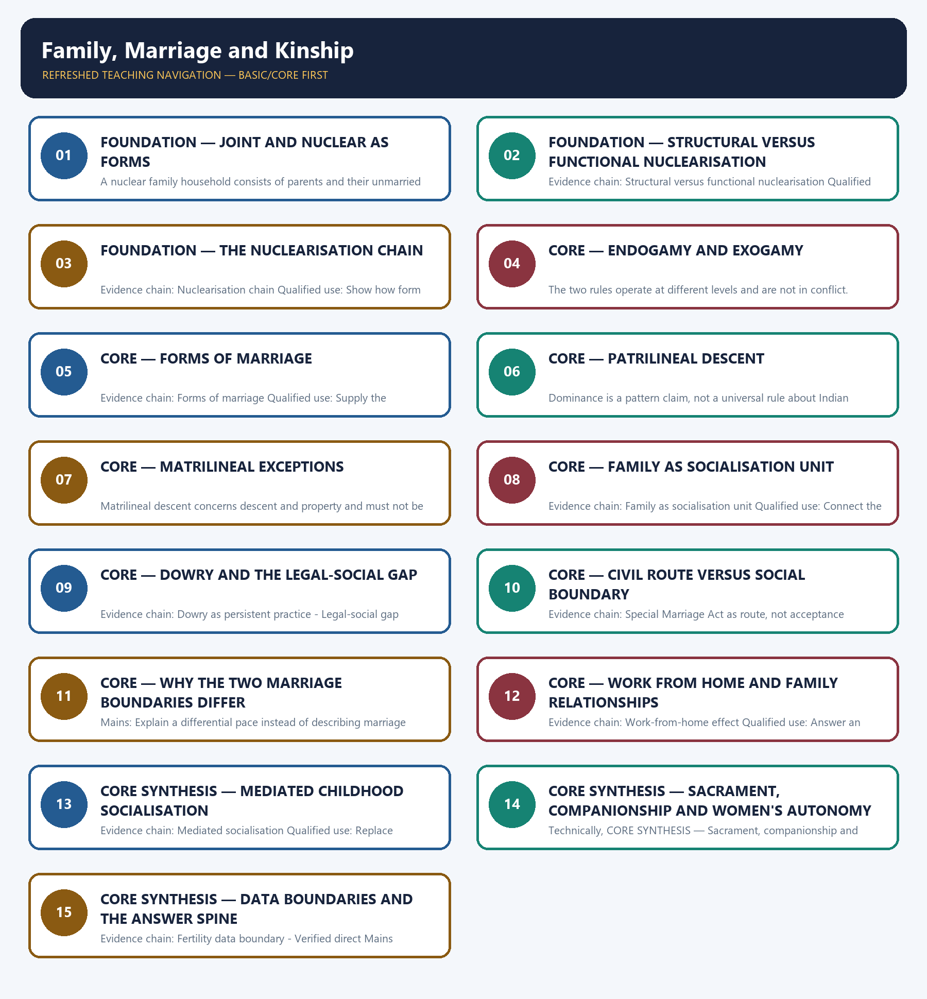

# Family, Marriage and Kinship — Learner-v2 Complete Learning Session

> **Authoring-only generation:** 2026-09-02. No PDF was rendered and no tracker or index was mutated.

### SOURCE, PROGRESSION AND CURRENT-LINKAGE AUDIT

- **Generation date:** 2026-09-02.
- **Repository-first evidence:** the Basic owner is taught first and preserved in full; the Advanced owner is retained only in the optional final teaching block.
- **OCR evidence:** Repository Markdown was primary. The OCR-searchable official General Studies Paper-I question papers held under books\mains and books\more_previous_papers were used only to confirm the wording of routed Mains PYQs. No official answer key, marking scheme, page precision or unsupported quotation was imported from them.
- **Qdrant:** not used; repository Markdown and available OCR context were sufficient.
- **PYQ integrity:** Four direct General Studies Paper-I demands are verified for this owner. The 2024 demand is routed in the audited 2024-2025 ledger, and the 2022 and two 2023 demands are routed in the audited 2018-2023 ledger to the Advanced owner with the Core owner recording that Core routing supersedes. Every wording reproduced below was confirmed against the locally held official General Studies Paper-I question papers. The caste half of the 2024 demand is owned by Topic 02 and is answered here only from the family, kinship and marriage-boundary side. No additional question, marking scheme or official key is invented.
- **Live-link boundary:** No additional live official item was verified for this topic on 2026-09-02. Only the dated official anchors already carried by the repository owners are used, each with its issuing body and date. The package invents no caste, tribe, demographic or agrarian statistic, no legal or constitutional claim and no policy status.
- **Fact/inference discipline:** no current-affairs item, PYQ wording, figure or quotation is invented.

## BASIC LEARNING SESSION

### DEEP-REVIEW LEARNING CONTRACT

| Control | Binding rule for this package |
|---|---|
| Syllabus boundary | Complete Indian Society Basic/Core is answer-complete before optional Advanced depth. |
| Concept method | Define and distinguish the institution, identity, process, legal category and measured indicator before analysis. |
| Sociological method | Structure/institution → mechanism and agency → differentiated group/region outcome → feedback, resistance and qualification. |
| Evidence method | Claim → named Indian community/region/institution/dataset → analysis → source-date-status or causal qualification. |
| Non-homogenisation | Caste, tribe, women, religion, region and rural/urban groups retain internal class, gender, locality and historical variation. |
| Boundary method | Constitutional right, statutory mandate, executive scheme, implementation and lived social outcome remain distinct. |
| Practice contract | Every solved item has demand decoding, a detailed examiner-grade model, executable timed/compression plan, marks rationale and answer-specific improvement. |
| Approval | This immutable successor remains `approved: false` pending explicit approval. |

**Canonical Basic/Core owner:** `upsc-ai-kit\knowledge\Indian-Society\basic\04_Family-Marriage-and-Kinship.md`  
**Canonical topic owner:** `upsc-ai-kit\knowledge\Indian-Society\basic\04_Family-Marriage-and-Kinship.md`  
**Optional Advanced owner:** `upsc-ai-kit\knowledge\Indian-Society\advanced\04_Family-Marriage-and-Kinship.md`  
**Official syllabus mapping:** `upsc-ai-kit\knowledge\Indian-Society\OFFICIAL-UPSC-SYLLABUS-MAPPING.md`

### EVIDENCE, PYQ AND CURRENT-STATUS CONTROL

- **Definition discipline:** close concepts and legal-administrative categories share a comparison axis and are never treated as synonyms.
- **Mechanism discipline:** correlation, temporal sequence and aggregate association do not establish causation; identify institutions, incentives, norms, power and agency.
- **Historical discipline:** colonial, constitutional, developmental, liberalisation and contemporary phases are separated without a linear tradition-to-modernity story.
- **Intersectional discipline:** overlapping caste, tribe, class, gender, religion, disability, region and life-course positions are analysed without creating a single homogeneous category.
- **India discipline:** use named communities, movements, institutions, cities, states and regional contrasts without stereotyping or treating one case as nationally representative.
- **Data discipline:** Census 2011, NFHS, PLFS, SRS, Agriculture Census, MPI and scheme claims retain source, reference period, release date, coverage and provisional/final status.
- **PYQ discipline:** repository routing ledgers and locally held papers control wording and metadata; reconstructed wording and unavailable official keys remain labelled.
- **Current-status note, rechecked 2026-09-02:** No additional live official item was verified for this topic on 2026-09-02. Only the dated official anchors already carried by the repository owners are used, each with its issuing body and date. The package invents no caste, tribe, demographic or agrarian statistic, no legal or constitutional claim and no policy status.

**Live/official context sources recorded by the predecessor generation:**

- No volatile live claim is necessary for the static sociological core.




*Distinct embedded teaching-navigation image. The separate continuous Cārvāka-style flowchart package remains an independent at-a-glance artifact.*

### SESSION 1 — FOUNDATION — JOINT AND NUCLEAR AS FORMS

#### DEFINITION / WHAT THIS IS CALLED

**Plain-language definition:** A joint family is a multi-generational arrangement that may share residence, property, income or obligations; co-residence is an important form, but family functions can persist across separate households.

**Technical definition:** A nuclear family household consists of parents and their unmarried children and has become more common with urban migration, housing constraints and occupational mobility.

#### ANSWER-GRABBING OPENING — WRITE/ADAPT IN THE EXAM

> A joint family is a multi-generational arrangement that may share residence, property, income or obligations; co-residence is an important form, but family functions can persist across separate households.

#### MUST-WRITE KEYWORDS

- **FOUNDATION**
- **Joint**
- **nuclear as forms**
- **Evidence chain**
- **Qualified use**
- **A joint family**

**How to use them:** Frame the answer through FOUNDATION; define Joint, connect nuclear as forms with Evidence chain to explain the mechanism, and use Qualified use for the decisive comparison or qualification.

#### VISUAL FIRST

```text
JOINT AND NUCLEAR AS FORMS
01. Joint family
    |
    v
02. Nuclear family
BOUNDARY -> Both are household forms, and a form label says nothing yet about obligation.
```

*This topic-specific rail fixes the evidence sequence and its exam boundary before analysis.*

#### CORE EXPLANATION

A joint family is a multi-generational arrangement that may share residence, property, income or obligations; co-residence is an important form, but family functions can persist across separate households. A nuclear family household consists of parents and their unmarried children and has become more common with urban migration, housing constraints and occupational mobility.

#### NAMED EVIDENCE AND MECHANISM

- A joint family is a multi-generational arrangement that may share residence, property, income or obligations; co-residence is an important form, but family functions can persist across separate households.
- A nuclear family household consists of parents and their unmarried children and has become more common with urban migration, housing constraints and occupational mobility.

#### EXAMINER CAUTION

- Both are household forms, and a form label says nothing yet about obligation.

#### EXAM LINK

- **Prelims:** Retain the exact unit, named scholar, official category, dated statistic or legal boundary attached to Joint and nuclear as forms.
- **Mains:** Open a family answer with precise units rather than a decline narrative.

#### MINI RECAP

- **Evidence chain:** Joint family -> Nuclear family
- **Qualified use:** Open a family answer with precise units rather than a decline narrative.

#### CLOSING RECALL FLOW — FOUNDATION — JOINT AND NUCLEAR AS FORMS

```text
START / CONCEPT: FOUNDATION — Joint and nuclear as forms
        |
        v
EXACT TERMS: FOUNDATION · Joint · nuclear as forms · Evidence chain · Qualified use · A joint family
        |
        v
MECHANISM / ARGUMENT: Evidence chain: Joint family - Nuclear family Qualified use: Open a family answer with precise units rather than a decline narrative.
        |
        v
CONSEQUENCE / CONTRAST: A nuclear family household consists of parents and their unmarried children and has become more common with urban migration, housing constraints and occupational mobility.
        |
        v
UPSC TRAP / ANSWER-USE: Do not miss this limiting distinction: and a form label says nothing yet about obligation.
        |
        v
ANSWER-GRABBING FORMULATION: A joint family is a multi-generational arrangement that may share residence, property, income or obligations; co-residence is an important form, but family functions can persist across separate households.
```
### SESSION 2 — FOUNDATION — STRUCTURAL VERSUS FUNCTIONAL NUCLEARISATION

#### DEFINITION / WHAT THIS IS CALLED

**Plain-language definition:** Structural nuclearisation is the shift to separate, smaller-household residence, while functional nuclearisation would additionally mean independence from intergenerational financial support and decision authority, and the two do not move together.

**Technical definition:** Evidence chain: Structural versus functional nuclearisation Qualified use: Prevent the commonest error in every family-change answer.

#### ANSWER-GRABBING OPENING — WRITE/ADAPT IN THE EXAM

> Structural nuclearisation is the shift to separate, smaller-household residence, while functional nuclearisation would additionally mean independence from intergenerational financial support and decision authority, and the two do not move together.

#### MUST-WRITE KEYWORDS

- **FOUNDATION**
- **Structural versus functional nuclearisation**
- **Evidence chain**
- **Qualified use**
- **Structural nuclearisation**
- **Structural**

**How to use them:** Frame the answer through FOUNDATION; define Structural versus functional nuclearisation, connect Evidence chain with Qualified use to explain the mechanism, and use Structural nuclearisation for the decisive comparison or qualification.

#### VISUAL FIRST

```text
STRUCTURAL VERSUS FUNCTIONAL NUCLEARISATION
01. Structural versus functional nuclearisation
BOUNDARY -> Residence, support, authority and care must be assessed separately.
```

*This topic-specific rail fixes the evidence sequence and its exam boundary before analysis.*

#### CORE EXPLANATION

Structural nuclearisation is the shift to separate, smaller-household residence, while functional nuclearisation would additionally mean independence from intergenerational financial support and decision authority, and the two do not move together.

#### NAMED EVIDENCE AND MECHANISM

- Structural nuclearisation is the shift to separate, smaller-household residence, while functional nuclearisation would additionally mean independence from intergenerational financial support and decision authority, and the two do not move together.

#### EXAMINER CAUTION

- Residence, support, authority and care must be assessed separately.

#### EXAM LINK

- **Prelims:** Retain the exact unit, named scholar, official category, dated statistic or legal boundary attached to Structural versus functional nuclearisation.
- **Mains:** Prevent the commonest error in every family-change answer.

#### MINI RECAP

- **Evidence chain:** Structural versus functional nuclearisation
- **Qualified use:** Prevent the commonest error in every family-change answer.

#### CLOSING RECALL FLOW — FOUNDATION — STRUCTURAL VERSUS FUNCTIONAL NUCLEARISATION

```text
START / CONCEPT: FOUNDATION — Structural versus functional nuclearisation
        |
        v
EXACT TERMS: FOUNDATION · Structural versus functional nuclearisation · Evidence chain · Qualified use · Structural nuclearisation · Structural
        |
        v
MECHANISM / ARGUMENT: Evidence chain: Structural versus functional nuclearisation Qualified use: Prevent the commonest error in every family-change answer.
        |
        v
CONSEQUENCE / CONTRAST: Residence, support, authority and care must be assessed separately.
        |
        v
UPSC TRAP / ANSWER-USE: Do not miss this limiting distinction: structural nuclearisation is the shift to separate, smaller-household residence.
        |
        v
ANSWER-GRABBING FORMULATION: Structural nuclearisation is the shift to separate, smaller-household residence, while functional nuclearisation would additionally mean independence from intergenerational financial support and decision authority, and the two do not move together.
```
### SESSION 3 — FOUNDATION — THE NUCLEARISATION CHAIN

#### DEFINITION / WHAT THIS IS CALLED

**Plain-language definition:** The chain is a mechanism and not a national prevalence estimate.

**Technical definition:** Evidence chain: Nuclearisation chain Qualified use: Show how form changes before function in a migrating household.

#### ANSWER-GRABBING OPENING — WRITE/ADAPT IN THE EXAM

> Evidence chain: Nuclearisation chain Qualified use: Show how form changes before function in a migrating household.

#### MUST-WRITE KEYWORDS

- **FOUNDATION**
- **The nuclearisation chain**
- **Evidence chain**
- **Qualified use**
- **The chain**
- **Nuclearisation**

**How to use them:** Frame the answer through FOUNDATION; define The nuclearisation chain, connect Evidence chain with Qualified use to explain the mechanism, and use The chain for the decisive comparison or qualification.

#### VISUAL FIRST

```text
THE NUCLEARISATION CHAIN
01. Nuclearisation chain
BOUNDARY -> The chain is a mechanism and not a national prevalence estimate.
```

*This topic-specific rail fixes the evidence sequence and its exam boundary before analysis.*

#### CORE EXPLANATION

Urban migration for employment and housing cost separate a nuclear unit from the ancestral household, while remittance and participation in family rituals continue, so form changes before function and later generations weaken the tie further.

#### NAMED EVIDENCE AND MECHANISM

- Urban migration for employment and housing cost separate a nuclear unit from the ancestral household, while remittance and participation in family rituals continue, so form changes before function and later generations weaken the tie further.

#### EXAMINER CAUTION

- The chain is a mechanism and not a national prevalence estimate.

#### EXAM LINK

- **Prelims:** Retain the exact unit, named scholar, official category, dated statistic or legal boundary attached to The nuclearisation chain.
- **Mains:** Show how form changes before function in a migrating household.

#### MINI RECAP

- **Evidence chain:** Nuclearisation chain
- **Qualified use:** Show how form changes before function in a migrating household.

#### CLOSING RECALL FLOW — FOUNDATION — THE NUCLEARISATION CHAIN

```text
START / CONCEPT: FOUNDATION — The nuclearisation chain
        |
        v
EXACT TERMS: FOUNDATION · The nuclearisation chain · Evidence chain · Qualified use · The chain · Nuclearisation
        |
        v
MECHANISM / ARGUMENT: The chain is a mechanism and not a national prevalence estimate.
        |
        v
CONSEQUENCE / CONTRAST: Mains: Show how form changes before function in a migrating household.
        |
        v
UPSC TRAP / ANSWER-USE: Do not miss this limiting distinction: the chain is a mechanism and not a national prevalence estimate.
        |
        v
ANSWER-GRABBING FORMULATION: Evidence chain: Nuclearisation chain Qualified use: Show how form changes before function in a migrating household.
```
### SESSION 4 — CORE — ENDOGAMY AND EXOGAMY

#### DEFINITION / WHAT THIS IS CALLED

**Plain-language definition:** Evidence chain: Endogamy and exogamy together Qualified use: Deliver a definitional distinction that scores under time pressure.

**Technical definition:** The two rules operate at different levels and are not in conflict.

#### ANSWER-GRABBING OPENING — WRITE/ADAPT IN THE EXAM

> Evidence chain: Endogamy and exogamy together Qualified use: Deliver a definitional distinction that scores under time pressure.

#### MUST-WRITE KEYWORDS

- **Endogamy**
- **exogamy**
- **Evidence chain**
- **Qualified use**
- **The two rules operate at different levels and**
- **Qualified**

**How to use them:** Frame the answer through Endogamy; define exogamy, connect Evidence chain with Qualified use to explain the mechanism, and use The two rules operate at different levels and for the decisive comparison or qualification.

#### VISUAL FIRST

```text
ENDOGAMY AND EXOGAMY
01. Endogamy and exogamy together
BOUNDARY -> The two rules operate at different levels and are not in conflict.
```

*This topic-specific rail fixes the evidence sequence and its exam boundary before analysis.*

#### CORE EXPLANATION

Caste endogamy restricts marriage to within the caste while gotra exogamy restricts it to outside the clan lineage within that caste, so the two rules operate at different levels and typically apply together.

#### NAMED EVIDENCE AND MECHANISM

- Caste endogamy restricts marriage to within the caste while gotra exogamy restricts it to outside the clan lineage within that caste, so the two rules operate at different levels and typically apply together.

#### EXAMINER CAUTION

- The two rules operate at different levels and are not in conflict.

#### EXAM LINK

- **Prelims:** Retain the exact unit, named scholar, official category, dated statistic or legal boundary attached to Endogamy and exogamy.
- **Mains:** Deliver a definitional distinction that scores under time pressure.

#### MINI RECAP

- **Evidence chain:** Endogamy and exogamy together
- **Qualified use:** Deliver a definitional distinction that scores under time pressure.

#### CLOSING RECALL FLOW — CORE — ENDOGAMY AND EXOGAMY

```text
START / CONCEPT: CORE — Endogamy and exogamy
        |
        v
EXACT TERMS: Endogamy · exogamy · Evidence chain · Qualified use · The two rules operate at different levels and · Qualified
        |
        v
MECHANISM / ARGUMENT: The two rules operate at different levels and are not in conflict.
        |
        v
CONSEQUENCE / CONTRAST: The resulting consequence is that endogamy and exogamy together Qualified use.
        |
        v
UPSC TRAP / ANSWER-USE: Do not miss this limiting distinction: endogamy and exogamy together Qualified use.
        |
        v
ANSWER-GRABBING FORMULATION: Evidence chain: Endogamy and exogamy together Qualified use: Deliver a definitional distinction that scores under time pressure.
```
### SESSION 5 — CORE — FORMS OF MARRIAGE

#### DEFINITION / WHAT THIS IS CALLED

**Plain-language definition:** Self-choice marriage varies by region, class and generation and is not a uniform trend.

**Technical definition:** Evidence chain: Forms of marriage Qualified use: Supply the classification an examiner expects before analysis begins.

#### ANSWER-GRABBING OPENING — WRITE/ADAPT IN THE EXAM

> Self-choice marriage varies by region, class and generation and is not a uniform trend.

#### MUST-WRITE KEYWORDS

- **Forms of marriage**
- **Evidence chain**
- **Qualified use**
- **Indian**
- **Self-choice**
- **Forms**

**How to use them:** Frame the answer through Forms of marriage; define Evidence chain, connect Qualified use with Indian to explain the mechanism, and use Self-choice for the decisive comparison or qualification.

#### VISUAL FIRST

```text
FORMS OF MARRIAGE
01. Forms of marriage
BOUNDARY -> Self-choice marriage varies by region, class and generation and is not a uniform trend.
```

*This topic-specific rail fixes the evidence sequence and its exam boundary before analysis.*

#### CORE EXPLANATION

Indian marriage forms include monogamy, regionally rare polygamy, endogamy, exogamy, arranged marriage and a rising share of self-choice marriage whose spread varies sharply by region, class, education and generation.

#### NAMED EVIDENCE AND MECHANISM

- Indian marriage forms include monogamy, regionally rare polygamy, endogamy, exogamy, arranged marriage and a rising share of self-choice marriage whose spread varies sharply by region, class, education and generation.

#### EXAMINER CAUTION

- Self-choice marriage varies by region, class and generation and is not a uniform trend.

#### EXAM LINK

- **Prelims:** Retain the exact unit, named scholar, official category, dated statistic or legal boundary attached to Forms of marriage.
- **Mains:** Supply the classification an examiner expects before analysis begins.

#### MINI RECAP

- **Evidence chain:** Forms of marriage
- **Qualified use:** Supply the classification an examiner expects before analysis begins.

#### CLOSING RECALL FLOW — CORE — FORMS OF MARRIAGE

```text
START / CONCEPT: CORE — Forms of marriage
        |
        v
EXACT TERMS: Forms of marriage · Evidence chain · Qualified use · Indian · Self-choice · Forms
        |
        v
MECHANISM / ARGUMENT: Indian marriage forms include monogamy, regionally rare polygamy, endogamy, exogamy, arranged marriage and a rising share of self-choice marriage whose spread varies sharply by region, class, education and generation.
        |
        v
CONSEQUENCE / CONTRAST: Evidence chain: Forms of marriage Qualified use: Supply the classification an examiner expects before analysis begins.
        |
        v
UPSC TRAP / ANSWER-USE: Do not miss this limiting distinction: self-choice marriage varies by region, class and generation and is not a uniform trend.
        |
        v
ANSWER-GRABBING FORMULATION: Self-choice marriage varies by region, class and generation and is not a uniform trend.
```
### SESSION 6 — CORE — PATRILINEAL DESCENT

#### DEFINITION / WHAT THIS IS CALLED

**Plain-language definition:** Evidence chain: Patrilineal majority pattern Qualified use: Establish the baseline against which exceptions become analytical.

**Technical definition:** Dominance is a pattern claim, not a universal rule about Indian kinship.

#### ANSWER-GRABBING OPENING — WRITE/ADAPT IN THE EXAM

> Evidence chain: Patrilineal majority pattern Qualified use: Establish the baseline against which exceptions become analytical.

#### MUST-WRITE KEYWORDS

- **Patrilineal descent**
- **Evidence chain**
- **Qualified use**
- **Dominance**
- **Indian**
- **Patrilineal**

**How to use them:** Frame the answer through Patrilineal descent; define Evidence chain, connect Qualified use with Dominance to explain the mechanism, and use Indian for the decisive comparison or qualification.

#### VISUAL FIRST

```text
PATRILINEAL DESCENT
01. Patrilineal majority pattern
BOUNDARY -> Dominance is a pattern claim, not a universal rule about Indian kinship.
```

*This topic-specific rail fixes the evidence sequence and its exam boundary before analysis.*

#### CORE EXPLANATION

Patrilineal systems trace descent, surname and property transmission through the father's line and constitute India's dominant kinship pattern.

#### NAMED EVIDENCE AND MECHANISM

- Patrilineal systems trace descent, surname and property transmission through the father's line and constitute India's dominant kinship pattern.

#### EXAMINER CAUTION

- Dominance is a pattern claim, not a universal rule about Indian kinship.

#### EXAM LINK

- **Prelims:** Retain the exact unit, named scholar, official category, dated statistic or legal boundary attached to Patrilineal descent.
- **Mains:** Establish the baseline against which exceptions become analytical.

#### MINI RECAP

- **Evidence chain:** Patrilineal majority pattern
- **Qualified use:** Establish the baseline against which exceptions become analytical.

#### CLOSING RECALL FLOW — CORE — PATRILINEAL DESCENT

```text
START / CONCEPT: CORE — Patrilineal descent
        |
        v
EXACT TERMS: Patrilineal descent · Evidence chain · Qualified use · Dominance · Indian · Patrilineal
        |
        v
MECHANISM / ARGUMENT: Dominance is a pattern claim, not a universal rule about Indian kinship.
        |
        v
CONSEQUENCE / CONTRAST: The resulting consequence is that dominance is a pattern claim, not a universal rule about Indian kinship.
        |
        v
UPSC TRAP / ANSWER-USE: Do not miss this limiting distinction: dominance is a pattern claim, not a universal rule about Indian kinship.
        |
        v
ANSWER-GRABBING FORMULATION: Evidence chain: Patrilineal majority pattern Qualified use: Establish the baseline against which exceptions become analytical.
```
### SESSION 7 — CORE — MATRILINEAL EXCEPTIONS

#### DEFINITION / WHAT THIS IS CALLED

**Plain-language definition:** Evidence chain: Matrilineal exceptions - Matriliny is not matriarchy Qualified use: Supply the counter-case that defeats a uniformity claim.

**Technical definition:** Matrilineal descent concerns descent and property and must not be equated with matriarchal authority, because ritual and public authority can still rest with maternal uncles rather than with women themselves.

#### ANSWER-GRABBING OPENING — WRITE/ADAPT IN THE EXAM

> Evidence chain: Matrilineal exceptions - Matriliny is not matriarchy Qualified use: Supply the counter-case that defeats a uniformity claim.

#### MUST-WRITE KEYWORDS

- **Matrilineal exceptions**
- **Evidence chain**
- **Qualified use**
- **Matrilineal**
- **Evidence chain: Matrilineal exceptions - Matriliny**
- **Matriliny**

**How to use them:** Frame the answer through Matrilineal exceptions; define Evidence chain, connect Qualified use with Matrilineal to explain the mechanism, and use Evidence chain: Matrilineal exceptions - Matriliny for the decisive comparison or qualification.

#### VISUAL FIRST

```text
MATRILINEAL EXCEPTIONS
01. Matrilineal exceptions
    |
    v
02. Matriliny is not matriarchy
BOUNDARY -> Matrilineal descent concerns property and lineage, not female public authority.
```

*This topic-specific rail fixes the evidence sequence and its exam boundary before analysis.*

#### CORE EXPLANATION

Matrilineal descent among the Khasi of Meghalaya and, traditionally, the Nair of Kerala vests descent, surname and property in the female line, and the youngest Khasi daughter customarily inherits the ancestral home. Matrilineal descent concerns descent and property and must not be equated with matriarchal authority, because ritual and public authority can still rest with maternal uncles rather than with women themselves.

#### NAMED EVIDENCE AND MECHANISM

- Matrilineal descent among the Khasi of Meghalaya and, traditionally, the Nair of Kerala vests descent, surname and property in the female line, and the youngest Khasi daughter customarily inherits the ancestral home.
- Matrilineal descent concerns descent and property and must not be equated with matriarchal authority, because ritual and public authority can still rest with maternal uncles rather than with women themselves.

#### EXAMINER CAUTION

- Matrilineal descent concerns property and lineage, not female public authority.

#### EXAM LINK

- **Prelims:** Retain the exact unit, named scholar, official category, dated statistic or legal boundary attached to Matrilineal exceptions.
- **Mains:** Supply the counter-case that defeats a uniformity claim.

#### MINI RECAP

- **Evidence chain:** Matrilineal exceptions -> Matriliny is not matriarchy
- **Qualified use:** Supply the counter-case that defeats a uniformity claim.

#### CLOSING RECALL FLOW — CORE — MATRILINEAL EXCEPTIONS

```text
START / CONCEPT: CORE — Matrilineal exceptions
        |
        v
EXACT TERMS: Matrilineal exceptions · Evidence chain · Qualified use · Matrilineal · Evidence chain: Matrilineal exceptions - Matriliny · Matriliny
        |
        v
MECHANISM / ARGUMENT: Matrilineal descent concerns descent and property and must not be equated with matriarchal authority, because ritual and public authority can still rest with maternal uncles rather than with women themselves.
        |
        v
CONSEQUENCE / CONTRAST: The resulting consequence is that matrilineal exceptions - Matriliny is not matriarchy Qualified use.
        |
        v
UPSC TRAP / ANSWER-USE: Do not miss this limiting distinction: matrilineal exceptions - Matriliny is not matriarchy Qualified use.
        |
        v
ANSWER-GRABBING FORMULATION: Evidence chain: Matrilineal exceptions - Matriliny is not matriarchy Qualified use: Supply the counter-case that defeats a uniformity claim.
```
### SESSION 8 — CORE — FAMILY AS SOCIALISATION UNIT

#### DEFINITION / WHAT THIS IS CALLED

**Plain-language definition:** Socialisation transmits norms, which is why family change signals wider change.

**Technical definition:** Evidence chain: Family as socialisation unit Qualified use: Connect the family to caste, religion and gender questions.

#### ANSWER-GRABBING OPENING — WRITE/ADAPT IN THE EXAM

> Socialisation transmits norms, which is why family change signals wider change.

#### MUST-WRITE KEYWORDS

- **Family as socialisation unit**
- **Evidence chain**
- **Qualified use**
- **Socialisation transmits norms, which**
- **Socialisation**
- **Family**

**How to use them:** Frame the answer through Family as socialisation unit; define Evidence chain, connect Qualified use with Socialisation transmits norms, which to explain the mechanism, and use Socialisation for the decisive comparison or qualification.

#### VISUAL FIRST

```text
FAMILY AS SOCIALISATION UNIT
01. Family as socialisation unit
BOUNDARY -> Socialisation transmits norms, which is why family change signals wider change.
```

*This topic-specific rail fixes the evidence sequence and its exam boundary before analysis.*

#### CORE EXPLANATION

The family remains the primary institution transmitting caste, religious and gender norms across generations, which makes it the site where broader social change or resistance to it first becomes visible.

#### NAMED EVIDENCE AND MECHANISM

- The family remains the primary institution transmitting caste, religious and gender norms across generations, which makes it the site where broader social change or resistance to it first becomes visible.

#### EXAMINER CAUTION

- Socialisation transmits norms, which is why family change signals wider change.

#### EXAM LINK

- **Prelims:** Retain the exact unit, named scholar, official category, dated statistic or legal boundary attached to Family as socialisation unit.
- **Mains:** Connect the family to caste, religion and gender questions.

#### MINI RECAP

- **Evidence chain:** Family as socialisation unit
- **Qualified use:** Connect the family to caste, religion and gender questions.

#### CLOSING RECALL FLOW — CORE — FAMILY AS SOCIALISATION UNIT

```text
START / CONCEPT: CORE — Family as socialisation unit
        |
        v
EXACT TERMS: Family as socialisation unit · Evidence chain · Qualified use · Socialisation transmits norms, which · Socialisation · Family
        |
        v
MECHANISM / ARGUMENT: Evidence chain: Family as socialisation unit Qualified use: Connect the family to caste, religion and gender questions.
        |
        v
CONSEQUENCE / CONTRAST: The family remains the primary institution transmitting caste, religious and gender norms across generations, which makes it the site where broader social change or resistance to it first becomes visible.
        |
        v
UPSC TRAP / ANSWER-USE: Do not miss this limiting distinction: family as socialisation unit Qualified use.
        |
        v
ANSWER-GRABBING FORMULATION: Socialisation transmits norms, which is why family change signals wider change.
```
### SESSION 9 — CORE — DOWRY AND THE LEGAL-SOCIAL GAP

#### DEFINITION / WHAT THIS IS CALLED

**Plain-language definition:** Dowry is a transfer of goods or cash from the bride's family to the groom's family at marriage that is legally prohibited yet sociologically persistent as a status-signalling and marriage-market practice.

**Technical definition:** Evidence chain: Dowry as persistent practice - Legal-social gap Qualified use: Separate law from norms without re-deriving statutory doctrine.

#### ANSWER-GRABBING OPENING — WRITE/ADAPT IN THE EXAM

> Dowry is a transfer of goods or cash from the bride's family to the groom's family at marriage that is legally prohibited yet sociologically persistent as a status-signalling and marriage-market practice.

#### MUST-WRITE KEYWORDS

- **Dowry**
- **the legal-social gap**
- **Evidence chain**
- **Qualified use**
- **Judicial**
- **Social Justice**

**How to use them:** Frame the answer through Dowry; define the legal-social gap, connect Evidence chain with Qualified use to explain the mechanism, and use Judicial for the decisive comparison or qualification.

#### VISUAL FIRST

```text
DOWRY AND THE LEGAL-SOCIAL GAP
01. Dowry as persistent practice
    |
    v
02. Legal-social gap
BOUNDARY -> Legal prohibition and legal protection are not the same as social acceptance.
```

*This topic-specific rail fixes the evidence sequence and its exam boundary before analysis.*

#### CORE EXPLANATION

Dowry is a transfer of goods or cash from the bride's family to the groom's family at marriage that is legally prohibited yet sociologically persistent as a status-signalling and marriage-market practice. Judicial protection for relationships in the nature of marriage has expanded faster than social acceptance, so a relationship may be legally protected while remaining socially unnormalised, and the statutory detail belongs to Social Justice.

#### NAMED EVIDENCE AND MECHANISM

- Dowry is a transfer of goods or cash from the bride's family to the groom's family at marriage that is legally prohibited yet sociologically persistent as a status-signalling and marriage-market practice.
- Judicial protection for relationships in the nature of marriage has expanded faster than social acceptance, so a relationship may be legally protected while remaining socially unnormalised, and the statutory detail belongs to Social Justice.

#### EXAMINER CAUTION

- Legal prohibition and legal protection are not the same as social acceptance.

#### EXAM LINK

- **Prelims:** Retain the exact unit, named scholar, official category, dated statistic or legal boundary attached to Dowry and the legal-social gap.
- **Mains:** Separate law from norms without re-deriving statutory doctrine.

#### MINI RECAP

- **Evidence chain:** Dowry as persistent practice -> Legal-social gap
- **Qualified use:** Separate law from norms without re-deriving statutory doctrine.

#### CLOSING RECALL FLOW — CORE — DOWRY AND THE LEGAL-SOCIAL GAP

```text
START / CONCEPT: CORE — Dowry and the legal-social gap
        |
        v
EXACT TERMS: Dowry · the legal-social gap · Evidence chain · Qualified use · Judicial · Social Justice
        |
        v
MECHANISM / ARGUMENT: Evidence chain: Dowry as persistent practice - Legal-social gap Qualified use: Separate law from norms without re-deriving statutory doctrine.
        |
        v
CONSEQUENCE / CONTRAST: Judicial protection for relationships in the nature of marriage has expanded faster than social acceptance, so a relationship may be legally protected while remaining socially unnormalised, and the statutory detail belongs to Social Justice.
        |
        v
UPSC TRAP / ANSWER-USE: Legal prohibition and legal protection are not the same as social acceptance.
        |
        v
ANSWER-GRABBING FORMULATION: Dowry is a transfer of goods or cash from the bride's family to the groom's family at marriage that is legally prohibited yet sociologically persistent as a status-signalling and marriage-market practice.
```
### SESSION 10 — CORE — CIVIL ROUTE VERSUS SOCIAL BOUNDARY

#### DEFINITION / WHAT THIS IS CALLED

**Plain-language definition:** The Special Marriage Act, 1954 provides a civil route across religions, which is why an interreligious-marriage answer must separate legal possibility from kin and community sanction instead of blaming personal-law plurality alone.

**Technical definition:** Evidence chain: Special Marriage Act as route, not acceptance Qualified use: Defeat the lazy explanation examiners expect candidates to give.

#### ANSWER-GRABBING OPENING — WRITE/ADAPT IN THE EXAM

> The Special Marriage Act, 1954 provides a civil route across religions, which is why an interreligious-marriage answer must separate legal possibility from kin and community sanction instead of blaming personal-law plurality alone.

#### MUST-WRITE KEYWORDS

- **Civil route versus social boundary**
- **Evidence chain**
- **Qualified use**
- **The Special Marriage Act**
- **Special Marriage Act**
- **Qualified**

**How to use them:** Frame the answer through Civil route versus social boundary; define Evidence chain, connect Qualified use with The Special Marriage Act to explain the mechanism, and use Special Marriage Act for the decisive comparison or qualification.

#### VISUAL FIRST

```text
CIVIL ROUTE VERSUS SOCIAL BOUNDARY
01. Special Marriage Act as route, not acceptance
BOUNDARY -> A civil route exists, so personal-law plurality alone cannot carry the argument.
```

*This topic-specific rail fixes the evidence sequence and its exam boundary before analysis.*

#### CORE EXPLANATION

The Special Marriage Act, 1954 provides a civil route across religions, which is why an interreligious-marriage answer must separate legal possibility from kin and community sanction instead of blaming personal-law plurality alone.

#### NAMED EVIDENCE AND MECHANISM

- The Special Marriage Act, 1954 provides a civil route across religions, which is why an interreligious-marriage answer must separate legal possibility from kin and community sanction instead of blaming personal-law plurality alone.

#### EXAMINER CAUTION

- A civil route exists, so personal-law plurality alone cannot carry the argument.

#### EXAM LINK

- **Prelims:** Retain the exact unit, named scholar, official category, dated statistic or legal boundary attached to Civil route versus social boundary.
- **Mains:** Defeat the lazy explanation examiners expect candidates to give.

#### MINI RECAP

- **Evidence chain:** Special Marriage Act as route, not acceptance
- **Qualified use:** Defeat the lazy explanation examiners expect candidates to give.

#### CLOSING RECALL FLOW — CORE — CIVIL ROUTE VERSUS SOCIAL BOUNDARY

```text
START / CONCEPT: CORE — Civil route versus social boundary
        |
        v
EXACT TERMS: Civil route versus social boundary · Evidence chain · Qualified use · The Special Marriage Act · Special Marriage Act · Qualified
        |
        v
MECHANISM / ARGUMENT: Evidence chain: Special Marriage Act as route, not acceptance Qualified use: Defeat the lazy explanation examiners expect candidates to give.
        |
        v
CONSEQUENCE / CONTRAST: The resulting consequence is that special Marriage Act as route, not acceptance Qualified use.
        |
        v
UPSC TRAP / ANSWER-USE: Do not miss this limiting distinction: special Marriage Act as route, not acceptance Qualified use.
        |
        v
ANSWER-GRABBING FORMULATION: The Special Marriage Act, 1954 provides a civil route across religions, which is why an interreligious-marriage answer must separate legal possibility from kin and community sanction instead of blaming personal-law plurality alone.
```
### SESSION 11 — CORE — WHY THE TWO MARRIAGE BOUNDARIES DIFFER

#### DEFINITION / WHAT THIS IS CALLED

**Plain-language definition:** Evidence chain: Status parity and identity boundary Qualified use: Explain a differential pace instead of describing marriage change.

**Technical definition:** Mains: Explain a differential pace instead of describing marriage change.

#### ANSWER-GRABBING OPENING — WRITE/ADAPT IN THE EXAM

> Evidence chain: Status parity and identity boundary Qualified use: Explain a differential pace instead of describing marriage change.

#### MUST-WRITE KEYWORDS

- **Why the two marriage boundaries differ**
- **Evidence chain**
- **Qualified use**
- **Socio-economic**
- **The premise**
- **Status**

**How to use them:** Frame the answer through Why the two marriage boundaries differ; define Evidence chain, connect Qualified use with Socio-economic to explain the mechanism, and use The premise for the decisive comparison or qualification.

#### VISUAL FIRST

```text
WHY THE TWO MARRIAGE BOUNDARIES DIFFER
01. Status parity and identity boundary
BOUNDARY -> The premise is qualified and describes a pattern rather than a measured series.
```

*This topic-specific rail fixes the evidence sequence and its exam boundary before analysis.*

#### CORE EXPLANATION

Socio-economic parity can ease some intercaste matches because neither family's status or resource base is threatened, while interreligious matches additionally engage community belonging, kinship networks and family sanction that parity does not remove.

#### NAMED EVIDENCE AND MECHANISM

- Socio-economic parity can ease some intercaste matches because neither family's status or resource base is threatened, while interreligious matches additionally engage community belonging, kinship networks and family sanction that parity does not remove.

#### EXAMINER CAUTION

- The premise is qualified and describes a pattern rather than a measured series.

#### EXAM LINK

- **Prelims:** Retain the exact unit, named scholar, official category, dated statistic or legal boundary attached to Why the two marriage boundaries differ.
- **Mains:** Explain a differential pace instead of describing marriage change.

#### MINI RECAP

- **Evidence chain:** Status parity and identity boundary
- **Qualified use:** Explain a differential pace instead of describing marriage change.

#### CLOSING RECALL FLOW — CORE — WHY THE TWO MARRIAGE BOUNDARIES DIFFER

```text
START / CONCEPT: CORE — Why the two marriage boundaries differ
        |
        v
EXACT TERMS: Why the two marriage boundaries differ · Evidence chain · Qualified use · Socio-economic · The premise · Status
        |
        v
MECHANISM / ARGUMENT: Socio-economic parity can ease some intercaste matches because neither family's status or resource base is threatened, while interreligious matches additionally engage community belonging, kinship networks and family sanction that parity does not remove.
        |
        v
CONSEQUENCE / CONTRAST: Mains: Explain a differential pace instead of describing marriage change.
        |
        v
UPSC TRAP / ANSWER-USE: The premise is qualified and describes a pattern rather than a measured series.
        |
        v
ANSWER-GRABBING FORMULATION: Evidence chain: Status parity and identity boundary Qualified use: Explain a differential pace instead of describing marriage change.
```
### SESSION 12 — CORE — WORK FROM HOME AND FAMILY RELATIONSHIPS

#### DEFINITION / WHAT THIS IS CALLED

**Plain-language definition:** Work from home changes the work-home boundary, adding presence, flexible care and reduced commuting while blurring work-care limits and reproducing unequal domestic labour, so the outcome depends on housing space, control over time and gender norms.

**Technical definition:** Evidence chain: Work-from-home effect Qualified use: Answer an explore-and-evaluate directive with a differentiated verdict.

#### ANSWER-GRABBING OPENING — WRITE/ADAPT IN THE EXAM

> Work from home changes the work-home boundary, adding presence, flexible care and reduced commuting while blurring work-care limits and reproducing unequal domestic labour, so the outcome depends on housing space, control over time and gender norms.

#### MUST-WRITE KEYWORDS

- **Work from home**
- **family relationships**
- **Evidence chain**
- **Qualified use**
- **Work**
- **Qualified**

**How to use them:** Frame the answer through Work from home; define family relationships, connect Evidence chain with Qualified use to explain the mechanism, and use Work for the decisive comparison or qualification.

#### VISUAL FIRST

```text
WORK FROM HOME AND FAMILY RELATIONSHIPS
01. Work-from-home effect
BOUNDARY -> Gains and strains coexist and vary with housing, occupation and gender norms.
```

*This topic-specific rail fixes the evidence sequence and its exam boundary before analysis.*

#### CORE EXPLANATION

Work from home changes the work-home boundary, adding presence, flexible care and reduced commuting while blurring work-care limits and reproducing unequal domestic labour, so the outcome depends on housing space, control over time and gender norms.

#### NAMED EVIDENCE AND MECHANISM

- Work from home changes the work-home boundary, adding presence, flexible care and reduced commuting while blurring work-care limits and reproducing unequal domestic labour, so the outcome depends on housing space, control over time and gender norms.

#### EXAMINER CAUTION

- Gains and strains coexist and vary with housing, occupation and gender norms.

#### EXAM LINK

- **Prelims:** Retain the exact unit, named scholar, official category, dated statistic or legal boundary attached to Work from home and family relationships.
- **Mains:** Answer an explore-and-evaluate directive with a differentiated verdict.

#### MINI RECAP

- **Evidence chain:** Work-from-home effect
- **Qualified use:** Answer an explore-and-evaluate directive with a differentiated verdict.

#### CLOSING RECALL FLOW — CORE — WORK FROM HOME AND FAMILY RELATIONSHIPS

```text
START / CONCEPT: CORE — Work from home and family relationships
        |
        v
EXACT TERMS: Work from home · family relationships · Evidence chain · Qualified use · Work · Qualified
        |
        v
MECHANISM / ARGUMENT: Evidence chain: Work-from-home effect Qualified use: Answer an explore-and-evaluate directive with a differentiated verdict.
        |
        v
CONSEQUENCE / CONTRAST: The resulting consequence is that work from home changes the work-home boundary, adding presence, flexible care and reduced commuting...
        |
        v
UPSC TRAP / ANSWER-USE: Do not miss this limiting distinction: work from home changes the work-home boundary, adding presence, flexible care and reduced commuting...
        |
        v
ANSWER-GRABBING FORMULATION: Work from home changes the work-home boundary, adding presence, flexible care and reduced commuting while blurring work-care limits and reproducing unequal domestic labour, so the outcome depends on housing space, control over time and gender norms.
```
### SESSION 13 — CORE SYNTHESIS — MEDIATED CHILDHOOD SOCIALISATION

#### DEFINITION / WHAT THIS IS CALLED

**Plain-language definition:** Mobile-phone use changes child socialisation by displacing some direct interaction while adding mediated learning and contact, so the effect depends on what interaction is displaced, the child's age and context, and whether adult mediation is present.

**Technical definition:** Evidence chain: Mediated socialisation Qualified use: Replace technology panic with a conditional mechanism.

#### ANSWER-GRABBING OPENING — WRITE/ADAPT IN THE EXAM

> Mobile-phone use changes child socialisation by displacing some direct interaction while adding mediated learning and contact, so the effect depends on what interaction is displaced, the child's age and context, and whether adult mediation is present.

#### MUST-WRITE KEYWORDS

- **CORE SYNTHESIS**
- **Mediated childhood socialisation**
- **Evidence chain**
- **Qualified use**
- **Mobile-phone**
- **Mediated**

**How to use them:** Frame the answer through CORE SYNTHESIS; define Mediated childhood socialisation, connect Evidence chain with Qualified use to explain the mechanism, and use Mobile-phone for the decisive comparison or qualification.

#### VISUAL FIRST

```text
MEDIATED CHILDHOOD SOCIALISATION
01. Mediated socialisation
BOUNDARY -> The question is what interaction is displaced and whether an adult mediates it.
```

*This topic-specific rail fixes the evidence sequence and its exam boundary before analysis.*

#### CORE EXPLANATION

Mobile-phone use changes child socialisation by displacing some direct interaction while adding mediated learning and contact, so the effect depends on what interaction is displaced, the child's age and context, and whether adult mediation is present.

#### NAMED EVIDENCE AND MECHANISM

- Mobile-phone use changes child socialisation by displacing some direct interaction while adding mediated learning and contact, so the effect depends on what interaction is displaced, the child's age and context, and whether adult mediation is present.

#### EXAMINER CAUTION

- The question is what interaction is displaced and whether an adult mediates it.

#### EXAM LINK

- **Prelims:** Retain the exact unit, named scholar, official category, dated statistic or legal boundary attached to Mediated childhood socialisation.
- **Mains:** Replace technology panic with a conditional mechanism.

#### MINI RECAP

- **Evidence chain:** Mediated socialisation
- **Qualified use:** Replace technology panic with a conditional mechanism.

#### CLOSING RECALL FLOW — CORE SYNTHESIS — MEDIATED CHILDHOOD SOCIALISATION

```text
START / CONCEPT: CORE SYNTHESIS — Mediated childhood socialisation
        |
        v
EXACT TERMS: CORE SYNTHESIS · Mediated childhood socialisation · Evidence chain · Qualified use · Mobile-phone · Mediated
        |
        v
MECHANISM / ARGUMENT: Evidence chain: Mediated socialisation Qualified use: Replace technology panic with a conditional mechanism.
        |
        v
CONSEQUENCE / CONTRAST: The question is what interaction is displaced and whether an adult mediates it.
        |
        v
UPSC TRAP / ANSWER-USE: Do not miss this limiting distinction: mobile-phone use changes child socialisation by displacing some direct interaction while adding mediated learning...
        |
        v
ANSWER-GRABBING FORMULATION: Mobile-phone use changes child socialisation by displacing some direct interaction while adding mediated learning and contact, so the effect depends on what interaction is displaced, the child's age and context, and whether adult mediation is present.
```
### SESSION 14 — CORE SYNTHESIS — SACRAMENT, COMPANIONSHIP AND WOMEN'S AUTONOMY

#### DEFINITION / WHAT THIS IS CALLED

**Plain-language definition:** Evidence chain: Marriage as sacrament and companionship - Globalisation and women's autonomy Qualified use: Take a qualified position on an institutional-change directive.

**Technical definition:** Technically, CORE SYNTHESIS — Sacrament, companionship and women's autonomy is analysed by relating CORE SYNTHESIS to Sacrament, then testing the relationship through companionship and women's autonomy.

#### ANSWER-GRABBING OPENING — WRITE/ADAPT IN THE EXAM

> Evidence chain: Marriage as sacrament and companionship - Globalisation and women's autonomy Qualified use: Take a qualified position on an institutional-change directive.

#### MUST-WRITE KEYWORDS

- **CORE SYNTHESIS**
- **Sacrament**
- **companionship**
- **women's autonomy**
- **Evidence chain**
- **Qualified use**

**How to use them:** Frame the answer through CORE SYNTHESIS; define Sacrament, connect companionship with women's autonomy to explain the mechanism, and use Evidence chain for the decisive comparison or qualification.

#### VISUAL FIRST

```text
SACRAMENT, COMPANIONSHIP AND WOMEN'S AUTONOMY
01. Marriage as sacrament and companionship
    |
    v
02. Globalisation and women's autonomy
BOUNDARY -> Transformation is not devaluation, and renegotiated ties are not severed ties.
```

*This topic-specific rail fixes the evidence sequence and its exam boundary before analysis.*

#### CORE EXPLANATION

A marriage can become more companionate and choice-oriented without ceasing to carry kinship, ritual and endogamy functions, so sacramental change is institutional transformation rather than disappearance. Urban migration of young, skilled and unmarried women for work expands independent income, mobility and partner choice while creating friction with family expectations of control over marriage timing and choice, and ties are usually renegotiated rather than severed.

#### NAMED EVIDENCE AND MECHANISM

- A marriage can become more companionate and choice-oriented without ceasing to carry kinship, ritual and endogamy functions, so sacramental change is institutional transformation rather than disappearance.
- Urban migration of young, skilled and unmarried women for work expands independent income, mobility and partner choice while creating friction with family expectations of control over marriage timing and choice, and ties are usually renegotiated rather than severed.

#### EXAMINER CAUTION

- Transformation is not devaluation, and renegotiated ties are not severed ties.

#### EXAM LINK

- **Prelims:** Retain the exact unit, named scholar, official category, dated statistic or legal boundary attached to Sacrament, companionship and women's autonomy.
- **Mains:** Take a qualified position on an institutional-change directive.

#### MINI RECAP

- **Evidence chain:** Marriage as sacrament and companionship -> Globalisation and women's autonomy
- **Qualified use:** Take a qualified position on an institutional-change directive.

#### CLOSING RECALL FLOW — CORE SYNTHESIS — SACRAMENT, COMPANIONSHIP AND WOMEN'S AUTONOMY

```text
START / CONCEPT: CORE SYNTHESIS — Sacrament, companionship and women's autonomy
        |
        v
EXACT TERMS: CORE SYNTHESIS · Sacrament · companionship · women's autonomy · Evidence chain · Qualified use
        |
        v
MECHANISM / ARGUMENT: A marriage can become more companionate and choice-oriented without ceasing to carry kinship, ritual and endogamy functions, so sacramental change is institutional transformation rather than disappearance.
        |
        v
CONSEQUENCE / CONTRAST: Urban migration of young, skilled and unmarried women for work expands independent income, mobility and partner choice while creating friction with family expectations of control over marriage timing and choice, and ties are usually renegotiated rather than severed.
        |
        v
UPSC TRAP / ANSWER-USE: Transformation is not devaluation, and renegotiated ties are not severed ties.
        |
        v
ANSWER-GRABBING FORMULATION: Evidence chain: Marriage as sacrament and companionship - Globalisation and women's autonomy Qualified use: Take a qualified position on an institutional-change directive.
```
### SESSION 15 — CORE SYNTHESIS — DATA BOUNDARIES AND THE ANSWER SPINE

#### DEFINITION / WHAT THIS IS CALLED

**Plain-language definition:** Discuss." From the family/marriage lens: interreligious marriage crosses a boundary anchored in personal law, community belonging and often family/community sanction that operates independently of economic standing, which is why it lags behind intercaste marriage even where the couples concerned are of equal socio-economic standing.

**Technical definition:** Evidence chain: Fertility data boundary - Verified direct Mains demands Qualified use: Assemble the family answer spine with an explicit data caveat.

#### ANSWER-GRABBING OPENING — WRITE/ADAPT IN THE EXAM

> Evidence chain: Fertility data boundary - Verified direct Mains demands Qualified use: Assemble the family answer spine with an explicit data caveat.

#### MUST-WRITE KEYWORDS

- **CORE SYNTHESIS**
- **Data boundaries**
- **the answer spine**
- **Evidence chain**
- **Qualified use**
- **Subject**

**How to use them:** Frame the answer through CORE SYNTHESIS; define Data boundaries, connect the answer spine with Evidence chain to explain the mechanism, and use Qualified use for the decisive comparison or qualification.

#### VISUAL FIRST

```text
DATA BOUNDARIES AND THE ANSWER SPINE
01. Fertility data boundary
    |
    v
02. Verified direct Mains demands
BOUNDARY -> A fertility indicator measures neither household form nor marriage acceptance.
```

*This topic-specific rail fixes the evidence sequence and its exam boundary before analysis.*

#### CORE EXPLANATION

The National Family Health Survey round 5 for 2019-21 recorded a national Total Fertility Rate of 2.0 and is a historical comparator, round 6 for 2023-24 was released on 29 May 2026, and neither round measures household form, nuclearisation or marriage acceptance. Four direct General Studies Paper-I demands are verified for this owner: 2022 on the impact of work from home on family relationships worth 10 marks, 2023 on marriage as a sacrament losing value worth 10 marks, 2023 on mobile phones replacing child cuddling worth 10 marks, and 2024 on intercaste versus interreligious marriage worth 10 marks, whose caste half is owned by Topic 02.

#### NAMED EVIDENCE AND MECHANISM

- The National Family Health Survey round 5 for 2019-21 recorded a national Total Fertility Rate of 2.0 and is a historical comparator, round 6 for 2023-24 was released on 29 May 2026, and neither round measures household form, nuclearisation or marriage acceptance.
- Four direct General Studies Paper-I demands are verified for this owner: 2022 on the impact of work from home on family relationships worth 10 marks, 2023 on marriage as a sacrament losing value worth 10 marks, 2023 on mobile phones replacing child cuddling worth 10 marks, and 2024 on intercaste versus interreligious marriage worth 10 marks, whose caste half is owned by Topic 02.

#### EXAMINER CAUTION

- A fertility indicator measures neither household form nor marriage acceptance.

#### EXAM LINK

- **Prelims:** Retain the exact unit, named scholar, official category, dated statistic or legal boundary attached to Data boundaries and the answer spine.
- **Mains:** Assemble the family answer spine with an explicit data caveat.

#### MINI RECAP

- **Evidence chain:** Fertility data boundary -> Verified direct Mains demands
- **Qualified use:** Assemble the family answer spine with an explicit data caveat.
#### COMPLETE BASIC OWNER EVIDENCE BANK

> **Subject:** Indian Society | **Tier:** Must-Do (foundation) | **GS Paper:** GS-I.
> **Core area:** Family typology, forms of marriage, kinship systems, and the
> interreligious-marriage half of the intercaste/interreligious marriage divergence.
> **Grounded in:** NFHS-5 (2019-21; historical comparator; NFHS-6 was released 29 May 2026)
> fertility indicators; classical kinship typologies (patrilineal/matrilineal systems);
> audited 2024 GS-I Mains PYQ.
> ✅ = source-grounded | ⚠️ = analytical inference | 📰 = current anchor.
> *Companion: `advanced/04_Family-Marriage-and-Kinship.md`.*


> **Data-status correction (13 August 2026):** NFHS-6 (2023-24) was released on 29 May 2026. NFHS-5 (2019-21) values below are historical comparators, not the latest national NFHS result. Do not quote an NFHS-6 metric unless taken directly from its released national fact sheet; neither NFHS round is a Census stock or by itself proof of causation.

#### 1. Visual foundation

```text
FAMILY TYPOLOGY
JOINT FAMILY  <--------transition-------->  NUCLEAR FAMILY
(multi-generation,                          (parents + children,
 shared property,                            urban/mobile,
 patriarchal authority)                      dual-income common)
        |
        v
MARRIAGE FORMS
Monogamy | Polygamy (rare, regional) | Endogamy (within group)
Exogamy (outside gotra/clan) | Arranged | (Rising) Self-choice
        |
        v
KINSHIP SYSTEMS
PATRILINEAL (descent/property via father's line - majority pattern)
MATRILINEAL (descent/property via mother's line - e.g., Khasi, Nair)
        |
        v
BOUNDARY-CROSSING EXPLANATIONS (2024 PYQ)
Intercaste marriage (status parity may matter)  |
Interreligious marriage (kinship/community constraints may matter)
```

**Core proposition:** ⚠️ Urbanisation and migration can encourage smaller or separate
households without ending intergenerational support. Marriage remains strongly shaped by
endogamy and kinship norms, while self-choice and boundary-crossing marriages vary sharply
by region, class and generation; the 2024 PYQ's intercaste/interreligious contrast must be
analysed as a qualified pattern, not treated as a national series.

#### 2. Essential definitions

| Concept | Exam-ready meaning |
|---|---|
| ✅ **Joint family** | A multi-generational family arrangement that may share residence, property, income or obligations. Co-residence is an important form, but family functions can persist across separate households. |
| ✅ **Nuclear family** | A household consisting of parents and their unmarried children, increasingly common with urban migration and occupational mobility. |
| ✅ **Endogamy / Exogamy** | Endogamy requires marriage within one's own group (caste, sub-caste, sometimes religion); exogamy requires marriage outside a specified unit, classically the gotra or clan, to avoid consanguinity. |
| ✅ **Patrilineal / Matrilineal kinship** | Patrilineal systems trace descent and property through the father's line (the majority Indian pattern); matrilineal systems trace descent and property through the mother's line, as among the Khasi of Meghalaya and the Nair of Kerala. |
| ⚠️ **Dowry as social practice** | A payment or transfer of goods/cash from the bride's family to the groom's family at marriage, legally prohibited but sociologically persistent as a status-signalling and marriage-market practice. |
| ⚠️ **Live-in relationship** | Cohabitation without formal marriage, a growing urban phenomenon that sits in a social-acceptance and legal-recognition grey zone. |

#### 3. How family, marriage and kinship are changing

1. **Joint-to-nuclear transition:** ⚠️ urban migration for employment, housing constraints
   and rising individual income have shifted many households from joint to nuclear form,
   though joint-family ties (financial support, ritual obligation) often persist even after
   physical separation.
2. **Marriage-form persistence and change:** ⚠️ caste endogamy and family participation in
   marriage choice remain strong in many settings, while self-choice and boundary-crossing
   marriages vary by region, class, education and generation. Do not convert a visible trend
   into an undated all-India prevalence claim.
3. **Endogamy as the default, exogamy as the qualifier:** ✅ most Indian marriages are
   caste-endogamous while simultaneously gotra-exogamous (avoiding marriage within the same
   clan lineage) — the two rules operate together, not in opposition.
4. **Kinship variation:** ✅ while most of India follows patrilineal descent and
   inheritance, matrilineal systems among groups such as the Khasi (Meghalaya) and
   traditionally the Nair (Kerala) show that Indian kinship is not uniform, and that
   women's property and lineage roles differ sharply by region and community.
5. **Boundary-crossing gradient:** ⚠️ the 2024 PYQ proposes that socio-economic parity can
   ease some intercaste matches, while interreligious matches may face additional community,
   kinship and identity constraints. The Special Marriage Act supplies a civil route, so
   personal-law plurality alone is not an adequate explanation; patterns are not uniform.
6. **Globalisation's family effect:** ⚠️ urban migration of young, skilled and unmarried
   women for work has expanded personal choice in partner selection and timing of marriage,
   while also creating new tension with family expectations of control over marriage
   decisions (cross-linked to Topic 11).

#### 4. Institutions and concepts

- ⚠️ **Matrilineal kinship systems:** among the Khasi, descent, surname and property pass
  through the mother's line, and the youngest daughter customarily inherits the ancestral
  home — a structural exception to India's dominant patrilineal pattern.
- ⚠️ **Gotra exogamy:** the rule against marrying within the same patrilineal clan lineage,
  observed widely across caste-Hindu communities regardless of caste-endogamy practice.
- ⚠️ **Family as socialisation unit:** the family remains the primary institution
  transmitting caste, religious and gender norms across generations, making it the site
  where broader social change (or resistance to it) is first visible.
- ✅ **Legal-social gap on live-in relationships and domestic violence:** protective remedies
  can apply to qualifying relationships, but legal recognition and social acceptance do not
  move together. Details are treated in
  `Social-Justice/basic/05_Women-and-Gender-Justice.md` and are not re-derived here.

#### 5. Indian applications and PYQ mapping

- ✅ **2024 GS-I PYQ (10 marks, verbatim):** "Intercaste marriages between castes which have
  socio-economic parity have increased, to some extent, but this is less true of
  interreligious marriages. Discuss." From the family/marriage lens: interreligious
  marriage crosses a boundary anchored in personal law, community belonging and often
  family/community sanction that operates independently of economic standing, which is why
  it lags behind intercaste marriage even where the couples concerned are of equal
  socio-economic standing. State this as a qualified explanation to test, not a claim that
  personal law makes interreligious marriage impossible; the Special Marriage Act provides
  a civil route. The caste-marriage half is in
  `02_Caste-System-Structure-and-Contemporary-Dynamics.md`.
- ⚠️ A Khasi household where the youngest daughter inherits the family home illustrates
  matrilineal kinship operating alongside India's dominant patrilineal norm.

#### 6. Must-Know Facts for Prelims

- ✅ NFHS-5 (2019-21) reported India's Total Fertility Rate at 2.0. It is a historical comparator; NFHS-6 (2023-24) is the
  latest released provisional national fact-sheet round; do not present it as a 2026 household
  estimate.
- ✅ The Khasi of Meghalaya and, traditionally, the Nair of Kerala are the most commonly
  cited matrilineal kinship systems in India.
- ✅ Gotra exogamy (marrying outside the paternal clan lineage) is observed widely alongside
  caste endogamy — the two rules are not contradictory.
- ✅ Dowry is legally prohibited but sociologically persistent as a marriage-market and
  status-signalling practice.
- ⚠️ Joint-family ties (financial support, ritual obligation) commonly persist even after a
  household physically separates into a nuclear residence.

#### 7. UPSC traps

- ❌ India's family system is uniformly patrilineal. -> Matrilineal systems (Khasi, Nair)
  are a significant, well-documented sociological exception.
- ❌ Caste endogamy and gotra exogamy contradict each other. -> They operate on different
  levels — endogamy restricts marriage to within the caste, exogamy restricts it to outside
  the clan/gotra within that caste — and both rules typically apply together.
- ❌ Joint family has disappeared entirely in urban India. -> Physical nuclearisation often
  coexists with continued joint-family financial and ritual ties — a functional joint
  family can persist without a shared residence.
- ❌ Intercaste and interreligious marriage are equally accepted today. -> The 2024 PYQ
  specifically distinguishes rising intercaste acceptance (given socio-economic parity)
  from persistently lower interreligious acceptance.

#### 8. 📰 Current anchor

- 📰 NFHS-5 (2019-21) reported a national TFR of 2.0. It is a dated survey indicator of
  fertility, not a direct measure of household form or marriage acceptance; no unissued
  NFHS-6 result should be used as a current anchor.

#### 9. PYQ application

- ✅ **2024 GS-I (10 marks):** from the family/kinship angle, explain how kinship, community
  identity and family sanction can make parity insufficient for some interreligious matches;
  note the Special Marriage Act's civil route and avoid treating the qualified PYQ premise as
  a universal trend. Cross-refer to Topic 02 for the caste-side analysis.

#### 10. Mains angles

- ⚠️ Use the joint-to-nuclear transition and the endogamy/exogamy pairing as the structuring
  concepts for any family-and-marriage question.
- ⚠️ Cite matrilineal exceptions whenever a question implies India's kinship is uniform.
- ⚠️ Distinguish a Census/survey measure from qualitative marriage evidence; no broad claim
  about a national trend should be inferred from the 2024 PYQ alone.
- ⚠️ Keep legal remedies for domestic violence or live-in relationships cross-linked, not
  restated.

> **Answer thesis:** Family change is uneven: separate residence can coexist with
> intergenerational obligation, and kinship is mostly patrilineal with important matrilineal
> exceptions. For the 2024 PYQ, assess how status parity, kinship, family sanction and
> community identity interact, while recognising the civil-marriage route and strong regional
> variation rather than attributing every difference to personal law.

#### 11. Probable questions

- ⚠️ **Prelims:** Which Indian community is most commonly cited as practising matrilineal
  kinship?
- ✅ **Mains (10 marks, 2024 GS-I PYQ, verbatim):** Intercaste marriages between castes which
  have socio-economic parity have increased, to some extent, but this is less true of
  interreligious marriages. Discuss.
- ⚠️ **Mains (10 marks):** Distinguish between endogamy and exogamy with examples from
  Indian kinship practice.
- ⚠️ **Mains (15 marks):** Examine the transition from joint to nuclear family in urban
  India and its social consequences.

#### 12. Study links

- ✅ Advanced companion: `advanced/04_Family-Marriage-and-Kinship.md`.
- ✅ `02_Caste-System-Structure-and-Contemporary-Dynamics.md` — the caste-marriage half of
  the 2024 PYQ, treated in full there.
- ✅ `Social-Justice/basic/05_Women-and-Gender-Justice.md` — domestic-violence and live-in
  legal remedies (do not re-derive here).
- ✅ `11_Effects-of-Globalisation-on-Indian-Society.md` — globalisation's effect on family
  and personal freedom (2024 Q19).

#### 13. Answer architecture (10/15/20-mark support)

> **Core-only.** Family questions test changing functions, not a simple story of
> institutional decline. This section also promotes the three historical-PYQ demand
> families that the older ledger incorrectly left only in `advanced/04`.

##### 13.1 Directive-to-structure map

| Demand family | What the directive tests | Structure that scores |
|---|---|---|
| **Explore and evaluate** work from home | Effects on work, care, intimacy and authority, with both gains and costs | Changed time/space -> positive effects -> strain -> differentiated verdict |
| **Do you think** marriage is losing sacramental value | Institutional transformation, not an all-or-nothing verdict | What changes -> what persists -> variation -> verdict |
| **Discuss impact** of phones on child socialisation | Mechanism and conditions, not technology panic | Displacement of interaction vs mediated learning/contact -> safeguards |
| **Examine** nuclearisation | Residence versus function | structural change -> continuing kin obligation -> care consequences |
| **Discuss** boundary-crossing marriage | Differential pace of caste/religion boundaries | parity -> kinship/community constraint -> civil route -> qualification |

##### 13.2 Thesis bank

- **T1:** ⚠️ Family change is best read as a redistribution of care, authority and
  socialisation across household, kin, market and digital systems—not as the disappearance
  of family.
- **T2:** ⚠️ Work from home can reduce commuting and enlarge presence at home, but it can
  also blur work-care boundaries and reproduce unequal domestic labour; its effect depends
  on space, control over time and gender norms.
- **T3:** ⚠️ A marriage may become more companionate and choice-oriented without ceasing to
  carry kinship, ritual and endogamy functions.

##### 13.3 Mark-scaled spines

**10 marks — work from home and family relationships (2022 GS-I).** Define the changed
work-home boundary. Explain one gain (presence, flexible care or reduced commute), two
pressures (shared-space conflict and unequal care load), and one variation (housing,
occupation and gender). Conclude that the effect is negotiated, not uniformly liberating.

**15 marks — family and marriage under contemporary change.** Use T1. Contrast structural
nuclearisation with functional jointness; add marriage choice/endogamy, digital
socialisation and elder/child-care redistribution. Use E1-E4, distinguish law from social
acceptance, and close with the multi-track verdict.

**20 marks — “Technology, migration and individual choice are remaking Indian family
without making kinship irrelevant.” Critically examine.** Add a causal diagram:
`migration/technology -> separate residence or mediated contact -> renegotiated care,
authority and socialisation -> uneven outcomes`. Compare a migrant nuclear household, a
functionally joint household and a matrilineal counter-case; include the WFH and phone
demand families before a qualified conclusion.

##### 13.4 Evidence bank — `claim -> named evidence/example -> significance -> limitation`

- **E1 — Form is not function.** *Claim:* separate residence need not end kinship.
  *Evidence:* the **structural-versus-functional nuclearisation** distinction: an urban
  household can live separately while remitting, joining rituals and deferring major
  decisions to an extended family. *Significance:* prevents the “joint family vanished”
  error. *Limitation:* this is a mechanism, not a national prevalence estimate.
- **E2 — Kinship is not uniform.** *Claim:* patriliny is dominant but not universal.
  *Evidence:* **Khasi of Meghalaya** and, historically, **Nair of Kerala** are standard
  matrilineal examples. *Significance:* supplies a regional counter-case. *Limitation:*
  matriliny concerns descent/property; it must not be equated with matriarchal authority.
- **E3 — Law is a route, not acceptance.** *Claim:* a formal civil route cannot by itself
  erase social boundaries. *Evidence:* the **Special Marriage Act, 1954**, cross-linked to
  Polity/Social Justice. *Significance:* explains why interreligious-marriage answers must
  separate legal possibility from kin/community sanction. *Limitation:* do not re-derive
  legal doctrine here.
- **E4 — Fertility is not household form.** *Claim:* demographic evidence must be used
  narrowly. *Evidence:* **NFHS-5 (2019-21)** recorded TFR 2.0. *Significance:* it is a
  dated historical family-size comparator. *Limitation:* it neither measures
  nuclearisation nor marriage acceptance; current metrics require NFHS-6 fact sheets.

##### 13.5 Balance bank and verdict scaffolds

- ⚠️ Do not equate nuclear residence with family decline; distinguish residence, support,
  authority and care.
- ⚠️ Do not equate screen exposure with universally harmful socialisation; ask what
  interaction it displaces, age/context and whether adult mediation is present.
- ⚠️ Do not equate legal recognition with social acceptance, or companionate marriage with
  the disappearance of endogamy and kinship.
- **Verdict:** “Indian family change is differentiated: migration and technology reallocate
  functions and authority, while kinship obligations and marriage boundaries persist in
  altered forms.”

##### 13.6 Direct Mains demands this Core file must answer alone

| Year · Paper · Q | Demand | Core route |
|---|---|---|
| 2022 · GS-I · Q8 | Work From Home and family relationships | §13.1-13.3, T2, E1 |
| 2023 · GS-I · Q8 | Marriage as a sacrament losing value | §13.1, T3, E2-E3 |
| 2023 · GS-I · Q10 | Mobile phones and child socialisation | §13.1, §13.3 technology spine |
| 2024 · GS-I · Q9 | Intercaste versus interreligious marriages | §13.1, E3; caste half in `02` |

> **Routing correction:** Core routing above supersedes the older ledger's `advanced/04`
> pointer. `advanced/04` remains optional refinement only.

#### CLOSING RECALL FLOW — CORE SYNTHESIS — DATA BOUNDARIES AND THE ANSWER SPINE

```text
START / CONCEPT: CORE SYNTHESIS — Data boundaries and the answer spine
        |
        v
EXACT TERMS: CORE SYNTHESIS · Data boundaries · the answer spine · Evidence chain · Qualified use · Subject
        |
        v
MECHANISM / ARGUMENT: T2: ⚠️ Work from home can reduce commuting and enlarge presence at home, but it can also blur work-care boundaries and reproduce unequal domestic labour; its effect depends on space, control over time and gender norms.
        |
        v
CONSEQUENCE / CONTRAST: Verdict: “Indian family change is differentiated: migration and technology reallocate functions and authority, while kinship obligations and marriage boundaries persist in altered forms.”.
        |
        v
UPSC TRAP / ANSWER-USE: NFHS-5 (2019-21) values below are historical comparators, not the latest national NFHS result.
        |
        v
ANSWER-GRABBING FORMULATION: Evidence chain: Fertility data boundary - Verified direct Mains demands Qualified use: Assemble the family answer spine with an explicit data caveat.
```
### INDIAN SOCIETY DEEP-REVIEW CORE CONTROL

- **Must remember:** Family, household, marriage and kinship are separate but connected institutions organising reproduction, care, property, residence, descent, alliance and identity; nuclearisation, migration, education, work and law alter functions more than they simply dissolve families.
- **Close distinction:** Family is not household, joint is not necessarily co-resident, monogamy is not gender equality, patriarchy is not identical across communities, and patriliny, matriliny, patrilocality, matrilocality, inheritance and authority must be compared on separate axes.
- **Evidence / interpretation limit:** Use Hindu Succession reform, personal-law and Special Marriage Act boundaries with Khasi/Garo, Nair, north Indian and south Indian kinship variation; legal capacity and formal equality must not be reported as automatic bargaining power or social acceptance.

## BASIC MCQS / REMEDIATION

### Q1. Which statement correctly identifies Joint family?

A. A joint family is a multi-generational arrangement that may share residence, property, income or obligations; co-residence is an important form, but family functions can persist across separate households.
B. A nuclear family household consists of parents and their unmarried children and has become more common with urban migration, housing constraints and occupational mobility.
C. Structural nuclearisation is the shift to separate, smaller-household residence, while functional nuclearisation would additionally mean independence from intergenerational financial support and decision authority, and the two do not move together.
D. Urban migration for employment and housing cost separate a nuclear unit from the ancestral household, while remittance and participation in family rituals continue, so form changes before function and later generations weaken the tie further.

**Answer: A.**
**Explanation:** A joint family is a multi-generational arrangement that may share residence, property, income or obligations; co-residence is an important form, but family functions can persist across separate households. The remaining options belong to different chronology, actor or analytical categories.

### Q2. Which chronology card should be filed under Joint family?

A. Caste endogamy restricts marriage to within the caste while gotra exogamy restricts it to outside the clan lineage within that caste, so the two rules operate at different levels and typically apply together.
B. A joint family is a multi-generational arrangement that may share residence, property, income or obligations; co-residence is an important form, but family functions can persist across separate households.
C. Structural nuclearisation is the shift to separate, smaller-household residence, while functional nuclearisation would additionally mean independence from intergenerational financial support and decision authority, and the two do not move together.
D. Urban migration for employment and housing cost separate a nuclear unit from the ancestral household, while remittance and participation in family rituals continue, so form changes before function and later generations weaken the tie further.

**Answer: B.**
**Explanation:** A joint family is a multi-generational arrangement that may share residence, property, income or obligations; co-residence is an important form, but family functions can persist across separate households. The remaining options belong to different chronology, actor or analytical categories.

### Q3. Which option preserves the source-bounded meaning of Joint family?

A. Indian marriage forms include monogamy, regionally rare polygamy, endogamy, exogamy, arranged marriage and a rising share of self-choice marriage whose spread varies sharply by region, class, education and generation.
B. Urban migration for employment and housing cost separate a nuclear unit from the ancestral household, while remittance and participation in family rituals continue, so form changes before function and later generations weaken the tie further.
C. A joint family is a multi-generational arrangement that may share residence, property, income or obligations; co-residence is an important form, but family functions can persist across separate households.
D. Caste endogamy restricts marriage to within the caste while gotra exogamy restricts it to outside the clan lineage within that caste, so the two rules operate at different levels and typically apply together.

**Answer: C.**
**Explanation:** A joint family is a multi-generational arrangement that may share residence, property, income or obligations; co-residence is an important form, but family functions can persist across separate households. The remaining options belong to different chronology, actor or analytical categories.

### Q4. Which statement avoids a close-option trap about Joint family?

A. Caste endogamy restricts marriage to within the caste while gotra exogamy restricts it to outside the clan lineage within that caste, so the two rules operate at different levels and typically apply together.
B. Indian marriage forms include monogamy, regionally rare polygamy, endogamy, exogamy, arranged marriage and a rising share of self-choice marriage whose spread varies sharply by region, class, education and generation.
C. Patrilineal systems trace descent, surname and property transmission through the father's line and constitute India's dominant kinship pattern.
D. A joint family is a multi-generational arrangement that may share residence, property, income or obligations; co-residence is an important form, but family functions can persist across separate households.

**Answer: D.**
**Explanation:** A joint family is a multi-generational arrangement that may share residence, property, income or obligations; co-residence is an important form, but family functions can persist across separate households. The remaining options belong to different chronology, actor or analytical categories.

### Q5. Which statement correctly identifies Nuclear family?

A. A nuclear family household consists of parents and their unmarried children and has become more common with urban migration, housing constraints and occupational mobility.
B. Urban migration for employment and housing cost separate a nuclear unit from the ancestral household, while remittance and participation in family rituals continue, so form changes before function and later generations weaken the tie further.
C. Structural nuclearisation is the shift to separate, smaller-household residence, while functional nuclearisation would additionally mean independence from intergenerational financial support and decision authority, and the two do not move together.
D. Caste endogamy restricts marriage to within the caste while gotra exogamy restricts it to outside the clan lineage within that caste, so the two rules operate at different levels and typically apply together.

**Answer: A.**
**Explanation:** A nuclear family household consists of parents and their unmarried children and has become more common with urban migration, housing constraints and occupational mobility. The remaining options belong to different chronology, actor or analytical categories.

### Q6. Which chronology card should be filed under Nuclear family?

A. Caste endogamy restricts marriage to within the caste while gotra exogamy restricts it to outside the clan lineage within that caste, so the two rules operate at different levels and typically apply together.
B. A nuclear family household consists of parents and their unmarried children and has become more common with urban migration, housing constraints and occupational mobility.
C. Urban migration for employment and housing cost separate a nuclear unit from the ancestral household, while remittance and participation in family rituals continue, so form changes before function and later generations weaken the tie further.
D. Indian marriage forms include monogamy, regionally rare polygamy, endogamy, exogamy, arranged marriage and a rising share of self-choice marriage whose spread varies sharply by region, class, education and generation.

**Answer: B.**
**Explanation:** A nuclear family household consists of parents and their unmarried children and has become more common with urban migration, housing constraints and occupational mobility. The remaining options belong to different chronology, actor or analytical categories.

### Q7. Which option preserves the source-bounded meaning of Nuclear family?

A. Patrilineal systems trace descent, surname and property transmission through the father's line and constitute India's dominant kinship pattern.
B. Caste endogamy restricts marriage to within the caste while gotra exogamy restricts it to outside the clan lineage within that caste, so the two rules operate at different levels and typically apply together.
C. A nuclear family household consists of parents and their unmarried children and has become more common with urban migration, housing constraints and occupational mobility.
D. Indian marriage forms include monogamy, regionally rare polygamy, endogamy, exogamy, arranged marriage and a rising share of self-choice marriage whose spread varies sharply by region, class, education and generation.

**Answer: C.**
**Explanation:** A nuclear family household consists of parents and their unmarried children and has become more common with urban migration, housing constraints and occupational mobility. The remaining options belong to different chronology, actor or analytical categories.

### Q8. Which statement avoids a close-option trap about Nuclear family?

A. Matrilineal descent among the Khasi of Meghalaya and, traditionally, the Nair of Kerala vests descent, surname and property in the female line, and the youngest Khasi daughter customarily inherits the ancestral home.
B. Patrilineal systems trace descent, surname and property transmission through the father's line and constitute India's dominant kinship pattern.
C. Indian marriage forms include monogamy, regionally rare polygamy, endogamy, exogamy, arranged marriage and a rising share of self-choice marriage whose spread varies sharply by region, class, education and generation.
D. A nuclear family household consists of parents and their unmarried children and has become more common with urban migration, housing constraints and occupational mobility.

**Answer: D.**
**Explanation:** A nuclear family household consists of parents and their unmarried children and has become more common with urban migration, housing constraints and occupational mobility. The remaining options belong to different chronology, actor or analytical categories.

### Q9. Which statement correctly identifies Structural versus functional nuclearisation?

A. Structural nuclearisation is the shift to separate, smaller-household residence, while functional nuclearisation would additionally mean independence from intergenerational financial support and decision authority, and the two do not move together.
B. Urban migration for employment and housing cost separate a nuclear unit from the ancestral household, while remittance and participation in family rituals continue, so form changes before function and later generations weaken the tie further.
C. Caste endogamy restricts marriage to within the caste while gotra exogamy restricts it to outside the clan lineage within that caste, so the two rules operate at different levels and typically apply together.
D. Indian marriage forms include monogamy, regionally rare polygamy, endogamy, exogamy, arranged marriage and a rising share of self-choice marriage whose spread varies sharply by region, class, education and generation.

**Answer: A.**
**Explanation:** Structural nuclearisation is the shift to separate, smaller-household residence, while functional nuclearisation would additionally mean independence from intergenerational financial support and decision authority, and the two do not move together. The remaining options belong to different chronology, actor or analytical categories.

### Q10. Which chronology card should be filed under Structural versus functional nuclearisation?

A. Caste endogamy restricts marriage to within the caste while gotra exogamy restricts it to outside the clan lineage within that caste, so the two rules operate at different levels and typically apply together.
B. Structural nuclearisation is the shift to separate, smaller-household residence, while functional nuclearisation would additionally mean independence from intergenerational financial support and decision authority, and the two do not move together.
C. Indian marriage forms include monogamy, regionally rare polygamy, endogamy, exogamy, arranged marriage and a rising share of self-choice marriage whose spread varies sharply by region, class, education and generation.
D. Patrilineal systems trace descent, surname and property transmission through the father's line and constitute India's dominant kinship pattern.

**Answer: B.**
**Explanation:** Structural nuclearisation is the shift to separate, smaller-household residence, while functional nuclearisation would additionally mean independence from intergenerational financial support and decision authority, and the two do not move together. The remaining options belong to different chronology, actor or analytical categories.

### Q11. Which option preserves the source-bounded meaning of Structural versus functional nuclearisation?

A. Indian marriage forms include monogamy, regionally rare polygamy, endogamy, exogamy, arranged marriage and a rising share of self-choice marriage whose spread varies sharply by region, class, education and generation.
B. Patrilineal systems trace descent, surname and property transmission through the father's line and constitute India's dominant kinship pattern.
C. Structural nuclearisation is the shift to separate, smaller-household residence, while functional nuclearisation would additionally mean independence from intergenerational financial support and decision authority, and the two do not move together.
D. Matrilineal descent among the Khasi of Meghalaya and, traditionally, the Nair of Kerala vests descent, surname and property in the female line, and the youngest Khasi daughter customarily inherits the ancestral home.

**Answer: C.**
**Explanation:** Structural nuclearisation is the shift to separate, smaller-household residence, while functional nuclearisation would additionally mean independence from intergenerational financial support and decision authority, and the two do not move together. The remaining options belong to different chronology, actor or analytical categories.

### Q12. Which statement avoids a close-option trap about Structural versus functional nuclearisation?

A. Matrilineal descent concerns descent and property and must not be equated with matriarchal authority, because ritual and public authority can still rest with maternal uncles rather than with women themselves.
B. Matrilineal descent among the Khasi of Meghalaya and, traditionally, the Nair of Kerala vests descent, surname and property in the female line, and the youngest Khasi daughter customarily inherits the ancestral home.
C. Patrilineal systems trace descent, surname and property transmission through the father's line and constitute India's dominant kinship pattern.
D. Structural nuclearisation is the shift to separate, smaller-household residence, while functional nuclearisation would additionally mean independence from intergenerational financial support and decision authority, and the two do not move together.

**Answer: D.**
**Explanation:** Structural nuclearisation is the shift to separate, smaller-household residence, while functional nuclearisation would additionally mean independence from intergenerational financial support and decision authority, and the two do not move together. The remaining options belong to different chronology, actor or analytical categories.

### Q13. Which statement correctly identifies Nuclearisation chain?

A. Urban migration for employment and housing cost separate a nuclear unit from the ancestral household, while remittance and participation in family rituals continue, so form changes before function and later generations weaken the tie further.
B. Patrilineal systems trace descent, surname and property transmission through the father's line and constitute India's dominant kinship pattern.
C. Caste endogamy restricts marriage to within the caste while gotra exogamy restricts it to outside the clan lineage within that caste, so the two rules operate at different levels and typically apply together.
D. Indian marriage forms include monogamy, regionally rare polygamy, endogamy, exogamy, arranged marriage and a rising share of self-choice marriage whose spread varies sharply by region, class, education and generation.

**Answer: A.**
**Explanation:** Urban migration for employment and housing cost separate a nuclear unit from the ancestral household, while remittance and participation in family rituals continue, so form changes before function and later generations weaken the tie further. The remaining options belong to different chronology, actor or analytical categories.

### Q14. Which chronology card should be filed under Nuclearisation chain?

A. Matrilineal descent among the Khasi of Meghalaya and, traditionally, the Nair of Kerala vests descent, surname and property in the female line, and the youngest Khasi daughter customarily inherits the ancestral home.
B. Urban migration for employment and housing cost separate a nuclear unit from the ancestral household, while remittance and participation in family rituals continue, so form changes before function and later generations weaken the tie further.
C. Indian marriage forms include monogamy, regionally rare polygamy, endogamy, exogamy, arranged marriage and a rising share of self-choice marriage whose spread varies sharply by region, class, education and generation.
D. Patrilineal systems trace descent, surname and property transmission through the father's line and constitute India's dominant kinship pattern.

**Answer: B.**
**Explanation:** Urban migration for employment and housing cost separate a nuclear unit from the ancestral household, while remittance and participation in family rituals continue, so form changes before function and later generations weaken the tie further. The remaining options belong to different chronology, actor or analytical categories.

### Q15. Which option preserves the source-bounded meaning of Nuclearisation chain?

A. Patrilineal systems trace descent, surname and property transmission through the father's line and constitute India's dominant kinship pattern.
B. Matrilineal descent concerns descent and property and must not be equated with matriarchal authority, because ritual and public authority can still rest with maternal uncles rather than with women themselves.
C. Urban migration for employment and housing cost separate a nuclear unit from the ancestral household, while remittance and participation in family rituals continue, so form changes before function and later generations weaken the tie further.
D. Matrilineal descent among the Khasi of Meghalaya and, traditionally, the Nair of Kerala vests descent, surname and property in the female line, and the youngest Khasi daughter customarily inherits the ancestral home.

**Answer: C.**
**Explanation:** Urban migration for employment and housing cost separate a nuclear unit from the ancestral household, while remittance and participation in family rituals continue, so form changes before function and later generations weaken the tie further. The remaining options belong to different chronology, actor or analytical categories.

### Q16. Which statement avoids a close-option trap about Nuclearisation chain?

A. Matrilineal descent concerns descent and property and must not be equated with matriarchal authority, because ritual and public authority can still rest with maternal uncles rather than with women themselves.
B. Matrilineal descent among the Khasi of Meghalaya and, traditionally, the Nair of Kerala vests descent, surname and property in the female line, and the youngest Khasi daughter customarily inherits the ancestral home.
C. The family remains the primary institution transmitting caste, religious and gender norms across generations, which makes it the site where broader social change or resistance to it first becomes visible.
D. Urban migration for employment and housing cost separate a nuclear unit from the ancestral household, while remittance and participation in family rituals continue, so form changes before function and later generations weaken the tie further.

**Answer: D.**
**Explanation:** Urban migration for employment and housing cost separate a nuclear unit from the ancestral household, while remittance and participation in family rituals continue, so form changes before function and later generations weaken the tie further. The remaining options belong to different chronology, actor or analytical categories.

### Q17. Which statement correctly identifies Endogamy and exogamy together?

A. Caste endogamy restricts marriage to within the caste while gotra exogamy restricts it to outside the clan lineage within that caste, so the two rules operate at different levels and typically apply together.
B. Matrilineal descent among the Khasi of Meghalaya and, traditionally, the Nair of Kerala vests descent, surname and property in the female line, and the youngest Khasi daughter customarily inherits the ancestral home.
C. Patrilineal systems trace descent, surname and property transmission through the father's line and constitute India's dominant kinship pattern.
D. Indian marriage forms include monogamy, regionally rare polygamy, endogamy, exogamy, arranged marriage and a rising share of self-choice marriage whose spread varies sharply by region, class, education and generation.

**Answer: A.**
**Explanation:** Caste endogamy restricts marriage to within the caste while gotra exogamy restricts it to outside the clan lineage within that caste, so the two rules operate at different levels and typically apply together. The remaining options belong to different chronology, actor or analytical categories.

### Q18. Which chronology card should be filed under Endogamy and exogamy together?

A. Matrilineal descent among the Khasi of Meghalaya and, traditionally, the Nair of Kerala vests descent, surname and property in the female line, and the youngest Khasi daughter customarily inherits the ancestral home.
B. Caste endogamy restricts marriage to within the caste while gotra exogamy restricts it to outside the clan lineage within that caste, so the two rules operate at different levels and typically apply together.
C. Patrilineal systems trace descent, surname and property transmission through the father's line and constitute India's dominant kinship pattern.
D. Matrilineal descent concerns descent and property and must not be equated with matriarchal authority, because ritual and public authority can still rest with maternal uncles rather than with women themselves.

**Answer: B.**
**Explanation:** Caste endogamy restricts marriage to within the caste while gotra exogamy restricts it to outside the clan lineage within that caste, so the two rules operate at different levels and typically apply together. The remaining options belong to different chronology, actor or analytical categories.

### Q19. Which option preserves the source-bounded meaning of Endogamy and exogamy together?

A. The family remains the primary institution transmitting caste, religious and gender norms across generations, which makes it the site where broader social change or resistance to it first becomes visible.
B. Matrilineal descent among the Khasi of Meghalaya and, traditionally, the Nair of Kerala vests descent, surname and property in the female line, and the youngest Khasi daughter customarily inherits the ancestral home.
C. Caste endogamy restricts marriage to within the caste while gotra exogamy restricts it to outside the clan lineage within that caste, so the two rules operate at different levels and typically apply together.
D. Matrilineal descent concerns descent and property and must not be equated with matriarchal authority, because ritual and public authority can still rest with maternal uncles rather than with women themselves.

**Answer: C.**
**Explanation:** Caste endogamy restricts marriage to within the caste while gotra exogamy restricts it to outside the clan lineage within that caste, so the two rules operate at different levels and typically apply together. The remaining options belong to different chronology, actor or analytical categories.

### Q20. Which statement avoids a close-option trap about Endogamy and exogamy together?

A. The family remains the primary institution transmitting caste, religious and gender norms across generations, which makes it the site where broader social change or resistance to it first becomes visible.
B. Matrilineal descent concerns descent and property and must not be equated with matriarchal authority, because ritual and public authority can still rest with maternal uncles rather than with women themselves.
C. Dowry is a transfer of goods or cash from the bride's family to the groom's family at marriage that is legally prohibited yet sociologically persistent as a status-signalling and marriage-market practice.
D. Caste endogamy restricts marriage to within the caste while gotra exogamy restricts it to outside the clan lineage within that caste, so the two rules operate at different levels and typically apply together.

**Answer: D.**
**Explanation:** Caste endogamy restricts marriage to within the caste while gotra exogamy restricts it to outside the clan lineage within that caste, so the two rules operate at different levels and typically apply together. The remaining options belong to different chronology, actor or analytical categories.

### Q21. Which statement correctly identifies Forms of marriage?

A. Indian marriage forms include monogamy, regionally rare polygamy, endogamy, exogamy, arranged marriage and a rising share of self-choice marriage whose spread varies sharply by region, class, education and generation.
B. Matrilineal descent concerns descent and property and must not be equated with matriarchal authority, because ritual and public authority can still rest with maternal uncles rather than with women themselves.
C. Matrilineal descent among the Khasi of Meghalaya and, traditionally, the Nair of Kerala vests descent, surname and property in the female line, and the youngest Khasi daughter customarily inherits the ancestral home.
D. Patrilineal systems trace descent, surname and property transmission through the father's line and constitute India's dominant kinship pattern.

**Answer: A.**
**Explanation:** Indian marriage forms include monogamy, regionally rare polygamy, endogamy, exogamy, arranged marriage and a rising share of self-choice marriage whose spread varies sharply by region, class, education and generation. The remaining options belong to different chronology, actor or analytical categories.

### Q22. Which chronology card should be filed under Forms of marriage?

A. Matrilineal descent concerns descent and property and must not be equated with matriarchal authority, because ritual and public authority can still rest with maternal uncles rather than with women themselves.
B. Indian marriage forms include monogamy, regionally rare polygamy, endogamy, exogamy, arranged marriage and a rising share of self-choice marriage whose spread varies sharply by region, class, education and generation.
C. The family remains the primary institution transmitting caste, religious and gender norms across generations, which makes it the site where broader social change or resistance to it first becomes visible.
D. Matrilineal descent among the Khasi of Meghalaya and, traditionally, the Nair of Kerala vests descent, surname and property in the female line, and the youngest Khasi daughter customarily inherits the ancestral home.

**Answer: B.**
**Explanation:** Indian marriage forms include monogamy, regionally rare polygamy, endogamy, exogamy, arranged marriage and a rising share of self-choice marriage whose spread varies sharply by region, class, education and generation. The remaining options belong to different chronology, actor or analytical categories.

### Q23. Which option preserves the source-bounded meaning of Forms of marriage?

A. Dowry is a transfer of goods or cash from the bride's family to the groom's family at marriage that is legally prohibited yet sociologically persistent as a status-signalling and marriage-market practice.
B. Matrilineal descent concerns descent and property and must not be equated with matriarchal authority, because ritual and public authority can still rest with maternal uncles rather than with women themselves.
C. Indian marriage forms include monogamy, regionally rare polygamy, endogamy, exogamy, arranged marriage and a rising share of self-choice marriage whose spread varies sharply by region, class, education and generation.
D. The family remains the primary institution transmitting caste, religious and gender norms across generations, which makes it the site where broader social change or resistance to it first becomes visible.

**Answer: C.**
**Explanation:** Indian marriage forms include monogamy, regionally rare polygamy, endogamy, exogamy, arranged marriage and a rising share of self-choice marriage whose spread varies sharply by region, class, education and generation. The remaining options belong to different chronology, actor or analytical categories.

### Q24. Which statement avoids a close-option trap about Forms of marriage?

A. The family remains the primary institution transmitting caste, religious and gender norms across generations, which makes it the site where broader social change or resistance to it first becomes visible.
B. Dowry is a transfer of goods or cash from the bride's family to the groom's family at marriage that is legally prohibited yet sociologically persistent as a status-signalling and marriage-market practice.
C. Judicial protection for relationships in the nature of marriage has expanded faster than social acceptance, so a relationship may be legally protected while remaining socially unnormalised, and the statutory detail belongs to Social Justice.
D. Indian marriage forms include monogamy, regionally rare polygamy, endogamy, exogamy, arranged marriage and a rising share of self-choice marriage whose spread varies sharply by region, class, education and generation.

**Answer: D.**
**Explanation:** Indian marriage forms include monogamy, regionally rare polygamy, endogamy, exogamy, arranged marriage and a rising share of self-choice marriage whose spread varies sharply by region, class, education and generation. The remaining options belong to different chronology, actor or analytical categories.

### Q25. Which statement correctly identifies Patrilineal majority pattern?

A. Patrilineal systems trace descent, surname and property transmission through the father's line and constitute India's dominant kinship pattern.
B. Matrilineal descent concerns descent and property and must not be equated with matriarchal authority, because ritual and public authority can still rest with maternal uncles rather than with women themselves.
C. The family remains the primary institution transmitting caste, religious and gender norms across generations, which makes it the site where broader social change or resistance to it first becomes visible.
D. Matrilineal descent among the Khasi of Meghalaya and, traditionally, the Nair of Kerala vests descent, surname and property in the female line, and the youngest Khasi daughter customarily inherits the ancestral home.

**Answer: A.**
**Explanation:** Patrilineal systems trace descent, surname and property transmission through the father's line and constitute India's dominant kinship pattern. The remaining options belong to different chronology, actor or analytical categories.

### Q26. Which chronology card should be filed under Patrilineal majority pattern?

A. Dowry is a transfer of goods or cash from the bride's family to the groom's family at marriage that is legally prohibited yet sociologically persistent as a status-signalling and marriage-market practice.
B. Patrilineal systems trace descent, surname and property transmission through the father's line and constitute India's dominant kinship pattern.
C. The family remains the primary institution transmitting caste, religious and gender norms across generations, which makes it the site where broader social change or resistance to it first becomes visible.
D. Matrilineal descent concerns descent and property and must not be equated with matriarchal authority, because ritual and public authority can still rest with maternal uncles rather than with women themselves.

**Answer: B.**
**Explanation:** Patrilineal systems trace descent, surname and property transmission through the father's line and constitute India's dominant kinship pattern. The remaining options belong to different chronology, actor or analytical categories.

### Q27. Which option preserves the source-bounded meaning of Patrilineal majority pattern?

A. The family remains the primary institution transmitting caste, religious and gender norms across generations, which makes it the site where broader social change or resistance to it first becomes visible.
B. Judicial protection for relationships in the nature of marriage has expanded faster than social acceptance, so a relationship may be legally protected while remaining socially unnormalised, and the statutory detail belongs to Social Justice.
C. Patrilineal systems trace descent, surname and property transmission through the father's line and constitute India's dominant kinship pattern.
D. Dowry is a transfer of goods or cash from the bride's family to the groom's family at marriage that is legally prohibited yet sociologically persistent as a status-signalling and marriage-market practice.

**Answer: C.**
**Explanation:** Patrilineal systems trace descent, surname and property transmission through the father's line and constitute India's dominant kinship pattern. The remaining options belong to different chronology, actor or analytical categories.

### Q28. Which statement avoids a close-option trap about Patrilineal majority pattern?

A. The Special Marriage Act, 1954 provides a civil route across religions, which is why an interreligious-marriage answer must separate legal possibility from kin and community sanction instead of blaming personal-law plurality alone.
B. Judicial protection for relationships in the nature of marriage has expanded faster than social acceptance, so a relationship may be legally protected while remaining socially unnormalised, and the statutory detail belongs to Social Justice.
C. Dowry is a transfer of goods or cash from the bride's family to the groom's family at marriage that is legally prohibited yet sociologically persistent as a status-signalling and marriage-market practice.
D. Patrilineal systems trace descent, surname and property transmission through the father's line and constitute India's dominant kinship pattern.

**Answer: D.**
**Explanation:** Patrilineal systems trace descent, surname and property transmission through the father's line and constitute India's dominant kinship pattern. The remaining options belong to different chronology, actor or analytical categories.

### Q29. Which statement correctly identifies Matrilineal exceptions?

A. Matrilineal descent among the Khasi of Meghalaya and, traditionally, the Nair of Kerala vests descent, surname and property in the female line, and the youngest Khasi daughter customarily inherits the ancestral home.
B. The family remains the primary institution transmitting caste, religious and gender norms across generations, which makes it the site where broader social change or resistance to it first becomes visible.
C. Dowry is a transfer of goods or cash from the bride's family to the groom's family at marriage that is legally prohibited yet sociologically persistent as a status-signalling and marriage-market practice.
D. Matrilineal descent concerns descent and property and must not be equated with matriarchal authority, because ritual and public authority can still rest with maternal uncles rather than with women themselves.

**Answer: A.**
**Explanation:** Matrilineal descent among the Khasi of Meghalaya and, traditionally, the Nair of Kerala vests descent, surname and property in the female line, and the youngest Khasi daughter customarily inherits the ancestral home. The remaining options belong to different chronology, actor or analytical categories.

### Q30. Which chronology card should be filed under Matrilineal exceptions?

A. Judicial protection for relationships in the nature of marriage has expanded faster than social acceptance, so a relationship may be legally protected while remaining socially unnormalised, and the statutory detail belongs to Social Justice.
B. Matrilineal descent among the Khasi of Meghalaya and, traditionally, the Nair of Kerala vests descent, surname and property in the female line, and the youngest Khasi daughter customarily inherits the ancestral home.
C. The family remains the primary institution transmitting caste, religious and gender norms across generations, which makes it the site where broader social change or resistance to it first becomes visible.
D. Dowry is a transfer of goods or cash from the bride's family to the groom's family at marriage that is legally prohibited yet sociologically persistent as a status-signalling and marriage-market practice.

**Answer: B.**
**Explanation:** Matrilineal descent among the Khasi of Meghalaya and, traditionally, the Nair of Kerala vests descent, surname and property in the female line, and the youngest Khasi daughter customarily inherits the ancestral home. The remaining options belong to different chronology, actor or analytical categories.

### Q31. Which option preserves the source-bounded meaning of Matrilineal exceptions?

A. The Special Marriage Act, 1954 provides a civil route across religions, which is why an interreligious-marriage answer must separate legal possibility from kin and community sanction instead of blaming personal-law plurality alone.
B. Dowry is a transfer of goods or cash from the bride's family to the groom's family at marriage that is legally prohibited yet sociologically persistent as a status-signalling and marriage-market practice.
C. Matrilineal descent among the Khasi of Meghalaya and, traditionally, the Nair of Kerala vests descent, surname and property in the female line, and the youngest Khasi daughter customarily inherits the ancestral home.
D. Judicial protection for relationships in the nature of marriage has expanded faster than social acceptance, so a relationship may be legally protected while remaining socially unnormalised, and the statutory detail belongs to Social Justice.

**Answer: C.**
**Explanation:** Matrilineal descent among the Khasi of Meghalaya and, traditionally, the Nair of Kerala vests descent, surname and property in the female line, and the youngest Khasi daughter customarily inherits the ancestral home. The remaining options belong to different chronology, actor or analytical categories.

### Q32. Which statement avoids a close-option trap about Matrilineal exceptions?

A. Judicial protection for relationships in the nature of marriage has expanded faster than social acceptance, so a relationship may be legally protected while remaining socially unnormalised, and the statutory detail belongs to Social Justice.
B. Socio-economic parity can ease some intercaste matches because neither family's status or resource base is threatened, while interreligious matches additionally engage community belonging, kinship networks and family sanction that parity does not remove.
C. The Special Marriage Act, 1954 provides a civil route across religions, which is why an interreligious-marriage answer must separate legal possibility from kin and community sanction instead of blaming personal-law plurality alone.
D. Matrilineal descent among the Khasi of Meghalaya and, traditionally, the Nair of Kerala vests descent, surname and property in the female line, and the youngest Khasi daughter customarily inherits the ancestral home.

**Answer: D.**
**Explanation:** Matrilineal descent among the Khasi of Meghalaya and, traditionally, the Nair of Kerala vests descent, surname and property in the female line, and the youngest Khasi daughter customarily inherits the ancestral home. The remaining options belong to different chronology, actor or analytical categories.

### Q33. Which statement correctly identifies Matriliny is not matriarchy?

A. Matrilineal descent concerns descent and property and must not be equated with matriarchal authority, because ritual and public authority can still rest with maternal uncles rather than with women themselves.
B. The family remains the primary institution transmitting caste, religious and gender norms across generations, which makes it the site where broader social change or resistance to it first becomes visible.
C. Judicial protection for relationships in the nature of marriage has expanded faster than social acceptance, so a relationship may be legally protected while remaining socially unnormalised, and the statutory detail belongs to Social Justice.
D. Dowry is a transfer of goods or cash from the bride's family to the groom's family at marriage that is legally prohibited yet sociologically persistent as a status-signalling and marriage-market practice.

**Answer: A.**
**Explanation:** Matrilineal descent concerns descent and property and must not be equated with matriarchal authority, because ritual and public authority can still rest with maternal uncles rather than with women themselves. The remaining options belong to different chronology, actor or analytical categories.

### Q34. Which chronology card should be filed under Matriliny is not matriarchy?

A. Judicial protection for relationships in the nature of marriage has expanded faster than social acceptance, so a relationship may be legally protected while remaining socially unnormalised, and the statutory detail belongs to Social Justice.
B. Matrilineal descent concerns descent and property and must not be equated with matriarchal authority, because ritual and public authority can still rest with maternal uncles rather than with women themselves.
C. Dowry is a transfer of goods or cash from the bride's family to the groom's family at marriage that is legally prohibited yet sociologically persistent as a status-signalling and marriage-market practice.
D. The Special Marriage Act, 1954 provides a civil route across religions, which is why an interreligious-marriage answer must separate legal possibility from kin and community sanction instead of blaming personal-law plurality alone.

**Answer: B.**
**Explanation:** Matrilineal descent concerns descent and property and must not be equated with matriarchal authority, because ritual and public authority can still rest with maternal uncles rather than with women themselves. The remaining options belong to different chronology, actor or analytical categories.

### Q35. Which option preserves the source-bounded meaning of Matriliny is not matriarchy?

A. The Special Marriage Act, 1954 provides a civil route across religions, which is why an interreligious-marriage answer must separate legal possibility from kin and community sanction instead of blaming personal-law plurality alone.
B. Socio-economic parity can ease some intercaste matches because neither family's status or resource base is threatened, while interreligious matches additionally engage community belonging, kinship networks and family sanction that parity does not remove.
C. Matrilineal descent concerns descent and property and must not be equated with matriarchal authority, because ritual and public authority can still rest with maternal uncles rather than with women themselves.
D. Judicial protection for relationships in the nature of marriage has expanded faster than social acceptance, so a relationship may be legally protected while remaining socially unnormalised, and the statutory detail belongs to Social Justice.

**Answer: C.**
**Explanation:** Matrilineal descent concerns descent and property and must not be equated with matriarchal authority, because ritual and public authority can still rest with maternal uncles rather than with women themselves. The remaining options belong to different chronology, actor or analytical categories.

### Q36. Which statement avoids a close-option trap about Matriliny is not matriarchy?

A. The Special Marriage Act, 1954 provides a civil route across religions, which is why an interreligious-marriage answer must separate legal possibility from kin and community sanction instead of blaming personal-law plurality alone.
B. Work from home changes the work-home boundary, adding presence, flexible care and reduced commuting while blurring work-care limits and reproducing unequal domestic labour, so the outcome depends on housing space, control over time and gender norms.
C. Socio-economic parity can ease some intercaste matches because neither family's status or resource base is threatened, while interreligious matches additionally engage community belonging, kinship networks and family sanction that parity does not remove.
D. Matrilineal descent concerns descent and property and must not be equated with matriarchal authority, because ritual and public authority can still rest with maternal uncles rather than with women themselves.

**Answer: D.**
**Explanation:** Matrilineal descent concerns descent and property and must not be equated with matriarchal authority, because ritual and public authority can still rest with maternal uncles rather than with women themselves. The remaining options belong to different chronology, actor or analytical categories.

### Q37. Which statement correctly identifies Family as socialisation unit?

A. The family remains the primary institution transmitting caste, religious and gender norms across generations, which makes it the site where broader social change or resistance to it first becomes visible.
B. Dowry is a transfer of goods or cash from the bride's family to the groom's family at marriage that is legally prohibited yet sociologically persistent as a status-signalling and marriage-market practice.
C. Judicial protection for relationships in the nature of marriage has expanded faster than social acceptance, so a relationship may be legally protected while remaining socially unnormalised, and the statutory detail belongs to Social Justice.
D. The Special Marriage Act, 1954 provides a civil route across religions, which is why an interreligious-marriage answer must separate legal possibility from kin and community sanction instead of blaming personal-law plurality alone.

**Answer: A.**
**Explanation:** The family remains the primary institution transmitting caste, religious and gender norms across generations, which makes it the site where broader social change or resistance to it first becomes visible. The remaining options belong to different chronology, actor or analytical categories.

### Q38. Which chronology card should be filed under Family as socialisation unit?

A. The Special Marriage Act, 1954 provides a civil route across religions, which is why an interreligious-marriage answer must separate legal possibility from kin and community sanction instead of blaming personal-law plurality alone.
B. The family remains the primary institution transmitting caste, religious and gender norms across generations, which makes it the site where broader social change or resistance to it first becomes visible.
C. Socio-economic parity can ease some intercaste matches because neither family's status or resource base is threatened, while interreligious matches additionally engage community belonging, kinship networks and family sanction that parity does not remove.
D. Judicial protection for relationships in the nature of marriage has expanded faster than social acceptance, so a relationship may be legally protected while remaining socially unnormalised, and the statutory detail belongs to Social Justice.

**Answer: B.**
**Explanation:** The family remains the primary institution transmitting caste, religious and gender norms across generations, which makes it the site where broader social change or resistance to it first becomes visible. The remaining options belong to different chronology, actor or analytical categories.

### Q39. Which option preserves the source-bounded meaning of Family as socialisation unit?

A. The Special Marriage Act, 1954 provides a civil route across religions, which is why an interreligious-marriage answer must separate legal possibility from kin and community sanction instead of blaming personal-law plurality alone.
B. Work from home changes the work-home boundary, adding presence, flexible care and reduced commuting while blurring work-care limits and reproducing unequal domestic labour, so the outcome depends on housing space, control over time and gender norms.
C. The family remains the primary institution transmitting caste, religious and gender norms across generations, which makes it the site where broader social change or resistance to it first becomes visible.
D. Socio-economic parity can ease some intercaste matches because neither family's status or resource base is threatened, while interreligious matches additionally engage community belonging, kinship networks and family sanction that parity does not remove.

**Answer: C.**
**Explanation:** The family remains the primary institution transmitting caste, religious and gender norms across generations, which makes it the site where broader social change or resistance to it first becomes visible. The remaining options belong to different chronology, actor or analytical categories.

### Q40. Which statement avoids a close-option trap about Family as socialisation unit?

A. Work from home changes the work-home boundary, adding presence, flexible care and reduced commuting while blurring work-care limits and reproducing unequal domestic labour, so the outcome depends on housing space, control over time and gender norms.
B. Socio-economic parity can ease some intercaste matches because neither family's status or resource base is threatened, while interreligious matches additionally engage community belonging, kinship networks and family sanction that parity does not remove.
C. Mobile-phone use changes child socialisation by displacing some direct interaction while adding mediated learning and contact, so the effect depends on what interaction is displaced, the child's age and context, and whether adult mediation is present.
D. The family remains the primary institution transmitting caste, religious and gender norms across generations, which makes it the site where broader social change or resistance to it first becomes visible.

**Answer: D.**
**Explanation:** The family remains the primary institution transmitting caste, religious and gender norms across generations, which makes it the site where broader social change or resistance to it first becomes visible. The remaining options belong to different chronology, actor or analytical categories.

### Q41. Which statement correctly identifies Dowry as persistent practice?

A. Dowry is a transfer of goods or cash from the bride's family to the groom's family at marriage that is legally prohibited yet sociologically persistent as a status-signalling and marriage-market practice.
B. The Special Marriage Act, 1954 provides a civil route across religions, which is why an interreligious-marriage answer must separate legal possibility from kin and community sanction instead of blaming personal-law plurality alone.
C. Judicial protection for relationships in the nature of marriage has expanded faster than social acceptance, so a relationship may be legally protected while remaining socially unnormalised, and the statutory detail belongs to Social Justice.
D. Socio-economic parity can ease some intercaste matches because neither family's status or resource base is threatened, while interreligious matches additionally engage community belonging, kinship networks and family sanction that parity does not remove.

**Answer: A.**
**Explanation:** Dowry is a transfer of goods or cash from the bride's family to the groom's family at marriage that is legally prohibited yet sociologically persistent as a status-signalling and marriage-market practice. The remaining options belong to different chronology, actor or analytical categories.

### Q42. Which chronology card should be filed under Dowry as persistent practice?

A. Socio-economic parity can ease some intercaste matches because neither family's status or resource base is threatened, while interreligious matches additionally engage community belonging, kinship networks and family sanction that parity does not remove.
B. Dowry is a transfer of goods or cash from the bride's family to the groom's family at marriage that is legally prohibited yet sociologically persistent as a status-signalling and marriage-market practice.
C. Work from home changes the work-home boundary, adding presence, flexible care and reduced commuting while blurring work-care limits and reproducing unequal domestic labour, so the outcome depends on housing space, control over time and gender norms.
D. The Special Marriage Act, 1954 provides a civil route across religions, which is why an interreligious-marriage answer must separate legal possibility from kin and community sanction instead of blaming personal-law plurality alone.

**Answer: B.**
**Explanation:** Dowry is a transfer of goods or cash from the bride's family to the groom's family at marriage that is legally prohibited yet sociologically persistent as a status-signalling and marriage-market practice. The remaining options belong to different chronology, actor or analytical categories.

### Q43. Which option preserves the source-bounded meaning of Dowry as persistent practice?

A. Socio-economic parity can ease some intercaste matches because neither family's status or resource base is threatened, while interreligious matches additionally engage community belonging, kinship networks and family sanction that parity does not remove.
B. Mobile-phone use changes child socialisation by displacing some direct interaction while adding mediated learning and contact, so the effect depends on what interaction is displaced, the child's age and context, and whether adult mediation is present.
C. Dowry is a transfer of goods or cash from the bride's family to the groom's family at marriage that is legally prohibited yet sociologically persistent as a status-signalling and marriage-market practice.
D. Work from home changes the work-home boundary, adding presence, flexible care and reduced commuting while blurring work-care limits and reproducing unequal domestic labour, so the outcome depends on housing space, control over time and gender norms.

**Answer: C.**
**Explanation:** Dowry is a transfer of goods or cash from the bride's family to the groom's family at marriage that is legally prohibited yet sociologically persistent as a status-signalling and marriage-market practice. The remaining options belong to different chronology, actor or analytical categories.

### Q44. Which statement avoids a close-option trap about Dowry as persistent practice?

A. Mobile-phone use changes child socialisation by displacing some direct interaction while adding mediated learning and contact, so the effect depends on what interaction is displaced, the child's age and context, and whether adult mediation is present.
B. Work from home changes the work-home boundary, adding presence, flexible care and reduced commuting while blurring work-care limits and reproducing unequal domestic labour, so the outcome depends on housing space, control over time and gender norms.
C. A marriage can become more companionate and choice-oriented without ceasing to carry kinship, ritual and endogamy functions, so sacramental change is institutional transformation rather than disappearance.
D. Dowry is a transfer of goods or cash from the bride's family to the groom's family at marriage that is legally prohibited yet sociologically persistent as a status-signalling and marriage-market practice.

**Answer: D.**
**Explanation:** Dowry is a transfer of goods or cash from the bride's family to the groom's family at marriage that is legally prohibited yet sociologically persistent as a status-signalling and marriage-market practice. The remaining options belong to different chronology, actor or analytical categories.

### Q45. Which statement correctly identifies Legal-social gap?

A. Judicial protection for relationships in the nature of marriage has expanded faster than social acceptance, so a relationship may be legally protected while remaining socially unnormalised, and the statutory detail belongs to Social Justice.
B. The Special Marriage Act, 1954 provides a civil route across religions, which is why an interreligious-marriage answer must separate legal possibility from kin and community sanction instead of blaming personal-law plurality alone.
C. Socio-economic parity can ease some intercaste matches because neither family's status or resource base is threatened, while interreligious matches additionally engage community belonging, kinship networks and family sanction that parity does not remove.
D. Work from home changes the work-home boundary, adding presence, flexible care and reduced commuting while blurring work-care limits and reproducing unequal domestic labour, so the outcome depends on housing space, control over time and gender norms.

**Answer: A.**
**Explanation:** Judicial protection for relationships in the nature of marriage has expanded faster than social acceptance, so a relationship may be legally protected while remaining socially unnormalised, and the statutory detail belongs to Social Justice. The remaining options belong to different chronology, actor or analytical categories.

### Q46. Which chronology card should be filed under Legal-social gap?

A. Work from home changes the work-home boundary, adding presence, flexible care and reduced commuting while blurring work-care limits and reproducing unequal domestic labour, so the outcome depends on housing space, control over time and gender norms.
B. Judicial protection for relationships in the nature of marriage has expanded faster than social acceptance, so a relationship may be legally protected while remaining socially unnormalised, and the statutory detail belongs to Social Justice.
C. Mobile-phone use changes child socialisation by displacing some direct interaction while adding mediated learning and contact, so the effect depends on what interaction is displaced, the child's age and context, and whether adult mediation is present.
D. Socio-economic parity can ease some intercaste matches because neither family's status or resource base is threatened, while interreligious matches additionally engage community belonging, kinship networks and family sanction that parity does not remove.

**Answer: B.**
**Explanation:** Judicial protection for relationships in the nature of marriage has expanded faster than social acceptance, so a relationship may be legally protected while remaining socially unnormalised, and the statutory detail belongs to Social Justice. The remaining options belong to different chronology, actor or analytical categories.

### Q47. Which option preserves the source-bounded meaning of Legal-social gap?

A. A marriage can become more companionate and choice-oriented without ceasing to carry kinship, ritual and endogamy functions, so sacramental change is institutional transformation rather than disappearance.
B. Work from home changes the work-home boundary, adding presence, flexible care and reduced commuting while blurring work-care limits and reproducing unequal domestic labour, so the outcome depends on housing space, control over time and gender norms.
C. Judicial protection for relationships in the nature of marriage has expanded faster than social acceptance, so a relationship may be legally protected while remaining socially unnormalised, and the statutory detail belongs to Social Justice.
D. Mobile-phone use changes child socialisation by displacing some direct interaction while adding mediated learning and contact, so the effect depends on what interaction is displaced, the child's age and context, and whether adult mediation is present.

**Answer: C.**
**Explanation:** Judicial protection for relationships in the nature of marriage has expanded faster than social acceptance, so a relationship may be legally protected while remaining socially unnormalised, and the statutory detail belongs to Social Justice. The remaining options belong to different chronology, actor or analytical categories.

### Q48. Which statement avoids a close-option trap about Legal-social gap?

A. A marriage can become more companionate and choice-oriented without ceasing to carry kinship, ritual and endogamy functions, so sacramental change is institutional transformation rather than disappearance.
B. Urban migration of young, skilled and unmarried women for work expands independent income, mobility and partner choice while creating friction with family expectations of control over marriage timing and choice, and ties are usually renegotiated rather than severed.
C. Mobile-phone use changes child socialisation by displacing some direct interaction while adding mediated learning and contact, so the effect depends on what interaction is displaced, the child's age and context, and whether adult mediation is present.
D. Judicial protection for relationships in the nature of marriage has expanded faster than social acceptance, so a relationship may be legally protected while remaining socially unnormalised, and the statutory detail belongs to Social Justice.

**Answer: D.**
**Explanation:** Judicial protection for relationships in the nature of marriage has expanded faster than social acceptance, so a relationship may be legally protected while remaining socially unnormalised, and the statutory detail belongs to Social Justice. The remaining options belong to different chronology, actor or analytical categories.

### Q49. Which statement correctly identifies Special Marriage Act as route, not acceptance?

A. The Special Marriage Act, 1954 provides a civil route across religions, which is why an interreligious-marriage answer must separate legal possibility from kin and community sanction instead of blaming personal-law plurality alone.
B. Mobile-phone use changes child socialisation by displacing some direct interaction while adding mediated learning and contact, so the effect depends on what interaction is displaced, the child's age and context, and whether adult mediation is present.
C. Work from home changes the work-home boundary, adding presence, flexible care and reduced commuting while blurring work-care limits and reproducing unequal domestic labour, so the outcome depends on housing space, control over time and gender norms.
D. Socio-economic parity can ease some intercaste matches because neither family's status or resource base is threatened, while interreligious matches additionally engage community belonging, kinship networks and family sanction that parity does not remove.

**Answer: A.**
**Explanation:** The Special Marriage Act, 1954 provides a civil route across religions, which is why an interreligious-marriage answer must separate legal possibility from kin and community sanction instead of blaming personal-law plurality alone. The remaining options belong to different chronology, actor or analytical categories.

### Q50. Which chronology card should be filed under Special Marriage Act as route, not acceptance?

A. Mobile-phone use changes child socialisation by displacing some direct interaction while adding mediated learning and contact, so the effect depends on what interaction is displaced, the child's age and context, and whether adult mediation is present.
B. The Special Marriage Act, 1954 provides a civil route across religions, which is why an interreligious-marriage answer must separate legal possibility from kin and community sanction instead of blaming personal-law plurality alone.
C. A marriage can become more companionate and choice-oriented without ceasing to carry kinship, ritual and endogamy functions, so sacramental change is institutional transformation rather than disappearance.
D. Work from home changes the work-home boundary, adding presence, flexible care and reduced commuting while blurring work-care limits and reproducing unequal domestic labour, so the outcome depends on housing space, control over time and gender norms.

**Answer: B.**
**Explanation:** The Special Marriage Act, 1954 provides a civil route across religions, which is why an interreligious-marriage answer must separate legal possibility from kin and community sanction instead of blaming personal-law plurality alone. The remaining options belong to different chronology, actor or analytical categories.

### Q51. Which option preserves the source-bounded meaning of Special Marriage Act as route, not acceptance?

A. A marriage can become more companionate and choice-oriented without ceasing to carry kinship, ritual and endogamy functions, so sacramental change is institutional transformation rather than disappearance.
B. Mobile-phone use changes child socialisation by displacing some direct interaction while adding mediated learning and contact, so the effect depends on what interaction is displaced, the child's age and context, and whether adult mediation is present.
C. The Special Marriage Act, 1954 provides a civil route across religions, which is why an interreligious-marriage answer must separate legal possibility from kin and community sanction instead of blaming personal-law plurality alone.
D. Urban migration of young, skilled and unmarried women for work expands independent income, mobility and partner choice while creating friction with family expectations of control over marriage timing and choice, and ties are usually renegotiated rather than severed.

**Answer: C.**
**Explanation:** The Special Marriage Act, 1954 provides a civil route across religions, which is why an interreligious-marriage answer must separate legal possibility from kin and community sanction instead of blaming personal-law plurality alone. The remaining options belong to different chronology, actor or analytical categories.

### Q52. Which statement avoids a close-option trap about Special Marriage Act as route, not acceptance?

A. Urban migration of young, skilled and unmarried women for work expands independent income, mobility and partner choice while creating friction with family expectations of control over marriage timing and choice, and ties are usually renegotiated rather than severed.
B. The National Family Health Survey round 5 for 2019-21 recorded a national Total Fertility Rate of 2.0 and is a historical comparator, round 6 for 2023-24 was released on 29 May 2026, and neither round measures household form, nuclearisation or marriage acceptance.
C. A marriage can become more companionate and choice-oriented without ceasing to carry kinship, ritual and endogamy functions, so sacramental change is institutional transformation rather than disappearance.
D. The Special Marriage Act, 1954 provides a civil route across religions, which is why an interreligious-marriage answer must separate legal possibility from kin and community sanction instead of blaming personal-law plurality alone.

**Answer: D.**
**Explanation:** The Special Marriage Act, 1954 provides a civil route across religions, which is why an interreligious-marriage answer must separate legal possibility from kin and community sanction instead of blaming personal-law plurality alone. The remaining options belong to different chronology, actor or analytical categories.

### Q53. Which statement correctly identifies Status parity and identity boundary?

A. Socio-economic parity can ease some intercaste matches because neither family's status or resource base is threatened, while interreligious matches additionally engage community belonging, kinship networks and family sanction that parity does not remove.
B. Mobile-phone use changes child socialisation by displacing some direct interaction while adding mediated learning and contact, so the effect depends on what interaction is displaced, the child's age and context, and whether adult mediation is present.
C. Work from home changes the work-home boundary, adding presence, flexible care and reduced commuting while blurring work-care limits and reproducing unequal domestic labour, so the outcome depends on housing space, control over time and gender norms.
D. A marriage can become more companionate and choice-oriented without ceasing to carry kinship, ritual and endogamy functions, so sacramental change is institutional transformation rather than disappearance.

**Answer: A.**
**Explanation:** Socio-economic parity can ease some intercaste matches because neither family's status or resource base is threatened, while interreligious matches additionally engage community belonging, kinship networks and family sanction that parity does not remove. The remaining options belong to different chronology, actor or analytical categories.

### Q54. Which chronology card should be filed under Status parity and identity boundary?

A. A marriage can become more companionate and choice-oriented without ceasing to carry kinship, ritual and endogamy functions, so sacramental change is institutional transformation rather than disappearance.
B. Socio-economic parity can ease some intercaste matches because neither family's status or resource base is threatened, while interreligious matches additionally engage community belonging, kinship networks and family sanction that parity does not remove.
C. Mobile-phone use changes child socialisation by displacing some direct interaction while adding mediated learning and contact, so the effect depends on what interaction is displaced, the child's age and context, and whether adult mediation is present.
D. Urban migration of young, skilled and unmarried women for work expands independent income, mobility and partner choice while creating friction with family expectations of control over marriage timing and choice, and ties are usually renegotiated rather than severed.

**Answer: B.**
**Explanation:** Socio-economic parity can ease some intercaste matches because neither family's status or resource base is threatened, while interreligious matches additionally engage community belonging, kinship networks and family sanction that parity does not remove. The remaining options belong to different chronology, actor or analytical categories.

### Q55. Which option preserves the source-bounded meaning of Status parity and identity boundary?

A. A marriage can become more companionate and choice-oriented without ceasing to carry kinship, ritual and endogamy functions, so sacramental change is institutional transformation rather than disappearance.
B. The National Family Health Survey round 5 for 2019-21 recorded a national Total Fertility Rate of 2.0 and is a historical comparator, round 6 for 2023-24 was released on 29 May 2026, and neither round measures household form, nuclearisation or marriage acceptance.
C. Socio-economic parity can ease some intercaste matches because neither family's status or resource base is threatened, while interreligious matches additionally engage community belonging, kinship networks and family sanction that parity does not remove.
D. Urban migration of young, skilled and unmarried women for work expands independent income, mobility and partner choice while creating friction with family expectations of control over marriage timing and choice, and ties are usually renegotiated rather than severed.

**Answer: C.**
**Explanation:** Socio-economic parity can ease some intercaste matches because neither family's status or resource base is threatened, while interreligious matches additionally engage community belonging, kinship networks and family sanction that parity does not remove. The remaining options belong to different chronology, actor or analytical categories.

### Q56. Which statement avoids a close-option trap about Status parity and identity boundary?

A. Urban migration of young, skilled and unmarried women for work expands independent income, mobility and partner choice while creating friction with family expectations of control over marriage timing and choice, and ties are usually renegotiated rather than severed.
B. The National Family Health Survey round 5 for 2019-21 recorded a national Total Fertility Rate of 2.0 and is a historical comparator, round 6 for 2023-24 was released on 29 May 2026, and neither round measures household form, nuclearisation or marriage acceptance.
C. Four direct General Studies Paper-I demands are verified for this owner: 2022 on the impact of work from home on family relationships worth 10 marks, 2023 on marriage as a sacrament losing value worth 10 marks, 2023 on mobile phones replacing child cuddling worth 10 marks, and 2024 on intercaste versus interreligious marriage worth 10 marks, whose caste half is owned by Topic 02.
D. Socio-economic parity can ease some intercaste matches because neither family's status or resource base is threatened, while interreligious matches additionally engage community belonging, kinship networks and family sanction that parity does not remove.

**Answer: D.**
**Explanation:** Socio-economic parity can ease some intercaste matches because neither family's status or resource base is threatened, while interreligious matches additionally engage community belonging, kinship networks and family sanction that parity does not remove. The remaining options belong to different chronology, actor or analytical categories.

### Q57. Which statement correctly identifies Work-from-home effect?

A. Work from home changes the work-home boundary, adding presence, flexible care and reduced commuting while blurring work-care limits and reproducing unequal domestic labour, so the outcome depends on housing space, control over time and gender norms.
B. A marriage can become more companionate and choice-oriented without ceasing to carry kinship, ritual and endogamy functions, so sacramental change is institutional transformation rather than disappearance.
C. Urban migration of young, skilled and unmarried women for work expands independent income, mobility and partner choice while creating friction with family expectations of control over marriage timing and choice, and ties are usually renegotiated rather than severed.
D. Mobile-phone use changes child socialisation by displacing some direct interaction while adding mediated learning and contact, so the effect depends on what interaction is displaced, the child's age and context, and whether adult mediation is present.

**Answer: A.**
**Explanation:** Work from home changes the work-home boundary, adding presence, flexible care and reduced commuting while blurring work-care limits and reproducing unequal domestic labour, so the outcome depends on housing space, control over time and gender norms. The remaining options belong to different chronology, actor or analytical categories.

### Q58. Which chronology card should be filed under Work-from-home effect?

A. The National Family Health Survey round 5 for 2019-21 recorded a national Total Fertility Rate of 2.0 and is a historical comparator, round 6 for 2023-24 was released on 29 May 2026, and neither round measures household form, nuclearisation or marriage acceptance.
B. Work from home changes the work-home boundary, adding presence, flexible care and reduced commuting while blurring work-care limits and reproducing unequal domestic labour, so the outcome depends on housing space, control over time and gender norms.
C. A marriage can become more companionate and choice-oriented without ceasing to carry kinship, ritual and endogamy functions, so sacramental change is institutional transformation rather than disappearance.
D. Urban migration of young, skilled and unmarried women for work expands independent income, mobility and partner choice while creating friction with family expectations of control over marriage timing and choice, and ties are usually renegotiated rather than severed.

**Answer: B.**
**Explanation:** Work from home changes the work-home boundary, adding presence, flexible care and reduced commuting while blurring work-care limits and reproducing unequal domestic labour, so the outcome depends on housing space, control over time and gender norms. The remaining options belong to different chronology, actor or analytical categories.

### Q59. Which option preserves the source-bounded meaning of Work-from-home effect?

A. Four direct General Studies Paper-I demands are verified for this owner: 2022 on the impact of work from home on family relationships worth 10 marks, 2023 on marriage as a sacrament losing value worth 10 marks, 2023 on mobile phones replacing child cuddling worth 10 marks, and 2024 on intercaste versus interreligious marriage worth 10 marks, whose caste half is owned by Topic 02.
B. Urban migration of young, skilled and unmarried women for work expands independent income, mobility and partner choice while creating friction with family expectations of control over marriage timing and choice, and ties are usually renegotiated rather than severed.
C. Work from home changes the work-home boundary, adding presence, flexible care and reduced commuting while blurring work-care limits and reproducing unequal domestic labour, so the outcome depends on housing space, control over time and gender norms.
D. The National Family Health Survey round 5 for 2019-21 recorded a national Total Fertility Rate of 2.0 and is a historical comparator, round 6 for 2023-24 was released on 29 May 2026, and neither round measures household form, nuclearisation or marriage acceptance.

**Answer: C.**
**Explanation:** Work from home changes the work-home boundary, adding presence, flexible care and reduced commuting while blurring work-care limits and reproducing unequal domestic labour, so the outcome depends on housing space, control over time and gender norms. The remaining options belong to different chronology, actor or analytical categories.

### Q60. Which statement avoids a close-option trap about Work-from-home effect?

A. A joint family is a multi-generational arrangement that may share residence, property, income or obligations; co-residence is an important form, but family functions can persist across separate households.
B. Four direct General Studies Paper-I demands are verified for this owner: 2022 on the impact of work from home on family relationships worth 10 marks, 2023 on marriage as a sacrament losing value worth 10 marks, 2023 on mobile phones replacing child cuddling worth 10 marks, and 2024 on intercaste versus interreligious marriage worth 10 marks, whose caste half is owned by Topic 02.
C. The National Family Health Survey round 5 for 2019-21 recorded a national Total Fertility Rate of 2.0 and is a historical comparator, round 6 for 2023-24 was released on 29 May 2026, and neither round measures household form, nuclearisation or marriage acceptance.
D. Work from home changes the work-home boundary, adding presence, flexible care and reduced commuting while blurring work-care limits and reproducing unequal domestic labour, so the outcome depends on housing space, control over time and gender norms.

**Answer: D.**
**Explanation:** Work from home changes the work-home boundary, adding presence, flexible care and reduced commuting while blurring work-care limits and reproducing unequal domestic labour, so the outcome depends on housing space, control over time and gender norms. The remaining options belong to different chronology, actor or analytical categories.

### Q61. Which statement correctly identifies Mediated socialisation?

A. Mobile-phone use changes child socialisation by displacing some direct interaction while adding mediated learning and contact, so the effect depends on what interaction is displaced, the child's age and context, and whether adult mediation is present.
B. Urban migration of young, skilled and unmarried women for work expands independent income, mobility and partner choice while creating friction with family expectations of control over marriage timing and choice, and ties are usually renegotiated rather than severed.
C. The National Family Health Survey round 5 for 2019-21 recorded a national Total Fertility Rate of 2.0 and is a historical comparator, round 6 for 2023-24 was released on 29 May 2026, and neither round measures household form, nuclearisation or marriage acceptance.
D. A marriage can become more companionate and choice-oriented without ceasing to carry kinship, ritual and endogamy functions, so sacramental change is institutional transformation rather than disappearance.

**Answer: A.**
**Explanation:** Mobile-phone use changes child socialisation by displacing some direct interaction while adding mediated learning and contact, so the effect depends on what interaction is displaced, the child's age and context, and whether adult mediation is present. The remaining options belong to different chronology, actor or analytical categories.

### Q62. Which chronology card should be filed under Mediated socialisation?

A. Four direct General Studies Paper-I demands are verified for this owner: 2022 on the impact of work from home on family relationships worth 10 marks, 2023 on marriage as a sacrament losing value worth 10 marks, 2023 on mobile phones replacing child cuddling worth 10 marks, and 2024 on intercaste versus interreligious marriage worth 10 marks, whose caste half is owned by Topic 02.
B. Mobile-phone use changes child socialisation by displacing some direct interaction while adding mediated learning and contact, so the effect depends on what interaction is displaced, the child's age and context, and whether adult mediation is present.
C. The National Family Health Survey round 5 for 2019-21 recorded a national Total Fertility Rate of 2.0 and is a historical comparator, round 6 for 2023-24 was released on 29 May 2026, and neither round measures household form, nuclearisation or marriage acceptance.
D. Urban migration of young, skilled and unmarried women for work expands independent income, mobility and partner choice while creating friction with family expectations of control over marriage timing and choice, and ties are usually renegotiated rather than severed.

**Answer: B.**
**Explanation:** Mobile-phone use changes child socialisation by displacing some direct interaction while adding mediated learning and contact, so the effect depends on what interaction is displaced, the child's age and context, and whether adult mediation is present. The remaining options belong to different chronology, actor or analytical categories.

### Q63. Which option preserves the source-bounded meaning of Mediated socialisation?

A. Four direct General Studies Paper-I demands are verified for this owner: 2022 on the impact of work from home on family relationships worth 10 marks, 2023 on marriage as a sacrament losing value worth 10 marks, 2023 on mobile phones replacing child cuddling worth 10 marks, and 2024 on intercaste versus interreligious marriage worth 10 marks, whose caste half is owned by Topic 02.
B. A joint family is a multi-generational arrangement that may share residence, property, income or obligations; co-residence is an important form, but family functions can persist across separate households.
C. Mobile-phone use changes child socialisation by displacing some direct interaction while adding mediated learning and contact, so the effect depends on what interaction is displaced, the child's age and context, and whether adult mediation is present.
D. The National Family Health Survey round 5 for 2019-21 recorded a national Total Fertility Rate of 2.0 and is a historical comparator, round 6 for 2023-24 was released on 29 May 2026, and neither round measures household form, nuclearisation or marriage acceptance.

**Answer: C.**
**Explanation:** Mobile-phone use changes child socialisation by displacing some direct interaction while adding mediated learning and contact, so the effect depends on what interaction is displaced, the child's age and context, and whether adult mediation is present. The remaining options belong to different chronology, actor or analytical categories.

### Q64. Which statement avoids a close-option trap about Mediated socialisation?

A. Four direct General Studies Paper-I demands are verified for this owner: 2022 on the impact of work from home on family relationships worth 10 marks, 2023 on marriage as a sacrament losing value worth 10 marks, 2023 on mobile phones replacing child cuddling worth 10 marks, and 2024 on intercaste versus interreligious marriage worth 10 marks, whose caste half is owned by Topic 02.
B. A joint family is a multi-generational arrangement that may share residence, property, income or obligations; co-residence is an important form, but family functions can persist across separate households.
C. A nuclear family household consists of parents and their unmarried children and has become more common with urban migration, housing constraints and occupational mobility.
D. Mobile-phone use changes child socialisation by displacing some direct interaction while adding mediated learning and contact, so the effect depends on what interaction is displaced, the child's age and context, and whether adult mediation is present.

**Answer: D.**
**Explanation:** Mobile-phone use changes child socialisation by displacing some direct interaction while adding mediated learning and contact, so the effect depends on what interaction is displaced, the child's age and context, and whether adult mediation is present. The remaining options belong to different chronology, actor or analytical categories.

### Q65. Which statement correctly identifies Marriage as sacrament and companionship?

A. A marriage can become more companionate and choice-oriented without ceasing to carry kinship, ritual and endogamy functions, so sacramental change is institutional transformation rather than disappearance.
B. Urban migration of young, skilled and unmarried women for work expands independent income, mobility and partner choice while creating friction with family expectations of control over marriage timing and choice, and ties are usually renegotiated rather than severed.
C. The National Family Health Survey round 5 for 2019-21 recorded a national Total Fertility Rate of 2.0 and is a historical comparator, round 6 for 2023-24 was released on 29 May 2026, and neither round measures household form, nuclearisation or marriage acceptance.
D. Four direct General Studies Paper-I demands are verified for this owner: 2022 on the impact of work from home on family relationships worth 10 marks, 2023 on marriage as a sacrament losing value worth 10 marks, 2023 on mobile phones replacing child cuddling worth 10 marks, and 2024 on intercaste versus interreligious marriage worth 10 marks, whose caste half is owned by Topic 02.

**Answer: A.**
**Explanation:** A marriage can become more companionate and choice-oriented without ceasing to carry kinship, ritual and endogamy functions, so sacramental change is institutional transformation rather than disappearance. The remaining options belong to different chronology, actor or analytical categories.

### Q66. Which chronology card should be filed under Marriage as sacrament and companionship?

A. The National Family Health Survey round 5 for 2019-21 recorded a national Total Fertility Rate of 2.0 and is a historical comparator, round 6 for 2023-24 was released on 29 May 2026, and neither round measures household form, nuclearisation or marriage acceptance.
B. A marriage can become more companionate and choice-oriented without ceasing to carry kinship, ritual and endogamy functions, so sacramental change is institutional transformation rather than disappearance.
C. Four direct General Studies Paper-I demands are verified for this owner: 2022 on the impact of work from home on family relationships worth 10 marks, 2023 on marriage as a sacrament losing value worth 10 marks, 2023 on mobile phones replacing child cuddling worth 10 marks, and 2024 on intercaste versus interreligious marriage worth 10 marks, whose caste half is owned by Topic 02.
D. A joint family is a multi-generational arrangement that may share residence, property, income or obligations; co-residence is an important form, but family functions can persist across separate households.

**Answer: B.**
**Explanation:** A marriage can become more companionate and choice-oriented without ceasing to carry kinship, ritual and endogamy functions, so sacramental change is institutional transformation rather than disappearance. The remaining options belong to different chronology, actor or analytical categories.

### Q67. Which option preserves the source-bounded meaning of Marriage as sacrament and companionship?

A. A joint family is a multi-generational arrangement that may share residence, property, income or obligations; co-residence is an important form, but family functions can persist across separate households.
B. A nuclear family household consists of parents and their unmarried children and has become more common with urban migration, housing constraints and occupational mobility.
C. A marriage can become more companionate and choice-oriented without ceasing to carry kinship, ritual and endogamy functions, so sacramental change is institutional transformation rather than disappearance.
D. Four direct General Studies Paper-I demands are verified for this owner: 2022 on the impact of work from home on family relationships worth 10 marks, 2023 on marriage as a sacrament losing value worth 10 marks, 2023 on mobile phones replacing child cuddling worth 10 marks, and 2024 on intercaste versus interreligious marriage worth 10 marks, whose caste half is owned by Topic 02.

**Answer: C.**
**Explanation:** A marriage can become more companionate and choice-oriented without ceasing to carry kinship, ritual and endogamy functions, so sacramental change is institutional transformation rather than disappearance. The remaining options belong to different chronology, actor or analytical categories.

### Q68. Which statement avoids a close-option trap about Marriage as sacrament and companionship?

A. A nuclear family household consists of parents and their unmarried children and has become more common with urban migration, housing constraints and occupational mobility.
B. A joint family is a multi-generational arrangement that may share residence, property, income or obligations; co-residence is an important form, but family functions can persist across separate households.
C. Structural nuclearisation is the shift to separate, smaller-household residence, while functional nuclearisation would additionally mean independence from intergenerational financial support and decision authority, and the two do not move together.
D. A marriage can become more companionate and choice-oriented without ceasing to carry kinship, ritual and endogamy functions, so sacramental change is institutional transformation rather than disappearance.

**Answer: D.**
**Explanation:** A marriage can become more companionate and choice-oriented without ceasing to carry kinship, ritual and endogamy functions, so sacramental change is institutional transformation rather than disappearance. The remaining options belong to different chronology, actor or analytical categories.

### Q69. Which statement correctly identifies Globalisation and women's autonomy?

A. Urban migration of young, skilled and unmarried women for work expands independent income, mobility and partner choice while creating friction with family expectations of control over marriage timing and choice, and ties are usually renegotiated rather than severed.
B. Four direct General Studies Paper-I demands are verified for this owner: 2022 on the impact of work from home on family relationships worth 10 marks, 2023 on marriage as a sacrament losing value worth 10 marks, 2023 on mobile phones replacing child cuddling worth 10 marks, and 2024 on intercaste versus interreligious marriage worth 10 marks, whose caste half is owned by Topic 02.
C. The National Family Health Survey round 5 for 2019-21 recorded a national Total Fertility Rate of 2.0 and is a historical comparator, round 6 for 2023-24 was released on 29 May 2026, and neither round measures household form, nuclearisation or marriage acceptance.
D. A joint family is a multi-generational arrangement that may share residence, property, income or obligations; co-residence is an important form, but family functions can persist across separate households.

**Answer: A.**
**Explanation:** Urban migration of young, skilled and unmarried women for work expands independent income, mobility and partner choice while creating friction with family expectations of control over marriage timing and choice, and ties are usually renegotiated rather than severed. The remaining options belong to different chronology, actor or analytical categories.

### Q70. Which chronology card should be filed under Globalisation and women's autonomy?

A. Four direct General Studies Paper-I demands are verified for this owner: 2022 on the impact of work from home on family relationships worth 10 marks, 2023 on marriage as a sacrament losing value worth 10 marks, 2023 on mobile phones replacing child cuddling worth 10 marks, and 2024 on intercaste versus interreligious marriage worth 10 marks, whose caste half is owned by Topic 02.
B. Urban migration of young, skilled and unmarried women for work expands independent income, mobility and partner choice while creating friction with family expectations of control over marriage timing and choice, and ties are usually renegotiated rather than severed.
C. A nuclear family household consists of parents and their unmarried children and has become more common with urban migration, housing constraints and occupational mobility.
D. A joint family is a multi-generational arrangement that may share residence, property, income or obligations; co-residence is an important form, but family functions can persist across separate households.

**Answer: B.**
**Explanation:** Urban migration of young, skilled and unmarried women for work expands independent income, mobility and partner choice while creating friction with family expectations of control over marriage timing and choice, and ties are usually renegotiated rather than severed. The remaining options belong to different chronology, actor or analytical categories.

### Q71. Which option preserves the source-bounded meaning of Globalisation and women's autonomy?

A. Structural nuclearisation is the shift to separate, smaller-household residence, while functional nuclearisation would additionally mean independence from intergenerational financial support and decision authority, and the two do not move together.
B. A nuclear family household consists of parents and their unmarried children and has become more common with urban migration, housing constraints and occupational mobility.
C. Urban migration of young, skilled and unmarried women for work expands independent income, mobility and partner choice while creating friction with family expectations of control over marriage timing and choice, and ties are usually renegotiated rather than severed.
D. A joint family is a multi-generational arrangement that may share residence, property, income or obligations; co-residence is an important form, but family functions can persist across separate households.

**Answer: C.**
**Explanation:** Urban migration of young, skilled and unmarried women for work expands independent income, mobility and partner choice while creating friction with family expectations of control over marriage timing and choice, and ties are usually renegotiated rather than severed. The remaining options belong to different chronology, actor or analytical categories.

### Q72. Which statement avoids a close-option trap about Globalisation and women's autonomy?

A. Structural nuclearisation is the shift to separate, smaller-household residence, while functional nuclearisation would additionally mean independence from intergenerational financial support and decision authority, and the two do not move together.
B. A nuclear family household consists of parents and their unmarried children and has become more common with urban migration, housing constraints and occupational mobility.
C. Urban migration for employment and housing cost separate a nuclear unit from the ancestral household, while remittance and participation in family rituals continue, so form changes before function and later generations weaken the tie further.
D. Urban migration of young, skilled and unmarried women for work expands independent income, mobility and partner choice while creating friction with family expectations of control over marriage timing and choice, and ties are usually renegotiated rather than severed.

**Answer: D.**
**Explanation:** Urban migration of young, skilled and unmarried women for work expands independent income, mobility and partner choice while creating friction with family expectations of control over marriage timing and choice, and ties are usually renegotiated rather than severed. The remaining options belong to different chronology, actor or analytical categories.

### Q73. Which statement correctly identifies Fertility data boundary?

A. The National Family Health Survey round 5 for 2019-21 recorded a national Total Fertility Rate of 2.0 and is a historical comparator, round 6 for 2023-24 was released on 29 May 2026, and neither round measures household form, nuclearisation or marriage acceptance.
B. Four direct General Studies Paper-I demands are verified for this owner: 2022 on the impact of work from home on family relationships worth 10 marks, 2023 on marriage as a sacrament losing value worth 10 marks, 2023 on mobile phones replacing child cuddling worth 10 marks, and 2024 on intercaste versus interreligious marriage worth 10 marks, whose caste half is owned by Topic 02.
C. A joint family is a multi-generational arrangement that may share residence, property, income or obligations; co-residence is an important form, but family functions can persist across separate households.
D. A nuclear family household consists of parents and their unmarried children and has become more common with urban migration, housing constraints and occupational mobility.

**Answer: A.**
**Explanation:** The National Family Health Survey round 5 for 2019-21 recorded a national Total Fertility Rate of 2.0 and is a historical comparator, round 6 for 2023-24 was released on 29 May 2026, and neither round measures household form, nuclearisation or marriage acceptance. The remaining options belong to different chronology, actor or analytical categories.

### Q74. Which chronology card should be filed under Fertility data boundary?

A. Structural nuclearisation is the shift to separate, smaller-household residence, while functional nuclearisation would additionally mean independence from intergenerational financial support and decision authority, and the two do not move together.
B. The National Family Health Survey round 5 for 2019-21 recorded a national Total Fertility Rate of 2.0 and is a historical comparator, round 6 for 2023-24 was released on 29 May 2026, and neither round measures household form, nuclearisation or marriage acceptance.
C. A nuclear family household consists of parents and their unmarried children and has become more common with urban migration, housing constraints and occupational mobility.
D. A joint family is a multi-generational arrangement that may share residence, property, income or obligations; co-residence is an important form, but family functions can persist across separate households.

**Answer: B.**
**Explanation:** The National Family Health Survey round 5 for 2019-21 recorded a national Total Fertility Rate of 2.0 and is a historical comparator, round 6 for 2023-24 was released on 29 May 2026, and neither round measures household form, nuclearisation or marriage acceptance. The remaining options belong to different chronology, actor or analytical categories.

### Q75. Which option preserves the source-bounded meaning of Fertility data boundary?

A. Urban migration for employment and housing cost separate a nuclear unit from the ancestral household, while remittance and participation in family rituals continue, so form changes before function and later generations weaken the tie further.
B. Structural nuclearisation is the shift to separate, smaller-household residence, while functional nuclearisation would additionally mean independence from intergenerational financial support and decision authority, and the two do not move together.
C. The National Family Health Survey round 5 for 2019-21 recorded a national Total Fertility Rate of 2.0 and is a historical comparator, round 6 for 2023-24 was released on 29 May 2026, and neither round measures household form, nuclearisation or marriage acceptance.
D. A nuclear family household consists of parents and their unmarried children and has become more common with urban migration, housing constraints and occupational mobility.

**Answer: C.**
**Explanation:** The National Family Health Survey round 5 for 2019-21 recorded a national Total Fertility Rate of 2.0 and is a historical comparator, round 6 for 2023-24 was released on 29 May 2026, and neither round measures household form, nuclearisation or marriage acceptance. The remaining options belong to different chronology, actor or analytical categories.

### Q76. Which statement avoids a close-option trap about Fertility data boundary?

A. Structural nuclearisation is the shift to separate, smaller-household residence, while functional nuclearisation would additionally mean independence from intergenerational financial support and decision authority, and the two do not move together.
B. Urban migration for employment and housing cost separate a nuclear unit from the ancestral household, while remittance and participation in family rituals continue, so form changes before function and later generations weaken the tie further.
C. Caste endogamy restricts marriage to within the caste while gotra exogamy restricts it to outside the clan lineage within that caste, so the two rules operate at different levels and typically apply together.
D. The National Family Health Survey round 5 for 2019-21 recorded a national Total Fertility Rate of 2.0 and is a historical comparator, round 6 for 2023-24 was released on 29 May 2026, and neither round measures household form, nuclearisation or marriage acceptance.

**Answer: D.**
**Explanation:** The National Family Health Survey round 5 for 2019-21 recorded a national Total Fertility Rate of 2.0 and is a historical comparator, round 6 for 2023-24 was released on 29 May 2026, and neither round measures household form, nuclearisation or marriage acceptance. The remaining options belong to different chronology, actor or analytical categories.

### Q77. Which statement correctly identifies Verified direct Mains demands?

A. Four direct General Studies Paper-I demands are verified for this owner: 2022 on the impact of work from home on family relationships worth 10 marks, 2023 on marriage as a sacrament losing value worth 10 marks, 2023 on mobile phones replacing child cuddling worth 10 marks, and 2024 on intercaste versus interreligious marriage worth 10 marks, whose caste half is owned by Topic 02.
B. A joint family is a multi-generational arrangement that may share residence, property, income or obligations; co-residence is an important form, but family functions can persist across separate households.
C. A nuclear family household consists of parents and their unmarried children and has become more common with urban migration, housing constraints and occupational mobility.
D. Structural nuclearisation is the shift to separate, smaller-household residence, while functional nuclearisation would additionally mean independence from intergenerational financial support and decision authority, and the two do not move together.

**Answer: A.**
**Explanation:** Four direct General Studies Paper-I demands are verified for this owner: 2022 on the impact of work from home on family relationships worth 10 marks, 2023 on marriage as a sacrament losing value worth 10 marks, 2023 on mobile phones replacing child cuddling worth 10 marks, and 2024 on intercaste versus interreligious marriage worth 10 marks, whose caste half is owned by Topic 02. The remaining options belong to different chronology, actor or analytical categories.

### Q78. Which chronology card should be filed under Verified direct Mains demands?

A. Structural nuclearisation is the shift to separate, smaller-household residence, while functional nuclearisation would additionally mean independence from intergenerational financial support and decision authority, and the two do not move together.
B. Four direct General Studies Paper-I demands are verified for this owner: 2022 on the impact of work from home on family relationships worth 10 marks, 2023 on marriage as a sacrament losing value worth 10 marks, 2023 on mobile phones replacing child cuddling worth 10 marks, and 2024 on intercaste versus interreligious marriage worth 10 marks, whose caste half is owned by Topic 02.
C. Urban migration for employment and housing cost separate a nuclear unit from the ancestral household, while remittance and participation in family rituals continue, so form changes before function and later generations weaken the tie further.
D. A nuclear family household consists of parents and their unmarried children and has become more common with urban migration, housing constraints and occupational mobility.

**Answer: B.**
**Explanation:** Four direct General Studies Paper-I demands are verified for this owner: 2022 on the impact of work from home on family relationships worth 10 marks, 2023 on marriage as a sacrament losing value worth 10 marks, 2023 on mobile phones replacing child cuddling worth 10 marks, and 2024 on intercaste versus interreligious marriage worth 10 marks, whose caste half is owned by Topic 02. The remaining options belong to different chronology, actor or analytical categories.

### Q79. Which option preserves the source-bounded meaning of Verified direct Mains demands?

A. Structural nuclearisation is the shift to separate, smaller-household residence, while functional nuclearisation would additionally mean independence from intergenerational financial support and decision authority, and the two do not move together.
B. Caste endogamy restricts marriage to within the caste while gotra exogamy restricts it to outside the clan lineage within that caste, so the two rules operate at different levels and typically apply together.
C. Four direct General Studies Paper-I demands are verified for this owner: 2022 on the impact of work from home on family relationships worth 10 marks, 2023 on marriage as a sacrament losing value worth 10 marks, 2023 on mobile phones replacing child cuddling worth 10 marks, and 2024 on intercaste versus interreligious marriage worth 10 marks, whose caste half is owned by Topic 02.
D. Urban migration for employment and housing cost separate a nuclear unit from the ancestral household, while remittance and participation in family rituals continue, so form changes before function and later generations weaken the tie further.

**Answer: C.**
**Explanation:** Four direct General Studies Paper-I demands are verified for this owner: 2022 on the impact of work from home on family relationships worth 10 marks, 2023 on marriage as a sacrament losing value worth 10 marks, 2023 on mobile phones replacing child cuddling worth 10 marks, and 2024 on intercaste versus interreligious marriage worth 10 marks, whose caste half is owned by Topic 02. The remaining options belong to different chronology, actor or analytical categories.

### Q80. Which statement avoids a close-option trap about Verified direct Mains demands?

A. Caste endogamy restricts marriage to within the caste while gotra exogamy restricts it to outside the clan lineage within that caste, so the two rules operate at different levels and typically apply together.
B. Indian marriage forms include monogamy, regionally rare polygamy, endogamy, exogamy, arranged marriage and a rising share of self-choice marriage whose spread varies sharply by region, class, education and generation.
C. Urban migration for employment and housing cost separate a nuclear unit from the ancestral household, while remittance and participation in family rituals continue, so form changes before function and later generations weaken the tie further.
D. Four direct General Studies Paper-I demands are verified for this owner: 2022 on the impact of work from home on family relationships worth 10 marks, 2023 on marriage as a sacrament losing value worth 10 marks, 2023 on mobile phones replacing child cuddling worth 10 marks, and 2024 on intercaste versus interreligious marriage worth 10 marks, whose caste half is owned by Topic 02.

**Answer: D.**
**Explanation:** Four direct General Studies Paper-I demands are verified for this owner: 2022 on the impact of work from home on family relationships worth 10 marks, 2023 on marriage as a sacrament losing value worth 10 marks, 2023 on mobile phones replacing child cuddling worth 10 marks, and 2024 on intercaste versus interreligious marriage worth 10 marks, whose caste half is owned by Topic 02. The remaining options belong to different chronology, actor or analytical categories.

## PYQS AND ANSWER PRACTICE

### VERIFIED PYQ OWNERSHIP AUDIT

Four direct General Studies Paper-I demands are verified for this owner. The 2024 demand is routed in the audited 2024-2025 ledger, and the 2022 and two 2023 demands are routed in the audited 2018-2023 ledger to the Advanced owner with the Core owner recording that Core routing supersedes. Every wording reproduced below was confirmed against the locally held official General Studies Paper-I question papers. The caste half of the 2024 demand is owned by Topic 02 and is answered here only from the family, kinship and marriage-boundary side. No additional question, marking scheme or official key is invented.

### OWNER PYQ LEDGER EXTRACTS

#### 5. Indian applications and PYQ mapping

- ✅ **2024 GS-I PYQ (10 marks, verbatim):** "Intercaste marriages between castes which have
  socio-economic parity have increased, to some extent, but this is less true of
  interreligious marriages. Discuss." From the family/marriage lens: interreligious
  marriage crosses a boundary anchored in personal law, community belonging and often
  family/community sanction that operates independently of economic standing, which is why
  it lags behind intercaste marriage even where the couples concerned are of equal
  socio-economic standing. State this as a qualified explanation to test, not a claim that
  personal law makes interreligious marriage impossible; the Special Marriage Act provides
  a civil route. The caste-marriage half is in
  `02_Caste-System-Structure-and-Contemporary-Dynamics.md`.
- ⚠️ A Khasi household where the youngest daughter inherits the family home illustrates
  matrilineal kinship operating alongside India's dominant patrilineal norm.

#### 9. PYQ application

- ✅ **2024 GS-I (10 marks):** from the family/kinship angle, explain how kinship, community
  identity and family sanction can make parity insufficient for some interreligious matches;
  note the Special Marriage Act's civil route and avoid treating the qualified PYQ premise as
  a universal trend. Cross-refer to Topic 02 for the caste-side analysis.

#### 10. PYQ-based analytical application

- ✅ **2024 GS-I Q9 (10 marks, verbatim):** "Intercaste marriages between castes which have
  socio-economic parity have increased, to some extent, but this is less true of
  interreligious marriages. Discuss." Analytical route from the family/kinship angle:
  test how status parity, family/kinship sanction and community identity interact, while
  noting the Special Marriage Act's civil route and strong regional variation — cross-refer
  `advanced/02` for the full caste-side treatment.
- ✅ **2024 GS-I Q19 (15 marks, verbatim):** "Globalization has increased urban migration by
  skilled, young, unmarried women from various classes. How has this trend impacted upon
  their personal freedom and relationship with family?" Analytical route: trace the
  globalisation-family causal chain (Section 3) to argue personal freedom expands through
  independent income and residence, while family relationships are renegotiated rather than
  severed.

#### Historical PYQ Integration (2018-2023)

> **Status:** Question-level PYQ demand is integrated into this owner.
> **Provenance:** Audited local official-paper routing ledgers: `_PYQ-ROUTING-MAINS-GS1-GS2-ESSAY-2018-2023.md`.

- **Years represented:** 2022, 2023
- **Paper(s):** GS-I
- **Routed question demands:** 3

| Year | Paper | Q | PYQ demand (neutral rendering) | Directive / format | Source status | Owner requirement |
|---:|---|---:|---|---|---|---|
| 2022 | GS-I | 8 | Work From Home and its impact on family relationships | Explore and evaluate · 10 marks · 150 words | Routed to owning topic | Prepare context, core dimensions, evidence/examples, counterpoint and a concise conclusion. |
| 2023 | GS-I | 8 | Marriage as a sacrament losing value in modern India | Do you think · 10 marks · 150 words | Routed to owning topic | Prepare context, core dimensions, evidence/examples, counterpoint and a concise conclusion. |
| 2023 | GS-I | 10 | Mobile phones replacing child cuddling and socialization of children | Discuss its impact · 10 marks · 150 words | Routed to owning topic | Prepare context, core dimensions, evidence/examples, counterpoint and a concise conclusion. |

##### What this owner must now support

- Work From Home and its impact on family relationships
- Marriage as a sacrament losing value in modern India
- Mobile phones replacing child cuddling and socialization of children

> The table integrates the examinable demand and paper metadata. It does not turn an unkeyed objective question into a solved answer, and it does not claim that lexical presence alone proves full conceptual sufficiency.
<!-- END GENERATED PYQ INTEGRATION: 2018-2023 -->

### PYQ DEMAND CARD 1 — 2022 GS-I Q8

**Demand:** Explore and evaluate the impact of 'Work From Home' on family relationships. (Answer in 150 words) 10 marks.

**Status:** Routed in the audited 2018-2023 Mains routing ledger to the Advanced owner with Core routing recorded as superseding; wording confirmed in the locally held official General Studies Paper-I.

**Model solution:** Define the change first: work from home dissolves the spatial and temporal boundary that previously separated paid work from household life. Explore the gains. Presence increases, because a parent is physically available during the working day, which supports supervision of children and care of elderly members; commuting time returns to the household; and flexible scheduling can allow care and paid work to be interleaved. Evaluate the strains. Shared domestic space converts the home into a contested workplace, which raises conflict where housing is small; the always-available expectation extends working hours; and, most importantly, the additional care and domestic labour is absorbed unequally, because prevailing gender norms treat the woman's presence at home as availability for housework rather than as work time. State the conditions that decide the outcome: available room and privacy, occupational control over one's own schedule, whether both adults work from home, and how the household allocates care. Add the family-structure link that work from home can strengthen a functionally joint arrangement by making intergenerational co-residence workable, or weaken it by making the household a permanent office. Conclude that the impact is negotiated rather than uniformly liberating, and that it deepens existing inequalities where norms and space are unequal. Why this earns marks: it explores and then evaluates as the directive requires, names the conditions instead of listing effects, and identifies the distributional consequence an examiner is looking for.

**Demand decoding:** The directive **answer** requires a direct position on “PYQ DEMAND CARD 1 — 2022 GS-I Q8”, all clauses, a sociological mechanism, historical trajectory, intersectional and regional variation, named Indian evidence, constitutional/institutional boundaries and a qualified conclusion.

**Detailed examiner-grade model answer:**

**Introduction and thesis:** Define the change first: work from home dissolves the spatial and temporal boundary that previously separated paid work from household life. Explore the gains. Presence increases, because a parent is physically available during the working day, which supports supervision of children and care of elderly members; commuting time returns to the household; and flexible scheduling can allow care and paid work to be interleaved. Evaluate the strains. Shared domestic space converts the home into a contested workplace, which raises conflict where housing is small; the always-available expectation extends working hours; and, most importantly, the additional care and domestic labour is absorbed unequally, because prevailing gender norms treat the woman's presence at home as availability for housework rather than as work time. State the conditions that decide the outcome: available room and privacy, occupational control over one's own schedule, whether both adults work from home, and how the household allocates care. Add the family-structure link that work from home can strengthen a functionally joint arrangement by making intergenerational co-residence workable, or weaken it by making the household a permanent office. Conclude that the impact is negotiated rather than uniformly liberating, and that it deepens existing inequalities where norms and space are unequal. Why this earns marks: it explores and then evaluates as the directive requires, names the conditions instead of listing effects, and identifies the distributional consequence an examiner is looking for.

**Analytical body:**

1. **Claim and named evidence:** Demand: Explore and evaluate the impact of 'Work From Home' on family relationships. (Answer in 150 words) 10 marks. **Analysis:** Connect structure or institution → norm/incentive/power/agency mechanism → differentiated social outcome → feedback or policy implication. **Qualification:** State internal group variation, regional/historical scope, correlation-versus-causation or legal-norm-versus-lived-outcome boundary.
2. **Claim and named evidence:** Status: Routed in the audited 2018-2023 Mains routing ledger to the Advanced owner with Core routing recorded as superseding; wording confirmed in the locally held official General Studies Paper-I. **Analysis:** Connect structure or institution → norm/incentive/power/agency mechanism → differentiated social outcome → feedback or policy implication. **Qualification:** State internal group variation, regional/historical scope, correlation-versus-causation or legal-norm-versus-lived-outcome boundary.

**Counter-position / limit:** Neither a constitutional provision, one scheme, aggregate correlation nor a single community example establishes uniform implementation, causation or national experience; test institutions, power, agency, intersectionality, region, period and evidence status.

**Qualified conclusion:** Define the change first: work from home dissolves the spatial and temporal boundary that previously separated paid work from household life. Explore the gains. Presence increases, because a parent is physically available during the working day, which supports supervision of children and care of elderly members; commuting time returns to the household; and flexible scheduling can allow care and paid work to be interleaved. Evaluate the strains. Shared domestic space converts the home into a contested workplace, which raises conflict where housing is small; the always-available expectation extends working hours; and, most importantly, the additional care and domestic labour is absorbed unequally, because prevailing gender norms treat the woman's presence at home as availability for housework rather than as work time. State the conditions that decide the outcome: available room and privacy, occupational control over one's own schedule, whether both adults work from home, and how the household allocates care. Add the family-structure link that work from home can strengthen a functionally joint arrangement by making intergenerational co-residence workable, or weaken it by making the household a permanent office. Conclude that the impact is negotiated rather than uniformly liberating, and that it deepens existing inequalities where norms and space are unequal. Why this earns marks: it explores and then evaluates as the directive requires, names the conditions instead of listing effects, and identifies the distributional consequence an examiner is looking for.

**Executable exam-length answer / compression plan:** For a 15-mark answer, spend about one-sixth of the time decoding the directive and drawing the mechanism; define and state a thesis; organise five points as claim → named evidence → analysis → qualification; compress examples before mechanisms and reserve the final minute for causation, group variation and legal-outcome limits.

**How to improve this answer:** For “PYQ DEMAND CARD 1 — 2022 GS-I Q8”, replace the weakest generalisation with one named community, region, institution, movement or source-dated dataset and state what that evidence cannot establish.

### PYQ DEMAND CARD 2 — 2023 GS-I Q8

**Demand:** Do you think marriage as a sacrament is loosing its value in Modern India? (Answer in 150 words) 10 marks.

**Status:** Routed in the audited 2018-2023 Mains routing ledger to the Advanced owner with Core routing recorded as superseding; wording confirmed in the locally held official General Studies Paper-I.

**Model solution:** Take a qualified position: marriage is being transformed rather than devalued. Show what has changed. Companionate expectations, later marriage, women's independent income from urban work and a wider role for self-choice have shifted the emphasis from an obligatory alliance between families to a negotiated relationship between individuals, which proves that the sacramental idiom no longer monopolises the meaning of marriage. Show what persists. Caste endogamy remains the most consistently observed feature of the marriage system and operates with gotra exogamy; ritual performance, kin participation and family sanction continue to authorise most marriages; dowry, though prohibited, persists as a status-signalling practice; and matrilineal Khasi and traditionally Nair systems show that variation is structural rather than a sign of decay. Distinguish law from norms: the Special Marriage Act, 1954 supplies a civil route, and judicial protection for relationships in the nature of marriage has expanded faster than social acceptance, which proves that legal change alone does not measure sacramental value. Add the data caution that a fertility indicator such as the National Family Health Survey round 5 figure of 2.0 measures neither household form nor marriage meaning. Conclude that the sacrament is being reinterpreted, not abandoned, and that its kinship functions are the least changed part. Why this earns marks: it answers do-you-think with a defended verdict, holds change and persistence together, and refuses both nostalgia and exaggerated decline.

**Demand decoding:** The directive **answer** requires a direct position on “PYQ DEMAND CARD 2 — 2023 GS-I Q8”, all clauses, a sociological mechanism, historical trajectory, intersectional and regional variation, named Indian evidence, constitutional/institutional boundaries and a qualified conclusion.

**Detailed examiner-grade model answer:**

**Introduction and thesis:** Take a qualified position: marriage is being transformed rather than devalued. Show what has changed. Companionate expectations, later marriage, women's independent income from urban work and a wider role for self-choice have shifted the emphasis from an obligatory alliance between families to a negotiated relationship between individuals, which proves that the sacramental idiom no longer monopolises the meaning of marriage. Show what persists. Caste endogamy remains the most consistently observed feature of the marriage system and operates with gotra exogamy; ritual performance, kin participation and family sanction continue to authorise most marriages; dowry, though prohibited, persists as a status-signalling practice; and matrilineal Khasi and traditionally Nair systems show that variation is structural rather than a sign of decay. Distinguish law from norms: the Special Marriage Act, 1954 supplies a civil route, and judicial protection for relationships in the nature of marriage has expanded faster than social acceptance, which proves that legal change alone does not measure sacramental value. Add the data caution that a fertility indicator such as the National Family Health Survey round 5 figure of 2.0 measures neither household form nor marriage meaning. Conclude that the sacrament is being reinterpreted, not abandoned, and that its kinship functions are the least changed part. Why this earns marks: it answers do-you-think with a defended verdict, holds change and persistence together, and refuses both nostalgia and exaggerated decline.

**Analytical body:**

1. **Claim and named evidence:** Demand: Do you think marriage as a sacrament is loosing its value in Modern India? (Answer in 150 words) 10 marks. **Analysis:** Connect structure or institution → norm/incentive/power/agency mechanism → differentiated social outcome → feedback or policy implication. **Qualification:** State internal group variation, regional/historical scope, correlation-versus-causation or legal-norm-versus-lived-outcome boundary.
2. **Claim and named evidence:** Status: Routed in the audited 2018-2023 Mains routing ledger to the Advanced owner with Core routing recorded as superseding; wording confirmed in the locally held official General Studies Paper-I. **Analysis:** Connect structure or institution → norm/incentive/power/agency mechanism → differentiated social outcome → feedback or policy implication. **Qualification:** State internal group variation, regional/historical scope, correlation-versus-causation or legal-norm-versus-lived-outcome boundary.

**Counter-position / limit:** Neither a constitutional provision, one scheme, aggregate correlation nor a single community example establishes uniform implementation, causation or national experience; test institutions, power, agency, intersectionality, region, period and evidence status.

**Qualified conclusion:** Take a qualified position: marriage is being transformed rather than devalued. Show what has changed. Companionate expectations, later marriage, women's independent income from urban work and a wider role for self-choice have shifted the emphasis from an obligatory alliance between families to a negotiated relationship between individuals, which proves that the sacramental idiom no longer monopolises the meaning of marriage. Show what persists. Caste endogamy remains the most consistently observed feature of the marriage system and operates with gotra exogamy; ritual performance, kin participation and family sanction continue to authorise most marriages; dowry, though prohibited, persists as a status-signalling practice; and matrilineal Khasi and traditionally Nair systems show that variation is structural rather than a sign of decay. Distinguish law from norms: the Special Marriage Act, 1954 supplies a civil route, and judicial protection for relationships in the nature of marriage has expanded faster than social acceptance, which proves that legal change alone does not measure sacramental value. Add the data caution that a fertility indicator such as the National Family Health Survey round 5 figure of 2.0 measures neither household form nor marriage meaning. Conclude that the sacrament is being reinterpreted, not abandoned, and that its kinship functions are the least changed part. Why this earns marks: it answers do-you-think with a defended verdict, holds change and persistence together, and refuses both nostalgia and exaggerated decline.

**Executable exam-length answer / compression plan:** For a 15-mark answer, spend about one-sixth of the time decoding the directive and drawing the mechanism; define and state a thesis; organise five points as claim → named evidence → analysis → qualification; compress examples before mechanisms and reserve the final minute for causation, group variation and legal-outcome limits.

**How to improve this answer:** For “PYQ DEMAND CARD 2 — 2023 GS-I Q8”, replace the weakest generalisation with one named community, region, institution, movement or source-dated dataset and state what that evidence cannot establish.

### PYQ DEMAND CARD 3 — 2023 GS-I Q10

**Demand:** Child cuddling is now being replaced by mobile phones. Discuss its impact on the socialization of children. (Answer in 150 words) 10 marks.

**Status:** Routed in the audited 2018-2023 Mains routing ledger to the Advanced owner with Core routing recorded as superseding; wording confirmed in the locally held official General Studies Paper-I.

**Model solution:** Open by converting the premise into a testable mechanism: the relevant question is what interaction a device displaces and what it adds, not whether screens are good or bad. Discuss the displacement side. The family is the primary institution transmitting caste, religious and gender norms, and early socialisation runs through unstructured physical presence, responsive interaction and shared routine; where device use replaces that interaction, the child loses the setting in which emotional regulation, language turn-taking and norm transmission are learnt, and the parent loses the observation on which supervision depends. Discuss the addition side. Mediated contact keeps migrant parents and dispersed kin present in a child's life, which matters directly in a society where urban migration separates nuclear units from ancestral households; curated content can extend learning; and shared viewing with an adult can become a socialising interaction rather than a substitute for one. State the conditions that decide the outcome: the child's age, the total interaction budget of the household, whether an adult mediates, and whether the household has alternative caregivers. Qualify that this is a mechanism argument and that no prevalence or clinical figure is asserted here. Conclude that impact depends on substitution and mediation, so the policy-relevant response is protected interaction time rather than prohibition. Why this earns marks: it discusses impact through a mechanism, presents both displacement and addition, names the deciding conditions, and avoids unsupported quantification.

**Demand decoding:** The directive **answer** requires a direct position on “PYQ DEMAND CARD 3 — 2023 GS-I Q10”, all clauses, a sociological mechanism, historical trajectory, intersectional and regional variation, named Indian evidence, constitutional/institutional boundaries and a qualified conclusion.

**Detailed examiner-grade model answer:**

**Introduction and thesis:** Open by converting the premise into a testable mechanism: the relevant question is what interaction a device displaces and what it adds, not whether screens are good or bad. Discuss the displacement side. The family is the primary institution transmitting caste, religious and gender norms, and early socialisation runs through unstructured physical presence, responsive interaction and shared routine; where device use replaces that interaction, the child loses the setting in which emotional regulation, language turn-taking and norm transmission are learnt, and the parent loses the observation on which supervision depends. Discuss the addition side. Mediated contact keeps migrant parents and dispersed kin present in a child's life, which matters directly in a society where urban migration separates nuclear units from ancestral households; curated content can extend learning; and shared viewing with an adult can become a socialising interaction rather than a substitute for one. State the conditions that decide the outcome: the child's age, the total interaction budget of the household, whether an adult mediates, and whether the household has alternative caregivers. Qualify that this is a mechanism argument and that no prevalence or clinical figure is asserted here. Conclude that impact depends on substitution and mediation, so the policy-relevant response is protected interaction time rather than prohibition. Why this earns marks: it discusses impact through a mechanism, presents both displacement and addition, names the deciding conditions, and avoids unsupported quantification.

**Analytical body:**

1. **Claim and named evidence:** Demand: Child cuddling is now being replaced by mobile phones. Discuss its impact on the socialization of children. (Answer in 150 words) 10 marks. **Analysis:** Connect structure or institution → norm/incentive/power/agency mechanism → differentiated social outcome → feedback or policy implication. **Qualification:** State internal group variation, regional/historical scope, correlation-versus-causation or legal-norm-versus-lived-outcome boundary.
2. **Claim and named evidence:** Status: Routed in the audited 2018-2023 Mains routing ledger to the Advanced owner with Core routing recorded as superseding; wording confirmed in the locally held official General Studies Paper-I. **Analysis:** Connect structure or institution → norm/incentive/power/agency mechanism → differentiated social outcome → feedback or policy implication. **Qualification:** State internal group variation, regional/historical scope, correlation-versus-causation or legal-norm-versus-lived-outcome boundary.

**Counter-position / limit:** Neither a constitutional provision, one scheme, aggregate correlation nor a single community example establishes uniform implementation, causation or national experience; test institutions, power, agency, intersectionality, region, period and evidence status.

**Qualified conclusion:** Open by converting the premise into a testable mechanism: the relevant question is what interaction a device displaces and what it adds, not whether screens are good or bad. Discuss the displacement side. The family is the primary institution transmitting caste, religious and gender norms, and early socialisation runs through unstructured physical presence, responsive interaction and shared routine; where device use replaces that interaction, the child loses the setting in which emotional regulation, language turn-taking and norm transmission are learnt, and the parent loses the observation on which supervision depends. Discuss the addition side. Mediated contact keeps migrant parents and dispersed kin present in a child's life, which matters directly in a society where urban migration separates nuclear units from ancestral households; curated content can extend learning; and shared viewing with an adult can become a socialising interaction rather than a substitute for one. State the conditions that decide the outcome: the child's age, the total interaction budget of the household, whether an adult mediates, and whether the household has alternative caregivers. Qualify that this is a mechanism argument and that no prevalence or clinical figure is asserted here. Conclude that impact depends on substitution and mediation, so the policy-relevant response is protected interaction time rather than prohibition. Why this earns marks: it discusses impact through a mechanism, presents both displacement and addition, names the deciding conditions, and avoids unsupported quantification.

**Executable exam-length answer / compression plan:** For a 15-mark answer, spend about one-sixth of the time decoding the directive and drawing the mechanism; define and state a thesis; organise five points as claim → named evidence → analysis → qualification; compress examples before mechanisms and reserve the final minute for causation, group variation and legal-outcome limits.

**How to improve this answer:** For “PYQ DEMAND CARD 3 — 2023 GS-I Q10”, replace the weakest generalisation with one named community, region, institution, movement or source-dated dataset and state what that evidence cannot establish.

### PYQ DEMAND CARD 4 — 2024 GS-I Q9

**Demand:** Intercaste marriages between castes which have socio-economic parity have increased, to some extent, but this is less true of interreligious marriages. Discuss. (Answer in 150 words) 10 marks.

**Status:** Verified verbatim in the audited 2024-2025 Mains routing ledger and in the locally held official 2024 General Studies Paper-I. The caste half of the demand is owned by Topic 02; this owner supplies the family, kinship and marriage-boundary analysis.

**Model solution:** Answer from the kinship side. Claim one: marriage in India is arranged by families as much as by individuals, so an alliance is assessed for what it does to the family's standing and resource base; where two jatis have socio-economic parity, that assessment returns a neutral result, which is the mechanism behind the increase the question describes. Claim two: an interreligious alliance is assessed on a different axis, because it engages community belonging, kin networks, ritual participation and the family's standing inside a faith community, and parity does not neutralise any of these; the decisive evidence that legal plurality is not the barrier is the Special Marriage Act, 1954, which supplies a civil route across religions, so the residual resistance is social rather than statutory. Claim three: the reproduction rule is unchanged in both cases, because caste endogamy operating with gotra exogamy remains the most consistently observed feature of the system, which is why rising boundary-crossing does not indicate that kinship control has ended. Qualify explicitly that the premise is hedged as increasing only to some extent and is not a national prevalence series, and that acceptance varies by region, class and generation. Conclude that the two boundaries are guarded by different things, so they erode at different speeds. Why this earns marks: it explains the differential rather than describing marriage change, supplies the civil-route evidence, and preserves the question's own qualification.

**Demand decoding:** The directive **answer** requires a direct position on “PYQ DEMAND CARD 4 — 2024 GS-I Q9”, all clauses, a sociological mechanism, historical trajectory, intersectional and regional variation, named Indian evidence, constitutional/institutional boundaries and a qualified conclusion.

**Detailed examiner-grade model answer:**

**Introduction and thesis:** Answer from the kinship side. Claim one: marriage in India is arranged by families as much as by individuals, so an alliance is assessed for what it does to the family's standing and resource base; where two jatis have socio-economic parity, that assessment returns a neutral result, which is the mechanism behind the increase the question describes. Claim two: an interreligious alliance is assessed on a different axis, because it engages community belonging, kin networks, ritual participation and the family's standing inside a faith community, and parity does not neutralise any of these; the decisive evidence that legal plurality is not the barrier is the Special Marriage Act, 1954, which supplies a civil route across religions, so the residual resistance is social rather than statutory. Claim three: the reproduction rule is unchanged in both cases, because caste endogamy operating with gotra exogamy remains the most consistently observed feature of the system, which is why rising boundary-crossing does not indicate that kinship control has ended. Qualify explicitly that the premise is hedged as increasing only to some extent and is not a national prevalence series, and that acceptance varies by region, class and generation. Conclude that the two boundaries are guarded by different things, so they erode at different speeds. Why this earns marks: it explains the differential rather than describing marriage change, supplies the civil-route evidence, and preserves the question's own qualification.

**Analytical body:**

1. **Claim and named evidence:** Demand: Intercaste marriages between castes which have socio-economic parity have increased, to some extent, but this is less true of interreligious marriages. Discuss. (Answer in 150 words) 10 marks. **Analysis:** Connect structure or institution → norm/incentive/power/agency mechanism → differentiated social outcome → feedback or policy implication. **Qualification:** State internal group variation, regional/historical scope, correlation-versus-causation or legal-norm-versus-lived-outcome boundary.

**Counter-position / limit:** Neither a constitutional provision, one scheme, aggregate correlation nor a single community example establishes uniform implementation, causation or national experience; test institutions, power, agency, intersectionality, region, period and evidence status.

**Qualified conclusion:** Answer from the kinship side. Claim one: marriage in India is arranged by families as much as by individuals, so an alliance is assessed for what it does to the family's standing and resource base; where two jatis have socio-economic parity, that assessment returns a neutral result, which is the mechanism behind the increase the question describes. Claim two: an interreligious alliance is assessed on a different axis, because it engages community belonging, kin networks, ritual participation and the family's standing inside a faith community, and parity does not neutralise any of these; the decisive evidence that legal plurality is not the barrier is the Special Marriage Act, 1954, which supplies a civil route across religions, so the residual resistance is social rather than statutory. Claim three: the reproduction rule is unchanged in both cases, because caste endogamy operating with gotra exogamy remains the most consistently observed feature of the system, which is why rising boundary-crossing does not indicate that kinship control has ended. Qualify explicitly that the premise is hedged as increasing only to some extent and is not a national prevalence series, and that acceptance varies by region, class and generation. Conclude that the two boundaries are guarded by different things, so they erode at different speeds. Why this earns marks: it explains the differential rather than describing marriage change, supplies the civil-route evidence, and preserves the question's own qualification.

**Executable exam-length answer / compression plan:** For a 15-mark answer, spend about one-sixth of the time decoding the directive and drawing the mechanism; define and state a thesis; organise five points as claim → named evidence → analysis → qualification; compress examples before mechanisms and reserve the final minute for causation, group variation and legal-outcome limits.

**How to improve this answer:** For “PYQ DEMAND CARD 4 — 2024 GS-I Q9”, replace the weakest generalisation with one named community, region, institution, movement or source-dated dataset and state what that evidence cannot establish.

### ORIGINAL MAINS 1 — 10 MARKS

**Question:** Distinguish endogamy from exogamy and explain why both rules can operate in the same marriage. Answer in about 150 words.

**Model thesis:** Endogamy fixes the outer boundary of the marriage circle while exogamy excludes the clan lineage inside it, so the two rules are complementary levels of one system rather than competing norms.

**Claim → named evidence → analysis → qualification:**

- Caste endogamy restricts marriage to within the caste while gotra exogamy restricts it to outside the clan lineage within that caste, so the two rules operate at different levels and typically apply together.
- Indian marriage forms include monogamy, regionally rare polygamy, endogamy, exogamy, arranged marriage and a rising share of self-choice marriage whose spread varies sharply by region, class, education and generation.
- Patrilineal systems trace descent, surname and property transmission through the father's line and constitute India's dominant kinship pattern.

**Qualified conclusion:** Endogamy fixes the outer boundary of the marriage circle while exogamy excludes the clan lineage inside it, so the two rules are complementary levels of one system rather than competing norms.

**Demand decoding:** The directive **explain** requires a direct position on “Distinguish endogamy from exogamy and explain why both rules can operate in the same…”, all clauses, a sociological mechanism, historical trajectory, intersectional and regional variation, named Indian evidence, constitutional/institutional boundaries and a qualified conclusion.

**Detailed examiner-grade model answer:**

**Introduction and thesis:** Endogamy fixes the outer boundary of the marriage circle while exogamy excludes the clan lineage inside it, so the two rules are complementary levels of one system rather than competing norms.

**Analytical body:**

1. **Claim and named evidence:** Caste endogamy restricts marriage to within the caste while gotra exogamy restricts it to outside the clan lineage within that caste, so the two rules operate at different levels and typically apply together. **Analysis:** Connect structure or institution → norm/incentive/power/agency mechanism → differentiated social outcome → feedback or policy implication. **Qualification:** State internal group variation, regional/historical scope, correlation-versus-causation or legal-norm-versus-lived-outcome boundary.
2. **Claim and named evidence:** Indian marriage forms include monogamy, regionally rare polygamy, endogamy, exogamy, arranged marriage and a rising share of self-choice marriage whose spread varies sharply by region, class, education and generation. **Analysis:** Connect structure or institution → norm/incentive/power/agency mechanism → differentiated social outcome → feedback or policy implication. **Qualification:** State internal group variation, regional/historical scope, correlation-versus-causation or legal-norm-versus-lived-outcome boundary.
3. **Claim and named evidence:** Patrilineal systems trace descent, surname and property transmission through the father's line and constitute India's dominant kinship pattern. **Analysis:** Connect structure or institution → norm/incentive/power/agency mechanism → differentiated social outcome → feedback or policy implication. **Qualification:** State internal group variation, regional/historical scope, correlation-versus-causation or legal-norm-versus-lived-outcome boundary.

**Counter-position / limit:** Neither a constitutional provision, one scheme, aggregate correlation nor a single community example establishes uniform implementation, causation or national experience; test institutions, power, agency, intersectionality, region, period and evidence status.

**Qualified conclusion:** Endogamy fixes the outer boundary of the marriage circle while exogamy excludes the clan lineage inside it, so the two rules are complementary levels of one system rather than competing norms.

**Executable exam-length answer / compression plan:** For a 10-mark answer, spend about one-sixth of the time decoding the directive and drawing the mechanism; define and state a thesis; organise three points as claim → named evidence → analysis → qualification; compress examples before mechanisms and reserve the final minute for causation, group variation and legal-outcome limits.

**Why this earns marks:** The answer obeys the directive, explains rather than lists, integrates India-centric evidence and avoids homogenisation, legalism and causal overclaim.

**How to improve this answer:** For “Distinguish endogamy from exogamy and explain why both rules can operate in the same…”, replace the weakest generalisation with one named community, region, institution, movement or source-dated dataset and state what that evidence cannot establish.

### ORIGINAL MAINS 2 — 10 MARKS

**Question:** Explain why separate residence in urban India does not by itself prove the decline of the joint family. Answer in about 150 words.

**Model thesis:** Structural nuclearisation can advance while remittance, ritual participation and deferred decision authority keep the family functionally joint, so residence and function must be assessed separately.

**Claim → named evidence → analysis → qualification:**

- A joint family is a multi-generational arrangement that may share residence, property, income or obligations; co-residence is an important form, but family functions can persist across separate households.
- A nuclear family household consists of parents and their unmarried children and has become more common with urban migration, housing constraints and occupational mobility.
- Structural nuclearisation is the shift to separate, smaller-household residence, while functional nuclearisation would additionally mean independence from intergenerational financial support and decision authority, and the two do not move together.
- Urban migration for employment and housing cost separate a nuclear unit from the ancestral household, while remittance and participation in family rituals continue, so form changes before function and later generations weaken the tie further.

**Qualified conclusion:** Structural nuclearisation can advance while remittance, ritual participation and deferred decision authority keep the family functionally joint, so residence and function must be assessed separately.

**Demand decoding:** The directive **explain** requires a direct position on “Explain why separate residence in urban India does not by itself prove the decline of the…”, all clauses, a sociological mechanism, historical trajectory, intersectional and regional variation, named Indian evidence, constitutional/institutional boundaries and a qualified conclusion.

**Detailed examiner-grade model answer:**

**Introduction and thesis:** Structural nuclearisation can advance while remittance, ritual participation and deferred decision authority keep the family functionally joint, so residence and function must be assessed separately.

**Analytical body:**

1. **Claim and named evidence:** A joint family is a multi-generational arrangement that may share residence, property, income or obligations; co-residence is an important form, but family functions can persist across separate households. **Analysis:** Connect structure or institution → norm/incentive/power/agency mechanism → differentiated social outcome → feedback or policy implication. **Qualification:** State internal group variation, regional/historical scope, correlation-versus-causation or legal-norm-versus-lived-outcome boundary.
2. **Claim and named evidence:** A nuclear family household consists of parents and their unmarried children and has become more common with urban migration, housing constraints and occupational mobility. **Analysis:** Connect structure or institution → norm/incentive/power/agency mechanism → differentiated social outcome → feedback or policy implication. **Qualification:** State internal group variation, regional/historical scope, correlation-versus-causation or legal-norm-versus-lived-outcome boundary.
3. **Claim and named evidence:** Structural nuclearisation is the shift to separate, smaller-household residence, while functional nuclearisation would additionally mean independence from intergenerational financial support and decision authority, and the two do not move together. **Analysis:** Connect structure or institution → norm/incentive/power/agency mechanism → differentiated social outcome → feedback or policy implication. **Qualification:** State internal group variation, regional/historical scope, correlation-versus-causation or legal-norm-versus-lived-outcome boundary.
4. **Claim and named evidence:** Urban migration for employment and housing cost separate a nuclear unit from the ancestral household, while remittance and participation in family rituals continue, so form changes before function and later generations weaken the tie further. **Analysis:** Connect structure or institution → norm/incentive/power/agency mechanism → differentiated social outcome → feedback or policy implication. **Qualification:** State internal group variation, regional/historical scope, correlation-versus-causation or legal-norm-versus-lived-outcome boundary.

**Counter-position / limit:** Neither a constitutional provision, one scheme, aggregate correlation nor a single community example establishes uniform implementation, causation or national experience; test institutions, power, agency, intersectionality, region, period and evidence status.

**Qualified conclusion:** Structural nuclearisation can advance while remittance, ritual participation and deferred decision authority keep the family functionally joint, so residence and function must be assessed separately.

**Executable exam-length answer / compression plan:** For a 10-mark answer, spend about one-sixth of the time decoding the directive and drawing the mechanism; define and state a thesis; organise three points as claim → named evidence → analysis → qualification; compress examples before mechanisms and reserve the final minute for causation, group variation and legal-outcome limits.

**Why this earns marks:** The answer obeys the directive, explains rather than lists, integrates India-centric evidence and avoids homogenisation, legalism and causal overclaim.

**How to improve this answer:** For “Explain why separate residence in urban India does not by itself prove the decline of the…”, replace the weakest generalisation with one named community, region, institution, movement or source-dated dataset and state what that evidence cannot establish.

### ORIGINAL MAINS 3 — 15 MARKS

**Question:** Examine the claim that Indian kinship is uniform, using matrilineal evidence. Answer in about 250 words.

**Model thesis:** Patriliny is dominant but not universal, and matrilineal descent among the Khasi and traditionally the Nair shows regional variation in property and lineage without implying matriarchal authority.

**Claim → named evidence → analysis → qualification:**

- Patrilineal systems trace descent, surname and property transmission through the father's line and constitute India's dominant kinship pattern.
- Matrilineal descent among the Khasi of Meghalaya and, traditionally, the Nair of Kerala vests descent, surname and property in the female line, and the youngest Khasi daughter customarily inherits the ancestral home.
- Matrilineal descent concerns descent and property and must not be equated with matriarchal authority, because ritual and public authority can still rest with maternal uncles rather than with women themselves.
- The family remains the primary institution transmitting caste, religious and gender norms across generations, which makes it the site where broader social change or resistance to it first becomes visible.

**Qualified conclusion:** Patriliny is dominant but not universal, and matrilineal descent among the Khasi and traditionally the Nair shows regional variation in property and lineage without implying matriarchal authority.

**Demand decoding:** The directive **examine** requires a direct position on “Examine the claim that Indian kinship is uniform, using matrilineal evidence. Answer in about…”, all clauses, a sociological mechanism, historical trajectory, intersectional and regional variation, named Indian evidence, constitutional/institutional boundaries and a qualified conclusion.

**Detailed examiner-grade model answer:**

**Introduction and thesis:** Patriliny is dominant but not universal, and matrilineal descent among the Khasi and traditionally the Nair shows regional variation in property and lineage without implying matriarchal authority.

**Analytical body:**

1. **Claim and named evidence:** Patrilineal systems trace descent, surname and property transmission through the father's line and constitute India's dominant kinship pattern. **Analysis:** Connect structure or institution → norm/incentive/power/agency mechanism → differentiated social outcome → feedback or policy implication. **Qualification:** State internal group variation, regional/historical scope, correlation-versus-causation or legal-norm-versus-lived-outcome boundary.
2. **Claim and named evidence:** Matrilineal descent among the Khasi of Meghalaya and, traditionally, the Nair of Kerala vests descent, surname and property in the female line, and the youngest Khasi daughter customarily inherits the ancestral home. **Analysis:** Connect structure or institution → norm/incentive/power/agency mechanism → differentiated social outcome → feedback or policy implication. **Qualification:** State internal group variation, regional/historical scope, correlation-versus-causation or legal-norm-versus-lived-outcome boundary.
3. **Claim and named evidence:** Matrilineal descent concerns descent and property and must not be equated with matriarchal authority, because ritual and public authority can still rest with maternal uncles rather than with women themselves. **Analysis:** Connect structure or institution → norm/incentive/power/agency mechanism → differentiated social outcome → feedback or policy implication. **Qualification:** State internal group variation, regional/historical scope, correlation-versus-causation or legal-norm-versus-lived-outcome boundary.
4. **Claim and named evidence:** The family remains the primary institution transmitting caste, religious and gender norms across generations, which makes it the site where broader social change or resistance to it first becomes visible. **Analysis:** Connect structure or institution → norm/incentive/power/agency mechanism → differentiated social outcome → feedback or policy implication. **Qualification:** State internal group variation, regional/historical scope, correlation-versus-causation or legal-norm-versus-lived-outcome boundary.

**Counter-position / limit:** Neither a constitutional provision, one scheme, aggregate correlation nor a single community example establishes uniform implementation, causation or national experience; test institutions, power, agency, intersectionality, region, period and evidence status.

**Qualified conclusion:** Patriliny is dominant but not universal, and matrilineal descent among the Khasi and traditionally the Nair shows regional variation in property and lineage without implying matriarchal authority.

**Executable exam-length answer / compression plan:** For a 15-mark answer, spend about one-sixth of the time decoding the directive and drawing the mechanism; define and state a thesis; organise five points as claim → named evidence → analysis → qualification; compress examples before mechanisms and reserve the final minute for causation, group variation and legal-outcome limits.

**Why this earns marks:** The answer obeys the directive, explains rather than lists, integrates India-centric evidence and avoids homogenisation, legalism and causal overclaim.

**How to improve this answer:** For “Examine the claim that Indian kinship is uniform, using matrilineal evidence. Answer in about…”, replace the weakest generalisation with one named community, region, institution, movement or source-dated dataset and state what that evidence cannot establish.

### ORIGINAL MAINS 4 — 15 MARKS

**Question:** Assess how technology and migration are redistributing care, authority and socialisation within Indian families. Answer in about 250 words.

**Model thesis:** Family change is a redistribution of functions across household, kin, market and digital systems rather than institutional decline, and its outcome depends on space, gender norms, adult mediation and negotiated obligation.

**Claim → named evidence → analysis → qualification:**

- Work from home changes the work-home boundary, adding presence, flexible care and reduced commuting while blurring work-care limits and reproducing unequal domestic labour, so the outcome depends on housing space, control over time and gender norms.
- Mobile-phone use changes child socialisation by displacing some direct interaction while adding mediated learning and contact, so the effect depends on what interaction is displaced, the child's age and context, and whether adult mediation is present.
- Urban migration of young, skilled and unmarried women for work expands independent income, mobility and partner choice while creating friction with family expectations of control over marriage timing and choice, and ties are usually renegotiated rather than severed.
- Urban migration for employment and housing cost separate a nuclear unit from the ancestral household, while remittance and participation in family rituals continue, so form changes before function and later generations weaken the tie further.
- The family remains the primary institution transmitting caste, religious and gender norms across generations, which makes it the site where broader social change or resistance to it first becomes visible.

**Qualified conclusion:** Family change is a redistribution of functions across household, kin, market and digital systems rather than institutional decline, and its outcome depends on space, gender norms, adult mediation and negotiated obligation.

**Demand decoding:** The directive **assess** requires a direct position on “Assess how technology and migration are redistributing care, authority and socialisation…”, all clauses, a sociological mechanism, historical trajectory, intersectional and regional variation, named Indian evidence, constitutional/institutional boundaries and a qualified conclusion.

**Detailed examiner-grade model answer:**

**Introduction and thesis:** Family change is a redistribution of functions across household, kin, market and digital systems rather than institutional decline, and its outcome depends on space, gender norms, adult mediation and negotiated obligation.

**Analytical body:**

1. **Claim and named evidence:** Work from home changes the work-home boundary, adding presence, flexible care and reduced commuting while blurring work-care limits and reproducing unequal domestic labour, so the outcome depends on housing space, control over time and gender norms. **Analysis:** Connect structure or institution → norm/incentive/power/agency mechanism → differentiated social outcome → feedback or policy implication. **Qualification:** State internal group variation, regional/historical scope, correlation-versus-causation or legal-norm-versus-lived-outcome boundary.
2. **Claim and named evidence:** Mobile-phone use changes child socialisation by displacing some direct interaction while adding mediated learning and contact, so the effect depends on what interaction is displaced, the child's age and context, and whether adult mediation is present. **Analysis:** Connect structure or institution → norm/incentive/power/agency mechanism → differentiated social outcome → feedback or policy implication. **Qualification:** State internal group variation, regional/historical scope, correlation-versus-causation or legal-norm-versus-lived-outcome boundary.
3. **Claim and named evidence:** Urban migration of young, skilled and unmarried women for work expands independent income, mobility and partner choice while creating friction with family expectations of control over marriage timing and choice, and ties are usually renegotiated rather than severed. **Analysis:** Connect structure or institution → norm/incentive/power/agency mechanism → differentiated social outcome → feedback or policy implication. **Qualification:** State internal group variation, regional/historical scope, correlation-versus-causation or legal-norm-versus-lived-outcome boundary.
4. **Claim and named evidence:** Urban migration for employment and housing cost separate a nuclear unit from the ancestral household, while remittance and participation in family rituals continue, so form changes before function and later generations weaken the tie further. **Analysis:** Connect structure or institution → norm/incentive/power/agency mechanism → differentiated social outcome → feedback or policy implication. **Qualification:** State internal group variation, regional/historical scope, correlation-versus-causation or legal-norm-versus-lived-outcome boundary.
5. **Claim and named evidence:** The family remains the primary institution transmitting caste, religious and gender norms across generations, which makes it the site where broader social change or resistance to it first becomes visible. **Analysis:** Connect structure or institution → norm/incentive/power/agency mechanism → differentiated social outcome → feedback or policy implication. **Qualification:** State internal group variation, regional/historical scope, correlation-versus-causation or legal-norm-versus-lived-outcome boundary.

**Counter-position / limit:** Neither a constitutional provision, one scheme, aggregate correlation nor a single community example establishes uniform implementation, causation or national experience; test institutions, power, agency, intersectionality, region, period and evidence status.

**Qualified conclusion:** Family change is a redistribution of functions across household, kin, market and digital systems rather than institutional decline, and its outcome depends on space, gender norms, adult mediation and negotiated obligation.

**Executable exam-length answer / compression plan:** For a 15-mark answer, spend about one-sixth of the time decoding the directive and drawing the mechanism; define and state a thesis; organise five points as claim → named evidence → analysis → qualification; compress examples before mechanisms and reserve the final minute for causation, group variation and legal-outcome limits.

**Why this earns marks:** The answer obeys the directive, explains rather than lists, integrates India-centric evidence and avoids homogenisation, legalism and causal overclaim.

**How to improve this answer:** For “Assess how technology and migration are redistributing care, authority and socialisation…”, replace the weakest generalisation with one named community, region, institution, movement or source-dated dataset and state what that evidence cannot establish.

### ORIGINAL MAINS 5 — 20 MARKS

**Question:** Evaluate whether the boundaries guarding caste and religion in marriage are eroding for the same reasons. Answer in about 300 words.

**Model thesis:** They are not, because parity protects status and resources while belonging protects community identity, and the existence of a civil route shows that legal plurality is not the operative barrier.

**Claim → named evidence → analysis → qualification:**

- The Special Marriage Act, 1954 provides a civil route across religions, which is why an interreligious-marriage answer must separate legal possibility from kin and community sanction instead of blaming personal-law plurality alone.
- Socio-economic parity can ease some intercaste matches because neither family's status or resource base is threatened, while interreligious matches additionally engage community belonging, kinship networks and family sanction that parity does not remove.
- Caste endogamy restricts marriage to within the caste while gotra exogamy restricts it to outside the clan lineage within that caste, so the two rules operate at different levels and typically apply together.
- Dowry is a transfer of goods or cash from the bride's family to the groom's family at marriage that is legally prohibited yet sociologically persistent as a status-signalling and marriage-market practice.

**Qualified conclusion:** They are not, because parity protects status and resources while belonging protects community identity, and the existence of a civil route shows that legal plurality is not the operative barrier.

**Demand decoding:** The directive **evaluate** requires a direct position on “Evaluate whether the boundaries guarding caste and religion in marriage are eroding for the…”, all clauses, a sociological mechanism, historical trajectory, intersectional and regional variation, named Indian evidence, constitutional/institutional boundaries and a qualified conclusion.

**Detailed examiner-grade model answer:**

**Introduction and thesis:** They are not, because parity protects status and resources while belonging protects community identity, and the existence of a civil route shows that legal plurality is not the operative barrier.

**Analytical body:**

1. **Claim and named evidence:** The Special Marriage Act, 1954 provides a civil route across religions, which is why an interreligious-marriage answer must separate legal possibility from kin and community sanction instead of blaming personal-law plurality alone. **Analysis:** Connect structure or institution → norm/incentive/power/agency mechanism → differentiated social outcome → feedback or policy implication. **Qualification:** State internal group variation, regional/historical scope, correlation-versus-causation or legal-norm-versus-lived-outcome boundary.
2. **Claim and named evidence:** Socio-economic parity can ease some intercaste matches because neither family's status or resource base is threatened, while interreligious matches additionally engage community belonging, kinship networks and family sanction that parity does not remove. **Analysis:** Connect structure or institution → norm/incentive/power/agency mechanism → differentiated social outcome → feedback or policy implication. **Qualification:** State internal group variation, regional/historical scope, correlation-versus-causation or legal-norm-versus-lived-outcome boundary.
3. **Claim and named evidence:** Caste endogamy restricts marriage to within the caste while gotra exogamy restricts it to outside the clan lineage within that caste, so the two rules operate at different levels and typically apply together. **Analysis:** Connect structure or institution → norm/incentive/power/agency mechanism → differentiated social outcome → feedback or policy implication. **Qualification:** State internal group variation, regional/historical scope, correlation-versus-causation or legal-norm-versus-lived-outcome boundary.
4. **Claim and named evidence:** Dowry is a transfer of goods or cash from the bride's family to the groom's family at marriage that is legally prohibited yet sociologically persistent as a status-signalling and marriage-market practice. **Analysis:** Connect structure or institution → norm/incentive/power/agency mechanism → differentiated social outcome → feedback or policy implication. **Qualification:** State internal group variation, regional/historical scope, correlation-versus-causation or legal-norm-versus-lived-outcome boundary.

**Counter-position / limit:** Neither a constitutional provision, one scheme, aggregate correlation nor a single community example establishes uniform implementation, causation or national experience; test institutions, power, agency, intersectionality, region, period and evidence status.

**Qualified conclusion:** They are not, because parity protects status and resources while belonging protects community identity, and the existence of a civil route shows that legal plurality is not the operative barrier.

**Executable exam-length answer / compression plan:** For a 20-mark answer, spend about one-sixth of the time decoding the directive and drawing the mechanism; define and state a thesis; organise six to eight points as claim → named evidence → analysis → qualification; compress examples before mechanisms and reserve the final minute for causation, group variation and legal-outcome limits.

**Why this earns marks:** The answer obeys the directive, explains rather than lists, integrates India-centric evidence and avoids homogenisation, legalism and causal overclaim.

**How to improve this answer:** For “Evaluate whether the boundaries guarding caste and religion in marriage are eroding for the…”, replace the weakest generalisation with one named community, region, institution, movement or source-dated dataset and state what that evidence cannot establish.

### ORIGINAL MAINS 6 — 20 MARKS

**Question:** Critically examine the proposition that Indian marriage is being transformed rather than devalued. Answer in about 300 words.

**Model thesis:** Companionate choice, delayed marriage and women's autonomy change what marriage does without removing kinship, ritual and endogamy functions, so transformation is the defensible verdict and dated survey indicators cannot settle it.

**Claim → named evidence → analysis → qualification:**

- A marriage can become more companionate and choice-oriented without ceasing to carry kinship, ritual and endogamy functions, so sacramental change is institutional transformation rather than disappearance.
- Urban migration of young, skilled and unmarried women for work expands independent income, mobility and partner choice while creating friction with family expectations of control over marriage timing and choice, and ties are usually renegotiated rather than severed.
- Judicial protection for relationships in the nature of marriage has expanded faster than social acceptance, so a relationship may be legally protected while remaining socially unnormalised, and the statutory detail belongs to Social Justice.
- The National Family Health Survey round 5 for 2019-21 recorded a national Total Fertility Rate of 2.0 and is a historical comparator, round 6 for 2023-24 was released on 29 May 2026, and neither round measures household form, nuclearisation or marriage acceptance.
- Four direct General Studies Paper-I demands are verified for this owner: 2022 on the impact of work from home on family relationships worth 10 marks, 2023 on marriage as a sacrament losing value worth 10 marks, 2023 on mobile phones replacing child cuddling worth 10 marks, and 2024 on intercaste versus interreligious marriage worth 10 marks, whose caste half is owned by Topic 02.

**Qualified conclusion:** Companionate choice, delayed marriage and women's autonomy change what marriage does without removing kinship, ritual and endogamy functions, so transformation is the defensible verdict and dated survey indicators cannot settle it.

**Demand decoding:** The directive **critically examine** requires a direct position on “Critically examine the proposition that Indian marriage is being transformed rather than…”, all clauses, a sociological mechanism, historical trajectory, intersectional and regional variation, named Indian evidence, constitutional/institutional boundaries and a qualified conclusion.

**Detailed examiner-grade model answer:**

**Introduction and thesis:** Companionate choice, delayed marriage and women's autonomy change what marriage does without removing kinship, ritual and endogamy functions, so transformation is the defensible verdict and dated survey indicators cannot settle it.

**Analytical body:**

1. **Claim and named evidence:** A marriage can become more companionate and choice-oriented without ceasing to carry kinship, ritual and endogamy functions, so sacramental change is institutional transformation rather than disappearance. **Analysis:** Connect structure or institution → norm/incentive/power/agency mechanism → differentiated social outcome → feedback or policy implication. **Qualification:** State internal group variation, regional/historical scope, correlation-versus-causation or legal-norm-versus-lived-outcome boundary.
2. **Claim and named evidence:** Urban migration of young, skilled and unmarried women for work expands independent income, mobility and partner choice while creating friction with family expectations of control over marriage timing and choice, and ties are usually renegotiated rather than severed. **Analysis:** Connect structure or institution → norm/incentive/power/agency mechanism → differentiated social outcome → feedback or policy implication. **Qualification:** State internal group variation, regional/historical scope, correlation-versus-causation or legal-norm-versus-lived-outcome boundary.
3. **Claim and named evidence:** Judicial protection for relationships in the nature of marriage has expanded faster than social acceptance, so a relationship may be legally protected while remaining socially unnormalised, and the statutory detail belongs to Social Justice. **Analysis:** Connect structure or institution → norm/incentive/power/agency mechanism → differentiated social outcome → feedback or policy implication. **Qualification:** State internal group variation, regional/historical scope, correlation-versus-causation or legal-norm-versus-lived-outcome boundary.
4. **Claim and named evidence:** The National Family Health Survey round 5 for 2019-21 recorded a national Total Fertility Rate of 2.0 and is a historical comparator, round 6 for 2023-24 was released on 29 May 2026, and neither round measures household form, nuclearisation or marriage acceptance. **Analysis:** Connect structure or institution → norm/incentive/power/agency mechanism → differentiated social outcome → feedback or policy implication. **Qualification:** State internal group variation, regional/historical scope, correlation-versus-causation or legal-norm-versus-lived-outcome boundary.
5. **Claim and named evidence:** Four direct General Studies Paper-I demands are verified for this owner: 2022 on the impact of work from home on family relationships worth 10 marks, 2023 on marriage as a sacrament losing value worth 10 marks, 2023 on mobile phones replacing child cuddling worth 10 marks, and 2024 on intercaste versus interreligious marriage worth 10 marks, whose caste half is owned by Topic 02. **Analysis:** Connect structure or institution → norm/incentive/power/agency mechanism → differentiated social outcome → feedback or policy implication. **Qualification:** State internal group variation, regional/historical scope, correlation-versus-causation or legal-norm-versus-lived-outcome boundary.

**Counter-position / limit:** Neither a constitutional provision, one scheme, aggregate correlation nor a single community example establishes uniform implementation, causation or national experience; test institutions, power, agency, intersectionality, region, period and evidence status.

**Qualified conclusion:** Companionate choice, delayed marriage and women's autonomy change what marriage does without removing kinship, ritual and endogamy functions, so transformation is the defensible verdict and dated survey indicators cannot settle it.

**Executable exam-length answer / compression plan:** For a 20-mark answer, spend about one-sixth of the time decoding the directive and drawing the mechanism; define and state a thesis; organise six to eight points as claim → named evidence → analysis → qualification; compress examples before mechanisms and reserve the final minute for causation, group variation and legal-outcome limits.

**Why this earns marks:** The answer obeys the directive, explains rather than lists, integrates India-centric evidence and avoids homogenisation, legalism and causal overclaim.

**How to improve this answer:** For “Critically examine the proposition that Indian marriage is being transformed rather than…”, replace the weakest generalisation with one named community, region, institution, movement or source-dated dataset and state what that evidence cannot establish.

## OPTIONAL ADVANCED DEPTH — NOT REQUIRED FOR A CORE ANSWER

> **Subject:** Indian Society | **Tier:** Advanced | **GS Paper:** GS-I.
> **Core area:** Functional versus structural nuclearisation, interreligious-marriage
> boundary explanations, and globalisation's effect on family authority.
> **Grounded in:** NFHS-5 (2019-21; historical comparator; NFHS-6 was released 29 May 2026);
> classical kinship typologies;
> audited 2024 GS-I Mains PYQs (Q9 and Q19).
> ✅ = source-grounded | ⚠️ = inference/analysis | 📰 = current anchor.
> *Companion: `basic/04_Family-Marriage-and-Kinship.md`.*


> **Data-status correction (13 August 2026):** NFHS-6 (2023-24) was released on 29 May 2026. NFHS-5 (2019-21) values below are historical comparators, not the latest national NFHS result. Do not quote an NFHS-6 metric unless taken directly from its released national fact sheet; neither NFHS round is a Census stock or by itself proof of causation.

#### 1. Architecture

```text
STRUCTURAL FORM               FUNCTIONAL CONTENT
(residence pattern)           (obligation pattern)
JOINT  <---transition--->     FINANCIAL SUPPORT
NUCLEAR                       RITUAL PARTICIPATION
        |                     DECISION DEFERENCE
        |                             |
        +--------------+--------------+
                       v
        "FUNCTIONAL JOINT FAMILY"
   (nuclear residence, joint obligation persists)
                       |
                       v
       MARRIAGE-BOUNDARY EXPLANATIONS (2024 PYQ)
   status parity may ease some intercaste matches;
   kinship/community constraints can affect interreligious matches
                       |
                       v
        GLOBALISATION PRESSURE
   skilled/young/unmarried women's urban migration
   -> personal freedom expansion vs family-control friction
```

**Analytical claim:** ⚠️ Structural nuclearisation (separate residence) can outpace
functional nuclearisation (independence from intergenerational financial and ritual
obligation), producing a useful “functional joint family” heuristic rather than a universal
household type. Against this backdrop, the 2024 PYQ should be read as a qualified marriage
pattern: status parity, kinship, community identity and region interact, and the Special
Marriage Act means personal-law plurality alone cannot explain social resistance.

#### 2. Concepts and distinctions

| Concept | Precise meaning |
|---|---|
| ⚠️ **Structural nuclearisation vs functional nuclearisation** | Structural nuclearisation is the shift to separate, smaller-household residence; functional nuclearisation would additionally mean independence from intergenerational financial support and decision authority. Separate residence can advance without full functional independence, but the pattern varies by household and region. |
| ✅ **Endogamy (caste) vs exogamy (gotra) vs boundary-crossing (religion)** | Caste endogamy and gotra exogamy are complementary internal rules within the Hindu-caste marriage system; interreligious boundary-crossing is a categorically different, external boundary governed additionally by personal law and community sanction, not just kinship rule. |
| ⚠️ **Civil route versus social boundary** | The Special Marriage Act provides a civil route across religions; nevertheless, family sanction, kinship networks, community identity and local conditions may affect acceptance. Economic parity can matter in some intercaste cases but cannot be treated as a universal causal explanation. |
| ⚠️ **Patrilineal descent vs matrilineal descent** | Patrilineal systems vest descent, surname and property transmission in the male line; matrilineal systems (Khasi, traditionally Nair) vest these in the female line — matrilineal descent does not automatically mean matriarchal authority, since ritual and public authority can still rest with maternal uncles rather than women themselves (a frequently mis-stated point). |
| ⚠️ **Live-in relationship recognition gap** | Judicial recognition of live-in relationships "in the nature of marriage" for protective purposes (cross-linked to Social-Justice) has expanded faster than social acceptance, creating a legal-social gap where a relationship may be legally protected but not socially normalised. |

#### 3. Detailed causal chain

##### Nuclearisation chain
1. Urban migration for employment separates a member (or nuclear unit) from the ancestral
   joint household.
2. Housing cost and space constraints in cities make joint residence impractical.
3. ⚠️ Financial remittance to the parental household and participation in family rituals
   (marriage, festivals) continue despite separate residence — functional joint-family
   obligation persists.
4. ⚠️ Over generations, functional ties can weaken further as the migrant generation's
   children have weaker direct ties to the ancestral household, producing genuine (not just
   structural) nuclearisation.

##### Marriage-boundary erosion chain (2024 Q9)
1. In some settings, socio-economic parity may reduce a family's status and resource concerns
   about an intercaste match; it does not remove caste endogamy everywhere.
2. Interreligious marriage may also engage family sanction, kinship networks, community
   identity and local political context. The Special Marriage Act supplies a civil route, so
   different personal laws are not a sufficient explanation.
3. ⚠️ The PYQ's qualified contrast should be tested against regional, class and generational
   variation, not treated as two nationally uniform processes.

##### Globalisation-family chain (2024 Q19)
1. ✅ Globalisation expands urban formal-sector and service-sector jobs attractive to
   skilled, young, unmarried women from various class backgrounds.
2. This urban migration for work gives women independent income and residence away from
   direct family supervision.
3. ⚠️ The resulting personal-freedom expansion (choice over spending, mobility, sometimes
   partner selection) creates friction with family expectations of control over marriage
   timing and choice, and can delay marriage or shift decision-making power toward the
   woman herself.
4. ⚠️ Family relationships often adapt through renegotiated, not severed, ties — continued
   remittance and periodic visits coexist with greater personal autonomy.

#### 4. Institutional and reform architecture

- ⚠️ **Matrilineal system's authority gap:** among the Khasi, property passes through the
  youngest daughter, but public and ritual authority is often exercised by maternal uncles
  — a reform debate exists within the community itself over whether descent-based property
  rights translate into full female authority.
- ⚠️ **Live-in relationship jurisprudence (cross-linked):** protective recognition of
  live-in relationships is a legal-social gap the courts have partly closed;
  `Social-Justice/basic/05` covers the detailed legal remedies.

#### 5. Indian applications and boundary cases

- ⚠️ **Boundary case 1 — functional joint family:** an urban nuclear household that sends
  monthly remittances to parents and defers major decisions (property, marriage) to the
  joint-family head shows structural nuclearisation without functional independence.
- ⚠️ **Boundary case 2 — genuine nuclearisation:** a second-generation urban household with
  no ancestral-village ties or remittance obligation shows the transition completing over
  generations.
- ⚠️ **Boundary case 3 — status-parity intercaste acceptance:** two economically equal
  trading-caste families accepting their children's marriage quickly, contrasted with two
  economically equal but different-religion families facing resistance, is the sharpest
  illustration of the 2024 Q9 asymmetry.

#### 6. Limitations and trade-offs

- ⚠️ **Generalisation risk in nuclearisation claims:** "joint family is disappearing" claims
  often measure only residence, missing persistent functional obligation — a frequent Mains
  overstatement.
- ⚠️ **Personal-law reform trade-off:** unifying marriage/inheritance law across religions
  (a live constitutional-social debate, cross-linked to `15_Secularism.md`) could ease
  interreligious-marriage friction but raises distinct concerns about religious-community
  autonomy — the doctrinal debate is not re-derived here.
- ⚠️ **Freedom-versus-family-cohesion trade-off:** globalisation-driven personal-freedom
  expansion for migrant women can strengthen individual agency while straining
  intergenerational family cohesion — neither outcome is automatic or uniform across
  regions and classes.

#### 7. Must-Know Facts for Advanced Prelims

- ✅ NFHS-5 (2019-21) recorded India's Total Fertility Rate at 2.0. It is a historical comparator; the current released provisional national fact-sheet round is NFHS-6 (2023-24) and is relevant to family size, not
  a direct measure of nuclearisation.
- ✅ Among the Khasi, property passes through the youngest daughter, but customary public
  authority is often exercised by maternal uncles — descent and authority are distinct axes.
- ✅ The Special Marriage Act, 1954 provides a civil-marriage alternative across religious
  lines (legal doctrine, cross-linked to Polity, not elaborated here).
- ✅ Gotra exogamy and caste endogamy are complementary, not contradictory, rules within the
  same marriage system.
- ⚠️ Functional joint-family obligation (remittance, ritual participation, decision
  deference) frequently outlasts structural (residential) nuclearisation by at least a
  generation.

#### 8. Advanced Prelims traps

- ❌ Matrilineal kinship implies matriarchal (women-led) public authority. -> Descent and
  property pass through the female line, but ritual/public authority in several matrilineal
  communities is still exercised by maternal uncles, not women themselves.
- ❌ Structural nuclearisation always means functional independence. -> Many nuclear-residence
  households remain functionally joint through remittance and decision deference.
- ❌ The Special Marriage Act eliminates interreligious-marriage friction. -> It provides a
  civil-registration route, but social and family-level resistance to interreligious
  marriage persists independent of the legal option's availability.
- ❌ Globalisation-driven migration always severs family ties for young women. -> Ties are
  typically renegotiated (continued remittance, periodic contact) rather than severed
  outright.

#### 9. 📰 Current-anchor note

- 📰 NFHS-5 (2019-21) is a historical national survey; NFHS-6 (2023-24) was released 29 May
  2026. Use its TFR of 2.0 as a dated fertility indicator; do not mislabel it as a direct
  household-structure estimate or cite an unverified NFHS-6 metric.

#### 10. PYQ-based analytical application

- ✅ **2024 GS-I Q9 (10 marks, verbatim):** "Intercaste marriages between castes which have
  socio-economic parity have increased, to some extent, but this is less true of
  interreligious marriages. Discuss." Analytical route from the family/kinship angle:
  test how status parity, family/kinship sanction and community identity interact, while
  noting the Special Marriage Act's civil route and strong regional variation — cross-refer
  `advanced/02` for the full caste-side treatment.
- ✅ **2024 GS-I Q19 (15 marks, verbatim):** "Globalization has increased urban migration by
  skilled, young, unmarried women from various classes. How has this trend impacted upon
  their personal freedom and relationship with family?" Analytical route: trace the
  globalisation-family causal chain (Section 3) to argue personal freedom expands through
  independent income and residence, while family relationships are renegotiated rather than
  severed.

#### 11. Mains-ready framework

**Central thesis:** Indian family, marriage and kinship change is uneven and multi-track:
residential nuclearisation can outpace functional independence, and the 2024 marriage PYQ
requires a context-sensitive explanation using status, kinship, family sanction and community
identity rather than a categorical caste-versus-personal-law binary. Globalisation-linked
urban work can expand personal freedom while renegotiating, rather than severing, family ties.

1. Distinguish structural from functional nuclearisation with a concrete example.
2. State the endogamy-exogamy pairing as the baseline marriage-rule system.
3. Apply status, kinship and community-boundary explanations to the 2024 Q9 wording while
   noting the Special Marriage Act route.
4. Trace the globalisation-migration-freedom-family causal chain for 2024 Q19.
5. Give one matrilineal-system boundary case, noting the descent-versus-authority gap.
6. Flag the generalisation risk in "joint family is disappearing" claims.
7. Cross-link personal-law reform debate to Topic 15 without re-deriving it.
8. Conclude with a multi-track (not single "modernisation") view of family change.

#### 12. Probable questions

- ⚠️ **Prelims:** In the Khasi kinship system, through which family member does customary
  public authority typically pass?
- ✅ **Mains (10 marks, 2024 GS-I PYQ, verbatim):** Intercaste marriages between castes which
  have socio-economic parity have increased, to some extent, but this is less true of
  interreligious marriages. Discuss.
- ✅ **Mains (15 marks, 2024 GS-I PYQ, verbatim):** Globalization has increased urban
  migration by skilled, young, unmarried women from various classes. How has this trend
  impacted upon their personal freedom and relationship with family?
- ⚠️ **Mains (15 marks):** Distinguish between structural and functional nuclearisation of
  the Indian family with examples.

#### 13. Study links

- ✅ Foundation companion: `basic/04_Family-Marriage-and-Kinship.md`.
- ✅ `advanced/02_Caste-System-Structure-and-Contemporary-Dynamics.md` — full caste-side
  treatment of the 2024 Q9 PYQ.
- ✅ `advanced/11_Effects-of-Globalisation-on-Indian-Society.md` — full treatment of the 2024
  Q19 globalisation-migration-family causal chain.
- ✅ `advanced/15_Secularism.md` — the personal-law/Uniform Civil Code social debate
  (do not re-derive here).
- ✅ `Social-Justice/basic/05_Women-and-Gender-Justice.md` — live-in relationship and
  domestic-violence legal remedies.

<!-- BEGIN GENERATED PYQ INTEGRATION: 2018-2023 -->

#### Historical PYQ Integration (2018-2023)

> **Status:** Question-level PYQ demand is integrated into this owner.
> **Provenance:** Audited local official-paper routing ledgers: `_PYQ-ROUTING-MAINS-GS1-GS2-ESSAY-2018-2023.md`.

- **Years represented:** 2022, 2023
- **Paper(s):** GS-I
- **Routed question demands:** 3

| Year | Paper | Q | PYQ demand (neutral rendering) | Directive / format | Source status | Owner requirement |
|---:|---|---:|---|---|---|---|
| 2022 | GS-I | 8 | Work From Home and its impact on family relationships | Explore and evaluate · 10 marks · 150 words | Routed to owning topic | Prepare context, core dimensions, evidence/examples, counterpoint and a concise conclusion. |
| 2023 | GS-I | 8 | Marriage as a sacrament losing value in modern India | Do you think · 10 marks · 150 words | Routed to owning topic | Prepare context, core dimensions, evidence/examples, counterpoint and a concise conclusion. |
| 2023 | GS-I | 10 | Mobile phones replacing child cuddling and socialization of children | Discuss its impact · 10 marks · 150 words | Routed to owning topic | Prepare context, core dimensions, evidence/examples, counterpoint and a concise conclusion. |

##### What this owner must now support

- Work From Home and its impact on family relationships
- Marriage as a sacrament losing value in modern India
- Mobile phones replacing child cuddling and socialization of children

> The table integrates the examinable demand and paper metadata. It does not turn an unkeyed objective question into a solved answer, and it does not claim that lexical presence alone proves full conceptual sufficiency.
<!-- END GENERATED PYQ INTEGRATION: 2018-2023 -->

## CONSOLIDATED REGISTER NOTES

### Family, Marriage and Kinship: RAPID CONCEPT AND EVIDENCE MAP

1. **Joint family:** A joint family is a multi-generational arrangement that may share residence, property, income or obligations; co-residence is an important form, but family functions can persist across separate households.
2. **Nuclear family:** A nuclear family household consists of parents and their unmarried children and has become more common with urban migration, housing constraints and occupational mobility.
3. **Structural versus functional nuclearisation:** Structural nuclearisation is the shift to separate, smaller-household residence, while functional nuclearisation would additionally mean independence from intergenerational financial support and decision authority, and the two do not move together.
4. **Nuclearisation chain:** Urban migration for employment and housing cost separate a nuclear unit from the ancestral household, while remittance and participation in family rituals continue, so form changes before function and later generations weaken the tie further.
5. **Endogamy and exogamy together:** Caste endogamy restricts marriage to within the caste while gotra exogamy restricts it to outside the clan lineage within that caste, so the two rules operate at different levels and typically apply together.
6. **Forms of marriage:** Indian marriage forms include monogamy, regionally rare polygamy, endogamy, exogamy, arranged marriage and a rising share of self-choice marriage whose spread varies sharply by region, class, education and generation.
7. **Patrilineal majority pattern:** Patrilineal systems trace descent, surname and property transmission through the father's line and constitute India's dominant kinship pattern.
8. **Matrilineal exceptions:** Matrilineal descent among the Khasi of Meghalaya and, traditionally, the Nair of Kerala vests descent, surname and property in the female line, and the youngest Khasi daughter customarily inherits the ancestral home.
9. **Matriliny is not matriarchy:** Matrilineal descent concerns descent and property and must not be equated with matriarchal authority, because ritual and public authority can still rest with maternal uncles rather than with women themselves.
10. **Family as socialisation unit:** The family remains the primary institution transmitting caste, religious and gender norms across generations, which makes it the site where broader social change or resistance to it first becomes visible.
11. **Dowry as persistent practice:** Dowry is a transfer of goods or cash from the bride's family to the groom's family at marriage that is legally prohibited yet sociologically persistent as a status-signalling and marriage-market practice.
12. **Legal-social gap:** Judicial protection for relationships in the nature of marriage has expanded faster than social acceptance, so a relationship may be legally protected while remaining socially unnormalised, and the statutory detail belongs to Social Justice.
13. **Special Marriage Act as route, not acceptance:** The Special Marriage Act, 1954 provides a civil route across religions, which is why an interreligious-marriage answer must separate legal possibility from kin and community sanction instead of blaming personal-law plurality alone.
14. **Status parity and identity boundary:** Socio-economic parity can ease some intercaste matches because neither family's status or resource base is threatened, while interreligious matches additionally engage community belonging, kinship networks and family sanction that parity does not remove.
15. **Work-from-home effect:** Work from home changes the work-home boundary, adding presence, flexible care and reduced commuting while blurring work-care limits and reproducing unequal domestic labour, so the outcome depends on housing space, control over time and gender norms.
16. **Mediated socialisation:** Mobile-phone use changes child socialisation by displacing some direct interaction while adding mediated learning and contact, so the effect depends on what interaction is displaced, the child's age and context, and whether adult mediation is present.
17. **Marriage as sacrament and companionship:** A marriage can become more companionate and choice-oriented without ceasing to carry kinship, ritual and endogamy functions, so sacramental change is institutional transformation rather than disappearance.
18. **Globalisation and women's autonomy:** Urban migration of young, skilled and unmarried women for work expands independent income, mobility and partner choice while creating friction with family expectations of control over marriage timing and choice, and ties are usually renegotiated rather than severed.
19. **Fertility data boundary:** The National Family Health Survey round 5 for 2019-21 recorded a national Total Fertility Rate of 2.0 and is a historical comparator, round 6 for 2023-24 was released on 29 May 2026, and neither round measures household form, nuclearisation or marriage acceptance.
20. **Verified direct Mains demands:** Four direct General Studies Paper-I demands are verified for this owner: 2022 on the impact of work from home on family relationships worth 10 marks, 2023 on marriage as a sacrament losing value worth 10 marks, 2023 on mobile phones replacing child cuddling worth 10 marks, and 2024 on intercaste versus interreligious marriage worth 10 marks, whose caste half is owned by Topic 02.

### Family, Marriage and Kinship: CLOSE-OPTION AND CAUSAL TRAPS

- Do not describe Indian kinship as uniformly patrilineal.
- Do not treat matrilineal descent as matriarchal authority.
- Do not claim that the joint family has disappeared in urban India.
- Do not equate separate residence with the end of intergenerational obligation.
- Do not present caste endogamy and gotra exogamy as contradictory rules.
- Do not claim equal social acceptance for intercaste and interreligious marriage.
- Do not explain lower interreligious acceptance by personal-law plurality alone.
- Do not read the qualified 2024 premise as a national prevalence series.
- Do not equate legal recognition of a relationship with social acceptance.
- Do not treat screen exposure as uniformly harmful without asking what it displaces.
- Do not present work from home as uniformly liberating for family relationships.
- Do not use a fertility indicator as evidence about household form or marriage acceptance.
- Do not quote a National Family Health Survey round 6 metric without its released fact sheet.
- Do not re-derive domestic-violence or live-in statutory remedies inside a Society answer.

### Family, Marriage and Kinship: ANSWER-WRITING SPINE

```text
DEFINE THE SOCIAL UNIT -> STATE THE BOUNDARY RULE AND WHO IS INCLUDED
-> GROUP NAMED EVIDENCE BY MECHANISM OF REPRODUCTION OR CHANGE
-> TEST COUNTER-CASES, REGIONAL VARIATION AND CATEGORY LIMITS
-> SEPARATE CORRELATION FROM CAUSATION AND LAW FROM SOCIAL ACCEPTANCE
-> CLOSE WITH A GRADED, POLICY-AWARE VERDICT AND A DATA CAVEAT
```

### Family, Marriage and Kinship: CURRENT-LINK AND DATA BOUNDARY

No additional live official item was verified for this topic on 2026-09-02. Only the dated official anchors already carried by the repository owners are used, each with its issuing body and date. The package invents no caste, tribe, demographic or agrarian statistic, no legal or constitutional claim and no policy status.

### COMPLETE TOPIC ASCII MASTER FLOW DIAGRAM

#### ASCII MASTER FLOW — PANEL 1/12: Household forms

```ascii-master
JOINT -> multi-generational, may share residence or property
NUCLEAR -> parents and unmarried children in one household
SHARED FEATURE -> obligation can outlive shared residence
RULE -> classify the form, then test the function separately
MUST REMEMBER: Family, household, marriage and kinship are separate but connected institutions
  organising reproduction, care, property, residence, descent, alliance and identity;
  nuclearisation, migration, education, work and law alter functions more than they simply
  dissolve families.
```

#### ASCII MASTER FLOW — PANEL 2/12: Two kinds of nuclearisation

```ascii-master
STRUCTURAL -> separate, smaller household residence
FUNCTIONAL -> independence from support and decision authority
OBSERVED -> structure moves first, function lags behind
ERROR PREVENTED -> reading separate residence as family decline
```

#### ASCII MASTER FLOW — PANEL 3/12: Nuclearisation chain

```ascii-master
MIGRATION -> employment pulls a unit out of the ancestral home
HOUSING -> urban cost and space make joint residence impractical
PERSISTENCE -> remittance and ritual participation continue
GENERATIONAL DRIFT -> ties weaken for the migrant's children
```

#### ASCII MASTER FLOW — PANEL 4/12: Marriage rule stack

```ascii-master
ENDOGAMY -> outer boundary is the caste or sub-caste
GOTRA EXOGAMY -> clan lineage excluded inside that boundary
FORMS -> monogamy, arranged, self-choice, rare polygamy
VARIATION -> region, class, education and generation
```

#### ASCII MASTER FLOW — PANEL 5/12: Descent systems

```ascii-master
PATRILINEAL -> descent, surname and property via the father
MATRILINEAL -> Khasi of Meghalaya, traditionally Nair of Kerala
KHASI DETAIL -> youngest daughter customarily inherits the home
CAUTION -> matriliny is descent, not matriarchal authority
```

#### ASCII MASTER FLOW — PANEL 6/12: Family as transmitter

```ascii-master
INPUT -> caste, religious and gender norms of the previous generation
PROCESS -> socialisation of children inside the household
OUTPUT -> reproduction or contestation of those norms
SIGNAL -> social change appears here before it appears in law
```

#### ASCII MASTER FLOW — PANEL 7/12: Law against acceptance

```ascii-master
DOWRY -> legally prohibited, sociologically persistent
LIVE-IN -> protection expanded faster than social normalisation
CIVIL MARRIAGE -> Special Marriage Act, 1954 route exists
RULE -> a legal route is not a social permission
```

#### ASCII MASTER FLOW — PANEL 8/12: Two boundaries compared

```ascii-master
INTERCASTE -> parity protects family status and resources
INTERRELIGIOUS -> belonging, kinship and community sanction
TEST -> a civil route exists, so law is not the operative barrier
VERDICT -> different guards produce different speeds
```

#### ASCII MASTER FLOW — PANEL 9/12: Work from home audit

```ascii-master
GAIN -> presence at home, flexible care, less commuting
STRAIN -> blurred work-care boundary in shared space
INEQUALITY -> domestic labour load reproduced by gender norms
CONDITION -> housing, occupation and control over time decide
```

#### ASCII MASTER FLOW — PANEL 10/12: Mediated socialisation test

```ascii-master
DISPLACED -> what direct interaction is being replaced
AGE AND CONTEXT -> what the child needs at this stage
MEDIATION -> is an adult present in the digital interaction
GAIN -> contact and learning that would not otherwise occur
CLOSE DISTINCTION: Family is not household, joint is not necessarily co-resident, monogamy is
  not gender equality, patriarchy is not identical across communities, and patriliny,
  matriliny, patrilocality, matrilocality, inheritance and authority must be compared on
  separate axes.
```

#### ASCII MASTER FLOW — PANEL 11/12: Data boundary

```ascii-master
NFHS-5 2019-21 -> national Total Fertility Rate of 2.0
NFHS-6 2023-24 -> released on 29 May 2026
MEASURES -> fertility, not household form or marriage acceptance
RULE -> quote a metric only from its released fact sheet
EVIDENCE LIMIT: Use Hindu Succession reform, personal-law and Special Marriage Act boundaries
  with Khasi/Garo, Nair, north Indian and south Indian kinship variation; legal capacity and
  formal equality must not be reported as automatic bargaining power or social acceptance.
```

#### ASCII MASTER FLOW — PANEL 12/12: Family answer spine

```ascii-master
OPEN -> redistribution of functions, not institutional decline
BODY -> residence, obligation, marriage boundary, socialisation
CONDITION -> region, class, gender norms and mediation
CLOSE -> differentiated verdict with the data caveat
```
