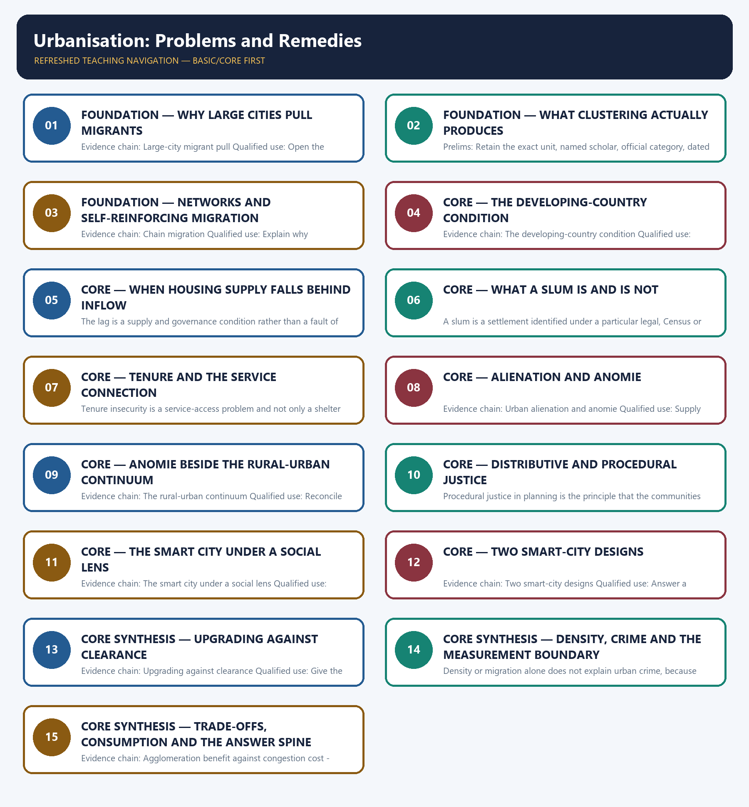

# Urbanisation: Problems and Remedies — Learner-v2 Complete Learning Session

> **Authoring-only generation:** 2026-09-02. No PDF was rendered and no tracker or index was mutated.

### SOURCE, PROGRESSION AND CURRENT-LINKAGE AUDIT

- **Generation date:** 2026-09-02.
- **Repository-first evidence:** the Basic owner is taught first and preserved in full; the Advanced owner is retained only in the optional final teaching block.
- **OCR evidence:** Repository Markdown was primary. The OCR-searchable official General Studies Paper-I question papers held under books\mains and books\more_previous_papers were used only to confirm the wording of routed Mains PYQs. No official answer key, marking scheme, page precision or unsupported quotation was imported from them.
- **Qdrant:** not used; repository Markdown and available OCR context were sufficient.
- **PYQ integrity:** Four direct General Studies Paper-I Mains demands are carried by this owner and each is recorded with its exact routing status. The 2022 Q9 demand on Tier-2 city growth, the new middle class and the culture of consumption and the 2023 Q18 demand on whether urbanisation leads to segregation or marginalisation of the poor are routed in the audited 2018-2023 Mains ledger to the Advanced owner, while the Core owner's own answer-architecture table records that Core routing supersedes, so both are answered here from the Basic spine. The locally held official question papers for 2022 and 2023 are scanned images from which reliable text cannot be extracted, so the audited ledger's neutral demand rendering is used for those two years and no verbatim wording is claimed. The 2024 Q5 demand on why large cities attract more migrants than smaller towns is routed in the audited 2024-2025 ledger to the Geography migration owner while this owner's own table claims it as a core route, and that cross-owner conflict is stated openly here rather than resolved by an unsupported analytical claim. The 2025 Q8 demand on smart cities, urban poverty and distributive justice is routed in the same ledger to this Basic owner. The wording of the 2024 and 2025 demands was confirmed in the locally held official question papers for those years, including a printed spelling irregularity in the 2024 stem that is reproduced rather than silently corrected. No marking scheme, official key or model answer of the Union Public Service Commission is held locally, and none is reproduced or inferred.
- **Live-link boundary:** No additional live official item was verified for this topic on 2026-09-02. Only the dated official anchors already carried by the repository owners are used, each with its issuing body and date. The package invents no caste, tribe, demographic or agrarian statistic, no legal or constitutional claim and no policy status.
- **Fact/inference discipline:** no current-affairs item, PYQ wording, figure or quotation is invented.

## BASIC LEARNING SESSION

### DEEP-REVIEW LEARNING CONTRACT

| Control | Binding rule for this package |
|---|---|
| Syllabus boundary | Complete Indian Society Basic/Core is answer-complete before optional Advanced depth. |
| Concept method | Define and distinguish the institution, identity, process, legal category and measured indicator before analysis. |
| Sociological method | Structure/institution → mechanism and agency → differentiated group/region outcome → feedback, resistance and qualification. |
| Evidence method | Claim → named Indian community/region/institution/dataset → analysis → source-date-status or causal qualification. |
| Non-homogenisation | Caste, tribe, women, religion, region and rural/urban groups retain internal class, gender, locality and historical variation. |
| Boundary method | Constitutional right, statutory mandate, executive scheme, implementation and lived social outcome remain distinct. |
| Practice contract | Every solved item has demand decoding, a detailed examiner-grade model, executable timed/compression plan, marks rationale and answer-specific improvement. |
| Approval | This immutable successor remains `approved: false` pending explicit approval. |

**Canonical Basic/Core owner:** `upsc-ai-kit\knowledge\Indian-Society\basic\10_Urbanisation-Problems-and-Remedies.md`  
**Canonical topic owner:** `upsc-ai-kit\knowledge\Indian-Society\basic\10_Urbanisation-Problems-and-Remedies.md`  
**Optional Advanced owner:** `upsc-ai-kit\knowledge\Indian-Society\advanced\10_Urbanisation-Problems-and-Remedies.md`  
**Official syllabus mapping:** `upsc-ai-kit\knowledge\Indian-Society\OFFICIAL-UPSC-SYLLABUS-MAPPING.md`

### EVIDENCE, PYQ AND CURRENT-STATUS CONTROL

- **Definition discipline:** close concepts and legal-administrative categories share a comparison axis and are never treated as synonyms.
- **Mechanism discipline:** correlation, temporal sequence and aggregate association do not establish causation; identify institutions, incentives, norms, power and agency.
- **Historical discipline:** colonial, constitutional, developmental, liberalisation and contemporary phases are separated without a linear tradition-to-modernity story.
- **Intersectional discipline:** overlapping caste, tribe, class, gender, religion, disability, region and life-course positions are analysed without creating a single homogeneous category.
- **India discipline:** use named communities, movements, institutions, cities, states and regional contrasts without stereotyping or treating one case as nationally representative.
- **Data discipline:** Census 2011, NFHS, PLFS, SRS, Agriculture Census, MPI and scheme claims retain source, reference period, release date, coverage and provisional/final status.
- **PYQ discipline:** repository routing ledgers and locally held papers control wording and metadata; reconstructed wording and unavailable official keys remain labelled.
- **Current-status note, rechecked 2026-09-02:** No additional live official item was verified for this topic on 2026-09-02. Only the dated official anchors already carried by the repository owners are used, each with its issuing body and date. The package invents no caste, tribe, demographic or agrarian statistic, no legal or constitutional claim and no policy status.

**Live/official context sources recorded by the predecessor generation:**

- No volatile live claim is necessary for the static sociological core.




*Distinct embedded teaching-navigation image. The separate continuous Cārvāka-style flowchart package remains an independent at-a-glance artifact.*

### SESSION 1 — FOUNDATION — WHY LARGE CITIES PULL MIGRANTS

#### DEFINITION / WHAT THIS IS CALLED

**Plain-language definition:** Large-city migrant pull is the tendency of large cities to attract disproportionately more migrants than smaller towns because they offer a wider range of formal and informal jobs, agglomeration-driven wage premiums and denser service and information networks, so wage level alone is never a sufficient explanation.

**Technical definition:** Evidence chain: Large-city migrant pull Qualified use: Open the migration demand with a multi-factor mechanism rather than one variable.

#### ANSWER-GRABBING OPENING — WRITE/ADAPT IN THE EXAM

> Large-city migrant pull is the tendency of large cities to attract disproportionately more migrants than smaller towns because they offer a wider range of formal and informal jobs, agglomeration-driven wage premiums and denser service and information networks, so wage level alone is never a sufficient explanation.

#### MUST-WRITE KEYWORDS

- **FOUNDATION**
- **Why large cities pull migrants**
- **Evidence chain**
- **Qualified use**
- **Large-city migrant pull**
- **Large-city**

**How to use them:** Frame the answer through FOUNDATION; define Why large cities pull migrants, connect Evidence chain with Qualified use to explain the mechanism, and use Large-city migrant pull for the decisive comparison or qualification.

#### VISUAL FIRST

```text
WHY LARGE CITIES PULL MIGRANTS
01. Large-city migrant pull
BOUNDARY -> Wage level alone is never a sufficient explanation of the pull.
```

*This topic-specific rail fixes the evidence sequence and its exam boundary before analysis.*

#### CORE EXPLANATION

Large-city migrant pull is the tendency of large cities to attract disproportionately more migrants than smaller towns because they offer a wider range of formal and informal jobs, agglomeration-driven wage premiums and denser service and information networks, so wage level alone is never a sufficient explanation.

#### NAMED EVIDENCE AND MECHANISM

- Large-city migrant pull is the tendency of large cities to attract disproportionately more migrants than smaller towns because they offer a wider range of formal and informal jobs, agglomeration-driven wage premiums and denser service and information networks, so wage level alone is never a sufficient explanation.

#### EXAMINER CAUTION

- Wage level alone is never a sufficient explanation of the pull.

#### EXAM LINK

- **Prelims:** Retain the exact unit, named scholar, official category, dated statistic or legal boundary attached to Why large cities pull migrants.
- **Mains:** Open the migration demand with a multi-factor mechanism rather than one variable.

#### MINI RECAP

- **Evidence chain:** Large-city migrant pull
- **Qualified use:** Open the migration demand with a multi-factor mechanism rather than one variable.

#### CLOSING RECALL FLOW — FOUNDATION — WHY LARGE CITIES PULL MIGRANTS

```text
START / CONCEPT: FOUNDATION — Why large cities pull migrants
        |
        v
EXACT TERMS: FOUNDATION · Why large cities pull migrants · Evidence chain · Qualified use · Large-city migrant pull · Large-city
        |
        v
MECHANISM / ARGUMENT: Evidence chain: Large-city migrant pull Qualified use: Open the migration demand with a multi-factor mechanism rather than one variable.
        |
        v
CONSEQUENCE / CONTRAST: Wage level alone is never a sufficient explanation of the pull.
        |
        v
UPSC TRAP / ANSWER-USE: Do not miss this limiting distinction: large-city migrant pull is the tendency of large cities to attract disproportionately more migrants...
        |
        v
ANSWER-GRABBING FORMULATION: Large-city migrant pull is the tendency of large cities to attract disproportionately more migrants than smaller towns because they offer a wider range of formal and informal jobs, agglomeration-driven wage premiums and denser service and information networks, so wage level alone is never a sufficient explanation.
```
### SESSION 2 — FOUNDATION — WHAT CLUSTERING ACTUALLY PRODUCES

#### DEFINITION / WHAT THIS IS CALLED

**Plain-language definition:** The observable wage differential is one output of clustering rather than the cause of it.

**Technical definition:** Prelims: Retain the exact unit, named scholar, official category, dated statistic or legal boundary attached to What clustering actually produces.

#### ANSWER-GRABBING OPENING — WRITE/ADAPT IN THE EXAM

> The observable wage differential is one output of clustering rather than the cause of it.

#### MUST-WRITE KEYWORDS

- **FOUNDATION**
- **What clustering actually produces**
- **Evidence chain**
- **Qualified use**
- **Agglomeration economies**
- **Agglomeration**

**How to use them:** Frame the answer through FOUNDATION; define What clustering actually produces, connect Evidence chain with Qualified use to explain the mechanism, and use Agglomeration economies for the decisive comparison or qualification.

#### VISUAL FIRST

```text
WHAT CLUSTERING ACTUALLY PRODUCES
01. Agglomeration economies
BOUNDARY -> The observable wage differential is one output of clustering rather than the cause of it.
```

*This topic-specific rail fixes the evidence sequence and its exam boundary before analysis.*

#### CORE EXPLANATION

Agglomeration economies are the compounding productivity and matching benefits that arise when many firms and workers cluster in one place, producing deeper labour markets, knowledge spillovers and denser supplier networks, of which the observable wage differential is only one output.

#### NAMED EVIDENCE AND MECHANISM

- Agglomeration economies are the compounding productivity and matching benefits that arise when many firms and workers cluster in one place, producing deeper labour markets, knowledge spillovers and denser supplier networks, of which the observable wage differential is only one output.

#### EXAMINER CAUTION

- The observable wage differential is one output of clustering rather than the cause of it.

#### EXAM LINK

- **Prelims:** Retain the exact unit, named scholar, official category, dated statistic or legal boundary attached to What clustering actually produces.
- **Mains:** Name the economic-geography mechanism that a discuss directive expects.

#### MINI RECAP

- **Evidence chain:** Agglomeration economies
- **Qualified use:** Name the economic-geography mechanism that a discuss directive expects.

#### CLOSING RECALL FLOW — FOUNDATION — WHAT CLUSTERING ACTUALLY PRODUCES

```text
START / CONCEPT: FOUNDATION — What clustering actually produces
        |
        v
EXACT TERMS: FOUNDATION · What clustering actually produces · Evidence chain · Qualified use · Agglomeration economies · Agglomeration
        |
        v
MECHANISM / ARGUMENT: Prelims: Retain the exact unit, named scholar, official category, dated statistic or legal boundary attached to What clustering actually produces.
        |
        v
CONSEQUENCE / CONTRAST: Evidence chain: Agglomeration economies Qualified use: Name the economic-geography mechanism that a discuss directive expects.
        |
        v
UPSC TRAP / ANSWER-USE: Do not miss this limiting distinction: agglomeration economies are the compounding productivity and matching benefits that arise when many firms...
        |
        v
ANSWER-GRABBING FORMULATION: The observable wage differential is one output of clustering rather than the cause of it.
```
### SESSION 3 — FOUNDATION — NETWORKS AND SELF-REINFORCING MIGRATION

#### DEFINITION / WHAT THIS IS CALLED

**Plain-language definition:** Chain migration is the self-reinforcing process in which an existing migrant population from a region lowers the search cost, housing risk and job-referral uncertainty for the next migrants from that same region, so city-size concentration compounds over time rather than remaining constant.

**Technical definition:** Evidence chain: Chain migration Qualified use: Explain why concentration deepens instead of stabilising.

#### ANSWER-GRABBING OPENING — WRITE/ADAPT IN THE EXAM

> Evidence chain: Chain migration Qualified use: Explain why concentration deepens instead of stabilising.

#### MUST-WRITE KEYWORDS

- **FOUNDATION**
- **Networks**
- **self-reinforcing migration**
- **Evidence chain**
- **Qualified use**
- **Chain migration**

**How to use them:** Frame the answer through FOUNDATION; define Networks, connect self-reinforcing migration with Evidence chain to explain the mechanism, and use Qualified use for the decisive comparison or qualification.

#### VISUAL FIRST

```text
NETWORKS AND SELF-REINFORCING MIGRATION
01. Chain migration
BOUNDARY -> Compounding is a dynamic claim about direction and not a prediction of any city's size.
```

*This topic-specific rail fixes the evidence sequence and its exam boundary before analysis.*

#### CORE EXPLANATION

Chain migration is the self-reinforcing process in which an existing migrant population from a region lowers the search cost, housing risk and job-referral uncertainty for the next migrants from that same region, so city-size concentration compounds over time rather than remaining constant.

#### NAMED EVIDENCE AND MECHANISM

- Chain migration is the self-reinforcing process in which an existing migrant population from a region lowers the search cost, housing risk and job-referral uncertainty for the next migrants from that same region, so city-size concentration compounds over time rather than remaining constant.

#### EXAMINER CAUTION

- Compounding is a dynamic claim about direction and not a prediction of any city's size.

#### EXAM LINK

- **Prelims:** Retain the exact unit, named scholar, official category, dated statistic or legal boundary attached to Networks and self-reinforcing migration.
- **Mains:** Explain why concentration deepens instead of stabilising.

#### MINI RECAP

- **Evidence chain:** Chain migration
- **Qualified use:** Explain why concentration deepens instead of stabilising.

#### CLOSING RECALL FLOW — FOUNDATION — NETWORKS AND SELF-REINFORCING MIGRATION

```text
START / CONCEPT: FOUNDATION — Networks and self-reinforcing migration
        |
        v
EXACT TERMS: FOUNDATION · Networks · self-reinforcing migration · Evidence chain · Qualified use · Chain migration
        |
        v
MECHANISM / ARGUMENT: Chain migration is the self-reinforcing process in which an existing migrant population from a region lowers the search cost, housing risk and job-referral uncertainty for the next migrants from that same region, so city-size concentration compounds over time rather than remaining constant.
        |
        v
CONSEQUENCE / CONTRAST: Compounding is a dynamic claim about direction and not a prediction of any city's size.
        |
        v
UPSC TRAP / ANSWER-USE: Do not miss this limiting distinction: explain why concentration deepens instead of stabilising.
        |
        v
ANSWER-GRABBING FORMULATION: Evidence chain: Chain migration Qualified use: Explain why concentration deepens instead of stabilising.
```
### SESSION 4 — CORE — THE DEVELOPING-COUNTRY CONDITION

#### DEFINITION / WHAT THIS IS CALLED

**Plain-language definition:** The developing-country condition that the migration demand names is that smaller towns often lack comparable formal-sector industrial and service depth and comparable infrastructure, which makes large-city pull structurally stronger than it is in more evenly developed economies.

**Technical definition:** Evidence chain: The developing-country condition Qualified use: Locate the mechanism where the demand explicitly asks it to be located.

#### ANSWER-GRABBING OPENING — WRITE/ADAPT IN THE EXAM

> The developing-country condition that the migration demand names is that smaller towns often lack comparable formal-sector industrial and service depth and comparable infrastructure, which makes large-city pull structurally stronger than it is in more evenly developed economies.

#### MUST-WRITE KEYWORDS

- **The developing-country condition**
- **Evidence chain**
- **Qualified use**
- **The developing-country condition that the migration demand names**
- **The comparison**
- **Qualified**

**How to use them:** Frame the answer through The developing-country condition; define Evidence chain, connect Qualified use with The developing-country condition that the migration demand names to explain the mechanism, and use The comparison for the decisive comparison or qualification.

#### VISUAL FIRST

```text
THE DEVELOPING-COUNTRY CONDITION
01. The developing-country condition
BOUNDARY -> The comparison is with more evenly developed economies rather than with an ideal town.
```

*This topic-specific rail fixes the evidence sequence and its exam boundary before analysis.*

#### CORE EXPLANATION

The developing-country condition that the migration demand names is that smaller towns often lack comparable formal-sector industrial and service depth and comparable infrastructure, which makes large-city pull structurally stronger than it is in more evenly developed economies.

#### NAMED EVIDENCE AND MECHANISM

- The developing-country condition that the migration demand names is that smaller towns often lack comparable formal-sector industrial and service depth and comparable infrastructure, which makes large-city pull structurally stronger than it is in more evenly developed economies.

#### EXAMINER CAUTION

- The comparison is with more evenly developed economies rather than with an ideal town.

#### EXAM LINK

- **Prelims:** Retain the exact unit, named scholar, official category, dated statistic or legal boundary attached to The developing-country condition.
- **Mains:** Locate the mechanism where the demand explicitly asks it to be located.

#### MINI RECAP

- **Evidence chain:** The developing-country condition
- **Qualified use:** Locate the mechanism where the demand explicitly asks it to be located.

#### CLOSING RECALL FLOW — CORE — THE DEVELOPING-COUNTRY CONDITION

```text
START / CONCEPT: CORE — The developing-country condition
        |
        v
EXACT TERMS: The developing-country condition · Evidence chain · Qualified use · The developing-country condition that the migration demand names · The comparison · Qualified
        |
        v
MECHANISM / ARGUMENT: Evidence chain: The developing-country condition Qualified use: Locate the mechanism where the demand explicitly asks it to be located.
        |
        v
CONSEQUENCE / CONTRAST: The comparison is with more evenly developed economies rather than with an ideal town.
        |
        v
UPSC TRAP / ANSWER-USE: Do not miss this limiting distinction: locate the mechanism where the demand explicitly asks it to be located.
        |
        v
ANSWER-GRABBING FORMULATION: The developing-country condition that the migration demand names is that smaller towns often lack comparable formal-sector industrial and service depth and comparable infrastructure, which makes large-city pull structurally stronger than it is in more evenly developed economies.
```
### SESSION 5 — CORE — WHEN HOUSING SUPPLY FALLS BEHIND INFLOW

#### DEFINITION / WHAT THIS IS CALLED

**Plain-language definition:** The housing-supply lag is the gap between the pace of migrant inflow and the expansion of formal affordable housing and basic-service supply in the receiving city, and it is the mechanism that converts an economic success into a housing and service problem.

**Technical definition:** The lag is a supply and governance condition rather than a fault of the arriving household.

#### ANSWER-GRABBING OPENING — WRITE/ADAPT IN THE EXAM

> The housing-supply lag is the gap between the pace of migrant inflow and the expansion of formal affordable housing and basic-service supply in the receiving city, and it is the mechanism that converts an economic success into a housing and service problem.

#### MUST-WRITE KEYWORDS

- **When housing supply falls behind inflow**
- **Evidence chain**
- **Qualified use**
- **The housing-supply lag**
- **The lag**
- **Qualified**

**How to use them:** Frame the answer through When housing supply falls behind inflow; define Evidence chain, connect Qualified use with The housing-supply lag to explain the mechanism, and use The lag for the decisive comparison or qualification.

#### VISUAL FIRST

```text
WHEN HOUSING SUPPLY FALLS BEHIND INFLOW
01. The housing-supply lag
BOUNDARY -> The lag is a supply and governance condition rather than a fault of the arriving household.
```

*This topic-specific rail fixes the evidence sequence and its exam boundary before analysis.*

#### CORE EXPLANATION

The housing-supply lag is the gap between the pace of migrant inflow and the expansion of formal affordable housing and basic-service supply in the receiving city, and it is the mechanism that converts an economic success into a housing and service problem.

#### NAMED EVIDENCE AND MECHANISM

- The housing-supply lag is the gap between the pace of migrant inflow and the expansion of formal affordable housing and basic-service supply in the receiving city, and it is the mechanism that converts an economic success into a housing and service problem.

#### EXAMINER CAUTION

- The lag is a supply and governance condition rather than a fault of the arriving household.

#### EXAM LINK

- **Prelims:** Retain the exact unit, named scholar, official category, dated statistic or legal boundary attached to When housing supply falls behind inflow.
- **Mains:** Convert an economic success story into its housing consequence.

#### MINI RECAP

- **Evidence chain:** The housing-supply lag
- **Qualified use:** Convert an economic success story into its housing consequence.

#### CLOSING RECALL FLOW — CORE — WHEN HOUSING SUPPLY FALLS BEHIND INFLOW

```text
START / CONCEPT: CORE — When housing supply falls behind inflow
        |
        v
EXACT TERMS: When housing supply falls behind inflow · Evidence chain · Qualified use · The housing-supply lag · The lag · Qualified
        |
        v
MECHANISM / ARGUMENT: Evidence chain: The housing-supply lag Qualified use: Convert an economic success story into its housing consequence.
        |
        v
CONSEQUENCE / CONTRAST: The lag is a supply and governance condition rather than a fault of the arriving household.
        |
        v
UPSC TRAP / ANSWER-USE: Do not miss this limiting distinction: convert an economic success story into its housing consequence.
        |
        v
ANSWER-GRABBING FORMULATION: The housing-supply lag is the gap between the pace of migrant inflow and the expansion of formal affordable housing and basic-service supply in the receiving city, and it is the mechanism that converts an economic success into a housing and service problem.
```
### SESSION 6 — CORE — WHAT A SLUM IS AND IS NOT

#### DEFINITION / WHAT THIS IS CALLED

**Plain-language definition:** Evidence chain: What a slum is - Informal settlement as a joint outcome Qualified use: Protect an answer from an undefined category and from resident-blaming.

**Technical definition:** A slum is a settlement identified under a particular legal, Census or local-government definition and is commonly associated with insecure tenure, inadequate services and overcrowding, so the category must always be cited with the definition and authority being used rather than as a self-evident description.

#### ANSWER-GRABBING OPENING — WRITE/ADAPT IN THE EXAM

> Evidence chain: What a slum is - Informal settlement as a joint outcome Qualified use: Protect an answer from an undefined category and from resident-blaming.

#### MUST-WRITE KEYWORDS

- **What a slum is**
- **is not**
- **Evidence chain**
- **Qualified use**
- **A slum**
- **Census**

**How to use them:** Frame the answer through What a slum is; define is not, connect Evidence chain with Qualified use to explain the mechanism, and use A slum for the decisive comparison or qualification.

#### VISUAL FIRST

```text
WHAT A SLUM IS AND IS NOT
01. What a slum is
    |
    v
02. Informal settlement as a joint outcome
BOUNDARY -> The definition varies by authority, so the category must be cited with its source.
```

*This topic-specific rail fixes the evidence sequence and its exam boundary before analysis.*

#### CORE EXPLANATION

A slum is a settlement identified under a particular legal, Census or local-government definition and is commonly associated with insecure tenure, inadequate services and overcrowding, so the category must always be cited with the definition and authority being used rather than as a self-evident description. Informal settlement is simultaneously a market response to unmet affordable-housing demand and a governance outcome produced by land prices, tenure rules, regulatory exclusion and planning and service choices, so neither a market-only account nor a resident-blaming account is adequate.

#### NAMED EVIDENCE AND MECHANISM

- A slum is a settlement identified under a particular legal, Census or local-government definition and is commonly associated with insecure tenure, inadequate services and overcrowding, so the category must always be cited with the definition and authority being used rather than as a self-evident description.
- Informal settlement is simultaneously a market response to unmet affordable-housing demand and a governance outcome produced by land prices, tenure rules, regulatory exclusion and planning and service choices, so neither a market-only account nor a resident-blaming account is adequate.

#### EXAMINER CAUTION

- The definition varies by authority, so the category must be cited with its source.

#### EXAM LINK

- **Prelims:** Retain the exact unit, named scholar, official category, dated statistic or legal boundary attached to What a slum is and is not.
- **Mains:** Protect an answer from an undefined category and from resident-blaming.

#### MINI RECAP

- **Evidence chain:** What a slum is -> Informal settlement as a joint outcome
- **Qualified use:** Protect an answer from an undefined category and from resident-blaming.

#### CLOSING RECALL FLOW — CORE — WHAT A SLUM IS AND IS NOT

```text
START / CONCEPT: CORE — What a slum is and is not
        |
        v
EXACT TERMS: What a slum is · is not · Evidence chain · Qualified use · A slum · Census
        |
        v
MECHANISM / ARGUMENT: The definition varies by authority, so the category must be cited with its source.
        |
        v
CONSEQUENCE / CONTRAST: Prelims: Retain the exact unit, named scholar, official category, dated statistic or legal boundary attached to What a slum is and is not.
        |
        v
UPSC TRAP / ANSWER-USE: A slum is a settlement identified under a particular legal, Census or local-government definition and is commonly associated with insecure tenure, inadequate services and overcrowding, so the category must always be cited with the definition and authority being used rather than as a self-evident description.
        |
        v
ANSWER-GRABBING FORMULATION: Evidence chain: What a slum is - Informal settlement as a joint outcome Qualified use: Protect an answer from an undefined category and from resident-blaming.
```
### SESSION 7 — CORE — TENURE AND THE SERVICE CONNECTION

#### DEFINITION / WHAT THIS IS CALLED

**Plain-language definition:** Tenure insecurity is the absence of a recognised legal claim to occupied land or housing, and it blocks formal water, sanitation and electricity connection, which compounds health and social vulnerability well beyond the initial shortage of shelter.

**Technical definition:** Tenure insecurity is a service-access problem and not only a shelter problem.

#### ANSWER-GRABBING OPENING — WRITE/ADAPT IN THE EXAM

> Evidence chain: Tenure insecurity Qualified use: Show the mechanism that turns informality into health vulnerability.

#### MUST-WRITE KEYWORDS

- **Tenure**
- **the service connection**
- **Evidence chain**
- **Qualified use**
- **Tenure insecurity**
- **Qualified**

**How to use them:** Frame the answer through Tenure; define the service connection, connect Evidence chain with Qualified use to explain the mechanism, and use Tenure insecurity for the decisive comparison or qualification.

#### VISUAL FIRST

```text
TENURE AND THE SERVICE CONNECTION
01. Tenure insecurity
BOUNDARY -> Tenure insecurity is a service-access problem and not only a shelter problem.
```

*This topic-specific rail fixes the evidence sequence and its exam boundary before analysis.*

#### CORE EXPLANATION

Tenure insecurity is the absence of a recognised legal claim to occupied land or housing, and it blocks formal water, sanitation and electricity connection, which compounds health and social vulnerability well beyond the initial shortage of shelter.

#### NAMED EVIDENCE AND MECHANISM

- Tenure insecurity is the absence of a recognised legal claim to occupied land or housing, and it blocks formal water, sanitation and electricity connection, which compounds health and social vulnerability well beyond the initial shortage of shelter.

#### EXAMINER CAUTION

- Tenure insecurity is a service-access problem and not only a shelter problem.

#### EXAM LINK

- **Prelims:** Retain the exact unit, named scholar, official category, dated statistic or legal boundary attached to Tenure and the service connection.
- **Mains:** Show the mechanism that turns informality into health vulnerability.

#### MINI RECAP

- **Evidence chain:** Tenure insecurity
- **Qualified use:** Show the mechanism that turns informality into health vulnerability.

#### CLOSING RECALL FLOW — CORE — TENURE AND THE SERVICE CONNECTION

```text
START / CONCEPT: CORE — Tenure and the service connection
        |
        v
EXACT TERMS: Tenure · the service connection · Evidence chain · Qualified use · Tenure insecurity · Qualified
        |
        v
MECHANISM / ARGUMENT: Tenure insecurity is the absence of a recognised legal claim to occupied land or housing, and it blocks formal water, sanitation and electricity connection, which compounds health and social vulnerability well beyond the initial shortage of shelter.
        |
        v
CONSEQUENCE / CONTRAST: Tenure insecurity is a service-access problem and not only a shelter problem.
        |
        v
UPSC TRAP / ANSWER-USE: Do not miss this limiting distinction: show the mechanism that turns informality into health vulnerability.
        |
        v
ANSWER-GRABBING FORMULATION: Evidence chain: Tenure insecurity Qualified use: Show the mechanism that turns informality into health vulnerability.
```
### SESSION 8 — CORE — ALIENATION AND ANOMIE

#### DEFINITION / WHAT THIS IS CALLED

**Plain-language definition:** Urban alienation, described in urban sociology as anomie, is the weakening of social bonds and of a shared normative structure in dense and anonymous settings, associated with reduced informal community support and greater social isolation.

**Technical definition:** Evidence chain: Urban alienation and anomie Qualified use: Supply the classical urban-sociology consequence by its proper name.

#### ANSWER-GRABBING OPENING — WRITE/ADAPT IN THE EXAM

> Urban alienation, described in urban sociology as anomie, is the weakening of social bonds and of a shared normative structure in dense and anonymous settings, associated with reduced informal community support and greater social isolation.

#### MUST-WRITE KEYWORDS

- **Alienation**
- **anomie**
- **Evidence chain**
- **Qualified use**
- **Urban alienation, described in urban sociology as anomie,**
- **Urban**

**How to use them:** Frame the answer through Alienation; define anomie, connect Evidence chain with Qualified use to explain the mechanism, and use Urban alienation, described in urban sociology as anomie, for the decisive comparison or qualification.

#### VISUAL FIRST

```text
ALIENATION AND ANOMIE
01. Urban alienation and anomie
BOUNDARY -> Anomie describes weakened bonds and is not a claim that urban life is disordered.
```

*This topic-specific rail fixes the evidence sequence and its exam boundary before analysis.*

#### CORE EXPLANATION

Urban alienation, described in urban sociology as anomie, is the weakening of social bonds and of a shared normative structure in dense and anonymous settings, associated with reduced informal community support and greater social isolation.

#### NAMED EVIDENCE AND MECHANISM

- Urban alienation, described in urban sociology as anomie, is the weakening of social bonds and of a shared normative structure in dense and anonymous settings, associated with reduced informal community support and greater social isolation.

#### EXAMINER CAUTION

- Anomie describes weakened bonds and is not a claim that urban life is disordered.

#### EXAM LINK

- **Prelims:** Retain the exact unit, named scholar, official category, dated statistic or legal boundary attached to Alienation and anomie.
- **Mains:** Supply the classical urban-sociology consequence by its proper name.

#### MINI RECAP

- **Evidence chain:** Urban alienation and anomie
- **Qualified use:** Supply the classical urban-sociology consequence by its proper name.

#### CLOSING RECALL FLOW — CORE — ALIENATION AND ANOMIE

```text
START / CONCEPT: CORE — Alienation and anomie
        |
        v
EXACT TERMS: Alienation · anomie · Evidence chain · Qualified use · Urban alienation, described in urban sociology as anomie, · Urban
        |
        v
MECHANISM / ARGUMENT: Evidence chain: Urban alienation and anomie Qualified use: Supply the classical urban-sociology consequence by its proper name.
        |
        v
CONSEQUENCE / CONTRAST: Anomie describes weakened bonds and is not a claim that urban life is disordered.
        |
        v
UPSC TRAP / ANSWER-USE: Do not miss this limiting distinction: urban alienation and anomie Qualified use.
        |
        v
ANSWER-GRABBING FORMULATION: Urban alienation, described in urban sociology as anomie, is the weakening of social bonds and of a shared normative structure in dense and anonymous settings, associated with reduced informal community support and greater social isolation.
```
### SESSION 9 — CORE — ANOMIE BESIDE THE RURAL-URBAN CONTINUUM

#### DEFINITION / WHAT THIS IS CALLED

**Plain-language definition:** The rural-urban continuum is the continuing structural and economic linkage between village and city through migration, remittance and circulation, and it operates at a different level from anomie, so a household can remain economically continuum-linked to its village while experiencing urban social isolation.

**Technical definition:** Evidence chain: The rural-urban continuum Qualified use: Reconcile two owner concepts that weak answers treat as a contradiction.

#### ANSWER-GRABBING OPENING — WRITE/ADAPT IN THE EXAM

> The rural-urban continuum is the continuing structural and economic linkage between village and city through migration, remittance and circulation, and it operates at a different level from anomie, so a household can remain economically continuum-linked to its village while experiencing urban social isolation.

#### MUST-WRITE KEYWORDS

- **Anomie beside the rural-urban continuum**
- **Evidence chain**
- **Qualified use**
- **The rural-urban continuum**
- **The two operate at different levels and**
- **Reconcile**

**How to use them:** Frame the answer through Anomie beside the rural-urban continuum; define Evidence chain, connect Qualified use with The rural-urban continuum to explain the mechanism, and use The two operate at different levels and for the decisive comparison or qualification.

#### VISUAL FIRST

```text
ANOMIE BESIDE THE RURAL-URBAN CONTINUUM
01. The rural-urban continuum
BOUNDARY -> The two operate at different levels and are not contradictory findings.
```

*This topic-specific rail fixes the evidence sequence and its exam boundary before analysis.*

#### CORE EXPLANATION

The rural-urban continuum is the continuing structural and economic linkage between village and city through migration, remittance and circulation, and it operates at a different level from anomie, so a household can remain economically continuum-linked to its village while experiencing urban social isolation.

#### NAMED EVIDENCE AND MECHANISM

- The rural-urban continuum is the continuing structural and economic linkage between village and city through migration, remittance and circulation, and it operates at a different level from anomie, so a household can remain economically continuum-linked to its village while experiencing urban social isolation.

#### EXAMINER CAUTION

- The two operate at different levels and are not contradictory findings.

#### EXAM LINK

- **Prelims:** Retain the exact unit, named scholar, official category, dated statistic or legal boundary attached to Anomie beside the rural-urban continuum.
- **Mains:** Reconcile two owner concepts that weak answers treat as a contradiction.

#### MINI RECAP

- **Evidence chain:** The rural-urban continuum
- **Qualified use:** Reconcile two owner concepts that weak answers treat as a contradiction.

#### CLOSING RECALL FLOW — CORE — ANOMIE BESIDE THE RURAL-URBAN CONTINUUM

```text
START / CONCEPT: CORE — Anomie beside the rural-urban continuum
        |
        v
EXACT TERMS: Anomie beside the rural-urban continuum · Evidence chain · Qualified use · The rural-urban continuum · The two operate at different levels and · Reconcile
        |
        v
MECHANISM / ARGUMENT: Evidence chain: The rural-urban continuum Qualified use: Reconcile two owner concepts that weak answers treat as a contradiction.
        |
        v
CONSEQUENCE / CONTRAST: The two operate at different levels and are not contradictory findings.
        |
        v
UPSC TRAP / ANSWER-USE: Do not miss this limiting distinction: reconcile two owner concepts that weak answers treat as a contradiction.
        |
        v
ANSWER-GRABBING FORMULATION: The rural-urban continuum is the continuing structural and economic linkage between village and city through migration, remittance and circulation, and it operates at a different level from anomie, so a household can remain economically continuum-linked to its village while experiencing urban social isolation.
```
### SESSION 10 — CORE — DISTRIBUTIVE AND PROCEDURAL JUSTICE

#### DEFINITION / WHAT THIS IS CALLED

**Plain-language definition:** Distributive justice in the urban context is the principle that the benefits of urban infrastructure and services should be fairly shared across income groups rather than concentrated in already-serviced, higher-income areas.

**Technical definition:** Procedural justice in planning is the principle that the communities affected by an urban decision, including residents of informal settlements, should have a real voice in the planning process, and exclusion from process frequently precedes exclusion from benefit.

#### ANSWER-GRABBING OPENING — WRITE/ADAPT IN THE EXAM

> Distributive justice in the urban context is the principle that the benefits of urban infrastructure and services should be fairly shared across income groups rather than concentrated in already-serviced, higher-income areas.

#### MUST-WRITE KEYWORDS

- **Distributive**
- **procedural justice**
- **Evidence chain**
- **Qualified use**
- **Distributive justice in the urban context**
- **Procedural justice in planning**

**How to use them:** Frame the answer through Distributive; define procedural justice, connect Evidence chain with Qualified use to explain the mechanism, and use Distributive justice in the urban context for the decisive comparison or qualification.

#### VISUAL FIRST

```text
DISTRIBUTIVE AND PROCEDURAL JUSTICE
01. Distributive justice in the city
    |
    v
02. Procedural justice in planning
BOUNDARY -> Exclusion from process frequently precedes exclusion from benefit, so both tests are needed.
```

*This topic-specific rail fixes the evidence sequence and its exam boundary before analysis.*

#### CORE EXPLANATION

Distributive justice in the urban context is the principle that the benefits of urban infrastructure and services should be fairly shared across income groups rather than concentrated in already-serviced, higher-income areas. Procedural justice in planning is the principle that the communities affected by an urban decision, including residents of informal settlements, should have a real voice in the planning process, and exclusion from process frequently precedes exclusion from benefit.

#### NAMED EVIDENCE AND MECHANISM

- Distributive justice in the urban context is the principle that the benefits of urban infrastructure and services should be fairly shared across income groups rather than concentrated in already-serviced, higher-income areas.
- Procedural justice in planning is the principle that the communities affected by an urban decision, including residents of informal settlements, should have a real voice in the planning process, and exclusion from process frequently precedes exclusion from benefit.

#### EXAMINER CAUTION

- Exclusion from process frequently precedes exclusion from benefit, so both tests are needed.

#### EXAM LINK

- **Prelims:** Retain the exact unit, named scholar, official category, dated statistic or legal boundary attached to Distributive and procedural justice.
- **Mains:** Give the urban answer two distinct justice tests instead of one.

#### MINI RECAP

- **Evidence chain:** Distributive justice in the city -> Procedural justice in planning
- **Qualified use:** Give the urban answer two distinct justice tests instead of one.

#### CLOSING RECALL FLOW — CORE — DISTRIBUTIVE AND PROCEDURAL JUSTICE

```text
START / CONCEPT: CORE — Distributive and procedural justice
        |
        v
EXACT TERMS: Distributive · procedural justice · Evidence chain · Qualified use · Distributive justice in the urban context · Procedural justice in planning
        |
        v
MECHANISM / ARGUMENT: Procedural justice in planning is the principle that the communities affected by an urban decision, including residents of informal settlements, should have a real voice in the planning process, and exclusion from process frequently precedes exclusion from benefit.
        |
        v
CONSEQUENCE / CONTRAST: Evidence chain: Distributive justice in the city - Procedural justice in planning Qualified use: Give the urban answer two distinct justice tests instead of one.
        |
        v
UPSC TRAP / ANSWER-USE: Do not miss this limiting distinction: exclusion from process frequently precedes exclusion from benefit, so both tests are needed.
        |
        v
ANSWER-GRABBING FORMULATION: Distributive justice in the urban context is the principle that the benefits of urban infrastructure and services should be fairly shared across income groups rather than concentrated in already-serviced, higher-income areas.
```
### SESSION 11 — CORE — THE SMART CITY UNDER A SOCIAL LENS

#### DEFINITION / WHAT THIS IS CALLED

**Plain-language definition:** A smart city, read through a social lens, is an urban development model emphasising technology-enabled infrastructure and services whose social success depends on whether that infrastructure improves access for the urban poor rather than on the sophistication of the technology deployed.

**Technical definition:** Evidence chain: The smart city under a social lens Qualified use: Reframe a technology question as an access question.

#### ANSWER-GRABBING OPENING — WRITE/ADAPT IN THE EXAM

> Evidence chain: The smart city under a social lens Qualified use: Reframe a technology question as an access question.

#### MUST-WRITE KEYWORDS

- **The smart city under a social lens**
- **Evidence chain**
- **Qualified use**
- **A smart city, read through a social lens,**
- **Social**
- **Qualified**

**How to use them:** Frame the answer through The smart city under a social lens; define Evidence chain, connect Qualified use with A smart city, read through a social lens, to explain the mechanism, and use Social for the decisive comparison or qualification.

#### VISUAL FIRST

```text
THE SMART CITY UNDER A SOCIAL LENS
01. The smart city under a social lens
BOUNDARY -> Social success depends on reach to the poor rather than on the technology deployed.
```

*This topic-specific rail fixes the evidence sequence and its exam boundary before analysis.*

#### CORE EXPLANATION

A smart city, read through a social lens, is an urban development model emphasising technology-enabled infrastructure and services whose social success depends on whether that infrastructure improves access for the urban poor rather than on the sophistication of the technology deployed.

#### NAMED EVIDENCE AND MECHANISM

- A smart city, read through a social lens, is an urban development model emphasising technology-enabled infrastructure and services whose social success depends on whether that infrastructure improves access for the urban poor rather than on the sophistication of the technology deployed.

#### EXAMINER CAUTION

- Social success depends on reach to the poor rather than on the technology deployed.

#### EXAM LINK

- **Prelims:** Retain the exact unit, named scholar, official category, dated statistic or legal boundary attached to The smart city under a social lens.
- **Mains:** Reframe a technology question as an access question.

#### MINI RECAP

- **Evidence chain:** The smart city under a social lens
- **Qualified use:** Reframe a technology question as an access question.

#### CLOSING RECALL FLOW — CORE — THE SMART CITY UNDER A SOCIAL LENS

```text
START / CONCEPT: CORE — The smart city under a social lens
        |
        v
EXACT TERMS: The smart city under a social lens · Evidence chain · Qualified use · A smart city, read through a social lens, · Social · Qualified
        |
        v
MECHANISM / ARGUMENT: A smart city, read through a social lens, is an urban development model emphasising technology-enabled infrastructure and services whose social success depends on whether that infrastructure improves access for the urban poor rather than on the sophistication of the technology deployed.
        |
        v
CONSEQUENCE / CONTRAST: Social success depends on reach to the poor rather than on the technology deployed.
        |
        v
UPSC TRAP / ANSWER-USE: Do not miss this limiting distinction: the smart city under a social lens Qualified use.
        |
        v
ANSWER-GRABBING FORMULATION: Evidence chain: The smart city under a social lens Qualified use: Reframe a technology question as an access question.
```
### SESSION 12 — CORE — TWO SMART-CITY DESIGNS

#### DEFINITION / WHAT THIS IS CALLED

**Plain-language definition:** The design contrast is the analytical device, not a verdict on any named project.

**Technical definition:** Evidence chain: Two smart-city designs Qualified use: Answer a how-does directive with a conditional design verdict.

#### ANSWER-GRABBING OPENING — WRITE/ADAPT IN THE EXAM

> Exclusionary smart-city design concentrates technology-enabled infrastructure in designated zones or better-off areas while inclusive smart-city design deliberately extends service upgrading, tenure-linked infrastructure and connectivity into informal settlements, a contrast the Advanced owner labels exclusionary smart-city design vs inclusive smart-city design.

#### MUST-WRITE KEYWORDS

- **Two smart-city designs**
- **Evidence chain**
- **Qualified use**
- **Exclusionary**
- **Advanced**
- **The design contrast**

**How to use them:** Frame the answer through Two smart-city designs; define Evidence chain, connect Qualified use with Exclusionary to explain the mechanism, and use Advanced for the decisive comparison or qualification.

#### VISUAL FIRST

```text
TWO SMART-CITY DESIGNS
01. Two smart-city designs
BOUNDARY -> The design contrast is the analytical device, not a verdict on any named project.
```

*This topic-specific rail fixes the evidence sequence and its exam boundary before analysis.*

#### CORE EXPLANATION

Exclusionary smart-city design concentrates technology-enabled infrastructure in designated zones or better-off areas while inclusive smart-city design deliberately extends service upgrading, tenure-linked infrastructure and connectivity into informal settlements, a contrast the Advanced owner labels exclusionary smart-city design vs inclusive smart-city design.

#### NAMED EVIDENCE AND MECHANISM

- Exclusionary smart-city design concentrates technology-enabled infrastructure in designated zones or better-off areas while inclusive smart-city design deliberately extends service upgrading, tenure-linked infrastructure and connectivity into informal settlements, a contrast the Advanced owner labels exclusionary smart-city design vs inclusive smart-city design.

#### EXAMINER CAUTION

- The design contrast is the analytical device, not a verdict on any named project.

#### EXAM LINK

- **Prelims:** Retain the exact unit, named scholar, official category, dated statistic or legal boundary attached to Two smart-city designs.
- **Mains:** Answer a how-does directive with a conditional design verdict.

#### MINI RECAP

- **Evidence chain:** Two smart-city designs
- **Qualified use:** Answer a how-does directive with a conditional design verdict.

#### CLOSING RECALL FLOW — CORE — TWO SMART-CITY DESIGNS

```text
START / CONCEPT: CORE — Two smart-city designs
        |
        v
EXACT TERMS: Two smart-city designs · Evidence chain · Qualified use · Exclusionary · Advanced · The design contrast
        |
        v
MECHANISM / ARGUMENT: Evidence chain: Two smart-city designs Qualified use: Answer a how-does directive with a conditional design verdict.
        |
        v
CONSEQUENCE / CONTRAST: The design contrast is the analytical device, not a verdict on any named project.
        |
        v
UPSC TRAP / ANSWER-USE: Do not miss this limiting distinction: answer a how-does directive with a conditional design verdict.
        |
        v
ANSWER-GRABBING FORMULATION: Exclusionary smart-city design concentrates technology-enabled infrastructure in designated zones or better-off areas while inclusive smart-city design deliberately extends service upgrading, tenure-linked infrastructure and connectivity into informal settlements, a contrast the Advanced owner labels exclusionary smart-city design vs inclusive smart-city design.
```
### SESSION 13 — CORE SYNTHESIS — UPGRADING AGAINST CLEARANCE

#### DEFINITION / WHAT THIS IS CALLED

**Plain-language definition:** In-situ upgrading is the improvement of infrastructure and tenure where a settlement already stands, which keeps livelihood, schooling and community networks intact, while clearance and peripheral relocation moves residents to a new site and reproduces the displacement and rehabilitation problem by severing access to central-city informal work.

**Technical definition:** Evidence chain: Upgrading against clearance Qualified use: Give the executable remedy pair that a marginalisation answer requires.

#### ANSWER-GRABBING OPENING — WRITE/ADAPT IN THE EXAM

> In-situ upgrading is the improvement of infrastructure and tenure where a settlement already stands, which keeps livelihood, schooling and community networks intact, while clearance and peripheral relocation moves residents to a new site and reproduces the displacement and rehabilitation problem by severing access to central-city informal work.

#### MUST-WRITE KEYWORDS

- **CORE SYNTHESIS**
- **Upgrading against clearance**
- **Evidence chain**
- **Qualified use**
- **In-situ upgrading**
- **In-situ**

**How to use them:** Frame the answer through CORE SYNTHESIS; define Upgrading against clearance, connect Evidence chain with Qualified use to explain the mechanism, and use In-situ upgrading for the decisive comparison or qualification.

#### VISUAL FIRST

```text
UPGRADING AGAINST CLEARANCE
01. Upgrading against clearance
BOUNDARY -> Clearance reproduces the displacement and rehabilitation problem owned by the tribal-society topic.
```

*This topic-specific rail fixes the evidence sequence and its exam boundary before analysis.*

#### CORE EXPLANATION

In-situ upgrading is the improvement of infrastructure and tenure where a settlement already stands, which keeps livelihood, schooling and community networks intact, while clearance and peripheral relocation moves residents to a new site and reproduces the displacement and rehabilitation problem by severing access to central-city informal work.

#### NAMED EVIDENCE AND MECHANISM

- In-situ upgrading is the improvement of infrastructure and tenure where a settlement already stands, which keeps livelihood, schooling and community networks intact, while clearance and peripheral relocation moves residents to a new site and reproduces the displacement and rehabilitation problem by severing access to central-city informal work.

#### EXAMINER CAUTION

- Clearance reproduces the displacement and rehabilitation problem owned by the tribal-society topic.

#### EXAM LINK

- **Prelims:** Retain the exact unit, named scholar, official category, dated statistic or legal boundary attached to Upgrading against clearance.
- **Mains:** Give the executable remedy pair that a marginalisation answer requires.

#### MINI RECAP

- **Evidence chain:** Upgrading against clearance
- **Qualified use:** Give the executable remedy pair that a marginalisation answer requires.

#### CLOSING RECALL FLOW — CORE SYNTHESIS — UPGRADING AGAINST CLEARANCE

```text
START / CONCEPT: CORE SYNTHESIS — Upgrading against clearance
        |
        v
EXACT TERMS: CORE SYNTHESIS · Upgrading against clearance · Evidence chain · Qualified use · In-situ upgrading · In-situ
        |
        v
MECHANISM / ARGUMENT: Evidence chain: Upgrading against clearance Qualified use: Give the executable remedy pair that a marginalisation answer requires.
        |
        v
CONSEQUENCE / CONTRAST: Mains: Give the executable remedy pair that a marginalisation answer requires.
        |
        v
UPSC TRAP / ANSWER-USE: Do not miss this limiting distinction: in-situ upgrading is the improvement of infrastructure and tenure where a settlement already stands...
        |
        v
ANSWER-GRABBING FORMULATION: In-situ upgrading is the improvement of infrastructure and tenure where a settlement already stands, which keeps livelihood, schooling and community networks intact, while clearance and peripheral relocation moves residents to a new site and reproduces the displacement and rehabilitation problem by severing access to central-city informal work.
```
### SESSION 14 — CORE SYNTHESIS — DENSITY, CRIME AND THE MEASUREMENT BOUNDARY

#### DEFINITION / WHAT THIS IS CALLED

**Plain-language definition:** Evidence chain: Density, crime and causal restraint - The dated urbanisation anchor Qualified use: Close off the two commonest evidentiary errors in this topic.

**Technical definition:** Density or migration alone does not explain urban crime, because local inequality, policing practice, opportunity structure, reporting behaviour and social networks all confound the relationship, so any claim of this kind requires context-specific evidence rather than an appeal to urban anomie.

#### ANSWER-GRABBING OPENING — WRITE/ADAPT IN THE EXAM

> Density or migration alone does not explain urban crime, because local inequality, policing practice, opportunity structure, reporting behaviour and social networks all confound the relationship, so any claim of this kind requires context-specific evidence rather than an appeal to urban anomie.

#### MUST-WRITE KEYWORDS

- **CORE SYNTHESIS**
- **Density**
- **crime**
- **the measurement boundary**
- **Evidence chain**
- **Qualified use**

**How to use them:** Frame the answer through CORE SYNTHESIS; define Density, connect crime with the measurement boundary to explain the mechanism, and use Evidence chain for the decisive comparison or qualification.

#### VISUAL FIRST

```text
DENSITY, CRIME AND THE MEASUREMENT BOUNDARY
01. Density, crime and causal restraint
    |
    v
02. The dated urbanisation anchor
BOUNDARY -> The urbanisation share is a United Nations projection rather than Census data.
```

*This topic-specific rail fixes the evidence sequence and its exam boundary before analysis.*

#### CORE EXPLANATION

Density or migration alone does not explain urban crime, because local inequality, policing practice, opportunity structure, reporting behaviour and social networks all confound the relationship, so any claim of this kind requires context-specific evidence rather than an appeal to urban anomie. The United Nations World Urbanization Prospects 2025 estimates India at about 36 per cent urban in 2025, and this is a projection-based United Nations Department of Economic and Social Affairs estimate rather than Census data, because Census 2011 remains India's last completed full count and Census 2027 is still prospective.

#### NAMED EVIDENCE AND MECHANISM

- Density or migration alone does not explain urban crime, because local inequality, policing practice, opportunity structure, reporting behaviour and social networks all confound the relationship, so any claim of this kind requires context-specific evidence rather than an appeal to urban anomie.
- The United Nations World Urbanization Prospects 2025 estimates India at about 36 per cent urban in 2025, and this is a projection-based United Nations Department of Economic and Social Affairs estimate rather than Census data, because Census 2011 remains India's last completed full count and Census 2027 is still prospective.

#### EXAMINER CAUTION

- The urbanisation share is a United Nations projection rather than Census data.

#### EXAM LINK

- **Prelims:** Retain the exact unit, named scholar, official category, dated statistic or legal boundary attached to Density, crime and the measurement boundary.
- **Mains:** Close off the two commonest evidentiary errors in this topic.

#### MINI RECAP

- **Evidence chain:** Density, crime and causal restraint -> The dated urbanisation anchor
- **Qualified use:** Close off the two commonest evidentiary errors in this topic.

#### CLOSING RECALL FLOW — CORE SYNTHESIS — DENSITY, CRIME AND THE MEASUREMENT BOUNDARY

```text
START / CONCEPT: CORE SYNTHESIS — Density, crime and the measurement boundary
        |
        v
EXACT TERMS: CORE SYNTHESIS · Density · crime · the measurement boundary · Evidence chain · Qualified use
        |
        v
MECHANISM / ARGUMENT: Evidence chain: Density, crime and causal restraint - The dated urbanisation anchor Qualified use: Close off the two commonest evidentiary errors in this topic.
        |
        v
CONSEQUENCE / CONTRAST: The urbanisation share is a United Nations projection rather than Census data.
        |
        v
UPSC TRAP / ANSWER-USE: The United Nations World Urbanization Prospects 2025 estimates India at about 36 per cent urban in 2025, and this is a projection-based United Nations Department of Economic and Social Affairs estimate rather than Census data, because Census 2011 remains India's last completed full count and Census 2027 is still prospective.
        |
        v
ANSWER-GRABBING FORMULATION: Density or migration alone does not explain urban crime, because local inequality, policing practice, opportunity structure, reporting behaviour and social networks all confound the relationship, so any claim of this kind requires context-specific evidence rather than an appeal to urban anomie.
```
### SESSION 15 — CORE SYNTHESIS — TRADE-OFFS, CONSUMPTION AND THE ANSWER SPINE

#### DEFINITION / WHAT THIS IS CALLED

**Plain-language definition:** Four direct General Studies Paper-I demands are carried by this owner: the 2022 demand on Tier-2 city growth, the new middle class and the culture of consumption worth 10 marks and the 2023 demand on whether urbanisation leads to segregation or marginalisation of the poor worth 15 marks, both routed in the audited 2018-2023 ledger to the Advanced owner with Core routing superseding, the 2024 demand on why large cities attract more migrants worth 10 marks whose ledger row names the Geography migration owner while this owner's table claims it, and the 2025 demand on smart cities, urban poverty and distributive justice worth 10 marks routed in the ledger to this Basic owner.

**Technical definition:** Evidence chain: Agglomeration benefit against congestion cost - Tier-2 growth and consumption - Verified direct Mains demands Qualified use: Assemble the urbanisation answer spine with honest question ownership.

#### ANSWER-GRABBING OPENING — WRITE/ADAPT IN THE EXAM

> Evidence chain: Agglomeration benefit against congestion cost - Tier-2 growth and consumption - Verified direct Mains demands Qualified use: Assemble the urbanisation answer spine with honest question ownership.

#### MUST-WRITE KEYWORDS

- **CORE SYNTHESIS**
- **Trade-offs**
- **consumption**
- **the answer spine**
- **Evidence chain**
- **Qualified use**

**How to use them:** Frame the answer through CORE SYNTHESIS; define Trade-offs, connect consumption with the answer spine to explain the mechanism, and use Evidence chain for the decisive comparison or qualification.

#### VISUAL FIRST

```text
TRADE-OFFS, CONSUMPTION AND THE ANSWER SPINE
01. Agglomeration benefit against congestion cost
    |
    v
02. Tier-2 growth and consumption
    |
    v
03. Verified direct Mains demands
BOUNDARY -> One claimed demand is routed to the Geography migration owner in the ledger, and the conflict is recorded rather than hidden.
```

*This topic-specific rail fixes the evidence sequence and its exam boundary before analysis.*

#### CORE EXPLANATION

The same clustering that raises productivity and attracts migrants also generates congestion, housing-cost inflation and service strain, so the mechanism that makes a large city attractive simultaneously degrades its liveability, which is why growth alone is not a measure of urban success. Growth in Tier-2 cities has been accompanied by a new salaried and self-employed middle class, organised retail and globalised consumption aspirations, and the sociological reading connects differentiated work and housing to differentiated consumption rather than treating retail expansion as evidence of shared prosperity. Four direct General Studies Paper-I demands are carried by this owner: the 2022 demand on Tier-2 city growth, the new middle class and the culture of consumption worth 10 marks and the 2023 demand on whether urbanisation leads to segregation or marginalisation of the poor worth 15 marks, both routed in the audited 2018-2023 ledger to the Advanced owner with Core routing superseding, the 2024 demand on why large cities attract more migrants worth 10 marks whose ledger row names the Geography migration owner while this owner's table claims it, and the 2025 demand on smart cities, urban poverty and distributive justice worth 10 marks routed in the ledger to this Basic owner.

#### NAMED EVIDENCE AND MECHANISM

- The same clustering that raises productivity and attracts migrants also generates congestion, housing-cost inflation and service strain, so the mechanism that makes a large city attractive simultaneously degrades its liveability, which is why growth alone is not a measure of urban success.
- Growth in Tier-2 cities has been accompanied by a new salaried and self-employed middle class, organised retail and globalised consumption aspirations, and the sociological reading connects differentiated work and housing to differentiated consumption rather than treating retail expansion as evidence of shared prosperity.
- Four direct General Studies Paper-I demands are carried by this owner: the 2022 demand on Tier-2 city growth, the new middle class and the culture of consumption worth 10 marks and the 2023 demand on whether urbanisation leads to segregation or marginalisation of the poor worth 15 marks, both routed in the audited 2018-2023 ledger to the Advanced owner with Core routing superseding, the 2024 demand on why large cities attract more migrants worth 10 marks whose ledger row names the Geography migration owner while this owner's table claims it, and the 2025 demand on smart cities, urban poverty and distributive justice worth 10 marks routed in the ledger to this Basic owner.

#### EXAMINER CAUTION

- One claimed demand is routed to the Geography migration owner in the ledger, and the conflict is recorded rather than hidden.

#### EXAM LINK

- **Prelims:** Retain the exact unit, named scholar, official category, dated statistic or legal boundary attached to Trade-offs, consumption and the answer spine.
- **Mains:** Assemble the urbanisation answer spine with honest question ownership.

#### MINI RECAP

- **Evidence chain:** Agglomeration benefit against congestion cost -> Tier-2 growth and consumption -> Verified direct Mains demands
- **Qualified use:** Assemble the urbanisation answer spine with honest question ownership.
#### COMPLETE BASIC OWNER EVIDENCE BANK

> **Subject:** Indian Society | **Tier:** Must-Do (foundation) | **GS Paper:** GS-I.
> **Core area:** Urbanisation as social pathology — alienation, slums, distributive justice
> — and the large-city migrant-pull question.
> **Grounded in:** UN World Urbanization Prospects 2025; audited 2024 and 2025 GS-I Mains
> PYQs.
> ✅ = source-grounded | ⚠️ = analytical inference | 📰 = current anchor.
> *Companion: `advanced/10_Urbanisation-Problems-and-Remedies.md`.*

#### 1. Visual foundation

```text
LARGE-CITY MIGRANT PULL (2024 PYQ)
diverse employment  |  agglomeration wages  |  services/anonymity
        |
        v
URBAN SOCIAL STRUCTURE UNDER STRAIN
        |
   -----+------------------------------
   |         |              |         |
   v         v              v         v
ALIENATION  SLUM           BREAKDOWN  URBAN
/ANONYMITY  FORMATION      OF         POVERTY
(weak       (informal      COMMUNITY  (2025 PYQ)
community   housing/       BONDS
ties)       services)
        |
        v
DISTRIBUTIVE-JUSTICE QUESTION
Does urban infrastructure (incl. smart cities)
reach the poor, or bypass them?
```

**Core proposition:** ⚠️ Large-city economic pull can outpace housing, services and social
integration, contributing to informal settlements, alienation and unequal access. Informal
housing is both a response to unmet affordable-housing demand and a product of land,
planning, tenure and service-delivery failures; distributive and procedural justice are
therefore central tests of urban development, including smart-city projects.

#### 2. Essential definitions

| Concept | Exam-ready meaning |
|---|---|
| ✅ **Urban alienation / anomie** | A weakening of social bonds and shared normative structure in dense, anonymous urban settings, associated with reduced informal community support and increased social isolation. |
| ✅ **Slum** | A settlement identified under a particular legal, Census or local-government definition, often associated with insecure tenure, inadequate services and overcrowding. Definitions and causes vary; housing-supply gaps, land/tenure rules, poverty and planning failures can interact. |
| ⚠️ **Distributive justice (urban context)** | The principle that the benefits of urban infrastructure and services should be fairly shared across income groups, not concentrated in already-serviced, higher-income areas. |
| ✅ **Large-city migrant pull** | The tendency of large cities to attract disproportionately more migrants than smaller towns because of a wider range of job opportunities, agglomeration-driven wage premiums and denser service/information networks. |
| ⚠️ **Smart city (social lens)** | An urban development model emphasising technology-enabled infrastructure and services; from a social standpoint, its success depends on whether such infrastructure improves access for the urban poor or is captured mainly by better-off residents and business districts. |

#### 3. How urbanisation produces social problems

1. **Large-city pull mechanism:** ✅ large cities offer a wider variety of jobs (formal and
   informal), higher agglomeration-driven wages, and denser social/information networks
   that help new migrants find work and lodging faster than smaller towns can, explaining
   why migration flows disproportionately toward large cities in developing-country
   conditions.
2. **Housing and tenure gap:** ⚠️ formal housing and service delivery can expand more slowly
   than demand. Informal settlements emerge through this gap together with land prices,
   tenure insecurity, regulatory exclusion and planning choices; do not portray them as only
   a spontaneous market adjustment or only a migrant choice.
3. **Alienation and weakened community bonds:** ⚠️ high residential mobility, anonymity and
   weaker extended-kin presence in cities can reduce the informal social support that rural
   or small-town communities more readily provide, a phenomenon long associated with urban
   sociology's "anomie" concept.
4. **Distributive-justice gap:** ⚠️ urban infrastructure investment, including newer
   smart-city projects, can disproportionately benefit already well-serviced areas and
   higher-income residents unless deliberately designed to prioritise slum and informal-
   settlement access — the central social test the 2025 PYQ raises.
5. **Crime and social-control concerns:** ⚠️ density or migration alone does not explain
   crime. Local inequality, policing, opportunity, reporting and social networks confound
   any simple urban-anomie claim; make causal claims only with context-specific evidence.

#### 4. Institutions and concepts

- ⚠️ **Settlement hierarchy and Census urban-definition models:** the formal
  spatial/administrative classification of urban settlements is treated in
  `Geography/basic/28_Human-Settlements-and-Urbanisation.md`, not re-derived here.
- ⚠️ **Migration theory (Ravenstein, Lee, push-pull streams):** formal migration-theory
  models are treated in `Geography/basic/27_Migration-Theories-and-Patterns-India.md`.
- ✅ **Urban-poor and homeless welfare schemes (cross-linked):** specific scheme
  entitlements for the urban poor and homeless are `Social-Justice`'s territory
  (`Social-Justice/basic/16_Urban-Poor-Homeless-and-Migrant-Workers.md`).
- ⚠️ **Community organisation as a social remedy:** neighbourhood associations, resident
  welfare groups and urban social work interventions are sociological (not technocratic)
  remedies for alienation and weak community bonds.

#### 5. Indian applications and PYQ mapping

- ✅ **2024 GS-I PYQ (10 marks, verbatim):** "Why do large citites tend to attract more
  migrants than smaller towns? Discuss in the light of conditions in developing
  countries." The expected answer: cite diverse and abundant job opportunities,
  agglomeration-driven wage premiums, denser information/social networks that lower job-
  search costs for migrants, and better access to services, and situate this within
  developing-country conditions where small towns often lack comparable formal-sector
  depth or infrastructure, making large-city pull structurally stronger than in more evenly
  developed economies.
- ✅ **2025 GS-I PYQ (10 marks, verbatim):** "How does smart city in India, address the
  issues of urban poverty and distributive justice?" The expected answer: explain that
  smart-city projects can improve service delivery (water, transport, digital governance)
  but risk concentrating benefits in designated smart-city zones or higher-income areas
  unless deliberately extended to slum and informal-settlement upgrading, arguing that
  genuine distributive justice requires explicit pro-poor design, not an assumption that
  technological upgrading automatically benefits all residents equally.
- ⚠️ A smart-city area with upgraded digital services adjacent to an unconnected informal
  settlement illustrates the distributive-justice gap the 2025 PYQ probes.

#### 6. Must-Know Facts for Prelims

- ✅ UN World Urbanization Prospects 2025 estimates India at about 36% urban in 2025 — a UN
  projection-based estimate, not a Census figure, since India's last full Census remains
  2011 and Census 2027 is still prospective.
- ✅ Large-city migrant pull is explained by job diversity, agglomeration wage premiums and
  denser social/information networks, especially pronounced in developing-country contexts.
- ⚠️ Slum formation reflects an affordable-housing and tenure gap shaped by markets,
  regulation, land and service-delivery failures; neither a market-only nor a planning-only
  explanation is adequate.
- ⚠️ Urban alienation/anomie describes weakened social bonds in dense, anonymous urban
  settings, a long-standing urban-sociology concern.
- ⚠️ Smart-city success on distributive-justice grounds depends on deliberate pro-poor
  design, not automatic trickle-down of technological upgrading.

#### 7. UPSC traps

- ❌ India's urban population share is already Census-verified above one-third. -> The
  ~36% figure is a UN WUP 2025 projection-based estimate, not Census data; India's last
  full Census remains 2011, and Census 2027 has not occurred.
- ❌ Slums arise purely from planning failure / purely from migrant choice. -> Housing-supply
  gaps interact with land prices, tenure rules, poverty and planning/service failures; use a
  multi-causal explanation without blaming residents.
- ❌ Smart cities automatically reduce urban poverty and improve distributive justice by
  virtue of using technology. -> Benefits can concentrate in designated zones/higher-income
  areas unless the project design explicitly targets slum and informal-settlement access.
- ❌ Large cities attract migrants only because of higher wages. -> Job diversity and denser
  information/social networks (not wage level alone) are equally important pull factors,
  especially in developing-country conditions.

#### 8. 📰 Current anchor

- 📰 UN World Urbanization Prospects 2025 estimates India at about 36% urban in 2025; this
  is a UN DESA projection-based figure, not Census data, and should always be labelled as
  such when cited.

#### 9. PYQ application

- ✅ **2024 GS-I (10 marks):** cite job diversity, agglomeration wages and information-
  network density as the pull mechanism, framed explicitly within developing-country
  conditions where smaller towns lack comparable formal-sector depth.
- ✅ **2025 GS-I (10 marks):** argue smart cities can improve service delivery but require
  deliberate pro-poor design to achieve genuine distributive justice, rather than assuming
  automatic benefit-sharing.

#### 10. Mains angles

- ⚠️ Always distinguish UN-projection urbanisation estimates from Census data explicitly.
- ⚠️ Treat slum formation as a multi-causal housing and tenure problem, never as a moral
  failing of migrants or a one-factor planning story.
- ⚠️ Use the pro-poor-design-versus-automatic-benefit framing for any smart-city question.

> **Answer thesis:** Large Indian cities attract disproportionate migration because of job
> diversity, agglomeration wages and denser information networks, especially under
> developing-country conditions, but this same pull produces genuine urban social pathology
> — slum formation, alienation, weakened community bonds — whose resolution, including
> through smart-city investment, depends on deliberate distributive-justice design rather
> than an assumption that urban development automatically benefits the poor.

#### 11. Probable questions

- ⚠️ **Prelims:** According to UN World Urbanization Prospects 2025, approximately what
  share of India's population is urban?
- ✅ **Mains (10 marks, 2024 GS-I PYQ, verbatim):** Why do large citites tend to attract more
  migrants than smaller towns? Discuss in the light of conditions in developing countries.
- ✅ **Mains (10 marks, 2025 GS-I PYQ, verbatim):** How does smart city in India, address the
  issues of urban poverty and distributive justice?
- ⚠️ **Mains (15 marks):** Examine urban alienation and the breakdown of community bonds as
  social consequences of rapid Indian urbanisation.

#### 12. Study links

- ✅ Advanced companion: `advanced/10_Urbanisation-Problems-and-Remedies.md`.
- ✅ `Geography/basic/28_Human-Settlements-and-Urbanisation.md` — settlement hierarchy,
  models and Census urban-definition debate (do not re-derive here).
- ✅ `Geography/basic/27_Migration-Theories-and-Patterns-India.md` — Ravenstein/Lee migration
  theory and streams.
- ✅ `Social-Justice/basic/16_Urban-Poor-Homeless-and-Migrant-Workers.md` — urban-poor
  welfare schemes.
- ✅ `11_Effects-of-Globalisation-on-Indian-Society.md` — globalisation's link to urban
  migration of women.

#### 13. Answer architecture (10/15/20-mark support)

> **Core-only.** Urbanisation answers need a causal chain from opportunity and inflow to
> housing/service inequality; neither migrants nor technology are a sufficient explanation.

##### 13.1 Directive-to-structure map

| Demand family | What is tested | Structure that scores |
|---|---|---|
| **Discuss** large-city migrant pull | More than wages | job diversity -> agglomeration/information -> developing-country condition -> costs |
| **How does** a smart city address poverty/justice | Conditional evaluation | possible service gain -> exclusion risk -> inclusive design -> verdict |
| **How is** Tier-2 growth tied to consumption | Social change mechanism | new middle class/income/retail -> aspiration -> inequality/credit caution |
| **Does urbanisation lead** to segregation | Mechanism and non-determinism | land/tenure/planning -> marginality -> counter-design -> qualification |
| **Examine** slums/anomie | Multi-causal pathology | housing gap -> social consequences -> community/institutional remedy |

##### 13.2 Thesis bank

- **T1:** ✅ Agglomeration attracts migrants through job matching and networks as well as
  wages, but the same concentration can outpace affordable housing and services.
- **T2:** ⚠️ A smart-city project is socially successful only if it changes access for
  informal settlements, not merely the visibility of technology in a designated zone.
- **T3:** ⚠️ Urban segregation is a produced outcome of land, tenure, service and planning
  arrangements; it is not an inevitable trait of migrants or city size.

##### 13.3 Mark-scaled spines

**10 marks — large cities and migrants (2024 GS-I).** Define large-city pull; use job
diversity, agglomeration/matching and information networks; explicitly locate this in
developing-country small-town service gaps; add congestion/housing strain before a
qualified conclusion.

**15 marks — urbanisation and marginalisation (2023 GS-I).** Begin with T3. Trace
inflow/housing-supply lag/tenure insecurity/service exclusion, then distinguish
segregation from diversity. Compare in-situ upgrading with peripheral clearance and add
procedural as well as distributive justice.

**20 marks — urban growth, consumption and distributive justice.** Connect Tier-2 middle
class/retail and globalised consumption to differentiated work, housing and public
infrastructure. Use E1-E4, retain informal-worker and slum-resident voice, and conclude
that inclusive planning—not city branding—is the test.

##### 13.4 Evidence bank — `claim -> named evidence/example -> significance -> limitation`

- **E1 — Urban baseline.** *Claim:* urbanisation must distinguish survey/projection from
  Census. *Evidence:* **UN World Urbanization Prospects 2025** estimates India at about
  36% urban in 2025. *Significance:* supplies a dated scale anchor. *Limitation:* UN
  projection, not Census; Census 2011 remains the last full count and Census 2027 is
  prospective.
- **E2 — Pull mechanism.** *Claim:* city pull is broader than wage differential.
  *Evidence:* **agglomeration economies**—job diversity, matching and information networks.
  *Significance:* answers the 2024 directive. *Limitation:* individual migration also has
  kinship, safety and housing constraints.
- **E3 — Informality mechanism.** *Claim:* settlements form through a joint market-governance
  gap. *Evidence:* affordable-housing shortage, land prices, tenure rules and planning/
  service exclusions. *Significance:* avoids resident-blaming. *Limitation:* a “slum”
  definition varies by Census/legal/local authority.
- **E4 — Design contrast.** *Claim:* justice needs both outcome and voice. *Evidence:*
  **in-situ upgrading** versus **clearance/relocation**, and distributive versus procedural
  justice. *Significance:* produces an executable smart-city answer. *Limitation:* scheme
  architecture and benefit claims belong to Social Justice/Governance.

##### 13.5 Balance bank and verdict scaffolds

- ⚠️ Do not use UN projection as Census evidence or wages as the sole migration cause.
- ⚠️ Do not call every smart-city project pro-poor or exclusionary without its service and
  participation design.
- ⚠️ Do not say urbanisation automatically causes crime/segregation; identify mechanisms.
- **Verdict:** “Urban growth becomes socially progressive when the networks that attract
  people are matched by tenure, services and voice for those whom the formal city excludes.”

##### 13.6 Direct Mains demands this Core file must answer alone

| Year · Paper · Q | Demand | Core route |
|---|---|---|
| 2022 · GS-I · Q9 | Tier-2 growth, middle class and consumption | §13.1, §13.3 20-mark route |
| 2023 · GS-I · Q18 | Urbanisation and poor segregation/marginalisation | §13.1, T3/E3-E4 |
| 2024 · GS-I · Q5 | Large cities attracting migrants | §13.3, T1/E2 |
| 2025 · GS-I · Q8 | Smart cities, poverty and justice | §13.3, T2/E4 |

> **Routing correction:** Core routing supersedes old `advanced/10` pointers; urban
> classification, migration theory and welfare instruments remain with their named owners.

<!-- BEGIN GENERATED PYQ INTEGRATION: 2024-2025 -->

#### Recent PYQ Integration (2024-2025)

> **Status:** 2024-2025 question-level PYQ demand is integrated into this owner.
> **Provenance:** Audited local official-paper routing ledgers: `_PYQ-ROUTING-MAINS-GS1-GS2-ESSAY-2024-2025.md`.

- **Years represented:** 2025
- **Paper(s):** GS-I
- **Routed question demands:** 1

| Year | Paper | Q | PYQ demand (neutral rendering) | Directive / format | Source status | Owner requirement |
|---:|---|---|---|---|---|---|
| 2025 | GS-I | 8 | Smart cities addressing urban poverty and distributive justice | Discuss · 10 marks · 150 words | Routed to owning topic | Prepare context, core dimensions, evidence/examples, counterpoint and a concise conclusion. |

##### What this owner must now support

- Smart cities addressing urban poverty and distributive justice

> This block integrates the 2024-2025 examinable demand and paper metadata. It is kept separate from the 2018-2023 block and does not convert an unkeyed/answer-free objective question into a solved answer.
<!-- END GENERATED PYQ INTEGRATION: 2024-2025 -->

#### CLOSING RECALL FLOW — CORE SYNTHESIS — TRADE-OFFS, CONSUMPTION AND THE ANSWER SPINE

```text
START / CONCEPT: CORE SYNTHESIS — Trade-offs, consumption and the answer spine
        |
        v
EXACT TERMS: CORE SYNTHESIS · Trade-offs · consumption · the answer spine · Evidence chain · Qualified use
        |
        v
MECHANISM / ARGUMENT: Growth in Tier-2 cities has been accompanied by a new salaried and self-employed middle class, organised retail and globalised consumption aspirations, and the sociological reading connects differentiated work and housing to differentiated consumption rather than treating retail expansion as evidence of shared prosperity.
        |
        v
CONSEQUENCE / CONTRAST: Four direct General Studies Paper-I demands are carried by this owner: the 2022 demand on Tier-2 city growth, the new middle class and the culture of consumption worth 10 marks and the 2023 demand on whether urbanisation leads to segregation or marginalisation of the poor worth 15 marks, both routed in the audited 2018-2023 ledger to the Advanced owner with Core routing superseding, the 2024 demand on why large cities attract more migrants worth 10 marks whose ledger row names the Geography migration owner while this owner's table claims it, and the 2025 demand on smart cities, urban poverty and distributive justice worth 10 marks routed in the ledger to this Basic owner.
        |
        v
UPSC TRAP / ANSWER-USE: Do not miss this limiting distinction: informal housing is both a response to unmet affordable-housing demand and a product of...
        |
        v
ANSWER-GRABBING FORMULATION: Evidence chain: Agglomeration benefit against congestion cost - Tier-2 growth and consumption - Verified direct Mains demands Qualified use: Assemble the urbanisation answer spine with honest question ownership.
```
### INDIAN SOCIETY DEEP-REVIEW CORE CONTROL

- **Must remember:** Urbanisation is a rising urban share plus economic, occupational, spatial and institutional transformation; migration, natural increase, reclassification and boundary expansion produce different growth paths, while informality mediates housing, work, services and citizenship.
- **Close distinction:** Urbanisation is not urban population growth, statutory town is not census town, slum is not every informal settlement, metropolitan region is not one municipality, and Smart Cities, AMRUT, PMAY-U and municipal constitutional functions have distinct mandates.
- **Evidence / interpretation limit:** Compare Delhi-NCR, Mumbai, Bengaluru, Surat, Chennai and Kerala's dispersed settlement; source Census 2011 classifications and current mission status separately, and explain congestion, segregation or flooding through land, infrastructure, ecology and governance rather than city size alone.

## BASIC MCQS / REMEDIATION

### Q1. Which statement correctly identifies Large-city migrant pull?

A. Large-city migrant pull is the tendency of large cities to attract disproportionately more migrants than smaller towns because they offer a wider range of formal and informal jobs, agglomeration-driven wage premiums and denser service and information networks, so wage level alone is never a sufficient explanation.
B. Agglomeration economies are the compounding productivity and matching benefits that arise when many firms and workers cluster in one place, producing deeper labour markets, knowledge spillovers and denser supplier networks, of which the observable wage differential is only one output.
C. Chain migration is the self-reinforcing process in which an existing migrant population from a region lowers the search cost, housing risk and job-referral uncertainty for the next migrants from that same region, so city-size concentration compounds over time rather than remaining constant.
D. The developing-country condition that the migration demand names is that smaller towns often lack comparable formal-sector industrial and service depth and comparable infrastructure, which makes large-city pull structurally stronger than it is in more evenly developed economies.

**Answer: A.**
**Explanation:** Large-city migrant pull is the tendency of large cities to attract disproportionately more migrants than smaller towns because they offer a wider range of formal and informal jobs, agglomeration-driven wage premiums and denser service and information networks, so wage level alone is never a sufficient explanation. The remaining options belong to different chronology, actor or analytical categories.

### Q2. Which chronology card should be filed under Large-city migrant pull?

A. Chain migration is the self-reinforcing process in which an existing migrant population from a region lowers the search cost, housing risk and job-referral uncertainty for the next migrants from that same region, so city-size concentration compounds over time rather than remaining constant.
B. Large-city migrant pull is the tendency of large cities to attract disproportionately more migrants than smaller towns because they offer a wider range of formal and informal jobs, agglomeration-driven wage premiums and denser service and information networks, so wage level alone is never a sufficient explanation.
C. The developing-country condition that the migration demand names is that smaller towns often lack comparable formal-sector industrial and service depth and comparable infrastructure, which makes large-city pull structurally stronger than it is in more evenly developed economies.
D. The housing-supply lag is the gap between the pace of migrant inflow and the expansion of formal affordable housing and basic-service supply in the receiving city, and it is the mechanism that converts an economic success into a housing and service problem.

**Answer: B.**
**Explanation:** Large-city migrant pull is the tendency of large cities to attract disproportionately more migrants than smaller towns because they offer a wider range of formal and informal jobs, agglomeration-driven wage premiums and denser service and information networks, so wage level alone is never a sufficient explanation. The remaining options belong to different chronology, actor or analytical categories.

### Q3. Which option preserves the source-bounded meaning of Large-city migrant pull?

A. The developing-country condition that the migration demand names is that smaller towns often lack comparable formal-sector industrial and service depth and comparable infrastructure, which makes large-city pull structurally stronger than it is in more evenly developed economies.
B. The housing-supply lag is the gap between the pace of migrant inflow and the expansion of formal affordable housing and basic-service supply in the receiving city, and it is the mechanism that converts an economic success into a housing and service problem.
C. Large-city migrant pull is the tendency of large cities to attract disproportionately more migrants than smaller towns because they offer a wider range of formal and informal jobs, agglomeration-driven wage premiums and denser service and information networks, so wage level alone is never a sufficient explanation.
D. A slum is a settlement identified under a particular legal, Census or local-government definition and is commonly associated with insecure tenure, inadequate services and overcrowding, so the category must always be cited with the definition and authority being used rather than as a self-evident description.

**Answer: C.**
**Explanation:** Large-city migrant pull is the tendency of large cities to attract disproportionately more migrants than smaller towns because they offer a wider range of formal and informal jobs, agglomeration-driven wage premiums and denser service and information networks, so wage level alone is never a sufficient explanation. The remaining options belong to different chronology, actor or analytical categories.

### Q4. Which statement avoids a close-option trap about Large-city migrant pull?

A. A slum is a settlement identified under a particular legal, Census or local-government definition and is commonly associated with insecure tenure, inadequate services and overcrowding, so the category must always be cited with the definition and authority being used rather than as a self-evident description.
B. Informal settlement is simultaneously a market response to unmet affordable-housing demand and a governance outcome produced by land prices, tenure rules, regulatory exclusion and planning and service choices, so neither a market-only account nor a resident-blaming account is adequate.
C. The housing-supply lag is the gap between the pace of migrant inflow and the expansion of formal affordable housing and basic-service supply in the receiving city, and it is the mechanism that converts an economic success into a housing and service problem.
D. Large-city migrant pull is the tendency of large cities to attract disproportionately more migrants than smaller towns because they offer a wider range of formal and informal jobs, agglomeration-driven wage premiums and denser service and information networks, so wage level alone is never a sufficient explanation.

**Answer: D.**
**Explanation:** Large-city migrant pull is the tendency of large cities to attract disproportionately more migrants than smaller towns because they offer a wider range of formal and informal jobs, agglomeration-driven wage premiums and denser service and information networks, so wage level alone is never a sufficient explanation. The remaining options belong to different chronology, actor or analytical categories.

### Q5. Which statement correctly identifies Agglomeration economies?

A. Agglomeration economies are the compounding productivity and matching benefits that arise when many firms and workers cluster in one place, producing deeper labour markets, knowledge spillovers and denser supplier networks, of which the observable wage differential is only one output.
B. The housing-supply lag is the gap between the pace of migrant inflow and the expansion of formal affordable housing and basic-service supply in the receiving city, and it is the mechanism that converts an economic success into a housing and service problem.
C. The developing-country condition that the migration demand names is that smaller towns often lack comparable formal-sector industrial and service depth and comparable infrastructure, which makes large-city pull structurally stronger than it is in more evenly developed economies.
D. Chain migration is the self-reinforcing process in which an existing migrant population from a region lowers the search cost, housing risk and job-referral uncertainty for the next migrants from that same region, so city-size concentration compounds over time rather than remaining constant.

**Answer: A.**
**Explanation:** Agglomeration economies are the compounding productivity and matching benefits that arise when many firms and workers cluster in one place, producing deeper labour markets, knowledge spillovers and denser supplier networks, of which the observable wage differential is only one output. The remaining options belong to different chronology, actor or analytical categories.

### Q6. Which chronology card should be filed under Agglomeration economies?

A. The housing-supply lag is the gap between the pace of migrant inflow and the expansion of formal affordable housing and basic-service supply in the receiving city, and it is the mechanism that converts an economic success into a housing and service problem.
B. Agglomeration economies are the compounding productivity and matching benefits that arise when many firms and workers cluster in one place, producing deeper labour markets, knowledge spillovers and denser supplier networks, of which the observable wage differential is only one output.
C. A slum is a settlement identified under a particular legal, Census or local-government definition and is commonly associated with insecure tenure, inadequate services and overcrowding, so the category must always be cited with the definition and authority being used rather than as a self-evident description.
D. The developing-country condition that the migration demand names is that smaller towns often lack comparable formal-sector industrial and service depth and comparable infrastructure, which makes large-city pull structurally stronger than it is in more evenly developed economies.

**Answer: B.**
**Explanation:** Agglomeration economies are the compounding productivity and matching benefits that arise when many firms and workers cluster in one place, producing deeper labour markets, knowledge spillovers and denser supplier networks, of which the observable wage differential is only one output. The remaining options belong to different chronology, actor or analytical categories.

### Q7. Which option preserves the source-bounded meaning of Agglomeration economies?

A. The housing-supply lag is the gap between the pace of migrant inflow and the expansion of formal affordable housing and basic-service supply in the receiving city, and it is the mechanism that converts an economic success into a housing and service problem.
B. A slum is a settlement identified under a particular legal, Census or local-government definition and is commonly associated with insecure tenure, inadequate services and overcrowding, so the category must always be cited with the definition and authority being used rather than as a self-evident description.
C. Agglomeration economies are the compounding productivity and matching benefits that arise when many firms and workers cluster in one place, producing deeper labour markets, knowledge spillovers and denser supplier networks, of which the observable wage differential is only one output.
D. Informal settlement is simultaneously a market response to unmet affordable-housing demand and a governance outcome produced by land prices, tenure rules, regulatory exclusion and planning and service choices, so neither a market-only account nor a resident-blaming account is adequate.

**Answer: C.**
**Explanation:** Agglomeration economies are the compounding productivity and matching benefits that arise when many firms and workers cluster in one place, producing deeper labour markets, knowledge spillovers and denser supplier networks, of which the observable wage differential is only one output. The remaining options belong to different chronology, actor or analytical categories.

### Q8. Which statement avoids a close-option trap about Agglomeration economies?

A. A slum is a settlement identified under a particular legal, Census or local-government definition and is commonly associated with insecure tenure, inadequate services and overcrowding, so the category must always be cited with the definition and authority being used rather than as a self-evident description.
B. Tenure insecurity is the absence of a recognised legal claim to occupied land or housing, and it blocks formal water, sanitation and electricity connection, which compounds health and social vulnerability well beyond the initial shortage of shelter.
C. Informal settlement is simultaneously a market response to unmet affordable-housing demand and a governance outcome produced by land prices, tenure rules, regulatory exclusion and planning and service choices, so neither a market-only account nor a resident-blaming account is adequate.
D. Agglomeration economies are the compounding productivity and matching benefits that arise when many firms and workers cluster in one place, producing deeper labour markets, knowledge spillovers and denser supplier networks, of which the observable wage differential is only one output.

**Answer: D.**
**Explanation:** Agglomeration economies are the compounding productivity and matching benefits that arise when many firms and workers cluster in one place, producing deeper labour markets, knowledge spillovers and denser supplier networks, of which the observable wage differential is only one output. The remaining options belong to different chronology, actor or analytical categories.

### Q9. Which statement correctly identifies Chain migration?

A. Chain migration is the self-reinforcing process in which an existing migrant population from a region lowers the search cost, housing risk and job-referral uncertainty for the next migrants from that same region, so city-size concentration compounds over time rather than remaining constant.
B. The housing-supply lag is the gap between the pace of migrant inflow and the expansion of formal affordable housing and basic-service supply in the receiving city, and it is the mechanism that converts an economic success into a housing and service problem.
C. The developing-country condition that the migration demand names is that smaller towns often lack comparable formal-sector industrial and service depth and comparable infrastructure, which makes large-city pull structurally stronger than it is in more evenly developed economies.
D. A slum is a settlement identified under a particular legal, Census or local-government definition and is commonly associated with insecure tenure, inadequate services and overcrowding, so the category must always be cited with the definition and authority being used rather than as a self-evident description.

**Answer: A.**
**Explanation:** Chain migration is the self-reinforcing process in which an existing migrant population from a region lowers the search cost, housing risk and job-referral uncertainty for the next migrants from that same region, so city-size concentration compounds over time rather than remaining constant. The remaining options belong to different chronology, actor or analytical categories.

### Q10. Which chronology card should be filed under Chain migration?

A. Informal settlement is simultaneously a market response to unmet affordable-housing demand and a governance outcome produced by land prices, tenure rules, regulatory exclusion and planning and service choices, so neither a market-only account nor a resident-blaming account is adequate.
B. Chain migration is the self-reinforcing process in which an existing migrant population from a region lowers the search cost, housing risk and job-referral uncertainty for the next migrants from that same region, so city-size concentration compounds over time rather than remaining constant.
C. The housing-supply lag is the gap between the pace of migrant inflow and the expansion of formal affordable housing and basic-service supply in the receiving city, and it is the mechanism that converts an economic success into a housing and service problem.
D. A slum is a settlement identified under a particular legal, Census or local-government definition and is commonly associated with insecure tenure, inadequate services and overcrowding, so the category must always be cited with the definition and authority being used rather than as a self-evident description.

**Answer: B.**
**Explanation:** Chain migration is the self-reinforcing process in which an existing migrant population from a region lowers the search cost, housing risk and job-referral uncertainty for the next migrants from that same region, so city-size concentration compounds over time rather than remaining constant. The remaining options belong to different chronology, actor or analytical categories.

### Q11. Which option preserves the source-bounded meaning of Chain migration?

A. Tenure insecurity is the absence of a recognised legal claim to occupied land or housing, and it blocks formal water, sanitation and electricity connection, which compounds health and social vulnerability well beyond the initial shortage of shelter.
B. Informal settlement is simultaneously a market response to unmet affordable-housing demand and a governance outcome produced by land prices, tenure rules, regulatory exclusion and planning and service choices, so neither a market-only account nor a resident-blaming account is adequate.
C. Chain migration is the self-reinforcing process in which an existing migrant population from a region lowers the search cost, housing risk and job-referral uncertainty for the next migrants from that same region, so city-size concentration compounds over time rather than remaining constant.
D. A slum is a settlement identified under a particular legal, Census or local-government definition and is commonly associated with insecure tenure, inadequate services and overcrowding, so the category must always be cited with the definition and authority being used rather than as a self-evident description.

**Answer: C.**
**Explanation:** Chain migration is the self-reinforcing process in which an existing migrant population from a region lowers the search cost, housing risk and job-referral uncertainty for the next migrants from that same region, so city-size concentration compounds over time rather than remaining constant. The remaining options belong to different chronology, actor or analytical categories.

### Q12. Which statement avoids a close-option trap about Chain migration?

A. Urban alienation, described in urban sociology as anomie, is the weakening of social bonds and of a shared normative structure in dense and anonymous settings, associated with reduced informal community support and greater social isolation.
B. Tenure insecurity is the absence of a recognised legal claim to occupied land or housing, and it blocks formal water, sanitation and electricity connection, which compounds health and social vulnerability well beyond the initial shortage of shelter.
C. Informal settlement is simultaneously a market response to unmet affordable-housing demand and a governance outcome produced by land prices, tenure rules, regulatory exclusion and planning and service choices, so neither a market-only account nor a resident-blaming account is adequate.
D. Chain migration is the self-reinforcing process in which an existing migrant population from a region lowers the search cost, housing risk and job-referral uncertainty for the next migrants from that same region, so city-size concentration compounds over time rather than remaining constant.

**Answer: D.**
**Explanation:** Chain migration is the self-reinforcing process in which an existing migrant population from a region lowers the search cost, housing risk and job-referral uncertainty for the next migrants from that same region, so city-size concentration compounds over time rather than remaining constant. The remaining options belong to different chronology, actor or analytical categories.

### Q13. Which statement correctly identifies The developing-country condition?

A. The developing-country condition that the migration demand names is that smaller towns often lack comparable formal-sector industrial and service depth and comparable infrastructure, which makes large-city pull structurally stronger than it is in more evenly developed economies.
B. Informal settlement is simultaneously a market response to unmet affordable-housing demand and a governance outcome produced by land prices, tenure rules, regulatory exclusion and planning and service choices, so neither a market-only account nor a resident-blaming account is adequate.
C. A slum is a settlement identified under a particular legal, Census or local-government definition and is commonly associated with insecure tenure, inadequate services and overcrowding, so the category must always be cited with the definition and authority being used rather than as a self-evident description.
D. The housing-supply lag is the gap between the pace of migrant inflow and the expansion of formal affordable housing and basic-service supply in the receiving city, and it is the mechanism that converts an economic success into a housing and service problem.

**Answer: A.**
**Explanation:** The developing-country condition that the migration demand names is that smaller towns often lack comparable formal-sector industrial and service depth and comparable infrastructure, which makes large-city pull structurally stronger than it is in more evenly developed economies. The remaining options belong to different chronology, actor or analytical categories.

### Q14. Which chronology card should be filed under The developing-country condition?

A. Tenure insecurity is the absence of a recognised legal claim to occupied land or housing, and it blocks formal water, sanitation and electricity connection, which compounds health and social vulnerability well beyond the initial shortage of shelter.
B. The developing-country condition that the migration demand names is that smaller towns often lack comparable formal-sector industrial and service depth and comparable infrastructure, which makes large-city pull structurally stronger than it is in more evenly developed economies.
C. Informal settlement is simultaneously a market response to unmet affordable-housing demand and a governance outcome produced by land prices, tenure rules, regulatory exclusion and planning and service choices, so neither a market-only account nor a resident-blaming account is adequate.
D. A slum is a settlement identified under a particular legal, Census or local-government definition and is commonly associated with insecure tenure, inadequate services and overcrowding, so the category must always be cited with the definition and authority being used rather than as a self-evident description.

**Answer: B.**
**Explanation:** The developing-country condition that the migration demand names is that smaller towns often lack comparable formal-sector industrial and service depth and comparable infrastructure, which makes large-city pull structurally stronger than it is in more evenly developed economies. The remaining options belong to different chronology, actor or analytical categories.

### Q15. Which option preserves the source-bounded meaning of The developing-country condition?

A. Tenure insecurity is the absence of a recognised legal claim to occupied land or housing, and it blocks formal water, sanitation and electricity connection, which compounds health and social vulnerability well beyond the initial shortage of shelter.
B. Informal settlement is simultaneously a market response to unmet affordable-housing demand and a governance outcome produced by land prices, tenure rules, regulatory exclusion and planning and service choices, so neither a market-only account nor a resident-blaming account is adequate.
C. The developing-country condition that the migration demand names is that smaller towns often lack comparable formal-sector industrial and service depth and comparable infrastructure, which makes large-city pull structurally stronger than it is in more evenly developed economies.
D. Urban alienation, described in urban sociology as anomie, is the weakening of social bonds and of a shared normative structure in dense and anonymous settings, associated with reduced informal community support and greater social isolation.

**Answer: C.**
**Explanation:** The developing-country condition that the migration demand names is that smaller towns often lack comparable formal-sector industrial and service depth and comparable infrastructure, which makes large-city pull structurally stronger than it is in more evenly developed economies. The remaining options belong to different chronology, actor or analytical categories.

### Q16. Which statement avoids a close-option trap about The developing-country condition?

A. Tenure insecurity is the absence of a recognised legal claim to occupied land or housing, and it blocks formal water, sanitation and electricity connection, which compounds health and social vulnerability well beyond the initial shortage of shelter.
B. Urban alienation, described in urban sociology as anomie, is the weakening of social bonds and of a shared normative structure in dense and anonymous settings, associated with reduced informal community support and greater social isolation.
C. The rural-urban continuum is the continuing structural and economic linkage between village and city through migration, remittance and circulation, and it operates at a different level from anomie, so a household can remain economically continuum-linked to its village while experiencing urban social isolation.
D. The developing-country condition that the migration demand names is that smaller towns often lack comparable formal-sector industrial and service depth and comparable infrastructure, which makes large-city pull structurally stronger than it is in more evenly developed economies.

**Answer: D.**
**Explanation:** The developing-country condition that the migration demand names is that smaller towns often lack comparable formal-sector industrial and service depth and comparable infrastructure, which makes large-city pull structurally stronger than it is in more evenly developed economies. The remaining options belong to different chronology, actor or analytical categories.

### Q17. Which statement correctly identifies The housing-supply lag?

A. The housing-supply lag is the gap between the pace of migrant inflow and the expansion of formal affordable housing and basic-service supply in the receiving city, and it is the mechanism that converts an economic success into a housing and service problem.
B. Tenure insecurity is the absence of a recognised legal claim to occupied land or housing, and it blocks formal water, sanitation and electricity connection, which compounds health and social vulnerability well beyond the initial shortage of shelter.
C. A slum is a settlement identified under a particular legal, Census or local-government definition and is commonly associated with insecure tenure, inadequate services and overcrowding, so the category must always be cited with the definition and authority being used rather than as a self-evident description.
D. Informal settlement is simultaneously a market response to unmet affordable-housing demand and a governance outcome produced by land prices, tenure rules, regulatory exclusion and planning and service choices, so neither a market-only account nor a resident-blaming account is adequate.

**Answer: A.**
**Explanation:** The housing-supply lag is the gap between the pace of migrant inflow and the expansion of formal affordable housing and basic-service supply in the receiving city, and it is the mechanism that converts an economic success into a housing and service problem. The remaining options belong to different chronology, actor or analytical categories.

### Q18. Which chronology card should be filed under The housing-supply lag?

A. Urban alienation, described in urban sociology as anomie, is the weakening of social bonds and of a shared normative structure in dense and anonymous settings, associated with reduced informal community support and greater social isolation.
B. The housing-supply lag is the gap between the pace of migrant inflow and the expansion of formal affordable housing and basic-service supply in the receiving city, and it is the mechanism that converts an economic success into a housing and service problem.
C. Informal settlement is simultaneously a market response to unmet affordable-housing demand and a governance outcome produced by land prices, tenure rules, regulatory exclusion and planning and service choices, so neither a market-only account nor a resident-blaming account is adequate.
D. Tenure insecurity is the absence of a recognised legal claim to occupied land or housing, and it blocks formal water, sanitation and electricity connection, which compounds health and social vulnerability well beyond the initial shortage of shelter.

**Answer: B.**
**Explanation:** The housing-supply lag is the gap between the pace of migrant inflow and the expansion of formal affordable housing and basic-service supply in the receiving city, and it is the mechanism that converts an economic success into a housing and service problem. The remaining options belong to different chronology, actor or analytical categories.

### Q19. Which option preserves the source-bounded meaning of The housing-supply lag?

A. Urban alienation, described in urban sociology as anomie, is the weakening of social bonds and of a shared normative structure in dense and anonymous settings, associated with reduced informal community support and greater social isolation.
B. Tenure insecurity is the absence of a recognised legal claim to occupied land or housing, and it blocks formal water, sanitation and electricity connection, which compounds health and social vulnerability well beyond the initial shortage of shelter.
C. The housing-supply lag is the gap between the pace of migrant inflow and the expansion of formal affordable housing and basic-service supply in the receiving city, and it is the mechanism that converts an economic success into a housing and service problem.
D. The rural-urban continuum is the continuing structural and economic linkage between village and city through migration, remittance and circulation, and it operates at a different level from anomie, so a household can remain economically continuum-linked to its village while experiencing urban social isolation.

**Answer: C.**
**Explanation:** The housing-supply lag is the gap between the pace of migrant inflow and the expansion of formal affordable housing and basic-service supply in the receiving city, and it is the mechanism that converts an economic success into a housing and service problem. The remaining options belong to different chronology, actor or analytical categories.

### Q20. Which statement avoids a close-option trap about The housing-supply lag?

A. Urban alienation, described in urban sociology as anomie, is the weakening of social bonds and of a shared normative structure in dense and anonymous settings, associated with reduced informal community support and greater social isolation.
B. The rural-urban continuum is the continuing structural and economic linkage between village and city through migration, remittance and circulation, and it operates at a different level from anomie, so a household can remain economically continuum-linked to its village while experiencing urban social isolation.
C. Distributive justice in the urban context is the principle that the benefits of urban infrastructure and services should be fairly shared across income groups rather than concentrated in already-serviced, higher-income areas.
D. The housing-supply lag is the gap between the pace of migrant inflow and the expansion of formal affordable housing and basic-service supply in the receiving city, and it is the mechanism that converts an economic success into a housing and service problem.

**Answer: D.**
**Explanation:** The housing-supply lag is the gap between the pace of migrant inflow and the expansion of formal affordable housing and basic-service supply in the receiving city, and it is the mechanism that converts an economic success into a housing and service problem. The remaining options belong to different chronology, actor or analytical categories.

### Q21. Which statement correctly identifies What a slum is?

A. A slum is a settlement identified under a particular legal, Census or local-government definition and is commonly associated with insecure tenure, inadequate services and overcrowding, so the category must always be cited with the definition and authority being used rather than as a self-evident description.
B. Tenure insecurity is the absence of a recognised legal claim to occupied land or housing, and it blocks formal water, sanitation and electricity connection, which compounds health and social vulnerability well beyond the initial shortage of shelter.
C. Informal settlement is simultaneously a market response to unmet affordable-housing demand and a governance outcome produced by land prices, tenure rules, regulatory exclusion and planning and service choices, so neither a market-only account nor a resident-blaming account is adequate.
D. Urban alienation, described in urban sociology as anomie, is the weakening of social bonds and of a shared normative structure in dense and anonymous settings, associated with reduced informal community support and greater social isolation.

**Answer: A.**
**Explanation:** A slum is a settlement identified under a particular legal, Census or local-government definition and is commonly associated with insecure tenure, inadequate services and overcrowding, so the category must always be cited with the definition and authority being used rather than as a self-evident description. The remaining options belong to different chronology, actor or analytical categories.

### Q22. Which chronology card should be filed under What a slum is?

A. Urban alienation, described in urban sociology as anomie, is the weakening of social bonds and of a shared normative structure in dense and anonymous settings, associated with reduced informal community support and greater social isolation.
B. A slum is a settlement identified under a particular legal, Census or local-government definition and is commonly associated with insecure tenure, inadequate services and overcrowding, so the category must always be cited with the definition and authority being used rather than as a self-evident description.
C. Tenure insecurity is the absence of a recognised legal claim to occupied land or housing, and it blocks formal water, sanitation and electricity connection, which compounds health and social vulnerability well beyond the initial shortage of shelter.
D. The rural-urban continuum is the continuing structural and economic linkage between village and city through migration, remittance and circulation, and it operates at a different level from anomie, so a household can remain economically continuum-linked to its village while experiencing urban social isolation.

**Answer: B.**
**Explanation:** A slum is a settlement identified under a particular legal, Census or local-government definition and is commonly associated with insecure tenure, inadequate services and overcrowding, so the category must always be cited with the definition and authority being used rather than as a self-evident description. The remaining options belong to different chronology, actor or analytical categories.

### Q23. Which option preserves the source-bounded meaning of What a slum is?

A. Urban alienation, described in urban sociology as anomie, is the weakening of social bonds and of a shared normative structure in dense and anonymous settings, associated with reduced informal community support and greater social isolation.
B. The rural-urban continuum is the continuing structural and economic linkage between village and city through migration, remittance and circulation, and it operates at a different level from anomie, so a household can remain economically continuum-linked to its village while experiencing urban social isolation.
C. A slum is a settlement identified under a particular legal, Census or local-government definition and is commonly associated with insecure tenure, inadequate services and overcrowding, so the category must always be cited with the definition and authority being used rather than as a self-evident description.
D. Distributive justice in the urban context is the principle that the benefits of urban infrastructure and services should be fairly shared across income groups rather than concentrated in already-serviced, higher-income areas.

**Answer: C.**
**Explanation:** A slum is a settlement identified under a particular legal, Census or local-government definition and is commonly associated with insecure tenure, inadequate services and overcrowding, so the category must always be cited with the definition and authority being used rather than as a self-evident description. The remaining options belong to different chronology, actor or analytical categories.

### Q24. Which statement avoids a close-option trap about What a slum is?

A. Distributive justice in the urban context is the principle that the benefits of urban infrastructure and services should be fairly shared across income groups rather than concentrated in already-serviced, higher-income areas.
B. The rural-urban continuum is the continuing structural and economic linkage between village and city through migration, remittance and circulation, and it operates at a different level from anomie, so a household can remain economically continuum-linked to its village while experiencing urban social isolation.
C. Procedural justice in planning is the principle that the communities affected by an urban decision, including residents of informal settlements, should have a real voice in the planning process, and exclusion from process frequently precedes exclusion from benefit.
D. A slum is a settlement identified under a particular legal, Census or local-government definition and is commonly associated with insecure tenure, inadequate services and overcrowding, so the category must always be cited with the definition and authority being used rather than as a self-evident description.

**Answer: D.**
**Explanation:** A slum is a settlement identified under a particular legal, Census or local-government definition and is commonly associated with insecure tenure, inadequate services and overcrowding, so the category must always be cited with the definition and authority being used rather than as a self-evident description. The remaining options belong to different chronology, actor or analytical categories.

### Q25. Which statement correctly identifies Informal settlement as a joint outcome?

A. Informal settlement is simultaneously a market response to unmet affordable-housing demand and a governance outcome produced by land prices, tenure rules, regulatory exclusion and planning and service choices, so neither a market-only account nor a resident-blaming account is adequate.
B. The rural-urban continuum is the continuing structural and economic linkage between village and city through migration, remittance and circulation, and it operates at a different level from anomie, so a household can remain economically continuum-linked to its village while experiencing urban social isolation.
C. Urban alienation, described in urban sociology as anomie, is the weakening of social bonds and of a shared normative structure in dense and anonymous settings, associated with reduced informal community support and greater social isolation.
D. Tenure insecurity is the absence of a recognised legal claim to occupied land or housing, and it blocks formal water, sanitation and electricity connection, which compounds health and social vulnerability well beyond the initial shortage of shelter.

**Answer: A.**
**Explanation:** Informal settlement is simultaneously a market response to unmet affordable-housing demand and a governance outcome produced by land prices, tenure rules, regulatory exclusion and planning and service choices, so neither a market-only account nor a resident-blaming account is adequate. The remaining options belong to different chronology, actor or analytical categories.

### Q26. Which chronology card should be filed under Informal settlement as a joint outcome?

A. The rural-urban continuum is the continuing structural and economic linkage between village and city through migration, remittance and circulation, and it operates at a different level from anomie, so a household can remain economically continuum-linked to its village while experiencing urban social isolation.
B. Informal settlement is simultaneously a market response to unmet affordable-housing demand and a governance outcome produced by land prices, tenure rules, regulatory exclusion and planning and service choices, so neither a market-only account nor a resident-blaming account is adequate.
C. Distributive justice in the urban context is the principle that the benefits of urban infrastructure and services should be fairly shared across income groups rather than concentrated in already-serviced, higher-income areas.
D. Urban alienation, described in urban sociology as anomie, is the weakening of social bonds and of a shared normative structure in dense and anonymous settings, associated with reduced informal community support and greater social isolation.

**Answer: B.**
**Explanation:** Informal settlement is simultaneously a market response to unmet affordable-housing demand and a governance outcome produced by land prices, tenure rules, regulatory exclusion and planning and service choices, so neither a market-only account nor a resident-blaming account is adequate. The remaining options belong to different chronology, actor or analytical categories.

### Q27. Which option preserves the source-bounded meaning of Informal settlement as a joint outcome?

A. The rural-urban continuum is the continuing structural and economic linkage between village and city through migration, remittance and circulation, and it operates at a different level from anomie, so a household can remain economically continuum-linked to its village while experiencing urban social isolation.
B. Procedural justice in planning is the principle that the communities affected by an urban decision, including residents of informal settlements, should have a real voice in the planning process, and exclusion from process frequently precedes exclusion from benefit.
C. Informal settlement is simultaneously a market response to unmet affordable-housing demand and a governance outcome produced by land prices, tenure rules, regulatory exclusion and planning and service choices, so neither a market-only account nor a resident-blaming account is adequate.
D. Distributive justice in the urban context is the principle that the benefits of urban infrastructure and services should be fairly shared across income groups rather than concentrated in already-serviced, higher-income areas.

**Answer: C.**
**Explanation:** Informal settlement is simultaneously a market response to unmet affordable-housing demand and a governance outcome produced by land prices, tenure rules, regulatory exclusion and planning and service choices, so neither a market-only account nor a resident-blaming account is adequate. The remaining options belong to different chronology, actor or analytical categories.

### Q28. Which statement avoids a close-option trap about Informal settlement as a joint outcome?

A. Distributive justice in the urban context is the principle that the benefits of urban infrastructure and services should be fairly shared across income groups rather than concentrated in already-serviced, higher-income areas.
B. A smart city, read through a social lens, is an urban development model emphasising technology-enabled infrastructure and services whose social success depends on whether that infrastructure improves access for the urban poor rather than on the sophistication of the technology deployed.
C. Procedural justice in planning is the principle that the communities affected by an urban decision, including residents of informal settlements, should have a real voice in the planning process, and exclusion from process frequently precedes exclusion from benefit.
D. Informal settlement is simultaneously a market response to unmet affordable-housing demand and a governance outcome produced by land prices, tenure rules, regulatory exclusion and planning and service choices, so neither a market-only account nor a resident-blaming account is adequate.

**Answer: D.**
**Explanation:** Informal settlement is simultaneously a market response to unmet affordable-housing demand and a governance outcome produced by land prices, tenure rules, regulatory exclusion and planning and service choices, so neither a market-only account nor a resident-blaming account is adequate. The remaining options belong to different chronology, actor or analytical categories.

### Q29. Which statement correctly identifies Tenure insecurity?

A. Tenure insecurity is the absence of a recognised legal claim to occupied land or housing, and it blocks formal water, sanitation and electricity connection, which compounds health and social vulnerability well beyond the initial shortage of shelter.
B. The rural-urban continuum is the continuing structural and economic linkage between village and city through migration, remittance and circulation, and it operates at a different level from anomie, so a household can remain economically continuum-linked to its village while experiencing urban social isolation.
C. Urban alienation, described in urban sociology as anomie, is the weakening of social bonds and of a shared normative structure in dense and anonymous settings, associated with reduced informal community support and greater social isolation.
D. Distributive justice in the urban context is the principle that the benefits of urban infrastructure and services should be fairly shared across income groups rather than concentrated in already-serviced, higher-income areas.

**Answer: A.**
**Explanation:** Tenure insecurity is the absence of a recognised legal claim to occupied land or housing, and it blocks formal water, sanitation and electricity connection, which compounds health and social vulnerability well beyond the initial shortage of shelter. The remaining options belong to different chronology, actor or analytical categories.

### Q30. Which chronology card should be filed under Tenure insecurity?

A. Distributive justice in the urban context is the principle that the benefits of urban infrastructure and services should be fairly shared across income groups rather than concentrated in already-serviced, higher-income areas.
B. Tenure insecurity is the absence of a recognised legal claim to occupied land or housing, and it blocks formal water, sanitation and electricity connection, which compounds health and social vulnerability well beyond the initial shortage of shelter.
C. The rural-urban continuum is the continuing structural and economic linkage between village and city through migration, remittance and circulation, and it operates at a different level from anomie, so a household can remain economically continuum-linked to its village while experiencing urban social isolation.
D. Procedural justice in planning is the principle that the communities affected by an urban decision, including residents of informal settlements, should have a real voice in the planning process, and exclusion from process frequently precedes exclusion from benefit.

**Answer: B.**
**Explanation:** Tenure insecurity is the absence of a recognised legal claim to occupied land or housing, and it blocks formal water, sanitation and electricity connection, which compounds health and social vulnerability well beyond the initial shortage of shelter. The remaining options belong to different chronology, actor or analytical categories.

### Q31. Which option preserves the source-bounded meaning of Tenure insecurity?

A. Procedural justice in planning is the principle that the communities affected by an urban decision, including residents of informal settlements, should have a real voice in the planning process, and exclusion from process frequently precedes exclusion from benefit.
B. A smart city, read through a social lens, is an urban development model emphasising technology-enabled infrastructure and services whose social success depends on whether that infrastructure improves access for the urban poor rather than on the sophistication of the technology deployed.
C. Tenure insecurity is the absence of a recognised legal claim to occupied land or housing, and it blocks formal water, sanitation and electricity connection, which compounds health and social vulnerability well beyond the initial shortage of shelter.
D. Distributive justice in the urban context is the principle that the benefits of urban infrastructure and services should be fairly shared across income groups rather than concentrated in already-serviced, higher-income areas.

**Answer: C.**
**Explanation:** Tenure insecurity is the absence of a recognised legal claim to occupied land or housing, and it blocks formal water, sanitation and electricity connection, which compounds health and social vulnerability well beyond the initial shortage of shelter. The remaining options belong to different chronology, actor or analytical categories.

### Q32. Which statement avoids a close-option trap about Tenure insecurity?

A. Exclusionary smart-city design concentrates technology-enabled infrastructure in designated zones or better-off areas while inclusive smart-city design deliberately extends service upgrading, tenure-linked infrastructure and connectivity into informal settlements, a contrast the Advanced owner labels exclusionary smart-city design vs inclusive smart-city design.
B. A smart city, read through a social lens, is an urban development model emphasising technology-enabled infrastructure and services whose social success depends on whether that infrastructure improves access for the urban poor rather than on the sophistication of the technology deployed.
C. Procedural justice in planning is the principle that the communities affected by an urban decision, including residents of informal settlements, should have a real voice in the planning process, and exclusion from process frequently precedes exclusion from benefit.
D. Tenure insecurity is the absence of a recognised legal claim to occupied land or housing, and it blocks formal water, sanitation and electricity connection, which compounds health and social vulnerability well beyond the initial shortage of shelter.

**Answer: D.**
**Explanation:** Tenure insecurity is the absence of a recognised legal claim to occupied land or housing, and it blocks formal water, sanitation and electricity connection, which compounds health and social vulnerability well beyond the initial shortage of shelter. The remaining options belong to different chronology, actor or analytical categories.

### Q33. Which statement correctly identifies Urban alienation and anomie?

A. Urban alienation, described in urban sociology as anomie, is the weakening of social bonds and of a shared normative structure in dense and anonymous settings, associated with reduced informal community support and greater social isolation.
B. Procedural justice in planning is the principle that the communities affected by an urban decision, including residents of informal settlements, should have a real voice in the planning process, and exclusion from process frequently precedes exclusion from benefit.
C. The rural-urban continuum is the continuing structural and economic linkage between village and city through migration, remittance and circulation, and it operates at a different level from anomie, so a household can remain economically continuum-linked to its village while experiencing urban social isolation.
D. Distributive justice in the urban context is the principle that the benefits of urban infrastructure and services should be fairly shared across income groups rather than concentrated in already-serviced, higher-income areas.

**Answer: A.**
**Explanation:** Urban alienation, described in urban sociology as anomie, is the weakening of social bonds and of a shared normative structure in dense and anonymous settings, associated with reduced informal community support and greater social isolation. The remaining options belong to different chronology, actor or analytical categories.

### Q34. Which chronology card should be filed under Urban alienation and anomie?

A. Procedural justice in planning is the principle that the communities affected by an urban decision, including residents of informal settlements, should have a real voice in the planning process, and exclusion from process frequently precedes exclusion from benefit.
B. Urban alienation, described in urban sociology as anomie, is the weakening of social bonds and of a shared normative structure in dense and anonymous settings, associated with reduced informal community support and greater social isolation.
C. A smart city, read through a social lens, is an urban development model emphasising technology-enabled infrastructure and services whose social success depends on whether that infrastructure improves access for the urban poor rather than on the sophistication of the technology deployed.
D. Distributive justice in the urban context is the principle that the benefits of urban infrastructure and services should be fairly shared across income groups rather than concentrated in already-serviced, higher-income areas.

**Answer: B.**
**Explanation:** Urban alienation, described in urban sociology as anomie, is the weakening of social bonds and of a shared normative structure in dense and anonymous settings, associated with reduced informal community support and greater social isolation. The remaining options belong to different chronology, actor or analytical categories.

### Q35. Which option preserves the source-bounded meaning of Urban alienation and anomie?

A. Exclusionary smart-city design concentrates technology-enabled infrastructure in designated zones or better-off areas while inclusive smart-city design deliberately extends service upgrading, tenure-linked infrastructure and connectivity into informal settlements, a contrast the Advanced owner labels exclusionary smart-city design vs inclusive smart-city design.
B. A smart city, read through a social lens, is an urban development model emphasising technology-enabled infrastructure and services whose social success depends on whether that infrastructure improves access for the urban poor rather than on the sophistication of the technology deployed.
C. Urban alienation, described in urban sociology as anomie, is the weakening of social bonds and of a shared normative structure in dense and anonymous settings, associated with reduced informal community support and greater social isolation.
D. Procedural justice in planning is the principle that the communities affected by an urban decision, including residents of informal settlements, should have a real voice in the planning process, and exclusion from process frequently precedes exclusion from benefit.

**Answer: C.**
**Explanation:** Urban alienation, described in urban sociology as anomie, is the weakening of social bonds and of a shared normative structure in dense and anonymous settings, associated with reduced informal community support and greater social isolation. The remaining options belong to different chronology, actor or analytical categories.

### Q36. Which statement avoids a close-option trap about Urban alienation and anomie?

A. Exclusionary smart-city design concentrates technology-enabled infrastructure in designated zones or better-off areas while inclusive smart-city design deliberately extends service upgrading, tenure-linked infrastructure and connectivity into informal settlements, a contrast the Advanced owner labels exclusionary smart-city design vs inclusive smart-city design.
B. In-situ upgrading is the improvement of infrastructure and tenure where a settlement already stands, which keeps livelihood, schooling and community networks intact, while clearance and peripheral relocation moves residents to a new site and reproduces the displacement and rehabilitation problem by severing access to central-city informal work.
C. A smart city, read through a social lens, is an urban development model emphasising technology-enabled infrastructure and services whose social success depends on whether that infrastructure improves access for the urban poor rather than on the sophistication of the technology deployed.
D. Urban alienation, described in urban sociology as anomie, is the weakening of social bonds and of a shared normative structure in dense and anonymous settings, associated with reduced informal community support and greater social isolation.

**Answer: D.**
**Explanation:** Urban alienation, described in urban sociology as anomie, is the weakening of social bonds and of a shared normative structure in dense and anonymous settings, associated with reduced informal community support and greater social isolation. The remaining options belong to different chronology, actor or analytical categories.

### Q37. Which statement correctly identifies The rural-urban continuum?

A. The rural-urban continuum is the continuing structural and economic linkage between village and city through migration, remittance and circulation, and it operates at a different level from anomie, so a household can remain economically continuum-linked to its village while experiencing urban social isolation.
B. Distributive justice in the urban context is the principle that the benefits of urban infrastructure and services should be fairly shared across income groups rather than concentrated in already-serviced, higher-income areas.
C. A smart city, read through a social lens, is an urban development model emphasising technology-enabled infrastructure and services whose social success depends on whether that infrastructure improves access for the urban poor rather than on the sophistication of the technology deployed.
D. Procedural justice in planning is the principle that the communities affected by an urban decision, including residents of informal settlements, should have a real voice in the planning process, and exclusion from process frequently precedes exclusion from benefit.

**Answer: A.**
**Explanation:** The rural-urban continuum is the continuing structural and economic linkage between village and city through migration, remittance and circulation, and it operates at a different level from anomie, so a household can remain economically continuum-linked to its village while experiencing urban social isolation. The remaining options belong to different chronology, actor or analytical categories.

### Q38. Which chronology card should be filed under The rural-urban continuum?

A. Exclusionary smart-city design concentrates technology-enabled infrastructure in designated zones or better-off areas while inclusive smart-city design deliberately extends service upgrading, tenure-linked infrastructure and connectivity into informal settlements, a contrast the Advanced owner labels exclusionary smart-city design vs inclusive smart-city design.
B. The rural-urban continuum is the continuing structural and economic linkage between village and city through migration, remittance and circulation, and it operates at a different level from anomie, so a household can remain economically continuum-linked to its village while experiencing urban social isolation.
C. Procedural justice in planning is the principle that the communities affected by an urban decision, including residents of informal settlements, should have a real voice in the planning process, and exclusion from process frequently precedes exclusion from benefit.
D. A smart city, read through a social lens, is an urban development model emphasising technology-enabled infrastructure and services whose social success depends on whether that infrastructure improves access for the urban poor rather than on the sophistication of the technology deployed.

**Answer: B.**
**Explanation:** The rural-urban continuum is the continuing structural and economic linkage between village and city through migration, remittance and circulation, and it operates at a different level from anomie, so a household can remain economically continuum-linked to its village while experiencing urban social isolation. The remaining options belong to different chronology, actor or analytical categories.

### Q39. Which option preserves the source-bounded meaning of The rural-urban continuum?

A. In-situ upgrading is the improvement of infrastructure and tenure where a settlement already stands, which keeps livelihood, schooling and community networks intact, while clearance and peripheral relocation moves residents to a new site and reproduces the displacement and rehabilitation problem by severing access to central-city informal work.
B. A smart city, read through a social lens, is an urban development model emphasising technology-enabled infrastructure and services whose social success depends on whether that infrastructure improves access for the urban poor rather than on the sophistication of the technology deployed.
C. The rural-urban continuum is the continuing structural and economic linkage between village and city through migration, remittance and circulation, and it operates at a different level from anomie, so a household can remain economically continuum-linked to its village while experiencing urban social isolation.
D. Exclusionary smart-city design concentrates technology-enabled infrastructure in designated zones or better-off areas while inclusive smart-city design deliberately extends service upgrading, tenure-linked infrastructure and connectivity into informal settlements, a contrast the Advanced owner labels exclusionary smart-city design vs inclusive smart-city design.

**Answer: C.**
**Explanation:** The rural-urban continuum is the continuing structural and economic linkage between village and city through migration, remittance and circulation, and it operates at a different level from anomie, so a household can remain economically continuum-linked to its village while experiencing urban social isolation. The remaining options belong to different chronology, actor or analytical categories.

### Q40. Which statement avoids a close-option trap about The rural-urban continuum?

A. Exclusionary smart-city design concentrates technology-enabled infrastructure in designated zones or better-off areas while inclusive smart-city design deliberately extends service upgrading, tenure-linked infrastructure and connectivity into informal settlements, a contrast the Advanced owner labels exclusionary smart-city design vs inclusive smart-city design.
B. In-situ upgrading is the improvement of infrastructure and tenure where a settlement already stands, which keeps livelihood, schooling and community networks intact, while clearance and peripheral relocation moves residents to a new site and reproduces the displacement and rehabilitation problem by severing access to central-city informal work.
C. Density or migration alone does not explain urban crime, because local inequality, policing practice, opportunity structure, reporting behaviour and social networks all confound the relationship, so any claim of this kind requires context-specific evidence rather than an appeal to urban anomie.
D. The rural-urban continuum is the continuing structural and economic linkage between village and city through migration, remittance and circulation, and it operates at a different level from anomie, so a household can remain economically continuum-linked to its village while experiencing urban social isolation.

**Answer: D.**
**Explanation:** The rural-urban continuum is the continuing structural and economic linkage between village and city through migration, remittance and circulation, and it operates at a different level from anomie, so a household can remain economically continuum-linked to its village while experiencing urban social isolation. The remaining options belong to different chronology, actor or analytical categories.

### Q41. Which statement correctly identifies Distributive justice in the city?

A. Distributive justice in the urban context is the principle that the benefits of urban infrastructure and services should be fairly shared across income groups rather than concentrated in already-serviced, higher-income areas.
B. Procedural justice in planning is the principle that the communities affected by an urban decision, including residents of informal settlements, should have a real voice in the planning process, and exclusion from process frequently precedes exclusion from benefit.
C. A smart city, read through a social lens, is an urban development model emphasising technology-enabled infrastructure and services whose social success depends on whether that infrastructure improves access for the urban poor rather than on the sophistication of the technology deployed.
D. Exclusionary smart-city design concentrates technology-enabled infrastructure in designated zones or better-off areas while inclusive smart-city design deliberately extends service upgrading, tenure-linked infrastructure and connectivity into informal settlements, a contrast the Advanced owner labels exclusionary smart-city design vs inclusive smart-city design.

**Answer: A.**
**Explanation:** Distributive justice in the urban context is the principle that the benefits of urban infrastructure and services should be fairly shared across income groups rather than concentrated in already-serviced, higher-income areas. The remaining options belong to different chronology, actor or analytical categories.

### Q42. Which chronology card should be filed under Distributive justice in the city?

A. In-situ upgrading is the improvement of infrastructure and tenure where a settlement already stands, which keeps livelihood, schooling and community networks intact, while clearance and peripheral relocation moves residents to a new site and reproduces the displacement and rehabilitation problem by severing access to central-city informal work.
B. Distributive justice in the urban context is the principle that the benefits of urban infrastructure and services should be fairly shared across income groups rather than concentrated in already-serviced, higher-income areas.
C. A smart city, read through a social lens, is an urban development model emphasising technology-enabled infrastructure and services whose social success depends on whether that infrastructure improves access for the urban poor rather than on the sophistication of the technology deployed.
D. Exclusionary smart-city design concentrates technology-enabled infrastructure in designated zones or better-off areas while inclusive smart-city design deliberately extends service upgrading, tenure-linked infrastructure and connectivity into informal settlements, a contrast the Advanced owner labels exclusionary smart-city design vs inclusive smart-city design.

**Answer: B.**
**Explanation:** Distributive justice in the urban context is the principle that the benefits of urban infrastructure and services should be fairly shared across income groups rather than concentrated in already-serviced, higher-income areas. The remaining options belong to different chronology, actor or analytical categories.

### Q43. Which option preserves the source-bounded meaning of Distributive justice in the city?

A. In-situ upgrading is the improvement of infrastructure and tenure where a settlement already stands, which keeps livelihood, schooling and community networks intact, while clearance and peripheral relocation moves residents to a new site and reproduces the displacement and rehabilitation problem by severing access to central-city informal work.
B. Density or migration alone does not explain urban crime, because local inequality, policing practice, opportunity structure, reporting behaviour and social networks all confound the relationship, so any claim of this kind requires context-specific evidence rather than an appeal to urban anomie.
C. Distributive justice in the urban context is the principle that the benefits of urban infrastructure and services should be fairly shared across income groups rather than concentrated in already-serviced, higher-income areas.
D. Exclusionary smart-city design concentrates technology-enabled infrastructure in designated zones or better-off areas while inclusive smart-city design deliberately extends service upgrading, tenure-linked infrastructure and connectivity into informal settlements, a contrast the Advanced owner labels exclusionary smart-city design vs inclusive smart-city design.

**Answer: C.**
**Explanation:** Distributive justice in the urban context is the principle that the benefits of urban infrastructure and services should be fairly shared across income groups rather than concentrated in already-serviced, higher-income areas. The remaining options belong to different chronology, actor or analytical categories.

### Q44. Which statement avoids a close-option trap about Distributive justice in the city?

A. The United Nations World Urbanization Prospects 2025 estimates India at about 36 per cent urban in 2025, and this is a projection-based United Nations Department of Economic and Social Affairs estimate rather than Census data, because Census 2011 remains India's last completed full count and Census 2027 is still prospective.
B. Density or migration alone does not explain urban crime, because local inequality, policing practice, opportunity structure, reporting behaviour and social networks all confound the relationship, so any claim of this kind requires context-specific evidence rather than an appeal to urban anomie.
C. In-situ upgrading is the improvement of infrastructure and tenure where a settlement already stands, which keeps livelihood, schooling and community networks intact, while clearance and peripheral relocation moves residents to a new site and reproduces the displacement and rehabilitation problem by severing access to central-city informal work.
D. Distributive justice in the urban context is the principle that the benefits of urban infrastructure and services should be fairly shared across income groups rather than concentrated in already-serviced, higher-income areas.

**Answer: D.**
**Explanation:** Distributive justice in the urban context is the principle that the benefits of urban infrastructure and services should be fairly shared across income groups rather than concentrated in already-serviced, higher-income areas. The remaining options belong to different chronology, actor or analytical categories.

### Q45. Which statement correctly identifies Procedural justice in planning?

A. Procedural justice in planning is the principle that the communities affected by an urban decision, including residents of informal settlements, should have a real voice in the planning process, and exclusion from process frequently precedes exclusion from benefit.
B. Exclusionary smart-city design concentrates technology-enabled infrastructure in designated zones or better-off areas while inclusive smart-city design deliberately extends service upgrading, tenure-linked infrastructure and connectivity into informal settlements, a contrast the Advanced owner labels exclusionary smart-city design vs inclusive smart-city design.
C. In-situ upgrading is the improvement of infrastructure and tenure where a settlement already stands, which keeps livelihood, schooling and community networks intact, while clearance and peripheral relocation moves residents to a new site and reproduces the displacement and rehabilitation problem by severing access to central-city informal work.
D. A smart city, read through a social lens, is an urban development model emphasising technology-enabled infrastructure and services whose social success depends on whether that infrastructure improves access for the urban poor rather than on the sophistication of the technology deployed.

**Answer: A.**
**Explanation:** Procedural justice in planning is the principle that the communities affected by an urban decision, including residents of informal settlements, should have a real voice in the planning process, and exclusion from process frequently precedes exclusion from benefit. The remaining options belong to different chronology, actor or analytical categories.

### Q46. Which chronology card should be filed under Procedural justice in planning?

A. In-situ upgrading is the improvement of infrastructure and tenure where a settlement already stands, which keeps livelihood, schooling and community networks intact, while clearance and peripheral relocation moves residents to a new site and reproduces the displacement and rehabilitation problem by severing access to central-city informal work.
B. Procedural justice in planning is the principle that the communities affected by an urban decision, including residents of informal settlements, should have a real voice in the planning process, and exclusion from process frequently precedes exclusion from benefit.
C. Exclusionary smart-city design concentrates technology-enabled infrastructure in designated zones or better-off areas while inclusive smart-city design deliberately extends service upgrading, tenure-linked infrastructure and connectivity into informal settlements, a contrast the Advanced owner labels exclusionary smart-city design vs inclusive smart-city design.
D. Density or migration alone does not explain urban crime, because local inequality, policing practice, opportunity structure, reporting behaviour and social networks all confound the relationship, so any claim of this kind requires context-specific evidence rather than an appeal to urban anomie.

**Answer: B.**
**Explanation:** Procedural justice in planning is the principle that the communities affected by an urban decision, including residents of informal settlements, should have a real voice in the planning process, and exclusion from process frequently precedes exclusion from benefit. The remaining options belong to different chronology, actor or analytical categories.

### Q47. Which option preserves the source-bounded meaning of Procedural justice in planning?

A. The United Nations World Urbanization Prospects 2025 estimates India at about 36 per cent urban in 2025, and this is a projection-based United Nations Department of Economic and Social Affairs estimate rather than Census data, because Census 2011 remains India's last completed full count and Census 2027 is still prospective.
B. In-situ upgrading is the improvement of infrastructure and tenure where a settlement already stands, which keeps livelihood, schooling and community networks intact, while clearance and peripheral relocation moves residents to a new site and reproduces the displacement and rehabilitation problem by severing access to central-city informal work.
C. Procedural justice in planning is the principle that the communities affected by an urban decision, including residents of informal settlements, should have a real voice in the planning process, and exclusion from process frequently precedes exclusion from benefit.
D. Density or migration alone does not explain urban crime, because local inequality, policing practice, opportunity structure, reporting behaviour and social networks all confound the relationship, so any claim of this kind requires context-specific evidence rather than an appeal to urban anomie.

**Answer: C.**
**Explanation:** Procedural justice in planning is the principle that the communities affected by an urban decision, including residents of informal settlements, should have a real voice in the planning process, and exclusion from process frequently precedes exclusion from benefit. The remaining options belong to different chronology, actor or analytical categories.

### Q48. Which statement avoids a close-option trap about Procedural justice in planning?

A. The same clustering that raises productivity and attracts migrants also generates congestion, housing-cost inflation and service strain, so the mechanism that makes a large city attractive simultaneously degrades its liveability, which is why growth alone is not a measure of urban success.
B. The United Nations World Urbanization Prospects 2025 estimates India at about 36 per cent urban in 2025, and this is a projection-based United Nations Department of Economic and Social Affairs estimate rather than Census data, because Census 2011 remains India's last completed full count and Census 2027 is still prospective.
C. Density or migration alone does not explain urban crime, because local inequality, policing practice, opportunity structure, reporting behaviour and social networks all confound the relationship, so any claim of this kind requires context-specific evidence rather than an appeal to urban anomie.
D. Procedural justice in planning is the principle that the communities affected by an urban decision, including residents of informal settlements, should have a real voice in the planning process, and exclusion from process frequently precedes exclusion from benefit.

**Answer: D.**
**Explanation:** Procedural justice in planning is the principle that the communities affected by an urban decision, including residents of informal settlements, should have a real voice in the planning process, and exclusion from process frequently precedes exclusion from benefit. The remaining options belong to different chronology, actor or analytical categories.

### Q49. Which statement correctly identifies The smart city under a social lens?

A. A smart city, read through a social lens, is an urban development model emphasising technology-enabled infrastructure and services whose social success depends on whether that infrastructure improves access for the urban poor rather than on the sophistication of the technology deployed.
B. In-situ upgrading is the improvement of infrastructure and tenure where a settlement already stands, which keeps livelihood, schooling and community networks intact, while clearance and peripheral relocation moves residents to a new site and reproduces the displacement and rehabilitation problem by severing access to central-city informal work.
C. Density or migration alone does not explain urban crime, because local inequality, policing practice, opportunity structure, reporting behaviour and social networks all confound the relationship, so any claim of this kind requires context-specific evidence rather than an appeal to urban anomie.
D. Exclusionary smart-city design concentrates technology-enabled infrastructure in designated zones or better-off areas while inclusive smart-city design deliberately extends service upgrading, tenure-linked infrastructure and connectivity into informal settlements, a contrast the Advanced owner labels exclusionary smart-city design vs inclusive smart-city design.

**Answer: A.**
**Explanation:** A smart city, read through a social lens, is an urban development model emphasising technology-enabled infrastructure and services whose social success depends on whether that infrastructure improves access for the urban poor rather than on the sophistication of the technology deployed. The remaining options belong to different chronology, actor or analytical categories.

### Q50. Which chronology card should be filed under The smart city under a social lens?

A. Density or migration alone does not explain urban crime, because local inequality, policing practice, opportunity structure, reporting behaviour and social networks all confound the relationship, so any claim of this kind requires context-specific evidence rather than an appeal to urban anomie.
B. A smart city, read through a social lens, is an urban development model emphasising technology-enabled infrastructure and services whose social success depends on whether that infrastructure improves access for the urban poor rather than on the sophistication of the technology deployed.
C. In-situ upgrading is the improvement of infrastructure and tenure where a settlement already stands, which keeps livelihood, schooling and community networks intact, while clearance and peripheral relocation moves residents to a new site and reproduces the displacement and rehabilitation problem by severing access to central-city informal work.
D. The United Nations World Urbanization Prospects 2025 estimates India at about 36 per cent urban in 2025, and this is a projection-based United Nations Department of Economic and Social Affairs estimate rather than Census data, because Census 2011 remains India's last completed full count and Census 2027 is still prospective.

**Answer: B.**
**Explanation:** A smart city, read through a social lens, is an urban development model emphasising technology-enabled infrastructure and services whose social success depends on whether that infrastructure improves access for the urban poor rather than on the sophistication of the technology deployed. The remaining options belong to different chronology, actor or analytical categories.

### Q51. Which option preserves the source-bounded meaning of The smart city under a social lens?

A. The United Nations World Urbanization Prospects 2025 estimates India at about 36 per cent urban in 2025, and this is a projection-based United Nations Department of Economic and Social Affairs estimate rather than Census data, because Census 2011 remains India's last completed full count and Census 2027 is still prospective.
B. The same clustering that raises productivity and attracts migrants also generates congestion, housing-cost inflation and service strain, so the mechanism that makes a large city attractive simultaneously degrades its liveability, which is why growth alone is not a measure of urban success.
C. A smart city, read through a social lens, is an urban development model emphasising technology-enabled infrastructure and services whose social success depends on whether that infrastructure improves access for the urban poor rather than on the sophistication of the technology deployed.
D. Density or migration alone does not explain urban crime, because local inequality, policing practice, opportunity structure, reporting behaviour and social networks all confound the relationship, so any claim of this kind requires context-specific evidence rather than an appeal to urban anomie.

**Answer: C.**
**Explanation:** A smart city, read through a social lens, is an urban development model emphasising technology-enabled infrastructure and services whose social success depends on whether that infrastructure improves access for the urban poor rather than on the sophistication of the technology deployed. The remaining options belong to different chronology, actor or analytical categories.

### Q52. Which statement avoids a close-option trap about The smart city under a social lens?

A. Growth in Tier-2 cities has been accompanied by a new salaried and self-employed middle class, organised retail and globalised consumption aspirations, and the sociological reading connects differentiated work and housing to differentiated consumption rather than treating retail expansion as evidence of shared prosperity.
B. The United Nations World Urbanization Prospects 2025 estimates India at about 36 per cent urban in 2025, and this is a projection-based United Nations Department of Economic and Social Affairs estimate rather than Census data, because Census 2011 remains India's last completed full count and Census 2027 is still prospective.
C. The same clustering that raises productivity and attracts migrants also generates congestion, housing-cost inflation and service strain, so the mechanism that makes a large city attractive simultaneously degrades its liveability, which is why growth alone is not a measure of urban success.
D. A smart city, read through a social lens, is an urban development model emphasising technology-enabled infrastructure and services whose social success depends on whether that infrastructure improves access for the urban poor rather than on the sophistication of the technology deployed.

**Answer: D.**
**Explanation:** A smart city, read through a social lens, is an urban development model emphasising technology-enabled infrastructure and services whose social success depends on whether that infrastructure improves access for the urban poor rather than on the sophistication of the technology deployed. The remaining options belong to different chronology, actor or analytical categories.

### Q53. Which statement correctly identifies Two smart-city designs?

A. Exclusionary smart-city design concentrates technology-enabled infrastructure in designated zones or better-off areas while inclusive smart-city design deliberately extends service upgrading, tenure-linked infrastructure and connectivity into informal settlements, a contrast the Advanced owner labels exclusionary smart-city design vs inclusive smart-city design.
B. Density or migration alone does not explain urban crime, because local inequality, policing practice, opportunity structure, reporting behaviour and social networks all confound the relationship, so any claim of this kind requires context-specific evidence rather than an appeal to urban anomie.
C. The United Nations World Urbanization Prospects 2025 estimates India at about 36 per cent urban in 2025, and this is a projection-based United Nations Department of Economic and Social Affairs estimate rather than Census data, because Census 2011 remains India's last completed full count and Census 2027 is still prospective.
D. In-situ upgrading is the improvement of infrastructure and tenure where a settlement already stands, which keeps livelihood, schooling and community networks intact, while clearance and peripheral relocation moves residents to a new site and reproduces the displacement and rehabilitation problem by severing access to central-city informal work.

**Answer: A.**
**Explanation:** Exclusionary smart-city design concentrates technology-enabled infrastructure in designated zones or better-off areas while inclusive smart-city design deliberately extends service upgrading, tenure-linked infrastructure and connectivity into informal settlements, a contrast the Advanced owner labels exclusionary smart-city design vs inclusive smart-city design. The remaining options belong to different chronology, actor or analytical categories.

### Q54. Which chronology card should be filed under Two smart-city designs?

A. The same clustering that raises productivity and attracts migrants also generates congestion, housing-cost inflation and service strain, so the mechanism that makes a large city attractive simultaneously degrades its liveability, which is why growth alone is not a measure of urban success.
B. Exclusionary smart-city design concentrates technology-enabled infrastructure in designated zones or better-off areas while inclusive smart-city design deliberately extends service upgrading, tenure-linked infrastructure and connectivity into informal settlements, a contrast the Advanced owner labels exclusionary smart-city design vs inclusive smart-city design.
C. The United Nations World Urbanization Prospects 2025 estimates India at about 36 per cent urban in 2025, and this is a projection-based United Nations Department of Economic and Social Affairs estimate rather than Census data, because Census 2011 remains India's last completed full count and Census 2027 is still prospective.
D. Density or migration alone does not explain urban crime, because local inequality, policing practice, opportunity structure, reporting behaviour and social networks all confound the relationship, so any claim of this kind requires context-specific evidence rather than an appeal to urban anomie.

**Answer: B.**
**Explanation:** Exclusionary smart-city design concentrates technology-enabled infrastructure in designated zones or better-off areas while inclusive smart-city design deliberately extends service upgrading, tenure-linked infrastructure and connectivity into informal settlements, a contrast the Advanced owner labels exclusionary smart-city design vs inclusive smart-city design. The remaining options belong to different chronology, actor or analytical categories.

### Q55. Which option preserves the source-bounded meaning of Two smart-city designs?

A. The United Nations World Urbanization Prospects 2025 estimates India at about 36 per cent urban in 2025, and this is a projection-based United Nations Department of Economic and Social Affairs estimate rather than Census data, because Census 2011 remains India's last completed full count and Census 2027 is still prospective.
B. Growth in Tier-2 cities has been accompanied by a new salaried and self-employed middle class, organised retail and globalised consumption aspirations, and the sociological reading connects differentiated work and housing to differentiated consumption rather than treating retail expansion as evidence of shared prosperity.
C. Exclusionary smart-city design concentrates technology-enabled infrastructure in designated zones or better-off areas while inclusive smart-city design deliberately extends service upgrading, tenure-linked infrastructure and connectivity into informal settlements, a contrast the Advanced owner labels exclusionary smart-city design vs inclusive smart-city design.
D. The same clustering that raises productivity and attracts migrants also generates congestion, housing-cost inflation and service strain, so the mechanism that makes a large city attractive simultaneously degrades its liveability, which is why growth alone is not a measure of urban success.

**Answer: C.**
**Explanation:** Exclusionary smart-city design concentrates technology-enabled infrastructure in designated zones or better-off areas while inclusive smart-city design deliberately extends service upgrading, tenure-linked infrastructure and connectivity into informal settlements, a contrast the Advanced owner labels exclusionary smart-city design vs inclusive smart-city design. The remaining options belong to different chronology, actor or analytical categories.

### Q56. Which statement avoids a close-option trap about Two smart-city designs?

A. Four direct General Studies Paper-I demands are carried by this owner: the 2022 demand on Tier-2 city growth, the new middle class and the culture of consumption worth 10 marks and the 2023 demand on whether urbanisation leads to segregation or marginalisation of the poor worth 15 marks, both routed in the audited 2018-2023 ledger to the Advanced owner with Core routing superseding, the 2024 demand on why large cities attract more migrants worth 10 marks whose ledger row names the Geography migration owner while this owner's table claims it, and the 2025 demand on smart cities, urban poverty and distributive justice worth 10 marks routed in the ledger to this Basic owner.
B. The same clustering that raises productivity and attracts migrants also generates congestion, housing-cost inflation and service strain, so the mechanism that makes a large city attractive simultaneously degrades its liveability, which is why growth alone is not a measure of urban success.
C. Growth in Tier-2 cities has been accompanied by a new salaried and self-employed middle class, organised retail and globalised consumption aspirations, and the sociological reading connects differentiated work and housing to differentiated consumption rather than treating retail expansion as evidence of shared prosperity.
D. Exclusionary smart-city design concentrates technology-enabled infrastructure in designated zones or better-off areas while inclusive smart-city design deliberately extends service upgrading, tenure-linked infrastructure and connectivity into informal settlements, a contrast the Advanced owner labels exclusionary smart-city design vs inclusive smart-city design.

**Answer: D.**
**Explanation:** Exclusionary smart-city design concentrates technology-enabled infrastructure in designated zones or better-off areas while inclusive smart-city design deliberately extends service upgrading, tenure-linked infrastructure and connectivity into informal settlements, a contrast the Advanced owner labels exclusionary smart-city design vs inclusive smart-city design. The remaining options belong to different chronology, actor or analytical categories.

### Q57. Which statement correctly identifies Upgrading against clearance?

A. In-situ upgrading is the improvement of infrastructure and tenure where a settlement already stands, which keeps livelihood, schooling and community networks intact, while clearance and peripheral relocation moves residents to a new site and reproduces the displacement and rehabilitation problem by severing access to central-city informal work.
B. The same clustering that raises productivity and attracts migrants also generates congestion, housing-cost inflation and service strain, so the mechanism that makes a large city attractive simultaneously degrades its liveability, which is why growth alone is not a measure of urban success.
C. Density or migration alone does not explain urban crime, because local inequality, policing practice, opportunity structure, reporting behaviour and social networks all confound the relationship, so any claim of this kind requires context-specific evidence rather than an appeal to urban anomie.
D. The United Nations World Urbanization Prospects 2025 estimates India at about 36 per cent urban in 2025, and this is a projection-based United Nations Department of Economic and Social Affairs estimate rather than Census data, because Census 2011 remains India's last completed full count and Census 2027 is still prospective.

**Answer: A.**
**Explanation:** In-situ upgrading is the improvement of infrastructure and tenure where a settlement already stands, which keeps livelihood, schooling and community networks intact, while clearance and peripheral relocation moves residents to a new site and reproduces the displacement and rehabilitation problem by severing access to central-city informal work. The remaining options belong to different chronology, actor or analytical categories.

### Q58. Which chronology card should be filed under Upgrading against clearance?

A. Growth in Tier-2 cities has been accompanied by a new salaried and self-employed middle class, organised retail and globalised consumption aspirations, and the sociological reading connects differentiated work and housing to differentiated consumption rather than treating retail expansion as evidence of shared prosperity.
B. In-situ upgrading is the improvement of infrastructure and tenure where a settlement already stands, which keeps livelihood, schooling and community networks intact, while clearance and peripheral relocation moves residents to a new site and reproduces the displacement and rehabilitation problem by severing access to central-city informal work.
C. The United Nations World Urbanization Prospects 2025 estimates India at about 36 per cent urban in 2025, and this is a projection-based United Nations Department of Economic and Social Affairs estimate rather than Census data, because Census 2011 remains India's last completed full count and Census 2027 is still prospective.
D. The same clustering that raises productivity and attracts migrants also generates congestion, housing-cost inflation and service strain, so the mechanism that makes a large city attractive simultaneously degrades its liveability, which is why growth alone is not a measure of urban success.

**Answer: B.**
**Explanation:** In-situ upgrading is the improvement of infrastructure and tenure where a settlement already stands, which keeps livelihood, schooling and community networks intact, while clearance and peripheral relocation moves residents to a new site and reproduces the displacement and rehabilitation problem by severing access to central-city informal work. The remaining options belong to different chronology, actor or analytical categories.

### Q59. Which option preserves the source-bounded meaning of Upgrading against clearance?

A. Four direct General Studies Paper-I demands are carried by this owner: the 2022 demand on Tier-2 city growth, the new middle class and the culture of consumption worth 10 marks and the 2023 demand on whether urbanisation leads to segregation or marginalisation of the poor worth 15 marks, both routed in the audited 2018-2023 ledger to the Advanced owner with Core routing superseding, the 2024 demand on why large cities attract more migrants worth 10 marks whose ledger row names the Geography migration owner while this owner's table claims it, and the 2025 demand on smart cities, urban poverty and distributive justice worth 10 marks routed in the ledger to this Basic owner.
B. Growth in Tier-2 cities has been accompanied by a new salaried and self-employed middle class, organised retail and globalised consumption aspirations, and the sociological reading connects differentiated work and housing to differentiated consumption rather than treating retail expansion as evidence of shared prosperity.
C. In-situ upgrading is the improvement of infrastructure and tenure where a settlement already stands, which keeps livelihood, schooling and community networks intact, while clearance and peripheral relocation moves residents to a new site and reproduces the displacement and rehabilitation problem by severing access to central-city informal work.
D. The same clustering that raises productivity and attracts migrants also generates congestion, housing-cost inflation and service strain, so the mechanism that makes a large city attractive simultaneously degrades its liveability, which is why growth alone is not a measure of urban success.

**Answer: C.**
**Explanation:** In-situ upgrading is the improvement of infrastructure and tenure where a settlement already stands, which keeps livelihood, schooling and community networks intact, while clearance and peripheral relocation moves residents to a new site and reproduces the displacement and rehabilitation problem by severing access to central-city informal work. The remaining options belong to different chronology, actor or analytical categories.

### Q60. Which statement avoids a close-option trap about Upgrading against clearance?

A. Four direct General Studies Paper-I demands are carried by this owner: the 2022 demand on Tier-2 city growth, the new middle class and the culture of consumption worth 10 marks and the 2023 demand on whether urbanisation leads to segregation or marginalisation of the poor worth 15 marks, both routed in the audited 2018-2023 ledger to the Advanced owner with Core routing superseding, the 2024 demand on why large cities attract more migrants worth 10 marks whose ledger row names the Geography migration owner while this owner's table claims it, and the 2025 demand on smart cities, urban poverty and distributive justice worth 10 marks routed in the ledger to this Basic owner.
B. Large-city migrant pull is the tendency of large cities to attract disproportionately more migrants than smaller towns because they offer a wider range of formal and informal jobs, agglomeration-driven wage premiums and denser service and information networks, so wage level alone is never a sufficient explanation.
C. Growth in Tier-2 cities has been accompanied by a new salaried and self-employed middle class, organised retail and globalised consumption aspirations, and the sociological reading connects differentiated work and housing to differentiated consumption rather than treating retail expansion as evidence of shared prosperity.
D. In-situ upgrading is the improvement of infrastructure and tenure where a settlement already stands, which keeps livelihood, schooling and community networks intact, while clearance and peripheral relocation moves residents to a new site and reproduces the displacement and rehabilitation problem by severing access to central-city informal work.

**Answer: D.**
**Explanation:** In-situ upgrading is the improvement of infrastructure and tenure where a settlement already stands, which keeps livelihood, schooling and community networks intact, while clearance and peripheral relocation moves residents to a new site and reproduces the displacement and rehabilitation problem by severing access to central-city informal work. The remaining options belong to different chronology, actor or analytical categories.

### Q61. Which statement correctly identifies Density, crime and causal restraint?

A. Density or migration alone does not explain urban crime, because local inequality, policing practice, opportunity structure, reporting behaviour and social networks all confound the relationship, so any claim of this kind requires context-specific evidence rather than an appeal to urban anomie.
B. The same clustering that raises productivity and attracts migrants also generates congestion, housing-cost inflation and service strain, so the mechanism that makes a large city attractive simultaneously degrades its liveability, which is why growth alone is not a measure of urban success.
C. The United Nations World Urbanization Prospects 2025 estimates India at about 36 per cent urban in 2025, and this is a projection-based United Nations Department of Economic and Social Affairs estimate rather than Census data, because Census 2011 remains India's last completed full count and Census 2027 is still prospective.
D. Growth in Tier-2 cities has been accompanied by a new salaried and self-employed middle class, organised retail and globalised consumption aspirations, and the sociological reading connects differentiated work and housing to differentiated consumption rather than treating retail expansion as evidence of shared prosperity.

**Answer: A.**
**Explanation:** Density or migration alone does not explain urban crime, because local inequality, policing practice, opportunity structure, reporting behaviour and social networks all confound the relationship, so any claim of this kind requires context-specific evidence rather than an appeal to urban anomie. The remaining options belong to different chronology, actor or analytical categories.

### Q62. Which chronology card should be filed under Density, crime and causal restraint?

A. The same clustering that raises productivity and attracts migrants also generates congestion, housing-cost inflation and service strain, so the mechanism that makes a large city attractive simultaneously degrades its liveability, which is why growth alone is not a measure of urban success.
B. Density or migration alone does not explain urban crime, because local inequality, policing practice, opportunity structure, reporting behaviour and social networks all confound the relationship, so any claim of this kind requires context-specific evidence rather than an appeal to urban anomie.
C. Growth in Tier-2 cities has been accompanied by a new salaried and self-employed middle class, organised retail and globalised consumption aspirations, and the sociological reading connects differentiated work and housing to differentiated consumption rather than treating retail expansion as evidence of shared prosperity.
D. Four direct General Studies Paper-I demands are carried by this owner: the 2022 demand on Tier-2 city growth, the new middle class and the culture of consumption worth 10 marks and the 2023 demand on whether urbanisation leads to segregation or marginalisation of the poor worth 15 marks, both routed in the audited 2018-2023 ledger to the Advanced owner with Core routing superseding, the 2024 demand on why large cities attract more migrants worth 10 marks whose ledger row names the Geography migration owner while this owner's table claims it, and the 2025 demand on smart cities, urban poverty and distributive justice worth 10 marks routed in the ledger to this Basic owner.

**Answer: B.**
**Explanation:** Density or migration alone does not explain urban crime, because local inequality, policing practice, opportunity structure, reporting behaviour and social networks all confound the relationship, so any claim of this kind requires context-specific evidence rather than an appeal to urban anomie. The remaining options belong to different chronology, actor or analytical categories.

### Q63. Which option preserves the source-bounded meaning of Density, crime and causal restraint?

A. Growth in Tier-2 cities has been accompanied by a new salaried and self-employed middle class, organised retail and globalised consumption aspirations, and the sociological reading connects differentiated work and housing to differentiated consumption rather than treating retail expansion as evidence of shared prosperity.
B. Four direct General Studies Paper-I demands are carried by this owner: the 2022 demand on Tier-2 city growth, the new middle class and the culture of consumption worth 10 marks and the 2023 demand on whether urbanisation leads to segregation or marginalisation of the poor worth 15 marks, both routed in the audited 2018-2023 ledger to the Advanced owner with Core routing superseding, the 2024 demand on why large cities attract more migrants worth 10 marks whose ledger row names the Geography migration owner while this owner's table claims it, and the 2025 demand on smart cities, urban poverty and distributive justice worth 10 marks routed in the ledger to this Basic owner.
C. Density or migration alone does not explain urban crime, because local inequality, policing practice, opportunity structure, reporting behaviour and social networks all confound the relationship, so any claim of this kind requires context-specific evidence rather than an appeal to urban anomie.
D. Large-city migrant pull is the tendency of large cities to attract disproportionately more migrants than smaller towns because they offer a wider range of formal and informal jobs, agglomeration-driven wage premiums and denser service and information networks, so wage level alone is never a sufficient explanation.

**Answer: C.**
**Explanation:** Density or migration alone does not explain urban crime, because local inequality, policing practice, opportunity structure, reporting behaviour and social networks all confound the relationship, so any claim of this kind requires context-specific evidence rather than an appeal to urban anomie. The remaining options belong to different chronology, actor or analytical categories.

### Q64. Which statement avoids a close-option trap about Density, crime and causal restraint?

A. Four direct General Studies Paper-I demands are carried by this owner: the 2022 demand on Tier-2 city growth, the new middle class and the culture of consumption worth 10 marks and the 2023 demand on whether urbanisation leads to segregation or marginalisation of the poor worth 15 marks, both routed in the audited 2018-2023 ledger to the Advanced owner with Core routing superseding, the 2024 demand on why large cities attract more migrants worth 10 marks whose ledger row names the Geography migration owner while this owner's table claims it, and the 2025 demand on smart cities, urban poverty and distributive justice worth 10 marks routed in the ledger to this Basic owner.
B. Agglomeration economies are the compounding productivity and matching benefits that arise when many firms and workers cluster in one place, producing deeper labour markets, knowledge spillovers and denser supplier networks, of which the observable wage differential is only one output.
C. Large-city migrant pull is the tendency of large cities to attract disproportionately more migrants than smaller towns because they offer a wider range of formal and informal jobs, agglomeration-driven wage premiums and denser service and information networks, so wage level alone is never a sufficient explanation.
D. Density or migration alone does not explain urban crime, because local inequality, policing practice, opportunity structure, reporting behaviour and social networks all confound the relationship, so any claim of this kind requires context-specific evidence rather than an appeal to urban anomie.

**Answer: D.**
**Explanation:** Density or migration alone does not explain urban crime, because local inequality, policing practice, opportunity structure, reporting behaviour and social networks all confound the relationship, so any claim of this kind requires context-specific evidence rather than an appeal to urban anomie. The remaining options belong to different chronology, actor or analytical categories.

### Q65. Which statement correctly identifies The dated urbanisation anchor?

A. The United Nations World Urbanization Prospects 2025 estimates India at about 36 per cent urban in 2025, and this is a projection-based United Nations Department of Economic and Social Affairs estimate rather than Census data, because Census 2011 remains India's last completed full count and Census 2027 is still prospective.
B. Growth in Tier-2 cities has been accompanied by a new salaried and self-employed middle class, organised retail and globalised consumption aspirations, and the sociological reading connects differentiated work and housing to differentiated consumption rather than treating retail expansion as evidence of shared prosperity.
C. The same clustering that raises productivity and attracts migrants also generates congestion, housing-cost inflation and service strain, so the mechanism that makes a large city attractive simultaneously degrades its liveability, which is why growth alone is not a measure of urban success.
D. Four direct General Studies Paper-I demands are carried by this owner: the 2022 demand on Tier-2 city growth, the new middle class and the culture of consumption worth 10 marks and the 2023 demand on whether urbanisation leads to segregation or marginalisation of the poor worth 15 marks, both routed in the audited 2018-2023 ledger to the Advanced owner with Core routing superseding, the 2024 demand on why large cities attract more migrants worth 10 marks whose ledger row names the Geography migration owner while this owner's table claims it, and the 2025 demand on smart cities, urban poverty and distributive justice worth 10 marks routed in the ledger to this Basic owner.

**Answer: A.**
**Explanation:** The United Nations World Urbanization Prospects 2025 estimates India at about 36 per cent urban in 2025, and this is a projection-based United Nations Department of Economic and Social Affairs estimate rather than Census data, because Census 2011 remains India's last completed full count and Census 2027 is still prospective. The remaining options belong to different chronology, actor or analytical categories.

### Q66. Which chronology card should be filed under The dated urbanisation anchor?

A. Four direct General Studies Paper-I demands are carried by this owner: the 2022 demand on Tier-2 city growth, the new middle class and the culture of consumption worth 10 marks and the 2023 demand on whether urbanisation leads to segregation or marginalisation of the poor worth 15 marks, both routed in the audited 2018-2023 ledger to the Advanced owner with Core routing superseding, the 2024 demand on why large cities attract more migrants worth 10 marks whose ledger row names the Geography migration owner while this owner's table claims it, and the 2025 demand on smart cities, urban poverty and distributive justice worth 10 marks routed in the ledger to this Basic owner.
B. The United Nations World Urbanization Prospects 2025 estimates India at about 36 per cent urban in 2025, and this is a projection-based United Nations Department of Economic and Social Affairs estimate rather than Census data, because Census 2011 remains India's last completed full count and Census 2027 is still prospective.
C. Large-city migrant pull is the tendency of large cities to attract disproportionately more migrants than smaller towns because they offer a wider range of formal and informal jobs, agglomeration-driven wage premiums and denser service and information networks, so wage level alone is never a sufficient explanation.
D. Growth in Tier-2 cities has been accompanied by a new salaried and self-employed middle class, organised retail and globalised consumption aspirations, and the sociological reading connects differentiated work and housing to differentiated consumption rather than treating retail expansion as evidence of shared prosperity.

**Answer: B.**
**Explanation:** The United Nations World Urbanization Prospects 2025 estimates India at about 36 per cent urban in 2025, and this is a projection-based United Nations Department of Economic and Social Affairs estimate rather than Census data, because Census 2011 remains India's last completed full count and Census 2027 is still prospective. The remaining options belong to different chronology, actor or analytical categories.

### Q67. Which option preserves the source-bounded meaning of The dated urbanisation anchor?

A. Large-city migrant pull is the tendency of large cities to attract disproportionately more migrants than smaller towns because they offer a wider range of formal and informal jobs, agglomeration-driven wage premiums and denser service and information networks, so wage level alone is never a sufficient explanation.
B. Four direct General Studies Paper-I demands are carried by this owner: the 2022 demand on Tier-2 city growth, the new middle class and the culture of consumption worth 10 marks and the 2023 demand on whether urbanisation leads to segregation or marginalisation of the poor worth 15 marks, both routed in the audited 2018-2023 ledger to the Advanced owner with Core routing superseding, the 2024 demand on why large cities attract more migrants worth 10 marks whose ledger row names the Geography migration owner while this owner's table claims it, and the 2025 demand on smart cities, urban poverty and distributive justice worth 10 marks routed in the ledger to this Basic owner.
C. The United Nations World Urbanization Prospects 2025 estimates India at about 36 per cent urban in 2025, and this is a projection-based United Nations Department of Economic and Social Affairs estimate rather than Census data, because Census 2011 remains India's last completed full count and Census 2027 is still prospective.
D. Agglomeration economies are the compounding productivity and matching benefits that arise when many firms and workers cluster in one place, producing deeper labour markets, knowledge spillovers and denser supplier networks, of which the observable wage differential is only one output.

**Answer: C.**
**Explanation:** The United Nations World Urbanization Prospects 2025 estimates India at about 36 per cent urban in 2025, and this is a projection-based United Nations Department of Economic and Social Affairs estimate rather than Census data, because Census 2011 remains India's last completed full count and Census 2027 is still prospective. The remaining options belong to different chronology, actor or analytical categories.

### Q68. Which statement avoids a close-option trap about The dated urbanisation anchor?

A. Agglomeration economies are the compounding productivity and matching benefits that arise when many firms and workers cluster in one place, producing deeper labour markets, knowledge spillovers and denser supplier networks, of which the observable wage differential is only one output.
B. Chain migration is the self-reinforcing process in which an existing migrant population from a region lowers the search cost, housing risk and job-referral uncertainty for the next migrants from that same region, so city-size concentration compounds over time rather than remaining constant.
C. Large-city migrant pull is the tendency of large cities to attract disproportionately more migrants than smaller towns because they offer a wider range of formal and informal jobs, agglomeration-driven wage premiums and denser service and information networks, so wage level alone is never a sufficient explanation.
D. The United Nations World Urbanization Prospects 2025 estimates India at about 36 per cent urban in 2025, and this is a projection-based United Nations Department of Economic and Social Affairs estimate rather than Census data, because Census 2011 remains India's last completed full count and Census 2027 is still prospective.

**Answer: D.**
**Explanation:** The United Nations World Urbanization Prospects 2025 estimates India at about 36 per cent urban in 2025, and this is a projection-based United Nations Department of Economic and Social Affairs estimate rather than Census data, because Census 2011 remains India's last completed full count and Census 2027 is still prospective. The remaining options belong to different chronology, actor or analytical categories.

### Q69. Which statement correctly identifies Agglomeration benefit against congestion cost?

A. The same clustering that raises productivity and attracts migrants also generates congestion, housing-cost inflation and service strain, so the mechanism that makes a large city attractive simultaneously degrades its liveability, which is why growth alone is not a measure of urban success.
B. Large-city migrant pull is the tendency of large cities to attract disproportionately more migrants than smaller towns because they offer a wider range of formal and informal jobs, agglomeration-driven wage premiums and denser service and information networks, so wage level alone is never a sufficient explanation.
C. Growth in Tier-2 cities has been accompanied by a new salaried and self-employed middle class, organised retail and globalised consumption aspirations, and the sociological reading connects differentiated work and housing to differentiated consumption rather than treating retail expansion as evidence of shared prosperity.
D. Four direct General Studies Paper-I demands are carried by this owner: the 2022 demand on Tier-2 city growth, the new middle class and the culture of consumption worth 10 marks and the 2023 demand on whether urbanisation leads to segregation or marginalisation of the poor worth 15 marks, both routed in the audited 2018-2023 ledger to the Advanced owner with Core routing superseding, the 2024 demand on why large cities attract more migrants worth 10 marks whose ledger row names the Geography migration owner while this owner's table claims it, and the 2025 demand on smart cities, urban poverty and distributive justice worth 10 marks routed in the ledger to this Basic owner.

**Answer: A.**
**Explanation:** The same clustering that raises productivity and attracts migrants also generates congestion, housing-cost inflation and service strain, so the mechanism that makes a large city attractive simultaneously degrades its liveability, which is why growth alone is not a measure of urban success. The remaining options belong to different chronology, actor or analytical categories.

### Q70. Which chronology card should be filed under Agglomeration benefit against congestion cost?

A. Four direct General Studies Paper-I demands are carried by this owner: the 2022 demand on Tier-2 city growth, the new middle class and the culture of consumption worth 10 marks and the 2023 demand on whether urbanisation leads to segregation or marginalisation of the poor worth 15 marks, both routed in the audited 2018-2023 ledger to the Advanced owner with Core routing superseding, the 2024 demand on why large cities attract more migrants worth 10 marks whose ledger row names the Geography migration owner while this owner's table claims it, and the 2025 demand on smart cities, urban poverty and distributive justice worth 10 marks routed in the ledger to this Basic owner.
B. The same clustering that raises productivity and attracts migrants also generates congestion, housing-cost inflation and service strain, so the mechanism that makes a large city attractive simultaneously degrades its liveability, which is why growth alone is not a measure of urban success.
C. Agglomeration economies are the compounding productivity and matching benefits that arise when many firms and workers cluster in one place, producing deeper labour markets, knowledge spillovers and denser supplier networks, of which the observable wage differential is only one output.
D. Large-city migrant pull is the tendency of large cities to attract disproportionately more migrants than smaller towns because they offer a wider range of formal and informal jobs, agglomeration-driven wage premiums and denser service and information networks, so wage level alone is never a sufficient explanation.

**Answer: B.**
**Explanation:** The same clustering that raises productivity and attracts migrants also generates congestion, housing-cost inflation and service strain, so the mechanism that makes a large city attractive simultaneously degrades its liveability, which is why growth alone is not a measure of urban success. The remaining options belong to different chronology, actor or analytical categories.

### Q71. Which option preserves the source-bounded meaning of Agglomeration benefit against congestion cost?

A. Agglomeration economies are the compounding productivity and matching benefits that arise when many firms and workers cluster in one place, producing deeper labour markets, knowledge spillovers and denser supplier networks, of which the observable wage differential is only one output.
B. Chain migration is the self-reinforcing process in which an existing migrant population from a region lowers the search cost, housing risk and job-referral uncertainty for the next migrants from that same region, so city-size concentration compounds over time rather than remaining constant.
C. The same clustering that raises productivity and attracts migrants also generates congestion, housing-cost inflation and service strain, so the mechanism that makes a large city attractive simultaneously degrades its liveability, which is why growth alone is not a measure of urban success.
D. Large-city migrant pull is the tendency of large cities to attract disproportionately more migrants than smaller towns because they offer a wider range of formal and informal jobs, agglomeration-driven wage premiums and denser service and information networks, so wage level alone is never a sufficient explanation.

**Answer: C.**
**Explanation:** The same clustering that raises productivity and attracts migrants also generates congestion, housing-cost inflation and service strain, so the mechanism that makes a large city attractive simultaneously degrades its liveability, which is why growth alone is not a measure of urban success. The remaining options belong to different chronology, actor or analytical categories.

### Q72. Which statement avoids a close-option trap about Agglomeration benefit against congestion cost?

A. Agglomeration economies are the compounding productivity and matching benefits that arise when many firms and workers cluster in one place, producing deeper labour markets, knowledge spillovers and denser supplier networks, of which the observable wage differential is only one output.
B. Chain migration is the self-reinforcing process in which an existing migrant population from a region lowers the search cost, housing risk and job-referral uncertainty for the next migrants from that same region, so city-size concentration compounds over time rather than remaining constant.
C. The developing-country condition that the migration demand names is that smaller towns often lack comparable formal-sector industrial and service depth and comparable infrastructure, which makes large-city pull structurally stronger than it is in more evenly developed economies.
D. The same clustering that raises productivity and attracts migrants also generates congestion, housing-cost inflation and service strain, so the mechanism that makes a large city attractive simultaneously degrades its liveability, which is why growth alone is not a measure of urban success.

**Answer: D.**
**Explanation:** The same clustering that raises productivity and attracts migrants also generates congestion, housing-cost inflation and service strain, so the mechanism that makes a large city attractive simultaneously degrades its liveability, which is why growth alone is not a measure of urban success. The remaining options belong to different chronology, actor or analytical categories.

### Q73. Which statement correctly identifies Tier-2 growth and consumption?

A. Growth in Tier-2 cities has been accompanied by a new salaried and self-employed middle class, organised retail and globalised consumption aspirations, and the sociological reading connects differentiated work and housing to differentiated consumption rather than treating retail expansion as evidence of shared prosperity.
B. Four direct General Studies Paper-I demands are carried by this owner: the 2022 demand on Tier-2 city growth, the new middle class and the culture of consumption worth 10 marks and the 2023 demand on whether urbanisation leads to segregation or marginalisation of the poor worth 15 marks, both routed in the audited 2018-2023 ledger to the Advanced owner with Core routing superseding, the 2024 demand on why large cities attract more migrants worth 10 marks whose ledger row names the Geography migration owner while this owner's table claims it, and the 2025 demand on smart cities, urban poverty and distributive justice worth 10 marks routed in the ledger to this Basic owner.
C. Large-city migrant pull is the tendency of large cities to attract disproportionately more migrants than smaller towns because they offer a wider range of formal and informal jobs, agglomeration-driven wage premiums and denser service and information networks, so wage level alone is never a sufficient explanation.
D. Agglomeration economies are the compounding productivity and matching benefits that arise when many firms and workers cluster in one place, producing deeper labour markets, knowledge spillovers and denser supplier networks, of which the observable wage differential is only one output.

**Answer: A.**
**Explanation:** Growth in Tier-2 cities has been accompanied by a new salaried and self-employed middle class, organised retail and globalised consumption aspirations, and the sociological reading connects differentiated work and housing to differentiated consumption rather than treating retail expansion as evidence of shared prosperity. The remaining options belong to different chronology, actor or analytical categories.

### Q74. Which chronology card should be filed under Tier-2 growth and consumption?

A. Agglomeration economies are the compounding productivity and matching benefits that arise when many firms and workers cluster in one place, producing deeper labour markets, knowledge spillovers and denser supplier networks, of which the observable wage differential is only one output.
B. Growth in Tier-2 cities has been accompanied by a new salaried and self-employed middle class, organised retail and globalised consumption aspirations, and the sociological reading connects differentiated work and housing to differentiated consumption rather than treating retail expansion as evidence of shared prosperity.
C. Large-city migrant pull is the tendency of large cities to attract disproportionately more migrants than smaller towns because they offer a wider range of formal and informal jobs, agglomeration-driven wage premiums and denser service and information networks, so wage level alone is never a sufficient explanation.
D. Chain migration is the self-reinforcing process in which an existing migrant population from a region lowers the search cost, housing risk and job-referral uncertainty for the next migrants from that same region, so city-size concentration compounds over time rather than remaining constant.

**Answer: B.**
**Explanation:** Growth in Tier-2 cities has been accompanied by a new salaried and self-employed middle class, organised retail and globalised consumption aspirations, and the sociological reading connects differentiated work and housing to differentiated consumption rather than treating retail expansion as evidence of shared prosperity. The remaining options belong to different chronology, actor or analytical categories.

### Q75. Which option preserves the source-bounded meaning of Tier-2 growth and consumption?

A. Agglomeration economies are the compounding productivity and matching benefits that arise when many firms and workers cluster in one place, producing deeper labour markets, knowledge spillovers and denser supplier networks, of which the observable wage differential is only one output.
B. The developing-country condition that the migration demand names is that smaller towns often lack comparable formal-sector industrial and service depth and comparable infrastructure, which makes large-city pull structurally stronger than it is in more evenly developed economies.
C. Growth in Tier-2 cities has been accompanied by a new salaried and self-employed middle class, organised retail and globalised consumption aspirations, and the sociological reading connects differentiated work and housing to differentiated consumption rather than treating retail expansion as evidence of shared prosperity.
D. Chain migration is the self-reinforcing process in which an existing migrant population from a region lowers the search cost, housing risk and job-referral uncertainty for the next migrants from that same region, so city-size concentration compounds over time rather than remaining constant.

**Answer: C.**
**Explanation:** Growth in Tier-2 cities has been accompanied by a new salaried and self-employed middle class, organised retail and globalised consumption aspirations, and the sociological reading connects differentiated work and housing to differentiated consumption rather than treating retail expansion as evidence of shared prosperity. The remaining options belong to different chronology, actor or analytical categories.

### Q76. Which statement avoids a close-option trap about Tier-2 growth and consumption?

A. The housing-supply lag is the gap between the pace of migrant inflow and the expansion of formal affordable housing and basic-service supply in the receiving city, and it is the mechanism that converts an economic success into a housing and service problem.
B. Chain migration is the self-reinforcing process in which an existing migrant population from a region lowers the search cost, housing risk and job-referral uncertainty for the next migrants from that same region, so city-size concentration compounds over time rather than remaining constant.
C. The developing-country condition that the migration demand names is that smaller towns often lack comparable formal-sector industrial and service depth and comparable infrastructure, which makes large-city pull structurally stronger than it is in more evenly developed economies.
D. Growth in Tier-2 cities has been accompanied by a new salaried and self-employed middle class, organised retail and globalised consumption aspirations, and the sociological reading connects differentiated work and housing to differentiated consumption rather than treating retail expansion as evidence of shared prosperity.

**Answer: D.**
**Explanation:** Growth in Tier-2 cities has been accompanied by a new salaried and self-employed middle class, organised retail and globalised consumption aspirations, and the sociological reading connects differentiated work and housing to differentiated consumption rather than treating retail expansion as evidence of shared prosperity. The remaining options belong to different chronology, actor or analytical categories.

### Q77. Which statement correctly identifies Verified direct Mains demands?

A. Four direct General Studies Paper-I demands are carried by this owner: the 2022 demand on Tier-2 city growth, the new middle class and the culture of consumption worth 10 marks and the 2023 demand on whether urbanisation leads to segregation or marginalisation of the poor worth 15 marks, both routed in the audited 2018-2023 ledger to the Advanced owner with Core routing superseding, the 2024 demand on why large cities attract more migrants worth 10 marks whose ledger row names the Geography migration owner while this owner's table claims it, and the 2025 demand on smart cities, urban poverty and distributive justice worth 10 marks routed in the ledger to this Basic owner.
B. Large-city migrant pull is the tendency of large cities to attract disproportionately more migrants than smaller towns because they offer a wider range of formal and informal jobs, agglomeration-driven wage premiums and denser service and information networks, so wage level alone is never a sufficient explanation.
C. Agglomeration economies are the compounding productivity and matching benefits that arise when many firms and workers cluster in one place, producing deeper labour markets, knowledge spillovers and denser supplier networks, of which the observable wage differential is only one output.
D. Chain migration is the self-reinforcing process in which an existing migrant population from a region lowers the search cost, housing risk and job-referral uncertainty for the next migrants from that same region, so city-size concentration compounds over time rather than remaining constant.

**Answer: A.**
**Explanation:** Four direct General Studies Paper-I demands are carried by this owner: the 2022 demand on Tier-2 city growth, the new middle class and the culture of consumption worth 10 marks and the 2023 demand on whether urbanisation leads to segregation or marginalisation of the poor worth 15 marks, both routed in the audited 2018-2023 ledger to the Advanced owner with Core routing superseding, the 2024 demand on why large cities attract more migrants worth 10 marks whose ledger row names the Geography migration owner while this owner's table claims it, and the 2025 demand on smart cities, urban poverty and distributive justice worth 10 marks routed in the ledger to this Basic owner. The remaining options belong to different chronology, actor or analytical categories.

### Q78. Which chronology card should be filed under Verified direct Mains demands?

A. Chain migration is the self-reinforcing process in which an existing migrant population from a region lowers the search cost, housing risk and job-referral uncertainty for the next migrants from that same region, so city-size concentration compounds over time rather than remaining constant.
B. Four direct General Studies Paper-I demands are carried by this owner: the 2022 demand on Tier-2 city growth, the new middle class and the culture of consumption worth 10 marks and the 2023 demand on whether urbanisation leads to segregation or marginalisation of the poor worth 15 marks, both routed in the audited 2018-2023 ledger to the Advanced owner with Core routing superseding, the 2024 demand on why large cities attract more migrants worth 10 marks whose ledger row names the Geography migration owner while this owner's table claims it, and the 2025 demand on smart cities, urban poverty and distributive justice worth 10 marks routed in the ledger to this Basic owner.
C. Agglomeration economies are the compounding productivity and matching benefits that arise when many firms and workers cluster in one place, producing deeper labour markets, knowledge spillovers and denser supplier networks, of which the observable wage differential is only one output.
D. The developing-country condition that the migration demand names is that smaller towns often lack comparable formal-sector industrial and service depth and comparable infrastructure, which makes large-city pull structurally stronger than it is in more evenly developed economies.

**Answer: B.**
**Explanation:** Four direct General Studies Paper-I demands are carried by this owner: the 2022 demand on Tier-2 city growth, the new middle class and the culture of consumption worth 10 marks and the 2023 demand on whether urbanisation leads to segregation or marginalisation of the poor worth 15 marks, both routed in the audited 2018-2023 ledger to the Advanced owner with Core routing superseding, the 2024 demand on why large cities attract more migrants worth 10 marks whose ledger row names the Geography migration owner while this owner's table claims it, and the 2025 demand on smart cities, urban poverty and distributive justice worth 10 marks routed in the ledger to this Basic owner. The remaining options belong to different chronology, actor or analytical categories.

### Q79. Which option preserves the source-bounded meaning of Verified direct Mains demands?

A. The developing-country condition that the migration demand names is that smaller towns often lack comparable formal-sector industrial and service depth and comparable infrastructure, which makes large-city pull structurally stronger than it is in more evenly developed economies.
B. Chain migration is the self-reinforcing process in which an existing migrant population from a region lowers the search cost, housing risk and job-referral uncertainty for the next migrants from that same region, so city-size concentration compounds over time rather than remaining constant.
C. Four direct General Studies Paper-I demands are carried by this owner: the 2022 demand on Tier-2 city growth, the new middle class and the culture of consumption worth 10 marks and the 2023 demand on whether urbanisation leads to segregation or marginalisation of the poor worth 15 marks, both routed in the audited 2018-2023 ledger to the Advanced owner with Core routing superseding, the 2024 demand on why large cities attract more migrants worth 10 marks whose ledger row names the Geography migration owner while this owner's table claims it, and the 2025 demand on smart cities, urban poverty and distributive justice worth 10 marks routed in the ledger to this Basic owner.
D. The housing-supply lag is the gap between the pace of migrant inflow and the expansion of formal affordable housing and basic-service supply in the receiving city, and it is the mechanism that converts an economic success into a housing and service problem.

**Answer: C.**
**Explanation:** Four direct General Studies Paper-I demands are carried by this owner: the 2022 demand on Tier-2 city growth, the new middle class and the culture of consumption worth 10 marks and the 2023 demand on whether urbanisation leads to segregation or marginalisation of the poor worth 15 marks, both routed in the audited 2018-2023 ledger to the Advanced owner with Core routing superseding, the 2024 demand on why large cities attract more migrants worth 10 marks whose ledger row names the Geography migration owner while this owner's table claims it, and the 2025 demand on smart cities, urban poverty and distributive justice worth 10 marks routed in the ledger to this Basic owner. The remaining options belong to different chronology, actor or analytical categories.

### Q80. Which statement avoids a close-option trap about Verified direct Mains demands?

A. The developing-country condition that the migration demand names is that smaller towns often lack comparable formal-sector industrial and service depth and comparable infrastructure, which makes large-city pull structurally stronger than it is in more evenly developed economies.
B. The housing-supply lag is the gap between the pace of migrant inflow and the expansion of formal affordable housing and basic-service supply in the receiving city, and it is the mechanism that converts an economic success into a housing and service problem.
C. A slum is a settlement identified under a particular legal, Census or local-government definition and is commonly associated with insecure tenure, inadequate services and overcrowding, so the category must always be cited with the definition and authority being used rather than as a self-evident description.
D. Four direct General Studies Paper-I demands are carried by this owner: the 2022 demand on Tier-2 city growth, the new middle class and the culture of consumption worth 10 marks and the 2023 demand on whether urbanisation leads to segregation or marginalisation of the poor worth 15 marks, both routed in the audited 2018-2023 ledger to the Advanced owner with Core routing superseding, the 2024 demand on why large cities attract more migrants worth 10 marks whose ledger row names the Geography migration owner while this owner's table claims it, and the 2025 demand on smart cities, urban poverty and distributive justice worth 10 marks routed in the ledger to this Basic owner.

**Answer: D.**
**Explanation:** Four direct General Studies Paper-I demands are carried by this owner: the 2022 demand on Tier-2 city growth, the new middle class and the culture of consumption worth 10 marks and the 2023 demand on whether urbanisation leads to segregation or marginalisation of the poor worth 15 marks, both routed in the audited 2018-2023 ledger to the Advanced owner with Core routing superseding, the 2024 demand on why large cities attract more migrants worth 10 marks whose ledger row names the Geography migration owner while this owner's table claims it, and the 2025 demand on smart cities, urban poverty and distributive justice worth 10 marks routed in the ledger to this Basic owner. The remaining options belong to different chronology, actor or analytical categories.

## PYQS AND ANSWER PRACTICE

### VERIFIED PYQ OWNERSHIP AUDIT

Four direct General Studies Paper-I Mains demands are carried by this owner and each is recorded with its exact routing status. The 2022 Q9 demand on Tier-2 city growth, the new middle class and the culture of consumption and the 2023 Q18 demand on whether urbanisation leads to segregation or marginalisation of the poor are routed in the audited 2018-2023 Mains ledger to the Advanced owner, while the Core owner's own answer-architecture table records that Core routing supersedes, so both are answered here from the Basic spine. The locally held official question papers for 2022 and 2023 are scanned images from which reliable text cannot be extracted, so the audited ledger's neutral demand rendering is used for those two years and no verbatim wording is claimed. The 2024 Q5 demand on why large cities attract more migrants than smaller towns is routed in the audited 2024-2025 ledger to the Geography migration owner while this owner's own table claims it as a core route, and that cross-owner conflict is stated openly here rather than resolved by an unsupported analytical claim. The 2025 Q8 demand on smart cities, urban poverty and distributive justice is routed in the same ledger to this Basic owner. The wording of the 2024 and 2025 demands was confirmed in the locally held official question papers for those years, including a printed spelling irregularity in the 2024 stem that is reproduced rather than silently corrected. No marking scheme, official key or model answer of the Union Public Service Commission is held locally, and none is reproduced or inferred.

**Demand decoding:** The directive **answer** requires a direct position on “VERIFIED PYQ OWNERSHIP AUDIT”, all clauses, a sociological mechanism, historical trajectory, intersectional and regional variation, named Indian evidence, constitutional/institutional boundaries and a qualified conclusion.

**Detailed examiner-grade model answer:**

**Introduction and thesis:** The answer must resolve the sociological demand in “VERIFIED PYQ OWNERSHIP AUDIT”.

**Analytical body:**

1. **Claim and named evidence:** Define the central concept and separate it from the nearest social or legal category. **Analysis:** Connect structure or institution → norm/incentive/power/agency mechanism → differentiated social outcome → feedback or policy implication. **Qualification:** State internal group variation, regional/historical scope, correlation-versus-causation or legal-norm-versus-lived-outcome boundary.
2. **Claim and named evidence:** Trace the historical and institutional setting instead of assuming a timeless practice. **Analysis:** Connect structure or institution → norm/incentive/power/agency mechanism → differentiated social outcome → feedback or policy implication. **Qualification:** State internal group variation, regional/historical scope, correlation-versus-causation or legal-norm-versus-lived-outcome boundary.
3. **Claim and named evidence:** Explain the norm, incentive, network, power or agency mechanism producing the outcome. **Analysis:** Connect structure or institution → norm/incentive/power/agency mechanism → differentiated social outcome → feedback or policy implication. **Qualification:** State internal group variation, regional/historical scope, correlation-versus-causation or legal-norm-versus-lived-outcome boundary.
4. **Claim and named evidence:** Use one named Indian community, movement, region, institution or source-dated dataset. **Analysis:** Connect structure or institution → norm/incentive/power/agency mechanism → differentiated social outcome → feedback or policy implication. **Qualification:** State internal group variation, regional/historical scope, correlation-versus-causation or legal-norm-versus-lived-outcome boundary.
5. **Claim and named evidence:** Qualify the pattern through intersectionality, regional variation, causation and implementation limits. **Analysis:** Connect structure or institution → norm/incentive/power/agency mechanism → differentiated social outcome → feedback or policy implication. **Qualification:** State internal group variation, regional/historical scope, correlation-versus-causation or legal-norm-versus-lived-outcome boundary.

**Counter-position / limit:** Neither a constitutional provision, one scheme, aggregate correlation nor a single community example establishes uniform implementation, causation or national experience; test institutions, power, agency, intersectionality, region, period and evidence status.

**Qualified conclusion:** The answer must resolve the sociological demand in “VERIFIED PYQ OWNERSHIP AUDIT”.

**Executable exam-length answer / compression plan:** For a 15-mark answer, spend about one-sixth of the time decoding the directive and drawing the mechanism; define and state a thesis; organise five points as claim → named evidence → analysis → qualification; compress examples before mechanisms and reserve the final minute for causation, group variation and legal-outcome limits.

**Why this earns marks:** The answer obeys the directive, explains rather than lists, integrates India-centric evidence and avoids homogenisation, legalism and causal overclaim.

**How to improve this answer:** For “VERIFIED PYQ OWNERSHIP AUDIT”, replace the weakest generalisation with one named community, region, institution, movement or source-dated dataset and state what that evidence cannot establish.

### OWNER PYQ LEDGER EXTRACTS

#### 5. Indian applications and PYQ mapping

- ✅ **2024 GS-I PYQ (10 marks, verbatim):** "Why do large citites tend to attract more
  migrants than smaller towns? Discuss in the light of conditions in developing
  countries." The expected answer: cite diverse and abundant job opportunities,
  agglomeration-driven wage premiums, denser information/social networks that lower job-
  search costs for migrants, and better access to services, and situate this within
  developing-country conditions where small towns often lack comparable formal-sector
  depth or infrastructure, making large-city pull structurally stronger than in more evenly
  developed economies.
- ✅ **2025 GS-I PYQ (10 marks, verbatim):** "How does smart city in India, address the
  issues of urban poverty and distributive justice?" The expected answer: explain that
  smart-city projects can improve service delivery (water, transport, digital governance)
  but risk concentrating benefits in designated smart-city zones or higher-income areas
  unless deliberately extended to slum and informal-settlement upgrading, arguing that
  genuine distributive justice requires explicit pro-poor design, not an assumption that
  technological upgrading automatically benefits all residents equally.
- ⚠️ A smart-city area with upgraded digital services adjacent to an unconnected informal
  settlement illustrates the distributive-justice gap the 2025 PYQ probes.

#### 9. PYQ application

- ✅ **2024 GS-I (10 marks):** cite job diversity, agglomeration wages and information-
  network density as the pull mechanism, framed explicitly within developing-country
  conditions where smaller towns lack comparable formal-sector depth.
- ✅ **2025 GS-I (10 marks):** argue smart cities can improve service delivery but require
  deliberate pro-poor design to achieve genuine distributive justice, rather than assuming
  automatic benefit-sharing.

#### Recent PYQ Integration (2024-2025)

> **Status:** 2024-2025 question-level PYQ demand is integrated into this owner.
> **Provenance:** Audited local official-paper routing ledgers: `_PYQ-ROUTING-MAINS-GS1-GS2-ESSAY-2024-2025.md`.

- **Years represented:** 2025
- **Paper(s):** GS-I
- **Routed question demands:** 1

| Year | Paper | Q | PYQ demand (neutral rendering) | Directive / format | Source status | Owner requirement |
|---:|---|---|---|---|---|---|
| 2025 | GS-I | 8 | Smart cities addressing urban poverty and distributive justice | Discuss · 10 marks · 150 words | Routed to owning topic | Prepare context, core dimensions, evidence/examples, counterpoint and a concise conclusion. |

##### What this owner must now support

- Smart cities addressing urban poverty and distributive justice

> This block integrates the 2024-2025 examinable demand and paper metadata. It is kept separate from the 2018-2023 block and does not convert an unkeyed/answer-free objective question into a solved answer.
<!-- END GENERATED PYQ INTEGRATION: 2024-2025 -->

#### 10. PYQ-based analytical application

- ✅ **2024 GS-I (10 marks, verbatim):** "Why do large citites tend to attract more migrants
  than smaller towns? Discuss in the light of conditions in developing countries."
  Analytical route: apply the agglomeration-economies-versus-wage-differential distinction,
  explain the self-reinforcing migrant-network effect, and situate the explanation
  explicitly within developing-country conditions (limited small-town formal-sector depth).
- ✅ **2025 GS-I (10 marks, verbatim):** "How does smart city in India, address the issues of
  urban poverty and distributive justice?" Analytical route: apply the
  exclusionary-versus-inclusive smart-city design distinction, trace the smart-city
  distributive-justice causal chain, and conclude that genuine urban-poverty impact requires
  deliberate targeting of informal settlements, not passive infrastructure upgrading alone.

#### Historical PYQ Integration (2018-2023)

> **Status:** Question-level PYQ demand is integrated into this owner.
> **Provenance:** Audited local official-paper routing ledgers: `_PYQ-ROUTING-MAINS-GS1-GS2-ESSAY-2018-2023.md`.

- **Years represented:** 2022, 2023
- **Paper(s):** GS-I
- **Routed question demands:** 2

| Year | Paper | Q | PYQ demand (neutral rendering) | Directive / format | Source status | Owner requirement |
|---:|---|---:|---|---|---|---|
| 2022 | GS-I | 9 | Tier 2 city growth, new middle class and culture of consumption | How is it related · 10 marks · 150 words | Routed to owning topic | Prepare context, core dimensions, evidence/examples, counterpoint and a concise conclusion. |
| 2023 | GS-I | 18 | Urbanization and segregation or marginalization of the poor | Does it lead · 15 marks · 250 words | Routed to owning topic | Prepare context, core dimensions, evidence/examples, counterpoint and a concise conclusion. |

##### What this owner must now support

- Tier 2 city growth, new middle class and culture of consumption
- Urbanization and segregation or marginalization of the poor

> The table integrates the examinable demand and paper metadata. It does not turn an unkeyed objective question into a solved answer, and it does not claim that lexical presence alone proves full conceptual sufficiency.
<!-- END GENERATED PYQ INTEGRATION: 2018-2023 -->

### PYQ DEMAND CARD 1 — 2022 GS-I Q9

**Demand:** Audited ledger demand rendering: Tier 2 city growth, the new middle class and the culture of consumption. How is it related, 10 marks, 150 words.

**Status:** Routed in the audited 2018-2023 Mains ledger to the Advanced owner, with the Core owner recording that Core routing supersedes. The locally held official 2022 paper is a scanned image without reliable text extraction, so the ledger rendering is used and no verbatim wording is claimed.

**Model solution:** The directive asks for a relation, so the answer must supply a mechanism connecting three things rather than describing each in turn. Start with the growth term. Tier-2 city expansion draws on the same agglomeration logic as metropolitan growth, namely deeper labour markets, better job matching and denser information networks, but at a scale where housing and land costs remain lower than in the largest cities. Move to the class term. That combination supports a new salaried and self-employed middle class in services, education, health, logistics and construction-linked trades, whose defining feature is a relatively secure monthly income rather than an inherited asset base. Now supply the link the question is testing. Consumption becomes a culture rather than a set of purchases when organised retail, branded goods, credit availability and globalised media aspiration arrive together, so a household signals its new class position through visible expenditure precisely because that position is recent and not yet socially settled. Add the sociological qualification that separates a competent answer from a promotional one: the same city contains informal workers and informal settlements whose access to housing, services and tenure has not improved at the pace of retail expansion, so consumption growth measures the differentiation of the city rather than its shared prosperity. Add the standing trade-off that clustering brings congestion, housing-cost inflation and service strain along with productivity. Conclude that Tier-2 growth, the new middle class and consumption are causally linked through income security and aspiration, but that the relation is a description of stratification and not evidence of inclusive urban development. Assert no retail figure, income share or city-level statistic that this owner does not carry.

**Demand decoding:** The directive **answer** requires a direct position on “PYQ DEMAND CARD 1 — 2022 GS-I Q9”, all clauses, a sociological mechanism, historical trajectory, intersectional and regional variation, named Indian evidence, constitutional/institutional boundaries and a qualified conclusion.

**Detailed examiner-grade model answer:**

**Introduction and thesis:** The directive asks for a relation, so the answer must supply a mechanism connecting three things rather than describing each in turn. Start with the growth term. Tier-2 city expansion draws on the same agglomeration logic as metropolitan growth, namely deeper labour markets, better job matching and denser information networks, but at a scale where housing and land costs remain lower than in the largest cities. Move to the class term. That combination supports a new salaried and self-employed middle class in services, education, health, logistics and construction-linked trades, whose defining feature is a relatively secure monthly income rather than an inherited asset base. Now supply the link the question is testing. Consumption becomes a culture rather than a set of purchases when organised retail, branded goods, credit availability and globalised media aspiration arrive together, so a household signals its new class position through visible expenditure precisely because that position is recent and not yet socially settled. Add the sociological qualification that separates a competent answer from a promotional one: the same city contains informal workers and informal settlements whose access to housing, services and tenure has not improved at the pace of retail expansion, so consumption growth measures the differentiation of the city rather than its shared prosperity. Add the standing trade-off that clustering brings congestion, housing-cost inflation and service strain along with productivity. Conclude that Tier-2 growth, the new middle class and consumption are causally linked through income security and aspiration, but that the relation is a description of stratification and not evidence of inclusive urban development. Assert no retail figure, income share or city-level statistic that this owner does not carry.

**Analytical body:**

1. **Claim and named evidence:** Demand: Audited ledger demand rendering: Tier 2 city growth, the new middle class and the culture of consumption. How is it related, 10 marks, 150 words. **Analysis:** Connect structure or institution → norm/incentive/power/agency mechanism → differentiated social outcome → feedback or policy implication. **Qualification:** State internal group variation, regional/historical scope, correlation-versus-causation or legal-norm-versus-lived-outcome boundary.

**Counter-position / limit:** Neither a constitutional provision, one scheme, aggregate correlation nor a single community example establishes uniform implementation, causation or national experience; test institutions, power, agency, intersectionality, region, period and evidence status.

**Qualified conclusion:** The directive asks for a relation, so the answer must supply a mechanism connecting three things rather than describing each in turn. Start with the growth term. Tier-2 city expansion draws on the same agglomeration logic as metropolitan growth, namely deeper labour markets, better job matching and denser information networks, but at a scale where housing and land costs remain lower than in the largest cities. Move to the class term. That combination supports a new salaried and self-employed middle class in services, education, health, logistics and construction-linked trades, whose defining feature is a relatively secure monthly income rather than an inherited asset base. Now supply the link the question is testing. Consumption becomes a culture rather than a set of purchases when organised retail, branded goods, credit availability and globalised media aspiration arrive together, so a household signals its new class position through visible expenditure precisely because that position is recent and not yet socially settled. Add the sociological qualification that separates a competent answer from a promotional one: the same city contains informal workers and informal settlements whose access to housing, services and tenure has not improved at the pace of retail expansion, so consumption growth measures the differentiation of the city rather than its shared prosperity. Add the standing trade-off that clustering brings congestion, housing-cost inflation and service strain along with productivity. Conclude that Tier-2 growth, the new middle class and consumption are causally linked through income security and aspiration, but that the relation is a description of stratification and not evidence of inclusive urban development. Assert no retail figure, income share or city-level statistic that this owner does not carry.

**Executable exam-length answer / compression plan:** For a 15-mark answer, spend about one-sixth of the time decoding the directive and drawing the mechanism; define and state a thesis; organise five points as claim → named evidence → analysis → qualification; compress examples before mechanisms and reserve the final minute for causation, group variation and legal-outcome limits.

**Why this earns marks:** The answer obeys the directive, explains rather than lists, integrates India-centric evidence and avoids homogenisation, legalism and causal overclaim.

**How to improve this answer:** For “PYQ DEMAND CARD 1 — 2022 GS-I Q9”, replace the weakest generalisation with one named community, region, institution, movement or source-dated dataset and state what that evidence cannot establish.

### PYQ DEMAND CARD 2 — 2023 GS-I Q18

**Demand:** Audited ledger demand rendering: whether urbanisation leads to segregation or marginalisation of the poor. Does it lead, 15 marks, 250 words.

**Status:** Routed in the audited 2018-2023 Mains ledger to the Advanced owner, with the Core owner recording that Core routing supersedes. The locally held official 2023 paper is a scanned image without reliable text extraction, so the ledger rendering is used and no verbatim wording is claimed.

**Model solution:** Answer the does-it-lead form honestly: urbanisation does not produce segregation by itself, but the arrangements through which Indian cities grow reliably produce it unless they are deliberately corrected, so the verdict is conditional rather than deterministic. Trace the mechanism in order. Agglomeration pull brings inflow, formal affordable housing and basic services expand more slowly than that inflow, and the resulting housing-supply lag is filled through informal channels shaped by land prices, tenure rules, regulatory exclusion and planning choices. Because the resulting settlement lacks a recognised legal claim, formal water, sanitation and electricity connection is blocked, so a spatial concentration of low-income households becomes a concentration of service deprivation as well. That is marginalisation produced by design rather than by density. Distinguish segregation from diversity explicitly, because the two are frequently conflated: a mixed city is not a segregated one, and segregation is the systematic sorting of groups into unequal service and tenure conditions. Then show the reversal, because the directive rewards the counter-case. In-situ upgrading improves infrastructure and tenure where the settlement already stands and preserves access to central-city informal work, schooling and community networks, whereas clearance and peripheral relocation is administratively faster but severs livelihood access and reproduces the displacement and rehabilitation problem owned by the tribal-society topic. Add the second justice test: procedural exclusion from the planning process usually precedes distributive exclusion from its benefits, so participation is a remedy and not a courtesy. Keep the evidence bounded, since the urbanisation share available here is the United Nations World Urbanization Prospects 2025 projection of about 36 per cent urban in 2025 rather than Census data. Conclude that urbanisation leads to marginalisation wherever tenure, services and voice lag the inflow, and ceases to do so wherever they are extended, which makes the outcome a policy variable rather than an urban destiny.

**Demand decoding:** The directive **answer** requires a direct position on “PYQ DEMAND CARD 2 — 2023 GS-I Q18”, all clauses, a sociological mechanism, historical trajectory, intersectional and regional variation, named Indian evidence, constitutional/institutional boundaries and a qualified conclusion.

**Detailed examiner-grade model answer:**

**Introduction and thesis:** Answer the does-it-lead form honestly: urbanisation does not produce segregation by itself, but the arrangements through which Indian cities grow reliably produce it unless they are deliberately corrected, so the verdict is conditional rather than deterministic. Trace the mechanism in order. Agglomeration pull brings inflow, formal affordable housing and basic services expand more slowly than that inflow, and the resulting housing-supply lag is filled through informal channels shaped by land prices, tenure rules, regulatory exclusion and planning choices. Because the resulting settlement lacks a recognised legal claim, formal water, sanitation and electricity connection is blocked, so a spatial concentration of low-income households becomes a concentration of service deprivation as well. That is marginalisation produced by design rather than by density. Distinguish segregation from diversity explicitly, because the two are frequently conflated: a mixed city is not a segregated one, and segregation is the systematic sorting of groups into unequal service and tenure conditions. Then show the reversal, because the directive rewards the counter-case. In-situ upgrading improves infrastructure and tenure where the settlement already stands and preserves access to central-city informal work, schooling and community networks, whereas clearance and peripheral relocation is administratively faster but severs livelihood access and reproduces the displacement and rehabilitation problem owned by the tribal-society topic. Add the second justice test: procedural exclusion from the planning process usually precedes distributive exclusion from its benefits, so participation is a remedy and not a courtesy. Keep the evidence bounded, since the urbanisation share available here is the United Nations World Urbanization Prospects 2025 projection of about 36 per cent urban in 2025 rather than Census data. Conclude that urbanisation leads to marginalisation wherever tenure, services and voice lag the inflow, and ceases to do so wherever they are extended, which makes the outcome a policy variable rather than an urban destiny.

**Analytical body:**

1. **Claim and named evidence:** Demand: Audited ledger demand rendering: whether urbanisation leads to segregation or marginalisation of the poor. Does it lead, 15 marks, 250 words. **Analysis:** Connect structure or institution → norm/incentive/power/agency mechanism → differentiated social outcome → feedback or policy implication. **Qualification:** State internal group variation, regional/historical scope, correlation-versus-causation or legal-norm-versus-lived-outcome boundary.

**Counter-position / limit:** Neither a constitutional provision, one scheme, aggregate correlation nor a single community example establishes uniform implementation, causation or national experience; test institutions, power, agency, intersectionality, region, period and evidence status.

**Qualified conclusion:** Answer the does-it-lead form honestly: urbanisation does not produce segregation by itself, but the arrangements through which Indian cities grow reliably produce it unless they are deliberately corrected, so the verdict is conditional rather than deterministic. Trace the mechanism in order. Agglomeration pull brings inflow, formal affordable housing and basic services expand more slowly than that inflow, and the resulting housing-supply lag is filled through informal channels shaped by land prices, tenure rules, regulatory exclusion and planning choices. Because the resulting settlement lacks a recognised legal claim, formal water, sanitation and electricity connection is blocked, so a spatial concentration of low-income households becomes a concentration of service deprivation as well. That is marginalisation produced by design rather than by density. Distinguish segregation from diversity explicitly, because the two are frequently conflated: a mixed city is not a segregated one, and segregation is the systematic sorting of groups into unequal service and tenure conditions. Then show the reversal, because the directive rewards the counter-case. In-situ upgrading improves infrastructure and tenure where the settlement already stands and preserves access to central-city informal work, schooling and community networks, whereas clearance and peripheral relocation is administratively faster but severs livelihood access and reproduces the displacement and rehabilitation problem owned by the tribal-society topic. Add the second justice test: procedural exclusion from the planning process usually precedes distributive exclusion from its benefits, so participation is a remedy and not a courtesy. Keep the evidence bounded, since the urbanisation share available here is the United Nations World Urbanization Prospects 2025 projection of about 36 per cent urban in 2025 rather than Census data. Conclude that urbanisation leads to marginalisation wherever tenure, services and voice lag the inflow, and ceases to do so wherever they are extended, which makes the outcome a policy variable rather than an urban destiny.

**Executable exam-length answer / compression plan:** For a 15-mark answer, spend about one-sixth of the time decoding the directive and drawing the mechanism; define and state a thesis; organise five points as claim → named evidence → analysis → qualification; compress examples before mechanisms and reserve the final minute for causation, group variation and legal-outcome limits.

**Why this earns marks:** The answer obeys the directive, explains rather than lists, integrates India-centric evidence and avoids homogenisation, legalism and causal overclaim.

**How to improve this answer:** For “PYQ DEMAND CARD 2 — 2023 GS-I Q18”, replace the weakest generalisation with one named community, region, institution, movement or source-dated dataset and state what that evidence cannot establish.

### PYQ DEMAND CARD 3 — 2024 GS-I Q5

**Demand:** Why do large citites tend to attract more migrants than smaller towns? Discuss in the light of conditions in developing countries. (Answer in 150 words) 10 marks. The stem is reproduced exactly as printed in the official paper, including its printed spelling irregularity.

**Status:** Wording confirmed in the locally held official 2024 General Studies Paper-I. The audited 2024-2025 Mains ledger routes this row to the Geography migration owner while this owner's own answer-architecture table claims it; the conflict is recorded openly and this answer supplies the urban-social mechanism without restating Ravenstein or Lee migration theory owned by Geography.

**Model solution:** Answer the why with a compound mechanism, because a single-cause answer is the trap this question sets. First, job diversity: a large city concentrates formal and informal employment across construction, manufacturing, logistics, domestic and personal services, retail and professional work, so a migrant with uncertain skills faces many possible matches rather than one. Second, agglomeration economies: clustering deepens the labour market, improves matching between worker and employer, generates knowledge spillovers and thickens supplier networks, and the wage premium that migrants perceive is an output of that clustering rather than an independent attraction. Third, information and kinship networks: an existing migrant population from the same region supplies referral chains, temporary lodging and knowledge of where work is available, which lowers the search cost and the risk of the move, and because each cohort enlarges that network the concentration compounds over time. Now supply the developing-country condition the directive explicitly demands. Smaller towns in developing economies often lack comparable formal-sector industrial and service depth, comparable transport and utility infrastructure and comparable institutional depth, so the alternative destination does not offer a partial version of the same opportunity, which makes large-city pull structurally stronger than it is in more evenly developed economies. Close with the cost, because a discuss directive rewards balance: the same pull outruns affordable housing and basic services, producing tenure insecurity and informal settlement, so migration is rational for the household and simultaneously stressful for the receiving city. Keep the evidence bounded to the United Nations World Urbanization Prospects 2025 projection of about 36 per cent urban in 2025 and note that it is not Census data, and route formal migration theory and settlement classification to Geography.

**Demand decoding:** The directive **answer** requires a direct position on “PYQ DEMAND CARD 3 — 2024 GS-I Q5”, all clauses, a sociological mechanism, historical trajectory, intersectional and regional variation, named Indian evidence, constitutional/institutional boundaries and a qualified conclusion.

**Detailed examiner-grade model answer:**

**Introduction and thesis:** Answer the why with a compound mechanism, because a single-cause answer is the trap this question sets. First, job diversity: a large city concentrates formal and informal employment across construction, manufacturing, logistics, domestic and personal services, retail and professional work, so a migrant with uncertain skills faces many possible matches rather than one. Second, agglomeration economies: clustering deepens the labour market, improves matching between worker and employer, generates knowledge spillovers and thickens supplier networks, and the wage premium that migrants perceive is an output of that clustering rather than an independent attraction. Third, information and kinship networks: an existing migrant population from the same region supplies referral chains, temporary lodging and knowledge of where work is available, which lowers the search cost and the risk of the move, and because each cohort enlarges that network the concentration compounds over time. Now supply the developing-country condition the directive explicitly demands. Smaller towns in developing economies often lack comparable formal-sector industrial and service depth, comparable transport and utility infrastructure and comparable institutional depth, so the alternative destination does not offer a partial version of the same opportunity, which makes large-city pull structurally stronger than it is in more evenly developed economies. Close with the cost, because a discuss directive rewards balance: the same pull outruns affordable housing and basic services, producing tenure insecurity and informal settlement, so migration is rational for the household and simultaneously stressful for the receiving city. Keep the evidence bounded to the United Nations World Urbanization Prospects 2025 projection of about 36 per cent urban in 2025 and note that it is not Census data, and route formal migration theory and settlement classification to Geography.

**Analytical body:**

1. **Claim and named evidence:** Define the central concept and separate it from the nearest social or legal category. **Analysis:** Connect structure or institution → norm/incentive/power/agency mechanism → differentiated social outcome → feedback or policy implication. **Qualification:** State internal group variation, regional/historical scope, correlation-versus-causation or legal-norm-versus-lived-outcome boundary.
2. **Claim and named evidence:** Trace the historical and institutional setting instead of assuming a timeless practice. **Analysis:** Connect structure or institution → norm/incentive/power/agency mechanism → differentiated social outcome → feedback or policy implication. **Qualification:** State internal group variation, regional/historical scope, correlation-versus-causation or legal-norm-versus-lived-outcome boundary.
3. **Claim and named evidence:** Explain the norm, incentive, network, power or agency mechanism producing the outcome. **Analysis:** Connect structure or institution → norm/incentive/power/agency mechanism → differentiated social outcome → feedback or policy implication. **Qualification:** State internal group variation, regional/historical scope, correlation-versus-causation or legal-norm-versus-lived-outcome boundary.
4. **Claim and named evidence:** Use one named Indian community, movement, region, institution or source-dated dataset. **Analysis:** Connect structure or institution → norm/incentive/power/agency mechanism → differentiated social outcome → feedback or policy implication. **Qualification:** State internal group variation, regional/historical scope, correlation-versus-causation or legal-norm-versus-lived-outcome boundary.
5. **Claim and named evidence:** Qualify the pattern through intersectionality, regional variation, causation and implementation limits. **Analysis:** Connect structure or institution → norm/incentive/power/agency mechanism → differentiated social outcome → feedback or policy implication. **Qualification:** State internal group variation, regional/historical scope, correlation-versus-causation or legal-norm-versus-lived-outcome boundary.

**Counter-position / limit:** Neither a constitutional provision, one scheme, aggregate correlation nor a single community example establishes uniform implementation, causation or national experience; test institutions, power, agency, intersectionality, region, period and evidence status.

**Qualified conclusion:** Answer the why with a compound mechanism, because a single-cause answer is the trap this question sets. First, job diversity: a large city concentrates formal and informal employment across construction, manufacturing, logistics, domestic and personal services, retail and professional work, so a migrant with uncertain skills faces many possible matches rather than one. Second, agglomeration economies: clustering deepens the labour market, improves matching between worker and employer, generates knowledge spillovers and thickens supplier networks, and the wage premium that migrants perceive is an output of that clustering rather than an independent attraction. Third, information and kinship networks: an existing migrant population from the same region supplies referral chains, temporary lodging and knowledge of where work is available, which lowers the search cost and the risk of the move, and because each cohort enlarges that network the concentration compounds over time. Now supply the developing-country condition the directive explicitly demands. Smaller towns in developing economies often lack comparable formal-sector industrial and service depth, comparable transport and utility infrastructure and comparable institutional depth, so the alternative destination does not offer a partial version of the same opportunity, which makes large-city pull structurally stronger than it is in more evenly developed economies. Close with the cost, because a discuss directive rewards balance: the same pull outruns affordable housing and basic services, producing tenure insecurity and informal settlement, so migration is rational for the household and simultaneously stressful for the receiving city. Keep the evidence bounded to the United Nations World Urbanization Prospects 2025 projection of about 36 per cent urban in 2025 and note that it is not Census data, and route formal migration theory and settlement classification to Geography.

**Executable exam-length answer / compression plan:** For a 15-mark answer, spend about one-sixth of the time decoding the directive and drawing the mechanism; define and state a thesis; organise five points as claim → named evidence → analysis → qualification; compress examples before mechanisms and reserve the final minute for causation, group variation and legal-outcome limits.

**Why this earns marks:** The answer obeys the directive, explains rather than lists, integrates India-centric evidence and avoids homogenisation, legalism and causal overclaim.

**How to improve this answer:** For “PYQ DEMAND CARD 3 — 2024 GS-I Q5”, replace the weakest generalisation with one named community, region, institution, movement or source-dated dataset and state what that evidence cannot establish.

### PYQ DEMAND CARD 4 — 2025 GS-I Q8

**Demand:** How does smart city in India, address the issues of urban poverty and distributive justice? (Answer in 150 words) 10 marks.

**Status:** Wording confirmed in the locally held official 2025 General Studies Paper-I and routed in the audited 2024-2025 Mains ledger to this Basic owner.

**Model solution:** Treat the how as a conditional question rather than an invitation to list features, because the examinable point is whether technology-led investment reaches the urban poor at all. Begin with what a smart city can genuinely do: technology-enabled service delivery can improve water metering and supply reliability, transport information and access, grievance redress and digital governance, and each of those is a real gain for a low-income household when it arrives where that household actually lives. Then state the structural risk with equal precision. Smart-city investment is frequently piloted or concentrated in designated zones for demonstration and investment-attraction purposes, and because informal settlements were already excluded from formal infrastructure before the intervention began, concentration without deliberate targeting bypasses exactly the residents whose deprivation the question names. That is the difference between exclusionary and inclusive design, and it is the analytical spine of the answer. Apply both justice tests. Distributive justice asks whether services and infrastructure are fairly shared across income groups rather than layered onto already-serviced areas. Procedural justice asks whether slum residents had a real voice in the planning decision, and exclusion from process usually precedes exclusion from benefit. Make the remedy executable: extend digital service access and connectivity into settlements, pair it with tenure regularisation so that formal utility connection becomes legally possible, prefer in-situ upgrading over peripheral clearance so livelihood access to central-city work survives, and include ward-level participation so residents shape the design. Conclude that a smart city addresses urban poverty and distributive justice only where its design is explicitly pro-poor, and that technological upgrading is an instrument rather than a distributive outcome. Route scheme architecture and benefit claims to Social Justice and Governance, and assert no coverage figure or project-level statistic.

**Demand decoding:** The directive **answer** requires a direct position on “PYQ DEMAND CARD 4 — 2025 GS-I Q8”, all clauses, a sociological mechanism, historical trajectory, intersectional and regional variation, named Indian evidence, constitutional/institutional boundaries and a qualified conclusion.

**Detailed examiner-grade model answer:**

**Introduction and thesis:** Treat the how as a conditional question rather than an invitation to list features, because the examinable point is whether technology-led investment reaches the urban poor at all. Begin with what a smart city can genuinely do: technology-enabled service delivery can improve water metering and supply reliability, transport information and access, grievance redress and digital governance, and each of those is a real gain for a low-income household when it arrives where that household actually lives. Then state the structural risk with equal precision. Smart-city investment is frequently piloted or concentrated in designated zones for demonstration and investment-attraction purposes, and because informal settlements were already excluded from formal infrastructure before the intervention began, concentration without deliberate targeting bypasses exactly the residents whose deprivation the question names. That is the difference between exclusionary and inclusive design, and it is the analytical spine of the answer. Apply both justice tests. Distributive justice asks whether services and infrastructure are fairly shared across income groups rather than layered onto already-serviced areas. Procedural justice asks whether slum residents had a real voice in the planning decision, and exclusion from process usually precedes exclusion from benefit. Make the remedy executable: extend digital service access and connectivity into settlements, pair it with tenure regularisation so that formal utility connection becomes legally possible, prefer in-situ upgrading over peripheral clearance so livelihood access to central-city work survives, and include ward-level participation so residents shape the design. Conclude that a smart city addresses urban poverty and distributive justice only where its design is explicitly pro-poor, and that technological upgrading is an instrument rather than a distributive outcome. Route scheme architecture and benefit claims to Social Justice and Governance, and assert no coverage figure or project-level statistic.

**Analytical body:**

1. **Claim and named evidence:** Demand: How does smart city in India, address the issues of urban poverty and distributive justice? (Answer in 150 words) 10 marks. **Analysis:** Connect structure or institution → norm/incentive/power/agency mechanism → differentiated social outcome → feedback or policy implication. **Qualification:** State internal group variation, regional/historical scope, correlation-versus-causation or legal-norm-versus-lived-outcome boundary.
2. **Claim and named evidence:** Status: Wording confirmed in the locally held official 2025 General Studies Paper-I and routed in the audited 2024-2025 Mains ledger to this Basic owner. **Analysis:** Connect structure or institution → norm/incentive/power/agency mechanism → differentiated social outcome → feedback or policy implication. **Qualification:** State internal group variation, regional/historical scope, correlation-versus-causation or legal-norm-versus-lived-outcome boundary.

**Counter-position / limit:** Neither a constitutional provision, one scheme, aggregate correlation nor a single community example establishes uniform implementation, causation or national experience; test institutions, power, agency, intersectionality, region, period and evidence status.

**Qualified conclusion:** Treat the how as a conditional question rather than an invitation to list features, because the examinable point is whether technology-led investment reaches the urban poor at all. Begin with what a smart city can genuinely do: technology-enabled service delivery can improve water metering and supply reliability, transport information and access, grievance redress and digital governance, and each of those is a real gain for a low-income household when it arrives where that household actually lives. Then state the structural risk with equal precision. Smart-city investment is frequently piloted or concentrated in designated zones for demonstration and investment-attraction purposes, and because informal settlements were already excluded from formal infrastructure before the intervention began, concentration without deliberate targeting bypasses exactly the residents whose deprivation the question names. That is the difference between exclusionary and inclusive design, and it is the analytical spine of the answer. Apply both justice tests. Distributive justice asks whether services and infrastructure are fairly shared across income groups rather than layered onto already-serviced areas. Procedural justice asks whether slum residents had a real voice in the planning decision, and exclusion from process usually precedes exclusion from benefit. Make the remedy executable: extend digital service access and connectivity into settlements, pair it with tenure regularisation so that formal utility connection becomes legally possible, prefer in-situ upgrading over peripheral clearance so livelihood access to central-city work survives, and include ward-level participation so residents shape the design. Conclude that a smart city addresses urban poverty and distributive justice only where its design is explicitly pro-poor, and that technological upgrading is an instrument rather than a distributive outcome. Route scheme architecture and benefit claims to Social Justice and Governance, and assert no coverage figure or project-level statistic.

**Executable exam-length answer / compression plan:** For a 15-mark answer, spend about one-sixth of the time decoding the directive and drawing the mechanism; define and state a thesis; organise five points as claim → named evidence → analysis → qualification; compress examples before mechanisms and reserve the final minute for causation, group variation and legal-outcome limits.

**Why this earns marks:** The answer obeys the directive, explains rather than lists, integrates India-centric evidence and avoids homogenisation, legalism and causal overclaim.

**How to improve this answer:** For “PYQ DEMAND CARD 4 — 2025 GS-I Q8”, replace the weakest generalisation with one named community, region, institution, movement or source-dated dataset and state what that evidence cannot establish.

### ORIGINAL MAINS 1 — 10 MARKS

**Question:** Discuss why large cities tend to attract more migrants than smaller towns in developing-country conditions. Answer in about 150 words.

**Model thesis:** Large cities pull migrants through job diversity, agglomeration matching and dense information networks rather than through wage level alone, and the pull is structurally sharper where smaller towns lack comparable formal-sector depth.

**Claim → named evidence → analysis → qualification:**

- Large-city migrant pull is the tendency of large cities to attract disproportionately more migrants than smaller towns because they offer a wider range of formal and informal jobs, agglomeration-driven wage premiums and denser service and information networks, so wage level alone is never a sufficient explanation.
- Agglomeration economies are the compounding productivity and matching benefits that arise when many firms and workers cluster in one place, producing deeper labour markets, knowledge spillovers and denser supplier networks, of which the observable wage differential is only one output.
- Chain migration is the self-reinforcing process in which an existing migrant population from a region lowers the search cost, housing risk and job-referral uncertainty for the next migrants from that same region, so city-size concentration compounds over time rather than remaining constant.
- The developing-country condition that the migration demand names is that smaller towns often lack comparable formal-sector industrial and service depth and comparable infrastructure, which makes large-city pull structurally stronger than it is in more evenly developed economies.

**Qualified conclusion:** Large cities pull migrants through job diversity, agglomeration matching and dense information networks rather than through wage level alone, and the pull is structurally sharper where smaller towns lack comparable formal-sector depth.

**Demand decoding:** The directive **discuss** requires a direct position on “Discuss why large cities tend to attract more migrants than smaller towns in developing-…”, all clauses, a sociological mechanism, historical trajectory, intersectional and regional variation, named Indian evidence, constitutional/institutional boundaries and a qualified conclusion.

**Detailed examiner-grade model answer:**

**Introduction and thesis:** Large cities pull migrants through job diversity, agglomeration matching and dense information networks rather than through wage level alone, and the pull is structurally sharper where smaller towns lack comparable formal-sector depth.

**Analytical body:**

1. **Claim and named evidence:** Large-city migrant pull is the tendency of large cities to attract disproportionately more migrants than smaller towns because they offer a wider range of formal and informal jobs, agglomeration-driven wage premiums and denser service and information networks, so wage level alone is never a sufficient explanation. **Analysis:** Connect structure or institution → norm/incentive/power/agency mechanism → differentiated social outcome → feedback or policy implication. **Qualification:** State internal group variation, regional/historical scope, correlation-versus-causation or legal-norm-versus-lived-outcome boundary.
2. **Claim and named evidence:** Agglomeration economies are the compounding productivity and matching benefits that arise when many firms and workers cluster in one place, producing deeper labour markets, knowledge spillovers and denser supplier networks, of which the observable wage differential is only one output. **Analysis:** Connect structure or institution → norm/incentive/power/agency mechanism → differentiated social outcome → feedback or policy implication. **Qualification:** State internal group variation, regional/historical scope, correlation-versus-causation or legal-norm-versus-lived-outcome boundary.
3. **Claim and named evidence:** Chain migration is the self-reinforcing process in which an existing migrant population from a region lowers the search cost, housing risk and job-referral uncertainty for the next migrants from that same region, so city-size concentration compounds over time rather than remaining constant. **Analysis:** Connect structure or institution → norm/incentive/power/agency mechanism → differentiated social outcome → feedback or policy implication. **Qualification:** State internal group variation, regional/historical scope, correlation-versus-causation or legal-norm-versus-lived-outcome boundary.
4. **Claim and named evidence:** The developing-country condition that the migration demand names is that smaller towns often lack comparable formal-sector industrial and service depth and comparable infrastructure, which makes large-city pull structurally stronger than it is in more evenly developed economies. **Analysis:** Connect structure or institution → norm/incentive/power/agency mechanism → differentiated social outcome → feedback or policy implication. **Qualification:** State internal group variation, regional/historical scope, correlation-versus-causation or legal-norm-versus-lived-outcome boundary.

**Counter-position / limit:** Neither a constitutional provision, one scheme, aggregate correlation nor a single community example establishes uniform implementation, causation or national experience; test institutions, power, agency, intersectionality, region, period and evidence status.

**Qualified conclusion:** Large cities pull migrants through job diversity, agglomeration matching and dense information networks rather than through wage level alone, and the pull is structurally sharper where smaller towns lack comparable formal-sector depth.

**Executable exam-length answer / compression plan:** For a 10-mark answer, spend about one-sixth of the time decoding the directive and drawing the mechanism; define and state a thesis; organise three points as claim → named evidence → analysis → qualification; compress examples before mechanisms and reserve the final minute for causation, group variation and legal-outcome limits.

**Why this earns marks:** The answer obeys the directive, explains rather than lists, integrates India-centric evidence and avoids homogenisation, legalism and causal overclaim.

**How to improve this answer:** For “Discuss why large cities tend to attract more migrants than smaller towns in developing-…”, replace the weakest generalisation with one named community, region, institution, movement or source-dated dataset and state what that evidence cannot establish.

### ORIGINAL MAINS 2 — 10 MARKS

**Question:** Discuss how a smart city in India addresses the issues of urban poverty and distributive justice. Answer in about 150 words.

**Model thesis:** A smart city improves urban poverty and distributive justice only where its design deliberately extends services, tenure and voice into informal settlements, because concentrated demonstration investment otherwise widens the gap it was meant to close.

**Claim → named evidence → analysis → qualification:**

- A smart city, read through a social lens, is an urban development model emphasising technology-enabled infrastructure and services whose social success depends on whether that infrastructure improves access for the urban poor rather than on the sophistication of the technology deployed.
- Exclusionary smart-city design concentrates technology-enabled infrastructure in designated zones or better-off areas while inclusive smart-city design deliberately extends service upgrading, tenure-linked infrastructure and connectivity into informal settlements, a contrast the Advanced owner labels exclusionary smart-city design vs inclusive smart-city design.
- Distributive justice in the urban context is the principle that the benefits of urban infrastructure and services should be fairly shared across income groups rather than concentrated in already-serviced, higher-income areas.
- Procedural justice in planning is the principle that the communities affected by an urban decision, including residents of informal settlements, should have a real voice in the planning process, and exclusion from process frequently precedes exclusion from benefit.

**Qualified conclusion:** A smart city improves urban poverty and distributive justice only where its design deliberately extends services, tenure and voice into informal settlements, because concentrated demonstration investment otherwise widens the gap it was meant to close.

**Demand decoding:** The directive **discuss** requires a direct position on “Discuss how a smart city in India addresses the issues of urban poverty and distributive…”, all clauses, a sociological mechanism, historical trajectory, intersectional and regional variation, named Indian evidence, constitutional/institutional boundaries and a qualified conclusion.

**Detailed examiner-grade model answer:**

**Introduction and thesis:** A smart city improves urban poverty and distributive justice only where its design deliberately extends services, tenure and voice into informal settlements, because concentrated demonstration investment otherwise widens the gap it was meant to close.

**Analytical body:**

1. **Claim and named evidence:** A smart city, read through a social lens, is an urban development model emphasising technology-enabled infrastructure and services whose social success depends on whether that infrastructure improves access for the urban poor rather than on the sophistication of the technology deployed. **Analysis:** Connect structure or institution → norm/incentive/power/agency mechanism → differentiated social outcome → feedback or policy implication. **Qualification:** State internal group variation, regional/historical scope, correlation-versus-causation or legal-norm-versus-lived-outcome boundary.
2. **Claim and named evidence:** Exclusionary smart-city design concentrates technology-enabled infrastructure in designated zones or better-off areas while inclusive smart-city design deliberately extends service upgrading, tenure-linked infrastructure and connectivity into informal settlements, a contrast the Advanced owner labels exclusionary smart-city design vs inclusive smart-city design. **Analysis:** Connect structure or institution → norm/incentive/power/agency mechanism → differentiated social outcome → feedback or policy implication. **Qualification:** State internal group variation, regional/historical scope, correlation-versus-causation or legal-norm-versus-lived-outcome boundary.
3. **Claim and named evidence:** Distributive justice in the urban context is the principle that the benefits of urban infrastructure and services should be fairly shared across income groups rather than concentrated in already-serviced, higher-income areas. **Analysis:** Connect structure or institution → norm/incentive/power/agency mechanism → differentiated social outcome → feedback or policy implication. **Qualification:** State internal group variation, regional/historical scope, correlation-versus-causation or legal-norm-versus-lived-outcome boundary.
4. **Claim and named evidence:** Procedural justice in planning is the principle that the communities affected by an urban decision, including residents of informal settlements, should have a real voice in the planning process, and exclusion from process frequently precedes exclusion from benefit. **Analysis:** Connect structure or institution → norm/incentive/power/agency mechanism → differentiated social outcome → feedback or policy implication. **Qualification:** State internal group variation, regional/historical scope, correlation-versus-causation or legal-norm-versus-lived-outcome boundary.

**Counter-position / limit:** Neither a constitutional provision, one scheme, aggregate correlation nor a single community example establishes uniform implementation, causation or national experience; test institutions, power, agency, intersectionality, region, period and evidence status.

**Qualified conclusion:** A smart city improves urban poverty and distributive justice only where its design deliberately extends services, tenure and voice into informal settlements, because concentrated demonstration investment otherwise widens the gap it was meant to close.

**Executable exam-length answer / compression plan:** For a 10-mark answer, spend about one-sixth of the time decoding the directive and drawing the mechanism; define and state a thesis; organise three points as claim → named evidence → analysis → qualification; compress examples before mechanisms and reserve the final minute for causation, group variation and legal-outcome limits.

**Why this earns marks:** The answer obeys the directive, explains rather than lists, integrates India-centric evidence and avoids homogenisation, legalism and causal overclaim.

**How to improve this answer:** For “Discuss how a smart city in India addresses the issues of urban poverty and distributive…”, replace the weakest generalisation with one named community, region, institution, movement or source-dated dataset and state what that evidence cannot establish.

### ORIGINAL MAINS 3 — 15 MARKS

**Question:** Examine whether urbanisation leads to the segregation or marginalisation of the urban poor. Answer in about 250 words.

**Model thesis:** Segregation is a produced outcome of land, tenure, service and planning arrangements rather than an inevitable trait of city size, so the answer must trace the mechanism and then show which design choices reverse it.

**Claim → named evidence → analysis → qualification:**

- The housing-supply lag is the gap between the pace of migrant inflow and the expansion of formal affordable housing and basic-service supply in the receiving city, and it is the mechanism that converts an economic success into a housing and service problem.
- A slum is a settlement identified under a particular legal, Census or local-government definition and is commonly associated with insecure tenure, inadequate services and overcrowding, so the category must always be cited with the definition and authority being used rather than as a self-evident description.
- Informal settlement is simultaneously a market response to unmet affordable-housing demand and a governance outcome produced by land prices, tenure rules, regulatory exclusion and planning and service choices, so neither a market-only account nor a resident-blaming account is adequate.
- Tenure insecurity is the absence of a recognised legal claim to occupied land or housing, and it blocks formal water, sanitation and electricity connection, which compounds health and social vulnerability well beyond the initial shortage of shelter.
- In-situ upgrading is the improvement of infrastructure and tenure where a settlement already stands, which keeps livelihood, schooling and community networks intact, while clearance and peripheral relocation moves residents to a new site and reproduces the displacement and rehabilitation problem by severing access to central-city informal work.

**Qualified conclusion:** Segregation is a produced outcome of land, tenure, service and planning arrangements rather than an inevitable trait of city size, so the answer must trace the mechanism and then show which design choices reverse it.

**Demand decoding:** The directive **examine** requires a direct position on “Examine whether urbanisation leads to the segregation or marginalisation of the urban poor.…”, all clauses, a sociological mechanism, historical trajectory, intersectional and regional variation, named Indian evidence, constitutional/institutional boundaries and a qualified conclusion.

**Detailed examiner-grade model answer:**

**Introduction and thesis:** Segregation is a produced outcome of land, tenure, service and planning arrangements rather than an inevitable trait of city size, so the answer must trace the mechanism and then show which design choices reverse it.

**Analytical body:**

1. **Claim and named evidence:** The housing-supply lag is the gap between the pace of migrant inflow and the expansion of formal affordable housing and basic-service supply in the receiving city, and it is the mechanism that converts an economic success into a housing and service problem. **Analysis:** Connect structure or institution → norm/incentive/power/agency mechanism → differentiated social outcome → feedback or policy implication. **Qualification:** State internal group variation, regional/historical scope, correlation-versus-causation or legal-norm-versus-lived-outcome boundary.
2. **Claim and named evidence:** A slum is a settlement identified under a particular legal, Census or local-government definition and is commonly associated with insecure tenure, inadequate services and overcrowding, so the category must always be cited with the definition and authority being used rather than as a self-evident description. **Analysis:** Connect structure or institution → norm/incentive/power/agency mechanism → differentiated social outcome → feedback or policy implication. **Qualification:** State internal group variation, regional/historical scope, correlation-versus-causation or legal-norm-versus-lived-outcome boundary.
3. **Claim and named evidence:** Informal settlement is simultaneously a market response to unmet affordable-housing demand and a governance outcome produced by land prices, tenure rules, regulatory exclusion and planning and service choices, so neither a market-only account nor a resident-blaming account is adequate. **Analysis:** Connect structure or institution → norm/incentive/power/agency mechanism → differentiated social outcome → feedback or policy implication. **Qualification:** State internal group variation, regional/historical scope, correlation-versus-causation or legal-norm-versus-lived-outcome boundary.
4. **Claim and named evidence:** Tenure insecurity is the absence of a recognised legal claim to occupied land or housing, and it blocks formal water, sanitation and electricity connection, which compounds health and social vulnerability well beyond the initial shortage of shelter. **Analysis:** Connect structure or institution → norm/incentive/power/agency mechanism → differentiated social outcome → feedback or policy implication. **Qualification:** State internal group variation, regional/historical scope, correlation-versus-causation or legal-norm-versus-lived-outcome boundary.
5. **Claim and named evidence:** In-situ upgrading is the improvement of infrastructure and tenure where a settlement already stands, which keeps livelihood, schooling and community networks intact, while clearance and peripheral relocation moves residents to a new site and reproduces the displacement and rehabilitation problem by severing access to central-city informal work. **Analysis:** Connect structure or institution → norm/incentive/power/agency mechanism → differentiated social outcome → feedback or policy implication. **Qualification:** State internal group variation, regional/historical scope, correlation-versus-causation or legal-norm-versus-lived-outcome boundary.

**Counter-position / limit:** Neither a constitutional provision, one scheme, aggregate correlation nor a single community example establishes uniform implementation, causation or national experience; test institutions, power, agency, intersectionality, region, period and evidence status.

**Qualified conclusion:** Segregation is a produced outcome of land, tenure, service and planning arrangements rather than an inevitable trait of city size, so the answer must trace the mechanism and then show which design choices reverse it.

**Executable exam-length answer / compression plan:** For a 15-mark answer, spend about one-sixth of the time decoding the directive and drawing the mechanism; define and state a thesis; organise five points as claim → named evidence → analysis → qualification; compress examples before mechanisms and reserve the final minute for causation, group variation and legal-outcome limits.

**Why this earns marks:** The answer obeys the directive, explains rather than lists, integrates India-centric evidence and avoids homogenisation, legalism and causal overclaim.

**How to improve this answer:** For “Examine whether urbanisation leads to the segregation or marginalisation of the urban poor.…”, replace the weakest generalisation with one named community, region, institution, movement or source-dated dataset and state what that evidence cannot establish.

### ORIGINAL MAINS 4 — 15 MARKS

**Question:** Examine urban alienation and the weakening of community bonds as social consequences of rapid Indian urbanisation. Answer in about 250 words.

**Model thesis:** Anomie describes a real social-psychological consequence of density and anonymity, but it operates alongside continuing village linkage and cannot be extended into a general claim about urban disorder without evidence.

**Claim → named evidence → analysis → qualification:**

- Urban alienation, described in urban sociology as anomie, is the weakening of social bonds and of a shared normative structure in dense and anonymous settings, associated with reduced informal community support and greater social isolation.
- The rural-urban continuum is the continuing structural and economic linkage between village and city through migration, remittance and circulation, and it operates at a different level from anomie, so a household can remain economically continuum-linked to its village while experiencing urban social isolation.
- Density or migration alone does not explain urban crime, because local inequality, policing practice, opportunity structure, reporting behaviour and social networks all confound the relationship, so any claim of this kind requires context-specific evidence rather than an appeal to urban anomie.
- Chain migration is the self-reinforcing process in which an existing migrant population from a region lowers the search cost, housing risk and job-referral uncertainty for the next migrants from that same region, so city-size concentration compounds over time rather than remaining constant.

**Qualified conclusion:** Anomie describes a real social-psychological consequence of density and anonymity, but it operates alongside continuing village linkage and cannot be extended into a general claim about urban disorder without evidence.

**Demand decoding:** The directive **examine** requires a direct position on “Examine urban alienation and the weakening of community bonds as social consequences of rapid…”, all clauses, a sociological mechanism, historical trajectory, intersectional and regional variation, named Indian evidence, constitutional/institutional boundaries and a qualified conclusion.

**Detailed examiner-grade model answer:**

**Introduction and thesis:** Anomie describes a real social-psychological consequence of density and anonymity, but it operates alongside continuing village linkage and cannot be extended into a general claim about urban disorder without evidence.

**Analytical body:**

1. **Claim and named evidence:** Urban alienation, described in urban sociology as anomie, is the weakening of social bonds and of a shared normative structure in dense and anonymous settings, associated with reduced informal community support and greater social isolation. **Analysis:** Connect structure or institution → norm/incentive/power/agency mechanism → differentiated social outcome → feedback or policy implication. **Qualification:** State internal group variation, regional/historical scope, correlation-versus-causation or legal-norm-versus-lived-outcome boundary.
2. **Claim and named evidence:** The rural-urban continuum is the continuing structural and economic linkage between village and city through migration, remittance and circulation, and it operates at a different level from anomie, so a household can remain economically continuum-linked to its village while experiencing urban social isolation. **Analysis:** Connect structure or institution → norm/incentive/power/agency mechanism → differentiated social outcome → feedback or policy implication. **Qualification:** State internal group variation, regional/historical scope, correlation-versus-causation or legal-norm-versus-lived-outcome boundary.
3. **Claim and named evidence:** Density or migration alone does not explain urban crime, because local inequality, policing practice, opportunity structure, reporting behaviour and social networks all confound the relationship, so any claim of this kind requires context-specific evidence rather than an appeal to urban anomie. **Analysis:** Connect structure or institution → norm/incentive/power/agency mechanism → differentiated social outcome → feedback or policy implication. **Qualification:** State internal group variation, regional/historical scope, correlation-versus-causation or legal-norm-versus-lived-outcome boundary.
4. **Claim and named evidence:** Chain migration is the self-reinforcing process in which an existing migrant population from a region lowers the search cost, housing risk and job-referral uncertainty for the next migrants from that same region, so city-size concentration compounds over time rather than remaining constant. **Analysis:** Connect structure or institution → norm/incentive/power/agency mechanism → differentiated social outcome → feedback or policy implication. **Qualification:** State internal group variation, regional/historical scope, correlation-versus-causation or legal-norm-versus-lived-outcome boundary.

**Counter-position / limit:** Neither a constitutional provision, one scheme, aggregate correlation nor a single community example establishes uniform implementation, causation or national experience; test institutions, power, agency, intersectionality, region, period and evidence status.

**Qualified conclusion:** Anomie describes a real social-psychological consequence of density and anonymity, but it operates alongside continuing village linkage and cannot be extended into a general claim about urban disorder without evidence.

**Executable exam-length answer / compression plan:** For a 15-mark answer, spend about one-sixth of the time decoding the directive and drawing the mechanism; define and state a thesis; organise five points as claim → named evidence → analysis → qualification; compress examples before mechanisms and reserve the final minute for causation, group variation and legal-outcome limits.

**Why this earns marks:** The answer obeys the directive, explains rather than lists, integrates India-centric evidence and avoids homogenisation, legalism and causal overclaim.

**How to improve this answer:** For “Examine urban alienation and the weakening of community bonds as social consequences of rapid…”, replace the weakest generalisation with one named community, region, institution, movement or source-dated dataset and state what that evidence cannot establish.

### ORIGINAL MAINS 5 — 20 MARKS

**Question:** Assess the relationship between Tier-2 city growth, the new middle class and the culture of consumption. Answer in about 300 words.

**Model thesis:** Tier-2 growth produces differentiated work, housing and consumption at the same time, so an assessment that reads organised retail as shared prosperity misses the informal worker and the informal settlement inside the same city.

**Claim → named evidence → analysis → qualification:**

- Growth in Tier-2 cities has been accompanied by a new salaried and self-employed middle class, organised retail and globalised consumption aspirations, and the sociological reading connects differentiated work and housing to differentiated consumption rather than treating retail expansion as evidence of shared prosperity.
- The same clustering that raises productivity and attracts migrants also generates congestion, housing-cost inflation and service strain, so the mechanism that makes a large city attractive simultaneously degrades its liveability, which is why growth alone is not a measure of urban success.
- Distributive justice in the urban context is the principle that the benefits of urban infrastructure and services should be fairly shared across income groups rather than concentrated in already-serviced, higher-income areas.
- The United Nations World Urbanization Prospects 2025 estimates India at about 36 per cent urban in 2025, and this is a projection-based United Nations Department of Economic and Social Affairs estimate rather than Census data, because Census 2011 remains India's last completed full count and Census 2027 is still prospective.

**Qualified conclusion:** Tier-2 growth produces differentiated work, housing and consumption at the same time, so an assessment that reads organised retail as shared prosperity misses the informal worker and the informal settlement inside the same city.

**Demand decoding:** The directive **assess** requires a direct position on “Assess the relationship between Tier-2 city growth, the new middle class and the culture of…”, all clauses, a sociological mechanism, historical trajectory, intersectional and regional variation, named Indian evidence, constitutional/institutional boundaries and a qualified conclusion.

**Detailed examiner-grade model answer:**

**Introduction and thesis:** Tier-2 growth produces differentiated work, housing and consumption at the same time, so an assessment that reads organised retail as shared prosperity misses the informal worker and the informal settlement inside the same city.

**Analytical body:**

1. **Claim and named evidence:** Growth in Tier-2 cities has been accompanied by a new salaried and self-employed middle class, organised retail and globalised consumption aspirations, and the sociological reading connects differentiated work and housing to differentiated consumption rather than treating retail expansion as evidence of shared prosperity. **Analysis:** Connect structure or institution → norm/incentive/power/agency mechanism → differentiated social outcome → feedback or policy implication. **Qualification:** State internal group variation, regional/historical scope, correlation-versus-causation or legal-norm-versus-lived-outcome boundary.
2. **Claim and named evidence:** The same clustering that raises productivity and attracts migrants also generates congestion, housing-cost inflation and service strain, so the mechanism that makes a large city attractive simultaneously degrades its liveability, which is why growth alone is not a measure of urban success. **Analysis:** Connect structure or institution → norm/incentive/power/agency mechanism → differentiated social outcome → feedback or policy implication. **Qualification:** State internal group variation, regional/historical scope, correlation-versus-causation or legal-norm-versus-lived-outcome boundary.
3. **Claim and named evidence:** Distributive justice in the urban context is the principle that the benefits of urban infrastructure and services should be fairly shared across income groups rather than concentrated in already-serviced, higher-income areas. **Analysis:** Connect structure or institution → norm/incentive/power/agency mechanism → differentiated social outcome → feedback or policy implication. **Qualification:** State internal group variation, regional/historical scope, correlation-versus-causation or legal-norm-versus-lived-outcome boundary.
4. **Claim and named evidence:** The United Nations World Urbanization Prospects 2025 estimates India at about 36 per cent urban in 2025, and this is a projection-based United Nations Department of Economic and Social Affairs estimate rather than Census data, because Census 2011 remains India's last completed full count and Census 2027 is still prospective. **Analysis:** Connect structure or institution → norm/incentive/power/agency mechanism → differentiated social outcome → feedback or policy implication. **Qualification:** State internal group variation, regional/historical scope, correlation-versus-causation or legal-norm-versus-lived-outcome boundary.

**Counter-position / limit:** Neither a constitutional provision, one scheme, aggregate correlation nor a single community example establishes uniform implementation, causation or national experience; test institutions, power, agency, intersectionality, region, period and evidence status.

**Qualified conclusion:** Tier-2 growth produces differentiated work, housing and consumption at the same time, so an assessment that reads organised retail as shared prosperity misses the informal worker and the informal settlement inside the same city.

**Executable exam-length answer / compression plan:** For a 20-mark answer, spend about one-sixth of the time decoding the directive and drawing the mechanism; define and state a thesis; organise six to eight points as claim → named evidence → analysis → qualification; compress examples before mechanisms and reserve the final minute for causation, group variation and legal-outcome limits.

**Why this earns marks:** The answer obeys the directive, explains rather than lists, integrates India-centric evidence and avoids homogenisation, legalism and causal overclaim.

**How to improve this answer:** For “Assess the relationship between Tier-2 city growth, the new middle class and the culture of…”, replace the weakest generalisation with one named community, region, institution, movement or source-dated dataset and state what that evidence cannot establish.

### ORIGINAL MAINS 6 — 20 MARKS

**Question:** Evaluate the claim that urban investment becomes socially progressive only when tenure, services and voice follow the networks that attract people. Answer in about 300 words.

**Model thesis:** The networks that attract migrants also outrun formal housing and services, so investment becomes progressive only where tenure, connection and procedural voice are extended to the excluded rather than where visible infrastructure is concentrated.

**Claim → named evidence → analysis → qualification:**

- Agglomeration economies are the compounding productivity and matching benefits that arise when many firms and workers cluster in one place, producing deeper labour markets, knowledge spillovers and denser supplier networks, of which the observable wage differential is only one output.
- The housing-supply lag is the gap between the pace of migrant inflow and the expansion of formal affordable housing and basic-service supply in the receiving city, and it is the mechanism that converts an economic success into a housing and service problem.
- Tenure insecurity is the absence of a recognised legal claim to occupied land or housing, and it blocks formal water, sanitation and electricity connection, which compounds health and social vulnerability well beyond the initial shortage of shelter.
- Procedural justice in planning is the principle that the communities affected by an urban decision, including residents of informal settlements, should have a real voice in the planning process, and exclusion from process frequently precedes exclusion from benefit.
- In-situ upgrading is the improvement of infrastructure and tenure where a settlement already stands, which keeps livelihood, schooling and community networks intact, while clearance and peripheral relocation moves residents to a new site and reproduces the displacement and rehabilitation problem by severing access to central-city informal work.
- The same clustering that raises productivity and attracts migrants also generates congestion, housing-cost inflation and service strain, so the mechanism that makes a large city attractive simultaneously degrades its liveability, which is why growth alone is not a measure of urban success.

**Qualified conclusion:** The networks that attract migrants also outrun formal housing and services, so investment becomes progressive only where tenure, connection and procedural voice are extended to the excluded rather than where visible infrastructure is concentrated.

**Demand decoding:** The directive **evaluate** requires a direct position on “Evaluate the claim that urban investment becomes socially progressive only when tenure,…”, all clauses, a sociological mechanism, historical trajectory, intersectional and regional variation, named Indian evidence, constitutional/institutional boundaries and a qualified conclusion.

**Detailed examiner-grade model answer:**

**Introduction and thesis:** The networks that attract migrants also outrun formal housing and services, so investment becomes progressive only where tenure, connection and procedural voice are extended to the excluded rather than where visible infrastructure is concentrated.

**Analytical body:**

1. **Claim and named evidence:** Agglomeration economies are the compounding productivity and matching benefits that arise when many firms and workers cluster in one place, producing deeper labour markets, knowledge spillovers and denser supplier networks, of which the observable wage differential is only one output. **Analysis:** Connect structure or institution → norm/incentive/power/agency mechanism → differentiated social outcome → feedback or policy implication. **Qualification:** State internal group variation, regional/historical scope, correlation-versus-causation or legal-norm-versus-lived-outcome boundary.
2. **Claim and named evidence:** The housing-supply lag is the gap between the pace of migrant inflow and the expansion of formal affordable housing and basic-service supply in the receiving city, and it is the mechanism that converts an economic success into a housing and service problem. **Analysis:** Connect structure or institution → norm/incentive/power/agency mechanism → differentiated social outcome → feedback or policy implication. **Qualification:** State internal group variation, regional/historical scope, correlation-versus-causation or legal-norm-versus-lived-outcome boundary.
3. **Claim and named evidence:** Tenure insecurity is the absence of a recognised legal claim to occupied land or housing, and it blocks formal water, sanitation and electricity connection, which compounds health and social vulnerability well beyond the initial shortage of shelter. **Analysis:** Connect structure or institution → norm/incentive/power/agency mechanism → differentiated social outcome → feedback or policy implication. **Qualification:** State internal group variation, regional/historical scope, correlation-versus-causation or legal-norm-versus-lived-outcome boundary.
4. **Claim and named evidence:** Procedural justice in planning is the principle that the communities affected by an urban decision, including residents of informal settlements, should have a real voice in the planning process, and exclusion from process frequently precedes exclusion from benefit. **Analysis:** Connect structure or institution → norm/incentive/power/agency mechanism → differentiated social outcome → feedback or policy implication. **Qualification:** State internal group variation, regional/historical scope, correlation-versus-causation or legal-norm-versus-lived-outcome boundary.
5. **Claim and named evidence:** In-situ upgrading is the improvement of infrastructure and tenure where a settlement already stands, which keeps livelihood, schooling and community networks intact, while clearance and peripheral relocation moves residents to a new site and reproduces the displacement and rehabilitation problem by severing access to central-city informal work. **Analysis:** Connect structure or institution → norm/incentive/power/agency mechanism → differentiated social outcome → feedback or policy implication. **Qualification:** State internal group variation, regional/historical scope, correlation-versus-causation or legal-norm-versus-lived-outcome boundary.
6. **Claim and named evidence:** The same clustering that raises productivity and attracts migrants also generates congestion, housing-cost inflation and service strain, so the mechanism that makes a large city attractive simultaneously degrades its liveability, which is why growth alone is not a measure of urban success. **Analysis:** Connect structure or institution → norm/incentive/power/agency mechanism → differentiated social outcome → feedback or policy implication. **Qualification:** State internal group variation, regional/historical scope, correlation-versus-causation or legal-norm-versus-lived-outcome boundary.

**Counter-position / limit:** Neither a constitutional provision, one scheme, aggregate correlation nor a single community example establishes uniform implementation, causation or national experience; test institutions, power, agency, intersectionality, region, period and evidence status.

**Qualified conclusion:** The networks that attract migrants also outrun formal housing and services, so investment becomes progressive only where tenure, connection and procedural voice are extended to the excluded rather than where visible infrastructure is concentrated.

**Executable exam-length answer / compression plan:** For a 20-mark answer, spend about one-sixth of the time decoding the directive and drawing the mechanism; define and state a thesis; organise six to eight points as claim → named evidence → analysis → qualification; compress examples before mechanisms and reserve the final minute for causation, group variation and legal-outcome limits.

**Why this earns marks:** The answer obeys the directive, explains rather than lists, integrates India-centric evidence and avoids homogenisation, legalism and causal overclaim.

**How to improve this answer:** For “Evaluate the claim that urban investment becomes socially progressive only when tenure,…”, replace the weakest generalisation with one named community, region, institution, movement or source-dated dataset and state what that evidence cannot establish.

## OPTIONAL ADVANCED DEPTH — NOT REQUIRED FOR A CORE ANSWER

> **Subject:** Indian Society | **Tier:** Advanced | **GS Paper:** GS-I.
> **Core area:** The agglomeration-pull causal chain, the informal-housing-market theory of
> slum formation, and the smart-city distributive-justice design architecture.
> **Grounded in:** UN World Urbanization Prospects 2025; audited 2024 and 2025 GS-I Mains
> PYQs.
> ✅ = source-grounded | ⚠️ = inference/analysis | 📰 = current anchor.
> *Companion: `basic/10_Urbanisation-Problems-and-Remedies.md`.*

#### 1. Architecture

```text
AGGLOMERATION ECONOMIES (large city)
diverse jobs + wage premium + dense information networks
        |
        v
MIGRANT PULL (disproportionately toward large cities,
sharper in developing-country conditions - 2024 PYQ)
        |
        v
HOUSING-SUPPLY LAG (formal supply < migrant inflow)
        |
        v
INFORMAL SETTLEMENT / SLUM (housing/tenure gap shaped by
markets, land rules and planning; never migrant “failure”)
        |
   -----+------------------------------
   |                                  |
   v                                  v
SOCIAL PATHOLOGY                  INFRASTRUCTURE RESPONSE
(alienation, weak community        (conventional vs smart-city
bonds, anomie)                     investment)
                                          |
                                          v
                          DISTRIBUTIVE-JUSTICE TEST (2025 PYQ)
                     does investment reach the informally
                     settled poor, or bypass them?
```

**Analytical claim:** ⚠️ The 2024 and 2025 PYQs are causally linked: the same
agglomeration-driven large-city pull that explains disproportionate migration (2024) is
what generates the housing-supply lag and slum formation that smart-city investment must
address if it is to deliver genuine distributive justice (2025) — treating the two PYQs as
unrelated syllabus items misses that urban poverty is the downstream social consequence of
the very pull mechanism that makes large cities economically attractive in the first place.

#### 2. Concepts and distinctions

| Concept | Precise meaning |
|---|---|
| ✅ **Agglomeration economies vs simple wage differential** | Agglomeration economies describe the compounding productivity and matching benefits that arise when many firms and workers cluster together (deeper labour markets, knowledge spillovers, denser supplier networks); a simple wage differential is only one output of this clustering — large-city pull is driven by the full agglomeration effect, not wage level alone. |
| ✅ **Informal settlement as market response and governance outcome** | Informal housing can respond to unmet demand, but land prices, tenure rules, service exclusion and planning choices also shape it. A sound answer rejects both a market-only account and a resident-blaming or planning-only account. |
| ⚠️ **Urban anomie vs rural-urban continuum (cross-reference)** | Urban anomie theory (weakened normative bonds in dense, anonymous settings) can appear to contradict the rural-urban continuum framing (Topic 05), but the two operate at different levels — continuum describes ongoing structural/economic linkage between village and city, while anomie describes a possible social-psychological consequence of urban density itself; a household can be economically continuum-linked to its village while still experiencing urban social anomie. |
| ⚠️ **Exclusionary smart-city design vs inclusive smart-city design** | Exclusionary design concentrates technology-enabled infrastructure (digital governance, smart transport, surveillance-linked safety) in designated zones or higher-income areas; inclusive design explicitly extends service upgrading, tenure security and connectivity to slum and informal-settlement areas — the 2025 PYQ specifically tests whether Indian smart-city practice tends toward the former or the latter. |
| ⚠️ **Distributive justice vs procedural justice in urban planning** | Distributive justice asks whether outcomes (services, infrastructure, opportunity) are fairly shared; procedural justice asks whether affected communities (including slum residents) had a fair voice in the planning process — smart-city critique often invokes both, since exclusion from planning process frequently precedes exclusion from planning benefit. |

#### 3. Detailed causal chain

##### Migrant-pull chain (2024 PYQ)
1. Large cities concentrate diverse formal- and informal-sector employment opportunities
   absent in smaller towns, especially in developing-country economies where small-town
   industrial and service depth is limited.
2. Agglomeration economies generate a wage premium and richer information networks
   (existing migrant communities, informal job-referral chains) that lower the effective
   cost and risk of migrating to a large city over a smaller one.
3. ⚠️ These mechanisms compound: a large city's existing migrant population itself becomes
   an additional pull factor for new migrants from the same region, reinforcing city-size
   concentration over time (a self-reinforcing dynamic).

##### Slum-formation chain
1. Migrant inflow outpaces formal housing and basic-service supply expansion in the
   receiving city.
2. ⚠️ Migrants and lower-income urban residents may access housing through informal channels
   — unauthorised colonies, informal rental subdivision or pavement dwelling — where
   affordable formal supply, tenure or access is blocked.
3. Without formal tenure security, informal settlements can lack formal
   water/sanitation/electricity connection, compounding health and social vulnerability.

##### Smart-city distributive-justice chain (2025 PYQ)
1. Smart-city investment (digital governance platforms, smart transport, upgraded
   infrastructure) is frequently piloted or concentrated in designated zones for
   demonstration or investment-attraction purposes.
2. ⚠️ Absent deliberate targeting, this concentration bypasses informal settlements, whose
   residents were already excluded from formal infrastructure access before the smart-city
   intervention began.
3. ⚠️ Where smart-city design deliberately extends digital service access, tenure-linked
   infrastructure upgrading and participatory planning to slum areas, distributive justice
   improves; where it does not, urban poverty and spatial inequality can be reinforced
   rather than reduced by the very investment intended to modernise the city.

#### 4. Institutional and reform architecture

- ⚠️ **Slum-upgrading versus slum-clearance models:** upgrading (in-situ infrastructure and
  tenure improvement) tends to preserve community and livelihood networks; clearance
  (relocation to peripheral sites) can replicate the displacement-rehabilitation problem
  seen in Topic 03, disrupting livelihood access to central-city informal-sector jobs.
- ⚠️ **Participatory urban planning mechanisms:** ward-level and resident-association
  consultation processes that give slum communities procedural voice are the institutional
  complement to inclusive smart-city design.
- ✅ **Settlement-hierarchy and urban-definition doctrine (cross-linked):** formal spatial
  classification models remain `Geography/basic/28`'s territory.

#### 5. Indian applications and boundary cases

- ⚠️ **Boundary case 1 — pure agglomeration pull:** a metro city's IT/services corridor
  drawing skilled migrants primarily for wage and career reasons illustrates the
  agglomeration-pull mechanism in its cleanest form.
- ⚠️ **Boundary case 2 — informal-market slum response:** an unauthorised colony growing
  around an industrial estate without any planned housing provision illustrates the
  slum-as-informal-market-response theory directly.
- ⚠️ **Boundary case 3 — smart-city design contrast:** a smart-city-designated central
  business district with upgraded digital services standing beside an unconnected informal
  settlement illustrates the 2025 PYQ's distributive-justice failure mode, while a
  smart-city project that extends digital water-metering, tenure regularisation and
  transport access to adjoining slum areas illustrates the resolution direction the PYQ
  implicitly rewards.

#### 6. Limitations and trade-offs

- ⚠️ **Agglomeration-benefit-versus-congestion-cost trade-off:** large-city pull generates
  productivity gains but also congestion, housing-cost inflation and service strain,
  meaning the same mechanism that attracts migrants also degrades the receiving city's
  liveability over time.
- ⚠️ **Slum-upgrading-versus-clearance trade-off:** upgrading preserves livelihood access
  but can be slower and costlier per household than clearance-and-relocation, which is
  administratively faster but risks the displacement-rehabilitation problem.
- ⚠️ **Smart-city investment-versus-equity trade-off:** concentrated, high-visibility
  smart-city investment can be more attractive for demonstration and investment purposes
  than dispersed, slum-inclusive investment, creating a structural incentive toward
  exclusionary rather than inclusive design unless corrected by explicit policy mandate.

#### 7. Must-Know Facts for Advanced Prelims

- ✅ UN World Urbanization Prospects 2025 estimates India at about 36% urban in 2025, a
  projection-based UN DESA estimate, not Census data.
- ✅ Agglomeration economies (not wage differential alone) are the standard economic-
  geography explanation for large-city migrant pull, especially salient in developing-
  country conditions.
- ⚠️ Slum-upgrading (in-situ improvement) versus slum-clearance (relocation) is the standard
  policy-design distinction for addressing informal settlements.
- ⚠️ Distributive justice and procedural justice are related but distinct evaluative
  criteria for urban planning outcomes.
- ⚠️ Smart-city investment has a structural tendency toward spatial concentration unless
  explicitly redirected toward inclusive, slum-connected design.

#### 8. Advanced Prelims traps

- ❌ Large-city migrant pull is explained by wage differentials alone. -> Agglomeration
  economies (job diversity, information-network density, matching efficiency) are the fuller
  explanation, of which wage premium is only one component.
- ❌ Slums have a single cause. -> Informal housing reflects demand-supply gaps, land/tenure
  institutions, planning and service-delivery failures; explain the local combination rather
  than blame residents or select one cause.
- ❌ Smart-city investment automatically improves distributive justice by upgrading urban
  infrastructure. -> Without deliberate inclusive design, such investment tends to
  concentrate in designated zones, bypassing informal settlements.
- ❌ Slum clearance and slum upgrading produce identical social outcomes. -> Clearance risks
  displacement-linked livelihood disruption; upgrading tends to preserve community and
  livelihood networks — a materially different trade-off.

#### 9. 📰 Current-anchor note

- 📰 UN World Urbanization Prospects 2025's ~36% urban-India estimate is the current dated
  anchor for this topic; it must always be labelled a UN projection, not Census data, since
  Census 2027 remains prospective.

#### 10. PYQ-based analytical application

- ✅ **2024 GS-I (10 marks, verbatim):** "Why do large citites tend to attract more migrants
  than smaller towns? Discuss in the light of conditions in developing countries."
  Analytical route: apply the agglomeration-economies-versus-wage-differential distinction,
  explain the self-reinforcing migrant-network effect, and situate the explanation
  explicitly within developing-country conditions (limited small-town formal-sector depth).
- ✅ **2025 GS-I (10 marks, verbatim):** "How does smart city in India, address the issues of
  urban poverty and distributive justice?" Analytical route: apply the
  exclusionary-versus-inclusive smart-city design distinction, trace the smart-city
  distributive-justice causal chain, and conclude that genuine urban-poverty impact requires
  deliberate targeting of informal settlements, not passive infrastructure upgrading alone.

#### 11. Mains-ready framework

**Central thesis:** Large-city agglomeration economies that explain disproportionate
migrant pull are the same forces that generate housing-supply lag, informal settlement and
urban social pathology; smart-city investment can only deliver genuine distributive justice
if it deliberately targets this informally settled population rather than concentrating
benefits in designated, already-advantaged zones.

1. Explain agglomeration economies as the full driver of large-city pull, not wage alone.
2. Trace the causal link from pull to housing-supply lag to informal settlement.
3. Explain how market, land/tenure and planning factors jointly shape informal settlements.
4. Apply the exclusionary-versus-inclusive smart-city design distinction.
5. Give one boundary case each of exclusionary and inclusive smart-city practice.
6. Flag the investment-versus-equity structural-incentive trade-off.
7. Cross-link settlement-hierarchy, migration-theory and welfare-scheme detail without
   restating them.
8. Conclude by linking the 2024 pull-mechanism explanation directly to the 2025
   distributive-justice resolution.

#### 12. Probable questions

- ⚠️ **Prelims:** What term describes the productivity and matching benefits that arise
  when firms and workers cluster together in large cities?
- ✅ **Mains (10 marks, 2024 GS-I PYQ, verbatim):** Why do large citites tend to attract more
  migrants than smaller towns? Discuss in the light of conditions in developing countries.
- ✅ **Mains (10 marks, 2025 GS-I PYQ, verbatim):** How does smart city in India, address
  the issues of urban poverty and distributive justice?
- ⚠️ **Mains (15 marks):** Distinguish between slum-upgrading and slum-clearance approaches
  and their differing social consequences.

#### 13. Study links

- ✅ Foundation companion: `basic/10_Urbanisation-Problems-and-Remedies.md`.
- ✅ `Geography/basic/28_Human-Settlements-and-Urbanisation.md` — settlement hierarchy and
  Census urban-definition debate.
- ✅ `Geography/basic/27_Migration-Theories-and-Patterns-India.md` — formal migration theory.
- ✅ `Social-Justice/basic/16_Urban-Poor-Homeless-and-Migrant-Workers.md` — urban-poor
  welfare-scheme architecture.
- ✅ `advanced/03_Tribe-and-Tribal-Society.md` — displacement-rehabilitation parallels to
  slum clearance.

<!-- BEGIN GENERATED PYQ INTEGRATION: 2018-2023 -->

#### Historical PYQ Integration (2018-2023)

> **Status:** Question-level PYQ demand is integrated into this owner.
> **Provenance:** Audited local official-paper routing ledgers: `_PYQ-ROUTING-MAINS-GS1-GS2-ESSAY-2018-2023.md`.

- **Years represented:** 2022, 2023
- **Paper(s):** GS-I
- **Routed question demands:** 2

| Year | Paper | Q | PYQ demand (neutral rendering) | Directive / format | Source status | Owner requirement |
|---:|---|---:|---|---|---|---|
| 2022 | GS-I | 9 | Tier 2 city growth, new middle class and culture of consumption | How is it related · 10 marks · 150 words | Routed to owning topic | Prepare context, core dimensions, evidence/examples, counterpoint and a concise conclusion. |
| 2023 | GS-I | 18 | Urbanization and segregation or marginalization of the poor | Does it lead · 15 marks · 250 words | Routed to owning topic | Prepare context, core dimensions, evidence/examples, counterpoint and a concise conclusion. |

##### What this owner must now support

- Tier 2 city growth, new middle class and culture of consumption
- Urbanization and segregation or marginalization of the poor

> The table integrates the examinable demand and paper metadata. It does not turn an unkeyed objective question into a solved answer, and it does not claim that lexical presence alone proves full conceptual sufficiency.
<!-- END GENERATED PYQ INTEGRATION: 2018-2023 -->

## CONSOLIDATED REGISTER NOTES

### Urbanisation: Problems and Remedies: RAPID CONCEPT AND EVIDENCE MAP

1. **Large-city migrant pull:** Large-city migrant pull is the tendency of large cities to attract disproportionately more migrants than smaller towns because they offer a wider range of formal and informal jobs, agglomeration-driven wage premiums and denser service and information networks, so wage level alone is never a sufficient explanation.
2. **Agglomeration economies:** Agglomeration economies are the compounding productivity and matching benefits that arise when many firms and workers cluster in one place, producing deeper labour markets, knowledge spillovers and denser supplier networks, of which the observable wage differential is only one output.
3. **Chain migration:** Chain migration is the self-reinforcing process in which an existing migrant population from a region lowers the search cost, housing risk and job-referral uncertainty for the next migrants from that same region, so city-size concentration compounds over time rather than remaining constant.
4. **The developing-country condition:** The developing-country condition that the migration demand names is that smaller towns often lack comparable formal-sector industrial and service depth and comparable infrastructure, which makes large-city pull structurally stronger than it is in more evenly developed economies.
5. **The housing-supply lag:** The housing-supply lag is the gap between the pace of migrant inflow and the expansion of formal affordable housing and basic-service supply in the receiving city, and it is the mechanism that converts an economic success into a housing and service problem.
6. **What a slum is:** A slum is a settlement identified under a particular legal, Census or local-government definition and is commonly associated with insecure tenure, inadequate services and overcrowding, so the category must always be cited with the definition and authority being used rather than as a self-evident description.
7. **Informal settlement as a joint outcome:** Informal settlement is simultaneously a market response to unmet affordable-housing demand and a governance outcome produced by land prices, tenure rules, regulatory exclusion and planning and service choices, so neither a market-only account nor a resident-blaming account is adequate.
8. **Tenure insecurity:** Tenure insecurity is the absence of a recognised legal claim to occupied land or housing, and it blocks formal water, sanitation and electricity connection, which compounds health and social vulnerability well beyond the initial shortage of shelter.
9. **Urban alienation and anomie:** Urban alienation, described in urban sociology as anomie, is the weakening of social bonds and of a shared normative structure in dense and anonymous settings, associated with reduced informal community support and greater social isolation.
10. **The rural-urban continuum:** The rural-urban continuum is the continuing structural and economic linkage between village and city through migration, remittance and circulation, and it operates at a different level from anomie, so a household can remain economically continuum-linked to its village while experiencing urban social isolation.
11. **Distributive justice in the city:** Distributive justice in the urban context is the principle that the benefits of urban infrastructure and services should be fairly shared across income groups rather than concentrated in already-serviced, higher-income areas.
12. **Procedural justice in planning:** Procedural justice in planning is the principle that the communities affected by an urban decision, including residents of informal settlements, should have a real voice in the planning process, and exclusion from process frequently precedes exclusion from benefit.
13. **The smart city under a social lens:** A smart city, read through a social lens, is an urban development model emphasising technology-enabled infrastructure and services whose social success depends on whether that infrastructure improves access for the urban poor rather than on the sophistication of the technology deployed.
14. **Two smart-city designs:** Exclusionary smart-city design concentrates technology-enabled infrastructure in designated zones or better-off areas while inclusive smart-city design deliberately extends service upgrading, tenure-linked infrastructure and connectivity into informal settlements, a contrast the Advanced owner labels exclusionary smart-city design vs inclusive smart-city design.
15. **Upgrading against clearance:** In-situ upgrading is the improvement of infrastructure and tenure where a settlement already stands, which keeps livelihood, schooling and community networks intact, while clearance and peripheral relocation moves residents to a new site and reproduces the displacement and rehabilitation problem by severing access to central-city informal work.
16. **Density, crime and causal restraint:** Density or migration alone does not explain urban crime, because local inequality, policing practice, opportunity structure, reporting behaviour and social networks all confound the relationship, so any claim of this kind requires context-specific evidence rather than an appeal to urban anomie.
17. **The dated urbanisation anchor:** The United Nations World Urbanization Prospects 2025 estimates India at about 36 per cent urban in 2025, and this is a projection-based United Nations Department of Economic and Social Affairs estimate rather than Census data, because Census 2011 remains India's last completed full count and Census 2027 is still prospective.
18. **Agglomeration benefit against congestion cost:** The same clustering that raises productivity and attracts migrants also generates congestion, housing-cost inflation and service strain, so the mechanism that makes a large city attractive simultaneously degrades its liveability, which is why growth alone is not a measure of urban success.
19. **Tier-2 growth and consumption:** Growth in Tier-2 cities has been accompanied by a new salaried and self-employed middle class, organised retail and globalised consumption aspirations, and the sociological reading connects differentiated work and housing to differentiated consumption rather than treating retail expansion as evidence of shared prosperity.
20. **Verified direct Mains demands:** Four direct General Studies Paper-I demands are carried by this owner: the 2022 demand on Tier-2 city growth, the new middle class and the culture of consumption worth 10 marks and the 2023 demand on whether urbanisation leads to segregation or marginalisation of the poor worth 15 marks, both routed in the audited 2018-2023 ledger to the Advanced owner with Core routing superseding, the 2024 demand on why large cities attract more migrants worth 10 marks whose ledger row names the Geography migration owner while this owner's table claims it, and the 2025 demand on smart cities, urban poverty and distributive justice worth 10 marks routed in the ledger to this Basic owner.

### Urbanisation: Problems and Remedies: CLOSE-OPTION AND CAUSAL TRAPS

- Do not explain large-city migrant pull by wage level alone.
- Do not present the United Nations urbanisation estimate as Census-verified data.
- Do not treat Census 2027 as if it had already produced an urban share.
- Do not cite a slum figure without naming the definition and authority behind it.
- Do not explain informal settlement as purely a planning failure or purely a migrant choice.
- Do not blame residents of informal settlements for the housing and tenure gap.
- Do not treat tenure insecurity as a shelter problem alone rather than a service-access problem.
- Do not present anomie and the rural-urban continuum as contradictory findings.
- Do not assume that technological upgrading automatically reaches the urban poor.
- Do not merge distributive justice with procedural justice in an urban answer.
- Do not treat clearance and in-situ upgrading as interchangeable remedies.
- Do not claim that urban density causes crime without context-specific evidence.
- Do not restate settlement-hierarchy classification or migration theory owned by Geography.
- Do not invent a slum population share, a housing shortage figure or a smart-city coverage number.

### Urbanisation: Problems and Remedies: ANSWER-WRITING SPINE

```text
DEFINE THE SOCIAL UNIT -> STATE THE BOUNDARY RULE AND WHO IS INCLUDED
-> GROUP NAMED EVIDENCE BY MECHANISM OF REPRODUCTION OR CHANGE
-> TEST COUNTER-CASES, REGIONAL VARIATION AND CATEGORY LIMITS
-> SEPARATE CORRELATION FROM CAUSATION AND LAW FROM SOCIAL ACCEPTANCE
-> CLOSE WITH A GRADED, POLICY-AWARE VERDICT AND A DATA CAVEAT
```

### Urbanisation: Problems and Remedies: CURRENT-LINK AND DATA BOUNDARY

No additional live official item was verified for this topic on 2026-09-02. Only the dated official anchors already carried by the repository owners are used, each with its issuing body and date. The package invents no caste, tribe, demographic or agrarian statistic, no legal or constitutional claim and no policy status.

### COMPLETE TOPIC ASCII MASTER FLOW DIAGRAM

#### ASCII MASTER FLOW — PANEL 1/12: Pull mechanism

```ascii-master
JOB DIVERSITY -> formal and informal work absent in smaller towns
AGGLOMERATION -> deeper labour markets, matching, knowledge spillovers
NETWORKS -> kin and referral chains lower search cost and risk
CONDITION -> small-town formal-sector depth is thin
MUST REMEMBER: Urbanisation is a rising urban share plus economic, occupational, spatial and
  institutional transformation; migration, natural increase, reclassification and boundary
  expansion produce different growth paths, while informality mediates housing, work, services
  and citizenship.
```

#### ASCII MASTER FLOW — PANEL 2/12: Chain migration

```ascii-master
FIRST MOVERS -> arrive and secure work and lodging
INFORMATION -> referral chains reduce risk for the next arrivals
COMPOUNDING -> the migrant population is itself a pull factor
RESULT -> concentration deepens rather than stabilising
```

#### ASCII MASTER FLOW — PANEL 3/12: From inflow to informality

```ascii-master
INFLOW -> migration outpaces formal affordable-housing supply
MARKET -> unauthorised colonies, informal rental subdivision
GOVERNANCE -> land prices, tenure rules, regulatory exclusion
READING -> a joint market and governance outcome, never a resident failure
```

#### ASCII MASTER FLOW — PANEL 4/12: Tenure and services

```ascii-master
NO RECOGNISED CLAIM -> no formal utility connection permitted
WATER AND SANITATION -> shared, intermittent or purchased at a premium
HEALTH -> exposure and cost compound the housing deficit
POLICY -> tenure regularisation precedes durable service delivery
```

#### ASCII MASTER FLOW — PANEL 5/12: Two levels of urban experience

```ascii-master
ANOMIE -> weakened bonds and shared norms under density and anonymity
CONTINUUM -> continuing village linkage through migration and remittance
LEVEL -> social-psychological against structural and economic
RULE -> both can hold for the same household at the same time
```

#### ASCII MASTER FLOW — PANEL 6/12: Two justice tests

```ascii-master
DISTRIBUTIVE -> are services and infrastructure fairly shared
PROCEDURAL -> did affected residents have a real planning voice
SEQUENCE -> exclusion from process usually precedes exclusion from benefit
USE -> apply both before judging any urban investment
```

#### ASCII MASTER FLOW — PANEL 7/12: Smart-city design contrast

```ascii-master
EXCLUSIONARY -> upgrading concentrated in designated or better-off zones
INCLUSIVE -> services, tenure and connectivity extended into settlements
TEST -> did access change for the informally settled poor
LIMIT -> technology is an instrument, never a distributive outcome
```

#### ASCII MASTER FLOW — PANEL 8/12: Upgrading against clearance

```ascii-master
IN-SITU UPGRADING -> infrastructure and tenure improved in place
GAIN -> livelihood, schooling and community networks preserved
CLEARANCE -> relocation to peripheral sites, administratively faster
COST -> access to central-city informal work is severed
```

#### ASCII MASTER FLOW — PANEL 9/12: Evidence-status card

```ascii-master
SOURCE -> United Nations World Urbanization Prospects 2025
ESTIMATE -> India about 36 per cent urban in 2025
STATUS -> a projection-based estimate, not Census data
BOUNDARY -> Census 2011 is the last full count; Census 2027 is prospective
```

#### ASCII MASTER FLOW — PANEL 10/12: Causal restraint on crime

```ascii-master
DENSITY ALONE -> insufficient as an explanation of urban crime
CONFOUNDERS -> inequality, policing, opportunity, reporting, networks
REQUIREMENT -> context-specific evidence before any causal claim
SAFE MOVE -> describe mechanisms, refuse an anomie shortcut
CLOSE DISTINCTION: Urbanisation is not urban population growth, statutory town is not census
  town, slum is not every informal settlement, metropolitan region is not one municipality,
  and Smart Cities, AMRUT, PMAY-U and municipal constitutional functions have distinct
  mandates.
```

#### ASCII MASTER FLOW — PANEL 11/12: Growth and its cost

```ascii-master
CLUSTERING -> productivity, matching and a wage premium
SAME MECHANISM -> congestion, housing-cost inflation, service strain
TIER-2 -> new middle class, organised retail, consumption aspiration
READING -> differentiated work and housing, not shared prosperity
EVIDENCE LIMIT: Compare Delhi-NCR, Mumbai, Bengaluru, Surat, Chennai and Kerala's dispersed
  settlement; source Census 2011 classifications and current mission status separately, and
  explain congestion, segregation or flooding through land, infrastructure, ecology and
  governance rather than city size alone.
```

#### ASCII MASTER FLOW — PANEL 12/12: Urbanisation answer spine

```ascii-master
OPEN -> name the mechanism the directive is actually testing
BODY -> pull, housing lag, tenure and service exclusion in order
TEST -> distributive and procedural justice against the design chosen
CLOSE -> conditional verdict with the projection-not-Census caveat
```
