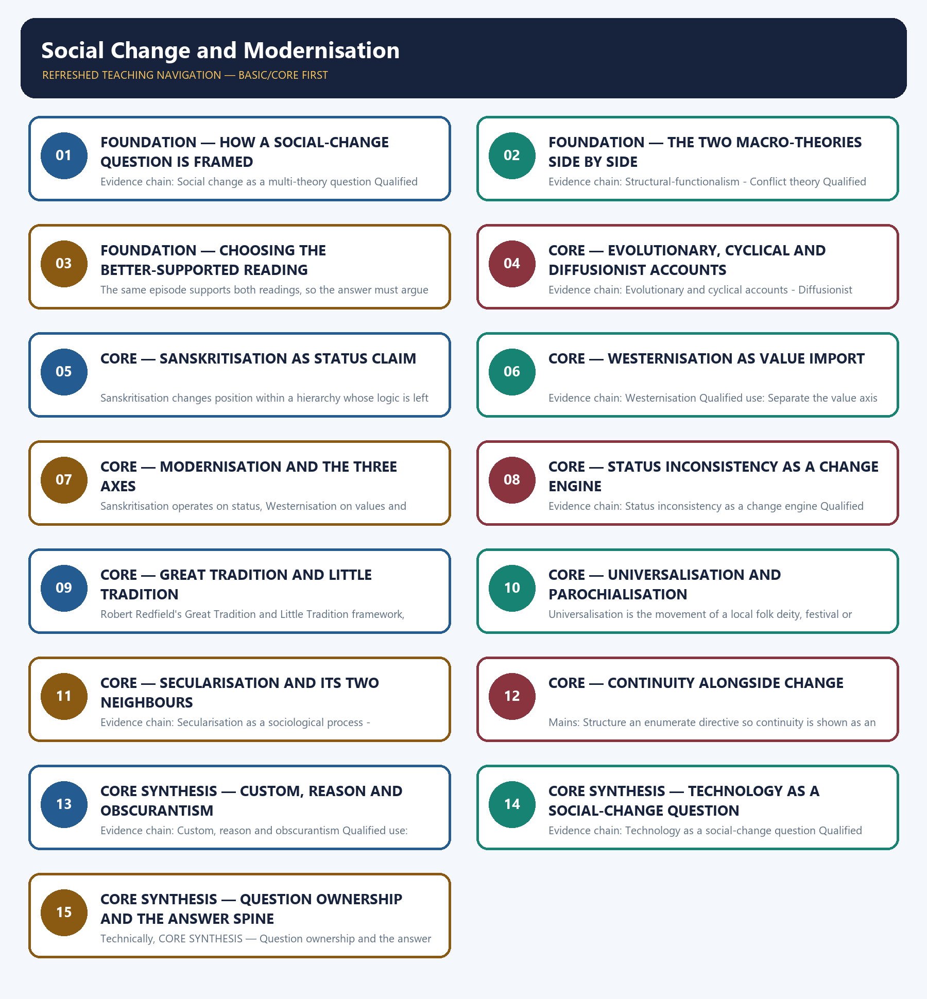

# Social Change and Modernisation — Learner-v2 Complete Learning Session

> **Authoring-only generation:** 2026-09-02. No PDF was rendered and no tracker or index was mutated.

### SOURCE, PROGRESSION AND CURRENT-LINKAGE AUDIT

- **Generation date:** 2026-09-02.
- **Repository-first evidence:** the Basic owner is taught first and preserved in full; the Advanced owner is retained only in the optional final teaching block.
- **OCR evidence:** Repository Markdown was primary. The OCR-searchable official General Studies Paper-I question papers held under books\mains and books\more_previous_papers were used only to confirm the wording of routed Mains PYQs. No official answer key, marking scheme, page precision or unsupported quotation was imported from them.
- **Qdrant:** not used; repository Markdown and available OCR context were sufficient.
- **PYQ integrity:** Four direct General Studies Paper-I Mains demands are routed to this topic and each is recorded with its exact routing status. The 2020 Q19 demand on whether customs and traditions suppress reason leading to obscurantism and the 2021 Q20 demand on the continuity of traditional social values amid social change are routed in the audited 2018-2023 Mains ledger to the Advanced owner, while the Core owner's own answer-architecture table records that Core routing supersedes those pointers, so both are answered here from the Basic spine. The 2021 Q19 cryptocurrency demand is recorded in the same ledger as cross-cutting: the instrument route terminates in the answer-complete Economy digital-economy owner while this owner is retained as the society-effect owner, so the answer below is written strictly on the society layer and asserts no price, legal status or adoption figure. The locally held official question papers for 2020 and 2021 are scanned images from which reliable English text cannot be extracted, so the audited ledger's neutral demand rendering is used for those two years and no verbatim wording is claimed. The 2025 Q18 demand on the growth of fast-food industries amid rising health concerns is routed in the audited 2024-2025 ledger to this Basic owner and its wording was confirmed in the locally held official 2025 General Studies Paper-I; the Globalisation owner's own answer-architecture table also claims that demand, and this cross-owner conflict is stated openly rather than resolved by an unsupported analytical claim. No marking scheme, official key or model answer of the Union Public Service Commission is held locally, and none is reproduced or inferred.
- **Live-link boundary:** This is treated as a durable-theory topic, so no dated current-affairs anchor is forced onto it. The only dated official element used is the verbatim wording of the 2025 General Studies Paper-I demand routed to this owner, confirmed in the locally held official question paper. No scholar, village study, survey figure, date or adoption statistic is invented, no cryptocurrency price or legal status is asserted, and constitutional secularism doctrine and socio-religious reform chronology are cross-linked to Polity and Modern Indian History rather than restated.
- **Fact/inference discipline:** no current-affairs item, PYQ wording, figure or quotation is invented.

## BASIC LEARNING SESSION

### DEEP-REVIEW LEARNING CONTRACT

| Control | Binding rule for this package |
|---|---|
| Syllabus boundary | Complete Indian Society Basic/Core is answer-complete before optional Advanced depth. |
| Concept method | Define and distinguish the institution, identity, process, legal category and measured indicator before analysis. |
| Sociological method | Structure/institution → mechanism and agency → differentiated group/region outcome → feedback, resistance and qualification. |
| Evidence method | Claim → named Indian community/region/institution/dataset → analysis → source-date-status or causal qualification. |
| Non-homogenisation | Caste, tribe, women, religion, region and rural/urban groups retain internal class, gender, locality and historical variation. |
| Boundary method | Constitutional right, statutory mandate, executive scheme, implementation and lived social outcome remain distinct. |
| Practice contract | Every solved item has demand decoding, a detailed examiner-grade model, executable timed/compression plan, marks rationale and answer-specific improvement. |
| Approval | This immutable successor remains `approved: false` pending explicit approval. |

**Canonical Basic/Core owner:** `upsc-ai-kit\knowledge\Indian-Society\basic\12_Social-Change-and-Modernisation.md`  
**Canonical topic owner:** `upsc-ai-kit\knowledge\Indian-Society\basic\12_Social-Change-and-Modernisation.md`  
**Optional Advanced owner:** `upsc-ai-kit\knowledge\Indian-Society\advanced\12_Social-Change-and-Modernisation.md`  
**Official syllabus mapping:** `upsc-ai-kit\knowledge\Indian-Society\OFFICIAL-UPSC-SYLLABUS-MAPPING.md`

### EVIDENCE, PYQ AND CURRENT-STATUS CONTROL

- **Definition discipline:** close concepts and legal-administrative categories share a comparison axis and are never treated as synonyms.
- **Mechanism discipline:** correlation, temporal sequence and aggregate association do not establish causation; identify institutions, incentives, norms, power and agency.
- **Historical discipline:** colonial, constitutional, developmental, liberalisation and contemporary phases are separated without a linear tradition-to-modernity story.
- **Intersectional discipline:** overlapping caste, tribe, class, gender, religion, disability, region and life-course positions are analysed without creating a single homogeneous category.
- **India discipline:** use named communities, movements, institutions, cities, states and regional contrasts without stereotyping or treating one case as nationally representative.
- **Data discipline:** Census 2011, NFHS, PLFS, SRS, Agriculture Census, MPI and scheme claims retain source, reference period, release date, coverage and provisional/final status.
- **PYQ discipline:** repository routing ledgers and locally held papers control wording and metadata; reconstructed wording and unavailable official keys remain labelled.
- **Current-status note, rechecked 2026-09-02:** This is treated as a durable-theory topic, so no dated current-affairs anchor is forced onto it. The only dated official element used is the verbatim wording of the 2025 General Studies Paper-I demand routed to this owner, confirmed in the locally held official question paper. No scholar, village study, survey figure, date or adoption statistic is invented, no cryptocurrency price or legal status is asserted, and constitutional secularism doctrine and socio-religious reform chronology are cross-linked to Polity and Modern Indian History rather than restated.

**Live/official context sources recorded by the predecessor generation:**

- No volatile live claim is necessary for the static sociological core.




*Distinct embedded teaching-navigation image. The separate continuous Cārvāka-style flowchart package remains an independent at-a-glance artifact.*

### SESSION 1 — FOUNDATION — HOW A SOCIAL-CHANGE QUESTION IS FRAMED

#### DEFINITION / WHAT THIS IS CALLED

**Plain-language definition:** Prelims: Retain the exact unit, named scholar, official category, dated statistic or legal boundary attached to How a social-change question is framed.

**Technical definition:** Evidence chain: Social change as a multi-theory question Qualified use: Open a social-change answer with the lens set rather than with a single master theory.

#### ANSWER-GRABBING OPENING — WRITE/ADAPT IN THE EXAM

> Prelims: Retain the exact unit, named scholar, official category, dated statistic or legal boundary attached to How a social-change question is framed.

#### MUST-WRITE KEYWORDS

- **FOUNDATION**
- **Evidence chain**
- **Qualified use**
- **This**
- **India-specific**
- **Modern Indian History**

**How to use them:** Frame the answer through FOUNDATION; define Evidence chain, connect Qualified use with This to explain the mechanism, and use India-specific for the decisive comparison or qualification.

#### VISUAL FIRST

```text
HOW A SOCIAL-CHANGE QUESTION IS FRAMED
01. Social change as a multi-theory question
BOUNDARY -> Reform-movement chronology belongs to Modern Indian History and constitutional secularism to Polity, so neither is re-derived here.
```

*This topic-specific rail fixes the evidence sequence and its exam boundary before analysis.*

#### CORE EXPLANATION

This owner treats social change as a question answered with several complementary lenses rather than one master theory, combining evolutionary, cyclical, structural-functional and conflict accounts with an India-specific vocabulary, while socio-religious reform chronology remains with Modern Indian History and constitutional secularism remains with Polity.

#### NAMED EVIDENCE AND MECHANISM

- This owner treats social change as a question answered with several complementary lenses rather than one master theory, combining evolutionary, cyclical, structural-functional and conflict accounts with an India-specific vocabulary, while socio-religious reform chronology remains with Modern Indian History and constitutional secularism remains with Polity.

#### EXAMINER CAUTION

- Reform-movement chronology belongs to Modern Indian History and constitutional secularism to Polity, so neither is re-derived here.

#### EXAM LINK

- **Prelims:** Retain the exact unit, named scholar, official category, dated statistic or legal boundary attached to How a social-change question is framed.
- **Mains:** Open a social-change answer with the lens set rather than with a single master theory.

#### MINI RECAP

- **Evidence chain:** Social change as a multi-theory question
- **Qualified use:** Open a social-change answer with the lens set rather than with a single master theory.

#### CLOSING RECALL FLOW — FOUNDATION — HOW A SOCIAL-CHANGE QUESTION IS FRAMED

```text
START / CONCEPT: FOUNDATION — How a social-change question is framed
        |
        v
EXACT TERMS: FOUNDATION · Evidence chain · Qualified use · This · India-specific · Modern Indian History
        |
        v
MECHANISM / ARGUMENT: Evidence chain: Social change as a multi-theory question Qualified use: Open a social-change answer with the lens set rather than with a single master theory.
        |
        v
CONSEQUENCE / CONTRAST: This owner treats social change as a question answered with several complementary lenses rather than one master theory, combining evolutionary, cyclical, structural-functional and conflict accounts with an India-specific vocabulary, while socio-religious reform chronology remains with Modern Indian History and constitutional secularism remains with Polity.
        |
        v
UPSC TRAP / ANSWER-USE: Do not miss this limiting distinction: reform-movement chronology belongs to Modern Indian History and constitutional secularism to Polity, so neither...
        |
        v
ANSWER-GRABBING FORMULATION: Prelims: Retain the exact unit, named scholar, official category, dated statistic or legal boundary attached to How a social-change question is framed.
```
### SESSION 2 — FOUNDATION — THE TWO MACRO-THEORIES SIDE BY SIDE

#### DEFINITION / WHAT THIS IS CALLED

**Plain-language definition:** Structural-functionalism views society as an interconnected system of institutions whose adaptations can restore or renegotiate equilibrium after disruption, and it is one analytical lens rather than a claim that all change is smooth or consensus-led.

**Technical definition:** Evidence chain: Structural-functionalism - Conflict theory Qualified use: State both mechanisms precisely before applying either to an Indian case.

#### ANSWER-GRABBING OPENING — WRITE/ADAPT IN THE EXAM

> Structural-functionalism views society as an interconnected system of institutions whose adaptations can restore or renegotiate equilibrium after disruption, and it is one analytical lens rather than a claim that all change is smooth or consensus-led.

#### MUST-WRITE KEYWORDS

- **FOUNDATION**
- **The two macro-theories side by side**
- **Evidence chain**
- **Qualified use**
- **Structural-functionalism**
- **Neither lens**

**How to use them:** Frame the answer through FOUNDATION; define The two macro-theories side by side, connect Evidence chain with Qualified use to explain the mechanism, and use Structural-functionalism for the decisive comparison or qualification.

#### VISUAL FIRST

```text
THE TWO MACRO-THEORIES SIDE BY SIDE
01. Structural-functionalism
    |
    v
02. Conflict theory
BOUNDARY -> Neither lens is a description of how change always happens, and each carries its own causal claim.
```

*This topic-specific rail fixes the evidence sequence and its exam boundary before analysis.*

#### CORE EXPLANATION

Structural-functionalism views society as an interconnected system of institutions whose adaptations can restore or renegotiate equilibrium after disruption, and it is one analytical lens rather than a claim that all change is smooth or consensus-led. Conflict theory, Marxian in influence, views social change as arising from structural contradictions and struggle between groups with opposed interests rather than from consensus-seeking adaptation, and it offers a genuinely different causal account of the same episode.

#### NAMED EVIDENCE AND MECHANISM

- Structural-functionalism views society as an interconnected system of institutions whose adaptations can restore or renegotiate equilibrium after disruption, and it is one analytical lens rather than a claim that all change is smooth or consensus-led.
- Conflict theory, Marxian in influence, views social change as arising from structural contradictions and struggle between groups with opposed interests rather than from consensus-seeking adaptation, and it offers a genuinely different causal account of the same episode.

#### EXAMINER CAUTION

- Neither lens is a description of how change always happens, and each carries its own causal claim.

#### EXAM LINK

- **Prelims:** Retain the exact unit, named scholar, official category, dated statistic or legal boundary attached to The two macro-theories side by side.
- **Mains:** State both mechanisms precisely before applying either to an Indian case.

#### MINI RECAP

- **Evidence chain:** Structural-functionalism -> Conflict theory
- **Qualified use:** State both mechanisms precisely before applying either to an Indian case.

#### CLOSING RECALL FLOW — FOUNDATION — THE TWO MACRO-THEORIES SIDE BY SIDE

```text
START / CONCEPT: FOUNDATION — The two macro-theories side by side
        |
        v
EXACT TERMS: FOUNDATION · The two macro-theories side by side · Evidence chain · Qualified use · Structural-functionalism · Neither lens
        |
        v
MECHANISM / ARGUMENT: Evidence chain: Structural-functionalism - Conflict theory Qualified use: State both mechanisms precisely before applying either to an Indian case.
        |
        v
CONSEQUENCE / CONTRAST: Neither lens is a description of how change always happens, and each carries its own causal claim.
        |
        v
UPSC TRAP / ANSWER-USE: Do not miss this limiting distinction: state both mechanisms precisely before applying either to an Indian case.
        |
        v
ANSWER-GRABBING FORMULATION: Structural-functionalism views society as an interconnected system of institutions whose adaptations can restore or renegotiate equilibrium after disruption, and it is one analytical lens rather than a claim that all change is smooth or consensus-led.
```
### SESSION 3 — FOUNDATION — CHOOSING THE BETTER-SUPPORTED READING

#### DEFINITION / WHAT THIS IS CALLED

**Plain-language definition:** Evidence chain: Choosing the better-supported reading Qualified use: Convert a theory comparison into a defensible verdict about one case.

**Technical definition:** The same episode supports both readings, so the answer must argue from evidence rather than from theory preference.

#### ANSWER-GRABBING OPENING — WRITE/ADAPT IN THE EXAM

> Evidence chain: Choosing the better-supported reading Qualified use: Convert a theory comparison into a defensible verdict about one case.

#### MUST-WRITE KEYWORDS

- **FOUNDATION**
- **Choosing the better-supported reading**
- **Evidence chain**
- **Qualified use**
- **Choosing**
- **Qualified**

**How to use them:** Frame the answer through FOUNDATION; define Choosing the better-supported reading, connect Evidence chain with Qualified use to explain the mechanism, and use Choosing for the decisive comparison or qualification.

#### VISUAL FIRST

```text
CHOOSING THE BETTER-SUPPORTED READING
01. Choosing the better-supported reading
BOUNDARY -> The same episode supports both readings, so the answer must argue from evidence rather than from theory preference.
```

*This topic-specific rail fixes the evidence sequence and its exam boundary before analysis.*

#### CORE EXPLANATION

The ending of an untouchability practice in a village can be read functionally as a system reducing disruptive tension and through conflict theory as the outcome of sustained lower-caste mobilisation, so a strong answer states which mechanism the available evidence better supports instead of asserting that only one theory ever applies.

#### NAMED EVIDENCE AND MECHANISM

- The ending of an untouchability practice in a village can be read functionally as a system reducing disruptive tension and through conflict theory as the outcome of sustained lower-caste mobilisation, so a strong answer states which mechanism the available evidence better supports instead of asserting that only one theory ever applies.

#### EXAMINER CAUTION

- The same episode supports both readings, so the answer must argue from evidence rather than from theory preference.

#### EXAM LINK

- **Prelims:** Retain the exact unit, named scholar, official category, dated statistic or legal boundary attached to Choosing the better-supported reading.
- **Mains:** Convert a theory comparison into a defensible verdict about one case.

#### MINI RECAP

- **Evidence chain:** Choosing the better-supported reading
- **Qualified use:** Convert a theory comparison into a defensible verdict about one case.

#### CLOSING RECALL FLOW — FOUNDATION — CHOOSING THE BETTER-SUPPORTED READING

```text
START / CONCEPT: FOUNDATION — Choosing the better-supported reading
        |
        v
EXACT TERMS: FOUNDATION · Choosing the better-supported reading · Evidence chain · Qualified use · Choosing · Qualified
        |
        v
MECHANISM / ARGUMENT: The ending of an untouchability practice in a village can be read functionally as a system reducing disruptive tension and through conflict theory as the outcome of sustained lower-caste mobilisation, so a strong answer states which mechanism the available evidence better supports instead of asserting that only one theory ever applies.
        |
        v
CONSEQUENCE / CONTRAST: The same episode supports both readings, so the answer must argue from evidence rather than from theory preference.
        |
        v
UPSC TRAP / ANSWER-USE: Do not miss this limiting distinction: choosing the better-supported reading Qualified use.
        |
        v
ANSWER-GRABBING FORMULATION: Evidence chain: Choosing the better-supported reading Qualified use: Convert a theory comparison into a defensible verdict about one case.
```
### SESSION 4 — CORE — EVOLUTIONARY, CYCLICAL AND DIFFUSIONIST ACCOUNTS

#### DEFINITION / WHAT THIS IS CALLED

**Plain-language definition:** Evolutionary theory explains change as internally generated unilinear development while cyclical theory describes civilisational rise and fall, and modern sociology generally prefers multi-linear, context-specific accounts to either pure form.

**Technical definition:** Evidence chain: Evolutionary and cyclical accounts - Diffusionist explanation Qualified use: Add the older theory families with their status attached instead of presenting them as settled.

#### ANSWER-GRABBING OPENING — WRITE/ADAPT IN THE EXAM

> Evolutionary theory explains change as internally generated unilinear development while cyclical theory describes civilisational rise and fall, and modern sociology generally prefers multi-linear, context-specific accounts to either pure form.

#### MUST-WRITE KEYWORDS

- **Evolutionary**
- **cyclical**
- **diffusionist accounts**
- **Evidence chain**
- **Qualified use**
- **Western-origin**

**How to use them:** Frame the answer through Evolutionary; define cyclical, connect diffusionist accounts with Evidence chain to explain the mechanism, and use Qualified use for the decisive comparison or qualification.

#### VISUAL FIRST

```text
EVOLUTIONARY, CYCLICAL AND DIFFUSIONIST ACCOUNTS
01. Evolutionary and cyclical accounts
    |
    v
02. Diffusionist explanation
BOUNDARY -> Modern sociology prefers multi-linear, context-specific accounts to either pure evolutionary or pure diffusionist explanation.
```

*This topic-specific rail fixes the evidence sequence and its exam boundary before analysis.*

#### CORE EXPLANATION

Evolutionary theory explains change as internally generated unilinear development while cyclical theory describes civilisational rise and fall, and modern sociology generally prefers multi-linear, context-specific accounts to either pure form. A diffusionist explanation attributes change to the spread of practices, technology or ideas from one society or region to another, which is how Western-origin institutions are usually said to have entered Indian society, and it complements rather than replaces internal-development accounts.

#### NAMED EVIDENCE AND MECHANISM

- Evolutionary theory explains change as internally generated unilinear development while cyclical theory describes civilisational rise and fall, and modern sociology generally prefers multi-linear, context-specific accounts to either pure form.
- A diffusionist explanation attributes change to the spread of practices, technology or ideas from one society or region to another, which is how Western-origin institutions are usually said to have entered Indian society, and it complements rather than replaces internal-development accounts.

#### EXAMINER CAUTION

- Modern sociology prefers multi-linear, context-specific accounts to either pure evolutionary or pure diffusionist explanation.

#### EXAM LINK

- **Prelims:** Retain the exact unit, named scholar, official category, dated statistic or legal boundary attached to Evolutionary, cyclical and diffusionist accounts.
- **Mains:** Add the older theory families with their status attached instead of presenting them as settled.

#### MINI RECAP

- **Evidence chain:** Evolutionary and cyclical accounts -> Diffusionist explanation
- **Qualified use:** Add the older theory families with their status attached instead of presenting them as settled.

#### CLOSING RECALL FLOW — CORE — EVOLUTIONARY, CYCLICAL AND DIFFUSIONIST ACCOUNTS

```text
START / CONCEPT: CORE — Evolutionary, cyclical and diffusionist accounts
        |
        v
EXACT TERMS: Evolutionary · cyclical · diffusionist accounts · Evidence chain · Qualified use · Western-origin
        |
        v
MECHANISM / ARGUMENT: Evidence chain: Evolutionary and cyclical accounts - Diffusionist explanation Qualified use: Add the older theory families with their status attached instead of presenting them as settled.
        |
        v
CONSEQUENCE / CONTRAST: A diffusionist explanation attributes change to the spread of practices, technology or ideas from one society or region to another, which is how Western-origin institutions are usually said to have entered Indian society, and it complements rather than replaces internal-development accounts.
        |
        v
UPSC TRAP / ANSWER-USE: Do not miss this limiting distinction: evolutionary theory explains change as internally generated unilinear development while cyclical theory describes civilisational...
        |
        v
ANSWER-GRABBING FORMULATION: Evolutionary theory explains change as internally generated unilinear development while cyclical theory describes civilisational rise and fall, and modern sociology generally prefers multi-linear, context-specific accounts to either pure form.
```
### SESSION 5 — CORE — SANSKRITISATION AS STATUS CLAIM

#### DEFINITION / WHAT THIS IS CALLED

**Plain-language definition:** Evidence chain: Sanskritisation Qualified use: Name the mobility concept precisely so it is not confused with structural change.

**Technical definition:** Sanskritisation changes position within a hierarchy whose logic is left intact.

#### ANSWER-GRABBING OPENING — WRITE/ADAPT IN THE EXAM

> Srinivas's formulation, is the emulation of a locally dominant caste's ritual practice by another jati in order to claim higher local status, and it changes a group's position within the hierarchy without altering the hierarchy's own logic.

#### MUST-WRITE KEYWORDS

- **Sanskritisation as status claim**
- **Evidence chain**
- **Qualified use**
- **Srinivas's formulation,**
- **Srinivas's**
- **Sanskritisation changes position within a hierarchy whose logic**

**How to use them:** Frame the answer through Sanskritisation as status claim; define Evidence chain, connect Qualified use with Srinivas's formulation, to explain the mechanism, and use Srinivas's for the decisive comparison or qualification.

#### VISUAL FIRST

```text
SANSKRITISATION AS STATUS CLAIM
01. Sanskritisation
BOUNDARY -> Sanskritisation changes position within a hierarchy whose logic is left intact.
```

*This topic-specific rail fixes the evidence sequence and its exam boundary before analysis.*

#### CORE EXPLANATION

Sanskritisation, in M. N. Srinivas's formulation, is the emulation of a locally dominant caste's ritual practice by another jati in order to claim higher local status, and it changes a group's position within the hierarchy without altering the hierarchy's own logic.

#### NAMED EVIDENCE AND MECHANISM

- Sanskritisation, in M. N. Srinivas's formulation, is the emulation of a locally dominant caste's ritual practice by another jati in order to claim higher local status, and it changes a group's position within the hierarchy without altering the hierarchy's own logic.

#### EXAMINER CAUTION

- Sanskritisation changes position within a hierarchy whose logic is left intact.

#### EXAM LINK

- **Prelims:** Retain the exact unit, named scholar, official category, dated statistic or legal boundary attached to Sanskritisation as status claim.
- **Mains:** Name the mobility concept precisely so it is not confused with structural change.

#### MINI RECAP

- **Evidence chain:** Sanskritisation
- **Qualified use:** Name the mobility concept precisely so it is not confused with structural change.

#### CLOSING RECALL FLOW — CORE — SANSKRITISATION AS STATUS CLAIM

```text
START / CONCEPT: CORE — Sanskritisation as status claim
        |
        v
EXACT TERMS: Sanskritisation as status claim · Evidence chain · Qualified use · Srinivas's formulation, · Srinivas's · Sanskritisation changes position within a hierarchy whose logic
        |
        v
MECHANISM / ARGUMENT: Evidence chain: Sanskritisation Qualified use: Name the mobility concept precisely so it is not confused with structural change.
        |
        v
CONSEQUENCE / CONTRAST: Mains: Name the mobility concept precisely so it is not confused with structural change.
        |
        v
UPSC TRAP / ANSWER-USE: Do not miss this limiting distinction: sanskritisation changes position within a hierarchy whose logic is left intact.
        |
        v
ANSWER-GRABBING FORMULATION: Srinivas's formulation, is the emulation of a locally dominant caste's ritual practice by another jati in order to claim higher local status, and it changes a group's position within the hierarchy without altering the hierarchy's own logic.
```
### SESSION 6 — CORE — WESTERNISATION AS VALUE IMPORT

#### DEFINITION / WHAT THIS IS CALLED

**Plain-language definition:** Westernisation is the adoption of new values from contact with Western education, law and institutions, including equality, individual rights and rationality, and unlike Sanskritisation it can subvert rather than merely reposition a group within the existing hierarchy.

**Technical definition:** Evidence chain: Westernisation Qualified use: Separate the value axis from the status axis in one sentence.

#### ANSWER-GRABBING OPENING — WRITE/ADAPT IN THE EXAM

> Westernisation is the adoption of new values from contact with Western education, law and institutions, including equality, individual rights and rationality, and unlike Sanskritisation it can subvert rather than merely reposition a group within the existing hierarchy.

#### MUST-WRITE KEYWORDS

- **Westernisation as value import**
- **Evidence chain**
- **Qualified use**
- **Westernisation**
- **Western**
- **Sanskritisation**

**How to use them:** Frame the answer through Westernisation as value import; define Evidence chain, connect Qualified use with Westernisation to explain the mechanism, and use Western for the decisive comparison or qualification.

#### VISUAL FIRST

```text
WESTERNISATION AS VALUE IMPORT
01. Westernisation
BOUNDARY -> Value import can subvert a hierarchy rather than merely reposition a group inside it.
```

*This topic-specific rail fixes the evidence sequence and its exam boundary before analysis.*

#### CORE EXPLANATION

Westernisation is the adoption of new values from contact with Western education, law and institutions, including equality, individual rights and rationality, and unlike Sanskritisation it can subvert rather than merely reposition a group within the existing hierarchy.

#### NAMED EVIDENCE AND MECHANISM

- Westernisation is the adoption of new values from contact with Western education, law and institutions, including equality, individual rights and rationality, and unlike Sanskritisation it can subvert rather than merely reposition a group within the existing hierarchy.

#### EXAMINER CAUTION

- Value import can subvert a hierarchy rather than merely reposition a group inside it.

#### EXAM LINK

- **Prelims:** Retain the exact unit, named scholar, official category, dated statistic or legal boundary attached to Westernisation as value import.
- **Mains:** Separate the value axis from the status axis in one sentence.

#### MINI RECAP

- **Evidence chain:** Westernisation
- **Qualified use:** Separate the value axis from the status axis in one sentence.

#### CLOSING RECALL FLOW — CORE — WESTERNISATION AS VALUE IMPORT

```text
START / CONCEPT: CORE — Westernisation as value import
        |
        v
EXACT TERMS: Westernisation as value import · Evidence chain · Qualified use · Westernisation · Western · Sanskritisation
        |
        v
MECHANISM / ARGUMENT: Evidence chain: Westernisation Qualified use: Separate the value axis from the status axis in one sentence.
        |
        v
CONSEQUENCE / CONTRAST: Value import can subvert a hierarchy rather than merely reposition a group inside it.
        |
        v
UPSC TRAP / ANSWER-USE: Do not miss this limiting distinction: westernisation is the adoption of new values from contact with Western education, law and...
        |
        v
ANSWER-GRABBING FORMULATION: Westernisation is the adoption of new values from contact with Western education, law and institutions, including equality, individual rights and rationality, and unlike Sanskritisation it can subvert rather than merely reposition a group within the existing hierarchy.
```
### SESSION 7 — CORE — MODERNISATION AND THE THREE AXES

#### DEFINITION / WHAT THIS IS CALLED

**Plain-language definition:** Modernisation is structural change toward rational-legal institutions, technology and differentiated occupational roles, and it is analytically distinct from both Sanskritisation and Westernisation even though all three often occur together in one community.

**Technical definition:** Sanskritisation operates on status, Westernisation on values and modernisation on structure, so a group can modernise structurally through formal education and salaried employment without Sanskritising ritually, and treating the three as points on a single scale of progress is the standard error.

#### ANSWER-GRABBING OPENING — WRITE/ADAPT IN THE EXAM

> Evidence chain: Modernisation - Three axes, not one scale Qualified use: Answer a distinguish directive with axes rather than with a chronology.

#### MUST-WRITE KEYWORDS

- **Modernisation**
- **the three axes**
- **Evidence chain**
- **Qualified use**
- **Sanskritisation**
- **Westernisation**

**How to use them:** Frame the answer through Modernisation; define the three axes, connect Evidence chain with Qualified use to explain the mechanism, and use Sanskritisation for the decisive comparison or qualification.

#### VISUAL FIRST

```text
MODERNISATION AND THE THREE AXES
01. Modernisation
    |
    v
02. Three axes, not one scale
BOUNDARY -> The three concepts are separate axes and never points on one scale of progress.
```

*This topic-specific rail fixes the evidence sequence and its exam boundary before analysis.*

#### CORE EXPLANATION

Modernisation is structural change toward rational-legal institutions, technology and differentiated occupational roles, and it is analytically distinct from both Sanskritisation and Westernisation even though all three often occur together in one community. Sanskritisation operates on status, Westernisation on values and modernisation on structure, so a group can modernise structurally through formal education and salaried employment without Sanskritising ritually, and treating the three as points on a single scale of progress is the standard error.

#### NAMED EVIDENCE AND MECHANISM

- Modernisation is structural change toward rational-legal institutions, technology and differentiated occupational roles, and it is analytically distinct from both Sanskritisation and Westernisation even though all three often occur together in one community.
- Sanskritisation operates on status, Westernisation on values and modernisation on structure, so a group can modernise structurally through formal education and salaried employment without Sanskritising ritually, and treating the three as points on a single scale of progress is the standard error.

#### EXAMINER CAUTION

- The three concepts are separate axes and never points on one scale of progress.

#### EXAM LINK

- **Prelims:** Retain the exact unit, named scholar, official category, dated statistic or legal boundary attached to Modernisation and the three axes.
- **Mains:** Answer a distinguish directive with axes rather than with a chronology.

#### MINI RECAP

- **Evidence chain:** Modernisation -> Three axes, not one scale
- **Qualified use:** Answer a distinguish directive with axes rather than with a chronology.

#### CLOSING RECALL FLOW — CORE — MODERNISATION AND THE THREE AXES

```text
START / CONCEPT: CORE — Modernisation and the three axes
        |
        v
EXACT TERMS: Modernisation · the three axes · Evidence chain · Qualified use · Sanskritisation · Westernisation
        |
        v
MECHANISM / ARGUMENT: Sanskritisation operates on status, Westernisation on values and modernisation on structure, so a group can modernise structurally through formal education and salaried employment without Sanskritising ritually, and treating the three as points on a single scale of progress is the standard error.
        |
        v
CONSEQUENCE / CONTRAST: Modernisation is structural change toward rational-legal institutions, technology and differentiated occupational roles, and it is analytically distinct from both Sanskritisation and Westernisation even though all three often occur together in one community.
        |
        v
UPSC TRAP / ANSWER-USE: The three concepts are separate axes and never points on one scale of progress.
        |
        v
ANSWER-GRABBING FORMULATION: Evidence chain: Modernisation - Three axes, not one scale Qualified use: Answer a distinguish directive with axes rather than with a chronology.
```
### SESSION 8 — CORE — STATUS INCONSISTENCY AS A CHANGE ENGINE

#### DEFINITION / WHAT THIS IS CALLED

**Plain-language definition:** Inconsistency between values, structure and recognised status is itself a source of further change.

**Technical definition:** Evidence chain: Status inconsistency as a change engine Qualified use: Explain why change does not stop once a group has gained education and employment.

#### ANSWER-GRABBING OPENING — WRITE/ADAPT IN THE EXAM

> Evidence chain: Status inconsistency as a change engine Qualified use: Explain why change does not stop once a group has gained education and employment.

#### MUST-WRITE KEYWORDS

- **Status inconsistency as a change engine**
- **Evidence chain**
- **Qualified use**
- **Where Westernisation**
- **Inconsistency between values, structure and recognised status**
- **Inconsistency**

**How to use them:** Frame the answer through Status inconsistency as a change engine; define Evidence chain, connect Qualified use with Where Westernisation to explain the mechanism, and use Inconsistency between values, structure and recognised status for the decisive comparison or qualification.

#### VISUAL FIRST

```text
STATUS INCONSISTENCY AS A CHANGE ENGINE
01. Status inconsistency as a change engine
BOUNDARY -> Inconsistency between values, structure and recognised status is itself a source of further change.
```

*This topic-specific rail fixes the evidence sequence and its exam boundary before analysis.*

#### CORE EXPLANATION

Where Westernisation and modernisation advance while local ritual-status recognition lags, a group can hold new values and a new structural position without matching status, and that inconsistency itself generates further pressure for social change.

#### NAMED EVIDENCE AND MECHANISM

- Where Westernisation and modernisation advance while local ritual-status recognition lags, a group can hold new values and a new structural position without matching status, and that inconsistency itself generates further pressure for social change.

#### EXAMINER CAUTION

- Inconsistency between values, structure and recognised status is itself a source of further change.

#### EXAM LINK

- **Prelims:** Retain the exact unit, named scholar, official category, dated statistic or legal boundary attached to Status inconsistency as a change engine.
- **Mains:** Explain why change does not stop once a group has gained education and employment.

#### MINI RECAP

- **Evidence chain:** Status inconsistency as a change engine
- **Qualified use:** Explain why change does not stop once a group has gained education and employment.

#### CLOSING RECALL FLOW — CORE — STATUS INCONSISTENCY AS A CHANGE ENGINE

```text
START / CONCEPT: CORE — Status inconsistency as a change engine
        |
        v
EXACT TERMS: Status inconsistency as a change engine · Evidence chain · Qualified use · Where Westernisation · Inconsistency between values, structure and recognised status · Inconsistency
        |
        v
MECHANISM / ARGUMENT: Where Westernisation and modernisation advance while local ritual-status recognition lags, a group can hold new values and a new structural position without matching status, and that inconsistency itself generates further pressure for social change.
        |
        v
CONSEQUENCE / CONTRAST: Inconsistency between values, structure and recognised status is itself a source of further change.
        |
        v
UPSC TRAP / ANSWER-USE: Mains: Explain why change does not stop once a group has gained education and employment.
        |
        v
ANSWER-GRABBING FORMULATION: Evidence chain: Status inconsistency as a change engine Qualified use: Explain why change does not stop once a group has gained education and employment.
```
### SESSION 9 — CORE — GREAT TRADITION AND LITTLE TRADITION

#### DEFINITION / WHAT THIS IS CALLED

**Plain-language definition:** Evidence chain: Great Tradition and Little Tradition Qualified use: Introduce the framework with its authorship before illustrating it.

**Technical definition:** Robert Redfield's Great Tradition and Little Tradition framework, developed for Indian village society by McKim Marriott, distinguishes the pan-Indian, textual and reflective cultural stream from the local, oral and folk stream, and the two interact continuously rather than existing in isolation.

#### ANSWER-GRABBING OPENING — WRITE/ADAPT IN THE EXAM

> Evidence chain: Great Tradition and Little Tradition Qualified use: Introduce the framework with its authorship before illustrating it.

#### MUST-WRITE KEYWORDS

- **Great Tradition**
- **Little Tradition**
- **Evidence chain**
- **Qualified use**
- **Robert Redfield's Great Tradition**
- **Indian**

**How to use them:** Frame the answer through Great Tradition; define Little Tradition, connect Evidence chain with Qualified use to explain the mechanism, and use Robert Redfield's Great Tradition for the decisive comparison or qualification.

#### VISUAL FIRST

```text
GREAT TRADITION AND LITTLE TRADITION
01. Great Tradition and Little Tradition
BOUNDARY -> The two streams interact continuously and neither exists in isolation from the other.
```

*This topic-specific rail fixes the evidence sequence and its exam boundary before analysis.*

#### CORE EXPLANATION

Robert Redfield's Great Tradition and Little Tradition framework, developed for Indian village society by McKim Marriott, distinguishes the pan-Indian, textual and reflective cultural stream from the local, oral and folk stream, and the two interact continuously rather than existing in isolation.

#### NAMED EVIDENCE AND MECHANISM

- Robert Redfield's Great Tradition and Little Tradition framework, developed for Indian village society by McKim Marriott, distinguishes the pan-Indian, textual and reflective cultural stream from the local, oral and folk stream, and the two interact continuously rather than existing in isolation.

#### EXAMINER CAUTION

- The two streams interact continuously and neither exists in isolation from the other.

#### EXAM LINK

- **Prelims:** Retain the exact unit, named scholar, official category, dated statistic or legal boundary attached to Great Tradition and Little Tradition.
- **Mains:** Introduce the framework with its authorship before illustrating it.

#### MINI RECAP

- **Evidence chain:** Great Tradition and Little Tradition
- **Qualified use:** Introduce the framework with its authorship before illustrating it.

#### CLOSING RECALL FLOW — CORE — GREAT TRADITION AND LITTLE TRADITION

```text
START / CONCEPT: CORE — Great Tradition and Little Tradition
        |
        v
EXACT TERMS: Great Tradition · Little Tradition · Evidence chain · Qualified use · Robert Redfield's Great Tradition · Indian
        |
        v
MECHANISM / ARGUMENT: Robert Redfield's Great Tradition and Little Tradition framework, developed for Indian village society by McKim Marriott, distinguishes the pan-Indian, textual and reflective cultural stream from the local, oral and folk stream, and the two interact continuously rather than existing in isolation.
        |
        v
CONSEQUENCE / CONTRAST: The two streams interact continuously and neither exists in isolation from the other.
        |
        v
UPSC TRAP / ANSWER-USE: Do not miss this limiting distinction: great Tradition and Little Tradition Qualified use.
        |
        v
ANSWER-GRABBING FORMULATION: Evidence chain: Great Tradition and Little Tradition Qualified use: Introduce the framework with its authorship before illustrating it.
```
### SESSION 10 — CORE — UNIVERSALISATION AND PAROCHIALISATION

#### DEFINITION / WHAT THIS IS CALLED

**Plain-language definition:** Parochialisation is the adaptation, simplification or reinterpretation of a pan-Indian textual practice into local folk form to fit regional resources, language and social structure, and together with universalisation it makes Indian cultural change a genuine two-way exchange.

**Technical definition:** Universalisation is the movement of a local folk deity, festival or practice upward into pan-Indian recognition through pilgrimage networks, textual incorporation or patronage, and it demonstrates that cultural flow in India is not only downward from elite to folk.

#### ANSWER-GRABBING OPENING — WRITE/ADAPT IN THE EXAM

> Parochialisation is the adaptation, simplification or reinterpretation of a pan-Indian textual practice into local folk form to fit regional resources, language and social structure, and together with universalisation it makes Indian cultural change a genuine two-way exchange.

#### MUST-WRITE KEYWORDS

- **Universalisation**
- **parochialisation**
- **Evidence chain**
- **Qualified use**
- **Indian**
- **India**

**How to use them:** Frame the answer through Universalisation; define parochialisation, connect Evidence chain with Qualified use to explain the mechanism, and use Indian for the decisive comparison or qualification.

#### VISUAL FIRST

```text
UNIVERSALISATION AND PAROCHIALISATION
01. Universalisation
    |
    v
02. Parochialisation
BOUNDARY -> The two processes run in opposite directions, so neither may be described as elite imposition.
```

*This topic-specific rail fixes the evidence sequence and its exam boundary before analysis.*

#### CORE EXPLANATION

Universalisation is the movement of a local folk deity, festival or practice upward into pan-Indian recognition through pilgrimage networks, textual incorporation or patronage, and it demonstrates that cultural flow in India is not only downward from elite to folk. Parochialisation is the adaptation, simplification or reinterpretation of a pan-Indian textual practice into local folk form to fit regional resources, language and social structure, and together with universalisation it makes Indian cultural change a genuine two-way exchange.

#### NAMED EVIDENCE AND MECHANISM

- Universalisation is the movement of a local folk deity, festival or practice upward into pan-Indian recognition through pilgrimage networks, textual incorporation or patronage, and it demonstrates that cultural flow in India is not only downward from elite to folk.
- Parochialisation is the adaptation, simplification or reinterpretation of a pan-Indian textual practice into local folk form to fit regional resources, language and social structure, and together with universalisation it makes Indian cultural change a genuine two-way exchange.

#### EXAMINER CAUTION

- The two processes run in opposite directions, so neither may be described as elite imposition.

#### EXAM LINK

- **Prelims:** Retain the exact unit, named scholar, official category, dated statistic or legal boundary attached to Universalisation and parochialisation.
- **Mains:** Refute a top-down diffusion model with a named two-way mechanism.

#### MINI RECAP

- **Evidence chain:** Universalisation -> Parochialisation
- **Qualified use:** Refute a top-down diffusion model with a named two-way mechanism.

#### CLOSING RECALL FLOW — CORE — UNIVERSALISATION AND PAROCHIALISATION

```text
START / CONCEPT: CORE — Universalisation and parochialisation
        |
        v
EXACT TERMS: Universalisation · parochialisation · Evidence chain · Qualified use · Indian · India
        |
        v
MECHANISM / ARGUMENT: Evidence chain: Universalisation - Parochialisation Qualified use: Refute a top-down diffusion model with a named two-way mechanism.
        |
        v
CONSEQUENCE / CONTRAST: Universalisation is the movement of a local folk deity, festival or practice upward into pan-Indian recognition through pilgrimage networks, textual incorporation or patronage, and it demonstrates that cultural flow in India is not only downward from elite to folk.
        |
        v
UPSC TRAP / ANSWER-USE: Do not miss this limiting distinction: universalisation is the movement of a local folk deity, festival or practice upward into...
        |
        v
ANSWER-GRABBING FORMULATION: Parochialisation is the adaptation, simplification or reinterpretation of a pan-Indian textual practice into local folk form to fit regional resources, language and social structure, and together with universalisation it makes Indian cultural change a genuine two-way exchange.
```
### SESSION 11 — CORE — SECULARISATION AND ITS TWO NEIGHBOURS

#### DEFINITION / WHAT THIS IS CALLED

**Plain-language definition:** Secularisation describes the differentiation of religious authority from economic, political and other institutions, sometimes accompanied by declining religious control in particular domains, and it is neither a universal linear disappearance of religion nor the constitutional doctrine of secularism.

**Technical definition:** Evidence chain: Secularisation as a sociological process - Secularisation, secularism and desacralisation Qualified use: Protect a secularisation answer from the commonest conflation in this module.

#### ANSWER-GRABBING OPENING — WRITE/ADAPT IN THE EXAM

> Secularisation describes the differentiation of religious authority from economic, political and other institutions, sometimes accompanied by declining religious control in particular domains, and it is neither a universal linear disappearance of religion nor the constitutional doctrine of secularism.

#### MUST-WRITE KEYWORDS

- **Secularisation**
- **its two neighbours**
- **Evidence chain**
- **Qualified use**
- **Qualified**
- **Protect**

**How to use them:** Frame the answer through Secularisation; define its two neighbours, connect Evidence chain with Qualified use to explain the mechanism, and use Qualified for the decisive comparison or qualification.

#### VISUAL FIRST

```text
SECULARISATION AND ITS TWO NEIGHBOURS
01. Secularisation as a sociological process
    |
    v
02. Secularisation, secularism and desacralisation
BOUNDARY -> Institutional differentiation, constitutional doctrine and experiential desacralisation operate at three different levels.
```

*This topic-specific rail fixes the evidence sequence and its exam boundary before analysis.*

#### CORE EXPLANATION

Secularisation describes the differentiation of religious authority from economic, political and other institutions, sometimes accompanied by declining religious control in particular domains, and it is neither a universal linear disappearance of religion nor the constitutional doctrine of secularism. Secularisation operates at the institutional level, secularism at the legal and political level as state neutrality toward religion, and desacralisation at the experiential level as a declining sense of the sacred in particular practices or spaces, and conflating any two of the three is a frequent Mains error.

#### NAMED EVIDENCE AND MECHANISM

- Secularisation describes the differentiation of religious authority from economic, political and other institutions, sometimes accompanied by declining religious control in particular domains, and it is neither a universal linear disappearance of religion nor the constitutional doctrine of secularism.
- Secularisation operates at the institutional level, secularism at the legal and political level as state neutrality toward religion, and desacralisation at the experiential level as a declining sense of the sacred in particular practices or spaces, and conflating any two of the three is a frequent Mains error.

#### EXAMINER CAUTION

- Institutional differentiation, constitutional doctrine and experiential desacralisation operate at three different levels.

#### EXAM LINK

- **Prelims:** Retain the exact unit, named scholar, official category, dated statistic or legal boundary attached to Secularisation and its two neighbours.
- **Mains:** Protect a secularisation answer from the commonest conflation in this module.

#### MINI RECAP

- **Evidence chain:** Secularisation as a sociological process -> Secularisation, secularism and desacralisation
- **Qualified use:** Protect a secularisation answer from the commonest conflation in this module.

#### CLOSING RECALL FLOW — CORE — SECULARISATION AND ITS TWO NEIGHBOURS

```text
START / CONCEPT: CORE — Secularisation and its two neighbours
        |
        v
EXACT TERMS: Secularisation · its two neighbours · Evidence chain · Qualified use · Qualified · Protect
        |
        v
MECHANISM / ARGUMENT: Evidence chain: Secularisation as a sociological process - Secularisation, secularism and desacralisation Qualified use: Protect a secularisation answer from the commonest conflation in this module.
        |
        v
CONSEQUENCE / CONTRAST: Secularisation operates at the institutional level, secularism at the legal and political level as state neutrality toward religion, and desacralisation at the experiential level as a declining sense of the sacred in particular practices or spaces, and conflating any two of the three is a frequent Mains error.
        |
        v
UPSC TRAP / ANSWER-USE: Do not miss this limiting distinction: secularisation as a sociological process - Secularisation, secularism and desacralisation Qualified use.
        |
        v
ANSWER-GRABBING FORMULATION: Secularisation describes the differentiation of religious authority from economic, political and other institutions, sometimes accompanied by declining religious control in particular domains, and it is neither a universal linear disappearance of religion nor the constitutional doctrine of secularism.
```
### SESSION 12 — CORE — CONTINUITY ALONGSIDE CHANGE

#### DEFINITION / WHAT THIS IS CALLED

**Plain-language definition:** Evidence chain: Continuity alongside change Qualified use: Structure an enumerate directive so continuity is shown as an active process.

**Technical definition:** Mains: Structure an enumerate directive so continuity is shown as an active process.

#### ANSWER-GRABBING OPENING — WRITE/ADAPT IN THE EXAM

> Evidence chain: Continuity alongside change Qualified use: Structure an enumerate directive so continuity is shown as an active process.

#### MUST-WRITE KEYWORDS

- **Continuity alongside change**
- **Evidence chain**
- **Qualified use**
- **Every**
- **Mains: Structure an enumerate directive so continuity**
- **Structure**

**How to use them:** Frame the answer through Continuity alongside change; define Evidence chain, connect Qualified use with Every to explain the mechanism, and use Mains: Structure an enumerate directive so continuity for the decisive comparison or qualification.

#### VISUAL FIRST

```text
CONTINUITY ALONGSIDE CHANGE
01. Continuity alongside change
BOUNDARY -> Every persistence mechanism must be paired with the change pressure it is resisting.
```

*This topic-specific rail fixes the evidence sequence and its exam boundary before analysis.*

#### CORE EXPLANATION

Traditional values persist through family and kin socialisation, ritual and festival life, language and regional culture, and adaptation through universalisation and parochialisation, and each of these mechanisms operates against a parallel change pressure from education, migration, media and law.

#### NAMED EVIDENCE AND MECHANISM

- Traditional values persist through family and kin socialisation, ritual and festival life, language and regional culture, and adaptation through universalisation and parochialisation, and each of these mechanisms operates against a parallel change pressure from education, migration, media and law.

#### EXAMINER CAUTION

- Every persistence mechanism must be paired with the change pressure it is resisting.

#### EXAM LINK

- **Prelims:** Retain the exact unit, named scholar, official category, dated statistic or legal boundary attached to Continuity alongside change.
- **Mains:** Structure an enumerate directive so continuity is shown as an active process.

#### MINI RECAP

- **Evidence chain:** Continuity alongside change
- **Qualified use:** Structure an enumerate directive so continuity is shown as an active process.

#### CLOSING RECALL FLOW — CORE — CONTINUITY ALONGSIDE CHANGE

```text
START / CONCEPT: CORE — Continuity alongside change
        |
        v
EXACT TERMS: Continuity alongside change · Evidence chain · Qualified use · Every · Mains: Structure an enumerate directive so continuity · Structure
        |
        v
MECHANISM / ARGUMENT: Every persistence mechanism must be paired with the change pressure it is resisting.
        |
        v
CONSEQUENCE / CONTRAST: Mains: Structure an enumerate directive so continuity is shown as an active process.
        |
        v
UPSC TRAP / ANSWER-USE: Do not miss this limiting distinction: structure an enumerate directive so continuity is shown as an active process.
        |
        v
ANSWER-GRABBING FORMULATION: Evidence chain: Continuity alongside change Qualified use: Structure an enumerate directive so continuity is shown as an active process.
```
### SESSION 13 — CORE SYNTHESIS — CUSTOM, REASON AND OBSCURANTISM

#### DEFINITION / WHAT THIS IS CALLED

**Plain-language definition:** A custom is not automatically irrational, so the examinable question is when a particular application of a practice blocks inquiry, equal agency or evidence-based choice, and the answer must name reform, education and internal dissent as change mechanisms without describing any community as inherently irrational.

**Technical definition:** Evidence chain: Custom, reason and obscurantism Qualified use: Answer a critical-evaluation directive without turning it into a civilisational verdict.

#### ANSWER-GRABBING OPENING — WRITE/ADAPT IN THE EXAM

> Evidence chain: Custom, reason and obscurantism Qualified use: Answer a critical-evaluation directive without turning it into a civilisational verdict.

#### MUST-WRITE KEYWORDS

- **CORE SYNTHESIS**
- **Custom**
- **reason**
- **obscurantism**
- **Evidence chain**
- **Qualified use**

**How to use them:** Frame the answer through CORE SYNTHESIS; define Custom, connect reason with obscurantism to explain the mechanism, and use Evidence chain for the decisive comparison or qualification.

#### VISUAL FIRST

```text
CUSTOM, REASON AND OBSCURANTISM
01. Custom, reason and obscurantism
BOUNDARY -> A practice is examined for its effect on inquiry and agency, never a community for its supposed rationality.
```

*This topic-specific rail fixes the evidence sequence and its exam boundary before analysis.*

#### CORE EXPLANATION

A custom is not automatically irrational, so the examinable question is when a particular application of a practice blocks inquiry, equal agency or evidence-based choice, and the answer must name reform, education and internal dissent as change mechanisms without describing any community as inherently irrational.

#### NAMED EVIDENCE AND MECHANISM

- A custom is not automatically irrational, so the examinable question is when a particular application of a practice blocks inquiry, equal agency or evidence-based choice, and the answer must name reform, education and internal dissent as change mechanisms without describing any community as inherently irrational.

#### EXAMINER CAUTION

- A practice is examined for its effect on inquiry and agency, never a community for its supposed rationality.

#### EXAM LINK

- **Prelims:** Retain the exact unit, named scholar, official category, dated statistic or legal boundary attached to Custom, reason and obscurantism.
- **Mains:** Answer a critical-evaluation directive without turning it into a civilisational verdict.

#### MINI RECAP

- **Evidence chain:** Custom, reason and obscurantism
- **Qualified use:** Answer a critical-evaluation directive without turning it into a civilisational verdict.

#### CLOSING RECALL FLOW — CORE SYNTHESIS — CUSTOM, REASON AND OBSCURANTISM

```text
START / CONCEPT: CORE SYNTHESIS — Custom, reason and obscurantism
        |
        v
EXACT TERMS: CORE SYNTHESIS · Custom · reason · obscurantism · Evidence chain · Qualified use
        |
        v
MECHANISM / ARGUMENT: A custom is not automatically irrational, so the examinable question is when a particular application of a practice blocks inquiry, equal agency or evidence-based choice, and the answer must name reform, education and internal dissent as change mechanisms without describing any community as inherently irrational.
        |
        v
CONSEQUENCE / CONTRAST: A practice is examined for its effect on inquiry and agency, never a community for its supposed rationality.
        |
        v
UPSC TRAP / ANSWER-USE: Do not miss this limiting distinction: custom, reason and obscurantism Qualified use.
        |
        v
ANSWER-GRABBING FORMULATION: Evidence chain: Custom, reason and obscurantism Qualified use: Answer a critical-evaluation directive without turning it into a civilisational verdict.
```
### SESSION 14 — CORE SYNTHESIS — TECHNOLOGY AS A SOCIAL-CHANGE QUESTION

#### DEFINITION / WHAT THIS IS CALLED

**Plain-language definition:** A technology's societal effect depends on access, regulation, use and unequal risk rather than on the technology's label, so a cryptocurrency or platform demand is answered on the society layer of access, trust, work, identity and risk while the instrument's macroeconomic and technical facts are cross-linked to Economy and to Science and Technology.

**Technical definition:** Evidence chain: Technology as a social-change question Qualified use: Deliver a technology answer entirely from the society layer.

#### ANSWER-GRABBING OPENING — WRITE/ADAPT IN THE EXAM

> A technology's societal effect depends on access, regulation, use and unequal risk rather than on the technology's label, so a cryptocurrency or platform demand is answered on the society layer of access, trust, work, identity and risk while the instrument's macroeconomic and technical facts are cross-linked to Economy and to Science and Technology.

#### MUST-WRITE KEYWORDS

- **CORE SYNTHESIS**
- **Technology as a social-change question**
- **Evidence chain**
- **Qualified use**
- **Economy**
- **Science**

**How to use them:** Frame the answer through CORE SYNTHESIS; define Technology as a social-change question, connect Evidence chain with Qualified use to explain the mechanism, and use Economy for the decisive comparison or qualification.

#### VISUAL FIRST

```text
TECHNOLOGY AS A SOCIAL-CHANGE QUESTION
01. Technology as a social-change question
BOUNDARY -> Instrument facts, prices, legal status and adoption figures belong to other owners and are not asserted here.
```

*This topic-specific rail fixes the evidence sequence and its exam boundary before analysis.*

#### CORE EXPLANATION

A technology's societal effect depends on access, regulation, use and unequal risk rather than on the technology's label, so a cryptocurrency or platform demand is answered on the society layer of access, trust, work, identity and risk while the instrument's macroeconomic and technical facts are cross-linked to Economy and to Science and Technology.

#### NAMED EVIDENCE AND MECHANISM

- A technology's societal effect depends on access, regulation, use and unequal risk rather than on the technology's label, so a cryptocurrency or platform demand is answered on the society layer of access, trust, work, identity and risk while the instrument's macroeconomic and technical facts are cross-linked to Economy and to Science and Technology.

#### EXAMINER CAUTION

- Instrument facts, prices, legal status and adoption figures belong to other owners and are not asserted here.

#### EXAM LINK

- **Prelims:** Retain the exact unit, named scholar, official category, dated statistic or legal boundary attached to Technology as a social-change question.
- **Mains:** Deliver a technology answer entirely from the society layer.

#### MINI RECAP

- **Evidence chain:** Technology as a social-change question
- **Qualified use:** Deliver a technology answer entirely from the society layer.

#### CLOSING RECALL FLOW — CORE SYNTHESIS — TECHNOLOGY AS A SOCIAL-CHANGE QUESTION

```text
START / CONCEPT: CORE SYNTHESIS — Technology as a social-change question
        |
        v
EXACT TERMS: CORE SYNTHESIS · Technology as a social-change question · Evidence chain · Qualified use · Economy · Science
        |
        v
MECHANISM / ARGUMENT: Evidence chain: Technology as a social-change question Qualified use: Deliver a technology answer entirely from the society layer.
        |
        v
CONSEQUENCE / CONTRAST: Instrument facts, prices, legal status and adoption figures belong to other owners and are not asserted here.
        |
        v
UPSC TRAP / ANSWER-USE: Do not miss this limiting distinction: a technology's societal effect depends on access, regulation, use and unequal risk rather than...
        |
        v
ANSWER-GRABBING FORMULATION: A technology's societal effect depends on access, regulation, use and unequal risk rather than on the technology's label, so a cryptocurrency or platform demand is answered on the society layer of access, trust, work, identity and risk while the instrument's macroeconomic and technical facts are cross-linked to Economy and to Science and Technology.
```
### SESSION 15 — CORE SYNTHESIS — QUESTION OWNERSHIP AND THE ANSWER SPINE

#### DEFINITION / WHAT THIS IS CALLED

**Plain-language definition:** Evidence chain: Verified direct Mains demands and one ownership conflict Qualified use: Assemble the social-change answer spine with honest question ownership.

**Technical definition:** Technically, CORE SYNTHESIS — Question ownership and the answer spine is analysed by relating CORE SYNTHESIS to Question ownership, then testing the relationship through the answer spine and Evidence chain.

#### ANSWER-GRABBING OPENING — WRITE/ADAPT IN THE EXAM

> Evidence chain: Verified direct Mains demands and one ownership conflict Qualified use: Assemble the social-change answer spine with honest question ownership.

#### MUST-WRITE KEYWORDS

- **CORE SYNTHESIS**
- **Question ownership**
- **the answer spine**
- **Evidence chain**
- **Qualified use**
- **Subject**

**How to use them:** Frame the answer through CORE SYNTHESIS; define Question ownership, connect the answer spine with Evidence chain to explain the mechanism, and use Qualified use for the decisive comparison or qualification.

#### VISUAL FIRST

```text
QUESTION OWNERSHIP AND THE ANSWER SPINE
01. Verified direct Mains demands and one ownership conflict
BOUNDARY -> One demand routed to this owner is also claimed by the Globalisation owner, and the conflict is recorded rather than hidden.
```

*This topic-specific rail fixes the evidence sequence and its exam boundary before analysis.*

#### CORE EXPLANATION

Four General Studies Paper-I demands are routed to this topic, with the 2020 obscurantism demand, the 2021 traditional-values demand and the society half of the 2021 cryptocurrency demand routed in the audited 2018-2023 ledger to the Advanced owner, and the 2025 fast-food demand routed in the audited 2024-2025 ledger to this Basic owner even though the Globalisation owner's own answer-architecture table also claims it, and that conflict is recorded openly rather than resolved by assertion.

#### NAMED EVIDENCE AND MECHANISM

- Four General Studies Paper-I demands are routed to this topic, with the 2020 obscurantism demand, the 2021 traditional-values demand and the society half of the 2021 cryptocurrency demand routed in the audited 2018-2023 ledger to the Advanced owner, and the 2025 fast-food demand routed in the audited 2024-2025 ledger to this Basic owner even though the Globalisation owner's own answer-architecture table also claims it, and that conflict is recorded openly rather than resolved by assertion.

#### EXAMINER CAUTION

- One demand routed to this owner is also claimed by the Globalisation owner, and the conflict is recorded rather than hidden.

#### EXAM LINK

- **Prelims:** Retain the exact unit, named scholar, official category, dated statistic or legal boundary attached to Question ownership and the answer spine.
- **Mains:** Assemble the social-change answer spine with honest question ownership.

#### MINI RECAP

- **Evidence chain:** Verified direct Mains demands and one ownership conflict
- **Qualified use:** Assemble the social-change answer spine with honest question ownership.
#### COMPLETE BASIC OWNER EVIDENCE BANK

> **Subject:** Indian Society | **Tier:** Must-Do (foundation) | **GS Paper:** GS-I.
> **Core area:** Theories of social change, the Sanskritisation-Westernisation-Modernisation
> triad, Great Tradition-Little Tradition, and secularisation as a sociological process.
> **Grounded in:** M.N. Srinivas (Sanskritisation/Westernisation); Robert Redfield and
> McKim Marriott (Great Tradition-Little Tradition); no dated current-affairs anchor
> required for this durable-theory topic.
> ✅ = source-grounded | ⚠️ = analytical inference | 📰 = current anchor (not applicable here).
> *Companion: `advanced/12_Social-Change-and-Modernisation.md`.*

#### 1. Visual foundation

```text
THEORIES OF SOCIAL CHANGE
        |
   -----+------------------------------
   |         |            |           |
   v         v            v           v
EVOLUTIONARY CYCLICAL   STRUCTURAL-  CONFLICT
(unilinear   (rise-fall  FUNCTIONAL   (change via
progress)    civilis-    (change      contradiction/
             ational     restores      struggle,
             cycles)     equilibrium)  Marxian lens)
        |
        v
INDIA-SPECIFIC CHANGE VOCABULARY
SANSKRITISATION (emulate dominant-caste ritual)
WESTERNISATION (new values from Western contact)
MODERNISATION (structural-rational institutional change)
        |
        v
GREAT TRADITION <----interaction----> LITTLE TRADITION
(pan-Indian textual,                  (local, oral, folk
 Brahmanical/reflective)               practice)
        |
        v
SECULARISATION (as SOCIOLOGICAL PROCESS:
declining social salience of religious
authority in public/economic life -
distinct from constitutional secularism)
```

**Core proposition:** ⚠️ Indian social change is best explained not by a single theory but
by several complementary lenses — structural-functional, conflict and evolutionary — and by
India-specific vocabulary (Sanskritisation, Westernisation, Modernisation) that captures how
mobility and value-change can proceed together or independently; the Great Tradition-Little
Tradition framework and the sociological (not constitutional) concept of secularisation
further show change operating at both textual/elite and local/folk levels simultaneously.

#### 2. Essential definitions

| Concept | Exam-ready meaning |
|---|---|
| ✅ **Structural-functionalism** | A theory viewing society as an interconnected system of institutions whose adaptations can restore or renegotiate equilibrium after disruption. It is one lens, not a claim that all change is smooth or consensus-led. |
| ⚠️ **Conflict theory** | A theory (Marxian-influenced) viewing social change as arising from structural contradictions and struggle between groups with opposed interests, rather than from consensus-seeking adaptation. |
| ✅ **Sanskritisation, Westernisation, Modernisation** | Sanskritisation: emulation of a locally dominant caste's ritual status; Westernisation: adoption of new values from Western contact; Modernisation: structural, rational-institutional change (bureaucratic, technological, scientific) not tied to caste-hierarchy emulation — the three can occur together, separately or in tension. |
| ✅ **Great Tradition and Little Tradition** (Robert Redfield, developed for India by McKim Marriott) | Great Tradition: the pan-Indian, textual, reflective, often Brahmanical cultural stream; Little Tradition: the local, oral, folk-level cultural stream — the two continuously interact through "universalisation" (local elements gaining pan-Indian recognition) and "parochialisation" (pan-Indian elements adapted to local form). |
| ⚠️ **Secularisation** (sociological process) | Differentiation of religious authority from economic, political and other institutions, sometimes accompanied by declining religious control in particular domains. It is not a universal linear disappearance of religion and is distinct from constitutional secularism. |

#### 3. How social-change theories and processes work

1. **Structural-functional view:** ✅ change can be analysed as institutions adapting and
   renegotiating functions — for example, family residence changing while support and
   socialisation continue. It should not be assumed that every adjustment restores consensus.
2. **Conflict view:** ⚠️ change instead arises from unresolved structural contradictions —
   caste or class conflict driving reform or upheaval rather than smooth institutional
   adaptation.
3. **Sanskritisation as status-emulation change:** ✅ a jati adopts a dominant caste's
   rituals to claim higher local status without altering the underlying hierarchy's logic —
   change in position, not necessarily in structure.
4. **Westernisation as value-import change:** ✅ exposure to Western education, law and
   institutions introduces values (equality, individual rights, rationality) that can
   subvert, not merely reposition within, existing hierarchy.
5. **Modernisation as structural-rational change:** ✅ modernisation implies structural shift
   toward rational-legal institutions, technology and differentiated social roles,
   analytically distinct from either Sanskritisation or Westernisation, though all three
   often occur together in practice.
6. **Great Tradition-Little Tradition interaction:** ✅ universalisation carries a local folk
   deity or practice into pan-Indian recognition; parochialisation adapts a pan-Indian
   textual practice into local, folk form — showing cultural change flows in both directions,
   not only top-down from elite to folk.
7. **Secularisation as sociological process:** ⚠️ education, markets and state institutions
   can differentiate economic and civic life from religious authority in some domains, even
   while religious identity and practice remain significant or intensify in others. This is
   distinct from constitutional secularism (Topic 15/Polity).

#### 4. Institutions and concepts

- ✅ **Sanskritisation/Westernisation/dominant caste (cross-linked):** fully treated as
  caste-mobility concepts in `02_Caste-System-Structure-and-Contemporary-Dynamics.md`; here
  they are placed within the general theory of social change.
- ✅ **Great Tradition-Little Tradition:** the standard framework for analysing how elite/
  textual and folk/local culture interact and change together.
- ⚠️ **Socio-religious reform-movement legacy (cross-linked):** the chronological history of
  reform movements that catalysed much of India's 19th-20th century social change belongs to
  `Modern-Indian-History/basic/10_Socio-Religious-Reform-Movements.md`.
- ⚠️ **Constitutional secularism doctrine (cross-linked):** Article 25-28 doctrine and the
  42nd Amendment are `Polity`'s territory, not elaborated here.

#### 5. Indian applications and examples

- ⚠️ A local folk deity gradually becoming identified with a pan-Indian deity and gaining a
  temple recognised across regions illustrates universalisation; a pan-Indian textual ritual
  practised in a simplified, locally adapted form in a village illustrates
  parochialisation.
- ⚠️ A community that Sanskritises its rituals while also adopting Western-origin ideas of
  individual equality shows Sanskritisation and Westernisation operating together, though
  analytically distinct.
- ⚠️ No direct 2024/2025 GS-I Mains PYQ specifically targets social-change theory or the
  Sanskritisation-Westernisation-Modernisation triad as a standalone question; this is a
  recurring, older-pattern examination theme, stated honestly rather than inventing a
  fabricated recent question.

#### 6. Must-Know Facts for Prelims

- ✅ M.N. Srinivas distinguished Sanskritisation (status emulation within existing hierarchy)
  from Westernisation (new value import) and from modernisation (structural-rational
  change).
- ✅ Robert Redfield's Great Tradition-Little Tradition framework was applied to Indian
  village society by McKim Marriott through the universalisation-parochialisation concepts.
- ⚠️ Structural-functionalism and conflict theory are the two most commonly contrasted
  macro-theories of social change in the UPSC syllabus context.
- ⚠️ Secularisation as institutional differentiation (which need not mean declining belief)
  is distinct from constitutional secularism as a legal-political doctrine.
- ⚠️ This topic carries no fixed dated current-affairs anchor; it is treated as a durable
  conceptual theme rather than a current-events-linked one.

#### 7. UPSC traps

- ❌ Sanskritisation, Westernisation and Modernisation are three names for the same process.
  -> They are analytically distinct: status emulation within hierarchy, value import from
  Western contact, and structural-rational institutional change respectively.
- ❌ Universalisation and parochialisation both describe elite culture imposing itself on
  folk culture. -> Universalisation moves local elements upward into pan-Indian
  recognition; parochialisation moves pan-Indian elements downward into local, adapted
  form — the flow runs in both directions.
- ❌ Secularisation (sociological) and secularism (constitutional) are the same concept. ->
  Secularisation describes institutional differentiation and may coexist with strong
  religious identity; secularism is a constitutional/political doctrine. Conflating them is
  a frequent Mains error (see Topic 15 for the constitutional side).
- ❌ Structural-functionalism and conflict theory always produce the same explanation for a
  given social change. -> They offer competing accounts — equilibrium-restoration versus
  contradiction-driven struggle — and a good answer distinguishes which is more applicable
  to a given case.

#### 8. 📰 Current anchor

- 📰 This is treated as a durable-theory topic with no dated current-affairs anchor
  required; do not force a current-events citation onto a purely conceptual answer on
  social-change theory.

#### 9. PYQ application

- ⚠️ No direct 2024/2025 GS-I Mains PYQ targets this topic specifically; when a social-
  change-theory question does appear, anchor the answer in the
  Sanskritisation-Westernisation-Modernisation triad and the Great Tradition-Little
  Tradition framework, which remain the syllabus's core testable content here.

#### 10. Mains angles

- ⚠️ Always keep Sanskritisation/Westernisation/Modernisation analytically separate even
  when illustrating them together in one example.
- ⚠️ Use universalisation/parochialisation whenever a question involves the
  elite-folk cultural relationship.
- ⚠️ Keep constitutional secularism doctrine cross-linked to Polity, not restated here.

> **Answer thesis:** Indian social change is best explained through complementary theories
> (structural-functional and conflict) and through India-specific concepts —
> Sanskritisation, Westernisation and Modernisation — that separate status emulation, value
> import and structural-rational change; the Great Tradition-Little Tradition framework
> further shows that cultural change moves both from folk to pan-Indian and from pan-Indian
> to folk levels, while secularisation as a sociological process should never be conflated
> with constitutional secularism.

#### 11. Probable questions

- ⚠️ **Prelims:** Who developed the concepts of universalisation and parochialisation for
  Indian village society?
- ⚠️ **Mains (10 marks):** Distinguish between Sanskritisation, Westernisation and
  Modernisation with examples.
- ⚠️ **Mains (15 marks):** Explain the Great Tradition-Little Tradition framework and
  illustrate universalisation and parochialisation with Indian examples.
- ⚠️ **Mains (10 marks):** Distinguish between secularisation as a sociological process and
  secularism as a constitutional doctrine.

#### 12. Study links

- ✅ Advanced companion: `advanced/12_Social-Change-and-Modernisation.md`.
- ✅ `02_Caste-System-Structure-and-Contemporary-Dynamics.md` — Sanskritisation and
  Westernisation as caste-mobility concepts.
- ✅ `Modern-Indian-History/basic/10_Socio-Religious-Reform-Movements.md` — chronological
  reform-movement narrative.
- ✅ `15_Secularism.md` — secularism as social practice and current debate.
- ✅ `Philosophy/paper-2/socio-political/Humanism-Secularism-Multiculturalism.md` —
  secularism as political philosophy (thinker-based treatment).

#### 13. Answer architecture (10/15/20-mark support)

> **Core-only.** Theory is valuable only when it changes the answer’s causal logic. This
> Core now owns the older demand families that were previously stranded in `advanced/12`.

##### 13.1 Directive-to-structure map

| Demand family | What is tested | Structure that scores |
|---|---|---|
| **Do you agree** customs suppress reason | Critical evaluation, not a civilisational verdict | identify practice -> power/knowledge mechanism -> reform/agency -> qualification |
| **What is and how does** cryptocurrency affect society | Social effects distinct from instrument | define/cross-link instrument -> access/trust/risk/inequality -> factual boundary |
| **Enumerate** continuity amid change | Mechanisms of persistence | family/kinship, ritual, language/local culture, institutions -> change interaction |
| **Illustrate** fast-food growth | Social change mechanism | urban time/market/delivery/aspiration -> health tension -> qualification |
| **Distinguish** Sanskritisation, Westernisation, modernisation | Three axes | status -> values -> structure -> mixed case |

##### 13.2 Thesis bank

- **T1:** ⚠️ Social change is multi-axial: a practice can change institutionally while
  retaining cultural meaning, or persist culturally while its power relation is contested.
- **T2:** ⚠️ Reasoned reform must distinguish a custom’s lived meaning from the hierarchy or
  harm that a particular application can reproduce.
- **T3:** ⚠️ A technology’s societal effect depends on access, regulation, use and risk—not
  the technology’s label.

##### 13.3 Mark-scaled spines

**10 marks — customs, reason and obscurantism (2020 GS-I).** State that custom is not
automatically irrational. Identify when a practice blocks inquiry, equal agency or evidence-
based choice; use reform/education and internal dissent as change mechanisms. Qualify with
pluralism and avoid naming a community as inherently irrational.

**15 marks — continuity of traditional values amid social change (2021 GS-I).** Enumerate
four mechanisms: family/kin socialisation, ritual/festival and local culture, language/
regional identity, and adaptation through universalisation/parochialisation. For each,
state the parallel change pressure (education, migration, media, law). Conclude with T1.

**20 marks — technology and social change.** Use a two-layer answer: instrument facts and
regulation are cross-linked to Economy/Science; Society analyses access, trust, work,
identity and unequal risk. Apply this to cryptocurrency without asserting a price, legal
status or adoption figure. Add a fast-food/urban-time example and a critical conclusion.

##### 13.4 Evidence bank — `claim -> named evidence/example -> significance -> limitation`

- **E1 — Three axes.** *Claim:* change cannot be read on one scale. *Evidence:* **M.N.
  Srinivas’s Sanskritisation and Westernisation**, contrasted with **modernisation**.
  *Significance:* separates status emulation, value change and structural rationalisation.
  *Limitation:* processes can coexist and their pace varies.
- **E2 — Two-way culture.** *Claim:* continuity is adaptive, not static. *Evidence:*
  **Robert Redfield/McKim Marriott’s Great Tradition–Little Tradition** and
  universalisation/parochialisation. *Significance:* supplies a mechanism for the 2021
  continuity demand. *Limitation:* use a specific case cautiously; not every local practice
  follows the pattern.
- **E3 — Social boundary.** *Claim:* cryptocurrency has a social as well as financial
  effect. *Evidence:* the ledger’s 2021 cross-cut with
  `Economy/basic/24_Services-Digital-Economy-Fintech-and-Platform-Markets`. *Significance:*
  permits access/trust/fraud/inequality analysis. *Limitation:* do not supply an exchange
  rate, legal claim, environmental estimate or adoption statistic from memory.
- **E4 — Consumption change.** *Claim:* food practices respond to time and market systems.
  *Evidence:* 2025 fast-food demand, read through urban time constraints, delivery,
  aspiration and health concern. *Significance:* connects an unfamiliar lifestyle question
  to social-change mechanisms. *Limitation:* Topic 11 owns globalisation-specific detail.

##### 13.5 Balance bank and verdict scaffolds

- ⚠️ Reject both “all tradition is oppressive” and “all inherited practice is beyond
  reasoned criticism.”
- ⚠️ Keep secularisation (sociological process) distinct from secularism (doctrine).
- ⚠️ Do not let a cross-owner instrument become a source of fabricated technical facts.
- **Verdict:** “Indian social change is most intelligible as selective adaptation: inherited
  forms persist, are contested and are repurposed through distinct status, value and
  institutional processes.”

##### 13.6 Direct Mains demands this Core file must answer alone

| Year · Paper · Q | Demand | Core route |
|---|---|---|
| 2020 · GS-I · Q19 | Customs/traditions, reason and obscurantism | §13.1-13.3, T2 |
| 2021 · GS-I · Q19 | Cryptocurrency and society | §13.1, T3/E3 |
| 2021 · GS-I · Q20 | Continuity amid social change | §13.3, T1/E1-E2 |
| 2025 · GS-I · Q18 | Fast-food growth amid health concerns | §13.1, E4 |

> **Routing correction:** Core routing supersedes old `advanced/12` pointers; the Economy
> owner remains mandatory only for financial-instrument facts, not social analysis.

<!-- BEGIN GENERATED PYQ INTEGRATION: 2024-2025 -->

#### Recent PYQ Integration (2024-2025)

> **Status:** 2024-2025 question-level PYQ demand is integrated into this owner.
> **Provenance:** Audited local official-paper routing ledgers: `_PYQ-ROUTING-MAINS-GS1-GS2-ESSAY-2024-2025.md`.

- **Years represented:** 2025
- **Paper(s):** GS-I
- **Routed question demands:** 1

| Year | Paper | Q | PYQ demand (neutral rendering) | Directive / format | Source status | Owner requirement |
|---:|---|---|---|---|---|---|
| 2025 | GS-I | 18 | Growth of fast-food industries amid rising health concerns | Illustrate · 15 marks · 250 words | Routed to owning topic | Prepare context, core dimensions, evidence/examples, counterpoint and a concise conclusion. |

##### What this owner must now support

- Growth of fast-food industries amid rising health concerns

> This block integrates the 2024-2025 examinable demand and paper metadata. It is kept separate from the 2018-2023 block and does not convert an unkeyed/answer-free objective question into a solved answer.
<!-- END GENERATED PYQ INTEGRATION: 2024-2025 -->

#### CLOSING RECALL FLOW — CORE SYNTHESIS — QUESTION OWNERSHIP AND THE ANSWER SPINE

```text
START / CONCEPT: CORE SYNTHESIS — Question ownership and the answer spine
        |
        v
EXACT TERMS: CORE SYNTHESIS · Question ownership · the answer spine · Evidence chain · Qualified use · Subject
        |
        v
MECHANISM / ARGUMENT: One demand routed to this owner is also claimed by the Globalisation owner, and the conflict is recorded rather than hidden.
        |
        v
CONSEQUENCE / CONTRAST: Structural-functional view: ✅ change can be analysed as institutions adapting and renegotiating functions — for example, family residence changing while support and socialisation continue.
        |
        v
UPSC TRAP / ANSWER-USE: It should not be assumed that every adjustment restores consensus.
        |
        v
ANSWER-GRABBING FORMULATION: Evidence chain: Verified direct Mains demands and one ownership conflict Qualified use: Assemble the social-change answer spine with honest question ownership.
```
### INDIAN SOCIETY DEEP-REVIEW CORE CONTROL

- **Must remember:** Social change alters institutions, relations, norms and identities through Sanskritisation, westernisation, secularisation, modernisation, democratisation, education, technology, migration, social movements and state action; continuity and change coexist at different speeds.
- **Close distinction:** Modernisation is not westernisation, secularisation is not necessarily declining belief, Sanskritisation is not structural equality, mobility is not transformation of the hierarchy, and legal reform is not identical to normative or behavioural change.
- **Evidence / interpretation limit:** Use M.N. Srinivas and Yogendra Singh as bounded analytical frameworks, alongside education, media, urban and movement examples; avoid linear tradition-to-modernity teleology and identify feedback, resistance, regional paths and unintended effects.

## BASIC MCQS / REMEDIATION

### Q1. Which statement correctly identifies Social change as a multi-theory question?

A. This owner treats social change as a question answered with several complementary lenses rather than one master theory, combining evolutionary, cyclical, structural-functional and conflict accounts with an India-specific vocabulary, while socio-religious reform chronology remains with Modern Indian History and constitutional secularism remains with Polity.
B. Conflict theory, Marxian in influence, views social change as arising from structural contradictions and struggle between groups with opposed interests rather than from consensus-seeking adaptation, and it offers a genuinely different causal account of the same episode.
C. The ending of an untouchability practice in a village can be read functionally as a system reducing disruptive tension and through conflict theory as the outcome of sustained lower-caste mobilisation, so a strong answer states which mechanism the available evidence better supports instead of asserting that only one theory ever applies.
D. Structural-functionalism views society as an interconnected system of institutions whose adaptations can restore or renegotiate equilibrium after disruption, and it is one analytical lens rather than a claim that all change is smooth or consensus-led.

**Answer: A.**
**Explanation:** This owner treats social change as a question answered with several complementary lenses rather than one master theory, combining evolutionary, cyclical, structural-functional and conflict accounts with an India-specific vocabulary, while socio-religious reform chronology remains with Modern Indian History and constitutional secularism remains with Polity. The remaining options belong to different chronology, actor or analytical categories.

### Q2. Which chronology card should be filed under Social change as a multi-theory question?

A. The ending of an untouchability practice in a village can be read functionally as a system reducing disruptive tension and through conflict theory as the outcome of sustained lower-caste mobilisation, so a strong answer states which mechanism the available evidence better supports instead of asserting that only one theory ever applies.
B. This owner treats social change as a question answered with several complementary lenses rather than one master theory, combining evolutionary, cyclical, structural-functional and conflict accounts with an India-specific vocabulary, while socio-religious reform chronology remains with Modern Indian History and constitutional secularism remains with Polity.
C. Evolutionary theory explains change as internally generated unilinear development while cyclical theory describes civilisational rise and fall, and modern sociology generally prefers multi-linear, context-specific accounts to either pure form.
D. Conflict theory, Marxian in influence, views social change as arising from structural contradictions and struggle between groups with opposed interests rather than from consensus-seeking adaptation, and it offers a genuinely different causal account of the same episode.

**Answer: B.**
**Explanation:** This owner treats social change as a question answered with several complementary lenses rather than one master theory, combining evolutionary, cyclical, structural-functional and conflict accounts with an India-specific vocabulary, while socio-religious reform chronology remains with Modern Indian History and constitutional secularism remains with Polity. The remaining options belong to different chronology, actor or analytical categories.

### Q3. Which option preserves the source-bounded meaning of Social change as a multi-theory question?

A. The ending of an untouchability practice in a village can be read functionally as a system reducing disruptive tension and through conflict theory as the outcome of sustained lower-caste mobilisation, so a strong answer states which mechanism the available evidence better supports instead of asserting that only one theory ever applies.
B. Evolutionary theory explains change as internally generated unilinear development while cyclical theory describes civilisational rise and fall, and modern sociology generally prefers multi-linear, context-specific accounts to either pure form.
C. This owner treats social change as a question answered with several complementary lenses rather than one master theory, combining evolutionary, cyclical, structural-functional and conflict accounts with an India-specific vocabulary, while socio-religious reform chronology remains with Modern Indian History and constitutional secularism remains with Polity.
D. A diffusionist explanation attributes change to the spread of practices, technology or ideas from one society or region to another, which is how Western-origin institutions are usually said to have entered Indian society, and it complements rather than replaces internal-development accounts.

**Answer: C.**
**Explanation:** This owner treats social change as a question answered with several complementary lenses rather than one master theory, combining evolutionary, cyclical, structural-functional and conflict accounts with an India-specific vocabulary, while socio-religious reform chronology remains with Modern Indian History and constitutional secularism remains with Polity. The remaining options belong to different chronology, actor or analytical categories.

### Q4. Which statement avoids a close-option trap about Social change as a multi-theory question?

A. A diffusionist explanation attributes change to the spread of practices, technology or ideas from one society or region to another, which is how Western-origin institutions are usually said to have entered Indian society, and it complements rather than replaces internal-development accounts.
B. Sanskritisation, in M. N. Srinivas's formulation, is the emulation of a locally dominant caste's ritual practice by another jati in order to claim higher local status, and it changes a group's position within the hierarchy without altering the hierarchy's own logic.
C. Evolutionary theory explains change as internally generated unilinear development while cyclical theory describes civilisational rise and fall, and modern sociology generally prefers multi-linear, context-specific accounts to either pure form.
D. This owner treats social change as a question answered with several complementary lenses rather than one master theory, combining evolutionary, cyclical, structural-functional and conflict accounts with an India-specific vocabulary, while socio-religious reform chronology remains with Modern Indian History and constitutional secularism remains with Polity.

**Answer: D.**
**Explanation:** This owner treats social change as a question answered with several complementary lenses rather than one master theory, combining evolutionary, cyclical, structural-functional and conflict accounts with an India-specific vocabulary, while socio-religious reform chronology remains with Modern Indian History and constitutional secularism remains with Polity. The remaining options belong to different chronology, actor or analytical categories.

### Q5. Which statement correctly identifies Structural-functionalism?

A. Structural-functionalism views society as an interconnected system of institutions whose adaptations can restore or renegotiate equilibrium after disruption, and it is one analytical lens rather than a claim that all change is smooth or consensus-led.
B. Evolutionary theory explains change as internally generated unilinear development while cyclical theory describes civilisational rise and fall, and modern sociology generally prefers multi-linear, context-specific accounts to either pure form.
C. The ending of an untouchability practice in a village can be read functionally as a system reducing disruptive tension and through conflict theory as the outcome of sustained lower-caste mobilisation, so a strong answer states which mechanism the available evidence better supports instead of asserting that only one theory ever applies.
D. Conflict theory, Marxian in influence, views social change as arising from structural contradictions and struggle between groups with opposed interests rather than from consensus-seeking adaptation, and it offers a genuinely different causal account of the same episode.

**Answer: A.**
**Explanation:** Structural-functionalism views society as an interconnected system of institutions whose adaptations can restore or renegotiate equilibrium after disruption, and it is one analytical lens rather than a claim that all change is smooth or consensus-led. The remaining options belong to different chronology, actor or analytical categories.

### Q6. Which chronology card should be filed under Structural-functionalism?

A. A diffusionist explanation attributes change to the spread of practices, technology or ideas from one society or region to another, which is how Western-origin institutions are usually said to have entered Indian society, and it complements rather than replaces internal-development accounts.
B. Structural-functionalism views society as an interconnected system of institutions whose adaptations can restore or renegotiate equilibrium after disruption, and it is one analytical lens rather than a claim that all change is smooth or consensus-led.
C. The ending of an untouchability practice in a village can be read functionally as a system reducing disruptive tension and through conflict theory as the outcome of sustained lower-caste mobilisation, so a strong answer states which mechanism the available evidence better supports instead of asserting that only one theory ever applies.
D. Evolutionary theory explains change as internally generated unilinear development while cyclical theory describes civilisational rise and fall, and modern sociology generally prefers multi-linear, context-specific accounts to either pure form.

**Answer: B.**
**Explanation:** Structural-functionalism views society as an interconnected system of institutions whose adaptations can restore or renegotiate equilibrium after disruption, and it is one analytical lens rather than a claim that all change is smooth or consensus-led. The remaining options belong to different chronology, actor or analytical categories.

### Q7. Which option preserves the source-bounded meaning of Structural-functionalism?

A. A diffusionist explanation attributes change to the spread of practices, technology or ideas from one society or region to another, which is how Western-origin institutions are usually said to have entered Indian society, and it complements rather than replaces internal-development accounts.
B. Evolutionary theory explains change as internally generated unilinear development while cyclical theory describes civilisational rise and fall, and modern sociology generally prefers multi-linear, context-specific accounts to either pure form.
C. Structural-functionalism views society as an interconnected system of institutions whose adaptations can restore or renegotiate equilibrium after disruption, and it is one analytical lens rather than a claim that all change is smooth or consensus-led.
D. Sanskritisation, in M. N. Srinivas's formulation, is the emulation of a locally dominant caste's ritual practice by another jati in order to claim higher local status, and it changes a group's position within the hierarchy without altering the hierarchy's own logic.

**Answer: C.**
**Explanation:** Structural-functionalism views society as an interconnected system of institutions whose adaptations can restore or renegotiate equilibrium after disruption, and it is one analytical lens rather than a claim that all change is smooth or consensus-led. The remaining options belong to different chronology, actor or analytical categories.

### Q8. Which statement avoids a close-option trap about Structural-functionalism?

A. A diffusionist explanation attributes change to the spread of practices, technology or ideas from one society or region to another, which is how Western-origin institutions are usually said to have entered Indian society, and it complements rather than replaces internal-development accounts.
B. Westernisation is the adoption of new values from contact with Western education, law and institutions, including equality, individual rights and rationality, and unlike Sanskritisation it can subvert rather than merely reposition a group within the existing hierarchy.
C. Sanskritisation, in M. N. Srinivas's formulation, is the emulation of a locally dominant caste's ritual practice by another jati in order to claim higher local status, and it changes a group's position within the hierarchy without altering the hierarchy's own logic.
D. Structural-functionalism views society as an interconnected system of institutions whose adaptations can restore or renegotiate equilibrium after disruption, and it is one analytical lens rather than a claim that all change is smooth or consensus-led.

**Answer: D.**
**Explanation:** Structural-functionalism views society as an interconnected system of institutions whose adaptations can restore or renegotiate equilibrium after disruption, and it is one analytical lens rather than a claim that all change is smooth or consensus-led. The remaining options belong to different chronology, actor or analytical categories.

### Q9. Which statement correctly identifies Conflict theory?

A. Conflict theory, Marxian in influence, views social change as arising from structural contradictions and struggle between groups with opposed interests rather than from consensus-seeking adaptation, and it offers a genuinely different causal account of the same episode.
B. A diffusionist explanation attributes change to the spread of practices, technology or ideas from one society or region to another, which is how Western-origin institutions are usually said to have entered Indian society, and it complements rather than replaces internal-development accounts.
C. Evolutionary theory explains change as internally generated unilinear development while cyclical theory describes civilisational rise and fall, and modern sociology generally prefers multi-linear, context-specific accounts to either pure form.
D. The ending of an untouchability practice in a village can be read functionally as a system reducing disruptive tension and through conflict theory as the outcome of sustained lower-caste mobilisation, so a strong answer states which mechanism the available evidence better supports instead of asserting that only one theory ever applies.

**Answer: A.**
**Explanation:** Conflict theory, Marxian in influence, views social change as arising from structural contradictions and struggle between groups with opposed interests rather than from consensus-seeking adaptation, and it offers a genuinely different causal account of the same episode. The remaining options belong to different chronology, actor or analytical categories.

### Q10. Which chronology card should be filed under Conflict theory?

A. A diffusionist explanation attributes change to the spread of practices, technology or ideas from one society or region to another, which is how Western-origin institutions are usually said to have entered Indian society, and it complements rather than replaces internal-development accounts.
B. Conflict theory, Marxian in influence, views social change as arising from structural contradictions and struggle between groups with opposed interests rather than from consensus-seeking adaptation, and it offers a genuinely different causal account of the same episode.
C. Sanskritisation, in M. N. Srinivas's formulation, is the emulation of a locally dominant caste's ritual practice by another jati in order to claim higher local status, and it changes a group's position within the hierarchy without altering the hierarchy's own logic.
D. Evolutionary theory explains change as internally generated unilinear development while cyclical theory describes civilisational rise and fall, and modern sociology generally prefers multi-linear, context-specific accounts to either pure form.

**Answer: B.**
**Explanation:** Conflict theory, Marxian in influence, views social change as arising from structural contradictions and struggle between groups with opposed interests rather than from consensus-seeking adaptation, and it offers a genuinely different causal account of the same episode. The remaining options belong to different chronology, actor or analytical categories.

### Q11. Which option preserves the source-bounded meaning of Conflict theory?

A. Westernisation is the adoption of new values from contact with Western education, law and institutions, including equality, individual rights and rationality, and unlike Sanskritisation it can subvert rather than merely reposition a group within the existing hierarchy.
B. Sanskritisation, in M. N. Srinivas's formulation, is the emulation of a locally dominant caste's ritual practice by another jati in order to claim higher local status, and it changes a group's position within the hierarchy without altering the hierarchy's own logic.
C. Conflict theory, Marxian in influence, views social change as arising from structural contradictions and struggle between groups with opposed interests rather than from consensus-seeking adaptation, and it offers a genuinely different causal account of the same episode.
D. A diffusionist explanation attributes change to the spread of practices, technology or ideas from one society or region to another, which is how Western-origin institutions are usually said to have entered Indian society, and it complements rather than replaces internal-development accounts.

**Answer: C.**
**Explanation:** Conflict theory, Marxian in influence, views social change as arising from structural contradictions and struggle between groups with opposed interests rather than from consensus-seeking adaptation, and it offers a genuinely different causal account of the same episode. The remaining options belong to different chronology, actor or analytical categories.

### Q12. Which statement avoids a close-option trap about Conflict theory?

A. Westernisation is the adoption of new values from contact with Western education, law and institutions, including equality, individual rights and rationality, and unlike Sanskritisation it can subvert rather than merely reposition a group within the existing hierarchy.
B. Sanskritisation, in M. N. Srinivas's formulation, is the emulation of a locally dominant caste's ritual practice by another jati in order to claim higher local status, and it changes a group's position within the hierarchy without altering the hierarchy's own logic.
C. Modernisation is structural change toward rational-legal institutions, technology and differentiated occupational roles, and it is analytically distinct from both Sanskritisation and Westernisation even though all three often occur together in one community.
D. Conflict theory, Marxian in influence, views social change as arising from structural contradictions and struggle between groups with opposed interests rather than from consensus-seeking adaptation, and it offers a genuinely different causal account of the same episode.

**Answer: D.**
**Explanation:** Conflict theory, Marxian in influence, views social change as arising from structural contradictions and struggle between groups with opposed interests rather than from consensus-seeking adaptation, and it offers a genuinely different causal account of the same episode. The remaining options belong to different chronology, actor or analytical categories.

### Q13. Which statement correctly identifies Choosing the better-supported reading?

A. The ending of an untouchability practice in a village can be read functionally as a system reducing disruptive tension and through conflict theory as the outcome of sustained lower-caste mobilisation, so a strong answer states which mechanism the available evidence better supports instead of asserting that only one theory ever applies.
B. Sanskritisation, in M. N. Srinivas's formulation, is the emulation of a locally dominant caste's ritual practice by another jati in order to claim higher local status, and it changes a group's position within the hierarchy without altering the hierarchy's own logic.
C. Evolutionary theory explains change as internally generated unilinear development while cyclical theory describes civilisational rise and fall, and modern sociology generally prefers multi-linear, context-specific accounts to either pure form.
D. A diffusionist explanation attributes change to the spread of practices, technology or ideas from one society or region to another, which is how Western-origin institutions are usually said to have entered Indian society, and it complements rather than replaces internal-development accounts.

**Answer: A.**
**Explanation:** The ending of an untouchability practice in a village can be read functionally as a system reducing disruptive tension and through conflict theory as the outcome of sustained lower-caste mobilisation, so a strong answer states which mechanism the available evidence better supports instead of asserting that only one theory ever applies. The remaining options belong to different chronology, actor or analytical categories.

### Q14. Which chronology card should be filed under Choosing the better-supported reading?

A. Sanskritisation, in M. N. Srinivas's formulation, is the emulation of a locally dominant caste's ritual practice by another jati in order to claim higher local status, and it changes a group's position within the hierarchy without altering the hierarchy's own logic.
B. The ending of an untouchability practice in a village can be read functionally as a system reducing disruptive tension and through conflict theory as the outcome of sustained lower-caste mobilisation, so a strong answer states which mechanism the available evidence better supports instead of asserting that only one theory ever applies.
C. Westernisation is the adoption of new values from contact with Western education, law and institutions, including equality, individual rights and rationality, and unlike Sanskritisation it can subvert rather than merely reposition a group within the existing hierarchy.
D. A diffusionist explanation attributes change to the spread of practices, technology or ideas from one society or region to another, which is how Western-origin institutions are usually said to have entered Indian society, and it complements rather than replaces internal-development accounts.

**Answer: B.**
**Explanation:** The ending of an untouchability practice in a village can be read functionally as a system reducing disruptive tension and through conflict theory as the outcome of sustained lower-caste mobilisation, so a strong answer states which mechanism the available evidence better supports instead of asserting that only one theory ever applies. The remaining options belong to different chronology, actor or analytical categories.

### Q15. Which option preserves the source-bounded meaning of Choosing the better-supported reading?

A. Sanskritisation, in M. N. Srinivas's formulation, is the emulation of a locally dominant caste's ritual practice by another jati in order to claim higher local status, and it changes a group's position within the hierarchy without altering the hierarchy's own logic.
B. Modernisation is structural change toward rational-legal institutions, technology and differentiated occupational roles, and it is analytically distinct from both Sanskritisation and Westernisation even though all three often occur together in one community.
C. The ending of an untouchability practice in a village can be read functionally as a system reducing disruptive tension and through conflict theory as the outcome of sustained lower-caste mobilisation, so a strong answer states which mechanism the available evidence better supports instead of asserting that only one theory ever applies.
D. Westernisation is the adoption of new values from contact with Western education, law and institutions, including equality, individual rights and rationality, and unlike Sanskritisation it can subvert rather than merely reposition a group within the existing hierarchy.

**Answer: C.**
**Explanation:** The ending of an untouchability practice in a village can be read functionally as a system reducing disruptive tension and through conflict theory as the outcome of sustained lower-caste mobilisation, so a strong answer states which mechanism the available evidence better supports instead of asserting that only one theory ever applies. The remaining options belong to different chronology, actor or analytical categories.

### Q16. Which statement avoids a close-option trap about Choosing the better-supported reading?

A. Sanskritisation operates on status, Westernisation on values and modernisation on structure, so a group can modernise structurally through formal education and salaried employment without Sanskritising ritually, and treating the three as points on a single scale of progress is the standard error.
B. Westernisation is the adoption of new values from contact with Western education, law and institutions, including equality, individual rights and rationality, and unlike Sanskritisation it can subvert rather than merely reposition a group within the existing hierarchy.
C. Modernisation is structural change toward rational-legal institutions, technology and differentiated occupational roles, and it is analytically distinct from both Sanskritisation and Westernisation even though all three often occur together in one community.
D. The ending of an untouchability practice in a village can be read functionally as a system reducing disruptive tension and through conflict theory as the outcome of sustained lower-caste mobilisation, so a strong answer states which mechanism the available evidence better supports instead of asserting that only one theory ever applies.

**Answer: D.**
**Explanation:** The ending of an untouchability practice in a village can be read functionally as a system reducing disruptive tension and through conflict theory as the outcome of sustained lower-caste mobilisation, so a strong answer states which mechanism the available evidence better supports instead of asserting that only one theory ever applies. The remaining options belong to different chronology, actor or analytical categories.

### Q17. Which statement correctly identifies Evolutionary and cyclical accounts?

A. Evolutionary theory explains change as internally generated unilinear development while cyclical theory describes civilisational rise and fall, and modern sociology generally prefers multi-linear, context-specific accounts to either pure form.
B. A diffusionist explanation attributes change to the spread of practices, technology or ideas from one society or region to another, which is how Western-origin institutions are usually said to have entered Indian society, and it complements rather than replaces internal-development accounts.
C. Westernisation is the adoption of new values from contact with Western education, law and institutions, including equality, individual rights and rationality, and unlike Sanskritisation it can subvert rather than merely reposition a group within the existing hierarchy.
D. Sanskritisation, in M. N. Srinivas's formulation, is the emulation of a locally dominant caste's ritual practice by another jati in order to claim higher local status, and it changes a group's position within the hierarchy without altering the hierarchy's own logic.

**Answer: A.**
**Explanation:** Evolutionary theory explains change as internally generated unilinear development while cyclical theory describes civilisational rise and fall, and modern sociology generally prefers multi-linear, context-specific accounts to either pure form. The remaining options belong to different chronology, actor or analytical categories.

### Q18. Which chronology card should be filed under Evolutionary and cyclical accounts?

A. Westernisation is the adoption of new values from contact with Western education, law and institutions, including equality, individual rights and rationality, and unlike Sanskritisation it can subvert rather than merely reposition a group within the existing hierarchy.
B. Evolutionary theory explains change as internally generated unilinear development while cyclical theory describes civilisational rise and fall, and modern sociology generally prefers multi-linear, context-specific accounts to either pure form.
C. Sanskritisation, in M. N. Srinivas's formulation, is the emulation of a locally dominant caste's ritual practice by another jati in order to claim higher local status, and it changes a group's position within the hierarchy without altering the hierarchy's own logic.
D. Modernisation is structural change toward rational-legal institutions, technology and differentiated occupational roles, and it is analytically distinct from both Sanskritisation and Westernisation even though all three often occur together in one community.

**Answer: B.**
**Explanation:** Evolutionary theory explains change as internally generated unilinear development while cyclical theory describes civilisational rise and fall, and modern sociology generally prefers multi-linear, context-specific accounts to either pure form. The remaining options belong to different chronology, actor or analytical categories.

### Q19. Which option preserves the source-bounded meaning of Evolutionary and cyclical accounts?

A. Modernisation is structural change toward rational-legal institutions, technology and differentiated occupational roles, and it is analytically distinct from both Sanskritisation and Westernisation even though all three often occur together in one community.
B. Westernisation is the adoption of new values from contact with Western education, law and institutions, including equality, individual rights and rationality, and unlike Sanskritisation it can subvert rather than merely reposition a group within the existing hierarchy.
C. Evolutionary theory explains change as internally generated unilinear development while cyclical theory describes civilisational rise and fall, and modern sociology generally prefers multi-linear, context-specific accounts to either pure form.
D. Sanskritisation operates on status, Westernisation on values and modernisation on structure, so a group can modernise structurally through formal education and salaried employment without Sanskritising ritually, and treating the three as points on a single scale of progress is the standard error.

**Answer: C.**
**Explanation:** Evolutionary theory explains change as internally generated unilinear development while cyclical theory describes civilisational rise and fall, and modern sociology generally prefers multi-linear, context-specific accounts to either pure form. The remaining options belong to different chronology, actor or analytical categories.

### Q20. Which statement avoids a close-option trap about Evolutionary and cyclical accounts?

A. Modernisation is structural change toward rational-legal institutions, technology and differentiated occupational roles, and it is analytically distinct from both Sanskritisation and Westernisation even though all three often occur together in one community.
B. Sanskritisation operates on status, Westernisation on values and modernisation on structure, so a group can modernise structurally through formal education and salaried employment without Sanskritising ritually, and treating the three as points on a single scale of progress is the standard error.
C. Where Westernisation and modernisation advance while local ritual-status recognition lags, a group can hold new values and a new structural position without matching status, and that inconsistency itself generates further pressure for social change.
D. Evolutionary theory explains change as internally generated unilinear development while cyclical theory describes civilisational rise and fall, and modern sociology generally prefers multi-linear, context-specific accounts to either pure form.

**Answer: D.**
**Explanation:** Evolutionary theory explains change as internally generated unilinear development while cyclical theory describes civilisational rise and fall, and modern sociology generally prefers multi-linear, context-specific accounts to either pure form. The remaining options belong to different chronology, actor or analytical categories.

### Q21. Which statement correctly identifies Diffusionist explanation?

A. A diffusionist explanation attributes change to the spread of practices, technology or ideas from one society or region to another, which is how Western-origin institutions are usually said to have entered Indian society, and it complements rather than replaces internal-development accounts.
B. Sanskritisation, in M. N. Srinivas's formulation, is the emulation of a locally dominant caste's ritual practice by another jati in order to claim higher local status, and it changes a group's position within the hierarchy without altering the hierarchy's own logic.
C. Westernisation is the adoption of new values from contact with Western education, law and institutions, including equality, individual rights and rationality, and unlike Sanskritisation it can subvert rather than merely reposition a group within the existing hierarchy.
D. Modernisation is structural change toward rational-legal institutions, technology and differentiated occupational roles, and it is analytically distinct from both Sanskritisation and Westernisation even though all three often occur together in one community.

**Answer: A.**
**Explanation:** A diffusionist explanation attributes change to the spread of practices, technology or ideas from one society or region to another, which is how Western-origin institutions are usually said to have entered Indian society, and it complements rather than replaces internal-development accounts. The remaining options belong to different chronology, actor or analytical categories.

### Q22. Which chronology card should be filed under Diffusionist explanation?

A. Westernisation is the adoption of new values from contact with Western education, law and institutions, including equality, individual rights and rationality, and unlike Sanskritisation it can subvert rather than merely reposition a group within the existing hierarchy.
B. A diffusionist explanation attributes change to the spread of practices, technology or ideas from one society or region to another, which is how Western-origin institutions are usually said to have entered Indian society, and it complements rather than replaces internal-development accounts.
C. Sanskritisation operates on status, Westernisation on values and modernisation on structure, so a group can modernise structurally through formal education and salaried employment without Sanskritising ritually, and treating the three as points on a single scale of progress is the standard error.
D. Modernisation is structural change toward rational-legal institutions, technology and differentiated occupational roles, and it is analytically distinct from both Sanskritisation and Westernisation even though all three often occur together in one community.

**Answer: B.**
**Explanation:** A diffusionist explanation attributes change to the spread of practices, technology or ideas from one society or region to another, which is how Western-origin institutions are usually said to have entered Indian society, and it complements rather than replaces internal-development accounts. The remaining options belong to different chronology, actor or analytical categories.

### Q23. Which option preserves the source-bounded meaning of Diffusionist explanation?

A. Sanskritisation operates on status, Westernisation on values and modernisation on structure, so a group can modernise structurally through formal education and salaried employment without Sanskritising ritually, and treating the three as points on a single scale of progress is the standard error.
B. Where Westernisation and modernisation advance while local ritual-status recognition lags, a group can hold new values and a new structural position without matching status, and that inconsistency itself generates further pressure for social change.
C. A diffusionist explanation attributes change to the spread of practices, technology or ideas from one society or region to another, which is how Western-origin institutions are usually said to have entered Indian society, and it complements rather than replaces internal-development accounts.
D. Modernisation is structural change toward rational-legal institutions, technology and differentiated occupational roles, and it is analytically distinct from both Sanskritisation and Westernisation even though all three often occur together in one community.

**Answer: C.**
**Explanation:** A diffusionist explanation attributes change to the spread of practices, technology or ideas from one society or region to another, which is how Western-origin institutions are usually said to have entered Indian society, and it complements rather than replaces internal-development accounts. The remaining options belong to different chronology, actor or analytical categories.

### Q24. Which statement avoids a close-option trap about Diffusionist explanation?

A. Sanskritisation operates on status, Westernisation on values and modernisation on structure, so a group can modernise structurally through formal education and salaried employment without Sanskritising ritually, and treating the three as points on a single scale of progress is the standard error.
B. Robert Redfield's Great Tradition and Little Tradition framework, developed for Indian village society by McKim Marriott, distinguishes the pan-Indian, textual and reflective cultural stream from the local, oral and folk stream, and the two interact continuously rather than existing in isolation.
C. Where Westernisation and modernisation advance while local ritual-status recognition lags, a group can hold new values and a new structural position without matching status, and that inconsistency itself generates further pressure for social change.
D. A diffusionist explanation attributes change to the spread of practices, technology or ideas from one society or region to another, which is how Western-origin institutions are usually said to have entered Indian society, and it complements rather than replaces internal-development accounts.

**Answer: D.**
**Explanation:** A diffusionist explanation attributes change to the spread of practices, technology or ideas from one society or region to another, which is how Western-origin institutions are usually said to have entered Indian society, and it complements rather than replaces internal-development accounts. The remaining options belong to different chronology, actor or analytical categories.

### Q25. Which statement correctly identifies Sanskritisation?

A. Sanskritisation, in M. N. Srinivas's formulation, is the emulation of a locally dominant caste's ritual practice by another jati in order to claim higher local status, and it changes a group's position within the hierarchy without altering the hierarchy's own logic.
B. Westernisation is the adoption of new values from contact with Western education, law and institutions, including equality, individual rights and rationality, and unlike Sanskritisation it can subvert rather than merely reposition a group within the existing hierarchy.
C. Sanskritisation operates on status, Westernisation on values and modernisation on structure, so a group can modernise structurally through formal education and salaried employment without Sanskritising ritually, and treating the three as points on a single scale of progress is the standard error.
D. Modernisation is structural change toward rational-legal institutions, technology and differentiated occupational roles, and it is analytically distinct from both Sanskritisation and Westernisation even though all three often occur together in one community.

**Answer: A.**
**Explanation:** Sanskritisation, in M. N. Srinivas's formulation, is the emulation of a locally dominant caste's ritual practice by another jati in order to claim higher local status, and it changes a group's position within the hierarchy without altering the hierarchy's own logic. The remaining options belong to different chronology, actor or analytical categories.

### Q26. Which chronology card should be filed under Sanskritisation?

A. Modernisation is structural change toward rational-legal institutions, technology and differentiated occupational roles, and it is analytically distinct from both Sanskritisation and Westernisation even though all three often occur together in one community.
B. Sanskritisation, in M. N. Srinivas's formulation, is the emulation of a locally dominant caste's ritual practice by another jati in order to claim higher local status, and it changes a group's position within the hierarchy without altering the hierarchy's own logic.
C. Sanskritisation operates on status, Westernisation on values and modernisation on structure, so a group can modernise structurally through formal education and salaried employment without Sanskritising ritually, and treating the three as points on a single scale of progress is the standard error.
D. Where Westernisation and modernisation advance while local ritual-status recognition lags, a group can hold new values and a new structural position without matching status, and that inconsistency itself generates further pressure for social change.

**Answer: B.**
**Explanation:** Sanskritisation, in M. N. Srinivas's formulation, is the emulation of a locally dominant caste's ritual practice by another jati in order to claim higher local status, and it changes a group's position within the hierarchy without altering the hierarchy's own logic. The remaining options belong to different chronology, actor or analytical categories.

### Q27. Which option preserves the source-bounded meaning of Sanskritisation?

A. Sanskritisation operates on status, Westernisation on values and modernisation on structure, so a group can modernise structurally through formal education and salaried employment without Sanskritising ritually, and treating the three as points on a single scale of progress is the standard error.
B. Where Westernisation and modernisation advance while local ritual-status recognition lags, a group can hold new values and a new structural position without matching status, and that inconsistency itself generates further pressure for social change.
C. Sanskritisation, in M. N. Srinivas's formulation, is the emulation of a locally dominant caste's ritual practice by another jati in order to claim higher local status, and it changes a group's position within the hierarchy without altering the hierarchy's own logic.
D. Robert Redfield's Great Tradition and Little Tradition framework, developed for Indian village society by McKim Marriott, distinguishes the pan-Indian, textual and reflective cultural stream from the local, oral and folk stream, and the two interact continuously rather than existing in isolation.

**Answer: C.**
**Explanation:** Sanskritisation, in M. N. Srinivas's formulation, is the emulation of a locally dominant caste's ritual practice by another jati in order to claim higher local status, and it changes a group's position within the hierarchy without altering the hierarchy's own logic. The remaining options belong to different chronology, actor or analytical categories.

### Q28. Which statement avoids a close-option trap about Sanskritisation?

A. Universalisation is the movement of a local folk deity, festival or practice upward into pan-Indian recognition through pilgrimage networks, textual incorporation or patronage, and it demonstrates that cultural flow in India is not only downward from elite to folk.
B. Robert Redfield's Great Tradition and Little Tradition framework, developed for Indian village society by McKim Marriott, distinguishes the pan-Indian, textual and reflective cultural stream from the local, oral and folk stream, and the two interact continuously rather than existing in isolation.
C. Where Westernisation and modernisation advance while local ritual-status recognition lags, a group can hold new values and a new structural position without matching status, and that inconsistency itself generates further pressure for social change.
D. Sanskritisation, in M. N. Srinivas's formulation, is the emulation of a locally dominant caste's ritual practice by another jati in order to claim higher local status, and it changes a group's position within the hierarchy without altering the hierarchy's own logic.

**Answer: D.**
**Explanation:** Sanskritisation, in M. N. Srinivas's formulation, is the emulation of a locally dominant caste's ritual practice by another jati in order to claim higher local status, and it changes a group's position within the hierarchy without altering the hierarchy's own logic. The remaining options belong to different chronology, actor or analytical categories.

### Q29. Which statement correctly identifies Westernisation?

A. Westernisation is the adoption of new values from contact with Western education, law and institutions, including equality, individual rights and rationality, and unlike Sanskritisation it can subvert rather than merely reposition a group within the existing hierarchy.
B. Sanskritisation operates on status, Westernisation on values and modernisation on structure, so a group can modernise structurally through formal education and salaried employment without Sanskritising ritually, and treating the three as points on a single scale of progress is the standard error.
C. Where Westernisation and modernisation advance while local ritual-status recognition lags, a group can hold new values and a new structural position without matching status, and that inconsistency itself generates further pressure for social change.
D. Modernisation is structural change toward rational-legal institutions, technology and differentiated occupational roles, and it is analytically distinct from both Sanskritisation and Westernisation even though all three often occur together in one community.

**Answer: A.**
**Explanation:** Westernisation is the adoption of new values from contact with Western education, law and institutions, including equality, individual rights and rationality, and unlike Sanskritisation it can subvert rather than merely reposition a group within the existing hierarchy. The remaining options belong to different chronology, actor or analytical categories.

### Q30. Which chronology card should be filed under Westernisation?

A. Where Westernisation and modernisation advance while local ritual-status recognition lags, a group can hold new values and a new structural position without matching status, and that inconsistency itself generates further pressure for social change.
B. Westernisation is the adoption of new values from contact with Western education, law and institutions, including equality, individual rights and rationality, and unlike Sanskritisation it can subvert rather than merely reposition a group within the existing hierarchy.
C. Robert Redfield's Great Tradition and Little Tradition framework, developed for Indian village society by McKim Marriott, distinguishes the pan-Indian, textual and reflective cultural stream from the local, oral and folk stream, and the two interact continuously rather than existing in isolation.
D. Sanskritisation operates on status, Westernisation on values and modernisation on structure, so a group can modernise structurally through formal education and salaried employment without Sanskritising ritually, and treating the three as points on a single scale of progress is the standard error.

**Answer: B.**
**Explanation:** Westernisation is the adoption of new values from contact with Western education, law and institutions, including equality, individual rights and rationality, and unlike Sanskritisation it can subvert rather than merely reposition a group within the existing hierarchy. The remaining options belong to different chronology, actor or analytical categories.

### Q31. Which option preserves the source-bounded meaning of Westernisation?

A. Robert Redfield's Great Tradition and Little Tradition framework, developed for Indian village society by McKim Marriott, distinguishes the pan-Indian, textual and reflective cultural stream from the local, oral and folk stream, and the two interact continuously rather than existing in isolation.
B. Universalisation is the movement of a local folk deity, festival or practice upward into pan-Indian recognition through pilgrimage networks, textual incorporation or patronage, and it demonstrates that cultural flow in India is not only downward from elite to folk.
C. Westernisation is the adoption of new values from contact with Western education, law and institutions, including equality, individual rights and rationality, and unlike Sanskritisation it can subvert rather than merely reposition a group within the existing hierarchy.
D. Where Westernisation and modernisation advance while local ritual-status recognition lags, a group can hold new values and a new structural position without matching status, and that inconsistency itself generates further pressure for social change.

**Answer: C.**
**Explanation:** Westernisation is the adoption of new values from contact with Western education, law and institutions, including equality, individual rights and rationality, and unlike Sanskritisation it can subvert rather than merely reposition a group within the existing hierarchy. The remaining options belong to different chronology, actor or analytical categories.

### Q32. Which statement avoids a close-option trap about Westernisation?

A. Universalisation is the movement of a local folk deity, festival or practice upward into pan-Indian recognition through pilgrimage networks, textual incorporation or patronage, and it demonstrates that cultural flow in India is not only downward from elite to folk.
B. Parochialisation is the adaptation, simplification or reinterpretation of a pan-Indian textual practice into local folk form to fit regional resources, language and social structure, and together with universalisation it makes Indian cultural change a genuine two-way exchange.
C. Robert Redfield's Great Tradition and Little Tradition framework, developed for Indian village society by McKim Marriott, distinguishes the pan-Indian, textual and reflective cultural stream from the local, oral and folk stream, and the two interact continuously rather than existing in isolation.
D. Westernisation is the adoption of new values from contact with Western education, law and institutions, including equality, individual rights and rationality, and unlike Sanskritisation it can subvert rather than merely reposition a group within the existing hierarchy.

**Answer: D.**
**Explanation:** Westernisation is the adoption of new values from contact with Western education, law and institutions, including equality, individual rights and rationality, and unlike Sanskritisation it can subvert rather than merely reposition a group within the existing hierarchy. The remaining options belong to different chronology, actor or analytical categories.

### Q33. Which statement correctly identifies Modernisation?

A. Modernisation is structural change toward rational-legal institutions, technology and differentiated occupational roles, and it is analytically distinct from both Sanskritisation and Westernisation even though all three often occur together in one community.
B. Sanskritisation operates on status, Westernisation on values and modernisation on structure, so a group can modernise structurally through formal education and salaried employment without Sanskritising ritually, and treating the three as points on a single scale of progress is the standard error.
C. Where Westernisation and modernisation advance while local ritual-status recognition lags, a group can hold new values and a new structural position without matching status, and that inconsistency itself generates further pressure for social change.
D. Robert Redfield's Great Tradition and Little Tradition framework, developed for Indian village society by McKim Marriott, distinguishes the pan-Indian, textual and reflective cultural stream from the local, oral and folk stream, and the two interact continuously rather than existing in isolation.

**Answer: A.**
**Explanation:** Modernisation is structural change toward rational-legal institutions, technology and differentiated occupational roles, and it is analytically distinct from both Sanskritisation and Westernisation even though all three often occur together in one community. The remaining options belong to different chronology, actor or analytical categories.

### Q34. Which chronology card should be filed under Modernisation?

A. Universalisation is the movement of a local folk deity, festival or practice upward into pan-Indian recognition through pilgrimage networks, textual incorporation or patronage, and it demonstrates that cultural flow in India is not only downward from elite to folk.
B. Modernisation is structural change toward rational-legal institutions, technology and differentiated occupational roles, and it is analytically distinct from both Sanskritisation and Westernisation even though all three often occur together in one community.
C. Where Westernisation and modernisation advance while local ritual-status recognition lags, a group can hold new values and a new structural position without matching status, and that inconsistency itself generates further pressure for social change.
D. Robert Redfield's Great Tradition and Little Tradition framework, developed for Indian village society by McKim Marriott, distinguishes the pan-Indian, textual and reflective cultural stream from the local, oral and folk stream, and the two interact continuously rather than existing in isolation.

**Answer: B.**
**Explanation:** Modernisation is structural change toward rational-legal institutions, technology and differentiated occupational roles, and it is analytically distinct from both Sanskritisation and Westernisation even though all three often occur together in one community. The remaining options belong to different chronology, actor or analytical categories.

### Q35. Which option preserves the source-bounded meaning of Modernisation?

A. Universalisation is the movement of a local folk deity, festival or practice upward into pan-Indian recognition through pilgrimage networks, textual incorporation or patronage, and it demonstrates that cultural flow in India is not only downward from elite to folk.
B. Robert Redfield's Great Tradition and Little Tradition framework, developed for Indian village society by McKim Marriott, distinguishes the pan-Indian, textual and reflective cultural stream from the local, oral and folk stream, and the two interact continuously rather than existing in isolation.
C. Modernisation is structural change toward rational-legal institutions, technology and differentiated occupational roles, and it is analytically distinct from both Sanskritisation and Westernisation even though all three often occur together in one community.
D. Parochialisation is the adaptation, simplification or reinterpretation of a pan-Indian textual practice into local folk form to fit regional resources, language and social structure, and together with universalisation it makes Indian cultural change a genuine two-way exchange.

**Answer: C.**
**Explanation:** Modernisation is structural change toward rational-legal institutions, technology and differentiated occupational roles, and it is analytically distinct from both Sanskritisation and Westernisation even though all three often occur together in one community. The remaining options belong to different chronology, actor or analytical categories.

### Q36. Which statement avoids a close-option trap about Modernisation?

A. Universalisation is the movement of a local folk deity, festival or practice upward into pan-Indian recognition through pilgrimage networks, textual incorporation or patronage, and it demonstrates that cultural flow in India is not only downward from elite to folk.
B. Secularisation describes the differentiation of religious authority from economic, political and other institutions, sometimes accompanied by declining religious control in particular domains, and it is neither a universal linear disappearance of religion nor the constitutional doctrine of secularism.
C. Parochialisation is the adaptation, simplification or reinterpretation of a pan-Indian textual practice into local folk form to fit regional resources, language and social structure, and together with universalisation it makes Indian cultural change a genuine two-way exchange.
D. Modernisation is structural change toward rational-legal institutions, technology and differentiated occupational roles, and it is analytically distinct from both Sanskritisation and Westernisation even though all three often occur together in one community.

**Answer: D.**
**Explanation:** Modernisation is structural change toward rational-legal institutions, technology and differentiated occupational roles, and it is analytically distinct from both Sanskritisation and Westernisation even though all three often occur together in one community. The remaining options belong to different chronology, actor or analytical categories.

### Q37. Which statement correctly identifies Three axes, not one scale?

A. Sanskritisation operates on status, Westernisation on values and modernisation on structure, so a group can modernise structurally through formal education and salaried employment without Sanskritising ritually, and treating the three as points on a single scale of progress is the standard error.
B. Universalisation is the movement of a local folk deity, festival or practice upward into pan-Indian recognition through pilgrimage networks, textual incorporation or patronage, and it demonstrates that cultural flow in India is not only downward from elite to folk.
C. Robert Redfield's Great Tradition and Little Tradition framework, developed for Indian village society by McKim Marriott, distinguishes the pan-Indian, textual and reflective cultural stream from the local, oral and folk stream, and the two interact continuously rather than existing in isolation.
D. Where Westernisation and modernisation advance while local ritual-status recognition lags, a group can hold new values and a new structural position without matching status, and that inconsistency itself generates further pressure for social change.

**Answer: A.**
**Explanation:** Sanskritisation operates on status, Westernisation on values and modernisation on structure, so a group can modernise structurally through formal education and salaried employment without Sanskritising ritually, and treating the three as points on a single scale of progress is the standard error. The remaining options belong to different chronology, actor or analytical categories.

### Q38. Which chronology card should be filed under Three axes, not one scale?

A. Robert Redfield's Great Tradition and Little Tradition framework, developed for Indian village society by McKim Marriott, distinguishes the pan-Indian, textual and reflective cultural stream from the local, oral and folk stream, and the two interact continuously rather than existing in isolation.
B. Sanskritisation operates on status, Westernisation on values and modernisation on structure, so a group can modernise structurally through formal education and salaried employment without Sanskritising ritually, and treating the three as points on a single scale of progress is the standard error.
C. Parochialisation is the adaptation, simplification or reinterpretation of a pan-Indian textual practice into local folk form to fit regional resources, language and social structure, and together with universalisation it makes Indian cultural change a genuine two-way exchange.
D. Universalisation is the movement of a local folk deity, festival or practice upward into pan-Indian recognition through pilgrimage networks, textual incorporation or patronage, and it demonstrates that cultural flow in India is not only downward from elite to folk.

**Answer: B.**
**Explanation:** Sanskritisation operates on status, Westernisation on values and modernisation on structure, so a group can modernise structurally through formal education and salaried employment without Sanskritising ritually, and treating the three as points on a single scale of progress is the standard error. The remaining options belong to different chronology, actor or analytical categories.

### Q39. Which option preserves the source-bounded meaning of Three axes, not one scale?

A. Universalisation is the movement of a local folk deity, festival or practice upward into pan-Indian recognition through pilgrimage networks, textual incorporation or patronage, and it demonstrates that cultural flow in India is not only downward from elite to folk.
B. Parochialisation is the adaptation, simplification or reinterpretation of a pan-Indian textual practice into local folk form to fit regional resources, language and social structure, and together with universalisation it makes Indian cultural change a genuine two-way exchange.
C. Sanskritisation operates on status, Westernisation on values and modernisation on structure, so a group can modernise structurally through formal education and salaried employment without Sanskritising ritually, and treating the three as points on a single scale of progress is the standard error.
D. Secularisation describes the differentiation of religious authority from economic, political and other institutions, sometimes accompanied by declining religious control in particular domains, and it is neither a universal linear disappearance of religion nor the constitutional doctrine of secularism.

**Answer: C.**
**Explanation:** Sanskritisation operates on status, Westernisation on values and modernisation on structure, so a group can modernise structurally through formal education and salaried employment without Sanskritising ritually, and treating the three as points on a single scale of progress is the standard error. The remaining options belong to different chronology, actor or analytical categories.

### Q40. Which statement avoids a close-option trap about Three axes, not one scale?

A. Secularisation describes the differentiation of religious authority from economic, political and other institutions, sometimes accompanied by declining religious control in particular domains, and it is neither a universal linear disappearance of religion nor the constitutional doctrine of secularism.
B. Secularisation operates at the institutional level, secularism at the legal and political level as state neutrality toward religion, and desacralisation at the experiential level as a declining sense of the sacred in particular practices or spaces, and conflating any two of the three is a frequent Mains error.
C. Parochialisation is the adaptation, simplification or reinterpretation of a pan-Indian textual practice into local folk form to fit regional resources, language and social structure, and together with universalisation it makes Indian cultural change a genuine two-way exchange.
D. Sanskritisation operates on status, Westernisation on values and modernisation on structure, so a group can modernise structurally through formal education and salaried employment without Sanskritising ritually, and treating the three as points on a single scale of progress is the standard error.

**Answer: D.**
**Explanation:** Sanskritisation operates on status, Westernisation on values and modernisation on structure, so a group can modernise structurally through formal education and salaried employment without Sanskritising ritually, and treating the three as points on a single scale of progress is the standard error. The remaining options belong to different chronology, actor or analytical categories.

### Q41. Which statement correctly identifies Status inconsistency as a change engine?

A. Where Westernisation and modernisation advance while local ritual-status recognition lags, a group can hold new values and a new structural position without matching status, and that inconsistency itself generates further pressure for social change.
B. Universalisation is the movement of a local folk deity, festival or practice upward into pan-Indian recognition through pilgrimage networks, textual incorporation or patronage, and it demonstrates that cultural flow in India is not only downward from elite to folk.
C. Parochialisation is the adaptation, simplification or reinterpretation of a pan-Indian textual practice into local folk form to fit regional resources, language and social structure, and together with universalisation it makes Indian cultural change a genuine two-way exchange.
D. Robert Redfield's Great Tradition and Little Tradition framework, developed for Indian village society by McKim Marriott, distinguishes the pan-Indian, textual and reflective cultural stream from the local, oral and folk stream, and the two interact continuously rather than existing in isolation.

**Answer: A.**
**Explanation:** Where Westernisation and modernisation advance while local ritual-status recognition lags, a group can hold new values and a new structural position without matching status, and that inconsistency itself generates further pressure for social change. The remaining options belong to different chronology, actor or analytical categories.

### Q42. Which chronology card should be filed under Status inconsistency as a change engine?

A. Parochialisation is the adaptation, simplification or reinterpretation of a pan-Indian textual practice into local folk form to fit regional resources, language and social structure, and together with universalisation it makes Indian cultural change a genuine two-way exchange.
B. Where Westernisation and modernisation advance while local ritual-status recognition lags, a group can hold new values and a new structural position without matching status, and that inconsistency itself generates further pressure for social change.
C. Secularisation describes the differentiation of religious authority from economic, political and other institutions, sometimes accompanied by declining religious control in particular domains, and it is neither a universal linear disappearance of religion nor the constitutional doctrine of secularism.
D. Universalisation is the movement of a local folk deity, festival or practice upward into pan-Indian recognition through pilgrimage networks, textual incorporation or patronage, and it demonstrates that cultural flow in India is not only downward from elite to folk.

**Answer: B.**
**Explanation:** Where Westernisation and modernisation advance while local ritual-status recognition lags, a group can hold new values and a new structural position without matching status, and that inconsistency itself generates further pressure for social change. The remaining options belong to different chronology, actor or analytical categories.

### Q43. Which option preserves the source-bounded meaning of Status inconsistency as a change engine?

A. Secularisation describes the differentiation of religious authority from economic, political and other institutions, sometimes accompanied by declining religious control in particular domains, and it is neither a universal linear disappearance of religion nor the constitutional doctrine of secularism.
B. Parochialisation is the adaptation, simplification or reinterpretation of a pan-Indian textual practice into local folk form to fit regional resources, language and social structure, and together with universalisation it makes Indian cultural change a genuine two-way exchange.
C. Where Westernisation and modernisation advance while local ritual-status recognition lags, a group can hold new values and a new structural position without matching status, and that inconsistency itself generates further pressure for social change.
D. Secularisation operates at the institutional level, secularism at the legal and political level as state neutrality toward religion, and desacralisation at the experiential level as a declining sense of the sacred in particular practices or spaces, and conflating any two of the three is a frequent Mains error.

**Answer: C.**
**Explanation:** Where Westernisation and modernisation advance while local ritual-status recognition lags, a group can hold new values and a new structural position without matching status, and that inconsistency itself generates further pressure for social change. The remaining options belong to different chronology, actor or analytical categories.

### Q44. Which statement avoids a close-option trap about Status inconsistency as a change engine?

A. Secularisation operates at the institutional level, secularism at the legal and political level as state neutrality toward religion, and desacralisation at the experiential level as a declining sense of the sacred in particular practices or spaces, and conflating any two of the three is a frequent Mains error.
B. Secularisation describes the differentiation of religious authority from economic, political and other institutions, sometimes accompanied by declining religious control in particular domains, and it is neither a universal linear disappearance of religion nor the constitutional doctrine of secularism.
C. Traditional values persist through family and kin socialisation, ritual and festival life, language and regional culture, and adaptation through universalisation and parochialisation, and each of these mechanisms operates against a parallel change pressure from education, migration, media and law.
D. Where Westernisation and modernisation advance while local ritual-status recognition lags, a group can hold new values and a new structural position without matching status, and that inconsistency itself generates further pressure for social change.

**Answer: D.**
**Explanation:** Where Westernisation and modernisation advance while local ritual-status recognition lags, a group can hold new values and a new structural position without matching status, and that inconsistency itself generates further pressure for social change. The remaining options belong to different chronology, actor or analytical categories.

### Q45. Which statement correctly identifies Great Tradition and Little Tradition?

A. Robert Redfield's Great Tradition and Little Tradition framework, developed for Indian village society by McKim Marriott, distinguishes the pan-Indian, textual and reflective cultural stream from the local, oral and folk stream, and the two interact continuously rather than existing in isolation.
B. Secularisation describes the differentiation of religious authority from economic, political and other institutions, sometimes accompanied by declining religious control in particular domains, and it is neither a universal linear disappearance of religion nor the constitutional doctrine of secularism.
C. Universalisation is the movement of a local folk deity, festival or practice upward into pan-Indian recognition through pilgrimage networks, textual incorporation or patronage, and it demonstrates that cultural flow in India is not only downward from elite to folk.
D. Parochialisation is the adaptation, simplification or reinterpretation of a pan-Indian textual practice into local folk form to fit regional resources, language and social structure, and together with universalisation it makes Indian cultural change a genuine two-way exchange.

**Answer: A.**
**Explanation:** Robert Redfield's Great Tradition and Little Tradition framework, developed for Indian village society by McKim Marriott, distinguishes the pan-Indian, textual and reflective cultural stream from the local, oral and folk stream, and the two interact continuously rather than existing in isolation. The remaining options belong to different chronology, actor or analytical categories.

### Q46. Which chronology card should be filed under Great Tradition and Little Tradition?

A. Secularisation describes the differentiation of religious authority from economic, political and other institutions, sometimes accompanied by declining religious control in particular domains, and it is neither a universal linear disappearance of religion nor the constitutional doctrine of secularism.
B. Robert Redfield's Great Tradition and Little Tradition framework, developed for Indian village society by McKim Marriott, distinguishes the pan-Indian, textual and reflective cultural stream from the local, oral and folk stream, and the two interact continuously rather than existing in isolation.
C. Secularisation operates at the institutional level, secularism at the legal and political level as state neutrality toward religion, and desacralisation at the experiential level as a declining sense of the sacred in particular practices or spaces, and conflating any two of the three is a frequent Mains error.
D. Parochialisation is the adaptation, simplification or reinterpretation of a pan-Indian textual practice into local folk form to fit regional resources, language and social structure, and together with universalisation it makes Indian cultural change a genuine two-way exchange.

**Answer: B.**
**Explanation:** Robert Redfield's Great Tradition and Little Tradition framework, developed for Indian village society by McKim Marriott, distinguishes the pan-Indian, textual and reflective cultural stream from the local, oral and folk stream, and the two interact continuously rather than existing in isolation. The remaining options belong to different chronology, actor or analytical categories.

### Q47. Which option preserves the source-bounded meaning of Great Tradition and Little Tradition?

A. Secularisation describes the differentiation of religious authority from economic, political and other institutions, sometimes accompanied by declining religious control in particular domains, and it is neither a universal linear disappearance of religion nor the constitutional doctrine of secularism.
B. Traditional values persist through family and kin socialisation, ritual and festival life, language and regional culture, and adaptation through universalisation and parochialisation, and each of these mechanisms operates against a parallel change pressure from education, migration, media and law.
C. Robert Redfield's Great Tradition and Little Tradition framework, developed for Indian village society by McKim Marriott, distinguishes the pan-Indian, textual and reflective cultural stream from the local, oral and folk stream, and the two interact continuously rather than existing in isolation.
D. Secularisation operates at the institutional level, secularism at the legal and political level as state neutrality toward religion, and desacralisation at the experiential level as a declining sense of the sacred in particular practices or spaces, and conflating any two of the three is a frequent Mains error.

**Answer: C.**
**Explanation:** Robert Redfield's Great Tradition and Little Tradition framework, developed for Indian village society by McKim Marriott, distinguishes the pan-Indian, textual and reflective cultural stream from the local, oral and folk stream, and the two interact continuously rather than existing in isolation. The remaining options belong to different chronology, actor or analytical categories.

### Q48. Which statement avoids a close-option trap about Great Tradition and Little Tradition?

A. Secularisation operates at the institutional level, secularism at the legal and political level as state neutrality toward religion, and desacralisation at the experiential level as a declining sense of the sacred in particular practices or spaces, and conflating any two of the three is a frequent Mains error.
B. Traditional values persist through family and kin socialisation, ritual and festival life, language and regional culture, and adaptation through universalisation and parochialisation, and each of these mechanisms operates against a parallel change pressure from education, migration, media and law.
C. A custom is not automatically irrational, so the examinable question is when a particular application of a practice blocks inquiry, equal agency or evidence-based choice, and the answer must name reform, education and internal dissent as change mechanisms without describing any community as inherently irrational.
D. Robert Redfield's Great Tradition and Little Tradition framework, developed for Indian village society by McKim Marriott, distinguishes the pan-Indian, textual and reflective cultural stream from the local, oral and folk stream, and the two interact continuously rather than existing in isolation.

**Answer: D.**
**Explanation:** Robert Redfield's Great Tradition and Little Tradition framework, developed for Indian village society by McKim Marriott, distinguishes the pan-Indian, textual and reflective cultural stream from the local, oral and folk stream, and the two interact continuously rather than existing in isolation. The remaining options belong to different chronology, actor or analytical categories.

### Q49. Which statement correctly identifies Universalisation?

A. Universalisation is the movement of a local folk deity, festival or practice upward into pan-Indian recognition through pilgrimage networks, textual incorporation or patronage, and it demonstrates that cultural flow in India is not only downward from elite to folk.
B. Secularisation operates at the institutional level, secularism at the legal and political level as state neutrality toward religion, and desacralisation at the experiential level as a declining sense of the sacred in particular practices or spaces, and conflating any two of the three is a frequent Mains error.
C. Secularisation describes the differentiation of religious authority from economic, political and other institutions, sometimes accompanied by declining religious control in particular domains, and it is neither a universal linear disappearance of religion nor the constitutional doctrine of secularism.
D. Parochialisation is the adaptation, simplification or reinterpretation of a pan-Indian textual practice into local folk form to fit regional resources, language and social structure, and together with universalisation it makes Indian cultural change a genuine two-way exchange.

**Answer: A.**
**Explanation:** Universalisation is the movement of a local folk deity, festival or practice upward into pan-Indian recognition through pilgrimage networks, textual incorporation or patronage, and it demonstrates that cultural flow in India is not only downward from elite to folk. The remaining options belong to different chronology, actor or analytical categories.

### Q50. Which chronology card should be filed under Universalisation?

A. Traditional values persist through family and kin socialisation, ritual and festival life, language and regional culture, and adaptation through universalisation and parochialisation, and each of these mechanisms operates against a parallel change pressure from education, migration, media and law.
B. Universalisation is the movement of a local folk deity, festival or practice upward into pan-Indian recognition through pilgrimage networks, textual incorporation or patronage, and it demonstrates that cultural flow in India is not only downward from elite to folk.
C. Secularisation operates at the institutional level, secularism at the legal and political level as state neutrality toward religion, and desacralisation at the experiential level as a declining sense of the sacred in particular practices or spaces, and conflating any two of the three is a frequent Mains error.
D. Secularisation describes the differentiation of religious authority from economic, political and other institutions, sometimes accompanied by declining religious control in particular domains, and it is neither a universal linear disappearance of religion nor the constitutional doctrine of secularism.

**Answer: B.**
**Explanation:** Universalisation is the movement of a local folk deity, festival or practice upward into pan-Indian recognition through pilgrimage networks, textual incorporation or patronage, and it demonstrates that cultural flow in India is not only downward from elite to folk. The remaining options belong to different chronology, actor or analytical categories.

### Q51. Which option preserves the source-bounded meaning of Universalisation?

A. Traditional values persist through family and kin socialisation, ritual and festival life, language and regional culture, and adaptation through universalisation and parochialisation, and each of these mechanisms operates against a parallel change pressure from education, migration, media and law.
B. A custom is not automatically irrational, so the examinable question is when a particular application of a practice blocks inquiry, equal agency or evidence-based choice, and the answer must name reform, education and internal dissent as change mechanisms without describing any community as inherently irrational.
C. Universalisation is the movement of a local folk deity, festival or practice upward into pan-Indian recognition through pilgrimage networks, textual incorporation or patronage, and it demonstrates that cultural flow in India is not only downward from elite to folk.
D. Secularisation operates at the institutional level, secularism at the legal and political level as state neutrality toward religion, and desacralisation at the experiential level as a declining sense of the sacred in particular practices or spaces, and conflating any two of the three is a frequent Mains error.

**Answer: C.**
**Explanation:** Universalisation is the movement of a local folk deity, festival or practice upward into pan-Indian recognition through pilgrimage networks, textual incorporation or patronage, and it demonstrates that cultural flow in India is not only downward from elite to folk. The remaining options belong to different chronology, actor or analytical categories.

### Q52. Which statement avoids a close-option trap about Universalisation?

A. Traditional values persist through family and kin socialisation, ritual and festival life, language and regional culture, and adaptation through universalisation and parochialisation, and each of these mechanisms operates against a parallel change pressure from education, migration, media and law.
B. A technology's societal effect depends on access, regulation, use and unequal risk rather than on the technology's label, so a cryptocurrency or platform demand is answered on the society layer of access, trust, work, identity and risk while the instrument's macroeconomic and technical facts are cross-linked to Economy and to Science and Technology.
C. A custom is not automatically irrational, so the examinable question is when a particular application of a practice blocks inquiry, equal agency or evidence-based choice, and the answer must name reform, education and internal dissent as change mechanisms without describing any community as inherently irrational.
D. Universalisation is the movement of a local folk deity, festival or practice upward into pan-Indian recognition through pilgrimage networks, textual incorporation or patronage, and it demonstrates that cultural flow in India is not only downward from elite to folk.

**Answer: D.**
**Explanation:** Universalisation is the movement of a local folk deity, festival or practice upward into pan-Indian recognition through pilgrimage networks, textual incorporation or patronage, and it demonstrates that cultural flow in India is not only downward from elite to folk. The remaining options belong to different chronology, actor or analytical categories.

### Q53. Which statement correctly identifies Parochialisation?

A. Parochialisation is the adaptation, simplification or reinterpretation of a pan-Indian textual practice into local folk form to fit regional resources, language and social structure, and together with universalisation it makes Indian cultural change a genuine two-way exchange.
B. Secularisation operates at the institutional level, secularism at the legal and political level as state neutrality toward religion, and desacralisation at the experiential level as a declining sense of the sacred in particular practices or spaces, and conflating any two of the three is a frequent Mains error.
C. Traditional values persist through family and kin socialisation, ritual and festival life, language and regional culture, and adaptation through universalisation and parochialisation, and each of these mechanisms operates against a parallel change pressure from education, migration, media and law.
D. Secularisation describes the differentiation of religious authority from economic, political and other institutions, sometimes accompanied by declining religious control in particular domains, and it is neither a universal linear disappearance of religion nor the constitutional doctrine of secularism.

**Answer: A.**
**Explanation:** Parochialisation is the adaptation, simplification or reinterpretation of a pan-Indian textual practice into local folk form to fit regional resources, language and social structure, and together with universalisation it makes Indian cultural change a genuine two-way exchange. The remaining options belong to different chronology, actor or analytical categories.

### Q54. Which chronology card should be filed under Parochialisation?

A. Traditional values persist through family and kin socialisation, ritual and festival life, language and regional culture, and adaptation through universalisation and parochialisation, and each of these mechanisms operates against a parallel change pressure from education, migration, media and law.
B. Parochialisation is the adaptation, simplification or reinterpretation of a pan-Indian textual practice into local folk form to fit regional resources, language and social structure, and together with universalisation it makes Indian cultural change a genuine two-way exchange.
C. A custom is not automatically irrational, so the examinable question is when a particular application of a practice blocks inquiry, equal agency or evidence-based choice, and the answer must name reform, education and internal dissent as change mechanisms without describing any community as inherently irrational.
D. Secularisation operates at the institutional level, secularism at the legal and political level as state neutrality toward religion, and desacralisation at the experiential level as a declining sense of the sacred in particular practices or spaces, and conflating any two of the three is a frequent Mains error.

**Answer: B.**
**Explanation:** Parochialisation is the adaptation, simplification or reinterpretation of a pan-Indian textual practice into local folk form to fit regional resources, language and social structure, and together with universalisation it makes Indian cultural change a genuine two-way exchange. The remaining options belong to different chronology, actor or analytical categories.

### Q55. Which option preserves the source-bounded meaning of Parochialisation?

A. A technology's societal effect depends on access, regulation, use and unequal risk rather than on the technology's label, so a cryptocurrency or platform demand is answered on the society layer of access, trust, work, identity and risk while the instrument's macroeconomic and technical facts are cross-linked to Economy and to Science and Technology.
B. A custom is not automatically irrational, so the examinable question is when a particular application of a practice blocks inquiry, equal agency or evidence-based choice, and the answer must name reform, education and internal dissent as change mechanisms without describing any community as inherently irrational.
C. Parochialisation is the adaptation, simplification or reinterpretation of a pan-Indian textual practice into local folk form to fit regional resources, language and social structure, and together with universalisation it makes Indian cultural change a genuine two-way exchange.
D. Traditional values persist through family and kin socialisation, ritual and festival life, language and regional culture, and adaptation through universalisation and parochialisation, and each of these mechanisms operates against a parallel change pressure from education, migration, media and law.

**Answer: C.**
**Explanation:** Parochialisation is the adaptation, simplification or reinterpretation of a pan-Indian textual practice into local folk form to fit regional resources, language and social structure, and together with universalisation it makes Indian cultural change a genuine two-way exchange. The remaining options belong to different chronology, actor or analytical categories.

### Q56. Which statement avoids a close-option trap about Parochialisation?

A. Four General Studies Paper-I demands are routed to this topic, with the 2020 obscurantism demand, the 2021 traditional-values demand and the society half of the 2021 cryptocurrency demand routed in the audited 2018-2023 ledger to the Advanced owner, and the 2025 fast-food demand routed in the audited 2024-2025 ledger to this Basic owner even though the Globalisation owner's own answer-architecture table also claims it, and that conflict is recorded openly rather than resolved by assertion.
B. A custom is not automatically irrational, so the examinable question is when a particular application of a practice blocks inquiry, equal agency or evidence-based choice, and the answer must name reform, education and internal dissent as change mechanisms without describing any community as inherently irrational.
C. A technology's societal effect depends on access, regulation, use and unequal risk rather than on the technology's label, so a cryptocurrency or platform demand is answered on the society layer of access, trust, work, identity and risk while the instrument's macroeconomic and technical facts are cross-linked to Economy and to Science and Technology.
D. Parochialisation is the adaptation, simplification or reinterpretation of a pan-Indian textual practice into local folk form to fit regional resources, language and social structure, and together with universalisation it makes Indian cultural change a genuine two-way exchange.

**Answer: D.**
**Explanation:** Parochialisation is the adaptation, simplification or reinterpretation of a pan-Indian textual practice into local folk form to fit regional resources, language and social structure, and together with universalisation it makes Indian cultural change a genuine two-way exchange. The remaining options belong to different chronology, actor or analytical categories.

### Q57. Which statement correctly identifies Secularisation as a sociological process?

A. Secularisation describes the differentiation of religious authority from economic, political and other institutions, sometimes accompanied by declining religious control in particular domains, and it is neither a universal linear disappearance of religion nor the constitutional doctrine of secularism.
B. Secularisation operates at the institutional level, secularism at the legal and political level as state neutrality toward religion, and desacralisation at the experiential level as a declining sense of the sacred in particular practices or spaces, and conflating any two of the three is a frequent Mains error.
C. Traditional values persist through family and kin socialisation, ritual and festival life, language and regional culture, and adaptation through universalisation and parochialisation, and each of these mechanisms operates against a parallel change pressure from education, migration, media and law.
D. A custom is not automatically irrational, so the examinable question is when a particular application of a practice blocks inquiry, equal agency or evidence-based choice, and the answer must name reform, education and internal dissent as change mechanisms without describing any community as inherently irrational.

**Answer: A.**
**Explanation:** Secularisation describes the differentiation of religious authority from economic, political and other institutions, sometimes accompanied by declining religious control in particular domains, and it is neither a universal linear disappearance of religion nor the constitutional doctrine of secularism. The remaining options belong to different chronology, actor or analytical categories.

### Q58. Which chronology card should be filed under Secularisation as a sociological process?

A. A technology's societal effect depends on access, regulation, use and unequal risk rather than on the technology's label, so a cryptocurrency or platform demand is answered on the society layer of access, trust, work, identity and risk while the instrument's macroeconomic and technical facts are cross-linked to Economy and to Science and Technology.
B. Secularisation describes the differentiation of religious authority from economic, political and other institutions, sometimes accompanied by declining religious control in particular domains, and it is neither a universal linear disappearance of religion nor the constitutional doctrine of secularism.
C. Traditional values persist through family and kin socialisation, ritual and festival life, language and regional culture, and adaptation through universalisation and parochialisation, and each of these mechanisms operates against a parallel change pressure from education, migration, media and law.
D. A custom is not automatically irrational, so the examinable question is when a particular application of a practice blocks inquiry, equal agency or evidence-based choice, and the answer must name reform, education and internal dissent as change mechanisms without describing any community as inherently irrational.

**Answer: B.**
**Explanation:** Secularisation describes the differentiation of religious authority from economic, political and other institutions, sometimes accompanied by declining religious control in particular domains, and it is neither a universal linear disappearance of religion nor the constitutional doctrine of secularism. The remaining options belong to different chronology, actor or analytical categories.

### Q59. Which option preserves the source-bounded meaning of Secularisation as a sociological process?

A. A technology's societal effect depends on access, regulation, use and unequal risk rather than on the technology's label, so a cryptocurrency or platform demand is answered on the society layer of access, trust, work, identity and risk while the instrument's macroeconomic and technical facts are cross-linked to Economy and to Science and Technology.
B. Four General Studies Paper-I demands are routed to this topic, with the 2020 obscurantism demand, the 2021 traditional-values demand and the society half of the 2021 cryptocurrency demand routed in the audited 2018-2023 ledger to the Advanced owner, and the 2025 fast-food demand routed in the audited 2024-2025 ledger to this Basic owner even though the Globalisation owner's own answer-architecture table also claims it, and that conflict is recorded openly rather than resolved by assertion.
C. Secularisation describes the differentiation of religious authority from economic, political and other institutions, sometimes accompanied by declining religious control in particular domains, and it is neither a universal linear disappearance of religion nor the constitutional doctrine of secularism.
D. A custom is not automatically irrational, so the examinable question is when a particular application of a practice blocks inquiry, equal agency or evidence-based choice, and the answer must name reform, education and internal dissent as change mechanisms without describing any community as inherently irrational.

**Answer: C.**
**Explanation:** Secularisation describes the differentiation of religious authority from economic, political and other institutions, sometimes accompanied by declining religious control in particular domains, and it is neither a universal linear disappearance of religion nor the constitutional doctrine of secularism. The remaining options belong to different chronology, actor or analytical categories.

### Q60. Which statement avoids a close-option trap about Secularisation as a sociological process?

A. Four General Studies Paper-I demands are routed to this topic, with the 2020 obscurantism demand, the 2021 traditional-values demand and the society half of the 2021 cryptocurrency demand routed in the audited 2018-2023 ledger to the Advanced owner, and the 2025 fast-food demand routed in the audited 2024-2025 ledger to this Basic owner even though the Globalisation owner's own answer-architecture table also claims it, and that conflict is recorded openly rather than resolved by assertion.
B. A technology's societal effect depends on access, regulation, use and unequal risk rather than on the technology's label, so a cryptocurrency or platform demand is answered on the society layer of access, trust, work, identity and risk while the instrument's macroeconomic and technical facts are cross-linked to Economy and to Science and Technology.
C. This owner treats social change as a question answered with several complementary lenses rather than one master theory, combining evolutionary, cyclical, structural-functional and conflict accounts with an India-specific vocabulary, while socio-religious reform chronology remains with Modern Indian History and constitutional secularism remains with Polity.
D. Secularisation describes the differentiation of religious authority from economic, political and other institutions, sometimes accompanied by declining religious control in particular domains, and it is neither a universal linear disappearance of religion nor the constitutional doctrine of secularism.

**Answer: D.**
**Explanation:** Secularisation describes the differentiation of religious authority from economic, political and other institutions, sometimes accompanied by declining religious control in particular domains, and it is neither a universal linear disappearance of religion nor the constitutional doctrine of secularism. The remaining options belong to different chronology, actor or analytical categories.

### Q61. Which statement correctly identifies Secularisation, secularism and desacralisation?

A. Secularisation operates at the institutional level, secularism at the legal and political level as state neutrality toward religion, and desacralisation at the experiential level as a declining sense of the sacred in particular practices or spaces, and conflating any two of the three is a frequent Mains error.
B. A technology's societal effect depends on access, regulation, use and unequal risk rather than on the technology's label, so a cryptocurrency or platform demand is answered on the society layer of access, trust, work, identity and risk while the instrument's macroeconomic and technical facts are cross-linked to Economy and to Science and Technology.
C. A custom is not automatically irrational, so the examinable question is when a particular application of a practice blocks inquiry, equal agency or evidence-based choice, and the answer must name reform, education and internal dissent as change mechanisms without describing any community as inherently irrational.
D. Traditional values persist through family and kin socialisation, ritual and festival life, language and regional culture, and adaptation through universalisation and parochialisation, and each of these mechanisms operates against a parallel change pressure from education, migration, media and law.

**Answer: A.**
**Explanation:** Secularisation operates at the institutional level, secularism at the legal and political level as state neutrality toward religion, and desacralisation at the experiential level as a declining sense of the sacred in particular practices or spaces, and conflating any two of the three is a frequent Mains error. The remaining options belong to different chronology, actor or analytical categories.

### Q62. Which chronology card should be filed under Secularisation, secularism and desacralisation?

A. A technology's societal effect depends on access, regulation, use and unequal risk rather than on the technology's label, so a cryptocurrency or platform demand is answered on the society layer of access, trust, work, identity and risk while the instrument's macroeconomic and technical facts are cross-linked to Economy and to Science and Technology.
B. Secularisation operates at the institutional level, secularism at the legal and political level as state neutrality toward religion, and desacralisation at the experiential level as a declining sense of the sacred in particular practices or spaces, and conflating any two of the three is a frequent Mains error.
C. A custom is not automatically irrational, so the examinable question is when a particular application of a practice blocks inquiry, equal agency or evidence-based choice, and the answer must name reform, education and internal dissent as change mechanisms without describing any community as inherently irrational.
D. Four General Studies Paper-I demands are routed to this topic, with the 2020 obscurantism demand, the 2021 traditional-values demand and the society half of the 2021 cryptocurrency demand routed in the audited 2018-2023 ledger to the Advanced owner, and the 2025 fast-food demand routed in the audited 2024-2025 ledger to this Basic owner even though the Globalisation owner's own answer-architecture table also claims it, and that conflict is recorded openly rather than resolved by assertion.

**Answer: B.**
**Explanation:** Secularisation operates at the institutional level, secularism at the legal and political level as state neutrality toward religion, and desacralisation at the experiential level as a declining sense of the sacred in particular practices or spaces, and conflating any two of the three is a frequent Mains error. The remaining options belong to different chronology, actor or analytical categories.

### Q63. Which option preserves the source-bounded meaning of Secularisation, secularism and desacralisation?

A. Four General Studies Paper-I demands are routed to this topic, with the 2020 obscurantism demand, the 2021 traditional-values demand and the society half of the 2021 cryptocurrency demand routed in the audited 2018-2023 ledger to the Advanced owner, and the 2025 fast-food demand routed in the audited 2024-2025 ledger to this Basic owner even though the Globalisation owner's own answer-architecture table also claims it, and that conflict is recorded openly rather than resolved by assertion.
B. A technology's societal effect depends on access, regulation, use and unequal risk rather than on the technology's label, so a cryptocurrency or platform demand is answered on the society layer of access, trust, work, identity and risk while the instrument's macroeconomic and technical facts are cross-linked to Economy and to Science and Technology.
C. Secularisation operates at the institutional level, secularism at the legal and political level as state neutrality toward religion, and desacralisation at the experiential level as a declining sense of the sacred in particular practices or spaces, and conflating any two of the three is a frequent Mains error.
D. This owner treats social change as a question answered with several complementary lenses rather than one master theory, combining evolutionary, cyclical, structural-functional and conflict accounts with an India-specific vocabulary, while socio-religious reform chronology remains with Modern Indian History and constitutional secularism remains with Polity.

**Answer: C.**
**Explanation:** Secularisation operates at the institutional level, secularism at the legal and political level as state neutrality toward religion, and desacralisation at the experiential level as a declining sense of the sacred in particular practices or spaces, and conflating any two of the three is a frequent Mains error. The remaining options belong to different chronology, actor or analytical categories.

### Q64. Which statement avoids a close-option trap about Secularisation, secularism and desacralisation?

A. This owner treats social change as a question answered with several complementary lenses rather than one master theory, combining evolutionary, cyclical, structural-functional and conflict accounts with an India-specific vocabulary, while socio-religious reform chronology remains with Modern Indian History and constitutional secularism remains with Polity.
B. Four General Studies Paper-I demands are routed to this topic, with the 2020 obscurantism demand, the 2021 traditional-values demand and the society half of the 2021 cryptocurrency demand routed in the audited 2018-2023 ledger to the Advanced owner, and the 2025 fast-food demand routed in the audited 2024-2025 ledger to this Basic owner even though the Globalisation owner's own answer-architecture table also claims it, and that conflict is recorded openly rather than resolved by assertion.
C. Structural-functionalism views society as an interconnected system of institutions whose adaptations can restore or renegotiate equilibrium after disruption, and it is one analytical lens rather than a claim that all change is smooth or consensus-led.
D. Secularisation operates at the institutional level, secularism at the legal and political level as state neutrality toward religion, and desacralisation at the experiential level as a declining sense of the sacred in particular practices or spaces, and conflating any two of the three is a frequent Mains error.

**Answer: D.**
**Explanation:** Secularisation operates at the institutional level, secularism at the legal and political level as state neutrality toward religion, and desacralisation at the experiential level as a declining sense of the sacred in particular practices or spaces, and conflating any two of the three is a frequent Mains error. The remaining options belong to different chronology, actor or analytical categories.

### Q65. Which statement correctly identifies Continuity alongside change?

A. Traditional values persist through family and kin socialisation, ritual and festival life, language and regional culture, and adaptation through universalisation and parochialisation, and each of these mechanisms operates against a parallel change pressure from education, migration, media and law.
B. A technology's societal effect depends on access, regulation, use and unequal risk rather than on the technology's label, so a cryptocurrency or platform demand is answered on the society layer of access, trust, work, identity and risk while the instrument's macroeconomic and technical facts are cross-linked to Economy and to Science and Technology.
C. A custom is not automatically irrational, so the examinable question is when a particular application of a practice blocks inquiry, equal agency or evidence-based choice, and the answer must name reform, education and internal dissent as change mechanisms without describing any community as inherently irrational.
D. Four General Studies Paper-I demands are routed to this topic, with the 2020 obscurantism demand, the 2021 traditional-values demand and the society half of the 2021 cryptocurrency demand routed in the audited 2018-2023 ledger to the Advanced owner, and the 2025 fast-food demand routed in the audited 2024-2025 ledger to this Basic owner even though the Globalisation owner's own answer-architecture table also claims it, and that conflict is recorded openly rather than resolved by assertion.

**Answer: A.**
**Explanation:** Traditional values persist through family and kin socialisation, ritual and festival life, language and regional culture, and adaptation through universalisation and parochialisation, and each of these mechanisms operates against a parallel change pressure from education, migration, media and law. The remaining options belong to different chronology, actor or analytical categories.

### Q66. Which chronology card should be filed under Continuity alongside change?

A. This owner treats social change as a question answered with several complementary lenses rather than one master theory, combining evolutionary, cyclical, structural-functional and conflict accounts with an India-specific vocabulary, while socio-religious reform chronology remains with Modern Indian History and constitutional secularism remains with Polity.
B. Traditional values persist through family and kin socialisation, ritual and festival life, language and regional culture, and adaptation through universalisation and parochialisation, and each of these mechanisms operates against a parallel change pressure from education, migration, media and law.
C. Four General Studies Paper-I demands are routed to this topic, with the 2020 obscurantism demand, the 2021 traditional-values demand and the society half of the 2021 cryptocurrency demand routed in the audited 2018-2023 ledger to the Advanced owner, and the 2025 fast-food demand routed in the audited 2024-2025 ledger to this Basic owner even though the Globalisation owner's own answer-architecture table also claims it, and that conflict is recorded openly rather than resolved by assertion.
D. A technology's societal effect depends on access, regulation, use and unequal risk rather than on the technology's label, so a cryptocurrency or platform demand is answered on the society layer of access, trust, work, identity and risk while the instrument's macroeconomic and technical facts are cross-linked to Economy and to Science and Technology.

**Answer: B.**
**Explanation:** Traditional values persist through family and kin socialisation, ritual and festival life, language and regional culture, and adaptation through universalisation and parochialisation, and each of these mechanisms operates against a parallel change pressure from education, migration, media and law. The remaining options belong to different chronology, actor or analytical categories.

### Q67. Which option preserves the source-bounded meaning of Continuity alongside change?

A. This owner treats social change as a question answered with several complementary lenses rather than one master theory, combining evolutionary, cyclical, structural-functional and conflict accounts with an India-specific vocabulary, while socio-religious reform chronology remains with Modern Indian History and constitutional secularism remains with Polity.
B. Structural-functionalism views society as an interconnected system of institutions whose adaptations can restore or renegotiate equilibrium after disruption, and it is one analytical lens rather than a claim that all change is smooth or consensus-led.
C. Traditional values persist through family and kin socialisation, ritual and festival life, language and regional culture, and adaptation through universalisation and parochialisation, and each of these mechanisms operates against a parallel change pressure from education, migration, media and law.
D. Four General Studies Paper-I demands are routed to this topic, with the 2020 obscurantism demand, the 2021 traditional-values demand and the society half of the 2021 cryptocurrency demand routed in the audited 2018-2023 ledger to the Advanced owner, and the 2025 fast-food demand routed in the audited 2024-2025 ledger to this Basic owner even though the Globalisation owner's own answer-architecture table also claims it, and that conflict is recorded openly rather than resolved by assertion.

**Answer: C.**
**Explanation:** Traditional values persist through family and kin socialisation, ritual and festival life, language and regional culture, and adaptation through universalisation and parochialisation, and each of these mechanisms operates against a parallel change pressure from education, migration, media and law. The remaining options belong to different chronology, actor or analytical categories.

### Q68. Which statement avoids a close-option trap about Continuity alongside change?

A. This owner treats social change as a question answered with several complementary lenses rather than one master theory, combining evolutionary, cyclical, structural-functional and conflict accounts with an India-specific vocabulary, while socio-religious reform chronology remains with Modern Indian History and constitutional secularism remains with Polity.
B. Structural-functionalism views society as an interconnected system of institutions whose adaptations can restore or renegotiate equilibrium after disruption, and it is one analytical lens rather than a claim that all change is smooth or consensus-led.
C. Conflict theory, Marxian in influence, views social change as arising from structural contradictions and struggle between groups with opposed interests rather than from consensus-seeking adaptation, and it offers a genuinely different causal account of the same episode.
D. Traditional values persist through family and kin socialisation, ritual and festival life, language and regional culture, and adaptation through universalisation and parochialisation, and each of these mechanisms operates against a parallel change pressure from education, migration, media and law.

**Answer: D.**
**Explanation:** Traditional values persist through family and kin socialisation, ritual and festival life, language and regional culture, and adaptation through universalisation and parochialisation, and each of these mechanisms operates against a parallel change pressure from education, migration, media and law. The remaining options belong to different chronology, actor or analytical categories.

### Q69. Which statement correctly identifies Custom, reason and obscurantism?

A. A custom is not automatically irrational, so the examinable question is when a particular application of a practice blocks inquiry, equal agency or evidence-based choice, and the answer must name reform, education and internal dissent as change mechanisms without describing any community as inherently irrational.
B. Four General Studies Paper-I demands are routed to this topic, with the 2020 obscurantism demand, the 2021 traditional-values demand and the society half of the 2021 cryptocurrency demand routed in the audited 2018-2023 ledger to the Advanced owner, and the 2025 fast-food demand routed in the audited 2024-2025 ledger to this Basic owner even though the Globalisation owner's own answer-architecture table also claims it, and that conflict is recorded openly rather than resolved by assertion.
C. This owner treats social change as a question answered with several complementary lenses rather than one master theory, combining evolutionary, cyclical, structural-functional and conflict accounts with an India-specific vocabulary, while socio-religious reform chronology remains with Modern Indian History and constitutional secularism remains with Polity.
D. A technology's societal effect depends on access, regulation, use and unequal risk rather than on the technology's label, so a cryptocurrency or platform demand is answered on the society layer of access, trust, work, identity and risk while the instrument's macroeconomic and technical facts are cross-linked to Economy and to Science and Technology.

**Answer: A.**
**Explanation:** A custom is not automatically irrational, so the examinable question is when a particular application of a practice blocks inquiry, equal agency or evidence-based choice, and the answer must name reform, education and internal dissent as change mechanisms without describing any community as inherently irrational. The remaining options belong to different chronology, actor or analytical categories.

### Q70. Which chronology card should be filed under Custom, reason and obscurantism?

A. Structural-functionalism views society as an interconnected system of institutions whose adaptations can restore or renegotiate equilibrium after disruption, and it is one analytical lens rather than a claim that all change is smooth or consensus-led.
B. A custom is not automatically irrational, so the examinable question is when a particular application of a practice blocks inquiry, equal agency or evidence-based choice, and the answer must name reform, education and internal dissent as change mechanisms without describing any community as inherently irrational.
C. Four General Studies Paper-I demands are routed to this topic, with the 2020 obscurantism demand, the 2021 traditional-values demand and the society half of the 2021 cryptocurrency demand routed in the audited 2018-2023 ledger to the Advanced owner, and the 2025 fast-food demand routed in the audited 2024-2025 ledger to this Basic owner even though the Globalisation owner's own answer-architecture table also claims it, and that conflict is recorded openly rather than resolved by assertion.
D. This owner treats social change as a question answered with several complementary lenses rather than one master theory, combining evolutionary, cyclical, structural-functional and conflict accounts with an India-specific vocabulary, while socio-religious reform chronology remains with Modern Indian History and constitutional secularism remains with Polity.

**Answer: B.**
**Explanation:** A custom is not automatically irrational, so the examinable question is when a particular application of a practice blocks inquiry, equal agency or evidence-based choice, and the answer must name reform, education and internal dissent as change mechanisms without describing any community as inherently irrational. The remaining options belong to different chronology, actor or analytical categories.

### Q71. Which option preserves the source-bounded meaning of Custom, reason and obscurantism?

A. Structural-functionalism views society as an interconnected system of institutions whose adaptations can restore or renegotiate equilibrium after disruption, and it is one analytical lens rather than a claim that all change is smooth or consensus-led.
B. Conflict theory, Marxian in influence, views social change as arising from structural contradictions and struggle between groups with opposed interests rather than from consensus-seeking adaptation, and it offers a genuinely different causal account of the same episode.
C. A custom is not automatically irrational, so the examinable question is when a particular application of a practice blocks inquiry, equal agency or evidence-based choice, and the answer must name reform, education and internal dissent as change mechanisms without describing any community as inherently irrational.
D. This owner treats social change as a question answered with several complementary lenses rather than one master theory, combining evolutionary, cyclical, structural-functional and conflict accounts with an India-specific vocabulary, while socio-religious reform chronology remains with Modern Indian History and constitutional secularism remains with Polity.

**Answer: C.**
**Explanation:** A custom is not automatically irrational, so the examinable question is when a particular application of a practice blocks inquiry, equal agency or evidence-based choice, and the answer must name reform, education and internal dissent as change mechanisms without describing any community as inherently irrational. The remaining options belong to different chronology, actor or analytical categories.

### Q72. Which statement avoids a close-option trap about Custom, reason and obscurantism?

A. Conflict theory, Marxian in influence, views social change as arising from structural contradictions and struggle between groups with opposed interests rather than from consensus-seeking adaptation, and it offers a genuinely different causal account of the same episode.
B. The ending of an untouchability practice in a village can be read functionally as a system reducing disruptive tension and through conflict theory as the outcome of sustained lower-caste mobilisation, so a strong answer states which mechanism the available evidence better supports instead of asserting that only one theory ever applies.
C. Structural-functionalism views society as an interconnected system of institutions whose adaptations can restore or renegotiate equilibrium after disruption, and it is one analytical lens rather than a claim that all change is smooth or consensus-led.
D. A custom is not automatically irrational, so the examinable question is when a particular application of a practice blocks inquiry, equal agency or evidence-based choice, and the answer must name reform, education and internal dissent as change mechanisms without describing any community as inherently irrational.

**Answer: D.**
**Explanation:** A custom is not automatically irrational, so the examinable question is when a particular application of a practice blocks inquiry, equal agency or evidence-based choice, and the answer must name reform, education and internal dissent as change mechanisms without describing any community as inherently irrational. The remaining options belong to different chronology, actor or analytical categories.

### Q73. Which statement correctly identifies Technology as a social-change question?

A. A technology's societal effect depends on access, regulation, use and unequal risk rather than on the technology's label, so a cryptocurrency or platform demand is answered on the society layer of access, trust, work, identity and risk while the instrument's macroeconomic and technical facts are cross-linked to Economy and to Science and Technology.
B. Structural-functionalism views society as an interconnected system of institutions whose adaptations can restore or renegotiate equilibrium after disruption, and it is one analytical lens rather than a claim that all change is smooth or consensus-led.
C. Four General Studies Paper-I demands are routed to this topic, with the 2020 obscurantism demand, the 2021 traditional-values demand and the society half of the 2021 cryptocurrency demand routed in the audited 2018-2023 ledger to the Advanced owner, and the 2025 fast-food demand routed in the audited 2024-2025 ledger to this Basic owner even though the Globalisation owner's own answer-architecture table also claims it, and that conflict is recorded openly rather than resolved by assertion.
D. This owner treats social change as a question answered with several complementary lenses rather than one master theory, combining evolutionary, cyclical, structural-functional and conflict accounts with an India-specific vocabulary, while socio-religious reform chronology remains with Modern Indian History and constitutional secularism remains with Polity.

**Answer: A.**
**Explanation:** A technology's societal effect depends on access, regulation, use and unequal risk rather than on the technology's label, so a cryptocurrency or platform demand is answered on the society layer of access, trust, work, identity and risk while the instrument's macroeconomic and technical facts are cross-linked to Economy and to Science and Technology. The remaining options belong to different chronology, actor or analytical categories.

### Q74. Which chronology card should be filed under Technology as a social-change question?

A. Conflict theory, Marxian in influence, views social change as arising from structural contradictions and struggle between groups with opposed interests rather than from consensus-seeking adaptation, and it offers a genuinely different causal account of the same episode.
B. A technology's societal effect depends on access, regulation, use and unequal risk rather than on the technology's label, so a cryptocurrency or platform demand is answered on the society layer of access, trust, work, identity and risk while the instrument's macroeconomic and technical facts are cross-linked to Economy and to Science and Technology.
C. This owner treats social change as a question answered with several complementary lenses rather than one master theory, combining evolutionary, cyclical, structural-functional and conflict accounts with an India-specific vocabulary, while socio-religious reform chronology remains with Modern Indian History and constitutional secularism remains with Polity.
D. Structural-functionalism views society as an interconnected system of institutions whose adaptations can restore or renegotiate equilibrium after disruption, and it is one analytical lens rather than a claim that all change is smooth or consensus-led.

**Answer: B.**
**Explanation:** A technology's societal effect depends on access, regulation, use and unequal risk rather than on the technology's label, so a cryptocurrency or platform demand is answered on the society layer of access, trust, work, identity and risk while the instrument's macroeconomic and technical facts are cross-linked to Economy and to Science and Technology. The remaining options belong to different chronology, actor or analytical categories.

### Q75. Which option preserves the source-bounded meaning of Technology as a social-change question?

A. Conflict theory, Marxian in influence, views social change as arising from structural contradictions and struggle between groups with opposed interests rather than from consensus-seeking adaptation, and it offers a genuinely different causal account of the same episode.
B. The ending of an untouchability practice in a village can be read functionally as a system reducing disruptive tension and through conflict theory as the outcome of sustained lower-caste mobilisation, so a strong answer states which mechanism the available evidence better supports instead of asserting that only one theory ever applies.
C. A technology's societal effect depends on access, regulation, use and unequal risk rather than on the technology's label, so a cryptocurrency or platform demand is answered on the society layer of access, trust, work, identity and risk while the instrument's macroeconomic and technical facts are cross-linked to Economy and to Science and Technology.
D. Structural-functionalism views society as an interconnected system of institutions whose adaptations can restore or renegotiate equilibrium after disruption, and it is one analytical lens rather than a claim that all change is smooth or consensus-led.

**Answer: C.**
**Explanation:** A technology's societal effect depends on access, regulation, use and unequal risk rather than on the technology's label, so a cryptocurrency or platform demand is answered on the society layer of access, trust, work, identity and risk while the instrument's macroeconomic and technical facts are cross-linked to Economy and to Science and Technology. The remaining options belong to different chronology, actor or analytical categories.

### Q76. Which statement avoids a close-option trap about Technology as a social-change question?

A. Conflict theory, Marxian in influence, views social change as arising from structural contradictions and struggle between groups with opposed interests rather than from consensus-seeking adaptation, and it offers a genuinely different causal account of the same episode.
B. The ending of an untouchability practice in a village can be read functionally as a system reducing disruptive tension and through conflict theory as the outcome of sustained lower-caste mobilisation, so a strong answer states which mechanism the available evidence better supports instead of asserting that only one theory ever applies.
C. Evolutionary theory explains change as internally generated unilinear development while cyclical theory describes civilisational rise and fall, and modern sociology generally prefers multi-linear, context-specific accounts to either pure form.
D. A technology's societal effect depends on access, regulation, use and unequal risk rather than on the technology's label, so a cryptocurrency or platform demand is answered on the society layer of access, trust, work, identity and risk while the instrument's macroeconomic and technical facts are cross-linked to Economy and to Science and Technology.

**Answer: D.**
**Explanation:** A technology's societal effect depends on access, regulation, use and unequal risk rather than on the technology's label, so a cryptocurrency or platform demand is answered on the society layer of access, trust, work, identity and risk while the instrument's macroeconomic and technical facts are cross-linked to Economy and to Science and Technology. The remaining options belong to different chronology, actor or analytical categories.

### Q77. Which statement correctly identifies Verified direct Mains demands and one ownership conflict?

A. Four General Studies Paper-I demands are routed to this topic, with the 2020 obscurantism demand, the 2021 traditional-values demand and the society half of the 2021 cryptocurrency demand routed in the audited 2018-2023 ledger to the Advanced owner, and the 2025 fast-food demand routed in the audited 2024-2025 ledger to this Basic owner even though the Globalisation owner's own answer-architecture table also claims it, and that conflict is recorded openly rather than resolved by assertion.
B. This owner treats social change as a question answered with several complementary lenses rather than one master theory, combining evolutionary, cyclical, structural-functional and conflict accounts with an India-specific vocabulary, while socio-religious reform chronology remains with Modern Indian History and constitutional secularism remains with Polity.
C. Structural-functionalism views society as an interconnected system of institutions whose adaptations can restore or renegotiate equilibrium after disruption, and it is one analytical lens rather than a claim that all change is smooth or consensus-led.
D. Conflict theory, Marxian in influence, views social change as arising from structural contradictions and struggle between groups with opposed interests rather than from consensus-seeking adaptation, and it offers a genuinely different causal account of the same episode.

**Answer: A.**
**Explanation:** Four General Studies Paper-I demands are routed to this topic, with the 2020 obscurantism demand, the 2021 traditional-values demand and the society half of the 2021 cryptocurrency demand routed in the audited 2018-2023 ledger to the Advanced owner, and the 2025 fast-food demand routed in the audited 2024-2025 ledger to this Basic owner even though the Globalisation owner's own answer-architecture table also claims it, and that conflict is recorded openly rather than resolved by assertion. The remaining options belong to different chronology, actor or analytical categories.

### Q78. Which chronology card should be filed under Verified direct Mains demands and one ownership conflict?

A. Conflict theory, Marxian in influence, views social change as arising from structural contradictions and struggle between groups with opposed interests rather than from consensus-seeking adaptation, and it offers a genuinely different causal account of the same episode.
B. Four General Studies Paper-I demands are routed to this topic, with the 2020 obscurantism demand, the 2021 traditional-values demand and the society half of the 2021 cryptocurrency demand routed in the audited 2018-2023 ledger to the Advanced owner, and the 2025 fast-food demand routed in the audited 2024-2025 ledger to this Basic owner even though the Globalisation owner's own answer-architecture table also claims it, and that conflict is recorded openly rather than resolved by assertion.
C. The ending of an untouchability practice in a village can be read functionally as a system reducing disruptive tension and through conflict theory as the outcome of sustained lower-caste mobilisation, so a strong answer states which mechanism the available evidence better supports instead of asserting that only one theory ever applies.
D. Structural-functionalism views society as an interconnected system of institutions whose adaptations can restore or renegotiate equilibrium after disruption, and it is one analytical lens rather than a claim that all change is smooth or consensus-led.

**Answer: B.**
**Explanation:** Four General Studies Paper-I demands are routed to this topic, with the 2020 obscurantism demand, the 2021 traditional-values demand and the society half of the 2021 cryptocurrency demand routed in the audited 2018-2023 ledger to the Advanced owner, and the 2025 fast-food demand routed in the audited 2024-2025 ledger to this Basic owner even though the Globalisation owner's own answer-architecture table also claims it, and that conflict is recorded openly rather than resolved by assertion. The remaining options belong to different chronology, actor or analytical categories.

### Q79. Which option preserves the source-bounded meaning of Verified direct Mains demands and one ownership conflict?

A. The ending of an untouchability practice in a village can be read functionally as a system reducing disruptive tension and through conflict theory as the outcome of sustained lower-caste mobilisation, so a strong answer states which mechanism the available evidence better supports instead of asserting that only one theory ever applies.
B. Evolutionary theory explains change as internally generated unilinear development while cyclical theory describes civilisational rise and fall, and modern sociology generally prefers multi-linear, context-specific accounts to either pure form.
C. Four General Studies Paper-I demands are routed to this topic, with the 2020 obscurantism demand, the 2021 traditional-values demand and the society half of the 2021 cryptocurrency demand routed in the audited 2018-2023 ledger to the Advanced owner, and the 2025 fast-food demand routed in the audited 2024-2025 ledger to this Basic owner even though the Globalisation owner's own answer-architecture table also claims it, and that conflict is recorded openly rather than resolved by assertion.
D. Conflict theory, Marxian in influence, views social change as arising from structural contradictions and struggle between groups with opposed interests rather than from consensus-seeking adaptation, and it offers a genuinely different causal account of the same episode.

**Answer: C.**
**Explanation:** Four General Studies Paper-I demands are routed to this topic, with the 2020 obscurantism demand, the 2021 traditional-values demand and the society half of the 2021 cryptocurrency demand routed in the audited 2018-2023 ledger to the Advanced owner, and the 2025 fast-food demand routed in the audited 2024-2025 ledger to this Basic owner even though the Globalisation owner's own answer-architecture table also claims it, and that conflict is recorded openly rather than resolved by assertion. The remaining options belong to different chronology, actor or analytical categories.

### Q80. Which statement avoids a close-option trap about Verified direct Mains demands and one ownership conflict?

A. Evolutionary theory explains change as internally generated unilinear development while cyclical theory describes civilisational rise and fall, and modern sociology generally prefers multi-linear, context-specific accounts to either pure form.
B. A diffusionist explanation attributes change to the spread of practices, technology or ideas from one society or region to another, which is how Western-origin institutions are usually said to have entered Indian society, and it complements rather than replaces internal-development accounts.
C. The ending of an untouchability practice in a village can be read functionally as a system reducing disruptive tension and through conflict theory as the outcome of sustained lower-caste mobilisation, so a strong answer states which mechanism the available evidence better supports instead of asserting that only one theory ever applies.
D. Four General Studies Paper-I demands are routed to this topic, with the 2020 obscurantism demand, the 2021 traditional-values demand and the society half of the 2021 cryptocurrency demand routed in the audited 2018-2023 ledger to the Advanced owner, and the 2025 fast-food demand routed in the audited 2024-2025 ledger to this Basic owner even though the Globalisation owner's own answer-architecture table also claims it, and that conflict is recorded openly rather than resolved by assertion.

**Answer: D.**
**Explanation:** Four General Studies Paper-I demands are routed to this topic, with the 2020 obscurantism demand, the 2021 traditional-values demand and the society half of the 2021 cryptocurrency demand routed in the audited 2018-2023 ledger to the Advanced owner, and the 2025 fast-food demand routed in the audited 2024-2025 ledger to this Basic owner even though the Globalisation owner's own answer-architecture table also claims it, and that conflict is recorded openly rather than resolved by assertion. The remaining options belong to different chronology, actor or analytical categories.

## PYQS AND ANSWER PRACTICE

### VERIFIED PYQ OWNERSHIP AUDIT

Four direct General Studies Paper-I Mains demands are routed to this topic and each is recorded with its exact routing status. The 2020 Q19 demand on whether customs and traditions suppress reason leading to obscurantism and the 2021 Q20 demand on the continuity of traditional social values amid social change are routed in the audited 2018-2023 Mains ledger to the Advanced owner, while the Core owner's own answer-architecture table records that Core routing supersedes those pointers, so both are answered here from the Basic spine. The 2021 Q19 cryptocurrency demand is recorded in the same ledger as cross-cutting: the instrument route terminates in the answer-complete Economy digital-economy owner while this owner is retained as the society-effect owner, so the answer below is written strictly on the society layer and asserts no price, legal status or adoption figure. The locally held official question papers for 2020 and 2021 are scanned images from which reliable English text cannot be extracted, so the audited ledger's neutral demand rendering is used for those two years and no verbatim wording is claimed. The 2025 Q18 demand on the growth of fast-food industries amid rising health concerns is routed in the audited 2024-2025 ledger to this Basic owner and its wording was confirmed in the locally held official 2025 General Studies Paper-I; the Globalisation owner's own answer-architecture table also claims that demand, and this cross-owner conflict is stated openly rather than resolved by an unsupported analytical claim. No marking scheme, official key or model answer of the Union Public Service Commission is held locally, and none is reproduced or inferred.

**Demand decoding:** The directive **answer** requires a direct position on “VERIFIED PYQ OWNERSHIP AUDIT”, all clauses, a sociological mechanism, historical trajectory, intersectional and regional variation, named Indian evidence, constitutional/institutional boundaries and a qualified conclusion.

**Detailed examiner-grade model answer:**

**Introduction and thesis:** The answer must resolve the sociological demand in “VERIFIED PYQ OWNERSHIP AUDIT”.

**Analytical body:**

1. **Claim and named evidence:** Define the central concept and separate it from the nearest social or legal category. **Analysis:** Connect structure or institution → norm/incentive/power/agency mechanism → differentiated social outcome → feedback or policy implication. **Qualification:** State internal group variation, regional/historical scope, correlation-versus-causation or legal-norm-versus-lived-outcome boundary.
2. **Claim and named evidence:** Trace the historical and institutional setting instead of assuming a timeless practice. **Analysis:** Connect structure or institution → norm/incentive/power/agency mechanism → differentiated social outcome → feedback or policy implication. **Qualification:** State internal group variation, regional/historical scope, correlation-versus-causation or legal-norm-versus-lived-outcome boundary.
3. **Claim and named evidence:** Explain the norm, incentive, network, power or agency mechanism producing the outcome. **Analysis:** Connect structure or institution → norm/incentive/power/agency mechanism → differentiated social outcome → feedback or policy implication. **Qualification:** State internal group variation, regional/historical scope, correlation-versus-causation or legal-norm-versus-lived-outcome boundary.
4. **Claim and named evidence:** Use one named Indian community, movement, region, institution or source-dated dataset. **Analysis:** Connect structure or institution → norm/incentive/power/agency mechanism → differentiated social outcome → feedback or policy implication. **Qualification:** State internal group variation, regional/historical scope, correlation-versus-causation or legal-norm-versus-lived-outcome boundary.
5. **Claim and named evidence:** Qualify the pattern through intersectionality, regional variation, causation and implementation limits. **Analysis:** Connect structure or institution → norm/incentive/power/agency mechanism → differentiated social outcome → feedback or policy implication. **Qualification:** State internal group variation, regional/historical scope, correlation-versus-causation or legal-norm-versus-lived-outcome boundary.

**Counter-position / limit:** Neither a constitutional provision, one scheme, aggregate correlation nor a single community example establishes uniform implementation, causation or national experience; test institutions, power, agency, intersectionality, region, period and evidence status.

**Qualified conclusion:** The answer must resolve the sociological demand in “VERIFIED PYQ OWNERSHIP AUDIT”.

**Executable exam-length answer / compression plan:** For a 15-mark answer, spend about one-sixth of the time decoding the directive and drawing the mechanism; define and state a thesis; organise five points as claim → named evidence → analysis → qualification; compress examples before mechanisms and reserve the final minute for causation, group variation and legal-outcome limits.

**Why this earns marks:** The answer obeys the directive, explains rather than lists, integrates India-centric evidence and avoids homogenisation, legalism and causal overclaim.

**How to improve this answer:** For “VERIFIED PYQ OWNERSHIP AUDIT”, replace the weakest generalisation with one named community, region, institution, movement or source-dated dataset and state what that evidence cannot establish.

### OWNER PYQ LEDGER EXTRACTS

#### 9. PYQ application

- ⚠️ No direct 2024/2025 GS-I Mains PYQ targets this topic specifically; when a social-
  change-theory question does appear, anchor the answer in the
  Sanskritisation-Westernisation-Modernisation triad and the Great Tradition-Little
  Tradition framework, which remain the syllabus's core testable content here.

#### Recent PYQ Integration (2024-2025)

> **Status:** 2024-2025 question-level PYQ demand is integrated into this owner.
> **Provenance:** Audited local official-paper routing ledgers: `_PYQ-ROUTING-MAINS-GS1-GS2-ESSAY-2024-2025.md`.

- **Years represented:** 2025
- **Paper(s):** GS-I
- **Routed question demands:** 1

| Year | Paper | Q | PYQ demand (neutral rendering) | Directive / format | Source status | Owner requirement |
|---:|---|---|---|---|---|---|
| 2025 | GS-I | 18 | Growth of fast-food industries amid rising health concerns | Illustrate · 15 marks · 250 words | Routed to owning topic | Prepare context, core dimensions, evidence/examples, counterpoint and a concise conclusion. |

##### What this owner must now support

- Growth of fast-food industries amid rising health concerns

> This block integrates the 2024-2025 examinable demand and paper metadata. It is kept separate from the 2018-2023 block and does not convert an unkeyed/answer-free objective question into a solved answer.
<!-- END GENERATED PYQ INTEGRATION: 2024-2025 -->

#### 10. PYQ-based analytical application

- ⚠️ No direct 2024/2025 GS-I Mains PYQ targets social-change theory as a standalone
  question; this is stated honestly. When such a question does appear (a recurring
  older-pattern theme), the expected analytical route is: select the appropriate macro-
  theory (structural-functional or conflict) for the specific change episode cited, apply
  the Sanskritisation-Westernisation-Modernisation triad with axis-specific precision, and,
  where cultural transmission is at issue, apply universalisation/parochialisation rather
  than a simple elite-imposition model.

#### Historical PYQ Integration (2018-2023)

> **Status:** Question-level PYQ demand is integrated into this owner.
> **Provenance:** Audited local official-paper routing ledgers: `_PYQ-ROUTING-MAINS-GS1-GS2-ESSAY-2018-2023.md`.

- **Years represented:** 2020, 2021
- **Paper(s):** GS-I
- **Routed question demands:** 3

| Year | Paper | Q | PYQ demand (neutral rendering) | Directive / format | Source status | Owner requirement |
|---:|---|---:|---|---|---|---|
| 2020 | GS-I | 19 | Customs and traditions suppressing reason and obscurantism | Do you agree · 15 marks · 250 words | Routed to owning topic | Prepare context, core dimensions, evidence/examples, counterpoint and a concise conclusion. |
| 2021 | GS-I | 19 | Cryptocurrency and its effect on global and Indian society | What is and How does it affect · 15 marks · 250 words | Cross-cutting; Economy instrument route terminates in answer-complete Core; society-effect owner retained | Prepare context, core dimensions, evidence/examples, counterpoint and a concise conclusion. |
| 2021 | GS-I | 20 | Continuity of traditional social values amid social change | Enumerate · 15 marks · 250 words | Routed to owning topic | Prepare context, core dimensions, evidence/examples, counterpoint and a concise conclusion. |

##### What this owner must now support

- Customs and traditions suppressing reason and obscurantism
- Cryptocurrency and its effect on global and Indian society
- Continuity of traditional social values amid social change

> The table integrates the examinable demand and paper metadata. It does not turn an unkeyed objective question into a solved answer, and it does not claim that lexical presence alone proves full conceptual sufficiency.
<!-- END GENERATED PYQ INTEGRATION: 2018-2023 -->

### PYQ DEMAND CARD 1 — 2020 GS-I Q19

**Demand:** Audited ledger demand rendering: customs and traditions suppressing reason and leading to obscurantism. Do you agree, 15 marks, 250 words.

**Status:** Routed in the audited 2018-2023 Mains ledger to the Advanced owner, with the Core owner recording that Core routing supersedes. The locally held official 2020 paper is a scanned image without reliable English text extraction, so the ledger rendering is used and no verbatim wording is claimed.

**Model solution:** Refuse the blanket proposition and replace it with a test, because a do-you-agree directive on this subject is lost either by wholesale defence of custom or by wholesale condemnation of it. State the premise correction first: a custom is not irrational merely because it is old, since custom also transmits socialisation, memory and belonging, and this is exactly the persistence mechanism the continuity literature identifies. Then supply the test that earns the marks. A practice becomes obscurantist in its effect when a particular application blocks inquiry, blocks equal agency or blocks evidence-based choice, so the analysis attaches to the application and the mechanism, never to a community. Show the mechanism working through the vocabulary this owner owns. Sanskritisation demonstrates that ritual practice can be adopted to claim status within an unchanged hierarchy, which is precisely how a practice can be reproduced for reasons that have nothing to do with belief in its content; Westernisation demonstrates that contact with education, law and institutions introduces equality, individual rights and rationality as competing values; and modernisation demonstrates that rational-legal institutions and differentiated occupational roles change the structure in which the practice sits. Name the change mechanisms the directive expects. Formal education and codified law are the institutional channels through which structural modernisation is transmitted across generations, and internal dissent within a community is the mechanism that distinguishes reform from external imposition. Add the two-way cultural qualification so the answer is not a modernisation sermon. Universalisation carries local practice upward into pan-Indian recognition and parochialisation adapts pan-Indian practice to local form, so cultural change in India is negotiated rather than replaced, and reform that ignores this is usually rejected. Conclude that customs neither uniformly suppress reason nor are immune from it, that the defensible position is application-specific and evidence-led, and that no community may be characterised as inherently irrational in an answer of this kind.

**Demand decoding:** The directive **answer** requires a direct position on “PYQ DEMAND CARD 1 — 2020 GS-I Q19”, all clauses, a sociological mechanism, historical trajectory, intersectional and regional variation, named Indian evidence, constitutional/institutional boundaries and a qualified conclusion.

**Detailed examiner-grade model answer:**

**Introduction and thesis:** Refuse the blanket proposition and replace it with a test, because a do-you-agree directive on this subject is lost either by wholesale defence of custom or by wholesale condemnation of it. State the premise correction first: a custom is not irrational merely because it is old, since custom also transmits socialisation, memory and belonging, and this is exactly the persistence mechanism the continuity literature identifies. Then supply the test that earns the marks. A practice becomes obscurantist in its effect when a particular application blocks inquiry, blocks equal agency or blocks evidence-based choice, so the analysis attaches to the application and the mechanism, never to a community. Show the mechanism working through the vocabulary this owner owns. Sanskritisation demonstrates that ritual practice can be adopted to claim status within an unchanged hierarchy, which is precisely how a practice can be reproduced for reasons that have nothing to do with belief in its content; Westernisation demonstrates that contact with education, law and institutions introduces equality, individual rights and rationality as competing values; and modernisation demonstrates that rational-legal institutions and differentiated occupational roles change the structure in which the practice sits. Name the change mechanisms the directive expects. Formal education and codified law are the institutional channels through which structural modernisation is transmitted across generations, and internal dissent within a community is the mechanism that distinguishes reform from external imposition. Add the two-way cultural qualification so the answer is not a modernisation sermon. Universalisation carries local practice upward into pan-Indian recognition and parochialisation adapts pan-Indian practice to local form, so cultural change in India is negotiated rather than replaced, and reform that ignores this is usually rejected. Conclude that customs neither uniformly suppress reason nor are immune from it, that the defensible position is application-specific and evidence-led, and that no community may be characterised as inherently irrational in an answer of this kind.

**Analytical body:**

1. **Claim and named evidence:** Demand: Audited ledger demand rendering: customs and traditions suppressing reason and leading to obscurantism. Do you agree, 15 marks, 250 words. **Analysis:** Connect structure or institution → norm/incentive/power/agency mechanism → differentiated social outcome → feedback or policy implication. **Qualification:** State internal group variation, regional/historical scope, correlation-versus-causation or legal-norm-versus-lived-outcome boundary.

**Counter-position / limit:** Neither a constitutional provision, one scheme, aggregate correlation nor a single community example establishes uniform implementation, causation or national experience; test institutions, power, agency, intersectionality, region, period and evidence status.

**Qualified conclusion:** Refuse the blanket proposition and replace it with a test, because a do-you-agree directive on this subject is lost either by wholesale defence of custom or by wholesale condemnation of it. State the premise correction first: a custom is not irrational merely because it is old, since custom also transmits socialisation, memory and belonging, and this is exactly the persistence mechanism the continuity literature identifies. Then supply the test that earns the marks. A practice becomes obscurantist in its effect when a particular application blocks inquiry, blocks equal agency or blocks evidence-based choice, so the analysis attaches to the application and the mechanism, never to a community. Show the mechanism working through the vocabulary this owner owns. Sanskritisation demonstrates that ritual practice can be adopted to claim status within an unchanged hierarchy, which is precisely how a practice can be reproduced for reasons that have nothing to do with belief in its content; Westernisation demonstrates that contact with education, law and institutions introduces equality, individual rights and rationality as competing values; and modernisation demonstrates that rational-legal institutions and differentiated occupational roles change the structure in which the practice sits. Name the change mechanisms the directive expects. Formal education and codified law are the institutional channels through which structural modernisation is transmitted across generations, and internal dissent within a community is the mechanism that distinguishes reform from external imposition. Add the two-way cultural qualification so the answer is not a modernisation sermon. Universalisation carries local practice upward into pan-Indian recognition and parochialisation adapts pan-Indian practice to local form, so cultural change in India is negotiated rather than replaced, and reform that ignores this is usually rejected. Conclude that customs neither uniformly suppress reason nor are immune from it, that the defensible position is application-specific and evidence-led, and that no community may be characterised as inherently irrational in an answer of this kind.

**Executable exam-length answer / compression plan:** For a 15-mark answer, spend about one-sixth of the time decoding the directive and drawing the mechanism; define and state a thesis; organise five points as claim → named evidence → analysis → qualification; compress examples before mechanisms and reserve the final minute for causation, group variation and legal-outcome limits.

**Why this earns marks:** The answer obeys the directive, explains rather than lists, integrates India-centric evidence and avoids homogenisation, legalism and causal overclaim.

**How to improve this answer:** For “PYQ DEMAND CARD 1 — 2020 GS-I Q19”, replace the weakest generalisation with one named community, region, institution, movement or source-dated dataset and state what that evidence cannot establish.

### PYQ DEMAND CARD 2 — 2021 GS-I Q19

**Demand:** Audited ledger demand rendering: cryptocurrency and its effect on global and Indian society. What is it and how does it affect society, 15 marks, 250 words.

**Status:** Recorded in the audited 2018-2023 Mains ledger as cross-cutting. The instrument route terminates in the answer-complete Economy digital-economy owner while this owner is retained as the society-effect owner, so the answer is written only on the society layer. The locally held official 2021 paper is a scanned image without reliable English text extraction, so the ledger rendering is used and no verbatim wording is claimed.

**Model solution:** Declare the division of labour in the opening line, because this demand is failed by borrowing facts that this owner does not hold. The instrument's definition in technical and monetary terms, its regulatory position and any market data belong to the Economy digital-economy owner and to Science and Technology, and this answer therefore asserts no price, no legal status and no adoption figure. Establish the society-layer principle. A technology's societal effect depends on access, regulation, use and unequal risk rather than on the technology's label, which means the same instrument can widen capability for one group and concentrate risk on another. Work the four society channels in order. Access first: participation in any platform-mediated instrument is stratified by the digital divide across income, gender, region and generation, so an apparently open technology reaches the already better positioned first. Trust second: where an instrument is not intermediated by familiar institutions, social trust is transferred to informal networks and intermediaries, which changes who bears the cost of a failure. Work and identity third: platform-mediated activity reorganises occupational roles and self-description, which is the differentiation that modernisation as structural change describes. Unequal risk fourth: households with thin buffers absorb a loss differently from households with deep ones, so the same nominal exposure is not the same social exposure. Locate the whole discussion in the theory this owner owns. Diffusionist explanation accounts for how such an instrument spreads across societies, while modernisation accounts for the structural shift it interacts with, and neither licenses a claim that the technology itself causes a social outcome. Conclude that the honest society-layer verdict is conditional: the social effect follows access, regulation and use, and any stronger claim requires the instrument evidence that this owner deliberately does not hold.

**Demand decoding:** The directive **answer** requires a direct position on “PYQ DEMAND CARD 2 — 2021 GS-I Q19”, all clauses, a sociological mechanism, historical trajectory, intersectional and regional variation, named Indian evidence, constitutional/institutional boundaries and a qualified conclusion.

**Detailed examiner-grade model answer:**

**Introduction and thesis:** Declare the division of labour in the opening line, because this demand is failed by borrowing facts that this owner does not hold. The instrument's definition in technical and monetary terms, its regulatory position and any market data belong to the Economy digital-economy owner and to Science and Technology, and this answer therefore asserts no price, no legal status and no adoption figure. Establish the society-layer principle. A technology's societal effect depends on access, regulation, use and unequal risk rather than on the technology's label, which means the same instrument can widen capability for one group and concentrate risk on another. Work the four society channels in order. Access first: participation in any platform-mediated instrument is stratified by the digital divide across income, gender, region and generation, so an apparently open technology reaches the already better positioned first. Trust second: where an instrument is not intermediated by familiar institutions, social trust is transferred to informal networks and intermediaries, which changes who bears the cost of a failure. Work and identity third: platform-mediated activity reorganises occupational roles and self-description, which is the differentiation that modernisation as structural change describes. Unequal risk fourth: households with thin buffers absorb a loss differently from households with deep ones, so the same nominal exposure is not the same social exposure. Locate the whole discussion in the theory this owner owns. Diffusionist explanation accounts for how such an instrument spreads across societies, while modernisation accounts for the structural shift it interacts with, and neither licenses a claim that the technology itself causes a social outcome. Conclude that the honest society-layer verdict is conditional: the social effect follows access, regulation and use, and any stronger claim requires the instrument evidence that this owner deliberately does not hold.

**Analytical body:**

1. **Claim and named evidence:** Demand: Audited ledger demand rendering: cryptocurrency and its effect on global and Indian society. What is it and how does it affect society, 15 marks, 250 words. **Analysis:** Connect structure or institution → norm/incentive/power/agency mechanism → differentiated social outcome → feedback or policy implication. **Qualification:** State internal group variation, regional/historical scope, correlation-versus-causation or legal-norm-versus-lived-outcome boundary.

**Counter-position / limit:** Neither a constitutional provision, one scheme, aggregate correlation nor a single community example establishes uniform implementation, causation or national experience; test institutions, power, agency, intersectionality, region, period and evidence status.

**Qualified conclusion:** Declare the division of labour in the opening line, because this demand is failed by borrowing facts that this owner does not hold. The instrument's definition in technical and monetary terms, its regulatory position and any market data belong to the Economy digital-economy owner and to Science and Technology, and this answer therefore asserts no price, no legal status and no adoption figure. Establish the society-layer principle. A technology's societal effect depends on access, regulation, use and unequal risk rather than on the technology's label, which means the same instrument can widen capability for one group and concentrate risk on another. Work the four society channels in order. Access first: participation in any platform-mediated instrument is stratified by the digital divide across income, gender, region and generation, so an apparently open technology reaches the already better positioned first. Trust second: where an instrument is not intermediated by familiar institutions, social trust is transferred to informal networks and intermediaries, which changes who bears the cost of a failure. Work and identity third: platform-mediated activity reorganises occupational roles and self-description, which is the differentiation that modernisation as structural change describes. Unequal risk fourth: households with thin buffers absorb a loss differently from households with deep ones, so the same nominal exposure is not the same social exposure. Locate the whole discussion in the theory this owner owns. Diffusionist explanation accounts for how such an instrument spreads across societies, while modernisation accounts for the structural shift it interacts with, and neither licenses a claim that the technology itself causes a social outcome. Conclude that the honest society-layer verdict is conditional: the social effect follows access, regulation and use, and any stronger claim requires the instrument evidence that this owner deliberately does not hold.

**Executable exam-length answer / compression plan:** For a 15-mark answer, spend about one-sixth of the time decoding the directive and drawing the mechanism; define and state a thesis; organise five points as claim → named evidence → analysis → qualification; compress examples before mechanisms and reserve the final minute for causation, group variation and legal-outcome limits.

**Why this earns marks:** The answer obeys the directive, explains rather than lists, integrates India-centric evidence and avoids homogenisation, legalism and causal overclaim.

**How to improve this answer:** For “PYQ DEMAND CARD 2 — 2021 GS-I Q19”, replace the weakest generalisation with one named community, region, institution, movement or source-dated dataset and state what that evidence cannot establish.

### PYQ DEMAND CARD 3 — 2021 GS-I Q20

**Demand:** Audited ledger demand rendering: continuity of traditional social values amid social change. Enumerate, 15 marks, 250 words.

**Status:** Routed in the audited 2018-2023 Mains ledger to the Advanced owner, with the Core owner recording that Core routing supersedes. The locally held official 2021 paper is a scanned image without reliable English text extraction, so the ledger rendering is used and no verbatim wording is claimed.

**Model solution:** Treat the enumerate directive literally and give the examiner a numbered mechanism list, but pair each mechanism with the change pressure it is resisting, because a list of unchanged customs without that pairing is the standard low-scoring answer. Mechanism one is family and kin socialisation, which transmits value, obligation and role expectation across generations; the parallel pressure is migration and education, which move members out of daily supervision and into new normative environments. Mechanism two is ritual and festival life, which renews shared meaning at fixed intervals and keeps practice collective rather than private; the parallel pressure is media and market, which commercialise and standardise some of that practice. Mechanism three is language and regional culture, which carry idiom, memory and local identity; the parallel pressure is standardisation through schooling, administration and national media. Mechanism four is adaptation itself, described in this owner as universalisation, by which a local deity, festival or practice rises into pan-Indian recognition, and parochialisation, by which a pan-Indian textual practice is adapted, simplified or reinterpreted into local form; the parallel pressure is codified law, which converts some customary expectations into formal entitlement. Add the analytical point that lifts the list into an argument. Continuity in India is not the absence of change but a negotiated outcome, because the same institutions that transmit tradition are also the institutions through which Westernisation and modernisation arrive, and a group can accordingly modernise structurally through education and salaried employment while retaining ritual practice. Attach the theory qualification. Structural-functionalism reads this persistence as institutions renegotiating function, while conflict theory reads it as contested ground in which subordinate groups also use tradition to press claims, and the evidence in a given case decides between them. Conclude that traditional values persist because they are actively reproduced and adapted, so continuity and change are simultaneous rather than sequential.

**Demand decoding:** The directive **answer** requires a direct position on “PYQ DEMAND CARD 3 — 2021 GS-I Q20”, all clauses, a sociological mechanism, historical trajectory, intersectional and regional variation, named Indian evidence, constitutional/institutional boundaries and a qualified conclusion.

**Detailed examiner-grade model answer:**

**Introduction and thesis:** Treat the enumerate directive literally and give the examiner a numbered mechanism list, but pair each mechanism with the change pressure it is resisting, because a list of unchanged customs without that pairing is the standard low-scoring answer. Mechanism one is family and kin socialisation, which transmits value, obligation and role expectation across generations; the parallel pressure is migration and education, which move members out of daily supervision and into new normative environments. Mechanism two is ritual and festival life, which renews shared meaning at fixed intervals and keeps practice collective rather than private; the parallel pressure is media and market, which commercialise and standardise some of that practice. Mechanism three is language and regional culture, which carry idiom, memory and local identity; the parallel pressure is standardisation through schooling, administration and national media. Mechanism four is adaptation itself, described in this owner as universalisation, by which a local deity, festival or practice rises into pan-Indian recognition, and parochialisation, by which a pan-Indian textual practice is adapted, simplified or reinterpreted into local form; the parallel pressure is codified law, which converts some customary expectations into formal entitlement. Add the analytical point that lifts the list into an argument. Continuity in India is not the absence of change but a negotiated outcome, because the same institutions that transmit tradition are also the institutions through which Westernisation and modernisation arrive, and a group can accordingly modernise structurally through education and salaried employment while retaining ritual practice. Attach the theory qualification. Structural-functionalism reads this persistence as institutions renegotiating function, while conflict theory reads it as contested ground in which subordinate groups also use tradition to press claims, and the evidence in a given case decides between them. Conclude that traditional values persist because they are actively reproduced and adapted, so continuity and change are simultaneous rather than sequential.

**Analytical body:**

1. **Claim and named evidence:** Demand: Audited ledger demand rendering: continuity of traditional social values amid social change. Enumerate, 15 marks, 250 words. **Analysis:** Connect structure or institution → norm/incentive/power/agency mechanism → differentiated social outcome → feedback or policy implication. **Qualification:** State internal group variation, regional/historical scope, correlation-versus-causation or legal-norm-versus-lived-outcome boundary.

**Counter-position / limit:** Neither a constitutional provision, one scheme, aggregate correlation nor a single community example establishes uniform implementation, causation or national experience; test institutions, power, agency, intersectionality, region, period and evidence status.

**Qualified conclusion:** Treat the enumerate directive literally and give the examiner a numbered mechanism list, but pair each mechanism with the change pressure it is resisting, because a list of unchanged customs without that pairing is the standard low-scoring answer. Mechanism one is family and kin socialisation, which transmits value, obligation and role expectation across generations; the parallel pressure is migration and education, which move members out of daily supervision and into new normative environments. Mechanism two is ritual and festival life, which renews shared meaning at fixed intervals and keeps practice collective rather than private; the parallel pressure is media and market, which commercialise and standardise some of that practice. Mechanism three is language and regional culture, which carry idiom, memory and local identity; the parallel pressure is standardisation through schooling, administration and national media. Mechanism four is adaptation itself, described in this owner as universalisation, by which a local deity, festival or practice rises into pan-Indian recognition, and parochialisation, by which a pan-Indian textual practice is adapted, simplified or reinterpreted into local form; the parallel pressure is codified law, which converts some customary expectations into formal entitlement. Add the analytical point that lifts the list into an argument. Continuity in India is not the absence of change but a negotiated outcome, because the same institutions that transmit tradition are also the institutions through which Westernisation and modernisation arrive, and a group can accordingly modernise structurally through education and salaried employment while retaining ritual practice. Attach the theory qualification. Structural-functionalism reads this persistence as institutions renegotiating function, while conflict theory reads it as contested ground in which subordinate groups also use tradition to press claims, and the evidence in a given case decides between them. Conclude that traditional values persist because they are actively reproduced and adapted, so continuity and change are simultaneous rather than sequential.

**Executable exam-length answer / compression plan:** For a 15-mark answer, spend about one-sixth of the time decoding the directive and drawing the mechanism; define and state a thesis; organise five points as claim → named evidence → analysis → qualification; compress examples before mechanisms and reserve the final minute for causation, group variation and legal-outcome limits.

**Why this earns marks:** The answer obeys the directive, explains rather than lists, integrates India-centric evidence and avoids homogenisation, legalism and causal overclaim.

**How to improve this answer:** For “PYQ DEMAND CARD 3 — 2021 GS-I Q20”, replace the weakest generalisation with one named community, region, institution, movement or source-dated dataset and state what that evidence cannot establish.

### PYQ DEMAND CARD 4 — 2025 GS-I Q18

**Demand:** How do you account for the growing fast food industries given that there are increased health concerns in modern society? Illustrate your answer with the Indian experience. (Answer in 250 words) 15 marks.

**Status:** Wording confirmed in the locally held official 2025 General Studies Paper-I. Routed in the audited 2024-2025 Mains ledger to this Basic owner. The Globalisation owner's own answer-architecture table also claims this demand, and that cross-owner conflict is stated openly here rather than resolved by assertion.

**Model solution:** Name the paradox exactly before explaining it, because the demand supplies the tension and expects it to be taken seriously rather than dissolved: health concern is genuinely rising and the fast-food industry is genuinely growing, and an answer that denies either half has not begun. Account for the growth through mechanisms rather than through a single cause. The first mechanism is time. Dual-income urban households face real constraints on home cooking, so convenience acquires a practical value that has nothing to do with a view about nutrition. The second mechanism is price and delivery. Platform logistics lower the effective cost of convenience and extend it beyond the household's immediate neighbourhood, which converts an occasional choice into a routine one. The third mechanism is aspiration. Branded consumption operates as a marker of urban modern identity, and this is cultural consumerism, the symbolic status meaning attached to consumption, working independently of the structural expansion of purchasing capacity. The fourth mechanism is adaptation. Glocalisation, the adaptation of global products to local tastes and norms, lowers the cultural barrier to adoption through locally customised menus, which widens the addressable market beyond what an unmodified global menu could reach. Illustrate with the Indian experience honestly. The Indian case is not only a story about global chains, because domestic chains and food-delivery ecosystems carry much of the growth, so attributing the whole trend to globalisation misreads the market. Offer one behavioural lens and bound it. Bounded rationality explains how convenience, present-oriented choice and status motives can outweigh long-run health considerations in an actual purchase, but it is a lens rather than proof that one motive dominates every purchase. Conclude that the paradox is a structural trade-off between time-poverty-driven convenience and long-run public-health outcomes, not an awareness gap that better messaging alone would close, and quote no consumption or market figure that this owner does not hold.

**Demand decoding:** The directive **answer** requires a direct position on “PYQ DEMAND CARD 4 — 2025 GS-I Q18”, all clauses, a sociological mechanism, historical trajectory, intersectional and regional variation, named Indian evidence, constitutional/institutional boundaries and a qualified conclusion.

**Detailed examiner-grade model answer:**

**Introduction and thesis:** Name the paradox exactly before explaining it, because the demand supplies the tension and expects it to be taken seriously rather than dissolved: health concern is genuinely rising and the fast-food industry is genuinely growing, and an answer that denies either half has not begun. Account for the growth through mechanisms rather than through a single cause. The first mechanism is time. Dual-income urban households face real constraints on home cooking, so convenience acquires a practical value that has nothing to do with a view about nutrition. The second mechanism is price and delivery. Platform logistics lower the effective cost of convenience and extend it beyond the household's immediate neighbourhood, which converts an occasional choice into a routine one. The third mechanism is aspiration. Branded consumption operates as a marker of urban modern identity, and this is cultural consumerism, the symbolic status meaning attached to consumption, working independently of the structural expansion of purchasing capacity. The fourth mechanism is adaptation. Glocalisation, the adaptation of global products to local tastes and norms, lowers the cultural barrier to adoption through locally customised menus, which widens the addressable market beyond what an unmodified global menu could reach. Illustrate with the Indian experience honestly. The Indian case is not only a story about global chains, because domestic chains and food-delivery ecosystems carry much of the growth, so attributing the whole trend to globalisation misreads the market. Offer one behavioural lens and bound it. Bounded rationality explains how convenience, present-oriented choice and status motives can outweigh long-run health considerations in an actual purchase, but it is a lens rather than proof that one motive dominates every purchase. Conclude that the paradox is a structural trade-off between time-poverty-driven convenience and long-run public-health outcomes, not an awareness gap that better messaging alone would close, and quote no consumption or market figure that this owner does not hold.

**Analytical body:**

1. **Claim and named evidence:** Demand: How do you account for the growing fast food industries given that there are increased health concerns in modern society? Illustrate your answer with the Indian experience. (Answer in 250 words) 15 marks. **Analysis:** Connect structure or institution → norm/incentive/power/agency mechanism → differentiated social outcome → feedback or policy implication. **Qualification:** State internal group variation, regional/historical scope, correlation-versus-causation or legal-norm-versus-lived-outcome boundary.

**Counter-position / limit:** Neither a constitutional provision, one scheme, aggregate correlation nor a single community example establishes uniform implementation, causation or national experience; test institutions, power, agency, intersectionality, region, period and evidence status.

**Qualified conclusion:** Name the paradox exactly before explaining it, because the demand supplies the tension and expects it to be taken seriously rather than dissolved: health concern is genuinely rising and the fast-food industry is genuinely growing, and an answer that denies either half has not begun. Account for the growth through mechanisms rather than through a single cause. The first mechanism is time. Dual-income urban households face real constraints on home cooking, so convenience acquires a practical value that has nothing to do with a view about nutrition. The second mechanism is price and delivery. Platform logistics lower the effective cost of convenience and extend it beyond the household's immediate neighbourhood, which converts an occasional choice into a routine one. The third mechanism is aspiration. Branded consumption operates as a marker of urban modern identity, and this is cultural consumerism, the symbolic status meaning attached to consumption, working independently of the structural expansion of purchasing capacity. The fourth mechanism is adaptation. Glocalisation, the adaptation of global products to local tastes and norms, lowers the cultural barrier to adoption through locally customised menus, which widens the addressable market beyond what an unmodified global menu could reach. Illustrate with the Indian experience honestly. The Indian case is not only a story about global chains, because domestic chains and food-delivery ecosystems carry much of the growth, so attributing the whole trend to globalisation misreads the market. Offer one behavioural lens and bound it. Bounded rationality explains how convenience, present-oriented choice and status motives can outweigh long-run health considerations in an actual purchase, but it is a lens rather than proof that one motive dominates every purchase. Conclude that the paradox is a structural trade-off between time-poverty-driven convenience and long-run public-health outcomes, not an awareness gap that better messaging alone would close, and quote no consumption or market figure that this owner does not hold.

**Executable exam-length answer / compression plan:** For a 15-mark answer, spend about one-sixth of the time decoding the directive and drawing the mechanism; define and state a thesis; organise five points as claim → named evidence → analysis → qualification; compress examples before mechanisms and reserve the final minute for causation, group variation and legal-outcome limits.

**Why this earns marks:** The answer obeys the directive, explains rather than lists, integrates India-centric evidence and avoids homogenisation, legalism and causal overclaim.

**How to improve this answer:** For “PYQ DEMAND CARD 4 — 2025 GS-I Q18”, replace the weakest generalisation with one named community, region, institution, movement or source-dated dataset and state what that evidence cannot establish.

### ORIGINAL MAINS 1 — 10 MARKS

**Question:** Distinguish Sanskritisation, Westernisation and modernisation as three axes of social change. Answer in about 150 words.

**Model thesis:** The three concepts move on the separate axes of status, values and structure, so they can advance at different speeds inside the same community and may never be arranged as stages of one ladder.

**Claim → named evidence → analysis → qualification:**

- Sanskritisation, in M. N. Srinivas's formulation, is the emulation of a locally dominant caste's ritual practice by another jati in order to claim higher local status, and it changes a group's position within the hierarchy without altering the hierarchy's own logic.
- Westernisation is the adoption of new values from contact with Western education, law and institutions, including equality, individual rights and rationality, and unlike Sanskritisation it can subvert rather than merely reposition a group within the existing hierarchy.
- Modernisation is structural change toward rational-legal institutions, technology and differentiated occupational roles, and it is analytically distinct from both Sanskritisation and Westernisation even though all three often occur together in one community.
- Sanskritisation operates on status, Westernisation on values and modernisation on structure, so a group can modernise structurally through formal education and salaried employment without Sanskritising ritually, and treating the three as points on a single scale of progress is the standard error.

**Qualified conclusion:** The three concepts move on the separate axes of status, values and structure, so they can advance at different speeds inside the same community and may never be arranged as stages of one ladder.

**Demand decoding:** The directive **answer** requires a direct position on “Distinguish Sanskritisation, Westernisation and modernisation as three axes of social change.…”, all clauses, a sociological mechanism, historical trajectory, intersectional and regional variation, named Indian evidence, constitutional/institutional boundaries and a qualified conclusion.

**Detailed examiner-grade model answer:**

**Introduction and thesis:** The three concepts move on the separate axes of status, values and structure, so they can advance at different speeds inside the same community and may never be arranged as stages of one ladder.

**Analytical body:**

1. **Claim and named evidence:** Sanskritisation, in M. N. Srinivas's formulation, is the emulation of a locally dominant caste's ritual practice by another jati in order to claim higher local status, and it changes a group's position within the hierarchy without altering the hierarchy's own logic. **Analysis:** Connect structure or institution → norm/incentive/power/agency mechanism → differentiated social outcome → feedback or policy implication. **Qualification:** State internal group variation, regional/historical scope, correlation-versus-causation or legal-norm-versus-lived-outcome boundary.
2. **Claim and named evidence:** Westernisation is the adoption of new values from contact with Western education, law and institutions, including equality, individual rights and rationality, and unlike Sanskritisation it can subvert rather than merely reposition a group within the existing hierarchy. **Analysis:** Connect structure or institution → norm/incentive/power/agency mechanism → differentiated social outcome → feedback or policy implication. **Qualification:** State internal group variation, regional/historical scope, correlation-versus-causation or legal-norm-versus-lived-outcome boundary.
3. **Claim and named evidence:** Modernisation is structural change toward rational-legal institutions, technology and differentiated occupational roles, and it is analytically distinct from both Sanskritisation and Westernisation even though all three often occur together in one community. **Analysis:** Connect structure or institution → norm/incentive/power/agency mechanism → differentiated social outcome → feedback or policy implication. **Qualification:** State internal group variation, regional/historical scope, correlation-versus-causation or legal-norm-versus-lived-outcome boundary.
4. **Claim and named evidence:** Sanskritisation operates on status, Westernisation on values and modernisation on structure, so a group can modernise structurally through formal education and salaried employment without Sanskritising ritually, and treating the three as points on a single scale of progress is the standard error. **Analysis:** Connect structure or institution → norm/incentive/power/agency mechanism → differentiated social outcome → feedback or policy implication. **Qualification:** State internal group variation, regional/historical scope, correlation-versus-causation or legal-norm-versus-lived-outcome boundary.

**Counter-position / limit:** Neither a constitutional provision, one scheme, aggregate correlation nor a single community example establishes uniform implementation, causation or national experience; test institutions, power, agency, intersectionality, region, period and evidence status.

**Qualified conclusion:** The three concepts move on the separate axes of status, values and structure, so they can advance at different speeds inside the same community and may never be arranged as stages of one ladder.

**Executable exam-length answer / compression plan:** For a 10-mark answer, spend about one-sixth of the time decoding the directive and drawing the mechanism; define and state a thesis; organise three points as claim → named evidence → analysis → qualification; compress examples before mechanisms and reserve the final minute for causation, group variation and legal-outcome limits.

**Why this earns marks:** The answer obeys the directive, explains rather than lists, integrates India-centric evidence and avoids homogenisation, legalism and causal overclaim.

**How to improve this answer:** For “Distinguish Sanskritisation, Westernisation and modernisation as three axes of social change.…”, replace the weakest generalisation with one named community, region, institution, movement or source-dated dataset and state what that evidence cannot establish.

### ORIGINAL MAINS 2 — 10 MARKS

**Question:** Distinguish secularisation as a sociological process from secularism as a constitutional doctrine. Answer in about 150 words.

**Model thesis:** Secularisation is an institutional description that can coexist with intense religious identity while secularism is a normative doctrine about the state, and only the first belongs to a society answer.

**Claim → named evidence → analysis → qualification:**

- Secularisation describes the differentiation of religious authority from economic, political and other institutions, sometimes accompanied by declining religious control in particular domains, and it is neither a universal linear disappearance of religion nor the constitutional doctrine of secularism.
- Secularisation operates at the institutional level, secularism at the legal and political level as state neutrality toward religion, and desacralisation at the experiential level as a declining sense of the sacred in particular practices or spaces, and conflating any two of the three is a frequent Mains error.
- This owner treats social change as a question answered with several complementary lenses rather than one master theory, combining evolutionary, cyclical, structural-functional and conflict accounts with an India-specific vocabulary, while socio-religious reform chronology remains with Modern Indian History and constitutional secularism remains with Polity.

**Qualified conclusion:** Secularisation is an institutional description that can coexist with intense religious identity while secularism is a normative doctrine about the state, and only the first belongs to a society answer.

**Demand decoding:** The directive **answer** requires a direct position on “Distinguish secularisation as a sociological process from secularism as a constitutional…”, all clauses, a sociological mechanism, historical trajectory, intersectional and regional variation, named Indian evidence, constitutional/institutional boundaries and a qualified conclusion.

**Detailed examiner-grade model answer:**

**Introduction and thesis:** Secularisation is an institutional description that can coexist with intense religious identity while secularism is a normative doctrine about the state, and only the first belongs to a society answer.

**Analytical body:**

1. **Claim and named evidence:** Secularisation describes the differentiation of religious authority from economic, political and other institutions, sometimes accompanied by declining religious control in particular domains, and it is neither a universal linear disappearance of religion nor the constitutional doctrine of secularism. **Analysis:** Connect structure or institution → norm/incentive/power/agency mechanism → differentiated social outcome → feedback or policy implication. **Qualification:** State internal group variation, regional/historical scope, correlation-versus-causation or legal-norm-versus-lived-outcome boundary.
2. **Claim and named evidence:** Secularisation operates at the institutional level, secularism at the legal and political level as state neutrality toward religion, and desacralisation at the experiential level as a declining sense of the sacred in particular practices or spaces, and conflating any two of the three is a frequent Mains error. **Analysis:** Connect structure or institution → norm/incentive/power/agency mechanism → differentiated social outcome → feedback or policy implication. **Qualification:** State internal group variation, regional/historical scope, correlation-versus-causation or legal-norm-versus-lived-outcome boundary.
3. **Claim and named evidence:** This owner treats social change as a question answered with several complementary lenses rather than one master theory, combining evolutionary, cyclical, structural-functional and conflict accounts with an India-specific vocabulary, while socio-religious reform chronology remains with Modern Indian History and constitutional secularism remains with Polity. **Analysis:** Connect structure or institution → norm/incentive/power/agency mechanism → differentiated social outcome → feedback or policy implication. **Qualification:** State internal group variation, regional/historical scope, correlation-versus-causation or legal-norm-versus-lived-outcome boundary.

**Counter-position / limit:** Neither a constitutional provision, one scheme, aggregate correlation nor a single community example establishes uniform implementation, causation or national experience; test institutions, power, agency, intersectionality, region, period and evidence status.

**Qualified conclusion:** Secularisation is an institutional description that can coexist with intense religious identity while secularism is a normative doctrine about the state, and only the first belongs to a society answer.

**Executable exam-length answer / compression plan:** For a 10-mark answer, spend about one-sixth of the time decoding the directive and drawing the mechanism; define and state a thesis; organise three points as claim → named evidence → analysis → qualification; compress examples before mechanisms and reserve the final minute for causation, group variation and legal-outcome limits.

**Why this earns marks:** The answer obeys the directive, explains rather than lists, integrates India-centric evidence and avoids homogenisation, legalism and causal overclaim.

**How to improve this answer:** For “Distinguish secularisation as a sociological process from secularism as a constitutional…”, replace the weakest generalisation with one named community, region, institution, movement or source-dated dataset and state what that evidence cannot establish.

### ORIGINAL MAINS 3 — 15 MARKS

**Question:** Examine the claim that structural-functional and conflict readings of the same social change are interchangeable. Answer in about 250 words.

**Model thesis:** The two lenses attribute the same outcome to different mechanisms, so an answer earns its marks by naming which mechanism the evidence supports rather than by reciting both and choosing neither.

**Claim → named evidence → analysis → qualification:**

- Structural-functionalism views society as an interconnected system of institutions whose adaptations can restore or renegotiate equilibrium after disruption, and it is one analytical lens rather than a claim that all change is smooth or consensus-led.
- Conflict theory, Marxian in influence, views social change as arising from structural contradictions and struggle between groups with opposed interests rather than from consensus-seeking adaptation, and it offers a genuinely different causal account of the same episode.
- The ending of an untouchability practice in a village can be read functionally as a system reducing disruptive tension and through conflict theory as the outcome of sustained lower-caste mobilisation, so a strong answer states which mechanism the available evidence better supports instead of asserting that only one theory ever applies.
- Evolutionary theory explains change as internally generated unilinear development while cyclical theory describes civilisational rise and fall, and modern sociology generally prefers multi-linear, context-specific accounts to either pure form.

**Qualified conclusion:** The two lenses attribute the same outcome to different mechanisms, so an answer earns its marks by naming which mechanism the evidence supports rather than by reciting both and choosing neither.

**Demand decoding:** The directive **examine** requires a direct position on “Examine the claim that structural-functional and conflict readings of the same social change…”, all clauses, a sociological mechanism, historical trajectory, intersectional and regional variation, named Indian evidence, constitutional/institutional boundaries and a qualified conclusion.

**Detailed examiner-grade model answer:**

**Introduction and thesis:** The two lenses attribute the same outcome to different mechanisms, so an answer earns its marks by naming which mechanism the evidence supports rather than by reciting both and choosing neither.

**Analytical body:**

1. **Claim and named evidence:** Structural-functionalism views society as an interconnected system of institutions whose adaptations can restore or renegotiate equilibrium after disruption, and it is one analytical lens rather than a claim that all change is smooth or consensus-led. **Analysis:** Connect structure or institution → norm/incentive/power/agency mechanism → differentiated social outcome → feedback or policy implication. **Qualification:** State internal group variation, regional/historical scope, correlation-versus-causation or legal-norm-versus-lived-outcome boundary.
2. **Claim and named evidence:** Conflict theory, Marxian in influence, views social change as arising from structural contradictions and struggle between groups with opposed interests rather than from consensus-seeking adaptation, and it offers a genuinely different causal account of the same episode. **Analysis:** Connect structure or institution → norm/incentive/power/agency mechanism → differentiated social outcome → feedback or policy implication. **Qualification:** State internal group variation, regional/historical scope, correlation-versus-causation or legal-norm-versus-lived-outcome boundary.
3. **Claim and named evidence:** The ending of an untouchability practice in a village can be read functionally as a system reducing disruptive tension and through conflict theory as the outcome of sustained lower-caste mobilisation, so a strong answer states which mechanism the available evidence better supports instead of asserting that only one theory ever applies. **Analysis:** Connect structure or institution → norm/incentive/power/agency mechanism → differentiated social outcome → feedback or policy implication. **Qualification:** State internal group variation, regional/historical scope, correlation-versus-causation or legal-norm-versus-lived-outcome boundary.
4. **Claim and named evidence:** Evolutionary theory explains change as internally generated unilinear development while cyclical theory describes civilisational rise and fall, and modern sociology generally prefers multi-linear, context-specific accounts to either pure form. **Analysis:** Connect structure or institution → norm/incentive/power/agency mechanism → differentiated social outcome → feedback or policy implication. **Qualification:** State internal group variation, regional/historical scope, correlation-versus-causation or legal-norm-versus-lived-outcome boundary.

**Counter-position / limit:** Neither a constitutional provision, one scheme, aggregate correlation nor a single community example establishes uniform implementation, causation or national experience; test institutions, power, agency, intersectionality, region, period and evidence status.

**Qualified conclusion:** The two lenses attribute the same outcome to different mechanisms, so an answer earns its marks by naming which mechanism the evidence supports rather than by reciting both and choosing neither.

**Executable exam-length answer / compression plan:** For a 15-mark answer, spend about one-sixth of the time decoding the directive and drawing the mechanism; define and state a thesis; organise five points as claim → named evidence → analysis → qualification; compress examples before mechanisms and reserve the final minute for causation, group variation and legal-outcome limits.

**Why this earns marks:** The answer obeys the directive, explains rather than lists, integrates India-centric evidence and avoids homogenisation, legalism and causal overclaim.

**How to improve this answer:** For “Examine the claim that structural-functional and conflict readings of the same social change…”, replace the weakest generalisation with one named community, region, institution, movement or source-dated dataset and state what that evidence cannot establish.

### ORIGINAL MAINS 4 — 15 MARKS

**Question:** Examine the Great Tradition and Little Tradition framework as an account of two-way cultural change in India. Answer in about 250 words.

**Model thesis:** Universalisation and parochialisation run in opposite directions, which is why the framework refutes a purely top-down diffusion model of Indian cultural change.

**Claim → named evidence → analysis → qualification:**

- Robert Redfield's Great Tradition and Little Tradition framework, developed for Indian village society by McKim Marriott, distinguishes the pan-Indian, textual and reflective cultural stream from the local, oral and folk stream, and the two interact continuously rather than existing in isolation.
- Universalisation is the movement of a local folk deity, festival or practice upward into pan-Indian recognition through pilgrimage networks, textual incorporation or patronage, and it demonstrates that cultural flow in India is not only downward from elite to folk.
- Parochialisation is the adaptation, simplification or reinterpretation of a pan-Indian textual practice into local folk form to fit regional resources, language and social structure, and together with universalisation it makes Indian cultural change a genuine two-way exchange.
- A diffusionist explanation attributes change to the spread of practices, technology or ideas from one society or region to another, which is how Western-origin institutions are usually said to have entered Indian society, and it complements rather than replaces internal-development accounts.

**Qualified conclusion:** Universalisation and parochialisation run in opposite directions, which is why the framework refutes a purely top-down diffusion model of Indian cultural change.

**Demand decoding:** The directive **examine** requires a direct position on “Examine the Great Tradition and Little Tradition framework as an account of two-way cultural…”, all clauses, a sociological mechanism, historical trajectory, intersectional and regional variation, named Indian evidence, constitutional/institutional boundaries and a qualified conclusion.

**Detailed examiner-grade model answer:**

**Introduction and thesis:** Universalisation and parochialisation run in opposite directions, which is why the framework refutes a purely top-down diffusion model of Indian cultural change.

**Analytical body:**

1. **Claim and named evidence:** Robert Redfield's Great Tradition and Little Tradition framework, developed for Indian village society by McKim Marriott, distinguishes the pan-Indian, textual and reflective cultural stream from the local, oral and folk stream, and the two interact continuously rather than existing in isolation. **Analysis:** Connect structure or institution → norm/incentive/power/agency mechanism → differentiated social outcome → feedback or policy implication. **Qualification:** State internal group variation, regional/historical scope, correlation-versus-causation or legal-norm-versus-lived-outcome boundary.
2. **Claim and named evidence:** Universalisation is the movement of a local folk deity, festival or practice upward into pan-Indian recognition through pilgrimage networks, textual incorporation or patronage, and it demonstrates that cultural flow in India is not only downward from elite to folk. **Analysis:** Connect structure or institution → norm/incentive/power/agency mechanism → differentiated social outcome → feedback or policy implication. **Qualification:** State internal group variation, regional/historical scope, correlation-versus-causation or legal-norm-versus-lived-outcome boundary.
3. **Claim and named evidence:** Parochialisation is the adaptation, simplification or reinterpretation of a pan-Indian textual practice into local folk form to fit regional resources, language and social structure, and together with universalisation it makes Indian cultural change a genuine two-way exchange. **Analysis:** Connect structure or institution → norm/incentive/power/agency mechanism → differentiated social outcome → feedback or policy implication. **Qualification:** State internal group variation, regional/historical scope, correlation-versus-causation or legal-norm-versus-lived-outcome boundary.
4. **Claim and named evidence:** A diffusionist explanation attributes change to the spread of practices, technology or ideas from one society or region to another, which is how Western-origin institutions are usually said to have entered Indian society, and it complements rather than replaces internal-development accounts. **Analysis:** Connect structure or institution → norm/incentive/power/agency mechanism → differentiated social outcome → feedback or policy implication. **Qualification:** State internal group variation, regional/historical scope, correlation-versus-causation or legal-norm-versus-lived-outcome boundary.

**Counter-position / limit:** Neither a constitutional provision, one scheme, aggregate correlation nor a single community example establishes uniform implementation, causation or national experience; test institutions, power, agency, intersectionality, region, period and evidence status.

**Qualified conclusion:** Universalisation and parochialisation run in opposite directions, which is why the framework refutes a purely top-down diffusion model of Indian cultural change.

**Executable exam-length answer / compression plan:** For a 15-mark answer, spend about one-sixth of the time decoding the directive and drawing the mechanism; define and state a thesis; organise five points as claim → named evidence → analysis → qualification; compress examples before mechanisms and reserve the final minute for causation, group variation and legal-outcome limits.

**Why this earns marks:** The answer obeys the directive, explains rather than lists, integrates India-centric evidence and avoids homogenisation, legalism and causal overclaim.

**How to improve this answer:** For “Examine the Great Tradition and Little Tradition framework as an account of two-way cultural…”, replace the weakest generalisation with one named community, region, institution, movement or source-dated dataset and state what that evidence cannot establish.

### ORIGINAL MAINS 5 — 20 MARKS

**Question:** Assess the mechanisms through which traditional values persist while Indian society changes. Answer in about 300 words.

**Model thesis:** Persistence is produced by identifiable mechanisms of socialisation, ritual, language and adaptation, each of which meets a named change pressure, so continuity is an active process rather than the absence of change.

**Claim → named evidence → analysis → qualification:**

- Traditional values persist through family and kin socialisation, ritual and festival life, language and regional culture, and adaptation through universalisation and parochialisation, and each of these mechanisms operates against a parallel change pressure from education, migration, media and law.
- Where Westernisation and modernisation advance while local ritual-status recognition lags, a group can hold new values and a new structural position without matching status, and that inconsistency itself generates further pressure for social change.
- Sanskritisation operates on status, Westernisation on values and modernisation on structure, so a group can modernise structurally through formal education and salaried employment without Sanskritising ritually, and treating the three as points on a single scale of progress is the standard error.
- A custom is not automatically irrational, so the examinable question is when a particular application of a practice blocks inquiry, equal agency or evidence-based choice, and the answer must name reform, education and internal dissent as change mechanisms without describing any community as inherently irrational.

**Qualified conclusion:** Persistence is produced by identifiable mechanisms of socialisation, ritual, language and adaptation, each of which meets a named change pressure, so continuity is an active process rather than the absence of change.

**Demand decoding:** The directive **assess** requires a direct position on “Assess the mechanisms through which traditional values persist while Indian society changes.…”, all clauses, a sociological mechanism, historical trajectory, intersectional and regional variation, named Indian evidence, constitutional/institutional boundaries and a qualified conclusion.

**Detailed examiner-grade model answer:**

**Introduction and thesis:** Persistence is produced by identifiable mechanisms of socialisation, ritual, language and adaptation, each of which meets a named change pressure, so continuity is an active process rather than the absence of change.

**Analytical body:**

1. **Claim and named evidence:** Traditional values persist through family and kin socialisation, ritual and festival life, language and regional culture, and adaptation through universalisation and parochialisation, and each of these mechanisms operates against a parallel change pressure from education, migration, media and law. **Analysis:** Connect structure or institution → norm/incentive/power/agency mechanism → differentiated social outcome → feedback or policy implication. **Qualification:** State internal group variation, regional/historical scope, correlation-versus-causation or legal-norm-versus-lived-outcome boundary.
2. **Claim and named evidence:** Where Westernisation and modernisation advance while local ritual-status recognition lags, a group can hold new values and a new structural position without matching status, and that inconsistency itself generates further pressure for social change. **Analysis:** Connect structure or institution → norm/incentive/power/agency mechanism → differentiated social outcome → feedback or policy implication. **Qualification:** State internal group variation, regional/historical scope, correlation-versus-causation or legal-norm-versus-lived-outcome boundary.
3. **Claim and named evidence:** Sanskritisation operates on status, Westernisation on values and modernisation on structure, so a group can modernise structurally through formal education and salaried employment without Sanskritising ritually, and treating the three as points on a single scale of progress is the standard error. **Analysis:** Connect structure or institution → norm/incentive/power/agency mechanism → differentiated social outcome → feedback or policy implication. **Qualification:** State internal group variation, regional/historical scope, correlation-versus-causation or legal-norm-versus-lived-outcome boundary.
4. **Claim and named evidence:** A custom is not automatically irrational, so the examinable question is when a particular application of a practice blocks inquiry, equal agency or evidence-based choice, and the answer must name reform, education and internal dissent as change mechanisms without describing any community as inherently irrational. **Analysis:** Connect structure or institution → norm/incentive/power/agency mechanism → differentiated social outcome → feedback or policy implication. **Qualification:** State internal group variation, regional/historical scope, correlation-versus-causation or legal-norm-versus-lived-outcome boundary.

**Counter-position / limit:** Neither a constitutional provision, one scheme, aggregate correlation nor a single community example establishes uniform implementation, causation or national experience; test institutions, power, agency, intersectionality, region, period and evidence status.

**Qualified conclusion:** Persistence is produced by identifiable mechanisms of socialisation, ritual, language and adaptation, each of which meets a named change pressure, so continuity is an active process rather than the absence of change.

**Executable exam-length answer / compression plan:** For a 20-mark answer, spend about one-sixth of the time decoding the directive and drawing the mechanism; define and state a thesis; organise six to eight points as claim → named evidence → analysis → qualification; compress examples before mechanisms and reserve the final minute for causation, group variation and legal-outcome limits.

**Why this earns marks:** The answer obeys the directive, explains rather than lists, integrates India-centric evidence and avoids homogenisation, legalism and causal overclaim.

**How to improve this answer:** For “Assess the mechanisms through which traditional values persist while Indian society changes.…”, replace the weakest generalisation with one named community, region, institution, movement or source-dated dataset and state what that evidence cannot establish.

### ORIGINAL MAINS 6 — 20 MARKS

**Question:** Assess how a society answer should analyse a new technology's social effect without borrowing another owner's facts. Answer in about 300 words.

**Model thesis:** The society layer of access, trust, work, identity and unequal risk is fully answerable without asserting a price, a legal status or an adoption figure, and stating that boundary is itself part of the answer's quality.

**Claim → named evidence → analysis → qualification:**

- A technology's societal effect depends on access, regulation, use and unequal risk rather than on the technology's label, so a cryptocurrency or platform demand is answered on the society layer of access, trust, work, identity and risk while the instrument's macroeconomic and technical facts are cross-linked to Economy and to Science and Technology.
- This owner treats social change as a question answered with several complementary lenses rather than one master theory, combining evolutionary, cyclical, structural-functional and conflict accounts with an India-specific vocabulary, while socio-religious reform chronology remains with Modern Indian History and constitutional secularism remains with Polity.
- Four General Studies Paper-I demands are routed to this topic, with the 2020 obscurantism demand, the 2021 traditional-values demand and the society half of the 2021 cryptocurrency demand routed in the audited 2018-2023 ledger to the Advanced owner, and the 2025 fast-food demand routed in the audited 2024-2025 ledger to this Basic owner even though the Globalisation owner's own answer-architecture table also claims it, and that conflict is recorded openly rather than resolved by assertion.
- Secularisation operates at the institutional level, secularism at the legal and political level as state neutrality toward religion, and desacralisation at the experiential level as a declining sense of the sacred in particular practices or spaces, and conflating any two of the three is a frequent Mains error.

**Qualified conclusion:** The society layer of access, trust, work, identity and unequal risk is fully answerable without asserting a price, a legal status or an adoption figure, and stating that boundary is itself part of the answer's quality.

**Demand decoding:** The directive **assess** requires a direct position on “Assess how a society answer should analyse a new technology's social effect without borrowing…”, all clauses, a sociological mechanism, historical trajectory, intersectional and regional variation, named Indian evidence, constitutional/institutional boundaries and a qualified conclusion.

**Detailed examiner-grade model answer:**

**Introduction and thesis:** The society layer of access, trust, work, identity and unequal risk is fully answerable without asserting a price, a legal status or an adoption figure, and stating that boundary is itself part of the answer's quality.

**Analytical body:**

1. **Claim and named evidence:** A technology's societal effect depends on access, regulation, use and unequal risk rather than on the technology's label, so a cryptocurrency or platform demand is answered on the society layer of access, trust, work, identity and risk while the instrument's macroeconomic and technical facts are cross-linked to Economy and to Science and Technology. **Analysis:** Connect structure or institution → norm/incentive/power/agency mechanism → differentiated social outcome → feedback or policy implication. **Qualification:** State internal group variation, regional/historical scope, correlation-versus-causation or legal-norm-versus-lived-outcome boundary.
2. **Claim and named evidence:** This owner treats social change as a question answered with several complementary lenses rather than one master theory, combining evolutionary, cyclical, structural-functional and conflict accounts with an India-specific vocabulary, while socio-religious reform chronology remains with Modern Indian History and constitutional secularism remains with Polity. **Analysis:** Connect structure or institution → norm/incentive/power/agency mechanism → differentiated social outcome → feedback or policy implication. **Qualification:** State internal group variation, regional/historical scope, correlation-versus-causation or legal-norm-versus-lived-outcome boundary.
3. **Claim and named evidence:** Four General Studies Paper-I demands are routed to this topic, with the 2020 obscurantism demand, the 2021 traditional-values demand and the society half of the 2021 cryptocurrency demand routed in the audited 2018-2023 ledger to the Advanced owner, and the 2025 fast-food demand routed in the audited 2024-2025 ledger to this Basic owner even though the Globalisation owner's own answer-architecture table also claims it, and that conflict is recorded openly rather than resolved by assertion. **Analysis:** Connect structure or institution → norm/incentive/power/agency mechanism → differentiated social outcome → feedback or policy implication. **Qualification:** State internal group variation, regional/historical scope, correlation-versus-causation or legal-norm-versus-lived-outcome boundary.
4. **Claim and named evidence:** Secularisation operates at the institutional level, secularism at the legal and political level as state neutrality toward religion, and desacralisation at the experiential level as a declining sense of the sacred in particular practices or spaces, and conflating any two of the three is a frequent Mains error. **Analysis:** Connect structure or institution → norm/incentive/power/agency mechanism → differentiated social outcome → feedback or policy implication. **Qualification:** State internal group variation, regional/historical scope, correlation-versus-causation or legal-norm-versus-lived-outcome boundary.

**Counter-position / limit:** Neither a constitutional provision, one scheme, aggregate correlation nor a single community example establishes uniform implementation, causation or national experience; test institutions, power, agency, intersectionality, region, period and evidence status.

**Qualified conclusion:** The society layer of access, trust, work, identity and unequal risk is fully answerable without asserting a price, a legal status or an adoption figure, and stating that boundary is itself part of the answer's quality.

**Executable exam-length answer / compression plan:** For a 20-mark answer, spend about one-sixth of the time decoding the directive and drawing the mechanism; define and state a thesis; organise six to eight points as claim → named evidence → analysis → qualification; compress examples before mechanisms and reserve the final minute for causation, group variation and legal-outcome limits.

**Why this earns marks:** The answer obeys the directive, explains rather than lists, integrates India-centric evidence and avoids homogenisation, legalism and causal overclaim.

**How to improve this answer:** For “Assess how a society answer should analyse a new technology's social effect without borrowing…”, replace the weakest generalisation with one named community, region, institution, movement or source-dated dataset and state what that evidence cannot establish.

## OPTIONAL ADVANCED DEPTH — NOT REQUIRED FOR A CORE ANSWER

> **Subject:** Indian Society | **Tier:** Advanced | **GS Paper:** GS-I.
> **Core area:** Theoretical comparison of social-change models, the causal architecture of
> universalisation-parochialisation, and the secularisation-versus-secularism boundary in
> depth.
> **Grounded in:** M.N. Srinivas; Robert Redfield and McKim Marriott; no dated
> current-affairs anchor required for this durable-theory topic.
> ✅ = source-grounded | ⚠️ = inference/analysis | 📰 = current anchor (not applicable here).
> *Companion: `basic/12_Social-Change-and-Modernisation.md`.*

#### 1. Architecture

```text
MACRO THEORIES OF CHANGE
STRUCTURAL-FUNCTIONAL          CONFLICT
(change restores               (change from structural
equilibrium)                   contradiction/struggle)
        |                              |
        +---------------+--------------+
                        v
        INDIA-SPECIFIC MOBILITY/VALUE VOCABULARY
   SANSKRITISATION (status, within hierarchy)
   WESTERNISATION (values, from external contact)
   MODERNISATION (structure, rational-institutional)
                        |
                        v
        GREAT TRADITION <---> LITTLE TRADITION
   UNIVERSALISATION (local -> pan-Indian)
   PAROCHIALISATION (pan-Indian -> local)
                        |
                        v
        SECULARISATION (social process:
        institutional differentiation; not necessarily
        declining belief) - NOT secularism (doctrine)
```

**Analytical claim:** ⚠️ A sophisticated answer on Indian social change must hold three
distinctions simultaneously without collapsing them: (a) structural-functional and conflict
theories offer genuinely different causal accounts of the same change episode, not
interchangeable descriptions; (b) Sanskritisation, Westernisation and Modernisation operate
on different axes (status, values, structure) and can proceed at different speeds within
the same community; (c) universalisation and parochialisation are bidirectional, so elite
culture does not simply flow downward onto folk culture unchanged.

#### 2. Concepts and distinctions

| Concept | Precise meaning |
|---|---|
| ✅ **Structural-functionalism vs conflict theory applied to the same episode** | The abolition of untouchability practices in a village could be read functionally (the system adapting to reduce disruptive tension and restore cohesion) or through conflict theory (the outcome of sustained lower-caste mobilisation against entrenched upper-caste interests) — the same empirical change supports both readings, and a sophisticated answer states which mechanism the evidence better supports rather than asserting only one theory applies universally. |
| ✅ **Sanskritisation vs Modernisation as distinct axes** | Sanskritisation changes a group's *position* within an unchanged hierarchical logic; Modernisation changes the *structure* itself (bureaucratic-rational institutions, technology, differentiated occupational roles) — a group can modernise structurally (adopt formal education, salaried employment) without Sanskritising ritually, and vice versa, so the two must not be treated as points on a single scale. |
| ⚠️ **Universalisation vs parochialisation as a two-way exchange, not elite imposition** | A purely elite-imposition model would predict only downward (Great to Little Tradition) cultural flow; universalisation demonstrates the opposite direction is equally real — local deities, festivals and practices have historically been absorbed upward into pan-Indian textual recognition, making Indian cultural change a genuine two-way exchange, not one-directional diffusion. |
| ✅ **Secularisation (social process) vs secularism (doctrine) vs desacralisation** | Secularisation describes differentiation of religious authority from economic/political/social institutions, which can coexist with resilient or revived religious identity; secularism is the constitutional-political doctrine of state neutrality toward religion; desacralisation describes declining sense of the sacred in particular practices or spaces. The three operate at institutional, legal-political and experiential-symbolic levels. |
| ⚠️ **Evolutionary theory vs diffusionist explanation of change** | Evolutionary theory (unilinear stages of progress) explains change as internally generated development; diffusionist explanation attributes change to the spread of practices, technology or ideas from one society/region to another (relevant to explaining, for instance, how Western-origin institutions entered Indian society) — modern sociology generally favours multi-linear, context-specific accounts over either pure theory alone. |

#### 3. Detailed causal chain

##### Sanskritisation-Westernisation-Modernisation interaction chain
1. A group gains new resources (education, migration income, market access).
2. ⚠️ It may respond by Sanskritising (adopting dominant-caste ritual to gain local status),
   by Westernising (adopting new values around individual rights and rationality), by
   modernising structurally (entering rational-legal institutions and technology-linked
   occupations), or by some combination — the response is not determined mechanically by
   the resource gain alone but by the group's specific social context and aspiration.
3. ⚠️ Where Westernisation and Modernisation advance while Sanskritisation lags, a group may
   gain new values and structural position without corresponding local ritual-status
   recognition — a source of status inconsistency that can itself generate further social
   change pressure.

##### Universalisation-parochialisation chain
1. A local, Little Tradition practice (a village deity, a folk ritual) gains wider
   recognition through pilgrimage networks, textual incorporation or political patronage,
   becoming absorbed into the Great Tradition (universalisation).
2. Conversely, a pan-Indian, textually prescribed Great Tradition ritual is adapted,
   simplified or reinterpreted at the local level to fit regional resources, language and
   social structure (parochialisation).
3. ⚠️ Over successive cycles, this bidirectional exchange produces India's characteristically
   layered, regionally variable religious and cultural practice, rather than either a
   uniform pan-Indian culture or wholly separate local traditions.

##### Secularisation chain
1. Expansion of state education, salaried employment and formal legal institutions can
   differentiate contract enforcement, schooling and workplace rules from direct religious
   authority.
2. ⚠️ Religious identity and practice can remain, or even intensify, in personal and
   communal life while such institutional differentiation proceeds; neither direction is
   automatic or uniform.
3. ⚠️ This sociological secularisation process interacts with, but is analytically distinct
   from, the constitutional secularism doctrine that governs state-religion relations
   (Topic 15/Polity) — a frequent point of confusion in Mains answers.

#### 4. Institutional and reform architecture

- ⚠️ **Socio-religious reform movements as change catalysts (cross-linked):** 19th-20th
  century reform movements accelerated Westernisation and, in some respects, modernisation
  by challenging ritual practices through new, often law-linked, institutional channels;
  full chronological treatment is `Modern-Indian-History/basic/10`'s territory.
- ⚠️ **Educational and legal institutions as modernisation engines:** formal schooling and
  codified law are the primary institutional channels through which structural
  modernisation (as distinct from Sanskritisation or Westernisation) is transmitted across
  generations.

#### 5. Indian applications and boundary cases

- ⚠️ **Boundary case 1 — Modernisation without Sanskritisation:** a family that gains formal
  education and salaried urban employment without adopting any new ritual practice
  illustrates structural modernisation proceeding independently of status emulation.
- ⚠️ **Boundary case 2 — Sanskritisation without Modernisation:** a jati adopting
  vegetarianism and dowry-marriage practice while remaining economically and
  occupationally unchanged illustrates ritual-status emulation without structural change.
- ⚠️ **Boundary case 3 — universalisation and secularisation together:** a regional folk
  deity's shrine becoming a recognised pilgrimage site drawing devotees nationally
  illustrates local practice absorbed into the Great Tradition, while an urban professional
  relying entirely on formal contract law and secular workplace rules at work, yet
  maintaining strong personal religious practice at home, illustrates institutional
  secularisation coexisting with undiminished religious identity.

#### 6. Limitations and trade-offs

- ⚠️ **Single-theory-overreach limitation:** applying only structural-functionalism or only
  conflict theory to every case of Indian social change risks forcing a uniform
  explanation onto genuinely different empirical mechanisms; the better practice is
  case-specific theory selection.
- ⚠️ **Status-inconsistency trade-off:** differential pace across Sanskritisation,
  Westernisation and Modernisation within the same group can generate status inconsistency
  (structurally modern but ritually low-status, or vice versa), itself a source of further
  social tension rather than a resolved end-state.
- ⚠️ **Secularisation-secularism conflation risk:** treating institutional secularisation as
  automatically producing or requiring a particular constitutional secularism model
  overstates the connection between the sociological and doctrinal levels.

#### 7. Must-Know Facts for Advanced Prelims

- ✅ Sanskritisation, Westernisation and Modernisation operate on distinct axes — status,
  values and structure respectively — and can proceed at different speeds within the same
  community.
- ✅ Universalisation and parochialisation are bidirectional processes linking Great and
  Little Traditions, developed by McKim Marriott building on Robert Redfield's framework.
- ⚠️ Secularisation (institutional differentiation), secularism (constitutional doctrine)
  and desacralisation (experiential-symbolic decline of the sacred) are three analytically
  distinct concepts.
- ⚠️ Status inconsistency (differential pace across change axes) is a recognised source of
  ongoing, not resolved, social tension.
- ⚠️ This topic is treated as a durable conceptual theme without a fixed dated
  current-affairs anchor.

#### 8. Advanced Prelims traps

- ❌ Structural-functionalism and conflict theory are mutually exclusive and only one can
  ever apply to Indian society. -> Both are valid lenses for different change episodes;
  sophisticated analysis selects the better-fitting theory per case rather than applying
  one universally.
- ❌ Sanskritisation, Westernisation and Modernisation always move at the same pace within a
  group. -> They operate on different axes and frequently proceed at different speeds,
  producing status inconsistency.
- ❌ Universalisation and parochialisation both describe the same downward, elite-to-folk
  direction of cultural flow. -> They describe opposite directions — universalisation is
  local-to-pan-Indian, parochialisation is pan-Indian-to-local.
- ❌ Secularisation, secularism and desacralisation are interchangeable terms. -> They
  operate at institutional, legal-political and experiential-symbolic levels respectively;
  secularisation does not necessarily imply declining personal belief.

#### 9. 📰 Current-anchor note

- 📰 No dated current-affairs anchor is asserted for this topic; it is treated explicitly as
  a durable, theory-focused file, consistent with this module's discipline of not forcing
  fabricated current-events citations onto purely conceptual content.

#### 10. PYQ-based analytical application

- ⚠️ No direct 2024/2025 GS-I Mains PYQ targets social-change theory as a standalone
  question; this is stated honestly. When such a question does appear (a recurring
  older-pattern theme), the expected analytical route is: select the appropriate macro-
  theory (structural-functional or conflict) for the specific change episode cited, apply
  the Sanskritisation-Westernisation-Modernisation triad with axis-specific precision, and,
  where cultural transmission is at issue, apply universalisation/parochialisation rather
  than a simple elite-imposition model.

#### 11. Mains-ready framework

**Central thesis:** Indian social change is multi-axial and bidirectional, not a single
uniform process: structural-functional and conflict theories offer complementary, not
interchangeable, causal accounts; Sanskritisation, Westernisation and Modernisation track
status, values and structure independently; and Great-Little Tradition exchange runs both
upward and downward — while secularisation as a social process must be kept distinct from
constitutional secularism as a legal-political doctrine.

1. Select the better-fitting macro-theory (structural-functional or conflict) for the cited
   change episode, rather than asserting one theory universally.
2. Apply Sanskritisation, Westernisation and Modernisation as three separate axes with a
   concrete example for each.
3. Use universalisation and parochialisation to explain any elite-folk cultural
   interaction, emphasising the bidirectional flow.
4. Distinguish secularisation from secularism and from desacralisation explicitly.
5. Give one boundary case of axis-mismatch (status-inconsistency) within a single
   community.
6. Flag the single-theory-overreach and secularisation-secularism-conflation limitations.
7. Cross-link reform-movement chronology and constitutional-secularism doctrine without
   restating them.
8. Conclude with a multi-axial, bidirectional framing of Indian social change.

#### 12. Probable questions

- ⚠️ **Prelims:** Which two processes describe the bidirectional exchange between Great and
  Little Traditions in Indian village society?
- ⚠️ **Mains (15 marks):** Distinguish between Sanskritisation, Westernisation and
  Modernisation as three separate axes of social change, with examples.
- ⚠️ **Mains (10 marks):** Explain the concept of "status inconsistency" arising from
  differential pace of Sanskritisation, Westernisation and Modernisation.
- ⚠️ **Mains (10 marks):** Distinguish between secularisation as a sociological process and
  secularism as a constitutional doctrine.

#### 13. Study links

- ✅ Foundation companion: `basic/12_Social-Change-and-Modernisation.md`.
- ✅ `advanced/02_Caste-System-Structure-and-Contemporary-Dynamics.md` — Sanskritisation and
  Westernisation as caste-mobility concepts.
- ✅ `Modern-Indian-History/basic/10_Socio-Religious-Reform-Movements.md` — chronological
  reform-movement narrative.
- ✅ `advanced/15_Secularism.md` — secularism as social practice and current debate.
- ✅ `Philosophy/paper-2/socio-political/Humanism-Secularism-Multiculturalism.md` —
  secularism as political philosophy.

<!-- BEGIN GENERATED PYQ INTEGRATION: 2018-2023 -->

#### Historical PYQ Integration (2018-2023)

> **Status:** Question-level PYQ demand is integrated into this owner.
> **Provenance:** Audited local official-paper routing ledgers: `_PYQ-ROUTING-MAINS-GS1-GS2-ESSAY-2018-2023.md`.

- **Years represented:** 2020, 2021
- **Paper(s):** GS-I
- **Routed question demands:** 3

| Year | Paper | Q | PYQ demand (neutral rendering) | Directive / format | Source status | Owner requirement |
|---:|---|---:|---|---|---|---|
| 2020 | GS-I | 19 | Customs and traditions suppressing reason and obscurantism | Do you agree · 15 marks · 250 words | Routed to owning topic | Prepare context, core dimensions, evidence/examples, counterpoint and a concise conclusion. |
| 2021 | GS-I | 19 | Cryptocurrency and its effect on global and Indian society | What is and How does it affect · 15 marks · 250 words | Cross-cutting; Economy instrument route terminates in answer-complete Core; society-effect owner retained | Prepare context, core dimensions, evidence/examples, counterpoint and a concise conclusion. |
| 2021 | GS-I | 20 | Continuity of traditional social values amid social change | Enumerate · 15 marks · 250 words | Routed to owning topic | Prepare context, core dimensions, evidence/examples, counterpoint and a concise conclusion. |

##### What this owner must now support

- Customs and traditions suppressing reason and obscurantism
- Cryptocurrency and its effect on global and Indian society
- Continuity of traditional social values amid social change

> The table integrates the examinable demand and paper metadata. It does not turn an unkeyed objective question into a solved answer, and it does not claim that lexical presence alone proves full conceptual sufficiency.
<!-- END GENERATED PYQ INTEGRATION: 2018-2023 -->

## CONSOLIDATED REGISTER NOTES

### Social Change and Modernisation: RAPID CONCEPT AND EVIDENCE MAP

1. **Social change as a multi-theory question:** This owner treats social change as a question answered with several complementary lenses rather than one master theory, combining evolutionary, cyclical, structural-functional and conflict accounts with an India-specific vocabulary, while socio-religious reform chronology remains with Modern Indian History and constitutional secularism remains with Polity.
2. **Structural-functionalism:** Structural-functionalism views society as an interconnected system of institutions whose adaptations can restore or renegotiate equilibrium after disruption, and it is one analytical lens rather than a claim that all change is smooth or consensus-led.
3. **Conflict theory:** Conflict theory, Marxian in influence, views social change as arising from structural contradictions and struggle between groups with opposed interests rather than from consensus-seeking adaptation, and it offers a genuinely different causal account of the same episode.
4. **Choosing the better-supported reading:** The ending of an untouchability practice in a village can be read functionally as a system reducing disruptive tension and through conflict theory as the outcome of sustained lower-caste mobilisation, so a strong answer states which mechanism the available evidence better supports instead of asserting that only one theory ever applies.
5. **Evolutionary and cyclical accounts:** Evolutionary theory explains change as internally generated unilinear development while cyclical theory describes civilisational rise and fall, and modern sociology generally prefers multi-linear, context-specific accounts to either pure form.
6. **Diffusionist explanation:** A diffusionist explanation attributes change to the spread of practices, technology or ideas from one society or region to another, which is how Western-origin institutions are usually said to have entered Indian society, and it complements rather than replaces internal-development accounts.
7. **Sanskritisation:** Sanskritisation, in M. N. Srinivas's formulation, is the emulation of a locally dominant caste's ritual practice by another jati in order to claim higher local status, and it changes a group's position within the hierarchy without altering the hierarchy's own logic.
8. **Westernisation:** Westernisation is the adoption of new values from contact with Western education, law and institutions, including equality, individual rights and rationality, and unlike Sanskritisation it can subvert rather than merely reposition a group within the existing hierarchy.
9. **Modernisation:** Modernisation is structural change toward rational-legal institutions, technology and differentiated occupational roles, and it is analytically distinct from both Sanskritisation and Westernisation even though all three often occur together in one community.
10. **Three axes, not one scale:** Sanskritisation operates on status, Westernisation on values and modernisation on structure, so a group can modernise structurally through formal education and salaried employment without Sanskritising ritually, and treating the three as points on a single scale of progress is the standard error.
11. **Status inconsistency as a change engine:** Where Westernisation and modernisation advance while local ritual-status recognition lags, a group can hold new values and a new structural position without matching status, and that inconsistency itself generates further pressure for social change.
12. **Great Tradition and Little Tradition:** Robert Redfield's Great Tradition and Little Tradition framework, developed for Indian village society by McKim Marriott, distinguishes the pan-Indian, textual and reflective cultural stream from the local, oral and folk stream, and the two interact continuously rather than existing in isolation.
13. **Universalisation:** Universalisation is the movement of a local folk deity, festival or practice upward into pan-Indian recognition through pilgrimage networks, textual incorporation or patronage, and it demonstrates that cultural flow in India is not only downward from elite to folk.
14. **Parochialisation:** Parochialisation is the adaptation, simplification or reinterpretation of a pan-Indian textual practice into local folk form to fit regional resources, language and social structure, and together with universalisation it makes Indian cultural change a genuine two-way exchange.
15. **Secularisation as a sociological process:** Secularisation describes the differentiation of religious authority from economic, political and other institutions, sometimes accompanied by declining religious control in particular domains, and it is neither a universal linear disappearance of religion nor the constitutional doctrine of secularism.
16. **Secularisation, secularism and desacralisation:** Secularisation operates at the institutional level, secularism at the legal and political level as state neutrality toward religion, and desacralisation at the experiential level as a declining sense of the sacred in particular practices or spaces, and conflating any two of the three is a frequent Mains error.
17. **Continuity alongside change:** Traditional values persist through family and kin socialisation, ritual and festival life, language and regional culture, and adaptation through universalisation and parochialisation, and each of these mechanisms operates against a parallel change pressure from education, migration, media and law.
18. **Custom, reason and obscurantism:** A custom is not automatically irrational, so the examinable question is when a particular application of a practice blocks inquiry, equal agency or evidence-based choice, and the answer must name reform, education and internal dissent as change mechanisms without describing any community as inherently irrational.
19. **Technology as a social-change question:** A technology's societal effect depends on access, regulation, use and unequal risk rather than on the technology's label, so a cryptocurrency or platform demand is answered on the society layer of access, trust, work, identity and risk while the instrument's macroeconomic and technical facts are cross-linked to Economy and to Science and Technology.
20. **Verified direct Mains demands and one ownership conflict:** Four General Studies Paper-I demands are routed to this topic, with the 2020 obscurantism demand, the 2021 traditional-values demand and the society half of the 2021 cryptocurrency demand routed in the audited 2018-2023 ledger to the Advanced owner, and the 2025 fast-food demand routed in the audited 2024-2025 ledger to this Basic owner even though the Globalisation owner's own answer-architecture table also claims it, and that conflict is recorded openly rather than resolved by assertion.

### Social Change and Modernisation: CLOSE-OPTION AND CAUSAL TRAPS

- Do not treat Sanskritisation, Westernisation and modernisation as three names for one process.
- Do not place the three India-specific concepts on a single scale of progress.
- Do not describe universalisation and parochialisation as the same downward flow from elite to folk culture.
- Do not conflate secularisation as a sociological process with secularism as a constitutional doctrine.
- Do not merge desacralisation into either secularisation or secularism.
- Do not assume that structural-functionalism and conflict theory must yield the same explanation of one episode.
- Do not present evolutionary theory as an established account of Indian social change.
- Do not answer a continuity demand with a list of unchanged customs and no parallel change pressure.
- Do not call a custom irrational merely because it is old, or a community irrational because of a custom.
- Do not answer a technology demand with the instrument's price, legal status or adoption figure.
- Do not restate socio-religious reform-movement chronology owned by Modern Indian History.
- Do not restate Article 25 to Article 28 doctrine or the Forty-second Amendment owned by Polity.
- Do not invent a scholar, a village study, a date or a survey figure for this durable-theory topic.
- Do not force a dated current-affairs citation onto a purely conceptual social-change answer.

### Social Change and Modernisation: ANSWER-WRITING SPINE

```text
DEFINE THE SOCIAL UNIT -> STATE THE BOUNDARY RULE AND WHO IS INCLUDED
-> GROUP NAMED EVIDENCE BY MECHANISM OF REPRODUCTION OR CHANGE
-> TEST COUNTER-CASES, REGIONAL VARIATION AND CATEGORY LIMITS
-> SEPARATE CORRELATION FROM CAUSATION AND LAW FROM SOCIAL ACCEPTANCE
-> CLOSE WITH A GRADED, POLICY-AWARE VERDICT AND A DATA CAVEAT
```

### Social Change and Modernisation: CURRENT-LINK AND DATA BOUNDARY

This is treated as a durable-theory topic, so no dated current-affairs anchor is forced onto it. The only dated official element used is the verbatim wording of the 2025 General Studies Paper-I demand routed to this owner, confirmed in the locally held official question paper. No scholar, village study, survey figure, date or adoption statistic is invented, no cryptocurrency price or legal status is asserted, and constitutional secularism doctrine and socio-religious reform chronology are cross-linked to Polity and Modern Indian History rather than restated.

### COMPLETE TOPIC ASCII MASTER FLOW DIAGRAM

#### ASCII MASTER FLOW — PANEL 1/12: Lens set for social change

```ascii-master
MACRO -> structural-functional equilibrium against conflict-driven contradiction
OLDER FAMILIES -> evolutionary unilinear development and cyclical rise and fall
TRANSMISSION -> diffusionist spread of practices, technology and ideas
EXCLUDED -> reform chronology owned by Modern Indian History
MUST REMEMBER: Social change alters institutions, relations, norms and identities through
  Sanskritisation, westernisation, secularisation, modernisation, democratisation, education,
  technology, migration, social movements and state action; continuity and change coexist at
  different speeds.
```

#### ASCII MASTER FLOW — PANEL 2/12: One episode, two readings

```ascii-master
EPISODE -> an untouchability practice ends in a village
FUNCTIONAL READING -> the system reduces disruptive tension and renegotiates roles
CONFLICT READING -> sustained lower-caste mobilisation defeats entrenched interest
ANSWER RULE -> state which mechanism the evidence better supports
```

#### ASCII MASTER FLOW — PANEL 3/12: Three axes card

```ascii-master
SANSKRITISATION -> status axis, position changes inside an unchanged hierarchy
WESTERNISATION -> value axis, equality, individual rights and rationality
MODERNISATION -> structural axis, rational-legal institutions and role differentiation
PROHIBITION -> the three are not stages of one ladder
```

#### ASCII MASTER FLOW — PANEL 4/12: Status inconsistency chain

```ascii-master
INPUT -> new resources through education, migration income or market access
RESPONSE -> Sanskritise, Westernise, modernise or combine, by social context
MISMATCH -> new values and structural position without matching local status
OUTPUT -> the inconsistency generates further pressure for change
```

#### ASCII MASTER FLOW — PANEL 5/12: Two cultural streams

```ascii-master
GREAT TRADITION -> pan-Indian, textual, reflective stream
LITTLE TRADITION -> local, oral, folk stream
AUTHORSHIP -> Robert Redfield, applied to Indian villages by McKim Marriott
RELATION -> continuous interaction, never isolation
```

#### ASCII MASTER FLOW — PANEL 6/12: Two-way exchange

```ascii-master
UNIVERSALISATION -> local deity or festival rises into pan-Indian recognition
CARRIERS -> pilgrimage networks, textual incorporation, patronage
PAROCHIALISATION -> pan-Indian ritual adapted to local resources and language
RESULT -> layered, regionally variable practice rather than uniform culture
```

#### ASCII MASTER FLOW — PANEL 7/12: Three levels of the religious question

```ascii-master
SECULARISATION -> institutional differentiation of religious authority
SECULARISM -> legal and political doctrine of state neutrality
DESACRALISATION -> experiential decline of the sacred in particular practices
ERROR -> collapsing any two of the three into one term
```

#### ASCII MASTER FLOW — PANEL 8/12: Continuity mechanisms

```ascii-master
FAMILY AND KIN -> socialisation against migration and education pressure
RITUAL AND FESTIVAL -> shared practice against media and market pressure
LANGUAGE AND REGION -> regional culture against standardisation pressure
ADAPTATION -> universalisation and parochialisation absorb the pressure
```

#### ASCII MASTER FLOW — PANEL 9/12: Custom and reason test

```ascii-master
STEP ONE -> identify the practice and its lived meaning
STEP TWO -> ask whether an application blocks inquiry, agency or evidence
STEP THREE -> name reform, education and internal dissent as mechanisms
LIMIT -> never move from a practice to a verdict about a community
```

#### ASCII MASTER FLOW — PANEL 10/12: Technology on the society layer

```ascii-master
SOCIETY LAYER -> access, trust, work, identity and unequal risk
CROSS-LINKED -> instrument mechanics owned by Economy and Science and Technology
PROHIBITION -> no price, legal status or adoption figure is asserted
OUTPUT -> a social effect argued from access and use, not from a label
CLOSE DISTINCTION: Modernisation is not westernisation, secularisation is not necessarily
  declining belief, Sanskritisation is not structural equality, mobility is not transformation
  of the hierarchy, and legal reform is not identical to normative or behavioural change.
```

#### ASCII MASTER FLOW — PANEL 11/12: Evidence-status card

```ascii-master
NAMED SCHOLARS -> M. N. Srinivas, Robert Redfield, McKim Marriott
DATED ANCHOR -> none is required for this durable-theory topic
RECENT DEMANDS -> one routed 2025 demand, three routed 2018 to 2021 demands
PROHIBITION -> no village study, survey figure or date is invented
EVIDENCE LIMIT: Use M.N. Srinivas and Yogendra Singh as bounded analytical frameworks,
  alongside education, media, urban and movement examples; avoid linear tradition-to-modernity
  teleology and identify feedback, resistance, regional paths and unintended effects.
```

#### ASCII MASTER FLOW — PANEL 12/12: Social-change answer spine

```ascii-master
OPEN -> name the lens and the axis the question is testing
BODY -> apply the India-specific vocabulary with one worked example
TEST -> continuity mechanisms against their parallel change pressures
CLOSE -> graded verdict with the cross-owner boundary stated
```
