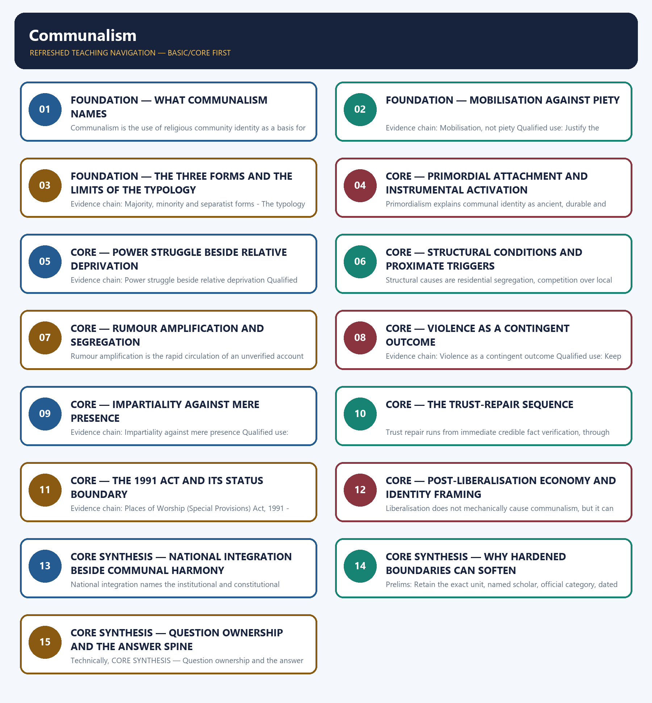

# Communalism — Learner-v2 Complete Learning Session

> **Authoring-only generation:** 2026-09-02. No PDF was rendered and no tracker or index was mutated.

### SOURCE, PROGRESSION AND CURRENT-LINKAGE AUDIT

- **Generation date:** 2026-09-02.
- **Repository-first evidence:** the Basic owner is taught first and preserved in full; the Advanced owner is retained only in the optional final teaching block.
- **OCR evidence:** Repository Markdown was primary. The OCR-searchable official General Studies Paper-I question papers held under books\mains and books\more_previous_papers were used only to confirm the wording of routed Mains PYQs. No official answer key, marking scheme, page precision or unsupported quotation was imported from them.
- **Qdrant:** not used; repository Markdown and available OCR context were sufficient.
- **PYQ integrity:** Two direct General Studies Paper-I Mains demands are routed to this topic and each is recorded with its exact routing status. The 2018 Q20 demand asking whether communalism arises from a power struggle or from relative deprivation and the 2023 Q20 demand on the impact of the post-liberal economy and ethnic identity on communalism are both routed in the audited 2018-2023 Mains ledger to the Advanced owner, while the Core owner's own answer-architecture table records that Core routing supersedes those pointers, so both are answered here from the Basic spine. The locally held official question papers for 2018 and 2023 are scanned images from which reliable English text cannot be extracted, so the audited ledger's neutral demand rendering is used for both years and no verbatim wording is claimed. No direct standalone communalism demand appears in the audited 2024-2025 Mains ledger and none is present in the two locally held official 2024 and 2025 General Studies Paper-I question papers, so that zero is recorded transparently rather than filled with a fabricated recent question. No marking scheme, official key or model answer of the Union Public Service Commission is held locally, and none is reproduced or inferred. No riot statistic, casualty figure or court order is asserted anywhere in this package.
- **Live-link boundary:** No new live current-affairs item was verified for this topic on 2026-09-02. The only dated official elements used are those already carried by the repository owners, namely the Places of Worship (Special Provisions) Act, 1991 with its Section 4 freeze as on 15 August 1947 and its statutory exceptions, and the record that public Supreme Court materials checked on 21 July 2026 did not yield a final merits order. No litigation outcome, riot statistic, casualty figure, organisational status or court order is asserted or inferred, the colonial-era genesis of organised communalism is cross-linked to Modern Indian History, and the National Integration Council's institutional history and status are cross-linked to Polity.
- **Fact/inference discipline:** no current-affairs item, PYQ wording, figure or quotation is invented.

## BASIC LEARNING SESSION

### DEEP-REVIEW LEARNING CONTRACT

| Control | Binding rule for this package |
|---|---|
| Syllabus boundary | Complete Indian Society Basic/Core is answer-complete before optional Advanced depth. |
| Concept method | Define and distinguish the institution, identity, process, legal category and measured indicator before analysis. |
| Sociological method | Structure/institution → mechanism and agency → differentiated group/region outcome → feedback, resistance and qualification. |
| Evidence method | Claim → named Indian community/region/institution/dataset → analysis → source-date-status or causal qualification. |
| Non-homogenisation | Caste, tribe, women, religion, region and rural/urban groups retain internal class, gender, locality and historical variation. |
| Boundary method | Constitutional right, statutory mandate, executive scheme, implementation and lived social outcome remain distinct. |
| Practice contract | Every solved item has demand decoding, a detailed examiner-grade model, executable timed/compression plan, marks rationale and answer-specific improvement. |
| Approval | This immutable successor remains `approved: false` pending explicit approval. |

**Canonical Basic/Core owner:** `upsc-ai-kit\knowledge\Indian-Society\basic\13_Communalism.md`  
**Canonical topic owner:** `upsc-ai-kit\knowledge\Indian-Society\basic\13_Communalism.md`  
**Optional Advanced owner:** `upsc-ai-kit\knowledge\Indian-Society\advanced\13_Communalism.md`  
**Official syllabus mapping:** `upsc-ai-kit\knowledge\Indian-Society\OFFICIAL-UPSC-SYLLABUS-MAPPING.md`

### EVIDENCE, PYQ AND CURRENT-STATUS CONTROL

- **Definition discipline:** close concepts and legal-administrative categories share a comparison axis and are never treated as synonyms.
- **Mechanism discipline:** correlation, temporal sequence and aggregate association do not establish causation; identify institutions, incentives, norms, power and agency.
- **Historical discipline:** colonial, constitutional, developmental, liberalisation and contemporary phases are separated without a linear tradition-to-modernity story.
- **Intersectional discipline:** overlapping caste, tribe, class, gender, religion, disability, region and life-course positions are analysed without creating a single homogeneous category.
- **India discipline:** use named communities, movements, institutions, cities, states and regional contrasts without stereotyping or treating one case as nationally representative.
- **Data discipline:** Census 2011, NFHS, PLFS, SRS, Agriculture Census, MPI and scheme claims retain source, reference period, release date, coverage and provisional/final status.
- **PYQ discipline:** repository routing ledgers and locally held papers control wording and metadata; reconstructed wording and unavailable official keys remain labelled.
- **Current-status note, rechecked 2026-09-02:** No new live current-affairs item was verified for this topic on 2026-09-02. The only dated official elements used are those already carried by the repository owners, namely the Places of Worship (Special Provisions) Act, 1991 with its Section 4 freeze as on 15 August 1947 and its statutory exceptions, and the record that public Supreme Court materials checked on 21 July 2026 did not yield a final merits order. No litigation outcome, riot statistic, casualty figure, organisational status or court order is asserted or inferred, the colonial-era genesis of organised communalism is cross-linked to Modern Indian History, and the National Integration Council's institutional history and status are cross-linked to Polity.

**Live/official context sources recorded by the predecessor generation:**

- No volatile live claim is necessary for the static sociological core.




*Distinct embedded teaching-navigation image. The separate continuous Cārvāka-style flowchart package remains an independent at-a-glance artifact.*

### SESSION 1 — FOUNDATION — WHAT COMMUNALISM NAMES

#### DEFINITION / WHAT THIS IS CALLED

**Plain-language definition:** Communalism describes mobilisation around religious identity and never the content of religious belief.

**Technical definition:** Communalism is the use of religious community identity as a basis for political and social mobilisation, often asserting that the community's interests are separate from or opposed to those of other communities, and it is analytically distinct from personal religious belief or devotion.

#### ANSWER-GRABBING OPENING — WRITE/ADAPT IN THE EXAM

> Communalism is the use of religious community identity as a basis for political and social mobilisation, often asserting that the community's interests are separate from or opposed to those of other communities, and it is analytically distinct from personal religious belief or devotion.

#### MUST-WRITE KEYWORDS

- **FOUNDATION**
- **What communalism names**
- **Evidence chain**
- **Qualified use**
- **Communalism**
- **Qualified**

**How to use them:** Frame the answer through FOUNDATION; define What communalism names, connect Evidence chain with Qualified use to explain the mechanism, and use Communalism for the decisive comparison or qualification.

#### VISUAL FIRST

```text
WHAT COMMUNALISM NAMES
01. Communalism defined
BOUNDARY -> Communalism describes mobilisation around religious identity and never the content of religious belief.
```

*This topic-specific rail fixes the evidence sequence and its exam boundary before analysis.*

#### CORE EXPLANATION

Communalism is the use of religious community identity as a basis for political and social mobilisation, often asserting that the community's interests are separate from or opposed to those of other communities, and it is analytically distinct from personal religious belief or devotion.

#### NAMED EVIDENCE AND MECHANISM

- Communalism is the use of religious community identity as a basis for political and social mobilisation, often asserting that the community's interests are separate from or opposed to those of other communities, and it is analytically distinct from personal religious belief or devotion.

#### EXAMINER CAUTION

- Communalism describes mobilisation around religious identity and never the content of religious belief.

#### EXAM LINK

- **Prelims:** Retain the exact unit, named scholar, official category, dated statistic or legal boundary attached to What communalism names.
- **Mains:** Open a communalism answer with a definition that fixes the object of analysis.

#### MINI RECAP

- **Evidence chain:** Communalism defined
- **Qualified use:** Open a communalism answer with a definition that fixes the object of analysis.

#### CLOSING RECALL FLOW — FOUNDATION — WHAT COMMUNALISM NAMES

```text
START / CONCEPT: FOUNDATION — What communalism names
        |
        v
EXACT TERMS: FOUNDATION · What communalism names · Evidence chain · Qualified use · Communalism · Qualified
        |
        v
MECHANISM / ARGUMENT: Evidence chain: Communalism defined Qualified use: Open a communalism answer with a definition that fixes the object of analysis.
        |
        v
CONSEQUENCE / CONTRAST: Communalism describes mobilisation around religious identity and never the content of religious belief.
        |
        v
UPSC TRAP / ANSWER-USE: Do not miss this limiting distinction: open a communalism answer with a definition that fixes the object of analysis.
        |
        v
ANSWER-GRABBING FORMULATION: Communalism is the use of religious community identity as a basis for political and social mobilisation, often asserting that the community's interests are separate from or opposed to those of other communities, and it is analytically distinct from personal religious belief or devotion.
```
### SESSION 2 — FOUNDATION — MOBILISATION AGAINST PIETY

#### DEFINITION / WHAT THIS IS CALLED

**Plain-language definition:** Mobilisation is the organised conversion of a shared religious identity into a claim on political and social resources, and it is exactly what separates communalism from religiosity, the personal holding and practice of faith, so an answer that misidentifies the object will send every preventive recommendation that follows to the wrong target.

**Technical definition:** Evidence chain: Mobilisation, not piety Qualified use: Justify the definition by showing what the policy conclusion depends on.

#### ANSWER-GRABBING OPENING — WRITE/ADAPT IN THE EXAM

> Evidence chain: Mobilisation, not piety Qualified use: Justify the definition by showing what the policy conclusion depends on.

#### MUST-WRITE KEYWORDS

- **FOUNDATION**
- **Mobilisation against piety**
- **Evidence chain**
- **Qualified use**
- **Mobilisation**
- **Justify**

**How to use them:** Frame the answer through FOUNDATION; define Mobilisation against piety, connect Evidence chain with Qualified use to explain the mechanism, and use Mobilisation for the decisive comparison or qualification.

#### VISUAL FIRST

```text
MOBILISATION AGAINST PIETY
01. Mobilisation, not piety
BOUNDARY -> Misidentifying the object sends every later recommendation to the wrong target.
```

*This topic-specific rail fixes the evidence sequence and its exam boundary before analysis.*

#### CORE EXPLANATION

Mobilisation is the organised conversion of a shared religious identity into a claim on political and social resources, and it is exactly what separates communalism from religiosity, the personal holding and practice of faith, so an answer that misidentifies the object will send every preventive recommendation that follows to the wrong target.

#### NAMED EVIDENCE AND MECHANISM

- Mobilisation is the organised conversion of a shared religious identity into a claim on political and social resources, and it is exactly what separates communalism from religiosity, the personal holding and practice of faith, so an answer that misidentifies the object will send every preventive recommendation that follows to the wrong target.

#### EXAMINER CAUTION

- Misidentifying the object sends every later recommendation to the wrong target.

#### EXAM LINK

- **Prelims:** Retain the exact unit, named scholar, official category, dated statistic or legal boundary attached to Mobilisation against piety.
- **Mains:** Justify the definition by showing what the policy conclusion depends on.

#### MINI RECAP

- **Evidence chain:** Mobilisation, not piety
- **Qualified use:** Justify the definition by showing what the policy conclusion depends on.

#### CLOSING RECALL FLOW — FOUNDATION — MOBILISATION AGAINST PIETY

```text
START / CONCEPT: FOUNDATION — Mobilisation against piety
        |
        v
EXACT TERMS: FOUNDATION · Mobilisation against piety · Evidence chain · Qualified use · Mobilisation · Justify
        |
        v
MECHANISM / ARGUMENT: Mains: Justify the definition by showing what the policy conclusion depends on.
        |
        v
CONSEQUENCE / CONTRAST: Mobilisation is the organised conversion of a shared religious identity into a claim on political and social resources, and it is exactly what separates communalism from religiosity, the personal holding and practice of faith, so an answer that misidentifies the object will send every preventive recommendation that follows to the wrong target.
        |
        v
UPSC TRAP / ANSWER-USE: Do not miss this limiting distinction: justify the definition by showing what the policy conclusion depends on.
        |
        v
ANSWER-GRABBING FORMULATION: Evidence chain: Mobilisation, not piety Qualified use: Justify the definition by showing what the policy conclusion depends on.
```
### SESSION 3 — FOUNDATION — THE THREE FORMS AND THE LIMITS OF THE TYPOLOGY

#### DEFINITION / WHAT THIS IS CALLED

**Plain-language definition:** All three forms are communalism in the technical sense but they differ in social position and typical motivation, so the typology may not be used to erase the power asymmetry and local context that distinguish an assertion of primacy from a defensive response to perceived threat.

**Technical definition:** Evidence chain: Majority, minority and separatist forms - The typology must not flatten power Qualified use: Answer a distinguish directive without flattening the cases being compared.

#### ANSWER-GRABBING OPENING — WRITE/ADAPT IN THE EXAM

> Evidence chain: Majority, minority and separatist forms - The typology must not flatten power Qualified use: Answer a distinguish directive without flattening the cases being compared.

#### MUST-WRITE KEYWORDS

- **FOUNDATION**
- **The three forms**
- **the limits of the typology**
- **Evidence chain**
- **Qualified use**
- **Majority communalism**

**How to use them:** Frame the answer through FOUNDATION; define The three forms, connect the limits of the typology with Evidence chain to explain the mechanism, and use Qualified use for the decisive comparison or qualification.

#### VISUAL FIRST

```text
THE THREE FORMS AND THE LIMITS OF THE TYPOLOGY
01. Majority, minority and separatist forms
    |
    v
02. The typology must not flatten power
BOUNDARY -> The typology classifies position and motivation and must not erase power asymmetry or local context.
```

*This topic-specific rail fixes the evidence sequence and its exam boundary before analysis.*

#### CORE EXPLANATION

Majority communalism describes mobilisation by a dominant group, minority communalism a defensive or assertive mobilisation by a minority group, and separatist communalism a demand for separate political or territorial status, and this typology is one useful heuristic rather than the only scholarly classification. All three forms are communalism in the technical sense but they differ in social position and typical motivation, so the typology may not be used to erase the power asymmetry and local context that distinguish an assertion of primacy from a defensive response to perceived threat.

#### NAMED EVIDENCE AND MECHANISM

- Majority communalism describes mobilisation by a dominant group, minority communalism a defensive or assertive mobilisation by a minority group, and separatist communalism a demand for separate political or territorial status, and this typology is one useful heuristic rather than the only scholarly classification.
- All three forms are communalism in the technical sense but they differ in social position and typical motivation, so the typology may not be used to erase the power asymmetry and local context that distinguish an assertion of primacy from a defensive response to perceived threat.

#### EXAMINER CAUTION

- The typology classifies position and motivation and must not erase power asymmetry or local context.

#### EXAM LINK

- **Prelims:** Retain the exact unit, named scholar, official category, dated statistic or legal boundary attached to The three forms and the limits of the typology.
- **Mains:** Answer a distinguish directive without flattening the cases being compared.

#### MINI RECAP

- **Evidence chain:** Majority, minority and separatist forms -> The typology must not flatten power
- **Qualified use:** Answer a distinguish directive without flattening the cases being compared.

#### CLOSING RECALL FLOW — FOUNDATION — THE THREE FORMS AND THE LIMITS OF THE TYPOLOGY

```text
START / CONCEPT: FOUNDATION — The three forms and the limits of the typology
        |
        v
EXACT TERMS: FOUNDATION · The three forms · the limits of the typology · Evidence chain · Qualified use · Majority communalism
        |
        v
MECHANISM / ARGUMENT: Majority communalism describes mobilisation by a dominant group, minority communalism a defensive or assertive mobilisation by a minority group, and separatist communalism a demand for separate political or territorial status, and this typology is one useful heuristic rather than the only scholarly classification.
        |
        v
CONSEQUENCE / CONTRAST: All three forms are communalism in the technical sense but they differ in social position and typical motivation, so the typology may not be used to erase the power asymmetry and local context that distinguish an assertion of primacy from a defensive response to perceived threat.
        |
        v
UPSC TRAP / ANSWER-USE: The typology classifies position and motivation and must not erase power asymmetry or local context.
        |
        v
ANSWER-GRABBING FORMULATION: Evidence chain: Majority, minority and separatist forms - The typology must not flatten power Qualified use: Answer a distinguish directive without flattening the cases being compared.
```
### SESSION 4 — CORE — PRIMORDIAL ATTACHMENT AND INSTRUMENTAL ACTIVATION

#### DEFINITION / WHAT THIS IS CALLED

**Plain-language definition:** Attachment is real and activation is deliberate, and neither supports a claim that conflict is inevitable.

**Technical definition:** Primordialism explains communal identity as ancient, durable and emotionally meaningful attachment, and its analytical value lies in taking belonging seriously rather than in any claim that conflict is naturally or biologically fixed.

#### ANSWER-GRABBING OPENING — WRITE/ADAPT IN THE EXAM

> Attachment is real and activation is deliberate, and neither supports a claim that conflict is inevitable.

#### MUST-WRITE KEYWORDS

- **Primordial attachment**
- **instrumental activation**
- **Evidence chain**
- **Qualified use**
- **Primordialism**
- **Instrumentalist**

**How to use them:** Frame the answer through Primordial attachment; define instrumental activation, connect Evidence chain with Qualified use to explain the mechanism, and use Primordialism for the decisive comparison or qualification.

#### VISUAL FIRST

```text
PRIMORDIAL ATTACHMENT AND INSTRUMENTAL ACTIVATION
01. Primordialism
    |
    v
02. Instrumentalism and constructivism
BOUNDARY -> Attachment is real and activation is deliberate, and neither supports a claim that conflict is inevitable.
```

*This topic-specific rail fixes the evidence sequence and its exam boundary before analysis.*

#### CORE EXPLANATION

Primordialism explains communal identity as ancient, durable and emotionally meaningful attachment, and its analytical value lies in taking belonging seriously rather than in any claim that conflict is naturally or biologically fixed. Instrumentalist and constructivist accounts explain how political, social or economic actors activate, frame and organise religious identity for mobilisation advantage, which is why communal conflict is treated as historically and politically constructed rather than inevitable.

#### NAMED EVIDENCE AND MECHANISM

- Primordialism explains communal identity as ancient, durable and emotionally meaningful attachment, and its analytical value lies in taking belonging seriously rather than in any claim that conflict is naturally or biologically fixed.
- Instrumentalist and constructivist accounts explain how political, social or economic actors activate, frame and organise religious identity for mobilisation advantage, which is why communal conflict is treated as historically and politically constructed rather than inevitable.

#### EXAMINER CAUTION

- Attachment is real and activation is deliberate, and neither supports a claim that conflict is inevitable.

#### EXAM LINK

- **Prelims:** Retain the exact unit, named scholar, official category, dated statistic or legal boundary attached to Primordial attachment and instrumental activation.
- **Mains:** Set the theoretical debate up so the preventive conclusion becomes available.

#### MINI RECAP

- **Evidence chain:** Primordialism -> Instrumentalism and constructivism
- **Qualified use:** Set the theoretical debate up so the preventive conclusion becomes available.

#### CLOSING RECALL FLOW — CORE — PRIMORDIAL ATTACHMENT AND INSTRUMENTAL ACTIVATION

```text
START / CONCEPT: CORE — Primordial attachment and instrumental activation
        |
        v
EXACT TERMS: Primordial attachment · instrumental activation · Evidence chain · Qualified use · Primordialism · Instrumentalist
        |
        v
MECHANISM / ARGUMENT: Primordialism explains communal identity as ancient, durable and emotionally meaningful attachment, and its analytical value lies in taking belonging seriously rather than in any claim that conflict is naturally or biologically fixed.
        |
        v
CONSEQUENCE / CONTRAST: Evidence chain: Primordialism - Instrumentalism and constructivism Qualified use: Set the theoretical debate up so the preventive conclusion becomes available.
        |
        v
UPSC TRAP / ANSWER-USE: Instrumentalist and constructivist accounts explain how political, social or economic actors activate, frame and organise religious identity for mobilisation advantage, which is why communal conflict is treated as historically and politically constructed rather than inevitable.
        |
        v
ANSWER-GRABBING FORMULATION: Attachment is real and activation is deliberate, and neither supports a claim that conflict is inevitable.
```
### SESSION 5 — CORE — POWER STRUGGLE BESIDE RELATIVE DEPRIVATION

#### DEFINITION / WHAT THIS IS CALLED

**Plain-language definition:** Power struggle refers to competition over office, resources and status while relative deprivation refers to a perceived unfair gap against a reference group, and the two are not rival universal causes because organised actors can translate a grievance into mobilisation whereas grievance without organisation need not become violence.

**Technical definition:** Evidence chain: Power struggle beside relative deprivation Qualified use: Answer an argue directive with interaction rather than with a single winner.

#### ANSWER-GRABBING OPENING — WRITE/ADAPT IN THE EXAM

> Evidence chain: Power struggle beside relative deprivation Qualified use: Answer an argue directive with interaction rather than with a single winner.

#### MUST-WRITE KEYWORDS

- **Power struggle beside relative deprivation**
- **Evidence chain**
- **Qualified use**
- **Power struggle**
- **Power**
- **Organisation**

**How to use them:** Frame the answer through Power struggle beside relative deprivation; define Evidence chain, connect Qualified use with Power struggle to explain the mechanism, and use Power for the decisive comparison or qualification.

#### VISUAL FIRST

```text
POWER STRUGGLE BESIDE RELATIVE DEPRIVATION
01. Power struggle beside relative deprivation
BOUNDARY -> Organisation and grievance interact, so neither may be advanced as the sole universal cause.
```

*This topic-specific rail fixes the evidence sequence and its exam boundary before analysis.*

#### CORE EXPLANATION

Power struggle refers to competition over office, resources and status while relative deprivation refers to a perceived unfair gap against a reference group, and the two are not rival universal causes because organised actors can translate a grievance into mobilisation whereas grievance without organisation need not become violence.

#### NAMED EVIDENCE AND MECHANISM

- Power struggle refers to competition over office, resources and status while relative deprivation refers to a perceived unfair gap against a reference group, and the two are not rival universal causes because organised actors can translate a grievance into mobilisation whereas grievance without organisation need not become violence.

#### EXAMINER CAUTION

- Organisation and grievance interact, so neither may be advanced as the sole universal cause.

#### EXAM LINK

- **Prelims:** Retain the exact unit, named scholar, official category, dated statistic or legal boundary attached to Power struggle beside relative deprivation.
- **Mains:** Answer an argue directive with interaction rather than with a single winner.

#### MINI RECAP

- **Evidence chain:** Power struggle beside relative deprivation
- **Qualified use:** Answer an argue directive with interaction rather than with a single winner.

#### CLOSING RECALL FLOW — CORE — POWER STRUGGLE BESIDE RELATIVE DEPRIVATION

```text
START / CONCEPT: CORE — Power struggle beside relative deprivation
        |
        v
EXACT TERMS: Power struggle beside relative deprivation · Evidence chain · Qualified use · Power struggle · Power · Organisation
        |
        v
MECHANISM / ARGUMENT: Power struggle refers to competition over office, resources and status while relative deprivation refers to a perceived unfair gap against a reference group, and the two are not rival universal causes because organised actors can translate a grievance into mobilisation whereas grievance without organisation need not become violence.
        |
        v
CONSEQUENCE / CONTRAST: Organisation and grievance interact, so neither may be advanced as the sole universal cause.
        |
        v
UPSC TRAP / ANSWER-USE: Do not miss this limiting distinction: power struggle beside relative deprivation Qualified use.
        |
        v
ANSWER-GRABBING FORMULATION: Evidence chain: Power struggle beside relative deprivation Qualified use: Answer an argue directive with interaction rather than with a single winner.
```
### SESSION 6 — CORE — STRUCTURAL CONDITIONS AND PROXIMATE TRIGGERS

#### DEFINITION / WHAT THIS IS CALLED

**Plain-language definition:** Triggering causes are the proximate sparks such as a specific incident, a provocative act or an inflammatory rumour, and because removing a trigger without addressing structural conditions leaves the underlying risk intact both layers must appear in an answer.

**Technical definition:** Structural causes are residential segregation, competition over local resources, unresolved historical grievance and weak or partisan local institutions, and they create the latent conditions under which an episode of collective violence becomes possible.

#### ANSWER-GRABBING OPENING — WRITE/ADAPT IN THE EXAM

> Triggering causes are the proximate sparks such as a specific incident, a provocative act or an inflammatory rumour, and because removing a trigger without addressing structural conditions leaves the underlying risk intact both layers must appear in an answer.

#### MUST-WRITE KEYWORDS

- **Structural conditions**
- **proximate triggers**
- **Evidence chain**
- **Qualified use**
- **Structural causes**
- **Structural**

**How to use them:** Frame the answer through Structural conditions; define proximate triggers, connect Evidence chain with Qualified use to explain the mechanism, and use Structural causes for the decisive comparison or qualification.

#### VISUAL FIRST

```text
STRUCTURAL CONDITIONS AND PROXIMATE TRIGGERS
01. Structural causes of violence
    |
    v
02. Triggering causes
BOUNDARY -> Removing a trigger without addressing structure leaves the underlying risk intact.
```

*This topic-specific rail fixes the evidence sequence and its exam boundary before analysis.*

#### CORE EXPLANATION

Structural causes are residential segregation, competition over local resources, unresolved historical grievance and weak or partisan local institutions, and they create the latent conditions under which an episode of collective violence becomes possible. Triggering causes are the proximate sparks such as a specific incident, a provocative act or an inflammatory rumour, and because removing a trigger without addressing structural conditions leaves the underlying risk intact both layers must appear in an answer.

#### NAMED EVIDENCE AND MECHANISM

- Structural causes are residential segregation, competition over local resources, unresolved historical grievance and weak or partisan local institutions, and they create the latent conditions under which an episode of collective violence becomes possible.
- Triggering causes are the proximate sparks such as a specific incident, a provocative act or an inflammatory rumour, and because removing a trigger without addressing structural conditions leaves the underlying risk intact both layers must appear in an answer.

#### EXAMINER CAUTION

- Removing a trigger without addressing structure leaves the underlying risk intact.

#### EXAM LINK

- **Prelims:** Retain the exact unit, named scholar, official category, dated statistic or legal boundary attached to Structural conditions and proximate triggers.
- **Mains:** Split an escalation answer into the two layers an examiner is looking for.

#### MINI RECAP

- **Evidence chain:** Structural causes of violence -> Triggering causes
- **Qualified use:** Split an escalation answer into the two layers an examiner is looking for.

#### CLOSING RECALL FLOW — CORE — STRUCTURAL CONDITIONS AND PROXIMATE TRIGGERS

```text
START / CONCEPT: CORE — Structural conditions and proximate triggers
        |
        v
EXACT TERMS: Structural conditions · proximate triggers · Evidence chain · Qualified use · Structural causes · Structural
        |
        v
MECHANISM / ARGUMENT: Structural causes are residential segregation, competition over local resources, unresolved historical grievance and weak or partisan local institutions, and they create the latent conditions under which an episode of collective violence becomes possible.
        |
        v
CONSEQUENCE / CONTRAST: Evidence chain: Structural causes of violence - Triggering causes Qualified use: Split an escalation answer into the two layers an examiner is looking for.
        |
        v
UPSC TRAP / ANSWER-USE: Do not miss this limiting distinction: split an escalation answer into the two layers an examiner is looking for.
        |
        v
ANSWER-GRABBING FORMULATION: Triggering causes are the proximate sparks such as a specific incident, a provocative act or an inflammatory rumour, and because removing a trigger without addressing structural conditions leaves the underlying risk intact both layers must appear in an answer.
```
### SESSION 7 — CORE — RUMOUR AMPLIFICATION AND SEGREGATION

#### DEFINITION / WHAT THIS IS CALLED

**Plain-language definition:** Evidence chain: Rumour amplification - Polarisation and segregation Qualified use: Explain how a local dispute is reframed as a community-versus-community event.

**Technical definition:** Rumour amplification is the rapid circulation of an unverified account of a triggering incident, historically by word of mouth and now often through social media, which reframes a local dispute as a community-versus-community event wherever credible information channels are distrusted.

#### ANSWER-GRABBING OPENING — WRITE/ADAPT IN THE EXAM

> Evidence chain: Rumour amplification - Polarisation and segregation Qualified use: Explain how a local dispute is reframed as a community-versus-community event.

#### MUST-WRITE KEYWORDS

- **Rumour amplification**
- **segregation**
- **Evidence chain**
- **Qualified use**
- **Rumour**
- **Polarisation**

**How to use them:** Frame the answer through Rumour amplification; define segregation, connect Evidence chain with Qualified use to explain the mechanism, and use Rumour for the decisive comparison or qualification.

#### VISUAL FIRST

```text
RUMOUR AMPLIFICATION AND SEGREGATION
01. Rumour amplification
    |
    v
02. Polarisation and segregation
BOUNDARY -> Segregation is a risk factor and not merely a symptom of polarisation.
```

*This topic-specific rail fixes the evidence sequence and its exam boundary before analysis.*

#### CORE EXPLANATION

Rumour amplification is the rapid circulation of an unverified account of a triggering incident, historically by word of mouth and now often through social media, which reframes a local dispute as a community-versus-community event wherever credible information channels are distrusted. Polarisation deepens residential and social segregation, and as communities withdraw from routine contact the informal trust-restoring interaction that would otherwise dampen a rumour also disappears, which is why segregation operates as a risk factor and not merely as a symptom.

#### NAMED EVIDENCE AND MECHANISM

- Rumour amplification is the rapid circulation of an unverified account of a triggering incident, historically by word of mouth and now often through social media, which reframes a local dispute as a community-versus-community event wherever credible information channels are distrusted.
- Polarisation deepens residential and social segregation, and as communities withdraw from routine contact the informal trust-restoring interaction that would otherwise dampen a rumour also disappears, which is why segregation operates as a risk factor and not merely as a symptom.

#### EXAMINER CAUTION

- Segregation is a risk factor and not merely a symptom of polarisation.

#### EXAM LINK

- **Prelims:** Retain the exact unit, named scholar, official category, dated statistic or legal boundary attached to Rumour amplification and segregation.
- **Mains:** Explain how a local dispute is reframed as a community-versus-community event.

#### MINI RECAP

- **Evidence chain:** Rumour amplification -> Polarisation and segregation
- **Qualified use:** Explain how a local dispute is reframed as a community-versus-community event.

#### CLOSING RECALL FLOW — CORE — RUMOUR AMPLIFICATION AND SEGREGATION

```text
START / CONCEPT: CORE — Rumour amplification and segregation
        |
        v
EXACT TERMS: Rumour amplification · segregation · Evidence chain · Qualified use · Rumour · Polarisation
        |
        v
MECHANISM / ARGUMENT: Rumour amplification is the rapid circulation of an unverified account of a triggering incident, historically by word of mouth and now often through social media, which reframes a local dispute as a community-versus-community event wherever credible information channels are distrusted.
        |
        v
CONSEQUENCE / CONTRAST: Polarisation deepens residential and social segregation, and as communities withdraw from routine contact the informal trust-restoring interaction that would otherwise dampen a rumour also disappears, which is why segregation operates as a risk factor and not merely as a symptom.
        |
        v
UPSC TRAP / ANSWER-USE: Segregation is a risk factor and not merely a symptom of polarisation.
        |
        v
ANSWER-GRABBING FORMULATION: Evidence chain: Rumour amplification - Polarisation and segregation Qualified use: Explain how a local dispute is reframed as a community-versus-community event.
```
### SESSION 8 — CORE — VIOLENCE AS A CONTINGENT OUTCOME

#### DEFINITION / WHAT THIS IS CALLED

**Plain-language definition:** Violence becomes substantially more likely where a trigger meets high structural risk without a prompt, credible and impartial institutional response, so the rumour, polarisation, segregation and violence sequence is a diagnostic risk heuristic rather than a universal chronology of every episode.

**Technical definition:** Evidence chain: Violence as a contingent outcome Qualified use: Keep an escalation answer conditional so it survives a counter-example.

#### ANSWER-GRABBING OPENING — WRITE/ADAPT IN THE EXAM

> Evidence chain: Violence as a contingent outcome Qualified use: Keep an escalation answer conditional so it survives a counter-example.

#### MUST-WRITE KEYWORDS

- **Violence as a contingent outcome**
- **Evidence chain**
- **Qualified use**
- **Violence**
- **The escalation sequence**
- **Qualified**

**How to use them:** Frame the answer through Violence as a contingent outcome; define Evidence chain, connect Qualified use with Violence to explain the mechanism, and use The escalation sequence for the decisive comparison or qualification.

#### VISUAL FIRST

```text
VIOLENCE AS A CONTINGENT OUTCOME
01. Violence as a contingent outcome
BOUNDARY -> The escalation sequence is a diagnostic heuristic and never a universal chronology.
```

*This topic-specific rail fixes the evidence sequence and its exam boundary before analysis.*

#### CORE EXPLANATION

Violence becomes substantially more likely where a trigger meets high structural risk without a prompt, credible and impartial institutional response, so the rumour, polarisation, segregation and violence sequence is a diagnostic risk heuristic rather than a universal chronology of every episode.

#### NAMED EVIDENCE AND MECHANISM

- Violence becomes substantially more likely where a trigger meets high structural risk without a prompt, credible and impartial institutional response, so the rumour, polarisation, segregation and violence sequence is a diagnostic risk heuristic rather than a universal chronology of every episode.

#### EXAMINER CAUTION

- The escalation sequence is a diagnostic heuristic and never a universal chronology.

#### EXAM LINK

- **Prelims:** Retain the exact unit, named scholar, official category, dated statistic or legal boundary attached to Violence as a contingent outcome.
- **Mains:** Keep an escalation answer conditional so it survives a counter-example.

#### MINI RECAP

- **Evidence chain:** Violence as a contingent outcome
- **Qualified use:** Keep an escalation answer conditional so it survives a counter-example.

#### CLOSING RECALL FLOW — CORE — VIOLENCE AS A CONTINGENT OUTCOME

```text
START / CONCEPT: CORE — Violence as a contingent outcome
        |
        v
EXACT TERMS: Violence as a contingent outcome · Evidence chain · Qualified use · Violence · The escalation sequence · Qualified
        |
        v
MECHANISM / ARGUMENT: Violence becomes substantially more likely where a trigger meets high structural risk without a prompt, credible and impartial institutional response, so the rumour, polarisation, segregation and violence sequence is a diagnostic risk heuristic rather than a universal chronology of every episode.
        |
        v
CONSEQUENCE / CONTRAST: The escalation sequence is a diagnostic heuristic and never a universal chronology.
        |
        v
UPSC TRAP / ANSWER-USE: Do not miss this limiting distinction: violence as a contingent outcome Qualified use.
        |
        v
ANSWER-GRABBING FORMULATION: Evidence chain: Violence as a contingent outcome Qualified use: Keep an escalation answer conditional so it survives a counter-example.
```
### SESSION 9 — CORE — IMPARTIALITY AGAINST MERE PRESENCE

#### DEFINITION / WHAT THIS IS CALLED

**Plain-language definition:** The presence of police or administrative machinery in a sensitive area does not by itself build trust, because the quality that produces trust repair is impartiality demonstrated through even-handed action regardless of the community of the complainant or the accused.

**Technical definition:** Evidence chain: Impartiality against mere presence Qualified use: Name the specific institutional quality that repairs trust.

#### ANSWER-GRABBING OPENING — WRITE/ADAPT IN THE EXAM

> Evidence chain: Impartiality against mere presence Qualified use: Name the specific institutional quality that repairs trust.

#### MUST-WRITE KEYWORDS

- **Impartiality against mere presence**
- **Evidence chain**
- **Qualified use**
- **Machinery**
- **Impartiality**
- **Qualified**

**How to use them:** Frame the answer through Impartiality against mere presence; define Evidence chain, connect Qualified use with Machinery to explain the mechanism, and use Impartiality for the decisive comparison or qualification.

#### VISUAL FIRST

```text
IMPARTIALITY AGAINST MERE PRESENCE
01. Impartiality against mere presence
BOUNDARY -> Machinery on the ground does not by itself produce the trust that even-handed action produces.
```

*This topic-specific rail fixes the evidence sequence and its exam boundary before analysis.*

#### CORE EXPLANATION

The presence of police or administrative machinery in a sensitive area does not by itself build trust, because the quality that produces trust repair is impartiality demonstrated through even-handed action regardless of the community of the complainant or the accused.

#### NAMED EVIDENCE AND MECHANISM

- The presence of police or administrative machinery in a sensitive area does not by itself build trust, because the quality that produces trust repair is impartiality demonstrated through even-handed action regardless of the community of the complainant or the accused.

#### EXAMINER CAUTION

- Machinery on the ground does not by itself produce the trust that even-handed action produces.

#### EXAM LINK

- **Prelims:** Retain the exact unit, named scholar, official category, dated statistic or legal boundary attached to Impartiality against mere presence.
- **Mains:** Name the specific institutional quality that repairs trust.

#### MINI RECAP

- **Evidence chain:** Impartiality against mere presence
- **Qualified use:** Name the specific institutional quality that repairs trust.

#### CLOSING RECALL FLOW — CORE — IMPARTIALITY AGAINST MERE PRESENCE

```text
START / CONCEPT: CORE — Impartiality against mere presence
        |
        v
EXACT TERMS: Impartiality against mere presence · Evidence chain · Qualified use · Machinery · Impartiality · Qualified
        |
        v
MECHANISM / ARGUMENT: The presence of police or administrative machinery in a sensitive area does not by itself build trust, because the quality that produces trust repair is impartiality demonstrated through even-handed action regardless of the community of the complainant or the accused.
        |
        v
CONSEQUENCE / CONTRAST: Machinery on the ground does not by itself produce the trust that even-handed action produces.
        |
        v
UPSC TRAP / ANSWER-USE: Do not miss this limiting distinction: impartiality against mere presence Qualified use.
        |
        v
ANSWER-GRABBING FORMULATION: Evidence chain: Impartiality against mere presence Qualified use: Name the specific institutional quality that repairs trust.
```
### SESSION 10 — CORE — THE TRUST-REPAIR SEQUENCE

#### DEFINITION / WHAT THIS IS CALLED

**Plain-language definition:** Evidence chain: The trust-repair sequence Qualified use: Convert a suggest-measures demand into an ordered mechanism.

**Technical definition:** Trust repair runs from immediate credible fact verification, through visibly even-handed investigation and protection, to sustained structured inter-community contact through joint civic events, shared local institutions and economic interdependence, and the last step is slower than the first.

#### ANSWER-GRABBING OPENING — WRITE/ADAPT IN THE EXAM

> Evidence chain: The trust-repair sequence Qualified use: Convert a suggest-measures demand into an ordered mechanism.

#### MUST-WRITE KEYWORDS

- **The trust-repair sequence**
- **Evidence chain**
- **Qualified use**
- **Trust**
- **Convert**
- **Qualified**

**How to use them:** Frame the answer through The trust-repair sequence; define Evidence chain, connect Qualified use with Trust to explain the mechanism, and use Convert for the decisive comparison or qualification.

#### VISUAL FIRST

```text
THE TRUST-REPAIR SEQUENCE
01. The trust-repair sequence
BOUNDARY -> Contact repairs slowly while rumour spreads quickly, so sequence matters as much as content.
```

*This topic-specific rail fixes the evidence sequence and its exam boundary before analysis.*

#### CORE EXPLANATION

Trust repair runs from immediate credible fact verification, through visibly even-handed investigation and protection, to sustained structured inter-community contact through joint civic events, shared local institutions and economic interdependence, and the last step is slower than the first.

#### NAMED EVIDENCE AND MECHANISM

- Trust repair runs from immediate credible fact verification, through visibly even-handed investigation and protection, to sustained structured inter-community contact through joint civic events, shared local institutions and economic interdependence, and the last step is slower than the first.

#### EXAMINER CAUTION

- Contact repairs slowly while rumour spreads quickly, so sequence matters as much as content.

#### EXAM LINK

- **Prelims:** Retain the exact unit, named scholar, official category, dated statistic or legal boundary attached to The trust-repair sequence.
- **Mains:** Convert a suggest-measures demand into an ordered mechanism.

#### MINI RECAP

- **Evidence chain:** The trust-repair sequence
- **Qualified use:** Convert a suggest-measures demand into an ordered mechanism.

#### CLOSING RECALL FLOW — CORE — THE TRUST-REPAIR SEQUENCE

```text
START / CONCEPT: CORE — The trust-repair sequence
        |
        v
EXACT TERMS: The trust-repair sequence · Evidence chain · Qualified use · Trust · Convert · Qualified
        |
        v
MECHANISM / ARGUMENT: Trust repair runs from immediate credible fact verification, through visibly even-handed investigation and protection, to sustained structured inter-community contact through joint civic events, shared local institutions and economic interdependence, and the last step is slower than the first.
        |
        v
CONSEQUENCE / CONTRAST: Mains: Convert a suggest-measures demand into an ordered mechanism.
        |
        v
UPSC TRAP / ANSWER-USE: Do not miss this limiting distinction: convert a suggest-measures demand into an ordered mechanism.
        |
        v
ANSWER-GRABBING FORMULATION: Evidence chain: The trust-repair sequence Qualified use: Convert a suggest-measures demand into an ordered mechanism.
```
### SESSION 11 — CORE — THE 1991 ACT AND ITS STATUS BOUNDARY

#### DEFINITION / WHAT THIS IS CALLED

**Plain-language definition:** The Act operates as a legislative stability mechanism rather than as judicial adjudication of title on the merits, and its litigation status must be checked against the official Supreme Court case-status or order record, since public materials checked on 21 July 2026 did not yield a final merits order and none is claimed here.

**Technical definition:** Evidence chain: Places of Worship (Special Provisions) Act, 1991 - Legislative freeze against judicial adjudication Qualified use: Cite a named statute with its section, date and status boundary attached.

#### ANSWER-GRABBING OPENING — WRITE/ADAPT IN THE EXAM

> The Act operates as a legislative stability mechanism rather than as judicial adjudication of title on the merits, and its litigation status must be checked against the official Supreme Court case-status or order record, since public materials checked on 21 July 2026 did not yield a final merits order and none is claimed here.

#### MUST-WRITE KEYWORDS

- **The 1991 Act**
- **its status boundary**
- **Evidence chain**
- **Qualified use**
- **The Act**
- **Supreme Court**

**How to use them:** Frame the answer through The 1991 Act; define its status boundary, connect Evidence chain with Qualified use to explain the mechanism, and use The Act for the decisive comparison or qualification.

#### VISUAL FIRST

```text
THE 1991 ACT AND ITS STATUS BOUNDARY
01. Places of Worship (Special Provisions) Act, 1991
    |
    v
02. Legislative freeze against judicial adjudication
BOUNDARY -> The statute has exceptions beyond Ayodhya and its litigation status must be dated to an official record.
```

*This topic-specific rail fixes the evidence sequence and its exam boundary before analysis.*

#### CORE EXPLANATION

Section 4 of the Places of Worship (Special Provisions) Act, 1991 preserves the religious character of places of worship as it stood on 15 August 1947, subject to the exclusion of the Ayodhya matter and other statutory exceptions including specified ancient and historical monuments and settled or decided categories, so it may not be reduced to an Ayodhya-only exception. The Act operates as a legislative stability mechanism rather than as judicial adjudication of title on the merits, and its litigation status must be checked against the official Supreme Court case-status or order record, since public materials checked on 21 July 2026 did not yield a final merits order and none is claimed here.

#### NAMED EVIDENCE AND MECHANISM

- Section 4 of the Places of Worship (Special Provisions) Act, 1991 preserves the religious character of places of worship as it stood on 15 August 1947, subject to the exclusion of the Ayodhya matter and other statutory exceptions including specified ancient and historical monuments and settled or decided categories, so it may not be reduced to an Ayodhya-only exception.
- The Act operates as a legislative stability mechanism rather than as judicial adjudication of title on the merits, and its litigation status must be checked against the official Supreme Court case-status or order record, since public materials checked on 21 July 2026 did not yield a final merits order and none is claimed here.

#### EXAMINER CAUTION

- The statute has exceptions beyond Ayodhya and its litigation status must be dated to an official record.

#### EXAM LINK

- **Prelims:** Retain the exact unit, named scholar, official category, dated statistic or legal boundary attached to The 1991 Act and its status boundary.
- **Mains:** Cite a named statute with its section, date and status boundary attached.

#### MINI RECAP

- **Evidence chain:** Places of Worship (Special Provisions) Act, 1991 -> Legislative freeze against judicial adjudication
- **Qualified use:** Cite a named statute with its section, date and status boundary attached.

#### CLOSING RECALL FLOW — CORE — THE 1991 ACT AND ITS STATUS BOUNDARY

```text
START / CONCEPT: CORE — The 1991 Act and its status boundary
        |
        v
EXACT TERMS: The 1991 Act · its status boundary · Evidence chain · Qualified use · The Act · Supreme Court
        |
        v
MECHANISM / ARGUMENT: Evidence chain: Places of Worship (Special Provisions) Act, 1991 - Legislative freeze against judicial adjudication Qualified use: Cite a named statute with its section, date and status boundary attached.
        |
        v
CONSEQUENCE / CONTRAST: The statute has exceptions beyond Ayodhya and its litigation status must be dated to an official record.
        |
        v
UPSC TRAP / ANSWER-USE: Do not miss this limiting distinction: the Act operates as a legislative stability mechanism rather than as judicial adjudication of...
        |
        v
ANSWER-GRABBING FORMULATION: The Act operates as a legislative stability mechanism rather than as judicial adjudication of title on the merits, and its litigation status must be checked against the official Supreme Court case-status or order record, since public materials checked on 21 July 2026 did not yield a final merits order and none is claimed here.
```
### SESSION 12 — CORE — POST-LIBERALISATION ECONOMY AND IDENTITY FRAMING

#### DEFINITION / WHAT THIS IS CALLED

**Plain-language definition:** Evidence chain: Post-liberalisation economy and identity framing Qualified use: Answer an impact directive conditionally rather than mechanically.

**Technical definition:** Liberalisation does not mechanically cause communalism, but it can alter opportunity, insecurity and competition in ways that identity entrepreneurs may frame communally under particular local conditions, so an aggregate economic reform may never be presented as the cause of a specific episode without local evidence.

#### ANSWER-GRABBING OPENING — WRITE/ADAPT IN THE EXAM

> Evidence chain: Post-liberalisation economy and identity framing Qualified use: Answer an impact directive conditionally rather than mechanically.

#### MUST-WRITE KEYWORDS

- **Post-liberalisation economy**
- **identity framing**
- **Evidence chain**
- **Qualified use**
- **Liberalisation**
- **Post-liberalisation**

**How to use them:** Frame the answer through Post-liberalisation economy; define identity framing, connect Evidence chain with Qualified use to explain the mechanism, and use Liberalisation for the decisive comparison or qualification.

#### VISUAL FIRST

```text
POST-LIBERALISATION ECONOMY AND IDENTITY FRAMING
01. Post-liberalisation economy and identity framing
BOUNDARY -> An aggregate reform may never be presented as the cause of a specific episode without local evidence.
```

*This topic-specific rail fixes the evidence sequence and its exam boundary before analysis.*

#### CORE EXPLANATION

Liberalisation does not mechanically cause communalism, but it can alter opportunity, insecurity and competition in ways that identity entrepreneurs may frame communally under particular local conditions, so an aggregate economic reform may never be presented as the cause of a specific episode without local evidence.

#### NAMED EVIDENCE AND MECHANISM

- Liberalisation does not mechanically cause communalism, but it can alter opportunity, insecurity and competition in ways that identity entrepreneurs may frame communally under particular local conditions, so an aggregate economic reform may never be presented as the cause of a specific episode without local evidence.

#### EXAMINER CAUTION

- An aggregate reform may never be presented as the cause of a specific episode without local evidence.

#### EXAM LINK

- **Prelims:** Retain the exact unit, named scholar, official category, dated statistic or legal boundary attached to Post-liberalisation economy and identity framing.
- **Mains:** Answer an impact directive conditionally rather than mechanically.

#### MINI RECAP

- **Evidence chain:** Post-liberalisation economy and identity framing
- **Qualified use:** Answer an impact directive conditionally rather than mechanically.

#### CLOSING RECALL FLOW — CORE — POST-LIBERALISATION ECONOMY AND IDENTITY FRAMING

```text
START / CONCEPT: CORE — Post-liberalisation economy and identity framing
        |
        v
EXACT TERMS: Post-liberalisation economy · identity framing · Evidence chain · Qualified use · Liberalisation · Post-liberalisation
        |
        v
MECHANISM / ARGUMENT: Liberalisation does not mechanically cause communalism, but it can alter opportunity, insecurity and competition in ways that identity entrepreneurs may frame communally under particular local conditions, so an aggregate economic reform may never be presented as the cause of a specific episode without local evidence.
        |
        v
CONSEQUENCE / CONTRAST: The resulting consequence is that post-liberalisation economy and identity framing Qualified use.
        |
        v
UPSC TRAP / ANSWER-USE: Do not miss this limiting distinction: post-liberalisation economy and identity framing Qualified use.
        |
        v
ANSWER-GRABBING FORMULATION: Evidence chain: Post-liberalisation economy and identity framing Qualified use: Answer an impact directive conditionally rather than mechanically.
```
### SESSION 13 — CORE SYNTHESIS — NATIONAL INTEGRATION BESIDE COMMUNAL HARMONY

#### DEFINITION / WHAT THIS IS CALLED

**Plain-language definition:** Evidence chain: National integration beside communal harmony Qualified use: Separate the institutional and the social register inside one answer.

**Technical definition:** National integration names the institutional and constitutional mechanisms for managing diversity at the level of the state while communal harmony names everyday social coexistence and trust, and institutional integration does not automatically deliver social harmony, with the National Integration Council's institutional history and status belonging to Polity.

#### ANSWER-GRABBING OPENING — WRITE/ADAPT IN THE EXAM

> Evidence chain: National integration beside communal harmony Qualified use: Separate the institutional and the social register inside one answer.

#### MUST-WRITE KEYWORDS

- **CORE SYNTHESIS**
- **National integration beside communal harmony**
- **Evidence chain**
- **Qualified use**
- **National**
- **National Integration Council's**

**How to use them:** Frame the answer through CORE SYNTHESIS; define National integration beside communal harmony, connect Evidence chain with Qualified use to explain the mechanism, and use National for the decisive comparison or qualification.

#### VISUAL FIRST

```text
NATIONAL INTEGRATION BESIDE COMMUNAL HARMONY
01. National integration beside communal harmony
BOUNDARY -> Institutional integration does not automatically deliver social harmony, and the Council's status belongs to Polity.
```

*This topic-specific rail fixes the evidence sequence and its exam boundary before analysis.*

#### CORE EXPLANATION

National integration names the institutional and constitutional mechanisms for managing diversity at the level of the state while communal harmony names everyday social coexistence and trust, and institutional integration does not automatically deliver social harmony, with the National Integration Council's institutional history and status belonging to Polity.

#### NAMED EVIDENCE AND MECHANISM

- National integration names the institutional and constitutional mechanisms for managing diversity at the level of the state while communal harmony names everyday social coexistence and trust, and institutional integration does not automatically deliver social harmony, with the National Integration Council's institutional history and status belonging to Polity.

#### EXAMINER CAUTION

- Institutional integration does not automatically deliver social harmony, and the Council's status belongs to Polity.

#### EXAM LINK

- **Prelims:** Retain the exact unit, named scholar, official category, dated statistic or legal boundary attached to National integration beside communal harmony.
- **Mains:** Separate the institutional and the social register inside one answer.

#### MINI RECAP

- **Evidence chain:** National integration beside communal harmony
- **Qualified use:** Separate the institutional and the social register inside one answer.

#### CLOSING RECALL FLOW — CORE SYNTHESIS — NATIONAL INTEGRATION BESIDE COMMUNAL HARMONY

```text
START / CONCEPT: CORE SYNTHESIS — National integration beside communal harmony
        |
        v
EXACT TERMS: CORE SYNTHESIS · National integration beside communal harmony · Evidence chain · Qualified use · National · National Integration Council's
        |
        v
MECHANISM / ARGUMENT: National integration names the institutional and constitutional mechanisms for managing diversity at the level of the state while communal harmony names everyday social coexistence and trust, and institutional integration does not automatically deliver social harmony, with the National Integration Council's institutional history and status belonging to Polity.
        |
        v
CONSEQUENCE / CONTRAST: Institutional integration does not automatically deliver social harmony, and the Council's status belongs to Polity.
        |
        v
UPSC TRAP / ANSWER-USE: Do not miss this limiting distinction: national integration beside communal harmony Qualified use.
        |
        v
ANSWER-GRABBING FORMULATION: Evidence chain: National integration beside communal harmony Qualified use: Separate the institutional and the social register inside one answer.
```
### SESSION 14 — CORE SYNTHESIS — WHY HARDENED BOUNDARIES CAN SOFTEN

#### DEFINITION / WHAT THIS IS CALLED

**Plain-language definition:** Instrumentalist mobilisation is reversible in principle, because a reduced political incentive to mobilise religious identity or an effective counter-mobilisation around shared civic identity can soften boundaries that sustained mobilisation had hardened, and that reversibility is what makes a preventive conclusion defensible rather than merely hopeful.

**Technical definition:** Prelims: Retain the exact unit, named scholar, official category, dated statistic or legal boundary attached to Why hardened boundaries can soften.

#### ANSWER-GRABBING OPENING — WRITE/ADAPT IN THE EXAM

> Instrumentalist mobilisation is reversible in principle, because a reduced political incentive to mobilise religious identity or an effective counter-mobilisation around shared civic identity can soften boundaries that sustained mobilisation had hardened, and that reversibility is what makes a preventive conclusion defensible rather than merely hopeful.

#### MUST-WRITE KEYWORDS

- **CORE SYNTHESIS**
- **Why hardened boundaries can soften**
- **Evidence chain**
- **Qualified use**
- **Instrumentalist mobilisation**
- **Instrumentalist**

**How to use them:** Frame the answer through CORE SYNTHESIS; define Why hardened boundaries can soften, connect Evidence chain with Qualified use to explain the mechanism, and use Instrumentalist mobilisation for the decisive comparison or qualification.

#### VISUAL FIRST

```text
WHY HARDENED BOUNDARIES CAN SOFTEN
01. Reversibility
BOUNDARY -> Reversibility is a principled possibility rather than a prediction about any particular place.
```

*This topic-specific rail fixes the evidence sequence and its exam boundary before analysis.*

#### CORE EXPLANATION

Instrumentalist mobilisation is reversible in principle, because a reduced political incentive to mobilise religious identity or an effective counter-mobilisation around shared civic identity can soften boundaries that sustained mobilisation had hardened, and that reversibility is what makes a preventive conclusion defensible rather than merely hopeful.

#### NAMED EVIDENCE AND MECHANISM

- Instrumentalist mobilisation is reversible in principle, because a reduced political incentive to mobilise religious identity or an effective counter-mobilisation around shared civic identity can soften boundaries that sustained mobilisation had hardened, and that reversibility is what makes a preventive conclusion defensible rather than merely hopeful.

#### EXAMINER CAUTION

- Reversibility is a principled possibility rather than a prediction about any particular place.

#### EXAM LINK

- **Prelims:** Retain the exact unit, named scholar, official category, dated statistic or legal boundary attached to Why hardened boundaries can soften.
- **Mains:** Earn a preventive conclusion instead of merely asserting hope.

#### MINI RECAP

- **Evidence chain:** Reversibility
- **Qualified use:** Earn a preventive conclusion instead of merely asserting hope.

#### CLOSING RECALL FLOW — CORE SYNTHESIS — WHY HARDENED BOUNDARIES CAN SOFTEN

```text
START / CONCEPT: CORE SYNTHESIS — Why hardened boundaries can soften
        |
        v
EXACT TERMS: CORE SYNTHESIS · Why hardened boundaries can soften · Evidence chain · Qualified use · Instrumentalist mobilisation · Instrumentalist
        |
        v
MECHANISM / ARGUMENT: Prelims: Retain the exact unit, named scholar, official category, dated statistic or legal boundary attached to Why hardened boundaries can soften.
        |
        v
CONSEQUENCE / CONTRAST: Evidence chain: Reversibility Qualified use: Earn a preventive conclusion instead of merely asserting hope.
        |
        v
UPSC TRAP / ANSWER-USE: Reversibility is a principled possibility rather than a prediction about any particular place.
        |
        v
ANSWER-GRABBING FORMULATION: Instrumentalist mobilisation is reversible in principle, because a reduced political incentive to mobilise religious identity or an effective counter-mobilisation around shared civic identity can soften boundaries that sustained mobilisation had hardened, and that reversibility is what makes a preventive conclusion defensible rather than merely hopeful.
```
### SESSION 15 — CORE SYNTHESIS — QUESTION OWNERSHIP AND THE ANSWER SPINE

#### DEFINITION / WHAT THIS IS CALLED

**Plain-language definition:** Evidence chain: Verified direct Mains demands and an honest recent zero Qualified use: Assemble the communalism answer spine with honest question ownership.

**Technical definition:** Technically, CORE SYNTHESIS — Question ownership and the answer spine is analysed by relating CORE SYNTHESIS to Question ownership, then testing the relationship through the answer spine and Evidence chain.

#### ANSWER-GRABBING OPENING — WRITE/ADAPT IN THE EXAM

> Evidence chain: Verified direct Mains demands and an honest recent zero Qualified use: Assemble the communalism answer spine with honest question ownership.

#### MUST-WRITE KEYWORDS

- **CORE SYNTHESIS**
- **Question ownership**
- **the answer spine**
- **Evidence chain**
- **Qualified use**
- **Subject**

**How to use them:** Frame the answer through CORE SYNTHESIS; define Question ownership, connect the answer spine with Evidence chain to explain the mechanism, and use Qualified use for the decisive comparison or qualification.

#### VISUAL FIRST

```text
QUESTION OWNERSHIP AND THE ANSWER SPINE
01. Verified direct Mains demands and an honest recent zero
BOUNDARY -> No direct standalone demand appears in the audited 2024-2025 ledger, and that zero is recorded rather than filled.
```

*This topic-specific rail fixes the evidence sequence and its exam boundary before analysis.*

#### CORE EXPLANATION

Two General Studies Paper-I demands are routed to this topic in the audited 2018-2023 ledger, the 2018 demand on whether communalism arises from a power struggle or from relative deprivation and the 2023 demand on the impact of the post-liberal economy and ethnic identity on communalism, both to the Advanced owner, while no direct standalone communalism demand appears in the audited 2024-2025 ledger and that absence is recorded honestly instead of being filled with an invented question.

#### NAMED EVIDENCE AND MECHANISM

- Two General Studies Paper-I demands are routed to this topic in the audited 2018-2023 ledger, the 2018 demand on whether communalism arises from a power struggle or from relative deprivation and the 2023 demand on the impact of the post-liberal economy and ethnic identity on communalism, both to the Advanced owner, while no direct standalone communalism demand appears in the audited 2024-2025 ledger and that absence is recorded honestly instead of being filled with an invented question.

#### EXAMINER CAUTION

- No direct standalone demand appears in the audited 2024-2025 ledger, and that zero is recorded rather than filled.

#### EXAM LINK

- **Prelims:** Retain the exact unit, named scholar, official category, dated statistic or legal boundary attached to Question ownership and the answer spine.
- **Mains:** Assemble the communalism answer spine with honest question ownership.

#### MINI RECAP

- **Evidence chain:** Verified direct Mains demands and an honest recent zero
- **Qualified use:** Assemble the communalism answer spine with honest question ownership.
#### COMPLETE BASIC OWNER EVIDENCE BANK

> **Subject:** Indian Society | **Tier:** Must-Do (foundation) | **GS Paper:** GS-I.
> **Core area:** Communalism as social-political mobilisation, forms of communalism, riot
> sociology (rumour, polarisation, segregation), and institutional impartiality as a trust-
> repair mechanism.
> **Grounded in:** Places of Worship (Special Provisions) Act, 1991; official Supreme Court
> materials checked 21 July 2026; no direct 2024/2025 GS-I standalone PYQ (flagged honestly).
> ✅ = source-grounded | ⚠️ = analytical inference | 📰 = current anchor.
> *Companion: `advanced/13_Communalism.md`.*

#### 1. Visual foundation

```text
COMMUNALISM AS MOBILISATION
(religious identity used as a political/social
 organising axis, not merely religious belief)
        |
   -----+------------------------------
   |         |              |
   v         v              v
MAJORITY   MINORITY       SEPARATIST
COMMUNALISM COMMUNALISM   COMMUNALISM
(dominant   (defensive     (demand for
group        assertion by  separate
mobilised)   minority       political/
             group)         territorial
                             status)
        |
        v
POSSIBLE RIOT-ESCALATION RISK CHAIN
RUMOUR / TRIGGER -> POLARISATION -> SEGREGATION -> VIOLENCE
(not a universal or automatic sequence)
        |
        v
TRUST-REPAIR RESPONSE
Institutional impartiality (policing, courts,
administration seen as neutral) + rumour control +
sustained inter-community contact
```

**Core proposition:** ⚠️ Communalism functions as social-political mobilisation around
religious identity, not merely religious belief. Rumour, polarisation, segregation,
organised actors and institutional bias can interact in some episodes of violence, but they
are not a fixed sequence or a sufficient explanation in every locality; credible,
even-handed institutions and sustained contact reduce risk.

#### 2. Essential definitions

| Concept | Exam-ready meaning |
|---|---|
| ✅ **Communalism** | The use of religious community identity as a basis for political and social mobilisation, often asserting that community's interests are separate from, or opposed to, other communities' interests. |
| ⚠️ **Majority, minority and separatist communalism** | A useful heuristic for mobilisation by a dominant group, defensive/assertive mobilisation by a minority group, and demands for separate political/territorial status. It is not the only scholarly typology and should not erase power asymmetry or context. |
| ⚠️ **Riot sociology (risk chain)** | Local incidents and rumours can amplify polarisation and segregation, raising risk where organisation, grievance and weak/biased institutions are also present. It is a diagnostic risk chain, not a universal chronology of every episode. |

#### 3. How communalism functions socially

1. **Competitive mobilisation:** ✅ political and social actors can mobilise religious
   identity to build a voting bloc, assert symbolic dominance over public space, or resist
   perceived marginalisation, converting religious identity into a politically salient
   category.
2. **Historical grievance as fuel:** ⚠️ real or perceived historical grievances (contested
   religious sites, past violence, unequal development) provide durable material for
   communal mobilisation to draw upon repeatedly.
3. **Rumour as one trigger mechanism:** ⚠️ localised incidents can be reframed through
   rumour into a community-versus-community narrative, especially where credible information
   channels are distrusted. A rumour alone does not explain violence.
4. **Polarisation and segregation as risk factors:** ⚠️ polarisation can deepen residential
   and social segregation, reducing routine contact and mutual trust; in other cases,
   organised mobilisation or institutional failure may be more proximate.
5. **Violence as a contingent outcome:** ⚠️ violence becomes more likely where triggers
   interact with organisation, grievance and institutions perceived as partisan, not simply
   because a linear sequence has occurred.
6. **Institutional impartiality as trust repair:** ⚠️ visible, consistent institutional
   neutrality — even-handed policing, prompt and fair investigation, transparent
   administration — is the primary sociological lever for rebuilding inter-community trust
   after a communal incident; perceived institutional bias instead entrenches segregation
   and future mobilisation potential.

#### 4. Institutions and concepts

- ⚠️ **National Integration Council (cross-linked):** the institutional history and current
  (defunct since 2013) status of the NIC is `Polity`'s territory
  (`Polity/basic/National-Integration-and-Foreign-Policy.md`), not restated here.
- ✅ **Places of Worship (Special Provisions) Act, 1991:** Section 4 preserves the religious
  character of places of worship as on 15 August 1947. The Act excludes the Ayodhya matter
  and contains other statutory exceptions (including specified ancient/historical monuments
  and settled/decided categories); do not reduce it to an “Ayodhya-only” exception. Its
  doctrinal detail belongs to Polity.
- ⚠️ **Rumour-control mechanisms:** rapid, credible fact-verification and communication
  (community leader engagement, official information channels) as the direct sociological
  counter to the rumour-trigger mechanism.
- ⚠️ **Historical genesis of communalism (cross-linked):** the colonial-era and Muslim
  League-linked historical origins of organised communalism are treated in
  `Modern-Indian-History/basic/17_Growth-of-Communalism-and-Muslim-League.md`.

#### 5. Indian applications and examples

- ⚠️ A locality where a personal dispute is rapidly reframed through social-media rumour
  into a community-wide narrative illustrates the rumour-trigger mechanism directly.
- ⚠️ A town where prompt, transparent police action after an incident prevents further
  escalation illustrates institutional impartiality functioning as trust repair.
- ⚠️ No direct 2024/2025 GS-I Mains PYQ specifically targets communalism as a standalone
  question in the two locally available Mains papers; this is stated honestly as a
  recurring, older-pattern theme rather than a fabricated recent question.

#### 6. Must-Know Facts for Prelims

- ✅ Communalism is a social-political mobilisation phenomenon organised around religious
  identity, not a description of religious belief itself.
- ⚠️ Majority, minority and separatist communalism are one useful heuristic, not the sole
  scholarly typology.
- ✅ The Places of Worship (Special Provisions) Act, 1991 preserves religious character as of
  15 August 1947, with Ayodhya and other statutory exceptions.
- 📰 The Act remains on the statute book. Before asserting litigation status, check the
  official Supreme Court case-status/order record; no final merits outcome is claimed here
  from the public materials checked on 21 July 2026.
- ⚠️ Rumour-polarisation-segregation is a risk heuristic; organisation, grievance, state
  capacity and local context also matter.

#### 7. UPSC traps

- ❌ Communalism is simply intense religious belief or piety. -> It is a political-social
  mobilisation phenomenon using religious identity as an organising axis, analytically
  distinct from personal religious devotion.
- ❌ Majority and minority communalism are morally or sociologically identical phenomena. ->
  They differ in their social position and typical motivation (assertion of primacy versus
  defensive/assertive response to perceived threat), though both are communalism in the
  technical sense.
- ❌ The Places of Worship Act, 1991 has been struck down or fully upheld with finality. ->
  The Act remains on the statute book; verify any claimed judicial outcome in the official
  case-status/order record rather than relying on an undated news account.
- ❌ Communal riots have one universal cause or a fixed sequence. -> Rumours, organisation,
  grievance, segregation and institutional conduct can interact; analyse the local evidence.

#### 8. 📰 Current anchor

- 📰 The Places of Worship (Special Provisions) Act, 1991 remains on the statute book.
  Public Supreme Court cause-list/listing materials checked on 21 July 2026 did not provide
  a final merits order in the retrieved material. Verify the official case-status/order
  record before stating litigation status; do not infer a final outcome from media reports.

#### 9. PYQ application

- ⚠️ No direct 2024/2025 GS-I Mains PYQ targets communalism specifically; when a
  communalism question does appear, anchor the answer in the forms-of-communalism
  typology, the rumour-polarisation-segregation sequence, and the institutional-
  impartiality trust-repair mechanism, which remain this topic's core testable content.

#### 10. Mains angles

- ⚠️ Always distinguish communalism (political-social mobilisation) from religion (belief
  and practice) at the outset of any answer.
- ⚠️ Use the rumour-polarisation-segregation chain as a conditional risk mechanism, then
  test organisation, grievance, institutional conduct and local evidence.
- ⚠️ Cross-link NIC and historical-genesis detail rather than restating them.

> **Answer thesis:** Communalism is mobilisation of religious identity for political and
> social ends, not personal religiosity. In a specific episode, assess how rumours, organised
> actors, grievance, segregation and institutional conduct interact rather than impose a
> universal sequence; the durable response is credible, even-handed institutions and
> sustained inter-community contact, with any legal-status claim dated to an official record.

#### 11. Probable questions

- ⚠️ **Prelims:** From which year does the Places of Worship (Special Provisions) Act, 1991
  freeze the religious character of places of worship, and which dispute is excluded from
  its scope?
- ⚠️ **Mains (10 marks):** Distinguish between majority, minority and separatist
  communalism with Indian examples.
- ⚠️ **Mains (15 marks):** Explain the sociological sequence by which localised incidents
  escalate into communal violence, and suggest measures to interrupt this sequence.
- ⚠️ **Mains (10 marks):** Examine the role of institutional impartiality in rebuilding
  inter-community trust after a communal incident.

#### 12. Study links

- ✅ Advanced companion: `advanced/13_Communalism.md`.
- ✅ `Polity/basic/National-Integration-and-Foreign-Policy.md` — National Integration
  Council institutional history and status.
- ✅ `Modern-Indian-History/basic/17_Growth-of-Communalism-and-Muslim-League.md` —
  historical genesis of organised communalism.
- ✅ `14_Regionalism.md` and `15_Secularism.md` — the sibling identity-mobilisation and
  social-harmony topics in this module's final cluster.

#### 13. Answer architecture (10/15/20-mark support)

> **Core-only.** Communalism answers must neither psychologise a whole faith community nor
> turn one trigger into the total explanation. They need competing mechanisms and a
> preventive conclusion.

##### 13.1 Directive-to-structure map

| Demand family | What is tested | Structure that scores |
|---|---|---|
| **Argue** power struggle or relative deprivation | Interaction of mechanisms | define both -> organisation/power -> grievance/deprivation -> interaction -> verdict |
| **Discuss impact** post-liberal economy and ethnic identity | Conditional economic mechanism | differentiated gains/competition -> identity mobilisation -> counterconditions -> conclusion |
| **Explain** escalation to violence | Structural versus trigger causes | latent segregation/grievance -> trigger/rumour -> institutions -> interruption |
| **Examine** institutional impartiality | Trust as outcome | visible fairness -> information -> contact -> limitation |
| **Critically examine** communalism | Religion versus mobilisation | definition -> theory/mechanism -> evidence caution -> response |

##### 13.2 Thesis bank

- **T1:** ⚠️ Power struggle and relative deprivation are not rival universal causes:
  organised actors can translate a relative grievance into mobilisation, while grievance
  without organisation need not become violence.
- **T2:** ⚠️ Liberalisation does not mechanically cause communalism; it can alter
  opportunity, insecurity and competition which identity entrepreneurs may frame
  communally under particular local conditions.
- **T3:** ⚠️ Communal violence is preventable when structural risks, trigger control and
  credible impartiality are addressed together.

##### 13.3 Mark-scaled spines

**15 marks — power struggle and relative deprivation (2018 GS-I).** Define communalism as
political-social mobilisation, then distinguish power struggle (office/resources/status
competition) from relative deprivation (perceived unfair gap). Show how E1/E2 can interact
through an actor, a grievance narrative and local institutional weakness. Reject
inevitability and close with fair institutions.

**15 marks — post-liberal economy, ethnicity and communalism (2023 GS-I).** Use T2:
identify differentiated gains, insecure work/local resource competition and social
segregation as possible conditions; explain identity framing and countervailing civic/
institutional conditions. Do not claim an aggregate economic reform caused a particular
episode without local evidence.

**20 marks — communal harmony and the State.** Use a two-column structural/trigger
diagnosis, then a three-step response: credible fact verification, visibly even-handed
protection/investigation, and sustained inter-community contact. Add the legal stability
anchor cautiously and conclude with T3.

##### 13.4 Evidence bank — `claim -> named evidence/example -> significance -> limitation`

- **E1 — Mobilisation.** *Claim:* identity can be activated rather than simply inherited.
  *Evidence:* **instrumentalist/constructivist** account of communalism. *Significance:*
  makes power struggle analytically visible. *Limitation:* it must not deny lived religious
  attachment or treat all actors as cynical.
- **E2 — Relative deprivation.** *Claim:* perceived unequal status/access can supply a
  grievance. *Evidence:* **relative-deprivation** frame applied to local resources,
  representation and service access. *Significance:* supplies the 2018 half of the
  question. *Limitation:* a grievance is not proof of violence or of objective inequality.
- **E3 — Stability anchor.** *Claim:* law can limit repeated historical-site conflict.
  *Evidence:* **Places of Worship (Special Provisions) Act, 1991**, Section 4’s
  15-August-1947 baseline. *Significance:* supports a present-order argument. *Limitation:*
  statutory exceptions exist and litigation status must be checked in the official Court
  record; this file makes no final-merits claim.
- **E4 — Institutional trust.** *Claim:* presence is weaker than impartiality. *Evidence:*
  prompt fact verification and even-handed policing/administration. *Significance:*
  converts “harmony” into an answerable mechanism. *Limitation:* immediate response cannot
  alone repair segregation or long-standing grievance.
- **E5 — Deliberative institution.** *Claim:* integration needs a forum as well as a
  crisis response. *Evidence:* the **National Integration Council (1961)** is an
  extra-constitutional, advisory forum; the Polity owner records that it last met in 2013.
  *Significance:* supplies a named institutional bridge between social harmony and public
  deliberation. *Limitation:* its advisory/defunct status means it cannot be presented as a
  current operational remedy without verification.

##### 13.5 Balance bank and verdict scaffolds

- ⚠️ Do not equate religion, minority/majority identity or communalism.
- ⚠️ Do not generalise from a communal incident, social-media rumour or economic trend.
- ⚠️ Keep the historical-origin narrative and legal doctrine with their named owners.
- **Verdict:** “Communalism is not the inevitable expression of diversity; it is the
  contingent conversion of identity and grievance into antagonistic mobilisation.”

##### 13.6 Direct Mains demands this Core file must answer alone

| Year · Paper · Q | Demand | Core route |
|---|---|---|
| 2018 · GS-I · Q20 | Power struggle or relative deprivation | §13.1-13.4, T1/E1-E2 |
| 2023 · GS-I · Q20 | Post-liberal economy, ethnicity and communalism | §13.1, T2, §13.3 |

> **Routing correction:** Core routing supersedes old `advanced/13` pointers; historical
> chronology and legal doctrine stay cross-linked.

#### CLOSING RECALL FLOW — CORE SYNTHESIS — QUESTION OWNERSHIP AND THE ANSWER SPINE

```text
START / CONCEPT: CORE SYNTHESIS — Question ownership and the answer spine
        |
        v
EXACT TERMS: CORE SYNTHESIS · Question ownership · the answer spine · Evidence chain · Qualified use · Subject
        |
        v
MECHANISM / ARGUMENT: Rumour as one trigger mechanism: ⚠️ localised incidents can be reframed through rumour into a community-versus-community narrative, especially where credible information channels are distrusted.
        |
        v
CONSEQUENCE / CONTRAST: Rumour, polarisation, segregation, organised actors and institutional bias can interact in some episodes of violence, but they are not a fixed sequence or a sufficient explanation in every locality; credible, even-handed institutions and sustained contact reduce risk.
        |
        v
UPSC TRAP / ANSWER-USE: Violence as a contingent outcome: ⚠️ violence becomes more likely where triggers interact with organisation, grievance and institutions perceived as partisan, not simply because a linear sequence has occurred.
        |
        v
ANSWER-GRABBING FORMULATION: Evidence chain: Verified direct Mains demands and an honest recent zero Qualified use: Assemble the communalism answer spine with honest question ownership.
```
### INDIAN SOCIETY DEEP-REVIEW CORE CONTROL

- **Must remember:** Communalism politicises religious identity by representing internally diverse communities as bounded, homogeneous and opposed interest blocs; its mechanisms include elite competition, historical narratives, segregation, rumours, organisational mobilisation and institutional failures.
- **Close distinction:** Religion is not communalism, religiosity is not violence, communal identity is not internally homogeneous, prejudice is not automatically collective violence, and secular constitutional regulation is not hostility to religion.
- **Evidence / interpretation limit:** Use colonial representation and post-Independence examples with constitutional Articles 14-16, 25-30 and public-order boundaries; analyse triggering events separately from enabling structures, avoid collective blame, and distinguish legal norms, enforcement and social reconciliation.

## BASIC MCQS / REMEDIATION

### Q1. Which statement correctly identifies Communalism defined?

A. Communalism is the use of religious community identity as a basis for political and social mobilisation, often asserting that the community's interests are separate from or opposed to those of other communities, and it is analytically distinct from personal religious belief or devotion.
B. Majority communalism describes mobilisation by a dominant group, minority communalism a defensive or assertive mobilisation by a minority group, and separatist communalism a demand for separate political or territorial status, and this typology is one useful heuristic rather than the only scholarly classification.
C. All three forms are communalism in the technical sense but they differ in social position and typical motivation, so the typology may not be used to erase the power asymmetry and local context that distinguish an assertion of primacy from a defensive response to perceived threat.
D. Mobilisation is the organised conversion of a shared religious identity into a claim on political and social resources, and it is exactly what separates communalism from religiosity, the personal holding and practice of faith, so an answer that misidentifies the object will send every preventive recommendation that follows to the wrong target.

**Answer: A.**
**Explanation:** Communalism is the use of religious community identity as a basis for political and social mobilisation, often asserting that the community's interests are separate from or opposed to those of other communities, and it is analytically distinct from personal religious belief or devotion. The remaining options belong to different chronology, actor or analytical categories.

### Q2. Which chronology card should be filed under Communalism defined?

A. Majority communalism describes mobilisation by a dominant group, minority communalism a defensive or assertive mobilisation by a minority group, and separatist communalism a demand for separate political or territorial status, and this typology is one useful heuristic rather than the only scholarly classification.
B. Communalism is the use of religious community identity as a basis for political and social mobilisation, often asserting that the community's interests are separate from or opposed to those of other communities, and it is analytically distinct from personal religious belief or devotion.
C. Primordialism explains communal identity as ancient, durable and emotionally meaningful attachment, and its analytical value lies in taking belonging seriously rather than in any claim that conflict is naturally or biologically fixed.
D. All three forms are communalism in the technical sense but they differ in social position and typical motivation, so the typology may not be used to erase the power asymmetry and local context that distinguish an assertion of primacy from a defensive response to perceived threat.

**Answer: B.**
**Explanation:** Communalism is the use of religious community identity as a basis for political and social mobilisation, often asserting that the community's interests are separate from or opposed to those of other communities, and it is analytically distinct from personal religious belief or devotion. The remaining options belong to different chronology, actor or analytical categories.

### Q3. Which option preserves the source-bounded meaning of Communalism defined?

A. All three forms are communalism in the technical sense but they differ in social position and typical motivation, so the typology may not be used to erase the power asymmetry and local context that distinguish an assertion of primacy from a defensive response to perceived threat.
B. Instrumentalist and constructivist accounts explain how political, social or economic actors activate, frame and organise religious identity for mobilisation advantage, which is why communal conflict is treated as historically and politically constructed rather than inevitable.
C. Communalism is the use of religious community identity as a basis for political and social mobilisation, often asserting that the community's interests are separate from or opposed to those of other communities, and it is analytically distinct from personal religious belief or devotion.
D. Primordialism explains communal identity as ancient, durable and emotionally meaningful attachment, and its analytical value lies in taking belonging seriously rather than in any claim that conflict is naturally or biologically fixed.

**Answer: C.**
**Explanation:** Communalism is the use of religious community identity as a basis for political and social mobilisation, often asserting that the community's interests are separate from or opposed to those of other communities, and it is analytically distinct from personal religious belief or devotion. The remaining options belong to different chronology, actor or analytical categories.

### Q4. Which statement avoids a close-option trap about Communalism defined?

A. Instrumentalist and constructivist accounts explain how political, social or economic actors activate, frame and organise religious identity for mobilisation advantage, which is why communal conflict is treated as historically and politically constructed rather than inevitable.
B. Primordialism explains communal identity as ancient, durable and emotionally meaningful attachment, and its analytical value lies in taking belonging seriously rather than in any claim that conflict is naturally or biologically fixed.
C. Power struggle refers to competition over office, resources and status while relative deprivation refers to a perceived unfair gap against a reference group, and the two are not rival universal causes because organised actors can translate a grievance into mobilisation whereas grievance without organisation need not become violence.
D. Communalism is the use of religious community identity as a basis for political and social mobilisation, often asserting that the community's interests are separate from or opposed to those of other communities, and it is analytically distinct from personal religious belief or devotion.

**Answer: D.**
**Explanation:** Communalism is the use of religious community identity as a basis for political and social mobilisation, often asserting that the community's interests are separate from or opposed to those of other communities, and it is analytically distinct from personal religious belief or devotion. The remaining options belong to different chronology, actor or analytical categories.

### Q5. Which statement correctly identifies Mobilisation, not piety?

A. Mobilisation is the organised conversion of a shared religious identity into a claim on political and social resources, and it is exactly what separates communalism from religiosity, the personal holding and practice of faith, so an answer that misidentifies the object will send every preventive recommendation that follows to the wrong target.
B. Majority communalism describes mobilisation by a dominant group, minority communalism a defensive or assertive mobilisation by a minority group, and separatist communalism a demand for separate political or territorial status, and this typology is one useful heuristic rather than the only scholarly classification.
C. All three forms are communalism in the technical sense but they differ in social position and typical motivation, so the typology may not be used to erase the power asymmetry and local context that distinguish an assertion of primacy from a defensive response to perceived threat.
D. Primordialism explains communal identity as ancient, durable and emotionally meaningful attachment, and its analytical value lies in taking belonging seriously rather than in any claim that conflict is naturally or biologically fixed.

**Answer: A.**
**Explanation:** Mobilisation is the organised conversion of a shared religious identity into a claim on political and social resources, and it is exactly what separates communalism from religiosity, the personal holding and practice of faith, so an answer that misidentifies the object will send every preventive recommendation that follows to the wrong target. The remaining options belong to different chronology, actor or analytical categories.

### Q6. Which chronology card should be filed under Mobilisation, not piety?

A. All three forms are communalism in the technical sense but they differ in social position and typical motivation, so the typology may not be used to erase the power asymmetry and local context that distinguish an assertion of primacy from a defensive response to perceived threat.
B. Mobilisation is the organised conversion of a shared religious identity into a claim on political and social resources, and it is exactly what separates communalism from religiosity, the personal holding and practice of faith, so an answer that misidentifies the object will send every preventive recommendation that follows to the wrong target.
C. Instrumentalist and constructivist accounts explain how political, social or economic actors activate, frame and organise religious identity for mobilisation advantage, which is why communal conflict is treated as historically and politically constructed rather than inevitable.
D. Primordialism explains communal identity as ancient, durable and emotionally meaningful attachment, and its analytical value lies in taking belonging seriously rather than in any claim that conflict is naturally or biologically fixed.

**Answer: B.**
**Explanation:** Mobilisation is the organised conversion of a shared religious identity into a claim on political and social resources, and it is exactly what separates communalism from religiosity, the personal holding and practice of faith, so an answer that misidentifies the object will send every preventive recommendation that follows to the wrong target. The remaining options belong to different chronology, actor or analytical categories.

### Q7. Which option preserves the source-bounded meaning of Mobilisation, not piety?

A. Power struggle refers to competition over office, resources and status while relative deprivation refers to a perceived unfair gap against a reference group, and the two are not rival universal causes because organised actors can translate a grievance into mobilisation whereas grievance without organisation need not become violence.
B. Primordialism explains communal identity as ancient, durable and emotionally meaningful attachment, and its analytical value lies in taking belonging seriously rather than in any claim that conflict is naturally or biologically fixed.
C. Mobilisation is the organised conversion of a shared religious identity into a claim on political and social resources, and it is exactly what separates communalism from religiosity, the personal holding and practice of faith, so an answer that misidentifies the object will send every preventive recommendation that follows to the wrong target.
D. Instrumentalist and constructivist accounts explain how political, social or economic actors activate, frame and organise religious identity for mobilisation advantage, which is why communal conflict is treated as historically and politically constructed rather than inevitable.

**Answer: C.**
**Explanation:** Mobilisation is the organised conversion of a shared religious identity into a claim on political and social resources, and it is exactly what separates communalism from religiosity, the personal holding and practice of faith, so an answer that misidentifies the object will send every preventive recommendation that follows to the wrong target. The remaining options belong to different chronology, actor or analytical categories.

### Q8. Which statement avoids a close-option trap about Mobilisation, not piety?

A. Power struggle refers to competition over office, resources and status while relative deprivation refers to a perceived unfair gap against a reference group, and the two are not rival universal causes because organised actors can translate a grievance into mobilisation whereas grievance without organisation need not become violence.
B. Structural causes are residential segregation, competition over local resources, unresolved historical grievance and weak or partisan local institutions, and they create the latent conditions under which an episode of collective violence becomes possible.
C. Instrumentalist and constructivist accounts explain how political, social or economic actors activate, frame and organise religious identity for mobilisation advantage, which is why communal conflict is treated as historically and politically constructed rather than inevitable.
D. Mobilisation is the organised conversion of a shared religious identity into a claim on political and social resources, and it is exactly what separates communalism from religiosity, the personal holding and practice of faith, so an answer that misidentifies the object will send every preventive recommendation that follows to the wrong target.

**Answer: D.**
**Explanation:** Mobilisation is the organised conversion of a shared religious identity into a claim on political and social resources, and it is exactly what separates communalism from religiosity, the personal holding and practice of faith, so an answer that misidentifies the object will send every preventive recommendation that follows to the wrong target. The remaining options belong to different chronology, actor or analytical categories.

### Q9. Which statement correctly identifies Majority, minority and separatist forms?

A. Majority communalism describes mobilisation by a dominant group, minority communalism a defensive or assertive mobilisation by a minority group, and separatist communalism a demand for separate political or territorial status, and this typology is one useful heuristic rather than the only scholarly classification.
B. Primordialism explains communal identity as ancient, durable and emotionally meaningful attachment, and its analytical value lies in taking belonging seriously rather than in any claim that conflict is naturally or biologically fixed.
C. Instrumentalist and constructivist accounts explain how political, social or economic actors activate, frame and organise religious identity for mobilisation advantage, which is why communal conflict is treated as historically and politically constructed rather than inevitable.
D. All three forms are communalism in the technical sense but they differ in social position and typical motivation, so the typology may not be used to erase the power asymmetry and local context that distinguish an assertion of primacy from a defensive response to perceived threat.

**Answer: A.**
**Explanation:** Majority communalism describes mobilisation by a dominant group, minority communalism a defensive or assertive mobilisation by a minority group, and separatist communalism a demand for separate political or territorial status, and this typology is one useful heuristic rather than the only scholarly classification. The remaining options belong to different chronology, actor or analytical categories.

### Q10. Which chronology card should be filed under Majority, minority and separatist forms?

A. Primordialism explains communal identity as ancient, durable and emotionally meaningful attachment, and its analytical value lies in taking belonging seriously rather than in any claim that conflict is naturally or biologically fixed.
B. Majority communalism describes mobilisation by a dominant group, minority communalism a defensive or assertive mobilisation by a minority group, and separatist communalism a demand for separate political or territorial status, and this typology is one useful heuristic rather than the only scholarly classification.
C. Power struggle refers to competition over office, resources and status while relative deprivation refers to a perceived unfair gap against a reference group, and the two are not rival universal causes because organised actors can translate a grievance into mobilisation whereas grievance without organisation need not become violence.
D. Instrumentalist and constructivist accounts explain how political, social or economic actors activate, frame and organise religious identity for mobilisation advantage, which is why communal conflict is treated as historically and politically constructed rather than inevitable.

**Answer: B.**
**Explanation:** Majority communalism describes mobilisation by a dominant group, minority communalism a defensive or assertive mobilisation by a minority group, and separatist communalism a demand for separate political or territorial status, and this typology is one useful heuristic rather than the only scholarly classification. The remaining options belong to different chronology, actor or analytical categories.

### Q11. Which option preserves the source-bounded meaning of Majority, minority and separatist forms?

A. Power struggle refers to competition over office, resources and status while relative deprivation refers to a perceived unfair gap against a reference group, and the two are not rival universal causes because organised actors can translate a grievance into mobilisation whereas grievance without organisation need not become violence.
B. Instrumentalist and constructivist accounts explain how political, social or economic actors activate, frame and organise religious identity for mobilisation advantage, which is why communal conflict is treated as historically and politically constructed rather than inevitable.
C. Majority communalism describes mobilisation by a dominant group, minority communalism a defensive or assertive mobilisation by a minority group, and separatist communalism a demand for separate political or territorial status, and this typology is one useful heuristic rather than the only scholarly classification.
D. Structural causes are residential segregation, competition over local resources, unresolved historical grievance and weak or partisan local institutions, and they create the latent conditions under which an episode of collective violence becomes possible.

**Answer: C.**
**Explanation:** Majority communalism describes mobilisation by a dominant group, minority communalism a defensive or assertive mobilisation by a minority group, and separatist communalism a demand for separate political or territorial status, and this typology is one useful heuristic rather than the only scholarly classification. The remaining options belong to different chronology, actor or analytical categories.

### Q12. Which statement avoids a close-option trap about Majority, minority and separatist forms?

A. Triggering causes are the proximate sparks such as a specific incident, a provocative act or an inflammatory rumour, and because removing a trigger without addressing structural conditions leaves the underlying risk intact both layers must appear in an answer.
B. Structural causes are residential segregation, competition over local resources, unresolved historical grievance and weak or partisan local institutions, and they create the latent conditions under which an episode of collective violence becomes possible.
C. Power struggle refers to competition over office, resources and status while relative deprivation refers to a perceived unfair gap against a reference group, and the two are not rival universal causes because organised actors can translate a grievance into mobilisation whereas grievance without organisation need not become violence.
D. Majority communalism describes mobilisation by a dominant group, minority communalism a defensive or assertive mobilisation by a minority group, and separatist communalism a demand for separate political or territorial status, and this typology is one useful heuristic rather than the only scholarly classification.

**Answer: D.**
**Explanation:** Majority communalism describes mobilisation by a dominant group, minority communalism a defensive or assertive mobilisation by a minority group, and separatist communalism a demand for separate political or territorial status, and this typology is one useful heuristic rather than the only scholarly classification. The remaining options belong to different chronology, actor or analytical categories.

### Q13. Which statement correctly identifies The typology must not flatten power?

A. All three forms are communalism in the technical sense but they differ in social position and typical motivation, so the typology may not be used to erase the power asymmetry and local context that distinguish an assertion of primacy from a defensive response to perceived threat.
B. Power struggle refers to competition over office, resources and status while relative deprivation refers to a perceived unfair gap against a reference group, and the two are not rival universal causes because organised actors can translate a grievance into mobilisation whereas grievance without organisation need not become violence.
C. Primordialism explains communal identity as ancient, durable and emotionally meaningful attachment, and its analytical value lies in taking belonging seriously rather than in any claim that conflict is naturally or biologically fixed.
D. Instrumentalist and constructivist accounts explain how political, social or economic actors activate, frame and organise religious identity for mobilisation advantage, which is why communal conflict is treated as historically and politically constructed rather than inevitable.

**Answer: A.**
**Explanation:** All three forms are communalism in the technical sense but they differ in social position and typical motivation, so the typology may not be used to erase the power asymmetry and local context that distinguish an assertion of primacy from a defensive response to perceived threat. The remaining options belong to different chronology, actor or analytical categories.

### Q14. Which chronology card should be filed under The typology must not flatten power?

A. Power struggle refers to competition over office, resources and status while relative deprivation refers to a perceived unfair gap against a reference group, and the two are not rival universal causes because organised actors can translate a grievance into mobilisation whereas grievance without organisation need not become violence.
B. All three forms are communalism in the technical sense but they differ in social position and typical motivation, so the typology may not be used to erase the power asymmetry and local context that distinguish an assertion of primacy from a defensive response to perceived threat.
C. Structural causes are residential segregation, competition over local resources, unresolved historical grievance and weak or partisan local institutions, and they create the latent conditions under which an episode of collective violence becomes possible.
D. Instrumentalist and constructivist accounts explain how political, social or economic actors activate, frame and organise religious identity for mobilisation advantage, which is why communal conflict is treated as historically and politically constructed rather than inevitable.

**Answer: B.**
**Explanation:** All three forms are communalism in the technical sense but they differ in social position and typical motivation, so the typology may not be used to erase the power asymmetry and local context that distinguish an assertion of primacy from a defensive response to perceived threat. The remaining options belong to different chronology, actor or analytical categories.

### Q15. Which option preserves the source-bounded meaning of The typology must not flatten power?

A. Power struggle refers to competition over office, resources and status while relative deprivation refers to a perceived unfair gap against a reference group, and the two are not rival universal causes because organised actors can translate a grievance into mobilisation whereas grievance without organisation need not become violence.
B. Structural causes are residential segregation, competition over local resources, unresolved historical grievance and weak or partisan local institutions, and they create the latent conditions under which an episode of collective violence becomes possible.
C. All three forms are communalism in the technical sense but they differ in social position and typical motivation, so the typology may not be used to erase the power asymmetry and local context that distinguish an assertion of primacy from a defensive response to perceived threat.
D. Triggering causes are the proximate sparks such as a specific incident, a provocative act or an inflammatory rumour, and because removing a trigger without addressing structural conditions leaves the underlying risk intact both layers must appear in an answer.

**Answer: C.**
**Explanation:** All three forms are communalism in the technical sense but they differ in social position and typical motivation, so the typology may not be used to erase the power asymmetry and local context that distinguish an assertion of primacy from a defensive response to perceived threat. The remaining options belong to different chronology, actor or analytical categories.

### Q16. Which statement avoids a close-option trap about The typology must not flatten power?

A. Rumour amplification is the rapid circulation of an unverified account of a triggering incident, historically by word of mouth and now often through social media, which reframes a local dispute as a community-versus-community event wherever credible information channels are distrusted.
B. Structural causes are residential segregation, competition over local resources, unresolved historical grievance and weak or partisan local institutions, and they create the latent conditions under which an episode of collective violence becomes possible.
C. Triggering causes are the proximate sparks such as a specific incident, a provocative act or an inflammatory rumour, and because removing a trigger without addressing structural conditions leaves the underlying risk intact both layers must appear in an answer.
D. All three forms are communalism in the technical sense but they differ in social position and typical motivation, so the typology may not be used to erase the power asymmetry and local context that distinguish an assertion of primacy from a defensive response to perceived threat.

**Answer: D.**
**Explanation:** All three forms are communalism in the technical sense but they differ in social position and typical motivation, so the typology may not be used to erase the power asymmetry and local context that distinguish an assertion of primacy from a defensive response to perceived threat. The remaining options belong to different chronology, actor or analytical categories.

### Q17. Which statement correctly identifies Primordialism?

A. Primordialism explains communal identity as ancient, durable and emotionally meaningful attachment, and its analytical value lies in taking belonging seriously rather than in any claim that conflict is naturally or biologically fixed.
B. Power struggle refers to competition over office, resources and status while relative deprivation refers to a perceived unfair gap against a reference group, and the two are not rival universal causes because organised actors can translate a grievance into mobilisation whereas grievance without organisation need not become violence.
C. Instrumentalist and constructivist accounts explain how political, social or economic actors activate, frame and organise religious identity for mobilisation advantage, which is why communal conflict is treated as historically and politically constructed rather than inevitable.
D. Structural causes are residential segregation, competition over local resources, unresolved historical grievance and weak or partisan local institutions, and they create the latent conditions under which an episode of collective violence becomes possible.

**Answer: A.**
**Explanation:** Primordialism explains communal identity as ancient, durable and emotionally meaningful attachment, and its analytical value lies in taking belonging seriously rather than in any claim that conflict is naturally or biologically fixed. The remaining options belong to different chronology, actor or analytical categories.

### Q18. Which chronology card should be filed under Primordialism?

A. Triggering causes are the proximate sparks such as a specific incident, a provocative act or an inflammatory rumour, and because removing a trigger without addressing structural conditions leaves the underlying risk intact both layers must appear in an answer.
B. Primordialism explains communal identity as ancient, durable and emotionally meaningful attachment, and its analytical value lies in taking belonging seriously rather than in any claim that conflict is naturally or biologically fixed.
C. Power struggle refers to competition over office, resources and status while relative deprivation refers to a perceived unfair gap against a reference group, and the two are not rival universal causes because organised actors can translate a grievance into mobilisation whereas grievance without organisation need not become violence.
D. Structural causes are residential segregation, competition over local resources, unresolved historical grievance and weak or partisan local institutions, and they create the latent conditions under which an episode of collective violence becomes possible.

**Answer: B.**
**Explanation:** Primordialism explains communal identity as ancient, durable and emotionally meaningful attachment, and its analytical value lies in taking belonging seriously rather than in any claim that conflict is naturally or biologically fixed. The remaining options belong to different chronology, actor or analytical categories.

### Q19. Which option preserves the source-bounded meaning of Primordialism?

A. Rumour amplification is the rapid circulation of an unverified account of a triggering incident, historically by word of mouth and now often through social media, which reframes a local dispute as a community-versus-community event wherever credible information channels are distrusted.
B. Triggering causes are the proximate sparks such as a specific incident, a provocative act or an inflammatory rumour, and because removing a trigger without addressing structural conditions leaves the underlying risk intact both layers must appear in an answer.
C. Primordialism explains communal identity as ancient, durable and emotionally meaningful attachment, and its analytical value lies in taking belonging seriously rather than in any claim that conflict is naturally or biologically fixed.
D. Structural causes are residential segregation, competition over local resources, unresolved historical grievance and weak or partisan local institutions, and they create the latent conditions under which an episode of collective violence becomes possible.

**Answer: C.**
**Explanation:** Primordialism explains communal identity as ancient, durable and emotionally meaningful attachment, and its analytical value lies in taking belonging seriously rather than in any claim that conflict is naturally or biologically fixed. The remaining options belong to different chronology, actor or analytical categories.

### Q20. Which statement avoids a close-option trap about Primordialism?

A. Rumour amplification is the rapid circulation of an unverified account of a triggering incident, historically by word of mouth and now often through social media, which reframes a local dispute as a community-versus-community event wherever credible information channels are distrusted.
B. Polarisation deepens residential and social segregation, and as communities withdraw from routine contact the informal trust-restoring interaction that would otherwise dampen a rumour also disappears, which is why segregation operates as a risk factor and not merely as a symptom.
C. Triggering causes are the proximate sparks such as a specific incident, a provocative act or an inflammatory rumour, and because removing a trigger without addressing structural conditions leaves the underlying risk intact both layers must appear in an answer.
D. Primordialism explains communal identity as ancient, durable and emotionally meaningful attachment, and its analytical value lies in taking belonging seriously rather than in any claim that conflict is naturally or biologically fixed.

**Answer: D.**
**Explanation:** Primordialism explains communal identity as ancient, durable and emotionally meaningful attachment, and its analytical value lies in taking belonging seriously rather than in any claim that conflict is naturally or biologically fixed. The remaining options belong to different chronology, actor or analytical categories.

### Q21. Which statement correctly identifies Instrumentalism and constructivism?

A. Instrumentalist and constructivist accounts explain how political, social or economic actors activate, frame and organise religious identity for mobilisation advantage, which is why communal conflict is treated as historically and politically constructed rather than inevitable.
B. Power struggle refers to competition over office, resources and status while relative deprivation refers to a perceived unfair gap against a reference group, and the two are not rival universal causes because organised actors can translate a grievance into mobilisation whereas grievance without organisation need not become violence.
C. Triggering causes are the proximate sparks such as a specific incident, a provocative act or an inflammatory rumour, and because removing a trigger without addressing structural conditions leaves the underlying risk intact both layers must appear in an answer.
D. Structural causes are residential segregation, competition over local resources, unresolved historical grievance and weak or partisan local institutions, and they create the latent conditions under which an episode of collective violence becomes possible.

**Answer: A.**
**Explanation:** Instrumentalist and constructivist accounts explain how political, social or economic actors activate, frame and organise religious identity for mobilisation advantage, which is why communal conflict is treated as historically and politically constructed rather than inevitable. The remaining options belong to different chronology, actor or analytical categories.

### Q22. Which chronology card should be filed under Instrumentalism and constructivism?

A. Structural causes are residential segregation, competition over local resources, unresolved historical grievance and weak or partisan local institutions, and they create the latent conditions under which an episode of collective violence becomes possible.
B. Instrumentalist and constructivist accounts explain how political, social or economic actors activate, frame and organise religious identity for mobilisation advantage, which is why communal conflict is treated as historically and politically constructed rather than inevitable.
C. Triggering causes are the proximate sparks such as a specific incident, a provocative act or an inflammatory rumour, and because removing a trigger without addressing structural conditions leaves the underlying risk intact both layers must appear in an answer.
D. Rumour amplification is the rapid circulation of an unverified account of a triggering incident, historically by word of mouth and now often through social media, which reframes a local dispute as a community-versus-community event wherever credible information channels are distrusted.

**Answer: B.**
**Explanation:** Instrumentalist and constructivist accounts explain how political, social or economic actors activate, frame and organise religious identity for mobilisation advantage, which is why communal conflict is treated as historically and politically constructed rather than inevitable. The remaining options belong to different chronology, actor or analytical categories.

### Q23. Which option preserves the source-bounded meaning of Instrumentalism and constructivism?

A. Polarisation deepens residential and social segregation, and as communities withdraw from routine contact the informal trust-restoring interaction that would otherwise dampen a rumour also disappears, which is why segregation operates as a risk factor and not merely as a symptom.
B. Triggering causes are the proximate sparks such as a specific incident, a provocative act or an inflammatory rumour, and because removing a trigger without addressing structural conditions leaves the underlying risk intact both layers must appear in an answer.
C. Instrumentalist and constructivist accounts explain how political, social or economic actors activate, frame and organise religious identity for mobilisation advantage, which is why communal conflict is treated as historically and politically constructed rather than inevitable.
D. Rumour amplification is the rapid circulation of an unverified account of a triggering incident, historically by word of mouth and now often through social media, which reframes a local dispute as a community-versus-community event wherever credible information channels are distrusted.

**Answer: C.**
**Explanation:** Instrumentalist and constructivist accounts explain how political, social or economic actors activate, frame and organise religious identity for mobilisation advantage, which is why communal conflict is treated as historically and politically constructed rather than inevitable. The remaining options belong to different chronology, actor or analytical categories.

### Q24. Which statement avoids a close-option trap about Instrumentalism and constructivism?

A. Rumour amplification is the rapid circulation of an unverified account of a triggering incident, historically by word of mouth and now often through social media, which reframes a local dispute as a community-versus-community event wherever credible information channels are distrusted.
B. Polarisation deepens residential and social segregation, and as communities withdraw from routine contact the informal trust-restoring interaction that would otherwise dampen a rumour also disappears, which is why segregation operates as a risk factor and not merely as a symptom.
C. Violence becomes substantially more likely where a trigger meets high structural risk without a prompt, credible and impartial institutional response, so the rumour, polarisation, segregation and violence sequence is a diagnostic risk heuristic rather than a universal chronology of every episode.
D. Instrumentalist and constructivist accounts explain how political, social or economic actors activate, frame and organise religious identity for mobilisation advantage, which is why communal conflict is treated as historically and politically constructed rather than inevitable.

**Answer: D.**
**Explanation:** Instrumentalist and constructivist accounts explain how political, social or economic actors activate, frame and organise religious identity for mobilisation advantage, which is why communal conflict is treated as historically and politically constructed rather than inevitable. The remaining options belong to different chronology, actor or analytical categories.

### Q25. Which statement correctly identifies Power struggle beside relative deprivation?

A. Power struggle refers to competition over office, resources and status while relative deprivation refers to a perceived unfair gap against a reference group, and the two are not rival universal causes because organised actors can translate a grievance into mobilisation whereas grievance without organisation need not become violence.
B. Triggering causes are the proximate sparks such as a specific incident, a provocative act or an inflammatory rumour, and because removing a trigger without addressing structural conditions leaves the underlying risk intact both layers must appear in an answer.
C. Structural causes are residential segregation, competition over local resources, unresolved historical grievance and weak or partisan local institutions, and they create the latent conditions under which an episode of collective violence becomes possible.
D. Rumour amplification is the rapid circulation of an unverified account of a triggering incident, historically by word of mouth and now often through social media, which reframes a local dispute as a community-versus-community event wherever credible information channels are distrusted.

**Answer: A.**
**Explanation:** Power struggle refers to competition over office, resources and status while relative deprivation refers to a perceived unfair gap against a reference group, and the two are not rival universal causes because organised actors can translate a grievance into mobilisation whereas grievance without organisation need not become violence. The remaining options belong to different chronology, actor or analytical categories.

### Q26. Which chronology card should be filed under Power struggle beside relative deprivation?

A. Rumour amplification is the rapid circulation of an unverified account of a triggering incident, historically by word of mouth and now often through social media, which reframes a local dispute as a community-versus-community event wherever credible information channels are distrusted.
B. Power struggle refers to competition over office, resources and status while relative deprivation refers to a perceived unfair gap against a reference group, and the two are not rival universal causes because organised actors can translate a grievance into mobilisation whereas grievance without organisation need not become violence.
C. Polarisation deepens residential and social segregation, and as communities withdraw from routine contact the informal trust-restoring interaction that would otherwise dampen a rumour also disappears, which is why segregation operates as a risk factor and not merely as a symptom.
D. Triggering causes are the proximate sparks such as a specific incident, a provocative act or an inflammatory rumour, and because removing a trigger without addressing structural conditions leaves the underlying risk intact both layers must appear in an answer.

**Answer: B.**
**Explanation:** Power struggle refers to competition over office, resources and status while relative deprivation refers to a perceived unfair gap against a reference group, and the two are not rival universal causes because organised actors can translate a grievance into mobilisation whereas grievance without organisation need not become violence. The remaining options belong to different chronology, actor or analytical categories.

### Q27. Which option preserves the source-bounded meaning of Power struggle beside relative deprivation?

A. Violence becomes substantially more likely where a trigger meets high structural risk without a prompt, credible and impartial institutional response, so the rumour, polarisation, segregation and violence sequence is a diagnostic risk heuristic rather than a universal chronology of every episode.
B. Polarisation deepens residential and social segregation, and as communities withdraw from routine contact the informal trust-restoring interaction that would otherwise dampen a rumour also disappears, which is why segregation operates as a risk factor and not merely as a symptom.
C. Power struggle refers to competition over office, resources and status while relative deprivation refers to a perceived unfair gap against a reference group, and the two are not rival universal causes because organised actors can translate a grievance into mobilisation whereas grievance without organisation need not become violence.
D. Rumour amplification is the rapid circulation of an unverified account of a triggering incident, historically by word of mouth and now often through social media, which reframes a local dispute as a community-versus-community event wherever credible information channels are distrusted.

**Answer: C.**
**Explanation:** Power struggle refers to competition over office, resources and status while relative deprivation refers to a perceived unfair gap against a reference group, and the two are not rival universal causes because organised actors can translate a grievance into mobilisation whereas grievance without organisation need not become violence. The remaining options belong to different chronology, actor or analytical categories.

### Q28. Which statement avoids a close-option trap about Power struggle beside relative deprivation?

A. Polarisation deepens residential and social segregation, and as communities withdraw from routine contact the informal trust-restoring interaction that would otherwise dampen a rumour also disappears, which is why segregation operates as a risk factor and not merely as a symptom.
B. Violence becomes substantially more likely where a trigger meets high structural risk without a prompt, credible and impartial institutional response, so the rumour, polarisation, segregation and violence sequence is a diagnostic risk heuristic rather than a universal chronology of every episode.
C. The presence of police or administrative machinery in a sensitive area does not by itself build trust, because the quality that produces trust repair is impartiality demonstrated through even-handed action regardless of the community of the complainant or the accused.
D. Power struggle refers to competition over office, resources and status while relative deprivation refers to a perceived unfair gap against a reference group, and the two are not rival universal causes because organised actors can translate a grievance into mobilisation whereas grievance without organisation need not become violence.

**Answer: D.**
**Explanation:** Power struggle refers to competition over office, resources and status while relative deprivation refers to a perceived unfair gap against a reference group, and the two are not rival universal causes because organised actors can translate a grievance into mobilisation whereas grievance without organisation need not become violence. The remaining options belong to different chronology, actor or analytical categories.

### Q29. Which statement correctly identifies Structural causes of violence?

A. Structural causes are residential segregation, competition over local resources, unresolved historical grievance and weak or partisan local institutions, and they create the latent conditions under which an episode of collective violence becomes possible.
B. Polarisation deepens residential and social segregation, and as communities withdraw from routine contact the informal trust-restoring interaction that would otherwise dampen a rumour also disappears, which is why segregation operates as a risk factor and not merely as a symptom.
C. Triggering causes are the proximate sparks such as a specific incident, a provocative act or an inflammatory rumour, and because removing a trigger without addressing structural conditions leaves the underlying risk intact both layers must appear in an answer.
D. Rumour amplification is the rapid circulation of an unverified account of a triggering incident, historically by word of mouth and now often through social media, which reframes a local dispute as a community-versus-community event wherever credible information channels are distrusted.

**Answer: A.**
**Explanation:** Structural causes are residential segregation, competition over local resources, unresolved historical grievance and weak or partisan local institutions, and they create the latent conditions under which an episode of collective violence becomes possible. The remaining options belong to different chronology, actor or analytical categories.

### Q30. Which chronology card should be filed under Structural causes of violence?

A. Violence becomes substantially more likely where a trigger meets high structural risk without a prompt, credible and impartial institutional response, so the rumour, polarisation, segregation and violence sequence is a diagnostic risk heuristic rather than a universal chronology of every episode.
B. Structural causes are residential segregation, competition over local resources, unresolved historical grievance and weak or partisan local institutions, and they create the latent conditions under which an episode of collective violence becomes possible.
C. Polarisation deepens residential and social segregation, and as communities withdraw from routine contact the informal trust-restoring interaction that would otherwise dampen a rumour also disappears, which is why segregation operates as a risk factor and not merely as a symptom.
D. Rumour amplification is the rapid circulation of an unverified account of a triggering incident, historically by word of mouth and now often through social media, which reframes a local dispute as a community-versus-community event wherever credible information channels are distrusted.

**Answer: B.**
**Explanation:** Structural causes are residential segregation, competition over local resources, unresolved historical grievance and weak or partisan local institutions, and they create the latent conditions under which an episode of collective violence becomes possible. The remaining options belong to different chronology, actor or analytical categories.

### Q31. Which option preserves the source-bounded meaning of Structural causes of violence?

A. Violence becomes substantially more likely where a trigger meets high structural risk without a prompt, credible and impartial institutional response, so the rumour, polarisation, segregation and violence sequence is a diagnostic risk heuristic rather than a universal chronology of every episode.
B. Polarisation deepens residential and social segregation, and as communities withdraw from routine contact the informal trust-restoring interaction that would otherwise dampen a rumour also disappears, which is why segregation operates as a risk factor and not merely as a symptom.
C. Structural causes are residential segregation, competition over local resources, unresolved historical grievance and weak or partisan local institutions, and they create the latent conditions under which an episode of collective violence becomes possible.
D. The presence of police or administrative machinery in a sensitive area does not by itself build trust, because the quality that produces trust repair is impartiality demonstrated through even-handed action regardless of the community of the complainant or the accused.

**Answer: C.**
**Explanation:** Structural causes are residential segregation, competition over local resources, unresolved historical grievance and weak or partisan local institutions, and they create the latent conditions under which an episode of collective violence becomes possible. The remaining options belong to different chronology, actor or analytical categories.

### Q32. Which statement avoids a close-option trap about Structural causes of violence?

A. Trust repair runs from immediate credible fact verification, through visibly even-handed investigation and protection, to sustained structured inter-community contact through joint civic events, shared local institutions and economic interdependence, and the last step is slower than the first.
B. Violence becomes substantially more likely where a trigger meets high structural risk without a prompt, credible and impartial institutional response, so the rumour, polarisation, segregation and violence sequence is a diagnostic risk heuristic rather than a universal chronology of every episode.
C. The presence of police or administrative machinery in a sensitive area does not by itself build trust, because the quality that produces trust repair is impartiality demonstrated through even-handed action regardless of the community of the complainant or the accused.
D. Structural causes are residential segregation, competition over local resources, unresolved historical grievance and weak or partisan local institutions, and they create the latent conditions under which an episode of collective violence becomes possible.

**Answer: D.**
**Explanation:** Structural causes are residential segregation, competition over local resources, unresolved historical grievance and weak or partisan local institutions, and they create the latent conditions under which an episode of collective violence becomes possible. The remaining options belong to different chronology, actor or analytical categories.

### Q33. Which statement correctly identifies Triggering causes?

A. Triggering causes are the proximate sparks such as a specific incident, a provocative act or an inflammatory rumour, and because removing a trigger without addressing structural conditions leaves the underlying risk intact both layers must appear in an answer.
B. Violence becomes substantially more likely where a trigger meets high structural risk without a prompt, credible and impartial institutional response, so the rumour, polarisation, segregation and violence sequence is a diagnostic risk heuristic rather than a universal chronology of every episode.
C. Polarisation deepens residential and social segregation, and as communities withdraw from routine contact the informal trust-restoring interaction that would otherwise dampen a rumour also disappears, which is why segregation operates as a risk factor and not merely as a symptom.
D. Rumour amplification is the rapid circulation of an unverified account of a triggering incident, historically by word of mouth and now often through social media, which reframes a local dispute as a community-versus-community event wherever credible information channels are distrusted.

**Answer: A.**
**Explanation:** Triggering causes are the proximate sparks such as a specific incident, a provocative act or an inflammatory rumour, and because removing a trigger without addressing structural conditions leaves the underlying risk intact both layers must appear in an answer. The remaining options belong to different chronology, actor or analytical categories.

### Q34. Which chronology card should be filed under Triggering causes?

A. Violence becomes substantially more likely where a trigger meets high structural risk without a prompt, credible and impartial institutional response, so the rumour, polarisation, segregation and violence sequence is a diagnostic risk heuristic rather than a universal chronology of every episode.
B. Triggering causes are the proximate sparks such as a specific incident, a provocative act or an inflammatory rumour, and because removing a trigger without addressing structural conditions leaves the underlying risk intact both layers must appear in an answer.
C. The presence of police or administrative machinery in a sensitive area does not by itself build trust, because the quality that produces trust repair is impartiality demonstrated through even-handed action regardless of the community of the complainant or the accused.
D. Polarisation deepens residential and social segregation, and as communities withdraw from routine contact the informal trust-restoring interaction that would otherwise dampen a rumour also disappears, which is why segregation operates as a risk factor and not merely as a symptom.

**Answer: B.**
**Explanation:** Triggering causes are the proximate sparks such as a specific incident, a provocative act or an inflammatory rumour, and because removing a trigger without addressing structural conditions leaves the underlying risk intact both layers must appear in an answer. The remaining options belong to different chronology, actor or analytical categories.

### Q35. Which option preserves the source-bounded meaning of Triggering causes?

A. Trust repair runs from immediate credible fact verification, through visibly even-handed investigation and protection, to sustained structured inter-community contact through joint civic events, shared local institutions and economic interdependence, and the last step is slower than the first.
B. Violence becomes substantially more likely where a trigger meets high structural risk without a prompt, credible and impartial institutional response, so the rumour, polarisation, segregation and violence sequence is a diagnostic risk heuristic rather than a universal chronology of every episode.
C. Triggering causes are the proximate sparks such as a specific incident, a provocative act or an inflammatory rumour, and because removing a trigger without addressing structural conditions leaves the underlying risk intact both layers must appear in an answer.
D. The presence of police or administrative machinery in a sensitive area does not by itself build trust, because the quality that produces trust repair is impartiality demonstrated through even-handed action regardless of the community of the complainant or the accused.

**Answer: C.**
**Explanation:** Triggering causes are the proximate sparks such as a specific incident, a provocative act or an inflammatory rumour, and because removing a trigger without addressing structural conditions leaves the underlying risk intact both layers must appear in an answer. The remaining options belong to different chronology, actor or analytical categories.

### Q36. Which statement avoids a close-option trap about Triggering causes?

A. Section 4 of the Places of Worship (Special Provisions) Act, 1991 preserves the religious character of places of worship as it stood on 15 August 1947, subject to the exclusion of the Ayodhya matter and other statutory exceptions including specified ancient and historical monuments and settled or decided categories, so it may not be reduced to an Ayodhya-only exception.
B. Trust repair runs from immediate credible fact verification, through visibly even-handed investigation and protection, to sustained structured inter-community contact through joint civic events, shared local institutions and economic interdependence, and the last step is slower than the first.
C. The presence of police or administrative machinery in a sensitive area does not by itself build trust, because the quality that produces trust repair is impartiality demonstrated through even-handed action regardless of the community of the complainant or the accused.
D. Triggering causes are the proximate sparks such as a specific incident, a provocative act or an inflammatory rumour, and because removing a trigger without addressing structural conditions leaves the underlying risk intact both layers must appear in an answer.

**Answer: D.**
**Explanation:** Triggering causes are the proximate sparks such as a specific incident, a provocative act or an inflammatory rumour, and because removing a trigger without addressing structural conditions leaves the underlying risk intact both layers must appear in an answer. The remaining options belong to different chronology, actor or analytical categories.

### Q37. Which statement correctly identifies Rumour amplification?

A. Rumour amplification is the rapid circulation of an unverified account of a triggering incident, historically by word of mouth and now often through social media, which reframes a local dispute as a community-versus-community event wherever credible information channels are distrusted.
B. Violence becomes substantially more likely where a trigger meets high structural risk without a prompt, credible and impartial institutional response, so the rumour, polarisation, segregation and violence sequence is a diagnostic risk heuristic rather than a universal chronology of every episode.
C. The presence of police or administrative machinery in a sensitive area does not by itself build trust, because the quality that produces trust repair is impartiality demonstrated through even-handed action regardless of the community of the complainant or the accused.
D. Polarisation deepens residential and social segregation, and as communities withdraw from routine contact the informal trust-restoring interaction that would otherwise dampen a rumour also disappears, which is why segregation operates as a risk factor and not merely as a symptom.

**Answer: A.**
**Explanation:** Rumour amplification is the rapid circulation of an unverified account of a triggering incident, historically by word of mouth and now often through social media, which reframes a local dispute as a community-versus-community event wherever credible information channels are distrusted. The remaining options belong to different chronology, actor or analytical categories.

### Q38. Which chronology card should be filed under Rumour amplification?

A. Violence becomes substantially more likely where a trigger meets high structural risk without a prompt, credible and impartial institutional response, so the rumour, polarisation, segregation and violence sequence is a diagnostic risk heuristic rather than a universal chronology of every episode.
B. Rumour amplification is the rapid circulation of an unverified account of a triggering incident, historically by word of mouth and now often through social media, which reframes a local dispute as a community-versus-community event wherever credible information channels are distrusted.
C. Trust repair runs from immediate credible fact verification, through visibly even-handed investigation and protection, to sustained structured inter-community contact through joint civic events, shared local institutions and economic interdependence, and the last step is slower than the first.
D. The presence of police or administrative machinery in a sensitive area does not by itself build trust, because the quality that produces trust repair is impartiality demonstrated through even-handed action regardless of the community of the complainant or the accused.

**Answer: B.**
**Explanation:** Rumour amplification is the rapid circulation of an unverified account of a triggering incident, historically by word of mouth and now often through social media, which reframes a local dispute as a community-versus-community event wherever credible information channels are distrusted. The remaining options belong to different chronology, actor or analytical categories.

### Q39. Which option preserves the source-bounded meaning of Rumour amplification?

A. Trust repair runs from immediate credible fact verification, through visibly even-handed investigation and protection, to sustained structured inter-community contact through joint civic events, shared local institutions and economic interdependence, and the last step is slower than the first.
B. Section 4 of the Places of Worship (Special Provisions) Act, 1991 preserves the religious character of places of worship as it stood on 15 August 1947, subject to the exclusion of the Ayodhya matter and other statutory exceptions including specified ancient and historical monuments and settled or decided categories, so it may not be reduced to an Ayodhya-only exception.
C. Rumour amplification is the rapid circulation of an unverified account of a triggering incident, historically by word of mouth and now often through social media, which reframes a local dispute as a community-versus-community event wherever credible information channels are distrusted.
D. The presence of police or administrative machinery in a sensitive area does not by itself build trust, because the quality that produces trust repair is impartiality demonstrated through even-handed action regardless of the community of the complainant or the accused.

**Answer: C.**
**Explanation:** Rumour amplification is the rapid circulation of an unverified account of a triggering incident, historically by word of mouth and now often through social media, which reframes a local dispute as a community-versus-community event wherever credible information channels are distrusted. The remaining options belong to different chronology, actor or analytical categories.

### Q40. Which statement avoids a close-option trap about Rumour amplification?

A. The Act operates as a legislative stability mechanism rather than as judicial adjudication of title on the merits, and its litigation status must be checked against the official Supreme Court case-status or order record, since public materials checked on 21 July 2026 did not yield a final merits order and none is claimed here.
B. Section 4 of the Places of Worship (Special Provisions) Act, 1991 preserves the religious character of places of worship as it stood on 15 August 1947, subject to the exclusion of the Ayodhya matter and other statutory exceptions including specified ancient and historical monuments and settled or decided categories, so it may not be reduced to an Ayodhya-only exception.
C. Trust repair runs from immediate credible fact verification, through visibly even-handed investigation and protection, to sustained structured inter-community contact through joint civic events, shared local institutions and economic interdependence, and the last step is slower than the first.
D. Rumour amplification is the rapid circulation of an unverified account of a triggering incident, historically by word of mouth and now often through social media, which reframes a local dispute as a community-versus-community event wherever credible information channels are distrusted.

**Answer: D.**
**Explanation:** Rumour amplification is the rapid circulation of an unverified account of a triggering incident, historically by word of mouth and now often through social media, which reframes a local dispute as a community-versus-community event wherever credible information channels are distrusted. The remaining options belong to different chronology, actor or analytical categories.

### Q41. Which statement correctly identifies Polarisation and segregation?

A. Polarisation deepens residential and social segregation, and as communities withdraw from routine contact the informal trust-restoring interaction that would otherwise dampen a rumour also disappears, which is why segregation operates as a risk factor and not merely as a symptom.
B. The presence of police or administrative machinery in a sensitive area does not by itself build trust, because the quality that produces trust repair is impartiality demonstrated through even-handed action regardless of the community of the complainant or the accused.
C. Violence becomes substantially more likely where a trigger meets high structural risk without a prompt, credible and impartial institutional response, so the rumour, polarisation, segregation and violence sequence is a diagnostic risk heuristic rather than a universal chronology of every episode.
D. Trust repair runs from immediate credible fact verification, through visibly even-handed investigation and protection, to sustained structured inter-community contact through joint civic events, shared local institutions and economic interdependence, and the last step is slower than the first.

**Answer: A.**
**Explanation:** Polarisation deepens residential and social segregation, and as communities withdraw from routine contact the informal trust-restoring interaction that would otherwise dampen a rumour also disappears, which is why segregation operates as a risk factor and not merely as a symptom. The remaining options belong to different chronology, actor or analytical categories.

### Q42. Which chronology card should be filed under Polarisation and segregation?

A. The presence of police or administrative machinery in a sensitive area does not by itself build trust, because the quality that produces trust repair is impartiality demonstrated through even-handed action regardless of the community of the complainant or the accused.
B. Polarisation deepens residential and social segregation, and as communities withdraw from routine contact the informal trust-restoring interaction that would otherwise dampen a rumour also disappears, which is why segregation operates as a risk factor and not merely as a symptom.
C. Trust repair runs from immediate credible fact verification, through visibly even-handed investigation and protection, to sustained structured inter-community contact through joint civic events, shared local institutions and economic interdependence, and the last step is slower than the first.
D. Section 4 of the Places of Worship (Special Provisions) Act, 1991 preserves the religious character of places of worship as it stood on 15 August 1947, subject to the exclusion of the Ayodhya matter and other statutory exceptions including specified ancient and historical monuments and settled or decided categories, so it may not be reduced to an Ayodhya-only exception.

**Answer: B.**
**Explanation:** Polarisation deepens residential and social segregation, and as communities withdraw from routine contact the informal trust-restoring interaction that would otherwise dampen a rumour also disappears, which is why segregation operates as a risk factor and not merely as a symptom. The remaining options belong to different chronology, actor or analytical categories.

### Q43. Which option preserves the source-bounded meaning of Polarisation and segregation?

A. Section 4 of the Places of Worship (Special Provisions) Act, 1991 preserves the religious character of places of worship as it stood on 15 August 1947, subject to the exclusion of the Ayodhya matter and other statutory exceptions including specified ancient and historical monuments and settled or decided categories, so it may not be reduced to an Ayodhya-only exception.
B. Trust repair runs from immediate credible fact verification, through visibly even-handed investigation and protection, to sustained structured inter-community contact through joint civic events, shared local institutions and economic interdependence, and the last step is slower than the first.
C. Polarisation deepens residential and social segregation, and as communities withdraw from routine contact the informal trust-restoring interaction that would otherwise dampen a rumour also disappears, which is why segregation operates as a risk factor and not merely as a symptom.
D. The Act operates as a legislative stability mechanism rather than as judicial adjudication of title on the merits, and its litigation status must be checked against the official Supreme Court case-status or order record, since public materials checked on 21 July 2026 did not yield a final merits order and none is claimed here.

**Answer: C.**
**Explanation:** Polarisation deepens residential and social segregation, and as communities withdraw from routine contact the informal trust-restoring interaction that would otherwise dampen a rumour also disappears, which is why segregation operates as a risk factor and not merely as a symptom. The remaining options belong to different chronology, actor or analytical categories.

### Q44. Which statement avoids a close-option trap about Polarisation and segregation?

A. Liberalisation does not mechanically cause communalism, but it can alter opportunity, insecurity and competition in ways that identity entrepreneurs may frame communally under particular local conditions, so an aggregate economic reform may never be presented as the cause of a specific episode without local evidence.
B. Section 4 of the Places of Worship (Special Provisions) Act, 1991 preserves the religious character of places of worship as it stood on 15 August 1947, subject to the exclusion of the Ayodhya matter and other statutory exceptions including specified ancient and historical monuments and settled or decided categories, so it may not be reduced to an Ayodhya-only exception.
C. The Act operates as a legislative stability mechanism rather than as judicial adjudication of title on the merits, and its litigation status must be checked against the official Supreme Court case-status or order record, since public materials checked on 21 July 2026 did not yield a final merits order and none is claimed here.
D. Polarisation deepens residential and social segregation, and as communities withdraw from routine contact the informal trust-restoring interaction that would otherwise dampen a rumour also disappears, which is why segregation operates as a risk factor and not merely as a symptom.

**Answer: D.**
**Explanation:** Polarisation deepens residential and social segregation, and as communities withdraw from routine contact the informal trust-restoring interaction that would otherwise dampen a rumour also disappears, which is why segregation operates as a risk factor and not merely as a symptom. The remaining options belong to different chronology, actor or analytical categories.

### Q45. Which statement correctly identifies Violence as a contingent outcome?

A. Violence becomes substantially more likely where a trigger meets high structural risk without a prompt, credible and impartial institutional response, so the rumour, polarisation, segregation and violence sequence is a diagnostic risk heuristic rather than a universal chronology of every episode.
B. Section 4 of the Places of Worship (Special Provisions) Act, 1991 preserves the religious character of places of worship as it stood on 15 August 1947, subject to the exclusion of the Ayodhya matter and other statutory exceptions including specified ancient and historical monuments and settled or decided categories, so it may not be reduced to an Ayodhya-only exception.
C. Trust repair runs from immediate credible fact verification, through visibly even-handed investigation and protection, to sustained structured inter-community contact through joint civic events, shared local institutions and economic interdependence, and the last step is slower than the first.
D. The presence of police or administrative machinery in a sensitive area does not by itself build trust, because the quality that produces trust repair is impartiality demonstrated through even-handed action regardless of the community of the complainant or the accused.

**Answer: A.**
**Explanation:** Violence becomes substantially more likely where a trigger meets high structural risk without a prompt, credible and impartial institutional response, so the rumour, polarisation, segregation and violence sequence is a diagnostic risk heuristic rather than a universal chronology of every episode. The remaining options belong to different chronology, actor or analytical categories.

### Q46. Which chronology card should be filed under Violence as a contingent outcome?

A. The Act operates as a legislative stability mechanism rather than as judicial adjudication of title on the merits, and its litigation status must be checked against the official Supreme Court case-status or order record, since public materials checked on 21 July 2026 did not yield a final merits order and none is claimed here.
B. Violence becomes substantially more likely where a trigger meets high structural risk without a prompt, credible and impartial institutional response, so the rumour, polarisation, segregation and violence sequence is a diagnostic risk heuristic rather than a universal chronology of every episode.
C. Trust repair runs from immediate credible fact verification, through visibly even-handed investigation and protection, to sustained structured inter-community contact through joint civic events, shared local institutions and economic interdependence, and the last step is slower than the first.
D. Section 4 of the Places of Worship (Special Provisions) Act, 1991 preserves the religious character of places of worship as it stood on 15 August 1947, subject to the exclusion of the Ayodhya matter and other statutory exceptions including specified ancient and historical monuments and settled or decided categories, so it may not be reduced to an Ayodhya-only exception.

**Answer: B.**
**Explanation:** Violence becomes substantially more likely where a trigger meets high structural risk without a prompt, credible and impartial institutional response, so the rumour, polarisation, segregation and violence sequence is a diagnostic risk heuristic rather than a universal chronology of every episode. The remaining options belong to different chronology, actor or analytical categories.

### Q47. Which option preserves the source-bounded meaning of Violence as a contingent outcome?

A. The Act operates as a legislative stability mechanism rather than as judicial adjudication of title on the merits, and its litigation status must be checked against the official Supreme Court case-status or order record, since public materials checked on 21 July 2026 did not yield a final merits order and none is claimed here.
B. Liberalisation does not mechanically cause communalism, but it can alter opportunity, insecurity and competition in ways that identity entrepreneurs may frame communally under particular local conditions, so an aggregate economic reform may never be presented as the cause of a specific episode without local evidence.
C. Violence becomes substantially more likely where a trigger meets high structural risk without a prompt, credible and impartial institutional response, so the rumour, polarisation, segregation and violence sequence is a diagnostic risk heuristic rather than a universal chronology of every episode.
D. Section 4 of the Places of Worship (Special Provisions) Act, 1991 preserves the religious character of places of worship as it stood on 15 August 1947, subject to the exclusion of the Ayodhya matter and other statutory exceptions including specified ancient and historical monuments and settled or decided categories, so it may not be reduced to an Ayodhya-only exception.

**Answer: C.**
**Explanation:** Violence becomes substantially more likely where a trigger meets high structural risk without a prompt, credible and impartial institutional response, so the rumour, polarisation, segregation and violence sequence is a diagnostic risk heuristic rather than a universal chronology of every episode. The remaining options belong to different chronology, actor or analytical categories.

### Q48. Which statement avoids a close-option trap about Violence as a contingent outcome?

A. Liberalisation does not mechanically cause communalism, but it can alter opportunity, insecurity and competition in ways that identity entrepreneurs may frame communally under particular local conditions, so an aggregate economic reform may never be presented as the cause of a specific episode without local evidence.
B. The Act operates as a legislative stability mechanism rather than as judicial adjudication of title on the merits, and its litigation status must be checked against the official Supreme Court case-status or order record, since public materials checked on 21 July 2026 did not yield a final merits order and none is claimed here.
C. National integration names the institutional and constitutional mechanisms for managing diversity at the level of the state while communal harmony names everyday social coexistence and trust, and institutional integration does not automatically deliver social harmony, with the National Integration Council's institutional history and status belonging to Polity.
D. Violence becomes substantially more likely where a trigger meets high structural risk without a prompt, credible and impartial institutional response, so the rumour, polarisation, segregation and violence sequence is a diagnostic risk heuristic rather than a universal chronology of every episode.

**Answer: D.**
**Explanation:** Violence becomes substantially more likely where a trigger meets high structural risk without a prompt, credible and impartial institutional response, so the rumour, polarisation, segregation and violence sequence is a diagnostic risk heuristic rather than a universal chronology of every episode. The remaining options belong to different chronology, actor or analytical categories.

### Q49. Which statement correctly identifies Impartiality against mere presence?

A. The presence of police or administrative machinery in a sensitive area does not by itself build trust, because the quality that produces trust repair is impartiality demonstrated through even-handed action regardless of the community of the complainant or the accused.
B. Trust repair runs from immediate credible fact verification, through visibly even-handed investigation and protection, to sustained structured inter-community contact through joint civic events, shared local institutions and economic interdependence, and the last step is slower than the first.
C. The Act operates as a legislative stability mechanism rather than as judicial adjudication of title on the merits, and its litigation status must be checked against the official Supreme Court case-status or order record, since public materials checked on 21 July 2026 did not yield a final merits order and none is claimed here.
D. Section 4 of the Places of Worship (Special Provisions) Act, 1991 preserves the religious character of places of worship as it stood on 15 August 1947, subject to the exclusion of the Ayodhya matter and other statutory exceptions including specified ancient and historical monuments and settled or decided categories, so it may not be reduced to an Ayodhya-only exception.

**Answer: A.**
**Explanation:** The presence of police or administrative machinery in a sensitive area does not by itself build trust, because the quality that produces trust repair is impartiality demonstrated through even-handed action regardless of the community of the complainant or the accused. The remaining options belong to different chronology, actor or analytical categories.

### Q50. Which chronology card should be filed under Impartiality against mere presence?

A. The Act operates as a legislative stability mechanism rather than as judicial adjudication of title on the merits, and its litigation status must be checked against the official Supreme Court case-status or order record, since public materials checked on 21 July 2026 did not yield a final merits order and none is claimed here.
B. The presence of police or administrative machinery in a sensitive area does not by itself build trust, because the quality that produces trust repair is impartiality demonstrated through even-handed action regardless of the community of the complainant or the accused.
C. Liberalisation does not mechanically cause communalism, but it can alter opportunity, insecurity and competition in ways that identity entrepreneurs may frame communally under particular local conditions, so an aggregate economic reform may never be presented as the cause of a specific episode without local evidence.
D. Section 4 of the Places of Worship (Special Provisions) Act, 1991 preserves the religious character of places of worship as it stood on 15 August 1947, subject to the exclusion of the Ayodhya matter and other statutory exceptions including specified ancient and historical monuments and settled or decided categories, so it may not be reduced to an Ayodhya-only exception.

**Answer: B.**
**Explanation:** The presence of police or administrative machinery in a sensitive area does not by itself build trust, because the quality that produces trust repair is impartiality demonstrated through even-handed action regardless of the community of the complainant or the accused. The remaining options belong to different chronology, actor or analytical categories.

### Q51. Which option preserves the source-bounded meaning of Impartiality against mere presence?

A. The Act operates as a legislative stability mechanism rather than as judicial adjudication of title on the merits, and its litigation status must be checked against the official Supreme Court case-status or order record, since public materials checked on 21 July 2026 did not yield a final merits order and none is claimed here.
B. National integration names the institutional and constitutional mechanisms for managing diversity at the level of the state while communal harmony names everyday social coexistence and trust, and institutional integration does not automatically deliver social harmony, with the National Integration Council's institutional history and status belonging to Polity.
C. The presence of police or administrative machinery in a sensitive area does not by itself build trust, because the quality that produces trust repair is impartiality demonstrated through even-handed action regardless of the community of the complainant or the accused.
D. Liberalisation does not mechanically cause communalism, but it can alter opportunity, insecurity and competition in ways that identity entrepreneurs may frame communally under particular local conditions, so an aggregate economic reform may never be presented as the cause of a specific episode without local evidence.

**Answer: C.**
**Explanation:** The presence of police or administrative machinery in a sensitive area does not by itself build trust, because the quality that produces trust repair is impartiality demonstrated through even-handed action regardless of the community of the complainant or the accused. The remaining options belong to different chronology, actor or analytical categories.

### Q52. Which statement avoids a close-option trap about Impartiality against mere presence?

A. Instrumentalist mobilisation is reversible in principle, because a reduced political incentive to mobilise religious identity or an effective counter-mobilisation around shared civic identity can soften boundaries that sustained mobilisation had hardened, and that reversibility is what makes a preventive conclusion defensible rather than merely hopeful.
B. Liberalisation does not mechanically cause communalism, but it can alter opportunity, insecurity and competition in ways that identity entrepreneurs may frame communally under particular local conditions, so an aggregate economic reform may never be presented as the cause of a specific episode without local evidence.
C. National integration names the institutional and constitutional mechanisms for managing diversity at the level of the state while communal harmony names everyday social coexistence and trust, and institutional integration does not automatically deliver social harmony, with the National Integration Council's institutional history and status belonging to Polity.
D. The presence of police or administrative machinery in a sensitive area does not by itself build trust, because the quality that produces trust repair is impartiality demonstrated through even-handed action regardless of the community of the complainant or the accused.

**Answer: D.**
**Explanation:** The presence of police or administrative machinery in a sensitive area does not by itself build trust, because the quality that produces trust repair is impartiality demonstrated through even-handed action regardless of the community of the complainant or the accused. The remaining options belong to different chronology, actor or analytical categories.

### Q53. Which statement correctly identifies The trust-repair sequence?

A. Trust repair runs from immediate credible fact verification, through visibly even-handed investigation and protection, to sustained structured inter-community contact through joint civic events, shared local institutions and economic interdependence, and the last step is slower than the first.
B. Liberalisation does not mechanically cause communalism, but it can alter opportunity, insecurity and competition in ways that identity entrepreneurs may frame communally under particular local conditions, so an aggregate economic reform may never be presented as the cause of a specific episode without local evidence.
C. Section 4 of the Places of Worship (Special Provisions) Act, 1991 preserves the religious character of places of worship as it stood on 15 August 1947, subject to the exclusion of the Ayodhya matter and other statutory exceptions including specified ancient and historical monuments and settled or decided categories, so it may not be reduced to an Ayodhya-only exception.
D. The Act operates as a legislative stability mechanism rather than as judicial adjudication of title on the merits, and its litigation status must be checked against the official Supreme Court case-status or order record, since public materials checked on 21 July 2026 did not yield a final merits order and none is claimed here.

**Answer: A.**
**Explanation:** Trust repair runs from immediate credible fact verification, through visibly even-handed investigation and protection, to sustained structured inter-community contact through joint civic events, shared local institutions and economic interdependence, and the last step is slower than the first. The remaining options belong to different chronology, actor or analytical categories.

### Q54. Which chronology card should be filed under The trust-repair sequence?

A. National integration names the institutional and constitutional mechanisms for managing diversity at the level of the state while communal harmony names everyday social coexistence and trust, and institutional integration does not automatically deliver social harmony, with the National Integration Council's institutional history and status belonging to Polity.
B. Trust repair runs from immediate credible fact verification, through visibly even-handed investigation and protection, to sustained structured inter-community contact through joint civic events, shared local institutions and economic interdependence, and the last step is slower than the first.
C. The Act operates as a legislative stability mechanism rather than as judicial adjudication of title on the merits, and its litigation status must be checked against the official Supreme Court case-status or order record, since public materials checked on 21 July 2026 did not yield a final merits order and none is claimed here.
D. Liberalisation does not mechanically cause communalism, but it can alter opportunity, insecurity and competition in ways that identity entrepreneurs may frame communally under particular local conditions, so an aggregate economic reform may never be presented as the cause of a specific episode without local evidence.

**Answer: B.**
**Explanation:** Trust repair runs from immediate credible fact verification, through visibly even-handed investigation and protection, to sustained structured inter-community contact through joint civic events, shared local institutions and economic interdependence, and the last step is slower than the first. The remaining options belong to different chronology, actor or analytical categories.

### Q55. Which option preserves the source-bounded meaning of The trust-repair sequence?

A. Liberalisation does not mechanically cause communalism, but it can alter opportunity, insecurity and competition in ways that identity entrepreneurs may frame communally under particular local conditions, so an aggregate economic reform may never be presented as the cause of a specific episode without local evidence.
B. Instrumentalist mobilisation is reversible in principle, because a reduced political incentive to mobilise religious identity or an effective counter-mobilisation around shared civic identity can soften boundaries that sustained mobilisation had hardened, and that reversibility is what makes a preventive conclusion defensible rather than merely hopeful.
C. Trust repair runs from immediate credible fact verification, through visibly even-handed investigation and protection, to sustained structured inter-community contact through joint civic events, shared local institutions and economic interdependence, and the last step is slower than the first.
D. National integration names the institutional and constitutional mechanisms for managing diversity at the level of the state while communal harmony names everyday social coexistence and trust, and institutional integration does not automatically deliver social harmony, with the National Integration Council's institutional history and status belonging to Polity.

**Answer: C.**
**Explanation:** Trust repair runs from immediate credible fact verification, through visibly even-handed investigation and protection, to sustained structured inter-community contact through joint civic events, shared local institutions and economic interdependence, and the last step is slower than the first. The remaining options belong to different chronology, actor or analytical categories.

### Q56. Which statement avoids a close-option trap about The trust-repair sequence?

A. Two General Studies Paper-I demands are routed to this topic in the audited 2018-2023 ledger, the 2018 demand on whether communalism arises from a power struggle or from relative deprivation and the 2023 demand on the impact of the post-liberal economy and ethnic identity on communalism, both to the Advanced owner, while no direct standalone communalism demand appears in the audited 2024-2025 ledger and that absence is recorded honestly instead of being filled with an invented question.
B. Instrumentalist mobilisation is reversible in principle, because a reduced political incentive to mobilise religious identity or an effective counter-mobilisation around shared civic identity can soften boundaries that sustained mobilisation had hardened, and that reversibility is what makes a preventive conclusion defensible rather than merely hopeful.
C. National integration names the institutional and constitutional mechanisms for managing diversity at the level of the state while communal harmony names everyday social coexistence and trust, and institutional integration does not automatically deliver social harmony, with the National Integration Council's institutional history and status belonging to Polity.
D. Trust repair runs from immediate credible fact verification, through visibly even-handed investigation and protection, to sustained structured inter-community contact through joint civic events, shared local institutions and economic interdependence, and the last step is slower than the first.

**Answer: D.**
**Explanation:** Trust repair runs from immediate credible fact verification, through visibly even-handed investigation and protection, to sustained structured inter-community contact through joint civic events, shared local institutions and economic interdependence, and the last step is slower than the first. The remaining options belong to different chronology, actor or analytical categories.

### Q57. Which statement correctly identifies Places of Worship (Special Provisions) Act, 1991?

A. Section 4 of the Places of Worship (Special Provisions) Act, 1991 preserves the religious character of places of worship as it stood on 15 August 1947, subject to the exclusion of the Ayodhya matter and other statutory exceptions including specified ancient and historical monuments and settled or decided categories, so it may not be reduced to an Ayodhya-only exception.
B. Liberalisation does not mechanically cause communalism, but it can alter opportunity, insecurity and competition in ways that identity entrepreneurs may frame communally under particular local conditions, so an aggregate economic reform may never be presented as the cause of a specific episode without local evidence.
C. The Act operates as a legislative stability mechanism rather than as judicial adjudication of title on the merits, and its litigation status must be checked against the official Supreme Court case-status or order record, since public materials checked on 21 July 2026 did not yield a final merits order and none is claimed here.
D. National integration names the institutional and constitutional mechanisms for managing diversity at the level of the state while communal harmony names everyday social coexistence and trust, and institutional integration does not automatically deliver social harmony, with the National Integration Council's institutional history and status belonging to Polity.

**Answer: A.**
**Explanation:** Section 4 of the Places of Worship (Special Provisions) Act, 1991 preserves the religious character of places of worship as it stood on 15 August 1947, subject to the exclusion of the Ayodhya matter and other statutory exceptions including specified ancient and historical monuments and settled or decided categories, so it may not be reduced to an Ayodhya-only exception. The remaining options belong to different chronology, actor or analytical categories.

### Q58. Which chronology card should be filed under Places of Worship (Special Provisions) Act, 1991?

A. Liberalisation does not mechanically cause communalism, but it can alter opportunity, insecurity and competition in ways that identity entrepreneurs may frame communally under particular local conditions, so an aggregate economic reform may never be presented as the cause of a specific episode without local evidence.
B. Section 4 of the Places of Worship (Special Provisions) Act, 1991 preserves the religious character of places of worship as it stood on 15 August 1947, subject to the exclusion of the Ayodhya matter and other statutory exceptions including specified ancient and historical monuments and settled or decided categories, so it may not be reduced to an Ayodhya-only exception.
C. Instrumentalist mobilisation is reversible in principle, because a reduced political incentive to mobilise religious identity or an effective counter-mobilisation around shared civic identity can soften boundaries that sustained mobilisation had hardened, and that reversibility is what makes a preventive conclusion defensible rather than merely hopeful.
D. National integration names the institutional and constitutional mechanisms for managing diversity at the level of the state while communal harmony names everyday social coexistence and trust, and institutional integration does not automatically deliver social harmony, with the National Integration Council's institutional history and status belonging to Polity.

**Answer: B.**
**Explanation:** Section 4 of the Places of Worship (Special Provisions) Act, 1991 preserves the religious character of places of worship as it stood on 15 August 1947, subject to the exclusion of the Ayodhya matter and other statutory exceptions including specified ancient and historical monuments and settled or decided categories, so it may not be reduced to an Ayodhya-only exception. The remaining options belong to different chronology, actor or analytical categories.

### Q59. Which option preserves the source-bounded meaning of Places of Worship (Special Provisions) Act, 1991?

A. National integration names the institutional and constitutional mechanisms for managing diversity at the level of the state while communal harmony names everyday social coexistence and trust, and institutional integration does not automatically deliver social harmony, with the National Integration Council's institutional history and status belonging to Polity.
B. Two General Studies Paper-I demands are routed to this topic in the audited 2018-2023 ledger, the 2018 demand on whether communalism arises from a power struggle or from relative deprivation and the 2023 demand on the impact of the post-liberal economy and ethnic identity on communalism, both to the Advanced owner, while no direct standalone communalism demand appears in the audited 2024-2025 ledger and that absence is recorded honestly instead of being filled with an invented question.
C. Section 4 of the Places of Worship (Special Provisions) Act, 1991 preserves the religious character of places of worship as it stood on 15 August 1947, subject to the exclusion of the Ayodhya matter and other statutory exceptions including specified ancient and historical monuments and settled or decided categories, so it may not be reduced to an Ayodhya-only exception.
D. Instrumentalist mobilisation is reversible in principle, because a reduced political incentive to mobilise religious identity or an effective counter-mobilisation around shared civic identity can soften boundaries that sustained mobilisation had hardened, and that reversibility is what makes a preventive conclusion defensible rather than merely hopeful.

**Answer: C.**
**Explanation:** Section 4 of the Places of Worship (Special Provisions) Act, 1991 preserves the religious character of places of worship as it stood on 15 August 1947, subject to the exclusion of the Ayodhya matter and other statutory exceptions including specified ancient and historical monuments and settled or decided categories, so it may not be reduced to an Ayodhya-only exception. The remaining options belong to different chronology, actor or analytical categories.

### Q60. Which statement avoids a close-option trap about Places of Worship (Special Provisions) Act, 1991?

A. Instrumentalist mobilisation is reversible in principle, because a reduced political incentive to mobilise religious identity or an effective counter-mobilisation around shared civic identity can soften boundaries that sustained mobilisation had hardened, and that reversibility is what makes a preventive conclusion defensible rather than merely hopeful.
B. Communalism is the use of religious community identity as a basis for political and social mobilisation, often asserting that the community's interests are separate from or opposed to those of other communities, and it is analytically distinct from personal religious belief or devotion.
C. Two General Studies Paper-I demands are routed to this topic in the audited 2018-2023 ledger, the 2018 demand on whether communalism arises from a power struggle or from relative deprivation and the 2023 demand on the impact of the post-liberal economy and ethnic identity on communalism, both to the Advanced owner, while no direct standalone communalism demand appears in the audited 2024-2025 ledger and that absence is recorded honestly instead of being filled with an invented question.
D. Section 4 of the Places of Worship (Special Provisions) Act, 1991 preserves the religious character of places of worship as it stood on 15 August 1947, subject to the exclusion of the Ayodhya matter and other statutory exceptions including specified ancient and historical monuments and settled or decided categories, so it may not be reduced to an Ayodhya-only exception.

**Answer: D.**
**Explanation:** Section 4 of the Places of Worship (Special Provisions) Act, 1991 preserves the religious character of places of worship as it stood on 15 August 1947, subject to the exclusion of the Ayodhya matter and other statutory exceptions including specified ancient and historical monuments and settled or decided categories, so it may not be reduced to an Ayodhya-only exception. The remaining options belong to different chronology, actor or analytical categories.

### Q61. Which statement correctly identifies Legislative freeze against judicial adjudication?

A. The Act operates as a legislative stability mechanism rather than as judicial adjudication of title on the merits, and its litigation status must be checked against the official Supreme Court case-status or order record, since public materials checked on 21 July 2026 did not yield a final merits order and none is claimed here.
B. Instrumentalist mobilisation is reversible in principle, because a reduced political incentive to mobilise religious identity or an effective counter-mobilisation around shared civic identity can soften boundaries that sustained mobilisation had hardened, and that reversibility is what makes a preventive conclusion defensible rather than merely hopeful.
C. Liberalisation does not mechanically cause communalism, but it can alter opportunity, insecurity and competition in ways that identity entrepreneurs may frame communally under particular local conditions, so an aggregate economic reform may never be presented as the cause of a specific episode without local evidence.
D. National integration names the institutional and constitutional mechanisms for managing diversity at the level of the state while communal harmony names everyday social coexistence and trust, and institutional integration does not automatically deliver social harmony, with the National Integration Council's institutional history and status belonging to Polity.

**Answer: A.**
**Explanation:** The Act operates as a legislative stability mechanism rather than as judicial adjudication of title on the merits, and its litigation status must be checked against the official Supreme Court case-status or order record, since public materials checked on 21 July 2026 did not yield a final merits order and none is claimed here. The remaining options belong to different chronology, actor or analytical categories.

### Q62. Which chronology card should be filed under Legislative freeze against judicial adjudication?

A. National integration names the institutional and constitutional mechanisms for managing diversity at the level of the state while communal harmony names everyday social coexistence and trust, and institutional integration does not automatically deliver social harmony, with the National Integration Council's institutional history and status belonging to Polity.
B. The Act operates as a legislative stability mechanism rather than as judicial adjudication of title on the merits, and its litigation status must be checked against the official Supreme Court case-status or order record, since public materials checked on 21 July 2026 did not yield a final merits order and none is claimed here.
C. Instrumentalist mobilisation is reversible in principle, because a reduced political incentive to mobilise religious identity or an effective counter-mobilisation around shared civic identity can soften boundaries that sustained mobilisation had hardened, and that reversibility is what makes a preventive conclusion defensible rather than merely hopeful.
D. Two General Studies Paper-I demands are routed to this topic in the audited 2018-2023 ledger, the 2018 demand on whether communalism arises from a power struggle or from relative deprivation and the 2023 demand on the impact of the post-liberal economy and ethnic identity on communalism, both to the Advanced owner, while no direct standalone communalism demand appears in the audited 2024-2025 ledger and that absence is recorded honestly instead of being filled with an invented question.

**Answer: B.**
**Explanation:** The Act operates as a legislative stability mechanism rather than as judicial adjudication of title on the merits, and its litigation status must be checked against the official Supreme Court case-status or order record, since public materials checked on 21 July 2026 did not yield a final merits order and none is claimed here. The remaining options belong to different chronology, actor or analytical categories.

### Q63. Which option preserves the source-bounded meaning of Legislative freeze against judicial adjudication?

A. Communalism is the use of religious community identity as a basis for political and social mobilisation, often asserting that the community's interests are separate from or opposed to those of other communities, and it is analytically distinct from personal religious belief or devotion.
B. Instrumentalist mobilisation is reversible in principle, because a reduced political incentive to mobilise religious identity or an effective counter-mobilisation around shared civic identity can soften boundaries that sustained mobilisation had hardened, and that reversibility is what makes a preventive conclusion defensible rather than merely hopeful.
C. The Act operates as a legislative stability mechanism rather than as judicial adjudication of title on the merits, and its litigation status must be checked against the official Supreme Court case-status or order record, since public materials checked on 21 July 2026 did not yield a final merits order and none is claimed here.
D. Two General Studies Paper-I demands are routed to this topic in the audited 2018-2023 ledger, the 2018 demand on whether communalism arises from a power struggle or from relative deprivation and the 2023 demand on the impact of the post-liberal economy and ethnic identity on communalism, both to the Advanced owner, while no direct standalone communalism demand appears in the audited 2024-2025 ledger and that absence is recorded honestly instead of being filled with an invented question.

**Answer: C.**
**Explanation:** The Act operates as a legislative stability mechanism rather than as judicial adjudication of title on the merits, and its litigation status must be checked against the official Supreme Court case-status or order record, since public materials checked on 21 July 2026 did not yield a final merits order and none is claimed here. The remaining options belong to different chronology, actor or analytical categories.

### Q64. Which statement avoids a close-option trap about Legislative freeze against judicial adjudication?

A. Two General Studies Paper-I demands are routed to this topic in the audited 2018-2023 ledger, the 2018 demand on whether communalism arises from a power struggle or from relative deprivation and the 2023 demand on the impact of the post-liberal economy and ethnic identity on communalism, both to the Advanced owner, while no direct standalone communalism demand appears in the audited 2024-2025 ledger and that absence is recorded honestly instead of being filled with an invented question.
B. Mobilisation is the organised conversion of a shared religious identity into a claim on political and social resources, and it is exactly what separates communalism from religiosity, the personal holding and practice of faith, so an answer that misidentifies the object will send every preventive recommendation that follows to the wrong target.
C. Communalism is the use of religious community identity as a basis for political and social mobilisation, often asserting that the community's interests are separate from or opposed to those of other communities, and it is analytically distinct from personal religious belief or devotion.
D. The Act operates as a legislative stability mechanism rather than as judicial adjudication of title on the merits, and its litigation status must be checked against the official Supreme Court case-status or order record, since public materials checked on 21 July 2026 did not yield a final merits order and none is claimed here.

**Answer: D.**
**Explanation:** The Act operates as a legislative stability mechanism rather than as judicial adjudication of title on the merits, and its litigation status must be checked against the official Supreme Court case-status or order record, since public materials checked on 21 July 2026 did not yield a final merits order and none is claimed here. The remaining options belong to different chronology, actor or analytical categories.

### Q65. Which statement correctly identifies Post-liberalisation economy and identity framing?

A. Liberalisation does not mechanically cause communalism, but it can alter opportunity, insecurity and competition in ways that identity entrepreneurs may frame communally under particular local conditions, so an aggregate economic reform may never be presented as the cause of a specific episode without local evidence.
B. Instrumentalist mobilisation is reversible in principle, because a reduced political incentive to mobilise religious identity or an effective counter-mobilisation around shared civic identity can soften boundaries that sustained mobilisation had hardened, and that reversibility is what makes a preventive conclusion defensible rather than merely hopeful.
C. National integration names the institutional and constitutional mechanisms for managing diversity at the level of the state while communal harmony names everyday social coexistence and trust, and institutional integration does not automatically deliver social harmony, with the National Integration Council's institutional history and status belonging to Polity.
D. Two General Studies Paper-I demands are routed to this topic in the audited 2018-2023 ledger, the 2018 demand on whether communalism arises from a power struggle or from relative deprivation and the 2023 demand on the impact of the post-liberal economy and ethnic identity on communalism, both to the Advanced owner, while no direct standalone communalism demand appears in the audited 2024-2025 ledger and that absence is recorded honestly instead of being filled with an invented question.

**Answer: A.**
**Explanation:** Liberalisation does not mechanically cause communalism, but it can alter opportunity, insecurity and competition in ways that identity entrepreneurs may frame communally under particular local conditions, so an aggregate economic reform may never be presented as the cause of a specific episode without local evidence. The remaining options belong to different chronology, actor or analytical categories.

### Q66. Which chronology card should be filed under Post-liberalisation economy and identity framing?

A. Two General Studies Paper-I demands are routed to this topic in the audited 2018-2023 ledger, the 2018 demand on whether communalism arises from a power struggle or from relative deprivation and the 2023 demand on the impact of the post-liberal economy and ethnic identity on communalism, both to the Advanced owner, while no direct standalone communalism demand appears in the audited 2024-2025 ledger and that absence is recorded honestly instead of being filled with an invented question.
B. Liberalisation does not mechanically cause communalism, but it can alter opportunity, insecurity and competition in ways that identity entrepreneurs may frame communally under particular local conditions, so an aggregate economic reform may never be presented as the cause of a specific episode without local evidence.
C. Communalism is the use of religious community identity as a basis for political and social mobilisation, often asserting that the community's interests are separate from or opposed to those of other communities, and it is analytically distinct from personal religious belief or devotion.
D. Instrumentalist mobilisation is reversible in principle, because a reduced political incentive to mobilise religious identity or an effective counter-mobilisation around shared civic identity can soften boundaries that sustained mobilisation had hardened, and that reversibility is what makes a preventive conclusion defensible rather than merely hopeful.

**Answer: B.**
**Explanation:** Liberalisation does not mechanically cause communalism, but it can alter opportunity, insecurity and competition in ways that identity entrepreneurs may frame communally under particular local conditions, so an aggregate economic reform may never be presented as the cause of a specific episode without local evidence. The remaining options belong to different chronology, actor or analytical categories.

### Q67. Which option preserves the source-bounded meaning of Post-liberalisation economy and identity framing?

A. Mobilisation is the organised conversion of a shared religious identity into a claim on political and social resources, and it is exactly what separates communalism from religiosity, the personal holding and practice of faith, so an answer that misidentifies the object will send every preventive recommendation that follows to the wrong target.
B. Communalism is the use of religious community identity as a basis for political and social mobilisation, often asserting that the community's interests are separate from or opposed to those of other communities, and it is analytically distinct from personal religious belief or devotion.
C. Liberalisation does not mechanically cause communalism, but it can alter opportunity, insecurity and competition in ways that identity entrepreneurs may frame communally under particular local conditions, so an aggregate economic reform may never be presented as the cause of a specific episode without local evidence.
D. Two General Studies Paper-I demands are routed to this topic in the audited 2018-2023 ledger, the 2018 demand on whether communalism arises from a power struggle or from relative deprivation and the 2023 demand on the impact of the post-liberal economy and ethnic identity on communalism, both to the Advanced owner, while no direct standalone communalism demand appears in the audited 2024-2025 ledger and that absence is recorded honestly instead of being filled with an invented question.

**Answer: C.**
**Explanation:** Liberalisation does not mechanically cause communalism, but it can alter opportunity, insecurity and competition in ways that identity entrepreneurs may frame communally under particular local conditions, so an aggregate economic reform may never be presented as the cause of a specific episode without local evidence. The remaining options belong to different chronology, actor or analytical categories.

### Q68. Which statement avoids a close-option trap about Post-liberalisation economy and identity framing?

A. Mobilisation is the organised conversion of a shared religious identity into a claim on political and social resources, and it is exactly what separates communalism from religiosity, the personal holding and practice of faith, so an answer that misidentifies the object will send every preventive recommendation that follows to the wrong target.
B. Majority communalism describes mobilisation by a dominant group, minority communalism a defensive or assertive mobilisation by a minority group, and separatist communalism a demand for separate political or territorial status, and this typology is one useful heuristic rather than the only scholarly classification.
C. Communalism is the use of religious community identity as a basis for political and social mobilisation, often asserting that the community's interests are separate from or opposed to those of other communities, and it is analytically distinct from personal religious belief or devotion.
D. Liberalisation does not mechanically cause communalism, but it can alter opportunity, insecurity and competition in ways that identity entrepreneurs may frame communally under particular local conditions, so an aggregate economic reform may never be presented as the cause of a specific episode without local evidence.

**Answer: D.**
**Explanation:** Liberalisation does not mechanically cause communalism, but it can alter opportunity, insecurity and competition in ways that identity entrepreneurs may frame communally under particular local conditions, so an aggregate economic reform may never be presented as the cause of a specific episode without local evidence. The remaining options belong to different chronology, actor or analytical categories.

### Q69. Which statement correctly identifies National integration beside communal harmony?

A. National integration names the institutional and constitutional mechanisms for managing diversity at the level of the state while communal harmony names everyday social coexistence and trust, and institutional integration does not automatically deliver social harmony, with the National Integration Council's institutional history and status belonging to Polity.
B. Two General Studies Paper-I demands are routed to this topic in the audited 2018-2023 ledger, the 2018 demand on whether communalism arises from a power struggle or from relative deprivation and the 2023 demand on the impact of the post-liberal economy and ethnic identity on communalism, both to the Advanced owner, while no direct standalone communalism demand appears in the audited 2024-2025 ledger and that absence is recorded honestly instead of being filled with an invented question.
C. Instrumentalist mobilisation is reversible in principle, because a reduced political incentive to mobilise religious identity or an effective counter-mobilisation around shared civic identity can soften boundaries that sustained mobilisation had hardened, and that reversibility is what makes a preventive conclusion defensible rather than merely hopeful.
D. Communalism is the use of religious community identity as a basis for political and social mobilisation, often asserting that the community's interests are separate from or opposed to those of other communities, and it is analytically distinct from personal religious belief or devotion.

**Answer: A.**
**Explanation:** National integration names the institutional and constitutional mechanisms for managing diversity at the level of the state while communal harmony names everyday social coexistence and trust, and institutional integration does not automatically deliver social harmony, with the National Integration Council's institutional history and status belonging to Polity. The remaining options belong to different chronology, actor or analytical categories.

### Q70. Which chronology card should be filed under National integration beside communal harmony?

A. Mobilisation is the organised conversion of a shared religious identity into a claim on political and social resources, and it is exactly what separates communalism from religiosity, the personal holding and practice of faith, so an answer that misidentifies the object will send every preventive recommendation that follows to the wrong target.
B. National integration names the institutional and constitutional mechanisms for managing diversity at the level of the state while communal harmony names everyday social coexistence and trust, and institutional integration does not automatically deliver social harmony, with the National Integration Council's institutional history and status belonging to Polity.
C. Communalism is the use of religious community identity as a basis for political and social mobilisation, often asserting that the community's interests are separate from or opposed to those of other communities, and it is analytically distinct from personal religious belief or devotion.
D. Two General Studies Paper-I demands are routed to this topic in the audited 2018-2023 ledger, the 2018 demand on whether communalism arises from a power struggle or from relative deprivation and the 2023 demand on the impact of the post-liberal economy and ethnic identity on communalism, both to the Advanced owner, while no direct standalone communalism demand appears in the audited 2024-2025 ledger and that absence is recorded honestly instead of being filled with an invented question.

**Answer: B.**
**Explanation:** National integration names the institutional and constitutional mechanisms for managing diversity at the level of the state while communal harmony names everyday social coexistence and trust, and institutional integration does not automatically deliver social harmony, with the National Integration Council's institutional history and status belonging to Polity. The remaining options belong to different chronology, actor or analytical categories.

### Q71. Which option preserves the source-bounded meaning of National integration beside communal harmony?

A. Communalism is the use of religious community identity as a basis for political and social mobilisation, often asserting that the community's interests are separate from or opposed to those of other communities, and it is analytically distinct from personal religious belief or devotion.
B. Majority communalism describes mobilisation by a dominant group, minority communalism a defensive or assertive mobilisation by a minority group, and separatist communalism a demand for separate political or territorial status, and this typology is one useful heuristic rather than the only scholarly classification.
C. National integration names the institutional and constitutional mechanisms for managing diversity at the level of the state while communal harmony names everyday social coexistence and trust, and institutional integration does not automatically deliver social harmony, with the National Integration Council's institutional history and status belonging to Polity.
D. Mobilisation is the organised conversion of a shared religious identity into a claim on political and social resources, and it is exactly what separates communalism from religiosity, the personal holding and practice of faith, so an answer that misidentifies the object will send every preventive recommendation that follows to the wrong target.

**Answer: C.**
**Explanation:** National integration names the institutional and constitutional mechanisms for managing diversity at the level of the state while communal harmony names everyday social coexistence and trust, and institutional integration does not automatically deliver social harmony, with the National Integration Council's institutional history and status belonging to Polity. The remaining options belong to different chronology, actor or analytical categories.

### Q72. Which statement avoids a close-option trap about National integration beside communal harmony?

A. Majority communalism describes mobilisation by a dominant group, minority communalism a defensive or assertive mobilisation by a minority group, and separatist communalism a demand for separate political or territorial status, and this typology is one useful heuristic rather than the only scholarly classification.
B. All three forms are communalism in the technical sense but they differ in social position and typical motivation, so the typology may not be used to erase the power asymmetry and local context that distinguish an assertion of primacy from a defensive response to perceived threat.
C. Mobilisation is the organised conversion of a shared religious identity into a claim on political and social resources, and it is exactly what separates communalism from religiosity, the personal holding and practice of faith, so an answer that misidentifies the object will send every preventive recommendation that follows to the wrong target.
D. National integration names the institutional and constitutional mechanisms for managing diversity at the level of the state while communal harmony names everyday social coexistence and trust, and institutional integration does not automatically deliver social harmony, with the National Integration Council's institutional history and status belonging to Polity.

**Answer: D.**
**Explanation:** National integration names the institutional and constitutional mechanisms for managing diversity at the level of the state while communal harmony names everyday social coexistence and trust, and institutional integration does not automatically deliver social harmony, with the National Integration Council's institutional history and status belonging to Polity. The remaining options belong to different chronology, actor or analytical categories.

### Q73. Which statement correctly identifies Reversibility?

A. Instrumentalist mobilisation is reversible in principle, because a reduced political incentive to mobilise religious identity or an effective counter-mobilisation around shared civic identity can soften boundaries that sustained mobilisation had hardened, and that reversibility is what makes a preventive conclusion defensible rather than merely hopeful.
B. Mobilisation is the organised conversion of a shared religious identity into a claim on political and social resources, and it is exactly what separates communalism from religiosity, the personal holding and practice of faith, so an answer that misidentifies the object will send every preventive recommendation that follows to the wrong target.
C. Two General Studies Paper-I demands are routed to this topic in the audited 2018-2023 ledger, the 2018 demand on whether communalism arises from a power struggle or from relative deprivation and the 2023 demand on the impact of the post-liberal economy and ethnic identity on communalism, both to the Advanced owner, while no direct standalone communalism demand appears in the audited 2024-2025 ledger and that absence is recorded honestly instead of being filled with an invented question.
D. Communalism is the use of religious community identity as a basis for political and social mobilisation, often asserting that the community's interests are separate from or opposed to those of other communities, and it is analytically distinct from personal religious belief or devotion.

**Answer: A.**
**Explanation:** Instrumentalist mobilisation is reversible in principle, because a reduced political incentive to mobilise religious identity or an effective counter-mobilisation around shared civic identity can soften boundaries that sustained mobilisation had hardened, and that reversibility is what makes a preventive conclusion defensible rather than merely hopeful. The remaining options belong to different chronology, actor or analytical categories.

### Q74. Which chronology card should be filed under Reversibility?

A. Mobilisation is the organised conversion of a shared religious identity into a claim on political and social resources, and it is exactly what separates communalism from religiosity, the personal holding and practice of faith, so an answer that misidentifies the object will send every preventive recommendation that follows to the wrong target.
B. Instrumentalist mobilisation is reversible in principle, because a reduced political incentive to mobilise religious identity or an effective counter-mobilisation around shared civic identity can soften boundaries that sustained mobilisation had hardened, and that reversibility is what makes a preventive conclusion defensible rather than merely hopeful.
C. Majority communalism describes mobilisation by a dominant group, minority communalism a defensive or assertive mobilisation by a minority group, and separatist communalism a demand for separate political or territorial status, and this typology is one useful heuristic rather than the only scholarly classification.
D. Communalism is the use of religious community identity as a basis for political and social mobilisation, often asserting that the community's interests are separate from or opposed to those of other communities, and it is analytically distinct from personal religious belief or devotion.

**Answer: B.**
**Explanation:** Instrumentalist mobilisation is reversible in principle, because a reduced political incentive to mobilise religious identity or an effective counter-mobilisation around shared civic identity can soften boundaries that sustained mobilisation had hardened, and that reversibility is what makes a preventive conclusion defensible rather than merely hopeful. The remaining options belong to different chronology, actor or analytical categories.

### Q75. Which option preserves the source-bounded meaning of Reversibility?

A. Mobilisation is the organised conversion of a shared religious identity into a claim on political and social resources, and it is exactly what separates communalism from religiosity, the personal holding and practice of faith, so an answer that misidentifies the object will send every preventive recommendation that follows to the wrong target.
B. Majority communalism describes mobilisation by a dominant group, minority communalism a defensive or assertive mobilisation by a minority group, and separatist communalism a demand for separate political or territorial status, and this typology is one useful heuristic rather than the only scholarly classification.
C. Instrumentalist mobilisation is reversible in principle, because a reduced political incentive to mobilise religious identity or an effective counter-mobilisation around shared civic identity can soften boundaries that sustained mobilisation had hardened, and that reversibility is what makes a preventive conclusion defensible rather than merely hopeful.
D. All three forms are communalism in the technical sense but they differ in social position and typical motivation, so the typology may not be used to erase the power asymmetry and local context that distinguish an assertion of primacy from a defensive response to perceived threat.

**Answer: C.**
**Explanation:** Instrumentalist mobilisation is reversible in principle, because a reduced political incentive to mobilise religious identity or an effective counter-mobilisation around shared civic identity can soften boundaries that sustained mobilisation had hardened, and that reversibility is what makes a preventive conclusion defensible rather than merely hopeful. The remaining options belong to different chronology, actor or analytical categories.

### Q76. Which statement avoids a close-option trap about Reversibility?

A. Majority communalism describes mobilisation by a dominant group, minority communalism a defensive or assertive mobilisation by a minority group, and separatist communalism a demand for separate political or territorial status, and this typology is one useful heuristic rather than the only scholarly classification.
B. All three forms are communalism in the technical sense but they differ in social position and typical motivation, so the typology may not be used to erase the power asymmetry and local context that distinguish an assertion of primacy from a defensive response to perceived threat.
C. Primordialism explains communal identity as ancient, durable and emotionally meaningful attachment, and its analytical value lies in taking belonging seriously rather than in any claim that conflict is naturally or biologically fixed.
D. Instrumentalist mobilisation is reversible in principle, because a reduced political incentive to mobilise religious identity or an effective counter-mobilisation around shared civic identity can soften boundaries that sustained mobilisation had hardened, and that reversibility is what makes a preventive conclusion defensible rather than merely hopeful.

**Answer: D.**
**Explanation:** Instrumentalist mobilisation is reversible in principle, because a reduced political incentive to mobilise religious identity or an effective counter-mobilisation around shared civic identity can soften boundaries that sustained mobilisation had hardened, and that reversibility is what makes a preventive conclusion defensible rather than merely hopeful. The remaining options belong to different chronology, actor or analytical categories.

### Q77. Which statement correctly identifies Verified direct Mains demands and an honest recent zero?

A. Two General Studies Paper-I demands are routed to this topic in the audited 2018-2023 ledger, the 2018 demand on whether communalism arises from a power struggle or from relative deprivation and the 2023 demand on the impact of the post-liberal economy and ethnic identity on communalism, both to the Advanced owner, while no direct standalone communalism demand appears in the audited 2024-2025 ledger and that absence is recorded honestly instead of being filled with an invented question.
B. Communalism is the use of religious community identity as a basis for political and social mobilisation, often asserting that the community's interests are separate from or opposed to those of other communities, and it is analytically distinct from personal religious belief or devotion.
C. Mobilisation is the organised conversion of a shared religious identity into a claim on political and social resources, and it is exactly what separates communalism from religiosity, the personal holding and practice of faith, so an answer that misidentifies the object will send every preventive recommendation that follows to the wrong target.
D. Majority communalism describes mobilisation by a dominant group, minority communalism a defensive or assertive mobilisation by a minority group, and separatist communalism a demand for separate political or territorial status, and this typology is one useful heuristic rather than the only scholarly classification.

**Answer: A.**
**Explanation:** Two General Studies Paper-I demands are routed to this topic in the audited 2018-2023 ledger, the 2018 demand on whether communalism arises from a power struggle or from relative deprivation and the 2023 demand on the impact of the post-liberal economy and ethnic identity on communalism, both to the Advanced owner, while no direct standalone communalism demand appears in the audited 2024-2025 ledger and that absence is recorded honestly instead of being filled with an invented question. The remaining options belong to different chronology, actor or analytical categories.

### Q78. Which chronology card should be filed under Verified direct Mains demands and an honest recent zero?

A. All three forms are communalism in the technical sense but they differ in social position and typical motivation, so the typology may not be used to erase the power asymmetry and local context that distinguish an assertion of primacy from a defensive response to perceived threat.
B. Two General Studies Paper-I demands are routed to this topic in the audited 2018-2023 ledger, the 2018 demand on whether communalism arises from a power struggle or from relative deprivation and the 2023 demand on the impact of the post-liberal economy and ethnic identity on communalism, both to the Advanced owner, while no direct standalone communalism demand appears in the audited 2024-2025 ledger and that absence is recorded honestly instead of being filled with an invented question.
C. Majority communalism describes mobilisation by a dominant group, minority communalism a defensive or assertive mobilisation by a minority group, and separatist communalism a demand for separate political or territorial status, and this typology is one useful heuristic rather than the only scholarly classification.
D. Mobilisation is the organised conversion of a shared religious identity into a claim on political and social resources, and it is exactly what separates communalism from religiosity, the personal holding and practice of faith, so an answer that misidentifies the object will send every preventive recommendation that follows to the wrong target.

**Answer: B.**
**Explanation:** Two General Studies Paper-I demands are routed to this topic in the audited 2018-2023 ledger, the 2018 demand on whether communalism arises from a power struggle or from relative deprivation and the 2023 demand on the impact of the post-liberal economy and ethnic identity on communalism, both to the Advanced owner, while no direct standalone communalism demand appears in the audited 2024-2025 ledger and that absence is recorded honestly instead of being filled with an invented question. The remaining options belong to different chronology, actor or analytical categories.

### Q79. Which option preserves the source-bounded meaning of Verified direct Mains demands and an honest recent zero?

A. All three forms are communalism in the technical sense but they differ in social position and typical motivation, so the typology may not be used to erase the power asymmetry and local context that distinguish an assertion of primacy from a defensive response to perceived threat.
B. Majority communalism describes mobilisation by a dominant group, minority communalism a defensive or assertive mobilisation by a minority group, and separatist communalism a demand for separate political or territorial status, and this typology is one useful heuristic rather than the only scholarly classification.
C. Two General Studies Paper-I demands are routed to this topic in the audited 2018-2023 ledger, the 2018 demand on whether communalism arises from a power struggle or from relative deprivation and the 2023 demand on the impact of the post-liberal economy and ethnic identity on communalism, both to the Advanced owner, while no direct standalone communalism demand appears in the audited 2024-2025 ledger and that absence is recorded honestly instead of being filled with an invented question.
D. Primordialism explains communal identity as ancient, durable and emotionally meaningful attachment, and its analytical value lies in taking belonging seriously rather than in any claim that conflict is naturally or biologically fixed.

**Answer: C.**
**Explanation:** Two General Studies Paper-I demands are routed to this topic in the audited 2018-2023 ledger, the 2018 demand on whether communalism arises from a power struggle or from relative deprivation and the 2023 demand on the impact of the post-liberal economy and ethnic identity on communalism, both to the Advanced owner, while no direct standalone communalism demand appears in the audited 2024-2025 ledger and that absence is recorded honestly instead of being filled with an invented question. The remaining options belong to different chronology, actor or analytical categories.

### Q80. Which statement avoids a close-option trap about Verified direct Mains demands and an honest recent zero?

A. Instrumentalist and constructivist accounts explain how political, social or economic actors activate, frame and organise religious identity for mobilisation advantage, which is why communal conflict is treated as historically and politically constructed rather than inevitable.
B. All three forms are communalism in the technical sense but they differ in social position and typical motivation, so the typology may not be used to erase the power asymmetry and local context that distinguish an assertion of primacy from a defensive response to perceived threat.
C. Primordialism explains communal identity as ancient, durable and emotionally meaningful attachment, and its analytical value lies in taking belonging seriously rather than in any claim that conflict is naturally or biologically fixed.
D. Two General Studies Paper-I demands are routed to this topic in the audited 2018-2023 ledger, the 2018 demand on whether communalism arises from a power struggle or from relative deprivation and the 2023 demand on the impact of the post-liberal economy and ethnic identity on communalism, both to the Advanced owner, while no direct standalone communalism demand appears in the audited 2024-2025 ledger and that absence is recorded honestly instead of being filled with an invented question.

**Answer: D.**
**Explanation:** Two General Studies Paper-I demands are routed to this topic in the audited 2018-2023 ledger, the 2018 demand on whether communalism arises from a power struggle or from relative deprivation and the 2023 demand on the impact of the post-liberal economy and ethnic identity on communalism, both to the Advanced owner, while no direct standalone communalism demand appears in the audited 2024-2025 ledger and that absence is recorded honestly instead of being filled with an invented question. The remaining options belong to different chronology, actor or analytical categories.

## PYQS AND ANSWER PRACTICE

### VERIFIED PYQ OWNERSHIP AUDIT

Two direct General Studies Paper-I Mains demands are routed to this topic and each is recorded with its exact routing status. The 2018 Q20 demand asking whether communalism arises from a power struggle or from relative deprivation and the 2023 Q20 demand on the impact of the post-liberal economy and ethnic identity on communalism are both routed in the audited 2018-2023 Mains ledger to the Advanced owner, while the Core owner's own answer-architecture table records that Core routing supersedes those pointers, so both are answered here from the Basic spine. The locally held official question papers for 2018 and 2023 are scanned images from which reliable English text cannot be extracted, so the audited ledger's neutral demand rendering is used for both years and no verbatim wording is claimed. No direct standalone communalism demand appears in the audited 2024-2025 Mains ledger and none is present in the two locally held official 2024 and 2025 General Studies Paper-I question papers, so that zero is recorded transparently rather than filled with a fabricated recent question. No marking scheme, official key or model answer of the Union Public Service Commission is held locally, and none is reproduced or inferred. No riot statistic, casualty figure or court order is asserted anywhere in this package.

**Demand decoding:** The directive **answer** requires a direct position on “VERIFIED PYQ OWNERSHIP AUDIT”, all clauses, a sociological mechanism, historical trajectory, intersectional and regional variation, named Indian evidence, constitutional/institutional boundaries and a qualified conclusion.

**Detailed examiner-grade model answer:**

**Introduction and thesis:** The answer must resolve the sociological demand in “VERIFIED PYQ OWNERSHIP AUDIT”.

**Analytical body:**

1. **Claim and named evidence:** Define the central concept and separate it from the nearest social or legal category. **Analysis:** Connect structure or institution → norm/incentive/power/agency mechanism → differentiated social outcome → feedback or policy implication. **Qualification:** State internal group variation, regional/historical scope, correlation-versus-causation or legal-norm-versus-lived-outcome boundary.
2. **Claim and named evidence:** Trace the historical and institutional setting instead of assuming a timeless practice. **Analysis:** Connect structure or institution → norm/incentive/power/agency mechanism → differentiated social outcome → feedback or policy implication. **Qualification:** State internal group variation, regional/historical scope, correlation-versus-causation or legal-norm-versus-lived-outcome boundary.
3. **Claim and named evidence:** Explain the norm, incentive, network, power or agency mechanism producing the outcome. **Analysis:** Connect structure or institution → norm/incentive/power/agency mechanism → differentiated social outcome → feedback or policy implication. **Qualification:** State internal group variation, regional/historical scope, correlation-versus-causation or legal-norm-versus-lived-outcome boundary.
4. **Claim and named evidence:** Use one named Indian community, movement, region, institution or source-dated dataset. **Analysis:** Connect structure or institution → norm/incentive/power/agency mechanism → differentiated social outcome → feedback or policy implication. **Qualification:** State internal group variation, regional/historical scope, correlation-versus-causation or legal-norm-versus-lived-outcome boundary.
5. **Claim and named evidence:** Qualify the pattern through intersectionality, regional variation, causation and implementation limits. **Analysis:** Connect structure or institution → norm/incentive/power/agency mechanism → differentiated social outcome → feedback or policy implication. **Qualification:** State internal group variation, regional/historical scope, correlation-versus-causation or legal-norm-versus-lived-outcome boundary.

**Counter-position / limit:** Neither a constitutional provision, one scheme, aggregate correlation nor a single community example establishes uniform implementation, causation or national experience; test institutions, power, agency, intersectionality, region, period and evidence status.

**Qualified conclusion:** The answer must resolve the sociological demand in “VERIFIED PYQ OWNERSHIP AUDIT”.

**Executable exam-length answer / compression plan:** For a 15-mark answer, spend about one-sixth of the time decoding the directive and drawing the mechanism; define and state a thesis; organise five points as claim → named evidence → analysis → qualification; compress examples before mechanisms and reserve the final minute for causation, group variation and legal-outcome limits.

**Why this earns marks:** The answer obeys the directive, explains rather than lists, integrates India-centric evidence and avoids homogenisation, legalism and causal overclaim.

**How to improve this answer:** For “VERIFIED PYQ OWNERSHIP AUDIT”, replace the weakest generalisation with one named community, region, institution, movement or source-dated dataset and state what that evidence cannot establish.

### OWNER PYQ LEDGER EXTRACTS

#### 9. PYQ application

- ⚠️ No direct 2024/2025 GS-I Mains PYQ targets communalism specifically; when a
  communalism question does appear, anchor the answer in the forms-of-communalism
  typology, the rumour-polarisation-segregation sequence, and the institutional-
  impartiality trust-repair mechanism, which remain this topic's core testable content.

#### 10. PYQ-based analytical application

- ⚠️ No direct 2024/2025 GS-I Mains PYQ targets communalism as a standalone question in the
  two locally available Mains papers; this is stated honestly rather than fabricating a
  recent question. When a communalism question does appear, the expected analytical route
  is: use instrumentalist/constructivist and primordial-attachment lenses carefully, test
  structural versus triggering causes against local evidence, and cite the Places of Worship
  Act only with a dated official status check.

#### Historical PYQ Integration (2018-2023)

> **Status:** Question-level PYQ demand is integrated into this owner.
> **Provenance:** Audited local official-paper routing ledgers: `_PYQ-ROUTING-MAINS-GS1-GS2-ESSAY-2018-2023.md`.

- **Years represented:** 2018, 2023
- **Paper(s):** GS-I
- **Routed question demands:** 2

| Year | Paper | Q | PYQ demand (neutral rendering) | Directive / format | Source status | Owner requirement |
|---:|---|---:|---|---|---|---|
| 2018 | GS-I | 20 | Communalism from power struggle or relative deprivation | Argue by giving suitable illustrations · 15 marks · 250 words | Routed to owning topic | Prepare context, core dimensions, evidence/examples, counterpoint and a concise conclusion. |
| 2023 | GS-I | 20 | Post-liberal economy, ethnic identity and communalism | Discuss the impact · 15 marks · 250 words | Routed to owning topic | Prepare context, core dimensions, evidence/examples, counterpoint and a concise conclusion. |

##### What this owner must now support

- Communalism from power struggle or relative deprivation
- Post-liberal economy, ethnic identity and communalism

> The table integrates the examinable demand and paper metadata. It does not turn an unkeyed objective question into a solved answer, and it does not claim that lexical presence alone proves full conceptual sufficiency.
<!-- END GENERATED PYQ INTEGRATION: 2018-2023 -->

### PYQ DEMAND CARD 1 — 2018 GS-I Q20

**Demand:** Audited ledger demand rendering: whether communalism arises from a power struggle or from relative deprivation. Argue by giving suitable illustrations, 15 marks, 250 words.

**Status:** Routed in the audited 2018-2023 Mains ledger to the Advanced owner, with the Core owner recording that Core routing supersedes. The locally held official 2018 paper is a scanned image without reliable English text extraction, so the ledger rendering is used and no verbatim wording is claimed.

**Model solution:** Refuse the either-or framing in the opening move, because an argue directive that offers two candidate causes is testing whether the candidate can show how they interact. Define the object first: communalism is the use of religious community identity as a basis for political and social mobilisation, and it is distinct from personal religious belief, so the argument is about organisation and grievance rather than about faith. Define the two candidates precisely. Power struggle refers to competition over office, resources and status, and it supplies the actor, the incentive and the organisational capacity. Relative deprivation refers to a perceived unfair gap against a reference group, and it supplies the grievance narrative and its emotional resonance. Argue the interaction, which is where the marks are. Instrumentalist and constructivist accounts explain how a political, social or economic actor identifies an opportunity to consolidate support by activating religious identity, then invokes real or selectively emphasised historical grievance to give that mobilisation legitimacy, and sustained mobilisation over time hardens previously fluid boundaries. The asymmetry is decisive: organised actors can translate a grievance into mobilisation, while a grievance that finds no organisation frequently does not become collective violence at all. Bring the structural conditions that let the interaction bite, namely residential segregation, competition over local resources, unresolved historical grievance and weak or partisan local institutions. Add the primordial qualification so the answer is not reductive: attachment to a religious community is a real source of belonging, and taking it seriously is what prevents an instrumentalist argument from sounding like a claim that identity is manufactured. Give an illustration in mechanism form rather than by naming an episode this owner does not evidence: a personal dispute reframed through rumour into a community narrative in a locality where routine contact has already thinned. Conclude that neither cause is sufficient alone, that the defensible verdict names organisation as the mechanism which converts deprivation into mobilisation, and that reversibility follows from this, since reducing the incentive to mobilise identity can soften hardened boundaries.

**Demand decoding:** The directive **answer** requires a direct position on “PYQ DEMAND CARD 1 — 2018 GS-I Q20”, all clauses, a sociological mechanism, historical trajectory, intersectional and regional variation, named Indian evidence, constitutional/institutional boundaries and a qualified conclusion.

**Detailed examiner-grade model answer:**

**Introduction and thesis:** Refuse the either-or framing in the opening move, because an argue directive that offers two candidate causes is testing whether the candidate can show how they interact. Define the object first: communalism is the use of religious community identity as a basis for political and social mobilisation, and it is distinct from personal religious belief, so the argument is about organisation and grievance rather than about faith. Define the two candidates precisely. Power struggle refers to competition over office, resources and status, and it supplies the actor, the incentive and the organisational capacity. Relative deprivation refers to a perceived unfair gap against a reference group, and it supplies the grievance narrative and its emotional resonance. Argue the interaction, which is where the marks are. Instrumentalist and constructivist accounts explain how a political, social or economic actor identifies an opportunity to consolidate support by activating religious identity, then invokes real or selectively emphasised historical grievance to give that mobilisation legitimacy, and sustained mobilisation over time hardens previously fluid boundaries. The asymmetry is decisive: organised actors can translate a grievance into mobilisation, while a grievance that finds no organisation frequently does not become collective violence at all. Bring the structural conditions that let the interaction bite, namely residential segregation, competition over local resources, unresolved historical grievance and weak or partisan local institutions. Add the primordial qualification so the answer is not reductive: attachment to a religious community is a real source of belonging, and taking it seriously is what prevents an instrumentalist argument from sounding like a claim that identity is manufactured. Give an illustration in mechanism form rather than by naming an episode this owner does not evidence: a personal dispute reframed through rumour into a community narrative in a locality where routine contact has already thinned. Conclude that neither cause is sufficient alone, that the defensible verdict names organisation as the mechanism which converts deprivation into mobilisation, and that reversibility follows from this, since reducing the incentive to mobilise identity can soften hardened boundaries.

**Analytical body:**

1. **Claim and named evidence:** Demand: Audited ledger demand rendering: whether communalism arises from a power struggle or from relative deprivation. Argue by giving suitable illustrations, 15 marks, 250 words. **Analysis:** Connect structure or institution → norm/incentive/power/agency mechanism → differentiated social outcome → feedback or policy implication. **Qualification:** State internal group variation, regional/historical scope, correlation-versus-causation or legal-norm-versus-lived-outcome boundary.

**Counter-position / limit:** Neither a constitutional provision, one scheme, aggregate correlation nor a single community example establishes uniform implementation, causation or national experience; test institutions, power, agency, intersectionality, region, period and evidence status.

**Qualified conclusion:** Refuse the either-or framing in the opening move, because an argue directive that offers two candidate causes is testing whether the candidate can show how they interact. Define the object first: communalism is the use of religious community identity as a basis for political and social mobilisation, and it is distinct from personal religious belief, so the argument is about organisation and grievance rather than about faith. Define the two candidates precisely. Power struggle refers to competition over office, resources and status, and it supplies the actor, the incentive and the organisational capacity. Relative deprivation refers to a perceived unfair gap against a reference group, and it supplies the grievance narrative and its emotional resonance. Argue the interaction, which is where the marks are. Instrumentalist and constructivist accounts explain how a political, social or economic actor identifies an opportunity to consolidate support by activating religious identity, then invokes real or selectively emphasised historical grievance to give that mobilisation legitimacy, and sustained mobilisation over time hardens previously fluid boundaries. The asymmetry is decisive: organised actors can translate a grievance into mobilisation, while a grievance that finds no organisation frequently does not become collective violence at all. Bring the structural conditions that let the interaction bite, namely residential segregation, competition over local resources, unresolved historical grievance and weak or partisan local institutions. Add the primordial qualification so the answer is not reductive: attachment to a religious community is a real source of belonging, and taking it seriously is what prevents an instrumentalist argument from sounding like a claim that identity is manufactured. Give an illustration in mechanism form rather than by naming an episode this owner does not evidence: a personal dispute reframed through rumour into a community narrative in a locality where routine contact has already thinned. Conclude that neither cause is sufficient alone, that the defensible verdict names organisation as the mechanism which converts deprivation into mobilisation, and that reversibility follows from this, since reducing the incentive to mobilise identity can soften hardened boundaries.

**Executable exam-length answer / compression plan:** For a 15-mark answer, spend about one-sixth of the time decoding the directive and drawing the mechanism; define and state a thesis; organise five points as claim → named evidence → analysis → qualification; compress examples before mechanisms and reserve the final minute for causation, group variation and legal-outcome limits.

**Why this earns marks:** The answer obeys the directive, explains rather than lists, integrates India-centric evidence and avoids homogenisation, legalism and causal overclaim.

**How to improve this answer:** For “PYQ DEMAND CARD 1 — 2018 GS-I Q20”, replace the weakest generalisation with one named community, region, institution, movement or source-dated dataset and state what that evidence cannot establish.

### PYQ DEMAND CARD 2 — 2023 GS-I Q20

**Demand:** Audited ledger demand rendering: the impact of the post-liberal economy and ethnic identity on communalism. Discuss the impact, 15 marks, 250 words.

**Status:** Routed in the audited 2018-2023 Mains ledger to the Advanced owner, with the Core owner recording that Core routing supersedes. The locally held official 2023 paper is a scanned image without reliable English text extraction, so the ledger rendering is used and no verbatim wording is claimed.

**Model solution:** Refuse the mechanical reading of the demand at the outset, because the highest-risk error here is to assert that economic reform caused communalism. State the governing proposition: liberalisation does not mechanically cause communalism, but it can alter opportunity, insecurity and competition in ways that identity entrepreneurs may frame communally under particular local conditions. Discuss the impact through named conditions rather than through an aggregate claim. Differentiated gains create visible relative advantage between groups and localities, which supplies the reference point that relative deprivation requires. Insecure work and competition over local resources raise the everyday stakes of that comparison. Social and residential segregation reduces the routine contact that would otherwise correct a group-level narrative. Introduce the actor, because a condition does not mobilise itself. Instrumentalist accounts explain how an actor activates religious or ethnic identity as an organising axis when it promises support or resources, and invokes historical grievance to give the framing legitimacy; sustained mobilisation then hardens boundaries that had been more fluid. State the counter-conditions with equal weight, since a discuss directive rewards both directions. Credible, even-handed institutions, prompt verification of rumour and continuing economic interdependence across communities all reduce the probability that insecurity is converted into communal mobilisation, and institutional impartiality rather than mere institutional presence is the quality that does this work. Add the evidence discipline that this owner insists upon: an aggregate economic reform may never be presented as the cause of a specific episode without local evidence, and no riot statistic, casualty figure or organisational status is asserted here. Conclude that the post-liberal economy is best described as a condition-shaping rather than a cause-producing factor, that ethnic and religious identity becomes salient through organisation rather than automatically, and that the impact is therefore contingent and, in principle, reversible.

**Demand decoding:** The directive **answer** requires a direct position on “PYQ DEMAND CARD 2 — 2023 GS-I Q20”, all clauses, a sociological mechanism, historical trajectory, intersectional and regional variation, named Indian evidence, constitutional/institutional boundaries and a qualified conclusion.

**Detailed examiner-grade model answer:**

**Introduction and thesis:** Refuse the mechanical reading of the demand at the outset, because the highest-risk error here is to assert that economic reform caused communalism. State the governing proposition: liberalisation does not mechanically cause communalism, but it can alter opportunity, insecurity and competition in ways that identity entrepreneurs may frame communally under particular local conditions. Discuss the impact through named conditions rather than through an aggregate claim. Differentiated gains create visible relative advantage between groups and localities, which supplies the reference point that relative deprivation requires. Insecure work and competition over local resources raise the everyday stakes of that comparison. Social and residential segregation reduces the routine contact that would otherwise correct a group-level narrative. Introduce the actor, because a condition does not mobilise itself. Instrumentalist accounts explain how an actor activates religious or ethnic identity as an organising axis when it promises support or resources, and invokes historical grievance to give the framing legitimacy; sustained mobilisation then hardens boundaries that had been more fluid. State the counter-conditions with equal weight, since a discuss directive rewards both directions. Credible, even-handed institutions, prompt verification of rumour and continuing economic interdependence across communities all reduce the probability that insecurity is converted into communal mobilisation, and institutional impartiality rather than mere institutional presence is the quality that does this work. Add the evidence discipline that this owner insists upon: an aggregate economic reform may never be presented as the cause of a specific episode without local evidence, and no riot statistic, casualty figure or organisational status is asserted here. Conclude that the post-liberal economy is best described as a condition-shaping rather than a cause-producing factor, that ethnic and religious identity becomes salient through organisation rather than automatically, and that the impact is therefore contingent and, in principle, reversible.

**Analytical body:**

1. **Claim and named evidence:** Demand: Audited ledger demand rendering: the impact of the post-liberal economy and ethnic identity on communalism. Discuss the impact, 15 marks, 250 words. **Analysis:** Connect structure or institution → norm/incentive/power/agency mechanism → differentiated social outcome → feedback or policy implication. **Qualification:** State internal group variation, regional/historical scope, correlation-versus-causation or legal-norm-versus-lived-outcome boundary.

**Counter-position / limit:** Neither a constitutional provision, one scheme, aggregate correlation nor a single community example establishes uniform implementation, causation or national experience; test institutions, power, agency, intersectionality, region, period and evidence status.

**Qualified conclusion:** Refuse the mechanical reading of the demand at the outset, because the highest-risk error here is to assert that economic reform caused communalism. State the governing proposition: liberalisation does not mechanically cause communalism, but it can alter opportunity, insecurity and competition in ways that identity entrepreneurs may frame communally under particular local conditions. Discuss the impact through named conditions rather than through an aggregate claim. Differentiated gains create visible relative advantage between groups and localities, which supplies the reference point that relative deprivation requires. Insecure work and competition over local resources raise the everyday stakes of that comparison. Social and residential segregation reduces the routine contact that would otherwise correct a group-level narrative. Introduce the actor, because a condition does not mobilise itself. Instrumentalist accounts explain how an actor activates religious or ethnic identity as an organising axis when it promises support or resources, and invokes historical grievance to give the framing legitimacy; sustained mobilisation then hardens boundaries that had been more fluid. State the counter-conditions with equal weight, since a discuss directive rewards both directions. Credible, even-handed institutions, prompt verification of rumour and continuing economic interdependence across communities all reduce the probability that insecurity is converted into communal mobilisation, and institutional impartiality rather than mere institutional presence is the quality that does this work. Add the evidence discipline that this owner insists upon: an aggregate economic reform may never be presented as the cause of a specific episode without local evidence, and no riot statistic, casualty figure or organisational status is asserted here. Conclude that the post-liberal economy is best described as a condition-shaping rather than a cause-producing factor, that ethnic and religious identity becomes salient through organisation rather than automatically, and that the impact is therefore contingent and, in principle, reversible.

**Executable exam-length answer / compression plan:** For a 15-mark answer, spend about one-sixth of the time decoding the directive and drawing the mechanism; define and state a thesis; organise five points as claim → named evidence → analysis → qualification; compress examples before mechanisms and reserve the final minute for causation, group variation and legal-outcome limits.

**Why this earns marks:** The answer obeys the directive, explains rather than lists, integrates India-centric evidence and avoids homogenisation, legalism and causal overclaim.

**How to improve this answer:** For “PYQ DEMAND CARD 2 — 2023 GS-I Q20”, replace the weakest generalisation with one named community, region, institution, movement or source-dated dataset and state what that evidence cannot establish.

### ORIGINAL MAINS 1 — 10 MARKS

**Question:** Distinguish communalism from religious belief and explain why the distinction changes the policy recommendation. Answer in about 150 words.

**Model thesis:** Because communalism is mobilisation rather than faith, the preventive instruments are institutional and informational rather than religious, and misidentifying the object produces recommendations aimed at belief instead of at organisation.

**Claim → named evidence → analysis → qualification:**

- Communalism is the use of religious community identity as a basis for political and social mobilisation, often asserting that the community's interests are separate from or opposed to those of other communities, and it is analytically distinct from personal religious belief or devotion.
- Mobilisation is the organised conversion of a shared religious identity into a claim on political and social resources, and it is exactly what separates communalism from religiosity, the personal holding and practice of faith, so an answer that misidentifies the object will send every preventive recommendation that follows to the wrong target.
- Primordialism explains communal identity as ancient, durable and emotionally meaningful attachment, and its analytical value lies in taking belonging seriously rather than in any claim that conflict is naturally or biologically fixed.

**Qualified conclusion:** Because communalism is mobilisation rather than faith, the preventive instruments are institutional and informational rather than religious, and misidentifying the object produces recommendations aimed at belief instead of at organisation.

**Demand decoding:** The directive **explain** requires a direct position on “Distinguish communalism from religious belief and explain why the distinction changes the…”, all clauses, a sociological mechanism, historical trajectory, intersectional and regional variation, named Indian evidence, constitutional/institutional boundaries and a qualified conclusion.

**Detailed examiner-grade model answer:**

**Introduction and thesis:** Because communalism is mobilisation rather than faith, the preventive instruments are institutional and informational rather than religious, and misidentifying the object produces recommendations aimed at belief instead of at organisation.

**Analytical body:**

1. **Claim and named evidence:** Communalism is the use of religious community identity as a basis for political and social mobilisation, often asserting that the community's interests are separate from or opposed to those of other communities, and it is analytically distinct from personal religious belief or devotion. **Analysis:** Connect structure or institution → norm/incentive/power/agency mechanism → differentiated social outcome → feedback or policy implication. **Qualification:** State internal group variation, regional/historical scope, correlation-versus-causation or legal-norm-versus-lived-outcome boundary.
2. **Claim and named evidence:** Mobilisation is the organised conversion of a shared religious identity into a claim on political and social resources, and it is exactly what separates communalism from religiosity, the personal holding and practice of faith, so an answer that misidentifies the object will send every preventive recommendation that follows to the wrong target. **Analysis:** Connect structure or institution → norm/incentive/power/agency mechanism → differentiated social outcome → feedback or policy implication. **Qualification:** State internal group variation, regional/historical scope, correlation-versus-causation or legal-norm-versus-lived-outcome boundary.
3. **Claim and named evidence:** Primordialism explains communal identity as ancient, durable and emotionally meaningful attachment, and its analytical value lies in taking belonging seriously rather than in any claim that conflict is naturally or biologically fixed. **Analysis:** Connect structure or institution → norm/incentive/power/agency mechanism → differentiated social outcome → feedback or policy implication. **Qualification:** State internal group variation, regional/historical scope, correlation-versus-causation or legal-norm-versus-lived-outcome boundary.

**Counter-position / limit:** Neither a constitutional provision, one scheme, aggregate correlation nor a single community example establishes uniform implementation, causation or national experience; test institutions, power, agency, intersectionality, region, period and evidence status.

**Qualified conclusion:** Because communalism is mobilisation rather than faith, the preventive instruments are institutional and informational rather than religious, and misidentifying the object produces recommendations aimed at belief instead of at organisation.

**Executable exam-length answer / compression plan:** For a 10-mark answer, spend about one-sixth of the time decoding the directive and drawing the mechanism; define and state a thesis; organise three points as claim → named evidence → analysis → qualification; compress examples before mechanisms and reserve the final minute for causation, group variation and legal-outcome limits.

**Why this earns marks:** The answer obeys the directive, explains rather than lists, integrates India-centric evidence and avoids homogenisation, legalism and causal overclaim.

**How to improve this answer:** For “Distinguish communalism from religious belief and explain why the distinction changes the…”, replace the weakest generalisation with one named community, region, institution, movement or source-dated dataset and state what that evidence cannot establish.

### ORIGINAL MAINS 2 — 10 MARKS

**Question:** Distinguish the majority, minority and separatist forms of communalism and state the limits of the typology. Answer in about 150 words.

**Model thesis:** The typology usefully separates position and motivation but must not be used to flatten power asymmetry, so it is a starting classification rather than an explanation.

**Claim → named evidence → analysis → qualification:**

- Majority communalism describes mobilisation by a dominant group, minority communalism a defensive or assertive mobilisation by a minority group, and separatist communalism a demand for separate political or territorial status, and this typology is one useful heuristic rather than the only scholarly classification.
- All three forms are communalism in the technical sense but they differ in social position and typical motivation, so the typology may not be used to erase the power asymmetry and local context that distinguish an assertion of primacy from a defensive response to perceived threat.
- Communalism is the use of religious community identity as a basis for political and social mobilisation, often asserting that the community's interests are separate from or opposed to those of other communities, and it is analytically distinct from personal religious belief or devotion.

**Qualified conclusion:** The typology usefully separates position and motivation but must not be used to flatten power asymmetry, so it is a starting classification rather than an explanation.

**Demand decoding:** The directive **answer** requires a direct position on “Distinguish the majority, minority and separatist forms of communalism and state the limits…”, all clauses, a sociological mechanism, historical trajectory, intersectional and regional variation, named Indian evidence, constitutional/institutional boundaries and a qualified conclusion.

**Detailed examiner-grade model answer:**

**Introduction and thesis:** The typology usefully separates position and motivation but must not be used to flatten power asymmetry, so it is a starting classification rather than an explanation.

**Analytical body:**

1. **Claim and named evidence:** Majority communalism describes mobilisation by a dominant group, minority communalism a defensive or assertive mobilisation by a minority group, and separatist communalism a demand for separate political or territorial status, and this typology is one useful heuristic rather than the only scholarly classification. **Analysis:** Connect structure or institution → norm/incentive/power/agency mechanism → differentiated social outcome → feedback or policy implication. **Qualification:** State internal group variation, regional/historical scope, correlation-versus-causation or legal-norm-versus-lived-outcome boundary.
2. **Claim and named evidence:** All three forms are communalism in the technical sense but they differ in social position and typical motivation, so the typology may not be used to erase the power asymmetry and local context that distinguish an assertion of primacy from a defensive response to perceived threat. **Analysis:** Connect structure or institution → norm/incentive/power/agency mechanism → differentiated social outcome → feedback or policy implication. **Qualification:** State internal group variation, regional/historical scope, correlation-versus-causation or legal-norm-versus-lived-outcome boundary.
3. **Claim and named evidence:** Communalism is the use of religious community identity as a basis for political and social mobilisation, often asserting that the community's interests are separate from or opposed to those of other communities, and it is analytically distinct from personal religious belief or devotion. **Analysis:** Connect structure or institution → norm/incentive/power/agency mechanism → differentiated social outcome → feedback or policy implication. **Qualification:** State internal group variation, regional/historical scope, correlation-versus-causation or legal-norm-versus-lived-outcome boundary.

**Counter-position / limit:** Neither a constitutional provision, one scheme, aggregate correlation nor a single community example establishes uniform implementation, causation or national experience; test institutions, power, agency, intersectionality, region, period and evidence status.

**Qualified conclusion:** The typology usefully separates position and motivation but must not be used to flatten power asymmetry, so it is a starting classification rather than an explanation.

**Executable exam-length answer / compression plan:** For a 10-mark answer, spend about one-sixth of the time decoding the directive and drawing the mechanism; define and state a thesis; organise three points as claim → named evidence → analysis → qualification; compress examples before mechanisms and reserve the final minute for causation, group variation and legal-outcome limits.

**Why this earns marks:** The answer obeys the directive, explains rather than lists, integrates India-centric evidence and avoids homogenisation, legalism and causal overclaim.

**How to improve this answer:** For “Distinguish the majority, minority and separatist forms of communalism and state the limits…”, replace the weakest generalisation with one named community, region, institution, movement or source-dated dataset and state what that evidence cannot establish.

### ORIGINAL MAINS 3 — 15 MARKS

**Question:** Examine whether communalism is better explained as a power struggle or as relative deprivation. Answer in about 250 words.

**Model thesis:** The two mechanisms are complementary rather than rival, because organisation converts grievance into mobilisation while grievance without organisation frequently does not, and the honest verdict names their interaction.

**Claim → named evidence → analysis → qualification:**

- Power struggle refers to competition over office, resources and status while relative deprivation refers to a perceived unfair gap against a reference group, and the two are not rival universal causes because organised actors can translate a grievance into mobilisation whereas grievance without organisation need not become violence.
- Instrumentalist and constructivist accounts explain how political, social or economic actors activate, frame and organise religious identity for mobilisation advantage, which is why communal conflict is treated as historically and politically constructed rather than inevitable.
- Structural causes are residential segregation, competition over local resources, unresolved historical grievance and weak or partisan local institutions, and they create the latent conditions under which an episode of collective violence becomes possible.
- Instrumentalist mobilisation is reversible in principle, because a reduced political incentive to mobilise religious identity or an effective counter-mobilisation around shared civic identity can soften boundaries that sustained mobilisation had hardened, and that reversibility is what makes a preventive conclusion defensible rather than merely hopeful.

**Qualified conclusion:** The two mechanisms are complementary rather than rival, because organisation converts grievance into mobilisation while grievance without organisation frequently does not, and the honest verdict names their interaction.

**Demand decoding:** The directive **examine** requires a direct position on “Examine whether communalism is better explained as a power struggle or as relative…”, all clauses, a sociological mechanism, historical trajectory, intersectional and regional variation, named Indian evidence, constitutional/institutional boundaries and a qualified conclusion.

**Detailed examiner-grade model answer:**

**Introduction and thesis:** The two mechanisms are complementary rather than rival, because organisation converts grievance into mobilisation while grievance without organisation frequently does not, and the honest verdict names their interaction.

**Analytical body:**

1. **Claim and named evidence:** Power struggle refers to competition over office, resources and status while relative deprivation refers to a perceived unfair gap against a reference group, and the two are not rival universal causes because organised actors can translate a grievance into mobilisation whereas grievance without organisation need not become violence. **Analysis:** Connect structure or institution → norm/incentive/power/agency mechanism → differentiated social outcome → feedback or policy implication. **Qualification:** State internal group variation, regional/historical scope, correlation-versus-causation or legal-norm-versus-lived-outcome boundary.
2. **Claim and named evidence:** Instrumentalist and constructivist accounts explain how political, social or economic actors activate, frame and organise religious identity for mobilisation advantage, which is why communal conflict is treated as historically and politically constructed rather than inevitable. **Analysis:** Connect structure or institution → norm/incentive/power/agency mechanism → differentiated social outcome → feedback or policy implication. **Qualification:** State internal group variation, regional/historical scope, correlation-versus-causation or legal-norm-versus-lived-outcome boundary.
3. **Claim and named evidence:** Structural causes are residential segregation, competition over local resources, unresolved historical grievance and weak or partisan local institutions, and they create the latent conditions under which an episode of collective violence becomes possible. **Analysis:** Connect structure or institution → norm/incentive/power/agency mechanism → differentiated social outcome → feedback or policy implication. **Qualification:** State internal group variation, regional/historical scope, correlation-versus-causation or legal-norm-versus-lived-outcome boundary.
4. **Claim and named evidence:** Instrumentalist mobilisation is reversible in principle, because a reduced political incentive to mobilise religious identity or an effective counter-mobilisation around shared civic identity can soften boundaries that sustained mobilisation had hardened, and that reversibility is what makes a preventive conclusion defensible rather than merely hopeful. **Analysis:** Connect structure or institution → norm/incentive/power/agency mechanism → differentiated social outcome → feedback or policy implication. **Qualification:** State internal group variation, regional/historical scope, correlation-versus-causation or legal-norm-versus-lived-outcome boundary.

**Counter-position / limit:** Neither a constitutional provision, one scheme, aggregate correlation nor a single community example establishes uniform implementation, causation or national experience; test institutions, power, agency, intersectionality, region, period and evidence status.

**Qualified conclusion:** The two mechanisms are complementary rather than rival, because organisation converts grievance into mobilisation while grievance without organisation frequently does not, and the honest verdict names their interaction.

**Executable exam-length answer / compression plan:** For a 15-mark answer, spend about one-sixth of the time decoding the directive and drawing the mechanism; define and state a thesis; organise five points as claim → named evidence → analysis → qualification; compress examples before mechanisms and reserve the final minute for causation, group variation and legal-outcome limits.

**Why this earns marks:** The answer obeys the directive, explains rather than lists, integrates India-centric evidence and avoids homogenisation, legalism and causal overclaim.

**How to improve this answer:** For “Examine whether communalism is better explained as a power struggle or as relative…”, replace the weakest generalisation with one named community, region, institution, movement or source-dated dataset and state what that evidence cannot establish.

### ORIGINAL MAINS 4 — 15 MARKS

**Question:** Examine the structural and triggering layers in the escalation of a local incident into communal violence. Answer in about 250 words.

**Model thesis:** Structural conditions make an episode possible and triggers make it actual, so an interruption strategy that addresses only one layer leaves the other intact and the risk unresolved.

**Claim → named evidence → analysis → qualification:**

- Structural causes are residential segregation, competition over local resources, unresolved historical grievance and weak or partisan local institutions, and they create the latent conditions under which an episode of collective violence becomes possible.
- Triggering causes are the proximate sparks such as a specific incident, a provocative act or an inflammatory rumour, and because removing a trigger without addressing structural conditions leaves the underlying risk intact both layers must appear in an answer.
- Rumour amplification is the rapid circulation of an unverified account of a triggering incident, historically by word of mouth and now often through social media, which reframes a local dispute as a community-versus-community event wherever credible information channels are distrusted.
- Polarisation deepens residential and social segregation, and as communities withdraw from routine contact the informal trust-restoring interaction that would otherwise dampen a rumour also disappears, which is why segregation operates as a risk factor and not merely as a symptom.

**Qualified conclusion:** Structural conditions make an episode possible and triggers make it actual, so an interruption strategy that addresses only one layer leaves the other intact and the risk unresolved.

**Demand decoding:** The directive **examine** requires a direct position on “Examine the structural and triggering layers in the escalation of a local incident into…”, all clauses, a sociological mechanism, historical trajectory, intersectional and regional variation, named Indian evidence, constitutional/institutional boundaries and a qualified conclusion.

**Detailed examiner-grade model answer:**

**Introduction and thesis:** Structural conditions make an episode possible and triggers make it actual, so an interruption strategy that addresses only one layer leaves the other intact and the risk unresolved.

**Analytical body:**

1. **Claim and named evidence:** Structural causes are residential segregation, competition over local resources, unresolved historical grievance and weak or partisan local institutions, and they create the latent conditions under which an episode of collective violence becomes possible. **Analysis:** Connect structure or institution → norm/incentive/power/agency mechanism → differentiated social outcome → feedback or policy implication. **Qualification:** State internal group variation, regional/historical scope, correlation-versus-causation or legal-norm-versus-lived-outcome boundary.
2. **Claim and named evidence:** Triggering causes are the proximate sparks such as a specific incident, a provocative act or an inflammatory rumour, and because removing a trigger without addressing structural conditions leaves the underlying risk intact both layers must appear in an answer. **Analysis:** Connect structure or institution → norm/incentive/power/agency mechanism → differentiated social outcome → feedback or policy implication. **Qualification:** State internal group variation, regional/historical scope, correlation-versus-causation or legal-norm-versus-lived-outcome boundary.
3. **Claim and named evidence:** Rumour amplification is the rapid circulation of an unverified account of a triggering incident, historically by word of mouth and now often through social media, which reframes a local dispute as a community-versus-community event wherever credible information channels are distrusted. **Analysis:** Connect structure or institution → norm/incentive/power/agency mechanism → differentiated social outcome → feedback or policy implication. **Qualification:** State internal group variation, regional/historical scope, correlation-versus-causation or legal-norm-versus-lived-outcome boundary.
4. **Claim and named evidence:** Polarisation deepens residential and social segregation, and as communities withdraw from routine contact the informal trust-restoring interaction that would otherwise dampen a rumour also disappears, which is why segregation operates as a risk factor and not merely as a symptom. **Analysis:** Connect structure or institution → norm/incentive/power/agency mechanism → differentiated social outcome → feedback or policy implication. **Qualification:** State internal group variation, regional/historical scope, correlation-versus-causation or legal-norm-versus-lived-outcome boundary.

**Counter-position / limit:** Neither a constitutional provision, one scheme, aggregate correlation nor a single community example establishes uniform implementation, causation or national experience; test institutions, power, agency, intersectionality, region, period and evidence status.

**Qualified conclusion:** Structural conditions make an episode possible and triggers make it actual, so an interruption strategy that addresses only one layer leaves the other intact and the risk unresolved.

**Executable exam-length answer / compression plan:** For a 15-mark answer, spend about one-sixth of the time decoding the directive and drawing the mechanism; define and state a thesis; organise five points as claim → named evidence → analysis → qualification; compress examples before mechanisms and reserve the final minute for causation, group variation and legal-outcome limits.

**Why this earns marks:** The answer obeys the directive, explains rather than lists, integrates India-centric evidence and avoids homogenisation, legalism and causal overclaim.

**How to improve this answer:** For “Examine the structural and triggering layers in the escalation of a local incident into…”, replace the weakest generalisation with one named community, region, institution, movement or source-dated dataset and state what that evidence cannot establish.

### ORIGINAL MAINS 5 — 20 MARKS

**Question:** Assess institutional impartiality as the primary lever of inter-community trust repair. Answer in about 300 words.

**Model thesis:** Impartiality rather than presence produces trust, and because sustained contact repairs slowly while rumour spreads quickly, the sequence of verification, even-handed action and contact matters as much as its content.

**Claim → named evidence → analysis → qualification:**

- The presence of police or administrative machinery in a sensitive area does not by itself build trust, because the quality that produces trust repair is impartiality demonstrated through even-handed action regardless of the community of the complainant or the accused.
- Trust repair runs from immediate credible fact verification, through visibly even-handed investigation and protection, to sustained structured inter-community contact through joint civic events, shared local institutions and economic interdependence, and the last step is slower than the first.
- Violence becomes substantially more likely where a trigger meets high structural risk without a prompt, credible and impartial institutional response, so the rumour, polarisation, segregation and violence sequence is a diagnostic risk heuristic rather than a universal chronology of every episode.
- National integration names the institutional and constitutional mechanisms for managing diversity at the level of the state while communal harmony names everyday social coexistence and trust, and institutional integration does not automatically deliver social harmony, with the National Integration Council's institutional history and status belonging to Polity.

**Qualified conclusion:** Impartiality rather than presence produces trust, and because sustained contact repairs slowly while rumour spreads quickly, the sequence of verification, even-handed action and contact matters as much as its content.

**Demand decoding:** The directive **assess** requires a direct position on “Assess institutional impartiality as the primary lever of inter-community trust repair.…”, all clauses, a sociological mechanism, historical trajectory, intersectional and regional variation, named Indian evidence, constitutional/institutional boundaries and a qualified conclusion.

**Detailed examiner-grade model answer:**

**Introduction and thesis:** Impartiality rather than presence produces trust, and because sustained contact repairs slowly while rumour spreads quickly, the sequence of verification, even-handed action and contact matters as much as its content.

**Analytical body:**

1. **Claim and named evidence:** The presence of police or administrative machinery in a sensitive area does not by itself build trust, because the quality that produces trust repair is impartiality demonstrated through even-handed action regardless of the community of the complainant or the accused. **Analysis:** Connect structure or institution → norm/incentive/power/agency mechanism → differentiated social outcome → feedback or policy implication. **Qualification:** State internal group variation, regional/historical scope, correlation-versus-causation or legal-norm-versus-lived-outcome boundary.
2. **Claim and named evidence:** Trust repair runs from immediate credible fact verification, through visibly even-handed investigation and protection, to sustained structured inter-community contact through joint civic events, shared local institutions and economic interdependence, and the last step is slower than the first. **Analysis:** Connect structure or institution → norm/incentive/power/agency mechanism → differentiated social outcome → feedback or policy implication. **Qualification:** State internal group variation, regional/historical scope, correlation-versus-causation or legal-norm-versus-lived-outcome boundary.
3. **Claim and named evidence:** Violence becomes substantially more likely where a trigger meets high structural risk without a prompt, credible and impartial institutional response, so the rumour, polarisation, segregation and violence sequence is a diagnostic risk heuristic rather than a universal chronology of every episode. **Analysis:** Connect structure or institution → norm/incentive/power/agency mechanism → differentiated social outcome → feedback or policy implication. **Qualification:** State internal group variation, regional/historical scope, correlation-versus-causation or legal-norm-versus-lived-outcome boundary.
4. **Claim and named evidence:** National integration names the institutional and constitutional mechanisms for managing diversity at the level of the state while communal harmony names everyday social coexistence and trust, and institutional integration does not automatically deliver social harmony, with the National Integration Council's institutional history and status belonging to Polity. **Analysis:** Connect structure or institution → norm/incentive/power/agency mechanism → differentiated social outcome → feedback or policy implication. **Qualification:** State internal group variation, regional/historical scope, correlation-versus-causation or legal-norm-versus-lived-outcome boundary.

**Counter-position / limit:** Neither a constitutional provision, one scheme, aggregate correlation nor a single community example establishes uniform implementation, causation or national experience; test institutions, power, agency, intersectionality, region, period and evidence status.

**Qualified conclusion:** Impartiality rather than presence produces trust, and because sustained contact repairs slowly while rumour spreads quickly, the sequence of verification, even-handed action and contact matters as much as its content.

**Executable exam-length answer / compression plan:** For a 20-mark answer, spend about one-sixth of the time decoding the directive and drawing the mechanism; define and state a thesis; organise six to eight points as claim → named evidence → analysis → qualification; compress examples before mechanisms and reserve the final minute for causation, group variation and legal-outcome limits.

**Why this earns marks:** The answer obeys the directive, explains rather than lists, integrates India-centric evidence and avoids homogenisation, legalism and causal overclaim.

**How to improve this answer:** For “Assess institutional impartiality as the primary lever of inter-community trust repair.…”, replace the weakest generalisation with one named community, region, institution, movement or source-dated dataset and state what that evidence cannot establish.

### ORIGINAL MAINS 6 — 20 MARKS

**Question:** Assess the Places of Worship (Special Provisions) Act, 1991 as a social stability mechanism. Answer in about 300 words.

**Model thesis:** The Act stabilises present-day coexistence by freezing religious character as on a fixed date rather than by adjudicating historical claims, and any statement about its litigation status must be dated to an official record.

**Claim → named evidence → analysis → qualification:**

- Section 4 of the Places of Worship (Special Provisions) Act, 1991 preserves the religious character of places of worship as it stood on 15 August 1947, subject to the exclusion of the Ayodhya matter and other statutory exceptions including specified ancient and historical monuments and settled or decided categories, so it may not be reduced to an Ayodhya-only exception.
- The Act operates as a legislative stability mechanism rather than as judicial adjudication of title on the merits, and its litigation status must be checked against the official Supreme Court case-status or order record, since public materials checked on 21 July 2026 did not yield a final merits order and none is claimed here.
- Liberalisation does not mechanically cause communalism, but it can alter opportunity, insecurity and competition in ways that identity entrepreneurs may frame communally under particular local conditions, so an aggregate economic reform may never be presented as the cause of a specific episode without local evidence.
- Two General Studies Paper-I demands are routed to this topic in the audited 2018-2023 ledger, the 2018 demand on whether communalism arises from a power struggle or from relative deprivation and the 2023 demand on the impact of the post-liberal economy and ethnic identity on communalism, both to the Advanced owner, while no direct standalone communalism demand appears in the audited 2024-2025 ledger and that absence is recorded honestly instead of being filled with an invented question.

**Qualified conclusion:** The Act stabilises present-day coexistence by freezing religious character as on a fixed date rather than by adjudicating historical claims, and any statement about its litigation status must be dated to an official record.

**Demand decoding:** The directive **assess** requires a direct position on “Assess the Places of Worship (Special Provisions) Act, 1991 as a social stability mechanism.…”, all clauses, a sociological mechanism, historical trajectory, intersectional and regional variation, named Indian evidence, constitutional/institutional boundaries and a qualified conclusion.

**Detailed examiner-grade model answer:**

**Introduction and thesis:** The Act stabilises present-day coexistence by freezing religious character as on a fixed date rather than by adjudicating historical claims, and any statement about its litigation status must be dated to an official record.

**Analytical body:**

1. **Claim and named evidence:** Section 4 of the Places of Worship (Special Provisions) Act, 1991 preserves the religious character of places of worship as it stood on 15 August 1947, subject to the exclusion of the Ayodhya matter and other statutory exceptions including specified ancient and historical monuments and settled or decided categories, so it may not be reduced to an Ayodhya-only exception. **Analysis:** Connect structure or institution → norm/incentive/power/agency mechanism → differentiated social outcome → feedback or policy implication. **Qualification:** State internal group variation, regional/historical scope, correlation-versus-causation or legal-norm-versus-lived-outcome boundary.
2. **Claim and named evidence:** The Act operates as a legislative stability mechanism rather than as judicial adjudication of title on the merits, and its litigation status must be checked against the official Supreme Court case-status or order record, since public materials checked on 21 July 2026 did not yield a final merits order and none is claimed here. **Analysis:** Connect structure or institution → norm/incentive/power/agency mechanism → differentiated social outcome → feedback or policy implication. **Qualification:** State internal group variation, regional/historical scope, correlation-versus-causation or legal-norm-versus-lived-outcome boundary.
3. **Claim and named evidence:** Liberalisation does not mechanically cause communalism, but it can alter opportunity, insecurity and competition in ways that identity entrepreneurs may frame communally under particular local conditions, so an aggregate economic reform may never be presented as the cause of a specific episode without local evidence. **Analysis:** Connect structure or institution → norm/incentive/power/agency mechanism → differentiated social outcome → feedback or policy implication. **Qualification:** State internal group variation, regional/historical scope, correlation-versus-causation or legal-norm-versus-lived-outcome boundary.
4. **Claim and named evidence:** Two General Studies Paper-I demands are routed to this topic in the audited 2018-2023 ledger, the 2018 demand on whether communalism arises from a power struggle or from relative deprivation and the 2023 demand on the impact of the post-liberal economy and ethnic identity on communalism, both to the Advanced owner, while no direct standalone communalism demand appears in the audited 2024-2025 ledger and that absence is recorded honestly instead of being filled with an invented question. **Analysis:** Connect structure or institution → norm/incentive/power/agency mechanism → differentiated social outcome → feedback or policy implication. **Qualification:** State internal group variation, regional/historical scope, correlation-versus-causation or legal-norm-versus-lived-outcome boundary.

**Counter-position / limit:** Neither a constitutional provision, one scheme, aggregate correlation nor a single community example establishes uniform implementation, causation or national experience; test institutions, power, agency, intersectionality, region, period and evidence status.

**Qualified conclusion:** The Act stabilises present-day coexistence by freezing religious character as on a fixed date rather than by adjudicating historical claims, and any statement about its litigation status must be dated to an official record.

**Executable exam-length answer / compression plan:** For a 20-mark answer, spend about one-sixth of the time decoding the directive and drawing the mechanism; define and state a thesis; organise six to eight points as claim → named evidence → analysis → qualification; compress examples before mechanisms and reserve the final minute for causation, group variation and legal-outcome limits.

**Why this earns marks:** The answer obeys the directive, explains rather than lists, integrates India-centric evidence and avoids homogenisation, legalism and causal overclaim.

**How to improve this answer:** For “Assess the Places of Worship (Special Provisions) Act, 1991 as a social stability mechanism.…”, replace the weakest generalisation with one named community, region, institution, movement or source-dated dataset and state what that evidence cannot establish.

## OPTIONAL ADVANCED DEPTH — NOT REQUIRED FOR A CORE ANSWER

> **Subject:** Indian Society | **Tier:** Advanced | **GS Paper:** GS-I.
> **Core area:** The instrumentalist-versus-primordialist theoretical debate on communalism,
> the detailed riot-sociology causal chain, and the Places of Worship Act as a live
> communal-harmony flashpoint.
> **Grounded in:** Places of Worship (Special Provisions) Act, 1991; official Supreme Court
> materials checked 21 July 2026; no direct 2024/2025 GS-I standalone PYQ (flagged honestly).
> ✅ = source-grounded | ⚠️ = inference/analysis | 📰 = current anchor.
> *Companion: `basic/13_Communalism.md`.*

#### 1. Architecture

```text
THEORETICAL DEBATE ON COMMUNALISM'S ORIGIN
PRIMORDIALIST VIEW              INSTRUMENTALIST VIEW
(religious identity is           (communal identity is
ancient, fixed, naturally        strategically activated/
conflict-prone)                  constructed by political
                                  and social actors for
                                  mobilisation advantage)
        |                               |
        +---------------+---------------+
                        v
       CONSTRUCTIVIST / INSTRUMENTALIST INSIGHT:
   communal conflict can be historically and
   politically constructed, not inevitable
                        |
                        v
       RIOT-SOCIOLOGY RISK CHAIN
   TRIGGER/RUMOUR -> POLARISATION -> SEGREGATION -> VIOLENCE
   (not a universal chronology)
                        |
                        v
        INSTITUTIONAL RESPONSE ARCHITECTURE
   impartial policing + rumour verification +
   sustained inter-community contact
                        |
                        v
        LIVE FLASHPOINT: Places of Worship Act, 1991
        (official Court-status check required before
        characterising any litigation outcome)
```

**Analytical claim:** ⚠️ Constructivist and instrumentalist accounts help explain how
political and social actors activate communal identity for mobilisation, countering any claim
that conflict is an inevitable result of ancient religious difference. Primordial attachment
can still be a lived source of belonging; a strong answer asks how identity, organisation,
grievance and institutions interact in a particular case.

#### 2. Concepts and distinctions

| Concept | Precise meaning |
|---|---|
| ✅ **Primordialism vs instrumentalism/constructivism** | Primordialism emphasises durable, emotionally meaningful group attachment; instrumentalist/constructivist accounts explain how actors activate, frame and organise identity for political or economic advantage. Neither should be converted into a claim that conflict is biologically fixed or that attachment is unreal. |
| ⚠️ **Structural versus triggering causes of riots** | Structural causes (residential segregation, economic competition, historical grievance, weak local institutions) create the conditions under which a riot becomes possible; triggering causes (a specific rumour, an inflammatory incident) are the proximate spark — both must be addressed, since removing only the trigger without addressing structural conditions leaves the underlying risk intact. |
| ✅ **Places of Worship Act, 1991 as a “freeze” mechanism vs adjudication mechanism** | Section 4 preserves religious character as on 15 August 1947, with Ayodhya and other statutory exceptions (including specified monument and settled/decided categories). It is a legislative stability mechanism, distinct from judicial title adjudication on the merits. |
| ⚠️ **Institutional impartiality vs institutional presence** | Mere presence of police or administrative machinery in a communally sensitive area does not by itself build trust; impartiality — demonstrated through even-handed action regardless of the complainant's or accused's community — is the specific quality that produces the trust-repair effect. |
| ⚠️ **National integration (institutional) vs communal harmony (social)** | National integration refers to institutional/constitutional mechanisms (federal accommodation, National Integration Council) for managing diversity at the state level; communal harmony refers to the social-level, everyday coexistence and trust between communities — the two interact but are not identical, and institutional integration does not automatically guarantee social-level harmony. |

#### 3. Detailed causal chain

##### Instrumentalist mobilisation chain
1. A political, social or economic actor identifies an opportunity to consolidate support
   or resources by activating religious-community identity as a mobilising axis.
2. ⚠️ Historical grievance (real or selectively emphasised) is invoked to give the
   mobilisation narrative legitimacy and emotional resonance.
3. Sustained mobilisation over time can harden previously fluid or syncretic identity
   boundaries into more rigid, oppositional ones.
4. ⚠️ This process is reversible in principle — reduced political incentive to mobilise
   communal identity, or effective counter-mobilisation around shared civic identity, can
   soften hardened boundaries again.

##### Riot causal chain (structural + triggering)
1. **Structural layer:** residential segregation, economic competition over local resources,
   unresolved historical grievance and perceived institutional bias create latent risk.
2. **Triggering layer:** a specific incident (a personal dispute, an inflammatory rumour, a
   provocative act) activates this latent risk.
3. **Rumour amplification:** ✅ rapid, often unverified circulation of the triggering
   incident — historically through word of mouth, now often through social media —
   reframes it as a community-versus-community event.
4. **Polarisation and segregation intensification:** ⚠️ existing segregation deepens as
   communities withdraw from routine inter-community contact, reducing informal
   trust-restoring interaction.
5. **Violence:** ⚠️ where structural risk is high and the triggering rumour is not promptly
   countered by credible, impartial institutional response, violence becomes substantially
   more likely.

##### Trust-repair chain
1. Immediate, credible fact-verification (official, cross-community-trusted sources)
   counters rumour before it hardens into a fixed narrative.
2. ⚠️ Even-handed, visible institutional action (arrests, investigation, protection)
   applied without regard to the community of the complainant or accused signals
   impartiality.
3. ⚠️ Sustained, structured inter-community contact (joint civic events, shared local
   institutions, economic interdependence) rebuilds the informal trust eroded during
   polarisation, though this is a slower process than immediate rumour control.

#### 4. Institutional and reform architecture

- ⚠️ **National Integration Council (cross-linked):** established as a forum to build
  consensus against communalism, defunct in practice since 2013; its institutional
  history and current status belong to `Polity/basic/National-Integration-and-Foreign-Policy.md`.
- ✅ **Places of Worship (Special Provisions) Act, 1991 (current-status discipline):** the
  Act remains on the statute book. Public Supreme Court materials checked on 21 July 2026
  did not yield a final merits order in the retrieved material; verify the official
  case-status/order record before characterising litigation as pending or resolved.
- ⚠️ **Community-policing and local trust-building models:** structured community-liaison
  policing (rather than purely reactive law-and-order deployment) is the institutional
  design most consistent with the trust-repair chain above.

#### 5. Indian applications and boundary cases

- ⚠️ **Boundary case 1 — primordialist misdiagnosis:** treating a specific communal
  incident as an inevitable eruption of "ancient hatred" overlooks the specific political or
  economic mobilisation that instrumentalist analysis would identify as the actual proximate
  cause.
- ⚠️ **Boundary case 2 — structural risk without triggering incident:** a segregated,
  economically competitive locality with no recent incident illustrates latent structural
  risk that has not yet been activated — a preventable, not inevitable, state.
- ⚠️ **Boundary case 3 — effective trust repair vs live flashpoint:** a locality where prompt,
  impartial police action and cross-community civic engagement prevented escalation after a
  triggering incident illustrates the trust-repair chain functioning as intended, while
  ongoing litigation over specific disputed religious sites illustrates how an unresolved
  historical-legal question can remain a live, low-level communal-harmony flashpoint even
  without active violence.

#### 6. Limitations and trade-offs

- ⚠️ **Trigger-control-versus-structural-reform trade-off:** rumour control and impartial
  policing can prevent an immediate escalation but do not by themselves resolve the deeper
  structural conditions (segregation, economic competition, grievance) that make future
  triggering incidents dangerous.
- ⚠️ **Freeze-mechanism-versus-adjudication trade-off:** the Places of Worship Act's
  legislative freeze approach avoids repeated relitigation of historical religious-site
  disputes but does not resolve underlying historical claims on the merits, leaving some
  communities' grievances formally unaddressed even as the freeze maintains present-day
  order.
- ⚠️ **Institutional-presence-versus-impartiality gap:** simply increasing police or
  administrative presence in sensitive areas, without demonstrated impartiality, can fail to
  build trust and may even be perceived as one-sided depending on how it is deployed.

#### 7. Must-Know Facts for Advanced Prelims

- ⚠️ Instrumentalist/constructivist accounts are powerful explanations of mobilisation, but
  should be used alongside evidence about lived attachment, institutions and context.
- ✅ The Places of Worship (Special Provisions) Act, 1991 preserves religious character as of
  15 August 1947, with Ayodhya and other statutory exceptions.
- 📰 The Act remains on the statute book; verify the official case-status/order record before
  claiming a final outcome, rather than relying on an undated litigation assertion.
- ⚠️ Structural causes (segregation, competition, grievance) and triggers (rumour, incident)
  are analytically distinct and can interact, but no fixed combination explains every event.
- ⚠️ The National Integration Council has effectively been defunct since 2013.

#### 8. Advanced Prelims traps

- ❌ Communal conflict in India is an inevitable consequence of ancient religious
  difference. -> Constructivist/instrumentalist accounts show how mobilisation is organised;
  assess lived identity, grievance and institutions instead of assuming inevitability.
- ❌ Removing the triggering rumour alone is sufficient to prevent communal violence. ->
  Structural conditions (segregation, competition, grievance) must also be addressed, or
  the underlying risk persists for future triggers.
- ❌ The Places of Worship Act, 1991 covers all religious-site disputes without exception.
  -> Ayodhya and other statutory categories are excluded; do not state an Ayodhya-only
  exception.
- ❌ The National Integration Council remains an active, functioning body today. -> It has
  been effectively defunct since 2013.

#### 9. 📰 Current-anchor note

- 📰 The Places of Worship (Special Provisions) Act, 1991 remains on the statute book.
  Public Supreme Court materials checked on 21 July 2026 did not yield a final merits order
  in the retrieved material. Check official case status before stating litigation status,
  and do not infer a final result from absence in a cause list.

#### 10. PYQ-based analytical application

- ⚠️ No direct 2024/2025 GS-I Mains PYQ targets communalism as a standalone question in the
  two locally available Mains papers; this is stated honestly rather than fabricating a
  recent question. When a communalism question does appear, the expected analytical route
  is: use instrumentalist/constructivist and primordial-attachment lenses carefully, test
  structural versus triggering causes against local evidence, and cite the Places of Worship
  Act only with a dated official status check.

#### 11. Mains-ready framework

**Central thesis:** Communalism can be analysed as political-social mobilisation that is
constructed and activated rather than an inevitable consequence of religious diversity.
Examine the local interaction of attachment, organisation, grievance, rumour and institutions
instead of assuming a fixed riot sequence; use current legal anchors only after a dated,
official status check.

1. Reject primordialist inevitability while using constructivist/instrumentalist and lived-
   attachment lenses with context.
2. Distinguish structural from triggering causes of communal violence explicitly.
3. Trace the rumour-polarisation-segregation-violence causal chain with a concrete example.
4. Apply the trust-repair chain (rumour verification, impartial policing, sustained
   contact).
5. Cite the Places of Worship Act's precise, dated, pending status as the current anchor.
6. Flag the trigger-control-versus-structural-reform and freeze-versus-adjudication
   trade-offs.
7. Cross-link NIC and historical-genesis detail without restating them.
8. Conclude with a preventable, not inevitable, framing of communal conflict.

#### 12. Probable questions

- ⚠️ **Prelims:** Which theoretical view holds that communal identity and conflict are
  strategically constructed rather than ancient and fixed?
- ⚠️ **Mains (15 marks):** Distinguish between structural and triggering causes of communal
  violence in India, with examples.
- ⚠️ **Mains (10 marks):** Examine the current status of the Places of Worship (Special
  Provisions) Act, 1991, as a communal-harmony flashpoint.
- ⚠️ **Mains (15 marks):** "Communal conflict is constructed, not inevitable." Discuss with
  reference to the instrumentalist theory of communalism.

#### 13. Study links

- ✅ Foundation companion: `basic/13_Communalism.md`.
- ✅ `Polity/basic/National-Integration-and-Foreign-Policy.md` — National Integration
  Council institutional history.
- ✅ `Modern-Indian-History/basic/17_Growth-of-Communalism-and-Muslim-League.md` —
  historical genesis of organised communalism.
- ✅ `advanced/14_Regionalism.md` and `advanced/15_Secularism.md` — sibling identity-
  mobilisation and social-harmony topics.

<!-- BEGIN GENERATED PYQ INTEGRATION: 2018-2023 -->

#### Historical PYQ Integration (2018-2023)

> **Status:** Question-level PYQ demand is integrated into this owner.
> **Provenance:** Audited local official-paper routing ledgers: `_PYQ-ROUTING-MAINS-GS1-GS2-ESSAY-2018-2023.md`.

- **Years represented:** 2018, 2023
- **Paper(s):** GS-I
- **Routed question demands:** 2

| Year | Paper | Q | PYQ demand (neutral rendering) | Directive / format | Source status | Owner requirement |
|---:|---|---:|---|---|---|---|
| 2018 | GS-I | 20 | Communalism from power struggle or relative deprivation | Argue by giving suitable illustrations · 15 marks · 250 words | Routed to owning topic | Prepare context, core dimensions, evidence/examples, counterpoint and a concise conclusion. |
| 2023 | GS-I | 20 | Post-liberal economy, ethnic identity and communalism | Discuss the impact · 15 marks · 250 words | Routed to owning topic | Prepare context, core dimensions, evidence/examples, counterpoint and a concise conclusion. |

##### What this owner must now support

- Communalism from power struggle or relative deprivation
- Post-liberal economy, ethnic identity and communalism

> The table integrates the examinable demand and paper metadata. It does not turn an unkeyed objective question into a solved answer, and it does not claim that lexical presence alone proves full conceptual sufficiency.
<!-- END GENERATED PYQ INTEGRATION: 2018-2023 -->

## CONSOLIDATED REGISTER NOTES

### Communalism: RAPID CONCEPT AND EVIDENCE MAP

1. **Communalism defined:** Communalism is the use of religious community identity as a basis for political and social mobilisation, often asserting that the community's interests are separate from or opposed to those of other communities, and it is analytically distinct from personal religious belief or devotion.
2. **Mobilisation, not piety:** Mobilisation is the organised conversion of a shared religious identity into a claim on political and social resources, and it is exactly what separates communalism from religiosity, the personal holding and practice of faith, so an answer that misidentifies the object will send every preventive recommendation that follows to the wrong target.
3. **Majority, minority and separatist forms:** Majority communalism describes mobilisation by a dominant group, minority communalism a defensive or assertive mobilisation by a minority group, and separatist communalism a demand for separate political or territorial status, and this typology is one useful heuristic rather than the only scholarly classification.
4. **The typology must not flatten power:** All three forms are communalism in the technical sense but they differ in social position and typical motivation, so the typology may not be used to erase the power asymmetry and local context that distinguish an assertion of primacy from a defensive response to perceived threat.
5. **Primordialism:** Primordialism explains communal identity as ancient, durable and emotionally meaningful attachment, and its analytical value lies in taking belonging seriously rather than in any claim that conflict is naturally or biologically fixed.
6. **Instrumentalism and constructivism:** Instrumentalist and constructivist accounts explain how political, social or economic actors activate, frame and organise religious identity for mobilisation advantage, which is why communal conflict is treated as historically and politically constructed rather than inevitable.
7. **Power struggle beside relative deprivation:** Power struggle refers to competition over office, resources and status while relative deprivation refers to a perceived unfair gap against a reference group, and the two are not rival universal causes because organised actors can translate a grievance into mobilisation whereas grievance without organisation need not become violence.
8. **Structural causes of violence:** Structural causes are residential segregation, competition over local resources, unresolved historical grievance and weak or partisan local institutions, and they create the latent conditions under which an episode of collective violence becomes possible.
9. **Triggering causes:** Triggering causes are the proximate sparks such as a specific incident, a provocative act or an inflammatory rumour, and because removing a trigger without addressing structural conditions leaves the underlying risk intact both layers must appear in an answer.
10. **Rumour amplification:** Rumour amplification is the rapid circulation of an unverified account of a triggering incident, historically by word of mouth and now often through social media, which reframes a local dispute as a community-versus-community event wherever credible information channels are distrusted.
11. **Polarisation and segregation:** Polarisation deepens residential and social segregation, and as communities withdraw from routine contact the informal trust-restoring interaction that would otherwise dampen a rumour also disappears, which is why segregation operates as a risk factor and not merely as a symptom.
12. **Violence as a contingent outcome:** Violence becomes substantially more likely where a trigger meets high structural risk without a prompt, credible and impartial institutional response, so the rumour, polarisation, segregation and violence sequence is a diagnostic risk heuristic rather than a universal chronology of every episode.
13. **Impartiality against mere presence:** The presence of police or administrative machinery in a sensitive area does not by itself build trust, because the quality that produces trust repair is impartiality demonstrated through even-handed action regardless of the community of the complainant or the accused.
14. **The trust-repair sequence:** Trust repair runs from immediate credible fact verification, through visibly even-handed investigation and protection, to sustained structured inter-community contact through joint civic events, shared local institutions and economic interdependence, and the last step is slower than the first.
15. **Places of Worship (Special Provisions) Act, 1991:** Section 4 of the Places of Worship (Special Provisions) Act, 1991 preserves the religious character of places of worship as it stood on 15 August 1947, subject to the exclusion of the Ayodhya matter and other statutory exceptions including specified ancient and historical monuments and settled or decided categories, so it may not be reduced to an Ayodhya-only exception.
16. **Legislative freeze against judicial adjudication:** The Act operates as a legislative stability mechanism rather than as judicial adjudication of title on the merits, and its litigation status must be checked against the official Supreme Court case-status or order record, since public materials checked on 21 July 2026 did not yield a final merits order and none is claimed here.
17. **Post-liberalisation economy and identity framing:** Liberalisation does not mechanically cause communalism, but it can alter opportunity, insecurity and competition in ways that identity entrepreneurs may frame communally under particular local conditions, so an aggregate economic reform may never be presented as the cause of a specific episode without local evidence.
18. **National integration beside communal harmony:** National integration names the institutional and constitutional mechanisms for managing diversity at the level of the state while communal harmony names everyday social coexistence and trust, and institutional integration does not automatically deliver social harmony, with the National Integration Council's institutional history and status belonging to Polity.
19. **Reversibility:** Instrumentalist mobilisation is reversible in principle, because a reduced political incentive to mobilise religious identity or an effective counter-mobilisation around shared civic identity can soften boundaries that sustained mobilisation had hardened, and that reversibility is what makes a preventive conclusion defensible rather than merely hopeful.
20. **Verified direct Mains demands and an honest recent zero:** Two General Studies Paper-I demands are routed to this topic in the audited 2018-2023 ledger, the 2018 demand on whether communalism arises from a power struggle or from relative deprivation and the 2023 demand on the impact of the post-liberal economy and ethnic identity on communalism, both to the Advanced owner, while no direct standalone communalism demand appears in the audited 2024-2025 ledger and that absence is recorded honestly instead of being filled with an invented question.

### Communalism: CLOSE-OPTION AND CAUSAL TRAPS

- Do not describe communalism as intense religious belief or personal piety.
- Do not treat majority and minority communalism as sociologically or morally identical phenomena.
- Do not use the three-form typology in a way that erases power asymmetry or local context.
- Do not convert primordialism into a claim that communal conflict is natural or inevitable.
- Do not present power struggle and relative deprivation as mutually exclusive universal causes.
- Do not turn the rumour, polarisation, segregation and violence chain into a universal chronology.
- Do not explain an episode by its trigger alone while ignoring the structural conditions behind it.
- Do not treat the presence of police machinery as the same thing as institutional impartiality.
- Do not claim that the Places of Worship (Special Provisions) Act, 1991 carries only the Ayodhya exception.
- Do not assert that the Act has been struck down, upheld with finality or otherwise finally adjudicated.
- Do not claim that liberalisation caused a specific communal episode without local evidence.
- Do not treat national integration machinery as proof of social-level communal harmony.
- Do not restate the colonial-era genesis of organised communalism owned by Modern Indian History.
- Do not invent a riot statistic, a casualty figure, an organisation's legal status or a court order.

### Communalism: ANSWER-WRITING SPINE

```text
DEFINE THE SOCIAL UNIT -> STATE THE BOUNDARY RULE AND WHO IS INCLUDED
-> GROUP NAMED EVIDENCE BY MECHANISM OF REPRODUCTION OR CHANGE
-> TEST COUNTER-CASES, REGIONAL VARIATION AND CATEGORY LIMITS
-> SEPARATE CORRELATION FROM CAUSATION AND LAW FROM SOCIAL ACCEPTANCE
-> CLOSE WITH A GRADED, POLICY-AWARE VERDICT AND A DATA CAVEAT
```

### Communalism: CURRENT-LINK AND DATA BOUNDARY

No new live current-affairs item was verified for this topic on 2026-09-02. The only dated official elements used are those already carried by the repository owners, namely the Places of Worship (Special Provisions) Act, 1991 with its Section 4 freeze as on 15 August 1947 and its statutory exceptions, and the record that public Supreme Court materials checked on 21 July 2026 did not yield a final merits order. No litigation outcome, riot statistic, casualty figure, organisational status or court order is asserted or inferred, the colonial-era genesis of organised communalism is cross-linked to Modern Indian History, and the National Integration Council's institutional history and status are cross-linked to Polity.

### COMPLETE TOPIC ASCII MASTER FLOW DIAGRAM

#### ASCII MASTER FLOW — PANEL 1/12: What the term names

```ascii-master
OBJECT -> religious identity used as a political and social organising axis
NOT THE OBJECT -> personal belief, devotion or ritual observance
CONSEQUENCE -> preventive instruments are institutional and informational
ERROR -> aiming a recommendation at faith instead of at organisation
MUST REMEMBER: Communalism politicises religious identity by representing internally diverse
  communities as bounded, homogeneous and opposed interest blocs; its mechanisms include elite
  competition, historical narratives, segregation, rumours, organisational mobilisation and
  institutional failures.
```

#### ASCII MASTER FLOW — PANEL 2/12: Three forms card

```ascii-master
MAJORITY -> mobilisation by a dominant group asserting primacy
MINORITY -> defensive or assertive mobilisation by a minority group
SEPARATIST -> demand for separate political or territorial status
LIMIT -> one heuristic, and never a licence to flatten power asymmetry
```

#### ASCII MASTER FLOW — PANEL 3/12: Theory debate

```ascii-master
PRIMORDIALISM -> ancient, durable, emotionally meaningful attachment
INSTRUMENTALISM -> actors activate and frame identity for mobilisation gain
CONSTRUCTIVISM -> boundaries harden through sustained mobilisation over time
SHARED LIMIT -> neither view makes conflict natural or inevitable
```

#### ASCII MASTER FLOW — PANEL 4/12: Two explanations, one interaction

```ascii-master
POWER STRUGGLE -> competition over office, resources and status
RELATIVE DEPRIVATION -> perceived unfair gap against a reference group
INTERACTION -> organisation converts a grievance into mobilisation
ASYMMETRY -> grievance without organisation need not become violence
```

#### ASCII MASTER FLOW — PANEL 5/12: Two-layer risk model

```ascii-master
STRUCTURAL -> segregation, resource competition, grievance, weak institutions
TRIGGER -> a specific incident, a provocative act or an inflammatory rumour
RULE -> removing only the trigger leaves the structural risk intact
OUTPUT -> an interruption strategy must address both layers
```

#### ASCII MASTER FLOW — PANEL 6/12: Escalation chain

```ascii-master
RUMOUR -> unverified account circulates where information channels are distrusted
REFRAMING -> a local dispute becomes a community-versus-community event
SEGREGATION -> routine contact stops and informal trust repair disappears
STATUS -> a diagnostic risk heuristic, never a universal chronology
```

#### ASCII MASTER FLOW — PANEL 7/12: Presence against impartiality

```ascii-master
PRESENCE -> police and administrative machinery are deployed on the ground
IMPARTIALITY -> even-handed action regardless of the community involved
EFFECT -> only the second produces the trust-repair result
TEST -> ask what was done, not how many were deployed
```

#### ASCII MASTER FLOW — PANEL 8/12: Trust-repair sequence

```ascii-master
STEP ONE -> immediate credible fact verification against the rumour
STEP TWO -> visible even-handed investigation, arrest and protection
STEP THREE -> sustained contact through joint civic and economic institutions
TIMING -> step three is far slower than step one, so order matters
```

#### ASCII MASTER FLOW — PANEL 9/12: Statute card

```ascii-master
STATUTE -> Places of Worship (Special Provisions) Act, 1991, Section 4
FREEZE -> religious character as it stood on 15 August 1947
EXCEPTIONS -> Ayodhya plus specified monuments and settled categories
STATUS -> legislative stability mechanism, not adjudication on the merits
```

#### ASCII MASTER FLOW — PANEL 10/12: Economy and identity

```ascii-master
REFORM -> differentiated gains, insecure work, local resource competition
FRAMING -> identity entrepreneurs convert insecurity into a communal narrative
COUNTER-CONDITION -> civic institutions and credible impartiality
PROHIBITION -> no aggregate reform explains a specific episode by itself
CLOSE DISTINCTION: Religion is not communalism, religiosity is not violence, communal identity
  is not internally homogeneous, prejudice is not automatically collective violence, and
  secular constitutional regulation is not hostility to religion.
```

#### ASCII MASTER FLOW — PANEL 11/12: Two registers

```ascii-master
NATIONAL INTEGRATION -> institutional and constitutional management of diversity
COMMUNAL HARMONY -> everyday social coexistence and inter-community trust
RELATION -> the first does not automatically deliver the second
CROSS-LINKED -> the National Integration Council's status belongs to Polity
EVIDENCE LIMIT: Use colonial representation and post-Independence examples with constitutional
  Articles 14-16, 25-30 and public-order boundaries; analyse triggering events separately from
  enabling structures, avoid collective blame, and distinguish legal norms, enforcement and
  social reconciliation.
```

#### ASCII MASTER FLOW — PANEL 12/12: Communalism answer spine

```ascii-master
OPEN -> define mobilisation and separate it from religious belief
BODY -> structural layer, trigger layer and the actor who links them
TEST -> power struggle against relative deprivation, with interaction named
CLOSE -> verification, impartiality and contact, with reversibility stated
```
