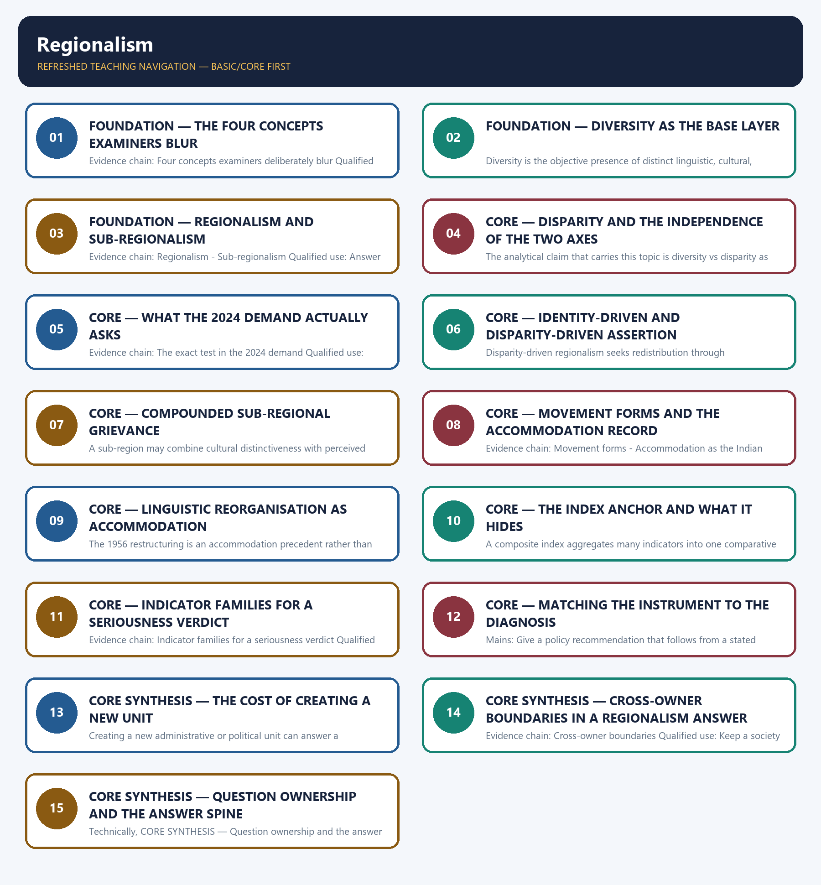

# Regionalism — Learner-v2 Complete Learning Session

> **Authoring-only generation:** 2026-09-02. No PDF was rendered and no tracker or index was mutated.

### SOURCE, PROGRESSION AND CURRENT-LINKAGE AUDIT

- **Generation date:** 2026-09-02.
- **Repository-first evidence:** the Basic owner is taught first and preserved in full; the Advanced owner is retained only in the optional final teaching block.
- **OCR evidence:** Repository Markdown was primary. The OCR-searchable official General Studies Paper-I question papers held under books\mains and books\more_previous_papers were used only to confirm the wording of routed Mains PYQs. No official answer key, marking scheme, page precision or unsupported quotation was imported from them.
- **Qdrant:** not used; repository Markdown and available OCR context were sufficient.
- **PYQ integrity:** Two direct General Studies Paper-I Mains demands are routed to this topic and each is recorded with its exact routing status. The 2020 Q10 demand arguing that regionalism in India appears to be a consequence of rising cultural assertiveness is routed in the audited 2018-2023 Mains ledger to the Advanced owner, while the Core owner's own answer-architecture table records that Core routing supersedes that pointer, so it is answered here from the Basic spine; the locally held official 2020 paper is a scanned image from which reliable English text cannot be extracted, so the audited ledger's neutral demand rendering is used and no verbatim wording is claimed for that year. The 2024 Q17 demand on regional disparity, its difference from diversity and the seriousness of the issue in India is routed in the audited 2024-2025 Mains ledger to this Basic owner, and its wording was confirmed in the locally held official 2024 General Studies Paper-I, including a printed capitalisation irregularity in the third sentence that is reproduced rather than silently corrected. No marking scheme, official key or model answer of the Union Public Service Commission is held locally, and none is reproduced or inferred. No state ranking, index score, per-capita income or infrastructure figure is asserted anywhere in this package.
- **Live-link boundary:** One live official check was made on 2026-09-02 and it confirmed rather than changed the repository anchor: the NITI Aayog Sustainable Development Goal reports listing shows no edition of the SDG India Index published after the 2023-24 edition, so the owner's dated anchor and its July 2026 verification statement stand unaltered. No state ranking, index score, per-capita income, infrastructure value or fiscal figure is asserted anywhere in this package, five-year-plan and regional-development policy mechanics are cross-linked to the Geography owner, and Centre-State fiscal-transfer and federal doctrine are cross-linked to Polity.
- **Fact/inference discipline:** no current-affairs item, PYQ wording, figure or quotation is invented.

## BASIC LEARNING SESSION

### DEEP-REVIEW LEARNING CONTRACT

| Control | Binding rule for this package |
|---|---|
| Syllabus boundary | Complete Indian Society Basic/Core is answer-complete before optional Advanced depth. |
| Concept method | Define and distinguish the institution, identity, process, legal category and measured indicator before analysis. |
| Sociological method | Structure/institution → mechanism and agency → differentiated group/region outcome → feedback, resistance and qualification. |
| Evidence method | Claim → named Indian community/region/institution/dataset → analysis → source-date-status or causal qualification. |
| Non-homogenisation | Caste, tribe, women, religion, region and rural/urban groups retain internal class, gender, locality and historical variation. |
| Boundary method | Constitutional right, statutory mandate, executive scheme, implementation and lived social outcome remain distinct. |
| Practice contract | Every solved item has demand decoding, a detailed examiner-grade model, executable timed/compression plan, marks rationale and answer-specific improvement. |
| Approval | This immutable successor remains `approved: false` pending explicit approval. |

**Canonical Basic/Core owner:** `upsc-ai-kit\knowledge\Indian-Society\basic\14_Regionalism.md`  
**Canonical topic owner:** `upsc-ai-kit\knowledge\Indian-Society\basic\14_Regionalism.md`  
**Optional Advanced owner:** `upsc-ai-kit\knowledge\Indian-Society\advanced\14_Regionalism.md`  
**Official syllabus mapping:** `upsc-ai-kit\knowledge\Indian-Society\OFFICIAL-UPSC-SYLLABUS-MAPPING.md`

### EVIDENCE, PYQ AND CURRENT-STATUS CONTROL

- **Definition discipline:** close concepts and legal-administrative categories share a comparison axis and are never treated as synonyms.
- **Mechanism discipline:** correlation, temporal sequence and aggregate association do not establish causation; identify institutions, incentives, norms, power and agency.
- **Historical discipline:** colonial, constitutional, developmental, liberalisation and contemporary phases are separated without a linear tradition-to-modernity story.
- **Intersectional discipline:** overlapping caste, tribe, class, gender, religion, disability, region and life-course positions are analysed without creating a single homogeneous category.
- **India discipline:** use named communities, movements, institutions, cities, states and regional contrasts without stereotyping or treating one case as nationally representative.
- **Data discipline:** Census 2011, NFHS, PLFS, SRS, Agriculture Census, MPI and scheme claims retain source, reference period, release date, coverage and provisional/final status.
- **PYQ discipline:** repository routing ledgers and locally held papers control wording and metadata; reconstructed wording and unavailable official keys remain labelled.
- **Current-status note, rechecked 2026-09-02:** One live official check was made on 2026-09-02 and it confirmed rather than changed the repository anchor: the NITI Aayog Sustainable Development Goal reports listing shows no edition of the SDG India Index published after the 2023-24 edition, so the owner's dated anchor and its July 2026 verification statement stand unaltered. No state ranking, index score, per-capita income, infrastructure value or fiscal figure is asserted anywhere in this package, five-year-plan and regional-development policy mechanics are cross-linked to the Geography owner, and Centre-State fiscal-transfer and federal doctrine are cross-linked to Polity.

**Live/official context sources recorded by the predecessor generation:**

- `https://www.niti.gov.in/reports-sdg`




*Distinct embedded teaching-navigation image. The separate continuous Cārvāka-style flowchart package remains an independent at-a-glance artifact.*

### SESSION 1 — FOUNDATION — THE FOUR CONCEPTS EXAMINERS BLUR

#### DEFINITION / WHAT THIS IS CALLED

**Plain-language definition:** Diversity, regionalism, sub-regionalism and disparity are four separate concepts and never synonyms.

**Technical definition:** Evidence chain: Four concepts examiners deliberately blur Qualified use: Open a regionalism answer by fixing the four definitions the question will test.

#### ANSWER-GRABBING OPENING — WRITE/ADAPT IN THE EXAM

> Diversity, regionalism, sub-regionalism and disparity are four separate concepts and never synonyms.

#### MUST-WRITE KEYWORDS

- **FOUNDATION**
- **The four concepts examiners blur**
- **Evidence chain**
- **Qualified use**
- **This**
- **Diversity, regionalism, sub-regionalism and disparity**

**How to use them:** Frame the answer through FOUNDATION; define The four concepts examiners blur, connect Evidence chain with Qualified use to explain the mechanism, and use This for the decisive comparison or qualification.

#### VISUAL FIRST

```text
THE FOUR CONCEPTS EXAMINERS BLUR
01. Four concepts examiners deliberately blur
BOUNDARY -> Diversity, regionalism, sub-regionalism and disparity are four separate concepts and never synonyms.
```

*This topic-specific rail fixes the evidence sequence and its exam boundary before analysis.*

#### CORE EXPLANATION

This owner separates four concepts that are routinely conflated: diversity as the presence of distinct regional identities, regionalism as political assertion of a region's identity and interest, sub-regionalism as assertion within an already-recognised region, and regional disparity as unequal development outcomes between regions.

#### NAMED EVIDENCE AND MECHANISM

- This owner separates four concepts that are routinely conflated: diversity as the presence of distinct regional identities, regionalism as political assertion of a region's identity and interest, sub-regionalism as assertion within an already-recognised region, and regional disparity as unequal development outcomes between regions.

#### EXAMINER CAUTION

- Diversity, regionalism, sub-regionalism and disparity are four separate concepts and never synonyms.

#### EXAM LINK

- **Prelims:** Retain the exact unit, named scholar, official category, dated statistic or legal boundary attached to The four concepts examiners blur.
- **Mains:** Open a regionalism answer by fixing the four definitions the question will test.

#### MINI RECAP

- **Evidence chain:** Four concepts examiners deliberately blur
- **Qualified use:** Open a regionalism answer by fixing the four definitions the question will test.

#### CLOSING RECALL FLOW — FOUNDATION — THE FOUR CONCEPTS EXAMINERS BLUR

```text
START / CONCEPT: FOUNDATION — The four concepts examiners blur
        |
        v
EXACT TERMS: FOUNDATION · The four concepts examiners blur · Evidence chain · Qualified use · This · Diversity, regionalism, sub-regionalism and disparity
        |
        v
MECHANISM / ARGUMENT: Evidence chain: Four concepts examiners deliberately blur Qualified use: Open a regionalism answer by fixing the four definitions the question will test.
        |
        v
CONSEQUENCE / CONTRAST: This owner separates four concepts that are routinely conflated: diversity as the presence of distinct regional identities, regionalism as political assertion of a region's identity and interest, sub-regionalism as assertion within an already-recognised region, and regional disparity as unequal development outcomes between regions.
        |
        v
UPSC TRAP / ANSWER-USE: Do not miss this limiting distinction: open a regionalism answer by fixing the four definitions the question will test.
        |
        v
ANSWER-GRABBING FORMULATION: Diversity, regionalism, sub-regionalism and disparity are four separate concepts and never synonyms.
```
### SESSION 2 — FOUNDATION — DIVERSITY AS THE BASE LAYER

#### DEFINITION / WHAT THIS IS CALLED

**Plain-language definition:** Evidence chain: Diversity Qualified use: Establish the descriptive layer before any grievance claim is made.

**Technical definition:** Diversity is the objective presence of distinct linguistic, cultural, ecological or historical identities across India's regions, and by itself it implies neither grievance nor unequal development.

#### ANSWER-GRABBING OPENING — WRITE/ADAPT IN THE EXAM

> Evidence chain: Diversity Qualified use: Establish the descriptive layer before any grievance claim is made.

#### MUST-WRITE KEYWORDS

- **FOUNDATION**
- **Diversity as the base layer**
- **Evidence chain**
- **Qualified use**
- **Diversity**
- **India's**

**How to use them:** Frame the answer through FOUNDATION; define Diversity as the base layer, connect Evidence chain with Qualified use to explain the mechanism, and use Diversity for the decisive comparison or qualification.

#### VISUAL FIRST

```text
DIVERSITY AS THE BASE LAYER
01. Diversity
BOUNDARY -> Cultural difference by itself implies neither grievance nor unequal development.
```

*This topic-specific rail fixes the evidence sequence and its exam boundary before analysis.*

#### CORE EXPLANATION

Diversity is the objective presence of distinct linguistic, cultural, ecological or historical identities across India's regions, and by itself it implies neither grievance nor unequal development.

#### NAMED EVIDENCE AND MECHANISM

- Diversity is the objective presence of distinct linguistic, cultural, ecological or historical identities across India's regions, and by itself it implies neither grievance nor unequal development.

#### EXAMINER CAUTION

- Cultural difference by itself implies neither grievance nor unequal development.

#### EXAM LINK

- **Prelims:** Retain the exact unit, named scholar, official category, dated statistic or legal boundary attached to Diversity as the base layer.
- **Mains:** Establish the descriptive layer before any grievance claim is made.

#### MINI RECAP

- **Evidence chain:** Diversity
- **Qualified use:** Establish the descriptive layer before any grievance claim is made.

#### CLOSING RECALL FLOW — FOUNDATION — DIVERSITY AS THE BASE LAYER

```text
START / CONCEPT: FOUNDATION — Diversity as the base layer
        |
        v
EXACT TERMS: FOUNDATION · Diversity as the base layer · Evidence chain · Qualified use · Diversity · India's
        |
        v
MECHANISM / ARGUMENT: Diversity is the objective presence of distinct linguistic, cultural, ecological or historical identities across India's regions, and by itself it implies neither grievance nor unequal development.
        |
        v
CONSEQUENCE / CONTRAST: Mains: Establish the descriptive layer before any grievance claim is made.
        |
        v
UPSC TRAP / ANSWER-USE: Do not miss this limiting distinction: establish the descriptive layer before any grievance claim is made.
        |
        v
ANSWER-GRABBING FORMULATION: Evidence chain: Diversity Qualified use: Establish the descriptive layer before any grievance claim is made.
```
### SESSION 3 — FOUNDATION — REGIONALISM AND SUB-REGIONALISM

#### DEFINITION / WHAT THIS IS CALLED

**Plain-language definition:** Sub-regionalism is assertion at a smaller scale within an already-recognised state or region, sometimes involving a demand for administrative recognition or statehood, and its drivers can include identity, representation, development or a combination, none of which follows automatically.

**Technical definition:** Evidence chain: Regionalism - Sub-regionalism Qualified use: Answer a distinguish directive with scale and driver rather than with intensity.

#### ANSWER-GRABBING OPENING — WRITE/ADAPT IN THE EXAM

> Sub-regionalism is assertion at a smaller scale within an already-recognised state or region, sometimes involving a demand for administrative recognition or statehood, and its drivers can include identity, representation, development or a combination, none of which follows automatically.

#### MUST-WRITE KEYWORDS

- **FOUNDATION**
- **Regionalism**
- **sub-regionalism**
- **Evidence chain**
- **Qualified use**
- **Neither assertion**

**How to use them:** Frame the answer through FOUNDATION; define Regionalism, connect sub-regionalism with Evidence chain to explain the mechanism, and use Qualified use for the decisive comparison or qualification.

#### VISUAL FIRST

```text
REGIONALISM AND SUB-REGIONALISM
01. Regionalism
    |
    v
02. Sub-regionalism
BOUNDARY -> Neither assertion is automatically hostile, and sub-regional drivers are not automatically identical to regional ones.
```

*This topic-specific rail fixes the evidence sequence and its exam boundary before analysis.*

#### CORE EXPLANATION

Regionalism is the political and social assertion of a region's distinct identity and interest, usually demanding recognition, autonomy or a fairer share of resources and development, and regional attachment, linguistic pride or a constitutional statehood demand is not automatically hostile regionalism. Sub-regionalism is assertion at a smaller scale within an already-recognised state or region, sometimes involving a demand for administrative recognition or statehood, and its drivers can include identity, representation, development or a combination, none of which follows automatically.

#### NAMED EVIDENCE AND MECHANISM

- Regionalism is the political and social assertion of a region's distinct identity and interest, usually demanding recognition, autonomy or a fairer share of resources and development, and regional attachment, linguistic pride or a constitutional statehood demand is not automatically hostile regionalism.
- Sub-regionalism is assertion at a smaller scale within an already-recognised state or region, sometimes involving a demand for administrative recognition or statehood, and its drivers can include identity, representation, development or a combination, none of which follows automatically.

#### EXAMINER CAUTION

- Neither assertion is automatically hostile, and sub-regional drivers are not automatically identical to regional ones.

#### EXAM LINK

- **Prelims:** Retain the exact unit, named scholar, official category, dated statistic or legal boundary attached to Regionalism and sub-regionalism.
- **Mains:** Answer a distinguish directive with scale and driver rather than with intensity.

#### MINI RECAP

- **Evidence chain:** Regionalism -> Sub-regionalism
- **Qualified use:** Answer a distinguish directive with scale and driver rather than with intensity.

#### CLOSING RECALL FLOW — FOUNDATION — REGIONALISM AND SUB-REGIONALISM

```text
START / CONCEPT: FOUNDATION — Regionalism and sub-regionalism
        |
        v
EXACT TERMS: FOUNDATION · Regionalism · sub-regionalism · Evidence chain · Qualified use · Neither assertion
        |
        v
MECHANISM / ARGUMENT: Evidence chain: Regionalism - Sub-regionalism Qualified use: Answer a distinguish directive with scale and driver rather than with intensity.
        |
        v
CONSEQUENCE / CONTRAST: Regionalism is the political and social assertion of a region's distinct identity and interest, usually demanding recognition, autonomy or a fairer share of resources and development, and regional attachment, linguistic pride or a constitutional statehood demand is not automatically hostile regionalism.
        |
        v
UPSC TRAP / ANSWER-USE: Neither assertion is automatically hostile, and sub-regional drivers are not automatically identical to regional ones.
        |
        v
ANSWER-GRABBING FORMULATION: Sub-regionalism is assertion at a smaller scale within an already-recognised state or region, sometimes involving a demand for administrative recognition or statehood, and its drivers can include identity, representation, development or a combination, none of which follows automatically.
```
### SESSION 4 — CORE — DISPARITY AND THE INDEPENDENCE OF THE TWO AXES

#### DEFINITION / WHAT THIS IS CALLED

**Plain-language definition:** Regional disparity is unequal income, infrastructure, human development or fiscal capacity between regions or states, and it is an outcome-based development concept rather than a description of cultural difference.

**Technical definition:** The analytical claim that carries this topic is diversity vs disparity as independent axes, because cultural distinctiveness is settled historically while economic trajectory is shaped by separate factors such as colonial-era investment patterns, resource endowment and connectivity, so culturally distinct but prosperous regions and culturally similar but sharply unequal regions both exist.

#### ANSWER-GRABBING OPENING — WRITE/ADAPT IN THE EXAM

> Evidence chain: Regional disparity - Causal independence of the two axes Qualified use: Deliver the definitional separation on which the 2024 demand turns.

#### MUST-WRITE KEYWORDS

- **Disparity**
- **the independence of the two axes**
- **Evidence chain**
- **Qualified use**
- **Regional disparity**
- **Regional**

**How to use them:** Frame the answer through Disparity; define the independence of the two axes, connect Evidence chain with Qualified use to explain the mechanism, and use Regional disparity for the decisive comparison or qualification.

#### VISUAL FIRST

```text
DISPARITY AND THE INDEPENDENCE OF THE TWO AXES
01. Regional disparity
    |
    v
02. Causal independence of the two axes
BOUNDARY -> Cultural distinctiveness and economic trajectory are settled by different historical processes.
```

*This topic-specific rail fixes the evidence sequence and its exam boundary before analysis.*

#### CORE EXPLANATION

Regional disparity is unequal income, infrastructure, human development or fiscal capacity between regions or states, and it is an outcome-based development concept rather than a description of cultural difference. The analytical claim that carries this topic is diversity vs disparity as independent axes, because cultural distinctiveness is settled historically while economic trajectory is shaped by separate factors such as colonial-era investment patterns, resource endowment and connectivity, so culturally distinct but prosperous regions and culturally similar but sharply unequal regions both exist.

#### NAMED EVIDENCE AND MECHANISM

- Regional disparity is unequal income, infrastructure, human development or fiscal capacity between regions or states, and it is an outcome-based development concept rather than a description of cultural difference.
- The analytical claim that carries this topic is diversity vs disparity as independent axes, because cultural distinctiveness is settled historically while economic trajectory is shaped by separate factors such as colonial-era investment patterns, resource endowment and connectivity, so culturally distinct but prosperous regions and culturally similar but sharply unequal regions both exist.

#### EXAMINER CAUTION

- Cultural distinctiveness and economic trajectory are settled by different historical processes.

#### EXAM LINK

- **Prelims:** Retain the exact unit, named scholar, official category, dated statistic or legal boundary attached to Disparity and the independence of the two axes.
- **Mains:** Deliver the definitional separation on which the 2024 demand turns.

#### MINI RECAP

- **Evidence chain:** Regional disparity -> Causal independence of the two axes
- **Qualified use:** Deliver the definitional separation on which the 2024 demand turns.

#### CLOSING RECALL FLOW — CORE — DISPARITY AND THE INDEPENDENCE OF THE TWO AXES

```text
START / CONCEPT: CORE — Disparity and the independence of the two axes
        |
        v
EXACT TERMS: Disparity · the independence of the two axes · Evidence chain · Qualified use · Regional disparity · Regional
        |
        v
MECHANISM / ARGUMENT: The analytical claim that carries this topic is diversity vs disparity as independent axes, because cultural distinctiveness is settled historically while economic trajectory is shaped by separate factors such as colonial-era investment patterns, resource endowment and connectivity, so culturally distinct but prosperous regions and culturally similar but sharply unequal regions both exist.
        |
        v
CONSEQUENCE / CONTRAST: Regional disparity is unequal income, infrastructure, human development or fiscal capacity between regions or states, and it is an outcome-based development concept rather than a description of cultural difference.
        |
        v
UPSC TRAP / ANSWER-USE: Do not miss this limiting distinction: cultural distinctiveness and economic trajectory are settled by different historical processes.
        |
        v
ANSWER-GRABBING FORMULATION: Evidence chain: Regional disparity - Causal independence of the two axes Qualified use: Deliver the definitional separation on which the 2024 demand turns.
```
### SESSION 5 — CORE — WHAT THE 2024 DEMAND ACTUALLY ASKS

#### DEFINITION / WHAT THIS IS CALLED

**Plain-language definition:** CORE — What the 2024 demand actually asks comprises What the 2024 demand actually asks, Evidence chain and Qualified use as its core connected dimensions.

**Technical definition:** Evidence chain: The exact test in the 2024 demand Qualified use: Structure a three-part demand so each part is visibly answered.

#### ANSWER-GRABBING OPENING — WRITE/ADAPT IN THE EXAM

> The 2024 General Studies Paper-I demand asks what regional disparity is, how it differs from diversity and how serious the issue is in India, so it rewards a definition, a paired example that separates the two axes and a separately evidenced seriousness assessment rather than one blended paragraph.

#### MUST-WRITE KEYWORDS

- **What the 2024 demand actually asks**
- **Evidence chain**
- **Qualified use**
- **General Studies Paper-I**
- **India**
- **Mains: Structure a three-part demand so each part**

**How to use them:** Frame the answer through What the 2024 demand actually asks; define Evidence chain, connect Qualified use with General Studies Paper-I to explain the mechanism, and use India for the decisive comparison or qualification.

#### VISUAL FIRST

```text
WHAT THE 2024 DEMAND ACTUALLY ASKS
01. The exact test in the 2024 demand
BOUNDARY -> The demand has three parts and a blended paragraph answers none of them fully.
```

*This topic-specific rail fixes the evidence sequence and its exam boundary before analysis.*

#### CORE EXPLANATION

The 2024 General Studies Paper-I demand asks what regional disparity is, how it differs from diversity and how serious the issue is in India, so it rewards a definition, a paired example that separates the two axes and a separately evidenced seriousness assessment rather than one blended paragraph.

#### NAMED EVIDENCE AND MECHANISM

- The 2024 General Studies Paper-I demand asks what regional disparity is, how it differs from diversity and how serious the issue is in India, so it rewards a definition, a paired example that separates the two axes and a separately evidenced seriousness assessment rather than one blended paragraph.

#### EXAMINER CAUTION

- The demand has three parts and a blended paragraph answers none of them fully.

#### EXAM LINK

- **Prelims:** Retain the exact unit, named scholar, official category, dated statistic or legal boundary attached to What the 2024 demand actually asks.
- **Mains:** Structure a three-part demand so each part is visibly answered.

#### MINI RECAP

- **Evidence chain:** The exact test in the 2024 demand
- **Qualified use:** Structure a three-part demand so each part is visibly answered.

#### CLOSING RECALL FLOW — CORE — WHAT THE 2024 DEMAND ACTUALLY ASKS

```text
START / CONCEPT: CORE — What the 2024 demand actually asks
        |
        v
EXACT TERMS: What the 2024 demand actually asks · Evidence chain · Qualified use · General Studies Paper-I · India · Mains: Structure a three-part demand so each part
        |
        v
MECHANISM / ARGUMENT: Evidence chain: The exact test in the 2024 demand Qualified use: Structure a three-part demand so each part is visibly answered.
        |
        v
CONSEQUENCE / CONTRAST: Mains: Structure a three-part demand so each part is visibly answered.
        |
        v
UPSC TRAP / ANSWER-USE: Do not miss this limiting distinction: the demand has three parts and a blended paragraph answers none of them fully.
        |
        v
ANSWER-GRABBING FORMULATION: The 2024 General Studies Paper-I demand asks what regional disparity is, how it differs from diversity and how serious the issue is in India, so it rewards a definition, a paired example that separates the two axes and a separately evidenced seriousness assessment rather than one blended paragraph.
```
### SESSION 6 — CORE — IDENTITY-DRIVEN AND DISPARITY-DRIVEN ASSERTION

#### DEFINITION / WHAT THIS IS CALLED

**Plain-language definition:** Identity-driven regionalism seeks recognition through linguistic status, cultural autonomy or symbolic representation even where economic conditions match neighbouring regions, and it is answered by a recognition response rather than by a development package.

**Technical definition:** Disparity-driven regionalism seeks redistribution through infrastructure, investment or fiscal transfer even where cultural identity is not distinctly separate, and offering only cultural recognition to such a grievance leaves the material claim unresolved.

#### ANSWER-GRABBING OPENING — WRITE/ADAPT IN THE EXAM

> Identity-driven regionalism seeks recognition through linguistic status, cultural autonomy or symbolic representation even where economic conditions match neighbouring regions, and it is answered by a recognition response rather than by a development package.

#### MUST-WRITE KEYWORDS

- **Identity-driven**
- **disparity-driven assertion**
- **Evidence chain**
- **Qualified use**
- **Disparity-driven**
- **A recognition response and a redistribution response**

**How to use them:** Frame the answer through Identity-driven; define disparity-driven assertion, connect Evidence chain with Qualified use to explain the mechanism, and use Disparity-driven for the decisive comparison or qualification.

#### VISUAL FIRST

```text
IDENTITY-DRIVEN AND DISPARITY-DRIVEN ASSERTION
01. Identity-driven regionalism
    |
    v
02. Disparity-driven regionalism
BOUNDARY -> A recognition response and a redistribution response are not interchangeable.
```

*This topic-specific rail fixes the evidence sequence and its exam boundary before analysis.*

#### CORE EXPLANATION

Identity-driven regionalism seeks recognition through linguistic status, cultural autonomy or symbolic representation even where economic conditions match neighbouring regions, and it is answered by a recognition response rather than by a development package. Disparity-driven regionalism seeks redistribution through infrastructure, investment or fiscal transfer even where cultural identity is not distinctly separate, and offering only cultural recognition to such a grievance leaves the material claim unresolved.

#### NAMED EVIDENCE AND MECHANISM

- Identity-driven regionalism seeks recognition through linguistic status, cultural autonomy or symbolic representation even where economic conditions match neighbouring regions, and it is answered by a recognition response rather than by a development package.
- Disparity-driven regionalism seeks redistribution through infrastructure, investment or fiscal transfer even where cultural identity is not distinctly separate, and offering only cultural recognition to such a grievance leaves the material claim unresolved.

#### EXAMINER CAUTION

- A recognition response and a redistribution response are not interchangeable.

#### EXAM LINK

- **Prelims:** Retain the exact unit, named scholar, official category, dated statistic or legal boundary attached to Identity-driven and disparity-driven assertion.
- **Mains:** Match the instrument to the grievance rather than recommending development for everything.

#### MINI RECAP

- **Evidence chain:** Identity-driven regionalism -> Disparity-driven regionalism
- **Qualified use:** Match the instrument to the grievance rather than recommending development for everything.

#### CLOSING RECALL FLOW — CORE — IDENTITY-DRIVEN AND DISPARITY-DRIVEN ASSERTION

```text
START / CONCEPT: CORE — Identity-driven and disparity-driven assertion
        |
        v
EXACT TERMS: Identity-driven · disparity-driven assertion · Evidence chain · Qualified use · Disparity-driven · A recognition response and a redistribution response
        |
        v
MECHANISM / ARGUMENT: Disparity-driven regionalism seeks redistribution through infrastructure, investment or fiscal transfer even where cultural identity is not distinctly separate, and offering only cultural recognition to such a grievance leaves the material claim unresolved.
        |
        v
CONSEQUENCE / CONTRAST: Evidence chain: Identity-driven regionalism - Disparity-driven regionalism Qualified use: Match the instrument to the grievance rather than recommending development for everything.
        |
        v
UPSC TRAP / ANSWER-USE: A recognition response and a redistribution response are not interchangeable.
        |
        v
ANSWER-GRABBING FORMULATION: Identity-driven regionalism seeks recognition through linguistic status, cultural autonomy or symbolic representation even where economic conditions match neighbouring regions, and it is answered by a recognition response rather than by a development package.
```
### SESSION 7 — CORE — COMPOUNDED SUB-REGIONAL GRIEVANCE

#### DEFINITION / WHAT THIS IS CALLED

**Plain-language definition:** Evidence chain: Compounded grievance Qualified use: Handle the hardest regionalism case without overgeneralising from it.

**Technical definition:** A sub-region may combine cultural distinctiveness with perceived economic neglect and under-representation in state-level power, and such compounded cases require recognition and redistribution together, although neither dual disadvantage nor escalation follows as a rule.

#### ANSWER-GRABBING OPENING — WRITE/ADAPT IN THE EXAM

> Evidence chain: Compounded grievance Qualified use: Handle the hardest regionalism case without overgeneralising from it.

#### MUST-WRITE KEYWORDS

- **Compounded sub-regional grievance**
- **Evidence chain**
- **Qualified use**
- **Dual disadvantage and escalation**
- **Dual**
- **Compounded**

**How to use them:** Frame the answer through Compounded sub-regional grievance; define Evidence chain, connect Qualified use with Dual disadvantage and escalation to explain the mechanism, and use Dual for the decisive comparison or qualification.

#### VISUAL FIRST

```text
COMPOUNDED SUB-REGIONAL GRIEVANCE
01. Compounded grievance
BOUNDARY -> Dual disadvantage and escalation are possibilities rather than rules.
```

*This topic-specific rail fixes the evidence sequence and its exam boundary before analysis.*

#### CORE EXPLANATION

A sub-region may combine cultural distinctiveness with perceived economic neglect and under-representation in state-level power, and such compounded cases require recognition and redistribution together, although neither dual disadvantage nor escalation follows as a rule.

#### NAMED EVIDENCE AND MECHANISM

- A sub-region may combine cultural distinctiveness with perceived economic neglect and under-representation in state-level power, and such compounded cases require recognition and redistribution together, although neither dual disadvantage nor escalation follows as a rule.

#### EXAMINER CAUTION

- Dual disadvantage and escalation are possibilities rather than rules.

#### EXAM LINK

- **Prelims:** Retain the exact unit, named scholar, official category, dated statistic or legal boundary attached to Compounded sub-regional grievance.
- **Mains:** Handle the hardest regionalism case without overgeneralising from it.

#### MINI RECAP

- **Evidence chain:** Compounded grievance
- **Qualified use:** Handle the hardest regionalism case without overgeneralising from it.

#### CLOSING RECALL FLOW — CORE — COMPOUNDED SUB-REGIONAL GRIEVANCE

```text
START / CONCEPT: CORE — Compounded sub-regional grievance
        |
        v
EXACT TERMS: Compounded sub-regional grievance · Evidence chain · Qualified use · Dual disadvantage and escalation · Dual · Compounded
        |
        v
MECHANISM / ARGUMENT: A sub-region may combine cultural distinctiveness with perceived economic neglect and under-representation in state-level power, and such compounded cases require recognition and redistribution together, although neither dual disadvantage nor escalation follows as a rule.
        |
        v
CONSEQUENCE / CONTRAST: Dual disadvantage and escalation are possibilities rather than rules.
        |
        v
UPSC TRAP / ANSWER-USE: Do not miss this limiting distinction: handle the hardest regionalism case without overgeneralising from it.
        |
        v
ANSWER-GRABBING FORMULATION: Evidence chain: Compounded grievance Qualified use: Handle the hardest regionalism case without overgeneralising from it.
```
### SESSION 8 — CORE — MOVEMENT FORMS AND THE ACCOMMODATION RECORD

#### DEFINITION / WHAT THIS IS CALLED

**Plain-language definition:** The three forms are a graded typology and not a compulsory escalation ladder.

**Technical definition:** Evidence chain: Movement forms - Accommodation as the Indian record Qualified use: Refuse the secession presumption with the typology and the Indian record.

#### ANSWER-GRABBING OPENING — WRITE/ADAPT IN THE EXAM

> Most Indian regional assertions have historically been accommodated through statehood or autonomy arrangements, so secessionist demand is the least common form in the typology and treating every regional movement as a step toward secession misreads the record.

#### MUST-WRITE KEYWORDS

- **Movement forms**
- **the accommodation record**
- **Evidence chain**
- **Qualified use**
- **Statehood**
- **Union**

**How to use them:** Frame the answer through Movement forms; define the accommodation record, connect Evidence chain with Qualified use to explain the mechanism, and use Statehood for the decisive comparison or qualification.

#### VISUAL FIRST

```text
MOVEMENT FORMS AND THE ACCOMMODATION RECORD
01. Movement forms
    |
    v
02. Accommodation as the Indian record
BOUNDARY -> The three forms are a graded typology and not a compulsory escalation ladder.
```

*This topic-specific rail fixes the evidence sequence and its exam boundary before analysis.*

#### CORE EXPLANATION

Statehood demand within the Union, autonomy demand for greater self-governance and secessionist demand for separation from the Union are three distinct forms with different implications, and they constitute a graded typology rather than a compulsory escalation ladder. Most Indian regional assertions have historically been accommodated through statehood or autonomy arrangements, so secessionist demand is the least common form in the typology and treating every regional movement as a step toward secession misreads the record.

#### NAMED EVIDENCE AND MECHANISM

- Statehood demand within the Union, autonomy demand for greater self-governance and secessionist demand for separation from the Union are three distinct forms with different implications, and they constitute a graded typology rather than a compulsory escalation ladder.
- Most Indian regional assertions have historically been accommodated through statehood or autonomy arrangements, so secessionist demand is the least common form in the typology and treating every regional movement as a step toward secession misreads the record.

#### EXAMINER CAUTION

- The three forms are a graded typology and not a compulsory escalation ladder.

#### EXAM LINK

- **Prelims:** Retain the exact unit, named scholar, official category, dated statistic or legal boundary attached to Movement forms and the accommodation record.
- **Mains:** Refuse the secession presumption with the typology and the Indian record.

#### MINI RECAP

- **Evidence chain:** Movement forms -> Accommodation as the Indian record
- **Qualified use:** Refuse the secession presumption with the typology and the Indian record.

#### CLOSING RECALL FLOW — CORE — MOVEMENT FORMS AND THE ACCOMMODATION RECORD

```text
START / CONCEPT: CORE — Movement forms and the accommodation record
        |
        v
EXACT TERMS: Movement forms · the accommodation record · Evidence chain · Qualified use · Statehood · Union
        |
        v
MECHANISM / ARGUMENT: Evidence chain: Movement forms - Accommodation as the Indian record Qualified use: Refuse the secession presumption with the typology and the Indian record.
        |
        v
CONSEQUENCE / CONTRAST: The three forms are a graded typology and not a compulsory escalation ladder.
        |
        v
UPSC TRAP / ANSWER-USE: Statehood demand within the Union, autonomy demand for greater self-governance and secessionist demand for separation from the Union are three distinct forms with different implications, and they constitute a graded typology rather than a compulsory escalation ladder.
        |
        v
ANSWER-GRABBING FORMULATION: Most Indian regional assertions have historically been accommodated through statehood or autonomy arrangements, so secessionist demand is the least common form in the typology and treating every regional movement as a step toward secession misreads the record.
```
### SESSION 9 — CORE — LINGUISTIC REORGANISATION AS ACCOMMODATION

#### DEFINITION / WHAT THIS IS CALLED

**Plain-language definition:** CORE — Linguistic reorganisation as accommodation comprises Linguistic reorganisation as accommodation, Evidence chain and Qualified use as its core connected dimensions.

**Technical definition:** The 1956 restructuring is an accommodation precedent rather than proof that reorganisation always works.

#### ANSWER-GRABBING OPENING — WRITE/ADAPT IN THE EXAM

> The States Reorganisation Act, 1956 restructured Indian states substantially along linguistic lines and is the classical Indian example of regionalism accommodated through statehood recognition rather than suppressed.

#### MUST-WRITE KEYWORDS

- **Linguistic reorganisation as accommodation**
- **Evidence chain**
- **Qualified use**
- **The States Reorganisation Act**
- **Indian**
- **The 1956 restructuring**

**How to use them:** Frame the answer through Linguistic reorganisation as accommodation; define Evidence chain, connect Qualified use with The States Reorganisation Act to explain the mechanism, and use Indian for the decisive comparison or qualification.

#### VISUAL FIRST

```text
LINGUISTIC REORGANISATION AS ACCOMMODATION
01. States Reorganisation Act, 1956
BOUNDARY -> The 1956 restructuring is an accommodation precedent rather than proof that reorganisation always works.
```

*This topic-specific rail fixes the evidence sequence and its exam boundary before analysis.*

#### CORE EXPLANATION

The States Reorganisation Act, 1956 restructured Indian states substantially along linguistic lines and is the classical Indian example of regionalism accommodated through statehood recognition rather than suppressed.

#### NAMED EVIDENCE AND MECHANISM

- The States Reorganisation Act, 1956 restructured Indian states substantially along linguistic lines and is the classical Indian example of regionalism accommodated through statehood recognition rather than suppressed.

#### EXAMINER CAUTION

- The 1956 restructuring is an accommodation precedent rather than proof that reorganisation always works.

#### EXAM LINK

- **Prelims:** Retain the exact unit, named scholar, official category, dated statistic or legal boundary attached to Linguistic reorganisation as accommodation.
- **Mains:** Anchor the accommodation argument in one named statutory example.

#### MINI RECAP

- **Evidence chain:** States Reorganisation Act, 1956
- **Qualified use:** Anchor the accommodation argument in one named statutory example.

#### CLOSING RECALL FLOW — CORE — LINGUISTIC REORGANISATION AS ACCOMMODATION

```text
START / CONCEPT: CORE — Linguistic reorganisation as accommodation
        |
        v
EXACT TERMS: Linguistic reorganisation as accommodation · Evidence chain · Qualified use · The States Reorganisation Act · Indian · The 1956 restructuring
        |
        v
MECHANISM / ARGUMENT: Evidence chain: States Reorganisation Act, 1956 Qualified use: Anchor the accommodation argument in one named statutory example.
        |
        v
CONSEQUENCE / CONTRAST: The 1956 restructuring is an accommodation precedent rather than proof that reorganisation always works.
        |
        v
UPSC TRAP / ANSWER-USE: Do not miss this limiting distinction: the States Reorganisation Act, 1956 restructured Indian states substantially along linguistic lines and is...
        |
        v
ANSWER-GRABBING FORMULATION: The States Reorganisation Act, 1956 restructured Indian states substantially along linguistic lines and is the classical Indian example of regionalism accommodated through statehood recognition rather than suppressed.
```
### SESSION 10 — CORE — THE INDEX ANCHOR AND WHAT IT HIDES

#### DEFINITION / WHAT THIS IS CALLED

**Plain-language definition:** The NITI Aayog SDG India Index is a composite index ranking states and union territories on Sustainable Development Goal-linked indicators, and its most recently published edition as of July 2026 is the 2023-24 edition, which must be cited by exact edition and year whenever a state-wise disparity ranking is used.

**Technical definition:** A composite index aggregates many indicators into one comparative score, so it can mask intra-state variation in which a state ranks well in aggregate while containing a severely lagging sub-region, and that limitation becomes decisive when a demand asks how serious disparity is below the state level.

#### ANSWER-GRABBING OPENING — WRITE/ADAPT IN THE EXAM

> The NITI Aayog SDG India Index is a composite index ranking states and union territories on Sustainable Development Goal-linked indicators, and its most recently published edition as of July 2026 is the 2023-24 edition, which must be cited by exact edition and year whenever a state-wise disparity ranking is used.

#### MUST-WRITE KEYWORDS

- **The index anchor**
- **what it hides**
- **Evidence chain**
- **Qualified use**
- **The NITI Aayog SDG India Index**
- **2023-24**

**How to use them:** Frame the answer through The index anchor; define what it hides, connect Evidence chain with Qualified use to explain the mechanism, and use The NITI Aayog SDG India Index for the decisive comparison or qualification.

#### VISUAL FIRST

```text
THE INDEX ANCHOR AND WHAT IT HIDES
01. SDG India Index as a disparity source
    |
    v
02. Index score against lived disparity
BOUNDARY -> The index must be cited by exact edition and year, and its aggregation hides sub-state variation.
```

*This topic-specific rail fixes the evidence sequence and its exam boundary before analysis.*

#### CORE EXPLANATION

The NITI Aayog SDG India Index is a composite index ranking states and union territories on Sustainable Development Goal-linked indicators, and its most recently published edition as of July 2026 is the 2023-24 edition, which must be cited by exact edition and year whenever a state-wise disparity ranking is used. A composite index aggregates many indicators into one comparative score, so it can mask intra-state variation in which a state ranks well in aggregate while containing a severely lagging sub-region, and that limitation becomes decisive when a demand asks how serious disparity is below the state level.

#### NAMED EVIDENCE AND MECHANISM

- The NITI Aayog SDG India Index is a composite index ranking states and union territories on Sustainable Development Goal-linked indicators, and its most recently published edition as of July 2026 is the 2023-24 edition, which must be cited by exact edition and year whenever a state-wise disparity ranking is used.
- A composite index aggregates many indicators into one comparative score, so it can mask intra-state variation in which a state ranks well in aggregate while containing a severely lagging sub-region, and that limitation becomes decisive when a demand asks how serious disparity is below the state level.

#### EXAMINER CAUTION

- The index must be cited by exact edition and year, and its aggregation hides sub-state variation.

#### EXAM LINK

- **Prelims:** Retain the exact unit, named scholar, official category, dated statistic or legal boundary attached to The index anchor and what it hides.
- **Mains:** Cite a composite source and state its limitation in the same breath.

#### MINI RECAP

- **Evidence chain:** SDG India Index as a disparity source -> Index score against lived disparity
- **Qualified use:** Cite a composite source and state its limitation in the same breath.

#### CLOSING RECALL FLOW — CORE — THE INDEX ANCHOR AND WHAT IT HIDES

```text
START / CONCEPT: CORE — The index anchor and what it hides
        |
        v
EXACT TERMS: The index anchor · what it hides · Evidence chain · Qualified use · The NITI Aayog SDG India Index · 2023-24
        |
        v
MECHANISM / ARGUMENT: The index must be cited by exact edition and year, and its aggregation hides sub-state variation.
        |
        v
CONSEQUENCE / CONTRAST: A composite index aggregates many indicators into one comparative score, so it can mask intra-state variation in which a state ranks well in aggregate while containing a severely lagging sub-region, and that limitation becomes decisive when a demand asks how serious disparity is below the state level.
        |
        v
UPSC TRAP / ANSWER-USE: Do not miss this limiting distinction: sDG India Index as a disparity source - Index score against lived disparity Qualified...
        |
        v
ANSWER-GRABBING FORMULATION: The NITI Aayog SDG India Index is a composite index ranking states and union territories on Sustainable Development Goal-linked indicators, and its most recently published edition as of July 2026 is the 2023-24 edition, which must be cited by exact edition and year whenever a state-wise disparity ranking is used.
```
### SESSION 11 — CORE — INDICATOR FAMILIES FOR A SERIOUSNESS VERDICT

#### DEFINITION / WHAT THIS IS CALLED

**Plain-language definition:** Seriousness of disparity is assessed through income, infrastructure, human development and fiscal capacity rather than through linguistic or cultural difference, and naming the indicator family before citing any evidence is what separates an assessment from an assertion.

**Technical definition:** Evidence chain: Indicator families for a seriousness verdict Qualified use: Convert a how-serious demand into a named indicator assessment.

#### ANSWER-GRABBING OPENING — WRITE/ADAPT IN THE EXAM

> Seriousness of disparity is assessed through income, infrastructure, human development and fiscal capacity rather than through linguistic or cultural difference, and naming the indicator family before citing any evidence is what separates an assessment from an assertion.

#### MUST-WRITE KEYWORDS

- **Indicator families for a seriousness verdict**
- **Evidence chain**
- **Qualified use**
- **Seriousness of disparity**
- **Seriousness**
- **Indicator**

**How to use them:** Frame the answer through Indicator families for a seriousness verdict; define Evidence chain, connect Qualified use with Seriousness of disparity to explain the mechanism, and use Seriousness for the decisive comparison or qualification.

#### VISUAL FIRST

```text
INDICATOR FAMILIES FOR A SERIOUSNESS VERDICT
01. Indicator families for a seriousness verdict
BOUNDARY -> Seriousness rests on development indicators and never on linguistic or cultural difference.
```

*This topic-specific rail fixes the evidence sequence and its exam boundary before analysis.*

#### CORE EXPLANATION

Seriousness of disparity is assessed through income, infrastructure, human development and fiscal capacity rather than through linguistic or cultural difference, and naming the indicator family before citing any evidence is what separates an assessment from an assertion.

#### NAMED EVIDENCE AND MECHANISM

- Seriousness of disparity is assessed through income, infrastructure, human development and fiscal capacity rather than through linguistic or cultural difference, and naming the indicator family before citing any evidence is what separates an assessment from an assertion.

#### EXAMINER CAUTION

- Seriousness rests on development indicators and never on linguistic or cultural difference.

#### EXAM LINK

- **Prelims:** Retain the exact unit, named scholar, official category, dated statistic or legal boundary attached to Indicator families for a seriousness verdict.
- **Mains:** Convert a how-serious demand into a named indicator assessment.

#### MINI RECAP

- **Evidence chain:** Indicator families for a seriousness verdict
- **Qualified use:** Convert a how-serious demand into a named indicator assessment.

#### CLOSING RECALL FLOW — CORE — INDICATOR FAMILIES FOR A SERIOUSNESS VERDICT

```text
START / CONCEPT: CORE — Indicator families for a seriousness verdict
        |
        v
EXACT TERMS: Indicator families for a seriousness verdict · Evidence chain · Qualified use · Seriousness of disparity · Seriousness · Indicator
        |
        v
MECHANISM / ARGUMENT: Evidence chain: Indicator families for a seriousness verdict Qualified use: Convert a how-serious demand into a named indicator assessment.
        |
        v
CONSEQUENCE / CONTRAST: The resulting consequence is that indicator families for a seriousness verdict Qualified use.
        |
        v
UPSC TRAP / ANSWER-USE: Do not miss this limiting distinction: indicator families for a seriousness verdict Qualified use.
        |
        v
ANSWER-GRABBING FORMULATION: Seriousness of disparity is assessed through income, infrastructure, human development and fiscal capacity rather than through linguistic or cultural difference, and naming the indicator family before citing any evidence is what separates an assessment from an assertion.
```
### SESSION 12 — CORE — MATCHING THE INSTRUMENT TO THE DIAGNOSIS

#### DEFINITION / WHAT THIS IS CALLED

**Plain-language definition:** Evidence chain: Diagnosis-to-instrument matching Qualified use: Give a policy recommendation that follows from a stated diagnosis.

**Technical definition:** Mains: Give a policy recommendation that follows from a stated diagnosis.

#### ANSWER-GRABBING OPENING — WRITE/ADAPT IN THE EXAM

> Evidence chain: Diagnosis-to-instrument matching Qualified use: Give a policy recommendation that follows from a stated diagnosis.

#### MUST-WRITE KEYWORDS

- **Matching the instrument to the diagnosis**
- **Evidence chain**
- **Qualified use**
- **The correct response**
- **Give**
- **Diagnosis-to-instrument**

**How to use them:** Frame the answer through Matching the instrument to the diagnosis; define Evidence chain, connect Qualified use with The correct response to explain the mechanism, and use Give for the decisive comparison or qualification.

#### VISUAL FIRST

```text
MATCHING THE INSTRUMENT TO THE DIAGNOSIS
01. Diagnosis-to-instrument matching
BOUNDARY -> Applying one instrument where both drivers operate under-resolves the grievance.
```

*This topic-specific rail fixes the evidence sequence and its exam boundary before analysis.*

#### CORE EXPLANATION

The correct response is diagnosis-specific, because recognition addresses an identity grievance while redistribution addresses a development grievance, and applying only one where both drivers operate under-resolves the grievance and can sustain the assertion.

#### NAMED EVIDENCE AND MECHANISM

- The correct response is diagnosis-specific, because recognition addresses an identity grievance while redistribution addresses a development grievance, and applying only one where both drivers operate under-resolves the grievance and can sustain the assertion.

#### EXAMINER CAUTION

- Applying one instrument where both drivers operate under-resolves the grievance.

#### EXAM LINK

- **Prelims:** Retain the exact unit, named scholar, official category, dated statistic or legal boundary attached to Matching the instrument to the diagnosis.
- **Mains:** Give a policy recommendation that follows from a stated diagnosis.

#### MINI RECAP

- **Evidence chain:** Diagnosis-to-instrument matching
- **Qualified use:** Give a policy recommendation that follows from a stated diagnosis.

#### CLOSING RECALL FLOW — CORE — MATCHING THE INSTRUMENT TO THE DIAGNOSIS

```text
START / CONCEPT: CORE — Matching the instrument to the diagnosis
        |
        v
EXACT TERMS: Matching the instrument to the diagnosis · Evidence chain · Qualified use · The correct response · Give · Diagnosis-to-instrument
        |
        v
MECHANISM / ARGUMENT: The correct response is diagnosis-specific, because recognition addresses an identity grievance while redistribution addresses a development grievance, and applying only one where both drivers operate under-resolves the grievance and can sustain the assertion.
        |
        v
CONSEQUENCE / CONTRAST: Mains: Give a policy recommendation that follows from a stated diagnosis.
        |
        v
UPSC TRAP / ANSWER-USE: Do not miss this limiting distinction: give a policy recommendation that follows from a stated diagnosis.
        |
        v
ANSWER-GRABBING FORMULATION: Evidence chain: Diagnosis-to-instrument matching Qualified use: Give a policy recommendation that follows from a stated diagnosis.
```
### SESSION 13 — CORE SYNTHESIS — THE COST OF CREATING A NEW UNIT

#### DEFINITION / WHAT THIS IS CALLED

**Plain-language definition:** Evidence chain: The cost of creating a new unit Qualified use: Add the qualification that separates a balanced verdict from an endorsement.

**Technical definition:** Creating a new administrative or political unit can answer a recognition grievance while reproducing disparity inside the new unit, so a balanced answer states that reorganisation redistributes the boundary of the problem as well as supplying part of its remedy.

#### ANSWER-GRABBING OPENING — WRITE/ADAPT IN THE EXAM

> Evidence chain: The cost of creating a new unit Qualified use: Add the qualification that separates a balanced verdict from an endorsement.

#### MUST-WRITE KEYWORDS

- **CORE SYNTHESIS**
- **The cost of creating a new unit**
- **Evidence chain**
- **Qualified use**
- **Creating**
- **Add**

**How to use them:** Frame the answer through CORE SYNTHESIS; define The cost of creating a new unit, connect Evidence chain with Qualified use to explain the mechanism, and use Creating for the decisive comparison or qualification.

#### VISUAL FIRST

```text
THE COST OF CREATING A NEW UNIT
01. The cost of creating a new unit
BOUNDARY -> A new boundary can reproduce disparity inside itself rather than dissolving it.
```

*This topic-specific rail fixes the evidence sequence and its exam boundary before analysis.*

#### CORE EXPLANATION

Creating a new administrative or political unit can answer a recognition grievance while reproducing disparity inside the new unit, so a balanced answer states that reorganisation redistributes the boundary of the problem as well as supplying part of its remedy.

#### NAMED EVIDENCE AND MECHANISM

- Creating a new administrative or political unit can answer a recognition grievance while reproducing disparity inside the new unit, so a balanced answer states that reorganisation redistributes the boundary of the problem as well as supplying part of its remedy.

#### EXAMINER CAUTION

- A new boundary can reproduce disparity inside itself rather than dissolving it.

#### EXAM LINK

- **Prelims:** Retain the exact unit, named scholar, official category, dated statistic or legal boundary attached to The cost of creating a new unit.
- **Mains:** Add the qualification that separates a balanced verdict from an endorsement.

#### MINI RECAP

- **Evidence chain:** The cost of creating a new unit
- **Qualified use:** Add the qualification that separates a balanced verdict from an endorsement.

#### CLOSING RECALL FLOW — CORE SYNTHESIS — THE COST OF CREATING A NEW UNIT

```text
START / CONCEPT: CORE SYNTHESIS — The cost of creating a new unit
        |
        v
EXACT TERMS: CORE SYNTHESIS · The cost of creating a new unit · Evidence chain · Qualified use · Creating · Add
        |
        v
MECHANISM / ARGUMENT: Creating a new administrative or political unit can answer a recognition grievance while reproducing disparity inside the new unit, so a balanced answer states that reorganisation redistributes the boundary of the problem as well as supplying part of its remedy.
        |
        v
CONSEQUENCE / CONTRAST: Mains: Add the qualification that separates a balanced verdict from an endorsement.
        |
        v
UPSC TRAP / ANSWER-USE: A new boundary can reproduce disparity inside itself rather than dissolving it.
        |
        v
ANSWER-GRABBING FORMULATION: Evidence chain: The cost of creating a new unit Qualified use: Add the qualification that separates a balanced verdict from an endorsement.
```
### SESSION 14 — CORE SYNTHESIS — CROSS-OWNER BOUNDARIES IN A REGIONALISM ANSWER

#### DEFINITION / WHAT THIS IS CALLED

**Plain-language definition:** A regionalism answer builds its own case out of grievance, assertion, movement form and accommodation, which are the social materials this owner actually holds.

**Technical definition:** Evidence chain: Cross-owner boundaries Qualified use: Keep a society answer inside its own evidence without losing policy relevance.

#### ANSWER-GRABBING OPENING — WRITE/ADAPT IN THE EXAM

> Evidence chain: Cross-owner boundaries Qualified use: Keep a society answer inside its own evidence without losing policy relevance.

#### MUST-WRITE KEYWORDS

- **CORE SYNTHESIS**
- **Cross-owner boundaries in a regionalism answer**
- **Evidence chain**
- **Qualified use**
- **Cross-owner**
- **Qualified**

**How to use them:** Frame the answer through CORE SYNTHESIS; define Cross-owner boundaries in a regionalism answer, connect Evidence chain with Qualified use to explain the mechanism, and use Cross-owner for the decisive comparison or qualification.

#### VISUAL FIRST

```text
CROSS-OWNER BOUNDARIES IN A REGIONALISM ANSWER
01. Cross-owner boundaries
BOUNDARY -> Five-year-plan mechanics belong to Geography and fiscal-transfer doctrine to Polity.
```

*This topic-specific rail fixes the evidence sequence and its exam boundary before analysis.*

#### CORE EXPLANATION

A regionalism answer builds its own case out of grievance, assertion, movement form and accommodation, which are the social materials this owner actually holds. Development-planning instruments and fiscal-federalism doctrine enter such an answer as cross-linked evidence rather than as re-derived content, since five-year-plan and current regional-development policy mechanics belong to the Geography regional-development owner while Centre-State fiscal transfer and federal doctrine belong to Polity.

#### NAMED EVIDENCE AND MECHANISM

- A regionalism answer builds its own case out of grievance, assertion, movement form and accommodation, which are the social materials this owner actually holds. Development-planning instruments and fiscal-federalism doctrine enter such an answer as cross-linked evidence rather than as re-derived content, since five-year-plan and current regional-development policy mechanics belong to the Geography regional-development owner while Centre-State fiscal transfer and federal doctrine belong to Polity.

#### EXAMINER CAUTION

- Five-year-plan mechanics belong to Geography and fiscal-transfer doctrine to Polity.

#### EXAM LINK

- **Prelims:** Retain the exact unit, named scholar, official category, dated statistic or legal boundary attached to Cross-owner boundaries in a regionalism answer.
- **Mains:** Keep a society answer inside its own evidence without losing policy relevance.

#### MINI RECAP

- **Evidence chain:** Cross-owner boundaries
- **Qualified use:** Keep a society answer inside its own evidence without losing policy relevance.

#### CLOSING RECALL FLOW — CORE SYNTHESIS — CROSS-OWNER BOUNDARIES IN A REGIONALISM ANSWER

```text
START / CONCEPT: CORE SYNTHESIS — Cross-owner boundaries in a regionalism answer
        |
        v
EXACT TERMS: CORE SYNTHESIS · Cross-owner boundaries in a regionalism answer · Evidence chain · Qualified use · Cross-owner · Qualified
        |
        v
MECHANISM / ARGUMENT: A regionalism answer builds its own case out of grievance, assertion, movement form and accommodation, which are the social materials this owner actually holds.
        |
        v
CONSEQUENCE / CONTRAST: The resulting consequence is that keep a society answer inside its own evidence without losing policy relevance.
        |
        v
UPSC TRAP / ANSWER-USE: Do not miss this limiting distinction: keep a society answer inside its own evidence without losing policy relevance.
        |
        v
ANSWER-GRABBING FORMULATION: Evidence chain: Cross-owner boundaries Qualified use: Keep a society answer inside its own evidence without losing policy relevance.
```
### SESSION 15 — CORE SYNTHESIS — QUESTION OWNERSHIP AND THE ANSWER SPINE

#### DEFINITION / WHAT THIS IS CALLED

**Plain-language definition:** Evidence chain: Verified direct Mains demands Qualified use: Assemble the regionalism answer spine with honest question ownership.

**Technical definition:** Technically, CORE SYNTHESIS — Question ownership and the answer spine is analysed by relating CORE SYNTHESIS to Question ownership, then testing the relationship through the answer spine and Evidence chain.

#### ANSWER-GRABBING OPENING — WRITE/ADAPT IN THE EXAM

> Evidence chain: Verified direct Mains demands Qualified use: Assemble the regionalism answer spine with honest question ownership.

#### MUST-WRITE KEYWORDS

- **CORE SYNTHESIS**
- **Question ownership**
- **the answer spine**
- **Evidence chain**
- **Qualified use**
- **Subject**

**How to use them:** Frame the answer through CORE SYNTHESIS; define Question ownership, connect the answer spine with Evidence chain to explain the mechanism, and use Qualified use for the decisive comparison or qualification.

#### VISUAL FIRST

```text
QUESTION OWNERSHIP AND THE ANSWER SPINE
01. Verified direct Mains demands
BOUNDARY -> The 2024 stem carries a printed capitalisation irregularity that is reproduced rather than corrected.
```

*This topic-specific rail fixes the evidence sequence and its exam boundary before analysis.*

#### CORE EXPLANATION

Two General Studies Paper-I demands are routed to this topic: the 2020 demand on regionalism as a consequence of rising cultural assertiveness, routed in the audited 2018-2023 ledger to the Advanced owner with the Core owner recording that Core routing supersedes, and the 2024 demand on regional disparity against diversity, routed in the audited 2024-2025 ledger to this Basic owner and confirmed verbatim in the locally held official 2024 question paper including a printed capitalisation irregularity that is reproduced rather than silently corrected.

#### NAMED EVIDENCE AND MECHANISM

- Two General Studies Paper-I demands are routed to this topic: the 2020 demand on regionalism as a consequence of rising cultural assertiveness, routed in the audited 2018-2023 ledger to the Advanced owner with the Core owner recording that Core routing supersedes, and the 2024 demand on regional disparity against diversity, routed in the audited 2024-2025 ledger to this Basic owner and confirmed verbatim in the locally held official 2024 question paper including a printed capitalisation irregularity that is reproduced rather than silently corrected.

#### EXAMINER CAUTION

- The 2024 stem carries a printed capitalisation irregularity that is reproduced rather than corrected.

#### EXAM LINK

- **Prelims:** Retain the exact unit, named scholar, official category, dated statistic or legal boundary attached to Question ownership and the answer spine.
- **Mains:** Assemble the regionalism answer spine with honest question ownership.

#### MINI RECAP

- **Evidence chain:** Verified direct Mains demands
- **Qualified use:** Assemble the regionalism answer spine with honest question ownership.
#### COMPLETE BASIC OWNER EVIDENCE BANK

> **Subject:** Indian Society | **Tier:** Must-Do (foundation) | **GS Paper:** GS-I.
> **Core area:** Regionalism versus sub-regionalism versus regional disparity versus
> diversity, regional-movement typology, and balanced-development responses.
> **Grounded in:** NITI Aayog SDG India Index (latest verified 2023-24 edition as of July
> 2026); audited 2024 GS-I Mains PYQ.
> ✅ = source-grounded | ⚠️ = analytical inference | 📰 = current anchor.
> *Companion: `advanced/14_Regionalism.md`.*

#### 1. Visual foundation

```text
DIVERSITY (presence of distinct regional identities:
language, culture, ecology, history)
        |
        v
REGIONALISM (political/social assertion of a
region's distinct identity and interest; not every
regional attachment is hostile regionalism)
        |
        v
SUB-REGIONALISM (assertion of a distinct identity
WITHIN an already-recognised region, e.g. a demand
for a separate state carved from an existing one)
        |
        v
REGIONAL DISPARITY (unequal levels of development,
income or infrastructure BETWEEN regions -
a different axis from cultural diversity)
        |
        v
MOVEMENT FORMS (not a compulsory ladder)
STATEHOOD DEMAND | AUTONOMY DEMAND | SECESSIONIST DEMAND
        |
        v
RESPONSE: RECOGNITION (identity accommodation) +
BALANCED DEVELOPMENT (closing disparity gaps)
```

**Core proposition:** ✅ Regionalism, sub-regionalism, regional disparity and diversity are
four analytically distinct concepts that are frequently conflated; the 2024 PYQ specifically
tests the ability to separate diversity (cultural difference) from disparity (unequal
development outcomes), since a region can be culturally distinct without being economically
disparate, and vice versa.

#### 2. Essential definitions

| Concept | Exam-ready meaning |
|---|---|
| ✅ **Diversity** | The objective presence of distinct linguistic, cultural, ecological or historical identities across India's regions. |
| ✅ **Regionalism** | The political and social assertion of a region's distinct identity and interest, often demanding recognition, autonomy or a fairer share of resources and development. Regional attachment, linguistic pride or a constitutional statehood demand is not automatically hostile regionalism. |
| ✅ **Sub-regionalism** | Assertion at a smaller scale within an already-recognised state or region, sometimes involving a demand for administrative recognition or statehood. Its drivers can include identity, representation, development or a combination; none is automatic. |
| ✅ **Regional disparity** | Unequal levels of income, infrastructure, human development or fiscal capacity between regions or states, an economic-outcome concept distinct from cultural diversity. |
| ⚠️ **Regional-movement forms** | Statehood demand (within the Union), autonomy demand (greater self-governance) and secessionist demand (separation from the Union) are distinct forms with different implications. They are not a necessary linear escalation sequence. |

#### 3. How regionalism and disparity function

1. **Diversity as the base layer:** ✅ India's regions differ in language, culture, ecology
   and historical experience — this diversity alone does not imply grievance or disparity.
2. **Regionalism as political assertion:** ✅ when a region's population organises to demand
   recognition, autonomy or a fairer resource/development share, cultural diversity becomes
   political regionalism.
3. **Sub-regionalism as an internal fracture:** ✅ regionalism can recur at a smaller scale —
   a sub-region within an existing state asserting that it is neglected relative to the
   rest of the state, sometimes escalating into a separate-statehood demand.
4. **Disparity as a distinct, measurable axis:** ✅ regional disparity is assessed through
   development indicators (income, infrastructure, human development, fiscal capacity) and
   can exist independently of cultural diversity — two culturally similar regions can show
   sharp disparity, and two culturally very different regions can be similarly developed.
5. **Movement forms and response:** ⚠️ regional assertions have taken statehood, autonomy and,
   more rarely, secessionist forms. A demand for statehood or devolution is not inherently
   anti-national; response should diagnose its language, representation, development and
   security dimensions rather than presume a fixed escalation ladder.
6. **Balanced development as response:** ⚠️ addressing regional disparity (not cultural
   diversity itself) through targeted infrastructure and fiscal-transfer policy is the
   standard developmental response to regionalism rooted in disparity grievance.

#### 4. Institutions and concepts

- ⚠️ **Five-year-plan-era and current regional-development policy mechanics (cross-linked,
  not restated):** the detailed policy architecture for addressing regional disparity is
  `Geography/basic/29_Regional-Development-and-Five-Year-Plans.md`'s territory.
- ⚠️ **Centre-State fiscal transfer and federal doctrine (cross-linked):** the constitutional
  and fiscal-federalism mechanics for addressing disparity are `Polity`'s territory.
- ✅ **NITI Aayog SDG India Index:** a composite index ranking states/UTs on Sustainable
  Development Goal-linked indicators, useful as a disparity-measurement source, though an
  index score is not the same as lived regional experience.
- ⚠️ **Linguistic reorganisation of states (historical anchor):** the 1956 States
  Reorganisation, based substantially on linguistic criteria, is the classical Indian
  example of regionalism accommodated through statehood recognition.

#### 5. Indian applications and PYQ mapping

- ✅ **2024 GS-I PYQ (15 marks, verbatim):** "What is regional disparity? How does it differ
  from diversity? How serious is the issue of regional disparity in India?" The expected
  answer: define regional disparity precisely (unequal development outcomes between
  regions), distinguish it sharply from diversity (cultural difference, which need not imply
  unequal outcomes), and assess seriousness using development-indicator evidence (income,
  infrastructure, human development gaps between better- and worse-performing states/regions),
  concluding that disparity remains a serious governance challenge requiring targeted
  balanced-development policy, separate from any policy response to diversity itself.
- ⚠️ Two states sharing similar linguistic-cultural heritage but showing sharply different
  per-capita income and infrastructure levels illustrate disparity existing independently of
  diversity, directly supporting the 2024 PYQ's distinction.

#### 6. Must-Know Facts for Prelims

- ✅ The States Reorganisation Act, 1956 restructured Indian states substantially along
  linguistic lines, the classical historical response to regionalism.
- ✅ Regional disparity is assessed through development indicators (income, infrastructure,
  human development, fiscal capacity), not cultural or linguistic difference.
- 📰 The NITI Aayog SDG India Index (latest verified edition, 2023-24, as of July 2026) is
  the standard composite source for state-wise disparity comparison; always cite the exact
  edition/year used.
- ⚠️ Statehood demand, autonomy demand and secessionist demand form a graded typology of
  regional-movement forms, not a compulsory escalation path.
- ⚠️ Sub-regionalism differs from regionalism by operating at a smaller scale, within an
  already-recognised region or state.

#### 7. UPSC traps

- ❌ Diversity and regional disparity mean the same thing. -> The 2024 PYQ specifically
  tests this distinction: diversity is cultural difference; disparity is unequal
  development outcome, and the two can exist independently of each other.
- ❌ Regionalism and sub-regionalism are the same phenomenon at different scales with
  identical policy implications. -> Sub-regionalism operates within an existing state or
  region and may involve identity, representation or development grievances; diagnose the
  local driver rather than presume neglect or statehood demand.
- ❌ All regional movements in India tend toward secession. -> Most Indian regional
  assertions have historically been accommodated through statehood or autonomy arrangements;
  secessionist demands are the least common form in the typology.
- ❌ A composite index score (such as the SDG India Index) fully captures lived regional
  disparity. -> An index is a useful comparative measurement tool but does not capture the
  full lived experience of regional disadvantage.

#### 8. 📰 Current anchor

- 📰 The NITI Aayog SDG India Index's most recently published edition as of July 2026 is the
  2023-24 edition; cite this exact edition and year when referencing state-wise disparity
  rankings, and verify no newer edition has been released before using it in an answer.

#### 9. PYQ application

- ✅ **2024 GS-I (15 marks):** define regional disparity, distinguish it precisely from
  diversity with a paired example (culturally similar but economically disparate regions),
  and assess seriousness using dated development-indicator evidence, concluding with a
  balanced-development policy recommendation.

#### 10. Mains angles

- ⚠️ Always define diversity and disparity separately before comparing them, per the exact
  2024 PYQ wording.
- ⚠️ Use statehood, autonomy and secession as distinct movement forms, not as an assumed
  escalation sequence.
- ⚠️ Cross-link Five-Year-Plan and Centre-State fiscal-transfer mechanics rather than
  restating them.

> **Answer thesis:** Regional disparity — unequal development outcomes between regions — is
> analytically distinct from diversity — the presence of distinct regional identities. A
> regional assertion can be a legitimate demand for recognition, representation or
> redistribution rather than hostility; diagnose its actual driver, then match
> balanced-development and/or accommodation responses without conflating the two.

#### 11. Probable questions

- ⚠️ **Prelims:** On what principal criterion was the States Reorganisation Act, 1956,
  substantially based?
- ✅ **Mains (15 marks, 2024 GS-I PYQ, verbatim):** What is regional disparity? How does it
  differ from diversity? How serious is the issue of regional disparity in India?
- ⚠️ **Mains (10 marks):** Distinguish between regionalism and sub-regionalism with Indian
  examples.
- ⚠️ **Mains (15 marks):** Examine the statehood-autonomy-secession typology of regional
  movements in India.

#### 12. Study links

- ✅ Advanced companion: `advanced/14_Regionalism.md`.
- ✅ `Geography/basic/29_Regional-Development-and-Five-Year-Plans.md` — regional-development
  policy mechanics.
- ✅ `Polity` federalism and Centre-State-relations files — fiscal-federalism doctrine.
- ✅ `01_Salient-Features-and-Diversity-of-Indian-Society.md` — the diversity half of the
  2024 PYQ's distinction.
- ✅ `13_Communalism.md` and `15_Secularism.md` — sibling identity-mobilisation and
  social-harmony topics.

#### 13. Answer architecture (10/15/20-mark support)

> **Core-only.** A regionalism answer succeeds only after it separates identity,
> representation and development; a generic call for “balanced development” cannot answer
> cultural assertion by itself.

##### 13.1 Directive-to-structure map

| Demand family | What is tested | Structure that scores |
|---|---|---|
| **Explain** disparity versus diversity | Exact distinction plus seriousness | define -> paired examples -> indicators -> scope/response |
| **Argue** cultural assertiveness and regionalism | Causal pathway and qualification | identity -> mobilisation/representation -> demand form -> accommodation |
| **Examine** sub-regionalism | Smaller-scale compounded grievance | identity/representation/disparity -> scale -> response |
| **Assess** statehood/autonomy/secession | Non-linear typology | classify -> driver -> constitutional/social consequence -> verdict |
| **Suggest** response | Diagnosis-to-instrument matching | recognition versus redistribution -> accountability -> qualification |

##### 13.2 Thesis bank

- **T1:** ✅ Diversity is descriptive cultural variation; regional disparity is an
  outcome-based development gap. Their possible overlap is not identity.
- **T2:** ⚠️ Cultural assertion becomes regionalism when it is politically organised around
  recognition, representation or resources; it is not automatically anti-national.
- **T3:** ⚠️ The correct response is diagnosis-specific: recognition addresses an identity
  grievance, redistribution a development grievance, and compounded cases require both.

##### 13.3 Mark-scaled spines

**10 marks — cultural assertiveness and regionalism (2020 GS-I).** Define regionalism,
show the pathway from distinct language/culture/history to political assertion, and separate
statehood/autonomy from secession. Add cultural accommodation and fair development as
possible responses; conclude with T2.

**15 marks — regional disparity and diversity (2024 GS-I).** Define both precisely; use a
paired example logic (cultural difference without a development gap, and a gap within a
culturally similar space). Assess seriousness through income/infrastructure/human
development and dated index evidence, but state its sub-state limitation. Conclude with T3.

**20 marks — regionalism, sub-regionalism and federal accommodation.** Add the
identity/representation/disparity matrix, 1956 linguistic reorganisation as accommodation,
and a recognition-versus-redistribution response table. Include the cost that new units may
contain new internal disparities; close with a graded verdict.

##### 13.4 Evidence bank — `claim -> named evidence/example -> significance -> limitation`

- **E1 — Accommodation.** *Claim:* recognition can integrate rather than fragment.
  *Evidence:* **States Reorganisation Act, 1956** and linguistic reorganisation.
  *Significance:* supports T2. *Limitation:* it did not eliminate later sub-regional/border
  demands.
- **E2 — Measurement.** *Claim:* disparity is observable through outcomes, not identity.
  *Evidence:* **NITI Aayog SDG India Index 2023-24**. *Significance:* provides a dated
  comparative source. *Limitation:* a state-level composite score can mask district/sub-
  regional inequality and does not prove causation.
- **E3 — Response fit.** *Claim:* different grievances need different tools. *Evidence:*
  recognition (language/autonomy/representation) versus redistribution (infrastructure/
  fiscal/service investment). *Significance:* turns a generic “balanced development”
  conclusion into diagnosis. *Limitation:* federal and fiscal doctrine belongs to Polity/
  Geography.
- **E4 — Movement forms.** *Claim:* demand forms are not one escalation ladder. *Evidence:*
  statehood, autonomy and secessionist demand as distinct categories. *Significance:*
  prevents securitising every regional assertion. *Limitation:* classify the specific case
  with local evidence.

##### 13.5 Balance bank and verdict scaffolds

- ⚠️ Do not use a cultural identity as a proxy for poverty or an index score as lived
  experience.
- ⚠️ Do not call statehood demand secession or assume any regional attachment is hostile.
- ⚠️ Do not offer redistribution where recognition is the core problem, or the reverse.
- **Verdict:** “Regionalism becomes integrative when democratic accommodation and material
  fairness meet the actual grievance; it becomes sharper when either is mistaken for the
  other.”

##### 13.6 Direct Mains demands this Core file must answer alone

| Year · Paper · Q | Demand | Core route |
|---|---|---|
| 2020 · GS-I · Q10 | Rising cultural assertiveness and regionalism | §13.1-13.4, T2/E1 |
| 2024 · GS-I · Q17 | Regional disparity versus diversity | §13.3, T1/E2-E3 |

> **Routing correction:** Core routing supersedes old `advanced/14` pointers. The fiscal and
> federal mechanisms remain delegated, clearly labelled support.

<!-- BEGIN GENERATED PYQ INTEGRATION: 2024-2025 -->

#### Recent PYQ Integration (2024-2025)

> **Status:** 2024-2025 question-level PYQ demand is integrated into this owner.
> **Provenance:** Audited local official-paper routing ledgers: `_PYQ-ROUTING-MAINS-GS1-GS2-ESSAY-2024-2025.md`.

- **Years represented:** 2024
- **Paper(s):** GS-I
- **Routed question demands:** 1

| Year | Paper | Q | PYQ demand (neutral rendering) | Directive / format | Source status | Owner requirement |
|---:|---|---|---|---|---|---|
| 2024 | GS-I | 17 | Regional disparity versus diversity in India | Explain · 15 marks · 250 words | Routed to owning topic | Prepare context, core dimensions, evidence/examples, counterpoint and a concise conclusion. |

##### What this owner must now support

- Regional disparity versus diversity in India

> This block integrates the 2024-2025 examinable demand and paper metadata. It is kept separate from the 2018-2023 block and does not convert an unkeyed/answer-free objective question into a solved answer.
<!-- END GENERATED PYQ INTEGRATION: 2024-2025 -->

#### CLOSING RECALL FLOW — CORE SYNTHESIS — QUESTION OWNERSHIP AND THE ANSWER SPINE

```text
START / CONCEPT: CORE SYNTHESIS — Question ownership and the answer spine
        |
        v
EXACT TERMS: CORE SYNTHESIS · Question ownership · the answer spine · Evidence chain · Qualified use · Subject
        |
        v
MECHANISM / ARGUMENT: Balanced development as response: ⚠️ addressing regional disparity (not cultural diversity itself) through targeted infrastructure and fiscal-transfer policy is the standard developmental response to regionalism rooted in disparity grievance.
        |
        v
CONSEQUENCE / CONTRAST: Diversity as the base layer: ✅ India's regions differ in language, culture, ecology and historical experience — this diversity alone does not imply grievance or disparity.
        |
        v
UPSC TRAP / ANSWER-USE: A demand for statehood or devolution is not inherently anti-national; response should diagnose its language, representation, development and security dimensions rather than presume a fixed escalation ladder.
        |
        v
ANSWER-GRABBING FORMULATION: Evidence chain: Verified direct Mains demands Qualified use: Assemble the regionalism answer spine with honest question ownership.
```
### INDIAN SOCIETY DEEP-REVIEW CORE CONTROL

- **Must remember:** Regionalism is political, economic or cultural mobilisation around territory and perceived interests; it can deepen federal representation and cultural recognition or become exclusionary when joined to unequal development, resource competition and insider-outsider politics.
- **Close distinction:** Region is not state, regionalism is not automatically separatism, federal autonomy is not sovereignty, sub-state demand is not secession, and linguistic reorganisation, inter-state disputes, special provisions and local nativism have distinct constitutional routes.
- **Evidence / interpretation limit:** Use Andhra, Maharashtra-Gujarat, Telangana, Gorkhaland, Bodoland, Northeast autonomy and river/resource disputes with historical specificity; distinguish grievance, leadership, mobilisation and outcome, and do not infer separatism from every regional party.

## BASIC MCQS / REMEDIATION

### Q1. Which statement correctly identifies Four concepts examiners deliberately blur?

A. This owner separates four concepts that are routinely conflated: diversity as the presence of distinct regional identities, regionalism as political assertion of a region's identity and interest, sub-regionalism as assertion within an already-recognised region, and regional disparity as unequal development outcomes between regions.
B. Regionalism is the political and social assertion of a region's distinct identity and interest, usually demanding recognition, autonomy or a fairer share of resources and development, and regional attachment, linguistic pride or a constitutional statehood demand is not automatically hostile regionalism.
C. Diversity is the objective presence of distinct linguistic, cultural, ecological or historical identities across India's regions, and by itself it implies neither grievance nor unequal development.
D. Sub-regionalism is assertion at a smaller scale within an already-recognised state or region, sometimes involving a demand for administrative recognition or statehood, and its drivers can include identity, representation, development or a combination, none of which follows automatically.

**Answer: A.**
**Explanation:** This owner separates four concepts that are routinely conflated: diversity as the presence of distinct regional identities, regionalism as political assertion of a region's identity and interest, sub-regionalism as assertion within an already-recognised region, and regional disparity as unequal development outcomes between regions. The remaining options belong to different chronology, actor or analytical categories.

### Q2. Which chronology card should be filed under Four concepts examiners deliberately blur?

A. Regional disparity is unequal income, infrastructure, human development or fiscal capacity between regions or states, and it is an outcome-based development concept rather than a description of cultural difference.
B. This owner separates four concepts that are routinely conflated: diversity as the presence of distinct regional identities, regionalism as political assertion of a region's identity and interest, sub-regionalism as assertion within an already-recognised region, and regional disparity as unequal development outcomes between regions.
C. Sub-regionalism is assertion at a smaller scale within an already-recognised state or region, sometimes involving a demand for administrative recognition or statehood, and its drivers can include identity, representation, development or a combination, none of which follows automatically.
D. Regionalism is the political and social assertion of a region's distinct identity and interest, usually demanding recognition, autonomy or a fairer share of resources and development, and regional attachment, linguistic pride or a constitutional statehood demand is not automatically hostile regionalism.

**Answer: B.**
**Explanation:** This owner separates four concepts that are routinely conflated: diversity as the presence of distinct regional identities, regionalism as political assertion of a region's identity and interest, sub-regionalism as assertion within an already-recognised region, and regional disparity as unequal development outcomes between regions. The remaining options belong to different chronology, actor or analytical categories.

### Q3. Which option preserves the source-bounded meaning of Four concepts examiners deliberately blur?

A. Regional disparity is unequal income, infrastructure, human development or fiscal capacity between regions or states, and it is an outcome-based development concept rather than a description of cultural difference.
B. Sub-regionalism is assertion at a smaller scale within an already-recognised state or region, sometimes involving a demand for administrative recognition or statehood, and its drivers can include identity, representation, development or a combination, none of which follows automatically.
C. This owner separates four concepts that are routinely conflated: diversity as the presence of distinct regional identities, regionalism as political assertion of a region's identity and interest, sub-regionalism as assertion within an already-recognised region, and regional disparity as unequal development outcomes between regions.
D. The analytical claim that carries this topic is diversity vs disparity as independent axes, because cultural distinctiveness is settled historically while economic trajectory is shaped by separate factors such as colonial-era investment patterns, resource endowment and connectivity, so culturally distinct but prosperous regions and culturally similar but sharply unequal regions both exist.

**Answer: C.**
**Explanation:** This owner separates four concepts that are routinely conflated: diversity as the presence of distinct regional identities, regionalism as political assertion of a region's identity and interest, sub-regionalism as assertion within an already-recognised region, and regional disparity as unequal development outcomes between regions. The remaining options belong to different chronology, actor or analytical categories.

### Q4. Which statement avoids a close-option trap about Four concepts examiners deliberately blur?

A. Regional disparity is unequal income, infrastructure, human development or fiscal capacity between regions or states, and it is an outcome-based development concept rather than a description of cultural difference.
B. The 2024 General Studies Paper-I demand asks what regional disparity is, how it differs from diversity and how serious the issue is in India, so it rewards a definition, a paired example that separates the two axes and a separately evidenced seriousness assessment rather than one blended paragraph.
C. The analytical claim that carries this topic is diversity vs disparity as independent axes, because cultural distinctiveness is settled historically while economic trajectory is shaped by separate factors such as colonial-era investment patterns, resource endowment and connectivity, so culturally distinct but prosperous regions and culturally similar but sharply unequal regions both exist.
D. This owner separates four concepts that are routinely conflated: diversity as the presence of distinct regional identities, regionalism as political assertion of a region's identity and interest, sub-regionalism as assertion within an already-recognised region, and regional disparity as unequal development outcomes between regions.

**Answer: D.**
**Explanation:** This owner separates four concepts that are routinely conflated: diversity as the presence of distinct regional identities, regionalism as political assertion of a region's identity and interest, sub-regionalism as assertion within an already-recognised region, and regional disparity as unequal development outcomes between regions. The remaining options belong to different chronology, actor or analytical categories.

### Q5. Which statement correctly identifies Diversity?

A. Diversity is the objective presence of distinct linguistic, cultural, ecological or historical identities across India's regions, and by itself it implies neither grievance nor unequal development.
B. Sub-regionalism is assertion at a smaller scale within an already-recognised state or region, sometimes involving a demand for administrative recognition or statehood, and its drivers can include identity, representation, development or a combination, none of which follows automatically.
C. Regionalism is the political and social assertion of a region's distinct identity and interest, usually demanding recognition, autonomy or a fairer share of resources and development, and regional attachment, linguistic pride or a constitutional statehood demand is not automatically hostile regionalism.
D. Regional disparity is unequal income, infrastructure, human development or fiscal capacity between regions or states, and it is an outcome-based development concept rather than a description of cultural difference.

**Answer: A.**
**Explanation:** Diversity is the objective presence of distinct linguistic, cultural, ecological or historical identities across India's regions, and by itself it implies neither grievance nor unequal development. The remaining options belong to different chronology, actor or analytical categories.

### Q6. Which chronology card should be filed under Diversity?

A. Regional disparity is unequal income, infrastructure, human development or fiscal capacity between regions or states, and it is an outcome-based development concept rather than a description of cultural difference.
B. Diversity is the objective presence of distinct linguistic, cultural, ecological or historical identities across India's regions, and by itself it implies neither grievance nor unequal development.
C. The analytical claim that carries this topic is diversity vs disparity as independent axes, because cultural distinctiveness is settled historically while economic trajectory is shaped by separate factors such as colonial-era investment patterns, resource endowment and connectivity, so culturally distinct but prosperous regions and culturally similar but sharply unequal regions both exist.
D. Sub-regionalism is assertion at a smaller scale within an already-recognised state or region, sometimes involving a demand for administrative recognition or statehood, and its drivers can include identity, representation, development or a combination, none of which follows automatically.

**Answer: B.**
**Explanation:** Diversity is the objective presence of distinct linguistic, cultural, ecological or historical identities across India's regions, and by itself it implies neither grievance nor unequal development. The remaining options belong to different chronology, actor or analytical categories.

### Q7. Which option preserves the source-bounded meaning of Diversity?

A. The analytical claim that carries this topic is diversity vs disparity as independent axes, because cultural distinctiveness is settled historically while economic trajectory is shaped by separate factors such as colonial-era investment patterns, resource endowment and connectivity, so culturally distinct but prosperous regions and culturally similar but sharply unequal regions both exist.
B. The 2024 General Studies Paper-I demand asks what regional disparity is, how it differs from diversity and how serious the issue is in India, so it rewards a definition, a paired example that separates the two axes and a separately evidenced seriousness assessment rather than one blended paragraph.
C. Diversity is the objective presence of distinct linguistic, cultural, ecological or historical identities across India's regions, and by itself it implies neither grievance nor unequal development.
D. Regional disparity is unequal income, infrastructure, human development or fiscal capacity between regions or states, and it is an outcome-based development concept rather than a description of cultural difference.

**Answer: C.**
**Explanation:** Diversity is the objective presence of distinct linguistic, cultural, ecological or historical identities across India's regions, and by itself it implies neither grievance nor unequal development. The remaining options belong to different chronology, actor or analytical categories.

### Q8. Which statement avoids a close-option trap about Diversity?

A. The analytical claim that carries this topic is diversity vs disparity as independent axes, because cultural distinctiveness is settled historically while economic trajectory is shaped by separate factors such as colonial-era investment patterns, resource endowment and connectivity, so culturally distinct but prosperous regions and culturally similar but sharply unequal regions both exist.
B. Identity-driven regionalism seeks recognition through linguistic status, cultural autonomy or symbolic representation even where economic conditions match neighbouring regions, and it is answered by a recognition response rather than by a development package.
C. The 2024 General Studies Paper-I demand asks what regional disparity is, how it differs from diversity and how serious the issue is in India, so it rewards a definition, a paired example that separates the two axes and a separately evidenced seriousness assessment rather than one blended paragraph.
D. Diversity is the objective presence of distinct linguistic, cultural, ecological or historical identities across India's regions, and by itself it implies neither grievance nor unequal development.

**Answer: D.**
**Explanation:** Diversity is the objective presence of distinct linguistic, cultural, ecological or historical identities across India's regions, and by itself it implies neither grievance nor unequal development. The remaining options belong to different chronology, actor or analytical categories.

### Q9. Which statement correctly identifies Regionalism?

A. Regionalism is the political and social assertion of a region's distinct identity and interest, usually demanding recognition, autonomy or a fairer share of resources and development, and regional attachment, linguistic pride or a constitutional statehood demand is not automatically hostile regionalism.
B. Regional disparity is unequal income, infrastructure, human development or fiscal capacity between regions or states, and it is an outcome-based development concept rather than a description of cultural difference.
C. Sub-regionalism is assertion at a smaller scale within an already-recognised state or region, sometimes involving a demand for administrative recognition or statehood, and its drivers can include identity, representation, development or a combination, none of which follows automatically.
D. The analytical claim that carries this topic is diversity vs disparity as independent axes, because cultural distinctiveness is settled historically while economic trajectory is shaped by separate factors such as colonial-era investment patterns, resource endowment and connectivity, so culturally distinct but prosperous regions and culturally similar but sharply unequal regions both exist.

**Answer: A.**
**Explanation:** Regionalism is the political and social assertion of a region's distinct identity and interest, usually demanding recognition, autonomy or a fairer share of resources and development, and regional attachment, linguistic pride or a constitutional statehood demand is not automatically hostile regionalism. The remaining options belong to different chronology, actor or analytical categories.

### Q10. Which chronology card should be filed under Regionalism?

A. The analytical claim that carries this topic is diversity vs disparity as independent axes, because cultural distinctiveness is settled historically while economic trajectory is shaped by separate factors such as colonial-era investment patterns, resource endowment and connectivity, so culturally distinct but prosperous regions and culturally similar but sharply unequal regions both exist.
B. Regionalism is the political and social assertion of a region's distinct identity and interest, usually demanding recognition, autonomy or a fairer share of resources and development, and regional attachment, linguistic pride or a constitutional statehood demand is not automatically hostile regionalism.
C. Regional disparity is unequal income, infrastructure, human development or fiscal capacity between regions or states, and it is an outcome-based development concept rather than a description of cultural difference.
D. The 2024 General Studies Paper-I demand asks what regional disparity is, how it differs from diversity and how serious the issue is in India, so it rewards a definition, a paired example that separates the two axes and a separately evidenced seriousness assessment rather than one blended paragraph.

**Answer: B.**
**Explanation:** Regionalism is the political and social assertion of a region's distinct identity and interest, usually demanding recognition, autonomy or a fairer share of resources and development, and regional attachment, linguistic pride or a constitutional statehood demand is not automatically hostile regionalism. The remaining options belong to different chronology, actor or analytical categories.

### Q11. Which option preserves the source-bounded meaning of Regionalism?

A. The 2024 General Studies Paper-I demand asks what regional disparity is, how it differs from diversity and how serious the issue is in India, so it rewards a definition, a paired example that separates the two axes and a separately evidenced seriousness assessment rather than one blended paragraph.
B. The analytical claim that carries this topic is diversity vs disparity as independent axes, because cultural distinctiveness is settled historically while economic trajectory is shaped by separate factors such as colonial-era investment patterns, resource endowment and connectivity, so culturally distinct but prosperous regions and culturally similar but sharply unequal regions both exist.
C. Regionalism is the political and social assertion of a region's distinct identity and interest, usually demanding recognition, autonomy or a fairer share of resources and development, and regional attachment, linguistic pride or a constitutional statehood demand is not automatically hostile regionalism.
D. Identity-driven regionalism seeks recognition through linguistic status, cultural autonomy or symbolic representation even where economic conditions match neighbouring regions, and it is answered by a recognition response rather than by a development package.

**Answer: C.**
**Explanation:** Regionalism is the political and social assertion of a region's distinct identity and interest, usually demanding recognition, autonomy or a fairer share of resources and development, and regional attachment, linguistic pride or a constitutional statehood demand is not automatically hostile regionalism. The remaining options belong to different chronology, actor or analytical categories.

### Q12. Which statement avoids a close-option trap about Regionalism?

A. Identity-driven regionalism seeks recognition through linguistic status, cultural autonomy or symbolic representation even where economic conditions match neighbouring regions, and it is answered by a recognition response rather than by a development package.
B. Disparity-driven regionalism seeks redistribution through infrastructure, investment or fiscal transfer even where cultural identity is not distinctly separate, and offering only cultural recognition to such a grievance leaves the material claim unresolved.
C. The 2024 General Studies Paper-I demand asks what regional disparity is, how it differs from diversity and how serious the issue is in India, so it rewards a definition, a paired example that separates the two axes and a separately evidenced seriousness assessment rather than one blended paragraph.
D. Regionalism is the political and social assertion of a region's distinct identity and interest, usually demanding recognition, autonomy or a fairer share of resources and development, and regional attachment, linguistic pride or a constitutional statehood demand is not automatically hostile regionalism.

**Answer: D.**
**Explanation:** Regionalism is the political and social assertion of a region's distinct identity and interest, usually demanding recognition, autonomy or a fairer share of resources and development, and regional attachment, linguistic pride or a constitutional statehood demand is not automatically hostile regionalism. The remaining options belong to different chronology, actor or analytical categories.

### Q13. Which statement correctly identifies Sub-regionalism?

A. Sub-regionalism is assertion at a smaller scale within an already-recognised state or region, sometimes involving a demand for administrative recognition or statehood, and its drivers can include identity, representation, development or a combination, none of which follows automatically.
B. The 2024 General Studies Paper-I demand asks what regional disparity is, how it differs from diversity and how serious the issue is in India, so it rewards a definition, a paired example that separates the two axes and a separately evidenced seriousness assessment rather than one blended paragraph.
C. The analytical claim that carries this topic is diversity vs disparity as independent axes, because cultural distinctiveness is settled historically while economic trajectory is shaped by separate factors such as colonial-era investment patterns, resource endowment and connectivity, so culturally distinct but prosperous regions and culturally similar but sharply unequal regions both exist.
D. Regional disparity is unequal income, infrastructure, human development or fiscal capacity between regions or states, and it is an outcome-based development concept rather than a description of cultural difference.

**Answer: A.**
**Explanation:** Sub-regionalism is assertion at a smaller scale within an already-recognised state or region, sometimes involving a demand for administrative recognition or statehood, and its drivers can include identity, representation, development or a combination, none of which follows automatically. The remaining options belong to different chronology, actor or analytical categories.

### Q14. Which chronology card should be filed under Sub-regionalism?

A. The 2024 General Studies Paper-I demand asks what regional disparity is, how it differs from diversity and how serious the issue is in India, so it rewards a definition, a paired example that separates the two axes and a separately evidenced seriousness assessment rather than one blended paragraph.
B. Sub-regionalism is assertion at a smaller scale within an already-recognised state or region, sometimes involving a demand for administrative recognition or statehood, and its drivers can include identity, representation, development or a combination, none of which follows automatically.
C. The analytical claim that carries this topic is diversity vs disparity as independent axes, because cultural distinctiveness is settled historically while economic trajectory is shaped by separate factors such as colonial-era investment patterns, resource endowment and connectivity, so culturally distinct but prosperous regions and culturally similar but sharply unequal regions both exist.
D. Identity-driven regionalism seeks recognition through linguistic status, cultural autonomy or symbolic representation even where economic conditions match neighbouring regions, and it is answered by a recognition response rather than by a development package.

**Answer: B.**
**Explanation:** Sub-regionalism is assertion at a smaller scale within an already-recognised state or region, sometimes involving a demand for administrative recognition or statehood, and its drivers can include identity, representation, development or a combination, none of which follows automatically. The remaining options belong to different chronology, actor or analytical categories.

### Q15. Which option preserves the source-bounded meaning of Sub-regionalism?

A. The 2024 General Studies Paper-I demand asks what regional disparity is, how it differs from diversity and how serious the issue is in India, so it rewards a definition, a paired example that separates the two axes and a separately evidenced seriousness assessment rather than one blended paragraph.
B. Disparity-driven regionalism seeks redistribution through infrastructure, investment or fiscal transfer even where cultural identity is not distinctly separate, and offering only cultural recognition to such a grievance leaves the material claim unresolved.
C. Sub-regionalism is assertion at a smaller scale within an already-recognised state or region, sometimes involving a demand for administrative recognition or statehood, and its drivers can include identity, representation, development or a combination, none of which follows automatically.
D. Identity-driven regionalism seeks recognition through linguistic status, cultural autonomy or symbolic representation even where economic conditions match neighbouring regions, and it is answered by a recognition response rather than by a development package.

**Answer: C.**
**Explanation:** Sub-regionalism is assertion at a smaller scale within an already-recognised state or region, sometimes involving a demand for administrative recognition or statehood, and its drivers can include identity, representation, development or a combination, none of which follows automatically. The remaining options belong to different chronology, actor or analytical categories.

### Q16. Which statement avoids a close-option trap about Sub-regionalism?

A. Identity-driven regionalism seeks recognition through linguistic status, cultural autonomy or symbolic representation even where economic conditions match neighbouring regions, and it is answered by a recognition response rather than by a development package.
B. A sub-region may combine cultural distinctiveness with perceived economic neglect and under-representation in state-level power, and such compounded cases require recognition and redistribution together, although neither dual disadvantage nor escalation follows as a rule.
C. Disparity-driven regionalism seeks redistribution through infrastructure, investment or fiscal transfer even where cultural identity is not distinctly separate, and offering only cultural recognition to such a grievance leaves the material claim unresolved.
D. Sub-regionalism is assertion at a smaller scale within an already-recognised state or region, sometimes involving a demand for administrative recognition or statehood, and its drivers can include identity, representation, development or a combination, none of which follows automatically.

**Answer: D.**
**Explanation:** Sub-regionalism is assertion at a smaller scale within an already-recognised state or region, sometimes involving a demand for administrative recognition or statehood, and its drivers can include identity, representation, development or a combination, none of which follows automatically. The remaining options belong to different chronology, actor or analytical categories.

### Q17. Which statement correctly identifies Regional disparity?

A. Regional disparity is unequal income, infrastructure, human development or fiscal capacity between regions or states, and it is an outcome-based development concept rather than a description of cultural difference.
B. Identity-driven regionalism seeks recognition through linguistic status, cultural autonomy or symbolic representation even where economic conditions match neighbouring regions, and it is answered by a recognition response rather than by a development package.
C. The analytical claim that carries this topic is diversity vs disparity as independent axes, because cultural distinctiveness is settled historically while economic trajectory is shaped by separate factors such as colonial-era investment patterns, resource endowment and connectivity, so culturally distinct but prosperous regions and culturally similar but sharply unequal regions both exist.
D. The 2024 General Studies Paper-I demand asks what regional disparity is, how it differs from diversity and how serious the issue is in India, so it rewards a definition, a paired example that separates the two axes and a separately evidenced seriousness assessment rather than one blended paragraph.

**Answer: A.**
**Explanation:** Regional disparity is unequal income, infrastructure, human development or fiscal capacity between regions or states, and it is an outcome-based development concept rather than a description of cultural difference. The remaining options belong to different chronology, actor or analytical categories.

### Q18. Which chronology card should be filed under Regional disparity?

A. Disparity-driven regionalism seeks redistribution through infrastructure, investment or fiscal transfer even where cultural identity is not distinctly separate, and offering only cultural recognition to such a grievance leaves the material claim unresolved.
B. Regional disparity is unequal income, infrastructure, human development or fiscal capacity between regions or states, and it is an outcome-based development concept rather than a description of cultural difference.
C. Identity-driven regionalism seeks recognition through linguistic status, cultural autonomy or symbolic representation even where economic conditions match neighbouring regions, and it is answered by a recognition response rather than by a development package.
D. The 2024 General Studies Paper-I demand asks what regional disparity is, how it differs from diversity and how serious the issue is in India, so it rewards a definition, a paired example that separates the two axes and a separately evidenced seriousness assessment rather than one blended paragraph.

**Answer: B.**
**Explanation:** Regional disparity is unequal income, infrastructure, human development or fiscal capacity between regions or states, and it is an outcome-based development concept rather than a description of cultural difference. The remaining options belong to different chronology, actor or analytical categories.

### Q19. Which option preserves the source-bounded meaning of Regional disparity?

A. A sub-region may combine cultural distinctiveness with perceived economic neglect and under-representation in state-level power, and such compounded cases require recognition and redistribution together, although neither dual disadvantage nor escalation follows as a rule.
B. Identity-driven regionalism seeks recognition through linguistic status, cultural autonomy or symbolic representation even where economic conditions match neighbouring regions, and it is answered by a recognition response rather than by a development package.
C. Regional disparity is unequal income, infrastructure, human development or fiscal capacity between regions or states, and it is an outcome-based development concept rather than a description of cultural difference.
D. Disparity-driven regionalism seeks redistribution through infrastructure, investment or fiscal transfer even where cultural identity is not distinctly separate, and offering only cultural recognition to such a grievance leaves the material claim unresolved.

**Answer: C.**
**Explanation:** Regional disparity is unequal income, infrastructure, human development or fiscal capacity between regions or states, and it is an outcome-based development concept rather than a description of cultural difference. The remaining options belong to different chronology, actor or analytical categories.

### Q20. Which statement avoids a close-option trap about Regional disparity?

A. Disparity-driven regionalism seeks redistribution through infrastructure, investment or fiscal transfer even where cultural identity is not distinctly separate, and offering only cultural recognition to such a grievance leaves the material claim unresolved.
B. Statehood demand within the Union, autonomy demand for greater self-governance and secessionist demand for separation from the Union are three distinct forms with different implications, and they constitute a graded typology rather than a compulsory escalation ladder.
C. A sub-region may combine cultural distinctiveness with perceived economic neglect and under-representation in state-level power, and such compounded cases require recognition and redistribution together, although neither dual disadvantage nor escalation follows as a rule.
D. Regional disparity is unequal income, infrastructure, human development or fiscal capacity between regions or states, and it is an outcome-based development concept rather than a description of cultural difference.

**Answer: D.**
**Explanation:** Regional disparity is unequal income, infrastructure, human development or fiscal capacity between regions or states, and it is an outcome-based development concept rather than a description of cultural difference. The remaining options belong to different chronology, actor or analytical categories.

### Q21. Which statement correctly identifies Causal independence of the two axes?

A. The analytical claim that carries this topic is diversity vs disparity as independent axes, because cultural distinctiveness is settled historically while economic trajectory is shaped by separate factors such as colonial-era investment patterns, resource endowment and connectivity, so culturally distinct but prosperous regions and culturally similar but sharply unequal regions both exist.
B. The 2024 General Studies Paper-I demand asks what regional disparity is, how it differs from diversity and how serious the issue is in India, so it rewards a definition, a paired example that separates the two axes and a separately evidenced seriousness assessment rather than one blended paragraph.
C. Disparity-driven regionalism seeks redistribution through infrastructure, investment or fiscal transfer even where cultural identity is not distinctly separate, and offering only cultural recognition to such a grievance leaves the material claim unresolved.
D. Identity-driven regionalism seeks recognition through linguistic status, cultural autonomy or symbolic representation even where economic conditions match neighbouring regions, and it is answered by a recognition response rather than by a development package.

**Answer: A.**
**Explanation:** The analytical claim that carries this topic is diversity vs disparity as independent axes, because cultural distinctiveness is settled historically while economic trajectory is shaped by separate factors such as colonial-era investment patterns, resource endowment and connectivity, so culturally distinct but prosperous regions and culturally similar but sharply unequal regions both exist. The remaining options belong to different chronology, actor or analytical categories.

### Q22. Which chronology card should be filed under Causal independence of the two axes?

A. Disparity-driven regionalism seeks redistribution through infrastructure, investment or fiscal transfer even where cultural identity is not distinctly separate, and offering only cultural recognition to such a grievance leaves the material claim unresolved.
B. The analytical claim that carries this topic is diversity vs disparity as independent axes, because cultural distinctiveness is settled historically while economic trajectory is shaped by separate factors such as colonial-era investment patterns, resource endowment and connectivity, so culturally distinct but prosperous regions and culturally similar but sharply unequal regions both exist.
C. A sub-region may combine cultural distinctiveness with perceived economic neglect and under-representation in state-level power, and such compounded cases require recognition and redistribution together, although neither dual disadvantage nor escalation follows as a rule.
D. Identity-driven regionalism seeks recognition through linguistic status, cultural autonomy or symbolic representation even where economic conditions match neighbouring regions, and it is answered by a recognition response rather than by a development package.

**Answer: B.**
**Explanation:** The analytical claim that carries this topic is diversity vs disparity as independent axes, because cultural distinctiveness is settled historically while economic trajectory is shaped by separate factors such as colonial-era investment patterns, resource endowment and connectivity, so culturally distinct but prosperous regions and culturally similar but sharply unequal regions both exist. The remaining options belong to different chronology, actor or analytical categories.

### Q23. Which option preserves the source-bounded meaning of Causal independence of the two axes?

A. Statehood demand within the Union, autonomy demand for greater self-governance and secessionist demand for separation from the Union are three distinct forms with different implications, and they constitute a graded typology rather than a compulsory escalation ladder.
B. Disparity-driven regionalism seeks redistribution through infrastructure, investment or fiscal transfer even where cultural identity is not distinctly separate, and offering only cultural recognition to such a grievance leaves the material claim unresolved.
C. The analytical claim that carries this topic is diversity vs disparity as independent axes, because cultural distinctiveness is settled historically while economic trajectory is shaped by separate factors such as colonial-era investment patterns, resource endowment and connectivity, so culturally distinct but prosperous regions and culturally similar but sharply unequal regions both exist.
D. A sub-region may combine cultural distinctiveness with perceived economic neglect and under-representation in state-level power, and such compounded cases require recognition and redistribution together, although neither dual disadvantage nor escalation follows as a rule.

**Answer: C.**
**Explanation:** The analytical claim that carries this topic is diversity vs disparity as independent axes, because cultural distinctiveness is settled historically while economic trajectory is shaped by separate factors such as colonial-era investment patterns, resource endowment and connectivity, so culturally distinct but prosperous regions and culturally similar but sharply unequal regions both exist. The remaining options belong to different chronology, actor or analytical categories.

### Q24. Which statement avoids a close-option trap about Causal independence of the two axes?

A. Statehood demand within the Union, autonomy demand for greater self-governance and secessionist demand for separation from the Union are three distinct forms with different implications, and they constitute a graded typology rather than a compulsory escalation ladder.
B. Most Indian regional assertions have historically been accommodated through statehood or autonomy arrangements, so secessionist demand is the least common form in the typology and treating every regional movement as a step toward secession misreads the record.
C. A sub-region may combine cultural distinctiveness with perceived economic neglect and under-representation in state-level power, and such compounded cases require recognition and redistribution together, although neither dual disadvantage nor escalation follows as a rule.
D. The analytical claim that carries this topic is diversity vs disparity as independent axes, because cultural distinctiveness is settled historically while economic trajectory is shaped by separate factors such as colonial-era investment patterns, resource endowment and connectivity, so culturally distinct but prosperous regions and culturally similar but sharply unequal regions both exist.

**Answer: D.**
**Explanation:** The analytical claim that carries this topic is diversity vs disparity as independent axes, because cultural distinctiveness is settled historically while economic trajectory is shaped by separate factors such as colonial-era investment patterns, resource endowment and connectivity, so culturally distinct but prosperous regions and culturally similar but sharply unequal regions both exist. The remaining options belong to different chronology, actor or analytical categories.

### Q25. Which statement correctly identifies The exact test in the 2024 demand?

A. The 2024 General Studies Paper-I demand asks what regional disparity is, how it differs from diversity and how serious the issue is in India, so it rewards a definition, a paired example that separates the two axes and a separately evidenced seriousness assessment rather than one blended paragraph.
B. A sub-region may combine cultural distinctiveness with perceived economic neglect and under-representation in state-level power, and such compounded cases require recognition and redistribution together, although neither dual disadvantage nor escalation follows as a rule.
C. Disparity-driven regionalism seeks redistribution through infrastructure, investment or fiscal transfer even where cultural identity is not distinctly separate, and offering only cultural recognition to such a grievance leaves the material claim unresolved.
D. Identity-driven regionalism seeks recognition through linguistic status, cultural autonomy or symbolic representation even where economic conditions match neighbouring regions, and it is answered by a recognition response rather than by a development package.

**Answer: A.**
**Explanation:** The 2024 General Studies Paper-I demand asks what regional disparity is, how it differs from diversity and how serious the issue is in India, so it rewards a definition, a paired example that separates the two axes and a separately evidenced seriousness assessment rather than one blended paragraph. The remaining options belong to different chronology, actor or analytical categories.

### Q26. Which chronology card should be filed under The exact test in the 2024 demand?

A. A sub-region may combine cultural distinctiveness with perceived economic neglect and under-representation in state-level power, and such compounded cases require recognition and redistribution together, although neither dual disadvantage nor escalation follows as a rule.
B. The 2024 General Studies Paper-I demand asks what regional disparity is, how it differs from diversity and how serious the issue is in India, so it rewards a definition, a paired example that separates the two axes and a separately evidenced seriousness assessment rather than one blended paragraph.
C. Statehood demand within the Union, autonomy demand for greater self-governance and secessionist demand for separation from the Union are three distinct forms with different implications, and they constitute a graded typology rather than a compulsory escalation ladder.
D. Disparity-driven regionalism seeks redistribution through infrastructure, investment or fiscal transfer even where cultural identity is not distinctly separate, and offering only cultural recognition to such a grievance leaves the material claim unresolved.

**Answer: B.**
**Explanation:** The 2024 General Studies Paper-I demand asks what regional disparity is, how it differs from diversity and how serious the issue is in India, so it rewards a definition, a paired example that separates the two axes and a separately evidenced seriousness assessment rather than one blended paragraph. The remaining options belong to different chronology, actor or analytical categories.

### Q27. Which option preserves the source-bounded meaning of The exact test in the 2024 demand?

A. Most Indian regional assertions have historically been accommodated through statehood or autonomy arrangements, so secessionist demand is the least common form in the typology and treating every regional movement as a step toward secession misreads the record.
B. A sub-region may combine cultural distinctiveness with perceived economic neglect and under-representation in state-level power, and such compounded cases require recognition and redistribution together, although neither dual disadvantage nor escalation follows as a rule.
C. The 2024 General Studies Paper-I demand asks what regional disparity is, how it differs from diversity and how serious the issue is in India, so it rewards a definition, a paired example that separates the two axes and a separately evidenced seriousness assessment rather than one blended paragraph.
D. Statehood demand within the Union, autonomy demand for greater self-governance and secessionist demand for separation from the Union are three distinct forms with different implications, and they constitute a graded typology rather than a compulsory escalation ladder.

**Answer: C.**
**Explanation:** The 2024 General Studies Paper-I demand asks what regional disparity is, how it differs from diversity and how serious the issue is in India, so it rewards a definition, a paired example that separates the two axes and a separately evidenced seriousness assessment rather than one blended paragraph. The remaining options belong to different chronology, actor or analytical categories.

### Q28. Which statement avoids a close-option trap about The exact test in the 2024 demand?

A. Most Indian regional assertions have historically been accommodated through statehood or autonomy arrangements, so secessionist demand is the least common form in the typology and treating every regional movement as a step toward secession misreads the record.
B. The States Reorganisation Act, 1956 restructured Indian states substantially along linguistic lines and is the classical Indian example of regionalism accommodated through statehood recognition rather than suppressed.
C. Statehood demand within the Union, autonomy demand for greater self-governance and secessionist demand for separation from the Union are three distinct forms with different implications, and they constitute a graded typology rather than a compulsory escalation ladder.
D. The 2024 General Studies Paper-I demand asks what regional disparity is, how it differs from diversity and how serious the issue is in India, so it rewards a definition, a paired example that separates the two axes and a separately evidenced seriousness assessment rather than one blended paragraph.

**Answer: D.**
**Explanation:** The 2024 General Studies Paper-I demand asks what regional disparity is, how it differs from diversity and how serious the issue is in India, so it rewards a definition, a paired example that separates the two axes and a separately evidenced seriousness assessment rather than one blended paragraph. The remaining options belong to different chronology, actor or analytical categories.

### Q29. Which statement correctly identifies Identity-driven regionalism?

A. Identity-driven regionalism seeks recognition through linguistic status, cultural autonomy or symbolic representation even where economic conditions match neighbouring regions, and it is answered by a recognition response rather than by a development package.
B. Disparity-driven regionalism seeks redistribution through infrastructure, investment or fiscal transfer even where cultural identity is not distinctly separate, and offering only cultural recognition to such a grievance leaves the material claim unresolved.
C. Statehood demand within the Union, autonomy demand for greater self-governance and secessionist demand for separation from the Union are three distinct forms with different implications, and they constitute a graded typology rather than a compulsory escalation ladder.
D. A sub-region may combine cultural distinctiveness with perceived economic neglect and under-representation in state-level power, and such compounded cases require recognition and redistribution together, although neither dual disadvantage nor escalation follows as a rule.

**Answer: A.**
**Explanation:** Identity-driven regionalism seeks recognition through linguistic status, cultural autonomy or symbolic representation even where economic conditions match neighbouring regions, and it is answered by a recognition response rather than by a development package. The remaining options belong to different chronology, actor or analytical categories.

### Q30. Which chronology card should be filed under Identity-driven regionalism?

A. Most Indian regional assertions have historically been accommodated through statehood or autonomy arrangements, so secessionist demand is the least common form in the typology and treating every regional movement as a step toward secession misreads the record.
B. Identity-driven regionalism seeks recognition through linguistic status, cultural autonomy or symbolic representation even where economic conditions match neighbouring regions, and it is answered by a recognition response rather than by a development package.
C. A sub-region may combine cultural distinctiveness with perceived economic neglect and under-representation in state-level power, and such compounded cases require recognition and redistribution together, although neither dual disadvantage nor escalation follows as a rule.
D. Statehood demand within the Union, autonomy demand for greater self-governance and secessionist demand for separation from the Union are three distinct forms with different implications, and they constitute a graded typology rather than a compulsory escalation ladder.

**Answer: B.**
**Explanation:** Identity-driven regionalism seeks recognition through linguistic status, cultural autonomy or symbolic representation even where economic conditions match neighbouring regions, and it is answered by a recognition response rather than by a development package. The remaining options belong to different chronology, actor or analytical categories.

### Q31. Which option preserves the source-bounded meaning of Identity-driven regionalism?

A. Statehood demand within the Union, autonomy demand for greater self-governance and secessionist demand for separation from the Union are three distinct forms with different implications, and they constitute a graded typology rather than a compulsory escalation ladder.
B. The States Reorganisation Act, 1956 restructured Indian states substantially along linguistic lines and is the classical Indian example of regionalism accommodated through statehood recognition rather than suppressed.
C. Identity-driven regionalism seeks recognition through linguistic status, cultural autonomy or symbolic representation even where economic conditions match neighbouring regions, and it is answered by a recognition response rather than by a development package.
D. Most Indian regional assertions have historically been accommodated through statehood or autonomy arrangements, so secessionist demand is the least common form in the typology and treating every regional movement as a step toward secession misreads the record.

**Answer: C.**
**Explanation:** Identity-driven regionalism seeks recognition through linguistic status, cultural autonomy or symbolic representation even where economic conditions match neighbouring regions, and it is answered by a recognition response rather than by a development package. The remaining options belong to different chronology, actor or analytical categories.

### Q32. Which statement avoids a close-option trap about Identity-driven regionalism?

A. The NITI Aayog SDG India Index is a composite index ranking states and union territories on Sustainable Development Goal-linked indicators, and its most recently published edition as of July 2026 is the 2023-24 edition, which must be cited by exact edition and year whenever a state-wise disparity ranking is used.
B. Most Indian regional assertions have historically been accommodated through statehood or autonomy arrangements, so secessionist demand is the least common form in the typology and treating every regional movement as a step toward secession misreads the record.
C. The States Reorganisation Act, 1956 restructured Indian states substantially along linguistic lines and is the classical Indian example of regionalism accommodated through statehood recognition rather than suppressed.
D. Identity-driven regionalism seeks recognition through linguistic status, cultural autonomy or symbolic representation even where economic conditions match neighbouring regions, and it is answered by a recognition response rather than by a development package.

**Answer: D.**
**Explanation:** Identity-driven regionalism seeks recognition through linguistic status, cultural autonomy or symbolic representation even where economic conditions match neighbouring regions, and it is answered by a recognition response rather than by a development package. The remaining options belong to different chronology, actor or analytical categories.

### Q33. Which statement correctly identifies Disparity-driven regionalism?

A. Disparity-driven regionalism seeks redistribution through infrastructure, investment or fiscal transfer even where cultural identity is not distinctly separate, and offering only cultural recognition to such a grievance leaves the material claim unresolved.
B. Statehood demand within the Union, autonomy demand for greater self-governance and secessionist demand for separation from the Union are three distinct forms with different implications, and they constitute a graded typology rather than a compulsory escalation ladder.
C. A sub-region may combine cultural distinctiveness with perceived economic neglect and under-representation in state-level power, and such compounded cases require recognition and redistribution together, although neither dual disadvantage nor escalation follows as a rule.
D. Most Indian regional assertions have historically been accommodated through statehood or autonomy arrangements, so secessionist demand is the least common form in the typology and treating every regional movement as a step toward secession misreads the record.

**Answer: A.**
**Explanation:** Disparity-driven regionalism seeks redistribution through infrastructure, investment or fiscal transfer even where cultural identity is not distinctly separate, and offering only cultural recognition to such a grievance leaves the material claim unresolved. The remaining options belong to different chronology, actor or analytical categories.

### Q34. Which chronology card should be filed under Disparity-driven regionalism?

A. Statehood demand within the Union, autonomy demand for greater self-governance and secessionist demand for separation from the Union are three distinct forms with different implications, and they constitute a graded typology rather than a compulsory escalation ladder.
B. Disparity-driven regionalism seeks redistribution through infrastructure, investment or fiscal transfer even where cultural identity is not distinctly separate, and offering only cultural recognition to such a grievance leaves the material claim unresolved.
C. Most Indian regional assertions have historically been accommodated through statehood or autonomy arrangements, so secessionist demand is the least common form in the typology and treating every regional movement as a step toward secession misreads the record.
D. The States Reorganisation Act, 1956 restructured Indian states substantially along linguistic lines and is the classical Indian example of regionalism accommodated through statehood recognition rather than suppressed.

**Answer: B.**
**Explanation:** Disparity-driven regionalism seeks redistribution through infrastructure, investment or fiscal transfer even where cultural identity is not distinctly separate, and offering only cultural recognition to such a grievance leaves the material claim unresolved. The remaining options belong to different chronology, actor or analytical categories.

### Q35. Which option preserves the source-bounded meaning of Disparity-driven regionalism?

A. Most Indian regional assertions have historically been accommodated through statehood or autonomy arrangements, so secessionist demand is the least common form in the typology and treating every regional movement as a step toward secession misreads the record.
B. The States Reorganisation Act, 1956 restructured Indian states substantially along linguistic lines and is the classical Indian example of regionalism accommodated through statehood recognition rather than suppressed.
C. Disparity-driven regionalism seeks redistribution through infrastructure, investment or fiscal transfer even where cultural identity is not distinctly separate, and offering only cultural recognition to such a grievance leaves the material claim unresolved.
D. The NITI Aayog SDG India Index is a composite index ranking states and union territories on Sustainable Development Goal-linked indicators, and its most recently published edition as of July 2026 is the 2023-24 edition, which must be cited by exact edition and year whenever a state-wise disparity ranking is used.

**Answer: C.**
**Explanation:** Disparity-driven regionalism seeks redistribution through infrastructure, investment or fiscal transfer even where cultural identity is not distinctly separate, and offering only cultural recognition to such a grievance leaves the material claim unresolved. The remaining options belong to different chronology, actor or analytical categories.

### Q36. Which statement avoids a close-option trap about Disparity-driven regionalism?

A. The NITI Aayog SDG India Index is a composite index ranking states and union territories on Sustainable Development Goal-linked indicators, and its most recently published edition as of July 2026 is the 2023-24 edition, which must be cited by exact edition and year whenever a state-wise disparity ranking is used.
B. The States Reorganisation Act, 1956 restructured Indian states substantially along linguistic lines and is the classical Indian example of regionalism accommodated through statehood recognition rather than suppressed.
C. A composite index aggregates many indicators into one comparative score, so it can mask intra-state variation in which a state ranks well in aggregate while containing a severely lagging sub-region, and that limitation becomes decisive when a demand asks how serious disparity is below the state level.
D. Disparity-driven regionalism seeks redistribution through infrastructure, investment or fiscal transfer even where cultural identity is not distinctly separate, and offering only cultural recognition to such a grievance leaves the material claim unresolved.

**Answer: D.**
**Explanation:** Disparity-driven regionalism seeks redistribution through infrastructure, investment or fiscal transfer even where cultural identity is not distinctly separate, and offering only cultural recognition to such a grievance leaves the material claim unresolved. The remaining options belong to different chronology, actor or analytical categories.

### Q37. Which statement correctly identifies Compounded grievance?

A. A sub-region may combine cultural distinctiveness with perceived economic neglect and under-representation in state-level power, and such compounded cases require recognition and redistribution together, although neither dual disadvantage nor escalation follows as a rule.
B. The States Reorganisation Act, 1956 restructured Indian states substantially along linguistic lines and is the classical Indian example of regionalism accommodated through statehood recognition rather than suppressed.
C. Statehood demand within the Union, autonomy demand for greater self-governance and secessionist demand for separation from the Union are three distinct forms with different implications, and they constitute a graded typology rather than a compulsory escalation ladder.
D. Most Indian regional assertions have historically been accommodated through statehood or autonomy arrangements, so secessionist demand is the least common form in the typology and treating every regional movement as a step toward secession misreads the record.

**Answer: A.**
**Explanation:** A sub-region may combine cultural distinctiveness with perceived economic neglect and under-representation in state-level power, and such compounded cases require recognition and redistribution together, although neither dual disadvantage nor escalation follows as a rule. The remaining options belong to different chronology, actor or analytical categories.

### Q38. Which chronology card should be filed under Compounded grievance?

A. The NITI Aayog SDG India Index is a composite index ranking states and union territories on Sustainable Development Goal-linked indicators, and its most recently published edition as of July 2026 is the 2023-24 edition, which must be cited by exact edition and year whenever a state-wise disparity ranking is used.
B. A sub-region may combine cultural distinctiveness with perceived economic neglect and under-representation in state-level power, and such compounded cases require recognition and redistribution together, although neither dual disadvantage nor escalation follows as a rule.
C. Most Indian regional assertions have historically been accommodated through statehood or autonomy arrangements, so secessionist demand is the least common form in the typology and treating every regional movement as a step toward secession misreads the record.
D. The States Reorganisation Act, 1956 restructured Indian states substantially along linguistic lines and is the classical Indian example of regionalism accommodated through statehood recognition rather than suppressed.

**Answer: B.**
**Explanation:** A sub-region may combine cultural distinctiveness with perceived economic neglect and under-representation in state-level power, and such compounded cases require recognition and redistribution together, although neither dual disadvantage nor escalation follows as a rule. The remaining options belong to different chronology, actor or analytical categories.

### Q39. Which option preserves the source-bounded meaning of Compounded grievance?

A. A composite index aggregates many indicators into one comparative score, so it can mask intra-state variation in which a state ranks well in aggregate while containing a severely lagging sub-region, and that limitation becomes decisive when a demand asks how serious disparity is below the state level.
B. The States Reorganisation Act, 1956 restructured Indian states substantially along linguistic lines and is the classical Indian example of regionalism accommodated through statehood recognition rather than suppressed.
C. A sub-region may combine cultural distinctiveness with perceived economic neglect and under-representation in state-level power, and such compounded cases require recognition and redistribution together, although neither dual disadvantage nor escalation follows as a rule.
D. The NITI Aayog SDG India Index is a composite index ranking states and union territories on Sustainable Development Goal-linked indicators, and its most recently published edition as of July 2026 is the 2023-24 edition, which must be cited by exact edition and year whenever a state-wise disparity ranking is used.

**Answer: C.**
**Explanation:** A sub-region may combine cultural distinctiveness with perceived economic neglect and under-representation in state-level power, and such compounded cases require recognition and redistribution together, although neither dual disadvantage nor escalation follows as a rule. The remaining options belong to different chronology, actor or analytical categories.

### Q40. Which statement avoids a close-option trap about Compounded grievance?

A. The NITI Aayog SDG India Index is a composite index ranking states and union territories on Sustainable Development Goal-linked indicators, and its most recently published edition as of July 2026 is the 2023-24 edition, which must be cited by exact edition and year whenever a state-wise disparity ranking is used.
B. A composite index aggregates many indicators into one comparative score, so it can mask intra-state variation in which a state ranks well in aggregate while containing a severely lagging sub-region, and that limitation becomes decisive when a demand asks how serious disparity is below the state level.
C. Seriousness of disparity is assessed through income, infrastructure, human development and fiscal capacity rather than through linguistic or cultural difference, and naming the indicator family before citing any evidence is what separates an assessment from an assertion.
D. A sub-region may combine cultural distinctiveness with perceived economic neglect and under-representation in state-level power, and such compounded cases require recognition and redistribution together, although neither dual disadvantage nor escalation follows as a rule.

**Answer: D.**
**Explanation:** A sub-region may combine cultural distinctiveness with perceived economic neglect and under-representation in state-level power, and such compounded cases require recognition and redistribution together, although neither dual disadvantage nor escalation follows as a rule. The remaining options belong to different chronology, actor or analytical categories.

### Q41. Which statement correctly identifies Movement forms?

A. Statehood demand within the Union, autonomy demand for greater self-governance and secessionist demand for separation from the Union are three distinct forms with different implications, and they constitute a graded typology rather than a compulsory escalation ladder.
B. The States Reorganisation Act, 1956 restructured Indian states substantially along linguistic lines and is the classical Indian example of regionalism accommodated through statehood recognition rather than suppressed.
C. The NITI Aayog SDG India Index is a composite index ranking states and union territories on Sustainable Development Goal-linked indicators, and its most recently published edition as of July 2026 is the 2023-24 edition, which must be cited by exact edition and year whenever a state-wise disparity ranking is used.
D. Most Indian regional assertions have historically been accommodated through statehood or autonomy arrangements, so secessionist demand is the least common form in the typology and treating every regional movement as a step toward secession misreads the record.

**Answer: A.**
**Explanation:** Statehood demand within the Union, autonomy demand for greater self-governance and secessionist demand for separation from the Union are three distinct forms with different implications, and they constitute a graded typology rather than a compulsory escalation ladder. The remaining options belong to different chronology, actor or analytical categories.

### Q42. Which chronology card should be filed under Movement forms?

A. The States Reorganisation Act, 1956 restructured Indian states substantially along linguistic lines and is the classical Indian example of regionalism accommodated through statehood recognition rather than suppressed.
B. Statehood demand within the Union, autonomy demand for greater self-governance and secessionist demand for separation from the Union are three distinct forms with different implications, and they constitute a graded typology rather than a compulsory escalation ladder.
C. A composite index aggregates many indicators into one comparative score, so it can mask intra-state variation in which a state ranks well in aggregate while containing a severely lagging sub-region, and that limitation becomes decisive when a demand asks how serious disparity is below the state level.
D. The NITI Aayog SDG India Index is a composite index ranking states and union territories on Sustainable Development Goal-linked indicators, and its most recently published edition as of July 2026 is the 2023-24 edition, which must be cited by exact edition and year whenever a state-wise disparity ranking is used.

**Answer: B.**
**Explanation:** Statehood demand within the Union, autonomy demand for greater self-governance and secessionist demand for separation from the Union are three distinct forms with different implications, and they constitute a graded typology rather than a compulsory escalation ladder. The remaining options belong to different chronology, actor or analytical categories.

### Q43. Which option preserves the source-bounded meaning of Movement forms?

A. A composite index aggregates many indicators into one comparative score, so it can mask intra-state variation in which a state ranks well in aggregate while containing a severely lagging sub-region, and that limitation becomes decisive when a demand asks how serious disparity is below the state level.
B. Seriousness of disparity is assessed through income, infrastructure, human development and fiscal capacity rather than through linguistic or cultural difference, and naming the indicator family before citing any evidence is what separates an assessment from an assertion.
C. Statehood demand within the Union, autonomy demand for greater self-governance and secessionist demand for separation from the Union are three distinct forms with different implications, and they constitute a graded typology rather than a compulsory escalation ladder.
D. The NITI Aayog SDG India Index is a composite index ranking states and union territories on Sustainable Development Goal-linked indicators, and its most recently published edition as of July 2026 is the 2023-24 edition, which must be cited by exact edition and year whenever a state-wise disparity ranking is used.

**Answer: C.**
**Explanation:** Statehood demand within the Union, autonomy demand for greater self-governance and secessionist demand for separation from the Union are three distinct forms with different implications, and they constitute a graded typology rather than a compulsory escalation ladder. The remaining options belong to different chronology, actor or analytical categories.

### Q44. Which statement avoids a close-option trap about Movement forms?

A. A composite index aggregates many indicators into one comparative score, so it can mask intra-state variation in which a state ranks well in aggregate while containing a severely lagging sub-region, and that limitation becomes decisive when a demand asks how serious disparity is below the state level.
B. The correct response is diagnosis-specific, because recognition addresses an identity grievance while redistribution addresses a development grievance, and applying only one where both drivers operate under-resolves the grievance and can sustain the assertion.
C. Seriousness of disparity is assessed through income, infrastructure, human development and fiscal capacity rather than through linguistic or cultural difference, and naming the indicator family before citing any evidence is what separates an assessment from an assertion.
D. Statehood demand within the Union, autonomy demand for greater self-governance and secessionist demand for separation from the Union are three distinct forms with different implications, and they constitute a graded typology rather than a compulsory escalation ladder.

**Answer: D.**
**Explanation:** Statehood demand within the Union, autonomy demand for greater self-governance and secessionist demand for separation from the Union are three distinct forms with different implications, and they constitute a graded typology rather than a compulsory escalation ladder. The remaining options belong to different chronology, actor or analytical categories.

### Q45. Which statement correctly identifies Accommodation as the Indian record?

A. Most Indian regional assertions have historically been accommodated through statehood or autonomy arrangements, so secessionist demand is the least common form in the typology and treating every regional movement as a step toward secession misreads the record.
B. The States Reorganisation Act, 1956 restructured Indian states substantially along linguistic lines and is the classical Indian example of regionalism accommodated through statehood recognition rather than suppressed.
C. The NITI Aayog SDG India Index is a composite index ranking states and union territories on Sustainable Development Goal-linked indicators, and its most recently published edition as of July 2026 is the 2023-24 edition, which must be cited by exact edition and year whenever a state-wise disparity ranking is used.
D. A composite index aggregates many indicators into one comparative score, so it can mask intra-state variation in which a state ranks well in aggregate while containing a severely lagging sub-region, and that limitation becomes decisive when a demand asks how serious disparity is below the state level.

**Answer: A.**
**Explanation:** Most Indian regional assertions have historically been accommodated through statehood or autonomy arrangements, so secessionist demand is the least common form in the typology and treating every regional movement as a step toward secession misreads the record. The remaining options belong to different chronology, actor or analytical categories.

### Q46. Which chronology card should be filed under Accommodation as the Indian record?

A. Seriousness of disparity is assessed through income, infrastructure, human development and fiscal capacity rather than through linguistic or cultural difference, and naming the indicator family before citing any evidence is what separates an assessment from an assertion.
B. Most Indian regional assertions have historically been accommodated through statehood or autonomy arrangements, so secessionist demand is the least common form in the typology and treating every regional movement as a step toward secession misreads the record.
C. A composite index aggregates many indicators into one comparative score, so it can mask intra-state variation in which a state ranks well in aggregate while containing a severely lagging sub-region, and that limitation becomes decisive when a demand asks how serious disparity is below the state level.
D. The NITI Aayog SDG India Index is a composite index ranking states and union territories on Sustainable Development Goal-linked indicators, and its most recently published edition as of July 2026 is the 2023-24 edition, which must be cited by exact edition and year whenever a state-wise disparity ranking is used.

**Answer: B.**
**Explanation:** Most Indian regional assertions have historically been accommodated through statehood or autonomy arrangements, so secessionist demand is the least common form in the typology and treating every regional movement as a step toward secession misreads the record. The remaining options belong to different chronology, actor or analytical categories.

### Q47. Which option preserves the source-bounded meaning of Accommodation as the Indian record?

A. The correct response is diagnosis-specific, because recognition addresses an identity grievance while redistribution addresses a development grievance, and applying only one where both drivers operate under-resolves the grievance and can sustain the assertion.
B. Seriousness of disparity is assessed through income, infrastructure, human development and fiscal capacity rather than through linguistic or cultural difference, and naming the indicator family before citing any evidence is what separates an assessment from an assertion.
C. Most Indian regional assertions have historically been accommodated through statehood or autonomy arrangements, so secessionist demand is the least common form in the typology and treating every regional movement as a step toward secession misreads the record.
D. A composite index aggregates many indicators into one comparative score, so it can mask intra-state variation in which a state ranks well in aggregate while containing a severely lagging sub-region, and that limitation becomes decisive when a demand asks how serious disparity is below the state level.

**Answer: C.**
**Explanation:** Most Indian regional assertions have historically been accommodated through statehood or autonomy arrangements, so secessionist demand is the least common form in the typology and treating every regional movement as a step toward secession misreads the record. The remaining options belong to different chronology, actor or analytical categories.

### Q48. Which statement avoids a close-option trap about Accommodation as the Indian record?

A. The correct response is diagnosis-specific, because recognition addresses an identity grievance while redistribution addresses a development grievance, and applying only one where both drivers operate under-resolves the grievance and can sustain the assertion.
B. Seriousness of disparity is assessed through income, infrastructure, human development and fiscal capacity rather than through linguistic or cultural difference, and naming the indicator family before citing any evidence is what separates an assessment from an assertion.
C. Creating a new administrative or political unit can answer a recognition grievance while reproducing disparity inside the new unit, so a balanced answer states that reorganisation redistributes the boundary of the problem as well as supplying part of its remedy.
D. Most Indian regional assertions have historically been accommodated through statehood or autonomy arrangements, so secessionist demand is the least common form in the typology and treating every regional movement as a step toward secession misreads the record.

**Answer: D.**
**Explanation:** Most Indian regional assertions have historically been accommodated through statehood or autonomy arrangements, so secessionist demand is the least common form in the typology and treating every regional movement as a step toward secession misreads the record. The remaining options belong to different chronology, actor or analytical categories.

### Q49. Which statement correctly identifies States Reorganisation Act, 1956?

A. The States Reorganisation Act, 1956 restructured Indian states substantially along linguistic lines and is the classical Indian example of regionalism accommodated through statehood recognition rather than suppressed.
B. Seriousness of disparity is assessed through income, infrastructure, human development and fiscal capacity rather than through linguistic or cultural difference, and naming the indicator family before citing any evidence is what separates an assessment from an assertion.
C. The NITI Aayog SDG India Index is a composite index ranking states and union territories on Sustainable Development Goal-linked indicators, and its most recently published edition as of July 2026 is the 2023-24 edition, which must be cited by exact edition and year whenever a state-wise disparity ranking is used.
D. A composite index aggregates many indicators into one comparative score, so it can mask intra-state variation in which a state ranks well in aggregate while containing a severely lagging sub-region, and that limitation becomes decisive when a demand asks how serious disparity is below the state level.

**Answer: A.**
**Explanation:** The States Reorganisation Act, 1956 restructured Indian states substantially along linguistic lines and is the classical Indian example of regionalism accommodated through statehood recognition rather than suppressed. The remaining options belong to different chronology, actor or analytical categories.

### Q50. Which chronology card should be filed under States Reorganisation Act, 1956?

A. A composite index aggregates many indicators into one comparative score, so it can mask intra-state variation in which a state ranks well in aggregate while containing a severely lagging sub-region, and that limitation becomes decisive when a demand asks how serious disparity is below the state level.
B. The States Reorganisation Act, 1956 restructured Indian states substantially along linguistic lines and is the classical Indian example of regionalism accommodated through statehood recognition rather than suppressed.
C. The correct response is diagnosis-specific, because recognition addresses an identity grievance while redistribution addresses a development grievance, and applying only one where both drivers operate under-resolves the grievance and can sustain the assertion.
D. Seriousness of disparity is assessed through income, infrastructure, human development and fiscal capacity rather than through linguistic or cultural difference, and naming the indicator family before citing any evidence is what separates an assessment from an assertion.

**Answer: B.**
**Explanation:** The States Reorganisation Act, 1956 restructured Indian states substantially along linguistic lines and is the classical Indian example of regionalism accommodated through statehood recognition rather than suppressed. The remaining options belong to different chronology, actor or analytical categories.

### Q51. Which option preserves the source-bounded meaning of States Reorganisation Act, 1956?

A. Seriousness of disparity is assessed through income, infrastructure, human development and fiscal capacity rather than through linguistic or cultural difference, and naming the indicator family before citing any evidence is what separates an assessment from an assertion.
B. The correct response is diagnosis-specific, because recognition addresses an identity grievance while redistribution addresses a development grievance, and applying only one where both drivers operate under-resolves the grievance and can sustain the assertion.
C. The States Reorganisation Act, 1956 restructured Indian states substantially along linguistic lines and is the classical Indian example of regionalism accommodated through statehood recognition rather than suppressed.
D. Creating a new administrative or political unit can answer a recognition grievance while reproducing disparity inside the new unit, so a balanced answer states that reorganisation redistributes the boundary of the problem as well as supplying part of its remedy.

**Answer: C.**
**Explanation:** The States Reorganisation Act, 1956 restructured Indian states substantially along linguistic lines and is the classical Indian example of regionalism accommodated through statehood recognition rather than suppressed. The remaining options belong to different chronology, actor or analytical categories.

### Q52. Which statement avoids a close-option trap about States Reorganisation Act, 1956?

A. A regionalism answer builds its own case out of grievance, assertion, movement form and accommodation, which are the social materials this owner actually holds. Development-planning instruments and fiscal-federalism doctrine enter such an answer as cross-linked evidence rather than as re-derived content, since five-year-plan and current regional-development policy mechanics belong to the Geography regional-development owner while Centre-State fiscal transfer and federal doctrine belong to Polity.
B. Creating a new administrative or political unit can answer a recognition grievance while reproducing disparity inside the new unit, so a balanced answer states that reorganisation redistributes the boundary of the problem as well as supplying part of its remedy.
C. The correct response is diagnosis-specific, because recognition addresses an identity grievance while redistribution addresses a development grievance, and applying only one where both drivers operate under-resolves the grievance and can sustain the assertion.
D. The States Reorganisation Act, 1956 restructured Indian states substantially along linguistic lines and is the classical Indian example of regionalism accommodated through statehood recognition rather than suppressed.

**Answer: D.**
**Explanation:** The States Reorganisation Act, 1956 restructured Indian states substantially along linguistic lines and is the classical Indian example of regionalism accommodated through statehood recognition rather than suppressed. The remaining options belong to different chronology, actor or analytical categories.

### Q53. Which statement correctly identifies SDG India Index as a disparity source?

A. The NITI Aayog SDG India Index is a composite index ranking states and union territories on Sustainable Development Goal-linked indicators, and its most recently published edition as of July 2026 is the 2023-24 edition, which must be cited by exact edition and year whenever a state-wise disparity ranking is used.
B. The correct response is diagnosis-specific, because recognition addresses an identity grievance while redistribution addresses a development grievance, and applying only one where both drivers operate under-resolves the grievance and can sustain the assertion.
C. Seriousness of disparity is assessed through income, infrastructure, human development and fiscal capacity rather than through linguistic or cultural difference, and naming the indicator family before citing any evidence is what separates an assessment from an assertion.
D. A composite index aggregates many indicators into one comparative score, so it can mask intra-state variation in which a state ranks well in aggregate while containing a severely lagging sub-region, and that limitation becomes decisive when a demand asks how serious disparity is below the state level.

**Answer: A.**
**Explanation:** The NITI Aayog SDG India Index is a composite index ranking states and union territories on Sustainable Development Goal-linked indicators, and its most recently published edition as of July 2026 is the 2023-24 edition, which must be cited by exact edition and year whenever a state-wise disparity ranking is used. The remaining options belong to different chronology, actor or analytical categories.

### Q54. Which chronology card should be filed under SDG India Index as a disparity source?

A. The correct response is diagnosis-specific, because recognition addresses an identity grievance while redistribution addresses a development grievance, and applying only one where both drivers operate under-resolves the grievance and can sustain the assertion.
B. The NITI Aayog SDG India Index is a composite index ranking states and union territories on Sustainable Development Goal-linked indicators, and its most recently published edition as of July 2026 is the 2023-24 edition, which must be cited by exact edition and year whenever a state-wise disparity ranking is used.
C. Creating a new administrative or political unit can answer a recognition grievance while reproducing disparity inside the new unit, so a balanced answer states that reorganisation redistributes the boundary of the problem as well as supplying part of its remedy.
D. Seriousness of disparity is assessed through income, infrastructure, human development and fiscal capacity rather than through linguistic or cultural difference, and naming the indicator family before citing any evidence is what separates an assessment from an assertion.

**Answer: B.**
**Explanation:** The NITI Aayog SDG India Index is a composite index ranking states and union territories on Sustainable Development Goal-linked indicators, and its most recently published edition as of July 2026 is the 2023-24 edition, which must be cited by exact edition and year whenever a state-wise disparity ranking is used. The remaining options belong to different chronology, actor or analytical categories.

### Q55. Which option preserves the source-bounded meaning of SDG India Index as a disparity source?

A. Creating a new administrative or political unit can answer a recognition grievance while reproducing disparity inside the new unit, so a balanced answer states that reorganisation redistributes the boundary of the problem as well as supplying part of its remedy.
B. The correct response is diagnosis-specific, because recognition addresses an identity grievance while redistribution addresses a development grievance, and applying only one where both drivers operate under-resolves the grievance and can sustain the assertion.
C. The NITI Aayog SDG India Index is a composite index ranking states and union territories on Sustainable Development Goal-linked indicators, and its most recently published edition as of July 2026 is the 2023-24 edition, which must be cited by exact edition and year whenever a state-wise disparity ranking is used.
D. A regionalism answer builds its own case out of grievance, assertion, movement form and accommodation, which are the social materials this owner actually holds. Development-planning instruments and fiscal-federalism doctrine enter such an answer as cross-linked evidence rather than as re-derived content, since five-year-plan and current regional-development policy mechanics belong to the Geography regional-development owner while Centre-State fiscal transfer and federal doctrine belong to Polity.

**Answer: C.**
**Explanation:** The NITI Aayog SDG India Index is a composite index ranking states and union territories on Sustainable Development Goal-linked indicators, and its most recently published edition as of July 2026 is the 2023-24 edition, which must be cited by exact edition and year whenever a state-wise disparity ranking is used. The remaining options belong to different chronology, actor or analytical categories.

### Q56. Which statement avoids a close-option trap about SDG India Index as a disparity source?

A. Creating a new administrative or political unit can answer a recognition grievance while reproducing disparity inside the new unit, so a balanced answer states that reorganisation redistributes the boundary of the problem as well as supplying part of its remedy.
B. Two General Studies Paper-I demands are routed to this topic: the 2020 demand on regionalism as a consequence of rising cultural assertiveness, routed in the audited 2018-2023 ledger to the Advanced owner with the Core owner recording that Core routing supersedes, and the 2024 demand on regional disparity against diversity, routed in the audited 2024-2025 ledger to this Basic owner and confirmed verbatim in the locally held official 2024 question paper including a printed capitalisation irregularity that is reproduced rather than silently corrected.
C. A regionalism answer builds its own case out of grievance, assertion, movement form and accommodation, which are the social materials this owner actually holds. Development-planning instruments and fiscal-federalism doctrine enter such an answer as cross-linked evidence rather than as re-derived content, since five-year-plan and current regional-development policy mechanics belong to the Geography regional-development owner while Centre-State fiscal transfer and federal doctrine belong to Polity.
D. The NITI Aayog SDG India Index is a composite index ranking states and union territories on Sustainable Development Goal-linked indicators, and its most recently published edition as of July 2026 is the 2023-24 edition, which must be cited by exact edition and year whenever a state-wise disparity ranking is used.

**Answer: D.**
**Explanation:** The NITI Aayog SDG India Index is a composite index ranking states and union territories on Sustainable Development Goal-linked indicators, and its most recently published edition as of July 2026 is the 2023-24 edition, which must be cited by exact edition and year whenever a state-wise disparity ranking is used. The remaining options belong to different chronology, actor or analytical categories.

### Q57. Which statement correctly identifies Index score against lived disparity?

A. A composite index aggregates many indicators into one comparative score, so it can mask intra-state variation in which a state ranks well in aggregate while containing a severely lagging sub-region, and that limitation becomes decisive when a demand asks how serious disparity is below the state level.
B. The correct response is diagnosis-specific, because recognition addresses an identity grievance while redistribution addresses a development grievance, and applying only one where both drivers operate under-resolves the grievance and can sustain the assertion.
C. Seriousness of disparity is assessed through income, infrastructure, human development and fiscal capacity rather than through linguistic or cultural difference, and naming the indicator family before citing any evidence is what separates an assessment from an assertion.
D. Creating a new administrative or political unit can answer a recognition grievance while reproducing disparity inside the new unit, so a balanced answer states that reorganisation redistributes the boundary of the problem as well as supplying part of its remedy.

**Answer: A.**
**Explanation:** A composite index aggregates many indicators into one comparative score, so it can mask intra-state variation in which a state ranks well in aggregate while containing a severely lagging sub-region, and that limitation becomes decisive when a demand asks how serious disparity is below the state level. The remaining options belong to different chronology, actor or analytical categories.

### Q58. Which chronology card should be filed under Index score against lived disparity?

A. Creating a new administrative or political unit can answer a recognition grievance while reproducing disparity inside the new unit, so a balanced answer states that reorganisation redistributes the boundary of the problem as well as supplying part of its remedy.
B. A composite index aggregates many indicators into one comparative score, so it can mask intra-state variation in which a state ranks well in aggregate while containing a severely lagging sub-region, and that limitation becomes decisive when a demand asks how serious disparity is below the state level.
C. A regionalism answer builds its own case out of grievance, assertion, movement form and accommodation, which are the social materials this owner actually holds. Development-planning instruments and fiscal-federalism doctrine enter such an answer as cross-linked evidence rather than as re-derived content, since five-year-plan and current regional-development policy mechanics belong to the Geography regional-development owner while Centre-State fiscal transfer and federal doctrine belong to Polity.
D. The correct response is diagnosis-specific, because recognition addresses an identity grievance while redistribution addresses a development grievance, and applying only one where both drivers operate under-resolves the grievance and can sustain the assertion.

**Answer: B.**
**Explanation:** A composite index aggregates many indicators into one comparative score, so it can mask intra-state variation in which a state ranks well in aggregate while containing a severely lagging sub-region, and that limitation becomes decisive when a demand asks how serious disparity is below the state level. The remaining options belong to different chronology, actor or analytical categories.

### Q59. Which option preserves the source-bounded meaning of Index score against lived disparity?

A. Creating a new administrative or political unit can answer a recognition grievance while reproducing disparity inside the new unit, so a balanced answer states that reorganisation redistributes the boundary of the problem as well as supplying part of its remedy.
B. Two General Studies Paper-I demands are routed to this topic: the 2020 demand on regionalism as a consequence of rising cultural assertiveness, routed in the audited 2018-2023 ledger to the Advanced owner with the Core owner recording that Core routing supersedes, and the 2024 demand on regional disparity against diversity, routed in the audited 2024-2025 ledger to this Basic owner and confirmed verbatim in the locally held official 2024 question paper including a printed capitalisation irregularity that is reproduced rather than silently corrected.
C. A composite index aggregates many indicators into one comparative score, so it can mask intra-state variation in which a state ranks well in aggregate while containing a severely lagging sub-region, and that limitation becomes decisive when a demand asks how serious disparity is below the state level.
D. A regionalism answer builds its own case out of grievance, assertion, movement form and accommodation, which are the social materials this owner actually holds. Development-planning instruments and fiscal-federalism doctrine enter such an answer as cross-linked evidence rather than as re-derived content, since five-year-plan and current regional-development policy mechanics belong to the Geography regional-development owner while Centre-State fiscal transfer and federal doctrine belong to Polity.

**Answer: C.**
**Explanation:** A composite index aggregates many indicators into one comparative score, so it can mask intra-state variation in which a state ranks well in aggregate while containing a severely lagging sub-region, and that limitation becomes decisive when a demand asks how serious disparity is below the state level. The remaining options belong to different chronology, actor or analytical categories.

### Q60. Which statement avoids a close-option trap about Index score against lived disparity?

A. A regionalism answer builds its own case out of grievance, assertion, movement form and accommodation, which are the social materials this owner actually holds. Development-planning instruments and fiscal-federalism doctrine enter such an answer as cross-linked evidence rather than as re-derived content, since five-year-plan and current regional-development policy mechanics belong to the Geography regional-development owner while Centre-State fiscal transfer and federal doctrine belong to Polity.
B. Two General Studies Paper-I demands are routed to this topic: the 2020 demand on regionalism as a consequence of rising cultural assertiveness, routed in the audited 2018-2023 ledger to the Advanced owner with the Core owner recording that Core routing supersedes, and the 2024 demand on regional disparity against diversity, routed in the audited 2024-2025 ledger to this Basic owner and confirmed verbatim in the locally held official 2024 question paper including a printed capitalisation irregularity that is reproduced rather than silently corrected.
C. This owner separates four concepts that are routinely conflated: diversity as the presence of distinct regional identities, regionalism as political assertion of a region's identity and interest, sub-regionalism as assertion within an already-recognised region, and regional disparity as unequal development outcomes between regions.
D. A composite index aggregates many indicators into one comparative score, so it can mask intra-state variation in which a state ranks well in aggregate while containing a severely lagging sub-region, and that limitation becomes decisive when a demand asks how serious disparity is below the state level.

**Answer: D.**
**Explanation:** A composite index aggregates many indicators into one comparative score, so it can mask intra-state variation in which a state ranks well in aggregate while containing a severely lagging sub-region, and that limitation becomes decisive when a demand asks how serious disparity is below the state level. The remaining options belong to different chronology, actor or analytical categories.

### Q61. Which statement correctly identifies Indicator families for a seriousness verdict?

A. Seriousness of disparity is assessed through income, infrastructure, human development and fiscal capacity rather than through linguistic or cultural difference, and naming the indicator family before citing any evidence is what separates an assessment from an assertion.
B. Creating a new administrative or political unit can answer a recognition grievance while reproducing disparity inside the new unit, so a balanced answer states that reorganisation redistributes the boundary of the problem as well as supplying part of its remedy.
C. A regionalism answer builds its own case out of grievance, assertion, movement form and accommodation, which are the social materials this owner actually holds. Development-planning instruments and fiscal-federalism doctrine enter such an answer as cross-linked evidence rather than as re-derived content, since five-year-plan and current regional-development policy mechanics belong to the Geography regional-development owner while Centre-State fiscal transfer and federal doctrine belong to Polity.
D. The correct response is diagnosis-specific, because recognition addresses an identity grievance while redistribution addresses a development grievance, and applying only one where both drivers operate under-resolves the grievance and can sustain the assertion.

**Answer: A.**
**Explanation:** Seriousness of disparity is assessed through income, infrastructure, human development and fiscal capacity rather than through linguistic or cultural difference, and naming the indicator family before citing any evidence is what separates an assessment from an assertion. The remaining options belong to different chronology, actor or analytical categories.

### Q62. Which chronology card should be filed under Indicator families for a seriousness verdict?

A. Two General Studies Paper-I demands are routed to this topic: the 2020 demand on regionalism as a consequence of rising cultural assertiveness, routed in the audited 2018-2023 ledger to the Advanced owner with the Core owner recording that Core routing supersedes, and the 2024 demand on regional disparity against diversity, routed in the audited 2024-2025 ledger to this Basic owner and confirmed verbatim in the locally held official 2024 question paper including a printed capitalisation irregularity that is reproduced rather than silently corrected.
B. Seriousness of disparity is assessed through income, infrastructure, human development and fiscal capacity rather than through linguistic or cultural difference, and naming the indicator family before citing any evidence is what separates an assessment from an assertion.
C. Creating a new administrative or political unit can answer a recognition grievance while reproducing disparity inside the new unit, so a balanced answer states that reorganisation redistributes the boundary of the problem as well as supplying part of its remedy.
D. A regionalism answer builds its own case out of grievance, assertion, movement form and accommodation, which are the social materials this owner actually holds. Development-planning instruments and fiscal-federalism doctrine enter such an answer as cross-linked evidence rather than as re-derived content, since five-year-plan and current regional-development policy mechanics belong to the Geography regional-development owner while Centre-State fiscal transfer and federal doctrine belong to Polity.

**Answer: B.**
**Explanation:** Seriousness of disparity is assessed through income, infrastructure, human development and fiscal capacity rather than through linguistic or cultural difference, and naming the indicator family before citing any evidence is what separates an assessment from an assertion. The remaining options belong to different chronology, actor or analytical categories.

### Q63. Which option preserves the source-bounded meaning of Indicator families for a seriousness verdict?

A. A regionalism answer builds its own case out of grievance, assertion, movement form and accommodation, which are the social materials this owner actually holds. Development-planning instruments and fiscal-federalism doctrine enter such an answer as cross-linked evidence rather than as re-derived content, since five-year-plan and current regional-development policy mechanics belong to the Geography regional-development owner while Centre-State fiscal transfer and federal doctrine belong to Polity.
B. This owner separates four concepts that are routinely conflated: diversity as the presence of distinct regional identities, regionalism as political assertion of a region's identity and interest, sub-regionalism as assertion within an already-recognised region, and regional disparity as unequal development outcomes between regions.
C. Seriousness of disparity is assessed through income, infrastructure, human development and fiscal capacity rather than through linguistic or cultural difference, and naming the indicator family before citing any evidence is what separates an assessment from an assertion.
D. Two General Studies Paper-I demands are routed to this topic: the 2020 demand on regionalism as a consequence of rising cultural assertiveness, routed in the audited 2018-2023 ledger to the Advanced owner with the Core owner recording that Core routing supersedes, and the 2024 demand on regional disparity against diversity, routed in the audited 2024-2025 ledger to this Basic owner and confirmed verbatim in the locally held official 2024 question paper including a printed capitalisation irregularity that is reproduced rather than silently corrected.

**Answer: C.**
**Explanation:** Seriousness of disparity is assessed through income, infrastructure, human development and fiscal capacity rather than through linguistic or cultural difference, and naming the indicator family before citing any evidence is what separates an assessment from an assertion. The remaining options belong to different chronology, actor or analytical categories.

### Q64. Which statement avoids a close-option trap about Indicator families for a seriousness verdict?

A. This owner separates four concepts that are routinely conflated: diversity as the presence of distinct regional identities, regionalism as political assertion of a region's identity and interest, sub-regionalism as assertion within an already-recognised region, and regional disparity as unequal development outcomes between regions.
B. Two General Studies Paper-I demands are routed to this topic: the 2020 demand on regionalism as a consequence of rising cultural assertiveness, routed in the audited 2018-2023 ledger to the Advanced owner with the Core owner recording that Core routing supersedes, and the 2024 demand on regional disparity against diversity, routed in the audited 2024-2025 ledger to this Basic owner and confirmed verbatim in the locally held official 2024 question paper including a printed capitalisation irregularity that is reproduced rather than silently corrected.
C. Diversity is the objective presence of distinct linguistic, cultural, ecological or historical identities across India's regions, and by itself it implies neither grievance nor unequal development.
D. Seriousness of disparity is assessed through income, infrastructure, human development and fiscal capacity rather than through linguistic or cultural difference, and naming the indicator family before citing any evidence is what separates an assessment from an assertion.

**Answer: D.**
**Explanation:** Seriousness of disparity is assessed through income, infrastructure, human development and fiscal capacity rather than through linguistic or cultural difference, and naming the indicator family before citing any evidence is what separates an assessment from an assertion. The remaining options belong to different chronology, actor or analytical categories.

### Q65. Which statement correctly identifies Diagnosis-to-instrument matching?

A. The correct response is diagnosis-specific, because recognition addresses an identity grievance while redistribution addresses a development grievance, and applying only one where both drivers operate under-resolves the grievance and can sustain the assertion.
B. Creating a new administrative or political unit can answer a recognition grievance while reproducing disparity inside the new unit, so a balanced answer states that reorganisation redistributes the boundary of the problem as well as supplying part of its remedy.
C. Two General Studies Paper-I demands are routed to this topic: the 2020 demand on regionalism as a consequence of rising cultural assertiveness, routed in the audited 2018-2023 ledger to the Advanced owner with the Core owner recording that Core routing supersedes, and the 2024 demand on regional disparity against diversity, routed in the audited 2024-2025 ledger to this Basic owner and confirmed verbatim in the locally held official 2024 question paper including a printed capitalisation irregularity that is reproduced rather than silently corrected.
D. A regionalism answer builds its own case out of grievance, assertion, movement form and accommodation, which are the social materials this owner actually holds. Development-planning instruments and fiscal-federalism doctrine enter such an answer as cross-linked evidence rather than as re-derived content, since five-year-plan and current regional-development policy mechanics belong to the Geography regional-development owner while Centre-State fiscal transfer and federal doctrine belong to Polity.

**Answer: A.**
**Explanation:** The correct response is diagnosis-specific, because recognition addresses an identity grievance while redistribution addresses a development grievance, and applying only one where both drivers operate under-resolves the grievance and can sustain the assertion. The remaining options belong to different chronology, actor or analytical categories.

### Q66. Which chronology card should be filed under Diagnosis-to-instrument matching?

A. Two General Studies Paper-I demands are routed to this topic: the 2020 demand on regionalism as a consequence of rising cultural assertiveness, routed in the audited 2018-2023 ledger to the Advanced owner with the Core owner recording that Core routing supersedes, and the 2024 demand on regional disparity against diversity, routed in the audited 2024-2025 ledger to this Basic owner and confirmed verbatim in the locally held official 2024 question paper including a printed capitalisation irregularity that is reproduced rather than silently corrected.
B. The correct response is diagnosis-specific, because recognition addresses an identity grievance while redistribution addresses a development grievance, and applying only one where both drivers operate under-resolves the grievance and can sustain the assertion.
C. This owner separates four concepts that are routinely conflated: diversity as the presence of distinct regional identities, regionalism as political assertion of a region's identity and interest, sub-regionalism as assertion within an already-recognised region, and regional disparity as unequal development outcomes between regions.
D. A regionalism answer builds its own case out of grievance, assertion, movement form and accommodation, which are the social materials this owner actually holds. Development-planning instruments and fiscal-federalism doctrine enter such an answer as cross-linked evidence rather than as re-derived content, since five-year-plan and current regional-development policy mechanics belong to the Geography regional-development owner while Centre-State fiscal transfer and federal doctrine belong to Polity.

**Answer: B.**
**Explanation:** The correct response is diagnosis-specific, because recognition addresses an identity grievance while redistribution addresses a development grievance, and applying only one where both drivers operate under-resolves the grievance and can sustain the assertion. The remaining options belong to different chronology, actor or analytical categories.

### Q67. Which option preserves the source-bounded meaning of Diagnosis-to-instrument matching?

A. Diversity is the objective presence of distinct linguistic, cultural, ecological or historical identities across India's regions, and by itself it implies neither grievance nor unequal development.
B. This owner separates four concepts that are routinely conflated: diversity as the presence of distinct regional identities, regionalism as political assertion of a region's identity and interest, sub-regionalism as assertion within an already-recognised region, and regional disparity as unequal development outcomes between regions.
C. The correct response is diagnosis-specific, because recognition addresses an identity grievance while redistribution addresses a development grievance, and applying only one where both drivers operate under-resolves the grievance and can sustain the assertion.
D. Two General Studies Paper-I demands are routed to this topic: the 2020 demand on regionalism as a consequence of rising cultural assertiveness, routed in the audited 2018-2023 ledger to the Advanced owner with the Core owner recording that Core routing supersedes, and the 2024 demand on regional disparity against diversity, routed in the audited 2024-2025 ledger to this Basic owner and confirmed verbatim in the locally held official 2024 question paper including a printed capitalisation irregularity that is reproduced rather than silently corrected.

**Answer: C.**
**Explanation:** The correct response is diagnosis-specific, because recognition addresses an identity grievance while redistribution addresses a development grievance, and applying only one where both drivers operate under-resolves the grievance and can sustain the assertion. The remaining options belong to different chronology, actor or analytical categories.

### Q68. Which statement avoids a close-option trap about Diagnosis-to-instrument matching?

A. Regionalism is the political and social assertion of a region's distinct identity and interest, usually demanding recognition, autonomy or a fairer share of resources and development, and regional attachment, linguistic pride or a constitutional statehood demand is not automatically hostile regionalism.
B. This owner separates four concepts that are routinely conflated: diversity as the presence of distinct regional identities, regionalism as political assertion of a region's identity and interest, sub-regionalism as assertion within an already-recognised region, and regional disparity as unequal development outcomes between regions.
C. Diversity is the objective presence of distinct linguistic, cultural, ecological or historical identities across India's regions, and by itself it implies neither grievance nor unequal development.
D. The correct response is diagnosis-specific, because recognition addresses an identity grievance while redistribution addresses a development grievance, and applying only one where both drivers operate under-resolves the grievance and can sustain the assertion.

**Answer: D.**
**Explanation:** The correct response is diagnosis-specific, because recognition addresses an identity grievance while redistribution addresses a development grievance, and applying only one where both drivers operate under-resolves the grievance and can sustain the assertion. The remaining options belong to different chronology, actor or analytical categories.

### Q69. Which statement correctly identifies The cost of creating a new unit?

A. Creating a new administrative or political unit can answer a recognition grievance while reproducing disparity inside the new unit, so a balanced answer states that reorganisation redistributes the boundary of the problem as well as supplying part of its remedy.
B. Two General Studies Paper-I demands are routed to this topic: the 2020 demand on regionalism as a consequence of rising cultural assertiveness, routed in the audited 2018-2023 ledger to the Advanced owner with the Core owner recording that Core routing supersedes, and the 2024 demand on regional disparity against diversity, routed in the audited 2024-2025 ledger to this Basic owner and confirmed verbatim in the locally held official 2024 question paper including a printed capitalisation irregularity that is reproduced rather than silently corrected.
C. This owner separates four concepts that are routinely conflated: diversity as the presence of distinct regional identities, regionalism as political assertion of a region's identity and interest, sub-regionalism as assertion within an already-recognised region, and regional disparity as unequal development outcomes between regions.
D. A regionalism answer builds its own case out of grievance, assertion, movement form and accommodation, which are the social materials this owner actually holds. Development-planning instruments and fiscal-federalism doctrine enter such an answer as cross-linked evidence rather than as re-derived content, since five-year-plan and current regional-development policy mechanics belong to the Geography regional-development owner while Centre-State fiscal transfer and federal doctrine belong to Polity.

**Answer: A.**
**Explanation:** Creating a new administrative or political unit can answer a recognition grievance while reproducing disparity inside the new unit, so a balanced answer states that reorganisation redistributes the boundary of the problem as well as supplying part of its remedy. The remaining options belong to different chronology, actor or analytical categories.

### Q70. Which chronology card should be filed under The cost of creating a new unit?

A. Diversity is the objective presence of distinct linguistic, cultural, ecological or historical identities across India's regions, and by itself it implies neither grievance nor unequal development.
B. Creating a new administrative or political unit can answer a recognition grievance while reproducing disparity inside the new unit, so a balanced answer states that reorganisation redistributes the boundary of the problem as well as supplying part of its remedy.
C. Two General Studies Paper-I demands are routed to this topic: the 2020 demand on regionalism as a consequence of rising cultural assertiveness, routed in the audited 2018-2023 ledger to the Advanced owner with the Core owner recording that Core routing supersedes, and the 2024 demand on regional disparity against diversity, routed in the audited 2024-2025 ledger to this Basic owner and confirmed verbatim in the locally held official 2024 question paper including a printed capitalisation irregularity that is reproduced rather than silently corrected.
D. This owner separates four concepts that are routinely conflated: diversity as the presence of distinct regional identities, regionalism as political assertion of a region's identity and interest, sub-regionalism as assertion within an already-recognised region, and regional disparity as unequal development outcomes between regions.

**Answer: B.**
**Explanation:** Creating a new administrative or political unit can answer a recognition grievance while reproducing disparity inside the new unit, so a balanced answer states that reorganisation redistributes the boundary of the problem as well as supplying part of its remedy. The remaining options belong to different chronology, actor or analytical categories.

### Q71. Which option preserves the source-bounded meaning of The cost of creating a new unit?

A. Regionalism is the political and social assertion of a region's distinct identity and interest, usually demanding recognition, autonomy or a fairer share of resources and development, and regional attachment, linguistic pride or a constitutional statehood demand is not automatically hostile regionalism.
B. Diversity is the objective presence of distinct linguistic, cultural, ecological or historical identities across India's regions, and by itself it implies neither grievance nor unequal development.
C. Creating a new administrative or political unit can answer a recognition grievance while reproducing disparity inside the new unit, so a balanced answer states that reorganisation redistributes the boundary of the problem as well as supplying part of its remedy.
D. This owner separates four concepts that are routinely conflated: diversity as the presence of distinct regional identities, regionalism as political assertion of a region's identity and interest, sub-regionalism as assertion within an already-recognised region, and regional disparity as unequal development outcomes between regions.

**Answer: C.**
**Explanation:** Creating a new administrative or political unit can answer a recognition grievance while reproducing disparity inside the new unit, so a balanced answer states that reorganisation redistributes the boundary of the problem as well as supplying part of its remedy. The remaining options belong to different chronology, actor or analytical categories.

### Q72. Which statement avoids a close-option trap about The cost of creating a new unit?

A. Sub-regionalism is assertion at a smaller scale within an already-recognised state or region, sometimes involving a demand for administrative recognition or statehood, and its drivers can include identity, representation, development or a combination, none of which follows automatically.
B. Regionalism is the political and social assertion of a region's distinct identity and interest, usually demanding recognition, autonomy or a fairer share of resources and development, and regional attachment, linguistic pride or a constitutional statehood demand is not automatically hostile regionalism.
C. Diversity is the objective presence of distinct linguistic, cultural, ecological or historical identities across India's regions, and by itself it implies neither grievance nor unequal development.
D. Creating a new administrative or political unit can answer a recognition grievance while reproducing disparity inside the new unit, so a balanced answer states that reorganisation redistributes the boundary of the problem as well as supplying part of its remedy.

**Answer: D.**
**Explanation:** Creating a new administrative or political unit can answer a recognition grievance while reproducing disparity inside the new unit, so a balanced answer states that reorganisation redistributes the boundary of the problem as well as supplying part of its remedy. The remaining options belong to different chronology, actor or analytical categories.

### Q73. Which statement correctly identifies Cross-owner boundaries?

A. A regionalism answer builds its own case out of grievance, assertion, movement form and accommodation, which are the social materials this owner actually holds. Development-planning instruments and fiscal-federalism doctrine enter such an answer as cross-linked evidence rather than as re-derived content, since five-year-plan and current regional-development policy mechanics belong to the Geography regional-development owner while Centre-State fiscal transfer and federal doctrine belong to Polity.
B. Diversity is the objective presence of distinct linguistic, cultural, ecological or historical identities across India's regions, and by itself it implies neither grievance nor unequal development.
C. Two General Studies Paper-I demands are routed to this topic: the 2020 demand on regionalism as a consequence of rising cultural assertiveness, routed in the audited 2018-2023 ledger to the Advanced owner with the Core owner recording that Core routing supersedes, and the 2024 demand on regional disparity against diversity, routed in the audited 2024-2025 ledger to this Basic owner and confirmed verbatim in the locally held official 2024 question paper including a printed capitalisation irregularity that is reproduced rather than silently corrected.
D. This owner separates four concepts that are routinely conflated: diversity as the presence of distinct regional identities, regionalism as political assertion of a region's identity and interest, sub-regionalism as assertion within an already-recognised region, and regional disparity as unequal development outcomes between regions.

**Answer: A.**
**Explanation:** A regionalism answer builds its own case out of grievance, assertion, movement form and accommodation, which are the social materials this owner actually holds. Development-planning instruments and fiscal-federalism doctrine enter such an answer as cross-linked evidence rather than as re-derived content, since five-year-plan and current regional-development policy mechanics belong to the Geography regional-development owner while Centre-State fiscal transfer and federal doctrine belong to Polity. The remaining options belong to different chronology, actor or analytical categories.

### Q74. Which chronology card should be filed under Cross-owner boundaries?

A. Diversity is the objective presence of distinct linguistic, cultural, ecological or historical identities across India's regions, and by itself it implies neither grievance nor unequal development.
B. A regionalism answer builds its own case out of grievance, assertion, movement form and accommodation, which are the social materials this owner actually holds. Development-planning instruments and fiscal-federalism doctrine enter such an answer as cross-linked evidence rather than as re-derived content, since five-year-plan and current regional-development policy mechanics belong to the Geography regional-development owner while Centre-State fiscal transfer and federal doctrine belong to Polity.
C. Regionalism is the political and social assertion of a region's distinct identity and interest, usually demanding recognition, autonomy or a fairer share of resources and development, and regional attachment, linguistic pride or a constitutional statehood demand is not automatically hostile regionalism.
D. This owner separates four concepts that are routinely conflated: diversity as the presence of distinct regional identities, regionalism as political assertion of a region's identity and interest, sub-regionalism as assertion within an already-recognised region, and regional disparity as unequal development outcomes between regions.

**Answer: B.**
**Explanation:** A regionalism answer builds its own case out of grievance, assertion, movement form and accommodation, which are the social materials this owner actually holds. Development-planning instruments and fiscal-federalism doctrine enter such an answer as cross-linked evidence rather than as re-derived content, since five-year-plan and current regional-development policy mechanics belong to the Geography regional-development owner while Centre-State fiscal transfer and federal doctrine belong to Polity. The remaining options belong to different chronology, actor or analytical categories.

### Q75. Which option preserves the source-bounded meaning of Cross-owner boundaries?

A. Regionalism is the political and social assertion of a region's distinct identity and interest, usually demanding recognition, autonomy or a fairer share of resources and development, and regional attachment, linguistic pride or a constitutional statehood demand is not automatically hostile regionalism.
B. Sub-regionalism is assertion at a smaller scale within an already-recognised state or region, sometimes involving a demand for administrative recognition or statehood, and its drivers can include identity, representation, development or a combination, none of which follows automatically.
C. A regionalism answer builds its own case out of grievance, assertion, movement form and accommodation, which are the social materials this owner actually holds. Development-planning instruments and fiscal-federalism doctrine enter such an answer as cross-linked evidence rather than as re-derived content, since five-year-plan and current regional-development policy mechanics belong to the Geography regional-development owner while Centre-State fiscal transfer and federal doctrine belong to Polity.
D. Diversity is the objective presence of distinct linguistic, cultural, ecological or historical identities across India's regions, and by itself it implies neither grievance nor unequal development.

**Answer: C.**
**Explanation:** A regionalism answer builds its own case out of grievance, assertion, movement form and accommodation, which are the social materials this owner actually holds. Development-planning instruments and fiscal-federalism doctrine enter such an answer as cross-linked evidence rather than as re-derived content, since five-year-plan and current regional-development policy mechanics belong to the Geography regional-development owner while Centre-State fiscal transfer and federal doctrine belong to Polity. The remaining options belong to different chronology, actor or analytical categories.

### Q76. Which statement avoids a close-option trap about Cross-owner boundaries?

A. Regional disparity is unequal income, infrastructure, human development or fiscal capacity between regions or states, and it is an outcome-based development concept rather than a description of cultural difference.
B. Regionalism is the political and social assertion of a region's distinct identity and interest, usually demanding recognition, autonomy or a fairer share of resources and development, and regional attachment, linguistic pride or a constitutional statehood demand is not automatically hostile regionalism.
C. Sub-regionalism is assertion at a smaller scale within an already-recognised state or region, sometimes involving a demand for administrative recognition or statehood, and its drivers can include identity, representation, development or a combination, none of which follows automatically.
D. A regionalism answer builds its own case out of grievance, assertion, movement form and accommodation, which are the social materials this owner actually holds. Development-planning instruments and fiscal-federalism doctrine enter such an answer as cross-linked evidence rather than as re-derived content, since five-year-plan and current regional-development policy mechanics belong to the Geography regional-development owner while Centre-State fiscal transfer and federal doctrine belong to Polity.

**Answer: D.**
**Explanation:** A regionalism answer builds its own case out of grievance, assertion, movement form and accommodation, which are the social materials this owner actually holds. Development-planning instruments and fiscal-federalism doctrine enter such an answer as cross-linked evidence rather than as re-derived content, since five-year-plan and current regional-development policy mechanics belong to the Geography regional-development owner while Centre-State fiscal transfer and federal doctrine belong to Polity. The remaining options belong to different chronology, actor or analytical categories.

### Q77. Which statement correctly identifies Verified direct Mains demands?

A. Two General Studies Paper-I demands are routed to this topic: the 2020 demand on regionalism as a consequence of rising cultural assertiveness, routed in the audited 2018-2023 ledger to the Advanced owner with the Core owner recording that Core routing supersedes, and the 2024 demand on regional disparity against diversity, routed in the audited 2024-2025 ledger to this Basic owner and confirmed verbatim in the locally held official 2024 question paper including a printed capitalisation irregularity that is reproduced rather than silently corrected.
B. This owner separates four concepts that are routinely conflated: diversity as the presence of distinct regional identities, regionalism as political assertion of a region's identity and interest, sub-regionalism as assertion within an already-recognised region, and regional disparity as unequal development outcomes between regions.
C. Diversity is the objective presence of distinct linguistic, cultural, ecological or historical identities across India's regions, and by itself it implies neither grievance nor unequal development.
D. Regionalism is the political and social assertion of a region's distinct identity and interest, usually demanding recognition, autonomy or a fairer share of resources and development, and regional attachment, linguistic pride or a constitutional statehood demand is not automatically hostile regionalism.

**Answer: A.**
**Explanation:** Two General Studies Paper-I demands are routed to this topic: the 2020 demand on regionalism as a consequence of rising cultural assertiveness, routed in the audited 2018-2023 ledger to the Advanced owner with the Core owner recording that Core routing supersedes, and the 2024 demand on regional disparity against diversity, routed in the audited 2024-2025 ledger to this Basic owner and confirmed verbatim in the locally held official 2024 question paper including a printed capitalisation irregularity that is reproduced rather than silently corrected. The remaining options belong to different chronology, actor or analytical categories.

### Q78. Which chronology card should be filed under Verified direct Mains demands?

A. Diversity is the objective presence of distinct linguistic, cultural, ecological or historical identities across India's regions, and by itself it implies neither grievance nor unequal development.
B. Two General Studies Paper-I demands are routed to this topic: the 2020 demand on regionalism as a consequence of rising cultural assertiveness, routed in the audited 2018-2023 ledger to the Advanced owner with the Core owner recording that Core routing supersedes, and the 2024 demand on regional disparity against diversity, routed in the audited 2024-2025 ledger to this Basic owner and confirmed verbatim in the locally held official 2024 question paper including a printed capitalisation irregularity that is reproduced rather than silently corrected.
C. Sub-regionalism is assertion at a smaller scale within an already-recognised state or region, sometimes involving a demand for administrative recognition or statehood, and its drivers can include identity, representation, development or a combination, none of which follows automatically.
D. Regionalism is the political and social assertion of a region's distinct identity and interest, usually demanding recognition, autonomy or a fairer share of resources and development, and regional attachment, linguistic pride or a constitutional statehood demand is not automatically hostile regionalism.

**Answer: B.**
**Explanation:** Two General Studies Paper-I demands are routed to this topic: the 2020 demand on regionalism as a consequence of rising cultural assertiveness, routed in the audited 2018-2023 ledger to the Advanced owner with the Core owner recording that Core routing supersedes, and the 2024 demand on regional disparity against diversity, routed in the audited 2024-2025 ledger to this Basic owner and confirmed verbatim in the locally held official 2024 question paper including a printed capitalisation irregularity that is reproduced rather than silently corrected. The remaining options belong to different chronology, actor or analytical categories.

### Q79. Which option preserves the source-bounded meaning of Verified direct Mains demands?

A. Sub-regionalism is assertion at a smaller scale within an already-recognised state or region, sometimes involving a demand for administrative recognition or statehood, and its drivers can include identity, representation, development or a combination, none of which follows automatically.
B. Regional disparity is unequal income, infrastructure, human development or fiscal capacity between regions or states, and it is an outcome-based development concept rather than a description of cultural difference.
C. Two General Studies Paper-I demands are routed to this topic: the 2020 demand on regionalism as a consequence of rising cultural assertiveness, routed in the audited 2018-2023 ledger to the Advanced owner with the Core owner recording that Core routing supersedes, and the 2024 demand on regional disparity against diversity, routed in the audited 2024-2025 ledger to this Basic owner and confirmed verbatim in the locally held official 2024 question paper including a printed capitalisation irregularity that is reproduced rather than silently corrected.
D. Regionalism is the political and social assertion of a region's distinct identity and interest, usually demanding recognition, autonomy or a fairer share of resources and development, and regional attachment, linguistic pride or a constitutional statehood demand is not automatically hostile regionalism.

**Answer: C.**
**Explanation:** Two General Studies Paper-I demands are routed to this topic: the 2020 demand on regionalism as a consequence of rising cultural assertiveness, routed in the audited 2018-2023 ledger to the Advanced owner with the Core owner recording that Core routing supersedes, and the 2024 demand on regional disparity against diversity, routed in the audited 2024-2025 ledger to this Basic owner and confirmed verbatim in the locally held official 2024 question paper including a printed capitalisation irregularity that is reproduced rather than silently corrected. The remaining options belong to different chronology, actor or analytical categories.

### Q80. Which statement avoids a close-option trap about Verified direct Mains demands?

A. Regional disparity is unequal income, infrastructure, human development or fiscal capacity between regions or states, and it is an outcome-based development concept rather than a description of cultural difference.
B. The analytical claim that carries this topic is diversity vs disparity as independent axes, because cultural distinctiveness is settled historically while economic trajectory is shaped by separate factors such as colonial-era investment patterns, resource endowment and connectivity, so culturally distinct but prosperous regions and culturally similar but sharply unequal regions both exist.
C. Sub-regionalism is assertion at a smaller scale within an already-recognised state or region, sometimes involving a demand for administrative recognition or statehood, and its drivers can include identity, representation, development or a combination, none of which follows automatically.
D. Two General Studies Paper-I demands are routed to this topic: the 2020 demand on regionalism as a consequence of rising cultural assertiveness, routed in the audited 2018-2023 ledger to the Advanced owner with the Core owner recording that Core routing supersedes, and the 2024 demand on regional disparity against diversity, routed in the audited 2024-2025 ledger to this Basic owner and confirmed verbatim in the locally held official 2024 question paper including a printed capitalisation irregularity that is reproduced rather than silently corrected.

**Answer: D.**
**Explanation:** Two General Studies Paper-I demands are routed to this topic: the 2020 demand on regionalism as a consequence of rising cultural assertiveness, routed in the audited 2018-2023 ledger to the Advanced owner with the Core owner recording that Core routing supersedes, and the 2024 demand on regional disparity against diversity, routed in the audited 2024-2025 ledger to this Basic owner and confirmed verbatim in the locally held official 2024 question paper including a printed capitalisation irregularity that is reproduced rather than silently corrected. The remaining options belong to different chronology, actor or analytical categories.

## PYQS AND ANSWER PRACTICE

### VERIFIED PYQ OWNERSHIP AUDIT

Two direct General Studies Paper-I Mains demands are routed to this topic and each is recorded with its exact routing status. The 2020 Q10 demand arguing that regionalism in India appears to be a consequence of rising cultural assertiveness is routed in the audited 2018-2023 Mains ledger to the Advanced owner, while the Core owner's own answer-architecture table records that Core routing supersedes that pointer, so it is answered here from the Basic spine; the locally held official 2020 paper is a scanned image from which reliable English text cannot be extracted, so the audited ledger's neutral demand rendering is used and no verbatim wording is claimed for that year. The 2024 Q17 demand on regional disparity, its difference from diversity and the seriousness of the issue in India is routed in the audited 2024-2025 Mains ledger to this Basic owner, and its wording was confirmed in the locally held official 2024 General Studies Paper-I, including a printed capitalisation irregularity in the third sentence that is reproduced rather than silently corrected. No marking scheme, official key or model answer of the Union Public Service Commission is held locally, and none is reproduced or inferred. No state ranking, index score, per-capita income or infrastructure figure is asserted anywhere in this package.

**Demand decoding:** The directive **answer** requires a direct position on “VERIFIED PYQ OWNERSHIP AUDIT”, all clauses, a sociological mechanism, historical trajectory, intersectional and regional variation, named Indian evidence, constitutional/institutional boundaries and a qualified conclusion.

**Detailed examiner-grade model answer:**

**Introduction and thesis:** The answer must resolve the sociological demand in “VERIFIED PYQ OWNERSHIP AUDIT”.

**Analytical body:**

1. **Claim and named evidence:** Define the central concept and separate it from the nearest social or legal category. **Analysis:** Connect structure or institution → norm/incentive/power/agency mechanism → differentiated social outcome → feedback or policy implication. **Qualification:** State internal group variation, regional/historical scope, correlation-versus-causation or legal-norm-versus-lived-outcome boundary.
2. **Claim and named evidence:** Trace the historical and institutional setting instead of assuming a timeless practice. **Analysis:** Connect structure or institution → norm/incentive/power/agency mechanism → differentiated social outcome → feedback or policy implication. **Qualification:** State internal group variation, regional/historical scope, correlation-versus-causation or legal-norm-versus-lived-outcome boundary.
3. **Claim and named evidence:** Explain the norm, incentive, network, power or agency mechanism producing the outcome. **Analysis:** Connect structure or institution → norm/incentive/power/agency mechanism → differentiated social outcome → feedback or policy implication. **Qualification:** State internal group variation, regional/historical scope, correlation-versus-causation or legal-norm-versus-lived-outcome boundary.
4. **Claim and named evidence:** Use one named Indian community, movement, region, institution or source-dated dataset. **Analysis:** Connect structure or institution → norm/incentive/power/agency mechanism → differentiated social outcome → feedback or policy implication. **Qualification:** State internal group variation, regional/historical scope, correlation-versus-causation or legal-norm-versus-lived-outcome boundary.
5. **Claim and named evidence:** Qualify the pattern through intersectionality, regional variation, causation and implementation limits. **Analysis:** Connect structure or institution → norm/incentive/power/agency mechanism → differentiated social outcome → feedback or policy implication. **Qualification:** State internal group variation, regional/historical scope, correlation-versus-causation or legal-norm-versus-lived-outcome boundary.

**Counter-position / limit:** Neither a constitutional provision, one scheme, aggregate correlation nor a single community example establishes uniform implementation, causation or national experience; test institutions, power, agency, intersectionality, region, period and evidence status.

**Qualified conclusion:** The answer must resolve the sociological demand in “VERIFIED PYQ OWNERSHIP AUDIT”.

**Executable exam-length answer / compression plan:** For a 15-mark answer, spend about one-sixth of the time decoding the directive and drawing the mechanism; define and state a thesis; organise five points as claim → named evidence → analysis → qualification; compress examples before mechanisms and reserve the final minute for causation, group variation and legal-outcome limits.

**Why this earns marks:** The answer obeys the directive, explains rather than lists, integrates India-centric evidence and avoids homogenisation, legalism and causal overclaim.

**How to improve this answer:** For “VERIFIED PYQ OWNERSHIP AUDIT”, replace the weakest generalisation with one named community, region, institution, movement or source-dated dataset and state what that evidence cannot establish.

### OWNER PYQ LEDGER EXTRACTS

#### 5. Indian applications and PYQ mapping

- ✅ **2024 GS-I PYQ (15 marks, verbatim):** "What is regional disparity? How does it differ
  from diversity? How serious is the issue of regional disparity in India?" The expected
  answer: define regional disparity precisely (unequal development outcomes between
  regions), distinguish it sharply from diversity (cultural difference, which need not imply
  unequal outcomes), and assess seriousness using development-indicator evidence (income,
  infrastructure, human development gaps between better- and worse-performing states/regions),
  concluding that disparity remains a serious governance challenge requiring targeted
  balanced-development policy, separate from any policy response to diversity itself.
- ⚠️ Two states sharing similar linguistic-cultural heritage but showing sharply different
  per-capita income and infrastructure levels illustrate disparity existing independently of
  diversity, directly supporting the 2024 PYQ's distinction.

#### 9. PYQ application

- ✅ **2024 GS-I (15 marks):** define regional disparity, distinguish it precisely from
  diversity with a paired example (culturally similar but economically disparate regions),
  and assess seriousness using dated development-indicator evidence, concluding with a
  balanced-development policy recommendation.

#### Recent PYQ Integration (2024-2025)

> **Status:** 2024-2025 question-level PYQ demand is integrated into this owner.
> **Provenance:** Audited local official-paper routing ledgers: `_PYQ-ROUTING-MAINS-GS1-GS2-ESSAY-2024-2025.md`.

- **Years represented:** 2024
- **Paper(s):** GS-I
- **Routed question demands:** 1

| Year | Paper | Q | PYQ demand (neutral rendering) | Directive / format | Source status | Owner requirement |
|---:|---|---|---|---|---|---|
| 2024 | GS-I | 17 | Regional disparity versus diversity in India | Explain · 15 marks · 250 words | Routed to owning topic | Prepare context, core dimensions, evidence/examples, counterpoint and a concise conclusion. |

##### What this owner must now support

- Regional disparity versus diversity in India

> This block integrates the 2024-2025 examinable demand and paper metadata. It is kept separate from the 2018-2023 block and does not convert an unkeyed/answer-free objective question into a solved answer.
<!-- END GENERATED PYQ INTEGRATION: 2024-2025 -->

#### 10. PYQ-based analytical application

- ✅ **2024 GS-I (15 marks, verbatim):** "What is regional disparity? How does it differ from
  diversity? How serious is the issue of regional disparity in India?" Analytical route:
  (a) define both terms precisely; (b) apply the independence argument with a paired
  boundary-case example (diversity-without-disparity and disparity-without-diversity); (c)
  assess seriousness using dated NITI SDG India Index evidence while flagging its
  sub-state-masking limitation; (d) conclude that disparity remains a serious, distinct
  governance challenge requiring a redistribution-focused response, separate from any
  identity-recognition response to diversity.

#### Historical PYQ Integration (2018-2023)

> **Status:** Question-level PYQ demand is integrated into this owner.
> **Provenance:** Audited local official-paper routing ledgers: `_PYQ-ROUTING-MAINS-GS1-GS2-ESSAY-2018-2023.md`.

- **Years represented:** 2020
- **Paper(s):** GS-I
- **Routed question demands:** 1

| Year | Paper | Q | PYQ demand (neutral rendering) | Directive / format | Source status | Owner requirement |
|---:|---|---:|---|---|---|---|
| 2020 | GS-I | 10 | Regionalism as a consequence of rising cultural assertiveness | Argue · 10 marks · 150 words | Routed to owning topic | Prepare context, core dimensions, evidence/examples, counterpoint and a concise conclusion. |

##### What this owner must now support

- Regionalism as a consequence of rising cultural assertiveness

> The table integrates the examinable demand and paper metadata. It does not turn an unkeyed objective question into a solved answer, and it does not claim that lexical presence alone proves full conceptual sufficiency.
<!-- END GENERATED PYQ INTEGRATION: 2018-2023 -->

### PYQ DEMAND CARD 1 — 2020 GS-I Q10

**Demand:** Audited ledger demand rendering: regionalism in India as a consequence of rising cultural assertiveness. Argue, 10 marks, 150 words.

**Status:** Routed in the audited 2018-2023 Mains ledger to the Advanced owner, with the Core owner recording that Core routing supersedes. The locally held official 2020 paper is a scanned image without reliable English text extraction, so the ledger rendering is used and no verbatim wording is claimed.

**Model solution:** Accept the proposition partly and then bound it, because an argue directive at ten marks rewards a stated pathway and one honest limitation rather than a survey. Define the terms in the first two lines. Diversity is the objective presence of distinct linguistic, cultural, ecological or historical identities across regions, while regionalism is the political and social assertion of a region's distinct identity and interest, usually demanding recognition, autonomy or a fairer share of resources. Argue the pathway that the proposition assumes. Cultural distinctiveness becomes politically salient when a group organises around it and seeks recognition, linguistic status or symbolic representation, and identity-driven regionalism of this kind can arise even where economic conditions match neighbouring regions, which is exactly what the phrase cultural assertiveness describes. Then argue the limitation, which is where the mark difference sits. Regionalism also arises from regional disparity, meaning unequal income, infrastructure, human development or fiscal capacity, and disparity-driven regionalism seeks redistribution even where cultural identity is not distinctly separate; since diversity and disparity are causally independent axes, cultural assertiveness cannot be the sole explanation. Add the form correction that this demand usually attracts. Statehood demand, autonomy demand and secessionist demand are three distinct forms rather than a compulsory escalation ladder, most Indian regional assertions have historically been accommodated through statehood or autonomy arrangements, and the States Reorganisation Act, 1956 is the classical example of accommodation through recognition rather than suppression. Conclude that rising cultural assertiveness is one genuine pathway to regionalism but not the whole explanation, that the correct response is diagnosis-specific with recognition for identity grievance and redistribution for material grievance, and that a constitutional statehood demand is not on that account anti-national.

**Demand decoding:** The directive **answer** requires a direct position on “PYQ DEMAND CARD 1 — 2020 GS-I Q10”, all clauses, a sociological mechanism, historical trajectory, intersectional and regional variation, named Indian evidence, constitutional/institutional boundaries and a qualified conclusion.

**Detailed examiner-grade model answer:**

**Introduction and thesis:** Accept the proposition partly and then bound it, because an argue directive at ten marks rewards a stated pathway and one honest limitation rather than a survey. Define the terms in the first two lines. Diversity is the objective presence of distinct linguistic, cultural, ecological or historical identities across regions, while regionalism is the political and social assertion of a region's distinct identity and interest, usually demanding recognition, autonomy or a fairer share of resources. Argue the pathway that the proposition assumes. Cultural distinctiveness becomes politically salient when a group organises around it and seeks recognition, linguistic status or symbolic representation, and identity-driven regionalism of this kind can arise even where economic conditions match neighbouring regions, which is exactly what the phrase cultural assertiveness describes. Then argue the limitation, which is where the mark difference sits. Regionalism also arises from regional disparity, meaning unequal income, infrastructure, human development or fiscal capacity, and disparity-driven regionalism seeks redistribution even where cultural identity is not distinctly separate; since diversity and disparity are causally independent axes, cultural assertiveness cannot be the sole explanation. Add the form correction that this demand usually attracts. Statehood demand, autonomy demand and secessionist demand are three distinct forms rather than a compulsory escalation ladder, most Indian regional assertions have historically been accommodated through statehood or autonomy arrangements, and the States Reorganisation Act, 1956 is the classical example of accommodation through recognition rather than suppression. Conclude that rising cultural assertiveness is one genuine pathway to regionalism but not the whole explanation, that the correct response is diagnosis-specific with recognition for identity grievance and redistribution for material grievance, and that a constitutional statehood demand is not on that account anti-national.

**Analytical body:**

1. **Claim and named evidence:** Demand: Audited ledger demand rendering: regionalism in India as a consequence of rising cultural assertiveness. Argue, 10 marks, 150 words. **Analysis:** Connect structure or institution → norm/incentive/power/agency mechanism → differentiated social outcome → feedback or policy implication. **Qualification:** State internal group variation, regional/historical scope, correlation-versus-causation or legal-norm-versus-lived-outcome boundary.

**Counter-position / limit:** Neither a constitutional provision, one scheme, aggregate correlation nor a single community example establishes uniform implementation, causation or national experience; test institutions, power, agency, intersectionality, region, period and evidence status.

**Qualified conclusion:** Accept the proposition partly and then bound it, because an argue directive at ten marks rewards a stated pathway and one honest limitation rather than a survey. Define the terms in the first two lines. Diversity is the objective presence of distinct linguistic, cultural, ecological or historical identities across regions, while regionalism is the political and social assertion of a region's distinct identity and interest, usually demanding recognition, autonomy or a fairer share of resources. Argue the pathway that the proposition assumes. Cultural distinctiveness becomes politically salient when a group organises around it and seeks recognition, linguistic status or symbolic representation, and identity-driven regionalism of this kind can arise even where economic conditions match neighbouring regions, which is exactly what the phrase cultural assertiveness describes. Then argue the limitation, which is where the mark difference sits. Regionalism also arises from regional disparity, meaning unequal income, infrastructure, human development or fiscal capacity, and disparity-driven regionalism seeks redistribution even where cultural identity is not distinctly separate; since diversity and disparity are causally independent axes, cultural assertiveness cannot be the sole explanation. Add the form correction that this demand usually attracts. Statehood demand, autonomy demand and secessionist demand are three distinct forms rather than a compulsory escalation ladder, most Indian regional assertions have historically been accommodated through statehood or autonomy arrangements, and the States Reorganisation Act, 1956 is the classical example of accommodation through recognition rather than suppression. Conclude that rising cultural assertiveness is one genuine pathway to regionalism but not the whole explanation, that the correct response is diagnosis-specific with recognition for identity grievance and redistribution for material grievance, and that a constitutional statehood demand is not on that account anti-national.

**Executable exam-length answer / compression plan:** For a 15-mark answer, spend about one-sixth of the time decoding the directive and drawing the mechanism; define and state a thesis; organise five points as claim → named evidence → analysis → qualification; compress examples before mechanisms and reserve the final minute for causation, group variation and legal-outcome limits.

**Why this earns marks:** The answer obeys the directive, explains rather than lists, integrates India-centric evidence and avoids homogenisation, legalism and causal overclaim.

**How to improve this answer:** For “PYQ DEMAND CARD 1 — 2020 GS-I Q10”, replace the weakest generalisation with one named community, region, institution, movement or source-dated dataset and state what that evidence cannot establish.

### PYQ DEMAND CARD 2 — 2024 GS-I Q17

**Demand:** What is regional disparity? How does it differ from diversity? How Serious is the issue of regional disparity in India? (Answer in 250 words) 15 marks.

**Status:** Wording confirmed in the locally held official 2024 General Studies Paper-I, including the printed capitalisation of the word Serious in the third sentence, which is reproduced here rather than silently corrected. Routed in the audited 2024-2025 Mains ledger to this Basic owner with no cross-owner conflict recorded.

**Model solution:** Answer the three questions in the order the stem asks them, because the commonest failure on this demand is a single blended paragraph on regional imbalance. Answer the first question with a definition. Regional disparity is unequal income, infrastructure, human development or fiscal capacity between regions or states, and it is an outcome-based development concept. Answer the second question with a contrast and a paired example. Diversity is the objective presence of distinct linguistic, cultural, ecological or historical identities and is descriptive rather than evaluative; the two are causally independent because cultural distinctiveness is settled historically while economic trajectory is shaped by colonial-era investment patterns, resource endowment and connectivity, so two regions sharing a linguistic and cultural heritage can show sharply different income and infrastructure levels while two culturally very different regions can be similarly developed. State the consequence of that independence explicitly, since it is the analytical move the examiner is testing: a policy response to diversity and a policy response to disparity are not interchangeable. Answer the third question as an assessment rather than an assertion. Name the indicator families first, namely income, infrastructure, human development and fiscal capacity, and then cite the composite source with its exact edition, the NITI Aayog SDG India Index in its 2023-24 edition, which is the most recently published as of July 2026. Attach the limitation that decides the seriousness verdict: a composite score aggregates many indicators into one number and can therefore mask intra-state variation, so a state may rank well in aggregate while containing a severely lagging sub-region, which is precisely where sub-regionalism arises. Conclude that disparity remains a serious governance challenge whose severity is understated at state level and clearest below it, that the response is redistribution through targeted infrastructure and fiscal instruments whose mechanics belong to Geography and Polity, and that no state ranking or income figure is claimed here beyond the named source and edition.

**Demand decoding:** The directive **answer** requires a direct position on “PYQ DEMAND CARD 2 — 2024 GS-I Q17”, all clauses, a sociological mechanism, historical trajectory, intersectional and regional variation, named Indian evidence, constitutional/institutional boundaries and a qualified conclusion.

**Detailed examiner-grade model answer:**

**Introduction and thesis:** Answer the three questions in the order the stem asks them, because the commonest failure on this demand is a single blended paragraph on regional imbalance. Answer the first question with a definition. Regional disparity is unequal income, infrastructure, human development or fiscal capacity between regions or states, and it is an outcome-based development concept. Answer the second question with a contrast and a paired example. Diversity is the objective presence of distinct linguistic, cultural, ecological or historical identities and is descriptive rather than evaluative; the two are causally independent because cultural distinctiveness is settled historically while economic trajectory is shaped by colonial-era investment patterns, resource endowment and connectivity, so two regions sharing a linguistic and cultural heritage can show sharply different income and infrastructure levels while two culturally very different regions can be similarly developed. State the consequence of that independence explicitly, since it is the analytical move the examiner is testing: a policy response to diversity and a policy response to disparity are not interchangeable. Answer the third question as an assessment rather than an assertion. Name the indicator families first, namely income, infrastructure, human development and fiscal capacity, and then cite the composite source with its exact edition, the NITI Aayog SDG India Index in its 2023-24 edition, which is the most recently published as of July 2026. Attach the limitation that decides the seriousness verdict: a composite score aggregates many indicators into one number and can therefore mask intra-state variation, so a state may rank well in aggregate while containing a severely lagging sub-region, which is precisely where sub-regionalism arises. Conclude that disparity remains a serious governance challenge whose severity is understated at state level and clearest below it, that the response is redistribution through targeted infrastructure and fiscal instruments whose mechanics belong to Geography and Polity, and that no state ranking or income figure is claimed here beyond the named source and edition.

**Analytical body:**

1. **Claim and named evidence:** Demand: What is regional disparity? How does it differ from diversity? How Serious is the issue of regional disparity in India? (Answer in 250 words) 15 marks. **Analysis:** Connect structure or institution → norm/incentive/power/agency mechanism → differentiated social outcome → feedback or policy implication. **Qualification:** State internal group variation, regional/historical scope, correlation-versus-causation or legal-norm-versus-lived-outcome boundary.

**Counter-position / limit:** Neither a constitutional provision, one scheme, aggregate correlation nor a single community example establishes uniform implementation, causation or national experience; test institutions, power, agency, intersectionality, region, period and evidence status.

**Qualified conclusion:** Answer the three questions in the order the stem asks them, because the commonest failure on this demand is a single blended paragraph on regional imbalance. Answer the first question with a definition. Regional disparity is unequal income, infrastructure, human development or fiscal capacity between regions or states, and it is an outcome-based development concept. Answer the second question with a contrast and a paired example. Diversity is the objective presence of distinct linguistic, cultural, ecological or historical identities and is descriptive rather than evaluative; the two are causally independent because cultural distinctiveness is settled historically while economic trajectory is shaped by colonial-era investment patterns, resource endowment and connectivity, so two regions sharing a linguistic and cultural heritage can show sharply different income and infrastructure levels while two culturally very different regions can be similarly developed. State the consequence of that independence explicitly, since it is the analytical move the examiner is testing: a policy response to diversity and a policy response to disparity are not interchangeable. Answer the third question as an assessment rather than an assertion. Name the indicator families first, namely income, infrastructure, human development and fiscal capacity, and then cite the composite source with its exact edition, the NITI Aayog SDG India Index in its 2023-24 edition, which is the most recently published as of July 2026. Attach the limitation that decides the seriousness verdict: a composite score aggregates many indicators into one number and can therefore mask intra-state variation, so a state may rank well in aggregate while containing a severely lagging sub-region, which is precisely where sub-regionalism arises. Conclude that disparity remains a serious governance challenge whose severity is understated at state level and clearest below it, that the response is redistribution through targeted infrastructure and fiscal instruments whose mechanics belong to Geography and Polity, and that no state ranking or income figure is claimed here beyond the named source and edition.

**Executable exam-length answer / compression plan:** For a 15-mark answer, spend about one-sixth of the time decoding the directive and drawing the mechanism; define and state a thesis; organise five points as claim → named evidence → analysis → qualification; compress examples before mechanisms and reserve the final minute for causation, group variation and legal-outcome limits.

**Why this earns marks:** The answer obeys the directive, explains rather than lists, integrates India-centric evidence and avoids homogenisation, legalism and causal overclaim.

**How to improve this answer:** For “PYQ DEMAND CARD 2 — 2024 GS-I Q17”, replace the weakest generalisation with one named community, region, institution, movement or source-dated dataset and state what that evidence cannot establish.

### ORIGINAL MAINS 1 — 10 MARKS

**Question:** Distinguish regionalism from sub-regionalism and show why the distinction changes the policy response. Answer in about 150 words.

**Model thesis:** The two operate at different scales with different drivers, so a single balanced-development formula addressed to both will under-resolve whichever grievance it was not designed for.

**Claim → named evidence → analysis → qualification:**

- Regionalism is the political and social assertion of a region's distinct identity and interest, usually demanding recognition, autonomy or a fairer share of resources and development, and regional attachment, linguistic pride or a constitutional statehood demand is not automatically hostile regionalism.
- Sub-regionalism is assertion at a smaller scale within an already-recognised state or region, sometimes involving a demand for administrative recognition or statehood, and its drivers can include identity, representation, development or a combination, none of which follows automatically.
- The correct response is diagnosis-specific, because recognition addresses an identity grievance while redistribution addresses a development grievance, and applying only one where both drivers operate under-resolves the grievance and can sustain the assertion.

**Qualified conclusion:** The two operate at different scales with different drivers, so a single balanced-development formula addressed to both will under-resolve whichever grievance it was not designed for.

**Demand decoding:** The directive **answer** requires a direct position on “Distinguish regionalism from sub-regionalism and show why the distinction changes the policy…”, all clauses, a sociological mechanism, historical trajectory, intersectional and regional variation, named Indian evidence, constitutional/institutional boundaries and a qualified conclusion.

**Detailed examiner-grade model answer:**

**Introduction and thesis:** The two operate at different scales with different drivers, so a single balanced-development formula addressed to both will under-resolve whichever grievance it was not designed for.

**Analytical body:**

1. **Claim and named evidence:** Regionalism is the political and social assertion of a region's distinct identity and interest, usually demanding recognition, autonomy or a fairer share of resources and development, and regional attachment, linguistic pride or a constitutional statehood demand is not automatically hostile regionalism. **Analysis:** Connect structure or institution → norm/incentive/power/agency mechanism → differentiated social outcome → feedback or policy implication. **Qualification:** State internal group variation, regional/historical scope, correlation-versus-causation or legal-norm-versus-lived-outcome boundary.
2. **Claim and named evidence:** Sub-regionalism is assertion at a smaller scale within an already-recognised state or region, sometimes involving a demand for administrative recognition or statehood, and its drivers can include identity, representation, development or a combination, none of which follows automatically. **Analysis:** Connect structure or institution → norm/incentive/power/agency mechanism → differentiated social outcome → feedback or policy implication. **Qualification:** State internal group variation, regional/historical scope, correlation-versus-causation or legal-norm-versus-lived-outcome boundary.
3. **Claim and named evidence:** The correct response is diagnosis-specific, because recognition addresses an identity grievance while redistribution addresses a development grievance, and applying only one where both drivers operate under-resolves the grievance and can sustain the assertion. **Analysis:** Connect structure or institution → norm/incentive/power/agency mechanism → differentiated social outcome → feedback or policy implication. **Qualification:** State internal group variation, regional/historical scope, correlation-versus-causation or legal-norm-versus-lived-outcome boundary.

**Counter-position / limit:** Neither a constitutional provision, one scheme, aggregate correlation nor a single community example establishes uniform implementation, causation or national experience; test institutions, power, agency, intersectionality, region, period and evidence status.

**Qualified conclusion:** The two operate at different scales with different drivers, so a single balanced-development formula addressed to both will under-resolve whichever grievance it was not designed for.

**Executable exam-length answer / compression plan:** For a 10-mark answer, spend about one-sixth of the time decoding the directive and drawing the mechanism; define and state a thesis; organise three points as claim → named evidence → analysis → qualification; compress examples before mechanisms and reserve the final minute for causation, group variation and legal-outcome limits.

**Why this earns marks:** The answer obeys the directive, explains rather than lists, integrates India-centric evidence and avoids homogenisation, legalism and causal overclaim.

**How to improve this answer:** For “Distinguish regionalism from sub-regionalism and show why the distinction changes the policy…”, replace the weakest generalisation with one named community, region, institution, movement or source-dated dataset and state what that evidence cannot establish.

### ORIGINAL MAINS 2 — 10 MARKS

**Question:** Explain why a constitutional statehood demand should not be treated as automatically anti-national. Answer in about 150 words.

**Model thesis:** Statehood, autonomy and secession are distinct forms rather than stages, and the Indian record is one of accommodation, so the presumption of escalation is unsupported.

**Claim → named evidence → analysis → qualification:**

- Statehood demand within the Union, autonomy demand for greater self-governance and secessionist demand for separation from the Union are three distinct forms with different implications, and they constitute a graded typology rather than a compulsory escalation ladder.
- Most Indian regional assertions have historically been accommodated through statehood or autonomy arrangements, so secessionist demand is the least common form in the typology and treating every regional movement as a step toward secession misreads the record.
- The States Reorganisation Act, 1956 restructured Indian states substantially along linguistic lines and is the classical Indian example of regionalism accommodated through statehood recognition rather than suppressed.

**Qualified conclusion:** Statehood, autonomy and secession are distinct forms rather than stages, and the Indian record is one of accommodation, so the presumption of escalation is unsupported.

**Demand decoding:** The directive **explain** requires a direct position on “Explain why a constitutional statehood demand should not be treated as automatically anti-…”, all clauses, a sociological mechanism, historical trajectory, intersectional and regional variation, named Indian evidence, constitutional/institutional boundaries and a qualified conclusion.

**Detailed examiner-grade model answer:**

**Introduction and thesis:** Statehood, autonomy and secession are distinct forms rather than stages, and the Indian record is one of accommodation, so the presumption of escalation is unsupported.

**Analytical body:**

1. **Claim and named evidence:** Statehood demand within the Union, autonomy demand for greater self-governance and secessionist demand for separation from the Union are three distinct forms with different implications, and they constitute a graded typology rather than a compulsory escalation ladder. **Analysis:** Connect structure or institution → norm/incentive/power/agency mechanism → differentiated social outcome → feedback or policy implication. **Qualification:** State internal group variation, regional/historical scope, correlation-versus-causation or legal-norm-versus-lived-outcome boundary.
2. **Claim and named evidence:** Most Indian regional assertions have historically been accommodated through statehood or autonomy arrangements, so secessionist demand is the least common form in the typology and treating every regional movement as a step toward secession misreads the record. **Analysis:** Connect structure or institution → norm/incentive/power/agency mechanism → differentiated social outcome → feedback or policy implication. **Qualification:** State internal group variation, regional/historical scope, correlation-versus-causation or legal-norm-versus-lived-outcome boundary.
3. **Claim and named evidence:** The States Reorganisation Act, 1956 restructured Indian states substantially along linguistic lines and is the classical Indian example of regionalism accommodated through statehood recognition rather than suppressed. **Analysis:** Connect structure or institution → norm/incentive/power/agency mechanism → differentiated social outcome → feedback or policy implication. **Qualification:** State internal group variation, regional/historical scope, correlation-versus-causation or legal-norm-versus-lived-outcome boundary.

**Counter-position / limit:** Neither a constitutional provision, one scheme, aggregate correlation nor a single community example establishes uniform implementation, causation or national experience; test institutions, power, agency, intersectionality, region, period and evidence status.

**Qualified conclusion:** Statehood, autonomy and secession are distinct forms rather than stages, and the Indian record is one of accommodation, so the presumption of escalation is unsupported.

**Executable exam-length answer / compression plan:** For a 10-mark answer, spend about one-sixth of the time decoding the directive and drawing the mechanism; define and state a thesis; organise three points as claim → named evidence → analysis → qualification; compress examples before mechanisms and reserve the final minute for causation, group variation and legal-outcome limits.

**Why this earns marks:** The answer obeys the directive, explains rather than lists, integrates India-centric evidence and avoids homogenisation, legalism and causal overclaim.

**How to improve this answer:** For “Explain why a constitutional statehood demand should not be treated as automatically anti-…”, replace the weakest generalisation with one named community, region, institution, movement or source-dated dataset and state what that evidence cannot establish.

### ORIGINAL MAINS 3 — 15 MARKS

**Question:** Examine the claim that diversity and regional disparity are causally independent axes. Answer in about 250 words.

**Model thesis:** Cultural distinctiveness and economic trajectory are settled by different historical processes, which is why all four combinations of the two axes are observable and why the definitions must be kept separate.

**Claim → named evidence → analysis → qualification:**

- Diversity is the objective presence of distinct linguistic, cultural, ecological or historical identities across India's regions, and by itself it implies neither grievance nor unequal development.
- Regional disparity is unequal income, infrastructure, human development or fiscal capacity between regions or states, and it is an outcome-based development concept rather than a description of cultural difference.
- The analytical claim that carries this topic is diversity vs disparity as independent axes, because cultural distinctiveness is settled historically while economic trajectory is shaped by separate factors such as colonial-era investment patterns, resource endowment and connectivity, so culturally distinct but prosperous regions and culturally similar but sharply unequal regions both exist.
- The 2024 General Studies Paper-I demand asks what regional disparity is, how it differs from diversity and how serious the issue is in India, so it rewards a definition, a paired example that separates the two axes and a separately evidenced seriousness assessment rather than one blended paragraph.

**Qualified conclusion:** Cultural distinctiveness and economic trajectory are settled by different historical processes, which is why all four combinations of the two axes are observable and why the definitions must be kept separate.

**Demand decoding:** The directive **examine** requires a direct position on “Examine the claim that diversity and regional disparity are causally independent axes. Answer…”, all clauses, a sociological mechanism, historical trajectory, intersectional and regional variation, named Indian evidence, constitutional/institutional boundaries and a qualified conclusion.

**Detailed examiner-grade model answer:**

**Introduction and thesis:** Cultural distinctiveness and economic trajectory are settled by different historical processes, which is why all four combinations of the two axes are observable and why the definitions must be kept separate.

**Analytical body:**

1. **Claim and named evidence:** Diversity is the objective presence of distinct linguistic, cultural, ecological or historical identities across India's regions, and by itself it implies neither grievance nor unequal development. **Analysis:** Connect structure or institution → norm/incentive/power/agency mechanism → differentiated social outcome → feedback or policy implication. **Qualification:** State internal group variation, regional/historical scope, correlation-versus-causation or legal-norm-versus-lived-outcome boundary.
2. **Claim and named evidence:** Regional disparity is unequal income, infrastructure, human development or fiscal capacity between regions or states, and it is an outcome-based development concept rather than a description of cultural difference. **Analysis:** Connect structure or institution → norm/incentive/power/agency mechanism → differentiated social outcome → feedback or policy implication. **Qualification:** State internal group variation, regional/historical scope, correlation-versus-causation or legal-norm-versus-lived-outcome boundary.
3. **Claim and named evidence:** The analytical claim that carries this topic is diversity vs disparity as independent axes, because cultural distinctiveness is settled historically while economic trajectory is shaped by separate factors such as colonial-era investment patterns, resource endowment and connectivity, so culturally distinct but prosperous regions and culturally similar but sharply unequal regions both exist. **Analysis:** Connect structure or institution → norm/incentive/power/agency mechanism → differentiated social outcome → feedback or policy implication. **Qualification:** State internal group variation, regional/historical scope, correlation-versus-causation or legal-norm-versus-lived-outcome boundary.
4. **Claim and named evidence:** The 2024 General Studies Paper-I demand asks what regional disparity is, how it differs from diversity and how serious the issue is in India, so it rewards a definition, a paired example that separates the two axes and a separately evidenced seriousness assessment rather than one blended paragraph. **Analysis:** Connect structure or institution → norm/incentive/power/agency mechanism → differentiated social outcome → feedback or policy implication. **Qualification:** State internal group variation, regional/historical scope, correlation-versus-causation or legal-norm-versus-lived-outcome boundary.

**Counter-position / limit:** Neither a constitutional provision, one scheme, aggregate correlation nor a single community example establishes uniform implementation, causation or national experience; test institutions, power, agency, intersectionality, region, period and evidence status.

**Qualified conclusion:** Cultural distinctiveness and economic trajectory are settled by different historical processes, which is why all four combinations of the two axes are observable and why the definitions must be kept separate.

**Executable exam-length answer / compression plan:** For a 15-mark answer, spend about one-sixth of the time decoding the directive and drawing the mechanism; define and state a thesis; organise five points as claim → named evidence → analysis → qualification; compress examples before mechanisms and reserve the final minute for causation, group variation and legal-outcome limits.

**Why this earns marks:** The answer obeys the directive, explains rather than lists, integrates India-centric evidence and avoids homogenisation, legalism and causal overclaim.

**How to improve this answer:** For “Examine the claim that diversity and regional disparity are causally independent axes. Answer…”, replace the weakest generalisation with one named community, region, institution, movement or source-dated dataset and state what that evidence cannot establish.

### ORIGINAL MAINS 4 — 15 MARKS

**Question:** Examine the limits of a composite index as evidence of how serious regional disparity is in India. Answer in about 250 words.

**Model thesis:** A composite score is a benchmarking device rather than a description of lived disadvantage, and its aggregation hides exactly the sub-state variation a seriousness question is usually testing.

**Claim → named evidence → analysis → qualification:**

- The NITI Aayog SDG India Index is a composite index ranking states and union territories on Sustainable Development Goal-linked indicators, and its most recently published edition as of July 2026 is the 2023-24 edition, which must be cited by exact edition and year whenever a state-wise disparity ranking is used.
- A composite index aggregates many indicators into one comparative score, so it can mask intra-state variation in which a state ranks well in aggregate while containing a severely lagging sub-region, and that limitation becomes decisive when a demand asks how serious disparity is below the state level.
- Seriousness of disparity is assessed through income, infrastructure, human development and fiscal capacity rather than through linguistic or cultural difference, and naming the indicator family before citing any evidence is what separates an assessment from an assertion.
- Regional disparity is unequal income, infrastructure, human development or fiscal capacity between regions or states, and it is an outcome-based development concept rather than a description of cultural difference.

**Qualified conclusion:** A composite score is a benchmarking device rather than a description of lived disadvantage, and its aggregation hides exactly the sub-state variation a seriousness question is usually testing.

**Demand decoding:** The directive **examine** requires a direct position on “Examine the limits of a composite index as evidence of how serious regional disparity is in…”, all clauses, a sociological mechanism, historical trajectory, intersectional and regional variation, named Indian evidence, constitutional/institutional boundaries and a qualified conclusion.

**Detailed examiner-grade model answer:**

**Introduction and thesis:** A composite score is a benchmarking device rather than a description of lived disadvantage, and its aggregation hides exactly the sub-state variation a seriousness question is usually testing.

**Analytical body:**

1. **Claim and named evidence:** The NITI Aayog SDG India Index is a composite index ranking states and union territories on Sustainable Development Goal-linked indicators, and its most recently published edition as of July 2026 is the 2023-24 edition, which must be cited by exact edition and year whenever a state-wise disparity ranking is used. **Analysis:** Connect structure or institution → norm/incentive/power/agency mechanism → differentiated social outcome → feedback or policy implication. **Qualification:** State internal group variation, regional/historical scope, correlation-versus-causation or legal-norm-versus-lived-outcome boundary.
2. **Claim and named evidence:** A composite index aggregates many indicators into one comparative score, so it can mask intra-state variation in which a state ranks well in aggregate while containing a severely lagging sub-region, and that limitation becomes decisive when a demand asks how serious disparity is below the state level. **Analysis:** Connect structure or institution → norm/incentive/power/agency mechanism → differentiated social outcome → feedback or policy implication. **Qualification:** State internal group variation, regional/historical scope, correlation-versus-causation or legal-norm-versus-lived-outcome boundary.
3. **Claim and named evidence:** Seriousness of disparity is assessed through income, infrastructure, human development and fiscal capacity rather than through linguistic or cultural difference, and naming the indicator family before citing any evidence is what separates an assessment from an assertion. **Analysis:** Connect structure or institution → norm/incentive/power/agency mechanism → differentiated social outcome → feedback or policy implication. **Qualification:** State internal group variation, regional/historical scope, correlation-versus-causation or legal-norm-versus-lived-outcome boundary.
4. **Claim and named evidence:** Regional disparity is unequal income, infrastructure, human development or fiscal capacity between regions or states, and it is an outcome-based development concept rather than a description of cultural difference. **Analysis:** Connect structure or institution → norm/incentive/power/agency mechanism → differentiated social outcome → feedback or policy implication. **Qualification:** State internal group variation, regional/historical scope, correlation-versus-causation or legal-norm-versus-lived-outcome boundary.

**Counter-position / limit:** Neither a constitutional provision, one scheme, aggregate correlation nor a single community example establishes uniform implementation, causation or national experience; test institutions, power, agency, intersectionality, region, period and evidence status.

**Qualified conclusion:** A composite score is a benchmarking device rather than a description of lived disadvantage, and its aggregation hides exactly the sub-state variation a seriousness question is usually testing.

**Executable exam-length answer / compression plan:** For a 15-mark answer, spend about one-sixth of the time decoding the directive and drawing the mechanism; define and state a thesis; organise five points as claim → named evidence → analysis → qualification; compress examples before mechanisms and reserve the final minute for causation, group variation and legal-outcome limits.

**Why this earns marks:** The answer obeys the directive, explains rather than lists, integrates India-centric evidence and avoids homogenisation, legalism and causal overclaim.

**How to improve this answer:** For “Examine the limits of a composite index as evidence of how serious regional disparity is in…”, replace the weakest generalisation with one named community, region, institution, movement or source-dated dataset and state what that evidence cannot establish.

### ORIGINAL MAINS 5 — 20 MARKS

**Question:** Assess how identity-driven and disparity-driven regionalism require different responses. Answer in about 300 words.

**Model thesis:** Recognition answers a recognition grievance and redistribution answers a material one, so a diagnosis-first structure is what prevents a policy recommendation from missing the assertion it is meant to address.

**Claim → named evidence → analysis → qualification:**

- Identity-driven regionalism seeks recognition through linguistic status, cultural autonomy or symbolic representation even where economic conditions match neighbouring regions, and it is answered by a recognition response rather than by a development package.
- Disparity-driven regionalism seeks redistribution through infrastructure, investment or fiscal transfer even where cultural identity is not distinctly separate, and offering only cultural recognition to such a grievance leaves the material claim unresolved.
- A sub-region may combine cultural distinctiveness with perceived economic neglect and under-representation in state-level power, and such compounded cases require recognition and redistribution together, although neither dual disadvantage nor escalation follows as a rule.
- The correct response is diagnosis-specific, because recognition addresses an identity grievance while redistribution addresses a development grievance, and applying only one where both drivers operate under-resolves the grievance and can sustain the assertion.

**Qualified conclusion:** Recognition answers a recognition grievance and redistribution answers a material one, so a diagnosis-first structure is what prevents a policy recommendation from missing the assertion it is meant to address.

**Demand decoding:** The directive **assess** requires a direct position on “Assess how identity-driven and disparity-driven regionalism require different responses.…”, all clauses, a sociological mechanism, historical trajectory, intersectional and regional variation, named Indian evidence, constitutional/institutional boundaries and a qualified conclusion.

**Detailed examiner-grade model answer:**

**Introduction and thesis:** Recognition answers a recognition grievance and redistribution answers a material one, so a diagnosis-first structure is what prevents a policy recommendation from missing the assertion it is meant to address.

**Analytical body:**

1. **Claim and named evidence:** Identity-driven regionalism seeks recognition through linguistic status, cultural autonomy or symbolic representation even where economic conditions match neighbouring regions, and it is answered by a recognition response rather than by a development package. **Analysis:** Connect structure or institution → norm/incentive/power/agency mechanism → differentiated social outcome → feedback or policy implication. **Qualification:** State internal group variation, regional/historical scope, correlation-versus-causation or legal-norm-versus-lived-outcome boundary.
2. **Claim and named evidence:** Disparity-driven regionalism seeks redistribution through infrastructure, investment or fiscal transfer even where cultural identity is not distinctly separate, and offering only cultural recognition to such a grievance leaves the material claim unresolved. **Analysis:** Connect structure or institution → norm/incentive/power/agency mechanism → differentiated social outcome → feedback or policy implication. **Qualification:** State internal group variation, regional/historical scope, correlation-versus-causation or legal-norm-versus-lived-outcome boundary.
3. **Claim and named evidence:** A sub-region may combine cultural distinctiveness with perceived economic neglect and under-representation in state-level power, and such compounded cases require recognition and redistribution together, although neither dual disadvantage nor escalation follows as a rule. **Analysis:** Connect structure or institution → norm/incentive/power/agency mechanism → differentiated social outcome → feedback or policy implication. **Qualification:** State internal group variation, regional/historical scope, correlation-versus-causation or legal-norm-versus-lived-outcome boundary.
4. **Claim and named evidence:** The correct response is diagnosis-specific, because recognition addresses an identity grievance while redistribution addresses a development grievance, and applying only one where both drivers operate under-resolves the grievance and can sustain the assertion. **Analysis:** Connect structure or institution → norm/incentive/power/agency mechanism → differentiated social outcome → feedback or policy implication. **Qualification:** State internal group variation, regional/historical scope, correlation-versus-causation or legal-norm-versus-lived-outcome boundary.

**Counter-position / limit:** Neither a constitutional provision, one scheme, aggregate correlation nor a single community example establishes uniform implementation, causation or national experience; test institutions, power, agency, intersectionality, region, period and evidence status.

**Qualified conclusion:** Recognition answers a recognition grievance and redistribution answers a material one, so a diagnosis-first structure is what prevents a policy recommendation from missing the assertion it is meant to address.

**Executable exam-length answer / compression plan:** For a 20-mark answer, spend about one-sixth of the time decoding the directive and drawing the mechanism; define and state a thesis; organise six to eight points as claim → named evidence → analysis → qualification; compress examples before mechanisms and reserve the final minute for causation, group variation and legal-outcome limits.

**Why this earns marks:** The answer obeys the directive, explains rather than lists, integrates India-centric evidence and avoids homogenisation, legalism and causal overclaim.

**How to improve this answer:** For “Assess how identity-driven and disparity-driven regionalism require different responses.…”, replace the weakest generalisation with one named community, region, institution, movement or source-dated dataset and state what that evidence cannot establish.

### ORIGINAL MAINS 6 — 20 MARKS

**Question:** Assess reorganisation as a response to regional assertion in India. Answer in about 300 words.

**Model thesis:** Reorganisation has repeatedly converted assertion into accommodation, but a new boundary can reproduce disparity inside itself, so the honest verdict pairs the accommodation record with the internal cost.

**Claim → named evidence → analysis → qualification:**

- The States Reorganisation Act, 1956 restructured Indian states substantially along linguistic lines and is the classical Indian example of regionalism accommodated through statehood recognition rather than suppressed.
- Creating a new administrative or political unit can answer a recognition grievance while reproducing disparity inside the new unit, so a balanced answer states that reorganisation redistributes the boundary of the problem as well as supplying part of its remedy.
- Most Indian regional assertions have historically been accommodated through statehood or autonomy arrangements, so secessionist demand is the least common form in the typology and treating every regional movement as a step toward secession misreads the record.
- A regionalism answer builds its own case out of grievance, assertion, movement form and accommodation, which are the social materials this owner actually holds. Development-planning instruments and fiscal-federalism doctrine enter such an answer as cross-linked evidence rather than as re-derived content, since five-year-plan and current regional-development policy mechanics belong to the Geography regional-development owner while Centre-State fiscal transfer and federal doctrine belong to Polity.

**Qualified conclusion:** Reorganisation has repeatedly converted assertion into accommodation, but a new boundary can reproduce disparity inside itself, so the honest verdict pairs the accommodation record with the internal cost.

**Demand decoding:** The directive **assess** requires a direct position on “Assess reorganisation as a response to regional assertion in India. Answer in about 300 words.”, all clauses, a sociological mechanism, historical trajectory, intersectional and regional variation, named Indian evidence, constitutional/institutional boundaries and a qualified conclusion.

**Detailed examiner-grade model answer:**

**Introduction and thesis:** Reorganisation has repeatedly converted assertion into accommodation, but a new boundary can reproduce disparity inside itself, so the honest verdict pairs the accommodation record with the internal cost.

**Analytical body:**

1. **Claim and named evidence:** The States Reorganisation Act, 1956 restructured Indian states substantially along linguistic lines and is the classical Indian example of regionalism accommodated through statehood recognition rather than suppressed. **Analysis:** Connect structure or institution → norm/incentive/power/agency mechanism → differentiated social outcome → feedback or policy implication. **Qualification:** State internal group variation, regional/historical scope, correlation-versus-causation or legal-norm-versus-lived-outcome boundary.
2. **Claim and named evidence:** Creating a new administrative or political unit can answer a recognition grievance while reproducing disparity inside the new unit, so a balanced answer states that reorganisation redistributes the boundary of the problem as well as supplying part of its remedy. **Analysis:** Connect structure or institution → norm/incentive/power/agency mechanism → differentiated social outcome → feedback or policy implication. **Qualification:** State internal group variation, regional/historical scope, correlation-versus-causation or legal-norm-versus-lived-outcome boundary.
3. **Claim and named evidence:** Most Indian regional assertions have historically been accommodated through statehood or autonomy arrangements, so secessionist demand is the least common form in the typology and treating every regional movement as a step toward secession misreads the record. **Analysis:** Connect structure or institution → norm/incentive/power/agency mechanism → differentiated social outcome → feedback or policy implication. **Qualification:** State internal group variation, regional/historical scope, correlation-versus-causation or legal-norm-versus-lived-outcome boundary.
4. **Claim and named evidence:** A regionalism answer builds its own case out of grievance, assertion, movement form and accommodation, which are the social materials this owner actually holds. Development-planning instruments and fiscal-federalism doctrine enter such an answer as cross-linked evidence rather than as re-derived content, since five-year-plan and current regional-development policy mechanics belong to the Geography regional-development owner while Centre-State fiscal transfer and federal doctrine belong to Polity. **Analysis:** Connect structure or institution → norm/incentive/power/agency mechanism → differentiated social outcome → feedback or policy implication. **Qualification:** State internal group variation, regional/historical scope, correlation-versus-causation or legal-norm-versus-lived-outcome boundary.

**Counter-position / limit:** Neither a constitutional provision, one scheme, aggregate correlation nor a single community example establishes uniform implementation, causation or national experience; test institutions, power, agency, intersectionality, region, period and evidence status.

**Qualified conclusion:** Reorganisation has repeatedly converted assertion into accommodation, but a new boundary can reproduce disparity inside itself, so the honest verdict pairs the accommodation record with the internal cost.

**Executable exam-length answer / compression plan:** For a 20-mark answer, spend about one-sixth of the time decoding the directive and drawing the mechanism; define and state a thesis; organise six to eight points as claim → named evidence → analysis → qualification; compress examples before mechanisms and reserve the final minute for causation, group variation and legal-outcome limits.

**Why this earns marks:** The answer obeys the directive, explains rather than lists, integrates India-centric evidence and avoids homogenisation, legalism and causal overclaim.

**How to improve this answer:** For “Assess reorganisation as a response to regional assertion in India. Answer in about 300 words.”, replace the weakest generalisation with one named community, region, institution, movement or source-dated dataset and state what that evidence cannot establish.

## OPTIONAL ADVANCED DEPTH — NOT REQUIRED FOR A CORE ANSWER

> **Subject:** Indian Society | **Tier:** Advanced | **GS Paper:** GS-I.
> **Core area:** The diversity-disparity causal independence argument, the sub-regionalism
> escalation chain, and balanced-development trade-offs.
> **Grounded in:** NITI Aayog SDG India Index (latest verified 2023-24 edition as of July
> 2026); audited 2024 GS-I Mains PYQ.
> ✅ = source-grounded | ⚠️ = inference/analysis | 📰 = current anchor.
> *Companion: `basic/14_Regionalism.md`.*

#### 1. Architecture

```text
DIVERSITY (cultural axis)         DISPARITY (development axis)
        |                                |
        v                                v
INDEPENDENT VARIABLES: a region can be
CULTURALLY DISTINCT + ECONOMICALLY EQUAL, or
CULTURALLY SIMILAR + ECONOMICALLY UNEQUAL
        |
        v
REGIONALISM (assertion) can be driven by
EITHER axis, or BOTH together (compounding grievance)
        |
   -----+------------------------------
   |                                  |
   v                                  v
IDENTITY-DRIVEN REGIONALISM       DISPARITY-DRIVEN REGIONALISM
(recognition-seeking:              (redistribution-seeking:
language, culture)                 development, resources)
        |                                  |
        +----------------+-----------------+
                         v
        SUB-REGIONALISM (assertion within an existing
        state/region; may involve identity,
        representation, disparity or a combination)
                         |
                         v
        MOVEMENT FORMS: statehood | autonomy | (rarely) secession
        (not a compulsory escalation ladder)
```

**Analytical claim:** ⚠️ The 2024 PYQ's core testing point is that diversity and disparity
are causally independent variables, not two names for the same phenomenon; regionalism can
therefore be driven by identity grievance alone, disparity grievance alone, representation
or a combination. Sub-regionalism may compound several drivers but does not always do so;
the correct policy response must be diagnosed against evidence rather than applying a single
generic “regional development” or “cultural recognition” formula.

#### 2. Concepts and distinctions

| Concept | Precise meaning |
|---|---|
| ✅ **Diversity vs disparity as independent axes** | Diversity is a descriptive, cultural-identity fact; disparity is a normative, outcome-based measurement — a region can score high on one and low on the other in any combination, which is precisely why the 2024 PYQ asks students to define, distinguish and then separately assess seriousness. |
| ⚠️ **Identity-driven vs disparity-driven regionalism** | Identity-driven regionalism seeks recognition (linguistic status, cultural autonomy) even where economic conditions are comparable to neighbouring regions; disparity-driven regionalism seeks redistribution (infrastructure, investment, fiscal transfer) even where cultural identity is not distinctly separate — conflating the two leads to mismatched policy responses (offering only cultural recognition to a disparity-driven grievance, or vice versa). |
| ⚠️ **Sub-regionalism as a possible compounded grievance** | A sub-region may combine cultural distinctiveness with perceived economic neglect, representation or administrative grievance. This can strengthen a statehood claim, but neither dual disadvantage nor escalation is a universal rule. |
| ⚠️ **Composite index measurement vs lived disparity** | A composite index such as the SDG India Index aggregates multiple indicators into a single comparative score, useful for benchmarking but potentially masking intra-state variation (a state can rank well in aggregate while containing a severely lagging sub-region) — a key limitation when assessing "how serious" disparity is at a finer-than-state level. |
| ⚠️ **Recognition response vs redistribution response** | A recognition response (linguistic-state status, cultural autonomy, symbolic representation) addresses identity-driven regionalism; a redistribution response (targeted infrastructure investment, special fiscal packages) addresses disparity-driven regionalism — applying only one where both drivers are present under-resolves the grievance, echoing the recognition-redistribution trade-off introduced in Topic 01. |

#### 3. Detailed causal chain

##### Diversity-disparity independence chain
1. A region's cultural distinctiveness (language, tradition, history) is established
   historically and persists regardless of its subsequent economic trajectory.
2. ⚠️ Economic trajectory (industrial location, infrastructure investment, human-capital
   development) is shaped by separate historical and policy factors — colonial-era
   investment patterns, natural-resource endowment, connectivity — that do not track
   cultural distinctiveness.
3. The two trajectories can align (a culturally distinct, also economically lagging region)
   or diverge (a culturally distinct but economically prosperous region; a culturally
   mainstream but economically lagging region) — empirically, India shows examples of all
   four combinations.

##### Sub-regionalism escalation chain
1. A sub-region within an existing state perceives itself as under-represented in state-level
   political power and under-served in infrastructure/investment relative to the rest of the
   state.
2. ⚠️ Where economic neglect is accompanied by a distinct sub-regional identity or
   representation grievance, the perceived case for separate political recognition can
   strengthen.
3. ⚠️ Sustained mobilisation may take forms including administrative reform, autonomy or a
   statehood demand; none follows mechanically from identity or disparity alone.

##### Policy-response chain
1. Diagnosing the correct response requires first establishing whether a specific
   regionalist grievance is primarily identity-driven, disparity-driven, or compounded.
2. ⚠️ Recognition-only responses (symbolic gestures, linguistic status) to a
   disparity-driven grievance leave the material grievance unresolved and risk sustained
   or escalating regionalism.
3. ⚠️ Redistribution-only responses (infrastructure investment) to an identity-driven
   grievance leave the recognition grievance unresolved even if material conditions
   improve.
4. ⚠️ Compounded grievances (most sub-regionalism cases) require both responses in tandem to
   durably reduce escalation risk.

#### 4. Institutional and reform architecture

- ⚠️ **Special fiscal packages and area-based development schemes:** targeted infrastructure
  and investment programmes for backward or sub-regionally neglected areas are the standard
  disparity-driven policy response; their detailed macro-fiscal mechanics belong to
  `Geography/basic/29` and `Polity`'s federalism files.
- ✅ **NITI Aayog SDG India Index (cross-linked measurement tool):** provides a composite,
  comparable disparity measure across states; the sociological point here is that its
  state-level aggregation can mask sub-state (sub-regional) disparity, which is often where
  regionalist grievance is most acute.

#### 5. Indian applications and boundary cases

- ⚠️ **Boundary case 1 — diversity without disparity:** two states with sharply different
  languages and cultural traditions but broadly comparable per-capita income and
  infrastructure levels illustrate diversity existing without disparity.
- ⚠️ **Boundary case 2 — disparity without pronounced diversity:** two culturally similar,
  linguistically close regions within the same broader cultural zone showing sharply
  different development indicators illustrate disparity existing largely independent of
  cultural diversity.
- ⚠️ **Boundary case 3 — compounded sub-regionalism and index-masking:** a sub-region within
  a state that is both linguistically/culturally distinct from the state's dominant group
  and significantly behind on development indicators illustrates the compounded-grievance
  pattern most associated with escalating separate-statehood demands — a pattern the state's
  aggregate SDG India Index rank can mask if one lagging district cluster sits within an
  otherwise mid-table-performing state.

#### 6. Limitations and trade-offs

- ⚠️ **Diagnosis-difficulty trade-off:** correctly distinguishing whether a regionalist
  grievance is identity-driven, disparity-driven or compounded requires granular,
  locally-disaggregated evidence that state-level indices alone may not provide, making
  precise policy diagnosis harder than it appears from aggregate data.
- ⚠️ **Recognition-redistribution sequencing trade-off:** granting recognition (symbolic or
  statehood) before addressing disparity can satisfy identity grievance while leaving
  material conditions unresolved, potentially generating a new round of disparity-driven
  regionalism within the newly recognised unit itself.
- ⚠️ **Escalation-management trade-off:** state reorganisation (creating new states) resolves
  some sub-regionalism cases but can also generate new administrative fragmentation costs
  and does not guarantee the new smaller unit will not itself develop internal
  sub-regional disparity in turn.

#### 7. Must-Know Facts for Advanced Prelims

- ✅ Diversity and regional disparity are independent variables — the 2024 PYQ's exact
  testing point.
- ⚠️ Sub-regionalism can combine identity, representation and disparity grievances, but the
  driver must be established case by case rather than presumed from a generic model.
- 📰 The NITI Aayog SDG India Index's most recently verified edition as of July 2026 is the
  2023-24 edition; always confirm no newer edition exists before citing a specific rank or
  score.
- ⚠️ Composite indices can mask sub-state disparity even while providing useful
  inter-state comparison.
- ⚠️ Recognition responses and redistribution responses address different regionalism
  drivers and are not interchangeable.

#### 8. Advanced Prelims traps

- ❌ A region with high cultural diversity necessarily also shows high regional disparity. ->
  The two are independent variables; all four combinations (both high, both low, and each
  singly high) are empirically observed in India.
- ❌ Sub-regionalism has one inevitable driver. -> Cultural distinction, representation,
  administrative access and perceived economic neglect can combine in different ways; use
  local evidence rather than a one-factor explanation.
- ❌ A state's aggregate SDG India Index rank fully represents disparity within every part of
  that state. -> Aggregate state-level indices can mask significant sub-state (district or
  sub-regional) variation.
- ❌ Recognition responses (statehood, symbolic status) alone resolve disparity-driven
  regionalist grievances. -> Redistribution responses (infrastructure, investment) are
  additionally required where the grievance is disparity-driven, whether or not recognition
  is also granted.

#### 9. 📰 Current-anchor note

- 📰 The NITI Aayog SDG India Index's 2023-24 edition remains the latest verified edition as
  of July 2026; cite this exact edition and year, and note explicitly if citing any
  state-specific rank or score that it may mask sub-state disparity.

#### 10. PYQ-based analytical application

- ✅ **2024 GS-I (15 marks, verbatim):** "What is regional disparity? How does it differ from
  diversity? How serious is the issue of regional disparity in India?" Analytical route:
  (a) define both terms precisely; (b) apply the independence argument with a paired
  boundary-case example (diversity-without-disparity and disparity-without-diversity); (c)
  assess seriousness using dated NITI SDG India Index evidence while flagging its
  sub-state-masking limitation; (d) conclude that disparity remains a serious, distinct
  governance challenge requiring a redistribution-focused response, separate from any
  identity-recognition response to diversity.

#### 11. Mains-ready framework

**Central thesis:** Diversity and regional disparity are independent variables that can
combine in any configuration; regionalism's correct policy response — recognition,
redistribution, or both — depends on correctly diagnosing which axis (or compounded
combination, most acute in sub-regionalism) actually drives a given grievance, rather than
applying a single generic response to every regional assertion.

1. Define diversity and disparity precisely and separately at the outset.
2. Establish their causal independence with a paired boundary-case example.
3. Apply the identity-driven versus disparity-driven distinction to classify a specific
   regionalist grievance.
4. Use the sub-regionalism compounded-grievance chain to explain escalation toward
   statehood demands.
5. Flag the composite-index-masking limitation when citing NITI SDG India Index evidence.
6. Match the policy response (recognition, redistribution, or both) to the diagnosed
   driver.
7. Cross-link Five-Year-Plan/regional-development and federalism-doctrine mechanics
   without restating them.
8. Conclude with a driver-specific, not generic, policy-response recommendation.

#### 12. Probable questions

- ⚠️ **Prelims:** Which composite index does NITI Aayog use to benchmark states/UTs on
  Sustainable Development Goal-linked indicators?
- ✅ **Mains (15 marks, 2024 GS-I PYQ, verbatim):** What is regional disparity? How does it
  differ from diversity? How serious is the issue of regional disparity in India?
- ⚠️ **Mains (15 marks):** Examine how identity, representation and developmental disparity
  can combine in sub-regionalism, while explaining why no single pattern is universal.
- ⚠️ **Mains (10 marks):** Distinguish between recognition-based and redistribution-based
  responses to regionalist grievance.

#### 13. Study links

- ✅ Foundation companion: `basic/14_Regionalism.md`.
- ✅ `Geography/basic/29_Regional-Development-and-Five-Year-Plans.md` — regional-development
  policy mechanics.
- ✅ `Polity` federalism and Centre-State-relations files — fiscal-federalism doctrine.
- ✅ `advanced/01_Salient-Features-and-Diversity-of-Indian-Society.md` — the
  recognition-redistribution trade-off applied to diversity more broadly.
- ✅ `advanced/13_Communalism.md` and `advanced/15_Secularism.md` — sibling identity-
  mobilisation and social-harmony topics.

<!-- BEGIN GENERATED PYQ INTEGRATION: 2018-2023 -->

#### Historical PYQ Integration (2018-2023)

> **Status:** Question-level PYQ demand is integrated into this owner.
> **Provenance:** Audited local official-paper routing ledgers: `_PYQ-ROUTING-MAINS-GS1-GS2-ESSAY-2018-2023.md`.

- **Years represented:** 2020
- **Paper(s):** GS-I
- **Routed question demands:** 1

| Year | Paper | Q | PYQ demand (neutral rendering) | Directive / format | Source status | Owner requirement |
|---:|---|---:|---|---|---|---|
| 2020 | GS-I | 10 | Regionalism as a consequence of rising cultural assertiveness | Argue · 10 marks · 150 words | Routed to owning topic | Prepare context, core dimensions, evidence/examples, counterpoint and a concise conclusion. |

##### What this owner must now support

- Regionalism as a consequence of rising cultural assertiveness

> The table integrates the examinable demand and paper metadata. It does not turn an unkeyed objective question into a solved answer, and it does not claim that lexical presence alone proves full conceptual sufficiency.
<!-- END GENERATED PYQ INTEGRATION: 2018-2023 -->

## CONSOLIDATED REGISTER NOTES

### Regionalism: RAPID CONCEPT AND EVIDENCE MAP

1. **Four concepts examiners deliberately blur:** This owner separates four concepts that are routinely conflated: diversity as the presence of distinct regional identities, regionalism as political assertion of a region's identity and interest, sub-regionalism as assertion within an already-recognised region, and regional disparity as unequal development outcomes between regions.
2. **Diversity:** Diversity is the objective presence of distinct linguistic, cultural, ecological or historical identities across India's regions, and by itself it implies neither grievance nor unequal development.
3. **Regionalism:** Regionalism is the political and social assertion of a region's distinct identity and interest, usually demanding recognition, autonomy or a fairer share of resources and development, and regional attachment, linguistic pride or a constitutional statehood demand is not automatically hostile regionalism.
4. **Sub-regionalism:** Sub-regionalism is assertion at a smaller scale within an already-recognised state or region, sometimes involving a demand for administrative recognition or statehood, and its drivers can include identity, representation, development or a combination, none of which follows automatically.
5. **Regional disparity:** Regional disparity is unequal income, infrastructure, human development or fiscal capacity between regions or states, and it is an outcome-based development concept rather than a description of cultural difference.
6. **Causal independence of the two axes:** The analytical claim that carries this topic is diversity vs disparity as independent axes, because cultural distinctiveness is settled historically while economic trajectory is shaped by separate factors such as colonial-era investment patterns, resource endowment and connectivity, so culturally distinct but prosperous regions and culturally similar but sharply unequal regions both exist.
7. **The exact test in the 2024 demand:** The 2024 General Studies Paper-I demand asks what regional disparity is, how it differs from diversity and how serious the issue is in India, so it rewards a definition, a paired example that separates the two axes and a separately evidenced seriousness assessment rather than one blended paragraph.
8. **Identity-driven regionalism:** Identity-driven regionalism seeks recognition through linguistic status, cultural autonomy or symbolic representation even where economic conditions match neighbouring regions, and it is answered by a recognition response rather than by a development package.
9. **Disparity-driven regionalism:** Disparity-driven regionalism seeks redistribution through infrastructure, investment or fiscal transfer even where cultural identity is not distinctly separate, and offering only cultural recognition to such a grievance leaves the material claim unresolved.
10. **Compounded grievance:** A sub-region may combine cultural distinctiveness with perceived economic neglect and under-representation in state-level power, and such compounded cases require recognition and redistribution together, although neither dual disadvantage nor escalation follows as a rule.
11. **Movement forms:** Statehood demand within the Union, autonomy demand for greater self-governance and secessionist demand for separation from the Union are three distinct forms with different implications, and they constitute a graded typology rather than a compulsory escalation ladder.
12. **Accommodation as the Indian record:** Most Indian regional assertions have historically been accommodated through statehood or autonomy arrangements, so secessionist demand is the least common form in the typology and treating every regional movement as a step toward secession misreads the record.
13. **States Reorganisation Act, 1956:** The States Reorganisation Act, 1956 restructured Indian states substantially along linguistic lines and is the classical Indian example of regionalism accommodated through statehood recognition rather than suppressed.
14. **SDG India Index as a disparity source:** The NITI Aayog SDG India Index is a composite index ranking states and union territories on Sustainable Development Goal-linked indicators, and its most recently published edition as of July 2026 is the 2023-24 edition, which must be cited by exact edition and year whenever a state-wise disparity ranking is used.
15. **Index score against lived disparity:** A composite index aggregates many indicators into one comparative score, so it can mask intra-state variation in which a state ranks well in aggregate while containing a severely lagging sub-region, and that limitation becomes decisive when a demand asks how serious disparity is below the state level.
16. **Indicator families for a seriousness verdict:** Seriousness of disparity is assessed through income, infrastructure, human development and fiscal capacity rather than through linguistic or cultural difference, and naming the indicator family before citing any evidence is what separates an assessment from an assertion.
17. **Diagnosis-to-instrument matching:** The correct response is diagnosis-specific, because recognition addresses an identity grievance while redistribution addresses a development grievance, and applying only one where both drivers operate under-resolves the grievance and can sustain the assertion.
18. **The cost of creating a new unit:** Creating a new administrative or political unit can answer a recognition grievance while reproducing disparity inside the new unit, so a balanced answer states that reorganisation redistributes the boundary of the problem as well as supplying part of its remedy.
19. **Cross-owner boundaries:** A regionalism answer builds its own case out of grievance, assertion, movement form and accommodation, which are the social materials this owner actually holds. Development-planning instruments and fiscal-federalism doctrine enter such an answer as cross-linked evidence rather than as re-derived content, since five-year-plan and current regional-development policy mechanics belong to the Geography regional-development owner while Centre-State fiscal transfer and federal doctrine belong to Polity.
20. **Verified direct Mains demands:** Two General Studies Paper-I demands are routed to this topic: the 2020 demand on regionalism as a consequence of rising cultural assertiveness, routed in the audited 2018-2023 ledger to the Advanced owner with the Core owner recording that Core routing supersedes, and the 2024 demand on regional disparity against diversity, routed in the audited 2024-2025 ledger to this Basic owner and confirmed verbatim in the locally held official 2024 question paper including a printed capitalisation irregularity that is reproduced rather than silently corrected.

### Regionalism: CLOSE-OPTION AND CAUSAL TRAPS

- Do not treat diversity and regional disparity as two names for the same thing.
- Do not merge regionalism and sub-regionalism into one phenomenon with one policy answer.
- Do not present statehood, autonomy and secession as a compulsory escalation ladder.
- Do not treat every regional movement in India as a step toward secession.
- Do not describe a constitutional statehood demand as automatically anti-national.
- Do not treat a composite index score as a full account of lived regional disadvantage.
- Do not cite the SDG India Index without naming its exact edition and year.
- Do not invent a state ranking, an index score, a per-capita income or an infrastructure figure.
- Do not answer an identity grievance with a development package alone.
- Do not answer a development grievance with symbolic recognition alone.
- Do not assume that a sub-region's disadvantage is always both cultural and economic.
- Do not claim that creating a new unit removes disparity rather than relocating its boundary.
- Do not restate five-year-plan regional-development mechanics owned by Geography.
- Do not restate Centre-State fiscal-transfer or federal doctrine owned by Polity.

### Regionalism: ANSWER-WRITING SPINE

```text
DEFINE THE SOCIAL UNIT -> STATE THE BOUNDARY RULE AND WHO IS INCLUDED
-> GROUP NAMED EVIDENCE BY MECHANISM OF REPRODUCTION OR CHANGE
-> TEST COUNTER-CASES, REGIONAL VARIATION AND CATEGORY LIMITS
-> SEPARATE CORRELATION FROM CAUSATION AND LAW FROM SOCIAL ACCEPTANCE
-> CLOSE WITH A GRADED, POLICY-AWARE VERDICT AND A DATA CAVEAT
```

### Regionalism: CURRENT-LINK AND DATA BOUNDARY

One live official check was made on 2026-09-02 and it confirmed rather than changed the repository anchor: the NITI Aayog Sustainable Development Goal reports listing shows no edition of the SDG India Index published after the 2023-24 edition, so the owner's dated anchor and its July 2026 verification statement stand unaltered. No state ranking, index score, per-capita income, infrastructure value or fiscal figure is asserted anywhere in this package, five-year-plan and regional-development policy mechanics are cross-linked to the Geography owner, and Centre-State fiscal-transfer and federal doctrine are cross-linked to Polity.

### COMPLETE TOPIC ASCII MASTER FLOW DIAGRAM

#### ASCII MASTER FLOW — PANEL 1/12: Four concepts card

```ascii-master
DIVERSITY -> distinct linguistic, cultural, ecological and historical identities
REGIONALISM -> political assertion of a region's identity and interest
SUB-REGIONALISM -> assertion within an already-recognised state or region
DISPARITY -> unequal income, infrastructure, human development, fiscal capacity
MUST REMEMBER: Regionalism is political, economic or cultural mobilisation around territory
  and perceived interests; it can deepen federal representation and cultural recognition or
  become exclusionary when joined to unequal development, resource competition and
  insider-outsider politics.
```

#### ASCII MASTER FLOW — PANEL 2/12: Two independent axes

```ascii-master
DISTINCT AND PROSPEROUS -> cultural difference without a development gap
DISTINCT AND LAGGING -> cultural difference with a development gap
SIMILAR AND LAGGING -> a development gap inside a culturally similar space
CONCLUSION -> the axes are independent, so the definitions must stay separate
```

#### ASCII MASTER FLOW — PANEL 3/12: Demand decomposition

```ascii-master
PART ONE -> define regional disparity as an outcome-based development gap
PART TWO -> distinguish it from diversity with a paired example
PART THREE -> assess seriousness with named indicator families
FAILURE MODE -> one blended paragraph that answers none of the three
```

#### ASCII MASTER FLOW — PANEL 4/12: Driver and instrument

```ascii-master
IDENTITY-DRIVEN -> seeks linguistic status, cultural autonomy, representation
RESPONSE -> recognition, not a development package
DISPARITY-DRIVEN -> seeks infrastructure, investment, fiscal transfer
RESPONSE -> redistribution, not a symbolic gesture
```

#### ASCII MASTER FLOW — PANEL 5/12: Compounded case

```ascii-master
INPUT -> distinct sub-regional identity within an existing state
ADDED -> perceived neglect in infrastructure and investment
ADDED -> under-representation in state-level political power
RULE -> compounding is possible, escalation is never automatic
```

#### ASCII MASTER FLOW — PANEL 6/12: Movement forms

```ascii-master
STATEHOOD -> a new unit within the Union
AUTONOMY -> greater self-governance inside an existing unit
SECESSION -> separation from the Union, the least common Indian form
PROHIBITION -> the three are not a compulsory escalation ladder
```

#### ASCII MASTER FLOW — PANEL 7/12: Accommodation precedent

```ascii-master
STATUTE -> States Reorganisation Act, 1956
BASIS -> restructuring substantially along linguistic lines
MEANING -> regionalism accommodated through recognition, not suppressed
LIMIT -> a precedent, not proof that reorganisation always succeeds
```

#### ASCII MASTER FLOW — PANEL 8/12: Index card

```ascii-master
SOURCE -> NITI Aayog SDG India Index, composite state and union territory ranking
EDITION -> 2023-24 is the most recently published as of July 2026
USE -> benchmarking of state-wise development outcomes
LIMIT -> aggregation hides a lagging sub-region inside a well-ranked state
```

#### ASCII MASTER FLOW — PANEL 9/12: Seriousness assessment

```ascii-master
INCOME -> per-capita and household outcome gaps between regions
INFRASTRUCTURE -> connectivity, power, water and service availability
HUMAN DEVELOPMENT -> education and health attainment
FISCAL CAPACITY -> the region's own capacity to fund its correction
```

#### ASCII MASTER FLOW — PANEL 10/12: Cost of a new unit

```ascii-master
GAIN -> a recognition grievance is answered by a new political boundary
RISK -> the new unit contains its own internal lagging sub-region
IMPLICATION -> reorganisation relocates rather than dissolves disparity
ANSWER USE -> pair the accommodation record with this internal cost
CLOSE DISTINCTION: Region is not state, regionalism is not automatically separatism, federal
  autonomy is not sovereignty, sub-state demand is not secession, and linguistic
  reorganisation, inter-state disputes, special provisions and local nativism have distinct
  constitutional routes.
```

#### ASCII MASTER FLOW — PANEL 11/12: Cross-owner boundary

```ascii-master
SOCIETY OWNS -> grievance, assertion, movement form and accommodation
GEOGRAPHY OWNS -> five-year-plan and regional-development policy mechanics
POLITY OWNS -> Centre-State fiscal transfer and federal doctrine
RULE -> cross-link the instrument, do not re-derive it
EVIDENCE LIMIT: Use Andhra, Maharashtra-Gujarat, Telangana, Gorkhaland, Bodoland, Northeast
  autonomy and river/resource disputes with historical specificity; distinguish grievance,
  leadership, mobilisation and outcome, and do not infer separatism from every regional party.
```

#### ASCII MASTER FLOW — PANEL 12/12: Regionalism answer spine

```ascii-master
OPEN -> define diversity and disparity separately in the first two lines
BODY -> paired example, then indicator families for the seriousness verdict
TEST -> identity driver against development driver, then compounding
CLOSE -> diagnosis-matched response with the index limitation stated
```
