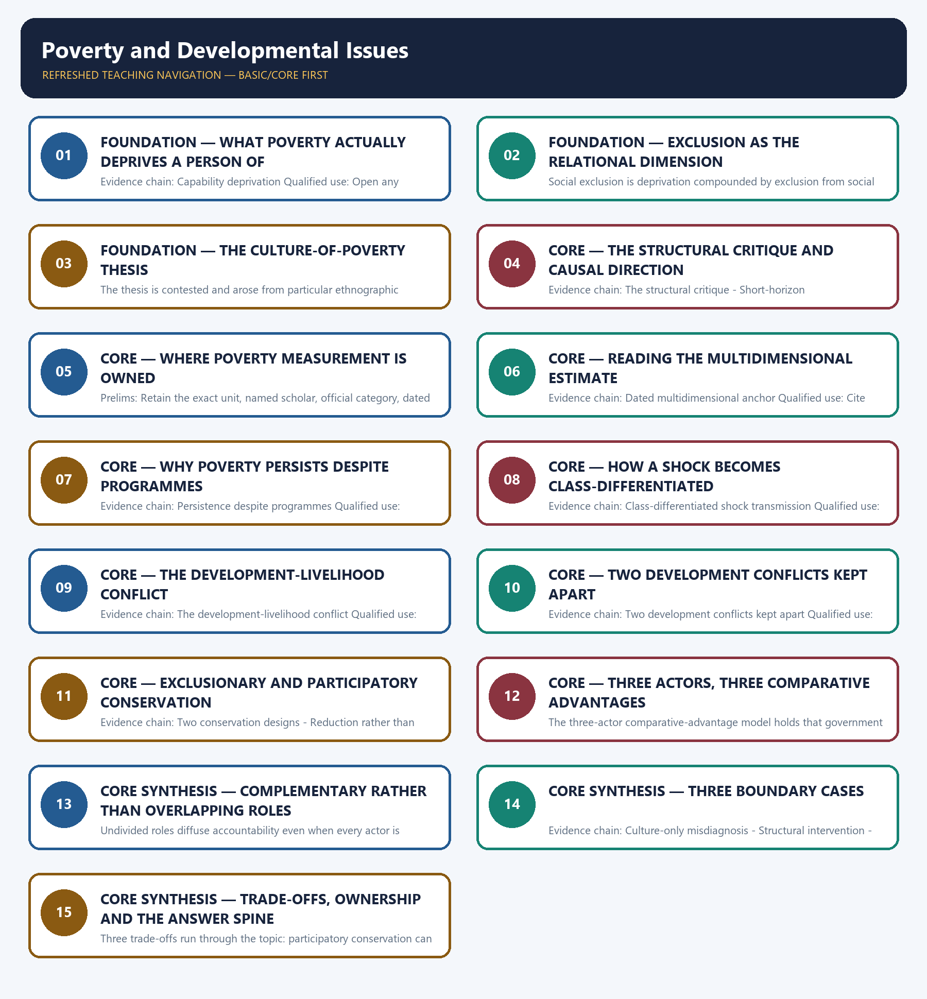

# Poverty and Developmental Issues — Learner-v2 Complete Learning Session

> **Authoring-only generation:** 2026-09-02. No PDF was rendered and no tracker or index was mutated.

### SOURCE, PROGRESSION AND CURRENT-LINKAGE AUDIT

- **Generation date:** 2026-09-02.
- **Repository-first evidence:** the Basic owner is taught first and preserved in full; the Advanced owner is retained only in the optional final teaching block.
- **OCR evidence:** Repository Markdown was primary. The OCR-searchable official General Studies Paper-I question papers held under books\mains and books\more_previous_papers were used only to confirm the wording of routed Mains PYQs. No official answer key, marking scheme, page precision or unsupported quotation was imported from them.
- **Qdrant:** not used; repository Markdown and available OCR context were sufficient.
- **PYQ integrity:** Four direct General Studies Paper-I Mains demands are carried by this owner and each is recorded with its exact routing status. The 2018 Q9 demand on the persistence of poverty despite eradication programmes and the 2020 Q9 demand on the pandemic, class inequalities and poverty are routed in the audited 2018-2023 Mains ledger to the Advanced owner, while the Core owner's own answer-architecture table records that Core routing supersedes, so both are answered here from the Basic spine. The locally held official question papers for 2018 and 2020 are scanned images from which reliable text cannot be extracted, so the audited ledger's neutral demand rendering is used for those two years and no verbatim wording is claimed. The 2024 Q10 demand on collaboration between government, non-governmental organisations and the private sector is routed in the audited 2024-2025 ledger to the Governance civil-society owner while this owner's own table claims it as a core route, and that cross-owner conflict is recorded openly here. The 2025 Q19 demand on sustainable growth against the needs of the poor is routed in the same ledger to this Basic owner. The wording of the 2024 and 2025 demands was confirmed in the locally held official question papers for those years. No marking scheme, official key or model answer of the Union Public Service Commission is held locally, and none is reproduced or inferred.
- **Live-link boundary:** No additional live official item was verified for this topic on 2026-09-02. Only the dated official anchors already carried by the repository owners are used, each with its issuing body and date. The package invents no caste, tribe, demographic or agrarian statistic, no legal or constitutional claim and no policy status.
- **Fact/inference discipline:** no current-affairs item, PYQ wording, figure or quotation is invented.

## BASIC LEARNING SESSION



*Distinct embedded teaching-navigation image. The separate continuous Cārvāka-style flowchart package remains an independent at-a-glance artifact.*

### SESSION 1 — FOUNDATION — WHAT POVERTY ACTUALLY DEPRIVES A PERSON OF

#### DEFINITION / WHAT THIS IS CALLED

**Plain-language definition:** Capability deprivation is the condition in which a person cannot achieve basic valued functionings such as being nourished, being educated, being healthy and participating in social life, which is why Amartya Sen's approach measures poverty directly against those freedoms rather than inferring them from an income threshold.

**Technical definition:** Evidence chain: Capability deprivation Qualified use: Open any poverty answer with deprivation rather than with a threshold.

#### ANSWER-GRABBING OPENING — WRITE/ADAPT IN THE EXAM

> Capability deprivation is the condition in which a person cannot achieve basic valued functionings such as being nourished, being educated, being healthy and participating in social life, which is why Amartya Sen's approach measures poverty directly against those freedoms rather than inferring them from an income threshold.

#### MUST-WRITE KEYWORDS

- **FOUNDATION**
- **What poverty actually deprives a person of**
- **Evidence chain**
- **Qualified use**
- **Capability deprivation**
- **Capability**

**How to use them:** Frame the answer through FOUNDATION; define What poverty actually deprives a person of, connect Evidence chain with Qualified use to explain the mechanism, and use Capability deprivation for the decisive comparison or qualification.

#### VISUAL FIRST

```text
WHAT POVERTY ACTUALLY DEPRIVES A PERSON OF
01. Capability deprivation
BOUNDARY -> Capability analysis supplements income measurement rather than abolishing it.
```

*This topic-specific rail fixes the evidence sequence and its exam boundary before analysis.*

#### CORE EXPLANATION

Capability deprivation is the condition in which a person cannot achieve basic valued functionings such as being nourished, being educated, being healthy and participating in social life, which is why Amartya Sen's approach measures poverty directly against those freedoms rather than inferring them from an income threshold.

#### NAMED EVIDENCE AND MECHANISM

- Capability deprivation is the condition in which a person cannot achieve basic valued functionings such as being nourished, being educated, being healthy and participating in social life, which is why Amartya Sen's approach measures poverty directly against those freedoms rather than inferring them from an income threshold.

#### EXAMINER CAUTION

- Capability analysis supplements income measurement rather than abolishing it.

#### EXAM LINK

- **Prelims:** Retain the exact unit, named scholar, official category, dated statistic or legal boundary attached to What poverty actually deprives a person of.
- **Mains:** Open any poverty answer with deprivation rather than with a threshold.

#### MINI RECAP

- **Evidence chain:** Capability deprivation
- **Qualified use:** Open any poverty answer with deprivation rather than with a threshold.

#### CLOSING RECALL FLOW — FOUNDATION — WHAT POVERTY ACTUALLY DEPRIVES A PERSON OF

```text
START / CONCEPT: FOUNDATION — What poverty actually deprives a person of
        |
        v
EXACT TERMS: FOUNDATION · What poverty actually deprives a person of · Evidence chain · Qualified use · Capability deprivation · Capability
        |
        v
MECHANISM / ARGUMENT: Evidence chain: Capability deprivation Qualified use: Open any poverty answer with deprivation rather than with a threshold.
        |
        v
CONSEQUENCE / CONTRAST: The resulting consequence is that open any poverty answer with deprivation rather than with a threshold.
        |
        v
UPSC TRAP / ANSWER-USE: Do not miss this limiting distinction: open any poverty answer with deprivation rather than with a threshold.
        |
        v
ANSWER-GRABBING FORMULATION: Capability deprivation is the condition in which a person cannot achieve basic valued functionings such as being nourished, being educated, being healthy and participating in social life, which is why Amartya Sen's approach measures poverty directly against those freedoms rather than inferring them from an income threshold.
```
### SESSION 2 — FOUNDATION — EXCLUSION AS THE RELATIONAL DIMENSION

#### DEFINITION / WHAT THIS IS CALLED

**Plain-language definition:** Evidence chain: Social exclusion Qualified use: Add the dimension that explains why deprivation is unevenly distributed.

**Technical definition:** Social exclusion is deprivation compounded by exclusion from social networks, institutions and opportunity structures on grounds of caste, gender, religion or region, and it is a relational condition that an aggregate income statistic cannot express.

#### ANSWER-GRABBING OPENING — WRITE/ADAPT IN THE EXAM

> Evidence chain: Social exclusion Qualified use: Add the dimension that explains why deprivation is unevenly distributed.

#### MUST-WRITE KEYWORDS

- **FOUNDATION**
- **Exclusion as the relational dimension**
- **Evidence chain**
- **Qualified use**
- **Social exclusion**
- **Social**

**How to use them:** Frame the answer through FOUNDATION; define Exclusion as the relational dimension, connect Evidence chain with Qualified use to explain the mechanism, and use Social exclusion for the decisive comparison or qualification.

#### VISUAL FIRST

```text
EXCLUSION AS THE RELATIONAL DIMENSION
01. Social exclusion
BOUNDARY -> Exclusion is relational and cannot be read off an aggregate income statistic.
```

*This topic-specific rail fixes the evidence sequence and its exam boundary before analysis.*

#### CORE EXPLANATION

Social exclusion is deprivation compounded by exclusion from social networks, institutions and opportunity structures on grounds of caste, gender, religion or region, and it is a relational condition that an aggregate income statistic cannot express.

#### NAMED EVIDENCE AND MECHANISM

- Social exclusion is deprivation compounded by exclusion from social networks, institutions and opportunity structures on grounds of caste, gender, religion or region, and it is a relational condition that an aggregate income statistic cannot express.

#### EXAMINER CAUTION

- Exclusion is relational and cannot be read off an aggregate income statistic.

#### EXAM LINK

- **Prelims:** Retain the exact unit, named scholar, official category, dated statistic or legal boundary attached to Exclusion as the relational dimension.
- **Mains:** Add the dimension that explains why deprivation is unevenly distributed.

#### MINI RECAP

- **Evidence chain:** Social exclusion
- **Qualified use:** Add the dimension that explains why deprivation is unevenly distributed.

#### CLOSING RECALL FLOW — FOUNDATION — EXCLUSION AS THE RELATIONAL DIMENSION

```text
START / CONCEPT: FOUNDATION — Exclusion as the relational dimension
        |
        v
EXACT TERMS: FOUNDATION · Exclusion as the relational dimension · Evidence chain · Qualified use · Social exclusion · Social
        |
        v
MECHANISM / ARGUMENT: Social exclusion is deprivation compounded by exclusion from social networks, institutions and opportunity structures on grounds of caste, gender, religion or region, and it is a relational condition that an aggregate income statistic cannot express.
        |
        v
CONSEQUENCE / CONTRAST: Exclusion is relational and cannot be read off an aggregate income statistic.
        |
        v
UPSC TRAP / ANSWER-USE: Do not miss this limiting distinction: add the dimension that explains why deprivation is unevenly distributed.
        |
        v
ANSWER-GRABBING FORMULATION: Evidence chain: Social exclusion Qualified use: Add the dimension that explains why deprivation is unevenly distributed.
```
### SESSION 3 — FOUNDATION — THE CULTURE-OF-POVERTY THESIS

#### DEFINITION / WHAT THIS IS CALLED

**Plain-language definition:** The culture of poverty is Oscar Lewis's contested thesis that persistent poverty can generate values, attitudes and behaviour that are reproduced across generations, and it arose from particular ethnographic settings rather than as a complete explanation of poverty anywhere.

**Technical definition:** The thesis is contested and arose from particular ethnographic settings.

#### ANSWER-GRABBING OPENING — WRITE/ADAPT IN THE EXAM

> The culture of poverty is Oscar Lewis's contested thesis that persistent poverty can generate values, attitudes and behaviour that are reproduced across generations, and it arose from particular ethnographic settings rather than as a complete explanation of poverty anywhere.

#### MUST-WRITE KEYWORDS

- **FOUNDATION**
- **The culture-of-poverty thesis**
- **Evidence chain**
- **Qualified use**
- **The culture of poverty**
- **Oscar Lewis's**

**How to use them:** Frame the answer through FOUNDATION; define The culture-of-poverty thesis, connect Evidence chain with Qualified use to explain the mechanism, and use The culture of poverty for the decisive comparison or qualification.

#### VISUAL FIRST

```text
THE CULTURE-OF-POVERTY THESIS
01. The culture of poverty
BOUNDARY -> The thesis is contested and arose from particular ethnographic settings.
```

*This topic-specific rail fixes the evidence sequence and its exam boundary before analysis.*

#### CORE EXPLANATION

The culture of poverty is Oscar Lewis's contested thesis that persistent poverty can generate values, attitudes and behaviour that are reproduced across generations, and it arose from particular ethnographic settings rather than as a complete explanation of poverty anywhere.

#### NAMED EVIDENCE AND MECHANISM

- The culture of poverty is Oscar Lewis's contested thesis that persistent poverty can generate values, attitudes and behaviour that are reproduced across generations, and it arose from particular ethnographic settings rather than as a complete explanation of poverty anywhere.

#### EXAMINER CAUTION

- The thesis is contested and arose from particular ethnographic settings.

#### EXAM LINK

- **Prelims:** Retain the exact unit, named scholar, official category, dated statistic or legal boundary attached to The culture-of-poverty thesis.
- **Mains:** State a contested thesis accurately before criticising it.

#### MINI RECAP

- **Evidence chain:** The culture of poverty
- **Qualified use:** State a contested thesis accurately before criticising it.

#### CLOSING RECALL FLOW — FOUNDATION — THE CULTURE-OF-POVERTY THESIS

```text
START / CONCEPT: FOUNDATION — The culture-of-poverty thesis
        |
        v
EXACT TERMS: FOUNDATION · The culture-of-poverty thesis · Evidence chain · Qualified use · The culture of poverty · Oscar Lewis's
        |
        v
MECHANISM / ARGUMENT: Evidence chain: The culture of poverty Qualified use: State a contested thesis accurately before criticising it.
        |
        v
CONSEQUENCE / CONTRAST: The thesis is contested and arose from particular ethnographic settings.
        |
        v
UPSC TRAP / ANSWER-USE: Do not miss this limiting distinction: the culture of poverty Qualified use.
        |
        v
ANSWER-GRABBING FORMULATION: The culture of poverty is Oscar Lewis's contested thesis that persistent poverty can generate values, attitudes and behaviour that are reproduced across generations, and it arose from particular ethnographic settings rather than as a complete explanation of poverty anywhere.
```
### SESSION 4 — CORE — THE STRUCTURAL CRITIQUE AND CAUSAL DIRECTION

#### DEFINITION / WHAT THIS IS CALLED

**Plain-language definition:** The structural or institutional critique holds that the behaviours Lewis described are better read as rational adaptations to chronic insecurity, unequal land and credit access and weak public services, so the direction of causation is the entire dispute and a policy that corrects culture while leaving material conditions untouched is misdirected.

**Technical definition:** Evidence chain: The structural critique - Short-horizon decision-making Qualified use: Win a critically-examine directive on the causal-direction question.

#### ANSWER-GRABBING OPENING — WRITE/ADAPT IN THE EXAM

> The structural or institutional critique holds that the behaviours Lewis described are better read as rational adaptations to chronic insecurity, unequal land and credit access and weak public services, so the direction of causation is the entire dispute and a policy that corrects culture while leaving material conditions untouched is misdirected.

#### MUST-WRITE KEYWORDS

- **The structural critique**
- **causal direction**
- **Evidence chain**
- **Qualified use**
- **Lewis**
- **Short-horizon decision-making**

**How to use them:** Frame the answer through The structural critique; define causal direction, connect Evidence chain with Qualified use to explain the mechanism, and use Lewis for the decisive comparison or qualification.

#### VISUAL FIRST

```text
THE STRUCTURAL CRITIQUE AND CAUSAL DIRECTION
01. The structural critique
    |
    v
02. Short-horizon decision-making
BOUNDARY -> Coping behaviour must be described without being converted into blame.
```

*This topic-specific rail fixes the evidence sequence and its exam boundary before analysis.*

#### CORE EXPLANATION

The structural or institutional critique holds that the behaviours Lewis described are better read as rational adaptations to chronic insecurity, unequal land and credit access and weak public services, so the direction of causation is the entire dispute and a policy that corrects culture while leaving material conditions untouched is misdirected. Short-horizon decision-making is the prioritising of immediate survival over long-term investment in schooling or savings, and it is evidence of a constrained opportunity set rather than proof of an independent cultural cause, which is why coping behaviour must be described without being converted into blame.

#### NAMED EVIDENCE AND MECHANISM

- The structural or institutional critique holds that the behaviours Lewis described are better read as rational adaptations to chronic insecurity, unequal land and credit access and weak public services, so the direction of causation is the entire dispute and a policy that corrects culture while leaving material conditions untouched is misdirected.
- Short-horizon decision-making is the prioritising of immediate survival over long-term investment in schooling or savings, and it is evidence of a constrained opportunity set rather than proof of an independent cultural cause, which is why coping behaviour must be described without being converted into blame.

#### EXAMINER CAUTION

- Coping behaviour must be described without being converted into blame.

#### EXAM LINK

- **Prelims:** Retain the exact unit, named scholar, official category, dated statistic or legal boundary attached to The structural critique and causal direction.
- **Mains:** Win a critically-examine directive on the causal-direction question.

#### MINI RECAP

- **Evidence chain:** The structural critique -> Short-horizon decision-making
- **Qualified use:** Win a critically-examine directive on the causal-direction question.

#### CLOSING RECALL FLOW — CORE — THE STRUCTURAL CRITIQUE AND CAUSAL DIRECTION

```text
START / CONCEPT: CORE — The structural critique and causal direction
        |
        v
EXACT TERMS: The structural critique · causal direction · Evidence chain · Qualified use · Lewis · Short-horizon decision-making
        |
        v
MECHANISM / ARGUMENT: Evidence chain: The structural critique - Short-horizon decision-making Qualified use: Win a critically-examine directive on the causal-direction question.
        |
        v
CONSEQUENCE / CONTRAST: Coping behaviour must be described without being converted into blame.
        |
        v
UPSC TRAP / ANSWER-USE: Short-horizon decision-making is the prioritising of immediate survival over long-term investment in schooling or savings, and it is evidence of a constrained opportunity set rather than proof of an independent cultural cause, which is why coping behaviour must be described without being converted into blame.
        |
        v
ANSWER-GRABBING FORMULATION: The structural or institutional critique holds that the behaviours Lewis described are better read as rational adaptations to chronic insecurity, unequal land and credit access and weak public services, so the direction of causation is the entire dispute and a policy that corrects culture while leaving material conditions untouched is misdirected.
```
### SESSION 5 — CORE — WHERE POVERTY MEASUREMENT IS OWNED

#### DEFINITION / WHAT THIS IS CALLED

**Plain-language definition:** The measurement boundary of this owner is that the Tendulkar and Rangarajan poverty-line formulae and the construction of the multidimensional poverty index belong to Economy, while welfare entitlement and scheme detail belong to Social Justice, so a sociological answer explains deprivation mechanisms rather than restating another owner's methodology.

**Technical definition:** Prelims: Retain the exact unit, named scholar, official category, dated statistic or legal boundary attached to Where poverty measurement is owned.

#### ANSWER-GRABBING OPENING — WRITE/ADAPT IN THE EXAM

> Prelims: Retain the exact unit, named scholar, official category, dated statistic or legal boundary attached to Where poverty measurement is owned.

#### MUST-WRITE KEYWORDS

- **Where poverty measurement is owned**
- **Evidence chain**
- **Qualified use**
- **The measurement boundary of this owner**
- **Tendulkar**
- **Rangarajan**

**How to use them:** Frame the answer through Where poverty measurement is owned; define Evidence chain, connect Qualified use with The measurement boundary of this owner to explain the mechanism, and use Tendulkar for the decisive comparison or qualification.

#### VISUAL FIRST

```text
WHERE POVERTY MEASUREMENT IS OWNED
01. The measurement boundary
BOUNDARY -> Methodology belongs to Economy and entitlement detail to Social Justice.
```

*This topic-specific rail fixes the evidence sequence and its exam boundary before analysis.*

#### CORE EXPLANATION

The measurement boundary of this owner is that the Tendulkar and Rangarajan poverty-line formulae and the construction of the multidimensional poverty index belong to Economy, while welfare entitlement and scheme detail belong to Social Justice, so a sociological answer explains deprivation mechanisms rather than restating another owner's methodology.

#### NAMED EVIDENCE AND MECHANISM

- The measurement boundary of this owner is that the Tendulkar and Rangarajan poverty-line formulae and the construction of the multidimensional poverty index belong to Economy, while welfare entitlement and scheme detail belong to Social Justice, so a sociological answer explains deprivation mechanisms rather than restating another owner's methodology.

#### EXAMINER CAUTION

- Methodology belongs to Economy and entitlement detail to Social Justice.

#### EXAM LINK

- **Prelims:** Retain the exact unit, named scholar, official category, dated statistic or legal boundary attached to Where poverty measurement is owned.
- **Mains:** Protect a sociological answer from becoming another owner's methodology note.

#### MINI RECAP

- **Evidence chain:** The measurement boundary
- **Qualified use:** Protect a sociological answer from becoming another owner's methodology note.

#### CLOSING RECALL FLOW — CORE — WHERE POVERTY MEASUREMENT IS OWNED

```text
START / CONCEPT: CORE — Where poverty measurement is owned
        |
        v
EXACT TERMS: Where poverty measurement is owned · Evidence chain · Qualified use · The measurement boundary of this owner · Tendulkar · Rangarajan
        |
        v
MECHANISM / ARGUMENT: The measurement boundary of this owner is that the Tendulkar and Rangarajan poverty-line formulae and the construction of the multidimensional poverty index belong to Economy, while welfare entitlement and scheme detail belong to Social Justice, so a sociological answer explains deprivation mechanisms rather than restating another owner's methodology.
        |
        v
CONSEQUENCE / CONTRAST: Evidence chain: The measurement boundary Qualified use: Protect a sociological answer from becoming another owner's methodology note.
        |
        v
UPSC TRAP / ANSWER-USE: Do not miss this limiting distinction: the measurement boundary of this owner is that the Tendulkar and Rangarajan poverty-line formulae...
        |
        v
ANSWER-GRABBING FORMULATION: Prelims: Retain the exact unit, named scholar, official category, dated statistic or legal boundary attached to Where poverty measurement is owned.
```
### SESSION 6 — CORE — READING THE MULTIDIMENSIONAL ESTIMATE

#### DEFINITION / WHAT THIS IS CALLED

**Plain-language definition:** The NITI Aayog discussion paper of 2024 titled Multidimensional Poverty in India since 2005-06 estimated multidimensional poverty at 11.28 per cent in 2022-23 and about 24.8 crore persons exiting multidimensional poverty between 2013-14 and 2022-23, and these are the paper's estimates for a stated period rather than a current headcount or evidence that a named programme caused the change.

**Technical definition:** Evidence chain: Dated multidimensional anchor Qualified use: Cite one dated official estimate without overclaiming it.

#### ANSWER-GRABBING OPENING — WRITE/ADAPT IN THE EXAM

> The NITI Aayog discussion paper of 2024 titled Multidimensional Poverty in India since 2005-06 estimated multidimensional poverty at 11.28 per cent in 2022-23 and about 24.8 crore persons exiting multidimensional poverty between 2013-14 and 2022-23, and these are the paper's estimates for a stated period rather than a current headcount or evidence that a named programme caused the change.

#### MUST-WRITE KEYWORDS

- **Reading the multidimensional estimate**
- **Evidence chain**
- **Qualified use**
- **2005-06**
- **2022-23**
- **2013-14**

**How to use them:** Frame the answer through Reading the multidimensional estimate; define Evidence chain, connect Qualified use with 2005-06 to explain the mechanism, and use 2022-23 for the decisive comparison or qualification.

#### VISUAL FIRST

```text
READING THE MULTIDIMENSIONAL ESTIMATE
01. Dated multidimensional anchor
BOUNDARY -> The estimate covers a stated period and proves no programme attribution.
```

*This topic-specific rail fixes the evidence sequence and its exam boundary before analysis.*

#### CORE EXPLANATION

The NITI Aayog discussion paper of 2024 titled Multidimensional Poverty in India since 2005-06 estimated multidimensional poverty at 11.28 per cent in 2022-23 and about 24.8 crore persons exiting multidimensional poverty between 2013-14 and 2022-23, and these are the paper's estimates for a stated period rather than a current headcount or evidence that a named programme caused the change.

#### NAMED EVIDENCE AND MECHANISM

- The NITI Aayog discussion paper of 2024 titled Multidimensional Poverty in India since 2005-06 estimated multidimensional poverty at 11.28 per cent in 2022-23 and about 24.8 crore persons exiting multidimensional poverty between 2013-14 and 2022-23, and these are the paper's estimates for a stated period rather than a current headcount or evidence that a named programme caused the change.

#### EXAMINER CAUTION

- The estimate covers a stated period and proves no programme attribution.

#### EXAM LINK

- **Prelims:** Retain the exact unit, named scholar, official category, dated statistic or legal boundary attached to Reading the multidimensional estimate.
- **Mains:** Cite one dated official estimate without overclaiming it.

#### MINI RECAP

- **Evidence chain:** Dated multidimensional anchor
- **Qualified use:** Cite one dated official estimate without overclaiming it.

#### CLOSING RECALL FLOW — CORE — READING THE MULTIDIMENSIONAL ESTIMATE

```text
START / CONCEPT: CORE — Reading the multidimensional estimate
        |
        v
EXACT TERMS: Reading the multidimensional estimate · Evidence chain · Qualified use · 2005-06 · 2022-23 · 2013-14
        |
        v
MECHANISM / ARGUMENT: Evidence chain: Dated multidimensional anchor Qualified use: Cite one dated official estimate without overclaiming it.
        |
        v
CONSEQUENCE / CONTRAST: The estimate covers a stated period and proves no programme attribution.
        |
        v
UPSC TRAP / ANSWER-USE: Do not miss this limiting distinction: cite one dated official estimate without overclaiming it.
        |
        v
ANSWER-GRABBING FORMULATION: The NITI Aayog discussion paper of 2024 titled Multidimensional Poverty in India since 2005-06 estimated multidimensional poverty at 11.28 per cent in 2022-23 and about 24.8 crore persons exiting multidimensional poverty between 2013-14 and 2022-23, and these are the paper's estimates for a stated period rather than a current headcount or evidence that a named programme caused the change.
```
### SESSION 7 — CORE — WHY POVERTY PERSISTS DESPITE PROGRAMMES

#### DEFINITION / WHAT THIS IS CALLED

**Plain-language definition:** Persistence despite programmes is the gap between coverage, access and actual use, in which an entitlement exists on paper while asset deficits, exclusion, distance, information failure and last-mile delivery weaknesses stop it from reaching or being usable by the household it names.

**Technical definition:** Evidence chain: Persistence despite programmes Qualified use: Answer an explain-by-giving-reasons directive with delivery mechanisms.

#### ANSWER-GRABBING OPENING — WRITE/ADAPT IN THE EXAM

> Evidence chain: Persistence despite programmes Qualified use: Answer an explain-by-giving-reasons directive with delivery mechanisms.

#### MUST-WRITE KEYWORDS

- **Why poverty persists despite programmes**
- **Evidence chain**
- **Qualified use**
- **Persistence despite programmes**
- **Persistence**
- **Coverage**

**How to use them:** Frame the answer through Why poverty persists despite programmes; define Evidence chain, connect Qualified use with Persistence despite programmes to explain the mechanism, and use Persistence for the decisive comparison or qualification.

#### VISUAL FIRST

```text
WHY POVERTY PERSISTS DESPITE PROGRAMMES
01. Persistence despite programmes
BOUNDARY -> Coverage is not access and access is not use, so the three must be separated.
```

*This topic-specific rail fixes the evidence sequence and its exam boundary before analysis.*

#### CORE EXPLANATION

Persistence despite programmes is the gap between coverage, access and actual use, in which an entitlement exists on paper while asset deficits, exclusion, distance, information failure and last-mile delivery weaknesses stop it from reaching or being usable by the household it names.

#### NAMED EVIDENCE AND MECHANISM

- Persistence despite programmes is the gap between coverage, access and actual use, in which an entitlement exists on paper while asset deficits, exclusion, distance, information failure and last-mile delivery weaknesses stop it from reaching or being usable by the household it names.

#### EXAMINER CAUTION

- Coverage is not access and access is not use, so the three must be separated.

#### EXAM LINK

- **Prelims:** Retain the exact unit, named scholar, official category, dated statistic or legal boundary attached to Why poverty persists despite programmes.
- **Mains:** Answer an explain-by-giving-reasons directive with delivery mechanisms.

#### MINI RECAP

- **Evidence chain:** Persistence despite programmes
- **Qualified use:** Answer an explain-by-giving-reasons directive with delivery mechanisms.

#### CLOSING RECALL FLOW — CORE — WHY POVERTY PERSISTS DESPITE PROGRAMMES

```text
START / CONCEPT: CORE — Why poverty persists despite programmes
        |
        v
EXACT TERMS: Why poverty persists despite programmes · Evidence chain · Qualified use · Persistence despite programmes · Persistence · Coverage
        |
        v
MECHANISM / ARGUMENT: Persistence despite programmes is the gap between coverage, access and actual use, in which an entitlement exists on paper while asset deficits, exclusion, distance, information failure and last-mile delivery weaknesses stop it from reaching or being usable by the household it names.
        |
        v
CONSEQUENCE / CONTRAST: Coverage is not access and access is not use, so the three must be separated.
        |
        v
UPSC TRAP / ANSWER-USE: Do not miss this limiting distinction: answer an explain-by-giving-reasons directive with delivery mechanisms.
        |
        v
ANSWER-GRABBING FORMULATION: Evidence chain: Persistence despite programmes Qualified use: Answer an explain-by-giving-reasons directive with delivery mechanisms.
```
### SESSION 8 — CORE — HOW A SHOCK BECOMES CLASS-DIFFERENTIATED

#### DEFINITION / WHAT THIS IS CALLED

**Plain-language definition:** Class-differentiated shock transmission is the process by which a common shock produces unequal outcomes through precarious informal work and income loss, dense housing and health exposure, thin savings and social-protection portability, and unequal digital and service access, so the shock is a channel structure rather than one uniform experience.

**Technical definition:** Evidence chain: Class-differentiated shock transmission Qualified use: Convert an event-based demand into a transmission-channel argument.

#### ANSWER-GRABBING OPENING — WRITE/ADAPT IN THE EXAM

> Class-differentiated shock transmission is the process by which a common shock produces unequal outcomes through precarious informal work and income loss, dense housing and health exposure, thin savings and social-protection portability, and unequal digital and service access, so the shock is a channel structure rather than one uniform experience.

#### MUST-WRITE KEYWORDS

- **How a shock becomes class-differentiated**
- **Evidence chain**
- **Qualified use**
- **Class-differentiated shock transmission**
- **Class-differentiated**
- **The channels**

**How to use them:** Frame the answer through How a shock becomes class-differentiated; define Evidence chain, connect Qualified use with Class-differentiated shock transmission to explain the mechanism, and use Class-differentiated for the decisive comparison or qualification.

#### VISUAL FIRST

```text
HOW A SHOCK BECOMES CLASS-DIFFERENTIATED
01. Class-differentiated shock transmission
BOUNDARY -> The channels are analytical and no magnitude or rate is asserted.
```

*This topic-specific rail fixes the evidence sequence and its exam boundary before analysis.*

#### CORE EXPLANATION

Class-differentiated shock transmission is the process by which a common shock produces unequal outcomes through precarious informal work and income loss, dense housing and health exposure, thin savings and social-protection portability, and unequal digital and service access, so the shock is a channel structure rather than one uniform experience.

#### NAMED EVIDENCE AND MECHANISM

- Class-differentiated shock transmission is the process by which a common shock produces unequal outcomes through precarious informal work and income loss, dense housing and health exposure, thin savings and social-protection portability, and unequal digital and service access, so the shock is a channel structure rather than one uniform experience.

#### EXAMINER CAUTION

- The channels are analytical and no magnitude or rate is asserted.

#### EXAM LINK

- **Prelims:** Retain the exact unit, named scholar, official category, dated statistic or legal boundary attached to How a shock becomes class-differentiated.
- **Mains:** Convert an event-based demand into a transmission-channel argument.

#### MINI RECAP

- **Evidence chain:** Class-differentiated shock transmission
- **Qualified use:** Convert an event-based demand into a transmission-channel argument.

#### CLOSING RECALL FLOW — CORE — HOW A SHOCK BECOMES CLASS-DIFFERENTIATED

```text
START / CONCEPT: CORE — How a shock becomes class-differentiated
        |
        v
EXACT TERMS: How a shock becomes class-differentiated · Evidence chain · Qualified use · Class-differentiated shock transmission · Class-differentiated · The channels
        |
        v
MECHANISM / ARGUMENT: Evidence chain: Class-differentiated shock transmission Qualified use: Convert an event-based demand into a transmission-channel argument.
        |
        v
CONSEQUENCE / CONTRAST: The channels are analytical and no magnitude or rate is asserted.
        |
        v
UPSC TRAP / ANSWER-USE: Do not miss this limiting distinction: convert an event-based demand into a transmission-channel argument.
        |
        v
ANSWER-GRABBING FORMULATION: Class-differentiated shock transmission is the process by which a common shock produces unequal outcomes through precarious informal work and income loss, dense housing and health exposure, thin savings and social-protection portability, and unequal digital and service access, so the shock is a channel structure rather than one uniform experience.
```
### SESSION 9 — CORE — THE DEVELOPMENT-LIVELIHOOD CONFLICT

#### DEFINITION / WHAT THIS IS CALLED

**Plain-language definition:** The development-livelihood conflict is the tension that arises when environmental conservation or sustainable-development measures restrict access to land, forest or water resources on which poor communities directly depend for subsistence, and it is a genuine trade-off rather than a failure of communication.

**Technical definition:** Evidence chain: The development-livelihood conflict Qualified use: Affirm the conflict honestly before discussing how to reduce it.

#### ANSWER-GRABBING OPENING — WRITE/ADAPT IN THE EXAM

> Evidence chain: The development-livelihood conflict Qualified use: Affirm the conflict honestly before discussing how to reduce it.

#### MUST-WRITE KEYWORDS

- **The development-livelihood conflict**
- **Evidence chain**
- **Qualified use**
- **The conflict**
- **Qualified**
- **Affirm**

**How to use them:** Frame the answer through The development-livelihood conflict; define Evidence chain, connect Qualified use with The conflict to explain the mechanism, and use Qualified for the decisive comparison or qualification.

#### VISUAL FIRST

```text
THE DEVELOPMENT-LIVELIHOOD CONFLICT
01. The development-livelihood conflict
BOUNDARY -> The conflict is a genuine trade-off rather than a communication failure.
```

*This topic-specific rail fixes the evidence sequence and its exam boundary before analysis.*

#### CORE EXPLANATION

The development-livelihood conflict is the tension that arises when environmental conservation or sustainable-development measures restrict access to land, forest or water resources on which poor communities directly depend for subsistence, and it is a genuine trade-off rather than a failure of communication.

#### NAMED EVIDENCE AND MECHANISM

- The development-livelihood conflict is the tension that arises when environmental conservation or sustainable-development measures restrict access to land, forest or water resources on which poor communities directly depend for subsistence, and it is a genuine trade-off rather than a failure of communication.

#### EXAMINER CAUTION

- The conflict is a genuine trade-off rather than a communication failure.

#### EXAM LINK

- **Prelims:** Retain the exact unit, named scholar, official category, dated statistic or legal boundary attached to The development-livelihood conflict.
- **Mains:** Affirm the conflict honestly before discussing how to reduce it.

#### MINI RECAP

- **Evidence chain:** The development-livelihood conflict
- **Qualified use:** Affirm the conflict honestly before discussing how to reduce it.

#### CLOSING RECALL FLOW — CORE — THE DEVELOPMENT-LIVELIHOOD CONFLICT

```text
START / CONCEPT: CORE — The development-livelihood conflict
        |
        v
EXACT TERMS: The development-livelihood conflict · Evidence chain · Qualified use · The conflict · Qualified · Affirm
        |
        v
MECHANISM / ARGUMENT: The development-livelihood conflict is the tension that arises when environmental conservation or sustainable-development measures restrict access to land, forest or water resources on which poor communities directly depend for subsistence, and it is a genuine trade-off rather than a failure of communication.
        |
        v
CONSEQUENCE / CONTRAST: The conflict is a genuine trade-off rather than a communication failure.
        |
        v
UPSC TRAP / ANSWER-USE: Do not miss this limiting distinction: affirm the conflict honestly before discussing how to reduce it.
        |
        v
ANSWER-GRABBING FORMULATION: Evidence chain: The development-livelihood conflict Qualified use: Affirm the conflict honestly before discussing how to reduce it.
```
### SESSION 10 — CORE — TWO DEVELOPMENT CONFLICTS KEPT APART

#### DEFINITION / WHAT THIS IS CALLED

**Plain-language definition:** Conservation restriction and project displacement are different mechanisms, a distinction the Advanced owner labels development-conservation conflict vs development-displacement conflict: the first curtails grazing, fuelwood or produce collection without moving anyone, while the second physically relocates a community and is owned by the tribal-society topic.

**Technical definition:** Evidence chain: Two development conflicts kept apart Qualified use: Keep two remedies apart by keeping two mechanisms apart.

#### ANSWER-GRABBING OPENING — WRITE/ADAPT IN THE EXAM

> Evidence chain: Two development conflicts kept apart Qualified use: Keep two remedies apart by keeping two mechanisms apart.

#### MUST-WRITE KEYWORDS

- **Two development conflicts kept apart**
- **Evidence chain**
- **Qualified use**
- **Conservation restriction and project displacement**
- **Conservation**
- **Advanced**

**How to use them:** Frame the answer through Two development conflicts kept apart; define Evidence chain, connect Qualified use with Conservation restriction and project displacement to explain the mechanism, and use Conservation for the decisive comparison or qualification.

#### VISUAL FIRST

```text
TWO DEVELOPMENT CONFLICTS KEPT APART
01. Two development conflicts kept apart
BOUNDARY -> Project displacement is owned by the tribal-society topic and is not claimed here.
```

*This topic-specific rail fixes the evidence sequence and its exam boundary before analysis.*

#### CORE EXPLANATION

Conservation restriction and project displacement are different mechanisms, a distinction the Advanced owner labels development-conservation conflict vs development-displacement conflict: the first curtails grazing, fuelwood or produce collection without moving anyone, while the second physically relocates a community and is owned by the tribal-society topic.

#### NAMED EVIDENCE AND MECHANISM

- Conservation restriction and project displacement are different mechanisms, a distinction the Advanced owner labels development-conservation conflict vs development-displacement conflict: the first curtails grazing, fuelwood or produce collection without moving anyone, while the second physically relocates a community and is owned by the tribal-society topic.

#### EXAMINER CAUTION

- Project displacement is owned by the tribal-society topic and is not claimed here.

#### EXAM LINK

- **Prelims:** Retain the exact unit, named scholar, official category, dated statistic or legal boundary attached to Two development conflicts kept apart.
- **Mains:** Keep two remedies apart by keeping two mechanisms apart.

#### MINI RECAP

- **Evidence chain:** Two development conflicts kept apart
- **Qualified use:** Keep two remedies apart by keeping two mechanisms apart.

#### CLOSING RECALL FLOW — CORE — TWO DEVELOPMENT CONFLICTS KEPT APART

```text
START / CONCEPT: CORE — Two development conflicts kept apart
        |
        v
EXACT TERMS: Two development conflicts kept apart · Evidence chain · Qualified use · Conservation restriction and project displacement · Conservation · Advanced
        |
        v
MECHANISM / ARGUMENT: Conservation restriction and project displacement are different mechanisms, a distinction the Advanced owner labels development-conservation conflict vs development-displacement conflict: the first curtails grazing, fuelwood or produce collection without moving anyone, while the second physically relocates a community and is owned by the tribal-society topic.
        |
        v
CONSEQUENCE / CONTRAST: Project displacement is owned by the tribal-society topic and is not claimed here.
        |
        v
UPSC TRAP / ANSWER-USE: Do not miss this limiting distinction: two development conflicts kept apart Qualified use.
        |
        v
ANSWER-GRABBING FORMULATION: Evidence chain: Two development conflicts kept apart Qualified use: Keep two remedies apart by keeping two mechanisms apart.
```
### SESSION 11 — CORE — EXCLUSIONARY AND PARTICIPATORY CONSERVATION

#### DEFINITION / WHAT THIS IS CALLED

**Plain-language definition:** Participatory design substantially reduces the conservation-livelihood conflict without eliminating it, because some restriction on prior open access is usually still required, so the honest verdict describes severity as a function of design rather than declaring the conflict solved.

**Technical definition:** Evidence chain: Two conservation designs - Reduction rather than elimination Qualified use: Turn a comment directive into a design verdict rather than a lament.

#### ANSWER-GRABBING OPENING — WRITE/ADAPT IN THE EXAM

> Exclusionary conservation restricts local access entirely in order to protect an ecosystem while participatory conservation gives local communities a formal stake, co-management rights and alternative livelihood support in exchange for sustainable-use commitments, a design choice the Advanced owner labels participatory conservation vs exclusionary conservation.

#### MUST-WRITE KEYWORDS

- **Exclusionary**
- **participatory conservation**
- **Evidence chain**
- **Qualified use**
- **Advanced**
- **Participatory**

**How to use them:** Frame the answer through Exclusionary; define participatory conservation, connect Evidence chain with Qualified use to explain the mechanism, and use Advanced for the decisive comparison or qualification.

#### VISUAL FIRST

```text
EXCLUSIONARY AND PARTICIPATORY CONSERVATION
01. Two conservation designs
    |
    v
02. Reduction rather than elimination
BOUNDARY -> Participatory design reduces the conflict without eliminating it.
```

*This topic-specific rail fixes the evidence sequence and its exam boundary before analysis.*

#### CORE EXPLANATION

Exclusionary conservation restricts local access entirely in order to protect an ecosystem while participatory conservation gives local communities a formal stake, co-management rights and alternative livelihood support in exchange for sustainable-use commitments, a design choice the Advanced owner labels participatory conservation vs exclusionary conservation. Participatory design substantially reduces the conservation-livelihood conflict without eliminating it, because some restriction on prior open access is usually still required, so the honest verdict describes severity as a function of design rather than declaring the conflict solved.

#### NAMED EVIDENCE AND MECHANISM

- Exclusionary conservation restricts local access entirely in order to protect an ecosystem while participatory conservation gives local communities a formal stake, co-management rights and alternative livelihood support in exchange for sustainable-use commitments, a design choice the Advanced owner labels participatory conservation vs exclusionary conservation.
- Participatory design substantially reduces the conservation-livelihood conflict without eliminating it, because some restriction on prior open access is usually still required, so the honest verdict describes severity as a function of design rather than declaring the conflict solved.

#### EXAMINER CAUTION

- Participatory design reduces the conflict without eliminating it.

#### EXAM LINK

- **Prelims:** Retain the exact unit, named scholar, official category, dated statistic or legal boundary attached to Exclusionary and participatory conservation.
- **Mains:** Turn a comment directive into a design verdict rather than a lament.

#### MINI RECAP

- **Evidence chain:** Two conservation designs -> Reduction rather than elimination
- **Qualified use:** Turn a comment directive into a design verdict rather than a lament.

#### CLOSING RECALL FLOW — CORE — EXCLUSIONARY AND PARTICIPATORY CONSERVATION

```text
START / CONCEPT: CORE — Exclusionary and participatory conservation
        |
        v
EXACT TERMS: Exclusionary · participatory conservation · Evidence chain · Qualified use · Advanced · Participatory
        |
        v
MECHANISM / ARGUMENT: Participatory design substantially reduces the conservation-livelihood conflict without eliminating it, because some restriction on prior open access is usually still required, so the honest verdict describes severity as a function of design rather than declaring the conflict solved.
        |
        v
CONSEQUENCE / CONTRAST: Evidence chain: Two conservation designs - Reduction rather than elimination Qualified use: Turn a comment directive into a design verdict rather than a lament.
        |
        v
UPSC TRAP / ANSWER-USE: Do not miss this limiting distinction: exclusionary conservation restricts local access entirely in order to protect an ecosystem while participatory...
        |
        v
ANSWER-GRABBING FORMULATION: Exclusionary conservation restricts local access entirely in order to protect an ecosystem while participatory conservation gives local communities a formal stake, co-management rights and alternative livelihood support in exchange for sustainable-use commitments, a design choice the Advanced owner labels participatory conservation vs exclusionary conservation.
```
### SESSION 12 — CORE — THREE ACTORS, THREE COMPARATIVE ADVANTAGES

#### DEFINITION / WHAT THIS IS CALLED

**Plain-language definition:** Evidence chain: Three-actor comparative advantage Qualified use: Structure a collaboration demand around comparative advantage.

**Technical definition:** The three-actor comparative-advantage model holds that government supplies regulatory authority, funding at scale and final accountability, non-governmental organisations supply grassroots trust, local knowledge and last-mile delivery, and private actors supply technology, efficiency and resources, so no single actor ordinarily holds all three strengths.

#### ANSWER-GRABBING OPENING — WRITE/ADAPT IN THE EXAM

> Evidence chain: Three-actor comparative advantage Qualified use: Structure a collaboration demand around comparative advantage.

#### MUST-WRITE KEYWORDS

- **Three actors**
- **three comparative advantages**
- **Evidence chain**
- **Qualified use**
- **No**
- **Three-actor**

**How to use them:** Frame the answer through Three actors; define three comparative advantages, connect Evidence chain with Qualified use to explain the mechanism, and use No for the decisive comparison or qualification.

#### VISUAL FIRST

```text
THREE ACTORS, THREE COMPARATIVE ADVANTAGES
01. Three-actor comparative advantage
BOUNDARY -> No single actor ordinarily holds regulatory scale, grassroots trust and private efficiency together.
```

*This topic-specific rail fixes the evidence sequence and its exam boundary before analysis.*

#### CORE EXPLANATION

The three-actor comparative-advantage model holds that government supplies regulatory authority, funding at scale and final accountability, non-governmental organisations supply grassroots trust, local knowledge and last-mile delivery, and private actors supply technology, efficiency and resources, so no single actor ordinarily holds all three strengths.

#### NAMED EVIDENCE AND MECHANISM

- The three-actor comparative-advantage model holds that government supplies regulatory authority, funding at scale and final accountability, non-governmental organisations supply grassroots trust, local knowledge and last-mile delivery, and private actors supply technology, efficiency and resources, so no single actor ordinarily holds all three strengths.

#### EXAMINER CAUTION

- No single actor ordinarily holds regulatory scale, grassroots trust and private efficiency together.

#### EXAM LINK

- **Prelims:** Retain the exact unit, named scholar, official category, dated statistic or legal boundary attached to Three actors, three comparative advantages.
- **Mains:** Structure a collaboration demand around comparative advantage.

#### MINI RECAP

- **Evidence chain:** Three-actor comparative advantage
- **Qualified use:** Structure a collaboration demand around comparative advantage.

#### CLOSING RECALL FLOW — CORE — THREE ACTORS, THREE COMPARATIVE ADVANTAGES

```text
START / CONCEPT: CORE — Three actors, three comparative advantages
        |
        v
EXACT TERMS: Three actors · three comparative advantages · Evidence chain · Qualified use · No · Three-actor
        |
        v
MECHANISM / ARGUMENT: The three-actor comparative-advantage model holds that government supplies regulatory authority, funding at scale and final accountability, non-governmental organisations supply grassroots trust, local knowledge and last-mile delivery, and private actors supply technology, efficiency and resources, so no single actor ordinarily holds all three strengths.
        |
        v
CONSEQUENCE / CONTRAST: No single actor ordinarily holds regulatory scale, grassroots trust and private efficiency together.
        |
        v
UPSC TRAP / ANSWER-USE: Do not miss this limiting distinction: structure a collaboration demand around comparative advantage.
        |
        v
ANSWER-GRABBING FORMULATION: Evidence chain: Three-actor comparative advantage Qualified use: Structure a collaboration demand around comparative advantage.
```
### SESSION 13 — CORE SYNTHESIS — COMPLEMENTARY RATHER THAN OVERLAPPING ROLES

#### DEFINITION / WHAT THIS IS CALLED

**Plain-language definition:** Complementary collaboration is a role division in which each actor performs the function it is best placed to perform under joint monitoring, and the Advanced owner contrasts it under the label complementary vs overlapping collaboration with an arrangement in which undivided roles produce duplication, coordination failure and diffused accountability.

**Technical definition:** Undivided roles diffuse accountability even when every actor is competent.

#### ANSWER-GRABBING OPENING — WRITE/ADAPT IN THE EXAM

> Complementary collaboration is a role division in which each actor performs the function it is best placed to perform under joint monitoring, and the Advanced owner contrasts it under the label complementary vs overlapping collaboration with an arrangement in which undivided roles produce duplication, coordination failure and diffused accountability.

#### MUST-WRITE KEYWORDS

- **CORE SYNTHESIS**
- **Complementary rather than overlapping roles**
- **Evidence chain**
- **Qualified use**
- **Complementary collaboration**
- **Complementary**

**How to use them:** Frame the answer through CORE SYNTHESIS; define Complementary rather than overlapping roles, connect Evidence chain with Qualified use to explain the mechanism, and use Complementary collaboration for the decisive comparison or qualification.

#### VISUAL FIRST

```text
COMPLEMENTARY RATHER THAN OVERLAPPING ROLES
01. Complementary collaboration
BOUNDARY -> Undivided roles diffuse accountability even when every actor is competent.
```

*This topic-specific rail fixes the evidence sequence and its exam boundary before analysis.*

#### CORE EXPLANATION

Complementary collaboration is a role division in which each actor performs the function it is best placed to perform under joint monitoring, and the Advanced owner contrasts it under the label complementary vs overlapping collaboration with an arrangement in which undivided roles produce duplication, coordination failure and diffused accountability.

#### NAMED EVIDENCE AND MECHANISM

- Complementary collaboration is a role division in which each actor performs the function it is best placed to perform under joint monitoring, and the Advanced owner contrasts it under the label complementary vs overlapping collaboration with an arrangement in which undivided roles produce duplication, coordination failure and diffused accountability.

#### EXAMINER CAUTION

- Undivided roles diffuse accountability even when every actor is competent.

#### EXAM LINK

- **Prelims:** Retain the exact unit, named scholar, official category, dated statistic or legal boundary attached to Complementary rather than overlapping roles.
- **Mains:** Supply the failure mode that makes the recommendation credible.

#### MINI RECAP

- **Evidence chain:** Complementary collaboration
- **Qualified use:** Supply the failure mode that makes the recommendation credible.

#### CLOSING RECALL FLOW — CORE SYNTHESIS — COMPLEMENTARY RATHER THAN OVERLAPPING ROLES

```text
START / CONCEPT: CORE SYNTHESIS — Complementary rather than overlapping roles
        |
        v
EXACT TERMS: CORE SYNTHESIS · Complementary rather than overlapping roles · Evidence chain · Qualified use · Complementary collaboration · Complementary
        |
        v
MECHANISM / ARGUMENT: Evidence chain: Complementary collaboration Qualified use: Supply the failure mode that makes the recommendation credible.
        |
        v
CONSEQUENCE / CONTRAST: Undivided roles diffuse accountability even when every actor is competent.
        |
        v
UPSC TRAP / ANSWER-USE: Do not miss this limiting distinction: complementary collaboration is a role division in which each actor performs the function it...
        |
        v
ANSWER-GRABBING FORMULATION: Complementary collaboration is a role division in which each actor performs the function it is best placed to perform under joint monitoring, and the Advanced owner contrasts it under the label complementary vs overlapping collaboration with an arrangement in which undivided roles produce duplication, coordination failure and diffused accountability.
```
### SESSION 14 — CORE SYNTHESIS — THREE BOUNDARY CASES

#### DEFINITION / WHAT THIS IS CALLED

**Plain-language definition:** All three are illustrative cases carrying no invented coverage or outcome figure.

**Technical definition:** Evidence chain: Culture-only misdiagnosis - Structural intervention - Conservation implementation contrast Qualified use: Prove the argument with contrasting cases rather than assertion.

#### ANSWER-GRABBING OPENING — WRITE/ADAPT IN THE EXAM

> All three are illustrative cases carrying no invented coverage or outcome figure.

#### MUST-WRITE KEYWORDS

- **CORE SYNTHESIS**
- **Three boundary cases**
- **Evidence chain**
- **Qualified use**
- **All three**
- **All**

**How to use them:** Frame the answer through CORE SYNTHESIS; define Three boundary cases, connect Evidence chain with Qualified use to explain the mechanism, and use All three for the decisive comparison or qualification.

#### VISUAL FIRST

```text
THREE BOUNDARY CASES
01. Culture-only misdiagnosis
    |
    v
02. Structural intervention
    |
    v
03. Conservation implementation contrast
BOUNDARY -> All three are illustrative cases carrying no invented coverage or outcome figure.
```

*This topic-specific rail fixes the evidence sequence and its exam boundary before analysis.*

#### CORE EXPLANATION

A financial-literacy programme that assumes poor households merely need to be taught to plan better, while leaving income insecurity and asset exclusion untouched, illustrates the risk of treating a contested cultural account as a complete causal explanation. A land-titling and credit-access programme that directly expands a poor household's real opportunity set illustrates the capability-consistent alternative, because it changes what the household can subsequently do rather than what it is told to do. A protected-area notification that bans all local resource use without alternative livelihood provision illustrates the sharpest form of the conflict, while a community granted co-management rights and an alternative income stream illustrates the same conflict substantially, though not perfectly, resolved.

#### NAMED EVIDENCE AND MECHANISM

- A financial-literacy programme that assumes poor households merely need to be taught to plan better, while leaving income insecurity and asset exclusion untouched, illustrates the risk of treating a contested cultural account as a complete causal explanation.
- A land-titling and credit-access programme that directly expands a poor household's real opportunity set illustrates the capability-consistent alternative, because it changes what the household can subsequently do rather than what it is told to do.
- A protected-area notification that bans all local resource use without alternative livelihood provision illustrates the sharpest form of the conflict, while a community granted co-management rights and an alternative income stream illustrates the same conflict substantially, though not perfectly, resolved.

#### EXAMINER CAUTION

- All three are illustrative cases carrying no invented coverage or outcome figure.

#### EXAM LINK

- **Prelims:** Retain the exact unit, named scholar, official category, dated statistic or legal boundary attached to Three boundary cases.
- **Mains:** Prove the argument with contrasting cases rather than assertion.

#### MINI RECAP

- **Evidence chain:** Culture-only misdiagnosis -> Structural intervention -> Conservation implementation contrast
- **Qualified use:** Prove the argument with contrasting cases rather than assertion.

#### CLOSING RECALL FLOW — CORE SYNTHESIS — THREE BOUNDARY CASES

```text
START / CONCEPT: CORE SYNTHESIS — Three boundary cases
        |
        v
EXACT TERMS: CORE SYNTHESIS · Three boundary cases · Evidence chain · Qualified use · All three · All
        |
        v
MECHANISM / ARGUMENT: A land-titling and credit-access programme that directly expands a poor household's real opportunity set illustrates the capability-consistent alternative, because it changes what the household can subsequently do rather than what it is told to do.
        |
        v
CONSEQUENCE / CONTRAST: Evidence chain: Culture-only misdiagnosis - Structural intervention - Conservation implementation contrast Qualified use: Prove the argument with contrasting cases rather than assertion.
        |
        v
UPSC TRAP / ANSWER-USE: A protected-area notification that bans all local resource use without alternative livelihood provision illustrates the sharpest form of the conflict, while a community granted co-management rights and an alternative income stream illustrates the same conflict substantially, though not perfectly, resolved.
        |
        v
ANSWER-GRABBING FORMULATION: All three are illustrative cases carrying no invented coverage or outcome figure.
```
### SESSION 15 — CORE SYNTHESIS — TRADE-OFFS, OWNERSHIP AND THE ANSWER SPINE

#### DEFINITION / WHAT THIS IS CALLED

**Plain-language definition:** Evidence chain: Three standing trade-offs - Verified direct Mains demands Qualified use: Assemble the poverty answer spine with explicit trade-offs and honest ownership.

**Technical definition:** Three trade-offs run through the topic: participatory conservation can be slower and may permit more resource use than strict exclusion, distributing roles across three actors improves capability matching while diffusing accountability if outcomes fail, and structural reforms such as land access and schooling quality address root causes but show results far more slowly than transfers or awareness campaigns.

#### ANSWER-GRABBING OPENING — WRITE/ADAPT IN THE EXAM

> Evidence chain: Three standing trade-offs - Verified direct Mains demands Qualified use: Assemble the poverty answer spine with explicit trade-offs and honest ownership.

#### MUST-WRITE KEYWORDS

- **CORE SYNTHESIS**
- **Trade-offs**
- **ownership**
- **the answer spine**
- **Evidence chain**
- **Qualified use**

**How to use them:** Frame the answer through CORE SYNTHESIS; define Trade-offs, connect ownership with the answer spine to explain the mechanism, and use Evidence chain for the decisive comparison or qualification.

#### VISUAL FIRST

```text
TRADE-OFFS, OWNERSHIP AND THE ANSWER SPINE
01. Three standing trade-offs
    |
    v
02. Verified direct Mains demands
BOUNDARY -> One claimed demand is routed to the Governance civil-society owner in the ledger, and the conflict is recorded rather than hidden.
```

*This topic-specific rail fixes the evidence sequence and its exam boundary before analysis.*

#### CORE EXPLANATION

Three trade-offs run through the topic: participatory conservation can be slower and may permit more resource use than strict exclusion, distributing roles across three actors improves capability matching while diffusing accountability if outcomes fail, and structural reforms such as land access and schooling quality address root causes but show results far more slowly than transfers or awareness campaigns. Four direct General Studies Paper-I demands are carried by this owner: the 2018 demand on the persistence of poverty despite eradication programmes worth 10 marks and the 2020 demand on the pandemic, class inequalities and poverty worth 10 marks, both routed in the audited 2018-2023 ledger to the Advanced owner with Core routing superseding, the 2024 demand on government, non-governmental and private collaboration worth 10 marks whose ledger row names the Governance civil-society owner while this owner's table claims it, and the 2025 demand on sustainable growth against the needs of the poor worth 15 marks routed in the ledger to this Basic owner.

#### NAMED EVIDENCE AND MECHANISM

- Three trade-offs run through the topic: participatory conservation can be slower and may permit more resource use than strict exclusion, distributing roles across three actors improves capability matching while diffusing accountability if outcomes fail, and structural reforms such as land access and schooling quality address root causes but show results far more slowly than transfers or awareness campaigns.
- Four direct General Studies Paper-I demands are carried by this owner: the 2018 demand on the persistence of poverty despite eradication programmes worth 10 marks and the 2020 demand on the pandemic, class inequalities and poverty worth 10 marks, both routed in the audited 2018-2023 ledger to the Advanced owner with Core routing superseding, the 2024 demand on government, non-governmental and private collaboration worth 10 marks whose ledger row names the Governance civil-society owner while this owner's table claims it, and the 2025 demand on sustainable growth against the needs of the poor worth 15 marks routed in the ledger to this Basic owner.

#### EXAMINER CAUTION

- One claimed demand is routed to the Governance civil-society owner in the ledger, and the conflict is recorded rather than hidden.

#### EXAM LINK

- **Prelims:** Retain the exact unit, named scholar, official category, dated statistic or legal boundary attached to Trade-offs, ownership and the answer spine.
- **Mains:** Assemble the poverty answer spine with explicit trade-offs and honest ownership.

#### MINI RECAP

- **Evidence chain:** Three standing trade-offs -> Verified direct Mains demands
- **Qualified use:** Assemble the poverty answer spine with explicit trade-offs and honest ownership.
#### COMPLETE BASIC OWNER EVIDENCE BANK

> **Subject:** Indian Society | **Tier:** Must-Do (foundation) | **GS Paper:** GS-I.
> **Core area:** Poverty as social exclusion and capability deprivation, the culture-of-
> poverty critique, and the development-versus-livelihood conflict.
> **Grounded in:** Amartya Sen's capability approach to poverty; Oscar Lewis's "culture of
> poverty" thesis and its sociological critique; NITI Aayog's 2024 multidimensional-poverty
> discussion paper; audited 2024 and 2025 GS-I Mains PYQs.
> ✅ = source-grounded | ⚠️ = analytical inference | 📰 = current anchor.
> *Companion: `advanced/09_Poverty-and-Developmental-Issues.md`.*

#### 1. Visual foundation

```text
POVERTY AS SOCIAL EXCLUSION/DEPRIVATION
(not only income shortfall)
        |
   -----+------------------------------
   |         |                        |
   v         v                        v
CAPABILITY  RELATIONAL              CULTURE-OF-POVERTY
DEPRIVATION EXCLUSION               DEBATE (Oscar Lewis)
(Sen)       (caste/gender/          claim: poverty
             region compound        transmits via learned
             income poverty)        behaviour/attitude
                                          |
                                          v
                              SOCIOLOGICAL CRITIQUE:
                              blames the poor, ignores
                              structural/institutional
                              causes
        |
        v
DEVELOPMENT vs POOR'S-NEEDS CONFLICT (2025 PYQ)
conservation/sustainability goals can clash with
immediate livelihood needs of poor communities
        |
        v
GOVT-NGO-PRIVATE COLLABORATION (2024 PYQ)
as one institutional response mechanism
```

**Core proposition:** ⚠️ Poverty in Indian society is best understood as social exclusion
and capability deprivation compounded by caste, gender and regional disadvantage, not
simply an income shortfall or a "culture" the poor transmit to themselves; this framing is
essential to correctly answering both the development-versus-poor's-needs conflict (2025
PYQ) and the institutional-collaboration question (2024 PYQ).

#### 2. Essential definitions

| Concept | Exam-ready meaning |
|---|---|
| ✅ **Poverty as capability deprivation** (Amartya Sen) | Poverty is the deprivation of basic capabilities — to be nourished, educated, healthy, and to participate in social life — not merely low income; income poverty and capability poverty can diverge. |
| ⚠️ **Social exclusion** | Poverty compounded by exclusion from social networks, institutions and opportunity structures on the basis of caste, gender, religion or region, distinct from an aggregate income statistic. |
| ✅ **Culture of poverty** (Oscar Lewis) | A controversial thesis proposing that persistent poverty can generate values, attitudes and behaviours that are reproduced across generations. It arose from particular ethnographic settings and is not a complete explanation of poverty. |
| ✅ **Sociological critique of culture-of-poverty** | Critics argue the thesis can “blame the poor” and understate structural causes — unequal land, labour-market discrimination and inadequate public services — while defenders may treat it as a description of adaptation. Evaluate the direction of causation rather than dismissing evidence of coping behaviour. |
| ⚠️ **Development-livelihood conflict** | The tension that arises when environmental conservation or sustainable-development goals restrict access to land, forest or water resources on which poor communities directly depend for subsistence. |

#### 3. How poverty and development conflicts function socially

1. **Capability lens over income lens:** ✅ measuring poverty only by income can miss
   deprivation in education, health and social participation; Sen's approach insists these
   be assessed directly, not inferred from income alone.
2. **Compounding exclusion:** ⚠️ poverty is rarely caste-, gender- or region-neutral —
   Scheduled Caste and Scheduled Tribe households, women-headed households and remote-region
   households are disproportionately represented among the capability-poor, showing
   exclusion compounds income deprivation.
3. **Culture-of-poverty claim and its limits:** ✅ Lewis's thesis described behavioural
   patterns in particular chronically poor urban communities. Critics argue these can be
   adaptive responses to structural deprivation rather than an independent cultural cause;
   policy should not blame poor people instead of addressing structural barriers.
4. **Development-poverty conflict mechanism:** ⚠️ conservation and sustainable-development
   measures (protected forests, restricted resource extraction) can simultaneously serve
   long-term environmental goals and immediately curtail the subsistence access of poor,
   often tribal or forest-dependent, communities — a genuine trade-off, not a
   miscommunication problem.
5. **Institutional collaboration as a response:** ⚠️ addressing socio-economic development
   issues effectively often requires combining government's scale and regulatory authority,
   NGOs' grassroots trust and local knowledge, and private-sector resources and
   efficiency — no single actor alone typically has all three.

#### 4. Institutions and concepts

- ⚠️ **Poverty-line and MPI measurement methodology (cross-linked, not restated):** the
  Tendulkar/Rangarajan poverty-line formulae and MPI construction methodology are
  `Economy`'s territory (`Economy/basic/23_Poverty-Inequality-Social-Sector-and-Inclusive-Growth.md`).
- ⚠️ **NGO-government-private collaboration models:** the institutional and social-capital
  mechanism through which NGOs mediate between state programmes and poor communities is
  detailed in `Governance/basic/04_NGOs-SHGs-and-Civil-Society-Stakeholders.md`.
- ⚠️ **Welfare entitlements for the poor (cross-linked):** specific scheme and legal
  entitlement detail for poverty alleviation belongs to
  `Social-Justice/basic/02_Poverty-Hunger-Food-and-Nutrition-Security.md`.

#### 5. Indian applications and PYQ mapping

- ✅ **2024 GS-I PYQ (10 marks, verbatim):** "In dealing with socio-economic issues of
  development, what kind of collaboration between government, NGOs and private sector
  would be most productive?" The expected answer: argue for a complementary
  collaboration model — government providing scale, regulation and last-mile
  accountability; NGOs providing grassroots trust, local knowledge and last-mile delivery;
  private sector providing efficiency, technology and resources — with clear
  role-division and joint monitoring to avoid duplication or accountability gaps.
- ✅ **2025 GS-I PYQ (15 marks, verbatim):** "Achieving sustainable growth with emphasis on
  environmental protection could come into conflict with poor people's needs in a country
  like India. Comment." The expected answer: affirm the conflict is real (forest/land
  restrictions curtailing subsistence access), give concrete examples (protected-area
  displacement, restricted grazing/fuelwood collection), and argue the resolution lies in
  participatory conservation models that give poor communities a stake and alternative
  livelihood support, rather than treating conservation and poverty alleviation as
  automatically compatible or automatically opposed.
- ⚠️ A forest-dependent household losing fuelwood-collection access due to a new protected
  area, without an alternative livelihood programme, illustrates the 2025 PYQ's conflict
  directly.

#### 6. Must-Know Facts for Prelims

- ✅ Amartya Sen's capability approach to poverty distinguishes capability deprivation from
  income poverty.
- ✅ Oscar Lewis proposed the "culture of poverty" thesis based on his ethnographic
  fieldwork among poor urban communities; the thesis is widely critiqued in sociology for
  underplaying structural causes.
- 📰 NITI Aayog's 2024 discussion paper *Multidimensional Poverty in India since 2005-06*
  estimated multidimensional poverty at 11.28% in 2022-23 and about 24.8 crore exits between
  2013-14 and 2022-23. These are dated estimates, not a current headcount.
- ⚠️ Poverty measurement methodology (Tendulkar/Rangarajan/MPI formulae) is Economy's
  territory, not restated here.
- ⚠️ Development-poverty conflict most sharply affects forest-dependent, tribal and other
  resource-dependent poor communities.

#### 7. UPSC traps

- ❌ Poverty is only a matter of low income. -> Sen's capability approach and the social-
  exclusion framing both insist deprivation in education, health and social participation
  must be assessed directly, not inferred from income alone.
- ❌ The culture-of-poverty thesis is universally accepted sociology. -> It is a contested
  thesis, widely critiqued for risking "blaming the poor" and underplaying structural causes
  of poverty transmission.
- ❌ Environmental protection and poor people's needs are always automatically compatible.
  -> The 2025 PYQ explicitly frames a real potential conflict; automatic-compatibility
  claims miss the trade-off the question tests.
- ❌ Government, NGOs and the private sector play identical roles in development
  collaboration. -> Each brings a distinct comparative advantage (scale/regulation,
  grassroots trust, efficiency/resources respectively); effective collaboration divides
  roles rather than duplicating them.

#### 8. 📰 Current anchor

- 📰 NITI Aayog's 2024 discussion paper estimated multidimensional poverty at 11.28% in
  2022-23 and about 24.8 crore exits between 2013-14 and 2022-23. Label it as a dated
  estimate and do not present it as a current 2026 poverty headcount.

#### 9. PYQ application

- ✅ **2024 GS-I (10 marks):** structure around the three-actor comparative-advantage model
  (government scale/regulation, NGO grassroots trust, private efficiency/resources) with
  a clear role-division recommendation.
- ✅ **2025 GS-I (15 marks):** affirm the conflict, give concrete forest/land-access
  examples, and recommend participatory conservation with alternative-livelihood support as
  the resolution direction.

#### 10. Mains angles

- ⚠️ Always distinguish capability/exclusion poverty from income poverty at the start of any
  poverty-related answer.
- ⚠️ Treat the culture-of-poverty thesis as contested: distinguish observed coping behaviour
  from claims that culture independently causes poverty.
- ⚠️ Use the three-actor collaboration model for any government-NGO-private question.

> **Answer thesis:** Poverty in India is a matter of compounded capability deprivation and
> social exclusion, not income shortfall or a self-perpetuating "culture," and addressing it
> requires both a genuine three-actor collaboration between government, NGOs and the private
> sector, and a resolution of the real conflict between environmental-protection goals and
> the immediate subsistence needs of poor, often resource-dependent, communities.

#### 11. Probable questions

- ⚠️ **Prelims:** Who proposed the "culture of poverty" thesis?
- ✅ **Mains (10 marks, 2024 GS-I PYQ, verbatim):** In dealing with socio-economic issues of
  development, what kind of collaboration between government, NGOs and private sector would
  be most productive?
- ✅ **Mains (15 marks, 2025 GS-I PYQ, verbatim):** Achieving sustainable growth with
  emphasis on environmental protection could come into conflict with poor people's needs in
  a country like India. Comment.
- ⚠️ **Mains (10 marks):** Critically examine the "culture of poverty" thesis and its
  sociological critique.

#### 12. Study links

- ✅ Advanced companion: `advanced/09_Poverty-and-Developmental-Issues.md`.
- ✅ `Economy/basic/23_Poverty-Inequality-Social-Sector-and-Inclusive-Growth.md` — poverty-
  line/MPI measurement methodology and macro data.
- ✅ `Social-Justice/basic/02_Poverty-Hunger-Food-and-Nutrition-Security.md` — welfare
  entitlements and scheme detail.
- ✅ `Governance/basic/04_NGOs-SHGs-and-Civil-Society-Stakeholders.md` — NGO-collaboration
  mechanism detail.
- ✅ `03_Tribe-and-Tribal-Society.md` — displacement/rehabilitation as a related
  development-conflict axis.

#### 13. Answer architecture (10/15/20-mark support)

> **Core-only.** Poverty answers must establish a mechanism of deprivation and avoid
> turning a programme announcement, a percentage or an attitude into a causal explanation.

##### 13.1 Directive-to-structure map

| Demand family | What is tested | Structure that scores |
|---|---|---|
| **Explain reasons** poverty persists | Structural/access mechanism | capabilities -> exclusion -> delivery/asset/market barriers -> qualification |
| **Comment** COVID, class and poverty | Shock transmission, not a generic pandemic narrative | work/income -> housing/health/digital exposure -> unequal recovery -> caution |
| **Discuss** three-actor collaboration | Complementary roles and accountability | state -> NGO -> private -> joint monitoring -> limitation |
| **Comment** sustainable growth and poor needs | Real trade-off plus design distinction | resource restriction -> livelihood loss -> participatory alternative -> graded verdict |
| **Critically examine** culture of poverty | Competing causal accounts | Lewis -> structural critique -> policy implication |

##### 13.2 Thesis bank

- **T1:** ✅ Poverty persists when income, assets, services, voice and social recognition
  fail together; a programme can reach a beneficiary without closing all of those gaps.
- **T2:** ⚠️ A shock is class-differentiated when precarious work, dense housing, weak
  savings and unequal service access transmit it unevenly.
- **T3:** ⚠️ Conservation-poverty conflict is real but is shaped by whether design excludes
  communities or shares voice, livelihood and benefit.

##### 13.3 Mark-scaled spines

**10 marks — poverty despite eradication programmes (2018 GS-I).** Use T1: distinguish
coverage from access/use, explain capability and asset deficits, exclusion and
implementation/last-mile barriers, then state why a poverty measure alone cannot identify
all failures. Conclude with convergence and accountability, not a generic scheme list.

**15 marks — COVID, class inequalities and poverty (2020 GS-I).** Map the shock through
informal work/income loss, housing and health exposure, migration/social protection access
and digital/service divides. Explain why these are channels rather than one uniform
experience. Close with resilience and portable access; do not invent a poverty or migration
number.

**20 marks — development, sustainability and livelihood.** Contrast exclusionary and
participatory conservation; use a forest/grazing/commons mechanism and the distinct
project-displacement route in Topic 03. Add State-NGO-private roles only where the question
asks institutional collaboration, then give a conservation-effectiveness versus equity
verdict.

##### 13.4 Evidence bank — `claim -> named evidence/example -> significance -> limitation`

- **E1 — Capability.** *Claim:* income cannot exhaust poverty. *Evidence:* **Amartya Sen’s
  capability approach**. *Significance:* supplies education, health and participation
  dimensions. *Limitation:* it does not eliminate the importance of income/consumption
  measurement owned by Economy.
- **E2 — Causal critique.** *Claim:* coping behaviour need not be poverty’s cause.
  *Evidence:* **Oscar Lewis’s culture-of-poverty thesis** and its structural critique.
  *Significance:* makes the causal-direction debate explicit. *Limitation:* do not deny
  lived coping patterns; do not blame people for structural scarcity.
- **E3 — Dated multidimensional anchor.** *Claim:* deprivation is multidimensional.
  *Evidence:* **NITI Aayog 2024 discussion paper** estimate for 2022-23. *Significance:*
  supports a time-bounded MPI example. *Limitation:* not a live 2026 headcount and not
  evidence that a particular programme caused the change.
- **E4 — Collaboration roles.** *Claim:* each actor has a distinct comparative advantage.
  *Evidence:* Government (scale/regulation/accountability), NGOs (trust/local knowledge),
  private sector (technology/resources), cross-linked to Governance. *Significance:*
  answers the 2024 demand. *Limitation:* unclear roles diffuse accountability.
- **E5 — Resource-access trade-off.** *Claim:* restriction can harm subsistence where it
  removes an alternative-free livelihood. *Evidence:* protected forest/grazing/forest
  produce access mechanism. *Significance:* supports the 2025 demand without declaring
  conservation inherently anti-poor. *Limitation:* project displacement is a distinct
  Topic-03 mechanism.

##### 13.5 Balance bank and verdict scaffolds

- ⚠️ Distinguish poverty reduction from equality, MPI from income poverty, and programme
  announcement from outcome.
- ⚠️ Do not use COVID as a decorative event; show a class channel and state evidentiary
  limits.
- ⚠️ Do not make sustainability and poverty automatically compatible or irreconcilable.
- **Verdict:** “Poverty is overcome when capability, security and voice are restored
  together; growth or transfer alone can reduce one deprivation while leaving another.”

##### 13.6 Direct Mains demands this Core file must answer alone

| Year · Paper · Q | Demand | Core route |
|---|---|---|
| 2018 · GS-I · Q9 | Poverty despite eradication programmes | §13.1-13.4, T1/E1-E3 |
| 2020 · GS-I · Q9 | COVID, class inequalities and poverty | §13.1, T2, §13.3 |
| 2024 · GS-I · Q10 | Government-NGO-private collaboration | §13.1, E4 |
| 2025 · GS-I · Q19 | Sustainable growth and poor needs | §13.1, T3/E5 |

> **Routing correction:** Core routing supersedes older `advanced/09` pointers; Economy,
> Governance and Social Justice retain their measurement, institution and entitlement
> boundaries.

<!-- BEGIN GENERATED PYQ INTEGRATION: 2024-2025 -->

#### Recent PYQ Integration (2024-2025)

> **Status:** 2024-2025 question-level PYQ demand is integrated into this owner.
> **Provenance:** Audited local official-paper routing ledgers: `_PYQ-ROUTING-MAINS-GS1-GS2-ESSAY-2024-2025.md`.

- **Years represented:** 2025
- **Paper(s):** GS-I
- **Routed question demands:** 1

| Year | Paper | Q | PYQ demand (neutral rendering) | Directive / format | Source status | Owner requirement |
|---:|---|---|---|---|---|---|
| 2025 | GS-I | 19 | Sustainable growth versus needs of the poor | Comment · 15 marks · 250 words | Routed to owning topic | Prepare context, core dimensions, evidence/examples, counterpoint and a concise conclusion. |

##### What this owner must now support

- Sustainable growth versus needs of the poor

> This block integrates the 2024-2025 examinable demand and paper metadata. It is kept separate from the 2018-2023 block and does not convert an unkeyed/answer-free objective question into a solved answer.
<!-- END GENERATED PYQ INTEGRATION: 2024-2025 -->

#### CLOSING RECALL FLOW — CORE SYNTHESIS — TRADE-OFFS, OWNERSHIP AND THE ANSWER SPINE

```text
START / CONCEPT: CORE SYNTHESIS — Trade-offs, ownership and the answer spine
        |
        v
EXACT TERMS: CORE SYNTHESIS · Trade-offs · ownership · the answer spine · Evidence chain · Qualified use
        |
        v
MECHANISM / ARGUMENT: Three trade-offs run through the topic: participatory conservation can be slower and may permit more resource use than strict exclusion, distributing roles across three actors improves capability matching while diffusing accountability if outcomes fail, and structural reforms such as land access and schooling quality address root causes but show results far more slowly than transfers or awareness campaigns.
        |
        v
CONSEQUENCE / CONTRAST: Development-poverty conflict mechanism: ⚠️ conservation and sustainable-development measures (protected forests, restricted resource extraction) can simultaneously serve long-term environmental goals and immediately curtail the subsistence access of poor, often tribal or forest-dependent, communities — a genuine trade-off, not a miscommunication problem.
        |
        v
UPSC TRAP / ANSWER-USE: Capability lens over income lens: ✅ measuring poverty only by income can miss deprivation in education, health and social participation; Sen's approach insists these be assessed directly, not inferred from income alone.
        |
        v
ANSWER-GRABBING FORMULATION: Evidence chain: Three standing trade-offs - Verified direct Mains demands Qualified use: Assemble the poverty answer spine with explicit trade-offs and honest ownership.
```
## BASIC MCQS / REMEDIATION

### Q1. Which statement correctly identifies Capability deprivation?

A. Capability deprivation is the condition in which a person cannot achieve basic valued functionings such as being nourished, being educated, being healthy and participating in social life, which is why Amartya Sen's approach measures poverty directly against those freedoms rather than inferring them from an income threshold.
B. Social exclusion is deprivation compounded by exclusion from social networks, institutions and opportunity structures on grounds of caste, gender, religion or region, and it is a relational condition that an aggregate income statistic cannot express.
C. The structural or institutional critique holds that the behaviours Lewis described are better read as rational adaptations to chronic insecurity, unequal land and credit access and weak public services, so the direction of causation is the entire dispute and a policy that corrects culture while leaving material conditions untouched is misdirected.
D. The culture of poverty is Oscar Lewis's contested thesis that persistent poverty can generate values, attitudes and behaviour that are reproduced across generations, and it arose from particular ethnographic settings rather than as a complete explanation of poverty anywhere.

**Answer: A.**
**Explanation:** Capability deprivation is the condition in which a person cannot achieve basic valued functionings such as being nourished, being educated, being healthy and participating in social life, which is why Amartya Sen's approach measures poverty directly against those freedoms rather than inferring them from an income threshold. The remaining options belong to different chronology, actor or analytical categories.

### Q2. Which chronology card should be filed under Capability deprivation?

A. The culture of poverty is Oscar Lewis's contested thesis that persistent poverty can generate values, attitudes and behaviour that are reproduced across generations, and it arose from particular ethnographic settings rather than as a complete explanation of poverty anywhere.
B. Capability deprivation is the condition in which a person cannot achieve basic valued functionings such as being nourished, being educated, being healthy and participating in social life, which is why Amartya Sen's approach measures poverty directly against those freedoms rather than inferring them from an income threshold.
C. The structural or institutional critique holds that the behaviours Lewis described are better read as rational adaptations to chronic insecurity, unequal land and credit access and weak public services, so the direction of causation is the entire dispute and a policy that corrects culture while leaving material conditions untouched is misdirected.
D. Short-horizon decision-making is the prioritising of immediate survival over long-term investment in schooling or savings, and it is evidence of a constrained opportunity set rather than proof of an independent cultural cause, which is why coping behaviour must be described without being converted into blame.

**Answer: B.**
**Explanation:** Capability deprivation is the condition in which a person cannot achieve basic valued functionings such as being nourished, being educated, being healthy and participating in social life, which is why Amartya Sen's approach measures poverty directly against those freedoms rather than inferring them from an income threshold. The remaining options belong to different chronology, actor or analytical categories.

### Q3. Which option preserves the source-bounded meaning of Capability deprivation?

A. The measurement boundary of this owner is that the Tendulkar and Rangarajan poverty-line formulae and the construction of the multidimensional poverty index belong to Economy, while welfare entitlement and scheme detail belong to Social Justice, so a sociological answer explains deprivation mechanisms rather than restating another owner's methodology.
B. Short-horizon decision-making is the prioritising of immediate survival over long-term investment in schooling or savings, and it is evidence of a constrained opportunity set rather than proof of an independent cultural cause, which is why coping behaviour must be described without being converted into blame.
C. Capability deprivation is the condition in which a person cannot achieve basic valued functionings such as being nourished, being educated, being healthy and participating in social life, which is why Amartya Sen's approach measures poverty directly against those freedoms rather than inferring them from an income threshold.
D. The structural or institutional critique holds that the behaviours Lewis described are better read as rational adaptations to chronic insecurity, unequal land and credit access and weak public services, so the direction of causation is the entire dispute and a policy that corrects culture while leaving material conditions untouched is misdirected.

**Answer: C.**
**Explanation:** Capability deprivation is the condition in which a person cannot achieve basic valued functionings such as being nourished, being educated, being healthy and participating in social life, which is why Amartya Sen's approach measures poverty directly against those freedoms rather than inferring them from an income threshold. The remaining options belong to different chronology, actor or analytical categories.

### Q4. Which statement avoids a close-option trap about Capability deprivation?

A. The measurement boundary of this owner is that the Tendulkar and Rangarajan poverty-line formulae and the construction of the multidimensional poverty index belong to Economy, while welfare entitlement and scheme detail belong to Social Justice, so a sociological answer explains deprivation mechanisms rather than restating another owner's methodology.
B. The NITI Aayog discussion paper of 2024 titled Multidimensional Poverty in India since 2005-06 estimated multidimensional poverty at 11.28 per cent in 2022-23 and about 24.8 crore persons exiting multidimensional poverty between 2013-14 and 2022-23, and these are the paper's estimates for a stated period rather than a current headcount or evidence that a named programme caused the change.
C. Short-horizon decision-making is the prioritising of immediate survival over long-term investment in schooling or savings, and it is evidence of a constrained opportunity set rather than proof of an independent cultural cause, which is why coping behaviour must be described without being converted into blame.
D. Capability deprivation is the condition in which a person cannot achieve basic valued functionings such as being nourished, being educated, being healthy and participating in social life, which is why Amartya Sen's approach measures poverty directly against those freedoms rather than inferring them from an income threshold.

**Answer: D.**
**Explanation:** Capability deprivation is the condition in which a person cannot achieve basic valued functionings such as being nourished, being educated, being healthy and participating in social life, which is why Amartya Sen's approach measures poverty directly against those freedoms rather than inferring them from an income threshold. The remaining options belong to different chronology, actor or analytical categories.

### Q5. Which statement correctly identifies Social exclusion?

A. Social exclusion is deprivation compounded by exclusion from social networks, institutions and opportunity structures on grounds of caste, gender, religion or region, and it is a relational condition that an aggregate income statistic cannot express.
B. Short-horizon decision-making is the prioritising of immediate survival over long-term investment in schooling or savings, and it is evidence of a constrained opportunity set rather than proof of an independent cultural cause, which is why coping behaviour must be described without being converted into blame.
C. The structural or institutional critique holds that the behaviours Lewis described are better read as rational adaptations to chronic insecurity, unequal land and credit access and weak public services, so the direction of causation is the entire dispute and a policy that corrects culture while leaving material conditions untouched is misdirected.
D. The culture of poverty is Oscar Lewis's contested thesis that persistent poverty can generate values, attitudes and behaviour that are reproduced across generations, and it arose from particular ethnographic settings rather than as a complete explanation of poverty anywhere.

**Answer: A.**
**Explanation:** Social exclusion is deprivation compounded by exclusion from social networks, institutions and opportunity structures on grounds of caste, gender, religion or region, and it is a relational condition that an aggregate income statistic cannot express. The remaining options belong to different chronology, actor or analytical categories.

### Q6. Which chronology card should be filed under Social exclusion?

A. Short-horizon decision-making is the prioritising of immediate survival over long-term investment in schooling or savings, and it is evidence of a constrained opportunity set rather than proof of an independent cultural cause, which is why coping behaviour must be described without being converted into blame.
B. Social exclusion is deprivation compounded by exclusion from social networks, institutions and opportunity structures on grounds of caste, gender, religion or region, and it is a relational condition that an aggregate income statistic cannot express.
C. The structural or institutional critique holds that the behaviours Lewis described are better read as rational adaptations to chronic insecurity, unequal land and credit access and weak public services, so the direction of causation is the entire dispute and a policy that corrects culture while leaving material conditions untouched is misdirected.
D. The measurement boundary of this owner is that the Tendulkar and Rangarajan poverty-line formulae and the construction of the multidimensional poverty index belong to Economy, while welfare entitlement and scheme detail belong to Social Justice, so a sociological answer explains deprivation mechanisms rather than restating another owner's methodology.

**Answer: B.**
**Explanation:** Social exclusion is deprivation compounded by exclusion from social networks, institutions and opportunity structures on grounds of caste, gender, religion or region, and it is a relational condition that an aggregate income statistic cannot express. The remaining options belong to different chronology, actor or analytical categories.

### Q7. Which option preserves the source-bounded meaning of Social exclusion?

A. The measurement boundary of this owner is that the Tendulkar and Rangarajan poverty-line formulae and the construction of the multidimensional poverty index belong to Economy, while welfare entitlement and scheme detail belong to Social Justice, so a sociological answer explains deprivation mechanisms rather than restating another owner's methodology.
B. Short-horizon decision-making is the prioritising of immediate survival over long-term investment in schooling or savings, and it is evidence of a constrained opportunity set rather than proof of an independent cultural cause, which is why coping behaviour must be described without being converted into blame.
C. Social exclusion is deprivation compounded by exclusion from social networks, institutions and opportunity structures on grounds of caste, gender, religion or region, and it is a relational condition that an aggregate income statistic cannot express.
D. The NITI Aayog discussion paper of 2024 titled Multidimensional Poverty in India since 2005-06 estimated multidimensional poverty at 11.28 per cent in 2022-23 and about 24.8 crore persons exiting multidimensional poverty between 2013-14 and 2022-23, and these are the paper's estimates for a stated period rather than a current headcount or evidence that a named programme caused the change.

**Answer: C.**
**Explanation:** Social exclusion is deprivation compounded by exclusion from social networks, institutions and opportunity structures on grounds of caste, gender, religion or region, and it is a relational condition that an aggregate income statistic cannot express. The remaining options belong to different chronology, actor or analytical categories.

### Q8. Which statement avoids a close-option trap about Social exclusion?

A. The measurement boundary of this owner is that the Tendulkar and Rangarajan poverty-line formulae and the construction of the multidimensional poverty index belong to Economy, while welfare entitlement and scheme detail belong to Social Justice, so a sociological answer explains deprivation mechanisms rather than restating another owner's methodology.
B. The NITI Aayog discussion paper of 2024 titled Multidimensional Poverty in India since 2005-06 estimated multidimensional poverty at 11.28 per cent in 2022-23 and about 24.8 crore persons exiting multidimensional poverty between 2013-14 and 2022-23, and these are the paper's estimates for a stated period rather than a current headcount or evidence that a named programme caused the change.
C. Persistence despite programmes is the gap between coverage, access and actual use, in which an entitlement exists on paper while asset deficits, exclusion, distance, information failure and last-mile delivery weaknesses stop it from reaching or being usable by the household it names.
D. Social exclusion is deprivation compounded by exclusion from social networks, institutions and opportunity structures on grounds of caste, gender, religion or region, and it is a relational condition that an aggregate income statistic cannot express.

**Answer: D.**
**Explanation:** Social exclusion is deprivation compounded by exclusion from social networks, institutions and opportunity structures on grounds of caste, gender, religion or region, and it is a relational condition that an aggregate income statistic cannot express. The remaining options belong to different chronology, actor or analytical categories.

### Q9. Which statement correctly identifies The culture of poverty?

A. The culture of poverty is Oscar Lewis's contested thesis that persistent poverty can generate values, attitudes and behaviour that are reproduced across generations, and it arose from particular ethnographic settings rather than as a complete explanation of poverty anywhere.
B. The structural or institutional critique holds that the behaviours Lewis described are better read as rational adaptations to chronic insecurity, unequal land and credit access and weak public services, so the direction of causation is the entire dispute and a policy that corrects culture while leaving material conditions untouched is misdirected.
C. The measurement boundary of this owner is that the Tendulkar and Rangarajan poverty-line formulae and the construction of the multidimensional poverty index belong to Economy, while welfare entitlement and scheme detail belong to Social Justice, so a sociological answer explains deprivation mechanisms rather than restating another owner's methodology.
D. Short-horizon decision-making is the prioritising of immediate survival over long-term investment in schooling or savings, and it is evidence of a constrained opportunity set rather than proof of an independent cultural cause, which is why coping behaviour must be described without being converted into blame.

**Answer: A.**
**Explanation:** The culture of poverty is Oscar Lewis's contested thesis that persistent poverty can generate values, attitudes and behaviour that are reproduced across generations, and it arose from particular ethnographic settings rather than as a complete explanation of poverty anywhere. The remaining options belong to different chronology, actor or analytical categories.

### Q10. Which chronology card should be filed under The culture of poverty?

A. The NITI Aayog discussion paper of 2024 titled Multidimensional Poverty in India since 2005-06 estimated multidimensional poverty at 11.28 per cent in 2022-23 and about 24.8 crore persons exiting multidimensional poverty between 2013-14 and 2022-23, and these are the paper's estimates for a stated period rather than a current headcount or evidence that a named programme caused the change.
B. The culture of poverty is Oscar Lewis's contested thesis that persistent poverty can generate values, attitudes and behaviour that are reproduced across generations, and it arose from particular ethnographic settings rather than as a complete explanation of poverty anywhere.
C. Short-horizon decision-making is the prioritising of immediate survival over long-term investment in schooling or savings, and it is evidence of a constrained opportunity set rather than proof of an independent cultural cause, which is why coping behaviour must be described without being converted into blame.
D. The measurement boundary of this owner is that the Tendulkar and Rangarajan poverty-line formulae and the construction of the multidimensional poverty index belong to Economy, while welfare entitlement and scheme detail belong to Social Justice, so a sociological answer explains deprivation mechanisms rather than restating another owner's methodology.

**Answer: B.**
**Explanation:** The culture of poverty is Oscar Lewis's contested thesis that persistent poverty can generate values, attitudes and behaviour that are reproduced across generations, and it arose from particular ethnographic settings rather than as a complete explanation of poverty anywhere. The remaining options belong to different chronology, actor or analytical categories.

### Q11. Which option preserves the source-bounded meaning of The culture of poverty?

A. The measurement boundary of this owner is that the Tendulkar and Rangarajan poverty-line formulae and the construction of the multidimensional poverty index belong to Economy, while welfare entitlement and scheme detail belong to Social Justice, so a sociological answer explains deprivation mechanisms rather than restating another owner's methodology.
B. The NITI Aayog discussion paper of 2024 titled Multidimensional Poverty in India since 2005-06 estimated multidimensional poverty at 11.28 per cent in 2022-23 and about 24.8 crore persons exiting multidimensional poverty between 2013-14 and 2022-23, and these are the paper's estimates for a stated period rather than a current headcount or evidence that a named programme caused the change.
C. The culture of poverty is Oscar Lewis's contested thesis that persistent poverty can generate values, attitudes and behaviour that are reproduced across generations, and it arose from particular ethnographic settings rather than as a complete explanation of poverty anywhere.
D. Persistence despite programmes is the gap between coverage, access and actual use, in which an entitlement exists on paper while asset deficits, exclusion, distance, information failure and last-mile delivery weaknesses stop it from reaching or being usable by the household it names.

**Answer: C.**
**Explanation:** The culture of poverty is Oscar Lewis's contested thesis that persistent poverty can generate values, attitudes and behaviour that are reproduced across generations, and it arose from particular ethnographic settings rather than as a complete explanation of poverty anywhere. The remaining options belong to different chronology, actor or analytical categories.

### Q12. Which statement avoids a close-option trap about The culture of poverty?

A. Class-differentiated shock transmission is the process by which a common shock produces unequal outcomes through precarious informal work and income loss, dense housing and health exposure, thin savings and social-protection portability, and unequal digital and service access, so the shock is a channel structure rather than one uniform experience.
B. Persistence despite programmes is the gap between coverage, access and actual use, in which an entitlement exists on paper while asset deficits, exclusion, distance, information failure and last-mile delivery weaknesses stop it from reaching or being usable by the household it names.
C. The NITI Aayog discussion paper of 2024 titled Multidimensional Poverty in India since 2005-06 estimated multidimensional poverty at 11.28 per cent in 2022-23 and about 24.8 crore persons exiting multidimensional poverty between 2013-14 and 2022-23, and these are the paper's estimates for a stated period rather than a current headcount or evidence that a named programme caused the change.
D. The culture of poverty is Oscar Lewis's contested thesis that persistent poverty can generate values, attitudes and behaviour that are reproduced across generations, and it arose from particular ethnographic settings rather than as a complete explanation of poverty anywhere.

**Answer: D.**
**Explanation:** The culture of poverty is Oscar Lewis's contested thesis that persistent poverty can generate values, attitudes and behaviour that are reproduced across generations, and it arose from particular ethnographic settings rather than as a complete explanation of poverty anywhere. The remaining options belong to different chronology, actor or analytical categories.

### Q13. Which statement correctly identifies The structural critique?

A. The structural or institutional critique holds that the behaviours Lewis described are better read as rational adaptations to chronic insecurity, unequal land and credit access and weak public services, so the direction of causation is the entire dispute and a policy that corrects culture while leaving material conditions untouched is misdirected.
B. Short-horizon decision-making is the prioritising of immediate survival over long-term investment in schooling or savings, and it is evidence of a constrained opportunity set rather than proof of an independent cultural cause, which is why coping behaviour must be described without being converted into blame.
C. The measurement boundary of this owner is that the Tendulkar and Rangarajan poverty-line formulae and the construction of the multidimensional poverty index belong to Economy, while welfare entitlement and scheme detail belong to Social Justice, so a sociological answer explains deprivation mechanisms rather than restating another owner's methodology.
D. The NITI Aayog discussion paper of 2024 titled Multidimensional Poverty in India since 2005-06 estimated multidimensional poverty at 11.28 per cent in 2022-23 and about 24.8 crore persons exiting multidimensional poverty between 2013-14 and 2022-23, and these are the paper's estimates for a stated period rather than a current headcount or evidence that a named programme caused the change.

**Answer: A.**
**Explanation:** The structural or institutional critique holds that the behaviours Lewis described are better read as rational adaptations to chronic insecurity, unequal land and credit access and weak public services, so the direction of causation is the entire dispute and a policy that corrects culture while leaving material conditions untouched is misdirected. The remaining options belong to different chronology, actor or analytical categories.

### Q14. Which chronology card should be filed under The structural critique?

A. The NITI Aayog discussion paper of 2024 titled Multidimensional Poverty in India since 2005-06 estimated multidimensional poverty at 11.28 per cent in 2022-23 and about 24.8 crore persons exiting multidimensional poverty between 2013-14 and 2022-23, and these are the paper's estimates for a stated period rather than a current headcount or evidence that a named programme caused the change.
B. The structural or institutional critique holds that the behaviours Lewis described are better read as rational adaptations to chronic insecurity, unequal land and credit access and weak public services, so the direction of causation is the entire dispute and a policy that corrects culture while leaving material conditions untouched is misdirected.
C. The measurement boundary of this owner is that the Tendulkar and Rangarajan poverty-line formulae and the construction of the multidimensional poverty index belong to Economy, while welfare entitlement and scheme detail belong to Social Justice, so a sociological answer explains deprivation mechanisms rather than restating another owner's methodology.
D. Persistence despite programmes is the gap between coverage, access and actual use, in which an entitlement exists on paper while asset deficits, exclusion, distance, information failure and last-mile delivery weaknesses stop it from reaching or being usable by the household it names.

**Answer: B.**
**Explanation:** The structural or institutional critique holds that the behaviours Lewis described are better read as rational adaptations to chronic insecurity, unequal land and credit access and weak public services, so the direction of causation is the entire dispute and a policy that corrects culture while leaving material conditions untouched is misdirected. The remaining options belong to different chronology, actor or analytical categories.

### Q15. Which option preserves the source-bounded meaning of The structural critique?

A. Class-differentiated shock transmission is the process by which a common shock produces unequal outcomes through precarious informal work and income loss, dense housing and health exposure, thin savings and social-protection portability, and unequal digital and service access, so the shock is a channel structure rather than one uniform experience.
B. Persistence despite programmes is the gap between coverage, access and actual use, in which an entitlement exists on paper while asset deficits, exclusion, distance, information failure and last-mile delivery weaknesses stop it from reaching or being usable by the household it names.
C. The structural or institutional critique holds that the behaviours Lewis described are better read as rational adaptations to chronic insecurity, unequal land and credit access and weak public services, so the direction of causation is the entire dispute and a policy that corrects culture while leaving material conditions untouched is misdirected.
D. The NITI Aayog discussion paper of 2024 titled Multidimensional Poverty in India since 2005-06 estimated multidimensional poverty at 11.28 per cent in 2022-23 and about 24.8 crore persons exiting multidimensional poverty between 2013-14 and 2022-23, and these are the paper's estimates for a stated period rather than a current headcount or evidence that a named programme caused the change.

**Answer: C.**
**Explanation:** The structural or institutional critique holds that the behaviours Lewis described are better read as rational adaptations to chronic insecurity, unequal land and credit access and weak public services, so the direction of causation is the entire dispute and a policy that corrects culture while leaving material conditions untouched is misdirected. The remaining options belong to different chronology, actor or analytical categories.

### Q16. Which statement avoids a close-option trap about The structural critique?

A. The development-livelihood conflict is the tension that arises when environmental conservation or sustainable-development measures restrict access to land, forest or water resources on which poor communities directly depend for subsistence, and it is a genuine trade-off rather than a failure of communication.
B. Class-differentiated shock transmission is the process by which a common shock produces unequal outcomes through precarious informal work and income loss, dense housing and health exposure, thin savings and social-protection portability, and unequal digital and service access, so the shock is a channel structure rather than one uniform experience.
C. Persistence despite programmes is the gap between coverage, access and actual use, in which an entitlement exists on paper while asset deficits, exclusion, distance, information failure and last-mile delivery weaknesses stop it from reaching or being usable by the household it names.
D. The structural or institutional critique holds that the behaviours Lewis described are better read as rational adaptations to chronic insecurity, unequal land and credit access and weak public services, so the direction of causation is the entire dispute and a policy that corrects culture while leaving material conditions untouched is misdirected.

**Answer: D.**
**Explanation:** The structural or institutional critique holds that the behaviours Lewis described are better read as rational adaptations to chronic insecurity, unequal land and credit access and weak public services, so the direction of causation is the entire dispute and a policy that corrects culture while leaving material conditions untouched is misdirected. The remaining options belong to different chronology, actor or analytical categories.

### Q17. Which statement correctly identifies Short-horizon decision-making?

A. Short-horizon decision-making is the prioritising of immediate survival over long-term investment in schooling or savings, and it is evidence of a constrained opportunity set rather than proof of an independent cultural cause, which is why coping behaviour must be described without being converted into blame.
B. The NITI Aayog discussion paper of 2024 titled Multidimensional Poverty in India since 2005-06 estimated multidimensional poverty at 11.28 per cent in 2022-23 and about 24.8 crore persons exiting multidimensional poverty between 2013-14 and 2022-23, and these are the paper's estimates for a stated period rather than a current headcount or evidence that a named programme caused the change.
C. Persistence despite programmes is the gap between coverage, access and actual use, in which an entitlement exists on paper while asset deficits, exclusion, distance, information failure and last-mile delivery weaknesses stop it from reaching or being usable by the household it names.
D. The measurement boundary of this owner is that the Tendulkar and Rangarajan poverty-line formulae and the construction of the multidimensional poverty index belong to Economy, while welfare entitlement and scheme detail belong to Social Justice, so a sociological answer explains deprivation mechanisms rather than restating another owner's methodology.

**Answer: A.**
**Explanation:** Short-horizon decision-making is the prioritising of immediate survival over long-term investment in schooling or savings, and it is evidence of a constrained opportunity set rather than proof of an independent cultural cause, which is why coping behaviour must be described without being converted into blame. The remaining options belong to different chronology, actor or analytical categories.

### Q18. Which chronology card should be filed under Short-horizon decision-making?

A. Persistence despite programmes is the gap between coverage, access and actual use, in which an entitlement exists on paper while asset deficits, exclusion, distance, information failure and last-mile delivery weaknesses stop it from reaching or being usable by the household it names.
B. Short-horizon decision-making is the prioritising of immediate survival over long-term investment in schooling or savings, and it is evidence of a constrained opportunity set rather than proof of an independent cultural cause, which is why coping behaviour must be described without being converted into blame.
C. The NITI Aayog discussion paper of 2024 titled Multidimensional Poverty in India since 2005-06 estimated multidimensional poverty at 11.28 per cent in 2022-23 and about 24.8 crore persons exiting multidimensional poverty between 2013-14 and 2022-23, and these are the paper's estimates for a stated period rather than a current headcount or evidence that a named programme caused the change.
D. Class-differentiated shock transmission is the process by which a common shock produces unequal outcomes through precarious informal work and income loss, dense housing and health exposure, thin savings and social-protection portability, and unequal digital and service access, so the shock is a channel structure rather than one uniform experience.

**Answer: B.**
**Explanation:** Short-horizon decision-making is the prioritising of immediate survival over long-term investment in schooling or savings, and it is evidence of a constrained opportunity set rather than proof of an independent cultural cause, which is why coping behaviour must be described without being converted into blame. The remaining options belong to different chronology, actor or analytical categories.

### Q19. Which option preserves the source-bounded meaning of Short-horizon decision-making?

A. Class-differentiated shock transmission is the process by which a common shock produces unequal outcomes through precarious informal work and income loss, dense housing and health exposure, thin savings and social-protection portability, and unequal digital and service access, so the shock is a channel structure rather than one uniform experience.
B. The development-livelihood conflict is the tension that arises when environmental conservation or sustainable-development measures restrict access to land, forest or water resources on which poor communities directly depend for subsistence, and it is a genuine trade-off rather than a failure of communication.
C. Short-horizon decision-making is the prioritising of immediate survival over long-term investment in schooling or savings, and it is evidence of a constrained opportunity set rather than proof of an independent cultural cause, which is why coping behaviour must be described without being converted into blame.
D. Persistence despite programmes is the gap between coverage, access and actual use, in which an entitlement exists on paper while asset deficits, exclusion, distance, information failure and last-mile delivery weaknesses stop it from reaching or being usable by the household it names.

**Answer: C.**
**Explanation:** Short-horizon decision-making is the prioritising of immediate survival over long-term investment in schooling or savings, and it is evidence of a constrained opportunity set rather than proof of an independent cultural cause, which is why coping behaviour must be described without being converted into blame. The remaining options belong to different chronology, actor or analytical categories.

### Q20. Which statement avoids a close-option trap about Short-horizon decision-making?

A. Conservation restriction and project displacement are different mechanisms, a distinction the Advanced owner labels development-conservation conflict vs development-displacement conflict: the first curtails grazing, fuelwood or produce collection without moving anyone, while the second physically relocates a community and is owned by the tribal-society topic.
B. The development-livelihood conflict is the tension that arises when environmental conservation or sustainable-development measures restrict access to land, forest or water resources on which poor communities directly depend for subsistence, and it is a genuine trade-off rather than a failure of communication.
C. Class-differentiated shock transmission is the process by which a common shock produces unequal outcomes through precarious informal work and income loss, dense housing and health exposure, thin savings and social-protection portability, and unequal digital and service access, so the shock is a channel structure rather than one uniform experience.
D. Short-horizon decision-making is the prioritising of immediate survival over long-term investment in schooling or savings, and it is evidence of a constrained opportunity set rather than proof of an independent cultural cause, which is why coping behaviour must be described without being converted into blame.

**Answer: D.**
**Explanation:** Short-horizon decision-making is the prioritising of immediate survival over long-term investment in schooling or savings, and it is evidence of a constrained opportunity set rather than proof of an independent cultural cause, which is why coping behaviour must be described without being converted into blame. The remaining options belong to different chronology, actor or analytical categories.

### Q21. Which statement correctly identifies The measurement boundary?

A. The measurement boundary of this owner is that the Tendulkar and Rangarajan poverty-line formulae and the construction of the multidimensional poverty index belong to Economy, while welfare entitlement and scheme detail belong to Social Justice, so a sociological answer explains deprivation mechanisms rather than restating another owner's methodology.
B. Persistence despite programmes is the gap between coverage, access and actual use, in which an entitlement exists on paper while asset deficits, exclusion, distance, information failure and last-mile delivery weaknesses stop it from reaching or being usable by the household it names.
C. Class-differentiated shock transmission is the process by which a common shock produces unequal outcomes through precarious informal work and income loss, dense housing and health exposure, thin savings and social-protection portability, and unequal digital and service access, so the shock is a channel structure rather than one uniform experience.
D. The NITI Aayog discussion paper of 2024 titled Multidimensional Poverty in India since 2005-06 estimated multidimensional poverty at 11.28 per cent in 2022-23 and about 24.8 crore persons exiting multidimensional poverty between 2013-14 and 2022-23, and these are the paper's estimates for a stated period rather than a current headcount or evidence that a named programme caused the change.

**Answer: A.**
**Explanation:** The measurement boundary of this owner is that the Tendulkar and Rangarajan poverty-line formulae and the construction of the multidimensional poverty index belong to Economy, while welfare entitlement and scheme detail belong to Social Justice, so a sociological answer explains deprivation mechanisms rather than restating another owner's methodology. The remaining options belong to different chronology, actor or analytical categories.

### Q22. Which chronology card should be filed under The measurement boundary?

A. The development-livelihood conflict is the tension that arises when environmental conservation or sustainable-development measures restrict access to land, forest or water resources on which poor communities directly depend for subsistence, and it is a genuine trade-off rather than a failure of communication.
B. The measurement boundary of this owner is that the Tendulkar and Rangarajan poverty-line formulae and the construction of the multidimensional poverty index belong to Economy, while welfare entitlement and scheme detail belong to Social Justice, so a sociological answer explains deprivation mechanisms rather than restating another owner's methodology.
C. Class-differentiated shock transmission is the process by which a common shock produces unequal outcomes through precarious informal work and income loss, dense housing and health exposure, thin savings and social-protection portability, and unequal digital and service access, so the shock is a channel structure rather than one uniform experience.
D. Persistence despite programmes is the gap between coverage, access and actual use, in which an entitlement exists on paper while asset deficits, exclusion, distance, information failure and last-mile delivery weaknesses stop it from reaching or being usable by the household it names.

**Answer: B.**
**Explanation:** The measurement boundary of this owner is that the Tendulkar and Rangarajan poverty-line formulae and the construction of the multidimensional poverty index belong to Economy, while welfare entitlement and scheme detail belong to Social Justice, so a sociological answer explains deprivation mechanisms rather than restating another owner's methodology. The remaining options belong to different chronology, actor or analytical categories.

### Q23. Which option preserves the source-bounded meaning of The measurement boundary?

A. The development-livelihood conflict is the tension that arises when environmental conservation or sustainable-development measures restrict access to land, forest or water resources on which poor communities directly depend for subsistence, and it is a genuine trade-off rather than a failure of communication.
B. Class-differentiated shock transmission is the process by which a common shock produces unequal outcomes through precarious informal work and income loss, dense housing and health exposure, thin savings and social-protection portability, and unequal digital and service access, so the shock is a channel structure rather than one uniform experience.
C. The measurement boundary of this owner is that the Tendulkar and Rangarajan poverty-line formulae and the construction of the multidimensional poverty index belong to Economy, while welfare entitlement and scheme detail belong to Social Justice, so a sociological answer explains deprivation mechanisms rather than restating another owner's methodology.
D. Conservation restriction and project displacement are different mechanisms, a distinction the Advanced owner labels development-conservation conflict vs development-displacement conflict: the first curtails grazing, fuelwood or produce collection without moving anyone, while the second physically relocates a community and is owned by the tribal-society topic.

**Answer: C.**
**Explanation:** The measurement boundary of this owner is that the Tendulkar and Rangarajan poverty-line formulae and the construction of the multidimensional poverty index belong to Economy, while welfare entitlement and scheme detail belong to Social Justice, so a sociological answer explains deprivation mechanisms rather than restating another owner's methodology. The remaining options belong to different chronology, actor or analytical categories.

### Q24. Which statement avoids a close-option trap about The measurement boundary?

A. Exclusionary conservation restricts local access entirely in order to protect an ecosystem while participatory conservation gives local communities a formal stake, co-management rights and alternative livelihood support in exchange for sustainable-use commitments, a design choice the Advanced owner labels participatory conservation vs exclusionary conservation.
B. The development-livelihood conflict is the tension that arises when environmental conservation or sustainable-development measures restrict access to land, forest or water resources on which poor communities directly depend for subsistence, and it is a genuine trade-off rather than a failure of communication.
C. Conservation restriction and project displacement are different mechanisms, a distinction the Advanced owner labels development-conservation conflict vs development-displacement conflict: the first curtails grazing, fuelwood or produce collection without moving anyone, while the second physically relocates a community and is owned by the tribal-society topic.
D. The measurement boundary of this owner is that the Tendulkar and Rangarajan poverty-line formulae and the construction of the multidimensional poverty index belong to Economy, while welfare entitlement and scheme detail belong to Social Justice, so a sociological answer explains deprivation mechanisms rather than restating another owner's methodology.

**Answer: D.**
**Explanation:** The measurement boundary of this owner is that the Tendulkar and Rangarajan poverty-line formulae and the construction of the multidimensional poverty index belong to Economy, while welfare entitlement and scheme detail belong to Social Justice, so a sociological answer explains deprivation mechanisms rather than restating another owner's methodology. The remaining options belong to different chronology, actor or analytical categories.

### Q25. Which statement correctly identifies Dated multidimensional anchor?

A. The NITI Aayog discussion paper of 2024 titled Multidimensional Poverty in India since 2005-06 estimated multidimensional poverty at 11.28 per cent in 2022-23 and about 24.8 crore persons exiting multidimensional poverty between 2013-14 and 2022-23, and these are the paper's estimates for a stated period rather than a current headcount or evidence that a named programme caused the change.
B. Class-differentiated shock transmission is the process by which a common shock produces unequal outcomes through precarious informal work and income loss, dense housing and health exposure, thin savings and social-protection portability, and unequal digital and service access, so the shock is a channel structure rather than one uniform experience.
C. Persistence despite programmes is the gap between coverage, access and actual use, in which an entitlement exists on paper while asset deficits, exclusion, distance, information failure and last-mile delivery weaknesses stop it from reaching or being usable by the household it names.
D. The development-livelihood conflict is the tension that arises when environmental conservation or sustainable-development measures restrict access to land, forest or water resources on which poor communities directly depend for subsistence, and it is a genuine trade-off rather than a failure of communication.

**Answer: A.**
**Explanation:** The NITI Aayog discussion paper of 2024 titled Multidimensional Poverty in India since 2005-06 estimated multidimensional poverty at 11.28 per cent in 2022-23 and about 24.8 crore persons exiting multidimensional poverty between 2013-14 and 2022-23, and these are the paper's estimates for a stated period rather than a current headcount or evidence that a named programme caused the change. The remaining options belong to different chronology, actor or analytical categories.

### Q26. Which chronology card should be filed under Dated multidimensional anchor?

A. Conservation restriction and project displacement are different mechanisms, a distinction the Advanced owner labels development-conservation conflict vs development-displacement conflict: the first curtails grazing, fuelwood or produce collection without moving anyone, while the second physically relocates a community and is owned by the tribal-society topic.
B. The NITI Aayog discussion paper of 2024 titled Multidimensional Poverty in India since 2005-06 estimated multidimensional poverty at 11.28 per cent in 2022-23 and about 24.8 crore persons exiting multidimensional poverty between 2013-14 and 2022-23, and these are the paper's estimates for a stated period rather than a current headcount or evidence that a named programme caused the change.
C. Class-differentiated shock transmission is the process by which a common shock produces unequal outcomes through precarious informal work and income loss, dense housing and health exposure, thin savings and social-protection portability, and unequal digital and service access, so the shock is a channel structure rather than one uniform experience.
D. The development-livelihood conflict is the tension that arises when environmental conservation or sustainable-development measures restrict access to land, forest or water resources on which poor communities directly depend for subsistence, and it is a genuine trade-off rather than a failure of communication.

**Answer: B.**
**Explanation:** The NITI Aayog discussion paper of 2024 titled Multidimensional Poverty in India since 2005-06 estimated multidimensional poverty at 11.28 per cent in 2022-23 and about 24.8 crore persons exiting multidimensional poverty between 2013-14 and 2022-23, and these are the paper's estimates for a stated period rather than a current headcount or evidence that a named programme caused the change. The remaining options belong to different chronology, actor or analytical categories.

### Q27. Which option preserves the source-bounded meaning of Dated multidimensional anchor?

A. Exclusionary conservation restricts local access entirely in order to protect an ecosystem while participatory conservation gives local communities a formal stake, co-management rights and alternative livelihood support in exchange for sustainable-use commitments, a design choice the Advanced owner labels participatory conservation vs exclusionary conservation.
B. The development-livelihood conflict is the tension that arises when environmental conservation or sustainable-development measures restrict access to land, forest or water resources on which poor communities directly depend for subsistence, and it is a genuine trade-off rather than a failure of communication.
C. The NITI Aayog discussion paper of 2024 titled Multidimensional Poverty in India since 2005-06 estimated multidimensional poverty at 11.28 per cent in 2022-23 and about 24.8 crore persons exiting multidimensional poverty between 2013-14 and 2022-23, and these are the paper's estimates for a stated period rather than a current headcount or evidence that a named programme caused the change.
D. Conservation restriction and project displacement are different mechanisms, a distinction the Advanced owner labels development-conservation conflict vs development-displacement conflict: the first curtails grazing, fuelwood or produce collection without moving anyone, while the second physically relocates a community and is owned by the tribal-society topic.

**Answer: C.**
**Explanation:** The NITI Aayog discussion paper of 2024 titled Multidimensional Poverty in India since 2005-06 estimated multidimensional poverty at 11.28 per cent in 2022-23 and about 24.8 crore persons exiting multidimensional poverty between 2013-14 and 2022-23, and these are the paper's estimates for a stated period rather than a current headcount or evidence that a named programme caused the change. The remaining options belong to different chronology, actor or analytical categories.

### Q28. Which statement avoids a close-option trap about Dated multidimensional anchor?

A. Conservation restriction and project displacement are different mechanisms, a distinction the Advanced owner labels development-conservation conflict vs development-displacement conflict: the first curtails grazing, fuelwood or produce collection without moving anyone, while the second physically relocates a community and is owned by the tribal-society topic.
B. Exclusionary conservation restricts local access entirely in order to protect an ecosystem while participatory conservation gives local communities a formal stake, co-management rights and alternative livelihood support in exchange for sustainable-use commitments, a design choice the Advanced owner labels participatory conservation vs exclusionary conservation.
C. Participatory design substantially reduces the conservation-livelihood conflict without eliminating it, because some restriction on prior open access is usually still required, so the honest verdict describes severity as a function of design rather than declaring the conflict solved.
D. The NITI Aayog discussion paper of 2024 titled Multidimensional Poverty in India since 2005-06 estimated multidimensional poverty at 11.28 per cent in 2022-23 and about 24.8 crore persons exiting multidimensional poverty between 2013-14 and 2022-23, and these are the paper's estimates for a stated period rather than a current headcount or evidence that a named programme caused the change.

**Answer: D.**
**Explanation:** The NITI Aayog discussion paper of 2024 titled Multidimensional Poverty in India since 2005-06 estimated multidimensional poverty at 11.28 per cent in 2022-23 and about 24.8 crore persons exiting multidimensional poverty between 2013-14 and 2022-23, and these are the paper's estimates for a stated period rather than a current headcount or evidence that a named programme caused the change. The remaining options belong to different chronology, actor or analytical categories.

### Q29. Which statement correctly identifies Persistence despite programmes?

A. Persistence despite programmes is the gap between coverage, access and actual use, in which an entitlement exists on paper while asset deficits, exclusion, distance, information failure and last-mile delivery weaknesses stop it from reaching or being usable by the household it names.
B. Conservation restriction and project displacement are different mechanisms, a distinction the Advanced owner labels development-conservation conflict vs development-displacement conflict: the first curtails grazing, fuelwood or produce collection without moving anyone, while the second physically relocates a community and is owned by the tribal-society topic.
C. Class-differentiated shock transmission is the process by which a common shock produces unequal outcomes through precarious informal work and income loss, dense housing and health exposure, thin savings and social-protection portability, and unequal digital and service access, so the shock is a channel structure rather than one uniform experience.
D. The development-livelihood conflict is the tension that arises when environmental conservation or sustainable-development measures restrict access to land, forest or water resources on which poor communities directly depend for subsistence, and it is a genuine trade-off rather than a failure of communication.

**Answer: A.**
**Explanation:** Persistence despite programmes is the gap between coverage, access and actual use, in which an entitlement exists on paper while asset deficits, exclusion, distance, information failure and last-mile delivery weaknesses stop it from reaching or being usable by the household it names. The remaining options belong to different chronology, actor or analytical categories.

### Q30. Which chronology card should be filed under Persistence despite programmes?

A. The development-livelihood conflict is the tension that arises when environmental conservation or sustainable-development measures restrict access to land, forest or water resources on which poor communities directly depend for subsistence, and it is a genuine trade-off rather than a failure of communication.
B. Persistence despite programmes is the gap between coverage, access and actual use, in which an entitlement exists on paper while asset deficits, exclusion, distance, information failure and last-mile delivery weaknesses stop it from reaching or being usable by the household it names.
C. Exclusionary conservation restricts local access entirely in order to protect an ecosystem while participatory conservation gives local communities a formal stake, co-management rights and alternative livelihood support in exchange for sustainable-use commitments, a design choice the Advanced owner labels participatory conservation vs exclusionary conservation.
D. Conservation restriction and project displacement are different mechanisms, a distinction the Advanced owner labels development-conservation conflict vs development-displacement conflict: the first curtails grazing, fuelwood or produce collection without moving anyone, while the second physically relocates a community and is owned by the tribal-society topic.

**Answer: B.**
**Explanation:** Persistence despite programmes is the gap between coverage, access and actual use, in which an entitlement exists on paper while asset deficits, exclusion, distance, information failure and last-mile delivery weaknesses stop it from reaching or being usable by the household it names. The remaining options belong to different chronology, actor or analytical categories.

### Q31. Which option preserves the source-bounded meaning of Persistence despite programmes?

A. Participatory design substantially reduces the conservation-livelihood conflict without eliminating it, because some restriction on prior open access is usually still required, so the honest verdict describes severity as a function of design rather than declaring the conflict solved.
B. Conservation restriction and project displacement are different mechanisms, a distinction the Advanced owner labels development-conservation conflict vs development-displacement conflict: the first curtails grazing, fuelwood or produce collection without moving anyone, while the second physically relocates a community and is owned by the tribal-society topic.
C. Persistence despite programmes is the gap between coverage, access and actual use, in which an entitlement exists on paper while asset deficits, exclusion, distance, information failure and last-mile delivery weaknesses stop it from reaching or being usable by the household it names.
D. Exclusionary conservation restricts local access entirely in order to protect an ecosystem while participatory conservation gives local communities a formal stake, co-management rights and alternative livelihood support in exchange for sustainable-use commitments, a design choice the Advanced owner labels participatory conservation vs exclusionary conservation.

**Answer: C.**
**Explanation:** Persistence despite programmes is the gap between coverage, access and actual use, in which an entitlement exists on paper while asset deficits, exclusion, distance, information failure and last-mile delivery weaknesses stop it from reaching or being usable by the household it names. The remaining options belong to different chronology, actor or analytical categories.

### Q32. Which statement avoids a close-option trap about Persistence despite programmes?

A. Participatory design substantially reduces the conservation-livelihood conflict without eliminating it, because some restriction on prior open access is usually still required, so the honest verdict describes severity as a function of design rather than declaring the conflict solved.
B. The three-actor comparative-advantage model holds that government supplies regulatory authority, funding at scale and final accountability, non-governmental organisations supply grassroots trust, local knowledge and last-mile delivery, and private actors supply technology, efficiency and resources, so no single actor ordinarily holds all three strengths.
C. Exclusionary conservation restricts local access entirely in order to protect an ecosystem while participatory conservation gives local communities a formal stake, co-management rights and alternative livelihood support in exchange for sustainable-use commitments, a design choice the Advanced owner labels participatory conservation vs exclusionary conservation.
D. Persistence despite programmes is the gap between coverage, access and actual use, in which an entitlement exists on paper while asset deficits, exclusion, distance, information failure and last-mile delivery weaknesses stop it from reaching or being usable by the household it names.

**Answer: D.**
**Explanation:** Persistence despite programmes is the gap between coverage, access and actual use, in which an entitlement exists on paper while asset deficits, exclusion, distance, information failure and last-mile delivery weaknesses stop it from reaching or being usable by the household it names. The remaining options belong to different chronology, actor or analytical categories.

### Q33. Which statement correctly identifies Class-differentiated shock transmission?

A. Class-differentiated shock transmission is the process by which a common shock produces unequal outcomes through precarious informal work and income loss, dense housing and health exposure, thin savings and social-protection portability, and unequal digital and service access, so the shock is a channel structure rather than one uniform experience.
B. Exclusionary conservation restricts local access entirely in order to protect an ecosystem while participatory conservation gives local communities a formal stake, co-management rights and alternative livelihood support in exchange for sustainable-use commitments, a design choice the Advanced owner labels participatory conservation vs exclusionary conservation.
C. The development-livelihood conflict is the tension that arises when environmental conservation or sustainable-development measures restrict access to land, forest or water resources on which poor communities directly depend for subsistence, and it is a genuine trade-off rather than a failure of communication.
D. Conservation restriction and project displacement are different mechanisms, a distinction the Advanced owner labels development-conservation conflict vs development-displacement conflict: the first curtails grazing, fuelwood or produce collection without moving anyone, while the second physically relocates a community and is owned by the tribal-society topic.

**Answer: A.**
**Explanation:** Class-differentiated shock transmission is the process by which a common shock produces unequal outcomes through precarious informal work and income loss, dense housing and health exposure, thin savings and social-protection portability, and unequal digital and service access, so the shock is a channel structure rather than one uniform experience. The remaining options belong to different chronology, actor or analytical categories.

### Q34. Which chronology card should be filed under Class-differentiated shock transmission?

A. Participatory design substantially reduces the conservation-livelihood conflict without eliminating it, because some restriction on prior open access is usually still required, so the honest verdict describes severity as a function of design rather than declaring the conflict solved.
B. Class-differentiated shock transmission is the process by which a common shock produces unequal outcomes through precarious informal work and income loss, dense housing and health exposure, thin savings and social-protection portability, and unequal digital and service access, so the shock is a channel structure rather than one uniform experience.
C. Exclusionary conservation restricts local access entirely in order to protect an ecosystem while participatory conservation gives local communities a formal stake, co-management rights and alternative livelihood support in exchange for sustainable-use commitments, a design choice the Advanced owner labels participatory conservation vs exclusionary conservation.
D. Conservation restriction and project displacement are different mechanisms, a distinction the Advanced owner labels development-conservation conflict vs development-displacement conflict: the first curtails grazing, fuelwood or produce collection without moving anyone, while the second physically relocates a community and is owned by the tribal-society topic.

**Answer: B.**
**Explanation:** Class-differentiated shock transmission is the process by which a common shock produces unequal outcomes through precarious informal work and income loss, dense housing and health exposure, thin savings and social-protection portability, and unequal digital and service access, so the shock is a channel structure rather than one uniform experience. The remaining options belong to different chronology, actor or analytical categories.

### Q35. Which option preserves the source-bounded meaning of Class-differentiated shock transmission?

A. Participatory design substantially reduces the conservation-livelihood conflict without eliminating it, because some restriction on prior open access is usually still required, so the honest verdict describes severity as a function of design rather than declaring the conflict solved.
B. Exclusionary conservation restricts local access entirely in order to protect an ecosystem while participatory conservation gives local communities a formal stake, co-management rights and alternative livelihood support in exchange for sustainable-use commitments, a design choice the Advanced owner labels participatory conservation vs exclusionary conservation.
C. Class-differentiated shock transmission is the process by which a common shock produces unequal outcomes through precarious informal work and income loss, dense housing and health exposure, thin savings and social-protection portability, and unequal digital and service access, so the shock is a channel structure rather than one uniform experience.
D. The three-actor comparative-advantage model holds that government supplies regulatory authority, funding at scale and final accountability, non-governmental organisations supply grassroots trust, local knowledge and last-mile delivery, and private actors supply technology, efficiency and resources, so no single actor ordinarily holds all three strengths.

**Answer: C.**
**Explanation:** Class-differentiated shock transmission is the process by which a common shock produces unequal outcomes through precarious informal work and income loss, dense housing and health exposure, thin savings and social-protection portability, and unequal digital and service access, so the shock is a channel structure rather than one uniform experience. The remaining options belong to different chronology, actor or analytical categories.

### Q36. Which statement avoids a close-option trap about Class-differentiated shock transmission?

A. Complementary collaboration is a role division in which each actor performs the function it is best placed to perform under joint monitoring, and the Advanced owner contrasts it under the label complementary vs overlapping collaboration with an arrangement in which undivided roles produce duplication, coordination failure and diffused accountability.
B. Participatory design substantially reduces the conservation-livelihood conflict without eliminating it, because some restriction on prior open access is usually still required, so the honest verdict describes severity as a function of design rather than declaring the conflict solved.
C. The three-actor comparative-advantage model holds that government supplies regulatory authority, funding at scale and final accountability, non-governmental organisations supply grassroots trust, local knowledge and last-mile delivery, and private actors supply technology, efficiency and resources, so no single actor ordinarily holds all three strengths.
D. Class-differentiated shock transmission is the process by which a common shock produces unequal outcomes through precarious informal work and income loss, dense housing and health exposure, thin savings and social-protection portability, and unequal digital and service access, so the shock is a channel structure rather than one uniform experience.

**Answer: D.**
**Explanation:** Class-differentiated shock transmission is the process by which a common shock produces unequal outcomes through precarious informal work and income loss, dense housing and health exposure, thin savings and social-protection portability, and unequal digital and service access, so the shock is a channel structure rather than one uniform experience. The remaining options belong to different chronology, actor or analytical categories.

### Q37. Which statement correctly identifies The development-livelihood conflict?

A. The development-livelihood conflict is the tension that arises when environmental conservation or sustainable-development measures restrict access to land, forest or water resources on which poor communities directly depend for subsistence, and it is a genuine trade-off rather than a failure of communication.
B. Participatory design substantially reduces the conservation-livelihood conflict without eliminating it, because some restriction on prior open access is usually still required, so the honest verdict describes severity as a function of design rather than declaring the conflict solved.
C. Exclusionary conservation restricts local access entirely in order to protect an ecosystem while participatory conservation gives local communities a formal stake, co-management rights and alternative livelihood support in exchange for sustainable-use commitments, a design choice the Advanced owner labels participatory conservation vs exclusionary conservation.
D. Conservation restriction and project displacement are different mechanisms, a distinction the Advanced owner labels development-conservation conflict vs development-displacement conflict: the first curtails grazing, fuelwood or produce collection without moving anyone, while the second physically relocates a community and is owned by the tribal-society topic.

**Answer: A.**
**Explanation:** The development-livelihood conflict is the tension that arises when environmental conservation or sustainable-development measures restrict access to land, forest or water resources on which poor communities directly depend for subsistence, and it is a genuine trade-off rather than a failure of communication. The remaining options belong to different chronology, actor or analytical categories.

### Q38. Which chronology card should be filed under The development-livelihood conflict?

A. Participatory design substantially reduces the conservation-livelihood conflict without eliminating it, because some restriction on prior open access is usually still required, so the honest verdict describes severity as a function of design rather than declaring the conflict solved.
B. The development-livelihood conflict is the tension that arises when environmental conservation or sustainable-development measures restrict access to land, forest or water resources on which poor communities directly depend for subsistence, and it is a genuine trade-off rather than a failure of communication.
C. The three-actor comparative-advantage model holds that government supplies regulatory authority, funding at scale and final accountability, non-governmental organisations supply grassroots trust, local knowledge and last-mile delivery, and private actors supply technology, efficiency and resources, so no single actor ordinarily holds all three strengths.
D. Exclusionary conservation restricts local access entirely in order to protect an ecosystem while participatory conservation gives local communities a formal stake, co-management rights and alternative livelihood support in exchange for sustainable-use commitments, a design choice the Advanced owner labels participatory conservation vs exclusionary conservation.

**Answer: B.**
**Explanation:** The development-livelihood conflict is the tension that arises when environmental conservation or sustainable-development measures restrict access to land, forest or water resources on which poor communities directly depend for subsistence, and it is a genuine trade-off rather than a failure of communication. The remaining options belong to different chronology, actor or analytical categories.

### Q39. Which option preserves the source-bounded meaning of The development-livelihood conflict?

A. The three-actor comparative-advantage model holds that government supplies regulatory authority, funding at scale and final accountability, non-governmental organisations supply grassroots trust, local knowledge and last-mile delivery, and private actors supply technology, efficiency and resources, so no single actor ordinarily holds all three strengths.
B. Complementary collaboration is a role division in which each actor performs the function it is best placed to perform under joint monitoring, and the Advanced owner contrasts it under the label complementary vs overlapping collaboration with an arrangement in which undivided roles produce duplication, coordination failure and diffused accountability.
C. The development-livelihood conflict is the tension that arises when environmental conservation or sustainable-development measures restrict access to land, forest or water resources on which poor communities directly depend for subsistence, and it is a genuine trade-off rather than a failure of communication.
D. Participatory design substantially reduces the conservation-livelihood conflict without eliminating it, because some restriction on prior open access is usually still required, so the honest verdict describes severity as a function of design rather than declaring the conflict solved.

**Answer: C.**
**Explanation:** The development-livelihood conflict is the tension that arises when environmental conservation or sustainable-development measures restrict access to land, forest or water resources on which poor communities directly depend for subsistence, and it is a genuine trade-off rather than a failure of communication. The remaining options belong to different chronology, actor or analytical categories.

### Q40. Which statement avoids a close-option trap about The development-livelihood conflict?

A. Complementary collaboration is a role division in which each actor performs the function it is best placed to perform under joint monitoring, and the Advanced owner contrasts it under the label complementary vs overlapping collaboration with an arrangement in which undivided roles produce duplication, coordination failure and diffused accountability.
B. A financial-literacy programme that assumes poor households merely need to be taught to plan better, while leaving income insecurity and asset exclusion untouched, illustrates the risk of treating a contested cultural account as a complete causal explanation.
C. The three-actor comparative-advantage model holds that government supplies regulatory authority, funding at scale and final accountability, non-governmental organisations supply grassroots trust, local knowledge and last-mile delivery, and private actors supply technology, efficiency and resources, so no single actor ordinarily holds all three strengths.
D. The development-livelihood conflict is the tension that arises when environmental conservation or sustainable-development measures restrict access to land, forest or water resources on which poor communities directly depend for subsistence, and it is a genuine trade-off rather than a failure of communication.

**Answer: D.**
**Explanation:** The development-livelihood conflict is the tension that arises when environmental conservation or sustainable-development measures restrict access to land, forest or water resources on which poor communities directly depend for subsistence, and it is a genuine trade-off rather than a failure of communication. The remaining options belong to different chronology, actor or analytical categories.

### Q41. Which statement correctly identifies Two development conflicts kept apart?

A. Conservation restriction and project displacement are different mechanisms, a distinction the Advanced owner labels development-conservation conflict vs development-displacement conflict: the first curtails grazing, fuelwood or produce collection without moving anyone, while the second physically relocates a community and is owned by the tribal-society topic.
B. The three-actor comparative-advantage model holds that government supplies regulatory authority, funding at scale and final accountability, non-governmental organisations supply grassroots trust, local knowledge and last-mile delivery, and private actors supply technology, efficiency and resources, so no single actor ordinarily holds all three strengths.
C. Participatory design substantially reduces the conservation-livelihood conflict without eliminating it, because some restriction on prior open access is usually still required, so the honest verdict describes severity as a function of design rather than declaring the conflict solved.
D. Exclusionary conservation restricts local access entirely in order to protect an ecosystem while participatory conservation gives local communities a formal stake, co-management rights and alternative livelihood support in exchange for sustainable-use commitments, a design choice the Advanced owner labels participatory conservation vs exclusionary conservation.

**Answer: A.**
**Explanation:** Conservation restriction and project displacement are different mechanisms, a distinction the Advanced owner labels development-conservation conflict vs development-displacement conflict: the first curtails grazing, fuelwood or produce collection without moving anyone, while the second physically relocates a community and is owned by the tribal-society topic. The remaining options belong to different chronology, actor or analytical categories.

### Q42. Which chronology card should be filed under Two development conflicts kept apart?

A. Participatory design substantially reduces the conservation-livelihood conflict without eliminating it, because some restriction on prior open access is usually still required, so the honest verdict describes severity as a function of design rather than declaring the conflict solved.
B. Conservation restriction and project displacement are different mechanisms, a distinction the Advanced owner labels development-conservation conflict vs development-displacement conflict: the first curtails grazing, fuelwood or produce collection without moving anyone, while the second physically relocates a community and is owned by the tribal-society topic.
C. Complementary collaboration is a role division in which each actor performs the function it is best placed to perform under joint monitoring, and the Advanced owner contrasts it under the label complementary vs overlapping collaboration with an arrangement in which undivided roles produce duplication, coordination failure and diffused accountability.
D. The three-actor comparative-advantage model holds that government supplies regulatory authority, funding at scale and final accountability, non-governmental organisations supply grassroots trust, local knowledge and last-mile delivery, and private actors supply technology, efficiency and resources, so no single actor ordinarily holds all three strengths.

**Answer: B.**
**Explanation:** Conservation restriction and project displacement are different mechanisms, a distinction the Advanced owner labels development-conservation conflict vs development-displacement conflict: the first curtails grazing, fuelwood or produce collection without moving anyone, while the second physically relocates a community and is owned by the tribal-society topic. The remaining options belong to different chronology, actor or analytical categories.

### Q43. Which option preserves the source-bounded meaning of Two development conflicts kept apart?

A. Complementary collaboration is a role division in which each actor performs the function it is best placed to perform under joint monitoring, and the Advanced owner contrasts it under the label complementary vs overlapping collaboration with an arrangement in which undivided roles produce duplication, coordination failure and diffused accountability.
B. A financial-literacy programme that assumes poor households merely need to be taught to plan better, while leaving income insecurity and asset exclusion untouched, illustrates the risk of treating a contested cultural account as a complete causal explanation.
C. Conservation restriction and project displacement are different mechanisms, a distinction the Advanced owner labels development-conservation conflict vs development-displacement conflict: the first curtails grazing, fuelwood or produce collection without moving anyone, while the second physically relocates a community and is owned by the tribal-society topic.
D. The three-actor comparative-advantage model holds that government supplies regulatory authority, funding at scale and final accountability, non-governmental organisations supply grassroots trust, local knowledge and last-mile delivery, and private actors supply technology, efficiency and resources, so no single actor ordinarily holds all three strengths.

**Answer: C.**
**Explanation:** Conservation restriction and project displacement are different mechanisms, a distinction the Advanced owner labels development-conservation conflict vs development-displacement conflict: the first curtails grazing, fuelwood or produce collection without moving anyone, while the second physically relocates a community and is owned by the tribal-society topic. The remaining options belong to different chronology, actor or analytical categories.

### Q44. Which statement avoids a close-option trap about Two development conflicts kept apart?

A. A financial-literacy programme that assumes poor households merely need to be taught to plan better, while leaving income insecurity and asset exclusion untouched, illustrates the risk of treating a contested cultural account as a complete causal explanation.
B. Complementary collaboration is a role division in which each actor performs the function it is best placed to perform under joint monitoring, and the Advanced owner contrasts it under the label complementary vs overlapping collaboration with an arrangement in which undivided roles produce duplication, coordination failure and diffused accountability.
C. A land-titling and credit-access programme that directly expands a poor household's real opportunity set illustrates the capability-consistent alternative, because it changes what the household can subsequently do rather than what it is told to do.
D. Conservation restriction and project displacement are different mechanisms, a distinction the Advanced owner labels development-conservation conflict vs development-displacement conflict: the first curtails grazing, fuelwood or produce collection without moving anyone, while the second physically relocates a community and is owned by the tribal-society topic.

**Answer: D.**
**Explanation:** Conservation restriction and project displacement are different mechanisms, a distinction the Advanced owner labels development-conservation conflict vs development-displacement conflict: the first curtails grazing, fuelwood or produce collection without moving anyone, while the second physically relocates a community and is owned by the tribal-society topic. The remaining options belong to different chronology, actor or analytical categories.

### Q45. Which statement correctly identifies Two conservation designs?

A. Exclusionary conservation restricts local access entirely in order to protect an ecosystem while participatory conservation gives local communities a formal stake, co-management rights and alternative livelihood support in exchange for sustainable-use commitments, a design choice the Advanced owner labels participatory conservation vs exclusionary conservation.
B. Participatory design substantially reduces the conservation-livelihood conflict without eliminating it, because some restriction on prior open access is usually still required, so the honest verdict describes severity as a function of design rather than declaring the conflict solved.
C. The three-actor comparative-advantage model holds that government supplies regulatory authority, funding at scale and final accountability, non-governmental organisations supply grassroots trust, local knowledge and last-mile delivery, and private actors supply technology, efficiency and resources, so no single actor ordinarily holds all three strengths.
D. Complementary collaboration is a role division in which each actor performs the function it is best placed to perform under joint monitoring, and the Advanced owner contrasts it under the label complementary vs overlapping collaboration with an arrangement in which undivided roles produce duplication, coordination failure and diffused accountability.

**Answer: A.**
**Explanation:** Exclusionary conservation restricts local access entirely in order to protect an ecosystem while participatory conservation gives local communities a formal stake, co-management rights and alternative livelihood support in exchange for sustainable-use commitments, a design choice the Advanced owner labels participatory conservation vs exclusionary conservation. The remaining options belong to different chronology, actor or analytical categories.

### Q46. Which chronology card should be filed under Two conservation designs?

A. A financial-literacy programme that assumes poor households merely need to be taught to plan better, while leaving income insecurity and asset exclusion untouched, illustrates the risk of treating a contested cultural account as a complete causal explanation.
B. Exclusionary conservation restricts local access entirely in order to protect an ecosystem while participatory conservation gives local communities a formal stake, co-management rights and alternative livelihood support in exchange for sustainable-use commitments, a design choice the Advanced owner labels participatory conservation vs exclusionary conservation.
C. Complementary collaboration is a role division in which each actor performs the function it is best placed to perform under joint monitoring, and the Advanced owner contrasts it under the label complementary vs overlapping collaboration with an arrangement in which undivided roles produce duplication, coordination failure and diffused accountability.
D. The three-actor comparative-advantage model holds that government supplies regulatory authority, funding at scale and final accountability, non-governmental organisations supply grassroots trust, local knowledge and last-mile delivery, and private actors supply technology, efficiency and resources, so no single actor ordinarily holds all three strengths.

**Answer: B.**
**Explanation:** Exclusionary conservation restricts local access entirely in order to protect an ecosystem while participatory conservation gives local communities a formal stake, co-management rights and alternative livelihood support in exchange for sustainable-use commitments, a design choice the Advanced owner labels participatory conservation vs exclusionary conservation. The remaining options belong to different chronology, actor or analytical categories.

### Q47. Which option preserves the source-bounded meaning of Two conservation designs?

A. Complementary collaboration is a role division in which each actor performs the function it is best placed to perform under joint monitoring, and the Advanced owner contrasts it under the label complementary vs overlapping collaboration with an arrangement in which undivided roles produce duplication, coordination failure and diffused accountability.
B. A land-titling and credit-access programme that directly expands a poor household's real opportunity set illustrates the capability-consistent alternative, because it changes what the household can subsequently do rather than what it is told to do.
C. Exclusionary conservation restricts local access entirely in order to protect an ecosystem while participatory conservation gives local communities a formal stake, co-management rights and alternative livelihood support in exchange for sustainable-use commitments, a design choice the Advanced owner labels participatory conservation vs exclusionary conservation.
D. A financial-literacy programme that assumes poor households merely need to be taught to plan better, while leaving income insecurity and asset exclusion untouched, illustrates the risk of treating a contested cultural account as a complete causal explanation.

**Answer: C.**
**Explanation:** Exclusionary conservation restricts local access entirely in order to protect an ecosystem while participatory conservation gives local communities a formal stake, co-management rights and alternative livelihood support in exchange for sustainable-use commitments, a design choice the Advanced owner labels participatory conservation vs exclusionary conservation. The remaining options belong to different chronology, actor or analytical categories.

### Q48. Which statement avoids a close-option trap about Two conservation designs?

A. A financial-literacy programme that assumes poor households merely need to be taught to plan better, while leaving income insecurity and asset exclusion untouched, illustrates the risk of treating a contested cultural account as a complete causal explanation.
B. A land-titling and credit-access programme that directly expands a poor household's real opportunity set illustrates the capability-consistent alternative, because it changes what the household can subsequently do rather than what it is told to do.
C. A protected-area notification that bans all local resource use without alternative livelihood provision illustrates the sharpest form of the conflict, while a community granted co-management rights and an alternative income stream illustrates the same conflict substantially, though not perfectly, resolved.
D. Exclusionary conservation restricts local access entirely in order to protect an ecosystem while participatory conservation gives local communities a formal stake, co-management rights and alternative livelihood support in exchange for sustainable-use commitments, a design choice the Advanced owner labels participatory conservation vs exclusionary conservation.

**Answer: D.**
**Explanation:** Exclusionary conservation restricts local access entirely in order to protect an ecosystem while participatory conservation gives local communities a formal stake, co-management rights and alternative livelihood support in exchange for sustainable-use commitments, a design choice the Advanced owner labels participatory conservation vs exclusionary conservation. The remaining options belong to different chronology, actor or analytical categories.

### Q49. Which statement correctly identifies Reduction rather than elimination?

A. Participatory design substantially reduces the conservation-livelihood conflict without eliminating it, because some restriction on prior open access is usually still required, so the honest verdict describes severity as a function of design rather than declaring the conflict solved.
B. The three-actor comparative-advantage model holds that government supplies regulatory authority, funding at scale and final accountability, non-governmental organisations supply grassroots trust, local knowledge and last-mile delivery, and private actors supply technology, efficiency and resources, so no single actor ordinarily holds all three strengths.
C. Complementary collaboration is a role division in which each actor performs the function it is best placed to perform under joint monitoring, and the Advanced owner contrasts it under the label complementary vs overlapping collaboration with an arrangement in which undivided roles produce duplication, coordination failure and diffused accountability.
D. A financial-literacy programme that assumes poor households merely need to be taught to plan better, while leaving income insecurity and asset exclusion untouched, illustrates the risk of treating a contested cultural account as a complete causal explanation.

**Answer: A.**
**Explanation:** Participatory design substantially reduces the conservation-livelihood conflict without eliminating it, because some restriction on prior open access is usually still required, so the honest verdict describes severity as a function of design rather than declaring the conflict solved. The remaining options belong to different chronology, actor or analytical categories.

### Q50. Which chronology card should be filed under Reduction rather than elimination?

A. A land-titling and credit-access programme that directly expands a poor household's real opportunity set illustrates the capability-consistent alternative, because it changes what the household can subsequently do rather than what it is told to do.
B. Participatory design substantially reduces the conservation-livelihood conflict without eliminating it, because some restriction on prior open access is usually still required, so the honest verdict describes severity as a function of design rather than declaring the conflict solved.
C. A financial-literacy programme that assumes poor households merely need to be taught to plan better, while leaving income insecurity and asset exclusion untouched, illustrates the risk of treating a contested cultural account as a complete causal explanation.
D. Complementary collaboration is a role division in which each actor performs the function it is best placed to perform under joint monitoring, and the Advanced owner contrasts it under the label complementary vs overlapping collaboration with an arrangement in which undivided roles produce duplication, coordination failure and diffused accountability.

**Answer: B.**
**Explanation:** Participatory design substantially reduces the conservation-livelihood conflict without eliminating it, because some restriction on prior open access is usually still required, so the honest verdict describes severity as a function of design rather than declaring the conflict solved. The remaining options belong to different chronology, actor or analytical categories.

### Q51. Which option preserves the source-bounded meaning of Reduction rather than elimination?

A. A protected-area notification that bans all local resource use without alternative livelihood provision illustrates the sharpest form of the conflict, while a community granted co-management rights and an alternative income stream illustrates the same conflict substantially, though not perfectly, resolved.
B. A financial-literacy programme that assumes poor households merely need to be taught to plan better, while leaving income insecurity and asset exclusion untouched, illustrates the risk of treating a contested cultural account as a complete causal explanation.
C. Participatory design substantially reduces the conservation-livelihood conflict without eliminating it, because some restriction on prior open access is usually still required, so the honest verdict describes severity as a function of design rather than declaring the conflict solved.
D. A land-titling and credit-access programme that directly expands a poor household's real opportunity set illustrates the capability-consistent alternative, because it changes what the household can subsequently do rather than what it is told to do.

**Answer: C.**
**Explanation:** Participatory design substantially reduces the conservation-livelihood conflict without eliminating it, because some restriction on prior open access is usually still required, so the honest verdict describes severity as a function of design rather than declaring the conflict solved. The remaining options belong to different chronology, actor or analytical categories.

### Q52. Which statement avoids a close-option trap about Reduction rather than elimination?

A. Three trade-offs run through the topic: participatory conservation can be slower and may permit more resource use than strict exclusion, distributing roles across three actors improves capability matching while diffusing accountability if outcomes fail, and structural reforms such as land access and schooling quality address root causes but show results far more slowly than transfers or awareness campaigns.
B. A land-titling and credit-access programme that directly expands a poor household's real opportunity set illustrates the capability-consistent alternative, because it changes what the household can subsequently do rather than what it is told to do.
C. A protected-area notification that bans all local resource use without alternative livelihood provision illustrates the sharpest form of the conflict, while a community granted co-management rights and an alternative income stream illustrates the same conflict substantially, though not perfectly, resolved.
D. Participatory design substantially reduces the conservation-livelihood conflict without eliminating it, because some restriction on prior open access is usually still required, so the honest verdict describes severity as a function of design rather than declaring the conflict solved.

**Answer: D.**
**Explanation:** Participatory design substantially reduces the conservation-livelihood conflict without eliminating it, because some restriction on prior open access is usually still required, so the honest verdict describes severity as a function of design rather than declaring the conflict solved. The remaining options belong to different chronology, actor or analytical categories.

### Q53. Which statement correctly identifies Three-actor comparative advantage?

A. The three-actor comparative-advantage model holds that government supplies regulatory authority, funding at scale and final accountability, non-governmental organisations supply grassroots trust, local knowledge and last-mile delivery, and private actors supply technology, efficiency and resources, so no single actor ordinarily holds all three strengths.
B. A financial-literacy programme that assumes poor households merely need to be taught to plan better, while leaving income insecurity and asset exclusion untouched, illustrates the risk of treating a contested cultural account as a complete causal explanation.
C. A land-titling and credit-access programme that directly expands a poor household's real opportunity set illustrates the capability-consistent alternative, because it changes what the household can subsequently do rather than what it is told to do.
D. Complementary collaboration is a role division in which each actor performs the function it is best placed to perform under joint monitoring, and the Advanced owner contrasts it under the label complementary vs overlapping collaboration with an arrangement in which undivided roles produce duplication, coordination failure and diffused accountability.

**Answer: A.**
**Explanation:** The three-actor comparative-advantage model holds that government supplies regulatory authority, funding at scale and final accountability, non-governmental organisations supply grassroots trust, local knowledge and last-mile delivery, and private actors supply technology, efficiency and resources, so no single actor ordinarily holds all three strengths. The remaining options belong to different chronology, actor or analytical categories.

### Q54. Which chronology card should be filed under Three-actor comparative advantage?

A. A land-titling and credit-access programme that directly expands a poor household's real opportunity set illustrates the capability-consistent alternative, because it changes what the household can subsequently do rather than what it is told to do.
B. The three-actor comparative-advantage model holds that government supplies regulatory authority, funding at scale and final accountability, non-governmental organisations supply grassroots trust, local knowledge and last-mile delivery, and private actors supply technology, efficiency and resources, so no single actor ordinarily holds all three strengths.
C. A protected-area notification that bans all local resource use without alternative livelihood provision illustrates the sharpest form of the conflict, while a community granted co-management rights and an alternative income stream illustrates the same conflict substantially, though not perfectly, resolved.
D. A financial-literacy programme that assumes poor households merely need to be taught to plan better, while leaving income insecurity and asset exclusion untouched, illustrates the risk of treating a contested cultural account as a complete causal explanation.

**Answer: B.**
**Explanation:** The three-actor comparative-advantage model holds that government supplies regulatory authority, funding at scale and final accountability, non-governmental organisations supply grassroots trust, local knowledge and last-mile delivery, and private actors supply technology, efficiency and resources, so no single actor ordinarily holds all three strengths. The remaining options belong to different chronology, actor or analytical categories.

### Q55. Which option preserves the source-bounded meaning of Three-actor comparative advantage?

A. Three trade-offs run through the topic: participatory conservation can be slower and may permit more resource use than strict exclusion, distributing roles across three actors improves capability matching while diffusing accountability if outcomes fail, and structural reforms such as land access and schooling quality address root causes but show results far more slowly than transfers or awareness campaigns.
B. A land-titling and credit-access programme that directly expands a poor household's real opportunity set illustrates the capability-consistent alternative, because it changes what the household can subsequently do rather than what it is told to do.
C. The three-actor comparative-advantage model holds that government supplies regulatory authority, funding at scale and final accountability, non-governmental organisations supply grassroots trust, local knowledge and last-mile delivery, and private actors supply technology, efficiency and resources, so no single actor ordinarily holds all three strengths.
D. A protected-area notification that bans all local resource use without alternative livelihood provision illustrates the sharpest form of the conflict, while a community granted co-management rights and an alternative income stream illustrates the same conflict substantially, though not perfectly, resolved.

**Answer: C.**
**Explanation:** The three-actor comparative-advantage model holds that government supplies regulatory authority, funding at scale and final accountability, non-governmental organisations supply grassroots trust, local knowledge and last-mile delivery, and private actors supply technology, efficiency and resources, so no single actor ordinarily holds all three strengths. The remaining options belong to different chronology, actor or analytical categories.

### Q56. Which statement avoids a close-option trap about Three-actor comparative advantage?

A. Three trade-offs run through the topic: participatory conservation can be slower and may permit more resource use than strict exclusion, distributing roles across three actors improves capability matching while diffusing accountability if outcomes fail, and structural reforms such as land access and schooling quality address root causes but show results far more slowly than transfers or awareness campaigns.
B. Four direct General Studies Paper-I demands are carried by this owner: the 2018 demand on the persistence of poverty despite eradication programmes worth 10 marks and the 2020 demand on the pandemic, class inequalities and poverty worth 10 marks, both routed in the audited 2018-2023 ledger to the Advanced owner with Core routing superseding, the 2024 demand on government, non-governmental and private collaboration worth 10 marks whose ledger row names the Governance civil-society owner while this owner's table claims it, and the 2025 demand on sustainable growth against the needs of the poor worth 15 marks routed in the ledger to this Basic owner.
C. A protected-area notification that bans all local resource use without alternative livelihood provision illustrates the sharpest form of the conflict, while a community granted co-management rights and an alternative income stream illustrates the same conflict substantially, though not perfectly, resolved.
D. The three-actor comparative-advantage model holds that government supplies regulatory authority, funding at scale and final accountability, non-governmental organisations supply grassroots trust, local knowledge and last-mile delivery, and private actors supply technology, efficiency and resources, so no single actor ordinarily holds all three strengths.

**Answer: D.**
**Explanation:** The three-actor comparative-advantage model holds that government supplies regulatory authority, funding at scale and final accountability, non-governmental organisations supply grassroots trust, local knowledge and last-mile delivery, and private actors supply technology, efficiency and resources, so no single actor ordinarily holds all three strengths. The remaining options belong to different chronology, actor or analytical categories.

### Q57. Which statement correctly identifies Complementary collaboration?

A. Complementary collaboration is a role division in which each actor performs the function it is best placed to perform under joint monitoring, and the Advanced owner contrasts it under the label complementary vs overlapping collaboration with an arrangement in which undivided roles produce duplication, coordination failure and diffused accountability.
B. A protected-area notification that bans all local resource use without alternative livelihood provision illustrates the sharpest form of the conflict, while a community granted co-management rights and an alternative income stream illustrates the same conflict substantially, though not perfectly, resolved.
C. A financial-literacy programme that assumes poor households merely need to be taught to plan better, while leaving income insecurity and asset exclusion untouched, illustrates the risk of treating a contested cultural account as a complete causal explanation.
D. A land-titling and credit-access programme that directly expands a poor household's real opportunity set illustrates the capability-consistent alternative, because it changes what the household can subsequently do rather than what it is told to do.

**Answer: A.**
**Explanation:** Complementary collaboration is a role division in which each actor performs the function it is best placed to perform under joint monitoring, and the Advanced owner contrasts it under the label complementary vs overlapping collaboration with an arrangement in which undivided roles produce duplication, coordination failure and diffused accountability. The remaining options belong to different chronology, actor or analytical categories.

### Q58. Which chronology card should be filed under Complementary collaboration?

A. A protected-area notification that bans all local resource use without alternative livelihood provision illustrates the sharpest form of the conflict, while a community granted co-management rights and an alternative income stream illustrates the same conflict substantially, though not perfectly, resolved.
B. Complementary collaboration is a role division in which each actor performs the function it is best placed to perform under joint monitoring, and the Advanced owner contrasts it under the label complementary vs overlapping collaboration with an arrangement in which undivided roles produce duplication, coordination failure and diffused accountability.
C. A land-titling and credit-access programme that directly expands a poor household's real opportunity set illustrates the capability-consistent alternative, because it changes what the household can subsequently do rather than what it is told to do.
D. Three trade-offs run through the topic: participatory conservation can be slower and may permit more resource use than strict exclusion, distributing roles across three actors improves capability matching while diffusing accountability if outcomes fail, and structural reforms such as land access and schooling quality address root causes but show results far more slowly than transfers or awareness campaigns.

**Answer: B.**
**Explanation:** Complementary collaboration is a role division in which each actor performs the function it is best placed to perform under joint monitoring, and the Advanced owner contrasts it under the label complementary vs overlapping collaboration with an arrangement in which undivided roles produce duplication, coordination failure and diffused accountability. The remaining options belong to different chronology, actor or analytical categories.

### Q59. Which option preserves the source-bounded meaning of Complementary collaboration?

A. Three trade-offs run through the topic: participatory conservation can be slower and may permit more resource use than strict exclusion, distributing roles across three actors improves capability matching while diffusing accountability if outcomes fail, and structural reforms such as land access and schooling quality address root causes but show results far more slowly than transfers or awareness campaigns.
B. A protected-area notification that bans all local resource use without alternative livelihood provision illustrates the sharpest form of the conflict, while a community granted co-management rights and an alternative income stream illustrates the same conflict substantially, though not perfectly, resolved.
C. Complementary collaboration is a role division in which each actor performs the function it is best placed to perform under joint monitoring, and the Advanced owner contrasts it under the label complementary vs overlapping collaboration with an arrangement in which undivided roles produce duplication, coordination failure and diffused accountability.
D. Four direct General Studies Paper-I demands are carried by this owner: the 2018 demand on the persistence of poverty despite eradication programmes worth 10 marks and the 2020 demand on the pandemic, class inequalities and poverty worth 10 marks, both routed in the audited 2018-2023 ledger to the Advanced owner with Core routing superseding, the 2024 demand on government, non-governmental and private collaboration worth 10 marks whose ledger row names the Governance civil-society owner while this owner's table claims it, and the 2025 demand on sustainable growth against the needs of the poor worth 15 marks routed in the ledger to this Basic owner.

**Answer: C.**
**Explanation:** Complementary collaboration is a role division in which each actor performs the function it is best placed to perform under joint monitoring, and the Advanced owner contrasts it under the label complementary vs overlapping collaboration with an arrangement in which undivided roles produce duplication, coordination failure and diffused accountability. The remaining options belong to different chronology, actor or analytical categories.

### Q60. Which statement avoids a close-option trap about Complementary collaboration?

A. Four direct General Studies Paper-I demands are carried by this owner: the 2018 demand on the persistence of poverty despite eradication programmes worth 10 marks and the 2020 demand on the pandemic, class inequalities and poverty worth 10 marks, both routed in the audited 2018-2023 ledger to the Advanced owner with Core routing superseding, the 2024 demand on government, non-governmental and private collaboration worth 10 marks whose ledger row names the Governance civil-society owner while this owner's table claims it, and the 2025 demand on sustainable growth against the needs of the poor worth 15 marks routed in the ledger to this Basic owner.
B. Capability deprivation is the condition in which a person cannot achieve basic valued functionings such as being nourished, being educated, being healthy and participating in social life, which is why Amartya Sen's approach measures poverty directly against those freedoms rather than inferring them from an income threshold.
C. Three trade-offs run through the topic: participatory conservation can be slower and may permit more resource use than strict exclusion, distributing roles across three actors improves capability matching while diffusing accountability if outcomes fail, and structural reforms such as land access and schooling quality address root causes but show results far more slowly than transfers or awareness campaigns.
D. Complementary collaboration is a role division in which each actor performs the function it is best placed to perform under joint monitoring, and the Advanced owner contrasts it under the label complementary vs overlapping collaboration with an arrangement in which undivided roles produce duplication, coordination failure and diffused accountability.

**Answer: D.**
**Explanation:** Complementary collaboration is a role division in which each actor performs the function it is best placed to perform under joint monitoring, and the Advanced owner contrasts it under the label complementary vs overlapping collaboration with an arrangement in which undivided roles produce duplication, coordination failure and diffused accountability. The remaining options belong to different chronology, actor or analytical categories.

### Q61. Which statement correctly identifies Culture-only misdiagnosis?

A. A financial-literacy programme that assumes poor households merely need to be taught to plan better, while leaving income insecurity and asset exclusion untouched, illustrates the risk of treating a contested cultural account as a complete causal explanation.
B. Three trade-offs run through the topic: participatory conservation can be slower and may permit more resource use than strict exclusion, distributing roles across three actors improves capability matching while diffusing accountability if outcomes fail, and structural reforms such as land access and schooling quality address root causes but show results far more slowly than transfers or awareness campaigns.
C. A protected-area notification that bans all local resource use without alternative livelihood provision illustrates the sharpest form of the conflict, while a community granted co-management rights and an alternative income stream illustrates the same conflict substantially, though not perfectly, resolved.
D. A land-titling and credit-access programme that directly expands a poor household's real opportunity set illustrates the capability-consistent alternative, because it changes what the household can subsequently do rather than what it is told to do.

**Answer: A.**
**Explanation:** A financial-literacy programme that assumes poor households merely need to be taught to plan better, while leaving income insecurity and asset exclusion untouched, illustrates the risk of treating a contested cultural account as a complete causal explanation. The remaining options belong to different chronology, actor or analytical categories.

### Q62. Which chronology card should be filed under Culture-only misdiagnosis?

A. Three trade-offs run through the topic: participatory conservation can be slower and may permit more resource use than strict exclusion, distributing roles across three actors improves capability matching while diffusing accountability if outcomes fail, and structural reforms such as land access and schooling quality address root causes but show results far more slowly than transfers or awareness campaigns.
B. A financial-literacy programme that assumes poor households merely need to be taught to plan better, while leaving income insecurity and asset exclusion untouched, illustrates the risk of treating a contested cultural account as a complete causal explanation.
C. Four direct General Studies Paper-I demands are carried by this owner: the 2018 demand on the persistence of poverty despite eradication programmes worth 10 marks and the 2020 demand on the pandemic, class inequalities and poverty worth 10 marks, both routed in the audited 2018-2023 ledger to the Advanced owner with Core routing superseding, the 2024 demand on government, non-governmental and private collaboration worth 10 marks whose ledger row names the Governance civil-society owner while this owner's table claims it, and the 2025 demand on sustainable growth against the needs of the poor worth 15 marks routed in the ledger to this Basic owner.
D. A protected-area notification that bans all local resource use without alternative livelihood provision illustrates the sharpest form of the conflict, while a community granted co-management rights and an alternative income stream illustrates the same conflict substantially, though not perfectly, resolved.

**Answer: B.**
**Explanation:** A financial-literacy programme that assumes poor households merely need to be taught to plan better, while leaving income insecurity and asset exclusion untouched, illustrates the risk of treating a contested cultural account as a complete causal explanation. The remaining options belong to different chronology, actor or analytical categories.

### Q63. Which option preserves the source-bounded meaning of Culture-only misdiagnosis?

A. Capability deprivation is the condition in which a person cannot achieve basic valued functionings such as being nourished, being educated, being healthy and participating in social life, which is why Amartya Sen's approach measures poverty directly against those freedoms rather than inferring them from an income threshold.
B. Three trade-offs run through the topic: participatory conservation can be slower and may permit more resource use than strict exclusion, distributing roles across three actors improves capability matching while diffusing accountability if outcomes fail, and structural reforms such as land access and schooling quality address root causes but show results far more slowly than transfers or awareness campaigns.
C. A financial-literacy programme that assumes poor households merely need to be taught to plan better, while leaving income insecurity and asset exclusion untouched, illustrates the risk of treating a contested cultural account as a complete causal explanation.
D. Four direct General Studies Paper-I demands are carried by this owner: the 2018 demand on the persistence of poverty despite eradication programmes worth 10 marks and the 2020 demand on the pandemic, class inequalities and poverty worth 10 marks, both routed in the audited 2018-2023 ledger to the Advanced owner with Core routing superseding, the 2024 demand on government, non-governmental and private collaboration worth 10 marks whose ledger row names the Governance civil-society owner while this owner's table claims it, and the 2025 demand on sustainable growth against the needs of the poor worth 15 marks routed in the ledger to this Basic owner.

**Answer: C.**
**Explanation:** A financial-literacy programme that assumes poor households merely need to be taught to plan better, while leaving income insecurity and asset exclusion untouched, illustrates the risk of treating a contested cultural account as a complete causal explanation. The remaining options belong to different chronology, actor or analytical categories.

### Q64. Which statement avoids a close-option trap about Culture-only misdiagnosis?

A. Four direct General Studies Paper-I demands are carried by this owner: the 2018 demand on the persistence of poverty despite eradication programmes worth 10 marks and the 2020 demand on the pandemic, class inequalities and poverty worth 10 marks, both routed in the audited 2018-2023 ledger to the Advanced owner with Core routing superseding, the 2024 demand on government, non-governmental and private collaboration worth 10 marks whose ledger row names the Governance civil-society owner while this owner's table claims it, and the 2025 demand on sustainable growth against the needs of the poor worth 15 marks routed in the ledger to this Basic owner.
B. Social exclusion is deprivation compounded by exclusion from social networks, institutions and opportunity structures on grounds of caste, gender, religion or region, and it is a relational condition that an aggregate income statistic cannot express.
C. Capability deprivation is the condition in which a person cannot achieve basic valued functionings such as being nourished, being educated, being healthy and participating in social life, which is why Amartya Sen's approach measures poverty directly against those freedoms rather than inferring them from an income threshold.
D. A financial-literacy programme that assumes poor households merely need to be taught to plan better, while leaving income insecurity and asset exclusion untouched, illustrates the risk of treating a contested cultural account as a complete causal explanation.

**Answer: D.**
**Explanation:** A financial-literacy programme that assumes poor households merely need to be taught to plan better, while leaving income insecurity and asset exclusion untouched, illustrates the risk of treating a contested cultural account as a complete causal explanation. The remaining options belong to different chronology, actor or analytical categories.

### Q65. Which statement correctly identifies Structural intervention?

A. A land-titling and credit-access programme that directly expands a poor household's real opportunity set illustrates the capability-consistent alternative, because it changes what the household can subsequently do rather than what it is told to do.
B. A protected-area notification that bans all local resource use without alternative livelihood provision illustrates the sharpest form of the conflict, while a community granted co-management rights and an alternative income stream illustrates the same conflict substantially, though not perfectly, resolved.
C. Four direct General Studies Paper-I demands are carried by this owner: the 2018 demand on the persistence of poverty despite eradication programmes worth 10 marks and the 2020 demand on the pandemic, class inequalities and poverty worth 10 marks, both routed in the audited 2018-2023 ledger to the Advanced owner with Core routing superseding, the 2024 demand on government, non-governmental and private collaboration worth 10 marks whose ledger row names the Governance civil-society owner while this owner's table claims it, and the 2025 demand on sustainable growth against the needs of the poor worth 15 marks routed in the ledger to this Basic owner.
D. Three trade-offs run through the topic: participatory conservation can be slower and may permit more resource use than strict exclusion, distributing roles across three actors improves capability matching while diffusing accountability if outcomes fail, and structural reforms such as land access and schooling quality address root causes but show results far more slowly than transfers or awareness campaigns.

**Answer: A.**
**Explanation:** A land-titling and credit-access programme that directly expands a poor household's real opportunity set illustrates the capability-consistent alternative, because it changes what the household can subsequently do rather than what it is told to do. The remaining options belong to different chronology, actor or analytical categories.

### Q66. Which chronology card should be filed under Structural intervention?

A. Four direct General Studies Paper-I demands are carried by this owner: the 2018 demand on the persistence of poverty despite eradication programmes worth 10 marks and the 2020 demand on the pandemic, class inequalities and poverty worth 10 marks, both routed in the audited 2018-2023 ledger to the Advanced owner with Core routing superseding, the 2024 demand on government, non-governmental and private collaboration worth 10 marks whose ledger row names the Governance civil-society owner while this owner's table claims it, and the 2025 demand on sustainable growth against the needs of the poor worth 15 marks routed in the ledger to this Basic owner.
B. A land-titling and credit-access programme that directly expands a poor household's real opportunity set illustrates the capability-consistent alternative, because it changes what the household can subsequently do rather than what it is told to do.
C. Capability deprivation is the condition in which a person cannot achieve basic valued functionings such as being nourished, being educated, being healthy and participating in social life, which is why Amartya Sen's approach measures poverty directly against those freedoms rather than inferring them from an income threshold.
D. Three trade-offs run through the topic: participatory conservation can be slower and may permit more resource use than strict exclusion, distributing roles across three actors improves capability matching while diffusing accountability if outcomes fail, and structural reforms such as land access and schooling quality address root causes but show results far more slowly than transfers or awareness campaigns.

**Answer: B.**
**Explanation:** A land-titling and credit-access programme that directly expands a poor household's real opportunity set illustrates the capability-consistent alternative, because it changes what the household can subsequently do rather than what it is told to do. The remaining options belong to different chronology, actor or analytical categories.

### Q67. Which option preserves the source-bounded meaning of Structural intervention?

A. Capability deprivation is the condition in which a person cannot achieve basic valued functionings such as being nourished, being educated, being healthy and participating in social life, which is why Amartya Sen's approach measures poverty directly against those freedoms rather than inferring them from an income threshold.
B. Four direct General Studies Paper-I demands are carried by this owner: the 2018 demand on the persistence of poverty despite eradication programmes worth 10 marks and the 2020 demand on the pandemic, class inequalities and poverty worth 10 marks, both routed in the audited 2018-2023 ledger to the Advanced owner with Core routing superseding, the 2024 demand on government, non-governmental and private collaboration worth 10 marks whose ledger row names the Governance civil-society owner while this owner's table claims it, and the 2025 demand on sustainable growth against the needs of the poor worth 15 marks routed in the ledger to this Basic owner.
C. A land-titling and credit-access programme that directly expands a poor household's real opportunity set illustrates the capability-consistent alternative, because it changes what the household can subsequently do rather than what it is told to do.
D. Social exclusion is deprivation compounded by exclusion from social networks, institutions and opportunity structures on grounds of caste, gender, religion or region, and it is a relational condition that an aggregate income statistic cannot express.

**Answer: C.**
**Explanation:** A land-titling and credit-access programme that directly expands a poor household's real opportunity set illustrates the capability-consistent alternative, because it changes what the household can subsequently do rather than what it is told to do. The remaining options belong to different chronology, actor or analytical categories.

### Q68. Which statement avoids a close-option trap about Structural intervention?

A. Capability deprivation is the condition in which a person cannot achieve basic valued functionings such as being nourished, being educated, being healthy and participating in social life, which is why Amartya Sen's approach measures poverty directly against those freedoms rather than inferring them from an income threshold.
B. The culture of poverty is Oscar Lewis's contested thesis that persistent poverty can generate values, attitudes and behaviour that are reproduced across generations, and it arose from particular ethnographic settings rather than as a complete explanation of poverty anywhere.
C. Social exclusion is deprivation compounded by exclusion from social networks, institutions and opportunity structures on grounds of caste, gender, religion or region, and it is a relational condition that an aggregate income statistic cannot express.
D. A land-titling and credit-access programme that directly expands a poor household's real opportunity set illustrates the capability-consistent alternative, because it changes what the household can subsequently do rather than what it is told to do.

**Answer: D.**
**Explanation:** A land-titling and credit-access programme that directly expands a poor household's real opportunity set illustrates the capability-consistent alternative, because it changes what the household can subsequently do rather than what it is told to do. The remaining options belong to different chronology, actor or analytical categories.

### Q69. Which statement correctly identifies Conservation implementation contrast?

A. A protected-area notification that bans all local resource use without alternative livelihood provision illustrates the sharpest form of the conflict, while a community granted co-management rights and an alternative income stream illustrates the same conflict substantially, though not perfectly, resolved.
B. Three trade-offs run through the topic: participatory conservation can be slower and may permit more resource use than strict exclusion, distributing roles across three actors improves capability matching while diffusing accountability if outcomes fail, and structural reforms such as land access and schooling quality address root causes but show results far more slowly than transfers or awareness campaigns.
C. Capability deprivation is the condition in which a person cannot achieve basic valued functionings such as being nourished, being educated, being healthy and participating in social life, which is why Amartya Sen's approach measures poverty directly against those freedoms rather than inferring them from an income threshold.
D. Four direct General Studies Paper-I demands are carried by this owner: the 2018 demand on the persistence of poverty despite eradication programmes worth 10 marks and the 2020 demand on the pandemic, class inequalities and poverty worth 10 marks, both routed in the audited 2018-2023 ledger to the Advanced owner with Core routing superseding, the 2024 demand on government, non-governmental and private collaboration worth 10 marks whose ledger row names the Governance civil-society owner while this owner's table claims it, and the 2025 demand on sustainable growth against the needs of the poor worth 15 marks routed in the ledger to this Basic owner.

**Answer: A.**
**Explanation:** A protected-area notification that bans all local resource use without alternative livelihood provision illustrates the sharpest form of the conflict, while a community granted co-management rights and an alternative income stream illustrates the same conflict substantially, though not perfectly, resolved. The remaining options belong to different chronology, actor or analytical categories.

### Q70. Which chronology card should be filed under Conservation implementation contrast?

A. Social exclusion is deprivation compounded by exclusion from social networks, institutions and opportunity structures on grounds of caste, gender, religion or region, and it is a relational condition that an aggregate income statistic cannot express.
B. A protected-area notification that bans all local resource use without alternative livelihood provision illustrates the sharpest form of the conflict, while a community granted co-management rights and an alternative income stream illustrates the same conflict substantially, though not perfectly, resolved.
C. Capability deprivation is the condition in which a person cannot achieve basic valued functionings such as being nourished, being educated, being healthy and participating in social life, which is why Amartya Sen's approach measures poverty directly against those freedoms rather than inferring them from an income threshold.
D. Four direct General Studies Paper-I demands are carried by this owner: the 2018 demand on the persistence of poverty despite eradication programmes worth 10 marks and the 2020 demand on the pandemic, class inequalities and poverty worth 10 marks, both routed in the audited 2018-2023 ledger to the Advanced owner with Core routing superseding, the 2024 demand on government, non-governmental and private collaboration worth 10 marks whose ledger row names the Governance civil-society owner while this owner's table claims it, and the 2025 demand on sustainable growth against the needs of the poor worth 15 marks routed in the ledger to this Basic owner.

**Answer: B.**
**Explanation:** A protected-area notification that bans all local resource use without alternative livelihood provision illustrates the sharpest form of the conflict, while a community granted co-management rights and an alternative income stream illustrates the same conflict substantially, though not perfectly, resolved. The remaining options belong to different chronology, actor or analytical categories.

### Q71. Which option preserves the source-bounded meaning of Conservation implementation contrast?

A. The culture of poverty is Oscar Lewis's contested thesis that persistent poverty can generate values, attitudes and behaviour that are reproduced across generations, and it arose from particular ethnographic settings rather than as a complete explanation of poverty anywhere.
B. Social exclusion is deprivation compounded by exclusion from social networks, institutions and opportunity structures on grounds of caste, gender, religion or region, and it is a relational condition that an aggregate income statistic cannot express.
C. A protected-area notification that bans all local resource use without alternative livelihood provision illustrates the sharpest form of the conflict, while a community granted co-management rights and an alternative income stream illustrates the same conflict substantially, though not perfectly, resolved.
D. Capability deprivation is the condition in which a person cannot achieve basic valued functionings such as being nourished, being educated, being healthy and participating in social life, which is why Amartya Sen's approach measures poverty directly against those freedoms rather than inferring them from an income threshold.

**Answer: C.**
**Explanation:** A protected-area notification that bans all local resource use without alternative livelihood provision illustrates the sharpest form of the conflict, while a community granted co-management rights and an alternative income stream illustrates the same conflict substantially, though not perfectly, resolved. The remaining options belong to different chronology, actor or analytical categories.

### Q72. Which statement avoids a close-option trap about Conservation implementation contrast?

A. The culture of poverty is Oscar Lewis's contested thesis that persistent poverty can generate values, attitudes and behaviour that are reproduced across generations, and it arose from particular ethnographic settings rather than as a complete explanation of poverty anywhere.
B. The structural or institutional critique holds that the behaviours Lewis described are better read as rational adaptations to chronic insecurity, unequal land and credit access and weak public services, so the direction of causation is the entire dispute and a policy that corrects culture while leaving material conditions untouched is misdirected.
C. Social exclusion is deprivation compounded by exclusion from social networks, institutions and opportunity structures on grounds of caste, gender, religion or region, and it is a relational condition that an aggregate income statistic cannot express.
D. A protected-area notification that bans all local resource use without alternative livelihood provision illustrates the sharpest form of the conflict, while a community granted co-management rights and an alternative income stream illustrates the same conflict substantially, though not perfectly, resolved.

**Answer: D.**
**Explanation:** A protected-area notification that bans all local resource use without alternative livelihood provision illustrates the sharpest form of the conflict, while a community granted co-management rights and an alternative income stream illustrates the same conflict substantially, though not perfectly, resolved. The remaining options belong to different chronology, actor or analytical categories.

### Q73. Which statement correctly identifies Three standing trade-offs?

A. Three trade-offs run through the topic: participatory conservation can be slower and may permit more resource use than strict exclusion, distributing roles across three actors improves capability matching while diffusing accountability if outcomes fail, and structural reforms such as land access and schooling quality address root causes but show results far more slowly than transfers or awareness campaigns.
B. Social exclusion is deprivation compounded by exclusion from social networks, institutions and opportunity structures on grounds of caste, gender, religion or region, and it is a relational condition that an aggregate income statistic cannot express.
C. Capability deprivation is the condition in which a person cannot achieve basic valued functionings such as being nourished, being educated, being healthy and participating in social life, which is why Amartya Sen's approach measures poverty directly against those freedoms rather than inferring them from an income threshold.
D. Four direct General Studies Paper-I demands are carried by this owner: the 2018 demand on the persistence of poverty despite eradication programmes worth 10 marks and the 2020 demand on the pandemic, class inequalities and poverty worth 10 marks, both routed in the audited 2018-2023 ledger to the Advanced owner with Core routing superseding, the 2024 demand on government, non-governmental and private collaboration worth 10 marks whose ledger row names the Governance civil-society owner while this owner's table claims it, and the 2025 demand on sustainable growth against the needs of the poor worth 15 marks routed in the ledger to this Basic owner.

**Answer: A.**
**Explanation:** Three trade-offs run through the topic: participatory conservation can be slower and may permit more resource use than strict exclusion, distributing roles across three actors improves capability matching while diffusing accountability if outcomes fail, and structural reforms such as land access and schooling quality address root causes but show results far more slowly than transfers or awareness campaigns. The remaining options belong to different chronology, actor or analytical categories.

### Q74. Which chronology card should be filed under Three standing trade-offs?

A. The culture of poverty is Oscar Lewis's contested thesis that persistent poverty can generate values, attitudes and behaviour that are reproduced across generations, and it arose from particular ethnographic settings rather than as a complete explanation of poverty anywhere.
B. Three trade-offs run through the topic: participatory conservation can be slower and may permit more resource use than strict exclusion, distributing roles across three actors improves capability matching while diffusing accountability if outcomes fail, and structural reforms such as land access and schooling quality address root causes but show results far more slowly than transfers or awareness campaigns.
C. Capability deprivation is the condition in which a person cannot achieve basic valued functionings such as being nourished, being educated, being healthy and participating in social life, which is why Amartya Sen's approach measures poverty directly against those freedoms rather than inferring them from an income threshold.
D. Social exclusion is deprivation compounded by exclusion from social networks, institutions and opportunity structures on grounds of caste, gender, religion or region, and it is a relational condition that an aggregate income statistic cannot express.

**Answer: B.**
**Explanation:** Three trade-offs run through the topic: participatory conservation can be slower and may permit more resource use than strict exclusion, distributing roles across three actors improves capability matching while diffusing accountability if outcomes fail, and structural reforms such as land access and schooling quality address root causes but show results far more slowly than transfers or awareness campaigns. The remaining options belong to different chronology, actor or analytical categories.

### Q75. Which option preserves the source-bounded meaning of Three standing trade-offs?

A. The structural or institutional critique holds that the behaviours Lewis described are better read as rational adaptations to chronic insecurity, unequal land and credit access and weak public services, so the direction of causation is the entire dispute and a policy that corrects culture while leaving material conditions untouched is misdirected.
B. Social exclusion is deprivation compounded by exclusion from social networks, institutions and opportunity structures on grounds of caste, gender, religion or region, and it is a relational condition that an aggregate income statistic cannot express.
C. Three trade-offs run through the topic: participatory conservation can be slower and may permit more resource use than strict exclusion, distributing roles across three actors improves capability matching while diffusing accountability if outcomes fail, and structural reforms such as land access and schooling quality address root causes but show results far more slowly than transfers or awareness campaigns.
D. The culture of poverty is Oscar Lewis's contested thesis that persistent poverty can generate values, attitudes and behaviour that are reproduced across generations, and it arose from particular ethnographic settings rather than as a complete explanation of poverty anywhere.

**Answer: C.**
**Explanation:** Three trade-offs run through the topic: participatory conservation can be slower and may permit more resource use than strict exclusion, distributing roles across three actors improves capability matching while diffusing accountability if outcomes fail, and structural reforms such as land access and schooling quality address root causes but show results far more slowly than transfers or awareness campaigns. The remaining options belong to different chronology, actor or analytical categories.

### Q76. Which statement avoids a close-option trap about Three standing trade-offs?

A. The culture of poverty is Oscar Lewis's contested thesis that persistent poverty can generate values, attitudes and behaviour that are reproduced across generations, and it arose from particular ethnographic settings rather than as a complete explanation of poverty anywhere.
B. Short-horizon decision-making is the prioritising of immediate survival over long-term investment in schooling or savings, and it is evidence of a constrained opportunity set rather than proof of an independent cultural cause, which is why coping behaviour must be described without being converted into blame.
C. The structural or institutional critique holds that the behaviours Lewis described are better read as rational adaptations to chronic insecurity, unequal land and credit access and weak public services, so the direction of causation is the entire dispute and a policy that corrects culture while leaving material conditions untouched is misdirected.
D. Three trade-offs run through the topic: participatory conservation can be slower and may permit more resource use than strict exclusion, distributing roles across three actors improves capability matching while diffusing accountability if outcomes fail, and structural reforms such as land access and schooling quality address root causes but show results far more slowly than transfers or awareness campaigns.

**Answer: D.**
**Explanation:** Three trade-offs run through the topic: participatory conservation can be slower and may permit more resource use than strict exclusion, distributing roles across three actors improves capability matching while diffusing accountability if outcomes fail, and structural reforms such as land access and schooling quality address root causes but show results far more slowly than transfers or awareness campaigns. The remaining options belong to different chronology, actor or analytical categories.

### Q77. Which statement correctly identifies Verified direct Mains demands?

A. Four direct General Studies Paper-I demands are carried by this owner: the 2018 demand on the persistence of poverty despite eradication programmes worth 10 marks and the 2020 demand on the pandemic, class inequalities and poverty worth 10 marks, both routed in the audited 2018-2023 ledger to the Advanced owner with Core routing superseding, the 2024 demand on government, non-governmental and private collaboration worth 10 marks whose ledger row names the Governance civil-society owner while this owner's table claims it, and the 2025 demand on sustainable growth against the needs of the poor worth 15 marks routed in the ledger to this Basic owner.
B. Social exclusion is deprivation compounded by exclusion from social networks, institutions and opportunity structures on grounds of caste, gender, religion or region, and it is a relational condition that an aggregate income statistic cannot express.
C. Capability deprivation is the condition in which a person cannot achieve basic valued functionings such as being nourished, being educated, being healthy and participating in social life, which is why Amartya Sen's approach measures poverty directly against those freedoms rather than inferring them from an income threshold.
D. The culture of poverty is Oscar Lewis's contested thesis that persistent poverty can generate values, attitudes and behaviour that are reproduced across generations, and it arose from particular ethnographic settings rather than as a complete explanation of poverty anywhere.

**Answer: A.**
**Explanation:** Four direct General Studies Paper-I demands are carried by this owner: the 2018 demand on the persistence of poverty despite eradication programmes worth 10 marks and the 2020 demand on the pandemic, class inequalities and poverty worth 10 marks, both routed in the audited 2018-2023 ledger to the Advanced owner with Core routing superseding, the 2024 demand on government, non-governmental and private collaboration worth 10 marks whose ledger row names the Governance civil-society owner while this owner's table claims it, and the 2025 demand on sustainable growth against the needs of the poor worth 15 marks routed in the ledger to this Basic owner. The remaining options belong to different chronology, actor or analytical categories.

### Q78. Which chronology card should be filed under Verified direct Mains demands?

A. Social exclusion is deprivation compounded by exclusion from social networks, institutions and opportunity structures on grounds of caste, gender, religion or region, and it is a relational condition that an aggregate income statistic cannot express.
B. Four direct General Studies Paper-I demands are carried by this owner: the 2018 demand on the persistence of poverty despite eradication programmes worth 10 marks and the 2020 demand on the pandemic, class inequalities and poverty worth 10 marks, both routed in the audited 2018-2023 ledger to the Advanced owner with Core routing superseding, the 2024 demand on government, non-governmental and private collaboration worth 10 marks whose ledger row names the Governance civil-society owner while this owner's table claims it, and the 2025 demand on sustainable growth against the needs of the poor worth 15 marks routed in the ledger to this Basic owner.
C. The structural or institutional critique holds that the behaviours Lewis described are better read as rational adaptations to chronic insecurity, unequal land and credit access and weak public services, so the direction of causation is the entire dispute and a policy that corrects culture while leaving material conditions untouched is misdirected.
D. The culture of poverty is Oscar Lewis's contested thesis that persistent poverty can generate values, attitudes and behaviour that are reproduced across generations, and it arose from particular ethnographic settings rather than as a complete explanation of poverty anywhere.

**Answer: B.**
**Explanation:** Four direct General Studies Paper-I demands are carried by this owner: the 2018 demand on the persistence of poverty despite eradication programmes worth 10 marks and the 2020 demand on the pandemic, class inequalities and poverty worth 10 marks, both routed in the audited 2018-2023 ledger to the Advanced owner with Core routing superseding, the 2024 demand on government, non-governmental and private collaboration worth 10 marks whose ledger row names the Governance civil-society owner while this owner's table claims it, and the 2025 demand on sustainable growth against the needs of the poor worth 15 marks routed in the ledger to this Basic owner. The remaining options belong to different chronology, actor or analytical categories.

### Q79. Which option preserves the source-bounded meaning of Verified direct Mains demands?

A. Short-horizon decision-making is the prioritising of immediate survival over long-term investment in schooling or savings, and it is evidence of a constrained opportunity set rather than proof of an independent cultural cause, which is why coping behaviour must be described without being converted into blame.
B. The structural or institutional critique holds that the behaviours Lewis described are better read as rational adaptations to chronic insecurity, unequal land and credit access and weak public services, so the direction of causation is the entire dispute and a policy that corrects culture while leaving material conditions untouched is misdirected.
C. Four direct General Studies Paper-I demands are carried by this owner: the 2018 demand on the persistence of poverty despite eradication programmes worth 10 marks and the 2020 demand on the pandemic, class inequalities and poverty worth 10 marks, both routed in the audited 2018-2023 ledger to the Advanced owner with Core routing superseding, the 2024 demand on government, non-governmental and private collaboration worth 10 marks whose ledger row names the Governance civil-society owner while this owner's table claims it, and the 2025 demand on sustainable growth against the needs of the poor worth 15 marks routed in the ledger to this Basic owner.
D. The culture of poverty is Oscar Lewis's contested thesis that persistent poverty can generate values, attitudes and behaviour that are reproduced across generations, and it arose from particular ethnographic settings rather than as a complete explanation of poverty anywhere.

**Answer: C.**
**Explanation:** Four direct General Studies Paper-I demands are carried by this owner: the 2018 demand on the persistence of poverty despite eradication programmes worth 10 marks and the 2020 demand on the pandemic, class inequalities and poverty worth 10 marks, both routed in the audited 2018-2023 ledger to the Advanced owner with Core routing superseding, the 2024 demand on government, non-governmental and private collaboration worth 10 marks whose ledger row names the Governance civil-society owner while this owner's table claims it, and the 2025 demand on sustainable growth against the needs of the poor worth 15 marks routed in the ledger to this Basic owner. The remaining options belong to different chronology, actor or analytical categories.

### Q80. Which statement avoids a close-option trap about Verified direct Mains demands?

A. The measurement boundary of this owner is that the Tendulkar and Rangarajan poverty-line formulae and the construction of the multidimensional poverty index belong to Economy, while welfare entitlement and scheme detail belong to Social Justice, so a sociological answer explains deprivation mechanisms rather than restating another owner's methodology.
B. The structural or institutional critique holds that the behaviours Lewis described are better read as rational adaptations to chronic insecurity, unequal land and credit access and weak public services, so the direction of causation is the entire dispute and a policy that corrects culture while leaving material conditions untouched is misdirected.
C. Short-horizon decision-making is the prioritising of immediate survival over long-term investment in schooling or savings, and it is evidence of a constrained opportunity set rather than proof of an independent cultural cause, which is why coping behaviour must be described without being converted into blame.
D. Four direct General Studies Paper-I demands are carried by this owner: the 2018 demand on the persistence of poverty despite eradication programmes worth 10 marks and the 2020 demand on the pandemic, class inequalities and poverty worth 10 marks, both routed in the audited 2018-2023 ledger to the Advanced owner with Core routing superseding, the 2024 demand on government, non-governmental and private collaboration worth 10 marks whose ledger row names the Governance civil-society owner while this owner's table claims it, and the 2025 demand on sustainable growth against the needs of the poor worth 15 marks routed in the ledger to this Basic owner.

**Answer: D.**
**Explanation:** Four direct General Studies Paper-I demands are carried by this owner: the 2018 demand on the persistence of poverty despite eradication programmes worth 10 marks and the 2020 demand on the pandemic, class inequalities and poverty worth 10 marks, both routed in the audited 2018-2023 ledger to the Advanced owner with Core routing superseding, the 2024 demand on government, non-governmental and private collaboration worth 10 marks whose ledger row names the Governance civil-society owner while this owner's table claims it, and the 2025 demand on sustainable growth against the needs of the poor worth 15 marks routed in the ledger to this Basic owner. The remaining options belong to different chronology, actor or analytical categories.

## PYQS AND ANSWER PRACTICE

### VERIFIED PYQ OWNERSHIP AUDIT

Four direct General Studies Paper-I Mains demands are carried by this owner and each is recorded with its exact routing status. The 2018 Q9 demand on the persistence of poverty despite eradication programmes and the 2020 Q9 demand on the pandemic, class inequalities and poverty are routed in the audited 2018-2023 Mains ledger to the Advanced owner, while the Core owner's own answer-architecture table records that Core routing supersedes, so both are answered here from the Basic spine. The locally held official question papers for 2018 and 2020 are scanned images from which reliable text cannot be extracted, so the audited ledger's neutral demand rendering is used for those two years and no verbatim wording is claimed. The 2024 Q10 demand on collaboration between government, non-governmental organisations and the private sector is routed in the audited 2024-2025 ledger to the Governance civil-society owner while this owner's own table claims it as a core route, and that cross-owner conflict is recorded openly here. The 2025 Q19 demand on sustainable growth against the needs of the poor is routed in the same ledger to this Basic owner. The wording of the 2024 and 2025 demands was confirmed in the locally held official question papers for those years. No marking scheme, official key or model answer of the Union Public Service Commission is held locally, and none is reproduced or inferred.

### OWNER PYQ LEDGER EXTRACTS

#### 5. Indian applications and PYQ mapping

- ✅ **2024 GS-I PYQ (10 marks, verbatim):** "In dealing with socio-economic issues of
  development, what kind of collaboration between government, NGOs and private sector
  would be most productive?" The expected answer: argue for a complementary
  collaboration model — government providing scale, regulation and last-mile
  accountability; NGOs providing grassroots trust, local knowledge and last-mile delivery;
  private sector providing efficiency, technology and resources — with clear
  role-division and joint monitoring to avoid duplication or accountability gaps.
- ✅ **2025 GS-I PYQ (15 marks, verbatim):** "Achieving sustainable growth with emphasis on
  environmental protection could come into conflict with poor people's needs in a country
  like India. Comment." The expected answer: affirm the conflict is real (forest/land
  restrictions curtailing subsistence access), give concrete examples (protected-area
  displacement, restricted grazing/fuelwood collection), and argue the resolution lies in
  participatory conservation models that give poor communities a stake and alternative
  livelihood support, rather than treating conservation and poverty alleviation as
  automatically compatible or automatically opposed.
- ⚠️ A forest-dependent household losing fuelwood-collection access due to a new protected
  area, without an alternative livelihood programme, illustrates the 2025 PYQ's conflict
  directly.

#### 9. PYQ application

- ✅ **2024 GS-I (10 marks):** structure around the three-actor comparative-advantage model
  (government scale/regulation, NGO grassroots trust, private efficiency/resources) with
  a clear role-division recommendation.
- ✅ **2025 GS-I (15 marks):** affirm the conflict, give concrete forest/land-access
  examples, and recommend participatory conservation with alternative-livelihood support as
  the resolution direction.

#### Recent PYQ Integration (2024-2025)

> **Status:** 2024-2025 question-level PYQ demand is integrated into this owner.
> **Provenance:** Audited local official-paper routing ledgers: `_PYQ-ROUTING-MAINS-GS1-GS2-ESSAY-2024-2025.md`.

- **Years represented:** 2025
- **Paper(s):** GS-I
- **Routed question demands:** 1

| Year | Paper | Q | PYQ demand (neutral rendering) | Directive / format | Source status | Owner requirement |
|---:|---|---|---|---|---|---|
| 2025 | GS-I | 19 | Sustainable growth versus needs of the poor | Comment · 15 marks · 250 words | Routed to owning topic | Prepare context, core dimensions, evidence/examples, counterpoint and a concise conclusion. |

##### What this owner must now support

- Sustainable growth versus needs of the poor

> This block integrates the 2024-2025 examinable demand and paper metadata. It is kept separate from the 2018-2023 block and does not convert an unkeyed/answer-free objective question into a solved answer.
<!-- END GENERATED PYQ INTEGRATION: 2024-2025 -->

#### 10. PYQ-based analytical application

- ✅ **2024 GS-I (10 marks, verbatim):** "In dealing with socio-economic issues of
  development, what kind of collaboration between government, NGOs and private sector
  would be most productive?" Analytical route: apply the complementary-versus-overlapping
  collaboration distinction, assign specific comparative advantages to each actor, and
  recommend joint monitoring to prevent accountability diffusion.
- ✅ **2025 GS-I (15 marks, verbatim):** "Achieving sustainable growth with emphasis on
  environmental protection could come into conflict with poor people's needs in a country
  like India. Comment." Analytical route: affirm the conflict using the
  development-livelihood conflict chain, distinguish exclusionary from participatory
  conservation implementation, and argue severity is implementation-dependent, concluding
  with participatory co-management as the preferred resolution direction.

#### Historical PYQ Integration (2018-2023)

> **Status:** Question-level PYQ demand is integrated into this owner.
> **Provenance:** Audited local official-paper routing ledgers: `_PYQ-ROUTING-MAINS-GS1-GS2-ESSAY-2018-2023.md`.

- **Years represented:** 2018, 2020
- **Paper(s):** GS-I
- **Routed question demands:** 2

| Year | Paper | Q | PYQ demand (neutral rendering) | Directive / format | Source status | Owner requirement |
|---:|---|---:|---|---|---|---|
| 2018 | GS-I | 9 | Persistence of poverty despite eradication programmes | Explain by giving reasons · 10 marks · 150 words | Routed to owning topic | Prepare context, core dimensions, evidence/examples, counterpoint and a concise conclusion. |
| 2020 | GS-I | 9 | COVID-19 pandemic, class inequalities and poverty in India | Comment · 10 marks · 150 words | Routed to owning topic | Prepare context, core dimensions, evidence/examples, counterpoint and a concise conclusion. |

##### What this owner must now support

- Persistence of poverty despite eradication programmes
- COVID-19 pandemic, class inequalities and poverty in India

> The table integrates the examinable demand and paper metadata. It does not turn an unkeyed objective question into a solved answer, and it does not claim that lexical presence alone proves full conceptual sufficiency.
<!-- END GENERATED PYQ INTEGRATION: 2018-2023 -->

### PYQ DEMAND CARD 1 — 2018 GS-I Q9

**Demand:** Audited ledger demand rendering: the persistence of poverty despite eradication programmes. Explain by giving reasons, 10 marks, 150 words.

**Status:** Routed in the audited 2018-2023 Mains ledger to the Advanced owner, with the Core owner recording that Core routing supersedes. The locally held official 2018 paper is a scanned image without reliable text extraction, so the ledger rendering is used and no verbatim wording is claimed.

**Model solution:** The directive asks for reasons, so the answer must be a chain of mechanisms and not a catalogue of programmes. Begin by fixing what persists: poverty is capability deprivation and social exclusion, so a household can cross an income threshold while remaining unable to be schooled, treated or heard, which is why a programme can succeed on its own indicator and fail on the condition it was created to end. Give the first reason as a conversion problem: coverage, access and use are three different things, and an entitlement that formally covers a household can still fail on distance, cost, documentation, information or last-mile delivery capacity. Give the second reason as an asset and market problem: without land, credit, secure tenure or a stable wage relation, a transfer smooths consumption without changing the household's opportunity set, so deprivation returns with the next shock. Give the third reason as exclusion: caste, gender, religion and region shape which households are reached first and which are reached last, and the same delivery system therefore produces unequal results without any explicit discrimination. Give the fourth reason as short horizons: chronic insecurity forces survival-first decisions that suppress investment in schooling and savings, and this is a consequence of constrained choice rather than a cultural failing, which is the point at which weak answers slide into blaming the poor. Add the measurement caution: the NITI Aayog discussion paper of 2024 estimated multidimensional poverty at 11.28 per cent in 2022-23 with about 24.8 crore exits between 2013-14 and 2022-23, and those are estimates for a stated period that neither prove nor disprove a particular programme's effect. Conclude that persistence is a conversion and exclusion problem, so convergence, accountability and asset access matter more than adding another announcement, and route poverty-line methodology to Economy and entitlement design to Social Justice.

### PYQ DEMAND CARD 2 — 2020 GS-I Q9

**Demand:** Audited ledger demand rendering: the COVID-19 pandemic, class inequalities and poverty in India. Comment, 10 marks, 150 words.

**Status:** Routed in the audited 2018-2023 Mains ledger to the Advanced owner, with the Core owner recording that Core routing supersedes. The locally held official 2020 paper is a scanned image without reliable text extraction, so the ledger rendering is used and no verbatim wording is claimed. No pandemic-period poverty, migration or employment figure is asserted anywhere in this package.

**Model solution:** Comment invites a considered judgement, so state the analytical position first: a shock is not itself an equaliser or a leveller, it is transmitted through pre-existing class positions, and the answer's task is to name the transmission channels rather than to assert a magnitude. Channel one is work. Precarious informal employment without contracts, notice or paid leave converts a suspension of activity directly into a loss of income, while secure salaried work converts it into an inconvenience. Channel two is housing and health. Dense, poorly serviced housing raises exposure and makes isolation impracticable, so the same public-health measure imposes very different costs by class. Channel three is savings and social protection. Thin buffers force distress borrowing or asset sale, and where entitlement is tied to place of registration rather than to the person, mobility itself becomes a reason for exclusion from relief. Channel four is services and connectivity. Where schooling, work and relief move to digital delivery, unequal device and internet access converts a temporary disruption into a durable learning and earnings loss. Add the relational layer: caste, gender and location intersect these channels, so aggregate statements conceal which group actually bore the cost. State the evidentiary limit explicitly, because it is part of a good comment: this package holds no pandemic-period poverty or migration figure and asserts none, and the NITI Aayog 2024 estimate covers 2022-23 rather than the shock period. Conclude that class inequality determined the depth of the shock more than the shock determined class inequality, and that the policy implication is portable entitlement, universal basic services and resilience for informal workers rather than a one-time relief narrative.

### PYQ DEMAND CARD 3 — 2024 GS-I Q10

**Demand:** In dealing with socio-economic issues of development, what kind of collaboration between government, NGOs and private sector would be most productive? (Answer in 150 words) 10 marks.

**Status:** Wording confirmed in the locally held official 2024 General Studies Paper-I. The audited 2024-2025 Mains ledger routes this row to the Governance civil-society owner while this owner's own answer-architecture table claims it; the conflict is recorded openly and this answer supplies the sociological role-division argument without claiming the Governance owner's institutional-mechanism material.

**Model solution:** Answer the word most productive directly by naming a form of collaboration rather than praising cooperation in general: the productive form is complementary, in which each actor performs the function it is best placed to perform under a single joint monitoring arrangement. Set out the comparative advantages. Government supplies regulatory authority, funding at scale, statutory backing and final accountability, none of which the other two can substitute. Non-governmental organisations supply grassroots trust, knowledge of community-specific constraints and last-mile delivery into households that a formal system reaches late or not at all. Private actors supply technology, logistics, efficiency and resources, particularly where delivery must scale or a supply chain must be built. Then state the failure mode, which is what converts this from a list into an argument: where roles are not divided, the same function is attempted twice, coverage still fails at the margin, and responsibility for a poor outcome is diffused across three actors so that none of them owns it. That is why joint monitoring, a single accountable outcome owner and transparent role definition matter more than the number of partners. Qualify the recommendation honestly: collaboration cannot substitute for the conversion factors that decide whether an entitlement is usable, namely schooling, information, distance and stigma, and no partnership arrangement should be credited with an outcome that this package cannot evidence. Conclude that the most productive collaboration is comparative-advantage division plus joint accountability, and route detailed civil-society and partnership-institution theory to the Governance owner rather than restating it.

### PYQ DEMAND CARD 4 — 2025 GS-I Q19

**Demand:** Achieving sustainable growth with emphasis on environmental protection could come into conflict with poor people's needs in a country like India. Comment. (Answer in 250 words) 15 marks.

**Status:** Wording confirmed in the locally held official 2025 General Studies Paper-I and routed in the audited 2024-2025 Mains ledger to this Basic owner.

**Model solution:** Affirm the conflict without surrendering to it, because comment rewards a graded judgement rather than either denial or despair. State the mechanism first: where a forest, wetland or grazing common is designated for strict protection, the households that depended on grazing, fuelwood or non-timber forest produce lose an alternative-free subsistence base, so the conservation objective is achieved and the livelihood cost is imposed at the same time on the poorest users. Distinguish this from the adjacent mechanism at once, because merging them is the commonest error: conservation restriction curtails access without moving anyone, whereas project-driven displacement physically relocates a community and is owned by the tribal-society topic. Now make the analytical move that the directive rewards: the severity of the conflict is a function of implementation design rather than an unavoidable law of development. Exclusionary conservation closes access entirely and transfers the whole adjustment cost to local users. Participatory conservation grants co-management rights, recognises use rights and supplies alternative livelihood such as value chains in non-timber produce or ecotourism in exchange for sustainable-use commitments, which substantially reduces the conflict. Keep the qualification honest: participatory design rarely eliminates the conflict, because some restriction on prior open access is normally still required, and it may be slower and permit more resource use than strict exclusion, which is a genuine effectiveness-against-equity trade-off rather than an administrative inconvenience. Add the deprivation frame: poverty here is capability deprivation and social exclusion, so an answer that measures only income loss understates what is removed. Conclude that sustainable growth conflicts with the needs of the poor whenever the poor bear the adjustment cost without voice or compensation, and that the resolution is participatory design, secure use rights and alternative livelihood rather than an assumption that conservation and poverty reduction are automatically compatible. Assert no displacement count, no protected-area figure and no poverty rate.

### ORIGINAL MAINS 1 — 10 MARKS

**Question:** Explain by giving reasons why poverty persists in India despite eradication programmes. Answer in about 150 words.

**Model thesis:** Poverty persists where coverage exists but access, capability and social recognition do not, so the reasons must be given as conversion and delivery mechanisms rather than as a list of schemes or a single income statistic.

**Claim → named evidence → analysis → qualification:**

- Persistence despite programmes is the gap between coverage, access and actual use, in which an entitlement exists on paper while asset deficits, exclusion, distance, information failure and last-mile delivery weaknesses stop it from reaching or being usable by the household it names.
- Capability deprivation is the condition in which a person cannot achieve basic valued functionings such as being nourished, being educated, being healthy and participating in social life, which is why Amartya Sen's approach measures poverty directly against those freedoms rather than inferring them from an income threshold.
- Social exclusion is deprivation compounded by exclusion from social networks, institutions and opportunity structures on grounds of caste, gender, religion or region, and it is a relational condition that an aggregate income statistic cannot express.
- The measurement boundary of this owner is that the Tendulkar and Rangarajan poverty-line formulae and the construction of the multidimensional poverty index belong to Economy, while welfare entitlement and scheme detail belong to Social Justice, so a sociological answer explains deprivation mechanisms rather than restating another owner's methodology.

**Qualified conclusion:** Poverty persists where coverage exists but access, capability and social recognition do not, so the reasons must be given as conversion and delivery mechanisms rather than as a list of schemes or a single income statistic.

### ORIGINAL MAINS 2 — 10 MARKS

**Question:** Discuss the collaboration between government, non-governmental organisations and the private sector that would be most productive for socio-economic development. Answer in about 150 words.

**Model thesis:** Productive collaboration divides roles by comparative advantage under joint monitoring, because each actor holds a different strength and undivided roles convert cooperation into duplication and diffused accountability.

**Claim → named evidence → analysis → qualification:**

- The three-actor comparative-advantage model holds that government supplies regulatory authority, funding at scale and final accountability, non-governmental organisations supply grassroots trust, local knowledge and last-mile delivery, and private actors supply technology, efficiency and resources, so no single actor ordinarily holds all three strengths.
- Complementary collaboration is a role division in which each actor performs the function it is best placed to perform under joint monitoring, and the Advanced owner contrasts it under the label complementary vs overlapping collaboration with an arrangement in which undivided roles produce duplication, coordination failure and diffused accountability.
- Three trade-offs run through the topic: participatory conservation can be slower and may permit more resource use than strict exclusion, distributing roles across three actors improves capability matching while diffusing accountability if outcomes fail, and structural reforms such as land access and schooling quality address root causes but show results far more slowly than transfers or awareness campaigns.

**Qualified conclusion:** Productive collaboration divides roles by comparative advantage under joint monitoring, because each actor holds a different strength and undivided roles convert cooperation into duplication and diffused accountability.

### ORIGINAL MAINS 3 — 15 MARKS

**Question:** Comment on the claim that a pandemic shock deepened class inequalities and poverty in India. Answer in about 250 words.

**Model thesis:** A shock becomes class-differentiated through named channels of work, housing, health exposure, savings and service access, so the defensible comment traces those channels and states its evidentiary limits instead of asserting a magnitude.

**Claim → named evidence → analysis → qualification:**

- Class-differentiated shock transmission is the process by which a common shock produces unequal outcomes through precarious informal work and income loss, dense housing and health exposure, thin savings and social-protection portability, and unequal digital and service access, so the shock is a channel structure rather than one uniform experience.
- Social exclusion is deprivation compounded by exclusion from social networks, institutions and opportunity structures on grounds of caste, gender, religion or region, and it is a relational condition that an aggregate income statistic cannot express.
- Capability deprivation is the condition in which a person cannot achieve basic valued functionings such as being nourished, being educated, being healthy and participating in social life, which is why Amartya Sen's approach measures poverty directly against those freedoms rather than inferring them from an income threshold.
- The NITI Aayog discussion paper of 2024 titled Multidimensional Poverty in India since 2005-06 estimated multidimensional poverty at 11.28 per cent in 2022-23 and about 24.8 crore persons exiting multidimensional poverty between 2013-14 and 2022-23, and these are the paper's estimates for a stated period rather than a current headcount or evidence that a named programme caused the change.

**Qualified conclusion:** A shock becomes class-differentiated through named channels of work, housing, health exposure, savings and service access, so the defensible comment traces those channels and states its evidentiary limits instead of asserting a magnitude.

### ORIGINAL MAINS 4 — 15 MARKS

**Question:** Comment on the claim that achieving sustainable growth with environmental protection can conflict with the needs of the poor. Answer in about 250 words.

**Model thesis:** The conflict is real because restriction removes an alternative-free subsistence base, but its severity is set by whether design excludes communities or shares voice, livelihood and benefit with them.

**Claim → named evidence → analysis → qualification:**

- The development-livelihood conflict is the tension that arises when environmental conservation or sustainable-development measures restrict access to land, forest or water resources on which poor communities directly depend for subsistence, and it is a genuine trade-off rather than a failure of communication.
- Conservation restriction and project displacement are different mechanisms, a distinction the Advanced owner labels development-conservation conflict vs development-displacement conflict: the first curtails grazing, fuelwood or produce collection without moving anyone, while the second physically relocates a community and is owned by the tribal-society topic.
- Exclusionary conservation restricts local access entirely in order to protect an ecosystem while participatory conservation gives local communities a formal stake, co-management rights and alternative livelihood support in exchange for sustainable-use commitments, a design choice the Advanced owner labels participatory conservation vs exclusionary conservation.
- Participatory design substantially reduces the conservation-livelihood conflict without eliminating it, because some restriction on prior open access is usually still required, so the honest verdict describes severity as a function of design rather than declaring the conflict solved.
- A protected-area notification that bans all local resource use without alternative livelihood provision illustrates the sharpest form of the conflict, while a community granted co-management rights and an alternative income stream illustrates the same conflict substantially, though not perfectly, resolved.

**Qualified conclusion:** The conflict is real because restriction removes an alternative-free subsistence base, but its severity is set by whether design excludes communities or shares voice, livelihood and benefit with them.

### ORIGINAL MAINS 5 — 20 MARKS

**Question:** Critically examine the culture-of-poverty thesis and its sociological critique. Answer in about 300 words.

**Model thesis:** The dispute is about the direction of causation rather than about whether coping behaviour exists, and because the answer decides whether policy corrects material conditions or attitudes, the critical verdict must favour structural intervention while refusing to deny lived adaptation.

**Claim → named evidence → analysis → qualification:**

- The culture of poverty is Oscar Lewis's contested thesis that persistent poverty can generate values, attitudes and behaviour that are reproduced across generations, and it arose from particular ethnographic settings rather than as a complete explanation of poverty anywhere.
- The structural or institutional critique holds that the behaviours Lewis described are better read as rational adaptations to chronic insecurity, unequal land and credit access and weak public services, so the direction of causation is the entire dispute and a policy that corrects culture while leaving material conditions untouched is misdirected.
- Short-horizon decision-making is the prioritising of immediate survival over long-term investment in schooling or savings, and it is evidence of a constrained opportunity set rather than proof of an independent cultural cause, which is why coping behaviour must be described without being converted into blame.
- A financial-literacy programme that assumes poor households merely need to be taught to plan better, while leaving income insecurity and asset exclusion untouched, illustrates the risk of treating a contested cultural account as a complete causal explanation.
- A land-titling and credit-access programme that directly expands a poor household's real opportunity set illustrates the capability-consistent alternative, because it changes what the household can subsequently do rather than what it is told to do.

**Qualified conclusion:** The dispute is about the direction of causation rather than about whether coping behaviour exists, and because the answer decides whether policy corrects material conditions or attitudes, the critical verdict must favour structural intervention while refusing to deny lived adaptation.

### ORIGINAL MAINS 6 — 20 MARKS

**Question:** Evaluate how conservation design decides whether environmental protection deepens or relieves poverty. Answer in about 300 words.

**Model thesis:** Design rather than intention determines the welfare sign of conservation, so the evaluation compares exclusionary and participatory implementation on livelihood, voice and ecological outcome and closes with an explicit effectiveness-against-equity trade-off.

**Claim → named evidence → analysis → qualification:**

- Exclusionary conservation restricts local access entirely in order to protect an ecosystem while participatory conservation gives local communities a formal stake, co-management rights and alternative livelihood support in exchange for sustainable-use commitments, a design choice the Advanced owner labels participatory conservation vs exclusionary conservation.
- Participatory design substantially reduces the conservation-livelihood conflict without eliminating it, because some restriction on prior open access is usually still required, so the honest verdict describes severity as a function of design rather than declaring the conflict solved.
- A protected-area notification that bans all local resource use without alternative livelihood provision illustrates the sharpest form of the conflict, while a community granted co-management rights and an alternative income stream illustrates the same conflict substantially, though not perfectly, resolved.
- Three trade-offs run through the topic: participatory conservation can be slower and may permit more resource use than strict exclusion, distributing roles across three actors improves capability matching while diffusing accountability if outcomes fail, and structural reforms such as land access and schooling quality address root causes but show results far more slowly than transfers or awareness campaigns.
- The development-livelihood conflict is the tension that arises when environmental conservation or sustainable-development measures restrict access to land, forest or water resources on which poor communities directly depend for subsistence, and it is a genuine trade-off rather than a failure of communication.

**Qualified conclusion:** Design rather than intention determines the welfare sign of conservation, so the evaluation compares exclusionary and participatory implementation on livelihood, voice and ecological outcome and closes with an explicit effectiveness-against-equity trade-off.

## OPTIONAL ADVANCED DEPTH — NOT REQUIRED FOR A CORE ANSWER

> **Subject:** Indian Society | **Tier:** Advanced | **GS Paper:** GS-I.
> **Core area:** The capability-versus-culture-of-poverty theoretical clash, the causal
> architecture of the development-livelihood conflict, and the three-actor collaboration
> trade-offs.
> **Grounded in:** Amartya Sen's capability approach; Oscar Lewis's culture-of-poverty
> thesis and its critics; NITI Aayog's 2024 multidimensional-poverty discussion paper;
> audited 2024 and 2025 GS-I Mains PYQs.
> ✅ = source-grounded | ⚠️ = inference/analysis | 📰 = current anchor.
> *Companion: `basic/09_Poverty-and-Developmental-Issues.md`.*

#### 1. Architecture

```text
POVERTY THEORY CLASH
CAPABILITY APPROACH (Sen)         CULTURE OF POVERTY (Lewis)
structural deprivation of         learned attitudes/behaviour
freedoms; poverty is a            transmitted across
condition imposed by              generations; risk of
unequal institutions              "blaming the poor"
        |                                |
        +---------------+----------------+
                        v
        SOCIOLOGICAL MAINSTREAM POSITION:
        behaviour patterns are adaptive
        RESPONSES to structural deprivation,
        not an independent cause
                        |
                        v
        DEVELOPMENT-LIVELIHOOD CONFLICT (2025 PYQ)
   conservation goal <----tension----> subsistence access
                        |
                        v
        RESOLUTION ARCHITECTURE
   participatory conservation + alternative
   livelihood + GOVT-NGO-PRIVATE collaboration (2024 PYQ)
```

**Analytical claim:** ⚠️ The capability-versus-culture-of-poverty debate is not merely
academic — it determines whether policy targets structural barriers (land, credit,
education access) or individual behaviour (financial literacy campaigns aimed at changing
attitudes); strong structural critiques warn against making culture a primary cause. This
supports treating the 2025 PYQ's development-livelihood conflict as a resource-access and
power problem requiring institutional resolution, not as “poor communities resisting
progress.”

#### 2. Concepts and distinctions

| Concept | Precise meaning |
|---|---|
| ✅ **Capability deprivation vs income poverty** | Income poverty is measured against a monetary threshold; capability deprivation is measured by whether a person can actually achieve valued functionings (health, education, social participation) — the two frequently diverge, since a household above the poverty line can still be capability-poor if local schools or health facilities are absent. |
| ✅ **Culture of poverty vs structural/institutional causation** | Lewis's thesis treats certain behaviours (present-orientation, low future planning, resignation) as a semi-autonomous culture transmitted intergenerationally; the structural/institutional critique treats the same behaviours as rational adaptations to chronic insecurity, unequal land/credit access and weak public services — the direction of causation is the entire dispute. |
| ⚠️ **Development-conservation conflict vs development-displacement conflict** | The 2025 PYQ's conflict (conservation restricting subsistence access) is distinct from, though related to, the displacement conflict covered in Topic 03 (project-driven physical relocation) — conservation-driven restriction can curtail livelihood without physical displacement, e.g., restricted grazing or fuelwood collection in a protected area. |
| ⚠️ **Participatory conservation vs exclusionary conservation** | Exclusionary (fortress) conservation models restrict local access entirely to protect an ecosystem; participatory models (joint forest management-style approaches) give local, often poor, communities a formal stake and alternative livelihood support in exchange for sustainable-use commitments — the latter is the sociologically preferred resolution to the 2025 PYQ's conflict. |
| ⚠️ **Complementary vs overlapping collaboration** | Complementary collaboration (2024 PYQ) assigns distinct roles to government (scale, regulation, accountability), NGOs (grassroots trust, last-mile delivery) and the private sector (efficiency, technology, resources); overlapping collaboration, where roles are not clearly divided, tends to produce duplication, accountability gaps and coordination failure. |

#### 3. Detailed causal chain

##### Capability-deprivation chain
1. Structural barriers (unequal land distribution, weak rural schooling, labour-market
   discrimination by caste/gender) restrict a household's real opportunity set.
2. ⚠️ Chronic income insecurity forces short-horizon decision-making (prioritising
   immediate survival over long-term investment in education or savings).
3. ⚠️ Lewis interpreted some short-horizon behaviours as a transmitted culture; critics
   argue they can instead be rational adaptations to insecurity and structural barriers.
4. ✅ A robust policy response targets structural barriers directly (land access, school
   quality, anti-discrimination enforcement) while avoiding the assumption that poor people
   need cultural correction in isolation from material conditions.

##### Development-livelihood conflict chain (2025 PYQ)
1. A forest, wetland or grazing commons that a poor community depends on for subsistence is
   designated for strict conservation to meet sustainability or biodiversity goals.
2. ⚠️ Exclusionary implementation (fencing off access, banning collection/grazing without
   alternative provision) removes the community's livelihood base while achieving the
   conservation objective.
3. ⚠️ Where implementation is instead participatory — the community is given co-management
   rights, alternative livelihood (ecotourism, non-timber forest produce value chains) or
   compensatory access — the conflict is substantially reduced, though rarely eliminated
   entirely, since some restriction on prior open access is usually still required.
4. ⚠️ The 2025 PYQ's "comment" invites exactly this nuanced position: the conflict is real
   and structural, but its severity is a function of implementation design (exclusionary
   versus participatory), not an unavoidable law of development.

##### Three-actor collaboration chain (2024 PYQ)
1. Government provides regulatory authority, funding at scale and final accountability for
   outcomes.
2. NGOs provide grassroots trust, local knowledge of community-specific constraints and
   last-mile delivery capacity that government alone often lacks.
3. Private-sector actors provide technology, efficiency and resources, particularly for
   scalable service delivery or supply-chain components.
4. ⚠️ Productive collaboration requires clear role division and joint monitoring; where
   roles overlap without coordination, duplication and accountability gaps result instead of
   synergy.

#### 4. Institutional and reform architecture

- ⚠️ **NGO-government-private role-division frameworks:** structured public-private-NGO
  partnership models (with defined monitoring and accountability mechanisms) are the
  institutional answer to the 2024 PYQ; detailed NGO-mechanism theory is in
  `Governance/advanced/04`.
- ✅ **Poverty-measurement and welfare-entitlement architecture (cross-linked, not
  restated):** MPI/poverty-line methodology is Economy's territory; specific welfare
  entitlements are Social-Justice's territory.

#### 5. Indian applications and boundary cases

- ⚠️ **Boundary case 1 — culture-only misdiagnosis:** a financial-literacy programme that
  assumes poor households simply need to be taught to “plan better,” without addressing
  income insecurity, illustrates the risk of treating a contested cultural account as a
  complete causal explanation.
- ⚠️ **Boundary case 2 — structural intervention:** a land-titling and credit-access
  programme that directly expands a poor household's real opportunity set illustrates the
  capability-approach-consistent alternative.
- ⚠️ **Boundary case 3 — conservation implementation contrast:** a protected-area
  notification banning all local resource use without alternative livelihood provision
  illustrates the sharpest form of the 2025 PYQ's conflict, while a community granted
  co-management rights and an ecotourism-based alternative income stream illustrates the
  conflict substantially, though not perfectly, resolved.

#### 6. Limitations and trade-offs

- ⚠️ **Conservation-effectiveness-versus-equity trade-off:** participatory models can be
  slower to implement and may allow more resource use than a strict exclusionary model,
  raising a genuine (not merely administrative) trade-off between ecological outcomes and
  distributive equity.
- ⚠️ **Collaboration-accountability trade-off:** distributing roles across government, NGOs
  and the private sector improves comparative-advantage matching but complicates
  accountability if outcomes fail, since responsibility can be diffused across three actors.
- ⚠️ **Structural-reform-pace trade-off:** capability-approach-consistent interventions
  (land reform, schooling-quality improvement) address poverty's root causes but take far
  longer to show results than the direct-transfer or awareness-campaign approaches that a
  culture-of-poverty framing might favour.

#### 7. Must-Know Facts for Advanced Prelims

- ✅ Amartya Sen's capability approach is the standard corrective frame against
  income-only or culture-only theories of poverty.
- ✅ Oscar Lewis's "culture of poverty" thesis originated from ethnographic fieldwork among
  poor urban communities in Mexico and Puerto Rico, later applied more broadly and heavily
  critiqued.
- 📰 NITI Aayog's 2024 discussion paper *Multidimensional Poverty in India since 2005-06*
  estimated multidimensional poverty at 11.28% in 2022-23 and about 24.8 crore exits between
  2013-14 and 2022-23 — dated estimates, not a current figure.
- ⚠️ Participatory/joint conservation-management models are the sociologically preferred
  resolution to development-livelihood conflict, though not a complete solution.

#### 8. Advanced Prelims traps

- ❌ The culture-of-poverty thesis is the mainstream sociological explanation for chronic
  poverty. -> It is a contested, widely critiqued thesis; the mainstream position treats
  poverty-linked behaviour as an adaptive response to structural deprivation, not an
  independent cultural cause.
- ❌ Conservation and poor people's needs are inherently, permanently opposed. -> The 2025
  PYQ's conflict is real but its severity depends on implementation design — exclusionary
  versus participatory — not an unavoidable law.
- ❌ Government, NGO and private-sector roles in development collaboration are
  interchangeable. -> Each has a distinct comparative advantage; effective collaboration
  requires role division, not substitution.
- ❌ NITI Aayog's multidimensional-poverty estimate represents a current 2026 poverty count.
  -> The 2024 discussion paper's 11.28% estimate is for 2022-23; state the data period and
  method rather than treating it as a live headcount.

#### 9. 📰 Current-anchor note

- 📰 NITI Aayog's 2024 discussion paper estimated multidimensional poverty at 11.28% in
  2022-23 and about 24.8 crore exits between 2013-14 and 2022-23. Cite the date, period and
  estimated nature of the figure; avoid presenting it as a current count.

#### 10. PYQ-based analytical application

- ✅ **2024 GS-I (10 marks, verbatim):** "In dealing with socio-economic issues of
  development, what kind of collaboration between government, NGOs and private sector
  would be most productive?" Analytical route: apply the complementary-versus-overlapping
  collaboration distinction, assign specific comparative advantages to each actor, and
  recommend joint monitoring to prevent accountability diffusion.
- ✅ **2025 GS-I (15 marks, verbatim):** "Achieving sustainable growth with emphasis on
  environmental protection could come into conflict with poor people's needs in a country
  like India. Comment." Analytical route: affirm the conflict using the
  development-livelihood conflict chain, distinguish exclusionary from participatory
  conservation implementation, and argue severity is implementation-dependent, concluding
  with participatory co-management as the preferred resolution direction.

#### 11. Mains-ready framework

**Central thesis:** Poverty in India is best explained by capability deprivation and
structural exclusion, not an independently transmitted "culture," and this same structural
lens best resolves the conflict between environmental-protection goals and poor
communities' subsistence needs — through participatory, not exclusionary, conservation
design — while institutional collaboration between government, NGOs and the private sector
is most productive when roles are clearly divided rather than overlapping.

1. Distinguish capability deprivation from income poverty at the outset.
2. Evaluate the culture-of-poverty thesis and its structural critique; do not treat either
   observed coping behaviour or culture as a complete independent cause.
3. Apply the development-livelihood conflict chain with a concrete resource-access example.
4. Distinguish exclusionary from participatory conservation implementation.
5. Apply the three-actor comparative-advantage model to the collaboration question.
6. Flag the conservation-effectiveness-versus-equity and accountability-diffusion
   trade-offs.
7. Cross-link poverty-measurement methodology and welfare-entitlement detail without
   restating them.
8. Conclude with structural, participatory and role-divided recommendations across both
   PYQs.

#### 12. Probable questions

- ⚠️ **Prelims:** Which anthropologist proposed the "culture of poverty" thesis, and in
  which countries was his original fieldwork conducted?
- ✅ **Mains (10 marks, 2024 GS-I PYQ, verbatim):** In dealing with socio-economic issues of
  development, what kind of collaboration between government, NGOs and private sector would
  be most productive?
- ✅ **Mains (15 marks, 2025 GS-I PYQ, verbatim):** Achieving sustainable growth with
  emphasis on environmental protection could come into conflict with poor people's needs in
  a country like India. Comment.
- ⚠️ **Mains (15 marks):** Distinguish between exclusionary and participatory conservation
  models and their differing effects on poor, resource-dependent communities.

#### 13. Study links

- ✅ Foundation companion: `basic/09_Poverty-and-Developmental-Issues.md`.
- ✅ `Economy/basic/23_Poverty-Inequality-Social-Sector-and-Inclusive-Growth.md` — poverty-
  line/MPI methodology and macro data.
- ✅ `Social-Justice/basic/08_Scheduled-Tribes-PVTGs-and-Tribal-Welfare.md` — FRA-linked
  co-management legal architecture.
- ✅ `Governance/advanced/04_NGOs-SHGs-and-Civil-Society-Stakeholders.md` — detailed
  NGO-collaboration mechanism theory.
- ✅ `advanced/03_Tribe-and-Tribal-Society.md` — the related displacement-rehabilitation
  conflict axis.

<!-- BEGIN GENERATED PYQ INTEGRATION: 2018-2023 -->

#### Historical PYQ Integration (2018-2023)

> **Status:** Question-level PYQ demand is integrated into this owner.
> **Provenance:** Audited local official-paper routing ledgers: `_PYQ-ROUTING-MAINS-GS1-GS2-ESSAY-2018-2023.md`.

- **Years represented:** 2018, 2020
- **Paper(s):** GS-I
- **Routed question demands:** 2

| Year | Paper | Q | PYQ demand (neutral rendering) | Directive / format | Source status | Owner requirement |
|---:|---|---:|---|---|---|---|
| 2018 | GS-I | 9 | Persistence of poverty despite eradication programmes | Explain by giving reasons · 10 marks · 150 words | Routed to owning topic | Prepare context, core dimensions, evidence/examples, counterpoint and a concise conclusion. |
| 2020 | GS-I | 9 | COVID-19 pandemic, class inequalities and poverty in India | Comment · 10 marks · 150 words | Routed to owning topic | Prepare context, core dimensions, evidence/examples, counterpoint and a concise conclusion. |

##### What this owner must now support

- Persistence of poverty despite eradication programmes
- COVID-19 pandemic, class inequalities and poverty in India

> The table integrates the examinable demand and paper metadata. It does not turn an unkeyed objective question into a solved answer, and it does not claim that lexical presence alone proves full conceptual sufficiency.
<!-- END GENERATED PYQ INTEGRATION: 2018-2023 -->

## CONSOLIDATED REGISTER NOTES

### Poverty and Developmental Issues: RAPID CONCEPT AND EVIDENCE MAP

1. **Capability deprivation:** Capability deprivation is the condition in which a person cannot achieve basic valued functionings such as being nourished, being educated, being healthy and participating in social life, which is why Amartya Sen's approach measures poverty directly against those freedoms rather than inferring them from an income threshold.
2. **Social exclusion:** Social exclusion is deprivation compounded by exclusion from social networks, institutions and opportunity structures on grounds of caste, gender, religion or region, and it is a relational condition that an aggregate income statistic cannot express.
3. **The culture of poverty:** The culture of poverty is Oscar Lewis's contested thesis that persistent poverty can generate values, attitudes and behaviour that are reproduced across generations, and it arose from particular ethnographic settings rather than as a complete explanation of poverty anywhere.
4. **The structural critique:** The structural or institutional critique holds that the behaviours Lewis described are better read as rational adaptations to chronic insecurity, unequal land and credit access and weak public services, so the direction of causation is the entire dispute and a policy that corrects culture while leaving material conditions untouched is misdirected.
5. **Short-horizon decision-making:** Short-horizon decision-making is the prioritising of immediate survival over long-term investment in schooling or savings, and it is evidence of a constrained opportunity set rather than proof of an independent cultural cause, which is why coping behaviour must be described without being converted into blame.
6. **The measurement boundary:** The measurement boundary of this owner is that the Tendulkar and Rangarajan poverty-line formulae and the construction of the multidimensional poverty index belong to Economy, while welfare entitlement and scheme detail belong to Social Justice, so a sociological answer explains deprivation mechanisms rather than restating another owner's methodology.
7. **Dated multidimensional anchor:** The NITI Aayog discussion paper of 2024 titled Multidimensional Poverty in India since 2005-06 estimated multidimensional poverty at 11.28 per cent in 2022-23 and about 24.8 crore persons exiting multidimensional poverty between 2013-14 and 2022-23, and these are the paper's estimates for a stated period rather than a current headcount or evidence that a named programme caused the change.
8. **Persistence despite programmes:** Persistence despite programmes is the gap between coverage, access and actual use, in which an entitlement exists on paper while asset deficits, exclusion, distance, information failure and last-mile delivery weaknesses stop it from reaching or being usable by the household it names.
9. **Class-differentiated shock transmission:** Class-differentiated shock transmission is the process by which a common shock produces unequal outcomes through precarious informal work and income loss, dense housing and health exposure, thin savings and social-protection portability, and unequal digital and service access, so the shock is a channel structure rather than one uniform experience.
10. **The development-livelihood conflict:** The development-livelihood conflict is the tension that arises when environmental conservation or sustainable-development measures restrict access to land, forest or water resources on which poor communities directly depend for subsistence, and it is a genuine trade-off rather than a failure of communication.
11. **Two development conflicts kept apart:** Conservation restriction and project displacement are different mechanisms, a distinction the Advanced owner labels development-conservation conflict vs development-displacement conflict: the first curtails grazing, fuelwood or produce collection without moving anyone, while the second physically relocates a community and is owned by the tribal-society topic.
12. **Two conservation designs:** Exclusionary conservation restricts local access entirely in order to protect an ecosystem while participatory conservation gives local communities a formal stake, co-management rights and alternative livelihood support in exchange for sustainable-use commitments, a design choice the Advanced owner labels participatory conservation vs exclusionary conservation.
13. **Reduction rather than elimination:** Participatory design substantially reduces the conservation-livelihood conflict without eliminating it, because some restriction on prior open access is usually still required, so the honest verdict describes severity as a function of design rather than declaring the conflict solved.
14. **Three-actor comparative advantage:** The three-actor comparative-advantage model holds that government supplies regulatory authority, funding at scale and final accountability, non-governmental organisations supply grassroots trust, local knowledge and last-mile delivery, and private actors supply technology, efficiency and resources, so no single actor ordinarily holds all three strengths.
15. **Complementary collaboration:** Complementary collaboration is a role division in which each actor performs the function it is best placed to perform under joint monitoring, and the Advanced owner contrasts it under the label complementary vs overlapping collaboration with an arrangement in which undivided roles produce duplication, coordination failure and diffused accountability.
16. **Culture-only misdiagnosis:** A financial-literacy programme that assumes poor households merely need to be taught to plan better, while leaving income insecurity and asset exclusion untouched, illustrates the risk of treating a contested cultural account as a complete causal explanation.
17. **Structural intervention:** A land-titling and credit-access programme that directly expands a poor household's real opportunity set illustrates the capability-consistent alternative, because it changes what the household can subsequently do rather than what it is told to do.
18. **Conservation implementation contrast:** A protected-area notification that bans all local resource use without alternative livelihood provision illustrates the sharpest form of the conflict, while a community granted co-management rights and an alternative income stream illustrates the same conflict substantially, though not perfectly, resolved.
19. **Three standing trade-offs:** Three trade-offs run through the topic: participatory conservation can be slower and may permit more resource use than strict exclusion, distributing roles across three actors improves capability matching while diffusing accountability if outcomes fail, and structural reforms such as land access and schooling quality address root causes but show results far more slowly than transfers or awareness campaigns.
20. **Verified direct Mains demands:** Four direct General Studies Paper-I demands are carried by this owner: the 2018 demand on the persistence of poverty despite eradication programmes worth 10 marks and the 2020 demand on the pandemic, class inequalities and poverty worth 10 marks, both routed in the audited 2018-2023 ledger to the Advanced owner with Core routing superseding, the 2024 demand on government, non-governmental and private collaboration worth 10 marks whose ledger row names the Governance civil-society owner while this owner's table claims it, and the 2025 demand on sustainable growth against the needs of the poor worth 15 marks routed in the ledger to this Basic owner.

### Poverty and Developmental Issues: CLOSE-OPTION AND CAUSAL TRAPS

- Do not reduce poverty to a shortfall against an income threshold.
- Do not present the culture-of-poverty thesis as settled sociology.
- Do not convert observed coping behaviour into an independent cause of poverty.
- Do not restate the Tendulkar, Rangarajan or multidimensional index methodology owned by Economy.
- Do not restate welfare-scheme entitlement detail owned by Social Justice.
- Do not present the NITI Aayog estimate as a current-year poverty headcount.
- Do not attribute the estimated multidimensional-poverty change to a named programme.
- Do not treat programme coverage as evidence that a household actually used the entitlement.
- Do not use a pandemic as a decorative event without naming a class transmission channel.
- Do not merge conservation restriction with project-driven displacement.
- Do not claim that environmental protection and the needs of the poor are automatically compatible.
- Do not claim that conservation is inherently anti-poor irrespective of design.
- Do not describe government, non-governmental and private actors as performing identical roles.
- Do not invent a poverty rate, a displacement count, a migration figure or a programme coverage share.

### Poverty and Developmental Issues: ANSWER-WRITING SPINE

```text
DEFINE THE SOCIAL UNIT -> STATE THE BOUNDARY RULE AND WHO IS INCLUDED
-> GROUP NAMED EVIDENCE BY MECHANISM OF REPRODUCTION OR CHANGE
-> TEST COUNTER-CASES, REGIONAL VARIATION AND CATEGORY LIMITS
-> SEPARATE CORRELATION FROM CAUSATION AND LAW FROM SOCIAL ACCEPTANCE
-> CLOSE WITH A GRADED, POLICY-AWARE VERDICT AND A DATA CAVEAT
```

### Poverty and Developmental Issues: CURRENT-LINK AND DATA BOUNDARY

No additional live official item was verified for this topic on 2026-09-02. Only the dated official anchors already carried by the repository owners are used, each with its issuing body and date. The package invents no caste, tribe, demographic or agrarian statistic, no legal or constitutional claim and no policy status.

### COMPLETE TOPIC ASCII MASTER FLOW DIAGRAM

**High-yield use:** Follow the panels as one topic-specific conceptual atlas: root question, classifications, processes or arguments, comparisons, objections and a final answer-writing spine. This text-native master is separate from both graphical flowchart artifacts.

#### ASCII MASTER FLOW — PANEL 1/12: What poverty is

```ascii-master
CAPABILITY -> nourished, educated, healthy, able to participate
RELATIONAL -> exclusion from networks, institutions and opportunity
COMPOUNDING -> caste, gender, religion and region stack the disadvantage
LIMIT -> an income threshold cannot express either dimension
```

#### ASCII MASTER FLOW — PANEL 2/12: The causal dispute

```ascii-master
LEWIS -> attitudes and behaviour reproduced across generations
CRITIQUE -> rational adaptation to insecurity and unequal access
STAKE -> correct material conditions, or correct attitudes
RULE -> describe coping behaviour without converting it into blame
```

#### ASCII MASTER FLOW — PANEL 3/12: Ownership boundary

```ascii-master
ECONOMY -> Tendulkar and Rangarajan formulae, index construction
SOCIAL JUSTICE -> welfare entitlements and scheme architecture
GOVERNANCE -> non-governmental organisation collaboration mechanism
THIS OWNER -> deprivation mechanisms and their social consequences
```

#### ASCII MASTER FLOW — PANEL 4/12: Estimate card

```ascii-master
SOURCE -> NITI Aayog discussion paper of 2024
TITLE -> Multidimensional Poverty in India since 2005-06
ESTIMATE -> 11.28 per cent multidimensional poverty in 2022-23
EXITS -> about 24.8 crore persons between 2013-14 and 2022-23
```

#### ASCII MASTER FLOW — PANEL 5/12: Coverage to use

```ascii-master
COVERAGE -> the entitlement exists on paper for this household
ACCESS -> distance, cost, documents and information permit reach
USE -> the household can actually convert it into a functioning
SHORTFALL -> name which of the three failed before recommending
```

#### ASCII MASTER FLOW — PANEL 6/12: Shock channels

```ascii-master
WORK -> precarious informal employment and income loss
HOUSING AND HEALTH -> density raises exposure and recovery cost
SAVINGS -> thin buffers and non-portable social protection
SERVICES -> unequal digital access blocks relief and schooling
```

#### ASCII MASTER FLOW — PANEL 7/12: Two development conflicts

```ascii-master
CONSERVATION RESTRICTION -> access curtailed, nobody physically moved
PROJECT DISPLACEMENT -> community relocated, owned by tribal society
REMEDY 1 -> co-management and alternative livelihood
REMEDY 2 -> resettlement design and livelihood restoration
```

#### ASCII MASTER FLOW — PANEL 8/12: Two conservation designs

```ascii-master
EXCLUSIONARY -> access closed entirely to protect the ecosystem
PARTICIPATORY -> co-management, stake and alternative livelihood
EFFECT -> severity of the conflict follows design, not intention
LIMIT -> some restriction on prior open access usually remains
```

#### ASCII MASTER FLOW — PANEL 9/12: Three actors

```ascii-master
GOVERNMENT -> regulation, funding at scale, final accountability
NON-GOVERNMENTAL -> grassroots trust, local knowledge, last mile
PRIVATE -> technology, efficiency and resources
CONDITION -> divided roles with joint monitoring
```

#### ASCII MASTER FLOW — PANEL 10/12: Collaboration failure mode

```ascii-master
ROLES UNDIVIDED -> two actors attempt the same function
DUPLICATION -> effort repeated and coverage still incomplete
ACCOUNTABILITY -> responsibility diffused across three actors
RESULT -> cooperation without a traceable outcome owner
```

#### ASCII MASTER FLOW — PANEL 11/12: Three boundary cases

```ascii-master
CULTURE-ONLY -> literacy campaign without income security
STRUCTURAL -> land titling and credit access expand the opportunity set
EXCLUSIONARY -> total ban with no alternative livelihood provided
PARTICIPATORY -> co-management rights with an alternative income stream
```

#### ASCII MASTER FLOW — PANEL 12/12: Poverty answer spine

```ascii-master
OPEN -> define deprivation and name the mechanism being tested
BODY -> coverage, access and use, then the class or design channel
TEST -> contrasting boundary cases and the standing trade-off
CLOSE -> graded verdict with the dated-estimate caveat
```
