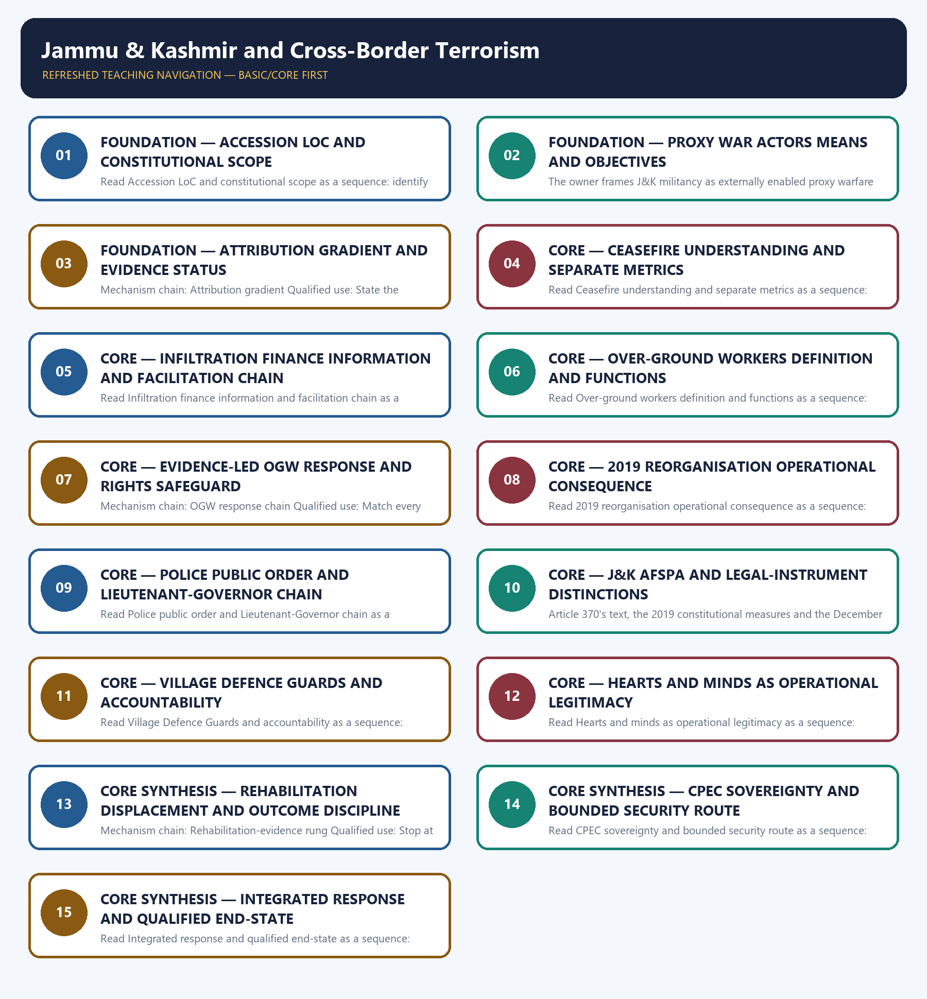

# Jammu & Kashmir and Cross-Border Terrorism — Learner-v2 Complete Learning Session

> **Authoring-only generation:** 2026-09-04. No PDF was rendered and no tracker or index was mutated.

### SOURCE, PROGRESSION AND CURRENT-LINKAGE AUDIT

- **Generation date:** 2026-09-04.
- **Repository-first evidence:** the Basic owner is taught first and preserved in full; the Advanced owner is retained only in the optional final teaching block.
- **OCR evidence:** Repository Markdown was primary. OCR-searchable official UPSC papers were supplementary only for printed routed demands. No answer key, attribution, operational method, notification effect, implementation outcome or security metric was inferred.
- **Qdrant:** not used; repository Markdown and available OCR context were sufficient.
- **PYQ integrity:** The audited GS-III ledger routes the 2018 CPEC cross-subject demand, the 2019 OGW demand and the 2023 Jammu and Kashmir hearts-and-minds demand here. OCR inspection confirmed the 2019 and 2023 printed stems; no official model answer is inferred.
- **Live-link boundary:** Live official-source attempts on 2026-09-04 substantiated no new J&K operational statistic. The module therefore relies on stable owner-audited legal and institutional anchors, preserves the 25 February 2021 ceasefire status, and requires a dated MHA, NIA, police or court source for any current attribution or outcome claim.
- **Fact/inference discipline:** no current-affairs item, PYQ wording, figure or quotation is invented.

### LIVE OFFICIAL-SOURCE ATTEMPT LOG

The checks below were made on 2026-09-04. Substantive official text is used only for the proposition it supports; title-only, blocked or thin pages are recorded and supply no factual claim.

- https://www.mha.gov.in/en/divisionofmha/jammu-kashmir-and-ladakh-affairs — attempted 2026-09-04; direct retrieval returned 403. The module therefore imports no current incident, infiltration, recruitment, force-strength, rehabilitation-output or return-outcome figure from the page.
- https://www.indiacode.nic.in/ — attempted 2026-09-04 for the Jammu and Kashmir Reorganisation Act, 2019 and the Armed Forces (Jammu and Kashmir) Special Powers Act, 1990; direct retrieval returned 403. Only owner-audited statutory distinctions are used, and constitutional doctrine remains routed to Polity.
- https://pib.gov.in/PressReleasePage.aspx?PRID=1700782 — attempted 2026-09-04 for the official account of the 25 February 2021 DGMO reaffirmation; direct retrieval returned 403. The module preserves the owner-audited date and treats the instrument as a military ceasefire understanding, not a treaty or conflict settlement.
- https://www.mha.gov.in/ and https://www.pib.gov.in/ — searched 2026-09-04 for a claimed 26 February 2026 Kashmiri-migrant relief update; no matching official release was substantiated in the live search. That date and any associated output claim are excluded from the authored facts.

## BASIC LEARNING SESSION

### DEEP-REVIEW LEARNING CONTRACT

| Control | Binding rule for this package |
|---|---|
| Syllabus boundary | Complete Internal Security Basic/Core is easy-first and answer-complete before optional Advanced depth. |
| Threat boundary | Actor, intent, capability, geography, target, harm and security-development nexus remain distinct. |
| Law/status boundary | Constitution, statute, rule, notification, guideline, advisory, designation, investigation, prosecution, conviction and measured outcome are not conflated. |
| Institutional boundary | Intelligence, police, NIA, prosecution, courts, CAPFs, armed forces, CERT-In, NCIIPC, I4C, Coast Guard and regulators retain exact mandates and federal limits. |
| Process boundary | Prevention, preparedness, response, investigation, prosecution, recovery and resilience are separate stages. |
| Current-data boundary | Every incident, casualty, budget, force, border, seizure, conviction, timeline and operational claim keeps source, date, unit, jurisdiction and status. |
| Practice contract | Every solved item has demand decoding, detailed examiner-grade model, executable timed/compression plan, marks rationale and answer-specific improvement. |
| PYQ contract | Official wording and keys are asserted only when verified; routed or reconstructed demands remain labelled. |
| Dual-flow contract | Graphical and ASCII masters independently reconstruct the same complete Basic-to-optional-Advanced evidence spine. |
| Approval | This immutable successor remains `approved: false` pending explicit approval. |

**Canonical Basic/Core owner:** `upsc-ai-kit\knowledge\Internal-Security\basic\05_Jammu-Kashmir-and-Cross-Border-Terrorism.md`  
**Substantive canonical provenance owner:** `upsc-ai-kit\knowledge\Internal-Security\learning-sessions\v2\subject-wide-syllabus\internal-security-05_Learning-Session.md`  
**Optional Advanced owner:** `upsc-ai-kit\knowledge\Internal-Security\advanced\05_Jammu-Kashmir-and-Cross-Border-Terrorism.md`  
**Official syllabus mapping:** `upsc-ai-kit\knowledge\Internal-Security\OFFICIAL-UPSC-SYLLABUS-MAPPING.md`

### EVIDENCE, PYQ AND CURRENT-STATUS CONTROL

- Law is separated from rules, notifications, guidelines and advisories; designation from conviction; investigation from prosecution.
- Intelligence is separated from admissible evidence; ceasefire/framework agreement from final settlement and implementation.
- Border guarding is separated from law and order; cyber incident from cybercrime; prevention from response; security output from development outcome.
- Every current Jammu and Kashmir, border, insurgency, terrorism, cyber, maritime, organised-crime, force or legal-status claim retains source/date/status.
- **Current-status note, rechecked 2026-09-06:** failed official fetches remain explicit and supply no invented fact.

**Generation-local live/current sources:**
- `https://www.mha.gov.in/en/divisionofmha/jammu-kashmir-and-ladakh-affairs — attempted 2026-09-04; direct retrieval returned 403. The module therefore imports no current incident, infiltration, recruitment, force-strength, rehabilitation-output or return-outcome figure from the page.`
- `https://www.indiacode.nic.in/ — attempted 2026-09-04 for the Jammu and Kashmir Reorganisation Act, 2019 and the Armed Forces (Jammu and Kashmir) Special Powers Act, 1990; direct retrieval returned 403. Only owner-audited statutory distinctions are used, and constitutional doctrine remains routed to Polity.`
- `https://pib.gov.in/PressReleasePage.aspx?PRID=1700782 — attempted 2026-09-04 for the official account of the 25 February 2021 DGMO reaffirmation; direct retrieval returned 403. The module preserves the owner-audited date and treats the instrument as a military ceasefire understanding, not a treaty or conflict settlement.`
- `https://www.mha.gov.in/ and https://www.pib.gov.in/ — searched 2026-09-04 for a claimed 26 February 2026 Kashmiri-migrant relief update; no matching official release was substantiated in the live search. That date and any associated output claim are excluded from the authored facts.`

**Topic-routed verified PYQ owners:**
- Repository PYQ routing ledgers control wording, year, marks and verification status.




*Distinct embedded teaching-navigation image. The separate continuous Cārvāka-style flowchart package remains an independent at-a-glance artifact.*

### SESSION 1 — FOUNDATION — ACCESSION LOC AND CONSTITUTIONAL SCOPE

#### DEFINITION / WHAT THIS IS CALLED

**Plain-language definition:** The decisive boundary is Do not turn the accession chronology into the whole internal-security answer.

**Technical definition:** Read Accession LoC and constitutional scope as a sequence: identify Accession anchor, follow the named mechanism to its institutional response, and stop at the last verified status rather than assuming the next stage.

#### ANSWER-GRABBING OPENING — WRITE/ADAPT IN THE EXAM

> Read Accession LoC and constitutional scope as a sequence: identify Accession anchor, follow the named mechanism to its institutional response, and stop at the last verified status rather than assuming the next stage.

#### MUST-WRITE KEYWORDS

- **FOUNDATION**
- **Accession LoC**
- **constitutional scope**
- **Mechanism chain**
- **Qualified use**
- **The Line**

**How to use them:** Frame the answer through FOUNDATION; define Accession LoC, connect constitutional scope with Mechanism chain to explain the mechanism, and use Qualified use for the decisive comparison or qualification.

#### VISUAL FIRST

```text
ACCESSION LOC AND CONSTITUTIONAL SCOPE
01. Accession anchor
    |
    v
02. LoC legal-status boundary
STATUS / CATEGORY FIREWALL -> Do not turn the accession chronology into the whole internal-security answer.
```

*The rail fixes the institutional sequence and claim boundary before explanation.*

#### CORE EXPLANATION

Maharaja Hari Singh signed the Instrument of Accession on 26 October 1947 on Defence, External Affairs and Communications; detailed constitutional doctrine belongs to Polity. The Line of Control replaced the earlier ceasefire line after the 1971 war and the Shimla process; it is not described here as an internationally recognised boundary.

#### SIMPLE SYSTEM EXAMPLE

Read Accession LoC and constitutional scope as a sequence: identify Accession anchor, follow the named mechanism to its institutional response, and stop at the last verified status rather than assuming the next stage.

#### TECHNICAL DISTINCTION

The decisive boundary is Do not turn the accession chronology into the whole internal-security answer. This keeps Accession anchor and LoC legal-status boundary in the correct legal category, institutional mandate and evidentiary status.

#### NAMED EVIDENCE AND MECHANISM

- Maharaja Hari Singh signed the Instrument of Accession on 26 October 1947 on Defence, External Affairs and Communications; detailed constitutional doctrine belongs to Polity.
- The Line of Control replaced the earlier ceasefire line after the 1971 war and the Shimla process; it is not described here as an internationally recognised boundary.

#### EXAMINER CAUTION

- Do not turn the accession chronology into the whole internal-security answer.

#### EXAM LINK

- **Prelims:** Keep institution, law, notification, ban/listing, scheme, agreement, ceasefire and outcome in their exact category.
- **Mains:** Open with the proxy-security issue, then bound constitutional history to Polity.

#### MINI RECAP

- **Mechanism chain:** Accession anchor -> LoC legal-status boundary
- **Qualified use:** Open with the proxy-security issue, then bound constitutional history to Polity.

#### CLOSING RECALL FLOW — FOUNDATION — ACCESSION LOC AND CONSTITUTIONAL SCOPE

```text
START / CONCEPT: FOUNDATION — Accession LoC and constitutional scope
        |
        v
EXACT TERMS: FOUNDATION · Accession LoC · constitutional scope · Mechanism chain · Qualified use · The Line
        |
        v
MECHANISM / ARGUMENT: Mechanism chain: Accession anchor - LoC legal-status boundary Qualified use: Open with the proxy-security issue, then bound constitutional history to Polity.
        |
        v
CONSEQUENCE / CONTRAST: The decisive boundary is Do not turn the accession chronology into the whole internal-security answer.
        |
        v
UPSC TRAP / ANSWER-USE: Do not turn the accession chronology into the whole internal-security answer.
        |
        v
ANSWER-GRABBING FORMULATION: Read Accession LoC and constitutional scope as a sequence: identify Accession anchor, follow the named mechanism to its institutional response, and stop at the last verified status rather than assuming the next stage.
```
### SESSION 2 — FOUNDATION — PROXY WAR ACTORS MEANS AND OBJECTIVES

#### DEFINITION / WHAT THIS IS CALLED

**Plain-language definition:** Read Proxy war actors means and objectives as a sequence: identify Proxy-war mechanism, follow the named mechanism to its institutional response, and stop at the last verified status rather than assuming the next stage.

**Technical definition:** The owner frames J&K militancy as externally enabled proxy warfare using deniable non-state intermediaries, infiltration, finance, weapons, propaganda and local facilitation.

#### ANSWER-GRABBING OPENING — WRITE/ADAPT IN THE EXAM

> Read Proxy war actors means and objectives as a sequence: identify Proxy-war mechanism, follow the named mechanism to its institutional response, and stop at the last verified status rather than assuming the next stage.

#### MUST-WRITE KEYWORDS

- **FOUNDATION**
- **Proxy war actors means**
- **objectives**
- **Mechanism chain**
- **Qualified use**
- **Read Proxy war actors**

**How to use them:** Frame the answer through FOUNDATION; define Proxy war actors means, connect objectives with Mechanism chain to explain the mechanism, and use Qualified use for the decisive comparison or qualification.

#### VISUAL FIRST

```text
PROXY WAR ACTORS MEANS AND OBJECTIVES
01. Proxy-war mechanism
STATUS / CATEGORY FIREWALL -> Do not describe the LoC as a settled international boundary.
```

*The rail fixes the institutional sequence and claim boundary before explanation.*

#### CORE EXPLANATION

The owner frames J&K militancy as externally enabled proxy warfare using deniable non-state intermediaries, infiltration, finance, weapons, propaganda and local facilitation.

#### SIMPLE SYSTEM EXAMPLE

Read Proxy war actors means and objectives as a sequence: identify Proxy-war mechanism, follow the named mechanism to its institutional response, and stop at the last verified status rather than assuming the next stage.

#### TECHNICAL DISTINCTION

The decisive boundary is Do not describe the LoC as a settled international boundary. This keeps Proxy-war mechanism in the correct legal category, institutional mandate and evidentiary status.

#### NAMED EVIDENCE AND MECHANISM

- The owner frames J&K militancy as externally enabled proxy warfare using deniable non-state intermediaries, infiltration, finance, weapons, propaganda and local facilitation.

#### EXAMINER CAUTION

- Do not describe the LoC as a settled international boundary.

#### EXAM LINK

- **Prelims:** Keep institution, law, notification, ban/listing, scheme, agreement, ceasefire and outcome in their exact category.
- **Mains:** Separate sponsor, intermediary, facilitator, vector and intended end-state.

#### MINI RECAP

- **Mechanism chain:** Proxy-war mechanism
- **Qualified use:** Separate sponsor, intermediary, facilitator, vector and intended end-state.

#### CLOSING RECALL FLOW — FOUNDATION — PROXY WAR ACTORS MEANS AND OBJECTIVES

```text
START / CONCEPT: FOUNDATION — Proxy war actors means and objectives
        |
        v
EXACT TERMS: FOUNDATION · Proxy war actors means · objectives · Mechanism chain · Qualified use · Read Proxy war actors
        |
        v
MECHANISM / ARGUMENT: Mechanism chain: Proxy-war mechanism Qualified use: Separate sponsor, intermediary, facilitator, vector and intended end-state.
        |
        v
CONSEQUENCE / CONTRAST: The decisive boundary is Do not describe the LoC as a settled international boundary.
        |
        v
UPSC TRAP / ANSWER-USE: Do not describe the LoC as a settled international boundary.
        |
        v
ANSWER-GRABBING FORMULATION: Read Proxy war actors means and objectives as a sequence: identify Proxy-war mechanism, follow the named mechanism to its institutional response, and stop at the last verified status rather than assuming the next stage.
```
### SESSION 3 — FOUNDATION — ATTRIBUTION GRADIENT AND EVIDENCE STATUS

#### DEFINITION / WHAT THIS IS CALLED

**Plain-language definition:** Read Attribution gradient and evidence status as a sequence: identify Attribution gradient, follow the named mechanism to its institutional response, and stop at the last verified status rather than assuming the next stage.

**Technical definition:** Mechanism chain: Attribution gradient Qualified use: State the evidence rung before making any attribution claim.

#### ANSWER-GRABBING OPENING — WRITE/ADAPT IN THE EXAM

> Read Attribution gradient and evidence status as a sequence: identify Attribution gradient, follow the named mechanism to its institutional response, and stop at the last verified status rather than assuming the next stage.

#### MUST-WRITE KEYWORDS

- **FOUNDATION**
- **Attribution gradient**
- **evidence status**
- **Mechanism chain**
- **Qualified use**
- **Cross-border**

**How to use them:** Frame the answer through FOUNDATION; define Attribution gradient, connect evidence status with Mechanism chain to explain the mechanism, and use Qualified use for the decisive comparison or qualification.

#### VISUAL FIRST

```text
ATTRIBUTION GRADIENT AND EVIDENCE STATUS
01. Attribution gradient
STATUS / CATEGORY FIREWALL -> Do not merge sponsor, proxy group and alleged local facilitator into one legal actor.
```

*The rail fixes the institutional sequence and claim boundary before explanation.*

#### CORE EXPLANATION

Cross-border attribution must identify the evidentiary basis—material, communications, cadre origin, training provenance, financing trail or state-institution linkage—rather than rely on an unsupported label.

#### SIMPLE SYSTEM EXAMPLE

Read Attribution gradient and evidence status as a sequence: identify Attribution gradient, follow the named mechanism to its institutional response, and stop at the last verified status rather than assuming the next stage.

#### TECHNICAL DISTINCTION

The decisive boundary is Do not merge sponsor, proxy group and alleged local facilitator into one legal actor. This keeps Attribution gradient in the correct legal category, institutional mandate and evidentiary status.

#### NAMED EVIDENCE AND MECHANISM

- Cross-border attribution must identify the evidentiary basis—material, communications, cadre origin, training provenance, financing trail or state-institution linkage—rather than rely on an unsupported label.

#### EXAMINER CAUTION

- Do not merge sponsor, proxy group and alleged local facilitator into one legal actor.

#### EXAM LINK

- **Prelims:** Keep institution, law, notification, ban/listing, scheme, agreement, ceasefire and outcome in their exact category.
- **Mains:** State the evidence rung before making any attribution claim.

#### MINI RECAP

- **Mechanism chain:** Attribution gradient
- **Qualified use:** State the evidence rung before making any attribution claim.

#### CLOSING RECALL FLOW — FOUNDATION — ATTRIBUTION GRADIENT AND EVIDENCE STATUS

```text
START / CONCEPT: FOUNDATION — Attribution gradient and evidence status
        |
        v
EXACT TERMS: FOUNDATION · Attribution gradient · evidence status · Mechanism chain · Qualified use · Cross-border
        |
        v
MECHANISM / ARGUMENT: Mechanism chain: Attribution gradient Qualified use: State the evidence rung before making any attribution claim.
        |
        v
CONSEQUENCE / CONTRAST: The decisive boundary is Do not merge sponsor, proxy group and alleged local facilitator into one legal actor.
        |
        v
UPSC TRAP / ANSWER-USE: Do not merge sponsor, proxy group and alleged local facilitator into one legal actor.
        |
        v
ANSWER-GRABBING FORMULATION: Read Attribution gradient and evidence status as a sequence: identify Attribution gradient, follow the named mechanism to its institutional response, and stop at the last verified status rather than assuming the next stage.
```
### SESSION 4 — CORE — CEASEFIRE UNDERSTANDING AND SEPARATE METRICS

#### DEFINITION / WHAT THIS IS CALLED

**Plain-language definition:** The November 2003 LoC ceasefire understanding was reaffirmed by the Indian and Pakistani DGMOs on 25 February 2021; it is a military-to-military arrangement, not a treaty or political settlement.

**Technical definition:** Read Ceasefire understanding and separate metrics as a sequence: identify Ceasefire understanding, follow the named mechanism to its institutional response, and stop at the last verified status rather than assuming the next stage.

#### ANSWER-GRABBING OPENING — WRITE/ADAPT IN THE EXAM

> The November 2003 LoC ceasefire understanding was reaffirmed by the Indian and Pakistani DGMOs on 25 February 2021; it is a military-to-military arrangement, not a treaty or political settlement.

#### MUST-WRITE KEYWORDS

- **Ceasefire understanding**
- **separate metrics**
- **Mechanism chain**
- **Qualified use**
- **The November**
- **LoC**

**How to use them:** Frame the answer through Ceasefire understanding; define separate metrics, connect Mechanism chain with Qualified use to explain the mechanism, and use The November for the decisive comparison or qualification.

#### VISUAL FIRST

```text
CEASEFIRE UNDERSTANDING AND SEPARATE METRICS
01. Ceasefire understanding
STATUS / CATEGORY FIREWALL -> Do not assert cross-border attribution without naming the evidence status.
```

*The rail fixes the institutional sequence and claim boundary before explanation.*

#### CORE EXPLANATION

The November 2003 LoC ceasefire understanding was reaffirmed by the Indian and Pakistani DGMOs on 25 February 2021; it is a military-to-military arrangement, not a treaty or political settlement.

#### SIMPLE SYSTEM EXAMPLE

Read Ceasefire understanding and separate metrics as a sequence: identify Ceasefire understanding, follow the named mechanism to its institutional response, and stop at the last verified status rather than assuming the next stage.

#### TECHNICAL DISTINCTION

The decisive boundary is Do not assert cross-border attribution without naming the evidence status. This keeps Ceasefire understanding in the correct legal category, institutional mandate and evidentiary status.

#### NAMED EVIDENCE AND MECHANISM

- The November 2003 LoC ceasefire understanding was reaffirmed by the Indian and Pakistani DGMOs on 25 February 2021; it is a military-to-military arrangement, not a treaty or political settlement.

#### EXAMINER CAUTION

- Do not assert cross-border attribution without naming the evidence status.

#### EXAM LINK

- **Prelims:** Keep institution, law, notification, ban/listing, scheme, agreement, ceasefire and outcome in their exact category.
- **Mains:** Compare LoC firing with infiltration, recruitment, finance and hinterland activity.

#### MINI RECAP

- **Mechanism chain:** Ceasefire understanding
- **Qualified use:** Compare LoC firing with infiltration, recruitment, finance and hinterland activity.

#### CLOSING RECALL FLOW — CORE — CEASEFIRE UNDERSTANDING AND SEPARATE METRICS

```text
START / CONCEPT: CORE — Ceasefire understanding and separate metrics
        |
        v
EXACT TERMS: Ceasefire understanding · separate metrics · Mechanism chain · Qualified use · The November · LoC
        |
        v
MECHANISM / ARGUMENT: Read Ceasefire understanding and separate metrics as a sequence: identify Ceasefire understanding, follow the named mechanism to its institutional response, and stop at the last verified status rather than assuming the next stage.
        |
        v
CONSEQUENCE / CONTRAST: Mechanism chain: Ceasefire understanding Qualified use: Compare LoC firing with infiltration, recruitment, finance and hinterland activity.
        |
        v
UPSC TRAP / ANSWER-USE: The decisive boundary is Do not assert cross-border attribution without naming the evidence status.
        |
        v
ANSWER-GRABBING FORMULATION: The November 2003 LoC ceasefire understanding was reaffirmed by the Indian and Pakistani DGMOs on 25 February 2021; it is a military-to-military arrangement, not a treaty or political settlement.
```
### SESSION 5 — CORE — INFILTRATION FINANCE INFORMATION AND FACILITATION CHAIN

#### DEFINITION / WHAT THIS IS CALLED

**Plain-language definition:** LoC firing, attempted and successful infiltration, local recruitment, financing, drone or tunnel delivery, and hinterland incidents are distinct metrics that can move independently.

**Technical definition:** Read Infiltration finance information and facilitation chain as a sequence: identify Separate security metrics, follow the named mechanism to its institutional response, and stop at the last verified status rather than assuming the next stage.

#### ANSWER-GRABBING OPENING — WRITE/ADAPT IN THE EXAM

> Read Infiltration finance information and facilitation chain as a sequence: identify Separate security metrics, follow the named mechanism to its institutional response, and stop at the last verified status rather than assuming the next stage.

#### MUST-WRITE KEYWORDS

- **Infiltration finance information**
- **facilitation chain**
- **Mechanism chain**
- **Qualified use**
- **LoC**
- **Read Infiltration**

**How to use them:** Frame the answer through Infiltration finance information; define facilitation chain, connect Mechanism chain with Qualified use to explain the mechanism, and use LoC for the decisive comparison or qualification.

#### VISUAL FIRST

```text
INFILTRATION FINANCE INFORMATION AND FACILITATION CHAIN
01. Separate security metrics
STATUS / CATEGORY FIREWALL -> Do not equate the 2021 ceasefire reaffirmation with a treaty or settlement.
```

*The rail fixes the institutional sequence and claim boundary before explanation.*

#### CORE EXPLANATION

LoC firing, attempted and successful infiltration, local recruitment, financing, drone or tunnel delivery, and hinterland incidents are distinct metrics that can move independently.

#### SIMPLE SYSTEM EXAMPLE

Read Infiltration finance information and facilitation chain as a sequence: identify Separate security metrics, follow the named mechanism to its institutional response, and stop at the last verified status rather than assuming the next stage.

#### TECHNICAL DISTINCTION

The decisive boundary is Do not equate the 2021 ceasefire reaffirmation with a treaty or settlement. This keeps Separate security metrics in the correct legal category, institutional mandate and evidentiary status.

#### NAMED EVIDENCE AND MECHANISM

- LoC firing, attempted and successful infiltration, local recruitment, financing, drone or tunnel delivery, and hinterland incidents are distinct metrics that can move independently.

#### EXAMINER CAUTION

- Do not equate the 2021 ceasefire reaffirmation with a treaty or settlement.

#### EXAM LINK

- **Prelims:** Keep institution, law, notification, ban/listing, scheme, agreement, ceasefire and outcome in their exact category.
- **Mains:** Trace the support chain without exposing tactical vulnerabilities.

#### MINI RECAP

- **Mechanism chain:** Separate security metrics
- **Qualified use:** Trace the support chain without exposing tactical vulnerabilities.

#### CLOSING RECALL FLOW — CORE — INFILTRATION FINANCE INFORMATION AND FACILITATION CHAIN

```text
START / CONCEPT: CORE — Infiltration finance information and facilitation chain
        |
        v
EXACT TERMS: Infiltration finance information · facilitation chain · Mechanism chain · Qualified use · LoC · Read Infiltration
        |
        v
MECHANISM / ARGUMENT: Mechanism chain: Separate security metrics Qualified use: Trace the support chain without exposing tactical vulnerabilities.
        |
        v
CONSEQUENCE / CONTRAST: The decisive boundary is Do not equate the 2021 ceasefire reaffirmation with a treaty or settlement.
        |
        v
UPSC TRAP / ANSWER-USE: Do not equate the 2021 ceasefire reaffirmation with a treaty or settlement.
        |
        v
ANSWER-GRABBING FORMULATION: Read Infiltration finance information and facilitation chain as a sequence: identify Separate security metrics, follow the named mechanism to its institutional response, and stop at the last verified status rather than assuming the next stage.
```
### SESSION 6 — CORE — OVER-GROUND WORKERS DEFINITION AND FUNCTIONS

#### DEFINITION / WHAT THIS IS CALLED

**Plain-language definition:** An over-ground worker is an alleged non-combatant facilitator whose role must be established through admissible evidence; the label cannot lawfully substitute for proof.

**Technical definition:** Read Over-ground workers definition and functions as a sequence: identify OGW evidentiary boundary, follow the named mechanism to its institutional response, and stop at the last verified status rather than assuming the next stage.

#### ANSWER-GRABBING OPENING — WRITE/ADAPT IN THE EXAM

> An over-ground worker is an alleged non-combatant facilitator whose role must be established through admissible evidence; the label cannot lawfully substitute for proof.

#### MUST-WRITE KEYWORDS

- **Over-ground workers definition**
- **functions**
- **Mechanism chain**
- **Qualified use**
- **An over-ground worker**
- **Possible**

**How to use them:** Frame the answer through Over-ground workers definition; define functions, connect Mechanism chain with Qualified use to explain the mechanism, and use An over-ground worker for the decisive comparison or qualification.

#### VISUAL FIRST

```text
OVER-GROUND WORKERS DEFINITION AND FUNCTIONS
01. OGW evidentiary boundary
    |
    v
02. OGW function map
STATUS / CATEGORY FIREWALL -> Do not merge LoC firing, infiltration, recruitment and hinterland violence into one trend.
```

*The rail fixes the institutional sequence and claim boundary before explanation.*

#### CORE EXPLANATION

An over-ground worker is an alleged non-combatant facilitator whose role must be established through admissible evidence; the label cannot lawfully substitute for proof. Possible facilitation functions include reconnaissance or information, shelter and logistics, communications, recruitment or propaganda, and finance, but each alleged function requires case-specific proof.

#### SIMPLE SYSTEM EXAMPLE

Read Over-ground workers definition and functions as a sequence: identify OGW evidentiary boundary, follow the named mechanism to its institutional response, and stop at the last verified status rather than assuming the next stage.

#### TECHNICAL DISTINCTION

The decisive boundary is Do not merge LoC firing, infiltration, recruitment and hinterland violence into one trend. This keeps OGW evidentiary boundary and OGW function map in the correct legal category, institutional mandate and evidentiary status.

#### NAMED EVIDENCE AND MECHANISM

- An over-ground worker is an alleged non-combatant facilitator whose role must be established through admissible evidence; the label cannot lawfully substitute for proof.
- Possible facilitation functions include reconnaissance or information, shelter and logistics, communications, recruitment or propaganda, and finance, but each alleged function requires case-specific proof.

#### EXAMINER CAUTION

- Do not merge LoC firing, infiltration, recruitment and hinterland violence into one trend.

#### EXAM LINK

- **Prelims:** Keep institution, law, notification, ban/listing, scheme, agreement, ceasefire and outcome in their exact category.
- **Mains:** Define facilitation neutrally and require proof for each alleged function.

#### MINI RECAP

- **Mechanism chain:** OGW evidentiary boundary -> OGW function map
- **Qualified use:** Define facilitation neutrally and require proof for each alleged function.

#### CLOSING RECALL FLOW — CORE — OVER-GROUND WORKERS DEFINITION AND FUNCTIONS

```text
START / CONCEPT: CORE — Over-ground workers definition and functions
        |
        v
EXACT TERMS: Over-ground workers definition · functions · Mechanism chain · Qualified use · An over-ground worker · Possible
        |
        v
MECHANISM / ARGUMENT: Read Over-ground workers definition and functions as a sequence: identify OGW evidentiary boundary, follow the named mechanism to its institutional response, and stop at the last verified status rather than assuming the next stage.
        |
        v
CONSEQUENCE / CONTRAST: Possible facilitation functions include reconnaissance or information, shelter and logistics, communications, recruitment or propaganda, and finance, but each alleged function requires case-specific proof.
        |
        v
UPSC TRAP / ANSWER-USE: The decisive boundary is Do not merge LoC firing, infiltration, recruitment and hinterland violence into one trend.
        |
        v
ANSWER-GRABBING FORMULATION: An over-ground worker is an alleged non-combatant facilitator whose role must be established through admissible evidence; the label cannot lawfully substitute for proof.
```
### SESSION 7 — CORE — EVIDENCE-LED OGW RESPONSE AND RIGHTS SAFEGUARD

#### DEFINITION / WHAT THIS IS CALLED

**Plain-language definition:** Read Evidence-led OGW response and rights safeguard as a sequence: identify OGW response chain, follow the named mechanism to its institutional response, and stop at the last verified status rather than assuming the next stage.

**Technical definition:** Mechanism chain: OGW response chain Qualified use: Match every intervention to lawful evidence, protection and remedy.

#### ANSWER-GRABBING OPENING — WRITE/ADAPT IN THE EXAM

> Read Evidence-led OGW response and rights safeguard as a sequence: identify OGW response chain, follow the named mechanism to its institutional response, and stop at the last verified status rather than assuming the next stage.

#### MUST-WRITE KEYWORDS

- **Evidence-led OGW response**
- **rights safeguard**
- **Mechanism chain**
- **Qualified use**
- **Neutralising**
- **Read Evidence-led OGW**

**How to use them:** Frame the answer through Evidence-led OGW response; define rights safeguard, connect Mechanism chain with Qualified use to explain the mechanism, and use Neutralising for the decisive comparison or qualification.

#### VISUAL FIRST

```text
EVIDENCE-LED OGW RESPONSE AND RIGHTS SAFEGUARD
01. OGW response chain
STATUS / CATEGORY FIREWALL -> Do not use OGW as a label for political disagreement or as a substitute for proof.
```

*The rail fixes the institutional sequence and claim boundary before explanation.*

#### CORE EXPLANATION

Neutralising facilitation requires protected community reporting, evidence-led investigation, lawful financial tracing, prevention or rehabilitation where appropriate, and prosecution on admissible evidence.

#### SIMPLE SYSTEM EXAMPLE

Read Evidence-led OGW response and rights safeguard as a sequence: identify OGW response chain, follow the named mechanism to its institutional response, and stop at the last verified status rather than assuming the next stage.

#### TECHNICAL DISTINCTION

The decisive boundary is Do not use OGW as a label for political disagreement or as a substitute for proof. This keeps OGW response chain in the correct legal category, institutional mandate and evidentiary status.

#### NAMED EVIDENCE AND MECHANISM

- Neutralising facilitation requires protected community reporting, evidence-led investigation, lawful financial tracing, prevention or rehabilitation where appropriate, and prosecution on admissible evidence.

#### EXAMINER CAUTION

- Do not use OGW as a label for political disagreement or as a substitute for proof.

#### EXAM LINK

- **Prelims:** Keep institution, law, notification, ban/listing, scheme, agreement, ceasefire and outcome in their exact category.
- **Mains:** Match every intervention to lawful evidence, protection and remedy.

#### MINI RECAP

- **Mechanism chain:** OGW response chain
- **Qualified use:** Match every intervention to lawful evidence, protection and remedy.

#### CLOSING RECALL FLOW — CORE — EVIDENCE-LED OGW RESPONSE AND RIGHTS SAFEGUARD

```text
START / CONCEPT: CORE — Evidence-led OGW response and rights safeguard
        |
        v
EXACT TERMS: Evidence-led OGW response · rights safeguard · Mechanism chain · Qualified use · Neutralising · Read Evidence-led OGW
        |
        v
MECHANISM / ARGUMENT: Mechanism chain: OGW response chain Qualified use: Match every intervention to lawful evidence, protection and remedy.
        |
        v
CONSEQUENCE / CONTRAST: The decisive boundary is Do not use OGW as a label for political disagreement or as a substitute for proof.
        |
        v
UPSC TRAP / ANSWER-USE: Do not use OGW as a label for political disagreement or as a substitute for proof.
        |
        v
ANSWER-GRABBING FORMULATION: Read Evidence-led OGW response and rights safeguard as a sequence: identify OGW response chain, follow the named mechanism to its institutional response, and stop at the last verified status rather than assuming the next stage.
```
### SESSION 8 — CORE — 2019 REORGANISATION OPERATIONAL CONSEQUENCE

#### DEFINITION / WHAT THIS IS CALLED

**Plain-language definition:** The decisive boundary is Do not publish operational routes, deployment patterns or tactical vulnerabilities.

**Technical definition:** Read 2019 reorganisation operational consequence as a sequence: identify Reorganisation structure, follow the named mechanism to its institutional response, and stop at the last verified status rather than assuming the next stage.

#### ANSWER-GRABBING OPENING — WRITE/ADAPT IN THE EXAM

> Mechanism chain: Reorganisation structure Qualified use: Explain administrative command effects without claiming constitutional adjudication.

#### MUST-WRITE KEYWORDS

- **Mechanism chain**
- **Qualified use**
- **The Jammu**
- **Kashmir Reorganisation Act**
- **Union Territory**
- **2019 reorganisation operational consequence**

**How to use them:** Frame the answer through Mechanism chain; define Qualified use, connect The Jammu with Kashmir Reorganisation Act to explain the mechanism, and use Union Territory for the decisive comparison or qualification.

#### VISUAL FIRST

```text
2019 REORGANISATION OPERATIONAL CONSEQUENCE
01. Reorganisation structure
STATUS / CATEGORY FIREWALL -> Do not publish operational routes, deployment patterns or tactical vulnerabilities.
```

*The rail fixes the institutional sequence and claim boundary before explanation.*

#### CORE EXPLANATION

The Jammu and Kashmir Reorganisation Act, 2019 created the Union Territory of Jammu and Kashmir with a legislature and the Union Territory of Ladakh without one.

#### SIMPLE SYSTEM EXAMPLE

Read 2019 reorganisation operational consequence as a sequence: identify Reorganisation structure, follow the named mechanism to its institutional response, and stop at the last verified status rather than assuming the next stage.

#### TECHNICAL DISTINCTION

The decisive boundary is Do not publish operational routes, deployment patterns or tactical vulnerabilities. This keeps Reorganisation structure in the correct legal category, institutional mandate and evidentiary status.

#### NAMED EVIDENCE AND MECHANISM

- The Jammu and Kashmir Reorganisation Act, 2019 created the Union Territory of Jammu and Kashmir with a legislature and the Union Territory of Ladakh without one.

#### EXAMINER CAUTION

- Do not publish operational routes, deployment patterns or tactical vulnerabilities.

#### EXAM LINK

- **Prelims:** Keep institution, law, notification, ban/listing, scheme, agreement, ceasefire and outcome in their exact category.
- **Mains:** Explain administrative command effects without claiming constitutional adjudication.

#### MINI RECAP

- **Mechanism chain:** Reorganisation structure
- **Qualified use:** Explain administrative command effects without claiming constitutional adjudication.

#### CLOSING RECALL FLOW — CORE — 2019 REORGANISATION OPERATIONAL CONSEQUENCE

```text
START / CONCEPT: CORE — 2019 reorganisation operational consequence
        |
        v
EXACT TERMS: Mechanism chain · Qualified use · The Jammu · Kashmir Reorganisation Act · Union Territory · 2019 reorganisation operational consequence
        |
        v
MECHANISM / ARGUMENT: Read 2019 reorganisation operational consequence as a sequence: identify Reorganisation structure, follow the named mechanism to its institutional response, and stop at the last verified status rather than assuming the next stage.
        |
        v
CONSEQUENCE / CONTRAST: The decisive boundary is Do not publish operational routes, deployment patterns or tactical vulnerabilities.
        |
        v
UPSC TRAP / ANSWER-USE: Do not publish operational routes, deployment patterns or tactical vulnerabilities.
        |
        v
ANSWER-GRABBING FORMULATION: Mechanism chain: Reorganisation structure Qualified use: Explain administrative command effects without claiming constitutional adjudication.
```
### SESSION 9 — CORE — POLICE PUBLIC ORDER AND LIEUTENANT-GOVERNOR CHAIN

#### DEFINITION / WHAT THIS IS CALLED

**Plain-language definition:** Under the 2019 Act, public order and police are outside the J&K Assembly's legislative competence, making the operational chain Lieutenant-Governor and Union centred rather than an ordinary Centre-State chain.

**Technical definition:** Read Police public order and Lieutenant-Governor chain as a sequence: identify Police-public-order consequence, follow the named mechanism to its institutional response, and stop at the last verified status rather than assuming the next stage.

#### ANSWER-GRABBING OPENING — WRITE/ADAPT IN THE EXAM

> Under the 2019 Act, public order and police are outside the J&K Assembly's legislative competence, making the operational chain Lieutenant-Governor and Union centred rather than an ordinary Centre-State chain.

#### MUST-WRITE KEYWORDS

- **Police public order**
- **Lieutenant-Governor chain**
- **Mechanism chain**
- **Qualified use**
- **Under the 2019 Act, public order and police**
- **Under**

**How to use them:** Frame the answer through Police public order; define Lieutenant-Governor chain, connect Mechanism chain with Qualified use to explain the mechanism, and use Under the 2019 Act, public order and police for the decisive comparison or qualification.

#### VISUAL FIRST

```text
POLICE PUBLIC ORDER AND LIEUTENANT-GOVERNOR CHAIN
01. Police-public-order consequence
STATUS / CATEGORY FIREWALL -> Do not treat the 2019 reorganisation as proof of a security outcome.
```

*The rail fixes the institutional sequence and claim boundary before explanation.*

#### CORE EXPLANATION

Under the 2019 Act, public order and police are outside the J&K Assembly's legislative competence, making the operational chain Lieutenant-Governor and Union centred rather than an ordinary Centre-State chain.

#### SIMPLE SYSTEM EXAMPLE

Read Police public order and Lieutenant-Governor chain as a sequence: identify Police-public-order consequence, follow the named mechanism to its institutional response, and stop at the last verified status rather than assuming the next stage.

#### TECHNICAL DISTINCTION

The decisive boundary is Do not treat the 2019 reorganisation as proof of a security outcome. This keeps Police-public-order consequence in the correct legal category, institutional mandate and evidentiary status.

#### NAMED EVIDENCE AND MECHANISM

- Under the 2019 Act, public order and police are outside the J&K Assembly's legislative competence, making the operational chain Lieutenant-Governor and Union centred rather than an ordinary Centre-State chain.

#### EXAMINER CAUTION

- Do not treat the 2019 reorganisation as proof of a security outcome.

#### EXAM LINK

- **Prelims:** Keep institution, law, notification, ban/listing, scheme, agreement, ceasefire and outcome in their exact category.
- **Mains:** Name the statutory exclusion of police and public order precisely.

#### MINI RECAP

- **Mechanism chain:** Police-public-order consequence
- **Qualified use:** Name the statutory exclusion of police and public order precisely.

#### CLOSING RECALL FLOW — CORE — POLICE PUBLIC ORDER AND LIEUTENANT-GOVERNOR CHAIN

```text
START / CONCEPT: CORE — Police public order and Lieutenant-Governor chain
        |
        v
EXACT TERMS: Police public order · Lieutenant-Governor chain · Mechanism chain · Qualified use · Under the 2019 Act, public order and police · Under
        |
        v
MECHANISM / ARGUMENT: Read Police public order and Lieutenant-Governor chain as a sequence: identify Police-public-order consequence, follow the named mechanism to its institutional response, and stop at the last verified status rather than assuming the next stage.
        |
        v
CONSEQUENCE / CONTRAST: Mechanism chain: Police-public-order consequence Qualified use: Name the statutory exclusion of police and public order precisely.
        |
        v
UPSC TRAP / ANSWER-USE: The decisive boundary is Do not treat the 2019 reorganisation as proof of a security outcome.
        |
        v
ANSWER-GRABBING FORMULATION: Under the 2019 Act, public order and police are outside the J&K Assembly's legislative competence, making the operational chain Lieutenant-Governor and Union centred rather than an ordinary Centre-State chain.
```
### SESSION 10 — CORE — J&K AFSPA AND LEGAL-INSTRUMENT DISTINCTIONS

#### DEFINITION / WHAT THIS IS CALLED

**Plain-language definition:** Read J&K AFSPA and legal-instrument distinctions as a sequence: identify Constitutional-domain firewall, follow the named mechanism to its institutional response, and stop at the last verified status rather than assuming the next stage.

**Technical definition:** Article 370's text, the 2019 constitutional measures and the December 2023 Supreme Court reasoning belong to Polity; this topic uses only clearly identified operational internal-security consequences.

#### ANSWER-GRABBING OPENING — WRITE/ADAPT IN THE EXAM

> Read J&K AFSPA and legal-instrument distinctions as a sequence: identify Constitutional-domain firewall, follow the named mechanism to its institutional response, and stop at the last verified status rather than assuming the next stage.

#### MUST-WRITE KEYWORDS

- **J&K AFSPA**
- **legal-instrument distinctions**
- **Mechanism chain**
- **Qualified use**
- **Article 370**
- **Article**

**How to use them:** Frame the answer through J&K AFSPA; define legal-instrument distinctions, connect Mechanism chain with Qualified use to explain the mechanism, and use Article 370 for the decisive comparison or qualification.

#### VISUAL FIRST

```text
J&K AFSPA AND LEGAL-INSTRUMENT DISTINCTIONS
01. Constitutional-domain firewall
STATUS / CATEGORY FIREWALL -> Do not import Article 370 constitutional reasoning into an Internal Security answer.
```

*The rail fixes the institutional sequence and claim boundary before explanation.*

#### CORE EXPLANATION

Article 370's text, the 2019 constitutional measures and the December 2023 Supreme Court reasoning belong to Polity; this topic uses only clearly identified operational internal-security consequences.

#### SIMPLE SYSTEM EXAMPLE

Read J&K AFSPA and legal-instrument distinctions as a sequence: identify Constitutional-domain firewall, follow the named mechanism to its institutional response, and stop at the last verified status rather than assuming the next stage.

#### TECHNICAL DISTINCTION

The decisive boundary is Do not import Article 370 constitutional reasoning into an Internal Security answer. This keeps Constitutional-domain firewall in the correct legal category, institutional mandate and evidentiary status.

#### NAMED EVIDENCE AND MECHANISM

- Article 370's text, the 2019 constitutional measures and the December 2023 Supreme Court reasoning belong to Polity; this topic uses only clearly identified operational internal-security consequences.

#### EXAMINER CAUTION

- Do not import Article 370 constitutional reasoning into an Internal Security answer.

#### EXAM LINK

- **Prelims:** Keep institution, law, notification, ban/listing, scheme, agreement, ceasefire and outcome in their exact category.
- **Mains:** Identify the correct J&K-specific statute and stop before field-outcome claims.

#### MINI RECAP

- **Mechanism chain:** Constitutional-domain firewall
- **Qualified use:** Identify the correct J&K-specific statute and stop before field-outcome claims.

#### CLOSING RECALL FLOW — CORE — J&K AFSPA AND LEGAL-INSTRUMENT DISTINCTIONS

```text
START / CONCEPT: CORE — J&K AFSPA and legal-instrument distinctions
        |
        v
EXACT TERMS: J&K AFSPA · legal-instrument distinctions · Mechanism chain · Qualified use · Article 370 · Article
        |
        v
MECHANISM / ARGUMENT: Mechanism chain: Constitutional-domain firewall Qualified use: Identify the correct J&K-specific statute and stop before field-outcome claims.
        |
        v
CONSEQUENCE / CONTRAST: The decisive boundary is Do not import Article 370 constitutional reasoning into an Internal Security answer.
        |
        v
UPSC TRAP / ANSWER-USE: Do not import Article 370 constitutional reasoning into an Internal Security answer.
        |
        v
ANSWER-GRABBING FORMULATION: Read J&K AFSPA and legal-instrument distinctions as a sequence: identify Constitutional-domain firewall, follow the named mechanism to its institutional response, and stop at the last verified status rather than assuming the next stage.
```
### SESSION 11 — CORE — VILLAGE DEFENCE GUARDS AND ACCOUNTABILITY

#### DEFINITION / WHAT THIS IS CALLED

**Plain-language definition:** Mechanism chain: J&K AFSPA distinction - Village Defence Guards boundary Qualified use: Balance local warning capacity with supervision and accountability.

**Technical definition:** Read Village Defence Guards and accountability as a sequence: identify J&K AFSPA distinction, follow the named mechanism to its institutional response, and stop at the last verified status rather than assuming the next stage.

#### ANSWER-GRABBING OPENING — WRITE/ADAPT IN THE EXAM

> Mechanism chain: J&K AFSPA distinction - Village Defence Guards boundary Qualified use: Balance local warning capacity with supervision and accountability.

#### MUST-WRITE KEYWORDS

- **Village Defence Guards**
- **accountability**
- **Mechanism chain**
- **Qualified use**
- **The Armed Forces**
- **Jammu**

**How to use them:** Frame the answer through Village Defence Guards; define accountability, connect Mechanism chain with Qualified use to explain the mechanism, and use The Armed Forces for the decisive comparison or qualification.

#### VISUAL FIRST

```text
VILLAGE DEFENCE GUARDS AND ACCOUNTABILITY
01. J&K AFSPA distinction
    |
    v
02. Village Defence Guards boundary
STATUS / CATEGORY FIREWALL -> Do not equate a rehabilitation input with safe return or restored trust.
```

*The rail fixes the institutional sequence and claim boundary before explanation.*

#### CORE EXPLANATION

The Armed Forces (Jammu and Kashmir) Special Powers Act, 1990 is distinct from the Armed Forces (Special Powers) Act, 1958 applicable in parts of the North-East. Village Defence Committees were renamed Village Defence Guards and operate under district SP or SSP supervision; local presence and warning benefits must be balanced against training, command and accountability risks.

#### SIMPLE SYSTEM EXAMPLE

Read Village Defence Guards and accountability as a sequence: identify J&K AFSPA distinction, follow the named mechanism to its institutional response, and stop at the last verified status rather than assuming the next stage.

#### TECHNICAL DISTINCTION

The decisive boundary is Do not equate a rehabilitation input with safe return or restored trust. This keeps J&K AFSPA distinction and Village Defence Guards boundary in the correct legal category, institutional mandate and evidentiary status.

#### NAMED EVIDENCE AND MECHANISM

- The Armed Forces (Jammu and Kashmir) Special Powers Act, 1990 is distinct from the Armed Forces (Special Powers) Act, 1958 applicable in parts of the North-East.
- Village Defence Committees were renamed Village Defence Guards and operate under district SP or SSP supervision; local presence and warning benefits must be balanced against training, command and accountability risks.

#### EXAMINER CAUTION

- Do not equate a rehabilitation input with safe return or restored trust.

#### EXAM LINK

- **Prelims:** Keep institution, law, notification, ban/listing, scheme, agreement, ceasefire and outcome in their exact category.
- **Mains:** Balance local warning capacity with supervision and accountability.

#### MINI RECAP

- **Mechanism chain:** J&K AFSPA distinction -> Village Defence Guards boundary
- **Qualified use:** Balance local warning capacity with supervision and accountability.

#### CLOSING RECALL FLOW — CORE — VILLAGE DEFENCE GUARDS AND ACCOUNTABILITY

```text
START / CONCEPT: CORE — Village Defence Guards and accountability
        |
        v
EXACT TERMS: Village Defence Guards · accountability · Mechanism chain · Qualified use · The Armed Forces · Jammu
        |
        v
MECHANISM / ARGUMENT: Read Village Defence Guards and accountability as a sequence: identify J&K AFSPA distinction, follow the named mechanism to its institutional response, and stop at the last verified status rather than assuming the next stage.
        |
        v
CONSEQUENCE / CONTRAST: Village Defence Committees were renamed Village Defence Guards and operate under district SP or SSP supervision; local presence and warning benefits must be balanced against training, command and accountability risks.
        |
        v
UPSC TRAP / ANSWER-USE: The decisive boundary is Do not equate a rehabilitation input with safe return or restored trust.
        |
        v
ANSWER-GRABBING FORMULATION: Mechanism chain: J&K AFSPA distinction - Village Defence Guards boundary Qualified use: Balance local warning capacity with supervision and accountability.
```
### SESSION 12 — CORE — HEARTS AND MINDS AS OPERATIONAL LEGITIMACY

#### DEFINITION / WHAT THIS IS CALLED

**Plain-language definition:** Winning hearts and minds is an operational legitimacy strategy combining civilian protection, proportionate force, participation, grievance redress, service and livelihood delivery, rehabilitation and credible accountability.

**Technical definition:** Read Hearts and minds as operational legitimacy as a sequence: identify Hearts-and-minds meaning, follow the named mechanism to its institutional response, and stop at the last verified status rather than assuming the next stage.

#### ANSWER-GRABBING OPENING — WRITE/ADAPT IN THE EXAM

> Winning hearts and minds is an operational legitimacy strategy combining civilian protection, proportionate force, participation, grievance redress, service and livelihood delivery, rehabilitation and credible accountability.

#### MUST-WRITE KEYWORDS

- **Hearts**
- **minds as operational legitimacy**
- **Mechanism chain**
- **Qualified use**
- **Winning hearts and minds**
- **Winning**

**How to use them:** Frame the answer through Hearts; define minds as operational legitimacy, connect Mechanism chain with Qualified use to explain the mechanism, and use Winning hearts and minds for the decisive comparison or qualification.

#### VISUAL FIRST

```text
HEARTS AND MINDS AS OPERATIONAL LEGITIMACY
01. Hearts-and-minds meaning
STATUS / CATEGORY FIREWALL -> Do not use an unverified current incident, casualty or force statistic.
```

*The rail fixes the institutional sequence and claim boundary before explanation.*

#### CORE EXPLANATION

Winning hearts and minds is an operational legitimacy strategy combining civilian protection, proportionate force, participation, grievance redress, service and livelihood delivery, rehabilitation and credible accountability.

#### SIMPLE SYSTEM EXAMPLE

Read Hearts and minds as operational legitimacy as a sequence: identify Hearts-and-minds meaning, follow the named mechanism to its institutional response, and stop at the last verified status rather than assuming the next stage.

#### TECHNICAL DISTINCTION

The decisive boundary is Do not use an unverified current incident, casualty or force statistic. This keeps Hearts-and-minds meaning in the correct legal category, institutional mandate and evidentiary status.

#### NAMED EVIDENCE AND MECHANISM

- Winning hearts and minds is an operational legitimacy strategy combining civilian protection, proportionate force, participation, grievance redress, service and livelihood delivery, rehabilitation and credible accountability.

#### EXAMINER CAUTION

- Do not use an unverified current incident, casualty or force statistic.

#### EXAM LINK

- **Prelims:** Keep institution, law, notification, ban/listing, scheme, agreement, ceasefire and outcome in their exact category.
- **Mains:** Evaluate protection, participation, delivery, rehabilitation and remedy separately.

#### MINI RECAP

- **Mechanism chain:** Hearts-and-minds meaning
- **Qualified use:** Evaluate protection, participation, delivery, rehabilitation and remedy separately.

#### CLOSING RECALL FLOW — CORE — HEARTS AND MINDS AS OPERATIONAL LEGITIMACY

```text
START / CONCEPT: CORE — Hearts and minds as operational legitimacy
        |
        v
EXACT TERMS: Hearts · minds as operational legitimacy · Mechanism chain · Qualified use · Winning hearts and minds · Winning
        |
        v
MECHANISM / ARGUMENT: Read Hearts and minds as operational legitimacy as a sequence: identify Hearts-and-minds meaning, follow the named mechanism to its institutional response, and stop at the last verified status rather than assuming the next stage.
        |
        v
CONSEQUENCE / CONTRAST: The decisive boundary is Do not use an unverified current incident, casualty or force statistic.
        |
        v
UPSC TRAP / ANSWER-USE: Do not use an unverified current incident, casualty or force statistic.
        |
        v
ANSWER-GRABBING FORMULATION: Winning hearts and minds is an operational legitimacy strategy combining civilian protection, proportionate force, participation, grievance redress, service and livelihood delivery, rehabilitation and credible accountability.
```
### SESSION 13 — CORE SYNTHESIS — REHABILITATION DISPLACEMENT AND OUTCOME DISCIPLINE

#### DEFINITION / WHAT THIS IS CALLED

**Plain-language definition:** Read Rehabilitation displacement and outcome discipline as a sequence: identify Rehabilitation-evidence rung, follow the named mechanism to its institutional response, and stop at the last verified status rather than assuming the next stage.

**Technical definition:** Mechanism chain: Rehabilitation-evidence rung Qualified use: Stop at implementation input unless safe return and trust are officially verified.

#### ANSWER-GRABBING OPENING — WRITE/ADAPT IN THE EXAM

> Read Rehabilitation displacement and outcome discipline as a sequence: identify Rehabilitation-evidence rung, follow the named mechanism to its institutional response, and stop at the last verified status rather than assuming the next stage.

#### MUST-WRITE KEYWORDS

- **CORE SYNTHESIS**
- **Rehabilitation displacement**
- **outcome discipline**
- **Mechanism chain**
- **Qualified use**
- **A relief package, job, accommodation or registered beneficiary**

**How to use them:** Frame the answer through CORE SYNTHESIS; define Rehabilitation displacement, connect outcome discipline with Mechanism chain to explain the mechanism, and use Qualified use for the decisive comparison or qualification.

#### VISUAL FIRST

```text
REHABILITATION DISPLACEMENT AND OUTCOME DISCIPLINE
01. Rehabilitation-evidence rung
STATUS / CATEGORY FIREWALL -> Do not turn the accession chronology into the whole internal-security answer.
```

*The rail fixes the institutional sequence and claim boundary before explanation.*

#### CORE EXPLANATION

A relief package, job, accommodation or registered beneficiary is an implementation input; none alone proves safe return, restored trust or conflict resolution.

#### SIMPLE SYSTEM EXAMPLE

Read Rehabilitation displacement and outcome discipline as a sequence: identify Rehabilitation-evidence rung, follow the named mechanism to its institutional response, and stop at the last verified status rather than assuming the next stage.

#### TECHNICAL DISTINCTION

The decisive boundary is Do not turn the accession chronology into the whole internal-security answer. This keeps Rehabilitation-evidence rung in the correct legal category, institutional mandate and evidentiary status.

#### NAMED EVIDENCE AND MECHANISM

- A relief package, job, accommodation or registered beneficiary is an implementation input; none alone proves safe return, restored trust or conflict resolution.

#### EXAMINER CAUTION

- Do not turn the accession chronology into the whole internal-security answer.

#### EXAM LINK

- **Prelims:** Keep institution, law, notification, ban/listing, scheme, agreement, ceasefire and outcome in their exact category.
- **Mains:** Stop at implementation input unless safe return and trust are officially verified.

#### MINI RECAP

- **Mechanism chain:** Rehabilitation-evidence rung
- **Qualified use:** Stop at implementation input unless safe return and trust are officially verified.

#### CLOSING RECALL FLOW — CORE SYNTHESIS — REHABILITATION DISPLACEMENT AND OUTCOME DISCIPLINE

```text
START / CONCEPT: CORE SYNTHESIS — Rehabilitation displacement and outcome discipline
        |
        v
EXACT TERMS: CORE SYNTHESIS · Rehabilitation displacement · outcome discipline · Mechanism chain · Qualified use · A relief package, job, accommodation or registered beneficiary
        |
        v
MECHANISM / ARGUMENT: Mechanism chain: Rehabilitation-evidence rung Qualified use: Stop at implementation input unless safe return and trust are officially verified.
        |
        v
CONSEQUENCE / CONTRAST: The decisive boundary is Do not turn the accession chronology into the whole internal-security answer.
        |
        v
UPSC TRAP / ANSWER-USE: Do not turn the accession chronology into the whole internal-security answer.
        |
        v
ANSWER-GRABBING FORMULATION: Read Rehabilitation displacement and outcome discipline as a sequence: identify Rehabilitation-evidence rung, follow the named mechanism to its institutional response, and stop at the last verified status rather than assuming the next stage.
```
### SESSION 14 — CORE SYNTHESIS — CPEC SOVEREIGNTY AND BOUNDED SECURITY ROUTE

#### DEFINITION / WHAT THIS IS CALLED

**Plain-language definition:** Kashmiri Pandit displacement is a durable rehabilitation and justice issue; any present return, residence, employment or security outcome requires a dated official source.

**Technical definition:** Read CPEC sovereignty and bounded security route as a sequence: identify CPEC bounded route, follow the named mechanism to its institutional response, and stop at the last verified status rather than assuming the next stage.

#### ANSWER-GRABBING OPENING — WRITE/ADAPT IN THE EXAM

> Read CPEC sovereignty and bounded security route as a sequence: identify CPEC bounded route, follow the named mechanism to its institutional response, and stop at the last verified status rather than assuming the next stage.

#### MUST-WRITE KEYWORDS

- **CORE SYNTHESIS**
- **CPEC sovereignty**
- **bounded security route**
- **Mechanism chain**
- **Qualified use**
- **For CPEC**

**How to use them:** Frame the answer through CORE SYNTHESIS; define CPEC sovereignty, connect bounded security route with Mechanism chain to explain the mechanism, and use Qualified use for the decisive comparison or qualification.

#### VISUAL FIRST

```text
CPEC SOVEREIGNTY AND BOUNDED SECURITY ROUTE
01. CPEC bounded route
    |
    v
02. Displacement-and-return boundary
STATUS / CATEGORY FIREWALL -> Do not describe the LoC as a settled international boundary.
```

*The rail fixes the institutional sequence and claim boundary before explanation.*

#### CORE EXPLANATION

For CPEC, this owner supplies only the sovereignty and security leg: the corridor passes through territory claimed by India and administered by Pakistan and may affect strategic logistics; wider connectivity and diplomacy belong to IR and Economy. Kashmiri Pandit displacement is a durable rehabilitation and justice issue; any present return, residence, employment or security outcome requires a dated official source.

#### SIMPLE SYSTEM EXAMPLE

Read CPEC sovereignty and bounded security route as a sequence: identify CPEC bounded route, follow the named mechanism to its institutional response, and stop at the last verified status rather than assuming the next stage.

#### TECHNICAL DISTINCTION

The decisive boundary is Do not describe the LoC as a settled international boundary. This keeps CPEC bounded route and Displacement-and-return boundary in the correct legal category, institutional mandate and evidentiary status.

#### NAMED EVIDENCE AND MECHANISM

- For CPEC, this owner supplies only the sovereignty and security leg: the corridor passes through territory claimed by India and administered by Pakistan and may affect strategic logistics; wider connectivity and diplomacy belong to IR and Economy.
- Kashmiri Pandit displacement is a durable rehabilitation and justice issue; any present return, residence, employment or security outcome requires a dated official source.

#### EXAMINER CAUTION

- Do not describe the LoC as a settled international boundary.

#### EXAM LINK

- **Prelims:** Keep institution, law, notification, ban/listing, scheme, agreement, ceasefire and outcome in their exact category.
- **Mains:** Enumerate sovereignty, logistics and security concerns within the cross-subject boundary.

#### MINI RECAP

- **Mechanism chain:** CPEC bounded route -> Displacement-and-return boundary
- **Qualified use:** Enumerate sovereignty, logistics and security concerns within the cross-subject boundary.

#### CLOSING RECALL FLOW — CORE SYNTHESIS — CPEC SOVEREIGNTY AND BOUNDED SECURITY ROUTE

```text
START / CONCEPT: CORE SYNTHESIS — CPEC sovereignty and bounded security route
        |
        v
EXACT TERMS: CORE SYNTHESIS · CPEC sovereignty · bounded security route · Mechanism chain · Qualified use · For CPEC
        |
        v
MECHANISM / ARGUMENT: Mechanism chain: CPEC bounded route - Displacement-and-return boundary Qualified use: Enumerate sovereignty, logistics and security concerns within the cross-subject boundary.
        |
        v
CONSEQUENCE / CONTRAST: For CPEC, this owner supplies only the sovereignty and security leg: the corridor passes through territory claimed by India and administered by Pakistan and may affect strategic logistics; wider connectivity and diplomacy belong to IR and Economy.
        |
        v
UPSC TRAP / ANSWER-USE: The decisive boundary is Do not describe the LoC as a settled international boundary.
        |
        v
ANSWER-GRABBING FORMULATION: Read CPEC sovereignty and bounded security route as a sequence: identify CPEC bounded route, follow the named mechanism to its institutional response, and stop at the last verified status rather than assuming the next stage.
```
### SESSION 15 — CORE SYNTHESIS — INTEGRATED RESPONSE AND QUALIFIED END-STATE

#### DEFINITION / WHAT THIS IS CALLED

**Plain-language definition:** Mechanism chain: Integrated response chain - Qualified end-state Qualified use: Conclude with disruption plus legitimacy, not a single security metric.

**Technical definition:** Read Integrated response and qualified end-state as a sequence: identify Integrated response chain, follow the named mechanism to its institutional response, and stop at the last verified status rather than assuming the next stage.

#### ANSWER-GRABBING OPENING — WRITE/ADAPT IN THE EXAM

> Mechanism chain: Integrated response chain - Qualified end-state Qualified use: Conclude with disruption plus legitimacy, not a single security metric.

#### MUST-WRITE KEYWORDS

- **CORE SYNTHESIS**
- **Integrated response**
- **qualified end-state**
- **Mechanism chain**
- **Qualified use**
- **Subject**

**How to use them:** Frame the answer through CORE SYNTHESIS; define Integrated response, connect qualified end-state with Mechanism chain to explain the mechanism, and use Qualified use for the decisive comparison or qualification.

#### VISUAL FIRST

```text
INTEGRATED RESPONSE AND QUALIFIED END-STATE
01. Integrated response chain
    |
    v
02. Qualified end-state
STATUS / CATEGORY FIREWALL -> Do not merge sponsor, proxy group and alleged local facilitator into one legal actor.
```

*The rail fixes the institutional sequence and claim boundary before explanation.*

#### CORE EXPLANATION

Counter-infiltration, intelligence, policing, counter-finance, evidence-led investigation, prosecution, governance and communication are complementary layers rather than substitutes. Durable security requires disruption of the proxy mechanism alongside civilian protection, lawful accountability, accountable local governance, rehabilitation and trust; a quieter LoC does not prove the wider conflict resolved.

#### SIMPLE SYSTEM EXAMPLE

Read Integrated response and qualified end-state as a sequence: identify Integrated response chain, follow the named mechanism to its institutional response, and stop at the last verified status rather than assuming the next stage.

#### TECHNICAL DISTINCTION

The decisive boundary is Do not merge sponsor, proxy group and alleged local facilitator into one legal actor. This keeps Integrated response chain and Qualified end-state in the correct legal category, institutional mandate and evidentiary status.

#### NAMED EVIDENCE AND MECHANISM

- Counter-infiltration, intelligence, policing, counter-finance, evidence-led investigation, prosecution, governance and communication are complementary layers rather than substitutes.
- Durable security requires disruption of the proxy mechanism alongside civilian protection, lawful accountability, accountable local governance, rehabilitation and trust; a quieter LoC does not prove the wider conflict resolved.

#### EXAMINER CAUTION

- Do not merge sponsor, proxy group and alleged local facilitator into one legal actor.

#### EXAM LINK

- **Prelims:** Keep institution, law, notification, ban/listing, scheme, agreement, ceasefire and outcome in their exact category.
- **Mains:** Conclude with disruption plus legitimacy, not a single security metric.

#### MINI RECAP

- **Mechanism chain:** Integrated response chain -> Qualified end-state
- **Qualified use:** Conclude with disruption plus legitimacy, not a single security metric.
#### COMPLETE BASIC OWNER EVIDENCE BANK

> **Subject:** Internal Security | **Tier:** Must-Do (foundation) | **GS Paper:** GS-III.
> **Core area:** Accession and its unresolved dispute; the Line of
> Control; ISI-sponsored proxy-war militancy; the operational
> (not constitutional) dimension of the 2019 reorganisation; development
> and rehabilitation initiatives.
> **Grounded in:** Ashok Kumar Singh, *Challenges to Internal Security of
> India*, PDF pp. 23-30 (dedicated J&K chapter), pp. 8-12 (proxy-actor
> groups); VisionIAS, *Security Challenges and Their Management in Border
> Areas*, PDF pp. 11, 30; `00_Master-Framework.md` Sections 1, 5-6;
> audited GS-III syllabus; Jammu and Kashmir Reorganisation Act 2019 and
> the Armed Forces (Jammu and Kashmir) Special Powers Act 1990 as
> published in India Code.
> ✅ = source-grounded | ⚠️ = analytical inference | 📰 = current anchor | ❌ = boundary/trap.
> *Companion: `advanced/05_Jammu-Kashmir-and-Cross-Border-Terrorism.md`.*

#### 1. Visual foundation

```text
1947 ACCESSION DISPUTE
Instrument of Accession + UN resolution
(never implemented, since Pakistan never
withdrew from PoK) -> unresolved dispute
             |
             v
1971 WAR -> LINE OF CONTROL (LoC)
India's objective shifts to maintaining
status quo / converting LoC into a
recognised international border
             |
             v
LATE-1980s PROXY WAR BEGINS
Pakistan's low-intensity-warfare strategy
after conventional-war defeats (1965, 1971)
             |
             v
ISI-SPONSORED MILITANCY
state-sponsored, deniable non-state groups
(LeT, JeM, Hizbul Mujahideen) infiltrate
via LoC
             |
             v
STATE RESPONSE
security operations + development
packages + rehabilitation (Kashmiri
Pandits) + 2019 reorganisation (Polity
owns the constitutional detail)
```

**Core proposition:** ✅ Singh frames J&K militancy as "a classical case
of state-sponsored and financed terrorism," in which "the ISI employs
state and private resources... as part of Pakistan's proxy war against
India" (PDF p. 13).

#### 2. Essential definitions

| Concept | Exam-ready meaning |
|---|---|
| ✅ **Instrument of Accession (26 October 1947)** | Maharaja Hari Singh acceded Jammu & Kashmir to India on the subjects of Defence, External Affairs and Communications. Finance was not a separate accession subject. |
| ✅ **Line of Control (LoC)** | Established after the 1971 war, replacing the earlier ceasefire line; India's objective since has been to maintain the status quo and seek its conversion into a recognised international border (Singh, PDF p. 25). |
| ✅ **Low-intensity/proxy war** | Pakistan's strategy, adopted after conventional defeats in 1965 and 1971, of supporting terrorist/separatist activity in Kashmir rather than direct war (Singh, PDF p. 25). |
| ✅ **Pakistan-occupied Kashmir (PoK)/"Azad Kashmir"** | The area from which invading Pakistani-backed tribesmen were not driven out in 1947-48; India's name for the territory versus Pakistan's own name for it (Singh, PDF p. 24). |
| ⚠️ **Article 370 (historical, pre-2019 status)** | The provision that historically required the State Government's concurrence for extending most central laws to J&K; ❌ its constitutional text, litigation history and the 2019 abrogation/2023 Supreme Court judgment are **Polity's** domain — this folder treats only the *operational* internal-security consequences of the change in status. |
| ✅ **Jammu and Kashmir Reorganisation Act, 2019 — the operational fact** | The Act created two Union Territories: **Jammu & Kashmir with a legislature** and **Ladakh without one**. ⚠️ Critically for internal security, the J&K Assembly's legislative competence expressly **excludes "public order" and "police"** (State List Entries 1 and 2) — so, unlike in a State, the operational chain for law and order runs through the Lieutenant Governor and the Union, not the elected State government. This is the single most examinable *internal-security* (as opposed to constitutional) consequence of 2019. |
| ✅ **The 2003 ceasefire understanding and its 2021 reaffirmation** | India and Pakistan agreed a Line of Control ceasefire in November 2003; the two Directors General of Military Operations reaffirmed strict observance of all agreements and ceasefire along the LoC and all other sectors in a joint statement of **25 February 2021**. ⚠️ It is an *understanding between military authorities*, not a treaty and not a settlement: it can lapse in practice without any instrument being revoked, and it changes nothing about the underlying dispute or about infiltration attempts, which are a separate metric. |

#### 3. How the proxy-war mechanism works

1. **Historical background:** ✅ J&K, with a Muslim-majority population
   ruled by a Hindu monarch, comprised five distinct regions (Jammu,
   Kashmir Valley, Ladakh, Gilgit, Baltistan) of sharply different
   religious and strategic character (Singh, PDF p. 23).
2. **Contested accession:** ✅ The Maharaja's accession, followed by a
   Pakistani-backed tribal invasion, led to UNSC Resolution 47 of 21 April
   1948, which envisaged Pakistan securing withdrawal of tribesmen and
   Pakistani nationals before later force-reduction and plebiscite stages;
   the process "has remained
   infructuous till date since Pakistan has refused to withdraw its forces
   from PoK" (Singh, PDF pp. 24-25).
3. **Shift to militancy (late 1980s):** ✅ Pakistan, having failed
   conventionally in 1947-48, 1965 and 1971, shifted to "low intensity
   warfare," beginning with Punjab and then Kashmir; the 1989 insurgency
   was triggered partly by a disputed 1987 state election and escalated
   with Afghan-war-veteran mujahideen influence (Singh, PDF pp. 25-26).
4. **State-sponsored proxy groups:** ✅ Lashkar-e-Taiba, Jaish-e-Mohammed
   and Hizbul Mujahideen infiltrated via the LoC with training, funding and
   weapons from Pakistan's ISI (Singh, PDF p. 26) — the same proxy-actor
   logic developed generally in topic 02.
5. **Demographic consequence:** ✅ Nearly four lakh Kashmiri Pandits were
   forced to flee the Valley in the 1990s, producing an "acute demographic
   change" and a rehabilitation problem that persists (Singh, PDF p. 26).

#### 4. Institutions, laws and reference points

- ✅ **UN Military Observer Group in India and Pakistan (UNMOGIP):**
  continues to supervise the ceasefire line and report violations (Singh,
  PDF p. 24) — an IR/UN-institutional detail; this folder treats only its
  operational relevance to continued LoC monitoring.
- ✅ **Armed Forces (Jammu and Kashmir) Special Powers Act, 1990:** the
  J&K-specific special-powers statute, distinct from the 1958 AFSPA that
  applies in the North-East (topic 04) — the two are separate Acts with
  parallel structures (disturbed-area declaration, enabling powers, prior
  sanction for prosecution).
- ✅ **Development packages:** the Prime Minister's Reconstruction Plan
  (2004), 'UDAAN' skill-development initiative, and a rehabilitation
  package for Kashmiri Pandit migrants (announced 2008) are book-period
  central initiatives (Singh, PDF pp. 27, 30) — verify current scheme
  names/allocations from a dated official source.
- ✅ **Village Defence Committees (VDC), J&K:** a local-resistance-group
  model later referenced as a precedent for LWE-affected areas (Singh,
  PDF p. 64) — ✅ renamed **Village Defence Guards (VDG)**, which
  "function under SP/SSP with an aim to provide residents of remote hilly
  villages with weapons and give them arms training to defend themselves"
  (VisionIAS, *Security Challenges*, PDF p. 30). ⚠️ The arming of
  civilians is a genuine trade-off — local deterrence and early warning
  against the risk of unaccountable armed groups — and should be stated as
  such, not as an unqualified measure.
- ⚠️ **2019 reorganisation:** the bifurcation of the former State into the
  Union Territories of Jammu & Kashmir and Ladakh, and the associated
  change in Article 370's application, is a Polity-owned constitutional
  event; this folder notes only its *operational* internal-security
  effects — principally that police and public order sit outside the J&K
  Assembly's competence under the 2019 Act (Section 2 above), which makes
  Centre-UT coordination structurally different from Centre-State
  coordination elsewhere in this folder.

#### 5. Indian applications and examples

- ⚠️ Singh's discussion of "should Article 370 be removed" (PDF pp. 28-29)
  reflects a pre-2019 policy debate; it is retained here purely as
  **historical/book-period evidence** of the *arguments* that existed on
  both sides before the change, not as a description of the current
  constitutional position — route any constitutional-status question to
  Polity.
- ✅ Singh records ceasefire violations as deliberately used by the ISI "to
  keep the J&K issue alive... and aid the infiltration of terrorists" (PDF
  p. 29) — a recurring cross-border tactic, distinct from routine border
  friction.
- ✅ **PYQ mapping:** the 2023 "Hearts and Minds" question names conflict
  resolution in Jammu & Kashmir directly. No 2024-2025 question names J&K;
  the topic also supports 2025 Q9 (terrorism) and 2024 Q19 (border).

#### 6. Must-Know Facts for Prelims

- ✅ Maharaja Hari Singh signed the Instrument of Accession on 26 October
  1947.
- ✅ The Line of Control was established after the 1971 war, associated
  with the subsequent Shimla Agreement.
- ✅ Lashkar-e-Taiba, Jaish-e-Mohammed and Hizbul Mujahideen are the
  historically most prominent ISI-linked militant groups operating in
  J&K, per Singh's account.
- ✅ Nearly four lakh Kashmiri Pandits were displaced from the Kashmir
  Valley during the 1990s insurgency.
- ⚠️ In August 2019, the State of Jammu & Kashmir was reorganised into two
  Union Territories (Jammu & Kashmir, with a legislature, and Ladakh,
  without one); "public order" and "police" are outside the J&K Assembly's
  legislative competence under the Jammu and Kashmir Reorganisation Act,
  2019. The constitutional mechanics of the change belong to Polity.
- ✅ The India-Pakistan LoC ceasefire understanding of November 2003 was
  reaffirmed by the two DGMOs in a joint statement of 25 February 2021 —
  an understanding between military authorities, not a treaty or a
  settlement.
- ✅ Village Defence Committees in J&K have been renamed Village Defence
  Guards and function under the district SP/SSP.

#### 7. UPSC traps

- ❌ The Kashmir dispute is purely a bilateral territorial disagreement
  with no internal-security dimension. -> Singh frames J&K militancy as
  fundamentally a state-sponsored, proxy-war internal-security problem,
  not merely a diplomatic boundary dispute.
- ❌ Article 370's current constitutional status is unchanged from this
  book's description. -> The book's discussion (PDF pp. 28-29) is a
  pre-2019 debate; the 2019 reorganisation and 2023 Supreme Court judgment
  changed the constitutional position — route the legal detail to Polity
  and do not present the book's debate as the present legal status.
- ❌ All named militant groups and their described strength/leadership in
  this book reflect current organisational status. -> These are
  book-period facts; verify any current claim from a dated official
  source.
- ❌ The Kashmiri Pandit displacement and the North-East insurgency are
  the same type of internal-security problem. -> J&K militancy is
  predominantly externally state-sponsored proxy warfare; North-East
  insurgency (topic 04) is predominantly identity/autonomy-driven with a
  secondary foreign-shelter dimension — keep the two analytically
  distinct even where cross-references exist.
- ❌ A ceasefire on the Line of Control means cross-border terrorism has
  stopped. -> A ceasefire governs *firing across the LoC* between armed
  forces. Infiltration attempts, tunnel and drone-borne weapon/narcotics
  drops, and hinterland module activity are separate metrics with separate
  reporting; a quiet LoC and continued infiltration are entirely
  compatible states of affairs.
- ❌ Because J&K now has an elected Assembly, its policing chain works
  like any other State's. -> Under the 2019 Reorganisation Act, public
  order and police lie outside that Assembly's legislative competence, so
  the operational chain runs through the Lieutenant Governor and the
  Union — an internal-security-relevant distinction independent of the
  constitutional debate.

#### 8. 📰 Current anchor

- 📰 MHA's **26 February 2026 relief-and-rehabilitation status for Kashmiri
  migrants** is the current operational anchor for the trust,
  rehabilitation and return dimension. The 2019 reorganisation and
  December 2023 Supreme Court judgment remain constitutional reference
  points whose legal reasoning belongs to Polity.

#### 10. Mains angles

- ⚠️ Any J&K answer should open with the state-sponsorship/proxy-actor
  framing (Section 3), not a chronology of the accession dispute alone.
- ⚠️ Keep the constitutional-status discussion brief and clearly
  boundaried to Polity; focus Mains marks on the operational counter-
  infiltration, development and rehabilitation dimensions.
- ⚠️ Where a question asks for "contemporary examples" of terrorism in
  India (2025 Q9), J&K's proxy-war history supplies the clearest state-
  sponsorship illustration, provided any specific current claim is
  separately dated and verified.
- ⚠️ **Distinguish the four J&K metrics that answers routinely merge:**
  (i) ceasefire violations on the LoC; (ii) infiltration attempts versus
  successful infiltration; (iii) local recruitment into militancy; and
  (iv) hinterland incidents. Each is separately reported, moves
  independently, and supports a different argument — an answer that names
  the metric it is relying on is far more credible than one that asserts
  a general improvement or deterioration.

#### 11. Probable questions

- ⚠️ **Prelims:** In which year was the Line of Control established, and
  in the aftermath of which conflict?
- ⚠️ **Mains (10 marks):** Explain why J&K militancy is described as a
  "classical case of state-sponsored terrorism."
- ⚠️ **Mains (15 marks):** Discuss the operational internal-security
  consequences of cross-border proxy warfare in Jammu & Kashmir, without
  addressing its constitutional status.

#### 12. Core answer architecture — proxy war, operational boundaries and trust

> **Core firewall:** This Core section independently supports the 2018
> CPEC cross-link, the 2019 OGW demand and the 2023 J&K “hearts and minds”
> demand. The Advanced companion remains optional.

##### Demand decoder and thesis

**Thesis:** J&K is an internal-security theatre in which an externally
enabled proxy mechanism exploits local political and social vulnerabilities;
security action can disrupt the mechanism, but durable conflict resolution
also requires lawful investigation, civilian protection, accountable
governance and rehabilitation. The constitutional validity/history of
Article 370 is a **Polity** question; this file owns operational
consequences only.

##### Executable Core spines

**10 marks — OGWs and neutralising influence (2019).** Define an
over-ground worker as a non-combatant facilitator whose alleged role must
be proved, not a label for ordinary political disagreement. Map possible
facilitation functions: information/reconnaissance, shelter/logistics,
communication, recruitment/propaganda and finance. Match response:
community intelligence and protection; evidence-led investigation; lawful
financial tracing; rehabilitation/prevention where appropriate; and
prosecution only on admissible evidence. Qualification: indiscriminate
labelling destroys the trust and local reporting that counter-terrorism
needs.

**10 marks — hearts and minds (2023).** State that it is an operational
legitimacy strategy, not public-relations language. Assess four tracks:
civilian security and proportionate force; local participation and
grievance redress; service/livelihood and rehabilitation delivery; and
credible accountability/remedy. Use the 2026 MHA relief-and-rehabilitation
material only as a dated implementation input, not as proof of safe return
or resolved conflict.

**15 marks — CPEC cross-subject route (2018).** First state the boundary:
CPEC/BRI connectivity and diplomacy belong principally to IR/Economy.
This file supplies the **sovereignty and security** leg: the corridor
passes through territory claimed by India and administered by Pakistan;
it can alter strategic logistics in a contingency and links an external
infrastructure choice to the J&K proxy-security context. Enumerate
sovereignty, strategic/logistics and security-risk concerns; do not
invent a current troop-movement outcome or call the question a direct
J&K-terrorism PYQ.

**20 marks — comparative proxy-war question.** Separate LoC firing,
infiltration, local recruitment, financing and information operations as
five metrics. For each, name actor, vector, vulnerability, lawful
capability and desired end-state. Conclude that a quieter LoC is a
humanitarian/security gain but not proof that the wider proxy mechanism
has ended.

##### Claim → evidence → analysis → qualification bank

| Claim | Named evidence/example | What it proves | Qualification |
|---|---|---|---|
| Proxy war depends on deniable intermediaries. | Singh’s ISI/proxy account; LeT, JeM and Hizbul Mujahideen as historical examples. | Sponsor, intermediary and local facilitator are analytically distinct roles. | Treat group strength, leadership and incident attribution as book-period unless a dated agency source verifies them. |
| A ceasefire and terror-risk metrics are not interchangeable. | 2003 understanding; DGMOs’ 25 February 2021 reaffirmation. | Cross-LoC firing, infiltration and hinterland activity need separate evidence. | The understanding is not a treaty or political settlement. |
| The 2019 Act changed the operational chain. | Jammu and Kashmir Reorganisation Act, 2019: police/public order outside Assembly competence. | J&K coordination is Lieutenant Governor–Union centred rather than an ordinary Centre–State chain. | Do not use this operational point to make an uncited constitutional-judgment claim. |
| Trust is a security capability. | Kashmiri migrant relief/rehabilitation remains a dated MHA implementation route. | Rehabilitation, grievance and civilian protection affect recruitment/reporting vulnerability. | Package, accommodation or job output is not evidence of conflict resolution or return outcome. |

##### Direct PYQ routes now owned in Core

- **2018 GS-III CPEC:** use the explicitly bounded sovereignty/security
  leg above; do not manufacture an incident or merge it with the 2023 J&K
  demand.
- **2019 GS-III:** use the OGW 10-mark spine; facilitation must be
  evidence-led and rights-compatible.
- **2023 GS-III:** use the four-track hearts-and-minds evaluation, not a
  list of schemes or force operations.

#### 13. Study links

- ✅ Advanced companion:
  `advanced/05_Jammu-Kashmir-and-Cross-Border-Terrorism.md`.
- ✅ `00_Master-Framework.md` Sections 1, 5 and 6 — the results chain,
  actor-response matrix and federal architecture.
- ⚠️ **Boundary routing:** Article 370's constitutional text, litigation
  history and the 2023 Supreme Court judgment belong to Polity, not this
  folder.
- ⚠️ **Lateral topics in this folder:** Topic 02 for the general
  state/non-state proxy-actor framework; topic 06 for the current LoC/
  Pakistan-border management picture; topic 12 for BSF/Army coordination
  along the LoC.

<!-- BEGIN GENERATED PYQ INTEGRATION: 2018-2023 -->

#### CLOSING RECALL FLOW — CORE SYNTHESIS — INTEGRATED RESPONSE AND QUALIFIED END-STATE

```text
START / CONCEPT: CORE SYNTHESIS — Integrated response and qualified end-state
        |
        v
EXACT TERMS: CORE SYNTHESIS · Integrated response · qualified end-state · Mechanism chain · Qualified use · Subject
        |
        v
MECHANISM / ARGUMENT: Read Integrated response and qualified end-state as a sequence: identify Integrated response chain, follow the named mechanism to its institutional response, and stop at the last verified status rather than assuming the next stage.
        |
        v
CONSEQUENCE / CONTRAST: Durable security requires disruption of the proxy mechanism alongside civilian protection, lawful accountability, accountable local governance, rehabilitation and trust; a quieter LoC does not prove the wider conflict resolved.
        |
        v
UPSC TRAP / ANSWER-USE: The decisive boundary is Do not merge sponsor, proxy group and alleged local facilitator into one legal actor.
        |
        v
ANSWER-GRABBING FORMULATION: Mechanism chain: Integrated response chain - Qualified end-state Qualified use: Conclude with disruption plus legitimacy, not a single security metric.
```
### INTERNAL SECURITY DEEP-REVIEW CORE CONTROL

- **Must remember:** Jammu and Kashmir analysis must join security, cross-border support, constitutional and statutory change, democratic governance, rights, development and federal accountability with a precise dated status line.
- **Close distinction:** Article 370 changes are not identical to every Article 35A consequence, reorganisation is not statehood restoration, preventive detention is not conviction, and a security claim is not a constitutional holding.
- **Mechanism / status / evidence limit:** Date constitutional orders, statute, Supreme Court judgment, election or statehood status and cross-border claim; attribute every current fact and avoid invented casualty or infiltration numbers.


## BASIC MCQS / REMEDIATION

### Q1. Which statement correctly identifies Accession anchor?

A. Maharaja Hari Singh signed the Instrument of Accession on 26 October 1947 on Defence, External Affairs and Communications; detailed constitutional doctrine belongs to Polity.
B. The owner frames J&K militancy as externally enabled proxy warfare using deniable non-state intermediaries, infiltration, finance, weapons, propaganda and local facilitation.
C. Cross-border attribution must identify the evidentiary basis—material, communications, cadre origin, training provenance, financing trail or state-institution linkage—rather than rely on an unsupported label.
D. The Line of Control replaced the earlier ceasefire line after the 1971 war and the Shimla process; it is not described here as an internationally recognised boundary.

**Answer: A.**
**Explanation:** Maharaja Hari Singh signed the Instrument of Accession on 26 October 1947 on Defence, External Affairs and Communications; detailed constitutional doctrine belongs to Polity. The other options change the threat category, institutional owner, legal instrument, evidentiary rung or implementation status.

### Q2. Which option preserves the legal or institutional boundary of Accession anchor?

A. The owner frames J&K militancy as externally enabled proxy warfare using deniable non-state intermediaries, infiltration, finance, weapons, propaganda and local facilitation.
B. Maharaja Hari Singh signed the Instrument of Accession on 26 October 1947 on Defence, External Affairs and Communications; detailed constitutional doctrine belongs to Polity.
C. The November 2003 LoC ceasefire understanding was reaffirmed by the Indian and Pakistani DGMOs on 25 February 2021; it is a military-to-military arrangement, not a treaty or political settlement.
D. Cross-border attribution must identify the evidentiary basis—material, communications, cadre origin, training provenance, financing trail or state-institution linkage—rather than rely on an unsupported label.

**Answer: B.**
**Explanation:** Maharaja Hari Singh signed the Instrument of Accession on 26 October 1947 on Defence, External Affairs and Communications; detailed constitutional doctrine belongs to Polity. The other options change the threat category, institutional owner, legal instrument, evidentiary rung or implementation status.

### Q3. Which statement uses Accession anchor without changing its institution, law or status?

A. The November 2003 LoC ceasefire understanding was reaffirmed by the Indian and Pakistani DGMOs on 25 February 2021; it is a military-to-military arrangement, not a treaty or political settlement.
B. Cross-border attribution must identify the evidentiary basis—material, communications, cadre origin, training provenance, financing trail or state-institution linkage—rather than rely on an unsupported label.
C. Maharaja Hari Singh signed the Instrument of Accession on 26 October 1947 on Defence, External Affairs and Communications; detailed constitutional doctrine belongs to Polity.
D. LoC firing, attempted and successful infiltration, local recruitment, financing, drone or tunnel delivery, and hinterland incidents are distinct metrics that can move independently.

**Answer: C.**
**Explanation:** Maharaja Hari Singh signed the Instrument of Accession on 26 October 1947 on Defence, External Affairs and Communications; detailed constitutional doctrine belongs to Polity. The other options change the threat category, institutional owner, legal instrument, evidentiary rung or implementation status.

### Q4. Which option avoids the standard UPSC close-option trap about Accession anchor?

A. The November 2003 LoC ceasefire understanding was reaffirmed by the Indian and Pakistani DGMOs on 25 February 2021; it is a military-to-military arrangement, not a treaty or political settlement.
B. LoC firing, attempted and successful infiltration, local recruitment, financing, drone or tunnel delivery, and hinterland incidents are distinct metrics that can move independently.
C. An over-ground worker is an alleged non-combatant facilitator whose role must be established through admissible evidence; the label cannot lawfully substitute for proof.
D. Maharaja Hari Singh signed the Instrument of Accession on 26 October 1947 on Defence, External Affairs and Communications; detailed constitutional doctrine belongs to Polity.

**Answer: D.**
**Explanation:** Maharaja Hari Singh signed the Instrument of Accession on 26 October 1947 on Defence, External Affairs and Communications; detailed constitutional doctrine belongs to Polity. The other options change the threat category, institutional owner, legal instrument, evidentiary rung or implementation status.

### Q5. Which statement correctly identifies LoC legal-status boundary?

A. The Line of Control replaced the earlier ceasefire line after the 1971 war and the Shimla process; it is not described here as an internationally recognised boundary.
B. The November 2003 LoC ceasefire understanding was reaffirmed by the Indian and Pakistani DGMOs on 25 February 2021; it is a military-to-military arrangement, not a treaty or political settlement.
C. The owner frames J&K militancy as externally enabled proxy warfare using deniable non-state intermediaries, infiltration, finance, weapons, propaganda and local facilitation.
D. Cross-border attribution must identify the evidentiary basis—material, communications, cadre origin, training provenance, financing trail or state-institution linkage—rather than rely on an unsupported label.

**Answer: A.**
**Explanation:** The Line of Control replaced the earlier ceasefire line after the 1971 war and the Shimla process; it is not described here as an internationally recognised boundary. The other options change the threat category, institutional owner, legal instrument, evidentiary rung or implementation status.

### Q6. Which option preserves the legal or institutional boundary of LoC legal-status boundary?

A. Cross-border attribution must identify the evidentiary basis—material, communications, cadre origin, training provenance, financing trail or state-institution linkage—rather than rely on an unsupported label.
B. The Line of Control replaced the earlier ceasefire line after the 1971 war and the Shimla process; it is not described here as an internationally recognised boundary.
C. LoC firing, attempted and successful infiltration, local recruitment, financing, drone or tunnel delivery, and hinterland incidents are distinct metrics that can move independently.
D. The November 2003 LoC ceasefire understanding was reaffirmed by the Indian and Pakistani DGMOs on 25 February 2021; it is a military-to-military arrangement, not a treaty or political settlement.

**Answer: B.**
**Explanation:** The Line of Control replaced the earlier ceasefire line after the 1971 war and the Shimla process; it is not described here as an internationally recognised boundary. The other options change the threat category, institutional owner, legal instrument, evidentiary rung or implementation status.

### Q7. Which statement uses LoC legal-status boundary without changing its institution, law or status?

A. An over-ground worker is an alleged non-combatant facilitator whose role must be established through admissible evidence; the label cannot lawfully substitute for proof.
B. The November 2003 LoC ceasefire understanding was reaffirmed by the Indian and Pakistani DGMOs on 25 February 2021; it is a military-to-military arrangement, not a treaty or political settlement.
C. The Line of Control replaced the earlier ceasefire line after the 1971 war and the Shimla process; it is not described here as an internationally recognised boundary.
D. LoC firing, attempted and successful infiltration, local recruitment, financing, drone or tunnel delivery, and hinterland incidents are distinct metrics that can move independently.

**Answer: C.**
**Explanation:** The Line of Control replaced the earlier ceasefire line after the 1971 war and the Shimla process; it is not described here as an internationally recognised boundary. The other options change the threat category, institutional owner, legal instrument, evidentiary rung or implementation status.

### Q8. Which option avoids the standard UPSC close-option trap about LoC legal-status boundary?

A. LoC firing, attempted and successful infiltration, local recruitment, financing, drone or tunnel delivery, and hinterland incidents are distinct metrics that can move independently.
B. An over-ground worker is an alleged non-combatant facilitator whose role must be established through admissible evidence; the label cannot lawfully substitute for proof.
C. Possible facilitation functions include reconnaissance or information, shelter and logistics, communications, recruitment or propaganda, and finance, but each alleged function requires case-specific proof.
D. The Line of Control replaced the earlier ceasefire line after the 1971 war and the Shimla process; it is not described here as an internationally recognised boundary.

**Answer: D.**
**Explanation:** The Line of Control replaced the earlier ceasefire line after the 1971 war and the Shimla process; it is not described here as an internationally recognised boundary. The other options change the threat category, institutional owner, legal instrument, evidentiary rung or implementation status.

### Q9. Which statement correctly identifies Proxy-war mechanism?

A. The owner frames J&K militancy as externally enabled proxy warfare using deniable non-state intermediaries, infiltration, finance, weapons, propaganda and local facilitation.
B. Cross-border attribution must identify the evidentiary basis—material, communications, cadre origin, training provenance, financing trail or state-institution linkage—rather than rely on an unsupported label.
C. The November 2003 LoC ceasefire understanding was reaffirmed by the Indian and Pakistani DGMOs on 25 February 2021; it is a military-to-military arrangement, not a treaty or political settlement.
D. LoC firing, attempted and successful infiltration, local recruitment, financing, drone or tunnel delivery, and hinterland incidents are distinct metrics that can move independently.

**Answer: A.**
**Explanation:** The owner frames J&K militancy as externally enabled proxy warfare using deniable non-state intermediaries, infiltration, finance, weapons, propaganda and local facilitation. The other options change the threat category, institutional owner, legal instrument, evidentiary rung or implementation status.

### Q10. Which option preserves the legal or institutional boundary of Proxy-war mechanism?

A. The November 2003 LoC ceasefire understanding was reaffirmed by the Indian and Pakistani DGMOs on 25 February 2021; it is a military-to-military arrangement, not a treaty or political settlement.
B. The owner frames J&K militancy as externally enabled proxy warfare using deniable non-state intermediaries, infiltration, finance, weapons, propaganda and local facilitation.
C. An over-ground worker is an alleged non-combatant facilitator whose role must be established through admissible evidence; the label cannot lawfully substitute for proof.
D. LoC firing, attempted and successful infiltration, local recruitment, financing, drone or tunnel delivery, and hinterland incidents are distinct metrics that can move independently.

**Answer: B.**
**Explanation:** The owner frames J&K militancy as externally enabled proxy warfare using deniable non-state intermediaries, infiltration, finance, weapons, propaganda and local facilitation. The other options change the threat category, institutional owner, legal instrument, evidentiary rung or implementation status.

### Q11. Which statement uses Proxy-war mechanism without changing its institution, law or status?

A. Possible facilitation functions include reconnaissance or information, shelter and logistics, communications, recruitment or propaganda, and finance, but each alleged function requires case-specific proof.
B. An over-ground worker is an alleged non-combatant facilitator whose role must be established through admissible evidence; the label cannot lawfully substitute for proof.
C. The owner frames J&K militancy as externally enabled proxy warfare using deniable non-state intermediaries, infiltration, finance, weapons, propaganda and local facilitation.
D. LoC firing, attempted and successful infiltration, local recruitment, financing, drone or tunnel delivery, and hinterland incidents are distinct metrics that can move independently.

**Answer: C.**
**Explanation:** The owner frames J&K militancy as externally enabled proxy warfare using deniable non-state intermediaries, infiltration, finance, weapons, propaganda and local facilitation. The other options change the threat category, institutional owner, legal instrument, evidentiary rung or implementation status.

### Q12. Which option avoids the standard UPSC close-option trap about Proxy-war mechanism?

A. Neutralising facilitation requires protected community reporting, evidence-led investigation, lawful financial tracing, prevention or rehabilitation where appropriate, and prosecution on admissible evidence.
B. An over-ground worker is an alleged non-combatant facilitator whose role must be established through admissible evidence; the label cannot lawfully substitute for proof.
C. Possible facilitation functions include reconnaissance or information, shelter and logistics, communications, recruitment or propaganda, and finance, but each alleged function requires case-specific proof.
D. The owner frames J&K militancy as externally enabled proxy warfare using deniable non-state intermediaries, infiltration, finance, weapons, propaganda and local facilitation.

**Answer: D.**
**Explanation:** The owner frames J&K militancy as externally enabled proxy warfare using deniable non-state intermediaries, infiltration, finance, weapons, propaganda and local facilitation. The other options change the threat category, institutional owner, legal instrument, evidentiary rung or implementation status.

### Q13. Which statement correctly identifies Attribution gradient?

A. Cross-border attribution must identify the evidentiary basis—material, communications, cadre origin, training provenance, financing trail or state-institution linkage—rather than rely on an unsupported label.
B. An over-ground worker is an alleged non-combatant facilitator whose role must be established through admissible evidence; the label cannot lawfully substitute for proof.
C. LoC firing, attempted and successful infiltration, local recruitment, financing, drone or tunnel delivery, and hinterland incidents are distinct metrics that can move independently.
D. The November 2003 LoC ceasefire understanding was reaffirmed by the Indian and Pakistani DGMOs on 25 February 2021; it is a military-to-military arrangement, not a treaty or political settlement.

**Answer: A.**
**Explanation:** Cross-border attribution must identify the evidentiary basis—material, communications, cadre origin, training provenance, financing trail or state-institution linkage—rather than rely on an unsupported label. The other options change the threat category, institutional owner, legal instrument, evidentiary rung or implementation status.

### Q14. Which option preserves the legal or institutional boundary of Attribution gradient?

A. LoC firing, attempted and successful infiltration, local recruitment, financing, drone or tunnel delivery, and hinterland incidents are distinct metrics that can move independently.
B. Cross-border attribution must identify the evidentiary basis—material, communications, cadre origin, training provenance, financing trail or state-institution linkage—rather than rely on an unsupported label.
C. An over-ground worker is an alleged non-combatant facilitator whose role must be established through admissible evidence; the label cannot lawfully substitute for proof.
D. Possible facilitation functions include reconnaissance or information, shelter and logistics, communications, recruitment or propaganda, and finance, but each alleged function requires case-specific proof.

**Answer: B.**
**Explanation:** Cross-border attribution must identify the evidentiary basis—material, communications, cadre origin, training provenance, financing trail or state-institution linkage—rather than rely on an unsupported label. The other options change the threat category, institutional owner, legal instrument, evidentiary rung or implementation status.

### Q15. Which statement uses Attribution gradient without changing its institution, law or status?

A. Neutralising facilitation requires protected community reporting, evidence-led investigation, lawful financial tracing, prevention or rehabilitation where appropriate, and prosecution on admissible evidence.
B. Possible facilitation functions include reconnaissance or information, shelter and logistics, communications, recruitment or propaganda, and finance, but each alleged function requires case-specific proof.
C. Cross-border attribution must identify the evidentiary basis—material, communications, cadre origin, training provenance, financing trail or state-institution linkage—rather than rely on an unsupported label.
D. An over-ground worker is an alleged non-combatant facilitator whose role must be established through admissible evidence; the label cannot lawfully substitute for proof.

**Answer: C.**
**Explanation:** Cross-border attribution must identify the evidentiary basis—material, communications, cadre origin, training provenance, financing trail or state-institution linkage—rather than rely on an unsupported label. The other options change the threat category, institutional owner, legal instrument, evidentiary rung or implementation status.

### Q16. Which option avoids the standard UPSC close-option trap about Attribution gradient?

A. The Jammu and Kashmir Reorganisation Act, 2019 created the Union Territory of Jammu and Kashmir with a legislature and the Union Territory of Ladakh without one.
B. Neutralising facilitation requires protected community reporting, evidence-led investigation, lawful financial tracing, prevention or rehabilitation where appropriate, and prosecution on admissible evidence.
C. Possible facilitation functions include reconnaissance or information, shelter and logistics, communications, recruitment or propaganda, and finance, but each alleged function requires case-specific proof.
D. Cross-border attribution must identify the evidentiary basis—material, communications, cadre origin, training provenance, financing trail or state-institution linkage—rather than rely on an unsupported label.

**Answer: D.**
**Explanation:** Cross-border attribution must identify the evidentiary basis—material, communications, cadre origin, training provenance, financing trail or state-institution linkage—rather than rely on an unsupported label. The other options change the threat category, institutional owner, legal instrument, evidentiary rung or implementation status.

### Q17. Which statement correctly identifies Ceasefire understanding?

A. The November 2003 LoC ceasefire understanding was reaffirmed by the Indian and Pakistani DGMOs on 25 February 2021; it is a military-to-military arrangement, not a treaty or political settlement.
B. Possible facilitation functions include reconnaissance or information, shelter and logistics, communications, recruitment or propaganda, and finance, but each alleged function requires case-specific proof.
C. An over-ground worker is an alleged non-combatant facilitator whose role must be established through admissible evidence; the label cannot lawfully substitute for proof.
D. LoC firing, attempted and successful infiltration, local recruitment, financing, drone or tunnel delivery, and hinterland incidents are distinct metrics that can move independently.

**Answer: A.**
**Explanation:** The November 2003 LoC ceasefire understanding was reaffirmed by the Indian and Pakistani DGMOs on 25 February 2021; it is a military-to-military arrangement, not a treaty or political settlement. The other options change the threat category, institutional owner, legal instrument, evidentiary rung or implementation status.

### Q18. Which option preserves the legal or institutional boundary of Ceasefire understanding?

A. An over-ground worker is an alleged non-combatant facilitator whose role must be established through admissible evidence; the label cannot lawfully substitute for proof.
B. The November 2003 LoC ceasefire understanding was reaffirmed by the Indian and Pakistani DGMOs on 25 February 2021; it is a military-to-military arrangement, not a treaty or political settlement.
C. Possible facilitation functions include reconnaissance or information, shelter and logistics, communications, recruitment or propaganda, and finance, but each alleged function requires case-specific proof.
D. Neutralising facilitation requires protected community reporting, evidence-led investigation, lawful financial tracing, prevention or rehabilitation where appropriate, and prosecution on admissible evidence.

**Answer: B.**
**Explanation:** The November 2003 LoC ceasefire understanding was reaffirmed by the Indian and Pakistani DGMOs on 25 February 2021; it is a military-to-military arrangement, not a treaty or political settlement. The other options change the threat category, institutional owner, legal instrument, evidentiary rung or implementation status.

### Q19. Which statement uses Ceasefire understanding without changing its institution, law or status?

A. Possible facilitation functions include reconnaissance or information, shelter and logistics, communications, recruitment or propaganda, and finance, but each alleged function requires case-specific proof.
B. The Jammu and Kashmir Reorganisation Act, 2019 created the Union Territory of Jammu and Kashmir with a legislature and the Union Territory of Ladakh without one.
C. The November 2003 LoC ceasefire understanding was reaffirmed by the Indian and Pakistani DGMOs on 25 February 2021; it is a military-to-military arrangement, not a treaty or political settlement.
D. Neutralising facilitation requires protected community reporting, evidence-led investigation, lawful financial tracing, prevention or rehabilitation where appropriate, and prosecution on admissible evidence.

**Answer: C.**
**Explanation:** The November 2003 LoC ceasefire understanding was reaffirmed by the Indian and Pakistani DGMOs on 25 February 2021; it is a military-to-military arrangement, not a treaty or political settlement. The other options change the threat category, institutional owner, legal instrument, evidentiary rung or implementation status.

### Q20. Which option avoids the standard UPSC close-option trap about Ceasefire understanding?

A. Neutralising facilitation requires protected community reporting, evidence-led investigation, lawful financial tracing, prevention or rehabilitation where appropriate, and prosecution on admissible evidence.
B. Under the 2019 Act, public order and police are outside the J&K Assembly's legislative competence, making the operational chain Lieutenant-Governor and Union centred rather than an ordinary Centre-State chain.
C. The Jammu and Kashmir Reorganisation Act, 2019 created the Union Territory of Jammu and Kashmir with a legislature and the Union Territory of Ladakh without one.
D. The November 2003 LoC ceasefire understanding was reaffirmed by the Indian and Pakistani DGMOs on 25 February 2021; it is a military-to-military arrangement, not a treaty or political settlement.

**Answer: D.**
**Explanation:** The November 2003 LoC ceasefire understanding was reaffirmed by the Indian and Pakistani DGMOs on 25 February 2021; it is a military-to-military arrangement, not a treaty or political settlement. The other options change the threat category, institutional owner, legal instrument, evidentiary rung or implementation status.

### Q21. Which statement correctly identifies Separate security metrics?

A. LoC firing, attempted and successful infiltration, local recruitment, financing, drone or tunnel delivery, and hinterland incidents are distinct metrics that can move independently.
B. Neutralising facilitation requires protected community reporting, evidence-led investigation, lawful financial tracing, prevention or rehabilitation where appropriate, and prosecution on admissible evidence.
C. An over-ground worker is an alleged non-combatant facilitator whose role must be established through admissible evidence; the label cannot lawfully substitute for proof.
D. Possible facilitation functions include reconnaissance or information, shelter and logistics, communications, recruitment or propaganda, and finance, but each alleged function requires case-specific proof.

**Answer: A.**
**Explanation:** LoC firing, attempted and successful infiltration, local recruitment, financing, drone or tunnel delivery, and hinterland incidents are distinct metrics that can move independently. The other options change the threat category, institutional owner, legal instrument, evidentiary rung or implementation status.

### Q22. Which option preserves the legal or institutional boundary of Separate security metrics?

A. The Jammu and Kashmir Reorganisation Act, 2019 created the Union Territory of Jammu and Kashmir with a legislature and the Union Territory of Ladakh without one.
B. LoC firing, attempted and successful infiltration, local recruitment, financing, drone or tunnel delivery, and hinterland incidents are distinct metrics that can move independently.
C. Possible facilitation functions include reconnaissance or information, shelter and logistics, communications, recruitment or propaganda, and finance, but each alleged function requires case-specific proof.
D. Neutralising facilitation requires protected community reporting, evidence-led investigation, lawful financial tracing, prevention or rehabilitation where appropriate, and prosecution on admissible evidence.

**Answer: B.**
**Explanation:** LoC firing, attempted and successful infiltration, local recruitment, financing, drone or tunnel delivery, and hinterland incidents are distinct metrics that can move independently. The other options change the threat category, institutional owner, legal instrument, evidentiary rung or implementation status.

### Q23. Which statement uses Separate security metrics without changing its institution, law or status?

A. Under the 2019 Act, public order and police are outside the J&K Assembly's legislative competence, making the operational chain Lieutenant-Governor and Union centred rather than an ordinary Centre-State chain.
B. Neutralising facilitation requires protected community reporting, evidence-led investigation, lawful financial tracing, prevention or rehabilitation where appropriate, and prosecution on admissible evidence.
C. LoC firing, attempted and successful infiltration, local recruitment, financing, drone or tunnel delivery, and hinterland incidents are distinct metrics that can move independently.
D. The Jammu and Kashmir Reorganisation Act, 2019 created the Union Territory of Jammu and Kashmir with a legislature and the Union Territory of Ladakh without one.

**Answer: C.**
**Explanation:** LoC firing, attempted and successful infiltration, local recruitment, financing, drone or tunnel delivery, and hinterland incidents are distinct metrics that can move independently. The other options change the threat category, institutional owner, legal instrument, evidentiary rung or implementation status.

### Q24. Which option avoids the standard UPSC close-option trap about Separate security metrics?

A. The Jammu and Kashmir Reorganisation Act, 2019 created the Union Territory of Jammu and Kashmir with a legislature and the Union Territory of Ladakh without one.
B. Article 370's text, the 2019 constitutional measures and the December 2023 Supreme Court reasoning belong to Polity; this topic uses only clearly identified operational internal-security consequences.
C. Under the 2019 Act, public order and police are outside the J&K Assembly's legislative competence, making the operational chain Lieutenant-Governor and Union centred rather than an ordinary Centre-State chain.
D. LoC firing, attempted and successful infiltration, local recruitment, financing, drone or tunnel delivery, and hinterland incidents are distinct metrics that can move independently.

**Answer: D.**
**Explanation:** LoC firing, attempted and successful infiltration, local recruitment, financing, drone or tunnel delivery, and hinterland incidents are distinct metrics that can move independently. The other options change the threat category, institutional owner, legal instrument, evidentiary rung or implementation status.

### Q25. Which statement correctly identifies OGW evidentiary boundary?

A. An over-ground worker is an alleged non-combatant facilitator whose role must be established through admissible evidence; the label cannot lawfully substitute for proof.
B. Neutralising facilitation requires protected community reporting, evidence-led investigation, lawful financial tracing, prevention or rehabilitation where appropriate, and prosecution on admissible evidence.
C. Possible facilitation functions include reconnaissance or information, shelter and logistics, communications, recruitment or propaganda, and finance, but each alleged function requires case-specific proof.
D. The Jammu and Kashmir Reorganisation Act, 2019 created the Union Territory of Jammu and Kashmir with a legislature and the Union Territory of Ladakh without one.

**Answer: A.**
**Explanation:** An over-ground worker is an alleged non-combatant facilitator whose role must be established through admissible evidence; the label cannot lawfully substitute for proof. The other options change the threat category, institutional owner, legal instrument, evidentiary rung or implementation status.

### Q26. Which option preserves the legal or institutional boundary of OGW evidentiary boundary?

A. Under the 2019 Act, public order and police are outside the J&K Assembly's legislative competence, making the operational chain Lieutenant-Governor and Union centred rather than an ordinary Centre-State chain.
B. An over-ground worker is an alleged non-combatant facilitator whose role must be established through admissible evidence; the label cannot lawfully substitute for proof.
C. The Jammu and Kashmir Reorganisation Act, 2019 created the Union Territory of Jammu and Kashmir with a legislature and the Union Territory of Ladakh without one.
D. Neutralising facilitation requires protected community reporting, evidence-led investigation, lawful financial tracing, prevention or rehabilitation where appropriate, and prosecution on admissible evidence.

**Answer: B.**
**Explanation:** An over-ground worker is an alleged non-combatant facilitator whose role must be established through admissible evidence; the label cannot lawfully substitute for proof. The other options change the threat category, institutional owner, legal instrument, evidentiary rung or implementation status.

### Q27. Which statement uses OGW evidentiary boundary without changing its institution, law or status?

A. Article 370's text, the 2019 constitutional measures and the December 2023 Supreme Court reasoning belong to Polity; this topic uses only clearly identified operational internal-security consequences.
B. Under the 2019 Act, public order and police are outside the J&K Assembly's legislative competence, making the operational chain Lieutenant-Governor and Union centred rather than an ordinary Centre-State chain.
C. An over-ground worker is an alleged non-combatant facilitator whose role must be established through admissible evidence; the label cannot lawfully substitute for proof.
D. The Jammu and Kashmir Reorganisation Act, 2019 created the Union Territory of Jammu and Kashmir with a legislature and the Union Territory of Ladakh without one.

**Answer: C.**
**Explanation:** An over-ground worker is an alleged non-combatant facilitator whose role must be established through admissible evidence; the label cannot lawfully substitute for proof. The other options change the threat category, institutional owner, legal instrument, evidentiary rung or implementation status.

### Q28. Which option avoids the standard UPSC close-option trap about OGW evidentiary boundary?

A. The Armed Forces (Jammu and Kashmir) Special Powers Act, 1990 is distinct from the Armed Forces (Special Powers) Act, 1958 applicable in parts of the North-East.
B. Article 370's text, the 2019 constitutional measures and the December 2023 Supreme Court reasoning belong to Polity; this topic uses only clearly identified operational internal-security consequences.
C. Under the 2019 Act, public order and police are outside the J&K Assembly's legislative competence, making the operational chain Lieutenant-Governor and Union centred rather than an ordinary Centre-State chain.
D. An over-ground worker is an alleged non-combatant facilitator whose role must be established through admissible evidence; the label cannot lawfully substitute for proof.

**Answer: D.**
**Explanation:** An over-ground worker is an alleged non-combatant facilitator whose role must be established through admissible evidence; the label cannot lawfully substitute for proof. The other options change the threat category, institutional owner, legal instrument, evidentiary rung or implementation status.

### Q29. Which statement correctly identifies OGW function map?

A. Possible facilitation functions include reconnaissance or information, shelter and logistics, communications, recruitment or propaganda, and finance, but each alleged function requires case-specific proof.
B. The Jammu and Kashmir Reorganisation Act, 2019 created the Union Territory of Jammu and Kashmir with a legislature and the Union Territory of Ladakh without one.
C. Under the 2019 Act, public order and police are outside the J&K Assembly's legislative competence, making the operational chain Lieutenant-Governor and Union centred rather than an ordinary Centre-State chain.
D. Neutralising facilitation requires protected community reporting, evidence-led investigation, lawful financial tracing, prevention or rehabilitation where appropriate, and prosecution on admissible evidence.

**Answer: A.**
**Explanation:** Possible facilitation functions include reconnaissance or information, shelter and logistics, communications, recruitment or propaganda, and finance, but each alleged function requires case-specific proof. The other options change the threat category, institutional owner, legal instrument, evidentiary rung or implementation status.

### Q30. Which option preserves the legal or institutional boundary of OGW function map?

A. The Jammu and Kashmir Reorganisation Act, 2019 created the Union Territory of Jammu and Kashmir with a legislature and the Union Territory of Ladakh without one.
B. Possible facilitation functions include reconnaissance or information, shelter and logistics, communications, recruitment or propaganda, and finance, but each alleged function requires case-specific proof.
C. Under the 2019 Act, public order and police are outside the J&K Assembly's legislative competence, making the operational chain Lieutenant-Governor and Union centred rather than an ordinary Centre-State chain.
D. Article 370's text, the 2019 constitutional measures and the December 2023 Supreme Court reasoning belong to Polity; this topic uses only clearly identified operational internal-security consequences.

**Answer: B.**
**Explanation:** Possible facilitation functions include reconnaissance or information, shelter and logistics, communications, recruitment or propaganda, and finance, but each alleged function requires case-specific proof. The other options change the threat category, institutional owner, legal instrument, evidentiary rung or implementation status.

### Q31. Which statement uses OGW function map without changing its institution, law or status?

A. Article 370's text, the 2019 constitutional measures and the December 2023 Supreme Court reasoning belong to Polity; this topic uses only clearly identified operational internal-security consequences.
B. Under the 2019 Act, public order and police are outside the J&K Assembly's legislative competence, making the operational chain Lieutenant-Governor and Union centred rather than an ordinary Centre-State chain.
C. Possible facilitation functions include reconnaissance or information, shelter and logistics, communications, recruitment or propaganda, and finance, but each alleged function requires case-specific proof.
D. The Armed Forces (Jammu and Kashmir) Special Powers Act, 1990 is distinct from the Armed Forces (Special Powers) Act, 1958 applicable in parts of the North-East.

**Answer: C.**
**Explanation:** Possible facilitation functions include reconnaissance or information, shelter and logistics, communications, recruitment or propaganda, and finance, but each alleged function requires case-specific proof. The other options change the threat category, institutional owner, legal instrument, evidentiary rung or implementation status.

### Q32. Which option avoids the standard UPSC close-option trap about OGW function map?

A. The Armed Forces (Jammu and Kashmir) Special Powers Act, 1990 is distinct from the Armed Forces (Special Powers) Act, 1958 applicable in parts of the North-East.
B. Article 370's text, the 2019 constitutional measures and the December 2023 Supreme Court reasoning belong to Polity; this topic uses only clearly identified operational internal-security consequences.
C. Village Defence Committees were renamed Village Defence Guards and operate under district SP or SSP supervision; local presence and warning benefits must be balanced against training, command and accountability risks.
D. Possible facilitation functions include reconnaissance or information, shelter and logistics, communications, recruitment or propaganda, and finance, but each alleged function requires case-specific proof.

**Answer: D.**
**Explanation:** Possible facilitation functions include reconnaissance or information, shelter and logistics, communications, recruitment or propaganda, and finance, but each alleged function requires case-specific proof. The other options change the threat category, institutional owner, legal instrument, evidentiary rung or implementation status.

### Q33. Which statement correctly identifies OGW response chain?

A. Neutralising facilitation requires protected community reporting, evidence-led investigation, lawful financial tracing, prevention or rehabilitation where appropriate, and prosecution on admissible evidence.
B. Article 370's text, the 2019 constitutional measures and the December 2023 Supreme Court reasoning belong to Polity; this topic uses only clearly identified operational internal-security consequences.
C. The Jammu and Kashmir Reorganisation Act, 2019 created the Union Territory of Jammu and Kashmir with a legislature and the Union Territory of Ladakh without one.
D. Under the 2019 Act, public order and police are outside the J&K Assembly's legislative competence, making the operational chain Lieutenant-Governor and Union centred rather than an ordinary Centre-State chain.

**Answer: A.**
**Explanation:** Neutralising facilitation requires protected community reporting, evidence-led investigation, lawful financial tracing, prevention or rehabilitation where appropriate, and prosecution on admissible evidence. The other options change the threat category, institutional owner, legal instrument, evidentiary rung or implementation status.

### Q34. Which option preserves the legal or institutional boundary of OGW response chain?

A. Article 370's text, the 2019 constitutional measures and the December 2023 Supreme Court reasoning belong to Polity; this topic uses only clearly identified operational internal-security consequences.
B. Neutralising facilitation requires protected community reporting, evidence-led investigation, lawful financial tracing, prevention or rehabilitation where appropriate, and prosecution on admissible evidence.
C. Under the 2019 Act, public order and police are outside the J&K Assembly's legislative competence, making the operational chain Lieutenant-Governor and Union centred rather than an ordinary Centre-State chain.
D. The Armed Forces (Jammu and Kashmir) Special Powers Act, 1990 is distinct from the Armed Forces (Special Powers) Act, 1958 applicable in parts of the North-East.

**Answer: B.**
**Explanation:** Neutralising facilitation requires protected community reporting, evidence-led investigation, lawful financial tracing, prevention or rehabilitation where appropriate, and prosecution on admissible evidence. The other options change the threat category, institutional owner, legal instrument, evidentiary rung or implementation status.

### Q35. Which statement uses OGW response chain without changing its institution, law or status?

A. Article 370's text, the 2019 constitutional measures and the December 2023 Supreme Court reasoning belong to Polity; this topic uses only clearly identified operational internal-security consequences.
B. Village Defence Committees were renamed Village Defence Guards and operate under district SP or SSP supervision; local presence and warning benefits must be balanced against training, command and accountability risks.
C. Neutralising facilitation requires protected community reporting, evidence-led investigation, lawful financial tracing, prevention or rehabilitation where appropriate, and prosecution on admissible evidence.
D. The Armed Forces (Jammu and Kashmir) Special Powers Act, 1990 is distinct from the Armed Forces (Special Powers) Act, 1958 applicable in parts of the North-East.

**Answer: C.**
**Explanation:** Neutralising facilitation requires protected community reporting, evidence-led investigation, lawful financial tracing, prevention or rehabilitation where appropriate, and prosecution on admissible evidence. The other options change the threat category, institutional owner, legal instrument, evidentiary rung or implementation status.

### Q36. Which option avoids the standard UPSC close-option trap about OGW response chain?

A. The Armed Forces (Jammu and Kashmir) Special Powers Act, 1990 is distinct from the Armed Forces (Special Powers) Act, 1958 applicable in parts of the North-East.
B. Village Defence Committees were renamed Village Defence Guards and operate under district SP or SSP supervision; local presence and warning benefits must be balanced against training, command and accountability risks.
C. Winning hearts and minds is an operational legitimacy strategy combining civilian protection, proportionate force, participation, grievance redress, service and livelihood delivery, rehabilitation and credible accountability.
D. Neutralising facilitation requires protected community reporting, evidence-led investigation, lawful financial tracing, prevention or rehabilitation where appropriate, and prosecution on admissible evidence.

**Answer: D.**
**Explanation:** Neutralising facilitation requires protected community reporting, evidence-led investigation, lawful financial tracing, prevention or rehabilitation where appropriate, and prosecution on admissible evidence. The other options change the threat category, institutional owner, legal instrument, evidentiary rung or implementation status.

### Q37. Which statement correctly identifies Reorganisation structure?

A. The Jammu and Kashmir Reorganisation Act, 2019 created the Union Territory of Jammu and Kashmir with a legislature and the Union Territory of Ladakh without one.
B. Article 370's text, the 2019 constitutional measures and the December 2023 Supreme Court reasoning belong to Polity; this topic uses only clearly identified operational internal-security consequences.
C. The Armed Forces (Jammu and Kashmir) Special Powers Act, 1990 is distinct from the Armed Forces (Special Powers) Act, 1958 applicable in parts of the North-East.
D. Under the 2019 Act, public order and police are outside the J&K Assembly's legislative competence, making the operational chain Lieutenant-Governor and Union centred rather than an ordinary Centre-State chain.

**Answer: A.**
**Explanation:** The Jammu and Kashmir Reorganisation Act, 2019 created the Union Territory of Jammu and Kashmir with a legislature and the Union Territory of Ladakh without one. The other options change the threat category, institutional owner, legal instrument, evidentiary rung or implementation status.

### Q38. Which option preserves the legal or institutional boundary of Reorganisation structure?

A. Village Defence Committees were renamed Village Defence Guards and operate under district SP or SSP supervision; local presence and warning benefits must be balanced against training, command and accountability risks.
B. The Jammu and Kashmir Reorganisation Act, 2019 created the Union Territory of Jammu and Kashmir with a legislature and the Union Territory of Ladakh without one.
C. The Armed Forces (Jammu and Kashmir) Special Powers Act, 1990 is distinct from the Armed Forces (Special Powers) Act, 1958 applicable in parts of the North-East.
D. Article 370's text, the 2019 constitutional measures and the December 2023 Supreme Court reasoning belong to Polity; this topic uses only clearly identified operational internal-security consequences.

**Answer: B.**
**Explanation:** The Jammu and Kashmir Reorganisation Act, 2019 created the Union Territory of Jammu and Kashmir with a legislature and the Union Territory of Ladakh without one. The other options change the threat category, institutional owner, legal instrument, evidentiary rung or implementation status.

### Q39. Which statement uses Reorganisation structure without changing its institution, law or status?

A. Winning hearts and minds is an operational legitimacy strategy combining civilian protection, proportionate force, participation, grievance redress, service and livelihood delivery, rehabilitation and credible accountability.
B. Village Defence Committees were renamed Village Defence Guards and operate under district SP or SSP supervision; local presence and warning benefits must be balanced against training, command and accountability risks.
C. The Jammu and Kashmir Reorganisation Act, 2019 created the Union Territory of Jammu and Kashmir with a legislature and the Union Territory of Ladakh without one.
D. The Armed Forces (Jammu and Kashmir) Special Powers Act, 1990 is distinct from the Armed Forces (Special Powers) Act, 1958 applicable in parts of the North-East.

**Answer: C.**
**Explanation:** The Jammu and Kashmir Reorganisation Act, 2019 created the Union Territory of Jammu and Kashmir with a legislature and the Union Territory of Ladakh without one. The other options change the threat category, institutional owner, legal instrument, evidentiary rung or implementation status.

### Q40. Which option avoids the standard UPSC close-option trap about Reorganisation structure?

A. Village Defence Committees were renamed Village Defence Guards and operate under district SP or SSP supervision; local presence and warning benefits must be balanced against training, command and accountability risks.
B. A relief package, job, accommodation or registered beneficiary is an implementation input; none alone proves safe return, restored trust or conflict resolution.
C. Winning hearts and minds is an operational legitimacy strategy combining civilian protection, proportionate force, participation, grievance redress, service and livelihood delivery, rehabilitation and credible accountability.
D. The Jammu and Kashmir Reorganisation Act, 2019 created the Union Territory of Jammu and Kashmir with a legislature and the Union Territory of Ladakh without one.

**Answer: D.**
**Explanation:** The Jammu and Kashmir Reorganisation Act, 2019 created the Union Territory of Jammu and Kashmir with a legislature and the Union Territory of Ladakh without one. The other options change the threat category, institutional owner, legal instrument, evidentiary rung or implementation status.

### Q41. Which statement correctly identifies Police-public-order consequence?

A. Under the 2019 Act, public order and police are outside the J&K Assembly's legislative competence, making the operational chain Lieutenant-Governor and Union centred rather than an ordinary Centre-State chain.
B. Article 370's text, the 2019 constitutional measures and the December 2023 Supreme Court reasoning belong to Polity; this topic uses only clearly identified operational internal-security consequences.
C. Village Defence Committees were renamed Village Defence Guards and operate under district SP or SSP supervision; local presence and warning benefits must be balanced against training, command and accountability risks.
D. The Armed Forces (Jammu and Kashmir) Special Powers Act, 1990 is distinct from the Armed Forces (Special Powers) Act, 1958 applicable in parts of the North-East.

**Answer: A.**
**Explanation:** Under the 2019 Act, public order and police are outside the J&K Assembly's legislative competence, making the operational chain Lieutenant-Governor and Union centred rather than an ordinary Centre-State chain. The other options change the threat category, institutional owner, legal instrument, evidentiary rung or implementation status.

### Q42. Which option preserves the legal or institutional boundary of Police-public-order consequence?

A. Village Defence Committees were renamed Village Defence Guards and operate under district SP or SSP supervision; local presence and warning benefits must be balanced against training, command and accountability risks.
B. Under the 2019 Act, public order and police are outside the J&K Assembly's legislative competence, making the operational chain Lieutenant-Governor and Union centred rather than an ordinary Centre-State chain.
C. Winning hearts and minds is an operational legitimacy strategy combining civilian protection, proportionate force, participation, grievance redress, service and livelihood delivery, rehabilitation and credible accountability.
D. The Armed Forces (Jammu and Kashmir) Special Powers Act, 1990 is distinct from the Armed Forces (Special Powers) Act, 1958 applicable in parts of the North-East.

**Answer: B.**
**Explanation:** Under the 2019 Act, public order and police are outside the J&K Assembly's legislative competence, making the operational chain Lieutenant-Governor and Union centred rather than an ordinary Centre-State chain. The other options change the threat category, institutional owner, legal instrument, evidentiary rung or implementation status.

### Q43. Which statement uses Police-public-order consequence without changing its institution, law or status?

A. Winning hearts and minds is an operational legitimacy strategy combining civilian protection, proportionate force, participation, grievance redress, service and livelihood delivery, rehabilitation and credible accountability.
B. A relief package, job, accommodation or registered beneficiary is an implementation input; none alone proves safe return, restored trust or conflict resolution.
C. Under the 2019 Act, public order and police are outside the J&K Assembly's legislative competence, making the operational chain Lieutenant-Governor and Union centred rather than an ordinary Centre-State chain.
D. Village Defence Committees were renamed Village Defence Guards and operate under district SP or SSP supervision; local presence and warning benefits must be balanced against training, command and accountability risks.

**Answer: C.**
**Explanation:** Under the 2019 Act, public order and police are outside the J&K Assembly's legislative competence, making the operational chain Lieutenant-Governor and Union centred rather than an ordinary Centre-State chain. The other options change the threat category, institutional owner, legal instrument, evidentiary rung or implementation status.

### Q44. Which option avoids the standard UPSC close-option trap about Police-public-order consequence?

A. A relief package, job, accommodation or registered beneficiary is an implementation input; none alone proves safe return, restored trust or conflict resolution.
B. Winning hearts and minds is an operational legitimacy strategy combining civilian protection, proportionate force, participation, grievance redress, service and livelihood delivery, rehabilitation and credible accountability.
C. For CPEC, this owner supplies only the sovereignty and security leg: the corridor passes through territory claimed by India and administered by Pakistan and may affect strategic logistics; wider connectivity and diplomacy belong to IR and Economy.
D. Under the 2019 Act, public order and police are outside the J&K Assembly's legislative competence, making the operational chain Lieutenant-Governor and Union centred rather than an ordinary Centre-State chain.

**Answer: D.**
**Explanation:** Under the 2019 Act, public order and police are outside the J&K Assembly's legislative competence, making the operational chain Lieutenant-Governor and Union centred rather than an ordinary Centre-State chain. The other options change the threat category, institutional owner, legal instrument, evidentiary rung or implementation status.

### Q45. Which statement correctly identifies Constitutional-domain firewall?

A. Article 370's text, the 2019 constitutional measures and the December 2023 Supreme Court reasoning belong to Polity; this topic uses only clearly identified operational internal-security consequences.
B. The Armed Forces (Jammu and Kashmir) Special Powers Act, 1990 is distinct from the Armed Forces (Special Powers) Act, 1958 applicable in parts of the North-East.
C. Village Defence Committees were renamed Village Defence Guards and operate under district SP or SSP supervision; local presence and warning benefits must be balanced against training, command and accountability risks.
D. Winning hearts and minds is an operational legitimacy strategy combining civilian protection, proportionate force, participation, grievance redress, service and livelihood delivery, rehabilitation and credible accountability.

**Answer: A.**
**Explanation:** Article 370's text, the 2019 constitutional measures and the December 2023 Supreme Court reasoning belong to Polity; this topic uses only clearly identified operational internal-security consequences. The other options change the threat category, institutional owner, legal instrument, evidentiary rung or implementation status.

### Q46. Which option preserves the legal or institutional boundary of Constitutional-domain firewall?

A. Village Defence Committees were renamed Village Defence Guards and operate under district SP or SSP supervision; local presence and warning benefits must be balanced against training, command and accountability risks.
B. Article 370's text, the 2019 constitutional measures and the December 2023 Supreme Court reasoning belong to Polity; this topic uses only clearly identified operational internal-security consequences.
C. A relief package, job, accommodation or registered beneficiary is an implementation input; none alone proves safe return, restored trust or conflict resolution.
D. Winning hearts and minds is an operational legitimacy strategy combining civilian protection, proportionate force, participation, grievance redress, service and livelihood delivery, rehabilitation and credible accountability.

**Answer: B.**
**Explanation:** Article 370's text, the 2019 constitutional measures and the December 2023 Supreme Court reasoning belong to Polity; this topic uses only clearly identified operational internal-security consequences. The other options change the threat category, institutional owner, legal instrument, evidentiary rung or implementation status.

### Q47. Which statement uses Constitutional-domain firewall without changing its institution, law or status?

A. A relief package, job, accommodation or registered beneficiary is an implementation input; none alone proves safe return, restored trust or conflict resolution.
B. Winning hearts and minds is an operational legitimacy strategy combining civilian protection, proportionate force, participation, grievance redress, service and livelihood delivery, rehabilitation and credible accountability.
C. Article 370's text, the 2019 constitutional measures and the December 2023 Supreme Court reasoning belong to Polity; this topic uses only clearly identified operational internal-security consequences.
D. For CPEC, this owner supplies only the sovereignty and security leg: the corridor passes through territory claimed by India and administered by Pakistan and may affect strategic logistics; wider connectivity and diplomacy belong to IR and Economy.

**Answer: C.**
**Explanation:** Article 370's text, the 2019 constitutional measures and the December 2023 Supreme Court reasoning belong to Polity; this topic uses only clearly identified operational internal-security consequences. The other options change the threat category, institutional owner, legal instrument, evidentiary rung or implementation status.

### Q48. Which option avoids the standard UPSC close-option trap about Constitutional-domain firewall?

A. For CPEC, this owner supplies only the sovereignty and security leg: the corridor passes through territory claimed by India and administered by Pakistan and may affect strategic logistics; wider connectivity and diplomacy belong to IR and Economy.
B. Kashmiri Pandit displacement is a durable rehabilitation and justice issue; any present return, residence, employment or security outcome requires a dated official source.
C. A relief package, job, accommodation or registered beneficiary is an implementation input; none alone proves safe return, restored trust or conflict resolution.
D. Article 370's text, the 2019 constitutional measures and the December 2023 Supreme Court reasoning belong to Polity; this topic uses only clearly identified operational internal-security consequences.

**Answer: D.**
**Explanation:** Article 370's text, the 2019 constitutional measures and the December 2023 Supreme Court reasoning belong to Polity; this topic uses only clearly identified operational internal-security consequences. The other options change the threat category, institutional owner, legal instrument, evidentiary rung or implementation status.

### Q49. Which statement correctly identifies J&K AFSPA distinction?

A. The Armed Forces (Jammu and Kashmir) Special Powers Act, 1990 is distinct from the Armed Forces (Special Powers) Act, 1958 applicable in parts of the North-East.
B. Winning hearts and minds is an operational legitimacy strategy combining civilian protection, proportionate force, participation, grievance redress, service and livelihood delivery, rehabilitation and credible accountability.
C. Village Defence Committees were renamed Village Defence Guards and operate under district SP or SSP supervision; local presence and warning benefits must be balanced against training, command and accountability risks.
D. A relief package, job, accommodation or registered beneficiary is an implementation input; none alone proves safe return, restored trust or conflict resolution.

**Answer: A.**
**Explanation:** The Armed Forces (Jammu and Kashmir) Special Powers Act, 1990 is distinct from the Armed Forces (Special Powers) Act, 1958 applicable in parts of the North-East. The other options change the threat category, institutional owner, legal instrument, evidentiary rung or implementation status.

### Q50. Which option preserves the legal or institutional boundary of J&K AFSPA distinction?

A. A relief package, job, accommodation or registered beneficiary is an implementation input; none alone proves safe return, restored trust or conflict resolution.
B. The Armed Forces (Jammu and Kashmir) Special Powers Act, 1990 is distinct from the Armed Forces (Special Powers) Act, 1958 applicable in parts of the North-East.
C. Winning hearts and minds is an operational legitimacy strategy combining civilian protection, proportionate force, participation, grievance redress, service and livelihood delivery, rehabilitation and credible accountability.
D. For CPEC, this owner supplies only the sovereignty and security leg: the corridor passes through territory claimed by India and administered by Pakistan and may affect strategic logistics; wider connectivity and diplomacy belong to IR and Economy.

**Answer: B.**
**Explanation:** The Armed Forces (Jammu and Kashmir) Special Powers Act, 1990 is distinct from the Armed Forces (Special Powers) Act, 1958 applicable in parts of the North-East. The other options change the threat category, institutional owner, legal instrument, evidentiary rung or implementation status.

### Q51. Which statement uses J&K AFSPA distinction without changing its institution, law or status?

A. A relief package, job, accommodation or registered beneficiary is an implementation input; none alone proves safe return, restored trust or conflict resolution.
B. For CPEC, this owner supplies only the sovereignty and security leg: the corridor passes through territory claimed by India and administered by Pakistan and may affect strategic logistics; wider connectivity and diplomacy belong to IR and Economy.
C. The Armed Forces (Jammu and Kashmir) Special Powers Act, 1990 is distinct from the Armed Forces (Special Powers) Act, 1958 applicable in parts of the North-East.
D. Kashmiri Pandit displacement is a durable rehabilitation and justice issue; any present return, residence, employment or security outcome requires a dated official source.

**Answer: C.**
**Explanation:** The Armed Forces (Jammu and Kashmir) Special Powers Act, 1990 is distinct from the Armed Forces (Special Powers) Act, 1958 applicable in parts of the North-East. The other options change the threat category, institutional owner, legal instrument, evidentiary rung or implementation status.

### Q52. Which option avoids the standard UPSC close-option trap about J&K AFSPA distinction?

A. Kashmiri Pandit displacement is a durable rehabilitation and justice issue; any present return, residence, employment or security outcome requires a dated official source.
B. For CPEC, this owner supplies only the sovereignty and security leg: the corridor passes through territory claimed by India and administered by Pakistan and may affect strategic logistics; wider connectivity and diplomacy belong to IR and Economy.
C. Counter-infiltration, intelligence, policing, counter-finance, evidence-led investigation, prosecution, governance and communication are complementary layers rather than substitutes.
D. The Armed Forces (Jammu and Kashmir) Special Powers Act, 1990 is distinct from the Armed Forces (Special Powers) Act, 1958 applicable in parts of the North-East.

**Answer: D.**
**Explanation:** The Armed Forces (Jammu and Kashmir) Special Powers Act, 1990 is distinct from the Armed Forces (Special Powers) Act, 1958 applicable in parts of the North-East. The other options change the threat category, institutional owner, legal instrument, evidentiary rung or implementation status.

### Q53. Which statement correctly identifies Village Defence Guards boundary?

A. Village Defence Committees were renamed Village Defence Guards and operate under district SP or SSP supervision; local presence and warning benefits must be balanced against training, command and accountability risks.
B. A relief package, job, accommodation or registered beneficiary is an implementation input; none alone proves safe return, restored trust or conflict resolution.
C. Winning hearts and minds is an operational legitimacy strategy combining civilian protection, proportionate force, participation, grievance redress, service and livelihood delivery, rehabilitation and credible accountability.
D. For CPEC, this owner supplies only the sovereignty and security leg: the corridor passes through territory claimed by India and administered by Pakistan and may affect strategic logistics; wider connectivity and diplomacy belong to IR and Economy.

**Answer: A.**
**Explanation:** Village Defence Committees were renamed Village Defence Guards and operate under district SP or SSP supervision; local presence and warning benefits must be balanced against training, command and accountability risks. The other options change the threat category, institutional owner, legal instrument, evidentiary rung or implementation status.

### Q54. Which option preserves the legal or institutional boundary of Village Defence Guards boundary?

A. For CPEC, this owner supplies only the sovereignty and security leg: the corridor passes through territory claimed by India and administered by Pakistan and may affect strategic logistics; wider connectivity and diplomacy belong to IR and Economy.
B. Village Defence Committees were renamed Village Defence Guards and operate under district SP or SSP supervision; local presence and warning benefits must be balanced against training, command and accountability risks.
C. A relief package, job, accommodation or registered beneficiary is an implementation input; none alone proves safe return, restored trust or conflict resolution.
D. Kashmiri Pandit displacement is a durable rehabilitation and justice issue; any present return, residence, employment or security outcome requires a dated official source.

**Answer: B.**
**Explanation:** Village Defence Committees were renamed Village Defence Guards and operate under district SP or SSP supervision; local presence and warning benefits must be balanced against training, command and accountability risks. The other options change the threat category, institutional owner, legal instrument, evidentiary rung or implementation status.

### Q55. Which statement uses Village Defence Guards boundary without changing its institution, law or status?

A. Counter-infiltration, intelligence, policing, counter-finance, evidence-led investigation, prosecution, governance and communication are complementary layers rather than substitutes.
B. Kashmiri Pandit displacement is a durable rehabilitation and justice issue; any present return, residence, employment or security outcome requires a dated official source.
C. Village Defence Committees were renamed Village Defence Guards and operate under district SP or SSP supervision; local presence and warning benefits must be balanced against training, command and accountability risks.
D. For CPEC, this owner supplies only the sovereignty and security leg: the corridor passes through territory claimed by India and administered by Pakistan and may affect strategic logistics; wider connectivity and diplomacy belong to IR and Economy.

**Answer: C.**
**Explanation:** Village Defence Committees were renamed Village Defence Guards and operate under district SP or SSP supervision; local presence and warning benefits must be balanced against training, command and accountability risks. The other options change the threat category, institutional owner, legal instrument, evidentiary rung or implementation status.

### Q56. Which option avoids the standard UPSC close-option trap about Village Defence Guards boundary?

A. Counter-infiltration, intelligence, policing, counter-finance, evidence-led investigation, prosecution, governance and communication are complementary layers rather than substitutes.
B. Kashmiri Pandit displacement is a durable rehabilitation and justice issue; any present return, residence, employment or security outcome requires a dated official source.
C. Durable security requires disruption of the proxy mechanism alongside civilian protection, lawful accountability, accountable local governance, rehabilitation and trust; a quieter LoC does not prove the wider conflict resolved.
D. Village Defence Committees were renamed Village Defence Guards and operate under district SP or SSP supervision; local presence and warning benefits must be balanced against training, command and accountability risks.

**Answer: D.**
**Explanation:** Village Defence Committees were renamed Village Defence Guards and operate under district SP or SSP supervision; local presence and warning benefits must be balanced against training, command and accountability risks. The other options change the threat category, institutional owner, legal instrument, evidentiary rung or implementation status.

### Q57. Which statement correctly identifies Hearts-and-minds meaning?

A. Winning hearts and minds is an operational legitimacy strategy combining civilian protection, proportionate force, participation, grievance redress, service and livelihood delivery, rehabilitation and credible accountability.
B. Kashmiri Pandit displacement is a durable rehabilitation and justice issue; any present return, residence, employment or security outcome requires a dated official source.
C. For CPEC, this owner supplies only the sovereignty and security leg: the corridor passes through territory claimed by India and administered by Pakistan and may affect strategic logistics; wider connectivity and diplomacy belong to IR and Economy.
D. A relief package, job, accommodation or registered beneficiary is an implementation input; none alone proves safe return, restored trust or conflict resolution.

**Answer: A.**
**Explanation:** Winning hearts and minds is an operational legitimacy strategy combining civilian protection, proportionate force, participation, grievance redress, service and livelihood delivery, rehabilitation and credible accountability. The other options change the threat category, institutional owner, legal instrument, evidentiary rung or implementation status.

### Q58. Which option preserves the legal or institutional boundary of Hearts-and-minds meaning?

A. For CPEC, this owner supplies only the sovereignty and security leg: the corridor passes through territory claimed by India and administered by Pakistan and may affect strategic logistics; wider connectivity and diplomacy belong to IR and Economy.
B. Winning hearts and minds is an operational legitimacy strategy combining civilian protection, proportionate force, participation, grievance redress, service and livelihood delivery, rehabilitation and credible accountability.
C. Kashmiri Pandit displacement is a durable rehabilitation and justice issue; any present return, residence, employment or security outcome requires a dated official source.
D. Counter-infiltration, intelligence, policing, counter-finance, evidence-led investigation, prosecution, governance and communication are complementary layers rather than substitutes.

**Answer: B.**
**Explanation:** Winning hearts and minds is an operational legitimacy strategy combining civilian protection, proportionate force, participation, grievance redress, service and livelihood delivery, rehabilitation and credible accountability. The other options change the threat category, institutional owner, legal instrument, evidentiary rung or implementation status.

### Q59. Which statement uses Hearts-and-minds meaning without changing its institution, law or status?

A. Counter-infiltration, intelligence, policing, counter-finance, evidence-led investigation, prosecution, governance and communication are complementary layers rather than substitutes.
B. Kashmiri Pandit displacement is a durable rehabilitation and justice issue; any present return, residence, employment or security outcome requires a dated official source.
C. Winning hearts and minds is an operational legitimacy strategy combining civilian protection, proportionate force, participation, grievance redress, service and livelihood delivery, rehabilitation and credible accountability.
D. Durable security requires disruption of the proxy mechanism alongside civilian protection, lawful accountability, accountable local governance, rehabilitation and trust; a quieter LoC does not prove the wider conflict resolved.

**Answer: C.**
**Explanation:** Winning hearts and minds is an operational legitimacy strategy combining civilian protection, proportionate force, participation, grievance redress, service and livelihood delivery, rehabilitation and credible accountability. The other options change the threat category, institutional owner, legal instrument, evidentiary rung or implementation status.

### Q60. Which option avoids the standard UPSC close-option trap about Hearts-and-minds meaning?

A. Durable security requires disruption of the proxy mechanism alongside civilian protection, lawful accountability, accountable local governance, rehabilitation and trust; a quieter LoC does not prove the wider conflict resolved.
B. Maharaja Hari Singh signed the Instrument of Accession on 26 October 1947 on Defence, External Affairs and Communications; detailed constitutional doctrine belongs to Polity.
C. Counter-infiltration, intelligence, policing, counter-finance, evidence-led investigation, prosecution, governance and communication are complementary layers rather than substitutes.
D. Winning hearts and minds is an operational legitimacy strategy combining civilian protection, proportionate force, participation, grievance redress, service and livelihood delivery, rehabilitation and credible accountability.

**Answer: D.**
**Explanation:** Winning hearts and minds is an operational legitimacy strategy combining civilian protection, proportionate force, participation, grievance redress, service and livelihood delivery, rehabilitation and credible accountability. The other options change the threat category, institutional owner, legal instrument, evidentiary rung or implementation status.

### Q61. Which statement correctly identifies Rehabilitation-evidence rung?

A. A relief package, job, accommodation or registered beneficiary is an implementation input; none alone proves safe return, restored trust or conflict resolution.
B. For CPEC, this owner supplies only the sovereignty and security leg: the corridor passes through territory claimed by India and administered by Pakistan and may affect strategic logistics; wider connectivity and diplomacy belong to IR and Economy.
C. Kashmiri Pandit displacement is a durable rehabilitation and justice issue; any present return, residence, employment or security outcome requires a dated official source.
D. Counter-infiltration, intelligence, policing, counter-finance, evidence-led investigation, prosecution, governance and communication are complementary layers rather than substitutes.

**Answer: A.**
**Explanation:** A relief package, job, accommodation or registered beneficiary is an implementation input; none alone proves safe return, restored trust or conflict resolution. The other options change the threat category, institutional owner, legal instrument, evidentiary rung or implementation status.

### Q62. Which option preserves the legal or institutional boundary of Rehabilitation-evidence rung?

A. Durable security requires disruption of the proxy mechanism alongside civilian protection, lawful accountability, accountable local governance, rehabilitation and trust; a quieter LoC does not prove the wider conflict resolved.
B. A relief package, job, accommodation or registered beneficiary is an implementation input; none alone proves safe return, restored trust or conflict resolution.
C. Kashmiri Pandit displacement is a durable rehabilitation and justice issue; any present return, residence, employment or security outcome requires a dated official source.
D. Counter-infiltration, intelligence, policing, counter-finance, evidence-led investigation, prosecution, governance and communication are complementary layers rather than substitutes.

**Answer: B.**
**Explanation:** A relief package, job, accommodation or registered beneficiary is an implementation input; none alone proves safe return, restored trust or conflict resolution. The other options change the threat category, institutional owner, legal instrument, evidentiary rung or implementation status.

### Q63. Which statement uses Rehabilitation-evidence rung without changing its institution, law or status?

A. Maharaja Hari Singh signed the Instrument of Accession on 26 October 1947 on Defence, External Affairs and Communications; detailed constitutional doctrine belongs to Polity.
B. Durable security requires disruption of the proxy mechanism alongside civilian protection, lawful accountability, accountable local governance, rehabilitation and trust; a quieter LoC does not prove the wider conflict resolved.
C. A relief package, job, accommodation or registered beneficiary is an implementation input; none alone proves safe return, restored trust or conflict resolution.
D. Counter-infiltration, intelligence, policing, counter-finance, evidence-led investigation, prosecution, governance and communication are complementary layers rather than substitutes.

**Answer: C.**
**Explanation:** A relief package, job, accommodation or registered beneficiary is an implementation input; none alone proves safe return, restored trust or conflict resolution. The other options change the threat category, institutional owner, legal instrument, evidentiary rung or implementation status.

### Q64. Which option avoids the standard UPSC close-option trap about Rehabilitation-evidence rung?

A. The Line of Control replaced the earlier ceasefire line after the 1971 war and the Shimla process; it is not described here as an internationally recognised boundary.
B. Durable security requires disruption of the proxy mechanism alongside civilian protection, lawful accountability, accountable local governance, rehabilitation and trust; a quieter LoC does not prove the wider conflict resolved.
C. Maharaja Hari Singh signed the Instrument of Accession on 26 October 1947 on Defence, External Affairs and Communications; detailed constitutional doctrine belongs to Polity.
D. A relief package, job, accommodation or registered beneficiary is an implementation input; none alone proves safe return, restored trust or conflict resolution.

**Answer: D.**
**Explanation:** A relief package, job, accommodation or registered beneficiary is an implementation input; none alone proves safe return, restored trust or conflict resolution. The other options change the threat category, institutional owner, legal instrument, evidentiary rung or implementation status.

### Q65. Which statement correctly identifies CPEC bounded route?

A. For CPEC, this owner supplies only the sovereignty and security leg: the corridor passes through territory claimed by India and administered by Pakistan and may affect strategic logistics; wider connectivity and diplomacy belong to IR and Economy.
B. Kashmiri Pandit displacement is a durable rehabilitation and justice issue; any present return, residence, employment or security outcome requires a dated official source.
C. Counter-infiltration, intelligence, policing, counter-finance, evidence-led investigation, prosecution, governance and communication are complementary layers rather than substitutes.
D. Durable security requires disruption of the proxy mechanism alongside civilian protection, lawful accountability, accountable local governance, rehabilitation and trust; a quieter LoC does not prove the wider conflict resolved.

**Answer: A.**
**Explanation:** For CPEC, this owner supplies only the sovereignty and security leg: the corridor passes through territory claimed by India and administered by Pakistan and may affect strategic logistics; wider connectivity and diplomacy belong to IR and Economy. The other options change the threat category, institutional owner, legal instrument, evidentiary rung or implementation status.

### Q66. Which option preserves the legal or institutional boundary of CPEC bounded route?

A. Maharaja Hari Singh signed the Instrument of Accession on 26 October 1947 on Defence, External Affairs and Communications; detailed constitutional doctrine belongs to Polity.
B. For CPEC, this owner supplies only the sovereignty and security leg: the corridor passes through territory claimed by India and administered by Pakistan and may affect strategic logistics; wider connectivity and diplomacy belong to IR and Economy.
C. Counter-infiltration, intelligence, policing, counter-finance, evidence-led investigation, prosecution, governance and communication are complementary layers rather than substitutes.
D. Durable security requires disruption of the proxy mechanism alongside civilian protection, lawful accountability, accountable local governance, rehabilitation and trust; a quieter LoC does not prove the wider conflict resolved.

**Answer: B.**
**Explanation:** For CPEC, this owner supplies only the sovereignty and security leg: the corridor passes through territory claimed by India and administered by Pakistan and may affect strategic logistics; wider connectivity and diplomacy belong to IR and Economy. The other options change the threat category, institutional owner, legal instrument, evidentiary rung or implementation status.

### Q67. Which statement uses CPEC bounded route without changing its institution, law or status?

A. Maharaja Hari Singh signed the Instrument of Accession on 26 October 1947 on Defence, External Affairs and Communications; detailed constitutional doctrine belongs to Polity.
B. The Line of Control replaced the earlier ceasefire line after the 1971 war and the Shimla process; it is not described here as an internationally recognised boundary.
C. For CPEC, this owner supplies only the sovereignty and security leg: the corridor passes through territory claimed by India and administered by Pakistan and may affect strategic logistics; wider connectivity and diplomacy belong to IR and Economy.
D. Durable security requires disruption of the proxy mechanism alongside civilian protection, lawful accountability, accountable local governance, rehabilitation and trust; a quieter LoC does not prove the wider conflict resolved.

**Answer: C.**
**Explanation:** For CPEC, this owner supplies only the sovereignty and security leg: the corridor passes through territory claimed by India and administered by Pakistan and may affect strategic logistics; wider connectivity and diplomacy belong to IR and Economy. The other options change the threat category, institutional owner, legal instrument, evidentiary rung or implementation status.

### Q68. Which option avoids the standard UPSC close-option trap about CPEC bounded route?

A. The owner frames J&K militancy as externally enabled proxy warfare using deniable non-state intermediaries, infiltration, finance, weapons, propaganda and local facilitation.
B. Maharaja Hari Singh signed the Instrument of Accession on 26 October 1947 on Defence, External Affairs and Communications; detailed constitutional doctrine belongs to Polity.
C. The Line of Control replaced the earlier ceasefire line after the 1971 war and the Shimla process; it is not described here as an internationally recognised boundary.
D. For CPEC, this owner supplies only the sovereignty and security leg: the corridor passes through territory claimed by India and administered by Pakistan and may affect strategic logistics; wider connectivity and diplomacy belong to IR and Economy.

**Answer: D.**
**Explanation:** For CPEC, this owner supplies only the sovereignty and security leg: the corridor passes through territory claimed by India and administered by Pakistan and may affect strategic logistics; wider connectivity and diplomacy belong to IR and Economy. The other options change the threat category, institutional owner, legal instrument, evidentiary rung or implementation status.

### Q69. Which statement correctly identifies Displacement-and-return boundary?

A. Kashmiri Pandit displacement is a durable rehabilitation and justice issue; any present return, residence, employment or security outcome requires a dated official source.
B. Maharaja Hari Singh signed the Instrument of Accession on 26 October 1947 on Defence, External Affairs and Communications; detailed constitutional doctrine belongs to Polity.
C. Counter-infiltration, intelligence, policing, counter-finance, evidence-led investigation, prosecution, governance and communication are complementary layers rather than substitutes.
D. Durable security requires disruption of the proxy mechanism alongside civilian protection, lawful accountability, accountable local governance, rehabilitation and trust; a quieter LoC does not prove the wider conflict resolved.

**Answer: A.**
**Explanation:** Kashmiri Pandit displacement is a durable rehabilitation and justice issue; any present return, residence, employment or security outcome requires a dated official source. The other options change the threat category, institutional owner, legal instrument, evidentiary rung or implementation status.

### Q70. Which option preserves the legal or institutional boundary of Displacement-and-return boundary?

A. The Line of Control replaced the earlier ceasefire line after the 1971 war and the Shimla process; it is not described here as an internationally recognised boundary.
B. Kashmiri Pandit displacement is a durable rehabilitation and justice issue; any present return, residence, employment or security outcome requires a dated official source.
C. Maharaja Hari Singh signed the Instrument of Accession on 26 October 1947 on Defence, External Affairs and Communications; detailed constitutional doctrine belongs to Polity.
D. Durable security requires disruption of the proxy mechanism alongside civilian protection, lawful accountability, accountable local governance, rehabilitation and trust; a quieter LoC does not prove the wider conflict resolved.

**Answer: B.**
**Explanation:** Kashmiri Pandit displacement is a durable rehabilitation and justice issue; any present return, residence, employment or security outcome requires a dated official source. The other options change the threat category, institutional owner, legal instrument, evidentiary rung or implementation status.

### Q71. Which statement uses Displacement-and-return boundary without changing its institution, law or status?

A. The Line of Control replaced the earlier ceasefire line after the 1971 war and the Shimla process; it is not described here as an internationally recognised boundary.
B. Maharaja Hari Singh signed the Instrument of Accession on 26 October 1947 on Defence, External Affairs and Communications; detailed constitutional doctrine belongs to Polity.
C. Kashmiri Pandit displacement is a durable rehabilitation and justice issue; any present return, residence, employment or security outcome requires a dated official source.
D. The owner frames J&K militancy as externally enabled proxy warfare using deniable non-state intermediaries, infiltration, finance, weapons, propaganda and local facilitation.

**Answer: C.**
**Explanation:** Kashmiri Pandit displacement is a durable rehabilitation and justice issue; any present return, residence, employment or security outcome requires a dated official source. The other options change the threat category, institutional owner, legal instrument, evidentiary rung or implementation status.

### Q72. Which option avoids the standard UPSC close-option trap about Displacement-and-return boundary?

A. The owner frames J&K militancy as externally enabled proxy warfare using deniable non-state intermediaries, infiltration, finance, weapons, propaganda and local facilitation.
B. Cross-border attribution must identify the evidentiary basis—material, communications, cadre origin, training provenance, financing trail or state-institution linkage—rather than rely on an unsupported label.
C. The Line of Control replaced the earlier ceasefire line after the 1971 war and the Shimla process; it is not described here as an internationally recognised boundary.
D. Kashmiri Pandit displacement is a durable rehabilitation and justice issue; any present return, residence, employment or security outcome requires a dated official source.

**Answer: D.**
**Explanation:** Kashmiri Pandit displacement is a durable rehabilitation and justice issue; any present return, residence, employment or security outcome requires a dated official source. The other options change the threat category, institutional owner, legal instrument, evidentiary rung or implementation status.

### Q73. Which statement correctly identifies Integrated response chain?

A. Counter-infiltration, intelligence, policing, counter-finance, evidence-led investigation, prosecution, governance and communication are complementary layers rather than substitutes.
B. The Line of Control replaced the earlier ceasefire line after the 1971 war and the Shimla process; it is not described here as an internationally recognised boundary.
C. Maharaja Hari Singh signed the Instrument of Accession on 26 October 1947 on Defence, External Affairs and Communications; detailed constitutional doctrine belongs to Polity.
D. Durable security requires disruption of the proxy mechanism alongside civilian protection, lawful accountability, accountable local governance, rehabilitation and trust; a quieter LoC does not prove the wider conflict resolved.

**Answer: A.**
**Explanation:** Counter-infiltration, intelligence, policing, counter-finance, evidence-led investigation, prosecution, governance and communication are complementary layers rather than substitutes. The other options change the threat category, institutional owner, legal instrument, evidentiary rung or implementation status.

### Q74. Which option preserves the legal or institutional boundary of Integrated response chain?

A. Maharaja Hari Singh signed the Instrument of Accession on 26 October 1947 on Defence, External Affairs and Communications; detailed constitutional doctrine belongs to Polity.
B. Counter-infiltration, intelligence, policing, counter-finance, evidence-led investigation, prosecution, governance and communication are complementary layers rather than substitutes.
C. The Line of Control replaced the earlier ceasefire line after the 1971 war and the Shimla process; it is not described here as an internationally recognised boundary.
D. The owner frames J&K militancy as externally enabled proxy warfare using deniable non-state intermediaries, infiltration, finance, weapons, propaganda and local facilitation.

**Answer: B.**
**Explanation:** Counter-infiltration, intelligence, policing, counter-finance, evidence-led investigation, prosecution, governance and communication are complementary layers rather than substitutes. The other options change the threat category, institutional owner, legal instrument, evidentiary rung or implementation status.

### Q75. Which statement uses Integrated response chain without changing its institution, law or status?

A. Cross-border attribution must identify the evidentiary basis—material, communications, cadre origin, training provenance, financing trail or state-institution linkage—rather than rely on an unsupported label.
B. The owner frames J&K militancy as externally enabled proxy warfare using deniable non-state intermediaries, infiltration, finance, weapons, propaganda and local facilitation.
C. Counter-infiltration, intelligence, policing, counter-finance, evidence-led investigation, prosecution, governance and communication are complementary layers rather than substitutes.
D. The Line of Control replaced the earlier ceasefire line after the 1971 war and the Shimla process; it is not described here as an internationally recognised boundary.

**Answer: C.**
**Explanation:** Counter-infiltration, intelligence, policing, counter-finance, evidence-led investigation, prosecution, governance and communication are complementary layers rather than substitutes. The other options change the threat category, institutional owner, legal instrument, evidentiary rung or implementation status.

### Q76. Which option avoids the standard UPSC close-option trap about Integrated response chain?

A. The owner frames J&K militancy as externally enabled proxy warfare using deniable non-state intermediaries, infiltration, finance, weapons, propaganda and local facilitation.
B. Cross-border attribution must identify the evidentiary basis—material, communications, cadre origin, training provenance, financing trail or state-institution linkage—rather than rely on an unsupported label.
C. The November 2003 LoC ceasefire understanding was reaffirmed by the Indian and Pakistani DGMOs on 25 February 2021; it is a military-to-military arrangement, not a treaty or political settlement.
D. Counter-infiltration, intelligence, policing, counter-finance, evidence-led investigation, prosecution, governance and communication are complementary layers rather than substitutes.

**Answer: D.**
**Explanation:** Counter-infiltration, intelligence, policing, counter-finance, evidence-led investigation, prosecution, governance and communication are complementary layers rather than substitutes. The other options change the threat category, institutional owner, legal instrument, evidentiary rung or implementation status.

### Q77. Which statement correctly identifies Qualified end-state?

A. Durable security requires disruption of the proxy mechanism alongside civilian protection, lawful accountability, accountable local governance, rehabilitation and trust; a quieter LoC does not prove the wider conflict resolved.
B. The owner frames J&K militancy as externally enabled proxy warfare using deniable non-state intermediaries, infiltration, finance, weapons, propaganda and local facilitation.
C. Maharaja Hari Singh signed the Instrument of Accession on 26 October 1947 on Defence, External Affairs and Communications; detailed constitutional doctrine belongs to Polity.
D. The Line of Control replaced the earlier ceasefire line after the 1971 war and the Shimla process; it is not described here as an internationally recognised boundary.

**Answer: A.**
**Explanation:** Durable security requires disruption of the proxy mechanism alongside civilian protection, lawful accountability, accountable local governance, rehabilitation and trust; a quieter LoC does not prove the wider conflict resolved. The other options change the threat category, institutional owner, legal instrument, evidentiary rung or implementation status.

### Q78. Which option preserves the legal or institutional boundary of Qualified end-state?

A. Cross-border attribution must identify the evidentiary basis—material, communications, cadre origin, training provenance, financing trail or state-institution linkage—rather than rely on an unsupported label.
B. Durable security requires disruption of the proxy mechanism alongside civilian protection, lawful accountability, accountable local governance, rehabilitation and trust; a quieter LoC does not prove the wider conflict resolved.
C. The owner frames J&K militancy as externally enabled proxy warfare using deniable non-state intermediaries, infiltration, finance, weapons, propaganda and local facilitation.
D. The Line of Control replaced the earlier ceasefire line after the 1971 war and the Shimla process; it is not described here as an internationally recognised boundary.

**Answer: B.**
**Explanation:** Durable security requires disruption of the proxy mechanism alongside civilian protection, lawful accountability, accountable local governance, rehabilitation and trust; a quieter LoC does not prove the wider conflict resolved. The other options change the threat category, institutional owner, legal instrument, evidentiary rung or implementation status.

### Q79. Which statement uses Qualified end-state without changing its institution, law or status?

A. The November 2003 LoC ceasefire understanding was reaffirmed by the Indian and Pakistani DGMOs on 25 February 2021; it is a military-to-military arrangement, not a treaty or political settlement.
B. Cross-border attribution must identify the evidentiary basis—material, communications, cadre origin, training provenance, financing trail or state-institution linkage—rather than rely on an unsupported label.
C. Durable security requires disruption of the proxy mechanism alongside civilian protection, lawful accountability, accountable local governance, rehabilitation and trust; a quieter LoC does not prove the wider conflict resolved.
D. The owner frames J&K militancy as externally enabled proxy warfare using deniable non-state intermediaries, infiltration, finance, weapons, propaganda and local facilitation.

**Answer: C.**
**Explanation:** Durable security requires disruption of the proxy mechanism alongside civilian protection, lawful accountability, accountable local governance, rehabilitation and trust; a quieter LoC does not prove the wider conflict resolved. The other options change the threat category, institutional owner, legal instrument, evidentiary rung or implementation status.

### Q80. Which option avoids the standard UPSC close-option trap about Qualified end-state?

A. Cross-border attribution must identify the evidentiary basis—material, communications, cadre origin, training provenance, financing trail or state-institution linkage—rather than rely on an unsupported label.
B. The November 2003 LoC ceasefire understanding was reaffirmed by the Indian and Pakistani DGMOs on 25 February 2021; it is a military-to-military arrangement, not a treaty or political settlement.
C. LoC firing, attempted and successful infiltration, local recruitment, financing, drone or tunnel delivery, and hinterland incidents are distinct metrics that can move independently.
D. Durable security requires disruption of the proxy mechanism alongside civilian protection, lawful accountability, accountable local governance, rehabilitation and trust; a quieter LoC does not prove the wider conflict resolved.

**Answer: D.**
**Explanation:** Durable security requires disruption of the proxy mechanism alongside civilian protection, lawful accountability, accountable local governance, rehabilitation and trust; a quieter LoC does not prove the wider conflict resolved. The other options change the threat category, institutional owner, legal instrument, evidentiary rung or implementation status.

## PYQS AND ANSWER PRACTICE

### AUDITED TOPIC-SPECIFIC PYQ OWNERSHIP

The audited GS-III ledger routes the 2018 CPEC cross-subject demand, the 2019 OGW demand and the 2023 Jammu and Kashmir hearts-and-minds demand here. OCR inspection confirmed the 2019 and 2023 printed stems; no official model answer is inferred.

**Demand decoding:** The directive **answer** requires a direct position on ‘AUDITED TOPIC-SPECIFIC PYQ OWNERSHIP’, each clause, threat mechanism, named Indian law/institution, dated status, federal-rights boundary, outcome and qualification.

**Detailed examiner-grade model answer:**

**Introduction and thesis:** The answer must resolve the Internal Security demand in ‘AUDITED TOPIC-SPECIFIC PYQ OWNERSHIP’.

**Analytical body:**

1. **Claim:** Define the threat or governance problem and distinguish its actor, intent, capability, geography and harm. **Named evidence/example:** Identify the exact Indian law, institution, accord, judgment, force, system or dated case-status anchor owned by the source. **Analysis:** Connect threat mechanism → competent actor → prevention/response route → security or development consequence. **Qualification:** State jurisdiction, source/date/status, legal character, intelligence/evidence limit, rights safeguard, implementation gap or residual risk.
2. **Claim:** Explain the recruitment, finance, logistics, vulnerability, attack or disruption mechanism before listing responses. **Named evidence/example:** Identify the exact Indian law, institution, accord, judgment, force, system or dated case-status anchor owned by the source. **Analysis:** Connect threat mechanism → competent actor → prevention/response route → security or development consequence. **Qualification:** State jurisdiction, source/date/status, legal character, intelligence/evidence limit, rights safeguard, implementation gap or residual risk.
3. **Claim:** Use a named Indian constitutional provision, statute, notified rule, institution, force, judgment, accord or verified case-status example. **Named evidence/example:** Identify the exact Indian law, institution, accord, judgment, force, system or dated case-status anchor owned by the source. **Analysis:** Connect threat mechanism → competent actor → prevention/response route → security or development consequence. **Qualification:** State jurisdiction, source/date/status, legal character, intelligence/evidence limit, rights safeguard, implementation gap or residual risk.
4. **Claim:** Separate prevention, preparedness, response, intelligence, investigation, prosecution, recovery and resilience. **Named evidence/example:** Identify the exact Indian law, institution, accord, judgment, force, system or dated case-status anchor owned by the source. **Analysis:** Connect threat mechanism → competent actor → prevention/response route → security or development consequence. **Qualification:** State jurisdiction, source/date/status, legal character, intelligence/evidence limit, rights safeguard, implementation gap or residual risk.
5. **Claim:** Evaluate federal coordination, capacity, development legitimacy, rights, oversight and implementation constraints. **Named evidence/example:** Identify the exact Indian law, institution, accord, judgment, force, system or dated case-status anchor owned by the source. **Analysis:** Connect threat mechanism → competent actor → prevention/response route → security or development consequence. **Qualification:** State jurisdiction, source/date/status, legal character, intelligence/evidence limit, rights safeguard, implementation gap or residual risk.
6. **Claim:** Test source, date, jurisdiction, legal character, notification/operational status, uncertainty, exception and residual risk. **Named evidence/example:** Identify the exact Indian law, institution, accord, judgment, force, system or dated case-status anchor owned by the source. **Analysis:** Connect threat mechanism → competent actor → prevention/response route → security or development consequence. **Qualification:** State jurisdiction, source/date/status, legal character, intelligence/evidence limit, rights safeguard, implementation gap or residual risk.

**Counter-position / limit:** Announcement, designation, alert, arrest, seizure, ceasefire, framework agreement, sanction, procurement or deployment cannot alone establish conviction, final settlement, operational readiness, deterrence, resilience or development outcome; test mandate, process, status and evidence.

**Qualified conclusion:** The answer must resolve the Internal Security demand in ‘AUDITED TOPIC-SPECIFIC PYQ OWNERSHIP’.

**Executable exam-length answer / compression plan:** For 15 marks, spend one-sixth of the time decoding the directive and drawing definition/threat → mechanism → law/institution → prevention/response → outcome/accountability; write four to seven claim → named evidence/example → analysis → qualification points; reserve the final minute for source, date, status, jurisdiction and intelligence/evidence checks.

**Why this earns marks:** The answer obeys the directive, uses India-centric evidence, and preserves legal character, institutional mandate, process stage, federal boundary, rights safeguard and security-development distinctions.

**How to improve this answer:** For ‘AUDITED TOPIC-SPECIFIC PYQ OWNERSHIP’, replace the weakest generic point with one exact statutory or institutional mechanism, named India-centric example, dated status, implementation bottleneck, accountability safeguard and answer-specific qualification.

### PYQ DEMAND CARD 1 — 2018 GS-III

**Demand:** CPEC as an OBOR subset and India's strategic objections.

**Status:** Audited routed demand; Enumerate · 10 marks · 150 words. The solution uses only the bounded sovereignty/security leg owned here.

**Model solution:** **Accession anchor:** Maharaja Hari Singh signed the Instrument of Accession on 26 October 1947 on Defence, External Affairs and Communications; detailed constitutional doctrine belongs to Polity. **LoC legal-status boundary:** The Line of Control replaced the earlier ceasefire line after the 1971 war and the Shimla process; it is not described here as an internationally recognised boundary. **Proxy-war mechanism:** The owner frames J&K militancy as externally enabled proxy warfare using deniable non-state intermediaries, infiltration, finance, weapons, propaganda and local facilitation. **Attribution gradient:** Cross-border attribution must identify the evidentiary basis—material, communications, cadre origin, training provenance, financing trail or state-institution linkage—rather than rely on an unsupported label. **CPEC bounded route:** For CPEC, this owner supplies only the sovereignty and security leg: the corridor passes through territory claimed by India and administered by Pakistan and may affect strategic logistics; wider connectivity and diplomacy belong to IR and Economy. **Qualified end-state:** Durable security requires disruption of the proxy mechanism alongside civilian protection, lawful accountability, accountable local governance, rehabilitation and trust; a quieter LoC does not prove the wider conflict resolved. The solution therefore answers the routed demand without inventing an official model answer or an objective answer key.

**Demand decoding:** The directive **answer** requires a direct position on ‘PYQ DEMAND CARD 1 — 2018 GS-III’, each clause, threat mechanism, named Indian law/institution, dated status, federal-rights boundary, outcome and qualification.

**Detailed examiner-grade model answer:**

**Introduction and thesis:** **Accession anchor:** Maharaja Hari Singh signed the Instrument of Accession on 26 October 1947 on Defence, External Affairs and Communications; detailed constitutional doctrine belongs to Polity. **LoC legal-status boundary:** The Line of Control replaced the earlier ceasefire line after the 1971 war and the Shimla process; it is not described here as an internationally recognised boundary. **Proxy-war mechanism:** The owner frames J&K militancy as externally enabled proxy warfare using deniable non-state intermediaries, infiltration, finance, weapons, propaganda and local facilitation. **Attribution gradient:** Cross-border attribution must identify the evidentiary basis—material, communications, cadre origin, training provenance, financing trail or state-institution linkage—rather than rely on an unsupported label. **CPEC bounded route:** For CPEC, this owner supplies only the sovereignty and security leg: the corridor passes through territory claimed by India and administered by Pakistan and may affect strategic logistics; wider connectivity and diplomacy belong to IR and Economy. **Qualified end-state:** Durable security requires disruption of the proxy mechanism alongside civilian protection, lawful accountability, accountable local governance, rehabilitation and trust; a quieter LoC does not prove the wider conflict resolved. The solution therefore answers the routed demand without inventing an official model answer or an objective answer key.

**Analytical body:**

1. **Claim:** Demand: CPEC as an OBOR subset and India's strategic objections. **Named evidence/example:** Identify the exact Indian law, institution, accord, judgment, force, system or dated case-status anchor owned by the source. **Analysis:** Connect threat mechanism → competent actor → prevention/response route → security or development consequence. **Qualification:** State jurisdiction, source/date/status, legal character, intelligence/evidence limit, rights safeguard, implementation gap or residual risk.
2. **Claim:** Status: Audited routed demand; Enumerate · 10 marks · 150 words. The solution uses only the bounded sovereignty/security leg owned here. **Named evidence/example:** Identify the exact Indian law, institution, accord, judgment, force, system or dated case-status anchor owned by the source. **Analysis:** Connect threat mechanism → competent actor → prevention/response route → security or development consequence. **Qualification:** State jurisdiction, source/date/status, legal character, intelligence/evidence limit, rights safeguard, implementation gap or residual risk.

**Counter-position / limit:** Announcement, designation, alert, arrest, seizure, ceasefire, framework agreement, sanction, procurement or deployment cannot alone establish conviction, final settlement, operational readiness, deterrence, resilience or development outcome; test mandate, process, status and evidence.

**Qualified conclusion:** **Accession anchor:** Maharaja Hari Singh signed the Instrument of Accession on 26 October 1947 on Defence, External Affairs and Communications; detailed constitutional doctrine belongs to Polity. **LoC legal-status boundary:** The Line of Control replaced the earlier ceasefire line after the 1971 war and the Shimla process; it is not described here as an internationally recognised boundary. **Proxy-war mechanism:** The owner frames J&K militancy as externally enabled proxy warfare using deniable non-state intermediaries, infiltration, finance, weapons, propaganda and local facilitation. **Attribution gradient:** Cross-border attribution must identify the evidentiary basis—material, communications, cadre origin, training provenance, financing trail or state-institution linkage—rather than rely on an unsupported label. **CPEC bounded route:** For CPEC, this owner supplies only the sovereignty and security leg: the corridor passes through territory claimed by India and administered by Pakistan and may affect strategic logistics; wider connectivity and diplomacy belong to IR and Economy. **Qualified end-state:** Durable security requires disruption of the proxy mechanism alongside civilian protection, lawful accountability, accountable local governance, rehabilitation and trust; a quieter LoC does not prove the wider conflict resolved. The solution therefore answers the routed demand without inventing an official model answer or an objective answer key.

**Executable exam-length answer / compression plan:** For 15 marks, spend one-sixth of the time decoding the directive and drawing definition/threat → mechanism → law/institution → prevention/response → outcome/accountability; write four to seven claim → named evidence/example → analysis → qualification points; reserve the final minute for source, date, status, jurisdiction and intelligence/evidence checks.

**Why this earns marks:** The answer obeys the directive, uses India-centric evidence, and preserves legal character, institutional mandate, process stage, federal boundary, rights safeguard and security-development distinctions.

**How to improve this answer:** For ‘PYQ DEMAND CARD 1 — 2018 GS-III’, replace the weakest generic point with one exact statutory or institutional mechanism, named India-centric example, dated status, implementation bottleneck, accountability safeguard and answer-specific qualification.

### PYQ DEMAND CARD 2 — 2019 GS-III

**Demand:** The role of over-ground workers in assisting terrorist organisations in insurgency-affected areas and measures to neutralise their influence.

**Status:** Printed stem inspected in the OCR-searchable official paper; Examine/Discuss · 10 marks · 150 words.

**Model solution:** **Proxy-war mechanism:** The owner frames J&K militancy as externally enabled proxy warfare using deniable non-state intermediaries, infiltration, finance, weapons, propaganda and local facilitation. **Attribution gradient:** Cross-border attribution must identify the evidentiary basis—material, communications, cadre origin, training provenance, financing trail or state-institution linkage—rather than rely on an unsupported label. **OGW evidentiary boundary:** An over-ground worker is an alleged non-combatant facilitator whose role must be established through admissible evidence; the label cannot lawfully substitute for proof. **OGW function map:** Possible facilitation functions include reconnaissance or information, shelter and logistics, communications, recruitment or propaganda, and finance, but each alleged function requires case-specific proof. **OGW response chain:** Neutralising facilitation requires protected community reporting, evidence-led investigation, lawful financial tracing, prevention or rehabilitation where appropriate, and prosecution on admissible evidence. **Hearts-and-minds meaning:** Winning hearts and minds is an operational legitimacy strategy combining civilian protection, proportionate force, participation, grievance redress, service and livelihood delivery, rehabilitation and credible accountability. **Integrated response chain:** Counter-infiltration, intelligence, policing, counter-finance, evidence-led investigation, prosecution, governance and communication are complementary layers rather than substitutes. **Qualified end-state:** Durable security requires disruption of the proxy mechanism alongside civilian protection, lawful accountability, accountable local governance, rehabilitation and trust; a quieter LoC does not prove the wider conflict resolved. The solution therefore answers the routed demand without inventing an official model answer or an objective answer key.

**Demand decoding:** The directive **answer** requires a direct position on ‘PYQ DEMAND CARD 2 — 2019 GS-III’, each clause, threat mechanism, named Indian law/institution, dated status, federal-rights boundary, outcome and qualification.

**Detailed examiner-grade model answer:**

**Introduction and thesis:** **Proxy-war mechanism:** The owner frames J&K militancy as externally enabled proxy warfare using deniable non-state intermediaries, infiltration, finance, weapons, propaganda and local facilitation. **Attribution gradient:** Cross-border attribution must identify the evidentiary basis—material, communications, cadre origin, training provenance, financing trail or state-institution linkage—rather than rely on an unsupported label. **OGW evidentiary boundary:** An over-ground worker is an alleged non-combatant facilitator whose role must be established through admissible evidence; the label cannot lawfully substitute for proof. **OGW function map:** Possible facilitation functions include reconnaissance or information, shelter and logistics, communications, recruitment or propaganda, and finance, but each alleged function requires case-specific proof. **OGW response chain:** Neutralising facilitation requires protected community reporting, evidence-led investigation, lawful financial tracing, prevention or rehabilitation where appropriate, and prosecution on admissible evidence. **Hearts-and-minds meaning:** Winning hearts and minds is an operational legitimacy strategy combining civilian protection, proportionate force, participation, grievance redress, service and livelihood delivery, rehabilitation and credible accountability. **Integrated response chain:** Counter-infiltration, intelligence, policing, counter-finance, evidence-led investigation, prosecution, governance and communication are complementary layers rather than substitutes. **Qualified end-state:** Durable security requires disruption of the proxy mechanism alongside civilian protection, lawful accountability, accountable local governance, rehabilitation and trust; a quieter LoC does not prove the wider conflict resolved. The solution therefore answers the routed demand without inventing an official model answer or an objective answer key.

**Analytical body:**

1. **Claim:** Demand: The role of over-ground workers in assisting terrorist organisations in insurgency-affected areas and measures to neutralise their influence. **Named evidence/example:** Identify the exact Indian law, institution, accord, judgment, force, system or dated case-status anchor owned by the source. **Analysis:** Connect threat mechanism → competent actor → prevention/response route → security or development consequence. **Qualification:** State jurisdiction, source/date/status, legal character, intelligence/evidence limit, rights safeguard, implementation gap or residual risk.
2. **Claim:** Status: Printed stem inspected in the OCR-searchable official paper; Examine/Discuss · 10 marks · 150 words. **Named evidence/example:** Identify the exact Indian law, institution, accord, judgment, force, system or dated case-status anchor owned by the source. **Analysis:** Connect threat mechanism → competent actor → prevention/response route → security or development consequence. **Qualification:** State jurisdiction, source/date/status, legal character, intelligence/evidence limit, rights safeguard, implementation gap or residual risk.

**Counter-position / limit:** Announcement, designation, alert, arrest, seizure, ceasefire, framework agreement, sanction, procurement or deployment cannot alone establish conviction, final settlement, operational readiness, deterrence, resilience or development outcome; test mandate, process, status and evidence.

**Qualified conclusion:** **Proxy-war mechanism:** The owner frames J&K militancy as externally enabled proxy warfare using deniable non-state intermediaries, infiltration, finance, weapons, propaganda and local facilitation. **Attribution gradient:** Cross-border attribution must identify the evidentiary basis—material, communications, cadre origin, training provenance, financing trail or state-institution linkage—rather than rely on an unsupported label. **OGW evidentiary boundary:** An over-ground worker is an alleged non-combatant facilitator whose role must be established through admissible evidence; the label cannot lawfully substitute for proof. **OGW function map:** Possible facilitation functions include reconnaissance or information, shelter and logistics, communications, recruitment or propaganda, and finance, but each alleged function requires case-specific proof. **OGW response chain:** Neutralising facilitation requires protected community reporting, evidence-led investigation, lawful financial tracing, prevention or rehabilitation where appropriate, and prosecution on admissible evidence. **Hearts-and-minds meaning:** Winning hearts and minds is an operational legitimacy strategy combining civilian protection, proportionate force, participation, grievance redress, service and livelihood delivery, rehabilitation and credible accountability. **Integrated response chain:** Counter-infiltration, intelligence, policing, counter-finance, evidence-led investigation, prosecution, governance and communication are complementary layers rather than substitutes. **Qualified end-state:** Durable security requires disruption of the proxy mechanism alongside civilian protection, lawful accountability, accountable local governance, rehabilitation and trust; a quieter LoC does not prove the wider conflict resolved. The solution therefore answers the routed demand without inventing an official model answer or an objective answer key.

**Executable exam-length answer / compression plan:** For 15 marks, spend one-sixth of the time decoding the directive and drawing definition/threat → mechanism → law/institution → prevention/response → outcome/accountability; write four to seven claim → named evidence/example → analysis → qualification points; reserve the final minute for source, date, status, jurisdiction and intelligence/evidence checks.

**Why this earns marks:** The answer obeys the directive, uses India-centric evidence, and preserves legal character, institutional mandate, process stage, federal boundary, rights safeguard and security-development distinctions.

**How to improve this answer:** For ‘PYQ DEMAND CARD 2 — 2019 GS-III’, replace the weakest generic point with one exact statutory or institutional mechanism, named India-centric example, dated status, implementation bottleneck, accountability safeguard and answer-specific qualification.

### PYQ DEMAND CARD 3 — 2023 GS-III

**Demand:** Winning hearts and minds in terrorism-affected areas and Government measures for conflict resolution in Jammu and Kashmir.

**Status:** Printed stem inspected in the OCR-searchable official paper; Discuss · 10 marks · 150 words.

**Model solution:** **Separate security metrics:** LoC firing, attempted and successful infiltration, local recruitment, financing, drone or tunnel delivery, and hinterland incidents are distinct metrics that can move independently. **Reorganisation structure:** The Jammu and Kashmir Reorganisation Act, 2019 created the Union Territory of Jammu and Kashmir with a legislature and the Union Territory of Ladakh without one. **Police-public-order consequence:** Under the 2019 Act, public order and police are outside the J&K Assembly's legislative competence, making the operational chain Lieutenant-Governor and Union centred rather than an ordinary Centre-State chain. **Hearts-and-minds meaning:** Winning hearts and minds is an operational legitimacy strategy combining civilian protection, proportionate force, participation, grievance redress, service and livelihood delivery, rehabilitation and credible accountability. **Rehabilitation-evidence rung:** A relief package, job, accommodation or registered beneficiary is an implementation input; none alone proves safe return, restored trust or conflict resolution. **Displacement-and-return boundary:** Kashmiri Pandit displacement is a durable rehabilitation and justice issue; any present return, residence, employment or security outcome requires a dated official source. **Integrated response chain:** Counter-infiltration, intelligence, policing, counter-finance, evidence-led investigation, prosecution, governance and communication are complementary layers rather than substitutes. **Qualified end-state:** Durable security requires disruption of the proxy mechanism alongside civilian protection, lawful accountability, accountable local governance, rehabilitation and trust; a quieter LoC does not prove the wider conflict resolved. The solution therefore answers the routed demand without inventing an official model answer or an objective answer key.

**Demand decoding:** The directive **answer** requires a direct position on ‘PYQ DEMAND CARD 3 — 2023 GS-III’, each clause, threat mechanism, named Indian law/institution, dated status, federal-rights boundary, outcome and qualification.

**Detailed examiner-grade model answer:**

**Introduction and thesis:** **Separate security metrics:** LoC firing, attempted and successful infiltration, local recruitment, financing, drone or tunnel delivery, and hinterland incidents are distinct metrics that can move independently. **Reorganisation structure:** The Jammu and Kashmir Reorganisation Act, 2019 created the Union Territory of Jammu and Kashmir with a legislature and the Union Territory of Ladakh without one. **Police-public-order consequence:** Under the 2019 Act, public order and police are outside the J&K Assembly's legislative competence, making the operational chain Lieutenant-Governor and Union centred rather than an ordinary Centre-State chain. **Hearts-and-minds meaning:** Winning hearts and minds is an operational legitimacy strategy combining civilian protection, proportionate force, participation, grievance redress, service and livelihood delivery, rehabilitation and credible accountability. **Rehabilitation-evidence rung:** A relief package, job, accommodation or registered beneficiary is an implementation input; none alone proves safe return, restored trust or conflict resolution. **Displacement-and-return boundary:** Kashmiri Pandit displacement is a durable rehabilitation and justice issue; any present return, residence, employment or security outcome requires a dated official source. **Integrated response chain:** Counter-infiltration, intelligence, policing, counter-finance, evidence-led investigation, prosecution, governance and communication are complementary layers rather than substitutes. **Qualified end-state:** Durable security requires disruption of the proxy mechanism alongside civilian protection, lawful accountability, accountable local governance, rehabilitation and trust; a quieter LoC does not prove the wider conflict resolved. The solution therefore answers the routed demand without inventing an official model answer or an objective answer key.

**Analytical body:**

1. **Claim:** Demand: Winning hearts and minds in terrorism-affected areas and Government measures for conflict resolution in Jammu and Kashmir. **Named evidence/example:** Identify the exact Indian law, institution, accord, judgment, force, system or dated case-status anchor owned by the source. **Analysis:** Connect threat mechanism → competent actor → prevention/response route → security or development consequence. **Qualification:** State jurisdiction, source/date/status, legal character, intelligence/evidence limit, rights safeguard, implementation gap or residual risk.
2. **Claim:** Status: Printed stem inspected in the OCR-searchable official paper; Discuss · 10 marks · 150 words. **Named evidence/example:** Identify the exact Indian law, institution, accord, judgment, force, system or dated case-status anchor owned by the source. **Analysis:** Connect threat mechanism → competent actor → prevention/response route → security or development consequence. **Qualification:** State jurisdiction, source/date/status, legal character, intelligence/evidence limit, rights safeguard, implementation gap or residual risk.

**Counter-position / limit:** Announcement, designation, alert, arrest, seizure, ceasefire, framework agreement, sanction, procurement or deployment cannot alone establish conviction, final settlement, operational readiness, deterrence, resilience or development outcome; test mandate, process, status and evidence.

**Qualified conclusion:** **Separate security metrics:** LoC firing, attempted and successful infiltration, local recruitment, financing, drone or tunnel delivery, and hinterland incidents are distinct metrics that can move independently. **Reorganisation structure:** The Jammu and Kashmir Reorganisation Act, 2019 created the Union Territory of Jammu and Kashmir with a legislature and the Union Territory of Ladakh without one. **Police-public-order consequence:** Under the 2019 Act, public order and police are outside the J&K Assembly's legislative competence, making the operational chain Lieutenant-Governor and Union centred rather than an ordinary Centre-State chain. **Hearts-and-minds meaning:** Winning hearts and minds is an operational legitimacy strategy combining civilian protection, proportionate force, participation, grievance redress, service and livelihood delivery, rehabilitation and credible accountability. **Rehabilitation-evidence rung:** A relief package, job, accommodation or registered beneficiary is an implementation input; none alone proves safe return, restored trust or conflict resolution. **Displacement-and-return boundary:** Kashmiri Pandit displacement is a durable rehabilitation and justice issue; any present return, residence, employment or security outcome requires a dated official source. **Integrated response chain:** Counter-infiltration, intelligence, policing, counter-finance, evidence-led investigation, prosecution, governance and communication are complementary layers rather than substitutes. **Qualified end-state:** Durable security requires disruption of the proxy mechanism alongside civilian protection, lawful accountability, accountable local governance, rehabilitation and trust; a quieter LoC does not prove the wider conflict resolved. The solution therefore answers the routed demand without inventing an official model answer or an objective answer key.

**Executable exam-length answer / compression plan:** For 15 marks, spend one-sixth of the time decoding the directive and drawing definition/threat → mechanism → law/institution → prevention/response → outcome/accountability; write four to seven claim → named evidence/example → analysis → qualification points; reserve the final minute for source, date, status, jurisdiction and intelligence/evidence checks.

**Why this earns marks:** The answer obeys the directive, uses India-centric evidence, and preserves legal character, institutional mandate, process stage, federal boundary, rights safeguard and security-development distinctions.

**How to improve this answer:** For ‘PYQ DEMAND CARD 3 — 2023 GS-III’, replace the weakest generic point with one exact statutory or institutional mechanism, named India-centric example, dated status, implementation bottleneck, accountability safeguard and answer-specific qualification.

### ORIGINAL MAINS 1 — 10 MARKS

**Question:** Explain why a LoC ceasefire cannot by itself establish the end of cross-border terrorism. Answer in about 150 words.

**Model thesis:** **Claim:** Attribution gradient. **Named evidence/example:** Cross-border attribution must identify the evidentiary basis—material, communications, cadre origin, training provenance, financing trail or state-institution linkage—rather than rely on an unsupported label. **Analysis:** This fixes the threat category, legal instrument, institutional mandate and verified evidentiary rung before drawing the policy implication. **Qualification:** The conclusion retains the owner's date, institution, legal character and notification-to-implementation status boundary. **Claim:** Ceasefire understanding. **Named evidence/example:** The November 2003 LoC ceasefire understanding was reaffirmed by the Indian and Pakistani DGMOs on 25 February 2021; it is a military-to-military arrangement, not a treaty or political settlement. **Analysis:** This fixes the threat category, legal instrument, institutional mandate and verified evidentiary rung before drawing the policy implication. **Qualification:** The conclusion retains the owner's date, institution, legal character and notification-to-implementation status boundary. **Claim:** Separate security metrics. **Named evidence/example:** LoC firing, attempted and successful infiltration, local recruitment, financing, drone or tunnel delivery, and hinterland incidents are distinct metrics that can move independently. **Analysis:** This fixes the threat category, legal instrument, institutional mandate and verified evidentiary rung before drawing the policy implication. **Qualification:** The conclusion retains the owner's date, institution, legal character and notification-to-implementation status boundary. **Claim:** Integrated response chain. **Named evidence/example:** Counter-infiltration, intelligence, policing, counter-finance, evidence-led investigation, prosecution, governance and communication are complementary layers rather than substitutes. **Analysis:** This fixes the threat category, legal instrument, institutional mandate and verified evidentiary rung before drawing the policy implication. **Qualification:** The conclusion retains the owner's date, institution, legal character and notification-to-implementation status boundary. **Claim:** Qualified end-state. **Named evidence/example:** Durable security requires disruption of the proxy mechanism alongside civilian protection, lawful accountability, accountable local governance, rehabilitation and trust; a quieter LoC does not prove the wider conflict resolved. **Analysis:** This fixes the threat category, legal instrument, institutional mandate and verified evidentiary rung before drawing the policy implication. **Qualification:** The conclusion retains the owner's date, institution, legal character and notification-to-implementation status boundary.

**Claim → named evidence → analysis → qualification:**

- Cross-border attribution must identify the evidentiary basis—material, communications, cadre origin, training provenance, financing trail or state-institution linkage—rather than rely on an unsupported label.
- The November 2003 LoC ceasefire understanding was reaffirmed by the Indian and Pakistani DGMOs on 25 February 2021; it is a military-to-military arrangement, not a treaty or political settlement.
- LoC firing, attempted and successful infiltration, local recruitment, financing, drone or tunnel delivery, and hinterland incidents are distinct metrics that can move independently.
- Counter-infiltration, intelligence, policing, counter-finance, evidence-led investigation, prosecution, governance and communication are complementary layers rather than substitutes.
- Durable security requires disruption of the proxy mechanism alongside civilian protection, lawful accountability, accountable local governance, rehabilitation and trust; a quieter LoC does not prove the wider conflict resolved.

**Qualified conclusion:** **Claim:** Attribution gradient. **Named evidence/example:** Cross-border attribution must identify the evidentiary basis—material, communications, cadre origin, training provenance, financing trail or state-institution linkage—rather than rely on an unsupported label. **Analysis:** This fixes the threat category, legal instrument, institutional mandate and verified evidentiary rung before drawing the policy implication. **Qualification:** The conclusion retains the owner's date, institution, legal character and notification-to-implementation status boundary. **Claim:** Ceasefire understanding. **Named evidence/example:** The November 2003 LoC ceasefire understanding was reaffirmed by the Indian and Pakistani DGMOs on 25 February 2021; it is a military-to-military arrangement, not a treaty or political settlement. **Analysis:** This fixes the threat category, legal instrument, institutional mandate and verified evidentiary rung before drawing the policy implication. **Qualification:** The conclusion retains the owner's date, institution, legal character and notification-to-implementation status boundary. **Claim:** Separate security metrics. **Named evidence/example:** LoC firing, attempted and successful infiltration, local recruitment, financing, drone or tunnel delivery, and hinterland incidents are distinct metrics that can move independently. **Analysis:** This fixes the threat category, legal instrument, institutional mandate and verified evidentiary rung before drawing the policy implication. **Qualification:** The conclusion retains the owner's date, institution, legal character and notification-to-implementation status boundary. **Claim:** Integrated response chain. **Named evidence/example:** Counter-infiltration, intelligence, policing, counter-finance, evidence-led investigation, prosecution, governance and communication are complementary layers rather than substitutes. **Analysis:** This fixes the threat category, legal instrument, institutional mandate and verified evidentiary rung before drawing the policy implication. **Qualification:** The conclusion retains the owner's date, institution, legal character and notification-to-implementation status boundary. **Claim:** Qualified end-state. **Named evidence/example:** Durable security requires disruption of the proxy mechanism alongside civilian protection, lawful accountability, accountable local governance, rehabilitation and trust; a quieter LoC does not prove the wider conflict resolved. **Analysis:** This fixes the threat category, legal instrument, institutional mandate and verified evidentiary rung before drawing the policy implication. **Qualification:** The conclusion retains the owner's date, institution, legal character and notification-to-implementation status boundary.

**Demand decoding:** The directive **explain** requires a direct position on ‘Explain why a LoC ceasefire cannot by itself establish the end of cross-border terrorism.…’, each clause, threat mechanism, named Indian law/institution, dated status, federal-rights boundary, outcome and qualification.

**Detailed examiner-grade model answer:**

**Introduction and thesis:** **Claim:** Attribution gradient. **Named evidence/example:** Cross-border attribution must identify the evidentiary basis—material, communications, cadre origin, training provenance, financing trail or state-institution linkage—rather than rely on an unsupported label. **Analysis:** This fixes the threat category, legal instrument, institutional mandate and verified evidentiary rung before drawing the policy implication. **Qualification:** The conclusion retains the owner's date, institution, legal character and notification-to-implementation status boundary. **Claim:** Ceasefire understanding. **Named evidence/example:** The November 2003 LoC ceasefire understanding was reaffirmed by the Indian and Pakistani DGMOs on 25 February 2021; it is a military-to-military arrangement, not a treaty or political settlement. **Analysis:** This fixes the threat category, legal instrument, institutional mandate and verified evidentiary rung before drawing the policy implication. **Qualification:** The conclusion retains the owner's date, institution, legal character and notification-to-implementation status boundary. **Claim:** Separate security metrics. **Named evidence/example:** LoC firing, attempted and successful infiltration, local recruitment, financing, drone or tunnel delivery, and hinterland incidents are distinct metrics that can move independently. **Analysis:** This fixes the threat category, legal instrument, institutional mandate and verified evidentiary rung before drawing the policy implication. **Qualification:** The conclusion retains the owner's date, institution, legal character and notification-to-implementation status boundary. **Claim:** Integrated response chain. **Named evidence/example:** Counter-infiltration, intelligence, policing, counter-finance, evidence-led investigation, prosecution, governance and communication are complementary layers rather than substitutes. **Analysis:** This fixes the threat category, legal instrument, institutional mandate and verified evidentiary rung before drawing the policy implication. **Qualification:** The conclusion retains the owner's date, institution, legal character and notification-to-implementation status boundary. **Claim:** Qualified end-state. **Named evidence/example:** Durable security requires disruption of the proxy mechanism alongside civilian protection, lawful accountability, accountable local governance, rehabilitation and trust; a quieter LoC does not prove the wider conflict resolved. **Analysis:** This fixes the threat category, legal instrument, institutional mandate and verified evidentiary rung before drawing the policy implication. **Qualification:** The conclusion retains the owner's date, institution, legal character and notification-to-implementation status boundary.

**Analytical body:**

1. **Claim:** Cross-border attribution must identify the evidentiary basis—material, communications, cadre origin, training provenance, financing trail or state-institution linkage—rather than rely on an unsupported label. **Named evidence/example:** Identify the exact Indian law, institution, accord, judgment, force, system or dated case-status anchor owned by the source. **Analysis:** Connect threat mechanism → competent actor → prevention/response route → security or development consequence. **Qualification:** State jurisdiction, source/date/status, legal character, intelligence/evidence limit, rights safeguard, implementation gap or residual risk.
2. **Claim:** The November 2003 LoC ceasefire understanding was reaffirmed by the Indian and Pakistani DGMOs on 25 February 2021; it is a military-to-military arrangement, not a treaty or political settlement. **Named evidence/example:** Identify the exact Indian law, institution, accord, judgment, force, system or dated case-status anchor owned by the source. **Analysis:** Connect threat mechanism → competent actor → prevention/response route → security or development consequence. **Qualification:** State jurisdiction, source/date/status, legal character, intelligence/evidence limit, rights safeguard, implementation gap or residual risk.
3. **Claim:** LoC firing, attempted and successful infiltration, local recruitment, financing, drone or tunnel delivery, and hinterland incidents are distinct metrics that can move independently. **Named evidence/example:** Identify the exact Indian law, institution, accord, judgment, force, system or dated case-status anchor owned by the source. **Analysis:** Connect threat mechanism → competent actor → prevention/response route → security or development consequence. **Qualification:** State jurisdiction, source/date/status, legal character, intelligence/evidence limit, rights safeguard, implementation gap or residual risk.
4. **Claim:** Counter-infiltration, intelligence, policing, counter-finance, evidence-led investigation, prosecution, governance and communication are complementary layers rather than substitutes. **Named evidence/example:** Identify the exact Indian law, institution, accord, judgment, force, system or dated case-status anchor owned by the source. **Analysis:** Connect threat mechanism → competent actor → prevention/response route → security or development consequence. **Qualification:** State jurisdiction, source/date/status, legal character, intelligence/evidence limit, rights safeguard, implementation gap or residual risk.
5. **Claim:** Durable security requires disruption of the proxy mechanism alongside civilian protection, lawful accountability, accountable local governance, rehabilitation and trust; a quieter LoC does not prove the wider conflict resolved. **Named evidence/example:** Identify the exact Indian law, institution, accord, judgment, force, system or dated case-status anchor owned by the source. **Analysis:** Connect threat mechanism → competent actor → prevention/response route → security or development consequence. **Qualification:** State jurisdiction, source/date/status, legal character, intelligence/evidence limit, rights safeguard, implementation gap or residual risk.

**Counter-position / limit:** Announcement, designation, alert, arrest, seizure, ceasefire, framework agreement, sanction, procurement or deployment cannot alone establish conviction, final settlement, operational readiness, deterrence, resilience or development outcome; test mandate, process, status and evidence.

**Qualified conclusion:** **Claim:** Attribution gradient. **Named evidence/example:** Cross-border attribution must identify the evidentiary basis—material, communications, cadre origin, training provenance, financing trail or state-institution linkage—rather than rely on an unsupported label. **Analysis:** This fixes the threat category, legal instrument, institutional mandate and verified evidentiary rung before drawing the policy implication. **Qualification:** The conclusion retains the owner's date, institution, legal character and notification-to-implementation status boundary. **Claim:** Ceasefire understanding. **Named evidence/example:** The November 2003 LoC ceasefire understanding was reaffirmed by the Indian and Pakistani DGMOs on 25 February 2021; it is a military-to-military arrangement, not a treaty or political settlement. **Analysis:** This fixes the threat category, legal instrument, institutional mandate and verified evidentiary rung before drawing the policy implication. **Qualification:** The conclusion retains the owner's date, institution, legal character and notification-to-implementation status boundary. **Claim:** Separate security metrics. **Named evidence/example:** LoC firing, attempted and successful infiltration, local recruitment, financing, drone or tunnel delivery, and hinterland incidents are distinct metrics that can move independently. **Analysis:** This fixes the threat category, legal instrument, institutional mandate and verified evidentiary rung before drawing the policy implication. **Qualification:** The conclusion retains the owner's date, institution, legal character and notification-to-implementation status boundary. **Claim:** Integrated response chain. **Named evidence/example:** Counter-infiltration, intelligence, policing, counter-finance, evidence-led investigation, prosecution, governance and communication are complementary layers rather than substitutes. **Analysis:** This fixes the threat category, legal instrument, institutional mandate and verified evidentiary rung before drawing the policy implication. **Qualification:** The conclusion retains the owner's date, institution, legal character and notification-to-implementation status boundary. **Claim:** Qualified end-state. **Named evidence/example:** Durable security requires disruption of the proxy mechanism alongside civilian protection, lawful accountability, accountable local governance, rehabilitation and trust; a quieter LoC does not prove the wider conflict resolved. **Analysis:** This fixes the threat category, legal instrument, institutional mandate and verified evidentiary rung before drawing the policy implication. **Qualification:** The conclusion retains the owner's date, institution, legal character and notification-to-implementation status boundary.

**Executable exam-length answer / compression plan:** For 10 marks, spend one-sixth of the time decoding the directive and drawing definition/threat → mechanism → law/institution → prevention/response → outcome/accountability; write four to seven claim → named evidence/example → analysis → qualification points; reserve the final minute for source, date, status, jurisdiction and intelligence/evidence checks.

**Why this earns marks:** The answer obeys the directive, uses India-centric evidence, and preserves legal character, institutional mandate, process stage, federal boundary, rights safeguard and security-development distinctions.

**How to improve this answer:** For ‘Explain why a LoC ceasefire cannot by itself establish the end of cross-border terrorism.…’, replace the weakest generic point with one exact statutory or institutional mechanism, named India-centric example, dated status, implementation bottleneck, accountability safeguard and answer-specific qualification.

### ORIGINAL MAINS 2 — 10 MARKS

**Question:** Examine the role attributed to over-ground workers and propose evidence-led measures to neutralise unlawful facilitation. Answer in about 150 words.

**Model thesis:** **Claim:** Proxy-war mechanism. **Named evidence/example:** The owner frames J&K militancy as externally enabled proxy warfare using deniable non-state intermediaries, infiltration, finance, weapons, propaganda and local facilitation. **Analysis:** This fixes the threat category, legal instrument, institutional mandate and verified evidentiary rung before drawing the policy implication. **Qualification:** The conclusion retains the owner's date, institution, legal character and notification-to-implementation status boundary. **Claim:** Attribution gradient. **Named evidence/example:** Cross-border attribution must identify the evidentiary basis—material, communications, cadre origin, training provenance, financing trail or state-institution linkage—rather than rely on an unsupported label. **Analysis:** This fixes the threat category, legal instrument, institutional mandate and verified evidentiary rung before drawing the policy implication. **Qualification:** The conclusion retains the owner's date, institution, legal character and notification-to-implementation status boundary. **Claim:** OGW evidentiary boundary. **Named evidence/example:** An over-ground worker is an alleged non-combatant facilitator whose role must be established through admissible evidence; the label cannot lawfully substitute for proof. **Analysis:** This fixes the threat category, legal instrument, institutional mandate and verified evidentiary rung before drawing the policy implication. **Qualification:** The conclusion retains the owner's date, institution, legal character and notification-to-implementation status boundary. **Claim:** OGW function map. **Named evidence/example:** Possible facilitation functions include reconnaissance or information, shelter and logistics, communications, recruitment or propaganda, and finance, but each alleged function requires case-specific proof. **Analysis:** This fixes the threat category, legal instrument, institutional mandate and verified evidentiary rung before drawing the policy implication. **Qualification:** The conclusion retains the owner's date, institution, legal character and notification-to-implementation status boundary. **Claim:** OGW response chain. **Named evidence/example:** Neutralising facilitation requires protected community reporting, evidence-led investigation, lawful financial tracing, prevention or rehabilitation where appropriate, and prosecution on admissible evidence. **Analysis:** This fixes the threat category, legal instrument, institutional mandate and verified evidentiary rung before drawing the policy implication. **Qualification:** The conclusion retains the owner's date, institution, legal character and notification-to-implementation status boundary. **Claim:** Hearts-and-minds meaning. **Named evidence/example:** Winning hearts and minds is an operational legitimacy strategy combining civilian protection, proportionate force, participation, grievance redress, service and livelihood delivery, rehabilitation and credible accountability. **Analysis:** This fixes the threat category, legal instrument, institutional mandate and verified evidentiary rung before drawing the policy implication. **Qualification:** The conclusion retains the owner's date, institution, legal character and notification-to-implementation status boundary.

**Claim → named evidence → analysis → qualification:**

- The owner frames J&K militancy as externally enabled proxy warfare using deniable non-state intermediaries, infiltration, finance, weapons, propaganda and local facilitation.
- Cross-border attribution must identify the evidentiary basis—material, communications, cadre origin, training provenance, financing trail or state-institution linkage—rather than rely on an unsupported label.
- An over-ground worker is an alleged non-combatant facilitator whose role must be established through admissible evidence; the label cannot lawfully substitute for proof.
- Possible facilitation functions include reconnaissance or information, shelter and logistics, communications, recruitment or propaganda, and finance, but each alleged function requires case-specific proof.
- Neutralising facilitation requires protected community reporting, evidence-led investigation, lawful financial tracing, prevention or rehabilitation where appropriate, and prosecution on admissible evidence.
- Winning hearts and minds is an operational legitimacy strategy combining civilian protection, proportionate force, participation, grievance redress, service and livelihood delivery, rehabilitation and credible accountability.

**Qualified conclusion:** **Claim:** Proxy-war mechanism. **Named evidence/example:** The owner frames J&K militancy as externally enabled proxy warfare using deniable non-state intermediaries, infiltration, finance, weapons, propaganda and local facilitation. **Analysis:** This fixes the threat category, legal instrument, institutional mandate and verified evidentiary rung before drawing the policy implication. **Qualification:** The conclusion retains the owner's date, institution, legal character and notification-to-implementation status boundary. **Claim:** Attribution gradient. **Named evidence/example:** Cross-border attribution must identify the evidentiary basis—material, communications, cadre origin, training provenance, financing trail or state-institution linkage—rather than rely on an unsupported label. **Analysis:** This fixes the threat category, legal instrument, institutional mandate and verified evidentiary rung before drawing the policy implication. **Qualification:** The conclusion retains the owner's date, institution, legal character and notification-to-implementation status boundary. **Claim:** OGW evidentiary boundary. **Named evidence/example:** An over-ground worker is an alleged non-combatant facilitator whose role must be established through admissible evidence; the label cannot lawfully substitute for proof. **Analysis:** This fixes the threat category, legal instrument, institutional mandate and verified evidentiary rung before drawing the policy implication. **Qualification:** The conclusion retains the owner's date, institution, legal character and notification-to-implementation status boundary. **Claim:** OGW function map. **Named evidence/example:** Possible facilitation functions include reconnaissance or information, shelter and logistics, communications, recruitment or propaganda, and finance, but each alleged function requires case-specific proof. **Analysis:** This fixes the threat category, legal instrument, institutional mandate and verified evidentiary rung before drawing the policy implication. **Qualification:** The conclusion retains the owner's date, institution, legal character and notification-to-implementation status boundary. **Claim:** OGW response chain. **Named evidence/example:** Neutralising facilitation requires protected community reporting, evidence-led investigation, lawful financial tracing, prevention or rehabilitation where appropriate, and prosecution on admissible evidence. **Analysis:** This fixes the threat category, legal instrument, institutional mandate and verified evidentiary rung before drawing the policy implication. **Qualification:** The conclusion retains the owner's date, institution, legal character and notification-to-implementation status boundary. **Claim:** Hearts-and-minds meaning. **Named evidence/example:** Winning hearts and minds is an operational legitimacy strategy combining civilian protection, proportionate force, participation, grievance redress, service and livelihood delivery, rehabilitation and credible accountability. **Analysis:** This fixes the threat category, legal instrument, institutional mandate and verified evidentiary rung before drawing the policy implication. **Qualification:** The conclusion retains the owner's date, institution, legal character and notification-to-implementation status boundary.

**Demand decoding:** The directive **examine** requires a direct position on ‘Examine the role attributed to over-ground workers and propose evidence-led measures to…’, each clause, threat mechanism, named Indian law/institution, dated status, federal-rights boundary, outcome and qualification.

**Detailed examiner-grade model answer:**

**Introduction and thesis:** **Claim:** Proxy-war mechanism. **Named evidence/example:** The owner frames J&K militancy as externally enabled proxy warfare using deniable non-state intermediaries, infiltration, finance, weapons, propaganda and local facilitation. **Analysis:** This fixes the threat category, legal instrument, institutional mandate and verified evidentiary rung before drawing the policy implication. **Qualification:** The conclusion retains the owner's date, institution, legal character and notification-to-implementation status boundary. **Claim:** Attribution gradient. **Named evidence/example:** Cross-border attribution must identify the evidentiary basis—material, communications, cadre origin, training provenance, financing trail or state-institution linkage—rather than rely on an unsupported label. **Analysis:** This fixes the threat category, legal instrument, institutional mandate and verified evidentiary rung before drawing the policy implication. **Qualification:** The conclusion retains the owner's date, institution, legal character and notification-to-implementation status boundary. **Claim:** OGW evidentiary boundary. **Named evidence/example:** An over-ground worker is an alleged non-combatant facilitator whose role must be established through admissible evidence; the label cannot lawfully substitute for proof. **Analysis:** This fixes the threat category, legal instrument, institutional mandate and verified evidentiary rung before drawing the policy implication. **Qualification:** The conclusion retains the owner's date, institution, legal character and notification-to-implementation status boundary. **Claim:** OGW function map. **Named evidence/example:** Possible facilitation functions include reconnaissance or information, shelter and logistics, communications, recruitment or propaganda, and finance, but each alleged function requires case-specific proof. **Analysis:** This fixes the threat category, legal instrument, institutional mandate and verified evidentiary rung before drawing the policy implication. **Qualification:** The conclusion retains the owner's date, institution, legal character and notification-to-implementation status boundary. **Claim:** OGW response chain. **Named evidence/example:** Neutralising facilitation requires protected community reporting, evidence-led investigation, lawful financial tracing, prevention or rehabilitation where appropriate, and prosecution on admissible evidence. **Analysis:** This fixes the threat category, legal instrument, institutional mandate and verified evidentiary rung before drawing the policy implication. **Qualification:** The conclusion retains the owner's date, institution, legal character and notification-to-implementation status boundary. **Claim:** Hearts-and-minds meaning. **Named evidence/example:** Winning hearts and minds is an operational legitimacy strategy combining civilian protection, proportionate force, participation, grievance redress, service and livelihood delivery, rehabilitation and credible accountability. **Analysis:** This fixes the threat category, legal instrument, institutional mandate and verified evidentiary rung before drawing the policy implication. **Qualification:** The conclusion retains the owner's date, institution, legal character and notification-to-implementation status boundary.

**Analytical body:**

1. **Claim:** The owner frames J&K militancy as externally enabled proxy warfare using deniable non-state intermediaries, infiltration, finance, weapons, propaganda and local facilitation. **Named evidence/example:** Identify the exact Indian law, institution, accord, judgment, force, system or dated case-status anchor owned by the source. **Analysis:** Connect threat mechanism → competent actor → prevention/response route → security or development consequence. **Qualification:** State jurisdiction, source/date/status, legal character, intelligence/evidence limit, rights safeguard, implementation gap or residual risk.
2. **Claim:** Cross-border attribution must identify the evidentiary basis—material, communications, cadre origin, training provenance, financing trail or state-institution linkage—rather than rely on an unsupported label. **Named evidence/example:** Identify the exact Indian law, institution, accord, judgment, force, system or dated case-status anchor owned by the source. **Analysis:** Connect threat mechanism → competent actor → prevention/response route → security or development consequence. **Qualification:** State jurisdiction, source/date/status, legal character, intelligence/evidence limit, rights safeguard, implementation gap or residual risk.
3. **Claim:** An over-ground worker is an alleged non-combatant facilitator whose role must be established through admissible evidence; the label cannot lawfully substitute for proof. **Named evidence/example:** Identify the exact Indian law, institution, accord, judgment, force, system or dated case-status anchor owned by the source. **Analysis:** Connect threat mechanism → competent actor → prevention/response route → security or development consequence. **Qualification:** State jurisdiction, source/date/status, legal character, intelligence/evidence limit, rights safeguard, implementation gap or residual risk.
4. **Claim:** Possible facilitation functions include reconnaissance or information, shelter and logistics, communications, recruitment or propaganda, and finance, but each alleged function requires case-specific proof. **Named evidence/example:** Identify the exact Indian law, institution, accord, judgment, force, system or dated case-status anchor owned by the source. **Analysis:** Connect threat mechanism → competent actor → prevention/response route → security or development consequence. **Qualification:** State jurisdiction, source/date/status, legal character, intelligence/evidence limit, rights safeguard, implementation gap or residual risk.
5. **Claim:** Neutralising facilitation requires protected community reporting, evidence-led investigation, lawful financial tracing, prevention or rehabilitation where appropriate, and prosecution on admissible evidence. **Named evidence/example:** Identify the exact Indian law, institution, accord, judgment, force, system or dated case-status anchor owned by the source. **Analysis:** Connect threat mechanism → competent actor → prevention/response route → security or development consequence. **Qualification:** State jurisdiction, source/date/status, legal character, intelligence/evidence limit, rights safeguard, implementation gap or residual risk.
6. **Claim:** Winning hearts and minds is an operational legitimacy strategy combining civilian protection, proportionate force, participation, grievance redress, service and livelihood delivery, rehabilitation and credible accountability. **Named evidence/example:** Identify the exact Indian law, institution, accord, judgment, force, system or dated case-status anchor owned by the source. **Analysis:** Connect threat mechanism → competent actor → prevention/response route → security or development consequence. **Qualification:** State jurisdiction, source/date/status, legal character, intelligence/evidence limit, rights safeguard, implementation gap or residual risk.

**Counter-position / limit:** Announcement, designation, alert, arrest, seizure, ceasefire, framework agreement, sanction, procurement or deployment cannot alone establish conviction, final settlement, operational readiness, deterrence, resilience or development outcome; test mandate, process, status and evidence.

**Qualified conclusion:** **Claim:** Proxy-war mechanism. **Named evidence/example:** The owner frames J&K militancy as externally enabled proxy warfare using deniable non-state intermediaries, infiltration, finance, weapons, propaganda and local facilitation. **Analysis:** This fixes the threat category, legal instrument, institutional mandate and verified evidentiary rung before drawing the policy implication. **Qualification:** The conclusion retains the owner's date, institution, legal character and notification-to-implementation status boundary. **Claim:** Attribution gradient. **Named evidence/example:** Cross-border attribution must identify the evidentiary basis—material, communications, cadre origin, training provenance, financing trail or state-institution linkage—rather than rely on an unsupported label. **Analysis:** This fixes the threat category, legal instrument, institutional mandate and verified evidentiary rung before drawing the policy implication. **Qualification:** The conclusion retains the owner's date, institution, legal character and notification-to-implementation status boundary. **Claim:** OGW evidentiary boundary. **Named evidence/example:** An over-ground worker is an alleged non-combatant facilitator whose role must be established through admissible evidence; the label cannot lawfully substitute for proof. **Analysis:** This fixes the threat category, legal instrument, institutional mandate and verified evidentiary rung before drawing the policy implication. **Qualification:** The conclusion retains the owner's date, institution, legal character and notification-to-implementation status boundary. **Claim:** OGW function map. **Named evidence/example:** Possible facilitation functions include reconnaissance or information, shelter and logistics, communications, recruitment or propaganda, and finance, but each alleged function requires case-specific proof. **Analysis:** This fixes the threat category, legal instrument, institutional mandate and verified evidentiary rung before drawing the policy implication. **Qualification:** The conclusion retains the owner's date, institution, legal character and notification-to-implementation status boundary. **Claim:** OGW response chain. **Named evidence/example:** Neutralising facilitation requires protected community reporting, evidence-led investigation, lawful financial tracing, prevention or rehabilitation where appropriate, and prosecution on admissible evidence. **Analysis:** This fixes the threat category, legal instrument, institutional mandate and verified evidentiary rung before drawing the policy implication. **Qualification:** The conclusion retains the owner's date, institution, legal character and notification-to-implementation status boundary. **Claim:** Hearts-and-minds meaning. **Named evidence/example:** Winning hearts and minds is an operational legitimacy strategy combining civilian protection, proportionate force, participation, grievance redress, service and livelihood delivery, rehabilitation and credible accountability. **Analysis:** This fixes the threat category, legal instrument, institutional mandate and verified evidentiary rung before drawing the policy implication. **Qualification:** The conclusion retains the owner's date, institution, legal character and notification-to-implementation status boundary.

**Executable exam-length answer / compression plan:** For 10 marks, spend one-sixth of the time decoding the directive and drawing definition/threat → mechanism → law/institution → prevention/response → outcome/accountability; write four to seven claim → named evidence/example → analysis → qualification points; reserve the final minute for source, date, status, jurisdiction and intelligence/evidence checks.

**Why this earns marks:** The answer obeys the directive, uses India-centric evidence, and preserves legal character, institutional mandate, process stage, federal boundary, rights safeguard and security-development distinctions.

**How to improve this answer:** For ‘Examine the role attributed to over-ground workers and propose evidence-led measures to…’, replace the weakest generic point with one exact statutory or institutional mechanism, named India-centric example, dated status, implementation bottleneck, accountability safeguard and answer-specific qualification.

### ORIGINAL MAINS 3 — 15 MARKS

**Question:** Analyse the proxy-war mechanism in Jammu and Kashmir while preserving attribution and rights safeguards. Answer in about 250 words.

**Model thesis:** **Claim:** LoC legal-status boundary. **Named evidence/example:** The Line of Control replaced the earlier ceasefire line after the 1971 war and the Shimla process; it is not described here as an internationally recognised boundary. **Analysis:** This fixes the threat category, legal instrument, institutional mandate and verified evidentiary rung before drawing the policy implication. **Qualification:** The conclusion retains the owner's date, institution, legal character and notification-to-implementation status boundary. **Claim:** Proxy-war mechanism. **Named evidence/example:** The owner frames J&K militancy as externally enabled proxy warfare using deniable non-state intermediaries, infiltration, finance, weapons, propaganda and local facilitation. **Analysis:** This fixes the threat category, legal instrument, institutional mandate and verified evidentiary rung before drawing the policy implication. **Qualification:** The conclusion retains the owner's date, institution, legal character and notification-to-implementation status boundary. **Claim:** Attribution gradient. **Named evidence/example:** Cross-border attribution must identify the evidentiary basis—material, communications, cadre origin, training provenance, financing trail or state-institution linkage—rather than rely on an unsupported label. **Analysis:** This fixes the threat category, legal instrument, institutional mandate and verified evidentiary rung before drawing the policy implication. **Qualification:** The conclusion retains the owner's date, institution, legal character and notification-to-implementation status boundary. **Claim:** Separate security metrics. **Named evidence/example:** LoC firing, attempted and successful infiltration, local recruitment, financing, drone or tunnel delivery, and hinterland incidents are distinct metrics that can move independently. **Analysis:** This fixes the threat category, legal instrument, institutional mandate and verified evidentiary rung before drawing the policy implication. **Qualification:** The conclusion retains the owner's date, institution, legal character and notification-to-implementation status boundary. **Claim:** OGW evidentiary boundary. **Named evidence/example:** An over-ground worker is an alleged non-combatant facilitator whose role must be established through admissible evidence; the label cannot lawfully substitute for proof. **Analysis:** This fixes the threat category, legal instrument, institutional mandate and verified evidentiary rung before drawing the policy implication. **Qualification:** The conclusion retains the owner's date, institution, legal character and notification-to-implementation status boundary. **Claim:** OGW function map. **Named evidence/example:** Possible facilitation functions include reconnaissance or information, shelter and logistics, communications, recruitment or propaganda, and finance, but each alleged function requires case-specific proof. **Analysis:** This fixes the threat category, legal instrument, institutional mandate and verified evidentiary rung before drawing the policy implication. **Qualification:** The conclusion retains the owner's date, institution, legal character and notification-to-implementation status boundary. **Claim:** OGW response chain. **Named evidence/example:** Neutralising facilitation requires protected community reporting, evidence-led investigation, lawful financial tracing, prevention or rehabilitation where appropriate, and prosecution on admissible evidence. **Analysis:** This fixes the threat category, legal instrument, institutional mandate and verified evidentiary rung before drawing the policy implication. **Qualification:** The conclusion retains the owner's date, institution, legal character and notification-to-implementation status boundary. **Claim:** Integrated response chain. **Named evidence/example:** Counter-infiltration, intelligence, policing, counter-finance, evidence-led investigation, prosecution, governance and communication are complementary layers rather than substitutes. **Analysis:** This fixes the threat category, legal instrument, institutional mandate and verified evidentiary rung before drawing the policy implication. **Qualification:** The conclusion retains the owner's date, institution, legal character and notification-to-implementation status boundary. **Claim:** Qualified end-state. **Named evidence/example:** Durable security requires disruption of the proxy mechanism alongside civilian protection, lawful accountability, accountable local governance, rehabilitation and trust; a quieter LoC does not prove the wider conflict resolved. **Analysis:** This fixes the threat category, legal instrument, institutional mandate and verified evidentiary rung before drawing the policy implication. **Qualification:** The conclusion retains the owner's date, institution, legal character and notification-to-implementation status boundary.

**Claim → named evidence → analysis → qualification:**

- The Line of Control replaced the earlier ceasefire line after the 1971 war and the Shimla process; it is not described here as an internationally recognised boundary.
- The owner frames J&K militancy as externally enabled proxy warfare using deniable non-state intermediaries, infiltration, finance, weapons, propaganda and local facilitation.
- Cross-border attribution must identify the evidentiary basis—material, communications, cadre origin, training provenance, financing trail or state-institution linkage—rather than rely on an unsupported label.
- LoC firing, attempted and successful infiltration, local recruitment, financing, drone or tunnel delivery, and hinterland incidents are distinct metrics that can move independently.
- An over-ground worker is an alleged non-combatant facilitator whose role must be established through admissible evidence; the label cannot lawfully substitute for proof.
- Possible facilitation functions include reconnaissance or information, shelter and logistics, communications, recruitment or propaganda, and finance, but each alleged function requires case-specific proof.
- Neutralising facilitation requires protected community reporting, evidence-led investigation, lawful financial tracing, prevention or rehabilitation where appropriate, and prosecution on admissible evidence.
- Counter-infiltration, intelligence, policing, counter-finance, evidence-led investigation, prosecution, governance and communication are complementary layers rather than substitutes.
- Durable security requires disruption of the proxy mechanism alongside civilian protection, lawful accountability, accountable local governance, rehabilitation and trust; a quieter LoC does not prove the wider conflict resolved.

**Qualified conclusion:** **Claim:** LoC legal-status boundary. **Named evidence/example:** The Line of Control replaced the earlier ceasefire line after the 1971 war and the Shimla process; it is not described here as an internationally recognised boundary. **Analysis:** This fixes the threat category, legal instrument, institutional mandate and verified evidentiary rung before drawing the policy implication. **Qualification:** The conclusion retains the owner's date, institution, legal character and notification-to-implementation status boundary. **Claim:** Proxy-war mechanism. **Named evidence/example:** The owner frames J&K militancy as externally enabled proxy warfare using deniable non-state intermediaries, infiltration, finance, weapons, propaganda and local facilitation. **Analysis:** This fixes the threat category, legal instrument, institutional mandate and verified evidentiary rung before drawing the policy implication. **Qualification:** The conclusion retains the owner's date, institution, legal character and notification-to-implementation status boundary. **Claim:** Attribution gradient. **Named evidence/example:** Cross-border attribution must identify the evidentiary basis—material, communications, cadre origin, training provenance, financing trail or state-institution linkage—rather than rely on an unsupported label. **Analysis:** This fixes the threat category, legal instrument, institutional mandate and verified evidentiary rung before drawing the policy implication. **Qualification:** The conclusion retains the owner's date, institution, legal character and notification-to-implementation status boundary. **Claim:** Separate security metrics. **Named evidence/example:** LoC firing, attempted and successful infiltration, local recruitment, financing, drone or tunnel delivery, and hinterland incidents are distinct metrics that can move independently. **Analysis:** This fixes the threat category, legal instrument, institutional mandate and verified evidentiary rung before drawing the policy implication. **Qualification:** The conclusion retains the owner's date, institution, legal character and notification-to-implementation status boundary. **Claim:** OGW evidentiary boundary. **Named evidence/example:** An over-ground worker is an alleged non-combatant facilitator whose role must be established through admissible evidence; the label cannot lawfully substitute for proof. **Analysis:** This fixes the threat category, legal instrument, institutional mandate and verified evidentiary rung before drawing the policy implication. **Qualification:** The conclusion retains the owner's date, institution, legal character and notification-to-implementation status boundary. **Claim:** OGW function map. **Named evidence/example:** Possible facilitation functions include reconnaissance or information, shelter and logistics, communications, recruitment or propaganda, and finance, but each alleged function requires case-specific proof. **Analysis:** This fixes the threat category, legal instrument, institutional mandate and verified evidentiary rung before drawing the policy implication. **Qualification:** The conclusion retains the owner's date, institution, legal character and notification-to-implementation status boundary. **Claim:** OGW response chain. **Named evidence/example:** Neutralising facilitation requires protected community reporting, evidence-led investigation, lawful financial tracing, prevention or rehabilitation where appropriate, and prosecution on admissible evidence. **Analysis:** This fixes the threat category, legal instrument, institutional mandate and verified evidentiary rung before drawing the policy implication. **Qualification:** The conclusion retains the owner's date, institution, legal character and notification-to-implementation status boundary. **Claim:** Integrated response chain. **Named evidence/example:** Counter-infiltration, intelligence, policing, counter-finance, evidence-led investigation, prosecution, governance and communication are complementary layers rather than substitutes. **Analysis:** This fixes the threat category, legal instrument, institutional mandate and verified evidentiary rung before drawing the policy implication. **Qualification:** The conclusion retains the owner's date, institution, legal character and notification-to-implementation status boundary. **Claim:** Qualified end-state. **Named evidence/example:** Durable security requires disruption of the proxy mechanism alongside civilian protection, lawful accountability, accountable local governance, rehabilitation and trust; a quieter LoC does not prove the wider conflict resolved. **Analysis:** This fixes the threat category, legal instrument, institutional mandate and verified evidentiary rung before drawing the policy implication. **Qualification:** The conclusion retains the owner's date, institution, legal character and notification-to-implementation status boundary.

**Demand decoding:** The directive **analyse** requires a direct position on ‘Analyse the proxy-war mechanism in Jammu and Kashmir while preserving attribution and rights…’, each clause, threat mechanism, named Indian law/institution, dated status, federal-rights boundary, outcome and qualification.

**Detailed examiner-grade model answer:**

**Introduction and thesis:** **Claim:** LoC legal-status boundary. **Named evidence/example:** The Line of Control replaced the earlier ceasefire line after the 1971 war and the Shimla process; it is not described here as an internationally recognised boundary. **Analysis:** This fixes the threat category, legal instrument, institutional mandate and verified evidentiary rung before drawing the policy implication. **Qualification:** The conclusion retains the owner's date, institution, legal character and notification-to-implementation status boundary. **Claim:** Proxy-war mechanism. **Named evidence/example:** The owner frames J&K militancy as externally enabled proxy warfare using deniable non-state intermediaries, infiltration, finance, weapons, propaganda and local facilitation. **Analysis:** This fixes the threat category, legal instrument, institutional mandate and verified evidentiary rung before drawing the policy implication. **Qualification:** The conclusion retains the owner's date, institution, legal character and notification-to-implementation status boundary. **Claim:** Attribution gradient. **Named evidence/example:** Cross-border attribution must identify the evidentiary basis—material, communications, cadre origin, training provenance, financing trail or state-institution linkage—rather than rely on an unsupported label. **Analysis:** This fixes the threat category, legal instrument, institutional mandate and verified evidentiary rung before drawing the policy implication. **Qualification:** The conclusion retains the owner's date, institution, legal character and notification-to-implementation status boundary. **Claim:** Separate security metrics. **Named evidence/example:** LoC firing, attempted and successful infiltration, local recruitment, financing, drone or tunnel delivery, and hinterland incidents are distinct metrics that can move independently. **Analysis:** This fixes the threat category, legal instrument, institutional mandate and verified evidentiary rung before drawing the policy implication. **Qualification:** The conclusion retains the owner's date, institution, legal character and notification-to-implementation status boundary. **Claim:** OGW evidentiary boundary. **Named evidence/example:** An over-ground worker is an alleged non-combatant facilitator whose role must be established through admissible evidence; the label cannot lawfully substitute for proof. **Analysis:** This fixes the threat category, legal instrument, institutional mandate and verified evidentiary rung before drawing the policy implication. **Qualification:** The conclusion retains the owner's date, institution, legal character and notification-to-implementation status boundary. **Claim:** OGW function map. **Named evidence/example:** Possible facilitation functions include reconnaissance or information, shelter and logistics, communications, recruitment or propaganda, and finance, but each alleged function requires case-specific proof. **Analysis:** This fixes the threat category, legal instrument, institutional mandate and verified evidentiary rung before drawing the policy implication. **Qualification:** The conclusion retains the owner's date, institution, legal character and notification-to-implementation status boundary. **Claim:** OGW response chain. **Named evidence/example:** Neutralising facilitation requires protected community reporting, evidence-led investigation, lawful financial tracing, prevention or rehabilitation where appropriate, and prosecution on admissible evidence. **Analysis:** This fixes the threat category, legal instrument, institutional mandate and verified evidentiary rung before drawing the policy implication. **Qualification:** The conclusion retains the owner's date, institution, legal character and notification-to-implementation status boundary. **Claim:** Integrated response chain. **Named evidence/example:** Counter-infiltration, intelligence, policing, counter-finance, evidence-led investigation, prosecution, governance and communication are complementary layers rather than substitutes. **Analysis:** This fixes the threat category, legal instrument, institutional mandate and verified evidentiary rung before drawing the policy implication. **Qualification:** The conclusion retains the owner's date, institution, legal character and notification-to-implementation status boundary. **Claim:** Qualified end-state. **Named evidence/example:** Durable security requires disruption of the proxy mechanism alongside civilian protection, lawful accountability, accountable local governance, rehabilitation and trust; a quieter LoC does not prove the wider conflict resolved. **Analysis:** This fixes the threat category, legal instrument, institutional mandate and verified evidentiary rung before drawing the policy implication. **Qualification:** The conclusion retains the owner's date, institution, legal character and notification-to-implementation status boundary.

**Analytical body:**

1. **Claim:** The Line of Control replaced the earlier ceasefire line after the 1971 war and the Shimla process; it is not described here as an internationally recognised boundary. **Named evidence/example:** Identify the exact Indian law, institution, accord, judgment, force, system or dated case-status anchor owned by the source. **Analysis:** Connect threat mechanism → competent actor → prevention/response route → security or development consequence. **Qualification:** State jurisdiction, source/date/status, legal character, intelligence/evidence limit, rights safeguard, implementation gap or residual risk.
2. **Claim:** The owner frames J&K militancy as externally enabled proxy warfare using deniable non-state intermediaries, infiltration, finance, weapons, propaganda and local facilitation. **Named evidence/example:** Identify the exact Indian law, institution, accord, judgment, force, system or dated case-status anchor owned by the source. **Analysis:** Connect threat mechanism → competent actor → prevention/response route → security or development consequence. **Qualification:** State jurisdiction, source/date/status, legal character, intelligence/evidence limit, rights safeguard, implementation gap or residual risk.
3. **Claim:** Cross-border attribution must identify the evidentiary basis—material, communications, cadre origin, training provenance, financing trail or state-institution linkage—rather than rely on an unsupported label. **Named evidence/example:** Identify the exact Indian law, institution, accord, judgment, force, system or dated case-status anchor owned by the source. **Analysis:** Connect threat mechanism → competent actor → prevention/response route → security or development consequence. **Qualification:** State jurisdiction, source/date/status, legal character, intelligence/evidence limit, rights safeguard, implementation gap or residual risk.
4. **Claim:** LoC firing, attempted and successful infiltration, local recruitment, financing, drone or tunnel delivery, and hinterland incidents are distinct metrics that can move independently. **Named evidence/example:** Identify the exact Indian law, institution, accord, judgment, force, system or dated case-status anchor owned by the source. **Analysis:** Connect threat mechanism → competent actor → prevention/response route → security or development consequence. **Qualification:** State jurisdiction, source/date/status, legal character, intelligence/evidence limit, rights safeguard, implementation gap or residual risk.
5. **Claim:** An over-ground worker is an alleged non-combatant facilitator whose role must be established through admissible evidence; the label cannot lawfully substitute for proof. **Named evidence/example:** Identify the exact Indian law, institution, accord, judgment, force, system or dated case-status anchor owned by the source. **Analysis:** Connect threat mechanism → competent actor → prevention/response route → security or development consequence. **Qualification:** State jurisdiction, source/date/status, legal character, intelligence/evidence limit, rights safeguard, implementation gap or residual risk.
6. **Claim:** Possible facilitation functions include reconnaissance or information, shelter and logistics, communications, recruitment or propaganda, and finance, but each alleged function requires case-specific proof. **Named evidence/example:** Identify the exact Indian law, institution, accord, judgment, force, system or dated case-status anchor owned by the source. **Analysis:** Connect threat mechanism → competent actor → prevention/response route → security or development consequence. **Qualification:** State jurisdiction, source/date/status, legal character, intelligence/evidence limit, rights safeguard, implementation gap or residual risk.
7. **Claim:** Neutralising facilitation requires protected community reporting, evidence-led investigation, lawful financial tracing, prevention or rehabilitation where appropriate, and prosecution on admissible evidence. **Named evidence/example:** Identify the exact Indian law, institution, accord, judgment, force, system or dated case-status anchor owned by the source. **Analysis:** Connect threat mechanism → competent actor → prevention/response route → security or development consequence. **Qualification:** State jurisdiction, source/date/status, legal character, intelligence/evidence limit, rights safeguard, implementation gap or residual risk.
8. **Claim:** Counter-infiltration, intelligence, policing, counter-finance, evidence-led investigation, prosecution, governance and communication are complementary layers rather than substitutes. **Named evidence/example:** Identify the exact Indian law, institution, accord, judgment, force, system or dated case-status anchor owned by the source. **Analysis:** Connect threat mechanism → competent actor → prevention/response route → security or development consequence. **Qualification:** State jurisdiction, source/date/status, legal character, intelligence/evidence limit, rights safeguard, implementation gap or residual risk.
9. **Claim:** Durable security requires disruption of the proxy mechanism alongside civilian protection, lawful accountability, accountable local governance, rehabilitation and trust; a quieter LoC does not prove the wider conflict resolved. **Named evidence/example:** Identify the exact Indian law, institution, accord, judgment, force, system or dated case-status anchor owned by the source. **Analysis:** Connect threat mechanism → competent actor → prevention/response route → security or development consequence. **Qualification:** State jurisdiction, source/date/status, legal character, intelligence/evidence limit, rights safeguard, implementation gap or residual risk.

**Counter-position / limit:** Announcement, designation, alert, arrest, seizure, ceasefire, framework agreement, sanction, procurement or deployment cannot alone establish conviction, final settlement, operational readiness, deterrence, resilience or development outcome; test mandate, process, status and evidence.

**Qualified conclusion:** **Claim:** LoC legal-status boundary. **Named evidence/example:** The Line of Control replaced the earlier ceasefire line after the 1971 war and the Shimla process; it is not described here as an internationally recognised boundary. **Analysis:** This fixes the threat category, legal instrument, institutional mandate and verified evidentiary rung before drawing the policy implication. **Qualification:** The conclusion retains the owner's date, institution, legal character and notification-to-implementation status boundary. **Claim:** Proxy-war mechanism. **Named evidence/example:** The owner frames J&K militancy as externally enabled proxy warfare using deniable non-state intermediaries, infiltration, finance, weapons, propaganda and local facilitation. **Analysis:** This fixes the threat category, legal instrument, institutional mandate and verified evidentiary rung before drawing the policy implication. **Qualification:** The conclusion retains the owner's date, institution, legal character and notification-to-implementation status boundary. **Claim:** Attribution gradient. **Named evidence/example:** Cross-border attribution must identify the evidentiary basis—material, communications, cadre origin, training provenance, financing trail or state-institution linkage—rather than rely on an unsupported label. **Analysis:** This fixes the threat category, legal instrument, institutional mandate and verified evidentiary rung before drawing the policy implication. **Qualification:** The conclusion retains the owner's date, institution, legal character and notification-to-implementation status boundary. **Claim:** Separate security metrics. **Named evidence/example:** LoC firing, attempted and successful infiltration, local recruitment, financing, drone or tunnel delivery, and hinterland incidents are distinct metrics that can move independently. **Analysis:** This fixes the threat category, legal instrument, institutional mandate and verified evidentiary rung before drawing the policy implication. **Qualification:** The conclusion retains the owner's date, institution, legal character and notification-to-implementation status boundary. **Claim:** OGW evidentiary boundary. **Named evidence/example:** An over-ground worker is an alleged non-combatant facilitator whose role must be established through admissible evidence; the label cannot lawfully substitute for proof. **Analysis:** This fixes the threat category, legal instrument, institutional mandate and verified evidentiary rung before drawing the policy implication. **Qualification:** The conclusion retains the owner's date, institution, legal character and notification-to-implementation status boundary. **Claim:** OGW function map. **Named evidence/example:** Possible facilitation functions include reconnaissance or information, shelter and logistics, communications, recruitment or propaganda, and finance, but each alleged function requires case-specific proof. **Analysis:** This fixes the threat category, legal instrument, institutional mandate and verified evidentiary rung before drawing the policy implication. **Qualification:** The conclusion retains the owner's date, institution, legal character and notification-to-implementation status boundary. **Claim:** OGW response chain. **Named evidence/example:** Neutralising facilitation requires protected community reporting, evidence-led investigation, lawful financial tracing, prevention or rehabilitation where appropriate, and prosecution on admissible evidence. **Analysis:** This fixes the threat category, legal instrument, institutional mandate and verified evidentiary rung before drawing the policy implication. **Qualification:** The conclusion retains the owner's date, institution, legal character and notification-to-implementation status boundary. **Claim:** Integrated response chain. **Named evidence/example:** Counter-infiltration, intelligence, policing, counter-finance, evidence-led investigation, prosecution, governance and communication are complementary layers rather than substitutes. **Analysis:** This fixes the threat category, legal instrument, institutional mandate and verified evidentiary rung before drawing the policy implication. **Qualification:** The conclusion retains the owner's date, institution, legal character and notification-to-implementation status boundary. **Claim:** Qualified end-state. **Named evidence/example:** Durable security requires disruption of the proxy mechanism alongside civilian protection, lawful accountability, accountable local governance, rehabilitation and trust; a quieter LoC does not prove the wider conflict resolved. **Analysis:** This fixes the threat category, legal instrument, institutional mandate and verified evidentiary rung before drawing the policy implication. **Qualification:** The conclusion retains the owner's date, institution, legal character and notification-to-implementation status boundary.

**Executable exam-length answer / compression plan:** For 15 marks, spend one-sixth of the time decoding the directive and drawing definition/threat → mechanism → law/institution → prevention/response → outcome/accountability; write four to seven claim → named evidence/example → analysis → qualification points; reserve the final minute for source, date, status, jurisdiction and intelligence/evidence checks.

**Why this earns marks:** The answer obeys the directive, uses India-centric evidence, and preserves legal character, institutional mandate, process stage, federal boundary, rights safeguard and security-development distinctions.

**How to improve this answer:** For ‘Analyse the proxy-war mechanism in Jammu and Kashmir while preserving attribution and rights…’, replace the weakest generic point with one exact statutory or institutional mechanism, named India-centric example, dated status, implementation bottleneck, accountability safeguard and answer-specific qualification.

### ORIGINAL MAINS 4 — 15 MARKS

**Question:** Discuss the operational internal-security consequences of the 2019 reorganisation without entering the constitutional merits. Answer in about 250 words.

**Model thesis:** **Claim:** Reorganisation structure. **Named evidence/example:** The Jammu and Kashmir Reorganisation Act, 2019 created the Union Territory of Jammu and Kashmir with a legislature and the Union Territory of Ladakh without one. **Analysis:** This fixes the threat category, legal instrument, institutional mandate and verified evidentiary rung before drawing the policy implication. **Qualification:** The conclusion retains the owner's date, institution, legal character and notification-to-implementation status boundary. **Claim:** Police-public-order consequence. **Named evidence/example:** Under the 2019 Act, public order and police are outside the J&K Assembly's legislative competence, making the operational chain Lieutenant-Governor and Union centred rather than an ordinary Centre-State chain. **Analysis:** This fixes the threat category, legal instrument, institutional mandate and verified evidentiary rung before drawing the policy implication. **Qualification:** The conclusion retains the owner's date, institution, legal character and notification-to-implementation status boundary. **Claim:** Constitutional-domain firewall. **Named evidence/example:** Article 370's text, the 2019 constitutional measures and the December 2023 Supreme Court reasoning belong to Polity; this topic uses only clearly identified operational internal-security consequences. **Analysis:** This fixes the threat category, legal instrument, institutional mandate and verified evidentiary rung before drawing the policy implication. **Qualification:** The conclusion retains the owner's date, institution, legal character and notification-to-implementation status boundary. **Claim:** J&K AFSPA distinction. **Named evidence/example:** The Armed Forces (Jammu and Kashmir) Special Powers Act, 1990 is distinct from the Armed Forces (Special Powers) Act, 1958 applicable in parts of the North-East. **Analysis:** This fixes the threat category, legal instrument, institutional mandate and verified evidentiary rung before drawing the policy implication. **Qualification:** The conclusion retains the owner's date, institution, legal character and notification-to-implementation status boundary. **Claim:** Integrated response chain. **Named evidence/example:** Counter-infiltration, intelligence, policing, counter-finance, evidence-led investigation, prosecution, governance and communication are complementary layers rather than substitutes. **Analysis:** This fixes the threat category, legal instrument, institutional mandate and verified evidentiary rung before drawing the policy implication. **Qualification:** The conclusion retains the owner's date, institution, legal character and notification-to-implementation status boundary. **Claim:** Qualified end-state. **Named evidence/example:** Durable security requires disruption of the proxy mechanism alongside civilian protection, lawful accountability, accountable local governance, rehabilitation and trust; a quieter LoC does not prove the wider conflict resolved. **Analysis:** This fixes the threat category, legal instrument, institutional mandate and verified evidentiary rung before drawing the policy implication. **Qualification:** The conclusion retains the owner's date, institution, legal character and notification-to-implementation status boundary.

**Claim → named evidence → analysis → qualification:**

- The Jammu and Kashmir Reorganisation Act, 2019 created the Union Territory of Jammu and Kashmir with a legislature and the Union Territory of Ladakh without one.
- Under the 2019 Act, public order and police are outside the J&K Assembly's legislative competence, making the operational chain Lieutenant-Governor and Union centred rather than an ordinary Centre-State chain.
- Article 370's text, the 2019 constitutional measures and the December 2023 Supreme Court reasoning belong to Polity; this topic uses only clearly identified operational internal-security consequences.
- The Armed Forces (Jammu and Kashmir) Special Powers Act, 1990 is distinct from the Armed Forces (Special Powers) Act, 1958 applicable in parts of the North-East.
- Counter-infiltration, intelligence, policing, counter-finance, evidence-led investigation, prosecution, governance and communication are complementary layers rather than substitutes.
- Durable security requires disruption of the proxy mechanism alongside civilian protection, lawful accountability, accountable local governance, rehabilitation and trust; a quieter LoC does not prove the wider conflict resolved.

**Qualified conclusion:** **Claim:** Reorganisation structure. **Named evidence/example:** The Jammu and Kashmir Reorganisation Act, 2019 created the Union Territory of Jammu and Kashmir with a legislature and the Union Territory of Ladakh without one. **Analysis:** This fixes the threat category, legal instrument, institutional mandate and verified evidentiary rung before drawing the policy implication. **Qualification:** The conclusion retains the owner's date, institution, legal character and notification-to-implementation status boundary. **Claim:** Police-public-order consequence. **Named evidence/example:** Under the 2019 Act, public order and police are outside the J&K Assembly's legislative competence, making the operational chain Lieutenant-Governor and Union centred rather than an ordinary Centre-State chain. **Analysis:** This fixes the threat category, legal instrument, institutional mandate and verified evidentiary rung before drawing the policy implication. **Qualification:** The conclusion retains the owner's date, institution, legal character and notification-to-implementation status boundary. **Claim:** Constitutional-domain firewall. **Named evidence/example:** Article 370's text, the 2019 constitutional measures and the December 2023 Supreme Court reasoning belong to Polity; this topic uses only clearly identified operational internal-security consequences. **Analysis:** This fixes the threat category, legal instrument, institutional mandate and verified evidentiary rung before drawing the policy implication. **Qualification:** The conclusion retains the owner's date, institution, legal character and notification-to-implementation status boundary. **Claim:** J&K AFSPA distinction. **Named evidence/example:** The Armed Forces (Jammu and Kashmir) Special Powers Act, 1990 is distinct from the Armed Forces (Special Powers) Act, 1958 applicable in parts of the North-East. **Analysis:** This fixes the threat category, legal instrument, institutional mandate and verified evidentiary rung before drawing the policy implication. **Qualification:** The conclusion retains the owner's date, institution, legal character and notification-to-implementation status boundary. **Claim:** Integrated response chain. **Named evidence/example:** Counter-infiltration, intelligence, policing, counter-finance, evidence-led investigation, prosecution, governance and communication are complementary layers rather than substitutes. **Analysis:** This fixes the threat category, legal instrument, institutional mandate and verified evidentiary rung before drawing the policy implication. **Qualification:** The conclusion retains the owner's date, institution, legal character and notification-to-implementation status boundary. **Claim:** Qualified end-state. **Named evidence/example:** Durable security requires disruption of the proxy mechanism alongside civilian protection, lawful accountability, accountable local governance, rehabilitation and trust; a quieter LoC does not prove the wider conflict resolved. **Analysis:** This fixes the threat category, legal instrument, institutional mandate and verified evidentiary rung before drawing the policy implication. **Qualification:** The conclusion retains the owner's date, institution, legal character and notification-to-implementation status boundary.

**Demand decoding:** The directive **discuss** requires a direct position on ‘Discuss the operational internal-security consequences of the 2019 reorganisation without…’, each clause, threat mechanism, named Indian law/institution, dated status, federal-rights boundary, outcome and qualification.

**Detailed examiner-grade model answer:**

**Introduction and thesis:** **Claim:** Reorganisation structure. **Named evidence/example:** The Jammu and Kashmir Reorganisation Act, 2019 created the Union Territory of Jammu and Kashmir with a legislature and the Union Territory of Ladakh without one. **Analysis:** This fixes the threat category, legal instrument, institutional mandate and verified evidentiary rung before drawing the policy implication. **Qualification:** The conclusion retains the owner's date, institution, legal character and notification-to-implementation status boundary. **Claim:** Police-public-order consequence. **Named evidence/example:** Under the 2019 Act, public order and police are outside the J&K Assembly's legislative competence, making the operational chain Lieutenant-Governor and Union centred rather than an ordinary Centre-State chain. **Analysis:** This fixes the threat category, legal instrument, institutional mandate and verified evidentiary rung before drawing the policy implication. **Qualification:** The conclusion retains the owner's date, institution, legal character and notification-to-implementation status boundary. **Claim:** Constitutional-domain firewall. **Named evidence/example:** Article 370's text, the 2019 constitutional measures and the December 2023 Supreme Court reasoning belong to Polity; this topic uses only clearly identified operational internal-security consequences. **Analysis:** This fixes the threat category, legal instrument, institutional mandate and verified evidentiary rung before drawing the policy implication. **Qualification:** The conclusion retains the owner's date, institution, legal character and notification-to-implementation status boundary. **Claim:** J&K AFSPA distinction. **Named evidence/example:** The Armed Forces (Jammu and Kashmir) Special Powers Act, 1990 is distinct from the Armed Forces (Special Powers) Act, 1958 applicable in parts of the North-East. **Analysis:** This fixes the threat category, legal instrument, institutional mandate and verified evidentiary rung before drawing the policy implication. **Qualification:** The conclusion retains the owner's date, institution, legal character and notification-to-implementation status boundary. **Claim:** Integrated response chain. **Named evidence/example:** Counter-infiltration, intelligence, policing, counter-finance, evidence-led investigation, prosecution, governance and communication are complementary layers rather than substitutes. **Analysis:** This fixes the threat category, legal instrument, institutional mandate and verified evidentiary rung before drawing the policy implication. **Qualification:** The conclusion retains the owner's date, institution, legal character and notification-to-implementation status boundary. **Claim:** Qualified end-state. **Named evidence/example:** Durable security requires disruption of the proxy mechanism alongside civilian protection, lawful accountability, accountable local governance, rehabilitation and trust; a quieter LoC does not prove the wider conflict resolved. **Analysis:** This fixes the threat category, legal instrument, institutional mandate and verified evidentiary rung before drawing the policy implication. **Qualification:** The conclusion retains the owner's date, institution, legal character and notification-to-implementation status boundary.

**Analytical body:**

1. **Claim:** The Jammu and Kashmir Reorganisation Act, 2019 created the Union Territory of Jammu and Kashmir with a legislature and the Union Territory of Ladakh without one. **Named evidence/example:** Identify the exact Indian law, institution, accord, judgment, force, system or dated case-status anchor owned by the source. **Analysis:** Connect threat mechanism → competent actor → prevention/response route → security or development consequence. **Qualification:** State jurisdiction, source/date/status, legal character, intelligence/evidence limit, rights safeguard, implementation gap or residual risk.
2. **Claim:** Under the 2019 Act, public order and police are outside the J&K Assembly's legislative competence, making the operational chain Lieutenant-Governor and Union centred rather than an ordinary Centre-State chain. **Named evidence/example:** Identify the exact Indian law, institution, accord, judgment, force, system or dated case-status anchor owned by the source. **Analysis:** Connect threat mechanism → competent actor → prevention/response route → security or development consequence. **Qualification:** State jurisdiction, source/date/status, legal character, intelligence/evidence limit, rights safeguard, implementation gap or residual risk.
3. **Claim:** Article 370's text, the 2019 constitutional measures and the December 2023 Supreme Court reasoning belong to Polity; this topic uses only clearly identified operational internal-security consequences. **Named evidence/example:** Identify the exact Indian law, institution, accord, judgment, force, system or dated case-status anchor owned by the source. **Analysis:** Connect threat mechanism → competent actor → prevention/response route → security or development consequence. **Qualification:** State jurisdiction, source/date/status, legal character, intelligence/evidence limit, rights safeguard, implementation gap or residual risk.
4. **Claim:** The Armed Forces (Jammu and Kashmir) Special Powers Act, 1990 is distinct from the Armed Forces (Special Powers) Act, 1958 applicable in parts of the North-East. **Named evidence/example:** Identify the exact Indian law, institution, accord, judgment, force, system or dated case-status anchor owned by the source. **Analysis:** Connect threat mechanism → competent actor → prevention/response route → security or development consequence. **Qualification:** State jurisdiction, source/date/status, legal character, intelligence/evidence limit, rights safeguard, implementation gap or residual risk.
5. **Claim:** Counter-infiltration, intelligence, policing, counter-finance, evidence-led investigation, prosecution, governance and communication are complementary layers rather than substitutes. **Named evidence/example:** Identify the exact Indian law, institution, accord, judgment, force, system or dated case-status anchor owned by the source. **Analysis:** Connect threat mechanism → competent actor → prevention/response route → security or development consequence. **Qualification:** State jurisdiction, source/date/status, legal character, intelligence/evidence limit, rights safeguard, implementation gap or residual risk.
6. **Claim:** Durable security requires disruption of the proxy mechanism alongside civilian protection, lawful accountability, accountable local governance, rehabilitation and trust; a quieter LoC does not prove the wider conflict resolved. **Named evidence/example:** Identify the exact Indian law, institution, accord, judgment, force, system or dated case-status anchor owned by the source. **Analysis:** Connect threat mechanism → competent actor → prevention/response route → security or development consequence. **Qualification:** State jurisdiction, source/date/status, legal character, intelligence/evidence limit, rights safeguard, implementation gap or residual risk.

**Counter-position / limit:** Announcement, designation, alert, arrest, seizure, ceasefire, framework agreement, sanction, procurement or deployment cannot alone establish conviction, final settlement, operational readiness, deterrence, resilience or development outcome; test mandate, process, status and evidence.

**Qualified conclusion:** **Claim:** Reorganisation structure. **Named evidence/example:** The Jammu and Kashmir Reorganisation Act, 2019 created the Union Territory of Jammu and Kashmir with a legislature and the Union Territory of Ladakh without one. **Analysis:** This fixes the threat category, legal instrument, institutional mandate and verified evidentiary rung before drawing the policy implication. **Qualification:** The conclusion retains the owner's date, institution, legal character and notification-to-implementation status boundary. **Claim:** Police-public-order consequence. **Named evidence/example:** Under the 2019 Act, public order and police are outside the J&K Assembly's legislative competence, making the operational chain Lieutenant-Governor and Union centred rather than an ordinary Centre-State chain. **Analysis:** This fixes the threat category, legal instrument, institutional mandate and verified evidentiary rung before drawing the policy implication. **Qualification:** The conclusion retains the owner's date, institution, legal character and notification-to-implementation status boundary. **Claim:** Constitutional-domain firewall. **Named evidence/example:** Article 370's text, the 2019 constitutional measures and the December 2023 Supreme Court reasoning belong to Polity; this topic uses only clearly identified operational internal-security consequences. **Analysis:** This fixes the threat category, legal instrument, institutional mandate and verified evidentiary rung before drawing the policy implication. **Qualification:** The conclusion retains the owner's date, institution, legal character and notification-to-implementation status boundary. **Claim:** J&K AFSPA distinction. **Named evidence/example:** The Armed Forces (Jammu and Kashmir) Special Powers Act, 1990 is distinct from the Armed Forces (Special Powers) Act, 1958 applicable in parts of the North-East. **Analysis:** This fixes the threat category, legal instrument, institutional mandate and verified evidentiary rung before drawing the policy implication. **Qualification:** The conclusion retains the owner's date, institution, legal character and notification-to-implementation status boundary. **Claim:** Integrated response chain. **Named evidence/example:** Counter-infiltration, intelligence, policing, counter-finance, evidence-led investigation, prosecution, governance and communication are complementary layers rather than substitutes. **Analysis:** This fixes the threat category, legal instrument, institutional mandate and verified evidentiary rung before drawing the policy implication. **Qualification:** The conclusion retains the owner's date, institution, legal character and notification-to-implementation status boundary. **Claim:** Qualified end-state. **Named evidence/example:** Durable security requires disruption of the proxy mechanism alongside civilian protection, lawful accountability, accountable local governance, rehabilitation and trust; a quieter LoC does not prove the wider conflict resolved. **Analysis:** This fixes the threat category, legal instrument, institutional mandate and verified evidentiary rung before drawing the policy implication. **Qualification:** The conclusion retains the owner's date, institution, legal character and notification-to-implementation status boundary.

**Executable exam-length answer / compression plan:** For 15 marks, spend one-sixth of the time decoding the directive and drawing definition/threat → mechanism → law/institution → prevention/response → outcome/accountability; write four to seven claim → named evidence/example → analysis → qualification points; reserve the final minute for source, date, status, jurisdiction and intelligence/evidence checks.

**Why this earns marks:** The answer obeys the directive, uses India-centric evidence, and preserves legal character, institutional mandate, process stage, federal boundary, rights safeguard and security-development distinctions.

**How to improve this answer:** For ‘Discuss the operational internal-security consequences of the 2019 reorganisation without…’, replace the weakest generic point with one exact statutory or institutional mechanism, named India-centric example, dated status, implementation bottleneck, accountability safeguard and answer-specific qualification.

### ORIGINAL MAINS 5 — 20 MARKS

**Question:** Critically evaluate the hearts-and-minds approach as part of conflict resolution in Jammu and Kashmir. Answer in about 300 words.

**Model thesis:** **Claim:** Separate security metrics. **Named evidence/example:** LoC firing, attempted and successful infiltration, local recruitment, financing, drone or tunnel delivery, and hinterland incidents are distinct metrics that can move independently. **Analysis:** This fixes the threat category, legal instrument, institutional mandate and verified evidentiary rung before drawing the policy implication. **Qualification:** The conclusion retains the owner's date, institution, legal character and notification-to-implementation status boundary. **Claim:** OGW evidentiary boundary. **Named evidence/example:** An over-ground worker is an alleged non-combatant facilitator whose role must be established through admissible evidence; the label cannot lawfully substitute for proof. **Analysis:** This fixes the threat category, legal instrument, institutional mandate and verified evidentiary rung before drawing the policy implication. **Qualification:** The conclusion retains the owner's date, institution, legal character and notification-to-implementation status boundary. **Claim:** OGW response chain. **Named evidence/example:** Neutralising facilitation requires protected community reporting, evidence-led investigation, lawful financial tracing, prevention or rehabilitation where appropriate, and prosecution on admissible evidence. **Analysis:** This fixes the threat category, legal instrument, institutional mandate and verified evidentiary rung before drawing the policy implication. **Qualification:** The conclusion retains the owner's date, institution, legal character and notification-to-implementation status boundary. **Claim:** Village Defence Guards boundary. **Named evidence/example:** Village Defence Committees were renamed Village Defence Guards and operate under district SP or SSP supervision; local presence and warning benefits must be balanced against training, command and accountability risks. **Analysis:** This fixes the threat category, legal instrument, institutional mandate and verified evidentiary rung before drawing the policy implication. **Qualification:** The conclusion retains the owner's date, institution, legal character and notification-to-implementation status boundary. **Claim:** Hearts-and-minds meaning. **Named evidence/example:** Winning hearts and minds is an operational legitimacy strategy combining civilian protection, proportionate force, participation, grievance redress, service and livelihood delivery, rehabilitation and credible accountability. **Analysis:** This fixes the threat category, legal instrument, institutional mandate and verified evidentiary rung before drawing the policy implication. **Qualification:** The conclusion retains the owner's date, institution, legal character and notification-to-implementation status boundary. **Claim:** Rehabilitation-evidence rung. **Named evidence/example:** A relief package, job, accommodation or registered beneficiary is an implementation input; none alone proves safe return, restored trust or conflict resolution. **Analysis:** This fixes the threat category, legal instrument, institutional mandate and verified evidentiary rung before drawing the policy implication. **Qualification:** The conclusion retains the owner's date, institution, legal character and notification-to-implementation status boundary. **Claim:** Displacement-and-return boundary. **Named evidence/example:** Kashmiri Pandit displacement is a durable rehabilitation and justice issue; any present return, residence, employment or security outcome requires a dated official source. **Analysis:** This fixes the threat category, legal instrument, institutional mandate and verified evidentiary rung before drawing the policy implication. **Qualification:** The conclusion retains the owner's date, institution, legal character and notification-to-implementation status boundary. **Claim:** Integrated response chain. **Named evidence/example:** Counter-infiltration, intelligence, policing, counter-finance, evidence-led investigation, prosecution, governance and communication are complementary layers rather than substitutes. **Analysis:** This fixes the threat category, legal instrument, institutional mandate and verified evidentiary rung before drawing the policy implication. **Qualification:** The conclusion retains the owner's date, institution, legal character and notification-to-implementation status boundary. **Claim:** Qualified end-state. **Named evidence/example:** Durable security requires disruption of the proxy mechanism alongside civilian protection, lawful accountability, accountable local governance, rehabilitation and trust; a quieter LoC does not prove the wider conflict resolved. **Analysis:** This fixes the threat category, legal instrument, institutional mandate and verified evidentiary rung before drawing the policy implication. **Qualification:** The conclusion retains the owner's date, institution, legal character and notification-to-implementation status boundary.

**Claim → named evidence → analysis → qualification:**

- LoC firing, attempted and successful infiltration, local recruitment, financing, drone or tunnel delivery, and hinterland incidents are distinct metrics that can move independently.
- An over-ground worker is an alleged non-combatant facilitator whose role must be established through admissible evidence; the label cannot lawfully substitute for proof.
- Neutralising facilitation requires protected community reporting, evidence-led investigation, lawful financial tracing, prevention or rehabilitation where appropriate, and prosecution on admissible evidence.
- Village Defence Committees were renamed Village Defence Guards and operate under district SP or SSP supervision; local presence and warning benefits must be balanced against training, command and accountability risks.
- Winning hearts and minds is an operational legitimacy strategy combining civilian protection, proportionate force, participation, grievance redress, service and livelihood delivery, rehabilitation and credible accountability.
- A relief package, job, accommodation or registered beneficiary is an implementation input; none alone proves safe return, restored trust or conflict resolution.
- Kashmiri Pandit displacement is a durable rehabilitation and justice issue; any present return, residence, employment or security outcome requires a dated official source.
- Counter-infiltration, intelligence, policing, counter-finance, evidence-led investigation, prosecution, governance and communication are complementary layers rather than substitutes.
- Durable security requires disruption of the proxy mechanism alongside civilian protection, lawful accountability, accountable local governance, rehabilitation and trust; a quieter LoC does not prove the wider conflict resolved.

**Qualified conclusion:** **Claim:** Separate security metrics. **Named evidence/example:** LoC firing, attempted and successful infiltration, local recruitment, financing, drone or tunnel delivery, and hinterland incidents are distinct metrics that can move independently. **Analysis:** This fixes the threat category, legal instrument, institutional mandate and verified evidentiary rung before drawing the policy implication. **Qualification:** The conclusion retains the owner's date, institution, legal character and notification-to-implementation status boundary. **Claim:** OGW evidentiary boundary. **Named evidence/example:** An over-ground worker is an alleged non-combatant facilitator whose role must be established through admissible evidence; the label cannot lawfully substitute for proof. **Analysis:** This fixes the threat category, legal instrument, institutional mandate and verified evidentiary rung before drawing the policy implication. **Qualification:** The conclusion retains the owner's date, institution, legal character and notification-to-implementation status boundary. **Claim:** OGW response chain. **Named evidence/example:** Neutralising facilitation requires protected community reporting, evidence-led investigation, lawful financial tracing, prevention or rehabilitation where appropriate, and prosecution on admissible evidence. **Analysis:** This fixes the threat category, legal instrument, institutional mandate and verified evidentiary rung before drawing the policy implication. **Qualification:** The conclusion retains the owner's date, institution, legal character and notification-to-implementation status boundary. **Claim:** Village Defence Guards boundary. **Named evidence/example:** Village Defence Committees were renamed Village Defence Guards and operate under district SP or SSP supervision; local presence and warning benefits must be balanced against training, command and accountability risks. **Analysis:** This fixes the threat category, legal instrument, institutional mandate and verified evidentiary rung before drawing the policy implication. **Qualification:** The conclusion retains the owner's date, institution, legal character and notification-to-implementation status boundary. **Claim:** Hearts-and-minds meaning. **Named evidence/example:** Winning hearts and minds is an operational legitimacy strategy combining civilian protection, proportionate force, participation, grievance redress, service and livelihood delivery, rehabilitation and credible accountability. **Analysis:** This fixes the threat category, legal instrument, institutional mandate and verified evidentiary rung before drawing the policy implication. **Qualification:** The conclusion retains the owner's date, institution, legal character and notification-to-implementation status boundary. **Claim:** Rehabilitation-evidence rung. **Named evidence/example:** A relief package, job, accommodation or registered beneficiary is an implementation input; none alone proves safe return, restored trust or conflict resolution. **Analysis:** This fixes the threat category, legal instrument, institutional mandate and verified evidentiary rung before drawing the policy implication. **Qualification:** The conclusion retains the owner's date, institution, legal character and notification-to-implementation status boundary. **Claim:** Displacement-and-return boundary. **Named evidence/example:** Kashmiri Pandit displacement is a durable rehabilitation and justice issue; any present return, residence, employment or security outcome requires a dated official source. **Analysis:** This fixes the threat category, legal instrument, institutional mandate and verified evidentiary rung before drawing the policy implication. **Qualification:** The conclusion retains the owner's date, institution, legal character and notification-to-implementation status boundary. **Claim:** Integrated response chain. **Named evidence/example:** Counter-infiltration, intelligence, policing, counter-finance, evidence-led investigation, prosecution, governance and communication are complementary layers rather than substitutes. **Analysis:** This fixes the threat category, legal instrument, institutional mandate and verified evidentiary rung before drawing the policy implication. **Qualification:** The conclusion retains the owner's date, institution, legal character and notification-to-implementation status boundary. **Claim:** Qualified end-state. **Named evidence/example:** Durable security requires disruption of the proxy mechanism alongside civilian protection, lawful accountability, accountable local governance, rehabilitation and trust; a quieter LoC does not prove the wider conflict resolved. **Analysis:** This fixes the threat category, legal instrument, institutional mandate and verified evidentiary rung before drawing the policy implication. **Qualification:** The conclusion retains the owner's date, institution, legal character and notification-to-implementation status boundary.

**Demand decoding:** The directive **evaluate** requires a direct position on ‘Critically evaluate the hearts-and-minds approach as part of conflict resolution in Jammu and…’, each clause, threat mechanism, named Indian law/institution, dated status, federal-rights boundary, outcome and qualification.

**Detailed examiner-grade model answer:**

**Introduction and thesis:** **Claim:** Separate security metrics. **Named evidence/example:** LoC firing, attempted and successful infiltration, local recruitment, financing, drone or tunnel delivery, and hinterland incidents are distinct metrics that can move independently. **Analysis:** This fixes the threat category, legal instrument, institutional mandate and verified evidentiary rung before drawing the policy implication. **Qualification:** The conclusion retains the owner's date, institution, legal character and notification-to-implementation status boundary. **Claim:** OGW evidentiary boundary. **Named evidence/example:** An over-ground worker is an alleged non-combatant facilitator whose role must be established through admissible evidence; the label cannot lawfully substitute for proof. **Analysis:** This fixes the threat category, legal instrument, institutional mandate and verified evidentiary rung before drawing the policy implication. **Qualification:** The conclusion retains the owner's date, institution, legal character and notification-to-implementation status boundary. **Claim:** OGW response chain. **Named evidence/example:** Neutralising facilitation requires protected community reporting, evidence-led investigation, lawful financial tracing, prevention or rehabilitation where appropriate, and prosecution on admissible evidence. **Analysis:** This fixes the threat category, legal instrument, institutional mandate and verified evidentiary rung before drawing the policy implication. **Qualification:** The conclusion retains the owner's date, institution, legal character and notification-to-implementation status boundary. **Claim:** Village Defence Guards boundary. **Named evidence/example:** Village Defence Committees were renamed Village Defence Guards and operate under district SP or SSP supervision; local presence and warning benefits must be balanced against training, command and accountability risks. **Analysis:** This fixes the threat category, legal instrument, institutional mandate and verified evidentiary rung before drawing the policy implication. **Qualification:** The conclusion retains the owner's date, institution, legal character and notification-to-implementation status boundary. **Claim:** Hearts-and-minds meaning. **Named evidence/example:** Winning hearts and minds is an operational legitimacy strategy combining civilian protection, proportionate force, participation, grievance redress, service and livelihood delivery, rehabilitation and credible accountability. **Analysis:** This fixes the threat category, legal instrument, institutional mandate and verified evidentiary rung before drawing the policy implication. **Qualification:** The conclusion retains the owner's date, institution, legal character and notification-to-implementation status boundary. **Claim:** Rehabilitation-evidence rung. **Named evidence/example:** A relief package, job, accommodation or registered beneficiary is an implementation input; none alone proves safe return, restored trust or conflict resolution. **Analysis:** This fixes the threat category, legal instrument, institutional mandate and verified evidentiary rung before drawing the policy implication. **Qualification:** The conclusion retains the owner's date, institution, legal character and notification-to-implementation status boundary. **Claim:** Displacement-and-return boundary. **Named evidence/example:** Kashmiri Pandit displacement is a durable rehabilitation and justice issue; any present return, residence, employment or security outcome requires a dated official source. **Analysis:** This fixes the threat category, legal instrument, institutional mandate and verified evidentiary rung before drawing the policy implication. **Qualification:** The conclusion retains the owner's date, institution, legal character and notification-to-implementation status boundary. **Claim:** Integrated response chain. **Named evidence/example:** Counter-infiltration, intelligence, policing, counter-finance, evidence-led investigation, prosecution, governance and communication are complementary layers rather than substitutes. **Analysis:** This fixes the threat category, legal instrument, institutional mandate and verified evidentiary rung before drawing the policy implication. **Qualification:** The conclusion retains the owner's date, institution, legal character and notification-to-implementation status boundary. **Claim:** Qualified end-state. **Named evidence/example:** Durable security requires disruption of the proxy mechanism alongside civilian protection, lawful accountability, accountable local governance, rehabilitation and trust; a quieter LoC does not prove the wider conflict resolved. **Analysis:** This fixes the threat category, legal instrument, institutional mandate and verified evidentiary rung before drawing the policy implication. **Qualification:** The conclusion retains the owner's date, institution, legal character and notification-to-implementation status boundary.

**Analytical body:**

1. **Claim:** LoC firing, attempted and successful infiltration, local recruitment, financing, drone or tunnel delivery, and hinterland incidents are distinct metrics that can move independently. **Named evidence/example:** Identify the exact Indian law, institution, accord, judgment, force, system or dated case-status anchor owned by the source. **Analysis:** Connect threat mechanism → competent actor → prevention/response route → security or development consequence. **Qualification:** State jurisdiction, source/date/status, legal character, intelligence/evidence limit, rights safeguard, implementation gap or residual risk.
2. **Claim:** An over-ground worker is an alleged non-combatant facilitator whose role must be established through admissible evidence; the label cannot lawfully substitute for proof. **Named evidence/example:** Identify the exact Indian law, institution, accord, judgment, force, system or dated case-status anchor owned by the source. **Analysis:** Connect threat mechanism → competent actor → prevention/response route → security or development consequence. **Qualification:** State jurisdiction, source/date/status, legal character, intelligence/evidence limit, rights safeguard, implementation gap or residual risk.
3. **Claim:** Neutralising facilitation requires protected community reporting, evidence-led investigation, lawful financial tracing, prevention or rehabilitation where appropriate, and prosecution on admissible evidence. **Named evidence/example:** Identify the exact Indian law, institution, accord, judgment, force, system or dated case-status anchor owned by the source. **Analysis:** Connect threat mechanism → competent actor → prevention/response route → security or development consequence. **Qualification:** State jurisdiction, source/date/status, legal character, intelligence/evidence limit, rights safeguard, implementation gap or residual risk.
4. **Claim:** Village Defence Committees were renamed Village Defence Guards and operate under district SP or SSP supervision; local presence and warning benefits must be balanced against training, command and accountability risks. **Named evidence/example:** Identify the exact Indian law, institution, accord, judgment, force, system or dated case-status anchor owned by the source. **Analysis:** Connect threat mechanism → competent actor → prevention/response route → security or development consequence. **Qualification:** State jurisdiction, source/date/status, legal character, intelligence/evidence limit, rights safeguard, implementation gap or residual risk.
5. **Claim:** Winning hearts and minds is an operational legitimacy strategy combining civilian protection, proportionate force, participation, grievance redress, service and livelihood delivery, rehabilitation and credible accountability. **Named evidence/example:** Identify the exact Indian law, institution, accord, judgment, force, system or dated case-status anchor owned by the source. **Analysis:** Connect threat mechanism → competent actor → prevention/response route → security or development consequence. **Qualification:** State jurisdiction, source/date/status, legal character, intelligence/evidence limit, rights safeguard, implementation gap or residual risk.
6. **Claim:** A relief package, job, accommodation or registered beneficiary is an implementation input; none alone proves safe return, restored trust or conflict resolution. **Named evidence/example:** Identify the exact Indian law, institution, accord, judgment, force, system or dated case-status anchor owned by the source. **Analysis:** Connect threat mechanism → competent actor → prevention/response route → security or development consequence. **Qualification:** State jurisdiction, source/date/status, legal character, intelligence/evidence limit, rights safeguard, implementation gap or residual risk.
7. **Claim:** Kashmiri Pandit displacement is a durable rehabilitation and justice issue; any present return, residence, employment or security outcome requires a dated official source. **Named evidence/example:** Identify the exact Indian law, institution, accord, judgment, force, system or dated case-status anchor owned by the source. **Analysis:** Connect threat mechanism → competent actor → prevention/response route → security or development consequence. **Qualification:** State jurisdiction, source/date/status, legal character, intelligence/evidence limit, rights safeguard, implementation gap or residual risk.
8. **Claim:** Counter-infiltration, intelligence, policing, counter-finance, evidence-led investigation, prosecution, governance and communication are complementary layers rather than substitutes. **Named evidence/example:** Identify the exact Indian law, institution, accord, judgment, force, system or dated case-status anchor owned by the source. **Analysis:** Connect threat mechanism → competent actor → prevention/response route → security or development consequence. **Qualification:** State jurisdiction, source/date/status, legal character, intelligence/evidence limit, rights safeguard, implementation gap or residual risk.
9. **Claim:** Durable security requires disruption of the proxy mechanism alongside civilian protection, lawful accountability, accountable local governance, rehabilitation and trust; a quieter LoC does not prove the wider conflict resolved. **Named evidence/example:** Identify the exact Indian law, institution, accord, judgment, force, system or dated case-status anchor owned by the source. **Analysis:** Connect threat mechanism → competent actor → prevention/response route → security or development consequence. **Qualification:** State jurisdiction, source/date/status, legal character, intelligence/evidence limit, rights safeguard, implementation gap or residual risk.

**Counter-position / limit:** Announcement, designation, alert, arrest, seizure, ceasefire, framework agreement, sanction, procurement or deployment cannot alone establish conviction, final settlement, operational readiness, deterrence, resilience or development outcome; test mandate, process, status and evidence.

**Qualified conclusion:** **Claim:** Separate security metrics. **Named evidence/example:** LoC firing, attempted and successful infiltration, local recruitment, financing, drone or tunnel delivery, and hinterland incidents are distinct metrics that can move independently. **Analysis:** This fixes the threat category, legal instrument, institutional mandate and verified evidentiary rung before drawing the policy implication. **Qualification:** The conclusion retains the owner's date, institution, legal character and notification-to-implementation status boundary. **Claim:** OGW evidentiary boundary. **Named evidence/example:** An over-ground worker is an alleged non-combatant facilitator whose role must be established through admissible evidence; the label cannot lawfully substitute for proof. **Analysis:** This fixes the threat category, legal instrument, institutional mandate and verified evidentiary rung before drawing the policy implication. **Qualification:** The conclusion retains the owner's date, institution, legal character and notification-to-implementation status boundary. **Claim:** OGW response chain. **Named evidence/example:** Neutralising facilitation requires protected community reporting, evidence-led investigation, lawful financial tracing, prevention or rehabilitation where appropriate, and prosecution on admissible evidence. **Analysis:** This fixes the threat category, legal instrument, institutional mandate and verified evidentiary rung before drawing the policy implication. **Qualification:** The conclusion retains the owner's date, institution, legal character and notification-to-implementation status boundary. **Claim:** Village Defence Guards boundary. **Named evidence/example:** Village Defence Committees were renamed Village Defence Guards and operate under district SP or SSP supervision; local presence and warning benefits must be balanced against training, command and accountability risks. **Analysis:** This fixes the threat category, legal instrument, institutional mandate and verified evidentiary rung before drawing the policy implication. **Qualification:** The conclusion retains the owner's date, institution, legal character and notification-to-implementation status boundary. **Claim:** Hearts-and-minds meaning. **Named evidence/example:** Winning hearts and minds is an operational legitimacy strategy combining civilian protection, proportionate force, participation, grievance redress, service and livelihood delivery, rehabilitation and credible accountability. **Analysis:** This fixes the threat category, legal instrument, institutional mandate and verified evidentiary rung before drawing the policy implication. **Qualification:** The conclusion retains the owner's date, institution, legal character and notification-to-implementation status boundary. **Claim:** Rehabilitation-evidence rung. **Named evidence/example:** A relief package, job, accommodation or registered beneficiary is an implementation input; none alone proves safe return, restored trust or conflict resolution. **Analysis:** This fixes the threat category, legal instrument, institutional mandate and verified evidentiary rung before drawing the policy implication. **Qualification:** The conclusion retains the owner's date, institution, legal character and notification-to-implementation status boundary. **Claim:** Displacement-and-return boundary. **Named evidence/example:** Kashmiri Pandit displacement is a durable rehabilitation and justice issue; any present return, residence, employment or security outcome requires a dated official source. **Analysis:** This fixes the threat category, legal instrument, institutional mandate and verified evidentiary rung before drawing the policy implication. **Qualification:** The conclusion retains the owner's date, institution, legal character and notification-to-implementation status boundary. **Claim:** Integrated response chain. **Named evidence/example:** Counter-infiltration, intelligence, policing, counter-finance, evidence-led investigation, prosecution, governance and communication are complementary layers rather than substitutes. **Analysis:** This fixes the threat category, legal instrument, institutional mandate and verified evidentiary rung before drawing the policy implication. **Qualification:** The conclusion retains the owner's date, institution, legal character and notification-to-implementation status boundary. **Claim:** Qualified end-state. **Named evidence/example:** Durable security requires disruption of the proxy mechanism alongside civilian protection, lawful accountability, accountable local governance, rehabilitation and trust; a quieter LoC does not prove the wider conflict resolved. **Analysis:** This fixes the threat category, legal instrument, institutional mandate and verified evidentiary rung before drawing the policy implication. **Qualification:** The conclusion retains the owner's date, institution, legal character and notification-to-implementation status boundary.

**Executable exam-length answer / compression plan:** For 20 marks, spend one-sixth of the time decoding the directive and drawing definition/threat → mechanism → law/institution → prevention/response → outcome/accountability; write four to seven claim → named evidence/example → analysis → qualification points; reserve the final minute for source, date, status, jurisdiction and intelligence/evidence checks.

**Why this earns marks:** The answer obeys the directive, uses India-centric evidence, and preserves legal character, institutional mandate, process stage, federal boundary, rights safeguard and security-development distinctions.

**How to improve this answer:** For ‘Critically evaluate the hearts-and-minds approach as part of conflict resolution in Jammu and…’, replace the weakest generic point with one exact statutory or institutional mechanism, named India-centric example, dated status, implementation bottleneck, accountability safeguard and answer-specific qualification.

### ORIGINAL MAINS 6 — 20 MARKS

**Question:** Assess India's integrated response to cross-border proxy warfare across ceasefire, infiltration, facilitation, finance, governance and rehabilitation dimensions. Answer in about 300 words.

**Model thesis:** **Claim:** LoC legal-status boundary. **Named evidence/example:** The Line of Control replaced the earlier ceasefire line after the 1971 war and the Shimla process; it is not described here as an internationally recognised boundary. **Analysis:** This fixes the threat category, legal instrument, institutional mandate and verified evidentiary rung before drawing the policy implication. **Qualification:** The conclusion retains the owner's date, institution, legal character and notification-to-implementation status boundary. **Claim:** Proxy-war mechanism. **Named evidence/example:** The owner frames J&K militancy as externally enabled proxy warfare using deniable non-state intermediaries, infiltration, finance, weapons, propaganda and local facilitation. **Analysis:** This fixes the threat category, legal instrument, institutional mandate and verified evidentiary rung before drawing the policy implication. **Qualification:** The conclusion retains the owner's date, institution, legal character and notification-to-implementation status boundary. **Claim:** Attribution gradient. **Named evidence/example:** Cross-border attribution must identify the evidentiary basis—material, communications, cadre origin, training provenance, financing trail or state-institution linkage—rather than rely on an unsupported label. **Analysis:** This fixes the threat category, legal instrument, institutional mandate and verified evidentiary rung before drawing the policy implication. **Qualification:** The conclusion retains the owner's date, institution, legal character and notification-to-implementation status boundary. **Claim:** Ceasefire understanding. **Named evidence/example:** The November 2003 LoC ceasefire understanding was reaffirmed by the Indian and Pakistani DGMOs on 25 February 2021; it is a military-to-military arrangement, not a treaty or political settlement. **Analysis:** This fixes the threat category, legal instrument, institutional mandate and verified evidentiary rung before drawing the policy implication. **Qualification:** The conclusion retains the owner's date, institution, legal character and notification-to-implementation status boundary. **Claim:** Separate security metrics. **Named evidence/example:** LoC firing, attempted and successful infiltration, local recruitment, financing, drone or tunnel delivery, and hinterland incidents are distinct metrics that can move independently. **Analysis:** This fixes the threat category, legal instrument, institutional mandate and verified evidentiary rung before drawing the policy implication. **Qualification:** The conclusion retains the owner's date, institution, legal character and notification-to-implementation status boundary. **Claim:** OGW evidentiary boundary. **Named evidence/example:** An over-ground worker is an alleged non-combatant facilitator whose role must be established through admissible evidence; the label cannot lawfully substitute for proof. **Analysis:** This fixes the threat category, legal instrument, institutional mandate and verified evidentiary rung before drawing the policy implication. **Qualification:** The conclusion retains the owner's date, institution, legal character and notification-to-implementation status boundary. **Claim:** OGW response chain. **Named evidence/example:** Neutralising facilitation requires protected community reporting, evidence-led investigation, lawful financial tracing, prevention or rehabilitation where appropriate, and prosecution on admissible evidence. **Analysis:** This fixes the threat category, legal instrument, institutional mandate and verified evidentiary rung before drawing the policy implication. **Qualification:** The conclusion retains the owner's date, institution, legal character and notification-to-implementation status boundary. **Claim:** Hearts-and-minds meaning. **Named evidence/example:** Winning hearts and minds is an operational legitimacy strategy combining civilian protection, proportionate force, participation, grievance redress, service and livelihood delivery, rehabilitation and credible accountability. **Analysis:** This fixes the threat category, legal instrument, institutional mandate and verified evidentiary rung before drawing the policy implication. **Qualification:** The conclusion retains the owner's date, institution, legal character and notification-to-implementation status boundary. **Claim:** Rehabilitation-evidence rung. **Named evidence/example:** A relief package, job, accommodation or registered beneficiary is an implementation input; none alone proves safe return, restored trust or conflict resolution. **Analysis:** This fixes the threat category, legal instrument, institutional mandate and verified evidentiary rung before drawing the policy implication. **Qualification:** The conclusion retains the owner's date, institution, legal character and notification-to-implementation status boundary. **Claim:** Integrated response chain. **Named evidence/example:** Counter-infiltration, intelligence, policing, counter-finance, evidence-led investigation, prosecution, governance and communication are complementary layers rather than substitutes. **Analysis:** This fixes the threat category, legal instrument, institutional mandate and verified evidentiary rung before drawing the policy implication. **Qualification:** The conclusion retains the owner's date, institution, legal character and notification-to-implementation status boundary. **Claim:** Qualified end-state. **Named evidence/example:** Durable security requires disruption of the proxy mechanism alongside civilian protection, lawful accountability, accountable local governance, rehabilitation and trust; a quieter LoC does not prove the wider conflict resolved. **Analysis:** This fixes the threat category, legal instrument, institutional mandate and verified evidentiary rung before drawing the policy implication. **Qualification:** The conclusion retains the owner's date, institution, legal character and notification-to-implementation status boundary.

**Claim → named evidence → analysis → qualification:**

- The Line of Control replaced the earlier ceasefire line after the 1971 war and the Shimla process; it is not described here as an internationally recognised boundary.
- The owner frames J&K militancy as externally enabled proxy warfare using deniable non-state intermediaries, infiltration, finance, weapons, propaganda and local facilitation.
- Cross-border attribution must identify the evidentiary basis—material, communications, cadre origin, training provenance, financing trail or state-institution linkage—rather than rely on an unsupported label.
- The November 2003 LoC ceasefire understanding was reaffirmed by the Indian and Pakistani DGMOs on 25 February 2021; it is a military-to-military arrangement, not a treaty or political settlement.
- LoC firing, attempted and successful infiltration, local recruitment, financing, drone or tunnel delivery, and hinterland incidents are distinct metrics that can move independently.
- An over-ground worker is an alleged non-combatant facilitator whose role must be established through admissible evidence; the label cannot lawfully substitute for proof.
- Neutralising facilitation requires protected community reporting, evidence-led investigation, lawful financial tracing, prevention or rehabilitation where appropriate, and prosecution on admissible evidence.
- Winning hearts and minds is an operational legitimacy strategy combining civilian protection, proportionate force, participation, grievance redress, service and livelihood delivery, rehabilitation and credible accountability.
- A relief package, job, accommodation or registered beneficiary is an implementation input; none alone proves safe return, restored trust or conflict resolution.
- Counter-infiltration, intelligence, policing, counter-finance, evidence-led investigation, prosecution, governance and communication are complementary layers rather than substitutes.
- Durable security requires disruption of the proxy mechanism alongside civilian protection, lawful accountability, accountable local governance, rehabilitation and trust; a quieter LoC does not prove the wider conflict resolved.

**Qualified conclusion:** **Claim:** LoC legal-status boundary. **Named evidence/example:** The Line of Control replaced the earlier ceasefire line after the 1971 war and the Shimla process; it is not described here as an internationally recognised boundary. **Analysis:** This fixes the threat category, legal instrument, institutional mandate and verified evidentiary rung before drawing the policy implication. **Qualification:** The conclusion retains the owner's date, institution, legal character and notification-to-implementation status boundary. **Claim:** Proxy-war mechanism. **Named evidence/example:** The owner frames J&K militancy as externally enabled proxy warfare using deniable non-state intermediaries, infiltration, finance, weapons, propaganda and local facilitation. **Analysis:** This fixes the threat category, legal instrument, institutional mandate and verified evidentiary rung before drawing the policy implication. **Qualification:** The conclusion retains the owner's date, institution, legal character and notification-to-implementation status boundary. **Claim:** Attribution gradient. **Named evidence/example:** Cross-border attribution must identify the evidentiary basis—material, communications, cadre origin, training provenance, financing trail or state-institution linkage—rather than rely on an unsupported label. **Analysis:** This fixes the threat category, legal instrument, institutional mandate and verified evidentiary rung before drawing the policy implication. **Qualification:** The conclusion retains the owner's date, institution, legal character and notification-to-implementation status boundary. **Claim:** Ceasefire understanding. **Named evidence/example:** The November 2003 LoC ceasefire understanding was reaffirmed by the Indian and Pakistani DGMOs on 25 February 2021; it is a military-to-military arrangement, not a treaty or political settlement. **Analysis:** This fixes the threat category, legal instrument, institutional mandate and verified evidentiary rung before drawing the policy implication. **Qualification:** The conclusion retains the owner's date, institution, legal character and notification-to-implementation status boundary. **Claim:** Separate security metrics. **Named evidence/example:** LoC firing, attempted and successful infiltration, local recruitment, financing, drone or tunnel delivery, and hinterland incidents are distinct metrics that can move independently. **Analysis:** This fixes the threat category, legal instrument, institutional mandate and verified evidentiary rung before drawing the policy implication. **Qualification:** The conclusion retains the owner's date, institution, legal character and notification-to-implementation status boundary. **Claim:** OGW evidentiary boundary. **Named evidence/example:** An over-ground worker is an alleged non-combatant facilitator whose role must be established through admissible evidence; the label cannot lawfully substitute for proof. **Analysis:** This fixes the threat category, legal instrument, institutional mandate and verified evidentiary rung before drawing the policy implication. **Qualification:** The conclusion retains the owner's date, institution, legal character and notification-to-implementation status boundary. **Claim:** OGW response chain. **Named evidence/example:** Neutralising facilitation requires protected community reporting, evidence-led investigation, lawful financial tracing, prevention or rehabilitation where appropriate, and prosecution on admissible evidence. **Analysis:** This fixes the threat category, legal instrument, institutional mandate and verified evidentiary rung before drawing the policy implication. **Qualification:** The conclusion retains the owner's date, institution, legal character and notification-to-implementation status boundary. **Claim:** Hearts-and-minds meaning. **Named evidence/example:** Winning hearts and minds is an operational legitimacy strategy combining civilian protection, proportionate force, participation, grievance redress, service and livelihood delivery, rehabilitation and credible accountability. **Analysis:** This fixes the threat category, legal instrument, institutional mandate and verified evidentiary rung before drawing the policy implication. **Qualification:** The conclusion retains the owner's date, institution, legal character and notification-to-implementation status boundary. **Claim:** Rehabilitation-evidence rung. **Named evidence/example:** A relief package, job, accommodation or registered beneficiary is an implementation input; none alone proves safe return, restored trust or conflict resolution. **Analysis:** This fixes the threat category, legal instrument, institutional mandate and verified evidentiary rung before drawing the policy implication. **Qualification:** The conclusion retains the owner's date, institution, legal character and notification-to-implementation status boundary. **Claim:** Integrated response chain. **Named evidence/example:** Counter-infiltration, intelligence, policing, counter-finance, evidence-led investigation, prosecution, governance and communication are complementary layers rather than substitutes. **Analysis:** This fixes the threat category, legal instrument, institutional mandate and verified evidentiary rung before drawing the policy implication. **Qualification:** The conclusion retains the owner's date, institution, legal character and notification-to-implementation status boundary. **Claim:** Qualified end-state. **Named evidence/example:** Durable security requires disruption of the proxy mechanism alongside civilian protection, lawful accountability, accountable local governance, rehabilitation and trust; a quieter LoC does not prove the wider conflict resolved. **Analysis:** This fixes the threat category, legal instrument, institutional mandate and verified evidentiary rung before drawing the policy implication. **Qualification:** The conclusion retains the owner's date, institution, legal character and notification-to-implementation status boundary.

**Demand decoding:** The directive **assess** requires a direct position on ‘Assess India's integrated response to cross-border proxy warfare across ceasefire,…’, each clause, threat mechanism, named Indian law/institution, dated status, federal-rights boundary, outcome and qualification.

**Detailed examiner-grade model answer:**

**Introduction and thesis:** **Claim:** LoC legal-status boundary. **Named evidence/example:** The Line of Control replaced the earlier ceasefire line after the 1971 war and the Shimla process; it is not described here as an internationally recognised boundary. **Analysis:** This fixes the threat category, legal instrument, institutional mandate and verified evidentiary rung before drawing the policy implication. **Qualification:** The conclusion retains the owner's date, institution, legal character and notification-to-implementation status boundary. **Claim:** Proxy-war mechanism. **Named evidence/example:** The owner frames J&K militancy as externally enabled proxy warfare using deniable non-state intermediaries, infiltration, finance, weapons, propaganda and local facilitation. **Analysis:** This fixes the threat category, legal instrument, institutional mandate and verified evidentiary rung before drawing the policy implication. **Qualification:** The conclusion retains the owner's date, institution, legal character and notification-to-implementation status boundary. **Claim:** Attribution gradient. **Named evidence/example:** Cross-border attribution must identify the evidentiary basis—material, communications, cadre origin, training provenance, financing trail or state-institution linkage—rather than rely on an unsupported label. **Analysis:** This fixes the threat category, legal instrument, institutional mandate and verified evidentiary rung before drawing the policy implication. **Qualification:** The conclusion retains the owner's date, institution, legal character and notification-to-implementation status boundary. **Claim:** Ceasefire understanding. **Named evidence/example:** The November 2003 LoC ceasefire understanding was reaffirmed by the Indian and Pakistani DGMOs on 25 February 2021; it is a military-to-military arrangement, not a treaty or political settlement. **Analysis:** This fixes the threat category, legal instrument, institutional mandate and verified evidentiary rung before drawing the policy implication. **Qualification:** The conclusion retains the owner's date, institution, legal character and notification-to-implementation status boundary. **Claim:** Separate security metrics. **Named evidence/example:** LoC firing, attempted and successful infiltration, local recruitment, financing, drone or tunnel delivery, and hinterland incidents are distinct metrics that can move independently. **Analysis:** This fixes the threat category, legal instrument, institutional mandate and verified evidentiary rung before drawing the policy implication. **Qualification:** The conclusion retains the owner's date, institution, legal character and notification-to-implementation status boundary. **Claim:** OGW evidentiary boundary. **Named evidence/example:** An over-ground worker is an alleged non-combatant facilitator whose role must be established through admissible evidence; the label cannot lawfully substitute for proof. **Analysis:** This fixes the threat category, legal instrument, institutional mandate and verified evidentiary rung before drawing the policy implication. **Qualification:** The conclusion retains the owner's date, institution, legal character and notification-to-implementation status boundary. **Claim:** OGW response chain. **Named evidence/example:** Neutralising facilitation requires protected community reporting, evidence-led investigation, lawful financial tracing, prevention or rehabilitation where appropriate, and prosecution on admissible evidence. **Analysis:** This fixes the threat category, legal instrument, institutional mandate and verified evidentiary rung before drawing the policy implication. **Qualification:** The conclusion retains the owner's date, institution, legal character and notification-to-implementation status boundary. **Claim:** Hearts-and-minds meaning. **Named evidence/example:** Winning hearts and minds is an operational legitimacy strategy combining civilian protection, proportionate force, participation, grievance redress, service and livelihood delivery, rehabilitation and credible accountability. **Analysis:** This fixes the threat category, legal instrument, institutional mandate and verified evidentiary rung before drawing the policy implication. **Qualification:** The conclusion retains the owner's date, institution, legal character and notification-to-implementation status boundary. **Claim:** Rehabilitation-evidence rung. **Named evidence/example:** A relief package, job, accommodation or registered beneficiary is an implementation input; none alone proves safe return, restored trust or conflict resolution. **Analysis:** This fixes the threat category, legal instrument, institutional mandate and verified evidentiary rung before drawing the policy implication. **Qualification:** The conclusion retains the owner's date, institution, legal character and notification-to-implementation status boundary. **Claim:** Integrated response chain. **Named evidence/example:** Counter-infiltration, intelligence, policing, counter-finance, evidence-led investigation, prosecution, governance and communication are complementary layers rather than substitutes. **Analysis:** This fixes the threat category, legal instrument, institutional mandate and verified evidentiary rung before drawing the policy implication. **Qualification:** The conclusion retains the owner's date, institution, legal character and notification-to-implementation status boundary. **Claim:** Qualified end-state. **Named evidence/example:** Durable security requires disruption of the proxy mechanism alongside civilian protection, lawful accountability, accountable local governance, rehabilitation and trust; a quieter LoC does not prove the wider conflict resolved. **Analysis:** This fixes the threat category, legal instrument, institutional mandate and verified evidentiary rung before drawing the policy implication. **Qualification:** The conclusion retains the owner's date, institution, legal character and notification-to-implementation status boundary.

**Analytical body:**

1. **Claim:** The Line of Control replaced the earlier ceasefire line after the 1971 war and the Shimla process; it is not described here as an internationally recognised boundary. **Named evidence/example:** Identify the exact Indian law, institution, accord, judgment, force, system or dated case-status anchor owned by the source. **Analysis:** Connect threat mechanism → competent actor → prevention/response route → security or development consequence. **Qualification:** State jurisdiction, source/date/status, legal character, intelligence/evidence limit, rights safeguard, implementation gap or residual risk.
2. **Claim:** The owner frames J&K militancy as externally enabled proxy warfare using deniable non-state intermediaries, infiltration, finance, weapons, propaganda and local facilitation. **Named evidence/example:** Identify the exact Indian law, institution, accord, judgment, force, system or dated case-status anchor owned by the source. **Analysis:** Connect threat mechanism → competent actor → prevention/response route → security or development consequence. **Qualification:** State jurisdiction, source/date/status, legal character, intelligence/evidence limit, rights safeguard, implementation gap or residual risk.
3. **Claim:** Cross-border attribution must identify the evidentiary basis—material, communications, cadre origin, training provenance, financing trail or state-institution linkage—rather than rely on an unsupported label. **Named evidence/example:** Identify the exact Indian law, institution, accord, judgment, force, system or dated case-status anchor owned by the source. **Analysis:** Connect threat mechanism → competent actor → prevention/response route → security or development consequence. **Qualification:** State jurisdiction, source/date/status, legal character, intelligence/evidence limit, rights safeguard, implementation gap or residual risk.
4. **Claim:** The November 2003 LoC ceasefire understanding was reaffirmed by the Indian and Pakistani DGMOs on 25 February 2021; it is a military-to-military arrangement, not a treaty or political settlement. **Named evidence/example:** Identify the exact Indian law, institution, accord, judgment, force, system or dated case-status anchor owned by the source. **Analysis:** Connect threat mechanism → competent actor → prevention/response route → security or development consequence. **Qualification:** State jurisdiction, source/date/status, legal character, intelligence/evidence limit, rights safeguard, implementation gap or residual risk.
5. **Claim:** LoC firing, attempted and successful infiltration, local recruitment, financing, drone or tunnel delivery, and hinterland incidents are distinct metrics that can move independently. **Named evidence/example:** Identify the exact Indian law, institution, accord, judgment, force, system or dated case-status anchor owned by the source. **Analysis:** Connect threat mechanism → competent actor → prevention/response route → security or development consequence. **Qualification:** State jurisdiction, source/date/status, legal character, intelligence/evidence limit, rights safeguard, implementation gap or residual risk.
6. **Claim:** An over-ground worker is an alleged non-combatant facilitator whose role must be established through admissible evidence; the label cannot lawfully substitute for proof. **Named evidence/example:** Identify the exact Indian law, institution, accord, judgment, force, system or dated case-status anchor owned by the source. **Analysis:** Connect threat mechanism → competent actor → prevention/response route → security or development consequence. **Qualification:** State jurisdiction, source/date/status, legal character, intelligence/evidence limit, rights safeguard, implementation gap or residual risk.
7. **Claim:** Neutralising facilitation requires protected community reporting, evidence-led investigation, lawful financial tracing, prevention or rehabilitation where appropriate, and prosecution on admissible evidence. **Named evidence/example:** Identify the exact Indian law, institution, accord, judgment, force, system or dated case-status anchor owned by the source. **Analysis:** Connect threat mechanism → competent actor → prevention/response route → security or development consequence. **Qualification:** State jurisdiction, source/date/status, legal character, intelligence/evidence limit, rights safeguard, implementation gap or residual risk.
8. **Claim:** Winning hearts and minds is an operational legitimacy strategy combining civilian protection, proportionate force, participation, grievance redress, service and livelihood delivery, rehabilitation and credible accountability. **Named evidence/example:** Identify the exact Indian law, institution, accord, judgment, force, system or dated case-status anchor owned by the source. **Analysis:** Connect threat mechanism → competent actor → prevention/response route → security or development consequence. **Qualification:** State jurisdiction, source/date/status, legal character, intelligence/evidence limit, rights safeguard, implementation gap or residual risk.
9. **Claim:** A relief package, job, accommodation or registered beneficiary is an implementation input; none alone proves safe return, restored trust or conflict resolution. **Named evidence/example:** Identify the exact Indian law, institution, accord, judgment, force, system or dated case-status anchor owned by the source. **Analysis:** Connect threat mechanism → competent actor → prevention/response route → security or development consequence. **Qualification:** State jurisdiction, source/date/status, legal character, intelligence/evidence limit, rights safeguard, implementation gap or residual risk.
10. **Claim:** Counter-infiltration, intelligence, policing, counter-finance, evidence-led investigation, prosecution, governance and communication are complementary layers rather than substitutes. **Named evidence/example:** Identify the exact Indian law, institution, accord, judgment, force, system or dated case-status anchor owned by the source. **Analysis:** Connect threat mechanism → competent actor → prevention/response route → security or development consequence. **Qualification:** State jurisdiction, source/date/status, legal character, intelligence/evidence limit, rights safeguard, implementation gap or residual risk.
11. **Claim:** Durable security requires disruption of the proxy mechanism alongside civilian protection, lawful accountability, accountable local governance, rehabilitation and trust; a quieter LoC does not prove the wider conflict resolved. **Named evidence/example:** Identify the exact Indian law, institution, accord, judgment, force, system or dated case-status anchor owned by the source. **Analysis:** Connect threat mechanism → competent actor → prevention/response route → security or development consequence. **Qualification:** State jurisdiction, source/date/status, legal character, intelligence/evidence limit, rights safeguard, implementation gap or residual risk.

**Counter-position / limit:** Announcement, designation, alert, arrest, seizure, ceasefire, framework agreement, sanction, procurement or deployment cannot alone establish conviction, final settlement, operational readiness, deterrence, resilience or development outcome; test mandate, process, status and evidence.

**Qualified conclusion:** **Claim:** LoC legal-status boundary. **Named evidence/example:** The Line of Control replaced the earlier ceasefire line after the 1971 war and the Shimla process; it is not described here as an internationally recognised boundary. **Analysis:** This fixes the threat category, legal instrument, institutional mandate and verified evidentiary rung before drawing the policy implication. **Qualification:** The conclusion retains the owner's date, institution, legal character and notification-to-implementation status boundary. **Claim:** Proxy-war mechanism. **Named evidence/example:** The owner frames J&K militancy as externally enabled proxy warfare using deniable non-state intermediaries, infiltration, finance, weapons, propaganda and local facilitation. **Analysis:** This fixes the threat category, legal instrument, institutional mandate and verified evidentiary rung before drawing the policy implication. **Qualification:** The conclusion retains the owner's date, institution, legal character and notification-to-implementation status boundary. **Claim:** Attribution gradient. **Named evidence/example:** Cross-border attribution must identify the evidentiary basis—material, communications, cadre origin, training provenance, financing trail or state-institution linkage—rather than rely on an unsupported label. **Analysis:** This fixes the threat category, legal instrument, institutional mandate and verified evidentiary rung before drawing the policy implication. **Qualification:** The conclusion retains the owner's date, institution, legal character and notification-to-implementation status boundary. **Claim:** Ceasefire understanding. **Named evidence/example:** The November 2003 LoC ceasefire understanding was reaffirmed by the Indian and Pakistani DGMOs on 25 February 2021; it is a military-to-military arrangement, not a treaty or political settlement. **Analysis:** This fixes the threat category, legal instrument, institutional mandate and verified evidentiary rung before drawing the policy implication. **Qualification:** The conclusion retains the owner's date, institution, legal character and notification-to-implementation status boundary. **Claim:** Separate security metrics. **Named evidence/example:** LoC firing, attempted and successful infiltration, local recruitment, financing, drone or tunnel delivery, and hinterland incidents are distinct metrics that can move independently. **Analysis:** This fixes the threat category, legal instrument, institutional mandate and verified evidentiary rung before drawing the policy implication. **Qualification:** The conclusion retains the owner's date, institution, legal character and notification-to-implementation status boundary. **Claim:** OGW evidentiary boundary. **Named evidence/example:** An over-ground worker is an alleged non-combatant facilitator whose role must be established through admissible evidence; the label cannot lawfully substitute for proof. **Analysis:** This fixes the threat category, legal instrument, institutional mandate and verified evidentiary rung before drawing the policy implication. **Qualification:** The conclusion retains the owner's date, institution, legal character and notification-to-implementation status boundary. **Claim:** OGW response chain. **Named evidence/example:** Neutralising facilitation requires protected community reporting, evidence-led investigation, lawful financial tracing, prevention or rehabilitation where appropriate, and prosecution on admissible evidence. **Analysis:** This fixes the threat category, legal instrument, institutional mandate and verified evidentiary rung before drawing the policy implication. **Qualification:** The conclusion retains the owner's date, institution, legal character and notification-to-implementation status boundary. **Claim:** Hearts-and-minds meaning. **Named evidence/example:** Winning hearts and minds is an operational legitimacy strategy combining civilian protection, proportionate force, participation, grievance redress, service and livelihood delivery, rehabilitation and credible accountability. **Analysis:** This fixes the threat category, legal instrument, institutional mandate and verified evidentiary rung before drawing the policy implication. **Qualification:** The conclusion retains the owner's date, institution, legal character and notification-to-implementation status boundary. **Claim:** Rehabilitation-evidence rung. **Named evidence/example:** A relief package, job, accommodation or registered beneficiary is an implementation input; none alone proves safe return, restored trust or conflict resolution. **Analysis:** This fixes the threat category, legal instrument, institutional mandate and verified evidentiary rung before drawing the policy implication. **Qualification:** The conclusion retains the owner's date, institution, legal character and notification-to-implementation status boundary. **Claim:** Integrated response chain. **Named evidence/example:** Counter-infiltration, intelligence, policing, counter-finance, evidence-led investigation, prosecution, governance and communication are complementary layers rather than substitutes. **Analysis:** This fixes the threat category, legal instrument, institutional mandate and verified evidentiary rung before drawing the policy implication. **Qualification:** The conclusion retains the owner's date, institution, legal character and notification-to-implementation status boundary. **Claim:** Qualified end-state. **Named evidence/example:** Durable security requires disruption of the proxy mechanism alongside civilian protection, lawful accountability, accountable local governance, rehabilitation and trust; a quieter LoC does not prove the wider conflict resolved. **Analysis:** This fixes the threat category, legal instrument, institutional mandate and verified evidentiary rung before drawing the policy implication. **Qualification:** The conclusion retains the owner's date, institution, legal character and notification-to-implementation status boundary.

**Executable exam-length answer / compression plan:** For 20 marks, spend one-sixth of the time decoding the directive and drawing definition/threat → mechanism → law/institution → prevention/response → outcome/accountability; write four to seven claim → named evidence/example → analysis → qualification points; reserve the final minute for source, date, status, jurisdiction and intelligence/evidence checks.

**Why this earns marks:** The answer obeys the directive, uses India-centric evidence, and preserves legal character, institutional mandate, process stage, federal boundary, rights safeguard and security-development distinctions.

**How to improve this answer:** For ‘Assess India's integrated response to cross-border proxy warfare across ceasefire,…’, replace the weakest generic point with one exact statutory or institutional mechanism, named India-centric example, dated status, implementation bottleneck, accountability safeguard and answer-specific qualification.

## OPTIONAL ADVANCED DEPTH — NOT REQUIRED FOR A CORE ANSWER

> **Subject:** Internal Security | **Tier:** Advanced | **GS Paper:** GS-III.
> **Core area:** The deniability logic of proxy war; ceasefire violations
> as an instrument, not incidental friction; the operational (not
> constitutional) consequences of the 2019 reorganisation; rehabilitation
> policy design; rights-security trade-offs in a proxy-war theatre.
> **Grounded in:** Ashok Kumar Singh, *Challenges to Internal Security of
> India*, PDF pp. 23-30; VisionIAS, *Security Challenges and Their
> Management in Border Areas*, PDF p. 30; `00_Master-Framework.md`
> Sections 5-9; audited GS-III syllabus; Jammu and Kashmir Reorganisation
> Act 2019 as published in India Code; the DGMOs' joint statement of
> 25 February 2021.
> ✅ = source-grounded | ⚠️ = inference/analysis | 📰 = current anchor | ❌ = boundary/trap.
> *Companion: `basic/05_Jammu-Kashmir-and-Cross-Border-Terrorism.md`.*

#### 1. Answer thesis and syllabus boundary

**Thesis:** ⚠️ J&K's proxy-war pattern is best understood as a deliberate
Pakistani strategic adaptation to conventional-war defeat, sustained
through calibrated instruments (deniable non-state fronts, engineered
ceasefire violations, and periodic strategy shifts such as the post-2008
"internationalisation via crowd mobilisation" tactic Singh records) — and
India's operational response has correspondingly evolved from a purely
military posture toward a combined security-development-rehabilitation
approach, most visibly since the 2019 reorganisation. **Boundary:** ❌ this
topic does not adjudicate Article 370's constitutional validity or the
2023 Supreme Court judgment's reasoning — that is Polity's domain; this
topic analyses only the operational internal-security consequences.

#### 2. Conceptual distinctions

| Concept | Precise meaning |
|---|---|
| ✅ **Deniability as the proxy-war's core design feature** | ✅ Applying Singh's general proxy-actor logic (topic 02) specifically to J&K: sponsoring "non-state" fronts (LeT, JeM, Hizbul Mujahideen) let Pakistan pursue its stated post-1971 objective — "bleed India through a thousand cuts" — while retaining formal deniability (Singh, PDF pp. 8, 25-26). |
| ✅ **Ceasefire violations as instrument, not friction** | ✅ Singh: ceasefire violations are "planned by the ISI mainly to keep the J&K issue alive, to try to internationalise it, keep the Indian forces engaged and to aid the infiltration of the terrorists" (PDF p. 29) — a deliberate tactic, analytically distinct from routine border-management friction (topic 06). |
| ⚠️ **Strategy adaptation over time** | Singh documents an explicit ISI strategy shift "in the last 4-5 years" (book-period, referring to the post-2008 period) toward "crowd mobilisation... to defame Indian security forces and to internationalise the Kashmir issue," with stone-pelting becoming "a routine feature of street protesters" (PDF p. 26) — evidence that the proxy-war toolkit evolves rather than remaining static; ⚠️ any claim about the *current* toolkit must be separately, currently verified. |
| ⚠️ **Reorganisation as operational, not merely symbolic, change** | The 2019 reorganisation altered the administrative/security command structure (Union Territory status, direct central administration) with operational effects on coordination and governance delivery — analytically separable from, though related to, the constitutional debate Polity owns. ⚠️ State it precisely: under the Jammu and Kashmir Reorganisation Act, 2019, **public order and police lie outside the J&K Assembly's legislative competence**, so even after Assembly elections the internal-security chain runs Lieutenant Governor → Union, not Chief Minister → State. Coordination in J&K is therefore *intra*-executive rather than Centre-State — a structurally different problem from the one in topics 03, 04 and 12. |
| ⚠️ **Ceasefire as an instrument, settlement as an outcome** | The November 2003 LoC ceasefire understanding, reaffirmed by both DGMOs on **25 February 2021**, is a military-to-military arrangement. ⚠️ It reduces one *category* of harm (cross-LoC firing and its civilian cost in border villages), which is a genuine gain in itself, but it is not a settlement, is not a treaty, and does not by itself alter infiltration, tunnelling, drone-borne delivery or hinterland module activity. Treating a quiet LoC as evidence of a resolved proxy war is the topic-specific form of the folder's ceasefire-versus-settlement discipline. |
| ⚠️ **Attribution as a graded, not binary, judgement** | Proxy-war attribution runs along a gradient: material recovered, communication intercepts, cadre origin, training-camp provenance, financing trail and state-institution linkage. ⚠️ An answer that says "Pakistan-sponsored" without naming which of these evidences the claim is asserting; one that names the evidentiary basis is analysing. |

#### 3. Detailed causal chain: from conventional defeat to proxy-war toolkit evolution

1. **Conventional-war defeat forces strategic adaptation:** ✅ After
   losing "the two main wars in 1965 and 1971," Pakistan "resorted to the
   tactics of low intensity warfare" (Singh, PDF p. 25).
2. **Punjab as the tested template:** ✅ The Khalistan-movement playbook in
   Punjab was, per Singh, later "replicated" in Kashmir with a similar
   ISI-support model (PDF pp. 8-9, 26).
3. **1987 election dispute as trigger, not root cause:** ✅ A disputed 1987
   state election catalysed insurgent group formation, but the deeper
   condition was ISI's readiness to exploit any legitimacy gap (Singh, PDF
   p. 25).
4. **Afghan-war spillover:** ✅ The end of the Soviet-Afghan war freed
   mujahideen fighters who entered the Kashmir Valley, reinforcing the
   indigenous JKLF-led insurgency with externally trained cadres (Singh,
   PDF p. 25).
5. **Demographic engineering as a stated objective:** ✅ Singh's account
   frames the forced exodus of Kashmiri Pandits not as incidental
   violence but as a strategic step toward "ethnic cleansing" that altered
   the Valley's demographic and political character (PDF p. 26).
6. **Tactical evolution toward information/legitimacy warfare (post-2008):**
   ✅ The documented shift toward crowd mobilisation and stone-pelting
   reflects an adaptation from purely kinetic militancy toward a
   legitimacy/information contest — an early domestic instance of the
   information-warfare dynamics developed generally in topic 09.
7. **2019 reorganisation as the most recent structural response:** ⚠️
   Centralised administration and a changed security command structure
   are the internal-security-relevant operational features of this
   change; its constitutional validity is Polity's separate analytical
   question.

#### 4. Institutional and reform architecture

- ✅ **BSF/Army/police coordination along the LoC:** developed fully in
  topic 12; this topic notes only that the LoC's "one border, one force"
  question (Master Framework Section 6) is complicated by the LoC's
  dual military-and-paramilitary character (Army in forward areas, BSF/
  police in settled sectors).
- ✅ **Development-rehabilitation architecture:** the Prime Minister's
  Reconstruction Plan (2004), 'UDAAN' skilling initiative and the 2008
  Kashmiri Pandit migrant-rehabilitation package are book-period central
  initiatives (Singh, PDF pp. 27, 30) illustrating the "development
  alongside security" principle also seen in LWE (topic 03) and the
  North-East (topic 04) — but tailored here to a displaced-population
  rehabilitation problem specific to J&K.
- ⚠️ **Village Defence Committees (VDC)/Village Defence Guards:** a
  community self-defence model originating in J&K and later generalised
  nationally (Singh, PDF p. 64; VisionIAS, PDF p. 30, which records the
  renaming and the SP/SSP-supervised structure) — an institutional export
  from this topic to the broader border-management framework. ⚠️ Its
  design trade-off is the classic counter-insurgency one: arming and
  training civilian volunteers buys local presence and early warning at
  the cost of weakened command accountability over armed actors, which is
  why supervision (here, by the district police chief) is the variable
  that determines whether the model helps or harms.
- 📰 **Current-anchor institutional detail:** any claim about the present
  security command structure, force levels or the current administrative
  status of Jammu & Kashmir and Ladakh must be verified from a dated
  official (MHA/Army) source, not inferred from this book.

#### 5. Indian applications and boundary cases

- ⚠️ **Kashmiri Pandit rehabilitation as an unresolved boundary case:**
  Singh notes displaced Pandits "continue to live in temporary refugee
  camps," calling the government's inability to ensure safe return "one
  of the stark failures of successive governments" (PDF p. 26) — a
  durable policy problem that long preceded, and is analytically distinct
  from, the 2019 reorganisation.
- ⚠️ **Referendum demand as a closed, not open, policy question:** Singh
  argues a referendum is "meaningless" given the demographic change since
  1947 and Pakistan's non-withdrawal from PoK (a precondition in UNSC
  Resolution 47 of 21 April 1948) (PDF p. 29) — this reasoning remains a useful analytical
  point independent of the 2019 constitutional change.
- ⚠️ **Boundary case — the LoC as international border:** Singh notes
  India's consistent objective has been "to maintain the status quo and
  convert the LoC into an international border" (PDF p. 25) — distinguish
  this operational/diplomatic objective (part-owned by IR) from the
  purely security dimension of LoC management (owned here and in topic
  06).

#### 6. Limitations and trade-offs

- ⚠️ **Deniable-proxy warfare is difficult to attribute conclusively in
  real time**, which constrains the speed and form of a proportionate
  state response — a structural limitation, not a policy failure.
- ⚠️ **Centralised administration (post-2019) can improve coordination
  speed but risks reducing local political buy-in** if not paired with
  meaningful local governance and development delivery — a trade-off
  this folder flags without adjudicating the constitutional merits, which
  are Polity's domain.
- ⚠️ **Rehabilitation packages address material loss but not political/
  emotional legitimacy concerns** of a displaced population — a durable
  policy gap independent of any particular government's tenure.
- ❌ **Information/legitimacy-contest tactics (stone-pelting, crowd
  mobilisation) cannot be countered by security force alone** — Singh's
  own account implies a communication/perception-management response is
  also required, foreshadowing the information-warfare countermeasures
  developed in topic 09.

#### 7. Must-Know Facts for Advanced Prelims

- ✅ Pakistan's shift to low-intensity/proxy warfare followed its
  conventional defeats in 1965 and 1971.
- ✅ The Khalistan-movement model in Punjab is described as a template
  later replicated in Kashmir.
- ✅ UNSC Resolution 47 (21 April 1948) envisaged Pakistan securing
  withdrawal of tribesmen and Pakistani nationals before later Indian
  force-reduction and plebiscite stages.
- ✅ Singh documents a post-2008 ISI tactical shift toward crowd
  mobilisation and stone-pelting as an information/legitimacy-contest
  instrument, alongside continued kinetic militancy.
- ✅ The November 2003 LoC ceasefire understanding was reaffirmed by the
  Indian and Pakistani DGMOs in a joint statement of 25 February 2021 — a
  military-to-military understanding, not a treaty or settlement.
- ✅ Under the Jammu and Kashmir Reorganisation Act, 2019, public order and
  police are outside the legislative competence of the J&K Assembly; J&K
  is a Union Territory with a legislature and Ladakh one without.
- ⚠️ The 2019 reorganisation created the Union Territories of Jammu &
  Kashmir and Ladakh; its constitutional reasoning and the December 2023
  Supreme Court judgment upholding it are Polity's domain.

#### 8. Advanced Prelims traps

- ❌ Ceasefire violations along the LoC are simply routine military
  friction. -> Singh frames them as a deliberate ISI instrument to sustain
  internationalisation efforts and enable infiltration, not incidental
  friction.
- ❌ The 2019 reorganisation resolved all internal-security challenges in
  J&K. -> It changed the administrative/constitutional structure; ongoing
  operational challenges (infiltration risk, rehabilitation, development
  delivery) require separate, current verification rather than an
  assumption of closure.
- ❌ Stone-pelting and crowd mobilisation are spontaneous, unconnected
  protest phenomena. -> Singh documents them as part of a deliberate ISI
  tactical shift toward an information/legitimacy contest.
- ❌ A reaffirmed LoC ceasefire is evidence that the proxy war has ended.
  -> It is a military-to-military understanding covering cross-LoC firing;
  infiltration, tunnelling, drone-borne delivery and hinterland module
  activity are separately measured and can move in the opposite direction.
- ❌ After Assembly elections, J&K's internal-security chain reverted to
  the normal Centre-State model. -> Police and public order remain outside
  the Assembly's competence under the 2019 Act, so the chain remains
  Lieutenant-Governor-centred — a fact about the statute, independent of
  any political assessment of it.

#### 9. 📰 Current-anchor note

- 📰 MHA's **26 February 2026 relief-and-rehabilitation status for Kashmiri
 migrants** is the current dated anchor for rehabilitation and trust
 restoration. The 2019 reorganisation and December 2023 judgment remain
 constitutional reference points; present incident/force claims still
 require a separately dated official source.

#### 11. Mains-ready framework

**Central thesis:** J&K's internal-security trajectory reflects a
continuously adapting Pakistani proxy-war strategy — from conventional
defeat, through Punjab-style militancy replication, to a post-2008
information/legitimacy-contest tactic — met by an Indian response that has
progressively combined security operations with development,
rehabilitation and, since 2019, a centralised administrative structure,
each carrying its own operational trade-off.

1. **State the deniable-proxy-war mechanism** precisely, distinguishing it
   from ordinary insurgency.
2. **Trace the causal chain** from 1965/1971 defeat through to the
   post-2008 tactical shift.
3. **Name ceasefire violations as a deliberate instrument**, not routine
   friction.
4. **Cite the development-rehabilitation response** (PMRP, UDAAN, Pandit
   rehabilitation) as the non-security half of the state's approach.
5. **Note the 2019 reorganisation's operational relevance**, explicitly
   routing its constitutional reasoning to Polity.
6. **Acknowledge the attribution and legitimacy-contest limitations** of a
   purely security-based response.
7. **Close by relating the answer back to the master framework's actor-
   response matrix** — state-sponsored proxy actor met by a combined
   security-development-rights response.

#### 12. Probable questions

- ⚠️ **Prelims:** Under UNSC Resolution 47 of 21 April 1948, what precondition
  for a plebiscite has never been fulfilled?
- ⚠️ **Mains (15 marks):** "Pakistan's Kashmir strategy has continuously
  adapted, from conventional war to proxy militancy to information/
  legitimacy contest." Trace this evolution.
- ⚠️ **Mains (15 marks):** Analyse the operational (not constitutional)
  internal-security consequences of the 2019 reorganisation of Jammu &
  Kashmir.
- ⚠️ **Mains (15 marks):** "A ceasefire on the Line of Control is a
  humanitarian gain for border populations, not a resolution of
  cross-border terrorism." Examine.

#### 13. Study links

- ✅ Foundation companion:
  `basic/05_Jammu-Kashmir-and-Cross-Border-Terrorism.md`.
- ✅ `00_Master-Framework.md` Sections 5, 6 and 8 — the actor-response
  matrix, federal architecture and recurring analytical gaps.
- ⚠️ **Boundary routing:** Article 370's constitutional text, litigation
  history and the December 2023 Supreme Court judgment belong to Polity.
- ⚠️ **Lateral topics in this folder:** Topic 02 (advanced) for the general
  proxy-actor/federalism analysis; topic 06 for current LoC/Pakistan
  border management; topic 09 for the information-warfare dimension of
  the post-2008 tactical shift.

## CONSOLIDATED REGISTER NOTES

### Jammu & Kashmir and Cross-Border Terrorism: ACCESSION, LoC AND PROXY-WAR THREAT GRAMMAR

1. **Accession anchor:** Maharaja Hari Singh signed the Instrument of Accession on 26 October 1947 on Defence, External Affairs and Communications; detailed constitutional doctrine belongs to Polity.
2. **LoC legal-status boundary:** The Line of Control replaced the earlier ceasefire line after the 1971 war and the Shimla process; it is not described here as an internationally recognised boundary.
3. **Proxy-war mechanism:** The owner frames J&K militancy as externally enabled proxy warfare using deniable non-state intermediaries, infiltration, finance, weapons, propaganda and local facilitation.
4. **Attribution gradient:** Cross-border attribution must identify the evidentiary basis—material, communications, cadre origin, training provenance, financing trail or state-institution linkage—rather than rely on an unsupported label.
5. **Ceasefire understanding:** The November 2003 LoC ceasefire understanding was reaffirmed by the Indian and Pakistani DGMOs on 25 February 2021; it is a military-to-military arrangement, not a treaty or political settlement.
6. **Separate security metrics:** LoC firing, attempted and successful infiltration, local recruitment, financing, drone or tunnel delivery, and hinterland incidents are distinct metrics that can move independently.
7. **OGW evidentiary boundary:** An over-ground worker is an alleged non-combatant facilitator whose role must be established through admissible evidence; the label cannot lawfully substitute for proof.
8. **OGW function map:** Possible facilitation functions include reconnaissance or information, shelter and logistics, communications, recruitment or propaganda, and finance, but each alleged function requires case-specific proof.
9. **OGW response chain:** Neutralising facilitation requires protected community reporting, evidence-led investigation, lawful financial tracing, prevention or rehabilitation where appropriate, and prosecution on admissible evidence.
10. **Reorganisation structure:** The Jammu and Kashmir Reorganisation Act, 2019 created the Union Territory of Jammu and Kashmir with a legislature and the Union Territory of Ladakh without one.
11. **Police-public-order consequence:** Under the 2019 Act, public order and police are outside the J&K Assembly's legislative competence, making the operational chain Lieutenant-Governor and Union centred rather than an ordinary Centre-State chain.
12. **Constitutional-domain firewall:** Article 370's text, the 2019 constitutional measures and the December 2023 Supreme Court reasoning belong to Polity; this topic uses only clearly identified operational internal-security consequences.
13. **J&K AFSPA distinction:** The Armed Forces (Jammu and Kashmir) Special Powers Act, 1990 is distinct from the Armed Forces (Special Powers) Act, 1958 applicable in parts of the North-East.
14. **Village Defence Guards boundary:** Village Defence Committees were renamed Village Defence Guards and operate under district SP or SSP supervision; local presence and warning benefits must be balanced against training, command and accountability risks.
15. **Hearts-and-minds meaning:** Winning hearts and minds is an operational legitimacy strategy combining civilian protection, proportionate force, participation, grievance redress, service and livelihood delivery, rehabilitation and credible accountability.
16. **Rehabilitation-evidence rung:** A relief package, job, accommodation or registered beneficiary is an implementation input; none alone proves safe return, restored trust or conflict resolution.
17. **CPEC bounded route:** For CPEC, this owner supplies only the sovereignty and security leg: the corridor passes through territory claimed by India and administered by Pakistan and may affect strategic logistics; wider connectivity and diplomacy belong to IR and Economy.
18. **Displacement-and-return boundary:** Kashmiri Pandit displacement is a durable rehabilitation and justice issue; any present return, residence, employment or security outcome requires a dated official source.
19. **Integrated response chain:** Counter-infiltration, intelligence, policing, counter-finance, evidence-led investigation, prosecution, governance and communication are complementary layers rather than substitutes.
20. **Qualified end-state:** Durable security requires disruption of the proxy mechanism alongside civilian protection, lawful accountability, accountable local governance, rehabilitation and trust; a quieter LoC does not prove the wider conflict resolved.

### Jammu & Kashmir and Cross-Border Terrorism: ATTRIBUTION, OGW AND OPERATIONAL-LEGAL FIREWALLS

- Do not turn the accession chronology into the whole internal-security answer.
- Do not describe the LoC as a settled international boundary.
- Do not merge sponsor, proxy group and alleged local facilitator into one legal actor.
- Do not assert cross-border attribution without naming the evidence status.
- Do not equate the 2021 ceasefire reaffirmation with a treaty or settlement.
- Do not merge LoC firing, infiltration, recruitment and hinterland violence into one trend.
- Do not use OGW as a label for political disagreement or as a substitute for proof.
- Do not publish operational routes, deployment patterns or tactical vulnerabilities.
- Do not treat the 2019 reorganisation as proof of a security outcome.
- Do not import Article 370 constitutional reasoning into an Internal Security answer.
- Do not equate a rehabilitation input with safe return or restored trust.
- Do not use an unverified current incident, casualty or force statistic.

### Jammu & Kashmir and Cross-Border Terrorism: HEARTS-AND-MINDS, REHABILITATION AND PYQ SPINES

```text
OPEN WITH THE EXTERNALLY ENABLED PROXY MECHANISM
-> BOUND ACCESSION ARTICLE 370 AND CONSTITUTIONAL DOCTRINE TO POLITY
-> SEPARATE SPONSOR PROXY FACILITATOR VECTOR AND END-STATE
-> STATE THE ATTRIBUTION AND EVIDENCE RUNG
-> DISTINGUISH CEASEFIRE INFILTRATION RECRUITMENT FINANCE AND INCIDENT METRICS
-> DEFINE OGW FUNCTIONS WITHOUT TREATING ALLEGATION AS PROOF
-> EVALUATE HEARTS AND MINDS THROUGH PROTECTION PARTICIPATION DELIVERY AND REMEDY
-> CONCLUDE WITH DISRUPTION ACCOUNTABILITY GOVERNANCE REHABILITATION AND TRUST
```

### Jammu & Kashmir and Cross-Border Terrorism: SEPARATE METRICS AND QUALIFIED CONFLICT-RESOLUTION VERDICT

Live official-source attempts on 2026-09-04 substantiated no new J&K operational statistic. The module therefore relies on stable owner-audited legal and institutional anchors, preserves the 25 February 2021 ceasefire status, and requires a dated MHA, NIA, police or court source for any current attribution or outcome claim.

### COMPLETE TOPIC ASCII MASTER FLOW DIAGRAM

#### ASCII MASTER FLOW — PANEL 1/12: Accession-to-LoC boundary

```ascii-master
26 OCT 1947 -> INSTRUMENT OF ACCESSION
1947-48 -> CONFLICT / CEASEFIRE-LINE CONTEXT
1971 + SHIMLA PROCESS -> LINE OF CONTROL
BOUNDARY -> constitutional doctrine routes to Polity
```

#### ASCII MASTER FLOW — PANEL 2/12: Proxy-war system

```ascii-master
EXTERNAL SPONSOR -> DENIABLE PROXY
PROXY -> INFILTRATION / FINANCE / WEAPONS / PROPAGANDA
LOCAL FACILITATION -> only where evidence proves the role
END-STATE -> coercion, fear, legitimacy and strategic pressure
```

#### ASCII MASTER FLOW — PANEL 3/12: Attribution ladder

```ascii-master
1 ALLEGATION / CLAIM
2 RECOVERED MATERIAL OR COMMUNICATION
3 FINANCING / TRAINING / CADRE LINK
4 INVESTIGATIVE OR JUDICIAL FINDING
RULE -> state the rung; do not jump to adjudicated certainty
```

#### ASCII MASTER FLOW — PANEL 4/12: Ceasefire-versus-conflict matrix

```ascii-master
LoC FIRING -> governed by military understanding
INFILTRATION -> separate border-security metric
RECRUITMENT / FINANCE -> separate network metrics
HINTERLAND INCIDENT -> separate policing/investigation metric
```

#### ASCII MASTER FLOW — PANEL 5/12: Proxy-support chain

```ascii-master
INFILTRATION / DELIVERY
-> LOGISTICS / SHELTER / COMMUNICATION
-> FINANCE / RECRUITMENT / PROPAGANDA
-> ATTACK OR COERCIVE INFLUENCE
SAFE RULE -> describe categories, not exploitable methods
```

#### ASCII MASTER FLOW — PANEL 6/12: OGW proof-and-response

```ascii-master
ALLEGED FACILITATION?
-> PROTECT REPORTING + PRESERVE EVIDENCE
-> INVESTIGATE FUNCTION + FINANCIAL TRAIL
-> REHABILITATE / PREVENT OR PROSECUTE AS EVIDENCE WARRANTS
TRAP -> label is not proof
```

#### ASCII MASTER FLOW — PANEL 7/12: 2019 operational chain

```ascii-master
J&K UT -> LEGISLATURE EXISTS
POLICE + PUBLIC ORDER -> OUTSIDE ASSEMBLY COMPETENCE
OPERATIONAL CHAIN -> LIEUTENANT GOVERNOR / UNION
POLITY FIREWALL -> constitutional merits and judgment elsewhere
```

#### ASCII MASTER FLOW — PANEL 8/12: Legal-instrument firewall

```ascii-master
J&K REORGANISATION ACT 2019 -> administrative / competence structure
J&K AFSPA 1990 -> special-powers statute
LoC CEASEFIRE -> military understanding
RULE -> none proves field capability or outcome
```

#### ASCII MASTER FLOW — PANEL 9/12: Community-security balance

```ascii-master
VDG GAIN -> local presence / warning / self-protection
VDG RISK -> training / command / accountability
SAFEGUARD -> SP / SSP supervision + lawful review
VERDICT -> community partnership, never unaccountable substitution
```

#### ASCII MASTER FLOW — PANEL 10/12: Hearts-and-minds scorecard

```ascii-master
CIVILIAN SECURITY | PROPORTIONATE FORCE
PARTICIPATION | GRIEVANCE REDRESS
SERVICES / LIVELIHOOD | REHABILITATION
ACCOUNTABILITY / REMEDY | TRUST OUTCOME
MUST REMEMBER: Jammu and Kashmir analysis must join security, cross-border support,...
MUST REMEMBER: Jammu and Kashmir analysis must join security, cross-border support,...
```

#### ASCII MASTER FLOW — PANEL 11/12: CPEC bounded route

```ascii-master
PRINCIPAL OWNERS -> IR / ECONOMY
INTERNAL-SECURITY LEG -> SOVEREIGNTY CLAIM
STRATEGIC LEG -> LOGISTICS / CONTINGENCY RISK
LIMIT -> no invented troop movement or current outcome
CLOSE DISTINCTION: Article 370 changes are not identical to every Article 35A...
CLOSE DISTINCTION: Article 370 changes are not identical to every Article 35A...
```

#### ASCII MASTER FLOW — PANEL 12/12: PYQ and end-state rail

```ascii-master
2018 -> CPEC SOVEREIGNTY / SECURITY LEG
2019 -> OGW ROLE + EVIDENCE-LED RESPONSE
2023 -> HEARTS AND MINDS EVALUATION
END -> DISRUPTION + RIGHTS + GOVERNANCE + REHABILITATION
QUALIFY -> last verified metric and evidence rung
EVIDENCE LIMIT: MECHANISM / STATUS / CAUSATION: Date constitutional orders, statute,...
EVIDENCE LIMIT: MECHANISM / STATUS / CAUSATION: Date constitutional orders, statute,...
```
