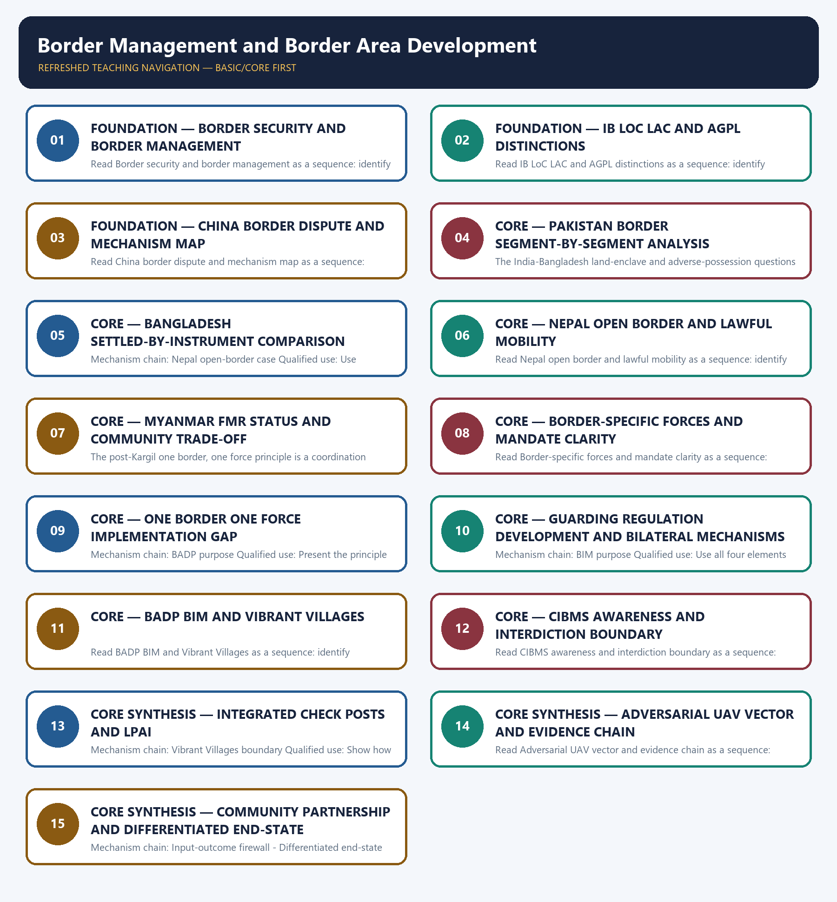

# Border Management and Border Area Development — Learner-v2 Complete Learning Session

> **Authoring-only generation:** 2026-09-04. No PDF was rendered and no tracker or index was mutated.

### SOURCE, PROGRESSION AND CURRENT-LINKAGE AUDIT

- **Generation date:** 2026-09-04.
- **Repository-first evidence:** the Basic owner is taught first and preserved in full; the Advanced owner is retained only in the optional final teaching block.
- **OCR evidence:** Repository Markdown was primary. OCR-searchable official UPSC papers were supplementary only for printed routed demands. No answer key, attribution, operational method, notification effect, implementation outcome or security metric was inferred.
- **Qdrant:** not used; repository Markdown and available OCR context were sufficient.
- **PYQ integrity:** The audited ledgers route the 2020 Myanmar-Bangladesh-LoC comparison, the 2023 adversarial-UAV demand and the 2024 China-Pakistan-BADP-BIM demand here. OCR inspection confirmed the 2023 and 2024 printed stems; no operational detail or official model answer is inferred.
- **Live-link boundary:** On 2026-09-04, the official VVP page confirmed the programme's scheme type, northern-border focus, district/Gram Panchayat planning and non-overlap with BADP. MHA division pages returned 403, so no current allocation, border coverage, fencing, CIBMS or outcome figure is used.
- **Fact/inference discipline:** no current-affairs item, PYQ wording, figure or quotation is invented.

### LIVE OFFICIAL-SOURCE ATTEMPT LOG

The checks below were made on 2026-09-04. Substantive official text is used only for the proposition it supports; title-only, blocked or thin pages are recorded and supply no factual claim.

- https://www.mha.gov.in/en/divisionofmha/border-management-ii-division — attempted 2026-09-04; direct retrieval returned 403. Search results confirmed the division's broad BADP, Vibrant Villages, coastal-security and LPAI coordination remit, but no allocation, coverage or outcome number is imported.
- https://www.mha.gov.in/en/divisionofmha/border-management-i-division — attempted 2026-09-04; direct retrieval returned 403. The module uses the owner-audited BIM and CIBMS distinctions and does not convert a scheme period, sensor deployment or sanctioned work into an outcome.
- https://vvp.mha.gov.in/Home/About — fetched 2026-09-04; the official page confirms Vibrant Villages Programme as a Centrally Sponsored Scheme announced in Budget 2022-23 for northern-border villages, with district and Gram Panchayat action plans and an express non-overlap rule with BADP.
- https://www.indiacode.nic.in/ — attempted 2026-09-04 for the Constitution (One Hundredth Amendment) Act, 2015 and the India-Bangladesh land-boundary settlement; direct retrieval returned 403, so only the audited owner distinction is retained.

## BASIC LEARNING SESSION



*Distinct embedded teaching-navigation image. The separate continuous Cārvāka-style flowchart package remains an independent at-a-glance artifact.*

### SESSION 1 — FOUNDATION — BORDER SECURITY AND BORDER MANAGEMENT

#### DEFINITION / WHAT THIS IS CALLED

**Plain-language definition:** The decisive boundary is Do not use border security and border management as synonyms.

**Technical definition:** Read Border security and border management as a sequence: identify Security-management distinction, follow the named mechanism to its institutional response, and stop at the last verified status rather than assuming the next stage.

#### ANSWER-GRABBING OPENING — WRITE/ADAPT IN THE EXAM

> Border security concerns defence and guarding, while border management also includes regulation, infrastructure and area development, legal mobility or trade, and bilateral mechanisms.

#### MUST-WRITE KEYWORDS

- **FOUNDATION**
- **Border security**
- **border management**
- **Mechanism chain**
- **Qualified use**
- **Border**

**How to use them:** Frame the answer through FOUNDATION; define Border security, connect border management with Mechanism chain to explain the mechanism, and use Qualified use for the decisive comparison or qualification.

#### VISUAL FIRST

```text
BORDER SECURITY AND BORDER MANAGEMENT
01. Security-management distinction
    |
    v
02. Boundary vocabulary
STATUS / CATEGORY FIREWALL -> Do not use border security and border management as synonyms.
```

*The rail fixes the institutional sequence and claim boundary before explanation.*

#### CORE EXPLANATION

Border security concerns defence and guarding, while border management also includes regulation, infrastructure and area development, legal mobility or trade, and bilateral mechanisms. An International Boundary is mutually recognised and demarcated; the LoC is a military control line in the J&K context, the LAC is the differently perceived India-China alignment, and the AGPL runs north of NJ 9842 in the Siachen sector.

#### SIMPLE SYSTEM EXAMPLE

Read Border security and border management as a sequence: identify Security-management distinction, follow the named mechanism to its institutional response, and stop at the last verified status rather than assuming the next stage.

#### TECHNICAL DISTINCTION

The decisive boundary is Do not use border security and border management as synonyms. This keeps Security-management distinction and Boundary vocabulary in the correct legal category, institutional mandate and evidentiary status.

#### NAMED EVIDENCE AND MECHANISM

- Border security concerns defence and guarding, while border management also includes regulation, infrastructure and area development, legal mobility or trade, and bilateral mechanisms.
- An International Boundary is mutually recognised and demarcated; the LoC is a military control line in the J&K context, the LAC is the differently perceived India-China alignment, and the AGPL runs north of NJ 9842 in the Siachen sector.

#### EXAMINER CAUTION

- Do not use border security and border management as synonyms.

#### EXAM LINK

- **Prelims:** Keep institution, law, notification, ban/listing, scheme, agreement, ceasefire and outcome in their exact category.
- **Mains:** Define the broader management system before discussing physical guarding.

#### MINI RECAP

- **Mechanism chain:** Security-management distinction -> Boundary vocabulary
- **Qualified use:** Define the broader management system before discussing physical guarding.

#### CLOSING RECALL FLOW — FOUNDATION — BORDER SECURITY AND BORDER MANAGEMENT

```text
START / CONCEPT: FOUNDATION — Border security and border management
        |
        v
EXACT TERMS: FOUNDATION · Border security · border management · Mechanism chain · Qualified use · Border
        |
        v
MECHANISM / ARGUMENT: Read Border security and border management as a sequence: identify Security-management distinction, follow the named mechanism to its institutional response, and stop at the last verified status rather than assuming the next stage.
        |
        v
CONSEQUENCE / CONTRAST: The decisive boundary is Do not use border security and border management as synonyms.
        |
        v
UPSC TRAP / ANSWER-USE: Do not use border security and border management as synonyms.
        |
        v
ANSWER-GRABBING FORMULATION: Border security concerns defence and guarding, while border management also includes regulation, infrastructure and area development, legal mobility or trade, and bilateral mechanisms.
```
### SESSION 2 — FOUNDATION — IB LOC LAC AND AGPL DISTINCTIONS

#### DEFINITION / WHAT THIS IS CALLED

**Plain-language definition:** The decisive boundary is Do not call the IB, LoC, LAC and AGPL interchangeable boundary lines.

**Technical definition:** Read IB LoC LAC and AGPL distinctions as a sequence: identify China-border character, follow the named mechanism to its institutional response, and stop at the last verified status rather than assuming the next stage.

#### ANSWER-GRABBING OPENING — WRITE/ADAPT IN THE EXAM

> The decisive boundary is Do not call the IB, LoC, LAC and AGPL interchangeable boundary lines.

#### MUST-WRITE KEYWORDS

- **FOUNDATION**
- **IB LoC LAC**
- **AGPL distinctions**
- **Mechanism chain**
- **Qualified use**
- **The India-China frontier**

**How to use them:** Frame the answer through FOUNDATION; define IB LoC LAC, connect AGPL distinctions with Mechanism chain to explain the mechanism, and use Qualified use for the decisive comparison or qualification.

#### VISUAL FIRST

```text
IB LOC LAC AND AGPL DISTINCTIONS
01. China-border character
STATUS / CATEGORY FIREWALL -> Do not call the IB, LoC, LAC and AGPL interchangeable boundary lines.
```

*The rail fixes the institutional sequence and claim boundary before explanation.*

#### CORE EXPLANATION

The India-China frontier is disputed and lacks a mutually agreed LAC in stretches, making perception, patrol protocols, infrastructure and diplomatic-military mechanisms central management issues.

#### SIMPLE SYSTEM EXAMPLE

Read IB LoC LAC and AGPL distinctions as a sequence: identify China-border character, follow the named mechanism to its institutional response, and stop at the last verified status rather than assuming the next stage.

#### TECHNICAL DISTINCTION

The decisive boundary is Do not call the IB, LoC, LAC and AGPL interchangeable boundary lines. This keeps China-border character in the correct legal category, institutional mandate and evidentiary status.

#### NAMED EVIDENCE AND MECHANISM

- The India-China frontier is disputed and lacks a mutually agreed LAC in stretches, making perception, patrol protocols, infrastructure and diplomatic-military mechanisms central management issues.

#### EXAMINER CAUTION

- Do not call the IB, LoC, LAC and AGPL interchangeable boundary lines.

#### EXAM LINK

- **Prelims:** Keep institution, law, notification, ban/listing, scheme, agreement, ceasefire and outcome in their exact category.
- **Mains:** Name the line's exact legal and operational character.

#### MINI RECAP

- **Mechanism chain:** China-border character
- **Qualified use:** Name the line's exact legal and operational character.

#### CLOSING RECALL FLOW — FOUNDATION — IB LOC LAC AND AGPL DISTINCTIONS

```text
START / CONCEPT: FOUNDATION — IB LoC LAC and AGPL distinctions
        |
        v
EXACT TERMS: FOUNDATION · IB LoC LAC · AGPL distinctions · Mechanism chain · Qualified use · The India-China frontier
        |
        v
MECHANISM / ARGUMENT: Read IB LoC LAC and AGPL distinctions as a sequence: identify China-border character, follow the named mechanism to its institutional response, and stop at the last verified status rather than assuming the next stage.
        |
        v
CONSEQUENCE / CONTRAST: Do not call the IB, LoC, LAC and AGPL interchangeable boundary lines.
        |
        v
UPSC TRAP / ANSWER-USE: Do not miss this limiting distinction: name the line's exact legal and operational character.
        |
        v
ANSWER-GRABBING FORMULATION: The decisive boundary is Do not call the IB, LoC, LAC and AGPL interchangeable boundary lines.
```
### SESSION 3 — FOUNDATION — CHINA BORDER DISPUTE AND MECHANISM MAP

#### DEFINITION / WHAT THIS IS CALLED

**Plain-language definition:** The decisive boundary is Do not merge China and Pakistan border challenges into one paragraph.

**Technical definition:** Read China border dispute and mechanism map as a sequence: identify Pakistan-border segmentation, follow the named mechanism to its institutional response, and stop at the last verified status rather than assuming the next stage.

#### ANSWER-GRABBING OPENING — WRITE/ADAPT IN THE EXAM

> The decisive boundary is Do not merge China and Pakistan border challenges into one paragraph.

#### MUST-WRITE KEYWORDS

- **FOUNDATION**
- **China border dispute**
- **mechanism map**
- **Mechanism chain**
- **Qualified use**
- **The Pakistan-facing**

**How to use them:** Frame the answer through FOUNDATION; define China border dispute, connect mechanism map with Mechanism chain to explain the mechanism, and use Qualified use for the decisive comparison or qualification.

#### VISUAL FIRST

```text
CHINA BORDER DISPUTE AND MECHANISM MAP
01. Pakistan-border segmentation
STATUS / CATEGORY FIREWALL -> Do not merge China and Pakistan border challenges into one paragraph.
```

*The rail fixes the institutional sequence and claim boundary before explanation.*

#### CORE EXPLANATION

The Pakistan-facing boundary must be separated into the Radcliffe International Boundary, the Line of Control and the Actual Ground Position Line because terrain, legal status, lead forces and threat vectors differ.

#### SIMPLE SYSTEM EXAMPLE

Read China border dispute and mechanism map as a sequence: identify Pakistan-border segmentation, follow the named mechanism to its institutional response, and stop at the last verified status rather than assuming the next stage.

#### TECHNICAL DISTINCTION

The decisive boundary is Do not merge China and Pakistan border challenges into one paragraph. This keeps Pakistan-border segmentation in the correct legal category, institutional mandate and evidentiary status.

#### NAMED EVIDENCE AND MECHANISM

- The Pakistan-facing boundary must be separated into the Radcliffe International Boundary, the Line of Control and the Actual Ground Position Line because terrain, legal status, lead forces and threat vectors differ.

#### EXAMINER CAUTION

- Do not merge China and Pakistan border challenges into one paragraph.

#### EXAM LINK

- **Prelims:** Keep institution, law, notification, ban/listing, scheme, agreement, ceasefire and outcome in their exact category.
- **Mains:** Explain disputed alignment and de-escalation without tactical detail.

#### MINI RECAP

- **Mechanism chain:** Pakistan-border segmentation
- **Qualified use:** Explain disputed alignment and de-escalation without tactical detail.

#### CLOSING RECALL FLOW — FOUNDATION — CHINA BORDER DISPUTE AND MECHANISM MAP

```text
START / CONCEPT: FOUNDATION — China border dispute and mechanism map
        |
        v
EXACT TERMS: FOUNDATION · China border dispute · mechanism map · Mechanism chain · Qualified use · The Pakistan-facing
        |
        v
MECHANISM / ARGUMENT: Read China border dispute and mechanism map as a sequence: identify Pakistan-border segmentation, follow the named mechanism to its institutional response, and stop at the last verified status rather than assuming the next stage.
        |
        v
CONSEQUENCE / CONTRAST: Do not merge China and Pakistan border challenges into one paragraph.
        |
        v
UPSC TRAP / ANSWER-USE: Do not miss this limiting distinction: explain disputed alignment and de-escalation without tactical detail.
        |
        v
ANSWER-GRABBING FORMULATION: The decisive boundary is Do not merge China and Pakistan border challenges into one paragraph.
```
### SESSION 4 — CORE — PAKISTAN BORDER SEGMENT-BY-SEGMENT ANALYSIS

#### DEFINITION / WHAT THIS IS CALLED

**Plain-language definition:** Read Pakistan border segment-by-segment analysis as a sequence: identify Bangladesh settled-by-instrument case, follow the named mechanism to its institutional response, and stop at the last verified status rather than assuming the next stage.

**Technical definition:** The India-Bangladesh land-enclave and adverse-possession questions were resolved through the 2015 Land Boundary Agreement and the Constitution (One Hundredth Amendment) Act, while the maritime boundary was settled by a 2014 arbitral award.

#### ANSWER-GRABBING OPENING — WRITE/ADAPT IN THE EXAM

> Read Pakistan border segment-by-segment analysis as a sequence: identify Bangladesh settled-by-instrument case, follow the named mechanism to its institutional response, and stop at the last verified status rather than assuming the next stage.

#### MUST-WRITE KEYWORDS

- **Pakistan border segment-by-segment analysis**
- **Mechanism chain**
- **Qualified use**
- **The India-Bangladesh**
- **Land Boundary Agreement**
- **Constitution**

**How to use them:** Frame the answer through Pakistan border segment-by-segment analysis; define Mechanism chain, connect Qualified use with The India-Bangladesh to explain the mechanism, and use Land Boundary Agreement for the decisive comparison or qualification.

#### VISUAL FIRST

```text
PAKISTAN BORDER SEGMENT-BY-SEGMENT ANALYSIS
01. Bangladesh settled-by-instrument case
STATUS / CATEGORY FIREWALL -> Do not describe every India-Pakistan segment as an International Boundary.
```

*The rail fixes the institutional sequence and claim boundary before explanation.*

#### CORE EXPLANATION

The India-Bangladesh land-enclave and adverse-possession questions were resolved through the 2015 Land Boundary Agreement and the Constitution (One Hundredth Amendment) Act, while the maritime boundary was settled by a 2014 arbitral award.

#### SIMPLE SYSTEM EXAMPLE

Read Pakistan border segment-by-segment analysis as a sequence: identify Bangladesh settled-by-instrument case, follow the named mechanism to its institutional response, and stop at the last verified status rather than assuming the next stage.

#### TECHNICAL DISTINCTION

The decisive boundary is Do not describe every India-Pakistan segment as an International Boundary. This keeps Bangladesh settled-by-instrument case in the correct legal category, institutional mandate and evidentiary status.

#### NAMED EVIDENCE AND MECHANISM

- The India-Bangladesh land-enclave and adverse-possession questions were resolved through the 2015 Land Boundary Agreement and the Constitution (One Hundredth Amendment) Act, while the maritime boundary was settled by a 2014 arbitral award.

#### EXAMINER CAUTION

- Do not describe every India-Pakistan segment as an International Boundary.

#### EXAM LINK

- **Prelims:** Keep institution, law, notification, ban/listing, scheme, agreement, ceasefire and outcome in their exact category.
- **Mains:** Separate IB, LoC and AGPL before mapping threats and institutions.

#### MINI RECAP

- **Mechanism chain:** Bangladesh settled-by-instrument case
- **Qualified use:** Separate IB, LoC and AGPL before mapping threats and institutions.

#### CLOSING RECALL FLOW — CORE — PAKISTAN BORDER SEGMENT-BY-SEGMENT ANALYSIS

```text
START / CONCEPT: CORE — Pakistan border segment-by-segment analysis
        |
        v
EXACT TERMS: Pakistan border segment-by-segment analysis · Mechanism chain · Qualified use · The India-Bangladesh · Land Boundary Agreement · Constitution
        |
        v
MECHANISM / ARGUMENT: The India-Bangladesh land-enclave and adverse-possession questions were resolved through the 2015 Land Boundary Agreement and the Constitution (One Hundredth Amendment) Act, while the maritime boundary was settled by a 2014 arbitral award.
        |
        v
CONSEQUENCE / CONTRAST: The decisive boundary is Do not describe every India-Pakistan segment as an International Boundary.
        |
        v
UPSC TRAP / ANSWER-USE: Do not describe every India-Pakistan segment as an International Boundary.
        |
        v
ANSWER-GRABBING FORMULATION: Read Pakistan border segment-by-segment analysis as a sequence: identify Bangladesh settled-by-instrument case, follow the named mechanism to its institutional response, and stop at the last verified status rather than assuming the next stage.
```
### SESSION 5 — CORE — BANGLADESH SETTLED-BY-INSTRUMENT COMPARISON

#### DEFINITION / WHAT THIS IS CALLED

**Plain-language definition:** Read Bangladesh settled-by-instrument comparison as a sequence: identify Nepal open-border case, follow the named mechanism to its institutional response, and stop at the last verified status rather than assuming the next stage.

**Technical definition:** Mechanism chain: Nepal open-border case Qualified use: Use Bangladesh as a controlled example of settlement by legal instruments.

#### ANSWER-GRABBING OPENING — WRITE/ADAPT IN THE EXAM

> Read Bangladesh settled-by-instrument comparison as a sequence: identify Nepal open-border case, follow the named mechanism to its institutional response, and stop at the last verified status rather than assuming the next stage.

#### MUST-WRITE KEYWORDS

- **Bangladesh settled-by-instrument comparison**
- **Mechanism chain**
- **Qualified use**
- **The India-Nepal**
- **Read Bangladesh**
- **Nepal**

**How to use them:** Frame the answer through Bangladesh settled-by-instrument comparison; define Mechanism chain, connect Qualified use with The India-Nepal to explain the mechanism, and use Read Bangladesh for the decisive comparison or qualification.

#### VISUAL FIRST

```text
BANGLADESH SETTLED-BY-INSTRUMENT COMPARISON
01. Nepal open-border case
STATUS / CATEGORY FIREWALL -> Do not repeat the outdated claim that India-Bangladesh enclaves remain unresolved.
```

*The rail fixes the institutional sequence and claim boundary before explanation.*

#### CORE EXPLANATION

The India-Nepal open border facilitates legitimate movement under the bilateral treaty framework but can also be misused for transit, requiring facilitation and risk-based enforcement together.

#### SIMPLE SYSTEM EXAMPLE

Read Bangladesh settled-by-instrument comparison as a sequence: identify Nepal open-border case, follow the named mechanism to its institutional response, and stop at the last verified status rather than assuming the next stage.

#### TECHNICAL DISTINCTION

The decisive boundary is Do not repeat the outdated claim that India-Bangladesh enclaves remain unresolved. This keeps Nepal open-border case in the correct legal category, institutional mandate and evidentiary status.

#### NAMED EVIDENCE AND MECHANISM

- The India-Nepal open border facilitates legitimate movement under the bilateral treaty framework but can also be misused for transit, requiring facilitation and risk-based enforcement together.

#### EXAMINER CAUTION

- Do not repeat the outdated claim that India-Bangladesh enclaves remain unresolved.

#### EXAM LINK

- **Prelims:** Keep institution, law, notification, ban/listing, scheme, agreement, ceasefire and outcome in their exact category.
- **Mains:** Use Bangladesh as a controlled example of settlement by legal instruments.

#### MINI RECAP

- **Mechanism chain:** Nepal open-border case
- **Qualified use:** Use Bangladesh as a controlled example of settlement by legal instruments.

#### CLOSING RECALL FLOW — CORE — BANGLADESH SETTLED-BY-INSTRUMENT COMPARISON

```text
START / CONCEPT: CORE — Bangladesh settled-by-instrument comparison
        |
        v
EXACT TERMS: Bangladesh settled-by-instrument comparison · Mechanism chain · Qualified use · The India-Nepal · Read Bangladesh · Nepal
        |
        v
MECHANISM / ARGUMENT: Mechanism chain: Nepal open-border case Qualified use: Use Bangladesh as a controlled example of settlement by legal instruments.
        |
        v
CONSEQUENCE / CONTRAST: The India-Nepal open border facilitates legitimate movement under the bilateral treaty framework but can also be misused for transit, requiring facilitation and risk-based enforcement together.
        |
        v
UPSC TRAP / ANSWER-USE: The decisive boundary is Do not repeat the outdated claim that India-Bangladesh enclaves remain unresolved.
        |
        v
ANSWER-GRABBING FORMULATION: Read Bangladesh settled-by-instrument comparison as a sequence: identify Nepal open-border case, follow the named mechanism to its institutional response, and stop at the last verified status rather than assuming the next stage.
```
### SESSION 6 — CORE — NEPAL OPEN BORDER AND LAWFUL MOBILITY

#### DEFINITION / WHAT THIS IS CALLED

**Plain-language definition:** The decisive boundary is Do not treat an open border as an unregulated or lawless border.

**Technical definition:** Read Nepal open border and lawful mobility as a sequence: identify Myanmar FMR status rule, follow the named mechanism to its institutional response, and stop at the last verified status rather than assuming the next stage.

#### ANSWER-GRABBING OPENING — WRITE/ADAPT IN THE EXAM

> Read Nepal open border and lawful mobility as a sequence: identify Myanmar FMR status rule, follow the named mechanism to its institutional response, and stop at the last verified status rather than assuming the next stage.

#### MUST-WRITE KEYWORDS

- **Nepal open border**
- **lawful mobility**
- **Mechanism chain**
- **Qualified use**
- **MHA**
- **India-Myanmar Free Movement Regime**

**How to use them:** Frame the answer through Nepal open border; define lawful mobility, connect Mechanism chain with Qualified use to explain the mechanism, and use MHA for the decisive comparison or qualification.

#### VISUAL FIRST

```text
NEPAL OPEN BORDER AND LAWFUL MOBILITY
01. Myanmar FMR status rule
    |
    v
02. Border-specific force map
STATUS / CATEGORY FIREWALL -> Do not treat an open border as an unregulated or lawless border.
```

*The rail fixes the institutional sequence and claim boundary before explanation.*

#### CORE EXPLANATION

MHA announced on 8 February 2024 a decision to scrap the India-Myanmar Free Movement Regime; announcement, formal notification and field implementation must not be collapsed. The owner maps BSF to the Pakistan and Bangladesh borders, ITBP to the China border, SSB to Nepal and Bhutan, and Assam Rifles to Myanmar, while recognising border-specific operational overlap.

#### SIMPLE SYSTEM EXAMPLE

Read Nepal open border and lawful mobility as a sequence: identify Myanmar FMR status rule, follow the named mechanism to its institutional response, and stop at the last verified status rather than assuming the next stage.

#### TECHNICAL DISTINCTION

The decisive boundary is Do not treat an open border as an unregulated or lawless border. This keeps Myanmar FMR status rule and Border-specific force map in the correct legal category, institutional mandate and evidentiary status.

#### NAMED EVIDENCE AND MECHANISM

- MHA announced on 8 February 2024 a decision to scrap the India-Myanmar Free Movement Regime; announcement, formal notification and field implementation must not be collapsed.
- The owner maps BSF to the Pakistan and Bangladesh borders, ITBP to the China border, SSB to Nepal and Bhutan, and Assam Rifles to Myanmar, while recognising border-specific operational overlap.

#### EXAMINER CAUTION

- Do not treat an open border as an unregulated or lawless border.

#### EXAM LINK

- **Prelims:** Keep institution, law, notification, ban/listing, scheme, agreement, ceasefire and outcome in their exact category.
- **Mains:** Balance facilitation with intelligence-led and lawful risk control.

#### MINI RECAP

- **Mechanism chain:** Myanmar FMR status rule -> Border-specific force map
- **Qualified use:** Balance facilitation with intelligence-led and lawful risk control.

#### CLOSING RECALL FLOW — CORE — NEPAL OPEN BORDER AND LAWFUL MOBILITY

```text
START / CONCEPT: CORE — Nepal open border and lawful mobility
        |
        v
EXACT TERMS: Nepal open border · lawful mobility · Mechanism chain · Qualified use · MHA · India-Myanmar Free Movement Regime
        |
        v
MECHANISM / ARGUMENT: Mechanism chain: Myanmar FMR status rule - Border-specific force map Qualified use: Balance facilitation with intelligence-led and lawful risk control.
        |
        v
CONSEQUENCE / CONTRAST: The owner maps BSF to the Pakistan and Bangladesh borders, ITBP to the China border, SSB to Nepal and Bhutan, and Assam Rifles to Myanmar, while recognising border-specific operational overlap.
        |
        v
UPSC TRAP / ANSWER-USE: The decisive boundary is Do not treat an open border as an unregulated or lawless border.
        |
        v
ANSWER-GRABBING FORMULATION: Read Nepal open border and lawful mobility as a sequence: identify Myanmar FMR status rule, follow the named mechanism to its institutional response, and stop at the last verified status rather than assuming the next stage.
```
### SESSION 7 — CORE — MYANMAR FMR STATUS AND COMMUNITY TRADE-OFF

#### DEFINITION / WHAT THIS IS CALLED

**Plain-language definition:** Read Myanmar FMR status and community trade-off as a sequence: identify One-border-one-force boundary, follow the named mechanism to its institutional response, and stop at the last verified status rather than assuming the next stage.

**Technical definition:** The post-Kargil one border, one force principle is a coordination objective, not proof that every sector is presently under one exclusive command.

#### ANSWER-GRABBING OPENING — WRITE/ADAPT IN THE EXAM

> Read Myanmar FMR status and community trade-off as a sequence: identify One-border-one-force boundary, follow the named mechanism to its institutional response, and stop at the last verified status rather than assuming the next stage.

#### MUST-WRITE KEYWORDS

- **Myanmar FMR status**
- **community trade-off**
- **Mechanism chain**
- **Qualified use**
- **The post-Kargil one border, one force principle**
- **Kargil**

**How to use them:** Frame the answer through Myanmar FMR status; define community trade-off, connect Mechanism chain with Qualified use to explain the mechanism, and use The post-Kargil one border, one force principle for the decisive comparison or qualification.

#### VISUAL FIRST

```text
MYANMAR FMR STATUS AND COMMUNITY TRADE-OFF
01. One-border-one-force boundary
STATUS / CATEGORY FIREWALL -> Do not convert the 8 February 2024 FMR decision into complete implementation.
```

*The rail fixes the institutional sequence and claim boundary before explanation.*

#### CORE EXPLANATION

The post-Kargil one border, one force principle is a coordination objective, not proof that every sector is presently under one exclusive command.

#### SIMPLE SYSTEM EXAMPLE

Read Myanmar FMR status and community trade-off as a sequence: identify One-border-one-force boundary, follow the named mechanism to its institutional response, and stop at the last verified status rather than assuming the next stage.

#### TECHNICAL DISTINCTION

The decisive boundary is Do not convert the 8 February 2024 FMR decision into complete implementation. This keeps One-border-one-force boundary in the correct legal category, institutional mandate and evidentiary status.

#### NAMED EVIDENCE AND MECHANISM

- The post-Kargil one border, one force principle is a coordination objective, not proof that every sector is presently under one exclusive command.

#### EXAMINER CAUTION

- Do not convert the 8 February 2024 FMR decision into complete implementation.

#### EXAM LINK

- **Prelims:** Keep institution, law, notification, ban/listing, scheme, agreement, ceasefire and outcome in their exact category.
- **Mains:** State decision, notification and implementation as separate rungs.

#### MINI RECAP

- **Mechanism chain:** One-border-one-force boundary
- **Qualified use:** State decision, notification and implementation as separate rungs.

#### CLOSING RECALL FLOW — CORE — MYANMAR FMR STATUS AND COMMUNITY TRADE-OFF

```text
START / CONCEPT: CORE — Myanmar FMR status and community trade-off
        |
        v
EXACT TERMS: Myanmar FMR status · community trade-off · Mechanism chain · Qualified use · The post-Kargil one border, one force principle · Kargil
        |
        v
MECHANISM / ARGUMENT: Mechanism chain: One-border-one-force boundary Qualified use: State decision, notification and implementation as separate rungs.
        |
        v
CONSEQUENCE / CONTRAST: The post-Kargil one border, one force principle is a coordination objective, not proof that every sector is presently under one exclusive command.
        |
        v
UPSC TRAP / ANSWER-USE: The decisive boundary is Do not convert the 8 February 2024 FMR decision into complete implementation.
        |
        v
ANSWER-GRABBING FORMULATION: Read Myanmar FMR status and community trade-off as a sequence: identify One-border-one-force boundary, follow the named mechanism to its institutional response, and stop at the last verified status rather than assuming the next stage.
```
### SESSION 8 — CORE — BORDER-SPECIFIC FORCES AND MANDATE CLARITY

#### DEFINITION / WHAT THIS IS CALLED

**Plain-language definition:** The decisive boundary is Do not present one border, one force as fully implemented everywhere.

**Technical definition:** Read Border-specific forces and mandate clarity as a sequence: identify Four-element framework, follow the named mechanism to its institutional response, and stop at the last verified status rather than assuming the next stage.

#### ANSWER-GRABBING OPENING — WRITE/ADAPT IN THE EXAM

> Read Border-specific forces and mandate clarity as a sequence: identify Four-element framework, follow the named mechanism to its institutional response, and stop at the last verified status rather than assuming the next stage.

#### MUST-WRITE KEYWORDS

- **Border-specific forces**
- **mandate clarity**
- **Mechanism chain**
- **Qualified use**
- **Read Border-specific**
- **Four-element**

**How to use them:** Frame the answer through Border-specific forces; define mandate clarity, connect Mechanism chain with Qualified use to explain the mechanism, and use Read Border-specific for the decisive comparison or qualification.

#### VISUAL FIRST

```text
BORDER-SPECIFIC FORCES AND MANDATE CLARITY
01. Four-element framework
STATUS / CATEGORY FIREWALL -> Do not present one border, one force as fully implemented everywhere.
```

*The rail fixes the institutional sequence and claim boundary before explanation.*

#### CORE EXPLANATION

A complete border-management answer combines guarding, regulation, development of border areas and bilateral institutional mechanisms, calibrated to terrain and legal mobility.

#### SIMPLE SYSTEM EXAMPLE

Read Border-specific forces and mandate clarity as a sequence: identify Four-element framework, follow the named mechanism to its institutional response, and stop at the last verified status rather than assuming the next stage.

#### TECHNICAL DISTINCTION

The decisive boundary is Do not present one border, one force as fully implemented everywhere. This keeps Four-element framework in the correct legal category, institutional mandate and evidentiary status.

#### NAMED EVIDENCE AND MECHANISM

- A complete border-management answer combines guarding, regulation, development of border areas and bilateral institutional mechanisms, calibrated to terrain and legal mobility.

#### EXAMINER CAUTION

- Do not present one border, one force as fully implemented everywhere.

#### EXAM LINK

- **Prelims:** Keep institution, law, notification, ban/listing, scheme, agreement, ceasefire and outcome in their exact category.
- **Mains:** Map force to border while acknowledging formally verified overlap only.

#### MINI RECAP

- **Mechanism chain:** Four-element framework
- **Qualified use:** Map force to border while acknowledging formally verified overlap only.

#### CLOSING RECALL FLOW — CORE — BORDER-SPECIFIC FORCES AND MANDATE CLARITY

```text
START / CONCEPT: CORE — Border-specific forces and mandate clarity
        |
        v
EXACT TERMS: Border-specific forces · mandate clarity · Mechanism chain · Qualified use · Read Border-specific · Four-element
        |
        v
MECHANISM / ARGUMENT: Mechanism chain: Four-element framework Qualified use: Map force to border while acknowledging formally verified overlap only.
        |
        v
CONSEQUENCE / CONTRAST: The decisive boundary is Do not present one border, one force as fully implemented everywhere.
        |
        v
UPSC TRAP / ANSWER-USE: Do not present one border, one force as fully implemented everywhere.
        |
        v
ANSWER-GRABBING FORMULATION: Read Border-specific forces and mandate clarity as a sequence: identify Four-element framework, follow the named mechanism to its institutional response, and stop at the last verified status rather than assuming the next stage.
```
### SESSION 9 — CORE — ONE BORDER ONE FORCE IMPLEMENTATION GAP

#### DEFINITION / WHAT THIS IS CALLED

**Plain-language definition:** Read One border one force implementation gap as a sequence: identify BADP purpose, follow the named mechanism to its institutional response, and stop at the last verified status rather than assuming the next stage.

**Technical definition:** Mechanism chain: BADP purpose Qualified use: Present the principle as a reform objective and test implementation.

#### ANSWER-GRABBING OPENING — WRITE/ADAPT IN THE EXAM

> Read One border one force implementation gap as a sequence: identify BADP purpose, follow the named mechanism to its institutional response, and stop at the last verified status rather than assuming the next stage.

#### MUST-WRITE KEYWORDS

- **One border one force implementation gap**
- **Mechanism chain**
- **Qualified use**
- **The Border Area Development Programme**
- **Read One**
- **BADP**

**How to use them:** Frame the answer through One border one force implementation gap; define Mechanism chain, connect Qualified use with The Border Area Development Programme to explain the mechanism, and use Read One for the decisive comparison or qualification.

#### VISUAL FIRST

```text
ONE BORDER ONE FORCE IMPLEMENTATION GAP
01. BADP purpose
STATUS / CATEGORY FIREWALL -> Do not confuse BADP, BIM and Vibrant Villages Programme.
```

*The rail fixes the institutional sequence and claim boundary before explanation.*

#### CORE EXPLANATION

The Border Area Development Programme addresses development gaps in eligible border villages through local infrastructure, services and livelihood support; sanction or expenditure does not prove security or welfare outcomes.

#### SIMPLE SYSTEM EXAMPLE

Read One border one force implementation gap as a sequence: identify BADP purpose, follow the named mechanism to its institutional response, and stop at the last verified status rather than assuming the next stage.

#### TECHNICAL DISTINCTION

The decisive boundary is Do not confuse BADP, BIM and Vibrant Villages Programme. This keeps BADP purpose in the correct legal category, institutional mandate and evidentiary status.

#### NAMED EVIDENCE AND MECHANISM

- The Border Area Development Programme addresses development gaps in eligible border villages through local infrastructure, services and livelihood support; sanction or expenditure does not prove security or welfare outcomes.

#### EXAMINER CAUTION

- Do not confuse BADP, BIM and Vibrant Villages Programme.

#### EXAM LINK

- **Prelims:** Keep institution, law, notification, ban/listing, scheme, agreement, ceasefire and outcome in their exact category.
- **Mains:** Present the principle as a reform objective and test implementation.

#### MINI RECAP

- **Mechanism chain:** BADP purpose
- **Qualified use:** Present the principle as a reform objective and test implementation.

#### CLOSING RECALL FLOW — CORE — ONE BORDER ONE FORCE IMPLEMENTATION GAP

```text
START / CONCEPT: CORE — One border one force implementation gap
        |
        v
EXACT TERMS: One border one force implementation gap · Mechanism chain · Qualified use · The Border Area Development Programme · Read One · BADP
        |
        v
MECHANISM / ARGUMENT: Mechanism chain: BADP purpose Qualified use: Present the principle as a reform objective and test implementation.
        |
        v
CONSEQUENCE / CONTRAST: The Border Area Development Programme addresses development gaps in eligible border villages through local infrastructure, services and livelihood support; sanction or expenditure does not prove security or welfare outcomes.
        |
        v
UPSC TRAP / ANSWER-USE: The decisive boundary is Do not confuse BADP, BIM and Vibrant Villages Programme.
        |
        v
ANSWER-GRABBING FORMULATION: Read One border one force implementation gap as a sequence: identify BADP purpose, follow the named mechanism to its institutional response, and stop at the last verified status rather than assuming the next stage.
```
### SESSION 10 — CORE — GUARDING REGULATION DEVELOPMENT AND BILATERAL MECHANISMS

#### DEFINITION / WHAT THIS IS CALLED

**Plain-language definition:** Read Guarding regulation development and bilateral mechanisms as a sequence: identify BIM purpose, follow the named mechanism to its institutional response, and stop at the last verified status rather than assuming the next stage.

**Technical definition:** Mechanism chain: BIM purpose Qualified use: Use all four elements as the answer's organising spine.

#### ANSWER-GRABBING OPENING — WRITE/ADAPT IN THE EXAM

> Read Guarding regulation development and bilateral mechanisms as a sequence: identify BIM purpose, follow the named mechanism to its institutional response, and stop at the last verified status rather than assuming the next stage.

#### MUST-WRITE KEYWORDS

- **Guarding regulation development**
- **bilateral mechanisms**
- **Mechanism chain**
- **Qualified use**
- **The Border Infrastructure and Management scheme**
- **The Border Infrastructure**

**How to use them:** Frame the answer through Guarding regulation development; define bilateral mechanisms, connect Mechanism chain with Qualified use to explain the mechanism, and use The Border Infrastructure and Management scheme for the decisive comparison or qualification.

#### VISUAL FIRST

```text
GUARDING REGULATION DEVELOPMENT AND BILATERAL MECHANISMS
01. BIM purpose
STATUS / CATEGORY FIREWALL -> Do not equate sensor detection with interdiction or conviction.
```

*The rail fixes the institutional sequence and claim boundary before explanation.*

#### CORE EXPLANATION

The Border Infrastructure and Management scheme is the infrastructure umbrella for assets such as roads, fencing, floodlighting, outposts, communications and technology; its current period and outlay require a dated MHA source.

#### SIMPLE SYSTEM EXAMPLE

Read Guarding regulation development and bilateral mechanisms as a sequence: identify BIM purpose, follow the named mechanism to its institutional response, and stop at the last verified status rather than assuming the next stage.

#### TECHNICAL DISTINCTION

The decisive boundary is Do not equate sensor detection with interdiction or conviction. This keeps BIM purpose in the correct legal category, institutional mandate and evidentiary status.

#### NAMED EVIDENCE AND MECHANISM

- The Border Infrastructure and Management scheme is the infrastructure umbrella for assets such as roads, fencing, floodlighting, outposts, communications and technology; its current period and outlay require a dated MHA source.

#### EXAMINER CAUTION

- Do not equate sensor detection with interdiction or conviction.

#### EXAM LINK

- **Prelims:** Keep institution, law, notification, ban/listing, scheme, agreement, ceasefire and outcome in their exact category.
- **Mains:** Use all four elements as the answer's organising spine.

#### MINI RECAP

- **Mechanism chain:** BIM purpose
- **Qualified use:** Use all four elements as the answer's organising spine.

#### CLOSING RECALL FLOW — CORE — GUARDING REGULATION DEVELOPMENT AND BILATERAL MECHANISMS

```text
START / CONCEPT: CORE — Guarding regulation development and bilateral mechanisms
        |
        v
EXACT TERMS: Guarding regulation development · bilateral mechanisms · Mechanism chain · Qualified use · The Border Infrastructure and Management scheme · The Border Infrastructure
        |
        v
MECHANISM / ARGUMENT: Mechanism chain: BIM purpose Qualified use: Use all four elements as the answer's organising spine.
        |
        v
CONSEQUENCE / CONTRAST: The decisive boundary is Do not equate sensor detection with interdiction or conviction.
        |
        v
UPSC TRAP / ANSWER-USE: Do not equate sensor detection with interdiction or conviction.
        |
        v
ANSWER-GRABBING FORMULATION: Read Guarding regulation development and bilateral mechanisms as a sequence: identify BIM purpose, follow the named mechanism to its institutional response, and stop at the last verified status rather than assuming the next stage.
```
### SESSION 11 — CORE — BADP BIM AND VIBRANT VILLAGES

#### DEFINITION / WHAT THIS IS CALLED

**Plain-language definition:** BADP is primarily area and community development, while BIM primarily builds border-management infrastructure; they are complementary but not interchangeable schemes.

**Technical definition:** Read BADP BIM and Vibrant Villages as a sequence: identify BADP-BIM distinction, follow the named mechanism to its institutional response, and stop at the last verified status rather than assuming the next stage.

#### ANSWER-GRABBING OPENING — WRITE/ADAPT IN THE EXAM

> Read BADP BIM and Vibrant Villages as a sequence: identify BADP-BIM distinction, follow the named mechanism to its institutional response, and stop at the last verified status rather than assuming the next stage.

#### MUST-WRITE KEYWORDS

- **BADP BIM**
- **Vibrant Villages**
- **Mechanism chain**
- **Qualified use**
- **BADP**
- **BIM**

**How to use them:** Frame the answer through BADP BIM; define Vibrant Villages, connect Mechanism chain with Qualified use to explain the mechanism, and use BADP for the decisive comparison or qualification.

#### VISUAL FIRST

```text
BADP BIM AND VIBRANT VILLAGES
01. BADP-BIM distinction
    |
    v
02. CIBMS role
STATUS / CATEGORY FIREWALL -> Do not publish tactical coverage gaps, patrol patterns or counter-UAS methods.
```

*The rail fixes the institutional sequence and claim boundary before explanation.*

#### CORE EXPLANATION

BADP is primarily area and community development, while BIM primarily builds border-management infrastructure; they are complementary but not interchangeable schemes. The Comprehensive Integrated Border Management System integrates sensors, communications, intelligence and command-and-control to cover difficult gaps; detection and track generation are not the same as interdiction.

#### SIMPLE SYSTEM EXAMPLE

Read BADP BIM and Vibrant Villages as a sequence: identify BADP-BIM distinction, follow the named mechanism to its institutional response, and stop at the last verified status rather than assuming the next stage.

#### TECHNICAL DISTINCTION

The decisive boundary is Do not publish tactical coverage gaps, patrol patterns or counter-UAS methods. This keeps BADP-BIM distinction and CIBMS role in the correct legal category, institutional mandate and evidentiary status.

#### NAMED EVIDENCE AND MECHANISM

- BADP is primarily area and community development, while BIM primarily builds border-management infrastructure; they are complementary but not interchangeable schemes.
- The Comprehensive Integrated Border Management System integrates sensors, communications, intelligence and command-and-control to cover difficult gaps; detection and track generation are not the same as interdiction.

#### EXAMINER CAUTION

- Do not publish tactical coverage gaps, patrol patterns or counter-UAS methods.

#### EXAM LINK

- **Prelims:** Keep institution, law, notification, ban/listing, scheme, agreement, ceasefire and outcome in their exact category.
- **Mains:** Distinguish scheme purpose, funding route, implementation and outcome.

#### MINI RECAP

- **Mechanism chain:** BADP-BIM distinction -> CIBMS role
- **Qualified use:** Distinguish scheme purpose, funding route, implementation and outcome.

#### CLOSING RECALL FLOW — CORE — BADP BIM AND VIBRANT VILLAGES

```text
START / CONCEPT: CORE — BADP BIM and Vibrant Villages
        |
        v
EXACT TERMS: BADP BIM · Vibrant Villages · Mechanism chain · Qualified use · BADP · BIM
        |
        v
MECHANISM / ARGUMENT: Mechanism chain: BADP-BIM distinction - CIBMS role Qualified use: Distinguish scheme purpose, funding route, implementation and outcome.
        |
        v
CONSEQUENCE / CONTRAST: BADP is primarily area and community development, while BIM primarily builds border-management infrastructure; they are complementary but not interchangeable schemes.
        |
        v
UPSC TRAP / ANSWER-USE: The Comprehensive Integrated Border Management System integrates sensors, communications, intelligence and command-and-control to cover difficult gaps; detection and track generation are not the same as interdiction.
        |
        v
ANSWER-GRABBING FORMULATION: Read BADP BIM and Vibrant Villages as a sequence: identify BADP-BIM distinction, follow the named mechanism to its institutional response, and stop at the last verified status rather than assuming the next stage.
```
### SESSION 12 — CORE — CIBMS AWARENESS AND INTERDICTION BOUNDARY

#### DEFINITION / WHAT THIS IS CALLED

**Plain-language definition:** The decisive boundary is Do not infer outcomes from scheme sanction, expenditure or asset creation.

**Technical definition:** Read CIBMS awareness and interdiction boundary as a sequence: identify ICP-LPAI role, follow the named mechanism to its institutional response, and stop at the last verified status rather than assuming the next stage.

#### ANSWER-GRABBING OPENING — WRITE/ADAPT IN THE EXAM

> Read CIBMS awareness and interdiction boundary as a sequence: identify ICP-LPAI role, follow the named mechanism to its institutional response, and stop at the last verified status rather than assuming the next stage.

#### MUST-WRITE KEYWORDS

- **CIBMS awareness**
- **interdiction boundary**
- **Mechanism chain**
- **Qualified use**
- **Integrated Check Posts**
- **Land Ports Authority**

**How to use them:** Frame the answer through CIBMS awareness; define interdiction boundary, connect Mechanism chain with Qualified use to explain the mechanism, and use Integrated Check Posts for the decisive comparison or qualification.

#### VISUAL FIRST

```text
CIBMS AWARENESS AND INTERDICTION BOUNDARY
01. ICP-LPAI role
STATUS / CATEGORY FIREWALL -> Do not infer outcomes from scheme sanction, expenditure or asset creation.
```

*The rail fixes the institutional sequence and claim boundary before explanation.*

#### CORE EXPLANATION

Integrated Check Posts consolidate customs, immigration and regulatory services at legal crossings, while the Land Ports Authority of India is the statutory body responsible for their development and management.

#### SIMPLE SYSTEM EXAMPLE

Read CIBMS awareness and interdiction boundary as a sequence: identify ICP-LPAI role, follow the named mechanism to its institutional response, and stop at the last verified status rather than assuming the next stage.

#### TECHNICAL DISTINCTION

The decisive boundary is Do not infer outcomes from scheme sanction, expenditure or asset creation. This keeps ICP-LPAI role in the correct legal category, institutional mandate and evidentiary status.

#### NAMED EVIDENCE AND MECHANISM

- Integrated Check Posts consolidate customs, immigration and regulatory services at legal crossings, while the Land Ports Authority of India is the statutory body responsible for their development and management.

#### EXAMINER CAUTION

- Do not infer outcomes from scheme sanction, expenditure or asset creation.

#### EXAM LINK

- **Prelims:** Keep institution, law, notification, ban/listing, scheme, agreement, ceasefire and outcome in their exact category.
- **Mains:** Separate awareness, decision, interdiction and evidence.

#### MINI RECAP

- **Mechanism chain:** ICP-LPAI role
- **Qualified use:** Separate awareness, decision, interdiction and evidence.

#### CLOSING RECALL FLOW — CORE — CIBMS AWARENESS AND INTERDICTION BOUNDARY

```text
START / CONCEPT: CORE — CIBMS awareness and interdiction boundary
        |
        v
EXACT TERMS: CIBMS awareness · interdiction boundary · Mechanism chain · Qualified use · Integrated Check Posts · Land Ports Authority
        |
        v
MECHANISM / ARGUMENT: Mechanism chain: ICP-LPAI role Qualified use: Separate awareness, decision, interdiction and evidence.
        |
        v
CONSEQUENCE / CONTRAST: The decisive boundary is Do not infer outcomes from scheme sanction, expenditure or asset creation.
        |
        v
UPSC TRAP / ANSWER-USE: Integrated Check Posts consolidate customs, immigration and regulatory services at legal crossings, while the Land Ports Authority of India is the statutory body responsible for their development and management.
        |
        v
ANSWER-GRABBING FORMULATION: Read CIBMS awareness and interdiction boundary as a sequence: identify ICP-LPAI role, follow the named mechanism to its institutional response, and stop at the last verified status rather than assuming the next stage.
```
### SESSION 13 — CORE SYNTHESIS — INTEGRATED CHECK POSTS AND LPAI

#### DEFINITION / WHAT THIS IS CALLED

**Plain-language definition:** Read Integrated Check Posts and LPAI as a sequence: identify Vibrant Villages boundary, follow the named mechanism to its institutional response, and stop at the last verified status rather than assuming the next stage.

**Technical definition:** Mechanism chain: Vibrant Villages boundary Qualified use: Show how legal crossings improve facilitation and enforcement together.

#### ANSWER-GRABBING OPENING — WRITE/ADAPT IN THE EXAM

> Read Integrated Check Posts and LPAI as a sequence: identify Vibrant Villages boundary, follow the named mechanism to its institutional response, and stop at the last verified status rather than assuming the next stage.

#### MUST-WRITE KEYWORDS

- **CORE SYNTHESIS**
- **Integrated Check Posts**
- **LPAI**
- **Mechanism chain**
- **Qualified use**
- **The official VVP page**

**How to use them:** Frame the answer through CORE SYNTHESIS; define Integrated Check Posts, connect LPAI with Mechanism chain to explain the mechanism, and use Qualified use for the decisive comparison or qualification.

#### VISUAL FIRST

```text
INTEGRATED CHECK POSTS AND LPAI
01. Vibrant Villages boundary
STATUS / CATEGORY FIREWALL -> Do not use border security and border management as synonyms.
```

*The rail fixes the institutional sequence and claim boundary before explanation.*

#### CORE EXPLANATION

The official VVP page describes a Centrally Sponsored Scheme for selected northern-border villages, using district and Gram Panchayat action plans and expressly avoiding overlap with BADP.

#### SIMPLE SYSTEM EXAMPLE

Read Integrated Check Posts and LPAI as a sequence: identify Vibrant Villages boundary, follow the named mechanism to its institutional response, and stop at the last verified status rather than assuming the next stage.

#### TECHNICAL DISTINCTION

The decisive boundary is Do not use border security and border management as synonyms. This keeps Vibrant Villages boundary in the correct legal category, institutional mandate and evidentiary status.

#### NAMED EVIDENCE AND MECHANISM

- The official VVP page describes a Centrally Sponsored Scheme for selected northern-border villages, using district and Gram Panchayat action plans and expressly avoiding overlap with BADP.

#### EXAMINER CAUTION

- Do not use border security and border management as synonyms.

#### EXAM LINK

- **Prelims:** Keep institution, law, notification, ban/listing, scheme, agreement, ceasefire and outcome in their exact category.
- **Mains:** Show how legal crossings improve facilitation and enforcement together.

#### MINI RECAP

- **Mechanism chain:** Vibrant Villages boundary
- **Qualified use:** Show how legal crossings improve facilitation and enforcement together.

#### CLOSING RECALL FLOW — CORE SYNTHESIS — INTEGRATED CHECK POSTS AND LPAI

```text
START / CONCEPT: CORE SYNTHESIS — Integrated Check Posts and LPAI
        |
        v
EXACT TERMS: CORE SYNTHESIS · Integrated Check Posts · LPAI · Mechanism chain · Qualified use · The official VVP page
        |
        v
MECHANISM / ARGUMENT: Mechanism chain: Vibrant Villages boundary Qualified use: Show how legal crossings improve facilitation and enforcement together.
        |
        v
CONSEQUENCE / CONTRAST: The decisive boundary is Do not use border security and border management as synonyms.
        |
        v
UPSC TRAP / ANSWER-USE: Do not use border security and border management as synonyms.
        |
        v
ANSWER-GRABBING FORMULATION: Read Integrated Check Posts and LPAI as a sequence: identify Vibrant Villages boundary, follow the named mechanism to its institutional response, and stop at the last verified status rather than assuming the next stage.
```
### SESSION 14 — CORE SYNTHESIS — ADVERSARIAL UAV VECTOR AND EVIDENCE CHAIN

#### DEFINITION / WHAT THIS IS CALLED

**Plain-language definition:** A hostile unmanned aerial vehicle is a vector that may carry surveillance, weapons or contraband; the response must separate detection, lawful counter-action, recovery, forensics and prosecution.

**Technical definition:** Read Adversarial UAV vector and evidence chain as a sequence: identify Community-security link, follow the named mechanism to its institutional response, and stop at the last verified status rather than assuming the next stage.

#### ANSWER-GRABBING OPENING — WRITE/ADAPT IN THE EXAM

> Read Adversarial UAV vector and evidence chain as a sequence: identify Community-security link, follow the named mechanism to its institutional response, and stop at the last verified status rather than assuming the next stage.

#### MUST-WRITE KEYWORDS

- **CORE SYNTHESIS**
- **Adversarial UAV vector**
- **evidence chain**
- **Mechanism chain**
- **Qualified use**
- **Border residents**

**How to use them:** Frame the answer through CORE SYNTHESIS; define Adversarial UAV vector, connect evidence chain with Mechanism chain to explain the mechanism, and use Qualified use for the decisive comparison or qualification.

#### VISUAL FIRST

```text
ADVERSARIAL UAV VECTOR AND EVIDENCE CHAIN
01. Community-security link
    |
    v
02. Adversarial-UAV classification
STATUS / CATEGORY FIREWALL -> Do not call the IB, LoC, LAC and AGPL interchangeable boundary lines.
```

*The rail fixes the institutional sequence and claim boundary before explanation.*

#### CORE EXPLANATION

Border residents are rights-bearing citizens and security partners; livelihoods, legal trade, grievance channels and protected reporting strengthen state presence without treating mobility as inherently suspect. A hostile unmanned aerial vehicle is a vector that may carry surveillance, weapons or contraband; the response must separate detection, lawful counter-action, recovery, forensics and prosecution.

#### SIMPLE SYSTEM EXAMPLE

Read Adversarial UAV vector and evidence chain as a sequence: identify Community-security link, follow the named mechanism to its institutional response, and stop at the last verified status rather than assuming the next stage.

#### TECHNICAL DISTINCTION

The decisive boundary is Do not call the IB, LoC, LAC and AGPL interchangeable boundary lines. This keeps Community-security link and Adversarial-UAV classification in the correct legal category, institutional mandate and evidentiary status.

#### NAMED EVIDENCE AND MECHANISM

- Border residents are rights-bearing citizens and security partners; livelihoods, legal trade, grievance channels and protected reporting strengthen state presence without treating mobility as inherently suspect.
- A hostile unmanned aerial vehicle is a vector that may carry surveillance, weapons or contraband; the response must separate detection, lawful counter-action, recovery, forensics and prosecution.

#### EXAMINER CAUTION

- Do not call the IB, LoC, LAC and AGPL interchangeable boundary lines.

#### EXAM LINK

- **Prelims:** Keep institution, law, notification, ban/listing, scheme, agreement, ceasefire and outcome in their exact category.
- **Mains:** Classify UAV as a vector and preserve forensic and legal handover.

#### MINI RECAP

- **Mechanism chain:** Community-security link -> Adversarial-UAV classification
- **Qualified use:** Classify UAV as a vector and preserve forensic and legal handover.

#### CLOSING RECALL FLOW — CORE SYNTHESIS — ADVERSARIAL UAV VECTOR AND EVIDENCE CHAIN

```text
START / CONCEPT: CORE SYNTHESIS — Adversarial UAV vector and evidence chain
        |
        v
EXACT TERMS: CORE SYNTHESIS · Adversarial UAV vector · evidence chain · Mechanism chain · Qualified use · Border residents
        |
        v
MECHANISM / ARGUMENT: Mechanism chain: Community-security link - Adversarial-UAV classification Qualified use: Classify UAV as a vector and preserve forensic and legal handover.
        |
        v
CONSEQUENCE / CONTRAST: The decisive boundary is Do not call the IB, LoC, LAC and AGPL interchangeable boundary lines.
        |
        v
UPSC TRAP / ANSWER-USE: Do not call the IB, LoC, LAC and AGPL interchangeable boundary lines.
        |
        v
ANSWER-GRABBING FORMULATION: Read Adversarial UAV vector and evidence chain as a sequence: identify Community-security link, follow the named mechanism to its institutional response, and stop at the last verified status rather than assuming the next stage.
```
### SESSION 15 — CORE SYNTHESIS — COMMUNITY PARTNERSHIP AND DIFFERENTIATED END-STATE

#### DEFINITION / WHAT THIS IS CALLED

**Plain-language definition:** Read Community partnership and differentiated end-state as a sequence: identify Input-outcome firewall, follow the named mechanism to its institutional response, and stop at the last verified status rather than assuming the next stage.

**Technical definition:** Mechanism chain: Input-outcome firewall - Differentiated end-state Qualified use: Conclude with residents, lawful mobility and audited outcomes at the centre.

#### ANSWER-GRABBING OPENING — WRITE/ADAPT IN THE EXAM

> Read Community partnership and differentiated end-state as a sequence: identify Input-outcome firewall, follow the named mechanism to its institutional response, and stop at the last verified status rather than assuming the next stage.

#### MUST-WRITE KEYWORDS

- **CORE SYNTHESIS**
- **Community partnership**
- **differentiated end-state**
- **Mechanism chain**
- **Qualified use**
- **Subject**

**How to use them:** Frame the answer through CORE SYNTHESIS; define Community partnership, connect differentiated end-state with Mechanism chain to explain the mechanism, and use Qualified use for the decisive comparison or qualification.

#### VISUAL FIRST

```text
COMMUNITY PARTNERSHIP AND DIFFERENTIATED END-STATE
01. Input-outcome firewall
    |
    v
02. Differentiated end-state
STATUS / CATEGORY FIREWALL -> Do not merge China and Pakistan border challenges into one paragraph.
```

*The rail fixes the institutional sequence and claim boundary before explanation.*

#### CORE EXPLANATION

A fence, road, outpost, sensor, village plan or interception is an input or output at a specific rung; border security outcomes require separately verified evidence. Effective border management is neighbour-, terrain- and community-specific: clear mandates, interoperable awareness and response, lawful mobility, resilient infrastructure, bilateral mechanisms and audited development outcomes.

#### SIMPLE SYSTEM EXAMPLE

Read Community partnership and differentiated end-state as a sequence: identify Input-outcome firewall, follow the named mechanism to its institutional response, and stop at the last verified status rather than assuming the next stage.

#### TECHNICAL DISTINCTION

The decisive boundary is Do not merge China and Pakistan border challenges into one paragraph. This keeps Input-outcome firewall and Differentiated end-state in the correct legal category, institutional mandate and evidentiary status.

#### NAMED EVIDENCE AND MECHANISM

- A fence, road, outpost, sensor, village plan or interception is an input or output at a specific rung; border security outcomes require separately verified evidence.
- Effective border management is neighbour-, terrain- and community-specific: clear mandates, interoperable awareness and response, lawful mobility, resilient infrastructure, bilateral mechanisms and audited development outcomes.

#### EXAMINER CAUTION

- Do not merge China and Pakistan border challenges into one paragraph.

#### EXAM LINK

- **Prelims:** Keep institution, law, notification, ban/listing, scheme, agreement, ceasefire and outcome in their exact category.
- **Mains:** Conclude with residents, lawful mobility and audited outcomes at the centre.

#### MINI RECAP

- **Mechanism chain:** Input-outcome firewall -> Differentiated end-state
- **Qualified use:** Conclude with residents, lawful mobility and audited outcomes at the centre.
#### COMPLETE BASIC OWNER EVIDENCE BANK

> **Subject:** Internal Security | **Tier:** Must-Do (foundation) | **GS Paper:** GS-III.
> **Core area:** India's claimed land borders with seven countries and the
> six operationally administered border sectors analysed here;
> the guarding-regulation-development-bilateral-mechanism framework;
> BADP/BIM/CIBMS; the 8 February 2024 decision to scrap the Myanmar FMR.
> **Grounded in:** Ashok Kumar Singh, *Challenges to Internal Security of
> India*, PDF pp. 120-129; VisionIAS, *Security Challenges and Their
> Management in Border Areas*, PDF pp. 4-9, 11, 21, 24-30, 38, 47;
> `00_Master-Framework.md` Sections 4, 6; audited GS-III syllabus; MHA
> Border Management-II annexure (8 January 2026); 100th Constitutional
> Amendment Act 2015 as published in India Code.
> ✅ = source-grounded | ⚠️ = analytical inference | 📰 = current anchor | ❌ = boundary/trap.
> *Companion: `advanced/06_Border-Management-and-Border-Area-Development.md`.*

#### 1. Visual foundation

```text
BORDER TYPE
land | maritime | airspace
(Singh, PDF p. 120)
             |
             v
NEIGHBOUR-SPECIFIC CHALLENGE
Pakistan: infiltration/smuggling |
China: disputed/undemarcated LAC |
Bangladesh: porous, migration |
Nepal: open border, transit misuse |
Bhutan: mostly settled, some misuse |
Myanmar: golden-triangle drugs, FMR
             |
             v
MANAGEMENT APPROACH (FOUR ELEMENTS)
guarding + regulation + development
of border areas + bilateral institutional
mechanisms (Singh, PDF p. 126)
             |
             v
INFRASTRUCTURE/SCHEME LAYER
BADP + BIM + CIBMS + Integrated Check
Posts + Vibrant Villages Programme
             |
             v
FORCE-TO-BORDER MAPPING
BSF (Pakistan, Bangladesh) | ITBP (China) |
SSB (Nepal, Bhutan) | Assam Rifles (Myanmar)
```

**Core proposition:** ✅ Singh frames border management as combining "(a)
guarding, (b) regulation, (c) development of border areas, and (d)
constituting bilateral institutional mechanisms for resolving disputes"
(PDF p. 126) — a four-element framework every neighbour-specific challenge
in this topic should be routed through.

#### 2. Essential definitions

| Concept | Exam-ready meaning |
|---|---|
| ✅ **Border security vs. border management** | Border security deals only with defending the border; border management is the broader term including protection of national interest in aligning/administering the border (VisionIAS, PDF p. 4). |
| ✅ **Border Area Development Programme (BADP)** | Covers villages within 0-10 km of the international border, providing non-lapsable Special Central Assistance for infrastructure, livelihood, education, health and allied sectors (VisionIAS, PDF p. 29). |
| ✅ **Border Infrastructure and Management (BIM)** | A Central Sector Umbrella Scheme (2021-22 to 2025-26 per the source) for roads, electricity and communication infrastructure along border areas (VisionIAS, PDF p. 30) — ⚠️ verify the current scheme period/allocation from the current MHA document before citing. |
| ✅ **Comprehensive Integrated Border Management System (CIBMS)** | An integrated technology system using sensors, detectors, cameras and radar to close gaps in physical border-guarding (VisionIAS, PDF p. 30). |
| ✅ **Free Movement Regime (FMR)** | Historically allowed India-Myanmar border tribes to travel up to 16 km across the border without a passport/visa. On 8 February 2024, MHA announced its decision to scrap the regime; current operational status requires the latest formal MHA/MEA notification. |
| ✅ **Land Ports Authority of India (LPAI)** | Statutory authority overseeing construction, management and maintenance of Integrated Check Posts (VisionIAS, PDF p. 29). |

#### 3. How border management works, border by border

1. **Pakistan (3,323 km):** ✅ Three distinct segments — the **Radcliffe
   Line** (about 2,308 km, Gujarat to parts of Jammu district), the **Line
   of Control** (about 776 km, from Jammu through Rajouri, Poonch,
   Baramulla, Kupwara, Kargil and parts of Leh) and the **Actual Ground
   Position Line** (about 110 km, NJ 9842 to Indira Col, Siachen), running
   from the Thar desert to the high Himalaya (VisionIAS, PDF p. 11;
   Singh, PDF pp. 121-122). ⚠️ Naming the three segments matters because
   each has a different guarding force, legal regime and dominant threat:
   BSF and smuggling/tunnelling on the Radcliffe Line; Army and
   infiltration on the LoC; Army and altitude/logistics on the AGPL.
   Porous, artificial terrain enables smuggling (heroin, FICN),
   infiltration and hawala networks.
   ⚠️ **Sir Creek** — a 96 km tidal estuary opening into the Arabian Sea
   and dividing Gujarat from Sindh — remains the unsettled segment: India
   invokes the **Thalweg doctrine** (mid-channel boundary, per a 1925
   map), Pakistan claims the eastern-bank "green line" of a 1914 map and
   argues Thalweg applies to non-tidal rivers; VisionIAS records that
   accepting Pakistan's premise would cost India roughly 250 square miles
   of EEZ (PDF p. 11). Its coastal-security dimension belongs to topic 07.
2. **China (3,488 km):** ✅ The entire boundary (McMahon Line/LAC) is
   disputed; the Himalayan terrain limits large-scale trans-border
   movement, but the dispute itself (Aksai Chin in the west, Arunachal
   Pradesh in the east) generates periodic tension (Singh, PDF p. 122;
   VisionIAS, PDF pp. 6-9).
3. **Bangladesh (4,096 km, the longest):** ✅ Illegal migration, cattle
   smuggling and trans-border crime are the dominant challenges (Singh,
   PDF pp. 122-123); the Indian side runs through West Bengal, Assam,
   Meghalaya, Tripura and Mizoram, is densely populated and cultivated up
   to the border, and the two countries share 54 trans-boundary rivers
   (VisionIAS, PDF p. 21). ⚠️ **Correct Singh's book-period framing on
   enclaves:** the enclave and adverse-possession problem was *resolved*
   by the 2015 Land Boundary Agreement, given effect by the **100th
   Constitutional Amendment Act, 2015**, and the maritime boundary was
   settled by the **2014 UNCLOS arbitral award** in proceedings Bangladesh
   instituted in 2009 (VisionIAS, PDF p. 21). ⚠️ Outstanding issues are
   now principally river-water sharing (Teesta) and migration, not
   territory — VisionIAS itself calls the negotiated settlements "the best
   example of border management."
4. **Nepal (1,751 km):** ✅ An open border since the 1950 Treaty of Peace
   and Friendship; historically misused by insurgents/terrorists (Sikh and
   Kashmiri militants in the 1980s, ULFA/NDFB/KLO, and ISI-linked groups)
   for transit (Singh, PDF pp. 123-124).
5. **Bhutan (699 km):** ✅ Mostly demarcated except at the China
   tri-junction; historically used by North-East insurgent groups (KLO,
   ULFA, NDFB) for camps before being flushed out (Singh, PDF p. 124).
6. **Myanmar (1,643 km):** ✅ Rugged, weakly demarcated in pockets; the
   Golden Triangle's edge facilitates drug trafficking; ✅ Assam Rifles
   has manned this border since 2002 with some Army assistance
   (VisionIAS, PDF p. 25). MHA announced on 8 February 2024 its decision
   to scrap the FMR following security and demographic concerns; do not
   infer completed abolition without the latest formal notification
   (Singh, PDF pp. 123-124; VisionIAS, PDF pp. 24-25).
7. **Afghanistan (claimed 106 km):** ✅ MHA includes the claimed border in
   India's official seven-country/15,106.7-km total; this chapter's
   operational management analysis focuses on the six administered sectors
   above.

#### 4. Institutions, laws and reference points

- ✅ **One-force-one-border principle:** BSF (Pakistan, Bangladesh); ITBP
  (China); SSB (Nepal, Bhutan); Assam Rifles (Myanmar) — recommended by
  the Kargil Review Committee/Group of Ministers to avoid multi-force
  coordination confusion (Singh, PDF p. 127).
- ✅ **Department of Border Management, MHA:** created following the Group
  of Ministers' recommendations; manages the international land and
  coastal borders, border policing and guarding, and infrastructure
  (roads, fencing, floodlighting), and implements BADP (VisionIAS, PDF
  p. 4).
- ✅ **Border Out Posts (BOPs):** designated points on the international
  border through which cross-border movement takes place, each provided
  with accommodation, logistics and combat infrastructure, meant to
  "provide appropriate show of force" against infiltrators and
  trans-border criminals while facilitating trade (VisionIAS, PDF p. 29).
- ✅ **Integrated Check Posts (ICPs) and the Land Ports Authority of India
  (LPAI):** ICPs consolidate customs, immigration and regulatory
  facilities at designated land crossings; LPAI is the statutory oversight
  body for their construction, management and maintenance, envisaged "on
  the lines of" the Airports Authority of India (VisionIAS, PDF p. 29).
  ✅ VisionIAS records a Cabinet proposal for **13 new ICPs** to support
  engagement with SAARC countries, Thailand and Myanmar (PDF p. 25).
- ✅ **Village Defence Guards (VDG):** formerly Village Defence Committees
  in J&K, functioning under the district SP/SSP, arming and training
  residents of remote hill villages for self-defence (VisionIAS, PDF
  p. 30) — see topic 05 for the accountability trade-off.
- 📰 **MHA Border Management-II annexure (8 January 2026):** the current
  dated source for BIM/CIBMS/coastal-security scheme status, allocations
  and coverage — cite this, not the book's period-specific figures, for
  any current scheme claim.
- ✅ **Madhukar Gupta Committee:** recommended replacing "linear security"
  with "grid border protection" along the India-Pakistan border, and
  better BGF-police-intelligence coordination (VisionIAS, PDF p. 38).
- ✅ **Border Roads Organisation (BRO), CPWD and State PWDs:** the
  agencies through which phase-wise border road construction is executed
  to address poor connectivity in border areas (VisionIAS, PDF p. 47).

#### 5. Indian applications and examples

- ✅ The 2020 Galwan Valley clash and the 2022 Tawang (Yangtse) face-off
  are the most serious recent India-China border tension episodes,
  illustrating undemarcated-boundary risk even amid formal Border Dispute
  Settlement Mechanism agreements (1993, 1996, 2005, 2012, 2013)
  (VisionIAS, PDF pp. 6-9).
- ✅ **PYQ mapping — corrected against the paper (2024 Q19):** "India has a
  long and troubled border with China and Pakistan fraught with contentious issues.
  Examine the conflicting issues and security challenges along the
  border. Also give out the development Programme (BADP) and Border
  Infrastructure and Management (BIM) Scheme."

#### 6. Must-Know Facts for Prelims

- ✅ India's approximate land-border lengths: Pakistan 3,323 km; China
  3,488 km; Bangladesh 4,096 km (the longest); Nepal 1,751 km; Bhutan 699
  km; Myanmar 1,643 km; Afghanistan 106 km (claimed) — MHA's total is
  **15,106.7 km** across seven countries, with a **7,516.6 km** coastline
  including island territories (VisionIAS, PDF p. 4).
- ✅ The India-Pakistan border comprises the Radcliffe Line (~2,308 km),
  the Line of Control (~776 km) and the Actual Ground Position Line
  (~110 km).
- ✅ Sir Creek is a 96 km tidal estuary; India relies on the Thalweg
  (mid-channel) doctrine, Pakistan on an eastern-bank "green line."
- ✅ The India-Bangladesh enclave/adverse-possession problem was resolved
  by the 2015 Land Boundary Agreement through the **100th Constitutional
  Amendment Act, 2015**; the maritime boundary was settled by a **2014**
  UNCLOS arbitral award.
- ✅ BSF guards the Pakistan and Bangladesh borders; ITBP guards the China
  border; SSB guards the Nepal and Bhutan borders; Assam Rifles guards the
  Myanmar border (which it has manned since 2002).
- ✅ BADP covers villages within 0-10 km of the international border and
  is funded through non-lapsable Special Central Assistance.
- ✅ The Land Ports Authority of India is the statutory body overseeing
  Integrated Check Posts.
- ✅ MHA announced on 8 February 2024 its decision to scrap the Myanmar
  Free Movement Regime; current operational status needs a later formal
  MHA/MEA notification.
- ✅ The entire India-China boundary is disputed; no mutually agreed Line
  of Actual Control exists along certain stretches.

#### 7. UPSC traps

- ❌ Border security and border management are the same thing. -> Border
  security is only about defending the border; border management is the
  broader term including regulation, development and bilateral mechanisms.
- ❌ The 8 February 2024 announcement alone proves every element of the FMR
  was immediately and completely abolished. -> It records the decision to
  scrap the regime; current operational status needs the latest formal
  notification.
- ❌ All seven claimed land borders present the same type of challenge. ->
  Each border has a distinct dominant challenge (disputed demarcation for
  China; migration/enclaves for Bangladesh; open-border misuse for Nepal;
  drug trafficking for Myanmar; infiltration/smuggling for Pakistan) —
  avoid a one-size-fits-all answer.
- ❌ BADP and BIM are the same scheme. -> BADP is a village-level
  development programme (livelihood, health, education); BIM is an
  infrastructure scheme (roads, electricity, communication) — distinct
  instruments under the same Department of Border Management.
- ❌ India's border with Bangladesh is still riddled with unresolved
  enclaves and an undelimited maritime boundary. -> This is Singh's
  book-period position. The enclaves were exchanged under the 2015 Land
  Boundary Agreement (100th Constitutional Amendment Act) and the maritime
  boundary was settled by the 2014 arbitral award; the live issues are
  now migration and river-water sharing.
- ❌ "Fenced" and "sealed" mean the same thing. -> Fencing, floodlighting,
  patrol roads, BOP density and technological surveillance are separate,
  separately funded components; riverine, hilly and habitation-adjacent
  stretches often cannot be fenced at all, which is exactly why the
  Madhukar Gupta Committee proposed a *grid* rather than a *linear*
  model.

#### 8. 📰 Current anchor

- 📰 MHA's **Border Management-II annexure (8 January 2026)** is the
  current dated source for BIM/CIBMS/coastal-security scheme status; cite
  the official document's own period and allocation figures rather than
  this book's or the VisionIAS source's period-specific figures for any
  current claim.

#### 10. Mains angles

- ⚠️ Never merge China and Pakistan border challenges into one
  undifferentiated answer — the PYQ itself asks to "examine the
  conflicting issues," implying distinct treatment.
- ⚠️ Use the guarding-regulation-development-bilateral-mechanism framework
  (Section 1) to structure any general border-management question.
- ⚠️ Where a question invites "way forward," cite the one-force-one-border
  principle and the "grid border protection" recommendation (Madhukar
  Gupta Committee) as concrete institutional reforms, not generic
  suggestions.
- ⚠️ Use the India-Bangladesh settlements (2014 arbitral award; 2015 Land
  Boundary Agreement via the 100th Constitutional Amendment) as India's
  own worked example that boundary disputes *can* be settled by
  negotiation and adjudication — a far stronger "way forward" argument
  than an abstract call for dialogue with China.

#### 11. Probable questions

- ⚠️ **Prelims:** Which force is responsible for guarding the India-China
  border, and which guards the India-Nepal and India-Bhutan borders?
- ⚠️ **Mains (10 marks):** Distinguish BADP from the Border Infrastructure
  and Management (BIM) Scheme.
- ⚠️ **Mains (15 marks, PYQ-style):** Examine the conflicting issues and
  security challenges along India's China and Pakistan borders, and
  describe the BADP and BIM schemes.

#### 12. Core answer architecture — differentiated borders, communities and technology

> **Core firewall:** The spines below make this Basic file independently
> answer-complete for the 2020, 2023 and 2024 Mains routes. Advanced
> material is optional depth.

##### Demand decoder and thesis

**Thesis:** Border management is a whole-of-government system:
**guarding + regulation + infrastructure/development + bilateral
mechanisms**, calibrated to terrain, legal mobility and the dominant threat
vector. Fencing, a scheme notification or a sensor trial is a capability
input; none alone proves a sealed border or a security outcome.

##### Executable Core spines

**15 marks — China/Pakistan plus BADP/BIM (2024).** Separate the two
before writing: China = disputed/undemarcated LAC, military posture,
infrastructure and de-escalation mechanisms; Pakistan = Radcliffe
Line/LoC/AGPL segments, infiltration, smuggling/tunnelling and Sir Creek.
Give BADP’s village-development role and BIM’s border-infrastructure role
in separate boxes. Use the Bangladesh 2014 maritime award/2015 LBA as a
controlled example of a settled-by-instrument boundary, not a claim that
all border differences are alike. End with a community/livelihood and
coordination qualification.

**15 marks — Myanmar, Bangladesh and LoC comparison (2020).** Use a
three-column structure: Myanmar (terrain, ethnic continuity, trafficking
and FMR status discipline); Bangladesh (dense settlement, riverine
terrain, regulation/crime and settled enclave/maritime questions); LoC
(proxy infiltration and military ceasefire metric). Give one
neighbour-specific capability and one community safeguard in each column.

**10 marks — adversarial UAVs (2023).** Define a hostile UAV as a vector,
not a threat category in itself. Structure: payloads (surveillance,
weapons or contraband) → vulnerabilities (low-altitude detection,
terrain, handover/prosecution evidence) → capabilities (layered
radar/electro-optical detection, lawful counter-UAS response, intelligence
fusion and forensic chain) → limitation (a trial/deployment claim is not
an achieved outcome). Do not invent a border incident, interception count
or force deployment.

**20 marks — future border-community/implementation question.** Compare
hardening’s security gain with costs to legitimate kinship, trade and
livelihood. Recommend risk-based legal mobility, grievance channels,
community reporting safeguards and audited technology alongside guarding.

##### Claim → evidence → analysis → qualification bank

| Claim | Named evidence/example | What it proves | Qualification |
|---|---|---|---|
| Border type determines management tool. | China LAC versus Pakistan LoC/Radcliffe Line versus Bangladesh’s dense/riverine border. | A uniform fence/force answer fails the demand. | Boundary length and force/coverage figures require a dated official source. |
| Development has a security function but is not a magic cause-remedy. | BADP village-development route; BIM roads/power/communications; Vibrant Villages as a separate programme. | State presence and legitimate livelihoods can reduce exploitation vulnerability. | Scheme sanction/outlay is not proof of service delivery or reduced infiltration. |
| Technology complements rather than replaces people. | CIBMS sensors/cameras/radar; Madhukar Gupta Committee’s grid-protection idea. | Terrain and intelligence can be integrated with physical guarding. | Detection/monitoring is not the same as interdiction capacity or lawful evidence. |
| FMR is a status-sensitive community-security trade-off. | MHA’s 8 February 2024 decision to scrap it. | Regulation can target misuse pathways. | Announcement, formal notification and field implementation must not be collapsed. |

##### Direct PYQ routes now owned in Core

- **2020 GS-III:** use the three-border comparison; do not merge Myanmar,
  Bangladesh and LoC into a generic “porous borders” paragraph.
- **2023 GS-III:** use the UAV vector–vulnerability–capability spine and
  give no unsourced operation/result statistic.
- **2024 GS-III:** use the China/Pakistan/BADP/BIM spine, including a
  reasoned verdict on border-community participation.

#### 13. Study links

- ✅ Advanced companion:
  `advanced/06_Border-Management-and-Border-Area-Development.md`.
- ✅ `00_Master-Framework.md` Sections 4 and 6 — the root-cause matrix and
  federal/institutional architecture.
- ⚠️ **Lateral topics in this folder:** Topic 04 for the North-East/Myanmar
  peace-process dimension of border management; topic 05 for the Pakistan
  border's proxy-war dimension; topic 12 for BSF/ITBP/SSB/Assam Rifles
  mandates in full.

<!-- BEGIN GENERATED PYQ INTEGRATION: 2024-2025 -->

#### CLOSING RECALL FLOW — CORE SYNTHESIS — COMMUNITY PARTNERSHIP AND DIFFERENTIATED END-STATE

```text
START / CONCEPT: CORE SYNTHESIS — Community partnership and differentiated end-state
        |
        v
EXACT TERMS: CORE SYNTHESIS · Community partnership · differentiated end-state · Mechanism chain · Qualified use · Subject
        |
        v
MECHANISM / ARGUMENT: Mechanism chain: Input-outcome firewall - Differentiated end-state Qualified use: Conclude with residents, lawful mobility and audited outcomes at the centre.
        |
        v
CONSEQUENCE / CONTRAST: The decisive boundary is Do not merge China and Pakistan border challenges into one paragraph.
        |
        v
UPSC TRAP / ANSWER-USE: Do not merge China and Pakistan border challenges into one paragraph.
        |
        v
ANSWER-GRABBING FORMULATION: Read Community partnership and differentiated end-state as a sequence: identify Input-outcome firewall, follow the named mechanism to its institutional response, and stop at the last verified status rather than assuming the next stage.
```
## BASIC MCQS / REMEDIATION

### Q1. Which statement correctly identifies Security-management distinction?

A. Border security concerns defence and guarding, while border management also includes regulation, infrastructure and area development, legal mobility or trade, and bilateral mechanisms.
B. An International Boundary is mutually recognised and demarcated; the LoC is a military control line in the J&K context, the LAC is the differently perceived India-China alignment, and the AGPL runs north of NJ 9842 in the Siachen sector.
C. The India-China frontier is disputed and lacks a mutually agreed LAC in stretches, making perception, patrol protocols, infrastructure and diplomatic-military mechanisms central management issues.
D. The Pakistan-facing boundary must be separated into the Radcliffe International Boundary, the Line of Control and the Actual Ground Position Line because terrain, legal status, lead forces and threat vectors differ.

**Answer: A.**
**Explanation:** Border security concerns defence and guarding, while border management also includes regulation, infrastructure and area development, legal mobility or trade, and bilateral mechanisms. The other options change the threat category, institutional owner, legal instrument, evidentiary rung or implementation status.

### Q2. Which option preserves the legal or institutional boundary of Security-management distinction?

A. The Pakistan-facing boundary must be separated into the Radcliffe International Boundary, the Line of Control and the Actual Ground Position Line because terrain, legal status, lead forces and threat vectors differ.
B. Border security concerns defence and guarding, while border management also includes regulation, infrastructure and area development, legal mobility or trade, and bilateral mechanisms.
C. The India-China frontier is disputed and lacks a mutually agreed LAC in stretches, making perception, patrol protocols, infrastructure and diplomatic-military mechanisms central management issues.
D. The India-Bangladesh land-enclave and adverse-possession questions were resolved through the 2015 Land Boundary Agreement and the Constitution (One Hundredth Amendment) Act, while the maritime boundary was settled by a 2014 arbitral award.

**Answer: B.**
**Explanation:** Border security concerns defence and guarding, while border management also includes regulation, infrastructure and area development, legal mobility or trade, and bilateral mechanisms. The other options change the threat category, institutional owner, legal instrument, evidentiary rung or implementation status.

### Q3. Which statement uses Security-management distinction without changing its institution, law or status?

A. The India-Bangladesh land-enclave and adverse-possession questions were resolved through the 2015 Land Boundary Agreement and the Constitution (One Hundredth Amendment) Act, while the maritime boundary was settled by a 2014 arbitral award.
B. The Pakistan-facing boundary must be separated into the Radcliffe International Boundary, the Line of Control and the Actual Ground Position Line because terrain, legal status, lead forces and threat vectors differ.
C. Border security concerns defence and guarding, while border management also includes regulation, infrastructure and area development, legal mobility or trade, and bilateral mechanisms.
D. The India-Nepal open border facilitates legitimate movement under the bilateral treaty framework but can also be misused for transit, requiring facilitation and risk-based enforcement together.

**Answer: C.**
**Explanation:** Border security concerns defence and guarding, while border management also includes regulation, infrastructure and area development, legal mobility or trade, and bilateral mechanisms. The other options change the threat category, institutional owner, legal instrument, evidentiary rung or implementation status.

### Q4. Which option avoids the standard UPSC close-option trap about Security-management distinction?

A. The India-Bangladesh land-enclave and adverse-possession questions were resolved through the 2015 Land Boundary Agreement and the Constitution (One Hundredth Amendment) Act, while the maritime boundary was settled by a 2014 arbitral award.
B. The India-Nepal open border facilitates legitimate movement under the bilateral treaty framework but can also be misused for transit, requiring facilitation and risk-based enforcement together.
C. MHA announced on 8 February 2024 a decision to scrap the India-Myanmar Free Movement Regime; announcement, formal notification and field implementation must not be collapsed.
D. Border security concerns defence and guarding, while border management also includes regulation, infrastructure and area development, legal mobility or trade, and bilateral mechanisms.

**Answer: D.**
**Explanation:** Border security concerns defence and guarding, while border management also includes regulation, infrastructure and area development, legal mobility or trade, and bilateral mechanisms. The other options change the threat category, institutional owner, legal instrument, evidentiary rung or implementation status.

### Q5. Which statement correctly identifies Boundary vocabulary?

A. An International Boundary is mutually recognised and demarcated; the LoC is a military control line in the J&K context, the LAC is the differently perceived India-China alignment, and the AGPL runs north of NJ 9842 in the Siachen sector.
B. The India-China frontier is disputed and lacks a mutually agreed LAC in stretches, making perception, patrol protocols, infrastructure and diplomatic-military mechanisms central management issues.
C. The Pakistan-facing boundary must be separated into the Radcliffe International Boundary, the Line of Control and the Actual Ground Position Line because terrain, legal status, lead forces and threat vectors differ.
D. The India-Bangladesh land-enclave and adverse-possession questions were resolved through the 2015 Land Boundary Agreement and the Constitution (One Hundredth Amendment) Act, while the maritime boundary was settled by a 2014 arbitral award.

**Answer: A.**
**Explanation:** An International Boundary is mutually recognised and demarcated; the LoC is a military control line in the J&K context, the LAC is the differently perceived India-China alignment, and the AGPL runs north of NJ 9842 in the Siachen sector. The other options change the threat category, institutional owner, legal instrument, evidentiary rung or implementation status.

### Q6. Which option preserves the legal or institutional boundary of Boundary vocabulary?

A. The India-Bangladesh land-enclave and adverse-possession questions were resolved through the 2015 Land Boundary Agreement and the Constitution (One Hundredth Amendment) Act, while the maritime boundary was settled by a 2014 arbitral award.
B. An International Boundary is mutually recognised and demarcated; the LoC is a military control line in the J&K context, the LAC is the differently perceived India-China alignment, and the AGPL runs north of NJ 9842 in the Siachen sector.
C. The Pakistan-facing boundary must be separated into the Radcliffe International Boundary, the Line of Control and the Actual Ground Position Line because terrain, legal status, lead forces and threat vectors differ.
D. The India-Nepal open border facilitates legitimate movement under the bilateral treaty framework but can also be misused for transit, requiring facilitation and risk-based enforcement together.

**Answer: B.**
**Explanation:** An International Boundary is mutually recognised and demarcated; the LoC is a military control line in the J&K context, the LAC is the differently perceived India-China alignment, and the AGPL runs north of NJ 9842 in the Siachen sector. The other options change the threat category, institutional owner, legal instrument, evidentiary rung or implementation status.

### Q7. Which statement uses Boundary vocabulary without changing its institution, law or status?

A. The India-Nepal open border facilitates legitimate movement under the bilateral treaty framework but can also be misused for transit, requiring facilitation and risk-based enforcement together.
B. MHA announced on 8 February 2024 a decision to scrap the India-Myanmar Free Movement Regime; announcement, formal notification and field implementation must not be collapsed.
C. An International Boundary is mutually recognised and demarcated; the LoC is a military control line in the J&K context, the LAC is the differently perceived India-China alignment, and the AGPL runs north of NJ 9842 in the Siachen sector.
D. The India-Bangladesh land-enclave and adverse-possession questions were resolved through the 2015 Land Boundary Agreement and the Constitution (One Hundredth Amendment) Act, while the maritime boundary was settled by a 2014 arbitral award.

**Answer: C.**
**Explanation:** An International Boundary is mutually recognised and demarcated; the LoC is a military control line in the J&K context, the LAC is the differently perceived India-China alignment, and the AGPL runs north of NJ 9842 in the Siachen sector. The other options change the threat category, institutional owner, legal instrument, evidentiary rung or implementation status.

### Q8. Which option avoids the standard UPSC close-option trap about Boundary vocabulary?

A. MHA announced on 8 February 2024 a decision to scrap the India-Myanmar Free Movement Regime; announcement, formal notification and field implementation must not be collapsed.
B. The India-Nepal open border facilitates legitimate movement under the bilateral treaty framework but can also be misused for transit, requiring facilitation and risk-based enforcement together.
C. The owner maps BSF to the Pakistan and Bangladesh borders, ITBP to the China border, SSB to Nepal and Bhutan, and Assam Rifles to Myanmar, while recognising border-specific operational overlap.
D. An International Boundary is mutually recognised and demarcated; the LoC is a military control line in the J&K context, the LAC is the differently perceived India-China alignment, and the AGPL runs north of NJ 9842 in the Siachen sector.

**Answer: D.**
**Explanation:** An International Boundary is mutually recognised and demarcated; the LoC is a military control line in the J&K context, the LAC is the differently perceived India-China alignment, and the AGPL runs north of NJ 9842 in the Siachen sector. The other options change the threat category, institutional owner, legal instrument, evidentiary rung or implementation status.

### Q9. Which statement correctly identifies China-border character?

A. The India-China frontier is disputed and lacks a mutually agreed LAC in stretches, making perception, patrol protocols, infrastructure and diplomatic-military mechanisms central management issues.
B. The India-Bangladesh land-enclave and adverse-possession questions were resolved through the 2015 Land Boundary Agreement and the Constitution (One Hundredth Amendment) Act, while the maritime boundary was settled by a 2014 arbitral award.
C. The Pakistan-facing boundary must be separated into the Radcliffe International Boundary, the Line of Control and the Actual Ground Position Line because terrain, legal status, lead forces and threat vectors differ.
D. The India-Nepal open border facilitates legitimate movement under the bilateral treaty framework but can also be misused for transit, requiring facilitation and risk-based enforcement together.

**Answer: A.**
**Explanation:** The India-China frontier is disputed and lacks a mutually agreed LAC in stretches, making perception, patrol protocols, infrastructure and diplomatic-military mechanisms central management issues. The other options change the threat category, institutional owner, legal instrument, evidentiary rung or implementation status.

### Q10. Which option preserves the legal or institutional boundary of China-border character?

A. MHA announced on 8 February 2024 a decision to scrap the India-Myanmar Free Movement Regime; announcement, formal notification and field implementation must not be collapsed.
B. The India-China frontier is disputed and lacks a mutually agreed LAC in stretches, making perception, patrol protocols, infrastructure and diplomatic-military mechanisms central management issues.
C. The India-Bangladesh land-enclave and adverse-possession questions were resolved through the 2015 Land Boundary Agreement and the Constitution (One Hundredth Amendment) Act, while the maritime boundary was settled by a 2014 arbitral award.
D. The India-Nepal open border facilitates legitimate movement under the bilateral treaty framework but can also be misused for transit, requiring facilitation and risk-based enforcement together.

**Answer: B.**
**Explanation:** The India-China frontier is disputed and lacks a mutually agreed LAC in stretches, making perception, patrol protocols, infrastructure and diplomatic-military mechanisms central management issues. The other options change the threat category, institutional owner, legal instrument, evidentiary rung or implementation status.

### Q11. Which statement uses China-border character without changing its institution, law or status?

A. The India-Nepal open border facilitates legitimate movement under the bilateral treaty framework but can also be misused for transit, requiring facilitation and risk-based enforcement together.
B. MHA announced on 8 February 2024 a decision to scrap the India-Myanmar Free Movement Regime; announcement, formal notification and field implementation must not be collapsed.
C. The India-China frontier is disputed and lacks a mutually agreed LAC in stretches, making perception, patrol protocols, infrastructure and diplomatic-military mechanisms central management issues.
D. The owner maps BSF to the Pakistan and Bangladesh borders, ITBP to the China border, SSB to Nepal and Bhutan, and Assam Rifles to Myanmar, while recognising border-specific operational overlap.

**Answer: C.**
**Explanation:** The India-China frontier is disputed and lacks a mutually agreed LAC in stretches, making perception, patrol protocols, infrastructure and diplomatic-military mechanisms central management issues. The other options change the threat category, institutional owner, legal instrument, evidentiary rung or implementation status.

### Q12. Which option avoids the standard UPSC close-option trap about China-border character?

A. MHA announced on 8 February 2024 a decision to scrap the India-Myanmar Free Movement Regime; announcement, formal notification and field implementation must not be collapsed.
B. The post-Kargil one border, one force principle is a coordination objective, not proof that every sector is presently under one exclusive command.
C. The owner maps BSF to the Pakistan and Bangladesh borders, ITBP to the China border, SSB to Nepal and Bhutan, and Assam Rifles to Myanmar, while recognising border-specific operational overlap.
D. The India-China frontier is disputed and lacks a mutually agreed LAC in stretches, making perception, patrol protocols, infrastructure and diplomatic-military mechanisms central management issues.

**Answer: D.**
**Explanation:** The India-China frontier is disputed and lacks a mutually agreed LAC in stretches, making perception, patrol protocols, infrastructure and diplomatic-military mechanisms central management issues. The other options change the threat category, institutional owner, legal instrument, evidentiary rung or implementation status.

### Q13. Which statement correctly identifies Pakistan-border segmentation?

A. The Pakistan-facing boundary must be separated into the Radcliffe International Boundary, the Line of Control and the Actual Ground Position Line because terrain, legal status, lead forces and threat vectors differ.
B. MHA announced on 8 February 2024 a decision to scrap the India-Myanmar Free Movement Regime; announcement, formal notification and field implementation must not be collapsed.
C. The India-Bangladesh land-enclave and adverse-possession questions were resolved through the 2015 Land Boundary Agreement and the Constitution (One Hundredth Amendment) Act, while the maritime boundary was settled by a 2014 arbitral award.
D. The India-Nepal open border facilitates legitimate movement under the bilateral treaty framework but can also be misused for transit, requiring facilitation and risk-based enforcement together.

**Answer: A.**
**Explanation:** The Pakistan-facing boundary must be separated into the Radcliffe International Boundary, the Line of Control and the Actual Ground Position Line because terrain, legal status, lead forces and threat vectors differ. The other options change the threat category, institutional owner, legal instrument, evidentiary rung or implementation status.

### Q14. Which option preserves the legal or institutional boundary of Pakistan-border segmentation?

A. The owner maps BSF to the Pakistan and Bangladesh borders, ITBP to the China border, SSB to Nepal and Bhutan, and Assam Rifles to Myanmar, while recognising border-specific operational overlap.
B. The Pakistan-facing boundary must be separated into the Radcliffe International Boundary, the Line of Control and the Actual Ground Position Line because terrain, legal status, lead forces and threat vectors differ.
C. MHA announced on 8 February 2024 a decision to scrap the India-Myanmar Free Movement Regime; announcement, formal notification and field implementation must not be collapsed.
D. The India-Nepal open border facilitates legitimate movement under the bilateral treaty framework but can also be misused for transit, requiring facilitation and risk-based enforcement together.

**Answer: B.**
**Explanation:** The Pakistan-facing boundary must be separated into the Radcliffe International Boundary, the Line of Control and the Actual Ground Position Line because terrain, legal status, lead forces and threat vectors differ. The other options change the threat category, institutional owner, legal instrument, evidentiary rung or implementation status.

### Q15. Which statement uses Pakistan-border segmentation without changing its institution, law or status?

A. MHA announced on 8 February 2024 a decision to scrap the India-Myanmar Free Movement Regime; announcement, formal notification and field implementation must not be collapsed.
B. The owner maps BSF to the Pakistan and Bangladesh borders, ITBP to the China border, SSB to Nepal and Bhutan, and Assam Rifles to Myanmar, while recognising border-specific operational overlap.
C. The Pakistan-facing boundary must be separated into the Radcliffe International Boundary, the Line of Control and the Actual Ground Position Line because terrain, legal status, lead forces and threat vectors differ.
D. The post-Kargil one border, one force principle is a coordination objective, not proof that every sector is presently under one exclusive command.

**Answer: C.**
**Explanation:** The Pakistan-facing boundary must be separated into the Radcliffe International Boundary, the Line of Control and the Actual Ground Position Line because terrain, legal status, lead forces and threat vectors differ. The other options change the threat category, institutional owner, legal instrument, evidentiary rung or implementation status.

### Q16. Which option avoids the standard UPSC close-option trap about Pakistan-border segmentation?

A. The post-Kargil one border, one force principle is a coordination objective, not proof that every sector is presently under one exclusive command.
B. A complete border-management answer combines guarding, regulation, development of border areas and bilateral institutional mechanisms, calibrated to terrain and legal mobility.
C. The owner maps BSF to the Pakistan and Bangladesh borders, ITBP to the China border, SSB to Nepal and Bhutan, and Assam Rifles to Myanmar, while recognising border-specific operational overlap.
D. The Pakistan-facing boundary must be separated into the Radcliffe International Boundary, the Line of Control and the Actual Ground Position Line because terrain, legal status, lead forces and threat vectors differ.

**Answer: D.**
**Explanation:** The Pakistan-facing boundary must be separated into the Radcliffe International Boundary, the Line of Control and the Actual Ground Position Line because terrain, legal status, lead forces and threat vectors differ. The other options change the threat category, institutional owner, legal instrument, evidentiary rung or implementation status.

### Q17. Which statement correctly identifies Bangladesh settled-by-instrument case?

A. The India-Bangladesh land-enclave and adverse-possession questions were resolved through the 2015 Land Boundary Agreement and the Constitution (One Hundredth Amendment) Act, while the maritime boundary was settled by a 2014 arbitral award.
B. The owner maps BSF to the Pakistan and Bangladesh borders, ITBP to the China border, SSB to Nepal and Bhutan, and Assam Rifles to Myanmar, while recognising border-specific operational overlap.
C. The India-Nepal open border facilitates legitimate movement under the bilateral treaty framework but can also be misused for transit, requiring facilitation and risk-based enforcement together.
D. MHA announced on 8 February 2024 a decision to scrap the India-Myanmar Free Movement Regime; announcement, formal notification and field implementation must not be collapsed.

**Answer: A.**
**Explanation:** The India-Bangladesh land-enclave and adverse-possession questions were resolved through the 2015 Land Boundary Agreement and the Constitution (One Hundredth Amendment) Act, while the maritime boundary was settled by a 2014 arbitral award. The other options change the threat category, institutional owner, legal instrument, evidentiary rung or implementation status.

### Q18. Which option preserves the legal or institutional boundary of Bangladesh settled-by-instrument case?

A. The post-Kargil one border, one force principle is a coordination objective, not proof that every sector is presently under one exclusive command.
B. The India-Bangladesh land-enclave and adverse-possession questions were resolved through the 2015 Land Boundary Agreement and the Constitution (One Hundredth Amendment) Act, while the maritime boundary was settled by a 2014 arbitral award.
C. MHA announced on 8 February 2024 a decision to scrap the India-Myanmar Free Movement Regime; announcement, formal notification and field implementation must not be collapsed.
D. The owner maps BSF to the Pakistan and Bangladesh borders, ITBP to the China border, SSB to Nepal and Bhutan, and Assam Rifles to Myanmar, while recognising border-specific operational overlap.

**Answer: B.**
**Explanation:** The India-Bangladesh land-enclave and adverse-possession questions were resolved through the 2015 Land Boundary Agreement and the Constitution (One Hundredth Amendment) Act, while the maritime boundary was settled by a 2014 arbitral award. The other options change the threat category, institutional owner, legal instrument, evidentiary rung or implementation status.

### Q19. Which statement uses Bangladesh settled-by-instrument case without changing its institution, law or status?

A. The owner maps BSF to the Pakistan and Bangladesh borders, ITBP to the China border, SSB to Nepal and Bhutan, and Assam Rifles to Myanmar, while recognising border-specific operational overlap.
B. The post-Kargil one border, one force principle is a coordination objective, not proof that every sector is presently under one exclusive command.
C. The India-Bangladesh land-enclave and adverse-possession questions were resolved through the 2015 Land Boundary Agreement and the Constitution (One Hundredth Amendment) Act, while the maritime boundary was settled by a 2014 arbitral award.
D. A complete border-management answer combines guarding, regulation, development of border areas and bilateral institutional mechanisms, calibrated to terrain and legal mobility.

**Answer: C.**
**Explanation:** The India-Bangladesh land-enclave and adverse-possession questions were resolved through the 2015 Land Boundary Agreement and the Constitution (One Hundredth Amendment) Act, while the maritime boundary was settled by a 2014 arbitral award. The other options change the threat category, institutional owner, legal instrument, evidentiary rung or implementation status.

### Q20. Which option avoids the standard UPSC close-option trap about Bangladesh settled-by-instrument case?

A. The Border Area Development Programme addresses development gaps in eligible border villages through local infrastructure, services and livelihood support; sanction or expenditure does not prove security or welfare outcomes.
B. A complete border-management answer combines guarding, regulation, development of border areas and bilateral institutional mechanisms, calibrated to terrain and legal mobility.
C. The post-Kargil one border, one force principle is a coordination objective, not proof that every sector is presently under one exclusive command.
D. The India-Bangladesh land-enclave and adverse-possession questions were resolved through the 2015 Land Boundary Agreement and the Constitution (One Hundredth Amendment) Act, while the maritime boundary was settled by a 2014 arbitral award.

**Answer: D.**
**Explanation:** The India-Bangladesh land-enclave and adverse-possession questions were resolved through the 2015 Land Boundary Agreement and the Constitution (One Hundredth Amendment) Act, while the maritime boundary was settled by a 2014 arbitral award. The other options change the threat category, institutional owner, legal instrument, evidentiary rung or implementation status.

### Q21. Which statement correctly identifies Nepal open-border case?

A. The India-Nepal open border facilitates legitimate movement under the bilateral treaty framework but can also be misused for transit, requiring facilitation and risk-based enforcement together.
B. The owner maps BSF to the Pakistan and Bangladesh borders, ITBP to the China border, SSB to Nepal and Bhutan, and Assam Rifles to Myanmar, while recognising border-specific operational overlap.
C. MHA announced on 8 February 2024 a decision to scrap the India-Myanmar Free Movement Regime; announcement, formal notification and field implementation must not be collapsed.
D. The post-Kargil one border, one force principle is a coordination objective, not proof that every sector is presently under one exclusive command.

**Answer: A.**
**Explanation:** The India-Nepal open border facilitates legitimate movement under the bilateral treaty framework but can also be misused for transit, requiring facilitation and risk-based enforcement together. The other options change the threat category, institutional owner, legal instrument, evidentiary rung or implementation status.

### Q22. Which option preserves the legal or institutional boundary of Nepal open-border case?

A. A complete border-management answer combines guarding, regulation, development of border areas and bilateral institutional mechanisms, calibrated to terrain and legal mobility.
B. The India-Nepal open border facilitates legitimate movement under the bilateral treaty framework but can also be misused for transit, requiring facilitation and risk-based enforcement together.
C. The owner maps BSF to the Pakistan and Bangladesh borders, ITBP to the China border, SSB to Nepal and Bhutan, and Assam Rifles to Myanmar, while recognising border-specific operational overlap.
D. The post-Kargil one border, one force principle is a coordination objective, not proof that every sector is presently under one exclusive command.

**Answer: B.**
**Explanation:** The India-Nepal open border facilitates legitimate movement under the bilateral treaty framework but can also be misused for transit, requiring facilitation and risk-based enforcement together. The other options change the threat category, institutional owner, legal instrument, evidentiary rung or implementation status.

### Q23. Which statement uses Nepal open-border case without changing its institution, law or status?

A. The post-Kargil one border, one force principle is a coordination objective, not proof that every sector is presently under one exclusive command.
B. A complete border-management answer combines guarding, regulation, development of border areas and bilateral institutional mechanisms, calibrated to terrain and legal mobility.
C. The India-Nepal open border facilitates legitimate movement under the bilateral treaty framework but can also be misused for transit, requiring facilitation and risk-based enforcement together.
D. The Border Area Development Programme addresses development gaps in eligible border villages through local infrastructure, services and livelihood support; sanction or expenditure does not prove security or welfare outcomes.

**Answer: C.**
**Explanation:** The India-Nepal open border facilitates legitimate movement under the bilateral treaty framework but can also be misused for transit, requiring facilitation and risk-based enforcement together. The other options change the threat category, institutional owner, legal instrument, evidentiary rung or implementation status.

### Q24. Which option avoids the standard UPSC close-option trap about Nepal open-border case?

A. The Border Area Development Programme addresses development gaps in eligible border villages through local infrastructure, services and livelihood support; sanction or expenditure does not prove security or welfare outcomes.
B. The Border Infrastructure and Management scheme is the infrastructure umbrella for assets such as roads, fencing, floodlighting, outposts, communications and technology; its current period and outlay require a dated MHA source.
C. A complete border-management answer combines guarding, regulation, development of border areas and bilateral institutional mechanisms, calibrated to terrain and legal mobility.
D. The India-Nepal open border facilitates legitimate movement under the bilateral treaty framework but can also be misused for transit, requiring facilitation and risk-based enforcement together.

**Answer: D.**
**Explanation:** The India-Nepal open border facilitates legitimate movement under the bilateral treaty framework but can also be misused for transit, requiring facilitation and risk-based enforcement together. The other options change the threat category, institutional owner, legal instrument, evidentiary rung or implementation status.

### Q25. Which statement correctly identifies Myanmar FMR status rule?

A. MHA announced on 8 February 2024 a decision to scrap the India-Myanmar Free Movement Regime; announcement, formal notification and field implementation must not be collapsed.
B. A complete border-management answer combines guarding, regulation, development of border areas and bilateral institutional mechanisms, calibrated to terrain and legal mobility.
C. The post-Kargil one border, one force principle is a coordination objective, not proof that every sector is presently under one exclusive command.
D. The owner maps BSF to the Pakistan and Bangladesh borders, ITBP to the China border, SSB to Nepal and Bhutan, and Assam Rifles to Myanmar, while recognising border-specific operational overlap.

**Answer: A.**
**Explanation:** MHA announced on 8 February 2024 a decision to scrap the India-Myanmar Free Movement Regime; announcement, formal notification and field implementation must not be collapsed. The other options change the threat category, institutional owner, legal instrument, evidentiary rung or implementation status.

### Q26. Which option preserves the legal or institutional boundary of Myanmar FMR status rule?

A. The Border Area Development Programme addresses development gaps in eligible border villages through local infrastructure, services and livelihood support; sanction or expenditure does not prove security or welfare outcomes.
B. MHA announced on 8 February 2024 a decision to scrap the India-Myanmar Free Movement Regime; announcement, formal notification and field implementation must not be collapsed.
C. A complete border-management answer combines guarding, regulation, development of border areas and bilateral institutional mechanisms, calibrated to terrain and legal mobility.
D. The post-Kargil one border, one force principle is a coordination objective, not proof that every sector is presently under one exclusive command.

**Answer: B.**
**Explanation:** MHA announced on 8 February 2024 a decision to scrap the India-Myanmar Free Movement Regime; announcement, formal notification and field implementation must not be collapsed. The other options change the threat category, institutional owner, legal instrument, evidentiary rung or implementation status.

### Q27. Which statement uses Myanmar FMR status rule without changing its institution, law or status?

A. The Border Infrastructure and Management scheme is the infrastructure umbrella for assets such as roads, fencing, floodlighting, outposts, communications and technology; its current period and outlay require a dated MHA source.
B. The Border Area Development Programme addresses development gaps in eligible border villages through local infrastructure, services and livelihood support; sanction or expenditure does not prove security or welfare outcomes.
C. MHA announced on 8 February 2024 a decision to scrap the India-Myanmar Free Movement Regime; announcement, formal notification and field implementation must not be collapsed.
D. A complete border-management answer combines guarding, regulation, development of border areas and bilateral institutional mechanisms, calibrated to terrain and legal mobility.

**Answer: C.**
**Explanation:** MHA announced on 8 February 2024 a decision to scrap the India-Myanmar Free Movement Regime; announcement, formal notification and field implementation must not be collapsed. The other options change the threat category, institutional owner, legal instrument, evidentiary rung or implementation status.

### Q28. Which option avoids the standard UPSC close-option trap about Myanmar FMR status rule?

A. The Border Area Development Programme addresses development gaps in eligible border villages through local infrastructure, services and livelihood support; sanction or expenditure does not prove security or welfare outcomes.
B. The Border Infrastructure and Management scheme is the infrastructure umbrella for assets such as roads, fencing, floodlighting, outposts, communications and technology; its current period and outlay require a dated MHA source.
C. BADP is primarily area and community development, while BIM primarily builds border-management infrastructure; they are complementary but not interchangeable schemes.
D. MHA announced on 8 February 2024 a decision to scrap the India-Myanmar Free Movement Regime; announcement, formal notification and field implementation must not be collapsed.

**Answer: D.**
**Explanation:** MHA announced on 8 February 2024 a decision to scrap the India-Myanmar Free Movement Regime; announcement, formal notification and field implementation must not be collapsed. The other options change the threat category, institutional owner, legal instrument, evidentiary rung or implementation status.

### Q29. Which statement correctly identifies Border-specific force map?

A. The owner maps BSF to the Pakistan and Bangladesh borders, ITBP to the China border, SSB to Nepal and Bhutan, and Assam Rifles to Myanmar, while recognising border-specific operational overlap.
B. The post-Kargil one border, one force principle is a coordination objective, not proof that every sector is presently under one exclusive command.
C. The Border Area Development Programme addresses development gaps in eligible border villages through local infrastructure, services and livelihood support; sanction or expenditure does not prove security or welfare outcomes.
D. A complete border-management answer combines guarding, regulation, development of border areas and bilateral institutional mechanisms, calibrated to terrain and legal mobility.

**Answer: A.**
**Explanation:** The owner maps BSF to the Pakistan and Bangladesh borders, ITBP to the China border, SSB to Nepal and Bhutan, and Assam Rifles to Myanmar, while recognising border-specific operational overlap. The other options change the threat category, institutional owner, legal instrument, evidentiary rung or implementation status.

### Q30. Which option preserves the legal or institutional boundary of Border-specific force map?

A. The Border Area Development Programme addresses development gaps in eligible border villages through local infrastructure, services and livelihood support; sanction or expenditure does not prove security or welfare outcomes.
B. The owner maps BSF to the Pakistan and Bangladesh borders, ITBP to the China border, SSB to Nepal and Bhutan, and Assam Rifles to Myanmar, while recognising border-specific operational overlap.
C. The Border Infrastructure and Management scheme is the infrastructure umbrella for assets such as roads, fencing, floodlighting, outposts, communications and technology; its current period and outlay require a dated MHA source.
D. A complete border-management answer combines guarding, regulation, development of border areas and bilateral institutional mechanisms, calibrated to terrain and legal mobility.

**Answer: B.**
**Explanation:** The owner maps BSF to the Pakistan and Bangladesh borders, ITBP to the China border, SSB to Nepal and Bhutan, and Assam Rifles to Myanmar, while recognising border-specific operational overlap. The other options change the threat category, institutional owner, legal instrument, evidentiary rung or implementation status.

### Q31. Which statement uses Border-specific force map without changing its institution, law or status?

A. BADP is primarily area and community development, while BIM primarily builds border-management infrastructure; they are complementary but not interchangeable schemes.
B. The Border Area Development Programme addresses development gaps in eligible border villages through local infrastructure, services and livelihood support; sanction or expenditure does not prove security or welfare outcomes.
C. The owner maps BSF to the Pakistan and Bangladesh borders, ITBP to the China border, SSB to Nepal and Bhutan, and Assam Rifles to Myanmar, while recognising border-specific operational overlap.
D. The Border Infrastructure and Management scheme is the infrastructure umbrella for assets such as roads, fencing, floodlighting, outposts, communications and technology; its current period and outlay require a dated MHA source.

**Answer: C.**
**Explanation:** The owner maps BSF to the Pakistan and Bangladesh borders, ITBP to the China border, SSB to Nepal and Bhutan, and Assam Rifles to Myanmar, while recognising border-specific operational overlap. The other options change the threat category, institutional owner, legal instrument, evidentiary rung or implementation status.

### Q32. Which option avoids the standard UPSC close-option trap about Border-specific force map?

A. BADP is primarily area and community development, while BIM primarily builds border-management infrastructure; they are complementary but not interchangeable schemes.
B. The Border Infrastructure and Management scheme is the infrastructure umbrella for assets such as roads, fencing, floodlighting, outposts, communications and technology; its current period and outlay require a dated MHA source.
C. The Comprehensive Integrated Border Management System integrates sensors, communications, intelligence and command-and-control to cover difficult gaps; detection and track generation are not the same as interdiction.
D. The owner maps BSF to the Pakistan and Bangladesh borders, ITBP to the China border, SSB to Nepal and Bhutan, and Assam Rifles to Myanmar, while recognising border-specific operational overlap.

**Answer: D.**
**Explanation:** The owner maps BSF to the Pakistan and Bangladesh borders, ITBP to the China border, SSB to Nepal and Bhutan, and Assam Rifles to Myanmar, while recognising border-specific operational overlap. The other options change the threat category, institutional owner, legal instrument, evidentiary rung or implementation status.

### Q33. Which statement correctly identifies One-border-one-force boundary?

A. The post-Kargil one border, one force principle is a coordination objective, not proof that every sector is presently under one exclusive command.
B. The Border Infrastructure and Management scheme is the infrastructure umbrella for assets such as roads, fencing, floodlighting, outposts, communications and technology; its current period and outlay require a dated MHA source.
C. A complete border-management answer combines guarding, regulation, development of border areas and bilateral institutional mechanisms, calibrated to terrain and legal mobility.
D. The Border Area Development Programme addresses development gaps in eligible border villages through local infrastructure, services and livelihood support; sanction or expenditure does not prove security or welfare outcomes.

**Answer: A.**
**Explanation:** The post-Kargil one border, one force principle is a coordination objective, not proof that every sector is presently under one exclusive command. The other options change the threat category, institutional owner, legal instrument, evidentiary rung or implementation status.

### Q34. Which option preserves the legal or institutional boundary of One-border-one-force boundary?

A. BADP is primarily area and community development, while BIM primarily builds border-management infrastructure; they are complementary but not interchangeable schemes.
B. The post-Kargil one border, one force principle is a coordination objective, not proof that every sector is presently under one exclusive command.
C. The Border Area Development Programme addresses development gaps in eligible border villages through local infrastructure, services and livelihood support; sanction or expenditure does not prove security or welfare outcomes.
D. The Border Infrastructure and Management scheme is the infrastructure umbrella for assets such as roads, fencing, floodlighting, outposts, communications and technology; its current period and outlay require a dated MHA source.

**Answer: B.**
**Explanation:** The post-Kargil one border, one force principle is a coordination objective, not proof that every sector is presently under one exclusive command. The other options change the threat category, institutional owner, legal instrument, evidentiary rung or implementation status.

### Q35. Which statement uses One-border-one-force boundary without changing its institution, law or status?

A. The Comprehensive Integrated Border Management System integrates sensors, communications, intelligence and command-and-control to cover difficult gaps; detection and track generation are not the same as interdiction.
B. BADP is primarily area and community development, while BIM primarily builds border-management infrastructure; they are complementary but not interchangeable schemes.
C. The post-Kargil one border, one force principle is a coordination objective, not proof that every sector is presently under one exclusive command.
D. The Border Infrastructure and Management scheme is the infrastructure umbrella for assets such as roads, fencing, floodlighting, outposts, communications and technology; its current period and outlay require a dated MHA source.

**Answer: C.**
**Explanation:** The post-Kargil one border, one force principle is a coordination objective, not proof that every sector is presently under one exclusive command. The other options change the threat category, institutional owner, legal instrument, evidentiary rung or implementation status.

### Q36. Which option avoids the standard UPSC close-option trap about One-border-one-force boundary?

A. Integrated Check Posts consolidate customs, immigration and regulatory services at legal crossings, while the Land Ports Authority of India is the statutory body responsible for their development and management.
B. The Comprehensive Integrated Border Management System integrates sensors, communications, intelligence and command-and-control to cover difficult gaps; detection and track generation are not the same as interdiction.
C. BADP is primarily area and community development, while BIM primarily builds border-management infrastructure; they are complementary but not interchangeable schemes.
D. The post-Kargil one border, one force principle is a coordination objective, not proof that every sector is presently under one exclusive command.

**Answer: D.**
**Explanation:** The post-Kargil one border, one force principle is a coordination objective, not proof that every sector is presently under one exclusive command. The other options change the threat category, institutional owner, legal instrument, evidentiary rung or implementation status.

### Q37. Which statement correctly identifies Four-element framework?

A. A complete border-management answer combines guarding, regulation, development of border areas and bilateral institutional mechanisms, calibrated to terrain and legal mobility.
B. The Border Infrastructure and Management scheme is the infrastructure umbrella for assets such as roads, fencing, floodlighting, outposts, communications and technology; its current period and outlay require a dated MHA source.
C. BADP is primarily area and community development, while BIM primarily builds border-management infrastructure; they are complementary but not interchangeable schemes.
D. The Border Area Development Programme addresses development gaps in eligible border villages through local infrastructure, services and livelihood support; sanction or expenditure does not prove security or welfare outcomes.

**Answer: A.**
**Explanation:** A complete border-management answer combines guarding, regulation, development of border areas and bilateral institutional mechanisms, calibrated to terrain and legal mobility. The other options change the threat category, institutional owner, legal instrument, evidentiary rung or implementation status.

### Q38. Which option preserves the legal or institutional boundary of Four-element framework?

A. The Comprehensive Integrated Border Management System integrates sensors, communications, intelligence and command-and-control to cover difficult gaps; detection and track generation are not the same as interdiction.
B. A complete border-management answer combines guarding, regulation, development of border areas and bilateral institutional mechanisms, calibrated to terrain and legal mobility.
C. The Border Infrastructure and Management scheme is the infrastructure umbrella for assets such as roads, fencing, floodlighting, outposts, communications and technology; its current period and outlay require a dated MHA source.
D. BADP is primarily area and community development, while BIM primarily builds border-management infrastructure; they are complementary but not interchangeable schemes.

**Answer: B.**
**Explanation:** A complete border-management answer combines guarding, regulation, development of border areas and bilateral institutional mechanisms, calibrated to terrain and legal mobility. The other options change the threat category, institutional owner, legal instrument, evidentiary rung or implementation status.

### Q39. Which statement uses Four-element framework without changing its institution, law or status?

A. BADP is primarily area and community development, while BIM primarily builds border-management infrastructure; they are complementary but not interchangeable schemes.
B. Integrated Check Posts consolidate customs, immigration and regulatory services at legal crossings, while the Land Ports Authority of India is the statutory body responsible for their development and management.
C. A complete border-management answer combines guarding, regulation, development of border areas and bilateral institutional mechanisms, calibrated to terrain and legal mobility.
D. The Comprehensive Integrated Border Management System integrates sensors, communications, intelligence and command-and-control to cover difficult gaps; detection and track generation are not the same as interdiction.

**Answer: C.**
**Explanation:** A complete border-management answer combines guarding, regulation, development of border areas and bilateral institutional mechanisms, calibrated to terrain and legal mobility. The other options change the threat category, institutional owner, legal instrument, evidentiary rung or implementation status.

### Q40. Which option avoids the standard UPSC close-option trap about Four-element framework?

A. The official VVP page describes a Centrally Sponsored Scheme for selected northern-border villages, using district and Gram Panchayat action plans and expressly avoiding overlap with BADP.
B. The Comprehensive Integrated Border Management System integrates sensors, communications, intelligence and command-and-control to cover difficult gaps; detection and track generation are not the same as interdiction.
C. Integrated Check Posts consolidate customs, immigration and regulatory services at legal crossings, while the Land Ports Authority of India is the statutory body responsible for their development and management.
D. A complete border-management answer combines guarding, regulation, development of border areas and bilateral institutional mechanisms, calibrated to terrain and legal mobility.

**Answer: D.**
**Explanation:** A complete border-management answer combines guarding, regulation, development of border areas and bilateral institutional mechanisms, calibrated to terrain and legal mobility. The other options change the threat category, institutional owner, legal instrument, evidentiary rung or implementation status.

### Q41. Which statement correctly identifies BADP purpose?

A. The Border Area Development Programme addresses development gaps in eligible border villages through local infrastructure, services and livelihood support; sanction or expenditure does not prove security or welfare outcomes.
B. The Border Infrastructure and Management scheme is the infrastructure umbrella for assets such as roads, fencing, floodlighting, outposts, communications and technology; its current period and outlay require a dated MHA source.
C. BADP is primarily area and community development, while BIM primarily builds border-management infrastructure; they are complementary but not interchangeable schemes.
D. The Comprehensive Integrated Border Management System integrates sensors, communications, intelligence and command-and-control to cover difficult gaps; detection and track generation are not the same as interdiction.

**Answer: A.**
**Explanation:** The Border Area Development Programme addresses development gaps in eligible border villages through local infrastructure, services and livelihood support; sanction or expenditure does not prove security or welfare outcomes. The other options change the threat category, institutional owner, legal instrument, evidentiary rung or implementation status.

### Q42. Which option preserves the legal or institutional boundary of BADP purpose?

A. BADP is primarily area and community development, while BIM primarily builds border-management infrastructure; they are complementary but not interchangeable schemes.
B. The Border Area Development Programme addresses development gaps in eligible border villages through local infrastructure, services and livelihood support; sanction or expenditure does not prove security or welfare outcomes.
C. Integrated Check Posts consolidate customs, immigration and regulatory services at legal crossings, while the Land Ports Authority of India is the statutory body responsible for their development and management.
D. The Comprehensive Integrated Border Management System integrates sensors, communications, intelligence and command-and-control to cover difficult gaps; detection and track generation are not the same as interdiction.

**Answer: B.**
**Explanation:** The Border Area Development Programme addresses development gaps in eligible border villages through local infrastructure, services and livelihood support; sanction or expenditure does not prove security or welfare outcomes. The other options change the threat category, institutional owner, legal instrument, evidentiary rung or implementation status.

### Q43. Which statement uses BADP purpose without changing its institution, law or status?

A. Integrated Check Posts consolidate customs, immigration and regulatory services at legal crossings, while the Land Ports Authority of India is the statutory body responsible for their development and management.
B. The official VVP page describes a Centrally Sponsored Scheme for selected northern-border villages, using district and Gram Panchayat action plans and expressly avoiding overlap with BADP.
C. The Border Area Development Programme addresses development gaps in eligible border villages through local infrastructure, services and livelihood support; sanction or expenditure does not prove security or welfare outcomes.
D. The Comprehensive Integrated Border Management System integrates sensors, communications, intelligence and command-and-control to cover difficult gaps; detection and track generation are not the same as interdiction.

**Answer: C.**
**Explanation:** The Border Area Development Programme addresses development gaps in eligible border villages through local infrastructure, services and livelihood support; sanction or expenditure does not prove security or welfare outcomes. The other options change the threat category, institutional owner, legal instrument, evidentiary rung or implementation status.

### Q44. Which option avoids the standard UPSC close-option trap about BADP purpose?

A. The official VVP page describes a Centrally Sponsored Scheme for selected northern-border villages, using district and Gram Panchayat action plans and expressly avoiding overlap with BADP.
B. Integrated Check Posts consolidate customs, immigration and regulatory services at legal crossings, while the Land Ports Authority of India is the statutory body responsible for their development and management.
C. Border residents are rights-bearing citizens and security partners; livelihoods, legal trade, grievance channels and protected reporting strengthen state presence without treating mobility as inherently suspect.
D. The Border Area Development Programme addresses development gaps in eligible border villages through local infrastructure, services and livelihood support; sanction or expenditure does not prove security or welfare outcomes.

**Answer: D.**
**Explanation:** The Border Area Development Programme addresses development gaps in eligible border villages through local infrastructure, services and livelihood support; sanction or expenditure does not prove security or welfare outcomes. The other options change the threat category, institutional owner, legal instrument, evidentiary rung or implementation status.

### Q45. Which statement correctly identifies BIM purpose?

A. The Border Infrastructure and Management scheme is the infrastructure umbrella for assets such as roads, fencing, floodlighting, outposts, communications and technology; its current period and outlay require a dated MHA source.
B. The Comprehensive Integrated Border Management System integrates sensors, communications, intelligence and command-and-control to cover difficult gaps; detection and track generation are not the same as interdiction.
C. Integrated Check Posts consolidate customs, immigration and regulatory services at legal crossings, while the Land Ports Authority of India is the statutory body responsible for their development and management.
D. BADP is primarily area and community development, while BIM primarily builds border-management infrastructure; they are complementary but not interchangeable schemes.

**Answer: A.**
**Explanation:** The Border Infrastructure and Management scheme is the infrastructure umbrella for assets such as roads, fencing, floodlighting, outposts, communications and technology; its current period and outlay require a dated MHA source. The other options change the threat category, institutional owner, legal instrument, evidentiary rung or implementation status.

### Q46. Which option preserves the legal or institutional boundary of BIM purpose?

A. Integrated Check Posts consolidate customs, immigration and regulatory services at legal crossings, while the Land Ports Authority of India is the statutory body responsible for their development and management.
B. The Border Infrastructure and Management scheme is the infrastructure umbrella for assets such as roads, fencing, floodlighting, outposts, communications and technology; its current period and outlay require a dated MHA source.
C. The official VVP page describes a Centrally Sponsored Scheme for selected northern-border villages, using district and Gram Panchayat action plans and expressly avoiding overlap with BADP.
D. The Comprehensive Integrated Border Management System integrates sensors, communications, intelligence and command-and-control to cover difficult gaps; detection and track generation are not the same as interdiction.

**Answer: B.**
**Explanation:** The Border Infrastructure and Management scheme is the infrastructure umbrella for assets such as roads, fencing, floodlighting, outposts, communications and technology; its current period and outlay require a dated MHA source. The other options change the threat category, institutional owner, legal instrument, evidentiary rung or implementation status.

### Q47. Which statement uses BIM purpose without changing its institution, law or status?

A. Integrated Check Posts consolidate customs, immigration and regulatory services at legal crossings, while the Land Ports Authority of India is the statutory body responsible for their development and management.
B. The official VVP page describes a Centrally Sponsored Scheme for selected northern-border villages, using district and Gram Panchayat action plans and expressly avoiding overlap with BADP.
C. The Border Infrastructure and Management scheme is the infrastructure umbrella for assets such as roads, fencing, floodlighting, outposts, communications and technology; its current period and outlay require a dated MHA source.
D. Border residents are rights-bearing citizens and security partners; livelihoods, legal trade, grievance channels and protected reporting strengthen state presence without treating mobility as inherently suspect.

**Answer: C.**
**Explanation:** The Border Infrastructure and Management scheme is the infrastructure umbrella for assets such as roads, fencing, floodlighting, outposts, communications and technology; its current period and outlay require a dated MHA source. The other options change the threat category, institutional owner, legal instrument, evidentiary rung or implementation status.

### Q48. Which option avoids the standard UPSC close-option trap about BIM purpose?

A. A hostile unmanned aerial vehicle is a vector that may carry surveillance, weapons or contraband; the response must separate detection, lawful counter-action, recovery, forensics and prosecution.
B. The official VVP page describes a Centrally Sponsored Scheme for selected northern-border villages, using district and Gram Panchayat action plans and expressly avoiding overlap with BADP.
C. Border residents are rights-bearing citizens and security partners; livelihoods, legal trade, grievance channels and protected reporting strengthen state presence without treating mobility as inherently suspect.
D. The Border Infrastructure and Management scheme is the infrastructure umbrella for assets such as roads, fencing, floodlighting, outposts, communications and technology; its current period and outlay require a dated MHA source.

**Answer: D.**
**Explanation:** The Border Infrastructure and Management scheme is the infrastructure umbrella for assets such as roads, fencing, floodlighting, outposts, communications and technology; its current period and outlay require a dated MHA source. The other options change the threat category, institutional owner, legal instrument, evidentiary rung or implementation status.

### Q49. Which statement correctly identifies BADP-BIM distinction?

A. BADP is primarily area and community development, while BIM primarily builds border-management infrastructure; they are complementary but not interchangeable schemes.
B. Integrated Check Posts consolidate customs, immigration and regulatory services at legal crossings, while the Land Ports Authority of India is the statutory body responsible for their development and management.
C. The Comprehensive Integrated Border Management System integrates sensors, communications, intelligence and command-and-control to cover difficult gaps; detection and track generation are not the same as interdiction.
D. The official VVP page describes a Centrally Sponsored Scheme for selected northern-border villages, using district and Gram Panchayat action plans and expressly avoiding overlap with BADP.

**Answer: A.**
**Explanation:** BADP is primarily area and community development, while BIM primarily builds border-management infrastructure; they are complementary but not interchangeable schemes. The other options change the threat category, institutional owner, legal instrument, evidentiary rung or implementation status.

### Q50. Which option preserves the legal or institutional boundary of BADP-BIM distinction?

A. Border residents are rights-bearing citizens and security partners; livelihoods, legal trade, grievance channels and protected reporting strengthen state presence without treating mobility as inherently suspect.
B. BADP is primarily area and community development, while BIM primarily builds border-management infrastructure; they are complementary but not interchangeable schemes.
C. Integrated Check Posts consolidate customs, immigration and regulatory services at legal crossings, while the Land Ports Authority of India is the statutory body responsible for their development and management.
D. The official VVP page describes a Centrally Sponsored Scheme for selected northern-border villages, using district and Gram Panchayat action plans and expressly avoiding overlap with BADP.

**Answer: B.**
**Explanation:** BADP is primarily area and community development, while BIM primarily builds border-management infrastructure; they are complementary but not interchangeable schemes. The other options change the threat category, institutional owner, legal instrument, evidentiary rung or implementation status.

### Q51. Which statement uses BADP-BIM distinction without changing its institution, law or status?

A. A hostile unmanned aerial vehicle is a vector that may carry surveillance, weapons or contraband; the response must separate detection, lawful counter-action, recovery, forensics and prosecution.
B. Border residents are rights-bearing citizens and security partners; livelihoods, legal trade, grievance channels and protected reporting strengthen state presence without treating mobility as inherently suspect.
C. BADP is primarily area and community development, while BIM primarily builds border-management infrastructure; they are complementary but not interchangeable schemes.
D. The official VVP page describes a Centrally Sponsored Scheme for selected northern-border villages, using district and Gram Panchayat action plans and expressly avoiding overlap with BADP.

**Answer: C.**
**Explanation:** BADP is primarily area and community development, while BIM primarily builds border-management infrastructure; they are complementary but not interchangeable schemes. The other options change the threat category, institutional owner, legal instrument, evidentiary rung or implementation status.

### Q52. Which option avoids the standard UPSC close-option trap about BADP-BIM distinction?

A. Border residents are rights-bearing citizens and security partners; livelihoods, legal trade, grievance channels and protected reporting strengthen state presence without treating mobility as inherently suspect.
B. A hostile unmanned aerial vehicle is a vector that may carry surveillance, weapons or contraband; the response must separate detection, lawful counter-action, recovery, forensics and prosecution.
C. A fence, road, outpost, sensor, village plan or interception is an input or output at a specific rung; border security outcomes require separately verified evidence.
D. BADP is primarily area and community development, while BIM primarily builds border-management infrastructure; they are complementary but not interchangeable schemes.

**Answer: D.**
**Explanation:** BADP is primarily area and community development, while BIM primarily builds border-management infrastructure; they are complementary but not interchangeable schemes. The other options change the threat category, institutional owner, legal instrument, evidentiary rung or implementation status.

### Q53. Which statement correctly identifies CIBMS role?

A. The Comprehensive Integrated Border Management System integrates sensors, communications, intelligence and command-and-control to cover difficult gaps; detection and track generation are not the same as interdiction.
B. Border residents are rights-bearing citizens and security partners; livelihoods, legal trade, grievance channels and protected reporting strengthen state presence without treating mobility as inherently suspect.
C. Integrated Check Posts consolidate customs, immigration and regulatory services at legal crossings, while the Land Ports Authority of India is the statutory body responsible for their development and management.
D. The official VVP page describes a Centrally Sponsored Scheme for selected northern-border villages, using district and Gram Panchayat action plans and expressly avoiding overlap with BADP.

**Answer: A.**
**Explanation:** The Comprehensive Integrated Border Management System integrates sensors, communications, intelligence and command-and-control to cover difficult gaps; detection and track generation are not the same as interdiction. The other options change the threat category, institutional owner, legal instrument, evidentiary rung or implementation status.

### Q54. Which option preserves the legal or institutional boundary of CIBMS role?

A. The official VVP page describes a Centrally Sponsored Scheme for selected northern-border villages, using district and Gram Panchayat action plans and expressly avoiding overlap with BADP.
B. The Comprehensive Integrated Border Management System integrates sensors, communications, intelligence and command-and-control to cover difficult gaps; detection and track generation are not the same as interdiction.
C. A hostile unmanned aerial vehicle is a vector that may carry surveillance, weapons or contraband; the response must separate detection, lawful counter-action, recovery, forensics and prosecution.
D. Border residents are rights-bearing citizens and security partners; livelihoods, legal trade, grievance channels and protected reporting strengthen state presence without treating mobility as inherently suspect.

**Answer: B.**
**Explanation:** The Comprehensive Integrated Border Management System integrates sensors, communications, intelligence and command-and-control to cover difficult gaps; detection and track generation are not the same as interdiction. The other options change the threat category, institutional owner, legal instrument, evidentiary rung or implementation status.

### Q55. Which statement uses CIBMS role without changing its institution, law or status?

A. A fence, road, outpost, sensor, village plan or interception is an input or output at a specific rung; border security outcomes require separately verified evidence.
B. Border residents are rights-bearing citizens and security partners; livelihoods, legal trade, grievance channels and protected reporting strengthen state presence without treating mobility as inherently suspect.
C. The Comprehensive Integrated Border Management System integrates sensors, communications, intelligence and command-and-control to cover difficult gaps; detection and track generation are not the same as interdiction.
D. A hostile unmanned aerial vehicle is a vector that may carry surveillance, weapons or contraband; the response must separate detection, lawful counter-action, recovery, forensics and prosecution.

**Answer: C.**
**Explanation:** The Comprehensive Integrated Border Management System integrates sensors, communications, intelligence and command-and-control to cover difficult gaps; detection and track generation are not the same as interdiction. The other options change the threat category, institutional owner, legal instrument, evidentiary rung or implementation status.

### Q56. Which option avoids the standard UPSC close-option trap about CIBMS role?

A. Effective border management is neighbour-, terrain- and community-specific: clear mandates, interoperable awareness and response, lawful mobility, resilient infrastructure, bilateral mechanisms and audited development outcomes.
B. A fence, road, outpost, sensor, village plan or interception is an input or output at a specific rung; border security outcomes require separately verified evidence.
C. A hostile unmanned aerial vehicle is a vector that may carry surveillance, weapons or contraband; the response must separate detection, lawful counter-action, recovery, forensics and prosecution.
D. The Comprehensive Integrated Border Management System integrates sensors, communications, intelligence and command-and-control to cover difficult gaps; detection and track generation are not the same as interdiction.

**Answer: D.**
**Explanation:** The Comprehensive Integrated Border Management System integrates sensors, communications, intelligence and command-and-control to cover difficult gaps; detection and track generation are not the same as interdiction. The other options change the threat category, institutional owner, legal instrument, evidentiary rung or implementation status.

### Q57. Which statement correctly identifies ICP-LPAI role?

A. Integrated Check Posts consolidate customs, immigration and regulatory services at legal crossings, while the Land Ports Authority of India is the statutory body responsible for their development and management.
B. The official VVP page describes a Centrally Sponsored Scheme for selected northern-border villages, using district and Gram Panchayat action plans and expressly avoiding overlap with BADP.
C. Border residents are rights-bearing citizens and security partners; livelihoods, legal trade, grievance channels and protected reporting strengthen state presence without treating mobility as inherently suspect.
D. A hostile unmanned aerial vehicle is a vector that may carry surveillance, weapons or contraband; the response must separate detection, lawful counter-action, recovery, forensics and prosecution.

**Answer: A.**
**Explanation:** Integrated Check Posts consolidate customs, immigration and regulatory services at legal crossings, while the Land Ports Authority of India is the statutory body responsible for their development and management. The other options change the threat category, institutional owner, legal instrument, evidentiary rung or implementation status.

### Q58. Which option preserves the legal or institutional boundary of ICP-LPAI role?

A. Border residents are rights-bearing citizens and security partners; livelihoods, legal trade, grievance channels and protected reporting strengthen state presence without treating mobility as inherently suspect.
B. Integrated Check Posts consolidate customs, immigration and regulatory services at legal crossings, while the Land Ports Authority of India is the statutory body responsible for their development and management.
C. A fence, road, outpost, sensor, village plan or interception is an input or output at a specific rung; border security outcomes require separately verified evidence.
D. A hostile unmanned aerial vehicle is a vector that may carry surveillance, weapons or contraband; the response must separate detection, lawful counter-action, recovery, forensics and prosecution.

**Answer: B.**
**Explanation:** Integrated Check Posts consolidate customs, immigration and regulatory services at legal crossings, while the Land Ports Authority of India is the statutory body responsible for their development and management. The other options change the threat category, institutional owner, legal instrument, evidentiary rung or implementation status.

### Q59. Which statement uses ICP-LPAI role without changing its institution, law or status?

A. A hostile unmanned aerial vehicle is a vector that may carry surveillance, weapons or contraband; the response must separate detection, lawful counter-action, recovery, forensics and prosecution.
B. Effective border management is neighbour-, terrain- and community-specific: clear mandates, interoperable awareness and response, lawful mobility, resilient infrastructure, bilateral mechanisms and audited development outcomes.
C. Integrated Check Posts consolidate customs, immigration and regulatory services at legal crossings, while the Land Ports Authority of India is the statutory body responsible for their development and management.
D. A fence, road, outpost, sensor, village plan or interception is an input or output at a specific rung; border security outcomes require separately verified evidence.

**Answer: C.**
**Explanation:** Integrated Check Posts consolidate customs, immigration and regulatory services at legal crossings, while the Land Ports Authority of India is the statutory body responsible for their development and management. The other options change the threat category, institutional owner, legal instrument, evidentiary rung or implementation status.

### Q60. Which option avoids the standard UPSC close-option trap about ICP-LPAI role?

A. A fence, road, outpost, sensor, village plan or interception is an input or output at a specific rung; border security outcomes require separately verified evidence.
B. Effective border management is neighbour-, terrain- and community-specific: clear mandates, interoperable awareness and response, lawful mobility, resilient infrastructure, bilateral mechanisms and audited development outcomes.
C. Border security concerns defence and guarding, while border management also includes regulation, infrastructure and area development, legal mobility or trade, and bilateral mechanisms.
D. Integrated Check Posts consolidate customs, immigration and regulatory services at legal crossings, while the Land Ports Authority of India is the statutory body responsible for their development and management.

**Answer: D.**
**Explanation:** Integrated Check Posts consolidate customs, immigration and regulatory services at legal crossings, while the Land Ports Authority of India is the statutory body responsible for their development and management. The other options change the threat category, institutional owner, legal instrument, evidentiary rung or implementation status.

### Q61. Which statement correctly identifies Vibrant Villages boundary?

A. The official VVP page describes a Centrally Sponsored Scheme for selected northern-border villages, using district and Gram Panchayat action plans and expressly avoiding overlap with BADP.
B. A fence, road, outpost, sensor, village plan or interception is an input or output at a specific rung; border security outcomes require separately verified evidence.
C. Border residents are rights-bearing citizens and security partners; livelihoods, legal trade, grievance channels and protected reporting strengthen state presence without treating mobility as inherently suspect.
D. A hostile unmanned aerial vehicle is a vector that may carry surveillance, weapons or contraband; the response must separate detection, lawful counter-action, recovery, forensics and prosecution.

**Answer: A.**
**Explanation:** The official VVP page describes a Centrally Sponsored Scheme for selected northern-border villages, using district and Gram Panchayat action plans and expressly avoiding overlap with BADP. The other options change the threat category, institutional owner, legal instrument, evidentiary rung or implementation status.

### Q62. Which option preserves the legal or institutional boundary of Vibrant Villages boundary?

A. A fence, road, outpost, sensor, village plan or interception is an input or output at a specific rung; border security outcomes require separately verified evidence.
B. The official VVP page describes a Centrally Sponsored Scheme for selected northern-border villages, using district and Gram Panchayat action plans and expressly avoiding overlap with BADP.
C. A hostile unmanned aerial vehicle is a vector that may carry surveillance, weapons or contraband; the response must separate detection, lawful counter-action, recovery, forensics and prosecution.
D. Effective border management is neighbour-, terrain- and community-specific: clear mandates, interoperable awareness and response, lawful mobility, resilient infrastructure, bilateral mechanisms and audited development outcomes.

**Answer: B.**
**Explanation:** The official VVP page describes a Centrally Sponsored Scheme for selected northern-border villages, using district and Gram Panchayat action plans and expressly avoiding overlap with BADP. The other options change the threat category, institutional owner, legal instrument, evidentiary rung or implementation status.

### Q63. Which statement uses Vibrant Villages boundary without changing its institution, law or status?

A. A fence, road, outpost, sensor, village plan or interception is an input or output at a specific rung; border security outcomes require separately verified evidence.
B. Border security concerns defence and guarding, while border management also includes regulation, infrastructure and area development, legal mobility or trade, and bilateral mechanisms.
C. The official VVP page describes a Centrally Sponsored Scheme for selected northern-border villages, using district and Gram Panchayat action plans and expressly avoiding overlap with BADP.
D. Effective border management is neighbour-, terrain- and community-specific: clear mandates, interoperable awareness and response, lawful mobility, resilient infrastructure, bilateral mechanisms and audited development outcomes.

**Answer: C.**
**Explanation:** The official VVP page describes a Centrally Sponsored Scheme for selected northern-border villages, using district and Gram Panchayat action plans and expressly avoiding overlap with BADP. The other options change the threat category, institutional owner, legal instrument, evidentiary rung or implementation status.

### Q64. Which option avoids the standard UPSC close-option trap about Vibrant Villages boundary?

A. Border security concerns defence and guarding, while border management also includes regulation, infrastructure and area development, legal mobility or trade, and bilateral mechanisms.
B. An International Boundary is mutually recognised and demarcated; the LoC is a military control line in the J&K context, the LAC is the differently perceived India-China alignment, and the AGPL runs north of NJ 9842 in the Siachen sector.
C. Effective border management is neighbour-, terrain- and community-specific: clear mandates, interoperable awareness and response, lawful mobility, resilient infrastructure, bilateral mechanisms and audited development outcomes.
D. The official VVP page describes a Centrally Sponsored Scheme for selected northern-border villages, using district and Gram Panchayat action plans and expressly avoiding overlap with BADP.

**Answer: D.**
**Explanation:** The official VVP page describes a Centrally Sponsored Scheme for selected northern-border villages, using district and Gram Panchayat action plans and expressly avoiding overlap with BADP. The other options change the threat category, institutional owner, legal instrument, evidentiary rung or implementation status.

### Q65. Which statement correctly identifies Community-security link?

A. Border residents are rights-bearing citizens and security partners; livelihoods, legal trade, grievance channels and protected reporting strengthen state presence without treating mobility as inherently suspect.
B. Effective border management is neighbour-, terrain- and community-specific: clear mandates, interoperable awareness and response, lawful mobility, resilient infrastructure, bilateral mechanisms and audited development outcomes.
C. A hostile unmanned aerial vehicle is a vector that may carry surveillance, weapons or contraband; the response must separate detection, lawful counter-action, recovery, forensics and prosecution.
D. A fence, road, outpost, sensor, village plan or interception is an input or output at a specific rung; border security outcomes require separately verified evidence.

**Answer: A.**
**Explanation:** Border residents are rights-bearing citizens and security partners; livelihoods, legal trade, grievance channels and protected reporting strengthen state presence without treating mobility as inherently suspect. The other options change the threat category, institutional owner, legal instrument, evidentiary rung or implementation status.

### Q66. Which option preserves the legal or institutional boundary of Community-security link?

A. Border security concerns defence and guarding, while border management also includes regulation, infrastructure and area development, legal mobility or trade, and bilateral mechanisms.
B. Border residents are rights-bearing citizens and security partners; livelihoods, legal trade, grievance channels and protected reporting strengthen state presence without treating mobility as inherently suspect.
C. A fence, road, outpost, sensor, village plan or interception is an input or output at a specific rung; border security outcomes require separately verified evidence.
D. Effective border management is neighbour-, terrain- and community-specific: clear mandates, interoperable awareness and response, lawful mobility, resilient infrastructure, bilateral mechanisms and audited development outcomes.

**Answer: B.**
**Explanation:** Border residents are rights-bearing citizens and security partners; livelihoods, legal trade, grievance channels and protected reporting strengthen state presence without treating mobility as inherently suspect. The other options change the threat category, institutional owner, legal instrument, evidentiary rung or implementation status.

### Q67. Which statement uses Community-security link without changing its institution, law or status?

A. An International Boundary is mutually recognised and demarcated; the LoC is a military control line in the J&K context, the LAC is the differently perceived India-China alignment, and the AGPL runs north of NJ 9842 in the Siachen sector.
B. Border security concerns defence and guarding, while border management also includes regulation, infrastructure and area development, legal mobility or trade, and bilateral mechanisms.
C. Border residents are rights-bearing citizens and security partners; livelihoods, legal trade, grievance channels and protected reporting strengthen state presence without treating mobility as inherently suspect.
D. Effective border management is neighbour-, terrain- and community-specific: clear mandates, interoperable awareness and response, lawful mobility, resilient infrastructure, bilateral mechanisms and audited development outcomes.

**Answer: C.**
**Explanation:** Border residents are rights-bearing citizens and security partners; livelihoods, legal trade, grievance channels and protected reporting strengthen state presence without treating mobility as inherently suspect. The other options change the threat category, institutional owner, legal instrument, evidentiary rung or implementation status.

### Q68. Which option avoids the standard UPSC close-option trap about Community-security link?

A. Border security concerns defence and guarding, while border management also includes regulation, infrastructure and area development, legal mobility or trade, and bilateral mechanisms.
B. An International Boundary is mutually recognised and demarcated; the LoC is a military control line in the J&K context, the LAC is the differently perceived India-China alignment, and the AGPL runs north of NJ 9842 in the Siachen sector.
C. The India-China frontier is disputed and lacks a mutually agreed LAC in stretches, making perception, patrol protocols, infrastructure and diplomatic-military mechanisms central management issues.
D. Border residents are rights-bearing citizens and security partners; livelihoods, legal trade, grievance channels and protected reporting strengthen state presence without treating mobility as inherently suspect.

**Answer: D.**
**Explanation:** Border residents are rights-bearing citizens and security partners; livelihoods, legal trade, grievance channels and protected reporting strengthen state presence without treating mobility as inherently suspect. The other options change the threat category, institutional owner, legal instrument, evidentiary rung or implementation status.

### Q69. Which statement correctly identifies Adversarial-UAV classification?

A. A hostile unmanned aerial vehicle is a vector that may carry surveillance, weapons or contraband; the response must separate detection, lawful counter-action, recovery, forensics and prosecution.
B. Effective border management is neighbour-, terrain- and community-specific: clear mandates, interoperable awareness and response, lawful mobility, resilient infrastructure, bilateral mechanisms and audited development outcomes.
C. Border security concerns defence and guarding, while border management also includes regulation, infrastructure and area development, legal mobility or trade, and bilateral mechanisms.
D. A fence, road, outpost, sensor, village plan or interception is an input or output at a specific rung; border security outcomes require separately verified evidence.

**Answer: A.**
**Explanation:** A hostile unmanned aerial vehicle is a vector that may carry surveillance, weapons or contraband; the response must separate detection, lawful counter-action, recovery, forensics and prosecution. The other options change the threat category, institutional owner, legal instrument, evidentiary rung or implementation status.

### Q70. Which option preserves the legal or institutional boundary of Adversarial-UAV classification?

A. Border security concerns defence and guarding, while border management also includes regulation, infrastructure and area development, legal mobility or trade, and bilateral mechanisms.
B. A hostile unmanned aerial vehicle is a vector that may carry surveillance, weapons or contraband; the response must separate detection, lawful counter-action, recovery, forensics and prosecution.
C. An International Boundary is mutually recognised and demarcated; the LoC is a military control line in the J&K context, the LAC is the differently perceived India-China alignment, and the AGPL runs north of NJ 9842 in the Siachen sector.
D. Effective border management is neighbour-, terrain- and community-specific: clear mandates, interoperable awareness and response, lawful mobility, resilient infrastructure, bilateral mechanisms and audited development outcomes.

**Answer: B.**
**Explanation:** A hostile unmanned aerial vehicle is a vector that may carry surveillance, weapons or contraband; the response must separate detection, lawful counter-action, recovery, forensics and prosecution. The other options change the threat category, institutional owner, legal instrument, evidentiary rung or implementation status.

### Q71. Which statement uses Adversarial-UAV classification without changing its institution, law or status?

A. An International Boundary is mutually recognised and demarcated; the LoC is a military control line in the J&K context, the LAC is the differently perceived India-China alignment, and the AGPL runs north of NJ 9842 in the Siachen sector.
B. Border security concerns defence and guarding, while border management also includes regulation, infrastructure and area development, legal mobility or trade, and bilateral mechanisms.
C. A hostile unmanned aerial vehicle is a vector that may carry surveillance, weapons or contraband; the response must separate detection, lawful counter-action, recovery, forensics and prosecution.
D. The India-China frontier is disputed and lacks a mutually agreed LAC in stretches, making perception, patrol protocols, infrastructure and diplomatic-military mechanisms central management issues.

**Answer: C.**
**Explanation:** A hostile unmanned aerial vehicle is a vector that may carry surveillance, weapons or contraband; the response must separate detection, lawful counter-action, recovery, forensics and prosecution. The other options change the threat category, institutional owner, legal instrument, evidentiary rung or implementation status.

### Q72. Which option avoids the standard UPSC close-option trap about Adversarial-UAV classification?

A. The Pakistan-facing boundary must be separated into the Radcliffe International Boundary, the Line of Control and the Actual Ground Position Line because terrain, legal status, lead forces and threat vectors differ.
B. The India-China frontier is disputed and lacks a mutually agreed LAC in stretches, making perception, patrol protocols, infrastructure and diplomatic-military mechanisms central management issues.
C. An International Boundary is mutually recognised and demarcated; the LoC is a military control line in the J&K context, the LAC is the differently perceived India-China alignment, and the AGPL runs north of NJ 9842 in the Siachen sector.
D. A hostile unmanned aerial vehicle is a vector that may carry surveillance, weapons or contraband; the response must separate detection, lawful counter-action, recovery, forensics and prosecution.

**Answer: D.**
**Explanation:** A hostile unmanned aerial vehicle is a vector that may carry surveillance, weapons or contraband; the response must separate detection, lawful counter-action, recovery, forensics and prosecution. The other options change the threat category, institutional owner, legal instrument, evidentiary rung or implementation status.

### Q73. Which statement correctly identifies Input-outcome firewall?

A. A fence, road, outpost, sensor, village plan or interception is an input or output at a specific rung; border security outcomes require separately verified evidence.
B. Effective border management is neighbour-, terrain- and community-specific: clear mandates, interoperable awareness and response, lawful mobility, resilient infrastructure, bilateral mechanisms and audited development outcomes.
C. An International Boundary is mutually recognised and demarcated; the LoC is a military control line in the J&K context, the LAC is the differently perceived India-China alignment, and the AGPL runs north of NJ 9842 in the Siachen sector.
D. Border security concerns defence and guarding, while border management also includes regulation, infrastructure and area development, legal mobility or trade, and bilateral mechanisms.

**Answer: A.**
**Explanation:** A fence, road, outpost, sensor, village plan or interception is an input or output at a specific rung; border security outcomes require separately verified evidence. The other options change the threat category, institutional owner, legal instrument, evidentiary rung or implementation status.

### Q74. Which option preserves the legal or institutional boundary of Input-outcome firewall?

A. The India-China frontier is disputed and lacks a mutually agreed LAC in stretches, making perception, patrol protocols, infrastructure and diplomatic-military mechanisms central management issues.
B. A fence, road, outpost, sensor, village plan or interception is an input or output at a specific rung; border security outcomes require separately verified evidence.
C. An International Boundary is mutually recognised and demarcated; the LoC is a military control line in the J&K context, the LAC is the differently perceived India-China alignment, and the AGPL runs north of NJ 9842 in the Siachen sector.
D. Border security concerns defence and guarding, while border management also includes regulation, infrastructure and area development, legal mobility or trade, and bilateral mechanisms.

**Answer: B.**
**Explanation:** A fence, road, outpost, sensor, village plan or interception is an input or output at a specific rung; border security outcomes require separately verified evidence. The other options change the threat category, institutional owner, legal instrument, evidentiary rung or implementation status.

### Q75. Which statement uses Input-outcome firewall without changing its institution, law or status?

A. An International Boundary is mutually recognised and demarcated; the LoC is a military control line in the J&K context, the LAC is the differently perceived India-China alignment, and the AGPL runs north of NJ 9842 in the Siachen sector.
B. The Pakistan-facing boundary must be separated into the Radcliffe International Boundary, the Line of Control and the Actual Ground Position Line because terrain, legal status, lead forces and threat vectors differ.
C. A fence, road, outpost, sensor, village plan or interception is an input or output at a specific rung; border security outcomes require separately verified evidence.
D. The India-China frontier is disputed and lacks a mutually agreed LAC in stretches, making perception, patrol protocols, infrastructure and diplomatic-military mechanisms central management issues.

**Answer: C.**
**Explanation:** A fence, road, outpost, sensor, village plan or interception is an input or output at a specific rung; border security outcomes require separately verified evidence. The other options change the threat category, institutional owner, legal instrument, evidentiary rung or implementation status.

### Q76. Which option avoids the standard UPSC close-option trap about Input-outcome firewall?

A. The India-China frontier is disputed and lacks a mutually agreed LAC in stretches, making perception, patrol protocols, infrastructure and diplomatic-military mechanisms central management issues.
B. The Pakistan-facing boundary must be separated into the Radcliffe International Boundary, the Line of Control and the Actual Ground Position Line because terrain, legal status, lead forces and threat vectors differ.
C. The India-Bangladesh land-enclave and adverse-possession questions were resolved through the 2015 Land Boundary Agreement and the Constitution (One Hundredth Amendment) Act, while the maritime boundary was settled by a 2014 arbitral award.
D. A fence, road, outpost, sensor, village plan or interception is an input or output at a specific rung; border security outcomes require separately verified evidence.

**Answer: D.**
**Explanation:** A fence, road, outpost, sensor, village plan or interception is an input or output at a specific rung; border security outcomes require separately verified evidence. The other options change the threat category, institutional owner, legal instrument, evidentiary rung or implementation status.

### Q77. Which statement correctly identifies Differentiated end-state?

A. Effective border management is neighbour-, terrain- and community-specific: clear mandates, interoperable awareness and response, lawful mobility, resilient infrastructure, bilateral mechanisms and audited development outcomes.
B. Border security concerns defence and guarding, while border management also includes regulation, infrastructure and area development, legal mobility or trade, and bilateral mechanisms.
C. The India-China frontier is disputed and lacks a mutually agreed LAC in stretches, making perception, patrol protocols, infrastructure and diplomatic-military mechanisms central management issues.
D. An International Boundary is mutually recognised and demarcated; the LoC is a military control line in the J&K context, the LAC is the differently perceived India-China alignment, and the AGPL runs north of NJ 9842 in the Siachen sector.

**Answer: A.**
**Explanation:** Effective border management is neighbour-, terrain- and community-specific: clear mandates, interoperable awareness and response, lawful mobility, resilient infrastructure, bilateral mechanisms and audited development outcomes. The other options change the threat category, institutional owner, legal instrument, evidentiary rung or implementation status.

### Q78. Which option preserves the legal or institutional boundary of Differentiated end-state?

A. The India-China frontier is disputed and lacks a mutually agreed LAC in stretches, making perception, patrol protocols, infrastructure and diplomatic-military mechanisms central management issues.
B. Effective border management is neighbour-, terrain- and community-specific: clear mandates, interoperable awareness and response, lawful mobility, resilient infrastructure, bilateral mechanisms and audited development outcomes.
C. The Pakistan-facing boundary must be separated into the Radcliffe International Boundary, the Line of Control and the Actual Ground Position Line because terrain, legal status, lead forces and threat vectors differ.
D. An International Boundary is mutually recognised and demarcated; the LoC is a military control line in the J&K context, the LAC is the differently perceived India-China alignment, and the AGPL runs north of NJ 9842 in the Siachen sector.

**Answer: B.**
**Explanation:** Effective border management is neighbour-, terrain- and community-specific: clear mandates, interoperable awareness and response, lawful mobility, resilient infrastructure, bilateral mechanisms and audited development outcomes. The other options change the threat category, institutional owner, legal instrument, evidentiary rung or implementation status.

### Q79. Which statement uses Differentiated end-state without changing its institution, law or status?

A. The India-Bangladesh land-enclave and adverse-possession questions were resolved through the 2015 Land Boundary Agreement and the Constitution (One Hundredth Amendment) Act, while the maritime boundary was settled by a 2014 arbitral award.
B. The India-China frontier is disputed and lacks a mutually agreed LAC in stretches, making perception, patrol protocols, infrastructure and diplomatic-military mechanisms central management issues.
C. Effective border management is neighbour-, terrain- and community-specific: clear mandates, interoperable awareness and response, lawful mobility, resilient infrastructure, bilateral mechanisms and audited development outcomes.
D. The Pakistan-facing boundary must be separated into the Radcliffe International Boundary, the Line of Control and the Actual Ground Position Line because terrain, legal status, lead forces and threat vectors differ.

**Answer: C.**
**Explanation:** Effective border management is neighbour-, terrain- and community-specific: clear mandates, interoperable awareness and response, lawful mobility, resilient infrastructure, bilateral mechanisms and audited development outcomes. The other options change the threat category, institutional owner, legal instrument, evidentiary rung or implementation status.

### Q80. Which option avoids the standard UPSC close-option trap about Differentiated end-state?

A. The India-Bangladesh land-enclave and adverse-possession questions were resolved through the 2015 Land Boundary Agreement and the Constitution (One Hundredth Amendment) Act, while the maritime boundary was settled by a 2014 arbitral award.
B. The Pakistan-facing boundary must be separated into the Radcliffe International Boundary, the Line of Control and the Actual Ground Position Line because terrain, legal status, lead forces and threat vectors differ.
C. The India-Nepal open border facilitates legitimate movement under the bilateral treaty framework but can also be misused for transit, requiring facilitation and risk-based enforcement together.
D. Effective border management is neighbour-, terrain- and community-specific: clear mandates, interoperable awareness and response, lawful mobility, resilient infrastructure, bilateral mechanisms and audited development outcomes.

**Answer: D.**
**Explanation:** Effective border management is neighbour-, terrain- and community-specific: clear mandates, interoperable awareness and response, lawful mobility, resilient infrastructure, bilateral mechanisms and audited development outcomes. The other options change the threat category, institutional owner, legal instrument, evidentiary rung or implementation status.

## PYQS AND ANSWER PRACTICE

### AUDITED TOPIC-SPECIFIC PYQ OWNERSHIP

The audited ledgers route the 2020 Myanmar-Bangladesh-LoC comparison, the 2023 adversarial-UAV demand and the 2024 China-Pakistan-BADP-BIM demand here. OCR inspection confirmed the 2023 and 2024 printed stems; no operational detail or official model answer is inferred.

### PYQ DEMAND CARD 1 — 2020 GS-III

**Demand:** Security challenges along the Myanmar and Bangladesh borders and the Pakistan Line of Control.

**Status:** Audited routed demand; Analyse · 15 marks · 250 words. The routing ledger records official-scan verification.

**Model solution:** **Boundary vocabulary:** An International Boundary is mutually recognised and demarcated; the LoC is a military control line in the J&K context, the LAC is the differently perceived India-China alignment, and the AGPL runs north of NJ 9842 in the Siachen sector. **Pakistan-border segmentation:** The Pakistan-facing boundary must be separated into the Radcliffe International Boundary, the Line of Control and the Actual Ground Position Line because terrain, legal status, lead forces and threat vectors differ. **Bangladesh settled-by-instrument case:** The India-Bangladesh land-enclave and adverse-possession questions were resolved through the 2015 Land Boundary Agreement and the Constitution (One Hundredth Amendment) Act, while the maritime boundary was settled by a 2014 arbitral award. **Nepal open-border case:** The India-Nepal open border facilitates legitimate movement under the bilateral treaty framework but can also be misused for transit, requiring facilitation and risk-based enforcement together. **Myanmar FMR status rule:** MHA announced on 8 February 2024 a decision to scrap the India-Myanmar Free Movement Regime; announcement, formal notification and field implementation must not be collapsed. **Border-specific force map:** The owner maps BSF to the Pakistan and Bangladesh borders, ITBP to the China border, SSB to Nepal and Bhutan, and Assam Rifles to Myanmar, while recognising border-specific operational overlap. **Four-element framework:** A complete border-management answer combines guarding, regulation, development of border areas and bilateral institutional mechanisms, calibrated to terrain and legal mobility. **Community-security link:** Border residents are rights-bearing citizens and security partners; livelihoods, legal trade, grievance channels and protected reporting strengthen state presence without treating mobility as inherently suspect. **Differentiated end-state:** Effective border management is neighbour-, terrain- and community-specific: clear mandates, interoperable awareness and response, lawful mobility, resilient infrastructure, bilateral mechanisms and audited development outcomes. The solution therefore answers the routed demand without inventing an official model answer or an objective answer key.

### PYQ DEMAND CARD 2 — 2023 GS-III

**Demand:** Use of unmanned aerial vehicles by adversaries across borders to ferry arms, ammunition and drugs, and measures to tackle the threat.

**Status:** Printed stem inspected in the OCR-searchable official paper; Comment · 10 marks · 150 words.

**Model solution:** **Border-specific force map:** The owner maps BSF to the Pakistan and Bangladesh borders, ITBP to the China border, SSB to Nepal and Bhutan, and Assam Rifles to Myanmar, while recognising border-specific operational overlap. **Four-element framework:** A complete border-management answer combines guarding, regulation, development of border areas and bilateral institutional mechanisms, calibrated to terrain and legal mobility. **CIBMS role:** The Comprehensive Integrated Border Management System integrates sensors, communications, intelligence and command-and-control to cover difficult gaps; detection and track generation are not the same as interdiction. **Community-security link:** Border residents are rights-bearing citizens and security partners; livelihoods, legal trade, grievance channels and protected reporting strengthen state presence without treating mobility as inherently suspect. **Adversarial-UAV classification:** A hostile unmanned aerial vehicle is a vector that may carry surveillance, weapons or contraband; the response must separate detection, lawful counter-action, recovery, forensics and prosecution. **Input-outcome firewall:** A fence, road, outpost, sensor, village plan or interception is an input or output at a specific rung; border security outcomes require separately verified evidence. **Differentiated end-state:** Effective border management is neighbour-, terrain- and community-specific: clear mandates, interoperable awareness and response, lawful mobility, resilient infrastructure, bilateral mechanisms and audited development outcomes. The solution therefore answers the routed demand without inventing an official model answer or an objective answer key.

### PYQ DEMAND CARD 3 — 2024 GS-III

**Demand:** China-Pakistan border issues and security challenges, together with BADP and the Border Infrastructure and Management scheme.

**Status:** Printed stem inspected in the OCR-searchable official paper; Examine · 15 marks · 250 words. The scan renders BIM as BM, while the audited owner supplies the official scheme name.

**Model solution:** **Boundary vocabulary:** An International Boundary is mutually recognised and demarcated; the LoC is a military control line in the J&K context, the LAC is the differently perceived India-China alignment, and the AGPL runs north of NJ 9842 in the Siachen sector. **China-border character:** The India-China frontier is disputed and lacks a mutually agreed LAC in stretches, making perception, patrol protocols, infrastructure and diplomatic-military mechanisms central management issues. **Pakistan-border segmentation:** The Pakistan-facing boundary must be separated into the Radcliffe International Boundary, the Line of Control and the Actual Ground Position Line because terrain, legal status, lead forces and threat vectors differ. **Bangladesh settled-by-instrument case:** The India-Bangladesh land-enclave and adverse-possession questions were resolved through the 2015 Land Boundary Agreement and the Constitution (One Hundredth Amendment) Act, while the maritime boundary was settled by a 2014 arbitral award. **One-border-one-force boundary:** The post-Kargil one border, one force principle is a coordination objective, not proof that every sector is presently under one exclusive command. **Four-element framework:** A complete border-management answer combines guarding, regulation, development of border areas and bilateral institutional mechanisms, calibrated to terrain and legal mobility. **BADP purpose:** The Border Area Development Programme addresses development gaps in eligible border villages through local infrastructure, services and livelihood support; sanction or expenditure does not prove security or welfare outcomes. **BIM purpose:** The Border Infrastructure and Management scheme is the infrastructure umbrella for assets such as roads, fencing, floodlighting, outposts, communications and technology; its current period and outlay require a dated MHA source. **BADP-BIM distinction:** BADP is primarily area and community development, while BIM primarily builds border-management infrastructure; they are complementary but not interchangeable schemes. **Community-security link:** Border residents are rights-bearing citizens and security partners; livelihoods, legal trade, grievance channels and protected reporting strengthen state presence without treating mobility as inherently suspect. **Input-outcome firewall:** A fence, road, outpost, sensor, village plan or interception is an input or output at a specific rung; border security outcomes require separately verified evidence. **Differentiated end-state:** Effective border management is neighbour-, terrain- and community-specific: clear mandates, interoperable awareness and response, lawful mobility, resilient infrastructure, bilateral mechanisms and audited development outcomes. The solution therefore answers the routed demand without inventing an official model answer or an objective answer key.

### ORIGINAL MAINS 1 — 10 MARKS

**Question:** Distinguish border security from border management and explain the four-element management framework. Answer in about 150 words.

**Model thesis:** **Claim:** Security-management distinction. **Named evidence/example:** Border security concerns defence and guarding, while border management also includes regulation, infrastructure and area development, legal mobility or trade, and bilateral mechanisms. **Analysis:** This fixes the threat category, legal instrument, institutional mandate and verified evidentiary rung before drawing the policy implication. **Qualification:** The conclusion retains the owner's date, institution, legal character and notification-to-implementation status boundary. **Claim:** One-border-one-force boundary. **Named evidence/example:** The post-Kargil one border, one force principle is a coordination objective, not proof that every sector is presently under one exclusive command. **Analysis:** This fixes the threat category, legal instrument, institutional mandate and verified evidentiary rung before drawing the policy implication. **Qualification:** The conclusion retains the owner's date, institution, legal character and notification-to-implementation status boundary. **Claim:** Four-element framework. **Named evidence/example:** A complete border-management answer combines guarding, regulation, development of border areas and bilateral institutional mechanisms, calibrated to terrain and legal mobility. **Analysis:** This fixes the threat category, legal instrument, institutional mandate and verified evidentiary rung before drawing the policy implication. **Qualification:** The conclusion retains the owner's date, institution, legal character and notification-to-implementation status boundary. **Claim:** Community-security link. **Named evidence/example:** Border residents are rights-bearing citizens and security partners; livelihoods, legal trade, grievance channels and protected reporting strengthen state presence without treating mobility as inherently suspect. **Analysis:** This fixes the threat category, legal instrument, institutional mandate and verified evidentiary rung before drawing the policy implication. **Qualification:** The conclusion retains the owner's date, institution, legal character and notification-to-implementation status boundary. **Claim:** Differentiated end-state. **Named evidence/example:** Effective border management is neighbour-, terrain- and community-specific: clear mandates, interoperable awareness and response, lawful mobility, resilient infrastructure, bilateral mechanisms and audited development outcomes. **Analysis:** This fixes the threat category, legal instrument, institutional mandate and verified evidentiary rung before drawing the policy implication. **Qualification:** The conclusion retains the owner's date, institution, legal character and notification-to-implementation status boundary.

**Claim → named evidence → analysis → qualification:**

- Border security concerns defence and guarding, while border management also includes regulation, infrastructure and area development, legal mobility or trade, and bilateral mechanisms.
- The post-Kargil one border, one force principle is a coordination objective, not proof that every sector is presently under one exclusive command.
- A complete border-management answer combines guarding, regulation, development of border areas and bilateral institutional mechanisms, calibrated to terrain and legal mobility.
- Border residents are rights-bearing citizens and security partners; livelihoods, legal trade, grievance channels and protected reporting strengthen state presence without treating mobility as inherently suspect.
- Effective border management is neighbour-, terrain- and community-specific: clear mandates, interoperable awareness and response, lawful mobility, resilient infrastructure, bilateral mechanisms and audited development outcomes.

**Qualified conclusion:** **Claim:** Security-management distinction. **Named evidence/example:** Border security concerns defence and guarding, while border management also includes regulation, infrastructure and area development, legal mobility or trade, and bilateral mechanisms. **Analysis:** This fixes the threat category, legal instrument, institutional mandate and verified evidentiary rung before drawing the policy implication. **Qualification:** The conclusion retains the owner's date, institution, legal character and notification-to-implementation status boundary. **Claim:** One-border-one-force boundary. **Named evidence/example:** The post-Kargil one border, one force principle is a coordination objective, not proof that every sector is presently under one exclusive command. **Analysis:** This fixes the threat category, legal instrument, institutional mandate and verified evidentiary rung before drawing the policy implication. **Qualification:** The conclusion retains the owner's date, institution, legal character and notification-to-implementation status boundary. **Claim:** Four-element framework. **Named evidence/example:** A complete border-management answer combines guarding, regulation, development of border areas and bilateral institutional mechanisms, calibrated to terrain and legal mobility. **Analysis:** This fixes the threat category, legal instrument, institutional mandate and verified evidentiary rung before drawing the policy implication. **Qualification:** The conclusion retains the owner's date, institution, legal character and notification-to-implementation status boundary. **Claim:** Community-security link. **Named evidence/example:** Border residents are rights-bearing citizens and security partners; livelihoods, legal trade, grievance channels and protected reporting strengthen state presence without treating mobility as inherently suspect. **Analysis:** This fixes the threat category, legal instrument, institutional mandate and verified evidentiary rung before drawing the policy implication. **Qualification:** The conclusion retains the owner's date, institution, legal character and notification-to-implementation status boundary. **Claim:** Differentiated end-state. **Named evidence/example:** Effective border management is neighbour-, terrain- and community-specific: clear mandates, interoperable awareness and response, lawful mobility, resilient infrastructure, bilateral mechanisms and audited development outcomes. **Analysis:** This fixes the threat category, legal instrument, institutional mandate and verified evidentiary rung before drawing the policy implication. **Qualification:** The conclusion retains the owner's date, institution, legal character and notification-to-implementation status boundary.

### ORIGINAL MAINS 2 — 10 MARKS

**Question:** Explain why BADP, BIM and the Vibrant Villages Programme must not be treated as one scheme. Answer in about 150 words.

**Model thesis:** **Claim:** BADP purpose. **Named evidence/example:** The Border Area Development Programme addresses development gaps in eligible border villages through local infrastructure, services and livelihood support; sanction or expenditure does not prove security or welfare outcomes. **Analysis:** This fixes the threat category, legal instrument, institutional mandate and verified evidentiary rung before drawing the policy implication. **Qualification:** The conclusion retains the owner's date, institution, legal character and notification-to-implementation status boundary. **Claim:** BIM purpose. **Named evidence/example:** The Border Infrastructure and Management scheme is the infrastructure umbrella for assets such as roads, fencing, floodlighting, outposts, communications and technology; its current period and outlay require a dated MHA source. **Analysis:** This fixes the threat category, legal instrument, institutional mandate and verified evidentiary rung before drawing the policy implication. **Qualification:** The conclusion retains the owner's date, institution, legal character and notification-to-implementation status boundary. **Claim:** BADP-BIM distinction. **Named evidence/example:** BADP is primarily area and community development, while BIM primarily builds border-management infrastructure; they are complementary but not interchangeable schemes. **Analysis:** This fixes the threat category, legal instrument, institutional mandate and verified evidentiary rung before drawing the policy implication. **Qualification:** The conclusion retains the owner's date, institution, legal character and notification-to-implementation status boundary. **Claim:** Vibrant Villages boundary. **Named evidence/example:** The official VVP page describes a Centrally Sponsored Scheme for selected northern-border villages, using district and Gram Panchayat action plans and expressly avoiding overlap with BADP. **Analysis:** This fixes the threat category, legal instrument, institutional mandate and verified evidentiary rung before drawing the policy implication. **Qualification:** The conclusion retains the owner's date, institution, legal character and notification-to-implementation status boundary. **Claim:** Input-outcome firewall. **Named evidence/example:** A fence, road, outpost, sensor, village plan or interception is an input or output at a specific rung; border security outcomes require separately verified evidence. **Analysis:** This fixes the threat category, legal instrument, institutional mandate and verified evidentiary rung before drawing the policy implication. **Qualification:** The conclusion retains the owner's date, institution, legal character and notification-to-implementation status boundary.

**Claim → named evidence → analysis → qualification:**

- The Border Area Development Programme addresses development gaps in eligible border villages through local infrastructure, services and livelihood support; sanction or expenditure does not prove security or welfare outcomes.
- The Border Infrastructure and Management scheme is the infrastructure umbrella for assets such as roads, fencing, floodlighting, outposts, communications and technology; its current period and outlay require a dated MHA source.
- BADP is primarily area and community development, while BIM primarily builds border-management infrastructure; they are complementary but not interchangeable schemes.
- The official VVP page describes a Centrally Sponsored Scheme for selected northern-border villages, using district and Gram Panchayat action plans and expressly avoiding overlap with BADP.
- A fence, road, outpost, sensor, village plan or interception is an input or output at a specific rung; border security outcomes require separately verified evidence.

**Qualified conclusion:** **Claim:** BADP purpose. **Named evidence/example:** The Border Area Development Programme addresses development gaps in eligible border villages through local infrastructure, services and livelihood support; sanction or expenditure does not prove security or welfare outcomes. **Analysis:** This fixes the threat category, legal instrument, institutional mandate and verified evidentiary rung before drawing the policy implication. **Qualification:** The conclusion retains the owner's date, institution, legal character and notification-to-implementation status boundary. **Claim:** BIM purpose. **Named evidence/example:** The Border Infrastructure and Management scheme is the infrastructure umbrella for assets such as roads, fencing, floodlighting, outposts, communications and technology; its current period and outlay require a dated MHA source. **Analysis:** This fixes the threat category, legal instrument, institutional mandate and verified evidentiary rung before drawing the policy implication. **Qualification:** The conclusion retains the owner's date, institution, legal character and notification-to-implementation status boundary. **Claim:** BADP-BIM distinction. **Named evidence/example:** BADP is primarily area and community development, while BIM primarily builds border-management infrastructure; they are complementary but not interchangeable schemes. **Analysis:** This fixes the threat category, legal instrument, institutional mandate and verified evidentiary rung before drawing the policy implication. **Qualification:** The conclusion retains the owner's date, institution, legal character and notification-to-implementation status boundary. **Claim:** Vibrant Villages boundary. **Named evidence/example:** The official VVP page describes a Centrally Sponsored Scheme for selected northern-border villages, using district and Gram Panchayat action plans and expressly avoiding overlap with BADP. **Analysis:** This fixes the threat category, legal instrument, institutional mandate and verified evidentiary rung before drawing the policy implication. **Qualification:** The conclusion retains the owner's date, institution, legal character and notification-to-implementation status boundary. **Claim:** Input-outcome firewall. **Named evidence/example:** A fence, road, outpost, sensor, village plan or interception is an input or output at a specific rung; border security outcomes require separately verified evidence. **Analysis:** This fixes the threat category, legal instrument, institutional mandate and verified evidentiary rung before drawing the policy implication. **Qualification:** The conclusion retains the owner's date, institution, legal character and notification-to-implementation status boundary.

### ORIGINAL MAINS 3 — 15 MARKS

**Question:** Analyse security challenges along the Myanmar and Bangladesh borders and the Pakistan Line of Control. Answer in about 250 words.

**Model thesis:** **Claim:** Boundary vocabulary. **Named evidence/example:** An International Boundary is mutually recognised and demarcated; the LoC is a military control line in the J&K context, the LAC is the differently perceived India-China alignment, and the AGPL runs north of NJ 9842 in the Siachen sector. **Analysis:** This fixes the threat category, legal instrument, institutional mandate and verified evidentiary rung before drawing the policy implication. **Qualification:** The conclusion retains the owner's date, institution, legal character and notification-to-implementation status boundary. **Claim:** Pakistan-border segmentation. **Named evidence/example:** The Pakistan-facing boundary must be separated into the Radcliffe International Boundary, the Line of Control and the Actual Ground Position Line because terrain, legal status, lead forces and threat vectors differ. **Analysis:** This fixes the threat category, legal instrument, institutional mandate and verified evidentiary rung before drawing the policy implication. **Qualification:** The conclusion retains the owner's date, institution, legal character and notification-to-implementation status boundary. **Claim:** Bangladesh settled-by-instrument case. **Named evidence/example:** The India-Bangladesh land-enclave and adverse-possession questions were resolved through the 2015 Land Boundary Agreement and the Constitution (One Hundredth Amendment) Act, while the maritime boundary was settled by a 2014 arbitral award. **Analysis:** This fixes the threat category, legal instrument, institutional mandate and verified evidentiary rung before drawing the policy implication. **Qualification:** The conclusion retains the owner's date, institution, legal character and notification-to-implementation status boundary. **Claim:** Nepal open-border case. **Named evidence/example:** The India-Nepal open border facilitates legitimate movement under the bilateral treaty framework but can also be misused for transit, requiring facilitation and risk-based enforcement together. **Analysis:** This fixes the threat category, legal instrument, institutional mandate and verified evidentiary rung before drawing the policy implication. **Qualification:** The conclusion retains the owner's date, institution, legal character and notification-to-implementation status boundary. **Claim:** Myanmar FMR status rule. **Named evidence/example:** MHA announced on 8 February 2024 a decision to scrap the India-Myanmar Free Movement Regime; announcement, formal notification and field implementation must not be collapsed. **Analysis:** This fixes the threat category, legal instrument, institutional mandate and verified evidentiary rung before drawing the policy implication. **Qualification:** The conclusion retains the owner's date, institution, legal character and notification-to-implementation status boundary. **Claim:** Border-specific force map. **Named evidence/example:** The owner maps BSF to the Pakistan and Bangladesh borders, ITBP to the China border, SSB to Nepal and Bhutan, and Assam Rifles to Myanmar, while recognising border-specific operational overlap. **Analysis:** This fixes the threat category, legal instrument, institutional mandate and verified evidentiary rung before drawing the policy implication. **Qualification:** The conclusion retains the owner's date, institution, legal character and notification-to-implementation status boundary. **Claim:** Four-element framework. **Named evidence/example:** A complete border-management answer combines guarding, regulation, development of border areas and bilateral institutional mechanisms, calibrated to terrain and legal mobility. **Analysis:** This fixes the threat category, legal instrument, institutional mandate and verified evidentiary rung before drawing the policy implication. **Qualification:** The conclusion retains the owner's date, institution, legal character and notification-to-implementation status boundary. **Claim:** Community-security link. **Named evidence/example:** Border residents are rights-bearing citizens and security partners; livelihoods, legal trade, grievance channels and protected reporting strengthen state presence without treating mobility as inherently suspect. **Analysis:** This fixes the threat category, legal instrument, institutional mandate and verified evidentiary rung before drawing the policy implication. **Qualification:** The conclusion retains the owner's date, institution, legal character and notification-to-implementation status boundary. **Claim:** Differentiated end-state. **Named evidence/example:** Effective border management is neighbour-, terrain- and community-specific: clear mandates, interoperable awareness and response, lawful mobility, resilient infrastructure, bilateral mechanisms and audited development outcomes. **Analysis:** This fixes the threat category, legal instrument, institutional mandate and verified evidentiary rung before drawing the policy implication. **Qualification:** The conclusion retains the owner's date, institution, legal character and notification-to-implementation status boundary.

**Claim → named evidence → analysis → qualification:**

- An International Boundary is mutually recognised and demarcated; the LoC is a military control line in the J&K context, the LAC is the differently perceived India-China alignment, and the AGPL runs north of NJ 9842 in the Siachen sector.
- The Pakistan-facing boundary must be separated into the Radcliffe International Boundary, the Line of Control and the Actual Ground Position Line because terrain, legal status, lead forces and threat vectors differ.
- The India-Bangladesh land-enclave and adverse-possession questions were resolved through the 2015 Land Boundary Agreement and the Constitution (One Hundredth Amendment) Act, while the maritime boundary was settled by a 2014 arbitral award.
- The India-Nepal open border facilitates legitimate movement under the bilateral treaty framework but can also be misused for transit, requiring facilitation and risk-based enforcement together.
- MHA announced on 8 February 2024 a decision to scrap the India-Myanmar Free Movement Regime; announcement, formal notification and field implementation must not be collapsed.
- The owner maps BSF to the Pakistan and Bangladesh borders, ITBP to the China border, SSB to Nepal and Bhutan, and Assam Rifles to Myanmar, while recognising border-specific operational overlap.
- A complete border-management answer combines guarding, regulation, development of border areas and bilateral institutional mechanisms, calibrated to terrain and legal mobility.
- Border residents are rights-bearing citizens and security partners; livelihoods, legal trade, grievance channels and protected reporting strengthen state presence without treating mobility as inherently suspect.
- Effective border management is neighbour-, terrain- and community-specific: clear mandates, interoperable awareness and response, lawful mobility, resilient infrastructure, bilateral mechanisms and audited development outcomes.

**Qualified conclusion:** **Claim:** Boundary vocabulary. **Named evidence/example:** An International Boundary is mutually recognised and demarcated; the LoC is a military control line in the J&K context, the LAC is the differently perceived India-China alignment, and the AGPL runs north of NJ 9842 in the Siachen sector. **Analysis:** This fixes the threat category, legal instrument, institutional mandate and verified evidentiary rung before drawing the policy implication. **Qualification:** The conclusion retains the owner's date, institution, legal character and notification-to-implementation status boundary. **Claim:** Pakistan-border segmentation. **Named evidence/example:** The Pakistan-facing boundary must be separated into the Radcliffe International Boundary, the Line of Control and the Actual Ground Position Line because terrain, legal status, lead forces and threat vectors differ. **Analysis:** This fixes the threat category, legal instrument, institutional mandate and verified evidentiary rung before drawing the policy implication. **Qualification:** The conclusion retains the owner's date, institution, legal character and notification-to-implementation status boundary. **Claim:** Bangladesh settled-by-instrument case. **Named evidence/example:** The India-Bangladesh land-enclave and adverse-possession questions were resolved through the 2015 Land Boundary Agreement and the Constitution (One Hundredth Amendment) Act, while the maritime boundary was settled by a 2014 arbitral award. **Analysis:** This fixes the threat category, legal instrument, institutional mandate and verified evidentiary rung before drawing the policy implication. **Qualification:** The conclusion retains the owner's date, institution, legal character and notification-to-implementation status boundary. **Claim:** Nepal open-border case. **Named evidence/example:** The India-Nepal open border facilitates legitimate movement under the bilateral treaty framework but can also be misused for transit, requiring facilitation and risk-based enforcement together. **Analysis:** This fixes the threat category, legal instrument, institutional mandate and verified evidentiary rung before drawing the policy implication. **Qualification:** The conclusion retains the owner's date, institution, legal character and notification-to-implementation status boundary. **Claim:** Myanmar FMR status rule. **Named evidence/example:** MHA announced on 8 February 2024 a decision to scrap the India-Myanmar Free Movement Regime; announcement, formal notification and field implementation must not be collapsed. **Analysis:** This fixes the threat category, legal instrument, institutional mandate and verified evidentiary rung before drawing the policy implication. **Qualification:** The conclusion retains the owner's date, institution, legal character and notification-to-implementation status boundary. **Claim:** Border-specific force map. **Named evidence/example:** The owner maps BSF to the Pakistan and Bangladesh borders, ITBP to the China border, SSB to Nepal and Bhutan, and Assam Rifles to Myanmar, while recognising border-specific operational overlap. **Analysis:** This fixes the threat category, legal instrument, institutional mandate and verified evidentiary rung before drawing the policy implication. **Qualification:** The conclusion retains the owner's date, institution, legal character and notification-to-implementation status boundary. **Claim:** Four-element framework. **Named evidence/example:** A complete border-management answer combines guarding, regulation, development of border areas and bilateral institutional mechanisms, calibrated to terrain and legal mobility. **Analysis:** This fixes the threat category, legal instrument, institutional mandate and verified evidentiary rung before drawing the policy implication. **Qualification:** The conclusion retains the owner's date, institution, legal character and notification-to-implementation status boundary. **Claim:** Community-security link. **Named evidence/example:** Border residents are rights-bearing citizens and security partners; livelihoods, legal trade, grievance channels and protected reporting strengthen state presence without treating mobility as inherently suspect. **Analysis:** This fixes the threat category, legal instrument, institutional mandate and verified evidentiary rung before drawing the policy implication. **Qualification:** The conclusion retains the owner's date, institution, legal character and notification-to-implementation status boundary. **Claim:** Differentiated end-state. **Named evidence/example:** Effective border management is neighbour-, terrain- and community-specific: clear mandates, interoperable awareness and response, lawful mobility, resilient infrastructure, bilateral mechanisms and audited development outcomes. **Analysis:** This fixes the threat category, legal instrument, institutional mandate and verified evidentiary rung before drawing the policy implication. **Qualification:** The conclusion retains the owner's date, institution, legal character and notification-to-implementation status boundary.

### ORIGINAL MAINS 4 — 15 MARKS

**Question:** Examine conflicting issues along the China and Pakistan borders and assess BADP and BIM as distinct responses. Answer in about 250 words.

**Model thesis:** **Claim:** Boundary vocabulary. **Named evidence/example:** An International Boundary is mutually recognised and demarcated; the LoC is a military control line in the J&K context, the LAC is the differently perceived India-China alignment, and the AGPL runs north of NJ 9842 in the Siachen sector. **Analysis:** This fixes the threat category, legal instrument, institutional mandate and verified evidentiary rung before drawing the policy implication. **Qualification:** The conclusion retains the owner's date, institution, legal character and notification-to-implementation status boundary. **Claim:** China-border character. **Named evidence/example:** The India-China frontier is disputed and lacks a mutually agreed LAC in stretches, making perception, patrol protocols, infrastructure and diplomatic-military mechanisms central management issues. **Analysis:** This fixes the threat category, legal instrument, institutional mandate and verified evidentiary rung before drawing the policy implication. **Qualification:** The conclusion retains the owner's date, institution, legal character and notification-to-implementation status boundary. **Claim:** Pakistan-border segmentation. **Named evidence/example:** The Pakistan-facing boundary must be separated into the Radcliffe International Boundary, the Line of Control and the Actual Ground Position Line because terrain, legal status, lead forces and threat vectors differ. **Analysis:** This fixes the threat category, legal instrument, institutional mandate and verified evidentiary rung before drawing the policy implication. **Qualification:** The conclusion retains the owner's date, institution, legal character and notification-to-implementation status boundary. **Claim:** One-border-one-force boundary. **Named evidence/example:** The post-Kargil one border, one force principle is a coordination objective, not proof that every sector is presently under one exclusive command. **Analysis:** This fixes the threat category, legal instrument, institutional mandate and verified evidentiary rung before drawing the policy implication. **Qualification:** The conclusion retains the owner's date, institution, legal character and notification-to-implementation status boundary. **Claim:** Four-element framework. **Named evidence/example:** A complete border-management answer combines guarding, regulation, development of border areas and bilateral institutional mechanisms, calibrated to terrain and legal mobility. **Analysis:** This fixes the threat category, legal instrument, institutional mandate and verified evidentiary rung before drawing the policy implication. **Qualification:** The conclusion retains the owner's date, institution, legal character and notification-to-implementation status boundary. **Claim:** BADP purpose. **Named evidence/example:** The Border Area Development Programme addresses development gaps in eligible border villages through local infrastructure, services and livelihood support; sanction or expenditure does not prove security or welfare outcomes. **Analysis:** This fixes the threat category, legal instrument, institutional mandate and verified evidentiary rung before drawing the policy implication. **Qualification:** The conclusion retains the owner's date, institution, legal character and notification-to-implementation status boundary. **Claim:** BIM purpose. **Named evidence/example:** The Border Infrastructure and Management scheme is the infrastructure umbrella for assets such as roads, fencing, floodlighting, outposts, communications and technology; its current period and outlay require a dated MHA source. **Analysis:** This fixes the threat category, legal instrument, institutional mandate and verified evidentiary rung before drawing the policy implication. **Qualification:** The conclusion retains the owner's date, institution, legal character and notification-to-implementation status boundary. **Claim:** BADP-BIM distinction. **Named evidence/example:** BADP is primarily area and community development, while BIM primarily builds border-management infrastructure; they are complementary but not interchangeable schemes. **Analysis:** This fixes the threat category, legal instrument, institutional mandate and verified evidentiary rung before drawing the policy implication. **Qualification:** The conclusion retains the owner's date, institution, legal character and notification-to-implementation status boundary. **Claim:** Input-outcome firewall. **Named evidence/example:** A fence, road, outpost, sensor, village plan or interception is an input or output at a specific rung; border security outcomes require separately verified evidence. **Analysis:** This fixes the threat category, legal instrument, institutional mandate and verified evidentiary rung before drawing the policy implication. **Qualification:** The conclusion retains the owner's date, institution, legal character and notification-to-implementation status boundary. **Claim:** Differentiated end-state. **Named evidence/example:** Effective border management is neighbour-, terrain- and community-specific: clear mandates, interoperable awareness and response, lawful mobility, resilient infrastructure, bilateral mechanisms and audited development outcomes. **Analysis:** This fixes the threat category, legal instrument, institutional mandate and verified evidentiary rung before drawing the policy implication. **Qualification:** The conclusion retains the owner's date, institution, legal character and notification-to-implementation status boundary.

**Claim → named evidence → analysis → qualification:**

- An International Boundary is mutually recognised and demarcated; the LoC is a military control line in the J&K context, the LAC is the differently perceived India-China alignment, and the AGPL runs north of NJ 9842 in the Siachen sector.
- The India-China frontier is disputed and lacks a mutually agreed LAC in stretches, making perception, patrol protocols, infrastructure and diplomatic-military mechanisms central management issues.
- The Pakistan-facing boundary must be separated into the Radcliffe International Boundary, the Line of Control and the Actual Ground Position Line because terrain, legal status, lead forces and threat vectors differ.
- The post-Kargil one border, one force principle is a coordination objective, not proof that every sector is presently under one exclusive command.
- A complete border-management answer combines guarding, regulation, development of border areas and bilateral institutional mechanisms, calibrated to terrain and legal mobility.
- The Border Area Development Programme addresses development gaps in eligible border villages through local infrastructure, services and livelihood support; sanction or expenditure does not prove security or welfare outcomes.
- The Border Infrastructure and Management scheme is the infrastructure umbrella for assets such as roads, fencing, floodlighting, outposts, communications and technology; its current period and outlay require a dated MHA source.
- BADP is primarily area and community development, while BIM primarily builds border-management infrastructure; they are complementary but not interchangeable schemes.
- A fence, road, outpost, sensor, village plan or interception is an input or output at a specific rung; border security outcomes require separately verified evidence.
- Effective border management is neighbour-, terrain- and community-specific: clear mandates, interoperable awareness and response, lawful mobility, resilient infrastructure, bilateral mechanisms and audited development outcomes.

**Qualified conclusion:** **Claim:** Boundary vocabulary. **Named evidence/example:** An International Boundary is mutually recognised and demarcated; the LoC is a military control line in the J&K context, the LAC is the differently perceived India-China alignment, and the AGPL runs north of NJ 9842 in the Siachen sector. **Analysis:** This fixes the threat category, legal instrument, institutional mandate and verified evidentiary rung before drawing the policy implication. **Qualification:** The conclusion retains the owner's date, institution, legal character and notification-to-implementation status boundary. **Claim:** China-border character. **Named evidence/example:** The India-China frontier is disputed and lacks a mutually agreed LAC in stretches, making perception, patrol protocols, infrastructure and diplomatic-military mechanisms central management issues. **Analysis:** This fixes the threat category, legal instrument, institutional mandate and verified evidentiary rung before drawing the policy implication. **Qualification:** The conclusion retains the owner's date, institution, legal character and notification-to-implementation status boundary. **Claim:** Pakistan-border segmentation. **Named evidence/example:** The Pakistan-facing boundary must be separated into the Radcliffe International Boundary, the Line of Control and the Actual Ground Position Line because terrain, legal status, lead forces and threat vectors differ. **Analysis:** This fixes the threat category, legal instrument, institutional mandate and verified evidentiary rung before drawing the policy implication. **Qualification:** The conclusion retains the owner's date, institution, legal character and notification-to-implementation status boundary. **Claim:** One-border-one-force boundary. **Named evidence/example:** The post-Kargil one border, one force principle is a coordination objective, not proof that every sector is presently under one exclusive command. **Analysis:** This fixes the threat category, legal instrument, institutional mandate and verified evidentiary rung before drawing the policy implication. **Qualification:** The conclusion retains the owner's date, institution, legal character and notification-to-implementation status boundary. **Claim:** Four-element framework. **Named evidence/example:** A complete border-management answer combines guarding, regulation, development of border areas and bilateral institutional mechanisms, calibrated to terrain and legal mobility. **Analysis:** This fixes the threat category, legal instrument, institutional mandate and verified evidentiary rung before drawing the policy implication. **Qualification:** The conclusion retains the owner's date, institution, legal character and notification-to-implementation status boundary. **Claim:** BADP purpose. **Named evidence/example:** The Border Area Development Programme addresses development gaps in eligible border villages through local infrastructure, services and livelihood support; sanction or expenditure does not prove security or welfare outcomes. **Analysis:** This fixes the threat category, legal instrument, institutional mandate and verified evidentiary rung before drawing the policy implication. **Qualification:** The conclusion retains the owner's date, institution, legal character and notification-to-implementation status boundary. **Claim:** BIM purpose. **Named evidence/example:** The Border Infrastructure and Management scheme is the infrastructure umbrella for assets such as roads, fencing, floodlighting, outposts, communications and technology; its current period and outlay require a dated MHA source. **Analysis:** This fixes the threat category, legal instrument, institutional mandate and verified evidentiary rung before drawing the policy implication. **Qualification:** The conclusion retains the owner's date, institution, legal character and notification-to-implementation status boundary. **Claim:** BADP-BIM distinction. **Named evidence/example:** BADP is primarily area and community development, while BIM primarily builds border-management infrastructure; they are complementary but not interchangeable schemes. **Analysis:** This fixes the threat category, legal instrument, institutional mandate and verified evidentiary rung before drawing the policy implication. **Qualification:** The conclusion retains the owner's date, institution, legal character and notification-to-implementation status boundary. **Claim:** Input-outcome firewall. **Named evidence/example:** A fence, road, outpost, sensor, village plan or interception is an input or output at a specific rung; border security outcomes require separately verified evidence. **Analysis:** This fixes the threat category, legal instrument, institutional mandate and verified evidentiary rung before drawing the policy implication. **Qualification:** The conclusion retains the owner's date, institution, legal character and notification-to-implementation status boundary. **Claim:** Differentiated end-state. **Named evidence/example:** Effective border management is neighbour-, terrain- and community-specific: clear mandates, interoperable awareness and response, lawful mobility, resilient infrastructure, bilateral mechanisms and audited development outcomes. **Analysis:** This fixes the threat category, legal instrument, institutional mandate and verified evidentiary rung before drawing the policy implication. **Qualification:** The conclusion retains the owner's date, institution, legal character and notification-to-implementation status boundary.

### ORIGINAL MAINS 5 — 20 MARKS

**Question:** Critically evaluate the one border, one force principle alongside technology and community participation. Answer in about 300 words.

**Model thesis:** **Claim:** Border-specific force map. **Named evidence/example:** The owner maps BSF to the Pakistan and Bangladesh borders, ITBP to the China border, SSB to Nepal and Bhutan, and Assam Rifles to Myanmar, while recognising border-specific operational overlap. **Analysis:** This fixes the threat category, legal instrument, institutional mandate and verified evidentiary rung before drawing the policy implication. **Qualification:** The conclusion retains the owner's date, institution, legal character and notification-to-implementation status boundary. **Claim:** One-border-one-force boundary. **Named evidence/example:** The post-Kargil one border, one force principle is a coordination objective, not proof that every sector is presently under one exclusive command. **Analysis:** This fixes the threat category, legal instrument, institutional mandate and verified evidentiary rung before drawing the policy implication. **Qualification:** The conclusion retains the owner's date, institution, legal character and notification-to-implementation status boundary. **Claim:** Four-element framework. **Named evidence/example:** A complete border-management answer combines guarding, regulation, development of border areas and bilateral institutional mechanisms, calibrated to terrain and legal mobility. **Analysis:** This fixes the threat category, legal instrument, institutional mandate and verified evidentiary rung before drawing the policy implication. **Qualification:** The conclusion retains the owner's date, institution, legal character and notification-to-implementation status boundary. **Claim:** CIBMS role. **Named evidence/example:** The Comprehensive Integrated Border Management System integrates sensors, communications, intelligence and command-and-control to cover difficult gaps; detection and track generation are not the same as interdiction. **Analysis:** This fixes the threat category, legal instrument, institutional mandate and verified evidentiary rung before drawing the policy implication. **Qualification:** The conclusion retains the owner's date, institution, legal character and notification-to-implementation status boundary. **Claim:** Community-security link. **Named evidence/example:** Border residents are rights-bearing citizens and security partners; livelihoods, legal trade, grievance channels and protected reporting strengthen state presence without treating mobility as inherently suspect. **Analysis:** This fixes the threat category, legal instrument, institutional mandate and verified evidentiary rung before drawing the policy implication. **Qualification:** The conclusion retains the owner's date, institution, legal character and notification-to-implementation status boundary. **Claim:** Input-outcome firewall. **Named evidence/example:** A fence, road, outpost, sensor, village plan or interception is an input or output at a specific rung; border security outcomes require separately verified evidence. **Analysis:** This fixes the threat category, legal instrument, institutional mandate and verified evidentiary rung before drawing the policy implication. **Qualification:** The conclusion retains the owner's date, institution, legal character and notification-to-implementation status boundary. **Claim:** Differentiated end-state. **Named evidence/example:** Effective border management is neighbour-, terrain- and community-specific: clear mandates, interoperable awareness and response, lawful mobility, resilient infrastructure, bilateral mechanisms and audited development outcomes. **Analysis:** This fixes the threat category, legal instrument, institutional mandate and verified evidentiary rung before drawing the policy implication. **Qualification:** The conclusion retains the owner's date, institution, legal character and notification-to-implementation status boundary.

**Claim → named evidence → analysis → qualification:**

- The owner maps BSF to the Pakistan and Bangladesh borders, ITBP to the China border, SSB to Nepal and Bhutan, and Assam Rifles to Myanmar, while recognising border-specific operational overlap.
- The post-Kargil one border, one force principle is a coordination objective, not proof that every sector is presently under one exclusive command.
- A complete border-management answer combines guarding, regulation, development of border areas and bilateral institutional mechanisms, calibrated to terrain and legal mobility.
- The Comprehensive Integrated Border Management System integrates sensors, communications, intelligence and command-and-control to cover difficult gaps; detection and track generation are not the same as interdiction.
- Border residents are rights-bearing citizens and security partners; livelihoods, legal trade, grievance channels and protected reporting strengthen state presence without treating mobility as inherently suspect.
- A fence, road, outpost, sensor, village plan or interception is an input or output at a specific rung; border security outcomes require separately verified evidence.
- Effective border management is neighbour-, terrain- and community-specific: clear mandates, interoperable awareness and response, lawful mobility, resilient infrastructure, bilateral mechanisms and audited development outcomes.

**Qualified conclusion:** **Claim:** Border-specific force map. **Named evidence/example:** The owner maps BSF to the Pakistan and Bangladesh borders, ITBP to the China border, SSB to Nepal and Bhutan, and Assam Rifles to Myanmar, while recognising border-specific operational overlap. **Analysis:** This fixes the threat category, legal instrument, institutional mandate and verified evidentiary rung before drawing the policy implication. **Qualification:** The conclusion retains the owner's date, institution, legal character and notification-to-implementation status boundary. **Claim:** One-border-one-force boundary. **Named evidence/example:** The post-Kargil one border, one force principle is a coordination objective, not proof that every sector is presently under one exclusive command. **Analysis:** This fixes the threat category, legal instrument, institutional mandate and verified evidentiary rung before drawing the policy implication. **Qualification:** The conclusion retains the owner's date, institution, legal character and notification-to-implementation status boundary. **Claim:** Four-element framework. **Named evidence/example:** A complete border-management answer combines guarding, regulation, development of border areas and bilateral institutional mechanisms, calibrated to terrain and legal mobility. **Analysis:** This fixes the threat category, legal instrument, institutional mandate and verified evidentiary rung before drawing the policy implication. **Qualification:** The conclusion retains the owner's date, institution, legal character and notification-to-implementation status boundary. **Claim:** CIBMS role. **Named evidence/example:** The Comprehensive Integrated Border Management System integrates sensors, communications, intelligence and command-and-control to cover difficult gaps; detection and track generation are not the same as interdiction. **Analysis:** This fixes the threat category, legal instrument, institutional mandate and verified evidentiary rung before drawing the policy implication. **Qualification:** The conclusion retains the owner's date, institution, legal character and notification-to-implementation status boundary. **Claim:** Community-security link. **Named evidence/example:** Border residents are rights-bearing citizens and security partners; livelihoods, legal trade, grievance channels and protected reporting strengthen state presence without treating mobility as inherently suspect. **Analysis:** This fixes the threat category, legal instrument, institutional mandate and verified evidentiary rung before drawing the policy implication. **Qualification:** The conclusion retains the owner's date, institution, legal character and notification-to-implementation status boundary. **Claim:** Input-outcome firewall. **Named evidence/example:** A fence, road, outpost, sensor, village plan or interception is an input or output at a specific rung; border security outcomes require separately verified evidence. **Analysis:** This fixes the threat category, legal instrument, institutional mandate and verified evidentiary rung before drawing the policy implication. **Qualification:** The conclusion retains the owner's date, institution, legal character and notification-to-implementation status boundary. **Claim:** Differentiated end-state. **Named evidence/example:** Effective border management is neighbour-, terrain- and community-specific: clear mandates, interoperable awareness and response, lawful mobility, resilient infrastructure, bilateral mechanisms and audited development outcomes. **Analysis:** This fixes the threat category, legal instrument, institutional mandate and verified evidentiary rung before drawing the policy implication. **Qualification:** The conclusion retains the owner's date, institution, legal character and notification-to-implementation status boundary.

### ORIGINAL MAINS 6 — 20 MARKS

**Question:** Design a differentiated border-management strategy that balances security, legal mobility, infrastructure, area development and bilateral mechanisms. Answer in about 300 words.

**Model thesis:** **Claim:** Security-management distinction. **Named evidence/example:** Border security concerns defence and guarding, while border management also includes regulation, infrastructure and area development, legal mobility or trade, and bilateral mechanisms. **Analysis:** This fixes the threat category, legal instrument, institutional mandate and verified evidentiary rung before drawing the policy implication. **Qualification:** The conclusion retains the owner's date, institution, legal character and notification-to-implementation status boundary. **Claim:** Boundary vocabulary. **Named evidence/example:** An International Boundary is mutually recognised and demarcated; the LoC is a military control line in the J&K context, the LAC is the differently perceived India-China alignment, and the AGPL runs north of NJ 9842 in the Siachen sector. **Analysis:** This fixes the threat category, legal instrument, institutional mandate and verified evidentiary rung before drawing the policy implication. **Qualification:** The conclusion retains the owner's date, institution, legal character and notification-to-implementation status boundary. **Claim:** China-border character. **Named evidence/example:** The India-China frontier is disputed and lacks a mutually agreed LAC in stretches, making perception, patrol protocols, infrastructure and diplomatic-military mechanisms central management issues. **Analysis:** This fixes the threat category, legal instrument, institutional mandate and verified evidentiary rung before drawing the policy implication. **Qualification:** The conclusion retains the owner's date, institution, legal character and notification-to-implementation status boundary. **Claim:** Pakistan-border segmentation. **Named evidence/example:** The Pakistan-facing boundary must be separated into the Radcliffe International Boundary, the Line of Control and the Actual Ground Position Line because terrain, legal status, lead forces and threat vectors differ. **Analysis:** This fixes the threat category, legal instrument, institutional mandate and verified evidentiary rung before drawing the policy implication. **Qualification:** The conclusion retains the owner's date, institution, legal character and notification-to-implementation status boundary. **Claim:** Bangladesh settled-by-instrument case. **Named evidence/example:** The India-Bangladesh land-enclave and adverse-possession questions were resolved through the 2015 Land Boundary Agreement and the Constitution (One Hundredth Amendment) Act, while the maritime boundary was settled by a 2014 arbitral award. **Analysis:** This fixes the threat category, legal instrument, institutional mandate and verified evidentiary rung before drawing the policy implication. **Qualification:** The conclusion retains the owner's date, institution, legal character and notification-to-implementation status boundary. **Claim:** Nepal open-border case. **Named evidence/example:** The India-Nepal open border facilitates legitimate movement under the bilateral treaty framework but can also be misused for transit, requiring facilitation and risk-based enforcement together. **Analysis:** This fixes the threat category, legal instrument, institutional mandate and verified evidentiary rung before drawing the policy implication. **Qualification:** The conclusion retains the owner's date, institution, legal character and notification-to-implementation status boundary. **Claim:** Myanmar FMR status rule. **Named evidence/example:** MHA announced on 8 February 2024 a decision to scrap the India-Myanmar Free Movement Regime; announcement, formal notification and field implementation must not be collapsed. **Analysis:** This fixes the threat category, legal instrument, institutional mandate and verified evidentiary rung before drawing the policy implication. **Qualification:** The conclusion retains the owner's date, institution, legal character and notification-to-implementation status boundary. **Claim:** Four-element framework. **Named evidence/example:** A complete border-management answer combines guarding, regulation, development of border areas and bilateral institutional mechanisms, calibrated to terrain and legal mobility. **Analysis:** This fixes the threat category, legal instrument, institutional mandate and verified evidentiary rung before drawing the policy implication. **Qualification:** The conclusion retains the owner's date, institution, legal character and notification-to-implementation status boundary. **Claim:** ICP-LPAI role. **Named evidence/example:** Integrated Check Posts consolidate customs, immigration and regulatory services at legal crossings, while the Land Ports Authority of India is the statutory body responsible for their development and management. **Analysis:** This fixes the threat category, legal instrument, institutional mandate and verified evidentiary rung before drawing the policy implication. **Qualification:** The conclusion retains the owner's date, institution, legal character and notification-to-implementation status boundary. **Claim:** Vibrant Villages boundary. **Named evidence/example:** The official VVP page describes a Centrally Sponsored Scheme for selected northern-border villages, using district and Gram Panchayat action plans and expressly avoiding overlap with BADP. **Analysis:** This fixes the threat category, legal instrument, institutional mandate and verified evidentiary rung before drawing the policy implication. **Qualification:** The conclusion retains the owner's date, institution, legal character and notification-to-implementation status boundary. **Claim:** Community-security link. **Named evidence/example:** Border residents are rights-bearing citizens and security partners; livelihoods, legal trade, grievance channels and protected reporting strengthen state presence without treating mobility as inherently suspect. **Analysis:** This fixes the threat category, legal instrument, institutional mandate and verified evidentiary rung before drawing the policy implication. **Qualification:** The conclusion retains the owner's date, institution, legal character and notification-to-implementation status boundary. **Claim:** Adversarial-UAV classification. **Named evidence/example:** A hostile unmanned aerial vehicle is a vector that may carry surveillance, weapons or contraband; the response must separate detection, lawful counter-action, recovery, forensics and prosecution. **Analysis:** This fixes the threat category, legal instrument, institutional mandate and verified evidentiary rung before drawing the policy implication. **Qualification:** The conclusion retains the owner's date, institution, legal character and notification-to-implementation status boundary. **Claim:** Input-outcome firewall. **Named evidence/example:** A fence, road, outpost, sensor, village plan or interception is an input or output at a specific rung; border security outcomes require separately verified evidence. **Analysis:** This fixes the threat category, legal instrument, institutional mandate and verified evidentiary rung before drawing the policy implication. **Qualification:** The conclusion retains the owner's date, institution, legal character and notification-to-implementation status boundary. **Claim:** Differentiated end-state. **Named evidence/example:** Effective border management is neighbour-, terrain- and community-specific: clear mandates, interoperable awareness and response, lawful mobility, resilient infrastructure, bilateral mechanisms and audited development outcomes. **Analysis:** This fixes the threat category, legal instrument, institutional mandate and verified evidentiary rung before drawing the policy implication. **Qualification:** The conclusion retains the owner's date, institution, legal character and notification-to-implementation status boundary.

**Claim → named evidence → analysis → qualification:**

- Border security concerns defence and guarding, while border management also includes regulation, infrastructure and area development, legal mobility or trade, and bilateral mechanisms.
- An International Boundary is mutually recognised and demarcated; the LoC is a military control line in the J&K context, the LAC is the differently perceived India-China alignment, and the AGPL runs north of NJ 9842 in the Siachen sector.
- The India-China frontier is disputed and lacks a mutually agreed LAC in stretches, making perception, patrol protocols, infrastructure and diplomatic-military mechanisms central management issues.
- The Pakistan-facing boundary must be separated into the Radcliffe International Boundary, the Line of Control and the Actual Ground Position Line because terrain, legal status, lead forces and threat vectors differ.
- The India-Bangladesh land-enclave and adverse-possession questions were resolved through the 2015 Land Boundary Agreement and the Constitution (One Hundredth Amendment) Act, while the maritime boundary was settled by a 2014 arbitral award.
- The India-Nepal open border facilitates legitimate movement under the bilateral treaty framework but can also be misused for transit, requiring facilitation and risk-based enforcement together.
- MHA announced on 8 February 2024 a decision to scrap the India-Myanmar Free Movement Regime; announcement, formal notification and field implementation must not be collapsed.
- A complete border-management answer combines guarding, regulation, development of border areas and bilateral institutional mechanisms, calibrated to terrain and legal mobility.
- Integrated Check Posts consolidate customs, immigration and regulatory services at legal crossings, while the Land Ports Authority of India is the statutory body responsible for their development and management.
- The official VVP page describes a Centrally Sponsored Scheme for selected northern-border villages, using district and Gram Panchayat action plans and expressly avoiding overlap with BADP.
- Border residents are rights-bearing citizens and security partners; livelihoods, legal trade, grievance channels and protected reporting strengthen state presence without treating mobility as inherently suspect.
- A hostile unmanned aerial vehicle is a vector that may carry surveillance, weapons or contraband; the response must separate detection, lawful counter-action, recovery, forensics and prosecution.
- A fence, road, outpost, sensor, village plan or interception is an input or output at a specific rung; border security outcomes require separately verified evidence.
- Effective border management is neighbour-, terrain- and community-specific: clear mandates, interoperable awareness and response, lawful mobility, resilient infrastructure, bilateral mechanisms and audited development outcomes.

**Qualified conclusion:** **Claim:** Security-management distinction. **Named evidence/example:** Border security concerns defence and guarding, while border management also includes regulation, infrastructure and area development, legal mobility or trade, and bilateral mechanisms. **Analysis:** This fixes the threat category, legal instrument, institutional mandate and verified evidentiary rung before drawing the policy implication. **Qualification:** The conclusion retains the owner's date, institution, legal character and notification-to-implementation status boundary. **Claim:** Boundary vocabulary. **Named evidence/example:** An International Boundary is mutually recognised and demarcated; the LoC is a military control line in the J&K context, the LAC is the differently perceived India-China alignment, and the AGPL runs north of NJ 9842 in the Siachen sector. **Analysis:** This fixes the threat category, legal instrument, institutional mandate and verified evidentiary rung before drawing the policy implication. **Qualification:** The conclusion retains the owner's date, institution, legal character and notification-to-implementation status boundary. **Claim:** China-border character. **Named evidence/example:** The India-China frontier is disputed and lacks a mutually agreed LAC in stretches, making perception, patrol protocols, infrastructure and diplomatic-military mechanisms central management issues. **Analysis:** This fixes the threat category, legal instrument, institutional mandate and verified evidentiary rung before drawing the policy implication. **Qualification:** The conclusion retains the owner's date, institution, legal character and notification-to-implementation status boundary. **Claim:** Pakistan-border segmentation. **Named evidence/example:** The Pakistan-facing boundary must be separated into the Radcliffe International Boundary, the Line of Control and the Actual Ground Position Line because terrain, legal status, lead forces and threat vectors differ. **Analysis:** This fixes the threat category, legal instrument, institutional mandate and verified evidentiary rung before drawing the policy implication. **Qualification:** The conclusion retains the owner's date, institution, legal character and notification-to-implementation status boundary. **Claim:** Bangladesh settled-by-instrument case. **Named evidence/example:** The India-Bangladesh land-enclave and adverse-possession questions were resolved through the 2015 Land Boundary Agreement and the Constitution (One Hundredth Amendment) Act, while the maritime boundary was settled by a 2014 arbitral award. **Analysis:** This fixes the threat category, legal instrument, institutional mandate and verified evidentiary rung before drawing the policy implication. **Qualification:** The conclusion retains the owner's date, institution, legal character and notification-to-implementation status boundary. **Claim:** Nepal open-border case. **Named evidence/example:** The India-Nepal open border facilitates legitimate movement under the bilateral treaty framework but can also be misused for transit, requiring facilitation and risk-based enforcement together. **Analysis:** This fixes the threat category, legal instrument, institutional mandate and verified evidentiary rung before drawing the policy implication. **Qualification:** The conclusion retains the owner's date, institution, legal character and notification-to-implementation status boundary. **Claim:** Myanmar FMR status rule. **Named evidence/example:** MHA announced on 8 February 2024 a decision to scrap the India-Myanmar Free Movement Regime; announcement, formal notification and field implementation must not be collapsed. **Analysis:** This fixes the threat category, legal instrument, institutional mandate and verified evidentiary rung before drawing the policy implication. **Qualification:** The conclusion retains the owner's date, institution, legal character and notification-to-implementation status boundary. **Claim:** Four-element framework. **Named evidence/example:** A complete border-management answer combines guarding, regulation, development of border areas and bilateral institutional mechanisms, calibrated to terrain and legal mobility. **Analysis:** This fixes the threat category, legal instrument, institutional mandate and verified evidentiary rung before drawing the policy implication. **Qualification:** The conclusion retains the owner's date, institution, legal character and notification-to-implementation status boundary. **Claim:** ICP-LPAI role. **Named evidence/example:** Integrated Check Posts consolidate customs, immigration and regulatory services at legal crossings, while the Land Ports Authority of India is the statutory body responsible for their development and management. **Analysis:** This fixes the threat category, legal instrument, institutional mandate and verified evidentiary rung before drawing the policy implication. **Qualification:** The conclusion retains the owner's date, institution, legal character and notification-to-implementation status boundary. **Claim:** Vibrant Villages boundary. **Named evidence/example:** The official VVP page describes a Centrally Sponsored Scheme for selected northern-border villages, using district and Gram Panchayat action plans and expressly avoiding overlap with BADP. **Analysis:** This fixes the threat category, legal instrument, institutional mandate and verified evidentiary rung before drawing the policy implication. **Qualification:** The conclusion retains the owner's date, institution, legal character and notification-to-implementation status boundary. **Claim:** Community-security link. **Named evidence/example:** Border residents are rights-bearing citizens and security partners; livelihoods, legal trade, grievance channels and protected reporting strengthen state presence without treating mobility as inherently suspect. **Analysis:** This fixes the threat category, legal instrument, institutional mandate and verified evidentiary rung before drawing the policy implication. **Qualification:** The conclusion retains the owner's date, institution, legal character and notification-to-implementation status boundary. **Claim:** Adversarial-UAV classification. **Named evidence/example:** A hostile unmanned aerial vehicle is a vector that may carry surveillance, weapons or contraband; the response must separate detection, lawful counter-action, recovery, forensics and prosecution. **Analysis:** This fixes the threat category, legal instrument, institutional mandate and verified evidentiary rung before drawing the policy implication. **Qualification:** The conclusion retains the owner's date, institution, legal character and notification-to-implementation status boundary. **Claim:** Input-outcome firewall. **Named evidence/example:** A fence, road, outpost, sensor, village plan or interception is an input or output at a specific rung; border security outcomes require separately verified evidence. **Analysis:** This fixes the threat category, legal instrument, institutional mandate and verified evidentiary rung before drawing the policy implication. **Qualification:** The conclusion retains the owner's date, institution, legal character and notification-to-implementation status boundary. **Claim:** Differentiated end-state. **Named evidence/example:** Effective border management is neighbour-, terrain- and community-specific: clear mandates, interoperable awareness and response, lawful mobility, resilient infrastructure, bilateral mechanisms and audited development outcomes. **Analysis:** This fixes the threat category, legal instrument, institutional mandate and verified evidentiary rung before drawing the policy implication. **Qualification:** The conclusion retains the owner's date, institution, legal character and notification-to-implementation status boundary.

## OPTIONAL ADVANCED DEPTH — NOT REQUIRED FOR A CORE ANSWER

> **Subject:** Internal Security | **Tier:** Advanced | **GS Paper:** GS-III.
> **Core area:** The "one border, one force" implementation gap; disputed
> vs. settled borders as a distinct management category; technology's
> role in reducing physical deployment; local-community participation as
> a force multiplier.
> **Grounded in:** Ashok Kumar Singh, *Challenges to Internal Security of
> India*, PDF pp. 125-129; VisionIAS, *Security Challenges and Their
> Management in Border Areas*, PDF pp. 6-9, 11, 21, 28-30, 38-39;
> `00_Master-Framework.md` Sections 6, 8; audited GS-III syllabus; MHA
> Border Management-II annexure (8 January 2026); 100th Constitutional
> Amendment Act 2015 as published in India Code.
> ✅ = source-grounded | ⚠️ = inference/analysis | 📰 = current anchor | ❌ = boundary/trap.
> *Companion: `basic/06_Border-Management-and-Border-Area-Development.md`.*

#### 1. Answer thesis and syllabus boundary

**Thesis:** ⚠️ India's border-management reform since the Kargil Review
Committee has consistently pursued three unresolved structural goals —
one-force-one-border consolidation, technology substitution for physical
deployment, and community-participative border development — and the
2020 Galwan clash, the 2022 Tawang face-off and the 2024 Myanmar FMR-
scrapping decision each show that unsettled demarcation and cross-border ethnic/
insurgent dynamics can outpace institutional reform even where the
framework itself is sound. **Boundary:** ❌ this topic does not cover
coastal/maritime border management (topic 07) or the J&K-specific proxy-
war dimension in depth (topic 05); it treats the general land-border
management architecture.

#### 2. Conceptual distinctions

| Concept | Precise meaning |
|---|---|
| ✅ **Disputed/undemarcated vs. settled/porous borders** | The China border is disputed and largely undemarcated (Aksai Chin, Arunachal Pradesh) with low population movement; the Pakistan and Bangladesh borders are largely demarcated but porous and densely populated at the border — the management problem is fundamentally different (dispute-resolution and military posture for China; guarding/regulation intensity for Pakistan/Bangladesh) (VisionIAS, PDF pp. 5-9; Singh, PDF pp. 121-123). |
| ✅ **A third category: settled by instrument** | ⚠️ India's boundary map is not a binary of "disputed" and "porous." The India-Bangladesh boundary moved *from* disputed *to* settled through two instruments — the **2014 UNCLOS arbitral award** on the maritime boundary (proceedings Bangladesh instituted in 2009) and the **2015 Land Boundary Agreement**, given effect by the **100th Constitutional Amendment Act, 2015**, exchanging enclaves (VisionIAS, PDF p. 21). ⚠️ Analytically this is the folder's most useful counterfactual: it shows that adjudication and constitutional amendment can close a boundary question, and therefore that the China boundary's persistence is a matter of political will and asymmetry rather than of inherent insolubility. |
| ✅ **"One border, one force" as an unfinished reform, not a completed one** | ✅ VisionIAS notes the India-China border itself is guarded by more than one actor — "Vikas Battalions" reporting to the Cabinet Secretariat in some Western/Middle-sector parts, while ITBP (which mans most of the China border) reports to MHA — "making coordination difficult" (PDF pp. 4-5) — showing the principle recommended after Kargil remains only partially implemented even on a single border. |
| ⚠️ **Grid protection vs. linear security** | The Madhukar Gupta Committee's recommendation to replace "linear security" with "grid border protection" (VisionIAS, PDF p. 38) implies a shift from a continuous-fence-and-patrol model to a networked, sensor/intelligence-driven model — a genuine paradigm shift, not a mere technology upgrade. |
| ✅ **Community-participative border management** | ✅ VisionIAS names specific instruments: Operation Sadbhavana-style community development by Border Guarding Forces, Village Defence/Volunteer Forces, and enhanced border trade — framed as reducing the "pull" toward illegal activity by improving local livelihoods and trust (PDF p. 38). |

#### 3. Causal model

```text
BORDER CHARACTER
(disputed/undemarcated vs. settled/porous)
             |
             v
DOMINANT MANAGEMENT CHALLENGE
(military posture + dispute-resolution
mechanism, for China)  VS.
(guarding intensity + regulation +
livelihood, for Pakistan/Bangladesh/
Nepal/Bhutan/Myanmar)
             |
             v
REFORM RESPONSE (KARGIL REVIEW ->
GROUP OF MINISTERS, 2001)
one-force-one-border + Department of
Border Management + BADP
             |
             v
IMPLEMENTATION GAP
multi-agency deployment on the same
border (China sector) + slow fencing/
land-acquisition + inconsistent scheme
uptake across States
             |
             v
TECHNOLOGY AND COMMUNITY LAYER
CIBMS/satellite-aerial surveillance +
grid protection + community-participative
development (partial substitute for
full physical deployment)
             |
             v
RECURRING TEST EVENTS
Galwan (2020), Tawang (2022), Myanmar
FMR-scrapping decision (2024) -- each exposes a
specific remaining gap
```

**Analytical claim:** ⚠️ The persistence of multi-agency deployment on the
China border (Vikas Battalions under the Cabinet Secretariat alongside
ITBP under MHA) two decades after the Kargil Review Committee's "one
border, one force" recommendation demonstrates that institutional reform
in border management is genuinely difficult to complete, not merely slow
to start — a reusable analytical point for any "critically examine" style
question.

#### 4. Institutional and reform architecture

- ✅ **Kargil Review Committee (1999) → Group of Ministers (2001):** the
  GoM on Reforming the National Security System, chaired by the then Home
  Minister, worked through four task forces; its **Task Force on Border
  Management was chaired by Madhav Godbole**. Its recommendations
  included settling border disputes, creating a Department of Border
  Management, the one-force-one-border principle, strengthening the Coast
  Guard/marine police, and accelerating border-area infrastructure
  (Singh, PDF pp. 125-126).
- ✅ **The India-Bangladesh settlement instruments as the reform
  agenda's one completed item:** the GoM's first recommendation was to
  settle disputes; the 2014 arbitral award and the 2015 Land Boundary
  Agreement (100th Constitutional Amendment Act) are the only case where
  that recommendation was carried to completion on a full boundary. ⚠️ Use
  it to show the reform agenda is achievable, not aspirational.
- ✅ **Border Dispute Settlement Mechanism (China):** a series of five
  agreements (1993, 1996, 2005, 2012, 2013) providing confidence-building
  measures and consultation mechanisms along the LAC (VisionIAS, PDF p.
  9) — ⚠️ these mechanisms did not prevent the 2020 Galwan clash or the
  2022 Tawang face-off, illustrating their limits as crisis-prevention
  tools even while they remain useful as de-escalation channels.
- ✅ **DS-DBO road (completed 2019):** VisionIAS cites this strategic
  military-use road (Daulat Beg Oldie-Shyok-Darbuk) as reducing travel
  time by 40%, illustrating the "accelerated infrastructure" element of
  reform in practice, not merely on paper (PDF p. 9).
- 📰 **Vibrant Villages Programme (introduced 2022 Budget):** covers
  border blocks in Arunachal Pradesh, Sikkim, Uttarakhand, Himachal
  Pradesh and Ladakh, combining infrastructure and livelihood objectives —
  a recent institutional convergence of the "development" and "guarding"
  elements (VisionIAS, PDF p. 29).
- 📰 **Current-anchor institutional detail:** the MHA Border Management-II
  annexure (8 January 2026) is the correct dated source for the present
  BIM/CIBMS/coastal-security scheme position — use it for any current
  allocation, coverage or period claim.

#### 5. Indian applications and boundary cases

- ⚠️ **Galwan (2020) and Tawang (2022) as boundary-dispute test cases:**
  both episodes involved undemarcated or differently-perceived LAC
  stretches, non-firearm confrontation (per VisionIAS's account, "fought
  with sticks and clubs, not guns" at Galwan), and subsequent disengagement
  agreements — illustrating that even without shots fired, undemarcated
  boundary sections carry serious escalation risk (VisionIAS, PDF p. 8).
- ⚠️ **The 2024 Myanmar FMR-scrapping decision as a boundary case between
  regulation and community-participative management:** deciding to scrap a
  long-standing cross-border movement provision reduces one channel of
  insurgent/narcotics misuse but simultaneously disrupts the very
  community/livelihood ties that community-participative theory (Section
  2) says should be preserved — a genuine trade-off, not a costless
  security gain (cross-reference topic 04, advanced, Section 5).
- ⚠️ **Sir Creek/unsettled maritime-adjacent boundary as a boundary case
  between this topic and topic 07:** Sir Creek's peculiar tidal terrain —
  a 96 km estuary where India invokes the Thalweg mid-channel doctrine and
  Pakistan an eastern-bank "green line," with roughly 250 square miles of
  EEZ turning on the outcome (VisionIAS, PDF p. 11) — complicates both
  land-border and coastal patrolling. ⚠️ Its unresolved status also
  illustrates the *converse* of the Bangladesh case: where the parties do
  not agree to adjudicate, an equally technical boundary question remains
  open indefinitely. This topic treats its land-border-adjacent management
  dimension; topic 07 treats its coastal-security dimension.

#### 6. Limitations and trade-offs

- ⚠️ **Technology substitution (CIBMS, satellite/aerial surveillance) can
  reduce required physical deployment but cannot fully replace human
  presence** in disputed, high-altitude or densely populated porous
  sectors — a genuine capability limit, not merely a funding gap.
- ⚠️ **Community-participative measures (border trade, local development)
  reduce the "pull" toward illegal activity but cannot, by themselves,
  resolve fundamentally disputed demarcation** (as with China) — the two
  reform tracks (community-participative and dispute-resolution) address
  different border types and should not be conflated in a Mains answer.
- ⚠️ **Scheme proliferation (BADP, BIM, CIBMS, Vibrant Villages) risks
  coordination overlap** unless clearly sequenced under the Department of
  Border Management's convergence mandate — a structural risk the reform
  architecture itself must continually manage.
- ❌ **Signing a Border Dispute Settlement Mechanism agreement is not
  equivalent to boundary demarcation.** VisionIAS's own account shows
  these agreements provide confidence-building and de-escalation channels
  but did not prevent the 2020 and 2022 incidents — treat "agreement
  signed" and "boundary settled" as distinct evidentiary levels.

#### 7. Must-Know Facts for Advanced Prelims

- ✅ The Kargil Review Committee's border-management recommendations were
  operationalised through the 2001 Group of Ministers on Reforming the
  National Security System, whose **Task Force on Border Management was
  chaired by Madhav Godbole**.
- ✅ Even on the single China border, more than one force/command
  structure (ITBP under MHA; Army/Vikas Battalions under the Cabinet
  Secretariat/Army in parts) currently operates — the one-force-one-
  border principle remains only partially implemented.
- ✅ The India-Bangladesh maritime boundary was settled by a 2014 UNCLOS
  arbitral award; the land enclaves were exchanged under the 2015 Land
  Boundary Agreement, given effect by the 100th Constitutional Amendment
  Act, 2015.
- ✅ The DS-DBO road, completed in 2019, is cited as reducing troop-
  movement time by 40% along a key western-sector stretch.
- ✅ The Madhukar Gupta Committee recommended replacing "linear security"
  with "grid border protection" along the India-Pakistan border.

#### 8. Advanced Prelims traps

- ❌ The one-force-one-border principle has been fully implemented across
  all of India's land borders. -> Even the China border currently involves
  more than one force/command structure, a documented, persisting
  coordination gap.
- ❌ The Border Dispute Settlement Mechanism agreements (1993-2013) have
  prevented all India-China border tension. -> The 2020 Galwan clash and
  2022 Tawang face-off occurred despite these agreements; they provide
  de-escalation channels, not dispute prevention.
- ❌ The 2024 Myanmar FMR-scrapping decision was a costless security measure. -> It
  disrupted legitimate cross-border kinship and small-scale trade ties
  that community-participative border-management theory otherwise seeks
  to preserve — a genuine trade-off (cross-reference topic 04).
- ❌ All of India's boundary disputes are structurally insoluble. -> The
  India-Bangladesh maritime boundary was settled by arbitration (2014) and
  the land boundary by agreement plus constitutional amendment (2015) —
  which is why the persistence of the China boundary question is analysed
  as a political-will and asymmetry problem, not an inherent one.
- ❌ Fencing a border is equivalent to sealing it. -> Riverine, hilly and
  densely habited stretches often cannot be fenced; guarding, technology,
  patrol-road density and community engagement are separate variables,
  which is precisely the case for grid rather than linear protection.

#### 9. 📰 Current-anchor note

- 📰 MHA's **Border Management-II annexure (8 January 2026)** is the
  correct current source for BIM/CIBMS/coastal-security scheme detail; use
  it, not this book's or VisionIAS's period-specific figures, for any
  current allocation or coverage claim.

#### 11. Mains-ready framework

**Central thesis:** India's border-management reform architecture
(Kargil Review Committee onward) correctly diversified from pure physical
guarding toward a guarding-regulation-development-bilateral-mechanism
model, but its two hardest, still-unresolved problems — full one-force-
one-border consolidation and durable dispute resolution on the China
border — mean that recurring flashpoints (Galwan, Tawang) and abrupt
policy reversals (the 2024 Myanmar FMR-scrapping decision) should be read as
evidence of incomplete implementation, not architectural failure.

1. **Distinguish disputed/undemarcated from settled/porous borders**
   before analysing "conflicting issues."
2. **Cite the Kargil Review Committee/Group of Ministers reform agenda**
   and name which elements remain incompletely implemented.
3. **Use Galwan (2020) and Tawang (2022)** as dated evidence of the
   China-border dispute-resolution limitation.
4. **Describe BADP and BIM precisely**, with current period/allocation
   from the January 2026 MHA annexure.
5. **Acknowledge the FMR-decision trade-off** between regulation gain
   and community/livelihood disruption.
6. **Close by relating the answer to the master framework's calibrated
   way-forward principle** — sequenced, border-type-specific reform
   rather than a single uniform border policy.

#### 12. Probable questions

- ⚠️ **Prelims:** Which committee's recommendations led to the 2001 Group
  of Ministers task force on border management, chaired by Madhav
  Godbole?
- ⚠️ **Mains (15 marks, PYQ-linked):** "Different India borders demand
  fundamentally different management strategies." Examine with reference
  to the China and Pakistan borders, and describe BADP and BIM.
- ⚠️ **Mains (15 marks):** Critically examine why the "one force, one
  border" principle remains incompletely implemented even on India's
  China border.

#### 13. Study links

- ✅ Foundation companion:
  `basic/06_Border-Management-and-Border-Area-Development.md`.
- ✅ `00_Master-Framework.md` Sections 6 and 8 — the federal architecture
  and recurring analytical gaps.
- ⚠️ **Lateral topics in this folder:** Topic 04 (advanced) for the 2024
  FMR-decision trade-off in full; topic 07 for the coastal-adjacent
  Sir Creek dimension; topic 12 for BSF/ITBP/SSB/Assam Rifles mandates in
  full institutional detail.

## CONSOLIDATED REGISTER NOTES

### Border Management and Border Area Development: IB, LoC, LAC, AGPL AND NEIGHBOUR-SPECIFIC CHALLENGE MAP

1. **Security-management distinction:** Border security concerns defence and guarding, while border management also includes regulation, infrastructure and area development, legal mobility or trade, and bilateral mechanisms.
2. **Boundary vocabulary:** An International Boundary is mutually recognised and demarcated; the LoC is a military control line in the J&K context, the LAC is the differently perceived India-China alignment, and the AGPL runs north of NJ 9842 in the Siachen sector.
3. **China-border character:** The India-China frontier is disputed and lacks a mutually agreed LAC in stretches, making perception, patrol protocols, infrastructure and diplomatic-military mechanisms central management issues.
4. **Pakistan-border segmentation:** The Pakistan-facing boundary must be separated into the Radcliffe International Boundary, the Line of Control and the Actual Ground Position Line because terrain, legal status, lead forces and threat vectors differ.
5. **Bangladesh settled-by-instrument case:** The India-Bangladesh land-enclave and adverse-possession questions were resolved through the 2015 Land Boundary Agreement and the Constitution (One Hundredth Amendment) Act, while the maritime boundary was settled by a 2014 arbitral award.
6. **Nepal open-border case:** The India-Nepal open border facilitates legitimate movement under the bilateral treaty framework but can also be misused for transit, requiring facilitation and risk-based enforcement together.
7. **Myanmar FMR status rule:** MHA announced on 8 February 2024 a decision to scrap the India-Myanmar Free Movement Regime; announcement, formal notification and field implementation must not be collapsed.
8. **Border-specific force map:** The owner maps BSF to the Pakistan and Bangladesh borders, ITBP to the China border, SSB to Nepal and Bhutan, and Assam Rifles to Myanmar, while recognising border-specific operational overlap.
9. **One-border-one-force boundary:** The post-Kargil one border, one force principle is a coordination objective, not proof that every sector is presently under one exclusive command.
10. **Four-element framework:** A complete border-management answer combines guarding, regulation, development of border areas and bilateral institutional mechanisms, calibrated to terrain and legal mobility.
11. **BADP purpose:** The Border Area Development Programme addresses development gaps in eligible border villages through local infrastructure, services and livelihood support; sanction or expenditure does not prove security or welfare outcomes.
12. **BIM purpose:** The Border Infrastructure and Management scheme is the infrastructure umbrella for assets such as roads, fencing, floodlighting, outposts, communications and technology; its current period and outlay require a dated MHA source.
13. **BADP-BIM distinction:** BADP is primarily area and community development, while BIM primarily builds border-management infrastructure; they are complementary but not interchangeable schemes.
14. **CIBMS role:** The Comprehensive Integrated Border Management System integrates sensors, communications, intelligence and command-and-control to cover difficult gaps; detection and track generation are not the same as interdiction.
15. **ICP-LPAI role:** Integrated Check Posts consolidate customs, immigration and regulatory services at legal crossings, while the Land Ports Authority of India is the statutory body responsible for their development and management.
16. **Vibrant Villages boundary:** The official VVP page describes a Centrally Sponsored Scheme for selected northern-border villages, using district and Gram Panchayat action plans and expressly avoiding overlap with BADP.
17. **Community-security link:** Border residents are rights-bearing citizens and security partners; livelihoods, legal trade, grievance channels and protected reporting strengthen state presence without treating mobility as inherently suspect.
18. **Adversarial-UAV classification:** A hostile unmanned aerial vehicle is a vector that may carry surveillance, weapons or contraband; the response must separate detection, lawful counter-action, recovery, forensics and prosecution.
19. **Input-outcome firewall:** A fence, road, outpost, sensor, village plan or interception is an input or output at a specific rung; border security outcomes require separately verified evidence.
20. **Differentiated end-state:** Effective border management is neighbour-, terrain- and community-specific: clear mandates, interoperable awareness and response, lawful mobility, resilient infrastructure, bilateral mechanisms and audited development outcomes.

### Border Management and Border Area Development: FORCE, SCHEME, TECHNOLOGY AND LEGAL-MOBILITY FIREWALLS

- Do not use border security and border management as synonyms.
- Do not call the IB, LoC, LAC and AGPL interchangeable boundary lines.
- Do not merge China and Pakistan border challenges into one paragraph.
- Do not describe every India-Pakistan segment as an International Boundary.
- Do not repeat the outdated claim that India-Bangladesh enclaves remain unresolved.
- Do not treat an open border as an unregulated or lawless border.
- Do not convert the 8 February 2024 FMR decision into complete implementation.
- Do not present one border, one force as fully implemented everywhere.
- Do not confuse BADP, BIM and Vibrant Villages Programme.
- Do not equate sensor detection with interdiction or conviction.
- Do not publish tactical coverage gaps, patrol patterns or counter-UAS methods.
- Do not infer outcomes from scheme sanction, expenditure or asset creation.

### Border Management and Border Area Development: BADP, BIM, VVP AND THREE CONSERVATIVE PYQ SPINES

```text
DEFINE BORDER MANAGEMENT AS WIDER THAN PHYSICAL SECURITY
-> NAME THE EXACT IB LoC LAC OR AGPL STATUS
-> SEPARATE CHINA PAKISTAN BANGLADESH NEPAL AND MYANMAR CHALLENGES
-> MAP THE BORDER-SPECIFIC FORCE AND VERIFY OVERLAP
-> USE GUARDING REGULATION DEVELOPMENT AND BILATERAL MECHANISMS
-> DISTINGUISH BADP BIM VVP CIBMS ICP AND LPAI
-> SEPARATE SENSOR AWARENESS INTERDICTION FORENSICS AND OUTCOME
-> CONCLUDE WITH LEGAL MOBILITY COMMUNITY TRUST AND AUDITED DELIVERY
```

### Border Management and Border Area Development: COMMUNITY PARTNERSHIP, IMPLEMENTATION AND OUTCOME AUDIT

On 2026-09-04, the official VVP page confirmed the programme's scheme type, northern-border focus, district/Gram Panchayat planning and non-overlap with BADP. MHA division pages returned 403, so no current allocation, border coverage, fencing, CIBMS or outcome figure is used.

### COMPLETE TOPIC ASCII MASTER FLOW DIAGRAM

**High-yield use:** Follow the panels as one topic-specific conceptual atlas: root question, classifications, processes or arguments, comparisons, objections and a final answer-writing spine. This text-native master is separate from both graphical flowchart artifacts.

#### ASCII MASTER FLOW — PANEL 1/12: Border-management system

```ascii-master
BORDER SECURITY -> guarding / defence
BORDER MANAGEMENT -> guarding + regulation
                         + development + legal mobility
                         + bilateral mechanisms
RULE -> the wider system is the answer unit
```

#### ASCII MASTER FLOW — PANEL 2/12: Boundary-line matrix

```ascii-master
IB -> mutually recognised / demarcated international boundary
LoC -> military control line in J&K context
LAC -> differently perceived India-China alignment
AGPL -> Siachen-sector line north of NJ 9842
```

#### ASCII MASTER FLOW — PANEL 3/12: China-border answer map

```ascii-master
DISPUTED / DIFFERENTLY PERCEIVED LAC
-> PATROL / INFRASTRUCTURE / ESCALATION RISK
-> MILITARY-DIPLOMATIC MECHANISMS
-> DE-ESCALATION INPUT, NOT BOUNDARY SETTLEMENT
```

#### ASCII MASTER FLOW — PANEL 4/12: Pakistan segment map

```ascii-master
RADCLIFFE IB -> guarding / smuggling / legal crossings
LoC -> military ceasefire + infiltration dimension
AGPL -> high-altitude military / logistics dimension
SIR CREEK -> separately unsettled maritime-adjacent issue
```

#### ASCII MASTER FLOW — PANEL 5/12: Settled-by-instrument ladder

```ascii-master
2014 -> INDIA-BANGLADESH MARITIME ARBITRAL AWARD
2015 -> LAND BOUNDARY AGREEMENT
2015 -> CONSTITUTION (100TH AMENDMENT) ACT
LESSON -> legal instrument can change boundary status
```

#### ASCII MASTER FLOW — PANEL 6/12: Mobility-regulation balance

```ascii-master
NEPAL -> OPEN BORDER + LEGITIMATE MOVEMENT
MYANMAR -> ETHNIC / LIVELIHOOD LINKS + FMR STATUS
SECURITY -> risk-based checks and intelligence
SAFEGUARD -> notification clarity + community consultation
```

#### ASCII MASTER FLOW — PANEL 7/12: Force-to-border architecture

```ascii-master
BSF -> PAKISTAN / BANGLADESH
ITBP -> CHINA
SSB -> NEPAL / BHUTAN
ASSAM RIFLES -> MYANMAR
PRINCIPLE -> one border, one force; verify actual overlap
```

#### ASCII MASTER FLOW — PANEL 8/12: Scheme purpose firewall

```ascii-master
BADP -> BORDER-AREA PEOPLE / SERVICES / LIVELIHOOD
BIM -> BORDER INFRASTRUCTURE / GUARDING ASSETS
VVP -> SELECT NORTHERN VILLAGES; NO BADP OVERLAP
RULE -> sanction / outlay / asset is not outcome
```

#### ASCII MASTER FLOW — PANEL 9/12: CIBMS capability chain

```ascii-master
SENSOR -> NETWORK -> FUSED AWARENESS
-> COMMAND DECISION -> LAWFUL RESPONSE
-> RECOVERY / FORENSICS -> INVESTIGATION
TRAP -> a detected track is not an interdiction
```

#### ASCII MASTER FLOW — PANEL 10/12: Legal-crossing system

```ascii-master
INTEGRATED CHECK POST
-> CUSTOMS + IMMIGRATION + REGULATORY SERVICES
LPAI -> DEVELOPMENT / MANAGEMENT OF LAND PORTS
RESULT SOUGHT -> facilitation and enforcement together
```

#### ASCII MASTER FLOW — PANEL 11/12: Adversarial UAV response

```ascii-master
VECTOR -> SURVEILLANCE / WEAPON / CONTRABAND
DETECT -> IDENTIFY -> LAWFUL COUNTER-ACTION
RECOVER -> FORENSICS -> ATTRIBUTION / PROSECUTION
LIMIT -> no unsourced incident or interception count
```

#### ASCII MASTER FLOW — PANEL 12/12: PYQ and end-state rail

```ascii-master
2020 -> MYANMAR / BANGLADESH / LoC COMPARISON
2023 -> UAV VECTOR + CAPABILITY + EVIDENCE
2024 -> CHINA / PAKISTAN + BADP / BIM
END -> differentiated borders + community + audited outcomes
```
