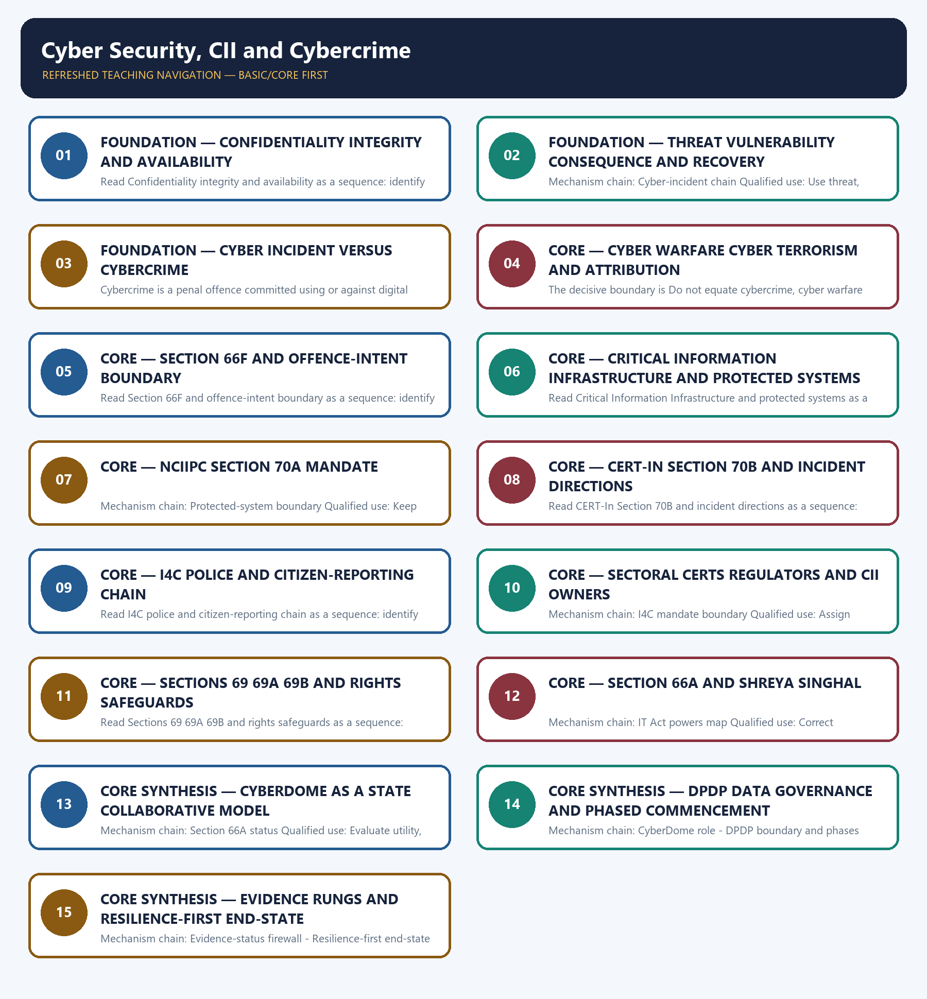

# Cyber Security, CII and Cybercrime — Learner-v2 Complete Learning Session

> **Authoring-only generation:** 2026-09-04. No PDF was rendered and no tracker or index was mutated.

### SOURCE, PROGRESSION AND CURRENT-LINKAGE AUDIT

- **Generation date:** 2026-09-04.
- **Repository-first evidence:** the Basic owner is taught first and preserved in full; the Advanced owner is retained only in the optional final teaching block.
- **OCR evidence:** Repository Markdown was primary. OCR-searchable official UPSC papers were supplementary only for printed routed demands. No answer key, attribution, operational method, notification effect, implementation outcome or security metric was inferred.
- **Qdrant:** not used; repository Markdown and available OCR context were sufficient.
- **PYQ integrity:** The audited ledgers route the 2019 CyberDome, 2020 cybercrime-types, 2021 cross-border cyber-attack and 2022 cyber-elements/strategy demands here. The three conservative cards cover 2019, 2021 and 2022; OCR inspection confirmed the 2019 and 2021 printed stems, while the ledger records official-scan verification for 2022.
- **Live-link boundary:** On 2026-09-04 the official CERT-In Directions PDF was reachable, the I4C portal identified the MHA institution, and the official MeitY search result confirmed the 13 November 2025 DPDP Rules notification with staged commencement. No incident volume, loss, audit, attribution, arrest, conviction or recovery statistic is used.
- **Fact/inference discipline:** no current-affairs item, PYQ wording, figure or quotation is invented.

### LIVE OFFICIAL-SOURCE ATTEMPT LOG

The checks below were made on 2026-09-04. Substantive official text is used only for the proposition it supports; title-only, blocked or thin pages are recorded and supply no factual claim.

- https://www.indiacode.nic.in/ — attempted 2026-09-04 for the Information Technology Act, 2000 provisions on sections 66F, 69-70B and protected systems; direct retrieval returned 403. The module uses only owner-audited section functions and does not infer practice or outcomes from statutory power.
- https://www.cert-in.org.in/PDF/CERT-In_Directions_70B_28.04.2022.pdf and https://www.pib.gov.in/ — fetched and searched 2026-09-04; the official CERT-In PDF was retrievable as an eight-page PDF stream. The owner-audited six-hour reporting rule is retained, while no incident, audit or compliance count is imported.
- https://i4c.mha.gov.in/ — fetched 2026-09-04; the official site identifies the Indian Cyber Crime Coordination Centre under the Ministry of Home Affairs and displays citizen cybercrime-awareness activity. The module does not turn awareness outputs into prevention, investigation or recovery outcomes.
- https://www.meity.gov.in/documents/act-and-policies/digital-personal-data-protection-rules-2025-gDOxUjMtQWa and https://i4c.mha.gov.in/ — searched and attempted 2026-09-04; the official MeitY search result confirmed notification of the DPDP Rules, 2025 on 13 November 2025 with staged commencement, while direct page retrieval returned 403. The module records notification and phase boundaries, not enforcement or adjudication outcomes.

## BASIC LEARNING SESSION



*Distinct embedded teaching-navigation image. The separate continuous Cārvāka-style flowchart package remains an independent at-a-glance artifact.*

### SESSION 1 — FOUNDATION — CONFIDENTIALITY INTEGRITY AND AVAILABILITY

#### DEFINITION / WHAT THIS IS CALLED

**Plain-language definition:** The decisive boundary is Do not treat confidentiality, integrity and availability as identical failures.

**Technical definition:** Read Confidentiality integrity and availability as a sequence: identify CIA security triad, follow the named mechanism to its institutional response, and stop at the last verified status rather than assuming the next stage.

#### ANSWER-GRABBING OPENING — WRITE/ADAPT IN THE EXAM

> The decisive boundary is Do not treat confidentiality, integrity and availability as identical failures.

#### MUST-WRITE KEYWORDS

- **FOUNDATION**
- **Confidentiality integrity**
- **availability**
- **Mechanism chain**
- **Qualified use**
- **Cyber**

**How to use them:** Frame the answer through FOUNDATION; define Confidentiality integrity, connect availability with Mechanism chain to explain the mechanism, and use Qualified use for the decisive comparison or qualification.

#### VISUAL FIRST

```text
CONFIDENTIALITY INTEGRITY AND AVAILABILITY
01. CIA security triad
    |
    v
02. Risk-chain grammar
STATUS / CATEGORY FIREWALL -> Do not treat confidentiality, integrity and availability as identical failures.
```

*The rail fixes the institutional sequence and claim boundary before explanation.*

#### CORE EXPLANATION

Cybersecurity seeks to preserve confidentiality, integrity and availability of information and systems; an event may affect one, two or all three. Cyber risk arises when a threat actor or event exploits a vulnerability and produces a consequence; policy can reduce exposure, vulnerability, impact and recovery time without eliminating hostile intent.

#### SIMPLE SYSTEM EXAMPLE

Read Confidentiality integrity and availability as a sequence: identify CIA security triad, follow the named mechanism to its institutional response, and stop at the last verified status rather than assuming the next stage.

#### TECHNICAL DISTINCTION

The decisive boundary is Do not treat confidentiality, integrity and availability as identical failures. This keeps CIA security triad and Risk-chain grammar in the correct legal category, institutional mandate and evidentiary status.

#### NAMED EVIDENCE AND MECHANISM

- Cybersecurity seeks to preserve confidentiality, integrity and availability of information and systems; an event may affect one, two or all three.
- Cyber risk arises when a threat actor or event exploits a vulnerability and produces a consequence; policy can reduce exposure, vulnerability, impact and recovery time without eliminating hostile intent.

#### EXAMINER CAUTION

- Do not treat confidentiality, integrity and availability as identical failures.

#### EXAM LINK

- **Prelims:** Keep institution, law, notification, ban/listing, scheme, agreement, ceasefire and outcome in their exact category.
- **Mains:** Name the affected security property before describing consequence.

#### MINI RECAP

- **Mechanism chain:** CIA security triad -> Risk-chain grammar
- **Qualified use:** Name the affected security property before describing consequence.

#### CLOSING RECALL FLOW — FOUNDATION — CONFIDENTIALITY INTEGRITY AND AVAILABILITY

```text
START / CONCEPT: FOUNDATION — Confidentiality integrity and availability
        |
        v
EXACT TERMS: FOUNDATION · Confidentiality integrity · availability · Mechanism chain · Qualified use · Cyber
        |
        v
MECHANISM / ARGUMENT: Read Confidentiality integrity and availability as a sequence: identify CIA security triad, follow the named mechanism to its institutional response, and stop at the last verified status rather than assuming the next stage.
        |
        v
CONSEQUENCE / CONTRAST: Do not treat confidentiality, integrity and availability as identical failures.
        |
        v
UPSC TRAP / ANSWER-USE: Do not miss this limiting distinction: cIA security triad - Risk-chain grammar Qualified use.
        |
        v
ANSWER-GRABBING FORMULATION: The decisive boundary is Do not treat confidentiality, integrity and availability as identical failures.
```
### SESSION 2 — FOUNDATION — THREAT VULNERABILITY CONSEQUENCE AND RECOVERY

#### DEFINITION / WHAT THIS IS CALLED

**Plain-language definition:** A cyber incident is a technical security event handled through detection, containment, eradication, recovery and learning; reporting an incident does not prove a crime or foreign operation.

**Technical definition:** Mechanism chain: Cyber-incident chain Qualified use: Use threat, vulnerability, capability, consequence and recovery as separate variables.

#### ANSWER-GRABBING OPENING — WRITE/ADAPT IN THE EXAM

> Mechanism chain: Cyber-incident chain Qualified use: Use threat, vulnerability, capability, consequence and recovery as separate variables.

#### MUST-WRITE KEYWORDS

- **FOUNDATION**
- **Threat vulnerability consequence**
- **recovery**
- **Mechanism chain**
- **Qualified use**
- **A cyber incident**

**How to use them:** Frame the answer through FOUNDATION; define Threat vulnerability consequence, connect recovery with Mechanism chain to explain the mechanism, and use Qualified use for the decisive comparison or qualification.

#### VISUAL FIRST

```text
THREAT VULNERABILITY CONSEQUENCE AND RECOVERY
01. Cyber-incident chain
STATUS / CATEGORY FIREWALL -> Do not describe hostile intent alone as cyber risk.
```

*The rail fixes the institutional sequence and claim boundary before explanation.*

#### CORE EXPLANATION

A cyber incident is a technical security event handled through detection, containment, eradication, recovery and learning; reporting an incident does not prove a crime or foreign operation.

#### SIMPLE SYSTEM EXAMPLE

Read Threat vulnerability consequence and recovery as a sequence: identify Cyber-incident chain, follow the named mechanism to its institutional response, and stop at the last verified status rather than assuming the next stage.

#### TECHNICAL DISTINCTION

The decisive boundary is Do not describe hostile intent alone as cyber risk. This keeps Cyber-incident chain in the correct legal category, institutional mandate and evidentiary status.

#### NAMED EVIDENCE AND MECHANISM

- A cyber incident is a technical security event handled through detection, containment, eradication, recovery and learning; reporting an incident does not prove a crime or foreign operation.

#### EXAMINER CAUTION

- Do not describe hostile intent alone as cyber risk.

#### EXAM LINK

- **Prelims:** Keep institution, law, notification, ban/listing, scheme, agreement, ceasefire and outcome in their exact category.
- **Mains:** Use threat, vulnerability, capability, consequence and recovery as separate variables.

#### MINI RECAP

- **Mechanism chain:** Cyber-incident chain
- **Qualified use:** Use threat, vulnerability, capability, consequence and recovery as separate variables.

#### CLOSING RECALL FLOW — FOUNDATION — THREAT VULNERABILITY CONSEQUENCE AND RECOVERY

```text
START / CONCEPT: FOUNDATION — Threat vulnerability consequence and recovery
        |
        v
EXACT TERMS: FOUNDATION · Threat vulnerability consequence · recovery · Mechanism chain · Qualified use · A cyber incident
        |
        v
MECHANISM / ARGUMENT: Read Threat vulnerability consequence and recovery as a sequence: identify Cyber-incident chain, follow the named mechanism to its institutional response, and stop at the last verified status rather than assuming the next stage.
        |
        v
CONSEQUENCE / CONTRAST: Mains: Use threat, vulnerability, capability, consequence and recovery as separate variables.
        |
        v
UPSC TRAP / ANSWER-USE: A cyber incident is a technical security event handled through detection, containment, eradication, recovery and learning; reporting an incident does not prove a crime or foreign operation.
        |
        v
ANSWER-GRABBING FORMULATION: Mechanism chain: Cyber-incident chain Qualified use: Use threat, vulnerability, capability, consequence and recovery as separate variables.
```
### SESSION 3 — FOUNDATION — CYBER INCIDENT VERSUS CYBERCRIME

#### DEFINITION / WHAT THIS IS CALLED

**Plain-language definition:** The decisive boundary is Do not equate a cyber incident with a registered cybercrime.

**Technical definition:** Cybercrime is a penal offence committed using or against digital systems and follows complaint or registration, investigation, electronic evidence, prosecution and adjudication.

#### ANSWER-GRABBING OPENING — WRITE/ADAPT IN THE EXAM

> The decisive boundary is Do not equate a cyber incident with a registered cybercrime.

#### MUST-WRITE KEYWORDS

- **FOUNDATION**
- **Cyber incident versus cybercrime**
- **Mechanism chain**
- **Qualified use**
- **Cybercrime**
- **Read Cyber**

**How to use them:** Frame the answer through FOUNDATION; define Cyber incident versus cybercrime, connect Mechanism chain with Qualified use to explain the mechanism, and use Cybercrime for the decisive comparison or qualification.

#### VISUAL FIRST

```text
CYBER INCIDENT VERSUS CYBERCRIME
01. Cybercrime chain
STATUS / CATEGORY FIREWALL -> Do not equate a cyber incident with a registered cybercrime.
```

*The rail fixes the institutional sequence and claim boundary before explanation.*

#### CORE EXPLANATION

Cybercrime is a penal offence committed using or against digital systems and follows complaint or registration, investigation, electronic evidence, prosecution and adjudication.

#### SIMPLE SYSTEM EXAMPLE

Read Cyber incident versus cybercrime as a sequence: identify Cybercrime chain, follow the named mechanism to its institutional response, and stop at the last verified status rather than assuming the next stage.

#### TECHNICAL DISTINCTION

The decisive boundary is Do not equate a cyber incident with a registered cybercrime. This keeps Cybercrime chain in the correct legal category, institutional mandate and evidentiary status.

#### NAMED EVIDENCE AND MECHANISM

- Cybercrime is a penal offence committed using or against digital systems and follows complaint or registration, investigation, electronic evidence, prosecution and adjudication.

#### EXAMINER CAUTION

- Do not equate a cyber incident with a registered cybercrime.

#### EXAM LINK

- **Prelims:** Keep institution, law, notification, ban/listing, scheme, agreement, ceasefire and outcome in their exact category.
- **Mains:** Route technical response and penal investigation through different chains.

#### MINI RECAP

- **Mechanism chain:** Cybercrime chain
- **Qualified use:** Route technical response and penal investigation through different chains.

#### CLOSING RECALL FLOW — FOUNDATION — CYBER INCIDENT VERSUS CYBERCRIME

```text
START / CONCEPT: FOUNDATION — Cyber incident versus cybercrime
        |
        v
EXACT TERMS: FOUNDATION · Cyber incident versus cybercrime · Mechanism chain · Qualified use · Cybercrime · Read Cyber
        |
        v
MECHANISM / ARGUMENT: Read Cyber incident versus cybercrime as a sequence: identify Cybercrime chain, follow the named mechanism to its institutional response, and stop at the last verified status rather than assuming the next stage.
        |
        v
CONSEQUENCE / CONTRAST: Do not equate a cyber incident with a registered cybercrime.
        |
        v
UPSC TRAP / ANSWER-USE: Do not miss this limiting distinction: route technical response and penal investigation through different chains.
        |
        v
ANSWER-GRABBING FORMULATION: The decisive boundary is Do not equate a cyber incident with a registered cybercrime.
```
### SESSION 4 — CORE — CYBER WARFARE CYBER TERRORISM AND ATTRIBUTION

#### DEFINITION / WHAT THIS IS CALLED

**Plain-language definition:** Cyber warfare refers to state-linked strategic cyber activity against another state; political attribution requires evidence beyond technical indicators and is not established merely by origin infrastructure.

**Technical definition:** The decisive boundary is Do not equate cybercrime, cyber warfare and cyber terrorism.

#### ANSWER-GRABBING OPENING — WRITE/ADAPT IN THE EXAM

> Cyber warfare refers to state-linked strategic cyber activity against another state; political attribution requires evidence beyond technical indicators and is not established merely by origin infrastructure.

#### MUST-WRITE KEYWORDS

- **Cyber warfare cyber terrorism**
- **attribution**
- **Mechanism chain**
- **Qualified use**
- **Cyber warfare**
- **Cyber**

**How to use them:** Frame the answer through Cyber warfare cyber terrorism; define attribution, connect Mechanism chain with Qualified use to explain the mechanism, and use Cyber warfare for the decisive comparison or qualification.

#### VISUAL FIRST

```text
CYBER WARFARE CYBER TERRORISM AND ATTRIBUTION
01. Cyber-warfare boundary
STATUS / CATEGORY FIREWALL -> Do not equate cybercrime, cyber warfare and cyber terrorism.
```

*The rail fixes the institutional sequence and claim boundary before explanation.*

#### CORE EXPLANATION

Cyber warfare refers to state-linked strategic cyber activity against another state; political attribution requires evidence beyond technical indicators and is not established merely by origin infrastructure.

#### SIMPLE SYSTEM EXAMPLE

Read Cyber warfare cyber terrorism and attribution as a sequence: identify Cyber-warfare boundary, follow the named mechanism to its institutional response, and stop at the last verified status rather than assuming the next stage.

#### TECHNICAL DISTINCTION

The decisive boundary is Do not equate cybercrime, cyber warfare and cyber terrorism. This keeps Cyber-warfare boundary in the correct legal category, institutional mandate and evidentiary status.

#### NAMED EVIDENCE AND MECHANISM

- Cyber warfare refers to state-linked strategic cyber activity against another state; political attribution requires evidence beyond technical indicators and is not established merely by origin infrastructure.

#### EXAMINER CAUTION

- Do not equate cybercrime, cyber warfare and cyber terrorism.

#### EXAM LINK

- **Prelims:** Keep institution, law, notification, ban/listing, scheme, agreement, ceasefire and outcome in their exact category.
- **Mains:** State actor, intent, evidence status and attribution confidence separately.

#### MINI RECAP

- **Mechanism chain:** Cyber-warfare boundary
- **Qualified use:** State actor, intent, evidence status and attribution confidence separately.

#### CLOSING RECALL FLOW — CORE — CYBER WARFARE CYBER TERRORISM AND ATTRIBUTION

```text
START / CONCEPT: CORE — Cyber warfare cyber terrorism and attribution
        |
        v
EXACT TERMS: Cyber warfare cyber terrorism · attribution · Mechanism chain · Qualified use · Cyber warfare · Cyber
        |
        v
MECHANISM / ARGUMENT: Read Cyber warfare cyber terrorism and attribution as a sequence: identify Cyber-warfare boundary, follow the named mechanism to its institutional response, and stop at the last verified status rather than assuming the next stage.
        |
        v
CONSEQUENCE / CONTRAST: The decisive boundary is Do not equate cybercrime, cyber warfare and cyber terrorism.
        |
        v
UPSC TRAP / ANSWER-USE: Do not equate cybercrime, cyber warfare and cyber terrorism.
        |
        v
ANSWER-GRABBING FORMULATION: Cyber warfare refers to state-linked strategic cyber activity against another state; political attribution requires evidence beyond technical indicators and is not established merely by origin infrastructure.
```
### SESSION 5 — CORE — SECTION 66F AND OFFENCE-INTENT BOUNDARY

#### DEFINITION / WHAT THIS IS CALLED

**Plain-language definition:** Section 66F of the Information Technology Act defines cyber terrorism around specified acts and terror or sovereignty-related intent; the legal offence is distinct from generic hacking or cybercrime.

**Technical definition:** Read Section 66F and offence-intent boundary as a sequence: identify Cyber-terrorism law, follow the named mechanism to its institutional response, and stop at the last verified status rather than assuming the next stage.

#### ANSWER-GRABBING OPENING — WRITE/ADAPT IN THE EXAM

> Section 66F of the Information Technology Act defines cyber terrorism around specified acts and terror or sovereignty-related intent; the legal offence is distinct from generic hacking or cybercrime.

#### MUST-WRITE KEYWORDS

- **Section 66F**
- **offence-intent boundary**
- **Mechanism chain**
- **Qualified use**
- **Section**
- **Information Technology Act**

**How to use them:** Frame the answer through Section 66F; define offence-intent boundary, connect Mechanism chain with Qualified use to explain the mechanism, and use Section for the decisive comparison or qualification.

#### VISUAL FIRST

```text
SECTION 66F AND OFFENCE-INTENT BOUNDARY
01. Cyber-terrorism law
STATUS / CATEGORY FIREWALL -> Do not attribute a state operation solely from an IP address or server location.
```

*The rail fixes the institutional sequence and claim boundary before explanation.*

#### CORE EXPLANATION

Section 66F of the Information Technology Act defines cyber terrorism around specified acts and terror or sovereignty-related intent; the legal offence is distinct from generic hacking or cybercrime.

#### SIMPLE SYSTEM EXAMPLE

Read Section 66F and offence-intent boundary as a sequence: identify Cyber-terrorism law, follow the named mechanism to its institutional response, and stop at the last verified status rather than assuming the next stage.

#### TECHNICAL DISTINCTION

The decisive boundary is Do not attribute a state operation solely from an IP address or server location. This keeps Cyber-terrorism law in the correct legal category, institutional mandate and evidentiary status.

#### NAMED EVIDENCE AND MECHANISM

- Section 66F of the Information Technology Act defines cyber terrorism around specified acts and terror or sovereignty-related intent; the legal offence is distinct from generic hacking or cybercrime.

#### EXAMINER CAUTION

- Do not attribute a state operation solely from an IP address or server location.

#### EXAM LINK

- **Prelims:** Keep institution, law, notification, ban/listing, scheme, agreement, ceasefire and outcome in their exact category.
- **Mains:** Apply the statutory elements before using the cyber-terrorism label.

#### MINI RECAP

- **Mechanism chain:** Cyber-terrorism law
- **Qualified use:** Apply the statutory elements before using the cyber-terrorism label.

#### CLOSING RECALL FLOW — CORE — SECTION 66F AND OFFENCE-INTENT BOUNDARY

```text
START / CONCEPT: CORE — Section 66F and offence-intent boundary
        |
        v
EXACT TERMS: Section 66F · offence-intent boundary · Mechanism chain · Qualified use · Section · Information Technology Act
        |
        v
MECHANISM / ARGUMENT: Read Section 66F and offence-intent boundary as a sequence: identify Cyber-terrorism law, follow the named mechanism to its institutional response, and stop at the last verified status rather than assuming the next stage.
        |
        v
CONSEQUENCE / CONTRAST: The decisive boundary is Do not attribute a state operation solely from an IP address or server location.
        |
        v
UPSC TRAP / ANSWER-USE: Do not attribute a state operation solely from an IP address or server location.
        |
        v
ANSWER-GRABBING FORMULATION: Section 66F of the Information Technology Act defines cyber terrorism around specified acts and terror or sovereignty-related intent; the legal offence is distinct from generic hacking or cybercrime.
```
### SESSION 6 — CORE — CRITICAL INFORMATION INFRASTRUCTURE AND PROTECTED SYSTEMS

#### DEFINITION / WHAT THIS IS CALLED

**Plain-language definition:** Section 70 of the IT Act defines Critical Information Infrastructure by the debilitating consequence that incapacitation or destruction would have for national security, economy, public health or safety.

**Technical definition:** Read Critical Information Infrastructure and protected systems as a sequence: identify Attribution discipline, follow the named mechanism to its institutional response, and stop at the last verified status rather than assuming the next stage.

#### ANSWER-GRABBING OPENING — WRITE/ADAPT IN THE EXAM

> Read Critical Information Infrastructure and protected systems as a sequence: identify Attribution discipline, follow the named mechanism to its institutional response, and stop at the last verified status rather than assuming the next stage.

#### MUST-WRITE KEYWORDS

- **Critical Information Infrastructure**
- **protected systems**
- **Mechanism chain**
- **Qualified use**
- **Cyber attribution**
- **Cyber**

**How to use them:** Frame the answer through Critical Information Infrastructure; define protected systems, connect Mechanism chain with Qualified use to explain the mechanism, and use Cyber attribution for the decisive comparison or qualification.

#### VISUAL FIRST

```text
CRITICAL INFORMATION INFRASTRUCTURE AND PROTECTED SYSTEMS
01. Attribution discipline
    |
    v
02. CII definition
STATUS / CATEGORY FIREWALL -> Do not call generic hacking cyber terrorism without Section 66F intent and conduct.
```

*The rail fixes the institutional sequence and claim boundary before explanation.*

#### CORE EXPLANATION

Cyber attribution is graded across technical, operational, legal and political assessments; shared tools, compromised infrastructure and false flags make confident public attribution difficult. Section 70 of the IT Act defines Critical Information Infrastructure by the debilitating consequence that incapacitation or destruction would have for national security, economy, public health or safety.

#### SIMPLE SYSTEM EXAMPLE

Read Critical Information Infrastructure and protected systems as a sequence: identify Attribution discipline, follow the named mechanism to its institutional response, and stop at the last verified status rather than assuming the next stage.

#### TECHNICAL DISTINCTION

The decisive boundary is Do not call generic hacking cyber terrorism without Section 66F intent and conduct. This keeps Attribution discipline and CII definition in the correct legal category, institutional mandate and evidentiary status.

#### NAMED EVIDENCE AND MECHANISM

- Cyber attribution is graded across technical, operational, legal and political assessments; shared tools, compromised infrastructure and false flags make confident public attribution difficult.
- Section 70 of the IT Act defines Critical Information Infrastructure by the debilitating consequence that incapacitation or destruction would have for national security, economy, public health or safety.

#### EXAMINER CAUTION

- Do not call generic hacking cyber terrorism without Section 66F intent and conduct.

#### EXAM LINK

- **Prelims:** Keep institution, law, notification, ban/listing, scheme, agreement, ceasefire and outcome in their exact category.
- **Mains:** Define CII by consequence and distinguish notification from resilience.

#### MINI RECAP

- **Mechanism chain:** Attribution discipline -> CII definition
- **Qualified use:** Define CII by consequence and distinguish notification from resilience.

#### CLOSING RECALL FLOW — CORE — CRITICAL INFORMATION INFRASTRUCTURE AND PROTECTED SYSTEMS

```text
START / CONCEPT: CORE — Critical Information Infrastructure and protected systems
        |
        v
EXACT TERMS: Critical Information Infrastructure · protected systems · Mechanism chain · Qualified use · Cyber attribution · Cyber
        |
        v
MECHANISM / ARGUMENT: Section 70 of the IT Act defines Critical Information Infrastructure by the debilitating consequence that incapacitation or destruction would have for national security, economy, public health or safety.
        |
        v
CONSEQUENCE / CONTRAST: Mechanism chain: Attribution discipline - CII definition Qualified use: Define CII by consequence and distinguish notification from resilience.
        |
        v
UPSC TRAP / ANSWER-USE: The decisive boundary is Do not call generic hacking cyber terrorism without Section 66F intent and conduct.
        |
        v
ANSWER-GRABBING FORMULATION: Read Critical Information Infrastructure and protected systems as a sequence: identify Attribution discipline, follow the named mechanism to its institutional response, and stop at the last verified status rather than assuming the next stage.
```
### SESSION 7 — CORE — NCIIPC SECTION 70A MANDATE

#### DEFINITION / WHAT THIS IS CALLED

**Plain-language definition:** Read NCIIPC Section 70A mandate as a sequence: identify Protected-system boundary, follow the named mechanism to its institutional response, and stop at the last verified status rather than assuming the next stage.

**Technical definition:** Mechanism chain: Protected-system boundary Qualified use: Keep NCIIPC focused on CII protection and coordination.

#### ANSWER-GRABBING OPENING — WRITE/ADAPT IN THE EXAM

> Read NCIIPC Section 70A mandate as a sequence: identify Protected-system boundary, follow the named mechanism to its institutional response, and stop at the last verified status rather than assuming the next stage.

#### MUST-WRITE KEYWORDS

- **NCIIPC Section 70A mandate**
- **Mechanism chain**
- **Qualified use**
- **Section**
- **CII**
- **Read NCIIPC Section**

**How to use them:** Frame the answer through NCIIPC Section 70A mandate; define Mechanism chain, connect Qualified use with Section to explain the mechanism, and use CII for the decisive comparison or qualification.

#### VISUAL FIRST

```text
NCIIPC SECTION 70A MANDATE
01. Protected-system boundary
STATUS / CATEGORY FIREWALL -> Do not merge technical, legal and political attribution.
```

*The rail fixes the institutional sequence and claim boundary before explanation.*

#### CORE EXPLANATION

Section 70 permits the appropriate government to declare a computer resource affecting CII as a protected system; notification creates legal protection but does not prove resilience.

#### SIMPLE SYSTEM EXAMPLE

Read NCIIPC Section 70A mandate as a sequence: identify Protected-system boundary, follow the named mechanism to its institutional response, and stop at the last verified status rather than assuming the next stage.

#### TECHNICAL DISTINCTION

The decisive boundary is Do not merge technical, legal and political attribution. This keeps Protected-system boundary in the correct legal category, institutional mandate and evidentiary status.

#### NAMED EVIDENCE AND MECHANISM

- Section 70 permits the appropriate government to declare a computer resource affecting CII as a protected system; notification creates legal protection but does not prove resilience.

#### EXAMINER CAUTION

- Do not merge technical, legal and political attribution.

#### EXAM LINK

- **Prelims:** Keep institution, law, notification, ban/listing, scheme, agreement, ceasefire and outcome in their exact category.
- **Mains:** Keep NCIIPC focused on CII protection and coordination.

#### MINI RECAP

- **Mechanism chain:** Protected-system boundary
- **Qualified use:** Keep NCIIPC focused on CII protection and coordination.

#### CLOSING RECALL FLOW — CORE — NCIIPC SECTION 70A MANDATE

```text
START / CONCEPT: CORE — NCIIPC Section 70A mandate
        |
        v
EXACT TERMS: NCIIPC Section 70A mandate · Mechanism chain · Qualified use · Section · CII · Read NCIIPC Section
        |
        v
MECHANISM / ARGUMENT: Mechanism chain: Protected-system boundary Qualified use: Keep NCIIPC focused on CII protection and coordination.
        |
        v
CONSEQUENCE / CONTRAST: Section 70 permits the appropriate government to declare a computer resource affecting CII as a protected system; notification creates legal protection but does not prove resilience.
        |
        v
UPSC TRAP / ANSWER-USE: The decisive boundary is Do not merge technical, legal and political attribution.
        |
        v
ANSWER-GRABBING FORMULATION: Read NCIIPC Section 70A mandate as a sequence: identify Protected-system boundary, follow the named mechanism to its institutional response, and stop at the last verified status rather than assuming the next stage.
```
### SESSION 8 — CORE — CERT-IN SECTION 70B AND INCIDENT DIRECTIONS

#### DEFINITION / WHAT THIS IS CALLED

**Plain-language definition:** Under Section 70A, the National Critical Information Infrastructure Protection Centre under NTRO is the national nodal agency for CII protection and coordination with protected-system entities.

**Technical definition:** Read CERT-In Section 70B and incident directions as a sequence: identify NCIIPC mandate, follow the named mechanism to its institutional response, and stop at the last verified status rather than assuming the next stage.

#### ANSWER-GRABBING OPENING — WRITE/ADAPT IN THE EXAM

> Read CERT-In Section 70B and incident directions as a sequence: identify NCIIPC mandate, follow the named mechanism to its institutional response, and stop at the last verified status rather than assuming the next stage.

#### MUST-WRITE KEYWORDS

- **CERT-In Section 70B**
- **incident directions**
- **Mechanism chain**
- **Qualified use**
- **Under Section**
- **National Critical Information Infrastructure Protection**

**How to use them:** Frame the answer through CERT-In Section 70B; define incident directions, connect Mechanism chain with Qualified use to explain the mechanism, and use Under Section for the decisive comparison or qualification.

#### VISUAL FIRST

```text
CERT-IN SECTION 70B AND INCIDENT DIRECTIONS
01. NCIIPC mandate
STATUS / CATEGORY FIREWALL -> Do not expose exploit steps, credentials, vulnerable targets or evasion methods.
```

*The rail fixes the institutional sequence and claim boundary before explanation.*

#### CORE EXPLANATION

Under Section 70A, the National Critical Information Infrastructure Protection Centre under NTRO is the national nodal agency for CII protection and coordination with protected-system entities.

#### SIMPLE SYSTEM EXAMPLE

Read CERT-In Section 70B and incident directions as a sequence: identify NCIIPC mandate, follow the named mechanism to its institutional response, and stop at the last verified status rather than assuming the next stage.

#### TECHNICAL DISTINCTION

The decisive boundary is Do not expose exploit steps, credentials, vulnerable targets or evasion methods. This keeps NCIIPC mandate in the correct legal category, institutional mandate and evidentiary status.

#### NAMED EVIDENCE AND MECHANISM

- Under Section 70A, the National Critical Information Infrastructure Protection Centre under NTRO is the national nodal agency for CII protection and coordination with protected-system entities.

#### EXAMINER CAUTION

- Do not expose exploit steps, credentials, vulnerable targets or evasion methods.

#### EXAM LINK

- **Prelims:** Keep institution, law, notification, ban/listing, scheme, agreement, ceasefire and outcome in their exact category.
- **Mains:** Keep CERT-In focused on incident response, directions and advisories.

#### MINI RECAP

- **Mechanism chain:** NCIIPC mandate
- **Qualified use:** Keep CERT-In focused on incident response, directions and advisories.

#### CLOSING RECALL FLOW — CORE — CERT-IN SECTION 70B AND INCIDENT DIRECTIONS

```text
START / CONCEPT: CORE — CERT-In Section 70B and incident directions
        |
        v
EXACT TERMS: CERT-In Section 70B · incident directions · Mechanism chain · Qualified use · Under Section · National Critical Information Infrastructure Protection
        |
        v
MECHANISM / ARGUMENT: Mechanism chain: NCIIPC mandate Qualified use: Keep CERT-In focused on incident response, directions and advisories.
        |
        v
CONSEQUENCE / CONTRAST: The decisive boundary is Do not expose exploit steps, credentials, vulnerable targets or evasion methods.
        |
        v
UPSC TRAP / ANSWER-USE: Do not expose exploit steps, credentials, vulnerable targets or evasion methods.
        |
        v
ANSWER-GRABBING FORMULATION: Read CERT-In Section 70B and incident directions as a sequence: identify NCIIPC mandate, follow the named mechanism to its institutional response, and stop at the last verified status rather than assuming the next stage.
```
### SESSION 9 — CORE — I4C POLICE AND CITIZEN-REPORTING CHAIN

#### DEFINITION / WHAT THIS IS CALLED

**Plain-language definition:** Under Section 70B, CERT-In is the national cyber-incident response agency for alerts, advisories, coordination and emergency response; it is not the police investigator for every cybercrime.

**Technical definition:** Read I4C police and citizen-reporting chain as a sequence: identify CERT-In mandate, follow the named mechanism to its institutional response, and stop at the last verified status rather than assuming the next stage.

#### ANSWER-GRABBING OPENING — WRITE/ADAPT IN THE EXAM

> Mechanism chain: CERT-In mandate Qualified use: Show citizen reporting, police investigation and I4C coordination as distinct roles.

#### MUST-WRITE KEYWORDS

- **I4C police**
- **citizen-reporting chain**
- **Mechanism chain**
- **Qualified use**
- **Under Section 70B, CERT-In**
- **Under Section**

**How to use them:** Frame the answer through I4C police; define citizen-reporting chain, connect Mechanism chain with Qualified use to explain the mechanism, and use Under Section 70B, CERT-In for the decisive comparison or qualification.

#### VISUAL FIRST

```text
I4C POLICE AND CITIZEN-REPORTING CHAIN
01. CERT-In mandate
STATUS / CATEGORY FIREWALL -> Do not confuse CII designation with operational resilience.
```

*The rail fixes the institutional sequence and claim boundary before explanation.*

#### CORE EXPLANATION

Under Section 70B, CERT-In is the national cyber-incident response agency for alerts, advisories, coordination and emergency response; it is not the police investigator for every cybercrime.

#### SIMPLE SYSTEM EXAMPLE

Read I4C police and citizen-reporting chain as a sequence: identify CERT-In mandate, follow the named mechanism to its institutional response, and stop at the last verified status rather than assuming the next stage.

#### TECHNICAL DISTINCTION

The decisive boundary is Do not confuse CII designation with operational resilience. This keeps CERT-In mandate in the correct legal category, institutional mandate and evidentiary status.

#### NAMED EVIDENCE AND MECHANISM

- Under Section 70B, CERT-In is the national cyber-incident response agency for alerts, advisories, coordination and emergency response; it is not the police investigator for every cybercrime.

#### EXAMINER CAUTION

- Do not confuse CII designation with operational resilience.

#### EXAM LINK

- **Prelims:** Keep institution, law, notification, ban/listing, scheme, agreement, ceasefire and outcome in their exact category.
- **Mains:** Show citizen reporting, police investigation and I4C coordination as distinct roles.

#### MINI RECAP

- **Mechanism chain:** CERT-In mandate
- **Qualified use:** Show citizen reporting, police investigation and I4C coordination as distinct roles.

#### CLOSING RECALL FLOW — CORE — I4C POLICE AND CITIZEN-REPORTING CHAIN

```text
START / CONCEPT: CORE — I4C police and citizen-reporting chain
        |
        v
EXACT TERMS: I4C police · citizen-reporting chain · Mechanism chain · Qualified use · Under Section 70B, CERT-In · Under Section
        |
        v
MECHANISM / ARGUMENT: Read I4C police and citizen-reporting chain as a sequence: identify CERT-In mandate, follow the named mechanism to its institutional response, and stop at the last verified status rather than assuming the next stage.
        |
        v
CONSEQUENCE / CONTRAST: Under Section 70B, CERT-In is the national cyber-incident response agency for alerts, advisories, coordination and emergency response; it is not the police investigator for every cybercrime.
        |
        v
UPSC TRAP / ANSWER-USE: The decisive boundary is Do not confuse CII designation with operational resilience.
        |
        v
ANSWER-GRABBING FORMULATION: Mechanism chain: CERT-In mandate Qualified use: Show citizen reporting, police investigation and I4C coordination as distinct roles.
```
### SESSION 10 — CORE — SECTORAL CERTS REGULATORS AND CII OWNERS

#### DEFINITION / WHAT THIS IS CALLED

**Plain-language definition:** Read Sectoral CERTs regulators and CII owners as a sequence: identify I4C mandate boundary, follow the named mechanism to its institutional response, and stop at the last verified status rather than assuming the next stage.

**Technical definition:** Mechanism chain: I4C mandate boundary Qualified use: Assign preventive and continuity duties to the relevant sectoral owner.

#### ANSWER-GRABBING OPENING — WRITE/ADAPT IN THE EXAM

> Read Sectoral CERTs regulators and CII owners as a sequence: identify I4C mandate boundary, follow the named mechanism to its institutional response, and stop at the last verified status rather than assuming the next stage.

#### MUST-WRITE KEYWORDS

- **Sectoral CERTs regulators**
- **CII owners**
- **Mechanism chain**
- **Qualified use**
- **Read Sectoral CERTs**
- **CII**

**How to use them:** Frame the answer through Sectoral CERTs regulators; define CII owners, connect Mechanism chain with Qualified use to explain the mechanism, and use Read Sectoral CERTs for the decisive comparison or qualification.

#### VISUAL FIRST

```text
SECTORAL CERTS REGULATORS AND CII OWNERS
01. I4C mandate boundary
STATUS / CATEGORY FIREWALL -> Do not use CERT-In, NCIIPC, I4C and police as interchangeable institutions.
```

*The rail fixes the institutional sequence and claim boundary before explanation.*

#### CORE EXPLANATION

The Indian Cyber Crime Coordination Centre under MHA supports cybercrime reporting, coordination, capacity and investigation assistance, while State and Union Territory police retain crime-registration and investigation roles.

#### SIMPLE SYSTEM EXAMPLE

Read Sectoral CERTs regulators and CII owners as a sequence: identify I4C mandate boundary, follow the named mechanism to its institutional response, and stop at the last verified status rather than assuming the next stage.

#### TECHNICAL DISTINCTION

The decisive boundary is Do not use CERT-In, NCIIPC, I4C and police as interchangeable institutions. This keeps I4C mandate boundary in the correct legal category, institutional mandate and evidentiary status.

#### NAMED EVIDENCE AND MECHANISM

- The Indian Cyber Crime Coordination Centre under MHA supports cybercrime reporting, coordination, capacity and investigation assistance, while State and Union Territory police retain crime-registration and investigation roles.

#### EXAMINER CAUTION

- Do not use CERT-In, NCIIPC, I4C and police as interchangeable institutions.

#### EXAM LINK

- **Prelims:** Keep institution, law, notification, ban/listing, scheme, agreement, ceasefire and outcome in their exact category.
- **Mains:** Assign preventive and continuity duties to the relevant sectoral owner.

#### MINI RECAP

- **Mechanism chain:** I4C mandate boundary
- **Qualified use:** Assign preventive and continuity duties to the relevant sectoral owner.

#### CLOSING RECALL FLOW — CORE — SECTORAL CERTS REGULATORS AND CII OWNERS

```text
START / CONCEPT: CORE — Sectoral CERTs regulators and CII owners
        |
        v
EXACT TERMS: Sectoral CERTs regulators · CII owners · Mechanism chain · Qualified use · Read Sectoral CERTs · CII
        |
        v
MECHANISM / ARGUMENT: Mechanism chain: I4C mandate boundary Qualified use: Assign preventive and continuity duties to the relevant sectoral owner.
        |
        v
CONSEQUENCE / CONTRAST: The decisive boundary is Do not use CERT-In, NCIIPC, I4C and police as interchangeable institutions.
        |
        v
UPSC TRAP / ANSWER-USE: Do not use CERT-In, NCIIPC, I4C and police as interchangeable institutions.
        |
        v
ANSWER-GRABBING FORMULATION: Read Sectoral CERTs regulators and CII owners as a sequence: identify I4C mandate boundary, follow the named mechanism to its institutional response, and stop at the last verified status rather than assuming the next stage.
```
### SESSION 11 — CORE — SECTIONS 69 69A 69B AND RIGHTS SAFEGUARDS

#### DEFINITION / WHAT THIS IS CALLED

**Plain-language definition:** The decisive boundary is Do not cite Section 66A as current law.

**Technical definition:** Read Sections 69 69A 69B and rights safeguards as a sequence: identify Sectoral-regulator layer, follow the named mechanism to its institutional response, and stop at the last verified status rather than assuming the next stage.

#### ANSWER-GRABBING OPENING — WRITE/ADAPT IN THE EXAM

> Read Sections 69 69A 69B and rights safeguards as a sequence: identify Sectoral-regulator layer, follow the named mechanism to its institutional response, and stop at the last verified status rather than assuming the next stage.

#### MUST-WRITE KEYWORDS

- **Sections 69 69A 69B**
- **rights safeguards**
- **Mechanism chain**
- **Qualified use**
- **Sectoral CERTs**
- **CII-owning**

**How to use them:** Frame the answer through Sections 69 69A 69B; define rights safeguards, connect Mechanism chain with Qualified use to explain the mechanism, and use Sectoral CERTs for the decisive comparison or qualification.

#### VISUAL FIRST

```text
SECTIONS 69 69A 69B AND RIGHTS SAFEGUARDS
01. Sectoral-regulator layer
    |
    v
02. CERT-In directions
STATUS / CATEGORY FIREWALL -> Do not cite Section 66A as current law.
```

*The rail fixes the institutional sequence and claim boundary before explanation.*

#### CORE EXPLANATION

Sectoral CERTs, regulators and CII-owning entities have domain-specific resilience responsibilities and must coordinate with CERT-In and NCIIPC rather than transfer all risk to one national body. CERT-In's Directions dated 28 April 2022 require specified cyber incidents to be reported within six hours of noticing them or being informed; reporting is an incident-response input, not proof of attribution.

#### SIMPLE SYSTEM EXAMPLE

Read Sections 69 69A 69B and rights safeguards as a sequence: identify Sectoral-regulator layer, follow the named mechanism to its institutional response, and stop at the last verified status rather than assuming the next stage.

#### TECHNICAL DISTINCTION

The decisive boundary is Do not cite Section 66A as current law. This keeps Sectoral-regulator layer and CERT-In directions in the correct legal category, institutional mandate and evidentiary status.

#### NAMED EVIDENCE AND MECHANISM

- Sectoral CERTs, regulators and CII-owning entities have domain-specific resilience responsibilities and must coordinate with CERT-In and NCIIPC rather than transfer all risk to one national body.
- CERT-In's Directions dated 28 April 2022 require specified cyber incidents to be reported within six hours of noticing them or being informed; reporting is an incident-response input, not proof of attribution.

#### EXAMINER CAUTION

- Do not cite Section 66A as current law.

#### EXAM LINK

- **Prelims:** Keep institution, law, notification, ban/listing, scheme, agreement, ceasefire and outcome in their exact category.
- **Mains:** Name the power, purpose, procedure and proportionality safeguard.

#### MINI RECAP

- **Mechanism chain:** Sectoral-regulator layer -> CERT-In directions
- **Qualified use:** Name the power, purpose, procedure and proportionality safeguard.

#### CLOSING RECALL FLOW — CORE — SECTIONS 69 69A 69B AND RIGHTS SAFEGUARDS

```text
START / CONCEPT: CORE — Sections 69 69A 69B and rights safeguards
        |
        v
EXACT TERMS: Sections 69 69A 69B · rights safeguards · Mechanism chain · Qualified use · Sectoral CERTs · CII-owning
        |
        v
MECHANISM / ARGUMENT: Mechanism chain: Sectoral-regulator layer - CERT-In directions Qualified use: Name the power, purpose, procedure and proportionality safeguard.
        |
        v
CONSEQUENCE / CONTRAST: The decisive boundary is Do not cite Section 66A as current law.
        |
        v
UPSC TRAP / ANSWER-USE: Do not cite Section 66A as current law.
        |
        v
ANSWER-GRABBING FORMULATION: Read Sections 69 69A 69B and rights safeguards as a sequence: identify Sectoral-regulator layer, follow the named mechanism to its institutional response, and stop at the last verified status rather than assuming the next stage.
```
### SESSION 12 — CORE — SECTION 66A AND SHREYA SINGHAL

#### DEFINITION / WHAT THIS IS CALLED

**Plain-language definition:** Read Section 66A and Shreya Singhal as a sequence: identify IT Act powers map, follow the named mechanism to its institutional response, and stop at the last verified status rather than assuming the next stage.

**Technical definition:** Mechanism chain: IT Act powers map Qualified use: Correct obsolete-law options immediately.

#### ANSWER-GRABBING OPENING — WRITE/ADAPT IN THE EXAM

> Read Section 66A and Shreya Singhal as a sequence: identify IT Act powers map, follow the named mechanism to its institutional response, and stop at the last verified status rather than assuming the next stage.

#### MUST-WRITE KEYWORDS

- **Section 66A**
- **Shreya Singhal**
- **Mechanism chain**
- **Qualified use**
- **Read Section**
- **IT Act**

**How to use them:** Frame the answer through Section 66A; define Shreya Singhal, connect Mechanism chain with Qualified use to explain the mechanism, and use Read Section for the decisive comparison or qualification.

#### VISUAL FIRST

```text
SECTION 66A AND SHREYA SINGHAL
01. IT Act powers map
STATUS / CATEGORY FIREWALL -> Do not describe notified DPDP Rules as fully commenced or fully enforced.
```

*The rail fixes the institutional sequence and claim boundary before explanation.*

#### CORE EXPLANATION

Sections 69, 69A and 69B concern interception or decryption, blocking public access and traffic-data monitoring respectively, each subject to its statutory purpose and prescribed procedure.

#### SIMPLE SYSTEM EXAMPLE

Read Section 66A and Shreya Singhal as a sequence: identify IT Act powers map, follow the named mechanism to its institutional response, and stop at the last verified status rather than assuming the next stage.

#### TECHNICAL DISTINCTION

The decisive boundary is Do not describe notified DPDP Rules as fully commenced or fully enforced. This keeps IT Act powers map in the correct legal category, institutional mandate and evidentiary status.

#### NAMED EVIDENCE AND MECHANISM

- Sections 69, 69A and 69B concern interception or decryption, blocking public access and traffic-data monitoring respectively, each subject to its statutory purpose and prescribed procedure.

#### EXAMINER CAUTION

- Do not describe notified DPDP Rules as fully commenced or fully enforced.

#### EXAM LINK

- **Prelims:** Keep institution, law, notification, ban/listing, scheme, agreement, ceasefire and outcome in their exact category.
- **Mains:** Correct obsolete-law options immediately.

#### MINI RECAP

- **Mechanism chain:** IT Act powers map
- **Qualified use:** Correct obsolete-law options immediately.

#### CLOSING RECALL FLOW — CORE — SECTION 66A AND SHREYA SINGHAL

```text
START / CONCEPT: CORE — Section 66A and Shreya Singhal
        |
        v
EXACT TERMS: Section 66A · Shreya Singhal · Mechanism chain · Qualified use · Read Section · IT Act
        |
        v
MECHANISM / ARGUMENT: Mechanism chain: IT Act powers map Qualified use: Correct obsolete-law options immediately.
        |
        v
CONSEQUENCE / CONTRAST: The decisive boundary is Do not describe notified DPDP Rules as fully commenced or fully enforced.
        |
        v
UPSC TRAP / ANSWER-USE: Do not describe notified DPDP Rules as fully commenced or fully enforced.
        |
        v
ANSWER-GRABBING FORMULATION: Read Section 66A and Shreya Singhal as a sequence: identify IT Act powers map, follow the named mechanism to its institutional response, and stop at the last verified status rather than assuming the next stage.
```
### SESSION 13 — CORE SYNTHESIS — CYBERDOME AS A STATE COLLABORATIVE MODEL

#### DEFINITION / WHAT THIS IS CALLED

**Plain-language definition:** Read CyberDome as a State collaborative model as a sequence: identify Section 66A status, follow the named mechanism to its institutional response, and stop at the last verified status rather than assuming the next stage.

**Technical definition:** Mechanism chain: Section 66A status Qualified use: Evaluate utility, scalability, privacy and institutional limits.

#### ANSWER-GRABBING OPENING — WRITE/ADAPT IN THE EXAM

> Read CyberDome as a State collaborative model as a sequence: identify Section 66A status, follow the named mechanism to its institutional response, and stop at the last verified status rather than assuming the next stage.

#### MUST-WRITE KEYWORDS

- **CORE SYNTHESIS**
- **CyberDome as a State collaborative model**
- **Mechanism chain**
- **Qualified use**
- **Section**
- **Supreme Court**

**How to use them:** Frame the answer through CORE SYNTHESIS; define CyberDome as a State collaborative model, connect Mechanism chain with Qualified use to explain the mechanism, and use Section for the decisive comparison or qualification.

#### VISUAL FIRST

```text
CYBERDOME AS A STATE COLLABORATIVE MODEL
01. Section 66A status
STATUS / CATEGORY FIREWALL -> Do not treat confidentiality, integrity and availability as identical failures.
```

*The rail fixes the institutional sequence and claim boundary before explanation.*

#### CORE EXPLANATION

Section 66A was struck down by the Supreme Court in Shreya Singhal v. Union of India in 2015; it must not be cited as a current offence.

#### SIMPLE SYSTEM EXAMPLE

Read CyberDome as a State collaborative model as a sequence: identify Section 66A status, follow the named mechanism to its institutional response, and stop at the last verified status rather than assuming the next stage.

#### TECHNICAL DISTINCTION

The decisive boundary is Do not treat confidentiality, integrity and availability as identical failures. This keeps Section 66A status in the correct legal category, institutional mandate and evidentiary status.

#### NAMED EVIDENCE AND MECHANISM

- Section 66A was struck down by the Supreme Court in Shreya Singhal v. Union of India in 2015; it must not be cited as a current offence.

#### EXAMINER CAUTION

- Do not treat confidentiality, integrity and availability as identical failures.

#### EXAM LINK

- **Prelims:** Keep institution, law, notification, ban/listing, scheme, agreement, ceasefire and outcome in their exact category.
- **Mains:** Evaluate utility, scalability, privacy and institutional limits.

#### MINI RECAP

- **Mechanism chain:** Section 66A status
- **Qualified use:** Evaluate utility, scalability, privacy and institutional limits.

#### CLOSING RECALL FLOW — CORE SYNTHESIS — CYBERDOME AS A STATE COLLABORATIVE MODEL

```text
START / CONCEPT: CORE SYNTHESIS — CyberDome as a State collaborative model
        |
        v
EXACT TERMS: CORE SYNTHESIS · CyberDome as a State collaborative model · Mechanism chain · Qualified use · Section · Supreme Court
        |
        v
MECHANISM / ARGUMENT: Mechanism chain: Section 66A status Qualified use: Evaluate utility, scalability, privacy and institutional limits.
        |
        v
CONSEQUENCE / CONTRAST: Union of India in 2015; it must not be cited as a current offence.
        |
        v
UPSC TRAP / ANSWER-USE: The decisive boundary is Do not treat confidentiality, integrity and availability as identical failures.
        |
        v
ANSWER-GRABBING FORMULATION: Read CyberDome as a State collaborative model as a sequence: identify Section 66A status, follow the named mechanism to its institutional response, and stop at the last verified status rather than assuming the next stage.
```
### SESSION 14 — CORE SYNTHESIS — DPDP DATA GOVERNANCE AND PHASED COMMENCEMENT

#### DEFINITION / WHAT THIS IS CALLED

**Plain-language definition:** Read DPDP data governance and phased commencement as a sequence: identify CyberDome role, follow the named mechanism to its institutional response, and stop at the last verified status rather than assuming the next stage.

**Technical definition:** Mechanism chain: CyberDome role - DPDP boundary and phases Qualified use: Separate personal-data governance from system and CII security.

#### ANSWER-GRABBING OPENING — WRITE/ADAPT IN THE EXAM

> Read DPDP data governance and phased commencement as a sequence: identify CyberDome role, follow the named mechanism to its institutional response, and stop at the last verified status rather than assuming the next stage.

#### MUST-WRITE KEYWORDS

- **CORE SYNTHESIS**
- **DPDP data governance**
- **phased commencement**
- **Mechanism chain**
- **Qualified use**
- **CyberDome**

**How to use them:** Frame the answer through CORE SYNTHESIS; define DPDP data governance, connect phased commencement with Mechanism chain to explain the mechanism, and use Qualified use for the decisive comparison or qualification.

#### VISUAL FIRST

```text
DPDP DATA GOVERNANCE AND PHASED COMMENCEMENT
01. CyberDome role
    |
    v
02. DPDP boundary and phases
STATUS / CATEGORY FIREWALL -> Do not describe hostile intent alone as cyber risk.
```

*The rail fixes the institutional sequence and claim boundary before explanation.*

#### CORE EXPLANATION

CyberDome is Kerala Police's collaborative cyber-security and cybercrime support initiative for expertise, research, forensics, awareness and police capacity; a State model is not the national incident-response architecture. The DPDP Act, 2023 and Rules, 2025 create a personal-data-governance layer distinct from cybersecurity and CII protection; the Rules notified on 13 November 2025 have staggered commencement rather than full same-day operation.

#### SIMPLE SYSTEM EXAMPLE

Read DPDP data governance and phased commencement as a sequence: identify CyberDome role, follow the named mechanism to its institutional response, and stop at the last verified status rather than assuming the next stage.

#### TECHNICAL DISTINCTION

The decisive boundary is Do not describe hostile intent alone as cyber risk. This keeps CyberDome role and DPDP boundary and phases in the correct legal category, institutional mandate and evidentiary status.

#### NAMED EVIDENCE AND MECHANISM

- CyberDome is Kerala Police's collaborative cyber-security and cybercrime support initiative for expertise, research, forensics, awareness and police capacity; a State model is not the national incident-response architecture.
- The DPDP Act, 2023 and Rules, 2025 create a personal-data-governance layer distinct from cybersecurity and CII protection; the Rules notified on 13 November 2025 have staggered commencement rather than full same-day operation.

#### EXAMINER CAUTION

- Do not describe hostile intent alone as cyber risk.

#### EXAM LINK

- **Prelims:** Keep institution, law, notification, ban/listing, scheme, agreement, ceasefire and outcome in their exact category.
- **Mains:** Separate personal-data governance from system and CII security.

#### MINI RECAP

- **Mechanism chain:** CyberDome role -> DPDP boundary and phases
- **Qualified use:** Separate personal-data governance from system and CII security.

#### CLOSING RECALL FLOW — CORE SYNTHESIS — DPDP DATA GOVERNANCE AND PHASED COMMENCEMENT

```text
START / CONCEPT: CORE SYNTHESIS — DPDP data governance and phased commencement
        |
        v
EXACT TERMS: CORE SYNTHESIS · DPDP data governance · phased commencement · Mechanism chain · Qualified use · CyberDome
        |
        v
MECHANISM / ARGUMENT: Mechanism chain: CyberDome role - DPDP boundary and phases Qualified use: Separate personal-data governance from system and CII security.
        |
        v
CONSEQUENCE / CONTRAST: CyberDome is Kerala Police's collaborative cyber-security and cybercrime support initiative for expertise, research, forensics, awareness and police capacity; a State model is not the national incident-response architecture.
        |
        v
UPSC TRAP / ANSWER-USE: The decisive boundary is Do not describe hostile intent alone as cyber risk.
        |
        v
ANSWER-GRABBING FORMULATION: Read DPDP data governance and phased commencement as a sequence: identify CyberDome role, follow the named mechanism to its institutional response, and stop at the last verified status rather than assuming the next stage.
```
### SESSION 15 — CORE SYNTHESIS — EVIDENCE RUNGS AND RESILIENCE-FIRST END-STATE

#### DEFINITION / WHAT THIS IS CALLED

**Plain-language definition:** A detected event, CERT-In report, citizen complaint, FIR, technical assessment, arrest, charge-sheet, attribution statement, conviction and recovered service are separate evidentiary and operational rungs.

**Technical definition:** Mechanism chain: Evidence-status firewall - Resilience-first end-state Qualified use: Conclude at the last verified rung and prioritise tested recovery.

#### ANSWER-GRABBING OPENING — WRITE/ADAPT IN THE EXAM

> Mechanism chain: Evidence-status firewall - Resilience-first end-state Qualified use: Conclude at the last verified rung and prioritise tested recovery.

#### MUST-WRITE KEYWORDS

- **CORE SYNTHESIS**
- **Evidence rungs**
- **resilience-first end-state**
- **Mechanism chain**
- **Qualified use**
- **Subject**

**How to use them:** Frame the answer through CORE SYNTHESIS; define Evidence rungs, connect resilience-first end-state with Mechanism chain to explain the mechanism, and use Qualified use for the decisive comparison or qualification.

#### VISUAL FIRST

```text
EVIDENCE RUNGS AND RESILIENCE-FIRST END-STATE
01. Evidence-status firewall
    |
    v
02. Resilience-first end-state
STATUS / CATEGORY FIREWALL -> Do not equate a cyber incident with a registered cybercrime.
```

*The rail fixes the institutional sequence and claim boundary before explanation.*

#### CORE EXPLANATION

A detected event, CERT-In report, citizen complaint, FIR, technical assessment, arrest, charge-sheet, attribution statement, conviction and recovered service are separate evidentiary and operational rungs. Because prevention and attribution are imperfect, India needs identify-protect-detect-respond-recover-learn resilience, tested CII continuity, lawful evidence handling, sectoral accountability and proportionate rights safeguards.

#### SIMPLE SYSTEM EXAMPLE

Read Evidence rungs and resilience-first end-state as a sequence: identify Evidence-status firewall, follow the named mechanism to its institutional response, and stop at the last verified status rather than assuming the next stage.

#### TECHNICAL DISTINCTION

The decisive boundary is Do not equate a cyber incident with a registered cybercrime. This keeps Evidence-status firewall and Resilience-first end-state in the correct legal category, institutional mandate and evidentiary status.

#### NAMED EVIDENCE AND MECHANISM

- A detected event, CERT-In report, citizen complaint, FIR, technical assessment, arrest, charge-sheet, attribution statement, conviction and recovered service are separate evidentiary and operational rungs.
- Because prevention and attribution are imperfect, India needs identify-protect-detect-respond-recover-learn resilience, tested CII continuity, lawful evidence handling, sectoral accountability and proportionate rights safeguards.

#### EXAMINER CAUTION

- Do not equate a cyber incident with a registered cybercrime.

#### EXAM LINK

- **Prelims:** Keep institution, law, notification, ban/listing, scheme, agreement, ceasefire and outcome in their exact category.
- **Mains:** Conclude at the last verified rung and prioritise tested recovery.

#### MINI RECAP

- **Mechanism chain:** Evidence-status firewall -> Resilience-first end-state
- **Qualified use:** Conclude at the last verified rung and prioritise tested recovery.
#### COMPLETE BASIC OWNER EVIDENCE BANK

> **Subject:** Internal Security | **Tier:** Must-Do (foundation) | **GS Paper:** GS-III.
> **Core area:** Cybercrime vs. cyber warfare vs. cyber terrorism; the
> incident/crime/information-operation distinction; Critical Information
> Infrastructure (CII); the IT Act's section map (66F, 69/69A/69B, 70,
> 70A, 70B); CERT-In and NCIIPC; the Digital Personal Data Protection
> Act, 2023.
> **Grounded in:** Ashok Kumar Singh, *Challenges to Internal Security of
> India*, PDF pp. 98-111; VisionIAS Value Added Material, *Challenges to
> Internal Security through Communication Network*, PDF pp. 3-4, 14,
> 21-23, 27, 31; `00_Master-Framework.md` Sections 4, 4A, 6; audited
> GS-III syllabus; the IT Act 2000 (as amended) and the
> Telecommunications Act 2023 as published in India Code; MeitY, DPDP
> Rules 2025 (13 November 2025); CERT-In Directions (28 April 2022).
> ✅ = source-grounded | ⚠️ = analytical inference | 📰 = current anchor | ❌ = boundary/trap.
> *Companion: `advanced/08_Cyber-Security-CII-and-Cybercrime.md`.*

#### 1. Visual foundation

```text
CYBERSPACE THREAT CLASSES
cybercrime (individual/corporate) |
cyber warfare (state vs. state) |
cyber terrorism (non-state, terror intent)
             |
             v
CRITICAL INFORMATION INFRASTRUCTURE (CII)
Section 70, IT Act 2000: computer resource
whose incapacitation/destruction has a
debilitating impact on national security,
economy, public health or safety
             |
             v
THREAT SOURCE
internal (insider) | external (hacker,
nation-state, terrorist, cyber-mercenary)
             |
             v
INSTITUTIONAL RESPONSE
CERT-In (incident response) + NCIIPC
(CII protection, under NTRO) + sectoral
CERTs
             |
             v
DATA-PROTECTION LAYER
DPDP Act, 2023 + DPDP Rules, 2025
(phased commencement)
```

**Core proposition:** ✅ Section 70 of the IT Act, 2000 defines Critical
Information Infrastructure as "those computer resource[s] and
incapacitation or destruction of which, shall have debilitating impact on
national security, economy, public health or safety" (Singh, PDF p. 106;
VisionIAS, PDF p. 3).

#### 2. Essential definitions

| Concept | Exam-ready meaning |
|---|---|
| ✅ **Cyber crime** | Use of cyberspace (computer, internet, mobile) to commit crime against an individual or corporate entity (Singh, PDF p. 99). |
| ✅ **Cyber warfare** | State-initiated use of internet-based invisible force as an instrument of policy to sabotage/espionage against another nation (Singh, PDF p. 101). |
| ✅ **Cyber terrorism** | Terrorist activity conducted through cyberspace by an organisation working independently of a nation-state (Singh, PDF p. 101). ✅ In Indian law it is a **defined offence — Section 66F of the IT Act, 2000** (inserted by the 2008 amendment), covering denial of access, unauthorised access or introduction of contaminant with intent to threaten India's unity, integrity, security or sovereignty or to strike terror, and unauthorised access to restricted information likely to injure sovereignty, friendly relations, public order or the security of the State; punishable with imprisonment for life. |
| ✅ **Critical Information Infrastructure (CII)** | Computer resources whose incapacitation/destruction would have a debilitating impact on national security, economy, public health or safety (Section 70, IT Act 2000). Section 70 also lets the appropriate government declare such a resource a **"protected system"**, with penal consequences for unauthorised access. |
| ✅ **NCIIPC** | National Critical Information Infrastructure Protection Centre, a specialised unit under the National Technical Research Organisation (NTRO), the nodal agency for CII protection under **Section 70A** of the IT Act (Singh, PDF p. 110). |
| ✅ **CERT-In** | Computer Emergency Response Team (India), constituted under **Section 70B** of the IT Act as the national nodal agency for cyber incident evaluation, prediction, alerts and emergency response, under MeitY (VisionIAS, PDF p. 27). ⚠️ The two sections are the cleanest way to keep CERT-In and NCIIPC distinct: 70A protects notified CII, 70B responds to incidents nationally. |
| ✅ **The interception/blocking powers** | **Section 69** (interception, monitoring or decryption of information in the interest of sovereignty, integrity, defence, security, friendly relations, public order or preventing incitement to a cognisable offence), **Section 69A** (blocking public access to information), **Section 69B** (monitoring and collecting traffic data for cyber-security purposes) — each subject to procedure prescribed by rules. ⚠️ These are the *powers* behind "measures taken" answers in topics 08 and 09; naming the section is what distinguishes a precise answer. |
| ✅ **DPDP Act, 2023** | India's comprehensive personal-data-protection statute; enables the Data Protection Board and sets consent, notice and data-fiduciary obligations. |

#### 3. How the cyber-security architecture works

1. **Threat classification:** ✅ Singh's two-way split — cyber crime
   (individual/corporate targets) and cyber warfare (state targets) — with
   cyber terrorism as a third, non-state-but-terror-intent category (PDF
   pp. 99, 101).
   ⚠️ Add the operational three-way split examiners actually test:
   a **cyber incident** is a technical security event reported to CERT-In
   (owner: CERT-In/NCIIPC; remedy: containment, patching, recovery); a
   **cybercrime** is a registered penal offence (owner: State police and
   I4C; remedy: investigation and prosecution under BNS plus the IT Act);
   an **information operation** is a deliberate perception-shaping
   campaign, often lawful in each individual act (owner: intelligence and
   diplomatic channels; remedy: attribution, platform action, counter-
   messaging — topic 09). The same event can be all three, but the
   institution and the remedy differ each time.
2. **The risk equation behind CII prioritisation:** ✅ VisionIAS defines
   risk as the potential that a **threat** exploits a **vulnerability** to
   produce a **consequence**, with the threat event itself decomposed into
   threat source/actor, threat vector and threat target (PDF p. 14).
   ⚠️ This is why CII is *notified* rather than defined by sector alone:
   the criterion in Section 70 is the *consequence* of incapacitation, not
   the technology involved.
3. **CII interdependence:** ✅ CII spans energy, transport, banking/
   finance, telecom, defence, space, law enforcement, government, public
   health, water supply and e-governance (Singh, PDF p. 105) — any
   disruption "cascades" across interdependent sectors (VisionIAS, PDF p.
   3). ⚠️ VisionIAS names the three amplifiers precisely:
   interconnectedness of sectors, proliferation of exposure points and
   concentration of assets (PDF p. 31).
4. **Internal vs. external threat sources:** ✅ Singh distinguishes
   internal threats (insiders with access/inside knowledge causing
   intentional or negligent harm) from external threats (hackers,
   organised cyber-criminals, terrorist groups, foreign-government
   agents, non-state actors) (PDF p. 106).
5. **Institutional response:** ✅ CERT-In (Section 70B) handles national
   incident response and alerts; NCIIPC (Section 70A, under NTRO) is the
   CII-protection nodal agency; I4C (MHA) coordinates cybercrime
   reporting, investigation support and capacity building; sectoral CERTs
   (CSIRT-Fin, CSIRT-Power) handle sector-level response — four distinct,
   non-interchangeable mandates.
6. **Data-protection layer:** 📰 The DPDP Act, 2023 (context: replacing
   earlier, more limited data-privacy rules) and its 2025 implementing
   Rules add a distinct data-governance layer on top of, not a substitute
   for, the broader cyber-security/CII-protection framework.
7. **The 5G/telecom attack-surface shift:** ✅ VisionIAS records that
   security-agency assessment found 5G networks have "200 times more
   attack vectors... compared to their 4G predecessors," because the
   network moves "away from centralized, hardware-based switching to
   distributed, software-defined digital routing," uses common internet
   protocols and shared infrastructure, and depends on early-generation
   AI for network management — so an attacker controlling the managing
   software can control the network, with "potential for mass failure
   across multiple linked-networks" (PDF pp. 21-22). ⚠️ Its recommended
   responses are indigenous equipment, in-India data storage and shared
   operator-level security responsibility — i.e. supply-chain and
   governance answers to a technology problem.

#### 4. Institutions, laws and reference points

- ✅ **NCIIPC:** nodal CII-protection agency under NTRO, per Section 70A of
  the IT Act. ✅ VisionIAS states its three tasked functions precisely:
  "identification of all CII elements"; "providing strategic leadership
  and coherence across government"; and "coordinating, sharing,
  monitoring, collecting, analysing and forecasting national level threat
  to CII for policy guidance, expertise sharing and situational
  awareness" (PDF p. 23) — alongside malware analysis, cyber forensics and
  CII-owner facilitation (Singh, PDF pp. 110-111).
- ✅ **CERT-In:** the national incident-response body constituted under
  Section 70B, distinct from NCIIPC's CII-specific protective mandate.
- ✅ **Cyber Swachhta Kendra (Botnet Cleaning and Malware Analysis
  Centre):** identifies botnet infections in India, alerts users and
  provides free tools for cleaning and securing end-user systems
  (VisionIAS, PDF pp. 23, 27) — a *prevention/hygiene* institution, as
  distinct from CERT-In's response role.
- ✅ **I4C:** MHA's coordination platform for cybercrime prevention,
  reporting, investigation support and capacity building; distinct from
  CERT-In's incident-response and NCIIPC's CII-protection roles. ⚠️ Its
  citizen-facing components are the **National Cybercrime Reporting
  Portal** and the financial-fraud reporting helpline **1930**; verify
  the current component list and any statistic from an MHA/I4C release.
- ⚠️ **National Cyber Security Policy, 2013:** the book-period policy
  framework (Singh, PDF pp. 107-109) remains the notified national policy;
  later directions and sectoral measures should not be described as
  superseding it unless a replacement policy is officially notified.
  ⚠️ Related but distinct: the **National Digital Communications Policy,
  2018**, which sets communication-network security and "digital
  sovereignty" objectives (VisionIAS, pp. 22-23) — a telecom policy, not a
  cyber-security policy.
- 📰 **CERT-In Directions (28 April 2022):** covered entities must report
  specified cyber incidents within six hours of noticing them or being
  informed of them.
- ⚠️ **Telecommunications Act, 2023:** replaced the Indian Telegraph Act,
  1885; its Section 20 provides for interception and for message
  transmission suspension on specified public-emergency/public-safety
  grounds, and it contains express telecom cyber-security provisions.
  ⚠️ This is the statute behind network-level measures that the IT Act
  does not cover — keep it distinct from the IT Act in any "legal
  framework" answer (developed in topic 09).
- 📰 **DPDP Rules, 2025 (MeitY Gazette Notification G.S.R. 846(E), 13
  November 2025):** phased commencement — Rules 1, 2 and 17-21 (Data
  Protection Board provisions) in force from 13 November 2025; Rule 4
  (Consent Manager registration) from 13 November 2026; the remaining
  core compliance rules (notice/consent, data-fiduciary obligations, data
  security, children's-data processing, cross-border transfer) from 13
  May 2027. ⚠️ Do not describe the DPDP Rules as "fully in force" without
  this provision-wise qualification.
- ⚠️ Current incident and audit statistics must come from a linked
  CERT-In annual report, advisory or dated official release; do not cite
  an unverified report title.

#### 5. Indian applications and examples

- ✅ Section 70 of the IT Act, 2000, and its CII definition, is the
  statutory foundation both Singh and VisionIAS cite identically — a
  stable, unamended legal anchor even as institutional practice evolves.
- ⚠️ Singh's period-specific claims (Snowden-era vulnerability
  descriptions, the 2013 National Cyber Security Policy's specific
  targets, "NCIIPC... in the process of being set up") are book-period;
  NCIIPC and CERT-In are both now established, functioning bodies —
  verify current operational detail from official sources.
- 📰 **PYQ mapping — verbatim (2024 Q10):** "Describe the context and
  salient features of the Digital Personal Data Protection Act, 2023."

#### 6. Must-Know Facts for Prelims

- ✅ Section 70 of the IT Act, 2000 defines Critical Information
  Infrastructure and allows a resource to be declared a "protected
  system"; Section 70A creates NCIIPC's mandate and Section 70B CERT-In's.
- ✅ Section 66F of the IT Act defines **cyber terrorism** and is
  punishable with imprisonment for life; Sections 69, 69A and 69B provide
  interception/decryption, blocking and traffic-data-monitoring powers
  respectively.
- ✅ NCIIPC operates under the National Technical Research Organisation
  (NTRO) and is the nodal CII-protection agency under Section 70A.
- ✅ CERT-In is India's national computer emergency response team under
  MeitY, distinct from NCIIPC's CII-specific protective mandate.
- ✅ Cyber Swachhta Kendra is the Botnet Cleaning and Malware Analysis
  Centre.
- ✅ I4C coordinates cybercrime reporting, investigation support and
  capacity building under MHA; the citizen-facing financial-cyber-fraud
  helpline is 1930.
- ✅ The Telecommunications Act, 2023 replaced the Indian Telegraph Act,
  1885 and carries the interception and service-suspension powers for
  telecom networks.
- 📰 CERT-In's 28 April 2022 Directions prescribe a six-hour reporting
  timeline for specified cyber incidents.
- 📰 The DPDP Rules, 2025 were notified on 13 November 2025 with phased
  commencement extending to 13 May 2027 for the core compliance
  provisions.

#### 7. UPSC traps

- ❌ CERT-In and NCIIPC are the same body with overlapping mandates. ->
  CERT-In is the general incident-response nodal agency; NCIIPC, under
  NTRO, is the specific nodal agency for critical information
  infrastructure protection under Section 70A — distinct statutory bases
  and functions.
- ❌ Section 66A of the IT Act remains a valid, usable provision. -> It was
  struck down by the Supreme Court in *Shreya Singhal v. Union of India*
  (2015); do not cite it as current law.
- ❌ The DPDP Act/Rules constitute India's complete cyber-security
  framework. -> DPDP is a data-privacy/data-governance statute; CII
  protection, incident response and cybercrime investigation are governed
  by the IT Act framework, CERT-In and NCIIPC, not by DPDP.
- ❌ The DPDP Rules, 2025 are "fully operational" simply because they were
  notified. -> Commencement is explicitly phased across three dates (13
  November 2025; 13 November 2026; 13 May 2027) for different rule
  clusters — describe compliance timelines provision-wise.
- ❌ A reported cyber incident and a registered cybercrime are the same
  event counted twice. -> They are different legal objects with different
  owners: an incident is reported to CERT-In under the 2022 Directions; a
  cybercrime is a penal offence registered with the police (now under BNS
  read with the IT Act). Incident volumes and crime statistics are not
  interchangeable and are published by different bodies.
- ❌ Cybercrime is still prosecuted under the Indian Penal Code. -> The
  IPC was replaced by the Bharatiya Nyaya Sanhita, 2023 with effect from
  1 July 2024; cyber-enabled offences are now charged under BNS
  provisions read with the IT Act's own offences (including Section 66F
  for cyber terrorism).

#### 8. 📰 Current anchor

- 📰 MeitY notified the **DPDP Rules, 2025** on **13 November 2025**
  (Gazette Notification G.S.R. 846(E)), with phased commencement: initial
  provisions (Data Protection Board) immediately; Consent Manager
  registration rules after 12 months (13 November 2026); the core
  compliance rules (notice/consent, data-fiduciary obligations, data
  security, children's data, cross-border transfer) after 18 months (13
  May 2027).
- 📰 CERT-In's **28 April 2022 Directions** and accompanying FAQs are the
  dated anchor for the six-hour reporting requirement. Use a separately
  linked CERT-In annual report/advisory for any current incident, alert or
  audit statistic.

#### 10. Mains angles

- ⚠️ Keep CII protection (NCIIPC/CERT-In, cyber-security-owned) and data
  privacy (DPDP, also cyber-security-adjacent but distinct) analytically
  separate in any answer that touches both.
- ⚠️ For any "salient features" question, structure by category (consent/
  notice, fiduciary obligations, enforcement/penalties, children's data,
  cross-border transfer, institutional mechanism) rather than as an
  unstructured list.
- ⚠️ Where a question asks about "basics of cyber security" generally, use
  the three-way threat classification (cybercrime/cyber warfare/cyber
  terrorism) and the CII definition as the structural anchor, then add the
  incident/crime/information-operation ownership split to show which
  institution answers for what.
- ⚠️ Prefer section-level precision over agency name-dropping: Section 66F
  (cyber terrorism), 69/69A/69B (interception, blocking, traffic
  monitoring), 70/70A/70B (CII, NCIIPC, CERT-In) carry more marks than a
  list of acronyms, and they make the prevention-versus-response split
  visible in law.

#### 11. Probable questions

- ⚠️ **Prelims:** Under which section of the IT Act, 2000 is Critical
  Information Infrastructure defined, and which agency is the nodal body
  for its protection?
- ⚠️ **Mains (10 marks, PYQ-style):** Describe the context and salient
  features of the Digital Personal Data Protection Act, 2023.
- ⚠️ **Mains (15 marks):** Distinguish cybercrime, cyber warfare and cyber
  terrorism, with reference to India's institutional response.

#### 12. Core answer architecture — cyber chains, CII resilience and phased data law

> **Core firewall:** This Core section independently supports the 2019–22
> cyber routes and the 2024 DPDP route. The Advanced companion is optional
> depth only.

##### Demand decoder and thesis

**Thesis:** India’s cyber-security answer must separate three chains:
**incident → containment/recovery; crime → investigation/prosecution; and
information operation → attribution/response**. CII resilience and DPDP
data governance are connected but different; a notified privacy rule is
not proof of a secure system or full enforcement.

##### Executable Core spines

**10 marks — CyberDome/types of cybercrime (2019/2020).** Define
CyberDome as Kerala Police’s public-private cyber-security/cybercrime
support initiative; explain its utility through specialist forensics,
research, awareness and police capacity, then add its limitation: a
State model is not a substitute for national incident response or
ordinary police investigation. Classify cybercrime by target/method
(fraud, malware/ransomware, identity/data abuse, intrusion) and match
prevention, reporting, investigation and victim recovery.

**10/15 marks — cross-border attack/comprehensive preparedness
(2021/2022).** Start with threat–vulnerability–consequence; distinguish
cyber espionage, cybercrime, cyber-terrorism and an asserted state
operation. Map CERT-In (section 70B incident response), NCIIPC (section
70A notified CII protection), sectoral teams, I4C and State police.
Assess preparedness through identify → protect → detect → respond →
recover, adding supply-chain/skill/private-operator constraints. Do not
claim attribution from a technical incident alone.

**10 marks — DPDP Act, 2023 (2024).** Give context, then categories:
digital-personal-data scope; consent/notice and legitimate uses; data
principal/fiduciary duties; Data Protection Board; children,
cross-border-transfer and penalty design. State the current status:
G.S.R. 843(E) commenced the Act in tranches and G.S.R. 846(E) notified
the Rules on 13 November 2025; Rules 1, 2 and 17–21 began then, Rule 4
begins 13 November 2026, and Rules 3, 5–16 and 22–23 begin 13 May 2027.
Finish: DPDP is a privacy/data-governance layer, not a cybercrime or CII
statute.

**20 marks — assess India’s cyber resilience without conflation.** Use
three linked but separate columns: (i) CII/CERT-In/NCIIPC prevention,
detection, response and recovery; (ii) cybercrime/I4C/State-police
investigation and victim redress; and (iii) data governance/DPDP rights
and compliance. Assess capability with the CIA triad, CII
interdependence, supply-chain/skill/operator constraints and an
implementation measure distinct from a notification. Verdict: resilience
and recovery are more defensible than sweeping attribution/retaliation
claims, while privacy safeguards and cyber hygiene reduce vulnerability
without converting DPDP into a security statute.

##### Claim → evidence → analysis → qualification bank

| Claim | Named evidence/example | What it proves | Qualification |
|---|---|---|---|
| Different cyber events have different owners. | IT Act sections 70A/70B; I4C and State police. | Institution-matching is more useful than an acronym list. | A CERT-In incident report is not a registered crime or proven foreign operation. |
| CII prioritisation is consequence-led. | IT Act section 70 definition and protected-system framework. | Criticality follows debilitating national/economic/public-health/safety impact. | Sector membership alone does not establish a particular asset’s notified CII status. |
| DPDP is phased law, not immediate universal compliance. | G.S.R. 843(E) and 846(E), 13 November 2025. | A current answer can distinguish notification, commencement and later obligations. | Board creation/notification is not proof of a decided case or complete enforcement capacity. |
| Insurance and patching are risk-transfer/reduction tools, not outcomes. | WannaCry/Petya ransomware and EternalBlue appear in the 2018 route; cyber insurance covers defined financial-loss/cost exposure. | Prelims can distinguish exploit, malware/ransomware and contractual cover. | Do not infer an official answer option or say insurance prevents an attack. |

##### Direct PYQ routes now owned in Core

- **2019 GS-III:** CyberDome uses the State public-private capacity model
  above; state its utility and scalability/privacy limit.
- **2020–22 GS-III:** use the cyber-chain spines; assessment needs
  capability and limitation, not agency narration.
- **2024 GS-III:** use the DPDP feature/status spine; avoid the false
  claim that Rules were fully operational upon notification.
- **2018/2020 Prelims:** explain the underlying terms but preserve the
  ledger’s no-official-key rule; no answer letter is inferred here.

#### 13. Study links

- ✅ Advanced companion: `advanced/08_Cyber-Security-CII-and-Cybercrime.md`.
- ✅ `00_Master-Framework.md` Sections 4 and 6 — the root-cause matrix and
  federal/institutional architecture.
- ⚠️ **Lateral topics in this folder:** Topic 09 for communication-network/
  social-media threats built on top of this CII foundation; topic 10 for
  virtual-asset laundering; topic 12 for the wider intelligence/agency
  architecture.

<!-- BEGIN GENERATED PYQ INTEGRATION: 2018-2023 -->

#### CLOSING RECALL FLOW — CORE SYNTHESIS — EVIDENCE RUNGS AND RESILIENCE-FIRST END-STATE

```text
START / CONCEPT: CORE SYNTHESIS — Evidence rungs and resilience-first end-state
        |
        v
EXACT TERMS: CORE SYNTHESIS · Evidence rungs · resilience-first end-state · Mechanism chain · Qualified use · Subject
        |
        v
MECHANISM / ARGUMENT: Read Evidence rungs and resilience-first end-state as a sequence: identify Evidence-status firewall, follow the named mechanism to its institutional response, and stop at the last verified status rather than assuming the next stage.
        |
        v
CONSEQUENCE / CONTRAST: The decisive boundary is Do not equate a cyber incident with a registered cybercrime.
        |
        v
UPSC TRAP / ANSWER-USE: Do not equate a cyber incident with a registered cybercrime.
        |
        v
ANSWER-GRABBING FORMULATION: Mechanism chain: Evidence-status firewall - Resilience-first end-state Qualified use: Conclude at the last verified rung and prioritise tested recovery.
```
## BASIC MCQS / REMEDIATION

### Q1. Which statement correctly identifies CIA security triad?

A. Cybersecurity seeks to preserve confidentiality, integrity and availability of information and systems; an event may affect one, two or all three.
B. A cyber incident is a technical security event handled through detection, containment, eradication, recovery and learning; reporting an incident does not prove a crime or foreign operation.
C. Cybercrime is a penal offence committed using or against digital systems and follows complaint or registration, investigation, electronic evidence, prosecution and adjudication.
D. Cyber risk arises when a threat actor or event exploits a vulnerability and produces a consequence; policy can reduce exposure, vulnerability, impact and recovery time without eliminating hostile intent.

**Answer: A.**
**Explanation:** Cybersecurity seeks to preserve confidentiality, integrity and availability of information and systems; an event may affect one, two or all three. The other options change the threat category, institutional owner, legal instrument, evidentiary rung or implementation status.

### Q2. Which option preserves the legal or institutional boundary of CIA security triad?

A. A cyber incident is a technical security event handled through detection, containment, eradication, recovery and learning; reporting an incident does not prove a crime or foreign operation.
B. Cybersecurity seeks to preserve confidentiality, integrity and availability of information and systems; an event may affect one, two or all three.
C. Cybercrime is a penal offence committed using or against digital systems and follows complaint or registration, investigation, electronic evidence, prosecution and adjudication.
D. Cyber warfare refers to state-linked strategic cyber activity against another state; political attribution requires evidence beyond technical indicators and is not established merely by origin infrastructure.

**Answer: B.**
**Explanation:** Cybersecurity seeks to preserve confidentiality, integrity and availability of information and systems; an event may affect one, two or all three. The other options change the threat category, institutional owner, legal instrument, evidentiary rung or implementation status.

### Q3. Which statement uses CIA security triad without changing its institution, law or status?

A. Cyber warfare refers to state-linked strategic cyber activity against another state; political attribution requires evidence beyond technical indicators and is not established merely by origin infrastructure.
B. Cybercrime is a penal offence committed using or against digital systems and follows complaint or registration, investigation, electronic evidence, prosecution and adjudication.
C. Cybersecurity seeks to preserve confidentiality, integrity and availability of information and systems; an event may affect one, two or all three.
D. Section 66F of the Information Technology Act defines cyber terrorism around specified acts and terror or sovereignty-related intent; the legal offence is distinct from generic hacking or cybercrime.

**Answer: C.**
**Explanation:** Cybersecurity seeks to preserve confidentiality, integrity and availability of information and systems; an event may affect one, two or all three. The other options change the threat category, institutional owner, legal instrument, evidentiary rung or implementation status.

### Q4. Which option avoids the standard UPSC close-option trap about CIA security triad?

A. Section 66F of the Information Technology Act defines cyber terrorism around specified acts and terror or sovereignty-related intent; the legal offence is distinct from generic hacking or cybercrime.
B. Cyber attribution is graded across technical, operational, legal and political assessments; shared tools, compromised infrastructure and false flags make confident public attribution difficult.
C. Cyber warfare refers to state-linked strategic cyber activity against another state; political attribution requires evidence beyond technical indicators and is not established merely by origin infrastructure.
D. Cybersecurity seeks to preserve confidentiality, integrity and availability of information and systems; an event may affect one, two or all three.

**Answer: D.**
**Explanation:** Cybersecurity seeks to preserve confidentiality, integrity and availability of information and systems; an event may affect one, two or all three. The other options change the threat category, institutional owner, legal instrument, evidentiary rung or implementation status.

### Q5. Which statement correctly identifies Risk-chain grammar?

A. Cyber risk arises when a threat actor or event exploits a vulnerability and produces a consequence; policy can reduce exposure, vulnerability, impact and recovery time without eliminating hostile intent.
B. Cybercrime is a penal offence committed using or against digital systems and follows complaint or registration, investigation, electronic evidence, prosecution and adjudication.
C. Cyber warfare refers to state-linked strategic cyber activity against another state; political attribution requires evidence beyond technical indicators and is not established merely by origin infrastructure.
D. A cyber incident is a technical security event handled through detection, containment, eradication, recovery and learning; reporting an incident does not prove a crime or foreign operation.

**Answer: A.**
**Explanation:** Cyber risk arises when a threat actor or event exploits a vulnerability and produces a consequence; policy can reduce exposure, vulnerability, impact and recovery time without eliminating hostile intent. The other options change the threat category, institutional owner, legal instrument, evidentiary rung or implementation status.

### Q6. Which option preserves the legal or institutional boundary of Risk-chain grammar?

A. Section 66F of the Information Technology Act defines cyber terrorism around specified acts and terror or sovereignty-related intent; the legal offence is distinct from generic hacking or cybercrime.
B. Cyber risk arises when a threat actor or event exploits a vulnerability and produces a consequence; policy can reduce exposure, vulnerability, impact and recovery time without eliminating hostile intent.
C. Cybercrime is a penal offence committed using or against digital systems and follows complaint or registration, investigation, electronic evidence, prosecution and adjudication.
D. Cyber warfare refers to state-linked strategic cyber activity against another state; political attribution requires evidence beyond technical indicators and is not established merely by origin infrastructure.

**Answer: B.**
**Explanation:** Cyber risk arises when a threat actor or event exploits a vulnerability and produces a consequence; policy can reduce exposure, vulnerability, impact and recovery time without eliminating hostile intent. The other options change the threat category, institutional owner, legal instrument, evidentiary rung or implementation status.

### Q7. Which statement uses Risk-chain grammar without changing its institution, law or status?

A. Cyber warfare refers to state-linked strategic cyber activity against another state; political attribution requires evidence beyond technical indicators and is not established merely by origin infrastructure.
B. Cyber attribution is graded across technical, operational, legal and political assessments; shared tools, compromised infrastructure and false flags make confident public attribution difficult.
C. Cyber risk arises when a threat actor or event exploits a vulnerability and produces a consequence; policy can reduce exposure, vulnerability, impact and recovery time without eliminating hostile intent.
D. Section 66F of the Information Technology Act defines cyber terrorism around specified acts and terror or sovereignty-related intent; the legal offence is distinct from generic hacking or cybercrime.

**Answer: C.**
**Explanation:** Cyber risk arises when a threat actor or event exploits a vulnerability and produces a consequence; policy can reduce exposure, vulnerability, impact and recovery time without eliminating hostile intent. The other options change the threat category, institutional owner, legal instrument, evidentiary rung or implementation status.

### Q8. Which option avoids the standard UPSC close-option trap about Risk-chain grammar?

A. Cyber attribution is graded across technical, operational, legal and political assessments; shared tools, compromised infrastructure and false flags make confident public attribution difficult.
B. Section 70 of the IT Act defines Critical Information Infrastructure by the debilitating consequence that incapacitation or destruction would have for national security, economy, public health or safety.
C. Section 66F of the Information Technology Act defines cyber terrorism around specified acts and terror or sovereignty-related intent; the legal offence is distinct from generic hacking or cybercrime.
D. Cyber risk arises when a threat actor or event exploits a vulnerability and produces a consequence; policy can reduce exposure, vulnerability, impact and recovery time without eliminating hostile intent.

**Answer: D.**
**Explanation:** Cyber risk arises when a threat actor or event exploits a vulnerability and produces a consequence; policy can reduce exposure, vulnerability, impact and recovery time without eliminating hostile intent. The other options change the threat category, institutional owner, legal instrument, evidentiary rung or implementation status.

### Q9. Which statement correctly identifies Cyber-incident chain?

A. A cyber incident is a technical security event handled through detection, containment, eradication, recovery and learning; reporting an incident does not prove a crime or foreign operation.
B. Section 66F of the Information Technology Act defines cyber terrorism around specified acts and terror or sovereignty-related intent; the legal offence is distinct from generic hacking or cybercrime.
C. Cyber warfare refers to state-linked strategic cyber activity against another state; political attribution requires evidence beyond technical indicators and is not established merely by origin infrastructure.
D. Cybercrime is a penal offence committed using or against digital systems and follows complaint or registration, investigation, electronic evidence, prosecution and adjudication.

**Answer: A.**
**Explanation:** A cyber incident is a technical security event handled through detection, containment, eradication, recovery and learning; reporting an incident does not prove a crime or foreign operation. The other options change the threat category, institutional owner, legal instrument, evidentiary rung or implementation status.

### Q10. Which option preserves the legal or institutional boundary of Cyber-incident chain?

A. Cyber attribution is graded across technical, operational, legal and political assessments; shared tools, compromised infrastructure and false flags make confident public attribution difficult.
B. A cyber incident is a technical security event handled through detection, containment, eradication, recovery and learning; reporting an incident does not prove a crime or foreign operation.
C. Cyber warfare refers to state-linked strategic cyber activity against another state; political attribution requires evidence beyond technical indicators and is not established merely by origin infrastructure.
D. Section 66F of the Information Technology Act defines cyber terrorism around specified acts and terror or sovereignty-related intent; the legal offence is distinct from generic hacking or cybercrime.

**Answer: B.**
**Explanation:** A cyber incident is a technical security event handled through detection, containment, eradication, recovery and learning; reporting an incident does not prove a crime or foreign operation. The other options change the threat category, institutional owner, legal instrument, evidentiary rung or implementation status.

### Q11. Which statement uses Cyber-incident chain without changing its institution, law or status?

A. Cyber attribution is graded across technical, operational, legal and political assessments; shared tools, compromised infrastructure and false flags make confident public attribution difficult.
B. Section 70 of the IT Act defines Critical Information Infrastructure by the debilitating consequence that incapacitation or destruction would have for national security, economy, public health or safety.
C. A cyber incident is a technical security event handled through detection, containment, eradication, recovery and learning; reporting an incident does not prove a crime or foreign operation.
D. Section 66F of the Information Technology Act defines cyber terrorism around specified acts and terror or sovereignty-related intent; the legal offence is distinct from generic hacking or cybercrime.

**Answer: C.**
**Explanation:** A cyber incident is a technical security event handled through detection, containment, eradication, recovery and learning; reporting an incident does not prove a crime or foreign operation. The other options change the threat category, institutional owner, legal instrument, evidentiary rung or implementation status.

### Q12. Which option avoids the standard UPSC close-option trap about Cyber-incident chain?

A. Cyber attribution is graded across technical, operational, legal and political assessments; shared tools, compromised infrastructure and false flags make confident public attribution difficult.
B. Section 70 permits the appropriate government to declare a computer resource affecting CII as a protected system; notification creates legal protection but does not prove resilience.
C. Section 70 of the IT Act defines Critical Information Infrastructure by the debilitating consequence that incapacitation or destruction would have for national security, economy, public health or safety.
D. A cyber incident is a technical security event handled through detection, containment, eradication, recovery and learning; reporting an incident does not prove a crime or foreign operation.

**Answer: D.**
**Explanation:** A cyber incident is a technical security event handled through detection, containment, eradication, recovery and learning; reporting an incident does not prove a crime or foreign operation. The other options change the threat category, institutional owner, legal instrument, evidentiary rung or implementation status.

### Q13. Which statement correctly identifies Cybercrime chain?

A. Cybercrime is a penal offence committed using or against digital systems and follows complaint or registration, investigation, electronic evidence, prosecution and adjudication.
B. Cyber warfare refers to state-linked strategic cyber activity against another state; political attribution requires evidence beyond technical indicators and is not established merely by origin infrastructure.
C. Section 66F of the Information Technology Act defines cyber terrorism around specified acts and terror or sovereignty-related intent; the legal offence is distinct from generic hacking or cybercrime.
D. Cyber attribution is graded across technical, operational, legal and political assessments; shared tools, compromised infrastructure and false flags make confident public attribution difficult.

**Answer: A.**
**Explanation:** Cybercrime is a penal offence committed using or against digital systems and follows complaint or registration, investigation, electronic evidence, prosecution and adjudication. The other options change the threat category, institutional owner, legal instrument, evidentiary rung or implementation status.

### Q14. Which option preserves the legal or institutional boundary of Cybercrime chain?

A. Section 70 of the IT Act defines Critical Information Infrastructure by the debilitating consequence that incapacitation or destruction would have for national security, economy, public health or safety.
B. Cybercrime is a penal offence committed using or against digital systems and follows complaint or registration, investigation, electronic evidence, prosecution and adjudication.
C. Section 66F of the Information Technology Act defines cyber terrorism around specified acts and terror or sovereignty-related intent; the legal offence is distinct from generic hacking or cybercrime.
D. Cyber attribution is graded across technical, operational, legal and political assessments; shared tools, compromised infrastructure and false flags make confident public attribution difficult.

**Answer: B.**
**Explanation:** Cybercrime is a penal offence committed using or against digital systems and follows complaint or registration, investigation, electronic evidence, prosecution and adjudication. The other options change the threat category, institutional owner, legal instrument, evidentiary rung or implementation status.

### Q15. Which statement uses Cybercrime chain without changing its institution, law or status?

A. Cyber attribution is graded across technical, operational, legal and political assessments; shared tools, compromised infrastructure and false flags make confident public attribution difficult.
B. Section 70 permits the appropriate government to declare a computer resource affecting CII as a protected system; notification creates legal protection but does not prove resilience.
C. Cybercrime is a penal offence committed using or against digital systems and follows complaint or registration, investigation, electronic evidence, prosecution and adjudication.
D. Section 70 of the IT Act defines Critical Information Infrastructure by the debilitating consequence that incapacitation or destruction would have for national security, economy, public health or safety.

**Answer: C.**
**Explanation:** Cybercrime is a penal offence committed using or against digital systems and follows complaint or registration, investigation, electronic evidence, prosecution and adjudication. The other options change the threat category, institutional owner, legal instrument, evidentiary rung or implementation status.

### Q16. Which option avoids the standard UPSC close-option trap about Cybercrime chain?

A. Section 70 permits the appropriate government to declare a computer resource affecting CII as a protected system; notification creates legal protection but does not prove resilience.
B. Under Section 70A, the National Critical Information Infrastructure Protection Centre under NTRO is the national nodal agency for CII protection and coordination with protected-system entities.
C. Section 70 of the IT Act defines Critical Information Infrastructure by the debilitating consequence that incapacitation or destruction would have for national security, economy, public health or safety.
D. Cybercrime is a penal offence committed using or against digital systems and follows complaint or registration, investigation, electronic evidence, prosecution and adjudication.

**Answer: D.**
**Explanation:** Cybercrime is a penal offence committed using or against digital systems and follows complaint or registration, investigation, electronic evidence, prosecution and adjudication. The other options change the threat category, institutional owner, legal instrument, evidentiary rung or implementation status.

### Q17. Which statement correctly identifies Cyber-warfare boundary?

A. Cyber warfare refers to state-linked strategic cyber activity against another state; political attribution requires evidence beyond technical indicators and is not established merely by origin infrastructure.
B. Section 70 of the IT Act defines Critical Information Infrastructure by the debilitating consequence that incapacitation or destruction would have for national security, economy, public health or safety.
C. Section 66F of the Information Technology Act defines cyber terrorism around specified acts and terror or sovereignty-related intent; the legal offence is distinct from generic hacking or cybercrime.
D. Cyber attribution is graded across technical, operational, legal and political assessments; shared tools, compromised infrastructure and false flags make confident public attribution difficult.

**Answer: A.**
**Explanation:** Cyber warfare refers to state-linked strategic cyber activity against another state; political attribution requires evidence beyond technical indicators and is not established merely by origin infrastructure. The other options change the threat category, institutional owner, legal instrument, evidentiary rung or implementation status.

### Q18. Which option preserves the legal or institutional boundary of Cyber-warfare boundary?

A. Section 70 of the IT Act defines Critical Information Infrastructure by the debilitating consequence that incapacitation or destruction would have for national security, economy, public health or safety.
B. Cyber warfare refers to state-linked strategic cyber activity against another state; political attribution requires evidence beyond technical indicators and is not established merely by origin infrastructure.
C. Section 70 permits the appropriate government to declare a computer resource affecting CII as a protected system; notification creates legal protection but does not prove resilience.
D. Cyber attribution is graded across technical, operational, legal and political assessments; shared tools, compromised infrastructure and false flags make confident public attribution difficult.

**Answer: B.**
**Explanation:** Cyber warfare refers to state-linked strategic cyber activity against another state; political attribution requires evidence beyond technical indicators and is not established merely by origin infrastructure. The other options change the threat category, institutional owner, legal instrument, evidentiary rung or implementation status.

### Q19. Which statement uses Cyber-warfare boundary without changing its institution, law or status?

A. Under Section 70A, the National Critical Information Infrastructure Protection Centre under NTRO is the national nodal agency for CII protection and coordination with protected-system entities.
B. Section 70 of the IT Act defines Critical Information Infrastructure by the debilitating consequence that incapacitation or destruction would have for national security, economy, public health or safety.
C. Cyber warfare refers to state-linked strategic cyber activity against another state; political attribution requires evidence beyond technical indicators and is not established merely by origin infrastructure.
D. Section 70 permits the appropriate government to declare a computer resource affecting CII as a protected system; notification creates legal protection but does not prove resilience.

**Answer: C.**
**Explanation:** Cyber warfare refers to state-linked strategic cyber activity against another state; political attribution requires evidence beyond technical indicators and is not established merely by origin infrastructure. The other options change the threat category, institutional owner, legal instrument, evidentiary rung or implementation status.

### Q20. Which option avoids the standard UPSC close-option trap about Cyber-warfare boundary?

A. Section 70 permits the appropriate government to declare a computer resource affecting CII as a protected system; notification creates legal protection but does not prove resilience.
B. Under Section 70A, the National Critical Information Infrastructure Protection Centre under NTRO is the national nodal agency for CII protection and coordination with protected-system entities.
C. Under Section 70B, CERT-In is the national cyber-incident response agency for alerts, advisories, coordination and emergency response; it is not the police investigator for every cybercrime.
D. Cyber warfare refers to state-linked strategic cyber activity against another state; political attribution requires evidence beyond technical indicators and is not established merely by origin infrastructure.

**Answer: D.**
**Explanation:** Cyber warfare refers to state-linked strategic cyber activity against another state; political attribution requires evidence beyond technical indicators and is not established merely by origin infrastructure. The other options change the threat category, institutional owner, legal instrument, evidentiary rung or implementation status.

### Q21. Which statement correctly identifies Cyber-terrorism law?

A. Section 66F of the Information Technology Act defines cyber terrorism around specified acts and terror or sovereignty-related intent; the legal offence is distinct from generic hacking or cybercrime.
B. Section 70 of the IT Act defines Critical Information Infrastructure by the debilitating consequence that incapacitation or destruction would have for national security, economy, public health or safety.
C. Cyber attribution is graded across technical, operational, legal and political assessments; shared tools, compromised infrastructure and false flags make confident public attribution difficult.
D. Section 70 permits the appropriate government to declare a computer resource affecting CII as a protected system; notification creates legal protection but does not prove resilience.

**Answer: A.**
**Explanation:** Section 66F of the Information Technology Act defines cyber terrorism around specified acts and terror or sovereignty-related intent; the legal offence is distinct from generic hacking or cybercrime. The other options change the threat category, institutional owner, legal instrument, evidentiary rung or implementation status.

### Q22. Which option preserves the legal or institutional boundary of Cyber-terrorism law?

A. Under Section 70A, the National Critical Information Infrastructure Protection Centre under NTRO is the national nodal agency for CII protection and coordination with protected-system entities.
B. Section 66F of the Information Technology Act defines cyber terrorism around specified acts and terror or sovereignty-related intent; the legal offence is distinct from generic hacking or cybercrime.
C. Section 70 permits the appropriate government to declare a computer resource affecting CII as a protected system; notification creates legal protection but does not prove resilience.
D. Section 70 of the IT Act defines Critical Information Infrastructure by the debilitating consequence that incapacitation or destruction would have for national security, economy, public health or safety.

**Answer: B.**
**Explanation:** Section 66F of the Information Technology Act defines cyber terrorism around specified acts and terror or sovereignty-related intent; the legal offence is distinct from generic hacking or cybercrime. The other options change the threat category, institutional owner, legal instrument, evidentiary rung or implementation status.

### Q23. Which statement uses Cyber-terrorism law without changing its institution, law or status?

A. Under Section 70A, the National Critical Information Infrastructure Protection Centre under NTRO is the national nodal agency for CII protection and coordination with protected-system entities.
B. Section 70 permits the appropriate government to declare a computer resource affecting CII as a protected system; notification creates legal protection but does not prove resilience.
C. Section 66F of the Information Technology Act defines cyber terrorism around specified acts and terror or sovereignty-related intent; the legal offence is distinct from generic hacking or cybercrime.
D. Under Section 70B, CERT-In is the national cyber-incident response agency for alerts, advisories, coordination and emergency response; it is not the police investigator for every cybercrime.

**Answer: C.**
**Explanation:** Section 66F of the Information Technology Act defines cyber terrorism around specified acts and terror or sovereignty-related intent; the legal offence is distinct from generic hacking or cybercrime. The other options change the threat category, institutional owner, legal instrument, evidentiary rung or implementation status.

### Q24. Which option avoids the standard UPSC close-option trap about Cyber-terrorism law?

A. The Indian Cyber Crime Coordination Centre under MHA supports cybercrime reporting, coordination, capacity and investigation assistance, while State and Union Territory police retain crime-registration and investigation roles.
B. Under Section 70A, the National Critical Information Infrastructure Protection Centre under NTRO is the national nodal agency for CII protection and coordination with protected-system entities.
C. Under Section 70B, CERT-In is the national cyber-incident response agency for alerts, advisories, coordination and emergency response; it is not the police investigator for every cybercrime.
D. Section 66F of the Information Technology Act defines cyber terrorism around specified acts and terror or sovereignty-related intent; the legal offence is distinct from generic hacking or cybercrime.

**Answer: D.**
**Explanation:** Section 66F of the Information Technology Act defines cyber terrorism around specified acts and terror or sovereignty-related intent; the legal offence is distinct from generic hacking or cybercrime. The other options change the threat category, institutional owner, legal instrument, evidentiary rung or implementation status.

### Q25. Which statement correctly identifies Attribution discipline?

A. Cyber attribution is graded across technical, operational, legal and political assessments; shared tools, compromised infrastructure and false flags make confident public attribution difficult.
B. Section 70 permits the appropriate government to declare a computer resource affecting CII as a protected system; notification creates legal protection but does not prove resilience.
C. Under Section 70A, the National Critical Information Infrastructure Protection Centre under NTRO is the national nodal agency for CII protection and coordination with protected-system entities.
D. Section 70 of the IT Act defines Critical Information Infrastructure by the debilitating consequence that incapacitation or destruction would have for national security, economy, public health or safety.

**Answer: A.**
**Explanation:** Cyber attribution is graded across technical, operational, legal and political assessments; shared tools, compromised infrastructure and false flags make confident public attribution difficult. The other options change the threat category, institutional owner, legal instrument, evidentiary rung or implementation status.

### Q26. Which option preserves the legal or institutional boundary of Attribution discipline?

A. Section 70 permits the appropriate government to declare a computer resource affecting CII as a protected system; notification creates legal protection but does not prove resilience.
B. Cyber attribution is graded across technical, operational, legal and political assessments; shared tools, compromised infrastructure and false flags make confident public attribution difficult.
C. Under Section 70A, the National Critical Information Infrastructure Protection Centre under NTRO is the national nodal agency for CII protection and coordination with protected-system entities.
D. Under Section 70B, CERT-In is the national cyber-incident response agency for alerts, advisories, coordination and emergency response; it is not the police investigator for every cybercrime.

**Answer: B.**
**Explanation:** Cyber attribution is graded across technical, operational, legal and political assessments; shared tools, compromised infrastructure and false flags make confident public attribution difficult. The other options change the threat category, institutional owner, legal instrument, evidentiary rung or implementation status.

### Q27. Which statement uses Attribution discipline without changing its institution, law or status?

A. Under Section 70B, CERT-In is the national cyber-incident response agency for alerts, advisories, coordination and emergency response; it is not the police investigator for every cybercrime.
B. The Indian Cyber Crime Coordination Centre under MHA supports cybercrime reporting, coordination, capacity and investigation assistance, while State and Union Territory police retain crime-registration and investigation roles.
C. Cyber attribution is graded across technical, operational, legal and political assessments; shared tools, compromised infrastructure and false flags make confident public attribution difficult.
D. Under Section 70A, the National Critical Information Infrastructure Protection Centre under NTRO is the national nodal agency for CII protection and coordination with protected-system entities.

**Answer: C.**
**Explanation:** Cyber attribution is graded across technical, operational, legal and political assessments; shared tools, compromised infrastructure and false flags make confident public attribution difficult. The other options change the threat category, institutional owner, legal instrument, evidentiary rung or implementation status.

### Q28. Which option avoids the standard UPSC close-option trap about Attribution discipline?

A. Under Section 70B, CERT-In is the national cyber-incident response agency for alerts, advisories, coordination and emergency response; it is not the police investigator for every cybercrime.
B. Sectoral CERTs, regulators and CII-owning entities have domain-specific resilience responsibilities and must coordinate with CERT-In and NCIIPC rather than transfer all risk to one national body.
C. The Indian Cyber Crime Coordination Centre under MHA supports cybercrime reporting, coordination, capacity and investigation assistance, while State and Union Territory police retain crime-registration and investigation roles.
D. Cyber attribution is graded across technical, operational, legal and political assessments; shared tools, compromised infrastructure and false flags make confident public attribution difficult.

**Answer: D.**
**Explanation:** Cyber attribution is graded across technical, operational, legal and political assessments; shared tools, compromised infrastructure and false flags make confident public attribution difficult. The other options change the threat category, institutional owner, legal instrument, evidentiary rung or implementation status.

### Q29. Which statement correctly identifies CII definition?

A. Section 70 of the IT Act defines Critical Information Infrastructure by the debilitating consequence that incapacitation or destruction would have for national security, economy, public health or safety.
B. Under Section 70B, CERT-In is the national cyber-incident response agency for alerts, advisories, coordination and emergency response; it is not the police investigator for every cybercrime.
C. Under Section 70A, the National Critical Information Infrastructure Protection Centre under NTRO is the national nodal agency for CII protection and coordination with protected-system entities.
D. Section 70 permits the appropriate government to declare a computer resource affecting CII as a protected system; notification creates legal protection but does not prove resilience.

**Answer: A.**
**Explanation:** Section 70 of the IT Act defines Critical Information Infrastructure by the debilitating consequence that incapacitation or destruction would have for national security, economy, public health or safety. The other options change the threat category, institutional owner, legal instrument, evidentiary rung or implementation status.

### Q30. Which option preserves the legal or institutional boundary of CII definition?

A. Under Section 70B, CERT-In is the national cyber-incident response agency for alerts, advisories, coordination and emergency response; it is not the police investigator for every cybercrime.
B. Section 70 of the IT Act defines Critical Information Infrastructure by the debilitating consequence that incapacitation or destruction would have for national security, economy, public health or safety.
C. The Indian Cyber Crime Coordination Centre under MHA supports cybercrime reporting, coordination, capacity and investigation assistance, while State and Union Territory police retain crime-registration and investigation roles.
D. Under Section 70A, the National Critical Information Infrastructure Protection Centre under NTRO is the national nodal agency for CII protection and coordination with protected-system entities.

**Answer: B.**
**Explanation:** Section 70 of the IT Act defines Critical Information Infrastructure by the debilitating consequence that incapacitation or destruction would have for national security, economy, public health or safety. The other options change the threat category, institutional owner, legal instrument, evidentiary rung or implementation status.

### Q31. Which statement uses CII definition without changing its institution, law or status?

A. The Indian Cyber Crime Coordination Centre under MHA supports cybercrime reporting, coordination, capacity and investigation assistance, while State and Union Territory police retain crime-registration and investigation roles.
B. Sectoral CERTs, regulators and CII-owning entities have domain-specific resilience responsibilities and must coordinate with CERT-In and NCIIPC rather than transfer all risk to one national body.
C. Section 70 of the IT Act defines Critical Information Infrastructure by the debilitating consequence that incapacitation or destruction would have for national security, economy, public health or safety.
D. Under Section 70B, CERT-In is the national cyber-incident response agency for alerts, advisories, coordination and emergency response; it is not the police investigator for every cybercrime.

**Answer: C.**
**Explanation:** Section 70 of the IT Act defines Critical Information Infrastructure by the debilitating consequence that incapacitation or destruction would have for national security, economy, public health or safety. The other options change the threat category, institutional owner, legal instrument, evidentiary rung or implementation status.

### Q32. Which option avoids the standard UPSC close-option trap about CII definition?

A. CERT-In's Directions dated 28 April 2022 require specified cyber incidents to be reported within six hours of noticing them or being informed; reporting is an incident-response input, not proof of attribution.
B. Sectoral CERTs, regulators and CII-owning entities have domain-specific resilience responsibilities and must coordinate with CERT-In and NCIIPC rather than transfer all risk to one national body.
C. The Indian Cyber Crime Coordination Centre under MHA supports cybercrime reporting, coordination, capacity and investigation assistance, while State and Union Territory police retain crime-registration and investigation roles.
D. Section 70 of the IT Act defines Critical Information Infrastructure by the debilitating consequence that incapacitation or destruction would have for national security, economy, public health or safety.

**Answer: D.**
**Explanation:** Section 70 of the IT Act defines Critical Information Infrastructure by the debilitating consequence that incapacitation or destruction would have for national security, economy, public health or safety. The other options change the threat category, institutional owner, legal instrument, evidentiary rung or implementation status.

### Q33. Which statement correctly identifies Protected-system boundary?

A. Section 70 permits the appropriate government to declare a computer resource affecting CII as a protected system; notification creates legal protection but does not prove resilience.
B. Under Section 70B, CERT-In is the national cyber-incident response agency for alerts, advisories, coordination and emergency response; it is not the police investigator for every cybercrime.
C. The Indian Cyber Crime Coordination Centre under MHA supports cybercrime reporting, coordination, capacity and investigation assistance, while State and Union Territory police retain crime-registration and investigation roles.
D. Under Section 70A, the National Critical Information Infrastructure Protection Centre under NTRO is the national nodal agency for CII protection and coordination with protected-system entities.

**Answer: A.**
**Explanation:** Section 70 permits the appropriate government to declare a computer resource affecting CII as a protected system; notification creates legal protection but does not prove resilience. The other options change the threat category, institutional owner, legal instrument, evidentiary rung or implementation status.

### Q34. Which option preserves the legal or institutional boundary of Protected-system boundary?

A. Under Section 70B, CERT-In is the national cyber-incident response agency for alerts, advisories, coordination and emergency response; it is not the police investigator for every cybercrime.
B. Section 70 permits the appropriate government to declare a computer resource affecting CII as a protected system; notification creates legal protection but does not prove resilience.
C. The Indian Cyber Crime Coordination Centre under MHA supports cybercrime reporting, coordination, capacity and investigation assistance, while State and Union Territory police retain crime-registration and investigation roles.
D. Sectoral CERTs, regulators and CII-owning entities have domain-specific resilience responsibilities and must coordinate with CERT-In and NCIIPC rather than transfer all risk to one national body.

**Answer: B.**
**Explanation:** Section 70 permits the appropriate government to declare a computer resource affecting CII as a protected system; notification creates legal protection but does not prove resilience. The other options change the threat category, institutional owner, legal instrument, evidentiary rung or implementation status.

### Q35. Which statement uses Protected-system boundary without changing its institution, law or status?

A. CERT-In's Directions dated 28 April 2022 require specified cyber incidents to be reported within six hours of noticing them or being informed; reporting is an incident-response input, not proof of attribution.
B. Sectoral CERTs, regulators and CII-owning entities have domain-specific resilience responsibilities and must coordinate with CERT-In and NCIIPC rather than transfer all risk to one national body.
C. Section 70 permits the appropriate government to declare a computer resource affecting CII as a protected system; notification creates legal protection but does not prove resilience.
D. The Indian Cyber Crime Coordination Centre under MHA supports cybercrime reporting, coordination, capacity and investigation assistance, while State and Union Territory police retain crime-registration and investigation roles.

**Answer: C.**
**Explanation:** Section 70 permits the appropriate government to declare a computer resource affecting CII as a protected system; notification creates legal protection but does not prove resilience. The other options change the threat category, institutional owner, legal instrument, evidentiary rung or implementation status.

### Q36. Which option avoids the standard UPSC close-option trap about Protected-system boundary?

A. Sectoral CERTs, regulators and CII-owning entities have domain-specific resilience responsibilities and must coordinate with CERT-In and NCIIPC rather than transfer all risk to one national body.
B. CERT-In's Directions dated 28 April 2022 require specified cyber incidents to be reported within six hours of noticing them or being informed; reporting is an incident-response input, not proof of attribution.
C. Sections 69, 69A and 69B concern interception or decryption, blocking public access and traffic-data monitoring respectively, each subject to its statutory purpose and prescribed procedure.
D. Section 70 permits the appropriate government to declare a computer resource affecting CII as a protected system; notification creates legal protection but does not prove resilience.

**Answer: D.**
**Explanation:** Section 70 permits the appropriate government to declare a computer resource affecting CII as a protected system; notification creates legal protection but does not prove resilience. The other options change the threat category, institutional owner, legal instrument, evidentiary rung or implementation status.

### Q37. Which statement correctly identifies NCIIPC mandate?

A. Under Section 70A, the National Critical Information Infrastructure Protection Centre under NTRO is the national nodal agency for CII protection and coordination with protected-system entities.
B. The Indian Cyber Crime Coordination Centre under MHA supports cybercrime reporting, coordination, capacity and investigation assistance, while State and Union Territory police retain crime-registration and investigation roles.
C. Under Section 70B, CERT-In is the national cyber-incident response agency for alerts, advisories, coordination and emergency response; it is not the police investigator for every cybercrime.
D. Sectoral CERTs, regulators and CII-owning entities have domain-specific resilience responsibilities and must coordinate with CERT-In and NCIIPC rather than transfer all risk to one national body.

**Answer: A.**
**Explanation:** Under Section 70A, the National Critical Information Infrastructure Protection Centre under NTRO is the national nodal agency for CII protection and coordination with protected-system entities. The other options change the threat category, institutional owner, legal instrument, evidentiary rung or implementation status.

### Q38. Which option preserves the legal or institutional boundary of NCIIPC mandate?

A. Sectoral CERTs, regulators and CII-owning entities have domain-specific resilience responsibilities and must coordinate with CERT-In and NCIIPC rather than transfer all risk to one national body.
B. Under Section 70A, the National Critical Information Infrastructure Protection Centre under NTRO is the national nodal agency for CII protection and coordination with protected-system entities.
C. The Indian Cyber Crime Coordination Centre under MHA supports cybercrime reporting, coordination, capacity and investigation assistance, while State and Union Territory police retain crime-registration and investigation roles.
D. CERT-In's Directions dated 28 April 2022 require specified cyber incidents to be reported within six hours of noticing them or being informed; reporting is an incident-response input, not proof of attribution.

**Answer: B.**
**Explanation:** Under Section 70A, the National Critical Information Infrastructure Protection Centre under NTRO is the national nodal agency for CII protection and coordination with protected-system entities. The other options change the threat category, institutional owner, legal instrument, evidentiary rung or implementation status.

### Q39. Which statement uses NCIIPC mandate without changing its institution, law or status?

A. Sections 69, 69A and 69B concern interception or decryption, blocking public access and traffic-data monitoring respectively, each subject to its statutory purpose and prescribed procedure.
B. Sectoral CERTs, regulators and CII-owning entities have domain-specific resilience responsibilities and must coordinate with CERT-In and NCIIPC rather than transfer all risk to one national body.
C. Under Section 70A, the National Critical Information Infrastructure Protection Centre under NTRO is the national nodal agency for CII protection and coordination with protected-system entities.
D. CERT-In's Directions dated 28 April 2022 require specified cyber incidents to be reported within six hours of noticing them or being informed; reporting is an incident-response input, not proof of attribution.

**Answer: C.**
**Explanation:** Under Section 70A, the National Critical Information Infrastructure Protection Centre under NTRO is the national nodal agency for CII protection and coordination with protected-system entities. The other options change the threat category, institutional owner, legal instrument, evidentiary rung or implementation status.

### Q40. Which option avoids the standard UPSC close-option trap about NCIIPC mandate?

A. Section 66A was struck down by the Supreme Court in Shreya Singhal v. Union of India in 2015; it must not be cited as a current offence.
B. Sections 69, 69A and 69B concern interception or decryption, blocking public access and traffic-data monitoring respectively, each subject to its statutory purpose and prescribed procedure.
C. CERT-In's Directions dated 28 April 2022 require specified cyber incidents to be reported within six hours of noticing them or being informed; reporting is an incident-response input, not proof of attribution.
D. Under Section 70A, the National Critical Information Infrastructure Protection Centre under NTRO is the national nodal agency for CII protection and coordination with protected-system entities.

**Answer: D.**
**Explanation:** Under Section 70A, the National Critical Information Infrastructure Protection Centre under NTRO is the national nodal agency for CII protection and coordination with protected-system entities. The other options change the threat category, institutional owner, legal instrument, evidentiary rung or implementation status.

### Q41. Which statement correctly identifies CERT-In mandate?

A. Under Section 70B, CERT-In is the national cyber-incident response agency for alerts, advisories, coordination and emergency response; it is not the police investigator for every cybercrime.
B. CERT-In's Directions dated 28 April 2022 require specified cyber incidents to be reported within six hours of noticing them or being informed; reporting is an incident-response input, not proof of attribution.
C. The Indian Cyber Crime Coordination Centre under MHA supports cybercrime reporting, coordination, capacity and investigation assistance, while State and Union Territory police retain crime-registration and investigation roles.
D. Sectoral CERTs, regulators and CII-owning entities have domain-specific resilience responsibilities and must coordinate with CERT-In and NCIIPC rather than transfer all risk to one national body.

**Answer: A.**
**Explanation:** Under Section 70B, CERT-In is the national cyber-incident response agency for alerts, advisories, coordination and emergency response; it is not the police investigator for every cybercrime. The other options change the threat category, institutional owner, legal instrument, evidentiary rung or implementation status.

### Q42. Which option preserves the legal or institutional boundary of CERT-In mandate?

A. Sections 69, 69A and 69B concern interception or decryption, blocking public access and traffic-data monitoring respectively, each subject to its statutory purpose and prescribed procedure.
B. Under Section 70B, CERT-In is the national cyber-incident response agency for alerts, advisories, coordination and emergency response; it is not the police investigator for every cybercrime.
C. CERT-In's Directions dated 28 April 2022 require specified cyber incidents to be reported within six hours of noticing them or being informed; reporting is an incident-response input, not proof of attribution.
D. Sectoral CERTs, regulators and CII-owning entities have domain-specific resilience responsibilities and must coordinate with CERT-In and NCIIPC rather than transfer all risk to one national body.

**Answer: B.**
**Explanation:** Under Section 70B, CERT-In is the national cyber-incident response agency for alerts, advisories, coordination and emergency response; it is not the police investigator for every cybercrime. The other options change the threat category, institutional owner, legal instrument, evidentiary rung or implementation status.

### Q43. Which statement uses CERT-In mandate without changing its institution, law or status?

A. Section 66A was struck down by the Supreme Court in Shreya Singhal v. Union of India in 2015; it must not be cited as a current offence.
B. CERT-In's Directions dated 28 April 2022 require specified cyber incidents to be reported within six hours of noticing them or being informed; reporting is an incident-response input, not proof of attribution.
C. Under Section 70B, CERT-In is the national cyber-incident response agency for alerts, advisories, coordination and emergency response; it is not the police investigator for every cybercrime.
D. Sections 69, 69A and 69B concern interception or decryption, blocking public access and traffic-data monitoring respectively, each subject to its statutory purpose and prescribed procedure.

**Answer: C.**
**Explanation:** Under Section 70B, CERT-In is the national cyber-incident response agency for alerts, advisories, coordination and emergency response; it is not the police investigator for every cybercrime. The other options change the threat category, institutional owner, legal instrument, evidentiary rung or implementation status.

### Q44. Which option avoids the standard UPSC close-option trap about CERT-In mandate?

A. CyberDome is Kerala Police's collaborative cyber-security and cybercrime support initiative for expertise, research, forensics, awareness and police capacity; a State model is not the national incident-response architecture.
B. Section 66A was struck down by the Supreme Court in Shreya Singhal v. Union of India in 2015; it must not be cited as a current offence.
C. Sections 69, 69A and 69B concern interception or decryption, blocking public access and traffic-data monitoring respectively, each subject to its statutory purpose and prescribed procedure.
D. Under Section 70B, CERT-In is the national cyber-incident response agency for alerts, advisories, coordination and emergency response; it is not the police investigator for every cybercrime.

**Answer: D.**
**Explanation:** Under Section 70B, CERT-In is the national cyber-incident response agency for alerts, advisories, coordination and emergency response; it is not the police investigator for every cybercrime. The other options change the threat category, institutional owner, legal instrument, evidentiary rung or implementation status.

### Q45. Which statement correctly identifies I4C mandate boundary?

A. The Indian Cyber Crime Coordination Centre under MHA supports cybercrime reporting, coordination, capacity and investigation assistance, while State and Union Territory police retain crime-registration and investigation roles.
B. CERT-In's Directions dated 28 April 2022 require specified cyber incidents to be reported within six hours of noticing them or being informed; reporting is an incident-response input, not proof of attribution.
C. Sectoral CERTs, regulators and CII-owning entities have domain-specific resilience responsibilities and must coordinate with CERT-In and NCIIPC rather than transfer all risk to one national body.
D. Sections 69, 69A and 69B concern interception or decryption, blocking public access and traffic-data monitoring respectively, each subject to its statutory purpose and prescribed procedure.

**Answer: A.**
**Explanation:** The Indian Cyber Crime Coordination Centre under MHA supports cybercrime reporting, coordination, capacity and investigation assistance, while State and Union Territory police retain crime-registration and investigation roles. The other options change the threat category, institutional owner, legal instrument, evidentiary rung or implementation status.

### Q46. Which option preserves the legal or institutional boundary of I4C mandate boundary?

A. CERT-In's Directions dated 28 April 2022 require specified cyber incidents to be reported within six hours of noticing them or being informed; reporting is an incident-response input, not proof of attribution.
B. The Indian Cyber Crime Coordination Centre under MHA supports cybercrime reporting, coordination, capacity and investigation assistance, while State and Union Territory police retain crime-registration and investigation roles.
C. Section 66A was struck down by the Supreme Court in Shreya Singhal v. Union of India in 2015; it must not be cited as a current offence.
D. Sections 69, 69A and 69B concern interception or decryption, blocking public access and traffic-data monitoring respectively, each subject to its statutory purpose and prescribed procedure.

**Answer: B.**
**Explanation:** The Indian Cyber Crime Coordination Centre under MHA supports cybercrime reporting, coordination, capacity and investigation assistance, while State and Union Territory police retain crime-registration and investigation roles. The other options change the threat category, institutional owner, legal instrument, evidentiary rung or implementation status.

### Q47. Which statement uses I4C mandate boundary without changing its institution, law or status?

A. Section 66A was struck down by the Supreme Court in Shreya Singhal v. Union of India in 2015; it must not be cited as a current offence.
B. Sections 69, 69A and 69B concern interception or decryption, blocking public access and traffic-data monitoring respectively, each subject to its statutory purpose and prescribed procedure.
C. The Indian Cyber Crime Coordination Centre under MHA supports cybercrime reporting, coordination, capacity and investigation assistance, while State and Union Territory police retain crime-registration and investigation roles.
D. CyberDome is Kerala Police's collaborative cyber-security and cybercrime support initiative for expertise, research, forensics, awareness and police capacity; a State model is not the national incident-response architecture.

**Answer: C.**
**Explanation:** The Indian Cyber Crime Coordination Centre under MHA supports cybercrime reporting, coordination, capacity and investigation assistance, while State and Union Territory police retain crime-registration and investigation roles. The other options change the threat category, institutional owner, legal instrument, evidentiary rung or implementation status.

### Q48. Which option avoids the standard UPSC close-option trap about I4C mandate boundary?

A. CyberDome is Kerala Police's collaborative cyber-security and cybercrime support initiative for expertise, research, forensics, awareness and police capacity; a State model is not the national incident-response architecture.
B. Section 66A was struck down by the Supreme Court in Shreya Singhal v. Union of India in 2015; it must not be cited as a current offence.
C. The DPDP Act, 2023 and Rules, 2025 create a personal-data-governance layer distinct from cybersecurity and CII protection; the Rules notified on 13 November 2025 have staggered commencement rather than full same-day operation.
D. The Indian Cyber Crime Coordination Centre under MHA supports cybercrime reporting, coordination, capacity and investigation assistance, while State and Union Territory police retain crime-registration and investigation roles.

**Answer: D.**
**Explanation:** The Indian Cyber Crime Coordination Centre under MHA supports cybercrime reporting, coordination, capacity and investigation assistance, while State and Union Territory police retain crime-registration and investigation roles. The other options change the threat category, institutional owner, legal instrument, evidentiary rung or implementation status.

### Q49. Which statement correctly identifies Sectoral-regulator layer?

A. Sectoral CERTs, regulators and CII-owning entities have domain-specific resilience responsibilities and must coordinate with CERT-In and NCIIPC rather than transfer all risk to one national body.
B. Sections 69, 69A and 69B concern interception or decryption, blocking public access and traffic-data monitoring respectively, each subject to its statutory purpose and prescribed procedure.
C. CERT-In's Directions dated 28 April 2022 require specified cyber incidents to be reported within six hours of noticing them or being informed; reporting is an incident-response input, not proof of attribution.
D. Section 66A was struck down by the Supreme Court in Shreya Singhal v. Union of India in 2015; it must not be cited as a current offence.

**Answer: A.**
**Explanation:** Sectoral CERTs, regulators and CII-owning entities have domain-specific resilience responsibilities and must coordinate with CERT-In and NCIIPC rather than transfer all risk to one national body. The other options change the threat category, institutional owner, legal instrument, evidentiary rung or implementation status.

### Q50. Which option preserves the legal or institutional boundary of Sectoral-regulator layer?

A. CyberDome is Kerala Police's collaborative cyber-security and cybercrime support initiative for expertise, research, forensics, awareness and police capacity; a State model is not the national incident-response architecture.
B. Sectoral CERTs, regulators and CII-owning entities have domain-specific resilience responsibilities and must coordinate with CERT-In and NCIIPC rather than transfer all risk to one national body.
C. Section 66A was struck down by the Supreme Court in Shreya Singhal v. Union of India in 2015; it must not be cited as a current offence.
D. Sections 69, 69A and 69B concern interception or decryption, blocking public access and traffic-data monitoring respectively, each subject to its statutory purpose and prescribed procedure.

**Answer: B.**
**Explanation:** Sectoral CERTs, regulators and CII-owning entities have domain-specific resilience responsibilities and must coordinate with CERT-In and NCIIPC rather than transfer all risk to one national body. The other options change the threat category, institutional owner, legal instrument, evidentiary rung or implementation status.

### Q51. Which statement uses Sectoral-regulator layer without changing its institution, law or status?

A. CyberDome is Kerala Police's collaborative cyber-security and cybercrime support initiative for expertise, research, forensics, awareness and police capacity; a State model is not the national incident-response architecture.
B. The DPDP Act, 2023 and Rules, 2025 create a personal-data-governance layer distinct from cybersecurity and CII protection; the Rules notified on 13 November 2025 have staggered commencement rather than full same-day operation.
C. Sectoral CERTs, regulators and CII-owning entities have domain-specific resilience responsibilities and must coordinate with CERT-In and NCIIPC rather than transfer all risk to one national body.
D. Section 66A was struck down by the Supreme Court in Shreya Singhal v. Union of India in 2015; it must not be cited as a current offence.

**Answer: C.**
**Explanation:** Sectoral CERTs, regulators and CII-owning entities have domain-specific resilience responsibilities and must coordinate with CERT-In and NCIIPC rather than transfer all risk to one national body. The other options change the threat category, institutional owner, legal instrument, evidentiary rung or implementation status.

### Q52. Which option avoids the standard UPSC close-option trap about Sectoral-regulator layer?

A. CyberDome is Kerala Police's collaborative cyber-security and cybercrime support initiative for expertise, research, forensics, awareness and police capacity; a State model is not the national incident-response architecture.
B. A detected event, CERT-In report, citizen complaint, FIR, technical assessment, arrest, charge-sheet, attribution statement, conviction and recovered service are separate evidentiary and operational rungs.
C. The DPDP Act, 2023 and Rules, 2025 create a personal-data-governance layer distinct from cybersecurity and CII protection; the Rules notified on 13 November 2025 have staggered commencement rather than full same-day operation.
D. Sectoral CERTs, regulators and CII-owning entities have domain-specific resilience responsibilities and must coordinate with CERT-In and NCIIPC rather than transfer all risk to one national body.

**Answer: D.**
**Explanation:** Sectoral CERTs, regulators and CII-owning entities have domain-specific resilience responsibilities and must coordinate with CERT-In and NCIIPC rather than transfer all risk to one national body. The other options change the threat category, institutional owner, legal instrument, evidentiary rung or implementation status.

### Q53. Which statement correctly identifies CERT-In directions?

A. CERT-In's Directions dated 28 April 2022 require specified cyber incidents to be reported within six hours of noticing them or being informed; reporting is an incident-response input, not proof of attribution.
B. Section 66A was struck down by the Supreme Court in Shreya Singhal v. Union of India in 2015; it must not be cited as a current offence.
C. CyberDome is Kerala Police's collaborative cyber-security and cybercrime support initiative for expertise, research, forensics, awareness and police capacity; a State model is not the national incident-response architecture.
D. Sections 69, 69A and 69B concern interception or decryption, blocking public access and traffic-data monitoring respectively, each subject to its statutory purpose and prescribed procedure.

**Answer: A.**
**Explanation:** CERT-In's Directions dated 28 April 2022 require specified cyber incidents to be reported within six hours of noticing them or being informed; reporting is an incident-response input, not proof of attribution. The other options change the threat category, institutional owner, legal instrument, evidentiary rung or implementation status.

### Q54. Which option preserves the legal or institutional boundary of CERT-In directions?

A. CyberDome is Kerala Police's collaborative cyber-security and cybercrime support initiative for expertise, research, forensics, awareness and police capacity; a State model is not the national incident-response architecture.
B. CERT-In's Directions dated 28 April 2022 require specified cyber incidents to be reported within six hours of noticing them or being informed; reporting is an incident-response input, not proof of attribution.
C. The DPDP Act, 2023 and Rules, 2025 create a personal-data-governance layer distinct from cybersecurity and CII protection; the Rules notified on 13 November 2025 have staggered commencement rather than full same-day operation.
D. Section 66A was struck down by the Supreme Court in Shreya Singhal v. Union of India in 2015; it must not be cited as a current offence.

**Answer: B.**
**Explanation:** CERT-In's Directions dated 28 April 2022 require specified cyber incidents to be reported within six hours of noticing them or being informed; reporting is an incident-response input, not proof of attribution. The other options change the threat category, institutional owner, legal instrument, evidentiary rung or implementation status.

### Q55. Which statement uses CERT-In directions without changing its institution, law or status?

A. The DPDP Act, 2023 and Rules, 2025 create a personal-data-governance layer distinct from cybersecurity and CII protection; the Rules notified on 13 November 2025 have staggered commencement rather than full same-day operation.
B. A detected event, CERT-In report, citizen complaint, FIR, technical assessment, arrest, charge-sheet, attribution statement, conviction and recovered service are separate evidentiary and operational rungs.
C. CERT-In's Directions dated 28 April 2022 require specified cyber incidents to be reported within six hours of noticing them or being informed; reporting is an incident-response input, not proof of attribution.
D. CyberDome is Kerala Police's collaborative cyber-security and cybercrime support initiative for expertise, research, forensics, awareness and police capacity; a State model is not the national incident-response architecture.

**Answer: C.**
**Explanation:** CERT-In's Directions dated 28 April 2022 require specified cyber incidents to be reported within six hours of noticing them or being informed; reporting is an incident-response input, not proof of attribution. The other options change the threat category, institutional owner, legal instrument, evidentiary rung or implementation status.

### Q56. Which option avoids the standard UPSC close-option trap about CERT-In directions?

A. A detected event, CERT-In report, citizen complaint, FIR, technical assessment, arrest, charge-sheet, attribution statement, conviction and recovered service are separate evidentiary and operational rungs.
B. Because prevention and attribution are imperfect, India needs identify-protect-detect-respond-recover-learn resilience, tested CII continuity, lawful evidence handling, sectoral accountability and proportionate rights safeguards.
C. The DPDP Act, 2023 and Rules, 2025 create a personal-data-governance layer distinct from cybersecurity and CII protection; the Rules notified on 13 November 2025 have staggered commencement rather than full same-day operation.
D. CERT-In's Directions dated 28 April 2022 require specified cyber incidents to be reported within six hours of noticing them or being informed; reporting is an incident-response input, not proof of attribution.

**Answer: D.**
**Explanation:** CERT-In's Directions dated 28 April 2022 require specified cyber incidents to be reported within six hours of noticing them or being informed; reporting is an incident-response input, not proof of attribution. The other options change the threat category, institutional owner, legal instrument, evidentiary rung or implementation status.

### Q57. Which statement correctly identifies IT Act powers map?

A. Sections 69, 69A and 69B concern interception or decryption, blocking public access and traffic-data monitoring respectively, each subject to its statutory purpose and prescribed procedure.
B. Section 66A was struck down by the Supreme Court in Shreya Singhal v. Union of India in 2015; it must not be cited as a current offence.
C. CyberDome is Kerala Police's collaborative cyber-security and cybercrime support initiative for expertise, research, forensics, awareness and police capacity; a State model is not the national incident-response architecture.
D. The DPDP Act, 2023 and Rules, 2025 create a personal-data-governance layer distinct from cybersecurity and CII protection; the Rules notified on 13 November 2025 have staggered commencement rather than full same-day operation.

**Answer: A.**
**Explanation:** Sections 69, 69A and 69B concern interception or decryption, blocking public access and traffic-data monitoring respectively, each subject to its statutory purpose and prescribed procedure. The other options change the threat category, institutional owner, legal instrument, evidentiary rung or implementation status.

### Q58. Which option preserves the legal or institutional boundary of IT Act powers map?

A. A detected event, CERT-In report, citizen complaint, FIR, technical assessment, arrest, charge-sheet, attribution statement, conviction and recovered service are separate evidentiary and operational rungs.
B. Sections 69, 69A and 69B concern interception or decryption, blocking public access and traffic-data monitoring respectively, each subject to its statutory purpose and prescribed procedure.
C. CyberDome is Kerala Police's collaborative cyber-security and cybercrime support initiative for expertise, research, forensics, awareness and police capacity; a State model is not the national incident-response architecture.
D. The DPDP Act, 2023 and Rules, 2025 create a personal-data-governance layer distinct from cybersecurity and CII protection; the Rules notified on 13 November 2025 have staggered commencement rather than full same-day operation.

**Answer: B.**
**Explanation:** Sections 69, 69A and 69B concern interception or decryption, blocking public access and traffic-data monitoring respectively, each subject to its statutory purpose and prescribed procedure. The other options change the threat category, institutional owner, legal instrument, evidentiary rung or implementation status.

### Q59. Which statement uses IT Act powers map without changing its institution, law or status?

A. The DPDP Act, 2023 and Rules, 2025 create a personal-data-governance layer distinct from cybersecurity and CII protection; the Rules notified on 13 November 2025 have staggered commencement rather than full same-day operation.
B. Because prevention and attribution are imperfect, India needs identify-protect-detect-respond-recover-learn resilience, tested CII continuity, lawful evidence handling, sectoral accountability and proportionate rights safeguards.
C. Sections 69, 69A and 69B concern interception or decryption, blocking public access and traffic-data monitoring respectively, each subject to its statutory purpose and prescribed procedure.
D. A detected event, CERT-In report, citizen complaint, FIR, technical assessment, arrest, charge-sheet, attribution statement, conviction and recovered service are separate evidentiary and operational rungs.

**Answer: C.**
**Explanation:** Sections 69, 69A and 69B concern interception or decryption, blocking public access and traffic-data monitoring respectively, each subject to its statutory purpose and prescribed procedure. The other options change the threat category, institutional owner, legal instrument, evidentiary rung or implementation status.

### Q60. Which option avoids the standard UPSC close-option trap about IT Act powers map?

A. A detected event, CERT-In report, citizen complaint, FIR, technical assessment, arrest, charge-sheet, attribution statement, conviction and recovered service are separate evidentiary and operational rungs.
B. Cybersecurity seeks to preserve confidentiality, integrity and availability of information and systems; an event may affect one, two or all three.
C. Because prevention and attribution are imperfect, India needs identify-protect-detect-respond-recover-learn resilience, tested CII continuity, lawful evidence handling, sectoral accountability and proportionate rights safeguards.
D. Sections 69, 69A and 69B concern interception or decryption, blocking public access and traffic-data monitoring respectively, each subject to its statutory purpose and prescribed procedure.

**Answer: D.**
**Explanation:** Sections 69, 69A and 69B concern interception or decryption, blocking public access and traffic-data monitoring respectively, each subject to its statutory purpose and prescribed procedure. The other options change the threat category, institutional owner, legal instrument, evidentiary rung or implementation status.

### Q61. Which statement correctly identifies Section 66A status?

A. Section 66A was struck down by the Supreme Court in Shreya Singhal v. Union of India in 2015; it must not be cited as a current offence.
B. CyberDome is Kerala Police's collaborative cyber-security and cybercrime support initiative for expertise, research, forensics, awareness and police capacity; a State model is not the national incident-response architecture.
C. A detected event, CERT-In report, citizen complaint, FIR, technical assessment, arrest, charge-sheet, attribution statement, conviction and recovered service are separate evidentiary and operational rungs.
D. The DPDP Act, 2023 and Rules, 2025 create a personal-data-governance layer distinct from cybersecurity and CII protection; the Rules notified on 13 November 2025 have staggered commencement rather than full same-day operation.

**Answer: A.**
**Explanation:** Section 66A was struck down by the Supreme Court in Shreya Singhal v. Union of India in 2015; it must not be cited as a current offence. The other options change the threat category, institutional owner, legal instrument, evidentiary rung or implementation status.

### Q62. Which option preserves the legal or institutional boundary of Section 66A status?

A. The DPDP Act, 2023 and Rules, 2025 create a personal-data-governance layer distinct from cybersecurity and CII protection; the Rules notified on 13 November 2025 have staggered commencement rather than full same-day operation.
B. Section 66A was struck down by the Supreme Court in Shreya Singhal v. Union of India in 2015; it must not be cited as a current offence.
C. A detected event, CERT-In report, citizen complaint, FIR, technical assessment, arrest, charge-sheet, attribution statement, conviction and recovered service are separate evidentiary and operational rungs.
D. Because prevention and attribution are imperfect, India needs identify-protect-detect-respond-recover-learn resilience, tested CII continuity, lawful evidence handling, sectoral accountability and proportionate rights safeguards.

**Answer: B.**
**Explanation:** Section 66A was struck down by the Supreme Court in Shreya Singhal v. Union of India in 2015; it must not be cited as a current offence. The other options change the threat category, institutional owner, legal instrument, evidentiary rung or implementation status.

### Q63. Which statement uses Section 66A status without changing its institution, law or status?

A. Because prevention and attribution are imperfect, India needs identify-protect-detect-respond-recover-learn resilience, tested CII continuity, lawful evidence handling, sectoral accountability and proportionate rights safeguards.
B. Cybersecurity seeks to preserve confidentiality, integrity and availability of information and systems; an event may affect one, two or all three.
C. Section 66A was struck down by the Supreme Court in Shreya Singhal v. Union of India in 2015; it must not be cited as a current offence.
D. A detected event, CERT-In report, citizen complaint, FIR, technical assessment, arrest, charge-sheet, attribution statement, conviction and recovered service are separate evidentiary and operational rungs.

**Answer: C.**
**Explanation:** Section 66A was struck down by the Supreme Court in Shreya Singhal v. Union of India in 2015; it must not be cited as a current offence. The other options change the threat category, institutional owner, legal instrument, evidentiary rung or implementation status.

### Q64. Which option avoids the standard UPSC close-option trap about Section 66A status?

A. Because prevention and attribution are imperfect, India needs identify-protect-detect-respond-recover-learn resilience, tested CII continuity, lawful evidence handling, sectoral accountability and proportionate rights safeguards.
B. Cyber risk arises when a threat actor or event exploits a vulnerability and produces a consequence; policy can reduce exposure, vulnerability, impact and recovery time without eliminating hostile intent.
C. Cybersecurity seeks to preserve confidentiality, integrity and availability of information and systems; an event may affect one, two or all three.
D. Section 66A was struck down by the Supreme Court in Shreya Singhal v. Union of India in 2015; it must not be cited as a current offence.

**Answer: D.**
**Explanation:** Section 66A was struck down by the Supreme Court in Shreya Singhal v. Union of India in 2015; it must not be cited as a current offence. The other options change the threat category, institutional owner, legal instrument, evidentiary rung or implementation status.

### Q65. Which statement correctly identifies CyberDome role?

A. CyberDome is Kerala Police's collaborative cyber-security and cybercrime support initiative for expertise, research, forensics, awareness and police capacity; a State model is not the national incident-response architecture.
B. Because prevention and attribution are imperfect, India needs identify-protect-detect-respond-recover-learn resilience, tested CII continuity, lawful evidence handling, sectoral accountability and proportionate rights safeguards.
C. A detected event, CERT-In report, citizen complaint, FIR, technical assessment, arrest, charge-sheet, attribution statement, conviction and recovered service are separate evidentiary and operational rungs.
D. The DPDP Act, 2023 and Rules, 2025 create a personal-data-governance layer distinct from cybersecurity and CII protection; the Rules notified on 13 November 2025 have staggered commencement rather than full same-day operation.

**Answer: A.**
**Explanation:** CyberDome is Kerala Police's collaborative cyber-security and cybercrime support initiative for expertise, research, forensics, awareness and police capacity; a State model is not the national incident-response architecture. The other options change the threat category, institutional owner, legal instrument, evidentiary rung or implementation status.

### Q66. Which option preserves the legal or institutional boundary of CyberDome role?

A. Because prevention and attribution are imperfect, India needs identify-protect-detect-respond-recover-learn resilience, tested CII continuity, lawful evidence handling, sectoral accountability and proportionate rights safeguards.
B. CyberDome is Kerala Police's collaborative cyber-security and cybercrime support initiative for expertise, research, forensics, awareness and police capacity; a State model is not the national incident-response architecture.
C. A detected event, CERT-In report, citizen complaint, FIR, technical assessment, arrest, charge-sheet, attribution statement, conviction and recovered service are separate evidentiary and operational rungs.
D. Cybersecurity seeks to preserve confidentiality, integrity and availability of information and systems; an event may affect one, two or all three.

**Answer: B.**
**Explanation:** CyberDome is Kerala Police's collaborative cyber-security and cybercrime support initiative for expertise, research, forensics, awareness and police capacity; a State model is not the national incident-response architecture. The other options change the threat category, institutional owner, legal instrument, evidentiary rung or implementation status.

### Q67. Which statement uses CyberDome role without changing its institution, law or status?

A. Cyber risk arises when a threat actor or event exploits a vulnerability and produces a consequence; policy can reduce exposure, vulnerability, impact and recovery time without eliminating hostile intent.
B. Because prevention and attribution are imperfect, India needs identify-protect-detect-respond-recover-learn resilience, tested CII continuity, lawful evidence handling, sectoral accountability and proportionate rights safeguards.
C. CyberDome is Kerala Police's collaborative cyber-security and cybercrime support initiative for expertise, research, forensics, awareness and police capacity; a State model is not the national incident-response architecture.
D. Cybersecurity seeks to preserve confidentiality, integrity and availability of information and systems; an event may affect one, two or all three.

**Answer: C.**
**Explanation:** CyberDome is Kerala Police's collaborative cyber-security and cybercrime support initiative for expertise, research, forensics, awareness and police capacity; a State model is not the national incident-response architecture. The other options change the threat category, institutional owner, legal instrument, evidentiary rung or implementation status.

### Q68. Which option avoids the standard UPSC close-option trap about CyberDome role?

A. Cyber risk arises when a threat actor or event exploits a vulnerability and produces a consequence; policy can reduce exposure, vulnerability, impact and recovery time without eliminating hostile intent.
B. A cyber incident is a technical security event handled through detection, containment, eradication, recovery and learning; reporting an incident does not prove a crime or foreign operation.
C. Cybersecurity seeks to preserve confidentiality, integrity and availability of information and systems; an event may affect one, two or all three.
D. CyberDome is Kerala Police's collaborative cyber-security and cybercrime support initiative for expertise, research, forensics, awareness and police capacity; a State model is not the national incident-response architecture.

**Answer: D.**
**Explanation:** CyberDome is Kerala Police's collaborative cyber-security and cybercrime support initiative for expertise, research, forensics, awareness and police capacity; a State model is not the national incident-response architecture. The other options change the threat category, institutional owner, legal instrument, evidentiary rung or implementation status.

### Q69. Which statement correctly identifies DPDP boundary and phases?

A. The DPDP Act, 2023 and Rules, 2025 create a personal-data-governance layer distinct from cybersecurity and CII protection; the Rules notified on 13 November 2025 have staggered commencement rather than full same-day operation.
B. A detected event, CERT-In report, citizen complaint, FIR, technical assessment, arrest, charge-sheet, attribution statement, conviction and recovered service are separate evidentiary and operational rungs.
C. Cybersecurity seeks to preserve confidentiality, integrity and availability of information and systems; an event may affect one, two or all three.
D. Because prevention and attribution are imperfect, India needs identify-protect-detect-respond-recover-learn resilience, tested CII continuity, lawful evidence handling, sectoral accountability and proportionate rights safeguards.

**Answer: A.**
**Explanation:** The DPDP Act, 2023 and Rules, 2025 create a personal-data-governance layer distinct from cybersecurity and CII protection; the Rules notified on 13 November 2025 have staggered commencement rather than full same-day operation. The other options change the threat category, institutional owner, legal instrument, evidentiary rung or implementation status.

### Q70. Which option preserves the legal or institutional boundary of DPDP boundary and phases?

A. Cyber risk arises when a threat actor or event exploits a vulnerability and produces a consequence; policy can reduce exposure, vulnerability, impact and recovery time without eliminating hostile intent.
B. The DPDP Act, 2023 and Rules, 2025 create a personal-data-governance layer distinct from cybersecurity and CII protection; the Rules notified on 13 November 2025 have staggered commencement rather than full same-day operation.
C. Because prevention and attribution are imperfect, India needs identify-protect-detect-respond-recover-learn resilience, tested CII continuity, lawful evidence handling, sectoral accountability and proportionate rights safeguards.
D. Cybersecurity seeks to preserve confidentiality, integrity and availability of information and systems; an event may affect one, two or all three.

**Answer: B.**
**Explanation:** The DPDP Act, 2023 and Rules, 2025 create a personal-data-governance layer distinct from cybersecurity and CII protection; the Rules notified on 13 November 2025 have staggered commencement rather than full same-day operation. The other options change the threat category, institutional owner, legal instrument, evidentiary rung or implementation status.

### Q71. Which statement uses DPDP boundary and phases without changing its institution, law or status?

A. Cyber risk arises when a threat actor or event exploits a vulnerability and produces a consequence; policy can reduce exposure, vulnerability, impact and recovery time without eliminating hostile intent.
B. A cyber incident is a technical security event handled through detection, containment, eradication, recovery and learning; reporting an incident does not prove a crime or foreign operation.
C. The DPDP Act, 2023 and Rules, 2025 create a personal-data-governance layer distinct from cybersecurity and CII protection; the Rules notified on 13 November 2025 have staggered commencement rather than full same-day operation.
D. Cybersecurity seeks to preserve confidentiality, integrity and availability of information and systems; an event may affect one, two or all three.

**Answer: C.**
**Explanation:** The DPDP Act, 2023 and Rules, 2025 create a personal-data-governance layer distinct from cybersecurity and CII protection; the Rules notified on 13 November 2025 have staggered commencement rather than full same-day operation. The other options change the threat category, institutional owner, legal instrument, evidentiary rung or implementation status.

### Q72. Which option avoids the standard UPSC close-option trap about DPDP boundary and phases?

A. Cyber risk arises when a threat actor or event exploits a vulnerability and produces a consequence; policy can reduce exposure, vulnerability, impact and recovery time without eliminating hostile intent.
B. A cyber incident is a technical security event handled through detection, containment, eradication, recovery and learning; reporting an incident does not prove a crime or foreign operation.
C. Cybercrime is a penal offence committed using or against digital systems and follows complaint or registration, investigation, electronic evidence, prosecution and adjudication.
D. The DPDP Act, 2023 and Rules, 2025 create a personal-data-governance layer distinct from cybersecurity and CII protection; the Rules notified on 13 November 2025 have staggered commencement rather than full same-day operation.

**Answer: D.**
**Explanation:** The DPDP Act, 2023 and Rules, 2025 create a personal-data-governance layer distinct from cybersecurity and CII protection; the Rules notified on 13 November 2025 have staggered commencement rather than full same-day operation. The other options change the threat category, institutional owner, legal instrument, evidentiary rung or implementation status.

### Q73. Which statement correctly identifies Evidence-status firewall?

A. A detected event, CERT-In report, citizen complaint, FIR, technical assessment, arrest, charge-sheet, attribution statement, conviction and recovered service are separate evidentiary and operational rungs.
B. Cybersecurity seeks to preserve confidentiality, integrity and availability of information and systems; an event may affect one, two or all three.
C. Because prevention and attribution are imperfect, India needs identify-protect-detect-respond-recover-learn resilience, tested CII continuity, lawful evidence handling, sectoral accountability and proportionate rights safeguards.
D. Cyber risk arises when a threat actor or event exploits a vulnerability and produces a consequence; policy can reduce exposure, vulnerability, impact and recovery time without eliminating hostile intent.

**Answer: A.**
**Explanation:** A detected event, CERT-In report, citizen complaint, FIR, technical assessment, arrest, charge-sheet, attribution statement, conviction and recovered service are separate evidentiary and operational rungs. The other options change the threat category, institutional owner, legal instrument, evidentiary rung or implementation status.

### Q74. Which option preserves the legal or institutional boundary of Evidence-status firewall?

A. Cybersecurity seeks to preserve confidentiality, integrity and availability of information and systems; an event may affect one, two or all three.
B. A detected event, CERT-In report, citizen complaint, FIR, technical assessment, arrest, charge-sheet, attribution statement, conviction and recovered service are separate evidentiary and operational rungs.
C. Cyber risk arises when a threat actor or event exploits a vulnerability and produces a consequence; policy can reduce exposure, vulnerability, impact and recovery time without eliminating hostile intent.
D. A cyber incident is a technical security event handled through detection, containment, eradication, recovery and learning; reporting an incident does not prove a crime or foreign operation.

**Answer: B.**
**Explanation:** A detected event, CERT-In report, citizen complaint, FIR, technical assessment, arrest, charge-sheet, attribution statement, conviction and recovered service are separate evidentiary and operational rungs. The other options change the threat category, institutional owner, legal instrument, evidentiary rung or implementation status.

### Q75. Which statement uses Evidence-status firewall without changing its institution, law or status?

A. Cyber risk arises when a threat actor or event exploits a vulnerability and produces a consequence; policy can reduce exposure, vulnerability, impact and recovery time without eliminating hostile intent.
B. Cybercrime is a penal offence committed using or against digital systems and follows complaint or registration, investigation, electronic evidence, prosecution and adjudication.
C. A detected event, CERT-In report, citizen complaint, FIR, technical assessment, arrest, charge-sheet, attribution statement, conviction and recovered service are separate evidentiary and operational rungs.
D. A cyber incident is a technical security event handled through detection, containment, eradication, recovery and learning; reporting an incident does not prove a crime or foreign operation.

**Answer: C.**
**Explanation:** A detected event, CERT-In report, citizen complaint, FIR, technical assessment, arrest, charge-sheet, attribution statement, conviction and recovered service are separate evidentiary and operational rungs. The other options change the threat category, institutional owner, legal instrument, evidentiary rung or implementation status.

### Q76. Which option avoids the standard UPSC close-option trap about Evidence-status firewall?

A. Cybercrime is a penal offence committed using or against digital systems and follows complaint or registration, investigation, electronic evidence, prosecution and adjudication.
B. Cyber warfare refers to state-linked strategic cyber activity against another state; political attribution requires evidence beyond technical indicators and is not established merely by origin infrastructure.
C. A cyber incident is a technical security event handled through detection, containment, eradication, recovery and learning; reporting an incident does not prove a crime or foreign operation.
D. A detected event, CERT-In report, citizen complaint, FIR, technical assessment, arrest, charge-sheet, attribution statement, conviction and recovered service are separate evidentiary and operational rungs.

**Answer: D.**
**Explanation:** A detected event, CERT-In report, citizen complaint, FIR, technical assessment, arrest, charge-sheet, attribution statement, conviction and recovered service are separate evidentiary and operational rungs. The other options change the threat category, institutional owner, legal instrument, evidentiary rung or implementation status.

### Q77. Which statement correctly identifies Resilience-first end-state?

A. Because prevention and attribution are imperfect, India needs identify-protect-detect-respond-recover-learn resilience, tested CII continuity, lawful evidence handling, sectoral accountability and proportionate rights safeguards.
B. Cybersecurity seeks to preserve confidentiality, integrity and availability of information and systems; an event may affect one, two or all three.
C. Cyber risk arises when a threat actor or event exploits a vulnerability and produces a consequence; policy can reduce exposure, vulnerability, impact and recovery time without eliminating hostile intent.
D. A cyber incident is a technical security event handled through detection, containment, eradication, recovery and learning; reporting an incident does not prove a crime or foreign operation.

**Answer: A.**
**Explanation:** Because prevention and attribution are imperfect, India needs identify-protect-detect-respond-recover-learn resilience, tested CII continuity, lawful evidence handling, sectoral accountability and proportionate rights safeguards. The other options change the threat category, institutional owner, legal instrument, evidentiary rung or implementation status.

### Q78. Which option preserves the legal or institutional boundary of Resilience-first end-state?

A. Cybercrime is a penal offence committed using or against digital systems and follows complaint or registration, investigation, electronic evidence, prosecution and adjudication.
B. Because prevention and attribution are imperfect, India needs identify-protect-detect-respond-recover-learn resilience, tested CII continuity, lawful evidence handling, sectoral accountability and proportionate rights safeguards.
C. Cyber risk arises when a threat actor or event exploits a vulnerability and produces a consequence; policy can reduce exposure, vulnerability, impact and recovery time without eliminating hostile intent.
D. A cyber incident is a technical security event handled through detection, containment, eradication, recovery and learning; reporting an incident does not prove a crime or foreign operation.

**Answer: B.**
**Explanation:** Because prevention and attribution are imperfect, India needs identify-protect-detect-respond-recover-learn resilience, tested CII continuity, lawful evidence handling, sectoral accountability and proportionate rights safeguards. The other options change the threat category, institutional owner, legal instrument, evidentiary rung or implementation status.

### Q79. Which statement uses Resilience-first end-state without changing its institution, law or status?

A. A cyber incident is a technical security event handled through detection, containment, eradication, recovery and learning; reporting an incident does not prove a crime or foreign operation.
B. Cyber warfare refers to state-linked strategic cyber activity against another state; political attribution requires evidence beyond technical indicators and is not established merely by origin infrastructure.
C. Because prevention and attribution are imperfect, India needs identify-protect-detect-respond-recover-learn resilience, tested CII continuity, lawful evidence handling, sectoral accountability and proportionate rights safeguards.
D. Cybercrime is a penal offence committed using or against digital systems and follows complaint or registration, investigation, electronic evidence, prosecution and adjudication.

**Answer: C.**
**Explanation:** Because prevention and attribution are imperfect, India needs identify-protect-detect-respond-recover-learn resilience, tested CII continuity, lawful evidence handling, sectoral accountability and proportionate rights safeguards. The other options change the threat category, institutional owner, legal instrument, evidentiary rung or implementation status.

### Q80. Which option avoids the standard UPSC close-option trap about Resilience-first end-state?

A. Cyber warfare refers to state-linked strategic cyber activity against another state; political attribution requires evidence beyond technical indicators and is not established merely by origin infrastructure.
B. Section 66F of the Information Technology Act defines cyber terrorism around specified acts and terror or sovereignty-related intent; the legal offence is distinct from generic hacking or cybercrime.
C. Cybercrime is a penal offence committed using or against digital systems and follows complaint or registration, investigation, electronic evidence, prosecution and adjudication.
D. Because prevention and attribution are imperfect, India needs identify-protect-detect-respond-recover-learn resilience, tested CII continuity, lawful evidence handling, sectoral accountability and proportionate rights safeguards.

**Answer: D.**
**Explanation:** Because prevention and attribution are imperfect, India needs identify-protect-detect-respond-recover-learn resilience, tested CII continuity, lawful evidence handling, sectoral accountability and proportionate rights safeguards. The other options change the threat category, institutional owner, legal instrument, evidentiary rung or implementation status.

## PYQS AND ANSWER PRACTICE

### AUDITED TOPIC-SPECIFIC PYQ OWNERSHIP

The audited ledgers route the 2019 CyberDome, 2020 cybercrime-types, 2021 cross-border cyber-attack and 2022 cyber-elements/strategy demands here. The three conservative cards cover 2019, 2021 and 2022; OCR inspection confirmed the 2019 and 2021 printed stems, while the ledger records official-scan verification for 2022.

### PYQ DEMAND CARD 1 — 2019 GS-III

**Demand:** What CyberDome is and how it can help control internet crimes in India.

**Status:** Printed stem inspected in the OCR-searchable official paper; Explain · 10 marks · 150 words.

**Model solution:** **Cyber-incident chain:** A cyber incident is a technical security event handled through detection, containment, eradication, recovery and learning; reporting an incident does not prove a crime or foreign operation. **Cybercrime chain:** Cybercrime is a penal offence committed using or against digital systems and follows complaint or registration, investigation, electronic evidence, prosecution and adjudication. **CERT-In mandate:** Under Section 70B, CERT-In is the national cyber-incident response agency for alerts, advisories, coordination and emergency response; it is not the police investigator for every cybercrime. **I4C mandate boundary:** The Indian Cyber Crime Coordination Centre under MHA supports cybercrime reporting, coordination, capacity and investigation assistance, while State and Union Territory police retain crime-registration and investigation roles. **Sectoral-regulator layer:** Sectoral CERTs, regulators and CII-owning entities have domain-specific resilience responsibilities and must coordinate with CERT-In and NCIIPC rather than transfer all risk to one national body. **CyberDome role:** CyberDome is Kerala Police's collaborative cyber-security and cybercrime support initiative for expertise, research, forensics, awareness and police capacity; a State model is not the national incident-response architecture. **Evidence-status firewall:** A detected event, CERT-In report, citizen complaint, FIR, technical assessment, arrest, charge-sheet, attribution statement, conviction and recovered service are separate evidentiary and operational rungs. **Resilience-first end-state:** Because prevention and attribution are imperfect, India needs identify-protect-detect-respond-recover-learn resilience, tested CII continuity, lawful evidence handling, sectoral accountability and proportionate rights safeguards. The solution therefore answers the routed demand without inventing an official model answer or an objective answer key.

### PYQ DEMAND CARD 2 — 2021 GS-III

**Demand:** Impact of cross-border cyber attacks on India's internal security and defensive measures against sophisticated attacks.

**Status:** Printed stem inspected in the OCR-searchable official paper; Analyse/Discuss · 10 marks · 150 words.

**Model solution:** **CIA security triad:** Cybersecurity seeks to preserve confidentiality, integrity and availability of information and systems; an event may affect one, two or all three. **Risk-chain grammar:** Cyber risk arises when a threat actor or event exploits a vulnerability and produces a consequence; policy can reduce exposure, vulnerability, impact and recovery time without eliminating hostile intent. **Cyber-incident chain:** A cyber incident is a technical security event handled through detection, containment, eradication, recovery and learning; reporting an incident does not prove a crime or foreign operation. **Cyber-warfare boundary:** Cyber warfare refers to state-linked strategic cyber activity against another state; political attribution requires evidence beyond technical indicators and is not established merely by origin infrastructure. **Attribution discipline:** Cyber attribution is graded across technical, operational, legal and political assessments; shared tools, compromised infrastructure and false flags make confident public attribution difficult. **CII definition:** Section 70 of the IT Act defines Critical Information Infrastructure by the debilitating consequence that incapacitation or destruction would have for national security, economy, public health or safety. **NCIIPC mandate:** Under Section 70A, the National Critical Information Infrastructure Protection Centre under NTRO is the national nodal agency for CII protection and coordination with protected-system entities. **CERT-In mandate:** Under Section 70B, CERT-In is the national cyber-incident response agency for alerts, advisories, coordination and emergency response; it is not the police investigator for every cybercrime. **Sectoral-regulator layer:** Sectoral CERTs, regulators and CII-owning entities have domain-specific resilience responsibilities and must coordinate with CERT-In and NCIIPC rather than transfer all risk to one national body. **Evidence-status firewall:** A detected event, CERT-In report, citizen complaint, FIR, technical assessment, arrest, charge-sheet, attribution statement, conviction and recovered service are separate evidentiary and operational rungs. **Resilience-first end-state:** Because prevention and attribution are imperfect, India needs identify-protect-detect-respond-recover-learn resilience, tested CII continuity, lawful evidence handling, sectoral accountability and proportionate rights safeguards. The solution therefore answers the routed demand without inventing an official model answer or an objective answer key.

### PYQ DEMAND CARD 3 — 2022 GS-III

**Demand:** Elements and challenges of cyber security and the extent to which India has developed a comprehensive National Cyber Security Strategy.

**Status:** The routing ledger records official-scan verification; Examine · 15 marks · 250 words.

**Model solution:** **CIA security triad:** Cybersecurity seeks to preserve confidentiality, integrity and availability of information and systems; an event may affect one, two or all three. **Risk-chain grammar:** Cyber risk arises when a threat actor or event exploits a vulnerability and produces a consequence; policy can reduce exposure, vulnerability, impact and recovery time without eliminating hostile intent. **Cyber-incident chain:** A cyber incident is a technical security event handled through detection, containment, eradication, recovery and learning; reporting an incident does not prove a crime or foreign operation. **Cybercrime chain:** Cybercrime is a penal offence committed using or against digital systems and follows complaint or registration, investigation, electronic evidence, prosecution and adjudication. **Cyber-warfare boundary:** Cyber warfare refers to state-linked strategic cyber activity against another state; political attribution requires evidence beyond technical indicators and is not established merely by origin infrastructure. **CII definition:** Section 70 of the IT Act defines Critical Information Infrastructure by the debilitating consequence that incapacitation or destruction would have for national security, economy, public health or safety. **NCIIPC mandate:** Under Section 70A, the National Critical Information Infrastructure Protection Centre under NTRO is the national nodal agency for CII protection and coordination with protected-system entities. **CERT-In mandate:** Under Section 70B, CERT-In is the national cyber-incident response agency for alerts, advisories, coordination and emergency response; it is not the police investigator for every cybercrime. **I4C mandate boundary:** The Indian Cyber Crime Coordination Centre under MHA supports cybercrime reporting, coordination, capacity and investigation assistance, while State and Union Territory police retain crime-registration and investigation roles. **Sectoral-regulator layer:** Sectoral CERTs, regulators and CII-owning entities have domain-specific resilience responsibilities and must coordinate with CERT-In and NCIIPC rather than transfer all risk to one national body. **CERT-In directions:** CERT-In's Directions dated 28 April 2022 require specified cyber incidents to be reported within six hours of noticing them or being informed; reporting is an incident-response input, not proof of attribution. **DPDP boundary and phases:** The DPDP Act, 2023 and Rules, 2025 create a personal-data-governance layer distinct from cybersecurity and CII protection; the Rules notified on 13 November 2025 have staggered commencement rather than full same-day operation. **Evidence-status firewall:** A detected event, CERT-In report, citizen complaint, FIR, technical assessment, arrest, charge-sheet, attribution statement, conviction and recovered service are separate evidentiary and operational rungs. **Resilience-first end-state:** Because prevention and attribution are imperfect, India needs identify-protect-detect-respond-recover-learn resilience, tested CII continuity, lawful evidence handling, sectoral accountability and proportionate rights safeguards. The solution therefore answers the routed demand without inventing an official model answer or an objective answer key.

### ORIGINAL MAINS 1 — 10 MARKS

**Question:** Distinguish a cyber incident from a cybercrime and explain the correct institutional response chain. Answer in about 150 words.

**Model thesis:** **Claim:** CIA security triad. **Named evidence/example:** Cybersecurity seeks to preserve confidentiality, integrity and availability of information and systems; an event may affect one, two or all three. **Analysis:** This fixes the threat category, legal instrument, institutional mandate and verified evidentiary rung before drawing the policy implication. **Qualification:** The conclusion retains the owner's date, institution, legal character and notification-to-implementation status boundary. **Claim:** Risk-chain grammar. **Named evidence/example:** Cyber risk arises when a threat actor or event exploits a vulnerability and produces a consequence; policy can reduce exposure, vulnerability, impact and recovery time without eliminating hostile intent. **Analysis:** This fixes the threat category, legal instrument, institutional mandate and verified evidentiary rung before drawing the policy implication. **Qualification:** The conclusion retains the owner's date, institution, legal character and notification-to-implementation status boundary. **Claim:** Cyber-incident chain. **Named evidence/example:** A cyber incident is a technical security event handled through detection, containment, eradication, recovery and learning; reporting an incident does not prove a crime or foreign operation. **Analysis:** This fixes the threat category, legal instrument, institutional mandate and verified evidentiary rung before drawing the policy implication. **Qualification:** The conclusion retains the owner's date, institution, legal character and notification-to-implementation status boundary. **Claim:** Cybercrime chain. **Named evidence/example:** Cybercrime is a penal offence committed using or against digital systems and follows complaint or registration, investigation, electronic evidence, prosecution and adjudication. **Analysis:** This fixes the threat category, legal instrument, institutional mandate and verified evidentiary rung before drawing the policy implication. **Qualification:** The conclusion retains the owner's date, institution, legal character and notification-to-implementation status boundary. **Claim:** CERT-In mandate. **Named evidence/example:** Under Section 70B, CERT-In is the national cyber-incident response agency for alerts, advisories, coordination and emergency response; it is not the police investigator for every cybercrime. **Analysis:** This fixes the threat category, legal instrument, institutional mandate and verified evidentiary rung before drawing the policy implication. **Qualification:** The conclusion retains the owner's date, institution, legal character and notification-to-implementation status boundary. **Claim:** I4C mandate boundary. **Named evidence/example:** The Indian Cyber Crime Coordination Centre under MHA supports cybercrime reporting, coordination, capacity and investigation assistance, while State and Union Territory police retain crime-registration and investigation roles. **Analysis:** This fixes the threat category, legal instrument, institutional mandate and verified evidentiary rung before drawing the policy implication. **Qualification:** The conclusion retains the owner's date, institution, legal character and notification-to-implementation status boundary. **Claim:** Evidence-status firewall. **Named evidence/example:** A detected event, CERT-In report, citizen complaint, FIR, technical assessment, arrest, charge-sheet, attribution statement, conviction and recovered service are separate evidentiary and operational rungs. **Analysis:** This fixes the threat category, legal instrument, institutional mandate and verified evidentiary rung before drawing the policy implication. **Qualification:** The conclusion retains the owner's date, institution, legal character and notification-to-implementation status boundary.

**Claim → named evidence → analysis → qualification:**

- Cybersecurity seeks to preserve confidentiality, integrity and availability of information and systems; an event may affect one, two or all three.
- Cyber risk arises when a threat actor or event exploits a vulnerability and produces a consequence; policy can reduce exposure, vulnerability, impact and recovery time without eliminating hostile intent.
- A cyber incident is a technical security event handled through detection, containment, eradication, recovery and learning; reporting an incident does not prove a crime or foreign operation.
- Cybercrime is a penal offence committed using or against digital systems and follows complaint or registration, investigation, electronic evidence, prosecution and adjudication.
- Under Section 70B, CERT-In is the national cyber-incident response agency for alerts, advisories, coordination and emergency response; it is not the police investigator for every cybercrime.
- The Indian Cyber Crime Coordination Centre under MHA supports cybercrime reporting, coordination, capacity and investigation assistance, while State and Union Territory police retain crime-registration and investigation roles.
- A detected event, CERT-In report, citizen complaint, FIR, technical assessment, arrest, charge-sheet, attribution statement, conviction and recovered service are separate evidentiary and operational rungs.

**Qualified conclusion:** **Claim:** CIA security triad. **Named evidence/example:** Cybersecurity seeks to preserve confidentiality, integrity and availability of information and systems; an event may affect one, two or all three. **Analysis:** This fixes the threat category, legal instrument, institutional mandate and verified evidentiary rung before drawing the policy implication. **Qualification:** The conclusion retains the owner's date, institution, legal character and notification-to-implementation status boundary. **Claim:** Risk-chain grammar. **Named evidence/example:** Cyber risk arises when a threat actor or event exploits a vulnerability and produces a consequence; policy can reduce exposure, vulnerability, impact and recovery time without eliminating hostile intent. **Analysis:** This fixes the threat category, legal instrument, institutional mandate and verified evidentiary rung before drawing the policy implication. **Qualification:** The conclusion retains the owner's date, institution, legal character and notification-to-implementation status boundary. **Claim:** Cyber-incident chain. **Named evidence/example:** A cyber incident is a technical security event handled through detection, containment, eradication, recovery and learning; reporting an incident does not prove a crime or foreign operation. **Analysis:** This fixes the threat category, legal instrument, institutional mandate and verified evidentiary rung before drawing the policy implication. **Qualification:** The conclusion retains the owner's date, institution, legal character and notification-to-implementation status boundary. **Claim:** Cybercrime chain. **Named evidence/example:** Cybercrime is a penal offence committed using or against digital systems and follows complaint or registration, investigation, electronic evidence, prosecution and adjudication. **Analysis:** This fixes the threat category, legal instrument, institutional mandate and verified evidentiary rung before drawing the policy implication. **Qualification:** The conclusion retains the owner's date, institution, legal character and notification-to-implementation status boundary. **Claim:** CERT-In mandate. **Named evidence/example:** Under Section 70B, CERT-In is the national cyber-incident response agency for alerts, advisories, coordination and emergency response; it is not the police investigator for every cybercrime. **Analysis:** This fixes the threat category, legal instrument, institutional mandate and verified evidentiary rung before drawing the policy implication. **Qualification:** The conclusion retains the owner's date, institution, legal character and notification-to-implementation status boundary. **Claim:** I4C mandate boundary. **Named evidence/example:** The Indian Cyber Crime Coordination Centre under MHA supports cybercrime reporting, coordination, capacity and investigation assistance, while State and Union Territory police retain crime-registration and investigation roles. **Analysis:** This fixes the threat category, legal instrument, institutional mandate and verified evidentiary rung before drawing the policy implication. **Qualification:** The conclusion retains the owner's date, institution, legal character and notification-to-implementation status boundary. **Claim:** Evidence-status firewall. **Named evidence/example:** A detected event, CERT-In report, citizen complaint, FIR, technical assessment, arrest, charge-sheet, attribution statement, conviction and recovered service are separate evidentiary and operational rungs. **Analysis:** This fixes the threat category, legal instrument, institutional mandate and verified evidentiary rung before drawing the policy implication. **Qualification:** The conclusion retains the owner's date, institution, legal character and notification-to-implementation status boundary.

### ORIGINAL MAINS 2 — 10 MARKS

**Question:** Explain CyberDome's utility and limits as a State-level collaborative model. Answer in about 150 words.

**Model thesis:** **Claim:** Cyber-incident chain. **Named evidence/example:** A cyber incident is a technical security event handled through detection, containment, eradication, recovery and learning; reporting an incident does not prove a crime or foreign operation. **Analysis:** This fixes the threat category, legal instrument, institutional mandate and verified evidentiary rung before drawing the policy implication. **Qualification:** The conclusion retains the owner's date, institution, legal character and notification-to-implementation status boundary. **Claim:** Cybercrime chain. **Named evidence/example:** Cybercrime is a penal offence committed using or against digital systems and follows complaint or registration, investigation, electronic evidence, prosecution and adjudication. **Analysis:** This fixes the threat category, legal instrument, institutional mandate and verified evidentiary rung before drawing the policy implication. **Qualification:** The conclusion retains the owner's date, institution, legal character and notification-to-implementation status boundary. **Claim:** I4C mandate boundary. **Named evidence/example:** The Indian Cyber Crime Coordination Centre under MHA supports cybercrime reporting, coordination, capacity and investigation assistance, while State and Union Territory police retain crime-registration and investigation roles. **Analysis:** This fixes the threat category, legal instrument, institutional mandate and verified evidentiary rung before drawing the policy implication. **Qualification:** The conclusion retains the owner's date, institution, legal character and notification-to-implementation status boundary. **Claim:** Sectoral-regulator layer. **Named evidence/example:** Sectoral CERTs, regulators and CII-owning entities have domain-specific resilience responsibilities and must coordinate with CERT-In and NCIIPC rather than transfer all risk to one national body. **Analysis:** This fixes the threat category, legal instrument, institutional mandate and verified evidentiary rung before drawing the policy implication. **Qualification:** The conclusion retains the owner's date, institution, legal character and notification-to-implementation status boundary. **Claim:** CyberDome role. **Named evidence/example:** CyberDome is Kerala Police's collaborative cyber-security and cybercrime support initiative for expertise, research, forensics, awareness and police capacity; a State model is not the national incident-response architecture. **Analysis:** This fixes the threat category, legal instrument, institutional mandate and verified evidentiary rung before drawing the policy implication. **Qualification:** The conclusion retains the owner's date, institution, legal character and notification-to-implementation status boundary. **Claim:** Evidence-status firewall. **Named evidence/example:** A detected event, CERT-In report, citizen complaint, FIR, technical assessment, arrest, charge-sheet, attribution statement, conviction and recovered service are separate evidentiary and operational rungs. **Analysis:** This fixes the threat category, legal instrument, institutional mandate and verified evidentiary rung before drawing the policy implication. **Qualification:** The conclusion retains the owner's date, institution, legal character and notification-to-implementation status boundary.

**Claim → named evidence → analysis → qualification:**

- A cyber incident is a technical security event handled through detection, containment, eradication, recovery and learning; reporting an incident does not prove a crime or foreign operation.
- Cybercrime is a penal offence committed using or against digital systems and follows complaint or registration, investigation, electronic evidence, prosecution and adjudication.
- The Indian Cyber Crime Coordination Centre under MHA supports cybercrime reporting, coordination, capacity and investigation assistance, while State and Union Territory police retain crime-registration and investigation roles.
- Sectoral CERTs, regulators and CII-owning entities have domain-specific resilience responsibilities and must coordinate with CERT-In and NCIIPC rather than transfer all risk to one national body.
- CyberDome is Kerala Police's collaborative cyber-security and cybercrime support initiative for expertise, research, forensics, awareness and police capacity; a State model is not the national incident-response architecture.
- A detected event, CERT-In report, citizen complaint, FIR, technical assessment, arrest, charge-sheet, attribution statement, conviction and recovered service are separate evidentiary and operational rungs.

**Qualified conclusion:** **Claim:** Cyber-incident chain. **Named evidence/example:** A cyber incident is a technical security event handled through detection, containment, eradication, recovery and learning; reporting an incident does not prove a crime or foreign operation. **Analysis:** This fixes the threat category, legal instrument, institutional mandate and verified evidentiary rung before drawing the policy implication. **Qualification:** The conclusion retains the owner's date, institution, legal character and notification-to-implementation status boundary. **Claim:** Cybercrime chain. **Named evidence/example:** Cybercrime is a penal offence committed using or against digital systems and follows complaint or registration, investigation, electronic evidence, prosecution and adjudication. **Analysis:** This fixes the threat category, legal instrument, institutional mandate and verified evidentiary rung before drawing the policy implication. **Qualification:** The conclusion retains the owner's date, institution, legal character and notification-to-implementation status boundary. **Claim:** I4C mandate boundary. **Named evidence/example:** The Indian Cyber Crime Coordination Centre under MHA supports cybercrime reporting, coordination, capacity and investigation assistance, while State and Union Territory police retain crime-registration and investigation roles. **Analysis:** This fixes the threat category, legal instrument, institutional mandate and verified evidentiary rung before drawing the policy implication. **Qualification:** The conclusion retains the owner's date, institution, legal character and notification-to-implementation status boundary. **Claim:** Sectoral-regulator layer. **Named evidence/example:** Sectoral CERTs, regulators and CII-owning entities have domain-specific resilience responsibilities and must coordinate with CERT-In and NCIIPC rather than transfer all risk to one national body. **Analysis:** This fixes the threat category, legal instrument, institutional mandate and verified evidentiary rung before drawing the policy implication. **Qualification:** The conclusion retains the owner's date, institution, legal character and notification-to-implementation status boundary. **Claim:** CyberDome role. **Named evidence/example:** CyberDome is Kerala Police's collaborative cyber-security and cybercrime support initiative for expertise, research, forensics, awareness and police capacity; a State model is not the national incident-response architecture. **Analysis:** This fixes the threat category, legal instrument, institutional mandate and verified evidentiary rung before drawing the policy implication. **Qualification:** The conclusion retains the owner's date, institution, legal character and notification-to-implementation status boundary. **Claim:** Evidence-status firewall. **Named evidence/example:** A detected event, CERT-In report, citizen complaint, FIR, technical assessment, arrest, charge-sheet, attribution statement, conviction and recovered service are separate evidentiary and operational rungs. **Analysis:** This fixes the threat category, legal instrument, institutional mandate and verified evidentiary rung before drawing the policy implication. **Qualification:** The conclusion retains the owner's date, institution, legal character and notification-to-implementation status boundary.

### ORIGINAL MAINS 3 — 15 MARKS

**Question:** Analyse the impact of cross-border cyber attacks on internal security and propose defensive measures. Answer in about 250 words.

**Model thesis:** **Claim:** CIA security triad. **Named evidence/example:** Cybersecurity seeks to preserve confidentiality, integrity and availability of information and systems; an event may affect one, two or all three. **Analysis:** This fixes the threat category, legal instrument, institutional mandate and verified evidentiary rung before drawing the policy implication. **Qualification:** The conclusion retains the owner's date, institution, legal character and notification-to-implementation status boundary. **Claim:** Risk-chain grammar. **Named evidence/example:** Cyber risk arises when a threat actor or event exploits a vulnerability and produces a consequence; policy can reduce exposure, vulnerability, impact and recovery time without eliminating hostile intent. **Analysis:** This fixes the threat category, legal instrument, institutional mandate and verified evidentiary rung before drawing the policy implication. **Qualification:** The conclusion retains the owner's date, institution, legal character and notification-to-implementation status boundary. **Claim:** Cyber-incident chain. **Named evidence/example:** A cyber incident is a technical security event handled through detection, containment, eradication, recovery and learning; reporting an incident does not prove a crime or foreign operation. **Analysis:** This fixes the threat category, legal instrument, institutional mandate and verified evidentiary rung before drawing the policy implication. **Qualification:** The conclusion retains the owner's date, institution, legal character and notification-to-implementation status boundary. **Claim:** Cyber-warfare boundary. **Named evidence/example:** Cyber warfare refers to state-linked strategic cyber activity against another state; political attribution requires evidence beyond technical indicators and is not established merely by origin infrastructure. **Analysis:** This fixes the threat category, legal instrument, institutional mandate and verified evidentiary rung before drawing the policy implication. **Qualification:** The conclusion retains the owner's date, institution, legal character and notification-to-implementation status boundary. **Claim:** Attribution discipline. **Named evidence/example:** Cyber attribution is graded across technical, operational, legal and political assessments; shared tools, compromised infrastructure and false flags make confident public attribution difficult. **Analysis:** This fixes the threat category, legal instrument, institutional mandate and verified evidentiary rung before drawing the policy implication. **Qualification:** The conclusion retains the owner's date, institution, legal character and notification-to-implementation status boundary. **Claim:** CII definition. **Named evidence/example:** Section 70 of the IT Act defines Critical Information Infrastructure by the debilitating consequence that incapacitation or destruction would have for national security, economy, public health or safety. **Analysis:** This fixes the threat category, legal instrument, institutional mandate and verified evidentiary rung before drawing the policy implication. **Qualification:** The conclusion retains the owner's date, institution, legal character and notification-to-implementation status boundary. **Claim:** NCIIPC mandate. **Named evidence/example:** Under Section 70A, the National Critical Information Infrastructure Protection Centre under NTRO is the national nodal agency for CII protection and coordination with protected-system entities. **Analysis:** This fixes the threat category, legal instrument, institutional mandate and verified evidentiary rung before drawing the policy implication. **Qualification:** The conclusion retains the owner's date, institution, legal character and notification-to-implementation status boundary. **Claim:** CERT-In mandate. **Named evidence/example:** Under Section 70B, CERT-In is the national cyber-incident response agency for alerts, advisories, coordination and emergency response; it is not the police investigator for every cybercrime. **Analysis:** This fixes the threat category, legal instrument, institutional mandate and verified evidentiary rung before drawing the policy implication. **Qualification:** The conclusion retains the owner's date, institution, legal character and notification-to-implementation status boundary. **Claim:** Sectoral-regulator layer. **Named evidence/example:** Sectoral CERTs, regulators and CII-owning entities have domain-specific resilience responsibilities and must coordinate with CERT-In and NCIIPC rather than transfer all risk to one national body. **Analysis:** This fixes the threat category, legal instrument, institutional mandate and verified evidentiary rung before drawing the policy implication. **Qualification:** The conclusion retains the owner's date, institution, legal character and notification-to-implementation status boundary. **Claim:** Evidence-status firewall. **Named evidence/example:** A detected event, CERT-In report, citizen complaint, FIR, technical assessment, arrest, charge-sheet, attribution statement, conviction and recovered service are separate evidentiary and operational rungs. **Analysis:** This fixes the threat category, legal instrument, institutional mandate and verified evidentiary rung before drawing the policy implication. **Qualification:** The conclusion retains the owner's date, institution, legal character and notification-to-implementation status boundary. **Claim:** Resilience-first end-state. **Named evidence/example:** Because prevention and attribution are imperfect, India needs identify-protect-detect-respond-recover-learn resilience, tested CII continuity, lawful evidence handling, sectoral accountability and proportionate rights safeguards. **Analysis:** This fixes the threat category, legal instrument, institutional mandate and verified evidentiary rung before drawing the policy implication. **Qualification:** The conclusion retains the owner's date, institution, legal character and notification-to-implementation status boundary.

**Claim → named evidence → analysis → qualification:**

- Cybersecurity seeks to preserve confidentiality, integrity and availability of information and systems; an event may affect one, two or all three.
- Cyber risk arises when a threat actor or event exploits a vulnerability and produces a consequence; policy can reduce exposure, vulnerability, impact and recovery time without eliminating hostile intent.
- A cyber incident is a technical security event handled through detection, containment, eradication, recovery and learning; reporting an incident does not prove a crime or foreign operation.
- Cyber warfare refers to state-linked strategic cyber activity against another state; political attribution requires evidence beyond technical indicators and is not established merely by origin infrastructure.
- Cyber attribution is graded across technical, operational, legal and political assessments; shared tools, compromised infrastructure and false flags make confident public attribution difficult.
- Section 70 of the IT Act defines Critical Information Infrastructure by the debilitating consequence that incapacitation or destruction would have for national security, economy, public health or safety.
- Under Section 70A, the National Critical Information Infrastructure Protection Centre under NTRO is the national nodal agency for CII protection and coordination with protected-system entities.
- Under Section 70B, CERT-In is the national cyber-incident response agency for alerts, advisories, coordination and emergency response; it is not the police investigator for every cybercrime.
- Sectoral CERTs, regulators and CII-owning entities have domain-specific resilience responsibilities and must coordinate with CERT-In and NCIIPC rather than transfer all risk to one national body.
- A detected event, CERT-In report, citizen complaint, FIR, technical assessment, arrest, charge-sheet, attribution statement, conviction and recovered service are separate evidentiary and operational rungs.
- Because prevention and attribution are imperfect, India needs identify-protect-detect-respond-recover-learn resilience, tested CII continuity, lawful evidence handling, sectoral accountability and proportionate rights safeguards.

**Qualified conclusion:** **Claim:** CIA security triad. **Named evidence/example:** Cybersecurity seeks to preserve confidentiality, integrity and availability of information and systems; an event may affect one, two or all three. **Analysis:** This fixes the threat category, legal instrument, institutional mandate and verified evidentiary rung before drawing the policy implication. **Qualification:** The conclusion retains the owner's date, institution, legal character and notification-to-implementation status boundary. **Claim:** Risk-chain grammar. **Named evidence/example:** Cyber risk arises when a threat actor or event exploits a vulnerability and produces a consequence; policy can reduce exposure, vulnerability, impact and recovery time without eliminating hostile intent. **Analysis:** This fixes the threat category, legal instrument, institutional mandate and verified evidentiary rung before drawing the policy implication. **Qualification:** The conclusion retains the owner's date, institution, legal character and notification-to-implementation status boundary. **Claim:** Cyber-incident chain. **Named evidence/example:** A cyber incident is a technical security event handled through detection, containment, eradication, recovery and learning; reporting an incident does not prove a crime or foreign operation. **Analysis:** This fixes the threat category, legal instrument, institutional mandate and verified evidentiary rung before drawing the policy implication. **Qualification:** The conclusion retains the owner's date, institution, legal character and notification-to-implementation status boundary. **Claim:** Cyber-warfare boundary. **Named evidence/example:** Cyber warfare refers to state-linked strategic cyber activity against another state; political attribution requires evidence beyond technical indicators and is not established merely by origin infrastructure. **Analysis:** This fixes the threat category, legal instrument, institutional mandate and verified evidentiary rung before drawing the policy implication. **Qualification:** The conclusion retains the owner's date, institution, legal character and notification-to-implementation status boundary. **Claim:** Attribution discipline. **Named evidence/example:** Cyber attribution is graded across technical, operational, legal and political assessments; shared tools, compromised infrastructure and false flags make confident public attribution difficult. **Analysis:** This fixes the threat category, legal instrument, institutional mandate and verified evidentiary rung before drawing the policy implication. **Qualification:** The conclusion retains the owner's date, institution, legal character and notification-to-implementation status boundary. **Claim:** CII definition. **Named evidence/example:** Section 70 of the IT Act defines Critical Information Infrastructure by the debilitating consequence that incapacitation or destruction would have for national security, economy, public health or safety. **Analysis:** This fixes the threat category, legal instrument, institutional mandate and verified evidentiary rung before drawing the policy implication. **Qualification:** The conclusion retains the owner's date, institution, legal character and notification-to-implementation status boundary. **Claim:** NCIIPC mandate. **Named evidence/example:** Under Section 70A, the National Critical Information Infrastructure Protection Centre under NTRO is the national nodal agency for CII protection and coordination with protected-system entities. **Analysis:** This fixes the threat category, legal instrument, institutional mandate and verified evidentiary rung before drawing the policy implication. **Qualification:** The conclusion retains the owner's date, institution, legal character and notification-to-implementation status boundary. **Claim:** CERT-In mandate. **Named evidence/example:** Under Section 70B, CERT-In is the national cyber-incident response agency for alerts, advisories, coordination and emergency response; it is not the police investigator for every cybercrime. **Analysis:** This fixes the threat category, legal instrument, institutional mandate and verified evidentiary rung before drawing the policy implication. **Qualification:** The conclusion retains the owner's date, institution, legal character and notification-to-implementation status boundary. **Claim:** Sectoral-regulator layer. **Named evidence/example:** Sectoral CERTs, regulators and CII-owning entities have domain-specific resilience responsibilities and must coordinate with CERT-In and NCIIPC rather than transfer all risk to one national body. **Analysis:** This fixes the threat category, legal instrument, institutional mandate and verified evidentiary rung before drawing the policy implication. **Qualification:** The conclusion retains the owner's date, institution, legal character and notification-to-implementation status boundary. **Claim:** Evidence-status firewall. **Named evidence/example:** A detected event, CERT-In report, citizen complaint, FIR, technical assessment, arrest, charge-sheet, attribution statement, conviction and recovered service are separate evidentiary and operational rungs. **Analysis:** This fixes the threat category, legal instrument, institutional mandate and verified evidentiary rung before drawing the policy implication. **Qualification:** The conclusion retains the owner's date, institution, legal character and notification-to-implementation status boundary. **Claim:** Resilience-first end-state. **Named evidence/example:** Because prevention and attribution are imperfect, India needs identify-protect-detect-respond-recover-learn resilience, tested CII continuity, lawful evidence handling, sectoral accountability and proportionate rights safeguards. **Analysis:** This fixes the threat category, legal instrument, institutional mandate and verified evidentiary rung before drawing the policy implication. **Qualification:** The conclusion retains the owner's date, institution, legal character and notification-to-implementation status boundary.

### ORIGINAL MAINS 4 — 15 MARKS

**Question:** Examine India's institutional architecture for Critical Information Infrastructure protection and cybercrime response. Answer in about 250 words.

**Model thesis:** **Claim:** CII definition. **Named evidence/example:** Section 70 of the IT Act defines Critical Information Infrastructure by the debilitating consequence that incapacitation or destruction would have for national security, economy, public health or safety. **Analysis:** This fixes the threat category, legal instrument, institutional mandate and verified evidentiary rung before drawing the policy implication. **Qualification:** The conclusion retains the owner's date, institution, legal character and notification-to-implementation status boundary. **Claim:** Protected-system boundary. **Named evidence/example:** Section 70 permits the appropriate government to declare a computer resource affecting CII as a protected system; notification creates legal protection but does not prove resilience. **Analysis:** This fixes the threat category, legal instrument, institutional mandate and verified evidentiary rung before drawing the policy implication. **Qualification:** The conclusion retains the owner's date, institution, legal character and notification-to-implementation status boundary. **Claim:** NCIIPC mandate. **Named evidence/example:** Under Section 70A, the National Critical Information Infrastructure Protection Centre under NTRO is the national nodal agency for CII protection and coordination with protected-system entities. **Analysis:** This fixes the threat category, legal instrument, institutional mandate and verified evidentiary rung before drawing the policy implication. **Qualification:** The conclusion retains the owner's date, institution, legal character and notification-to-implementation status boundary. **Claim:** CERT-In mandate. **Named evidence/example:** Under Section 70B, CERT-In is the national cyber-incident response agency for alerts, advisories, coordination and emergency response; it is not the police investigator for every cybercrime. **Analysis:** This fixes the threat category, legal instrument, institutional mandate and verified evidentiary rung before drawing the policy implication. **Qualification:** The conclusion retains the owner's date, institution, legal character and notification-to-implementation status boundary. **Claim:** I4C mandate boundary. **Named evidence/example:** The Indian Cyber Crime Coordination Centre under MHA supports cybercrime reporting, coordination, capacity and investigation assistance, while State and Union Territory police retain crime-registration and investigation roles. **Analysis:** This fixes the threat category, legal instrument, institutional mandate and verified evidentiary rung before drawing the policy implication. **Qualification:** The conclusion retains the owner's date, institution, legal character and notification-to-implementation status boundary. **Claim:** Sectoral-regulator layer. **Named evidence/example:** Sectoral CERTs, regulators and CII-owning entities have domain-specific resilience responsibilities and must coordinate with CERT-In and NCIIPC rather than transfer all risk to one national body. **Analysis:** This fixes the threat category, legal instrument, institutional mandate and verified evidentiary rung before drawing the policy implication. **Qualification:** The conclusion retains the owner's date, institution, legal character and notification-to-implementation status boundary. **Claim:** CERT-In directions. **Named evidence/example:** CERT-In's Directions dated 28 April 2022 require specified cyber incidents to be reported within six hours of noticing them or being informed; reporting is an incident-response input, not proof of attribution. **Analysis:** This fixes the threat category, legal instrument, institutional mandate and verified evidentiary rung before drawing the policy implication. **Qualification:** The conclusion retains the owner's date, institution, legal character and notification-to-implementation status boundary. **Claim:** Evidence-status firewall. **Named evidence/example:** A detected event, CERT-In report, citizen complaint, FIR, technical assessment, arrest, charge-sheet, attribution statement, conviction and recovered service are separate evidentiary and operational rungs. **Analysis:** This fixes the threat category, legal instrument, institutional mandate and verified evidentiary rung before drawing the policy implication. **Qualification:** The conclusion retains the owner's date, institution, legal character and notification-to-implementation status boundary. **Claim:** Resilience-first end-state. **Named evidence/example:** Because prevention and attribution are imperfect, India needs identify-protect-detect-respond-recover-learn resilience, tested CII continuity, lawful evidence handling, sectoral accountability and proportionate rights safeguards. **Analysis:** This fixes the threat category, legal instrument, institutional mandate and verified evidentiary rung before drawing the policy implication. **Qualification:** The conclusion retains the owner's date, institution, legal character and notification-to-implementation status boundary.

**Claim → named evidence → analysis → qualification:**

- Section 70 of the IT Act defines Critical Information Infrastructure by the debilitating consequence that incapacitation or destruction would have for national security, economy, public health or safety.
- Section 70 permits the appropriate government to declare a computer resource affecting CII as a protected system; notification creates legal protection but does not prove resilience.
- Under Section 70A, the National Critical Information Infrastructure Protection Centre under NTRO is the national nodal agency for CII protection and coordination with protected-system entities.
- Under Section 70B, CERT-In is the national cyber-incident response agency for alerts, advisories, coordination and emergency response; it is not the police investigator for every cybercrime.
- The Indian Cyber Crime Coordination Centre under MHA supports cybercrime reporting, coordination, capacity and investigation assistance, while State and Union Territory police retain crime-registration and investigation roles.
- Sectoral CERTs, regulators and CII-owning entities have domain-specific resilience responsibilities and must coordinate with CERT-In and NCIIPC rather than transfer all risk to one national body.
- CERT-In's Directions dated 28 April 2022 require specified cyber incidents to be reported within six hours of noticing them or being informed; reporting is an incident-response input, not proof of attribution.
- A detected event, CERT-In report, citizen complaint, FIR, technical assessment, arrest, charge-sheet, attribution statement, conviction and recovered service are separate evidentiary and operational rungs.
- Because prevention and attribution are imperfect, India needs identify-protect-detect-respond-recover-learn resilience, tested CII continuity, lawful evidence handling, sectoral accountability and proportionate rights safeguards.

**Qualified conclusion:** **Claim:** CII definition. **Named evidence/example:** Section 70 of the IT Act defines Critical Information Infrastructure by the debilitating consequence that incapacitation or destruction would have for national security, economy, public health or safety. **Analysis:** This fixes the threat category, legal instrument, institutional mandate and verified evidentiary rung before drawing the policy implication. **Qualification:** The conclusion retains the owner's date, institution, legal character and notification-to-implementation status boundary. **Claim:** Protected-system boundary. **Named evidence/example:** Section 70 permits the appropriate government to declare a computer resource affecting CII as a protected system; notification creates legal protection but does not prove resilience. **Analysis:** This fixes the threat category, legal instrument, institutional mandate and verified evidentiary rung before drawing the policy implication. **Qualification:** The conclusion retains the owner's date, institution, legal character and notification-to-implementation status boundary. **Claim:** NCIIPC mandate. **Named evidence/example:** Under Section 70A, the National Critical Information Infrastructure Protection Centre under NTRO is the national nodal agency for CII protection and coordination with protected-system entities. **Analysis:** This fixes the threat category, legal instrument, institutional mandate and verified evidentiary rung before drawing the policy implication. **Qualification:** The conclusion retains the owner's date, institution, legal character and notification-to-implementation status boundary. **Claim:** CERT-In mandate. **Named evidence/example:** Under Section 70B, CERT-In is the national cyber-incident response agency for alerts, advisories, coordination and emergency response; it is not the police investigator for every cybercrime. **Analysis:** This fixes the threat category, legal instrument, institutional mandate and verified evidentiary rung before drawing the policy implication. **Qualification:** The conclusion retains the owner's date, institution, legal character and notification-to-implementation status boundary. **Claim:** I4C mandate boundary. **Named evidence/example:** The Indian Cyber Crime Coordination Centre under MHA supports cybercrime reporting, coordination, capacity and investigation assistance, while State and Union Territory police retain crime-registration and investigation roles. **Analysis:** This fixes the threat category, legal instrument, institutional mandate and verified evidentiary rung before drawing the policy implication. **Qualification:** The conclusion retains the owner's date, institution, legal character and notification-to-implementation status boundary. **Claim:** Sectoral-regulator layer. **Named evidence/example:** Sectoral CERTs, regulators and CII-owning entities have domain-specific resilience responsibilities and must coordinate with CERT-In and NCIIPC rather than transfer all risk to one national body. **Analysis:** This fixes the threat category, legal instrument, institutional mandate and verified evidentiary rung before drawing the policy implication. **Qualification:** The conclusion retains the owner's date, institution, legal character and notification-to-implementation status boundary. **Claim:** CERT-In directions. **Named evidence/example:** CERT-In's Directions dated 28 April 2022 require specified cyber incidents to be reported within six hours of noticing them or being informed; reporting is an incident-response input, not proof of attribution. **Analysis:** This fixes the threat category, legal instrument, institutional mandate and verified evidentiary rung before drawing the policy implication. **Qualification:** The conclusion retains the owner's date, institution, legal character and notification-to-implementation status boundary. **Claim:** Evidence-status firewall. **Named evidence/example:** A detected event, CERT-In report, citizen complaint, FIR, technical assessment, arrest, charge-sheet, attribution statement, conviction and recovered service are separate evidentiary and operational rungs. **Analysis:** This fixes the threat category, legal instrument, institutional mandate and verified evidentiary rung before drawing the policy implication. **Qualification:** The conclusion retains the owner's date, institution, legal character and notification-to-implementation status boundary. **Claim:** Resilience-first end-state. **Named evidence/example:** Because prevention and attribution are imperfect, India needs identify-protect-detect-respond-recover-learn resilience, tested CII continuity, lawful evidence handling, sectoral accountability and proportionate rights safeguards. **Analysis:** This fixes the threat category, legal instrument, institutional mandate and verified evidentiary rung before drawing the policy implication. **Qualification:** The conclusion retains the owner's date, institution, legal character and notification-to-implementation status boundary.

### ORIGINAL MAINS 5 — 20 MARKS

**Question:** Critically assess whether India's cyber-security architecture amounts to a comprehensive national strategy. Answer in about 300 words.

**Model thesis:** **Claim:** CIA security triad. **Named evidence/example:** Cybersecurity seeks to preserve confidentiality, integrity and availability of information and systems; an event may affect one, two or all three. **Analysis:** This fixes the threat category, legal instrument, institutional mandate and verified evidentiary rung before drawing the policy implication. **Qualification:** The conclusion retains the owner's date, institution, legal character and notification-to-implementation status boundary. **Claim:** Risk-chain grammar. **Named evidence/example:** Cyber risk arises when a threat actor or event exploits a vulnerability and produces a consequence; policy can reduce exposure, vulnerability, impact and recovery time without eliminating hostile intent. **Analysis:** This fixes the threat category, legal instrument, institutional mandate and verified evidentiary rung before drawing the policy implication. **Qualification:** The conclusion retains the owner's date, institution, legal character and notification-to-implementation status boundary. **Claim:** Attribution discipline. **Named evidence/example:** Cyber attribution is graded across technical, operational, legal and political assessments; shared tools, compromised infrastructure and false flags make confident public attribution difficult. **Analysis:** This fixes the threat category, legal instrument, institutional mandate and verified evidentiary rung before drawing the policy implication. **Qualification:** The conclusion retains the owner's date, institution, legal character and notification-to-implementation status boundary. **Claim:** CII definition. **Named evidence/example:** Section 70 of the IT Act defines Critical Information Infrastructure by the debilitating consequence that incapacitation or destruction would have for national security, economy, public health or safety. **Analysis:** This fixes the threat category, legal instrument, institutional mandate and verified evidentiary rung before drawing the policy implication. **Qualification:** The conclusion retains the owner's date, institution, legal character and notification-to-implementation status boundary. **Claim:** NCIIPC mandate. **Named evidence/example:** Under Section 70A, the National Critical Information Infrastructure Protection Centre under NTRO is the national nodal agency for CII protection and coordination with protected-system entities. **Analysis:** This fixes the threat category, legal instrument, institutional mandate and verified evidentiary rung before drawing the policy implication. **Qualification:** The conclusion retains the owner's date, institution, legal character and notification-to-implementation status boundary. **Claim:** CERT-In mandate. **Named evidence/example:** Under Section 70B, CERT-In is the national cyber-incident response agency for alerts, advisories, coordination and emergency response; it is not the police investigator for every cybercrime. **Analysis:** This fixes the threat category, legal instrument, institutional mandate and verified evidentiary rung before drawing the policy implication. **Qualification:** The conclusion retains the owner's date, institution, legal character and notification-to-implementation status boundary. **Claim:** I4C mandate boundary. **Named evidence/example:** The Indian Cyber Crime Coordination Centre under MHA supports cybercrime reporting, coordination, capacity and investigation assistance, while State and Union Territory police retain crime-registration and investigation roles. **Analysis:** This fixes the threat category, legal instrument, institutional mandate and verified evidentiary rung before drawing the policy implication. **Qualification:** The conclusion retains the owner's date, institution, legal character and notification-to-implementation status boundary. **Claim:** Sectoral-regulator layer. **Named evidence/example:** Sectoral CERTs, regulators and CII-owning entities have domain-specific resilience responsibilities and must coordinate with CERT-In and NCIIPC rather than transfer all risk to one national body. **Analysis:** This fixes the threat category, legal instrument, institutional mandate and verified evidentiary rung before drawing the policy implication. **Qualification:** The conclusion retains the owner's date, institution, legal character and notification-to-implementation status boundary. **Claim:** CERT-In directions. **Named evidence/example:** CERT-In's Directions dated 28 April 2022 require specified cyber incidents to be reported within six hours of noticing them or being informed; reporting is an incident-response input, not proof of attribution. **Analysis:** This fixes the threat category, legal instrument, institutional mandate and verified evidentiary rung before drawing the policy implication. **Qualification:** The conclusion retains the owner's date, institution, legal character and notification-to-implementation status boundary. **Claim:** IT Act powers map. **Named evidence/example:** Sections 69, 69A and 69B concern interception or decryption, blocking public access and traffic-data monitoring respectively, each subject to its statutory purpose and prescribed procedure. **Analysis:** This fixes the threat category, legal instrument, institutional mandate and verified evidentiary rung before drawing the policy implication. **Qualification:** The conclusion retains the owner's date, institution, legal character and notification-to-implementation status boundary. **Claim:** DPDP boundary and phases. **Named evidence/example:** The DPDP Act, 2023 and Rules, 2025 create a personal-data-governance layer distinct from cybersecurity and CII protection; the Rules notified on 13 November 2025 have staggered commencement rather than full same-day operation. **Analysis:** This fixes the threat category, legal instrument, institutional mandate and verified evidentiary rung before drawing the policy implication. **Qualification:** The conclusion retains the owner's date, institution, legal character and notification-to-implementation status boundary. **Claim:** Evidence-status firewall. **Named evidence/example:** A detected event, CERT-In report, citizen complaint, FIR, technical assessment, arrest, charge-sheet, attribution statement, conviction and recovered service are separate evidentiary and operational rungs. **Analysis:** This fixes the threat category, legal instrument, institutional mandate and verified evidentiary rung before drawing the policy implication. **Qualification:** The conclusion retains the owner's date, institution, legal character and notification-to-implementation status boundary. **Claim:** Resilience-first end-state. **Named evidence/example:** Because prevention and attribution are imperfect, India needs identify-protect-detect-respond-recover-learn resilience, tested CII continuity, lawful evidence handling, sectoral accountability and proportionate rights safeguards. **Analysis:** This fixes the threat category, legal instrument, institutional mandate and verified evidentiary rung before drawing the policy implication. **Qualification:** The conclusion retains the owner's date, institution, legal character and notification-to-implementation status boundary.

**Claim → named evidence → analysis → qualification:**

- Cybersecurity seeks to preserve confidentiality, integrity and availability of information and systems; an event may affect one, two or all three.
- Cyber risk arises when a threat actor or event exploits a vulnerability and produces a consequence; policy can reduce exposure, vulnerability, impact and recovery time without eliminating hostile intent.
- Cyber attribution is graded across technical, operational, legal and political assessments; shared tools, compromised infrastructure and false flags make confident public attribution difficult.
- Section 70 of the IT Act defines Critical Information Infrastructure by the debilitating consequence that incapacitation or destruction would have for national security, economy, public health or safety.
- Under Section 70A, the National Critical Information Infrastructure Protection Centre under NTRO is the national nodal agency for CII protection and coordination with protected-system entities.
- Under Section 70B, CERT-In is the national cyber-incident response agency for alerts, advisories, coordination and emergency response; it is not the police investigator for every cybercrime.
- The Indian Cyber Crime Coordination Centre under MHA supports cybercrime reporting, coordination, capacity and investigation assistance, while State and Union Territory police retain crime-registration and investigation roles.
- Sectoral CERTs, regulators and CII-owning entities have domain-specific resilience responsibilities and must coordinate with CERT-In and NCIIPC rather than transfer all risk to one national body.
- CERT-In's Directions dated 28 April 2022 require specified cyber incidents to be reported within six hours of noticing them or being informed; reporting is an incident-response input, not proof of attribution.
- Sections 69, 69A and 69B concern interception or decryption, blocking public access and traffic-data monitoring respectively, each subject to its statutory purpose and prescribed procedure.
- The DPDP Act, 2023 and Rules, 2025 create a personal-data-governance layer distinct from cybersecurity and CII protection; the Rules notified on 13 November 2025 have staggered commencement rather than full same-day operation.
- A detected event, CERT-In report, citizen complaint, FIR, technical assessment, arrest, charge-sheet, attribution statement, conviction and recovered service are separate evidentiary and operational rungs.
- Because prevention and attribution are imperfect, India needs identify-protect-detect-respond-recover-learn resilience, tested CII continuity, lawful evidence handling, sectoral accountability and proportionate rights safeguards.

**Qualified conclusion:** **Claim:** CIA security triad. **Named evidence/example:** Cybersecurity seeks to preserve confidentiality, integrity and availability of information and systems; an event may affect one, two or all three. **Analysis:** This fixes the threat category, legal instrument, institutional mandate and verified evidentiary rung before drawing the policy implication. **Qualification:** The conclusion retains the owner's date, institution, legal character and notification-to-implementation status boundary. **Claim:** Risk-chain grammar. **Named evidence/example:** Cyber risk arises when a threat actor or event exploits a vulnerability and produces a consequence; policy can reduce exposure, vulnerability, impact and recovery time without eliminating hostile intent. **Analysis:** This fixes the threat category, legal instrument, institutional mandate and verified evidentiary rung before drawing the policy implication. **Qualification:** The conclusion retains the owner's date, institution, legal character and notification-to-implementation status boundary. **Claim:** Attribution discipline. **Named evidence/example:** Cyber attribution is graded across technical, operational, legal and political assessments; shared tools, compromised infrastructure and false flags make confident public attribution difficult. **Analysis:** This fixes the threat category, legal instrument, institutional mandate and verified evidentiary rung before drawing the policy implication. **Qualification:** The conclusion retains the owner's date, institution, legal character and notification-to-implementation status boundary. **Claim:** CII definition. **Named evidence/example:** Section 70 of the IT Act defines Critical Information Infrastructure by the debilitating consequence that incapacitation or destruction would have for national security, economy, public health or safety. **Analysis:** This fixes the threat category, legal instrument, institutional mandate and verified evidentiary rung before drawing the policy implication. **Qualification:** The conclusion retains the owner's date, institution, legal character and notification-to-implementation status boundary. **Claim:** NCIIPC mandate. **Named evidence/example:** Under Section 70A, the National Critical Information Infrastructure Protection Centre under NTRO is the national nodal agency for CII protection and coordination with protected-system entities. **Analysis:** This fixes the threat category, legal instrument, institutional mandate and verified evidentiary rung before drawing the policy implication. **Qualification:** The conclusion retains the owner's date, institution, legal character and notification-to-implementation status boundary. **Claim:** CERT-In mandate. **Named evidence/example:** Under Section 70B, CERT-In is the national cyber-incident response agency for alerts, advisories, coordination and emergency response; it is not the police investigator for every cybercrime. **Analysis:** This fixes the threat category, legal instrument, institutional mandate and verified evidentiary rung before drawing the policy implication. **Qualification:** The conclusion retains the owner's date, institution, legal character and notification-to-implementation status boundary. **Claim:** I4C mandate boundary. **Named evidence/example:** The Indian Cyber Crime Coordination Centre under MHA supports cybercrime reporting, coordination, capacity and investigation assistance, while State and Union Territory police retain crime-registration and investigation roles. **Analysis:** This fixes the threat category, legal instrument, institutional mandate and verified evidentiary rung before drawing the policy implication. **Qualification:** The conclusion retains the owner's date, institution, legal character and notification-to-implementation status boundary. **Claim:** Sectoral-regulator layer. **Named evidence/example:** Sectoral CERTs, regulators and CII-owning entities have domain-specific resilience responsibilities and must coordinate with CERT-In and NCIIPC rather than transfer all risk to one national body. **Analysis:** This fixes the threat category, legal instrument, institutional mandate and verified evidentiary rung before drawing the policy implication. **Qualification:** The conclusion retains the owner's date, institution, legal character and notification-to-implementation status boundary. **Claim:** CERT-In directions. **Named evidence/example:** CERT-In's Directions dated 28 April 2022 require specified cyber incidents to be reported within six hours of noticing them or being informed; reporting is an incident-response input, not proof of attribution. **Analysis:** This fixes the threat category, legal instrument, institutional mandate and verified evidentiary rung before drawing the policy implication. **Qualification:** The conclusion retains the owner's date, institution, legal character and notification-to-implementation status boundary. **Claim:** IT Act powers map. **Named evidence/example:** Sections 69, 69A and 69B concern interception or decryption, blocking public access and traffic-data monitoring respectively, each subject to its statutory purpose and prescribed procedure. **Analysis:** This fixes the threat category, legal instrument, institutional mandate and verified evidentiary rung before drawing the policy implication. **Qualification:** The conclusion retains the owner's date, institution, legal character and notification-to-implementation status boundary. **Claim:** DPDP boundary and phases. **Named evidence/example:** The DPDP Act, 2023 and Rules, 2025 create a personal-data-governance layer distinct from cybersecurity and CII protection; the Rules notified on 13 November 2025 have staggered commencement rather than full same-day operation. **Analysis:** This fixes the threat category, legal instrument, institutional mandate and verified evidentiary rung before drawing the policy implication. **Qualification:** The conclusion retains the owner's date, institution, legal character and notification-to-implementation status boundary. **Claim:** Evidence-status firewall. **Named evidence/example:** A detected event, CERT-In report, citizen complaint, FIR, technical assessment, arrest, charge-sheet, attribution statement, conviction and recovered service are separate evidentiary and operational rungs. **Analysis:** This fixes the threat category, legal instrument, institutional mandate and verified evidentiary rung before drawing the policy implication. **Qualification:** The conclusion retains the owner's date, institution, legal character and notification-to-implementation status boundary. **Claim:** Resilience-first end-state. **Named evidence/example:** Because prevention and attribution are imperfect, India needs identify-protect-detect-respond-recover-learn resilience, tested CII continuity, lawful evidence handling, sectoral accountability and proportionate rights safeguards. **Analysis:** This fixes the threat category, legal instrument, institutional mandate and verified evidentiary rung before drawing the policy implication. **Qualification:** The conclusion retains the owner's date, institution, legal character and notification-to-implementation status boundary.

### ORIGINAL MAINS 6 — 20 MARKS

**Question:** Evaluate the relationship among cybersecurity, CII protection, cybercrime enforcement and personal-data governance. Answer in about 300 words.

**Model thesis:** **Claim:** Cyber-incident chain. **Named evidence/example:** A cyber incident is a technical security event handled through detection, containment, eradication, recovery and learning; reporting an incident does not prove a crime or foreign operation. **Analysis:** This fixes the threat category, legal instrument, institutional mandate and verified evidentiary rung before drawing the policy implication. **Qualification:** The conclusion retains the owner's date, institution, legal character and notification-to-implementation status boundary. **Claim:** Cybercrime chain. **Named evidence/example:** Cybercrime is a penal offence committed using or against digital systems and follows complaint or registration, investigation, electronic evidence, prosecution and adjudication. **Analysis:** This fixes the threat category, legal instrument, institutional mandate and verified evidentiary rung before drawing the policy implication. **Qualification:** The conclusion retains the owner's date, institution, legal character and notification-to-implementation status boundary. **Claim:** Cyber-terrorism law. **Named evidence/example:** Section 66F of the Information Technology Act defines cyber terrorism around specified acts and terror or sovereignty-related intent; the legal offence is distinct from generic hacking or cybercrime. **Analysis:** This fixes the threat category, legal instrument, institutional mandate and verified evidentiary rung before drawing the policy implication. **Qualification:** The conclusion retains the owner's date, institution, legal character and notification-to-implementation status boundary. **Claim:** CII definition. **Named evidence/example:** Section 70 of the IT Act defines Critical Information Infrastructure by the debilitating consequence that incapacitation or destruction would have for national security, economy, public health or safety. **Analysis:** This fixes the threat category, legal instrument, institutional mandate and verified evidentiary rung before drawing the policy implication. **Qualification:** The conclusion retains the owner's date, institution, legal character and notification-to-implementation status boundary. **Claim:** Protected-system boundary. **Named evidence/example:** Section 70 permits the appropriate government to declare a computer resource affecting CII as a protected system; notification creates legal protection but does not prove resilience. **Analysis:** This fixes the threat category, legal instrument, institutional mandate and verified evidentiary rung before drawing the policy implication. **Qualification:** The conclusion retains the owner's date, institution, legal character and notification-to-implementation status boundary. **Claim:** NCIIPC mandate. **Named evidence/example:** Under Section 70A, the National Critical Information Infrastructure Protection Centre under NTRO is the national nodal agency for CII protection and coordination with protected-system entities. **Analysis:** This fixes the threat category, legal instrument, institutional mandate and verified evidentiary rung before drawing the policy implication. **Qualification:** The conclusion retains the owner's date, institution, legal character and notification-to-implementation status boundary. **Claim:** CERT-In mandate. **Named evidence/example:** Under Section 70B, CERT-In is the national cyber-incident response agency for alerts, advisories, coordination and emergency response; it is not the police investigator for every cybercrime. **Analysis:** This fixes the threat category, legal instrument, institutional mandate and verified evidentiary rung before drawing the policy implication. **Qualification:** The conclusion retains the owner's date, institution, legal character and notification-to-implementation status boundary. **Claim:** I4C mandate boundary. **Named evidence/example:** The Indian Cyber Crime Coordination Centre under MHA supports cybercrime reporting, coordination, capacity and investigation assistance, while State and Union Territory police retain crime-registration and investigation roles. **Analysis:** This fixes the threat category, legal instrument, institutional mandate and verified evidentiary rung before drawing the policy implication. **Qualification:** The conclusion retains the owner's date, institution, legal character and notification-to-implementation status boundary. **Claim:** Sectoral-regulator layer. **Named evidence/example:** Sectoral CERTs, regulators and CII-owning entities have domain-specific resilience responsibilities and must coordinate with CERT-In and NCIIPC rather than transfer all risk to one national body. **Analysis:** This fixes the threat category, legal instrument, institutional mandate and verified evidentiary rung before drawing the policy implication. **Qualification:** The conclusion retains the owner's date, institution, legal character and notification-to-implementation status boundary. **Claim:** IT Act powers map. **Named evidence/example:** Sections 69, 69A and 69B concern interception or decryption, blocking public access and traffic-data monitoring respectively, each subject to its statutory purpose and prescribed procedure. **Analysis:** This fixes the threat category, legal instrument, institutional mandate and verified evidentiary rung before drawing the policy implication. **Qualification:** The conclusion retains the owner's date, institution, legal character and notification-to-implementation status boundary. **Claim:** Section 66A status. **Named evidence/example:** Section 66A was struck down by the Supreme Court in Shreya Singhal v. Union of India in 2015; it must not be cited as a current offence. **Analysis:** This fixes the threat category, legal instrument, institutional mandate and verified evidentiary rung before drawing the policy implication. **Qualification:** The conclusion retains the owner's date, institution, legal character and notification-to-implementation status boundary. **Claim:** DPDP boundary and phases. **Named evidence/example:** The DPDP Act, 2023 and Rules, 2025 create a personal-data-governance layer distinct from cybersecurity and CII protection; the Rules notified on 13 November 2025 have staggered commencement rather than full same-day operation. **Analysis:** This fixes the threat category, legal instrument, institutional mandate and verified evidentiary rung before drawing the policy implication. **Qualification:** The conclusion retains the owner's date, institution, legal character and notification-to-implementation status boundary. **Claim:** Evidence-status firewall. **Named evidence/example:** A detected event, CERT-In report, citizen complaint, FIR, technical assessment, arrest, charge-sheet, attribution statement, conviction and recovered service are separate evidentiary and operational rungs. **Analysis:** This fixes the threat category, legal instrument, institutional mandate and verified evidentiary rung before drawing the policy implication. **Qualification:** The conclusion retains the owner's date, institution, legal character and notification-to-implementation status boundary. **Claim:** Resilience-first end-state. **Named evidence/example:** Because prevention and attribution are imperfect, India needs identify-protect-detect-respond-recover-learn resilience, tested CII continuity, lawful evidence handling, sectoral accountability and proportionate rights safeguards. **Analysis:** This fixes the threat category, legal instrument, institutional mandate and verified evidentiary rung before drawing the policy implication. **Qualification:** The conclusion retains the owner's date, institution, legal character and notification-to-implementation status boundary.

**Claim → named evidence → analysis → qualification:**

- A cyber incident is a technical security event handled through detection, containment, eradication, recovery and learning; reporting an incident does not prove a crime or foreign operation.
- Cybercrime is a penal offence committed using or against digital systems and follows complaint or registration, investigation, electronic evidence, prosecution and adjudication.
- Section 66F of the Information Technology Act defines cyber terrorism around specified acts and terror or sovereignty-related intent; the legal offence is distinct from generic hacking or cybercrime.
- Section 70 of the IT Act defines Critical Information Infrastructure by the debilitating consequence that incapacitation or destruction would have for national security, economy, public health or safety.
- Section 70 permits the appropriate government to declare a computer resource affecting CII as a protected system; notification creates legal protection but does not prove resilience.
- Under Section 70A, the National Critical Information Infrastructure Protection Centre under NTRO is the national nodal agency for CII protection and coordination with protected-system entities.
- Under Section 70B, CERT-In is the national cyber-incident response agency for alerts, advisories, coordination and emergency response; it is not the police investigator for every cybercrime.
- The Indian Cyber Crime Coordination Centre under MHA supports cybercrime reporting, coordination, capacity and investigation assistance, while State and Union Territory police retain crime-registration and investigation roles.
- Sectoral CERTs, regulators and CII-owning entities have domain-specific resilience responsibilities and must coordinate with CERT-In and NCIIPC rather than transfer all risk to one national body.
- Sections 69, 69A and 69B concern interception or decryption, blocking public access and traffic-data monitoring respectively, each subject to its statutory purpose and prescribed procedure.
- Section 66A was struck down by the Supreme Court in Shreya Singhal v. Union of India in 2015; it must not be cited as a current offence.
- The DPDP Act, 2023 and Rules, 2025 create a personal-data-governance layer distinct from cybersecurity and CII protection; the Rules notified on 13 November 2025 have staggered commencement rather than full same-day operation.
- A detected event, CERT-In report, citizen complaint, FIR, technical assessment, arrest, charge-sheet, attribution statement, conviction and recovered service are separate evidentiary and operational rungs.
- Because prevention and attribution are imperfect, India needs identify-protect-detect-respond-recover-learn resilience, tested CII continuity, lawful evidence handling, sectoral accountability and proportionate rights safeguards.

**Qualified conclusion:** **Claim:** Cyber-incident chain. **Named evidence/example:** A cyber incident is a technical security event handled through detection, containment, eradication, recovery and learning; reporting an incident does not prove a crime or foreign operation. **Analysis:** This fixes the threat category, legal instrument, institutional mandate and verified evidentiary rung before drawing the policy implication. **Qualification:** The conclusion retains the owner's date, institution, legal character and notification-to-implementation status boundary. **Claim:** Cybercrime chain. **Named evidence/example:** Cybercrime is a penal offence committed using or against digital systems and follows complaint or registration, investigation, electronic evidence, prosecution and adjudication. **Analysis:** This fixes the threat category, legal instrument, institutional mandate and verified evidentiary rung before drawing the policy implication. **Qualification:** The conclusion retains the owner's date, institution, legal character and notification-to-implementation status boundary. **Claim:** Cyber-terrorism law. **Named evidence/example:** Section 66F of the Information Technology Act defines cyber terrorism around specified acts and terror or sovereignty-related intent; the legal offence is distinct from generic hacking or cybercrime. **Analysis:** This fixes the threat category, legal instrument, institutional mandate and verified evidentiary rung before drawing the policy implication. **Qualification:** The conclusion retains the owner's date, institution, legal character and notification-to-implementation status boundary. **Claim:** CII definition. **Named evidence/example:** Section 70 of the IT Act defines Critical Information Infrastructure by the debilitating consequence that incapacitation or destruction would have for national security, economy, public health or safety. **Analysis:** This fixes the threat category, legal instrument, institutional mandate and verified evidentiary rung before drawing the policy implication. **Qualification:** The conclusion retains the owner's date, institution, legal character and notification-to-implementation status boundary. **Claim:** Protected-system boundary. **Named evidence/example:** Section 70 permits the appropriate government to declare a computer resource affecting CII as a protected system; notification creates legal protection but does not prove resilience. **Analysis:** This fixes the threat category, legal instrument, institutional mandate and verified evidentiary rung before drawing the policy implication. **Qualification:** The conclusion retains the owner's date, institution, legal character and notification-to-implementation status boundary. **Claim:** NCIIPC mandate. **Named evidence/example:** Under Section 70A, the National Critical Information Infrastructure Protection Centre under NTRO is the national nodal agency for CII protection and coordination with protected-system entities. **Analysis:** This fixes the threat category, legal instrument, institutional mandate and verified evidentiary rung before drawing the policy implication. **Qualification:** The conclusion retains the owner's date, institution, legal character and notification-to-implementation status boundary. **Claim:** CERT-In mandate. **Named evidence/example:** Under Section 70B, CERT-In is the national cyber-incident response agency for alerts, advisories, coordination and emergency response; it is not the police investigator for every cybercrime. **Analysis:** This fixes the threat category, legal instrument, institutional mandate and verified evidentiary rung before drawing the policy implication. **Qualification:** The conclusion retains the owner's date, institution, legal character and notification-to-implementation status boundary. **Claim:** I4C mandate boundary. **Named evidence/example:** The Indian Cyber Crime Coordination Centre under MHA supports cybercrime reporting, coordination, capacity and investigation assistance, while State and Union Territory police retain crime-registration and investigation roles. **Analysis:** This fixes the threat category, legal instrument, institutional mandate and verified evidentiary rung before drawing the policy implication. **Qualification:** The conclusion retains the owner's date, institution, legal character and notification-to-implementation status boundary. **Claim:** Sectoral-regulator layer. **Named evidence/example:** Sectoral CERTs, regulators and CII-owning entities have domain-specific resilience responsibilities and must coordinate with CERT-In and NCIIPC rather than transfer all risk to one national body. **Analysis:** This fixes the threat category, legal instrument, institutional mandate and verified evidentiary rung before drawing the policy implication. **Qualification:** The conclusion retains the owner's date, institution, legal character and notification-to-implementation status boundary. **Claim:** IT Act powers map. **Named evidence/example:** Sections 69, 69A and 69B concern interception or decryption, blocking public access and traffic-data monitoring respectively, each subject to its statutory purpose and prescribed procedure. **Analysis:** This fixes the threat category, legal instrument, institutional mandate and verified evidentiary rung before drawing the policy implication. **Qualification:** The conclusion retains the owner's date, institution, legal character and notification-to-implementation status boundary. **Claim:** Section 66A status. **Named evidence/example:** Section 66A was struck down by the Supreme Court in Shreya Singhal v. Union of India in 2015; it must not be cited as a current offence. **Analysis:** This fixes the threat category, legal instrument, institutional mandate and verified evidentiary rung before drawing the policy implication. **Qualification:** The conclusion retains the owner's date, institution, legal character and notification-to-implementation status boundary. **Claim:** DPDP boundary and phases. **Named evidence/example:** The DPDP Act, 2023 and Rules, 2025 create a personal-data-governance layer distinct from cybersecurity and CII protection; the Rules notified on 13 November 2025 have staggered commencement rather than full same-day operation. **Analysis:** This fixes the threat category, legal instrument, institutional mandate and verified evidentiary rung before drawing the policy implication. **Qualification:** The conclusion retains the owner's date, institution, legal character and notification-to-implementation status boundary. **Claim:** Evidence-status firewall. **Named evidence/example:** A detected event, CERT-In report, citizen complaint, FIR, technical assessment, arrest, charge-sheet, attribution statement, conviction and recovered service are separate evidentiary and operational rungs. **Analysis:** This fixes the threat category, legal instrument, institutional mandate and verified evidentiary rung before drawing the policy implication. **Qualification:** The conclusion retains the owner's date, institution, legal character and notification-to-implementation status boundary. **Claim:** Resilience-first end-state. **Named evidence/example:** Because prevention and attribution are imperfect, India needs identify-protect-detect-respond-recover-learn resilience, tested CII continuity, lawful evidence handling, sectoral accountability and proportionate rights safeguards. **Analysis:** This fixes the threat category, legal instrument, institutional mandate and verified evidentiary rung before drawing the policy implication. **Qualification:** The conclusion retains the owner's date, institution, legal character and notification-to-implementation status boundary.

## OPTIONAL ADVANCED DEPTH — NOT REQUIRED FOR A CORE ANSWER

> **Subject:** Internal Security | **Tier:** Advanced | **GS Paper:** GS-III.
> **Core area:** Attribution difficulty as a structural, not merely
> technical, constraint; supply-chain and federal challenges to CII
> protection; the audit-mandate model (CERT-In/NCIIPC); DPDP's phased-
> compliance design as a rights-security balancing exercise.
> **Grounded in:** VisionIAS Value Added Material, *Challenges to Internal
> Security through Communication Network*, PDF pp. 3-4, 12-17, 21-23,
> 27-31; `00_Master-Framework.md` Sections 4A, 6, 8-9; audited GS-III
> syllabus; the IT Act 2000 (as amended) and the Telecommunications Act
> 2023 as published in India Code; MeitY, DPDP Rules 2025; CERT-In
> Directions, 28 April 2022.
> ✅ = source-grounded | ⚠️ = inference/analysis | 📰 = current anchor | ❌ = boundary/trap.
> *Companion: `basic/08_Cyber-Security-CII-and-Cybercrime.md`.*

#### 1. Answer thesis and syllabus boundary

**Thesis:** ⚠️ India's CII-protection model has matured from a single
2013-era policy document toward a dual-institution, audit-driven
architecture (CERT-In for incident response and sectoral audits; NCIIPC
for CII-specific protection), but three structural constraints —
attribution difficulty, import-dependent hardware/software supply chains,
and the federal/private-sector coordination problem — persist regardless
of institutional maturity, and the DPDP Act/Rules add a parallel, not
substitutive, data-governance layer with its own phased-compliance
trade-off. **Boundary:** ❌ this topic does not cover the technical
engineering of encryption or network protocols (Science & Technology's
domain); it covers cyber *threats, institutions and resilience* only.

#### 2. Concepts and distinctions

| Concept | Precise meaning |
|---|---|
| ✅ **Attribution difficulty as structural** | ✅ Singh notes cyberspace's "disguised attackers" feature: "it is very easy for an attacker to cover his tracks and even mislead the target into believing that the attack has come from somewhere else... makes it difficult to rely on the capacity to retaliate as a deterrent" (PDF pp. 102-103) — this is a feature of the cyber domain itself, not a fixable institutional gap. |
| ✅ **Supply-chain dependency as a distinct vulnerability** | ✅ VisionIAS: "much of the hardware and software that make up the communications ecosystem is sourced externally; as a case in point, Chinese manufacturers such as Huawei and ZTE have supplied about 20 per cent of telecommunications equipment while Indian manufacturers have about 3 per cent of the market" (PDF p. 28) — a concrete, named illustration of import-dependence risk. |
| ✅ **Federal/private-sector coordination problem** | ⚠️ Most CII (banking, telecom, power) is operated by a mix of private and public entities across multiple regulatory jurisdictions, meaning CII protection cannot be a purely central-government function — it requires binding coordination with private operators and sector regulators, a recurring institutional design challenge. |
| ✅ **Audit-mandate model** | 📰 CERT-In and NCIIPC jointly conduct thousands of sectoral cybersecurity audits annually (power/energy, transport, BFSI) as a *preventive*, not merely reactive, institutional tool — a structural shift from the 2013-era policy's largely aspirational objectives toward measurable, recurring compliance verification. |
| ⚠️ **Phased compliance as a rights-security trade-off** | The DPDP Rules' 18-month runway for core compliance provisions (notice/consent, data-fiduciary obligations, cross-border transfer) reflects a deliberate choice to prioritise industry readiness over immediate full enforcement — a trade-off between individual data-rights protection speed and compliance-capacity building. |
| ⚠️ **Incident, crime and operation — three chains that do not converge** | A CERT-In-reportable **incident** ends in containment and recovery; a **cybercrime** ends (if at all) in conviction; an **information operation** ends in attribution and, at best, diplomatic or platform action. ⚠️ The consequence for analysis: improvements in one chain do not imply improvement in the others, and a "cyber security is improving" claim must specify which chain it means. This is also why incident-reporting volumes are a poor proxy for either crime levels or hostile-state activity. |
| ⚠️ **The 5G shift as an architectural, not incremental, change** | ✅ VisionIAS records the assessment that 5G carries "200 times more attack vectors" than 4G, because switching moves from centralised hardware to "distributed, software-defined digital routing" on common internet protocols with shared infrastructure and AI-managed networks, creating "potential for mass failure across multiple linked-networks" (PDF pp. 21-22). ⚠️ Analytically this converts telecom security from a perimeter problem into a software-supply-chain and network-governance problem — which is why the policy answers offered (indigenous equipment, in-India data localisation for network data, shared operator responsibility) are industrial and regulatory rather than technical. |

#### 3. Causal model

```text
CII INTERDEPENDENCE + IMPORT-DEPENDENT
SUPPLY CHAINS
(energy, telecom, banking, transport
increasingly networked and hardware-
import-reliant)
             |
             v
THREAT SURFACE EXPANSION
(internal insider risk + external state/
non-state/criminal actors + attribution
difficulty)
             |
             v
INSTITUTIONAL RESPONSE (DUAL-TRACK)
CERT-In (incident response + audits) +
NCIIPC (Section 70A CII protection)
             |
             v
COMPLIANCE-VERIFICATION LAYER
(annual sectoral cybersecurity audits;
CSIRT-Fin, CSIRT-Power sectoral teams)
             |
             v
DATA-GOVERNANCE OVERLAY
(DPDP Act 2023 + phased Rules 2025-2027)
             |
             v
RESIDUAL STRUCTURAL RISK
(attribution difficulty + supply-chain
dependency persist regardless of
institutional maturity)
```

**Analytical claim:** ⚠️ CERT-In's audit-empanelment and incident-response
architecture demonstrates institutional maturation since the 2013 policy
era, but neither audits nor incident-response capacity can resolve
the two most structural vulnerabilities — attribution difficulty (a
feature of cyberspace itself) and import-dependent hardware/software
supply chains (an industrial-capacity, not a security-institutional,
gap).

#### 4. Institutional and reform architecture

- ✅ **NCIIPC (under NTRO, Section 70A mandate):** identifies critical
  sub-sectors, studies their information infrastructure, issues alerts,
  conducts malware analysis and cyber forensics, and facilitates CII
  owners' adoption of protective standards (Singh, PDF pp. 110-111).
- ✅ **CERT-In's audit and empanelment role:** CERT-In empanels
  cybersecurity audit organisations and supports compliance verification;
  cite a linked official report before giving any current audit count.
- 📰 **Six-hour reporting rule:** CERT-In's 28 April 2022 Directions
  require covered entities to report specified incidents within six hours
  of noticing them or being informed.
- ✅ **I4C:** coordinates cybercrime prevention, citizen reporting,
  investigation support and capacity building under MHA; it is neither
  CERT-In nor NCIIPC.
- ✅ **Sectoral CERTs (CSIRT-Fin, CSIRT-Power):** sector-specific incident-
  response teams coordinating with CERT-In, reflecting the
  interdependence-driven need for sector-level, not only national-level,
  response capacity (VisionIAS, PDF p. 27; current CERT-In reporting).
- ✅ **Cyber Swachhta Kendra:** the botnet-cleaning and malware-analysis
  centre — a *hygiene/prevention* institution distinct from CERT-In's
  response function and NCIIPC's protective function (VisionIAS, PDF
  p. 23).
- ⚠️ **Trusted-source telecom procurement:** VisionIAS records that
  measures such as mandatory local certification and an equipment testing
  laboratory were announced to ensure imported communication equipment is
  free of vulnerabilities (PDF p. 23). ⚠️ India has since operated a
  trusted-source/trusted-product regime for telecom equipment under the
  National Security Directive on the Telecommunication Sector, administered
  through the National Cyber Security Coordinator's office — verify the
  current designating authority and product list from a dated DoT/MeitY
  release before citing specifics.
- ⚠️ **Telecommunications Act, 2023:** replaced the Indian Telegraph Act,
  1885 and carries express telecom cyber-security obligations alongside
  the interception and service-suspension powers used in topic 09. ⚠️ Its
  existence means "India's cyber legal framework" is now at least three
  statutes (IT Act, Telecommunications Act, DPDP Act) with different
  regulators — a fragmentation point worth naming in any "comprehensive
  strategy" assessment.
- 📰 **DPDP Rules' phased architecture (2025-2027):** immediate Data
  Protection Board provisions, a 12-month runway for Consent Manager
  registration, and an 18-month runway for core compliance rules —
  distinct from, and layered on top of, the CII-protection framework
  above.
- ⚠️ **Current-anchor institutional detail:** any specific audit count,
  incident-volume figure, or policy-target number must be cited from a
  linked CERT-In annual report, advisory or equivalent official release,
  not from an unverified title or the book's 2013-era description.

#### 5. Indian applications and boundary cases

- ⚠️ **The Huawei/ZTE supply-chain example as a live policy tension:**
  VisionIAS's cited 20%-versus-3% market-share gap illustrates a genuine,
  still-relevant boundary case between economic/trade considerations
  (Economy/IR-adjacent) and security-institutional response (telecom
  equipment security certification, trusted-source procurement rules) —
  this folder claims only the security-institutional response dimension.
- ⚠️ **Section 66A's post-*Shreya Singhal* status as a rights boundary
  case:** the 2015 Supreme Court judgment struck down the provision for
  being an unconstitutionally vague restriction on free speech — a
  precedent illustrating that expanding cyber-law enforcement power
  requires careful constitutional calibration, a lesson carried forward
  into the DPDP Act's own safeguard design.
- ⚠️ **DPDP's Consent Manager mechanism as a boundary case between data-
  governance and market design:** requiring Consent Manager registration
  (from 13 November 2026) creates a new regulated intermediary category —
  an institutional design choice with both data-protection and
  compliance-industry implications.

#### 6. Limitations and trade-offs

- ⚠️ **Attribution difficulty limits deterrence-based strategy;** India's
  cyber-security posture must therefore emphasise resilience and rapid
  recovery (CERT-In's incident-response role) at least as much as
  retaliation-based deterrence.
- ⚠️ **Supply-chain dependency cannot be resolved by institutional reform
  alone;** it requires a longer-term domestic-manufacturing and trusted-
  source procurement strategy, a partly Economy-owned policy lever this
  folder can only flag, not resolve.
- ⚠️ **Phased DPDP compliance protects industry readiness but delays full
  data-subject rights enforcement** until 13 May 2027 for the core
  provisions — a genuine, stated trade-off, not a design flaw to be
  glossed over.
- ❌ **A rising audit count or incident-report figure does not, by itself,
  indicate declining risk** — it may equally reflect improved detection
  and reporting capacity; avoid presenting audit/incident volume trends as
  a simple proxy for threat-level change without the current report's own
  interpretation.

#### 7. Must-Know Facts for Advanced Prelims

- ✅ Section 66A of the IT Act, 2000 was struck down by the Supreme Court
  in *Shreya Singhal v. Union of India* (2015) as unconstitutional;
  Section 66F (cyber terrorism) remains in force and carries a maximum of
  imprisonment for life.
- ✅ CERT-In (Section 70B) empanels cybersecurity audit organisations;
  NCIIPC (Section 70A) separately coordinates protection of notified CII.
  Any quantified audit claim needs a linked official source.
- ✅ Huawei and ZTE have historically supplied a substantially larger
  share of India's telecommunications equipment than Indian manufacturers
  — a cited supply-chain vulnerability illustration.
- ✅ Security-agency assessment cited by VisionIAS put 5G's attack vectors
  at roughly 200 times those of 4G, owing to software-defined,
  virtualised, shared-infrastructure network design.
- 📰 The DPDP Rules, 2025 commence in three phases: 13 November 2025
  (Board provisions); 13 November 2026 (Consent Managers); 13 May 2027
  (core compliance rules).

#### 8. Advanced Prelims traps

- ❌ Cyber-attribution difficulty is primarily an institutional-capacity
  problem that better-funded agencies can solve. -> It is a structural
  feature of cyberspace itself (ease of disguising an attack's origin),
  not merely a resourcing gap.
- ❌ India's telecommunications equipment supply chain is now
  predominantly domestically sourced. -> As of the cited VisionIAS
  figures, foreign manufacturers (notably Chinese firms) supplied a far
  larger share than Indian manufacturers — a persisting, not resolved,
  vulnerability.
- ❌ The DPDP Rules became fully enforceable the day they were notified. ->
  Commencement is explicitly phased across three dates through 13 May
  2027 for the core compliance provisions.
- ❌ India's cyber legal framework is contained in the IT Act alone. -> It
  is now at least three statutes with different regulators — the IT Act
  2000 (offences, CII, interception/blocking), the Telecommunications Act
  2023 (telecom networks, interception, service suspension, telecom cyber
  security) and the DPDP Act 2023 (personal data) — with the BNS supplying
  the general penal provisions since 1 July 2024.
- ❌ Rising audit or incident-report counts prove a worsening threat
  environment. -> They may equally reflect better detection, mandatory
  reporting and wider coverage; the direction of a reporting series is not
  the direction of risk.

#### 9. 📰 Current-anchor note

- 📰 CERT-In's **28 April 2022 Directions** are the dated anchor for the
  six-hour incident-reporting rule; the DPDP Rules' phased commencement
  (13 November 2025;
  13 November 2026; 13 May 2027) is the current dated source for
  data-protection compliance timelines. Cite only these, or a subsequent
  official release, for any current quantitative claim.

#### 11. Mains-ready framework

**Central thesis:** India's cyber-security architecture has matured from
a largely aspirational 2013 policy document into a dual-institution,
audit-verified system (CERT-In/NCIIPC), but two structural constraints —
attribution difficulty and import-dependent supply chains — persist
regardless of institutional capacity, and the DPDP Act/Rules represent a
parallel, phased data-governance layer whose compliance timeline itself
reflects a deliberate rights-versus-readiness trade-off.

1. **Distinguish CII protection/incident response from data
   governance/DPDP** at the outset.
2. **Name the structural constraints** (attribution difficulty,
   supply-chain dependency) rather than only listing institutions.
3. **Cite the current audit-mandate model** (CERT-In/NCIIPC joint
   sectoral audits) as evidence of institutional maturation since 2013.
4. **Describe DPDP's phased-compliance design** and its rights-readiness
   trade-off explicitly.
5. **Use the Section 66A/*Shreya Singhal* precedent** to show
   constitutional calibration is a recurring design constraint on cyber-
   law enforcement power.
6. **Close by relating the answer to the master framework's calibrated
   way-forward principle** — resilience-and-recovery emphasis (given
   attribution limits) paired with a longer-term supply-chain strategy.

#### 12. Probable questions

- ⚠️ **Prelims:** Which Supreme Court judgment struck down Section 66A of
  the IT Act, 2000, and on what constitutional ground?
- ⚠️ **Mains (15 marks):** "Attribution difficulty makes deterrence-based
  cyber strategy inherently limited; resilience must be the primary
  emphasis." Discuss.
- ⚠️ **Mains (15 marks, PYQ-linked):** Describe the DPDP Act, 2023's
  salient features and critically examine its phased-compliance design
  under the 2025 Rules.

#### 13. Study links

- ✅ Foundation companion: `basic/08_Cyber-Security-CII-and-Cybercrime.md`.
- ✅ `00_Master-Framework.md` Sections 6, 8 and 9 — the federal
  architecture, recurring analytical gaps and boundary routing.
- ⚠️ **Lateral topics in this folder:** Topic 09 (advanced) for hybrid
  warfare and information operations built on this CII foundation; topic
  10 for virtual-asset laundering; topic 12 for the broader intelligence/
  agency ecosystem.

## CONSOLIDATED REGISTER NOTES

### Cyber Security, CII and Cybercrime: CIA, RISK AND INCIDENT-CRIME-OPERATION THREAT GRAMMAR

1. **CIA security triad:** Cybersecurity seeks to preserve confidentiality, integrity and availability of information and systems; an event may affect one, two or all three.
2. **Risk-chain grammar:** Cyber risk arises when a threat actor or event exploits a vulnerability and produces a consequence; policy can reduce exposure, vulnerability, impact and recovery time without eliminating hostile intent.
3. **Cyber-incident chain:** A cyber incident is a technical security event handled through detection, containment, eradication, recovery and learning; reporting an incident does not prove a crime or foreign operation.
4. **Cybercrime chain:** Cybercrime is a penal offence committed using or against digital systems and follows complaint or registration, investigation, electronic evidence, prosecution and adjudication.
5. **Cyber-warfare boundary:** Cyber warfare refers to state-linked strategic cyber activity against another state; political attribution requires evidence beyond technical indicators and is not established merely by origin infrastructure.
6. **Cyber-terrorism law:** Section 66F of the Information Technology Act defines cyber terrorism around specified acts and terror or sovereignty-related intent; the legal offence is distinct from generic hacking or cybercrime.
7. **Attribution discipline:** Cyber attribution is graded across technical, operational, legal and political assessments; shared tools, compromised infrastructure and false flags make confident public attribution difficult.
8. **CII definition:** Section 70 of the IT Act defines Critical Information Infrastructure by the debilitating consequence that incapacitation or destruction would have for national security, economy, public health or safety.
9. **Protected-system boundary:** Section 70 permits the appropriate government to declare a computer resource affecting CII as a protected system; notification creates legal protection but does not prove resilience.
10. **NCIIPC mandate:** Under Section 70A, the National Critical Information Infrastructure Protection Centre under NTRO is the national nodal agency for CII protection and coordination with protected-system entities.
11. **CERT-In mandate:** Under Section 70B, CERT-In is the national cyber-incident response agency for alerts, advisories, coordination and emergency response; it is not the police investigator for every cybercrime.
12. **I4C mandate boundary:** The Indian Cyber Crime Coordination Centre under MHA supports cybercrime reporting, coordination, capacity and investigation assistance, while State and Union Territory police retain crime-registration and investigation roles.
13. **Sectoral-regulator layer:** Sectoral CERTs, regulators and CII-owning entities have domain-specific resilience responsibilities and must coordinate with CERT-In and NCIIPC rather than transfer all risk to one national body.
14. **CERT-In directions:** CERT-In's Directions dated 28 April 2022 require specified cyber incidents to be reported within six hours of noticing them or being informed; reporting is an incident-response input, not proof of attribution.
15. **IT Act powers map:** Sections 69, 69A and 69B concern interception or decryption, blocking public access and traffic-data monitoring respectively, each subject to its statutory purpose and prescribed procedure.
16. **Section 66A status:** Section 66A was struck down by the Supreme Court in Shreya Singhal v. Union of India in 2015; it must not be cited as a current offence.
17. **CyberDome role:** CyberDome is Kerala Police's collaborative cyber-security and cybercrime support initiative for expertise, research, forensics, awareness and police capacity; a State model is not the national incident-response architecture.
18. **DPDP boundary and phases:** The DPDP Act, 2023 and Rules, 2025 create a personal-data-governance layer distinct from cybersecurity and CII protection; the Rules notified on 13 November 2025 have staggered commencement rather than full same-day operation.
19. **Evidence-status firewall:** A detected event, CERT-In report, citizen complaint, FIR, technical assessment, arrest, charge-sheet, attribution statement, conviction and recovered service are separate evidentiary and operational rungs.
20. **Resilience-first end-state:** Because prevention and attribution are imperfect, India needs identify-protect-detect-respond-recover-learn resilience, tested CII continuity, lawful evidence handling, sectoral accountability and proportionate rights safeguards.

### Cyber Security, CII and Cybercrime: IT ACT, CII, CERT-In, NCIIPC, I4C AND SECTORAL FIREWALLS

- Do not treat confidentiality, integrity and availability as identical failures.
- Do not describe hostile intent alone as cyber risk.
- Do not equate a cyber incident with a registered cybercrime.
- Do not equate cybercrime, cyber warfare and cyber terrorism.
- Do not attribute a state operation solely from an IP address or server location.
- Do not call generic hacking cyber terrorism without Section 66F intent and conduct.
- Do not merge technical, legal and political attribution.
- Do not expose exploit steps, credentials, vulnerable targets or evasion methods.
- Do not confuse CII designation with operational resilience.
- Do not use CERT-In, NCIIPC, I4C and police as interchangeable institutions.
- Do not cite Section 66A as current law.
- Do not describe notified DPDP Rules as fully commenced or fully enforced.

### Cyber Security, CII and Cybercrime: CYBERDOME, DPDP AND THREE CONSERVATIVE PYQ SPINES

```text
NAME CONFIDENTIALITY INTEGRITY OR AVAILABILITY IMPACT
-> SEPARATE THREAT VULNERABILITY CONSEQUENCE AND RECOVERY
-> CLASSIFY INCIDENT CRIME WARFARE OR SECTION 66F TERRORISM
-> STATE TECHNICAL LEGAL AND POLITICAL ATTRIBUTION CONFIDENCE
-> MAP SECTION 70 70A 70B TO CII NCIIPC AND CERT-In
-> KEEP I4C POLICE SECTORAL CERTS REGULATORS AND OWNERS DISTINCT
-> SEPARATE IT ACT POWERS DPDP GOVERNANCE AND COMMENCEMENT
-> CONCLUDE WITH TESTED CONTINUITY EVIDENCE RIGHTS AND RECOVERY
```

### Cyber Security, CII and Cybercrime: ATTRIBUTION, EVIDENCE, RIGHTS AND RESILIENCE-FIRST VERDICT

On 2026-09-04 the official CERT-In Directions PDF was reachable, the I4C portal identified the MHA institution, and the official MeitY search result confirmed the 13 November 2025 DPDP Rules notification with staged commencement. No incident volume, loss, audit, attribution, arrest, conviction or recovery statistic is used.

### COMPLETE TOPIC ASCII MASTER FLOW DIAGRAM

**High-yield use:** Follow the panels as one topic-specific conceptual atlas: root question, classifications, processes or arguments, comparisons, objections and a final answer-writing spine. This text-native master is separate from both graphical flowchart artifacts.

#### ASCII MASTER FLOW — PANEL 1/12: CIA impact map

```ascii-master
CONFIDENTIALITY -> unauthorised disclosure
INTEGRITY -> unauthorised alteration / trust loss
AVAILABILITY -> disruption / denial of service
RULE -> identify the property before the remedy
```

#### ASCII MASTER FLOW — PANEL 2/12: Cyber-risk chain

```ascii-master
THREAT ACTOR / EVENT
-> EXPLOITS VULNERABILITY
-> OPERATIONAL / SOCIAL CONSEQUENCE
CAPABILITY -> prevent / contain / recover / learn
```

#### ASCII MASTER FLOW — PANEL 3/12: Incident-crime-operation matrix

```ascii-master
INCIDENT -> CERT-In / entity -> contain and recover
CRIME -> police / I4C support -> investigate and prosecute
WARFARE -> state-linked strategic activity -> graded attribution
TERRORISM -> Section 66F conduct + intent
```

#### ASCII MASTER FLOW — PANEL 4/12: Attribution confidence ladder

```ascii-master
TECHNICAL INDICATOR
-> OPERATIONAL PATTERN / INFRASTRUCTURE CONTROL
-> LEGAL EVIDENCE
-> POLITICAL ATTRIBUTION
RULE -> false flags and compromised systems require qualification
```

#### ASCII MASTER FLOW — PANEL 5/12: IT Act CII ladder

```ascii-master
SECTION 70 -> CII / PROTECTED SYSTEM
SECTION 70A -> NCIIPC / CII PROTECTION
SECTION 70B -> CERT-In / INCIDENT RESPONSE
TRAP -> designation and incident handling are not the same function
```

#### ASCII MASTER FLOW — PANEL 6/12: Cybercrime governance chain

```ascii-master
CITIZEN / ENTITY REPORT
-> POLICE REGISTRATION / INVESTIGATION
-> I4C COORDINATION / CAPACITY SUPPORT
-> ELECTRONIC EVIDENCE -> PROSECUTION / ADJUDICATION
```

#### ASCII MASTER FLOW — PANEL 7/12: Sectoral-resilience system

```ascii-master
CII OWNER -> asset inventory / continuity / controls
SECTOR REGULATOR / CERT -> domain standards / response
NCIIPC -> CII coordination
CERT-In -> national incident coordination
RULE -> accountability stays distributed but interoperable
```

#### ASCII MASTER FLOW — PANEL 8/12: CERT-In reporting boundary

```ascii-master
28 APR 2022 -> DIRECTIONS
NOTICE OF SPECIFIED INCIDENT
-> REPORT WITHIN SIX HOURS
-> CONTAIN / COORDINATE / RECOVER
NOT PROVED -> crime, culprit or foreign attribution
```

#### ASCII MASTER FLOW — PANEL 9/12: Cyber-law powers firewall

```ascii-master
SECTION 69 -> intercept / monitor / decrypt
SECTION 69A -> block public access
SECTION 69B -> monitor / collect traffic data
SECTION 66A -> STRUCK DOWN IN 2015
RULE -> purpose + procedure + proportionality
```

#### ASCII MASTER FLOW — PANEL 10/12: CyberDome model

```ascii-master
KERALA POLICE HUB
-> SPECIALISTS / INDUSTRY / ACADEMIA
-> RESEARCH / FORENSICS / AWARENESS / CAPACITY
LIMIT -> State collaboration is not CERT-In or NCIIPC
```

#### ASCII MASTER FLOW — PANEL 11/12: DPDP-versus-cybersecurity

```ascii-master
DPDP -> PERSONAL DATA / FIDUCIARY OBLIGATIONS / BOARD
IT ACT / CERT-In -> INCIDENTS / OFFENCES / RESPONSE
NCIIPC -> CII PROTECTION
13 NOV 2025 -> RULES NOTIFIED; COMMENCEMENT STAGGERED
```

#### ASCII MASTER FLOW — PANEL 12/12: PYQ and resilience rail

```ascii-master
2019 -> CYBERDOME UTILITY + LIMIT
2021 -> CROSS-BORDER IMPACT + DEFENSIVE RESILIENCE
2022 -> ELEMENTS + CHALLENGES + STRATEGY ASSESSMENT
END -> IDENTIFY / PROTECT / DETECT / RESPOND / RECOVER / LEARN
QUALIFY -> evidence rung and attribution confidence
```
