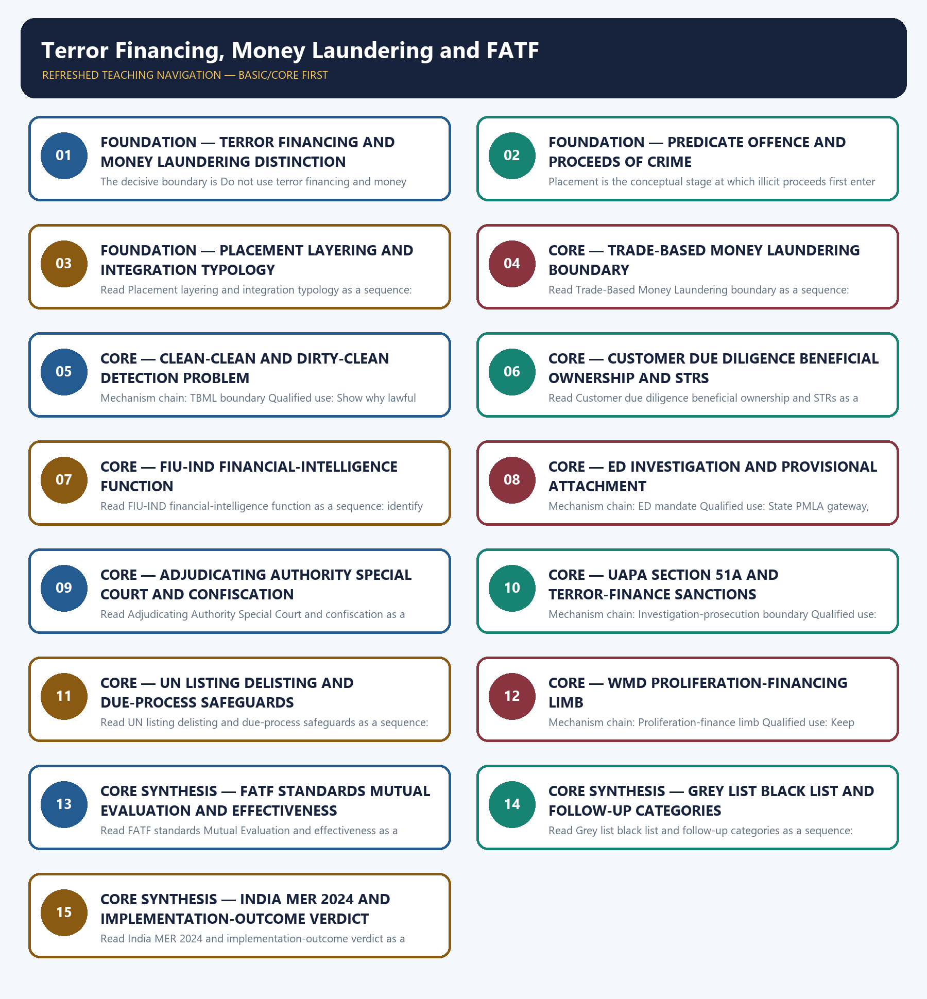

# Terror Financing, Money Laundering and FATF — Learner-v2 Complete Learning Session

> **Authoring-only generation:** 2026-09-04. No PDF was rendered and no tracker or index was mutated.

### SOURCE, PROGRESSION AND CURRENT-LINKAGE AUDIT

- **Generation date:** 2026-09-04.
- **Repository-first evidence:** the Basic owner is taught first and preserved in full; the Advanced owner is retained only in the optional final teaching block.
- **OCR evidence:** Repository Markdown was primary. OCR-searchable official UPSC papers were supplementary only for printed routed demands. No answer key, attribution, operational method, notification effect, implementation outcome or security metric was inferred.
- **Qdrant:** not used; repository Markdown and available OCR context were sufficient.
- **PYQ integrity:** The routed ledger provides direct 2021 and 2023 GS-III demands. The third conservative card is the 2018 drug-trafficking linkage question, explicitly marked as cross-owned with Topic 11 and limited here to its money-laundering and proceeds-status component.
- **Live-link boundary:** On 2026-09-04 FATF's official India page confirmed the 19 September 2024 regular-follow-up outcome and balanced recommendations, FIU-IND reproduced the PMLA records framework, and RBI's KYC Master Direction showed an update through 14 August 2025. No STR, attachment, prosecution, conviction, confiscation or compliance-rate statistic is used.
- **Fact/inference discipline:** no current-affairs item, PYQ wording, figure or quotation is invented.

### LIVE OFFICIAL-SOURCE ATTEMPT LOG

The checks below were made on 2026-09-04. Substantive official text is used only for the proposition it supports; title-only, blocked or thin pages are recorded and supply no factual claim.

- https://www.fatf-gafi.org/en/publications/Mutualevaluations/India-MER-2024.html and https://www.pib.gov.in/ — fetched and attempted 2026-09-04. FATF's official page confirms publication on 19 September 2024, regular follow-up, a three-year report-back cycle, recognised strengths and prosecution/non-profit-sector recommendations; PIB retrieval returned 403.
- https://fiuindia.gov.in/files/AML_Legislation/notification.html and https://www.indiacode.nic.in/ — fetched and attempted 2026-09-04. The FIU-IND page reproduced the PMLA Maintenance of Records framework and client-due-diligence terminology; India Code returned 403. No reporting volume, enforcement count or effectiveness outcome is used.
- https://www.rbi.org.in/Scripts/BS_ViewMasDirections.aspx?id=11566 and https://www.pib.gov.in/ — fetched and attempted 2026-09-04. The RBI KYC Master Direction showed an update date of 14 August 2025 and states the AML/CFT purpose of customer identification and transaction monitoring; PIB retrieval returned 403. Compliance is not equated with absence of laundering.
- https://enforcementdirectorate.gov.in/what-we-do, https://www.mha.gov.in/ and https://www.indiacode.nic.in/ — attempted 2026-09-04 for current ED, PMLA, UAPA Section 51A and WMD-financing material; the ED path returned 404 and the MHA/India Code pages were not substantively retrievable. Only owner-audited mandates and status rungs are retained.

## BASIC LEARNING SESSION

### DEEP-REVIEW LEARNING CONTRACT

| Control | Binding rule for this package |
|---|---|
| Syllabus boundary | Complete Internal Security Basic/Core is easy-first and answer-complete before optional Advanced depth. |
| Threat boundary | Actor, intent, capability, geography, target, harm and security-development nexus remain distinct. |
| Law/status boundary | Constitution, statute, rule, notification, guideline, advisory, designation, investigation, prosecution, conviction and measured outcome are not conflated. |
| Institutional boundary | Intelligence, police, NIA, prosecution, courts, CAPFs, armed forces, CERT-In, NCIIPC, I4C, Coast Guard and regulators retain exact mandates and federal limits. |
| Process boundary | Prevention, preparedness, response, investigation, prosecution, recovery and resilience are separate stages. |
| Current-data boundary | Every incident, casualty, budget, force, border, seizure, conviction, timeline and operational claim keeps source, date, unit, jurisdiction and status. |
| Practice contract | Every solved item has demand decoding, detailed examiner-grade model, executable timed/compression plan, marks rationale and answer-specific improvement. |
| PYQ contract | Official wording and keys are asserted only when verified; routed or reconstructed demands remain labelled. |
| Dual-flow contract | Graphical and ASCII masters independently reconstruct the same complete Basic-to-optional-Advanced evidence spine. |
| Approval | This immutable successor remains `approved: false` pending explicit approval. |

**Canonical Basic/Core owner:** `upsc-ai-kit\knowledge\Internal-Security\basic\10_Terror-Financing-Money-Laundering-and-FATF.md`  
**Substantive canonical provenance owner:** `upsc-ai-kit\knowledge\Internal-Security\learning-sessions\v2\subject-wide-syllabus\internal-security-10_Learning-Session.md`  
**Optional Advanced owner:** `upsc-ai-kit\knowledge\Internal-Security\advanced\10_Terror-Financing-Money-Laundering-and-FATF.md`  
**Official syllabus mapping:** `upsc-ai-kit\knowledge\Internal-Security\OFFICIAL-UPSC-SYLLABUS-MAPPING.md`

### EVIDENCE, PYQ AND CURRENT-STATUS CONTROL

- Law is separated from rules, notifications, guidelines and advisories; designation from conviction; investigation from prosecution.
- Intelligence is separated from admissible evidence; ceasefire/framework agreement from final settlement and implementation.
- Border guarding is separated from law and order; cyber incident from cybercrime; prevention from response; security output from development outcome.
- Every current Jammu and Kashmir, border, insurgency, terrorism, cyber, maritime, organised-crime, force or legal-status claim retains source/date/status.
- **Current-status note, rechecked 2026-09-06:** failed official fetches remain explicit and supply no invented fact.

**Generation-local live/current sources:**
- `https://www.fatf-gafi.org/en/publications/Mutualevaluations/India-MER-2024.html and https://www.pib.gov.in/ — fetched and attempted 2026-09-04. FATF's official page confirms publication on 19 September 2024, regular follow-up, a three-year report-back cycle, recognised strengths and prosecution/non-profit-sector recommendations; PIB retrieval returned 403.`
- `https://fiuindia.gov.in/files/AML_Legislation/notification.html and https://www.indiacode.nic.in/ — fetched and attempted 2026-09-04. The FIU-IND page reproduced the PMLA Maintenance of Records framework and client-due-diligence terminology; India Code returned 403. No reporting volume, enforcement count or effectiveness outcome is used.`
- `https://www.rbi.org.in/Scripts/BS_ViewMasDirections.aspx?id=11566 and https://www.pib.gov.in/ — fetched and attempted 2026-09-04. The RBI KYC Master Direction showed an update date of 14 August 2025 and states the AML/CFT purpose of customer identification and transaction monitoring; PIB retrieval returned 403. Compliance is not equated with absence of laundering.`
- `https://enforcementdirectorate.gov.in/what-we-do, https://www.mha.gov.in/ and https://www.indiacode.nic.in/ — attempted 2026-09-04 for current ED, PMLA, UAPA Section 51A and WMD-financing material; the ED path returned 404 and the MHA/India Code pages were not substantively retrievable. Only owner-audited mandates and status rungs are retained.`

**Topic-routed verified PYQ owners:**
- Repository PYQ routing ledgers control wording, year, marks and verification status.




*Distinct embedded teaching-navigation image. The separate continuous Cārvāka-style flowchart package remains an independent at-a-glance artifact.*

### SESSION 1 — FOUNDATION — TERROR FINANCING AND MONEY LAUNDERING DISTINCTION

#### DEFINITION / WHAT THIS IS CALLED

**Plain-language definition:** Terror financing provides or moves value for a terrorist purpose and may use lawful or unlawful origins, whereas money laundering disguises proceeds of crime; the two can intersect but are not the same offence or evidentiary chain.

**Technical definition:** The decisive boundary is Do not use terror financing and money laundering as synonyms.

#### ANSWER-GRABBING OPENING — WRITE/ADAPT IN THE EXAM

> Terror financing provides or moves value for a terrorist purpose and may use lawful or unlawful origins, whereas money laundering disguises proceeds of crime; the two can intersect but are not the same offence or evidentiary chain.

#### MUST-WRITE KEYWORDS

- **FOUNDATION**
- **Terror financing**
- **money laundering distinction**
- **Mechanism chain**
- **Qualified use**
- **Terror**

**How to use them:** Frame the answer through FOUNDATION; define Terror financing, connect money laundering distinction with Mechanism chain to explain the mechanism, and use Qualified use for the decisive comparison or qualification.

#### VISUAL FIRST

```text
TERROR FINANCING AND MONEY LAUNDERING DISTINCTION
01. Terror-finance laundering distinction
    |
    v
02. Predicate-offence gateway
STATUS / CATEGORY FIREWALL -> Do not use terror financing and money laundering as synonyms.
```

*The rail fixes the institutional sequence and claim boundary before explanation.*

#### CORE EXPLANATION

Terror financing provides or moves value for a terrorist purpose and may use lawful or unlawful origins, whereas money laundering disguises proceeds of crime; the two can intersect but are not the same offence or evidentiary chain. PMLA is derivative: proceeds of crime must be linked to a registered scheduled predicate offence, so the quality and status of the underlying investigation shape the laundering case.

#### SIMPLE SYSTEM EXAMPLE

Read Terror financing and money laundering distinction as a sequence: identify Terror-finance laundering distinction, follow the named mechanism to its institutional response, and stop at the last verified status rather than assuming the next stage.

#### TECHNICAL DISTINCTION

The decisive boundary is Do not use terror financing and money laundering as synonyms. This keeps Terror-finance laundering distinction and Predicate-offence gateway in the correct legal category, institutional mandate and evidentiary status.

#### NAMED EVIDENCE AND MECHANISM

- Terror financing provides or moves value for a terrorist purpose and may use lawful or unlawful origins, whereas money laundering disguises proceeds of crime; the two can intersect but are not the same offence or evidentiary chain.
- PMLA is derivative: proceeds of crime must be linked to a registered scheduled predicate offence, so the quality and status of the underlying investigation shape the laundering case.

#### EXAMINER CAUTION

- Do not use terror financing and money laundering as synonyms.

#### EXAM LINK

- **Prelims:** Keep institution, law, notification, ban/listing, scheme, agreement, ceasefire and outcome in their exact category.
- **Mains:** Define purpose and source of funds before selecting the legal route.

#### MINI RECAP

- **Mechanism chain:** Terror-finance laundering distinction -> Predicate-offence gateway
- **Qualified use:** Define purpose and source of funds before selecting the legal route.

#### CLOSING RECALL FLOW — FOUNDATION — TERROR FINANCING AND MONEY LAUNDERING DISTINCTION

```text
START / CONCEPT: FOUNDATION — Terror financing and money laundering distinction
        |
        v
EXACT TERMS: FOUNDATION · Terror financing · money laundering distinction · Mechanism chain · Qualified use · Terror
        |
        v
MECHANISM / ARGUMENT: Read Terror financing and money laundering distinction as a sequence: identify Terror-finance laundering distinction, follow the named mechanism to its institutional response, and stop at the last verified status rather than assuming the next stage.
        |
        v
CONSEQUENCE / CONTRAST: The decisive boundary is Do not use terror financing and money laundering as synonyms.
        |
        v
UPSC TRAP / ANSWER-USE: Do not use terror financing and money laundering as synonyms.
        |
        v
ANSWER-GRABBING FORMULATION: Terror financing provides or moves value for a terrorist purpose and may use lawful or unlawful origins, whereas money laundering disguises proceeds of crime; the two can intersect but are not the same offence or evidentiary chain.
```
### SESSION 2 — FOUNDATION — PREDICATE OFFENCE AND PROCEEDS OF CRIME

#### DEFINITION / WHAT THIS IS CALLED

**Plain-language definition:** The decisive boundary is Do not omit the scheduled predicate offence and proceeds-of-crime gateway.

**Technical definition:** Placement is the conceptual stage at which illicit proceeds first enter a financial or commercial channel; it is a typology for diagnosis, not a guide to evasion.

#### ANSWER-GRABBING OPENING — WRITE/ADAPT IN THE EXAM

> Read Predicate offence and proceeds of crime as a sequence: identify Placement typology, follow the named mechanism to its institutional response, and stop at the last verified status rather than assuming the next stage.

#### MUST-WRITE KEYWORDS

- **FOUNDATION**
- **Predicate offence**
- **proceeds of crime**
- **Mechanism chain**
- **Qualified use**
- **Placement**

**How to use them:** Frame the answer through FOUNDATION; define Predicate offence, connect proceeds of crime with Mechanism chain to explain the mechanism, and use Qualified use for the decisive comparison or qualification.

#### VISUAL FIRST

```text
PREDICATE OFFENCE AND PROCEEDS OF CRIME
01. Placement typology
STATUS / CATEGORY FIREWALL -> Do not omit the scheduled predicate offence and proceeds-of-crime gateway.
```

*The rail fixes the institutional sequence and claim boundary before explanation.*

#### CORE EXPLANATION

Placement is the conceptual stage at which illicit proceeds first enter a financial or commercial channel; it is a typology for diagnosis, not a guide to evasion.

#### SIMPLE SYSTEM EXAMPLE

Read Predicate offence and proceeds of crime as a sequence: identify Placement typology, follow the named mechanism to its institutional response, and stop at the last verified status rather than assuming the next stage.

#### TECHNICAL DISTINCTION

The decisive boundary is Do not omit the scheduled predicate offence and proceeds-of-crime gateway. This keeps Placement typology in the correct legal category, institutional mandate and evidentiary status.

#### NAMED EVIDENCE AND MECHANISM

- Placement is the conceptual stage at which illicit proceeds first enter a financial or commercial channel; it is a typology for diagnosis, not a guide to evasion.

#### EXAMINER CAUTION

- Do not omit the scheduled predicate offence and proceeds-of-crime gateway.

#### EXAM LINK

- **Prelims:** Keep institution, law, notification, ban/listing, scheme, agreement, ceasefire and outcome in their exact category.
- **Mains:** Name the underlying scheduled offence, proceeds and registration status.

#### MINI RECAP

- **Mechanism chain:** Placement typology
- **Qualified use:** Name the underlying scheduled offence, proceeds and registration status.

#### CLOSING RECALL FLOW — FOUNDATION — PREDICATE OFFENCE AND PROCEEDS OF CRIME

```text
START / CONCEPT: FOUNDATION — Predicate offence and proceeds of crime
        |
        v
EXACT TERMS: FOUNDATION · Predicate offence · proceeds of crime · Mechanism chain · Qualified use · Placement
        |
        v
MECHANISM / ARGUMENT: Mechanism chain: Placement typology Qualified use: Name the underlying scheduled offence, proceeds and registration status.
        |
        v
CONSEQUENCE / CONTRAST: The decisive boundary is Do not omit the scheduled predicate offence and proceeds-of-crime gateway.
        |
        v
UPSC TRAP / ANSWER-USE: Do not omit the scheduled predicate offence and proceeds-of-crime gateway.
        |
        v
ANSWER-GRABBING FORMULATION: Read Predicate offence and proceeds of crime as a sequence: identify Placement typology, follow the named mechanism to its institutional response, and stop at the last verified status rather than assuming the next stage.
```
### SESSION 3 — FOUNDATION — PLACEMENT LAYERING AND INTEGRATION TYPOLOGY

#### DEFINITION / WHAT THIS IS CALLED

**Plain-language definition:** The decisive boundary is Do not present placement, layering or integration as evasion instructions.

**Technical definition:** Read Placement layering and integration typology as a sequence: identify Layering typology, follow the named mechanism to its institutional response, and stop at the last verified status rather than assuming the next stage.

#### ANSWER-GRABBING OPENING — WRITE/ADAPT IN THE EXAM

> The decisive boundary is Do not present placement, layering or integration as evasion instructions.

#### MUST-WRITE KEYWORDS

- **FOUNDATION**
- **Placement layering**
- **integration typology**
- **Mechanism chain**
- **Qualified use**
- **Layering conceptually**

**How to use them:** Frame the answer through FOUNDATION; define Placement layering, connect integration typology with Mechanism chain to explain the mechanism, and use Qualified use for the decisive comparison or qualification.

#### VISUAL FIRST

```text
PLACEMENT LAYERING AND INTEGRATION TYPOLOGY
01. Layering typology
STATUS / CATEGORY FIREWALL -> Do not present placement, layering or integration as evasion instructions.
```

*The rail fixes the institutional sequence and claim boundary before explanation.*

#### CORE EXPLANATION

Layering conceptually describes transactions or structures that distance value from its criminal origin; answers should identify the control failure without reproducing operational concealment techniques.

#### SIMPLE SYSTEM EXAMPLE

Read Placement layering and integration typology as a sequence: identify Layering typology, follow the named mechanism to its institutional response, and stop at the last verified status rather than assuming the next stage.

#### TECHNICAL DISTINCTION

The decisive boundary is Do not present placement, layering or integration as evasion instructions. This keeps Layering typology in the correct legal category, institutional mandate and evidentiary status.

#### NAMED EVIDENCE AND MECHANISM

- Layering conceptually describes transactions or structures that distance value from its criminal origin; answers should identify the control failure without reproducing operational concealment techniques.

#### EXAMINER CAUTION

- Do not present placement, layering or integration as evasion instructions.

#### EXAM LINK

- **Prelims:** Keep institution, law, notification, ban/listing, scheme, agreement, ceasefire and outcome in their exact category.
- **Mains:** Use the three stages only as a conceptual diagnostic sequence.

#### MINI RECAP

- **Mechanism chain:** Layering typology
- **Qualified use:** Use the three stages only as a conceptual diagnostic sequence.

#### CLOSING RECALL FLOW — FOUNDATION — PLACEMENT LAYERING AND INTEGRATION TYPOLOGY

```text
START / CONCEPT: FOUNDATION — Placement layering and integration typology
        |
        v
EXACT TERMS: FOUNDATION · Placement layering · integration typology · Mechanism chain · Qualified use · Layering conceptually
        |
        v
MECHANISM / ARGUMENT: Read Placement layering and integration typology as a sequence: identify Layering typology, follow the named mechanism to its institutional response, and stop at the last verified status rather than assuming the next stage.
        |
        v
CONSEQUENCE / CONTRAST: Do not present placement, layering or integration as evasion instructions.
        |
        v
UPSC TRAP / ANSWER-USE: Do not miss this limiting distinction: use the three stages only as a conceptual diagnostic sequence.
        |
        v
ANSWER-GRABBING FORMULATION: The decisive boundary is Do not present placement, layering or integration as evasion instructions.
```
### SESSION 4 — CORE — TRADE-BASED MONEY LAUNDERING BOUNDARY

#### DEFINITION / WHAT THIS IS CALLED

**Plain-language definition:** The decisive boundary is Do not equate TBML with every customs discrepancy or virtual-asset transfer.

**Technical definition:** Read Trade-Based Money Laundering boundary as a sequence: identify Integration typology, follow the named mechanism to its institutional response, and stop at the last verified status rather than assuming the next stage.

#### ANSWER-GRABBING OPENING — WRITE/ADAPT IN THE EXAM

> Read Trade-Based Money Laundering boundary as a sequence: identify Integration typology, follow the named mechanism to its institutional response, and stop at the last verified status rather than assuming the next stage.

#### MUST-WRITE KEYWORDS

- **Trade-Based Money Laundering boundary**
- **Mechanism chain**
- **Qualified use**
- **Integration**
- **Read Trade-Based Money Laundering**
- **The decisive boundary**

**How to use them:** Frame the answer through Trade-Based Money Laundering boundary; define Mechanism chain, connect Qualified use with Integration to explain the mechanism, and use Read Trade-Based Money Laundering for the decisive comparison or qualification.

#### VISUAL FIRST

```text
TRADE-BASED MONEY LAUNDERING BOUNDARY
01. Integration typology
STATUS / CATEGORY FIREWALL -> Do not equate TBML with every customs discrepancy or virtual-asset transfer.
```

*The rail fixes the institutional sequence and claim boundary before explanation.*

#### CORE EXPLANATION

Integration is the stage at which value returns in an apparently legitimate form; legitimate appearance does not by itself establish lawful origin.

#### SIMPLE SYSTEM EXAMPLE

Read Trade-Based Money Laundering boundary as a sequence: identify Integration typology, follow the named mechanism to its institutional response, and stop at the last verified status rather than assuming the next stage.

#### TECHNICAL DISTINCTION

The decisive boundary is Do not equate TBML with every customs discrepancy or virtual-asset transfer. This keeps Integration typology in the correct legal category, institutional mandate and evidentiary status.

#### NAMED EVIDENCE AND MECHANISM

- Integration is the stage at which value returns in an apparently legitimate form; legitimate appearance does not by itself establish lawful origin.

#### EXAMINER CAUTION

- Do not equate TBML with every customs discrepancy or virtual-asset transfer.

#### EXAM LINK

- **Prelims:** Keep institution, law, notification, ban/listing, scheme, agreement, ceasefire and outcome in their exact category.
- **Mains:** Explain trade-value disguise without operational concealment detail.

#### MINI RECAP

- **Mechanism chain:** Integration typology
- **Qualified use:** Explain trade-value disguise without operational concealment detail.

#### CLOSING RECALL FLOW — CORE — TRADE-BASED MONEY LAUNDERING BOUNDARY

```text
START / CONCEPT: CORE — Trade-Based Money Laundering boundary
        |
        v
EXACT TERMS: Trade-Based Money Laundering boundary · Mechanism chain · Qualified use · Integration · Read Trade-Based Money Laundering · The decisive boundary
        |
        v
MECHANISM / ARGUMENT: Mechanism chain: Integration typology Qualified use: Explain trade-value disguise without operational concealment detail.
        |
        v
CONSEQUENCE / CONTRAST: The decisive boundary is Do not equate TBML with every customs discrepancy or virtual-asset transfer.
        |
        v
UPSC TRAP / ANSWER-USE: Integration is the stage at which value returns in an apparently legitimate form; legitimate appearance does not by itself establish lawful origin.
        |
        v
ANSWER-GRABBING FORMULATION: Read Trade-Based Money Laundering boundary as a sequence: identify Integration typology, follow the named mechanism to its institutional response, and stop at the last verified status rather than assuming the next stage.
```
### SESSION 5 — CORE — CLEAN-CLEAN AND DIRTY-CLEAN DETECTION PROBLEM

#### DEFINITION / WHAT THIS IS CALLED

**Plain-language definition:** Read Clean-clean and dirty-clean detection problem as a sequence: identify TBML boundary, follow the named mechanism to its institutional response, and stop at the last verified status rather than assuming the next stage.

**Technical definition:** Mechanism chain: TBML boundary Qualified use: Show why lawful origin does not remove terror-purpose risk.

#### ANSWER-GRABBING OPENING — WRITE/ADAPT IN THE EXAM

> Read Clean-clean and dirty-clean detection problem as a sequence: identify TBML boundary, follow the named mechanism to its institutional response, and stop at the last verified status rather than assuming the next stage.

#### MUST-WRITE KEYWORDS

- **Clean-clean**
- **dirty-clean detection problem**
- **Mechanism chain**
- **Qualified use**
- **Trade-Based Money Laundering**
- **Read Clean-clean**

**How to use them:** Frame the answer through Clean-clean; define dirty-clean detection problem, connect Mechanism chain with Qualified use to explain the mechanism, and use Trade-Based Money Laundering for the decisive comparison or qualification.

#### VISUAL FIRST

```text
CLEAN-CLEAN AND DIRTY-CLEAN DETECTION PROBLEM
01. TBML boundary
STATUS / CATEGORY FIREWALL -> Do not treat an STR as proof of an offence.
```

*The rail fixes the institutional sequence and claim boundary before explanation.*

#### CORE EXPLANATION

Trade-Based Money Laundering moves or disguises value through manipulated trade transactions or documentation; it is distinct from ordinary trade error, customs evasion and virtual-asset laundering and should be discussed only at a non-operational level.

#### SIMPLE SYSTEM EXAMPLE

Read Clean-clean and dirty-clean detection problem as a sequence: identify TBML boundary, follow the named mechanism to its institutional response, and stop at the last verified status rather than assuming the next stage.

#### TECHNICAL DISTINCTION

The decisive boundary is Do not treat an STR as proof of an offence. This keeps TBML boundary in the correct legal category, institutional mandate and evidentiary status.

#### NAMED EVIDENCE AND MECHANISM

- Trade-Based Money Laundering moves or disguises value through manipulated trade transactions or documentation; it is distinct from ordinary trade error, customs evasion and virtual-asset laundering and should be discussed only at a non-operational level.

#### EXAMINER CAUTION

- Do not treat an STR as proof of an offence.

#### EXAM LINK

- **Prelims:** Keep institution, law, notification, ban/listing, scheme, agreement, ceasefire and outcome in their exact category.
- **Mains:** Show why lawful origin does not remove terror-purpose risk.

#### MINI RECAP

- **Mechanism chain:** TBML boundary
- **Qualified use:** Show why lawful origin does not remove terror-purpose risk.

#### CLOSING RECALL FLOW — CORE — CLEAN-CLEAN AND DIRTY-CLEAN DETECTION PROBLEM

```text
START / CONCEPT: CORE — Clean-clean and dirty-clean detection problem
        |
        v
EXACT TERMS: Clean-clean · dirty-clean detection problem · Mechanism chain · Qualified use · Trade-Based Money Laundering · Read Clean-clean
        |
        v
MECHANISM / ARGUMENT: Mechanism chain: TBML boundary Qualified use: Show why lawful origin does not remove terror-purpose risk.
        |
        v
CONSEQUENCE / CONTRAST: The decisive boundary is Do not treat an STR as proof of an offence.
        |
        v
UPSC TRAP / ANSWER-USE: Do not treat an STR as proof of an offence.
        |
        v
ANSWER-GRABBING FORMULATION: Read Clean-clean and dirty-clean detection problem as a sequence: identify TBML boundary, follow the named mechanism to its institutional response, and stop at the last verified status rather than assuming the next stage.
```
### SESSION 6 — CORE — CUSTOMER DUE DILIGENCE BENEFICIAL OWNERSHIP AND STRS

#### DEFINITION / WHAT THIS IS CALLED

**Plain-language definition:** Customer due diligence, beneficial-owner identification, record maintenance and suspicious-transaction reporting are preventive inputs by regulated or notified reporting entities, not findings of criminal guilt.

**Technical definition:** Read Customer due diligence beneficial ownership and STRs as a sequence: identify Clean-clean dirty-clean distinction, follow the named mechanism to its institutional response, and stop at the last verified status rather than assuming the next stage.

#### ANSWER-GRABBING OPENING — WRITE/ADAPT IN THE EXAM

> Read Customer due diligence beneficial ownership and STRs as a sequence: identify Clean-clean dirty-clean distinction, follow the named mechanism to its institutional response, and stop at the last verified status rather than assuming the next stage.

#### MUST-WRITE KEYWORDS

- **Customer due diligence beneficial ownership**
- **STRs**
- **Mechanism chain**
- **Qualified use**
- **Funds**
- **Customer**

**How to use them:** Frame the answer through Customer due diligence beneficial ownership; define STRs, connect Mechanism chain with Qualified use to explain the mechanism, and use Funds for the decisive comparison or qualification.

#### VISUAL FIRST

```text
CUSTOMER DUE DILIGENCE BENEFICIAL OWNERSHIP AND STRS
01. Clean-clean dirty-clean distinction
    |
    v
02. Reporting-entity controls
STATUS / CATEGORY FIREWALL -> Do not describe FIU-IND, ED and the Special Court as interchangeable bodies.
```

*The rail fixes the institutional sequence and claim boundary before explanation.*

#### CORE EXPLANATION

Funds legally generated and transferred but diverted to terror may present fewer criminal-origin indicators than dirty proceeds later laundered, which is why terror-finance risk cannot be reduced to proceeds-of-crime detection. Customer due diligence, beneficial-owner identification, record maintenance and suspicious-transaction reporting are preventive inputs by regulated or notified reporting entities, not findings of criminal guilt.

#### SIMPLE SYSTEM EXAMPLE

Read Customer due diligence beneficial ownership and STRs as a sequence: identify Clean-clean dirty-clean distinction, follow the named mechanism to its institutional response, and stop at the last verified status rather than assuming the next stage.

#### TECHNICAL DISTINCTION

The decisive boundary is Do not describe FIU-IND, ED and the Special Court as interchangeable bodies. This keeps Clean-clean dirty-clean distinction and Reporting-entity controls in the correct legal category, institutional mandate and evidentiary status.

#### NAMED EVIDENCE AND MECHANISM

- Funds legally generated and transferred but diverted to terror may present fewer criminal-origin indicators than dirty proceeds later laundered, which is why terror-finance risk cannot be reduced to proceeds-of-crime detection.
- Customer due diligence, beneficial-owner identification, record maintenance and suspicious-transaction reporting are preventive inputs by regulated or notified reporting entities, not findings of criminal guilt.

#### EXAMINER CAUTION

- Do not describe FIU-IND, ED and the Special Court as interchangeable bodies.

#### EXAM LINK

- **Prelims:** Keep institution, law, notification, ban/listing, scheme, agreement, ceasefire and outcome in their exact category.
- **Mains:** Separate preventive control, intelligence flag and criminal finding.

#### MINI RECAP

- **Mechanism chain:** Clean-clean dirty-clean distinction -> Reporting-entity controls
- **Qualified use:** Separate preventive control, intelligence flag and criminal finding.

#### CLOSING RECALL FLOW — CORE — CUSTOMER DUE DILIGENCE BENEFICIAL OWNERSHIP AND STRS

```text
START / CONCEPT: CORE — Customer due diligence beneficial ownership and STRs
        |
        v
EXACT TERMS: Customer due diligence beneficial ownership · STRs · Mechanism chain · Qualified use · Funds · Customer
        |
        v
MECHANISM / ARGUMENT: Customer due diligence, beneficial-owner identification, record maintenance and suspicious-transaction reporting are preventive inputs by regulated or notified reporting entities, not findings of criminal guilt.
        |
        v
CONSEQUENCE / CONTRAST: Funds legally generated and transferred but diverted to terror may present fewer criminal-origin indicators than dirty proceeds later laundered, which is why terror-finance risk cannot be reduced to proceeds-of-crime detection.
        |
        v
UPSC TRAP / ANSWER-USE: The decisive boundary is Do not describe FIU-IND, ED and the Special Court as interchangeable bodies.
        |
        v
ANSWER-GRABBING FORMULATION: Read Customer due diligence beneficial ownership and STRs as a sequence: identify Clean-clean dirty-clean distinction, follow the named mechanism to its institutional response, and stop at the last verified status rather than assuming the next stage.
```
### SESSION 7 — CORE — FIU-IND FINANCIAL-INTELLIGENCE FUNCTION

#### DEFINITION / WHAT THIS IS CALLED

**Plain-language definition:** FIU-IND under the Department of Revenue receives, analyses and disseminates specified financial intelligence; an STR is an intelligence lead, not an FIR, charge or conviction.

**Technical definition:** Read FIU-IND financial-intelligence function as a sequence: identify FIU-IND mandate, follow the named mechanism to its institutional response, and stop at the last verified status rather than assuming the next stage.

#### ANSWER-GRABBING OPENING — WRITE/ADAPT IN THE EXAM

> FIU-IND under the Department of Revenue receives, analyses and disseminates specified financial intelligence; an STR is an intelligence lead, not an FIR, charge or conviction.

#### MUST-WRITE KEYWORDS

- **FIU-IND financial-intelligence function**
- **Mechanism chain**
- **Qualified use**
- **FIU-IND**
- **Department**
- **Revenue**

**How to use them:** Frame the answer through FIU-IND financial-intelligence function; define Mechanism chain, connect Qualified use with FIU-IND to explain the mechanism, and use Department for the decisive comparison or qualification.

#### VISUAL FIRST

```text
FIU-IND FINANCIAL-INTELLIGENCE FUNCTION
01. FIU-IND mandate
STATUS / CATEGORY FIREWALL -> Do not equate provisional attachment with confiscation or recovered property.
```

*The rail fixes the institutional sequence and claim boundary before explanation.*

#### CORE EXPLANATION

FIU-IND under the Department of Revenue receives, analyses and disseminates specified financial intelligence; an STR is an intelligence lead, not an FIR, charge or conviction.

#### SIMPLE SYSTEM EXAMPLE

Read FIU-IND financial-intelligence function as a sequence: identify FIU-IND mandate, follow the named mechanism to its institutional response, and stop at the last verified status rather than assuming the next stage.

#### TECHNICAL DISTINCTION

The decisive boundary is Do not equate provisional attachment with confiscation or recovered property. This keeps FIU-IND mandate in the correct legal category, institutional mandate and evidentiary status.

#### NAMED EVIDENCE AND MECHANISM

- FIU-IND under the Department of Revenue receives, analyses and disseminates specified financial intelligence; an STR is an intelligence lead, not an FIR, charge or conviction.

#### EXAMINER CAUTION

- Do not equate provisional attachment with confiscation or recovered property.

#### EXAM LINK

- **Prelims:** Keep institution, law, notification, ban/listing, scheme, agreement, ceasefire and outcome in their exact category.
- **Mains:** Keep receipt, analysis and dissemination distinct from investigation.

#### MINI RECAP

- **Mechanism chain:** FIU-IND mandate
- **Qualified use:** Keep receipt, analysis and dissemination distinct from investigation.

#### CLOSING RECALL FLOW — CORE — FIU-IND FINANCIAL-INTELLIGENCE FUNCTION

```text
START / CONCEPT: CORE — FIU-IND financial-intelligence function
        |
        v
EXACT TERMS: FIU-IND financial-intelligence function · Mechanism chain · Qualified use · FIU-IND · Department · Revenue
        |
        v
MECHANISM / ARGUMENT: Read FIU-IND financial-intelligence function as a sequence: identify FIU-IND mandate, follow the named mechanism to its institutional response, and stop at the last verified status rather than assuming the next stage.
        |
        v
CONSEQUENCE / CONTRAST: The decisive boundary is Do not equate provisional attachment with confiscation or recovered property.
        |
        v
UPSC TRAP / ANSWER-USE: Do not equate provisional attachment with confiscation or recovered property.
        |
        v
ANSWER-GRABBING FORMULATION: FIU-IND under the Department of Revenue receives, analyses and disseminates specified financial intelligence; an STR is an intelligence lead, not an FIR, charge or conviction.
```
### SESSION 8 — CORE — ED INVESTIGATION AND PROVISIONAL ATTACHMENT

#### DEFINITION / WHAT THIS IS CALLED

**Plain-language definition:** Read ED investigation and provisional attachment as a sequence: identify ED mandate, follow the named mechanism to its institutional response, and stop at the last verified status rather than assuming the next stage.

**Technical definition:** Mechanism chain: ED mandate Qualified use: State PMLA gateway, investigative power and provisional status.

#### ANSWER-GRABBING OPENING — WRITE/ADAPT IN THE EXAM

> The Enforcement Directorate investigates money laundering within PMLA's statutory gateway and may seek provisional attachment; it does not adjudicate guilt or convert every unexplained asset into proceeds of crime.

#### MUST-WRITE KEYWORDS

- **ED investigation**
- **provisional attachment**
- **Mechanism chain**
- **Qualified use**
- **The Enforcement Directorate**
- **PMLA's**

**How to use them:** Frame the answer through ED investigation; define provisional attachment, connect Mechanism chain with Qualified use to explain the mechanism, and use The Enforcement Directorate for the decisive comparison or qualification.

#### VISUAL FIRST

```text
ED INVESTIGATION AND PROVISIONAL ATTACHMENT
01. ED mandate
STATUS / CATEGORY FIREWALL -> Do not treat UAPA Section 51A listing action as a conviction.
```

*The rail fixes the institutional sequence and claim boundary before explanation.*

#### CORE EXPLANATION

The Enforcement Directorate investigates money laundering within PMLA's statutory gateway and may seek provisional attachment; it does not adjudicate guilt or convert every unexplained asset into proceeds of crime.

#### SIMPLE SYSTEM EXAMPLE

Read ED investigation and provisional attachment as a sequence: identify ED mandate, follow the named mechanism to its institutional response, and stop at the last verified status rather than assuming the next stage.

#### TECHNICAL DISTINCTION

The decisive boundary is Do not treat UAPA Section 51A listing action as a conviction. This keeps ED mandate in the correct legal category, institutional mandate and evidentiary status.

#### NAMED EVIDENCE AND MECHANISM

- The Enforcement Directorate investigates money laundering within PMLA's statutory gateway and may seek provisional attachment; it does not adjudicate guilt or convert every unexplained asset into proceeds of crime.

#### EXAMINER CAUTION

- Do not treat UAPA Section 51A listing action as a conviction.

#### EXAM LINK

- **Prelims:** Keep institution, law, notification, ban/listing, scheme, agreement, ceasefire and outcome in their exact category.
- **Mains:** State PMLA gateway, investigative power and provisional status.

#### MINI RECAP

- **Mechanism chain:** ED mandate
- **Qualified use:** State PMLA gateway, investigative power and provisional status.

#### CLOSING RECALL FLOW — CORE — ED INVESTIGATION AND PROVISIONAL ATTACHMENT

```text
START / CONCEPT: CORE — ED investigation and provisional attachment
        |
        v
EXACT TERMS: ED investigation · provisional attachment · Mechanism chain · Qualified use · The Enforcement Directorate · PMLA's
        |
        v
MECHANISM / ARGUMENT: Read ED investigation and provisional attachment as a sequence: identify ED mandate, follow the named mechanism to its institutional response, and stop at the last verified status rather than assuming the next stage.
        |
        v
CONSEQUENCE / CONTRAST: The decisive boundary is Do not treat UAPA Section 51A listing action as a conviction.
        |
        v
UPSC TRAP / ANSWER-USE: Do not treat UAPA Section 51A listing action as a conviction.
        |
        v
ANSWER-GRABBING FORMULATION: The Enforcement Directorate investigates money laundering within PMLA's statutory gateway and may seek provisional attachment; it does not adjudicate guilt or convert every unexplained asset into proceeds of crime.
```
### SESSION 9 — CORE — ADJUDICATING AUTHORITY SPECIAL COURT AND CONFISCATION

#### DEFINITION / WHAT THIS IS CALLED

**Plain-language definition:** The property chain runs ED provisional attachment, Adjudicating Authority confirmation or release, Special Court adjudication and confiscation on the legally required outcome; attachment and confiscation are different rungs.

**Technical definition:** Read Adjudicating Authority Special Court and confiscation as a sequence: identify PMLA property ladder, follow the named mechanism to its institutional response, and stop at the last verified status rather than assuming the next stage.

#### ANSWER-GRABBING OPENING — WRITE/ADAPT IN THE EXAM

> The property chain runs ED provisional attachment, Adjudicating Authority confirmation or release, Special Court adjudication and confiscation on the legally required outcome; attachment and confiscation are different rungs.

#### MUST-WRITE KEYWORDS

- **Adjudicating Authority Special Court**
- **confiscation**
- **Mechanism chain**
- **Qualified use**
- **ED**
- **Adjudicating Authority**

**How to use them:** Frame the answer through Adjudicating Authority Special Court; define confiscation, connect Mechanism chain with Qualified use to explain the mechanism, and use ED for the decisive comparison or qualification.

#### VISUAL FIRST

```text
ADJUDICATING AUTHORITY SPECIAL COURT AND CONFISCATION
01. PMLA property ladder
STATUS / CATEGORY FIREWALL -> Do not merge AML, CFT and proliferation financing into one legal route.
```

*The rail fixes the institutional sequence and claim boundary before explanation.*

#### CORE EXPLANATION

The property chain runs ED provisional attachment, Adjudicating Authority confirmation or release, Special Court adjudication and confiscation on the legally required outcome; attachment and confiscation are different rungs.

#### SIMPLE SYSTEM EXAMPLE

Read Adjudicating Authority Special Court and confiscation as a sequence: identify PMLA property ladder, follow the named mechanism to its institutional response, and stop at the last verified status rather than assuming the next stage.

#### TECHNICAL DISTINCTION

The decisive boundary is Do not merge AML, CFT and proliferation financing into one legal route. This keeps PMLA property ladder in the correct legal category, institutional mandate and evidentiary status.

#### NAMED EVIDENCE AND MECHANISM

- The property chain runs ED provisional attachment, Adjudicating Authority confirmation or release, Special Court adjudication and confiscation on the legally required outcome; attachment and confiscation are different rungs.

#### EXAMINER CAUTION

- Do not merge AML, CFT and proliferation financing into one legal route.

#### EXAM LINK

- **Prelims:** Keep institution, law, notification, ban/listing, scheme, agreement, ceasefire and outcome in their exact category.
- **Mains:** Trace property and case status through every adjudicatory rung.

#### MINI RECAP

- **Mechanism chain:** PMLA property ladder
- **Qualified use:** Trace property and case status through every adjudicatory rung.

#### CLOSING RECALL FLOW — CORE — ADJUDICATING AUTHORITY SPECIAL COURT AND CONFISCATION

```text
START / CONCEPT: CORE — Adjudicating Authority Special Court and confiscation
        |
        v
EXACT TERMS: Adjudicating Authority Special Court · confiscation · Mechanism chain · Qualified use · ED · Adjudicating Authority
        |
        v
MECHANISM / ARGUMENT: Read Adjudicating Authority Special Court and confiscation as a sequence: identify PMLA property ladder, follow the named mechanism to its institutional response, and stop at the last verified status rather than assuming the next stage.
        |
        v
CONSEQUENCE / CONTRAST: The decisive boundary is Do not merge AML, CFT and proliferation financing into one legal route.
        |
        v
UPSC TRAP / ANSWER-USE: Do not merge AML, CFT and proliferation financing into one legal route.
        |
        v
ANSWER-GRABBING FORMULATION: The property chain runs ED provisional attachment, Adjudicating Authority confirmation or release, Special Court adjudication and confiscation on the legally required outcome; attachment and confiscation are different rungs.
```
### SESSION 10 — CORE — UAPA SECTION 51A AND TERROR-FINANCE SANCTIONS

#### DEFINITION / WHAT THIS IS CALLED

**Plain-language definition:** Read UAPA Section 51A and terror-finance sanctions as a sequence: identify Investigation-prosecution boundary, follow the named mechanism to its institutional response, and stop at the last verified status rather than assuming the next stage.

**Technical definition:** Mechanism chain: Investigation-prosecution boundary Qualified use: Distinguish terror offences and listing-linked freezing from PMLA.

#### ANSWER-GRABBING OPENING — WRITE/ADAPT IN THE EXAM

> Read UAPA Section 51A and terror-finance sanctions as a sequence: identify Investigation-prosecution boundary, follow the named mechanism to its institutional response, and stop at the last verified status rather than assuming the next stage.

#### MUST-WRITE KEYWORDS

- **UAPA Section 51A**
- **terror-finance sanctions**
- **Mechanism chain**
- **Qualified use**
- **Read UAPA Section**
- **Investigation-prosecution**

**How to use them:** Frame the answer through UAPA Section 51A; define terror-finance sanctions, connect Mechanism chain with Qualified use to explain the mechanism, and use Read UAPA Section for the decisive comparison or qualification.

#### VISUAL FIRST

```text
UAPA SECTION 51A AND TERROR-FINANCE SANCTIONS
01. Investigation-prosecution boundary
STATUS / CATEGORY FIREWALL -> Do not describe FATF as an investigative or adjudicatory agency.
```

*The rail fixes the institutional sequence and claim boundary before explanation.*

#### CORE EXPLANATION

Financial intelligence, predicate-offence investigation, PMLA investigation, prosecution, conviction and sanction require coordinated but distinct institutional work; detection strength cannot substitute for timely fair trial.

#### SIMPLE SYSTEM EXAMPLE

Read UAPA Section 51A and terror-finance sanctions as a sequence: identify Investigation-prosecution boundary, follow the named mechanism to its institutional response, and stop at the last verified status rather than assuming the next stage.

#### TECHNICAL DISTINCTION

The decisive boundary is Do not describe FATF as an investigative or adjudicatory agency. This keeps Investigation-prosecution boundary in the correct legal category, institutional mandate and evidentiary status.

#### NAMED EVIDENCE AND MECHANISM

- Financial intelligence, predicate-offence investigation, PMLA investigation, prosecution, conviction and sanction require coordinated but distinct institutional work; detection strength cannot substitute for timely fair trial.

#### EXAMINER CAUTION

- Do not describe FATF as an investigative or adjudicatory agency.

#### EXAM LINK

- **Prelims:** Keep institution, law, notification, ban/listing, scheme, agreement, ceasefire and outcome in their exact category.
- **Mains:** Distinguish terror offences and listing-linked freezing from PMLA.

#### MINI RECAP

- **Mechanism chain:** Investigation-prosecution boundary
- **Qualified use:** Distinguish terror offences and listing-linked freezing from PMLA.

#### CLOSING RECALL FLOW — CORE — UAPA SECTION 51A AND TERROR-FINANCE SANCTIONS

```text
START / CONCEPT: CORE — UAPA Section 51A and terror-finance sanctions
        |
        v
EXACT TERMS: UAPA Section 51A · terror-finance sanctions · Mechanism chain · Qualified use · Read UAPA Section · Investigation-prosecution
        |
        v
MECHANISM / ARGUMENT: Mechanism chain: Investigation-prosecution boundary Qualified use: Distinguish terror offences and listing-linked freezing from PMLA.
        |
        v
CONSEQUENCE / CONTRAST: The decisive boundary is Do not describe FATF as an investigative or adjudicatory agency.
        |
        v
UPSC TRAP / ANSWER-USE: Do not describe FATF as an investigative or adjudicatory agency.
        |
        v
ANSWER-GRABBING FORMULATION: Read UAPA Section 51A and terror-finance sanctions as a sequence: identify Investigation-prosecution boundary, follow the named mechanism to its institutional response, and stop at the last verified status rather than assuming the next stage.
```
### SESSION 11 — CORE — UN LISTING DELISTING AND DUE-PROCESS SAFEGUARDS

#### DEFINITION / WHAT THIS IS CALLED

**Plain-language definition:** The decisive boundary is Do not confuse grey/black listing with Mutual Evaluation follow-up.

**Technical definition:** Read UN listing delisting and due-process safeguards as a sequence: identify UAPA terror-finance route, follow the named mechanism to its institutional response, and stop at the last verified status rather than assuming the next stage.

#### ANSWER-GRABBING OPENING — WRITE/ADAPT IN THE EXAM

> Read UN listing delisting and due-process safeguards as a sequence: identify UAPA terror-finance route, follow the named mechanism to its institutional response, and stop at the last verified status rather than assuming the next stage.

#### MUST-WRITE KEYWORDS

- **UN listing delisting**
- **due-process safeguards**
- **Mechanism chain**
- **Qualified use**
- **UAPA**
- **Section**

**How to use them:** Frame the answer through UN listing delisting; define due-process safeguards, connect Mechanism chain with Qualified use to explain the mechanism, and use UAPA for the decisive comparison or qualification.

#### VISUAL FIRST

```text
UN LISTING DELISTING AND DUE-PROCESS SAFEGUARDS
01. UAPA terror-finance route
    |
    v
02. Sanctions-listing boundary
STATUS / CATEGORY FIREWALL -> Do not confuse grey/black listing with Mutual Evaluation follow-up.
```

*The rail fixes the institutional sequence and claim boundary before explanation.*

#### CORE EXPLANATION

UAPA contains terror-fund offences and Section 51A provides a listing-linked route to freeze, seize or attach covered funds and assets and prevent funds being made available; this route is distinct from PMLA's predicate-proceeds model. UN Security Council 1267-linked or domestic designation and targeted financial sanctions are preventive legal statuses, not criminal conviction; review, delisting and identity accuracy remain essential safeguards.

#### SIMPLE SYSTEM EXAMPLE

Read UN listing delisting and due-process safeguards as a sequence: identify UAPA terror-finance route, follow the named mechanism to its institutional response, and stop at the last verified status rather than assuming the next stage.

#### TECHNICAL DISTINCTION

The decisive boundary is Do not confuse grey/black listing with Mutual Evaluation follow-up. This keeps UAPA terror-finance route and Sanctions-listing boundary in the correct legal category, institutional mandate and evidentiary status.

#### NAMED EVIDENCE AND MECHANISM

- UAPA contains terror-fund offences and Section 51A provides a listing-linked route to freeze, seize or attach covered funds and assets and prevent funds being made available; this route is distinct from PMLA's predicate-proceeds model.
- UN Security Council 1267-linked or domestic designation and targeted financial sanctions are preventive legal statuses, not criminal conviction; review, delisting and identity accuracy remain essential safeguards.

#### EXAMINER CAUTION

- Do not confuse grey/black listing with Mutual Evaluation follow-up.

#### EXAM LINK

- **Prelims:** Keep institution, law, notification, ban/listing, scheme, agreement, ceasefire and outcome in their exact category.
- **Mains:** Pair preventive sanctions with review, delisting and identity safeguards.

#### MINI RECAP

- **Mechanism chain:** UAPA terror-finance route -> Sanctions-listing boundary
- **Qualified use:** Pair preventive sanctions with review, delisting and identity safeguards.

#### CLOSING RECALL FLOW — CORE — UN LISTING DELISTING AND DUE-PROCESS SAFEGUARDS

```text
START / CONCEPT: CORE — UN listing delisting and due-process safeguards
        |
        v
EXACT TERMS: UN listing delisting · due-process safeguards · Mechanism chain · Qualified use · UAPA · Section
        |
        v
MECHANISM / ARGUMENT: Mechanism chain: UAPA terror-finance route - Sanctions-listing boundary Qualified use: Pair preventive sanctions with review, delisting and identity safeguards.
        |
        v
CONSEQUENCE / CONTRAST: UN Security Council 1267-linked or domestic designation and targeted financial sanctions are preventive legal statuses, not criminal conviction; review, delisting and identity accuracy remain essential safeguards.
        |
        v
UPSC TRAP / ANSWER-USE: The decisive boundary is Do not confuse grey/black listing with Mutual Evaluation follow-up.
        |
        v
ANSWER-GRABBING FORMULATION: Read UN listing delisting and due-process safeguards as a sequence: identify UAPA terror-finance route, follow the named mechanism to its institutional response, and stop at the last verified status rather than assuming the next stage.
```
### SESSION 12 — CORE — WMD PROLIFERATION-FINANCING LIMB

#### DEFINITION / WHAT THIS IS CALLED

**Plain-language definition:** Read WMD proliferation-financing limb as a sequence: identify Proliferation-finance limb, follow the named mechanism to its institutional response, and stop at the last verified status rather than assuming the next stage.

**Technical definition:** Mechanism chain: Proliferation-finance limb Qualified use: Keep proliferation financing analytically separate from AML and CFT.

#### ANSWER-GRABBING OPENING — WRITE/ADAPT IN THE EXAM

> Read WMD proliferation-financing limb as a sequence: identify Proliferation-finance limb, follow the named mechanism to its institutional response, and stop at the last verified status rather than assuming the next stage.

#### MUST-WRITE KEYWORDS

- **WMD proliferation-financing limb**
- **Mechanism chain**
- **Qualified use**
- **Read WMD**
- **Proliferation-finance**
- **The decisive boundary**

**How to use them:** Frame the answer through WMD proliferation-financing limb; define Mechanism chain, connect Qualified use with Read WMD to explain the mechanism, and use Proliferation-finance for the decisive comparison or qualification.

#### VISUAL FIRST

```text
WMD PROLIFERATION-FINANCING LIMB
01. Proliferation-finance limb
STATUS / CATEGORY FIREWALL -> Do not turn regular follow-up or technical compliance into an unqualified effectiveness outcome.
```

*The rail fixes the institutional sequence and claim boundary before explanation.*

#### CORE EXPLANATION

The WMD Act, 2005 as amended in 2022 prohibits financing connected with prohibited weapons-of-mass-destruction activity, forming a proliferation-financing limb distinct from money laundering and terrorist financing.

#### SIMPLE SYSTEM EXAMPLE

Read WMD proliferation-financing limb as a sequence: identify Proliferation-finance limb, follow the named mechanism to its institutional response, and stop at the last verified status rather than assuming the next stage.

#### TECHNICAL DISTINCTION

The decisive boundary is Do not turn regular follow-up or technical compliance into an unqualified effectiveness outcome. This keeps Proliferation-finance limb in the correct legal category, institutional mandate and evidentiary status.

#### NAMED EVIDENCE AND MECHANISM

- The WMD Act, 2005 as amended in 2022 prohibits financing connected with prohibited weapons-of-mass-destruction activity, forming a proliferation-financing limb distinct from money laundering and terrorist financing.

#### EXAMINER CAUTION

- Do not turn regular follow-up or technical compliance into an unqualified effectiveness outcome.

#### EXAM LINK

- **Prelims:** Keep institution, law, notification, ban/listing, scheme, agreement, ceasefire and outcome in their exact category.
- **Mains:** Keep proliferation financing analytically separate from AML and CFT.

#### MINI RECAP

- **Mechanism chain:** Proliferation-finance limb
- **Qualified use:** Keep proliferation financing analytically separate from AML and CFT.

#### CLOSING RECALL FLOW — CORE — WMD PROLIFERATION-FINANCING LIMB

```text
START / CONCEPT: CORE — WMD proliferation-financing limb
        |
        v
EXACT TERMS: WMD proliferation-financing limb · Mechanism chain · Qualified use · Read WMD · Proliferation-finance · The decisive boundary
        |
        v
MECHANISM / ARGUMENT: Mechanism chain: Proliferation-finance limb Qualified use: Keep proliferation financing analytically separate from AML and CFT.
        |
        v
CONSEQUENCE / CONTRAST: The decisive boundary is Do not turn regular follow-up or technical compliance into an unqualified effectiveness outcome.
        |
        v
UPSC TRAP / ANSWER-USE: Do not turn regular follow-up or technical compliance into an unqualified effectiveness outcome.
        |
        v
ANSWER-GRABBING FORMULATION: Read WMD proliferation-financing limb as a sequence: identify Proliferation-finance limb, follow the named mechanism to its institutional response, and stop at the last verified status rather than assuming the next stage.
```
### SESSION 13 — CORE SYNTHESIS — FATF STANDARDS MUTUAL EVALUATION AND EFFECTIVENESS

#### DEFINITION / WHAT THIS IS CALLED

**Plain-language definition:** FATF sets international AML, CFT and proliferation-financing standards through its Recommendations and assesses legal, institutional and effectiveness performance; it is not a supranational criminal court.

**Technical definition:** Read FATF standards Mutual Evaluation and effectiveness as a sequence: identify FATF standards role, follow the named mechanism to its institutional response, and stop at the last verified status rather than assuming the next stage.

#### ANSWER-GRABBING OPENING — WRITE/ADAPT IN THE EXAM

> FATF sets international AML, CFT and proliferation-financing standards through its Recommendations and assesses legal, institutional and effectiveness performance; it is not a supranational criminal court.

#### MUST-WRITE KEYWORDS

- **CORE SYNTHESIS**
- **FATF standards Mutual Evaluation**
- **effectiveness**
- **Mechanism chain**
- **Qualified use**
- **FATF**

**How to use them:** Frame the answer through CORE SYNTHESIS; define FATF standards Mutual Evaluation, connect effectiveness with Mechanism chain to explain the mechanism, and use Qualified use for the decisive comparison or qualification.

#### VISUAL FIRST

```text
FATF STANDARDS MUTUAL EVALUATION AND EFFECTIVENESS
01. FATF standards role
STATUS / CATEGORY FIREWALL -> Do not use terror financing and money laundering as synonyms.
```

*The rail fixes the institutional sequence and claim boundary before explanation.*

#### CORE EXPLANATION

FATF sets international AML, CFT and proliferation-financing standards through its Recommendations and assesses legal, institutional and effectiveness performance; it is not a supranational criminal court.

#### SIMPLE SYSTEM EXAMPLE

Read FATF standards Mutual Evaluation and effectiveness as a sequence: identify FATF standards role, follow the named mechanism to its institutional response, and stop at the last verified status rather than assuming the next stage.

#### TECHNICAL DISTINCTION

The decisive boundary is Do not use terror financing and money laundering as synonyms. This keeps FATF standards role in the correct legal category, institutional mandate and evidentiary status.

#### NAMED EVIDENCE AND MECHANISM

- FATF sets international AML, CFT and proliferation-financing standards through its Recommendations and assesses legal, institutional and effectiveness performance; it is not a supranational criminal court.

#### EXAMINER CAUTION

- Do not use terror financing and money laundering as synonyms.

#### EXAM LINK

- **Prelims:** Keep institution, law, notification, ban/listing, scheme, agreement, ceasefire and outcome in their exact category.
- **Mains:** Evaluate technical compliance and effectiveness as separate dimensions.

#### MINI RECAP

- **Mechanism chain:** FATF standards role
- **Qualified use:** Evaluate technical compliance and effectiveness as separate dimensions.

#### CLOSING RECALL FLOW — CORE SYNTHESIS — FATF STANDARDS MUTUAL EVALUATION AND EFFECTIVENESS

```text
START / CONCEPT: CORE SYNTHESIS — FATF standards Mutual Evaluation and effectiveness
        |
        v
EXACT TERMS: CORE SYNTHESIS · FATF standards Mutual Evaluation · effectiveness · Mechanism chain · Qualified use · FATF
        |
        v
MECHANISM / ARGUMENT: Read FATF standards Mutual Evaluation and effectiveness as a sequence: identify FATF standards role, follow the named mechanism to its institutional response, and stop at the last verified status rather than assuming the next stage.
        |
        v
CONSEQUENCE / CONTRAST: Mechanism chain: FATF standards role Qualified use: Evaluate technical compliance and effectiveness as separate dimensions.
        |
        v
UPSC TRAP / ANSWER-USE: The decisive boundary is Do not use terror financing and money laundering as synonyms.
        |
        v
ANSWER-GRABBING FORMULATION: FATF sets international AML, CFT and proliferation-financing standards through its Recommendations and assesses legal, institutional and effectiveness performance; it is not a supranational criminal court.
```
### SESSION 14 — CORE SYNTHESIS — GREY LIST BLACK LIST AND FOLLOW-UP CATEGORIES

#### DEFINITION / WHAT THIS IS CALLED

**Plain-language definition:** Jurisdictions under increased monitoring and high-risk jurisdictions subject to a call for action are listing processes, while regular or enhanced follow-up describes post-Mutual-Evaluation reporting frequency; grey list, black list and regular follow-up are not synonyms.

**Technical definition:** Read Grey list black list and follow-up categories as a sequence: identify Mutual Evaluation, follow the named mechanism to its institutional response, and stop at the last verified status rather than assuming the next stage.

#### ANSWER-GRABBING OPENING — WRITE/ADAPT IN THE EXAM

> Jurisdictions under increased monitoring and high-risk jurisdictions subject to a call for action are listing processes, while regular or enhanced follow-up describes post-Mutual-Evaluation reporting frequency; grey list, black list and regular follow-up are not synonyms.

#### MUST-WRITE KEYWORDS

- **CORE SYNTHESIS**
- **Grey list black list**
- **follow-up categories**
- **Mechanism chain**
- **Qualified use**
- **FATF Mutual Evaluation**

**How to use them:** Frame the answer through CORE SYNTHESIS; define Grey list black list, connect follow-up categories with Mechanism chain to explain the mechanism, and use Qualified use for the decisive comparison or qualification.

#### VISUAL FIRST

```text
GREY LIST BLACK LIST AND FOLLOW-UP CATEGORIES
01. Mutual Evaluation
    |
    v
02. Listing-follow-up firewall
STATUS / CATEGORY FIREWALL -> Do not omit the scheduled predicate offence and proceeds-of-crime gateway.
```

*The rail fixes the institutional sequence and claim boundary before explanation.*

#### CORE EXPLANATION

A FATF Mutual Evaluation examines technical compliance and effectiveness outcomes through a peer-review process; formal laws and institutions do not by themselves establish effective implementation. Jurisdictions under increased monitoring and high-risk jurisdictions subject to a call for action are listing processes, while regular or enhanced follow-up describes post-Mutual-Evaluation reporting frequency; grey list, black list and regular follow-up are not synonyms.

#### SIMPLE SYSTEM EXAMPLE

Read Grey list black list and follow-up categories as a sequence: identify Mutual Evaluation, follow the named mechanism to its institutional response, and stop at the last verified status rather than assuming the next stage.

#### TECHNICAL DISTINCTION

The decisive boundary is Do not omit the scheduled predicate offence and proceeds-of-crime gateway. This keeps Mutual Evaluation and Listing-follow-up firewall in the correct legal category, institutional mandate and evidentiary status.

#### NAMED EVIDENCE AND MECHANISM

- A FATF Mutual Evaluation examines technical compliance and effectiveness outcomes through a peer-review process; formal laws and institutions do not by themselves establish effective implementation.
- Jurisdictions under increased monitoring and high-risk jurisdictions subject to a call for action are listing processes, while regular or enhanced follow-up describes post-Mutual-Evaluation reporting frequency; grey list, black list and regular follow-up are not synonyms.

#### EXAMINER CAUTION

- Do not omit the scheduled predicate offence and proceeds-of-crime gateway.

#### EXAM LINK

- **Prelims:** Keep institution, law, notification, ban/listing, scheme, agreement, ceasefire and outcome in their exact category.
- **Mains:** Identify whether the question concerns listing or reporting follow-up.

#### MINI RECAP

- **Mechanism chain:** Mutual Evaluation -> Listing-follow-up firewall
- **Qualified use:** Identify whether the question concerns listing or reporting follow-up.

#### CLOSING RECALL FLOW — CORE SYNTHESIS — GREY LIST BLACK LIST AND FOLLOW-UP CATEGORIES

```text
START / CONCEPT: CORE SYNTHESIS — Grey list black list and follow-up categories
        |
        v
EXACT TERMS: CORE SYNTHESIS · Grey list black list · follow-up categories · Mechanism chain · Qualified use · FATF Mutual Evaluation
        |
        v
MECHANISM / ARGUMENT: Read Grey list black list and follow-up categories as a sequence: identify Mutual Evaluation, follow the named mechanism to its institutional response, and stop at the last verified status rather than assuming the next stage.
        |
        v
CONSEQUENCE / CONTRAST: A FATF Mutual Evaluation examines technical compliance and effectiveness outcomes through a peer-review process; formal laws and institutions do not by themselves establish effective implementation.
        |
        v
UPSC TRAP / ANSWER-USE: The decisive boundary is Do not omit the scheduled predicate offence and proceeds-of-crime gateway.
        |
        v
ANSWER-GRABBING FORMULATION: Jurisdictions under increased monitoring and high-risk jurisdictions subject to a call for action are listing processes, while regular or enhanced follow-up describes post-Mutual-Evaluation reporting frequency; grey list, black list and regular follow-up are not synonyms.
```
### SESSION 15 — CORE SYNTHESIS — INDIA MER 2024 AND IMPLEMENTATION-OUTCOME VERDICT

#### DEFINITION / WHAT THIS IS CALLED

**Plain-language definition:** FATF’s official India Mutual Evaluation page is dated 19 September follow-up and requires a report back to Plenary in three years.

**Technical definition:** Read India MER 2024 and implementation-outcome verdict as a sequence: identify India MER 2024, follow the named mechanism to its institutional response, and stop at the last verified status rather than assuming the next stage.

#### ANSWER-GRABBING OPENING — WRITE/ADAPT IN THE EXAM

> Read India MER 2024 and implementation-outcome verdict as a sequence: identify India MER 2024, follow the named mechanism to its institutional response, and stop at the last verified status rather than assuming the next stage.

#### MUST-WRITE KEYWORDS

- **CORE SYNTHESIS**
- **India MER 2024**
- **implementation-outcome verdict**
- **Mechanism chain**
- **Qualified use**
- **Subject**

**How to use them:** Frame the answer through CORE SYNTHESIS; define India MER 2024, connect implementation-outcome verdict with Mechanism chain to explain the mechanism, and use Qualified use for the decisive comparison or qualification.

#### VISUAL FIRST

```text
INDIA MER 2024 AND IMPLEMENTATION-OUTCOME VERDICT
01. India MER 2024
    |
    v
02. Compliance-outcome end-state
STATUS / CATEGORY FIREWALL -> Do not present placement, layering or integration as evasion instructions.
```

*The rail fixes the institutional sequence and claim boundary before explanation.*

#### CORE EXPLANATION

FATF's official India page dated 19 September 2024 placed India in regular follow-up and recognised risk understanding, financial-intelligence use, beneficial-ownership access and asset recovery while calling for completed ML/TF trials, appropriate sanctions and risk-based non-profit outreach. An effective AML/CFT system must connect risk assessment, preventive controls, financial intelligence, lawful disruption, predicate investigation, prosecution, conviction or acquittal, confiscation where ordered, international cooperation and rights safeguards.

#### SIMPLE SYSTEM EXAMPLE

Read India MER 2024 and implementation-outcome verdict as a sequence: identify India MER 2024, follow the named mechanism to its institutional response, and stop at the last verified status rather than assuming the next stage.

#### TECHNICAL DISTINCTION

The decisive boundary is Do not present placement, layering or integration as evasion instructions. This keeps India MER 2024 and Compliance-outcome end-state in the correct legal category, institutional mandate and evidentiary status.

#### NAMED EVIDENCE AND MECHANISM

- FATF's official India page dated 19 September 2024 placed India in regular follow-up and recognised risk understanding, financial-intelligence use, beneficial-ownership access and asset recovery while calling for completed ML/TF trials, appropriate sanctions and risk-based non-profit outreach.
- An effective AML/CFT system must connect risk assessment, preventive controls, financial intelligence, lawful disruption, predicate investigation, prosecution, conviction or acquittal, confiscation where ordered, international cooperation and rights safeguards.

#### EXAMINER CAUTION

- Do not present placement, layering or integration as evasion instructions.

#### EXAM LINK

- **Prelims:** Keep institution, law, notification, ban/listing, scheme, agreement, ceasefire and outcome in their exact category.
- **Mains:** Balance recognised strengths with named prosecution and outreach gaps.

#### MINI RECAP

- **Mechanism chain:** India MER 2024 -> Compliance-outcome end-state
- **Qualified use:** Balance recognised strengths with named prosecution and outreach gaps.
#### COMPLETE BASIC OWNER EVIDENCE BANK

> **Subject:** Internal Security | **Tier:** Must-Do (foundation) | **GS Paper:** GS-III.
> **Core area:** Terror-financing sources and mechanisms; the money-
> laundering process (placement-layering-integration); trade-based money
> laundering (TBML); the PMLA/FIU-IND architecture and the UAPA Section
> 51A freezing channel; FATF and India's 2024 Mutual Evaluation.
> **Grounded in:** Ashok Kumar Singh, *Challenges to Internal Security of
> India*, PDF pp. 91-96 (laundering, TBML, PMLA, FEMA, black money), pp.
> 13-14 (terror-funding sources); `00_Master-Framework.md` Sections 4-6;
> audited GS-III syllabus; PMLA 2002, UAPA 1967 (Section 51A) and the WMD
> Act 2005 (as amended 2022) as published in India Code; FATF, Mutual
> Evaluation Report of India (published 19 September 2024).
> ✅ = source-grounded | ⚠️ = analytical inference | 📰 = current anchor | ❌ = boundary/trap.
> *Companion: `advanced/10_Terror-Financing-Money-Laundering-and-FATF.md`.*

#### 1. Visual foundation

```text
TERROR-FINANCING SOURCES
state sponsorship | donations/charities |
drug trafficking | FICN | extortion/
taxation | organised crime
             |
             v
MONEY-LAUNDERING PROCESS
Placement (dirty money enters financial
system) -> Layering (multiple transactions
obscure origin) -> Integration (re-enters
economy as "clean")
             |
             v
TRADE-BASED LAUNDERING (TBML)
over/under-invoicing | multiple-invoicing |
over/under-shipment | falsely described
goods
             |
             v
DOMESTIC LEGAL-INSTITUTIONAL RESPONSE
PMLA 2002 (in force 2005) + FIU-IND +
Enforcement Directorate + Special Courts;
UAPA s.51A freezing for listed entities
             |
             v
GLOBAL STANDARD-SETTING
FATF Recommendations + Mutual
Evaluation (India: 19 September 2024, regular
follow-up)
```

**Core proposition:** ✅ Singh describes money laundering as "the process
of making 'dirty money' look like 'clean money'" through three stages —
placement, layering and integration (PDF p. 91) — the universal template
every terror-financing and organised-crime laundering case in this
folder maps onto.

#### 2. Essential definitions

| Concept | Exam-ready meaning |
|---|---|
| ✅ **Placement** | Inserting dirty money into a legitimate financial institution, often as cash deposits — the riskiest stage since large cash sums attract reporting requirements (Singh, PDF p. 91). |
| ✅ **Layering** | Moving money through multiple transactions (bank-to-bank transfers, currency changes, high-value purchases) to obscure its origin (Singh, PDF p. 91). |
| ✅ **Integration** | Money re-enters the mainstream economy in a legitimate-looking form, becoming usable without detection (Singh, PDF p. 92). |
| ✅ **Trade-Based Money Laundering (TBML)** | FATF-defined process of disguising crime proceeds and moving value through trade transactions, via over/under-invoicing, multiple-invoicing, over/under-shipment, or falsely described goods/services (Singh, PDF pp. 93-94). |
| ✅ **Prevention of Money-Laundering Act (PMLA), 2002** | India's principal anti-money-laundering statute — **enacted as Act 15 of 2003 and brought into force on 1 July 2005**. ❌ Do not cite it as "PMLA, 2005"; the year in the Act's title is 2002. Money laundering linked to a **predicate scheduled offence** is punishable under it; ED investigates; FIU-IND analyses suspicious/cash-transaction reports (Singh, PDF p. 94). |
| ✅ **Predicate (scheduled) offence** | PMLA is a *derivative* offence: there is no money-laundering case without proceeds of crime generated from an offence listed in the PMLA Schedule and registered by the competent agency. ⚠️ This is the single most consequential structural feature of India's AML regime — it makes ED's reach a function of other agencies' registrations, and it is why scheduling decisions (which offences are added to the Schedule) are themselves a policy lever. |
| ✅ **UAPA Section 51A — the counter-financing power** | Distinct from PMLA: it obliges the Government to **freeze, seize or attach funds and financial assets** of individuals and entities listed in connection with terrorism (including those designated under the UN Security Council's 1267 sanctions regime) and to prevent the making of funds available to them. ⚠️ Terror financing is therefore attacked through **two separate legal channels** — UAPA (Chapter III/IV offences of raising funds for terrorist acts, plus Section 51A freezing) and PMLA (laundering of proceeds) — and an answer that names only one has named half the architecture. |
| ✅ **FATF (Financial Action Task Force)** | The global standard-setting body for anti-money-laundering/counter-terrorist-financing (AML/CFT); conducts periodic Mutual Evaluations of member jurisdictions. India has been a full FATF member since 2010 and is also a member of the Asia/Pacific Group on Money Laundering and the Eurasian Group. |
| ⚠️ **FATF's listing categories, precisely** | "**Grey list**" is FATF's *jurisdictions under increased monitoring* — countries with strategic deficiencies that have committed to an action plan; the "**black list**" is *high-risk jurisdictions subject to a call for action*. ❌ Neither is the same as the **follow-up category** assigned after a Mutual Evaluation ("regular," "enhanced" or "expedited enhanced" follow-up), which describes reporting frequency, not deficiency status. Conflating the two is a common and avoidable error. |

#### 3. How the terror-financing/AML mechanism works

1. **Diverse funding sources by threat type:** ✅ J&K militancy draws on
   state sponsorship (ISI), donations/charities via trusts, drug-
   trafficking proceeds and Kashmiri-diaspora/NGO funding; North-East
   insurgency relies more on local extortion/taxation supplemented by
   drug/weapons/FICN trafficking; LWE relies overwhelmingly on local
   extortion from mining/infrastructure projects with little external
   funding evidence (Singh, PDF pp. 13-14).
2. **Laundering as the enabling step:** ✅ Money laundering is "a crucial
   step in the success of drug trafficking and terrorist activities,"
   since supporters "do not simply write a personal cheque" and terrorists
   "do not use credit cards and cheques" for operational purchases (Singh,
   PDF p. 91) — laundering breaks the traceable link between funder and
   act.
3. **TBML as a trade-disguised channel:** ✅ Over-invoicing exports is "one
   of the most common" TBML techniques because customs agencies primarily
   focus on stopping contraband imports, not policing export values
   (Singh, PDF p. 93).
4. **Domestic legal response:** ✅ PMLA enables seizure/attachment/
   confiscation of laundered property, prosecution in Special Courts (3-7
   years' rigorous imprisonment, up to 10 years if linked to narcotics),
   and, via Mutual Legal Assistance Treaties, recovery of overseas assets
   (Singh, PDF pp. 94-95; ⚠️ figures such as scheduled-offence counts and
   MLAT-country counts are book-period — verify current numbers from the
   Enforcement Directorate/MHA).
5. **The four-step property ladder — never collapse it:** ⚠️ (i) ED makes
   a **provisional attachment**; (ii) the **Adjudicating Authority**
   confirms or releases it; (iii) the **Special Court** convicts or
   acquits; (iv) only on conviction does the property stand
   **confiscated** to the Central Government. ⚠️ "Assets worth ₹X
   attached" is therefore a *step-one* statistic and is not evidence of
   proven laundering. The same discipline applies to UAPA Section 51A
   freezing, which is an executive listing-linked act, not an
   adjudication.
6. **International standard-setting and evaluation:** 📰 FATF published
   India’s Mutual Evaluation Report on **19 September 2024**, placing
   India in "regular follow-up" — a post-evaluation reporting category
   distinct from FATF listing status.

#### 4. Institutions, laws and reference points

- ✅ **Enforcement Directorate (ED):** investigates PMLA cases once a
  predicate scheduled offence is registered by the concerned agency; also
  administers FEMA, under which foreign-exchange contraventions can draw a
  penalty of up to three times the amount involved and confiscation of
  amounts held abroad (Singh, PDF p. 96). ⚠️ Keep the two apart: FEMA is
  civil/adjudicatory, PMLA is criminal.
- ✅ **Financial Intelligence Unit-India (FIU-IND):** receives suspicious/
  cash-transaction reports from financial-sector entities under Section
  12 of PMLA, analyses them and disseminates findings to enforcement/
  intelligence agencies (Singh, PDF p. 94); it functions under the
  Department of Revenue, Ministry of Finance. ⚠️ **Virtual digital asset
  service providers** have been brought within PMLA's reporting-entity
  obligations by notification — confirm the current scope and the
  registration position from a dated FIU-IND/Ministry of Finance release
  before citing specifics.
- ✅ **UAPA Section 51A and the UNSC 1267 listing route:** the
  freezing/seizure/attachment obligation for listed terrorist individuals
  and entities — the counter-terrorist-financing channel that operates
  independently of any PMLA predicate offence.
- ✅ **Weapons of Mass Destruction and their Delivery Systems (Prohibition
  of Unlawful Activities) Act, 2005, as amended in 2022:** the amendment
  prohibits the **financing** of proliferation-related prohibited
  activity — the proliferation-financing limb FATF's standards require,
  and a point almost never made in candidate answers.
- ✅ **Section 105A of the CrPC** provided reciprocal arrangements for
  attachment and forfeiture of property abroad, executed through Letters
  Rogatory where a treaty exists (Singh, PDF p. 96). ⚠️ Since 1 July 2024
  the CrPC has been replaced by the Bharatiya Nagarik Suraksha Sanhita,
  2023, which carries the corresponding provisions — cite the BNSS, not
  the CrPC, for anything current.
- ⚠️ **PMLA's scheduled-offence count (156 offences across 28 statutes,
  per Singh) and MLAT count (26 countries, per Singh):** book-period
  figures (PDF pp. 94-95); verify the current scheduled-offence list and
  MLAT coverage from the ED/MHA before citing a specific number.
- 📰 **FATF Mutual Evaluation Report of India (published 19 September 2024):** India placed in "regular follow-up," required to
  report back to a FATF Plenary in 2027, three years after the assessment;
  the report recognised India's AML/CFT framework
  strength (risk understanding, asset confiscation, beneficial-ownership
  transparency, JAM-Trinity-enabled financial inclusion) while
  recommending faster conclusion of pending money-laundering/terror-
  financing prosecutions.

#### 5. Indian applications and examples

- ⚠️ Singh's global laundering-volume estimate ("$500 billion and $1
  trillion worldwide every year," PDF p. 92) is a book-period global
  estimate, not a current or India-specific figure — cite only a
  currently-sourced figure if a Mains answer needs a number.
- ❌ **PYQ mapping:** no GS-III Mains question in the audited 2024-2025
  papers directly names terror financing, money laundering or FATF.
  State this honestly; this topic is a high-value component of the
  general terrorism question (2025 Q9) and the narco-terrorism question
  (2024 Q9, developed fully in topic 11).

#### 6. Must-Know Facts for Prelims

- ✅ The three stages of money laundering are placement, layering and
  integration.
- ✅ TBML techniques include over/under-invoicing, multiple-invoicing,
  over/under-shipment and falsely described goods/services.
- ✅ The Prevention of Money-Laundering Act is of **2002** (Act 15 of
  2003) and came into force on **1 July 2005**; FIU-IND receives
  suspicious/cash-transaction reports under Section 12.
- ✅ PMLA is a derivative offence requiring a **predicate scheduled
  offence**; UAPA Section 51A operates independently, requiring freezing
  of the assets of listed terrorist individuals and entities.
- ✅ The property ladder runs provisional attachment (ED) → confirmation
  (Adjudicating Authority) → conviction (Special Court) → confiscation.
- ✅ India has been a full FATF member since 2010, and is a member of the
  Asia/Pacific Group on Money Laundering and the Eurasian Group.
- 📰 FATF published India's Mutual Evaluation Report on 19 September 2024, placing India in "regular follow-up" status.
- ✅ Different threats draw on different funding models: J&K on external
  state sponsorship; North-East and LWE predominantly on local extortion/
  taxation.

#### 7. UPSC traps

- ❌ All terrorist funding in India comes from external state
  sponsorship. -> Singh shows funding models vary sharply: North-East
  insurgency and LWE rely predominantly on local extortion/taxation, with
  "no substantive evidence of state sponsorship" for Naxalism specifically
  (PDF p. 14).
- ❌ Money laundering and terror financing are the same offence. ->
  Money laundering disguises the *origin* of already-acquired funds
  (often from crime); terror financing is the *provision* of funds
  (which may be legitimately or illegitimately sourced) for a terrorist
  purpose — related but analytically distinct (Economy owns the general
  black-money/tax mechanics; this folder owns the AML/CFT and terror-
  finance-security nexus).
- ❌ India's FATF status has always been "regular follow-up." -> This is
  the outcome of the specific 19 September 2024 Mutual Evaluation; do not assume
  it as a permanent or historical status without the dated evaluation.
- ❌ PMLA's exact scheduled-offence count and MLAT-country count in this
  book reflect the current numbers. -> These are book-period figures;
  verify from a current ED/MHA source.
- ❌ The Act is the "Prevention of Money Laundering Act, 2005." -> The
  statute is the Prevention of Money-Laundering Act, **2002**; 2005 is the
  year it was brought into force.
- ❌ Attached assets are recovered assets. -> Attachment is provisional
  and precedes adjudication; confiscation follows conviction. A statistic
  of "assets attached" says nothing about how many cases ended in
  conviction — which is precisely the gap FATF's 2024 report asked India
  to close.
- ❌ FATF "grey list" and FATF "regular follow-up" mean roughly the same
  thing. -> Grey-listing is inclusion among *jurisdictions under increased
  monitoring* for strategic deficiencies; regular follow-up is the least
  demanding **post-evaluation reporting category**. They come from
  different FATF processes entirely.
- ❌ Terror financing is prosecuted only under PMLA. -> UAPA carries its
  own fund-raising offences and the Section 51A freezing obligation, and
  the WMD Act (as amended in 2022) covers proliferation financing.

#### 8. 📰 Current anchor

- 📰 FATF published its Mutual Evaluation Report of India on **19 September
  2024**, placing it in **"regular follow-up"**. This is a
  post-evaluation reporting category, not a ranking or FATF-list status.
  India must submit a progress report back to a FATF Plenary in 2027. The
  report
  praised India's risk understanding, asset confiscation and beneficial-
  ownership transparency, while recommending faster resolution of pending
  money-laundering/terror-financing prosecutions.

#### 10. Mains angles

- ⚠️ Any "counter-terrorism measures" answer that mentions "cutting off
  funding" should specify the mechanism (PMLA/FIU-IND/ED chain,
  TBML-detection, FATF-standard compliance) rather than stating "disrupt
  terror financing" generically.
- ⚠️ Distinguish money laundering (Internal-Security/AML-CFT-owned) from
  general black-money/tax-evasion mechanics (Economy-owned) explicitly
  when a question could be read either way.
- ⚠️ Use India's "regular follow-up" FATF status as evidence of
  institutional credibility while still acknowledging FATF's own
  recommendation to speed up prosecutions — a balanced, not celebratory,
  framing.

#### 11. Probable questions

- ⚠️ **Prelims:** What are the three stages of the money-laundering
  process?
- ⚠️ **Mains (10 marks):** Distinguish money laundering from terror
  financing, and explain how Trade-Based Money Laundering (TBML) works.
- ⚠️ **Mains (15 marks):** Assess India's FATF Mutual Evaluation outcome
  (2024) and the recommendations for strengthening its AML/CFT framework.

#### 12. Core answer architecture — financial channels, disruption and adjudicated outcome

> **Core firewall:** This Core section independently supports the 2021 and
> 2023 Mains routes. Advanced material may deepen virtual-asset and
> jurisprudential analysis but is not paper-essential.

##### Demand decoder and thesis

**Thesis:** Terror financing and money laundering intersect but solve
different problems: financing provides value for a terrorist purpose,
whereas laundering disguises criminal proceeds. India’s framework can
disrupt funds early, but the marks-worthy assessment distinguishes
detection, provisional action, prosecution and confiscation.

##### Executable Core spines

**10 marks — technology/globalisation and anti-money-laundering (2021).**
Map channels, not buzzwords: rapid cross-border transfers/complex
corporate ownership, trade documentation/TBML and virtual-asset service
providers. Match each with FIU-IND reporting/financial intelligence,
beneficial-owner and trade-data scrutiny, PMLA reporting obligations and
FATF/international cooperation. Add the limiting point: technical
monitoring without predicate-offence investigation and Special-Court
capacity cannot deliver adjudicated outcomes.

**15 marks — terror-funding sources and FATF compliance (2023).** Start
with a funding-source comparison: external sponsorship/donations and
charities; extortion/parallel taxation; narcotics/FICN/organised-crime
proceeds; and potentially lawful-origin money diverted to terror.
Trace: reporting entity → FIU analysis → competent investigation →
PMLA/UAPA action → court. Use UAPA section 51A as the listing-linked
freezing route and PMLA as the proceeds/predicate-offence route. Finish
with FATF’s balanced evaluation.

**20 marks — attachment versus conviction.** Use the four-stage property
ladder, then evaluate whether disruption capacity is paired with
adjudicated resolution. Conclude that timely, fair prosecution is both a
rights safeguard and an AML/CFT effectiveness measure.

##### FATF status correction

FATF’s official India Mutual Evaluation page is dated **19 September
2024**, not a June 2024 Singapore-Plenary formulation. It placed India in **regular
follow-up** and requires a report back to Plenary in three years. This is
a post-evaluation reporting category, **not** a grey/black-list status or
an unqualified score. FATF credited risk understanding, financial
intelligence, beneficial-ownership access and asset recovery, while
calling for conclusion of pending ML/TF trials, appropriate sanctions and
risk-based non-profit outreach.

##### Claim → evidence → analysis → qualification bank

| Claim | Named evidence/example | What it proves | Qualification |
|---|---|---|---|
| Finance follows diverse threat models. | J&K external/diaspora route; North-East/LWE extortion route; narcotics/FICN nexus. | The best intervention depends on source and movement channel. | Do not infer a present funding network from a book-period group description. |
| PMLA and UAPA section 51A are distinct tools. | PMLA predicate scheduled offence and FIU/ED chain; UAPA section 51A listing-linked freeze/seize/attach route. | One targets proceeds/laundering; the other can act preventively on listed assets. | Neither a freeze nor a provisional attachment is a conviction/confiscation. |
| FATF assessment identifies a prosecution-stage issue. | FATF MER, 19 September 2024. | Detection/asset action and completed trial/sanction must be evaluated separately. | “Regular follow-up” does not mean the system has no remaining weakness. |
| Crypto/VDA risk needs a named regulatory pathway. | PMLA reporting-entity obligations for VDA service providers; Economy cross-link. | It can be discussed as an AML/CFT channel without conflating crypto with every laundering transaction. | Current registration/enforcement statistics need a dated FIU-IND/MoF source. |

##### Direct PYQ routes now owned in Core

- **2021 GS-III:** use channel → control → limitation; do not treat
  globalisation as an explanation by itself.
- **2023 GS-III:** compare funding sources, map PMLA/UAPA/FATF and end on
  prosecution quality, not attached-asset rhetoric.

#### 13. Study links

- ✅ Advanced companion:
  `advanced/10_Terror-Financing-Money-Laundering-and-FATF.md`.
- ✅ `00_Master-Framework.md` Sections 4-6 — the root-cause matrix and
  actor-response matrix.
- ⚠️ **Lateral topics in this folder:** Topic 02 for terrorism's general
  funding-institutional-response chain; topic 11 for narco-terrorism and
  organised-crime's overlapping financial nexus; topic 12 for ED/FIU-IND's
  place in the wider agency architecture.

<!-- BEGIN GENERATED PYQ INTEGRATION: 2018-2023 -->

#### CLOSING RECALL FLOW — CORE SYNTHESIS — INDIA MER 2024 AND IMPLEMENTATION-OUTCOME VERDICT

```text
START / CONCEPT: CORE SYNTHESIS — India MER 2024 and implementation-outcome verdict
        |
        v
EXACT TERMS: CORE SYNTHESIS · India MER 2024 · implementation-outcome verdict · Mechanism chain · Qualified use · Subject
        |
        v
MECHANISM / ARGUMENT: Mechanism chain: India MER 2024 - Compliance-outcome end-state Qualified use: Balance recognised strengths with named prosecution and outreach gaps.
        |
        v
CONSEQUENCE / CONTRAST: FATF's official India page dated 19 September 2024 placed India in regular follow-up and recognised risk understanding, financial-intelligence use, beneficial-ownership access and asset recovery while calling for completed ML/TF trials, appropriate sanctions and risk-based non-profit outreach.
        |
        v
UPSC TRAP / ANSWER-USE: 94-95); verify the current scheduled-offence list and MLAT coverage from the ED/MHA before citing a specific number. 📰 FATF Mutual Evaluation Report of India (published 19 September 2024): India placed in "regular follow-up," required to report back to a FATF Plenary in 2027, three years after the assessment; the report recognised India's AML/CFT framework strength (risk understanding, asset confiscation, beneficial-ownership transparency, JAM-Trinity-enabled financial inclusion) while recommending faster conclusion of pending money-laundering/terror financing prosecutions.
        |
        v
ANSWER-GRABBING FORMULATION: Read India MER 2024 and implementation-outcome verdict as a sequence: identify India MER 2024, follow the named mechanism to its institutional response, and stop at the last verified status rather than assuming the next stage.
```
### INTERNAL SECURITY DEEP-REVIEW CORE CONTROL

- **Must remember:** Terror finance and money laundering analysis follows predicate offence, proceeds, placement-layering-integration, informal transfer or trade channels, financial intelligence, attachment, adjudication, prosecution and international standards.
- **Close distinction:** FATF standard is not Indian conviction, grey listing is not sanction, suspicious transaction report is not proof, attachment is not confiscation, and investigation is not prosecution.
- **Mechanism / status / evidence limit:** Use PMLA, FIU-IND, ED, NIA and FATF with exact roles and dated status; no invented seizure, attachment, conviction, compliance or funding figures.


## BASIC MCQS / REMEDIATION

### Q1. Which statement correctly identifies Terror-finance laundering distinction?

A. Terror financing provides or moves value for a terrorist purpose and may use lawful or unlawful origins, whereas money laundering disguises proceeds of crime; the two can intersect but are not the same offence or evidentiary chain.
B. Placement is the conceptual stage at which illicit proceeds first enter a financial or commercial channel; it is a typology for diagnosis, not a guide to evasion.
C. Layering conceptually describes transactions or structures that distance value from its criminal origin; answers should identify the control failure without reproducing operational concealment techniques.
D. PMLA is derivative: proceeds of crime must be linked to a registered scheduled predicate offence, so the quality and status of the underlying investigation shape the laundering case.

**Answer: A.**
**Explanation:** Terror financing provides or moves value for a terrorist purpose and may use lawful or unlawful origins, whereas money laundering disguises proceeds of crime; the two can intersect but are not the same offence or evidentiary chain. The other options change the threat category, institutional owner, legal instrument, evidentiary rung or implementation status.

### Q2. Which option preserves the legal or institutional boundary of Terror-finance laundering distinction?

A. Placement is the conceptual stage at which illicit proceeds first enter a financial or commercial channel; it is a typology for diagnosis, not a guide to evasion.
B. Terror financing provides or moves value for a terrorist purpose and may use lawful or unlawful origins, whereas money laundering disguises proceeds of crime; the two can intersect but are not the same offence or evidentiary chain.
C. Integration is the stage at which value returns in an apparently legitimate form; legitimate appearance does not by itself establish lawful origin.
D. Layering conceptually describes transactions or structures that distance value from its criminal origin; answers should identify the control failure without reproducing operational concealment techniques.

**Answer: B.**
**Explanation:** Terror financing provides or moves value for a terrorist purpose and may use lawful or unlawful origins, whereas money laundering disguises proceeds of crime; the two can intersect but are not the same offence or evidentiary chain. The other options change the threat category, institutional owner, legal instrument, evidentiary rung or implementation status.

### Q3. Which statement uses Terror-finance laundering distinction without changing its institution, law or status?

A. Layering conceptually describes transactions or structures that distance value from its criminal origin; answers should identify the control failure without reproducing operational concealment techniques.
B. Trade-Based Money Laundering moves or disguises value through manipulated trade transactions or documentation; it is distinct from ordinary trade error, customs evasion and virtual-asset laundering and should be discussed only at a non-operational level.
C. Terror financing provides or moves value for a terrorist purpose and may use lawful or unlawful origins, whereas money laundering disguises proceeds of crime; the two can intersect but are not the same offence or evidentiary chain.
D. Integration is the stage at which value returns in an apparently legitimate form; legitimate appearance does not by itself establish lawful origin.

**Answer: C.**
**Explanation:** Terror financing provides or moves value for a terrorist purpose and may use lawful or unlawful origins, whereas money laundering disguises proceeds of crime; the two can intersect but are not the same offence or evidentiary chain. The other options change the threat category, institutional owner, legal instrument, evidentiary rung or implementation status.

### Q4. Which option avoids the standard UPSC close-option trap about Terror-finance laundering distinction?

A. Integration is the stage at which value returns in an apparently legitimate form; legitimate appearance does not by itself establish lawful origin.
B. Trade-Based Money Laundering moves or disguises value through manipulated trade transactions or documentation; it is distinct from ordinary trade error, customs evasion and virtual-asset laundering and should be discussed only at a non-operational level.
C. Funds legally generated and transferred but diverted to terror may present fewer criminal-origin indicators than dirty proceeds later laundered, which is why terror-finance risk cannot be reduced to proceeds-of-crime detection.
D. Terror financing provides or moves value for a terrorist purpose and may use lawful or unlawful origins, whereas money laundering disguises proceeds of crime; the two can intersect but are not the same offence or evidentiary chain.

**Answer: D.**
**Explanation:** Terror financing provides or moves value for a terrorist purpose and may use lawful or unlawful origins, whereas money laundering disguises proceeds of crime; the two can intersect but are not the same offence or evidentiary chain. The other options change the threat category, institutional owner, legal instrument, evidentiary rung or implementation status.

### Q5. Which statement correctly identifies Predicate-offence gateway?

A. PMLA is derivative: proceeds of crime must be linked to a registered scheduled predicate offence, so the quality and status of the underlying investigation shape the laundering case.
B. Layering conceptually describes transactions or structures that distance value from its criminal origin; answers should identify the control failure without reproducing operational concealment techniques.
C. Placement is the conceptual stage at which illicit proceeds first enter a financial or commercial channel; it is a typology for diagnosis, not a guide to evasion.
D. Integration is the stage at which value returns in an apparently legitimate form; legitimate appearance does not by itself establish lawful origin.

**Answer: A.**
**Explanation:** PMLA is derivative: proceeds of crime must be linked to a registered scheduled predicate offence, so the quality and status of the underlying investigation shape the laundering case. The other options change the threat category, institutional owner, legal instrument, evidentiary rung or implementation status.

### Q6. Which option preserves the legal or institutional boundary of Predicate-offence gateway?

A. Integration is the stage at which value returns in an apparently legitimate form; legitimate appearance does not by itself establish lawful origin.
B. PMLA is derivative: proceeds of crime must be linked to a registered scheduled predicate offence, so the quality and status of the underlying investigation shape the laundering case.
C. Trade-Based Money Laundering moves or disguises value through manipulated trade transactions or documentation; it is distinct from ordinary trade error, customs evasion and virtual-asset laundering and should be discussed only at a non-operational level.
D. Layering conceptually describes transactions or structures that distance value from its criminal origin; answers should identify the control failure without reproducing operational concealment techniques.

**Answer: B.**
**Explanation:** PMLA is derivative: proceeds of crime must be linked to a registered scheduled predicate offence, so the quality and status of the underlying investigation shape the laundering case. The other options change the threat category, institutional owner, legal instrument, evidentiary rung or implementation status.

### Q7. Which statement uses Predicate-offence gateway without changing its institution, law or status?

A. Integration is the stage at which value returns in an apparently legitimate form; legitimate appearance does not by itself establish lawful origin.
B. Trade-Based Money Laundering moves or disguises value through manipulated trade transactions or documentation; it is distinct from ordinary trade error, customs evasion and virtual-asset laundering and should be discussed only at a non-operational level.
C. PMLA is derivative: proceeds of crime must be linked to a registered scheduled predicate offence, so the quality and status of the underlying investigation shape the laundering case.
D. Funds legally generated and transferred but diverted to terror may present fewer criminal-origin indicators than dirty proceeds later laundered, which is why terror-finance risk cannot be reduced to proceeds-of-crime detection.

**Answer: C.**
**Explanation:** PMLA is derivative: proceeds of crime must be linked to a registered scheduled predicate offence, so the quality and status of the underlying investigation shape the laundering case. The other options change the threat category, institutional owner, legal instrument, evidentiary rung or implementation status.

### Q8. Which option avoids the standard UPSC close-option trap about Predicate-offence gateway?

A. Customer due diligence, beneficial-owner identification, record maintenance and suspicious-transaction reporting are preventive inputs by regulated or notified reporting entities, not findings of criminal guilt.
B. Trade-Based Money Laundering moves or disguises value through manipulated trade transactions or documentation; it is distinct from ordinary trade error, customs evasion and virtual-asset laundering and should be discussed only at a non-operational level.
C. Funds legally generated and transferred but diverted to terror may present fewer criminal-origin indicators than dirty proceeds later laundered, which is why terror-finance risk cannot be reduced to proceeds-of-crime detection.
D. PMLA is derivative: proceeds of crime must be linked to a registered scheduled predicate offence, so the quality and status of the underlying investigation shape the laundering case.

**Answer: D.**
**Explanation:** PMLA is derivative: proceeds of crime must be linked to a registered scheduled predicate offence, so the quality and status of the underlying investigation shape the laundering case. The other options change the threat category, institutional owner, legal instrument, evidentiary rung or implementation status.

### Q9. Which statement correctly identifies Placement typology?

A. Placement is the conceptual stage at which illicit proceeds first enter a financial or commercial channel; it is a typology for diagnosis, not a guide to evasion.
B. Trade-Based Money Laundering moves or disguises value through manipulated trade transactions or documentation; it is distinct from ordinary trade error, customs evasion and virtual-asset laundering and should be discussed only at a non-operational level.
C. Integration is the stage at which value returns in an apparently legitimate form; legitimate appearance does not by itself establish lawful origin.
D. Layering conceptually describes transactions or structures that distance value from its criminal origin; answers should identify the control failure without reproducing operational concealment techniques.

**Answer: A.**
**Explanation:** Placement is the conceptual stage at which illicit proceeds first enter a financial or commercial channel; it is a typology for diagnosis, not a guide to evasion. The other options change the threat category, institutional owner, legal instrument, evidentiary rung or implementation status.

### Q10. Which option preserves the legal or institutional boundary of Placement typology?

A. Funds legally generated and transferred but diverted to terror may present fewer criminal-origin indicators than dirty proceeds later laundered, which is why terror-finance risk cannot be reduced to proceeds-of-crime detection.
B. Placement is the conceptual stage at which illicit proceeds first enter a financial or commercial channel; it is a typology for diagnosis, not a guide to evasion.
C. Trade-Based Money Laundering moves or disguises value through manipulated trade transactions or documentation; it is distinct from ordinary trade error, customs evasion and virtual-asset laundering and should be discussed only at a non-operational level.
D. Integration is the stage at which value returns in an apparently legitimate form; legitimate appearance does not by itself establish lawful origin.

**Answer: B.**
**Explanation:** Placement is the conceptual stage at which illicit proceeds first enter a financial or commercial channel; it is a typology for diagnosis, not a guide to evasion. The other options change the threat category, institutional owner, legal instrument, evidentiary rung or implementation status.

### Q11. Which statement uses Placement typology without changing its institution, law or status?

A. Funds legally generated and transferred but diverted to terror may present fewer criminal-origin indicators than dirty proceeds later laundered, which is why terror-finance risk cannot be reduced to proceeds-of-crime detection.
B. Trade-Based Money Laundering moves or disguises value through manipulated trade transactions or documentation; it is distinct from ordinary trade error, customs evasion and virtual-asset laundering and should be discussed only at a non-operational level.
C. Placement is the conceptual stage at which illicit proceeds first enter a financial or commercial channel; it is a typology for diagnosis, not a guide to evasion.
D. Customer due diligence, beneficial-owner identification, record maintenance and suspicious-transaction reporting are preventive inputs by regulated or notified reporting entities, not findings of criminal guilt.

**Answer: C.**
**Explanation:** Placement is the conceptual stage at which illicit proceeds first enter a financial or commercial channel; it is a typology for diagnosis, not a guide to evasion. The other options change the threat category, institutional owner, legal instrument, evidentiary rung or implementation status.

### Q12. Which option avoids the standard UPSC close-option trap about Placement typology?

A. Customer due diligence, beneficial-owner identification, record maintenance and suspicious-transaction reporting are preventive inputs by regulated or notified reporting entities, not findings of criminal guilt.
B. FIU-IND under the Department of Revenue receives, analyses and disseminates specified financial intelligence; an STR is an intelligence lead, not an FIR, charge or conviction.
C. Funds legally generated and transferred but diverted to terror may present fewer criminal-origin indicators than dirty proceeds later laundered, which is why terror-finance risk cannot be reduced to proceeds-of-crime detection.
D. Placement is the conceptual stage at which illicit proceeds first enter a financial or commercial channel; it is a typology for diagnosis, not a guide to evasion.

**Answer: D.**
**Explanation:** Placement is the conceptual stage at which illicit proceeds first enter a financial or commercial channel; it is a typology for diagnosis, not a guide to evasion. The other options change the threat category, institutional owner, legal instrument, evidentiary rung or implementation status.

### Q13. Which statement correctly identifies Layering typology?

A. Layering conceptually describes transactions or structures that distance value from its criminal origin; answers should identify the control failure without reproducing operational concealment techniques.
B. Integration is the stage at which value returns in an apparently legitimate form; legitimate appearance does not by itself establish lawful origin.
C. Trade-Based Money Laundering moves or disguises value through manipulated trade transactions or documentation; it is distinct from ordinary trade error, customs evasion and virtual-asset laundering and should be discussed only at a non-operational level.
D. Funds legally generated and transferred but diverted to terror may present fewer criminal-origin indicators than dirty proceeds later laundered, which is why terror-finance risk cannot be reduced to proceeds-of-crime detection.

**Answer: A.**
**Explanation:** Layering conceptually describes transactions or structures that distance value from its criminal origin; answers should identify the control failure without reproducing operational concealment techniques. The other options change the threat category, institutional owner, legal instrument, evidentiary rung or implementation status.

### Q14. Which option preserves the legal or institutional boundary of Layering typology?

A. Funds legally generated and transferred but diverted to terror may present fewer criminal-origin indicators than dirty proceeds later laundered, which is why terror-finance risk cannot be reduced to proceeds-of-crime detection.
B. Layering conceptually describes transactions or structures that distance value from its criminal origin; answers should identify the control failure without reproducing operational concealment techniques.
C. Customer due diligence, beneficial-owner identification, record maintenance and suspicious-transaction reporting are preventive inputs by regulated or notified reporting entities, not findings of criminal guilt.
D. Trade-Based Money Laundering moves or disguises value through manipulated trade transactions or documentation; it is distinct from ordinary trade error, customs evasion and virtual-asset laundering and should be discussed only at a non-operational level.

**Answer: B.**
**Explanation:** Layering conceptually describes transactions or structures that distance value from its criminal origin; answers should identify the control failure without reproducing operational concealment techniques. The other options change the threat category, institutional owner, legal instrument, evidentiary rung or implementation status.

### Q15. Which statement uses Layering typology without changing its institution, law or status?

A. Funds legally generated and transferred but diverted to terror may present fewer criminal-origin indicators than dirty proceeds later laundered, which is why terror-finance risk cannot be reduced to proceeds-of-crime detection.
B. FIU-IND under the Department of Revenue receives, analyses and disseminates specified financial intelligence; an STR is an intelligence lead, not an FIR, charge or conviction.
C. Layering conceptually describes transactions or structures that distance value from its criminal origin; answers should identify the control failure without reproducing operational concealment techniques.
D. Customer due diligence, beneficial-owner identification, record maintenance and suspicious-transaction reporting are preventive inputs by regulated or notified reporting entities, not findings of criminal guilt.

**Answer: C.**
**Explanation:** Layering conceptually describes transactions or structures that distance value from its criminal origin; answers should identify the control failure without reproducing operational concealment techniques. The other options change the threat category, institutional owner, legal instrument, evidentiary rung or implementation status.

### Q16. Which option avoids the standard UPSC close-option trap about Layering typology?

A. FIU-IND under the Department of Revenue receives, analyses and disseminates specified financial intelligence; an STR is an intelligence lead, not an FIR, charge or conviction.
B. Customer due diligence, beneficial-owner identification, record maintenance and suspicious-transaction reporting are preventive inputs by regulated or notified reporting entities, not findings of criminal guilt.
C. The Enforcement Directorate investigates money laundering within PMLA's statutory gateway and may seek provisional attachment; it does not adjudicate guilt or convert every unexplained asset into proceeds of crime.
D. Layering conceptually describes transactions or structures that distance value from its criminal origin; answers should identify the control failure without reproducing operational concealment techniques.

**Answer: D.**
**Explanation:** Layering conceptually describes transactions or structures that distance value from its criminal origin; answers should identify the control failure without reproducing operational concealment techniques. The other options change the threat category, institutional owner, legal instrument, evidentiary rung or implementation status.

### Q17. Which statement correctly identifies Integration typology?

A. Integration is the stage at which value returns in an apparently legitimate form; legitimate appearance does not by itself establish lawful origin.
B. Funds legally generated and transferred but diverted to terror may present fewer criminal-origin indicators than dirty proceeds later laundered, which is why terror-finance risk cannot be reduced to proceeds-of-crime detection.
C. Customer due diligence, beneficial-owner identification, record maintenance and suspicious-transaction reporting are preventive inputs by regulated or notified reporting entities, not findings of criminal guilt.
D. Trade-Based Money Laundering moves or disguises value through manipulated trade transactions or documentation; it is distinct from ordinary trade error, customs evasion and virtual-asset laundering and should be discussed only at a non-operational level.

**Answer: A.**
**Explanation:** Integration is the stage at which value returns in an apparently legitimate form; legitimate appearance does not by itself establish lawful origin. The other options change the threat category, institutional owner, legal instrument, evidentiary rung or implementation status.

### Q18. Which option preserves the legal or institutional boundary of Integration typology?

A. FIU-IND under the Department of Revenue receives, analyses and disseminates specified financial intelligence; an STR is an intelligence lead, not an FIR, charge or conviction.
B. Integration is the stage at which value returns in an apparently legitimate form; legitimate appearance does not by itself establish lawful origin.
C. Funds legally generated and transferred but diverted to terror may present fewer criminal-origin indicators than dirty proceeds later laundered, which is why terror-finance risk cannot be reduced to proceeds-of-crime detection.
D. Customer due diligence, beneficial-owner identification, record maintenance and suspicious-transaction reporting are preventive inputs by regulated or notified reporting entities, not findings of criminal guilt.

**Answer: B.**
**Explanation:** Integration is the stage at which value returns in an apparently legitimate form; legitimate appearance does not by itself establish lawful origin. The other options change the threat category, institutional owner, legal instrument, evidentiary rung or implementation status.

### Q19. Which statement uses Integration typology without changing its institution, law or status?

A. Customer due diligence, beneficial-owner identification, record maintenance and suspicious-transaction reporting are preventive inputs by regulated or notified reporting entities, not findings of criminal guilt.
B. The Enforcement Directorate investigates money laundering within PMLA's statutory gateway and may seek provisional attachment; it does not adjudicate guilt or convert every unexplained asset into proceeds of crime.
C. Integration is the stage at which value returns in an apparently legitimate form; legitimate appearance does not by itself establish lawful origin.
D. FIU-IND under the Department of Revenue receives, analyses and disseminates specified financial intelligence; an STR is an intelligence lead, not an FIR, charge or conviction.

**Answer: C.**
**Explanation:** Integration is the stage at which value returns in an apparently legitimate form; legitimate appearance does not by itself establish lawful origin. The other options change the threat category, institutional owner, legal instrument, evidentiary rung or implementation status.

### Q20. Which option avoids the standard UPSC close-option trap about Integration typology?

A. The Enforcement Directorate investigates money laundering within PMLA's statutory gateway and may seek provisional attachment; it does not adjudicate guilt or convert every unexplained asset into proceeds of crime.
B. The property chain runs ED provisional attachment, Adjudicating Authority confirmation or release, Special Court adjudication and confiscation on the legally required outcome; attachment and confiscation are different rungs.
C. FIU-IND under the Department of Revenue receives, analyses and disseminates specified financial intelligence; an STR is an intelligence lead, not an FIR, charge or conviction.
D. Integration is the stage at which value returns in an apparently legitimate form; legitimate appearance does not by itself establish lawful origin.

**Answer: D.**
**Explanation:** Integration is the stage at which value returns in an apparently legitimate form; legitimate appearance does not by itself establish lawful origin. The other options change the threat category, institutional owner, legal instrument, evidentiary rung or implementation status.

### Q21. Which statement correctly identifies TBML boundary?

A. Trade-Based Money Laundering moves or disguises value through manipulated trade transactions or documentation; it is distinct from ordinary trade error, customs evasion and virtual-asset laundering and should be discussed only at a non-operational level.
B. Funds legally generated and transferred but diverted to terror may present fewer criminal-origin indicators than dirty proceeds later laundered, which is why terror-finance risk cannot be reduced to proceeds-of-crime detection.
C. FIU-IND under the Department of Revenue receives, analyses and disseminates specified financial intelligence; an STR is an intelligence lead, not an FIR, charge or conviction.
D. Customer due diligence, beneficial-owner identification, record maintenance and suspicious-transaction reporting are preventive inputs by regulated or notified reporting entities, not findings of criminal guilt.

**Answer: A.**
**Explanation:** Trade-Based Money Laundering moves or disguises value through manipulated trade transactions or documentation; it is distinct from ordinary trade error, customs evasion and virtual-asset laundering and should be discussed only at a non-operational level. The other options change the threat category, institutional owner, legal instrument, evidentiary rung or implementation status.

### Q22. Which option preserves the legal or institutional boundary of TBML boundary?

A. The Enforcement Directorate investigates money laundering within PMLA's statutory gateway and may seek provisional attachment; it does not adjudicate guilt or convert every unexplained asset into proceeds of crime.
B. Trade-Based Money Laundering moves or disguises value through manipulated trade transactions or documentation; it is distinct from ordinary trade error, customs evasion and virtual-asset laundering and should be discussed only at a non-operational level.
C. Customer due diligence, beneficial-owner identification, record maintenance and suspicious-transaction reporting are preventive inputs by regulated or notified reporting entities, not findings of criminal guilt.
D. FIU-IND under the Department of Revenue receives, analyses and disseminates specified financial intelligence; an STR is an intelligence lead, not an FIR, charge or conviction.

**Answer: B.**
**Explanation:** Trade-Based Money Laundering moves or disguises value through manipulated trade transactions or documentation; it is distinct from ordinary trade error, customs evasion and virtual-asset laundering and should be discussed only at a non-operational level. The other options change the threat category, institutional owner, legal instrument, evidentiary rung or implementation status.

### Q23. Which statement uses TBML boundary without changing its institution, law or status?

A. The property chain runs ED provisional attachment, Adjudicating Authority confirmation or release, Special Court adjudication and confiscation on the legally required outcome; attachment and confiscation are different rungs.
B. The Enforcement Directorate investigates money laundering within PMLA's statutory gateway and may seek provisional attachment; it does not adjudicate guilt or convert every unexplained asset into proceeds of crime.
C. Trade-Based Money Laundering moves or disguises value through manipulated trade transactions or documentation; it is distinct from ordinary trade error, customs evasion and virtual-asset laundering and should be discussed only at a non-operational level.
D. FIU-IND under the Department of Revenue receives, analyses and disseminates specified financial intelligence; an STR is an intelligence lead, not an FIR, charge or conviction.

**Answer: C.**
**Explanation:** Trade-Based Money Laundering moves or disguises value through manipulated trade transactions or documentation; it is distinct from ordinary trade error, customs evasion and virtual-asset laundering and should be discussed only at a non-operational level. The other options change the threat category, institutional owner, legal instrument, evidentiary rung or implementation status.

### Q24. Which option avoids the standard UPSC close-option trap about TBML boundary?

A. Financial intelligence, predicate-offence investigation, PMLA investigation, prosecution, conviction and sanction require coordinated but distinct institutional work; detection strength cannot substitute for timely fair trial.
B. The Enforcement Directorate investigates money laundering within PMLA's statutory gateway and may seek provisional attachment; it does not adjudicate guilt or convert every unexplained asset into proceeds of crime.
C. The property chain runs ED provisional attachment, Adjudicating Authority confirmation or release, Special Court adjudication and confiscation on the legally required outcome; attachment and confiscation are different rungs.
D. Trade-Based Money Laundering moves or disguises value through manipulated trade transactions or documentation; it is distinct from ordinary trade error, customs evasion and virtual-asset laundering and should be discussed only at a non-operational level.

**Answer: D.**
**Explanation:** Trade-Based Money Laundering moves or disguises value through manipulated trade transactions or documentation; it is distinct from ordinary trade error, customs evasion and virtual-asset laundering and should be discussed only at a non-operational level. The other options change the threat category, institutional owner, legal instrument, evidentiary rung or implementation status.

### Q25. Which statement correctly identifies Clean-clean dirty-clean distinction?

A. Funds legally generated and transferred but diverted to terror may present fewer criminal-origin indicators than dirty proceeds later laundered, which is why terror-finance risk cannot be reduced to proceeds-of-crime detection.
B. The Enforcement Directorate investigates money laundering within PMLA's statutory gateway and may seek provisional attachment; it does not adjudicate guilt or convert every unexplained asset into proceeds of crime.
C. FIU-IND under the Department of Revenue receives, analyses and disseminates specified financial intelligence; an STR is an intelligence lead, not an FIR, charge or conviction.
D. Customer due diligence, beneficial-owner identification, record maintenance and suspicious-transaction reporting are preventive inputs by regulated or notified reporting entities, not findings of criminal guilt.

**Answer: A.**
**Explanation:** Funds legally generated and transferred but diverted to terror may present fewer criminal-origin indicators than dirty proceeds later laundered, which is why terror-finance risk cannot be reduced to proceeds-of-crime detection. The other options change the threat category, institutional owner, legal instrument, evidentiary rung or implementation status.

### Q26. Which option preserves the legal or institutional boundary of Clean-clean dirty-clean distinction?

A. The property chain runs ED provisional attachment, Adjudicating Authority confirmation or release, Special Court adjudication and confiscation on the legally required outcome; attachment and confiscation are different rungs.
B. Funds legally generated and transferred but diverted to terror may present fewer criminal-origin indicators than dirty proceeds later laundered, which is why terror-finance risk cannot be reduced to proceeds-of-crime detection.
C. FIU-IND under the Department of Revenue receives, analyses and disseminates specified financial intelligence; an STR is an intelligence lead, not an FIR, charge or conviction.
D. The Enforcement Directorate investigates money laundering within PMLA's statutory gateway and may seek provisional attachment; it does not adjudicate guilt or convert every unexplained asset into proceeds of crime.

**Answer: B.**
**Explanation:** Funds legally generated and transferred but diverted to terror may present fewer criminal-origin indicators than dirty proceeds later laundered, which is why terror-finance risk cannot be reduced to proceeds-of-crime detection. The other options change the threat category, institutional owner, legal instrument, evidentiary rung or implementation status.

### Q27. Which statement uses Clean-clean dirty-clean distinction without changing its institution, law or status?

A. The Enforcement Directorate investigates money laundering within PMLA's statutory gateway and may seek provisional attachment; it does not adjudicate guilt or convert every unexplained asset into proceeds of crime.
B. Financial intelligence, predicate-offence investigation, PMLA investigation, prosecution, conviction and sanction require coordinated but distinct institutional work; detection strength cannot substitute for timely fair trial.
C. Funds legally generated and transferred but diverted to terror may present fewer criminal-origin indicators than dirty proceeds later laundered, which is why terror-finance risk cannot be reduced to proceeds-of-crime detection.
D. The property chain runs ED provisional attachment, Adjudicating Authority confirmation or release, Special Court adjudication and confiscation on the legally required outcome; attachment and confiscation are different rungs.

**Answer: C.**
**Explanation:** Funds legally generated and transferred but diverted to terror may present fewer criminal-origin indicators than dirty proceeds later laundered, which is why terror-finance risk cannot be reduced to proceeds-of-crime detection. The other options change the threat category, institutional owner, legal instrument, evidentiary rung or implementation status.

### Q28. Which option avoids the standard UPSC close-option trap about Clean-clean dirty-clean distinction?

A. Financial intelligence, predicate-offence investigation, PMLA investigation, prosecution, conviction and sanction require coordinated but distinct institutional work; detection strength cannot substitute for timely fair trial.
B. UAPA contains terror-fund offences and Section 51A provides a listing-linked route to freeze, seize or attach covered funds and assets and prevent funds being made available; this route is distinct from PMLA's predicate-proceeds model.
C. The property chain runs ED provisional attachment, Adjudicating Authority confirmation or release, Special Court adjudication and confiscation on the legally required outcome; attachment and confiscation are different rungs.
D. Funds legally generated and transferred but diverted to terror may present fewer criminal-origin indicators than dirty proceeds later laundered, which is why terror-finance risk cannot be reduced to proceeds-of-crime detection.

**Answer: D.**
**Explanation:** Funds legally generated and transferred but diverted to terror may present fewer criminal-origin indicators than dirty proceeds later laundered, which is why terror-finance risk cannot be reduced to proceeds-of-crime detection. The other options change the threat category, institutional owner, legal instrument, evidentiary rung or implementation status.

### Q29. Which statement correctly identifies Reporting-entity controls?

A. Customer due diligence, beneficial-owner identification, record maintenance and suspicious-transaction reporting are preventive inputs by regulated or notified reporting entities, not findings of criminal guilt.
B. FIU-IND under the Department of Revenue receives, analyses and disseminates specified financial intelligence; an STR is an intelligence lead, not an FIR, charge or conviction.
C. The property chain runs ED provisional attachment, Adjudicating Authority confirmation or release, Special Court adjudication and confiscation on the legally required outcome; attachment and confiscation are different rungs.
D. The Enforcement Directorate investigates money laundering within PMLA's statutory gateway and may seek provisional attachment; it does not adjudicate guilt or convert every unexplained asset into proceeds of crime.

**Answer: A.**
**Explanation:** Customer due diligence, beneficial-owner identification, record maintenance and suspicious-transaction reporting are preventive inputs by regulated or notified reporting entities, not findings of criminal guilt. The other options change the threat category, institutional owner, legal instrument, evidentiary rung or implementation status.

### Q30. Which option preserves the legal or institutional boundary of Reporting-entity controls?

A. Financial intelligence, predicate-offence investigation, PMLA investigation, prosecution, conviction and sanction require coordinated but distinct institutional work; detection strength cannot substitute for timely fair trial.
B. Customer due diligence, beneficial-owner identification, record maintenance and suspicious-transaction reporting are preventive inputs by regulated or notified reporting entities, not findings of criminal guilt.
C. The property chain runs ED provisional attachment, Adjudicating Authority confirmation or release, Special Court adjudication and confiscation on the legally required outcome; attachment and confiscation are different rungs.
D. The Enforcement Directorate investigates money laundering within PMLA's statutory gateway and may seek provisional attachment; it does not adjudicate guilt or convert every unexplained asset into proceeds of crime.

**Answer: B.**
**Explanation:** Customer due diligence, beneficial-owner identification, record maintenance and suspicious-transaction reporting are preventive inputs by regulated or notified reporting entities, not findings of criminal guilt. The other options change the threat category, institutional owner, legal instrument, evidentiary rung or implementation status.

### Q31. Which statement uses Reporting-entity controls without changing its institution, law or status?

A. The property chain runs ED provisional attachment, Adjudicating Authority confirmation or release, Special Court adjudication and confiscation on the legally required outcome; attachment and confiscation are different rungs.
B. UAPA contains terror-fund offences and Section 51A provides a listing-linked route to freeze, seize or attach covered funds and assets and prevent funds being made available; this route is distinct from PMLA's predicate-proceeds model.
C. Customer due diligence, beneficial-owner identification, record maintenance and suspicious-transaction reporting are preventive inputs by regulated or notified reporting entities, not findings of criminal guilt.
D. Financial intelligence, predicate-offence investigation, PMLA investigation, prosecution, conviction and sanction require coordinated but distinct institutional work; detection strength cannot substitute for timely fair trial.

**Answer: C.**
**Explanation:** Customer due diligence, beneficial-owner identification, record maintenance and suspicious-transaction reporting are preventive inputs by regulated or notified reporting entities, not findings of criminal guilt. The other options change the threat category, institutional owner, legal instrument, evidentiary rung or implementation status.

### Q32. Which option avoids the standard UPSC close-option trap about Reporting-entity controls?

A. UAPA contains terror-fund offences and Section 51A provides a listing-linked route to freeze, seize or attach covered funds and assets and prevent funds being made available; this route is distinct from PMLA's predicate-proceeds model.
B. Financial intelligence, predicate-offence investigation, PMLA investigation, prosecution, conviction and sanction require coordinated but distinct institutional work; detection strength cannot substitute for timely fair trial.
C. UN Security Council 1267-linked or domestic designation and targeted financial sanctions are preventive legal statuses, not criminal conviction; review, delisting and identity accuracy remain essential safeguards.
D. Customer due diligence, beneficial-owner identification, record maintenance and suspicious-transaction reporting are preventive inputs by regulated or notified reporting entities, not findings of criminal guilt.

**Answer: D.**
**Explanation:** Customer due diligence, beneficial-owner identification, record maintenance and suspicious-transaction reporting are preventive inputs by regulated or notified reporting entities, not findings of criminal guilt. The other options change the threat category, institutional owner, legal instrument, evidentiary rung or implementation status.

### Q33. Which statement correctly identifies FIU-IND mandate?

A. FIU-IND under the Department of Revenue receives, analyses and disseminates specified financial intelligence; an STR is an intelligence lead, not an FIR, charge or conviction.
B. The property chain runs ED provisional attachment, Adjudicating Authority confirmation or release, Special Court adjudication and confiscation on the legally required outcome; attachment and confiscation are different rungs.
C. The Enforcement Directorate investigates money laundering within PMLA's statutory gateway and may seek provisional attachment; it does not adjudicate guilt or convert every unexplained asset into proceeds of crime.
D. Financial intelligence, predicate-offence investigation, PMLA investigation, prosecution, conviction and sanction require coordinated but distinct institutional work; detection strength cannot substitute for timely fair trial.

**Answer: A.**
**Explanation:** FIU-IND under the Department of Revenue receives, analyses and disseminates specified financial intelligence; an STR is an intelligence lead, not an FIR, charge or conviction. The other options change the threat category, institutional owner, legal instrument, evidentiary rung or implementation status.

### Q34. Which option preserves the legal or institutional boundary of FIU-IND mandate?

A. Financial intelligence, predicate-offence investigation, PMLA investigation, prosecution, conviction and sanction require coordinated but distinct institutional work; detection strength cannot substitute for timely fair trial.
B. FIU-IND under the Department of Revenue receives, analyses and disseminates specified financial intelligence; an STR is an intelligence lead, not an FIR, charge or conviction.
C. UAPA contains terror-fund offences and Section 51A provides a listing-linked route to freeze, seize or attach covered funds and assets and prevent funds being made available; this route is distinct from PMLA's predicate-proceeds model.
D. The property chain runs ED provisional attachment, Adjudicating Authority confirmation or release, Special Court adjudication and confiscation on the legally required outcome; attachment and confiscation are different rungs.

**Answer: B.**
**Explanation:** FIU-IND under the Department of Revenue receives, analyses and disseminates specified financial intelligence; an STR is an intelligence lead, not an FIR, charge or conviction. The other options change the threat category, institutional owner, legal instrument, evidentiary rung or implementation status.

### Q35. Which statement uses FIU-IND mandate without changing its institution, law or status?

A. UN Security Council 1267-linked or domestic designation and targeted financial sanctions are preventive legal statuses, not criminal conviction; review, delisting and identity accuracy remain essential safeguards.
B. Financial intelligence, predicate-offence investigation, PMLA investigation, prosecution, conviction and sanction require coordinated but distinct institutional work; detection strength cannot substitute for timely fair trial.
C. FIU-IND under the Department of Revenue receives, analyses and disseminates specified financial intelligence; an STR is an intelligence lead, not an FIR, charge or conviction.
D. UAPA contains terror-fund offences and Section 51A provides a listing-linked route to freeze, seize or attach covered funds and assets and prevent funds being made available; this route is distinct from PMLA's predicate-proceeds model.

**Answer: C.**
**Explanation:** FIU-IND under the Department of Revenue receives, analyses and disseminates specified financial intelligence; an STR is an intelligence lead, not an FIR, charge or conviction. The other options change the threat category, institutional owner, legal instrument, evidentiary rung or implementation status.

### Q36. Which option avoids the standard UPSC close-option trap about FIU-IND mandate?

A. UAPA contains terror-fund offences and Section 51A provides a listing-linked route to freeze, seize or attach covered funds and assets and prevent funds being made available; this route is distinct from PMLA's predicate-proceeds model.
B. UN Security Council 1267-linked or domestic designation and targeted financial sanctions are preventive legal statuses, not criminal conviction; review, delisting and identity accuracy remain essential safeguards.
C. The WMD Act, 2005 as amended in 2022 prohibits financing connected with prohibited weapons-of-mass-destruction activity, forming a proliferation-financing limb distinct from money laundering and terrorist financing.
D. FIU-IND under the Department of Revenue receives, analyses and disseminates specified financial intelligence; an STR is an intelligence lead, not an FIR, charge or conviction.

**Answer: D.**
**Explanation:** FIU-IND under the Department of Revenue receives, analyses and disseminates specified financial intelligence; an STR is an intelligence lead, not an FIR, charge or conviction. The other options change the threat category, institutional owner, legal instrument, evidentiary rung or implementation status.

### Q37. Which statement correctly identifies ED mandate?

A. The Enforcement Directorate investigates money laundering within PMLA's statutory gateway and may seek provisional attachment; it does not adjudicate guilt or convert every unexplained asset into proceeds of crime.
B. UAPA contains terror-fund offences and Section 51A provides a listing-linked route to freeze, seize or attach covered funds and assets and prevent funds being made available; this route is distinct from PMLA's predicate-proceeds model.
C. Financial intelligence, predicate-offence investigation, PMLA investigation, prosecution, conviction and sanction require coordinated but distinct institutional work; detection strength cannot substitute for timely fair trial.
D. The property chain runs ED provisional attachment, Adjudicating Authority confirmation or release, Special Court adjudication and confiscation on the legally required outcome; attachment and confiscation are different rungs.

**Answer: A.**
**Explanation:** The Enforcement Directorate investigates money laundering within PMLA's statutory gateway and may seek provisional attachment; it does not adjudicate guilt or convert every unexplained asset into proceeds of crime. The other options change the threat category, institutional owner, legal instrument, evidentiary rung or implementation status.

### Q38. Which option preserves the legal or institutional boundary of ED mandate?

A. UAPA contains terror-fund offences and Section 51A provides a listing-linked route to freeze, seize or attach covered funds and assets and prevent funds being made available; this route is distinct from PMLA's predicate-proceeds model.
B. The Enforcement Directorate investigates money laundering within PMLA's statutory gateway and may seek provisional attachment; it does not adjudicate guilt or convert every unexplained asset into proceeds of crime.
C. Financial intelligence, predicate-offence investigation, PMLA investigation, prosecution, conviction and sanction require coordinated but distinct institutional work; detection strength cannot substitute for timely fair trial.
D. UN Security Council 1267-linked or domestic designation and targeted financial sanctions are preventive legal statuses, not criminal conviction; review, delisting and identity accuracy remain essential safeguards.

**Answer: B.**
**Explanation:** The Enforcement Directorate investigates money laundering within PMLA's statutory gateway and may seek provisional attachment; it does not adjudicate guilt or convert every unexplained asset into proceeds of crime. The other options change the threat category, institutional owner, legal instrument, evidentiary rung or implementation status.

### Q39. Which statement uses ED mandate without changing its institution, law or status?

A. The WMD Act, 2005 as amended in 2022 prohibits financing connected with prohibited weapons-of-mass-destruction activity, forming a proliferation-financing limb distinct from money laundering and terrorist financing.
B. UAPA contains terror-fund offences and Section 51A provides a listing-linked route to freeze, seize or attach covered funds and assets and prevent funds being made available; this route is distinct from PMLA's predicate-proceeds model.
C. The Enforcement Directorate investigates money laundering within PMLA's statutory gateway and may seek provisional attachment; it does not adjudicate guilt or convert every unexplained asset into proceeds of crime.
D. UN Security Council 1267-linked or domestic designation and targeted financial sanctions are preventive legal statuses, not criminal conviction; review, delisting and identity accuracy remain essential safeguards.

**Answer: C.**
**Explanation:** The Enforcement Directorate investigates money laundering within PMLA's statutory gateway and may seek provisional attachment; it does not adjudicate guilt or convert every unexplained asset into proceeds of crime. The other options change the threat category, institutional owner, legal instrument, evidentiary rung or implementation status.

### Q40. Which option avoids the standard UPSC close-option trap about ED mandate?

A. The WMD Act, 2005 as amended in 2022 prohibits financing connected with prohibited weapons-of-mass-destruction activity, forming a proliferation-financing limb distinct from money laundering and terrorist financing.
B. FATF sets international AML, CFT and proliferation-financing standards through its Recommendations and assesses legal, institutional and effectiveness performance; it is not a supranational criminal court.
C. UN Security Council 1267-linked or domestic designation and targeted financial sanctions are preventive legal statuses, not criminal conviction; review, delisting and identity accuracy remain essential safeguards.
D. The Enforcement Directorate investigates money laundering within PMLA's statutory gateway and may seek provisional attachment; it does not adjudicate guilt or convert every unexplained asset into proceeds of crime.

**Answer: D.**
**Explanation:** The Enforcement Directorate investigates money laundering within PMLA's statutory gateway and may seek provisional attachment; it does not adjudicate guilt or convert every unexplained asset into proceeds of crime. The other options change the threat category, institutional owner, legal instrument, evidentiary rung or implementation status.

### Q41. Which statement correctly identifies PMLA property ladder?

A. The property chain runs ED provisional attachment, Adjudicating Authority confirmation or release, Special Court adjudication and confiscation on the legally required outcome; attachment and confiscation are different rungs.
B. UAPA contains terror-fund offences and Section 51A provides a listing-linked route to freeze, seize or attach covered funds and assets and prevent funds being made available; this route is distinct from PMLA's predicate-proceeds model.
C. Financial intelligence, predicate-offence investigation, PMLA investigation, prosecution, conviction and sanction require coordinated but distinct institutional work; detection strength cannot substitute for timely fair trial.
D. UN Security Council 1267-linked or domestic designation and targeted financial sanctions are preventive legal statuses, not criminal conviction; review, delisting and identity accuracy remain essential safeguards.

**Answer: A.**
**Explanation:** The property chain runs ED provisional attachment, Adjudicating Authority confirmation or release, Special Court adjudication and confiscation on the legally required outcome; attachment and confiscation are different rungs. The other options change the threat category, institutional owner, legal instrument, evidentiary rung or implementation status.

### Q42. Which option preserves the legal or institutional boundary of PMLA property ladder?

A. UN Security Council 1267-linked or domestic designation and targeted financial sanctions are preventive legal statuses, not criminal conviction; review, delisting and identity accuracy remain essential safeguards.
B. The property chain runs ED provisional attachment, Adjudicating Authority confirmation or release, Special Court adjudication and confiscation on the legally required outcome; attachment and confiscation are different rungs.
C. UAPA contains terror-fund offences and Section 51A provides a listing-linked route to freeze, seize or attach covered funds and assets and prevent funds being made available; this route is distinct from PMLA's predicate-proceeds model.
D. The WMD Act, 2005 as amended in 2022 prohibits financing connected with prohibited weapons-of-mass-destruction activity, forming a proliferation-financing limb distinct from money laundering and terrorist financing.

**Answer: B.**
**Explanation:** The property chain runs ED provisional attachment, Adjudicating Authority confirmation or release, Special Court adjudication and confiscation on the legally required outcome; attachment and confiscation are different rungs. The other options change the threat category, institutional owner, legal instrument, evidentiary rung or implementation status.

### Q43. Which statement uses PMLA property ladder without changing its institution, law or status?

A. The WMD Act, 2005 as amended in 2022 prohibits financing connected with prohibited weapons-of-mass-destruction activity, forming a proliferation-financing limb distinct from money laundering and terrorist financing.
B. UN Security Council 1267-linked or domestic designation and targeted financial sanctions are preventive legal statuses, not criminal conviction; review, delisting and identity accuracy remain essential safeguards.
C. The property chain runs ED provisional attachment, Adjudicating Authority confirmation or release, Special Court adjudication and confiscation on the legally required outcome; attachment and confiscation are different rungs.
D. FATF sets international AML, CFT and proliferation-financing standards through its Recommendations and assesses legal, institutional and effectiveness performance; it is not a supranational criminal court.

**Answer: C.**
**Explanation:** The property chain runs ED provisional attachment, Adjudicating Authority confirmation or release, Special Court adjudication and confiscation on the legally required outcome; attachment and confiscation are different rungs. The other options change the threat category, institutional owner, legal instrument, evidentiary rung or implementation status.

### Q44. Which option avoids the standard UPSC close-option trap about PMLA property ladder?

A. FATF sets international AML, CFT and proliferation-financing standards through its Recommendations and assesses legal, institutional and effectiveness performance; it is not a supranational criminal court.
B. The WMD Act, 2005 as amended in 2022 prohibits financing connected with prohibited weapons-of-mass-destruction activity, forming a proliferation-financing limb distinct from money laundering and terrorist financing.
C. A FATF Mutual Evaluation examines technical compliance and effectiveness outcomes through a peer-review process; formal laws and institutions do not by themselves establish effective implementation.
D. The property chain runs ED provisional attachment, Adjudicating Authority confirmation or release, Special Court adjudication and confiscation on the legally required outcome; attachment and confiscation are different rungs.

**Answer: D.**
**Explanation:** The property chain runs ED provisional attachment, Adjudicating Authority confirmation or release, Special Court adjudication and confiscation on the legally required outcome; attachment and confiscation are different rungs. The other options change the threat category, institutional owner, legal instrument, evidentiary rung or implementation status.

### Q45. Which statement correctly identifies Investigation-prosecution boundary?

A. Financial intelligence, predicate-offence investigation, PMLA investigation, prosecution, conviction and sanction require coordinated but distinct institutional work; detection strength cannot substitute for timely fair trial.
B. The WMD Act, 2005 as amended in 2022 prohibits financing connected with prohibited weapons-of-mass-destruction activity, forming a proliferation-financing limb distinct from money laundering and terrorist financing.
C. UN Security Council 1267-linked or domestic designation and targeted financial sanctions are preventive legal statuses, not criminal conviction; review, delisting and identity accuracy remain essential safeguards.
D. UAPA contains terror-fund offences and Section 51A provides a listing-linked route to freeze, seize or attach covered funds and assets and prevent funds being made available; this route is distinct from PMLA's predicate-proceeds model.

**Answer: A.**
**Explanation:** Financial intelligence, predicate-offence investigation, PMLA investigation, prosecution, conviction and sanction require coordinated but distinct institutional work; detection strength cannot substitute for timely fair trial. The other options change the threat category, institutional owner, legal instrument, evidentiary rung or implementation status.

### Q46. Which option preserves the legal or institutional boundary of Investigation-prosecution boundary?

A. FATF sets international AML, CFT and proliferation-financing standards through its Recommendations and assesses legal, institutional and effectiveness performance; it is not a supranational criminal court.
B. Financial intelligence, predicate-offence investigation, PMLA investigation, prosecution, conviction and sanction require coordinated but distinct institutional work; detection strength cannot substitute for timely fair trial.
C. UN Security Council 1267-linked or domestic designation and targeted financial sanctions are preventive legal statuses, not criminal conviction; review, delisting and identity accuracy remain essential safeguards.
D. The WMD Act, 2005 as amended in 2022 prohibits financing connected with prohibited weapons-of-mass-destruction activity, forming a proliferation-financing limb distinct from money laundering and terrorist financing.

**Answer: B.**
**Explanation:** Financial intelligence, predicate-offence investigation, PMLA investigation, prosecution, conviction and sanction require coordinated but distinct institutional work; detection strength cannot substitute for timely fair trial. The other options change the threat category, institutional owner, legal instrument, evidentiary rung or implementation status.

### Q47. Which statement uses Investigation-prosecution boundary without changing its institution, law or status?

A. A FATF Mutual Evaluation examines technical compliance and effectiveness outcomes through a peer-review process; formal laws and institutions do not by themselves establish effective implementation.
B. The WMD Act, 2005 as amended in 2022 prohibits financing connected with prohibited weapons-of-mass-destruction activity, forming a proliferation-financing limb distinct from money laundering and terrorist financing.
C. Financial intelligence, predicate-offence investigation, PMLA investigation, prosecution, conviction and sanction require coordinated but distinct institutional work; detection strength cannot substitute for timely fair trial.
D. FATF sets international AML, CFT and proliferation-financing standards through its Recommendations and assesses legal, institutional and effectiveness performance; it is not a supranational criminal court.

**Answer: C.**
**Explanation:** Financial intelligence, predicate-offence investigation, PMLA investigation, prosecution, conviction and sanction require coordinated but distinct institutional work; detection strength cannot substitute for timely fair trial. The other options change the threat category, institutional owner, legal instrument, evidentiary rung or implementation status.

### Q48. Which option avoids the standard UPSC close-option trap about Investigation-prosecution boundary?

A. A FATF Mutual Evaluation examines technical compliance and effectiveness outcomes through a peer-review process; formal laws and institutions do not by themselves establish effective implementation.
B. FATF sets international AML, CFT and proliferation-financing standards through its Recommendations and assesses legal, institutional and effectiveness performance; it is not a supranational criminal court.
C. Jurisdictions under increased monitoring and high-risk jurisdictions subject to a call for action are listing processes, while regular or enhanced follow-up describes post-Mutual-Evaluation reporting frequency; grey list, black list and regular follow-up are not synonyms.
D. Financial intelligence, predicate-offence investigation, PMLA investigation, prosecution, conviction and sanction require coordinated but distinct institutional work; detection strength cannot substitute for timely fair trial.

**Answer: D.**
**Explanation:** Financial intelligence, predicate-offence investigation, PMLA investigation, prosecution, conviction and sanction require coordinated but distinct institutional work; detection strength cannot substitute for timely fair trial. The other options change the threat category, institutional owner, legal instrument, evidentiary rung or implementation status.

### Q49. Which statement correctly identifies UAPA terror-finance route?

A. UAPA contains terror-fund offences and Section 51A provides a listing-linked route to freeze, seize or attach covered funds and assets and prevent funds being made available; this route is distinct from PMLA's predicate-proceeds model.
B. FATF sets international AML, CFT and proliferation-financing standards through its Recommendations and assesses legal, institutional and effectiveness performance; it is not a supranational criminal court.
C. The WMD Act, 2005 as amended in 2022 prohibits financing connected with prohibited weapons-of-mass-destruction activity, forming a proliferation-financing limb distinct from money laundering and terrorist financing.
D. UN Security Council 1267-linked or domestic designation and targeted financial sanctions are preventive legal statuses, not criminal conviction; review, delisting and identity accuracy remain essential safeguards.

**Answer: A.**
**Explanation:** UAPA contains terror-fund offences and Section 51A provides a listing-linked route to freeze, seize or attach covered funds and assets and prevent funds being made available; this route is distinct from PMLA's predicate-proceeds model. The other options change the threat category, institutional owner, legal instrument, evidentiary rung or implementation status.

### Q50. Which option preserves the legal or institutional boundary of UAPA terror-finance route?

A. A FATF Mutual Evaluation examines technical compliance and effectiveness outcomes through a peer-review process; formal laws and institutions do not by themselves establish effective implementation.
B. UAPA contains terror-fund offences and Section 51A provides a listing-linked route to freeze, seize or attach covered funds and assets and prevent funds being made available; this route is distinct from PMLA's predicate-proceeds model.
C. The WMD Act, 2005 as amended in 2022 prohibits financing connected with prohibited weapons-of-mass-destruction activity, forming a proliferation-financing limb distinct from money laundering and terrorist financing.
D. FATF sets international AML, CFT and proliferation-financing standards through its Recommendations and assesses legal, institutional and effectiveness performance; it is not a supranational criminal court.

**Answer: B.**
**Explanation:** UAPA contains terror-fund offences and Section 51A provides a listing-linked route to freeze, seize or attach covered funds and assets and prevent funds being made available; this route is distinct from PMLA's predicate-proceeds model. The other options change the threat category, institutional owner, legal instrument, evidentiary rung or implementation status.

### Q51. Which statement uses UAPA terror-finance route without changing its institution, law or status?

A. Jurisdictions under increased monitoring and high-risk jurisdictions subject to a call for action are listing processes, while regular or enhanced follow-up describes post-Mutual-Evaluation reporting frequency; grey list, black list and regular follow-up are not synonyms.
B. A FATF Mutual Evaluation examines technical compliance and effectiveness outcomes through a peer-review process; formal laws and institutions do not by themselves establish effective implementation.
C. UAPA contains terror-fund offences and Section 51A provides a listing-linked route to freeze, seize or attach covered funds and assets and prevent funds being made available; this route is distinct from PMLA's predicate-proceeds model.
D. FATF sets international AML, CFT and proliferation-financing standards through its Recommendations and assesses legal, institutional and effectiveness performance; it is not a supranational criminal court.

**Answer: C.**
**Explanation:** UAPA contains terror-fund offences and Section 51A provides a listing-linked route to freeze, seize or attach covered funds and assets and prevent funds being made available; this route is distinct from PMLA's predicate-proceeds model. The other options change the threat category, institutional owner, legal instrument, evidentiary rung or implementation status.

### Q52. Which option avoids the standard UPSC close-option trap about UAPA terror-finance route?

A. Jurisdictions under increased monitoring and high-risk jurisdictions subject to a call for action are listing processes, while regular or enhanced follow-up describes post-Mutual-Evaluation reporting frequency; grey list, black list and regular follow-up are not synonyms.
B. FATF's official India page dated 19 September 2024 placed India in regular follow-up and recognised risk understanding, financial-intelligence use, beneficial-ownership access and asset recovery while calling for completed ML/TF trials, appropriate sanctions and risk-based non-profit outreach.
C. A FATF Mutual Evaluation examines technical compliance and effectiveness outcomes through a peer-review process; formal laws and institutions do not by themselves establish effective implementation.
D. UAPA contains terror-fund offences and Section 51A provides a listing-linked route to freeze, seize or attach covered funds and assets and prevent funds being made available; this route is distinct from PMLA's predicate-proceeds model.

**Answer: D.**
**Explanation:** UAPA contains terror-fund offences and Section 51A provides a listing-linked route to freeze, seize or attach covered funds and assets and prevent funds being made available; this route is distinct from PMLA's predicate-proceeds model. The other options change the threat category, institutional owner, legal instrument, evidentiary rung or implementation status.

### Q53. Which statement correctly identifies Sanctions-listing boundary?

A. UN Security Council 1267-linked or domestic designation and targeted financial sanctions are preventive legal statuses, not criminal conviction; review, delisting and identity accuracy remain essential safeguards.
B. The WMD Act, 2005 as amended in 2022 prohibits financing connected with prohibited weapons-of-mass-destruction activity, forming a proliferation-financing limb distinct from money laundering and terrorist financing.
C. A FATF Mutual Evaluation examines technical compliance and effectiveness outcomes through a peer-review process; formal laws and institutions do not by themselves establish effective implementation.
D. FATF sets international AML, CFT and proliferation-financing standards through its Recommendations and assesses legal, institutional and effectiveness performance; it is not a supranational criminal court.

**Answer: A.**
**Explanation:** UN Security Council 1267-linked or domestic designation and targeted financial sanctions are preventive legal statuses, not criminal conviction; review, delisting and identity accuracy remain essential safeguards. The other options change the threat category, institutional owner, legal instrument, evidentiary rung or implementation status.

### Q54. Which option preserves the legal or institutional boundary of Sanctions-listing boundary?

A. A FATF Mutual Evaluation examines technical compliance and effectiveness outcomes through a peer-review process; formal laws and institutions do not by themselves establish effective implementation.
B. UN Security Council 1267-linked or domestic designation and targeted financial sanctions are preventive legal statuses, not criminal conviction; review, delisting and identity accuracy remain essential safeguards.
C. FATF sets international AML, CFT and proliferation-financing standards through its Recommendations and assesses legal, institutional and effectiveness performance; it is not a supranational criminal court.
D. Jurisdictions under increased monitoring and high-risk jurisdictions subject to a call for action are listing processes, while regular or enhanced follow-up describes post-Mutual-Evaluation reporting frequency; grey list, black list and regular follow-up are not synonyms.

**Answer: B.**
**Explanation:** UN Security Council 1267-linked or domestic designation and targeted financial sanctions are preventive legal statuses, not criminal conviction; review, delisting and identity accuracy remain essential safeguards. The other options change the threat category, institutional owner, legal instrument, evidentiary rung or implementation status.

### Q55. Which statement uses Sanctions-listing boundary without changing its institution, law or status?

A. FATF's official India page dated 19 September 2024 placed India in regular follow-up and recognised risk understanding, financial-intelligence use, beneficial-ownership access and asset recovery while calling for completed ML/TF trials, appropriate sanctions and risk-based non-profit outreach.
B. A FATF Mutual Evaluation examines technical compliance and effectiveness outcomes through a peer-review process; formal laws and institutions do not by themselves establish effective implementation.
C. UN Security Council 1267-linked or domestic designation and targeted financial sanctions are preventive legal statuses, not criminal conviction; review, delisting and identity accuracy remain essential safeguards.
D. Jurisdictions under increased monitoring and high-risk jurisdictions subject to a call for action are listing processes, while regular or enhanced follow-up describes post-Mutual-Evaluation reporting frequency; grey list, black list and regular follow-up are not synonyms.

**Answer: C.**
**Explanation:** UN Security Council 1267-linked or domestic designation and targeted financial sanctions are preventive legal statuses, not criminal conviction; review, delisting and identity accuracy remain essential safeguards. The other options change the threat category, institutional owner, legal instrument, evidentiary rung or implementation status.

### Q56. Which option avoids the standard UPSC close-option trap about Sanctions-listing boundary?

A. Jurisdictions under increased monitoring and high-risk jurisdictions subject to a call for action are listing processes, while regular or enhanced follow-up describes post-Mutual-Evaluation reporting frequency; grey list, black list and regular follow-up are not synonyms.
B. An effective AML/CFT system must connect risk assessment, preventive controls, financial intelligence, lawful disruption, predicate investigation, prosecution, conviction or acquittal, confiscation where ordered, international cooperation and rights safeguards.
C. FATF's official India page dated 19 September 2024 placed India in regular follow-up and recognised risk understanding, financial-intelligence use, beneficial-ownership access and asset recovery while calling for completed ML/TF trials, appropriate sanctions and risk-based non-profit outreach.
D. UN Security Council 1267-linked or domestic designation and targeted financial sanctions are preventive legal statuses, not criminal conviction; review, delisting and identity accuracy remain essential safeguards.

**Answer: D.**
**Explanation:** UN Security Council 1267-linked or domestic designation and targeted financial sanctions are preventive legal statuses, not criminal conviction; review, delisting and identity accuracy remain essential safeguards. The other options change the threat category, institutional owner, legal instrument, evidentiary rung or implementation status.

### Q57. Which statement correctly identifies Proliferation-finance limb?

A. The WMD Act, 2005 as amended in 2022 prohibits financing connected with prohibited weapons-of-mass-destruction activity, forming a proliferation-financing limb distinct from money laundering and terrorist financing.
B. Jurisdictions under increased monitoring and high-risk jurisdictions subject to a call for action are listing processes, while regular or enhanced follow-up describes post-Mutual-Evaluation reporting frequency; grey list, black list and regular follow-up are not synonyms.
C. A FATF Mutual Evaluation examines technical compliance and effectiveness outcomes through a peer-review process; formal laws and institutions do not by themselves establish effective implementation.
D. FATF sets international AML, CFT and proliferation-financing standards through its Recommendations and assesses legal, institutional and effectiveness performance; it is not a supranational criminal court.

**Answer: A.**
**Explanation:** The WMD Act, 2005 as amended in 2022 prohibits financing connected with prohibited weapons-of-mass-destruction activity, forming a proliferation-financing limb distinct from money laundering and terrorist financing. The other options change the threat category, institutional owner, legal instrument, evidentiary rung or implementation status.

### Q58. Which option preserves the legal or institutional boundary of Proliferation-finance limb?

A. Jurisdictions under increased monitoring and high-risk jurisdictions subject to a call for action are listing processes, while regular or enhanced follow-up describes post-Mutual-Evaluation reporting frequency; grey list, black list and regular follow-up are not synonyms.
B. The WMD Act, 2005 as amended in 2022 prohibits financing connected with prohibited weapons-of-mass-destruction activity, forming a proliferation-financing limb distinct from money laundering and terrorist financing.
C. FATF's official India page dated 19 September 2024 placed India in regular follow-up and recognised risk understanding, financial-intelligence use, beneficial-ownership access and asset recovery while calling for completed ML/TF trials, appropriate sanctions and risk-based non-profit outreach.
D. A FATF Mutual Evaluation examines technical compliance and effectiveness outcomes through a peer-review process; formal laws and institutions do not by themselves establish effective implementation.

**Answer: B.**
**Explanation:** The WMD Act, 2005 as amended in 2022 prohibits financing connected with prohibited weapons-of-mass-destruction activity, forming a proliferation-financing limb distinct from money laundering and terrorist financing. The other options change the threat category, institutional owner, legal instrument, evidentiary rung or implementation status.

### Q59. Which statement uses Proliferation-finance limb without changing its institution, law or status?

A. FATF's official India page dated 19 September 2024 placed India in regular follow-up and recognised risk understanding, financial-intelligence use, beneficial-ownership access and asset recovery while calling for completed ML/TF trials, appropriate sanctions and risk-based non-profit outreach.
B. An effective AML/CFT system must connect risk assessment, preventive controls, financial intelligence, lawful disruption, predicate investigation, prosecution, conviction or acquittal, confiscation where ordered, international cooperation and rights safeguards.
C. The WMD Act, 2005 as amended in 2022 prohibits financing connected with prohibited weapons-of-mass-destruction activity, forming a proliferation-financing limb distinct from money laundering and terrorist financing.
D. Jurisdictions under increased monitoring and high-risk jurisdictions subject to a call for action are listing processes, while regular or enhanced follow-up describes post-Mutual-Evaluation reporting frequency; grey list, black list and regular follow-up are not synonyms.

**Answer: C.**
**Explanation:** The WMD Act, 2005 as amended in 2022 prohibits financing connected with prohibited weapons-of-mass-destruction activity, forming a proliferation-financing limb distinct from money laundering and terrorist financing. The other options change the threat category, institutional owner, legal instrument, evidentiary rung or implementation status.

### Q60. Which option avoids the standard UPSC close-option trap about Proliferation-finance limb?

A. FATF's official India page dated 19 September 2024 placed India in regular follow-up and recognised risk understanding, financial-intelligence use, beneficial-ownership access and asset recovery while calling for completed ML/TF trials, appropriate sanctions and risk-based non-profit outreach.
B. An effective AML/CFT system must connect risk assessment, preventive controls, financial intelligence, lawful disruption, predicate investigation, prosecution, conviction or acquittal, confiscation where ordered, international cooperation and rights safeguards.
C. Terror financing provides or moves value for a terrorist purpose and may use lawful or unlawful origins, whereas money laundering disguises proceeds of crime; the two can intersect but are not the same offence or evidentiary chain.
D. The WMD Act, 2005 as amended in 2022 prohibits financing connected with prohibited weapons-of-mass-destruction activity, forming a proliferation-financing limb distinct from money laundering and terrorist financing.

**Answer: D.**
**Explanation:** The WMD Act, 2005 as amended in 2022 prohibits financing connected with prohibited weapons-of-mass-destruction activity, forming a proliferation-financing limb distinct from money laundering and terrorist financing. The other options change the threat category, institutional owner, legal instrument, evidentiary rung or implementation status.

### Q61. Which statement correctly identifies FATF standards role?

A. FATF sets international AML, CFT and proliferation-financing standards through its Recommendations and assesses legal, institutional and effectiveness performance; it is not a supranational criminal court.
B. A FATF Mutual Evaluation examines technical compliance and effectiveness outcomes through a peer-review process; formal laws and institutions do not by themselves establish effective implementation.
C. Jurisdictions under increased monitoring and high-risk jurisdictions subject to a call for action are listing processes, while regular or enhanced follow-up describes post-Mutual-Evaluation reporting frequency; grey list, black list and regular follow-up are not synonyms.
D. FATF's official India page dated 19 September 2024 placed India in regular follow-up and recognised risk understanding, financial-intelligence use, beneficial-ownership access and asset recovery while calling for completed ML/TF trials, appropriate sanctions and risk-based non-profit outreach.

**Answer: A.**
**Explanation:** FATF sets international AML, CFT and proliferation-financing standards through its Recommendations and assesses legal, institutional and effectiveness performance; it is not a supranational criminal court. The other options change the threat category, institutional owner, legal instrument, evidentiary rung or implementation status.

### Q62. Which option preserves the legal or institutional boundary of FATF standards role?

A. FATF's official India page dated 19 September 2024 placed India in regular follow-up and recognised risk understanding, financial-intelligence use, beneficial-ownership access and asset recovery while calling for completed ML/TF trials, appropriate sanctions and risk-based non-profit outreach.
B. FATF sets international AML, CFT and proliferation-financing standards through its Recommendations and assesses legal, institutional and effectiveness performance; it is not a supranational criminal court.
C. Jurisdictions under increased monitoring and high-risk jurisdictions subject to a call for action are listing processes, while regular or enhanced follow-up describes post-Mutual-Evaluation reporting frequency; grey list, black list and regular follow-up are not synonyms.
D. An effective AML/CFT system must connect risk assessment, preventive controls, financial intelligence, lawful disruption, predicate investigation, prosecution, conviction or acquittal, confiscation where ordered, international cooperation and rights safeguards.

**Answer: B.**
**Explanation:** FATF sets international AML, CFT and proliferation-financing standards through its Recommendations and assesses legal, institutional and effectiveness performance; it is not a supranational criminal court. The other options change the threat category, institutional owner, legal instrument, evidentiary rung or implementation status.

### Q63. Which statement uses FATF standards role without changing its institution, law or status?

A. An effective AML/CFT system must connect risk assessment, preventive controls, financial intelligence, lawful disruption, predicate investigation, prosecution, conviction or acquittal, confiscation where ordered, international cooperation and rights safeguards.
B. FATF's official India page dated 19 September 2024 placed India in regular follow-up and recognised risk understanding, financial-intelligence use, beneficial-ownership access and asset recovery while calling for completed ML/TF trials, appropriate sanctions and risk-based non-profit outreach.
C. FATF sets international AML, CFT and proliferation-financing standards through its Recommendations and assesses legal, institutional and effectiveness performance; it is not a supranational criminal court.
D. Terror financing provides or moves value for a terrorist purpose and may use lawful or unlawful origins, whereas money laundering disguises proceeds of crime; the two can intersect but are not the same offence or evidentiary chain.

**Answer: C.**
**Explanation:** FATF sets international AML, CFT and proliferation-financing standards through its Recommendations and assesses legal, institutional and effectiveness performance; it is not a supranational criminal court. The other options change the threat category, institutional owner, legal instrument, evidentiary rung or implementation status.

### Q64. Which option avoids the standard UPSC close-option trap about FATF standards role?

A. PMLA is derivative: proceeds of crime must be linked to a registered scheduled predicate offence, so the quality and status of the underlying investigation shape the laundering case.
B. An effective AML/CFT system must connect risk assessment, preventive controls, financial intelligence, lawful disruption, predicate investigation, prosecution, conviction or acquittal, confiscation where ordered, international cooperation and rights safeguards.
C. Terror financing provides or moves value for a terrorist purpose and may use lawful or unlawful origins, whereas money laundering disguises proceeds of crime; the two can intersect but are not the same offence or evidentiary chain.
D. FATF sets international AML, CFT and proliferation-financing standards through its Recommendations and assesses legal, institutional and effectiveness performance; it is not a supranational criminal court.

**Answer: D.**
**Explanation:** FATF sets international AML, CFT and proliferation-financing standards through its Recommendations and assesses legal, institutional and effectiveness performance; it is not a supranational criminal court. The other options change the threat category, institutional owner, legal instrument, evidentiary rung or implementation status.

### Q65. Which statement correctly identifies Mutual Evaluation?

A. A FATF Mutual Evaluation examines technical compliance and effectiveness outcomes through a peer-review process; formal laws and institutions do not by themselves establish effective implementation.
B. An effective AML/CFT system must connect risk assessment, preventive controls, financial intelligence, lawful disruption, predicate investigation, prosecution, conviction or acquittal, confiscation where ordered, international cooperation and rights safeguards.
C. FATF's official India page dated 19 September 2024 placed India in regular follow-up and recognised risk understanding, financial-intelligence use, beneficial-ownership access and asset recovery while calling for completed ML/TF trials, appropriate sanctions and risk-based non-profit outreach.
D. Jurisdictions under increased monitoring and high-risk jurisdictions subject to a call for action are listing processes, while regular or enhanced follow-up describes post-Mutual-Evaluation reporting frequency; grey list, black list and regular follow-up are not synonyms.

**Answer: A.**
**Explanation:** A FATF Mutual Evaluation examines technical compliance and effectiveness outcomes through a peer-review process; formal laws and institutions do not by themselves establish effective implementation. The other options change the threat category, institutional owner, legal instrument, evidentiary rung or implementation status.

### Q66. Which option preserves the legal or institutional boundary of Mutual Evaluation?

A. An effective AML/CFT system must connect risk assessment, preventive controls, financial intelligence, lawful disruption, predicate investigation, prosecution, conviction or acquittal, confiscation where ordered, international cooperation and rights safeguards.
B. A FATF Mutual Evaluation examines technical compliance and effectiveness outcomes through a peer-review process; formal laws and institutions do not by themselves establish effective implementation.
C. FATF's official India page dated 19 September 2024 placed India in regular follow-up and recognised risk understanding, financial-intelligence use, beneficial-ownership access and asset recovery while calling for completed ML/TF trials, appropriate sanctions and risk-based non-profit outreach.
D. Terror financing provides or moves value for a terrorist purpose and may use lawful or unlawful origins, whereas money laundering disguises proceeds of crime; the two can intersect but are not the same offence or evidentiary chain.

**Answer: B.**
**Explanation:** A FATF Mutual Evaluation examines technical compliance and effectiveness outcomes through a peer-review process; formal laws and institutions do not by themselves establish effective implementation. The other options change the threat category, institutional owner, legal instrument, evidentiary rung or implementation status.

### Q67. Which statement uses Mutual Evaluation without changing its institution, law or status?

A. PMLA is derivative: proceeds of crime must be linked to a registered scheduled predicate offence, so the quality and status of the underlying investigation shape the laundering case.
B. An effective AML/CFT system must connect risk assessment, preventive controls, financial intelligence, lawful disruption, predicate investigation, prosecution, conviction or acquittal, confiscation where ordered, international cooperation and rights safeguards.
C. A FATF Mutual Evaluation examines technical compliance and effectiveness outcomes through a peer-review process; formal laws and institutions do not by themselves establish effective implementation.
D. Terror financing provides or moves value for a terrorist purpose and may use lawful or unlawful origins, whereas money laundering disguises proceeds of crime; the two can intersect but are not the same offence or evidentiary chain.

**Answer: C.**
**Explanation:** A FATF Mutual Evaluation examines technical compliance and effectiveness outcomes through a peer-review process; formal laws and institutions do not by themselves establish effective implementation. The other options change the threat category, institutional owner, legal instrument, evidentiary rung or implementation status.

### Q68. Which option avoids the standard UPSC close-option trap about Mutual Evaluation?

A. Terror financing provides or moves value for a terrorist purpose and may use lawful or unlawful origins, whereas money laundering disguises proceeds of crime; the two can intersect but are not the same offence or evidentiary chain.
B. Placement is the conceptual stage at which illicit proceeds first enter a financial or commercial channel; it is a typology for diagnosis, not a guide to evasion.
C. PMLA is derivative: proceeds of crime must be linked to a registered scheduled predicate offence, so the quality and status of the underlying investigation shape the laundering case.
D. A FATF Mutual Evaluation examines technical compliance and effectiveness outcomes through a peer-review process; formal laws and institutions do not by themselves establish effective implementation.

**Answer: D.**
**Explanation:** A FATF Mutual Evaluation examines technical compliance and effectiveness outcomes through a peer-review process; formal laws and institutions do not by themselves establish effective implementation. The other options change the threat category, institutional owner, legal instrument, evidentiary rung or implementation status.

### Q69. Which statement correctly identifies Listing-follow-up firewall?

A. Jurisdictions under increased monitoring and high-risk jurisdictions subject to a call for action are listing processes, while regular or enhanced follow-up describes post-Mutual-Evaluation reporting frequency; grey list, black list and regular follow-up are not synonyms.
B. An effective AML/CFT system must connect risk assessment, preventive controls, financial intelligence, lawful disruption, predicate investigation, prosecution, conviction or acquittal, confiscation where ordered, international cooperation and rights safeguards.
C. FATF's official India page dated 19 September 2024 placed India in regular follow-up and recognised risk understanding, financial-intelligence use, beneficial-ownership access and asset recovery while calling for completed ML/TF trials, appropriate sanctions and risk-based non-profit outreach.
D. Terror financing provides or moves value for a terrorist purpose and may use lawful or unlawful origins, whereas money laundering disguises proceeds of crime; the two can intersect but are not the same offence or evidentiary chain.

**Answer: A.**
**Explanation:** Jurisdictions under increased monitoring and high-risk jurisdictions subject to a call for action are listing processes, while regular or enhanced follow-up describes post-Mutual-Evaluation reporting frequency; grey list, black list and regular follow-up are not synonyms. The other options change the threat category, institutional owner, legal instrument, evidentiary rung or implementation status.

### Q70. Which option preserves the legal or institutional boundary of Listing-follow-up firewall?

A. PMLA is derivative: proceeds of crime must be linked to a registered scheduled predicate offence, so the quality and status of the underlying investigation shape the laundering case.
B. Jurisdictions under increased monitoring and high-risk jurisdictions subject to a call for action are listing processes, while regular or enhanced follow-up describes post-Mutual-Evaluation reporting frequency; grey list, black list and regular follow-up are not synonyms.
C. An effective AML/CFT system must connect risk assessment, preventive controls, financial intelligence, lawful disruption, predicate investigation, prosecution, conviction or acquittal, confiscation where ordered, international cooperation and rights safeguards.
D. Terror financing provides or moves value for a terrorist purpose and may use lawful or unlawful origins, whereas money laundering disguises proceeds of crime; the two can intersect but are not the same offence or evidentiary chain.

**Answer: B.**
**Explanation:** Jurisdictions under increased monitoring and high-risk jurisdictions subject to a call for action are listing processes, while regular or enhanced follow-up describes post-Mutual-Evaluation reporting frequency; grey list, black list and regular follow-up are not synonyms. The other options change the threat category, institutional owner, legal instrument, evidentiary rung or implementation status.

### Q71. Which statement uses Listing-follow-up firewall without changing its institution, law or status?

A. Placement is the conceptual stage at which illicit proceeds first enter a financial or commercial channel; it is a typology for diagnosis, not a guide to evasion.
B. Terror financing provides or moves value for a terrorist purpose and may use lawful or unlawful origins, whereas money laundering disguises proceeds of crime; the two can intersect but are not the same offence or evidentiary chain.
C. Jurisdictions under increased monitoring and high-risk jurisdictions subject to a call for action are listing processes, while regular or enhanced follow-up describes post-Mutual-Evaluation reporting frequency; grey list, black list and regular follow-up are not synonyms.
D. PMLA is derivative: proceeds of crime must be linked to a registered scheduled predicate offence, so the quality and status of the underlying investigation shape the laundering case.

**Answer: C.**
**Explanation:** Jurisdictions under increased monitoring and high-risk jurisdictions subject to a call for action are listing processes, while regular or enhanced follow-up describes post-Mutual-Evaluation reporting frequency; grey list, black list and regular follow-up are not synonyms. The other options change the threat category, institutional owner, legal instrument, evidentiary rung or implementation status.

### Q72. Which option avoids the standard UPSC close-option trap about Listing-follow-up firewall?

A. PMLA is derivative: proceeds of crime must be linked to a registered scheduled predicate offence, so the quality and status of the underlying investigation shape the laundering case.
B. Placement is the conceptual stage at which illicit proceeds first enter a financial or commercial channel; it is a typology for diagnosis, not a guide to evasion.
C. Layering conceptually describes transactions or structures that distance value from its criminal origin; answers should identify the control failure without reproducing operational concealment techniques.
D. Jurisdictions under increased monitoring and high-risk jurisdictions subject to a call for action are listing processes, while regular or enhanced follow-up describes post-Mutual-Evaluation reporting frequency; grey list, black list and regular follow-up are not synonyms.

**Answer: D.**
**Explanation:** Jurisdictions under increased monitoring and high-risk jurisdictions subject to a call for action are listing processes, while regular or enhanced follow-up describes post-Mutual-Evaluation reporting frequency; grey list, black list and regular follow-up are not synonyms. The other options change the threat category, institutional owner, legal instrument, evidentiary rung or implementation status.

### Q73. Which statement correctly identifies India MER 2024?

A. FATF's official India page dated 19 September 2024 placed India in regular follow-up and recognised risk understanding, financial-intelligence use, beneficial-ownership access and asset recovery while calling for completed ML/TF trials, appropriate sanctions and risk-based non-profit outreach.
B. An effective AML/CFT system must connect risk assessment, preventive controls, financial intelligence, lawful disruption, predicate investigation, prosecution, conviction or acquittal, confiscation where ordered, international cooperation and rights safeguards.
C. PMLA is derivative: proceeds of crime must be linked to a registered scheduled predicate offence, so the quality and status of the underlying investigation shape the laundering case.
D. Terror financing provides or moves value for a terrorist purpose and may use lawful or unlawful origins, whereas money laundering disguises proceeds of crime; the two can intersect but are not the same offence or evidentiary chain.

**Answer: A.**
**Explanation:** FATF's official India page dated 19 September 2024 placed India in regular follow-up and recognised risk understanding, financial-intelligence use, beneficial-ownership access and asset recovery while calling for completed ML/TF trials, appropriate sanctions and risk-based non-profit outreach. The other options change the threat category, institutional owner, legal instrument, evidentiary rung or implementation status.

### Q74. Which option preserves the legal or institutional boundary of India MER 2024?

A. PMLA is derivative: proceeds of crime must be linked to a registered scheduled predicate offence, so the quality and status of the underlying investigation shape the laundering case.
B. FATF's official India page dated 19 September 2024 placed India in regular follow-up and recognised risk understanding, financial-intelligence use, beneficial-ownership access and asset recovery while calling for completed ML/TF trials, appropriate sanctions and risk-based non-profit outreach.
C. Placement is the conceptual stage at which illicit proceeds first enter a financial or commercial channel; it is a typology for diagnosis, not a guide to evasion.
D. Terror financing provides or moves value for a terrorist purpose and may use lawful or unlawful origins, whereas money laundering disguises proceeds of crime; the two can intersect but are not the same offence or evidentiary chain.

**Answer: B.**
**Explanation:** FATF's official India page dated 19 September 2024 placed India in regular follow-up and recognised risk understanding, financial-intelligence use, beneficial-ownership access and asset recovery while calling for completed ML/TF trials, appropriate sanctions and risk-based non-profit outreach. The other options change the threat category, institutional owner, legal instrument, evidentiary rung or implementation status.

### Q75. Which statement uses India MER 2024 without changing its institution, law or status?

A. Placement is the conceptual stage at which illicit proceeds first enter a financial or commercial channel; it is a typology for diagnosis, not a guide to evasion.
B. PMLA is derivative: proceeds of crime must be linked to a registered scheduled predicate offence, so the quality and status of the underlying investigation shape the laundering case.
C. FATF's official India page dated 19 September 2024 placed India in regular follow-up and recognised risk understanding, financial-intelligence use, beneficial-ownership access and asset recovery while calling for completed ML/TF trials, appropriate sanctions and risk-based non-profit outreach.
D. Layering conceptually describes transactions or structures that distance value from its criminal origin; answers should identify the control failure without reproducing operational concealment techniques.

**Answer: C.**
**Explanation:** FATF's official India page dated 19 September 2024 placed India in regular follow-up and recognised risk understanding, financial-intelligence use, beneficial-ownership access and asset recovery while calling for completed ML/TF trials, appropriate sanctions and risk-based non-profit outreach. The other options change the threat category, institutional owner, legal instrument, evidentiary rung or implementation status.

### Q76. Which option avoids the standard UPSC close-option trap about India MER 2024?

A. Placement is the conceptual stage at which illicit proceeds first enter a financial or commercial channel; it is a typology for diagnosis, not a guide to evasion.
B. Layering conceptually describes transactions or structures that distance value from its criminal origin; answers should identify the control failure without reproducing operational concealment techniques.
C. Integration is the stage at which value returns in an apparently legitimate form; legitimate appearance does not by itself establish lawful origin.
D. FATF's official India page dated 19 September 2024 placed India in regular follow-up and recognised risk understanding, financial-intelligence use, beneficial-ownership access and asset recovery while calling for completed ML/TF trials, appropriate sanctions and risk-based non-profit outreach.

**Answer: D.**
**Explanation:** FATF's official India page dated 19 September 2024 placed India in regular follow-up and recognised risk understanding, financial-intelligence use, beneficial-ownership access and asset recovery while calling for completed ML/TF trials, appropriate sanctions and risk-based non-profit outreach. The other options change the threat category, institutional owner, legal instrument, evidentiary rung or implementation status.

### Q77. Which statement correctly identifies Compliance-outcome end-state?

A. An effective AML/CFT system must connect risk assessment, preventive controls, financial intelligence, lawful disruption, predicate investigation, prosecution, conviction or acquittal, confiscation where ordered, international cooperation and rights safeguards.
B. Placement is the conceptual stage at which illicit proceeds first enter a financial or commercial channel; it is a typology for diagnosis, not a guide to evasion.
C. Terror financing provides or moves value for a terrorist purpose and may use lawful or unlawful origins, whereas money laundering disguises proceeds of crime; the two can intersect but are not the same offence or evidentiary chain.
D. PMLA is derivative: proceeds of crime must be linked to a registered scheduled predicate offence, so the quality and status of the underlying investigation shape the laundering case.

**Answer: A.**
**Explanation:** An effective AML/CFT system must connect risk assessment, preventive controls, financial intelligence, lawful disruption, predicate investigation, prosecution, conviction or acquittal, confiscation where ordered, international cooperation and rights safeguards. The other options change the threat category, institutional owner, legal instrument, evidentiary rung or implementation status.

### Q78. Which option preserves the legal or institutional boundary of Compliance-outcome end-state?

A. Layering conceptually describes transactions or structures that distance value from its criminal origin; answers should identify the control failure without reproducing operational concealment techniques.
B. An effective AML/CFT system must connect risk assessment, preventive controls, financial intelligence, lawful disruption, predicate investigation, prosecution, conviction or acquittal, confiscation where ordered, international cooperation and rights safeguards.
C. PMLA is derivative: proceeds of crime must be linked to a registered scheduled predicate offence, so the quality and status of the underlying investigation shape the laundering case.
D. Placement is the conceptual stage at which illicit proceeds first enter a financial or commercial channel; it is a typology for diagnosis, not a guide to evasion.

**Answer: B.**
**Explanation:** An effective AML/CFT system must connect risk assessment, preventive controls, financial intelligence, lawful disruption, predicate investigation, prosecution, conviction or acquittal, confiscation where ordered, international cooperation and rights safeguards. The other options change the threat category, institutional owner, legal instrument, evidentiary rung or implementation status.

### Q79. Which statement uses Compliance-outcome end-state without changing its institution, law or status?

A. Integration is the stage at which value returns in an apparently legitimate form; legitimate appearance does not by itself establish lawful origin.
B. Placement is the conceptual stage at which illicit proceeds first enter a financial or commercial channel; it is a typology for diagnosis, not a guide to evasion.
C. An effective AML/CFT system must connect risk assessment, preventive controls, financial intelligence, lawful disruption, predicate investigation, prosecution, conviction or acquittal, confiscation where ordered, international cooperation and rights safeguards.
D. Layering conceptually describes transactions or structures that distance value from its criminal origin; answers should identify the control failure without reproducing operational concealment techniques.

**Answer: C.**
**Explanation:** An effective AML/CFT system must connect risk assessment, preventive controls, financial intelligence, lawful disruption, predicate investigation, prosecution, conviction or acquittal, confiscation where ordered, international cooperation and rights safeguards. The other options change the threat category, institutional owner, legal instrument, evidentiary rung or implementation status.

### Q80. Which option avoids the standard UPSC close-option trap about Compliance-outcome end-state?

A. Layering conceptually describes transactions or structures that distance value from its criminal origin; answers should identify the control failure without reproducing operational concealment techniques.
B. Integration is the stage at which value returns in an apparently legitimate form; legitimate appearance does not by itself establish lawful origin.
C. Trade-Based Money Laundering moves or disguises value through manipulated trade transactions or documentation; it is distinct from ordinary trade error, customs evasion and virtual-asset laundering and should be discussed only at a non-operational level.
D. An effective AML/CFT system must connect risk assessment, preventive controls, financial intelligence, lawful disruption, predicate investigation, prosecution, conviction or acquittal, confiscation where ordered, international cooperation and rights safeguards.

**Answer: D.**
**Explanation:** An effective AML/CFT system must connect risk assessment, preventive controls, financial intelligence, lawful disruption, predicate investigation, prosecution, conviction or acquittal, confiscation where ordered, international cooperation and rights safeguards. The other options change the threat category, institutional owner, legal instrument, evidentiary rung or implementation status.

## PYQS AND ANSWER PRACTICE

### AUDITED TOPIC-SPECIFIC PYQ OWNERSHIP

The routed ledger provides direct 2021 and 2023 GS-III demands. The third conservative card is the 2018 drug-trafficking linkage question, explicitly marked as cross-owned with Topic 11 and limited here to its money-laundering and proceeds-status component.

### PYQ DEMAND CARD 1 — 2021 GS-III

**Demand:** How emerging technologies and globalisation contribute to money laundering and the national and international measures to tackle it.

**Status:** Routed to this owner; Discuss · 10 marks · 150 words.

**Model solution:** **Terror-finance laundering distinction:** Terror financing provides or moves value for a terrorist purpose and may use lawful or unlawful origins, whereas money laundering disguises proceeds of crime; the two can intersect but are not the same offence or evidentiary chain. **Predicate-offence gateway:** PMLA is derivative: proceeds of crime must be linked to a registered scheduled predicate offence, so the quality and status of the underlying investigation shape the laundering case. **TBML boundary:** Trade-Based Money Laundering moves or disguises value through manipulated trade transactions or documentation; it is distinct from ordinary trade error, customs evasion and virtual-asset laundering and should be discussed only at a non-operational level. **Reporting-entity controls:** Customer due diligence, beneficial-owner identification, record maintenance and suspicious-transaction reporting are preventive inputs by regulated or notified reporting entities, not findings of criminal guilt. **FIU-IND mandate:** FIU-IND under the Department of Revenue receives, analyses and disseminates specified financial intelligence; an STR is an intelligence lead, not an FIR, charge or conviction. **ED mandate:** The Enforcement Directorate investigates money laundering within PMLA's statutory gateway and may seek provisional attachment; it does not adjudicate guilt or convert every unexplained asset into proceeds of crime. **Investigation-prosecution boundary:** Financial intelligence, predicate-offence investigation, PMLA investigation, prosecution, conviction and sanction require coordinated but distinct institutional work; detection strength cannot substitute for timely fair trial. **FATF standards role:** FATF sets international AML, CFT and proliferation-financing standards through its Recommendations and assesses legal, institutional and effectiveness performance; it is not a supranational criminal court. **Mutual Evaluation:** A FATF Mutual Evaluation examines technical compliance and effectiveness outcomes through a peer-review process; formal laws and institutions do not by themselves establish effective implementation. **Compliance-outcome end-state:** An effective AML/CFT system must connect risk assessment, preventive controls, financial intelligence, lawful disruption, predicate investigation, prosecution, conviction or acquittal, confiscation where ordered, international cooperation and rights safeguards. The solution therefore answers the routed demand without inventing an official model answer or an objective answer key.

**Demand decoding:** The directive **answer** requires a direct position on ‘PYQ DEMAND CARD 1 — 2021 GS-III’, each clause, threat mechanism, named Indian law/institution, dated status, federal-rights boundary, outcome and qualification.

**Detailed examiner-grade model answer:**

**Introduction and thesis:** **Terror-finance laundering distinction:** Terror financing provides or moves value for a terrorist purpose and may use lawful or unlawful origins, whereas money laundering disguises proceeds of crime; the two can intersect but are not the same offence or evidentiary chain. **Predicate-offence gateway:** PMLA is derivative: proceeds of crime must be linked to a registered scheduled predicate offence, so the quality and status of the underlying investigation shape the laundering case. **TBML boundary:** Trade-Based Money Laundering moves or disguises value through manipulated trade transactions or documentation; it is distinct from ordinary trade error, customs evasion and virtual-asset laundering and should be discussed only at a non-operational level. **Reporting-entity controls:** Customer due diligence, beneficial-owner identification, record maintenance and suspicious-transaction reporting are preventive inputs by regulated or notified reporting entities, not findings of criminal guilt. **FIU-IND mandate:** FIU-IND under the Department of Revenue receives, analyses and disseminates specified financial intelligence; an STR is an intelligence lead, not an FIR, charge or conviction. **ED mandate:** The Enforcement Directorate investigates money laundering within PMLA's statutory gateway and may seek provisional attachment; it does not adjudicate guilt or convert every unexplained asset into proceeds of crime. **Investigation-prosecution boundary:** Financial intelligence, predicate-offence investigation, PMLA investigation, prosecution, conviction and sanction require coordinated but distinct institutional work; detection strength cannot substitute for timely fair trial. **FATF standards role:** FATF sets international AML, CFT and proliferation-financing standards through its Recommendations and assesses legal, institutional and effectiveness performance; it is not a supranational criminal court. **Mutual Evaluation:** A FATF Mutual Evaluation examines technical compliance and effectiveness outcomes through a peer-review process; formal laws and institutions do not by themselves establish effective implementation. **Compliance-outcome end-state:** An effective AML/CFT system must connect risk assessment, preventive controls, financial intelligence, lawful disruption, predicate investigation, prosecution, conviction or acquittal, confiscation where ordered, international cooperation and rights safeguards. The solution therefore answers the routed demand without inventing an official model answer or an objective answer key.

**Analytical body:**

1. **Claim:** Demand: How emerging technologies and globalisation contribute to money laundering and the national and international measures to tackle it. **Named evidence/example:** Identify the exact Indian law, institution, accord, judgment, force, system or dated case-status anchor owned by the source. **Analysis:** Connect threat mechanism → competent actor → prevention/response route → security or development consequence. **Qualification:** State jurisdiction, source/date/status, legal character, intelligence/evidence limit, rights safeguard, implementation gap or residual risk.
2. **Claim:** Status: Routed to this owner; Discuss · 10 marks · 150 words. **Named evidence/example:** Identify the exact Indian law, institution, accord, judgment, force, system or dated case-status anchor owned by the source. **Analysis:** Connect threat mechanism → competent actor → prevention/response route → security or development consequence. **Qualification:** State jurisdiction, source/date/status, legal character, intelligence/evidence limit, rights safeguard, implementation gap or residual risk.

**Counter-position / limit:** Announcement, designation, alert, arrest, seizure, ceasefire, framework agreement, sanction, procurement or deployment cannot alone establish conviction, final settlement, operational readiness, deterrence, resilience or development outcome; test mandate, process, status and evidence.

**Qualified conclusion:** **Terror-finance laundering distinction:** Terror financing provides or moves value for a terrorist purpose and may use lawful or unlawful origins, whereas money laundering disguises proceeds of crime; the two can intersect but are not the same offence or evidentiary chain. **Predicate-offence gateway:** PMLA is derivative: proceeds of crime must be linked to a registered scheduled predicate offence, so the quality and status of the underlying investigation shape the laundering case. **TBML boundary:** Trade-Based Money Laundering moves or disguises value through manipulated trade transactions or documentation; it is distinct from ordinary trade error, customs evasion and virtual-asset laundering and should be discussed only at a non-operational level. **Reporting-entity controls:** Customer due diligence, beneficial-owner identification, record maintenance and suspicious-transaction reporting are preventive inputs by regulated or notified reporting entities, not findings of criminal guilt. **FIU-IND mandate:** FIU-IND under the Department of Revenue receives, analyses and disseminates specified financial intelligence; an STR is an intelligence lead, not an FIR, charge or conviction. **ED mandate:** The Enforcement Directorate investigates money laundering within PMLA's statutory gateway and may seek provisional attachment; it does not adjudicate guilt or convert every unexplained asset into proceeds of crime. **Investigation-prosecution boundary:** Financial intelligence, predicate-offence investigation, PMLA investigation, prosecution, conviction and sanction require coordinated but distinct institutional work; detection strength cannot substitute for timely fair trial. **FATF standards role:** FATF sets international AML, CFT and proliferation-financing standards through its Recommendations and assesses legal, institutional and effectiveness performance; it is not a supranational criminal court. **Mutual Evaluation:** A FATF Mutual Evaluation examines technical compliance and effectiveness outcomes through a peer-review process; formal laws and institutions do not by themselves establish effective implementation. **Compliance-outcome end-state:** An effective AML/CFT system must connect risk assessment, preventive controls, financial intelligence, lawful disruption, predicate investigation, prosecution, conviction or acquittal, confiscation where ordered, international cooperation and rights safeguards. The solution therefore answers the routed demand without inventing an official model answer or an objective answer key.

**Executable exam-length answer / compression plan:** For 15 marks, spend one-sixth of the time decoding the directive and drawing definition/threat → mechanism → law/institution → prevention/response → outcome/accountability; write four to seven claim → named evidence/example → analysis → qualification points; reserve the final minute for source, date, status, jurisdiction and intelligence/evidence checks.

**Why this earns marks:** The answer obeys the directive, uses India-centric evidence, and preserves legal character, institutional mandate, process stage, federal boundary, rights safeguard and security-development distinctions.

**How to improve this answer:** For ‘PYQ DEMAND CARD 1 — 2021 GS-III’, replace the weakest generic point with one exact statutory or institutional mechanism, named India-centric example, dated status, implementation bottleneck, accountability safeguard and answer-specific qualification.

### PYQ DEMAND CARD 2 — 2023 GS-III

**Demand:** Major sources of terror funding in India and efforts to curb them in light of FATF compliance.

**Status:** Printed stem verified in the routing ledger; Discuss · 15 marks · 250 words.

**Model solution:** **Terror-finance laundering distinction:** Terror financing provides or moves value for a terrorist purpose and may use lawful or unlawful origins, whereas money laundering disguises proceeds of crime; the two can intersect but are not the same offence or evidentiary chain. **Predicate-offence gateway:** PMLA is derivative: proceeds of crime must be linked to a registered scheduled predicate offence, so the quality and status of the underlying investigation shape the laundering case. **Clean-clean dirty-clean distinction:** Funds legally generated and transferred but diverted to terror may present fewer criminal-origin indicators than dirty proceeds later laundered, which is why terror-finance risk cannot be reduced to proceeds-of-crime detection. **Reporting-entity controls:** Customer due diligence, beneficial-owner identification, record maintenance and suspicious-transaction reporting are preventive inputs by regulated or notified reporting entities, not findings of criminal guilt. **FIU-IND mandate:** FIU-IND under the Department of Revenue receives, analyses and disseminates specified financial intelligence; an STR is an intelligence lead, not an FIR, charge or conviction. **ED mandate:** The Enforcement Directorate investigates money laundering within PMLA's statutory gateway and may seek provisional attachment; it does not adjudicate guilt or convert every unexplained asset into proceeds of crime. **UAPA terror-finance route:** UAPA contains terror-fund offences and Section 51A provides a listing-linked route to freeze, seize or attach covered funds and assets and prevent funds being made available; this route is distinct from PMLA's predicate-proceeds model. **Sanctions-listing boundary:** UN Security Council 1267-linked or domestic designation and targeted financial sanctions are preventive legal statuses, not criminal conviction; review, delisting and identity accuracy remain essential safeguards. **FATF standards role:** FATF sets international AML, CFT and proliferation-financing standards through its Recommendations and assesses legal, institutional and effectiveness performance; it is not a supranational criminal court. **Mutual Evaluation:** A FATF Mutual Evaluation examines technical compliance and effectiveness outcomes through a peer-review process; formal laws and institutions do not by themselves establish effective implementation. **Listing-follow-up firewall:** Jurisdictions under increased monitoring and high-risk jurisdictions subject to a call for action are listing processes, while regular or enhanced follow-up describes post-Mutual-Evaluation reporting frequency; grey list, black list and regular follow-up are not synonyms. **India MER 2024:** FATF's official India page dated 19 September 2024 placed India in regular follow-up and recognised risk understanding, financial-intelligence use, beneficial-ownership access and asset recovery while calling for completed ML/TF trials, appropriate sanctions and risk-based non-profit outreach. **Compliance-outcome end-state:** An effective AML/CFT system must connect risk assessment, preventive controls, financial intelligence, lawful disruption, predicate investigation, prosecution, conviction or acquittal, confiscation where ordered, international cooperation and rights safeguards. The solution therefore answers the routed demand without inventing an official model answer or an objective answer key.

**Demand decoding:** The directive **answer** requires a direct position on ‘PYQ DEMAND CARD 2 — 2023 GS-III’, each clause, threat mechanism, named Indian law/institution, dated status, federal-rights boundary, outcome and qualification.

**Detailed examiner-grade model answer:**

**Introduction and thesis:** **Terror-finance laundering distinction:** Terror financing provides or moves value for a terrorist purpose and may use lawful or unlawful origins, whereas money laundering disguises proceeds of crime; the two can intersect but are not the same offence or evidentiary chain. **Predicate-offence gateway:** PMLA is derivative: proceeds of crime must be linked to a registered scheduled predicate offence, so the quality and status of the underlying investigation shape the laundering case. **Clean-clean dirty-clean distinction:** Funds legally generated and transferred but diverted to terror may present fewer criminal-origin indicators than dirty proceeds later laundered, which is why terror-finance risk cannot be reduced to proceeds-of-crime detection. **Reporting-entity controls:** Customer due diligence, beneficial-owner identification, record maintenance and suspicious-transaction reporting are preventive inputs by regulated or notified reporting entities, not findings of criminal guilt. **FIU-IND mandate:** FIU-IND under the Department of Revenue receives, analyses and disseminates specified financial intelligence; an STR is an intelligence lead, not an FIR, charge or conviction. **ED mandate:** The Enforcement Directorate investigates money laundering within PMLA's statutory gateway and may seek provisional attachment; it does not adjudicate guilt or convert every unexplained asset into proceeds of crime. **UAPA terror-finance route:** UAPA contains terror-fund offences and Section 51A provides a listing-linked route to freeze, seize or attach covered funds and assets and prevent funds being made available; this route is distinct from PMLA's predicate-proceeds model. **Sanctions-listing boundary:** UN Security Council 1267-linked or domestic designation and targeted financial sanctions are preventive legal statuses, not criminal conviction; review, delisting and identity accuracy remain essential safeguards. **FATF standards role:** FATF sets international AML, CFT and proliferation-financing standards through its Recommendations and assesses legal, institutional and effectiveness performance; it is not a supranational criminal court. **Mutual Evaluation:** A FATF Mutual Evaluation examines technical compliance and effectiveness outcomes through a peer-review process; formal laws and institutions do not by themselves establish effective implementation. **Listing-follow-up firewall:** Jurisdictions under increased monitoring and high-risk jurisdictions subject to a call for action are listing processes, while regular or enhanced follow-up describes post-Mutual-Evaluation reporting frequency; grey list, black list and regular follow-up are not synonyms. **India MER 2024:** FATF's official India page dated 19 September 2024 placed India in regular follow-up and recognised risk understanding, financial-intelligence use, beneficial-ownership access and asset recovery while calling for completed ML/TF trials, appropriate sanctions and risk-based non-profit outreach. **Compliance-outcome end-state:** An effective AML/CFT system must connect risk assessment, preventive controls, financial intelligence, lawful disruption, predicate investigation, prosecution, conviction or acquittal, confiscation where ordered, international cooperation and rights safeguards. The solution therefore answers the routed demand without inventing an official model answer or an objective answer key.

**Analytical body:**

1. **Claim:** Demand: Major sources of terror funding in India and efforts to curb them in light of FATF compliance. **Named evidence/example:** Identify the exact Indian law, institution, accord, judgment, force, system or dated case-status anchor owned by the source. **Analysis:** Connect threat mechanism → competent actor → prevention/response route → security or development consequence. **Qualification:** State jurisdiction, source/date/status, legal character, intelligence/evidence limit, rights safeguard, implementation gap or residual risk.
2. **Claim:** Status: Printed stem verified in the routing ledger; Discuss · 15 marks · 250 words. **Named evidence/example:** Identify the exact Indian law, institution, accord, judgment, force, system or dated case-status anchor owned by the source. **Analysis:** Connect threat mechanism → competent actor → prevention/response route → security or development consequence. **Qualification:** State jurisdiction, source/date/status, legal character, intelligence/evidence limit, rights safeguard, implementation gap or residual risk.

**Counter-position / limit:** Announcement, designation, alert, arrest, seizure, ceasefire, framework agreement, sanction, procurement or deployment cannot alone establish conviction, final settlement, operational readiness, deterrence, resilience or development outcome; test mandate, process, status and evidence.

**Qualified conclusion:** **Terror-finance laundering distinction:** Terror financing provides or moves value for a terrorist purpose and may use lawful or unlawful origins, whereas money laundering disguises proceeds of crime; the two can intersect but are not the same offence or evidentiary chain. **Predicate-offence gateway:** PMLA is derivative: proceeds of crime must be linked to a registered scheduled predicate offence, so the quality and status of the underlying investigation shape the laundering case. **Clean-clean dirty-clean distinction:** Funds legally generated and transferred but diverted to terror may present fewer criminal-origin indicators than dirty proceeds later laundered, which is why terror-finance risk cannot be reduced to proceeds-of-crime detection. **Reporting-entity controls:** Customer due diligence, beneficial-owner identification, record maintenance and suspicious-transaction reporting are preventive inputs by regulated or notified reporting entities, not findings of criminal guilt. **FIU-IND mandate:** FIU-IND under the Department of Revenue receives, analyses and disseminates specified financial intelligence; an STR is an intelligence lead, not an FIR, charge or conviction. **ED mandate:** The Enforcement Directorate investigates money laundering within PMLA's statutory gateway and may seek provisional attachment; it does not adjudicate guilt or convert every unexplained asset into proceeds of crime. **UAPA terror-finance route:** UAPA contains terror-fund offences and Section 51A provides a listing-linked route to freeze, seize or attach covered funds and assets and prevent funds being made available; this route is distinct from PMLA's predicate-proceeds model. **Sanctions-listing boundary:** UN Security Council 1267-linked or domestic designation and targeted financial sanctions are preventive legal statuses, not criminal conviction; review, delisting and identity accuracy remain essential safeguards. **FATF standards role:** FATF sets international AML, CFT and proliferation-financing standards through its Recommendations and assesses legal, institutional and effectiveness performance; it is not a supranational criminal court. **Mutual Evaluation:** A FATF Mutual Evaluation examines technical compliance and effectiveness outcomes through a peer-review process; formal laws and institutions do not by themselves establish effective implementation. **Listing-follow-up firewall:** Jurisdictions under increased monitoring and high-risk jurisdictions subject to a call for action are listing processes, while regular or enhanced follow-up describes post-Mutual-Evaluation reporting frequency; grey list, black list and regular follow-up are not synonyms. **India MER 2024:** FATF's official India page dated 19 September 2024 placed India in regular follow-up and recognised risk understanding, financial-intelligence use, beneficial-ownership access and asset recovery while calling for completed ML/TF trials, appropriate sanctions and risk-based non-profit outreach. **Compliance-outcome end-state:** An effective AML/CFT system must connect risk assessment, preventive controls, financial intelligence, lawful disruption, predicate investigation, prosecution, conviction or acquittal, confiscation where ordered, international cooperation and rights safeguards. The solution therefore answers the routed demand without inventing an official model answer or an objective answer key.

**Executable exam-length answer / compression plan:** For 15 marks, spend one-sixth of the time decoding the directive and drawing definition/threat → mechanism → law/institution → prevention/response → outcome/accountability; write four to seven claim → named evidence/example → analysis → qualification points; reserve the final minute for source, date, status, jurisdiction and intelligence/evidence checks.

**Why this earns marks:** The answer obeys the directive, uses India-centric evidence, and preserves legal character, institutional mandate, process stage, federal boundary, rights safeguard and security-development distinctions.

**How to improve this answer:** For ‘PYQ DEMAND CARD 2 — 2023 GS-III’, replace the weakest generic point with one exact statutory or institutional mechanism, named India-centric example, dated status, implementation bottleneck, accountability safeguard and answer-specific qualification.

### PYQ DEMAND CARD 3 — 2018 GS-III

**Demand:** Drug-trafficking linkages with money laundering and human trafficking.

**Status:** Conservative cross-owned component card routed principally to Topic 11; Explain · 15 marks · 250 words. This solution covers only the laundering and proceeds-status leg.

**Model solution:** **Terror-finance laundering distinction:** Terror financing provides or moves value for a terrorist purpose and may use lawful or unlawful origins, whereas money laundering disguises proceeds of crime; the two can intersect but are not the same offence or evidentiary chain. **Predicate-offence gateway:** PMLA is derivative: proceeds of crime must be linked to a registered scheduled predicate offence, so the quality and status of the underlying investigation shape the laundering case. **Placement typology:** Placement is the conceptual stage at which illicit proceeds first enter a financial or commercial channel; it is a typology for diagnosis, not a guide to evasion. **Layering typology:** Layering conceptually describes transactions or structures that distance value from its criminal origin; answers should identify the control failure without reproducing operational concealment techniques. **Integration typology:** Integration is the stage at which value returns in an apparently legitimate form; legitimate appearance does not by itself establish lawful origin. **TBML boundary:** Trade-Based Money Laundering moves or disguises value through manipulated trade transactions or documentation; it is distinct from ordinary trade error, customs evasion and virtual-asset laundering and should be discussed only at a non-operational level. **FIU-IND mandate:** FIU-IND under the Department of Revenue receives, analyses and disseminates specified financial intelligence; an STR is an intelligence lead, not an FIR, charge or conviction. **ED mandate:** The Enforcement Directorate investigates money laundering within PMLA's statutory gateway and may seek provisional attachment; it does not adjudicate guilt or convert every unexplained asset into proceeds of crime. **PMLA property ladder:** The property chain runs ED provisional attachment, Adjudicating Authority confirmation or release, Special Court adjudication and confiscation on the legally required outcome; attachment and confiscation are different rungs. **Investigation-prosecution boundary:** Financial intelligence, predicate-offence investigation, PMLA investigation, prosecution, conviction and sanction require coordinated but distinct institutional work; detection strength cannot substitute for timely fair trial. **Compliance-outcome end-state:** An effective AML/CFT system must connect risk assessment, preventive controls, financial intelligence, lawful disruption, predicate investigation, prosecution, conviction or acquittal, confiscation where ordered, international cooperation and rights safeguards. The solution therefore answers the routed demand without inventing an official model answer or an objective answer key.

**Demand decoding:** The directive **answer** requires a direct position on ‘PYQ DEMAND CARD 3 — 2018 GS-III’, each clause, threat mechanism, named Indian law/institution, dated status, federal-rights boundary, outcome and qualification.

**Detailed examiner-grade model answer:**

**Introduction and thesis:** **Terror-finance laundering distinction:** Terror financing provides or moves value for a terrorist purpose and may use lawful or unlawful origins, whereas money laundering disguises proceeds of crime; the two can intersect but are not the same offence or evidentiary chain. **Predicate-offence gateway:** PMLA is derivative: proceeds of crime must be linked to a registered scheduled predicate offence, so the quality and status of the underlying investigation shape the laundering case. **Placement typology:** Placement is the conceptual stage at which illicit proceeds first enter a financial or commercial channel; it is a typology for diagnosis, not a guide to evasion. **Layering typology:** Layering conceptually describes transactions or structures that distance value from its criminal origin; answers should identify the control failure without reproducing operational concealment techniques. **Integration typology:** Integration is the stage at which value returns in an apparently legitimate form; legitimate appearance does not by itself establish lawful origin. **TBML boundary:** Trade-Based Money Laundering moves or disguises value through manipulated trade transactions or documentation; it is distinct from ordinary trade error, customs evasion and virtual-asset laundering and should be discussed only at a non-operational level. **FIU-IND mandate:** FIU-IND under the Department of Revenue receives, analyses and disseminates specified financial intelligence; an STR is an intelligence lead, not an FIR, charge or conviction. **ED mandate:** The Enforcement Directorate investigates money laundering within PMLA's statutory gateway and may seek provisional attachment; it does not adjudicate guilt or convert every unexplained asset into proceeds of crime. **PMLA property ladder:** The property chain runs ED provisional attachment, Adjudicating Authority confirmation or release, Special Court adjudication and confiscation on the legally required outcome; attachment and confiscation are different rungs. **Investigation-prosecution boundary:** Financial intelligence, predicate-offence investigation, PMLA investigation, prosecution, conviction and sanction require coordinated but distinct institutional work; detection strength cannot substitute for timely fair trial. **Compliance-outcome end-state:** An effective AML/CFT system must connect risk assessment, preventive controls, financial intelligence, lawful disruption, predicate investigation, prosecution, conviction or acquittal, confiscation where ordered, international cooperation and rights safeguards. The solution therefore answers the routed demand without inventing an official model answer or an objective answer key.

**Analytical body:**

1. **Claim:** Demand: Drug-trafficking linkages with money laundering and human trafficking. **Named evidence/example:** Identify the exact Indian law, institution, accord, judgment, force, system or dated case-status anchor owned by the source. **Analysis:** Connect threat mechanism → competent actor → prevention/response route → security or development consequence. **Qualification:** State jurisdiction, source/date/status, legal character, intelligence/evidence limit, rights safeguard, implementation gap or residual risk.
2. **Claim:** Status: Conservative cross-owned component card routed principally to Topic 11; Explain · 15 marks · 250 words. This solution covers only the laundering and proceeds-status leg. **Named evidence/example:** Identify the exact Indian law, institution, accord, judgment, force, system or dated case-status anchor owned by the source. **Analysis:** Connect threat mechanism → competent actor → prevention/response route → security or development consequence. **Qualification:** State jurisdiction, source/date/status, legal character, intelligence/evidence limit, rights safeguard, implementation gap or residual risk.

**Counter-position / limit:** Announcement, designation, alert, arrest, seizure, ceasefire, framework agreement, sanction, procurement or deployment cannot alone establish conviction, final settlement, operational readiness, deterrence, resilience or development outcome; test mandate, process, status and evidence.

**Qualified conclusion:** **Terror-finance laundering distinction:** Terror financing provides or moves value for a terrorist purpose and may use lawful or unlawful origins, whereas money laundering disguises proceeds of crime; the two can intersect but are not the same offence or evidentiary chain. **Predicate-offence gateway:** PMLA is derivative: proceeds of crime must be linked to a registered scheduled predicate offence, so the quality and status of the underlying investigation shape the laundering case. **Placement typology:** Placement is the conceptual stage at which illicit proceeds first enter a financial or commercial channel; it is a typology for diagnosis, not a guide to evasion. **Layering typology:** Layering conceptually describes transactions or structures that distance value from its criminal origin; answers should identify the control failure without reproducing operational concealment techniques. **Integration typology:** Integration is the stage at which value returns in an apparently legitimate form; legitimate appearance does not by itself establish lawful origin. **TBML boundary:** Trade-Based Money Laundering moves or disguises value through manipulated trade transactions or documentation; it is distinct from ordinary trade error, customs evasion and virtual-asset laundering and should be discussed only at a non-operational level. **FIU-IND mandate:** FIU-IND under the Department of Revenue receives, analyses and disseminates specified financial intelligence; an STR is an intelligence lead, not an FIR, charge or conviction. **ED mandate:** The Enforcement Directorate investigates money laundering within PMLA's statutory gateway and may seek provisional attachment; it does not adjudicate guilt or convert every unexplained asset into proceeds of crime. **PMLA property ladder:** The property chain runs ED provisional attachment, Adjudicating Authority confirmation or release, Special Court adjudication and confiscation on the legally required outcome; attachment and confiscation are different rungs. **Investigation-prosecution boundary:** Financial intelligence, predicate-offence investigation, PMLA investigation, prosecution, conviction and sanction require coordinated but distinct institutional work; detection strength cannot substitute for timely fair trial. **Compliance-outcome end-state:** An effective AML/CFT system must connect risk assessment, preventive controls, financial intelligence, lawful disruption, predicate investigation, prosecution, conviction or acquittal, confiscation where ordered, international cooperation and rights safeguards. The solution therefore answers the routed demand without inventing an official model answer or an objective answer key.

**Executable exam-length answer / compression plan:** For 15 marks, spend one-sixth of the time decoding the directive and drawing definition/threat → mechanism → law/institution → prevention/response → outcome/accountability; write four to seven claim → named evidence/example → analysis → qualification points; reserve the final minute for source, date, status, jurisdiction and intelligence/evidence checks.

**Why this earns marks:** The answer obeys the directive, uses India-centric evidence, and preserves legal character, institutional mandate, process stage, federal boundary, rights safeguard and security-development distinctions.

**How to improve this answer:** For ‘PYQ DEMAND CARD 3 — 2018 GS-III’, replace the weakest generic point with one exact statutory or institutional mechanism, named India-centric example, dated status, implementation bottleneck, accountability safeguard and answer-specific qualification.

### ORIGINAL MAINS 1 — 10 MARKS

**Question:** Distinguish terror financing from money laundering and explain why lawful-origin funds may still create CFT risk. Answer in about 150 words.

**Model thesis:** **Claim:** Terror-finance laundering distinction. **Named evidence/example:** Terror financing provides or moves value for a terrorist purpose and may use lawful or unlawful origins, whereas money laundering disguises proceeds of crime; the two can intersect but are not the same offence or evidentiary chain. **Analysis:** This fixes the threat category, legal instrument, institutional mandate and verified evidentiary rung before drawing the policy implication. **Qualification:** The conclusion retains the owner's date, institution, legal character and notification-to-implementation status boundary. **Claim:** Predicate-offence gateway. **Named evidence/example:** PMLA is derivative: proceeds of crime must be linked to a registered scheduled predicate offence, so the quality and status of the underlying investigation shape the laundering case. **Analysis:** This fixes the threat category, legal instrument, institutional mandate and verified evidentiary rung before drawing the policy implication. **Qualification:** The conclusion retains the owner's date, institution, legal character and notification-to-implementation status boundary. **Claim:** Clean-clean dirty-clean distinction. **Named evidence/example:** Funds legally generated and transferred but diverted to terror may present fewer criminal-origin indicators than dirty proceeds later laundered, which is why terror-finance risk cannot be reduced to proceeds-of-crime detection. **Analysis:** This fixes the threat category, legal instrument, institutional mandate and verified evidentiary rung before drawing the policy implication. **Qualification:** The conclusion retains the owner's date, institution, legal character and notification-to-implementation status boundary. **Claim:** UAPA terror-finance route. **Named evidence/example:** UAPA contains terror-fund offences and Section 51A provides a listing-linked route to freeze, seize or attach covered funds and assets and prevent funds being made available; this route is distinct from PMLA's predicate-proceeds model. **Analysis:** This fixes the threat category, legal instrument, institutional mandate and verified evidentiary rung before drawing the policy implication. **Qualification:** The conclusion retains the owner's date, institution, legal character and notification-to-implementation status boundary. **Claim:** Compliance-outcome end-state. **Named evidence/example:** An effective AML/CFT system must connect risk assessment, preventive controls, financial intelligence, lawful disruption, predicate investigation, prosecution, conviction or acquittal, confiscation where ordered, international cooperation and rights safeguards. **Analysis:** This fixes the threat category, legal instrument, institutional mandate and verified evidentiary rung before drawing the policy implication. **Qualification:** The conclusion retains the owner's date, institution, legal character and notification-to-implementation status boundary.

**Claim → named evidence → analysis → qualification:**

- Terror financing provides or moves value for a terrorist purpose and may use lawful or unlawful origins, whereas money laundering disguises proceeds of crime; the two can intersect but are not the same offence or evidentiary chain.
- PMLA is derivative: proceeds of crime must be linked to a registered scheduled predicate offence, so the quality and status of the underlying investigation shape the laundering case.
- Funds legally generated and transferred but diverted to terror may present fewer criminal-origin indicators than dirty proceeds later laundered, which is why terror-finance risk cannot be reduced to proceeds-of-crime detection.
- UAPA contains terror-fund offences and Section 51A provides a listing-linked route to freeze, seize or attach covered funds and assets and prevent funds being made available; this route is distinct from PMLA's predicate-proceeds model.
- An effective AML/CFT system must connect risk assessment, preventive controls, financial intelligence, lawful disruption, predicate investigation, prosecution, conviction or acquittal, confiscation where ordered, international cooperation and rights safeguards.

**Qualified conclusion:** **Claim:** Terror-finance laundering distinction. **Named evidence/example:** Terror financing provides or moves value for a terrorist purpose and may use lawful or unlawful origins, whereas money laundering disguises proceeds of crime; the two can intersect but are not the same offence or evidentiary chain. **Analysis:** This fixes the threat category, legal instrument, institutional mandate and verified evidentiary rung before drawing the policy implication. **Qualification:** The conclusion retains the owner's date, institution, legal character and notification-to-implementation status boundary. **Claim:** Predicate-offence gateway. **Named evidence/example:** PMLA is derivative: proceeds of crime must be linked to a registered scheduled predicate offence, so the quality and status of the underlying investigation shape the laundering case. **Analysis:** This fixes the threat category, legal instrument, institutional mandate and verified evidentiary rung before drawing the policy implication. **Qualification:** The conclusion retains the owner's date, institution, legal character and notification-to-implementation status boundary. **Claim:** Clean-clean dirty-clean distinction. **Named evidence/example:** Funds legally generated and transferred but diverted to terror may present fewer criminal-origin indicators than dirty proceeds later laundered, which is why terror-finance risk cannot be reduced to proceeds-of-crime detection. **Analysis:** This fixes the threat category, legal instrument, institutional mandate and verified evidentiary rung before drawing the policy implication. **Qualification:** The conclusion retains the owner's date, institution, legal character and notification-to-implementation status boundary. **Claim:** UAPA terror-finance route. **Named evidence/example:** UAPA contains terror-fund offences and Section 51A provides a listing-linked route to freeze, seize or attach covered funds and assets and prevent funds being made available; this route is distinct from PMLA's predicate-proceeds model. **Analysis:** This fixes the threat category, legal instrument, institutional mandate and verified evidentiary rung before drawing the policy implication. **Qualification:** The conclusion retains the owner's date, institution, legal character and notification-to-implementation status boundary. **Claim:** Compliance-outcome end-state. **Named evidence/example:** An effective AML/CFT system must connect risk assessment, preventive controls, financial intelligence, lawful disruption, predicate investigation, prosecution, conviction or acquittal, confiscation where ordered, international cooperation and rights safeguards. **Analysis:** This fixes the threat category, legal instrument, institutional mandate and verified evidentiary rung before drawing the policy implication. **Qualification:** The conclusion retains the owner's date, institution, legal character and notification-to-implementation status boundary.

**Demand decoding:** The directive **explain** requires a direct position on ‘Distinguish terror financing from money laundering and explain why lawful-origin funds may…’, each clause, threat mechanism, named Indian law/institution, dated status, federal-rights boundary, outcome and qualification.

**Detailed examiner-grade model answer:**

**Introduction and thesis:** **Claim:** Terror-finance laundering distinction. **Named evidence/example:** Terror financing provides or moves value for a terrorist purpose and may use lawful or unlawful origins, whereas money laundering disguises proceeds of crime; the two can intersect but are not the same offence or evidentiary chain. **Analysis:** This fixes the threat category, legal instrument, institutional mandate and verified evidentiary rung before drawing the policy implication. **Qualification:** The conclusion retains the owner's date, institution, legal character and notification-to-implementation status boundary. **Claim:** Predicate-offence gateway. **Named evidence/example:** PMLA is derivative: proceeds of crime must be linked to a registered scheduled predicate offence, so the quality and status of the underlying investigation shape the laundering case. **Analysis:** This fixes the threat category, legal instrument, institutional mandate and verified evidentiary rung before drawing the policy implication. **Qualification:** The conclusion retains the owner's date, institution, legal character and notification-to-implementation status boundary. **Claim:** Clean-clean dirty-clean distinction. **Named evidence/example:** Funds legally generated and transferred but diverted to terror may present fewer criminal-origin indicators than dirty proceeds later laundered, which is why terror-finance risk cannot be reduced to proceeds-of-crime detection. **Analysis:** This fixes the threat category, legal instrument, institutional mandate and verified evidentiary rung before drawing the policy implication. **Qualification:** The conclusion retains the owner's date, institution, legal character and notification-to-implementation status boundary. **Claim:** UAPA terror-finance route. **Named evidence/example:** UAPA contains terror-fund offences and Section 51A provides a listing-linked route to freeze, seize or attach covered funds and assets and prevent funds being made available; this route is distinct from PMLA's predicate-proceeds model. **Analysis:** This fixes the threat category, legal instrument, institutional mandate and verified evidentiary rung before drawing the policy implication. **Qualification:** The conclusion retains the owner's date, institution, legal character and notification-to-implementation status boundary. **Claim:** Compliance-outcome end-state. **Named evidence/example:** An effective AML/CFT system must connect risk assessment, preventive controls, financial intelligence, lawful disruption, predicate investigation, prosecution, conviction or acquittal, confiscation where ordered, international cooperation and rights safeguards. **Analysis:** This fixes the threat category, legal instrument, institutional mandate and verified evidentiary rung before drawing the policy implication. **Qualification:** The conclusion retains the owner's date, institution, legal character and notification-to-implementation status boundary.

**Analytical body:**

1. **Claim:** Terror financing provides or moves value for a terrorist purpose and may use lawful or unlawful origins, whereas money laundering disguises proceeds of crime; the two can intersect but are not the same offence or evidentiary chain. **Named evidence/example:** Identify the exact Indian law, institution, accord, judgment, force, system or dated case-status anchor owned by the source. **Analysis:** Connect threat mechanism → competent actor → prevention/response route → security or development consequence. **Qualification:** State jurisdiction, source/date/status, legal character, intelligence/evidence limit, rights safeguard, implementation gap or residual risk.
2. **Claim:** PMLA is derivative: proceeds of crime must be linked to a registered scheduled predicate offence, so the quality and status of the underlying investigation shape the laundering case. **Named evidence/example:** Identify the exact Indian law, institution, accord, judgment, force, system or dated case-status anchor owned by the source. **Analysis:** Connect threat mechanism → competent actor → prevention/response route → security or development consequence. **Qualification:** State jurisdiction, source/date/status, legal character, intelligence/evidence limit, rights safeguard, implementation gap or residual risk.
3. **Claim:** Funds legally generated and transferred but diverted to terror may present fewer criminal-origin indicators than dirty proceeds later laundered, which is why terror-finance risk cannot be reduced to proceeds-of-crime detection. **Named evidence/example:** Identify the exact Indian law, institution, accord, judgment, force, system or dated case-status anchor owned by the source. **Analysis:** Connect threat mechanism → competent actor → prevention/response route → security or development consequence. **Qualification:** State jurisdiction, source/date/status, legal character, intelligence/evidence limit, rights safeguard, implementation gap or residual risk.
4. **Claim:** UAPA contains terror-fund offences and Section 51A provides a listing-linked route to freeze, seize or attach covered funds and assets and prevent funds being made available; this route is distinct from PMLA's predicate-proceeds model. **Named evidence/example:** Identify the exact Indian law, institution, accord, judgment, force, system or dated case-status anchor owned by the source. **Analysis:** Connect threat mechanism → competent actor → prevention/response route → security or development consequence. **Qualification:** State jurisdiction, source/date/status, legal character, intelligence/evidence limit, rights safeguard, implementation gap or residual risk.
5. **Claim:** An effective AML/CFT system must connect risk assessment, preventive controls, financial intelligence, lawful disruption, predicate investigation, prosecution, conviction or acquittal, confiscation where ordered, international cooperation and rights safeguards. **Named evidence/example:** Identify the exact Indian law, institution, accord, judgment, force, system or dated case-status anchor owned by the source. **Analysis:** Connect threat mechanism → competent actor → prevention/response route → security or development consequence. **Qualification:** State jurisdiction, source/date/status, legal character, intelligence/evidence limit, rights safeguard, implementation gap or residual risk.

**Counter-position / limit:** Announcement, designation, alert, arrest, seizure, ceasefire, framework agreement, sanction, procurement or deployment cannot alone establish conviction, final settlement, operational readiness, deterrence, resilience or development outcome; test mandate, process, status and evidence.

**Qualified conclusion:** **Claim:** Terror-finance laundering distinction. **Named evidence/example:** Terror financing provides or moves value for a terrorist purpose and may use lawful or unlawful origins, whereas money laundering disguises proceeds of crime; the two can intersect but are not the same offence or evidentiary chain. **Analysis:** This fixes the threat category, legal instrument, institutional mandate and verified evidentiary rung before drawing the policy implication. **Qualification:** The conclusion retains the owner's date, institution, legal character and notification-to-implementation status boundary. **Claim:** Predicate-offence gateway. **Named evidence/example:** PMLA is derivative: proceeds of crime must be linked to a registered scheduled predicate offence, so the quality and status of the underlying investigation shape the laundering case. **Analysis:** This fixes the threat category, legal instrument, institutional mandate and verified evidentiary rung before drawing the policy implication. **Qualification:** The conclusion retains the owner's date, institution, legal character and notification-to-implementation status boundary. **Claim:** Clean-clean dirty-clean distinction. **Named evidence/example:** Funds legally generated and transferred but diverted to terror may present fewer criminal-origin indicators than dirty proceeds later laundered, which is why terror-finance risk cannot be reduced to proceeds-of-crime detection. **Analysis:** This fixes the threat category, legal instrument, institutional mandate and verified evidentiary rung before drawing the policy implication. **Qualification:** The conclusion retains the owner's date, institution, legal character and notification-to-implementation status boundary. **Claim:** UAPA terror-finance route. **Named evidence/example:** UAPA contains terror-fund offences and Section 51A provides a listing-linked route to freeze, seize or attach covered funds and assets and prevent funds being made available; this route is distinct from PMLA's predicate-proceeds model. **Analysis:** This fixes the threat category, legal instrument, institutional mandate and verified evidentiary rung before drawing the policy implication. **Qualification:** The conclusion retains the owner's date, institution, legal character and notification-to-implementation status boundary. **Claim:** Compliance-outcome end-state. **Named evidence/example:** An effective AML/CFT system must connect risk assessment, preventive controls, financial intelligence, lawful disruption, predicate investigation, prosecution, conviction or acquittal, confiscation where ordered, international cooperation and rights safeguards. **Analysis:** This fixes the threat category, legal instrument, institutional mandate and verified evidentiary rung before drawing the policy implication. **Qualification:** The conclusion retains the owner's date, institution, legal character and notification-to-implementation status boundary.

**Executable exam-length answer / compression plan:** For 10 marks, spend one-sixth of the time decoding the directive and drawing definition/threat → mechanism → law/institution → prevention/response → outcome/accountability; write four to seven claim → named evidence/example → analysis → qualification points; reserve the final minute for source, date, status, jurisdiction and intelligence/evidence checks.

**Why this earns marks:** The answer obeys the directive, uses India-centric evidence, and preserves legal character, institutional mandate, process stage, federal boundary, rights safeguard and security-development distinctions.

**How to improve this answer:** For ‘Distinguish terror financing from money laundering and explain why lawful-origin funds may…’, replace the weakest generic point with one exact statutory or institutional mechanism, named India-centric example, dated status, implementation bottleneck, accountability safeguard and answer-specific qualification.

### ORIGINAL MAINS 2 — 10 MARKS

**Question:** Explain placement, layering and integration as a conceptual typology without turning the answer into evasion guidance. Answer in about 150 words.

**Model thesis:** **Claim:** Placement typology. **Named evidence/example:** Placement is the conceptual stage at which illicit proceeds first enter a financial or commercial channel; it is a typology for diagnosis, not a guide to evasion. **Analysis:** This fixes the threat category, legal instrument, institutional mandate and verified evidentiary rung before drawing the policy implication. **Qualification:** The conclusion retains the owner's date, institution, legal character and notification-to-implementation status boundary. **Claim:** Layering typology. **Named evidence/example:** Layering conceptually describes transactions or structures that distance value from its criminal origin; answers should identify the control failure without reproducing operational concealment techniques. **Analysis:** This fixes the threat category, legal instrument, institutional mandate and verified evidentiary rung before drawing the policy implication. **Qualification:** The conclusion retains the owner's date, institution, legal character and notification-to-implementation status boundary. **Claim:** Integration typology. **Named evidence/example:** Integration is the stage at which value returns in an apparently legitimate form; legitimate appearance does not by itself establish lawful origin. **Analysis:** This fixes the threat category, legal instrument, institutional mandate and verified evidentiary rung before drawing the policy implication. **Qualification:** The conclusion retains the owner's date, institution, legal character and notification-to-implementation status boundary. **Claim:** TBML boundary. **Named evidence/example:** Trade-Based Money Laundering moves or disguises value through manipulated trade transactions or documentation; it is distinct from ordinary trade error, customs evasion and virtual-asset laundering and should be discussed only at a non-operational level. **Analysis:** This fixes the threat category, legal instrument, institutional mandate and verified evidentiary rung before drawing the policy implication. **Qualification:** The conclusion retains the owner's date, institution, legal character and notification-to-implementation status boundary. **Claim:** Reporting-entity controls. **Named evidence/example:** Customer due diligence, beneficial-owner identification, record maintenance and suspicious-transaction reporting are preventive inputs by regulated or notified reporting entities, not findings of criminal guilt. **Analysis:** This fixes the threat category, legal instrument, institutional mandate and verified evidentiary rung before drawing the policy implication. **Qualification:** The conclusion retains the owner's date, institution, legal character and notification-to-implementation status boundary.

**Claim → named evidence → analysis → qualification:**

- Placement is the conceptual stage at which illicit proceeds first enter a financial or commercial channel; it is a typology for diagnosis, not a guide to evasion.
- Layering conceptually describes transactions or structures that distance value from its criminal origin; answers should identify the control failure without reproducing operational concealment techniques.
- Integration is the stage at which value returns in an apparently legitimate form; legitimate appearance does not by itself establish lawful origin.
- Trade-Based Money Laundering moves or disguises value through manipulated trade transactions or documentation; it is distinct from ordinary trade error, customs evasion and virtual-asset laundering and should be discussed only at a non-operational level.
- Customer due diligence, beneficial-owner identification, record maintenance and suspicious-transaction reporting are preventive inputs by regulated or notified reporting entities, not findings of criminal guilt.

**Qualified conclusion:** **Claim:** Placement typology. **Named evidence/example:** Placement is the conceptual stage at which illicit proceeds first enter a financial or commercial channel; it is a typology for diagnosis, not a guide to evasion. **Analysis:** This fixes the threat category, legal instrument, institutional mandate and verified evidentiary rung before drawing the policy implication. **Qualification:** The conclusion retains the owner's date, institution, legal character and notification-to-implementation status boundary. **Claim:** Layering typology. **Named evidence/example:** Layering conceptually describes transactions or structures that distance value from its criminal origin; answers should identify the control failure without reproducing operational concealment techniques. **Analysis:** This fixes the threat category, legal instrument, institutional mandate and verified evidentiary rung before drawing the policy implication. **Qualification:** The conclusion retains the owner's date, institution, legal character and notification-to-implementation status boundary. **Claim:** Integration typology. **Named evidence/example:** Integration is the stage at which value returns in an apparently legitimate form; legitimate appearance does not by itself establish lawful origin. **Analysis:** This fixes the threat category, legal instrument, institutional mandate and verified evidentiary rung before drawing the policy implication. **Qualification:** The conclusion retains the owner's date, institution, legal character and notification-to-implementation status boundary. **Claim:** TBML boundary. **Named evidence/example:** Trade-Based Money Laundering moves or disguises value through manipulated trade transactions or documentation; it is distinct from ordinary trade error, customs evasion and virtual-asset laundering and should be discussed only at a non-operational level. **Analysis:** This fixes the threat category, legal instrument, institutional mandate and verified evidentiary rung before drawing the policy implication. **Qualification:** The conclusion retains the owner's date, institution, legal character and notification-to-implementation status boundary. **Claim:** Reporting-entity controls. **Named evidence/example:** Customer due diligence, beneficial-owner identification, record maintenance and suspicious-transaction reporting are preventive inputs by regulated or notified reporting entities, not findings of criminal guilt. **Analysis:** This fixes the threat category, legal instrument, institutional mandate and verified evidentiary rung before drawing the policy implication. **Qualification:** The conclusion retains the owner's date, institution, legal character and notification-to-implementation status boundary.

**Demand decoding:** The directive **explain** requires a direct position on ‘Explain placement, layering and integration as a conceptual typology without turning the…’, each clause, threat mechanism, named Indian law/institution, dated status, federal-rights boundary, outcome and qualification.

**Detailed examiner-grade model answer:**

**Introduction and thesis:** **Claim:** Placement typology. **Named evidence/example:** Placement is the conceptual stage at which illicit proceeds first enter a financial or commercial channel; it is a typology for diagnosis, not a guide to evasion. **Analysis:** This fixes the threat category, legal instrument, institutional mandate and verified evidentiary rung before drawing the policy implication. **Qualification:** The conclusion retains the owner's date, institution, legal character and notification-to-implementation status boundary. **Claim:** Layering typology. **Named evidence/example:** Layering conceptually describes transactions or structures that distance value from its criminal origin; answers should identify the control failure without reproducing operational concealment techniques. **Analysis:** This fixes the threat category, legal instrument, institutional mandate and verified evidentiary rung before drawing the policy implication. **Qualification:** The conclusion retains the owner's date, institution, legal character and notification-to-implementation status boundary. **Claim:** Integration typology. **Named evidence/example:** Integration is the stage at which value returns in an apparently legitimate form; legitimate appearance does not by itself establish lawful origin. **Analysis:** This fixes the threat category, legal instrument, institutional mandate and verified evidentiary rung before drawing the policy implication. **Qualification:** The conclusion retains the owner's date, institution, legal character and notification-to-implementation status boundary. **Claim:** TBML boundary. **Named evidence/example:** Trade-Based Money Laundering moves or disguises value through manipulated trade transactions or documentation; it is distinct from ordinary trade error, customs evasion and virtual-asset laundering and should be discussed only at a non-operational level. **Analysis:** This fixes the threat category, legal instrument, institutional mandate and verified evidentiary rung before drawing the policy implication. **Qualification:** The conclusion retains the owner's date, institution, legal character and notification-to-implementation status boundary. **Claim:** Reporting-entity controls. **Named evidence/example:** Customer due diligence, beneficial-owner identification, record maintenance and suspicious-transaction reporting are preventive inputs by regulated or notified reporting entities, not findings of criminal guilt. **Analysis:** This fixes the threat category, legal instrument, institutional mandate and verified evidentiary rung before drawing the policy implication. **Qualification:** The conclusion retains the owner's date, institution, legal character and notification-to-implementation status boundary.

**Analytical body:**

1. **Claim:** Placement is the conceptual stage at which illicit proceeds first enter a financial or commercial channel; it is a typology for diagnosis, not a guide to evasion. **Named evidence/example:** Identify the exact Indian law, institution, accord, judgment, force, system or dated case-status anchor owned by the source. **Analysis:** Connect threat mechanism → competent actor → prevention/response route → security or development consequence. **Qualification:** State jurisdiction, source/date/status, legal character, intelligence/evidence limit, rights safeguard, implementation gap or residual risk.
2. **Claim:** Layering conceptually describes transactions or structures that distance value from its criminal origin; answers should identify the control failure without reproducing operational concealment techniques. **Named evidence/example:** Identify the exact Indian law, institution, accord, judgment, force, system or dated case-status anchor owned by the source. **Analysis:** Connect threat mechanism → competent actor → prevention/response route → security or development consequence. **Qualification:** State jurisdiction, source/date/status, legal character, intelligence/evidence limit, rights safeguard, implementation gap or residual risk.
3. **Claim:** Integration is the stage at which value returns in an apparently legitimate form; legitimate appearance does not by itself establish lawful origin. **Named evidence/example:** Identify the exact Indian law, institution, accord, judgment, force, system or dated case-status anchor owned by the source. **Analysis:** Connect threat mechanism → competent actor → prevention/response route → security or development consequence. **Qualification:** State jurisdiction, source/date/status, legal character, intelligence/evidence limit, rights safeguard, implementation gap or residual risk.
4. **Claim:** Trade-Based Money Laundering moves or disguises value through manipulated trade transactions or documentation; it is distinct from ordinary trade error, customs evasion and virtual-asset laundering and should be discussed only at a non-operational level. **Named evidence/example:** Identify the exact Indian law, institution, accord, judgment, force, system or dated case-status anchor owned by the source. **Analysis:** Connect threat mechanism → competent actor → prevention/response route → security or development consequence. **Qualification:** State jurisdiction, source/date/status, legal character, intelligence/evidence limit, rights safeguard, implementation gap or residual risk.
5. **Claim:** Customer due diligence, beneficial-owner identification, record maintenance and suspicious-transaction reporting are preventive inputs by regulated or notified reporting entities, not findings of criminal guilt. **Named evidence/example:** Identify the exact Indian law, institution, accord, judgment, force, system or dated case-status anchor owned by the source. **Analysis:** Connect threat mechanism → competent actor → prevention/response route → security or development consequence. **Qualification:** State jurisdiction, source/date/status, legal character, intelligence/evidence limit, rights safeguard, implementation gap or residual risk.

**Counter-position / limit:** Announcement, designation, alert, arrest, seizure, ceasefire, framework agreement, sanction, procurement or deployment cannot alone establish conviction, final settlement, operational readiness, deterrence, resilience or development outcome; test mandate, process, status and evidence.

**Qualified conclusion:** **Claim:** Placement typology. **Named evidence/example:** Placement is the conceptual stage at which illicit proceeds first enter a financial or commercial channel; it is a typology for diagnosis, not a guide to evasion. **Analysis:** This fixes the threat category, legal instrument, institutional mandate and verified evidentiary rung before drawing the policy implication. **Qualification:** The conclusion retains the owner's date, institution, legal character and notification-to-implementation status boundary. **Claim:** Layering typology. **Named evidence/example:** Layering conceptually describes transactions or structures that distance value from its criminal origin; answers should identify the control failure without reproducing operational concealment techniques. **Analysis:** This fixes the threat category, legal instrument, institutional mandate and verified evidentiary rung before drawing the policy implication. **Qualification:** The conclusion retains the owner's date, institution, legal character and notification-to-implementation status boundary. **Claim:** Integration typology. **Named evidence/example:** Integration is the stage at which value returns in an apparently legitimate form; legitimate appearance does not by itself establish lawful origin. **Analysis:** This fixes the threat category, legal instrument, institutional mandate and verified evidentiary rung before drawing the policy implication. **Qualification:** The conclusion retains the owner's date, institution, legal character and notification-to-implementation status boundary. **Claim:** TBML boundary. **Named evidence/example:** Trade-Based Money Laundering moves or disguises value through manipulated trade transactions or documentation; it is distinct from ordinary trade error, customs evasion and virtual-asset laundering and should be discussed only at a non-operational level. **Analysis:** This fixes the threat category, legal instrument, institutional mandate and verified evidentiary rung before drawing the policy implication. **Qualification:** The conclusion retains the owner's date, institution, legal character and notification-to-implementation status boundary. **Claim:** Reporting-entity controls. **Named evidence/example:** Customer due diligence, beneficial-owner identification, record maintenance and suspicious-transaction reporting are preventive inputs by regulated or notified reporting entities, not findings of criminal guilt. **Analysis:** This fixes the threat category, legal instrument, institutional mandate and verified evidentiary rung before drawing the policy implication. **Qualification:** The conclusion retains the owner's date, institution, legal character and notification-to-implementation status boundary.

**Executable exam-length answer / compression plan:** For 10 marks, spend one-sixth of the time decoding the directive and drawing definition/threat → mechanism → law/institution → prevention/response → outcome/accountability; write four to seven claim → named evidence/example → analysis → qualification points; reserve the final minute for source, date, status, jurisdiction and intelligence/evidence checks.

**Why this earns marks:** The answer obeys the directive, uses India-centric evidence, and preserves legal character, institutional mandate, process stage, federal boundary, rights safeguard and security-development distinctions.

**How to improve this answer:** For ‘Explain placement, layering and integration as a conceptual typology without turning the…’, replace the weakest generic point with one exact statutory or institutional mechanism, named India-centric example, dated status, implementation bottleneck, accountability safeguard and answer-specific qualification.

### ORIGINAL MAINS 3 — 15 MARKS

**Question:** Discuss how technology and globalisation alter money-laundering risk and evaluate matched national and international controls. Answer in about 250 words.

**Model thesis:** **Claim:** Predicate-offence gateway. **Named evidence/example:** PMLA is derivative: proceeds of crime must be linked to a registered scheduled predicate offence, so the quality and status of the underlying investigation shape the laundering case. **Analysis:** This fixes the threat category, legal instrument, institutional mandate and verified evidentiary rung before drawing the policy implication. **Qualification:** The conclusion retains the owner's date, institution, legal character and notification-to-implementation status boundary. **Claim:** TBML boundary. **Named evidence/example:** Trade-Based Money Laundering moves or disguises value through manipulated trade transactions or documentation; it is distinct from ordinary trade error, customs evasion and virtual-asset laundering and should be discussed only at a non-operational level. **Analysis:** This fixes the threat category, legal instrument, institutional mandate and verified evidentiary rung before drawing the policy implication. **Qualification:** The conclusion retains the owner's date, institution, legal character and notification-to-implementation status boundary. **Claim:** Reporting-entity controls. **Named evidence/example:** Customer due diligence, beneficial-owner identification, record maintenance and suspicious-transaction reporting are preventive inputs by regulated or notified reporting entities, not findings of criminal guilt. **Analysis:** This fixes the threat category, legal instrument, institutional mandate and verified evidentiary rung before drawing the policy implication. **Qualification:** The conclusion retains the owner's date, institution, legal character and notification-to-implementation status boundary. **Claim:** FIU-IND mandate. **Named evidence/example:** FIU-IND under the Department of Revenue receives, analyses and disseminates specified financial intelligence; an STR is an intelligence lead, not an FIR, charge or conviction. **Analysis:** This fixes the threat category, legal instrument, institutional mandate and verified evidentiary rung before drawing the policy implication. **Qualification:** The conclusion retains the owner's date, institution, legal character and notification-to-implementation status boundary. **Claim:** ED mandate. **Named evidence/example:** The Enforcement Directorate investigates money laundering within PMLA's statutory gateway and may seek provisional attachment; it does not adjudicate guilt or convert every unexplained asset into proceeds of crime. **Analysis:** This fixes the threat category, legal instrument, institutional mandate and verified evidentiary rung before drawing the policy implication. **Qualification:** The conclusion retains the owner's date, institution, legal character and notification-to-implementation status boundary. **Claim:** Investigation-prosecution boundary. **Named evidence/example:** Financial intelligence, predicate-offence investigation, PMLA investigation, prosecution, conviction and sanction require coordinated but distinct institutional work; detection strength cannot substitute for timely fair trial. **Analysis:** This fixes the threat category, legal instrument, institutional mandate and verified evidentiary rung before drawing the policy implication. **Qualification:** The conclusion retains the owner's date, institution, legal character and notification-to-implementation status boundary. **Claim:** FATF standards role. **Named evidence/example:** FATF sets international AML, CFT and proliferation-financing standards through its Recommendations and assesses legal, institutional and effectiveness performance; it is not a supranational criminal court. **Analysis:** This fixes the threat category, legal instrument, institutional mandate and verified evidentiary rung before drawing the policy implication. **Qualification:** The conclusion retains the owner's date, institution, legal character and notification-to-implementation status boundary. **Claim:** Mutual Evaluation. **Named evidence/example:** A FATF Mutual Evaluation examines technical compliance and effectiveness outcomes through a peer-review process; formal laws and institutions do not by themselves establish effective implementation. **Analysis:** This fixes the threat category, legal instrument, institutional mandate and verified evidentiary rung before drawing the policy implication. **Qualification:** The conclusion retains the owner's date, institution, legal character and notification-to-implementation status boundary. **Claim:** Compliance-outcome end-state. **Named evidence/example:** An effective AML/CFT system must connect risk assessment, preventive controls, financial intelligence, lawful disruption, predicate investigation, prosecution, conviction or acquittal, confiscation where ordered, international cooperation and rights safeguards. **Analysis:** This fixes the threat category, legal instrument, institutional mandate and verified evidentiary rung before drawing the policy implication. **Qualification:** The conclusion retains the owner's date, institution, legal character and notification-to-implementation status boundary.

**Claim → named evidence → analysis → qualification:**

- PMLA is derivative: proceeds of crime must be linked to a registered scheduled predicate offence, so the quality and status of the underlying investigation shape the laundering case.
- Trade-Based Money Laundering moves or disguises value through manipulated trade transactions or documentation; it is distinct from ordinary trade error, customs evasion and virtual-asset laundering and should be discussed only at a non-operational level.
- Customer due diligence, beneficial-owner identification, record maintenance and suspicious-transaction reporting are preventive inputs by regulated or notified reporting entities, not findings of criminal guilt.
- FIU-IND under the Department of Revenue receives, analyses and disseminates specified financial intelligence; an STR is an intelligence lead, not an FIR, charge or conviction.
- The Enforcement Directorate investigates money laundering within PMLA's statutory gateway and may seek provisional attachment; it does not adjudicate guilt or convert every unexplained asset into proceeds of crime.
- Financial intelligence, predicate-offence investigation, PMLA investigation, prosecution, conviction and sanction require coordinated but distinct institutional work; detection strength cannot substitute for timely fair trial.
- FATF sets international AML, CFT and proliferation-financing standards through its Recommendations and assesses legal, institutional and effectiveness performance; it is not a supranational criminal court.
- A FATF Mutual Evaluation examines technical compliance and effectiveness outcomes through a peer-review process; formal laws and institutions do not by themselves establish effective implementation.
- An effective AML/CFT system must connect risk assessment, preventive controls, financial intelligence, lawful disruption, predicate investigation, prosecution, conviction or acquittal, confiscation where ordered, international cooperation and rights safeguards.

**Qualified conclusion:** **Claim:** Predicate-offence gateway. **Named evidence/example:** PMLA is derivative: proceeds of crime must be linked to a registered scheduled predicate offence, so the quality and status of the underlying investigation shape the laundering case. **Analysis:** This fixes the threat category, legal instrument, institutional mandate and verified evidentiary rung before drawing the policy implication. **Qualification:** The conclusion retains the owner's date, institution, legal character and notification-to-implementation status boundary. **Claim:** TBML boundary. **Named evidence/example:** Trade-Based Money Laundering moves or disguises value through manipulated trade transactions or documentation; it is distinct from ordinary trade error, customs evasion and virtual-asset laundering and should be discussed only at a non-operational level. **Analysis:** This fixes the threat category, legal instrument, institutional mandate and verified evidentiary rung before drawing the policy implication. **Qualification:** The conclusion retains the owner's date, institution, legal character and notification-to-implementation status boundary. **Claim:** Reporting-entity controls. **Named evidence/example:** Customer due diligence, beneficial-owner identification, record maintenance and suspicious-transaction reporting are preventive inputs by regulated or notified reporting entities, not findings of criminal guilt. **Analysis:** This fixes the threat category, legal instrument, institutional mandate and verified evidentiary rung before drawing the policy implication. **Qualification:** The conclusion retains the owner's date, institution, legal character and notification-to-implementation status boundary. **Claim:** FIU-IND mandate. **Named evidence/example:** FIU-IND under the Department of Revenue receives, analyses and disseminates specified financial intelligence; an STR is an intelligence lead, not an FIR, charge or conviction. **Analysis:** This fixes the threat category, legal instrument, institutional mandate and verified evidentiary rung before drawing the policy implication. **Qualification:** The conclusion retains the owner's date, institution, legal character and notification-to-implementation status boundary. **Claim:** ED mandate. **Named evidence/example:** The Enforcement Directorate investigates money laundering within PMLA's statutory gateway and may seek provisional attachment; it does not adjudicate guilt or convert every unexplained asset into proceeds of crime. **Analysis:** This fixes the threat category, legal instrument, institutional mandate and verified evidentiary rung before drawing the policy implication. **Qualification:** The conclusion retains the owner's date, institution, legal character and notification-to-implementation status boundary. **Claim:** Investigation-prosecution boundary. **Named evidence/example:** Financial intelligence, predicate-offence investigation, PMLA investigation, prosecution, conviction and sanction require coordinated but distinct institutional work; detection strength cannot substitute for timely fair trial. **Analysis:** This fixes the threat category, legal instrument, institutional mandate and verified evidentiary rung before drawing the policy implication. **Qualification:** The conclusion retains the owner's date, institution, legal character and notification-to-implementation status boundary. **Claim:** FATF standards role. **Named evidence/example:** FATF sets international AML, CFT and proliferation-financing standards through its Recommendations and assesses legal, institutional and effectiveness performance; it is not a supranational criminal court. **Analysis:** This fixes the threat category, legal instrument, institutional mandate and verified evidentiary rung before drawing the policy implication. **Qualification:** The conclusion retains the owner's date, institution, legal character and notification-to-implementation status boundary. **Claim:** Mutual Evaluation. **Named evidence/example:** A FATF Mutual Evaluation examines technical compliance and effectiveness outcomes through a peer-review process; formal laws and institutions do not by themselves establish effective implementation. **Analysis:** This fixes the threat category, legal instrument, institutional mandate and verified evidentiary rung before drawing the policy implication. **Qualification:** The conclusion retains the owner's date, institution, legal character and notification-to-implementation status boundary. **Claim:** Compliance-outcome end-state. **Named evidence/example:** An effective AML/CFT system must connect risk assessment, preventive controls, financial intelligence, lawful disruption, predicate investigation, prosecution, conviction or acquittal, confiscation where ordered, international cooperation and rights safeguards. **Analysis:** This fixes the threat category, legal instrument, institutional mandate and verified evidentiary rung before drawing the policy implication. **Qualification:** The conclusion retains the owner's date, institution, legal character and notification-to-implementation status boundary.

**Demand decoding:** The directive **discuss** requires a direct position on ‘Discuss how technology and globalisation alter money-laundering risk and evaluate matched…’, each clause, threat mechanism, named Indian law/institution, dated status, federal-rights boundary, outcome and qualification.

**Detailed examiner-grade model answer:**

**Introduction and thesis:** **Claim:** Predicate-offence gateway. **Named evidence/example:** PMLA is derivative: proceeds of crime must be linked to a registered scheduled predicate offence, so the quality and status of the underlying investigation shape the laundering case. **Analysis:** This fixes the threat category, legal instrument, institutional mandate and verified evidentiary rung before drawing the policy implication. **Qualification:** The conclusion retains the owner's date, institution, legal character and notification-to-implementation status boundary. **Claim:** TBML boundary. **Named evidence/example:** Trade-Based Money Laundering moves or disguises value through manipulated trade transactions or documentation; it is distinct from ordinary trade error, customs evasion and virtual-asset laundering and should be discussed only at a non-operational level. **Analysis:** This fixes the threat category, legal instrument, institutional mandate and verified evidentiary rung before drawing the policy implication. **Qualification:** The conclusion retains the owner's date, institution, legal character and notification-to-implementation status boundary. **Claim:** Reporting-entity controls. **Named evidence/example:** Customer due diligence, beneficial-owner identification, record maintenance and suspicious-transaction reporting are preventive inputs by regulated or notified reporting entities, not findings of criminal guilt. **Analysis:** This fixes the threat category, legal instrument, institutional mandate and verified evidentiary rung before drawing the policy implication. **Qualification:** The conclusion retains the owner's date, institution, legal character and notification-to-implementation status boundary. **Claim:** FIU-IND mandate. **Named evidence/example:** FIU-IND under the Department of Revenue receives, analyses and disseminates specified financial intelligence; an STR is an intelligence lead, not an FIR, charge or conviction. **Analysis:** This fixes the threat category, legal instrument, institutional mandate and verified evidentiary rung before drawing the policy implication. **Qualification:** The conclusion retains the owner's date, institution, legal character and notification-to-implementation status boundary. **Claim:** ED mandate. **Named evidence/example:** The Enforcement Directorate investigates money laundering within PMLA's statutory gateway and may seek provisional attachment; it does not adjudicate guilt or convert every unexplained asset into proceeds of crime. **Analysis:** This fixes the threat category, legal instrument, institutional mandate and verified evidentiary rung before drawing the policy implication. **Qualification:** The conclusion retains the owner's date, institution, legal character and notification-to-implementation status boundary. **Claim:** Investigation-prosecution boundary. **Named evidence/example:** Financial intelligence, predicate-offence investigation, PMLA investigation, prosecution, conviction and sanction require coordinated but distinct institutional work; detection strength cannot substitute for timely fair trial. **Analysis:** This fixes the threat category, legal instrument, institutional mandate and verified evidentiary rung before drawing the policy implication. **Qualification:** The conclusion retains the owner's date, institution, legal character and notification-to-implementation status boundary. **Claim:** FATF standards role. **Named evidence/example:** FATF sets international AML, CFT and proliferation-financing standards through its Recommendations and assesses legal, institutional and effectiveness performance; it is not a supranational criminal court. **Analysis:** This fixes the threat category, legal instrument, institutional mandate and verified evidentiary rung before drawing the policy implication. **Qualification:** The conclusion retains the owner's date, institution, legal character and notification-to-implementation status boundary. **Claim:** Mutual Evaluation. **Named evidence/example:** A FATF Mutual Evaluation examines technical compliance and effectiveness outcomes through a peer-review process; formal laws and institutions do not by themselves establish effective implementation. **Analysis:** This fixes the threat category, legal instrument, institutional mandate and verified evidentiary rung before drawing the policy implication. **Qualification:** The conclusion retains the owner's date, institution, legal character and notification-to-implementation status boundary. **Claim:** Compliance-outcome end-state. **Named evidence/example:** An effective AML/CFT system must connect risk assessment, preventive controls, financial intelligence, lawful disruption, predicate investigation, prosecution, conviction or acquittal, confiscation where ordered, international cooperation and rights safeguards. **Analysis:** This fixes the threat category, legal instrument, institutional mandate and verified evidentiary rung before drawing the policy implication. **Qualification:** The conclusion retains the owner's date, institution, legal character and notification-to-implementation status boundary.

**Analytical body:**

1. **Claim:** PMLA is derivative: proceeds of crime must be linked to a registered scheduled predicate offence, so the quality and status of the underlying investigation shape the laundering case. **Named evidence/example:** Identify the exact Indian law, institution, accord, judgment, force, system or dated case-status anchor owned by the source. **Analysis:** Connect threat mechanism → competent actor → prevention/response route → security or development consequence. **Qualification:** State jurisdiction, source/date/status, legal character, intelligence/evidence limit, rights safeguard, implementation gap or residual risk.
2. **Claim:** Trade-Based Money Laundering moves or disguises value through manipulated trade transactions or documentation; it is distinct from ordinary trade error, customs evasion and virtual-asset laundering and should be discussed only at a non-operational level. **Named evidence/example:** Identify the exact Indian law, institution, accord, judgment, force, system or dated case-status anchor owned by the source. **Analysis:** Connect threat mechanism → competent actor → prevention/response route → security or development consequence. **Qualification:** State jurisdiction, source/date/status, legal character, intelligence/evidence limit, rights safeguard, implementation gap or residual risk.
3. **Claim:** Customer due diligence, beneficial-owner identification, record maintenance and suspicious-transaction reporting are preventive inputs by regulated or notified reporting entities, not findings of criminal guilt. **Named evidence/example:** Identify the exact Indian law, institution, accord, judgment, force, system or dated case-status anchor owned by the source. **Analysis:** Connect threat mechanism → competent actor → prevention/response route → security or development consequence. **Qualification:** State jurisdiction, source/date/status, legal character, intelligence/evidence limit, rights safeguard, implementation gap or residual risk.
4. **Claim:** FIU-IND under the Department of Revenue receives, analyses and disseminates specified financial intelligence; an STR is an intelligence lead, not an FIR, charge or conviction. **Named evidence/example:** Identify the exact Indian law, institution, accord, judgment, force, system or dated case-status anchor owned by the source. **Analysis:** Connect threat mechanism → competent actor → prevention/response route → security or development consequence. **Qualification:** State jurisdiction, source/date/status, legal character, intelligence/evidence limit, rights safeguard, implementation gap or residual risk.
5. **Claim:** The Enforcement Directorate investigates money laundering within PMLA's statutory gateway and may seek provisional attachment; it does not adjudicate guilt or convert every unexplained asset into proceeds of crime. **Named evidence/example:** Identify the exact Indian law, institution, accord, judgment, force, system or dated case-status anchor owned by the source. **Analysis:** Connect threat mechanism → competent actor → prevention/response route → security or development consequence. **Qualification:** State jurisdiction, source/date/status, legal character, intelligence/evidence limit, rights safeguard, implementation gap or residual risk.
6. **Claim:** Financial intelligence, predicate-offence investigation, PMLA investigation, prosecution, conviction and sanction require coordinated but distinct institutional work; detection strength cannot substitute for timely fair trial. **Named evidence/example:** Identify the exact Indian law, institution, accord, judgment, force, system or dated case-status anchor owned by the source. **Analysis:** Connect threat mechanism → competent actor → prevention/response route → security or development consequence. **Qualification:** State jurisdiction, source/date/status, legal character, intelligence/evidence limit, rights safeguard, implementation gap or residual risk.
7. **Claim:** FATF sets international AML, CFT and proliferation-financing standards through its Recommendations and assesses legal, institutional and effectiveness performance; it is not a supranational criminal court. **Named evidence/example:** Identify the exact Indian law, institution, accord, judgment, force, system or dated case-status anchor owned by the source. **Analysis:** Connect threat mechanism → competent actor → prevention/response route → security or development consequence. **Qualification:** State jurisdiction, source/date/status, legal character, intelligence/evidence limit, rights safeguard, implementation gap or residual risk.
8. **Claim:** A FATF Mutual Evaluation examines technical compliance and effectiveness outcomes through a peer-review process; formal laws and institutions do not by themselves establish effective implementation. **Named evidence/example:** Identify the exact Indian law, institution, accord, judgment, force, system or dated case-status anchor owned by the source. **Analysis:** Connect threat mechanism → competent actor → prevention/response route → security or development consequence. **Qualification:** State jurisdiction, source/date/status, legal character, intelligence/evidence limit, rights safeguard, implementation gap or residual risk.
9. **Claim:** An effective AML/CFT system must connect risk assessment, preventive controls, financial intelligence, lawful disruption, predicate investigation, prosecution, conviction or acquittal, confiscation where ordered, international cooperation and rights safeguards. **Named evidence/example:** Identify the exact Indian law, institution, accord, judgment, force, system or dated case-status anchor owned by the source. **Analysis:** Connect threat mechanism → competent actor → prevention/response route → security or development consequence. **Qualification:** State jurisdiction, source/date/status, legal character, intelligence/evidence limit, rights safeguard, implementation gap or residual risk.

**Counter-position / limit:** Announcement, designation, alert, arrest, seizure, ceasefire, framework agreement, sanction, procurement or deployment cannot alone establish conviction, final settlement, operational readiness, deterrence, resilience or development outcome; test mandate, process, status and evidence.

**Qualified conclusion:** **Claim:** Predicate-offence gateway. **Named evidence/example:** PMLA is derivative: proceeds of crime must be linked to a registered scheduled predicate offence, so the quality and status of the underlying investigation shape the laundering case. **Analysis:** This fixes the threat category, legal instrument, institutional mandate and verified evidentiary rung before drawing the policy implication. **Qualification:** The conclusion retains the owner's date, institution, legal character and notification-to-implementation status boundary. **Claim:** TBML boundary. **Named evidence/example:** Trade-Based Money Laundering moves or disguises value through manipulated trade transactions or documentation; it is distinct from ordinary trade error, customs evasion and virtual-asset laundering and should be discussed only at a non-operational level. **Analysis:** This fixes the threat category, legal instrument, institutional mandate and verified evidentiary rung before drawing the policy implication. **Qualification:** The conclusion retains the owner's date, institution, legal character and notification-to-implementation status boundary. **Claim:** Reporting-entity controls. **Named evidence/example:** Customer due diligence, beneficial-owner identification, record maintenance and suspicious-transaction reporting are preventive inputs by regulated or notified reporting entities, not findings of criminal guilt. **Analysis:** This fixes the threat category, legal instrument, institutional mandate and verified evidentiary rung before drawing the policy implication. **Qualification:** The conclusion retains the owner's date, institution, legal character and notification-to-implementation status boundary. **Claim:** FIU-IND mandate. **Named evidence/example:** FIU-IND under the Department of Revenue receives, analyses and disseminates specified financial intelligence; an STR is an intelligence lead, not an FIR, charge or conviction. **Analysis:** This fixes the threat category, legal instrument, institutional mandate and verified evidentiary rung before drawing the policy implication. **Qualification:** The conclusion retains the owner's date, institution, legal character and notification-to-implementation status boundary. **Claim:** ED mandate. **Named evidence/example:** The Enforcement Directorate investigates money laundering within PMLA's statutory gateway and may seek provisional attachment; it does not adjudicate guilt or convert every unexplained asset into proceeds of crime. **Analysis:** This fixes the threat category, legal instrument, institutional mandate and verified evidentiary rung before drawing the policy implication. **Qualification:** The conclusion retains the owner's date, institution, legal character and notification-to-implementation status boundary. **Claim:** Investigation-prosecution boundary. **Named evidence/example:** Financial intelligence, predicate-offence investigation, PMLA investigation, prosecution, conviction and sanction require coordinated but distinct institutional work; detection strength cannot substitute for timely fair trial. **Analysis:** This fixes the threat category, legal instrument, institutional mandate and verified evidentiary rung before drawing the policy implication. **Qualification:** The conclusion retains the owner's date, institution, legal character and notification-to-implementation status boundary. **Claim:** FATF standards role. **Named evidence/example:** FATF sets international AML, CFT and proliferation-financing standards through its Recommendations and assesses legal, institutional and effectiveness performance; it is not a supranational criminal court. **Analysis:** This fixes the threat category, legal instrument, institutional mandate and verified evidentiary rung before drawing the policy implication. **Qualification:** The conclusion retains the owner's date, institution, legal character and notification-to-implementation status boundary. **Claim:** Mutual Evaluation. **Named evidence/example:** A FATF Mutual Evaluation examines technical compliance and effectiveness outcomes through a peer-review process; formal laws and institutions do not by themselves establish effective implementation. **Analysis:** This fixes the threat category, legal instrument, institutional mandate and verified evidentiary rung before drawing the policy implication. **Qualification:** The conclusion retains the owner's date, institution, legal character and notification-to-implementation status boundary. **Claim:** Compliance-outcome end-state. **Named evidence/example:** An effective AML/CFT system must connect risk assessment, preventive controls, financial intelligence, lawful disruption, predicate investigation, prosecution, conviction or acquittal, confiscation where ordered, international cooperation and rights safeguards. **Analysis:** This fixes the threat category, legal instrument, institutional mandate and verified evidentiary rung before drawing the policy implication. **Qualification:** The conclusion retains the owner's date, institution, legal character and notification-to-implementation status boundary.

**Executable exam-length answer / compression plan:** For 15 marks, spend one-sixth of the time decoding the directive and drawing definition/threat → mechanism → law/institution → prevention/response → outcome/accountability; write four to seven claim → named evidence/example → analysis → qualification points; reserve the final minute for source, date, status, jurisdiction and intelligence/evidence checks.

**Why this earns marks:** The answer obeys the directive, uses India-centric evidence, and preserves legal character, institutional mandate, process stage, federal boundary, rights safeguard and security-development distinctions.

**How to improve this answer:** For ‘Discuss how technology and globalisation alter money-laundering risk and evaluate matched…’, replace the weakest generic point with one exact statutory or institutional mechanism, named India-centric example, dated status, implementation bottleneck, accountability safeguard and answer-specific qualification.

### ORIGINAL MAINS 4 — 15 MARKS

**Question:** Assess India's terror-finance architecture across UAPA Section 51A, PMLA, FIU-IND, ED and targeted financial sanctions. Answer in about 250 words.

**Model thesis:** **Claim:** Terror-finance laundering distinction. **Named evidence/example:** Terror financing provides or moves value for a terrorist purpose and may use lawful or unlawful origins, whereas money laundering disguises proceeds of crime; the two can intersect but are not the same offence or evidentiary chain. **Analysis:** This fixes the threat category, legal instrument, institutional mandate and verified evidentiary rung before drawing the policy implication. **Qualification:** The conclusion retains the owner's date, institution, legal character and notification-to-implementation status boundary. **Claim:** Predicate-offence gateway. **Named evidence/example:** PMLA is derivative: proceeds of crime must be linked to a registered scheduled predicate offence, so the quality and status of the underlying investigation shape the laundering case. **Analysis:** This fixes the threat category, legal instrument, institutional mandate and verified evidentiary rung before drawing the policy implication. **Qualification:** The conclusion retains the owner's date, institution, legal character and notification-to-implementation status boundary. **Claim:** FIU-IND mandate. **Named evidence/example:** FIU-IND under the Department of Revenue receives, analyses and disseminates specified financial intelligence; an STR is an intelligence lead, not an FIR, charge or conviction. **Analysis:** This fixes the threat category, legal instrument, institutional mandate and verified evidentiary rung before drawing the policy implication. **Qualification:** The conclusion retains the owner's date, institution, legal character and notification-to-implementation status boundary. **Claim:** ED mandate. **Named evidence/example:** The Enforcement Directorate investigates money laundering within PMLA's statutory gateway and may seek provisional attachment; it does not adjudicate guilt or convert every unexplained asset into proceeds of crime. **Analysis:** This fixes the threat category, legal instrument, institutional mandate and verified evidentiary rung before drawing the policy implication. **Qualification:** The conclusion retains the owner's date, institution, legal character and notification-to-implementation status boundary. **Claim:** PMLA property ladder. **Named evidence/example:** The property chain runs ED provisional attachment, Adjudicating Authority confirmation or release, Special Court adjudication and confiscation on the legally required outcome; attachment and confiscation are different rungs. **Analysis:** This fixes the threat category, legal instrument, institutional mandate and verified evidentiary rung before drawing the policy implication. **Qualification:** The conclusion retains the owner's date, institution, legal character and notification-to-implementation status boundary. **Claim:** Investigation-prosecution boundary. **Named evidence/example:** Financial intelligence, predicate-offence investigation, PMLA investigation, prosecution, conviction and sanction require coordinated but distinct institutional work; detection strength cannot substitute for timely fair trial. **Analysis:** This fixes the threat category, legal instrument, institutional mandate and verified evidentiary rung before drawing the policy implication. **Qualification:** The conclusion retains the owner's date, institution, legal character and notification-to-implementation status boundary. **Claim:** UAPA terror-finance route. **Named evidence/example:** UAPA contains terror-fund offences and Section 51A provides a listing-linked route to freeze, seize or attach covered funds and assets and prevent funds being made available; this route is distinct from PMLA's predicate-proceeds model. **Analysis:** This fixes the threat category, legal instrument, institutional mandate and verified evidentiary rung before drawing the policy implication. **Qualification:** The conclusion retains the owner's date, institution, legal character and notification-to-implementation status boundary. **Claim:** Sanctions-listing boundary. **Named evidence/example:** UN Security Council 1267-linked or domestic designation and targeted financial sanctions are preventive legal statuses, not criminal conviction; review, delisting and identity accuracy remain essential safeguards. **Analysis:** This fixes the threat category, legal instrument, institutional mandate and verified evidentiary rung before drawing the policy implication. **Qualification:** The conclusion retains the owner's date, institution, legal character and notification-to-implementation status boundary. **Claim:** Compliance-outcome end-state. **Named evidence/example:** An effective AML/CFT system must connect risk assessment, preventive controls, financial intelligence, lawful disruption, predicate investigation, prosecution, conviction or acquittal, confiscation where ordered, international cooperation and rights safeguards. **Analysis:** This fixes the threat category, legal instrument, institutional mandate and verified evidentiary rung before drawing the policy implication. **Qualification:** The conclusion retains the owner's date, institution, legal character and notification-to-implementation status boundary.

**Claim → named evidence → analysis → qualification:**

- Terror financing provides or moves value for a terrorist purpose and may use lawful or unlawful origins, whereas money laundering disguises proceeds of crime; the two can intersect but are not the same offence or evidentiary chain.
- PMLA is derivative: proceeds of crime must be linked to a registered scheduled predicate offence, so the quality and status of the underlying investigation shape the laundering case.
- FIU-IND under the Department of Revenue receives, analyses and disseminates specified financial intelligence; an STR is an intelligence lead, not an FIR, charge or conviction.
- The Enforcement Directorate investigates money laundering within PMLA's statutory gateway and may seek provisional attachment; it does not adjudicate guilt or convert every unexplained asset into proceeds of crime.
- The property chain runs ED provisional attachment, Adjudicating Authority confirmation or release, Special Court adjudication and confiscation on the legally required outcome; attachment and confiscation are different rungs.
- Financial intelligence, predicate-offence investigation, PMLA investigation, prosecution, conviction and sanction require coordinated but distinct institutional work; detection strength cannot substitute for timely fair trial.
- UAPA contains terror-fund offences and Section 51A provides a listing-linked route to freeze, seize or attach covered funds and assets and prevent funds being made available; this route is distinct from PMLA's predicate-proceeds model.
- UN Security Council 1267-linked or domestic designation and targeted financial sanctions are preventive legal statuses, not criminal conviction; review, delisting and identity accuracy remain essential safeguards.
- An effective AML/CFT system must connect risk assessment, preventive controls, financial intelligence, lawful disruption, predicate investigation, prosecution, conviction or acquittal, confiscation where ordered, international cooperation and rights safeguards.

**Qualified conclusion:** **Claim:** Terror-finance laundering distinction. **Named evidence/example:** Terror financing provides or moves value for a terrorist purpose and may use lawful or unlawful origins, whereas money laundering disguises proceeds of crime; the two can intersect but are not the same offence or evidentiary chain. **Analysis:** This fixes the threat category, legal instrument, institutional mandate and verified evidentiary rung before drawing the policy implication. **Qualification:** The conclusion retains the owner's date, institution, legal character and notification-to-implementation status boundary. **Claim:** Predicate-offence gateway. **Named evidence/example:** PMLA is derivative: proceeds of crime must be linked to a registered scheduled predicate offence, so the quality and status of the underlying investigation shape the laundering case. **Analysis:** This fixes the threat category, legal instrument, institutional mandate and verified evidentiary rung before drawing the policy implication. **Qualification:** The conclusion retains the owner's date, institution, legal character and notification-to-implementation status boundary. **Claim:** FIU-IND mandate. **Named evidence/example:** FIU-IND under the Department of Revenue receives, analyses and disseminates specified financial intelligence; an STR is an intelligence lead, not an FIR, charge or conviction. **Analysis:** This fixes the threat category, legal instrument, institutional mandate and verified evidentiary rung before drawing the policy implication. **Qualification:** The conclusion retains the owner's date, institution, legal character and notification-to-implementation status boundary. **Claim:** ED mandate. **Named evidence/example:** The Enforcement Directorate investigates money laundering within PMLA's statutory gateway and may seek provisional attachment; it does not adjudicate guilt or convert every unexplained asset into proceeds of crime. **Analysis:** This fixes the threat category, legal instrument, institutional mandate and verified evidentiary rung before drawing the policy implication. **Qualification:** The conclusion retains the owner's date, institution, legal character and notification-to-implementation status boundary. **Claim:** PMLA property ladder. **Named evidence/example:** The property chain runs ED provisional attachment, Adjudicating Authority confirmation or release, Special Court adjudication and confiscation on the legally required outcome; attachment and confiscation are different rungs. **Analysis:** This fixes the threat category, legal instrument, institutional mandate and verified evidentiary rung before drawing the policy implication. **Qualification:** The conclusion retains the owner's date, institution, legal character and notification-to-implementation status boundary. **Claim:** Investigation-prosecution boundary. **Named evidence/example:** Financial intelligence, predicate-offence investigation, PMLA investigation, prosecution, conviction and sanction require coordinated but distinct institutional work; detection strength cannot substitute for timely fair trial. **Analysis:** This fixes the threat category, legal instrument, institutional mandate and verified evidentiary rung before drawing the policy implication. **Qualification:** The conclusion retains the owner's date, institution, legal character and notification-to-implementation status boundary. **Claim:** UAPA terror-finance route. **Named evidence/example:** UAPA contains terror-fund offences and Section 51A provides a listing-linked route to freeze, seize or attach covered funds and assets and prevent funds being made available; this route is distinct from PMLA's predicate-proceeds model. **Analysis:** This fixes the threat category, legal instrument, institutional mandate and verified evidentiary rung before drawing the policy implication. **Qualification:** The conclusion retains the owner's date, institution, legal character and notification-to-implementation status boundary. **Claim:** Sanctions-listing boundary. **Named evidence/example:** UN Security Council 1267-linked or domestic designation and targeted financial sanctions are preventive legal statuses, not criminal conviction; review, delisting and identity accuracy remain essential safeguards. **Analysis:** This fixes the threat category, legal instrument, institutional mandate and verified evidentiary rung before drawing the policy implication. **Qualification:** The conclusion retains the owner's date, institution, legal character and notification-to-implementation status boundary. **Claim:** Compliance-outcome end-state. **Named evidence/example:** An effective AML/CFT system must connect risk assessment, preventive controls, financial intelligence, lawful disruption, predicate investigation, prosecution, conviction or acquittal, confiscation where ordered, international cooperation and rights safeguards. **Analysis:** This fixes the threat category, legal instrument, institutional mandate and verified evidentiary rung before drawing the policy implication. **Qualification:** The conclusion retains the owner's date, institution, legal character and notification-to-implementation status boundary.

**Demand decoding:** The directive **assess** requires a direct position on ‘Assess India's terror-finance architecture across UAPA Section 51A, PMLA, FIU-IND, ED and…’, each clause, threat mechanism, named Indian law/institution, dated status, federal-rights boundary, outcome and qualification.

**Detailed examiner-grade model answer:**

**Introduction and thesis:** **Claim:** Terror-finance laundering distinction. **Named evidence/example:** Terror financing provides or moves value for a terrorist purpose and may use lawful or unlawful origins, whereas money laundering disguises proceeds of crime; the two can intersect but are not the same offence or evidentiary chain. **Analysis:** This fixes the threat category, legal instrument, institutional mandate and verified evidentiary rung before drawing the policy implication. **Qualification:** The conclusion retains the owner's date, institution, legal character and notification-to-implementation status boundary. **Claim:** Predicate-offence gateway. **Named evidence/example:** PMLA is derivative: proceeds of crime must be linked to a registered scheduled predicate offence, so the quality and status of the underlying investigation shape the laundering case. **Analysis:** This fixes the threat category, legal instrument, institutional mandate and verified evidentiary rung before drawing the policy implication. **Qualification:** The conclusion retains the owner's date, institution, legal character and notification-to-implementation status boundary. **Claim:** FIU-IND mandate. **Named evidence/example:** FIU-IND under the Department of Revenue receives, analyses and disseminates specified financial intelligence; an STR is an intelligence lead, not an FIR, charge or conviction. **Analysis:** This fixes the threat category, legal instrument, institutional mandate and verified evidentiary rung before drawing the policy implication. **Qualification:** The conclusion retains the owner's date, institution, legal character and notification-to-implementation status boundary. **Claim:** ED mandate. **Named evidence/example:** The Enforcement Directorate investigates money laundering within PMLA's statutory gateway and may seek provisional attachment; it does not adjudicate guilt or convert every unexplained asset into proceeds of crime. **Analysis:** This fixes the threat category, legal instrument, institutional mandate and verified evidentiary rung before drawing the policy implication. **Qualification:** The conclusion retains the owner's date, institution, legal character and notification-to-implementation status boundary. **Claim:** PMLA property ladder. **Named evidence/example:** The property chain runs ED provisional attachment, Adjudicating Authority confirmation or release, Special Court adjudication and confiscation on the legally required outcome; attachment and confiscation are different rungs. **Analysis:** This fixes the threat category, legal instrument, institutional mandate and verified evidentiary rung before drawing the policy implication. **Qualification:** The conclusion retains the owner's date, institution, legal character and notification-to-implementation status boundary. **Claim:** Investigation-prosecution boundary. **Named evidence/example:** Financial intelligence, predicate-offence investigation, PMLA investigation, prosecution, conviction and sanction require coordinated but distinct institutional work; detection strength cannot substitute for timely fair trial. **Analysis:** This fixes the threat category, legal instrument, institutional mandate and verified evidentiary rung before drawing the policy implication. **Qualification:** The conclusion retains the owner's date, institution, legal character and notification-to-implementation status boundary. **Claim:** UAPA terror-finance route. **Named evidence/example:** UAPA contains terror-fund offences and Section 51A provides a listing-linked route to freeze, seize or attach covered funds and assets and prevent funds being made available; this route is distinct from PMLA's predicate-proceeds model. **Analysis:** This fixes the threat category, legal instrument, institutional mandate and verified evidentiary rung before drawing the policy implication. **Qualification:** The conclusion retains the owner's date, institution, legal character and notification-to-implementation status boundary. **Claim:** Sanctions-listing boundary. **Named evidence/example:** UN Security Council 1267-linked or domestic designation and targeted financial sanctions are preventive legal statuses, not criminal conviction; review, delisting and identity accuracy remain essential safeguards. **Analysis:** This fixes the threat category, legal instrument, institutional mandate and verified evidentiary rung before drawing the policy implication. **Qualification:** The conclusion retains the owner's date, institution, legal character and notification-to-implementation status boundary. **Claim:** Compliance-outcome end-state. **Named evidence/example:** An effective AML/CFT system must connect risk assessment, preventive controls, financial intelligence, lawful disruption, predicate investigation, prosecution, conviction or acquittal, confiscation where ordered, international cooperation and rights safeguards. **Analysis:** This fixes the threat category, legal instrument, institutional mandate and verified evidentiary rung before drawing the policy implication. **Qualification:** The conclusion retains the owner's date, institution, legal character and notification-to-implementation status boundary.

**Analytical body:**

1. **Claim:** Terror financing provides or moves value for a terrorist purpose and may use lawful or unlawful origins, whereas money laundering disguises proceeds of crime; the two can intersect but are not the same offence or evidentiary chain. **Named evidence/example:** Identify the exact Indian law, institution, accord, judgment, force, system or dated case-status anchor owned by the source. **Analysis:** Connect threat mechanism → competent actor → prevention/response route → security or development consequence. **Qualification:** State jurisdiction, source/date/status, legal character, intelligence/evidence limit, rights safeguard, implementation gap or residual risk.
2. **Claim:** PMLA is derivative: proceeds of crime must be linked to a registered scheduled predicate offence, so the quality and status of the underlying investigation shape the laundering case. **Named evidence/example:** Identify the exact Indian law, institution, accord, judgment, force, system or dated case-status anchor owned by the source. **Analysis:** Connect threat mechanism → competent actor → prevention/response route → security or development consequence. **Qualification:** State jurisdiction, source/date/status, legal character, intelligence/evidence limit, rights safeguard, implementation gap or residual risk.
3. **Claim:** FIU-IND under the Department of Revenue receives, analyses and disseminates specified financial intelligence; an STR is an intelligence lead, not an FIR, charge or conviction. **Named evidence/example:** Identify the exact Indian law, institution, accord, judgment, force, system or dated case-status anchor owned by the source. **Analysis:** Connect threat mechanism → competent actor → prevention/response route → security or development consequence. **Qualification:** State jurisdiction, source/date/status, legal character, intelligence/evidence limit, rights safeguard, implementation gap or residual risk.
4. **Claim:** The Enforcement Directorate investigates money laundering within PMLA's statutory gateway and may seek provisional attachment; it does not adjudicate guilt or convert every unexplained asset into proceeds of crime. **Named evidence/example:** Identify the exact Indian law, institution, accord, judgment, force, system or dated case-status anchor owned by the source. **Analysis:** Connect threat mechanism → competent actor → prevention/response route → security or development consequence. **Qualification:** State jurisdiction, source/date/status, legal character, intelligence/evidence limit, rights safeguard, implementation gap or residual risk.
5. **Claim:** The property chain runs ED provisional attachment, Adjudicating Authority confirmation or release, Special Court adjudication and confiscation on the legally required outcome; attachment and confiscation are different rungs. **Named evidence/example:** Identify the exact Indian law, institution, accord, judgment, force, system or dated case-status anchor owned by the source. **Analysis:** Connect threat mechanism → competent actor → prevention/response route → security or development consequence. **Qualification:** State jurisdiction, source/date/status, legal character, intelligence/evidence limit, rights safeguard, implementation gap or residual risk.
6. **Claim:** Financial intelligence, predicate-offence investigation, PMLA investigation, prosecution, conviction and sanction require coordinated but distinct institutional work; detection strength cannot substitute for timely fair trial. **Named evidence/example:** Identify the exact Indian law, institution, accord, judgment, force, system or dated case-status anchor owned by the source. **Analysis:** Connect threat mechanism → competent actor → prevention/response route → security or development consequence. **Qualification:** State jurisdiction, source/date/status, legal character, intelligence/evidence limit, rights safeguard, implementation gap or residual risk.
7. **Claim:** UAPA contains terror-fund offences and Section 51A provides a listing-linked route to freeze, seize or attach covered funds and assets and prevent funds being made available; this route is distinct from PMLA's predicate-proceeds model. **Named evidence/example:** Identify the exact Indian law, institution, accord, judgment, force, system or dated case-status anchor owned by the source. **Analysis:** Connect threat mechanism → competent actor → prevention/response route → security or development consequence. **Qualification:** State jurisdiction, source/date/status, legal character, intelligence/evidence limit, rights safeguard, implementation gap or residual risk.
8. **Claim:** UN Security Council 1267-linked or domestic designation and targeted financial sanctions are preventive legal statuses, not criminal conviction; review, delisting and identity accuracy remain essential safeguards. **Named evidence/example:** Identify the exact Indian law, institution, accord, judgment, force, system or dated case-status anchor owned by the source. **Analysis:** Connect threat mechanism → competent actor → prevention/response route → security or development consequence. **Qualification:** State jurisdiction, source/date/status, legal character, intelligence/evidence limit, rights safeguard, implementation gap or residual risk.
9. **Claim:** An effective AML/CFT system must connect risk assessment, preventive controls, financial intelligence, lawful disruption, predicate investigation, prosecution, conviction or acquittal, confiscation where ordered, international cooperation and rights safeguards. **Named evidence/example:** Identify the exact Indian law, institution, accord, judgment, force, system or dated case-status anchor owned by the source. **Analysis:** Connect threat mechanism → competent actor → prevention/response route → security or development consequence. **Qualification:** State jurisdiction, source/date/status, legal character, intelligence/evidence limit, rights safeguard, implementation gap or residual risk.

**Counter-position / limit:** Announcement, designation, alert, arrest, seizure, ceasefire, framework agreement, sanction, procurement or deployment cannot alone establish conviction, final settlement, operational readiness, deterrence, resilience or development outcome; test mandate, process, status and evidence.

**Qualified conclusion:** **Claim:** Terror-finance laundering distinction. **Named evidence/example:** Terror financing provides or moves value for a terrorist purpose and may use lawful or unlawful origins, whereas money laundering disguises proceeds of crime; the two can intersect but are not the same offence or evidentiary chain. **Analysis:** This fixes the threat category, legal instrument, institutional mandate and verified evidentiary rung before drawing the policy implication. **Qualification:** The conclusion retains the owner's date, institution, legal character and notification-to-implementation status boundary. **Claim:** Predicate-offence gateway. **Named evidence/example:** PMLA is derivative: proceeds of crime must be linked to a registered scheduled predicate offence, so the quality and status of the underlying investigation shape the laundering case. **Analysis:** This fixes the threat category, legal instrument, institutional mandate and verified evidentiary rung before drawing the policy implication. **Qualification:** The conclusion retains the owner's date, institution, legal character and notification-to-implementation status boundary. **Claim:** FIU-IND mandate. **Named evidence/example:** FIU-IND under the Department of Revenue receives, analyses and disseminates specified financial intelligence; an STR is an intelligence lead, not an FIR, charge or conviction. **Analysis:** This fixes the threat category, legal instrument, institutional mandate and verified evidentiary rung before drawing the policy implication. **Qualification:** The conclusion retains the owner's date, institution, legal character and notification-to-implementation status boundary. **Claim:** ED mandate. **Named evidence/example:** The Enforcement Directorate investigates money laundering within PMLA's statutory gateway and may seek provisional attachment; it does not adjudicate guilt or convert every unexplained asset into proceeds of crime. **Analysis:** This fixes the threat category, legal instrument, institutional mandate and verified evidentiary rung before drawing the policy implication. **Qualification:** The conclusion retains the owner's date, institution, legal character and notification-to-implementation status boundary. **Claim:** PMLA property ladder. **Named evidence/example:** The property chain runs ED provisional attachment, Adjudicating Authority confirmation or release, Special Court adjudication and confiscation on the legally required outcome; attachment and confiscation are different rungs. **Analysis:** This fixes the threat category, legal instrument, institutional mandate and verified evidentiary rung before drawing the policy implication. **Qualification:** The conclusion retains the owner's date, institution, legal character and notification-to-implementation status boundary. **Claim:** Investigation-prosecution boundary. **Named evidence/example:** Financial intelligence, predicate-offence investigation, PMLA investigation, prosecution, conviction and sanction require coordinated but distinct institutional work; detection strength cannot substitute for timely fair trial. **Analysis:** This fixes the threat category, legal instrument, institutional mandate and verified evidentiary rung before drawing the policy implication. **Qualification:** The conclusion retains the owner's date, institution, legal character and notification-to-implementation status boundary. **Claim:** UAPA terror-finance route. **Named evidence/example:** UAPA contains terror-fund offences and Section 51A provides a listing-linked route to freeze, seize or attach covered funds and assets and prevent funds being made available; this route is distinct from PMLA's predicate-proceeds model. **Analysis:** This fixes the threat category, legal instrument, institutional mandate and verified evidentiary rung before drawing the policy implication. **Qualification:** The conclusion retains the owner's date, institution, legal character and notification-to-implementation status boundary. **Claim:** Sanctions-listing boundary. **Named evidence/example:** UN Security Council 1267-linked or domestic designation and targeted financial sanctions are preventive legal statuses, not criminal conviction; review, delisting and identity accuracy remain essential safeguards. **Analysis:** This fixes the threat category, legal instrument, institutional mandate and verified evidentiary rung before drawing the policy implication. **Qualification:** The conclusion retains the owner's date, institution, legal character and notification-to-implementation status boundary. **Claim:** Compliance-outcome end-state. **Named evidence/example:** An effective AML/CFT system must connect risk assessment, preventive controls, financial intelligence, lawful disruption, predicate investigation, prosecution, conviction or acquittal, confiscation where ordered, international cooperation and rights safeguards. **Analysis:** This fixes the threat category, legal instrument, institutional mandate and verified evidentiary rung before drawing the policy implication. **Qualification:** The conclusion retains the owner's date, institution, legal character and notification-to-implementation status boundary.

**Executable exam-length answer / compression plan:** For 15 marks, spend one-sixth of the time decoding the directive and drawing definition/threat → mechanism → law/institution → prevention/response → outcome/accountability; write four to seven claim → named evidence/example → analysis → qualification points; reserve the final minute for source, date, status, jurisdiction and intelligence/evidence checks.

**Why this earns marks:** The answer obeys the directive, uses India-centric evidence, and preserves legal character, institutional mandate, process stage, federal boundary, rights safeguard and security-development distinctions.

**How to improve this answer:** For ‘Assess India's terror-finance architecture across UAPA Section 51A, PMLA, FIU-IND, ED and…’, replace the weakest generic point with one exact statutory or institutional mechanism, named India-centric example, dated status, implementation bottleneck, accountability safeguard and answer-specific qualification.

### ORIGINAL MAINS 5 — 20 MARKS

**Question:** Critically evaluate India's 2024 FATF Mutual Evaluation outcome by separating technical compliance, disruption and adjudicated effectiveness. Answer in about 300 words.

**Model thesis:** **Claim:** Reporting-entity controls. **Named evidence/example:** Customer due diligence, beneficial-owner identification, record maintenance and suspicious-transaction reporting are preventive inputs by regulated or notified reporting entities, not findings of criminal guilt. **Analysis:** This fixes the threat category, legal instrument, institutional mandate and verified evidentiary rung before drawing the policy implication. **Qualification:** The conclusion retains the owner's date, institution, legal character and notification-to-implementation status boundary. **Claim:** PMLA property ladder. **Named evidence/example:** The property chain runs ED provisional attachment, Adjudicating Authority confirmation or release, Special Court adjudication and confiscation on the legally required outcome; attachment and confiscation are different rungs. **Analysis:** This fixes the threat category, legal instrument, institutional mandate and verified evidentiary rung before drawing the policy implication. **Qualification:** The conclusion retains the owner's date, institution, legal character and notification-to-implementation status boundary. **Claim:** Investigation-prosecution boundary. **Named evidence/example:** Financial intelligence, predicate-offence investigation, PMLA investigation, prosecution, conviction and sanction require coordinated but distinct institutional work; detection strength cannot substitute for timely fair trial. **Analysis:** This fixes the threat category, legal instrument, institutional mandate and verified evidentiary rung before drawing the policy implication. **Qualification:** The conclusion retains the owner's date, institution, legal character and notification-to-implementation status boundary. **Claim:** FATF standards role. **Named evidence/example:** FATF sets international AML, CFT and proliferation-financing standards through its Recommendations and assesses legal, institutional and effectiveness performance; it is not a supranational criminal court. **Analysis:** This fixes the threat category, legal instrument, institutional mandate and verified evidentiary rung before drawing the policy implication. **Qualification:** The conclusion retains the owner's date, institution, legal character and notification-to-implementation status boundary. **Claim:** Mutual Evaluation. **Named evidence/example:** A FATF Mutual Evaluation examines technical compliance and effectiveness outcomes through a peer-review process; formal laws and institutions do not by themselves establish effective implementation. **Analysis:** This fixes the threat category, legal instrument, institutional mandate and verified evidentiary rung before drawing the policy implication. **Qualification:** The conclusion retains the owner's date, institution, legal character and notification-to-implementation status boundary. **Claim:** Listing-follow-up firewall. **Named evidence/example:** Jurisdictions under increased monitoring and high-risk jurisdictions subject to a call for action are listing processes, while regular or enhanced follow-up describes post-Mutual-Evaluation reporting frequency; grey list, black list and regular follow-up are not synonyms. **Analysis:** This fixes the threat category, legal instrument, institutional mandate and verified evidentiary rung before drawing the policy implication. **Qualification:** The conclusion retains the owner's date, institution, legal character and notification-to-implementation status boundary. **Claim:** India MER 2024. **Named evidence/example:** FATF's official India page dated 19 September 2024 placed India in regular follow-up and recognised risk understanding, financial-intelligence use, beneficial-ownership access and asset recovery while calling for completed ML/TF trials, appropriate sanctions and risk-based non-profit outreach. **Analysis:** This fixes the threat category, legal instrument, institutional mandate and verified evidentiary rung before drawing the policy implication. **Qualification:** The conclusion retains the owner's date, institution, legal character and notification-to-implementation status boundary. **Claim:** Compliance-outcome end-state. **Named evidence/example:** An effective AML/CFT system must connect risk assessment, preventive controls, financial intelligence, lawful disruption, predicate investigation, prosecution, conviction or acquittal, confiscation where ordered, international cooperation and rights safeguards. **Analysis:** This fixes the threat category, legal instrument, institutional mandate and verified evidentiary rung before drawing the policy implication. **Qualification:** The conclusion retains the owner's date, institution, legal character and notification-to-implementation status boundary.

**Claim → named evidence → analysis → qualification:**

- Customer due diligence, beneficial-owner identification, record maintenance and suspicious-transaction reporting are preventive inputs by regulated or notified reporting entities, not findings of criminal guilt.
- The property chain runs ED provisional attachment, Adjudicating Authority confirmation or release, Special Court adjudication and confiscation on the legally required outcome; attachment and confiscation are different rungs.
- Financial intelligence, predicate-offence investigation, PMLA investigation, prosecution, conviction and sanction require coordinated but distinct institutional work; detection strength cannot substitute for timely fair trial.
- FATF sets international AML, CFT and proliferation-financing standards through its Recommendations and assesses legal, institutional and effectiveness performance; it is not a supranational criminal court.
- A FATF Mutual Evaluation examines technical compliance and effectiveness outcomes through a peer-review process; formal laws and institutions do not by themselves establish effective implementation.
- Jurisdictions under increased monitoring and high-risk jurisdictions subject to a call for action are listing processes, while regular or enhanced follow-up describes post-Mutual-Evaluation reporting frequency; grey list, black list and regular follow-up are not synonyms.
- FATF's official India page dated 19 September 2024 placed India in regular follow-up and recognised risk understanding, financial-intelligence use, beneficial-ownership access and asset recovery while calling for completed ML/TF trials, appropriate sanctions and risk-based non-profit outreach.
- An effective AML/CFT system must connect risk assessment, preventive controls, financial intelligence, lawful disruption, predicate investigation, prosecution, conviction or acquittal, confiscation where ordered, international cooperation and rights safeguards.

**Qualified conclusion:** **Claim:** Reporting-entity controls. **Named evidence/example:** Customer due diligence, beneficial-owner identification, record maintenance and suspicious-transaction reporting are preventive inputs by regulated or notified reporting entities, not findings of criminal guilt. **Analysis:** This fixes the threat category, legal instrument, institutional mandate and verified evidentiary rung before drawing the policy implication. **Qualification:** The conclusion retains the owner's date, institution, legal character and notification-to-implementation status boundary. **Claim:** PMLA property ladder. **Named evidence/example:** The property chain runs ED provisional attachment, Adjudicating Authority confirmation or release, Special Court adjudication and confiscation on the legally required outcome; attachment and confiscation are different rungs. **Analysis:** This fixes the threat category, legal instrument, institutional mandate and verified evidentiary rung before drawing the policy implication. **Qualification:** The conclusion retains the owner's date, institution, legal character and notification-to-implementation status boundary. **Claim:** Investigation-prosecution boundary. **Named evidence/example:** Financial intelligence, predicate-offence investigation, PMLA investigation, prosecution, conviction and sanction require coordinated but distinct institutional work; detection strength cannot substitute for timely fair trial. **Analysis:** This fixes the threat category, legal instrument, institutional mandate and verified evidentiary rung before drawing the policy implication. **Qualification:** The conclusion retains the owner's date, institution, legal character and notification-to-implementation status boundary. **Claim:** FATF standards role. **Named evidence/example:** FATF sets international AML, CFT and proliferation-financing standards through its Recommendations and assesses legal, institutional and effectiveness performance; it is not a supranational criminal court. **Analysis:** This fixes the threat category, legal instrument, institutional mandate and verified evidentiary rung before drawing the policy implication. **Qualification:** The conclusion retains the owner's date, institution, legal character and notification-to-implementation status boundary. **Claim:** Mutual Evaluation. **Named evidence/example:** A FATF Mutual Evaluation examines technical compliance and effectiveness outcomes through a peer-review process; formal laws and institutions do not by themselves establish effective implementation. **Analysis:** This fixes the threat category, legal instrument, institutional mandate and verified evidentiary rung before drawing the policy implication. **Qualification:** The conclusion retains the owner's date, institution, legal character and notification-to-implementation status boundary. **Claim:** Listing-follow-up firewall. **Named evidence/example:** Jurisdictions under increased monitoring and high-risk jurisdictions subject to a call for action are listing processes, while regular or enhanced follow-up describes post-Mutual-Evaluation reporting frequency; grey list, black list and regular follow-up are not synonyms. **Analysis:** This fixes the threat category, legal instrument, institutional mandate and verified evidentiary rung before drawing the policy implication. **Qualification:** The conclusion retains the owner's date, institution, legal character and notification-to-implementation status boundary. **Claim:** India MER 2024. **Named evidence/example:** FATF's official India page dated 19 September 2024 placed India in regular follow-up and recognised risk understanding, financial-intelligence use, beneficial-ownership access and asset recovery while calling for completed ML/TF trials, appropriate sanctions and risk-based non-profit outreach. **Analysis:** This fixes the threat category, legal instrument, institutional mandate and verified evidentiary rung before drawing the policy implication. **Qualification:** The conclusion retains the owner's date, institution, legal character and notification-to-implementation status boundary. **Claim:** Compliance-outcome end-state. **Named evidence/example:** An effective AML/CFT system must connect risk assessment, preventive controls, financial intelligence, lawful disruption, predicate investigation, prosecution, conviction or acquittal, confiscation where ordered, international cooperation and rights safeguards. **Analysis:** This fixes the threat category, legal instrument, institutional mandate and verified evidentiary rung before drawing the policy implication. **Qualification:** The conclusion retains the owner's date, institution, legal character and notification-to-implementation status boundary.

**Demand decoding:** The directive **evaluate** requires a direct position on ‘Critically evaluate India's 2024 FATF Mutual Evaluation outcome by separating technical…’, each clause, threat mechanism, named Indian law/institution, dated status, federal-rights boundary, outcome and qualification.

**Detailed examiner-grade model answer:**

**Introduction and thesis:** **Claim:** Reporting-entity controls. **Named evidence/example:** Customer due diligence, beneficial-owner identification, record maintenance and suspicious-transaction reporting are preventive inputs by regulated or notified reporting entities, not findings of criminal guilt. **Analysis:** This fixes the threat category, legal instrument, institutional mandate and verified evidentiary rung before drawing the policy implication. **Qualification:** The conclusion retains the owner's date, institution, legal character and notification-to-implementation status boundary. **Claim:** PMLA property ladder. **Named evidence/example:** The property chain runs ED provisional attachment, Adjudicating Authority confirmation or release, Special Court adjudication and confiscation on the legally required outcome; attachment and confiscation are different rungs. **Analysis:** This fixes the threat category, legal instrument, institutional mandate and verified evidentiary rung before drawing the policy implication. **Qualification:** The conclusion retains the owner's date, institution, legal character and notification-to-implementation status boundary. **Claim:** Investigation-prosecution boundary. **Named evidence/example:** Financial intelligence, predicate-offence investigation, PMLA investigation, prosecution, conviction and sanction require coordinated but distinct institutional work; detection strength cannot substitute for timely fair trial. **Analysis:** This fixes the threat category, legal instrument, institutional mandate and verified evidentiary rung before drawing the policy implication. **Qualification:** The conclusion retains the owner's date, institution, legal character and notification-to-implementation status boundary. **Claim:** FATF standards role. **Named evidence/example:** FATF sets international AML, CFT and proliferation-financing standards through its Recommendations and assesses legal, institutional and effectiveness performance; it is not a supranational criminal court. **Analysis:** This fixes the threat category, legal instrument, institutional mandate and verified evidentiary rung before drawing the policy implication. **Qualification:** The conclusion retains the owner's date, institution, legal character and notification-to-implementation status boundary. **Claim:** Mutual Evaluation. **Named evidence/example:** A FATF Mutual Evaluation examines technical compliance and effectiveness outcomes through a peer-review process; formal laws and institutions do not by themselves establish effective implementation. **Analysis:** This fixes the threat category, legal instrument, institutional mandate and verified evidentiary rung before drawing the policy implication. **Qualification:** The conclusion retains the owner's date, institution, legal character and notification-to-implementation status boundary. **Claim:** Listing-follow-up firewall. **Named evidence/example:** Jurisdictions under increased monitoring and high-risk jurisdictions subject to a call for action are listing processes, while regular or enhanced follow-up describes post-Mutual-Evaluation reporting frequency; grey list, black list and regular follow-up are not synonyms. **Analysis:** This fixes the threat category, legal instrument, institutional mandate and verified evidentiary rung before drawing the policy implication. **Qualification:** The conclusion retains the owner's date, institution, legal character and notification-to-implementation status boundary. **Claim:** India MER 2024. **Named evidence/example:** FATF's official India page dated 19 September 2024 placed India in regular follow-up and recognised risk understanding, financial-intelligence use, beneficial-ownership access and asset recovery while calling for completed ML/TF trials, appropriate sanctions and risk-based non-profit outreach. **Analysis:** This fixes the threat category, legal instrument, institutional mandate and verified evidentiary rung before drawing the policy implication. **Qualification:** The conclusion retains the owner's date, institution, legal character and notification-to-implementation status boundary. **Claim:** Compliance-outcome end-state. **Named evidence/example:** An effective AML/CFT system must connect risk assessment, preventive controls, financial intelligence, lawful disruption, predicate investigation, prosecution, conviction or acquittal, confiscation where ordered, international cooperation and rights safeguards. **Analysis:** This fixes the threat category, legal instrument, institutional mandate and verified evidentiary rung before drawing the policy implication. **Qualification:** The conclusion retains the owner's date, institution, legal character and notification-to-implementation status boundary.

**Analytical body:**

1. **Claim:** Customer due diligence, beneficial-owner identification, record maintenance and suspicious-transaction reporting are preventive inputs by regulated or notified reporting entities, not findings of criminal guilt. **Named evidence/example:** Identify the exact Indian law, institution, accord, judgment, force, system or dated case-status anchor owned by the source. **Analysis:** Connect threat mechanism → competent actor → prevention/response route → security or development consequence. **Qualification:** State jurisdiction, source/date/status, legal character, intelligence/evidence limit, rights safeguard, implementation gap or residual risk.
2. **Claim:** The property chain runs ED provisional attachment, Adjudicating Authority confirmation or release, Special Court adjudication and confiscation on the legally required outcome; attachment and confiscation are different rungs. **Named evidence/example:** Identify the exact Indian law, institution, accord, judgment, force, system or dated case-status anchor owned by the source. **Analysis:** Connect threat mechanism → competent actor → prevention/response route → security or development consequence. **Qualification:** State jurisdiction, source/date/status, legal character, intelligence/evidence limit, rights safeguard, implementation gap or residual risk.
3. **Claim:** Financial intelligence, predicate-offence investigation, PMLA investigation, prosecution, conviction and sanction require coordinated but distinct institutional work; detection strength cannot substitute for timely fair trial. **Named evidence/example:** Identify the exact Indian law, institution, accord, judgment, force, system or dated case-status anchor owned by the source. **Analysis:** Connect threat mechanism → competent actor → prevention/response route → security or development consequence. **Qualification:** State jurisdiction, source/date/status, legal character, intelligence/evidence limit, rights safeguard, implementation gap or residual risk.
4. **Claim:** FATF sets international AML, CFT and proliferation-financing standards through its Recommendations and assesses legal, institutional and effectiveness performance; it is not a supranational criminal court. **Named evidence/example:** Identify the exact Indian law, institution, accord, judgment, force, system or dated case-status anchor owned by the source. **Analysis:** Connect threat mechanism → competent actor → prevention/response route → security or development consequence. **Qualification:** State jurisdiction, source/date/status, legal character, intelligence/evidence limit, rights safeguard, implementation gap or residual risk.
5. **Claim:** A FATF Mutual Evaluation examines technical compliance and effectiveness outcomes through a peer-review process; formal laws and institutions do not by themselves establish effective implementation. **Named evidence/example:** Identify the exact Indian law, institution, accord, judgment, force, system or dated case-status anchor owned by the source. **Analysis:** Connect threat mechanism → competent actor → prevention/response route → security or development consequence. **Qualification:** State jurisdiction, source/date/status, legal character, intelligence/evidence limit, rights safeguard, implementation gap or residual risk.
6. **Claim:** Jurisdictions under increased monitoring and high-risk jurisdictions subject to a call for action are listing processes, while regular or enhanced follow-up describes post-Mutual-Evaluation reporting frequency; grey list, black list and regular follow-up are not synonyms. **Named evidence/example:** Identify the exact Indian law, institution, accord, judgment, force, system or dated case-status anchor owned by the source. **Analysis:** Connect threat mechanism → competent actor → prevention/response route → security or development consequence. **Qualification:** State jurisdiction, source/date/status, legal character, intelligence/evidence limit, rights safeguard, implementation gap or residual risk.
7. **Claim:** FATF's official India page dated 19 September 2024 placed India in regular follow-up and recognised risk understanding, financial-intelligence use, beneficial-ownership access and asset recovery while calling for completed ML/TF trials, appropriate sanctions and risk-based non-profit outreach. **Named evidence/example:** Identify the exact Indian law, institution, accord, judgment, force, system or dated case-status anchor owned by the source. **Analysis:** Connect threat mechanism → competent actor → prevention/response route → security or development consequence. **Qualification:** State jurisdiction, source/date/status, legal character, intelligence/evidence limit, rights safeguard, implementation gap or residual risk.
8. **Claim:** An effective AML/CFT system must connect risk assessment, preventive controls, financial intelligence, lawful disruption, predicate investigation, prosecution, conviction or acquittal, confiscation where ordered, international cooperation and rights safeguards. **Named evidence/example:** Identify the exact Indian law, institution, accord, judgment, force, system or dated case-status anchor owned by the source. **Analysis:** Connect threat mechanism → competent actor → prevention/response route → security or development consequence. **Qualification:** State jurisdiction, source/date/status, legal character, intelligence/evidence limit, rights safeguard, implementation gap or residual risk.

**Counter-position / limit:** Announcement, designation, alert, arrest, seizure, ceasefire, framework agreement, sanction, procurement or deployment cannot alone establish conviction, final settlement, operational readiness, deterrence, resilience or development outcome; test mandate, process, status and evidence.

**Qualified conclusion:** **Claim:** Reporting-entity controls. **Named evidence/example:** Customer due diligence, beneficial-owner identification, record maintenance and suspicious-transaction reporting are preventive inputs by regulated or notified reporting entities, not findings of criminal guilt. **Analysis:** This fixes the threat category, legal instrument, institutional mandate and verified evidentiary rung before drawing the policy implication. **Qualification:** The conclusion retains the owner's date, institution, legal character and notification-to-implementation status boundary. **Claim:** PMLA property ladder. **Named evidence/example:** The property chain runs ED provisional attachment, Adjudicating Authority confirmation or release, Special Court adjudication and confiscation on the legally required outcome; attachment and confiscation are different rungs. **Analysis:** This fixes the threat category, legal instrument, institutional mandate and verified evidentiary rung before drawing the policy implication. **Qualification:** The conclusion retains the owner's date, institution, legal character and notification-to-implementation status boundary. **Claim:** Investigation-prosecution boundary. **Named evidence/example:** Financial intelligence, predicate-offence investigation, PMLA investigation, prosecution, conviction and sanction require coordinated but distinct institutional work; detection strength cannot substitute for timely fair trial. **Analysis:** This fixes the threat category, legal instrument, institutional mandate and verified evidentiary rung before drawing the policy implication. **Qualification:** The conclusion retains the owner's date, institution, legal character and notification-to-implementation status boundary. **Claim:** FATF standards role. **Named evidence/example:** FATF sets international AML, CFT and proliferation-financing standards through its Recommendations and assesses legal, institutional and effectiveness performance; it is not a supranational criminal court. **Analysis:** This fixes the threat category, legal instrument, institutional mandate and verified evidentiary rung before drawing the policy implication. **Qualification:** The conclusion retains the owner's date, institution, legal character and notification-to-implementation status boundary. **Claim:** Mutual Evaluation. **Named evidence/example:** A FATF Mutual Evaluation examines technical compliance and effectiveness outcomes through a peer-review process; formal laws and institutions do not by themselves establish effective implementation. **Analysis:** This fixes the threat category, legal instrument, institutional mandate and verified evidentiary rung before drawing the policy implication. **Qualification:** The conclusion retains the owner's date, institution, legal character and notification-to-implementation status boundary. **Claim:** Listing-follow-up firewall. **Named evidence/example:** Jurisdictions under increased monitoring and high-risk jurisdictions subject to a call for action are listing processes, while regular or enhanced follow-up describes post-Mutual-Evaluation reporting frequency; grey list, black list and regular follow-up are not synonyms. **Analysis:** This fixes the threat category, legal instrument, institutional mandate and verified evidentiary rung before drawing the policy implication. **Qualification:** The conclusion retains the owner's date, institution, legal character and notification-to-implementation status boundary. **Claim:** India MER 2024. **Named evidence/example:** FATF's official India page dated 19 September 2024 placed India in regular follow-up and recognised risk understanding, financial-intelligence use, beneficial-ownership access and asset recovery while calling for completed ML/TF trials, appropriate sanctions and risk-based non-profit outreach. **Analysis:** This fixes the threat category, legal instrument, institutional mandate and verified evidentiary rung before drawing the policy implication. **Qualification:** The conclusion retains the owner's date, institution, legal character and notification-to-implementation status boundary. **Claim:** Compliance-outcome end-state. **Named evidence/example:** An effective AML/CFT system must connect risk assessment, preventive controls, financial intelligence, lawful disruption, predicate investigation, prosecution, conviction or acquittal, confiscation where ordered, international cooperation and rights safeguards. **Analysis:** This fixes the threat category, legal instrument, institutional mandate and verified evidentiary rung before drawing the policy implication. **Qualification:** The conclusion retains the owner's date, institution, legal character and notification-to-implementation status boundary.

**Executable exam-length answer / compression plan:** For 20 marks, spend one-sixth of the time decoding the directive and drawing definition/threat → mechanism → law/institution → prevention/response → outcome/accountability; write four to seven claim → named evidence/example → analysis → qualification points; reserve the final minute for source, date, status, jurisdiction and intelligence/evidence checks.

**Why this earns marks:** The answer obeys the directive, uses India-centric evidence, and preserves legal character, institutional mandate, process stage, federal boundary, rights safeguard and security-development distinctions.

**How to improve this answer:** For ‘Critically evaluate India's 2024 FATF Mutual Evaluation outcome by separating technical…’, replace the weakest generic point with one exact statutory or institutional mechanism, named India-centric example, dated status, implementation bottleneck, accountability safeguard and answer-specific qualification.

### ORIGINAL MAINS 6 — 20 MARKS

**Question:** Examine the proposition that India's AML/CFT bottleneck lies in converting financial intelligence and provisional action into timely fair prosecution and confiscation. Answer in about 300 words.

**Model thesis:** **Claim:** Predicate-offence gateway. **Named evidence/example:** PMLA is derivative: proceeds of crime must be linked to a registered scheduled predicate offence, so the quality and status of the underlying investigation shape the laundering case. **Analysis:** This fixes the threat category, legal instrument, institutional mandate and verified evidentiary rung before drawing the policy implication. **Qualification:** The conclusion retains the owner's date, institution, legal character and notification-to-implementation status boundary. **Claim:** Reporting-entity controls. **Named evidence/example:** Customer due diligence, beneficial-owner identification, record maintenance and suspicious-transaction reporting are preventive inputs by regulated or notified reporting entities, not findings of criminal guilt. **Analysis:** This fixes the threat category, legal instrument, institutional mandate and verified evidentiary rung before drawing the policy implication. **Qualification:** The conclusion retains the owner's date, institution, legal character and notification-to-implementation status boundary. **Claim:** FIU-IND mandate. **Named evidence/example:** FIU-IND under the Department of Revenue receives, analyses and disseminates specified financial intelligence; an STR is an intelligence lead, not an FIR, charge or conviction. **Analysis:** This fixes the threat category, legal instrument, institutional mandate and verified evidentiary rung before drawing the policy implication. **Qualification:** The conclusion retains the owner's date, institution, legal character and notification-to-implementation status boundary. **Claim:** ED mandate. **Named evidence/example:** The Enforcement Directorate investigates money laundering within PMLA's statutory gateway and may seek provisional attachment; it does not adjudicate guilt or convert every unexplained asset into proceeds of crime. **Analysis:** This fixes the threat category, legal instrument, institutional mandate and verified evidentiary rung before drawing the policy implication. **Qualification:** The conclusion retains the owner's date, institution, legal character and notification-to-implementation status boundary. **Claim:** PMLA property ladder. **Named evidence/example:** The property chain runs ED provisional attachment, Adjudicating Authority confirmation or release, Special Court adjudication and confiscation on the legally required outcome; attachment and confiscation are different rungs. **Analysis:** This fixes the threat category, legal instrument, institutional mandate and verified evidentiary rung before drawing the policy implication. **Qualification:** The conclusion retains the owner's date, institution, legal character and notification-to-implementation status boundary. **Claim:** Investigation-prosecution boundary. **Named evidence/example:** Financial intelligence, predicate-offence investigation, PMLA investigation, prosecution, conviction and sanction require coordinated but distinct institutional work; detection strength cannot substitute for timely fair trial. **Analysis:** This fixes the threat category, legal instrument, institutional mandate and verified evidentiary rung before drawing the policy implication. **Qualification:** The conclusion retains the owner's date, institution, legal character and notification-to-implementation status boundary. **Claim:** Mutual Evaluation. **Named evidence/example:** A FATF Mutual Evaluation examines technical compliance and effectiveness outcomes through a peer-review process; formal laws and institutions do not by themselves establish effective implementation. **Analysis:** This fixes the threat category, legal instrument, institutional mandate and verified evidentiary rung before drawing the policy implication. **Qualification:** The conclusion retains the owner's date, institution, legal character and notification-to-implementation status boundary. **Claim:** India MER 2024. **Named evidence/example:** FATF's official India page dated 19 September 2024 placed India in regular follow-up and recognised risk understanding, financial-intelligence use, beneficial-ownership access and asset recovery while calling for completed ML/TF trials, appropriate sanctions and risk-based non-profit outreach. **Analysis:** This fixes the threat category, legal instrument, institutional mandate and verified evidentiary rung before drawing the policy implication. **Qualification:** The conclusion retains the owner's date, institution, legal character and notification-to-implementation status boundary. **Claim:** Compliance-outcome end-state. **Named evidence/example:** An effective AML/CFT system must connect risk assessment, preventive controls, financial intelligence, lawful disruption, predicate investigation, prosecution, conviction or acquittal, confiscation where ordered, international cooperation and rights safeguards. **Analysis:** This fixes the threat category, legal instrument, institutional mandate and verified evidentiary rung before drawing the policy implication. **Qualification:** The conclusion retains the owner's date, institution, legal character and notification-to-implementation status boundary.

**Claim → named evidence → analysis → qualification:**

- PMLA is derivative: proceeds of crime must be linked to a registered scheduled predicate offence, so the quality and status of the underlying investigation shape the laundering case.
- Customer due diligence, beneficial-owner identification, record maintenance and suspicious-transaction reporting are preventive inputs by regulated or notified reporting entities, not findings of criminal guilt.
- FIU-IND under the Department of Revenue receives, analyses and disseminates specified financial intelligence; an STR is an intelligence lead, not an FIR, charge or conviction.
- The Enforcement Directorate investigates money laundering within PMLA's statutory gateway and may seek provisional attachment; it does not adjudicate guilt or convert every unexplained asset into proceeds of crime.
- The property chain runs ED provisional attachment, Adjudicating Authority confirmation or release, Special Court adjudication and confiscation on the legally required outcome; attachment and confiscation are different rungs.
- Financial intelligence, predicate-offence investigation, PMLA investigation, prosecution, conviction and sanction require coordinated but distinct institutional work; detection strength cannot substitute for timely fair trial.
- A FATF Mutual Evaluation examines technical compliance and effectiveness outcomes through a peer-review process; formal laws and institutions do not by themselves establish effective implementation.
- FATF's official India page dated 19 September 2024 placed India in regular follow-up and recognised risk understanding, financial-intelligence use, beneficial-ownership access and asset recovery while calling for completed ML/TF trials, appropriate sanctions and risk-based non-profit outreach.
- An effective AML/CFT system must connect risk assessment, preventive controls, financial intelligence, lawful disruption, predicate investigation, prosecution, conviction or acquittal, confiscation where ordered, international cooperation and rights safeguards.

**Qualified conclusion:** **Claim:** Predicate-offence gateway. **Named evidence/example:** PMLA is derivative: proceeds of crime must be linked to a registered scheduled predicate offence, so the quality and status of the underlying investigation shape the laundering case. **Analysis:** This fixes the threat category, legal instrument, institutional mandate and verified evidentiary rung before drawing the policy implication. **Qualification:** The conclusion retains the owner's date, institution, legal character and notification-to-implementation status boundary. **Claim:** Reporting-entity controls. **Named evidence/example:** Customer due diligence, beneficial-owner identification, record maintenance and suspicious-transaction reporting are preventive inputs by regulated or notified reporting entities, not findings of criminal guilt. **Analysis:** This fixes the threat category, legal instrument, institutional mandate and verified evidentiary rung before drawing the policy implication. **Qualification:** The conclusion retains the owner's date, institution, legal character and notification-to-implementation status boundary. **Claim:** FIU-IND mandate. **Named evidence/example:** FIU-IND under the Department of Revenue receives, analyses and disseminates specified financial intelligence; an STR is an intelligence lead, not an FIR, charge or conviction. **Analysis:** This fixes the threat category, legal instrument, institutional mandate and verified evidentiary rung before drawing the policy implication. **Qualification:** The conclusion retains the owner's date, institution, legal character and notification-to-implementation status boundary. **Claim:** ED mandate. **Named evidence/example:** The Enforcement Directorate investigates money laundering within PMLA's statutory gateway and may seek provisional attachment; it does not adjudicate guilt or convert every unexplained asset into proceeds of crime. **Analysis:** This fixes the threat category, legal instrument, institutional mandate and verified evidentiary rung before drawing the policy implication. **Qualification:** The conclusion retains the owner's date, institution, legal character and notification-to-implementation status boundary. **Claim:** PMLA property ladder. **Named evidence/example:** The property chain runs ED provisional attachment, Adjudicating Authority confirmation or release, Special Court adjudication and confiscation on the legally required outcome; attachment and confiscation are different rungs. **Analysis:** This fixes the threat category, legal instrument, institutional mandate and verified evidentiary rung before drawing the policy implication. **Qualification:** The conclusion retains the owner's date, institution, legal character and notification-to-implementation status boundary. **Claim:** Investigation-prosecution boundary. **Named evidence/example:** Financial intelligence, predicate-offence investigation, PMLA investigation, prosecution, conviction and sanction require coordinated but distinct institutional work; detection strength cannot substitute for timely fair trial. **Analysis:** This fixes the threat category, legal instrument, institutional mandate and verified evidentiary rung before drawing the policy implication. **Qualification:** The conclusion retains the owner's date, institution, legal character and notification-to-implementation status boundary. **Claim:** Mutual Evaluation. **Named evidence/example:** A FATF Mutual Evaluation examines technical compliance and effectiveness outcomes through a peer-review process; formal laws and institutions do not by themselves establish effective implementation. **Analysis:** This fixes the threat category, legal instrument, institutional mandate and verified evidentiary rung before drawing the policy implication. **Qualification:** The conclusion retains the owner's date, institution, legal character and notification-to-implementation status boundary. **Claim:** India MER 2024. **Named evidence/example:** FATF's official India page dated 19 September 2024 placed India in regular follow-up and recognised risk understanding, financial-intelligence use, beneficial-ownership access and asset recovery while calling for completed ML/TF trials, appropriate sanctions and risk-based non-profit outreach. **Analysis:** This fixes the threat category, legal instrument, institutional mandate and verified evidentiary rung before drawing the policy implication. **Qualification:** The conclusion retains the owner's date, institution, legal character and notification-to-implementation status boundary. **Claim:** Compliance-outcome end-state. **Named evidence/example:** An effective AML/CFT system must connect risk assessment, preventive controls, financial intelligence, lawful disruption, predicate investigation, prosecution, conviction or acquittal, confiscation where ordered, international cooperation and rights safeguards. **Analysis:** This fixes the threat category, legal instrument, institutional mandate and verified evidentiary rung before drawing the policy implication. **Qualification:** The conclusion retains the owner's date, institution, legal character and notification-to-implementation status boundary.

**Demand decoding:** The directive **examine** requires a direct position on ‘Examine the proposition that India's AML/CFT bottleneck lies in converting financial…’, each clause, threat mechanism, named Indian law/institution, dated status, federal-rights boundary, outcome and qualification.

**Detailed examiner-grade model answer:**

**Introduction and thesis:** **Claim:** Predicate-offence gateway. **Named evidence/example:** PMLA is derivative: proceeds of crime must be linked to a registered scheduled predicate offence, so the quality and status of the underlying investigation shape the laundering case. **Analysis:** This fixes the threat category, legal instrument, institutional mandate and verified evidentiary rung before drawing the policy implication. **Qualification:** The conclusion retains the owner's date, institution, legal character and notification-to-implementation status boundary. **Claim:** Reporting-entity controls. **Named evidence/example:** Customer due diligence, beneficial-owner identification, record maintenance and suspicious-transaction reporting are preventive inputs by regulated or notified reporting entities, not findings of criminal guilt. **Analysis:** This fixes the threat category, legal instrument, institutional mandate and verified evidentiary rung before drawing the policy implication. **Qualification:** The conclusion retains the owner's date, institution, legal character and notification-to-implementation status boundary. **Claim:** FIU-IND mandate. **Named evidence/example:** FIU-IND under the Department of Revenue receives, analyses and disseminates specified financial intelligence; an STR is an intelligence lead, not an FIR, charge or conviction. **Analysis:** This fixes the threat category, legal instrument, institutional mandate and verified evidentiary rung before drawing the policy implication. **Qualification:** The conclusion retains the owner's date, institution, legal character and notification-to-implementation status boundary. **Claim:** ED mandate. **Named evidence/example:** The Enforcement Directorate investigates money laundering within PMLA's statutory gateway and may seek provisional attachment; it does not adjudicate guilt or convert every unexplained asset into proceeds of crime. **Analysis:** This fixes the threat category, legal instrument, institutional mandate and verified evidentiary rung before drawing the policy implication. **Qualification:** The conclusion retains the owner's date, institution, legal character and notification-to-implementation status boundary. **Claim:** PMLA property ladder. **Named evidence/example:** The property chain runs ED provisional attachment, Adjudicating Authority confirmation or release, Special Court adjudication and confiscation on the legally required outcome; attachment and confiscation are different rungs. **Analysis:** This fixes the threat category, legal instrument, institutional mandate and verified evidentiary rung before drawing the policy implication. **Qualification:** The conclusion retains the owner's date, institution, legal character and notification-to-implementation status boundary. **Claim:** Investigation-prosecution boundary. **Named evidence/example:** Financial intelligence, predicate-offence investigation, PMLA investigation, prosecution, conviction and sanction require coordinated but distinct institutional work; detection strength cannot substitute for timely fair trial. **Analysis:** This fixes the threat category, legal instrument, institutional mandate and verified evidentiary rung before drawing the policy implication. **Qualification:** The conclusion retains the owner's date, institution, legal character and notification-to-implementation status boundary. **Claim:** Mutual Evaluation. **Named evidence/example:** A FATF Mutual Evaluation examines technical compliance and effectiveness outcomes through a peer-review process; formal laws and institutions do not by themselves establish effective implementation. **Analysis:** This fixes the threat category, legal instrument, institutional mandate and verified evidentiary rung before drawing the policy implication. **Qualification:** The conclusion retains the owner's date, institution, legal character and notification-to-implementation status boundary. **Claim:** India MER 2024. **Named evidence/example:** FATF's official India page dated 19 September 2024 placed India in regular follow-up and recognised risk understanding, financial-intelligence use, beneficial-ownership access and asset recovery while calling for completed ML/TF trials, appropriate sanctions and risk-based non-profit outreach. **Analysis:** This fixes the threat category, legal instrument, institutional mandate and verified evidentiary rung before drawing the policy implication. **Qualification:** The conclusion retains the owner's date, institution, legal character and notification-to-implementation status boundary. **Claim:** Compliance-outcome end-state. **Named evidence/example:** An effective AML/CFT system must connect risk assessment, preventive controls, financial intelligence, lawful disruption, predicate investigation, prosecution, conviction or acquittal, confiscation where ordered, international cooperation and rights safeguards. **Analysis:** This fixes the threat category, legal instrument, institutional mandate and verified evidentiary rung before drawing the policy implication. **Qualification:** The conclusion retains the owner's date, institution, legal character and notification-to-implementation status boundary.

**Analytical body:**

1. **Claim:** PMLA is derivative: proceeds of crime must be linked to a registered scheduled predicate offence, so the quality and status of the underlying investigation shape the laundering case. **Named evidence/example:** Identify the exact Indian law, institution, accord, judgment, force, system or dated case-status anchor owned by the source. **Analysis:** Connect threat mechanism → competent actor → prevention/response route → security or development consequence. **Qualification:** State jurisdiction, source/date/status, legal character, intelligence/evidence limit, rights safeguard, implementation gap or residual risk.
2. **Claim:** Customer due diligence, beneficial-owner identification, record maintenance and suspicious-transaction reporting are preventive inputs by regulated or notified reporting entities, not findings of criminal guilt. **Named evidence/example:** Identify the exact Indian law, institution, accord, judgment, force, system or dated case-status anchor owned by the source. **Analysis:** Connect threat mechanism → competent actor → prevention/response route → security or development consequence. **Qualification:** State jurisdiction, source/date/status, legal character, intelligence/evidence limit, rights safeguard, implementation gap or residual risk.
3. **Claim:** FIU-IND under the Department of Revenue receives, analyses and disseminates specified financial intelligence; an STR is an intelligence lead, not an FIR, charge or conviction. **Named evidence/example:** Identify the exact Indian law, institution, accord, judgment, force, system or dated case-status anchor owned by the source. **Analysis:** Connect threat mechanism → competent actor → prevention/response route → security or development consequence. **Qualification:** State jurisdiction, source/date/status, legal character, intelligence/evidence limit, rights safeguard, implementation gap or residual risk.
4. **Claim:** The Enforcement Directorate investigates money laundering within PMLA's statutory gateway and may seek provisional attachment; it does not adjudicate guilt or convert every unexplained asset into proceeds of crime. **Named evidence/example:** Identify the exact Indian law, institution, accord, judgment, force, system or dated case-status anchor owned by the source. **Analysis:** Connect threat mechanism → competent actor → prevention/response route → security or development consequence. **Qualification:** State jurisdiction, source/date/status, legal character, intelligence/evidence limit, rights safeguard, implementation gap or residual risk.
5. **Claim:** The property chain runs ED provisional attachment, Adjudicating Authority confirmation or release, Special Court adjudication and confiscation on the legally required outcome; attachment and confiscation are different rungs. **Named evidence/example:** Identify the exact Indian law, institution, accord, judgment, force, system or dated case-status anchor owned by the source. **Analysis:** Connect threat mechanism → competent actor → prevention/response route → security or development consequence. **Qualification:** State jurisdiction, source/date/status, legal character, intelligence/evidence limit, rights safeguard, implementation gap or residual risk.
6. **Claim:** Financial intelligence, predicate-offence investigation, PMLA investigation, prosecution, conviction and sanction require coordinated but distinct institutional work; detection strength cannot substitute for timely fair trial. **Named evidence/example:** Identify the exact Indian law, institution, accord, judgment, force, system or dated case-status anchor owned by the source. **Analysis:** Connect threat mechanism → competent actor → prevention/response route → security or development consequence. **Qualification:** State jurisdiction, source/date/status, legal character, intelligence/evidence limit, rights safeguard, implementation gap or residual risk.
7. **Claim:** A FATF Mutual Evaluation examines technical compliance and effectiveness outcomes through a peer-review process; formal laws and institutions do not by themselves establish effective implementation. **Named evidence/example:** Identify the exact Indian law, institution, accord, judgment, force, system or dated case-status anchor owned by the source. **Analysis:** Connect threat mechanism → competent actor → prevention/response route → security or development consequence. **Qualification:** State jurisdiction, source/date/status, legal character, intelligence/evidence limit, rights safeguard, implementation gap or residual risk.
8. **Claim:** FATF's official India page dated 19 September 2024 placed India in regular follow-up and recognised risk understanding, financial-intelligence use, beneficial-ownership access and asset recovery while calling for completed ML/TF trials, appropriate sanctions and risk-based non-profit outreach. **Named evidence/example:** Identify the exact Indian law, institution, accord, judgment, force, system or dated case-status anchor owned by the source. **Analysis:** Connect threat mechanism → competent actor → prevention/response route → security or development consequence. **Qualification:** State jurisdiction, source/date/status, legal character, intelligence/evidence limit, rights safeguard, implementation gap or residual risk.
9. **Claim:** An effective AML/CFT system must connect risk assessment, preventive controls, financial intelligence, lawful disruption, predicate investigation, prosecution, conviction or acquittal, confiscation where ordered, international cooperation and rights safeguards. **Named evidence/example:** Identify the exact Indian law, institution, accord, judgment, force, system or dated case-status anchor owned by the source. **Analysis:** Connect threat mechanism → competent actor → prevention/response route → security or development consequence. **Qualification:** State jurisdiction, source/date/status, legal character, intelligence/evidence limit, rights safeguard, implementation gap or residual risk.

**Counter-position / limit:** Announcement, designation, alert, arrest, seizure, ceasefire, framework agreement, sanction, procurement or deployment cannot alone establish conviction, final settlement, operational readiness, deterrence, resilience or development outcome; test mandate, process, status and evidence.

**Qualified conclusion:** **Claim:** Predicate-offence gateway. **Named evidence/example:** PMLA is derivative: proceeds of crime must be linked to a registered scheduled predicate offence, so the quality and status of the underlying investigation shape the laundering case. **Analysis:** This fixes the threat category, legal instrument, institutional mandate and verified evidentiary rung before drawing the policy implication. **Qualification:** The conclusion retains the owner's date, institution, legal character and notification-to-implementation status boundary. **Claim:** Reporting-entity controls. **Named evidence/example:** Customer due diligence, beneficial-owner identification, record maintenance and suspicious-transaction reporting are preventive inputs by regulated or notified reporting entities, not findings of criminal guilt. **Analysis:** This fixes the threat category, legal instrument, institutional mandate and verified evidentiary rung before drawing the policy implication. **Qualification:** The conclusion retains the owner's date, institution, legal character and notification-to-implementation status boundary. **Claim:** FIU-IND mandate. **Named evidence/example:** FIU-IND under the Department of Revenue receives, analyses and disseminates specified financial intelligence; an STR is an intelligence lead, not an FIR, charge or conviction. **Analysis:** This fixes the threat category, legal instrument, institutional mandate and verified evidentiary rung before drawing the policy implication. **Qualification:** The conclusion retains the owner's date, institution, legal character and notification-to-implementation status boundary. **Claim:** ED mandate. **Named evidence/example:** The Enforcement Directorate investigates money laundering within PMLA's statutory gateway and may seek provisional attachment; it does not adjudicate guilt or convert every unexplained asset into proceeds of crime. **Analysis:** This fixes the threat category, legal instrument, institutional mandate and verified evidentiary rung before drawing the policy implication. **Qualification:** The conclusion retains the owner's date, institution, legal character and notification-to-implementation status boundary. **Claim:** PMLA property ladder. **Named evidence/example:** The property chain runs ED provisional attachment, Adjudicating Authority confirmation or release, Special Court adjudication and confiscation on the legally required outcome; attachment and confiscation are different rungs. **Analysis:** This fixes the threat category, legal instrument, institutional mandate and verified evidentiary rung before drawing the policy implication. **Qualification:** The conclusion retains the owner's date, institution, legal character and notification-to-implementation status boundary. **Claim:** Investigation-prosecution boundary. **Named evidence/example:** Financial intelligence, predicate-offence investigation, PMLA investigation, prosecution, conviction and sanction require coordinated but distinct institutional work; detection strength cannot substitute for timely fair trial. **Analysis:** This fixes the threat category, legal instrument, institutional mandate and verified evidentiary rung before drawing the policy implication. **Qualification:** The conclusion retains the owner's date, institution, legal character and notification-to-implementation status boundary. **Claim:** Mutual Evaluation. **Named evidence/example:** A FATF Mutual Evaluation examines technical compliance and effectiveness outcomes through a peer-review process; formal laws and institutions do not by themselves establish effective implementation. **Analysis:** This fixes the threat category, legal instrument, institutional mandate and verified evidentiary rung before drawing the policy implication. **Qualification:** The conclusion retains the owner's date, institution, legal character and notification-to-implementation status boundary. **Claim:** India MER 2024. **Named evidence/example:** FATF's official India page dated 19 September 2024 placed India in regular follow-up and recognised risk understanding, financial-intelligence use, beneficial-ownership access and asset recovery while calling for completed ML/TF trials, appropriate sanctions and risk-based non-profit outreach. **Analysis:** This fixes the threat category, legal instrument, institutional mandate and verified evidentiary rung before drawing the policy implication. **Qualification:** The conclusion retains the owner's date, institution, legal character and notification-to-implementation status boundary. **Claim:** Compliance-outcome end-state. **Named evidence/example:** An effective AML/CFT system must connect risk assessment, preventive controls, financial intelligence, lawful disruption, predicate investigation, prosecution, conviction or acquittal, confiscation where ordered, international cooperation and rights safeguards. **Analysis:** This fixes the threat category, legal instrument, institutional mandate and verified evidentiary rung before drawing the policy implication. **Qualification:** The conclusion retains the owner's date, institution, legal character and notification-to-implementation status boundary.

**Executable exam-length answer / compression plan:** For 20 marks, spend one-sixth of the time decoding the directive and drawing definition/threat → mechanism → law/institution → prevention/response → outcome/accountability; write four to seven claim → named evidence/example → analysis → qualification points; reserve the final minute for source, date, status, jurisdiction and intelligence/evidence checks.

**Why this earns marks:** The answer obeys the directive, uses India-centric evidence, and preserves legal character, institutional mandate, process stage, federal boundary, rights safeguard and security-development distinctions.

**How to improve this answer:** For ‘Examine the proposition that India's AML/CFT bottleneck lies in converting financial…’, replace the weakest generic point with one exact statutory or institutional mechanism, named India-centric example, dated status, implementation bottleneck, accountability safeguard and answer-specific qualification.

## OPTIONAL ADVANCED DEPTH — NOT REQUIRED FOR A CORE ANSWER

> **Subject:** Internal Security | **Tier:** Advanced | **GS Paper:** GS-III.
> **Core area:** The "follow the money" doctrine and its prosecution-speed
> constraint; virtual-asset laundering as an emerging TBML-adjacent
> channel; the FATF Mutual Evaluation's own critique of India's system;
> asset-recovery versus conviction-rate trade-offs.
> **Grounded in:** Ashok Kumar Singh, *Challenges to Internal Security of
> India*, PDF pp. 88, 91-96; `00_Master-Framework.md` Sections 6, 8-9;
> audited GS-III syllabus; PMLA 2002 and UAPA Section 51A as published in
> India Code; *Vijay Madanlal Choudhary v. Union of India* (2022); FATF,
> Mutual Evaluation Report of India (19 September 2024).
> ✅ = source-grounded | ⚠️ = inference/analysis | 📰 = current anchor | ❌ = boundary/trap.
> *Companion: `basic/10_Terror-Financing-Money-Laundering-and-FATF.md`.*

#### 1. Answer thesis and syllabus boundary

**Thesis:** ⚠️ India's AML/CFT framework earned FATF's regular
follow-up reporting category ("regular follow-up") in 2024 primarily on the
strength of its technical framework (risk understanding, digital-
identity-enabled financial inclusion, asset confiscation and beneficial-
ownership transparency), while FATF's own recommendation — to accelerate
the conclusion of pending money-laundering and terror-financing
prosecutions — identifies the framework's actual weak link: not detection
or seizure capacity, but *prosecutorial follow-through*. **Boundary:** ❌
this topic does not cover general black-money/tax-evasion economics
(Economy's domain) or narco-trafficking typology (topic 11); it covers
the AML/CFT and terror-finance-security nexus specifically.

#### 2. Concepts and distinctions

| Concept | Precise meaning |
|---|---|
| ✅ **"Clean-clean" vs. "dirty-clean" money, precisely distinguished** | ✅ Singh: law enforcement finds it "more difficult to detect clean-clean money [both generated and transferred legally] as compared to dirty-clean money [money generated from criminal operations and 'laundered']" because clean-clean money "has certain legitimacy and no illegal hooks attached" (PDF p. 88) — a precise distinction examiners reward, since it explains *why* sophisticated groups migrate toward legitimate-looking businesses over time. |
| ✅ **Detection-seizure-prosecution as three distinct capability stages** | India's AML/CFT strength (per FATF 2024) lies substantially in detection/risk-understanding and asset-seizure capacity; the identified weakness lies specifically in the *prosecution* stage — a three-stage distinction that should structure any "assess India's AML/CFT framework" answer. |
| ⚠️ **TBML vs. virtual-asset laundering as parallel, not sequential, channels** | Trade-based laundering (over/under-invoicing, phantom shipments) and virtual-asset/cryptocurrency-based laundering are structurally different channels — the former exploits customs/trade documentation gaps, the latter exploits decentralised, pseudonymous transaction infrastructure — both requiring distinct detection tools, not a single "follow the money" technique. |
| ✅ **Beneficial-ownership transparency as FATF's specific commendation** | ✅ FATF's 2024 evaluation specifically praised India's progress on "beneficial ownership transparency" — the ability to identify the real (not merely nominal) owner of a legal entity or account — a technical AML/CFT concept distinct from general corporate-disclosure law (Economy's domain). |
| ✅ **The PMLA jurisprudence that defines the current framework** | In *Vijay Madanlal Choudhary v. Union of India* (July 2022) the Supreme Court upheld PMLA's core architecture — including the treatment of the ECIR as distinct from an FIR, ED officers' powers of arrest, search and recording statements under Section 50, and the twin conditions for bail in Section 45 — while a review petition on some aspects has been pending. ⚠️ For internal security the point is not the constitutional debate but its operational consequence: PMLA's investigative advantages (a statement to an ED officer being admissible, and a bail threshold higher than ordinary criminal law) are precisely what make it attractive as a *disruption* tool even where conviction is distant — and precisely why the conviction-rate question is the fair test of the regime. |
| ⚠️ **Disruption vs. conviction as two different objectives** | Attachment, freezing and arrest disrupt a financing network *now*; conviction and confiscation resolve the case *later*. ⚠️ A regime optimised for disruption will show strong attachment figures and weak conviction figures — which is not necessarily a failure, but must be *argued* as a deliberate trade-off rather than presented as an unqualified success. This is the sharpest available framing of FATF's 2024 recommendation. |

#### 3. Causal model

```text
FUNDING SOURCE
(state sponsorship, extortion, drug/
FICN trafficking, organised crime,
legitimate-business infiltration)
             |
             v
LAUNDERING CHANNEL CHOICE
placement-layering-integration (cash-
based) OR TBML (trade-document-based)
OR virtual-asset-based (emerging)
             |
             v
DETECTION LAYER
FIU-IND (STR/CTR analysis) + ED
investigation + customs/trade-document
scrutiny + (emerging) virtual-asset-
service-provider reporting
             |
             v
SEIZURE/ATTACHMENT
PMLA provisional attachment ->
Adjudicating Authority confirmation
             |
             v
PROSECUTION (THE IDENTIFIED WEAK LINK)
Special Courts; FATF 2024 notes slow
conclusion of pending cases
             |
             v
INTERNATIONAL CREDIBILITY OUTCOME
"regular follow-up" status (2024) +
3-year progress-report obligation
(~2027)
```

**Analytical claim:** ⚠️ Because FATF's own 2024 evaluation locates India's
principal AML/CFT weakness at the prosecution stage rather than at
detection or seizure, policy prescriptions that focus only on more
surveillance/detection technology (without addressing special-court
capacity, procedural delay, or investigative-to-prosecutorial handoff
efficiency) address the wrong bottleneck.

#### 4. Institutional and reform architecture

- ✅ **FIU-IND:** receives and analyses Suspicious Transaction Reports/Cash
  Transaction Reports under Section 12 of PMLA, disseminating findings to
  enforcement and intelligence agencies (Singh, PDF p. 94) — the
  detection layer.
- ✅ **Enforcement Directorate (ED):** investigates PMLA cases tied to a
  registered predicate offence, seeking provisional attachment of
  laundered assets, subject to Adjudicating Authority confirmation —
  the seizure layer.
- ⚠️ **Special Courts under PMLA:** the prosecution layer FATF's 2024
  evaluation specifically flags for delay — the institutional-reform
  priority this topic identifies as the actual bottleneck, distinct from
  detection/seizure capacity.
- ⚠️ **The predicate-offence dependency as an institutional design
  feature:** because PMLA requires a registered scheduled offence, ED's
  caseload is generated by other agencies (State police, CBI, NIA, NCB,
  customs). ⚠️ Two consequences follow: (i) weak registration or weak
  investigation of the *predicate* offence caps the AML regime's reach
  regardless of ED's own capacity; and (ii) a collapse of the predicate
  case is fatal to the laundering case. Reform proposals aimed only at ED
  therefore address the wrong link in the chain.
- ✅ **UAPA Section 51A and the UN 1267 route:** the terrorist-financing
  freezing channel that operates on *listing*, not on a predicate
  offence — faster and preventive, but executive rather than adjudicated,
  and therefore requiring its own delisting/review safeguards.
- 📰 **FATF's three-year progress-report obligation (in 2027):** the
  current, dated accountability mechanism requiring India to
  report back on exactly the prosecution-speed and non-profit-outreach
  recommendations FATF made in 2024 — verify India's actual progress
  from a subsequent official FATF/Government of India release as that
  date approaches.
- ⚠️ **Emerging virtual-asset regulatory architecture:** ⚠️ any specific
  current rule on virtual-asset-service-provider reporting obligations
  under PMLA must be verified from a current FIU-IND/Ministry of Finance
  notification, since this is an actively evolving regulatory space not
  covered in Singh's book-period text.

#### 5. Indian applications and boundary cases

- ⚠️ **The 26-country MLAT figure (Singh, book-period) as a boundary case
  for verification discipline:** rather than repeating this specific
  number, a Mains answer should note that India's mutual-legal-assistance
  network for asset recovery has continued to expand since the book's
  period, and should cite only a currently-verified count if a number is
  required.
- ⚠️ **JAM-Trinity (Jan Dhan-Aadhaar-Mobile) as an AML/CFT-relevant boundary
  case:** FATF's 2024 praise for India's "digital economy and financial
  inclusion" transition specifically cites JAM-enabled formalisation as
  reducing the cash-based laundering opportunity space — an Economy-
  adjacent development this folder claims only for its AML/CFT-relevant
  effect (formalisation reducing placement-stage opportunity), not its
  broader financial-inclusion policy merits.
- ⚠️ **Non-profit-sector terror-financing risk as a boundary case:** FATF's
  2024 recommendation for more non-profit outreach on terror-financing
  risk reflects a globally recognised vulnerability (charitable/non-profit
  channels historically used for cross-border fund movement, as in the
  book-period Al-Rashid/Rabita Trust example, Singh PDF p. 14) — a
  reusable, dated illustration of why this specific FATF recommendation
  matters.

#### 6. Limitations and trade-offs

- ⚠️ **Strong detection/seizure capacity without matching prosecutorial
  speed risks an "attachment without conviction" pattern** — assets
  frozen but cases unresolved for years, which both FATF and India's own
  legal system have flagged as a structural efficiency gap.
- ⚠️ **TBML detection depends on customs-agency focus shifting from
  import-contraband control to export-value scrutiny** — a genuine
  institutional-priority realignment, not merely a technology upgrade.
- ⚠️ **Virtual-asset laundering's pseudonymity poses a genuinely harder
  detection problem than traditional banking-channel laundering**,
  requiring specialised technical capacity distinct from conventional
  FIU-IND/ED tools.
- ❌ **A "regular follow-up" FATF status does not mean India's AML/CFT
  framework is complete or unimprovable** — treat it as a
  **post-evaluation reporting category**, paired explicitly with
  FATF's own stated follow-up recommendations, not as a closing
  achievement.

#### 7. Must-Know Facts for Advanced Prelims

- ✅ FATF's 19 September 2024 Mutual Evaluation specifically praised India's risk
  understanding, asset confiscation and beneficial-ownership transparency,
  while recommending faster conclusion of pending prosecutions and more
  non-profit-sector terror-financing outreach.
- ✅ India is to report back to a FATF Plenary in 2027, three years after
  the 19 September 2024 evaluation; no specific Plenary month should be assigned
  unless FATF publishes it.
- ✅ "Clean-clean" money (legally generated and transferred) is harder for
  law enforcement to detect than "dirty-clean" money (criminally
  generated, then laundered) precisely because it carries no inherent
  illegal marker.
- ✅ *Vijay Madanlal Choudhary v. Union of India* (July 2022) upheld
  PMLA's core provisions, including the ECIR/FIR distinction, Section 50
  statements and the Section 45 twin bail conditions.
- ✅ PMLA is derivative — no laundering case without a registered
  predicate scheduled offence; UAPA Section 51A freezing, by contrast,
  follows from listing and needs no predicate.

#### 8. Advanced Prelims traps

- ❌ FATF's 2024 evaluation found no weaknesses in India's AML/CFT
  framework. -> It specifically recommended accelerating pending
  prosecutions and increasing non-profit-sector outreach — genuine,
  named weaknesses alongside the overall positive "regular follow-up"
  placement.
- ❌ "Regular follow-up" is FATF's highest possible commendation with no
  further obligations. -> It still requires India to submit a progress
  report back in 2027, reporting on
  the specific recommendations made.
- ❌ TBML and virtual-asset laundering are the same detection problem
  requiring the same tools. -> They exploit structurally different
  channels (trade documentation vs. decentralised pseudonymous
  transactions) and require distinct specialised detection capacity.
- ❌ ED can pursue a money-laundering case on its own initiative wherever
  it suspects illicit wealth. -> PMLA requires proceeds of crime traceable
  to a **registered scheduled offence**; the predicate case is the
  gateway, and its failure defeats the laundering case.
- ❌ Being in FATF's "regular follow-up" and being off the "grey list" are
  the same achievement. -> They come from different FATF processes:
  follow-up categories flow from the Mutual Evaluation's reporting
  requirements; grey-listing flows from the separate
  increased-monitoring process for strategic deficiencies.

#### 9. 📰 Current-anchor note

- 📰 FATF's **Mutual Evaluation Report of India**, published on **19
  September 2024**, placed India in **"regular follow-up"**
  status, with a progress-report obligation in 2027, three years after the
  assessment. Verify India's actual reported progress against
  FATF's specific 2024 recommendations (prosecution speed, non-profit-
  sector outreach) from a subsequent official release as that date
  approaches, rather than assuming continued "regular follow-up" status
  indefinitely.

#### 11. Mains-ready framework

**Central thesis:** India's AML/CFT framework, as assessed by FATF's 19
September 2024 Mutual Evaluation, is technically strong at the detection and asset-
seizure stages but structurally weaker at the prosecution stage — meaning
future reform priority should focus on special-court capacity and
investigative-to-prosecutorial efficiency, not merely additional detection
technology, while also building specialised capacity for the structurally
distinct virtual-asset-laundering channel.

1. **State the placement-layering-integration/TBML framework** (basic
   topic Sections 1-3).
2. **Introduce the three-stage capability model** (detection, seizure,
   prosecution) and identify prosecution as FATF's specifically flagged
   weak link.
3. **Cite the 19 September 2024 FATF evaluation's balanced assessment** — genuine
   strengths (risk understanding, asset confiscation, beneficial-
   ownership transparency, JAM-enabled formalisation) alongside genuine,
   named recommendations.
4. **Distinguish TBML from virtual-asset laundering** as structurally
   different channels requiring different specialised tools.
5. **Acknowledge the "attachment without conviction" trade-off risk** as
   the practical consequence of the prosecution-stage gap.
6. **Close by relating the answer to the master framework's calibrated
   way-forward principle** — matching detection/seizure strength with
   equivalent prosecutorial capacity investment.

#### 12. Probable questions

- ⚠️ **Prelims:** Approximately when is India required to submit its
  progress report to the FATF Plenary following its 19 September 2024 Mutual
  Evaluation?
- ⚠️ **Mains (15 marks):** "India's AML/CFT framework is strong on
  detection and seizure but weaker on prosecution." Critically examine
  with reference to the FATF's 2024 Mutual Evaluation of India.
- ⚠️ **Mains (15 marks):** Distinguish Trade-Based Money Laundering from
  virtual-asset-based laundering, and assess India's institutional
  readiness to counter each.
- ⚠️ **Mains (15 marks):** "PMLA is a derivative statute; its reach is set
  by the quality of predicate-offence investigation." Examine, and suggest
  reforms that follow from this diagnosis.

#### 13. Study links

- ✅ Foundation companion:
  `basic/10_Terror-Financing-Money-Laundering-and-FATF.md`.
- ✅ `00_Master-Framework.md` Sections 6, 8 and 9 — the federal
  architecture, recurring analytical gaps and boundary routing.
- ⚠️ **Lateral topics in this folder:** Topic 02 (advanced) for the general
  counter-terror institutional-federalism framework; topic 11 for narco-
  terrorism and the organised-crime financial nexus in full; topic 12 for
  ED/FIU-IND's institutional position in the broader agency architecture.

## CONSOLIDATED REGISTER NOTES

### Terror Financing, Money Laundering and FATF: TERROR-FINANCE, PROCEEDS AND LAUNDERING-STAGE THREAT GRAMMAR

1. **Terror-finance laundering distinction:** Terror financing provides or moves value for a terrorist purpose and may use lawful or unlawful origins, whereas money laundering disguises proceeds of crime; the two can intersect but are not the same offence or evidentiary chain.
2. **Predicate-offence gateway:** PMLA is derivative: proceeds of crime must be linked to a registered scheduled predicate offence, so the quality and status of the underlying investigation shape the laundering case.
3. **Placement typology:** Placement is the conceptual stage at which illicit proceeds first enter a financial or commercial channel; it is a typology for diagnosis, not a guide to evasion.
4. **Layering typology:** Layering conceptually describes transactions or structures that distance value from its criminal origin; answers should identify the control failure without reproducing operational concealment techniques.
5. **Integration typology:** Integration is the stage at which value returns in an apparently legitimate form; legitimate appearance does not by itself establish lawful origin.
6. **TBML boundary:** Trade-Based Money Laundering moves or disguises value through manipulated trade transactions or documentation; it is distinct from ordinary trade error, customs evasion and virtual-asset laundering and should be discussed only at a non-operational level.
7. **Clean-clean dirty-clean distinction:** Funds legally generated and transferred but diverted to terror may present fewer criminal-origin indicators than dirty proceeds later laundered, which is why terror-finance risk cannot be reduced to proceeds-of-crime detection.
8. **Reporting-entity controls:** Customer due diligence, beneficial-owner identification, record maintenance and suspicious-transaction reporting are preventive inputs by regulated or notified reporting entities, not findings of criminal guilt.
9. **FIU-IND mandate:** FIU-IND under the Department of Revenue receives, analyses and disseminates specified financial intelligence; an STR is an intelligence lead, not an FIR, charge or conviction.
10. **ED mandate:** The Enforcement Directorate investigates money laundering within PMLA's statutory gateway and may seek provisional attachment; it does not adjudicate guilt or convert every unexplained asset into proceeds of crime.
11. **PMLA property ladder:** The property chain runs ED provisional attachment, Adjudicating Authority confirmation or release, Special Court adjudication and confiscation on the legally required outcome; attachment and confiscation are different rungs.
12. **Investigation-prosecution boundary:** Financial intelligence, predicate-offence investigation, PMLA investigation, prosecution, conviction and sanction require coordinated but distinct institutional work; detection strength cannot substitute for timely fair trial.
13. **UAPA terror-finance route:** UAPA contains terror-fund offences and Section 51A provides a listing-linked route to freeze, seize or attach covered funds and assets and prevent funds being made available; this route is distinct from PMLA's predicate-proceeds model.
14. **Sanctions-listing boundary:** UN Security Council 1267-linked or domestic designation and targeted financial sanctions are preventive legal statuses, not criminal conviction; review, delisting and identity accuracy remain essential safeguards.
15. **Proliferation-finance limb:** The WMD Act, 2005 as amended in 2022 prohibits financing connected with prohibited weapons-of-mass-destruction activity, forming a proliferation-financing limb distinct from money laundering and terrorist financing.
16. **FATF standards role:** FATF sets international AML, CFT and proliferation-financing standards through its Recommendations and assesses legal, institutional and effectiveness performance; it is not a supranational criminal court.
17. **Mutual Evaluation:** A FATF Mutual Evaluation examines technical compliance and effectiveness outcomes through a peer-review process; formal laws and institutions do not by themselves establish effective implementation.
18. **Listing-follow-up firewall:** Jurisdictions under increased monitoring and high-risk jurisdictions subject to a call for action are listing processes, while regular or enhanced follow-up describes post-Mutual-Evaluation reporting frequency; grey list, black list and regular follow-up are not synonyms.
19. **India MER 2024:** FATF's official India page dated 19 September 2024 placed India in regular follow-up and recognised risk understanding, financial-intelligence use, beneficial-ownership access and asset recovery while calling for completed ML/TF trials, appropriate sanctions and risk-based non-profit outreach.
20. **Compliance-outcome end-state:** An effective AML/CFT system must connect risk assessment, preventive controls, financial intelligence, lawful disruption, predicate investigation, prosecution, conviction or acquittal, confiscation where ordered, international cooperation and rights safeguards.

### Terror Financing, Money Laundering and FATF: PMLA, UAPA, FIU-IND, ED AND PROPERTY-STATUS FIREWALLS

- Do not use terror financing and money laundering as synonyms.
- Do not omit the scheduled predicate offence and proceeds-of-crime gateway.
- Do not present placement, layering or integration as evasion instructions.
- Do not equate TBML with every customs discrepancy or virtual-asset transfer.
- Do not treat an STR as proof of an offence.
- Do not describe FIU-IND, ED and the Special Court as interchangeable bodies.
- Do not equate provisional attachment with confiscation or recovered property.
- Do not treat UAPA Section 51A listing action as a conviction.
- Do not merge AML, CFT and proliferation financing into one legal route.
- Do not describe FATF as an investigative or adjudicatory agency.
- Do not confuse grey/black listing with Mutual Evaluation follow-up.
- Do not turn regular follow-up or technical compliance into an unqualified effectiveness outcome.

### Terror Financing, Money Laundering and FATF: FATF MUTUAL EVALUATION AND THREE CONSERVATIVE PYQ SPINES

```text
DISTINGUISH FUNDING PURPOSE FROM CRIMINAL ORIGIN
-> NAME THE PREDICATE OFFENCE AND PROCEEDS OF CRIME
-> USE PLACEMENT LAYERING INTEGRATION ONLY AS TYPOLOGY
-> MATCH CDD BENEFICIAL OWNERSHIP STR AND FIU ANALYSIS
-> TRACE ED ATTACHMENT AUTHORITY CONFIRMATION COURT AND CONFISCATION
-> KEEP UAPA SECTION 51A LISTING DISTINCT FROM PMLA
-> SEPARATE FATF LISTING MUTUAL EVALUATION AND FOLLOW-UP
-> CONCLUDE WITH FAIR TRIAL SANCTION CONFISCATION REVIEW AND RIGHTS
```

### Terror Financing, Money Laundering and FATF: TECHNICAL COMPLIANCE, PROSECUTION AND ADJUDICATED EFFECTIVENESS

On 2026-09-04 FATF's official India page confirmed the 19 September 2024 regular-follow-up outcome and balanced recommendations, FIU-IND reproduced the PMLA records framework, and RBI's KYC Master Direction showed an update through 14 August 2025. No STR, attachment, prosecution, conviction, confiscation or compliance-rate statistic is used.

### COMPLETE TOPIC ASCII MASTER FLOW DIAGRAM

#### ASCII MASTER FLOW — PANEL 1/12: Finance-purpose matrix

```ascii-master
MONEY LAUNDERING -> DISGUISE PROCEEDS OF CRIME
TERROR FINANCING -> PROVIDE / MOVE VALUE FOR TERROR PURPOSE
FUNDS -> MAY BE LAWFUL OR UNLAWFUL IN ORIGIN
RULE -> purpose, source and legal route must all be named
```

#### ASCII MASTER FLOW — PANEL 2/12: Predicate-proceeds gateway

```ascii-master
SCHEDULED PREDICATE OFFENCE REGISTERED
-> PROCEEDS OF CRIME IDENTIFIED
-> PMLA INVESTIGATION
-> PROSECUTION / ADJUDICATION
TRAP -> unexplained wealth alone is not the complete gateway
```

#### ASCII MASTER FLOW — PANEL 3/12: Laundering-stage typology

```ascii-master
PLACEMENT -> VALUE ENTERS A CHANNEL
LAYERING -> DISTANCE FROM CRIMINAL ORIGIN
INTEGRATION -> APPARENTLY LEGITIMATE RETURN
SAFE RULE -> conceptual diagnosis, never evasion instruction
```

#### ASCII MASTER FLOW — PANEL 4/12: Channel distinction map

```ascii-master
TBML -> TRADE VALUE / DOCUMENT MANIPULATION
BANKING CHANNEL -> REPORTING / TRANSACTION CONTROLS
VIRTUAL ASSET -> SEPARATE TECHNOLOGY / REPORTING RISK
TERROR DIVERSION -> MAY START WITH LAWFUL FUNDS
```

#### ASCII MASTER FLOW — PANEL 5/12: Preventive-control chain

```ascii-master
CDD / KYC -> BENEFICIAL OWNER
-> RECORDS / TRANSACTION MONITORING
-> SUSPICIOUS TRANSACTION REPORT
-> FIU-IND ANALYSIS / DISSEMINATION
NOT PROVED -> crime or guilt
```

#### ASCII MASTER FLOW — PANEL 6/12: PMLA institution ladder

```ascii-master
PREDICATE AGENCY -> UNDERLYING OFFENCE
FIU-IND -> FINANCIAL INTELLIGENCE
ED -> PMLA INVESTIGATION / PROVISIONAL ATTACHMENT
ADJUDICATING AUTHORITY -> CONFIRM / RELEASE
SPECIAL COURT -> TRIAL / LEGAL OUTCOME
```

#### ASCII MASTER FLOW — PANEL 7/12: Property-status firewall

```ascii-master
TRACE / IDENTIFY
-> PROVISIONAL ATTACHMENT
-> CONFIRMATION OR RELEASE
-> CONVICTION OR ACQUITTAL
-> CONFISCATION ONLY ON THE LEGALLY REQUIRED OUTCOME
```

#### ASCII MASTER FLOW — PANEL 8/12: Terror-sanctions route

```ascii-master
TERROR-FUND OFFENCE? -> UAPA INVESTIGATION / TRIAL
LISTED PERSON / ENTITY? -> SECTION 51A TARGETED ACTION
UN 1267 LINK -> DOMESTIC IMPLEMENTATION
SAFEGUARD -> REVIEW / DELISTING / IDENTITY ACCURACY
```

#### ASCII MASTER FLOW — PANEL 9/12: Three-finance-limbs

```ascii-master
AML -> PROCEEDS OF CRIME
CFT -> FUNDS FOR TERROR PURPOSE
PF -> PROHIBITED WMD-RELATED FINANCING
COMMON NEED -> risk controls + intelligence + lawful adjudication
```

#### ASCII MASTER FLOW — PANEL 10/12: FATF assessment architecture

```ascii-master
FATF RECOMMENDATIONS -> INTERNATIONAL STANDARDS
MUTUAL EVALUATION -> TECHNICAL COMPLIANCE + EFFECTIVENESS
FOLLOW-UP -> POST-EVALUATION REPORTING
LISTING -> INCREASED MONITORING / CALL FOR ACTION
MUST REMEMBER: Terror finance and money laundering analysis follows predicate offence,...
MUST REMEMBER: Terror finance and money laundering analysis follows predicate offence,...
```

#### ASCII MASTER FLOW — PANEL 11/12: India 2024 balanced scorecard

```ascii-master
STRENGTH -> RISK UNDERSTANDING / FINANCIAL INTELLIGENCE
STRENGTH -> BENEFICIAL OWNERSHIP / ASSET RECOVERY
GAP -> COMPLETE ML / TF TRIALS + APPROPRIATE SANCTIONS
GAP -> RISK-BASED NON-PROFIT OUTREACH
STATUS -> REGULAR FOLLOW-UP; REPORT BACK IN THREE YEARS
CLOSE DISTINCTION: FATF standard is not Indian conviction, grey listing is not sanction,...
CLOSE DISTINCTION: FATF standard is not Indian conviction, grey listing is not sanction,...
```

#### ASCII MASTER FLOW — PANEL 12/12: PYQ and effectiveness rail

```ascii-master
2021 -> TECHNOLOGY / GLOBALISATION + MATCHED CONTROLS
2023 -> FUNDING SOURCES + FATF COMPLIANCE EFFORTS
2018 -> CROSS-OWNED DRUG / LAUNDERING LINK
END -> PREVENT / DETECT / DISRUPT / PROSECUTE / ADJUDICATE
QUALIFY -> attachment, listing and compliance are not conviction
EVIDENCE LIMIT: MECHANISM / STATUS / CAUSATION: Use PMLA, FIU-IND, ED, NIA and FATF with...
EVIDENCE LIMIT: MECHANISM / STATUS / CAUSATION: Use PMLA, FIU-IND, ED, NIA and FATF with...
```
