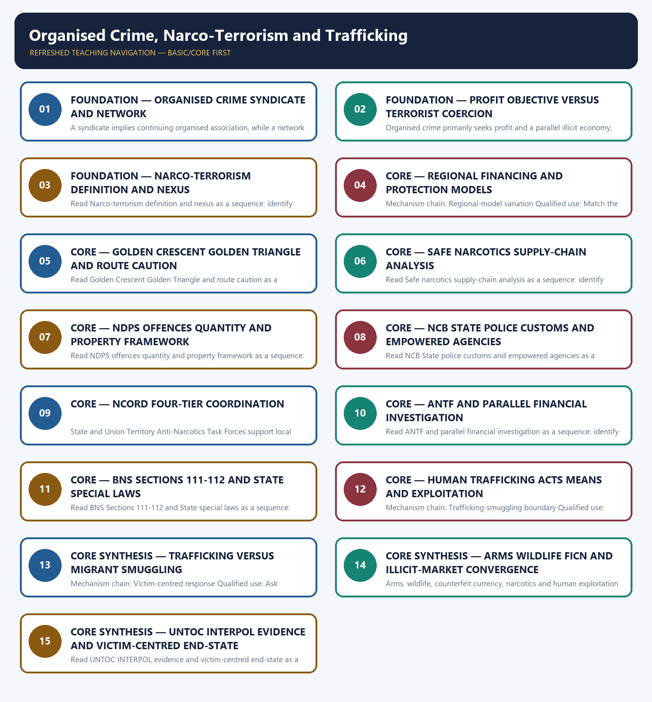

# Organised Crime, Narco-Terrorism and Trafficking — Learner-v2 Complete Learning Session

> **Authoring-only generation:** 2026-09-04. No PDF was rendered and no tracker or index was mutated.

### SOURCE, PROGRESSION AND CURRENT-LINKAGE AUDIT

- **Generation date:** 2026-09-04.
- **Repository-first evidence:** the Basic owner is taught first and preserved in full; the Advanced owner is retained only in the optional final teaching block.
- **OCR evidence:** Repository Markdown was primary. OCR-searchable official UPSC papers were supplementary only for printed routed demands. No answer key, attribution, operational method, notification effect, implementation outcome or security metric was inferred.
- **Qdrant:** not used; repository Markdown and available OCR context were sufficient.
- **PYQ integrity:** The three direct Mains routes are used: the 2018 drug-laundering-human-trafficking linkage, 2022 national/transnational organised-crime-terrorism linkage and 2024 narco-terrorism demand. The provisional 2026 INTERPOL-notices question remains covered in the facts and required terms but is not converted into a fourth card or an inferred answer letter.
- **Live-link boundary:** Official attempts on 2026-09-04 verified only bounded UNTOC and Trafficking Protocol propositions and the reachability of the NCB portal. MHA and India Code pages were blocked, so no current NCORD meeting, ANTF performance, seizure, conviction, forfeiture, trafficking prevalence or victim-recovery statistic is used.
- **Fact/inference discipline:** no current-affairs item, PYQ wording, figure or quotation is invented.

### LIVE OFFICIAL-SOURCE ATTEMPT LOG

The checks below were made on 2026-09-04. Substantive official text is used only for the proposition it supports; title-only, blocked or thin pages are recorded and supply no factual claim.

- https://www.mha.gov.in/en/commoncontent/narco-coordination-centre-ncord — attempted 2026-09-04 for the current NCORD architecture; direct retrieval returned 403. The four-tier mechanism and State/UT roles are retained only from the audited owner, with no meeting, seizure, hotspot or outcome count.
- https://narcoticsindia.nic.in/ and https://www.mha.gov.in/ — fetched and attempted 2026-09-04. The official NCB portal was reachable but its returned page mainly described controlled substances and health effects, while MHA retrieval was blocked; no current mandate expansion or performance statistic is inferred from the page.
- https://www.indiacode.nic.in/ — attempted 2026-09-04 for the NDPS Act, 1985, BNS Sections 111-112 and 143-144, Arms Act and other relevant provisions; direct retrieval returned 403. Only owner-audited statutory categories are used, and a statutory offence is not treated as evidence of prevalence or enforcement outcome.
- https://www.unodc.org/unodc/en/organized-crime/intro/UNTOC.html, https://www.unodc.org/unodc/en/human-trafficking/protocol.html and https://www.pib.gov.in/ — fetched and attempted 2026-09-04. UNODC confirmed UNTOC's cooperation framework and the Trafficking Protocol's victim-identification purpose; PIB retrieval returned 403. International definitions are used only within those bounded propositions.

## BASIC LEARNING SESSION



*Distinct embedded teaching-navigation image. The separate continuous Cārvāka-style flowchart package remains an independent at-a-glance artifact.*

### SESSION 1 — FOUNDATION — ORGANISED CRIME SYNDICATE AND NETWORK

#### DEFINITION / WHAT THIS IS CALLED

**Plain-language definition:** Organised crime is continuing coordinated serious criminal activity by a group or syndicate for financial or material benefit; legal definitions differ in detail, so the relevant BNS, special-law or UNTOC test must be named.

**Technical definition:** A syndicate implies continuing organised association, while a network may be looser and task-based; hierarchy is not required for every criminal network, but continuity, coordination and benefit distinguish organised enterprise from an isolated offence.

#### ANSWER-GRABBING OPENING — WRITE/ADAPT IN THE EXAM

> Organised crime is continuing coordinated serious criminal activity by a group or syndicate for financial or material benefit; legal definitions differ in detail, so the relevant BNS, special-law or UNTOC test must be named.

#### MUST-WRITE KEYWORDS

- **FOUNDATION**
- **Organised crime syndicate**
- **network**
- **Mechanism chain**
- **Qualified use**
- **Organised crime**

**How to use them:** Frame the answer through FOUNDATION; define Organised crime syndicate, connect network with Mechanism chain to explain the mechanism, and use Qualified use for the decisive comparison or qualification.

#### VISUAL FIRST

```text
ORGANISED CRIME SYNDICATE AND NETWORK
01. Organised-crime definition
    |
    v
02. Syndicate-network distinction
STATUS / CATEGORY FIREWALL -> Do not define every repeated offence as organised crime without the legal continuity and group test.
```

*The rail fixes the institutional sequence and claim boundary before explanation.*

#### CORE EXPLANATION

Organised crime is continuing coordinated serious criminal activity by a group or syndicate for financial or material benefit; legal definitions differ in detail, so the relevant BNS, special-law or UNTOC test must be named. A syndicate implies continuing organised association, while a network may be looser and task-based; hierarchy is not required for every criminal network, but continuity, coordination and benefit distinguish organised enterprise from an isolated offence.

#### SIMPLE SYSTEM EXAMPLE

Read Organised crime syndicate and network as a sequence: identify Organised-crime definition, follow the named mechanism to its institutional response, and stop at the last verified status rather than assuming the next stage.

#### TECHNICAL DISTINCTION

The decisive boundary is Do not define every repeated offence as organised crime without the legal continuity and group test. This keeps Organised-crime definition and Syndicate-network distinction in the correct legal category, institutional mandate and evidentiary status.

#### NAMED EVIDENCE AND MECHANISM

- Organised crime is continuing coordinated serious criminal activity by a group or syndicate for financial or material benefit; legal definitions differ in detail, so the relevant BNS, special-law or UNTOC test must be named.
- A syndicate implies continuing organised association, while a network may be looser and task-based; hierarchy is not required for every criminal network, but continuity, coordination and benefit distinguish organised enterprise from an isolated offence.

#### EXAMINER CAUTION

- Do not define every repeated offence as organised crime without the legal continuity and group test.

#### EXAM LINK

- **Prelims:** Keep institution, law, notification, ban/listing, scheme, agreement, ceasefire and outcome in their exact category.
- **Mains:** Apply the relevant continuity, group and benefit elements before the label.

#### MINI RECAP

- **Mechanism chain:** Organised-crime definition -> Syndicate-network distinction
- **Qualified use:** Apply the relevant continuity, group and benefit elements before the label.

#### CLOSING RECALL FLOW — FOUNDATION — ORGANISED CRIME SYNDICATE AND NETWORK

```text
START / CONCEPT: FOUNDATION — Organised crime syndicate and network
        |
        v
EXACT TERMS: FOUNDATION · Organised crime syndicate · network · Mechanism chain · Qualified use · Organised crime
        |
        v
MECHANISM / ARGUMENT: Read Organised crime syndicate and network as a sequence: identify Organised-crime definition, follow the named mechanism to its institutional response, and stop at the last verified status rather than assuming the next stage.
        |
        v
CONSEQUENCE / CONTRAST: A syndicate implies continuing organised association, while a network may be looser and task-based; hierarchy is not required for every criminal network, but continuity, coordination and benefit distinguish organised enterprise from an isolated offence.
        |
        v
UPSC TRAP / ANSWER-USE: The decisive boundary is Do not define every repeated offence as organised crime without the legal continuity and group test.
        |
        v
ANSWER-GRABBING FORMULATION: Organised crime is continuing coordinated serious criminal activity by a group or syndicate for financial or material benefit; legal definitions differ in detail, so the relevant BNS, special-law or UNTOC test must be named.
```
### SESSION 2 — FOUNDATION — PROFIT OBJECTIVE VERSUS TERRORIST COERCION

#### DEFINITION / WHAT THIS IS CALLED

**Plain-language definition:** Read Profit objective versus terrorist coercion as a sequence: identify Crime-terror ends boundary, follow the named mechanism to its institutional response, and stop at the last verified status rather than assuming the next stage.

**Technical definition:** Organised crime primarily seeks profit and a parallel illicit economy, whereas terrorism seeks political or ideological coercion; they can share routes, protection, weapons, finance and facilitators without becoming identical.

#### ANSWER-GRABBING OPENING — WRITE/ADAPT IN THE EXAM

> Read Profit objective versus terrorist coercion as a sequence: identify Crime-terror ends boundary, follow the named mechanism to its institutional response, and stop at the last verified status rather than assuming the next stage.

#### MUST-WRITE KEYWORDS

- **FOUNDATION**
- **Profit objective versus terrorist coercion**
- **Mechanism chain**
- **Qualified use**
- **Organised**
- **Read Profit**

**How to use them:** Frame the answer through FOUNDATION; define Profit objective versus terrorist coercion, connect Mechanism chain with Qualified use to explain the mechanism, and use Organised for the decisive comparison or qualification.

#### VISUAL FIRST

```text
PROFIT OBJECTIVE VERSUS TERRORIST COERCION
01. Crime-terror ends boundary
STATUS / CATEGORY FIREWALL -> Do not assume every criminal network is a rigid hierarchy.
```

*The rail fixes the institutional sequence and claim boundary before explanation.*

#### CORE EXPLANATION

Organised crime primarily seeks profit and a parallel illicit economy, whereas terrorism seeks political or ideological coercion; they can share routes, protection, weapons, finance and facilitators without becoming identical.

#### SIMPLE SYSTEM EXAMPLE

Read Profit objective versus terrorist coercion as a sequence: identify Crime-terror ends boundary, follow the named mechanism to its institutional response, and stop at the last verified status rather than assuming the next stage.

#### TECHNICAL DISTINCTION

The decisive boundary is Do not assume every criminal network is a rigid hierarchy. This keeps Crime-terror ends boundary in the correct legal category, institutional mandate and evidentiary status.

#### NAMED EVIDENCE AND MECHANISM

- Organised crime primarily seeks profit and a parallel illicit economy, whereas terrorism seeks political or ideological coercion; they can share routes, protection, weapons, finance and facilitators without becoming identical.

#### EXAMINER CAUTION

- Do not assume every criminal network is a rigid hierarchy.

#### EXAM LINK

- **Prelims:** Keep institution, law, notification, ban/listing, scheme, agreement, ceasefire and outcome in their exact category.
- **Mains:** Separate primary end-state from shared criminal means.

#### MINI RECAP

- **Mechanism chain:** Crime-terror ends boundary
- **Qualified use:** Separate primary end-state from shared criminal means.

#### CLOSING RECALL FLOW — FOUNDATION — PROFIT OBJECTIVE VERSUS TERRORIST COERCION

```text
START / CONCEPT: FOUNDATION — Profit objective versus terrorist coercion
        |
        v
EXACT TERMS: FOUNDATION · Profit objective versus terrorist coercion · Mechanism chain · Qualified use · Organised · Read Profit
        |
        v
MECHANISM / ARGUMENT: Mechanism chain: Crime-terror ends boundary Qualified use: Separate primary end-state from shared criminal means.
        |
        v
CONSEQUENCE / CONTRAST: Organised crime primarily seeks profit and a parallel illicit economy, whereas terrorism seeks political or ideological coercion; they can share routes, protection, weapons, finance and facilitators without becoming identical.
        |
        v
UPSC TRAP / ANSWER-USE: The decisive boundary is Do not assume every criminal network is a rigid hierarchy.
        |
        v
ANSWER-GRABBING FORMULATION: Read Profit objective versus terrorist coercion as a sequence: identify Crime-terror ends boundary, follow the named mechanism to its institutional response, and stop at the last verified status rather than assuming the next stage.
```
### SESSION 3 — FOUNDATION — NARCO-TERRORISM DEFINITION AND NEXUS

#### DEFINITION / WHAT THIS IS CALLED

**Plain-language definition:** Narco-terrorism is the financing or enabling intersection between narcotics trafficking and terrorist or insurgent activity; it is not a synonym for drug consumption, addiction or every NDPS case.

**Technical definition:** Read Narco-terrorism definition and nexus as a sequence: identify Narco-terrorism definition, follow the named mechanism to its institutional response, and stop at the last verified status rather than assuming the next stage.

#### ANSWER-GRABBING OPENING — WRITE/ADAPT IN THE EXAM

> Narco-terrorism is the financing or enabling intersection between narcotics trafficking and terrorist or insurgent activity; it is not a synonym for drug consumption, addiction or every NDPS case.

#### MUST-WRITE KEYWORDS

- **FOUNDATION**
- **Narco-terrorism definition**
- **nexus**
- **Mechanism chain**
- **Qualified use**
- **Narco-terrorism**

**How to use them:** Frame the answer through FOUNDATION; define Narco-terrorism definition, connect nexus with Mechanism chain to explain the mechanism, and use Qualified use for the decisive comparison or qualification.

#### VISUAL FIRST

```text
NARCO-TERRORISM DEFINITION AND NEXUS
01. Narco-terrorism definition
STATUS / CATEGORY FIREWALL -> Do not use organised crime and terrorism as synonyms.
```

*The rail fixes the institutional sequence and claim boundary before explanation.*

#### CORE EXPLANATION

Narco-terrorism is the financing or enabling intersection between narcotics trafficking and terrorist or insurgent activity; it is not a synonym for drug consumption, addiction or every NDPS case.

#### SIMPLE SYSTEM EXAMPLE

Read Narco-terrorism definition and nexus as a sequence: identify Narco-terrorism definition, follow the named mechanism to its institutional response, and stop at the last verified status rather than assuming the next stage.

#### TECHNICAL DISTINCTION

The decisive boundary is Do not use organised crime and terrorism as synonyms. This keeps Narco-terrorism definition in the correct legal category, institutional mandate and evidentiary status.

#### NAMED EVIDENCE AND MECHANISM

- Narco-terrorism is the financing or enabling intersection between narcotics trafficking and terrorist or insurgent activity; it is not a synonym for drug consumption, addiction or every NDPS case.

#### EXAMINER CAUTION

- Do not use organised crime and terrorism as synonyms.

#### EXAM LINK

- **Prelims:** Keep institution, law, notification, ban/listing, scheme, agreement, ceasefire and outcome in their exact category.
- **Mains:** Prove the drug-finance-terror connection rather than assume it.

#### MINI RECAP

- **Mechanism chain:** Narco-terrorism definition
- **Qualified use:** Prove the drug-finance-terror connection rather than assume it.

#### CLOSING RECALL FLOW — FOUNDATION — NARCO-TERRORISM DEFINITION AND NEXUS

```text
START / CONCEPT: FOUNDATION — Narco-terrorism definition and nexus
        |
        v
EXACT TERMS: FOUNDATION · Narco-terrorism definition · nexus · Mechanism chain · Qualified use · Narco-terrorism
        |
        v
MECHANISM / ARGUMENT: Read Narco-terrorism definition and nexus as a sequence: identify Narco-terrorism definition, follow the named mechanism to its institutional response, and stop at the last verified status rather than assuming the next stage.
        |
        v
CONSEQUENCE / CONTRAST: Mechanism chain: Narco-terrorism definition Qualified use: Prove the drug-finance-terror connection rather than assume it.
        |
        v
UPSC TRAP / ANSWER-USE: The decisive boundary is Do not use organised crime and terrorism as synonyms.
        |
        v
ANSWER-GRABBING FORMULATION: Narco-terrorism is the financing or enabling intersection between narcotics trafficking and terrorist or insurgent activity; it is not a synonym for drug consumption, addiction or every NDPS case.
```
### SESSION 4 — CORE — REGIONAL FINANCING AND PROTECTION MODELS

#### DEFINITION / WHAT THIS IS CALLED

**Plain-language definition:** Read Regional financing and protection models as a sequence: identify Regional-model variation, follow the named mechanism to its institutional response, and stop at the last verified status rather than assuming the next stage.

**Technical definition:** Mechanism chain: Regional-model variation Qualified use: Match the intervention to the regional source, protection and money model.

#### ANSWER-GRABBING OPENING — WRITE/ADAPT IN THE EXAM

> Read Regional financing and protection models as a sequence: identify Regional-model variation, follow the named mechanism to its institutional response, and stop at the last verified status rather than assuming the next stage.

#### MUST-WRITE KEYWORDS

- **Regional financing**
- **protection models**
- **Mechanism chain**
- **Qualified use**
- **Read Regional**
- **Regional-model**

**How to use them:** Frame the answer through Regional financing; define protection models, connect Mechanism chain with Qualified use to explain the mechanism, and use Read Regional for the decisive comparison or qualification.

#### VISUAL FIRST

```text
REGIONAL FINANCING AND PROTECTION MODELS
01. Regional-model variation
STATUS / CATEGORY FIREWALL -> Do not label every narcotics case narco-terrorism.
```

*The rail fixes the institutional sequence and claim boundary before explanation.*

#### CORE EXPLANATION

The owner distinguishes extortion and parallel-economy patterns, externally supported or diaspora-linked patterns, and route-based trafficking networks; countermeasures must follow the specific money and protection model rather than assume national uniformity.

#### SIMPLE SYSTEM EXAMPLE

Read Regional financing and protection models as a sequence: identify Regional-model variation, follow the named mechanism to its institutional response, and stop at the last verified status rather than assuming the next stage.

#### TECHNICAL DISTINCTION

The decisive boundary is Do not label every narcotics case narco-terrorism. This keeps Regional-model variation in the correct legal category, institutional mandate and evidentiary status.

#### NAMED EVIDENCE AND MECHANISM

- The owner distinguishes extortion and parallel-economy patterns, externally supported or diaspora-linked patterns, and route-based trafficking networks; countermeasures must follow the specific money and protection model rather than assume national uniformity.

#### EXAMINER CAUTION

- Do not label every narcotics case narco-terrorism.

#### EXAM LINK

- **Prelims:** Keep institution, law, notification, ban/listing, scheme, agreement, ceasefire and outcome in their exact category.
- **Mains:** Match the intervention to the regional source, protection and money model.

#### MINI RECAP

- **Mechanism chain:** Regional-model variation
- **Qualified use:** Match the intervention to the regional source, protection and money model.

#### CLOSING RECALL FLOW — CORE — REGIONAL FINANCING AND PROTECTION MODELS

```text
START / CONCEPT: CORE — Regional financing and protection models
        |
        v
EXACT TERMS: Regional financing · protection models · Mechanism chain · Qualified use · Read Regional · Regional-model
        |
        v
MECHANISM / ARGUMENT: Mechanism chain: Regional-model variation Qualified use: Match the intervention to the regional source, protection and money model.
        |
        v
CONSEQUENCE / CONTRAST: The decisive boundary is Do not label every narcotics case narco-terrorism.
        |
        v
UPSC TRAP / ANSWER-USE: The owner distinguishes extortion and parallel-economy patterns, externally supported or diaspora-linked patterns, and route-based trafficking networks; countermeasures must follow the specific money and protection model rather than assume national uniformity.
        |
        v
ANSWER-GRABBING FORMULATION: Read Regional financing and protection models as a sequence: identify Regional-model variation, follow the named mechanism to its institutional response, and stop at the last verified status rather than assuming the next stage.
```
### SESSION 5 — CORE — GOLDEN CRESCENT GOLDEN TRIANGLE AND ROUTE CAUTION

#### DEFINITION / WHAT THIS IS CALLED

**Plain-language definition:** The decisive boundary is Do not infer a consignment's route or sponsor from Golden Crescent or Golden Triangle geography.

**Technical definition:** Read Golden Crescent Golden Triangle and route caution as a sequence: identify Route-geography boundary, follow the named mechanism to its institutional response, and stop at the last verified status rather than assuming the next stage.

#### ANSWER-GRABBING OPENING — WRITE/ADAPT IN THE EXAM

> Golden Crescent and Golden Triangle references identify broad source and transit exposure relevant to India; they do not establish a particular consignment's origin, route, group or sponsor.

#### MUST-WRITE KEYWORDS

- **Golden Crescent Golden Triangle**
- **route caution**
- **Mechanism chain**
- **Qualified use**
- **Golden Crescent**
- **Golden Triangle**

**How to use them:** Frame the answer through Golden Crescent Golden Triangle; define route caution, connect Mechanism chain with Qualified use to explain the mechanism, and use Golden Crescent for the decisive comparison or qualification.

#### VISUAL FIRST

```text
GOLDEN CRESCENT GOLDEN TRIANGLE AND ROUTE CAUTION
01. Route-geography boundary
STATUS / CATEGORY FIREWALL -> Do not infer a consignment's route or sponsor from Golden Crescent or Golden Triangle geography.
```

*The rail fixes the institutional sequence and claim boundary before explanation.*

#### CORE EXPLANATION

Golden Crescent and Golden Triangle references identify broad source and transit exposure relevant to India; they do not establish a particular consignment's origin, route, group or sponsor.

#### SIMPLE SYSTEM EXAMPLE

Read Golden Crescent Golden Triangle and route caution as a sequence: identify Route-geography boundary, follow the named mechanism to its institutional response, and stop at the last verified status rather than assuming the next stage.

#### TECHNICAL DISTINCTION

The decisive boundary is Do not infer a consignment's route or sponsor from Golden Crescent or Golden Triangle geography. This keeps Route-geography boundary in the correct legal category, institutional mandate and evidentiary status.

#### NAMED EVIDENCE AND MECHANISM

- Golden Crescent and Golden Triangle references identify broad source and transit exposure relevant to India; they do not establish a particular consignment's origin, route, group or sponsor.

#### EXAMINER CAUTION

- Do not infer a consignment's route or sponsor from Golden Crescent or Golden Triangle geography.

#### EXAM LINK

- **Prelims:** Keep institution, law, notification, ban/listing, scheme, agreement, ceasefire and outcome in their exact category.
- **Mains:** Use route geography as exposure, not case-specific attribution.

#### MINI RECAP

- **Mechanism chain:** Route-geography boundary
- **Qualified use:** Use route geography as exposure, not case-specific attribution.

#### CLOSING RECALL FLOW — CORE — GOLDEN CRESCENT GOLDEN TRIANGLE AND ROUTE CAUTION

```text
START / CONCEPT: CORE — Golden Crescent Golden Triangle and route caution
        |
        v
EXACT TERMS: Golden Crescent Golden Triangle · route caution · Mechanism chain · Qualified use · Golden Crescent · Golden Triangle
        |
        v
MECHANISM / ARGUMENT: Read Golden Crescent Golden Triangle and route caution as a sequence: identify Route-geography boundary, follow the named mechanism to its institutional response, and stop at the last verified status rather than assuming the next stage.
        |
        v
CONSEQUENCE / CONTRAST: The decisive boundary is Do not infer a consignment's route or sponsor from Golden Crescent or Golden Triangle geography.
        |
        v
UPSC TRAP / ANSWER-USE: Do not infer a consignment's route or sponsor from Golden Crescent or Golden Triangle geography.
        |
        v
ANSWER-GRABBING FORMULATION: Golden Crescent and Golden Triangle references identify broad source and transit exposure relevant to India; they do not establish a particular consignment's origin, route, group or sponsor.
```
### SESSION 6 — CORE — SAFE NARCOTICS SUPPLY-CHAIN ANALYSIS

#### DEFINITION / WHAT THIS IS CALLED

**Plain-language definition:** The NDPS Act, 1985 regulates narcotic drugs and psychotropic substances, grades offences by statutory quantity categories and provides a separate property-forfeiture framework in Chapter VA; seizure is not conviction or forfeiture.

**Technical definition:** Read Safe narcotics supply-chain analysis as a sequence: identify Non-operational supply chain, follow the named mechanism to its institutional response, and stop at the last verified status rather than assuming the next stage.

#### ANSWER-GRABBING OPENING — WRITE/ADAPT IN THE EXAM

> The NDPS Act, 1985 regulates narcotic drugs and psychotropic substances, grades offences by statutory quantity categories and provides a separate property-forfeiture framework in Chapter VA; seizure is not conviction or forfeiture.

#### MUST-WRITE KEYWORDS

- **Safe narcotics supply-chain analysis**
- **Mechanism chain**
- **Qualified use**
- **At**
- **The NDPS Act**
- **Chapter VA**

**How to use them:** Frame the answer through Safe narcotics supply-chain analysis; define Mechanism chain, connect Qualified use with At to explain the mechanism, and use The NDPS Act for the decisive comparison or qualification.

#### VISUAL FIRST

```text
SAFE NARCOTICS SUPPLY-CHAIN ANALYSIS
01. Non-operational supply chain
    |
    v
02. NDPS framework
STATUS / CATEGORY FIREWALL -> Do not publish supply routes, concealment methods or enforcement vulnerabilities.
```

*The rail fixes the institutional sequence and claim boundary before explanation.*

#### CORE EXPLANATION

At a safe conceptual level, illicit narcotics markets connect source, transit, wholesale or retail distribution, proceeds and laundering; analysis should target governance, finance and logistics without publishing routes, concealment or evasion methods. The NDPS Act, 1985 regulates narcotic drugs and psychotropic substances, grades offences by statutory quantity categories and provides a separate property-forfeiture framework in Chapter VA; seizure is not conviction or forfeiture.

#### SIMPLE SYSTEM EXAMPLE

Read Safe narcotics supply-chain analysis as a sequence: identify Non-operational supply chain, follow the named mechanism to its institutional response, and stop at the last verified status rather than assuming the next stage.

#### TECHNICAL DISTINCTION

The decisive boundary is Do not publish supply routes, concealment methods or enforcement vulnerabilities. This keeps Non-operational supply chain and NDPS framework in the correct legal category, institutional mandate and evidentiary status.

#### NAMED EVIDENCE AND MECHANISM

- At a safe conceptual level, illicit narcotics markets connect source, transit, wholesale or retail distribution, proceeds and laundering; analysis should target governance, finance and logistics without publishing routes, concealment or evasion methods.
- The NDPS Act, 1985 regulates narcotic drugs and psychotropic substances, grades offences by statutory quantity categories and provides a separate property-forfeiture framework in Chapter VA; seizure is not conviction or forfeiture.

#### EXAMINER CAUTION

- Do not publish supply routes, concealment methods or enforcement vulnerabilities.

#### EXAM LINK

- **Prelims:** Keep institution, law, notification, ban/listing, scheme, agreement, ceasefire and outcome in their exact category.
- **Mains:** Trace categories only and omit operational routes or evasion detail.

#### MINI RECAP

- **Mechanism chain:** Non-operational supply chain -> NDPS framework
- **Qualified use:** Trace categories only and omit operational routes or evasion detail.

#### CLOSING RECALL FLOW — CORE — SAFE NARCOTICS SUPPLY-CHAIN ANALYSIS

```text
START / CONCEPT: CORE — Safe narcotics supply-chain analysis
        |
        v
EXACT TERMS: Safe narcotics supply-chain analysis · Mechanism chain · Qualified use · At · The NDPS Act · Chapter VA
        |
        v
MECHANISM / ARGUMENT: Read Safe narcotics supply-chain analysis as a sequence: identify Non-operational supply chain, follow the named mechanism to its institutional response, and stop at the last verified status rather than assuming the next stage.
        |
        v
CONSEQUENCE / CONTRAST: At a safe conceptual level, illicit narcotics markets connect source, transit, wholesale or retail distribution, proceeds and laundering; analysis should target governance, finance and logistics without publishing routes, concealment or evasion methods.
        |
        v
UPSC TRAP / ANSWER-USE: The decisive boundary is Do not publish supply routes, concealment methods or enforcement vulnerabilities.
        |
        v
ANSWER-GRABBING FORMULATION: The NDPS Act, 1985 regulates narcotic drugs and psychotropic substances, grades offences by statutory quantity categories and provides a separate property-forfeiture framework in Chapter VA; seizure is not conviction or forfeiture.
```
### SESSION 7 — CORE — NDPS OFFENCES QUANTITY AND PROPERTY FRAMEWORK

#### DEFINITION / WHAT THIS IS CALLED

**Plain-language definition:** The Narcotics Control Bureau is the central nodal drug-law-enforcement and coordination agency under MHA, constituted under Section 4(3) of the NDPS Act; State police and other empowered agencies retain their own jurisdiction.

**Technical definition:** Read NDPS offences quantity and property framework as a sequence: identify NCB mandate, follow the named mechanism to its institutional response, and stop at the last verified status rather than assuming the next stage.

#### ANSWER-GRABBING OPENING — WRITE/ADAPT IN THE EXAM

> Read NDPS offences quantity and property framework as a sequence: identify NCB mandate, follow the named mechanism to its institutional response, and stop at the last verified status rather than assuming the next stage.

#### MUST-WRITE KEYWORDS

- **NDPS offences quantity**
- **property framework**
- **Mechanism chain**
- **Qualified use**
- **The Narcotics Control Bureau**
- **MHA**

**How to use them:** Frame the answer through NDPS offences quantity; define property framework, connect Mechanism chain with Qualified use to explain the mechanism, and use The Narcotics Control Bureau for the decisive comparison or qualification.

#### VISUAL FIRST

```text
NDPS OFFENCES QUANTITY AND PROPERTY FRAMEWORK
01. NCB mandate
STATUS / CATEGORY FIREWALL -> Do not confuse NCB, NCORD, ANTF and State police roles.
```

*The rail fixes the institutional sequence and claim boundary before explanation.*

#### CORE EXPLANATION

The Narcotics Control Bureau is the central nodal drug-law-enforcement and coordination agency under MHA, constituted under Section 4(3) of the NDPS Act; State police and other empowered agencies retain their own jurisdiction.

#### SIMPLE SYSTEM EXAMPLE

Read NDPS offences quantity and property framework as a sequence: identify NCB mandate, follow the named mechanism to its institutional response, and stop at the last verified status rather than assuming the next stage.

#### TECHNICAL DISTINCTION

The decisive boundary is Do not confuse NCB, NCORD, ANTF and State police roles. This keeps NCB mandate in the correct legal category, institutional mandate and evidentiary status.

#### NAMED EVIDENCE AND MECHANISM

- The Narcotics Control Bureau is the central nodal drug-law-enforcement and coordination agency under MHA, constituted under Section 4(3) of the NDPS Act; State police and other empowered agencies retain their own jurisdiction.

#### EXAMINER CAUTION

- Do not confuse NCB, NCORD, ANTF and State police roles.

#### EXAM LINK

- **Prelims:** Keep institution, law, notification, ban/listing, scheme, agreement, ceasefire and outcome in their exact category.
- **Mains:** Separate offence, quantity, seizure, property action and adjudication.

#### MINI RECAP

- **Mechanism chain:** NCB mandate
- **Qualified use:** Separate offence, quantity, seizure, property action and adjudication.

#### CLOSING RECALL FLOW — CORE — NDPS OFFENCES QUANTITY AND PROPERTY FRAMEWORK

```text
START / CONCEPT: CORE — NDPS offences quantity and property framework
        |
        v
EXACT TERMS: NDPS offences quantity · property framework · Mechanism chain · Qualified use · The Narcotics Control Bureau · MHA
        |
        v
MECHANISM / ARGUMENT: Mechanism chain: NCB mandate Qualified use: Separate offence, quantity, seizure, property action and adjudication.
        |
        v
CONSEQUENCE / CONTRAST: The decisive boundary is Do not confuse NCB, NCORD, ANTF and State police roles.
        |
        v
UPSC TRAP / ANSWER-USE: Do not confuse NCB, NCORD, ANTF and State police roles.
        |
        v
ANSWER-GRABBING FORMULATION: Read NDPS offences quantity and property framework as a sequence: identify NCB mandate, follow the named mechanism to its institutional response, and stop at the last verified status rather than assuming the next stage.
```
### SESSION 8 — CORE — NCB STATE POLICE CUSTOMS AND EMPOWERED AGENCIES

#### DEFINITION / WHAT THIS IS CALLED

**Plain-language definition:** National Narcotics Coordination uses Apex, Executive, State and District tiers to connect policy and enforcement actors; a coordination meeting or mechanism is an input, not proof of reduced trafficking.

**Technical definition:** Read NCB State police customs and empowered agencies as a sequence: identify NCORD architecture, follow the named mechanism to its institutional response, and stop at the last verified status rather than assuming the next stage.

#### ANSWER-GRABBING OPENING — WRITE/ADAPT IN THE EXAM

> Read NCB State police customs and empowered agencies as a sequence: identify NCORD architecture, follow the named mechanism to its institutional response, and stop at the last verified status rather than assuming the next stage.

#### MUST-WRITE KEYWORDS

- **NCB State police customs**
- **empowered agencies**
- **Mechanism chain**
- **Qualified use**
- **National Narcotics Coordination**
- **Apex**

**How to use them:** Frame the answer through NCB State police customs; define empowered agencies, connect Mechanism chain with Qualified use to explain the mechanism, and use National Narcotics Coordination for the decisive comparison or qualification.

#### VISUAL FIRST

```text
NCB STATE POLICE CUSTOMS AND EMPOWERED AGENCIES
01. NCORD architecture
STATUS / CATEGORY FIREWALL -> Do not equate seizure or destruction with conviction, forfeiture or prevalence reduction.
```

*The rail fixes the institutional sequence and claim boundary before explanation.*

#### CORE EXPLANATION

National Narcotics Coordination uses Apex, Executive, State and District tiers to connect policy and enforcement actors; a coordination meeting or mechanism is an input, not proof of reduced trafficking.

#### SIMPLE SYSTEM EXAMPLE

Read NCB State police customs and empowered agencies as a sequence: identify NCORD architecture, follow the named mechanism to its institutional response, and stop at the last verified status rather than assuming the next stage.

#### TECHNICAL DISTINCTION

The decisive boundary is Do not equate seizure or destruction with conviction, forfeiture or prevalence reduction. This keeps NCORD architecture in the correct legal category, institutional mandate and evidentiary status.

#### NAMED EVIDENCE AND MECHANISM

- National Narcotics Coordination uses Apex, Executive, State and District tiers to connect policy and enforcement actors; a coordination meeting or mechanism is an input, not proof of reduced trafficking.

#### EXAMINER CAUTION

- Do not equate seizure or destruction with conviction, forfeiture or prevalence reduction.

#### EXAM LINK

- **Prelims:** Keep institution, law, notification, ban/listing, scheme, agreement, ceasefire and outcome in their exact category.
- **Mains:** Assign the case to the empowered institution without creating sole ownership.

#### MINI RECAP

- **Mechanism chain:** NCORD architecture
- **Qualified use:** Assign the case to the empowered institution without creating sole ownership.

#### CLOSING RECALL FLOW — CORE — NCB STATE POLICE CUSTOMS AND EMPOWERED AGENCIES

```text
START / CONCEPT: CORE — NCB State police customs and empowered agencies
        |
        v
EXACT TERMS: NCB State police customs · empowered agencies · Mechanism chain · Qualified use · National Narcotics Coordination · Apex
        |
        v
MECHANISM / ARGUMENT: National Narcotics Coordination uses Apex, Executive, State and District tiers to connect policy and enforcement actors; a coordination meeting or mechanism is an input, not proof of reduced trafficking.
        |
        v
CONSEQUENCE / CONTRAST: The decisive boundary is Do not equate seizure or destruction with conviction, forfeiture or prevalence reduction.
        |
        v
UPSC TRAP / ANSWER-USE: Do not equate seizure or destruction with conviction, forfeiture or prevalence reduction.
        |
        v
ANSWER-GRABBING FORMULATION: Read NCB State police customs and empowered agencies as a sequence: identify NCORD architecture, follow the named mechanism to its institutional response, and stop at the last verified status rather than assuming the next stage.
```
### SESSION 9 — CORE — NCORD FOUR-TIER COORDINATION

#### DEFINITION / WHAT THIS IS CALLED

**Plain-language definition:** Read NCORD four-tier coordination as a sequence: identify ANTF role, follow the named mechanism to its institutional response, and stop at the last verified status rather than assuming the next stage.

**Technical definition:** State and Union Territory Anti-Narcotics Task Forces support local coordination, hotspot and network analysis and financial investigation; they do not displace State police, NCB, customs, border or maritime mandates.

#### ANSWER-GRABBING OPENING — WRITE/ADAPT IN THE EXAM

> State and Union Territory Anti-Narcotics Task Forces support local coordination, hotspot and network analysis and financial investigation; they do not displace State police, NCB, customs, border or maritime mandates.

#### MUST-WRITE KEYWORDS

- **NCORD four-tier coordination**
- **Mechanism chain**
- **Qualified use**
- **Union Territory Anti-Narcotics Task Forces**
- **NCB**
- **Read NCORD**

**How to use them:** Frame the answer through NCORD four-tier coordination; define Mechanism chain, connect Qualified use with Union Territory Anti-Narcotics Task Forces to explain the mechanism, and use NCB for the decisive comparison or qualification.

#### VISUAL FIRST

```text
NCORD FOUR-TIER COORDINATION
01. ANTF role
STATUS / CATEGORY FIREWALL -> Do not treat trafficking and migrant smuggling as the same offence.
```

*The rail fixes the institutional sequence and claim boundary before explanation.*

#### CORE EXPLANATION

State and Union Territory Anti-Narcotics Task Forces support local coordination, hotspot and network analysis and financial investigation; they do not displace State police, NCB, customs, border or maritime mandates.

#### SIMPLE SYSTEM EXAMPLE

Read NCORD four-tier coordination as a sequence: identify ANTF role, follow the named mechanism to its institutional response, and stop at the last verified status rather than assuming the next stage.

#### TECHNICAL DISTINCTION

The decisive boundary is Do not treat trafficking and migrant smuggling as the same offence. This keeps ANTF role in the correct legal category, institutional mandate and evidentiary status.

#### NAMED EVIDENCE AND MECHANISM

- State and Union Territory Anti-Narcotics Task Forces support local coordination, hotspot and network analysis and financial investigation; they do not displace State police, NCB, customs, border or maritime mandates.

#### EXAMINER CAUTION

- Do not treat trafficking and migrant smuggling as the same offence.

#### EXAM LINK

- **Prelims:** Keep institution, law, notification, ban/listing, scheme, agreement, ceasefire and outcome in their exact category.
- **Mains:** Evaluate information flow and handoff rather than meeting existence.

#### MINI RECAP

- **Mechanism chain:** ANTF role
- **Qualified use:** Evaluate information flow and handoff rather than meeting existence.

#### CLOSING RECALL FLOW — CORE — NCORD FOUR-TIER COORDINATION

```text
START / CONCEPT: CORE — NCORD four-tier coordination
        |
        v
EXACT TERMS: NCORD four-tier coordination · Mechanism chain · Qualified use · Union Territory Anti-Narcotics Task Forces · NCB · Read NCORD
        |
        v
MECHANISM / ARGUMENT: Read NCORD four-tier coordination as a sequence: identify ANTF role, follow the named mechanism to its institutional response, and stop at the last verified status rather than assuming the next stage.
        |
        v
CONSEQUENCE / CONTRAST: The decisive boundary is Do not treat trafficking and migrant smuggling as the same offence.
        |
        v
UPSC TRAP / ANSWER-USE: Do not treat trafficking and migrant smuggling as the same offence.
        |
        v
ANSWER-GRABBING FORMULATION: State and Union Territory Anti-Narcotics Task Forces support local coordination, hotspot and network analysis and financial investigation; they do not displace State police, NCB, customs, border or maritime mandates.
```
### SESSION 10 — CORE — ANTF AND PARALLEL FINANCIAL INVESTIGATION

#### DEFINITION / WHAT THIS IS CALLED

**Plain-language definition:** NDPS Chapter VA forfeiture and PMLA attachment where an NDPS offence is a scheduled predicate require parallel financial investigation; intercepted drugs and traced proceeds occupy different evidentiary chains.

**Technical definition:** Read ANTF and parallel financial investigation as a sequence: identify Follow-the-property route, follow the named mechanism to its institutional response, and stop at the last verified status rather than assuming the next stage.

#### ANSWER-GRABBING OPENING — WRITE/ADAPT IN THE EXAM

> NDPS Chapter VA forfeiture and PMLA attachment where an NDPS offence is a scheduled predicate require parallel financial investigation; intercepted drugs and traced proceeds occupy different evidentiary chains.

#### MUST-WRITE KEYWORDS

- **ANTF**
- **parallel financial investigation**
- **Mechanism chain**
- **Qualified use**
- **NDPS Chapter VA**
- **PMLA**

**How to use them:** Frame the answer through ANTF; define parallel financial investigation, connect Mechanism chain with Qualified use to explain the mechanism, and use NDPS Chapter VA for the decisive comparison or qualification.

#### VISUAL FIRST

```text
ANTF AND PARALLEL FINANCIAL INVESTIGATION
01. Follow-the-property route
STATUS / CATEGORY FIREWALL -> Do not criminalise or stigmatise trafficked persons as network members without evidence.
```

*The rail fixes the institutional sequence and claim boundary before explanation.*

#### CORE EXPLANATION

NDPS Chapter VA forfeiture and PMLA attachment where an NDPS offence is a scheduled predicate require parallel financial investigation; intercepted drugs and traced proceeds occupy different evidentiary chains.

#### SIMPLE SYSTEM EXAMPLE

Read ANTF and parallel financial investigation as a sequence: identify Follow-the-property route, follow the named mechanism to its institutional response, and stop at the last verified status rather than assuming the next stage.

#### TECHNICAL DISTINCTION

The decisive boundary is Do not criminalise or stigmatise trafficked persons as network members without evidence. This keeps Follow-the-property route in the correct legal category, institutional mandate and evidentiary status.

#### NAMED EVIDENCE AND MECHANISM

- NDPS Chapter VA forfeiture and PMLA attachment where an NDPS offence is a scheduled predicate require parallel financial investigation; intercepted drugs and traced proceeds occupy different evidentiary chains.

#### EXAMINER CAUTION

- Do not criminalise or stigmatise trafficked persons as network members without evidence.

#### EXAM LINK

- **Prelims:** Keep institution, law, notification, ban/listing, scheme, agreement, ceasefire and outcome in their exact category.
- **Mains:** Run financial investigation parallel to the commodity case.

#### MINI RECAP

- **Mechanism chain:** Follow-the-property route
- **Qualified use:** Run financial investigation parallel to the commodity case.

#### CLOSING RECALL FLOW — CORE — ANTF AND PARALLEL FINANCIAL INVESTIGATION

```text
START / CONCEPT: CORE — ANTF and parallel financial investigation
        |
        v
EXACT TERMS: ANTF · parallel financial investigation · Mechanism chain · Qualified use · NDPS Chapter VA · PMLA
        |
        v
MECHANISM / ARGUMENT: Read ANTF and parallel financial investigation as a sequence: identify Follow-the-property route, follow the named mechanism to its institutional response, and stop at the last verified status rather than assuming the next stage.
        |
        v
CONSEQUENCE / CONTRAST: Mechanism chain: Follow-the-property route Qualified use: Run financial investigation parallel to the commodity case.
        |
        v
UPSC TRAP / ANSWER-USE: The decisive boundary is Do not criminalise or stigmatise trafficked persons as network members without evidence.
        |
        v
ANSWER-GRABBING FORMULATION: NDPS Chapter VA forfeiture and PMLA attachment where an NDPS offence is a scheduled predicate require parallel financial investigation; intercepted drugs and traced proceeds occupy different evidentiary chains.
```
### SESSION 11 — CORE — BNS SECTIONS 111-112 AND STATE SPECIAL LAWS

#### DEFINITION / WHAT THIS IS CALLED

**Plain-language definition:** Human trafficking concerns acts such as recruitment, transport, harbouring or receipt through coercive, deceptive or abusive means for exploitation, with child cases receiving special treatment under the applicable legal definition.

**Technical definition:** Read BNS Sections 111-112 and State special laws as a sequence: identify BNS organised-crime offences, follow the named mechanism to its institutional response, and stop at the last verified status rather than assuming the next stage.

#### ANSWER-GRABBING OPENING — WRITE/ADAPT IN THE EXAM

> Read BNS Sections 111-112 and State special laws as a sequence: identify BNS organised-crime offences, follow the named mechanism to its institutional response, and stop at the last verified status rather than assuming the next stage.

#### MUST-WRITE KEYWORDS

- **BNS Sections 111-112**
- **Mechanism chain**
- **Qualified use**
- **BNS Sections**
- **Human**
- **111-112**

**How to use them:** Frame the answer through BNS Sections 111-112; define Mechanism chain, connect Qualified use with BNS Sections to explain the mechanism, and use Human for the decisive comparison or qualification.

#### VISUAL FIRST

```text
BNS SECTIONS 111-112 AND STATE SPECIAL LAWS
01. BNS organised-crime offences
    |
    v
02. Trafficking definition
STATUS / CATEGORY FIREWALL -> Do not assume arms, wildlife, FICN and narcotics convergence in every case.
```

*The rail fixes the institutional sequence and claim boundary before explanation.*

#### CORE EXPLANATION

BNS Sections 111 and 112 create general-law offences of organised crime and petty organised crime from 1 July 2024; State special laws may still raise separate forum, procedure and evidence questions. Human trafficking concerns acts such as recruitment, transport, harbouring or receipt through coercive, deceptive or abusive means for exploitation, with child cases receiving special treatment under the applicable legal definition.

#### SIMPLE SYSTEM EXAMPLE

Read BNS Sections 111-112 and State special laws as a sequence: identify BNS organised-crime offences, follow the named mechanism to its institutional response, and stop at the last verified status rather than assuming the next stage.

#### TECHNICAL DISTINCTION

The decisive boundary is Do not assume arms, wildlife, FICN and narcotics convergence in every case. This keeps BNS organised-crime offences and Trafficking definition in the correct legal category, institutional mandate and evidentiary status.

#### NAMED EVIDENCE AND MECHANISM

- BNS Sections 111 and 112 create general-law offences of organised crime and petty organised crime from 1 July 2024; State special laws may still raise separate forum, procedure and evidence questions.
- Human trafficking concerns acts such as recruitment, transport, harbouring or receipt through coercive, deceptive or abusive means for exploitation, with child cases receiving special treatment under the applicable legal definition.

#### EXAMINER CAUTION

- Do not assume arms, wildlife, FICN and narcotics convergence in every case.

#### EXAM LINK

- **Prelims:** Keep institution, law, notification, ban/listing, scheme, agreement, ceasefire and outcome in their exact category.
- **Mains:** Name the applicable general or special law and procedural boundary.

#### MINI RECAP

- **Mechanism chain:** BNS organised-crime offences -> Trafficking definition
- **Qualified use:** Name the applicable general or special law and procedural boundary.

#### CLOSING RECALL FLOW — CORE — BNS SECTIONS 111-112 AND STATE SPECIAL LAWS

```text
START / CONCEPT: CORE — BNS Sections 111-112 and State special laws
        |
        v
EXACT TERMS: BNS Sections 111-112 · Mechanism chain · Qualified use · BNS Sections · Human · 111-112
        |
        v
MECHANISM / ARGUMENT: BNS Sections 111 and 112 create general-law offences of organised crime and petty organised crime from 1 July 2024; State special laws may still raise separate forum, procedure and evidence questions.
        |
        v
CONSEQUENCE / CONTRAST: The decisive boundary is Do not assume arms, wildlife, FICN and narcotics convergence in every case.
        |
        v
UPSC TRAP / ANSWER-USE: Do not assume arms, wildlife, FICN and narcotics convergence in every case.
        |
        v
ANSWER-GRABBING FORMULATION: Read BNS Sections 111-112 and State special laws as a sequence: identify BNS organised-crime offences, follow the named mechanism to its institutional response, and stop at the last verified status rather than assuming the next stage.
```
### SESSION 12 — CORE — HUMAN TRAFFICKING ACTS MEANS AND EXPLOITATION

#### DEFINITION / WHAT THIS IS CALLED

**Plain-language definition:** Read Human trafficking acts means and exploitation as a sequence: identify Trafficking-smuggling boundary, follow the named mechanism to its institutional response, and stop at the last verified status rather than assuming the next stage.

**Technical definition:** Mechanism chain: Trafficking-smuggling boundary Qualified use: Identify act, means, exploitative purpose and victim status.

#### ANSWER-GRABBING OPENING — WRITE/ADAPT IN THE EXAM

> Read Human trafficking acts means and exploitation as a sequence: identify Trafficking-smuggling boundary, follow the named mechanism to its institutional response, and stop at the last verified status rather than assuming the next stage.

#### MUST-WRITE KEYWORDS

- **Human trafficking acts means**
- **exploitation**
- **Mechanism chain**
- **Qualified use**
- **Read Human trafficking acts**
- **Read Human**

**How to use them:** Frame the answer through Human trafficking acts means; define exploitation, connect Mechanism chain with Qualified use to explain the mechanism, and use Read Human trafficking acts for the decisive comparison or qualification.

#### VISUAL FIRST

```text
HUMAN TRAFFICKING ACTS MEANS AND EXPLOITATION
01. Trafficking-smuggling boundary
STATUS / CATEGORY FIREWALL -> Do not treat an INTERPOL notice as a conviction or automatic international arrest warrant.
```

*The rail fixes the institutional sequence and claim boundary before explanation.*

#### CORE EXPLANATION

Trafficking centres on exploitation and need not cross a border, whereas migrant smuggling centres on facilitating irregular entry for financial or material benefit; a smuggled migrant may later become a trafficking victim, but the offences remain distinct.

#### SIMPLE SYSTEM EXAMPLE

Read Human trafficking acts means and exploitation as a sequence: identify Trafficking-smuggling boundary, follow the named mechanism to its institutional response, and stop at the last verified status rather than assuming the next stage.

#### TECHNICAL DISTINCTION

The decisive boundary is Do not treat an INTERPOL notice as a conviction or automatic international arrest warrant. This keeps Trafficking-smuggling boundary in the correct legal category, institutional mandate and evidentiary status.

#### NAMED EVIDENCE AND MECHANISM

- Trafficking centres on exploitation and need not cross a border, whereas migrant smuggling centres on facilitating irregular entry for financial or material benefit; a smuggled migrant may later become a trafficking victim, but the offences remain distinct.

#### EXAMINER CAUTION

- Do not treat an INTERPOL notice as a conviction or automatic international arrest warrant.

#### EXAM LINK

- **Prelims:** Keep institution, law, notification, ban/listing, scheme, agreement, ceasefire and outcome in their exact category.
- **Mains:** Identify act, means, exploitative purpose and victim status.

#### MINI RECAP

- **Mechanism chain:** Trafficking-smuggling boundary
- **Qualified use:** Identify act, means, exploitative purpose and victim status.

#### CLOSING RECALL FLOW — CORE — HUMAN TRAFFICKING ACTS MEANS AND EXPLOITATION

```text
START / CONCEPT: CORE — Human trafficking acts means and exploitation
        |
        v
EXACT TERMS: Human trafficking acts means · exploitation · Mechanism chain · Qualified use · Read Human trafficking acts · Read Human
        |
        v
MECHANISM / ARGUMENT: Mechanism chain: Trafficking-smuggling boundary Qualified use: Identify act, means, exploitative purpose and victim status.
        |
        v
CONSEQUENCE / CONTRAST: The decisive boundary is Do not treat an INTERPOL notice as a conviction or automatic international arrest warrant.
        |
        v
UPSC TRAP / ANSWER-USE: Do not treat an INTERPOL notice as a conviction or automatic international arrest warrant.
        |
        v
ANSWER-GRABBING FORMULATION: Read Human trafficking acts means and exploitation as a sequence: identify Trafficking-smuggling boundary, follow the named mechanism to its institutional response, and stop at the last verified status rather than assuming the next stage.
```
### SESSION 13 — CORE SYNTHESIS — TRAFFICKING VERSUS MIGRANT SMUGGLING

#### DEFINITION / WHAT THIS IS CALLED

**Plain-language definition:** Read Trafficking versus migrant smuggling as a sequence: identify Victim-centred response, follow the named mechanism to its institutional response, and stop at the last verified status rather than assuming the next stage.

**Technical definition:** Mechanism chain: Victim-centred response Qualified use: Ask whether exploitation or paid irregular entry is the legal centre.

#### ANSWER-GRABBING OPENING — WRITE/ADAPT IN THE EXAM

> Read Trafficking versus migrant smuggling as a sequence: identify Victim-centred response, follow the named mechanism to its institutional response, and stop at the last verified status rather than assuming the next stage.

#### MUST-WRITE KEYWORDS

- **CORE SYNTHESIS**
- **Trafficking versus migrant smuggling**
- **Mechanism chain**
- **Qualified use**
- **Article 23**
- **143-144**

**How to use them:** Frame the answer through CORE SYNTHESIS; define Trafficking versus migrant smuggling, connect Mechanism chain with Qualified use to explain the mechanism, and use Article 23 for the decisive comparison or qualification.

#### VISUAL FIRST

```text
TRAFFICKING VERSUS MIGRANT SMUGGLING
01. Victim-centred response
STATUS / CATEGORY FIREWALL -> Do not define every repeated offence as organised crime without the legal continuity and group test.
```

*The rail fixes the institutional sequence and claim boundary before explanation.*

#### CORE EXPLANATION

Article 23, BNS Sections 143-144, Anti-Human Trafficking Units and welfare systems require identification, safety, legal aid, non-punishment where applicable, rehabilitation and reintegration alongside network investigation.

#### SIMPLE SYSTEM EXAMPLE

Read Trafficking versus migrant smuggling as a sequence: identify Victim-centred response, follow the named mechanism to its institutional response, and stop at the last verified status rather than assuming the next stage.

#### TECHNICAL DISTINCTION

The decisive boundary is Do not define every repeated offence as organised crime without the legal continuity and group test. This keeps Victim-centred response in the correct legal category, institutional mandate and evidentiary status.

#### NAMED EVIDENCE AND MECHANISM

- Article 23, BNS Sections 143-144, Anti-Human Trafficking Units and welfare systems require identification, safety, legal aid, non-punishment where applicable, rehabilitation and reintegration alongside network investigation.

#### EXAMINER CAUTION

- Do not define every repeated offence as organised crime without the legal continuity and group test.

#### EXAM LINK

- **Prelims:** Keep institution, law, notification, ban/listing, scheme, agreement, ceasefire and outcome in their exact category.
- **Mains:** Ask whether exploitation or paid irregular entry is the legal centre.

#### MINI RECAP

- **Mechanism chain:** Victim-centred response
- **Qualified use:** Ask whether exploitation or paid irregular entry is the legal centre.

#### CLOSING RECALL FLOW — CORE SYNTHESIS — TRAFFICKING VERSUS MIGRANT SMUGGLING

```text
START / CONCEPT: CORE SYNTHESIS — Trafficking versus migrant smuggling
        |
        v
EXACT TERMS: CORE SYNTHESIS · Trafficking versus migrant smuggling · Mechanism chain · Qualified use · Article 23 · 143-144
        |
        v
MECHANISM / ARGUMENT: Mechanism chain: Victim-centred response Qualified use: Ask whether exploitation or paid irregular entry is the legal centre.
        |
        v
CONSEQUENCE / CONTRAST: The decisive boundary is Do not define every repeated offence as organised crime without the legal continuity and group test.
        |
        v
UPSC TRAP / ANSWER-USE: Do not define every repeated offence as organised crime without the legal continuity and group test.
        |
        v
ANSWER-GRABBING FORMULATION: Read Trafficking versus migrant smuggling as a sequence: identify Victim-centred response, follow the named mechanism to its institutional response, and stop at the last verified status rather than assuming the next stage.
```
### SESSION 14 — CORE SYNTHESIS — ARMS WILDLIFE FICN AND ILLICIT-MARKET CONVERGENCE

#### DEFINITION / WHAT THIS IS CALLED

**Plain-language definition:** Read Arms wildlife FICN and illicit-market convergence as a sequence: identify Illicit-market convergence, follow the named mechanism to its institutional response, and stop at the last verified status rather than assuming the next stage.

**Technical definition:** Arms, wildlife, counterfeit currency, narcotics and human exploitation can share corrupt protection, transport, document, financial and laundering services; convergence must be proved case by case and not assumed from one seized commodity.

#### ANSWER-GRABBING OPENING — WRITE/ADAPT IN THE EXAM

> Read Arms wildlife FICN and illicit-market convergence as a sequence: identify Illicit-market convergence, follow the named mechanism to its institutional response, and stop at the last verified status rather than assuming the next stage.

#### MUST-WRITE KEYWORDS

- **CORE SYNTHESIS**
- **Arms wildlife FICN**
- **illicit-market convergence**
- **Mechanism chain**
- **Qualified use**
- **Arms**

**How to use them:** Frame the answer through CORE SYNTHESIS; define Arms wildlife FICN, connect illicit-market convergence with Mechanism chain to explain the mechanism, and use Qualified use for the decisive comparison or qualification.

#### VISUAL FIRST

```text
ARMS WILDLIFE FICN AND ILLICIT-MARKET CONVERGENCE
01. Illicit-market convergence
    |
    v
02. UNTOC-INTERPOL cooperation
STATUS / CATEGORY FIREWALL -> Do not assume every criminal network is a rigid hierarchy.
```

*The rail fixes the institutional sequence and claim boundary before explanation.*

#### CORE EXPLANATION

Arms, wildlife, counterfeit currency, narcotics and human exploitation can share corrupt protection, transport, document, financial and laundering services; convergence must be proved case by case and not assumed from one seized commodity. UNTOC supports criminalisation and cooperation through extradition, mutual legal assistance and law-enforcement channels, while INTERPOL notices facilitate specified information or asset-tracing purposes; neither instrument supplies a conviction or universal arrest warrant.

#### SIMPLE SYSTEM EXAMPLE

Read Arms wildlife FICN and illicit-market convergence as a sequence: identify Illicit-market convergence, follow the named mechanism to its institutional response, and stop at the last verified status rather than assuming the next stage.

#### TECHNICAL DISTINCTION

The decisive boundary is Do not assume every criminal network is a rigid hierarchy. This keeps Illicit-market convergence and UNTOC-INTERPOL cooperation in the correct legal category, institutional mandate and evidentiary status.

#### NAMED EVIDENCE AND MECHANISM

- Arms, wildlife, counterfeit currency, narcotics and human exploitation can share corrupt protection, transport, document, financial and laundering services; convergence must be proved case by case and not assumed from one seized commodity.
- UNTOC supports criminalisation and cooperation through extradition, mutual legal assistance and law-enforcement channels, while INTERPOL notices facilitate specified information or asset-tracing purposes; neither instrument supplies a conviction or universal arrest warrant.

#### EXAMINER CAUTION

- Do not assume every criminal network is a rigid hierarchy.

#### EXAM LINK

- **Prelims:** Keep institution, law, notification, ban/listing, scheme, agreement, ceasefire and outcome in their exact category.
- **Mains:** Prove shared service, facilitator or proceeds before claiming convergence.

#### MINI RECAP

- **Mechanism chain:** Illicit-market convergence -> UNTOC-INTERPOL cooperation
- **Qualified use:** Prove shared service, facilitator or proceeds before claiming convergence.

#### CLOSING RECALL FLOW — CORE SYNTHESIS — ARMS WILDLIFE FICN AND ILLICIT-MARKET CONVERGENCE

```text
START / CONCEPT: CORE SYNTHESIS — Arms wildlife FICN and illicit-market convergence
        |
        v
EXACT TERMS: CORE SYNTHESIS · Arms wildlife FICN · illicit-market convergence · Mechanism chain · Qualified use · Arms
        |
        v
MECHANISM / ARGUMENT: Arms, wildlife, counterfeit currency, narcotics and human exploitation can share corrupt protection, transport, document, financial and laundering services; convergence must be proved case by case and not assumed from one seized commodity.
        |
        v
CONSEQUENCE / CONTRAST: Mechanism chain: Illicit-market convergence - UNTOC-INTERPOL cooperation Qualified use: Prove shared service, facilitator or proceeds before claiming convergence.
        |
        v
UPSC TRAP / ANSWER-USE: UNTOC supports criminalisation and cooperation through extradition, mutual legal assistance and law-enforcement channels, while INTERPOL notices facilitate specified information or asset-tracing purposes; neither instrument supplies a conviction or universal arrest warrant.
        |
        v
ANSWER-GRABBING FORMULATION: Read Arms wildlife FICN and illicit-market convergence as a sequence: identify Illicit-market convergence, follow the named mechanism to its institutional response, and stop at the last verified status rather than assuming the next stage.
```
### SESSION 15 — CORE SYNTHESIS — UNTOC INTERPOL EVIDENCE AND VICTIM-CENTRED END-STATE

#### DEFINITION / WHAT THIS IS CALLED

**Plain-language definition:** CORE SYNTHESIS — UNTOC INTERPOL evidence and victim-centred end-state comprises CORE SYNTHESIS, UNTOC INTERPOL evidence and victim-centred end-state as its core connected dimensions.

**Technical definition:** Read UNTOC INTERPOL evidence and victim-centred end-state as a sequence: identify Evidence-status firewall, follow the named mechanism to its institutional response, and stop at the last verified status rather than assuming the next stage.

#### ANSWER-GRABBING OPENING — WRITE/ADAPT IN THE EXAM

> Read UNTOC INTERPOL evidence and victim-centred end-state as a sequence: identify Evidence-status firewall, follow the named mechanism to its institutional response, and stop at the last verified status rather than assuming the next stage.

#### MUST-WRITE KEYWORDS

- **CORE SYNTHESIS**
- **UNTOC INTERPOL evidence**
- **victim-centred end-state**
- **Mechanism chain**
- **Qualified use**
- **Subject**

**How to use them:** Frame the answer through CORE SYNTHESIS; define UNTOC INTERPOL evidence, connect victim-centred end-state with Mechanism chain to explain the mechanism, and use Qualified use for the decisive comparison or qualification.

#### VISUAL FIRST

```text
UNTOC INTERPOL EVIDENCE AND VICTIM-CENTRED END-STATE
01. Evidence-status firewall
    |
    v
02. Integrated-network end-state
STATUS / CATEGORY FIREWALL -> Do not use organised crime and terrorism as synonyms.
```

*The rail fixes the institutional sequence and claim boundary before explanation.*

#### CORE EXPLANATION

Intelligence, complaint, interception, seizure, arrest, charge-sheet, attachment, trial, conviction, forfeiture and victim recovery are distinct rungs; no single enforcement output proves dismantling of the wider network. Effective response follows network, money, logistics and corrupt protection while combining lawful enforcement, border and port coordination, digital and financial forensics, international cooperation, witness protection and survivor-centred rehabilitation.

#### SIMPLE SYSTEM EXAMPLE

Read UNTOC INTERPOL evidence and victim-centred end-state as a sequence: identify Evidence-status firewall, follow the named mechanism to its institutional response, and stop at the last verified status rather than assuming the next stage.

#### TECHNICAL DISTINCTION

The decisive boundary is Do not use organised crime and terrorism as synonyms. This keeps Evidence-status firewall and Integrated-network end-state in the correct legal category, institutional mandate and evidentiary status.

#### NAMED EVIDENCE AND MECHANISM

- Intelligence, complaint, interception, seizure, arrest, charge-sheet, attachment, trial, conviction, forfeiture and victim recovery are distinct rungs; no single enforcement output proves dismantling of the wider network.
- Effective response follows network, money, logistics and corrupt protection while combining lawful enforcement, border and port coordination, digital and financial forensics, international cooperation, witness protection and survivor-centred rehabilitation.

#### EXAMINER CAUTION

- Do not use organised crime and terrorism as synonyms.

#### EXAM LINK

- **Prelims:** Keep institution, law, notification, ban/listing, scheme, agreement, ceasefire and outcome in their exact category.
- **Mains:** Conclude with cooperation, evidence, witness safety and survivor recovery.

#### MINI RECAP

- **Mechanism chain:** Evidence-status firewall -> Integrated-network end-state
- **Qualified use:** Conclude with cooperation, evidence, witness safety and survivor recovery.
#### COMPLETE BASIC OWNER EVIDENCE BANK

> **Subject:** Internal Security | **Tier:** Must-Do (foundation) | **GS Paper:** GS-III.
> **Core area:** Organised crime vs. terrorism (means and ends); the
> terrorism-organised-crime nexus; narco-terrorism; arms/human/FICN
> trafficking; the NDPS/BNS/UNTOC legal architecture; NCORD/ANTF/NCB
> institutional architecture.
> **Grounded in:** Ashok Kumar Singh, *Challenges to Internal Security of
> India*, PDF pp. 83-90, 96 (organised crime, narcotics, UNTOC, MCOCA),
> pp. 58-60 (LWE extortion, cross-referenced); `00_Master-Framework.md`
> Sections 4-6; audited GS-III syllabus; NDPS Act 1985, PIT-NDPS Act
> 1988, BNS 2023 and the Arms Act 1959 as published in India Code; MHA,
> Vision Document on Drug Control 2026-2029 (June 2026).
> ✅ = source-grounded | ⚠️ = analytical inference | 📰 = current anchor | ❌ = boundary/trap.
> *Companion: `advanced/11_Organised-Crime-Narco-Terrorism-and-Trafficking.md`.*

#### 1. Visual foundation

```text
ORGANISED CRIME (material objective)
vs. TERRORISM (political objective)
-- distinct ends, sometimes symbiotic
means (Singh, PDF pp. 84-85)
             |
             v
TYPES
narcotics | arms | human trafficking |
FICN | extortion | contract killing |
maritime piracy | cyber crime
             |
             v
NARCO-TERRORISM
narcotics trafficking used to fund or
enable terrorist/insurgent activity --
Golden Crescent + Golden Triangle
routes feeding India
             |
             v
NEXUS MECHANISM
shared smuggling networks + shared
weak-governance terrain + mutual
"tax"/protection arrangements
             |
             v
INSTITUTIONAL RESPONSE
NCORD (4-tier coordination) + ANTF
(state/UT) + NCB (nodal agency) +
NIA (organised-crime schedule)
```

**Core proposition:** ✅ Singh draws the analytical line precisely:
"terrorism aims to [alter] the status quo... Organised crime, on the
other hand, aims to form a parallel government (parallel economy) while
co-existing with the existing one; any change in the status quo is only
circumstantial... rather than [a] zealous revisionist policy" (PDF pp.
84-85).

#### 2. Essential definitions

| Concept | Exam-ready meaning |
|---|---|
| ✅ **Organised crime** | A structured group of three or more persons, existing over time, acting in concert to obtain financial/material benefit through serious crime (UN Convention definition, cited by Singh, PDF p. 83). ✅ Since **1 July 2024** it is also a general penal offence: **Section 111 of the Bharatiya Nyaya Sanhita, 2023** defines organised crime (continuing unlawful activity by a syndicate — kidnapping, extortion, contract killing, land grabbing, financial scams, cyber-crimes, trafficking) and **Section 112** creates the lesser offence of "petty organised crime." ⚠️ This is the first time the IPC's successor covers organised crime nationally, rather than leaving it to State special laws like MCOCA. |
| ✅ **Transnational organised crime** | Per the UN Convention: a non-randomly-formed group of three or more, existing over time, committing at least one crime punishable by 4+ years, for financial/material benefit (Singh, PDF p. 83). ✅ The instrument is the **UN Convention against Transnational Organised Crime (UNTOC/Palermo Convention)**, "the only international convention which deals with organised crime," supplemented by three Protocols — trafficking in persons, smuggling of migrants and trafficking of firearms (Singh, PDF p. 90). |
| ✅ **Narco-terrorism** | The convergence of narcotics trafficking with terrorism/insurgent financing — armed groups tax, control or directly profit from drug cultivation/trafficking routes to fund political violence. |
| ✅ **NDPS Act, 1985** | The **Narcotic Drugs and Psychotropic Substances Act, 1985** is India's principal narcotics statute — it prohibits production, manufacture, possession, sale, transport and consumption of narcotic drugs and psychotropic substances except for medical/scientific purposes, grades punishment by **small / lesser-than-commercial / commercial quantity**, and in **Chapter VA (Sections 68A-68F)** provides for **forfeiture of illegally acquired property** of traffickers. ⚠️ It is also the enabling statute under which the **Narcotics Control Bureau** was constituted (Section 4(3)); the **PIT-NDPS Act, 1988** separately permits preventive detention of traffickers. ❌ Answering a narco-terrorism question without naming the NDPS Act is the commonest content gap on this topic. |
| ✅ **Golden Crescent / Golden Triangle** | Golden Crescent: Afghanistan, Iran, Pakistan (heroin source); Golden Triangle: Myanmar, Laos, Thailand — both feed narcotics into the Asia-Pacific, including India, via major transit routes (Singh, PDF p. 89). |
| ✅ **FICN (Fake Indian Currency Notes)** | A named organised-crime/terror-financing tool distinct from narcotics or arms trafficking, used both to fund militancy and destabilise the economy; it is a scheduled offence under the NIA Act and, since 2012, within UAPA's expanded "terrorist act." |

#### 3. How the organised-crime/terror nexus works

1. **Means-ends distinction:** ✅ Terrorism is "based on support in
   oppressed communities" and pursues political/ideological/religious
   goals through primarily violent means; organised crime is "based on
   expansion of global markets," pursuing economic objectives, generally
   preferring non-violence "notwithstanding the odd resort to
   belligerence" (Singh, PDF p. 84).
2. **The symbiotic nexus:** ✅ "Organised crime groups and terrorists often
   operate on same network structures," sharing weak-governance,
   ineffective-enforcement territory; criminal groups "provide smuggled
   arms and explosives to terrorist groups in exchange for drugs" while
   terrorist groups controlling territory "tax drug traffickers in return
   for protection" (Singh, PDF pp. 84-85).
3. **Regional variation of the nexus in India:** ✅ In the North-East,
   militant groups run "a parallel government," directly collecting money
   and diverting government contracts; in Kashmir, external funds
   (mobilised in Pakistan/Gulf countries via organisations like Markaz-
   dawa-al-Arshad) substitute for weak internal extortion, supplemented by
   FICN circulation (Singh, PDF pp. 85-87).
4. **Narco-terrorism's route geography:** ✅ Heroin from the Golden
   Crescent and Golden Triangle "feeds the Asia-Pacific," with armed
   groups in Myanmar and Afghanistan historically controlling/taxing
   narcotics flow, illustrating the trafficking-insurgency-financing
   chain (Singh, PDF p. 89).
5. **Institutional coordination:** 📰 NCORD's four-tier mechanism (Apex,
   Executive, State, District) coordinates drug-law enforcement across
   MHA, NCB and State/district agencies; every State/UT now has a
   dedicated Anti-Narcotics Task Force (ANTF) functioning as NCORD's
   local secretariat, prioritising financial investigation and linking
   local seizures to interstate/transnational cartel activity.

#### 4. Institutions, laws and reference points

- ✅ **NDPS Act, 1985** (with the PIT-NDPS Act, 1988 for preventive
  detention): the central narcotics statute — quantity-graded punishment,
  Chapter VA forfeiture of illegally acquired property, and the statutory
  basis for the NCB. ⚠️ Note the two-track design: **penal** action against
  the trafficker and **property** action against the proceeds; the second
  is what connects this topic to topic 10.
- ✅ **Bharatiya Nyaya Sanhita, 2023 (in force 1 July 2024):** Section 111
  (organised crime by a syndicate), Section 112 (petty organised crime),
  Section 113 (terrorist act), and Sections 143-144 (trafficking of a
  person and exploitation of a trafficked person, replacing IPC Sections
  370 and 370A). ⚠️ For the first time the general criminal code covers
  organised crime, terrorism and trafficking together — the statutory
  recognition of exactly the nexus this topic analyses.
- ✅ **Maharashtra Control of Organised Crime Act (MCOCA), 1999:** a
  State-specific stringent law. Singh records its distinguishing
  features precisely: confessions before senior police officers
  admissible "not only against the accused giving the confession but also
  against the other accused in the same case"; no anticipatory bail for
  six months; "not bail but jail" as the controlling principle; 180 days
  (rather than 90) to file a charge-sheet; and witness-protection measures
  including keeping identity and address secret (PDF p. 96). ⚠️ Several
  States enacted analogous laws; with BNS Sections 111-112 now in force
  nationally, the question is no longer whether a special law exists but
  which law an investigating officer elects to use.
- ✅ **Trafficking-specific instruments:** **Article 23** of the
  Constitution prohibits traffic in human beings and forced labour; the
  **Immoral Traffic (Prevention) Act, 1956** and the **Bonded Labour
  System (Abolition) Act, 1976** supplement BNS Sections 143-144; MHA
  supports State/UT **Anti-Human Trafficking Units (AHTUs)** as the
  district-level investigative mechanism. ⚠️ Human trafficking is also a
  scheduled offence under the NIA Act, giving a federal route where the
  network is inter-State or transnational.
- ✅ **Arms Act, 1959** (amended 2019) and the **Explosive Substances Act,
  1908:** the statutes behind illicit-arms trafficking cases; offences
  relating to prohibited arms and explosive substances are scheduled
  offences under the NIA Act after the 2019 amendment.
- ✅ **NIA Act, 2008:** covers organised crime (extortion mobs and gangs)
  alongside terrorism, FICN, human trafficking and narcotics within its
  schedule (developed fully in topic 12).
- ✅ **UNTOC (Palermo Convention) and its three Protocols** (trafficking in
  persons, smuggling of migrants, trafficking of firearms) — the only
  international convention dealing with organised crime (Singh, PDF
  p. 90); India is a party.
- 📰 **NCORD (National Narcotics Coordination):** four-tier (Apex,
  Executive, State, District) coordination mechanism for drug-trafficking
  enforcement, precursor-diversion control, demand reduction and
  rehabilitation.
- 📰 **Anti-Narcotics Task Force (ANTF):** mandatory State/UT-level units
  that map drug hotspots, prioritise financial investigation and link
  local operations to cartel-level activity.
- 📰 **NCB (Narcotics Control Bureau):** the central nodal drug-law-
  enforcement agency under MHA, constituted under Section 4(3) of the
  NDPS Act, coordinating multi-agency counter-narcotic action and
  international partnerships (Interpol, Navy, border forces).
- 📰 **MHA Vision Document on Drug Control (2026-2029), released June
  2026:** the current zero-tolerance policy framework, organised around
  "Detect, Disrupt, Destroy," covering supply reduction, demand
  reduction and harm reduction, with an explicit high-tech focus
  (darknet, cryptocurrency payments, drone trafficking, maritime
  smuggling) and a stated "drug-free Bharat by 2047" goal.

#### 5. Indian applications and examples

- ⚠️ Singh's account of Dawood Ibrahim/D-Company (PDF pp. 87-88) and the
  1993 Bombay blasts illustrates the organised-crime-terrorism nexus
  historically, but reflects book-period status descriptions (Interpol
  listing, Forbes ranking) — treat as a historical case study, not a
  claim about present-day organisational status.
- ✅ **PYQ mapping — verified against the paper (2024 Q9):** "Explain how
  narco-terrorism has emerged as a serious threat across the country. Suggest
  suitable measures to counter narco-terrorism."

#### 6. Must-Know Facts for Prelims

- ✅ Organised crime's UN-Convention definition requires three or more
  persons, sustained over time, committing a serious crime (4+ years'
  punishment) for financial/material benefit; the instrument is UNTOC
  (Palermo Convention) with three Protocols — trafficking in persons,
  smuggling of migrants, trafficking of firearms.
- ✅ The NDPS Act, 1985 is India's principal narcotics statute; it grades
  punishment by small/lesser/commercial quantity and provides for
  forfeiture of illegally acquired property in Chapter VA (Sections
  68A-68F); the NCB is constituted under its Section 4(3); the PIT-NDPS
  Act, 1988 provides preventive detention.
- ✅ BNS, 2023 Sections 111 and 112 create the offences of organised crime
  and petty organised crime; Sections 143-144 cover trafficking of a
  person and exploitation of a trafficked person.
- ✅ MCOCA, 1999 is a Maharashtra State law targeting organised crime and
  terrorism, with admissible confessions before senior police officers, a
  180-day charge-sheet window, no anticipatory bail for six months and
  witness-identity protection.
- ✅ Article 23 of the Constitution prohibits traffic in human beings and
  forced labour; AHTUs are the district-level anti-trafficking
  investigative units.
- ✅ The Golden Crescent (Afghanistan-Iran-Pakistan) and Golden Triangle
  (Myanmar-Laos-Thailand) are the two principal heroin-source regions
  affecting Asia-Pacific trafficking, including India.
- 📰 NCORD operates a four-tier (Apex-Executive-State-District)
  coordination mechanism; every State/UT has a mandatory Anti-Narcotics
  Task Force (ANTF).
- 📰 MHA's Vision Document on Drug Control (2026-2029), released June
  2026, is organised around "Detect, Disrupt, Destroy."

#### 7. UPSC traps

- ❌ Organised crime and terrorism are the same phenomenon. -> Singh
  precisely distinguishes them by objective (economic vs. political) and
  typical method (predominantly non-violent parallel economy vs.
  predominantly violent status-quo-altering action) — they form a nexus,
  they are not identical.
- ❌ Narco-terrorism is simply drug addiction policy. -> It is a criminal-
  financial-national-security nexus in which trafficking revenue/control
  funds or enables political violence — a distinct policy problem from
  public-health drug policy alone.
- ❌ Treat OCR misspellings as official wording. -> The paper reads
  "narco-terrorism"; correct extraction noise before quoting.
- ❌ All organised-crime syndicate leadership/status details in this book
  reflect current reality. -> These are book-period case studies; verify
  any current claim about a specific individual or group from a dated
  official (NCB/NIA/ED) source.
- ❌ Organised crime can only be prosecuted under State special laws like
  MCOCA. -> Since 1 July 2024, BNS Sections 111 and 112 make organised
  crime and petty organised crime offences under general law across
  India; State special laws continue to operate alongside.
- ❌ Drug seizures and drug destruction are measures of trafficking
  reduction. -> They measure enforcement activity. Supply reduction is
  evidenced by price, purity and availability data, and by conviction and
  forfeiture outcomes under the NDPS Act — not by seizure tonnage.
- ❌ Human trafficking is only a social-welfare or women-and-child issue.
  -> It is a scheduled offence under the NIA Act and a BNS offence
  (Sections 143-144), and it shares routes, financiers and facilitators
  with narcotics and arms trafficking — which is precisely why it sits in
  this topic.

#### 8. 📰 Current anchor

- 📰 MHA's **Vision Document on Drug Control (2026-2029)**, released
  **June 2026**, sets out India's current supply-reduction/demand-
  reduction/harm-reduction strategy under the "Detect, Disrupt, Destroy"
  framework, with an explicit focus on darknet transactions, crypto
  payments, drone trafficking and maritime smuggling routes, alongside
  the NCORD four-tier coordination mechanism and mandatory State/UT
  ANTFs.

#### 10. Mains angles

- ⚠️ Open any narco-terrorism answer with the organised-crime/terrorism
  means-ends distinction before describing the nexus — this shows
  conceptual precision examiners reward.
- ⚠️ Use the two-region illustration (North-East's parallel-government
  extortion model vs. J&K's external-funding model) to show narco-
  terrorism/organised-crime financing is not uniform across India.
- ⚠️ Cite NCORD/ANTF/NCB by name with their precise institutional role
  (coordination tier, State-level task force, nodal agency respectively)
  rather than a generic "law enforcement agencies" reference.

#### 11. Probable questions

- ⚠️ **Prelims:** Which two regions are identified as the principal
  sources of heroin trafficked into the Asia-Pacific, including India?
- ⚠️ **Mains (10 marks):** Distinguish organised crime from terrorism in
  terms of objective and typical method.
- ⚠️ **Mains (15 marks, PYQ-style):** Explain how narco-terrorism has
  emerged as a serious threat across the country and suggest measures to
  counter it.

#### 12. Core answer architecture — networks, routes, money and victim protection

> **Core firewall:** This Core section independently supports the 2018 and
> 2022 nexus routes, the 2024 narco-terrorism route and its 2026 Prelims
> routing. Advanced material is safely optional.

##### Demand decoder and thesis

**Thesis:** Organised crime and terrorism differ in primary end-state
(profit/parallel economy versus political/ideological coercion), but can
share routes, facilitators, weapons, corruption and financial systems.
Narco-terrorism is the intersection — not a synonym for drug use or a
claim that every narcotics case is terrorism.

##### Executable Core spines

**15 marks — drug trafficking, money laundering and human trafficking
(2018).** Build a network diagram: source/transit route → recruiter or
cartel → transport/document/corrupt facilitation → exploitation/proceeds
→ laundering/asset concealment. Give separate legal/institutional legs:
NDPS/NCB/NCORD for narcotics, BNS sections 143–144/AHTUs for trafficking,
PMLA/FIU/ED for proceeds. End with a survivor-centred qualification:
victim protection and rehabilitation cannot be reduced to an enforcement
metric.

**10 marks — transnational crime-terror linkages (2022).** Begin with the
means–ends distinction; explain four shared links — finance, logistics,
weapons/technology and territorial/corrupt protection — at national and
transnational scales. Use UNTOC/Interpol cooperation and follow-the-money
action as targeted responses, then say why a seizure is not a network
outcome.

**10 marks — narco-terrorism (2024).** Define the nexus; use
Golden Crescent/Golden Triangle route exposure plus regional variation
(North-East extortion/trafficking, J&K externally enabled model, other
route-based networks); map NCORD, ANTF, NCB, NDPS Chapter VA, PMLA and
NIA routes. Close: current policy goals and seized quantities are inputs,
not proof of a drug-free or terror-free outcome.

**20 marks — future technology/rights question.** Pair darknet, crypto,
drone and maritime vectors with financial investigation, digital
forensics, ports/border coordination and due process; separately protect
trafficked people and avoid treating them as criminal facilitators.

##### Claim → evidence → analysis → qualification bank

| Claim | Named evidence/example | What it proves | Qualification |
|---|---|---|---|
| The nexus shares means without erasing distinct ends. | Singh’s parallel-economy versus status-quo-altering distinction. | A response can target a shared route while preserving legal diagnosis. | Do not call every cartel or informal remittance a terror group. |
| Asset action must be evaluated by stage. | NDPS Chapter VA; PMLA property ladder; financial-investigation role of ANTF. | Follow-the-money requires parallel investigation beyond interception. | Seizure/destruction is enforcement activity, not conviction, forfeiture or prevalence reduction. |
| Trafficking has a security and a rights dimension. | BNS sections 143–144, Article 23, AHTUs and UNTOC Protocols. | Network disruption and survivor protection must both appear in a strong answer. | Smuggling of migrants and trafficking are legally distinct. |
| Newer vectors alter the method, not the test. | 2026 Drug Control Vision’s darknet/crypto/drone focus. | Technology requires capacity matched to route and money flow. | A policy document/goal is not a measured outcome. |

##### Routed Prelims safety — INTERPOL notices (2026)

- **Silver:** identify and trace criminal assets; **Blue:** obtain
  additional information on identity, location or activities in a criminal
  investigation; **Black:** seek information on unidentified bodies;
  **Green:** warn about a person’s criminal activities/public-safety
  risk. These are international cooperation notices/requests, not
  convictions or arrest warrants by themselves.
- The 2026 key is provisional in the local ledger. The definitions above
  support statement-level reasoning; this file records no inferred option
  letter.

##### Direct PYQ routes now owned in Core

- **2018 GS-III:** use the route–proceeds–victim-protection spine.
- **2022 GS-III:** use the four-link means/ends comparison.
- **2024 GS-III:** use the narco-terrorism spine with region-specific,
  not generic, measures.

#### 13. Study links

- ✅ Advanced companion:
  `advanced/11_Organised-Crime-Narco-Terrorism-and-Trafficking.md`.
- ✅ `00_Master-Framework.md` Sections 4-6 — the root-cause matrix and
  actor-response matrix.
- ⚠️ **Lateral topics in this folder:** Topic 03 for LWE's extortion-
  economy financing; topic 04 for North-East foreign-trafficking links;
  topic 07 for maritime narcotics/trafficking; topic 10 for the money-
  laundering mechanism underlying narco-terrorism's financial flows.
<!-- BEGIN GENERATED PYQ INTEGRATION: 2026 -->

#### CLOSING RECALL FLOW — CORE SYNTHESIS — UNTOC INTERPOL EVIDENCE AND VICTIM-CENTRED END-STATE

```text
START / CONCEPT: CORE SYNTHESIS — UNTOC INTERPOL evidence and victim-centred end-state
        |
        v
EXACT TERMS: CORE SYNTHESIS · UNTOC INTERPOL evidence · victim-centred end-state · Mechanism chain · Qualified use · Subject
        |
        v
MECHANISM / ARGUMENT: Mechanism chain: Evidence-status firewall - Integrated-network end-state Qualified use: Conclude with cooperation, evidence, witness safety and survivor recovery.
        |
        v
CONSEQUENCE / CONTRAST: Use UNTOC/Interpol cooperation and follow-the-money action as targeted responses, then say why a seizure is not a network outcome.
        |
        v
UPSC TRAP / ANSWER-USE: Thesis: Organised crime and terrorism differ in primary end-state (profit/parallel economy versus political/ideological coercion), but can share routes, facilitators, weapons, corruption and financial systems.
        |
        v
ANSWER-GRABBING FORMULATION: Read UNTOC INTERPOL evidence and victim-centred end-state as a sequence: identify Evidence-status firewall, follow the named mechanism to its institutional response, and stop at the last verified status rather than assuming the next stage.
```
## BASIC MCQS / REMEDIATION

### Q1. Which statement correctly identifies Organised-crime definition?

A. Organised crime is continuing coordinated serious criminal activity by a group or syndicate for financial or material benefit; legal definitions differ in detail, so the relevant BNS, special-law or UNTOC test must be named.
B. Narco-terrorism is the financing or enabling intersection between narcotics trafficking and terrorist or insurgent activity; it is not a synonym for drug consumption, addiction or every NDPS case.
C. A syndicate implies continuing organised association, while a network may be looser and task-based; hierarchy is not required for every criminal network, but continuity, coordination and benefit distinguish organised enterprise from an isolated offence.
D. Organised crime primarily seeks profit and a parallel illicit economy, whereas terrorism seeks political or ideological coercion; they can share routes, protection, weapons, finance and facilitators without becoming identical.

**Answer: A.**
**Explanation:** Organised crime is continuing coordinated serious criminal activity by a group or syndicate for financial or material benefit; legal definitions differ in detail, so the relevant BNS, special-law or UNTOC test must be named. The other options change the threat category, institutional owner, legal instrument, evidentiary rung or implementation status.

### Q2. Which option preserves the legal or institutional boundary of Organised-crime definition?

A. Narco-terrorism is the financing or enabling intersection between narcotics trafficking and terrorist or insurgent activity; it is not a synonym for drug consumption, addiction or every NDPS case.
B. Organised crime is continuing coordinated serious criminal activity by a group or syndicate for financial or material benefit; legal definitions differ in detail, so the relevant BNS, special-law or UNTOC test must be named.
C. Organised crime primarily seeks profit and a parallel illicit economy, whereas terrorism seeks political or ideological coercion; they can share routes, protection, weapons, finance and facilitators without becoming identical.
D. The owner distinguishes extortion and parallel-economy patterns, externally supported or diaspora-linked patterns, and route-based trafficking networks; countermeasures must follow the specific money and protection model rather than assume national uniformity.

**Answer: B.**
**Explanation:** Organised crime is continuing coordinated serious criminal activity by a group or syndicate for financial or material benefit; legal definitions differ in detail, so the relevant BNS, special-law or UNTOC test must be named. The other options change the threat category, institutional owner, legal instrument, evidentiary rung or implementation status.

### Q3. Which statement uses Organised-crime definition without changing its institution, law or status?

A. Golden Crescent and Golden Triangle references identify broad source and transit exposure relevant to India; they do not establish a particular consignment's origin, route, group or sponsor.
B. Narco-terrorism is the financing or enabling intersection between narcotics trafficking and terrorist or insurgent activity; it is not a synonym for drug consumption, addiction or every NDPS case.
C. Organised crime is continuing coordinated serious criminal activity by a group or syndicate for financial or material benefit; legal definitions differ in detail, so the relevant BNS, special-law or UNTOC test must be named.
D. The owner distinguishes extortion and parallel-economy patterns, externally supported or diaspora-linked patterns, and route-based trafficking networks; countermeasures must follow the specific money and protection model rather than assume national uniformity.

**Answer: C.**
**Explanation:** Organised crime is continuing coordinated serious criminal activity by a group or syndicate for financial or material benefit; legal definitions differ in detail, so the relevant BNS, special-law or UNTOC test must be named. The other options change the threat category, institutional owner, legal instrument, evidentiary rung or implementation status.

### Q4. Which option avoids the standard UPSC close-option trap about Organised-crime definition?

A. Golden Crescent and Golden Triangle references identify broad source and transit exposure relevant to India; they do not establish a particular consignment's origin, route, group or sponsor.
B. At a safe conceptual level, illicit narcotics markets connect source, transit, wholesale or retail distribution, proceeds and laundering; analysis should target governance, finance and logistics without publishing routes, concealment or evasion methods.
C. The owner distinguishes extortion and parallel-economy patterns, externally supported or diaspora-linked patterns, and route-based trafficking networks; countermeasures must follow the specific money and protection model rather than assume national uniformity.
D. Organised crime is continuing coordinated serious criminal activity by a group or syndicate for financial or material benefit; legal definitions differ in detail, so the relevant BNS, special-law or UNTOC test must be named.

**Answer: D.**
**Explanation:** Organised crime is continuing coordinated serious criminal activity by a group or syndicate for financial or material benefit; legal definitions differ in detail, so the relevant BNS, special-law or UNTOC test must be named. The other options change the threat category, institutional owner, legal instrument, evidentiary rung or implementation status.

### Q5. Which statement correctly identifies Syndicate-network distinction?

A. A syndicate implies continuing organised association, while a network may be looser and task-based; hierarchy is not required for every criminal network, but continuity, coordination and benefit distinguish organised enterprise from an isolated offence.
B. Narco-terrorism is the financing or enabling intersection between narcotics trafficking and terrorist or insurgent activity; it is not a synonym for drug consumption, addiction or every NDPS case.
C. The owner distinguishes extortion and parallel-economy patterns, externally supported or diaspora-linked patterns, and route-based trafficking networks; countermeasures must follow the specific money and protection model rather than assume national uniformity.
D. Organised crime primarily seeks profit and a parallel illicit economy, whereas terrorism seeks political or ideological coercion; they can share routes, protection, weapons, finance and facilitators without becoming identical.

**Answer: A.**
**Explanation:** A syndicate implies continuing organised association, while a network may be looser and task-based; hierarchy is not required for every criminal network, but continuity, coordination and benefit distinguish organised enterprise from an isolated offence. The other options change the threat category, institutional owner, legal instrument, evidentiary rung or implementation status.

### Q6. Which option preserves the legal or institutional boundary of Syndicate-network distinction?

A. Narco-terrorism is the financing or enabling intersection between narcotics trafficking and terrorist or insurgent activity; it is not a synonym for drug consumption, addiction or every NDPS case.
B. A syndicate implies continuing organised association, while a network may be looser and task-based; hierarchy is not required for every criminal network, but continuity, coordination and benefit distinguish organised enterprise from an isolated offence.
C. The owner distinguishes extortion and parallel-economy patterns, externally supported or diaspora-linked patterns, and route-based trafficking networks; countermeasures must follow the specific money and protection model rather than assume national uniformity.
D. Golden Crescent and Golden Triangle references identify broad source and transit exposure relevant to India; they do not establish a particular consignment's origin, route, group or sponsor.

**Answer: B.**
**Explanation:** A syndicate implies continuing organised association, while a network may be looser and task-based; hierarchy is not required for every criminal network, but continuity, coordination and benefit distinguish organised enterprise from an isolated offence. The other options change the threat category, institutional owner, legal instrument, evidentiary rung or implementation status.

### Q7. Which statement uses Syndicate-network distinction without changing its institution, law or status?

A. Golden Crescent and Golden Triangle references identify broad source and transit exposure relevant to India; they do not establish a particular consignment's origin, route, group or sponsor.
B. The owner distinguishes extortion and parallel-economy patterns, externally supported or diaspora-linked patterns, and route-based trafficking networks; countermeasures must follow the specific money and protection model rather than assume national uniformity.
C. A syndicate implies continuing organised association, while a network may be looser and task-based; hierarchy is not required for every criminal network, but continuity, coordination and benefit distinguish organised enterprise from an isolated offence.
D. At a safe conceptual level, illicit narcotics markets connect source, transit, wholesale or retail distribution, proceeds and laundering; analysis should target governance, finance and logistics without publishing routes, concealment or evasion methods.

**Answer: C.**
**Explanation:** A syndicate implies continuing organised association, while a network may be looser and task-based; hierarchy is not required for every criminal network, but continuity, coordination and benefit distinguish organised enterprise from an isolated offence. The other options change the threat category, institutional owner, legal instrument, evidentiary rung or implementation status.

### Q8. Which option avoids the standard UPSC close-option trap about Syndicate-network distinction?

A. The NDPS Act, 1985 regulates narcotic drugs and psychotropic substances, grades offences by statutory quantity categories and provides a separate property-forfeiture framework in Chapter VA; seizure is not conviction or forfeiture.
B. At a safe conceptual level, illicit narcotics markets connect source, transit, wholesale or retail distribution, proceeds and laundering; analysis should target governance, finance and logistics without publishing routes, concealment or evasion methods.
C. Golden Crescent and Golden Triangle references identify broad source and transit exposure relevant to India; they do not establish a particular consignment's origin, route, group or sponsor.
D. A syndicate implies continuing organised association, while a network may be looser and task-based; hierarchy is not required for every criminal network, but continuity, coordination and benefit distinguish organised enterprise from an isolated offence.

**Answer: D.**
**Explanation:** A syndicate implies continuing organised association, while a network may be looser and task-based; hierarchy is not required for every criminal network, but continuity, coordination and benefit distinguish organised enterprise from an isolated offence. The other options change the threat category, institutional owner, legal instrument, evidentiary rung or implementation status.

### Q9. Which statement correctly identifies Crime-terror ends boundary?

A. Organised crime primarily seeks profit and a parallel illicit economy, whereas terrorism seeks political or ideological coercion; they can share routes, protection, weapons, finance and facilitators without becoming identical.
B. The owner distinguishes extortion and parallel-economy patterns, externally supported or diaspora-linked patterns, and route-based trafficking networks; countermeasures must follow the specific money and protection model rather than assume national uniformity.
C. Golden Crescent and Golden Triangle references identify broad source and transit exposure relevant to India; they do not establish a particular consignment's origin, route, group or sponsor.
D. Narco-terrorism is the financing or enabling intersection between narcotics trafficking and terrorist or insurgent activity; it is not a synonym for drug consumption, addiction or every NDPS case.

**Answer: A.**
**Explanation:** Organised crime primarily seeks profit and a parallel illicit economy, whereas terrorism seeks political or ideological coercion; they can share routes, protection, weapons, finance and facilitators without becoming identical. The other options change the threat category, institutional owner, legal instrument, evidentiary rung or implementation status.

### Q10. Which option preserves the legal or institutional boundary of Crime-terror ends boundary?

A. At a safe conceptual level, illicit narcotics markets connect source, transit, wholesale or retail distribution, proceeds and laundering; analysis should target governance, finance and logistics without publishing routes, concealment or evasion methods.
B. Organised crime primarily seeks profit and a parallel illicit economy, whereas terrorism seeks political or ideological coercion; they can share routes, protection, weapons, finance and facilitators without becoming identical.
C. The owner distinguishes extortion and parallel-economy patterns, externally supported or diaspora-linked patterns, and route-based trafficking networks; countermeasures must follow the specific money and protection model rather than assume national uniformity.
D. Golden Crescent and Golden Triangle references identify broad source and transit exposure relevant to India; they do not establish a particular consignment's origin, route, group or sponsor.

**Answer: B.**
**Explanation:** Organised crime primarily seeks profit and a parallel illicit economy, whereas terrorism seeks political or ideological coercion; they can share routes, protection, weapons, finance and facilitators without becoming identical. The other options change the threat category, institutional owner, legal instrument, evidentiary rung or implementation status.

### Q11. Which statement uses Crime-terror ends boundary without changing its institution, law or status?

A. The NDPS Act, 1985 regulates narcotic drugs and psychotropic substances, grades offences by statutory quantity categories and provides a separate property-forfeiture framework in Chapter VA; seizure is not conviction or forfeiture.
B. Golden Crescent and Golden Triangle references identify broad source and transit exposure relevant to India; they do not establish a particular consignment's origin, route, group or sponsor.
C. Organised crime primarily seeks profit and a parallel illicit economy, whereas terrorism seeks political or ideological coercion; they can share routes, protection, weapons, finance and facilitators without becoming identical.
D. At a safe conceptual level, illicit narcotics markets connect source, transit, wholesale or retail distribution, proceeds and laundering; analysis should target governance, finance and logistics without publishing routes, concealment or evasion methods.

**Answer: C.**
**Explanation:** Organised crime primarily seeks profit and a parallel illicit economy, whereas terrorism seeks political or ideological coercion; they can share routes, protection, weapons, finance and facilitators without becoming identical. The other options change the threat category, institutional owner, legal instrument, evidentiary rung or implementation status.

### Q12. Which option avoids the standard UPSC close-option trap about Crime-terror ends boundary?

A. At a safe conceptual level, illicit narcotics markets connect source, transit, wholesale or retail distribution, proceeds and laundering; analysis should target governance, finance and logistics without publishing routes, concealment or evasion methods.
B. The NDPS Act, 1985 regulates narcotic drugs and psychotropic substances, grades offences by statutory quantity categories and provides a separate property-forfeiture framework in Chapter VA; seizure is not conviction or forfeiture.
C. The Narcotics Control Bureau is the central nodal drug-law-enforcement and coordination agency under MHA, constituted under Section 4(3) of the NDPS Act; State police and other empowered agencies retain their own jurisdiction.
D. Organised crime primarily seeks profit and a parallel illicit economy, whereas terrorism seeks political or ideological coercion; they can share routes, protection, weapons, finance and facilitators without becoming identical.

**Answer: D.**
**Explanation:** Organised crime primarily seeks profit and a parallel illicit economy, whereas terrorism seeks political or ideological coercion; they can share routes, protection, weapons, finance and facilitators without becoming identical. The other options change the threat category, institutional owner, legal instrument, evidentiary rung or implementation status.

### Q13. Which statement correctly identifies Narco-terrorism definition?

A. Narco-terrorism is the financing or enabling intersection between narcotics trafficking and terrorist or insurgent activity; it is not a synonym for drug consumption, addiction or every NDPS case.
B. At a safe conceptual level, illicit narcotics markets connect source, transit, wholesale or retail distribution, proceeds and laundering; analysis should target governance, finance and logistics without publishing routes, concealment or evasion methods.
C. The owner distinguishes extortion and parallel-economy patterns, externally supported or diaspora-linked patterns, and route-based trafficking networks; countermeasures must follow the specific money and protection model rather than assume national uniformity.
D. Golden Crescent and Golden Triangle references identify broad source and transit exposure relevant to India; they do not establish a particular consignment's origin, route, group or sponsor.

**Answer: A.**
**Explanation:** Narco-terrorism is the financing or enabling intersection between narcotics trafficking and terrorist or insurgent activity; it is not a synonym for drug consumption, addiction or every NDPS case. The other options change the threat category, institutional owner, legal instrument, evidentiary rung or implementation status.

### Q14. Which option preserves the legal or institutional boundary of Narco-terrorism definition?

A. The NDPS Act, 1985 regulates narcotic drugs and psychotropic substances, grades offences by statutory quantity categories and provides a separate property-forfeiture framework in Chapter VA; seizure is not conviction or forfeiture.
B. Narco-terrorism is the financing or enabling intersection between narcotics trafficking and terrorist or insurgent activity; it is not a synonym for drug consumption, addiction or every NDPS case.
C. At a safe conceptual level, illicit narcotics markets connect source, transit, wholesale or retail distribution, proceeds and laundering; analysis should target governance, finance and logistics without publishing routes, concealment or evasion methods.
D. Golden Crescent and Golden Triangle references identify broad source and transit exposure relevant to India; they do not establish a particular consignment's origin, route, group or sponsor.

**Answer: B.**
**Explanation:** Narco-terrorism is the financing or enabling intersection between narcotics trafficking and terrorist or insurgent activity; it is not a synonym for drug consumption, addiction or every NDPS case. The other options change the threat category, institutional owner, legal instrument, evidentiary rung or implementation status.

### Q15. Which statement uses Narco-terrorism definition without changing its institution, law or status?

A. The Narcotics Control Bureau is the central nodal drug-law-enforcement and coordination agency under MHA, constituted under Section 4(3) of the NDPS Act; State police and other empowered agencies retain their own jurisdiction.
B. The NDPS Act, 1985 regulates narcotic drugs and psychotropic substances, grades offences by statutory quantity categories and provides a separate property-forfeiture framework in Chapter VA; seizure is not conviction or forfeiture.
C. Narco-terrorism is the financing or enabling intersection between narcotics trafficking and terrorist or insurgent activity; it is not a synonym for drug consumption, addiction or every NDPS case.
D. At a safe conceptual level, illicit narcotics markets connect source, transit, wholesale or retail distribution, proceeds and laundering; analysis should target governance, finance and logistics without publishing routes, concealment or evasion methods.

**Answer: C.**
**Explanation:** Narco-terrorism is the financing or enabling intersection between narcotics trafficking and terrorist or insurgent activity; it is not a synonym for drug consumption, addiction or every NDPS case. The other options change the threat category, institutional owner, legal instrument, evidentiary rung or implementation status.

### Q16. Which option avoids the standard UPSC close-option trap about Narco-terrorism definition?

A. The Narcotics Control Bureau is the central nodal drug-law-enforcement and coordination agency under MHA, constituted under Section 4(3) of the NDPS Act; State police and other empowered agencies retain their own jurisdiction.
B. The NDPS Act, 1985 regulates narcotic drugs and psychotropic substances, grades offences by statutory quantity categories and provides a separate property-forfeiture framework in Chapter VA; seizure is not conviction or forfeiture.
C. National Narcotics Coordination uses Apex, Executive, State and District tiers to connect policy and enforcement actors; a coordination meeting or mechanism is an input, not proof of reduced trafficking.
D. Narco-terrorism is the financing or enabling intersection between narcotics trafficking and terrorist or insurgent activity; it is not a synonym for drug consumption, addiction or every NDPS case.

**Answer: D.**
**Explanation:** Narco-terrorism is the financing or enabling intersection between narcotics trafficking and terrorist or insurgent activity; it is not a synonym for drug consumption, addiction or every NDPS case. The other options change the threat category, institutional owner, legal instrument, evidentiary rung or implementation status.

### Q17. Which statement correctly identifies Regional-model variation?

A. The owner distinguishes extortion and parallel-economy patterns, externally supported or diaspora-linked patterns, and route-based trafficking networks; countermeasures must follow the specific money and protection model rather than assume national uniformity.
B. At a safe conceptual level, illicit narcotics markets connect source, transit, wholesale or retail distribution, proceeds and laundering; analysis should target governance, finance and logistics without publishing routes, concealment or evasion methods.
C. The NDPS Act, 1985 regulates narcotic drugs and psychotropic substances, grades offences by statutory quantity categories and provides a separate property-forfeiture framework in Chapter VA; seizure is not conviction or forfeiture.
D. Golden Crescent and Golden Triangle references identify broad source and transit exposure relevant to India; they do not establish a particular consignment's origin, route, group or sponsor.

**Answer: A.**
**Explanation:** The owner distinguishes extortion and parallel-economy patterns, externally supported or diaspora-linked patterns, and route-based trafficking networks; countermeasures must follow the specific money and protection model rather than assume national uniformity. The other options change the threat category, institutional owner, legal instrument, evidentiary rung or implementation status.

### Q18. Which option preserves the legal or institutional boundary of Regional-model variation?

A. The Narcotics Control Bureau is the central nodal drug-law-enforcement and coordination agency under MHA, constituted under Section 4(3) of the NDPS Act; State police and other empowered agencies retain their own jurisdiction.
B. The owner distinguishes extortion and parallel-economy patterns, externally supported or diaspora-linked patterns, and route-based trafficking networks; countermeasures must follow the specific money and protection model rather than assume national uniformity.
C. At a safe conceptual level, illicit narcotics markets connect source, transit, wholesale or retail distribution, proceeds and laundering; analysis should target governance, finance and logistics without publishing routes, concealment or evasion methods.
D. The NDPS Act, 1985 regulates narcotic drugs and psychotropic substances, grades offences by statutory quantity categories and provides a separate property-forfeiture framework in Chapter VA; seizure is not conviction or forfeiture.

**Answer: B.**
**Explanation:** The owner distinguishes extortion and parallel-economy patterns, externally supported or diaspora-linked patterns, and route-based trafficking networks; countermeasures must follow the specific money and protection model rather than assume national uniformity. The other options change the threat category, institutional owner, legal instrument, evidentiary rung or implementation status.

### Q19. Which statement uses Regional-model variation without changing its institution, law or status?

A. The NDPS Act, 1985 regulates narcotic drugs and psychotropic substances, grades offences by statutory quantity categories and provides a separate property-forfeiture framework in Chapter VA; seizure is not conviction or forfeiture.
B. National Narcotics Coordination uses Apex, Executive, State and District tiers to connect policy and enforcement actors; a coordination meeting or mechanism is an input, not proof of reduced trafficking.
C. The owner distinguishes extortion and parallel-economy patterns, externally supported or diaspora-linked patterns, and route-based trafficking networks; countermeasures must follow the specific money and protection model rather than assume national uniformity.
D. The Narcotics Control Bureau is the central nodal drug-law-enforcement and coordination agency under MHA, constituted under Section 4(3) of the NDPS Act; State police and other empowered agencies retain their own jurisdiction.

**Answer: C.**
**Explanation:** The owner distinguishes extortion and parallel-economy patterns, externally supported or diaspora-linked patterns, and route-based trafficking networks; countermeasures must follow the specific money and protection model rather than assume national uniformity. The other options change the threat category, institutional owner, legal instrument, evidentiary rung or implementation status.

### Q20. Which option avoids the standard UPSC close-option trap about Regional-model variation?

A. The Narcotics Control Bureau is the central nodal drug-law-enforcement and coordination agency under MHA, constituted under Section 4(3) of the NDPS Act; State police and other empowered agencies retain their own jurisdiction.
B. National Narcotics Coordination uses Apex, Executive, State and District tiers to connect policy and enforcement actors; a coordination meeting or mechanism is an input, not proof of reduced trafficking.
C. State and Union Territory Anti-Narcotics Task Forces support local coordination, hotspot and network analysis and financial investigation; they do not displace State police, NCB, customs, border or maritime mandates.
D. The owner distinguishes extortion and parallel-economy patterns, externally supported or diaspora-linked patterns, and route-based trafficking networks; countermeasures must follow the specific money and protection model rather than assume national uniformity.

**Answer: D.**
**Explanation:** The owner distinguishes extortion and parallel-economy patterns, externally supported or diaspora-linked patterns, and route-based trafficking networks; countermeasures must follow the specific money and protection model rather than assume national uniformity. The other options change the threat category, institutional owner, legal instrument, evidentiary rung or implementation status.

### Q21. Which statement correctly identifies Route-geography boundary?

A. Golden Crescent and Golden Triangle references identify broad source and transit exposure relevant to India; they do not establish a particular consignment's origin, route, group or sponsor.
B. At a safe conceptual level, illicit narcotics markets connect source, transit, wholesale or retail distribution, proceeds and laundering; analysis should target governance, finance and logistics without publishing routes, concealment or evasion methods.
C. The Narcotics Control Bureau is the central nodal drug-law-enforcement and coordination agency under MHA, constituted under Section 4(3) of the NDPS Act; State police and other empowered agencies retain their own jurisdiction.
D. The NDPS Act, 1985 regulates narcotic drugs and psychotropic substances, grades offences by statutory quantity categories and provides a separate property-forfeiture framework in Chapter VA; seizure is not conviction or forfeiture.

**Answer: A.**
**Explanation:** Golden Crescent and Golden Triangle references identify broad source and transit exposure relevant to India; they do not establish a particular consignment's origin, route, group or sponsor. The other options change the threat category, institutional owner, legal instrument, evidentiary rung or implementation status.

### Q22. Which option preserves the legal or institutional boundary of Route-geography boundary?

A. The Narcotics Control Bureau is the central nodal drug-law-enforcement and coordination agency under MHA, constituted under Section 4(3) of the NDPS Act; State police and other empowered agencies retain their own jurisdiction.
B. Golden Crescent and Golden Triangle references identify broad source and transit exposure relevant to India; they do not establish a particular consignment's origin, route, group or sponsor.
C. The NDPS Act, 1985 regulates narcotic drugs and psychotropic substances, grades offences by statutory quantity categories and provides a separate property-forfeiture framework in Chapter VA; seizure is not conviction or forfeiture.
D. National Narcotics Coordination uses Apex, Executive, State and District tiers to connect policy and enforcement actors; a coordination meeting or mechanism is an input, not proof of reduced trafficking.

**Answer: B.**
**Explanation:** Golden Crescent and Golden Triangle references identify broad source and transit exposure relevant to India; they do not establish a particular consignment's origin, route, group or sponsor. The other options change the threat category, institutional owner, legal instrument, evidentiary rung or implementation status.

### Q23. Which statement uses Route-geography boundary without changing its institution, law or status?

A. National Narcotics Coordination uses Apex, Executive, State and District tiers to connect policy and enforcement actors; a coordination meeting or mechanism is an input, not proof of reduced trafficking.
B. The Narcotics Control Bureau is the central nodal drug-law-enforcement and coordination agency under MHA, constituted under Section 4(3) of the NDPS Act; State police and other empowered agencies retain their own jurisdiction.
C. Golden Crescent and Golden Triangle references identify broad source and transit exposure relevant to India; they do not establish a particular consignment's origin, route, group or sponsor.
D. State and Union Territory Anti-Narcotics Task Forces support local coordination, hotspot and network analysis and financial investigation; they do not displace State police, NCB, customs, border or maritime mandates.

**Answer: C.**
**Explanation:** Golden Crescent and Golden Triangle references identify broad source and transit exposure relevant to India; they do not establish a particular consignment's origin, route, group or sponsor. The other options change the threat category, institutional owner, legal instrument, evidentiary rung or implementation status.

### Q24. Which option avoids the standard UPSC close-option trap about Route-geography boundary?

A. National Narcotics Coordination uses Apex, Executive, State and District tiers to connect policy and enforcement actors; a coordination meeting or mechanism is an input, not proof of reduced trafficking.
B. State and Union Territory Anti-Narcotics Task Forces support local coordination, hotspot and network analysis and financial investigation; they do not displace State police, NCB, customs, border or maritime mandates.
C. NDPS Chapter VA forfeiture and PMLA attachment where an NDPS offence is a scheduled predicate require parallel financial investigation; intercepted drugs and traced proceeds occupy different evidentiary chains.
D. Golden Crescent and Golden Triangle references identify broad source and transit exposure relevant to India; they do not establish a particular consignment's origin, route, group or sponsor.

**Answer: D.**
**Explanation:** Golden Crescent and Golden Triangle references identify broad source and transit exposure relevant to India; they do not establish a particular consignment's origin, route, group or sponsor. The other options change the threat category, institutional owner, legal instrument, evidentiary rung or implementation status.

### Q25. Which statement correctly identifies Non-operational supply chain?

A. At a safe conceptual level, illicit narcotics markets connect source, transit, wholesale or retail distribution, proceeds and laundering; analysis should target governance, finance and logistics without publishing routes, concealment or evasion methods.
B. The Narcotics Control Bureau is the central nodal drug-law-enforcement and coordination agency under MHA, constituted under Section 4(3) of the NDPS Act; State police and other empowered agencies retain their own jurisdiction.
C. National Narcotics Coordination uses Apex, Executive, State and District tiers to connect policy and enforcement actors; a coordination meeting or mechanism is an input, not proof of reduced trafficking.
D. The NDPS Act, 1985 regulates narcotic drugs and psychotropic substances, grades offences by statutory quantity categories and provides a separate property-forfeiture framework in Chapter VA; seizure is not conviction or forfeiture.

**Answer: A.**
**Explanation:** At a safe conceptual level, illicit narcotics markets connect source, transit, wholesale or retail distribution, proceeds and laundering; analysis should target governance, finance and logistics without publishing routes, concealment or evasion methods. The other options change the threat category, institutional owner, legal instrument, evidentiary rung or implementation status.

### Q26. Which option preserves the legal or institutional boundary of Non-operational supply chain?

A. National Narcotics Coordination uses Apex, Executive, State and District tiers to connect policy and enforcement actors; a coordination meeting or mechanism is an input, not proof of reduced trafficking.
B. At a safe conceptual level, illicit narcotics markets connect source, transit, wholesale or retail distribution, proceeds and laundering; analysis should target governance, finance and logistics without publishing routes, concealment or evasion methods.
C. State and Union Territory Anti-Narcotics Task Forces support local coordination, hotspot and network analysis and financial investigation; they do not displace State police, NCB, customs, border or maritime mandates.
D. The Narcotics Control Bureau is the central nodal drug-law-enforcement and coordination agency under MHA, constituted under Section 4(3) of the NDPS Act; State police and other empowered agencies retain their own jurisdiction.

**Answer: B.**
**Explanation:** At a safe conceptual level, illicit narcotics markets connect source, transit, wholesale or retail distribution, proceeds and laundering; analysis should target governance, finance and logistics without publishing routes, concealment or evasion methods. The other options change the threat category, institutional owner, legal instrument, evidentiary rung or implementation status.

### Q27. Which statement uses Non-operational supply chain without changing its institution, law or status?

A. NDPS Chapter VA forfeiture and PMLA attachment where an NDPS offence is a scheduled predicate require parallel financial investigation; intercepted drugs and traced proceeds occupy different evidentiary chains.
B. State and Union Territory Anti-Narcotics Task Forces support local coordination, hotspot and network analysis and financial investigation; they do not displace State police, NCB, customs, border or maritime mandates.
C. At a safe conceptual level, illicit narcotics markets connect source, transit, wholesale or retail distribution, proceeds and laundering; analysis should target governance, finance and logistics without publishing routes, concealment or evasion methods.
D. National Narcotics Coordination uses Apex, Executive, State and District tiers to connect policy and enforcement actors; a coordination meeting or mechanism is an input, not proof of reduced trafficking.

**Answer: C.**
**Explanation:** At a safe conceptual level, illicit narcotics markets connect source, transit, wholesale or retail distribution, proceeds and laundering; analysis should target governance, finance and logistics without publishing routes, concealment or evasion methods. The other options change the threat category, institutional owner, legal instrument, evidentiary rung or implementation status.

### Q28. Which option avoids the standard UPSC close-option trap about Non-operational supply chain?

A. BNS Sections 111 and 112 create general-law offences of organised crime and petty organised crime from 1 July 2024; State special laws may still raise separate forum, procedure and evidence questions.
B. NDPS Chapter VA forfeiture and PMLA attachment where an NDPS offence is a scheduled predicate require parallel financial investigation; intercepted drugs and traced proceeds occupy different evidentiary chains.
C. State and Union Territory Anti-Narcotics Task Forces support local coordination, hotspot and network analysis and financial investigation; they do not displace State police, NCB, customs, border or maritime mandates.
D. At a safe conceptual level, illicit narcotics markets connect source, transit, wholesale or retail distribution, proceeds and laundering; analysis should target governance, finance and logistics without publishing routes, concealment or evasion methods.

**Answer: D.**
**Explanation:** At a safe conceptual level, illicit narcotics markets connect source, transit, wholesale or retail distribution, proceeds and laundering; analysis should target governance, finance and logistics without publishing routes, concealment or evasion methods. The other options change the threat category, institutional owner, legal instrument, evidentiary rung or implementation status.

### Q29. Which statement correctly identifies NDPS framework?

A. The NDPS Act, 1985 regulates narcotic drugs and psychotropic substances, grades offences by statutory quantity categories and provides a separate property-forfeiture framework in Chapter VA; seizure is not conviction or forfeiture.
B. National Narcotics Coordination uses Apex, Executive, State and District tiers to connect policy and enforcement actors; a coordination meeting or mechanism is an input, not proof of reduced trafficking.
C. State and Union Territory Anti-Narcotics Task Forces support local coordination, hotspot and network analysis and financial investigation; they do not displace State police, NCB, customs, border or maritime mandates.
D. The Narcotics Control Bureau is the central nodal drug-law-enforcement and coordination agency under MHA, constituted under Section 4(3) of the NDPS Act; State police and other empowered agencies retain their own jurisdiction.

**Answer: A.**
**Explanation:** The NDPS Act, 1985 regulates narcotic drugs and psychotropic substances, grades offences by statutory quantity categories and provides a separate property-forfeiture framework in Chapter VA; seizure is not conviction or forfeiture. The other options change the threat category, institutional owner, legal instrument, evidentiary rung or implementation status.

### Q30. Which option preserves the legal or institutional boundary of NDPS framework?

A. National Narcotics Coordination uses Apex, Executive, State and District tiers to connect policy and enforcement actors; a coordination meeting or mechanism is an input, not proof of reduced trafficking.
B. The NDPS Act, 1985 regulates narcotic drugs and psychotropic substances, grades offences by statutory quantity categories and provides a separate property-forfeiture framework in Chapter VA; seizure is not conviction or forfeiture.
C. NDPS Chapter VA forfeiture and PMLA attachment where an NDPS offence is a scheduled predicate require parallel financial investigation; intercepted drugs and traced proceeds occupy different evidentiary chains.
D. State and Union Territory Anti-Narcotics Task Forces support local coordination, hotspot and network analysis and financial investigation; they do not displace State police, NCB, customs, border or maritime mandates.

**Answer: B.**
**Explanation:** The NDPS Act, 1985 regulates narcotic drugs and psychotropic substances, grades offences by statutory quantity categories and provides a separate property-forfeiture framework in Chapter VA; seizure is not conviction or forfeiture. The other options change the threat category, institutional owner, legal instrument, evidentiary rung or implementation status.

### Q31. Which statement uses NDPS framework without changing its institution, law or status?

A. BNS Sections 111 and 112 create general-law offences of organised crime and petty organised crime from 1 July 2024; State special laws may still raise separate forum, procedure and evidence questions.
B. NDPS Chapter VA forfeiture and PMLA attachment where an NDPS offence is a scheduled predicate require parallel financial investigation; intercepted drugs and traced proceeds occupy different evidentiary chains.
C. The NDPS Act, 1985 regulates narcotic drugs and psychotropic substances, grades offences by statutory quantity categories and provides a separate property-forfeiture framework in Chapter VA; seizure is not conviction or forfeiture.
D. State and Union Territory Anti-Narcotics Task Forces support local coordination, hotspot and network analysis and financial investigation; they do not displace State police, NCB, customs, border or maritime mandates.

**Answer: C.**
**Explanation:** The NDPS Act, 1985 regulates narcotic drugs and psychotropic substances, grades offences by statutory quantity categories and provides a separate property-forfeiture framework in Chapter VA; seizure is not conviction or forfeiture. The other options change the threat category, institutional owner, legal instrument, evidentiary rung or implementation status.

### Q32. Which option avoids the standard UPSC close-option trap about NDPS framework?

A. BNS Sections 111 and 112 create general-law offences of organised crime and petty organised crime from 1 July 2024; State special laws may still raise separate forum, procedure and evidence questions.
B. NDPS Chapter VA forfeiture and PMLA attachment where an NDPS offence is a scheduled predicate require parallel financial investigation; intercepted drugs and traced proceeds occupy different evidentiary chains.
C. Human trafficking concerns acts such as recruitment, transport, harbouring or receipt through coercive, deceptive or abusive means for exploitation, with child cases receiving special treatment under the applicable legal definition.
D. The NDPS Act, 1985 regulates narcotic drugs and psychotropic substances, grades offences by statutory quantity categories and provides a separate property-forfeiture framework in Chapter VA; seizure is not conviction or forfeiture.

**Answer: D.**
**Explanation:** The NDPS Act, 1985 regulates narcotic drugs and psychotropic substances, grades offences by statutory quantity categories and provides a separate property-forfeiture framework in Chapter VA; seizure is not conviction or forfeiture. The other options change the threat category, institutional owner, legal instrument, evidentiary rung or implementation status.

### Q33. Which statement correctly identifies NCB mandate?

A. The Narcotics Control Bureau is the central nodal drug-law-enforcement and coordination agency under MHA, constituted under Section 4(3) of the NDPS Act; State police and other empowered agencies retain their own jurisdiction.
B. National Narcotics Coordination uses Apex, Executive, State and District tiers to connect policy and enforcement actors; a coordination meeting or mechanism is an input, not proof of reduced trafficking.
C. NDPS Chapter VA forfeiture and PMLA attachment where an NDPS offence is a scheduled predicate require parallel financial investigation; intercepted drugs and traced proceeds occupy different evidentiary chains.
D. State and Union Territory Anti-Narcotics Task Forces support local coordination, hotspot and network analysis and financial investigation; they do not displace State police, NCB, customs, border or maritime mandates.

**Answer: A.**
**Explanation:** The Narcotics Control Bureau is the central nodal drug-law-enforcement and coordination agency under MHA, constituted under Section 4(3) of the NDPS Act; State police and other empowered agencies retain their own jurisdiction. The other options change the threat category, institutional owner, legal instrument, evidentiary rung or implementation status.

### Q34. Which option preserves the legal or institutional boundary of NCB mandate?

A. NDPS Chapter VA forfeiture and PMLA attachment where an NDPS offence is a scheduled predicate require parallel financial investigation; intercepted drugs and traced proceeds occupy different evidentiary chains.
B. The Narcotics Control Bureau is the central nodal drug-law-enforcement and coordination agency under MHA, constituted under Section 4(3) of the NDPS Act; State police and other empowered agencies retain their own jurisdiction.
C. State and Union Territory Anti-Narcotics Task Forces support local coordination, hotspot and network analysis and financial investigation; they do not displace State police, NCB, customs, border or maritime mandates.
D. BNS Sections 111 and 112 create general-law offences of organised crime and petty organised crime from 1 July 2024; State special laws may still raise separate forum, procedure and evidence questions.

**Answer: B.**
**Explanation:** The Narcotics Control Bureau is the central nodal drug-law-enforcement and coordination agency under MHA, constituted under Section 4(3) of the NDPS Act; State police and other empowered agencies retain their own jurisdiction. The other options change the threat category, institutional owner, legal instrument, evidentiary rung or implementation status.

### Q35. Which statement uses NCB mandate without changing its institution, law or status?

A. Human trafficking concerns acts such as recruitment, transport, harbouring or receipt through coercive, deceptive or abusive means for exploitation, with child cases receiving special treatment under the applicable legal definition.
B. BNS Sections 111 and 112 create general-law offences of organised crime and petty organised crime from 1 July 2024; State special laws may still raise separate forum, procedure and evidence questions.
C. The Narcotics Control Bureau is the central nodal drug-law-enforcement and coordination agency under MHA, constituted under Section 4(3) of the NDPS Act; State police and other empowered agencies retain their own jurisdiction.
D. NDPS Chapter VA forfeiture and PMLA attachment where an NDPS offence is a scheduled predicate require parallel financial investigation; intercepted drugs and traced proceeds occupy different evidentiary chains.

**Answer: C.**
**Explanation:** The Narcotics Control Bureau is the central nodal drug-law-enforcement and coordination agency under MHA, constituted under Section 4(3) of the NDPS Act; State police and other empowered agencies retain their own jurisdiction. The other options change the threat category, institutional owner, legal instrument, evidentiary rung or implementation status.

### Q36. Which option avoids the standard UPSC close-option trap about NCB mandate?

A. Human trafficking concerns acts such as recruitment, transport, harbouring or receipt through coercive, deceptive or abusive means for exploitation, with child cases receiving special treatment under the applicable legal definition.
B. Trafficking centres on exploitation and need not cross a border, whereas migrant smuggling centres on facilitating irregular entry for financial or material benefit; a smuggled migrant may later become a trafficking victim, but the offences remain distinct.
C. BNS Sections 111 and 112 create general-law offences of organised crime and petty organised crime from 1 July 2024; State special laws may still raise separate forum, procedure and evidence questions.
D. The Narcotics Control Bureau is the central nodal drug-law-enforcement and coordination agency under MHA, constituted under Section 4(3) of the NDPS Act; State police and other empowered agencies retain their own jurisdiction.

**Answer: D.**
**Explanation:** The Narcotics Control Bureau is the central nodal drug-law-enforcement and coordination agency under MHA, constituted under Section 4(3) of the NDPS Act; State police and other empowered agencies retain their own jurisdiction. The other options change the threat category, institutional owner, legal instrument, evidentiary rung or implementation status.

### Q37. Which statement correctly identifies NCORD architecture?

A. National Narcotics Coordination uses Apex, Executive, State and District tiers to connect policy and enforcement actors; a coordination meeting or mechanism is an input, not proof of reduced trafficking.
B. State and Union Territory Anti-Narcotics Task Forces support local coordination, hotspot and network analysis and financial investigation; they do not displace State police, NCB, customs, border or maritime mandates.
C. NDPS Chapter VA forfeiture and PMLA attachment where an NDPS offence is a scheduled predicate require parallel financial investigation; intercepted drugs and traced proceeds occupy different evidentiary chains.
D. BNS Sections 111 and 112 create general-law offences of organised crime and petty organised crime from 1 July 2024; State special laws may still raise separate forum, procedure and evidence questions.

**Answer: A.**
**Explanation:** National Narcotics Coordination uses Apex, Executive, State and District tiers to connect policy and enforcement actors; a coordination meeting or mechanism is an input, not proof of reduced trafficking. The other options change the threat category, institutional owner, legal instrument, evidentiary rung or implementation status.

### Q38. Which option preserves the legal or institutional boundary of NCORD architecture?

A. Human trafficking concerns acts such as recruitment, transport, harbouring or receipt through coercive, deceptive or abusive means for exploitation, with child cases receiving special treatment under the applicable legal definition.
B. National Narcotics Coordination uses Apex, Executive, State and District tiers to connect policy and enforcement actors; a coordination meeting or mechanism is an input, not proof of reduced trafficking.
C. BNS Sections 111 and 112 create general-law offences of organised crime and petty organised crime from 1 July 2024; State special laws may still raise separate forum, procedure and evidence questions.
D. NDPS Chapter VA forfeiture and PMLA attachment where an NDPS offence is a scheduled predicate require parallel financial investigation; intercepted drugs and traced proceeds occupy different evidentiary chains.

**Answer: B.**
**Explanation:** National Narcotics Coordination uses Apex, Executive, State and District tiers to connect policy and enforcement actors; a coordination meeting or mechanism is an input, not proof of reduced trafficking. The other options change the threat category, institutional owner, legal instrument, evidentiary rung or implementation status.

### Q39. Which statement uses NCORD architecture without changing its institution, law or status?

A. Trafficking centres on exploitation and need not cross a border, whereas migrant smuggling centres on facilitating irregular entry for financial or material benefit; a smuggled migrant may later become a trafficking victim, but the offences remain distinct.
B. BNS Sections 111 and 112 create general-law offences of organised crime and petty organised crime from 1 July 2024; State special laws may still raise separate forum, procedure and evidence questions.
C. National Narcotics Coordination uses Apex, Executive, State and District tiers to connect policy and enforcement actors; a coordination meeting or mechanism is an input, not proof of reduced trafficking.
D. Human trafficking concerns acts such as recruitment, transport, harbouring or receipt through coercive, deceptive or abusive means for exploitation, with child cases receiving special treatment under the applicable legal definition.

**Answer: C.**
**Explanation:** National Narcotics Coordination uses Apex, Executive, State and District tiers to connect policy and enforcement actors; a coordination meeting or mechanism is an input, not proof of reduced trafficking. The other options change the threat category, institutional owner, legal instrument, evidentiary rung or implementation status.

### Q40. Which option avoids the standard UPSC close-option trap about NCORD architecture?

A. Trafficking centres on exploitation and need not cross a border, whereas migrant smuggling centres on facilitating irregular entry for financial or material benefit; a smuggled migrant may later become a trafficking victim, but the offences remain distinct.
B. Article 23, BNS Sections 143-144, Anti-Human Trafficking Units and welfare systems require identification, safety, legal aid, non-punishment where applicable, rehabilitation and reintegration alongside network investigation.
C. Human trafficking concerns acts such as recruitment, transport, harbouring or receipt through coercive, deceptive or abusive means for exploitation, with child cases receiving special treatment under the applicable legal definition.
D. National Narcotics Coordination uses Apex, Executive, State and District tiers to connect policy and enforcement actors; a coordination meeting or mechanism is an input, not proof of reduced trafficking.

**Answer: D.**
**Explanation:** National Narcotics Coordination uses Apex, Executive, State and District tiers to connect policy and enforcement actors; a coordination meeting or mechanism is an input, not proof of reduced trafficking. The other options change the threat category, institutional owner, legal instrument, evidentiary rung or implementation status.

### Q41. Which statement correctly identifies ANTF role?

A. State and Union Territory Anti-Narcotics Task Forces support local coordination, hotspot and network analysis and financial investigation; they do not displace State police, NCB, customs, border or maritime mandates.
B. Human trafficking concerns acts such as recruitment, transport, harbouring or receipt through coercive, deceptive or abusive means for exploitation, with child cases receiving special treatment under the applicable legal definition.
C. NDPS Chapter VA forfeiture and PMLA attachment where an NDPS offence is a scheduled predicate require parallel financial investigation; intercepted drugs and traced proceeds occupy different evidentiary chains.
D. BNS Sections 111 and 112 create general-law offences of organised crime and petty organised crime from 1 July 2024; State special laws may still raise separate forum, procedure and evidence questions.

**Answer: A.**
**Explanation:** State and Union Territory Anti-Narcotics Task Forces support local coordination, hotspot and network analysis and financial investigation; they do not displace State police, NCB, customs, border or maritime mandates. The other options change the threat category, institutional owner, legal instrument, evidentiary rung or implementation status.

### Q42. Which option preserves the legal or institutional boundary of ANTF role?

A. Human trafficking concerns acts such as recruitment, transport, harbouring or receipt through coercive, deceptive or abusive means for exploitation, with child cases receiving special treatment under the applicable legal definition.
B. State and Union Territory Anti-Narcotics Task Forces support local coordination, hotspot and network analysis and financial investigation; they do not displace State police, NCB, customs, border or maritime mandates.
C. BNS Sections 111 and 112 create general-law offences of organised crime and petty organised crime from 1 July 2024; State special laws may still raise separate forum, procedure and evidence questions.
D. Trafficking centres on exploitation and need not cross a border, whereas migrant smuggling centres on facilitating irregular entry for financial or material benefit; a smuggled migrant may later become a trafficking victim, but the offences remain distinct.

**Answer: B.**
**Explanation:** State and Union Territory Anti-Narcotics Task Forces support local coordination, hotspot and network analysis and financial investigation; they do not displace State police, NCB, customs, border or maritime mandates. The other options change the threat category, institutional owner, legal instrument, evidentiary rung or implementation status.

### Q43. Which statement uses ANTF role without changing its institution, law or status?

A. Human trafficking concerns acts such as recruitment, transport, harbouring or receipt through coercive, deceptive or abusive means for exploitation, with child cases receiving special treatment under the applicable legal definition.
B. Trafficking centres on exploitation and need not cross a border, whereas migrant smuggling centres on facilitating irregular entry for financial or material benefit; a smuggled migrant may later become a trafficking victim, but the offences remain distinct.
C. State and Union Territory Anti-Narcotics Task Forces support local coordination, hotspot and network analysis and financial investigation; they do not displace State police, NCB, customs, border or maritime mandates.
D. Article 23, BNS Sections 143-144, Anti-Human Trafficking Units and welfare systems require identification, safety, legal aid, non-punishment where applicable, rehabilitation and reintegration alongside network investigation.

**Answer: C.**
**Explanation:** State and Union Territory Anti-Narcotics Task Forces support local coordination, hotspot and network analysis and financial investigation; they do not displace State police, NCB, customs, border or maritime mandates. The other options change the threat category, institutional owner, legal instrument, evidentiary rung or implementation status.

### Q44. Which option avoids the standard UPSC close-option trap about ANTF role?

A. Arms, wildlife, counterfeit currency, narcotics and human exploitation can share corrupt protection, transport, document, financial and laundering services; convergence must be proved case by case and not assumed from one seized commodity.
B. Trafficking centres on exploitation and need not cross a border, whereas migrant smuggling centres on facilitating irregular entry for financial or material benefit; a smuggled migrant may later become a trafficking victim, but the offences remain distinct.
C. Article 23, BNS Sections 143-144, Anti-Human Trafficking Units and welfare systems require identification, safety, legal aid, non-punishment where applicable, rehabilitation and reintegration alongside network investigation.
D. State and Union Territory Anti-Narcotics Task Forces support local coordination, hotspot and network analysis and financial investigation; they do not displace State police, NCB, customs, border or maritime mandates.

**Answer: D.**
**Explanation:** State and Union Territory Anti-Narcotics Task Forces support local coordination, hotspot and network analysis and financial investigation; they do not displace State police, NCB, customs, border or maritime mandates. The other options change the threat category, institutional owner, legal instrument, evidentiary rung or implementation status.

### Q45. Which statement correctly identifies Follow-the-property route?

A. NDPS Chapter VA forfeiture and PMLA attachment where an NDPS offence is a scheduled predicate require parallel financial investigation; intercepted drugs and traced proceeds occupy different evidentiary chains.
B. BNS Sections 111 and 112 create general-law offences of organised crime and petty organised crime from 1 July 2024; State special laws may still raise separate forum, procedure and evidence questions.
C. Trafficking centres on exploitation and need not cross a border, whereas migrant smuggling centres on facilitating irregular entry for financial or material benefit; a smuggled migrant may later become a trafficking victim, but the offences remain distinct.
D. Human trafficking concerns acts such as recruitment, transport, harbouring or receipt through coercive, deceptive or abusive means for exploitation, with child cases receiving special treatment under the applicable legal definition.

**Answer: A.**
**Explanation:** NDPS Chapter VA forfeiture and PMLA attachment where an NDPS offence is a scheduled predicate require parallel financial investigation; intercepted drugs and traced proceeds occupy different evidentiary chains. The other options change the threat category, institutional owner, legal instrument, evidentiary rung or implementation status.

### Q46. Which option preserves the legal or institutional boundary of Follow-the-property route?

A. Trafficking centres on exploitation and need not cross a border, whereas migrant smuggling centres on facilitating irregular entry for financial or material benefit; a smuggled migrant may later become a trafficking victim, but the offences remain distinct.
B. NDPS Chapter VA forfeiture and PMLA attachment where an NDPS offence is a scheduled predicate require parallel financial investigation; intercepted drugs and traced proceeds occupy different evidentiary chains.
C. Article 23, BNS Sections 143-144, Anti-Human Trafficking Units and welfare systems require identification, safety, legal aid, non-punishment where applicable, rehabilitation and reintegration alongside network investigation.
D. Human trafficking concerns acts such as recruitment, transport, harbouring or receipt through coercive, deceptive or abusive means for exploitation, with child cases receiving special treatment under the applicable legal definition.

**Answer: B.**
**Explanation:** NDPS Chapter VA forfeiture and PMLA attachment where an NDPS offence is a scheduled predicate require parallel financial investigation; intercepted drugs and traced proceeds occupy different evidentiary chains. The other options change the threat category, institutional owner, legal instrument, evidentiary rung or implementation status.

### Q47. Which statement uses Follow-the-property route without changing its institution, law or status?

A. Article 23, BNS Sections 143-144, Anti-Human Trafficking Units and welfare systems require identification, safety, legal aid, non-punishment where applicable, rehabilitation and reintegration alongside network investigation.
B. Trafficking centres on exploitation and need not cross a border, whereas migrant smuggling centres on facilitating irregular entry for financial or material benefit; a smuggled migrant may later become a trafficking victim, but the offences remain distinct.
C. NDPS Chapter VA forfeiture and PMLA attachment where an NDPS offence is a scheduled predicate require parallel financial investigation; intercepted drugs and traced proceeds occupy different evidentiary chains.
D. Arms, wildlife, counterfeit currency, narcotics and human exploitation can share corrupt protection, transport, document, financial and laundering services; convergence must be proved case by case and not assumed from one seized commodity.

**Answer: C.**
**Explanation:** NDPS Chapter VA forfeiture and PMLA attachment where an NDPS offence is a scheduled predicate require parallel financial investigation; intercepted drugs and traced proceeds occupy different evidentiary chains. The other options change the threat category, institutional owner, legal instrument, evidentiary rung or implementation status.

### Q48. Which option avoids the standard UPSC close-option trap about Follow-the-property route?

A. UNTOC supports criminalisation and cooperation through extradition, mutual legal assistance and law-enforcement channels, while INTERPOL notices facilitate specified information or asset-tracing purposes; neither instrument supplies a conviction or universal arrest warrant.
B. Article 23, BNS Sections 143-144, Anti-Human Trafficking Units and welfare systems require identification, safety, legal aid, non-punishment where applicable, rehabilitation and reintegration alongside network investigation.
C. Arms, wildlife, counterfeit currency, narcotics and human exploitation can share corrupt protection, transport, document, financial and laundering services; convergence must be proved case by case and not assumed from one seized commodity.
D. NDPS Chapter VA forfeiture and PMLA attachment where an NDPS offence is a scheduled predicate require parallel financial investigation; intercepted drugs and traced proceeds occupy different evidentiary chains.

**Answer: D.**
**Explanation:** NDPS Chapter VA forfeiture and PMLA attachment where an NDPS offence is a scheduled predicate require parallel financial investigation; intercepted drugs and traced proceeds occupy different evidentiary chains. The other options change the threat category, institutional owner, legal instrument, evidentiary rung or implementation status.

### Q49. Which statement correctly identifies BNS organised-crime offences?

A. BNS Sections 111 and 112 create general-law offences of organised crime and petty organised crime from 1 July 2024; State special laws may still raise separate forum, procedure and evidence questions.
B. Human trafficking concerns acts such as recruitment, transport, harbouring or receipt through coercive, deceptive or abusive means for exploitation, with child cases receiving special treatment under the applicable legal definition.
C. Trafficking centres on exploitation and need not cross a border, whereas migrant smuggling centres on facilitating irregular entry for financial or material benefit; a smuggled migrant may later become a trafficking victim, but the offences remain distinct.
D. Article 23, BNS Sections 143-144, Anti-Human Trafficking Units and welfare systems require identification, safety, legal aid, non-punishment where applicable, rehabilitation and reintegration alongside network investigation.

**Answer: A.**
**Explanation:** BNS Sections 111 and 112 create general-law offences of organised crime and petty organised crime from 1 July 2024; State special laws may still raise separate forum, procedure and evidence questions. The other options change the threat category, institutional owner, legal instrument, evidentiary rung or implementation status.

### Q50. Which option preserves the legal or institutional boundary of BNS organised-crime offences?

A. Trafficking centres on exploitation and need not cross a border, whereas migrant smuggling centres on facilitating irregular entry for financial or material benefit; a smuggled migrant may later become a trafficking victim, but the offences remain distinct.
B. BNS Sections 111 and 112 create general-law offences of organised crime and petty organised crime from 1 July 2024; State special laws may still raise separate forum, procedure and evidence questions.
C. Arms, wildlife, counterfeit currency, narcotics and human exploitation can share corrupt protection, transport, document, financial and laundering services; convergence must be proved case by case and not assumed from one seized commodity.
D. Article 23, BNS Sections 143-144, Anti-Human Trafficking Units and welfare systems require identification, safety, legal aid, non-punishment where applicable, rehabilitation and reintegration alongside network investigation.

**Answer: B.**
**Explanation:** BNS Sections 111 and 112 create general-law offences of organised crime and petty organised crime from 1 July 2024; State special laws may still raise separate forum, procedure and evidence questions. The other options change the threat category, institutional owner, legal instrument, evidentiary rung or implementation status.

### Q51. Which statement uses BNS organised-crime offences without changing its institution, law or status?

A. Article 23, BNS Sections 143-144, Anti-Human Trafficking Units and welfare systems require identification, safety, legal aid, non-punishment where applicable, rehabilitation and reintegration alongside network investigation.
B. UNTOC supports criminalisation and cooperation through extradition, mutual legal assistance and law-enforcement channels, while INTERPOL notices facilitate specified information or asset-tracing purposes; neither instrument supplies a conviction or universal arrest warrant.
C. BNS Sections 111 and 112 create general-law offences of organised crime and petty organised crime from 1 July 2024; State special laws may still raise separate forum, procedure and evidence questions.
D. Arms, wildlife, counterfeit currency, narcotics and human exploitation can share corrupt protection, transport, document, financial and laundering services; convergence must be proved case by case and not assumed from one seized commodity.

**Answer: C.**
**Explanation:** BNS Sections 111 and 112 create general-law offences of organised crime and petty organised crime from 1 July 2024; State special laws may still raise separate forum, procedure and evidence questions. The other options change the threat category, institutional owner, legal instrument, evidentiary rung or implementation status.

### Q52. Which option avoids the standard UPSC close-option trap about BNS organised-crime offences?

A. UNTOC supports criminalisation and cooperation through extradition, mutual legal assistance and law-enforcement channels, while INTERPOL notices facilitate specified information or asset-tracing purposes; neither instrument supplies a conviction or universal arrest warrant.
B. Arms, wildlife, counterfeit currency, narcotics and human exploitation can share corrupt protection, transport, document, financial and laundering services; convergence must be proved case by case and not assumed from one seized commodity.
C. Intelligence, complaint, interception, seizure, arrest, charge-sheet, attachment, trial, conviction, forfeiture and victim recovery are distinct rungs; no single enforcement output proves dismantling of the wider network.
D. BNS Sections 111 and 112 create general-law offences of organised crime and petty organised crime from 1 July 2024; State special laws may still raise separate forum, procedure and evidence questions.

**Answer: D.**
**Explanation:** BNS Sections 111 and 112 create general-law offences of organised crime and petty organised crime from 1 July 2024; State special laws may still raise separate forum, procedure and evidence questions. The other options change the threat category, institutional owner, legal instrument, evidentiary rung or implementation status.

### Q53. Which statement correctly identifies Trafficking definition?

A. Human trafficking concerns acts such as recruitment, transport, harbouring or receipt through coercive, deceptive or abusive means for exploitation, with child cases receiving special treatment under the applicable legal definition.
B. Article 23, BNS Sections 143-144, Anti-Human Trafficking Units and welfare systems require identification, safety, legal aid, non-punishment where applicable, rehabilitation and reintegration alongside network investigation.
C. Arms, wildlife, counterfeit currency, narcotics and human exploitation can share corrupt protection, transport, document, financial and laundering services; convergence must be proved case by case and not assumed from one seized commodity.
D. Trafficking centres on exploitation and need not cross a border, whereas migrant smuggling centres on facilitating irregular entry for financial or material benefit; a smuggled migrant may later become a trafficking victim, but the offences remain distinct.

**Answer: A.**
**Explanation:** Human trafficking concerns acts such as recruitment, transport, harbouring or receipt through coercive, deceptive or abusive means for exploitation, with child cases receiving special treatment under the applicable legal definition. The other options change the threat category, institutional owner, legal instrument, evidentiary rung or implementation status.

### Q54. Which option preserves the legal or institutional boundary of Trafficking definition?

A. Arms, wildlife, counterfeit currency, narcotics and human exploitation can share corrupt protection, transport, document, financial and laundering services; convergence must be proved case by case and not assumed from one seized commodity.
B. Human trafficking concerns acts such as recruitment, transport, harbouring or receipt through coercive, deceptive or abusive means for exploitation, with child cases receiving special treatment under the applicable legal definition.
C. UNTOC supports criminalisation and cooperation through extradition, mutual legal assistance and law-enforcement channels, while INTERPOL notices facilitate specified information or asset-tracing purposes; neither instrument supplies a conviction or universal arrest warrant.
D. Article 23, BNS Sections 143-144, Anti-Human Trafficking Units and welfare systems require identification, safety, legal aid, non-punishment where applicable, rehabilitation and reintegration alongside network investigation.

**Answer: B.**
**Explanation:** Human trafficking concerns acts such as recruitment, transport, harbouring or receipt through coercive, deceptive or abusive means for exploitation, with child cases receiving special treatment under the applicable legal definition. The other options change the threat category, institutional owner, legal instrument, evidentiary rung or implementation status.

### Q55. Which statement uses Trafficking definition without changing its institution, law or status?

A. UNTOC supports criminalisation and cooperation through extradition, mutual legal assistance and law-enforcement channels, while INTERPOL notices facilitate specified information or asset-tracing purposes; neither instrument supplies a conviction or universal arrest warrant.
B. Intelligence, complaint, interception, seizure, arrest, charge-sheet, attachment, trial, conviction, forfeiture and victim recovery are distinct rungs; no single enforcement output proves dismantling of the wider network.
C. Human trafficking concerns acts such as recruitment, transport, harbouring or receipt through coercive, deceptive or abusive means for exploitation, with child cases receiving special treatment under the applicable legal definition.
D. Arms, wildlife, counterfeit currency, narcotics and human exploitation can share corrupt protection, transport, document, financial and laundering services; convergence must be proved case by case and not assumed from one seized commodity.

**Answer: C.**
**Explanation:** Human trafficking concerns acts such as recruitment, transport, harbouring or receipt through coercive, deceptive or abusive means for exploitation, with child cases receiving special treatment under the applicable legal definition. The other options change the threat category, institutional owner, legal instrument, evidentiary rung or implementation status.

### Q56. Which option avoids the standard UPSC close-option trap about Trafficking definition?

A. Effective response follows network, money, logistics and corrupt protection while combining lawful enforcement, border and port coordination, digital and financial forensics, international cooperation, witness protection and survivor-centred rehabilitation.
B. UNTOC supports criminalisation and cooperation through extradition, mutual legal assistance and law-enforcement channels, while INTERPOL notices facilitate specified information or asset-tracing purposes; neither instrument supplies a conviction or universal arrest warrant.
C. Intelligence, complaint, interception, seizure, arrest, charge-sheet, attachment, trial, conviction, forfeiture and victim recovery are distinct rungs; no single enforcement output proves dismantling of the wider network.
D. Human trafficking concerns acts such as recruitment, transport, harbouring or receipt through coercive, deceptive or abusive means for exploitation, with child cases receiving special treatment under the applicable legal definition.

**Answer: D.**
**Explanation:** Human trafficking concerns acts such as recruitment, transport, harbouring or receipt through coercive, deceptive or abusive means for exploitation, with child cases receiving special treatment under the applicable legal definition. The other options change the threat category, institutional owner, legal instrument, evidentiary rung or implementation status.

### Q57. Which statement correctly identifies Trafficking-smuggling boundary?

A. Trafficking centres on exploitation and need not cross a border, whereas migrant smuggling centres on facilitating irregular entry for financial or material benefit; a smuggled migrant may later become a trafficking victim, but the offences remain distinct.
B. UNTOC supports criminalisation and cooperation through extradition, mutual legal assistance and law-enforcement channels, while INTERPOL notices facilitate specified information or asset-tracing purposes; neither instrument supplies a conviction or universal arrest warrant.
C. Arms, wildlife, counterfeit currency, narcotics and human exploitation can share corrupt protection, transport, document, financial and laundering services; convergence must be proved case by case and not assumed from one seized commodity.
D. Article 23, BNS Sections 143-144, Anti-Human Trafficking Units and welfare systems require identification, safety, legal aid, non-punishment where applicable, rehabilitation and reintegration alongside network investigation.

**Answer: A.**
**Explanation:** Trafficking centres on exploitation and need not cross a border, whereas migrant smuggling centres on facilitating irregular entry for financial or material benefit; a smuggled migrant may later become a trafficking victim, but the offences remain distinct. The other options change the threat category, institutional owner, legal instrument, evidentiary rung or implementation status.

### Q58. Which option preserves the legal or institutional boundary of Trafficking-smuggling boundary?

A. Arms, wildlife, counterfeit currency, narcotics and human exploitation can share corrupt protection, transport, document, financial and laundering services; convergence must be proved case by case and not assumed from one seized commodity.
B. Trafficking centres on exploitation and need not cross a border, whereas migrant smuggling centres on facilitating irregular entry for financial or material benefit; a smuggled migrant may later become a trafficking victim, but the offences remain distinct.
C. UNTOC supports criminalisation and cooperation through extradition, mutual legal assistance and law-enforcement channels, while INTERPOL notices facilitate specified information or asset-tracing purposes; neither instrument supplies a conviction or universal arrest warrant.
D. Intelligence, complaint, interception, seizure, arrest, charge-sheet, attachment, trial, conviction, forfeiture and victim recovery are distinct rungs; no single enforcement output proves dismantling of the wider network.

**Answer: B.**
**Explanation:** Trafficking centres on exploitation and need not cross a border, whereas migrant smuggling centres on facilitating irregular entry for financial or material benefit; a smuggled migrant may later become a trafficking victim, but the offences remain distinct. The other options change the threat category, institutional owner, legal instrument, evidentiary rung or implementation status.

### Q59. Which statement uses Trafficking-smuggling boundary without changing its institution, law or status?

A. Effective response follows network, money, logistics and corrupt protection while combining lawful enforcement, border and port coordination, digital and financial forensics, international cooperation, witness protection and survivor-centred rehabilitation.
B. Intelligence, complaint, interception, seizure, arrest, charge-sheet, attachment, trial, conviction, forfeiture and victim recovery are distinct rungs; no single enforcement output proves dismantling of the wider network.
C. Trafficking centres on exploitation and need not cross a border, whereas migrant smuggling centres on facilitating irregular entry for financial or material benefit; a smuggled migrant may later become a trafficking victim, but the offences remain distinct.
D. UNTOC supports criminalisation and cooperation through extradition, mutual legal assistance and law-enforcement channels, while INTERPOL notices facilitate specified information or asset-tracing purposes; neither instrument supplies a conviction or universal arrest warrant.

**Answer: C.**
**Explanation:** Trafficking centres on exploitation and need not cross a border, whereas migrant smuggling centres on facilitating irregular entry for financial or material benefit; a smuggled migrant may later become a trafficking victim, but the offences remain distinct. The other options change the threat category, institutional owner, legal instrument, evidentiary rung or implementation status.

### Q60. Which option avoids the standard UPSC close-option trap about Trafficking-smuggling boundary?

A. Organised crime is continuing coordinated serious criminal activity by a group or syndicate for financial or material benefit; legal definitions differ in detail, so the relevant BNS, special-law or UNTOC test must be named.
B. Intelligence, complaint, interception, seizure, arrest, charge-sheet, attachment, trial, conviction, forfeiture and victim recovery are distinct rungs; no single enforcement output proves dismantling of the wider network.
C. Effective response follows network, money, logistics and corrupt protection while combining lawful enforcement, border and port coordination, digital and financial forensics, international cooperation, witness protection and survivor-centred rehabilitation.
D. Trafficking centres on exploitation and need not cross a border, whereas migrant smuggling centres on facilitating irregular entry for financial or material benefit; a smuggled migrant may later become a trafficking victim, but the offences remain distinct.

**Answer: D.**
**Explanation:** Trafficking centres on exploitation and need not cross a border, whereas migrant smuggling centres on facilitating irregular entry for financial or material benefit; a smuggled migrant may later become a trafficking victim, but the offences remain distinct. The other options change the threat category, institutional owner, legal instrument, evidentiary rung or implementation status.

### Q61. Which statement correctly identifies Victim-centred response?

A. Article 23, BNS Sections 143-144, Anti-Human Trafficking Units and welfare systems require identification, safety, legal aid, non-punishment where applicable, rehabilitation and reintegration alongside network investigation.
B. Intelligence, complaint, interception, seizure, arrest, charge-sheet, attachment, trial, conviction, forfeiture and victim recovery are distinct rungs; no single enforcement output proves dismantling of the wider network.
C. Arms, wildlife, counterfeit currency, narcotics and human exploitation can share corrupt protection, transport, document, financial and laundering services; convergence must be proved case by case and not assumed from one seized commodity.
D. UNTOC supports criminalisation and cooperation through extradition, mutual legal assistance and law-enforcement channels, while INTERPOL notices facilitate specified information or asset-tracing purposes; neither instrument supplies a conviction or universal arrest warrant.

**Answer: A.**
**Explanation:** Article 23, BNS Sections 143-144, Anti-Human Trafficking Units and welfare systems require identification, safety, legal aid, non-punishment where applicable, rehabilitation and reintegration alongside network investigation. The other options change the threat category, institutional owner, legal instrument, evidentiary rung or implementation status.

### Q62. Which option preserves the legal or institutional boundary of Victim-centred response?

A. Effective response follows network, money, logistics and corrupt protection while combining lawful enforcement, border and port coordination, digital and financial forensics, international cooperation, witness protection and survivor-centred rehabilitation.
B. Article 23, BNS Sections 143-144, Anti-Human Trafficking Units and welfare systems require identification, safety, legal aid, non-punishment where applicable, rehabilitation and reintegration alongside network investigation.
C. UNTOC supports criminalisation and cooperation through extradition, mutual legal assistance and law-enforcement channels, while INTERPOL notices facilitate specified information or asset-tracing purposes; neither instrument supplies a conviction or universal arrest warrant.
D. Intelligence, complaint, interception, seizure, arrest, charge-sheet, attachment, trial, conviction, forfeiture and victim recovery are distinct rungs; no single enforcement output proves dismantling of the wider network.

**Answer: B.**
**Explanation:** Article 23, BNS Sections 143-144, Anti-Human Trafficking Units and welfare systems require identification, safety, legal aid, non-punishment where applicable, rehabilitation and reintegration alongside network investigation. The other options change the threat category, institutional owner, legal instrument, evidentiary rung or implementation status.

### Q63. Which statement uses Victim-centred response without changing its institution, law or status?

A. Organised crime is continuing coordinated serious criminal activity by a group or syndicate for financial or material benefit; legal definitions differ in detail, so the relevant BNS, special-law or UNTOC test must be named.
B. Effective response follows network, money, logistics and corrupt protection while combining lawful enforcement, border and port coordination, digital and financial forensics, international cooperation, witness protection and survivor-centred rehabilitation.
C. Article 23, BNS Sections 143-144, Anti-Human Trafficking Units and welfare systems require identification, safety, legal aid, non-punishment where applicable, rehabilitation and reintegration alongside network investigation.
D. Intelligence, complaint, interception, seizure, arrest, charge-sheet, attachment, trial, conviction, forfeiture and victim recovery are distinct rungs; no single enforcement output proves dismantling of the wider network.

**Answer: C.**
**Explanation:** Article 23, BNS Sections 143-144, Anti-Human Trafficking Units and welfare systems require identification, safety, legal aid, non-punishment where applicable, rehabilitation and reintegration alongside network investigation. The other options change the threat category, institutional owner, legal instrument, evidentiary rung or implementation status.

### Q64. Which option avoids the standard UPSC close-option trap about Victim-centred response?

A. Organised crime is continuing coordinated serious criminal activity by a group or syndicate for financial or material benefit; legal definitions differ in detail, so the relevant BNS, special-law or UNTOC test must be named.
B. Effective response follows network, money, logistics and corrupt protection while combining lawful enforcement, border and port coordination, digital and financial forensics, international cooperation, witness protection and survivor-centred rehabilitation.
C. A syndicate implies continuing organised association, while a network may be looser and task-based; hierarchy is not required for every criminal network, but continuity, coordination and benefit distinguish organised enterprise from an isolated offence.
D. Article 23, BNS Sections 143-144, Anti-Human Trafficking Units and welfare systems require identification, safety, legal aid, non-punishment where applicable, rehabilitation and reintegration alongside network investigation.

**Answer: D.**
**Explanation:** Article 23, BNS Sections 143-144, Anti-Human Trafficking Units and welfare systems require identification, safety, legal aid, non-punishment where applicable, rehabilitation and reintegration alongside network investigation. The other options change the threat category, institutional owner, legal instrument, evidentiary rung or implementation status.

### Q65. Which statement correctly identifies Illicit-market convergence?

A. Arms, wildlife, counterfeit currency, narcotics and human exploitation can share corrupt protection, transport, document, financial and laundering services; convergence must be proved case by case and not assumed from one seized commodity.
B. UNTOC supports criminalisation and cooperation through extradition, mutual legal assistance and law-enforcement channels, while INTERPOL notices facilitate specified information or asset-tracing purposes; neither instrument supplies a conviction or universal arrest warrant.
C. Effective response follows network, money, logistics and corrupt protection while combining lawful enforcement, border and port coordination, digital and financial forensics, international cooperation, witness protection and survivor-centred rehabilitation.
D. Intelligence, complaint, interception, seizure, arrest, charge-sheet, attachment, trial, conviction, forfeiture and victim recovery are distinct rungs; no single enforcement output proves dismantling of the wider network.

**Answer: A.**
**Explanation:** Arms, wildlife, counterfeit currency, narcotics and human exploitation can share corrupt protection, transport, document, financial and laundering services; convergence must be proved case by case and not assumed from one seized commodity. The other options change the threat category, institutional owner, legal instrument, evidentiary rung or implementation status.

### Q66. Which option preserves the legal or institutional boundary of Illicit-market convergence?

A. Effective response follows network, money, logistics and corrupt protection while combining lawful enforcement, border and port coordination, digital and financial forensics, international cooperation, witness protection and survivor-centred rehabilitation.
B. Arms, wildlife, counterfeit currency, narcotics and human exploitation can share corrupt protection, transport, document, financial and laundering services; convergence must be proved case by case and not assumed from one seized commodity.
C. Intelligence, complaint, interception, seizure, arrest, charge-sheet, attachment, trial, conviction, forfeiture and victim recovery are distinct rungs; no single enforcement output proves dismantling of the wider network.
D. Organised crime is continuing coordinated serious criminal activity by a group or syndicate for financial or material benefit; legal definitions differ in detail, so the relevant BNS, special-law or UNTOC test must be named.

**Answer: B.**
**Explanation:** Arms, wildlife, counterfeit currency, narcotics and human exploitation can share corrupt protection, transport, document, financial and laundering services; convergence must be proved case by case and not assumed from one seized commodity. The other options change the threat category, institutional owner, legal instrument, evidentiary rung or implementation status.

### Q67. Which statement uses Illicit-market convergence without changing its institution, law or status?

A. Effective response follows network, money, logistics and corrupt protection while combining lawful enforcement, border and port coordination, digital and financial forensics, international cooperation, witness protection and survivor-centred rehabilitation.
B. Organised crime is continuing coordinated serious criminal activity by a group or syndicate for financial or material benefit; legal definitions differ in detail, so the relevant BNS, special-law or UNTOC test must be named.
C. Arms, wildlife, counterfeit currency, narcotics and human exploitation can share corrupt protection, transport, document, financial and laundering services; convergence must be proved case by case and not assumed from one seized commodity.
D. A syndicate implies continuing organised association, while a network may be looser and task-based; hierarchy is not required for every criminal network, but continuity, coordination and benefit distinguish organised enterprise from an isolated offence.

**Answer: C.**
**Explanation:** Arms, wildlife, counterfeit currency, narcotics and human exploitation can share corrupt protection, transport, document, financial and laundering services; convergence must be proved case by case and not assumed from one seized commodity. The other options change the threat category, institutional owner, legal instrument, evidentiary rung or implementation status.

### Q68. Which option avoids the standard UPSC close-option trap about Illicit-market convergence?

A. A syndicate implies continuing organised association, while a network may be looser and task-based; hierarchy is not required for every criminal network, but continuity, coordination and benefit distinguish organised enterprise from an isolated offence.
B. Organised crime primarily seeks profit and a parallel illicit economy, whereas terrorism seeks political or ideological coercion; they can share routes, protection, weapons, finance and facilitators without becoming identical.
C. Organised crime is continuing coordinated serious criminal activity by a group or syndicate for financial or material benefit; legal definitions differ in detail, so the relevant BNS, special-law or UNTOC test must be named.
D. Arms, wildlife, counterfeit currency, narcotics and human exploitation can share corrupt protection, transport, document, financial and laundering services; convergence must be proved case by case and not assumed from one seized commodity.

**Answer: D.**
**Explanation:** Arms, wildlife, counterfeit currency, narcotics and human exploitation can share corrupt protection, transport, document, financial and laundering services; convergence must be proved case by case and not assumed from one seized commodity. The other options change the threat category, institutional owner, legal instrument, evidentiary rung or implementation status.

### Q69. Which statement correctly identifies UNTOC-INTERPOL cooperation?

A. UNTOC supports criminalisation and cooperation through extradition, mutual legal assistance and law-enforcement channels, while INTERPOL notices facilitate specified information or asset-tracing purposes; neither instrument supplies a conviction or universal arrest warrant.
B. Organised crime is continuing coordinated serious criminal activity by a group or syndicate for financial or material benefit; legal definitions differ in detail, so the relevant BNS, special-law or UNTOC test must be named.
C. Effective response follows network, money, logistics and corrupt protection while combining lawful enforcement, border and port coordination, digital and financial forensics, international cooperation, witness protection and survivor-centred rehabilitation.
D. Intelligence, complaint, interception, seizure, arrest, charge-sheet, attachment, trial, conviction, forfeiture and victim recovery are distinct rungs; no single enforcement output proves dismantling of the wider network.

**Answer: A.**
**Explanation:** UNTOC supports criminalisation and cooperation through extradition, mutual legal assistance and law-enforcement channels, while INTERPOL notices facilitate specified information or asset-tracing purposes; neither instrument supplies a conviction or universal arrest warrant. The other options change the threat category, institutional owner, legal instrument, evidentiary rung or implementation status.

### Q70. Which option preserves the legal or institutional boundary of UNTOC-INTERPOL cooperation?

A. Organised crime is continuing coordinated serious criminal activity by a group or syndicate for financial or material benefit; legal definitions differ in detail, so the relevant BNS, special-law or UNTOC test must be named.
B. UNTOC supports criminalisation and cooperation through extradition, mutual legal assistance and law-enforcement channels, while INTERPOL notices facilitate specified information or asset-tracing purposes; neither instrument supplies a conviction or universal arrest warrant.
C. Effective response follows network, money, logistics and corrupt protection while combining lawful enforcement, border and port coordination, digital and financial forensics, international cooperation, witness protection and survivor-centred rehabilitation.
D. A syndicate implies continuing organised association, while a network may be looser and task-based; hierarchy is not required for every criminal network, but continuity, coordination and benefit distinguish organised enterprise from an isolated offence.

**Answer: B.**
**Explanation:** UNTOC supports criminalisation and cooperation through extradition, mutual legal assistance and law-enforcement channels, while INTERPOL notices facilitate specified information or asset-tracing purposes; neither instrument supplies a conviction or universal arrest warrant. The other options change the threat category, institutional owner, legal instrument, evidentiary rung or implementation status.

### Q71. Which statement uses UNTOC-INTERPOL cooperation without changing its institution, law or status?

A. Organised crime is continuing coordinated serious criminal activity by a group or syndicate for financial or material benefit; legal definitions differ in detail, so the relevant BNS, special-law or UNTOC test must be named.
B. Organised crime primarily seeks profit and a parallel illicit economy, whereas terrorism seeks political or ideological coercion; they can share routes, protection, weapons, finance and facilitators without becoming identical.
C. UNTOC supports criminalisation and cooperation through extradition, mutual legal assistance and law-enforcement channels, while INTERPOL notices facilitate specified information or asset-tracing purposes; neither instrument supplies a conviction or universal arrest warrant.
D. A syndicate implies continuing organised association, while a network may be looser and task-based; hierarchy is not required for every criminal network, but continuity, coordination and benefit distinguish organised enterprise from an isolated offence.

**Answer: C.**
**Explanation:** UNTOC supports criminalisation and cooperation through extradition, mutual legal assistance and law-enforcement channels, while INTERPOL notices facilitate specified information or asset-tracing purposes; neither instrument supplies a conviction or universal arrest warrant. The other options change the threat category, institutional owner, legal instrument, evidentiary rung or implementation status.

### Q72. Which option avoids the standard UPSC close-option trap about UNTOC-INTERPOL cooperation?

A. Narco-terrorism is the financing or enabling intersection between narcotics trafficking and terrorist or insurgent activity; it is not a synonym for drug consumption, addiction or every NDPS case.
B. A syndicate implies continuing organised association, while a network may be looser and task-based; hierarchy is not required for every criminal network, but continuity, coordination and benefit distinguish organised enterprise from an isolated offence.
C. Organised crime primarily seeks profit and a parallel illicit economy, whereas terrorism seeks political or ideological coercion; they can share routes, protection, weapons, finance and facilitators without becoming identical.
D. UNTOC supports criminalisation and cooperation through extradition, mutual legal assistance and law-enforcement channels, while INTERPOL notices facilitate specified information or asset-tracing purposes; neither instrument supplies a conviction or universal arrest warrant.

**Answer: D.**
**Explanation:** UNTOC supports criminalisation and cooperation through extradition, mutual legal assistance and law-enforcement channels, while INTERPOL notices facilitate specified information or asset-tracing purposes; neither instrument supplies a conviction or universal arrest warrant. The other options change the threat category, institutional owner, legal instrument, evidentiary rung or implementation status.

### Q73. Which statement correctly identifies Evidence-status firewall?

A. Intelligence, complaint, interception, seizure, arrest, charge-sheet, attachment, trial, conviction, forfeiture and victim recovery are distinct rungs; no single enforcement output proves dismantling of the wider network.
B. Effective response follows network, money, logistics and corrupt protection while combining lawful enforcement, border and port coordination, digital and financial forensics, international cooperation, witness protection and survivor-centred rehabilitation.
C. A syndicate implies continuing organised association, while a network may be looser and task-based; hierarchy is not required for every criminal network, but continuity, coordination and benefit distinguish organised enterprise from an isolated offence.
D. Organised crime is continuing coordinated serious criminal activity by a group or syndicate for financial or material benefit; legal definitions differ in detail, so the relevant BNS, special-law or UNTOC test must be named.

**Answer: A.**
**Explanation:** Intelligence, complaint, interception, seizure, arrest, charge-sheet, attachment, trial, conviction, forfeiture and victim recovery are distinct rungs; no single enforcement output proves dismantling of the wider network. The other options change the threat category, institutional owner, legal instrument, evidentiary rung or implementation status.

### Q74. Which option preserves the legal or institutional boundary of Evidence-status firewall?

A. Organised crime is continuing coordinated serious criminal activity by a group or syndicate for financial or material benefit; legal definitions differ in detail, so the relevant BNS, special-law or UNTOC test must be named.
B. Intelligence, complaint, interception, seizure, arrest, charge-sheet, attachment, trial, conviction, forfeiture and victim recovery are distinct rungs; no single enforcement output proves dismantling of the wider network.
C. A syndicate implies continuing organised association, while a network may be looser and task-based; hierarchy is not required for every criminal network, but continuity, coordination and benefit distinguish organised enterprise from an isolated offence.
D. Organised crime primarily seeks profit and a parallel illicit economy, whereas terrorism seeks political or ideological coercion; they can share routes, protection, weapons, finance and facilitators without becoming identical.

**Answer: B.**
**Explanation:** Intelligence, complaint, interception, seizure, arrest, charge-sheet, attachment, trial, conviction, forfeiture and victim recovery are distinct rungs; no single enforcement output proves dismantling of the wider network. The other options change the threat category, institutional owner, legal instrument, evidentiary rung or implementation status.

### Q75. Which statement uses Evidence-status firewall without changing its institution, law or status?

A. A syndicate implies continuing organised association, while a network may be looser and task-based; hierarchy is not required for every criminal network, but continuity, coordination and benefit distinguish organised enterprise from an isolated offence.
B. Narco-terrorism is the financing or enabling intersection between narcotics trafficking and terrorist or insurgent activity; it is not a synonym for drug consumption, addiction or every NDPS case.
C. Intelligence, complaint, interception, seizure, arrest, charge-sheet, attachment, trial, conviction, forfeiture and victim recovery are distinct rungs; no single enforcement output proves dismantling of the wider network.
D. Organised crime primarily seeks profit and a parallel illicit economy, whereas terrorism seeks political or ideological coercion; they can share routes, protection, weapons, finance and facilitators without becoming identical.

**Answer: C.**
**Explanation:** Intelligence, complaint, interception, seizure, arrest, charge-sheet, attachment, trial, conviction, forfeiture and victim recovery are distinct rungs; no single enforcement output proves dismantling of the wider network. The other options change the threat category, institutional owner, legal instrument, evidentiary rung or implementation status.

### Q76. Which option avoids the standard UPSC close-option trap about Evidence-status firewall?

A. Narco-terrorism is the financing or enabling intersection between narcotics trafficking and terrorist or insurgent activity; it is not a synonym for drug consumption, addiction or every NDPS case.
B. The owner distinguishes extortion and parallel-economy patterns, externally supported or diaspora-linked patterns, and route-based trafficking networks; countermeasures must follow the specific money and protection model rather than assume national uniformity.
C. Organised crime primarily seeks profit and a parallel illicit economy, whereas terrorism seeks political or ideological coercion; they can share routes, protection, weapons, finance and facilitators without becoming identical.
D. Intelligence, complaint, interception, seizure, arrest, charge-sheet, attachment, trial, conviction, forfeiture and victim recovery are distinct rungs; no single enforcement output proves dismantling of the wider network.

**Answer: D.**
**Explanation:** Intelligence, complaint, interception, seizure, arrest, charge-sheet, attachment, trial, conviction, forfeiture and victim recovery are distinct rungs; no single enforcement output proves dismantling of the wider network. The other options change the threat category, institutional owner, legal instrument, evidentiary rung or implementation status.

### Q77. Which statement correctly identifies Integrated-network end-state?

A. Effective response follows network, money, logistics and corrupt protection while combining lawful enforcement, border and port coordination, digital and financial forensics, international cooperation, witness protection and survivor-centred rehabilitation.
B. A syndicate implies continuing organised association, while a network may be looser and task-based; hierarchy is not required for every criminal network, but continuity, coordination and benefit distinguish organised enterprise from an isolated offence.
C. Organised crime is continuing coordinated serious criminal activity by a group or syndicate for financial or material benefit; legal definitions differ in detail, so the relevant BNS, special-law or UNTOC test must be named.
D. Organised crime primarily seeks profit and a parallel illicit economy, whereas terrorism seeks political or ideological coercion; they can share routes, protection, weapons, finance and facilitators without becoming identical.

**Answer: A.**
**Explanation:** Effective response follows network, money, logistics and corrupt protection while combining lawful enforcement, border and port coordination, digital and financial forensics, international cooperation, witness protection and survivor-centred rehabilitation. The other options change the threat category, institutional owner, legal instrument, evidentiary rung or implementation status.

### Q78. Which option preserves the legal or institutional boundary of Integrated-network end-state?

A. Narco-terrorism is the financing or enabling intersection between narcotics trafficking and terrorist or insurgent activity; it is not a synonym for drug consumption, addiction or every NDPS case.
B. Effective response follows network, money, logistics and corrupt protection while combining lawful enforcement, border and port coordination, digital and financial forensics, international cooperation, witness protection and survivor-centred rehabilitation.
C. A syndicate implies continuing organised association, while a network may be looser and task-based; hierarchy is not required for every criminal network, but continuity, coordination and benefit distinguish organised enterprise from an isolated offence.
D. Organised crime primarily seeks profit and a parallel illicit economy, whereas terrorism seeks political or ideological coercion; they can share routes, protection, weapons, finance and facilitators without becoming identical.

**Answer: B.**
**Explanation:** Effective response follows network, money, logistics and corrupt protection while combining lawful enforcement, border and port coordination, digital and financial forensics, international cooperation, witness protection and survivor-centred rehabilitation. The other options change the threat category, institutional owner, legal instrument, evidentiary rung or implementation status.

### Q79. Which statement uses Integrated-network end-state without changing its institution, law or status?

A. Organised crime primarily seeks profit and a parallel illicit economy, whereas terrorism seeks political or ideological coercion; they can share routes, protection, weapons, finance and facilitators without becoming identical.
B. The owner distinguishes extortion and parallel-economy patterns, externally supported or diaspora-linked patterns, and route-based trafficking networks; countermeasures must follow the specific money and protection model rather than assume national uniformity.
C. Effective response follows network, money, logistics and corrupt protection while combining lawful enforcement, border and port coordination, digital and financial forensics, international cooperation, witness protection and survivor-centred rehabilitation.
D. Narco-terrorism is the financing or enabling intersection between narcotics trafficking and terrorist or insurgent activity; it is not a synonym for drug consumption, addiction or every NDPS case.

**Answer: C.**
**Explanation:** Effective response follows network, money, logistics and corrupt protection while combining lawful enforcement, border and port coordination, digital and financial forensics, international cooperation, witness protection and survivor-centred rehabilitation. The other options change the threat category, institutional owner, legal instrument, evidentiary rung or implementation status.

### Q80. Which option avoids the standard UPSC close-option trap about Integrated-network end-state?

A. Golden Crescent and Golden Triangle references identify broad source and transit exposure relevant to India; they do not establish a particular consignment's origin, route, group or sponsor.
B. The owner distinguishes extortion and parallel-economy patterns, externally supported or diaspora-linked patterns, and route-based trafficking networks; countermeasures must follow the specific money and protection model rather than assume national uniformity.
C. Narco-terrorism is the financing or enabling intersection between narcotics trafficking and terrorist or insurgent activity; it is not a synonym for drug consumption, addiction or every NDPS case.
D. Effective response follows network, money, logistics and corrupt protection while combining lawful enforcement, border and port coordination, digital and financial forensics, international cooperation, witness protection and survivor-centred rehabilitation.

**Answer: D.**
**Explanation:** Effective response follows network, money, logistics and corrupt protection while combining lawful enforcement, border and port coordination, digital and financial forensics, international cooperation, witness protection and survivor-centred rehabilitation. The other options change the threat category, institutional owner, legal instrument, evidentiary rung or implementation status.

## PYQS AND ANSWER PRACTICE

### AUDITED TOPIC-SPECIFIC PYQ OWNERSHIP

The three direct Mains routes are used: the 2018 drug-laundering-human-trafficking linkage, 2022 national/transnational organised-crime-terrorism linkage and 2024 narco-terrorism demand. The provisional 2026 INTERPOL-notices question remains covered in the facts and required terms but is not converted into a fourth card or an inferred answer letter.

### PYQ DEMAND CARD 1 — 2018 GS-III

**Demand:** Drug-trafficking linkages with money laundering and human trafficking and measures to address them.

**Status:** Routed to this owner; Explain · 15 marks · 250 words.

**Model solution:** **Crime-terror ends boundary:** Organised crime primarily seeks profit and a parallel illicit economy, whereas terrorism seeks political or ideological coercion; they can share routes, protection, weapons, finance and facilitators without becoming identical. **Narco-terrorism definition:** Narco-terrorism is the financing or enabling intersection between narcotics trafficking and terrorist or insurgent activity; it is not a synonym for drug consumption, addiction or every NDPS case. **Non-operational supply chain:** At a safe conceptual level, illicit narcotics markets connect source, transit, wholesale or retail distribution, proceeds and laundering; analysis should target governance, finance and logistics without publishing routes, concealment or evasion methods. **NDPS framework:** The NDPS Act, 1985 regulates narcotic drugs and psychotropic substances, grades offences by statutory quantity categories and provides a separate property-forfeiture framework in Chapter VA; seizure is not conviction or forfeiture. **NCB mandate:** The Narcotics Control Bureau is the central nodal drug-law-enforcement and coordination agency under MHA, constituted under Section 4(3) of the NDPS Act; State police and other empowered agencies retain their own jurisdiction. **Follow-the-property route:** NDPS Chapter VA forfeiture and PMLA attachment where an NDPS offence is a scheduled predicate require parallel financial investigation; intercepted drugs and traced proceeds occupy different evidentiary chains. **Trafficking definition:** Human trafficking concerns acts such as recruitment, transport, harbouring or receipt through coercive, deceptive or abusive means for exploitation, with child cases receiving special treatment under the applicable legal definition. **Trafficking-smuggling boundary:** Trafficking centres on exploitation and need not cross a border, whereas migrant smuggling centres on facilitating irregular entry for financial or material benefit; a smuggled migrant may later become a trafficking victim, but the offences remain distinct. **Victim-centred response:** Article 23, BNS Sections 143-144, Anti-Human Trafficking Units and welfare systems require identification, safety, legal aid, non-punishment where applicable, rehabilitation and reintegration alongside network investigation. **Evidence-status firewall:** Intelligence, complaint, interception, seizure, arrest, charge-sheet, attachment, trial, conviction, forfeiture and victim recovery are distinct rungs; no single enforcement output proves dismantling of the wider network. **Integrated-network end-state:** Effective response follows network, money, logistics and corrupt protection while combining lawful enforcement, border and port coordination, digital and financial forensics, international cooperation, witness protection and survivor-centred rehabilitation. The solution therefore answers the routed demand without inventing an official model answer or an objective answer key.

### PYQ DEMAND CARD 2 — 2022 GS-III

**Demand:** Types of organised crime and linkages between terrorists and organised crime at national and transnational levels.

**Status:** Routed to this owner; Discuss · 10 marks · 150 words.

**Model solution:** **Organised-crime definition:** Organised crime is continuing coordinated serious criminal activity by a group or syndicate for financial or material benefit; legal definitions differ in detail, so the relevant BNS, special-law or UNTOC test must be named. **Syndicate-network distinction:** A syndicate implies continuing organised association, while a network may be looser and task-based; hierarchy is not required for every criminal network, but continuity, coordination and benefit distinguish organised enterprise from an isolated offence. **Crime-terror ends boundary:** Organised crime primarily seeks profit and a parallel illicit economy, whereas terrorism seeks political or ideological coercion; they can share routes, protection, weapons, finance and facilitators without becoming identical. **Narco-terrorism definition:** Narco-terrorism is the financing or enabling intersection between narcotics trafficking and terrorist or insurgent activity; it is not a synonym for drug consumption, addiction or every NDPS case. **Regional-model variation:** The owner distinguishes extortion and parallel-economy patterns, externally supported or diaspora-linked patterns, and route-based trafficking networks; countermeasures must follow the specific money and protection model rather than assume national uniformity. **Follow-the-property route:** NDPS Chapter VA forfeiture and PMLA attachment where an NDPS offence is a scheduled predicate require parallel financial investigation; intercepted drugs and traced proceeds occupy different evidentiary chains. **BNS organised-crime offences:** BNS Sections 111 and 112 create general-law offences of organised crime and petty organised crime from 1 July 2024; State special laws may still raise separate forum, procedure and evidence questions. **Illicit-market convergence:** Arms, wildlife, counterfeit currency, narcotics and human exploitation can share corrupt protection, transport, document, financial and laundering services; convergence must be proved case by case and not assumed from one seized commodity. **UNTOC-INTERPOL cooperation:** UNTOC supports criminalisation and cooperation through extradition, mutual legal assistance and law-enforcement channels, while INTERPOL notices facilitate specified information or asset-tracing purposes; neither instrument supplies a conviction or universal arrest warrant. **Evidence-status firewall:** Intelligence, complaint, interception, seizure, arrest, charge-sheet, attachment, trial, conviction, forfeiture and victim recovery are distinct rungs; no single enforcement output proves dismantling of the wider network. **Integrated-network end-state:** Effective response follows network, money, logistics and corrupt protection while combining lawful enforcement, border and port coordination, digital and financial forensics, international cooperation, witness protection and survivor-centred rehabilitation. The solution therefore answers the routed demand without inventing an official model answer or an objective answer key.

### PYQ DEMAND CARD 3 — 2024 GS-III

**Demand:** How narco-terrorism has emerged as a serious threat across the country and suitable countermeasures.

**Status:** Printed stem is routed to this owner; Explain and suggest · 10 marks · 150 words.

**Model solution:** **Crime-terror ends boundary:** Organised crime primarily seeks profit and a parallel illicit economy, whereas terrorism seeks political or ideological coercion; they can share routes, protection, weapons, finance and facilitators without becoming identical. **Narco-terrorism definition:** Narco-terrorism is the financing or enabling intersection between narcotics trafficking and terrorist or insurgent activity; it is not a synonym for drug consumption, addiction or every NDPS case. **Regional-model variation:** The owner distinguishes extortion and parallel-economy patterns, externally supported or diaspora-linked patterns, and route-based trafficking networks; countermeasures must follow the specific money and protection model rather than assume national uniformity. **Route-geography boundary:** Golden Crescent and Golden Triangle references identify broad source and transit exposure relevant to India; they do not establish a particular consignment's origin, route, group or sponsor. **Non-operational supply chain:** At a safe conceptual level, illicit narcotics markets connect source, transit, wholesale or retail distribution, proceeds and laundering; analysis should target governance, finance and logistics without publishing routes, concealment or evasion methods. **NDPS framework:** The NDPS Act, 1985 regulates narcotic drugs and psychotropic substances, grades offences by statutory quantity categories and provides a separate property-forfeiture framework in Chapter VA; seizure is not conviction or forfeiture. **NCB mandate:** The Narcotics Control Bureau is the central nodal drug-law-enforcement and coordination agency under MHA, constituted under Section 4(3) of the NDPS Act; State police and other empowered agencies retain their own jurisdiction. **NCORD architecture:** National Narcotics Coordination uses Apex, Executive, State and District tiers to connect policy and enforcement actors; a coordination meeting or mechanism is an input, not proof of reduced trafficking. **ANTF role:** State and Union Territory Anti-Narcotics Task Forces support local coordination, hotspot and network analysis and financial investigation; they do not displace State police, NCB, customs, border or maritime mandates. **Follow-the-property route:** NDPS Chapter VA forfeiture and PMLA attachment where an NDPS offence is a scheduled predicate require parallel financial investigation; intercepted drugs and traced proceeds occupy different evidentiary chains. **Evidence-status firewall:** Intelligence, complaint, interception, seizure, arrest, charge-sheet, attachment, trial, conviction, forfeiture and victim recovery are distinct rungs; no single enforcement output proves dismantling of the wider network. **Integrated-network end-state:** Effective response follows network, money, logistics and corrupt protection while combining lawful enforcement, border and port coordination, digital and financial forensics, international cooperation, witness protection and survivor-centred rehabilitation. The solution therefore answers the routed demand without inventing an official model answer or an objective answer key.

### ORIGINAL MAINS 1 — 10 MARKS

**Question:** Distinguish organised crime, criminal networks and terrorism while explaining their possible nexus. Answer in about 150 words.

**Model thesis:** **Claim:** Organised-crime definition. **Named evidence/example:** Organised crime is continuing coordinated serious criminal activity by a group or syndicate for financial or material benefit; legal definitions differ in detail, so the relevant BNS, special-law or UNTOC test must be named. **Analysis:** This fixes the threat category, legal instrument, institutional mandate and verified evidentiary rung before drawing the policy implication. **Qualification:** The conclusion retains the owner's date, institution, legal character and notification-to-implementation status boundary. **Claim:** Syndicate-network distinction. **Named evidence/example:** A syndicate implies continuing organised association, while a network may be looser and task-based; hierarchy is not required for every criminal network, but continuity, coordination and benefit distinguish organised enterprise from an isolated offence. **Analysis:** This fixes the threat category, legal instrument, institutional mandate and verified evidentiary rung before drawing the policy implication. **Qualification:** The conclusion retains the owner's date, institution, legal character and notification-to-implementation status boundary. **Claim:** Crime-terror ends boundary. **Named evidence/example:** Organised crime primarily seeks profit and a parallel illicit economy, whereas terrorism seeks political or ideological coercion; they can share routes, protection, weapons, finance and facilitators without becoming identical. **Analysis:** This fixes the threat category, legal instrument, institutional mandate and verified evidentiary rung before drawing the policy implication. **Qualification:** The conclusion retains the owner's date, institution, legal character and notification-to-implementation status boundary. **Claim:** Narco-terrorism definition. **Named evidence/example:** Narco-terrorism is the financing or enabling intersection between narcotics trafficking and terrorist or insurgent activity; it is not a synonym for drug consumption, addiction or every NDPS case. **Analysis:** This fixes the threat category, legal instrument, institutional mandate and verified evidentiary rung before drawing the policy implication. **Qualification:** The conclusion retains the owner's date, institution, legal character and notification-to-implementation status boundary. **Claim:** Evidence-status firewall. **Named evidence/example:** Intelligence, complaint, interception, seizure, arrest, charge-sheet, attachment, trial, conviction, forfeiture and victim recovery are distinct rungs; no single enforcement output proves dismantling of the wider network. **Analysis:** This fixes the threat category, legal instrument, institutional mandate and verified evidentiary rung before drawing the policy implication. **Qualification:** The conclusion retains the owner's date, institution, legal character and notification-to-implementation status boundary.

**Claim → named evidence → analysis → qualification:**

- Organised crime is continuing coordinated serious criminal activity by a group or syndicate for financial or material benefit; legal definitions differ in detail, so the relevant BNS, special-law or UNTOC test must be named.
- A syndicate implies continuing organised association, while a network may be looser and task-based; hierarchy is not required for every criminal network, but continuity, coordination and benefit distinguish organised enterprise from an isolated offence.
- Organised crime primarily seeks profit and a parallel illicit economy, whereas terrorism seeks political or ideological coercion; they can share routes, protection, weapons, finance and facilitators without becoming identical.
- Narco-terrorism is the financing or enabling intersection between narcotics trafficking and terrorist or insurgent activity; it is not a synonym for drug consumption, addiction or every NDPS case.
- Intelligence, complaint, interception, seizure, arrest, charge-sheet, attachment, trial, conviction, forfeiture and victim recovery are distinct rungs; no single enforcement output proves dismantling of the wider network.

**Qualified conclusion:** **Claim:** Organised-crime definition. **Named evidence/example:** Organised crime is continuing coordinated serious criminal activity by a group or syndicate for financial or material benefit; legal definitions differ in detail, so the relevant BNS, special-law or UNTOC test must be named. **Analysis:** This fixes the threat category, legal instrument, institutional mandate and verified evidentiary rung before drawing the policy implication. **Qualification:** The conclusion retains the owner's date, institution, legal character and notification-to-implementation status boundary. **Claim:** Syndicate-network distinction. **Named evidence/example:** A syndicate implies continuing organised association, while a network may be looser and task-based; hierarchy is not required for every criminal network, but continuity, coordination and benefit distinguish organised enterprise from an isolated offence. **Analysis:** This fixes the threat category, legal instrument, institutional mandate and verified evidentiary rung before drawing the policy implication. **Qualification:** The conclusion retains the owner's date, institution, legal character and notification-to-implementation status boundary. **Claim:** Crime-terror ends boundary. **Named evidence/example:** Organised crime primarily seeks profit and a parallel illicit economy, whereas terrorism seeks political or ideological coercion; they can share routes, protection, weapons, finance and facilitators without becoming identical. **Analysis:** This fixes the threat category, legal instrument, institutional mandate and verified evidentiary rung before drawing the policy implication. **Qualification:** The conclusion retains the owner's date, institution, legal character and notification-to-implementation status boundary. **Claim:** Narco-terrorism definition. **Named evidence/example:** Narco-terrorism is the financing or enabling intersection between narcotics trafficking and terrorist or insurgent activity; it is not a synonym for drug consumption, addiction or every NDPS case. **Analysis:** This fixes the threat category, legal instrument, institutional mandate and verified evidentiary rung before drawing the policy implication. **Qualification:** The conclusion retains the owner's date, institution, legal character and notification-to-implementation status boundary. **Claim:** Evidence-status firewall. **Named evidence/example:** Intelligence, complaint, interception, seizure, arrest, charge-sheet, attachment, trial, conviction, forfeiture and victim recovery are distinct rungs; no single enforcement output proves dismantling of the wider network. **Analysis:** This fixes the threat category, legal instrument, institutional mandate and verified evidentiary rung before drawing the policy implication. **Qualification:** The conclusion retains the owner's date, institution, legal character and notification-to-implementation status boundary.

### ORIGINAL MAINS 2 — 10 MARKS

**Question:** Explain why narco-terrorism must be proved as a financing or enabling nexus rather than inferred from every drug case. Answer in about 150 words.

**Model thesis:** **Claim:** Crime-terror ends boundary. **Named evidence/example:** Organised crime primarily seeks profit and a parallel illicit economy, whereas terrorism seeks political or ideological coercion; they can share routes, protection, weapons, finance and facilitators without becoming identical. **Analysis:** This fixes the threat category, legal instrument, institutional mandate and verified evidentiary rung before drawing the policy implication. **Qualification:** The conclusion retains the owner's date, institution, legal character and notification-to-implementation status boundary. **Claim:** Narco-terrorism definition. **Named evidence/example:** Narco-terrorism is the financing or enabling intersection between narcotics trafficking and terrorist or insurgent activity; it is not a synonym for drug consumption, addiction or every NDPS case. **Analysis:** This fixes the threat category, legal instrument, institutional mandate and verified evidentiary rung before drawing the policy implication. **Qualification:** The conclusion retains the owner's date, institution, legal character and notification-to-implementation status boundary. **Claim:** Regional-model variation. **Named evidence/example:** The owner distinguishes extortion and parallel-economy patterns, externally supported or diaspora-linked patterns, and route-based trafficking networks; countermeasures must follow the specific money and protection model rather than assume national uniformity. **Analysis:** This fixes the threat category, legal instrument, institutional mandate and verified evidentiary rung before drawing the policy implication. **Qualification:** The conclusion retains the owner's date, institution, legal character and notification-to-implementation status boundary. **Claim:** Route-geography boundary. **Named evidence/example:** Golden Crescent and Golden Triangle references identify broad source and transit exposure relevant to India; they do not establish a particular consignment's origin, route, group or sponsor. **Analysis:** This fixes the threat category, legal instrument, institutional mandate and verified evidentiary rung before drawing the policy implication. **Qualification:** The conclusion retains the owner's date, institution, legal character and notification-to-implementation status boundary. **Claim:** Evidence-status firewall. **Named evidence/example:** Intelligence, complaint, interception, seizure, arrest, charge-sheet, attachment, trial, conviction, forfeiture and victim recovery are distinct rungs; no single enforcement output proves dismantling of the wider network. **Analysis:** This fixes the threat category, legal instrument, institutional mandate and verified evidentiary rung before drawing the policy implication. **Qualification:** The conclusion retains the owner's date, institution, legal character and notification-to-implementation status boundary.

**Claim → named evidence → analysis → qualification:**

- Organised crime primarily seeks profit and a parallel illicit economy, whereas terrorism seeks political or ideological coercion; they can share routes, protection, weapons, finance and facilitators without becoming identical.
- Narco-terrorism is the financing or enabling intersection between narcotics trafficking and terrorist or insurgent activity; it is not a synonym for drug consumption, addiction or every NDPS case.
- The owner distinguishes extortion and parallel-economy patterns, externally supported or diaspora-linked patterns, and route-based trafficking networks; countermeasures must follow the specific money and protection model rather than assume national uniformity.
- Golden Crescent and Golden Triangle references identify broad source and transit exposure relevant to India; they do not establish a particular consignment's origin, route, group or sponsor.
- Intelligence, complaint, interception, seizure, arrest, charge-sheet, attachment, trial, conviction, forfeiture and victim recovery are distinct rungs; no single enforcement output proves dismantling of the wider network.

**Qualified conclusion:** **Claim:** Crime-terror ends boundary. **Named evidence/example:** Organised crime primarily seeks profit and a parallel illicit economy, whereas terrorism seeks political or ideological coercion; they can share routes, protection, weapons, finance and facilitators without becoming identical. **Analysis:** This fixes the threat category, legal instrument, institutional mandate and verified evidentiary rung before drawing the policy implication. **Qualification:** The conclusion retains the owner's date, institution, legal character and notification-to-implementation status boundary. **Claim:** Narco-terrorism definition. **Named evidence/example:** Narco-terrorism is the financing or enabling intersection between narcotics trafficking and terrorist or insurgent activity; it is not a synonym for drug consumption, addiction or every NDPS case. **Analysis:** This fixes the threat category, legal instrument, institutional mandate and verified evidentiary rung before drawing the policy implication. **Qualification:** The conclusion retains the owner's date, institution, legal character and notification-to-implementation status boundary. **Claim:** Regional-model variation. **Named evidence/example:** The owner distinguishes extortion and parallel-economy patterns, externally supported or diaspora-linked patterns, and route-based trafficking networks; countermeasures must follow the specific money and protection model rather than assume national uniformity. **Analysis:** This fixes the threat category, legal instrument, institutional mandate and verified evidentiary rung before drawing the policy implication. **Qualification:** The conclusion retains the owner's date, institution, legal character and notification-to-implementation status boundary. **Claim:** Route-geography boundary. **Named evidence/example:** Golden Crescent and Golden Triangle references identify broad source and transit exposure relevant to India; they do not establish a particular consignment's origin, route, group or sponsor. **Analysis:** This fixes the threat category, legal instrument, institutional mandate and verified evidentiary rung before drawing the policy implication. **Qualification:** The conclusion retains the owner's date, institution, legal character and notification-to-implementation status boundary. **Claim:** Evidence-status firewall. **Named evidence/example:** Intelligence, complaint, interception, seizure, arrest, charge-sheet, attachment, trial, conviction, forfeiture and victim recovery are distinct rungs; no single enforcement output proves dismantling of the wider network. **Analysis:** This fixes the threat category, legal instrument, institutional mandate and verified evidentiary rung before drawing the policy implication. **Qualification:** The conclusion retains the owner's date, institution, legal character and notification-to-implementation status boundary.

### ORIGINAL MAINS 3 — 15 MARKS

**Question:** Analyse drug-trafficking linkages with money laundering and human trafficking through a route-money-victim framework. Answer in about 250 words.

**Model thesis:** **Claim:** Narco-terrorism definition. **Named evidence/example:** Narco-terrorism is the financing or enabling intersection between narcotics trafficking and terrorist or insurgent activity; it is not a synonym for drug consumption, addiction or every NDPS case. **Analysis:** This fixes the threat category, legal instrument, institutional mandate and verified evidentiary rung before drawing the policy implication. **Qualification:** The conclusion retains the owner's date, institution, legal character and notification-to-implementation status boundary. **Claim:** Non-operational supply chain. **Named evidence/example:** At a safe conceptual level, illicit narcotics markets connect source, transit, wholesale or retail distribution, proceeds and laundering; analysis should target governance, finance and logistics without publishing routes, concealment or evasion methods. **Analysis:** This fixes the threat category, legal instrument, institutional mandate and verified evidentiary rung before drawing the policy implication. **Qualification:** The conclusion retains the owner's date, institution, legal character and notification-to-implementation status boundary. **Claim:** NDPS framework. **Named evidence/example:** The NDPS Act, 1985 regulates narcotic drugs and psychotropic substances, grades offences by statutory quantity categories and provides a separate property-forfeiture framework in Chapter VA; seizure is not conviction or forfeiture. **Analysis:** This fixes the threat category, legal instrument, institutional mandate and verified evidentiary rung before drawing the policy implication. **Qualification:** The conclusion retains the owner's date, institution, legal character and notification-to-implementation status boundary. **Claim:** Follow-the-property route. **Named evidence/example:** NDPS Chapter VA forfeiture and PMLA attachment where an NDPS offence is a scheduled predicate require parallel financial investigation; intercepted drugs and traced proceeds occupy different evidentiary chains. **Analysis:** This fixes the threat category, legal instrument, institutional mandate and verified evidentiary rung before drawing the policy implication. **Qualification:** The conclusion retains the owner's date, institution, legal character and notification-to-implementation status boundary. **Claim:** Trafficking definition. **Named evidence/example:** Human trafficking concerns acts such as recruitment, transport, harbouring or receipt through coercive, deceptive or abusive means for exploitation, with child cases receiving special treatment under the applicable legal definition. **Analysis:** This fixes the threat category, legal instrument, institutional mandate and verified evidentiary rung before drawing the policy implication. **Qualification:** The conclusion retains the owner's date, institution, legal character and notification-to-implementation status boundary. **Claim:** Trafficking-smuggling boundary. **Named evidence/example:** Trafficking centres on exploitation and need not cross a border, whereas migrant smuggling centres on facilitating irregular entry for financial or material benefit; a smuggled migrant may later become a trafficking victim, but the offences remain distinct. **Analysis:** This fixes the threat category, legal instrument, institutional mandate and verified evidentiary rung before drawing the policy implication. **Qualification:** The conclusion retains the owner's date, institution, legal character and notification-to-implementation status boundary. **Claim:** Victim-centred response. **Named evidence/example:** Article 23, BNS Sections 143-144, Anti-Human Trafficking Units and welfare systems require identification, safety, legal aid, non-punishment where applicable, rehabilitation and reintegration alongside network investigation. **Analysis:** This fixes the threat category, legal instrument, institutional mandate and verified evidentiary rung before drawing the policy implication. **Qualification:** The conclusion retains the owner's date, institution, legal character and notification-to-implementation status boundary. **Claim:** Evidence-status firewall. **Named evidence/example:** Intelligence, complaint, interception, seizure, arrest, charge-sheet, attachment, trial, conviction, forfeiture and victim recovery are distinct rungs; no single enforcement output proves dismantling of the wider network. **Analysis:** This fixes the threat category, legal instrument, institutional mandate and verified evidentiary rung before drawing the policy implication. **Qualification:** The conclusion retains the owner's date, institution, legal character and notification-to-implementation status boundary. **Claim:** Integrated-network end-state. **Named evidence/example:** Effective response follows network, money, logistics and corrupt protection while combining lawful enforcement, border and port coordination, digital and financial forensics, international cooperation, witness protection and survivor-centred rehabilitation. **Analysis:** This fixes the threat category, legal instrument, institutional mandate and verified evidentiary rung before drawing the policy implication. **Qualification:** The conclusion retains the owner's date, institution, legal character and notification-to-implementation status boundary.

**Claim → named evidence → analysis → qualification:**

- Narco-terrorism is the financing or enabling intersection between narcotics trafficking and terrorist or insurgent activity; it is not a synonym for drug consumption, addiction or every NDPS case.
- At a safe conceptual level, illicit narcotics markets connect source, transit, wholesale or retail distribution, proceeds and laundering; analysis should target governance, finance and logistics without publishing routes, concealment or evasion methods.
- The NDPS Act, 1985 regulates narcotic drugs and psychotropic substances, grades offences by statutory quantity categories and provides a separate property-forfeiture framework in Chapter VA; seizure is not conviction or forfeiture.
- NDPS Chapter VA forfeiture and PMLA attachment where an NDPS offence is a scheduled predicate require parallel financial investigation; intercepted drugs and traced proceeds occupy different evidentiary chains.
- Human trafficking concerns acts such as recruitment, transport, harbouring or receipt through coercive, deceptive or abusive means for exploitation, with child cases receiving special treatment under the applicable legal definition.
- Trafficking centres on exploitation and need not cross a border, whereas migrant smuggling centres on facilitating irregular entry for financial or material benefit; a smuggled migrant may later become a trafficking victim, but the offences remain distinct.
- Article 23, BNS Sections 143-144, Anti-Human Trafficking Units and welfare systems require identification, safety, legal aid, non-punishment where applicable, rehabilitation and reintegration alongside network investigation.
- Intelligence, complaint, interception, seizure, arrest, charge-sheet, attachment, trial, conviction, forfeiture and victim recovery are distinct rungs; no single enforcement output proves dismantling of the wider network.
- Effective response follows network, money, logistics and corrupt protection while combining lawful enforcement, border and port coordination, digital and financial forensics, international cooperation, witness protection and survivor-centred rehabilitation.

**Qualified conclusion:** **Claim:** Narco-terrorism definition. **Named evidence/example:** Narco-terrorism is the financing or enabling intersection between narcotics trafficking and terrorist or insurgent activity; it is not a synonym for drug consumption, addiction or every NDPS case. **Analysis:** This fixes the threat category, legal instrument, institutional mandate and verified evidentiary rung before drawing the policy implication. **Qualification:** The conclusion retains the owner's date, institution, legal character and notification-to-implementation status boundary. **Claim:** Non-operational supply chain. **Named evidence/example:** At a safe conceptual level, illicit narcotics markets connect source, transit, wholesale or retail distribution, proceeds and laundering; analysis should target governance, finance and logistics without publishing routes, concealment or evasion methods. **Analysis:** This fixes the threat category, legal instrument, institutional mandate and verified evidentiary rung before drawing the policy implication. **Qualification:** The conclusion retains the owner's date, institution, legal character and notification-to-implementation status boundary. **Claim:** NDPS framework. **Named evidence/example:** The NDPS Act, 1985 regulates narcotic drugs and psychotropic substances, grades offences by statutory quantity categories and provides a separate property-forfeiture framework in Chapter VA; seizure is not conviction or forfeiture. **Analysis:** This fixes the threat category, legal instrument, institutional mandate and verified evidentiary rung before drawing the policy implication. **Qualification:** The conclusion retains the owner's date, institution, legal character and notification-to-implementation status boundary. **Claim:** Follow-the-property route. **Named evidence/example:** NDPS Chapter VA forfeiture and PMLA attachment where an NDPS offence is a scheduled predicate require parallel financial investigation; intercepted drugs and traced proceeds occupy different evidentiary chains. **Analysis:** This fixes the threat category, legal instrument, institutional mandate and verified evidentiary rung before drawing the policy implication. **Qualification:** The conclusion retains the owner's date, institution, legal character and notification-to-implementation status boundary. **Claim:** Trafficking definition. **Named evidence/example:** Human trafficking concerns acts such as recruitment, transport, harbouring or receipt through coercive, deceptive or abusive means for exploitation, with child cases receiving special treatment under the applicable legal definition. **Analysis:** This fixes the threat category, legal instrument, institutional mandate and verified evidentiary rung before drawing the policy implication. **Qualification:** The conclusion retains the owner's date, institution, legal character and notification-to-implementation status boundary. **Claim:** Trafficking-smuggling boundary. **Named evidence/example:** Trafficking centres on exploitation and need not cross a border, whereas migrant smuggling centres on facilitating irregular entry for financial or material benefit; a smuggled migrant may later become a trafficking victim, but the offences remain distinct. **Analysis:** This fixes the threat category, legal instrument, institutional mandate and verified evidentiary rung before drawing the policy implication. **Qualification:** The conclusion retains the owner's date, institution, legal character and notification-to-implementation status boundary. **Claim:** Victim-centred response. **Named evidence/example:** Article 23, BNS Sections 143-144, Anti-Human Trafficking Units and welfare systems require identification, safety, legal aid, non-punishment where applicable, rehabilitation and reintegration alongside network investigation. **Analysis:** This fixes the threat category, legal instrument, institutional mandate and verified evidentiary rung before drawing the policy implication. **Qualification:** The conclusion retains the owner's date, institution, legal character and notification-to-implementation status boundary. **Claim:** Evidence-status firewall. **Named evidence/example:** Intelligence, complaint, interception, seizure, arrest, charge-sheet, attachment, trial, conviction, forfeiture and victim recovery are distinct rungs; no single enforcement output proves dismantling of the wider network. **Analysis:** This fixes the threat category, legal instrument, institutional mandate and verified evidentiary rung before drawing the policy implication. **Qualification:** The conclusion retains the owner's date, institution, legal character and notification-to-implementation status boundary. **Claim:** Integrated-network end-state. **Named evidence/example:** Effective response follows network, money, logistics and corrupt protection while combining lawful enforcement, border and port coordination, digital and financial forensics, international cooperation, witness protection and survivor-centred rehabilitation. **Analysis:** This fixes the threat category, legal instrument, institutional mandate and verified evidentiary rung before drawing the policy implication. **Qualification:** The conclusion retains the owner's date, institution, legal character and notification-to-implementation status boundary.

### ORIGINAL MAINS 4 — 15 MARKS

**Question:** Assess India's narcotics-control architecture across NDPS, NCB, NCORD, ANTF, State police and financial investigation. Answer in about 250 words.

**Model thesis:** **Claim:** NDPS framework. **Named evidence/example:** The NDPS Act, 1985 regulates narcotic drugs and psychotropic substances, grades offences by statutory quantity categories and provides a separate property-forfeiture framework in Chapter VA; seizure is not conviction or forfeiture. **Analysis:** This fixes the threat category, legal instrument, institutional mandate and verified evidentiary rung before drawing the policy implication. **Qualification:** The conclusion retains the owner's date, institution, legal character and notification-to-implementation status boundary. **Claim:** NCB mandate. **Named evidence/example:** The Narcotics Control Bureau is the central nodal drug-law-enforcement and coordination agency under MHA, constituted under Section 4(3) of the NDPS Act; State police and other empowered agencies retain their own jurisdiction. **Analysis:** This fixes the threat category, legal instrument, institutional mandate and verified evidentiary rung before drawing the policy implication. **Qualification:** The conclusion retains the owner's date, institution, legal character and notification-to-implementation status boundary. **Claim:** NCORD architecture. **Named evidence/example:** National Narcotics Coordination uses Apex, Executive, State and District tiers to connect policy and enforcement actors; a coordination meeting or mechanism is an input, not proof of reduced trafficking. **Analysis:** This fixes the threat category, legal instrument, institutional mandate and verified evidentiary rung before drawing the policy implication. **Qualification:** The conclusion retains the owner's date, institution, legal character and notification-to-implementation status boundary. **Claim:** ANTF role. **Named evidence/example:** State and Union Territory Anti-Narcotics Task Forces support local coordination, hotspot and network analysis and financial investigation; they do not displace State police, NCB, customs, border or maritime mandates. **Analysis:** This fixes the threat category, legal instrument, institutional mandate and verified evidentiary rung before drawing the policy implication. **Qualification:** The conclusion retains the owner's date, institution, legal character and notification-to-implementation status boundary. **Claim:** Follow-the-property route. **Named evidence/example:** NDPS Chapter VA forfeiture and PMLA attachment where an NDPS offence is a scheduled predicate require parallel financial investigation; intercepted drugs and traced proceeds occupy different evidentiary chains. **Analysis:** This fixes the threat category, legal instrument, institutional mandate and verified evidentiary rung before drawing the policy implication. **Qualification:** The conclusion retains the owner's date, institution, legal character and notification-to-implementation status boundary. **Claim:** Evidence-status firewall. **Named evidence/example:** Intelligence, complaint, interception, seizure, arrest, charge-sheet, attachment, trial, conviction, forfeiture and victim recovery are distinct rungs; no single enforcement output proves dismantling of the wider network. **Analysis:** This fixes the threat category, legal instrument, institutional mandate and verified evidentiary rung before drawing the policy implication. **Qualification:** The conclusion retains the owner's date, institution, legal character and notification-to-implementation status boundary. **Claim:** Integrated-network end-state. **Named evidence/example:** Effective response follows network, money, logistics and corrupt protection while combining lawful enforcement, border and port coordination, digital and financial forensics, international cooperation, witness protection and survivor-centred rehabilitation. **Analysis:** This fixes the threat category, legal instrument, institutional mandate and verified evidentiary rung before drawing the policy implication. **Qualification:** The conclusion retains the owner's date, institution, legal character and notification-to-implementation status boundary.

**Claim → named evidence → analysis → qualification:**

- The NDPS Act, 1985 regulates narcotic drugs and psychotropic substances, grades offences by statutory quantity categories and provides a separate property-forfeiture framework in Chapter VA; seizure is not conviction or forfeiture.
- The Narcotics Control Bureau is the central nodal drug-law-enforcement and coordination agency under MHA, constituted under Section 4(3) of the NDPS Act; State police and other empowered agencies retain their own jurisdiction.
- National Narcotics Coordination uses Apex, Executive, State and District tiers to connect policy and enforcement actors; a coordination meeting or mechanism is an input, not proof of reduced trafficking.
- State and Union Territory Anti-Narcotics Task Forces support local coordination, hotspot and network analysis and financial investigation; they do not displace State police, NCB, customs, border or maritime mandates.
- NDPS Chapter VA forfeiture and PMLA attachment where an NDPS offence is a scheduled predicate require parallel financial investigation; intercepted drugs and traced proceeds occupy different evidentiary chains.
- Intelligence, complaint, interception, seizure, arrest, charge-sheet, attachment, trial, conviction, forfeiture and victim recovery are distinct rungs; no single enforcement output proves dismantling of the wider network.
- Effective response follows network, money, logistics and corrupt protection while combining lawful enforcement, border and port coordination, digital and financial forensics, international cooperation, witness protection and survivor-centred rehabilitation.

**Qualified conclusion:** **Claim:** NDPS framework. **Named evidence/example:** The NDPS Act, 1985 regulates narcotic drugs and psychotropic substances, grades offences by statutory quantity categories and provides a separate property-forfeiture framework in Chapter VA; seizure is not conviction or forfeiture. **Analysis:** This fixes the threat category, legal instrument, institutional mandate and verified evidentiary rung before drawing the policy implication. **Qualification:** The conclusion retains the owner's date, institution, legal character and notification-to-implementation status boundary. **Claim:** NCB mandate. **Named evidence/example:** The Narcotics Control Bureau is the central nodal drug-law-enforcement and coordination agency under MHA, constituted under Section 4(3) of the NDPS Act; State police and other empowered agencies retain their own jurisdiction. **Analysis:** This fixes the threat category, legal instrument, institutional mandate and verified evidentiary rung before drawing the policy implication. **Qualification:** The conclusion retains the owner's date, institution, legal character and notification-to-implementation status boundary. **Claim:** NCORD architecture. **Named evidence/example:** National Narcotics Coordination uses Apex, Executive, State and District tiers to connect policy and enforcement actors; a coordination meeting or mechanism is an input, not proof of reduced trafficking. **Analysis:** This fixes the threat category, legal instrument, institutional mandate and verified evidentiary rung before drawing the policy implication. **Qualification:** The conclusion retains the owner's date, institution, legal character and notification-to-implementation status boundary. **Claim:** ANTF role. **Named evidence/example:** State and Union Territory Anti-Narcotics Task Forces support local coordination, hotspot and network analysis and financial investigation; they do not displace State police, NCB, customs, border or maritime mandates. **Analysis:** This fixes the threat category, legal instrument, institutional mandate and verified evidentiary rung before drawing the policy implication. **Qualification:** The conclusion retains the owner's date, institution, legal character and notification-to-implementation status boundary. **Claim:** Follow-the-property route. **Named evidence/example:** NDPS Chapter VA forfeiture and PMLA attachment where an NDPS offence is a scheduled predicate require parallel financial investigation; intercepted drugs and traced proceeds occupy different evidentiary chains. **Analysis:** This fixes the threat category, legal instrument, institutional mandate and verified evidentiary rung before drawing the policy implication. **Qualification:** The conclusion retains the owner's date, institution, legal character and notification-to-implementation status boundary. **Claim:** Evidence-status firewall. **Named evidence/example:** Intelligence, complaint, interception, seizure, arrest, charge-sheet, attachment, trial, conviction, forfeiture and victim recovery are distinct rungs; no single enforcement output proves dismantling of the wider network. **Analysis:** This fixes the threat category, legal instrument, institutional mandate and verified evidentiary rung before drawing the policy implication. **Qualification:** The conclusion retains the owner's date, institution, legal character and notification-to-implementation status boundary. **Claim:** Integrated-network end-state. **Named evidence/example:** Effective response follows network, money, logistics and corrupt protection while combining lawful enforcement, border and port coordination, digital and financial forensics, international cooperation, witness protection and survivor-centred rehabilitation. **Analysis:** This fixes the threat category, legal instrument, institutional mandate and verified evidentiary rung before drawing the policy implication. **Qualification:** The conclusion retains the owner's date, institution, legal character and notification-to-implementation status boundary.

### ORIGINAL MAINS 5 — 20 MARKS

**Question:** Critically examine organised-crime and terrorism linkages at national and transnational levels, including arms, wildlife and other illicit-market convergence. Answer in about 300 words.

**Model thesis:** **Claim:** Organised-crime definition. **Named evidence/example:** Organised crime is continuing coordinated serious criminal activity by a group or syndicate for financial or material benefit; legal definitions differ in detail, so the relevant BNS, special-law or UNTOC test must be named. **Analysis:** This fixes the threat category, legal instrument, institutional mandate and verified evidentiary rung before drawing the policy implication. **Qualification:** The conclusion retains the owner's date, institution, legal character and notification-to-implementation status boundary. **Claim:** Syndicate-network distinction. **Named evidence/example:** A syndicate implies continuing organised association, while a network may be looser and task-based; hierarchy is not required for every criminal network, but continuity, coordination and benefit distinguish organised enterprise from an isolated offence. **Analysis:** This fixes the threat category, legal instrument, institutional mandate and verified evidentiary rung before drawing the policy implication. **Qualification:** The conclusion retains the owner's date, institution, legal character and notification-to-implementation status boundary. **Claim:** Crime-terror ends boundary. **Named evidence/example:** Organised crime primarily seeks profit and a parallel illicit economy, whereas terrorism seeks political or ideological coercion; they can share routes, protection, weapons, finance and facilitators without becoming identical. **Analysis:** This fixes the threat category, legal instrument, institutional mandate and verified evidentiary rung before drawing the policy implication. **Qualification:** The conclusion retains the owner's date, institution, legal character and notification-to-implementation status boundary. **Claim:** Narco-terrorism definition. **Named evidence/example:** Narco-terrorism is the financing or enabling intersection between narcotics trafficking and terrorist or insurgent activity; it is not a synonym for drug consumption, addiction or every NDPS case. **Analysis:** This fixes the threat category, legal instrument, institutional mandate and verified evidentiary rung before drawing the policy implication. **Qualification:** The conclusion retains the owner's date, institution, legal character and notification-to-implementation status boundary. **Claim:** BNS organised-crime offences. **Named evidence/example:** BNS Sections 111 and 112 create general-law offences of organised crime and petty organised crime from 1 July 2024; State special laws may still raise separate forum, procedure and evidence questions. **Analysis:** This fixes the threat category, legal instrument, institutional mandate and verified evidentiary rung before drawing the policy implication. **Qualification:** The conclusion retains the owner's date, institution, legal character and notification-to-implementation status boundary. **Claim:** Illicit-market convergence. **Named evidence/example:** Arms, wildlife, counterfeit currency, narcotics and human exploitation can share corrupt protection, transport, document, financial and laundering services; convergence must be proved case by case and not assumed from one seized commodity. **Analysis:** This fixes the threat category, legal instrument, institutional mandate and verified evidentiary rung before drawing the policy implication. **Qualification:** The conclusion retains the owner's date, institution, legal character and notification-to-implementation status boundary. **Claim:** UNTOC-INTERPOL cooperation. **Named evidence/example:** UNTOC supports criminalisation and cooperation through extradition, mutual legal assistance and law-enforcement channels, while INTERPOL notices facilitate specified information or asset-tracing purposes; neither instrument supplies a conviction or universal arrest warrant. **Analysis:** This fixes the threat category, legal instrument, institutional mandate and verified evidentiary rung before drawing the policy implication. **Qualification:** The conclusion retains the owner's date, institution, legal character and notification-to-implementation status boundary. **Claim:** Evidence-status firewall. **Named evidence/example:** Intelligence, complaint, interception, seizure, arrest, charge-sheet, attachment, trial, conviction, forfeiture and victim recovery are distinct rungs; no single enforcement output proves dismantling of the wider network. **Analysis:** This fixes the threat category, legal instrument, institutional mandate and verified evidentiary rung before drawing the policy implication. **Qualification:** The conclusion retains the owner's date, institution, legal character and notification-to-implementation status boundary. **Claim:** Integrated-network end-state. **Named evidence/example:** Effective response follows network, money, logistics and corrupt protection while combining lawful enforcement, border and port coordination, digital and financial forensics, international cooperation, witness protection and survivor-centred rehabilitation. **Analysis:** This fixes the threat category, legal instrument, institutional mandate and verified evidentiary rung before drawing the policy implication. **Qualification:** The conclusion retains the owner's date, institution, legal character and notification-to-implementation status boundary.

**Claim → named evidence → analysis → qualification:**

- Organised crime is continuing coordinated serious criminal activity by a group or syndicate for financial or material benefit; legal definitions differ in detail, so the relevant BNS, special-law or UNTOC test must be named.
- A syndicate implies continuing organised association, while a network may be looser and task-based; hierarchy is not required for every criminal network, but continuity, coordination and benefit distinguish organised enterprise from an isolated offence.
- Organised crime primarily seeks profit and a parallel illicit economy, whereas terrorism seeks political or ideological coercion; they can share routes, protection, weapons, finance and facilitators without becoming identical.
- Narco-terrorism is the financing or enabling intersection between narcotics trafficking and terrorist or insurgent activity; it is not a synonym for drug consumption, addiction or every NDPS case.
- BNS Sections 111 and 112 create general-law offences of organised crime and petty organised crime from 1 July 2024; State special laws may still raise separate forum, procedure and evidence questions.
- Arms, wildlife, counterfeit currency, narcotics and human exploitation can share corrupt protection, transport, document, financial and laundering services; convergence must be proved case by case and not assumed from one seized commodity.
- UNTOC supports criminalisation and cooperation through extradition, mutual legal assistance and law-enforcement channels, while INTERPOL notices facilitate specified information or asset-tracing purposes; neither instrument supplies a conviction or universal arrest warrant.
- Intelligence, complaint, interception, seizure, arrest, charge-sheet, attachment, trial, conviction, forfeiture and victim recovery are distinct rungs; no single enforcement output proves dismantling of the wider network.
- Effective response follows network, money, logistics and corrupt protection while combining lawful enforcement, border and port coordination, digital and financial forensics, international cooperation, witness protection and survivor-centred rehabilitation.

**Qualified conclusion:** **Claim:** Organised-crime definition. **Named evidence/example:** Organised crime is continuing coordinated serious criminal activity by a group or syndicate for financial or material benefit; legal definitions differ in detail, so the relevant BNS, special-law or UNTOC test must be named. **Analysis:** This fixes the threat category, legal instrument, institutional mandate and verified evidentiary rung before drawing the policy implication. **Qualification:** The conclusion retains the owner's date, institution, legal character and notification-to-implementation status boundary. **Claim:** Syndicate-network distinction. **Named evidence/example:** A syndicate implies continuing organised association, while a network may be looser and task-based; hierarchy is not required for every criminal network, but continuity, coordination and benefit distinguish organised enterprise from an isolated offence. **Analysis:** This fixes the threat category, legal instrument, institutional mandate and verified evidentiary rung before drawing the policy implication. **Qualification:** The conclusion retains the owner's date, institution, legal character and notification-to-implementation status boundary. **Claim:** Crime-terror ends boundary. **Named evidence/example:** Organised crime primarily seeks profit and a parallel illicit economy, whereas terrorism seeks political or ideological coercion; they can share routes, protection, weapons, finance and facilitators without becoming identical. **Analysis:** This fixes the threat category, legal instrument, institutional mandate and verified evidentiary rung before drawing the policy implication. **Qualification:** The conclusion retains the owner's date, institution, legal character and notification-to-implementation status boundary. **Claim:** Narco-terrorism definition. **Named evidence/example:** Narco-terrorism is the financing or enabling intersection between narcotics trafficking and terrorist or insurgent activity; it is not a synonym for drug consumption, addiction or every NDPS case. **Analysis:** This fixes the threat category, legal instrument, institutional mandate and verified evidentiary rung before drawing the policy implication. **Qualification:** The conclusion retains the owner's date, institution, legal character and notification-to-implementation status boundary. **Claim:** BNS organised-crime offences. **Named evidence/example:** BNS Sections 111 and 112 create general-law offences of organised crime and petty organised crime from 1 July 2024; State special laws may still raise separate forum, procedure and evidence questions. **Analysis:** This fixes the threat category, legal instrument, institutional mandate and verified evidentiary rung before drawing the policy implication. **Qualification:** The conclusion retains the owner's date, institution, legal character and notification-to-implementation status boundary. **Claim:** Illicit-market convergence. **Named evidence/example:** Arms, wildlife, counterfeit currency, narcotics and human exploitation can share corrupt protection, transport, document, financial and laundering services; convergence must be proved case by case and not assumed from one seized commodity. **Analysis:** This fixes the threat category, legal instrument, institutional mandate and verified evidentiary rung before drawing the policy implication. **Qualification:** The conclusion retains the owner's date, institution, legal character and notification-to-implementation status boundary. **Claim:** UNTOC-INTERPOL cooperation. **Named evidence/example:** UNTOC supports criminalisation and cooperation through extradition, mutual legal assistance and law-enforcement channels, while INTERPOL notices facilitate specified information or asset-tracing purposes; neither instrument supplies a conviction or universal arrest warrant. **Analysis:** This fixes the threat category, legal instrument, institutional mandate and verified evidentiary rung before drawing the policy implication. **Qualification:** The conclusion retains the owner's date, institution, legal character and notification-to-implementation status boundary. **Claim:** Evidence-status firewall. **Named evidence/example:** Intelligence, complaint, interception, seizure, arrest, charge-sheet, attachment, trial, conviction, forfeiture and victim recovery are distinct rungs; no single enforcement output proves dismantling of the wider network. **Analysis:** This fixes the threat category, legal instrument, institutional mandate and verified evidentiary rung before drawing the policy implication. **Qualification:** The conclusion retains the owner's date, institution, legal character and notification-to-implementation status boundary. **Claim:** Integrated-network end-state. **Named evidence/example:** Effective response follows network, money, logistics and corrupt protection while combining lawful enforcement, border and port coordination, digital and financial forensics, international cooperation, witness protection and survivor-centred rehabilitation. **Analysis:** This fixes the threat category, legal instrument, institutional mandate and verified evidentiary rung before drawing the policy implication. **Qualification:** The conclusion retains the owner's date, institution, legal character and notification-to-implementation status boundary.

### ORIGINAL MAINS 6 — 20 MARKS

**Question:** Design a victim-centred and rights-compatible strategy against human trafficking that preserves the trafficking-smuggling distinction and follows the wider criminal network. Answer in about 300 words.

**Model thesis:** **Claim:** Trafficking definition. **Named evidence/example:** Human trafficking concerns acts such as recruitment, transport, harbouring or receipt through coercive, deceptive or abusive means for exploitation, with child cases receiving special treatment under the applicable legal definition. **Analysis:** This fixes the threat category, legal instrument, institutional mandate and verified evidentiary rung before drawing the policy implication. **Qualification:** The conclusion retains the owner's date, institution, legal character and notification-to-implementation status boundary. **Claim:** Trafficking-smuggling boundary. **Named evidence/example:** Trafficking centres on exploitation and need not cross a border, whereas migrant smuggling centres on facilitating irregular entry for financial or material benefit; a smuggled migrant may later become a trafficking victim, but the offences remain distinct. **Analysis:** This fixes the threat category, legal instrument, institutional mandate and verified evidentiary rung before drawing the policy implication. **Qualification:** The conclusion retains the owner's date, institution, legal character and notification-to-implementation status boundary. **Claim:** Victim-centred response. **Named evidence/example:** Article 23, BNS Sections 143-144, Anti-Human Trafficking Units and welfare systems require identification, safety, legal aid, non-punishment where applicable, rehabilitation and reintegration alongside network investigation. **Analysis:** This fixes the threat category, legal instrument, institutional mandate and verified evidentiary rung before drawing the policy implication. **Qualification:** The conclusion retains the owner's date, institution, legal character and notification-to-implementation status boundary. **Claim:** Illicit-market convergence. **Named evidence/example:** Arms, wildlife, counterfeit currency, narcotics and human exploitation can share corrupt protection, transport, document, financial and laundering services; convergence must be proved case by case and not assumed from one seized commodity. **Analysis:** This fixes the threat category, legal instrument, institutional mandate and verified evidentiary rung before drawing the policy implication. **Qualification:** The conclusion retains the owner's date, institution, legal character and notification-to-implementation status boundary. **Claim:** UNTOC-INTERPOL cooperation. **Named evidence/example:** UNTOC supports criminalisation and cooperation through extradition, mutual legal assistance and law-enforcement channels, while INTERPOL notices facilitate specified information or asset-tracing purposes; neither instrument supplies a conviction or universal arrest warrant. **Analysis:** This fixes the threat category, legal instrument, institutional mandate and verified evidentiary rung before drawing the policy implication. **Qualification:** The conclusion retains the owner's date, institution, legal character and notification-to-implementation status boundary. **Claim:** Evidence-status firewall. **Named evidence/example:** Intelligence, complaint, interception, seizure, arrest, charge-sheet, attachment, trial, conviction, forfeiture and victim recovery are distinct rungs; no single enforcement output proves dismantling of the wider network. **Analysis:** This fixes the threat category, legal instrument, institutional mandate and verified evidentiary rung before drawing the policy implication. **Qualification:** The conclusion retains the owner's date, institution, legal character and notification-to-implementation status boundary. **Claim:** Integrated-network end-state. **Named evidence/example:** Effective response follows network, money, logistics and corrupt protection while combining lawful enforcement, border and port coordination, digital and financial forensics, international cooperation, witness protection and survivor-centred rehabilitation. **Analysis:** This fixes the threat category, legal instrument, institutional mandate and verified evidentiary rung before drawing the policy implication. **Qualification:** The conclusion retains the owner's date, institution, legal character and notification-to-implementation status boundary.

**Claim → named evidence → analysis → qualification:**

- Human trafficking concerns acts such as recruitment, transport, harbouring or receipt through coercive, deceptive or abusive means for exploitation, with child cases receiving special treatment under the applicable legal definition.
- Trafficking centres on exploitation and need not cross a border, whereas migrant smuggling centres on facilitating irregular entry for financial or material benefit; a smuggled migrant may later become a trafficking victim, but the offences remain distinct.
- Article 23, BNS Sections 143-144, Anti-Human Trafficking Units and welfare systems require identification, safety, legal aid, non-punishment where applicable, rehabilitation and reintegration alongside network investigation.
- Arms, wildlife, counterfeit currency, narcotics and human exploitation can share corrupt protection, transport, document, financial and laundering services; convergence must be proved case by case and not assumed from one seized commodity.
- UNTOC supports criminalisation and cooperation through extradition, mutual legal assistance and law-enforcement channels, while INTERPOL notices facilitate specified information or asset-tracing purposes; neither instrument supplies a conviction or universal arrest warrant.
- Intelligence, complaint, interception, seizure, arrest, charge-sheet, attachment, trial, conviction, forfeiture and victim recovery are distinct rungs; no single enforcement output proves dismantling of the wider network.
- Effective response follows network, money, logistics and corrupt protection while combining lawful enforcement, border and port coordination, digital and financial forensics, international cooperation, witness protection and survivor-centred rehabilitation.

**Qualified conclusion:** **Claim:** Trafficking definition. **Named evidence/example:** Human trafficking concerns acts such as recruitment, transport, harbouring or receipt through coercive, deceptive or abusive means for exploitation, with child cases receiving special treatment under the applicable legal definition. **Analysis:** This fixes the threat category, legal instrument, institutional mandate and verified evidentiary rung before drawing the policy implication. **Qualification:** The conclusion retains the owner's date, institution, legal character and notification-to-implementation status boundary. **Claim:** Trafficking-smuggling boundary. **Named evidence/example:** Trafficking centres on exploitation and need not cross a border, whereas migrant smuggling centres on facilitating irregular entry for financial or material benefit; a smuggled migrant may later become a trafficking victim, but the offences remain distinct. **Analysis:** This fixes the threat category, legal instrument, institutional mandate and verified evidentiary rung before drawing the policy implication. **Qualification:** The conclusion retains the owner's date, institution, legal character and notification-to-implementation status boundary. **Claim:** Victim-centred response. **Named evidence/example:** Article 23, BNS Sections 143-144, Anti-Human Trafficking Units and welfare systems require identification, safety, legal aid, non-punishment where applicable, rehabilitation and reintegration alongside network investigation. **Analysis:** This fixes the threat category, legal instrument, institutional mandate and verified evidentiary rung before drawing the policy implication. **Qualification:** The conclusion retains the owner's date, institution, legal character and notification-to-implementation status boundary. **Claim:** Illicit-market convergence. **Named evidence/example:** Arms, wildlife, counterfeit currency, narcotics and human exploitation can share corrupt protection, transport, document, financial and laundering services; convergence must be proved case by case and not assumed from one seized commodity. **Analysis:** This fixes the threat category, legal instrument, institutional mandate and verified evidentiary rung before drawing the policy implication. **Qualification:** The conclusion retains the owner's date, institution, legal character and notification-to-implementation status boundary. **Claim:** UNTOC-INTERPOL cooperation. **Named evidence/example:** UNTOC supports criminalisation and cooperation through extradition, mutual legal assistance and law-enforcement channels, while INTERPOL notices facilitate specified information or asset-tracing purposes; neither instrument supplies a conviction or universal arrest warrant. **Analysis:** This fixes the threat category, legal instrument, institutional mandate and verified evidentiary rung before drawing the policy implication. **Qualification:** The conclusion retains the owner's date, institution, legal character and notification-to-implementation status boundary. **Claim:** Evidence-status firewall. **Named evidence/example:** Intelligence, complaint, interception, seizure, arrest, charge-sheet, attachment, trial, conviction, forfeiture and victim recovery are distinct rungs; no single enforcement output proves dismantling of the wider network. **Analysis:** This fixes the threat category, legal instrument, institutional mandate and verified evidentiary rung before drawing the policy implication. **Qualification:** The conclusion retains the owner's date, institution, legal character and notification-to-implementation status boundary. **Claim:** Integrated-network end-state. **Named evidence/example:** Effective response follows network, money, logistics and corrupt protection while combining lawful enforcement, border and port coordination, digital and financial forensics, international cooperation, witness protection and survivor-centred rehabilitation. **Analysis:** This fixes the threat category, legal instrument, institutional mandate and verified evidentiary rung before drawing the policy implication. **Qualification:** The conclusion retains the owner's date, institution, legal character and notification-to-implementation status boundary.

## OPTIONAL ADVANCED DEPTH — NOT REQUIRED FOR A CORE ANSWER

> **Subject:** Internal Security | **Tier:** Advanced | **GS Paper:** GS-III.
> **Core area:** The "follow the money and the route" doctrine; regional-
> nexus variation as a diagnostic tool; the darknet/cryptocurrency/drone
> frontier; witness protection and asset recovery as prosecution-stage
> constraints.
> **Grounded in:** Ashok Kumar Singh, *Challenges to Internal Security of
> India*, PDF pp. 83-90, 96; `00_Master-Framework.md` Sections 5-6, 8-9;
> audited GS-III syllabus; NDPS Act 1985 (including Chapter VA) and BNS
> 2023 as published in India Code; MHA, Vision Document on Drug Control
> 2026-2029 (June 2026); NCORD/ANTF current architecture.
> ✅ = source-grounded | ⚠️ = inference/analysis | 📰 = current anchor | ❌ = boundary/trap.
> *Companion: `basic/11_Organised-Crime-Narco-Terrorism-and-Trafficking.md`.*

#### 1. Answer thesis and syllabus boundary

**Thesis:** ⚠️ Narco-terrorism in India is not a single, uniform
phenomenon but a set of regionally distinct financing models — parallel-
government extortion in the North-East, external-diaspora/state-linked
funding in J&K, and route-geography-driven trafficking through the Golden
Crescent/Golden Triangle nationally — and the current institutional
response (NCORD/ANTF/NCB, under the 2026 Vision Document) is best
evaluated against whether it targets each model's specific financing
mechanism rather than applying a single undifferentiated counter-
narcotics strategy. **Boundary:** ❌ this topic does not repeat the general
money-laundering mechanism in full (topic 10) or the maritime-specific
trafficking-route detail (topic 07); it focuses on the organised-crime/
narco-terrorism nexus and its institutional response.

#### 2. Concepts and distinctions

| Concept | Precise meaning |
|---|---|
| ✅ **Regional-nexus variation as diagnostic, not incidental, detail** | ✅ Singh's own comparison of North-East (parallel-government/internal extortion), J&K (external/diaspora-funded) and rest-of-India (sporadic, e.g. Mumbai-blast-style) linkages (PDF pp. 85-87) shows the nexus takes fundamentally different institutional forms — a uniform "follow the money" prescription must be regionally calibrated, not generic. |
| ⚠️ **Structural vs. sponsored funding gap** | LWE (topic 03) has "no substantive evidence of state sponsorship" and relies on structural extortion of infrastructure/mining projects; J&K's funding model is externally sponsored/diaspora-linked; this distinction determines whether the correct counter-measure is domestic asset-tracing (LWE) or cross-border financial-intelligence cooperation (J&K). |
| ✅ **Route-geography as a distinct policy lever from group-level enforcement** | ✅ The Golden Crescent/Golden Triangle route framing (Singh, PDF p. 89) implies that disrupting *transit infrastructure* (border checkpoints, maritime chokepoints, hawala corridors) is a policy lever independent of, and complementary to, disrupting any specific armed group's *organisational* capacity. |
| 📰 **"Detect, Disrupt, Destroy" as a three-stage strategic framework** | The 2026 Vision Document's own naming convention maps onto: Detect (intelligence/technology-led identification, including darknet/crypto monitoring); Disrupt (interdiction of trafficking routes/networks); Destroy (dismantling cartel structures and seized-stock destruction) — a structured framework more granular than Singh's book-period general recommendations. |
| ⚠️ **Supply, demand and harm reduction are three different policy logics** | Supply reduction is enforcement-led (interdiction, forfeiture, cartel dismantling); demand reduction is education- and community-led; harm reduction is public-health-led (treatment, de-addiction, overdose management). ⚠️ They can conflict: aggressive criminalisation of consumption deters treatment-seeking, which is why NDPS's own treatment-in-lieu-of-prosecution provision for addicts exists. A narco-terrorism answer that treats the user as a security target rather than a demand-side variable misreads the policy design it is describing. |

#### 3. Causal model

```text
STRUCTURAL CONDITION
(weak governance in transit/production
zones + porous borders + high-value,
low-risk-of-detection trade)
             |
             v
REGIONAL FINANCING MODEL
(North-East: parallel-government
extortion | J&K: external/diaspora-
linked | national hinterland: route-
geography-driven trafficking)
             |
             v
NEXUS FORMATION
(shared smuggling infrastructure between
profit-driven traffickers and political-
violence actors; mutual "tax"/protection
arrangements)
             |
             v
DETECTION-DISRUPTION-DESTRUCTION
RESPONSE (2026 VISION DOCUMENT)
NCORD coordination + ANTF financial
investigation + NCB technology-led
detection (darknet/crypto/drone)
             |
             v
RESIDUAL FRONTIER RISK
(darknet/cryptocurrency payment +
drone-based trafficking outpacing
conventional interdiction tools)
```

**Analytical claim:** ⚠️ The 2026 Vision Document's explicit focus on
darknet transactions, cryptocurrency payments and drone trafficking
suggests the institutional response has recognised that conventional
route-interdiction tools (checkpoints, physical seizure) are increasingly
insufficient against a technologically adapting trafficking
infrastructure — a genuine evolution from Singh's book-period emphasis
on physical smuggling routes and cash-based extortion alone.

#### 4. Institutional and reform architecture

- ✅ **NCORD's four-tier design (Apex-Executive-State-District):** built
  specifically to solve the inter-agency and Centre-State coordination
  problem this folder's master framework identifies as a recurring
  constraint (Section 6, `00_Master-Framework.md`) — applied here to
  narcotics enforcement specifically.
- 📰 **ANTF's financial-investigation priority:** each State/UT's Anti-
  Narcotics Task Force is explicitly tasked with "prioritising financial
  investigation — tracing and disrupting narcotics-related money flows"
  and linking local cases to "interstate and transnational cartel
  activity" — an institutional design directly targeting the
  organised-crime-terrorism financial nexus, not merely drug seizure
  volume.
- 📰 **NCB's expanded technological mandate:** integrating crypto/darknet/
  drone intelligence, opening zonal offices in new hotspot regions (e.g.,
  Jammu, Guwahati, border areas), and strengthening Interpol/Navy/border-
  force partnerships — reflecting the route-geography and technological-
  frontier concerns identified above.
- ⚠️ **MCOCA and NIA Act as complementary, not overlapping, legal tools:**
  MCOCA (State-specific, Maharashtra) targets organised crime with
  procedural stringency (confession admissibility, strict bail,
  180-day charge-sheet window, witness-identity protection); the NIA
  Act (national) brings organised crime within federal investigative
  jurisdiction when linked to its schedule — together illustrating both
  State and Central legal-tool layers.
- ⚠️ **BNS Sections 111-112 change the forum question, not the offence
  question.** Before 1 July 2024, a State without a MCOCA-type law had no
  organised-crime-specific offence at all; now every State has one under
  general law. ⚠️ The live analytical issues that follow are (i) whether
  BNS 111 will displace State special laws in practice or be used
  alongside them, (ii) whether the procedural advantages that justified
  the special laws (confession admissibility, bail stringency) survive
  under general-law procedure, and (iii) whether uniform national coverage
  reduces the inter-State forum-shopping that syndicates exploited. None
  of these is settled — which makes this the strongest "recent
  development" point available on this topic.
- ⚠️ **The two-track property attack, and where it breaks:** NDPS Chapter
  VA (Sections 68A-68F) allows forfeiture of a trafficker's illegally
  acquired property; PMLA allows attachment where an NDPS offence is the
  scheduled predicate (topic 10). ⚠️ Both tracks require *financial*
  investigation running parallel to the seizure case — which is exactly
  what ANTFs were mandated to prioritise, and exactly the capability that
  a seizure-focused enforcement culture tends to under-resource. An
  answer that connects ANTF's financial-investigation mandate to NDPS
  Chapter VA and PMLA is making the "follow the money" claim concrete.

#### 5. Indian applications and boundary cases

- ⚠️ **The Dawood Ibrahim/D-Company case as a boundary case for
  historical-vs-current status:** Singh's account (Interpol listing, 2003
  US "global terrorist" designation, Forbes ranking) is a valuable
  illustration of the organised-crime-terrorism nexus's operational
  pattern, but any claim about the individual's or syndicate's *current*
  status must be separately verified from a dated NIA/NCB/Interpol source.
- ⚠️ **Maritime narco-trafficking as a boundary case between this topic and
  topic 07:** narcotics smuggled via sea routes are a coastal-security
  operational concern (topic 07's Navy/Coast Guard/Marine Police
  architecture) while the organised-crime-financing and cartel-network
  dimension belongs here — the two topics should be read together for a
  maritime-narco-terrorism question.
- ⚠️ **Darknet/cryptocurrency trafficking as a boundary case with topic
  08:** the technical cyber-infrastructure dimension (how darknet markets
  operate) is Science & Technology-adjacent; this folder claims the
  institutional-response dimension (NCB's technology-led detection
  mandate) specifically.

#### 6. Limitations and trade-offs

- ⚠️ **A uniform national counter-narco-terrorism strategy risks
  under-serving regionally distinct financing models** — North-East's
  parallel-government extortion requires different disruption tools
  (governance/administrative-presence restoration) than J&K's externally-
  funded model (cross-border financial-intelligence cooperation) or
  route-geography trafficking (transit-infrastructure interdiction).
- ⚠️ **Technology-led detection (darknet/crypto monitoring) requires
  specialised digital-forensics capacity that conventional narcotics
  enforcement has not traditionally required** — a genuine capacity-
  building gap, not merely a policy-statement gap.
- ⚠️ **Asset seizure/destruction figures (e.g., large-scale drug-
  destruction campaigns) measure enforcement activity, not necessarily
  reduced trafficking volume** — a Mains answer should not conflate
  seizure/destruction scale with demand or supply reduction without a
  current official assessment.
- ❌ **The 2026 Vision Document's "drug-free Bharat by 2047" is a stated
  long-term goal, not a claim of current achievement** — treat it with
  the same evidentiary care as the LWE 2026 elimination target (topic
  03): a goal, evaluated against measured progress, not assumed complete.

#### 7. Must-Know Facts for Advanced Prelims

- ✅ Singh's account shows narco-terrorism financing models differ
  fundamentally by region: North-East (parallel-government extortion),
  J&K (external/diaspora-linked), rest-of-India (sporadic, network-
  based).
- ✅ NDPS Chapter VA (Sections 68A-68F) provides for forfeiture of
  illegally acquired property; the NCB is constituted under Section 4(3)
  of the NDPS Act; the PIT-NDPS Act, 1988 allows preventive detention.
- ✅ BNS Sections 111 and 112 (in force 1 July 2024) create general-law
  offences of organised crime and petty organised crime, ending the
  earlier position in which only States with MCOCA-type laws had such an
  offence.
- ✅ UNTOC (Palermo Convention) is the only international convention
  dealing with organised crime; its three Protocols cover trafficking in
  persons, smuggling of migrants and trafficking of firearms.
- 📰 NCORD's four-tier structure (Apex, Executive, State, District) is the
  current national coordination mechanism for narcotics enforcement.
- 📰 Every State/UT currently has a mandatory Anti-Narcotics Task Force
  (ANTF) prioritising financial investigation.
- 📰 MHA's Vision Document on Drug Control (2026-2029) is organised around
  "Detect, Disrupt, Destroy" with an explicit darknet/cryptocurrency/
  drone-trafficking focus.

#### 8. Advanced Prelims traps

- ❌ Narco-terrorism financing follows a single, uniform model across
  India. -> Singh's own regional comparison (North-East vs. J&K vs.
  rest-of-India) shows fundamentally different financing mechanisms
  requiring different counter-measures.
- ❌ Drug-seizure or destruction volume is a direct, reliable proxy for
  reduced trafficking. -> It measures enforcement activity; actual supply/
  demand reduction requires separate, current official assessment, and
  the legally meaningful outcomes are conviction under the NDPS Act and
  forfeiture under its Chapter VA.
- ❌ Organised crime became a criminal offence in India only where a State
  enacted a MCOCA-type law. -> That was the position until 1 July 2024;
  BNS Sections 111-112 now provide a general-law offence nationwide.
- ❌ The "drug-free Bharat by 2047" goal implies current elimination
  progress is on track without further verification. -> It is a stated
  long-term policy goal; progress must be assessed against dated official
  reporting, not assumed.

#### 9. 📰 Current-anchor note

- 📰 MHA's **Vision Document on Drug Control (2026-2029)**, released
  **June 2026**, alongside the **NCORD four-tier mechanism** and mandatory
  State/UT **ANTFs**, form the current institutional and strategic
  architecture; verify any specific seizure, destruction or conviction
  figure from a subsequent dated NCB/MHA release before citing it.

#### 11. Mains-ready framework

**Central thesis:** Narco-terrorism's emergence as a serious national
threat reflects the convergence of three regionally distinct financing
models with India's route-geography exposure to the Golden Crescent and
Golden Triangle, and the country's current institutional response —
NCORD's coordination architecture, State/UT ANTFs' financial-
investigation focus, and NCB's technology-led detection mandate under the
2026 Vision Document — is best assessed by whether it is calibrated to
each regional model rather than applying a single uniform strategy.

1. **Distinguish organised crime from terrorism** (means-ends), then
   introduce narco-terrorism as their convergence.
2. **Map the regional financing-model variation** (North-East, J&K,
   rest-of-India) as the analytical core.
3. **Trace the route geography** (Golden Crescent/Golden Triangle) as a
   distinct, complementary policy lever to group-level enforcement.
4. **Cite the current institutional response** (NCORD/ANTF/NCB, 2026
   Vision Document) with precise institutional roles.
5. **Acknowledge the technological-frontier gap** (darknet/crypto/drone)
   as the newest, least-conventional-tool-amenable challenge.
6. **Treat "drug-free Bharat by 2047" as a stated goal**, not an
   achieved outcome.
7. **Close by relating the answer to the master framework's calibrated
   way-forward principle** — region-specific, technologically updated,
   continuously verified counter-measures.

#### 12. Probable questions

- ⚠️ **Prelims:** What is the four-tier structure of India's National
  Narcotics Coordination (NCORD) mechanism?
- ⚠️ **Mains (15 marks, PYQ-linked):** "Narco-terrorism's financing model
  in India is not uniform." Examine with reference to at least two
  distinct regional patterns, and suggest calibrated countermeasures.
- ⚠️ **Mains (15 marks):** Critically examine India's institutional
  readiness to counter darknet- and cryptocurrency-enabled narcotics
  trafficking.
- ⚠️ **Mains (15 marks):** "Bringing organised crime into general penal
  law changes the forum, not the difficulty." Examine with reference to
  Sections 111-112 of the Bharatiya Nyaya Sanhita, 2023 and the State
  special-law experience.

#### 13. Study links

- ✅ Foundation companion:
  `basic/11_Organised-Crime-Narco-Terrorism-and-Trafficking.md`.
- ✅ `00_Master-Framework.md` Sections 5, 6 and 9 — the actor-response
  matrix, federal architecture and boundary routing.
- ⚠️ **Lateral topics in this folder:** Topic 03 (advanced) for LWE's
  extortion-financing model; topic 07 (advanced) for maritime narcotics
  trafficking; topic 10 (advanced) for the money-laundering/FATF
  financial-mechanism layer underlying narco-terrorism.

## CONSOLIDATED REGISTER NOTES

### Organised Crime, Narco-Terrorism and Trafficking: ORGANISED-CRIME, SYNDICATE, NETWORK AND NARCO-TERROR GRAMMAR

1. **Organised-crime definition:** Organised crime is continuing coordinated serious criminal activity by a group or syndicate for financial or material benefit; legal definitions differ in detail, so the relevant BNS, special-law or UNTOC test must be named.
2. **Syndicate-network distinction:** A syndicate implies continuing organised association, while a network may be looser and task-based; hierarchy is not required for every criminal network, but continuity, coordination and benefit distinguish organised enterprise from an isolated offence.
3. **Crime-terror ends boundary:** Organised crime primarily seeks profit and a parallel illicit economy, whereas terrorism seeks political or ideological coercion; they can share routes, protection, weapons, finance and facilitators without becoming identical.
4. **Narco-terrorism definition:** Narco-terrorism is the financing or enabling intersection between narcotics trafficking and terrorist or insurgent activity; it is not a synonym for drug consumption, addiction or every NDPS case.
5. **Regional-model variation:** The owner distinguishes extortion and parallel-economy patterns, externally supported or diaspora-linked patterns, and route-based trafficking networks; countermeasures must follow the specific money and protection model rather than assume national uniformity.
6. **Route-geography boundary:** Golden Crescent and Golden Triangle references identify broad source and transit exposure relevant to India; they do not establish a particular consignment's origin, route, group or sponsor.
7. **Non-operational supply chain:** At a safe conceptual level, illicit narcotics markets connect source, transit, wholesale or retail distribution, proceeds and laundering; analysis should target governance, finance and logistics without publishing routes, concealment or evasion methods.
8. **NDPS framework:** The NDPS Act, 1985 regulates narcotic drugs and psychotropic substances, grades offences by statutory quantity categories and provides a separate property-forfeiture framework in Chapter VA; seizure is not conviction or forfeiture.
9. **NCB mandate:** The Narcotics Control Bureau is the central nodal drug-law-enforcement and coordination agency under MHA, constituted under Section 4(3) of the NDPS Act; State police and other empowered agencies retain their own jurisdiction.
10. **NCORD architecture:** National Narcotics Coordination uses Apex, Executive, State and District tiers to connect policy and enforcement actors; a coordination meeting or mechanism is an input, not proof of reduced trafficking.
11. **ANTF role:** State and Union Territory Anti-Narcotics Task Forces support local coordination, hotspot and network analysis and financial investigation; they do not displace State police, NCB, customs, border or maritime mandates.
12. **Follow-the-property route:** NDPS Chapter VA forfeiture and PMLA attachment where an NDPS offence is a scheduled predicate require parallel financial investigation; intercepted drugs and traced proceeds occupy different evidentiary chains.
13. **BNS organised-crime offences:** BNS Sections 111 and 112 create general-law offences of organised crime and petty organised crime from 1 July 2024; State special laws may still raise separate forum, procedure and evidence questions.
14. **Trafficking definition:** Human trafficking concerns acts such as recruitment, transport, harbouring or receipt through coercive, deceptive or abusive means for exploitation, with child cases receiving special treatment under the applicable legal definition.
15. **Trafficking-smuggling boundary:** Trafficking centres on exploitation and need not cross a border, whereas migrant smuggling centres on facilitating irregular entry for financial or material benefit; a smuggled migrant may later become a trafficking victim, but the offences remain distinct.
16. **Victim-centred response:** Article 23, BNS Sections 143-144, Anti-Human Trafficking Units and welfare systems require identification, safety, legal aid, non-punishment where applicable, rehabilitation and reintegration alongside network investigation.
17. **Illicit-market convergence:** Arms, wildlife, counterfeit currency, narcotics and human exploitation can share corrupt protection, transport, document, financial and laundering services; convergence must be proved case by case and not assumed from one seized commodity.
18. **UNTOC-INTERPOL cooperation:** UNTOC supports criminalisation and cooperation through extradition, mutual legal assistance and law-enforcement channels, while INTERPOL notices facilitate specified information or asset-tracing purposes; neither instrument supplies a conviction or universal arrest warrant.
19. **Evidence-status firewall:** Intelligence, complaint, interception, seizure, arrest, charge-sheet, attachment, trial, conviction, forfeiture and victim recovery are distinct rungs; no single enforcement output proves dismantling of the wider network.
20. **Integrated-network end-state:** Effective response follows network, money, logistics and corrupt protection while combining lawful enforcement, border and port coordination, digital and financial forensics, international cooperation, witness protection and survivor-centred rehabilitation.

### Organised Crime, Narco-Terrorism and Trafficking: NDPS, NCB, NCORD, ANTF, BNS AND PROPERTY-STATUS FIREWALLS

- Do not define every repeated offence as organised crime without the legal continuity and group test.
- Do not assume every criminal network is a rigid hierarchy.
- Do not use organised crime and terrorism as synonyms.
- Do not label every narcotics case narco-terrorism.
- Do not infer a consignment's route or sponsor from Golden Crescent or Golden Triangle geography.
- Do not publish supply routes, concealment methods or enforcement vulnerabilities.
- Do not confuse NCB, NCORD, ANTF and State police roles.
- Do not equate seizure or destruction with conviction, forfeiture or prevalence reduction.
- Do not treat trafficking and migrant smuggling as the same offence.
- Do not criminalise or stigmatise trafficked persons as network members without evidence.
- Do not assume arms, wildlife, FICN and narcotics convergence in every case.
- Do not treat an INTERPOL notice as a conviction or automatic international arrest warrant.

### Organised Crime, Narco-Terrorism and Trafficking: TRAFFICKING, ILLICIT-MARKET CONVERGENCE AND THREE PYQ SPINES

```text
APPLY CONTINUITY GROUP COORDINATION AND BENEFIT ELEMENTS
-> SEPARATE PROFIT END FROM POLITICAL OR IDEOLOGICAL COERCION
-> PROVE THE DRUG-FINANCE-TERROR NEXUS
-> USE ROUTE GEOGRAPHY WITHOUT CASE-SPECIFIC ATTRIBUTION
-> MAP NDPS NCB NCORD ANTF STATE POLICE AND FINANCIAL ROUTES
-> DISTINGUISH TRAFFICKING EXPLOITATION FROM MIGRANT SMUGGLING
-> FOLLOW SHARED SERVICES PROCEEDS AND CORRUPT PROTECTION
-> CONCLUDE WITH EVIDENCE WITNESS SAFETY VICTIM RECOVERY AND RIGHTS
```

### Organised Crime, Narco-Terrorism and Trafficking: NETWORK DISRUPTION, EVIDENCE, VICTIM PROTECTION AND RECOVERY

Official attempts on 2026-09-04 verified only bounded UNTOC and Trafficking Protocol propositions and the reachability of the NCB portal. MHA and India Code pages were blocked, so no current NCORD meeting, ANTF performance, seizure, conviction, forfeiture, trafficking prevalence or victim-recovery statistic is used.

### COMPLETE TOPIC ASCII MASTER FLOW DIAGRAM

**High-yield use:** Follow the panels as one topic-specific conceptual atlas: root question, classifications, processes or arguments, comparisons, objections and a final answer-writing spine. This text-native master is separate from both graphical flowchart artifacts.

#### ASCII MASTER FLOW — PANEL 1/12: Enterprise structure map

```ascii-master
ISOLATED OFFENCE -> one event
NETWORK -> flexible task-based links
SYNDICATE -> continuing organised association
ORGANISED CRIME -> coordinated serious crime for material benefit
```

#### ASCII MASTER FLOW — PANEL 2/12: Crime-terror nexus matrix

```ascii-master
ORGANISED CRIME -> PROFIT / PARALLEL ILLICIT ECONOMY
TERRORISM -> POLITICAL / IDEOLOGICAL COERCION
SHARED MEANS -> ROUTES / FINANCE / ARMS / PROTECTION
NARCO-TERRORISM -> proved drug-economy intersection
```

#### ASCII MASTER FLOW — PANEL 3/12: Regional-model diagnostic

```ascii-master
EXTORTION MODEL -> DOMESTIC PARALLEL TAX / PROTECTION
EXTERNAL MODEL -> CROSS-BORDER / DIASPORA SUPPORT
ROUTE MODEL -> TRANSIT / MARKET / LOGISTICS NETWORK
RULE -> intervention follows model, not a uniform slogan
```

#### ASCII MASTER FLOW — PANEL 4/12: Route-geography firewall

```ascii-master
GOLDEN CRESCENT -> BROAD WESTERN SOURCE / TRANSIT EXPOSURE
GOLDEN TRIANGLE -> BROAD EASTERN SOURCE / TRANSIT EXPOSURE
INDIA -> BORDER / MARITIME / MARKET VULNERABILITY
NOT PROVED -> case route, actor or sponsor
```

#### ASCII MASTER FLOW — PANEL 5/12: Safe supply-chain map

```ascii-master
SOURCE -> TRANSIT -> DISTRIBUTION
-> PROCEEDS -> LAUNDERING / ASSET CONTROL
RESPONSE -> intelligence + finance + lawful interdiction
SAFETY -> no routes, concealment or evasion methods
```

#### ASCII MASTER FLOW — PANEL 6/12: NDPS property ladder

```ascii-master
OFFENCE / QUANTITY CATEGORY
-> SEIZURE + EVIDENCE
-> PARALLEL FINANCIAL INVESTIGATION
-> CHAPTER VA / PMLA PROPERTY PROCESS
-> COURT OUTCOME / FORFEITURE WHERE ORDERED
```

#### ASCII MASTER FLOW — PANEL 7/12: Narcotics institution map

```ascii-master
NCB -> CENTRAL NODAL COORDINATION / ENFORCEMENT
NCORD -> APEX / EXECUTIVE / STATE / DISTRICT
ANTF -> STATE / UT COORDINATION + FINANCIAL FOCUS
POLICE / CUSTOMS / BORDER / MARITIME -> OWN MANDATES
```

#### ASCII MASTER FLOW — PANEL 8/12: Organised-crime law map

```ascii-master
BNS 111 -> ORGANISED CRIME
BNS 112 -> PETTY ORGANISED CRIME
STATE SPECIAL LAW -> separate forum / procedure questions
RULE -> offence coverage does not prove enforcement outcome
```

#### ASCII MASTER FLOW — PANEL 9/12: Trafficking-smuggling test

```ascii-master
EXPLOITATION PURPOSE? -> TRAFFICKING ANALYSIS
PAID IRREGULAR ENTRY? -> MIGRANT-SMUGGLING ANALYSIS
BORDER CROSSING -> not required for trafficking
VICTIM STATUS -> protect; do not presume complicity
```

#### ASCII MASTER FLOW — PANEL 10/12: Victim-centred response rail

```ascii-master
IDENTIFY -> IMMEDIATE SAFETY
-> LEGAL AID / EVIDENCE / WITNESS PROTECTION
-> INVESTIGATE RECRUITER / FACILITATOR / PROCEEDS
-> REHABILITATE / REINTEGRATE / PREVENT RE-TRAFFICKING
```

#### ASCII MASTER FLOW — PANEL 11/12: Illicit-market convergence map

```ascii-master
SHARED CRIMINAL-SERVICE HUB
-> ARMS | WILDLIFE | FICN | NARCOTICS | EXPLOITATION
SHARED SERVICES -> documents / corruption / finance / transport
RULE -> prove the shared link case by case
```

#### ASCII MASTER FLOW — PANEL 12/12: PYQ and network-outcome rail

```ascii-master
2018 -> DRUG / LAUNDERING / HUMAN-TRAFFICKING LINK
2022 -> NATIONAL + TRANSNATIONAL CRIME-TERROR NEXUS
2024 -> NARCO-TERROR THREAT + COUNTERMEASURES
END -> NETWORK / MONEY / LOGISTICS / PROTECTION / VICTIM
QUALIFY -> seizure, notice and arrest are not dismantling
```
