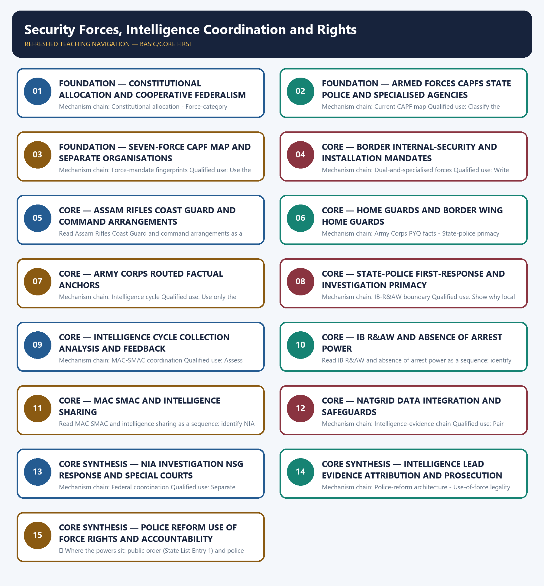

# Security Forces, Intelligence Coordination and Rights — Learner-v2 Complete Learning Session

> **Authoring-only generation:** 2026-09-04. No PDF was rendered and no tracker or index was mutated.

### SOURCE, PROGRESSION AND CURRENT-LINKAGE AUDIT

- **Generation date:** 2026-09-04.
- **Repository-first evidence:** the Basic owner is taught first and preserved in full; the Advanced owner is retained only in the optional final teaching block.
- **OCR evidence:** Repository Markdown was primary. OCR-searchable official UPSC papers were supplementary only for printed routed demands. No answer key, attribution, operational method, notification effect, implementation outcome or security metric was inferred.
- **Qdrant:** not used; repository Markdown and available OCR context were sufficient.
- **PYQ integrity:** The three conservative routed cards are the 2023 GS-III intelligence-agency demand, the 2023 Prelims Home Guards question and the 2026 provisional-key Army Corps question. Objective answer letters are not inferred, and the Corps card records only owner-audited public headquarters facts.
- **Live-link boundary:** Official attempts on 2026-09-04 confirmed the NIA's public statutory and concurrent-jurisdiction description but exposed only dated 2020 statistics, which are excluded. MHA, India Code, IB and NSG pages were blocked or unavailable, so no current force strength, leadership, NATGRID status, deployment, capability or accountability-outcome claim is used.
- **Fact/inference discipline:** no current-affairs item, PYQ wording, figure or quotation is invented.

### LIVE OFFICIAL-SOURCE ATTEMPT LOG

The checks below were made on 2026-09-04. Substantive official text is used only for the proposition it supports; title-only, blocked or thin pages are recorded and supply no factual claim.

- https://www.mha.gov.in/sites/default/files/AnnualReport_2024_25_English.pdf and https://www.mha.gov.in/en/about-us/central-armed-police-forces — attempted 2026-09-04 for the current CAPF taxonomy, force status and NATGRID references; direct retrieval returned 403. No strength, deployment, leadership or operational-readiness figure is imported.
- https://nia.gov.in/about-us and https://www.mha.gov.in/ — fetched and attempted 2026-09-04. The official NIA page confirms creation under the NIA Act in a concurrent-jurisdiction framework and describes NIA as a central counter-terrorism law-enforcement agency; its displayed case statistics are dated 5 February 2020 and are excluded.
- https://www.indiacode.nic.in/ — attempted 2026-09-04 for the NIA Act, Protection of Human Rights Act Section 19, BNSS custody safeguards and force statutes; direct retrieval returned 403. Only owner-audited legal distinctions are used, and statutory power is not treated as field practice or accountability outcome.
- https://www.mha.gov.in/en/commoncontent/intelligence-bureau and https://www.nsg.gov.in/about-us — attempted 2026-09-04 for public institutional descriptions; the MHA page returned 403 and the NSG page had a transport-level failure. No classified detail, capability claim, deployment pattern, vulnerability or current operation is inferred.

## BASIC LEARNING SESSION



*Distinct embedded teaching-navigation image. The separate continuous Cārvāka-style flowchart package remains an independent at-a-glance artifact.*

### SESSION 1 — FOUNDATION — CONSTITUTIONAL ALLOCATION AND COOPERATIVE FEDERALISM

#### DEFINITION / WHAT THIS IS CALLED

**Plain-language definition:** Read Constitutional allocation and cooperative federalism as a sequence: identify Constitutional allocation, follow the named mechanism to its institutional response, and stop at the last verified status rather than assuming the next stage.

**Technical definition:** Mechanism chain: Constitutional allocation - Force-category boundary Qualified use: Start with Entries 1, 2 and 2A plus Article 355 and preserve aid-to-civil-power.

#### ANSWER-GRABBING OPENING — WRITE/ADAPT IN THE EXAM

> Read Constitutional allocation and cooperative federalism as a sequence: identify Constitutional allocation, follow the named mechanism to its institutional response, and stop at the last verified status rather than assuming the next stage.

#### MUST-WRITE KEYWORDS

- **FOUNDATION**
- **Constitutional allocation**
- **cooperative federalism**
- **Mechanism chain**
- **Qualified use**
- **Article 355**

**How to use them:** Frame the answer through FOUNDATION; define Constitutional allocation, connect cooperative federalism with Mechanism chain to explain the mechanism, and use Qualified use for the decisive comparison or qualification.

#### VISUAL FIRST

```text
CONSTITUTIONAL ALLOCATION AND COOPERATIVE FEDERALISM
01. Constitutional allocation
    |
    v
02. Force-category boundary
STATUS / CATEGORY FIREWALL -> Do not use Armed Forces, CAPFs, State police and specialised agencies as synonyms.
```

*The rail fixes the institutional sequence and claim boundary before explanation.*

#### CORE EXPLANATION

Public order and police are State List Entries 1 and 2, while Union List Entry 2A permits deployment of Union armed forces in aid of civil power and Article 355 places a protective duty on the Union; support does not erase State responsibility. The Armed Forces are military services, CAPFs are Union police and security forces, State police exercise ordinary public-order and investigation powers, and specialised agencies have narrower statutory or executive functions.

#### SIMPLE SYSTEM EXAMPLE

Read Constitutional allocation and cooperative federalism as a sequence: identify Constitutional allocation, follow the named mechanism to its institutional response, and stop at the last verified status rather than assuming the next stage.

#### TECHNICAL DISTINCTION

The decisive boundary is Do not use Armed Forces, CAPFs, State police and specialised agencies as synonyms. This keeps Constitutional allocation and Force-category boundary in the correct legal category, institutional mandate and evidentiary status.

#### NAMED EVIDENCE AND MECHANISM

- Public order and police are State List Entries 1 and 2, while Union List Entry 2A permits deployment of Union armed forces in aid of civil power and Article 355 places a protective duty on the Union; support does not erase State responsibility.
- The Armed Forces are military services, CAPFs are Union police and security forces, State police exercise ordinary public-order and investigation powers, and specialised agencies have narrower statutory or executive functions.

#### EXAMINER CAUTION

- Do not use Armed Forces, CAPFs, State police and specialised agencies as synonyms.

#### EXAM LINK

- **Prelims:** Keep institution, law, notification, ban/listing, scheme, agreement, ceasefire and outcome in their exact category.
- **Mains:** Start with Entries 1, 2 and 2A plus Article 355 and preserve aid-to-civil-power.

#### MINI RECAP

- **Mechanism chain:** Constitutional allocation -> Force-category boundary
- **Qualified use:** Start with Entries 1, 2 and 2A plus Article 355 and preserve aid-to-civil-power.

#### CLOSING RECALL FLOW — FOUNDATION — CONSTITUTIONAL ALLOCATION AND COOPERATIVE FEDERALISM

```text
START / CONCEPT: FOUNDATION — Constitutional allocation and cooperative federalism
        |
        v
EXACT TERMS: FOUNDATION · Constitutional allocation · cooperative federalism · Mechanism chain · Qualified use · Article 355
        |
        v
MECHANISM / ARGUMENT: Mechanism chain: Constitutional allocation - Force-category boundary Qualified use: Start with Entries 1, 2 and 2A plus Article 355 and preserve aid-to-civil-power.
        |
        v
CONSEQUENCE / CONTRAST: The decisive boundary is Do not use Armed Forces, CAPFs, State police and specialised agencies as synonyms.
        |
        v
UPSC TRAP / ANSWER-USE: Do not use Armed Forces, CAPFs, State police and specialised agencies as synonyms.
        |
        v
ANSWER-GRABBING FORMULATION: Read Constitutional allocation and cooperative federalism as a sequence: identify Constitutional allocation, follow the named mechanism to its institutional response, and stop at the last verified status rather than assuming the next stage.
```
### SESSION 2 — FOUNDATION — ARMED FORCES CAPFS STATE POLICE AND SPECIALISED AGENCIES

#### DEFINITION / WHAT THIS IS CALLED

**Plain-language definition:** Read Armed Forces CAPFs State police and specialised agencies as a sequence: identify Current CAPF map, follow the named mechanism to its institutional response, and stop at the last verified status rather than assuming the next stage.

**Technical definition:** Mechanism chain: Current CAPF map Qualified use: Classify the institution before stating its task or power.

#### ANSWER-GRABBING OPENING — WRITE/ADAPT IN THE EXAM

> Read Armed Forces CAPFs State police and specialised agencies as a sequence: identify Current CAPF map, follow the named mechanism to its institutional response, and stop at the last verified status rather than assuming the next stage.

#### MUST-WRITE KEYWORDS

- **FOUNDATION**
- **Armed Forces CAPFs State police**
- **specialised agencies**
- **Mechanism chain**
- **Qualified use**
- **MHA's**

**How to use them:** Frame the answer through FOUNDATION; define Armed Forces CAPFs State police, connect specialised agencies with Mechanism chain to explain the mechanism, and use Qualified use for the decisive comparison or qualification.

#### VISUAL FIRST

```text
ARMED FORCES CAPFS STATE POLICE AND SPECIALISED AGENCIES
01. Current CAPF map
STATUS / CATEGORY FIREWALL -> Do not add SPG, RPF or the Coast Guard to MHA's CAPF list.
```

*The rail fixes the institutional sequence and claim boundary before explanation.*

#### CORE EXPLANATION

MHA's owner-audited list comprises Assam Rifles, BSF, CISF, CRPF, ITBP, NSG and SSB; SPG, RPF and the Indian Coast Guard have separate administrative arrangements and must not be added to that list.

#### SIMPLE SYSTEM EXAMPLE

Read Armed Forces CAPFs State police and specialised agencies as a sequence: identify Current CAPF map, follow the named mechanism to its institutional response, and stop at the last verified status rather than assuming the next stage.

#### TECHNICAL DISTINCTION

The decisive boundary is Do not add SPG, RPF or the Coast Guard to MHA's CAPF list. This keeps Current CAPF map in the correct legal category, institutional mandate and evidentiary status.

#### NAMED EVIDENCE AND MECHANISM

- MHA's owner-audited list comprises Assam Rifles, BSF, CISF, CRPF, ITBP, NSG and SSB; SPG, RPF and the Indian Coast Guard have separate administrative arrangements and must not be added to that list.

#### EXAMINER CAUTION

- Do not add SPG, RPF or the Coast Guard to MHA's CAPF list.

#### EXAM LINK

- **Prelims:** Keep institution, law, notification, ban/listing, scheme, agreement, ceasefire and outcome in their exact category.
- **Mains:** Classify the institution before stating its task or power.

#### MINI RECAP

- **Mechanism chain:** Current CAPF map
- **Qualified use:** Classify the institution before stating its task or power.

#### CLOSING RECALL FLOW — FOUNDATION — ARMED FORCES CAPFS STATE POLICE AND SPECIALISED AGENCIES

```text
START / CONCEPT: FOUNDATION — Armed Forces CAPFs State police and specialised agencies
        |
        v
EXACT TERMS: FOUNDATION · Armed Forces CAPFs State police · specialised agencies · Mechanism chain · Qualified use · MHA's
        |
        v
MECHANISM / ARGUMENT: Mechanism chain: Current CAPF map Qualified use: Classify the institution before stating its task or power.
        |
        v
CONSEQUENCE / CONTRAST: The decisive boundary is Do not add SPG, RPF or the Coast Guard to MHA's CAPF list.
        |
        v
UPSC TRAP / ANSWER-USE: Do not add SPG, RPF or the Coast Guard to MHA's CAPF list.
        |
        v
ANSWER-GRABBING FORMULATION: Read Armed Forces CAPFs State police and specialised agencies as a sequence: identify Current CAPF map, follow the named mechanism to its institutional response, and stop at the last verified status rather than assuming the next stage.
```
### SESSION 3 — FOUNDATION — SEVEN-FORCE CAPF MAP AND SEPARATE ORGANISATIONS

#### DEFINITION / WHAT THIS IS CALLED

**Plain-language definition:** Read Seven-force CAPF map and separate organisations as a sequence: identify Force-mandate fingerprints, follow the named mechanism to its institutional response, and stop at the last verified status rather than assuming the next stage.

**Technical definition:** Mechanism chain: Force-mandate fingerprints Qualified use: Use the current seven-force list and name separate organisations.

#### ANSWER-GRABBING OPENING — WRITE/ADAPT IN THE EXAM

> Read Seven-force CAPF map and separate organisations as a sequence: identify Force-mandate fingerprints, follow the named mechanism to its institutional response, and stop at the last verified status rather than assuming the next stage.

#### MUST-WRITE KEYWORDS

- **FOUNDATION**
- **Seven-force CAPF map**
- **separate organisations**
- **Mechanism chain**
- **Qualified use**
- **BSF**

**How to use them:** Frame the answer through FOUNDATION; define Seven-force CAPF map, connect separate organisations with Mechanism chain to explain the mechanism, and use Qualified use for the decisive comparison or qualification.

#### VISUAL FIRST

```text
SEVEN-FORCE CAPF MAP AND SEPARATE ORGANISATIONS
01. Force-mandate fingerprints
STATUS / CATEGORY FIREWALL -> Do not infer exclusive command or operational readiness from a force's mandate.
```

*The rail fixes the institutional sequence and claim boundary before explanation.*

#### CORE EXPLANATION

BSF, ITBP and SSB have designated border-guarding roles, CRPF supports internal security and public order, and CISF protects specified installations and sectors; each mandate has legal and operational boundaries.

#### SIMPLE SYSTEM EXAMPLE

Read Seven-force CAPF map and separate organisations as a sequence: identify Force-mandate fingerprints, follow the named mechanism to its institutional response, and stop at the last verified status rather than assuming the next stage.

#### TECHNICAL DISTINCTION

The decisive boundary is Do not infer exclusive command or operational readiness from a force's mandate. This keeps Force-mandate fingerprints in the correct legal category, institutional mandate and evidentiary status.

#### NAMED EVIDENCE AND MECHANISM

- BSF, ITBP and SSB have designated border-guarding roles, CRPF supports internal security and public order, and CISF protects specified installations and sectors; each mandate has legal and operational boundaries.

#### EXAMINER CAUTION

- Do not infer exclusive command or operational readiness from a force's mandate.

#### EXAM LINK

- **Prelims:** Keep institution, law, notification, ban/listing, scheme, agreement, ceasefire and outcome in their exact category.
- **Mains:** Use the current seven-force list and name separate organisations.

#### MINI RECAP

- **Mechanism chain:** Force-mandate fingerprints
- **Qualified use:** Use the current seven-force list and name separate organisations.

#### CLOSING RECALL FLOW — FOUNDATION — SEVEN-FORCE CAPF MAP AND SEPARATE ORGANISATIONS

```text
START / CONCEPT: FOUNDATION — Seven-force CAPF map and separate organisations
        |
        v
EXACT TERMS: FOUNDATION · Seven-force CAPF map · separate organisations · Mechanism chain · Qualified use · BSF
        |
        v
MECHANISM / ARGUMENT: Mechanism chain: Force-mandate fingerprints Qualified use: Use the current seven-force list and name separate organisations.
        |
        v
CONSEQUENCE / CONTRAST: Mains: Use the current seven-force list and name separate organisations.
        |
        v
UPSC TRAP / ANSWER-USE: The decisive boundary is Do not infer exclusive command or operational readiness from a force's mandate.
        |
        v
ANSWER-GRABBING FORMULATION: Read Seven-force CAPF map and separate organisations as a sequence: identify Force-mandate fingerprints, follow the named mechanism to its institutional response, and stop at the last verified status rather than assuming the next stage.
```
### SESSION 4 — CORE — BORDER INTERNAL-SECURITY AND INSTALLATION MANDATES

#### DEFINITION / WHAT THIS IS CALLED

**Plain-language definition:** Read Border internal-security and installation mandates as a sequence: identify Dual-and-specialised forces, follow the named mechanism to its institutional response, and stop at the last verified status rather than assuming the next stage.

**Technical definition:** Mechanism chain: Dual-and-specialised forces Qualified use: Write administrative home, primary mandate and operational boundary.

#### ANSWER-GRABBING OPENING — WRITE/ADAPT IN THE EXAM

> Read Border internal-security and installation mandates as a sequence: identify Dual-and-specialised forces, follow the named mechanism to its institutional response, and stop at the last verified status rather than assuming the next stage.

#### MUST-WRITE KEYWORDS

- **Border internal-security**
- **installation mandates**
- **Mechanism chain**
- **Qualified use**
- **Assam Rifles**
- **MHA**

**How to use them:** Frame the answer through Border internal-security; define installation mandates, connect Mechanism chain with Qualified use to explain the mechanism, and use Assam Rifles for the decisive comparison or qualification.

#### VISUAL FIRST

```text
BORDER INTERNAL-SECURITY AND INSTALLATION MANDATES
01. Dual-and-specialised forces
STATUS / CATEGORY FIREWALL -> Do not treat Home Guards as governed by one all-India Central Act.
```

*The rail fixes the institutional sequence and claim boundary before explanation.*

#### CORE EXPLANATION

Assam Rifles is administratively under MHA and operates under Army command, while the Indian Coast Guard is an armed force under the Ministry of Defence; command arrangement and task do not make either an ordinary State police force.

#### SIMPLE SYSTEM EXAMPLE

Read Border internal-security and installation mandates as a sequence: identify Dual-and-specialised forces, follow the named mechanism to its institutional response, and stop at the last verified status rather than assuming the next stage.

#### TECHNICAL DISTINCTION

The decisive boundary is Do not treat Home Guards as governed by one all-India Central Act. This keeps Dual-and-specialised forces in the correct legal category, institutional mandate and evidentiary status.

#### NAMED EVIDENCE AND MECHANISM

- Assam Rifles is administratively under MHA and operates under Army command, while the Indian Coast Guard is an armed force under the Ministry of Defence; command arrangement and task do not make either an ordinary State police force.

#### EXAMINER CAUTION

- Do not treat Home Guards as governed by one all-India Central Act.

#### EXAM LINK

- **Prelims:** Keep institution, law, notification, ban/listing, scheme, agreement, ceasefire and outcome in their exact category.
- **Mains:** Write administrative home, primary mandate and operational boundary.

#### MINI RECAP

- **Mechanism chain:** Dual-and-specialised forces
- **Qualified use:** Write administrative home, primary mandate and operational boundary.

#### CLOSING RECALL FLOW — CORE — BORDER INTERNAL-SECURITY AND INSTALLATION MANDATES

```text
START / CONCEPT: CORE — Border internal-security and installation mandates
        |
        v
EXACT TERMS: Border internal-security · installation mandates · Mechanism chain · Qualified use · Assam Rifles · MHA
        |
        v
MECHANISM / ARGUMENT: Mechanism chain: Dual-and-specialised forces Qualified use: Write administrative home, primary mandate and operational boundary.
        |
        v
CONSEQUENCE / CONTRAST: Assam Rifles is administratively under MHA and operates under Army command, while the Indian Coast Guard is an armed force under the Ministry of Defence; command arrangement and task do not make either an ordinary State police force.
        |
        v
UPSC TRAP / ANSWER-USE: The decisive boundary is Do not treat Home Guards as governed by one all-India Central Act.
        |
        v
ANSWER-GRABBING FORMULATION: Read Border internal-security and installation mandates as a sequence: identify Dual-and-specialised forces, follow the named mechanism to its institutional response, and stop at the last verified status rather than assuming the next stage.
```
### SESSION 5 — CORE — ASSAM RIFLES COAST GUARD AND COMMAND ARRANGEMENTS

#### DEFINITION / WHAT THIS IS CALLED

**Plain-language definition:** Home Guards are auxiliary police and public-support organisations governed by respective State or Union Territory Acts and Rules, not one all-India Central Home Guards Act; Border Wing Home Guards exist in specified border contexts.

**Technical definition:** Read Assam Rifles Coast Guard and command arrangements as a sequence: identify Home Guards status, follow the named mechanism to its institutional response, and stop at the last verified status rather than assuming the next stage.

#### ANSWER-GRABBING OPENING — WRITE/ADAPT IN THE EXAM

> Read Assam Rifles Coast Guard and command arrangements as a sequence: identify Home Guards status, follow the named mechanism to its institutional response, and stop at the last verified status rather than assuming the next stage.

#### MUST-WRITE KEYWORDS

- **Assam Rifles Coast Guard**
- **command arrangements**
- **Mechanism chain**
- **Qualified use**
- **Home Guards**
- **Union Territory Acts**

**How to use them:** Frame the answer through Assam Rifles Coast Guard; define command arrangements, connect Mechanism chain with Qualified use to explain the mechanism, and use Home Guards for the decisive comparison or qualification.

#### VISUAL FIRST

```text
ASSAM RIFLES COAST GUARD AND COMMAND ARRANGEMENTS
01. Home Guards status
STATUS / CATEGORY FIREWALL -> Do not add operational meaning to the Army Corps headquarters PYQ facts.
```

*The rail fixes the institutional sequence and claim boundary before explanation.*

#### CORE EXPLANATION

Home Guards are auxiliary police and public-support organisations governed by respective State or Union Territory Acts and Rules, not one all-India Central Home Guards Act; Border Wing Home Guards exist in specified border contexts.

#### SIMPLE SYSTEM EXAMPLE

Read Assam Rifles Coast Guard and command arrangements as a sequence: identify Home Guards status, follow the named mechanism to its institutional response, and stop at the last verified status rather than assuming the next stage.

#### TECHNICAL DISTINCTION

The decisive boundary is Do not add operational meaning to the Army Corps headquarters PYQ facts. This keeps Home Guards status in the correct legal category, institutional mandate and evidentiary status.

#### NAMED EVIDENCE AND MECHANISM

- Home Guards are auxiliary police and public-support organisations governed by respective State or Union Territory Acts and Rules, not one all-India Central Home Guards Act; Border Wing Home Guards exist in specified border contexts.

#### EXAMINER CAUTION

- Do not add operational meaning to the Army Corps headquarters PYQ facts.

#### EXAM LINK

- **Prelims:** Keep institution, law, notification, ban/listing, scheme, agreement, ceasefire and outcome in their exact category.
- **Mains:** Explain dual reporting without revealing operational detail.

#### MINI RECAP

- **Mechanism chain:** Home Guards status
- **Qualified use:** Explain dual reporting without revealing operational detail.

#### CLOSING RECALL FLOW — CORE — ASSAM RIFLES COAST GUARD AND COMMAND ARRANGEMENTS

```text
START / CONCEPT: CORE — Assam Rifles Coast Guard and command arrangements
        |
        v
EXACT TERMS: Assam Rifles Coast Guard · command arrangements · Mechanism chain · Qualified use · Home Guards · Union Territory Acts
        |
        v
MECHANISM / ARGUMENT: Mechanism chain: Home Guards status Qualified use: Explain dual reporting without revealing operational detail.
        |
        v
CONSEQUENCE / CONTRAST: Home Guards are auxiliary police and public-support organisations governed by respective State or Union Territory Acts and Rules, not one all-India Central Home Guards Act; Border Wing Home Guards exist in specified border contexts.
        |
        v
UPSC TRAP / ANSWER-USE: The decisive boundary is Do not add operational meaning to the Army Corps headquarters PYQ facts.
        |
        v
ANSWER-GRABBING FORMULATION: Read Assam Rifles Coast Guard and command arrangements as a sequence: identify Home Guards status, follow the named mechanism to its institutional response, and stop at the last verified status rather than assuming the next stage.
```
### SESSION 6 — CORE — HOME GUARDS AND BORDER WING HOME GUARDS

#### DEFINITION / WHAT THIS IS CALLED

**Plain-language definition:** Read Home Guards and Border Wing Home Guards as a sequence: identify Army Corps PYQ facts, follow the named mechanism to its institutional response, and stop at the last verified status rather than assuming the next stage.

**Technical definition:** Mechanism chain: Army Corps PYQ facts - State-police primacy Qualified use: State the State or UT legal basis and auxiliary status.

#### ANSWER-GRABBING OPENING — WRITE/ADAPT IN THE EXAM

> Read Home Guards and Border Wing Home Guards as a sequence: identify Army Corps PYQ facts, follow the named mechanism to its institutional response, and stop at the last verified status rather than assuming the next stage.

#### MUST-WRITE KEYWORDS

- **Home Guards**
- **Border Wing Home Guards**
- **Mechanism chain**
- **Qualified use**
- **For**
- **III Corps**

**How to use them:** Frame the answer through Home Guards; define Border Wing Home Guards, connect Mechanism chain with Qualified use to explain the mechanism, and use For for the decisive comparison or qualification.

#### VISUAL FIRST

```text
HOME GUARDS AND BORDER WING HOME GUARDS
01. Army Corps PYQ facts
    |
    v
02. State-police primacy
STATUS / CATEGORY FIREWALL -> Do not present a Central force or agency as a substitute for State-police primacy.
```

*The rail fixes the institutional sequence and claim boundary before explanation.*

#### CORE EXPLANATION

For the provisionally keyed 2026 route, the owner records III Corps at Dimapur, IV Corps at Tezpur, XIV Corps at Leh and XXXIII Corps at Sukna; these factual matches do not disclose deployment, readiness or operations. State police are first responders for public order, complaint registration, local intelligence, evidence preservation, witnesses and investigation; Central forces and agencies supplement rather than eliminate this local chain.

#### SIMPLE SYSTEM EXAMPLE

Read Home Guards and Border Wing Home Guards as a sequence: identify Army Corps PYQ facts, follow the named mechanism to its institutional response, and stop at the last verified status rather than assuming the next stage.

#### TECHNICAL DISTINCTION

The decisive boundary is Do not present a Central force or agency as a substitute for State-police primacy. This keeps Army Corps PYQ facts and State-police primacy in the correct legal category, institutional mandate and evidentiary status.

#### NAMED EVIDENCE AND MECHANISM

- For the provisionally keyed 2026 route, the owner records III Corps at Dimapur, IV Corps at Tezpur, XIV Corps at Leh and XXXIII Corps at Sukna; these factual matches do not disclose deployment, readiness or operations.
- State police are first responders for public order, complaint registration, local intelligence, evidence preservation, witnesses and investigation; Central forces and agencies supplement rather than eliminate this local chain.

#### EXAMINER CAUTION

- Do not present a Central force or agency as a substitute for State-police primacy.

#### EXAM LINK

- **Prelims:** Keep institution, law, notification, ban/listing, scheme, agreement, ceasefire and outcome in their exact category.
- **Mains:** State the State or UT legal basis and auxiliary status.

#### MINI RECAP

- **Mechanism chain:** Army Corps PYQ facts -> State-police primacy
- **Qualified use:** State the State or UT legal basis and auxiliary status.

#### CLOSING RECALL FLOW — CORE — HOME GUARDS AND BORDER WING HOME GUARDS

```text
START / CONCEPT: CORE — Home Guards and Border Wing Home Guards
        |
        v
EXACT TERMS: Home Guards · Border Wing Home Guards · Mechanism chain · Qualified use · For · III Corps
        |
        v
MECHANISM / ARGUMENT: Mechanism chain: Army Corps PYQ facts - State-police primacy Qualified use: State the State or UT legal basis and auxiliary status.
        |
        v
CONSEQUENCE / CONTRAST: For the provisionally keyed 2026 route, the owner records III Corps at Dimapur, IV Corps at Tezpur, XIV Corps at Leh and XXXIII Corps at Sukna; these factual matches do not disclose deployment, readiness or operations.
        |
        v
UPSC TRAP / ANSWER-USE: The decisive boundary is Do not present a Central force or agency as a substitute for State-police primacy.
        |
        v
ANSWER-GRABBING FORMULATION: Read Home Guards and Border Wing Home Guards as a sequence: identify Army Corps PYQ facts, follow the named mechanism to its institutional response, and stop at the last verified status rather than assuming the next stage.
```
### SESSION 7 — CORE — ARMY CORPS ROUTED FACTUAL ANCHORS

#### DEFINITION / WHAT THIS IS CALLED

**Plain-language definition:** Read Army Corps routed factual anchors as a sequence: identify Intelligence cycle, follow the named mechanism to its institutional response, and stop at the last verified status rather than assuming the next stage.

**Technical definition:** Mechanism chain: Intelligence cycle Qualified use: Use only the headquarters-location fact and provisional-key caveat.

#### ANSWER-GRABBING OPENING — WRITE/ADAPT IN THE EXAM

> Read Army Corps routed factual anchors as a sequence: identify Intelligence cycle, follow the named mechanism to its institutional response, and stop at the last verified status rather than assuming the next stage.

#### MUST-WRITE KEYWORDS

- **Army Corps routed factual anchors**
- **Mechanism chain**
- **Qualified use**
- **Read Army Corps**
- **Intelligence**
- **The decisive boundary**

**How to use them:** Frame the answer through Army Corps routed factual anchors; define Mechanism chain, connect Qualified use with Read Army Corps to explain the mechanism, and use Intelligence for the decisive comparison or qualification.

#### VISUAL FIRST

```text
ARMY CORPS ROUTED FACTUAL ANCHORS
01. Intelligence cycle
STATUS / CATEGORY FIREWALL -> Do not conflate intelligence collection, sharing, data integration and investigation.
```

*The rail fixes the institutional sequence and claim boundary before explanation.*

#### CORE EXPLANATION

The intelligence cycle moves through direction, collection, processing, analysis, dissemination and feedback; volume of collection does not establish relevance, accuracy, lawful use or operational action.

#### SIMPLE SYSTEM EXAMPLE

Read Army Corps routed factual anchors as a sequence: identify Intelligence cycle, follow the named mechanism to its institutional response, and stop at the last verified status rather than assuming the next stage.

#### TECHNICAL DISTINCTION

The decisive boundary is Do not conflate intelligence collection, sharing, data integration and investigation. This keeps Intelligence cycle in the correct legal category, institutional mandate and evidentiary status.

#### NAMED EVIDENCE AND MECHANISM

- The intelligence cycle moves through direction, collection, processing, analysis, dissemination and feedback; volume of collection does not establish relevance, accuracy, lawful use or operational action.

#### EXAMINER CAUTION

- Do not conflate intelligence collection, sharing, data integration and investigation.

#### EXAM LINK

- **Prelims:** Keep institution, law, notification, ban/listing, scheme, agreement, ceasefire and outcome in their exact category.
- **Mains:** Use only the headquarters-location fact and provisional-key caveat.

#### MINI RECAP

- **Mechanism chain:** Intelligence cycle
- **Qualified use:** Use only the headquarters-location fact and provisional-key caveat.

#### CLOSING RECALL FLOW — CORE — ARMY CORPS ROUTED FACTUAL ANCHORS

```text
START / CONCEPT: CORE — Army Corps routed factual anchors
        |
        v
EXACT TERMS: Army Corps routed factual anchors · Mechanism chain · Qualified use · Read Army Corps · Intelligence · The decisive boundary
        |
        v
MECHANISM / ARGUMENT: Mechanism chain: Intelligence cycle Qualified use: Use only the headquarters-location fact and provisional-key caveat.
        |
        v
CONSEQUENCE / CONTRAST: The decisive boundary is Do not conflate intelligence collection, sharing, data integration and investigation.
        |
        v
UPSC TRAP / ANSWER-USE: The intelligence cycle moves through direction, collection, processing, analysis, dissemination and feedback; volume of collection does not establish relevance, accuracy, lawful use or operational action.
        |
        v
ANSWER-GRABBING FORMULATION: Read Army Corps routed factual anchors as a sequence: identify Intelligence cycle, follow the named mechanism to its institutional response, and stop at the last verified status rather than assuming the next stage.
```
### SESSION 8 — CORE — STATE-POLICE FIRST-RESPONSE AND INVESTIGATION PRIMACY

#### DEFINITION / WHAT THIS IS CALLED

**Plain-language definition:** Read State-police first-response and investigation primacy as a sequence: identify IB-R&AW boundary, follow the named mechanism to its institutional response, and stop at the last verified status rather than assuming the next stage.

**Technical definition:** Mechanism chain: IB-R&AW boundary Qualified use: Show why local response, evidence and witnesses cannot be centralised away.

#### ANSWER-GRABBING OPENING — WRITE/ADAPT IN THE EXAM

> Read State-police first-response and investigation primacy as a sequence: identify IB-R&AW boundary, follow the named mechanism to its institutional response, and stop at the last verified status rather than assuming the next stage.

#### MUST-WRITE KEYWORDS

- **investigation primacy**
- **Mechanism chain**
- **Qualified use**
- **IB**
- **AW**
- **Read State-police**

**How to use them:** Frame the answer through investigation primacy; define Mechanism chain, connect Qualified use with IB to explain the mechanism, and use AW for the decisive comparison or qualification.

#### VISUAL FIRST

```text
STATE-POLICE FIRST-RESPONSE AND INVESTIGATION PRIMACY
01. IB-R&AW boundary
STATUS / CATEGORY FIREWALL -> Do not describe MAC, NATGRID or IB as arresting or prosecuting bodies.
```

*The rail fixes the institutional sequence and claim boundary before explanation.*

#### CORE EXPLANATION

IB supplies domestic intelligence and R&AW external intelligence within their public institutional roles; neither is a police investigating body or has a general power of arrest.

#### SIMPLE SYSTEM EXAMPLE

Read State-police first-response and investigation primacy as a sequence: identify IB-R&AW boundary, follow the named mechanism to its institutional response, and stop at the last verified status rather than assuming the next stage.

#### TECHNICAL DISTINCTION

The decisive boundary is Do not describe MAC, NATGRID or IB as arresting or prosecuting bodies. This keeps IB-R&AW boundary in the correct legal category, institutional mandate and evidentiary status.

#### NAMED EVIDENCE AND MECHANISM

- IB supplies domestic intelligence and R&AW external intelligence within their public institutional roles; neither is a police investigating body or has a general power of arrest.

#### EXAMINER CAUTION

- Do not describe MAC, NATGRID or IB as arresting or prosecuting bodies.

#### EXAM LINK

- **Prelims:** Keep institution, law, notification, ban/listing, scheme, agreement, ceasefire and outcome in their exact category.
- **Mains:** Show why local response, evidence and witnesses cannot be centralised away.

#### MINI RECAP

- **Mechanism chain:** IB-R&AW boundary
- **Qualified use:** Show why local response, evidence and witnesses cannot be centralised away.

#### CLOSING RECALL FLOW — CORE — STATE-POLICE FIRST-RESPONSE AND INVESTIGATION PRIMACY

```text
START / CONCEPT: CORE — State-police first-response and investigation primacy
        |
        v
EXACT TERMS: investigation primacy · Mechanism chain · Qualified use · IB · AW · Read State-police
        |
        v
MECHANISM / ARGUMENT: Mechanism chain: IB-R&AW boundary Qualified use: Show why local response, evidence and witnesses cannot be centralised away.
        |
        v
CONSEQUENCE / CONTRAST: The decisive boundary is Do not describe MAC, NATGRID or IB as arresting or prosecuting bodies.
        |
        v
UPSC TRAP / ANSWER-USE: Do not describe MAC, NATGRID or IB as arresting or prosecuting bodies.
        |
        v
ANSWER-GRABBING FORMULATION: Read State-police first-response and investigation primacy as a sequence: identify IB-R&AW boundary, follow the named mechanism to its institutional response, and stop at the last verified status rather than assuming the next stage.
```
### SESSION 9 — CORE — INTELLIGENCE CYCLE COLLECTION ANALYSIS AND FEEDBACK

#### DEFINITION / WHAT THIS IS CALLED

**Plain-language definition:** Read Intelligence cycle collection analysis and feedback as a sequence: identify MAC-SMAC coordination, follow the named mechanism to its institutional response, and stop at the last verified status rather than assuming the next stage.

**Technical definition:** Mechanism chain: MAC-SMAC coordination Qualified use: Assess direction, quality, analysis, dissemination and feedback separately.

#### ANSWER-GRABBING OPENING — WRITE/ADAPT IN THE EXAM

> Read Intelligence cycle collection analysis and feedback as a sequence: identify MAC-SMAC coordination, follow the named mechanism to its institutional response, and stop at the last verified status rather than assuming the next stage.

#### MUST-WRITE KEYWORDS

- **Intelligence cycle collection analysis**
- **feedback**
- **Mechanism chain**
- **Qualified use**
- **The Multi Agency Centre and Subsidiary MACs**
- **The Multi Agency Centre**

**How to use them:** Frame the answer through Intelligence cycle collection analysis; define feedback, connect Mechanism chain with Qualified use to explain the mechanism, and use The Multi Agency Centre and Subsidiary MACs for the decisive comparison or qualification.

#### VISUAL FIRST

```text
INTELLIGENCE CYCLE COLLECTION ANALYSIS AND FEEDBACK
01. MAC-SMAC coordination
STATUS / CATEGORY FIREWALL -> Do not treat NSG response and NIA investigation as the same function.
```

*The rail fixes the institutional sequence and claim boundary before explanation.*

#### CORE EXPLANATION

The Multi Agency Centre and Subsidiary MACs are intelligence-sharing coordination mechanisms under the IB framework; a shared lead is not an FIR, admissible evidence or operational command.

#### SIMPLE SYSTEM EXAMPLE

Read Intelligence cycle collection analysis and feedback as a sequence: identify MAC-SMAC coordination, follow the named mechanism to its institutional response, and stop at the last verified status rather than assuming the next stage.

#### TECHNICAL DISTINCTION

The decisive boundary is Do not treat NSG response and NIA investigation as the same function. This keeps MAC-SMAC coordination in the correct legal category, institutional mandate and evidentiary status.

#### NAMED EVIDENCE AND MECHANISM

- The Multi Agency Centre and Subsidiary MACs are intelligence-sharing coordination mechanisms under the IB framework; a shared lead is not an FIR, admissible evidence or operational command.

#### EXAMINER CAUTION

- Do not treat NSG response and NIA investigation as the same function.

#### EXAM LINK

- **Prelims:** Keep institution, law, notification, ban/listing, scheme, agreement, ceasefire and outcome in their exact category.
- **Mains:** Assess direction, quality, analysis, dissemination and feedback separately.

#### MINI RECAP

- **Mechanism chain:** MAC-SMAC coordination
- **Qualified use:** Assess direction, quality, analysis, dissemination and feedback separately.

#### CLOSING RECALL FLOW — CORE — INTELLIGENCE CYCLE COLLECTION ANALYSIS AND FEEDBACK

```text
START / CONCEPT: CORE — Intelligence cycle collection analysis and feedback
        |
        v
EXACT TERMS: Intelligence cycle collection analysis · feedback · Mechanism chain · Qualified use · The Multi Agency Centre and Subsidiary MACs · The Multi Agency Centre
        |
        v
MECHANISM / ARGUMENT: Mechanism chain: MAC-SMAC coordination Qualified use: Assess direction, quality, analysis, dissemination and feedback separately.
        |
        v
CONSEQUENCE / CONTRAST: The Multi Agency Centre and Subsidiary MACs are intelligence-sharing coordination mechanisms under the IB framework; a shared lead is not an FIR, admissible evidence or operational command.
        |
        v
UPSC TRAP / ANSWER-USE: The decisive boundary is Do not treat NSG response and NIA investigation as the same function.
        |
        v
ANSWER-GRABBING FORMULATION: Read Intelligence cycle collection analysis and feedback as a sequence: identify MAC-SMAC coordination, follow the named mechanism to its institutional response, and stop at the last verified status rather than assuming the next stage.
```
### SESSION 10 — CORE — IB R&AW AND ABSENCE OF ARREST POWER

#### DEFINITION / WHAT THIS IS CALLED

**Plain-language definition:** NATGRID is a data-integration and authorised-access tool connecting existing government data sources for security use; it does not independently collect all intelligence, investigate, arrest or adjudicate.

**Technical definition:** Read IB R&AW and absence of arrest power as a sequence: identify NATGRID boundary, follow the named mechanism to its institutional response, and stop at the last verified status rather than assuming the next stage.

#### ANSWER-GRABBING OPENING — WRITE/ADAPT IN THE EXAM

> Read IB R&AW and absence of arrest power as a sequence: identify NATGRID boundary, follow the named mechanism to its institutional response, and stop at the last verified status rather than assuming the next stage.

#### MUST-WRITE KEYWORDS

- **IB R&AW**
- **absence of arrest power**
- **Mechanism chain**
- **Qualified use**
- **NATGRID**
- **Read IB**

**How to use them:** Frame the answer through IB R&AW; define absence of arrest power, connect Mechanism chain with Qualified use to explain the mechanism, and use NATGRID for the decisive comparison or qualification.

#### VISUAL FIRST

```text
IB R&AW AND ABSENCE OF ARREST POWER
01. NATGRID boundary
STATUS / CATEGORY FIREWALL -> Do not convert an intelligence lead or attribution assessment into admissible evidence.
```

*The rail fixes the institutional sequence and claim boundary before explanation.*

#### CORE EXPLANATION

NATGRID is a data-integration and authorised-access tool connecting existing government data sources for security use; it does not independently collect all intelligence, investigate, arrest or adjudicate.

#### SIMPLE SYSTEM EXAMPLE

Read IB R&AW and absence of arrest power as a sequence: identify NATGRID boundary, follow the named mechanism to its institutional response, and stop at the last verified status rather than assuming the next stage.

#### TECHNICAL DISTINCTION

The decisive boundary is Do not convert an intelligence lead or attribution assessment into admissible evidence. This keeps NATGRID boundary in the correct legal category, institutional mandate and evidentiary status.

#### NAMED EVIDENCE AND MECHANISM

- NATGRID is a data-integration and authorised-access tool connecting existing government data sources for security use; it does not independently collect all intelligence, investigate, arrest or adjudicate.

#### EXAMINER CAUTION

- Do not convert an intelligence lead or attribution assessment into admissible evidence.

#### EXAM LINK

- **Prelims:** Keep institution, law, notification, ban/listing, scheme, agreement, ceasefire and outcome in their exact category.
- **Mains:** Keep domestic and external intelligence distinct from police powers.

#### MINI RECAP

- **Mechanism chain:** NATGRID boundary
- **Qualified use:** Keep domestic and external intelligence distinct from police powers.

#### CLOSING RECALL FLOW — CORE — IB R&AW AND ABSENCE OF ARREST POWER

```text
START / CONCEPT: CORE — IB R&AW and absence of arrest power
        |
        v
EXACT TERMS: IB R&AW · absence of arrest power · Mechanism chain · Qualified use · NATGRID · Read IB
        |
        v
MECHANISM / ARGUMENT: Mechanism chain: NATGRID boundary Qualified use: Keep domestic and external intelligence distinct from police powers.
        |
        v
CONSEQUENCE / CONTRAST: NATGRID is a data-integration and authorised-access tool connecting existing government data sources for security use; it does not independently collect all intelligence, investigate, arrest or adjudicate.
        |
        v
UPSC TRAP / ANSWER-USE: The decisive boundary is Do not convert an intelligence lead or attribution assessment into admissible evidence.
        |
        v
ANSWER-GRABBING FORMULATION: Read IB R&AW and absence of arrest power as a sequence: identify NATGRID boundary, follow the named mechanism to its institutional response, and stop at the last verified status rather than assuming the next stage.
```
### SESSION 11 — CORE — MAC SMAC AND INTELLIGENCE SHARING

#### DEFINITION / WHAT THIS IS CALLED

**Plain-language definition:** NIA is a statutory Central investigative and prosecuting agency for scheduled offences in a concurrent-jurisdiction framework; it is not the domestic intelligence collector and does not replace every State-police case.

**Technical definition:** Read MAC SMAC and intelligence sharing as a sequence: identify NIA mandate, follow the named mechanism to its institutional response, and stop at the last verified status rather than assuming the next stage.

#### ANSWER-GRABBING OPENING — WRITE/ADAPT IN THE EXAM

> Mechanism chain: NIA mandate - NSG mandate Qualified use: Treat sharing as coordination, not investigation or command.

#### MUST-WRITE KEYWORDS

- **MAC SMAC**
- **intelligence sharing**
- **Mechanism chain**
- **Qualified use**
- **NIA**
- **Central**

**How to use them:** Frame the answer through MAC SMAC; define intelligence sharing, connect Mechanism chain with Qualified use to explain the mechanism, and use NIA for the decisive comparison or qualification.

#### VISUAL FIRST

```text
MAC SMAC AND INTELLIGENCE SHARING
01. NIA mandate
    |
    v
02. NSG mandate
STATUS / CATEGORY FIREWALL -> Do not treat legal power or technology deployment as proof of proportionate use.
```

*The rail fixes the institutional sequence and claim boundary before explanation.*

#### CORE EXPLANATION

NIA is a statutory Central investigative and prosecuting agency for scheduled offences in a concurrent-jurisdiction framework; it is not the domestic intelligence collector and does not replace every State-police case. NSG is a specialised counter-terrorism and hostage-rescue response force within its mandate, whereas NIA investigates scheduled offences after or alongside response; tactical response and legal case-building are different functions.

#### SIMPLE SYSTEM EXAMPLE

Read MAC SMAC and intelligence sharing as a sequence: identify NIA mandate, follow the named mechanism to its institutional response, and stop at the last verified status rather than assuming the next stage.

#### TECHNICAL DISTINCTION

The decisive boundary is Do not treat legal power or technology deployment as proof of proportionate use. This keeps NIA mandate and NSG mandate in the correct legal category, institutional mandate and evidentiary status.

#### NAMED EVIDENCE AND MECHANISM

- NIA is a statutory Central investigative and prosecuting agency for scheduled offences in a concurrent-jurisdiction framework; it is not the domestic intelligence collector and does not replace every State-police case.
- NSG is a specialised counter-terrorism and hostage-rescue response force within its mandate, whereas NIA investigates scheduled offences after or alongside response; tactical response and legal case-building are different functions.

#### EXAMINER CAUTION

- Do not treat legal power or technology deployment as proof of proportionate use.

#### EXAM LINK

- **Prelims:** Keep institution, law, notification, ban/listing, scheme, agreement, ceasefire and outcome in their exact category.
- **Mains:** Treat sharing as coordination, not investigation or command.

#### MINI RECAP

- **Mechanism chain:** NIA mandate -> NSG mandate
- **Qualified use:** Treat sharing as coordination, not investigation or command.

#### CLOSING RECALL FLOW — CORE — MAC SMAC AND INTELLIGENCE SHARING

```text
START / CONCEPT: CORE — MAC SMAC and intelligence sharing
        |
        v
EXACT TERMS: MAC SMAC · intelligence sharing · Mechanism chain · Qualified use · NIA · Central
        |
        v
MECHANISM / ARGUMENT: Read MAC SMAC and intelligence sharing as a sequence: identify NIA mandate, follow the named mechanism to its institutional response, and stop at the last verified status rather than assuming the next stage.
        |
        v
CONSEQUENCE / CONTRAST: NIA is a statutory Central investigative and prosecuting agency for scheduled offences in a concurrent-jurisdiction framework; it is not the domestic intelligence collector and does not replace every State-police case.
        |
        v
UPSC TRAP / ANSWER-USE: Do not miss this limiting distinction: nSG is a specialised counter-terrorism and hostage-rescue response force within its mandate.
        |
        v
ANSWER-GRABBING FORMULATION: Mechanism chain: NIA mandate - NSG mandate Qualified use: Treat sharing as coordination, not investigation or command.
```
### SESSION 12 — CORE — NATGRID DATA INTEGRATION AND SAFEGUARDS

#### DEFINITION / WHAT THIS IS CALLED

**Plain-language definition:** Read NATGRID data integration and safeguards as a sequence: identify Intelligence-evidence chain, follow the named mechanism to its institutional response, and stop at the last verified status rather than assuming the next stage.

**Technical definition:** Mechanism chain: Intelligence-evidence chain Qualified use: Pair authorised integration with purpose, access, audit and remedy safeguards.

#### ANSWER-GRABBING OPENING — WRITE/ADAPT IN THE EXAM

> Read NATGRID data integration and safeguards as a sequence: identify Intelligence-evidence chain, follow the named mechanism to its institutional response, and stop at the last verified status rather than assuming the next stage.

#### MUST-WRITE KEYWORDS

- **NATGRID data integration**
- **safeguards**
- **Mechanism chain**
- **Qualified use**
- **Read NATGRID**
- **Intelligence-evidence**

**How to use them:** Frame the answer through NATGRID data integration; define safeguards, connect Mechanism chain with Qualified use to explain the mechanism, and use Read NATGRID for the decisive comparison or qualification.

#### VISUAL FIRST

```text
NATGRID DATA INTEGRATION AND SAFEGUARDS
01. Intelligence-evidence chain
STATUS / CATEGORY FIREWALL -> Do not publish classified detail, deployment patterns, collection methods or operational vulnerabilities.
```

*The rail fixes the institutional sequence and claim boundary before explanation.*

#### CORE EXPLANATION

A disciplined chain separates intelligence lead, preventive action, incident response, lawful search or seizure, forensic preservation, investigation, charge, prosecution and judicial finding; intelligence may guide action but is not automatically trial evidence.

#### SIMPLE SYSTEM EXAMPLE

Read NATGRID data integration and safeguards as a sequence: identify Intelligence-evidence chain, follow the named mechanism to its institutional response, and stop at the last verified status rather than assuming the next stage.

#### TECHNICAL DISTINCTION

The decisive boundary is Do not publish classified detail, deployment patterns, collection methods or operational vulnerabilities. This keeps Intelligence-evidence chain in the correct legal category, institutional mandate and evidentiary status.

#### NAMED EVIDENCE AND MECHANISM

- A disciplined chain separates intelligence lead, preventive action, incident response, lawful search or seizure, forensic preservation, investigation, charge, prosecution and judicial finding; intelligence may guide action but is not automatically trial evidence.

#### EXAMINER CAUTION

- Do not publish classified detail, deployment patterns, collection methods or operational vulnerabilities.

#### EXAM LINK

- **Prelims:** Keep institution, law, notification, ban/listing, scheme, agreement, ceasefire and outcome in their exact category.
- **Mains:** Pair authorised integration with purpose, access, audit and remedy safeguards.

#### MINI RECAP

- **Mechanism chain:** Intelligence-evidence chain
- **Qualified use:** Pair authorised integration with purpose, access, audit and remedy safeguards.

#### CLOSING RECALL FLOW — CORE — NATGRID DATA INTEGRATION AND SAFEGUARDS

```text
START / CONCEPT: CORE — NATGRID data integration and safeguards
        |
        v
EXACT TERMS: NATGRID data integration · safeguards · Mechanism chain · Qualified use · Read NATGRID · Intelligence-evidence
        |
        v
MECHANISM / ARGUMENT: Mechanism chain: Intelligence-evidence chain Qualified use: Pair authorised integration with purpose, access, audit and remedy safeguards.
        |
        v
CONSEQUENCE / CONTRAST: A disciplined chain separates intelligence lead, preventive action, incident response, lawful search or seizure, forensic preservation, investigation, charge, prosecution and judicial finding; intelligence may guide action but is not automatically trial evidence.
        |
        v
UPSC TRAP / ANSWER-USE: The decisive boundary is Do not publish classified detail, deployment patterns, collection methods or operational vulnerabilities.
        |
        v
ANSWER-GRABBING FORMULATION: Read NATGRID data integration and safeguards as a sequence: identify Intelligence-evidence chain, follow the named mechanism to its institutional response, and stop at the last verified status rather than assuming the next stage.
```
### SESSION 13 — CORE SYNTHESIS — NIA INVESTIGATION NSG RESPONSE AND SPECIAL COURTS

#### DEFINITION / WHAT THIS IS CALLED

**Plain-language definition:** Read NIA investigation NSG response and Special Courts as a sequence: identify Federal coordination, follow the named mechanism to its institutional response, and stop at the last verified status rather than assuming the next stage.

**Technical definition:** Mechanism chain: Federal coordination Qualified use: Separate tactical response, statutory investigation and prosecution.

#### ANSWER-GRABBING OPENING — WRITE/ADAPT IN THE EXAM

> Read NIA investigation NSG response and Special Courts as a sequence: identify Federal coordination, follow the named mechanism to its institutional response, and stop at the last verified status rather than assuming the next stage.

#### MUST-WRITE KEYWORDS

- **CORE SYNTHESIS**
- **NIA investigation NSG response**
- **Special Courts**
- **Mechanism chain**
- **Qualified use**
- **Internal**

**How to use them:** Frame the answer through CORE SYNTHESIS; define NIA investigation NSG response, connect Special Courts with Mechanism chain to explain the mechanism, and use Qualified use for the decisive comparison or qualification.

#### VISUAL FIRST

```text
NIA INVESTIGATION NSG RESPONSE AND SPECIAL COURTS
01. Federal coordination
STATUS / CATEGORY FIREWALL -> Do not use Armed Forces, CAPFs, State police and specialised agencies as synonyms.
```

*The rail fixes the institutional sequence and claim boundary before explanation.*

#### CORE EXPLANATION

Internal security requires Centre-State and inter-agency coordination through lawful requisition, information sharing, agreed command, deconfliction and post-operation handoff; centralisation is not a substitute for functional clarity.

#### SIMPLE SYSTEM EXAMPLE

Read NIA investigation NSG response and Special Courts as a sequence: identify Federal coordination, follow the named mechanism to its institutional response, and stop at the last verified status rather than assuming the next stage.

#### TECHNICAL DISTINCTION

The decisive boundary is Do not use Armed Forces, CAPFs, State police and specialised agencies as synonyms. This keeps Federal coordination in the correct legal category, institutional mandate and evidentiary status.

#### NAMED EVIDENCE AND MECHANISM

- Internal security requires Centre-State and inter-agency coordination through lawful requisition, information sharing, agreed command, deconfliction and post-operation handoff; centralisation is not a substitute for functional clarity.

#### EXAMINER CAUTION

- Do not use Armed Forces, CAPFs, State police and specialised agencies as synonyms.

#### EXAM LINK

- **Prelims:** Keep institution, law, notification, ban/listing, scheme, agreement, ceasefire and outcome in their exact category.
- **Mains:** Separate tactical response, statutory investigation and prosecution.

#### MINI RECAP

- **Mechanism chain:** Federal coordination
- **Qualified use:** Separate tactical response, statutory investigation and prosecution.

#### CLOSING RECALL FLOW — CORE SYNTHESIS — NIA INVESTIGATION NSG RESPONSE AND SPECIAL COURTS

```text
START / CONCEPT: CORE SYNTHESIS — NIA investigation NSG response and Special Courts
        |
        v
EXACT TERMS: CORE SYNTHESIS · NIA investigation NSG response · Special Courts · Mechanism chain · Qualified use · Internal
        |
        v
MECHANISM / ARGUMENT: Mechanism chain: Federal coordination Qualified use: Separate tactical response, statutory investigation and prosecution.
        |
        v
CONSEQUENCE / CONTRAST: Internal security requires Centre-State and inter-agency coordination through lawful requisition, information sharing, agreed command, deconfliction and post-operation handoff; centralisation is not a substitute for functional clarity.
        |
        v
UPSC TRAP / ANSWER-USE: The decisive boundary is Do not use Armed Forces, CAPFs, State police and specialised agencies as synonyms.
        |
        v
ANSWER-GRABBING FORMULATION: Read NIA investigation NSG response and Special Courts as a sequence: identify Federal coordination, follow the named mechanism to its institutional response, and stop at the last verified status rather than assuming the next stage.
```
### SESSION 14 — CORE SYNTHESIS — INTELLIGENCE LEAD EVIDENCE ATTRIBUTION AND PROSECUTION

#### DEFINITION / WHAT THIS IS CALLED

**Plain-language definition:** Read Intelligence lead evidence attribution and prosecution as a sequence: identify Police-reform architecture, follow the named mechanism to its institutional response, and stop at the last verified status rather than assuming the next stage.

**Technical definition:** Mechanism chain: Police-reform architecture - Use-of-force legality Qualified use: State each evidentiary rung and attribution confidence.

#### ANSWER-GRABBING OPENING — WRITE/ADAPT IN THE EXAM

> Read Intelligence lead evidence attribution and prosecution as a sequence: identify Police-reform architecture, follow the named mechanism to its institutional response, and stop at the last verified status rather than assuming the next stage.

#### MUST-WRITE KEYWORDS

- **CORE SYNTHESIS**
- **Intelligence lead evidence attribution**
- **prosecution**
- **Mechanism chain**
- **Qualified use**
- **Read Intelligence**

**How to use them:** Frame the answer through CORE SYNTHESIS; define Intelligence lead evidence attribution, connect prosecution with Mechanism chain to explain the mechanism, and use Qualified use for the decisive comparison or qualification.

#### VISUAL FIRST

```text
INTELLIGENCE LEAD EVIDENCE ATTRIBUTION AND PROSECUTION
01. Police-reform architecture
    |
    v
02. Use-of-force legality
STATUS / CATEGORY FIREWALL -> Do not add SPG, RPF or the Coast Guard to MHA's CAPF list.
```

*The rail fixes the institutional sequence and claim boundary before explanation.*

#### CORE EXPLANATION

Prakash Singh v. Union of India set seven reform benchmarks including State Security Commissions, tenure protections, separation of investigation, Police Establishment Boards, Police Complaints Authorities and a National Security Commission. Use of force must rest on legal authority and satisfy necessity, proportionality, precaution, command responsibility, record and review; a mandate or disturbed-area status never proves that every act within it is lawful.

#### SIMPLE SYSTEM EXAMPLE

Read Intelligence lead evidence attribution and prosecution as a sequence: identify Police-reform architecture, follow the named mechanism to its institutional response, and stop at the last verified status rather than assuming the next stage.

#### TECHNICAL DISTINCTION

The decisive boundary is Do not add SPG, RPF or the Coast Guard to MHA's CAPF list. This keeps Police-reform architecture and Use-of-force legality in the correct legal category, institutional mandate and evidentiary status.

#### NAMED EVIDENCE AND MECHANISM

- Prakash Singh v. Union of India set seven reform benchmarks including State Security Commissions, tenure protections, separation of investigation, Police Establishment Boards, Police Complaints Authorities and a National Security Commission.
- Use of force must rest on legal authority and satisfy necessity, proportionality, precaution, command responsibility, record and review; a mandate or disturbed-area status never proves that every act within it is lawful.

#### EXAMINER CAUTION

- Do not add SPG, RPF or the Coast Guard to MHA's CAPF list.

#### EXAM LINK

- **Prelims:** Keep institution, law, notification, ban/listing, scheme, agreement, ceasefire and outcome in their exact category.
- **Mains:** State each evidentiary rung and attribution confidence.

#### MINI RECAP

- **Mechanism chain:** Police-reform architecture -> Use-of-force legality
- **Qualified use:** State each evidentiary rung and attribution confidence.

#### CLOSING RECALL FLOW — CORE SYNTHESIS — INTELLIGENCE LEAD EVIDENCE ATTRIBUTION AND PROSECUTION

```text
START / CONCEPT: CORE SYNTHESIS — Intelligence lead evidence attribution and prosecution
        |
        v
EXACT TERMS: CORE SYNTHESIS · Intelligence lead evidence attribution · prosecution · Mechanism chain · Qualified use · Read Intelligence
        |
        v
MECHANISM / ARGUMENT: Mechanism chain: Police-reform architecture - Use-of-force legality Qualified use: State each evidentiary rung and attribution confidence.
        |
        v
CONSEQUENCE / CONTRAST: The decisive boundary is Do not add SPG, RPF or the Coast Guard to MHA's CAPF list.
        |
        v
UPSC TRAP / ANSWER-USE: Do not add SPG, RPF or the Coast Guard to MHA's CAPF list.
        |
        v
ANSWER-GRABBING FORMULATION: Read Intelligence lead evidence attribution and prosecution as a sequence: identify Police-reform architecture, follow the named mechanism to its institutional response, and stop at the last verified status rather than assuming the next stage.
```
### SESSION 15 — CORE SYNTHESIS — POLICE REFORM USE OF FORCE RIGHTS AND ACCOUNTABILITY

#### DEFINITION / WHAT THIS IS CALLED

**Plain-language definition:** 18). ❌ The NHRC can inquire into complaints against the armed forces in the same way it does against State police. - Section 19 of the Protection of Human Rights Act, 1993 restricts it to seeking a report from the Central Government and making recommendations. ❌ Prakash Singh directives are advisory suggestions States may adopt if convenient. - They are Supreme Court directions; the accurate criticism is of partial and uneven implementation, not of their legal status. ❌ Assam Rifles' primary current function is border guarding. - Per its documented deployment pattern (cross-referenced in topic 04), it functions predominantly as a counter-insurgency force in practice, a live "one force, one mandate" institutional question.

**Technical definition:** ✅ Where the powers sit: public order (State List Entry 1) and police (Entry 2) are State subjects; deployment of any armed force of the Union in a State "in aid of the civil power" is Union List Entry 2A; the Central Bureau of Intelligence and Investigation is Entry 8; and preventive detention connected with the security of India is Entry 9 — read with the Union's Article 355 duty of protection (Laxmikant, Indian Polity, PDF pp.

#### ANSWER-GRABBING OPENING — WRITE/ADAPT IN THE EXAM

> The Intelligence Bureau and the Research and Analysis Wing operate on executive orders (IB tracing to 1887; R&AW created in 1968 under the Cabinet Secretariat), without an enabling Act or a statutory parliamentary oversight committee. ⚠️ This is the folder's clearest capability-without-accountability asymmetry, and it is a legitimate, non-partisan point to make in any answer on agency mandates: an agency without a charter also lacks a defined mandate, which weakens its claim on resources and complicates inter-agency tasking. ✅ Article 33 permits Parliament to restrict or abrogate the fundamental rights of members of the armed forces, forces charged with the maintenance of public order, intelligence organisations and telecommunication systems set up for them — the constitutional basis for the distinct rights position of personnel in these services. ⚠️ NHRC's limited reach over the armed forces: under Section 19 of the Protection of Human Rights Act, 1993, in respect of the armed forces the Commission may only seek a report from the Central Government and make recommendations on it; it cannot conduct the same inquiry it can into a State police complaint. ⚠️ Combined with AFSPA Section 6's sanction requirement (topic 04), this is where accountability in law and accountability in practice diverge most sharply. ✅ Arrest and custody safeguards: D.K.

#### MUST-WRITE KEYWORDS

- **CORE SYNTHESIS**
- **accountability**
- **Mechanism chain**
- **Qualified use**
- **Subject**
- **Tier**

**How to use them:** Frame the answer through CORE SYNTHESIS; define accountability, connect Mechanism chain with Qualified use to explain the mechanism, and use Subject for the decisive comparison or qualification.

#### VISUAL FIRST

```text
POLICE REFORM USE OF FORCE RIGHTS AND ACCOUNTABILITY
01. Rights-accountability map
    |
    v
02. Technology-evidence end-state
STATUS / CATEGORY FIREWALL -> Do not infer exclusive command or operational readiness from a force's mandate.
```

*The rail fixes the institutional sequence and claim boundary before explanation.*

#### CORE EXPLANATION

Article 33 permits Parliament to restrict specified service rights, D.K. Basu safeguards arrest and custody, and Section 19 of the Protection of Human Rights Act limits the NHRC's armed-forces procedure; each safeguard's implementation must be assessed separately. Security technology needs defined purpose, authorised access, data minimisation, accuracy checks, audit logs, human review, retention limits, cybersecurity and remedy; attribution, intelligence assessment, arrest, charge and conviction remain distinct statuses.

#### SIMPLE SYSTEM EXAMPLE

Read Police reform use of force rights and accountability as a sequence: identify Rights-accountability map, follow the named mechanism to its institutional response, and stop at the last verified status rather than assuming the next stage.

#### TECHNICAL DISTINCTION

The decisive boundary is Do not infer exclusive command or operational readiness from a force's mandate. This keeps Rights-accountability map and Technology-evidence end-state in the correct legal category, institutional mandate and evidentiary status.

#### NAMED EVIDENCE AND MECHANISM

- Article 33 permits Parliament to restrict specified service rights, D.K. Basu safeguards arrest and custody, and Section 19 of the Protection of Human Rights Act limits the NHRC's armed-forces procedure; each safeguard's implementation must be assessed separately.
- Security technology needs defined purpose, authorised access, data minimisation, accuracy checks, audit logs, human review, retention limits, cybersecurity and remedy; attribution, intelligence assessment, arrest, charge and conviction remain distinct statuses.

#### EXAMINER CAUTION

- Do not infer exclusive command or operational readiness from a force's mandate.

#### EXAM LINK

- **Prelims:** Keep institution, law, notification, ban/listing, scheme, agreement, ceasefire and outcome in their exact category.
- **Mains:** Conclude with functional reform, lawful force, oversight and technology safeguards.

#### MINI RECAP

- **Mechanism chain:** Rights-accountability map -> Technology-evidence end-state
- **Qualified use:** Conclude with functional reform, lawful force, oversight and technology safeguards.
#### COMPLETE BASIC OWNER EVIDENCE BANK

> **Subject:** Internal Security | **Tier:** Must-Do (foundation) | **GS Paper:** GS-III.
> **Core area:** CAPF mandates; Assam Rifles, SPG, RPF and Indian Coast Guard;
> IB/NIA/MAC/NATGRID intelligence architecture; the intelligence-to-
> prosecution chain; the constitutional entries and the rights and
> accountability architecture of security forces.
> **Grounded in:** Ashok Kumar Singh, *Challenges to Internal Security of
> India*, PDF pp. 131-140 (CAPF/agency mandates), pp. 18-21 (four-function
> chain), p. 80 (police reform); Laxmikant, *Indian Polity*, PDF pp. 329,
> 1332 (Seventh Schedule entries); `00_Master-Framework.md` Sections 1, 6,
> 9; audited GS-III syllabus; *Prakash Singh* (2006), *D.K. Basu* (1997)
> and the Protection of Human Rights Act 1993 as published in India Code;
> MHA Annual Report 2024-25.
> ✅ = source-grounded | ⚠️ = analytical inference | 📰 = current anchor | ❌ = boundary/trap.
> *Companion: `advanced/12_Security-Forces-Intelligence-Coordination-and-Rights.md`.*

#### 1. Visual foundation

```text
CAPFs (MHA's current classification)
Assam Rifles | BSF | CISF | CRPF |
ITBP | NSG | SSB
             |
             v
SEPARATE ORGANISATIONS
SPG (Cabinet Secretariat) |
RPF (Railways) | Indian Coast Guard
(armed force under MoD)
             |
             v
INTELLIGENCE/INVESTIGATION AGENCIES
IB (domestic intelligence) | NIA (federal
terror/organised-crime investigation) |
MAC/SMAC (intelligence-sharing) |
NATGRID (data-integration tool)
             |
             v
INTELLIGENCE-TO-PROSECUTION CHAIN
intelligence gathering -> training/
operations -> investigation -> prosecution
             |
             v
RIGHTS/ACCOUNTABILITY LAYER
proportionality + oversight + community
trust, running through every stage above
```

**Core proposition:** ✅ Singh's book-period CAPF/CPMF classification is
historical, not the current official taxonomy. MHA currently lists Assam
Rifles, BSF, CISF, CRPF, ITBP, NSG and SSB as CAPFs. SPG, RPF and the
Indian Coast Guard have separate administrative arrangements.

#### 2. Essential definitions

| Concept | Exam-ready meaning |
|---|---|
| ✅ **CAPF (Central Armed Police Forces)** | MHA's current list comprises Assam Rifles, BSF, CISF, CRPF, ITBP, NSG and SSB. |
| ✅ **Separate organisations** | SPG functions under the Cabinet Secretariat, RPF under the Ministry of Railways, and the Indian Coast Guard is an armed force under the Ministry of Defence; avoid presenting "CPMF" as a current official classification. |
| ✅ **Intelligence Bureau (IB)** | India's internal-intelligence agency, under MHA, entrusted with domestic intelligence collection, including in border areas since the 1951 Himmatsinhji Committee recommendations (Singh, PDF p. 138). |
| ✅ **National Investigation Agency (NIA)** | Federal counter-terrorism/organised-crime investigating agency with concurrent jurisdiction, created by the NIA Act, 2008 (Singh, PDF pp. 138-139; developed generally in topic 02). |
| ✅ **Multi Agency Centre (MAC)/Subsidiary MACs (SMACs)** | Intelligence-sharing (not investigating) platforms under IB, coordinating information among security agencies at Central and State levels (Singh, PDF p. 139). |
| ⚠️ **National Intelligence Grid (NATGRID)** | An intelligence-sharing data-integration tool (not an investigating agency) linking multiple government databases for counter-terrorism use; Singh's book records it as "yet to become operational" (PDF p. 140) — a book-period claim requiring current verification. |

#### 3. How the security-forces/intelligence mechanism works

1. **CAPF role differentiation:** ✅ BSF, ITBP and SSB are primarily
   border-guarding forces; CRPF handles internal security, law-and-order
   assistance and elections; CISF protects critical industrial
   installations; NSG is the counter-terrorism commando force; SPG
   protects the Prime Minister/former Prime Ministers; RPF protects
   railway property and passengers (Singh, PDF pp. 131-137).
2. **Assam Rifles' dual mandate:** ✅ Led by Army officers, reporting to
   MHA administratively but operating under the Army, mandated for both
   internal security in the North-East and guarding the Indo-Myanmar
   border (Singh, PDF p. 137) — the same dual-mandate tension developed
   in topic 04's advanced companion.
3. **Indian Coast Guard's mandate:** ✅ Protection of India's maritime
   interests and enforcement of maritime law across territorial waters,
   contiguous zone and EEZ, under the Ministry of Defence (Singh, PDF p.
   137; developed fully in topic 07).
4. **Intelligence-to-prosecution chain:** ✅ Singh's own four-function
   structure — intelligence gathering (IB/state police/NATGRID/MAC),
   training/operations (state police + central forces, coordinated but not
   commanded centrally), investigation (state police/NIA), prosecution
   (special courts) — is the operational spine reused across topics 02
   and 03 (PDF pp. 19-21).
   ✅ The boundary between the first two links is a stated principle, not
   merely convention: Singh records that a central objection to NCTC was
   that it violated "the principle of not granting the power of arrest to
   intelligence agencies" (PDF p. 18). ⚠️ Hence the rule that answers
   should state plainly — **intelligence agencies collect and assess; they
   do not arrest, investigate or prosecute.** IB and R&AW have no power of
   arrest; NIA and the State police do.
5. **Prevention, response and accountability as three separate
   resourcing decisions:** ⚠️ Prevention is intelligence- and
   community-led, response is force- and equipment-led, accountability is
   oversight- and training-led. ⚠️ Historically the second is easiest to
   fund and demonstrate (new hubs, new battalions, new equipment), which
   is why the first and third are the usual weak links in any
   "institutional response" answer.
6. **Rights and accountability:** ⚠️ Singh's own doctrine (topic 01)
   requires forces to be "sensitized so that it becomes people friendly"
   and "professional" (PDF p. 5) — a rights-conscious counterweight to
   pure capability-building, applicable across CAPF/state-police conduct
   in every threat context in this folder. ✅ Singh also endorses the
   institutional route: "The directives of police reforms given by the
   Hon. Supreme Court should be adopted by state Governments in letter and
   spirit," alongside fixed tenures for the District Magistrate,
   Superintendent of Police, SHO and field officers (PDF p. 80) — see
   Section 4A.

#### 4. Institutions, laws and reference points

- ✅ **Current administrative map:** MHA lists Assam Rifles, BSF, CISF,
  CRPF, ITBP, NSG and SSB as CAPFs. SPG is under the Cabinet Secretariat,
  RPF under the Ministry of Railways, and the Indian Coast Guard under
  the Ministry of Defence.
- ✅ **NIA Act, 2008:** the federal legal basis for NIA's concurrent
  investigative jurisdiction over terrorism, organised crime, narcotics,
  FICN, human trafficking and WMD-related offences (Singh, PDF pp.
  138-139).
- ⚠️ **MAC-SMAC network's book-period scale (416 nodes, 25 member
  agencies, per Singh):** verify current network scale/coverage from the
  MHA Annual Report 2024-25 before citing any specific figure.
- 📰 **MHA Annual Report 2024-25:** the correct dated source for
  present force strength, agency directors, NATGRID's current operational
  status, and any current institutional reform.

#### 4A. The constitutional and accountability layer

- ✅ **Where the powers sit:** public order (State List Entry 1) and
  police (Entry 2) are State subjects; deployment of any armed force of
  the Union in a State "in aid of the civil power" is Union List Entry 2A;
  the Central Bureau of Intelligence and Investigation is Entry 8; and
  preventive detention connected with the security of India is Entry 9 —
  read with the Union's Article 355 duty of protection (Laxmikant,
  *Indian Polity*, PDF pp. 329, 1332).
- ✅ **Police reform — *Prakash Singh v. Union of India* (2006):** the
  Supreme Court's binding directives to States and the Centre are the
  standing benchmark for state-police capacity, and Singh's own book urges
  their adoption "in letter and spirit" (PDF p. 80). They are:
  1. a **State Security Commission** to lay down policy and insulate the
     police from illegitimate outside influence;
  2. **selection and a minimum two-year tenure for the DGP**;
  3. **minimum two-year tenure** for other key operational officers
     (IG Zone, DIG Range, SP District, SHO);
  4. **separation of investigation from law and order** in urban areas;
  5. a **Police Establishment Board** to decide transfers, postings and
     promotions of officers below DySP;
  6. a **Police Complaints Authority** at State and district level to
     inquire into serious complaints of police misconduct; and
  7. a **National Security Commission** for central police organisations.
  ⚠️ A model Police Act was subsequently circulated to States; compliance
  has been partial and varies by State — cite the directives as the
  benchmark and the implementation gap as the finding, not the reverse.
- ⚠️ **Intelligence agencies have no statutory charter.** The Intelligence
  Bureau and the Research and Analysis Wing operate on executive orders
  (IB tracing to 1887; R&AW created in 1968 under the Cabinet
  Secretariat), without an enabling Act or a statutory parliamentary
  oversight committee. ⚠️ This is the folder's clearest
  capability-without-accountability asymmetry, and it is a legitimate,
  non-partisan point to make in any answer on agency mandates: an agency
  without a charter also lacks a *defined* mandate, which weakens its
  claim on resources and complicates inter-agency tasking.
- ✅ **Article 33** permits Parliament to restrict or abrogate the
  fundamental rights of members of the armed forces, forces charged with
  the maintenance of public order, intelligence organisations and
  telecommunication systems set up for them — the constitutional basis for
  the distinct rights position of personnel in these services.
- ⚠️ **NHRC's limited reach over the armed forces:** under **Section 19 of
  the Protection of Human Rights Act, 1993**, in respect of the armed
  forces the Commission may only seek a report from the Central
  Government and make recommendations on it; it cannot conduct the same
  inquiry it can into a State police complaint. ⚠️ Combined with AFSPA
  Section 6's sanction requirement (topic 04), this is where accountability
  in law and accountability in practice diverge most sharply.
- ✅ **Arrest and custody safeguards:** *D.K. Basu v. State of West Bengal*
  (1997) laid down binding requirements for arrest and detention (memo of
  arrest, informing a relative, medical examination, right to counsel),
  now substantially codified in the Bharatiya Nagarik Suraksha Sanhita,
  2023 which replaced the CrPC on 1 July 2024.

#### 5. Indian applications and examples

- ⚠️ Singh's specific personnel-strength figures (BSF's ~2,50,000; CRPF's
  234 battalions; CISF's sanctioned strength as of a stated 2012 date) and
  named directors/officials are book-period; do not cite them as current
  without separate verification.
- ❌ **PYQ mapping:** no GS-III Mains question in the audited 2024-2025
  papers directly names security forces or intelligence architecture as
  the primary subject. State this honestly; this topic supplies the
  "State counter-measures" component of 2025 Q9 (terrorism), the force
  component of 2024 Q19 (border) and 2025 Q20 (maritime security), and is
  itself a directly listed GS-III syllabus phrase ("various security
  forces and agencies and their mandate").

#### 6. Must-Know Facts for Prelims

- ✅ MHA's current CAPF list comprises Assam Rifles, BSF, CISF, CRPF, ITBP,
  NSG and SSB.
- ✅ SPG, RPF and the Indian Coast Guard are separate organisations, not
  additional CAPFs.
- ✅ BSF, ITBP and SSB are primarily border-guarding forces; CRPF is
  primarily an internal-security/law-and-order force.
- ✅ NIA was created by the NIA Act, 2008, with concurrent jurisdiction
  over terrorism and specified organised-crime offences.
- ✅ MAC (with State-level SMACs) is an intelligence-sharing platform, not
  an investigating agency; NATGRID is a data-integration tool, not an
  investigating or intelligence-collection agency in its own right.
- ✅ Intelligence agencies (IB, R&AW) have no power of arrest and no
  statutory charter; investigation and arrest belong to the police and to
  NIA.
- ✅ *Prakash Singh v. Union of India* (2006) laid down seven police-reform
  directives: State Security Commission; DGP selection with a two-year
  tenure; two-year tenure for key operational officers; separation of
  investigation from law and order; Police Establishment Board; Police
  Complaints Authority; and a National Security Commission.
- ✅ Under Section 19 of the Protection of Human Rights Act, 1993, the
  NHRC may, in respect of the armed forces, only seek a report from the
  Central Government and make recommendations on it.
- ✅ Article 33 permits Parliament to restrict the fundamental rights of
  members of the armed forces, forces charged with maintenance of public
  order, and intelligence organisations.

#### 7. UPSC traps

- ❌ The book's CAPF/CPMF split is the current official taxonomy. -> MHA's
  current CAPF list includes Assam Rifles, BSF, CISF, CRPF, ITBP, NSG and
  SSB; SPG, RPF and the Indian Coast Guard are separate organisations.
- ❌ MAC is an investigating agency like NIA. -> MAC/SMAC is an
  intelligence-sharing coordination platform; NIA is a federal
  investigating agency with concurrent jurisdiction — the two are
  institutionally distinct.
- ❌ NATGRID collects intelligence directly. -> It is a data-integration
  tool linking existing agency databases for authorised agency access; it
  does not itself gather intelligence. ⚠️ Note also that Singh's "yet to
  become operational" statement is book-period: VisionIAS's 2024 material
  describes NATGRID in present operational terms as an "integrated
  intelligence master database structure" accessible to security agencies
  "around the clock" (*Communication Network*, PDF p. 27) — confirm the
  current position from the MHA Annual Report 2024-25.
- ❌ IB and R&AW can arrest suspects in urgent cases. -> Neither has powers
  of arrest; the objection that NCTC would breach "the principle of not
  granting the power of arrest to intelligence agencies" is recorded in
  Singh's own account of the debate (PDF p. 18).
- ❌ The NHRC can inquire into complaints against the armed forces in the
  same way it does against State police. -> Section 19 of the Protection
  of Human Rights Act, 1993 restricts it to seeking a report from the
  Central Government and making recommendations.
- ❌ *Prakash Singh* directives are advisory suggestions States may adopt
  if convenient. -> They are Supreme Court directions; the accurate
  criticism is of **partial and uneven implementation**, not of their
  legal status.
- ❌ Assam Rifles' primary current function is border guarding. -> Per its
  documented deployment pattern (cross-referenced in topic 04), it
  functions predominantly as a counter-insurgency force in practice, a
  live "one force, one mandate" institutional question.

#### 8. 📰 Current anchor

- 📰 The MHA's current **Annual Report** is the correct dated source for
  present force strength, agency leadership, NATGRID's operational
  status and any institutional reform since this book's period — do not
  carry forward Singh's book-period personnel figures or "yet to become
  operational" claims as current status without this verification.

#### 10. Mains angles

- ⚠️ Never answer a "mandate" question with only a force's name — always
  state its administrative control, primary function and a distinguishing
  institutional feature (e.g., NSG's deputation-only composition, CISF's
  fee-based private-sector security role).
- ⚠️ Explicitly distinguish investigating agencies (NIA), intelligence-
  sharing platforms (MAC/SMAC) and data-integration tools (NATGRID) —
  conflating them is a frequent, avoidable error.
- ⚠️ Where a question invites "and their mandate" analysis, identify not
  merely names but the operational problem each institution is designed
  to solve (topic 01's doctrine element it primarily serves).
- ⚠️ Close any "agencies" answer on the accountability side, not the
  capability side: the *Prakash Singh* directives (state-police
  insulation and complaints authorities), the absence of a statutory
  charter or parliamentary oversight for the intelligence agencies, and
  NHRC's restricted reach over the armed forces are three concrete,
  citable accountability points that most answers omit entirely.

#### 11. Probable questions

- ⚠️ **Prelims:** Which seven forces does MHA currently list as CAPFs, and
  under which authorities do SPG, RPF and the Indian Coast Guard function?
- ⚠️ **Mains (10 marks):** Distinguish the mandates of the Multi Agency
  Centre (MAC) and the National Investigation Agency (NIA).
- ⚠️ **Mains (15 marks):** Describe the mandates of India's principal
  security forces and intelligence agencies, and explain the intelligence-
  to-prosecution chain that connects them.

#### 12. Core answer architecture — mandates, cooperative federalism and accountability

> **Core firewall:** This Core section independently supports the 2023
> agencies route and the 2023/2026 Prelims routing. Advanced content is
> optional, not marks-essential.

##### Demand decoder and thesis

**Thesis:** India’s security architecture is functionally broad but cannot
be evaluated by force names alone. The question is whether the correct
institution can convert intelligence into lawful prevention,
investigation, prosecution and recovery while retaining State-police
primacy, clear command and accountable use of power.

##### Executable Core spines

**15 marks — challenges and Central intelligence/investigative agencies
(2023).** Use a functional table, not a chronology:
collection (IB/State intelligence) → sharing (MAC/SMAC) → data
integration (NATGRID) → prevention/containment (State police/CAPFs/
specialised response) → investigation (NIA/State police) → prosecution
(Special Courts). Give three threat applications (terror/proxy,
border/crime, cyber/CII) and one mandate distinction for each. Then
evaluate two constraints: State-police capacity and accountability/
evidence conversion. End with functional reform, not an abstract demand
for one more central agency.

**10 marks — force/agency mandate comparison.** For every institution,
write **administrative home → primary task → boundary**: for example,
NIA investigates scheduled offences but is not intelligence collection;
MAC shares intelligence but does not investigate; Coast Guard undertakes
maritime law-enforcement/coastal-security roles but is not State Marine
Police. Add one rights/accountability anchor: *Prakash Singh*, a Police
Complaints Authority, *D.K. Basu*, AFSPA safeguards or PHRA section 19.

**20 marks — federal/rights future question.** Start with State List
Entries 1–2, Union List Entry 2A and Article 355. Compare capability gain
from central support with the conditions of legality, necessity,
proportionality, record/reason, independent review and remedy. Conclude
that accountable action improves intelligence cooperation and evidence
quality rather than weakening security.

##### Claim → evidence → analysis → qualification bank

| Claim | Named evidence/example | What it proves | Qualification |
|---|---|---|---|
| State police are structurally indispensable. | Singh’s first-responder/evidence/witness argument; State List Entries 1–2. | Central architecture cannot substitute local prevention and lawful case-building. | Union forces may be deployed in aid of civil power under Entry 2A; this is cooperation, not exclusion. |
| Intelligence, data integration and investigation are separate functions. | IB, MAC/SMAC, NATGRID and NIA chain. | An answer can assign remedies without institutional conflation. | A data platform/lead is not arrest power, charge or conviction. |
| Rights safeguards are operational safeguards. | *Prakash Singh* (2006), *D.K. Basu* (1997), PHRA section 19 and AFSPA cross-link. | Accountability protects legitimacy, community reporting and admissible evidence. | Statutory safeguard and its implementation/outcome must be kept distinct. |
| Mandate overlap needs functional clarification. | Assam Rifles’ dual arrangement and border/coastal layers. | More institutions do not automatically solve coordination. | Do not state current force strength, deployment or agency status without a dated official source. |

##### Routed Prelims safety notes

- **Home Guards (2023):** Home Guards are governed by the respective
  State/UT Acts and Rules, not an all-India Central Home Guards Act; they
  serve as an auxiliary police/support force. Border Wing Home Guards have
  been raised in some border States to assist against infiltration.
- **Army Corps locations (2026):** recorded factual anchors are III Corps
  — Dimapur, IV Corps — Tezpur, XIV Corps — Leh and XXXIII Corps — Sukna
  (not Srinagar). The local 2026 key is provisional; this records facts,
  not an inferred answer option.
- **Mandate trap:** CAPF, Armed Forces, State police, Home Guards, NIA,
  IB, MAC and NATGRID have distinct legal/administrative roles; no broad
  category label can replace the function asked in a statement question.

##### Direct PYQ route now owned in Core

- **2023 GS-III:** use the function chain and the cooperative-federal/
  accountability verdict above. The response must distinguish intelligence
  lead, investigation, prosecution and adjudicated outcome.

#### 13. Study links

- ✅ Advanced companion:
  `advanced/12_Security-Forces-Intelligence-Coordination-and-Rights.md`.
- ✅ `00_Master-Framework.md` Sections 1, 6 and 9 — the results chain,
  federal architecture and Mains answer spine.
- ⚠️ **Lateral topics in this folder:** Every earlier topic's "measures
  taken/institutional response" section routes back here, especially
  topic 02 (NIA/NATGRID/MAC), topic 06 (BSF/ITBP/SSB/Assam Rifles), and
  topic 07 (Indian Coast Guard).
<!-- BEGIN GENERATED PYQ INTEGRATION: 2026 -->

#### CLOSING RECALL FLOW — CORE SYNTHESIS — POLICE REFORM USE OF FORCE RIGHTS AND ACCOUNTABILITY

```text
START / CONCEPT: CORE SYNTHESIS — Police reform use of force rights and accountability
        |
        v
EXACT TERMS: CORE SYNTHESIS · accountability · Mechanism chain · Qualified use · Subject · Tier
        |
        v
MECHANISM / ARGUMENT: Read Police reform use of force rights and accountability as a sequence: identify Rights-accountability map, follow the named mechanism to its institutional response, and stop at the last verified status rather than assuming the next stage.
        |
        v
CONSEQUENCE / CONTRAST: ✅ MHA's current CAPF list comprises Assam Rifles, BSF, CISF, CRPF, ITBP, NSG and SSB. ✅ SPG, RPF and the Indian Coast Guard are separate organisations, not additional CAPFs. ✅ BSF, ITBP and SSB are primarily border-guarding forces; CRPF is primarily an internal-security/law-and-order force. ✅ NIA was created by the NIA Act, 2008, with concurrent jurisdiction over terrorism and specified organised-crime offences. ✅ MAC (with State-level SMACs) is an intelligence-sharing platform, not an investigating agency; NATGRID is a data-integration tool, not an investigating or intelligence-collection agency in its own right. ✅ Intelligence agencies (IB, R&AW) have no power of arrest and no statutory charter; investigation and arrest belong to the police and to NIA. ✅ Prakash Singh v.
        |
        v
UPSC TRAP / ANSWER-USE: 18). ❌ The NHRC can inquire into complaints against the armed forces in the same way it does against State police. - Section 19 of the Protection of Human Rights Act, 1993 restricts it to seeking a report from the Central Government and making recommendations. ❌ Prakash Singh directives are advisory suggestions States may adopt if convenient. - They are Supreme Court directions; the accurate criticism is of partial and uneven implementation, not of their legal status. ❌ Assam Rifles' primary current function is border guarding. - Per its documented deployment pattern (cross-referenced in topic 04), it functions predominantly as a counter-insurgency force in practice, a live "one force, one mandate" institutional question.
        |
        v
ANSWER-GRABBING FORMULATION: The Intelligence Bureau and the Research and Analysis Wing operate on executive orders (IB tracing to 1887; R&AW created in 1968 under the Cabinet Secretariat), without an enabling Act or a statutory parliamentary oversight committee. ⚠️ This is the folder's clearest capability-without-accountability asymmetry, and it is a legitimate, non-partisan point to make in any answer on agency mandates: an agency without a charter also lacks a defined mandate, which weakens its claim on resources and complicates inter-agency tasking. ✅ Article 33 permits Parliament to restrict or abrogate the fundamental rights of members of the armed forces, forces charged with the maintenance of public order, intelligence organisations and telecommunication systems set up for them — the constitutional basis for the distinct rights position of personnel in these services. ⚠️ NHRC's limited reach over the armed forces: under Section 19 of the Protection of Human Rights Act, 1993, in respect of the armed forces the Commission may only seek a report from the Central Government and make recommendations on it; it cannot conduct the same inquiry it can into a State police complaint. ⚠️ Combined with AFSPA Section 6's sanction requirement (topic 04), this is where accountability in law and accountability in practice diverge most sharply. ✅ Arrest and custody safeguards: D.K.
```
## BASIC MCQS / REMEDIATION

### Q1. Which statement correctly identifies Constitutional allocation?

A. Public order and police are State List Entries 1 and 2, while Union List Entry 2A permits deployment of Union armed forces in aid of civil power and Article 355 places a protective duty on the Union; support does not erase State responsibility.
B. MHA's owner-audited list comprises Assam Rifles, BSF, CISF, CRPF, ITBP, NSG and SSB; SPG, RPF and the Indian Coast Guard have separate administrative arrangements and must not be added to that list.
C. BSF, ITBP and SSB have designated border-guarding roles, CRPF supports internal security and public order, and CISF protects specified installations and sectors; each mandate has legal and operational boundaries.
D. The Armed Forces are military services, CAPFs are Union police and security forces, State police exercise ordinary public-order and investigation powers, and specialised agencies have narrower statutory or executive functions.

**Answer: A.**
**Explanation:** Public order and police are State List Entries 1 and 2, while Union List Entry 2A permits deployment of Union armed forces in aid of civil power and Article 355 places a protective duty on the Union; support does not erase State responsibility. The other options change the threat category, institutional owner, legal instrument, evidentiary rung or implementation status.

### Q2. Which option preserves the legal or institutional boundary of Constitutional allocation?

A. Assam Rifles is administratively under MHA and operates under Army command, while the Indian Coast Guard is an armed force under the Ministry of Defence; command arrangement and task do not make either an ordinary State police force.
B. Public order and police are State List Entries 1 and 2, while Union List Entry 2A permits deployment of Union armed forces in aid of civil power and Article 355 places a protective duty on the Union; support does not erase State responsibility.
C. MHA's owner-audited list comprises Assam Rifles, BSF, CISF, CRPF, ITBP, NSG and SSB; SPG, RPF and the Indian Coast Guard have separate administrative arrangements and must not be added to that list.
D. BSF, ITBP and SSB have designated border-guarding roles, CRPF supports internal security and public order, and CISF protects specified installations and sectors; each mandate has legal and operational boundaries.

**Answer: B.**
**Explanation:** Public order and police are State List Entries 1 and 2, while Union List Entry 2A permits deployment of Union armed forces in aid of civil power and Article 355 places a protective duty on the Union; support does not erase State responsibility. The other options change the threat category, institutional owner, legal instrument, evidentiary rung or implementation status.

### Q3. Which statement uses Constitutional allocation without changing its institution, law or status?

A. Assam Rifles is administratively under MHA and operates under Army command, while the Indian Coast Guard is an armed force under the Ministry of Defence; command arrangement and task do not make either an ordinary State police force.
B. BSF, ITBP and SSB have designated border-guarding roles, CRPF supports internal security and public order, and CISF protects specified installations and sectors; each mandate has legal and operational boundaries.
C. Public order and police are State List Entries 1 and 2, while Union List Entry 2A permits deployment of Union armed forces in aid of civil power and Article 355 places a protective duty on the Union; support does not erase State responsibility.
D. Home Guards are auxiliary police and public-support organisations governed by respective State or Union Territory Acts and Rules, not one all-India Central Home Guards Act; Border Wing Home Guards exist in specified border contexts.

**Answer: C.**
**Explanation:** Public order and police are State List Entries 1 and 2, while Union List Entry 2A permits deployment of Union armed forces in aid of civil power and Article 355 places a protective duty on the Union; support does not erase State responsibility. The other options change the threat category, institutional owner, legal instrument, evidentiary rung or implementation status.

### Q4. Which option avoids the standard UPSC close-option trap about Constitutional allocation?

A. Home Guards are auxiliary police and public-support organisations governed by respective State or Union Territory Acts and Rules, not one all-India Central Home Guards Act; Border Wing Home Guards exist in specified border contexts.
B. For the provisionally keyed 2026 route, the owner records III Corps at Dimapur, IV Corps at Tezpur, XIV Corps at Leh and XXXIII Corps at Sukna; these factual matches do not disclose deployment, readiness or operations.
C. Assam Rifles is administratively under MHA and operates under Army command, while the Indian Coast Guard is an armed force under the Ministry of Defence; command arrangement and task do not make either an ordinary State police force.
D. Public order and police are State List Entries 1 and 2, while Union List Entry 2A permits deployment of Union armed forces in aid of civil power and Article 355 places a protective duty on the Union; support does not erase State responsibility.

**Answer: D.**
**Explanation:** Public order and police are State List Entries 1 and 2, while Union List Entry 2A permits deployment of Union armed forces in aid of civil power and Article 355 places a protective duty on the Union; support does not erase State responsibility. The other options change the threat category, institutional owner, legal instrument, evidentiary rung or implementation status.

### Q5. Which statement correctly identifies Force-category boundary?

A. The Armed Forces are military services, CAPFs are Union police and security forces, State police exercise ordinary public-order and investigation powers, and specialised agencies have narrower statutory or executive functions.
B. Assam Rifles is administratively under MHA and operates under Army command, while the Indian Coast Guard is an armed force under the Ministry of Defence; command arrangement and task do not make either an ordinary State police force.
C. MHA's owner-audited list comprises Assam Rifles, BSF, CISF, CRPF, ITBP, NSG and SSB; SPG, RPF and the Indian Coast Guard have separate administrative arrangements and must not be added to that list.
D. BSF, ITBP and SSB have designated border-guarding roles, CRPF supports internal security and public order, and CISF protects specified installations and sectors; each mandate has legal and operational boundaries.

**Answer: A.**
**Explanation:** The Armed Forces are military services, CAPFs are Union police and security forces, State police exercise ordinary public-order and investigation powers, and specialised agencies have narrower statutory or executive functions. The other options change the threat category, institutional owner, legal instrument, evidentiary rung or implementation status.

### Q6. Which option preserves the legal or institutional boundary of Force-category boundary?

A. BSF, ITBP and SSB have designated border-guarding roles, CRPF supports internal security and public order, and CISF protects specified installations and sectors; each mandate has legal and operational boundaries.
B. The Armed Forces are military services, CAPFs are Union police and security forces, State police exercise ordinary public-order and investigation powers, and specialised agencies have narrower statutory or executive functions.
C. Home Guards are auxiliary police and public-support organisations governed by respective State or Union Territory Acts and Rules, not one all-India Central Home Guards Act; Border Wing Home Guards exist in specified border contexts.
D. Assam Rifles is administratively under MHA and operates under Army command, while the Indian Coast Guard is an armed force under the Ministry of Defence; command arrangement and task do not make either an ordinary State police force.

**Answer: B.**
**Explanation:** The Armed Forces are military services, CAPFs are Union police and security forces, State police exercise ordinary public-order and investigation powers, and specialised agencies have narrower statutory or executive functions. The other options change the threat category, institutional owner, legal instrument, evidentiary rung or implementation status.

### Q7. Which statement uses Force-category boundary without changing its institution, law or status?

A. For the provisionally keyed 2026 route, the owner records III Corps at Dimapur, IV Corps at Tezpur, XIV Corps at Leh and XXXIII Corps at Sukna; these factual matches do not disclose deployment, readiness or operations.
B. Assam Rifles is administratively under MHA and operates under Army command, while the Indian Coast Guard is an armed force under the Ministry of Defence; command arrangement and task do not make either an ordinary State police force.
C. The Armed Forces are military services, CAPFs are Union police and security forces, State police exercise ordinary public-order and investigation powers, and specialised agencies have narrower statutory or executive functions.
D. Home Guards are auxiliary police and public-support organisations governed by respective State or Union Territory Acts and Rules, not one all-India Central Home Guards Act; Border Wing Home Guards exist in specified border contexts.

**Answer: C.**
**Explanation:** The Armed Forces are military services, CAPFs are Union police and security forces, State police exercise ordinary public-order and investigation powers, and specialised agencies have narrower statutory or executive functions. The other options change the threat category, institutional owner, legal instrument, evidentiary rung or implementation status.

### Q8. Which option avoids the standard UPSC close-option trap about Force-category boundary?

A. State police are first responders for public order, complaint registration, local intelligence, evidence preservation, witnesses and investigation; Central forces and agencies supplement rather than eliminate this local chain.
B. Home Guards are auxiliary police and public-support organisations governed by respective State or Union Territory Acts and Rules, not one all-India Central Home Guards Act; Border Wing Home Guards exist in specified border contexts.
C. For the provisionally keyed 2026 route, the owner records III Corps at Dimapur, IV Corps at Tezpur, XIV Corps at Leh and XXXIII Corps at Sukna; these factual matches do not disclose deployment, readiness or operations.
D. The Armed Forces are military services, CAPFs are Union police and security forces, State police exercise ordinary public-order and investigation powers, and specialised agencies have narrower statutory or executive functions.

**Answer: D.**
**Explanation:** The Armed Forces are military services, CAPFs are Union police and security forces, State police exercise ordinary public-order and investigation powers, and specialised agencies have narrower statutory or executive functions. The other options change the threat category, institutional owner, legal instrument, evidentiary rung or implementation status.

### Q9. Which statement correctly identifies Current CAPF map?

A. MHA's owner-audited list comprises Assam Rifles, BSF, CISF, CRPF, ITBP, NSG and SSB; SPG, RPF and the Indian Coast Guard have separate administrative arrangements and must not be added to that list.
B. Assam Rifles is administratively under MHA and operates under Army command, while the Indian Coast Guard is an armed force under the Ministry of Defence; command arrangement and task do not make either an ordinary State police force.
C. Home Guards are auxiliary police and public-support organisations governed by respective State or Union Territory Acts and Rules, not one all-India Central Home Guards Act; Border Wing Home Guards exist in specified border contexts.
D. BSF, ITBP and SSB have designated border-guarding roles, CRPF supports internal security and public order, and CISF protects specified installations and sectors; each mandate has legal and operational boundaries.

**Answer: A.**
**Explanation:** MHA's owner-audited list comprises Assam Rifles, BSF, CISF, CRPF, ITBP, NSG and SSB; SPG, RPF and the Indian Coast Guard have separate administrative arrangements and must not be added to that list. The other options change the threat category, institutional owner, legal instrument, evidentiary rung or implementation status.

### Q10. Which option preserves the legal or institutional boundary of Current CAPF map?

A. Home Guards are auxiliary police and public-support organisations governed by respective State or Union Territory Acts and Rules, not one all-India Central Home Guards Act; Border Wing Home Guards exist in specified border contexts.
B. MHA's owner-audited list comprises Assam Rifles, BSF, CISF, CRPF, ITBP, NSG and SSB; SPG, RPF and the Indian Coast Guard have separate administrative arrangements and must not be added to that list.
C. For the provisionally keyed 2026 route, the owner records III Corps at Dimapur, IV Corps at Tezpur, XIV Corps at Leh and XXXIII Corps at Sukna; these factual matches do not disclose deployment, readiness or operations.
D. Assam Rifles is administratively under MHA and operates under Army command, while the Indian Coast Guard is an armed force under the Ministry of Defence; command arrangement and task do not make either an ordinary State police force.

**Answer: B.**
**Explanation:** MHA's owner-audited list comprises Assam Rifles, BSF, CISF, CRPF, ITBP, NSG and SSB; SPG, RPF and the Indian Coast Guard have separate administrative arrangements and must not be added to that list. The other options change the threat category, institutional owner, legal instrument, evidentiary rung or implementation status.

### Q11. Which statement uses Current CAPF map without changing its institution, law or status?

A. State police are first responders for public order, complaint registration, local intelligence, evidence preservation, witnesses and investigation; Central forces and agencies supplement rather than eliminate this local chain.
B. Home Guards are auxiliary police and public-support organisations governed by respective State or Union Territory Acts and Rules, not one all-India Central Home Guards Act; Border Wing Home Guards exist in specified border contexts.
C. MHA's owner-audited list comprises Assam Rifles, BSF, CISF, CRPF, ITBP, NSG and SSB; SPG, RPF and the Indian Coast Guard have separate administrative arrangements and must not be added to that list.
D. For the provisionally keyed 2026 route, the owner records III Corps at Dimapur, IV Corps at Tezpur, XIV Corps at Leh and XXXIII Corps at Sukna; these factual matches do not disclose deployment, readiness or operations.

**Answer: C.**
**Explanation:** MHA's owner-audited list comprises Assam Rifles, BSF, CISF, CRPF, ITBP, NSG and SSB; SPG, RPF and the Indian Coast Guard have separate administrative arrangements and must not be added to that list. The other options change the threat category, institutional owner, legal instrument, evidentiary rung or implementation status.

### Q12. Which option avoids the standard UPSC close-option trap about Current CAPF map?

A. The intelligence cycle moves through direction, collection, processing, analysis, dissemination and feedback; volume of collection does not establish relevance, accuracy, lawful use or operational action.
B. State police are first responders for public order, complaint registration, local intelligence, evidence preservation, witnesses and investigation; Central forces and agencies supplement rather than eliminate this local chain.
C. For the provisionally keyed 2026 route, the owner records III Corps at Dimapur, IV Corps at Tezpur, XIV Corps at Leh and XXXIII Corps at Sukna; these factual matches do not disclose deployment, readiness or operations.
D. MHA's owner-audited list comprises Assam Rifles, BSF, CISF, CRPF, ITBP, NSG and SSB; SPG, RPF and the Indian Coast Guard have separate administrative arrangements and must not be added to that list.

**Answer: D.**
**Explanation:** MHA's owner-audited list comprises Assam Rifles, BSF, CISF, CRPF, ITBP, NSG and SSB; SPG, RPF and the Indian Coast Guard have separate administrative arrangements and must not be added to that list. The other options change the threat category, institutional owner, legal instrument, evidentiary rung or implementation status.

### Q13. Which statement correctly identifies Force-mandate fingerprints?

A. BSF, ITBP and SSB have designated border-guarding roles, CRPF supports internal security and public order, and CISF protects specified installations and sectors; each mandate has legal and operational boundaries.
B. For the provisionally keyed 2026 route, the owner records III Corps at Dimapur, IV Corps at Tezpur, XIV Corps at Leh and XXXIII Corps at Sukna; these factual matches do not disclose deployment, readiness or operations.
C. Home Guards are auxiliary police and public-support organisations governed by respective State or Union Territory Acts and Rules, not one all-India Central Home Guards Act; Border Wing Home Guards exist in specified border contexts.
D. Assam Rifles is administratively under MHA and operates under Army command, while the Indian Coast Guard is an armed force under the Ministry of Defence; command arrangement and task do not make either an ordinary State police force.

**Answer: A.**
**Explanation:** BSF, ITBP and SSB have designated border-guarding roles, CRPF supports internal security and public order, and CISF protects specified installations and sectors; each mandate has legal and operational boundaries. The other options change the threat category, institutional owner, legal instrument, evidentiary rung or implementation status.

### Q14. Which option preserves the legal or institutional boundary of Force-mandate fingerprints?

A. State police are first responders for public order, complaint registration, local intelligence, evidence preservation, witnesses and investigation; Central forces and agencies supplement rather than eliminate this local chain.
B. BSF, ITBP and SSB have designated border-guarding roles, CRPF supports internal security and public order, and CISF protects specified installations and sectors; each mandate has legal and operational boundaries.
C. For the provisionally keyed 2026 route, the owner records III Corps at Dimapur, IV Corps at Tezpur, XIV Corps at Leh and XXXIII Corps at Sukna; these factual matches do not disclose deployment, readiness or operations.
D. Home Guards are auxiliary police and public-support organisations governed by respective State or Union Territory Acts and Rules, not one all-India Central Home Guards Act; Border Wing Home Guards exist in specified border contexts.

**Answer: B.**
**Explanation:** BSF, ITBP and SSB have designated border-guarding roles, CRPF supports internal security and public order, and CISF protects specified installations and sectors; each mandate has legal and operational boundaries. The other options change the threat category, institutional owner, legal instrument, evidentiary rung or implementation status.

### Q15. Which statement uses Force-mandate fingerprints without changing its institution, law or status?

A. State police are first responders for public order, complaint registration, local intelligence, evidence preservation, witnesses and investigation; Central forces and agencies supplement rather than eliminate this local chain.
B. The intelligence cycle moves through direction, collection, processing, analysis, dissemination and feedback; volume of collection does not establish relevance, accuracy, lawful use or operational action.
C. BSF, ITBP and SSB have designated border-guarding roles, CRPF supports internal security and public order, and CISF protects specified installations and sectors; each mandate has legal and operational boundaries.
D. For the provisionally keyed 2026 route, the owner records III Corps at Dimapur, IV Corps at Tezpur, XIV Corps at Leh and XXXIII Corps at Sukna; these factual matches do not disclose deployment, readiness or operations.

**Answer: C.**
**Explanation:** BSF, ITBP and SSB have designated border-guarding roles, CRPF supports internal security and public order, and CISF protects specified installations and sectors; each mandate has legal and operational boundaries. The other options change the threat category, institutional owner, legal instrument, evidentiary rung or implementation status.

### Q16. Which option avoids the standard UPSC close-option trap about Force-mandate fingerprints?

A. IB supplies domestic intelligence and R&AW external intelligence within their public institutional roles; neither is a police investigating body or has a general power of arrest.
B. State police are first responders for public order, complaint registration, local intelligence, evidence preservation, witnesses and investigation; Central forces and agencies supplement rather than eliminate this local chain.
C. The intelligence cycle moves through direction, collection, processing, analysis, dissemination and feedback; volume of collection does not establish relevance, accuracy, lawful use or operational action.
D. BSF, ITBP and SSB have designated border-guarding roles, CRPF supports internal security and public order, and CISF protects specified installations and sectors; each mandate has legal and operational boundaries.

**Answer: D.**
**Explanation:** BSF, ITBP and SSB have designated border-guarding roles, CRPF supports internal security and public order, and CISF protects specified installations and sectors; each mandate has legal and operational boundaries. The other options change the threat category, institutional owner, legal instrument, evidentiary rung or implementation status.

### Q17. Which statement correctly identifies Dual-and-specialised forces?

A. Assam Rifles is administratively under MHA and operates under Army command, while the Indian Coast Guard is an armed force under the Ministry of Defence; command arrangement and task do not make either an ordinary State police force.
B. For the provisionally keyed 2026 route, the owner records III Corps at Dimapur, IV Corps at Tezpur, XIV Corps at Leh and XXXIII Corps at Sukna; these factual matches do not disclose deployment, readiness or operations.
C. State police are first responders for public order, complaint registration, local intelligence, evidence preservation, witnesses and investigation; Central forces and agencies supplement rather than eliminate this local chain.
D. Home Guards are auxiliary police and public-support organisations governed by respective State or Union Territory Acts and Rules, not one all-India Central Home Guards Act; Border Wing Home Guards exist in specified border contexts.

**Answer: A.**
**Explanation:** Assam Rifles is administratively under MHA and operates under Army command, while the Indian Coast Guard is an armed force under the Ministry of Defence; command arrangement and task do not make either an ordinary State police force. The other options change the threat category, institutional owner, legal instrument, evidentiary rung or implementation status.

### Q18. Which option preserves the legal or institutional boundary of Dual-and-specialised forces?

A. The intelligence cycle moves through direction, collection, processing, analysis, dissemination and feedback; volume of collection does not establish relevance, accuracy, lawful use or operational action.
B. Assam Rifles is administratively under MHA and operates under Army command, while the Indian Coast Guard is an armed force under the Ministry of Defence; command arrangement and task do not make either an ordinary State police force.
C. State police are first responders for public order, complaint registration, local intelligence, evidence preservation, witnesses and investigation; Central forces and agencies supplement rather than eliminate this local chain.
D. For the provisionally keyed 2026 route, the owner records III Corps at Dimapur, IV Corps at Tezpur, XIV Corps at Leh and XXXIII Corps at Sukna; these factual matches do not disclose deployment, readiness or operations.

**Answer: B.**
**Explanation:** Assam Rifles is administratively under MHA and operates under Army command, while the Indian Coast Guard is an armed force under the Ministry of Defence; command arrangement and task do not make either an ordinary State police force. The other options change the threat category, institutional owner, legal instrument, evidentiary rung or implementation status.

### Q19. Which statement uses Dual-and-specialised forces without changing its institution, law or status?

A. State police are first responders for public order, complaint registration, local intelligence, evidence preservation, witnesses and investigation; Central forces and agencies supplement rather than eliminate this local chain.
B. The intelligence cycle moves through direction, collection, processing, analysis, dissemination and feedback; volume of collection does not establish relevance, accuracy, lawful use or operational action.
C. Assam Rifles is administratively under MHA and operates under Army command, while the Indian Coast Guard is an armed force under the Ministry of Defence; command arrangement and task do not make either an ordinary State police force.
D. IB supplies domestic intelligence and R&AW external intelligence within their public institutional roles; neither is a police investigating body or has a general power of arrest.

**Answer: C.**
**Explanation:** Assam Rifles is administratively under MHA and operates under Army command, while the Indian Coast Guard is an armed force under the Ministry of Defence; command arrangement and task do not make either an ordinary State police force. The other options change the threat category, institutional owner, legal instrument, evidentiary rung or implementation status.

### Q20. Which option avoids the standard UPSC close-option trap about Dual-and-specialised forces?

A. The intelligence cycle moves through direction, collection, processing, analysis, dissemination and feedback; volume of collection does not establish relevance, accuracy, lawful use or operational action.
B. IB supplies domestic intelligence and R&AW external intelligence within their public institutional roles; neither is a police investigating body or has a general power of arrest.
C. The Multi Agency Centre and Subsidiary MACs are intelligence-sharing coordination mechanisms under the IB framework; a shared lead is not an FIR, admissible evidence or operational command.
D. Assam Rifles is administratively under MHA and operates under Army command, while the Indian Coast Guard is an armed force under the Ministry of Defence; command arrangement and task do not make either an ordinary State police force.

**Answer: D.**
**Explanation:** Assam Rifles is administratively under MHA and operates under Army command, while the Indian Coast Guard is an armed force under the Ministry of Defence; command arrangement and task do not make either an ordinary State police force. The other options change the threat category, institutional owner, legal instrument, evidentiary rung or implementation status.

### Q21. Which statement correctly identifies Home Guards status?

A. Home Guards are auxiliary police and public-support organisations governed by respective State or Union Territory Acts and Rules, not one all-India Central Home Guards Act; Border Wing Home Guards exist in specified border contexts.
B. The intelligence cycle moves through direction, collection, processing, analysis, dissemination and feedback; volume of collection does not establish relevance, accuracy, lawful use or operational action.
C. State police are first responders for public order, complaint registration, local intelligence, evidence preservation, witnesses and investigation; Central forces and agencies supplement rather than eliminate this local chain.
D. For the provisionally keyed 2026 route, the owner records III Corps at Dimapur, IV Corps at Tezpur, XIV Corps at Leh and XXXIII Corps at Sukna; these factual matches do not disclose deployment, readiness or operations.

**Answer: A.**
**Explanation:** Home Guards are auxiliary police and public-support organisations governed by respective State or Union Territory Acts and Rules, not one all-India Central Home Guards Act; Border Wing Home Guards exist in specified border contexts. The other options change the threat category, institutional owner, legal instrument, evidentiary rung or implementation status.

### Q22. Which option preserves the legal or institutional boundary of Home Guards status?

A. State police are first responders for public order, complaint registration, local intelligence, evidence preservation, witnesses and investigation; Central forces and agencies supplement rather than eliminate this local chain.
B. Home Guards are auxiliary police and public-support organisations governed by respective State or Union Territory Acts and Rules, not one all-India Central Home Guards Act; Border Wing Home Guards exist in specified border contexts.
C. The intelligence cycle moves through direction, collection, processing, analysis, dissemination and feedback; volume of collection does not establish relevance, accuracy, lawful use or operational action.
D. IB supplies domestic intelligence and R&AW external intelligence within their public institutional roles; neither is a police investigating body or has a general power of arrest.

**Answer: B.**
**Explanation:** Home Guards are auxiliary police and public-support organisations governed by respective State or Union Territory Acts and Rules, not one all-India Central Home Guards Act; Border Wing Home Guards exist in specified border contexts. The other options change the threat category, institutional owner, legal instrument, evidentiary rung or implementation status.

### Q23. Which statement uses Home Guards status without changing its institution, law or status?

A. IB supplies domestic intelligence and R&AW external intelligence within their public institutional roles; neither is a police investigating body or has a general power of arrest.
B. The Multi Agency Centre and Subsidiary MACs are intelligence-sharing coordination mechanisms under the IB framework; a shared lead is not an FIR, admissible evidence or operational command.
C. Home Guards are auxiliary police and public-support organisations governed by respective State or Union Territory Acts and Rules, not one all-India Central Home Guards Act; Border Wing Home Guards exist in specified border contexts.
D. The intelligence cycle moves through direction, collection, processing, analysis, dissemination and feedback; volume of collection does not establish relevance, accuracy, lawful use or operational action.

**Answer: C.**
**Explanation:** Home Guards are auxiliary police and public-support organisations governed by respective State or Union Territory Acts and Rules, not one all-India Central Home Guards Act; Border Wing Home Guards exist in specified border contexts. The other options change the threat category, institutional owner, legal instrument, evidentiary rung or implementation status.

### Q24. Which option avoids the standard UPSC close-option trap about Home Guards status?

A. The Multi Agency Centre and Subsidiary MACs are intelligence-sharing coordination mechanisms under the IB framework; a shared lead is not an FIR, admissible evidence or operational command.
B. IB supplies domestic intelligence and R&AW external intelligence within their public institutional roles; neither is a police investigating body or has a general power of arrest.
C. NATGRID is a data-integration and authorised-access tool connecting existing government data sources for security use; it does not independently collect all intelligence, investigate, arrest or adjudicate.
D. Home Guards are auxiliary police and public-support organisations governed by respective State or Union Territory Acts and Rules, not one all-India Central Home Guards Act; Border Wing Home Guards exist in specified border contexts.

**Answer: D.**
**Explanation:** Home Guards are auxiliary police and public-support organisations governed by respective State or Union Territory Acts and Rules, not one all-India Central Home Guards Act; Border Wing Home Guards exist in specified border contexts. The other options change the threat category, institutional owner, legal instrument, evidentiary rung or implementation status.

### Q25. Which statement correctly identifies Army Corps PYQ facts?

A. For the provisionally keyed 2026 route, the owner records III Corps at Dimapur, IV Corps at Tezpur, XIV Corps at Leh and XXXIII Corps at Sukna; these factual matches do not disclose deployment, readiness or operations.
B. State police are first responders for public order, complaint registration, local intelligence, evidence preservation, witnesses and investigation; Central forces and agencies supplement rather than eliminate this local chain.
C. The intelligence cycle moves through direction, collection, processing, analysis, dissemination and feedback; volume of collection does not establish relevance, accuracy, lawful use or operational action.
D. IB supplies domestic intelligence and R&AW external intelligence within their public institutional roles; neither is a police investigating body or has a general power of arrest.

**Answer: A.**
**Explanation:** For the provisionally keyed 2026 route, the owner records III Corps at Dimapur, IV Corps at Tezpur, XIV Corps at Leh and XXXIII Corps at Sukna; these factual matches do not disclose deployment, readiness or operations. The other options change the threat category, institutional owner, legal instrument, evidentiary rung or implementation status.

### Q26. Which option preserves the legal or institutional boundary of Army Corps PYQ facts?

A. The intelligence cycle moves through direction, collection, processing, analysis, dissemination and feedback; volume of collection does not establish relevance, accuracy, lawful use or operational action.
B. For the provisionally keyed 2026 route, the owner records III Corps at Dimapur, IV Corps at Tezpur, XIV Corps at Leh and XXXIII Corps at Sukna; these factual matches do not disclose deployment, readiness or operations.
C. IB supplies domestic intelligence and R&AW external intelligence within their public institutional roles; neither is a police investigating body or has a general power of arrest.
D. The Multi Agency Centre and Subsidiary MACs are intelligence-sharing coordination mechanisms under the IB framework; a shared lead is not an FIR, admissible evidence or operational command.

**Answer: B.**
**Explanation:** For the provisionally keyed 2026 route, the owner records III Corps at Dimapur, IV Corps at Tezpur, XIV Corps at Leh and XXXIII Corps at Sukna; these factual matches do not disclose deployment, readiness or operations. The other options change the threat category, institutional owner, legal instrument, evidentiary rung or implementation status.

### Q27. Which statement uses Army Corps PYQ facts without changing its institution, law or status?

A. The Multi Agency Centre and Subsidiary MACs are intelligence-sharing coordination mechanisms under the IB framework; a shared lead is not an FIR, admissible evidence or operational command.
B. NATGRID is a data-integration and authorised-access tool connecting existing government data sources for security use; it does not independently collect all intelligence, investigate, arrest or adjudicate.
C. For the provisionally keyed 2026 route, the owner records III Corps at Dimapur, IV Corps at Tezpur, XIV Corps at Leh and XXXIII Corps at Sukna; these factual matches do not disclose deployment, readiness or operations.
D. IB supplies domestic intelligence and R&AW external intelligence within their public institutional roles; neither is a police investigating body or has a general power of arrest.

**Answer: C.**
**Explanation:** For the provisionally keyed 2026 route, the owner records III Corps at Dimapur, IV Corps at Tezpur, XIV Corps at Leh and XXXIII Corps at Sukna; these factual matches do not disclose deployment, readiness or operations. The other options change the threat category, institutional owner, legal instrument, evidentiary rung or implementation status.

### Q28. Which option avoids the standard UPSC close-option trap about Army Corps PYQ facts?

A. The Multi Agency Centre and Subsidiary MACs are intelligence-sharing coordination mechanisms under the IB framework; a shared lead is not an FIR, admissible evidence or operational command.
B. NIA is a statutory Central investigative and prosecuting agency for scheduled offences in a concurrent-jurisdiction framework; it is not the domestic intelligence collector and does not replace every State-police case.
C. NATGRID is a data-integration and authorised-access tool connecting existing government data sources for security use; it does not independently collect all intelligence, investigate, arrest or adjudicate.
D. For the provisionally keyed 2026 route, the owner records III Corps at Dimapur, IV Corps at Tezpur, XIV Corps at Leh and XXXIII Corps at Sukna; these factual matches do not disclose deployment, readiness or operations.

**Answer: D.**
**Explanation:** For the provisionally keyed 2026 route, the owner records III Corps at Dimapur, IV Corps at Tezpur, XIV Corps at Leh and XXXIII Corps at Sukna; these factual matches do not disclose deployment, readiness or operations. The other options change the threat category, institutional owner, legal instrument, evidentiary rung or implementation status.

### Q29. Which statement correctly identifies State-police primacy?

A. State police are first responders for public order, complaint registration, local intelligence, evidence preservation, witnesses and investigation; Central forces and agencies supplement rather than eliminate this local chain.
B. The Multi Agency Centre and Subsidiary MACs are intelligence-sharing coordination mechanisms under the IB framework; a shared lead is not an FIR, admissible evidence or operational command.
C. IB supplies domestic intelligence and R&AW external intelligence within their public institutional roles; neither is a police investigating body or has a general power of arrest.
D. The intelligence cycle moves through direction, collection, processing, analysis, dissemination and feedback; volume of collection does not establish relevance, accuracy, lawful use or operational action.

**Answer: A.**
**Explanation:** State police are first responders for public order, complaint registration, local intelligence, evidence preservation, witnesses and investigation; Central forces and agencies supplement rather than eliminate this local chain. The other options change the threat category, institutional owner, legal instrument, evidentiary rung or implementation status.

### Q30. Which option preserves the legal or institutional boundary of State-police primacy?

A. NATGRID is a data-integration and authorised-access tool connecting existing government data sources for security use; it does not independently collect all intelligence, investigate, arrest or adjudicate.
B. State police are first responders for public order, complaint registration, local intelligence, evidence preservation, witnesses and investigation; Central forces and agencies supplement rather than eliminate this local chain.
C. The Multi Agency Centre and Subsidiary MACs are intelligence-sharing coordination mechanisms under the IB framework; a shared lead is not an FIR, admissible evidence or operational command.
D. IB supplies domestic intelligence and R&AW external intelligence within their public institutional roles; neither is a police investigating body or has a general power of arrest.

**Answer: B.**
**Explanation:** State police are first responders for public order, complaint registration, local intelligence, evidence preservation, witnesses and investigation; Central forces and agencies supplement rather than eliminate this local chain. The other options change the threat category, institutional owner, legal instrument, evidentiary rung or implementation status.

### Q31. Which statement uses State-police primacy without changing its institution, law or status?

A. NATGRID is a data-integration and authorised-access tool connecting existing government data sources for security use; it does not independently collect all intelligence, investigate, arrest or adjudicate.
B. NIA is a statutory Central investigative and prosecuting agency for scheduled offences in a concurrent-jurisdiction framework; it is not the domestic intelligence collector and does not replace every State-police case.
C. State police are first responders for public order, complaint registration, local intelligence, evidence preservation, witnesses and investigation; Central forces and agencies supplement rather than eliminate this local chain.
D. The Multi Agency Centre and Subsidiary MACs are intelligence-sharing coordination mechanisms under the IB framework; a shared lead is not an FIR, admissible evidence or operational command.

**Answer: C.**
**Explanation:** State police are first responders for public order, complaint registration, local intelligence, evidence preservation, witnesses and investigation; Central forces and agencies supplement rather than eliminate this local chain. The other options change the threat category, institutional owner, legal instrument, evidentiary rung or implementation status.

### Q32. Which option avoids the standard UPSC close-option trap about State-police primacy?

A. NATGRID is a data-integration and authorised-access tool connecting existing government data sources for security use; it does not independently collect all intelligence, investigate, arrest or adjudicate.
B. NIA is a statutory Central investigative and prosecuting agency for scheduled offences in a concurrent-jurisdiction framework; it is not the domestic intelligence collector and does not replace every State-police case.
C. NSG is a specialised counter-terrorism and hostage-rescue response force within its mandate, whereas NIA investigates scheduled offences after or alongside response; tactical response and legal case-building are different functions.
D. State police are first responders for public order, complaint registration, local intelligence, evidence preservation, witnesses and investigation; Central forces and agencies supplement rather than eliminate this local chain.

**Answer: D.**
**Explanation:** State police are first responders for public order, complaint registration, local intelligence, evidence preservation, witnesses and investigation; Central forces and agencies supplement rather than eliminate this local chain. The other options change the threat category, institutional owner, legal instrument, evidentiary rung or implementation status.

### Q33. Which statement correctly identifies Intelligence cycle?

A. The intelligence cycle moves through direction, collection, processing, analysis, dissemination and feedback; volume of collection does not establish relevance, accuracy, lawful use or operational action.
B. NATGRID is a data-integration and authorised-access tool connecting existing government data sources for security use; it does not independently collect all intelligence, investigate, arrest or adjudicate.
C. The Multi Agency Centre and Subsidiary MACs are intelligence-sharing coordination mechanisms under the IB framework; a shared lead is not an FIR, admissible evidence or operational command.
D. IB supplies domestic intelligence and R&AW external intelligence within their public institutional roles; neither is a police investigating body or has a general power of arrest.

**Answer: A.**
**Explanation:** The intelligence cycle moves through direction, collection, processing, analysis, dissemination and feedback; volume of collection does not establish relevance, accuracy, lawful use or operational action. The other options change the threat category, institutional owner, legal instrument, evidentiary rung or implementation status.

### Q34. Which option preserves the legal or institutional boundary of Intelligence cycle?

A. NIA is a statutory Central investigative and prosecuting agency for scheduled offences in a concurrent-jurisdiction framework; it is not the domestic intelligence collector and does not replace every State-police case.
B. The intelligence cycle moves through direction, collection, processing, analysis, dissemination and feedback; volume of collection does not establish relevance, accuracy, lawful use or operational action.
C. The Multi Agency Centre and Subsidiary MACs are intelligence-sharing coordination mechanisms under the IB framework; a shared lead is not an FIR, admissible evidence or operational command.
D. NATGRID is a data-integration and authorised-access tool connecting existing government data sources for security use; it does not independently collect all intelligence, investigate, arrest or adjudicate.

**Answer: B.**
**Explanation:** The intelligence cycle moves through direction, collection, processing, analysis, dissemination and feedback; volume of collection does not establish relevance, accuracy, lawful use or operational action. The other options change the threat category, institutional owner, legal instrument, evidentiary rung or implementation status.

### Q35. Which statement uses Intelligence cycle without changing its institution, law or status?

A. NIA is a statutory Central investigative and prosecuting agency for scheduled offences in a concurrent-jurisdiction framework; it is not the domestic intelligence collector and does not replace every State-police case.
B. NATGRID is a data-integration and authorised-access tool connecting existing government data sources for security use; it does not independently collect all intelligence, investigate, arrest or adjudicate.
C. The intelligence cycle moves through direction, collection, processing, analysis, dissemination and feedback; volume of collection does not establish relevance, accuracy, lawful use or operational action.
D. NSG is a specialised counter-terrorism and hostage-rescue response force within its mandate, whereas NIA investigates scheduled offences after or alongside response; tactical response and legal case-building are different functions.

**Answer: C.**
**Explanation:** The intelligence cycle moves through direction, collection, processing, analysis, dissemination and feedback; volume of collection does not establish relevance, accuracy, lawful use or operational action. The other options change the threat category, institutional owner, legal instrument, evidentiary rung or implementation status.

### Q36. Which option avoids the standard UPSC close-option trap about Intelligence cycle?

A. NSG is a specialised counter-terrorism and hostage-rescue response force within its mandate, whereas NIA investigates scheduled offences after or alongside response; tactical response and legal case-building are different functions.
B. A disciplined chain separates intelligence lead, preventive action, incident response, lawful search or seizure, forensic preservation, investigation, charge, prosecution and judicial finding; intelligence may guide action but is not automatically trial evidence.
C. NIA is a statutory Central investigative and prosecuting agency for scheduled offences in a concurrent-jurisdiction framework; it is not the domestic intelligence collector and does not replace every State-police case.
D. The intelligence cycle moves through direction, collection, processing, analysis, dissemination and feedback; volume of collection does not establish relevance, accuracy, lawful use or operational action.

**Answer: D.**
**Explanation:** The intelligence cycle moves through direction, collection, processing, analysis, dissemination and feedback; volume of collection does not establish relevance, accuracy, lawful use or operational action. The other options change the threat category, institutional owner, legal instrument, evidentiary rung or implementation status.

### Q37. Which statement correctly identifies IB-R&AW boundary?

A. IB supplies domestic intelligence and R&AW external intelligence within their public institutional roles; neither is a police investigating body or has a general power of arrest.
B. NATGRID is a data-integration and authorised-access tool connecting existing government data sources for security use; it does not independently collect all intelligence, investigate, arrest or adjudicate.
C. The Multi Agency Centre and Subsidiary MACs are intelligence-sharing coordination mechanisms under the IB framework; a shared lead is not an FIR, admissible evidence or operational command.
D. NIA is a statutory Central investigative and prosecuting agency for scheduled offences in a concurrent-jurisdiction framework; it is not the domestic intelligence collector and does not replace every State-police case.

**Answer: A.**
**Explanation:** IB supplies domestic intelligence and R&AW external intelligence within their public institutional roles; neither is a police investigating body or has a general power of arrest. The other options change the threat category, institutional owner, legal instrument, evidentiary rung or implementation status.

### Q38. Which option preserves the legal or institutional boundary of IB-R&AW boundary?

A. NATGRID is a data-integration and authorised-access tool connecting existing government data sources for security use; it does not independently collect all intelligence, investigate, arrest or adjudicate.
B. IB supplies domestic intelligence and R&AW external intelligence within their public institutional roles; neither is a police investigating body or has a general power of arrest.
C. NSG is a specialised counter-terrorism and hostage-rescue response force within its mandate, whereas NIA investigates scheduled offences after or alongside response; tactical response and legal case-building are different functions.
D. NIA is a statutory Central investigative and prosecuting agency for scheduled offences in a concurrent-jurisdiction framework; it is not the domestic intelligence collector and does not replace every State-police case.

**Answer: B.**
**Explanation:** IB supplies domestic intelligence and R&AW external intelligence within their public institutional roles; neither is a police investigating body or has a general power of arrest. The other options change the threat category, institutional owner, legal instrument, evidentiary rung or implementation status.

### Q39. Which statement uses IB-R&AW boundary without changing its institution, law or status?

A. A disciplined chain separates intelligence lead, preventive action, incident response, lawful search or seizure, forensic preservation, investigation, charge, prosecution and judicial finding; intelligence may guide action but is not automatically trial evidence.
B. NSG is a specialised counter-terrorism and hostage-rescue response force within its mandate, whereas NIA investigates scheduled offences after or alongside response; tactical response and legal case-building are different functions.
C. IB supplies domestic intelligence and R&AW external intelligence within their public institutional roles; neither is a police investigating body or has a general power of arrest.
D. NIA is a statutory Central investigative and prosecuting agency for scheduled offences in a concurrent-jurisdiction framework; it is not the domestic intelligence collector and does not replace every State-police case.

**Answer: C.**
**Explanation:** IB supplies domestic intelligence and R&AW external intelligence within their public institutional roles; neither is a police investigating body or has a general power of arrest. The other options change the threat category, institutional owner, legal instrument, evidentiary rung or implementation status.

### Q40. Which option avoids the standard UPSC close-option trap about IB-R&AW boundary?

A. NSG is a specialised counter-terrorism and hostage-rescue response force within its mandate, whereas NIA investigates scheduled offences after or alongside response; tactical response and legal case-building are different functions.
B. Internal security requires Centre-State and inter-agency coordination through lawful requisition, information sharing, agreed command, deconfliction and post-operation handoff; centralisation is not a substitute for functional clarity.
C. A disciplined chain separates intelligence lead, preventive action, incident response, lawful search or seizure, forensic preservation, investigation, charge, prosecution and judicial finding; intelligence may guide action but is not automatically trial evidence.
D. IB supplies domestic intelligence and R&AW external intelligence within their public institutional roles; neither is a police investigating body or has a general power of arrest.

**Answer: D.**
**Explanation:** IB supplies domestic intelligence and R&AW external intelligence within their public institutional roles; neither is a police investigating body or has a general power of arrest. The other options change the threat category, institutional owner, legal instrument, evidentiary rung or implementation status.

### Q41. Which statement correctly identifies MAC-SMAC coordination?

A. The Multi Agency Centre and Subsidiary MACs are intelligence-sharing coordination mechanisms under the IB framework; a shared lead is not an FIR, admissible evidence or operational command.
B. NATGRID is a data-integration and authorised-access tool connecting existing government data sources for security use; it does not independently collect all intelligence, investigate, arrest or adjudicate.
C. NIA is a statutory Central investigative and prosecuting agency for scheduled offences in a concurrent-jurisdiction framework; it is not the domestic intelligence collector and does not replace every State-police case.
D. NSG is a specialised counter-terrorism and hostage-rescue response force within its mandate, whereas NIA investigates scheduled offences after or alongside response; tactical response and legal case-building are different functions.

**Answer: A.**
**Explanation:** The Multi Agency Centre and Subsidiary MACs are intelligence-sharing coordination mechanisms under the IB framework; a shared lead is not an FIR, admissible evidence or operational command. The other options change the threat category, institutional owner, legal instrument, evidentiary rung or implementation status.

### Q42. Which option preserves the legal or institutional boundary of MAC-SMAC coordination?

A. A disciplined chain separates intelligence lead, preventive action, incident response, lawful search or seizure, forensic preservation, investigation, charge, prosecution and judicial finding; intelligence may guide action but is not automatically trial evidence.
B. The Multi Agency Centre and Subsidiary MACs are intelligence-sharing coordination mechanisms under the IB framework; a shared lead is not an FIR, admissible evidence or operational command.
C. NIA is a statutory Central investigative and prosecuting agency for scheduled offences in a concurrent-jurisdiction framework; it is not the domestic intelligence collector and does not replace every State-police case.
D. NSG is a specialised counter-terrorism and hostage-rescue response force within its mandate, whereas NIA investigates scheduled offences after or alongside response; tactical response and legal case-building are different functions.

**Answer: B.**
**Explanation:** The Multi Agency Centre and Subsidiary MACs are intelligence-sharing coordination mechanisms under the IB framework; a shared lead is not an FIR, admissible evidence or operational command. The other options change the threat category, institutional owner, legal instrument, evidentiary rung or implementation status.

### Q43. Which statement uses MAC-SMAC coordination without changing its institution, law or status?

A. A disciplined chain separates intelligence lead, preventive action, incident response, lawful search or seizure, forensic preservation, investigation, charge, prosecution and judicial finding; intelligence may guide action but is not automatically trial evidence.
B. Internal security requires Centre-State and inter-agency coordination through lawful requisition, information sharing, agreed command, deconfliction and post-operation handoff; centralisation is not a substitute for functional clarity.
C. The Multi Agency Centre and Subsidiary MACs are intelligence-sharing coordination mechanisms under the IB framework; a shared lead is not an FIR, admissible evidence or operational command.
D. NSG is a specialised counter-terrorism and hostage-rescue response force within its mandate, whereas NIA investigates scheduled offences after or alongside response; tactical response and legal case-building are different functions.

**Answer: C.**
**Explanation:** The Multi Agency Centre and Subsidiary MACs are intelligence-sharing coordination mechanisms under the IB framework; a shared lead is not an FIR, admissible evidence or operational command. The other options change the threat category, institutional owner, legal instrument, evidentiary rung or implementation status.

### Q44. Which option avoids the standard UPSC close-option trap about MAC-SMAC coordination?

A. Internal security requires Centre-State and inter-agency coordination through lawful requisition, information sharing, agreed command, deconfliction and post-operation handoff; centralisation is not a substitute for functional clarity.
B. Prakash Singh v. Union of India set seven reform benchmarks including State Security Commissions, tenure protections, separation of investigation, Police Establishment Boards, Police Complaints Authorities and a National Security Commission.
C. A disciplined chain separates intelligence lead, preventive action, incident response, lawful search or seizure, forensic preservation, investigation, charge, prosecution and judicial finding; intelligence may guide action but is not automatically trial evidence.
D. The Multi Agency Centre and Subsidiary MACs are intelligence-sharing coordination mechanisms under the IB framework; a shared lead is not an FIR, admissible evidence or operational command.

**Answer: D.**
**Explanation:** The Multi Agency Centre and Subsidiary MACs are intelligence-sharing coordination mechanisms under the IB framework; a shared lead is not an FIR, admissible evidence or operational command. The other options change the threat category, institutional owner, legal instrument, evidentiary rung or implementation status.

### Q45. Which statement correctly identifies NATGRID boundary?

A. NATGRID is a data-integration and authorised-access tool connecting existing government data sources for security use; it does not independently collect all intelligence, investigate, arrest or adjudicate.
B. A disciplined chain separates intelligence lead, preventive action, incident response, lawful search or seizure, forensic preservation, investigation, charge, prosecution and judicial finding; intelligence may guide action but is not automatically trial evidence.
C. NIA is a statutory Central investigative and prosecuting agency for scheduled offences in a concurrent-jurisdiction framework; it is not the domestic intelligence collector and does not replace every State-police case.
D. NSG is a specialised counter-terrorism and hostage-rescue response force within its mandate, whereas NIA investigates scheduled offences after or alongside response; tactical response and legal case-building are different functions.

**Answer: A.**
**Explanation:** NATGRID is a data-integration and authorised-access tool connecting existing government data sources for security use; it does not independently collect all intelligence, investigate, arrest or adjudicate. The other options change the threat category, institutional owner, legal instrument, evidentiary rung or implementation status.

### Q46. Which option preserves the legal or institutional boundary of NATGRID boundary?

A. NSG is a specialised counter-terrorism and hostage-rescue response force within its mandate, whereas NIA investigates scheduled offences after or alongside response; tactical response and legal case-building are different functions.
B. NATGRID is a data-integration and authorised-access tool connecting existing government data sources for security use; it does not independently collect all intelligence, investigate, arrest or adjudicate.
C. Internal security requires Centre-State and inter-agency coordination through lawful requisition, information sharing, agreed command, deconfliction and post-operation handoff; centralisation is not a substitute for functional clarity.
D. A disciplined chain separates intelligence lead, preventive action, incident response, lawful search or seizure, forensic preservation, investigation, charge, prosecution and judicial finding; intelligence may guide action but is not automatically trial evidence.

**Answer: B.**
**Explanation:** NATGRID is a data-integration and authorised-access tool connecting existing government data sources for security use; it does not independently collect all intelligence, investigate, arrest or adjudicate. The other options change the threat category, institutional owner, legal instrument, evidentiary rung or implementation status.

### Q47. Which statement uses NATGRID boundary without changing its institution, law or status?

A. Internal security requires Centre-State and inter-agency coordination through lawful requisition, information sharing, agreed command, deconfliction and post-operation handoff; centralisation is not a substitute for functional clarity.
B. A disciplined chain separates intelligence lead, preventive action, incident response, lawful search or seizure, forensic preservation, investigation, charge, prosecution and judicial finding; intelligence may guide action but is not automatically trial evidence.
C. NATGRID is a data-integration and authorised-access tool connecting existing government data sources for security use; it does not independently collect all intelligence, investigate, arrest or adjudicate.
D. Prakash Singh v. Union of India set seven reform benchmarks including State Security Commissions, tenure protections, separation of investigation, Police Establishment Boards, Police Complaints Authorities and a National Security Commission.

**Answer: C.**
**Explanation:** NATGRID is a data-integration and authorised-access tool connecting existing government data sources for security use; it does not independently collect all intelligence, investigate, arrest or adjudicate. The other options change the threat category, institutional owner, legal instrument, evidentiary rung or implementation status.

### Q48. Which option avoids the standard UPSC close-option trap about NATGRID boundary?

A. Internal security requires Centre-State and inter-agency coordination through lawful requisition, information sharing, agreed command, deconfliction and post-operation handoff; centralisation is not a substitute for functional clarity.
B. Prakash Singh v. Union of India set seven reform benchmarks including State Security Commissions, tenure protections, separation of investigation, Police Establishment Boards, Police Complaints Authorities and a National Security Commission.
C. Use of force must rest on legal authority and satisfy necessity, proportionality, precaution, command responsibility, record and review; a mandate or disturbed-area status never proves that every act within it is lawful.
D. NATGRID is a data-integration and authorised-access tool connecting existing government data sources for security use; it does not independently collect all intelligence, investigate, arrest or adjudicate.

**Answer: D.**
**Explanation:** NATGRID is a data-integration and authorised-access tool connecting existing government data sources for security use; it does not independently collect all intelligence, investigate, arrest or adjudicate. The other options change the threat category, institutional owner, legal instrument, evidentiary rung or implementation status.

### Q49. Which statement correctly identifies NIA mandate?

A. NIA is a statutory Central investigative and prosecuting agency for scheduled offences in a concurrent-jurisdiction framework; it is not the domestic intelligence collector and does not replace every State-police case.
B. A disciplined chain separates intelligence lead, preventive action, incident response, lawful search or seizure, forensic preservation, investigation, charge, prosecution and judicial finding; intelligence may guide action but is not automatically trial evidence.
C. NSG is a specialised counter-terrorism and hostage-rescue response force within its mandate, whereas NIA investigates scheduled offences after or alongside response; tactical response and legal case-building are different functions.
D. Internal security requires Centre-State and inter-agency coordination through lawful requisition, information sharing, agreed command, deconfliction and post-operation handoff; centralisation is not a substitute for functional clarity.

**Answer: A.**
**Explanation:** NIA is a statutory Central investigative and prosecuting agency for scheduled offences in a concurrent-jurisdiction framework; it is not the domestic intelligence collector and does not replace every State-police case. The other options change the threat category, institutional owner, legal instrument, evidentiary rung or implementation status.

### Q50. Which option preserves the legal or institutional boundary of NIA mandate?

A. A disciplined chain separates intelligence lead, preventive action, incident response, lawful search or seizure, forensic preservation, investigation, charge, prosecution and judicial finding; intelligence may guide action but is not automatically trial evidence.
B. NIA is a statutory Central investigative and prosecuting agency for scheduled offences in a concurrent-jurisdiction framework; it is not the domestic intelligence collector and does not replace every State-police case.
C. Internal security requires Centre-State and inter-agency coordination through lawful requisition, information sharing, agreed command, deconfliction and post-operation handoff; centralisation is not a substitute for functional clarity.
D. Prakash Singh v. Union of India set seven reform benchmarks including State Security Commissions, tenure protections, separation of investigation, Police Establishment Boards, Police Complaints Authorities and a National Security Commission.

**Answer: B.**
**Explanation:** NIA is a statutory Central investigative and prosecuting agency for scheduled offences in a concurrent-jurisdiction framework; it is not the domestic intelligence collector and does not replace every State-police case. The other options change the threat category, institutional owner, legal instrument, evidentiary rung or implementation status.

### Q51. Which statement uses NIA mandate without changing its institution, law or status?

A. Use of force must rest on legal authority and satisfy necessity, proportionality, precaution, command responsibility, record and review; a mandate or disturbed-area status never proves that every act within it is lawful.
B. Prakash Singh v. Union of India set seven reform benchmarks including State Security Commissions, tenure protections, separation of investigation, Police Establishment Boards, Police Complaints Authorities and a National Security Commission.
C. NIA is a statutory Central investigative and prosecuting agency for scheduled offences in a concurrent-jurisdiction framework; it is not the domestic intelligence collector and does not replace every State-police case.
D. Internal security requires Centre-State and inter-agency coordination through lawful requisition, information sharing, agreed command, deconfliction and post-operation handoff; centralisation is not a substitute for functional clarity.

**Answer: C.**
**Explanation:** NIA is a statutory Central investigative and prosecuting agency for scheduled offences in a concurrent-jurisdiction framework; it is not the domestic intelligence collector and does not replace every State-police case. The other options change the threat category, institutional owner, legal instrument, evidentiary rung or implementation status.

### Q52. Which option avoids the standard UPSC close-option trap about NIA mandate?

A. Use of force must rest on legal authority and satisfy necessity, proportionality, precaution, command responsibility, record and review; a mandate or disturbed-area status never proves that every act within it is lawful.
B. Article 33 permits Parliament to restrict specified service rights, D.K. Basu safeguards arrest and custody, and Section 19 of the Protection of Human Rights Act limits the NHRC's armed-forces procedure; each safeguard's implementation must be assessed separately.
C. Prakash Singh v. Union of India set seven reform benchmarks including State Security Commissions, tenure protections, separation of investigation, Police Establishment Boards, Police Complaints Authorities and a National Security Commission.
D. NIA is a statutory Central investigative and prosecuting agency for scheduled offences in a concurrent-jurisdiction framework; it is not the domestic intelligence collector and does not replace every State-police case.

**Answer: D.**
**Explanation:** NIA is a statutory Central investigative and prosecuting agency for scheduled offences in a concurrent-jurisdiction framework; it is not the domestic intelligence collector and does not replace every State-police case. The other options change the threat category, institutional owner, legal instrument, evidentiary rung or implementation status.

### Q53. Which statement correctly identifies NSG mandate?

A. NSG is a specialised counter-terrorism and hostage-rescue response force within its mandate, whereas NIA investigates scheduled offences after or alongside response; tactical response and legal case-building are different functions.
B. A disciplined chain separates intelligence lead, preventive action, incident response, lawful search or seizure, forensic preservation, investigation, charge, prosecution and judicial finding; intelligence may guide action but is not automatically trial evidence.
C. Prakash Singh v. Union of India set seven reform benchmarks including State Security Commissions, tenure protections, separation of investigation, Police Establishment Boards, Police Complaints Authorities and a National Security Commission.
D. Internal security requires Centre-State and inter-agency coordination through lawful requisition, information sharing, agreed command, deconfliction and post-operation handoff; centralisation is not a substitute for functional clarity.

**Answer: A.**
**Explanation:** NSG is a specialised counter-terrorism and hostage-rescue response force within its mandate, whereas NIA investigates scheduled offences after or alongside response; tactical response and legal case-building are different functions. The other options change the threat category, institutional owner, legal instrument, evidentiary rung or implementation status.

### Q54. Which option preserves the legal or institutional boundary of NSG mandate?

A. Prakash Singh v. Union of India set seven reform benchmarks including State Security Commissions, tenure protections, separation of investigation, Police Establishment Boards, Police Complaints Authorities and a National Security Commission.
B. NSG is a specialised counter-terrorism and hostage-rescue response force within its mandate, whereas NIA investigates scheduled offences after or alongside response; tactical response and legal case-building are different functions.
C. Internal security requires Centre-State and inter-agency coordination through lawful requisition, information sharing, agreed command, deconfliction and post-operation handoff; centralisation is not a substitute for functional clarity.
D. Use of force must rest on legal authority and satisfy necessity, proportionality, precaution, command responsibility, record and review; a mandate or disturbed-area status never proves that every act within it is lawful.

**Answer: B.**
**Explanation:** NSG is a specialised counter-terrorism and hostage-rescue response force within its mandate, whereas NIA investigates scheduled offences after or alongside response; tactical response and legal case-building are different functions. The other options change the threat category, institutional owner, legal instrument, evidentiary rung or implementation status.

### Q55. Which statement uses NSG mandate without changing its institution, law or status?

A. Prakash Singh v. Union of India set seven reform benchmarks including State Security Commissions, tenure protections, separation of investigation, Police Establishment Boards, Police Complaints Authorities and a National Security Commission.
B. Use of force must rest on legal authority and satisfy necessity, proportionality, precaution, command responsibility, record and review; a mandate or disturbed-area status never proves that every act within it is lawful.
C. NSG is a specialised counter-terrorism and hostage-rescue response force within its mandate, whereas NIA investigates scheduled offences after or alongside response; tactical response and legal case-building are different functions.
D. Article 33 permits Parliament to restrict specified service rights, D.K. Basu safeguards arrest and custody, and Section 19 of the Protection of Human Rights Act limits the NHRC's armed-forces procedure; each safeguard's implementation must be assessed separately.

**Answer: C.**
**Explanation:** NSG is a specialised counter-terrorism and hostage-rescue response force within its mandate, whereas NIA investigates scheduled offences after or alongside response; tactical response and legal case-building are different functions. The other options change the threat category, institutional owner, legal instrument, evidentiary rung or implementation status.

### Q56. Which option avoids the standard UPSC close-option trap about NSG mandate?

A. Security technology needs defined purpose, authorised access, data minimisation, accuracy checks, audit logs, human review, retention limits, cybersecurity and remedy; attribution, intelligence assessment, arrest, charge and conviction remain distinct statuses.
B. Article 33 permits Parliament to restrict specified service rights, D.K. Basu safeguards arrest and custody, and Section 19 of the Protection of Human Rights Act limits the NHRC's armed-forces procedure; each safeguard's implementation must be assessed separately.
C. Use of force must rest on legal authority and satisfy necessity, proportionality, precaution, command responsibility, record and review; a mandate or disturbed-area status never proves that every act within it is lawful.
D. NSG is a specialised counter-terrorism and hostage-rescue response force within its mandate, whereas NIA investigates scheduled offences after or alongside response; tactical response and legal case-building are different functions.

**Answer: D.**
**Explanation:** NSG is a specialised counter-terrorism and hostage-rescue response force within its mandate, whereas NIA investigates scheduled offences after or alongside response; tactical response and legal case-building are different functions. The other options change the threat category, institutional owner, legal instrument, evidentiary rung or implementation status.

### Q57. Which statement correctly identifies Intelligence-evidence chain?

A. A disciplined chain separates intelligence lead, preventive action, incident response, lawful search or seizure, forensic preservation, investigation, charge, prosecution and judicial finding; intelligence may guide action but is not automatically trial evidence.
B. Prakash Singh v. Union of India set seven reform benchmarks including State Security Commissions, tenure protections, separation of investigation, Police Establishment Boards, Police Complaints Authorities and a National Security Commission.
C. Use of force must rest on legal authority and satisfy necessity, proportionality, precaution, command responsibility, record and review; a mandate or disturbed-area status never proves that every act within it is lawful.
D. Internal security requires Centre-State and inter-agency coordination through lawful requisition, information sharing, agreed command, deconfliction and post-operation handoff; centralisation is not a substitute for functional clarity.

**Answer: A.**
**Explanation:** A disciplined chain separates intelligence lead, preventive action, incident response, lawful search or seizure, forensic preservation, investigation, charge, prosecution and judicial finding; intelligence may guide action but is not automatically trial evidence. The other options change the threat category, institutional owner, legal instrument, evidentiary rung or implementation status.

### Q58. Which option preserves the legal or institutional boundary of Intelligence-evidence chain?

A. Use of force must rest on legal authority and satisfy necessity, proportionality, precaution, command responsibility, record and review; a mandate or disturbed-area status never proves that every act within it is lawful.
B. A disciplined chain separates intelligence lead, preventive action, incident response, lawful search or seizure, forensic preservation, investigation, charge, prosecution and judicial finding; intelligence may guide action but is not automatically trial evidence.
C. Prakash Singh v. Union of India set seven reform benchmarks including State Security Commissions, tenure protections, separation of investigation, Police Establishment Boards, Police Complaints Authorities and a National Security Commission.
D. Article 33 permits Parliament to restrict specified service rights, D.K. Basu safeguards arrest and custody, and Section 19 of the Protection of Human Rights Act limits the NHRC's armed-forces procedure; each safeguard's implementation must be assessed separately.

**Answer: B.**
**Explanation:** A disciplined chain separates intelligence lead, preventive action, incident response, lawful search or seizure, forensic preservation, investigation, charge, prosecution and judicial finding; intelligence may guide action but is not automatically trial evidence. The other options change the threat category, institutional owner, legal instrument, evidentiary rung or implementation status.

### Q59. Which statement uses Intelligence-evidence chain without changing its institution, law or status?

A. Article 33 permits Parliament to restrict specified service rights, D.K. Basu safeguards arrest and custody, and Section 19 of the Protection of Human Rights Act limits the NHRC's armed-forces procedure; each safeguard's implementation must be assessed separately.
B. Security technology needs defined purpose, authorised access, data minimisation, accuracy checks, audit logs, human review, retention limits, cybersecurity and remedy; attribution, intelligence assessment, arrest, charge and conviction remain distinct statuses.
C. A disciplined chain separates intelligence lead, preventive action, incident response, lawful search or seizure, forensic preservation, investigation, charge, prosecution and judicial finding; intelligence may guide action but is not automatically trial evidence.
D. Use of force must rest on legal authority and satisfy necessity, proportionality, precaution, command responsibility, record and review; a mandate or disturbed-area status never proves that every act within it is lawful.

**Answer: C.**
**Explanation:** A disciplined chain separates intelligence lead, preventive action, incident response, lawful search or seizure, forensic preservation, investigation, charge, prosecution and judicial finding; intelligence may guide action but is not automatically trial evidence. The other options change the threat category, institutional owner, legal instrument, evidentiary rung or implementation status.

### Q60. Which option avoids the standard UPSC close-option trap about Intelligence-evidence chain?

A. Article 33 permits Parliament to restrict specified service rights, D.K. Basu safeguards arrest and custody, and Section 19 of the Protection of Human Rights Act limits the NHRC's armed-forces procedure; each safeguard's implementation must be assessed separately.
B. Security technology needs defined purpose, authorised access, data minimisation, accuracy checks, audit logs, human review, retention limits, cybersecurity and remedy; attribution, intelligence assessment, arrest, charge and conviction remain distinct statuses.
C. Public order and police are State List Entries 1 and 2, while Union List Entry 2A permits deployment of Union armed forces in aid of civil power and Article 355 places a protective duty on the Union; support does not erase State responsibility.
D. A disciplined chain separates intelligence lead, preventive action, incident response, lawful search or seizure, forensic preservation, investigation, charge, prosecution and judicial finding; intelligence may guide action but is not automatically trial evidence.

**Answer: D.**
**Explanation:** A disciplined chain separates intelligence lead, preventive action, incident response, lawful search or seizure, forensic preservation, investigation, charge, prosecution and judicial finding; intelligence may guide action but is not automatically trial evidence. The other options change the threat category, institutional owner, legal instrument, evidentiary rung or implementation status.

### Q61. Which statement correctly identifies Federal coordination?

A. Internal security requires Centre-State and inter-agency coordination through lawful requisition, information sharing, agreed command, deconfliction and post-operation handoff; centralisation is not a substitute for functional clarity.
B. Prakash Singh v. Union of India set seven reform benchmarks including State Security Commissions, tenure protections, separation of investigation, Police Establishment Boards, Police Complaints Authorities and a National Security Commission.
C. Article 33 permits Parliament to restrict specified service rights, D.K. Basu safeguards arrest and custody, and Section 19 of the Protection of Human Rights Act limits the NHRC's armed-forces procedure; each safeguard's implementation must be assessed separately.
D. Use of force must rest on legal authority and satisfy necessity, proportionality, precaution, command responsibility, record and review; a mandate or disturbed-area status never proves that every act within it is lawful.

**Answer: A.**
**Explanation:** Internal security requires Centre-State and inter-agency coordination through lawful requisition, information sharing, agreed command, deconfliction and post-operation handoff; centralisation is not a substitute for functional clarity. The other options change the threat category, institutional owner, legal instrument, evidentiary rung or implementation status.

### Q62. Which option preserves the legal or institutional boundary of Federal coordination?

A. Use of force must rest on legal authority and satisfy necessity, proportionality, precaution, command responsibility, record and review; a mandate or disturbed-area status never proves that every act within it is lawful.
B. Internal security requires Centre-State and inter-agency coordination through lawful requisition, information sharing, agreed command, deconfliction and post-operation handoff; centralisation is not a substitute for functional clarity.
C. Security technology needs defined purpose, authorised access, data minimisation, accuracy checks, audit logs, human review, retention limits, cybersecurity and remedy; attribution, intelligence assessment, arrest, charge and conviction remain distinct statuses.
D. Article 33 permits Parliament to restrict specified service rights, D.K. Basu safeguards arrest and custody, and Section 19 of the Protection of Human Rights Act limits the NHRC's armed-forces procedure; each safeguard's implementation must be assessed separately.

**Answer: B.**
**Explanation:** Internal security requires Centre-State and inter-agency coordination through lawful requisition, information sharing, agreed command, deconfliction and post-operation handoff; centralisation is not a substitute for functional clarity. The other options change the threat category, institutional owner, legal instrument, evidentiary rung or implementation status.

### Q63. Which statement uses Federal coordination without changing its institution, law or status?

A. Article 33 permits Parliament to restrict specified service rights, D.K. Basu safeguards arrest and custody, and Section 19 of the Protection of Human Rights Act limits the NHRC's armed-forces procedure; each safeguard's implementation must be assessed separately.
B. Security technology needs defined purpose, authorised access, data minimisation, accuracy checks, audit logs, human review, retention limits, cybersecurity and remedy; attribution, intelligence assessment, arrest, charge and conviction remain distinct statuses.
C. Internal security requires Centre-State and inter-agency coordination through lawful requisition, information sharing, agreed command, deconfliction and post-operation handoff; centralisation is not a substitute for functional clarity.
D. Public order and police are State List Entries 1 and 2, while Union List Entry 2A permits deployment of Union armed forces in aid of civil power and Article 355 places a protective duty on the Union; support does not erase State responsibility.

**Answer: C.**
**Explanation:** Internal security requires Centre-State and inter-agency coordination through lawful requisition, information sharing, agreed command, deconfliction and post-operation handoff; centralisation is not a substitute for functional clarity. The other options change the threat category, institutional owner, legal instrument, evidentiary rung or implementation status.

### Q64. Which option avoids the standard UPSC close-option trap about Federal coordination?

A. The Armed Forces are military services, CAPFs are Union police and security forces, State police exercise ordinary public-order and investigation powers, and specialised agencies have narrower statutory or executive functions.
B. Public order and police are State List Entries 1 and 2, while Union List Entry 2A permits deployment of Union armed forces in aid of civil power and Article 355 places a protective duty on the Union; support does not erase State responsibility.
C. Security technology needs defined purpose, authorised access, data minimisation, accuracy checks, audit logs, human review, retention limits, cybersecurity and remedy; attribution, intelligence assessment, arrest, charge and conviction remain distinct statuses.
D. Internal security requires Centre-State and inter-agency coordination through lawful requisition, information sharing, agreed command, deconfliction and post-operation handoff; centralisation is not a substitute for functional clarity.

**Answer: D.**
**Explanation:** Internal security requires Centre-State and inter-agency coordination through lawful requisition, information sharing, agreed command, deconfliction and post-operation handoff; centralisation is not a substitute for functional clarity. The other options change the threat category, institutional owner, legal instrument, evidentiary rung or implementation status.

### Q65. Which statement correctly identifies Police-reform architecture?

A. Prakash Singh v. Union of India set seven reform benchmarks including State Security Commissions, tenure protections, separation of investigation, Police Establishment Boards, Police Complaints Authorities and a National Security Commission.
B. Use of force must rest on legal authority and satisfy necessity, proportionality, precaution, command responsibility, record and review; a mandate or disturbed-area status never proves that every act within it is lawful.
C. Article 33 permits Parliament to restrict specified service rights, D.K. Basu safeguards arrest and custody, and Section 19 of the Protection of Human Rights Act limits the NHRC's armed-forces procedure; each safeguard's implementation must be assessed separately.
D. Security technology needs defined purpose, authorised access, data minimisation, accuracy checks, audit logs, human review, retention limits, cybersecurity and remedy; attribution, intelligence assessment, arrest, charge and conviction remain distinct statuses.

**Answer: A.**
**Explanation:** Prakash Singh v. Union of India set seven reform benchmarks including State Security Commissions, tenure protections, separation of investigation, Police Establishment Boards, Police Complaints Authorities and a National Security Commission. The other options change the threat category, institutional owner, legal instrument, evidentiary rung or implementation status.

### Q66. Which option preserves the legal or institutional boundary of Police-reform architecture?

A. Public order and police are State List Entries 1 and 2, while Union List Entry 2A permits deployment of Union armed forces in aid of civil power and Article 355 places a protective duty on the Union; support does not erase State responsibility.
B. Prakash Singh v. Union of India set seven reform benchmarks including State Security Commissions, tenure protections, separation of investigation, Police Establishment Boards, Police Complaints Authorities and a National Security Commission.
C. Security technology needs defined purpose, authorised access, data minimisation, accuracy checks, audit logs, human review, retention limits, cybersecurity and remedy; attribution, intelligence assessment, arrest, charge and conviction remain distinct statuses.
D. Article 33 permits Parliament to restrict specified service rights, D.K. Basu safeguards arrest and custody, and Section 19 of the Protection of Human Rights Act limits the NHRC's armed-forces procedure; each safeguard's implementation must be assessed separately.

**Answer: B.**
**Explanation:** Prakash Singh v. Union of India set seven reform benchmarks including State Security Commissions, tenure protections, separation of investigation, Police Establishment Boards, Police Complaints Authorities and a National Security Commission. The other options change the threat category, institutional owner, legal instrument, evidentiary rung or implementation status.

### Q67. Which statement uses Police-reform architecture without changing its institution, law or status?

A. Public order and police are State List Entries 1 and 2, while Union List Entry 2A permits deployment of Union armed forces in aid of civil power and Article 355 places a protective duty on the Union; support does not erase State responsibility.
B. Security technology needs defined purpose, authorised access, data minimisation, accuracy checks, audit logs, human review, retention limits, cybersecurity and remedy; attribution, intelligence assessment, arrest, charge and conviction remain distinct statuses.
C. Prakash Singh v. Union of India set seven reform benchmarks including State Security Commissions, tenure protections, separation of investigation, Police Establishment Boards, Police Complaints Authorities and a National Security Commission.
D. The Armed Forces are military services, CAPFs are Union police and security forces, State police exercise ordinary public-order and investigation powers, and specialised agencies have narrower statutory or executive functions.

**Answer: C.**
**Explanation:** Prakash Singh v. Union of India set seven reform benchmarks including State Security Commissions, tenure protections, separation of investigation, Police Establishment Boards, Police Complaints Authorities and a National Security Commission. The other options change the threat category, institutional owner, legal instrument, evidentiary rung or implementation status.

### Q68. Which option avoids the standard UPSC close-option trap about Police-reform architecture?

A. The Armed Forces are military services, CAPFs are Union police and security forces, State police exercise ordinary public-order and investigation powers, and specialised agencies have narrower statutory or executive functions.
B. Public order and police are State List Entries 1 and 2, while Union List Entry 2A permits deployment of Union armed forces in aid of civil power and Article 355 places a protective duty on the Union; support does not erase State responsibility.
C. MHA's owner-audited list comprises Assam Rifles, BSF, CISF, CRPF, ITBP, NSG and SSB; SPG, RPF and the Indian Coast Guard have separate administrative arrangements and must not be added to that list.
D. Prakash Singh v. Union of India set seven reform benchmarks including State Security Commissions, tenure protections, separation of investigation, Police Establishment Boards, Police Complaints Authorities and a National Security Commission.

**Answer: D.**
**Explanation:** Prakash Singh v. Union of India set seven reform benchmarks including State Security Commissions, tenure protections, separation of investigation, Police Establishment Boards, Police Complaints Authorities and a National Security Commission. The other options change the threat category, institutional owner, legal instrument, evidentiary rung or implementation status.

### Q69. Which statement correctly identifies Use-of-force legality?

A. Use of force must rest on legal authority and satisfy necessity, proportionality, precaution, command responsibility, record and review; a mandate or disturbed-area status never proves that every act within it is lawful.
B. Article 33 permits Parliament to restrict specified service rights, D.K. Basu safeguards arrest and custody, and Section 19 of the Protection of Human Rights Act limits the NHRC's armed-forces procedure; each safeguard's implementation must be assessed separately.
C. Security technology needs defined purpose, authorised access, data minimisation, accuracy checks, audit logs, human review, retention limits, cybersecurity and remedy; attribution, intelligence assessment, arrest, charge and conviction remain distinct statuses.
D. Public order and police are State List Entries 1 and 2, while Union List Entry 2A permits deployment of Union armed forces in aid of civil power and Article 355 places a protective duty on the Union; support does not erase State responsibility.

**Answer: A.**
**Explanation:** Use of force must rest on legal authority and satisfy necessity, proportionality, precaution, command responsibility, record and review; a mandate or disturbed-area status never proves that every act within it is lawful. The other options change the threat category, institutional owner, legal instrument, evidentiary rung or implementation status.

### Q70. Which option preserves the legal or institutional boundary of Use-of-force legality?

A. Security technology needs defined purpose, authorised access, data minimisation, accuracy checks, audit logs, human review, retention limits, cybersecurity and remedy; attribution, intelligence assessment, arrest, charge and conviction remain distinct statuses.
B. Use of force must rest on legal authority and satisfy necessity, proportionality, precaution, command responsibility, record and review; a mandate or disturbed-area status never proves that every act within it is lawful.
C. Public order and police are State List Entries 1 and 2, while Union List Entry 2A permits deployment of Union armed forces in aid of civil power and Article 355 places a protective duty on the Union; support does not erase State responsibility.
D. The Armed Forces are military services, CAPFs are Union police and security forces, State police exercise ordinary public-order and investigation powers, and specialised agencies have narrower statutory or executive functions.

**Answer: B.**
**Explanation:** Use of force must rest on legal authority and satisfy necessity, proportionality, precaution, command responsibility, record and review; a mandate or disturbed-area status never proves that every act within it is lawful. The other options change the threat category, institutional owner, legal instrument, evidentiary rung or implementation status.

### Q71. Which statement uses Use-of-force legality without changing its institution, law or status?

A. The Armed Forces are military services, CAPFs are Union police and security forces, State police exercise ordinary public-order and investigation powers, and specialised agencies have narrower statutory or executive functions.
B. MHA's owner-audited list comprises Assam Rifles, BSF, CISF, CRPF, ITBP, NSG and SSB; SPG, RPF and the Indian Coast Guard have separate administrative arrangements and must not be added to that list.
C. Use of force must rest on legal authority and satisfy necessity, proportionality, precaution, command responsibility, record and review; a mandate or disturbed-area status never proves that every act within it is lawful.
D. Public order and police are State List Entries 1 and 2, while Union List Entry 2A permits deployment of Union armed forces in aid of civil power and Article 355 places a protective duty on the Union; support does not erase State responsibility.

**Answer: C.**
**Explanation:** Use of force must rest on legal authority and satisfy necessity, proportionality, precaution, command responsibility, record and review; a mandate or disturbed-area status never proves that every act within it is lawful. The other options change the threat category, institutional owner, legal instrument, evidentiary rung or implementation status.

### Q72. Which option avoids the standard UPSC close-option trap about Use-of-force legality?

A. MHA's owner-audited list comprises Assam Rifles, BSF, CISF, CRPF, ITBP, NSG and SSB; SPG, RPF and the Indian Coast Guard have separate administrative arrangements and must not be added to that list.
B. BSF, ITBP and SSB have designated border-guarding roles, CRPF supports internal security and public order, and CISF protects specified installations and sectors; each mandate has legal and operational boundaries.
C. The Armed Forces are military services, CAPFs are Union police and security forces, State police exercise ordinary public-order and investigation powers, and specialised agencies have narrower statutory or executive functions.
D. Use of force must rest on legal authority and satisfy necessity, proportionality, precaution, command responsibility, record and review; a mandate or disturbed-area status never proves that every act within it is lawful.

**Answer: D.**
**Explanation:** Use of force must rest on legal authority and satisfy necessity, proportionality, precaution, command responsibility, record and review; a mandate or disturbed-area status never proves that every act within it is lawful. The other options change the threat category, institutional owner, legal instrument, evidentiary rung or implementation status.

### Q73. Which statement correctly identifies Rights-accountability map?

A. Article 33 permits Parliament to restrict specified service rights, D.K. Basu safeguards arrest and custody, and Section 19 of the Protection of Human Rights Act limits the NHRC's armed-forces procedure; each safeguard's implementation must be assessed separately.
B. Security technology needs defined purpose, authorised access, data minimisation, accuracy checks, audit logs, human review, retention limits, cybersecurity and remedy; attribution, intelligence assessment, arrest, charge and conviction remain distinct statuses.
C. Public order and police are State List Entries 1 and 2, while Union List Entry 2A permits deployment of Union armed forces in aid of civil power and Article 355 places a protective duty on the Union; support does not erase State responsibility.
D. The Armed Forces are military services, CAPFs are Union police and security forces, State police exercise ordinary public-order and investigation powers, and specialised agencies have narrower statutory or executive functions.

**Answer: A.**
**Explanation:** Article 33 permits Parliament to restrict specified service rights, D.K. Basu safeguards arrest and custody, and Section 19 of the Protection of Human Rights Act limits the NHRC's armed-forces procedure; each safeguard's implementation must be assessed separately. The other options change the threat category, institutional owner, legal instrument, evidentiary rung or implementation status.

### Q74. Which option preserves the legal or institutional boundary of Rights-accountability map?

A. The Armed Forces are military services, CAPFs are Union police and security forces, State police exercise ordinary public-order and investigation powers, and specialised agencies have narrower statutory or executive functions.
B. Article 33 permits Parliament to restrict specified service rights, D.K. Basu safeguards arrest and custody, and Section 19 of the Protection of Human Rights Act limits the NHRC's armed-forces procedure; each safeguard's implementation must be assessed separately.
C. Public order and police are State List Entries 1 and 2, while Union List Entry 2A permits deployment of Union armed forces in aid of civil power and Article 355 places a protective duty on the Union; support does not erase State responsibility.
D. MHA's owner-audited list comprises Assam Rifles, BSF, CISF, CRPF, ITBP, NSG and SSB; SPG, RPF and the Indian Coast Guard have separate administrative arrangements and must not be added to that list.

**Answer: B.**
**Explanation:** Article 33 permits Parliament to restrict specified service rights, D.K. Basu safeguards arrest and custody, and Section 19 of the Protection of Human Rights Act limits the NHRC's armed-forces procedure; each safeguard's implementation must be assessed separately. The other options change the threat category, institutional owner, legal instrument, evidentiary rung or implementation status.

### Q75. Which statement uses Rights-accountability map without changing its institution, law or status?

A. The Armed Forces are military services, CAPFs are Union police and security forces, State police exercise ordinary public-order and investigation powers, and specialised agencies have narrower statutory or executive functions.
B. MHA's owner-audited list comprises Assam Rifles, BSF, CISF, CRPF, ITBP, NSG and SSB; SPG, RPF and the Indian Coast Guard have separate administrative arrangements and must not be added to that list.
C. Article 33 permits Parliament to restrict specified service rights, D.K. Basu safeguards arrest and custody, and Section 19 of the Protection of Human Rights Act limits the NHRC's armed-forces procedure; each safeguard's implementation must be assessed separately.
D. BSF, ITBP and SSB have designated border-guarding roles, CRPF supports internal security and public order, and CISF protects specified installations and sectors; each mandate has legal and operational boundaries.

**Answer: C.**
**Explanation:** Article 33 permits Parliament to restrict specified service rights, D.K. Basu safeguards arrest and custody, and Section 19 of the Protection of Human Rights Act limits the NHRC's armed-forces procedure; each safeguard's implementation must be assessed separately. The other options change the threat category, institutional owner, legal instrument, evidentiary rung or implementation status.

### Q76. Which option avoids the standard UPSC close-option trap about Rights-accountability map?

A. Assam Rifles is administratively under MHA and operates under Army command, while the Indian Coast Guard is an armed force under the Ministry of Defence; command arrangement and task do not make either an ordinary State police force.
B. BSF, ITBP and SSB have designated border-guarding roles, CRPF supports internal security and public order, and CISF protects specified installations and sectors; each mandate has legal and operational boundaries.
C. MHA's owner-audited list comprises Assam Rifles, BSF, CISF, CRPF, ITBP, NSG and SSB; SPG, RPF and the Indian Coast Guard have separate administrative arrangements and must not be added to that list.
D. Article 33 permits Parliament to restrict specified service rights, D.K. Basu safeguards arrest and custody, and Section 19 of the Protection of Human Rights Act limits the NHRC's armed-forces procedure; each safeguard's implementation must be assessed separately.

**Answer: D.**
**Explanation:** Article 33 permits Parliament to restrict specified service rights, D.K. Basu safeguards arrest and custody, and Section 19 of the Protection of Human Rights Act limits the NHRC's armed-forces procedure; each safeguard's implementation must be assessed separately. The other options change the threat category, institutional owner, legal instrument, evidentiary rung or implementation status.

### Q77. Which statement correctly identifies Technology-evidence end-state?

A. Security technology needs defined purpose, authorised access, data minimisation, accuracy checks, audit logs, human review, retention limits, cybersecurity and remedy; attribution, intelligence assessment, arrest, charge and conviction remain distinct statuses.
B. Public order and police are State List Entries 1 and 2, while Union List Entry 2A permits deployment of Union armed forces in aid of civil power and Article 355 places a protective duty on the Union; support does not erase State responsibility.
C. MHA's owner-audited list comprises Assam Rifles, BSF, CISF, CRPF, ITBP, NSG and SSB; SPG, RPF and the Indian Coast Guard have separate administrative arrangements and must not be added to that list.
D. The Armed Forces are military services, CAPFs are Union police and security forces, State police exercise ordinary public-order and investigation powers, and specialised agencies have narrower statutory or executive functions.

**Answer: A.**
**Explanation:** Security technology needs defined purpose, authorised access, data minimisation, accuracy checks, audit logs, human review, retention limits, cybersecurity and remedy; attribution, intelligence assessment, arrest, charge and conviction remain distinct statuses. The other options change the threat category, institutional owner, legal instrument, evidentiary rung or implementation status.

### Q78. Which option preserves the legal or institutional boundary of Technology-evidence end-state?

A. The Armed Forces are military services, CAPFs are Union police and security forces, State police exercise ordinary public-order and investigation powers, and specialised agencies have narrower statutory or executive functions.
B. Security technology needs defined purpose, authorised access, data minimisation, accuracy checks, audit logs, human review, retention limits, cybersecurity and remedy; attribution, intelligence assessment, arrest, charge and conviction remain distinct statuses.
C. MHA's owner-audited list comprises Assam Rifles, BSF, CISF, CRPF, ITBP, NSG and SSB; SPG, RPF and the Indian Coast Guard have separate administrative arrangements and must not be added to that list.
D. BSF, ITBP and SSB have designated border-guarding roles, CRPF supports internal security and public order, and CISF protects specified installations and sectors; each mandate has legal and operational boundaries.

**Answer: B.**
**Explanation:** Security technology needs defined purpose, authorised access, data minimisation, accuracy checks, audit logs, human review, retention limits, cybersecurity and remedy; attribution, intelligence assessment, arrest, charge and conviction remain distinct statuses. The other options change the threat category, institutional owner, legal instrument, evidentiary rung or implementation status.

### Q79. Which statement uses Technology-evidence end-state without changing its institution, law or status?

A. MHA's owner-audited list comprises Assam Rifles, BSF, CISF, CRPF, ITBP, NSG and SSB; SPG, RPF and the Indian Coast Guard have separate administrative arrangements and must not be added to that list.
B. BSF, ITBP and SSB have designated border-guarding roles, CRPF supports internal security and public order, and CISF protects specified installations and sectors; each mandate has legal and operational boundaries.
C. Security technology needs defined purpose, authorised access, data minimisation, accuracy checks, audit logs, human review, retention limits, cybersecurity and remedy; attribution, intelligence assessment, arrest, charge and conviction remain distinct statuses.
D. Assam Rifles is administratively under MHA and operates under Army command, while the Indian Coast Guard is an armed force under the Ministry of Defence; command arrangement and task do not make either an ordinary State police force.

**Answer: C.**
**Explanation:** Security technology needs defined purpose, authorised access, data minimisation, accuracy checks, audit logs, human review, retention limits, cybersecurity and remedy; attribution, intelligence assessment, arrest, charge and conviction remain distinct statuses. The other options change the threat category, institutional owner, legal instrument, evidentiary rung or implementation status.

### Q80. Which option avoids the standard UPSC close-option trap about Technology-evidence end-state?

A. Assam Rifles is administratively under MHA and operates under Army command, while the Indian Coast Guard is an armed force under the Ministry of Defence; command arrangement and task do not make either an ordinary State police force.
B. BSF, ITBP and SSB have designated border-guarding roles, CRPF supports internal security and public order, and CISF protects specified installations and sectors; each mandate has legal and operational boundaries.
C. Home Guards are auxiliary police and public-support organisations governed by respective State or Union Territory Acts and Rules, not one all-India Central Home Guards Act; Border Wing Home Guards exist in specified border contexts.
D. Security technology needs defined purpose, authorised access, data minimisation, accuracy checks, audit logs, human review, retention limits, cybersecurity and remedy; attribution, intelligence assessment, arrest, charge and conviction remain distinct statuses.

**Answer: D.**
**Explanation:** Security technology needs defined purpose, authorised access, data minimisation, accuracy checks, audit logs, human review, retention limits, cybersecurity and remedy; attribution, intelligence assessment, arrest, charge and conviction remain distinct statuses. The other options change the threat category, institutional owner, legal instrument, evidentiary rung or implementation status.

## PYQS AND ANSWER PRACTICE

### AUDITED TOPIC-SPECIFIC PYQ OWNERSHIP

The three conservative routed cards are the 2023 GS-III intelligence-agency demand, the 2023 Prelims Home Guards question and the 2026 provisional-key Army Corps question. Objective answer letters are not inferred, and the Corps card records only owner-audited public headquarters facts.

### PYQ DEMAND CARD 1 — 2023 GS-III

**Demand:** Internal security challenges faced by India and the role of Central Intelligence and Investigative Agencies tasked to counter them.

**Status:** Routed to this owner; Discuss · 15 marks · 250 words.

**Model solution:** **Constitutional allocation:** Public order and police are State List Entries 1 and 2, while Union List Entry 2A permits deployment of Union armed forces in aid of civil power and Article 355 places a protective duty on the Union; support does not erase State responsibility. **Force-category boundary:** The Armed Forces are military services, CAPFs are Union police and security forces, State police exercise ordinary public-order and investigation powers, and specialised agencies have narrower statutory or executive functions. **State-police primacy:** State police are first responders for public order, complaint registration, local intelligence, evidence preservation, witnesses and investigation; Central forces and agencies supplement rather than eliminate this local chain. **Intelligence cycle:** The intelligence cycle moves through direction, collection, processing, analysis, dissemination and feedback; volume of collection does not establish relevance, accuracy, lawful use or operational action. **IB-R&AW boundary:** IB supplies domestic intelligence and R&AW external intelligence within their public institutional roles; neither is a police investigating body or has a general power of arrest. **MAC-SMAC coordination:** The Multi Agency Centre and Subsidiary MACs are intelligence-sharing coordination mechanisms under the IB framework; a shared lead is not an FIR, admissible evidence or operational command. **NATGRID boundary:** NATGRID is a data-integration and authorised-access tool connecting existing government data sources for security use; it does not independently collect all intelligence, investigate, arrest or adjudicate. **NIA mandate:** NIA is a statutory Central investigative and prosecuting agency for scheduled offences in a concurrent-jurisdiction framework; it is not the domestic intelligence collector and does not replace every State-police case. **NSG mandate:** NSG is a specialised counter-terrorism and hostage-rescue response force within its mandate, whereas NIA investigates scheduled offences after or alongside response; tactical response and legal case-building are different functions. **Intelligence-evidence chain:** A disciplined chain separates intelligence lead, preventive action, incident response, lawful search or seizure, forensic preservation, investigation, charge, prosecution and judicial finding; intelligence may guide action but is not automatically trial evidence. **Federal coordination:** Internal security requires Centre-State and inter-agency coordination through lawful requisition, information sharing, agreed command, deconfliction and post-operation handoff; centralisation is not a substitute for functional clarity. **Technology-evidence end-state:** Security technology needs defined purpose, authorised access, data minimisation, accuracy checks, audit logs, human review, retention limits, cybersecurity and remedy; attribution, intelligence assessment, arrest, charge and conviction remain distinct statuses. The solution therefore answers the routed demand without inventing an official model answer or an objective answer key.

### PYQ DEMAND CARD 2 — 2023 Prelims GS-I

**Demand:** Home Guards legal basis, auxiliary roles and Border Wing Home Guard battalions.

**Status:** Routed objective concept card; the official key is unavailable locally, so no answer letter is inferred.

**Model solution:** **Force-category boundary:** The Armed Forces are military services, CAPFs are Union police and security forces, State police exercise ordinary public-order and investigation powers, and specialised agencies have narrower statutory or executive functions. **Home Guards status:** Home Guards are auxiliary police and public-support organisations governed by respective State or Union Territory Acts and Rules, not one all-India Central Home Guards Act; Border Wing Home Guards exist in specified border contexts. **State-police primacy:** State police are first responders for public order, complaint registration, local intelligence, evidence preservation, witnesses and investigation; Central forces and agencies supplement rather than eliminate this local chain. **Federal coordination:** Internal security requires Centre-State and inter-agency coordination through lawful requisition, information sharing, agreed command, deconfliction and post-operation handoff; centralisation is not a substitute for functional clarity. The solution therefore answers the routed demand without inventing an official model answer or an objective answer key.

### PYQ DEMAND CARD 3 — 2026 Prelims GS-I

**Demand:** Indian Army Corps formations matched with their operational headquarters locations.

**Status:** Routed objective concept card; the local Set-A key is provisional, so facts are recorded without inferring an answer option.

**Model solution:** **Force-category boundary:** The Armed Forces are military services, CAPFs are Union police and security forces, State police exercise ordinary public-order and investigation powers, and specialised agencies have narrower statutory or executive functions. **Army Corps PYQ facts:** For the provisionally keyed 2026 route, the owner records III Corps at Dimapur, IV Corps at Tezpur, XIV Corps at Leh and XXXIII Corps at Sukna; these factual matches do not disclose deployment, readiness or operations. The solution therefore answers the routed demand without inventing an official model answer or an objective answer key.

### ORIGINAL MAINS 1 — 10 MARKS

**Question:** Distinguish the Armed Forces, CAPFs, State police and specialised agencies by administrative home, primary function and legal boundary. Answer in about 150 words.

**Model thesis:** **Claim:** Constitutional allocation. **Named evidence/example:** Public order and police are State List Entries 1 and 2, while Union List Entry 2A permits deployment of Union armed forces in aid of civil power and Article 355 places a protective duty on the Union; support does not erase State responsibility. **Analysis:** This fixes the threat category, legal instrument, institutional mandate and verified evidentiary rung before drawing the policy implication. **Qualification:** The conclusion retains the owner's date, institution, legal character and notification-to-implementation status boundary. **Claim:** Force-category boundary. **Named evidence/example:** The Armed Forces are military services, CAPFs are Union police and security forces, State police exercise ordinary public-order and investigation powers, and specialised agencies have narrower statutory or executive functions. **Analysis:** This fixes the threat category, legal instrument, institutional mandate and verified evidentiary rung before drawing the policy implication. **Qualification:** The conclusion retains the owner's date, institution, legal character and notification-to-implementation status boundary. **Claim:** Current CAPF map. **Named evidence/example:** MHA's owner-audited list comprises Assam Rifles, BSF, CISF, CRPF, ITBP, NSG and SSB; SPG, RPF and the Indian Coast Guard have separate administrative arrangements and must not be added to that list. **Analysis:** This fixes the threat category, legal instrument, institutional mandate and verified evidentiary rung before drawing the policy implication. **Qualification:** The conclusion retains the owner's date, institution, legal character and notification-to-implementation status boundary. **Claim:** Force-mandate fingerprints. **Named evidence/example:** BSF, ITBP and SSB have designated border-guarding roles, CRPF supports internal security and public order, and CISF protects specified installations and sectors; each mandate has legal and operational boundaries. **Analysis:** This fixes the threat category, legal instrument, institutional mandate and verified evidentiary rung before drawing the policy implication. **Qualification:** The conclusion retains the owner's date, institution, legal character and notification-to-implementation status boundary. **Claim:** Dual-and-specialised forces. **Named evidence/example:** Assam Rifles is administratively under MHA and operates under Army command, while the Indian Coast Guard is an armed force under the Ministry of Defence; command arrangement and task do not make either an ordinary State police force. **Analysis:** This fixes the threat category, legal instrument, institutional mandate and verified evidentiary rung before drawing the policy implication. **Qualification:** The conclusion retains the owner's date, institution, legal character and notification-to-implementation status boundary.

**Claim → named evidence → analysis → qualification:**

- Public order and police are State List Entries 1 and 2, while Union List Entry 2A permits deployment of Union armed forces in aid of civil power and Article 355 places a protective duty on the Union; support does not erase State responsibility.
- The Armed Forces are military services, CAPFs are Union police and security forces, State police exercise ordinary public-order and investigation powers, and specialised agencies have narrower statutory or executive functions.
- MHA's owner-audited list comprises Assam Rifles, BSF, CISF, CRPF, ITBP, NSG and SSB; SPG, RPF and the Indian Coast Guard have separate administrative arrangements and must not be added to that list.
- BSF, ITBP and SSB have designated border-guarding roles, CRPF supports internal security and public order, and CISF protects specified installations and sectors; each mandate has legal and operational boundaries.
- Assam Rifles is administratively under MHA and operates under Army command, while the Indian Coast Guard is an armed force under the Ministry of Defence; command arrangement and task do not make either an ordinary State police force.

**Qualified conclusion:** **Claim:** Constitutional allocation. **Named evidence/example:** Public order and police are State List Entries 1 and 2, while Union List Entry 2A permits deployment of Union armed forces in aid of civil power and Article 355 places a protective duty on the Union; support does not erase State responsibility. **Analysis:** This fixes the threat category, legal instrument, institutional mandate and verified evidentiary rung before drawing the policy implication. **Qualification:** The conclusion retains the owner's date, institution, legal character and notification-to-implementation status boundary. **Claim:** Force-category boundary. **Named evidence/example:** The Armed Forces are military services, CAPFs are Union police and security forces, State police exercise ordinary public-order and investigation powers, and specialised agencies have narrower statutory or executive functions. **Analysis:** This fixes the threat category, legal instrument, institutional mandate and verified evidentiary rung before drawing the policy implication. **Qualification:** The conclusion retains the owner's date, institution, legal character and notification-to-implementation status boundary. **Claim:** Current CAPF map. **Named evidence/example:** MHA's owner-audited list comprises Assam Rifles, BSF, CISF, CRPF, ITBP, NSG and SSB; SPG, RPF and the Indian Coast Guard have separate administrative arrangements and must not be added to that list. **Analysis:** This fixes the threat category, legal instrument, institutional mandate and verified evidentiary rung before drawing the policy implication. **Qualification:** The conclusion retains the owner's date, institution, legal character and notification-to-implementation status boundary. **Claim:** Force-mandate fingerprints. **Named evidence/example:** BSF, ITBP and SSB have designated border-guarding roles, CRPF supports internal security and public order, and CISF protects specified installations and sectors; each mandate has legal and operational boundaries. **Analysis:** This fixes the threat category, legal instrument, institutional mandate and verified evidentiary rung before drawing the policy implication. **Qualification:** The conclusion retains the owner's date, institution, legal character and notification-to-implementation status boundary. **Claim:** Dual-and-specialised forces. **Named evidence/example:** Assam Rifles is administratively under MHA and operates under Army command, while the Indian Coast Guard is an armed force under the Ministry of Defence; command arrangement and task do not make either an ordinary State police force. **Analysis:** This fixes the threat category, legal instrument, institutional mandate and verified evidentiary rung before drawing the policy implication. **Qualification:** The conclusion retains the owner's date, institution, legal character and notification-to-implementation status boundary.

### ORIGINAL MAINS 2 — 10 MARKS

**Question:** Explain why MAC, NATGRID and NIA perform different functions in India's security architecture. Answer in about 150 words.

**Model thesis:** **Claim:** Intelligence cycle. **Named evidence/example:** The intelligence cycle moves through direction, collection, processing, analysis, dissemination and feedback; volume of collection does not establish relevance, accuracy, lawful use or operational action. **Analysis:** This fixes the threat category, legal instrument, institutional mandate and verified evidentiary rung before drawing the policy implication. **Qualification:** The conclusion retains the owner's date, institution, legal character and notification-to-implementation status boundary. **Claim:** IB-R&AW boundary. **Named evidence/example:** IB supplies domestic intelligence and R&AW external intelligence within their public institutional roles; neither is a police investigating body or has a general power of arrest. **Analysis:** This fixes the threat category, legal instrument, institutional mandate and verified evidentiary rung before drawing the policy implication. **Qualification:** The conclusion retains the owner's date, institution, legal character and notification-to-implementation status boundary. **Claim:** MAC-SMAC coordination. **Named evidence/example:** The Multi Agency Centre and Subsidiary MACs are intelligence-sharing coordination mechanisms under the IB framework; a shared lead is not an FIR, admissible evidence or operational command. **Analysis:** This fixes the threat category, legal instrument, institutional mandate and verified evidentiary rung before drawing the policy implication. **Qualification:** The conclusion retains the owner's date, institution, legal character and notification-to-implementation status boundary. **Claim:** NATGRID boundary. **Named evidence/example:** NATGRID is a data-integration and authorised-access tool connecting existing government data sources for security use; it does not independently collect all intelligence, investigate, arrest or adjudicate. **Analysis:** This fixes the threat category, legal instrument, institutional mandate and verified evidentiary rung before drawing the policy implication. **Qualification:** The conclusion retains the owner's date, institution, legal character and notification-to-implementation status boundary. **Claim:** NIA mandate. **Named evidence/example:** NIA is a statutory Central investigative and prosecuting agency for scheduled offences in a concurrent-jurisdiction framework; it is not the domestic intelligence collector and does not replace every State-police case. **Analysis:** This fixes the threat category, legal instrument, institutional mandate and verified evidentiary rung before drawing the policy implication. **Qualification:** The conclusion retains the owner's date, institution, legal character and notification-to-implementation status boundary. **Claim:** Intelligence-evidence chain. **Named evidence/example:** A disciplined chain separates intelligence lead, preventive action, incident response, lawful search or seizure, forensic preservation, investigation, charge, prosecution and judicial finding; intelligence may guide action but is not automatically trial evidence. **Analysis:** This fixes the threat category, legal instrument, institutional mandate and verified evidentiary rung before drawing the policy implication. **Qualification:** The conclusion retains the owner's date, institution, legal character and notification-to-implementation status boundary.

**Claim → named evidence → analysis → qualification:**

- The intelligence cycle moves through direction, collection, processing, analysis, dissemination and feedback; volume of collection does not establish relevance, accuracy, lawful use or operational action.
- IB supplies domestic intelligence and R&AW external intelligence within their public institutional roles; neither is a police investigating body or has a general power of arrest.
- The Multi Agency Centre and Subsidiary MACs are intelligence-sharing coordination mechanisms under the IB framework; a shared lead is not an FIR, admissible evidence or operational command.
- NATGRID is a data-integration and authorised-access tool connecting existing government data sources for security use; it does not independently collect all intelligence, investigate, arrest or adjudicate.
- NIA is a statutory Central investigative and prosecuting agency for scheduled offences in a concurrent-jurisdiction framework; it is not the domestic intelligence collector and does not replace every State-police case.
- A disciplined chain separates intelligence lead, preventive action, incident response, lawful search or seizure, forensic preservation, investigation, charge, prosecution and judicial finding; intelligence may guide action but is not automatically trial evidence.

**Qualified conclusion:** **Claim:** Intelligence cycle. **Named evidence/example:** The intelligence cycle moves through direction, collection, processing, analysis, dissemination and feedback; volume of collection does not establish relevance, accuracy, lawful use or operational action. **Analysis:** This fixes the threat category, legal instrument, institutional mandate and verified evidentiary rung before drawing the policy implication. **Qualification:** The conclusion retains the owner's date, institution, legal character and notification-to-implementation status boundary. **Claim:** IB-R&AW boundary. **Named evidence/example:** IB supplies domestic intelligence and R&AW external intelligence within their public institutional roles; neither is a police investigating body or has a general power of arrest. **Analysis:** This fixes the threat category, legal instrument, institutional mandate and verified evidentiary rung before drawing the policy implication. **Qualification:** The conclusion retains the owner's date, institution, legal character and notification-to-implementation status boundary. **Claim:** MAC-SMAC coordination. **Named evidence/example:** The Multi Agency Centre and Subsidiary MACs are intelligence-sharing coordination mechanisms under the IB framework; a shared lead is not an FIR, admissible evidence or operational command. **Analysis:** This fixes the threat category, legal instrument, institutional mandate and verified evidentiary rung before drawing the policy implication. **Qualification:** The conclusion retains the owner's date, institution, legal character and notification-to-implementation status boundary. **Claim:** NATGRID boundary. **Named evidence/example:** NATGRID is a data-integration and authorised-access tool connecting existing government data sources for security use; it does not independently collect all intelligence, investigate, arrest or adjudicate. **Analysis:** This fixes the threat category, legal instrument, institutional mandate and verified evidentiary rung before drawing the policy implication. **Qualification:** The conclusion retains the owner's date, institution, legal character and notification-to-implementation status boundary. **Claim:** NIA mandate. **Named evidence/example:** NIA is a statutory Central investigative and prosecuting agency for scheduled offences in a concurrent-jurisdiction framework; it is not the domestic intelligence collector and does not replace every State-police case. **Analysis:** This fixes the threat category, legal instrument, institutional mandate and verified evidentiary rung before drawing the policy implication. **Qualification:** The conclusion retains the owner's date, institution, legal character and notification-to-implementation status boundary. **Claim:** Intelligence-evidence chain. **Named evidence/example:** A disciplined chain separates intelligence lead, preventive action, incident response, lawful search or seizure, forensic preservation, investigation, charge, prosecution and judicial finding; intelligence may guide action but is not automatically trial evidence. **Analysis:** This fixes the threat category, legal instrument, institutional mandate and verified evidentiary rung before drawing the policy implication. **Qualification:** The conclusion retains the owner's date, institution, legal character and notification-to-implementation status boundary.

### ORIGINAL MAINS 3 — 15 MARKS

**Question:** Discuss the role of Central Intelligence and Investigative Agencies in countering internal-security threats while preserving State-police primacy. Answer in about 250 words.

**Model thesis:** **Claim:** Constitutional allocation. **Named evidence/example:** Public order and police are State List Entries 1 and 2, while Union List Entry 2A permits deployment of Union armed forces in aid of civil power and Article 355 places a protective duty on the Union; support does not erase State responsibility. **Analysis:** This fixes the threat category, legal instrument, institutional mandate and verified evidentiary rung before drawing the policy implication. **Qualification:** The conclusion retains the owner's date, institution, legal character and notification-to-implementation status boundary. **Claim:** State-police primacy. **Named evidence/example:** State police are first responders for public order, complaint registration, local intelligence, evidence preservation, witnesses and investigation; Central forces and agencies supplement rather than eliminate this local chain. **Analysis:** This fixes the threat category, legal instrument, institutional mandate and verified evidentiary rung before drawing the policy implication. **Qualification:** The conclusion retains the owner's date, institution, legal character and notification-to-implementation status boundary. **Claim:** Intelligence cycle. **Named evidence/example:** The intelligence cycle moves through direction, collection, processing, analysis, dissemination and feedback; volume of collection does not establish relevance, accuracy, lawful use or operational action. **Analysis:** This fixes the threat category, legal instrument, institutional mandate and verified evidentiary rung before drawing the policy implication. **Qualification:** The conclusion retains the owner's date, institution, legal character and notification-to-implementation status boundary. **Claim:** IB-R&AW boundary. **Named evidence/example:** IB supplies domestic intelligence and R&AW external intelligence within their public institutional roles; neither is a police investigating body or has a general power of arrest. **Analysis:** This fixes the threat category, legal instrument, institutional mandate and verified evidentiary rung before drawing the policy implication. **Qualification:** The conclusion retains the owner's date, institution, legal character and notification-to-implementation status boundary. **Claim:** MAC-SMAC coordination. **Named evidence/example:** The Multi Agency Centre and Subsidiary MACs are intelligence-sharing coordination mechanisms under the IB framework; a shared lead is not an FIR, admissible evidence or operational command. **Analysis:** This fixes the threat category, legal instrument, institutional mandate and verified evidentiary rung before drawing the policy implication. **Qualification:** The conclusion retains the owner's date, institution, legal character and notification-to-implementation status boundary. **Claim:** NATGRID boundary. **Named evidence/example:** NATGRID is a data-integration and authorised-access tool connecting existing government data sources for security use; it does not independently collect all intelligence, investigate, arrest or adjudicate. **Analysis:** This fixes the threat category, legal instrument, institutional mandate and verified evidentiary rung before drawing the policy implication. **Qualification:** The conclusion retains the owner's date, institution, legal character and notification-to-implementation status boundary. **Claim:** NIA mandate. **Named evidence/example:** NIA is a statutory Central investigative and prosecuting agency for scheduled offences in a concurrent-jurisdiction framework; it is not the domestic intelligence collector and does not replace every State-police case. **Analysis:** This fixes the threat category, legal instrument, institutional mandate and verified evidentiary rung before drawing the policy implication. **Qualification:** The conclusion retains the owner's date, institution, legal character and notification-to-implementation status boundary. **Claim:** Intelligence-evidence chain. **Named evidence/example:** A disciplined chain separates intelligence lead, preventive action, incident response, lawful search or seizure, forensic preservation, investigation, charge, prosecution and judicial finding; intelligence may guide action but is not automatically trial evidence. **Analysis:** This fixes the threat category, legal instrument, institutional mandate and verified evidentiary rung before drawing the policy implication. **Qualification:** The conclusion retains the owner's date, institution, legal character and notification-to-implementation status boundary. **Claim:** Federal coordination. **Named evidence/example:** Internal security requires Centre-State and inter-agency coordination through lawful requisition, information sharing, agreed command, deconfliction and post-operation handoff; centralisation is not a substitute for functional clarity. **Analysis:** This fixes the threat category, legal instrument, institutional mandate and verified evidentiary rung before drawing the policy implication. **Qualification:** The conclusion retains the owner's date, institution, legal character and notification-to-implementation status boundary.

**Claim → named evidence → analysis → qualification:**

- Public order and police are State List Entries 1 and 2, while Union List Entry 2A permits deployment of Union armed forces in aid of civil power and Article 355 places a protective duty on the Union; support does not erase State responsibility.
- State police are first responders for public order, complaint registration, local intelligence, evidence preservation, witnesses and investigation; Central forces and agencies supplement rather than eliminate this local chain.
- The intelligence cycle moves through direction, collection, processing, analysis, dissemination and feedback; volume of collection does not establish relevance, accuracy, lawful use or operational action.
- IB supplies domestic intelligence and R&AW external intelligence within their public institutional roles; neither is a police investigating body or has a general power of arrest.
- The Multi Agency Centre and Subsidiary MACs are intelligence-sharing coordination mechanisms under the IB framework; a shared lead is not an FIR, admissible evidence or operational command.
- NATGRID is a data-integration and authorised-access tool connecting existing government data sources for security use; it does not independently collect all intelligence, investigate, arrest or adjudicate.
- NIA is a statutory Central investigative and prosecuting agency for scheduled offences in a concurrent-jurisdiction framework; it is not the domestic intelligence collector and does not replace every State-police case.
- A disciplined chain separates intelligence lead, preventive action, incident response, lawful search or seizure, forensic preservation, investigation, charge, prosecution and judicial finding; intelligence may guide action but is not automatically trial evidence.
- Internal security requires Centre-State and inter-agency coordination through lawful requisition, information sharing, agreed command, deconfliction and post-operation handoff; centralisation is not a substitute for functional clarity.

**Qualified conclusion:** **Claim:** Constitutional allocation. **Named evidence/example:** Public order and police are State List Entries 1 and 2, while Union List Entry 2A permits deployment of Union armed forces in aid of civil power and Article 355 places a protective duty on the Union; support does not erase State responsibility. **Analysis:** This fixes the threat category, legal instrument, institutional mandate and verified evidentiary rung before drawing the policy implication. **Qualification:** The conclusion retains the owner's date, institution, legal character and notification-to-implementation status boundary. **Claim:** State-police primacy. **Named evidence/example:** State police are first responders for public order, complaint registration, local intelligence, evidence preservation, witnesses and investigation; Central forces and agencies supplement rather than eliminate this local chain. **Analysis:** This fixes the threat category, legal instrument, institutional mandate and verified evidentiary rung before drawing the policy implication. **Qualification:** The conclusion retains the owner's date, institution, legal character and notification-to-implementation status boundary. **Claim:** Intelligence cycle. **Named evidence/example:** The intelligence cycle moves through direction, collection, processing, analysis, dissemination and feedback; volume of collection does not establish relevance, accuracy, lawful use or operational action. **Analysis:** This fixes the threat category, legal instrument, institutional mandate and verified evidentiary rung before drawing the policy implication. **Qualification:** The conclusion retains the owner's date, institution, legal character and notification-to-implementation status boundary. **Claim:** IB-R&AW boundary. **Named evidence/example:** IB supplies domestic intelligence and R&AW external intelligence within their public institutional roles; neither is a police investigating body or has a general power of arrest. **Analysis:** This fixes the threat category, legal instrument, institutional mandate and verified evidentiary rung before drawing the policy implication. **Qualification:** The conclusion retains the owner's date, institution, legal character and notification-to-implementation status boundary. **Claim:** MAC-SMAC coordination. **Named evidence/example:** The Multi Agency Centre and Subsidiary MACs are intelligence-sharing coordination mechanisms under the IB framework; a shared lead is not an FIR, admissible evidence or operational command. **Analysis:** This fixes the threat category, legal instrument, institutional mandate and verified evidentiary rung before drawing the policy implication. **Qualification:** The conclusion retains the owner's date, institution, legal character and notification-to-implementation status boundary. **Claim:** NATGRID boundary. **Named evidence/example:** NATGRID is a data-integration and authorised-access tool connecting existing government data sources for security use; it does not independently collect all intelligence, investigate, arrest or adjudicate. **Analysis:** This fixes the threat category, legal instrument, institutional mandate and verified evidentiary rung before drawing the policy implication. **Qualification:** The conclusion retains the owner's date, institution, legal character and notification-to-implementation status boundary. **Claim:** NIA mandate. **Named evidence/example:** NIA is a statutory Central investigative and prosecuting agency for scheduled offences in a concurrent-jurisdiction framework; it is not the domestic intelligence collector and does not replace every State-police case. **Analysis:** This fixes the threat category, legal instrument, institutional mandate and verified evidentiary rung before drawing the policy implication. **Qualification:** The conclusion retains the owner's date, institution, legal character and notification-to-implementation status boundary. **Claim:** Intelligence-evidence chain. **Named evidence/example:** A disciplined chain separates intelligence lead, preventive action, incident response, lawful search or seizure, forensic preservation, investigation, charge, prosecution and judicial finding; intelligence may guide action but is not automatically trial evidence. **Analysis:** This fixes the threat category, legal instrument, institutional mandate and verified evidentiary rung before drawing the policy implication. **Qualification:** The conclusion retains the owner's date, institution, legal character and notification-to-implementation status boundary. **Claim:** Federal coordination. **Named evidence/example:** Internal security requires Centre-State and inter-agency coordination through lawful requisition, information sharing, agreed command, deconfliction and post-operation handoff; centralisation is not a substitute for functional clarity. **Analysis:** This fixes the threat category, legal instrument, institutional mandate and verified evidentiary rung before drawing the policy implication. **Qualification:** The conclusion retains the owner's date, institution, legal character and notification-to-implementation status boundary.

### ORIGINAL MAINS 4 — 15 MARKS

**Question:** Assess India's federal coordination architecture across State police, CAPFs, NIA, NSG and intelligence-sharing mechanisms. Answer in about 250 words.

**Model thesis:** **Claim:** Constitutional allocation. **Named evidence/example:** Public order and police are State List Entries 1 and 2, while Union List Entry 2A permits deployment of Union armed forces in aid of civil power and Article 355 places a protective duty on the Union; support does not erase State responsibility. **Analysis:** This fixes the threat category, legal instrument, institutional mandate and verified evidentiary rung before drawing the policy implication. **Qualification:** The conclusion retains the owner's date, institution, legal character and notification-to-implementation status boundary. **Claim:** Force-category boundary. **Named evidence/example:** The Armed Forces are military services, CAPFs are Union police and security forces, State police exercise ordinary public-order and investigation powers, and specialised agencies have narrower statutory or executive functions. **Analysis:** This fixes the threat category, legal instrument, institutional mandate and verified evidentiary rung before drawing the policy implication. **Qualification:** The conclusion retains the owner's date, institution, legal character and notification-to-implementation status boundary. **Claim:** Force-mandate fingerprints. **Named evidence/example:** BSF, ITBP and SSB have designated border-guarding roles, CRPF supports internal security and public order, and CISF protects specified installations and sectors; each mandate has legal and operational boundaries. **Analysis:** This fixes the threat category, legal instrument, institutional mandate and verified evidentiary rung before drawing the policy implication. **Qualification:** The conclusion retains the owner's date, institution, legal character and notification-to-implementation status boundary. **Claim:** State-police primacy. **Named evidence/example:** State police are first responders for public order, complaint registration, local intelligence, evidence preservation, witnesses and investigation; Central forces and agencies supplement rather than eliminate this local chain. **Analysis:** This fixes the threat category, legal instrument, institutional mandate and verified evidentiary rung before drawing the policy implication. **Qualification:** The conclusion retains the owner's date, institution, legal character and notification-to-implementation status boundary. **Claim:** MAC-SMAC coordination. **Named evidence/example:** The Multi Agency Centre and Subsidiary MACs are intelligence-sharing coordination mechanisms under the IB framework; a shared lead is not an FIR, admissible evidence or operational command. **Analysis:** This fixes the threat category, legal instrument, institutional mandate and verified evidentiary rung before drawing the policy implication. **Qualification:** The conclusion retains the owner's date, institution, legal character and notification-to-implementation status boundary. **Claim:** NIA mandate. **Named evidence/example:** NIA is a statutory Central investigative and prosecuting agency for scheduled offences in a concurrent-jurisdiction framework; it is not the domestic intelligence collector and does not replace every State-police case. **Analysis:** This fixes the threat category, legal instrument, institutional mandate and verified evidentiary rung before drawing the policy implication. **Qualification:** The conclusion retains the owner's date, institution, legal character and notification-to-implementation status boundary. **Claim:** NSG mandate. **Named evidence/example:** NSG is a specialised counter-terrorism and hostage-rescue response force within its mandate, whereas NIA investigates scheduled offences after or alongside response; tactical response and legal case-building are different functions. **Analysis:** This fixes the threat category, legal instrument, institutional mandate and verified evidentiary rung before drawing the policy implication. **Qualification:** The conclusion retains the owner's date, institution, legal character and notification-to-implementation status boundary. **Claim:** Federal coordination. **Named evidence/example:** Internal security requires Centre-State and inter-agency coordination through lawful requisition, information sharing, agreed command, deconfliction and post-operation handoff; centralisation is not a substitute for functional clarity. **Analysis:** This fixes the threat category, legal instrument, institutional mandate and verified evidentiary rung before drawing the policy implication. **Qualification:** The conclusion retains the owner's date, institution, legal character and notification-to-implementation status boundary.

**Claim → named evidence → analysis → qualification:**

- Public order and police are State List Entries 1 and 2, while Union List Entry 2A permits deployment of Union armed forces in aid of civil power and Article 355 places a protective duty on the Union; support does not erase State responsibility.
- The Armed Forces are military services, CAPFs are Union police and security forces, State police exercise ordinary public-order and investigation powers, and specialised agencies have narrower statutory or executive functions.
- BSF, ITBP and SSB have designated border-guarding roles, CRPF supports internal security and public order, and CISF protects specified installations and sectors; each mandate has legal and operational boundaries.
- State police are first responders for public order, complaint registration, local intelligence, evidence preservation, witnesses and investigation; Central forces and agencies supplement rather than eliminate this local chain.
- The Multi Agency Centre and Subsidiary MACs are intelligence-sharing coordination mechanisms under the IB framework; a shared lead is not an FIR, admissible evidence or operational command.
- NIA is a statutory Central investigative and prosecuting agency for scheduled offences in a concurrent-jurisdiction framework; it is not the domestic intelligence collector and does not replace every State-police case.
- NSG is a specialised counter-terrorism and hostage-rescue response force within its mandate, whereas NIA investigates scheduled offences after or alongside response; tactical response and legal case-building are different functions.
- Internal security requires Centre-State and inter-agency coordination through lawful requisition, information sharing, agreed command, deconfliction and post-operation handoff; centralisation is not a substitute for functional clarity.

**Qualified conclusion:** **Claim:** Constitutional allocation. **Named evidence/example:** Public order and police are State List Entries 1 and 2, while Union List Entry 2A permits deployment of Union armed forces in aid of civil power and Article 355 places a protective duty on the Union; support does not erase State responsibility. **Analysis:** This fixes the threat category, legal instrument, institutional mandate and verified evidentiary rung before drawing the policy implication. **Qualification:** The conclusion retains the owner's date, institution, legal character and notification-to-implementation status boundary. **Claim:** Force-category boundary. **Named evidence/example:** The Armed Forces are military services, CAPFs are Union police and security forces, State police exercise ordinary public-order and investigation powers, and specialised agencies have narrower statutory or executive functions. **Analysis:** This fixes the threat category, legal instrument, institutional mandate and verified evidentiary rung before drawing the policy implication. **Qualification:** The conclusion retains the owner's date, institution, legal character and notification-to-implementation status boundary. **Claim:** Force-mandate fingerprints. **Named evidence/example:** BSF, ITBP and SSB have designated border-guarding roles, CRPF supports internal security and public order, and CISF protects specified installations and sectors; each mandate has legal and operational boundaries. **Analysis:** This fixes the threat category, legal instrument, institutional mandate and verified evidentiary rung before drawing the policy implication. **Qualification:** The conclusion retains the owner's date, institution, legal character and notification-to-implementation status boundary. **Claim:** State-police primacy. **Named evidence/example:** State police are first responders for public order, complaint registration, local intelligence, evidence preservation, witnesses and investigation; Central forces and agencies supplement rather than eliminate this local chain. **Analysis:** This fixes the threat category, legal instrument, institutional mandate and verified evidentiary rung before drawing the policy implication. **Qualification:** The conclusion retains the owner's date, institution, legal character and notification-to-implementation status boundary. **Claim:** MAC-SMAC coordination. **Named evidence/example:** The Multi Agency Centre and Subsidiary MACs are intelligence-sharing coordination mechanisms under the IB framework; a shared lead is not an FIR, admissible evidence or operational command. **Analysis:** This fixes the threat category, legal instrument, institutional mandate and verified evidentiary rung before drawing the policy implication. **Qualification:** The conclusion retains the owner's date, institution, legal character and notification-to-implementation status boundary. **Claim:** NIA mandate. **Named evidence/example:** NIA is a statutory Central investigative and prosecuting agency for scheduled offences in a concurrent-jurisdiction framework; it is not the domestic intelligence collector and does not replace every State-police case. **Analysis:** This fixes the threat category, legal instrument, institutional mandate and verified evidentiary rung before drawing the policy implication. **Qualification:** The conclusion retains the owner's date, institution, legal character and notification-to-implementation status boundary. **Claim:** NSG mandate. **Named evidence/example:** NSG is a specialised counter-terrorism and hostage-rescue response force within its mandate, whereas NIA investigates scheduled offences after or alongside response; tactical response and legal case-building are different functions. **Analysis:** This fixes the threat category, legal instrument, institutional mandate and verified evidentiary rung before drawing the policy implication. **Qualification:** The conclusion retains the owner's date, institution, legal character and notification-to-implementation status boundary. **Claim:** Federal coordination. **Named evidence/example:** Internal security requires Centre-State and inter-agency coordination through lawful requisition, information sharing, agreed command, deconfliction and post-operation handoff; centralisation is not a substitute for functional clarity. **Analysis:** This fixes the threat category, legal instrument, institutional mandate and verified evidentiary rung before drawing the policy implication. **Qualification:** The conclusion retains the owner's date, institution, legal character and notification-to-implementation status boundary.

### ORIGINAL MAINS 5 — 20 MARKS

**Question:** Critically evaluate police reform, use-of-force legality and human-rights accountability as operational security capabilities. Answer in about 300 words.

**Model thesis:** **Claim:** State-police primacy. **Named evidence/example:** State police are first responders for public order, complaint registration, local intelligence, evidence preservation, witnesses and investigation; Central forces and agencies supplement rather than eliminate this local chain. **Analysis:** This fixes the threat category, legal instrument, institutional mandate and verified evidentiary rung before drawing the policy implication. **Qualification:** The conclusion retains the owner's date, institution, legal character and notification-to-implementation status boundary. **Claim:** Federal coordination. **Named evidence/example:** Internal security requires Centre-State and inter-agency coordination through lawful requisition, information sharing, agreed command, deconfliction and post-operation handoff; centralisation is not a substitute for functional clarity. **Analysis:** This fixes the threat category, legal instrument, institutional mandate and verified evidentiary rung before drawing the policy implication. **Qualification:** The conclusion retains the owner's date, institution, legal character and notification-to-implementation status boundary. **Claim:** Police-reform architecture. **Named evidence/example:** Prakash Singh v. Union of India set seven reform benchmarks including State Security Commissions, tenure protections, separation of investigation, Police Establishment Boards, Police Complaints Authorities and a National Security Commission. **Analysis:** This fixes the threat category, legal instrument, institutional mandate and verified evidentiary rung before drawing the policy implication. **Qualification:** The conclusion retains the owner's date, institution, legal character and notification-to-implementation status boundary. **Claim:** Use-of-force legality. **Named evidence/example:** Use of force must rest on legal authority and satisfy necessity, proportionality, precaution, command responsibility, record and review; a mandate or disturbed-area status never proves that every act within it is lawful. **Analysis:** This fixes the threat category, legal instrument, institutional mandate and verified evidentiary rung before drawing the policy implication. **Qualification:** The conclusion retains the owner's date, institution, legal character and notification-to-implementation status boundary. **Claim:** Rights-accountability map. **Named evidence/example:** Article 33 permits Parliament to restrict specified service rights, D.K. Basu safeguards arrest and custody, and Section 19 of the Protection of Human Rights Act limits the NHRC's armed-forces procedure; each safeguard's implementation must be assessed separately. **Analysis:** This fixes the threat category, legal instrument, institutional mandate and verified evidentiary rung before drawing the policy implication. **Qualification:** The conclusion retains the owner's date, institution, legal character and notification-to-implementation status boundary. **Claim:** Technology-evidence end-state. **Named evidence/example:** Security technology needs defined purpose, authorised access, data minimisation, accuracy checks, audit logs, human review, retention limits, cybersecurity and remedy; attribution, intelligence assessment, arrest, charge and conviction remain distinct statuses. **Analysis:** This fixes the threat category, legal instrument, institutional mandate and verified evidentiary rung before drawing the policy implication. **Qualification:** The conclusion retains the owner's date, institution, legal character and notification-to-implementation status boundary.

**Claim → named evidence → analysis → qualification:**

- State police are first responders for public order, complaint registration, local intelligence, evidence preservation, witnesses and investigation; Central forces and agencies supplement rather than eliminate this local chain.
- Internal security requires Centre-State and inter-agency coordination through lawful requisition, information sharing, agreed command, deconfliction and post-operation handoff; centralisation is not a substitute for functional clarity.
- Prakash Singh v. Union of India set seven reform benchmarks including State Security Commissions, tenure protections, separation of investigation, Police Establishment Boards, Police Complaints Authorities and a National Security Commission.
- Use of force must rest on legal authority and satisfy necessity, proportionality, precaution, command responsibility, record and review; a mandate or disturbed-area status never proves that every act within it is lawful.
- Article 33 permits Parliament to restrict specified service rights, D.K. Basu safeguards arrest and custody, and Section 19 of the Protection of Human Rights Act limits the NHRC's armed-forces procedure; each safeguard's implementation must be assessed separately.
- Security technology needs defined purpose, authorised access, data minimisation, accuracy checks, audit logs, human review, retention limits, cybersecurity and remedy; attribution, intelligence assessment, arrest, charge and conviction remain distinct statuses.

**Qualified conclusion:** **Claim:** State-police primacy. **Named evidence/example:** State police are first responders for public order, complaint registration, local intelligence, evidence preservation, witnesses and investigation; Central forces and agencies supplement rather than eliminate this local chain. **Analysis:** This fixes the threat category, legal instrument, institutional mandate and verified evidentiary rung before drawing the policy implication. **Qualification:** The conclusion retains the owner's date, institution, legal character and notification-to-implementation status boundary. **Claim:** Federal coordination. **Named evidence/example:** Internal security requires Centre-State and inter-agency coordination through lawful requisition, information sharing, agreed command, deconfliction and post-operation handoff; centralisation is not a substitute for functional clarity. **Analysis:** This fixes the threat category, legal instrument, institutional mandate and verified evidentiary rung before drawing the policy implication. **Qualification:** The conclusion retains the owner's date, institution, legal character and notification-to-implementation status boundary. **Claim:** Police-reform architecture. **Named evidence/example:** Prakash Singh v. Union of India set seven reform benchmarks including State Security Commissions, tenure protections, separation of investigation, Police Establishment Boards, Police Complaints Authorities and a National Security Commission. **Analysis:** This fixes the threat category, legal instrument, institutional mandate and verified evidentiary rung before drawing the policy implication. **Qualification:** The conclusion retains the owner's date, institution, legal character and notification-to-implementation status boundary. **Claim:** Use-of-force legality. **Named evidence/example:** Use of force must rest on legal authority and satisfy necessity, proportionality, precaution, command responsibility, record and review; a mandate or disturbed-area status never proves that every act within it is lawful. **Analysis:** This fixes the threat category, legal instrument, institutional mandate and verified evidentiary rung before drawing the policy implication. **Qualification:** The conclusion retains the owner's date, institution, legal character and notification-to-implementation status boundary. **Claim:** Rights-accountability map. **Named evidence/example:** Article 33 permits Parliament to restrict specified service rights, D.K. Basu safeguards arrest and custody, and Section 19 of the Protection of Human Rights Act limits the NHRC's armed-forces procedure; each safeguard's implementation must be assessed separately. **Analysis:** This fixes the threat category, legal instrument, institutional mandate and verified evidentiary rung before drawing the policy implication. **Qualification:** The conclusion retains the owner's date, institution, legal character and notification-to-implementation status boundary. **Claim:** Technology-evidence end-state. **Named evidence/example:** Security technology needs defined purpose, authorised access, data minimisation, accuracy checks, audit logs, human review, retention limits, cybersecurity and remedy; attribution, intelligence assessment, arrest, charge and conviction remain distinct statuses. **Analysis:** This fixes the threat category, legal instrument, institutional mandate and verified evidentiary rung before drawing the policy implication. **Qualification:** The conclusion retains the owner's date, institution, legal character and notification-to-implementation status boundary.

### ORIGINAL MAINS 6 — 20 MARKS

**Question:** Examine how security technology and intelligence coordination can be strengthened without collapsing attribution, intelligence leads and admissible evidence. Answer in about 300 words.

**Model thesis:** **Claim:** Intelligence cycle. **Named evidence/example:** The intelligence cycle moves through direction, collection, processing, analysis, dissemination and feedback; volume of collection does not establish relevance, accuracy, lawful use or operational action. **Analysis:** This fixes the threat category, legal instrument, institutional mandate and verified evidentiary rung before drawing the policy implication. **Qualification:** The conclusion retains the owner's date, institution, legal character and notification-to-implementation status boundary. **Claim:** MAC-SMAC coordination. **Named evidence/example:** The Multi Agency Centre and Subsidiary MACs are intelligence-sharing coordination mechanisms under the IB framework; a shared lead is not an FIR, admissible evidence or operational command. **Analysis:** This fixes the threat category, legal instrument, institutional mandate and verified evidentiary rung before drawing the policy implication. **Qualification:** The conclusion retains the owner's date, institution, legal character and notification-to-implementation status boundary. **Claim:** NATGRID boundary. **Named evidence/example:** NATGRID is a data-integration and authorised-access tool connecting existing government data sources for security use; it does not independently collect all intelligence, investigate, arrest or adjudicate. **Analysis:** This fixes the threat category, legal instrument, institutional mandate and verified evidentiary rung before drawing the policy implication. **Qualification:** The conclusion retains the owner's date, institution, legal character and notification-to-implementation status boundary. **Claim:** Intelligence-evidence chain. **Named evidence/example:** A disciplined chain separates intelligence lead, preventive action, incident response, lawful search or seizure, forensic preservation, investigation, charge, prosecution and judicial finding; intelligence may guide action but is not automatically trial evidence. **Analysis:** This fixes the threat category, legal instrument, institutional mandate and verified evidentiary rung before drawing the policy implication. **Qualification:** The conclusion retains the owner's date, institution, legal character and notification-to-implementation status boundary. **Claim:** Federal coordination. **Named evidence/example:** Internal security requires Centre-State and inter-agency coordination through lawful requisition, information sharing, agreed command, deconfliction and post-operation handoff; centralisation is not a substitute for functional clarity. **Analysis:** This fixes the threat category, legal instrument, institutional mandate and verified evidentiary rung before drawing the policy implication. **Qualification:** The conclusion retains the owner's date, institution, legal character and notification-to-implementation status boundary. **Claim:** Use-of-force legality. **Named evidence/example:** Use of force must rest on legal authority and satisfy necessity, proportionality, precaution, command responsibility, record and review; a mandate or disturbed-area status never proves that every act within it is lawful. **Analysis:** This fixes the threat category, legal instrument, institutional mandate and verified evidentiary rung before drawing the policy implication. **Qualification:** The conclusion retains the owner's date, institution, legal character and notification-to-implementation status boundary. **Claim:** Rights-accountability map. **Named evidence/example:** Article 33 permits Parliament to restrict specified service rights, D.K. Basu safeguards arrest and custody, and Section 19 of the Protection of Human Rights Act limits the NHRC's armed-forces procedure; each safeguard's implementation must be assessed separately. **Analysis:** This fixes the threat category, legal instrument, institutional mandate and verified evidentiary rung before drawing the policy implication. **Qualification:** The conclusion retains the owner's date, institution, legal character and notification-to-implementation status boundary. **Claim:** Technology-evidence end-state. **Named evidence/example:** Security technology needs defined purpose, authorised access, data minimisation, accuracy checks, audit logs, human review, retention limits, cybersecurity and remedy; attribution, intelligence assessment, arrest, charge and conviction remain distinct statuses. **Analysis:** This fixes the threat category, legal instrument, institutional mandate and verified evidentiary rung before drawing the policy implication. **Qualification:** The conclusion retains the owner's date, institution, legal character and notification-to-implementation status boundary.

**Claim → named evidence → analysis → qualification:**

- The intelligence cycle moves through direction, collection, processing, analysis, dissemination and feedback; volume of collection does not establish relevance, accuracy, lawful use or operational action.
- The Multi Agency Centre and Subsidiary MACs are intelligence-sharing coordination mechanisms under the IB framework; a shared lead is not an FIR, admissible evidence or operational command.
- NATGRID is a data-integration and authorised-access tool connecting existing government data sources for security use; it does not independently collect all intelligence, investigate, arrest or adjudicate.
- A disciplined chain separates intelligence lead, preventive action, incident response, lawful search or seizure, forensic preservation, investigation, charge, prosecution and judicial finding; intelligence may guide action but is not automatically trial evidence.
- Internal security requires Centre-State and inter-agency coordination through lawful requisition, information sharing, agreed command, deconfliction and post-operation handoff; centralisation is not a substitute for functional clarity.
- Use of force must rest on legal authority and satisfy necessity, proportionality, precaution, command responsibility, record and review; a mandate or disturbed-area status never proves that every act within it is lawful.
- Article 33 permits Parliament to restrict specified service rights, D.K. Basu safeguards arrest and custody, and Section 19 of the Protection of Human Rights Act limits the NHRC's armed-forces procedure; each safeguard's implementation must be assessed separately.
- Security technology needs defined purpose, authorised access, data minimisation, accuracy checks, audit logs, human review, retention limits, cybersecurity and remedy; attribution, intelligence assessment, arrest, charge and conviction remain distinct statuses.

**Qualified conclusion:** **Claim:** Intelligence cycle. **Named evidence/example:** The intelligence cycle moves through direction, collection, processing, analysis, dissemination and feedback; volume of collection does not establish relevance, accuracy, lawful use or operational action. **Analysis:** This fixes the threat category, legal instrument, institutional mandate and verified evidentiary rung before drawing the policy implication. **Qualification:** The conclusion retains the owner's date, institution, legal character and notification-to-implementation status boundary. **Claim:** MAC-SMAC coordination. **Named evidence/example:** The Multi Agency Centre and Subsidiary MACs are intelligence-sharing coordination mechanisms under the IB framework; a shared lead is not an FIR, admissible evidence or operational command. **Analysis:** This fixes the threat category, legal instrument, institutional mandate and verified evidentiary rung before drawing the policy implication. **Qualification:** The conclusion retains the owner's date, institution, legal character and notification-to-implementation status boundary. **Claim:** NATGRID boundary. **Named evidence/example:** NATGRID is a data-integration and authorised-access tool connecting existing government data sources for security use; it does not independently collect all intelligence, investigate, arrest or adjudicate. **Analysis:** This fixes the threat category, legal instrument, institutional mandate and verified evidentiary rung before drawing the policy implication. **Qualification:** The conclusion retains the owner's date, institution, legal character and notification-to-implementation status boundary. **Claim:** Intelligence-evidence chain. **Named evidence/example:** A disciplined chain separates intelligence lead, preventive action, incident response, lawful search or seizure, forensic preservation, investigation, charge, prosecution and judicial finding; intelligence may guide action but is not automatically trial evidence. **Analysis:** This fixes the threat category, legal instrument, institutional mandate and verified evidentiary rung before drawing the policy implication. **Qualification:** The conclusion retains the owner's date, institution, legal character and notification-to-implementation status boundary. **Claim:** Federal coordination. **Named evidence/example:** Internal security requires Centre-State and inter-agency coordination through lawful requisition, information sharing, agreed command, deconfliction and post-operation handoff; centralisation is not a substitute for functional clarity. **Analysis:** This fixes the threat category, legal instrument, institutional mandate and verified evidentiary rung before drawing the policy implication. **Qualification:** The conclusion retains the owner's date, institution, legal character and notification-to-implementation status boundary. **Claim:** Use-of-force legality. **Named evidence/example:** Use of force must rest on legal authority and satisfy necessity, proportionality, precaution, command responsibility, record and review; a mandate or disturbed-area status never proves that every act within it is lawful. **Analysis:** This fixes the threat category, legal instrument, institutional mandate and verified evidentiary rung before drawing the policy implication. **Qualification:** The conclusion retains the owner's date, institution, legal character and notification-to-implementation status boundary. **Claim:** Rights-accountability map. **Named evidence/example:** Article 33 permits Parliament to restrict specified service rights, D.K. Basu safeguards arrest and custody, and Section 19 of the Protection of Human Rights Act limits the NHRC's armed-forces procedure; each safeguard's implementation must be assessed separately. **Analysis:** This fixes the threat category, legal instrument, institutional mandate and verified evidentiary rung before drawing the policy implication. **Qualification:** The conclusion retains the owner's date, institution, legal character and notification-to-implementation status boundary. **Claim:** Technology-evidence end-state. **Named evidence/example:** Security technology needs defined purpose, authorised access, data minimisation, accuracy checks, audit logs, human review, retention limits, cybersecurity and remedy; attribution, intelligence assessment, arrest, charge and conviction remain distinct statuses. **Analysis:** This fixes the threat category, legal instrument, institutional mandate and verified evidentiary rung before drawing the policy implication. **Qualification:** The conclusion retains the owner's date, institution, legal character and notification-to-implementation status boundary.

## OPTIONAL ADVANCED DEPTH — NOT REQUIRED FOR A CORE ANSWER

> **Subject:** Internal Security | **Tier:** Advanced | **GS Paper:** GS-III.
> **Core area:** Overlap and command-and-control diagnosis; state-police
> capacity as the structural bottleneck; technology/intelligence-sharing
> reform; civil-liberties/accountability design; functional (not purely
> centralising) reform proposals.
> **Grounded in:** Ashok Kumar Singh, *Challenges to Internal Security of
> India*, PDF pp. 18-21, 80, 131-140; VisionIAS, *Challenges to Internal
> Security through Communication Network*, PDF p. 27 (NATGRID);
> `00_Master-Framework.md` Sections 1, 6, 8-10; audited GS-III syllabus;
> *Prakash Singh* (2006) and the Protection of Human Rights Act 1993 as
> published in India Code; MHA Annual Report 2024-25.
> ✅ = source-grounded | ⚠️ = inference/analysis | 📰 = current anchor | ❌ = boundary/trap.
> *Companion: `basic/12_Security-Forces-Intelligence-Coordination-and-Rights.md`.*

#### 1. Answer thesis and syllabus boundary

**Thesis:** ⚠️ India's security-forces and intelligence architecture
suffers less from an absence of institutions than from three specific,
persistent design gaps — state-police capacity constraints, incomplete
one-force-one-border consolidation (developed generally in topic 06), and
under-resourced rights/accountability mechanisms relative to capability-
building investment — and functional reform (clarifying and better
resourcing existing institutions' mandates) is more durable than further
centralisation, a lesson the NCTC episode (topic 02) already
demonstrated. **Boundary:** ❌ this topic does not repeat NIA/MAC/NATGRID's
counter-terrorism-specific detail in full (topic 02) or Assam Rifles'
Myanmar-border-specific detail (topics 04, 06); it treats the general
institutional-design and rights/accountability question across the whole
force-and-agency architecture.

#### 2. Concepts and distinctions

| Concept | Precise meaning |
|---|---|
| ✅ **State-police primacy as structural, not merely traditional** | ✅ Singh's own reasoning (topic 02, Section 2) — that local police are invariably first responders and irreplaceable for evidence preservation, witness handling and local coordination — applies generally across every threat in this folder, not only counter-terrorism; any security-forces reform proposal that bypasses state-police capacity-building is incomplete. |
| ⚠️ **Functional reform vs. centralisation** | Functional reform means clarifying and adequately resourcing each institution's *existing* mandate (state police training/equipment, CAPF role clarity, intelligence-sharing platform capacity); centralisation means concentrating power in a new or expanded central body (the NCTC model) — the NCTC episode (topic 02) shows the latter faces a real constitutional constraint the former does not. |
| ✅ **Command-and-control multiplicity as a named, recurring problem** | ✅ Even within a single border sector, more than one force/chain-of-command can operate (the China-border ITBP/Army-Vikas-Battalion split, cross-referenced from topic 06) — illustrating that "multiplicity of forces" is not confined to inter-agency counter-terrorism coordination but recurs in border-guarding architecture too. |
| ⚠️ **Capability-building vs. accountability investment asymmetry** | Historically, capability-building (new NSG hubs, CAPF modernisation, technology acquisition) has received more visible institutional investment than accountability mechanisms (transparent use-of-force review, grievance redressal, human-rights training) — a genuine, examinable asymmetry rather than an assumption that no accountability mechanism exists. |
| ⚠️ **Accountability that exists in law vs. accountability that operates** | Three specific, citable gaps: (i) the *Prakash Singh* (2006) directives — including Police Complaints Authorities and fixed tenures — are binding but unevenly implemented; (ii) the **intelligence agencies have no statutory charter** and no statutory parliamentary oversight committee, so there is no forum in which their mandate can be defined or reviewed; and (iii) under **Section 19 of the Protection of Human Rights Act, 1993** the NHRC may, for the armed forces, only seek a Central Government report and recommend. ⚠️ The advanced point is that these are *design* choices, each with a stated rationale (federal autonomy, operational secrecy, command discipline) — the argument is about proportionality, not about bad faith. |
| ⚠️ **A charter is a resource claim, not only a restraint** | An agency without an enabling statute has no defined mandate, no statutory access to information, and no settled basis for tasking others. ⚠️ Statutory charters for intelligence agencies are therefore usually argued *both* by accountability advocates and by capability advocates, for different reasons — a nuance that lifts an answer above a rights-versus-security framing. |

#### 3. Causal model

```text
CONSTITUTIONAL DIVISION OF POWERS
(policing = State subject; several
response tools = central)
             |
             v
COORDINATION NEED
(real-time intelligence sharing +
operational coordination across
jurisdictions)
             |
             v
TWO REFORM PATHS
CENTRALISATION (NCTC-style, single
body with cross-jurisdiction powers) --
FUNCTIONAL REFORM (strengthen state
police + clarify/resource existing
institutions' mandates)
             |
             v
CENTRALISATION'S CONSTITUTIONAL
CONSTRAINT
(federalism objection stalls full
implementation, per NCTC episode)
             |
             v
FUNCTIONAL REFORM'S CAPACITY
CONSTRAINT
(state-police training/equipment/
manpower gaps persist regardless of
central institution-building)
             |
             v
RESIDUAL GAP
(both paths leave a state-police-
capacity deficit as the structural
bottleneck)
```

**Analytical claim:** ⚠️ Regardless of whether reform proceeds through
further centralisation or through functional strengthening of existing
institutions, state-police capacity (training, equipment, manpower,
professionalisation) remains the structural bottleneck neither path fully
resolves by itself — a reusable analytical point for any "critically
examine India's security-forces architecture" question.

#### 4. Institutional and reform architecture

- ✅ **Current CAPF/separate-organisation map (basic topic Section 1):**
  MHA's seven-force CAPF list must be distinguished from SPG, RPF and the
  Indian Coast Guard; reform proposals should specify *which* force's
  mandate or resourcing is being addressed, not treat "security forces"
  as a single undifferentiated category.
- ⚠️ **MAC/SMAC as the surviving cooperative-coordination model:** as
  established in topic 02's advanced companion, MAC's information-sharing
  (not operational-command) design survived where NCTC's more centralising
  design stalled — the same lesson applies to any future security-forces
  coordination reform proposal.
- ⚠️ **NATGRID's operational-status question:** Singh's book records it as
  "yet to become operational" (PDF p. 140); VisionIAS's 2024 material
  describes it in present operational terms (*Communication Network*, PDF
  p. 27), and its current status must be confirmed from the MHA Annual
  Report 2024-25 — a useful illustration that even a
  purely technical (non-controversial, non-federalism-implicated) reform
  can face prolonged implementation delay for capacity or coordination
  reasons unrelated to constitutional objection.
- ⚠️ **State-police reform as the named, court-supervised route:**
  *Prakash Singh v. Union of India* (2006) supplies the concrete content
  of "functional reform" — State Security Commission, DGP selection and
  two-year tenure, tenure protection for key operational posts,
  separation of investigation from law and order, Police Establishment
  Board, Police Complaints Authority, and a National Security Commission.
  ⚠️ Its uneven implementation across States is *the* evidence for this
  topic's thesis: the binding constraint is not the absence of a reform
  design but the absence of consistent State-level adoption, which no
  amount of central institution-building substitutes for.
- 📰 **Current-anchor institutional detail:** force strength, agency
  leadership, NATGRID's operational status and any structural reform
  since Singh's book must be verified from the MHA Annual Report 2024-25,
  not assumed from this book-period text.

#### 5. Indian applications and boundary cases

- ⚠️ **Assam Rifles' dual mandate as the clearest command-and-control
  boundary case (cross-referenced from topics 04 and 06):** an Army-led
  force administratively under MHA but operationally under the Army,
  simultaneously tasked with internal security and border guarding —
  illustrating that command-and-control multiplicity is not confined to
  counter-terrorism intelligence-sharing but recurs structurally in
  force-design itself.
- ⚠️ **CISF's fee-based private-sector security role as an institutional-
  design boundary case:** the 2009 CISF (Amendment) Act's extension of
  CISF's mandate to private/cooperative establishments for a fee (Singh,
  PDF p. 135) illustrates a distinct institutional-design choice —
  leveraging an existing CAPF's capacity commercially — worth noting as a
  reform model distinct from either centralisation or pure state-capacity-
  building.
- ⚠️ **Rights/accountability as a boundary case running through every
  earlier topic:** AFSPA's operational-necessity/accountability tension
  (topic 04), LWE's psychological-operations/trust-restoration pillar
  (topic 03), and J&K's information/legitimacy-contest dynamic (topic 05)
  all converge on the same institutional question this topic addresses
  directly — whether security forces' accountability mechanisms keep pace
  with their capability investment.

#### 6. Limitations and trade-offs

- ⚠️ **State-police capacity-building is politically and fiscally harder
  to sustain than central-force modernisation**, since it requires
  consistent State-level investment across 28+ jurisdictions rather than
  a single central budget line — a genuine federal-capacity-building
  challenge, not merely a policy-will problem.
- ⚠️ **Intelligence-sharing platforms (MAC/NATGRID) are necessary but not
  sufficient;** their value depends entirely on the quality and
  timeliness of the underlying agency data feeding them — a data-quality
  constraint independent of the platform's own design.
- ⚠️ **Accountability mechanisms that lag capability investment risk
  eroding the legitimacy capability itself depends on** — the AFSPA and
  J&K case studies (topics 04-05) show this is not a hypothetical risk but
  a documented, recurring pattern. ⚠️ The specific chokepoints are
  identifiable rather than diffuse: AFSPA Section 6's prior-sanction
  requirement, Section 19 of the Protection of Human Rights Act for the
  armed forces, and the non-constitution or under-resourcing of Police
  Complaints Authorities in several States.
- ⚠️ **Secrecy is a genuine operational requirement, not a pretext — which
  is why the design question is *which* forum, not *whether* oversight.**
  Comparable systems reconcile the two through cleared, statutory,
  closed-door parliamentary committees rather than public disclosure; the
  Indian debate has repeatedly proposed and not enacted such a mechanism.
  ⚠️ Frame it that way and the point reads as institutional analysis
  rather than as criticism of the agencies.
- ❌ **Adding more central agencies or hubs is not, by itself, equivalent
  to resolving the coordination problem** — the NCTC episode (topic 02)
  and the persisting China-border multi-force structure (topic 06) both
  show that institutional proliferation without functional clarity can
  itself become a coordination cost.

#### 7. Must-Know Facts for Advanced Prelims

- ✅ NCTC's stalled implementation (topic 02) demonstrates a genuine
  constitutional (not merely political) constraint on further
  centralisation of security-forces/intelligence coordination.
- ✅ Assam Rifles is administratively under MHA but operates under Army
  command — a documented dual-reporting structure.
- ✅ The 2009 CISF (Amendment) Act extended CISF's mandate to fee-based
  security for private and cooperative establishments and enabled its
  deployment to protect Indian missions abroad and participate in UN
  peacekeeping.
- ✅ *Prakash Singh v. Union of India* (2006) directed the creation of a
  State Security Commission, DGP selection with a two-year tenure, tenure
  protection for key operational officers, separation of investigation
  from law and order, a Police Establishment Board, a Police Complaints
  Authority and a National Security Commission.
- ✅ IB and R&AW operate without an enabling statute and without a
  statutory parliamentary oversight committee; neither has powers of
  arrest.
- ✅ Section 19 of the Protection of Human Rights Act, 1993 restricts the
  NHRC, in respect of the armed forces, to seeking a report from the
  Central Government and making recommendations on it.
- ⚠️ NATGRID's book-period status ("yet to become operational") requires
  current verification from the MHA Annual Report 2024-25; a 2024
  secondary source describes it in operational terms.

#### 8. Advanced Prelims traps

- ❌ India's security-forces architecture reform has consistently moved
  toward greater centralisation. -> The NCTC episode shows a significant
  centralisation attempt stalled on constitutional grounds; the surviving
  model (MAC, functional state-police strengthening) is cooperative-
  federal, not centralising.
- ❌ Command-and-control multiplicity is unique to counter-terrorism
  intelligence-sharing. -> It recurs structurally in force design itself
  (Assam Rifles' dual reporting; the China-border ITBP/Army-Vikas-
  Battalion split).
- ❌ Adding more institutions (hubs, task forces, coordination bodies)
  automatically resolves a coordination problem. -> Institutional
  proliferation without functional clarity and adequate resourcing can
  itself add coordination cost, as several topics in this folder
  illustrate.
- ❌ India's intelligence agencies operate under a dedicated statute with
  parliamentary oversight. -> IB and R&AW function under executive
  authority without an enabling Act or a statutory oversight committee;
  proposals for a charter have been made but not enacted.
- ❌ The *Prakash Singh* directives were implemented uniformly once
  delivered. -> Implementation has been partial and uneven across States;
  the directives remain the benchmark against which state-police capacity
  and insulation are assessed.

#### 9. 📰 Current-anchor note

- 📰 The MHA **Annual Report 2024-25** is the dated source for
  present force strength, agency leadership, NATGRID's operational status
  and any structural reform to the CAPF/agency architecture since
  this book's period; verify before citing any specific figure or status
  claim as current.

#### 11. Mains-ready framework

**Central thesis:** India's security-forces and intelligence architecture
is comprehensive in institutional coverage but persistently constrained
by three specific gaps — state-police capacity, incomplete command-and-
control consolidation, and an accountability-investment lag relative to
capability-building — and durable reform, per the NCTC precedent, is more
achievable through functional strengthening of existing cooperative-
federal institutions than through further centralisation.

1. **Map the specific force/agency and its precise mandate** relevant to
   the question, not a generic list.
2. **Diagnose the relevant structural gap** (state-police capacity,
   command multiplicity, or accountability investment) using Section 1.
3. **Cite the NCTC precedent** (topic 02) as evidence that
   centralisation faces a genuine constitutional constraint.
4. **Illustrate command-and-control multiplicity** with the Assam Rifles
   or China-border example.
5. **Acknowledge the accountability-investment lag** using the AFSPA/J&K
   case studies as evidence.
6. **Recommend functional reform** (state-police capacity-building via
   the *Prakash Singh* directives, mandate clarity, resourcing) as the
   more durable path, and pair it with a named accountability measure
   (functioning Police Complaints Authorities; a statutory charter and
   closed-door oversight forum for the intelligence agencies) rather than
   a generic call for accountability.
7. **Close by relating the answer to the master framework's Centre-State
   coordination constraint** (Section 6 of `00_Master-Framework.md`) as
   the underlying, unresolved structural condition.

#### 12. Probable questions

- ⚠️ **Prelims:** Under what administrative and operational reporting
  structure does the Assam Rifles function?
- ⚠️ **Mains (15 marks):** "Functional reform, not further centralisation,
  is the more durable path for India's security-forces architecture."
  Discuss with reference to the NCTC episode.
- ⚠️ **Mains (15 marks):** Critically examine whether India's security-
  forces accountability mechanisms have kept pace with capability-
  building investment.
- ⚠️ **Mains (15 marks):** "A statutory charter for India's intelligence
  agencies would serve capability as much as accountability." Discuss.

#### 13. Study links

- ✅ Foundation companion:
  `basic/12_Security-Forces-Intelligence-Coordination-and-Rights.md`.
- ✅ `00_Master-Framework.md` Sections 1, 6, 8, 9 and 10 — the results
  chain, federal architecture, recurring analytical gaps, boundary
  routing and Mains answer spine.
- ⚠️ **Lateral topics in this folder:** Topic 02 (advanced) for the NCTC
  federalism precedent; topic 04 (advanced) for Assam Rifles' dual
  mandate and the AFSPA accountability tension; topic 06 (advanced) for
  the China-border command-multiplicity example; every earlier topic's
  "institutional response" section for its specific force/agency detail.

## CONSOLIDATED REGISTER NOTES

### Security Forces, Intelligence Coordination and Rights: CONSTITUTIONAL ALLOCATION, FORCE CATEGORIES AND MANDATE MAP

1. **Constitutional allocation:** Public order and police are State List Entries 1 and 2, while Union List Entry 2A permits deployment of Union armed forces in aid of civil power and Article 355 places a protective duty on the Union; support does not erase State responsibility.
2. **Force-category boundary:** The Armed Forces are military services, CAPFs are Union police and security forces, State police exercise ordinary public-order and investigation powers, and specialised agencies have narrower statutory or executive functions.
3. **Current CAPF map:** MHA's owner-audited list comprises Assam Rifles, BSF, CISF, CRPF, ITBP, NSG and SSB; SPG, RPF and the Indian Coast Guard have separate administrative arrangements and must not be added to that list.
4. **Force-mandate fingerprints:** BSF, ITBP and SSB have designated border-guarding roles, CRPF supports internal security and public order, and CISF protects specified installations and sectors; each mandate has legal and operational boundaries.
5. **Dual-and-specialised forces:** Assam Rifles is administratively under MHA and operates under Army command, while the Indian Coast Guard is an armed force under the Ministry of Defence; command arrangement and task do not make either an ordinary State police force.
6. **Home Guards status:** Home Guards are auxiliary police and public-support organisations governed by respective State or Union Territory Acts and Rules, not one all-India Central Home Guards Act; Border Wing Home Guards exist in specified border contexts.
7. **Army Corps PYQ facts:** For the provisionally keyed 2026 route, the owner records III Corps at Dimapur, IV Corps at Tezpur, XIV Corps at Leh and XXXIII Corps at Sukna; these factual matches do not disclose deployment, readiness or operations.
8. **State-police primacy:** State police are first responders for public order, complaint registration, local intelligence, evidence preservation, witnesses and investigation; Central forces and agencies supplement rather than eliminate this local chain.
9. **Intelligence cycle:** The intelligence cycle moves through direction, collection, processing, analysis, dissemination and feedback; volume of collection does not establish relevance, accuracy, lawful use or operational action.
10. **IB-R&AW boundary:** IB supplies domestic intelligence and R&AW external intelligence within their public institutional roles; neither is a police investigating body or has a general power of arrest.
11. **MAC-SMAC coordination:** The Multi Agency Centre and Subsidiary MACs are intelligence-sharing coordination mechanisms under the IB framework; a shared lead is not an FIR, admissible evidence or operational command.
12. **NATGRID boundary:** NATGRID is a data-integration and authorised-access tool connecting existing government data sources for security use; it does not independently collect all intelligence, investigate, arrest or adjudicate.
13. **NIA mandate:** NIA is a statutory Central investigative and prosecuting agency for scheduled offences in a concurrent-jurisdiction framework; it is not the domestic intelligence collector and does not replace every State-police case.
14. **NSG mandate:** NSG is a specialised counter-terrorism and hostage-rescue response force within its mandate, whereas NIA investigates scheduled offences after or alongside response; tactical response and legal case-building are different functions.
15. **Intelligence-evidence chain:** A disciplined chain separates intelligence lead, preventive action, incident response, lawful search or seizure, forensic preservation, investigation, charge, prosecution and judicial finding; intelligence may guide action but is not automatically trial evidence.
16. **Federal coordination:** Internal security requires Centre-State and inter-agency coordination through lawful requisition, information sharing, agreed command, deconfliction and post-operation handoff; centralisation is not a substitute for functional clarity.
17. **Police-reform architecture:** Prakash Singh v. Union of India set seven reform benchmarks including State Security Commissions, tenure protections, separation of investigation, Police Establishment Boards, Police Complaints Authorities and a National Security Commission.
18. **Use-of-force legality:** Use of force must rest on legal authority and satisfy necessity, proportionality, precaution, command responsibility, record and review; a mandate or disturbed-area status never proves that every act within it is lawful.
19. **Rights-accountability map:** Article 33 permits Parliament to restrict specified service rights, D.K. Basu safeguards arrest and custody, and Section 19 of the Protection of Human Rights Act limits the NHRC's armed-forces procedure; each safeguard's implementation must be assessed separately.
20. **Technology-evidence end-state:** Security technology needs defined purpose, authorised access, data minimisation, accuracy checks, audit logs, human review, retention limits, cybersecurity and remedy; attribution, intelligence assessment, arrest, charge and conviction remain distinct statuses.

### Security Forces, Intelligence Coordination and Rights: INTELLIGENCE, DATA, RESPONSE, INVESTIGATION AND EVIDENCE FIREWALLS

- Do not use Armed Forces, CAPFs, State police and specialised agencies as synonyms.
- Do not add SPG, RPF or the Coast Guard to MHA's CAPF list.
- Do not infer exclusive command or operational readiness from a force's mandate.
- Do not treat Home Guards as governed by one all-India Central Act.
- Do not add operational meaning to the Army Corps headquarters PYQ facts.
- Do not present a Central force or agency as a substitute for State-police primacy.
- Do not conflate intelligence collection, sharing, data integration and investigation.
- Do not describe MAC, NATGRID or IB as arresting or prosecuting bodies.
- Do not treat NSG response and NIA investigation as the same function.
- Do not convert an intelligence lead or attribution assessment into admissible evidence.
- Do not treat legal power or technology deployment as proof of proportionate use.
- Do not publish classified detail, deployment patterns, collection methods or operational vulnerabilities.

### Security Forces, Intelligence Coordination and Rights: HOME GUARDS, CORPS FACTS AND THREE CONSERVATIVE PYQ SPINES

```text
FIX STATE LIST 1 2 UNION LIST 2A AND ARTICLE 355
-> CLASSIFY ARMED FORCE CAPF STATE POLICE OR SPECIALISED AGENCY
-> WRITE ADMINISTRATIVE HOME PRIMARY TASK AND BOUNDARY
-> SEPARATE IB R&AW MAC SMAC NATGRID NIA AND NSG
-> TRACE INTELLIGENCE RESPONSE EVIDENCE INVESTIGATION AND JUDGMENT
-> PRESERVE STATE-POLICE PRIMACY AND COOPERATIVE FEDERALISM
-> APPLY PRAKASH SINGH USE-OF-FORCE D.K. BASU AND PHRA SAFEGUARDS
-> CONCLUDE WITH PURPOSE ACCESS AUDIT HUMAN REVIEW REMEDY AND RIGHTS
```

### Security Forces, Intelligence Coordination and Rights: FEDERAL COORDINATION, POLICE REFORM, RIGHTS AND TECHNOLOGY SAFEGUARDS

Official attempts on 2026-09-04 confirmed the NIA's public statutory and concurrent-jurisdiction description but exposed only dated 2020 statistics, which are excluded. MHA, India Code, IB and NSG pages were blocked or unavailable, so no current force strength, leadership, NATGRID status, deployment, capability or accountability-outcome claim is used.

### COMPLETE TOPIC ASCII MASTER FLOW DIAGRAM

**High-yield use:** Follow the panels as one topic-specific conceptual atlas: root question, classifications, processes or arguments, comparisons, objections and a final answer-writing spine. This text-native master is separate from both graphical flowchart artifacts.

#### ASCII MASTER FLOW — PANEL 1/12: Constitutional security map

```ascii-master
STATE LIST 1 -> PUBLIC ORDER
STATE LIST 2 -> POLICE
UNION LIST 2A -> UNION FORCE IN AID OF CIVIL POWER
ARTICLE 355 -> UNION PROTECTIVE DUTY
RULE -> cooperation, not automatic substitution
```

#### ASCII MASTER FLOW — PANEL 2/12: Force-category hierarchy

```ascii-master
ARMED FORCES -> MILITARY SERVICES
CAPFs -> UNION POLICE / SECURITY FORCES
STATE POLICE -> PUBLIC ORDER / CRIME / INVESTIGATION
SPECIALISED AGENCY -> narrow response, intelligence or investigation role
```

#### ASCII MASTER FLOW — PANEL 3/12: Current CAPF firewall

```ascii-master
CAPFs -> ASSAM RIFLES / BSF / CISF / CRPF / ITBP / NSG / SSB
SEPARATE -> SPG / RPF / INDIAN COAST GUARD
TRAP -> historical CPMF labels do not control current taxonomy
RULE -> verify current strength and leadership separately
```

#### ASCII MASTER FLOW — PANEL 4/12: Mandate fingerprint map

```ascii-master
BSF / ITBP / SSB -> DESIGNATED BORDER ROLES
CRPF -> INTERNAL SECURITY / PUBLIC-ORDER SUPPORT
CISF -> INSTALLATIONS / SPECIFIED SECTORS
ASSAM RIFLES -> DUAL ARRANGEMENT
COAST GUARD -> MoD MARITIME FORCE
```

#### ASCII MASTER FLOW — PANEL 5/12: Auxiliary and formation facts

```ascii-master
HOME GUARDS -> STATE / UT ACTS + AUXILIARY ROLE
BORDER WING -> specified border-support contexts
III / IV / XIV / XXXIII CORPS -> DIMAPUR / TEZPUR / LEH / SUKNA
LIMIT -> no deployment or readiness inference
```

#### ASCII MASTER FLOW — PANEL 6/12: State-police primacy chain

```ascii-master
LOCAL INTELLIGENCE / COMPLAINT
-> FIRST RESPONSE / PUBLIC ORDER
-> EVIDENCE + WITNESS PRESERVATION
-> INVESTIGATION / HANDOFF
CENTRAL SUPPORT -> supplements each lawful stage
```

#### ASCII MASTER FLOW — PANEL 7/12: Intelligence cycle

```ascii-master
DIRECTION -> COLLECTION -> PROCESSING
-> ANALYSIS -> DISSEMINATION -> FEEDBACK
QUALITY TEST -> relevance / corroboration / timeliness
RIGHTS TEST -> legality / purpose / access / review
```

#### ASCII MASTER FLOW — PANEL 8/12: Intelligence institution map

```ascii-master
IB -> DOMESTIC INTELLIGENCE
R&AW -> EXTERNAL INTELLIGENCE
MAC / SMAC -> SHARING COORDINATION
NATGRID -> AUTHORISED DATA INTEGRATION
NONE -> automatic FIR, arrest or conviction
```

#### ASCII MASTER FLOW — PANEL 9/12: Response-investigation split

```ascii-master
NSG -> SPECIALISED TACTICAL RESPONSE
NIA -> SCHEDULED-OFFENCE INVESTIGATION / PROSECUTION
STATE POLICE -> LOCAL CASE / EVIDENCE / PUBLIC ORDER
SPECIAL COURT -> JUDICIAL PROCESS
```

#### ASCII MASTER FLOW — PANEL 10/12: Intelligence-to-judgment ladder

```ascii-master
INTELLIGENCE LEAD
-> PREVENTIVE / RESPONSE ACTION
-> FORENSICALLY PRESERVED EVIDENCE
-> INVESTIGATION / CHARGE / PROSECUTION
-> JUDICIAL FINDING
```

#### ASCII MASTER FLOW — PANEL 11/12: Rights and reform architecture

```ascii-master
PRAKASH SINGH -> STRUCTURE / TENURE / COMPLAINTS
USE OF FORCE -> LEGALITY / NECESSITY / PROPORTIONALITY
D.K. BASU -> ARREST / CUSTODY SAFEGUARDS
PHRA SECTION 19 -> NHRC ARMED-FORCES PROCEDURE
ARTICLE 33 -> specified service-right restrictions
```

#### ASCII MASTER FLOW — PANEL 12/12: PYQ and accountable-security rail

```ascii-master
2023 GS-III -> CHALLENGES + INTELLIGENCE / INVESTIGATIVE ROLES
2023 PRELIMS -> HOME GUARDS LEGAL-STATUS DISTINCTION
2026 PRELIMS -> CORPS / HEADQUARTERS; PROVISIONAL KEY
END -> SHARE / RESPOND / INVESTIGATE / PROSECUTE / REVIEW
QUALIFY -> mandate, intelligence, evidence and outcome differ
```
