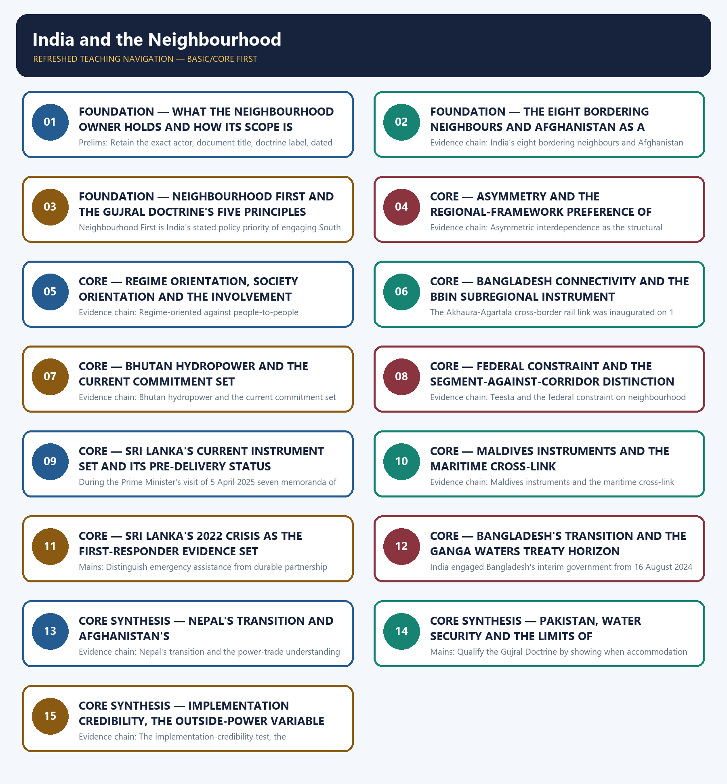

# India and the Neighbourhood — Learner-v2 Complete Learning Session

> **Authoring-only generation:** 2026-09-03. No PDF was rendered and no tracker or index was mutated.

### SOURCE, PROGRESSION AND CURRENT-LINKAGE AUDIT

- **Generation date:** 2026-09-03.
- **Repository-first evidence:** the Basic owner is taught first and preserved in full; the Advanced owner is retained only in the optional final teaching block.
- **OCR evidence:** Repository Markdown was primary. The OCR-searchable official General Studies question papers held under books\mains and books\more_previous_papers were read only to confirm the printed wording of routed demands. No official answer key, marking scheme, page precision or unsupported quotation was imported from them.
- **Qdrant:** not used; repository Markdown and available OCR context were sufficient.
- **PYQ integrity:** One General Studies Paper II Mains demand is routed to this topic in the audited routing ledgers and it is reproduced below as a demand card with its printed year, paper, question number, directive, marks and word limit exactly as the ledger records them: 2022 General Studies Paper II question 9, on India's role in the recent crisis in Sri Lanka, a Discuss demand of 10 marks and 150 words, where the ledger records that the Core route supersedes the older Advanced ownership. Four objective demands are also routed to this owner and are carried as coverage requirements only: 2020 Prelims General Studies Paper I question 64 on India's trade with Sri Lanka, Bangladesh and Nepal, for which the official key is not held locally; 2023 Prelims General Studies Paper I question 10 on India's regional connectivity projects including the Trilateral Highway and the Bangladesh-China-India-Myanmar corridor, for which the official key is not held locally; and 2026 Prelims General Studies Paper I questions 61 and 67 on India's cross-border bridges with Bangladesh, Myanmar and Nepal and on Indian development-assistance projects matched with neighbouring partner countries and locations, for which only a provisional 2026 Set-A key is present locally. No option or answer letter is recorded or inferred for any objective demand, and the provisional status of the 2026 key is preserved exactly. The audited ledgers record no 2024-2025 Mains demand naming the wider South Asian neighbourhood, Maldives being separately addressed by the 2024 objective demand routed to topic 04, and that absence is stated honestly rather than filled by force-fitting an unrelated question. The locally held OCR-searchable official General Studies papers were read only to confirm the printed wording of the routed Mains demand; no question was invented from them, no stem was paraphrased into an apparent routing, and no marking scheme or page precision was imported. Every model solution below is original work written to the repository's examiner-grade standard using the claim, named evidence, analysis and qualification pattern, and none of them reproduces or claims an official answer.
- **Live-link boundary:** Live official verification was attempted on 2026-09-03 against the Ministry of External Affairs press-release, bilateral-document and country-brief pages and against the Press Information Bureau release index. Each attempt is recorded honestly above: the Ministry pages returned a browser-requirement stub or the Ministry's own error page and the Press Information Bureau index returned HTTP 403, so no new live item was obtained. The package therefore uses only the dated official anchors already carried by the repository owners, each with its actor, exact evidentiary level and date. It invents no treaty or joint-statement wording, no border or diplomatic status, no summit outcome, no trade, tariff, investment or supply-chain figure, no initiative membership or participation category, no military or security development, no declared policy position, no previous-year question, no answer key and no current claim.
- **Fact/inference discipline:** no current-affairs item, PYQ wording, figure or quotation is invented.

### LIVE OFFICIAL-SOURCE ATTEMPT LOG

Every live check below was attempted on 2026-09-03 in the priority order required for International Relations: Ministry of External Affairs official pages first, then other official government or international-organisation documents. Access failures are recorded exactly as observed and no claim is reconstructed from a failed fetch.

- https://www.mea.gov.in/press-releases.htm — attempted 2026-09-03; the request redirected to a browser-requirement stub and returned no press release text, so no live item was taken from it.
- https://www.mea.gov.in/bilateral-documents.htm — attempted 2026-09-03; the request redirected to a browser-requirement stub and returned no bilateral document text, so no live item was taken from it.
- https://www.mea.gov.in/foreign-relation.htm — attempted 2026-09-03; the request redirected to the Ministry's own error page, so no country brief was taken from it.
- https://www.pib.gov.in/indexd.aspx?reg=3&lang=1 — attempted 2026-09-03; the request returned HTTP 403, so no release was taken from it.

## BASIC LEARNING SESSION

### DEEP-REVIEW LEARNING CONTRACT

| Control | Binding rule for this package |
|---|---|
| Syllabus boundary | Complete International Relations Basic/Core is answer-complete before optional Advanced depth. |
| Status boundary | Announced, negotiated, initialled, signed, ratified, entered into force, operational, suspended and completed remain distinct. |
| Institutional method | Treaty basis or political character → exact membership/status → mandate → decision rule → national instrument → implementation → outcome. |
| Level mapping | Bilateral, subregional/regional, minilateral/plurilateral and systemic levels are separated and then connected. |
| Policy method | Strategic objective → chosen instrument → implementing actors/resources → observed output/outcome → alternative and residual risk. |
| Evidence method | Claim → named India-centric treaty, institution, corridor, operation, agreement or summit → analysis → official source/date/status and causal qualification. |
| Neutrality method | Contested borders, maritime claims and conflicts are attributed neutrally; policy doctrine is distinguished from retrospective analytical label. |
| Practice contract | Every solved item has demand decoding, a detailed examiner-grade model, executable timed/compression plan, marks rationale and answer-specific improvement. |
| Approval | This immutable successor remains `approved: false` pending explicit approval. |

**Canonical Basic/Core owner:** `upsc-ai-kit\knowledge\International-Relations\basic\02_India-and-the-Neighbourhood.md`  
**Substantive canonical provenance owner:** `upsc-ai-kit\knowledge\International-Relations\02_India-and-the-Neighbourhood_Learner-V2-Complete-Topic-Package.md`  
**Optional Advanced owner:** `upsc-ai-kit\knowledge\International-Relations\advanced\02_India-and-the-Neighbourhood.md`  
**Official syllabus mapping:** `upsc-ai-kit\knowledge\International Relations\OFFICIAL-UPSC-SYLLABUS-MAPPING.md`

### EVIDENCE, PYQ AND CURRENT-STATUS CONTROL

- **Membership discipline:** member, observer, dialogue partner, chair, guest and invited participant are not interchangeable; verify the relevant date.
- **Mandate discipline:** treaty organisation, UN organ, specialised agency, court, summit process, political forum, coalition and minilateral retain exact legal character and competence.
- **Agreement discipline:** announcement, negotiation, signature, ratification, entry into force, domestic implementation and measured outcome remain separate.
- **Connectivity discipline:** concept, financing, contract, construction, trial movement, operational segment, completed corridor and commercially viable use remain separate.
- **Conflict discipline:** distinguish verified event, party claim, independent attribution, legal characterisation and analytical inference; use neutral language for contested borders and conflicts.
- **Causal discipline:** chronology, summit language, trade change, deployment or project completion does not alone establish strategic effect; state mechanism, counterfactual and alternatives.
- **Trade-off discipline:** interests, capabilities, constraints, partner agency, escalation, dependence, finance, legitimacy, domestic distribution, alternatives and implementation risks are explicit.
- **PYQ discipline:** exact wording is preserved only where verified; routed or reconstructed demands remain labelled and no model is presented as an official UPSC answer.
- **Current-status note, rechecked 2026-09-03:** volatile relations, agreements, corridors, operations, conflicts, trade and summit outcomes retain official source, publication date and operative/interim/completed status; stale officeholders are omitted.

**Generation-local live/current sources:**
- `https://www.mea.gov.in/press-releases.htm — attempted 2026-09-03; the request redirected to a browser-requirement stub and returned no press release text, so no live item was taken from it.`
- `https://www.mea.gov.in/bilateral-documents.htm — attempted 2026-09-03; the request redirected to a browser-requirement stub and returned no bilateral document text, so no live item was taken from it.`
- `https://www.mea.gov.in/foreign-relation.htm — attempted 2026-09-03; the request redirected to the Ministry's own error page, so no country brief was taken from it.`
- `https://www.pib.gov.in/indexd.aspx?reg=3&lang=1 — attempted 2026-09-03; the request returned HTTP 403, so no release was taken from it.`




*Distinct embedded teaching-navigation image. The separate continuous Cārvāka-style flowchart package remains an independent at-a-glance artifact.*

### SESSION 1 — FOUNDATION — WHAT THE NEIGHBOURHOOD OWNER HOLDS AND HOW ITS SCOPE IS BOUNDED

#### DEFINITION / WHAT THIS IS CALLED

**Plain-language definition:** Evidence chain: What this owner holds and how its scope is bounded Qualified use: Open a neighbourhood demand by fixing the owner's boundary before naming any country or project.

**Technical definition:** Prelims: Retain the exact actor, document title, doctrine label, dated instrument and evidentiary level attached to What the neighbourhood owner holds and how its scope is bounded, and never upgrade a vision statement into a treaty, a signature into a ratification, a participation category into membership, or an announced corridor into an operating one.

#### ANSWER-GRABBING OPENING — WRITE/ADAPT IN THE EXAM

> Evidence chain: What this owner holds and how its scope is bounded Qualified use: Open a neighbourhood demand by fixing the owner's boundary before naming any country or project.

#### MUST-WRITE KEYWORDS

- **FOUNDATION**
- **What the neighbourhood owner holds**
- **how its scope is bounded**
- **Evidence chain**
- **Qualified use**
- **This**

**How to use them:** Frame the answer through FOUNDATION; define What the neighbourhood owner holds, connect how its scope is bounded with Evidence chain to explain the mechanism, and use Qualified use for the decisive comparison or qualification.

#### VISUAL FIRST

```text
WHAT THE NEIGHBOURHOOD OWNER HOLDS AND HOW ITS SCOPE IS BOUNDED
01. What this owner holds and how its scope is bounded
BOUNDARY -> Maldives depth belongs to topic 04, grouping comparison to topic 10 and route geography to the Geography owner.
```

*This topic-specific rail fixes the evidence sequence and its exam boundary before analysis.*

#### CORE EXPLANATION

This topic owns India's engagement with Bangladesh, Bhutan, Nepal, Sri Lanka, Myanmar, Pakistan and Afghanistan, together with the Neighbourhood First policy, the Gujral Doctrine, and the development, connectivity and people-to-people instruments that carry them, and its distinctive feature is that it is simultaneously doctrinal and heavily evidence-bound: one General Studies Paper II Mains demand from 2022 is routed to it in the audited ledgers alongside four objective demands from 2020, 2023 and 2026; Maldives is deliberately cross-linked to topic 04 because its salience is primarily maritime, the SAARC and BIMSTEC institutional comparison is reserved for topic 10, and the physical border and route geography belongs to the Geography owner.

#### NAMED EVIDENCE AND MECHANISM

- This topic owns India's engagement with Bangladesh, Bhutan, Nepal, Sri Lanka, Myanmar, Pakistan and Afghanistan, together with the Neighbourhood First policy, the Gujral Doctrine, and the development, connectivity and people-to-people instruments that carry them, and its distinctive feature is that it is simultaneously doctrinal and heavily evidence-bound: one General Studies Paper II Mains demand from 2022 is routed to it in the audited ledgers alongside four objective demands from 2020, 2023 and 2026; Maldives is deliberately cross-linked to topic 04 because its salience is primarily maritime, the SAARC and BIMSTEC institutional comparison is reserved for topic 10, and the physical border and route geography belongs to the Geography owner.

#### EXAMINER CAUTION

- Maldives depth belongs to topic 04, grouping comparison to topic 10 and route geography to the Geography owner.

#### EXAM LINK

- **Prelims:** Retain the exact actor, document title, doctrine label, dated instrument and evidentiary level attached to What the neighbourhood owner holds and how its scope is bounded, and never upgrade a vision statement into a treaty, a signature into a ratification, a participation category into membership, or an announced corridor into an operating one.
- **Mains:** Open a neighbourhood demand by fixing the owner's boundary before naming any country or project.

#### MINI RECAP

- **Evidence chain:** What this owner holds and how its scope is bounded
- **Qualified use:** Open a neighbourhood demand by fixing the owner's boundary before naming any country or project.

#### CLOSING RECALL FLOW — FOUNDATION — WHAT THE NEIGHBOURHOOD OWNER HOLDS AND HOW ITS SCOPE IS BOUNDED

```text
START / CONCEPT: FOUNDATION — What the neighbourhood owner holds and how its scope is bounded
        |
        v
EXACT TERMS: FOUNDATION · What the neighbourhood owner holds · how its scope is bounded · Evidence chain · Qualified use · This
        |
        v
MECHANISM / ARGUMENT: Prelims: Retain the exact actor, document title, doctrine label, dated instrument and evidentiary level attached to What the neighbourhood owner holds and how its scope is bounded, and never upgrade a vision statement into a treaty, a signature into a ratification, a participation category into membership, or an announced corridor into an operating one.
        |
        v
CONSEQUENCE / CONTRAST: This topic owns India's engagement with Bangladesh, Bhutan, Nepal, Sri Lanka, Myanmar, Pakistan and Afghanistan, together with the Neighbourhood First policy, the Gujral Doctrine, and the development, connectivity and people-to-people instruments that carry them, and its distinctive feature is that it is simultaneously doctrinal and heavily evidence-bound: one General Studies Paper II Mains demand from 2022 is routed to it in the audited ledgers alongside four objective demands from 2020, 2023 and 2026; Maldives is deliberately cross-linked to topic 04 because its salience is primarily maritime, the SAARC and BIMSTEC institutional comparison is reserved for topic 10, and the physical border and route geography belongs to the Geography owner.
        |
        v
UPSC TRAP / ANSWER-USE: Do not miss this limiting distinction: what this owner holds and how its scope is bounded Qualified use.
        |
        v
ANSWER-GRABBING FORMULATION: Evidence chain: What this owner holds and how its scope is bounded Qualified use: Open a neighbourhood demand by fixing the owner's boundary before naming any country or project.
```
### SESSION 2 — FOUNDATION — THE EIGHT BORDERING NEIGHBOURS AND AFGHANISTAN AS A NEAR-NEIGHBOUR

#### DEFINITION / WHAT THIS IS CALLED

**Plain-language definition:** Neighbourhood is defined by security relevance, and friction with six of eight is structural rather than exceptional.

**Technical definition:** Evidence chain: India's eight bordering neighbours and Afghanistan as a near-neighbour Qualified use: Establish the geographic and analytical frame before any evaluative claim about regional primacy.

#### ANSWER-GRABBING OPENING — WRITE/ADAPT IN THE EXAM

> Tharoor counts Pakistan, China, Nepal, Bhutan, Bangladesh, Myanmar, Sri Lanka and Maldives as sharing a land or maritime border with India, and adds Afghanistan as a near-neighbour because Pakistan's capture in 1948 of a strip of north-western Kashmir made Afghanistan territorially adjacent, and he separately records that of the eight bordering states there has been a history of problems, of varying degrees of difficulty, with six; the examinable consequence is that neighbourhood in Indian strategic practice is defined by security relevance and not only by strict territorial contiguity, and that friction is a structural feature rather than an aberration.

#### MUST-WRITE KEYWORDS

- **FOUNDATION**
- **The eight bordering neighbours**
- **Afghanistan as a near-neighbour**
- **Evidence chain**
- **Qualified use**
- **Tharoor**

**How to use them:** Frame the answer through FOUNDATION; define The eight bordering neighbours, connect Afghanistan as a near-neighbour with Evidence chain to explain the mechanism, and use Qualified use for the decisive comparison or qualification.

#### VISUAL FIRST

```text
THE EIGHT BORDERING NEIGHBOURS AND AFGHANISTAN AS A NEAR-NEIGHBOUR
01. India's eight bordering neighbours and Afghanistan as a near-neighbour
BOUNDARY -> Neighbourhood is defined by security relevance, and friction with six of eight is structural rather than exceptional.
```

*This topic-specific rail fixes the evidence sequence and its exam boundary before analysis.*

#### CORE EXPLANATION

Tharoor counts Pakistan, China, Nepal, Bhutan, Bangladesh, Myanmar, Sri Lanka and Maldives as sharing a land or maritime border with India, and adds Afghanistan as a near-neighbour because Pakistan's capture in 1948 of a strip of north-western Kashmir made Afghanistan territorially adjacent, and he separately records that of the eight bordering states there has been a history of problems, of varying degrees of difficulty, with six; the examinable consequence is that neighbourhood in Indian strategic practice is defined by security relevance and not only by strict territorial contiguity, and that friction is a structural feature rather than an aberration.

#### NAMED EVIDENCE AND MECHANISM

- Tharoor counts Pakistan, China, Nepal, Bhutan, Bangladesh, Myanmar, Sri Lanka and Maldives as sharing a land or maritime border with India, and adds Afghanistan as a near-neighbour because Pakistan's capture in 1948 of a strip of north-western Kashmir made Afghanistan territorially adjacent, and he separately records that of the eight bordering states there has been a history of problems, of varying degrees of difficulty, with six; the examinable consequence is that neighbourhood in Indian strategic practice is defined by security relevance and not only by strict territorial contiguity, and that friction is a structural feature rather than an aberration.

#### EXAMINER CAUTION

- Neighbourhood is defined by security relevance, and friction with six of eight is structural rather than exceptional.

#### EXAM LINK

- **Prelims:** Retain the exact actor, document title, doctrine label, dated instrument and evidentiary level attached to The eight bordering neighbours and Afghanistan as a near-neighbour, and never upgrade a vision statement into a treaty, a signature into a ratification, a participation category into membership, or an announced corridor into an operating one.
- **Mains:** Establish the geographic and analytical frame before any evaluative claim about regional primacy.

#### MINI RECAP

- **Evidence chain:** India's eight bordering neighbours and Afghanistan as a near-neighbour
- **Qualified use:** Establish the geographic and analytical frame before any evaluative claim about regional primacy.

#### CLOSING RECALL FLOW — FOUNDATION — THE EIGHT BORDERING NEIGHBOURS AND AFGHANISTAN AS A NEAR-NEIGHBOUR

```text
START / CONCEPT: FOUNDATION — The eight bordering neighbours and Afghanistan as a near-neighbour
        |
        v
EXACT TERMS: FOUNDATION · The eight bordering neighbours · Afghanistan as a near-neighbour · Evidence chain · Qualified use · Tharoor
        |
        v
MECHANISM / ARGUMENT: Evidence chain: India's eight bordering neighbours and Afghanistan as a near-neighbour Qualified use: Establish the geographic and analytical frame before any evaluative claim about regional primacy.
        |
        v
CONSEQUENCE / CONTRAST: Neighbourhood is defined by security relevance, and friction with six of eight is structural rather than exceptional.
        |
        v
UPSC TRAP / ANSWER-USE: Do not miss this limiting distinction: tharoor counts Pakistan, China, Nepal, Bhutan, Bangladesh, Myanmar, Sri Lanka and Maldives as sharing...
        |
        v
ANSWER-GRABBING FORMULATION: Tharoor counts Pakistan, China, Nepal, Bhutan, Bangladesh, Myanmar, Sri Lanka and Maldives as sharing a land or maritime border with India, and adds Afghanistan as a near-neighbour because Pakistan's capture in 1948 of a strip of north-western Kashmir made Afghanistan territorially adjacent, and he separately records that of the eight bordering states there has been a history of problems, of varying degrees of difficulty, with six; the examinable consequence is that neighbourhood in Indian strategic practice is defined by security relevance and not only by strict territorial contiguity, and that friction is a structural feature rather than an aberration.
```
### SESSION 3 — FOUNDATION — NEIGHBOURHOOD FIRST AND THE GUJRAL DOCTRINE'S FIVE PRINCIPLES

#### DEFINITION / WHAT THIS IS CALLED

**Plain-language definition:** Evidence chain: Neighbourhood First as a stated priority policy - The Gujral Doctrine and its five principles Qualified use: Supply the doctrinal spine that any South Asia answer is expected to name precisely.

**Technical definition:** Neighbourhood First is India's stated policy priority of engaging South Asian neighbours ahead of more distant partners through connectivity, development assistance and people-to-people ties, delivered by prime-ministerial visits, policy statements, lines of credit, power-grid interlinkage, transit and transport protocols and river-water cooperation, with readiness for humanitarian assistance and disaster relief built in; the qualification the owners insist upon is that the doctrine is not applied identically to every neighbour, because its emphasis is calibrated by the partner's size, history and current politics.

#### ANSWER-GRABBING OPENING — WRITE/ADAPT IN THE EXAM

> Evidence chain: Neighbourhood First as a stated priority policy - The Gujral Doctrine and its five principles Qualified use: Supply the doctrinal spine that any South Asia answer is expected to name precisely.

#### MUST-WRITE KEYWORDS

- **FOUNDATION**
- **Neighbourhood First**
- **the Gujral Doctrine's five principles**
- **Evidence chain**
- **Qualified use**
- **India's**

**How to use them:** Frame the answer through FOUNDATION; define Neighbourhood First, connect the Gujral Doctrine's five principles with Evidence chain to explain the mechanism, and use Qualified use for the decisive comparison or qualification.

#### VISUAL FIRST

```text
NEIGHBOURHOOD FIRST AND THE GUJRAL DOCTRINE'S FIVE PRINCIPLES
01. Neighbourhood First as a stated priority policy
    |
    v
02. The Gujral Doctrine and its five principles
BOUNDARY -> Non-reciprocal accommodation is the doctrine's defining feature and its emphasis is calibrated per neighbour.
```

*This topic-specific rail fixes the evidence sequence and its exam boundary before analysis.*

#### CORE EXPLANATION

Neighbourhood First is India's stated policy priority of engaging South Asian neighbours ahead of more distant partners through connectivity, development assistance and people-to-people ties, delivered by prime-ministerial visits, policy statements, lines of credit, power-grid interlinkage, transit and transport protocols and river-water cooperation, with readiness for humanitarian assistance and disaster relief built in; the qualification the owners insist upon is that the doctrine is not applied identically to every neighbour, because its emphasis is calibrated by the partner's size, history and current politics. The Gujral Doctrine, associated with former Prime Minister I. K. Gujral, is a five-principle approach under which India does not seek reciprocity from smaller neighbours, does not interfere in their internal affairs, does not allow its territory to be used against them, respects their territorial integrity, and settles disputes bilaterally and peacefully, and it remains the standard doctrinal reference for South Asia policy; the defining feature that examiners test is non-reciprocal accommodation, so any statement that the doctrine demands reciprocity as a precondition for cooperation inverts its meaning exactly.

#### NAMED EVIDENCE AND MECHANISM

- Neighbourhood First is India's stated policy priority of engaging South Asian neighbours ahead of more distant partners through connectivity, development assistance and people-to-people ties, delivered by prime-ministerial visits, policy statements, lines of credit, power-grid interlinkage, transit and transport protocols and river-water cooperation, with readiness for humanitarian assistance and disaster relief built in; the qualification the owners insist upon is that the doctrine is not applied identically to every neighbour, because its emphasis is calibrated by the partner's size, history and current politics.
- The Gujral Doctrine, associated with former Prime Minister I. K. Gujral, is a five-principle approach under which India does not seek reciprocity from smaller neighbours, does not interfere in their internal affairs, does not allow its territory to be used against them, respects their territorial integrity, and settles disputes bilaterally and peacefully, and it remains the standard doctrinal reference for South Asia policy; the defining feature that examiners test is non-reciprocal accommodation, so any statement that the doctrine demands reciprocity as a precondition for cooperation inverts its meaning exactly.

#### EXAMINER CAUTION

- Non-reciprocal accommodation is the doctrine's defining feature and its emphasis is calibrated per neighbour.

#### EXAM LINK

- **Prelims:** Retain the exact actor, document title, doctrine label, dated instrument and evidentiary level attached to Neighbourhood First and the Gujral Doctrine's five principles, and never upgrade a vision statement into a treaty, a signature into a ratification, a participation category into membership, or an announced corridor into an operating one.
- **Mains:** Supply the doctrinal spine that any South Asia answer is expected to name precisely.

#### MINI RECAP

- **Evidence chain:** Neighbourhood First as a stated priority policy -> The Gujral Doctrine and its five principles
- **Qualified use:** Supply the doctrinal spine that any South Asia answer is expected to name precisely.

#### CLOSING RECALL FLOW — FOUNDATION — NEIGHBOURHOOD FIRST AND THE GUJRAL DOCTRINE'S FIVE PRINCIPLES

```text
START / CONCEPT: FOUNDATION — Neighbourhood First and the Gujral Doctrine's five principles
        |
        v
EXACT TERMS: FOUNDATION · Neighbourhood First · the Gujral Doctrine's five principles · Evidence chain · Qualified use · India's
        |
        v
MECHANISM / ARGUMENT: Neighbourhood First is India's stated policy priority of engaging South Asian neighbours ahead of more distant partners through connectivity, development assistance and people-to-people ties, delivered by prime-ministerial visits, policy statements, lines of credit, power-grid interlinkage, transit and transport protocols and river-water cooperation, with readiness for humanitarian assistance and disaster relief built in; the qualification the owners insist upon is that the doctrine is not applied identically to every neighbour, because its emphasis is calibrated by the partner's size, history and current politics.
        |
        v
CONSEQUENCE / CONTRAST: Gujral, is a five-principle approach under which India does not seek reciprocity from smaller neighbours, does not interfere in their internal affairs, does not allow its territory to be used against them, respects their territorial integrity, and settles disputes bilaterally and peacefully, and it remains the standard doctrinal reference for South Asia policy; the defining feature that examiners test is non-reciprocal accommodation, so any statement that the doctrine demands reciprocity as a precondition for cooperation inverts its meaning exactly.
        |
        v
UPSC TRAP / ANSWER-USE: Do not miss this limiting distinction: non-reciprocal accommodation is the doctrine's defining feature and its emphasis is calibrated per neighbour.
        |
        v
ANSWER-GRABBING FORMULATION: Evidence chain: Neighbourhood First as a stated priority policy - The Gujral Doctrine and its five principles Qualified use: Supply the doctrinal spine that any South Asia answer is expected to name precisely.
```
### SESSION 4 — CORE — ASYMMETRY AND THE REGIONAL-FRAMEWORK PREFERENCE OF SMALLER NEIGHBOURS

#### DEFINITION / WHAT THIS IS CALLED

**Plain-language definition:** Sikri records that smaller neighbours like Bhutan, Nepal, Maldives and Sri Lanka have shown greater interest in economic integration with India than the larger ones like Pakistan and Bangladesh, and that they are more receptive to cooperation within a regional framework than on a bilateral basis because numbers give them a sense of greater security, which the owners treat as a structural rather than merely tactical preference; the necessary qualification is that this preference does not amount to rejecting bilateral engagement, because the substantive connectivity work still proceeds bilaterally while the regional overlay supplies political reassurance.

**Technical definition:** Evidence chain: Asymmetric interdependence as the structural starting point - Sikri's regional-framework preference among smaller neighbours Qualified use: Convert size disparity into a design problem about reliable public goods rather than an adversarial claim.

#### ANSWER-GRABBING OPENING — WRITE/ADAPT IN THE EXAM

> Sikri records that smaller neighbours like Bhutan, Nepal, Maldives and Sri Lanka have shown greater interest in economic integration with India than the larger ones like Pakistan and Bangladesh, and that they are more receptive to cooperation within a regional framework than on a bilateral basis because numbers give them a sense of greater security, which the owners treat as a structural rather than merely tactical preference; the necessary qualification is that this preference does not amount to rejecting bilateral engagement, because the substantive connectivity work still proceeds bilaterally while the regional overlay supplies political reassurance.

#### MUST-WRITE KEYWORDS

- **Asymmetry**
- **the regional-framework preference of smaller neighbours**
- **Evidence chain**
- **Qualified use**
- **India**
- **Gujral Doctrine**

**How to use them:** Frame the answer through Asymmetry; define the regional-framework preference of smaller neighbours, connect Evidence chain with Qualified use to explain the mechanism, and use India for the decisive comparison or qualification.

#### VISUAL FIRST

```text
ASYMMETRY AND THE REGIONAL-FRAMEWORK PREFERENCE OF SMALLER NEIGHBOURS
01. Asymmetric interdependence as the structural starting point
    |
    v
02. Sikri's regional-framework preference among smaller neighbours
BOUNDARY -> The preference adds reassurance and does not amount to rejecting bilateral delivery.
```

*This topic-specific rail fixes the evidence sequence and its exam boundary before analysis.*

#### CORE EXPLANATION

India is larger in economy, population and military capacity than its entire immediate neighbourhood combined, and the owners treat this asymmetry as the structural condition that shapes how smaller states balance cooperation with India against anxiety about dependence, so the Gujral Doctrine is best read as a response to that anxiety rather than as generosity for its own sake; the analytical move that raises an answer is to treat asymmetry as a design problem to be converted into reliable public goods, instead of treating size disparity as inherently adversarial. Sikri records that smaller neighbours like Bhutan, Nepal, Maldives and Sri Lanka have shown greater interest in economic integration with India than the larger ones like Pakistan and Bangladesh, and that they are more receptive to cooperation within a regional framework than on a bilateral basis because numbers give them a sense of greater security, which the owners treat as a structural rather than merely tactical preference; the necessary qualification is that this preference does not amount to rejecting bilateral engagement, because the substantive connectivity work still proceeds bilaterally while the regional overlay supplies political reassurance.

#### NAMED EVIDENCE AND MECHANISM

- India is larger in economy, population and military capacity than its entire immediate neighbourhood combined, and the owners treat this asymmetry as the structural condition that shapes how smaller states balance cooperation with India against anxiety about dependence, so the Gujral Doctrine is best read as a response to that anxiety rather than as generosity for its own sake; the analytical move that raises an answer is to treat asymmetry as a design problem to be converted into reliable public goods, instead of treating size disparity as inherently adversarial.
- Sikri records that smaller neighbours like Bhutan, Nepal, Maldives and Sri Lanka have shown greater interest in economic integration with India than the larger ones like Pakistan and Bangladesh, and that they are more receptive to cooperation within a regional framework than on a bilateral basis because numbers give them a sense of greater security, which the owners treat as a structural rather than merely tactical preference; the necessary qualification is that this preference does not amount to rejecting bilateral engagement, because the substantive connectivity work still proceeds bilaterally while the regional overlay supplies political reassurance.

#### EXAMINER CAUTION

- The preference adds reassurance and does not amount to rejecting bilateral delivery.

#### EXAM LINK

- **Prelims:** Retain the exact actor, document title, doctrine label, dated instrument and evidentiary level attached to Asymmetry and the regional-framework preference of smaller neighbours, and never upgrade a vision statement into a treaty, a signature into a ratification, a participation category into membership, or an announced corridor into an operating one.
- **Mains:** Convert size disparity into a design problem about reliable public goods rather than an adversarial claim.

#### MINI RECAP

- **Evidence chain:** Asymmetric interdependence as the structural starting point -> Sikri's regional-framework preference among smaller neighbours
- **Qualified use:** Convert size disparity into a design problem about reliable public goods rather than an adversarial claim.

#### CLOSING RECALL FLOW — CORE — ASYMMETRY AND THE REGIONAL-FRAMEWORK PREFERENCE OF SMALLER NEIGHBOURS

```text
START / CONCEPT: CORE — Asymmetry and the regional-framework preference of smaller neighbours
        |
        v
EXACT TERMS: Asymmetry · the regional-framework preference of smaller neighbours · Evidence chain · Qualified use · India · Gujral Doctrine
        |
        v
MECHANISM / ARGUMENT: Evidence chain: Asymmetric interdependence as the structural starting point - Sikri's regional-framework preference among smaller neighbours Qualified use: Convert size disparity into a design problem about reliable public goods rather than an adversarial claim.
        |
        v
CONSEQUENCE / CONTRAST: The preference adds reassurance and does not amount to rejecting bilateral delivery.
        |
        v
UPSC TRAP / ANSWER-USE: India is larger in economy, population and military capacity than its entire immediate neighbourhood combined, and the owners treat this asymmetry as the structural condition that shapes how smaller states balance cooperation with India against anxiety about dependence, so the Gujral Doctrine is best read as a response to that anxiety rather than as generosity for its own sake; the analytical move that raises an answer is to treat asymmetry as a design problem to be converted into reliable public goods, instead of treating size disparity as inherently adversarial.
        |
        v
ANSWER-GRABBING FORMULATION: Sikri records that smaller neighbours like Bhutan, Nepal, Maldives and Sri Lanka have shown greater interest in economic integration with India than the larger ones like Pakistan and Bangladesh, and that they are more receptive to cooperation within a regional framework than on a bilateral basis because numbers give them a sense of greater security, which the owners treat as a structural rather than merely tactical preference; the necessary qualification is that this preference does not amount to rejecting bilateral engagement, because the substantive connectivity work still proceeds bilaterally while the regional overlay supplies political reassurance.
```
### SESSION 5 — CORE — REGIME ORIENTATION, SOCIETY ORIENTATION AND THE INVOLVEMENT TENSION

#### DEFINITION / WHAT THIS IS CALLED

**Plain-language definition:** Historical involvement is cited as episode, not as a standing doctrine, and sits in tension with non-interference.

**Technical definition:** Evidence chain: Regime-oriented against people-to-people engagement - Domestic-political sensitivity and the historical-involvement tension Qualified use: Acknowledge an unresolved doctrinal tension explicitly, which examiners reward over a smoothed narrative.

#### ANSWER-GRABBING OPENING — WRITE/ADAPT IN THE EXAM

> Historical involvement is cited as episode, not as a standing doctrine, and sits in tension with non-interference.

#### MUST-WRITE KEYWORDS

- **Regime orientation**
- **society orientation**
- **the involvement tension**
- **Evidence chain**
- **Qualified use**
- **1950-51**

**How to use them:** Frame the answer through Regime orientation; define society orientation, connect the involvement tension with Evidence chain to explain the mechanism, and use Qualified use for the decisive comparison or qualification.

#### VISUAL FIRST

```text
REGIME ORIENTATION, SOCIETY ORIENTATION AND THE INVOLVEMENT TENSION
01. Regime-oriented against people-to-people engagement
    |
    v
02. Domestic-political sensitivity and the historical-involvement tension
BOUNDARY -> Historical involvement is cited as episode, not as a standing doctrine, and sits in tension with non-interference.
```

*This topic-specific rail fixes the evidence sequence and its exam boundary before analysis.*

#### CORE EXPLANATION

Sikri argues that India must move away from its excessive regime-oriented policies towards people-to-people relations on the reasoning that only neighbouring regimes which reflect their own people's interests are likely to sustain friendly relations with India, and the owners convert this into the operative test of Neighbourhood First, namely whether engagement survives a change of government in the partner state; the regime-orientation trap emerges when engagement depends too heavily on one incumbent, producing discontinuity whenever that incumbent changes, and the people-to-people reorientation is presented as a partial mitigation rather than a guarantee. Sikri states that India has no alternative but to closely follow and deeply analyze political trends in neighbouring countries because their domestic developments have an effect on India itself, and he cites India as the decisive factor in seeking a resolution of domestic political crises in Bangladesh in 1971, Sri Lanka in 1987 and Nepal in 1950-51 and subsequent crises; the owners require that these be treated as historical references rather than a standing doctrine of intervention, and that the resulting tension with the Gujral Doctrine's non-interference principle be acknowledged explicitly instead of being smoothed into one consistent posture.

#### NAMED EVIDENCE AND MECHANISM

- Sikri argues that India must move away from its excessive regime-oriented policies towards people-to-people relations on the reasoning that only neighbouring regimes which reflect their own people's interests are likely to sustain friendly relations with India, and the owners convert this into the operative test of Neighbourhood First, namely whether engagement survives a change of government in the partner state; the regime-orientation trap emerges when engagement depends too heavily on one incumbent, producing discontinuity whenever that incumbent changes, and the people-to-people reorientation is presented as a partial mitigation rather than a guarantee.
- Sikri states that India has no alternative but to closely follow and deeply analyze political trends in neighbouring countries because their domestic developments have an effect on India itself, and he cites India as the decisive factor in seeking a resolution of domestic political crises in Bangladesh in 1971, Sri Lanka in 1987 and Nepal in 1950-51 and subsequent crises; the owners require that these be treated as historical references rather than a standing doctrine of intervention, and that the resulting tension with the Gujral Doctrine's non-interference principle be acknowledged explicitly instead of being smoothed into one consistent posture.

#### EXAMINER CAUTION

- Historical involvement is cited as episode, not as a standing doctrine, and sits in tension with non-interference.

#### EXAM LINK

- **Prelims:** Retain the exact actor, document title, doctrine label, dated instrument and evidentiary level attached to Regime orientation, society orientation and the involvement tension, and never upgrade a vision statement into a treaty, a signature into a ratification, a participation category into membership, or an announced corridor into an operating one.
- **Mains:** Acknowledge an unresolved doctrinal tension explicitly, which examiners reward over a smoothed narrative.

#### MINI RECAP

- **Evidence chain:** Regime-oriented against people-to-people engagement -> Domestic-political sensitivity and the historical-involvement tension
- **Qualified use:** Acknowledge an unresolved doctrinal tension explicitly, which examiners reward over a smoothed narrative.

#### CLOSING RECALL FLOW — CORE — REGIME ORIENTATION, SOCIETY ORIENTATION AND THE INVOLVEMENT TENSION

```text
START / CONCEPT: CORE — Regime orientation, society orientation and the involvement tension
        |
        v
EXACT TERMS: Regime orientation · society orientation · the involvement tension · Evidence chain · Qualified use · 1950-51
        |
        v
MECHANISM / ARGUMENT: Sikri states that India has no alternative but to closely follow and deeply analyze political trends in neighbouring countries because their domestic developments have an effect on India itself, and he cites India as the decisive factor in seeking a resolution of domestic political crises in Bangladesh in 1971, Sri Lanka in 1987 and Nepal in 1950-51 and subsequent crises; the owners require that these be treated as historical references rather than a standing doctrine of intervention, and that the resulting tension with the Gujral Doctrine's non-interference principle be acknowledged explicitly instead of being smoothed into one consistent posture.
        |
        v
CONSEQUENCE / CONTRAST: Evidence chain: Regime-oriented against people-to-people engagement - Domestic-political sensitivity and the historical-involvement tension Qualified use: Acknowledge an unresolved doctrinal tension explicitly, which examiners reward over a smoothed narrative.
        |
        v
UPSC TRAP / ANSWER-USE: Sikri argues that India must move away from its excessive regime-oriented policies towards people-to-people relations on the reasoning that only neighbouring regimes which reflect their own people's interests are likely to sustain friendly relations with India, and the owners convert this into the operative test of Neighbourhood First, namely whether engagement survives a change of government in the partner state; the regime-orientation trap emerges when engagement depends too heavily on one incumbent, producing discontinuity whenever that incumbent changes, and the people-to-people reorientation is presented as a partial mitigation rather than a guarantee.
        |
        v
ANSWER-GRABBING FORMULATION: Historical involvement is cited as episode, not as a standing doctrine, and sits in tension with non-interference.
```
### SESSION 6 — CORE — BANGLADESH CONNECTIVITY AND THE BBIN SUBREGIONAL INSTRUMENT

#### DEFINITION / WHAT THIS IS CALLED

**Plain-language definition:** Evidence chain: Bangladesh connectivity and the BBIN subregional instrument Qualified use: Cite a dated connectivity instrument with the exact limitation that bounds its effect.

**Technical definition:** The Akhaura-Agartala cross-border rail link was inaugurated on 1 November 2023, complementing restored rail, inland-waterway, road and power links, and the Bangladesh, Bhutan, India and Nepal Motor Vehicles Agreement was signed in 2015 to facilitate cross-border passenger and cargo movement; the owners attach a limitation to each, namely that customs, trans-shipment, domestic politics and last-mile infrastructure determine actual use of a rail link, and that Bhutan's non-ratification has constrained four-country implementation of the Motor Vehicles Agreement, so subregionalism progresses where SAARC-wide consensus is unavailable but does not by itself deliver seamless movement.

#### ANSWER-GRABBING OPENING — WRITE/ADAPT IN THE EXAM

> Evidence chain: Bangladesh connectivity and the BBIN subregional instrument Qualified use: Cite a dated connectivity instrument with the exact limitation that bounds its effect.

#### MUST-WRITE KEYWORDS

- **Bangladesh connectivity**
- **the BBIN subregional instrument**
- **Evidence chain**
- **Qualified use**
- **The Akhaura-Agartala**
- **Bangladesh**

**How to use them:** Frame the answer through Bangladesh connectivity; define the BBIN subregional instrument, connect Evidence chain with Qualified use to explain the mechanism, and use The Akhaura-Agartala for the decisive comparison or qualification.

#### VISUAL FIRST

```text
BANGLADESH CONNECTIVITY AND THE BBIN SUBREGIONAL INSTRUMENT
01. Bangladesh connectivity and the BBIN subregional instrument
BOUNDARY -> Bhutan's non-ratification constrains four-country implementation and last-mile factors govern actual use.
```

*This topic-specific rail fixes the evidence sequence and its exam boundary before analysis.*

#### CORE EXPLANATION

The Akhaura-Agartala cross-border rail link was inaugurated on 1 November 2023, complementing restored rail, inland-waterway, road and power links, and the Bangladesh, Bhutan, India and Nepal Motor Vehicles Agreement was signed in 2015 to facilitate cross-border passenger and cargo movement; the owners attach a limitation to each, namely that customs, trans-shipment, domestic politics and last-mile infrastructure determine actual use of a rail link, and that Bhutan's non-ratification has constrained four-country implementation of the Motor Vehicles Agreement, so subregionalism progresses where SAARC-wide consensus is unavailable but does not by itself deliver seamless movement.

#### NAMED EVIDENCE AND MECHANISM

- The Akhaura-Agartala cross-border rail link was inaugurated on 1 November 2023, complementing restored rail, inland-waterway, road and power links, and the Bangladesh, Bhutan, India and Nepal Motor Vehicles Agreement was signed in 2015 to facilitate cross-border passenger and cargo movement; the owners attach a limitation to each, namely that customs, trans-shipment, domestic politics and last-mile infrastructure determine actual use of a rail link, and that Bhutan's non-ratification has constrained four-country implementation of the Motor Vehicles Agreement, so subregionalism progresses where SAARC-wide consensus is unavailable but does not by itself deliver seamless movement.

#### EXAMINER CAUTION

- Bhutan's non-ratification constrains four-country implementation and last-mile factors govern actual use.

#### EXAM LINK

- **Prelims:** Retain the exact actor, document title, doctrine label, dated instrument and evidentiary level attached to Bangladesh connectivity and the BBIN subregional instrument, and never upgrade a vision statement into a treaty, a signature into a ratification, a participation category into membership, or an announced corridor into an operating one.
- **Mains:** Cite a dated connectivity instrument with the exact limitation that bounds its effect.

#### MINI RECAP

- **Evidence chain:** Bangladesh connectivity and the BBIN subregional instrument
- **Qualified use:** Cite a dated connectivity instrument with the exact limitation that bounds its effect.

#### CLOSING RECALL FLOW — CORE — BANGLADESH CONNECTIVITY AND THE BBIN SUBREGIONAL INSTRUMENT

```text
START / CONCEPT: CORE — Bangladesh connectivity and the BBIN subregional instrument
        |
        v
EXACT TERMS: Bangladesh connectivity · the BBIN subregional instrument · Evidence chain · Qualified use · The Akhaura-Agartala · Bangladesh
        |
        v
MECHANISM / ARGUMENT: The Akhaura-Agartala cross-border rail link was inaugurated on 1 November 2023, complementing restored rail, inland-waterway, road and power links, and the Bangladesh, Bhutan, India and Nepal Motor Vehicles Agreement was signed in 2015 to facilitate cross-border passenger and cargo movement; the owners attach a limitation to each, namely that customs, trans-shipment, domestic politics and last-mile infrastructure determine actual use of a rail link, and that Bhutan's non-ratification has constrained four-country implementation of the Motor Vehicles Agreement, so subregionalism progresses where SAARC-wide consensus is unavailable but does not by itself deliver seamless movement.
        |
        v
CONSEQUENCE / CONTRAST: Bhutan's non-ratification constrains four-country implementation and last-mile factors govern actual use.
        |
        v
UPSC TRAP / ANSWER-USE: Do not miss this limiting distinction: bangladesh connectivity and the BBIN subregional instrument Qualified use.
        |
        v
ANSWER-GRABBING FORMULATION: Evidence chain: Bangladesh connectivity and the BBIN subregional instrument Qualified use: Cite a dated connectivity instrument with the exact limitation that bounds its effect.
```
### SESSION 7 — CORE — BHUTAN HYDROPOWER AND THE CURRENT COMMITMENT SET

#### DEFINITION / WHAT THIS IS CALLED

**Plain-language definition:** The 720 megawatt Mangdechhu project was commissioned in 2019 and handed over to Bhutan in 2022, illustrating joint project delivery and electricity trade that links Bhutanese revenue to Indian clean-power access, and the owners record India's commitment of one hundred billion Indian rupees, equivalently ten thousand crore rupees, for Bhutan's thirteenth Five Year Plan covering 2024 to 2029, a rail-link memorandum of understanding of 29 September 2025 for the Kokrajhar-Gelephu and Banarhat-Samtse links, and support for Gelephu Mindfulness City expressed on 12 November 2025; the evidentiary boundary is that these are a commitment, a memorandum and political support rather than commissioned rail links or an operating city, and that project delay, cost escalation, ecological effects and Bhutan's diversification concerns require balance.

**Technical definition:** Evidence chain: Bhutan hydropower and the current commitment set Qualified use: Separate a financing commitment from a delivered asset inside one bilateral relationship.

#### ANSWER-GRABBING OPENING — WRITE/ADAPT IN THE EXAM

> Evidence chain: Bhutan hydropower and the current commitment set Qualified use: Separate a financing commitment from a delivered asset inside one bilateral relationship.

#### MUST-WRITE KEYWORDS

- **Bhutan hydropower**
- **the current commitment set**
- **Evidence chain**
- **Qualified use**
- **Mangdechhu**
- **Bhutan**

**How to use them:** Frame the answer through Bhutan hydropower; define the current commitment set, connect Evidence chain with Qualified use to explain the mechanism, and use Mangdechhu for the decisive comparison or qualification.

#### VISUAL FIRST

```text
BHUTAN HYDROPOWER AND THE CURRENT COMMITMENT SET
01. Bhutan hydropower and the current commitment set
BOUNDARY -> A plan commitment, a rail memorandum and political support are not commissioned links or an operating city.
```

*This topic-specific rail fixes the evidence sequence and its exam boundary before analysis.*

#### CORE EXPLANATION

The 720 megawatt Mangdechhu project was commissioned in 2019 and handed over to Bhutan in 2022, illustrating joint project delivery and electricity trade that links Bhutanese revenue to Indian clean-power access, and the owners record India's commitment of one hundred billion Indian rupees, equivalently ten thousand crore rupees, for Bhutan's thirteenth Five Year Plan covering 2024 to 2029, a rail-link memorandum of understanding of 29 September 2025 for the Kokrajhar-Gelephu and Banarhat-Samtse links, and support for Gelephu Mindfulness City expressed on 12 November 2025; the evidentiary boundary is that these are a commitment, a memorandum and political support rather than commissioned rail links or an operating city, and that project delay, cost escalation, ecological effects and Bhutan's diversification concerns require balance.

#### NAMED EVIDENCE AND MECHANISM

- The 720 megawatt Mangdechhu project was commissioned in 2019 and handed over to Bhutan in 2022, illustrating joint project delivery and electricity trade that links Bhutanese revenue to Indian clean-power access, and the owners record India's commitment of one hundred billion Indian rupees, equivalently ten thousand crore rupees, for Bhutan's thirteenth Five Year Plan covering 2024 to 2029, a rail-link memorandum of understanding of 29 September 2025 for the Kokrajhar-Gelephu and Banarhat-Samtse links, and support for Gelephu Mindfulness City expressed on 12 November 2025; the evidentiary boundary is that these are a commitment, a memorandum and political support rather than commissioned rail links or an operating city, and that project delay, cost escalation, ecological effects and Bhutan's diversification concerns require balance.

#### EXAMINER CAUTION

- A plan commitment, a rail memorandum and political support are not commissioned links or an operating city.

#### EXAM LINK

- **Prelims:** Retain the exact actor, document title, doctrine label, dated instrument and evidentiary level attached to Bhutan hydropower and the current commitment set, and never upgrade a vision statement into a treaty, a signature into a ratification, a participation category into membership, or an announced corridor into an operating one.
- **Mains:** Separate a financing commitment from a delivered asset inside one bilateral relationship.

#### MINI RECAP

- **Evidence chain:** Bhutan hydropower and the current commitment set
- **Qualified use:** Separate a financing commitment from a delivered asset inside one bilateral relationship.

#### CLOSING RECALL FLOW — CORE — BHUTAN HYDROPOWER AND THE CURRENT COMMITMENT SET

```text
START / CONCEPT: CORE — Bhutan hydropower and the current commitment set
        |
        v
EXACT TERMS: Bhutan hydropower · the current commitment set · Evidence chain · Qualified use · Mangdechhu · Bhutan
        |
        v
MECHANISM / ARGUMENT: The 720 megawatt Mangdechhu project was commissioned in 2019 and handed over to Bhutan in 2022, illustrating joint project delivery and electricity trade that links Bhutanese revenue to Indian clean-power access, and the owners record India's commitment of one hundred billion Indian rupees, equivalently ten thousand crore rupees, for Bhutan's thirteenth Five Year Plan covering 2024 to 2029, a rail-link memorandum of understanding of 29 September 2025 for the Kokrajhar-Gelephu and Banarhat-Samtse links, and support for Gelephu Mindfulness City expressed on 12 November 2025; the evidentiary boundary is that these are a commitment, a memorandum and political support rather than commissioned rail links or an operating city, and that project delay, cost escalation, ecological effects and Bhutan's diversification concerns require balance.
        |
        v
CONSEQUENCE / CONTRAST: A plan commitment, a rail memorandum and political support are not commissioned links or an operating city.
        |
        v
UPSC TRAP / ANSWER-USE: Do not miss this limiting distinction: bhutan hydropower and the current commitment set Qualified use.
        |
        v
ANSWER-GRABBING FORMULATION: Evidence chain: Bhutan hydropower and the current commitment set Qualified use: Separate a financing commitment from a delivered asset inside one bilateral relationship.
```
### SESSION 8 — CORE — FEDERAL CONSTRAINT AND THE SEGMENT-AGAINST-CORRIDOR DISTINCTION

#### DEFINITION / WHAT THIS IS CALLED

**Plain-language definition:** The unresolved Teesta water-sharing issue demonstrates how Indian state-level interests can constrain a bilateral agreement with Bangladesh, and the owners draw the general lesson that neighbourhood diplomacy is shaped by domestic federal and border stakeholders rather than by the external ministry alone; the qualification carried with it is equally examinable, namely that one dispute should not be allowed to erase the wider record of connectivity and security cooperation, so the correct treatment is to name the federal constraint as a specific limiting mechanism instead of generalising it into a verdict on the whole relationship.

**Technical definition:** Evidence chain: Teesta and the federal constraint on neighbourhood diplomacy - Act East physical routes and the segment-against-corridor distinction Qualified use: Name the precise stalling mechanism instead of asserting general implementation failure.

#### ANSWER-GRABBING OPENING — WRITE/ADAPT IN THE EXAM

> Evidence chain: Teesta and the federal constraint on neighbourhood diplomacy - Act East physical routes and the segment-against-corridor distinction Qualified use: Name the precise stalling mechanism instead of asserting general implementation failure.

#### MUST-WRITE KEYWORDS

- **Federal constraint**
- **the segment-against-corridor distinction**
- **Evidence chain**
- **Qualified use**
- **Teesta**
- **Indian**

**How to use them:** Frame the answer through Federal constraint; define the segment-against-corridor distinction, connect Evidence chain with Qualified use to explain the mechanism, and use Teesta for the decisive comparison or qualification.

#### VISUAL FIRST

```text
FEDERAL CONSTRAINT AND THE SEGMENT-AGAINST-CORRIDOR DISTINCTION
01. Teesta and the federal constraint on neighbourhood diplomacy
    |
    v
02. Act East physical routes and the segment-against-corridor distinction
BOUNDARY -> One dispute must not erase wider cooperation, and an announced corridor is not seamless connectivity.
```

*This topic-specific rail fixes the evidence sequence and its exam boundary before analysis.*

#### CORE EXPLANATION

The unresolved Teesta water-sharing issue demonstrates how Indian state-level interests can constrain a bilateral agreement with Bangladesh, and the owners draw the general lesson that neighbourhood diplomacy is shaped by domestic federal and border stakeholders rather than by the external ministry alone; the qualification carried with it is equally examinable, namely that one dispute should not be allowed to erase the wider record of connectivity and security cooperation, so the correct treatment is to name the federal constraint as a specific limiting mechanism instead of generalising it into a verdict on the whole relationship. The Kaladan Multi-Modal Transit Transport Project and the India-Myanmar-Thailand Trilateral Highway aim to connect India's Northeast with Myanmar and Southeast Asia, and the owners record that on Kaladan the waterway and Sittwe Port were operationalised in May 2023 while the road component lagged, with both sides still calling for completion on 1 June 2026; the recorded reading is that the real gap in neighbourhood infrastructure is typically between a segment delivered and a corridor completed rather than between announcement and total inaction, and that conflict, incomplete road segments and border procedures mean an announced corridor is not seamless connectivity.

#### NAMED EVIDENCE AND MECHANISM

- The unresolved Teesta water-sharing issue demonstrates how Indian state-level interests can constrain a bilateral agreement with Bangladesh, and the owners draw the general lesson that neighbourhood diplomacy is shaped by domestic federal and border stakeholders rather than by the external ministry alone; the qualification carried with it is equally examinable, namely that one dispute should not be allowed to erase the wider record of connectivity and security cooperation, so the correct treatment is to name the federal constraint as a specific limiting mechanism instead of generalising it into a verdict on the whole relationship.
- The Kaladan Multi-Modal Transit Transport Project and the India-Myanmar-Thailand Trilateral Highway aim to connect India's Northeast with Myanmar and Southeast Asia, and the owners record that on Kaladan the waterway and Sittwe Port were operationalised in May 2023 while the road component lagged, with both sides still calling for completion on 1 June 2026; the recorded reading is that the real gap in neighbourhood infrastructure is typically between a segment delivered and a corridor completed rather than between announcement and total inaction, and that conflict, incomplete road segments and border procedures mean an announced corridor is not seamless connectivity.

#### EXAMINER CAUTION

- One dispute must not erase wider cooperation, and an announced corridor is not seamless connectivity.

#### EXAM LINK

- **Prelims:** Retain the exact actor, document title, doctrine label, dated instrument and evidentiary level attached to Federal constraint and the segment-against-corridor distinction, and never upgrade a vision statement into a treaty, a signature into a ratification, a participation category into membership, or an announced corridor into an operating one.
- **Mains:** Name the precise stalling mechanism instead of asserting general implementation failure.

#### MINI RECAP

- **Evidence chain:** Teesta and the federal constraint on neighbourhood diplomacy -> Act East physical routes and the segment-against-corridor distinction
- **Qualified use:** Name the precise stalling mechanism instead of asserting general implementation failure.

#### CLOSING RECALL FLOW — CORE — FEDERAL CONSTRAINT AND THE SEGMENT-AGAINST-CORRIDOR DISTINCTION

```text
START / CONCEPT: CORE — Federal constraint and the segment-against-corridor distinction
        |
        v
EXACT TERMS: Federal constraint · the segment-against-corridor distinction · Evidence chain · Qualified use · Teesta · Indian
        |
        v
MECHANISM / ARGUMENT: The unresolved Teesta water-sharing issue demonstrates how Indian state-level interests can constrain a bilateral agreement with Bangladesh, and the owners draw the general lesson that neighbourhood diplomacy is shaped by domestic federal and border stakeholders rather than by the external ministry alone; the qualification carried with it is equally examinable, namely that one dispute should not be allowed to erase the wider record of connectivity and security cooperation, so the correct treatment is to name the federal constraint as a specific limiting mechanism instead of generalising it into a verdict on the whole relationship.
        |
        v
CONSEQUENCE / CONTRAST: One dispute must not erase wider cooperation, and an announced corridor is not seamless connectivity.
        |
        v
UPSC TRAP / ANSWER-USE: The Kaladan Multi-Modal Transit Transport Project and the India-Myanmar-Thailand Trilateral Highway aim to connect India's Northeast with Myanmar and Southeast Asia, and the owners record that on Kaladan the waterway and Sittwe Port were operationalised in May 2023 while the road component lagged, with both sides still calling for completion on 1 June 2026; the recorded reading is that the real gap in neighbourhood infrastructure is typically between a segment delivered and a corridor completed rather than between announcement and total inaction, and that conflict, incomplete road segments and border procedures mean an announced corridor is not seamless connectivity.
        |
        v
ANSWER-GRABBING FORMULATION: Evidence chain: Teesta and the federal constraint on neighbourhood diplomacy - Act East physical routes and the segment-against-corridor distinction Qualified use: Name the precise stalling mechanism instead of asserting general implementation failure.
```
### SESSION 9 — CORE — SRI LANKA'S CURRENT INSTRUMENT SET AND ITS PRE-DELIVERY STATUS

#### DEFINITION / WHAT THIS IS CALLED

**Plain-language definition:** Evidence chain: Sri Lanka's current instrument set and its pre-delivery status Qualified use: Cite a dated bilateral brief and instrument rather than an undated connectivity claim.

**Technical definition:** During the Prime Minister's visit of 5 April 2025 seven memoranda of understanding were exchanged with Sri Lanka, covering high-voltage direct-current power interconnection, digital transformation, the India-Sri Lanka-United Arab Emirates Trincomalee energy hub, defence cooperation, Eastern Province grant assistance, health and medicine, and pharmacopoeial cooperation, and the Ministry of External Affairs bilateral brief on India-Sri Lanka was current to July 2026; the owners fix the evidentiary level precisely, recording that signed memoranda are not proof that each project is operational and that the 120 megawatt Sampur solar project had its ground-breaking rather than its commissioning, while the same visit inaugurated five thousand rooftop solar units and a warehouse.

#### ANSWER-GRABBING OPENING — WRITE/ADAPT IN THE EXAM

> Evidence chain: Sri Lanka's current instrument set and its pre-delivery status Qualified use: Cite a dated bilateral brief and instrument rather than an undated connectivity claim.

#### MUST-WRITE KEYWORDS

- **Sri Lanka's current instrument set**
- **its pre-delivery status**
- **Evidence chain**
- **Qualified use**
- **During**
- **Prime Minister's**

**How to use them:** Frame the answer through Sri Lanka's current instrument set; define its pre-delivery status, connect Evidence chain with Qualified use to explain the mechanism, and use During for the decisive comparison or qualification.

#### VISUAL FIRST

```text
SRI LANKA'S CURRENT INSTRUMENT SET AND ITS PRE-DELIVERY STATUS
01. Sri Lanka's current instrument set and its pre-delivery status
BOUNDARY -> Signed memoranda are not operational projects and a ground-breaking is not a commissioning.
```

*This topic-specific rail fixes the evidence sequence and its exam boundary before analysis.*

#### CORE EXPLANATION

During the Prime Minister's visit of 5 April 2025 seven memoranda of understanding were exchanged with Sri Lanka, covering high-voltage direct-current power interconnection, digital transformation, the India-Sri Lanka-United Arab Emirates Trincomalee energy hub, defence cooperation, Eastern Province grant assistance, health and medicine, and pharmacopoeial cooperation, and the Ministry of External Affairs bilateral brief on India-Sri Lanka was current to July 2026; the owners fix the evidentiary level precisely, recording that signed memoranda are not proof that each project is operational and that the 120 megawatt Sampur solar project had its ground-breaking rather than its commissioning, while the same visit inaugurated five thousand rooftop solar units and a warehouse.

#### NAMED EVIDENCE AND MECHANISM

- During the Prime Minister's visit of 5 April 2025 seven memoranda of understanding were exchanged with Sri Lanka, covering high-voltage direct-current power interconnection, digital transformation, the India-Sri Lanka-United Arab Emirates Trincomalee energy hub, defence cooperation, Eastern Province grant assistance, health and medicine, and pharmacopoeial cooperation, and the Ministry of External Affairs bilateral brief on India-Sri Lanka was current to July 2026; the owners fix the evidentiary level precisely, recording that signed memoranda are not proof that each project is operational and that the 120 megawatt Sampur solar project had its ground-breaking rather than its commissioning, while the same visit inaugurated five thousand rooftop solar units and a warehouse.

#### EXAMINER CAUTION

- Signed memoranda are not operational projects and a ground-breaking is not a commissioning.

#### EXAM LINK

- **Prelims:** Retain the exact actor, document title, doctrine label, dated instrument and evidentiary level attached to Sri Lanka's current instrument set and its pre-delivery status, and never upgrade a vision statement into a treaty, a signature into a ratification, a participation category into membership, or an announced corridor into an operating one.
- **Mains:** Cite a dated bilateral brief and instrument rather than an undated connectivity claim.

#### MINI RECAP

- **Evidence chain:** Sri Lanka's current instrument set and its pre-delivery status
- **Qualified use:** Cite a dated bilateral brief and instrument rather than an undated connectivity claim.

#### CLOSING RECALL FLOW — CORE — SRI LANKA'S CURRENT INSTRUMENT SET AND ITS PRE-DELIVERY STATUS

```text
START / CONCEPT: CORE — Sri Lanka's current instrument set and its pre-delivery status
        |
        v
EXACT TERMS: Sri Lanka's current instrument set · its pre-delivery status · Evidence chain · Qualified use · During · Prime Minister's
        |
        v
MECHANISM / ARGUMENT: During the Prime Minister's visit of 5 April 2025 seven memoranda of understanding were exchanged with Sri Lanka, covering high-voltage direct-current power interconnection, digital transformation, the India-Sri Lanka-United Arab Emirates Trincomalee energy hub, defence cooperation, Eastern Province grant assistance, health and medicine, and pharmacopoeial cooperation, and the Ministry of External Affairs bilateral brief on India-Sri Lanka was current to July 2026; the owners fix the evidentiary level precisely, recording that signed memoranda are not proof that each project is operational and that the 120 megawatt Sampur solar project had its ground-breaking rather than its commissioning, while the same visit inaugurated five thousand rooftop solar units and a warehouse.
        |
        v
CONSEQUENCE / CONTRAST: Signed memoranda are not operational projects and a ground-breaking is not a commissioning.
        |
        v
UPSC TRAP / ANSWER-USE: Do not miss this limiting distinction: sri Lanka's current instrument set and its pre-delivery status Qualified use.
        |
        v
ANSWER-GRABBING FORMULATION: Evidence chain: Sri Lanka's current instrument set and its pre-delivery status Qualified use: Cite a dated bilateral brief and instrument rather than an undated connectivity claim.
```
### SESSION 10 — CORE — MALDIVES INSTRUMENTS AND THE MARITIME CROSS-LINK

#### DEFINITION / WHAT THIS IS CALLED

**Plain-language definition:** The India-Maldives Joint Vision of 7 October 2024 records support of four hundred million United States dollars and thirty billion Indian rupees as a currency-swap arrangement, the Terms of Reference for a free trade agreement were signed and negotiations launched on 25 July 2025, a line of credit of 4,850 crore Indian rupees is recorded, and the Ministry of External Affairs bilateral brief on India-Maldives was current to June 2026; the owners state expressly that a vision document, terms of reference and a line of credit are pre-delivery instruments and that no free trade agreement has been concluded, and they route the deeper Maldives treatment to topic 04 because its geostrategic salience is primarily maritime and is addressed by the 2024 objective demand recorded there.

**Technical definition:** Evidence chain: Maldives instruments and the maritime cross-link Qualified use: Route a question to the correct owner while still citing the dated instrument accurately.

#### ANSWER-GRABBING OPENING — WRITE/ADAPT IN THE EXAM

> Evidence chain: Maldives instruments and the maritime cross-link Qualified use: Route a question to the correct owner while still citing the dated instrument accurately.

#### MUST-WRITE KEYWORDS

- **Maldives instruments**
- **the maritime cross-link**
- **Evidence chain**
- **Qualified use**
- **The India-Maldives Joint Vision**
- **United States**

**How to use them:** Frame the answer through Maldives instruments; define the maritime cross-link, connect Evidence chain with Qualified use to explain the mechanism, and use The India-Maldives Joint Vision for the decisive comparison or qualification.

#### VISUAL FIRST

```text
MALDIVES INSTRUMENTS AND THE MARITIME CROSS-LINK
01. Maldives instruments and the maritime cross-link
BOUNDARY -> Terms of reference are not a concluded free trade agreement and deeper treatment sits in topic 04.
```

*This topic-specific rail fixes the evidence sequence and its exam boundary before analysis.*

#### CORE EXPLANATION

The India-Maldives Joint Vision of 7 October 2024 records support of four hundred million United States dollars and thirty billion Indian rupees as a currency-swap arrangement, the Terms of Reference for a free trade agreement were signed and negotiations launched on 25 July 2025, a line of credit of 4,850 crore Indian rupees is recorded, and the Ministry of External Affairs bilateral brief on India-Maldives was current to June 2026; the owners state expressly that a vision document, terms of reference and a line of credit are pre-delivery instruments and that no free trade agreement has been concluded, and they route the deeper Maldives treatment to topic 04 because its geostrategic salience is primarily maritime and is addressed by the 2024 objective demand recorded there.

#### NAMED EVIDENCE AND MECHANISM

- The India-Maldives Joint Vision of 7 October 2024 records support of four hundred million United States dollars and thirty billion Indian rupees as a currency-swap arrangement, the Terms of Reference for a free trade agreement were signed and negotiations launched on 25 July 2025, a line of credit of 4,850 crore Indian rupees is recorded, and the Ministry of External Affairs bilateral brief on India-Maldives was current to June 2026; the owners state expressly that a vision document, terms of reference and a line of credit are pre-delivery instruments and that no free trade agreement has been concluded, and they route the deeper Maldives treatment to topic 04 because its geostrategic salience is primarily maritime and is addressed by the 2024 objective demand recorded there.

#### EXAMINER CAUTION

- Terms of reference are not a concluded free trade agreement and deeper treatment sits in topic 04.

#### EXAM LINK

- **Prelims:** Retain the exact actor, document title, doctrine label, dated instrument and evidentiary level attached to Maldives instruments and the maritime cross-link, and never upgrade a vision statement into a treaty, a signature into a ratification, a participation category into membership, or an announced corridor into an operating one.
- **Mains:** Route a question to the correct owner while still citing the dated instrument accurately.

#### MINI RECAP

- **Evidence chain:** Maldives instruments and the maritime cross-link
- **Qualified use:** Route a question to the correct owner while still citing the dated instrument accurately.

#### CLOSING RECALL FLOW — CORE — MALDIVES INSTRUMENTS AND THE MARITIME CROSS-LINK

```text
START / CONCEPT: CORE — Maldives instruments and the maritime cross-link
        |
        v
EXACT TERMS: Maldives instruments · the maritime cross-link · Evidence chain · Qualified use · The India-Maldives Joint Vision · United States
        |
        v
MECHANISM / ARGUMENT: The India-Maldives Joint Vision of 7 October 2024 records support of four hundred million United States dollars and thirty billion Indian rupees as a currency-swap arrangement, the Terms of Reference for a free trade agreement were signed and negotiations launched on 25 July 2025, a line of credit of 4,850 crore Indian rupees is recorded, and the Ministry of External Affairs bilateral brief on India-Maldives was current to June 2026; the owners state expressly that a vision document, terms of reference and a line of credit are pre-delivery instruments and that no free trade agreement has been concluded, and they route the deeper Maldives treatment to topic 04 because its geostrategic salience is primarily maritime and is addressed by the 2024 objective demand recorded there.
        |
        v
CONSEQUENCE / CONTRAST: Terms of reference are not a concluded free trade agreement and deeper treatment sits in topic 04.
        |
        v
UPSC TRAP / ANSWER-USE: Do not miss this limiting distinction: maldives instruments and the maritime cross-link Qualified use.
        |
        v
ANSWER-GRABBING FORMULATION: Evidence chain: Maldives instruments and the maritime cross-link Qualified use: Route a question to the correct owner while still citing the dated instrument accurately.
```
### SESSION 11 — CORE — SRI LANKA'S 2022 CRISIS AS THE FIRST-RESPONDER EVIDENCE SET

#### DEFINITION / WHAT THIS IS CALLED

**Plain-language definition:** Evidence chain: Sri Lanka's 2022 crisis as the first-responder evidence set Qualified use: Distinguish emergency assistance from durable partnership when a crisis question is asked.

**Technical definition:** Mains: Distinguish emergency assistance from durable partnership when a crisis question is asked.

#### ANSWER-GRABBING OPENING — WRITE/ADAPT IN THE EXAM

> Evidence chain: Sri Lanka's 2022 crisis as the first-responder evidence set Qualified use: Distinguish emergency assistance from durable partnership when a crisis question is asked.

#### MUST-WRITE KEYWORDS

- **Evidence chain**
- **Qualified use**
- **By**
- **United States**
- **Asian Clearing Union**
- **Reserve Bank**

**How to use them:** Frame the answer through Evidence chain; define Qualified use, connect By with United States to explain the mechanism, and use Asian Clearing Union for the decisive comparison or qualification.

#### VISUAL FIRST

```text
SRI LANKA'S 2022 CRISIS AS THE FIRST-RESPONDER EVIDENCE SET
01. Sri Lanka's 2022 crisis as the first-responder evidence set
BOUNDARY -> Carry the aggregate with its time period and concede that emergency financing left structural problems intact.
```

*This topic-specific rail fixes the evidence sequence and its exam boundary before analysis.*

#### CORE EXPLANATION

By 3 May 2022 India's High Commission recorded more than three billion United States dollars in assistance during 2022, comprising a one billion dollar facility for food, medicines and essentials, a five hundred million dollar petroleum credit line, about one billion dollars in Asian Clearing Union payment deferment and a four hundred million dollar Reserve Bank of India currency swap, while the petroleum line had delivered close to four hundred thousand tonnes of fuel across all twenty-five districts and the essentials facility had supplied rice and other necessities with medical consignments providing a humanitarian component; the owners require the aggregate to be time-bounded, since full-year descriptions commonly place support at around four billion dollars over 2022, and they record the limitation that emergency financing did not remove Sri Lanka's structural debt, revenue, governance and external-financing problems, whose durable resolution required domestic adjustment and an International Monetary Fund-supported programme.

#### NAMED EVIDENCE AND MECHANISM

- By 3 May 2022 India's High Commission recorded more than three billion United States dollars in assistance during 2022, comprising a one billion dollar facility for food, medicines and essentials, a five hundred million dollar petroleum credit line, about one billion dollars in Asian Clearing Union payment deferment and a four hundred million dollar Reserve Bank of India currency swap, while the petroleum line had delivered close to four hundred thousand tonnes of fuel across all twenty-five districts and the essentials facility had supplied rice and other necessities with medical consignments providing a humanitarian component; the owners require the aggregate to be time-bounded, since full-year descriptions commonly place support at around four billion dollars over 2022, and they record the limitation that emergency financing did not remove Sri Lanka's structural debt, revenue, governance and external-financing problems, whose durable resolution required domestic adjustment and an International Monetary Fund-supported programme.

#### EXAMINER CAUTION

- Carry the aggregate with its time period and concede that emergency financing left structural problems intact.

#### EXAM LINK

- **Prelims:** Retain the exact actor, document title, doctrine label, dated instrument and evidentiary level attached to Sri Lanka's 2022 crisis as the first-responder evidence set, and never upgrade a vision statement into a treaty, a signature into a ratification, a participation category into membership, or an announced corridor into an operating one.
- **Mains:** Distinguish emergency assistance from durable partnership when a crisis question is asked.

#### MINI RECAP

- **Evidence chain:** Sri Lanka's 2022 crisis as the first-responder evidence set
- **Qualified use:** Distinguish emergency assistance from durable partnership when a crisis question is asked.

#### CLOSING RECALL FLOW — CORE — SRI LANKA'S 2022 CRISIS AS THE FIRST-RESPONDER EVIDENCE SET

```text
START / CONCEPT: CORE — Sri Lanka's 2022 crisis as the first-responder evidence set
        |
        v
EXACT TERMS: Evidence chain · Qualified use · By · United States · Asian Clearing Union · Reserve Bank
        |
        v
MECHANISM / ARGUMENT: By 3 May 2022 India's High Commission recorded more than three billion United States dollars in assistance during 2022, comprising a one billion dollar facility for food, medicines and essentials, a five hundred million dollar petroleum credit line, about one billion dollars in Asian Clearing Union payment deferment and a four hundred million dollar Reserve Bank of India currency swap, while the petroleum line had delivered close to four hundred thousand tonnes of fuel across all twenty-five districts and the essentials facility had supplied rice and other necessities with medical consignments providing a humanitarian component; the owners require the aggregate to be time-bounded, since full-year descriptions commonly place support at around four billion dollars over 2022, and they record the limitation that emergency financing did not remove Sri Lanka's structural debt, revenue, governance and external-financing problems, whose durable resolution required domestic adjustment and an International Monetary Fund-supported programme.
        |
        v
CONSEQUENCE / CONTRAST: Mains: Distinguish emergency assistance from durable partnership when a crisis question is asked.
        |
        v
UPSC TRAP / ANSWER-USE: Do not miss this limiting distinction: by 3 May 2022 India's High Commission recorded more than three billion United States...
        |
        v
ANSWER-GRABBING FORMULATION: Evidence chain: Sri Lanka's 2022 crisis as the first-responder evidence set Qualified use: Distinguish emergency assistance from durable partnership when a crisis question is asked.
```
### SESSION 12 — CORE — BANGLADESH'S TRANSITION AND THE GANGA WATERS TREATY HORIZON

#### DEFINITION / WHAT THIS IS CALLED

**Plain-language definition:** Evidence chain: Bangladesh's political transition and the Ganga Waters Treaty horizon Qualified use: Test whether engagement attaches to a state rather than to an incumbent government.

**Technical definition:** India engaged Bangladesh's interim government from 16 August 2024 and pressed for early inclusive elections on 20 August 2025, parliamentary elections were held on 12 February 2026, and the 1996 Ganga Waters Treaty expires in December 2026 with India stating on 13 February 2026 that renewal talks had not begun; the owners classify this evidence exactly as engagement plus an election fact plus a treaty-expiry fact and no renewed treaty, which makes it the cleanest available test of whether Neighbourhood First engagement attaches to a state rather than to an incumbent government.

#### ANSWER-GRABBING OPENING — WRITE/ADAPT IN THE EXAM

> Evidence chain: Bangladesh's political transition and the Ganga Waters Treaty horizon Qualified use: Test whether engagement attaches to a state rather than to an incumbent government.

#### MUST-WRITE KEYWORDS

- **Bangladesh's transition**
- **the Ganga Waters Treaty horizon**
- **Evidence chain**
- **Qualified use**
- **India**
- **Bangladesh's**

**How to use them:** Frame the answer through Bangladesh's transition; define the Ganga Waters Treaty horizon, connect Evidence chain with Qualified use to explain the mechanism, and use India for the decisive comparison or qualification.

#### VISUAL FIRST

```text
BANGLADESH'S TRANSITION AND THE GANGA WATERS TREATY HORIZON
01. Bangladesh's political transition and the Ganga Waters Treaty horizon
BOUNDARY -> The record is engagement plus an election fact plus a treaty-expiry fact, with no renewed treaty.
```

*This topic-specific rail fixes the evidence sequence and its exam boundary before analysis.*

#### CORE EXPLANATION

India engaged Bangladesh's interim government from 16 August 2024 and pressed for early inclusive elections on 20 August 2025, parliamentary elections were held on 12 February 2026, and the 1996 Ganga Waters Treaty expires in December 2026 with India stating on 13 February 2026 that renewal talks had not begun; the owners classify this evidence exactly as engagement plus an election fact plus a treaty-expiry fact and no renewed treaty, which makes it the cleanest available test of whether Neighbourhood First engagement attaches to a state rather than to an incumbent government.

#### NAMED EVIDENCE AND MECHANISM

- India engaged Bangladesh's interim government from 16 August 2024 and pressed for early inclusive elections on 20 August 2025, parliamentary elections were held on 12 February 2026, and the 1996 Ganga Waters Treaty expires in December 2026 with India stating on 13 February 2026 that renewal talks had not begun; the owners classify this evidence exactly as engagement plus an election fact plus a treaty-expiry fact and no renewed treaty, which makes it the cleanest available test of whether Neighbourhood First engagement attaches to a state rather than to an incumbent government.

#### EXAMINER CAUTION

- The record is engagement plus an election fact plus a treaty-expiry fact, with no renewed treaty.

#### EXAM LINK

- **Prelims:** Retain the exact actor, document title, doctrine label, dated instrument and evidentiary level attached to Bangladesh's transition and the Ganga Waters Treaty horizon, and never upgrade a vision statement into a treaty, a signature into a ratification, a participation category into membership, or an announced corridor into an operating one.
- **Mains:** Test whether engagement attaches to a state rather than to an incumbent government.

#### MINI RECAP

- **Evidence chain:** Bangladesh's political transition and the Ganga Waters Treaty horizon
- **Qualified use:** Test whether engagement attaches to a state rather than to an incumbent government.

#### CLOSING RECALL FLOW — CORE — BANGLADESH'S TRANSITION AND THE GANGA WATERS TREATY HORIZON

```text
START / CONCEPT: CORE — Bangladesh's transition and the Ganga Waters Treaty horizon
        |
        v
EXACT TERMS: Bangladesh's transition · the Ganga Waters Treaty horizon · Evidence chain · Qualified use · India · Bangladesh's
        |
        v
MECHANISM / ARGUMENT: India engaged Bangladesh's interim government from 16 August 2024 and pressed for early inclusive elections on 20 August 2025, parliamentary elections were held on 12 February 2026, and the 1996 Ganga Waters Treaty expires in December 2026 with India stating on 13 February 2026 that renewal talks had not begun; the owners classify this evidence exactly as engagement plus an election fact plus a treaty-expiry fact and no renewed treaty, which makes it the cleanest available test of whether Neighbourhood First engagement attaches to a state rather than to an incumbent government.
        |
        v
CONSEQUENCE / CONTRAST: The record is engagement plus an election fact plus a treaty-expiry fact, with no renewed treaty.
        |
        v
UPSC TRAP / ANSWER-USE: Do not miss this limiting distinction: bangladesh's political transition and the Ganga Waters Treaty horizon Qualified use.
        |
        v
ANSWER-GRABBING FORMULATION: Evidence chain: Bangladesh's political transition and the Ganga Waters Treaty horizon Qualified use: Test whether engagement attaches to a state rather than to an incumbent government.
```
### SESSION 13 — CORE SYNTHESIS — NEPAL'S TRANSITION AND AFGHANISTAN'S PRESENCE-AGAINST-RECOGNITION LINE

#### DEFINITION / WHAT THIS IS CALLED

**Plain-language definition:** India welcomed the interim government led by Sushila Karki on 12 September 2025 after the unrest of September 2025, elections were held on 5 March 2026, and the understanding on importing ten thousand megawatts over ten years dates from 2 June 2023; the owners classify this as political engagement plus an agreed power-trade target and record expressly that it is not a revised Treaty of 1950, so an answer must not convert an energy-trade understanding into a renegotiated foundational treaty, and must read the sequence alongside Bangladesh and Sri Lanka as three simultaneous transition tests inside a single cycle.

**Technical definition:** Evidence chain: Nepal's transition and the power-trade understanding - Afghanistan engagement and the presence-against-recognition distinction Qualified use: Apply two precise status distinctions that decide close options in objective and written answers.

#### ANSWER-GRABBING OPENING — WRITE/ADAPT IN THE EXAM

> Evidence chain: Nepal's transition and the power-trade understanding - Afghanistan engagement and the presence-against-recognition distinction Qualified use: Apply two precise status distinctions that decide close options in objective and written answers.

#### MUST-WRITE KEYWORDS

- **CORE SYNTHESIS**
- **Nepal's transition**
- **Afghanistan's presence-against-recognition line**
- **Evidence chain**
- **Qualified use**
- **India**

**How to use them:** Frame the answer through CORE SYNTHESIS; define Nepal's transition, connect Afghanistan's presence-against-recognition line with Evidence chain to explain the mechanism, and use Qualified use for the decisive comparison or qualification.

#### VISUAL FIRST

```text
NEPAL'S TRANSITION AND AFGHANISTAN'S PRESENCE-AGAINST-RECOGNITION LINE
01. Nepal's transition and the power-trade understanding
    |
    v
02. Afghanistan engagement and the presence-against-recognition distinction
BOUNDARY -> A power-trade understanding is not a revised 1950 treaty and a mission upgrade is not recognition.
```

*This topic-specific rail fixes the evidence sequence and its exam boundary before analysis.*

#### CORE EXPLANATION

India welcomed the interim government led by Sushila Karki on 12 September 2025 after the unrest of September 2025, elections were held on 5 March 2026, and the understanding on importing ten thousand megawatts over ten years dates from 2 June 2023; the owners classify this as political engagement plus an agreed power-trade target and record expressly that it is not a revised Treaty of 1950, so an answer must not convert an energy-trade understanding into a renegotiated foundational treaty, and must read the sequence alongside Bangladesh and Sri Lanka as three simultaneous transition tests inside a single cycle. India engaged the Taliban administration through the Foreign Secretary's Dubai meeting of 8 January 2025 and the External Affairs Minister's New Delhi meeting of 10 October 2025, and restored its Kabul Technical Mission to Embassy status with immediate effect on 21 October 2025; the owners state explicitly that this is a change in the level of India's diplomatic presence and that the official record contains no recognition declaration, so the upgrade must never be reported as recognition of the administration, and the near-neighbour framing from Tharoor supplies the reason the relationship is treated as vital to national security despite the absence of a direct pre-1947 border.

#### NAMED EVIDENCE AND MECHANISM

- India welcomed the interim government led by Sushila Karki on 12 September 2025 after the unrest of September 2025, elections were held on 5 March 2026, and the understanding on importing ten thousand megawatts over ten years dates from 2 June 2023; the owners classify this as political engagement plus an agreed power-trade target and record expressly that it is not a revised Treaty of 1950, so an answer must not convert an energy-trade understanding into a renegotiated foundational treaty, and must read the sequence alongside Bangladesh and Sri Lanka as three simultaneous transition tests inside a single cycle.
- India engaged the Taliban administration through the Foreign Secretary's Dubai meeting of 8 January 2025 and the External Affairs Minister's New Delhi meeting of 10 October 2025, and restored its Kabul Technical Mission to Embassy status with immediate effect on 21 October 2025; the owners state explicitly that this is a change in the level of India's diplomatic presence and that the official record contains no recognition declaration, so the upgrade must never be reported as recognition of the administration, and the near-neighbour framing from Tharoor supplies the reason the relationship is treated as vital to national security despite the absence of a direct pre-1947 border.

#### EXAMINER CAUTION

- A power-trade understanding is not a revised 1950 treaty and a mission upgrade is not recognition.

#### EXAM LINK

- **Prelims:** Retain the exact actor, document title, doctrine label, dated instrument and evidentiary level attached to Nepal's transition and Afghanistan's presence-against-recognition line, and never upgrade a vision statement into a treaty, a signature into a ratification, a participation category into membership, or an announced corridor into an operating one.
- **Mains:** Apply two precise status distinctions that decide close options in objective and written answers.

#### MINI RECAP

- **Evidence chain:** Nepal's transition and the power-trade understanding -> Afghanistan engagement and the presence-against-recognition distinction
- **Qualified use:** Apply two precise status distinctions that decide close options in objective and written answers.

#### CLOSING RECALL FLOW — CORE SYNTHESIS — NEPAL'S TRANSITION AND AFGHANISTAN'S PRESENCE-AGAINST-RECOGNITION LINE

```text
START / CONCEPT: CORE SYNTHESIS — Nepal's transition and Afghanistan's presence-against-recognition line
        |
        v
EXACT TERMS: CORE SYNTHESIS · Nepal's transition · Afghanistan's presence-against-recognition line · Evidence chain · Qualified use · India
        |
        v
MECHANISM / ARGUMENT: India welcomed the interim government led by Sushila Karki on 12 September 2025 after the unrest of September 2025, elections were held on 5 March 2026, and the understanding on importing ten thousand megawatts over ten years dates from 2 June 2023; the owners classify this as political engagement plus an agreed power-trade target and record expressly that it is not a revised Treaty of 1950, so an answer must not convert an energy-trade understanding into a renegotiated foundational treaty, and must read the sequence alongside Bangladesh and Sri Lanka as three simultaneous transition tests inside a single cycle.
        |
        v
CONSEQUENCE / CONTRAST: A power-trade understanding is not a revised 1950 treaty and a mission upgrade is not recognition.
        |
        v
UPSC TRAP / ANSWER-USE: India engaged the Taliban administration through the Foreign Secretary's Dubai meeting of 8 January 2025 and the External Affairs Minister's New Delhi meeting of 10 October 2025, and restored its Kabul Technical Mission to Embassy status with immediate effect on 21 October 2025; the owners state explicitly that this is a change in the level of India's diplomatic presence and that the official record contains no recognition declaration, so the upgrade must never be reported as recognition of the administration, and the near-neighbour framing from Tharoor supplies the reason the relationship is treated as vital to national security despite the absence of a direct pre-1947 border.
        |
        v
ANSWER-GRABBING FORMULATION: Evidence chain: Nepal's transition and the power-trade understanding - Afghanistan engagement and the presence-against-recognition distinction Qualified use: Apply two precise status distinctions that decide close options in objective and written answers.
```
### SESSION 14 — CORE SYNTHESIS — PAKISTAN, WATER SECURITY AND THE LIMITS OF NON-RECIPROCITY

#### DEFINITION / WHAT THIS IS CALLED

**Plain-language definition:** Evidence chain: Pakistan and the water-security linkage under adversarial conditions Qualified use: Qualify the Gujral Doctrine by showing when accommodation is withdrawn under a security condition.

**Technical definition:** Mains: Qualify the Gujral Doctrine by showing when accommodation is withdrawn under a security condition.

#### ANSWER-GRABBING OPENING — WRITE/ADAPT IN THE EXAM

> Evidence chain: Pakistan and the water-security linkage under adversarial conditions Qualified use: Qualify the Gujral Doctrine by showing when accommodation is withdrawn under a security condition.

#### MUST-WRITE KEYWORDS

- **CORE SYNTHESIS**
- **Pakistan**
- **water security**
- **the limits of non-reciprocity**
- **Evidence chain**
- **Qualified use**

**How to use them:** Frame the answer through CORE SYNTHESIS; define Pakistan, connect water security with the limits of non-reciprocity to explain the mechanism, and use Evidence chain for the decisive comparison or qualification.

#### VISUAL FIRST

```text
PAKISTAN, WATER SECURITY AND THE LIMITS OF NON-RECIPROCITY
01. Pakistan and the water-security linkage under adversarial conditions
BOUNDARY -> Abeyance is India's own stated position and is neither treaty termination nor a formal ceasefire agreement.
```

*This topic-specific rail fixes the evidence sequence and its exam boundary before analysis.*

#### CORE EXPLANATION

The Cabinet Committee on Security decided on 23 April 2025 that the Indus Waters Treaty of 1960 will be held in abeyance with immediate effect until Pakistan credibly and irrevocably abjures its support for cross-border terrorism, Operation Sindoor was described officially on 7 May 2025 as measured, non-escalatory, proportionate, and responsible, and on 10 May 2025 India recorded an understanding to stop all military activities, while India separately maintains that the Court of Arbitration seized of the matter is illegally constituted and its awards null and void, a position restated on 16 May 2026; the owners fix the classification as an executive decision plus an operation plus an understanding, expressly not treaty termination and not a formal ceasefire agreement, and they draw the doctrinal point that non-reciprocal accommodation is least stable where the shared resource is finite, since it can be withdrawn when linked to a security condition.

#### NAMED EVIDENCE AND MECHANISM

- The Cabinet Committee on Security decided on 23 April 2025 that the Indus Waters Treaty of 1960 will be held in abeyance with immediate effect until Pakistan credibly and irrevocably abjures its support for cross-border terrorism, Operation Sindoor was described officially on 7 May 2025 as measured, non-escalatory, proportionate, and responsible, and on 10 May 2025 India recorded an understanding to stop all military activities, while India separately maintains that the Court of Arbitration seized of the matter is illegally constituted and its awards null and void, a position restated on 16 May 2026; the owners fix the classification as an executive decision plus an operation plus an understanding, expressly not treaty termination and not a formal ceasefire agreement, and they draw the doctrinal point that non-reciprocal accommodation is least stable where the shared resource is finite, since it can be withdrawn when linked to a security condition.

#### EXAMINER CAUTION

- Abeyance is India's own stated position and is neither treaty termination nor a formal ceasefire agreement.

#### EXAM LINK

- **Prelims:** Retain the exact actor, document title, doctrine label, dated instrument and evidentiary level attached to Pakistan, water security and the limits of non-reciprocity, and never upgrade a vision statement into a treaty, a signature into a ratification, a participation category into membership, or an announced corridor into an operating one.
- **Mains:** Qualify the Gujral Doctrine by showing when accommodation is withdrawn under a security condition.

#### MINI RECAP

- **Evidence chain:** Pakistan and the water-security linkage under adversarial conditions
- **Qualified use:** Qualify the Gujral Doctrine by showing when accommodation is withdrawn under a security condition.

#### CLOSING RECALL FLOW — CORE SYNTHESIS — PAKISTAN, WATER SECURITY AND THE LIMITS OF NON-RECIPROCITY

```text
START / CONCEPT: CORE SYNTHESIS — Pakistan, water security and the limits of non-reciprocity
        |
        v
EXACT TERMS: CORE SYNTHESIS · Pakistan · water security · the limits of non-reciprocity · Evidence chain · Qualified use
        |
        v
MECHANISM / ARGUMENT: Mains: Qualify the Gujral Doctrine by showing when accommodation is withdrawn under a security condition.
        |
        v
CONSEQUENCE / CONTRAST: The Cabinet Committee on Security decided on 23 April 2025 that the Indus Waters Treaty of 1960 will be held in abeyance with immediate effect until Pakistan credibly and irrevocably abjures its support for cross-border terrorism, Operation Sindoor was described officially on 7 May 2025 as measured, non-escalatory, proportionate, and responsible, and on 10 May 2025 India recorded an understanding to stop all military activities, while India separately maintains that the Court of Arbitration seized of the matter is illegally constituted and its awards null and void, a position restated on 16 May 2026; the owners fix the classification as an executive decision plus an operation plus an understanding, expressly not treaty termination and not a formal ceasefire agreement, and they draw the doctrinal point that non-reciprocal accommodation is least stable where the shared resource is finite, since it can be withdrawn when linked to a security condition.
        |
        v
UPSC TRAP / ANSWER-USE: Do not miss this limiting distinction: abeyance is India's own stated position and is neither treaty termination nor a formal...
        |
        v
ANSWER-GRABBING FORMULATION: Evidence chain: Pakistan and the water-security linkage under adversarial conditions Qualified use: Qualify the Gujral Doctrine by showing when accommodation is withdrawn under a security condition.
```
### SESSION 15 — CORE SYNTHESIS — IMPLEMENTATION CREDIBILITY, THE OUTSIDE-POWER VARIABLE AND HONEST OWNERSHIP

#### DEFINITION / WHAT THIS IS CALLED

**Plain-language definition:** The owners state that neighbourhood policy success is not measured by the number of agreements signed but by whether connectivity and development commitments are delivered and sustained across changes of government in the partner state, and they add the outside-power variable through Sikri's period-specific critique that India's policy on Pakistan, Bangladesh, Nepal and Sri Lanka was being guided by the United States and that the government of the day seemed to have outsourced its South Asia policy, which must be cited as a dated author-specific argument about the risk of external-power involvement rather than as a description of current policy; on ownership the ledgers route one Mains demand from 2022 General Studies Paper II and four objective demands, namely 2020 Prelims General Studies Paper I question 64 on India's trade with Sri Lanka, Bangladesh and Nepal, 2023 Prelims General Studies Paper I question 10 on regional connectivity projects including the Trilateral Highway and the Bangladesh-China-India-Myanmar corridor, and 2026 Prelims General Studies Paper I questions 61 and 67 on cross-border bridges with Bangladesh, Myanmar and Nepal and on development-assistance projects matched with neighbouring partner countries and locations, with no option or answer recorded or inferred for any of them.

**Technical definition:** Evidence chain: The implementation-credibility test, the outside-power variable and honest question ownership Qualified use: Close with the measurement test, a named external constraint and an explicit ownership boundary.

#### ANSWER-GRABBING OPENING — WRITE/ADAPT IN THE EXAM

> Evidence chain: The implementation-credibility test, the outside-power variable and honest question ownership Qualified use: Close with the measurement test, a named external constraint and an explicit ownership boundary.

#### MUST-WRITE KEYWORDS

- **CORE SYNTHESIS**
- **Implementation credibility**
- **the outside-power variable**
- **honest ownership**
- **Evidence chain**
- **Qualified use**

**How to use them:** Frame the answer through CORE SYNTHESIS; define Implementation credibility, connect the outside-power variable with honest ownership to explain the mechanism, and use Evidence chain for the decisive comparison or qualification.

#### VISUAL FIRST

```text
IMPLEMENTATION CREDIBILITY, THE OUTSIDE-POWER VARIABLE AND HONEST OWNERSHIP
01. The implementation-credibility test, the outside-power variable and honest question ownership
BOUNDARY -> Sikri's external-power critique is dated and author-specific, and no routed question may be force-fitted.
```

*This topic-specific rail fixes the evidence sequence and its exam boundary before analysis.*

#### CORE EXPLANATION

The owners state that neighbourhood policy success is not measured by the number of agreements signed but by whether connectivity and development commitments are delivered and sustained across changes of government in the partner state, and they add the outside-power variable through Sikri's period-specific critique that India's policy on Pakistan, Bangladesh, Nepal and Sri Lanka was being guided by the United States and that the government of the day seemed to have outsourced its South Asia policy, which must be cited as a dated author-specific argument about the risk of external-power involvement rather than as a description of current policy; on ownership the ledgers route one Mains demand from 2022 General Studies Paper II and four objective demands, namely 2020 Prelims General Studies Paper I question 64 on India's trade with Sri Lanka, Bangladesh and Nepal, 2023 Prelims General Studies Paper I question 10 on regional connectivity projects including the Trilateral Highway and the Bangladesh-China-India-Myanmar corridor, and 2026 Prelims General Studies Paper I questions 61 and 67 on cross-border bridges with Bangladesh, Myanmar and Nepal and on development-assistance projects matched with neighbouring partner countries and locations, with no option or answer recorded or inferred for any of them.

#### NAMED EVIDENCE AND MECHANISM

- The owners state that neighbourhood policy success is not measured by the number of agreements signed but by whether connectivity and development commitments are delivered and sustained across changes of government in the partner state, and they add the outside-power variable through Sikri's period-specific critique that India's policy on Pakistan, Bangladesh, Nepal and Sri Lanka was being guided by the United States and that the government of the day seemed to have outsourced its South Asia policy, which must be cited as a dated author-specific argument about the risk of external-power involvement rather than as a description of current policy; on ownership the ledgers route one Mains demand from 2022 General Studies Paper II and four objective demands, namely 2020 Prelims General Studies Paper I question 64 on India's trade with Sri Lanka, Bangladesh and Nepal, 2023 Prelims General Studies Paper I question 10 on regional connectivity projects including the Trilateral Highway and the Bangladesh-China-India-Myanmar corridor, and 2026 Prelims General Studies Paper I questions 61 and 67 on cross-border bridges with Bangladesh, Myanmar and Nepal and on development-assistance projects matched with neighbouring partner countries and locations, with no option or answer recorded or inferred for any of them.

#### EXAMINER CAUTION

- Sikri's external-power critique is dated and author-specific, and no routed question may be force-fitted.

#### EXAM LINK

- **Prelims:** Retain the exact actor, document title, doctrine label, dated instrument and evidentiary level attached to Implementation credibility, the outside-power variable and honest ownership, and never upgrade a vision statement into a treaty, a signature into a ratification, a participation category into membership, or an announced corridor into an operating one.
- **Mains:** Close with the measurement test, a named external constraint and an explicit ownership boundary.

#### MINI RECAP

- **Evidence chain:** The implementation-credibility test, the outside-power variable and honest question ownership
- **Qualified use:** Close with the measurement test, a named external constraint and an explicit ownership boundary.
#### COMPLETE BASIC OWNER EVIDENCE BANK

> **Subject:** International Relations | **Tier:** Must-Do (foundation) | **GS Paper:** GS-II.
> **Core area:** Bangladesh, Bhutan, Nepal, Sri Lanka, Myanmar, Pakistan and
> Afghanistan; the Neighbourhood First policy; the Gujral Doctrine; development,
> connectivity and people-to-people ties.
> **Grounded in:** Rajiv Sikri, *Challenges and Strategy: Rethinking India's
> Foreign Policy*; Shashi Tharoor, *Pax Indica*; MEA bilateral briefs;
> `00_Master-Framework.md` Sections 1-2.
> ✅ = source-grounded | ⚠️ = analytical inference | 📰 = current anchor.
> *Companion: `advanced/02_India-and-the-Neighbourhood.md`.*

#### 1. Visual foundation

```text
INDIA'S LAND/MARITIME NEIGHBOURS
Pakistan, China, Nepal, Bhutan, Bangladesh,
Myanmar, Sri Lanka, Maldives (+ Afghanistan,
a "near-neighbour" after 1948)
             |
             v
NEIGHBOURHOOD FIRST POLICY
priority engagement, connectivity,
development partnership, HADR readiness
             |
             v
GUJRAL DOCTRINE PRINCIPLE
non-reciprocal accommodation of smaller
neighbours; no interference; bilateral,
peaceful dispute settlement
             |
             v
INSTRUMENTS
lines of credit, power-grid and transport
connectivity, water-sharing arrangements,
people-to-people exchange
             |
             v
ASYMMETRY AND DOMESTIC POLITICS
smaller states value regional-framework
engagement; larger neighbours (Pakistan,
Bangladesh) present distinct dynamics
             |
             v
OUTCOME: STABLE, DEVELOPMENT-LED
NEIGHBOURHOOD (goal, not guaranteed result)
```

**Core proposition:** ⚠️ India's neighbourhood policy manages a structural
asymmetry — India is larger than every neighbour combined — through
non-reciprocal accommodation, connectivity and development partnership, while
each bilateral relationship also carries its own distinct domestic-political and
historical dynamic.

#### 2. Essential definitions

| Concept | Exam-ready meaning |
|---|---|
| ⚠️ **Neighbourhood First** | India's stated policy priority of engaging South Asian neighbours ahead of more distant partners, through connectivity, development assistance and people-to-people ties. |
| ✅ **Gujral Doctrine** | A five-principle approach (associated with former PM I.K. Gujral) under which India does not seek reciprocity from smaller neighbours, does not interfere in their internal affairs, does not allow its territory to be used against them, respects territorial integrity, and settles disputes bilaterally and peacefully — a standard doctrinal reference for South Asia policy. |
| ✅ **India's nine-country direct neighbourhood** | ✅ Tharoor counts Pakistan, China, Nepal, Bhutan, Bangladesh, Myanmar, Sri Lanka and Maldives as sharing a land or maritime border, and adds Afghanistan as a "near-neighbour" since Pakistan's 1948 capture of a strip of north-western Kashmir made Afghanistan territorially adjacent. |
| ⚠️ **Asymmetric interdependence** | India is larger in economy, population and military capacity than its entire immediate neighbourhood combined, which structurally shapes how smaller states balance cooperation with India against concerns about dependence. |
| ⚠️ **Regime-oriented vs. people-to-people policy** | ✅ Sikri argues India "must move away from its excessive regime-oriented policies towards people-to-people relations," since only neighbouring regimes that reflect their own people's interests are likely to sustain friendly relations with India. |
| ⚠️ **Connectivity partnership** | Power-grid interlinkage, cross-border transport/transit and riverine/water-sharing cooperation, used as the principal contemporary instrument of Neighbourhood First (Geography owns physical route detail). |

#### 3. How the neighbourhood mechanism works

1. **Structural starting point:** ✅ Sikri notes "smaller neighbours like Bhutan,
   Nepal, Maldives and Sri Lanka have shown greater interest in economic
   integration with India than the larger ones like Pakistan and Bangladesh,"
   and are "more receptive to cooperation within a regional framework than on a
   bilateral basis... because numbers give them a sense of greater security."
2. **Doctrine of non-reciprocal accommodation:** the Gujral Doctrine formalises
   asymmetric generosity toward smaller neighbours as a stabilising strategy,
   rather than demanding matching concessions.
3. **Instrument delivery:** connectivity (power grids, transport, transit
   routes), development assistance (lines of credit, grants) and water/river
   cooperation operationalise the doctrine on the ground.
4. **Domestic-politics sensitivity:** ✅ Sikri: India has "no alternative but to
   closely follow and deeply analyze political trends" in neighbouring
   countries because domestic developments "have an effect on India itself" —
   citing India's role as "the decisive factor in seeking a resolution of
   domestic political crises in Bangladesh (1971), Sri Lanka (1987), Nepal
   (1950-51 and [subsequent crises])."
5. **People-to-people reorientation:** ✅ Sikri's prescription — moving from
   regime-oriented to people-oriented engagement — aims to sustain goodwill
   irrespective of which government is in power in a neighbouring state.

#### 4. Institutions and agreements

- ⚠️ **Neighbourhood First policy statements** and prime-ministerial visits set
  the political framing for bilateral engagement with each neighbour.
- ✅ **MEA bilateral briefs** are the authoritative current record of each
  relationship's state and instruments — the India-Sri Lanka and India-Bhutan
  briefs were current to July 2026 and the India-Maldives brief to June 2026;
  cite the specific dated brief rather than an undated general claim.
- ⚠️ **Cross-border connectivity instruments:** power-grid interlinkage
  agreements, transit and transport protocols, and river-water-sharing
  arrangements are the operational tools of the doctrine (Geography owns route
  and resource detail).
- ⚠️ **Regional-framework preference:** smaller neighbours' preference for
  engaging India through a regional framework (rather than purely bilateral
  channels) is a key input into why regional groupings matter — SAARC and
  BIMSTEC institutional comparison is treated in topic 10, not here.

##### Connectivity and hydropower evidence

- ✅ **Bangladesh connectivity:** the Akhaura-Agartala cross-border rail link
  was inaugurated on **1 November 2023**, complementing restored rail,
  inland-waterway, road and power links.
  **Significance:** connectivity can turn geography from a barrier into
  subregional market access for India's Northeast.
  **Limitation:** customs, trans-shipment, domestic politics and last-mile
  infrastructure determine actual use.
- ✅ **BBIN Motor Vehicles Agreement:** Bangladesh, Bhutan, India and Nepal
  signed the agreement in **2015** to facilitate cross-border passenger and
  cargo movement.
  **Significance:** subregionalism can progress when SAARC-wide consensus is
  unavailable.
  **Limitation:** Bhutan's non-ratification has constrained four-country
  implementation.
- ✅ **Bhutan hydropower:** the 720 MW Mangdechhu project, commissioned in 2019
  and handed over to Bhutan in 2022, illustrates joint project delivery and
  electricity trade.
  **Significance:** hydropower links Bhutanese revenue and Indian clean-power
  access.
  **Limitation:** project delay, cost escalation, ecological effects and
  Bhutan's diversification concerns require balance.
- ⚠️ **Teesta and federal actors:** the unresolved Teesta water-sharing issue
  demonstrates how Indian state-level interests can constrain a bilateral
  agreement with Bangladesh.
  **Significance:** neighbourhood diplomacy is shaped by domestic federal and
  border stakeholders.
  **Limitation:** one dispute should not erase wider connectivity and security
  cooperation.
- ⚠️ **Act East physical routes:** the Kaladan project and India-Myanmar-
  Thailand Trilateral Highway aim to connect India's Northeast with Myanmar and
  Southeast Asia.
  **Significance:** neighbourhood infrastructure is the territorial foundation
  of Act East.
  **Limitation:** conflict, incomplete road segments and border procedures mean
  an announced corridor is not seamless connectivity.

**Dated bilateral instruments and status markers (verified 3 August 2026):**

| Neighbour | Dated instrument / status marker | Evidentiary level |
|---|---|---|
| Sri Lanka | Seven MoUs exchanged during the Prime Minister's visit, 5 April 2025 (HVDC power interconnection; digital transformation; India-Sri Lanka-UAE Trincomalee energy hub; defence cooperation; Eastern Province grant assistance; health/medicine; pharmacopoeial cooperation) | Signed MoUs — not proof that each project is operational; the 120 MW Sampur solar project had its ground-breaking, not commissioning |
| Maldives | India-Maldives Joint Vision, 7 October 2024 (records support of USD 400 million and INR 30 billion as a currency-swap arrangement); FTA Terms of Reference signed and negotiations launched 25 July 2025; INR 4,850 crore Line of Credit | Vision document + ToR + LoC — an FTA has not been concluded |
| Bhutan | India's INR/Nu 100 billion (₹10,000 crore) commitment for Bhutan's 13th Five Year Plan (2024-29); rail-link MoU of 29 September 2025 for Kokrajhar-Gelephu and Banarhat-Samtse; support for Gelephu Mindfulness City expressed 12 November 2025 | Commitment + MoU + political support — not commissioned rail links or an operating city |
| Bangladesh | India engaged the interim government from 16 August 2024 and pressed for early inclusive elections (20 August 2025); parliamentary elections held 12 February 2026; the 1996 Ganga Waters Treaty expires in December 2026 and India stated on 13 February 2026 that renewal talks had not begun | Engagement + election fact + treaty-expiry fact — no renewed treaty |
| Nepal | India welcomed the interim government led by Sushila Karki on 12 September 2025 after the September 2025 unrest; elections held 5 March 2026; the 10,000 MW/10-year power-import understanding dates from 2 June 2023 | Political engagement + agreed power-trade target — not a revised 1950 Treaty |
| Myanmar | India's stated position (31 August 2025) supports a Myanmar-led, Myanmar-owned peace process and inclusive elections; on the Kaladan Multi-Modal Transit Transport Project the waterway and Sittwe Port were operationalised (May 2023) while the road component lagged, with both sides still calling for completion on 1 June 2026 | Position statement + partially commissioned corridor |
| Afghanistan | Engagement with the Taliban administration through the Foreign Secretary's Dubai meeting (8 January 2025) and the External Affairs Minister's New Delhi meeting (10 October 2025); India restored its Kabul Technical Mission to Embassy status with immediate effect on 21 October 2025 | Engagement + administrative upgrade — ⚠️ not a recognition declaration |
| Pakistan | The Cabinet Committee on Security decided on 23 April 2025 that "the Indus Water Treaty of 1960 will be held in abeyance with immediate effect until Pakistan credibly and irrevocably abjures its support for cross-border terrorism"; Operation Sindoor was described officially on 7 May 2025 as "measured, non-escalatory, proportionate, and responsible"; on 10 May 2025 India recorded an "understanding... to stop all military activities" | Executive decision + operation + understanding — ⚠️ not treaty termination and not a formal ceasefire agreement |

##### Sri Lanka's 2022 economic crisis: first-responder evidence

- ✅ By **3 May 2022**, India's High Commission recorded more than **USD 3
  billion** in assistance during 2022: a USD 1 billion facility for food,
  medicines and essentials; a USD 500 million petroleum credit line; about USD
  1 billion in Asian Clearing Union payment deferment; and a USD 400 million
  RBI currency swap.
- ✅ The petroleum line had delivered close to **400,000 tonnes of fuel** across
  all 25 districts, while the essentials facility had supplied rice and other
  necessities; medical consignments provided a humanitarian component.
- ⚠️ Full-year official descriptions commonly place aggregate support at around
  USD 4 billion. Use the figure with its time period: more than USD 3 billion
  by May versus roughly USD 4 billion over 2022.
- ⚠️ **Significance:** rapid credit, currency and humanitarian support
  demonstrated Neighbourhood First and first-responder credibility while
  helping preserve basic supplies and macroeconomic space.
- ⚠️ **Limitation:** emergency financing did not remove Sri Lanka's structural
  debt, revenue, governance and external-financing problems; durable recovery
  required domestic adjustment and an IMF-supported programme.

#### 5. Indian applications and examples

- ✅ Tharoor cites Prime Minister Manmohan Singh's October 2011 remark during a
  Bangladesh visit that "India will not be able to realize its own destiny"
  without a stable, cooperative neighbourhood — illustrating that neighbourhood
  stability is treated as integral to India's own development, not a peripheral
  concern.
- ⚠️ ✅ Tharoor also notes that of the eight nations sharing a land or maritime
  border with India, there has been "a history of problems, of varying degrees
  of difficulty, with six" — underscoring that "neighbourhood" is not
  synonymous with "friction-free."
- ⚠️ Maldives is cross-linked to topic 04 (Indo-Pacific/Indian Ocean maritime
  security) rather than treated in depth here, since its geostrategic salience is
  primarily maritime.
- ⚠️ **Political-transition test in practice:** three neighbours changed
  government or governing arrangement within a single cycle — Bangladesh (interim
  government from August 2024; elections 12 February 2026), Nepal (interim
  government under Sushila Karki welcomed by India on 12 September 2025;
  elections 5 March 2026) and Sri Lanka (2024 change of government, followed by
  seven MoUs on 5 April 2025). ⚠️ This is the strongest contemporary evidence for
  Sikri's people-to-people prescription: engagement that survives a change of
  regime is the operative test of Neighbourhood First.
- ⚠️ **PYQ mapping:** no GS-II Mains question in the audited 2024-2025 papers
  directly names the South Asian neighbourhood (excluding Maldives, which is
  addressed by 2024 Q20 and cross-linked to topic 04). State this honestly rather
  than force-fitting an unrelated PYQ.

#### 6. Must-Know Facts for Prelims

- ✅ India shares a land or maritime border with eight countries: Pakistan,
  China, Nepal, Bhutan, Bangladesh, Myanmar, Sri Lanka and Maldives.
- ✅ Afghanistan is treated as a "near-neighbour" because of Pakistan's 1948
  capture of a strip of north-western Kashmir, though it does not share a direct
  border with India in the technical sense used before 1947.
- ✅ The Gujral Doctrine is associated with former Prime Minister I.K. Gujral and
  is built on non-reciprocal accommodation of smaller neighbours.
- ✅ Sikri identifies Bhutan, Nepal, Maldives and Sri Lanka as historically more
  receptive to regional-framework cooperation than Pakistan and Bangladesh.
- ⚠️ India has historically played a role in neighbouring political
  transitions, cited by Sikri in Bangladesh (1971), Sri Lanka (1987) and Nepal
  (1950-51 and later crises) — treat these as historical references, not current
  claims.
- 📰 The MEA bilateral briefs for Sri Lanka and Bhutan were current to July 2026
  and the Maldives brief to June 2026 — they are the current authoritative record
  for each relationship.
- 📰 India restored its Kabul Technical Mission to Embassy status with immediate
  effect on 21 October 2025 — an upgrade of diplomatic presence, ⚠️ not a
  statement of recognition of the Taliban administration.
- 📰 The Cabinet Committee on Security decided on 23 April 2025 that the Indus
  Waters Treaty (1960) would be "held in abeyance" until Pakistan credibly and
  irrevocably abjures support for cross-border terrorism — ⚠️ abeyance is India's
  own stated position, not treaty termination under the treaty's own text.
- 📰 The India-Bangladesh Ganga Waters Treaty of 1996 runs out in December 2026;
  India stated on 13 February 2026 that renewal talks had not begun.

#### 7. UPSC traps

- ❌ India's neighbours are best understood as a uniform "buffer" bloc. ->
  Each neighbour has a distinct history, domestic politics and posture toward
  India; smaller states value regional frameworks while larger neighbours engage
  more bilaterally.
- ❌ The Gujral Doctrine demands reciprocity as a precondition for cooperation.
  -> Its defining feature is precisely the opposite — non-reciprocal
  accommodation of smaller neighbours.
- ❌ Neighbourhood First applies equally and identically to every neighbour. ->
  The doctrine's emphasis (connectivity, development assistance,
  domestic-political sensitivity) is calibrated differently for each
  relationship based on size, history and current politics.
- ❌ Maldives' importance to India is purely a bilateral neighbourhood issue. ->
  Its geostrategic salience is primarily maritime and Indo-Pacific in character;
  see topic 04 for the dedicated treatment (2024 Q20).
- ❌ Any political crisis in a neighbouring country invites automatic Indian
  intervention. -> Sikri's historical examples are cited as instances of
  influence and involvement, not a standing doctrine of intervention; India's
  stated posture (Gujral Doctrine) is non-interference.
- ❌ India has terminated the Indus Waters Treaty. -> The official decision
  (23 April 2025) is that the Treaty is "held in abeyance" pending a change in
  Pakistan's conduct; India separately maintains that the Court of Arbitration
  seized of the matter is illegally constituted and its awards "null and void."
  Neither claim is the same as treaty termination.
- ❌ Upgrading the Kabul mission to an Embassy (21 October 2025) amounts to
  recognition of the Taliban administration. -> It is a change in the level of
  India's diplomatic presence; the official record does not contain a
  recognition declaration.

#### 8. 📰 Current anchor

- 📰 The MEA bilateral briefs on **India-Sri Lanka (July 2026)**, **India-Bhutan
  (July 2026)** and **India-Maldives (June 2026)** are the current authoritative
  references. Use the specific dated brief for any claim about current
  connectivity projects, credit lines or visit-level engagement rather than an
  undated general statement.
- 📰 The **seven India-Sri Lanka MoUs of 5 April 2025** and the **India-Maldives
  FTA Terms of Reference of 25 July 2025** are the two clearest dated markers of
  Neighbourhood First delivery in the current cycle — ⚠️ both are pre-delivery
  instruments (MoU and terms of reference), not completed projects or a concluded
  free trade agreement.

#### 9. PYQ application

- ✅ **2022 GS-II:** "India is an age-old friend of Sri Lanka. Discuss
  India's role in the recent crisis in Sri Lanka in the light of the
  preceding statement." Distinguish emergency assistance from durable
  connectivity/development partnership and apply the implementation-
  credibility test.
- ⚠️ No 2024-2025 question directly names the wider South Asian
  neighbourhood; Maldives is addressed separately by 2024 Q20.

#### 10. Mains angles

- ⚠️ Frame any neighbourhood question around the tension between asymmetric
  power and non-reciprocal accommodation (Gujral Doctrine), rather than treating
  size disparity as inherently adversarial.
- ⚠️ Distinguish smaller neighbours' preference for regional-framework
  engagement from larger neighbours' more bilateral posture (Sikri's
  observation).
- ⚠️ Use the people-to-people reorientation argument to answer questions about
  sustaining ties across changes of government in a neighbouring state.
- ⚠️ Cite a dated MEA bilateral brief rather than an undated connectivity claim.
- ⚠️ Distinguish an executive decision on a treaty's operation (Indus Waters
  Treaty "in abeyance," 23 April 2025) from treaty termination, and a change of
  mission level (Kabul Embassy, 21 October 2025) from recognition of a
  government.

> **Answer thesis:** India's neighbourhood policy manages a structural
> power asymmetry through non-reciprocal accommodation (the Gujral Doctrine),
> connectivity and development partnership, while recognising that each
> relationship carries its own distinct history and domestic-political dynamic —
> sustainable stability depends on shifting from regime-oriented to
> people-to-people engagement.

#### 11. Probable questions

- ⚠️ **Prelims:** The Gujral Doctrine is associated with which principle of
  India's South Asia policy?
- ⚠️ **Mains (10 marks):** Explain the Gujral Doctrine's core principles. How do
  they address the structural asymmetry between India and its smaller
  neighbours?
- ⚠️ **Mains (15 marks):** "Regional-framework cooperation appeals more to
  India's smaller neighbours than purely bilateral engagement." Examine this
  observation with reference to India's Neighbourhood First policy.

#### 11A. Answer architecture (10/15/20-mark support)

##### Direct Mains demand owned by Core

The **2022 GS-II Sri Lanka crisis** demand is owned here; this Core route supersedes the
older `advanced/02` pointer.

- **Structure:** geography and asymmetry -> political transition/security concern ->
  connectivity/development instrument -> local perception -> outcome and correction.
- **Evidence pool:** Sri Lanka crisis support, Bangladesh connectivity, Nepal power
  trade, Bhutan hydropower, Maldives maritime relevance, Myanmar security/connectivity,
  Pakistan treaty and terrorism constraints.
- **Balance:** urgency and public-goods provision can build trust, but project delay,
  domestic politics and fears of dominance can reverse gains.

**10 marks:** one neighbour, 2-3 interests and named instruments. **15 marks:** compare
security, connectivity, development and political constraints. **20 marks:** synthesise
asymmetry, federal/border actors, China factor, regional institutions and differentiated
country strategies.

> **Reasoned verdict:** Neighbourhood First succeeds when India converts structural
> asymmetry into reliable public goods and consultation rather than episodic crisis response.

#### 12. Study links

- ✅ Advanced companion: `advanced/02_India-and-the-Neighbourhood.md`.
- ✅ `Geography/basic/35_Indian-Political-Geography-Boundaries-and-Neighbours.md`
  — physical border and route geography (Geography owns this detail).
- ⚠️ **Cross-links within this folder:** topic 04 for Maldives and Indo-Pacific
  maritime treatment; topic 10 for SAARC/BIMSTEC institutional comparison; topic
  01 for the strategic-autonomy vocabulary underlying any neighbourhood
  engagement.
<!-- BEGIN GENERATED PYQ INTEGRATION: 2026 -->

#### 2026 PYQ Integration

> **Status:** 2026 question-level PYQ demand is integrated into this owner.
> **Provenance:** Audited local official-paper routing ledgers: `_PYQ-ROUTING-PRELIMS-2026.md`.
> **Answer-key rule:** The 2026 Prelims and CSAT Set-A keys held locally are **provisional**; no option or answer is recorded or inferred in this integration.

- **Year represented:** 2026
- **Paper(s):** Prelims GS-I
- **Routed question demands:** 2

| Year | Paper | Q | PYQ demand (neutral rendering) | Directive / format | Source status | Owner requirement |
|---:|---|---|---|---|---|---|
| 2026 | Prelims GS-I | 61 | India's cross-border bridges with Bangladesh, Myanmar, and Nepal | Objective question; provisional 2026 Set-A key present locally, answer not inferred | Provisional 2026 Set-A key present locally (`Ans-2026-GS1-Provisional`); key is provisional - no answer letter recorded or inferred here | Cover the named fact/concept and its likely statement-level distinctions. |
| 2026 | Prelims GS-I | 67 | Indian development-assistance projects matched with neighbouring partner countries and locations | Objective question; provisional 2026 Set-A key present locally, answer not inferred | Provisional 2026 Set-A key present locally (`Ans-2026-GS1-Provisional`); key is provisional - no answer letter recorded or inferred here | Cover the named fact/concept and its likely statement-level distinctions. |

##### What this owner must now support

- India's cross-border bridges with Bangladesh, Myanmar, and Nepal
- Indian development-assistance projects matched with neighbouring partner countries and locations

> This block integrates the 2026 examinable demand and paper metadata. It is kept separate from the 2018-2023 and 2024-2025 blocks and does not convert a provisionally-keyed, answer-free objective question into a solved answer.
<!-- END GENERATED PYQ INTEGRATION: 2026 -->

<!-- BEGIN GENERATED PYQ INTEGRATION: 2018-2023 -->

#### Historical PYQ Integration (2018-2023)

> **Status:** Question-level PYQ demand is integrated into this owner.
> **Provenance:** Audited local official-paper routing ledgers: `_PYQ-ROUTING-MAINS-GS1-GS2-ESSAY-2018-2023.md`, `_PYQ-ROUTING-PRELIMS-2018-2023.md`.
> **Answer-key rule:** The official 2018-2023 Prelims/CSAT keys are not held locally; no option or answer has been inferred.

- **Years represented:** 2020, 2022, 2023
- **Paper(s):** GS-II, Prelims GS-I
- **Routed question demands:** 3

| Year | Paper | Q | PYQ demand (neutral rendering) | Directive / format | Source status | Owner requirement |
|---:|---|---:|---|---|---|---|
| 2020 | Prelims GS-I | 64 | India trade with Sri Lanka Bangladesh and Nepal | Objective question; official key unavailable locally | Routed; key unavailable locally | Cover the named fact/concept and its likely statement-level distinctions. |
| 2022 | GS-II | 9 | India's role in the recent crisis in Sri Lanka | Discuss · 10 marks · 150 words | Core route supersedes older Advanced ownership | Prepare context, core dimensions, evidence/examples, counterpoint and a concise conclusion. |
| 2023 | Prelims GS-I | 10 | India regional connectivity projects Trilateral Highway BCIM | Objective question; official key unavailable locally | Routed; key unavailable locally | Cover the named fact/concept and its likely statement-level distinctions. |

##### What this owner must now support

- India trade with Sri Lanka Bangladesh and Nepal
- India's role in the recent crisis in Sri Lanka
- India regional connectivity projects Trilateral Highway BCIM

> The table integrates the examinable demand and paper metadata. It does not turn an unkeyed objective question into a solved answer, and it does not claim that lexical presence alone proves full conceptual sufficiency.
<!-- END GENERATED PYQ INTEGRATION: 2018-2023 -->

#### CLOSING RECALL FLOW — CORE SYNTHESIS — IMPLEMENTATION CREDIBILITY, THE OUTSIDE-POWER VARIABLE AND HONEST OWNERSHIP

```text
START / CONCEPT: CORE SYNTHESIS — Implementation credibility, the outside-power variable and honest ownership
        |
        v
EXACT TERMS: CORE SYNTHESIS · Implementation credibility · the outside-power variable · honest ownership · Evidence chain · Qualified use
        |
        v
MECHANISM / ARGUMENT: The owners state that neighbourhood policy success is not measured by the number of agreements signed but by whether connectivity and development commitments are delivered and sustained across changes of government in the partner state, and they add the outside-power variable through Sikri's period-specific critique that India's policy on Pakistan, Bangladesh, Nepal and Sri Lanka was being guided by the United States and that the government of the day seemed to have outsourced its South Asia policy, which must be cited as a dated author-specific argument about the risk of external-power involvement rather than as a description of current policy; on ownership the ledgers route one Mains demand from 2022 General Studies Paper II and four objective demands, namely 2020 Prelims General Studies Paper I question 64 on India's trade with Sri Lanka, Bangladesh and Nepal, 2023 Prelims General Studies Paper I question 10 on regional connectivity projects including the Trilateral Highway and the Bangladesh-China-India-Myanmar corridor, and 2026 Prelims General Studies Paper I questions 61 and 67 on cross-border bridges with Bangladesh, Myanmar and Nepal and on development-assistance projects matched with neighbouring partner countries and locations, with no option or answer recorded or inferred for any of them.
        |
        v
CONSEQUENCE / CONTRAST: Use the figure with its time period: more than USD 3 billion by May versus roughly USD 4 billion over 2022. ⚠️ Significance: rapid credit, currency and humanitarian support demonstrated Neighbourhood First and first-responder credibility while helping preserve basic supplies and macroeconomic space. ⚠️ Limitation: emergency financing did not remove Sri Lanka's structural debt, revenue, governance and external-financing problems; durable recovery required domestic adjustment and an IMF-supported programme.
        |
        v
UPSC TRAP / ANSWER-USE: Limitation: one dispute should not erase wider connectivity and security cooperation. ⚠️ Act East physical routes: the Kaladan project and India-Myanmar Thailand Trilateral Highway aim to connect India's Northeast with Myanmar and Southeast Asia.
        |
        v
ANSWER-GRABBING FORMULATION: Evidence chain: The implementation-credibility test, the outside-power variable and honest question ownership Qualified use: Close with the measurement test, a named external constraint and an explicit ownership boundary.
```
### INTERNATIONAL RELATIONS DEEP-REVIEW CORE CONTROL

- **Must remember:** Neighbourhood policy joins sovereignty, security, borders, rivers, connectivity, trade, energy, migration, culture and subregional cooperation; geographic proximity creates interdependence but does not erase each neighbour's agency or domestic politics.
- **Close distinction:** Treaty text, political understanding, project announcement, financing agreement, construction, operationalisation and outcome are different statuses; a disputed or unsettled boundary must be described neutrally rather than converted into an accepted territorial claim.
- **Status / evidence / implementation limit:** Use named India-centric evidence such as BBIN, BIMSTEC, coastal surveillance, power trade, development partnership and disaster relief only with exact membership, mandate, route, date and status; map interests, asymmetry, local consent and implementation risk.

## BASIC MCQS / REMEDIATION

### Q1. Which statement correctly identifies What this owner holds and how its scope is bounded?

A. This topic owns India's engagement with Bangladesh, Bhutan, Nepal, Sri Lanka, Myanmar, Pakistan and Afghanistan, together with the Neighbourhood First policy, the Gujral Doctrine, and the development, connectivity and people-to-people instruments that carry them, and its distinctive feature is that it is simultaneously doctrinal and heavily evidence-bound: one General Studies Paper II Mains demand from 2022 is routed to it in the audited ledgers alongside four objective demands from 2020, 2023 and 2026; Maldives is deliberately cross-linked to topic 04 because its salience is primarily maritime, the SAARC and BIMSTEC institutional comparison is reserved for topic 10, and the physical border and route geography belongs to the Geography owner.
B. Tharoor counts Pakistan, China, Nepal, Bhutan, Bangladesh, Myanmar, Sri Lanka and Maldives as sharing a land or maritime border with India, and adds Afghanistan as a near-neighbour because Pakistan's capture in 1948 of a strip of north-western Kashmir made Afghanistan territorially adjacent, and he separately records that of the eight bordering states there has been a history of problems, of varying degrees of difficulty, with six; the examinable consequence is that neighbourhood in Indian strategic practice is defined by security relevance and not only by strict territorial contiguity, and that friction is a structural feature rather than an aberration.
C. Neighbourhood First is India's stated policy priority of engaging South Asian neighbours ahead of more distant partners through connectivity, development assistance and people-to-people ties, delivered by prime-ministerial visits, policy statements, lines of credit, power-grid interlinkage, transit and transport protocols and river-water cooperation, with readiness for humanitarian assistance and disaster relief built in; the qualification the owners insist upon is that the doctrine is not applied identically to every neighbour, because its emphasis is calibrated by the partner's size, history and current politics.
D. The Gujral Doctrine, associated with former Prime Minister I. K. Gujral, is a five-principle approach under which India does not seek reciprocity from smaller neighbours, does not interfere in their internal affairs, does not allow its territory to be used against them, respects their territorial integrity, and settles disputes bilaterally and peacefully, and it remains the standard doctrinal reference for South Asia policy; the defining feature that examiners test is non-reciprocal accommodation, so any statement that the doctrine demands reciprocity as a precondition for cooperation inverts its meaning exactly.

**Answer: A.**
**Explanation:** This topic owns India's engagement with Bangladesh, Bhutan, Nepal, Sri Lanka, Myanmar, Pakistan and Afghanistan, together with the Neighbourhood First policy, the Gujral Doctrine, and the development, connectivity and people-to-people instruments that carry them, and its distinctive feature is that it is simultaneously doctrinal and heavily evidence-bound: one General Studies Paper II Mains demand from 2022 is routed to it in the audited ledgers alongside four objective demands from 2020, 2023 and 2026; Maldives is deliberately cross-linked to topic 04 because its salience is primarily maritime, the SAARC and BIMSTEC institutional comparison is reserved for topic 10, and the physical border and route geography belongs to the Geography owner. The remaining options belong to different actors, instruments, evidentiary levels or analytical categories.

### Q2. Which card should be filed under What this owner holds and how its scope is bounded in an International Relations answer?

A. India is larger in economy, population and military capacity than its entire immediate neighbourhood combined, and the owners treat this asymmetry as the structural condition that shapes how smaller states balance cooperation with India against anxiety about dependence, so the Gujral Doctrine is best read as a response to that anxiety rather than as generosity for its own sake; the analytical move that raises an answer is to treat asymmetry as a design problem to be converted into reliable public goods, instead of treating size disparity as inherently adversarial.
B. This topic owns India's engagement with Bangladesh, Bhutan, Nepal, Sri Lanka, Myanmar, Pakistan and Afghanistan, together with the Neighbourhood First policy, the Gujral Doctrine, and the development, connectivity and people-to-people instruments that carry them, and its distinctive feature is that it is simultaneously doctrinal and heavily evidence-bound: one General Studies Paper II Mains demand from 2022 is routed to it in the audited ledgers alongside four objective demands from 2020, 2023 and 2026; Maldives is deliberately cross-linked to topic 04 because its salience is primarily maritime, the SAARC and BIMSTEC institutional comparison is reserved for topic 10, and the physical border and route geography belongs to the Geography owner.
C. The Gujral Doctrine, associated with former Prime Minister I. K. Gujral, is a five-principle approach under which India does not seek reciprocity from smaller neighbours, does not interfere in their internal affairs, does not allow its territory to be used against them, respects their territorial integrity, and settles disputes bilaterally and peacefully, and it remains the standard doctrinal reference for South Asia policy; the defining feature that examiners test is non-reciprocal accommodation, so any statement that the doctrine demands reciprocity as a precondition for cooperation inverts its meaning exactly.
D. Neighbourhood First is India's stated policy priority of engaging South Asian neighbours ahead of more distant partners through connectivity, development assistance and people-to-people ties, delivered by prime-ministerial visits, policy statements, lines of credit, power-grid interlinkage, transit and transport protocols and river-water cooperation, with readiness for humanitarian assistance and disaster relief built in; the qualification the owners insist upon is that the doctrine is not applied identically to every neighbour, because its emphasis is calibrated by the partner's size, history and current politics.

**Answer: B.**
**Explanation:** This topic owns India's engagement with Bangladesh, Bhutan, Nepal, Sri Lanka, Myanmar, Pakistan and Afghanistan, together with the Neighbourhood First policy, the Gujral Doctrine, and the development, connectivity and people-to-people instruments that carry them, and its distinctive feature is that it is simultaneously doctrinal and heavily evidence-bound: one General Studies Paper II Mains demand from 2022 is routed to it in the audited ledgers alongside four objective demands from 2020, 2023 and 2026; Maldives is deliberately cross-linked to topic 04 because its salience is primarily maritime, the SAARC and BIMSTEC institutional comparison is reserved for topic 10, and the physical border and route geography belongs to the Geography owner. The remaining options belong to different actors, instruments, evidentiary levels or analytical categories.

### Q3. Which option preserves the source-bounded meaning of What this owner holds and how its scope is bounded?

A. India is larger in economy, population and military capacity than its entire immediate neighbourhood combined, and the owners treat this asymmetry as the structural condition that shapes how smaller states balance cooperation with India against anxiety about dependence, so the Gujral Doctrine is best read as a response to that anxiety rather than as generosity for its own sake; the analytical move that raises an answer is to treat asymmetry as a design problem to be converted into reliable public goods, instead of treating size disparity as inherently adversarial.
B. The Gujral Doctrine, associated with former Prime Minister I. K. Gujral, is a five-principle approach under which India does not seek reciprocity from smaller neighbours, does not interfere in their internal affairs, does not allow its territory to be used against them, respects their territorial integrity, and settles disputes bilaterally and peacefully, and it remains the standard doctrinal reference for South Asia policy; the defining feature that examiners test is non-reciprocal accommodation, so any statement that the doctrine demands reciprocity as a precondition for cooperation inverts its meaning exactly.
C. This topic owns India's engagement with Bangladesh, Bhutan, Nepal, Sri Lanka, Myanmar, Pakistan and Afghanistan, together with the Neighbourhood First policy, the Gujral Doctrine, and the development, connectivity and people-to-people instruments that carry them, and its distinctive feature is that it is simultaneously doctrinal and heavily evidence-bound: one General Studies Paper II Mains demand from 2022 is routed to it in the audited ledgers alongside four objective demands from 2020, 2023 and 2026; Maldives is deliberately cross-linked to topic 04 because its salience is primarily maritime, the SAARC and BIMSTEC institutional comparison is reserved for topic 10, and the physical border and route geography belongs to the Geography owner.
D. Sikri records that smaller neighbours like Bhutan, Nepal, Maldives and Sri Lanka have shown greater interest in economic integration with India than the larger ones like Pakistan and Bangladesh, and that they are more receptive to cooperation within a regional framework than on a bilateral basis because numbers give them a sense of greater security, which the owners treat as a structural rather than merely tactical preference; the necessary qualification is that this preference does not amount to rejecting bilateral engagement, because the substantive connectivity work still proceeds bilaterally while the regional overlay supplies political reassurance.

**Answer: C.**
**Explanation:** This topic owns India's engagement with Bangladesh, Bhutan, Nepal, Sri Lanka, Myanmar, Pakistan and Afghanistan, together with the Neighbourhood First policy, the Gujral Doctrine, and the development, connectivity and people-to-people instruments that carry them, and its distinctive feature is that it is simultaneously doctrinal and heavily evidence-bound: one General Studies Paper II Mains demand from 2022 is routed to it in the audited ledgers alongside four objective demands from 2020, 2023 and 2026; Maldives is deliberately cross-linked to topic 04 because its salience is primarily maritime, the SAARC and BIMSTEC institutional comparison is reserved for topic 10, and the physical border and route geography belongs to the Geography owner. The remaining options belong to different actors, instruments, evidentiary levels or analytical categories.

### Q4. Which statement avoids a close-option trap about What this owner holds and how its scope is bounded?

A. Sikri argues that India must move away from its excessive regime-oriented policies towards people-to-people relations on the reasoning that only neighbouring regimes which reflect their own people's interests are likely to sustain friendly relations with India, and the owners convert this into the operative test of Neighbourhood First, namely whether engagement survives a change of government in the partner state; the regime-orientation trap emerges when engagement depends too heavily on one incumbent, producing discontinuity whenever that incumbent changes, and the people-to-people reorientation is presented as a partial mitigation rather than a guarantee.
B. Sikri records that smaller neighbours like Bhutan, Nepal, Maldives and Sri Lanka have shown greater interest in economic integration with India than the larger ones like Pakistan and Bangladesh, and that they are more receptive to cooperation within a regional framework than on a bilateral basis because numbers give them a sense of greater security, which the owners treat as a structural rather than merely tactical preference; the necessary qualification is that this preference does not amount to rejecting bilateral engagement, because the substantive connectivity work still proceeds bilaterally while the regional overlay supplies political reassurance.
C. India is larger in economy, population and military capacity than its entire immediate neighbourhood combined, and the owners treat this asymmetry as the structural condition that shapes how smaller states balance cooperation with India against anxiety about dependence, so the Gujral Doctrine is best read as a response to that anxiety rather than as generosity for its own sake; the analytical move that raises an answer is to treat asymmetry as a design problem to be converted into reliable public goods, instead of treating size disparity as inherently adversarial.
D. This topic owns India's engagement with Bangladesh, Bhutan, Nepal, Sri Lanka, Myanmar, Pakistan and Afghanistan, together with the Neighbourhood First policy, the Gujral Doctrine, and the development, connectivity and people-to-people instruments that carry them, and its distinctive feature is that it is simultaneously doctrinal and heavily evidence-bound: one General Studies Paper II Mains demand from 2022 is routed to it in the audited ledgers alongside four objective demands from 2020, 2023 and 2026; Maldives is deliberately cross-linked to topic 04 because its salience is primarily maritime, the SAARC and BIMSTEC institutional comparison is reserved for topic 10, and the physical border and route geography belongs to the Geography owner.

**Answer: D.**
**Explanation:** This topic owns India's engagement with Bangladesh, Bhutan, Nepal, Sri Lanka, Myanmar, Pakistan and Afghanistan, together with the Neighbourhood First policy, the Gujral Doctrine, and the development, connectivity and people-to-people instruments that carry them, and its distinctive feature is that it is simultaneously doctrinal and heavily evidence-bound: one General Studies Paper II Mains demand from 2022 is routed to it in the audited ledgers alongside four objective demands from 2020, 2023 and 2026; Maldives is deliberately cross-linked to topic 04 because its salience is primarily maritime, the SAARC and BIMSTEC institutional comparison is reserved for topic 10, and the physical border and route geography belongs to the Geography owner. The remaining options belong to different actors, instruments, evidentiary levels or analytical categories.

### Q5. Which statement correctly identifies India's eight bordering neighbours and Afghanistan as a near-neighbour?

A. Tharoor counts Pakistan, China, Nepal, Bhutan, Bangladesh, Myanmar, Sri Lanka and Maldives as sharing a land or maritime border with India, and adds Afghanistan as a near-neighbour because Pakistan's capture in 1948 of a strip of north-western Kashmir made Afghanistan territorially adjacent, and he separately records that of the eight bordering states there has been a history of problems, of varying degrees of difficulty, with six; the examinable consequence is that neighbourhood in Indian strategic practice is defined by security relevance and not only by strict territorial contiguity, and that friction is a structural feature rather than an aberration.
B. The Gujral Doctrine, associated with former Prime Minister I. K. Gujral, is a five-principle approach under which India does not seek reciprocity from smaller neighbours, does not interfere in their internal affairs, does not allow its territory to be used against them, respects their territorial integrity, and settles disputes bilaterally and peacefully, and it remains the standard doctrinal reference for South Asia policy; the defining feature that examiners test is non-reciprocal accommodation, so any statement that the doctrine demands reciprocity as a precondition for cooperation inverts its meaning exactly.
C. Neighbourhood First is India's stated policy priority of engaging South Asian neighbours ahead of more distant partners through connectivity, development assistance and people-to-people ties, delivered by prime-ministerial visits, policy statements, lines of credit, power-grid interlinkage, transit and transport protocols and river-water cooperation, with readiness for humanitarian assistance and disaster relief built in; the qualification the owners insist upon is that the doctrine is not applied identically to every neighbour, because its emphasis is calibrated by the partner's size, history and current politics.
D. India is larger in economy, population and military capacity than its entire immediate neighbourhood combined, and the owners treat this asymmetry as the structural condition that shapes how smaller states balance cooperation with India against anxiety about dependence, so the Gujral Doctrine is best read as a response to that anxiety rather than as generosity for its own sake; the analytical move that raises an answer is to treat asymmetry as a design problem to be converted into reliable public goods, instead of treating size disparity as inherently adversarial.

**Answer: A.**
**Explanation:** Tharoor counts Pakistan, China, Nepal, Bhutan, Bangladesh, Myanmar, Sri Lanka and Maldives as sharing a land or maritime border with India, and adds Afghanistan as a near-neighbour because Pakistan's capture in 1948 of a strip of north-western Kashmir made Afghanistan territorially adjacent, and he separately records that of the eight bordering states there has been a history of problems, of varying degrees of difficulty, with six; the examinable consequence is that neighbourhood in Indian strategic practice is defined by security relevance and not only by strict territorial contiguity, and that friction is a structural feature rather than an aberration. The remaining options belong to different actors, instruments, evidentiary levels or analytical categories.

### Q6. Which card should be filed under India's eight bordering neighbours and Afghanistan as a near-neighbour in an International Relations answer?

A. Sikri records that smaller neighbours like Bhutan, Nepal, Maldives and Sri Lanka have shown greater interest in economic integration with India than the larger ones like Pakistan and Bangladesh, and that they are more receptive to cooperation within a regional framework than on a bilateral basis because numbers give them a sense of greater security, which the owners treat as a structural rather than merely tactical preference; the necessary qualification is that this preference does not amount to rejecting bilateral engagement, because the substantive connectivity work still proceeds bilaterally while the regional overlay supplies political reassurance.
B. Tharoor counts Pakistan, China, Nepal, Bhutan, Bangladesh, Myanmar, Sri Lanka and Maldives as sharing a land or maritime border with India, and adds Afghanistan as a near-neighbour because Pakistan's capture in 1948 of a strip of north-western Kashmir made Afghanistan territorially adjacent, and he separately records that of the eight bordering states there has been a history of problems, of varying degrees of difficulty, with six; the examinable consequence is that neighbourhood in Indian strategic practice is defined by security relevance and not only by strict territorial contiguity, and that friction is a structural feature rather than an aberration.
C. India is larger in economy, population and military capacity than its entire immediate neighbourhood combined, and the owners treat this asymmetry as the structural condition that shapes how smaller states balance cooperation with India against anxiety about dependence, so the Gujral Doctrine is best read as a response to that anxiety rather than as generosity for its own sake; the analytical move that raises an answer is to treat asymmetry as a design problem to be converted into reliable public goods, instead of treating size disparity as inherently adversarial.
D. The Gujral Doctrine, associated with former Prime Minister I. K. Gujral, is a five-principle approach under which India does not seek reciprocity from smaller neighbours, does not interfere in their internal affairs, does not allow its territory to be used against them, respects their territorial integrity, and settles disputes bilaterally and peacefully, and it remains the standard doctrinal reference for South Asia policy; the defining feature that examiners test is non-reciprocal accommodation, so any statement that the doctrine demands reciprocity as a precondition for cooperation inverts its meaning exactly.

**Answer: B.**
**Explanation:** Tharoor counts Pakistan, China, Nepal, Bhutan, Bangladesh, Myanmar, Sri Lanka and Maldives as sharing a land or maritime border with India, and adds Afghanistan as a near-neighbour because Pakistan's capture in 1948 of a strip of north-western Kashmir made Afghanistan territorially adjacent, and he separately records that of the eight bordering states there has been a history of problems, of varying degrees of difficulty, with six; the examinable consequence is that neighbourhood in Indian strategic practice is defined by security relevance and not only by strict territorial contiguity, and that friction is a structural feature rather than an aberration. The remaining options belong to different actors, instruments, evidentiary levels or analytical categories.

### Q7. Which option preserves the source-bounded meaning of India's eight bordering neighbours and Afghanistan as a near-neighbour?

A. Sikri records that smaller neighbours like Bhutan, Nepal, Maldives and Sri Lanka have shown greater interest in economic integration with India than the larger ones like Pakistan and Bangladesh, and that they are more receptive to cooperation within a regional framework than on a bilateral basis because numbers give them a sense of greater security, which the owners treat as a structural rather than merely tactical preference; the necessary qualification is that this preference does not amount to rejecting bilateral engagement, because the substantive connectivity work still proceeds bilaterally while the regional overlay supplies political reassurance.
B. India is larger in economy, population and military capacity than its entire immediate neighbourhood combined, and the owners treat this asymmetry as the structural condition that shapes how smaller states balance cooperation with India against anxiety about dependence, so the Gujral Doctrine is best read as a response to that anxiety rather than as generosity for its own sake; the analytical move that raises an answer is to treat asymmetry as a design problem to be converted into reliable public goods, instead of treating size disparity as inherently adversarial.
C. Tharoor counts Pakistan, China, Nepal, Bhutan, Bangladesh, Myanmar, Sri Lanka and Maldives as sharing a land or maritime border with India, and adds Afghanistan as a near-neighbour because Pakistan's capture in 1948 of a strip of north-western Kashmir made Afghanistan territorially adjacent, and he separately records that of the eight bordering states there has been a history of problems, of varying degrees of difficulty, with six; the examinable consequence is that neighbourhood in Indian strategic practice is defined by security relevance and not only by strict territorial contiguity, and that friction is a structural feature rather than an aberration.
D. Sikri argues that India must move away from its excessive regime-oriented policies towards people-to-people relations on the reasoning that only neighbouring regimes which reflect their own people's interests are likely to sustain friendly relations with India, and the owners convert this into the operative test of Neighbourhood First, namely whether engagement survives a change of government in the partner state; the regime-orientation trap emerges when engagement depends too heavily on one incumbent, producing discontinuity whenever that incumbent changes, and the people-to-people reorientation is presented as a partial mitigation rather than a guarantee.

**Answer: C.**
**Explanation:** Tharoor counts Pakistan, China, Nepal, Bhutan, Bangladesh, Myanmar, Sri Lanka and Maldives as sharing a land or maritime border with India, and adds Afghanistan as a near-neighbour because Pakistan's capture in 1948 of a strip of north-western Kashmir made Afghanistan territorially adjacent, and he separately records that of the eight bordering states there has been a history of problems, of varying degrees of difficulty, with six; the examinable consequence is that neighbourhood in Indian strategic practice is defined by security relevance and not only by strict territorial contiguity, and that friction is a structural feature rather than an aberration. The remaining options belong to different actors, instruments, evidentiary levels or analytical categories.

### Q8. Which statement avoids a close-option trap about India's eight bordering neighbours and Afghanistan as a near-neighbour?

A. Sikri records that smaller neighbours like Bhutan, Nepal, Maldives and Sri Lanka have shown greater interest in economic integration with India than the larger ones like Pakistan and Bangladesh, and that they are more receptive to cooperation within a regional framework than on a bilateral basis because numbers give them a sense of greater security, which the owners treat as a structural rather than merely tactical preference; the necessary qualification is that this preference does not amount to rejecting bilateral engagement, because the substantive connectivity work still proceeds bilaterally while the regional overlay supplies political reassurance.
B. Sikri states that India has no alternative but to closely follow and deeply analyze political trends in neighbouring countries because their domestic developments have an effect on India itself, and he cites India as the decisive factor in seeking a resolution of domestic political crises in Bangladesh in 1971, Sri Lanka in 1987 and Nepal in 1950-51 and subsequent crises; the owners require that these be treated as historical references rather than a standing doctrine of intervention, and that the resulting tension with the Gujral Doctrine's non-interference principle be acknowledged explicitly instead of being smoothed into one consistent posture.
C. Sikri argues that India must move away from its excessive regime-oriented policies towards people-to-people relations on the reasoning that only neighbouring regimes which reflect their own people's interests are likely to sustain friendly relations with India, and the owners convert this into the operative test of Neighbourhood First, namely whether engagement survives a change of government in the partner state; the regime-orientation trap emerges when engagement depends too heavily on one incumbent, producing discontinuity whenever that incumbent changes, and the people-to-people reorientation is presented as a partial mitigation rather than a guarantee.
D. Tharoor counts Pakistan, China, Nepal, Bhutan, Bangladesh, Myanmar, Sri Lanka and Maldives as sharing a land or maritime border with India, and adds Afghanistan as a near-neighbour because Pakistan's capture in 1948 of a strip of north-western Kashmir made Afghanistan territorially adjacent, and he separately records that of the eight bordering states there has been a history of problems, of varying degrees of difficulty, with six; the examinable consequence is that neighbourhood in Indian strategic practice is defined by security relevance and not only by strict territorial contiguity, and that friction is a structural feature rather than an aberration.

**Answer: D.**
**Explanation:** Tharoor counts Pakistan, China, Nepal, Bhutan, Bangladesh, Myanmar, Sri Lanka and Maldives as sharing a land or maritime border with India, and adds Afghanistan as a near-neighbour because Pakistan's capture in 1948 of a strip of north-western Kashmir made Afghanistan territorially adjacent, and he separately records that of the eight bordering states there has been a history of problems, of varying degrees of difficulty, with six; the examinable consequence is that neighbourhood in Indian strategic practice is defined by security relevance and not only by strict territorial contiguity, and that friction is a structural feature rather than an aberration. The remaining options belong to different actors, instruments, evidentiary levels or analytical categories.

### Q9. Which statement correctly identifies Neighbourhood First as a stated priority policy?

A. Neighbourhood First is India's stated policy priority of engaging South Asian neighbours ahead of more distant partners through connectivity, development assistance and people-to-people ties, delivered by prime-ministerial visits, policy statements, lines of credit, power-grid interlinkage, transit and transport protocols and river-water cooperation, with readiness for humanitarian assistance and disaster relief built in; the qualification the owners insist upon is that the doctrine is not applied identically to every neighbour, because its emphasis is calibrated by the partner's size, history and current politics.
B. India is larger in economy, population and military capacity than its entire immediate neighbourhood combined, and the owners treat this asymmetry as the structural condition that shapes how smaller states balance cooperation with India against anxiety about dependence, so the Gujral Doctrine is best read as a response to that anxiety rather than as generosity for its own sake; the analytical move that raises an answer is to treat asymmetry as a design problem to be converted into reliable public goods, instead of treating size disparity as inherently adversarial.
C. The Gujral Doctrine, associated with former Prime Minister I. K. Gujral, is a five-principle approach under which India does not seek reciprocity from smaller neighbours, does not interfere in their internal affairs, does not allow its territory to be used against them, respects their territorial integrity, and settles disputes bilaterally and peacefully, and it remains the standard doctrinal reference for South Asia policy; the defining feature that examiners test is non-reciprocal accommodation, so any statement that the doctrine demands reciprocity as a precondition for cooperation inverts its meaning exactly.
D. Sikri records that smaller neighbours like Bhutan, Nepal, Maldives and Sri Lanka have shown greater interest in economic integration with India than the larger ones like Pakistan and Bangladesh, and that they are more receptive to cooperation within a regional framework than on a bilateral basis because numbers give them a sense of greater security, which the owners treat as a structural rather than merely tactical preference; the necessary qualification is that this preference does not amount to rejecting bilateral engagement, because the substantive connectivity work still proceeds bilaterally while the regional overlay supplies political reassurance.

**Answer: A.**
**Explanation:** Neighbourhood First is India's stated policy priority of engaging South Asian neighbours ahead of more distant partners through connectivity, development assistance and people-to-people ties, delivered by prime-ministerial visits, policy statements, lines of credit, power-grid interlinkage, transit and transport protocols and river-water cooperation, with readiness for humanitarian assistance and disaster relief built in; the qualification the owners insist upon is that the doctrine is not applied identically to every neighbour, because its emphasis is calibrated by the partner's size, history and current politics. The remaining options belong to different actors, instruments, evidentiary levels or analytical categories.

### Q10. Which card should be filed under Neighbourhood First as a stated priority policy in an International Relations answer?

A. India is larger in economy, population and military capacity than its entire immediate neighbourhood combined, and the owners treat this asymmetry as the structural condition that shapes how smaller states balance cooperation with India against anxiety about dependence, so the Gujral Doctrine is best read as a response to that anxiety rather than as generosity for its own sake; the analytical move that raises an answer is to treat asymmetry as a design problem to be converted into reliable public goods, instead of treating size disparity as inherently adversarial.
B. Neighbourhood First is India's stated policy priority of engaging South Asian neighbours ahead of more distant partners through connectivity, development assistance and people-to-people ties, delivered by prime-ministerial visits, policy statements, lines of credit, power-grid interlinkage, transit and transport protocols and river-water cooperation, with readiness for humanitarian assistance and disaster relief built in; the qualification the owners insist upon is that the doctrine is not applied identically to every neighbour, because its emphasis is calibrated by the partner's size, history and current politics.
C. Sikri records that smaller neighbours like Bhutan, Nepal, Maldives and Sri Lanka have shown greater interest in economic integration with India than the larger ones like Pakistan and Bangladesh, and that they are more receptive to cooperation within a regional framework than on a bilateral basis because numbers give them a sense of greater security, which the owners treat as a structural rather than merely tactical preference; the necessary qualification is that this preference does not amount to rejecting bilateral engagement, because the substantive connectivity work still proceeds bilaterally while the regional overlay supplies political reassurance.
D. Sikri argues that India must move away from its excessive regime-oriented policies towards people-to-people relations on the reasoning that only neighbouring regimes which reflect their own people's interests are likely to sustain friendly relations with India, and the owners convert this into the operative test of Neighbourhood First, namely whether engagement survives a change of government in the partner state; the regime-orientation trap emerges when engagement depends too heavily on one incumbent, producing discontinuity whenever that incumbent changes, and the people-to-people reorientation is presented as a partial mitigation rather than a guarantee.

**Answer: B.**
**Explanation:** Neighbourhood First is India's stated policy priority of engaging South Asian neighbours ahead of more distant partners through connectivity, development assistance and people-to-people ties, delivered by prime-ministerial visits, policy statements, lines of credit, power-grid interlinkage, transit and transport protocols and river-water cooperation, with readiness for humanitarian assistance and disaster relief built in; the qualification the owners insist upon is that the doctrine is not applied identically to every neighbour, because its emphasis is calibrated by the partner's size, history and current politics. The remaining options belong to different actors, instruments, evidentiary levels or analytical categories.

### Q11. Which option preserves the source-bounded meaning of Neighbourhood First as a stated priority policy?

A. Sikri argues that India must move away from its excessive regime-oriented policies towards people-to-people relations on the reasoning that only neighbouring regimes which reflect their own people's interests are likely to sustain friendly relations with India, and the owners convert this into the operative test of Neighbourhood First, namely whether engagement survives a change of government in the partner state; the regime-orientation trap emerges when engagement depends too heavily on one incumbent, producing discontinuity whenever that incumbent changes, and the people-to-people reorientation is presented as a partial mitigation rather than a guarantee.
B. Sikri states that India has no alternative but to closely follow and deeply analyze political trends in neighbouring countries because their domestic developments have an effect on India itself, and he cites India as the decisive factor in seeking a resolution of domestic political crises in Bangladesh in 1971, Sri Lanka in 1987 and Nepal in 1950-51 and subsequent crises; the owners require that these be treated as historical references rather than a standing doctrine of intervention, and that the resulting tension with the Gujral Doctrine's non-interference principle be acknowledged explicitly instead of being smoothed into one consistent posture.
C. Neighbourhood First is India's stated policy priority of engaging South Asian neighbours ahead of more distant partners through connectivity, development assistance and people-to-people ties, delivered by prime-ministerial visits, policy statements, lines of credit, power-grid interlinkage, transit and transport protocols and river-water cooperation, with readiness for humanitarian assistance and disaster relief built in; the qualification the owners insist upon is that the doctrine is not applied identically to every neighbour, because its emphasis is calibrated by the partner's size, history and current politics.
D. Sikri records that smaller neighbours like Bhutan, Nepal, Maldives and Sri Lanka have shown greater interest in economic integration with India than the larger ones like Pakistan and Bangladesh, and that they are more receptive to cooperation within a regional framework than on a bilateral basis because numbers give them a sense of greater security, which the owners treat as a structural rather than merely tactical preference; the necessary qualification is that this preference does not amount to rejecting bilateral engagement, because the substantive connectivity work still proceeds bilaterally while the regional overlay supplies political reassurance.

**Answer: C.**
**Explanation:** Neighbourhood First is India's stated policy priority of engaging South Asian neighbours ahead of more distant partners through connectivity, development assistance and people-to-people ties, delivered by prime-ministerial visits, policy statements, lines of credit, power-grid interlinkage, transit and transport protocols and river-water cooperation, with readiness for humanitarian assistance and disaster relief built in; the qualification the owners insist upon is that the doctrine is not applied identically to every neighbour, because its emphasis is calibrated by the partner's size, history and current politics. The remaining options belong to different actors, instruments, evidentiary levels or analytical categories.

### Q12. Which statement avoids a close-option trap about Neighbourhood First as a stated priority policy?

A. The Akhaura-Agartala cross-border rail link was inaugurated on 1 November 2023, complementing restored rail, inland-waterway, road and power links, and the Bangladesh, Bhutan, India and Nepal Motor Vehicles Agreement was signed in 2015 to facilitate cross-border passenger and cargo movement; the owners attach a limitation to each, namely that customs, trans-shipment, domestic politics and last-mile infrastructure determine actual use of a rail link, and that Bhutan's non-ratification has constrained four-country implementation of the Motor Vehicles Agreement, so subregionalism progresses where SAARC-wide consensus is unavailable but does not by itself deliver seamless movement.
B. Sikri states that India has no alternative but to closely follow and deeply analyze political trends in neighbouring countries because their domestic developments have an effect on India itself, and he cites India as the decisive factor in seeking a resolution of domestic political crises in Bangladesh in 1971, Sri Lanka in 1987 and Nepal in 1950-51 and subsequent crises; the owners require that these be treated as historical references rather than a standing doctrine of intervention, and that the resulting tension with the Gujral Doctrine's non-interference principle be acknowledged explicitly instead of being smoothed into one consistent posture.
C. Sikri argues that India must move away from its excessive regime-oriented policies towards people-to-people relations on the reasoning that only neighbouring regimes which reflect their own people's interests are likely to sustain friendly relations with India, and the owners convert this into the operative test of Neighbourhood First, namely whether engagement survives a change of government in the partner state; the regime-orientation trap emerges when engagement depends too heavily on one incumbent, producing discontinuity whenever that incumbent changes, and the people-to-people reorientation is presented as a partial mitigation rather than a guarantee.
D. Neighbourhood First is India's stated policy priority of engaging South Asian neighbours ahead of more distant partners through connectivity, development assistance and people-to-people ties, delivered by prime-ministerial visits, policy statements, lines of credit, power-grid interlinkage, transit and transport protocols and river-water cooperation, with readiness for humanitarian assistance and disaster relief built in; the qualification the owners insist upon is that the doctrine is not applied identically to every neighbour, because its emphasis is calibrated by the partner's size, history and current politics.

**Answer: D.**
**Explanation:** Neighbourhood First is India's stated policy priority of engaging South Asian neighbours ahead of more distant partners through connectivity, development assistance and people-to-people ties, delivered by prime-ministerial visits, policy statements, lines of credit, power-grid interlinkage, transit and transport protocols and river-water cooperation, with readiness for humanitarian assistance and disaster relief built in; the qualification the owners insist upon is that the doctrine is not applied identically to every neighbour, because its emphasis is calibrated by the partner's size, history and current politics. The remaining options belong to different actors, instruments, evidentiary levels or analytical categories.

### Q13. Which statement correctly identifies The Gujral Doctrine and its five principles?

A. The Gujral Doctrine, associated with former Prime Minister I. K. Gujral, is a five-principle approach under which India does not seek reciprocity from smaller neighbours, does not interfere in their internal affairs, does not allow its territory to be used against them, respects their territorial integrity, and settles disputes bilaterally and peacefully, and it remains the standard doctrinal reference for South Asia policy; the defining feature that examiners test is non-reciprocal accommodation, so any statement that the doctrine demands reciprocity as a precondition for cooperation inverts its meaning exactly.
B. Sikri argues that India must move away from its excessive regime-oriented policies towards people-to-people relations on the reasoning that only neighbouring regimes which reflect their own people's interests are likely to sustain friendly relations with India, and the owners convert this into the operative test of Neighbourhood First, namely whether engagement survives a change of government in the partner state; the regime-orientation trap emerges when engagement depends too heavily on one incumbent, producing discontinuity whenever that incumbent changes, and the people-to-people reorientation is presented as a partial mitigation rather than a guarantee.
C. Sikri records that smaller neighbours like Bhutan, Nepal, Maldives and Sri Lanka have shown greater interest in economic integration with India than the larger ones like Pakistan and Bangladesh, and that they are more receptive to cooperation within a regional framework than on a bilateral basis because numbers give them a sense of greater security, which the owners treat as a structural rather than merely tactical preference; the necessary qualification is that this preference does not amount to rejecting bilateral engagement, because the substantive connectivity work still proceeds bilaterally while the regional overlay supplies political reassurance.
D. India is larger in economy, population and military capacity than its entire immediate neighbourhood combined, and the owners treat this asymmetry as the structural condition that shapes how smaller states balance cooperation with India against anxiety about dependence, so the Gujral Doctrine is best read as a response to that anxiety rather than as generosity for its own sake; the analytical move that raises an answer is to treat asymmetry as a design problem to be converted into reliable public goods, instead of treating size disparity as inherently adversarial.

**Answer: A.**
**Explanation:** The Gujral Doctrine, associated with former Prime Minister I. K. Gujral, is a five-principle approach under which India does not seek reciprocity from smaller neighbours, does not interfere in their internal affairs, does not allow its territory to be used against them, respects their territorial integrity, and settles disputes bilaterally and peacefully, and it remains the standard doctrinal reference for South Asia policy; the defining feature that examiners test is non-reciprocal accommodation, so any statement that the doctrine demands reciprocity as a precondition for cooperation inverts its meaning exactly. The remaining options belong to different actors, instruments, evidentiary levels or analytical categories.

### Q14. Which card should be filed under The Gujral Doctrine and its five principles in an International Relations answer?

A. Sikri records that smaller neighbours like Bhutan, Nepal, Maldives and Sri Lanka have shown greater interest in economic integration with India than the larger ones like Pakistan and Bangladesh, and that they are more receptive to cooperation within a regional framework than on a bilateral basis because numbers give them a sense of greater security, which the owners treat as a structural rather than merely tactical preference; the necessary qualification is that this preference does not amount to rejecting bilateral engagement, because the substantive connectivity work still proceeds bilaterally while the regional overlay supplies political reassurance.
B. The Gujral Doctrine, associated with former Prime Minister I. K. Gujral, is a five-principle approach under which India does not seek reciprocity from smaller neighbours, does not interfere in their internal affairs, does not allow its territory to be used against them, respects their territorial integrity, and settles disputes bilaterally and peacefully, and it remains the standard doctrinal reference for South Asia policy; the defining feature that examiners test is non-reciprocal accommodation, so any statement that the doctrine demands reciprocity as a precondition for cooperation inverts its meaning exactly.
C. Sikri states that India has no alternative but to closely follow and deeply analyze political trends in neighbouring countries because their domestic developments have an effect on India itself, and he cites India as the decisive factor in seeking a resolution of domestic political crises in Bangladesh in 1971, Sri Lanka in 1987 and Nepal in 1950-51 and subsequent crises; the owners require that these be treated as historical references rather than a standing doctrine of intervention, and that the resulting tension with the Gujral Doctrine's non-interference principle be acknowledged explicitly instead of being smoothed into one consistent posture.
D. Sikri argues that India must move away from its excessive regime-oriented policies towards people-to-people relations on the reasoning that only neighbouring regimes which reflect their own people's interests are likely to sustain friendly relations with India, and the owners convert this into the operative test of Neighbourhood First, namely whether engagement survives a change of government in the partner state; the regime-orientation trap emerges when engagement depends too heavily on one incumbent, producing discontinuity whenever that incumbent changes, and the people-to-people reorientation is presented as a partial mitigation rather than a guarantee.

**Answer: B.**
**Explanation:** The Gujral Doctrine, associated with former Prime Minister I. K. Gujral, is a five-principle approach under which India does not seek reciprocity from smaller neighbours, does not interfere in their internal affairs, does not allow its territory to be used against them, respects their territorial integrity, and settles disputes bilaterally and peacefully, and it remains the standard doctrinal reference for South Asia policy; the defining feature that examiners test is non-reciprocal accommodation, so any statement that the doctrine demands reciprocity as a precondition for cooperation inverts its meaning exactly. The remaining options belong to different actors, instruments, evidentiary levels or analytical categories.

### Q15. Which option preserves the source-bounded meaning of The Gujral Doctrine and its five principles?

A. The Akhaura-Agartala cross-border rail link was inaugurated on 1 November 2023, complementing restored rail, inland-waterway, road and power links, and the Bangladesh, Bhutan, India and Nepal Motor Vehicles Agreement was signed in 2015 to facilitate cross-border passenger and cargo movement; the owners attach a limitation to each, namely that customs, trans-shipment, domestic politics and last-mile infrastructure determine actual use of a rail link, and that Bhutan's non-ratification has constrained four-country implementation of the Motor Vehicles Agreement, so subregionalism progresses where SAARC-wide consensus is unavailable but does not by itself deliver seamless movement.
B. Sikri argues that India must move away from its excessive regime-oriented policies towards people-to-people relations on the reasoning that only neighbouring regimes which reflect their own people's interests are likely to sustain friendly relations with India, and the owners convert this into the operative test of Neighbourhood First, namely whether engagement survives a change of government in the partner state; the regime-orientation trap emerges when engagement depends too heavily on one incumbent, producing discontinuity whenever that incumbent changes, and the people-to-people reorientation is presented as a partial mitigation rather than a guarantee.
C. The Gujral Doctrine, associated with former Prime Minister I. K. Gujral, is a five-principle approach under which India does not seek reciprocity from smaller neighbours, does not interfere in their internal affairs, does not allow its territory to be used against them, respects their territorial integrity, and settles disputes bilaterally and peacefully, and it remains the standard doctrinal reference for South Asia policy; the defining feature that examiners test is non-reciprocal accommodation, so any statement that the doctrine demands reciprocity as a precondition for cooperation inverts its meaning exactly.
D. Sikri states that India has no alternative but to closely follow and deeply analyze political trends in neighbouring countries because their domestic developments have an effect on India itself, and he cites India as the decisive factor in seeking a resolution of domestic political crises in Bangladesh in 1971, Sri Lanka in 1987 and Nepal in 1950-51 and subsequent crises; the owners require that these be treated as historical references rather than a standing doctrine of intervention, and that the resulting tension with the Gujral Doctrine's non-interference principle be acknowledged explicitly instead of being smoothed into one consistent posture.

**Answer: C.**
**Explanation:** The Gujral Doctrine, associated with former Prime Minister I. K. Gujral, is a five-principle approach under which India does not seek reciprocity from smaller neighbours, does not interfere in their internal affairs, does not allow its territory to be used against them, respects their territorial integrity, and settles disputes bilaterally and peacefully, and it remains the standard doctrinal reference for South Asia policy; the defining feature that examiners test is non-reciprocal accommodation, so any statement that the doctrine demands reciprocity as a precondition for cooperation inverts its meaning exactly. The remaining options belong to different actors, instruments, evidentiary levels or analytical categories.

### Q16. Which statement avoids a close-option trap about The Gujral Doctrine and its five principles?

A. Sikri states that India has no alternative but to closely follow and deeply analyze political trends in neighbouring countries because their domestic developments have an effect on India itself, and he cites India as the decisive factor in seeking a resolution of domestic political crises in Bangladesh in 1971, Sri Lanka in 1987 and Nepal in 1950-51 and subsequent crises; the owners require that these be treated as historical references rather than a standing doctrine of intervention, and that the resulting tension with the Gujral Doctrine's non-interference principle be acknowledged explicitly instead of being smoothed into one consistent posture.
B. The 720 megawatt Mangdechhu project was commissioned in 2019 and handed over to Bhutan in 2022, illustrating joint project delivery and electricity trade that links Bhutanese revenue to Indian clean-power access, and the owners record India's commitment of one hundred billion Indian rupees, equivalently ten thousand crore rupees, for Bhutan's thirteenth Five Year Plan covering 2024 to 2029, a rail-link memorandum of understanding of 29 September 2025 for the Kokrajhar-Gelephu and Banarhat-Samtse links, and support for Gelephu Mindfulness City expressed on 12 November 2025; the evidentiary boundary is that these are a commitment, a memorandum and political support rather than commissioned rail links or an operating city, and that project delay, cost escalation, ecological effects and Bhutan's diversification concerns require balance.
C. The Akhaura-Agartala cross-border rail link was inaugurated on 1 November 2023, complementing restored rail, inland-waterway, road and power links, and the Bangladesh, Bhutan, India and Nepal Motor Vehicles Agreement was signed in 2015 to facilitate cross-border passenger and cargo movement; the owners attach a limitation to each, namely that customs, trans-shipment, domestic politics and last-mile infrastructure determine actual use of a rail link, and that Bhutan's non-ratification has constrained four-country implementation of the Motor Vehicles Agreement, so subregionalism progresses where SAARC-wide consensus is unavailable but does not by itself deliver seamless movement.
D. The Gujral Doctrine, associated with former Prime Minister I. K. Gujral, is a five-principle approach under which India does not seek reciprocity from smaller neighbours, does not interfere in their internal affairs, does not allow its territory to be used against them, respects their territorial integrity, and settles disputes bilaterally and peacefully, and it remains the standard doctrinal reference for South Asia policy; the defining feature that examiners test is non-reciprocal accommodation, so any statement that the doctrine demands reciprocity as a precondition for cooperation inverts its meaning exactly.

**Answer: D.**
**Explanation:** The Gujral Doctrine, associated with former Prime Minister I. K. Gujral, is a five-principle approach under which India does not seek reciprocity from smaller neighbours, does not interfere in their internal affairs, does not allow its territory to be used against them, respects their territorial integrity, and settles disputes bilaterally and peacefully, and it remains the standard doctrinal reference for South Asia policy; the defining feature that examiners test is non-reciprocal accommodation, so any statement that the doctrine demands reciprocity as a precondition for cooperation inverts its meaning exactly. The remaining options belong to different actors, instruments, evidentiary levels or analytical categories.

### Q17. Which statement correctly identifies Asymmetric interdependence as the structural starting point?

A. India is larger in economy, population and military capacity than its entire immediate neighbourhood combined, and the owners treat this asymmetry as the structural condition that shapes how smaller states balance cooperation with India against anxiety about dependence, so the Gujral Doctrine is best read as a response to that anxiety rather than as generosity for its own sake; the analytical move that raises an answer is to treat asymmetry as a design problem to be converted into reliable public goods, instead of treating size disparity as inherently adversarial.
B. Sikri states that India has no alternative but to closely follow and deeply analyze political trends in neighbouring countries because their domestic developments have an effect on India itself, and he cites India as the decisive factor in seeking a resolution of domestic political crises in Bangladesh in 1971, Sri Lanka in 1987 and Nepal in 1950-51 and subsequent crises; the owners require that these be treated as historical references rather than a standing doctrine of intervention, and that the resulting tension with the Gujral Doctrine's non-interference principle be acknowledged explicitly instead of being smoothed into one consistent posture.
C. Sikri argues that India must move away from its excessive regime-oriented policies towards people-to-people relations on the reasoning that only neighbouring regimes which reflect their own people's interests are likely to sustain friendly relations with India, and the owners convert this into the operative test of Neighbourhood First, namely whether engagement survives a change of government in the partner state; the regime-orientation trap emerges when engagement depends too heavily on one incumbent, producing discontinuity whenever that incumbent changes, and the people-to-people reorientation is presented as a partial mitigation rather than a guarantee.
D. Sikri records that smaller neighbours like Bhutan, Nepal, Maldives and Sri Lanka have shown greater interest in economic integration with India than the larger ones like Pakistan and Bangladesh, and that they are more receptive to cooperation within a regional framework than on a bilateral basis because numbers give them a sense of greater security, which the owners treat as a structural rather than merely tactical preference; the necessary qualification is that this preference does not amount to rejecting bilateral engagement, because the substantive connectivity work still proceeds bilaterally while the regional overlay supplies political reassurance.

**Answer: A.**
**Explanation:** India is larger in economy, population and military capacity than its entire immediate neighbourhood combined, and the owners treat this asymmetry as the structural condition that shapes how smaller states balance cooperation with India against anxiety about dependence, so the Gujral Doctrine is best read as a response to that anxiety rather than as generosity for its own sake; the analytical move that raises an answer is to treat asymmetry as a design problem to be converted into reliable public goods, instead of treating size disparity as inherently adversarial. The remaining options belong to different actors, instruments, evidentiary levels or analytical categories.

### Q18. Which card should be filed under Asymmetric interdependence as the structural starting point in an International Relations answer?

A. Sikri argues that India must move away from its excessive regime-oriented policies towards people-to-people relations on the reasoning that only neighbouring regimes which reflect their own people's interests are likely to sustain friendly relations with India, and the owners convert this into the operative test of Neighbourhood First, namely whether engagement survives a change of government in the partner state; the regime-orientation trap emerges when engagement depends too heavily on one incumbent, producing discontinuity whenever that incumbent changes, and the people-to-people reorientation is presented as a partial mitigation rather than a guarantee.
B. India is larger in economy, population and military capacity than its entire immediate neighbourhood combined, and the owners treat this asymmetry as the structural condition that shapes how smaller states balance cooperation with India against anxiety about dependence, so the Gujral Doctrine is best read as a response to that anxiety rather than as generosity for its own sake; the analytical move that raises an answer is to treat asymmetry as a design problem to be converted into reliable public goods, instead of treating size disparity as inherently adversarial.
C. The Akhaura-Agartala cross-border rail link was inaugurated on 1 November 2023, complementing restored rail, inland-waterway, road and power links, and the Bangladesh, Bhutan, India and Nepal Motor Vehicles Agreement was signed in 2015 to facilitate cross-border passenger and cargo movement; the owners attach a limitation to each, namely that customs, trans-shipment, domestic politics and last-mile infrastructure determine actual use of a rail link, and that Bhutan's non-ratification has constrained four-country implementation of the Motor Vehicles Agreement, so subregionalism progresses where SAARC-wide consensus is unavailable but does not by itself deliver seamless movement.
D. Sikri states that India has no alternative but to closely follow and deeply analyze political trends in neighbouring countries because their domestic developments have an effect on India itself, and he cites India as the decisive factor in seeking a resolution of domestic political crises in Bangladesh in 1971, Sri Lanka in 1987 and Nepal in 1950-51 and subsequent crises; the owners require that these be treated as historical references rather than a standing doctrine of intervention, and that the resulting tension with the Gujral Doctrine's non-interference principle be acknowledged explicitly instead of being smoothed into one consistent posture.

**Answer: B.**
**Explanation:** India is larger in economy, population and military capacity than its entire immediate neighbourhood combined, and the owners treat this asymmetry as the structural condition that shapes how smaller states balance cooperation with India against anxiety about dependence, so the Gujral Doctrine is best read as a response to that anxiety rather than as generosity for its own sake; the analytical move that raises an answer is to treat asymmetry as a design problem to be converted into reliable public goods, instead of treating size disparity as inherently adversarial. The remaining options belong to different actors, instruments, evidentiary levels or analytical categories.

### Q19. Which option preserves the source-bounded meaning of Asymmetric interdependence as the structural starting point?

A. The Akhaura-Agartala cross-border rail link was inaugurated on 1 November 2023, complementing restored rail, inland-waterway, road and power links, and the Bangladesh, Bhutan, India and Nepal Motor Vehicles Agreement was signed in 2015 to facilitate cross-border passenger and cargo movement; the owners attach a limitation to each, namely that customs, trans-shipment, domestic politics and last-mile infrastructure determine actual use of a rail link, and that Bhutan's non-ratification has constrained four-country implementation of the Motor Vehicles Agreement, so subregionalism progresses where SAARC-wide consensus is unavailable but does not by itself deliver seamless movement.
B. The 720 megawatt Mangdechhu project was commissioned in 2019 and handed over to Bhutan in 2022, illustrating joint project delivery and electricity trade that links Bhutanese revenue to Indian clean-power access, and the owners record India's commitment of one hundred billion Indian rupees, equivalently ten thousand crore rupees, for Bhutan's thirteenth Five Year Plan covering 2024 to 2029, a rail-link memorandum of understanding of 29 September 2025 for the Kokrajhar-Gelephu and Banarhat-Samtse links, and support for Gelephu Mindfulness City expressed on 12 November 2025; the evidentiary boundary is that these are a commitment, a memorandum and political support rather than commissioned rail links or an operating city, and that project delay, cost escalation, ecological effects and Bhutan's diversification concerns require balance.
C. India is larger in economy, population and military capacity than its entire immediate neighbourhood combined, and the owners treat this asymmetry as the structural condition that shapes how smaller states balance cooperation with India against anxiety about dependence, so the Gujral Doctrine is best read as a response to that anxiety rather than as generosity for its own sake; the analytical move that raises an answer is to treat asymmetry as a design problem to be converted into reliable public goods, instead of treating size disparity as inherently adversarial.
D. Sikri states that India has no alternative but to closely follow and deeply analyze political trends in neighbouring countries because their domestic developments have an effect on India itself, and he cites India as the decisive factor in seeking a resolution of domestic political crises in Bangladesh in 1971, Sri Lanka in 1987 and Nepal in 1950-51 and subsequent crises; the owners require that these be treated as historical references rather than a standing doctrine of intervention, and that the resulting tension with the Gujral Doctrine's non-interference principle be acknowledged explicitly instead of being smoothed into one consistent posture.

**Answer: C.**
**Explanation:** India is larger in economy, population and military capacity than its entire immediate neighbourhood combined, and the owners treat this asymmetry as the structural condition that shapes how smaller states balance cooperation with India against anxiety about dependence, so the Gujral Doctrine is best read as a response to that anxiety rather than as generosity for its own sake; the analytical move that raises an answer is to treat asymmetry as a design problem to be converted into reliable public goods, instead of treating size disparity as inherently adversarial. The remaining options belong to different actors, instruments, evidentiary levels or analytical categories.

### Q20. Which statement avoids a close-option trap about Asymmetric interdependence as the structural starting point?

A. The 720 megawatt Mangdechhu project was commissioned in 2019 and handed over to Bhutan in 2022, illustrating joint project delivery and electricity trade that links Bhutanese revenue to Indian clean-power access, and the owners record India's commitment of one hundred billion Indian rupees, equivalently ten thousand crore rupees, for Bhutan's thirteenth Five Year Plan covering 2024 to 2029, a rail-link memorandum of understanding of 29 September 2025 for the Kokrajhar-Gelephu and Banarhat-Samtse links, and support for Gelephu Mindfulness City expressed on 12 November 2025; the evidentiary boundary is that these are a commitment, a memorandum and political support rather than commissioned rail links or an operating city, and that project delay, cost escalation, ecological effects and Bhutan's diversification concerns require balance.
B. The unresolved Teesta water-sharing issue demonstrates how Indian state-level interests can constrain a bilateral agreement with Bangladesh, and the owners draw the general lesson that neighbourhood diplomacy is shaped by domestic federal and border stakeholders rather than by the external ministry alone; the qualification carried with it is equally examinable, namely that one dispute should not be allowed to erase the wider record of connectivity and security cooperation, so the correct treatment is to name the federal constraint as a specific limiting mechanism instead of generalising it into a verdict on the whole relationship.
C. The Akhaura-Agartala cross-border rail link was inaugurated on 1 November 2023, complementing restored rail, inland-waterway, road and power links, and the Bangladesh, Bhutan, India and Nepal Motor Vehicles Agreement was signed in 2015 to facilitate cross-border passenger and cargo movement; the owners attach a limitation to each, namely that customs, trans-shipment, domestic politics and last-mile infrastructure determine actual use of a rail link, and that Bhutan's non-ratification has constrained four-country implementation of the Motor Vehicles Agreement, so subregionalism progresses where SAARC-wide consensus is unavailable but does not by itself deliver seamless movement.
D. India is larger in economy, population and military capacity than its entire immediate neighbourhood combined, and the owners treat this asymmetry as the structural condition that shapes how smaller states balance cooperation with India against anxiety about dependence, so the Gujral Doctrine is best read as a response to that anxiety rather than as generosity for its own sake; the analytical move that raises an answer is to treat asymmetry as a design problem to be converted into reliable public goods, instead of treating size disparity as inherently adversarial.

**Answer: D.**
**Explanation:** India is larger in economy, population and military capacity than its entire immediate neighbourhood combined, and the owners treat this asymmetry as the structural condition that shapes how smaller states balance cooperation with India against anxiety about dependence, so the Gujral Doctrine is best read as a response to that anxiety rather than as generosity for its own sake; the analytical move that raises an answer is to treat asymmetry as a design problem to be converted into reliable public goods, instead of treating size disparity as inherently adversarial. The remaining options belong to different actors, instruments, evidentiary levels or analytical categories.

### Q21. Which statement correctly identifies Sikri's regional-framework preference among smaller neighbours?

A. Sikri records that smaller neighbours like Bhutan, Nepal, Maldives and Sri Lanka have shown greater interest in economic integration with India than the larger ones like Pakistan and Bangladesh, and that they are more receptive to cooperation within a regional framework than on a bilateral basis because numbers give them a sense of greater security, which the owners treat as a structural rather than merely tactical preference; the necessary qualification is that this preference does not amount to rejecting bilateral engagement, because the substantive connectivity work still proceeds bilaterally while the regional overlay supplies political reassurance.
B. The Akhaura-Agartala cross-border rail link was inaugurated on 1 November 2023, complementing restored rail, inland-waterway, road and power links, and the Bangladesh, Bhutan, India and Nepal Motor Vehicles Agreement was signed in 2015 to facilitate cross-border passenger and cargo movement; the owners attach a limitation to each, namely that customs, trans-shipment, domestic politics and last-mile infrastructure determine actual use of a rail link, and that Bhutan's non-ratification has constrained four-country implementation of the Motor Vehicles Agreement, so subregionalism progresses where SAARC-wide consensus is unavailable but does not by itself deliver seamless movement.
C. Sikri argues that India must move away from its excessive regime-oriented policies towards people-to-people relations on the reasoning that only neighbouring regimes which reflect their own people's interests are likely to sustain friendly relations with India, and the owners convert this into the operative test of Neighbourhood First, namely whether engagement survives a change of government in the partner state; the regime-orientation trap emerges when engagement depends too heavily on one incumbent, producing discontinuity whenever that incumbent changes, and the people-to-people reorientation is presented as a partial mitigation rather than a guarantee.
D. Sikri states that India has no alternative but to closely follow and deeply analyze political trends in neighbouring countries because their domestic developments have an effect on India itself, and he cites India as the decisive factor in seeking a resolution of domestic political crises in Bangladesh in 1971, Sri Lanka in 1987 and Nepal in 1950-51 and subsequent crises; the owners require that these be treated as historical references rather than a standing doctrine of intervention, and that the resulting tension with the Gujral Doctrine's non-interference principle be acknowledged explicitly instead of being smoothed into one consistent posture.

**Answer: A.**
**Explanation:** Sikri records that smaller neighbours like Bhutan, Nepal, Maldives and Sri Lanka have shown greater interest in economic integration with India than the larger ones like Pakistan and Bangladesh, and that they are more receptive to cooperation within a regional framework than on a bilateral basis because numbers give them a sense of greater security, which the owners treat as a structural rather than merely tactical preference; the necessary qualification is that this preference does not amount to rejecting bilateral engagement, because the substantive connectivity work still proceeds bilaterally while the regional overlay supplies political reassurance. The remaining options belong to different actors, instruments, evidentiary levels or analytical categories.

### Q22. Which card should be filed under Sikri's regional-framework preference among smaller neighbours in an International Relations answer?

A. The 720 megawatt Mangdechhu project was commissioned in 2019 and handed over to Bhutan in 2022, illustrating joint project delivery and electricity trade that links Bhutanese revenue to Indian clean-power access, and the owners record India's commitment of one hundred billion Indian rupees, equivalently ten thousand crore rupees, for Bhutan's thirteenth Five Year Plan covering 2024 to 2029, a rail-link memorandum of understanding of 29 September 2025 for the Kokrajhar-Gelephu and Banarhat-Samtse links, and support for Gelephu Mindfulness City expressed on 12 November 2025; the evidentiary boundary is that these are a commitment, a memorandum and political support rather than commissioned rail links or an operating city, and that project delay, cost escalation, ecological effects and Bhutan's diversification concerns require balance.
B. Sikri records that smaller neighbours like Bhutan, Nepal, Maldives and Sri Lanka have shown greater interest in economic integration with India than the larger ones like Pakistan and Bangladesh, and that they are more receptive to cooperation within a regional framework than on a bilateral basis because numbers give them a sense of greater security, which the owners treat as a structural rather than merely tactical preference; the necessary qualification is that this preference does not amount to rejecting bilateral engagement, because the substantive connectivity work still proceeds bilaterally while the regional overlay supplies political reassurance.
C. The Akhaura-Agartala cross-border rail link was inaugurated on 1 November 2023, complementing restored rail, inland-waterway, road and power links, and the Bangladesh, Bhutan, India and Nepal Motor Vehicles Agreement was signed in 2015 to facilitate cross-border passenger and cargo movement; the owners attach a limitation to each, namely that customs, trans-shipment, domestic politics and last-mile infrastructure determine actual use of a rail link, and that Bhutan's non-ratification has constrained four-country implementation of the Motor Vehicles Agreement, so subregionalism progresses where SAARC-wide consensus is unavailable but does not by itself deliver seamless movement.
D. Sikri states that India has no alternative but to closely follow and deeply analyze political trends in neighbouring countries because their domestic developments have an effect on India itself, and he cites India as the decisive factor in seeking a resolution of domestic political crises in Bangladesh in 1971, Sri Lanka in 1987 and Nepal in 1950-51 and subsequent crises; the owners require that these be treated as historical references rather than a standing doctrine of intervention, and that the resulting tension with the Gujral Doctrine's non-interference principle be acknowledged explicitly instead of being smoothed into one consistent posture.

**Answer: B.**
**Explanation:** Sikri records that smaller neighbours like Bhutan, Nepal, Maldives and Sri Lanka have shown greater interest in economic integration with India than the larger ones like Pakistan and Bangladesh, and that they are more receptive to cooperation within a regional framework than on a bilateral basis because numbers give them a sense of greater security, which the owners treat as a structural rather than merely tactical preference; the necessary qualification is that this preference does not amount to rejecting bilateral engagement, because the substantive connectivity work still proceeds bilaterally while the regional overlay supplies political reassurance. The remaining options belong to different actors, instruments, evidentiary levels or analytical categories.

### Q23. Which option preserves the source-bounded meaning of Sikri's regional-framework preference among smaller neighbours?

A. The unresolved Teesta water-sharing issue demonstrates how Indian state-level interests can constrain a bilateral agreement with Bangladesh, and the owners draw the general lesson that neighbourhood diplomacy is shaped by domestic federal and border stakeholders rather than by the external ministry alone; the qualification carried with it is equally examinable, namely that one dispute should not be allowed to erase the wider record of connectivity and security cooperation, so the correct treatment is to name the federal constraint as a specific limiting mechanism instead of generalising it into a verdict on the whole relationship.
B. The Akhaura-Agartala cross-border rail link was inaugurated on 1 November 2023, complementing restored rail, inland-waterway, road and power links, and the Bangladesh, Bhutan, India and Nepal Motor Vehicles Agreement was signed in 2015 to facilitate cross-border passenger and cargo movement; the owners attach a limitation to each, namely that customs, trans-shipment, domestic politics and last-mile infrastructure determine actual use of a rail link, and that Bhutan's non-ratification has constrained four-country implementation of the Motor Vehicles Agreement, so subregionalism progresses where SAARC-wide consensus is unavailable but does not by itself deliver seamless movement.
C. Sikri records that smaller neighbours like Bhutan, Nepal, Maldives and Sri Lanka have shown greater interest in economic integration with India than the larger ones like Pakistan and Bangladesh, and that they are more receptive to cooperation within a regional framework than on a bilateral basis because numbers give them a sense of greater security, which the owners treat as a structural rather than merely tactical preference; the necessary qualification is that this preference does not amount to rejecting bilateral engagement, because the substantive connectivity work still proceeds bilaterally while the regional overlay supplies political reassurance.
D. The 720 megawatt Mangdechhu project was commissioned in 2019 and handed over to Bhutan in 2022, illustrating joint project delivery and electricity trade that links Bhutanese revenue to Indian clean-power access, and the owners record India's commitment of one hundred billion Indian rupees, equivalently ten thousand crore rupees, for Bhutan's thirteenth Five Year Plan covering 2024 to 2029, a rail-link memorandum of understanding of 29 September 2025 for the Kokrajhar-Gelephu and Banarhat-Samtse links, and support for Gelephu Mindfulness City expressed on 12 November 2025; the evidentiary boundary is that these are a commitment, a memorandum and political support rather than commissioned rail links or an operating city, and that project delay, cost escalation, ecological effects and Bhutan's diversification concerns require balance.

**Answer: C.**
**Explanation:** Sikri records that smaller neighbours like Bhutan, Nepal, Maldives and Sri Lanka have shown greater interest in economic integration with India than the larger ones like Pakistan and Bangladesh, and that they are more receptive to cooperation within a regional framework than on a bilateral basis because numbers give them a sense of greater security, which the owners treat as a structural rather than merely tactical preference; the necessary qualification is that this preference does not amount to rejecting bilateral engagement, because the substantive connectivity work still proceeds bilaterally while the regional overlay supplies political reassurance. The remaining options belong to different actors, instruments, evidentiary levels or analytical categories.

### Q24. Which statement avoids a close-option trap about Sikri's regional-framework preference among smaller neighbours?

A. The Kaladan Multi-Modal Transit Transport Project and the India-Myanmar-Thailand Trilateral Highway aim to connect India's Northeast with Myanmar and Southeast Asia, and the owners record that on Kaladan the waterway and Sittwe Port were operationalised in May 2023 while the road component lagged, with both sides still calling for completion on 1 June 2026; the recorded reading is that the real gap in neighbourhood infrastructure is typically between a segment delivered and a corridor completed rather than between announcement and total inaction, and that conflict, incomplete road segments and border procedures mean an announced corridor is not seamless connectivity.
B. The 720 megawatt Mangdechhu project was commissioned in 2019 and handed over to Bhutan in 2022, illustrating joint project delivery and electricity trade that links Bhutanese revenue to Indian clean-power access, and the owners record India's commitment of one hundred billion Indian rupees, equivalently ten thousand crore rupees, for Bhutan's thirteenth Five Year Plan covering 2024 to 2029, a rail-link memorandum of understanding of 29 September 2025 for the Kokrajhar-Gelephu and Banarhat-Samtse links, and support for Gelephu Mindfulness City expressed on 12 November 2025; the evidentiary boundary is that these are a commitment, a memorandum and political support rather than commissioned rail links or an operating city, and that project delay, cost escalation, ecological effects and Bhutan's diversification concerns require balance.
C. The unresolved Teesta water-sharing issue demonstrates how Indian state-level interests can constrain a bilateral agreement with Bangladesh, and the owners draw the general lesson that neighbourhood diplomacy is shaped by domestic federal and border stakeholders rather than by the external ministry alone; the qualification carried with it is equally examinable, namely that one dispute should not be allowed to erase the wider record of connectivity and security cooperation, so the correct treatment is to name the federal constraint as a specific limiting mechanism instead of generalising it into a verdict on the whole relationship.
D. Sikri records that smaller neighbours like Bhutan, Nepal, Maldives and Sri Lanka have shown greater interest in economic integration with India than the larger ones like Pakistan and Bangladesh, and that they are more receptive to cooperation within a regional framework than on a bilateral basis because numbers give them a sense of greater security, which the owners treat as a structural rather than merely tactical preference; the necessary qualification is that this preference does not amount to rejecting bilateral engagement, because the substantive connectivity work still proceeds bilaterally while the regional overlay supplies political reassurance.

**Answer: D.**
**Explanation:** Sikri records that smaller neighbours like Bhutan, Nepal, Maldives and Sri Lanka have shown greater interest in economic integration with India than the larger ones like Pakistan and Bangladesh, and that they are more receptive to cooperation within a regional framework than on a bilateral basis because numbers give them a sense of greater security, which the owners treat as a structural rather than merely tactical preference; the necessary qualification is that this preference does not amount to rejecting bilateral engagement, because the substantive connectivity work still proceeds bilaterally while the regional overlay supplies political reassurance. The remaining options belong to different actors, instruments, evidentiary levels or analytical categories.

### Q25. Which statement correctly identifies Regime-oriented against people-to-people engagement?

A. Sikri argues that India must move away from its excessive regime-oriented policies towards people-to-people relations on the reasoning that only neighbouring regimes which reflect their own people's interests are likely to sustain friendly relations with India, and the owners convert this into the operative test of Neighbourhood First, namely whether engagement survives a change of government in the partner state; the regime-orientation trap emerges when engagement depends too heavily on one incumbent, producing discontinuity whenever that incumbent changes, and the people-to-people reorientation is presented as a partial mitigation rather than a guarantee.
B. The Akhaura-Agartala cross-border rail link was inaugurated on 1 November 2023, complementing restored rail, inland-waterway, road and power links, and the Bangladesh, Bhutan, India and Nepal Motor Vehicles Agreement was signed in 2015 to facilitate cross-border passenger and cargo movement; the owners attach a limitation to each, namely that customs, trans-shipment, domestic politics and last-mile infrastructure determine actual use of a rail link, and that Bhutan's non-ratification has constrained four-country implementation of the Motor Vehicles Agreement, so subregionalism progresses where SAARC-wide consensus is unavailable but does not by itself deliver seamless movement.
C. Sikri states that India has no alternative but to closely follow and deeply analyze political trends in neighbouring countries because their domestic developments have an effect on India itself, and he cites India as the decisive factor in seeking a resolution of domestic political crises in Bangladesh in 1971, Sri Lanka in 1987 and Nepal in 1950-51 and subsequent crises; the owners require that these be treated as historical references rather than a standing doctrine of intervention, and that the resulting tension with the Gujral Doctrine's non-interference principle be acknowledged explicitly instead of being smoothed into one consistent posture.
D. The 720 megawatt Mangdechhu project was commissioned in 2019 and handed over to Bhutan in 2022, illustrating joint project delivery and electricity trade that links Bhutanese revenue to Indian clean-power access, and the owners record India's commitment of one hundred billion Indian rupees, equivalently ten thousand crore rupees, for Bhutan's thirteenth Five Year Plan covering 2024 to 2029, a rail-link memorandum of understanding of 29 September 2025 for the Kokrajhar-Gelephu and Banarhat-Samtse links, and support for Gelephu Mindfulness City expressed on 12 November 2025; the evidentiary boundary is that these are a commitment, a memorandum and political support rather than commissioned rail links or an operating city, and that project delay, cost escalation, ecological effects and Bhutan's diversification concerns require balance.

**Answer: A.**
**Explanation:** Sikri argues that India must move away from its excessive regime-oriented policies towards people-to-people relations on the reasoning that only neighbouring regimes which reflect their own people's interests are likely to sustain friendly relations with India, and the owners convert this into the operative test of Neighbourhood First, namely whether engagement survives a change of government in the partner state; the regime-orientation trap emerges when engagement depends too heavily on one incumbent, producing discontinuity whenever that incumbent changes, and the people-to-people reorientation is presented as a partial mitigation rather than a guarantee. The remaining options belong to different actors, instruments, evidentiary levels or analytical categories.

### Q26. Which card should be filed under Regime-oriented against people-to-people engagement in an International Relations answer?

A. The unresolved Teesta water-sharing issue demonstrates how Indian state-level interests can constrain a bilateral agreement with Bangladesh, and the owners draw the general lesson that neighbourhood diplomacy is shaped by domestic federal and border stakeholders rather than by the external ministry alone; the qualification carried with it is equally examinable, namely that one dispute should not be allowed to erase the wider record of connectivity and security cooperation, so the correct treatment is to name the federal constraint as a specific limiting mechanism instead of generalising it into a verdict on the whole relationship.
B. Sikri argues that India must move away from its excessive regime-oriented policies towards people-to-people relations on the reasoning that only neighbouring regimes which reflect their own people's interests are likely to sustain friendly relations with India, and the owners convert this into the operative test of Neighbourhood First, namely whether engagement survives a change of government in the partner state; the regime-orientation trap emerges when engagement depends too heavily on one incumbent, producing discontinuity whenever that incumbent changes, and the people-to-people reorientation is presented as a partial mitigation rather than a guarantee.
C. The Akhaura-Agartala cross-border rail link was inaugurated on 1 November 2023, complementing restored rail, inland-waterway, road and power links, and the Bangladesh, Bhutan, India and Nepal Motor Vehicles Agreement was signed in 2015 to facilitate cross-border passenger and cargo movement; the owners attach a limitation to each, namely that customs, trans-shipment, domestic politics and last-mile infrastructure determine actual use of a rail link, and that Bhutan's non-ratification has constrained four-country implementation of the Motor Vehicles Agreement, so subregionalism progresses where SAARC-wide consensus is unavailable but does not by itself deliver seamless movement.
D. The 720 megawatt Mangdechhu project was commissioned in 2019 and handed over to Bhutan in 2022, illustrating joint project delivery and electricity trade that links Bhutanese revenue to Indian clean-power access, and the owners record India's commitment of one hundred billion Indian rupees, equivalently ten thousand crore rupees, for Bhutan's thirteenth Five Year Plan covering 2024 to 2029, a rail-link memorandum of understanding of 29 September 2025 for the Kokrajhar-Gelephu and Banarhat-Samtse links, and support for Gelephu Mindfulness City expressed on 12 November 2025; the evidentiary boundary is that these are a commitment, a memorandum and political support rather than commissioned rail links or an operating city, and that project delay, cost escalation, ecological effects and Bhutan's diversification concerns require balance.

**Answer: B.**
**Explanation:** Sikri argues that India must move away from its excessive regime-oriented policies towards people-to-people relations on the reasoning that only neighbouring regimes which reflect their own people's interests are likely to sustain friendly relations with India, and the owners convert this into the operative test of Neighbourhood First, namely whether engagement survives a change of government in the partner state; the regime-orientation trap emerges when engagement depends too heavily on one incumbent, producing discontinuity whenever that incumbent changes, and the people-to-people reorientation is presented as a partial mitigation rather than a guarantee. The remaining options belong to different actors, instruments, evidentiary levels or analytical categories.

### Q27. Which option preserves the source-bounded meaning of Regime-oriented against people-to-people engagement?

A. The Kaladan Multi-Modal Transit Transport Project and the India-Myanmar-Thailand Trilateral Highway aim to connect India's Northeast with Myanmar and Southeast Asia, and the owners record that on Kaladan the waterway and Sittwe Port were operationalised in May 2023 while the road component lagged, with both sides still calling for completion on 1 June 2026; the recorded reading is that the real gap in neighbourhood infrastructure is typically between a segment delivered and a corridor completed rather than between announcement and total inaction, and that conflict, incomplete road segments and border procedures mean an announced corridor is not seamless connectivity.
B. The 720 megawatt Mangdechhu project was commissioned in 2019 and handed over to Bhutan in 2022, illustrating joint project delivery and electricity trade that links Bhutanese revenue to Indian clean-power access, and the owners record India's commitment of one hundred billion Indian rupees, equivalently ten thousand crore rupees, for Bhutan's thirteenth Five Year Plan covering 2024 to 2029, a rail-link memorandum of understanding of 29 September 2025 for the Kokrajhar-Gelephu and Banarhat-Samtse links, and support for Gelephu Mindfulness City expressed on 12 November 2025; the evidentiary boundary is that these are a commitment, a memorandum and political support rather than commissioned rail links or an operating city, and that project delay, cost escalation, ecological effects and Bhutan's diversification concerns require balance.
C. Sikri argues that India must move away from its excessive regime-oriented policies towards people-to-people relations on the reasoning that only neighbouring regimes which reflect their own people's interests are likely to sustain friendly relations with India, and the owners convert this into the operative test of Neighbourhood First, namely whether engagement survives a change of government in the partner state; the regime-orientation trap emerges when engagement depends too heavily on one incumbent, producing discontinuity whenever that incumbent changes, and the people-to-people reorientation is presented as a partial mitigation rather than a guarantee.
D. The unresolved Teesta water-sharing issue demonstrates how Indian state-level interests can constrain a bilateral agreement with Bangladesh, and the owners draw the general lesson that neighbourhood diplomacy is shaped by domestic federal and border stakeholders rather than by the external ministry alone; the qualification carried with it is equally examinable, namely that one dispute should not be allowed to erase the wider record of connectivity and security cooperation, so the correct treatment is to name the federal constraint as a specific limiting mechanism instead of generalising it into a verdict on the whole relationship.

**Answer: C.**
**Explanation:** Sikri argues that India must move away from its excessive regime-oriented policies towards people-to-people relations on the reasoning that only neighbouring regimes which reflect their own people's interests are likely to sustain friendly relations with India, and the owners convert this into the operative test of Neighbourhood First, namely whether engagement survives a change of government in the partner state; the regime-orientation trap emerges when engagement depends too heavily on one incumbent, producing discontinuity whenever that incumbent changes, and the people-to-people reorientation is presented as a partial mitigation rather than a guarantee. The remaining options belong to different actors, instruments, evidentiary levels or analytical categories.

### Q28. Which statement avoids a close-option trap about Regime-oriented against people-to-people engagement?

A. The unresolved Teesta water-sharing issue demonstrates how Indian state-level interests can constrain a bilateral agreement with Bangladesh, and the owners draw the general lesson that neighbourhood diplomacy is shaped by domestic federal and border stakeholders rather than by the external ministry alone; the qualification carried with it is equally examinable, namely that one dispute should not be allowed to erase the wider record of connectivity and security cooperation, so the correct treatment is to name the federal constraint as a specific limiting mechanism instead of generalising it into a verdict on the whole relationship.
B. The Kaladan Multi-Modal Transit Transport Project and the India-Myanmar-Thailand Trilateral Highway aim to connect India's Northeast with Myanmar and Southeast Asia, and the owners record that on Kaladan the waterway and Sittwe Port were operationalised in May 2023 while the road component lagged, with both sides still calling for completion on 1 June 2026; the recorded reading is that the real gap in neighbourhood infrastructure is typically between a segment delivered and a corridor completed rather than between announcement and total inaction, and that conflict, incomplete road segments and border procedures mean an announced corridor is not seamless connectivity.
C. During the Prime Minister's visit of 5 April 2025 seven memoranda of understanding were exchanged with Sri Lanka, covering high-voltage direct-current power interconnection, digital transformation, the India-Sri Lanka-United Arab Emirates Trincomalee energy hub, defence cooperation, Eastern Province grant assistance, health and medicine, and pharmacopoeial cooperation, and the Ministry of External Affairs bilateral brief on India-Sri Lanka was current to July 2026; the owners fix the evidentiary level precisely, recording that signed memoranda are not proof that each project is operational and that the 120 megawatt Sampur solar project had its ground-breaking rather than its commissioning, while the same visit inaugurated five thousand rooftop solar units and a warehouse.
D. Sikri argues that India must move away from its excessive regime-oriented policies towards people-to-people relations on the reasoning that only neighbouring regimes which reflect their own people's interests are likely to sustain friendly relations with India, and the owners convert this into the operative test of Neighbourhood First, namely whether engagement survives a change of government in the partner state; the regime-orientation trap emerges when engagement depends too heavily on one incumbent, producing discontinuity whenever that incumbent changes, and the people-to-people reorientation is presented as a partial mitigation rather than a guarantee.

**Answer: D.**
**Explanation:** Sikri argues that India must move away from its excessive regime-oriented policies towards people-to-people relations on the reasoning that only neighbouring regimes which reflect their own people's interests are likely to sustain friendly relations with India, and the owners convert this into the operative test of Neighbourhood First, namely whether engagement survives a change of government in the partner state; the regime-orientation trap emerges when engagement depends too heavily on one incumbent, producing discontinuity whenever that incumbent changes, and the people-to-people reorientation is presented as a partial mitigation rather than a guarantee. The remaining options belong to different actors, instruments, evidentiary levels or analytical categories.

### Q29. Which statement correctly identifies Domestic-political sensitivity and the historical-involvement tension?

A. Sikri states that India has no alternative but to closely follow and deeply analyze political trends in neighbouring countries because their domestic developments have an effect on India itself, and he cites India as the decisive factor in seeking a resolution of domestic political crises in Bangladesh in 1971, Sri Lanka in 1987 and Nepal in 1950-51 and subsequent crises; the owners require that these be treated as historical references rather than a standing doctrine of intervention, and that the resulting tension with the Gujral Doctrine's non-interference principle be acknowledged explicitly instead of being smoothed into one consistent posture.
B. The Akhaura-Agartala cross-border rail link was inaugurated on 1 November 2023, complementing restored rail, inland-waterway, road and power links, and the Bangladesh, Bhutan, India and Nepal Motor Vehicles Agreement was signed in 2015 to facilitate cross-border passenger and cargo movement; the owners attach a limitation to each, namely that customs, trans-shipment, domestic politics and last-mile infrastructure determine actual use of a rail link, and that Bhutan's non-ratification has constrained four-country implementation of the Motor Vehicles Agreement, so subregionalism progresses where SAARC-wide consensus is unavailable but does not by itself deliver seamless movement.
C. The unresolved Teesta water-sharing issue demonstrates how Indian state-level interests can constrain a bilateral agreement with Bangladesh, and the owners draw the general lesson that neighbourhood diplomacy is shaped by domestic federal and border stakeholders rather than by the external ministry alone; the qualification carried with it is equally examinable, namely that one dispute should not be allowed to erase the wider record of connectivity and security cooperation, so the correct treatment is to name the federal constraint as a specific limiting mechanism instead of generalising it into a verdict on the whole relationship.
D. The 720 megawatt Mangdechhu project was commissioned in 2019 and handed over to Bhutan in 2022, illustrating joint project delivery and electricity trade that links Bhutanese revenue to Indian clean-power access, and the owners record India's commitment of one hundred billion Indian rupees, equivalently ten thousand crore rupees, for Bhutan's thirteenth Five Year Plan covering 2024 to 2029, a rail-link memorandum of understanding of 29 September 2025 for the Kokrajhar-Gelephu and Banarhat-Samtse links, and support for Gelephu Mindfulness City expressed on 12 November 2025; the evidentiary boundary is that these are a commitment, a memorandum and political support rather than commissioned rail links or an operating city, and that project delay, cost escalation, ecological effects and Bhutan's diversification concerns require balance.

**Answer: A.**
**Explanation:** Sikri states that India has no alternative but to closely follow and deeply analyze political trends in neighbouring countries because their domestic developments have an effect on India itself, and he cites India as the decisive factor in seeking a resolution of domestic political crises in Bangladesh in 1971, Sri Lanka in 1987 and Nepal in 1950-51 and subsequent crises; the owners require that these be treated as historical references rather than a standing doctrine of intervention, and that the resulting tension with the Gujral Doctrine's non-interference principle be acknowledged explicitly instead of being smoothed into one consistent posture. The remaining options belong to different actors, instruments, evidentiary levels or analytical categories.

### Q30. Which card should be filed under Domestic-political sensitivity and the historical-involvement tension in an International Relations answer?

A. The 720 megawatt Mangdechhu project was commissioned in 2019 and handed over to Bhutan in 2022, illustrating joint project delivery and electricity trade that links Bhutanese revenue to Indian clean-power access, and the owners record India's commitment of one hundred billion Indian rupees, equivalently ten thousand crore rupees, for Bhutan's thirteenth Five Year Plan covering 2024 to 2029, a rail-link memorandum of understanding of 29 September 2025 for the Kokrajhar-Gelephu and Banarhat-Samtse links, and support for Gelephu Mindfulness City expressed on 12 November 2025; the evidentiary boundary is that these are a commitment, a memorandum and political support rather than commissioned rail links or an operating city, and that project delay, cost escalation, ecological effects and Bhutan's diversification concerns require balance.
B. Sikri states that India has no alternative but to closely follow and deeply analyze political trends in neighbouring countries because their domestic developments have an effect on India itself, and he cites India as the decisive factor in seeking a resolution of domestic political crises in Bangladesh in 1971, Sri Lanka in 1987 and Nepal in 1950-51 and subsequent crises; the owners require that these be treated as historical references rather than a standing doctrine of intervention, and that the resulting tension with the Gujral Doctrine's non-interference principle be acknowledged explicitly instead of being smoothed into one consistent posture.
C. The unresolved Teesta water-sharing issue demonstrates how Indian state-level interests can constrain a bilateral agreement with Bangladesh, and the owners draw the general lesson that neighbourhood diplomacy is shaped by domestic federal and border stakeholders rather than by the external ministry alone; the qualification carried with it is equally examinable, namely that one dispute should not be allowed to erase the wider record of connectivity and security cooperation, so the correct treatment is to name the federal constraint as a specific limiting mechanism instead of generalising it into a verdict on the whole relationship.
D. The Kaladan Multi-Modal Transit Transport Project and the India-Myanmar-Thailand Trilateral Highway aim to connect India's Northeast with Myanmar and Southeast Asia, and the owners record that on Kaladan the waterway and Sittwe Port were operationalised in May 2023 while the road component lagged, with both sides still calling for completion on 1 June 2026; the recorded reading is that the real gap in neighbourhood infrastructure is typically between a segment delivered and a corridor completed rather than between announcement and total inaction, and that conflict, incomplete road segments and border procedures mean an announced corridor is not seamless connectivity.

**Answer: B.**
**Explanation:** Sikri states that India has no alternative but to closely follow and deeply analyze political trends in neighbouring countries because their domestic developments have an effect on India itself, and he cites India as the decisive factor in seeking a resolution of domestic political crises in Bangladesh in 1971, Sri Lanka in 1987 and Nepal in 1950-51 and subsequent crises; the owners require that these be treated as historical references rather than a standing doctrine of intervention, and that the resulting tension with the Gujral Doctrine's non-interference principle be acknowledged explicitly instead of being smoothed into one consistent posture. The remaining options belong to different actors, instruments, evidentiary levels or analytical categories.

### Q31. Which option preserves the source-bounded meaning of Domestic-political sensitivity and the historical-involvement tension?

A. During the Prime Minister's visit of 5 April 2025 seven memoranda of understanding were exchanged with Sri Lanka, covering high-voltage direct-current power interconnection, digital transformation, the India-Sri Lanka-United Arab Emirates Trincomalee energy hub, defence cooperation, Eastern Province grant assistance, health and medicine, and pharmacopoeial cooperation, and the Ministry of External Affairs bilateral brief on India-Sri Lanka was current to July 2026; the owners fix the evidentiary level precisely, recording that signed memoranda are not proof that each project is operational and that the 120 megawatt Sampur solar project had its ground-breaking rather than its commissioning, while the same visit inaugurated five thousand rooftop solar units and a warehouse.
B. The Kaladan Multi-Modal Transit Transport Project and the India-Myanmar-Thailand Trilateral Highway aim to connect India's Northeast with Myanmar and Southeast Asia, and the owners record that on Kaladan the waterway and Sittwe Port were operationalised in May 2023 while the road component lagged, with both sides still calling for completion on 1 June 2026; the recorded reading is that the real gap in neighbourhood infrastructure is typically between a segment delivered and a corridor completed rather than between announcement and total inaction, and that conflict, incomplete road segments and border procedures mean an announced corridor is not seamless connectivity.
C. Sikri states that India has no alternative but to closely follow and deeply analyze political trends in neighbouring countries because their domestic developments have an effect on India itself, and he cites India as the decisive factor in seeking a resolution of domestic political crises in Bangladesh in 1971, Sri Lanka in 1987 and Nepal in 1950-51 and subsequent crises; the owners require that these be treated as historical references rather than a standing doctrine of intervention, and that the resulting tension with the Gujral Doctrine's non-interference principle be acknowledged explicitly instead of being smoothed into one consistent posture.
D. The unresolved Teesta water-sharing issue demonstrates how Indian state-level interests can constrain a bilateral agreement with Bangladesh, and the owners draw the general lesson that neighbourhood diplomacy is shaped by domestic federal and border stakeholders rather than by the external ministry alone; the qualification carried with it is equally examinable, namely that one dispute should not be allowed to erase the wider record of connectivity and security cooperation, so the correct treatment is to name the federal constraint as a specific limiting mechanism instead of generalising it into a verdict on the whole relationship.

**Answer: C.**
**Explanation:** Sikri states that India has no alternative but to closely follow and deeply analyze political trends in neighbouring countries because their domestic developments have an effect on India itself, and he cites India as the decisive factor in seeking a resolution of domestic political crises in Bangladesh in 1971, Sri Lanka in 1987 and Nepal in 1950-51 and subsequent crises; the owners require that these be treated as historical references rather than a standing doctrine of intervention, and that the resulting tension with the Gujral Doctrine's non-interference principle be acknowledged explicitly instead of being smoothed into one consistent posture. The remaining options belong to different actors, instruments, evidentiary levels or analytical categories.

### Q32. Which statement avoids a close-option trap about Domestic-political sensitivity and the historical-involvement tension?

A. The India-Maldives Joint Vision of 7 October 2024 records support of four hundred million United States dollars and thirty billion Indian rupees as a currency-swap arrangement, the Terms of Reference for a free trade agreement were signed and negotiations launched on 25 July 2025, a line of credit of 4,850 crore Indian rupees is recorded, and the Ministry of External Affairs bilateral brief on India-Maldives was current to June 2026; the owners state expressly that a vision document, terms of reference and a line of credit are pre-delivery instruments and that no free trade agreement has been concluded, and they route the deeper Maldives treatment to topic 04 because its geostrategic salience is primarily maritime and is addressed by the 2024 objective demand recorded there.
B. During the Prime Minister's visit of 5 April 2025 seven memoranda of understanding were exchanged with Sri Lanka, covering high-voltage direct-current power interconnection, digital transformation, the India-Sri Lanka-United Arab Emirates Trincomalee energy hub, defence cooperation, Eastern Province grant assistance, health and medicine, and pharmacopoeial cooperation, and the Ministry of External Affairs bilateral brief on India-Sri Lanka was current to July 2026; the owners fix the evidentiary level precisely, recording that signed memoranda are not proof that each project is operational and that the 120 megawatt Sampur solar project had its ground-breaking rather than its commissioning, while the same visit inaugurated five thousand rooftop solar units and a warehouse.
C. The Kaladan Multi-Modal Transit Transport Project and the India-Myanmar-Thailand Trilateral Highway aim to connect India's Northeast with Myanmar and Southeast Asia, and the owners record that on Kaladan the waterway and Sittwe Port were operationalised in May 2023 while the road component lagged, with both sides still calling for completion on 1 June 2026; the recorded reading is that the real gap in neighbourhood infrastructure is typically between a segment delivered and a corridor completed rather than between announcement and total inaction, and that conflict, incomplete road segments and border procedures mean an announced corridor is not seamless connectivity.
D. Sikri states that India has no alternative but to closely follow and deeply analyze political trends in neighbouring countries because their domestic developments have an effect on India itself, and he cites India as the decisive factor in seeking a resolution of domestic political crises in Bangladesh in 1971, Sri Lanka in 1987 and Nepal in 1950-51 and subsequent crises; the owners require that these be treated as historical references rather than a standing doctrine of intervention, and that the resulting tension with the Gujral Doctrine's non-interference principle be acknowledged explicitly instead of being smoothed into one consistent posture.

**Answer: D.**
**Explanation:** Sikri states that India has no alternative but to closely follow and deeply analyze political trends in neighbouring countries because their domestic developments have an effect on India itself, and he cites India as the decisive factor in seeking a resolution of domestic political crises in Bangladesh in 1971, Sri Lanka in 1987 and Nepal in 1950-51 and subsequent crises; the owners require that these be treated as historical references rather than a standing doctrine of intervention, and that the resulting tension with the Gujral Doctrine's non-interference principle be acknowledged explicitly instead of being smoothed into one consistent posture. The remaining options belong to different actors, instruments, evidentiary levels or analytical categories.

### Q33. Which statement correctly identifies Bangladesh connectivity and the BBIN subregional instrument?

A. The Akhaura-Agartala cross-border rail link was inaugurated on 1 November 2023, complementing restored rail, inland-waterway, road and power links, and the Bangladesh, Bhutan, India and Nepal Motor Vehicles Agreement was signed in 2015 to facilitate cross-border passenger and cargo movement; the owners attach a limitation to each, namely that customs, trans-shipment, domestic politics and last-mile infrastructure determine actual use of a rail link, and that Bhutan's non-ratification has constrained four-country implementation of the Motor Vehicles Agreement, so subregionalism progresses where SAARC-wide consensus is unavailable but does not by itself deliver seamless movement.
B. The unresolved Teesta water-sharing issue demonstrates how Indian state-level interests can constrain a bilateral agreement with Bangladesh, and the owners draw the general lesson that neighbourhood diplomacy is shaped by domestic federal and border stakeholders rather than by the external ministry alone; the qualification carried with it is equally examinable, namely that one dispute should not be allowed to erase the wider record of connectivity and security cooperation, so the correct treatment is to name the federal constraint as a specific limiting mechanism instead of generalising it into a verdict on the whole relationship.
C. The 720 megawatt Mangdechhu project was commissioned in 2019 and handed over to Bhutan in 2022, illustrating joint project delivery and electricity trade that links Bhutanese revenue to Indian clean-power access, and the owners record India's commitment of one hundred billion Indian rupees, equivalently ten thousand crore rupees, for Bhutan's thirteenth Five Year Plan covering 2024 to 2029, a rail-link memorandum of understanding of 29 September 2025 for the Kokrajhar-Gelephu and Banarhat-Samtse links, and support for Gelephu Mindfulness City expressed on 12 November 2025; the evidentiary boundary is that these are a commitment, a memorandum and political support rather than commissioned rail links or an operating city, and that project delay, cost escalation, ecological effects and Bhutan's diversification concerns require balance.
D. The Kaladan Multi-Modal Transit Transport Project and the India-Myanmar-Thailand Trilateral Highway aim to connect India's Northeast with Myanmar and Southeast Asia, and the owners record that on Kaladan the waterway and Sittwe Port were operationalised in May 2023 while the road component lagged, with both sides still calling for completion on 1 June 2026; the recorded reading is that the real gap in neighbourhood infrastructure is typically between a segment delivered and a corridor completed rather than between announcement and total inaction, and that conflict, incomplete road segments and border procedures mean an announced corridor is not seamless connectivity.

**Answer: A.**
**Explanation:** The Akhaura-Agartala cross-border rail link was inaugurated on 1 November 2023, complementing restored rail, inland-waterway, road and power links, and the Bangladesh, Bhutan, India and Nepal Motor Vehicles Agreement was signed in 2015 to facilitate cross-border passenger and cargo movement; the owners attach a limitation to each, namely that customs, trans-shipment, domestic politics and last-mile infrastructure determine actual use of a rail link, and that Bhutan's non-ratification has constrained four-country implementation of the Motor Vehicles Agreement, so subregionalism progresses where SAARC-wide consensus is unavailable but does not by itself deliver seamless movement. The remaining options belong to different actors, instruments, evidentiary levels or analytical categories.

### Q34. Which card should be filed under Bangladesh connectivity and the BBIN subregional instrument in an International Relations answer?

A. The unresolved Teesta water-sharing issue demonstrates how Indian state-level interests can constrain a bilateral agreement with Bangladesh, and the owners draw the general lesson that neighbourhood diplomacy is shaped by domestic federal and border stakeholders rather than by the external ministry alone; the qualification carried with it is equally examinable, namely that one dispute should not be allowed to erase the wider record of connectivity and security cooperation, so the correct treatment is to name the federal constraint as a specific limiting mechanism instead of generalising it into a verdict on the whole relationship.
B. The Akhaura-Agartala cross-border rail link was inaugurated on 1 November 2023, complementing restored rail, inland-waterway, road and power links, and the Bangladesh, Bhutan, India and Nepal Motor Vehicles Agreement was signed in 2015 to facilitate cross-border passenger and cargo movement; the owners attach a limitation to each, namely that customs, trans-shipment, domestic politics and last-mile infrastructure determine actual use of a rail link, and that Bhutan's non-ratification has constrained four-country implementation of the Motor Vehicles Agreement, so subregionalism progresses where SAARC-wide consensus is unavailable but does not by itself deliver seamless movement.
C. The Kaladan Multi-Modal Transit Transport Project and the India-Myanmar-Thailand Trilateral Highway aim to connect India's Northeast with Myanmar and Southeast Asia, and the owners record that on Kaladan the waterway and Sittwe Port were operationalised in May 2023 while the road component lagged, with both sides still calling for completion on 1 June 2026; the recorded reading is that the real gap in neighbourhood infrastructure is typically between a segment delivered and a corridor completed rather than between announcement and total inaction, and that conflict, incomplete road segments and border procedures mean an announced corridor is not seamless connectivity.
D. During the Prime Minister's visit of 5 April 2025 seven memoranda of understanding were exchanged with Sri Lanka, covering high-voltage direct-current power interconnection, digital transformation, the India-Sri Lanka-United Arab Emirates Trincomalee energy hub, defence cooperation, Eastern Province grant assistance, health and medicine, and pharmacopoeial cooperation, and the Ministry of External Affairs bilateral brief on India-Sri Lanka was current to July 2026; the owners fix the evidentiary level precisely, recording that signed memoranda are not proof that each project is operational and that the 120 megawatt Sampur solar project had its ground-breaking rather than its commissioning, while the same visit inaugurated five thousand rooftop solar units and a warehouse.

**Answer: B.**
**Explanation:** The Akhaura-Agartala cross-border rail link was inaugurated on 1 November 2023, complementing restored rail, inland-waterway, road and power links, and the Bangladesh, Bhutan, India and Nepal Motor Vehicles Agreement was signed in 2015 to facilitate cross-border passenger and cargo movement; the owners attach a limitation to each, namely that customs, trans-shipment, domestic politics and last-mile infrastructure determine actual use of a rail link, and that Bhutan's non-ratification has constrained four-country implementation of the Motor Vehicles Agreement, so subregionalism progresses where SAARC-wide consensus is unavailable but does not by itself deliver seamless movement. The remaining options belong to different actors, instruments, evidentiary levels or analytical categories.

### Q35. Which option preserves the source-bounded meaning of Bangladesh connectivity and the BBIN subregional instrument?

A. The India-Maldives Joint Vision of 7 October 2024 records support of four hundred million United States dollars and thirty billion Indian rupees as a currency-swap arrangement, the Terms of Reference for a free trade agreement were signed and negotiations launched on 25 July 2025, a line of credit of 4,850 crore Indian rupees is recorded, and the Ministry of External Affairs bilateral brief on India-Maldives was current to June 2026; the owners state expressly that a vision document, terms of reference and a line of credit are pre-delivery instruments and that no free trade agreement has been concluded, and they route the deeper Maldives treatment to topic 04 because its geostrategic salience is primarily maritime and is addressed by the 2024 objective demand recorded there.
B. During the Prime Minister's visit of 5 April 2025 seven memoranda of understanding were exchanged with Sri Lanka, covering high-voltage direct-current power interconnection, digital transformation, the India-Sri Lanka-United Arab Emirates Trincomalee energy hub, defence cooperation, Eastern Province grant assistance, health and medicine, and pharmacopoeial cooperation, and the Ministry of External Affairs bilateral brief on India-Sri Lanka was current to July 2026; the owners fix the evidentiary level precisely, recording that signed memoranda are not proof that each project is operational and that the 120 megawatt Sampur solar project had its ground-breaking rather than its commissioning, while the same visit inaugurated five thousand rooftop solar units and a warehouse.
C. The Akhaura-Agartala cross-border rail link was inaugurated on 1 November 2023, complementing restored rail, inland-waterway, road and power links, and the Bangladesh, Bhutan, India and Nepal Motor Vehicles Agreement was signed in 2015 to facilitate cross-border passenger and cargo movement; the owners attach a limitation to each, namely that customs, trans-shipment, domestic politics and last-mile infrastructure determine actual use of a rail link, and that Bhutan's non-ratification has constrained four-country implementation of the Motor Vehicles Agreement, so subregionalism progresses where SAARC-wide consensus is unavailable but does not by itself deliver seamless movement.
D. The Kaladan Multi-Modal Transit Transport Project and the India-Myanmar-Thailand Trilateral Highway aim to connect India's Northeast with Myanmar and Southeast Asia, and the owners record that on Kaladan the waterway and Sittwe Port were operationalised in May 2023 while the road component lagged, with both sides still calling for completion on 1 June 2026; the recorded reading is that the real gap in neighbourhood infrastructure is typically between a segment delivered and a corridor completed rather than between announcement and total inaction, and that conflict, incomplete road segments and border procedures mean an announced corridor is not seamless connectivity.

**Answer: C.**
**Explanation:** The Akhaura-Agartala cross-border rail link was inaugurated on 1 November 2023, complementing restored rail, inland-waterway, road and power links, and the Bangladesh, Bhutan, India and Nepal Motor Vehicles Agreement was signed in 2015 to facilitate cross-border passenger and cargo movement; the owners attach a limitation to each, namely that customs, trans-shipment, domestic politics and last-mile infrastructure determine actual use of a rail link, and that Bhutan's non-ratification has constrained four-country implementation of the Motor Vehicles Agreement, so subregionalism progresses where SAARC-wide consensus is unavailable but does not by itself deliver seamless movement. The remaining options belong to different actors, instruments, evidentiary levels or analytical categories.

### Q36. Which statement avoids a close-option trap about Bangladesh connectivity and the BBIN subregional instrument?

A. By 3 May 2022 India's High Commission recorded more than three billion United States dollars in assistance during 2022, comprising a one billion dollar facility for food, medicines and essentials, a five hundred million dollar petroleum credit line, about one billion dollars in Asian Clearing Union payment deferment and a four hundred million dollar Reserve Bank of India currency swap, while the petroleum line had delivered close to four hundred thousand tonnes of fuel across all twenty-five districts and the essentials facility had supplied rice and other necessities with medical consignments providing a humanitarian component; the owners require the aggregate to be time-bounded, since full-year descriptions commonly place support at around four billion dollars over 2022, and they record the limitation that emergency financing did not remove Sri Lanka's structural debt, revenue, governance and external-financing problems, whose durable resolution required domestic adjustment and an International Monetary Fund-supported programme.
B. The India-Maldives Joint Vision of 7 October 2024 records support of four hundred million United States dollars and thirty billion Indian rupees as a currency-swap arrangement, the Terms of Reference for a free trade agreement were signed and negotiations launched on 25 July 2025, a line of credit of 4,850 crore Indian rupees is recorded, and the Ministry of External Affairs bilateral brief on India-Maldives was current to June 2026; the owners state expressly that a vision document, terms of reference and a line of credit are pre-delivery instruments and that no free trade agreement has been concluded, and they route the deeper Maldives treatment to topic 04 because its geostrategic salience is primarily maritime and is addressed by the 2024 objective demand recorded there.
C. During the Prime Minister's visit of 5 April 2025 seven memoranda of understanding were exchanged with Sri Lanka, covering high-voltage direct-current power interconnection, digital transformation, the India-Sri Lanka-United Arab Emirates Trincomalee energy hub, defence cooperation, Eastern Province grant assistance, health and medicine, and pharmacopoeial cooperation, and the Ministry of External Affairs bilateral brief on India-Sri Lanka was current to July 2026; the owners fix the evidentiary level precisely, recording that signed memoranda are not proof that each project is operational and that the 120 megawatt Sampur solar project had its ground-breaking rather than its commissioning, while the same visit inaugurated five thousand rooftop solar units and a warehouse.
D. The Akhaura-Agartala cross-border rail link was inaugurated on 1 November 2023, complementing restored rail, inland-waterway, road and power links, and the Bangladesh, Bhutan, India and Nepal Motor Vehicles Agreement was signed in 2015 to facilitate cross-border passenger and cargo movement; the owners attach a limitation to each, namely that customs, trans-shipment, domestic politics and last-mile infrastructure determine actual use of a rail link, and that Bhutan's non-ratification has constrained four-country implementation of the Motor Vehicles Agreement, so subregionalism progresses where SAARC-wide consensus is unavailable but does not by itself deliver seamless movement.

**Answer: D.**
**Explanation:** The Akhaura-Agartala cross-border rail link was inaugurated on 1 November 2023, complementing restored rail, inland-waterway, road and power links, and the Bangladesh, Bhutan, India and Nepal Motor Vehicles Agreement was signed in 2015 to facilitate cross-border passenger and cargo movement; the owners attach a limitation to each, namely that customs, trans-shipment, domestic politics and last-mile infrastructure determine actual use of a rail link, and that Bhutan's non-ratification has constrained four-country implementation of the Motor Vehicles Agreement, so subregionalism progresses where SAARC-wide consensus is unavailable but does not by itself deliver seamless movement. The remaining options belong to different actors, instruments, evidentiary levels or analytical categories.

### Q37. Which statement correctly identifies Bhutan hydropower and the current commitment set?

A. The 720 megawatt Mangdechhu project was commissioned in 2019 and handed over to Bhutan in 2022, illustrating joint project delivery and electricity trade that links Bhutanese revenue to Indian clean-power access, and the owners record India's commitment of one hundred billion Indian rupees, equivalently ten thousand crore rupees, for Bhutan's thirteenth Five Year Plan covering 2024 to 2029, a rail-link memorandum of understanding of 29 September 2025 for the Kokrajhar-Gelephu and Banarhat-Samtse links, and support for Gelephu Mindfulness City expressed on 12 November 2025; the evidentiary boundary is that these are a commitment, a memorandum and political support rather than commissioned rail links or an operating city, and that project delay, cost escalation, ecological effects and Bhutan's diversification concerns require balance.
B. The unresolved Teesta water-sharing issue demonstrates how Indian state-level interests can constrain a bilateral agreement with Bangladesh, and the owners draw the general lesson that neighbourhood diplomacy is shaped by domestic federal and border stakeholders rather than by the external ministry alone; the qualification carried with it is equally examinable, namely that one dispute should not be allowed to erase the wider record of connectivity and security cooperation, so the correct treatment is to name the federal constraint as a specific limiting mechanism instead of generalising it into a verdict on the whole relationship.
C. During the Prime Minister's visit of 5 April 2025 seven memoranda of understanding were exchanged with Sri Lanka, covering high-voltage direct-current power interconnection, digital transformation, the India-Sri Lanka-United Arab Emirates Trincomalee energy hub, defence cooperation, Eastern Province grant assistance, health and medicine, and pharmacopoeial cooperation, and the Ministry of External Affairs bilateral brief on India-Sri Lanka was current to July 2026; the owners fix the evidentiary level precisely, recording that signed memoranda are not proof that each project is operational and that the 120 megawatt Sampur solar project had its ground-breaking rather than its commissioning, while the same visit inaugurated five thousand rooftop solar units and a warehouse.
D. The Kaladan Multi-Modal Transit Transport Project and the India-Myanmar-Thailand Trilateral Highway aim to connect India's Northeast with Myanmar and Southeast Asia, and the owners record that on Kaladan the waterway and Sittwe Port were operationalised in May 2023 while the road component lagged, with both sides still calling for completion on 1 June 2026; the recorded reading is that the real gap in neighbourhood infrastructure is typically between a segment delivered and a corridor completed rather than between announcement and total inaction, and that conflict, incomplete road segments and border procedures mean an announced corridor is not seamless connectivity.

**Answer: A.**
**Explanation:** The 720 megawatt Mangdechhu project was commissioned in 2019 and handed over to Bhutan in 2022, illustrating joint project delivery and electricity trade that links Bhutanese revenue to Indian clean-power access, and the owners record India's commitment of one hundred billion Indian rupees, equivalently ten thousand crore rupees, for Bhutan's thirteenth Five Year Plan covering 2024 to 2029, a rail-link memorandum of understanding of 29 September 2025 for the Kokrajhar-Gelephu and Banarhat-Samtse links, and support for Gelephu Mindfulness City expressed on 12 November 2025; the evidentiary boundary is that these are a commitment, a memorandum and political support rather than commissioned rail links or an operating city, and that project delay, cost escalation, ecological effects and Bhutan's diversification concerns require balance. The remaining options belong to different actors, instruments, evidentiary levels or analytical categories.

### Q38. Which card should be filed under Bhutan hydropower and the current commitment set in an International Relations answer?

A. The Kaladan Multi-Modal Transit Transport Project and the India-Myanmar-Thailand Trilateral Highway aim to connect India's Northeast with Myanmar and Southeast Asia, and the owners record that on Kaladan the waterway and Sittwe Port were operationalised in May 2023 while the road component lagged, with both sides still calling for completion on 1 June 2026; the recorded reading is that the real gap in neighbourhood infrastructure is typically between a segment delivered and a corridor completed rather than between announcement and total inaction, and that conflict, incomplete road segments and border procedures mean an announced corridor is not seamless connectivity.
B. The 720 megawatt Mangdechhu project was commissioned in 2019 and handed over to Bhutan in 2022, illustrating joint project delivery and electricity trade that links Bhutanese revenue to Indian clean-power access, and the owners record India's commitment of one hundred billion Indian rupees, equivalently ten thousand crore rupees, for Bhutan's thirteenth Five Year Plan covering 2024 to 2029, a rail-link memorandum of understanding of 29 September 2025 for the Kokrajhar-Gelephu and Banarhat-Samtse links, and support for Gelephu Mindfulness City expressed on 12 November 2025; the evidentiary boundary is that these are a commitment, a memorandum and political support rather than commissioned rail links or an operating city, and that project delay, cost escalation, ecological effects and Bhutan's diversification concerns require balance.
C. During the Prime Minister's visit of 5 April 2025 seven memoranda of understanding were exchanged with Sri Lanka, covering high-voltage direct-current power interconnection, digital transformation, the India-Sri Lanka-United Arab Emirates Trincomalee energy hub, defence cooperation, Eastern Province grant assistance, health and medicine, and pharmacopoeial cooperation, and the Ministry of External Affairs bilateral brief on India-Sri Lanka was current to July 2026; the owners fix the evidentiary level precisely, recording that signed memoranda are not proof that each project is operational and that the 120 megawatt Sampur solar project had its ground-breaking rather than its commissioning, while the same visit inaugurated five thousand rooftop solar units and a warehouse.
D. The India-Maldives Joint Vision of 7 October 2024 records support of four hundred million United States dollars and thirty billion Indian rupees as a currency-swap arrangement, the Terms of Reference for a free trade agreement were signed and negotiations launched on 25 July 2025, a line of credit of 4,850 crore Indian rupees is recorded, and the Ministry of External Affairs bilateral brief on India-Maldives was current to June 2026; the owners state expressly that a vision document, terms of reference and a line of credit are pre-delivery instruments and that no free trade agreement has been concluded, and they route the deeper Maldives treatment to topic 04 because its geostrategic salience is primarily maritime and is addressed by the 2024 objective demand recorded there.

**Answer: B.**
**Explanation:** The 720 megawatt Mangdechhu project was commissioned in 2019 and handed over to Bhutan in 2022, illustrating joint project delivery and electricity trade that links Bhutanese revenue to Indian clean-power access, and the owners record India's commitment of one hundred billion Indian rupees, equivalently ten thousand crore rupees, for Bhutan's thirteenth Five Year Plan covering 2024 to 2029, a rail-link memorandum of understanding of 29 September 2025 for the Kokrajhar-Gelephu and Banarhat-Samtse links, and support for Gelephu Mindfulness City expressed on 12 November 2025; the evidentiary boundary is that these are a commitment, a memorandum and political support rather than commissioned rail links or an operating city, and that project delay, cost escalation, ecological effects and Bhutan's diversification concerns require balance. The remaining options belong to different actors, instruments, evidentiary levels or analytical categories.

### Q39. Which option preserves the source-bounded meaning of Bhutan hydropower and the current commitment set?

A. By 3 May 2022 India's High Commission recorded more than three billion United States dollars in assistance during 2022, comprising a one billion dollar facility for food, medicines and essentials, a five hundred million dollar petroleum credit line, about one billion dollars in Asian Clearing Union payment deferment and a four hundred million dollar Reserve Bank of India currency swap, while the petroleum line had delivered close to four hundred thousand tonnes of fuel across all twenty-five districts and the essentials facility had supplied rice and other necessities with medical consignments providing a humanitarian component; the owners require the aggregate to be time-bounded, since full-year descriptions commonly place support at around four billion dollars over 2022, and they record the limitation that emergency financing did not remove Sri Lanka's structural debt, revenue, governance and external-financing problems, whose durable resolution required domestic adjustment and an International Monetary Fund-supported programme.
B. The India-Maldives Joint Vision of 7 October 2024 records support of four hundred million United States dollars and thirty billion Indian rupees as a currency-swap arrangement, the Terms of Reference for a free trade agreement were signed and negotiations launched on 25 July 2025, a line of credit of 4,850 crore Indian rupees is recorded, and the Ministry of External Affairs bilateral brief on India-Maldives was current to June 2026; the owners state expressly that a vision document, terms of reference and a line of credit are pre-delivery instruments and that no free trade agreement has been concluded, and they route the deeper Maldives treatment to topic 04 because its geostrategic salience is primarily maritime and is addressed by the 2024 objective demand recorded there.
C. The 720 megawatt Mangdechhu project was commissioned in 2019 and handed over to Bhutan in 2022, illustrating joint project delivery and electricity trade that links Bhutanese revenue to Indian clean-power access, and the owners record India's commitment of one hundred billion Indian rupees, equivalently ten thousand crore rupees, for Bhutan's thirteenth Five Year Plan covering 2024 to 2029, a rail-link memorandum of understanding of 29 September 2025 for the Kokrajhar-Gelephu and Banarhat-Samtse links, and support for Gelephu Mindfulness City expressed on 12 November 2025; the evidentiary boundary is that these are a commitment, a memorandum and political support rather than commissioned rail links or an operating city, and that project delay, cost escalation, ecological effects and Bhutan's diversification concerns require balance.
D. During the Prime Minister's visit of 5 April 2025 seven memoranda of understanding were exchanged with Sri Lanka, covering high-voltage direct-current power interconnection, digital transformation, the India-Sri Lanka-United Arab Emirates Trincomalee energy hub, defence cooperation, Eastern Province grant assistance, health and medicine, and pharmacopoeial cooperation, and the Ministry of External Affairs bilateral brief on India-Sri Lanka was current to July 2026; the owners fix the evidentiary level precisely, recording that signed memoranda are not proof that each project is operational and that the 120 megawatt Sampur solar project had its ground-breaking rather than its commissioning, while the same visit inaugurated five thousand rooftop solar units and a warehouse.

**Answer: C.**
**Explanation:** The 720 megawatt Mangdechhu project was commissioned in 2019 and handed over to Bhutan in 2022, illustrating joint project delivery and electricity trade that links Bhutanese revenue to Indian clean-power access, and the owners record India's commitment of one hundred billion Indian rupees, equivalently ten thousand crore rupees, for Bhutan's thirteenth Five Year Plan covering 2024 to 2029, a rail-link memorandum of understanding of 29 September 2025 for the Kokrajhar-Gelephu and Banarhat-Samtse links, and support for Gelephu Mindfulness City expressed on 12 November 2025; the evidentiary boundary is that these are a commitment, a memorandum and political support rather than commissioned rail links or an operating city, and that project delay, cost escalation, ecological effects and Bhutan's diversification concerns require balance. The remaining options belong to different actors, instruments, evidentiary levels or analytical categories.

### Q40. Which statement avoids a close-option trap about Bhutan hydropower and the current commitment set?

A. By 3 May 2022 India's High Commission recorded more than three billion United States dollars in assistance during 2022, comprising a one billion dollar facility for food, medicines and essentials, a five hundred million dollar petroleum credit line, about one billion dollars in Asian Clearing Union payment deferment and a four hundred million dollar Reserve Bank of India currency swap, while the petroleum line had delivered close to four hundred thousand tonnes of fuel across all twenty-five districts and the essentials facility had supplied rice and other necessities with medical consignments providing a humanitarian component; the owners require the aggregate to be time-bounded, since full-year descriptions commonly place support at around four billion dollars over 2022, and they record the limitation that emergency financing did not remove Sri Lanka's structural debt, revenue, governance and external-financing problems, whose durable resolution required domestic adjustment and an International Monetary Fund-supported programme.
B. India engaged Bangladesh's interim government from 16 August 2024 and pressed for early inclusive elections on 20 August 2025, parliamentary elections were held on 12 February 2026, and the 1996 Ganga Waters Treaty expires in December 2026 with India stating on 13 February 2026 that renewal talks had not begun; the owners classify this evidence exactly as engagement plus an election fact plus a treaty-expiry fact and no renewed treaty, which makes it the cleanest available test of whether Neighbourhood First engagement attaches to a state rather than to an incumbent government.
C. The India-Maldives Joint Vision of 7 October 2024 records support of four hundred million United States dollars and thirty billion Indian rupees as a currency-swap arrangement, the Terms of Reference for a free trade agreement were signed and negotiations launched on 25 July 2025, a line of credit of 4,850 crore Indian rupees is recorded, and the Ministry of External Affairs bilateral brief on India-Maldives was current to June 2026; the owners state expressly that a vision document, terms of reference and a line of credit are pre-delivery instruments and that no free trade agreement has been concluded, and they route the deeper Maldives treatment to topic 04 because its geostrategic salience is primarily maritime and is addressed by the 2024 objective demand recorded there.
D. The 720 megawatt Mangdechhu project was commissioned in 2019 and handed over to Bhutan in 2022, illustrating joint project delivery and electricity trade that links Bhutanese revenue to Indian clean-power access, and the owners record India's commitment of one hundred billion Indian rupees, equivalently ten thousand crore rupees, for Bhutan's thirteenth Five Year Plan covering 2024 to 2029, a rail-link memorandum of understanding of 29 September 2025 for the Kokrajhar-Gelephu and Banarhat-Samtse links, and support for Gelephu Mindfulness City expressed on 12 November 2025; the evidentiary boundary is that these are a commitment, a memorandum and political support rather than commissioned rail links or an operating city, and that project delay, cost escalation, ecological effects and Bhutan's diversification concerns require balance.

**Answer: D.**
**Explanation:** The 720 megawatt Mangdechhu project was commissioned in 2019 and handed over to Bhutan in 2022, illustrating joint project delivery and electricity trade that links Bhutanese revenue to Indian clean-power access, and the owners record India's commitment of one hundred billion Indian rupees, equivalently ten thousand crore rupees, for Bhutan's thirteenth Five Year Plan covering 2024 to 2029, a rail-link memorandum of understanding of 29 September 2025 for the Kokrajhar-Gelephu and Banarhat-Samtse links, and support for Gelephu Mindfulness City expressed on 12 November 2025; the evidentiary boundary is that these are a commitment, a memorandum and political support rather than commissioned rail links or an operating city, and that project delay, cost escalation, ecological effects and Bhutan's diversification concerns require balance. The remaining options belong to different actors, instruments, evidentiary levels or analytical categories.

### Q41. Which statement correctly identifies Teesta and the federal constraint on neighbourhood diplomacy?

A. The unresolved Teesta water-sharing issue demonstrates how Indian state-level interests can constrain a bilateral agreement with Bangladesh, and the owners draw the general lesson that neighbourhood diplomacy is shaped by domestic federal and border stakeholders rather than by the external ministry alone; the qualification carried with it is equally examinable, namely that one dispute should not be allowed to erase the wider record of connectivity and security cooperation, so the correct treatment is to name the federal constraint as a specific limiting mechanism instead of generalising it into a verdict on the whole relationship.
B. During the Prime Minister's visit of 5 April 2025 seven memoranda of understanding were exchanged with Sri Lanka, covering high-voltage direct-current power interconnection, digital transformation, the India-Sri Lanka-United Arab Emirates Trincomalee energy hub, defence cooperation, Eastern Province grant assistance, health and medicine, and pharmacopoeial cooperation, and the Ministry of External Affairs bilateral brief on India-Sri Lanka was current to July 2026; the owners fix the evidentiary level precisely, recording that signed memoranda are not proof that each project is operational and that the 120 megawatt Sampur solar project had its ground-breaking rather than its commissioning, while the same visit inaugurated five thousand rooftop solar units and a warehouse.
C. The India-Maldives Joint Vision of 7 October 2024 records support of four hundred million United States dollars and thirty billion Indian rupees as a currency-swap arrangement, the Terms of Reference for a free trade agreement were signed and negotiations launched on 25 July 2025, a line of credit of 4,850 crore Indian rupees is recorded, and the Ministry of External Affairs bilateral brief on India-Maldives was current to June 2026; the owners state expressly that a vision document, terms of reference and a line of credit are pre-delivery instruments and that no free trade agreement has been concluded, and they route the deeper Maldives treatment to topic 04 because its geostrategic salience is primarily maritime and is addressed by the 2024 objective demand recorded there.
D. The Kaladan Multi-Modal Transit Transport Project and the India-Myanmar-Thailand Trilateral Highway aim to connect India's Northeast with Myanmar and Southeast Asia, and the owners record that on Kaladan the waterway and Sittwe Port were operationalised in May 2023 while the road component lagged, with both sides still calling for completion on 1 June 2026; the recorded reading is that the real gap in neighbourhood infrastructure is typically between a segment delivered and a corridor completed rather than between announcement and total inaction, and that conflict, incomplete road segments and border procedures mean an announced corridor is not seamless connectivity.

**Answer: A.**
**Explanation:** The unresolved Teesta water-sharing issue demonstrates how Indian state-level interests can constrain a bilateral agreement with Bangladesh, and the owners draw the general lesson that neighbourhood diplomacy is shaped by domestic federal and border stakeholders rather than by the external ministry alone; the qualification carried with it is equally examinable, namely that one dispute should not be allowed to erase the wider record of connectivity and security cooperation, so the correct treatment is to name the federal constraint as a specific limiting mechanism instead of generalising it into a verdict on the whole relationship. The remaining options belong to different actors, instruments, evidentiary levels or analytical categories.

### Q42. Which card should be filed under Teesta and the federal constraint on neighbourhood diplomacy in an International Relations answer?

A. During the Prime Minister's visit of 5 April 2025 seven memoranda of understanding were exchanged with Sri Lanka, covering high-voltage direct-current power interconnection, digital transformation, the India-Sri Lanka-United Arab Emirates Trincomalee energy hub, defence cooperation, Eastern Province grant assistance, health and medicine, and pharmacopoeial cooperation, and the Ministry of External Affairs bilateral brief on India-Sri Lanka was current to July 2026; the owners fix the evidentiary level precisely, recording that signed memoranda are not proof that each project is operational and that the 120 megawatt Sampur solar project had its ground-breaking rather than its commissioning, while the same visit inaugurated five thousand rooftop solar units and a warehouse.
B. The unresolved Teesta water-sharing issue demonstrates how Indian state-level interests can constrain a bilateral agreement with Bangladesh, and the owners draw the general lesson that neighbourhood diplomacy is shaped by domestic federal and border stakeholders rather than by the external ministry alone; the qualification carried with it is equally examinable, namely that one dispute should not be allowed to erase the wider record of connectivity and security cooperation, so the correct treatment is to name the federal constraint as a specific limiting mechanism instead of generalising it into a verdict on the whole relationship.
C. The India-Maldives Joint Vision of 7 October 2024 records support of four hundred million United States dollars and thirty billion Indian rupees as a currency-swap arrangement, the Terms of Reference for a free trade agreement were signed and negotiations launched on 25 July 2025, a line of credit of 4,850 crore Indian rupees is recorded, and the Ministry of External Affairs bilateral brief on India-Maldives was current to June 2026; the owners state expressly that a vision document, terms of reference and a line of credit are pre-delivery instruments and that no free trade agreement has been concluded, and they route the deeper Maldives treatment to topic 04 because its geostrategic salience is primarily maritime and is addressed by the 2024 objective demand recorded there.
D. By 3 May 2022 India's High Commission recorded more than three billion United States dollars in assistance during 2022, comprising a one billion dollar facility for food, medicines and essentials, a five hundred million dollar petroleum credit line, about one billion dollars in Asian Clearing Union payment deferment and a four hundred million dollar Reserve Bank of India currency swap, while the petroleum line had delivered close to four hundred thousand tonnes of fuel across all twenty-five districts and the essentials facility had supplied rice and other necessities with medical consignments providing a humanitarian component; the owners require the aggregate to be time-bounded, since full-year descriptions commonly place support at around four billion dollars over 2022, and they record the limitation that emergency financing did not remove Sri Lanka's structural debt, revenue, governance and external-financing problems, whose durable resolution required domestic adjustment and an International Monetary Fund-supported programme.

**Answer: B.**
**Explanation:** The unresolved Teesta water-sharing issue demonstrates how Indian state-level interests can constrain a bilateral agreement with Bangladesh, and the owners draw the general lesson that neighbourhood diplomacy is shaped by domestic federal and border stakeholders rather than by the external ministry alone; the qualification carried with it is equally examinable, namely that one dispute should not be allowed to erase the wider record of connectivity and security cooperation, so the correct treatment is to name the federal constraint as a specific limiting mechanism instead of generalising it into a verdict on the whole relationship. The remaining options belong to different actors, instruments, evidentiary levels or analytical categories.

### Q43. Which option preserves the source-bounded meaning of Teesta and the federal constraint on neighbourhood diplomacy?

A. The India-Maldives Joint Vision of 7 October 2024 records support of four hundred million United States dollars and thirty billion Indian rupees as a currency-swap arrangement, the Terms of Reference for a free trade agreement were signed and negotiations launched on 25 July 2025, a line of credit of 4,850 crore Indian rupees is recorded, and the Ministry of External Affairs bilateral brief on India-Maldives was current to June 2026; the owners state expressly that a vision document, terms of reference and a line of credit are pre-delivery instruments and that no free trade agreement has been concluded, and they route the deeper Maldives treatment to topic 04 because its geostrategic salience is primarily maritime and is addressed by the 2024 objective demand recorded there.
B. India engaged Bangladesh's interim government from 16 August 2024 and pressed for early inclusive elections on 20 August 2025, parliamentary elections were held on 12 February 2026, and the 1996 Ganga Waters Treaty expires in December 2026 with India stating on 13 February 2026 that renewal talks had not begun; the owners classify this evidence exactly as engagement plus an election fact plus a treaty-expiry fact and no renewed treaty, which makes it the cleanest available test of whether Neighbourhood First engagement attaches to a state rather than to an incumbent government.
C. The unresolved Teesta water-sharing issue demonstrates how Indian state-level interests can constrain a bilateral agreement with Bangladesh, and the owners draw the general lesson that neighbourhood diplomacy is shaped by domestic federal and border stakeholders rather than by the external ministry alone; the qualification carried with it is equally examinable, namely that one dispute should not be allowed to erase the wider record of connectivity and security cooperation, so the correct treatment is to name the federal constraint as a specific limiting mechanism instead of generalising it into a verdict on the whole relationship.
D. By 3 May 2022 India's High Commission recorded more than three billion United States dollars in assistance during 2022, comprising a one billion dollar facility for food, medicines and essentials, a five hundred million dollar petroleum credit line, about one billion dollars in Asian Clearing Union payment deferment and a four hundred million dollar Reserve Bank of India currency swap, while the petroleum line had delivered close to four hundred thousand tonnes of fuel across all twenty-five districts and the essentials facility had supplied rice and other necessities with medical consignments providing a humanitarian component; the owners require the aggregate to be time-bounded, since full-year descriptions commonly place support at around four billion dollars over 2022, and they record the limitation that emergency financing did not remove Sri Lanka's structural debt, revenue, governance and external-financing problems, whose durable resolution required domestic adjustment and an International Monetary Fund-supported programme.

**Answer: C.**
**Explanation:** The unresolved Teesta water-sharing issue demonstrates how Indian state-level interests can constrain a bilateral agreement with Bangladesh, and the owners draw the general lesson that neighbourhood diplomacy is shaped by domestic federal and border stakeholders rather than by the external ministry alone; the qualification carried with it is equally examinable, namely that one dispute should not be allowed to erase the wider record of connectivity and security cooperation, so the correct treatment is to name the federal constraint as a specific limiting mechanism instead of generalising it into a verdict on the whole relationship. The remaining options belong to different actors, instruments, evidentiary levels or analytical categories.

### Q44. Which statement avoids a close-option trap about Teesta and the federal constraint on neighbourhood diplomacy?

A. India welcomed the interim government led by Sushila Karki on 12 September 2025 after the unrest of September 2025, elections were held on 5 March 2026, and the understanding on importing ten thousand megawatts over ten years dates from 2 June 2023; the owners classify this as political engagement plus an agreed power-trade target and record expressly that it is not a revised Treaty of 1950, so an answer must not convert an energy-trade understanding into a renegotiated foundational treaty, and must read the sequence alongside Bangladesh and Sri Lanka as three simultaneous transition tests inside a single cycle.
B. By 3 May 2022 India's High Commission recorded more than three billion United States dollars in assistance during 2022, comprising a one billion dollar facility for food, medicines and essentials, a five hundred million dollar petroleum credit line, about one billion dollars in Asian Clearing Union payment deferment and a four hundred million dollar Reserve Bank of India currency swap, while the petroleum line had delivered close to four hundred thousand tonnes of fuel across all twenty-five districts and the essentials facility had supplied rice and other necessities with medical consignments providing a humanitarian component; the owners require the aggregate to be time-bounded, since full-year descriptions commonly place support at around four billion dollars over 2022, and they record the limitation that emergency financing did not remove Sri Lanka's structural debt, revenue, governance and external-financing problems, whose durable resolution required domestic adjustment and an International Monetary Fund-supported programme.
C. India engaged Bangladesh's interim government from 16 August 2024 and pressed for early inclusive elections on 20 August 2025, parliamentary elections were held on 12 February 2026, and the 1996 Ganga Waters Treaty expires in December 2026 with India stating on 13 February 2026 that renewal talks had not begun; the owners classify this evidence exactly as engagement plus an election fact plus a treaty-expiry fact and no renewed treaty, which makes it the cleanest available test of whether Neighbourhood First engagement attaches to a state rather than to an incumbent government.
D. The unresolved Teesta water-sharing issue demonstrates how Indian state-level interests can constrain a bilateral agreement with Bangladesh, and the owners draw the general lesson that neighbourhood diplomacy is shaped by domestic federal and border stakeholders rather than by the external ministry alone; the qualification carried with it is equally examinable, namely that one dispute should not be allowed to erase the wider record of connectivity and security cooperation, so the correct treatment is to name the federal constraint as a specific limiting mechanism instead of generalising it into a verdict on the whole relationship.

**Answer: D.**
**Explanation:** The unresolved Teesta water-sharing issue demonstrates how Indian state-level interests can constrain a bilateral agreement with Bangladesh, and the owners draw the general lesson that neighbourhood diplomacy is shaped by domestic federal and border stakeholders rather than by the external ministry alone; the qualification carried with it is equally examinable, namely that one dispute should not be allowed to erase the wider record of connectivity and security cooperation, so the correct treatment is to name the federal constraint as a specific limiting mechanism instead of generalising it into a verdict on the whole relationship. The remaining options belong to different actors, instruments, evidentiary levels or analytical categories.

### Q45. Which statement correctly identifies Act East physical routes and the segment-against-corridor distinction?

A. The Kaladan Multi-Modal Transit Transport Project and the India-Myanmar-Thailand Trilateral Highway aim to connect India's Northeast with Myanmar and Southeast Asia, and the owners record that on Kaladan the waterway and Sittwe Port were operationalised in May 2023 while the road component lagged, with both sides still calling for completion on 1 June 2026; the recorded reading is that the real gap in neighbourhood infrastructure is typically between a segment delivered and a corridor completed rather than between announcement and total inaction, and that conflict, incomplete road segments and border procedures mean an announced corridor is not seamless connectivity.
B. The India-Maldives Joint Vision of 7 October 2024 records support of four hundred million United States dollars and thirty billion Indian rupees as a currency-swap arrangement, the Terms of Reference for a free trade agreement were signed and negotiations launched on 25 July 2025, a line of credit of 4,850 crore Indian rupees is recorded, and the Ministry of External Affairs bilateral brief on India-Maldives was current to June 2026; the owners state expressly that a vision document, terms of reference and a line of credit are pre-delivery instruments and that no free trade agreement has been concluded, and they route the deeper Maldives treatment to topic 04 because its geostrategic salience is primarily maritime and is addressed by the 2024 objective demand recorded there.
C. By 3 May 2022 India's High Commission recorded more than three billion United States dollars in assistance during 2022, comprising a one billion dollar facility for food, medicines and essentials, a five hundred million dollar petroleum credit line, about one billion dollars in Asian Clearing Union payment deferment and a four hundred million dollar Reserve Bank of India currency swap, while the petroleum line had delivered close to four hundred thousand tonnes of fuel across all twenty-five districts and the essentials facility had supplied rice and other necessities with medical consignments providing a humanitarian component; the owners require the aggregate to be time-bounded, since full-year descriptions commonly place support at around four billion dollars over 2022, and they record the limitation that emergency financing did not remove Sri Lanka's structural debt, revenue, governance and external-financing problems, whose durable resolution required domestic adjustment and an International Monetary Fund-supported programme.
D. During the Prime Minister's visit of 5 April 2025 seven memoranda of understanding were exchanged with Sri Lanka, covering high-voltage direct-current power interconnection, digital transformation, the India-Sri Lanka-United Arab Emirates Trincomalee energy hub, defence cooperation, Eastern Province grant assistance, health and medicine, and pharmacopoeial cooperation, and the Ministry of External Affairs bilateral brief on India-Sri Lanka was current to July 2026; the owners fix the evidentiary level precisely, recording that signed memoranda are not proof that each project is operational and that the 120 megawatt Sampur solar project had its ground-breaking rather than its commissioning, while the same visit inaugurated five thousand rooftop solar units and a warehouse.

**Answer: A.**
**Explanation:** The Kaladan Multi-Modal Transit Transport Project and the India-Myanmar-Thailand Trilateral Highway aim to connect India's Northeast with Myanmar and Southeast Asia, and the owners record that on Kaladan the waterway and Sittwe Port were operationalised in May 2023 while the road component lagged, with both sides still calling for completion on 1 June 2026; the recorded reading is that the real gap in neighbourhood infrastructure is typically between a segment delivered and a corridor completed rather than between announcement and total inaction, and that conflict, incomplete road segments and border procedures mean an announced corridor is not seamless connectivity. The remaining options belong to different actors, instruments, evidentiary levels or analytical categories.

### Q46. Which card should be filed under Act East physical routes and the segment-against-corridor distinction in an International Relations answer?

A. India engaged Bangladesh's interim government from 16 August 2024 and pressed for early inclusive elections on 20 August 2025, parliamentary elections were held on 12 February 2026, and the 1996 Ganga Waters Treaty expires in December 2026 with India stating on 13 February 2026 that renewal talks had not begun; the owners classify this evidence exactly as engagement plus an election fact plus a treaty-expiry fact and no renewed treaty, which makes it the cleanest available test of whether Neighbourhood First engagement attaches to a state rather than to an incumbent government.
B. The Kaladan Multi-Modal Transit Transport Project and the India-Myanmar-Thailand Trilateral Highway aim to connect India's Northeast with Myanmar and Southeast Asia, and the owners record that on Kaladan the waterway and Sittwe Port were operationalised in May 2023 while the road component lagged, with both sides still calling for completion on 1 June 2026; the recorded reading is that the real gap in neighbourhood infrastructure is typically between a segment delivered and a corridor completed rather than between announcement and total inaction, and that conflict, incomplete road segments and border procedures mean an announced corridor is not seamless connectivity.
C. The India-Maldives Joint Vision of 7 October 2024 records support of four hundred million United States dollars and thirty billion Indian rupees as a currency-swap arrangement, the Terms of Reference for a free trade agreement were signed and negotiations launched on 25 July 2025, a line of credit of 4,850 crore Indian rupees is recorded, and the Ministry of External Affairs bilateral brief on India-Maldives was current to June 2026; the owners state expressly that a vision document, terms of reference and a line of credit are pre-delivery instruments and that no free trade agreement has been concluded, and they route the deeper Maldives treatment to topic 04 because its geostrategic salience is primarily maritime and is addressed by the 2024 objective demand recorded there.
D. By 3 May 2022 India's High Commission recorded more than three billion United States dollars in assistance during 2022, comprising a one billion dollar facility for food, medicines and essentials, a five hundred million dollar petroleum credit line, about one billion dollars in Asian Clearing Union payment deferment and a four hundred million dollar Reserve Bank of India currency swap, while the petroleum line had delivered close to four hundred thousand tonnes of fuel across all twenty-five districts and the essentials facility had supplied rice and other necessities with medical consignments providing a humanitarian component; the owners require the aggregate to be time-bounded, since full-year descriptions commonly place support at around four billion dollars over 2022, and they record the limitation that emergency financing did not remove Sri Lanka's structural debt, revenue, governance and external-financing problems, whose durable resolution required domestic adjustment and an International Monetary Fund-supported programme.

**Answer: B.**
**Explanation:** The Kaladan Multi-Modal Transit Transport Project and the India-Myanmar-Thailand Trilateral Highway aim to connect India's Northeast with Myanmar and Southeast Asia, and the owners record that on Kaladan the waterway and Sittwe Port were operationalised in May 2023 while the road component lagged, with both sides still calling for completion on 1 June 2026; the recorded reading is that the real gap in neighbourhood infrastructure is typically between a segment delivered and a corridor completed rather than between announcement and total inaction, and that conflict, incomplete road segments and border procedures mean an announced corridor is not seamless connectivity. The remaining options belong to different actors, instruments, evidentiary levels or analytical categories.

### Q47. Which option preserves the source-bounded meaning of Act East physical routes and the segment-against-corridor distinction?

A. India engaged Bangladesh's interim government from 16 August 2024 and pressed for early inclusive elections on 20 August 2025, parliamentary elections were held on 12 February 2026, and the 1996 Ganga Waters Treaty expires in December 2026 with India stating on 13 February 2026 that renewal talks had not begun; the owners classify this evidence exactly as engagement plus an election fact plus a treaty-expiry fact and no renewed treaty, which makes it the cleanest available test of whether Neighbourhood First engagement attaches to a state rather than to an incumbent government.
B. India welcomed the interim government led by Sushila Karki on 12 September 2025 after the unrest of September 2025, elections were held on 5 March 2026, and the understanding on importing ten thousand megawatts over ten years dates from 2 June 2023; the owners classify this as political engagement plus an agreed power-trade target and record expressly that it is not a revised Treaty of 1950, so an answer must not convert an energy-trade understanding into a renegotiated foundational treaty, and must read the sequence alongside Bangladesh and Sri Lanka as three simultaneous transition tests inside a single cycle.
C. The Kaladan Multi-Modal Transit Transport Project and the India-Myanmar-Thailand Trilateral Highway aim to connect India's Northeast with Myanmar and Southeast Asia, and the owners record that on Kaladan the waterway and Sittwe Port were operationalised in May 2023 while the road component lagged, with both sides still calling for completion on 1 June 2026; the recorded reading is that the real gap in neighbourhood infrastructure is typically between a segment delivered and a corridor completed rather than between announcement and total inaction, and that conflict, incomplete road segments and border procedures mean an announced corridor is not seamless connectivity.
D. By 3 May 2022 India's High Commission recorded more than three billion United States dollars in assistance during 2022, comprising a one billion dollar facility for food, medicines and essentials, a five hundred million dollar petroleum credit line, about one billion dollars in Asian Clearing Union payment deferment and a four hundred million dollar Reserve Bank of India currency swap, while the petroleum line had delivered close to four hundred thousand tonnes of fuel across all twenty-five districts and the essentials facility had supplied rice and other necessities with medical consignments providing a humanitarian component; the owners require the aggregate to be time-bounded, since full-year descriptions commonly place support at around four billion dollars over 2022, and they record the limitation that emergency financing did not remove Sri Lanka's structural debt, revenue, governance and external-financing problems, whose durable resolution required domestic adjustment and an International Monetary Fund-supported programme.

**Answer: C.**
**Explanation:** The Kaladan Multi-Modal Transit Transport Project and the India-Myanmar-Thailand Trilateral Highway aim to connect India's Northeast with Myanmar and Southeast Asia, and the owners record that on Kaladan the waterway and Sittwe Port were operationalised in May 2023 while the road component lagged, with both sides still calling for completion on 1 June 2026; the recorded reading is that the real gap in neighbourhood infrastructure is typically between a segment delivered and a corridor completed rather than between announcement and total inaction, and that conflict, incomplete road segments and border procedures mean an announced corridor is not seamless connectivity. The remaining options belong to different actors, instruments, evidentiary levels or analytical categories.

### Q48. Which statement avoids a close-option trap about Act East physical routes and the segment-against-corridor distinction?

A. India welcomed the interim government led by Sushila Karki on 12 September 2025 after the unrest of September 2025, elections were held on 5 March 2026, and the understanding on importing ten thousand megawatts over ten years dates from 2 June 2023; the owners classify this as political engagement plus an agreed power-trade target and record expressly that it is not a revised Treaty of 1950, so an answer must not convert an energy-trade understanding into a renegotiated foundational treaty, and must read the sequence alongside Bangladesh and Sri Lanka as three simultaneous transition tests inside a single cycle.
B. India engaged the Taliban administration through the Foreign Secretary's Dubai meeting of 8 January 2025 and the External Affairs Minister's New Delhi meeting of 10 October 2025, and restored its Kabul Technical Mission to Embassy status with immediate effect on 21 October 2025; the owners state explicitly that this is a change in the level of India's diplomatic presence and that the official record contains no recognition declaration, so the upgrade must never be reported as recognition of the administration, and the near-neighbour framing from Tharoor supplies the reason the relationship is treated as vital to national security despite the absence of a direct pre-1947 border.
C. India engaged Bangladesh's interim government from 16 August 2024 and pressed for early inclusive elections on 20 August 2025, parliamentary elections were held on 12 February 2026, and the 1996 Ganga Waters Treaty expires in December 2026 with India stating on 13 February 2026 that renewal talks had not begun; the owners classify this evidence exactly as engagement plus an election fact plus a treaty-expiry fact and no renewed treaty, which makes it the cleanest available test of whether Neighbourhood First engagement attaches to a state rather than to an incumbent government.
D. The Kaladan Multi-Modal Transit Transport Project and the India-Myanmar-Thailand Trilateral Highway aim to connect India's Northeast with Myanmar and Southeast Asia, and the owners record that on Kaladan the waterway and Sittwe Port were operationalised in May 2023 while the road component lagged, with both sides still calling for completion on 1 June 2026; the recorded reading is that the real gap in neighbourhood infrastructure is typically between a segment delivered and a corridor completed rather than between announcement and total inaction, and that conflict, incomplete road segments and border procedures mean an announced corridor is not seamless connectivity.

**Answer: D.**
**Explanation:** The Kaladan Multi-Modal Transit Transport Project and the India-Myanmar-Thailand Trilateral Highway aim to connect India's Northeast with Myanmar and Southeast Asia, and the owners record that on Kaladan the waterway and Sittwe Port were operationalised in May 2023 while the road component lagged, with both sides still calling for completion on 1 June 2026; the recorded reading is that the real gap in neighbourhood infrastructure is typically between a segment delivered and a corridor completed rather than between announcement and total inaction, and that conflict, incomplete road segments and border procedures mean an announced corridor is not seamless connectivity. The remaining options belong to different actors, instruments, evidentiary levels or analytical categories.

### Q49. Which statement correctly identifies Sri Lanka's current instrument set and its pre-delivery status?

A. During the Prime Minister's visit of 5 April 2025 seven memoranda of understanding were exchanged with Sri Lanka, covering high-voltage direct-current power interconnection, digital transformation, the India-Sri Lanka-United Arab Emirates Trincomalee energy hub, defence cooperation, Eastern Province grant assistance, health and medicine, and pharmacopoeial cooperation, and the Ministry of External Affairs bilateral brief on India-Sri Lanka was current to July 2026; the owners fix the evidentiary level precisely, recording that signed memoranda are not proof that each project is operational and that the 120 megawatt Sampur solar project had its ground-breaking rather than its commissioning, while the same visit inaugurated five thousand rooftop solar units and a warehouse.
B. The India-Maldives Joint Vision of 7 October 2024 records support of four hundred million United States dollars and thirty billion Indian rupees as a currency-swap arrangement, the Terms of Reference for a free trade agreement were signed and negotiations launched on 25 July 2025, a line of credit of 4,850 crore Indian rupees is recorded, and the Ministry of External Affairs bilateral brief on India-Maldives was current to June 2026; the owners state expressly that a vision document, terms of reference and a line of credit are pre-delivery instruments and that no free trade agreement has been concluded, and they route the deeper Maldives treatment to topic 04 because its geostrategic salience is primarily maritime and is addressed by the 2024 objective demand recorded there.
C. By 3 May 2022 India's High Commission recorded more than three billion United States dollars in assistance during 2022, comprising a one billion dollar facility for food, medicines and essentials, a five hundred million dollar petroleum credit line, about one billion dollars in Asian Clearing Union payment deferment and a four hundred million dollar Reserve Bank of India currency swap, while the petroleum line had delivered close to four hundred thousand tonnes of fuel across all twenty-five districts and the essentials facility had supplied rice and other necessities with medical consignments providing a humanitarian component; the owners require the aggregate to be time-bounded, since full-year descriptions commonly place support at around four billion dollars over 2022, and they record the limitation that emergency financing did not remove Sri Lanka's structural debt, revenue, governance and external-financing problems, whose durable resolution required domestic adjustment and an International Monetary Fund-supported programme.
D. India engaged Bangladesh's interim government from 16 August 2024 and pressed for early inclusive elections on 20 August 2025, parliamentary elections were held on 12 February 2026, and the 1996 Ganga Waters Treaty expires in December 2026 with India stating on 13 February 2026 that renewal talks had not begun; the owners classify this evidence exactly as engagement plus an election fact plus a treaty-expiry fact and no renewed treaty, which makes it the cleanest available test of whether Neighbourhood First engagement attaches to a state rather than to an incumbent government.

**Answer: A.**
**Explanation:** During the Prime Minister's visit of 5 April 2025 seven memoranda of understanding were exchanged with Sri Lanka, covering high-voltage direct-current power interconnection, digital transformation, the India-Sri Lanka-United Arab Emirates Trincomalee energy hub, defence cooperation, Eastern Province grant assistance, health and medicine, and pharmacopoeial cooperation, and the Ministry of External Affairs bilateral brief on India-Sri Lanka was current to July 2026; the owners fix the evidentiary level precisely, recording that signed memoranda are not proof that each project is operational and that the 120 megawatt Sampur solar project had its ground-breaking rather than its commissioning, while the same visit inaugurated five thousand rooftop solar units and a warehouse. The remaining options belong to different actors, instruments, evidentiary levels or analytical categories.

### Q50. Which card should be filed under Sri Lanka's current instrument set and its pre-delivery status in an International Relations answer?

A. India welcomed the interim government led by Sushila Karki on 12 September 2025 after the unrest of September 2025, elections were held on 5 March 2026, and the understanding on importing ten thousand megawatts over ten years dates from 2 June 2023; the owners classify this as political engagement plus an agreed power-trade target and record expressly that it is not a revised Treaty of 1950, so an answer must not convert an energy-trade understanding into a renegotiated foundational treaty, and must read the sequence alongside Bangladesh and Sri Lanka as three simultaneous transition tests inside a single cycle.
B. During the Prime Minister's visit of 5 April 2025 seven memoranda of understanding were exchanged with Sri Lanka, covering high-voltage direct-current power interconnection, digital transformation, the India-Sri Lanka-United Arab Emirates Trincomalee energy hub, defence cooperation, Eastern Province grant assistance, health and medicine, and pharmacopoeial cooperation, and the Ministry of External Affairs bilateral brief on India-Sri Lanka was current to July 2026; the owners fix the evidentiary level precisely, recording that signed memoranda are not proof that each project is operational and that the 120 megawatt Sampur solar project had its ground-breaking rather than its commissioning, while the same visit inaugurated five thousand rooftop solar units and a warehouse.
C. By 3 May 2022 India's High Commission recorded more than three billion United States dollars in assistance during 2022, comprising a one billion dollar facility for food, medicines and essentials, a five hundred million dollar petroleum credit line, about one billion dollars in Asian Clearing Union payment deferment and a four hundred million dollar Reserve Bank of India currency swap, while the petroleum line had delivered close to four hundred thousand tonnes of fuel across all twenty-five districts and the essentials facility had supplied rice and other necessities with medical consignments providing a humanitarian component; the owners require the aggregate to be time-bounded, since full-year descriptions commonly place support at around four billion dollars over 2022, and they record the limitation that emergency financing did not remove Sri Lanka's structural debt, revenue, governance and external-financing problems, whose durable resolution required domestic adjustment and an International Monetary Fund-supported programme.
D. India engaged Bangladesh's interim government from 16 August 2024 and pressed for early inclusive elections on 20 August 2025, parliamentary elections were held on 12 February 2026, and the 1996 Ganga Waters Treaty expires in December 2026 with India stating on 13 February 2026 that renewal talks had not begun; the owners classify this evidence exactly as engagement plus an election fact plus a treaty-expiry fact and no renewed treaty, which makes it the cleanest available test of whether Neighbourhood First engagement attaches to a state rather than to an incumbent government.

**Answer: B.**
**Explanation:** During the Prime Minister's visit of 5 April 2025 seven memoranda of understanding were exchanged with Sri Lanka, covering high-voltage direct-current power interconnection, digital transformation, the India-Sri Lanka-United Arab Emirates Trincomalee energy hub, defence cooperation, Eastern Province grant assistance, health and medicine, and pharmacopoeial cooperation, and the Ministry of External Affairs bilateral brief on India-Sri Lanka was current to July 2026; the owners fix the evidentiary level precisely, recording that signed memoranda are not proof that each project is operational and that the 120 megawatt Sampur solar project had its ground-breaking rather than its commissioning, while the same visit inaugurated five thousand rooftop solar units and a warehouse. The remaining options belong to different actors, instruments, evidentiary levels or analytical categories.

### Q51. Which option preserves the source-bounded meaning of Sri Lanka's current instrument set and its pre-delivery status?

A. India welcomed the interim government led by Sushila Karki on 12 September 2025 after the unrest of September 2025, elections were held on 5 March 2026, and the understanding on importing ten thousand megawatts over ten years dates from 2 June 2023; the owners classify this as political engagement plus an agreed power-trade target and record expressly that it is not a revised Treaty of 1950, so an answer must not convert an energy-trade understanding into a renegotiated foundational treaty, and must read the sequence alongside Bangladesh and Sri Lanka as three simultaneous transition tests inside a single cycle.
B. India engaged Bangladesh's interim government from 16 August 2024 and pressed for early inclusive elections on 20 August 2025, parliamentary elections were held on 12 February 2026, and the 1996 Ganga Waters Treaty expires in December 2026 with India stating on 13 February 2026 that renewal talks had not begun; the owners classify this evidence exactly as engagement plus an election fact plus a treaty-expiry fact and no renewed treaty, which makes it the cleanest available test of whether Neighbourhood First engagement attaches to a state rather than to an incumbent government.
C. During the Prime Minister's visit of 5 April 2025 seven memoranda of understanding were exchanged with Sri Lanka, covering high-voltage direct-current power interconnection, digital transformation, the India-Sri Lanka-United Arab Emirates Trincomalee energy hub, defence cooperation, Eastern Province grant assistance, health and medicine, and pharmacopoeial cooperation, and the Ministry of External Affairs bilateral brief on India-Sri Lanka was current to July 2026; the owners fix the evidentiary level precisely, recording that signed memoranda are not proof that each project is operational and that the 120 megawatt Sampur solar project had its ground-breaking rather than its commissioning, while the same visit inaugurated five thousand rooftop solar units and a warehouse.
D. India engaged the Taliban administration through the Foreign Secretary's Dubai meeting of 8 January 2025 and the External Affairs Minister's New Delhi meeting of 10 October 2025, and restored its Kabul Technical Mission to Embassy status with immediate effect on 21 October 2025; the owners state explicitly that this is a change in the level of India's diplomatic presence and that the official record contains no recognition declaration, so the upgrade must never be reported as recognition of the administration, and the near-neighbour framing from Tharoor supplies the reason the relationship is treated as vital to national security despite the absence of a direct pre-1947 border.

**Answer: C.**
**Explanation:** During the Prime Minister's visit of 5 April 2025 seven memoranda of understanding were exchanged with Sri Lanka, covering high-voltage direct-current power interconnection, digital transformation, the India-Sri Lanka-United Arab Emirates Trincomalee energy hub, defence cooperation, Eastern Province grant assistance, health and medicine, and pharmacopoeial cooperation, and the Ministry of External Affairs bilateral brief on India-Sri Lanka was current to July 2026; the owners fix the evidentiary level precisely, recording that signed memoranda are not proof that each project is operational and that the 120 megawatt Sampur solar project had its ground-breaking rather than its commissioning, while the same visit inaugurated five thousand rooftop solar units and a warehouse. The remaining options belong to different actors, instruments, evidentiary levels or analytical categories.

### Q52. Which statement avoids a close-option trap about Sri Lanka's current instrument set and its pre-delivery status?

A. India welcomed the interim government led by Sushila Karki on 12 September 2025 after the unrest of September 2025, elections were held on 5 March 2026, and the understanding on importing ten thousand megawatts over ten years dates from 2 June 2023; the owners classify this as political engagement plus an agreed power-trade target and record expressly that it is not a revised Treaty of 1950, so an answer must not convert an energy-trade understanding into a renegotiated foundational treaty, and must read the sequence alongside Bangladesh and Sri Lanka as three simultaneous transition tests inside a single cycle.
B. The Cabinet Committee on Security decided on 23 April 2025 that the Indus Waters Treaty of 1960 will be held in abeyance with immediate effect until Pakistan credibly and irrevocably abjures its support for cross-border terrorism, Operation Sindoor was described officially on 7 May 2025 as measured, non-escalatory, proportionate, and responsible, and on 10 May 2025 India recorded an understanding to stop all military activities, while India separately maintains that the Court of Arbitration seized of the matter is illegally constituted and its awards null and void, a position restated on 16 May 2026; the owners fix the classification as an executive decision plus an operation plus an understanding, expressly not treaty termination and not a formal ceasefire agreement, and they draw the doctrinal point that non-reciprocal accommodation is least stable where the shared resource is finite, since it can be withdrawn when linked to a security condition.
C. India engaged the Taliban administration through the Foreign Secretary's Dubai meeting of 8 January 2025 and the External Affairs Minister's New Delhi meeting of 10 October 2025, and restored its Kabul Technical Mission to Embassy status with immediate effect on 21 October 2025; the owners state explicitly that this is a change in the level of India's diplomatic presence and that the official record contains no recognition declaration, so the upgrade must never be reported as recognition of the administration, and the near-neighbour framing from Tharoor supplies the reason the relationship is treated as vital to national security despite the absence of a direct pre-1947 border.
D. During the Prime Minister's visit of 5 April 2025 seven memoranda of understanding were exchanged with Sri Lanka, covering high-voltage direct-current power interconnection, digital transformation, the India-Sri Lanka-United Arab Emirates Trincomalee energy hub, defence cooperation, Eastern Province grant assistance, health and medicine, and pharmacopoeial cooperation, and the Ministry of External Affairs bilateral brief on India-Sri Lanka was current to July 2026; the owners fix the evidentiary level precisely, recording that signed memoranda are not proof that each project is operational and that the 120 megawatt Sampur solar project had its ground-breaking rather than its commissioning, while the same visit inaugurated five thousand rooftop solar units and a warehouse.

**Answer: D.**
**Explanation:** During the Prime Minister's visit of 5 April 2025 seven memoranda of understanding were exchanged with Sri Lanka, covering high-voltage direct-current power interconnection, digital transformation, the India-Sri Lanka-United Arab Emirates Trincomalee energy hub, defence cooperation, Eastern Province grant assistance, health and medicine, and pharmacopoeial cooperation, and the Ministry of External Affairs bilateral brief on India-Sri Lanka was current to July 2026; the owners fix the evidentiary level precisely, recording that signed memoranda are not proof that each project is operational and that the 120 megawatt Sampur solar project had its ground-breaking rather than its commissioning, while the same visit inaugurated five thousand rooftop solar units and a warehouse. The remaining options belong to different actors, instruments, evidentiary levels or analytical categories.

### Q53. Which statement correctly identifies Maldives instruments and the maritime cross-link?

A. The India-Maldives Joint Vision of 7 October 2024 records support of four hundred million United States dollars and thirty billion Indian rupees as a currency-swap arrangement, the Terms of Reference for a free trade agreement were signed and negotiations launched on 25 July 2025, a line of credit of 4,850 crore Indian rupees is recorded, and the Ministry of External Affairs bilateral brief on India-Maldives was current to June 2026; the owners state expressly that a vision document, terms of reference and a line of credit are pre-delivery instruments and that no free trade agreement has been concluded, and they route the deeper Maldives treatment to topic 04 because its geostrategic salience is primarily maritime and is addressed by the 2024 objective demand recorded there.
B. India welcomed the interim government led by Sushila Karki on 12 September 2025 after the unrest of September 2025, elections were held on 5 March 2026, and the understanding on importing ten thousand megawatts over ten years dates from 2 June 2023; the owners classify this as political engagement plus an agreed power-trade target and record expressly that it is not a revised Treaty of 1950, so an answer must not convert an energy-trade understanding into a renegotiated foundational treaty, and must read the sequence alongside Bangladesh and Sri Lanka as three simultaneous transition tests inside a single cycle.
C. By 3 May 2022 India's High Commission recorded more than three billion United States dollars in assistance during 2022, comprising a one billion dollar facility for food, medicines and essentials, a five hundred million dollar petroleum credit line, about one billion dollars in Asian Clearing Union payment deferment and a four hundred million dollar Reserve Bank of India currency swap, while the petroleum line had delivered close to four hundred thousand tonnes of fuel across all twenty-five districts and the essentials facility had supplied rice and other necessities with medical consignments providing a humanitarian component; the owners require the aggregate to be time-bounded, since full-year descriptions commonly place support at around four billion dollars over 2022, and they record the limitation that emergency financing did not remove Sri Lanka's structural debt, revenue, governance and external-financing problems, whose durable resolution required domestic adjustment and an International Monetary Fund-supported programme.
D. India engaged Bangladesh's interim government from 16 August 2024 and pressed for early inclusive elections on 20 August 2025, parliamentary elections were held on 12 February 2026, and the 1996 Ganga Waters Treaty expires in December 2026 with India stating on 13 February 2026 that renewal talks had not begun; the owners classify this evidence exactly as engagement plus an election fact plus a treaty-expiry fact and no renewed treaty, which makes it the cleanest available test of whether Neighbourhood First engagement attaches to a state rather than to an incumbent government.

**Answer: A.**
**Explanation:** The India-Maldives Joint Vision of 7 October 2024 records support of four hundred million United States dollars and thirty billion Indian rupees as a currency-swap arrangement, the Terms of Reference for a free trade agreement were signed and negotiations launched on 25 July 2025, a line of credit of 4,850 crore Indian rupees is recorded, and the Ministry of External Affairs bilateral brief on India-Maldives was current to June 2026; the owners state expressly that a vision document, terms of reference and a line of credit are pre-delivery instruments and that no free trade agreement has been concluded, and they route the deeper Maldives treatment to topic 04 because its geostrategic salience is primarily maritime and is addressed by the 2024 objective demand recorded there. The remaining options belong to different actors, instruments, evidentiary levels or analytical categories.

### Q54. Which card should be filed under Maldives instruments and the maritime cross-link in an International Relations answer?

A. India engaged the Taliban administration through the Foreign Secretary's Dubai meeting of 8 January 2025 and the External Affairs Minister's New Delhi meeting of 10 October 2025, and restored its Kabul Technical Mission to Embassy status with immediate effect on 21 October 2025; the owners state explicitly that this is a change in the level of India's diplomatic presence and that the official record contains no recognition declaration, so the upgrade must never be reported as recognition of the administration, and the near-neighbour framing from Tharoor supplies the reason the relationship is treated as vital to national security despite the absence of a direct pre-1947 border.
B. The India-Maldives Joint Vision of 7 October 2024 records support of four hundred million United States dollars and thirty billion Indian rupees as a currency-swap arrangement, the Terms of Reference for a free trade agreement were signed and negotiations launched on 25 July 2025, a line of credit of 4,850 crore Indian rupees is recorded, and the Ministry of External Affairs bilateral brief on India-Maldives was current to June 2026; the owners state expressly that a vision document, terms of reference and a line of credit are pre-delivery instruments and that no free trade agreement has been concluded, and they route the deeper Maldives treatment to topic 04 because its geostrategic salience is primarily maritime and is addressed by the 2024 objective demand recorded there.
C. India welcomed the interim government led by Sushila Karki on 12 September 2025 after the unrest of September 2025, elections were held on 5 March 2026, and the understanding on importing ten thousand megawatts over ten years dates from 2 June 2023; the owners classify this as political engagement plus an agreed power-trade target and record expressly that it is not a revised Treaty of 1950, so an answer must not convert an energy-trade understanding into a renegotiated foundational treaty, and must read the sequence alongside Bangladesh and Sri Lanka as three simultaneous transition tests inside a single cycle.
D. India engaged Bangladesh's interim government from 16 August 2024 and pressed for early inclusive elections on 20 August 2025, parliamentary elections were held on 12 February 2026, and the 1996 Ganga Waters Treaty expires in December 2026 with India stating on 13 February 2026 that renewal talks had not begun; the owners classify this evidence exactly as engagement plus an election fact plus a treaty-expiry fact and no renewed treaty, which makes it the cleanest available test of whether Neighbourhood First engagement attaches to a state rather than to an incumbent government.

**Answer: B.**
**Explanation:** The India-Maldives Joint Vision of 7 October 2024 records support of four hundred million United States dollars and thirty billion Indian rupees as a currency-swap arrangement, the Terms of Reference for a free trade agreement were signed and negotiations launched on 25 July 2025, a line of credit of 4,850 crore Indian rupees is recorded, and the Ministry of External Affairs bilateral brief on India-Maldives was current to June 2026; the owners state expressly that a vision document, terms of reference and a line of credit are pre-delivery instruments and that no free trade agreement has been concluded, and they route the deeper Maldives treatment to topic 04 because its geostrategic salience is primarily maritime and is addressed by the 2024 objective demand recorded there. The remaining options belong to different actors, instruments, evidentiary levels or analytical categories.

### Q55. Which option preserves the source-bounded meaning of Maldives instruments and the maritime cross-link?

A. India welcomed the interim government led by Sushila Karki on 12 September 2025 after the unrest of September 2025, elections were held on 5 March 2026, and the understanding on importing ten thousand megawatts over ten years dates from 2 June 2023; the owners classify this as political engagement plus an agreed power-trade target and record expressly that it is not a revised Treaty of 1950, so an answer must not convert an energy-trade understanding into a renegotiated foundational treaty, and must read the sequence alongside Bangladesh and Sri Lanka as three simultaneous transition tests inside a single cycle.
B. India engaged the Taliban administration through the Foreign Secretary's Dubai meeting of 8 January 2025 and the External Affairs Minister's New Delhi meeting of 10 October 2025, and restored its Kabul Technical Mission to Embassy status with immediate effect on 21 October 2025; the owners state explicitly that this is a change in the level of India's diplomatic presence and that the official record contains no recognition declaration, so the upgrade must never be reported as recognition of the administration, and the near-neighbour framing from Tharoor supplies the reason the relationship is treated as vital to national security despite the absence of a direct pre-1947 border.
C. The India-Maldives Joint Vision of 7 October 2024 records support of four hundred million United States dollars and thirty billion Indian rupees as a currency-swap arrangement, the Terms of Reference for a free trade agreement were signed and negotiations launched on 25 July 2025, a line of credit of 4,850 crore Indian rupees is recorded, and the Ministry of External Affairs bilateral brief on India-Maldives was current to June 2026; the owners state expressly that a vision document, terms of reference and a line of credit are pre-delivery instruments and that no free trade agreement has been concluded, and they route the deeper Maldives treatment to topic 04 because its geostrategic salience is primarily maritime and is addressed by the 2024 objective demand recorded there.
D. The Cabinet Committee on Security decided on 23 April 2025 that the Indus Waters Treaty of 1960 will be held in abeyance with immediate effect until Pakistan credibly and irrevocably abjures its support for cross-border terrorism, Operation Sindoor was described officially on 7 May 2025 as measured, non-escalatory, proportionate, and responsible, and on 10 May 2025 India recorded an understanding to stop all military activities, while India separately maintains that the Court of Arbitration seized of the matter is illegally constituted and its awards null and void, a position restated on 16 May 2026; the owners fix the classification as an executive decision plus an operation plus an understanding, expressly not treaty termination and not a formal ceasefire agreement, and they draw the doctrinal point that non-reciprocal accommodation is least stable where the shared resource is finite, since it can be withdrawn when linked to a security condition.

**Answer: C.**
**Explanation:** The India-Maldives Joint Vision of 7 October 2024 records support of four hundred million United States dollars and thirty billion Indian rupees as a currency-swap arrangement, the Terms of Reference for a free trade agreement were signed and negotiations launched on 25 July 2025, a line of credit of 4,850 crore Indian rupees is recorded, and the Ministry of External Affairs bilateral brief on India-Maldives was current to June 2026; the owners state expressly that a vision document, terms of reference and a line of credit are pre-delivery instruments and that no free trade agreement has been concluded, and they route the deeper Maldives treatment to topic 04 because its geostrategic salience is primarily maritime and is addressed by the 2024 objective demand recorded there. The remaining options belong to different actors, instruments, evidentiary levels or analytical categories.

### Q56. Which statement avoids a close-option trap about Maldives instruments and the maritime cross-link?

A. The Cabinet Committee on Security decided on 23 April 2025 that the Indus Waters Treaty of 1960 will be held in abeyance with immediate effect until Pakistan credibly and irrevocably abjures its support for cross-border terrorism, Operation Sindoor was described officially on 7 May 2025 as measured, non-escalatory, proportionate, and responsible, and on 10 May 2025 India recorded an understanding to stop all military activities, while India separately maintains that the Court of Arbitration seized of the matter is illegally constituted and its awards null and void, a position restated on 16 May 2026; the owners fix the classification as an executive decision plus an operation plus an understanding, expressly not treaty termination and not a formal ceasefire agreement, and they draw the doctrinal point that non-reciprocal accommodation is least stable where the shared resource is finite, since it can be withdrawn when linked to a security condition.
B. India engaged the Taliban administration through the Foreign Secretary's Dubai meeting of 8 January 2025 and the External Affairs Minister's New Delhi meeting of 10 October 2025, and restored its Kabul Technical Mission to Embassy status with immediate effect on 21 October 2025; the owners state explicitly that this is a change in the level of India's diplomatic presence and that the official record contains no recognition declaration, so the upgrade must never be reported as recognition of the administration, and the near-neighbour framing from Tharoor supplies the reason the relationship is treated as vital to national security despite the absence of a direct pre-1947 border.
C. The owners state that neighbourhood policy success is not measured by the number of agreements signed but by whether connectivity and development commitments are delivered and sustained across changes of government in the partner state, and they add the outside-power variable through Sikri's period-specific critique that India's policy on Pakistan, Bangladesh, Nepal and Sri Lanka was being guided by the United States and that the government of the day seemed to have outsourced its South Asia policy, which must be cited as a dated author-specific argument about the risk of external-power involvement rather than as a description of current policy; on ownership the ledgers route one Mains demand from 2022 General Studies Paper II and four objective demands, namely 2020 Prelims General Studies Paper I question 64 on India's trade with Sri Lanka, Bangladesh and Nepal, 2023 Prelims General Studies Paper I question 10 on regional connectivity projects including the Trilateral Highway and the Bangladesh-China-India-Myanmar corridor, and 2026 Prelims General Studies Paper I questions 61 and 67 on cross-border bridges with Bangladesh, Myanmar and Nepal and on development-assistance projects matched with neighbouring partner countries and locations, with no option or answer recorded or inferred for any of them.
D. The India-Maldives Joint Vision of 7 October 2024 records support of four hundred million United States dollars and thirty billion Indian rupees as a currency-swap arrangement, the Terms of Reference for a free trade agreement were signed and negotiations launched on 25 July 2025, a line of credit of 4,850 crore Indian rupees is recorded, and the Ministry of External Affairs bilateral brief on India-Maldives was current to June 2026; the owners state expressly that a vision document, terms of reference and a line of credit are pre-delivery instruments and that no free trade agreement has been concluded, and they route the deeper Maldives treatment to topic 04 because its geostrategic salience is primarily maritime and is addressed by the 2024 objective demand recorded there.

**Answer: D.**
**Explanation:** The India-Maldives Joint Vision of 7 October 2024 records support of four hundred million United States dollars and thirty billion Indian rupees as a currency-swap arrangement, the Terms of Reference for a free trade agreement were signed and negotiations launched on 25 July 2025, a line of credit of 4,850 crore Indian rupees is recorded, and the Ministry of External Affairs bilateral brief on India-Maldives was current to June 2026; the owners state expressly that a vision document, terms of reference and a line of credit are pre-delivery instruments and that no free trade agreement has been concluded, and they route the deeper Maldives treatment to topic 04 because its geostrategic salience is primarily maritime and is addressed by the 2024 objective demand recorded there. The remaining options belong to different actors, instruments, evidentiary levels or analytical categories.

### Q57. Which statement correctly identifies Sri Lanka's 2022 crisis as the first-responder evidence set?

A. By 3 May 2022 India's High Commission recorded more than three billion United States dollars in assistance during 2022, comprising a one billion dollar facility for food, medicines and essentials, a five hundred million dollar petroleum credit line, about one billion dollars in Asian Clearing Union payment deferment and a four hundred million dollar Reserve Bank of India currency swap, while the petroleum line had delivered close to four hundred thousand tonnes of fuel across all twenty-five districts and the essentials facility had supplied rice and other necessities with medical consignments providing a humanitarian component; the owners require the aggregate to be time-bounded, since full-year descriptions commonly place support at around four billion dollars over 2022, and they record the limitation that emergency financing did not remove Sri Lanka's structural debt, revenue, governance and external-financing problems, whose durable resolution required domestic adjustment and an International Monetary Fund-supported programme.
B. India engaged Bangladesh's interim government from 16 August 2024 and pressed for early inclusive elections on 20 August 2025, parliamentary elections were held on 12 February 2026, and the 1996 Ganga Waters Treaty expires in December 2026 with India stating on 13 February 2026 that renewal talks had not begun; the owners classify this evidence exactly as engagement plus an election fact plus a treaty-expiry fact and no renewed treaty, which makes it the cleanest available test of whether Neighbourhood First engagement attaches to a state rather than to an incumbent government.
C. India engaged the Taliban administration through the Foreign Secretary's Dubai meeting of 8 January 2025 and the External Affairs Minister's New Delhi meeting of 10 October 2025, and restored its Kabul Technical Mission to Embassy status with immediate effect on 21 October 2025; the owners state explicitly that this is a change in the level of India's diplomatic presence and that the official record contains no recognition declaration, so the upgrade must never be reported as recognition of the administration, and the near-neighbour framing from Tharoor supplies the reason the relationship is treated as vital to national security despite the absence of a direct pre-1947 border.
D. India welcomed the interim government led by Sushila Karki on 12 September 2025 after the unrest of September 2025, elections were held on 5 March 2026, and the understanding on importing ten thousand megawatts over ten years dates from 2 June 2023; the owners classify this as political engagement plus an agreed power-trade target and record expressly that it is not a revised Treaty of 1950, so an answer must not convert an energy-trade understanding into a renegotiated foundational treaty, and must read the sequence alongside Bangladesh and Sri Lanka as three simultaneous transition tests inside a single cycle.

**Answer: A.**
**Explanation:** By 3 May 2022 India's High Commission recorded more than three billion United States dollars in assistance during 2022, comprising a one billion dollar facility for food, medicines and essentials, a five hundred million dollar petroleum credit line, about one billion dollars in Asian Clearing Union payment deferment and a four hundred million dollar Reserve Bank of India currency swap, while the petroleum line had delivered close to four hundred thousand tonnes of fuel across all twenty-five districts and the essentials facility had supplied rice and other necessities with medical consignments providing a humanitarian component; the owners require the aggregate to be time-bounded, since full-year descriptions commonly place support at around four billion dollars over 2022, and they record the limitation that emergency financing did not remove Sri Lanka's structural debt, revenue, governance and external-financing problems, whose durable resolution required domestic adjustment and an International Monetary Fund-supported programme. The remaining options belong to different actors, instruments, evidentiary levels or analytical categories.

### Q58. Which card should be filed under Sri Lanka's 2022 crisis as the first-responder evidence set in an International Relations answer?

A. India engaged the Taliban administration through the Foreign Secretary's Dubai meeting of 8 January 2025 and the External Affairs Minister's New Delhi meeting of 10 October 2025, and restored its Kabul Technical Mission to Embassy status with immediate effect on 21 October 2025; the owners state explicitly that this is a change in the level of India's diplomatic presence and that the official record contains no recognition declaration, so the upgrade must never be reported as recognition of the administration, and the near-neighbour framing from Tharoor supplies the reason the relationship is treated as vital to national security despite the absence of a direct pre-1947 border.
B. By 3 May 2022 India's High Commission recorded more than three billion United States dollars in assistance during 2022, comprising a one billion dollar facility for food, medicines and essentials, a five hundred million dollar petroleum credit line, about one billion dollars in Asian Clearing Union payment deferment and a four hundred million dollar Reserve Bank of India currency swap, while the petroleum line had delivered close to four hundred thousand tonnes of fuel across all twenty-five districts and the essentials facility had supplied rice and other necessities with medical consignments providing a humanitarian component; the owners require the aggregate to be time-bounded, since full-year descriptions commonly place support at around four billion dollars over 2022, and they record the limitation that emergency financing did not remove Sri Lanka's structural debt, revenue, governance and external-financing problems, whose durable resolution required domestic adjustment and an International Monetary Fund-supported programme.
C. The Cabinet Committee on Security decided on 23 April 2025 that the Indus Waters Treaty of 1960 will be held in abeyance with immediate effect until Pakistan credibly and irrevocably abjures its support for cross-border terrorism, Operation Sindoor was described officially on 7 May 2025 as measured, non-escalatory, proportionate, and responsible, and on 10 May 2025 India recorded an understanding to stop all military activities, while India separately maintains that the Court of Arbitration seized of the matter is illegally constituted and its awards null and void, a position restated on 16 May 2026; the owners fix the classification as an executive decision plus an operation plus an understanding, expressly not treaty termination and not a formal ceasefire agreement, and they draw the doctrinal point that non-reciprocal accommodation is least stable where the shared resource is finite, since it can be withdrawn when linked to a security condition.
D. India welcomed the interim government led by Sushila Karki on 12 September 2025 after the unrest of September 2025, elections were held on 5 March 2026, and the understanding on importing ten thousand megawatts over ten years dates from 2 June 2023; the owners classify this as political engagement plus an agreed power-trade target and record expressly that it is not a revised Treaty of 1950, so an answer must not convert an energy-trade understanding into a renegotiated foundational treaty, and must read the sequence alongside Bangladesh and Sri Lanka as three simultaneous transition tests inside a single cycle.

**Answer: B.**
**Explanation:** By 3 May 2022 India's High Commission recorded more than three billion United States dollars in assistance during 2022, comprising a one billion dollar facility for food, medicines and essentials, a five hundred million dollar petroleum credit line, about one billion dollars in Asian Clearing Union payment deferment and a four hundred million dollar Reserve Bank of India currency swap, while the petroleum line had delivered close to four hundred thousand tonnes of fuel across all twenty-five districts and the essentials facility had supplied rice and other necessities with medical consignments providing a humanitarian component; the owners require the aggregate to be time-bounded, since full-year descriptions commonly place support at around four billion dollars over 2022, and they record the limitation that emergency financing did not remove Sri Lanka's structural debt, revenue, governance and external-financing problems, whose durable resolution required domestic adjustment and an International Monetary Fund-supported programme. The remaining options belong to different actors, instruments, evidentiary levels or analytical categories.

### Q59. Which option preserves the source-bounded meaning of Sri Lanka's 2022 crisis as the first-responder evidence set?

A. India engaged the Taliban administration through the Foreign Secretary's Dubai meeting of 8 January 2025 and the External Affairs Minister's New Delhi meeting of 10 October 2025, and restored its Kabul Technical Mission to Embassy status with immediate effect on 21 October 2025; the owners state explicitly that this is a change in the level of India's diplomatic presence and that the official record contains no recognition declaration, so the upgrade must never be reported as recognition of the administration, and the near-neighbour framing from Tharoor supplies the reason the relationship is treated as vital to national security despite the absence of a direct pre-1947 border.
B. The owners state that neighbourhood policy success is not measured by the number of agreements signed but by whether connectivity and development commitments are delivered and sustained across changes of government in the partner state, and they add the outside-power variable through Sikri's period-specific critique that India's policy on Pakistan, Bangladesh, Nepal and Sri Lanka was being guided by the United States and that the government of the day seemed to have outsourced its South Asia policy, which must be cited as a dated author-specific argument about the risk of external-power involvement rather than as a description of current policy; on ownership the ledgers route one Mains demand from 2022 General Studies Paper II and four objective demands, namely 2020 Prelims General Studies Paper I question 64 on India's trade with Sri Lanka, Bangladesh and Nepal, 2023 Prelims General Studies Paper I question 10 on regional connectivity projects including the Trilateral Highway and the Bangladesh-China-India-Myanmar corridor, and 2026 Prelims General Studies Paper I questions 61 and 67 on cross-border bridges with Bangladesh, Myanmar and Nepal and on development-assistance projects matched with neighbouring partner countries and locations, with no option or answer recorded or inferred for any of them.
C. By 3 May 2022 India's High Commission recorded more than three billion United States dollars in assistance during 2022, comprising a one billion dollar facility for food, medicines and essentials, a five hundred million dollar petroleum credit line, about one billion dollars in Asian Clearing Union payment deferment and a four hundred million dollar Reserve Bank of India currency swap, while the petroleum line had delivered close to four hundred thousand tonnes of fuel across all twenty-five districts and the essentials facility had supplied rice and other necessities with medical consignments providing a humanitarian component; the owners require the aggregate to be time-bounded, since full-year descriptions commonly place support at around four billion dollars over 2022, and they record the limitation that emergency financing did not remove Sri Lanka's structural debt, revenue, governance and external-financing problems, whose durable resolution required domestic adjustment and an International Monetary Fund-supported programme.
D. The Cabinet Committee on Security decided on 23 April 2025 that the Indus Waters Treaty of 1960 will be held in abeyance with immediate effect until Pakistan credibly and irrevocably abjures its support for cross-border terrorism, Operation Sindoor was described officially on 7 May 2025 as measured, non-escalatory, proportionate, and responsible, and on 10 May 2025 India recorded an understanding to stop all military activities, while India separately maintains that the Court of Arbitration seized of the matter is illegally constituted and its awards null and void, a position restated on 16 May 2026; the owners fix the classification as an executive decision plus an operation plus an understanding, expressly not treaty termination and not a formal ceasefire agreement, and they draw the doctrinal point that non-reciprocal accommodation is least stable where the shared resource is finite, since it can be withdrawn when linked to a security condition.

**Answer: C.**
**Explanation:** By 3 May 2022 India's High Commission recorded more than three billion United States dollars in assistance during 2022, comprising a one billion dollar facility for food, medicines and essentials, a five hundred million dollar petroleum credit line, about one billion dollars in Asian Clearing Union payment deferment and a four hundred million dollar Reserve Bank of India currency swap, while the petroleum line had delivered close to four hundred thousand tonnes of fuel across all twenty-five districts and the essentials facility had supplied rice and other necessities with medical consignments providing a humanitarian component; the owners require the aggregate to be time-bounded, since full-year descriptions commonly place support at around four billion dollars over 2022, and they record the limitation that emergency financing did not remove Sri Lanka's structural debt, revenue, governance and external-financing problems, whose durable resolution required domestic adjustment and an International Monetary Fund-supported programme. The remaining options belong to different actors, instruments, evidentiary levels or analytical categories.

### Q60. Which statement avoids a close-option trap about Sri Lanka's 2022 crisis as the first-responder evidence set?

A. The Cabinet Committee on Security decided on 23 April 2025 that the Indus Waters Treaty of 1960 will be held in abeyance with immediate effect until Pakistan credibly and irrevocably abjures its support for cross-border terrorism, Operation Sindoor was described officially on 7 May 2025 as measured, non-escalatory, proportionate, and responsible, and on 10 May 2025 India recorded an understanding to stop all military activities, while India separately maintains that the Court of Arbitration seized of the matter is illegally constituted and its awards null and void, a position restated on 16 May 2026; the owners fix the classification as an executive decision plus an operation plus an understanding, expressly not treaty termination and not a formal ceasefire agreement, and they draw the doctrinal point that non-reciprocal accommodation is least stable where the shared resource is finite, since it can be withdrawn when linked to a security condition.
B. This topic owns India's engagement with Bangladesh, Bhutan, Nepal, Sri Lanka, Myanmar, Pakistan and Afghanistan, together with the Neighbourhood First policy, the Gujral Doctrine, and the development, connectivity and people-to-people instruments that carry them, and its distinctive feature is that it is simultaneously doctrinal and heavily evidence-bound: one General Studies Paper II Mains demand from 2022 is routed to it in the audited ledgers alongside four objective demands from 2020, 2023 and 2026; Maldives is deliberately cross-linked to topic 04 because its salience is primarily maritime, the SAARC and BIMSTEC institutional comparison is reserved for topic 10, and the physical border and route geography belongs to the Geography owner.
C. The owners state that neighbourhood policy success is not measured by the number of agreements signed but by whether connectivity and development commitments are delivered and sustained across changes of government in the partner state, and they add the outside-power variable through Sikri's period-specific critique that India's policy on Pakistan, Bangladesh, Nepal and Sri Lanka was being guided by the United States and that the government of the day seemed to have outsourced its South Asia policy, which must be cited as a dated author-specific argument about the risk of external-power involvement rather than as a description of current policy; on ownership the ledgers route one Mains demand from 2022 General Studies Paper II and four objective demands, namely 2020 Prelims General Studies Paper I question 64 on India's trade with Sri Lanka, Bangladesh and Nepal, 2023 Prelims General Studies Paper I question 10 on regional connectivity projects including the Trilateral Highway and the Bangladesh-China-India-Myanmar corridor, and 2026 Prelims General Studies Paper I questions 61 and 67 on cross-border bridges with Bangladesh, Myanmar and Nepal and on development-assistance projects matched with neighbouring partner countries and locations, with no option or answer recorded or inferred for any of them.
D. By 3 May 2022 India's High Commission recorded more than three billion United States dollars in assistance during 2022, comprising a one billion dollar facility for food, medicines and essentials, a five hundred million dollar petroleum credit line, about one billion dollars in Asian Clearing Union payment deferment and a four hundred million dollar Reserve Bank of India currency swap, while the petroleum line had delivered close to four hundred thousand tonnes of fuel across all twenty-five districts and the essentials facility had supplied rice and other necessities with medical consignments providing a humanitarian component; the owners require the aggregate to be time-bounded, since full-year descriptions commonly place support at around four billion dollars over 2022, and they record the limitation that emergency financing did not remove Sri Lanka's structural debt, revenue, governance and external-financing problems, whose durable resolution required domestic adjustment and an International Monetary Fund-supported programme.

**Answer: D.**
**Explanation:** By 3 May 2022 India's High Commission recorded more than three billion United States dollars in assistance during 2022, comprising a one billion dollar facility for food, medicines and essentials, a five hundred million dollar petroleum credit line, about one billion dollars in Asian Clearing Union payment deferment and a four hundred million dollar Reserve Bank of India currency swap, while the petroleum line had delivered close to four hundred thousand tonnes of fuel across all twenty-five districts and the essentials facility had supplied rice and other necessities with medical consignments providing a humanitarian component; the owners require the aggregate to be time-bounded, since full-year descriptions commonly place support at around four billion dollars over 2022, and they record the limitation that emergency financing did not remove Sri Lanka's structural debt, revenue, governance and external-financing problems, whose durable resolution required domestic adjustment and an International Monetary Fund-supported programme. The remaining options belong to different actors, instruments, evidentiary levels or analytical categories.

### Q61. Which statement correctly identifies Bangladesh's political transition and the Ganga Waters Treaty horizon?

A. India engaged Bangladesh's interim government from 16 August 2024 and pressed for early inclusive elections on 20 August 2025, parliamentary elections were held on 12 February 2026, and the 1996 Ganga Waters Treaty expires in December 2026 with India stating on 13 February 2026 that renewal talks had not begun; the owners classify this evidence exactly as engagement plus an election fact plus a treaty-expiry fact and no renewed treaty, which makes it the cleanest available test of whether Neighbourhood First engagement attaches to a state rather than to an incumbent government.
B. The Cabinet Committee on Security decided on 23 April 2025 that the Indus Waters Treaty of 1960 will be held in abeyance with immediate effect until Pakistan credibly and irrevocably abjures its support for cross-border terrorism, Operation Sindoor was described officially on 7 May 2025 as measured, non-escalatory, proportionate, and responsible, and on 10 May 2025 India recorded an understanding to stop all military activities, while India separately maintains that the Court of Arbitration seized of the matter is illegally constituted and its awards null and void, a position restated on 16 May 2026; the owners fix the classification as an executive decision plus an operation plus an understanding, expressly not treaty termination and not a formal ceasefire agreement, and they draw the doctrinal point that non-reciprocal accommodation is least stable where the shared resource is finite, since it can be withdrawn when linked to a security condition.
C. India engaged the Taliban administration through the Foreign Secretary's Dubai meeting of 8 January 2025 and the External Affairs Minister's New Delhi meeting of 10 October 2025, and restored its Kabul Technical Mission to Embassy status with immediate effect on 21 October 2025; the owners state explicitly that this is a change in the level of India's diplomatic presence and that the official record contains no recognition declaration, so the upgrade must never be reported as recognition of the administration, and the near-neighbour framing from Tharoor supplies the reason the relationship is treated as vital to national security despite the absence of a direct pre-1947 border.
D. India welcomed the interim government led by Sushila Karki on 12 September 2025 after the unrest of September 2025, elections were held on 5 March 2026, and the understanding on importing ten thousand megawatts over ten years dates from 2 June 2023; the owners classify this as political engagement plus an agreed power-trade target and record expressly that it is not a revised Treaty of 1950, so an answer must not convert an energy-trade understanding into a renegotiated foundational treaty, and must read the sequence alongside Bangladesh and Sri Lanka as three simultaneous transition tests inside a single cycle.

**Answer: A.**
**Explanation:** India engaged Bangladesh's interim government from 16 August 2024 and pressed for early inclusive elections on 20 August 2025, parliamentary elections were held on 12 February 2026, and the 1996 Ganga Waters Treaty expires in December 2026 with India stating on 13 February 2026 that renewal talks had not begun; the owners classify this evidence exactly as engagement plus an election fact plus a treaty-expiry fact and no renewed treaty, which makes it the cleanest available test of whether Neighbourhood First engagement attaches to a state rather than to an incumbent government. The remaining options belong to different actors, instruments, evidentiary levels or analytical categories.

### Q62. Which card should be filed under Bangladesh's political transition and the Ganga Waters Treaty horizon in an International Relations answer?

A. The Cabinet Committee on Security decided on 23 April 2025 that the Indus Waters Treaty of 1960 will be held in abeyance with immediate effect until Pakistan credibly and irrevocably abjures its support for cross-border terrorism, Operation Sindoor was described officially on 7 May 2025 as measured, non-escalatory, proportionate, and responsible, and on 10 May 2025 India recorded an understanding to stop all military activities, while India separately maintains that the Court of Arbitration seized of the matter is illegally constituted and its awards null and void, a position restated on 16 May 2026; the owners fix the classification as an executive decision plus an operation plus an understanding, expressly not treaty termination and not a formal ceasefire agreement, and they draw the doctrinal point that non-reciprocal accommodation is least stable where the shared resource is finite, since it can be withdrawn when linked to a security condition.
B. India engaged Bangladesh's interim government from 16 August 2024 and pressed for early inclusive elections on 20 August 2025, parliamentary elections were held on 12 February 2026, and the 1996 Ganga Waters Treaty expires in December 2026 with India stating on 13 February 2026 that renewal talks had not begun; the owners classify this evidence exactly as engagement plus an election fact plus a treaty-expiry fact and no renewed treaty, which makes it the cleanest available test of whether Neighbourhood First engagement attaches to a state rather than to an incumbent government.
C. The owners state that neighbourhood policy success is not measured by the number of agreements signed but by whether connectivity and development commitments are delivered and sustained across changes of government in the partner state, and they add the outside-power variable through Sikri's period-specific critique that India's policy on Pakistan, Bangladesh, Nepal and Sri Lanka was being guided by the United States and that the government of the day seemed to have outsourced its South Asia policy, which must be cited as a dated author-specific argument about the risk of external-power involvement rather than as a description of current policy; on ownership the ledgers route one Mains demand from 2022 General Studies Paper II and four objective demands, namely 2020 Prelims General Studies Paper I question 64 on India's trade with Sri Lanka, Bangladesh and Nepal, 2023 Prelims General Studies Paper I question 10 on regional connectivity projects including the Trilateral Highway and the Bangladesh-China-India-Myanmar corridor, and 2026 Prelims General Studies Paper I questions 61 and 67 on cross-border bridges with Bangladesh, Myanmar and Nepal and on development-assistance projects matched with neighbouring partner countries and locations, with no option or answer recorded or inferred for any of them.
D. India engaged the Taliban administration through the Foreign Secretary's Dubai meeting of 8 January 2025 and the External Affairs Minister's New Delhi meeting of 10 October 2025, and restored its Kabul Technical Mission to Embassy status with immediate effect on 21 October 2025; the owners state explicitly that this is a change in the level of India's diplomatic presence and that the official record contains no recognition declaration, so the upgrade must never be reported as recognition of the administration, and the near-neighbour framing from Tharoor supplies the reason the relationship is treated as vital to national security despite the absence of a direct pre-1947 border.

**Answer: B.**
**Explanation:** India engaged Bangladesh's interim government from 16 August 2024 and pressed for early inclusive elections on 20 August 2025, parliamentary elections were held on 12 February 2026, and the 1996 Ganga Waters Treaty expires in December 2026 with India stating on 13 February 2026 that renewal talks had not begun; the owners classify this evidence exactly as engagement plus an election fact plus a treaty-expiry fact and no renewed treaty, which makes it the cleanest available test of whether Neighbourhood First engagement attaches to a state rather than to an incumbent government. The remaining options belong to different actors, instruments, evidentiary levels or analytical categories.

### Q63. Which option preserves the source-bounded meaning of Bangladesh's political transition and the Ganga Waters Treaty horizon?

A. This topic owns India's engagement with Bangladesh, Bhutan, Nepal, Sri Lanka, Myanmar, Pakistan and Afghanistan, together with the Neighbourhood First policy, the Gujral Doctrine, and the development, connectivity and people-to-people instruments that carry them, and its distinctive feature is that it is simultaneously doctrinal and heavily evidence-bound: one General Studies Paper II Mains demand from 2022 is routed to it in the audited ledgers alongside four objective demands from 2020, 2023 and 2026; Maldives is deliberately cross-linked to topic 04 because its salience is primarily maritime, the SAARC and BIMSTEC institutional comparison is reserved for topic 10, and the physical border and route geography belongs to the Geography owner.
B. The Cabinet Committee on Security decided on 23 April 2025 that the Indus Waters Treaty of 1960 will be held in abeyance with immediate effect until Pakistan credibly and irrevocably abjures its support for cross-border terrorism, Operation Sindoor was described officially on 7 May 2025 as measured, non-escalatory, proportionate, and responsible, and on 10 May 2025 India recorded an understanding to stop all military activities, while India separately maintains that the Court of Arbitration seized of the matter is illegally constituted and its awards null and void, a position restated on 16 May 2026; the owners fix the classification as an executive decision plus an operation plus an understanding, expressly not treaty termination and not a formal ceasefire agreement, and they draw the doctrinal point that non-reciprocal accommodation is least stable where the shared resource is finite, since it can be withdrawn when linked to a security condition.
C. India engaged Bangladesh's interim government from 16 August 2024 and pressed for early inclusive elections on 20 August 2025, parliamentary elections were held on 12 February 2026, and the 1996 Ganga Waters Treaty expires in December 2026 with India stating on 13 February 2026 that renewal talks had not begun; the owners classify this evidence exactly as engagement plus an election fact plus a treaty-expiry fact and no renewed treaty, which makes it the cleanest available test of whether Neighbourhood First engagement attaches to a state rather than to an incumbent government.
D. The owners state that neighbourhood policy success is not measured by the number of agreements signed but by whether connectivity and development commitments are delivered and sustained across changes of government in the partner state, and they add the outside-power variable through Sikri's period-specific critique that India's policy on Pakistan, Bangladesh, Nepal and Sri Lanka was being guided by the United States and that the government of the day seemed to have outsourced its South Asia policy, which must be cited as a dated author-specific argument about the risk of external-power involvement rather than as a description of current policy; on ownership the ledgers route one Mains demand from 2022 General Studies Paper II and four objective demands, namely 2020 Prelims General Studies Paper I question 64 on India's trade with Sri Lanka, Bangladesh and Nepal, 2023 Prelims General Studies Paper I question 10 on regional connectivity projects including the Trilateral Highway and the Bangladesh-China-India-Myanmar corridor, and 2026 Prelims General Studies Paper I questions 61 and 67 on cross-border bridges with Bangladesh, Myanmar and Nepal and on development-assistance projects matched with neighbouring partner countries and locations, with no option or answer recorded or inferred for any of them.

**Answer: C.**
**Explanation:** India engaged Bangladesh's interim government from 16 August 2024 and pressed for early inclusive elections on 20 August 2025, parliamentary elections were held on 12 February 2026, and the 1996 Ganga Waters Treaty expires in December 2026 with India stating on 13 February 2026 that renewal talks had not begun; the owners classify this evidence exactly as engagement plus an election fact plus a treaty-expiry fact and no renewed treaty, which makes it the cleanest available test of whether Neighbourhood First engagement attaches to a state rather than to an incumbent government. The remaining options belong to different actors, instruments, evidentiary levels or analytical categories.

### Q64. Which statement avoids a close-option trap about Bangladesh's political transition and the Ganga Waters Treaty horizon?

A. Tharoor counts Pakistan, China, Nepal, Bhutan, Bangladesh, Myanmar, Sri Lanka and Maldives as sharing a land or maritime border with India, and adds Afghanistan as a near-neighbour because Pakistan's capture in 1948 of a strip of north-western Kashmir made Afghanistan territorially adjacent, and he separately records that of the eight bordering states there has been a history of problems, of varying degrees of difficulty, with six; the examinable consequence is that neighbourhood in Indian strategic practice is defined by security relevance and not only by strict territorial contiguity, and that friction is a structural feature rather than an aberration.
B. The owners state that neighbourhood policy success is not measured by the number of agreements signed but by whether connectivity and development commitments are delivered and sustained across changes of government in the partner state, and they add the outside-power variable through Sikri's period-specific critique that India's policy on Pakistan, Bangladesh, Nepal and Sri Lanka was being guided by the United States and that the government of the day seemed to have outsourced its South Asia policy, which must be cited as a dated author-specific argument about the risk of external-power involvement rather than as a description of current policy; on ownership the ledgers route one Mains demand from 2022 General Studies Paper II and four objective demands, namely 2020 Prelims General Studies Paper I question 64 on India's trade with Sri Lanka, Bangladesh and Nepal, 2023 Prelims General Studies Paper I question 10 on regional connectivity projects including the Trilateral Highway and the Bangladesh-China-India-Myanmar corridor, and 2026 Prelims General Studies Paper I questions 61 and 67 on cross-border bridges with Bangladesh, Myanmar and Nepal and on development-assistance projects matched with neighbouring partner countries and locations, with no option or answer recorded or inferred for any of them.
C. This topic owns India's engagement with Bangladesh, Bhutan, Nepal, Sri Lanka, Myanmar, Pakistan and Afghanistan, together with the Neighbourhood First policy, the Gujral Doctrine, and the development, connectivity and people-to-people instruments that carry them, and its distinctive feature is that it is simultaneously doctrinal and heavily evidence-bound: one General Studies Paper II Mains demand from 2022 is routed to it in the audited ledgers alongside four objective demands from 2020, 2023 and 2026; Maldives is deliberately cross-linked to topic 04 because its salience is primarily maritime, the SAARC and BIMSTEC institutional comparison is reserved for topic 10, and the physical border and route geography belongs to the Geography owner.
D. India engaged Bangladesh's interim government from 16 August 2024 and pressed for early inclusive elections on 20 August 2025, parliamentary elections were held on 12 February 2026, and the 1996 Ganga Waters Treaty expires in December 2026 with India stating on 13 February 2026 that renewal talks had not begun; the owners classify this evidence exactly as engagement plus an election fact plus a treaty-expiry fact and no renewed treaty, which makes it the cleanest available test of whether Neighbourhood First engagement attaches to a state rather than to an incumbent government.

**Answer: D.**
**Explanation:** India engaged Bangladesh's interim government from 16 August 2024 and pressed for early inclusive elections on 20 August 2025, parliamentary elections were held on 12 February 2026, and the 1996 Ganga Waters Treaty expires in December 2026 with India stating on 13 February 2026 that renewal talks had not begun; the owners classify this evidence exactly as engagement plus an election fact plus a treaty-expiry fact and no renewed treaty, which makes it the cleanest available test of whether Neighbourhood First engagement attaches to a state rather than to an incumbent government. The remaining options belong to different actors, instruments, evidentiary levels or analytical categories.

### Q65. Which statement correctly identifies Nepal's transition and the power-trade understanding?

A. India welcomed the interim government led by Sushila Karki on 12 September 2025 after the unrest of September 2025, elections were held on 5 March 2026, and the understanding on importing ten thousand megawatts over ten years dates from 2 June 2023; the owners classify this as political engagement plus an agreed power-trade target and record expressly that it is not a revised Treaty of 1950, so an answer must not convert an energy-trade understanding into a renegotiated foundational treaty, and must read the sequence alongside Bangladesh and Sri Lanka as three simultaneous transition tests inside a single cycle.
B. The owners state that neighbourhood policy success is not measured by the number of agreements signed but by whether connectivity and development commitments are delivered and sustained across changes of government in the partner state, and they add the outside-power variable through Sikri's period-specific critique that India's policy on Pakistan, Bangladesh, Nepal and Sri Lanka was being guided by the United States and that the government of the day seemed to have outsourced its South Asia policy, which must be cited as a dated author-specific argument about the risk of external-power involvement rather than as a description of current policy; on ownership the ledgers route one Mains demand from 2022 General Studies Paper II and four objective demands, namely 2020 Prelims General Studies Paper I question 64 on India's trade with Sri Lanka, Bangladesh and Nepal, 2023 Prelims General Studies Paper I question 10 on regional connectivity projects including the Trilateral Highway and the Bangladesh-China-India-Myanmar corridor, and 2026 Prelims General Studies Paper I questions 61 and 67 on cross-border bridges with Bangladesh, Myanmar and Nepal and on development-assistance projects matched with neighbouring partner countries and locations, with no option or answer recorded or inferred for any of them.
C. The Cabinet Committee on Security decided on 23 April 2025 that the Indus Waters Treaty of 1960 will be held in abeyance with immediate effect until Pakistan credibly and irrevocably abjures its support for cross-border terrorism, Operation Sindoor was described officially on 7 May 2025 as measured, non-escalatory, proportionate, and responsible, and on 10 May 2025 India recorded an understanding to stop all military activities, while India separately maintains that the Court of Arbitration seized of the matter is illegally constituted and its awards null and void, a position restated on 16 May 2026; the owners fix the classification as an executive decision plus an operation plus an understanding, expressly not treaty termination and not a formal ceasefire agreement, and they draw the doctrinal point that non-reciprocal accommodation is least stable where the shared resource is finite, since it can be withdrawn when linked to a security condition.
D. India engaged the Taliban administration through the Foreign Secretary's Dubai meeting of 8 January 2025 and the External Affairs Minister's New Delhi meeting of 10 October 2025, and restored its Kabul Technical Mission to Embassy status with immediate effect on 21 October 2025; the owners state explicitly that this is a change in the level of India's diplomatic presence and that the official record contains no recognition declaration, so the upgrade must never be reported as recognition of the administration, and the near-neighbour framing from Tharoor supplies the reason the relationship is treated as vital to national security despite the absence of a direct pre-1947 border.

**Answer: A.**
**Explanation:** India welcomed the interim government led by Sushila Karki on 12 September 2025 after the unrest of September 2025, elections were held on 5 March 2026, and the understanding on importing ten thousand megawatts over ten years dates from 2 June 2023; the owners classify this as political engagement plus an agreed power-trade target and record expressly that it is not a revised Treaty of 1950, so an answer must not convert an energy-trade understanding into a renegotiated foundational treaty, and must read the sequence alongside Bangladesh and Sri Lanka as three simultaneous transition tests inside a single cycle. The remaining options belong to different actors, instruments, evidentiary levels or analytical categories.

### Q66. Which card should be filed under Nepal's transition and the power-trade understanding in an International Relations answer?

A. This topic owns India's engagement with Bangladesh, Bhutan, Nepal, Sri Lanka, Myanmar, Pakistan and Afghanistan, together with the Neighbourhood First policy, the Gujral Doctrine, and the development, connectivity and people-to-people instruments that carry them, and its distinctive feature is that it is simultaneously doctrinal and heavily evidence-bound: one General Studies Paper II Mains demand from 2022 is routed to it in the audited ledgers alongside four objective demands from 2020, 2023 and 2026; Maldives is deliberately cross-linked to topic 04 because its salience is primarily maritime, the SAARC and BIMSTEC institutional comparison is reserved for topic 10, and the physical border and route geography belongs to the Geography owner.
B. India welcomed the interim government led by Sushila Karki on 12 September 2025 after the unrest of September 2025, elections were held on 5 March 2026, and the understanding on importing ten thousand megawatts over ten years dates from 2 June 2023; the owners classify this as political engagement plus an agreed power-trade target and record expressly that it is not a revised Treaty of 1950, so an answer must not convert an energy-trade understanding into a renegotiated foundational treaty, and must read the sequence alongside Bangladesh and Sri Lanka as three simultaneous transition tests inside a single cycle.
C. The owners state that neighbourhood policy success is not measured by the number of agreements signed but by whether connectivity and development commitments are delivered and sustained across changes of government in the partner state, and they add the outside-power variable through Sikri's period-specific critique that India's policy on Pakistan, Bangladesh, Nepal and Sri Lanka was being guided by the United States and that the government of the day seemed to have outsourced its South Asia policy, which must be cited as a dated author-specific argument about the risk of external-power involvement rather than as a description of current policy; on ownership the ledgers route one Mains demand from 2022 General Studies Paper II and four objective demands, namely 2020 Prelims General Studies Paper I question 64 on India's trade with Sri Lanka, Bangladesh and Nepal, 2023 Prelims General Studies Paper I question 10 on regional connectivity projects including the Trilateral Highway and the Bangladesh-China-India-Myanmar corridor, and 2026 Prelims General Studies Paper I questions 61 and 67 on cross-border bridges with Bangladesh, Myanmar and Nepal and on development-assistance projects matched with neighbouring partner countries and locations, with no option or answer recorded or inferred for any of them.
D. The Cabinet Committee on Security decided on 23 April 2025 that the Indus Waters Treaty of 1960 will be held in abeyance with immediate effect until Pakistan credibly and irrevocably abjures its support for cross-border terrorism, Operation Sindoor was described officially on 7 May 2025 as measured, non-escalatory, proportionate, and responsible, and on 10 May 2025 India recorded an understanding to stop all military activities, while India separately maintains that the Court of Arbitration seized of the matter is illegally constituted and its awards null and void, a position restated on 16 May 2026; the owners fix the classification as an executive decision plus an operation plus an understanding, expressly not treaty termination and not a formal ceasefire agreement, and they draw the doctrinal point that non-reciprocal accommodation is least stable where the shared resource is finite, since it can be withdrawn when linked to a security condition.

**Answer: B.**
**Explanation:** India welcomed the interim government led by Sushila Karki on 12 September 2025 after the unrest of September 2025, elections were held on 5 March 2026, and the understanding on importing ten thousand megawatts over ten years dates from 2 June 2023; the owners classify this as political engagement plus an agreed power-trade target and record expressly that it is not a revised Treaty of 1950, so an answer must not convert an energy-trade understanding into a renegotiated foundational treaty, and must read the sequence alongside Bangladesh and Sri Lanka as three simultaneous transition tests inside a single cycle. The remaining options belong to different actors, instruments, evidentiary levels or analytical categories.

### Q67. Which option preserves the source-bounded meaning of Nepal's transition and the power-trade understanding?

A. The owners state that neighbourhood policy success is not measured by the number of agreements signed but by whether connectivity and development commitments are delivered and sustained across changes of government in the partner state, and they add the outside-power variable through Sikri's period-specific critique that India's policy on Pakistan, Bangladesh, Nepal and Sri Lanka was being guided by the United States and that the government of the day seemed to have outsourced its South Asia policy, which must be cited as a dated author-specific argument about the risk of external-power involvement rather than as a description of current policy; on ownership the ledgers route one Mains demand from 2022 General Studies Paper II and four objective demands, namely 2020 Prelims General Studies Paper I question 64 on India's trade with Sri Lanka, Bangladesh and Nepal, 2023 Prelims General Studies Paper I question 10 on regional connectivity projects including the Trilateral Highway and the Bangladesh-China-India-Myanmar corridor, and 2026 Prelims General Studies Paper I questions 61 and 67 on cross-border bridges with Bangladesh, Myanmar and Nepal and on development-assistance projects matched with neighbouring partner countries and locations, with no option or answer recorded or inferred for any of them.
B. Tharoor counts Pakistan, China, Nepal, Bhutan, Bangladesh, Myanmar, Sri Lanka and Maldives as sharing a land or maritime border with India, and adds Afghanistan as a near-neighbour because Pakistan's capture in 1948 of a strip of north-western Kashmir made Afghanistan territorially adjacent, and he separately records that of the eight bordering states there has been a history of problems, of varying degrees of difficulty, with six; the examinable consequence is that neighbourhood in Indian strategic practice is defined by security relevance and not only by strict territorial contiguity, and that friction is a structural feature rather than an aberration.
C. India welcomed the interim government led by Sushila Karki on 12 September 2025 after the unrest of September 2025, elections were held on 5 March 2026, and the understanding on importing ten thousand megawatts over ten years dates from 2 June 2023; the owners classify this as political engagement plus an agreed power-trade target and record expressly that it is not a revised Treaty of 1950, so an answer must not convert an energy-trade understanding into a renegotiated foundational treaty, and must read the sequence alongside Bangladesh and Sri Lanka as three simultaneous transition tests inside a single cycle.
D. This topic owns India's engagement with Bangladesh, Bhutan, Nepal, Sri Lanka, Myanmar, Pakistan and Afghanistan, together with the Neighbourhood First policy, the Gujral Doctrine, and the development, connectivity and people-to-people instruments that carry them, and its distinctive feature is that it is simultaneously doctrinal and heavily evidence-bound: one General Studies Paper II Mains demand from 2022 is routed to it in the audited ledgers alongside four objective demands from 2020, 2023 and 2026; Maldives is deliberately cross-linked to topic 04 because its salience is primarily maritime, the SAARC and BIMSTEC institutional comparison is reserved for topic 10, and the physical border and route geography belongs to the Geography owner.

**Answer: C.**
**Explanation:** India welcomed the interim government led by Sushila Karki on 12 September 2025 after the unrest of September 2025, elections were held on 5 March 2026, and the understanding on importing ten thousand megawatts over ten years dates from 2 June 2023; the owners classify this as political engagement plus an agreed power-trade target and record expressly that it is not a revised Treaty of 1950, so an answer must not convert an energy-trade understanding into a renegotiated foundational treaty, and must read the sequence alongside Bangladesh and Sri Lanka as three simultaneous transition tests inside a single cycle. The remaining options belong to different actors, instruments, evidentiary levels or analytical categories.

### Q68. Which statement avoids a close-option trap about Nepal's transition and the power-trade understanding?

A. Neighbourhood First is India's stated policy priority of engaging South Asian neighbours ahead of more distant partners through connectivity, development assistance and people-to-people ties, delivered by prime-ministerial visits, policy statements, lines of credit, power-grid interlinkage, transit and transport protocols and river-water cooperation, with readiness for humanitarian assistance and disaster relief built in; the qualification the owners insist upon is that the doctrine is not applied identically to every neighbour, because its emphasis is calibrated by the partner's size, history and current politics.
B. This topic owns India's engagement with Bangladesh, Bhutan, Nepal, Sri Lanka, Myanmar, Pakistan and Afghanistan, together with the Neighbourhood First policy, the Gujral Doctrine, and the development, connectivity and people-to-people instruments that carry them, and its distinctive feature is that it is simultaneously doctrinal and heavily evidence-bound: one General Studies Paper II Mains demand from 2022 is routed to it in the audited ledgers alongside four objective demands from 2020, 2023 and 2026; Maldives is deliberately cross-linked to topic 04 because its salience is primarily maritime, the SAARC and BIMSTEC institutional comparison is reserved for topic 10, and the physical border and route geography belongs to the Geography owner.
C. Tharoor counts Pakistan, China, Nepal, Bhutan, Bangladesh, Myanmar, Sri Lanka and Maldives as sharing a land or maritime border with India, and adds Afghanistan as a near-neighbour because Pakistan's capture in 1948 of a strip of north-western Kashmir made Afghanistan territorially adjacent, and he separately records that of the eight bordering states there has been a history of problems, of varying degrees of difficulty, with six; the examinable consequence is that neighbourhood in Indian strategic practice is defined by security relevance and not only by strict territorial contiguity, and that friction is a structural feature rather than an aberration.
D. India welcomed the interim government led by Sushila Karki on 12 September 2025 after the unrest of September 2025, elections were held on 5 March 2026, and the understanding on importing ten thousand megawatts over ten years dates from 2 June 2023; the owners classify this as political engagement plus an agreed power-trade target and record expressly that it is not a revised Treaty of 1950, so an answer must not convert an energy-trade understanding into a renegotiated foundational treaty, and must read the sequence alongside Bangladesh and Sri Lanka as three simultaneous transition tests inside a single cycle.

**Answer: D.**
**Explanation:** India welcomed the interim government led by Sushila Karki on 12 September 2025 after the unrest of September 2025, elections were held on 5 March 2026, and the understanding on importing ten thousand megawatts over ten years dates from 2 June 2023; the owners classify this as political engagement plus an agreed power-trade target and record expressly that it is not a revised Treaty of 1950, so an answer must not convert an energy-trade understanding into a renegotiated foundational treaty, and must read the sequence alongside Bangladesh and Sri Lanka as three simultaneous transition tests inside a single cycle. The remaining options belong to different actors, instruments, evidentiary levels or analytical categories.

### Q69. Which statement correctly identifies Afghanistan engagement and the presence-against-recognition distinction?

A. India engaged the Taliban administration through the Foreign Secretary's Dubai meeting of 8 January 2025 and the External Affairs Minister's New Delhi meeting of 10 October 2025, and restored its Kabul Technical Mission to Embassy status with immediate effect on 21 October 2025; the owners state explicitly that this is a change in the level of India's diplomatic presence and that the official record contains no recognition declaration, so the upgrade must never be reported as recognition of the administration, and the near-neighbour framing from Tharoor supplies the reason the relationship is treated as vital to national security despite the absence of a direct pre-1947 border.
B. This topic owns India's engagement with Bangladesh, Bhutan, Nepal, Sri Lanka, Myanmar, Pakistan and Afghanistan, together with the Neighbourhood First policy, the Gujral Doctrine, and the development, connectivity and people-to-people instruments that carry them, and its distinctive feature is that it is simultaneously doctrinal and heavily evidence-bound: one General Studies Paper II Mains demand from 2022 is routed to it in the audited ledgers alongside four objective demands from 2020, 2023 and 2026; Maldives is deliberately cross-linked to topic 04 because its salience is primarily maritime, the SAARC and BIMSTEC institutional comparison is reserved for topic 10, and the physical border and route geography belongs to the Geography owner.
C. The Cabinet Committee on Security decided on 23 April 2025 that the Indus Waters Treaty of 1960 will be held in abeyance with immediate effect until Pakistan credibly and irrevocably abjures its support for cross-border terrorism, Operation Sindoor was described officially on 7 May 2025 as measured, non-escalatory, proportionate, and responsible, and on 10 May 2025 India recorded an understanding to stop all military activities, while India separately maintains that the Court of Arbitration seized of the matter is illegally constituted and its awards null and void, a position restated on 16 May 2026; the owners fix the classification as an executive decision plus an operation plus an understanding, expressly not treaty termination and not a formal ceasefire agreement, and they draw the doctrinal point that non-reciprocal accommodation is least stable where the shared resource is finite, since it can be withdrawn when linked to a security condition.
D. The owners state that neighbourhood policy success is not measured by the number of agreements signed but by whether connectivity and development commitments are delivered and sustained across changes of government in the partner state, and they add the outside-power variable through Sikri's period-specific critique that India's policy on Pakistan, Bangladesh, Nepal and Sri Lanka was being guided by the United States and that the government of the day seemed to have outsourced its South Asia policy, which must be cited as a dated author-specific argument about the risk of external-power involvement rather than as a description of current policy; on ownership the ledgers route one Mains demand from 2022 General Studies Paper II and four objective demands, namely 2020 Prelims General Studies Paper I question 64 on India's trade with Sri Lanka, Bangladesh and Nepal, 2023 Prelims General Studies Paper I question 10 on regional connectivity projects including the Trilateral Highway and the Bangladesh-China-India-Myanmar corridor, and 2026 Prelims General Studies Paper I questions 61 and 67 on cross-border bridges with Bangladesh, Myanmar and Nepal and on development-assistance projects matched with neighbouring partner countries and locations, with no option or answer recorded or inferred for any of them.

**Answer: A.**
**Explanation:** India engaged the Taliban administration through the Foreign Secretary's Dubai meeting of 8 January 2025 and the External Affairs Minister's New Delhi meeting of 10 October 2025, and restored its Kabul Technical Mission to Embassy status with immediate effect on 21 October 2025; the owners state explicitly that this is a change in the level of India's diplomatic presence and that the official record contains no recognition declaration, so the upgrade must never be reported as recognition of the administration, and the near-neighbour framing from Tharoor supplies the reason the relationship is treated as vital to national security despite the absence of a direct pre-1947 border. The remaining options belong to different actors, instruments, evidentiary levels or analytical categories.

### Q70. Which card should be filed under Afghanistan engagement and the presence-against-recognition distinction in an International Relations answer?

A. This topic owns India's engagement with Bangladesh, Bhutan, Nepal, Sri Lanka, Myanmar, Pakistan and Afghanistan, together with the Neighbourhood First policy, the Gujral Doctrine, and the development, connectivity and people-to-people instruments that carry them, and its distinctive feature is that it is simultaneously doctrinal and heavily evidence-bound: one General Studies Paper II Mains demand from 2022 is routed to it in the audited ledgers alongside four objective demands from 2020, 2023 and 2026; Maldives is deliberately cross-linked to topic 04 because its salience is primarily maritime, the SAARC and BIMSTEC institutional comparison is reserved for topic 10, and the physical border and route geography belongs to the Geography owner.
B. India engaged the Taliban administration through the Foreign Secretary's Dubai meeting of 8 January 2025 and the External Affairs Minister's New Delhi meeting of 10 October 2025, and restored its Kabul Technical Mission to Embassy status with immediate effect on 21 October 2025; the owners state explicitly that this is a change in the level of India's diplomatic presence and that the official record contains no recognition declaration, so the upgrade must never be reported as recognition of the administration, and the near-neighbour framing from Tharoor supplies the reason the relationship is treated as vital to national security despite the absence of a direct pre-1947 border.
C. Tharoor counts Pakistan, China, Nepal, Bhutan, Bangladesh, Myanmar, Sri Lanka and Maldives as sharing a land or maritime border with India, and adds Afghanistan as a near-neighbour because Pakistan's capture in 1948 of a strip of north-western Kashmir made Afghanistan territorially adjacent, and he separately records that of the eight bordering states there has been a history of problems, of varying degrees of difficulty, with six; the examinable consequence is that neighbourhood in Indian strategic practice is defined by security relevance and not only by strict territorial contiguity, and that friction is a structural feature rather than an aberration.
D. The owners state that neighbourhood policy success is not measured by the number of agreements signed but by whether connectivity and development commitments are delivered and sustained across changes of government in the partner state, and they add the outside-power variable through Sikri's period-specific critique that India's policy on Pakistan, Bangladesh, Nepal and Sri Lanka was being guided by the United States and that the government of the day seemed to have outsourced its South Asia policy, which must be cited as a dated author-specific argument about the risk of external-power involvement rather than as a description of current policy; on ownership the ledgers route one Mains demand from 2022 General Studies Paper II and four objective demands, namely 2020 Prelims General Studies Paper I question 64 on India's trade with Sri Lanka, Bangladesh and Nepal, 2023 Prelims General Studies Paper I question 10 on regional connectivity projects including the Trilateral Highway and the Bangladesh-China-India-Myanmar corridor, and 2026 Prelims General Studies Paper I questions 61 and 67 on cross-border bridges with Bangladesh, Myanmar and Nepal and on development-assistance projects matched with neighbouring partner countries and locations, with no option or answer recorded or inferred for any of them.

**Answer: B.**
**Explanation:** India engaged the Taliban administration through the Foreign Secretary's Dubai meeting of 8 January 2025 and the External Affairs Minister's New Delhi meeting of 10 October 2025, and restored its Kabul Technical Mission to Embassy status with immediate effect on 21 October 2025; the owners state explicitly that this is a change in the level of India's diplomatic presence and that the official record contains no recognition declaration, so the upgrade must never be reported as recognition of the administration, and the near-neighbour framing from Tharoor supplies the reason the relationship is treated as vital to national security despite the absence of a direct pre-1947 border. The remaining options belong to different actors, instruments, evidentiary levels or analytical categories.

### Q71. Which option preserves the source-bounded meaning of Afghanistan engagement and the presence-against-recognition distinction?

A. This topic owns India's engagement with Bangladesh, Bhutan, Nepal, Sri Lanka, Myanmar, Pakistan and Afghanistan, together with the Neighbourhood First policy, the Gujral Doctrine, and the development, connectivity and people-to-people instruments that carry them, and its distinctive feature is that it is simultaneously doctrinal and heavily evidence-bound: one General Studies Paper II Mains demand from 2022 is routed to it in the audited ledgers alongside four objective demands from 2020, 2023 and 2026; Maldives is deliberately cross-linked to topic 04 because its salience is primarily maritime, the SAARC and BIMSTEC institutional comparison is reserved for topic 10, and the physical border and route geography belongs to the Geography owner.
B. Tharoor counts Pakistan, China, Nepal, Bhutan, Bangladesh, Myanmar, Sri Lanka and Maldives as sharing a land or maritime border with India, and adds Afghanistan as a near-neighbour because Pakistan's capture in 1948 of a strip of north-western Kashmir made Afghanistan territorially adjacent, and he separately records that of the eight bordering states there has been a history of problems, of varying degrees of difficulty, with six; the examinable consequence is that neighbourhood in Indian strategic practice is defined by security relevance and not only by strict territorial contiguity, and that friction is a structural feature rather than an aberration.
C. India engaged the Taliban administration through the Foreign Secretary's Dubai meeting of 8 January 2025 and the External Affairs Minister's New Delhi meeting of 10 October 2025, and restored its Kabul Technical Mission to Embassy status with immediate effect on 21 October 2025; the owners state explicitly that this is a change in the level of India's diplomatic presence and that the official record contains no recognition declaration, so the upgrade must never be reported as recognition of the administration, and the near-neighbour framing from Tharoor supplies the reason the relationship is treated as vital to national security despite the absence of a direct pre-1947 border.
D. Neighbourhood First is India's stated policy priority of engaging South Asian neighbours ahead of more distant partners through connectivity, development assistance and people-to-people ties, delivered by prime-ministerial visits, policy statements, lines of credit, power-grid interlinkage, transit and transport protocols and river-water cooperation, with readiness for humanitarian assistance and disaster relief built in; the qualification the owners insist upon is that the doctrine is not applied identically to every neighbour, because its emphasis is calibrated by the partner's size, history and current politics.

**Answer: C.**
**Explanation:** India engaged the Taliban administration through the Foreign Secretary's Dubai meeting of 8 January 2025 and the External Affairs Minister's New Delhi meeting of 10 October 2025, and restored its Kabul Technical Mission to Embassy status with immediate effect on 21 October 2025; the owners state explicitly that this is a change in the level of India's diplomatic presence and that the official record contains no recognition declaration, so the upgrade must never be reported as recognition of the administration, and the near-neighbour framing from Tharoor supplies the reason the relationship is treated as vital to national security despite the absence of a direct pre-1947 border. The remaining options belong to different actors, instruments, evidentiary levels or analytical categories.

### Q72. Which statement avoids a close-option trap about Afghanistan engagement and the presence-against-recognition distinction?

A. Neighbourhood First is India's stated policy priority of engaging South Asian neighbours ahead of more distant partners through connectivity, development assistance and people-to-people ties, delivered by prime-ministerial visits, policy statements, lines of credit, power-grid interlinkage, transit and transport protocols and river-water cooperation, with readiness for humanitarian assistance and disaster relief built in; the qualification the owners insist upon is that the doctrine is not applied identically to every neighbour, because its emphasis is calibrated by the partner's size, history and current politics.
B. Tharoor counts Pakistan, China, Nepal, Bhutan, Bangladesh, Myanmar, Sri Lanka and Maldives as sharing a land or maritime border with India, and adds Afghanistan as a near-neighbour because Pakistan's capture in 1948 of a strip of north-western Kashmir made Afghanistan territorially adjacent, and he separately records that of the eight bordering states there has been a history of problems, of varying degrees of difficulty, with six; the examinable consequence is that neighbourhood in Indian strategic practice is defined by security relevance and not only by strict territorial contiguity, and that friction is a structural feature rather than an aberration.
C. The Gujral Doctrine, associated with former Prime Minister I. K. Gujral, is a five-principle approach under which India does not seek reciprocity from smaller neighbours, does not interfere in their internal affairs, does not allow its territory to be used against them, respects their territorial integrity, and settles disputes bilaterally and peacefully, and it remains the standard doctrinal reference for South Asia policy; the defining feature that examiners test is non-reciprocal accommodation, so any statement that the doctrine demands reciprocity as a precondition for cooperation inverts its meaning exactly.
D. India engaged the Taliban administration through the Foreign Secretary's Dubai meeting of 8 January 2025 and the External Affairs Minister's New Delhi meeting of 10 October 2025, and restored its Kabul Technical Mission to Embassy status with immediate effect on 21 October 2025; the owners state explicitly that this is a change in the level of India's diplomatic presence and that the official record contains no recognition declaration, so the upgrade must never be reported as recognition of the administration, and the near-neighbour framing from Tharoor supplies the reason the relationship is treated as vital to national security despite the absence of a direct pre-1947 border.

**Answer: D.**
**Explanation:** India engaged the Taliban administration through the Foreign Secretary's Dubai meeting of 8 January 2025 and the External Affairs Minister's New Delhi meeting of 10 October 2025, and restored its Kabul Technical Mission to Embassy status with immediate effect on 21 October 2025; the owners state explicitly that this is a change in the level of India's diplomatic presence and that the official record contains no recognition declaration, so the upgrade must never be reported as recognition of the administration, and the near-neighbour framing from Tharoor supplies the reason the relationship is treated as vital to national security despite the absence of a direct pre-1947 border. The remaining options belong to different actors, instruments, evidentiary levels or analytical categories.

### Q73. Which statement correctly identifies Pakistan and the water-security linkage under adversarial conditions?

A. The Cabinet Committee on Security decided on 23 April 2025 that the Indus Waters Treaty of 1960 will be held in abeyance with immediate effect until Pakistan credibly and irrevocably abjures its support for cross-border terrorism, Operation Sindoor was described officially on 7 May 2025 as measured, non-escalatory, proportionate, and responsible, and on 10 May 2025 India recorded an understanding to stop all military activities, while India separately maintains that the Court of Arbitration seized of the matter is illegally constituted and its awards null and void, a position restated on 16 May 2026; the owners fix the classification as an executive decision plus an operation plus an understanding, expressly not treaty termination and not a formal ceasefire agreement, and they draw the doctrinal point that non-reciprocal accommodation is least stable where the shared resource is finite, since it can be withdrawn when linked to a security condition.
B. The owners state that neighbourhood policy success is not measured by the number of agreements signed but by whether connectivity and development commitments are delivered and sustained across changes of government in the partner state, and they add the outside-power variable through Sikri's period-specific critique that India's policy on Pakistan, Bangladesh, Nepal and Sri Lanka was being guided by the United States and that the government of the day seemed to have outsourced its South Asia policy, which must be cited as a dated author-specific argument about the risk of external-power involvement rather than as a description of current policy; on ownership the ledgers route one Mains demand from 2022 General Studies Paper II and four objective demands, namely 2020 Prelims General Studies Paper I question 64 on India's trade with Sri Lanka, Bangladesh and Nepal, 2023 Prelims General Studies Paper I question 10 on regional connectivity projects including the Trilateral Highway and the Bangladesh-China-India-Myanmar corridor, and 2026 Prelims General Studies Paper I questions 61 and 67 on cross-border bridges with Bangladesh, Myanmar and Nepal and on development-assistance projects matched with neighbouring partner countries and locations, with no option or answer recorded or inferred for any of them.
C. Tharoor counts Pakistan, China, Nepal, Bhutan, Bangladesh, Myanmar, Sri Lanka and Maldives as sharing a land or maritime border with India, and adds Afghanistan as a near-neighbour because Pakistan's capture in 1948 of a strip of north-western Kashmir made Afghanistan territorially adjacent, and he separately records that of the eight bordering states there has been a history of problems, of varying degrees of difficulty, with six; the examinable consequence is that neighbourhood in Indian strategic practice is defined by security relevance and not only by strict territorial contiguity, and that friction is a structural feature rather than an aberration.
D. This topic owns India's engagement with Bangladesh, Bhutan, Nepal, Sri Lanka, Myanmar, Pakistan and Afghanistan, together with the Neighbourhood First policy, the Gujral Doctrine, and the development, connectivity and people-to-people instruments that carry them, and its distinctive feature is that it is simultaneously doctrinal and heavily evidence-bound: one General Studies Paper II Mains demand from 2022 is routed to it in the audited ledgers alongside four objective demands from 2020, 2023 and 2026; Maldives is deliberately cross-linked to topic 04 because its salience is primarily maritime, the SAARC and BIMSTEC institutional comparison is reserved for topic 10, and the physical border and route geography belongs to the Geography owner.

**Answer: A.**
**Explanation:** The Cabinet Committee on Security decided on 23 April 2025 that the Indus Waters Treaty of 1960 will be held in abeyance with immediate effect until Pakistan credibly and irrevocably abjures its support for cross-border terrorism, Operation Sindoor was described officially on 7 May 2025 as measured, non-escalatory, proportionate, and responsible, and on 10 May 2025 India recorded an understanding to stop all military activities, while India separately maintains that the Court of Arbitration seized of the matter is illegally constituted and its awards null and void, a position restated on 16 May 2026; the owners fix the classification as an executive decision plus an operation plus an understanding, expressly not treaty termination and not a formal ceasefire agreement, and they draw the doctrinal point that non-reciprocal accommodation is least stable where the shared resource is finite, since it can be withdrawn when linked to a security condition. The remaining options belong to different actors, instruments, evidentiary levels or analytical categories.

### Q74. Which card should be filed under Pakistan and the water-security linkage under adversarial conditions in an International Relations answer?

A. Neighbourhood First is India's stated policy priority of engaging South Asian neighbours ahead of more distant partners through connectivity, development assistance and people-to-people ties, delivered by prime-ministerial visits, policy statements, lines of credit, power-grid interlinkage, transit and transport protocols and river-water cooperation, with readiness for humanitarian assistance and disaster relief built in; the qualification the owners insist upon is that the doctrine is not applied identically to every neighbour, because its emphasis is calibrated by the partner's size, history and current politics.
B. The Cabinet Committee on Security decided on 23 April 2025 that the Indus Waters Treaty of 1960 will be held in abeyance with immediate effect until Pakistan credibly and irrevocably abjures its support for cross-border terrorism, Operation Sindoor was described officially on 7 May 2025 as measured, non-escalatory, proportionate, and responsible, and on 10 May 2025 India recorded an understanding to stop all military activities, while India separately maintains that the Court of Arbitration seized of the matter is illegally constituted and its awards null and void, a position restated on 16 May 2026; the owners fix the classification as an executive decision plus an operation plus an understanding, expressly not treaty termination and not a formal ceasefire agreement, and they draw the doctrinal point that non-reciprocal accommodation is least stable where the shared resource is finite, since it can be withdrawn when linked to a security condition.
C. Tharoor counts Pakistan, China, Nepal, Bhutan, Bangladesh, Myanmar, Sri Lanka and Maldives as sharing a land or maritime border with India, and adds Afghanistan as a near-neighbour because Pakistan's capture in 1948 of a strip of north-western Kashmir made Afghanistan territorially adjacent, and he separately records that of the eight bordering states there has been a history of problems, of varying degrees of difficulty, with six; the examinable consequence is that neighbourhood in Indian strategic practice is defined by security relevance and not only by strict territorial contiguity, and that friction is a structural feature rather than an aberration.
D. This topic owns India's engagement with Bangladesh, Bhutan, Nepal, Sri Lanka, Myanmar, Pakistan and Afghanistan, together with the Neighbourhood First policy, the Gujral Doctrine, and the development, connectivity and people-to-people instruments that carry them, and its distinctive feature is that it is simultaneously doctrinal and heavily evidence-bound: one General Studies Paper II Mains demand from 2022 is routed to it in the audited ledgers alongside four objective demands from 2020, 2023 and 2026; Maldives is deliberately cross-linked to topic 04 because its salience is primarily maritime, the SAARC and BIMSTEC institutional comparison is reserved for topic 10, and the physical border and route geography belongs to the Geography owner.

**Answer: B.**
**Explanation:** The Cabinet Committee on Security decided on 23 April 2025 that the Indus Waters Treaty of 1960 will be held in abeyance with immediate effect until Pakistan credibly and irrevocably abjures its support for cross-border terrorism, Operation Sindoor was described officially on 7 May 2025 as measured, non-escalatory, proportionate, and responsible, and on 10 May 2025 India recorded an understanding to stop all military activities, while India separately maintains that the Court of Arbitration seized of the matter is illegally constituted and its awards null and void, a position restated on 16 May 2026; the owners fix the classification as an executive decision plus an operation plus an understanding, expressly not treaty termination and not a formal ceasefire agreement, and they draw the doctrinal point that non-reciprocal accommodation is least stable where the shared resource is finite, since it can be withdrawn when linked to a security condition. The remaining options belong to different actors, instruments, evidentiary levels or analytical categories.

### Q75. Which option preserves the source-bounded meaning of Pakistan and the water-security linkage under adversarial conditions?

A. Neighbourhood First is India's stated policy priority of engaging South Asian neighbours ahead of more distant partners through connectivity, development assistance and people-to-people ties, delivered by prime-ministerial visits, policy statements, lines of credit, power-grid interlinkage, transit and transport protocols and river-water cooperation, with readiness for humanitarian assistance and disaster relief built in; the qualification the owners insist upon is that the doctrine is not applied identically to every neighbour, because its emphasis is calibrated by the partner's size, history and current politics.
B. Tharoor counts Pakistan, China, Nepal, Bhutan, Bangladesh, Myanmar, Sri Lanka and Maldives as sharing a land or maritime border with India, and adds Afghanistan as a near-neighbour because Pakistan's capture in 1948 of a strip of north-western Kashmir made Afghanistan territorially adjacent, and he separately records that of the eight bordering states there has been a history of problems, of varying degrees of difficulty, with six; the examinable consequence is that neighbourhood in Indian strategic practice is defined by security relevance and not only by strict territorial contiguity, and that friction is a structural feature rather than an aberration.
C. The Cabinet Committee on Security decided on 23 April 2025 that the Indus Waters Treaty of 1960 will be held in abeyance with immediate effect until Pakistan credibly and irrevocably abjures its support for cross-border terrorism, Operation Sindoor was described officially on 7 May 2025 as measured, non-escalatory, proportionate, and responsible, and on 10 May 2025 India recorded an understanding to stop all military activities, while India separately maintains that the Court of Arbitration seized of the matter is illegally constituted and its awards null and void, a position restated on 16 May 2026; the owners fix the classification as an executive decision plus an operation plus an understanding, expressly not treaty termination and not a formal ceasefire agreement, and they draw the doctrinal point that non-reciprocal accommodation is least stable where the shared resource is finite, since it can be withdrawn when linked to a security condition.
D. The Gujral Doctrine, associated with former Prime Minister I. K. Gujral, is a five-principle approach under which India does not seek reciprocity from smaller neighbours, does not interfere in their internal affairs, does not allow its territory to be used against them, respects their territorial integrity, and settles disputes bilaterally and peacefully, and it remains the standard doctrinal reference for South Asia policy; the defining feature that examiners test is non-reciprocal accommodation, so any statement that the doctrine demands reciprocity as a precondition for cooperation inverts its meaning exactly.

**Answer: C.**
**Explanation:** The Cabinet Committee on Security decided on 23 April 2025 that the Indus Waters Treaty of 1960 will be held in abeyance with immediate effect until Pakistan credibly and irrevocably abjures its support for cross-border terrorism, Operation Sindoor was described officially on 7 May 2025 as measured, non-escalatory, proportionate, and responsible, and on 10 May 2025 India recorded an understanding to stop all military activities, while India separately maintains that the Court of Arbitration seized of the matter is illegally constituted and its awards null and void, a position restated on 16 May 2026; the owners fix the classification as an executive decision plus an operation plus an understanding, expressly not treaty termination and not a formal ceasefire agreement, and they draw the doctrinal point that non-reciprocal accommodation is least stable where the shared resource is finite, since it can be withdrawn when linked to a security condition. The remaining options belong to different actors, instruments, evidentiary levels or analytical categories.

### Q76. Which statement avoids a close-option trap about Pakistan and the water-security linkage under adversarial conditions?

A. India is larger in economy, population and military capacity than its entire immediate neighbourhood combined, and the owners treat this asymmetry as the structural condition that shapes how smaller states balance cooperation with India against anxiety about dependence, so the Gujral Doctrine is best read as a response to that anxiety rather than as generosity for its own sake; the analytical move that raises an answer is to treat asymmetry as a design problem to be converted into reliable public goods, instead of treating size disparity as inherently adversarial.
B. The Gujral Doctrine, associated with former Prime Minister I. K. Gujral, is a five-principle approach under which India does not seek reciprocity from smaller neighbours, does not interfere in their internal affairs, does not allow its territory to be used against them, respects their territorial integrity, and settles disputes bilaterally and peacefully, and it remains the standard doctrinal reference for South Asia policy; the defining feature that examiners test is non-reciprocal accommodation, so any statement that the doctrine demands reciprocity as a precondition for cooperation inverts its meaning exactly.
C. Neighbourhood First is India's stated policy priority of engaging South Asian neighbours ahead of more distant partners through connectivity, development assistance and people-to-people ties, delivered by prime-ministerial visits, policy statements, lines of credit, power-grid interlinkage, transit and transport protocols and river-water cooperation, with readiness for humanitarian assistance and disaster relief built in; the qualification the owners insist upon is that the doctrine is not applied identically to every neighbour, because its emphasis is calibrated by the partner's size, history and current politics.
D. The Cabinet Committee on Security decided on 23 April 2025 that the Indus Waters Treaty of 1960 will be held in abeyance with immediate effect until Pakistan credibly and irrevocably abjures its support for cross-border terrorism, Operation Sindoor was described officially on 7 May 2025 as measured, non-escalatory, proportionate, and responsible, and on 10 May 2025 India recorded an understanding to stop all military activities, while India separately maintains that the Court of Arbitration seized of the matter is illegally constituted and its awards null and void, a position restated on 16 May 2026; the owners fix the classification as an executive decision plus an operation plus an understanding, expressly not treaty termination and not a formal ceasefire agreement, and they draw the doctrinal point that non-reciprocal accommodation is least stable where the shared resource is finite, since it can be withdrawn when linked to a security condition.

**Answer: D.**
**Explanation:** The Cabinet Committee on Security decided on 23 April 2025 that the Indus Waters Treaty of 1960 will be held in abeyance with immediate effect until Pakistan credibly and irrevocably abjures its support for cross-border terrorism, Operation Sindoor was described officially on 7 May 2025 as measured, non-escalatory, proportionate, and responsible, and on 10 May 2025 India recorded an understanding to stop all military activities, while India separately maintains that the Court of Arbitration seized of the matter is illegally constituted and its awards null and void, a position restated on 16 May 2026; the owners fix the classification as an executive decision plus an operation plus an understanding, expressly not treaty termination and not a formal ceasefire agreement, and they draw the doctrinal point that non-reciprocal accommodation is least stable where the shared resource is finite, since it can be withdrawn when linked to a security condition. The remaining options belong to different actors, instruments, evidentiary levels or analytical categories.

### Q77. Which statement correctly identifies The implementation-credibility test, the outside-power variable and honest question ownership?

A. The owners state that neighbourhood policy success is not measured by the number of agreements signed but by whether connectivity and development commitments are delivered and sustained across changes of government in the partner state, and they add the outside-power variable through Sikri's period-specific critique that India's policy on Pakistan, Bangladesh, Nepal and Sri Lanka was being guided by the United States and that the government of the day seemed to have outsourced its South Asia policy, which must be cited as a dated author-specific argument about the risk of external-power involvement rather than as a description of current policy; on ownership the ledgers route one Mains demand from 2022 General Studies Paper II and four objective demands, namely 2020 Prelims General Studies Paper I question 64 on India's trade with Sri Lanka, Bangladesh and Nepal, 2023 Prelims General Studies Paper I question 10 on regional connectivity projects including the Trilateral Highway and the Bangladesh-China-India-Myanmar corridor, and 2026 Prelims General Studies Paper I questions 61 and 67 on cross-border bridges with Bangladesh, Myanmar and Nepal and on development-assistance projects matched with neighbouring partner countries and locations, with no option or answer recorded or inferred for any of them.
B. This topic owns India's engagement with Bangladesh, Bhutan, Nepal, Sri Lanka, Myanmar, Pakistan and Afghanistan, together with the Neighbourhood First policy, the Gujral Doctrine, and the development, connectivity and people-to-people instruments that carry them, and its distinctive feature is that it is simultaneously doctrinal and heavily evidence-bound: one General Studies Paper II Mains demand from 2022 is routed to it in the audited ledgers alongside four objective demands from 2020, 2023 and 2026; Maldives is deliberately cross-linked to topic 04 because its salience is primarily maritime, the SAARC and BIMSTEC institutional comparison is reserved for topic 10, and the physical border and route geography belongs to the Geography owner.
C. Tharoor counts Pakistan, China, Nepal, Bhutan, Bangladesh, Myanmar, Sri Lanka and Maldives as sharing a land or maritime border with India, and adds Afghanistan as a near-neighbour because Pakistan's capture in 1948 of a strip of north-western Kashmir made Afghanistan territorially adjacent, and he separately records that of the eight bordering states there has been a history of problems, of varying degrees of difficulty, with six; the examinable consequence is that neighbourhood in Indian strategic practice is defined by security relevance and not only by strict territorial contiguity, and that friction is a structural feature rather than an aberration.
D. Neighbourhood First is India's stated policy priority of engaging South Asian neighbours ahead of more distant partners through connectivity, development assistance and people-to-people ties, delivered by prime-ministerial visits, policy statements, lines of credit, power-grid interlinkage, transit and transport protocols and river-water cooperation, with readiness for humanitarian assistance and disaster relief built in; the qualification the owners insist upon is that the doctrine is not applied identically to every neighbour, because its emphasis is calibrated by the partner's size, history and current politics.

**Answer: A.**
**Explanation:** The owners state that neighbourhood policy success is not measured by the number of agreements signed but by whether connectivity and development commitments are delivered and sustained across changes of government in the partner state, and they add the outside-power variable through Sikri's period-specific critique that India's policy on Pakistan, Bangladesh, Nepal and Sri Lanka was being guided by the United States and that the government of the day seemed to have outsourced its South Asia policy, which must be cited as a dated author-specific argument about the risk of external-power involvement rather than as a description of current policy; on ownership the ledgers route one Mains demand from 2022 General Studies Paper II and four objective demands, namely 2020 Prelims General Studies Paper I question 64 on India's trade with Sri Lanka, Bangladesh and Nepal, 2023 Prelims General Studies Paper I question 10 on regional connectivity projects including the Trilateral Highway and the Bangladesh-China-India-Myanmar corridor, and 2026 Prelims General Studies Paper I questions 61 and 67 on cross-border bridges with Bangladesh, Myanmar and Nepal and on development-assistance projects matched with neighbouring partner countries and locations, with no option or answer recorded or inferred for any of them. The remaining options belong to different actors, instruments, evidentiary levels or analytical categories.

### Q78. Which card should be filed under The implementation-credibility test, the outside-power variable and honest question ownership in an International Relations answer?

A. The Gujral Doctrine, associated with former Prime Minister I. K. Gujral, is a five-principle approach under which India does not seek reciprocity from smaller neighbours, does not interfere in their internal affairs, does not allow its territory to be used against them, respects their territorial integrity, and settles disputes bilaterally and peacefully, and it remains the standard doctrinal reference for South Asia policy; the defining feature that examiners test is non-reciprocal accommodation, so any statement that the doctrine demands reciprocity as a precondition for cooperation inverts its meaning exactly.
B. The owners state that neighbourhood policy success is not measured by the number of agreements signed but by whether connectivity and development commitments are delivered and sustained across changes of government in the partner state, and they add the outside-power variable through Sikri's period-specific critique that India's policy on Pakistan, Bangladesh, Nepal and Sri Lanka was being guided by the United States and that the government of the day seemed to have outsourced its South Asia policy, which must be cited as a dated author-specific argument about the risk of external-power involvement rather than as a description of current policy; on ownership the ledgers route one Mains demand from 2022 General Studies Paper II and four objective demands, namely 2020 Prelims General Studies Paper I question 64 on India's trade with Sri Lanka, Bangladesh and Nepal, 2023 Prelims General Studies Paper I question 10 on regional connectivity projects including the Trilateral Highway and the Bangladesh-China-India-Myanmar corridor, and 2026 Prelims General Studies Paper I questions 61 and 67 on cross-border bridges with Bangladesh, Myanmar and Nepal and on development-assistance projects matched with neighbouring partner countries and locations, with no option or answer recorded or inferred for any of them.
C. Tharoor counts Pakistan, China, Nepal, Bhutan, Bangladesh, Myanmar, Sri Lanka and Maldives as sharing a land or maritime border with India, and adds Afghanistan as a near-neighbour because Pakistan's capture in 1948 of a strip of north-western Kashmir made Afghanistan territorially adjacent, and he separately records that of the eight bordering states there has been a history of problems, of varying degrees of difficulty, with six; the examinable consequence is that neighbourhood in Indian strategic practice is defined by security relevance and not only by strict territorial contiguity, and that friction is a structural feature rather than an aberration.
D. Neighbourhood First is India's stated policy priority of engaging South Asian neighbours ahead of more distant partners through connectivity, development assistance and people-to-people ties, delivered by prime-ministerial visits, policy statements, lines of credit, power-grid interlinkage, transit and transport protocols and river-water cooperation, with readiness for humanitarian assistance and disaster relief built in; the qualification the owners insist upon is that the doctrine is not applied identically to every neighbour, because its emphasis is calibrated by the partner's size, history and current politics.

**Answer: B.**
**Explanation:** The owners state that neighbourhood policy success is not measured by the number of agreements signed but by whether connectivity and development commitments are delivered and sustained across changes of government in the partner state, and they add the outside-power variable through Sikri's period-specific critique that India's policy on Pakistan, Bangladesh, Nepal and Sri Lanka was being guided by the United States and that the government of the day seemed to have outsourced its South Asia policy, which must be cited as a dated author-specific argument about the risk of external-power involvement rather than as a description of current policy; on ownership the ledgers route one Mains demand from 2022 General Studies Paper II and four objective demands, namely 2020 Prelims General Studies Paper I question 64 on India's trade with Sri Lanka, Bangladesh and Nepal, 2023 Prelims General Studies Paper I question 10 on regional connectivity projects including the Trilateral Highway and the Bangladesh-China-India-Myanmar corridor, and 2026 Prelims General Studies Paper I questions 61 and 67 on cross-border bridges with Bangladesh, Myanmar and Nepal and on development-assistance projects matched with neighbouring partner countries and locations, with no option or answer recorded or inferred for any of them. The remaining options belong to different actors, instruments, evidentiary levels or analytical categories.

### Q79. Which option preserves the source-bounded meaning of The implementation-credibility test, the outside-power variable and honest question ownership?

A. The Gujral Doctrine, associated with former Prime Minister I. K. Gujral, is a five-principle approach under which India does not seek reciprocity from smaller neighbours, does not interfere in their internal affairs, does not allow its territory to be used against them, respects their territorial integrity, and settles disputes bilaterally and peacefully, and it remains the standard doctrinal reference for South Asia policy; the defining feature that examiners test is non-reciprocal accommodation, so any statement that the doctrine demands reciprocity as a precondition for cooperation inverts its meaning exactly.
B. Neighbourhood First is India's stated policy priority of engaging South Asian neighbours ahead of more distant partners through connectivity, development assistance and people-to-people ties, delivered by prime-ministerial visits, policy statements, lines of credit, power-grid interlinkage, transit and transport protocols and river-water cooperation, with readiness for humanitarian assistance and disaster relief built in; the qualification the owners insist upon is that the doctrine is not applied identically to every neighbour, because its emphasis is calibrated by the partner's size, history and current politics.
C. The owners state that neighbourhood policy success is not measured by the number of agreements signed but by whether connectivity and development commitments are delivered and sustained across changes of government in the partner state, and they add the outside-power variable through Sikri's period-specific critique that India's policy on Pakistan, Bangladesh, Nepal and Sri Lanka was being guided by the United States and that the government of the day seemed to have outsourced its South Asia policy, which must be cited as a dated author-specific argument about the risk of external-power involvement rather than as a description of current policy; on ownership the ledgers route one Mains demand from 2022 General Studies Paper II and four objective demands, namely 2020 Prelims General Studies Paper I question 64 on India's trade with Sri Lanka, Bangladesh and Nepal, 2023 Prelims General Studies Paper I question 10 on regional connectivity projects including the Trilateral Highway and the Bangladesh-China-India-Myanmar corridor, and 2026 Prelims General Studies Paper I questions 61 and 67 on cross-border bridges with Bangladesh, Myanmar and Nepal and on development-assistance projects matched with neighbouring partner countries and locations, with no option or answer recorded or inferred for any of them.
D. India is larger in economy, population and military capacity than its entire immediate neighbourhood combined, and the owners treat this asymmetry as the structural condition that shapes how smaller states balance cooperation with India against anxiety about dependence, so the Gujral Doctrine is best read as a response to that anxiety rather than as generosity for its own sake; the analytical move that raises an answer is to treat asymmetry as a design problem to be converted into reliable public goods, instead of treating size disparity as inherently adversarial.

**Answer: C.**
**Explanation:** The owners state that neighbourhood policy success is not measured by the number of agreements signed but by whether connectivity and development commitments are delivered and sustained across changes of government in the partner state, and they add the outside-power variable through Sikri's period-specific critique that India's policy on Pakistan, Bangladesh, Nepal and Sri Lanka was being guided by the United States and that the government of the day seemed to have outsourced its South Asia policy, which must be cited as a dated author-specific argument about the risk of external-power involvement rather than as a description of current policy; on ownership the ledgers route one Mains demand from 2022 General Studies Paper II and four objective demands, namely 2020 Prelims General Studies Paper I question 64 on India's trade with Sri Lanka, Bangladesh and Nepal, 2023 Prelims General Studies Paper I question 10 on regional connectivity projects including the Trilateral Highway and the Bangladesh-China-India-Myanmar corridor, and 2026 Prelims General Studies Paper I questions 61 and 67 on cross-border bridges with Bangladesh, Myanmar and Nepal and on development-assistance projects matched with neighbouring partner countries and locations, with no option or answer recorded or inferred for any of them. The remaining options belong to different actors, instruments, evidentiary levels or analytical categories.

### Q80. Which statement avoids a close-option trap about The implementation-credibility test, the outside-power variable and honest question ownership?

A. The Gujral Doctrine, associated with former Prime Minister I. K. Gujral, is a five-principle approach under which India does not seek reciprocity from smaller neighbours, does not interfere in their internal affairs, does not allow its territory to be used against them, respects their territorial integrity, and settles disputes bilaterally and peacefully, and it remains the standard doctrinal reference for South Asia policy; the defining feature that examiners test is non-reciprocal accommodation, so any statement that the doctrine demands reciprocity as a precondition for cooperation inverts its meaning exactly.
B. Sikri records that smaller neighbours like Bhutan, Nepal, Maldives and Sri Lanka have shown greater interest in economic integration with India than the larger ones like Pakistan and Bangladesh, and that they are more receptive to cooperation within a regional framework than on a bilateral basis because numbers give them a sense of greater security, which the owners treat as a structural rather than merely tactical preference; the necessary qualification is that this preference does not amount to rejecting bilateral engagement, because the substantive connectivity work still proceeds bilaterally while the regional overlay supplies political reassurance.
C. India is larger in economy, population and military capacity than its entire immediate neighbourhood combined, and the owners treat this asymmetry as the structural condition that shapes how smaller states balance cooperation with India against anxiety about dependence, so the Gujral Doctrine is best read as a response to that anxiety rather than as generosity for its own sake; the analytical move that raises an answer is to treat asymmetry as a design problem to be converted into reliable public goods, instead of treating size disparity as inherently adversarial.
D. The owners state that neighbourhood policy success is not measured by the number of agreements signed but by whether connectivity and development commitments are delivered and sustained across changes of government in the partner state, and they add the outside-power variable through Sikri's period-specific critique that India's policy on Pakistan, Bangladesh, Nepal and Sri Lanka was being guided by the United States and that the government of the day seemed to have outsourced its South Asia policy, which must be cited as a dated author-specific argument about the risk of external-power involvement rather than as a description of current policy; on ownership the ledgers route one Mains demand from 2022 General Studies Paper II and four objective demands, namely 2020 Prelims General Studies Paper I question 64 on India's trade with Sri Lanka, Bangladesh and Nepal, 2023 Prelims General Studies Paper I question 10 on regional connectivity projects including the Trilateral Highway and the Bangladesh-China-India-Myanmar corridor, and 2026 Prelims General Studies Paper I questions 61 and 67 on cross-border bridges with Bangladesh, Myanmar and Nepal and on development-assistance projects matched with neighbouring partner countries and locations, with no option or answer recorded or inferred for any of them.

**Answer: D.**
**Explanation:** The owners state that neighbourhood policy success is not measured by the number of agreements signed but by whether connectivity and development commitments are delivered and sustained across changes of government in the partner state, and they add the outside-power variable through Sikri's period-specific critique that India's policy on Pakistan, Bangladesh, Nepal and Sri Lanka was being guided by the United States and that the government of the day seemed to have outsourced its South Asia policy, which must be cited as a dated author-specific argument about the risk of external-power involvement rather than as a description of current policy; on ownership the ledgers route one Mains demand from 2022 General Studies Paper II and four objective demands, namely 2020 Prelims General Studies Paper I question 64 on India's trade with Sri Lanka, Bangladesh and Nepal, 2023 Prelims General Studies Paper I question 10 on regional connectivity projects including the Trilateral Highway and the Bangladesh-China-India-Myanmar corridor, and 2026 Prelims General Studies Paper I questions 61 and 67 on cross-border bridges with Bangladesh, Myanmar and Nepal and on development-assistance projects matched with neighbouring partner countries and locations, with no option or answer recorded or inferred for any of them. The remaining options belong to different actors, instruments, evidentiary levels or analytical categories.

## PYQS AND ANSWER PRACTICE

### VERIFIED PYQ OWNERSHIP AUDIT

One General Studies Paper II Mains demand is routed to this topic in the audited routing ledgers and it is reproduced below as a demand card with its printed year, paper, question number, directive, marks and word limit exactly as the ledger records them: 2022 General Studies Paper II question 9, on India's role in the recent crisis in Sri Lanka, a Discuss demand of 10 marks and 150 words, where the ledger records that the Core route supersedes the older Advanced ownership. Four objective demands are also routed to this owner and are carried as coverage requirements only: 2020 Prelims General Studies Paper I question 64 on India's trade with Sri Lanka, Bangladesh and Nepal, for which the official key is not held locally; 2023 Prelims General Studies Paper I question 10 on India's regional connectivity projects including the Trilateral Highway and the Bangladesh-China-India-Myanmar corridor, for which the official key is not held locally; and 2026 Prelims General Studies Paper I questions 61 and 67 on India's cross-border bridges with Bangladesh, Myanmar and Nepal and on Indian development-assistance projects matched with neighbouring partner countries and locations, for which only a provisional 2026 Set-A key is present locally. No option or answer letter is recorded or inferred for any objective demand, and the provisional status of the 2026 key is preserved exactly. The audited ledgers record no 2024-2025 Mains demand naming the wider South Asian neighbourhood, Maldives being separately addressed by the 2024 objective demand routed to topic 04, and that absence is stated honestly rather than filled by force-fitting an unrelated question. The locally held OCR-searchable official General Studies papers were read only to confirm the printed wording of the routed Mains demand; no question was invented from them, no stem was paraphrased into an apparent routing, and no marking scheme or page precision was imported. Every model solution below is original work written to the repository's examiner-grade standard using the claim, named evidence, analysis and qualification pattern, and none of them reproduces or claims an official answer.

**Demand decoding:** The directive **answer** requires a direct position on “VERIFIED PYQ OWNERSHIP AUDIT”, every clause, bilateral/regional/systemic mapping, interests and constraints, objective-instrument-implementation-outcome separation, named Indian evidence, trade-offs, alternatives, implementation risks and a qualified conclusion.

**Detailed examiner-grade model answer:**

**Introduction and thesis:** The answer must resolve the International Relations demand in “VERIFIED PYQ OWNERSHIP AUDIT”.

**Analytical body:**

1. **Claim and named evidence:** Define the foreign-policy concept and distinguish the nearest doctrine, grouping, treaty or operational category. **Analysis:** Connect Indian and partner interests → chosen diplomatic, security, economic or institutional instrument → implementation mechanism → bilateral, regional and systemic consequence. **Qualification:** State membership and mandate, announced/signed/ratified/operative/completed status, official source and date, partner agency, causal limit, trade-off, alternative or residual implementation risk.
2. **Claim and named evidence:** Map India's interests, capabilities and constraints against the partner's agency at bilateral, regional and systemic levels. **Analysis:** Connect Indian and partner interests → chosen diplomatic, security, economic or institutional instrument → implementation mechanism → bilateral, regional and systemic consequence. **Qualification:** State membership and mandate, announced/signed/ratified/operative/completed status, official source and date, partner agency, causal limit, trade-off, alternative or residual implementation risk.
3. **Claim and named evidence:** Identify the exact treaty, institution, corridor, agreement, operation or summit with membership, mandate, date and status. **Analysis:** Connect Indian and partner interests → chosen diplomatic, security, economic or institutional instrument → implementation mechanism → bilateral, regional and systemic consequence. **Qualification:** State membership and mandate, announced/signed/ratified/operative/completed status, official source and date, partner agency, causal limit, trade-off, alternative or residual implementation risk.
4. **Claim and named evidence:** Trace strategic objective, selected instrument, implementing actors, resources, bottleneck, output and outcome. **Analysis:** Connect Indian and partner interests → chosen diplomatic, security, economic or institutional instrument → implementation mechanism → bilateral, regional and systemic consequence. **Qualification:** State membership and mandate, announced/signed/ratified/operative/completed status, official source and date, partner agency, causal limit, trade-off, alternative or residual implementation risk.
5. **Claim and named evidence:** Use named India-centric diplomatic, security, trade, connectivity, diaspora or development evidence without event-listing. **Analysis:** Connect Indian and partner interests → chosen diplomatic, security, economic or institutional instrument → implementation mechanism → bilateral, regional and systemic consequence. **Qualification:** State membership and mandate, announced/signed/ratified/operative/completed status, official source and date, partner agency, causal limit, trade-off, alternative or residual implementation risk.
6. **Claim and named evidence:** Test dependence, escalation, legitimacy, domestic distribution, financing, partner divergence, alternatives and residual risk. **Analysis:** Connect Indian and partner interests → chosen diplomatic, security, economic or institutional instrument → implementation mechanism → bilateral, regional and systemic consequence. **Qualification:** State membership and mandate, announced/signed/ratified/operative/completed status, official source and date, partner agency, causal limit, trade-off, alternative or residual implementation risk.

**Counter-position / limit:** A doctrine label, summit declaration, signed document, project announcement, military exercise, trade change or diplomatic statement cannot alone establish binding obligation, operational delivery or strategic outcome; test legal character, implementation, partner response, alternatives and evidence status.

**Qualified conclusion:** The answer must resolve the International Relations demand in “VERIFIED PYQ OWNERSHIP AUDIT”.

**Executable exam-length answer / compression plan:** For 15 marks, spend one-sixth of the time decoding the directive and drawing level → interest → instrument → implementation → outcome → alternative; state a thesis; write four to seven claim → named evidence → analysis → qualification points; reserve the final minute for source, date, membership, operative status, partner agency, causation, escalation and residual risk.

**Why this earns marks:** The answer obeys the directive, explains strategy and implementation rather than listing visits or groupings, uses named India-centric evidence and preserves institutional, status, level, causal and geopolitical distinctions.

**How to improve this answer:** For “VERIFIED PYQ OWNERSHIP AUDIT”, replace the weakest event-list point with one named actor, interest, instrument, implementation bottleneck, measurable outcome, alternative and source-date-status qualification.

### OWNER PYQ LEDGER EXTRACTS

#### 9. PYQ application

- ✅ **2022 GS-II:** "India is an age-old friend of Sri Lanka. Discuss
  India's role in the recent crisis in Sri Lanka in the light of the
  preceding statement." Distinguish emergency assistance from durable
  connectivity/development partnership and apply the implementation-
  credibility test.
- ⚠️ No 2024-2025 question directly names the wider South Asian
  neighbourhood; Maldives is addressed separately by 2024 Q20.

#### 2026 PYQ Integration

> **Status:** 2026 question-level PYQ demand is integrated into this owner.
> **Provenance:** Audited local official-paper routing ledgers: `_PYQ-ROUTING-PRELIMS-2026.md`.
> **Answer-key rule:** The 2026 Prelims and CSAT Set-A keys held locally are **provisional**; no option or answer is recorded or inferred in this integration.

- **Year represented:** 2026
- **Paper(s):** Prelims GS-I
- **Routed question demands:** 2

| Year | Paper | Q | PYQ demand (neutral rendering) | Directive / format | Source status | Owner requirement |
|---:|---|---|---|---|---|---|
| 2026 | Prelims GS-I | 61 | India's cross-border bridges with Bangladesh, Myanmar, and Nepal | Objective question; provisional 2026 Set-A key present locally, answer not inferred | Provisional 2026 Set-A key present locally (`Ans-2026-GS1-Provisional`); key is provisional - no answer letter recorded or inferred here | Cover the named fact/concept and its likely statement-level distinctions. |
| 2026 | Prelims GS-I | 67 | Indian development-assistance projects matched with neighbouring partner countries and locations | Objective question; provisional 2026 Set-A key present locally, answer not inferred | Provisional 2026 Set-A key present locally (`Ans-2026-GS1-Provisional`); key is provisional - no answer letter recorded or inferred here | Cover the named fact/concept and its likely statement-level distinctions. |

##### What this owner must now support

- India's cross-border bridges with Bangladesh, Myanmar, and Nepal
- Indian development-assistance projects matched with neighbouring partner countries and locations

> This block integrates the 2026 examinable demand and paper metadata. It is kept separate from the 2018-2023 and 2024-2025 blocks and does not convert a provisionally-keyed, answer-free objective question into a solved answer.
<!-- END GENERATED PYQ INTEGRATION: 2026 -->

<!-- BEGIN GENERATED PYQ INTEGRATION: 2018-2023 -->

#### Historical PYQ Integration (2018-2023)

> **Status:** Question-level PYQ demand is integrated into this owner.
> **Provenance:** Audited local official-paper routing ledgers: `_PYQ-ROUTING-MAINS-GS1-GS2-ESSAY-2018-2023.md`, `_PYQ-ROUTING-PRELIMS-2018-2023.md`.
> **Answer-key rule:** The official 2018-2023 Prelims/CSAT keys are not held locally; no option or answer has been inferred.

- **Years represented:** 2020, 2022, 2023
- **Paper(s):** GS-II, Prelims GS-I
- **Routed question demands:** 3

| Year | Paper | Q | PYQ demand (neutral rendering) | Directive / format | Source status | Owner requirement |
|---:|---|---:|---|---|---|---|
| 2020 | Prelims GS-I | 64 | India trade with Sri Lanka Bangladesh and Nepal | Objective question; official key unavailable locally | Routed; key unavailable locally | Cover the named fact/concept and its likely statement-level distinctions. |
| 2022 | GS-II | 9 | India's role in the recent crisis in Sri Lanka | Discuss · 10 marks · 150 words | Core route supersedes older Advanced ownership | Prepare context, core dimensions, evidence/examples, counterpoint and a concise conclusion. |
| 2023 | Prelims GS-I | 10 | India regional connectivity projects Trilateral Highway BCIM | Objective question; official key unavailable locally | Routed; key unavailable locally | Cover the named fact/concept and its likely statement-level distinctions. |

##### What this owner must now support

- India trade with Sri Lanka Bangladesh and Nepal
- India's role in the recent crisis in Sri Lanka
- India regional connectivity projects Trilateral Highway BCIM

> The table integrates the examinable demand and paper metadata. It does not turn an unkeyed objective question into a solved answer, and it does not claim that lexical presence alone proves full conceptual sufficiency.
<!-- END GENERATED PYQ INTEGRATION: 2018-2023 -->

#### 10. PYQ-based analytical application

- ✅ **2022 GS-II** on India's role in Sri Lanka's crisis directly tests
  whether historical friendship converts into timely, credible assistance;
  separate emergency support from long-term delivery and acknowledge Sri
  Lankan agency.
- ⚠️ No 2024-2025 question names the wider neighbourhood (Maldives is
  separately addressed by 2024 Q20). A strong analytical answer should:
  1. Open with the structural-asymmetry framing.
  2. Distinguish smaller-state and larger-state engagement patterns (Sikri).
  3. Acknowledge the non-interference/historical-involvement tension explicitly.
  4. Close with the implementation-credibility test as the true measure of
     policy success.

#### Historical PYQ Integration (2018-2023)

> **Status:** Question-level PYQ demand is integrated into this owner.
> **Provenance:** Audited local official-paper routing ledgers: `_PYQ-ROUTING-MAINS-GS1-GS2-ESSAY-2018-2023.md`.

- **Years represented:** 2022
- **Paper(s):** GS-II
- **Routed question demands:** 1

| Year | Paper | Q | PYQ demand (neutral rendering) | Directive / format | Source status | Owner requirement |
|---:|---|---:|---|---|---|---|
| 2022 | GS-II | 9 | India's role in the recent crisis in Sri Lanka | Discuss · 10 marks · 150 words | Routed to owning topic | Prepare context, core dimensions, evidence/examples, counterpoint and a concise conclusion. |

##### What this owner must now support

- India's role in the recent crisis in Sri Lanka

> The table integrates the examinable demand and paper metadata. It does not turn an unkeyed objective question into a solved answer, and it does not claim that lexical presence alone proves full conceptual sufficiency.
<!-- END GENERATED PYQ INTEGRATION: 2018-2023 -->

### PYQ DEMAND CARD 1 — 2022 General Studies Paper II Question 9

**Demand:** India is an age-old friend of Sri Lanka. Discuss India's role in the recent crisis in Sri Lanka in the light of the preceding statement, a Discuss demand of 10 marks and 150 words, exactly as recorded in the audited 2018-2023 Mains routing ledger.

**Status:** Routed to this owner in the audited 2018-2023 Mains routing ledger, where the Core route is recorded as superseding the older Advanced ownership and the word limit is taken from the instruction block. No official answer key exists for a Mains demand and none is claimed.

**Model solution:** Claim: India converted an inherited friendship into measurable first-responder capacity in 2022, but first-responder credibility and durable partnership are different achievements and only the first was demonstrated inside the crisis window. Named evidence and example: India's High Commission recorded more than three billion United States dollars in assistance during 2022 by 3 May 2022, comprising a one billion dollar facility for food, medicines and essentials, a five hundred million dollar petroleum credit line that had delivered close to four hundred thousand tonnes of fuel across all twenty-five districts, about one billion dollars in Asian Clearing Union payment deferment and a four hundred million dollar Reserve Bank of India currency swap; the seven memoranda of understanding exchanged on 5 April 2025 covering high-voltage direct-current power interconnection, digital transformation, the Trincomalee energy hub, defence cooperation, Eastern Province grant assistance, health and medicine and pharmacopoeial cooperation; and the Ministry of External Affairs bilateral brief current to July 2026. Analysis: the speed and composition of the 2022 package mattered because a foreign-exchange crisis attacks fuel, food and medicine simultaneously, so a credit line, a currency swap and a payment deferment together bought macroeconomic space that a grant alone could not, which is precisely the reliable public good that the Gujral Doctrine's non-reciprocal logic is meant to supply; the later instrument set shows the relationship moving from emergency support toward connectivity and energy partnership, yet the 120 megawatt Sampur solar project had its ground-breaking rather than its commissioning, so the implementation-credibility test is still running. Qualification: the answer must not claim that Indian assistance resolved the crisis, because the owners record that emergency financing did not remove Sri Lanka's structural debt, revenue, governance and external-financing problems and that durable recovery required domestic adjustment and an International Monetary Fund-supported programme, and the aggregate must be time-bounded as more than three billion dollars by May against around four billion dollars over the full year. Why this earns marks: it answers the Discuss directive by weighing an itemised, dated evidence set against a stated limit, respects Sri Lankan agency, and closes on a measurement test instead of a declaration of friendship.

**Demand decoding:** The directive **answer** requires a direct position on “PYQ DEMAND CARD 1 — 2022 General Studies Paper II Question 9”, every clause, bilateral/regional/systemic mapping, interests and constraints, objective-instrument-implementation-outcome separation, named Indian evidence, trade-offs, alternatives, implementation risks and a qualified conclusion.

**Detailed examiner-grade model answer:**

**Introduction and thesis:** Claim: India converted an inherited friendship into measurable first-responder capacity in 2022, but first-responder credibility and durable partnership are different achievements and only the first was demonstrated inside the crisis window. Named evidence and example: India's High Commission recorded more than three billion United States dollars in assistance during 2022 by 3 May 2022, comprising a one billion dollar facility for food, medicines and essentials, a five hundred million dollar petroleum credit line that had delivered close to four hundred thousand tonnes of fuel across all twenty-five districts, about one billion dollars in Asian Clearing Union payment deferment and a four hundred million dollar Reserve Bank of India currency swap; the seven memoranda of understanding exchanged on 5 April 2025 covering high-voltage direct-current power interconnection, digital transformation, the Trincomalee energy hub, defence cooperation, Eastern Province grant assistance, health and medicine and pharmacopoeial cooperation; and the Ministry of External Affairs bilateral brief current to July 2026. Analysis: the speed and composition of the 2022 package mattered because a foreign-exchange crisis attacks fuel, food and medicine simultaneously, so a credit line, a currency swap and a payment deferment together bought macroeconomic space that a grant alone could not, which is precisely the reliable public good that the Gujral Doctrine's non-reciprocal logic is meant to supply; the later instrument set shows the relationship moving from emergency support toward connectivity and energy partnership, yet the 120 megawatt Sampur solar project had its ground-breaking rather than its commissioning, so the implementation-credibility test is still running. Qualification: the answer must not claim that Indian assistance resolved the crisis, because the owners record that emergency financing did not remove Sri Lanka's structural debt, revenue, governance and external-financing problems and that durable recovery required domestic adjustment and an International Monetary Fund-supported programme, and the aggregate must be time-bounded as more than three billion dollars by May against around four billion dollars over the full year. Why this earns marks: it answers the Discuss directive by weighing an itemised, dated evidence set against a stated limit, respects Sri Lankan agency, and closes on a measurement test instead of a declaration of friendship.

**Analytical body:**

1. **Claim and named evidence:** PYQ DEMAND CARD 1 — 2022 General Studies Paper II Question 9 **Analysis:** Connect Indian and partner interests → chosen diplomatic, security, economic or institutional instrument → implementation mechanism → bilateral, regional and systemic consequence. **Qualification:** State membership and mandate, announced/signed/ratified/operative/completed status, official source and date, partner agency, causal limit, trade-off, alternative or residual implementation risk.

**Counter-position / limit:** A doctrine label, summit declaration, signed document, project announcement, military exercise, trade change or diplomatic statement cannot alone establish binding obligation, operational delivery or strategic outcome; test legal character, implementation, partner response, alternatives and evidence status.

**Qualified conclusion:** Claim: India converted an inherited friendship into measurable first-responder capacity in 2022, but first-responder credibility and durable partnership are different achievements and only the first was demonstrated inside the crisis window. Named evidence and example: India's High Commission recorded more than three billion United States dollars in assistance during 2022 by 3 May 2022, comprising a one billion dollar facility for food, medicines and essentials, a five hundred million dollar petroleum credit line that had delivered close to four hundred thousand tonnes of fuel across all twenty-five districts, about one billion dollars in Asian Clearing Union payment deferment and a four hundred million dollar Reserve Bank of India currency swap; the seven memoranda of understanding exchanged on 5 April 2025 covering high-voltage direct-current power interconnection, digital transformation, the Trincomalee energy hub, defence cooperation, Eastern Province grant assistance, health and medicine and pharmacopoeial cooperation; and the Ministry of External Affairs bilateral brief current to July 2026. Analysis: the speed and composition of the 2022 package mattered because a foreign-exchange crisis attacks fuel, food and medicine simultaneously, so a credit line, a currency swap and a payment deferment together bought macroeconomic space that a grant alone could not, which is precisely the reliable public good that the Gujral Doctrine's non-reciprocal logic is meant to supply; the later instrument set shows the relationship moving from emergency support toward connectivity and energy partnership, yet the 120 megawatt Sampur solar project had its ground-breaking rather than its commissioning, so the implementation-credibility test is still running. Qualification: the answer must not claim that Indian assistance resolved the crisis, because the owners record that emergency financing did not remove Sri Lanka's structural debt, revenue, governance and external-financing problems and that durable recovery required domestic adjustment and an International Monetary Fund-supported programme, and the aggregate must be time-bounded as more than three billion dollars by May against around four billion dollars over the full year. Why this earns marks: it answers the Discuss directive by weighing an itemised, dated evidence set against a stated limit, respects Sri Lankan agency, and closes on a measurement test instead of a declaration of friendship.

**Executable exam-length answer / compression plan:** For 15 marks, spend one-sixth of the time decoding the directive and drawing level → interest → instrument → implementation → outcome → alternative; state a thesis; write four to seven claim → named evidence → analysis → qualification points; reserve the final minute for source, date, membership, operative status, partner agency, causation, escalation and residual risk.

**How to improve this answer:** For “PYQ DEMAND CARD 1 — 2022 General Studies Paper II Question 9”, replace the weakest event-list point with one named actor, interest, instrument, implementation bottleneck, measurable outcome, alternative and source-date-status qualification.

### ORIGINAL MAINS 1 — 10 MARKS

**Question:** Explain the core principles of the Gujral Doctrine and show how they address the structural asymmetry between India and its smaller neighbours. Answer in about 150 words.

**Model thesis:** The doctrine converts asymmetry from a source of dependence anxiety into a basis for cooperation by removing reciprocity as a precondition, so the answer must state the five principles precisely, connect each to the anxiety it addresses, and qualify the claim with the fiscal and political cost of sustained non-reciprocity.

**Claim → named evidence → analysis → qualification:**

- The Gujral Doctrine, associated with former Prime Minister I. K. Gujral, is a five-principle approach under which India does not seek reciprocity from smaller neighbours, does not interfere in their internal affairs, does not allow its territory to be used against them, respects their territorial integrity, and settles disputes bilaterally and peacefully, and it remains the standard doctrinal reference for South Asia policy; the defining feature that examiners test is non-reciprocal accommodation, so any statement that the doctrine demands reciprocity as a precondition for cooperation inverts its meaning exactly.
- India is larger in economy, population and military capacity than its entire immediate neighbourhood combined, and the owners treat this asymmetry as the structural condition that shapes how smaller states balance cooperation with India against anxiety about dependence, so the Gujral Doctrine is best read as a response to that anxiety rather than as generosity for its own sake; the analytical move that raises an answer is to treat asymmetry as a design problem to be converted into reliable public goods, instead of treating size disparity as inherently adversarial.
- Neighbourhood First is India's stated policy priority of engaging South Asian neighbours ahead of more distant partners through connectivity, development assistance and people-to-people ties, delivered by prime-ministerial visits, policy statements, lines of credit, power-grid interlinkage, transit and transport protocols and river-water cooperation, with readiness for humanitarian assistance and disaster relief built in; the qualification the owners insist upon is that the doctrine is not applied identically to every neighbour, because its emphasis is calibrated by the partner's size, history and current politics.
- Sikri records that smaller neighbours like Bhutan, Nepal, Maldives and Sri Lanka have shown greater interest in economic integration with India than the larger ones like Pakistan and Bangladesh, and that they are more receptive to cooperation within a regional framework than on a bilateral basis because numbers give them a sense of greater security, which the owners treat as a structural rather than merely tactical preference; the necessary qualification is that this preference does not amount to rejecting bilateral engagement, because the substantive connectivity work still proceeds bilaterally while the regional overlay supplies political reassurance.

**Qualified conclusion:** The doctrine converts asymmetry from a source of dependence anxiety into a basis for cooperation by removing reciprocity as a precondition, so the answer must state the five principles precisely, connect each to the anxiety it addresses, and qualify the claim with the fiscal and political cost of sustained non-reciprocity.

**Demand decoding:** The directive **explain** requires a direct position on “Explain the core principles of the Gujral Doctrine and show how they address the structural…”, every clause, bilateral/regional/systemic mapping, interests and constraints, objective-instrument-implementation-outcome separation, named Indian evidence, trade-offs, alternatives, implementation risks and a qualified conclusion.

**Detailed examiner-grade model answer:**

**Introduction and thesis:** The doctrine converts asymmetry from a source of dependence anxiety into a basis for cooperation by removing reciprocity as a precondition, so the answer must state the five principles precisely, connect each to the anxiety it addresses, and qualify the claim with the fiscal and political cost of sustained non-reciprocity.

**Analytical body:**

1. **Claim and named evidence:** The Gujral Doctrine, associated with former Prime Minister I. K. Gujral, is a five-principle approach under which India does not seek reciprocity from smaller neighbours, does not interfere in their internal affairs, does not allow its territory to be used against them, respects their territorial integrity, and settles disputes bilaterally and peacefully, and it remains the standard doctrinal reference for South Asia policy; the defining feature that examiners test is non-reciprocal accommodation, so any statement that the doctrine demands reciprocity as a precondition for cooperation inverts its meaning exactly. **Analysis:** Connect Indian and partner interests → chosen diplomatic, security, economic or institutional instrument → implementation mechanism → bilateral, regional and systemic consequence. **Qualification:** State membership and mandate, announced/signed/ratified/operative/completed status, official source and date, partner agency, causal limit, trade-off, alternative or residual implementation risk.
2. **Claim and named evidence:** India is larger in economy, population and military capacity than its entire immediate neighbourhood combined, and the owners treat this asymmetry as the structural condition that shapes how smaller states balance cooperation with India against anxiety about dependence, so the Gujral Doctrine is best read as a response to that anxiety rather than as generosity for its own sake; the analytical move that raises an answer is to treat asymmetry as a design problem to be converted into reliable public goods, instead of treating size disparity as inherently adversarial. **Analysis:** Connect Indian and partner interests → chosen diplomatic, security, economic or institutional instrument → implementation mechanism → bilateral, regional and systemic consequence. **Qualification:** State membership and mandate, announced/signed/ratified/operative/completed status, official source and date, partner agency, causal limit, trade-off, alternative or residual implementation risk.
3. **Claim and named evidence:** Neighbourhood First is India's stated policy priority of engaging South Asian neighbours ahead of more distant partners through connectivity, development assistance and people-to-people ties, delivered by prime-ministerial visits, policy statements, lines of credit, power-grid interlinkage, transit and transport protocols and river-water cooperation, with readiness for humanitarian assistance and disaster relief built in; the qualification the owners insist upon is that the doctrine is not applied identically to every neighbour, because its emphasis is calibrated by the partner's size, history and current politics. **Analysis:** Connect Indian and partner interests → chosen diplomatic, security, economic or institutional instrument → implementation mechanism → bilateral, regional and systemic consequence. **Qualification:** State membership and mandate, announced/signed/ratified/operative/completed status, official source and date, partner agency, causal limit, trade-off, alternative or residual implementation risk.
4. **Claim and named evidence:** Sikri records that smaller neighbours like Bhutan, Nepal, Maldives and Sri Lanka have shown greater interest in economic integration with India than the larger ones like Pakistan and Bangladesh, and that they are more receptive to cooperation within a regional framework than on a bilateral basis because numbers give them a sense of greater security, which the owners treat as a structural rather than merely tactical preference; the necessary qualification is that this preference does not amount to rejecting bilateral engagement, because the substantive connectivity work still proceeds bilaterally while the regional overlay supplies political reassurance. **Analysis:** Connect Indian and partner interests → chosen diplomatic, security, economic or institutional instrument → implementation mechanism → bilateral, regional and systemic consequence. **Qualification:** State membership and mandate, announced/signed/ratified/operative/completed status, official source and date, partner agency, causal limit, trade-off, alternative or residual implementation risk.

**Counter-position / limit:** A doctrine label, summit declaration, signed document, project announcement, military exercise, trade change or diplomatic statement cannot alone establish binding obligation, operational delivery or strategic outcome; test legal character, implementation, partner response, alternatives and evidence status.

**Qualified conclusion:** The doctrine converts asymmetry from a source of dependence anxiety into a basis for cooperation by removing reciprocity as a precondition, so the answer must state the five principles precisely, connect each to the anxiety it addresses, and qualify the claim with the fiscal and political cost of sustained non-reciprocity.

**Executable exam-length answer / compression plan:** For 10 marks, spend one-sixth of the time decoding the directive and drawing level → interest → instrument → implementation → outcome → alternative; state a thesis; write four to seven claim → named evidence → analysis → qualification points; reserve the final minute for source, date, membership, operative status, partner agency, causation, escalation and residual risk.

**Why this earns marks:** The answer obeys the directive, explains strategy and implementation rather than listing visits or groupings, uses named India-centric evidence and preserves institutional, status, level, causal and geopolitical distinctions.

**How to improve this answer:** For “Explain the core principles of the Gujral Doctrine and show how they address the structural…”, replace the weakest event-list point with one named actor, interest, instrument, implementation bottleneck, measurable outcome, alternative and source-date-status qualification.

### ORIGINAL MAINS 2 — 10 MARKS

**Question:** Examine why the durability of India's neighbourhood engagement is tested by political transitions in partner states rather than by the number of agreements signed. Answer in about 150 words.

**Model thesis:** Durability is the real test because a regime-oriented relationship discontinues whenever the incumbent changes, so the examination must state Sikri's people-to-people prescription, use the Bangladesh, Nepal and Sri Lanka transitions of a single cycle as the dated evidence, and qualify the prescription as a partial mitigation rather than a guarantee.

**Claim → named evidence → analysis → qualification:**

- Sikri argues that India must move away from its excessive regime-oriented policies towards people-to-people relations on the reasoning that only neighbouring regimes which reflect their own people's interests are likely to sustain friendly relations with India, and the owners convert this into the operative test of Neighbourhood First, namely whether engagement survives a change of government in the partner state; the regime-orientation trap emerges when engagement depends too heavily on one incumbent, producing discontinuity whenever that incumbent changes, and the people-to-people reorientation is presented as a partial mitigation rather than a guarantee.
- India engaged Bangladesh's interim government from 16 August 2024 and pressed for early inclusive elections on 20 August 2025, parliamentary elections were held on 12 February 2026, and the 1996 Ganga Waters Treaty expires in December 2026 with India stating on 13 February 2026 that renewal talks had not begun; the owners classify this evidence exactly as engagement plus an election fact plus a treaty-expiry fact and no renewed treaty, which makes it the cleanest available test of whether Neighbourhood First engagement attaches to a state rather than to an incumbent government.
- India welcomed the interim government led by Sushila Karki on 12 September 2025 after the unrest of September 2025, elections were held on 5 March 2026, and the understanding on importing ten thousand megawatts over ten years dates from 2 June 2023; the owners classify this as political engagement plus an agreed power-trade target and record expressly that it is not a revised Treaty of 1950, so an answer must not convert an energy-trade understanding into a renegotiated foundational treaty, and must read the sequence alongside Bangladesh and Sri Lanka as three simultaneous transition tests inside a single cycle.
- The owners state that neighbourhood policy success is not measured by the number of agreements signed but by whether connectivity and development commitments are delivered and sustained across changes of government in the partner state, and they add the outside-power variable through Sikri's period-specific critique that India's policy on Pakistan, Bangladesh, Nepal and Sri Lanka was being guided by the United States and that the government of the day seemed to have outsourced its South Asia policy, which must be cited as a dated author-specific argument about the risk of external-power involvement rather than as a description of current policy; on ownership the ledgers route one Mains demand from 2022 General Studies Paper II and four objective demands, namely 2020 Prelims General Studies Paper I question 64 on India's trade with Sri Lanka, Bangladesh and Nepal, 2023 Prelims General Studies Paper I question 10 on regional connectivity projects including the Trilateral Highway and the Bangladesh-China-India-Myanmar corridor, and 2026 Prelims General Studies Paper I questions 61 and 67 on cross-border bridges with Bangladesh, Myanmar and Nepal and on development-assistance projects matched with neighbouring partner countries and locations, with no option or answer recorded or inferred for any of them.

**Qualified conclusion:** Durability is the real test because a regime-oriented relationship discontinues whenever the incumbent changes, so the examination must state Sikri's people-to-people prescription, use the Bangladesh, Nepal and Sri Lanka transitions of a single cycle as the dated evidence, and qualify the prescription as a partial mitigation rather than a guarantee.

**Demand decoding:** The directive **examine** requires a direct position on “Examine why the durability of India's neighbourhood engagement is tested by political…”, every clause, bilateral/regional/systemic mapping, interests and constraints, objective-instrument-implementation-outcome separation, named Indian evidence, trade-offs, alternatives, implementation risks and a qualified conclusion.

**Detailed examiner-grade model answer:**

**Introduction and thesis:** Durability is the real test because a regime-oriented relationship discontinues whenever the incumbent changes, so the examination must state Sikri's people-to-people prescription, use the Bangladesh, Nepal and Sri Lanka transitions of a single cycle as the dated evidence, and qualify the prescription as a partial mitigation rather than a guarantee.

**Analytical body:**

1. **Claim and named evidence:** Sikri argues that India must move away from its excessive regime-oriented policies towards people-to-people relations on the reasoning that only neighbouring regimes which reflect their own people's interests are likely to sustain friendly relations with India, and the owners convert this into the operative test of Neighbourhood First, namely whether engagement survives a change of government in the partner state; the regime-orientation trap emerges when engagement depends too heavily on one incumbent, producing discontinuity whenever that incumbent changes, and the people-to-people reorientation is presented as a partial mitigation rather than a guarantee. **Analysis:** Connect Indian and partner interests → chosen diplomatic, security, economic or institutional instrument → implementation mechanism → bilateral, regional and systemic consequence. **Qualification:** State membership and mandate, announced/signed/ratified/operative/completed status, official source and date, partner agency, causal limit, trade-off, alternative or residual implementation risk.
2. **Claim and named evidence:** India engaged Bangladesh's interim government from 16 August 2024 and pressed for early inclusive elections on 20 August 2025, parliamentary elections were held on 12 February 2026, and the 1996 Ganga Waters Treaty expires in December 2026 with India stating on 13 February 2026 that renewal talks had not begun; the owners classify this evidence exactly as engagement plus an election fact plus a treaty-expiry fact and no renewed treaty, which makes it the cleanest available test of whether Neighbourhood First engagement attaches to a state rather than to an incumbent government. **Analysis:** Connect Indian and partner interests → chosen diplomatic, security, economic or institutional instrument → implementation mechanism → bilateral, regional and systemic consequence. **Qualification:** State membership and mandate, announced/signed/ratified/operative/completed status, official source and date, partner agency, causal limit, trade-off, alternative or residual implementation risk.
3. **Claim and named evidence:** India welcomed the interim government led by Sushila Karki on 12 September 2025 after the unrest of September 2025, elections were held on 5 March 2026, and the understanding on importing ten thousand megawatts over ten years dates from 2 June 2023; the owners classify this as political engagement plus an agreed power-trade target and record expressly that it is not a revised Treaty of 1950, so an answer must not convert an energy-trade understanding into a renegotiated foundational treaty, and must read the sequence alongside Bangladesh and Sri Lanka as three simultaneous transition tests inside a single cycle. **Analysis:** Connect Indian and partner interests → chosen diplomatic, security, economic or institutional instrument → implementation mechanism → bilateral, regional and systemic consequence. **Qualification:** State membership and mandate, announced/signed/ratified/operative/completed status, official source and date, partner agency, causal limit, trade-off, alternative or residual implementation risk.
4. **Claim and named evidence:** The owners state that neighbourhood policy success is not measured by the number of agreements signed but by whether connectivity and development commitments are delivered and sustained across changes of government in the partner state, and they add the outside-power variable through Sikri's period-specific critique that India's policy on Pakistan, Bangladesh, Nepal and Sri Lanka was being guided by the United States and that the government of the day seemed to have outsourced its South Asia policy, which must be cited as a dated author-specific argument about the risk of external-power involvement rather than as a description of current policy; on ownership the ledgers route one Mains demand from 2022 General Studies Paper II and four objective demands, namely 2020 Prelims General Studies Paper I question 64 on India's trade with Sri Lanka, Bangladesh and Nepal, 2023 Prelims General Studies Paper I question 10 on regional connectivity projects including the Trilateral Highway and the Bangladesh-China-India-Myanmar corridor, and 2026 Prelims General Studies Paper I questions 61 and 67 on cross-border bridges with Bangladesh, Myanmar and Nepal and on development-assistance projects matched with neighbouring partner countries and locations, with no option or answer recorded or inferred for any of them. **Analysis:** Connect Indian and partner interests → chosen diplomatic, security, economic or institutional instrument → implementation mechanism → bilateral, regional and systemic consequence. **Qualification:** State membership and mandate, announced/signed/ratified/operative/completed status, official source and date, partner agency, causal limit, trade-off, alternative or residual implementation risk.

**Counter-position / limit:** A doctrine label, summit declaration, signed document, project announcement, military exercise, trade change or diplomatic statement cannot alone establish binding obligation, operational delivery or strategic outcome; test legal character, implementation, partner response, alternatives and evidence status.

**Qualified conclusion:** Durability is the real test because a regime-oriented relationship discontinues whenever the incumbent changes, so the examination must state Sikri's people-to-people prescription, use the Bangladesh, Nepal and Sri Lanka transitions of a single cycle as the dated evidence, and qualify the prescription as a partial mitigation rather than a guarantee.

**Executable exam-length answer / compression plan:** For 10 marks, spend one-sixth of the time decoding the directive and drawing level → interest → instrument → implementation → outcome → alternative; state a thesis; write four to seven claim → named evidence → analysis → qualification points; reserve the final minute for source, date, membership, operative status, partner agency, causation, escalation and residual risk.

**Why this earns marks:** The answer obeys the directive, explains strategy and implementation rather than listing visits or groupings, uses named India-centric evidence and preserves institutional, status, level, causal and geopolitical distinctions.

**How to improve this answer:** For “Examine why the durability of India's neighbourhood engagement is tested by political…”, replace the weakest event-list point with one named actor, interest, instrument, implementation bottleneck, measurable outcome, alternative and source-date-status qualification.

### ORIGINAL MAINS 3 — 15 MARKS

**Question:** Examine the observation that regional-framework cooperation appeals more to India's smaller neighbours than purely bilateral engagement. Answer in about 250 words.

**Model thesis:** The preference is structural rather than tactical because numbers supply reassurance against asymmetry, so the examination must state Sikri's finding, distinguish smaller from larger neighbours, and qualify it with the fact that substantive connectivity work still proceeds bilaterally while the regional overlay supplies political reassurance.

**Claim → named evidence → analysis → qualification:**

- Sikri records that smaller neighbours like Bhutan, Nepal, Maldives and Sri Lanka have shown greater interest in economic integration with India than the larger ones like Pakistan and Bangladesh, and that they are more receptive to cooperation within a regional framework than on a bilateral basis because numbers give them a sense of greater security, which the owners treat as a structural rather than merely tactical preference; the necessary qualification is that this preference does not amount to rejecting bilateral engagement, because the substantive connectivity work still proceeds bilaterally while the regional overlay supplies political reassurance.
- India is larger in economy, population and military capacity than its entire immediate neighbourhood combined, and the owners treat this asymmetry as the structural condition that shapes how smaller states balance cooperation with India against anxiety about dependence, so the Gujral Doctrine is best read as a response to that anxiety rather than as generosity for its own sake; the analytical move that raises an answer is to treat asymmetry as a design problem to be converted into reliable public goods, instead of treating size disparity as inherently adversarial.
- Tharoor counts Pakistan, China, Nepal, Bhutan, Bangladesh, Myanmar, Sri Lanka and Maldives as sharing a land or maritime border with India, and adds Afghanistan as a near-neighbour because Pakistan's capture in 1948 of a strip of north-western Kashmir made Afghanistan territorially adjacent, and he separately records that of the eight bordering states there has been a history of problems, of varying degrees of difficulty, with six; the examinable consequence is that neighbourhood in Indian strategic practice is defined by security relevance and not only by strict territorial contiguity, and that friction is a structural feature rather than an aberration.
- The Akhaura-Agartala cross-border rail link was inaugurated on 1 November 2023, complementing restored rail, inland-waterway, road and power links, and the Bangladesh, Bhutan, India and Nepal Motor Vehicles Agreement was signed in 2015 to facilitate cross-border passenger and cargo movement; the owners attach a limitation to each, namely that customs, trans-shipment, domestic politics and last-mile infrastructure determine actual use of a rail link, and that Bhutan's non-ratification has constrained four-country implementation of the Motor Vehicles Agreement, so subregionalism progresses where SAARC-wide consensus is unavailable but does not by itself deliver seamless movement.

**Qualified conclusion:** The preference is structural rather than tactical because numbers supply reassurance against asymmetry, so the examination must state Sikri's finding, distinguish smaller from larger neighbours, and qualify it with the fact that substantive connectivity work still proceeds bilaterally while the regional overlay supplies political reassurance.

**Demand decoding:** The directive **examine** requires a direct position on “Examine the observation that regional-framework cooperation appeals more to India's smaller…”, every clause, bilateral/regional/systemic mapping, interests and constraints, objective-instrument-implementation-outcome separation, named Indian evidence, trade-offs, alternatives, implementation risks and a qualified conclusion.

**Detailed examiner-grade model answer:**

**Introduction and thesis:** The preference is structural rather than tactical because numbers supply reassurance against asymmetry, so the examination must state Sikri's finding, distinguish smaller from larger neighbours, and qualify it with the fact that substantive connectivity work still proceeds bilaterally while the regional overlay supplies political reassurance.

**Analytical body:**

1. **Claim and named evidence:** Sikri records that smaller neighbours like Bhutan, Nepal, Maldives and Sri Lanka have shown greater interest in economic integration with India than the larger ones like Pakistan and Bangladesh, and that they are more receptive to cooperation within a regional framework than on a bilateral basis because numbers give them a sense of greater security, which the owners treat as a structural rather than merely tactical preference; the necessary qualification is that this preference does not amount to rejecting bilateral engagement, because the substantive connectivity work still proceeds bilaterally while the regional overlay supplies political reassurance. **Analysis:** Connect Indian and partner interests → chosen diplomatic, security, economic or institutional instrument → implementation mechanism → bilateral, regional and systemic consequence. **Qualification:** State membership and mandate, announced/signed/ratified/operative/completed status, official source and date, partner agency, causal limit, trade-off, alternative or residual implementation risk.
2. **Claim and named evidence:** India is larger in economy, population and military capacity than its entire immediate neighbourhood combined, and the owners treat this asymmetry as the structural condition that shapes how smaller states balance cooperation with India against anxiety about dependence, so the Gujral Doctrine is best read as a response to that anxiety rather than as generosity for its own sake; the analytical move that raises an answer is to treat asymmetry as a design problem to be converted into reliable public goods, instead of treating size disparity as inherently adversarial. **Analysis:** Connect Indian and partner interests → chosen diplomatic, security, economic or institutional instrument → implementation mechanism → bilateral, regional and systemic consequence. **Qualification:** State membership and mandate, announced/signed/ratified/operative/completed status, official source and date, partner agency, causal limit, trade-off, alternative or residual implementation risk.
3. **Claim and named evidence:** Tharoor counts Pakistan, China, Nepal, Bhutan, Bangladesh, Myanmar, Sri Lanka and Maldives as sharing a land or maritime border with India, and adds Afghanistan as a near-neighbour because Pakistan's capture in 1948 of a strip of north-western Kashmir made Afghanistan territorially adjacent, and he separately records that of the eight bordering states there has been a history of problems, of varying degrees of difficulty, with six; the examinable consequence is that neighbourhood in Indian strategic practice is defined by security relevance and not only by strict territorial contiguity, and that friction is a structural feature rather than an aberration. **Analysis:** Connect Indian and partner interests → chosen diplomatic, security, economic or institutional instrument → implementation mechanism → bilateral, regional and systemic consequence. **Qualification:** State membership and mandate, announced/signed/ratified/operative/completed status, official source and date, partner agency, causal limit, trade-off, alternative or residual implementation risk.
4. **Claim and named evidence:** The Akhaura-Agartala cross-border rail link was inaugurated on 1 November 2023, complementing restored rail, inland-waterway, road and power links, and the Bangladesh, Bhutan, India and Nepal Motor Vehicles Agreement was signed in 2015 to facilitate cross-border passenger and cargo movement; the owners attach a limitation to each, namely that customs, trans-shipment, domestic politics and last-mile infrastructure determine actual use of a rail link, and that Bhutan's non-ratification has constrained four-country implementation of the Motor Vehicles Agreement, so subregionalism progresses where SAARC-wide consensus is unavailable but does not by itself deliver seamless movement. **Analysis:** Connect Indian and partner interests → chosen diplomatic, security, economic or institutional instrument → implementation mechanism → bilateral, regional and systemic consequence. **Qualification:** State membership and mandate, announced/signed/ratified/operative/completed status, official source and date, partner agency, causal limit, trade-off, alternative or residual implementation risk.

**Counter-position / limit:** A doctrine label, summit declaration, signed document, project announcement, military exercise, trade change or diplomatic statement cannot alone establish binding obligation, operational delivery or strategic outcome; test legal character, implementation, partner response, alternatives and evidence status.

**Qualified conclusion:** The preference is structural rather than tactical because numbers supply reassurance against asymmetry, so the examination must state Sikri's finding, distinguish smaller from larger neighbours, and qualify it with the fact that substantive connectivity work still proceeds bilaterally while the regional overlay supplies political reassurance.

**Executable exam-length answer / compression plan:** For 15 marks, spend one-sixth of the time decoding the directive and drawing level → interest → instrument → implementation → outcome → alternative; state a thesis; write four to seven claim → named evidence → analysis → qualification points; reserve the final minute for source, date, membership, operative status, partner agency, causation, escalation and residual risk.

**Why this earns marks:** The answer obeys the directive, explains strategy and implementation rather than listing visits or groupings, uses named India-centric evidence and preserves institutional, status, level, causal and geopolitical distinctions.

**How to improve this answer:** For “Examine the observation that regional-framework cooperation appeals more to India's smaller…”, replace the weakest event-list point with one named actor, interest, instrument, implementation bottleneck, measurable outcome, alternative and source-date-status qualification.

### ORIGINAL MAINS 4 — 15 MARKS

**Question:** Examine the implementation-credibility gap in India's neighbourhood connectivity and development commitments. Answer in about 250 words.

**Model thesis:** The gap is typically between a segment delivered and a corridor completed rather than between announcement and inaction, so the examination must date the Akhaura-Agartala link, the Kaladan waterway and port, the Sri Lanka memoranda and the Bhutan commitments, and close by naming the specific mechanism that stalled each one.

**Claim → named evidence → analysis → qualification:**

- The Akhaura-Agartala cross-border rail link was inaugurated on 1 November 2023, complementing restored rail, inland-waterway, road and power links, and the Bangladesh, Bhutan, India and Nepal Motor Vehicles Agreement was signed in 2015 to facilitate cross-border passenger and cargo movement; the owners attach a limitation to each, namely that customs, trans-shipment, domestic politics and last-mile infrastructure determine actual use of a rail link, and that Bhutan's non-ratification has constrained four-country implementation of the Motor Vehicles Agreement, so subregionalism progresses where SAARC-wide consensus is unavailable but does not by itself deliver seamless movement.
- The Kaladan Multi-Modal Transit Transport Project and the India-Myanmar-Thailand Trilateral Highway aim to connect India's Northeast with Myanmar and Southeast Asia, and the owners record that on Kaladan the waterway and Sittwe Port were operationalised in May 2023 while the road component lagged, with both sides still calling for completion on 1 June 2026; the recorded reading is that the real gap in neighbourhood infrastructure is typically between a segment delivered and a corridor completed rather than between announcement and total inaction, and that conflict, incomplete road segments and border procedures mean an announced corridor is not seamless connectivity.
- During the Prime Minister's visit of 5 April 2025 seven memoranda of understanding were exchanged with Sri Lanka, covering high-voltage direct-current power interconnection, digital transformation, the India-Sri Lanka-United Arab Emirates Trincomalee energy hub, defence cooperation, Eastern Province grant assistance, health and medicine, and pharmacopoeial cooperation, and the Ministry of External Affairs bilateral brief on India-Sri Lanka was current to July 2026; the owners fix the evidentiary level precisely, recording that signed memoranda are not proof that each project is operational and that the 120 megawatt Sampur solar project had its ground-breaking rather than its commissioning, while the same visit inaugurated five thousand rooftop solar units and a warehouse.
- The 720 megawatt Mangdechhu project was commissioned in 2019 and handed over to Bhutan in 2022, illustrating joint project delivery and electricity trade that links Bhutanese revenue to Indian clean-power access, and the owners record India's commitment of one hundred billion Indian rupees, equivalently ten thousand crore rupees, for Bhutan's thirteenth Five Year Plan covering 2024 to 2029, a rail-link memorandum of understanding of 29 September 2025 for the Kokrajhar-Gelephu and Banarhat-Samtse links, and support for Gelephu Mindfulness City expressed on 12 November 2025; the evidentiary boundary is that these are a commitment, a memorandum and political support rather than commissioned rail links or an operating city, and that project delay, cost escalation, ecological effects and Bhutan's diversification concerns require balance.

**Qualified conclusion:** The gap is typically between a segment delivered and a corridor completed rather than between announcement and inaction, so the examination must date the Akhaura-Agartala link, the Kaladan waterway and port, the Sri Lanka memoranda and the Bhutan commitments, and close by naming the specific mechanism that stalled each one.

**Demand decoding:** The directive **examine** requires a direct position on “Examine the implementation-credibility gap in India's neighbourhood connectivity and…”, every clause, bilateral/regional/systemic mapping, interests and constraints, objective-instrument-implementation-outcome separation, named Indian evidence, trade-offs, alternatives, implementation risks and a qualified conclusion.

**Detailed examiner-grade model answer:**

**Introduction and thesis:** The gap is typically between a segment delivered and a corridor completed rather than between announcement and inaction, so the examination must date the Akhaura-Agartala link, the Kaladan waterway and port, the Sri Lanka memoranda and the Bhutan commitments, and close by naming the specific mechanism that stalled each one.

**Analytical body:**

1. **Claim and named evidence:** The Akhaura-Agartala cross-border rail link was inaugurated on 1 November 2023, complementing restored rail, inland-waterway, road and power links, and the Bangladesh, Bhutan, India and Nepal Motor Vehicles Agreement was signed in 2015 to facilitate cross-border passenger and cargo movement; the owners attach a limitation to each, namely that customs, trans-shipment, domestic politics and last-mile infrastructure determine actual use of a rail link, and that Bhutan's non-ratification has constrained four-country implementation of the Motor Vehicles Agreement, so subregionalism progresses where SAARC-wide consensus is unavailable but does not by itself deliver seamless movement. **Analysis:** Connect Indian and partner interests → chosen diplomatic, security, economic or institutional instrument → implementation mechanism → bilateral, regional and systemic consequence. **Qualification:** State membership and mandate, announced/signed/ratified/operative/completed status, official source and date, partner agency, causal limit, trade-off, alternative or residual implementation risk.
2. **Claim and named evidence:** The Kaladan Multi-Modal Transit Transport Project and the India-Myanmar-Thailand Trilateral Highway aim to connect India's Northeast with Myanmar and Southeast Asia, and the owners record that on Kaladan the waterway and Sittwe Port were operationalised in May 2023 while the road component lagged, with both sides still calling for completion on 1 June 2026; the recorded reading is that the real gap in neighbourhood infrastructure is typically between a segment delivered and a corridor completed rather than between announcement and total inaction, and that conflict, incomplete road segments and border procedures mean an announced corridor is not seamless connectivity. **Analysis:** Connect Indian and partner interests → chosen diplomatic, security, economic or institutional instrument → implementation mechanism → bilateral, regional and systemic consequence. **Qualification:** State membership and mandate, announced/signed/ratified/operative/completed status, official source and date, partner agency, causal limit, trade-off, alternative or residual implementation risk.
3. **Claim and named evidence:** During the Prime Minister's visit of 5 April 2025 seven memoranda of understanding were exchanged with Sri Lanka, covering high-voltage direct-current power interconnection, digital transformation, the India-Sri Lanka-United Arab Emirates Trincomalee energy hub, defence cooperation, Eastern Province grant assistance, health and medicine, and pharmacopoeial cooperation, and the Ministry of External Affairs bilateral brief on India-Sri Lanka was current to July 2026; the owners fix the evidentiary level precisely, recording that signed memoranda are not proof that each project is operational and that the 120 megawatt Sampur solar project had its ground-breaking rather than its commissioning, while the same visit inaugurated five thousand rooftop solar units and a warehouse. **Analysis:** Connect Indian and partner interests → chosen diplomatic, security, economic or institutional instrument → implementation mechanism → bilateral, regional and systemic consequence. **Qualification:** State membership and mandate, announced/signed/ratified/operative/completed status, official source and date, partner agency, causal limit, trade-off, alternative or residual implementation risk.
4. **Claim and named evidence:** The 720 megawatt Mangdechhu project was commissioned in 2019 and handed over to Bhutan in 2022, illustrating joint project delivery and electricity trade that links Bhutanese revenue to Indian clean-power access, and the owners record India's commitment of one hundred billion Indian rupees, equivalently ten thousand crore rupees, for Bhutan's thirteenth Five Year Plan covering 2024 to 2029, a rail-link memorandum of understanding of 29 September 2025 for the Kokrajhar-Gelephu and Banarhat-Samtse links, and support for Gelephu Mindfulness City expressed on 12 November 2025; the evidentiary boundary is that these are a commitment, a memorandum and political support rather than commissioned rail links or an operating city, and that project delay, cost escalation, ecological effects and Bhutan's diversification concerns require balance. **Analysis:** Connect Indian and partner interests → chosen diplomatic, security, economic or institutional instrument → implementation mechanism → bilateral, regional and systemic consequence. **Qualification:** State membership and mandate, announced/signed/ratified/operative/completed status, official source and date, partner agency, causal limit, trade-off, alternative or residual implementation risk.

**Counter-position / limit:** A doctrine label, summit declaration, signed document, project announcement, military exercise, trade change or diplomatic statement cannot alone establish binding obligation, operational delivery or strategic outcome; test legal character, implementation, partner response, alternatives and evidence status.

**Qualified conclusion:** The gap is typically between a segment delivered and a corridor completed rather than between announcement and inaction, so the examination must date the Akhaura-Agartala link, the Kaladan waterway and port, the Sri Lanka memoranda and the Bhutan commitments, and close by naming the specific mechanism that stalled each one.

**Executable exam-length answer / compression plan:** For 15 marks, spend one-sixth of the time decoding the directive and drawing level → interest → instrument → implementation → outcome → alternative; state a thesis; write four to seven claim → named evidence → analysis → qualification points; reserve the final minute for source, date, membership, operative status, partner agency, causation, escalation and residual risk.

**Why this earns marks:** The answer obeys the directive, explains strategy and implementation rather than listing visits or groupings, uses named India-centric evidence and preserves institutional, status, level, causal and geopolitical distinctions.

**How to improve this answer:** For “Examine the implementation-credibility gap in India's neighbourhood connectivity and…”, replace the weakest event-list point with one named actor, interest, instrument, implementation bottleneck, measurable outcome, alternative and source-date-status qualification.

### ORIGINAL MAINS 5 — 20 MARKS

**Question:** Assess how India's neighbourhood doctrine performs when water-sharing and security conditions are linked. Answer in about 300 words.

**Model thesis:** Non-reciprocal accommodation is least stable where the shared resource is finite, so the assessment must separate the executive abeyance decision from treaty termination, date the Ganga Waters Treaty expiry and the state of renewal talks, add the Teesta federal constraint as the domestic mirror of the same problem, and end with a graded verdict rather than a prediction.

**Claim → named evidence → analysis → qualification:**

- The Cabinet Committee on Security decided on 23 April 2025 that the Indus Waters Treaty of 1960 will be held in abeyance with immediate effect until Pakistan credibly and irrevocably abjures its support for cross-border terrorism, Operation Sindoor was described officially on 7 May 2025 as measured, non-escalatory, proportionate, and responsible, and on 10 May 2025 India recorded an understanding to stop all military activities, while India separately maintains that the Court of Arbitration seized of the matter is illegally constituted and its awards null and void, a position restated on 16 May 2026; the owners fix the classification as an executive decision plus an operation plus an understanding, expressly not treaty termination and not a formal ceasefire agreement, and they draw the doctrinal point that non-reciprocal accommodation is least stable where the shared resource is finite, since it can be withdrawn when linked to a security condition.
- India engaged Bangladesh's interim government from 16 August 2024 and pressed for early inclusive elections on 20 August 2025, parliamentary elections were held on 12 February 2026, and the 1996 Ganga Waters Treaty expires in December 2026 with India stating on 13 February 2026 that renewal talks had not begun; the owners classify this evidence exactly as engagement plus an election fact plus a treaty-expiry fact and no renewed treaty, which makes it the cleanest available test of whether Neighbourhood First engagement attaches to a state rather than to an incumbent government.
- The unresolved Teesta water-sharing issue demonstrates how Indian state-level interests can constrain a bilateral agreement with Bangladesh, and the owners draw the general lesson that neighbourhood diplomacy is shaped by domestic federal and border stakeholders rather than by the external ministry alone; the qualification carried with it is equally examinable, namely that one dispute should not be allowed to erase the wider record of connectivity and security cooperation, so the correct treatment is to name the federal constraint as a specific limiting mechanism instead of generalising it into a verdict on the whole relationship.
- The Gujral Doctrine, associated with former Prime Minister I. K. Gujral, is a five-principle approach under which India does not seek reciprocity from smaller neighbours, does not interfere in their internal affairs, does not allow its territory to be used against them, respects their territorial integrity, and settles disputes bilaterally and peacefully, and it remains the standard doctrinal reference for South Asia policy; the defining feature that examiners test is non-reciprocal accommodation, so any statement that the doctrine demands reciprocity as a precondition for cooperation inverts its meaning exactly.

**Qualified conclusion:** Non-reciprocal accommodation is least stable where the shared resource is finite, so the assessment must separate the executive abeyance decision from treaty termination, date the Ganga Waters Treaty expiry and the state of renewal talks, add the Teesta federal constraint as the domestic mirror of the same problem, and end with a graded verdict rather than a prediction.

**Demand decoding:** The directive **assess** requires a direct position on “Assess how India's neighbourhood doctrine performs when water-sharing and security conditions…”, every clause, bilateral/regional/systemic mapping, interests and constraints, objective-instrument-implementation-outcome separation, named Indian evidence, trade-offs, alternatives, implementation risks and a qualified conclusion.

**Detailed examiner-grade model answer:**

**Introduction and thesis:** Non-reciprocal accommodation is least stable where the shared resource is finite, so the assessment must separate the executive abeyance decision from treaty termination, date the Ganga Waters Treaty expiry and the state of renewal talks, add the Teesta federal constraint as the domestic mirror of the same problem, and end with a graded verdict rather than a prediction.

**Analytical body:**

1. **Claim and named evidence:** The Cabinet Committee on Security decided on 23 April 2025 that the Indus Waters Treaty of 1960 will be held in abeyance with immediate effect until Pakistan credibly and irrevocably abjures its support for cross-border terrorism, Operation Sindoor was described officially on 7 May 2025 as measured, non-escalatory, proportionate, and responsible, and on 10 May 2025 India recorded an understanding to stop all military activities, while India separately maintains that the Court of Arbitration seized of the matter is illegally constituted and its awards null and void, a position restated on 16 May 2026; the owners fix the classification as an executive decision plus an operation plus an understanding, expressly not treaty termination and not a formal ceasefire agreement, and they draw the doctrinal point that non-reciprocal accommodation is least stable where the shared resource is finite, since it can be withdrawn when linked to a security condition. **Analysis:** Connect Indian and partner interests → chosen diplomatic, security, economic or institutional instrument → implementation mechanism → bilateral, regional and systemic consequence. **Qualification:** State membership and mandate, announced/signed/ratified/operative/completed status, official source and date, partner agency, causal limit, trade-off, alternative or residual implementation risk.
2. **Claim and named evidence:** India engaged Bangladesh's interim government from 16 August 2024 and pressed for early inclusive elections on 20 August 2025, parliamentary elections were held on 12 February 2026, and the 1996 Ganga Waters Treaty expires in December 2026 with India stating on 13 February 2026 that renewal talks had not begun; the owners classify this evidence exactly as engagement plus an election fact plus a treaty-expiry fact and no renewed treaty, which makes it the cleanest available test of whether Neighbourhood First engagement attaches to a state rather than to an incumbent government. **Analysis:** Connect Indian and partner interests → chosen diplomatic, security, economic or institutional instrument → implementation mechanism → bilateral, regional and systemic consequence. **Qualification:** State membership and mandate, announced/signed/ratified/operative/completed status, official source and date, partner agency, causal limit, trade-off, alternative or residual implementation risk.
3. **Claim and named evidence:** The unresolved Teesta water-sharing issue demonstrates how Indian state-level interests can constrain a bilateral agreement with Bangladesh, and the owners draw the general lesson that neighbourhood diplomacy is shaped by domestic federal and border stakeholders rather than by the external ministry alone; the qualification carried with it is equally examinable, namely that one dispute should not be allowed to erase the wider record of connectivity and security cooperation, so the correct treatment is to name the federal constraint as a specific limiting mechanism instead of generalising it into a verdict on the whole relationship. **Analysis:** Connect Indian and partner interests → chosen diplomatic, security, economic or institutional instrument → implementation mechanism → bilateral, regional and systemic consequence. **Qualification:** State membership and mandate, announced/signed/ratified/operative/completed status, official source and date, partner agency, causal limit, trade-off, alternative or residual implementation risk.
4. **Claim and named evidence:** The Gujral Doctrine, associated with former Prime Minister I. K. Gujral, is a five-principle approach under which India does not seek reciprocity from smaller neighbours, does not interfere in their internal affairs, does not allow its territory to be used against them, respects their territorial integrity, and settles disputes bilaterally and peacefully, and it remains the standard doctrinal reference for South Asia policy; the defining feature that examiners test is non-reciprocal accommodation, so any statement that the doctrine demands reciprocity as a precondition for cooperation inverts its meaning exactly. **Analysis:** Connect Indian and partner interests → chosen diplomatic, security, economic or institutional instrument → implementation mechanism → bilateral, regional and systemic consequence. **Qualification:** State membership and mandate, announced/signed/ratified/operative/completed status, official source and date, partner agency, causal limit, trade-off, alternative or residual implementation risk.

**Counter-position / limit:** A doctrine label, summit declaration, signed document, project announcement, military exercise, trade change or diplomatic statement cannot alone establish binding obligation, operational delivery or strategic outcome; test legal character, implementation, partner response, alternatives and evidence status.

**Qualified conclusion:** Non-reciprocal accommodation is least stable where the shared resource is finite, so the assessment must separate the executive abeyance decision from treaty termination, date the Ganga Waters Treaty expiry and the state of renewal talks, add the Teesta federal constraint as the domestic mirror of the same problem, and end with a graded verdict rather than a prediction.

**Executable exam-length answer / compression plan:** For 20 marks, spend one-sixth of the time decoding the directive and drawing level → interest → instrument → implementation → outcome → alternative; state a thesis; write four to seven claim → named evidence → analysis → qualification points; reserve the final minute for source, date, membership, operative status, partner agency, causation, escalation and residual risk.

**Why this earns marks:** The answer obeys the directive, explains strategy and implementation rather than listing visits or groupings, uses named India-centric evidence and preserves institutional, status, level, causal and geopolitical distinctions.

**How to improve this answer:** For “Assess how India's neighbourhood doctrine performs when water-sharing and security conditions…”, replace the weakest event-list point with one named actor, interest, instrument, implementation bottleneck, measurable outcome, alternative and source-date-status qualification.

### ORIGINAL MAINS 6 — 20 MARKS

**Question:** Assess India's role in Sri Lanka's 2022 crisis as a test of first-responder credibility and durable partnership. Answer in about 300 words.

**Model thesis:** Emergency credibility and durable partnership are different claims, so the assessment must itemise the dated 2022 assistance with its time period, separate it from the pre-delivery instruments of 2025, acknowledge Sri Lankan agency and the structural constraints that emergency financing could not remove, and close with the implementation-credibility test.

**Claim → named evidence → analysis → qualification:**

- By 3 May 2022 India's High Commission recorded more than three billion United States dollars in assistance during 2022, comprising a one billion dollar facility for food, medicines and essentials, a five hundred million dollar petroleum credit line, about one billion dollars in Asian Clearing Union payment deferment and a four hundred million dollar Reserve Bank of India currency swap, while the petroleum line had delivered close to four hundred thousand tonnes of fuel across all twenty-five districts and the essentials facility had supplied rice and other necessities with medical consignments providing a humanitarian component; the owners require the aggregate to be time-bounded, since full-year descriptions commonly place support at around four billion dollars over 2022, and they record the limitation that emergency financing did not remove Sri Lanka's structural debt, revenue, governance and external-financing problems, whose durable resolution required domestic adjustment and an International Monetary Fund-supported programme.
- During the Prime Minister's visit of 5 April 2025 seven memoranda of understanding were exchanged with Sri Lanka, covering high-voltage direct-current power interconnection, digital transformation, the India-Sri Lanka-United Arab Emirates Trincomalee energy hub, defence cooperation, Eastern Province grant assistance, health and medicine, and pharmacopoeial cooperation, and the Ministry of External Affairs bilateral brief on India-Sri Lanka was current to July 2026; the owners fix the evidentiary level precisely, recording that signed memoranda are not proof that each project is operational and that the 120 megawatt Sampur solar project had its ground-breaking rather than its commissioning, while the same visit inaugurated five thousand rooftop solar units and a warehouse.
- The owners state that neighbourhood policy success is not measured by the number of agreements signed but by whether connectivity and development commitments are delivered and sustained across changes of government in the partner state, and they add the outside-power variable through Sikri's period-specific critique that India's policy on Pakistan, Bangladesh, Nepal and Sri Lanka was being guided by the United States and that the government of the day seemed to have outsourced its South Asia policy, which must be cited as a dated author-specific argument about the risk of external-power involvement rather than as a description of current policy; on ownership the ledgers route one Mains demand from 2022 General Studies Paper II and four objective demands, namely 2020 Prelims General Studies Paper I question 64 on India's trade with Sri Lanka, Bangladesh and Nepal, 2023 Prelims General Studies Paper I question 10 on regional connectivity projects including the Trilateral Highway and the Bangladesh-China-India-Myanmar corridor, and 2026 Prelims General Studies Paper I questions 61 and 67 on cross-border bridges with Bangladesh, Myanmar and Nepal and on development-assistance projects matched with neighbouring partner countries and locations, with no option or answer recorded or inferred for any of them.
- This topic owns India's engagement with Bangladesh, Bhutan, Nepal, Sri Lanka, Myanmar, Pakistan and Afghanistan, together with the Neighbourhood First policy, the Gujral Doctrine, and the development, connectivity and people-to-people instruments that carry them, and its distinctive feature is that it is simultaneously doctrinal and heavily evidence-bound: one General Studies Paper II Mains demand from 2022 is routed to it in the audited ledgers alongside four objective demands from 2020, 2023 and 2026; Maldives is deliberately cross-linked to topic 04 because its salience is primarily maritime, the SAARC and BIMSTEC institutional comparison is reserved for topic 10, and the physical border and route geography belongs to the Geography owner.

**Qualified conclusion:** Emergency credibility and durable partnership are different claims, so the assessment must itemise the dated 2022 assistance with its time period, separate it from the pre-delivery instruments of 2025, acknowledge Sri Lankan agency and the structural constraints that emergency financing could not remove, and close with the implementation-credibility test.

**Demand decoding:** The directive **assess** requires a direct position on “Assess India's role in Sri Lanka's 2022 crisis as a test of first-responder credibility and…”, every clause, bilateral/regional/systemic mapping, interests and constraints, objective-instrument-implementation-outcome separation, named Indian evidence, trade-offs, alternatives, implementation risks and a qualified conclusion.

**Detailed examiner-grade model answer:**

**Introduction and thesis:** Emergency credibility and durable partnership are different claims, so the assessment must itemise the dated 2022 assistance with its time period, separate it from the pre-delivery instruments of 2025, acknowledge Sri Lankan agency and the structural constraints that emergency financing could not remove, and close with the implementation-credibility test.

**Analytical body:**

1. **Claim and named evidence:** By 3 May 2022 India's High Commission recorded more than three billion United States dollars in assistance during 2022, comprising a one billion dollar facility for food, medicines and essentials, a five hundred million dollar petroleum credit line, about one billion dollars in Asian Clearing Union payment deferment and a four hundred million dollar Reserve Bank of India currency swap, while the petroleum line had delivered close to four hundred thousand tonnes of fuel across all twenty-five districts and the essentials facility had supplied rice and other necessities with medical consignments providing a humanitarian component; the owners require the aggregate to be time-bounded, since full-year descriptions commonly place support at around four billion dollars over 2022, and they record the limitation that emergency financing did not remove Sri Lanka's structural debt, revenue, governance and external-financing problems, whose durable resolution required domestic adjustment and an International Monetary Fund-supported programme. **Analysis:** Connect Indian and partner interests → chosen diplomatic, security, economic or institutional instrument → implementation mechanism → bilateral, regional and systemic consequence. **Qualification:** State membership and mandate, announced/signed/ratified/operative/completed status, official source and date, partner agency, causal limit, trade-off, alternative or residual implementation risk.
2. **Claim and named evidence:** During the Prime Minister's visit of 5 April 2025 seven memoranda of understanding were exchanged with Sri Lanka, covering high-voltage direct-current power interconnection, digital transformation, the India-Sri Lanka-United Arab Emirates Trincomalee energy hub, defence cooperation, Eastern Province grant assistance, health and medicine, and pharmacopoeial cooperation, and the Ministry of External Affairs bilateral brief on India-Sri Lanka was current to July 2026; the owners fix the evidentiary level precisely, recording that signed memoranda are not proof that each project is operational and that the 120 megawatt Sampur solar project had its ground-breaking rather than its commissioning, while the same visit inaugurated five thousand rooftop solar units and a warehouse. **Analysis:** Connect Indian and partner interests → chosen diplomatic, security, economic or institutional instrument → implementation mechanism → bilateral, regional and systemic consequence. **Qualification:** State membership and mandate, announced/signed/ratified/operative/completed status, official source and date, partner agency, causal limit, trade-off, alternative or residual implementation risk.
3. **Claim and named evidence:** The owners state that neighbourhood policy success is not measured by the number of agreements signed but by whether connectivity and development commitments are delivered and sustained across changes of government in the partner state, and they add the outside-power variable through Sikri's period-specific critique that India's policy on Pakistan, Bangladesh, Nepal and Sri Lanka was being guided by the United States and that the government of the day seemed to have outsourced its South Asia policy, which must be cited as a dated author-specific argument about the risk of external-power involvement rather than as a description of current policy; on ownership the ledgers route one Mains demand from 2022 General Studies Paper II and four objective demands, namely 2020 Prelims General Studies Paper I question 64 on India's trade with Sri Lanka, Bangladesh and Nepal, 2023 Prelims General Studies Paper I question 10 on regional connectivity projects including the Trilateral Highway and the Bangladesh-China-India-Myanmar corridor, and 2026 Prelims General Studies Paper I questions 61 and 67 on cross-border bridges with Bangladesh, Myanmar and Nepal and on development-assistance projects matched with neighbouring partner countries and locations, with no option or answer recorded or inferred for any of them. **Analysis:** Connect Indian and partner interests → chosen diplomatic, security, economic or institutional instrument → implementation mechanism → bilateral, regional and systemic consequence. **Qualification:** State membership and mandate, announced/signed/ratified/operative/completed status, official source and date, partner agency, causal limit, trade-off, alternative or residual implementation risk.
4. **Claim and named evidence:** This topic owns India's engagement with Bangladesh, Bhutan, Nepal, Sri Lanka, Myanmar, Pakistan and Afghanistan, together with the Neighbourhood First policy, the Gujral Doctrine, and the development, connectivity and people-to-people instruments that carry them, and its distinctive feature is that it is simultaneously doctrinal and heavily evidence-bound: one General Studies Paper II Mains demand from 2022 is routed to it in the audited ledgers alongside four objective demands from 2020, 2023 and 2026; Maldives is deliberately cross-linked to topic 04 because its salience is primarily maritime, the SAARC and BIMSTEC institutional comparison is reserved for topic 10, and the physical border and route geography belongs to the Geography owner. **Analysis:** Connect Indian and partner interests → chosen diplomatic, security, economic or institutional instrument → implementation mechanism → bilateral, regional and systemic consequence. **Qualification:** State membership and mandate, announced/signed/ratified/operative/completed status, official source and date, partner agency, causal limit, trade-off, alternative or residual implementation risk.

**Counter-position / limit:** A doctrine label, summit declaration, signed document, project announcement, military exercise, trade change or diplomatic statement cannot alone establish binding obligation, operational delivery or strategic outcome; test legal character, implementation, partner response, alternatives and evidence status.

**Qualified conclusion:** Emergency credibility and durable partnership are different claims, so the assessment must itemise the dated 2022 assistance with its time period, separate it from the pre-delivery instruments of 2025, acknowledge Sri Lankan agency and the structural constraints that emergency financing could not remove, and close with the implementation-credibility test.

**Executable exam-length answer / compression plan:** For 20 marks, spend one-sixth of the time decoding the directive and drawing level → interest → instrument → implementation → outcome → alternative; state a thesis; write four to seven claim → named evidence → analysis → qualification points; reserve the final minute for source, date, membership, operative status, partner agency, causation, escalation and residual risk.

**Why this earns marks:** The answer obeys the directive, explains strategy and implementation rather than listing visits or groupings, uses named India-centric evidence and preserves institutional, status, level, causal and geopolitical distinctions.

**How to improve this answer:** For “Assess India's role in Sri Lanka's 2022 crisis as a test of first-responder credibility and…”, replace the weakest event-list point with one named actor, interest, instrument, implementation bottleneck, measurable outcome, alternative and source-date-status qualification.

## OPTIONAL ADVANCED DEPTH — NOT REQUIRED FOR A CORE ANSWER

> **Subject:** International Relations | **Tier:** Advanced | **GS Paper:** GS-II.
> **Core area:** Asymmetry, domestic politics, the border/connectivity/security-
> development nexus, and the implementation-credibility gap in Neighbourhood
> First.
> **Grounded in:** Rajiv Sikri, *Challenges and Strategy: Rethinking India's
> Foreign Policy*; Shashi Tharoor, *Pax Indica*; MEA bilateral briefs;
> `00_Master-Framework.md` Sections 1, 3 and 7.
> ✅ = source-grounded | ⚠️ = inference/analysis | 📰 = current anchor.
> *Companion: `basic/02_India-and-the-Neighbourhood.md`.*

#### 1. Architecture

```text
STRUCTURAL ASYMMETRY
(India larger than the entire immediate
neighbourhood combined)
             |
             v
TWO NEIGHBOUR TYPES
┌────────────────────────┬────────────────────────┐
│ SMALLER STATES          │ LARGER / MORE COMPLEX  │
│ (Bhutan, Nepal,         │ STATES (Pakistan,       │
│ Maldives, Sri Lanka)    │ Bangladesh)             │
│ prefer regional-        │ engage more bilaterally,│
│ framework engagement    │ carry distinct security/│
│                         │ historical dynamics     │
└────────────────────────┴────────────────────────┘
             |
             v
BORDER-CONNECTIVITY-SECURITY-DEVELOPMENT NEXUS
water/power/transit connectivity <-> development
credit <-> security sensitivity <-> domestic
politics of the neighbouring state
             |
             v
IMPLEMENTATION-CREDIBILITY TEST
announced project vs. delivered project vs.
sustained goodwill across changes of government
             |
             v
OUTSIDE-POWER VARIABLE
extra-regional powers' involvement in South
Asia as a constraint on India's traditional
primacy
```

**Analytical claim:** ⚠️ Neighbourhood policy success is not measured by the
number of agreements signed but by whether connectivity and development
commitments are delivered and sustained across changes of government in the
partner state — the implementation-credibility gap, not the initial announcement,
is the recurring test examiners probe.

#### 2. Concepts and distinctions

| Concept | Precise meaning |
|---|---|
| ✅ **Regional-framework preference (Sikri)** | Smaller neighbours favour multilateral/regional engagement with India "because numbers give them a sense of greater security" compared with a purely bilateral relationship — a structural, not merely tactical, preference. |
| ⚠️ **Extra-regional power involvement as a constraint** | ✅ Sikri's period assessment observed that "India's policy on Pakistan, Bangladesh, Nepal and Sri Lanka is already being guided by the US, something that was unthinkable a few years ago," describing the "UPA Government" as having seemingly "outsourced its South Asia policy to the US" — a dated, author-specific critique from the book's period; treat as an argument about the risk of external-power involvement diluting India's regional primacy, not as a description of current policy. |
| ⚠️ **Regime-orientation vs. society-orientation** | ✅ Sikri's prescription to move "away from... excessive regime-oriented policies towards people-to-people relations" distinguishes engagement that depends on a specific government remaining in power from engagement that survives political transitions in the partner state. |
| ✅ **Historical influence vs. present-day interventionism** | Sikri's citation of India's role in Bangladesh (1971), Sri Lanka (1987) and Nepal (1950-51 and subsequent crises) documents historical episodes of Indian involvement in neighbouring political crises — analytically distinct from the officially stated non-interference principle (Gujral Doctrine) that governs contemporary posture. |
| ⚠️ **Friction incidence vs. neighbourhood label** | ✅ Tharoor's observation that six of eight bordering states have "a history of problems, of varying degrees of difficulty" shows that geographic proximity does not equate to smooth relations — the friction is structurally built into most of India's bilateral ties, not an aberration. |

#### 3. Detailed causal chain: from asymmetry to policy design

1. **Size asymmetry generates anxiety in smaller states** about dependence,
   even where India's intent is benign — smaller neighbours therefore prefer
   engaging India multilaterally.
2. **The Gujral Doctrine responds to this anxiety** by formalising non-reciprocal
   accommodation, seeking to convert asymmetry from a source of suspicion into a
   basis for stable cooperation.
3. **Connectivity and development instruments operationalise the doctrine**:
   power-grid interlinkage, transit routes and credit lines create tangible,
   visible benefits that build confidence over time.
4. **Domestic political volatility in partner states tests the doctrine**: ✅
   Sikri notes India cannot avoid "closely follow[ing] and deeply analyz[ing]
   political trends" in neighbouring states because their domestic developments
   directly affect India — creating tension between the non-interference
   principle and the practical need for close political engagement.
5. **The regime-orientation trap emerges** when engagement depends too heavily
   on a specific incumbent government, producing discontinuity whenever that
   government changes — Sikri's people-to-people prescription is the proposed
   corrective.
6. **Extra-regional powers can complicate the bilateral equation**: Sikri's
   period-specific critique of US involvement in South Asia illustrates how
   external powers' growing engagement with India's neighbours is treated as a
   potential dilution of India's traditional regional primacy — an argument to
   present analytically, dated to its source, rather than as settled current fact.
7. **Implementation credibility becomes the final test**: the durability of
   connectivity and development commitments — not the initial signing — is what
   determines whether a neighbour continues to value the relationship across
   political transitions.

#### 4. Institutional and reform architecture

- ⚠️ **Bilateral summit-level mechanisms** (annual or periodic leader-level
  visits) remain the primary vehicle for agreeing new connectivity and
  development commitments with each neighbour.
- 📰 **MEA bilateral briefs** (India-Sri Lanka and India-Bhutan, current to July
  2026; India-Maldives, current to June 2026) function as the institutional
  record of current-status commitments — cite the dated brief, not an
  aggregated undated summary.
- ⚠️ **Power-grid and transit protocols** are typically negotiated and renewed
  bilaterally rather than through a regional body, reflecting the preference of
  the connectivity instrument for direct engagement even where the neighbour
  also values a regional framework for broader political reassurance.
- ⚠️ **Regional-framework overlay** (SAARC, BIMSTEC) provides the multilateral
  reassurance smaller neighbours seek, even while the substantive connectivity
  work proceeds bilaterally — full institutional comparison is reserved for
  topic 10 to avoid duplicating that treatment here.

#### 5. Indian applications and boundary cases

- ⚠️ **Boundary case — historical intervention vs. stated non-interference:**
  Sikri's citation of India's role in Bangladesh (1971), Sri Lanka (1987) and
  Nepal (1950-51 and later crises) sits in tension with the Gujral Doctrine's
  non-interference principle; a strong Mains answer should acknowledge this
  tension explicitly rather than assert a single consistent posture across all
  periods.
- ⚠️ **Boundary case — smaller-state hedging:** even neighbours that value
  regional-framework engagement with India also cultivate ties with other
  external powers as their own hedging strategy — a mirror of India's own
  strategic-autonomy logic (topic 01), applied at a smaller scale.
- ⚠️ **Boundary case — Afghanistan as a near-neighbour:** Tharoor's inclusion of
  Afghanistan (despite the absence of a direct pre-1947 border) as a country
  "vital to its national security" illustrates that "neighbourhood" in Indian
  strategic practice is defined by security relevance, not only by strict
  territorial contiguity.
- ⚠️ **Regime change discontinuity risk:** any government transition in a
  neighbouring state creates a real test of whether earlier development or
  connectivity commitments are honoured — the people-to-people orientation is
  presented as a partial mitigation, not a guarantee. 📰 The 2024-2026 cycle
  supplied three simultaneous tests: Bangladesh (interim government from August
  2024; elections 12 February 2026), Nepal (interim government welcomed by India
  on 12 September 2025; elections 5 March 2026) and Sri Lanka (post-2024
  government, with seven MoUs signed on 5 April 2025). ⚠️ In each case India
  engaged the successor arrangement rather than the outgoing one — the operative
  evidence for Sikri's society-orientation argument.
- ⚠️ **Boundary case — the implementation-credibility test with dated
  evidence:** the same 2025 Sri Lanka visit inaugurated 5,000 rooftop solar
  units and a warehouse but only broke ground on the 120 MW Sampur solar
  project; the Kaladan Multi-Modal Transit Transport Project has an
  operationalised waterway and Sittwe Port (May 2023) but a lagging road
  component, with both governments still calling for completion on 1 June 2026;
  the India-Bhutan rail MoU of 29 September 2025 covers two links not yet built.
  ⚠️ Read together, these show the gap is typically between *segment delivered*
  and *corridor completed*, not between announcement and total inaction.

#### 6. Limitations and trade-offs

- ⚠️ **Non-reciprocity has fiscal and political cost:** the Gujral Doctrine's
  non-reciprocal accommodation requires sustained resource commitment from India
  without guaranteed matching concessions — a long-term investment whose returns
  are diffuse and hard to measure.
- ⚠️ **Regional-framework preference vs. bilateral delivery tension:** smaller
  neighbours' preference for multilateral reassurance does not remove the need
  for bilateral delivery of specific connectivity projects — the two tracks must
  be managed together, not substituted for one another.
- ⚠️ **Domestic political engagement vs. non-interference principle:** the need
  to "closely follow and deeply analyze" a neighbour's internal politics
  (Sikri) sits uneasily against the stated non-interference doctrine — this
  tension is a recurring, unresolved feature of neighbourhood policy, not a
  solved problem.
- ⚠️ **Extra-regional power presence:** whatever its precise contemporary
  extent, growing engagement by other major powers with India's neighbours is a
  structural feature of the region that constrains any assumption of automatic
  Indian primacy.
- ⚠️ **Implementation lag risk:** connectivity and development announcements
  can outpace delivery, creating a credibility gap if a neighbour's expectations
  are not met on the announced timeline — see the announcement-delivery gap in
  `00_Master-Framework.md` Section 7.
- ⚠️ **Water as the hardest case for non-reciprocity:** the Gujral Doctrine's
  logic of asymmetric generosity is least stable where the resource is finite
  and shared. 📰 The Indus Waters Treaty abeyance (23 April 2025) and the
  pending December 2026 expiry of the 1996 Ganga Waters Treaty are the two live
  instances; ⚠️ they show that non-reciprocal accommodation is a policy choice
  that can be withdrawn when linked to a security condition, which is itself an
  analytically important qualification to the doctrine.

#### 7. Must-Know Facts for Advanced Prelims

- ✅ Sikri's period-specific critique names South Asia policy risk from
  external-power (US) involvement in Pakistan, Bangladesh, Nepal and Sri Lanka —
  cite as a documented argument from the source, dated to the book's period, not
  as a current-affairs claim.
- ✅ Sikri cites three specific historical episodes of Indian involvement in
  neighbouring political crises: Bangladesh (1971), Sri Lanka (1987) and Nepal
  (1950-51 and later).
- ✅ Tharoor counts eight countries sharing a land or maritime border with India
  and states six of the eight have a documented history of friction.
- ✅ Afghanistan is treated by Tharoor as a "near-neighbour" due to the 1948
  territorial change caused by Pakistan's capture of part of north-western
  Kashmir.

#### 8. Advanced Prelims traps

- ❌ The Gujral Doctrine and India's historical interventions in neighbouring
  crises reflect one consistent policy. -> They represent a tension between a
  stated non-interference principle and documented historical episodes of
  involvement — a nuance examiners reward when acknowledged explicitly.
- ❌ India's neighbourhood friction is a recent phenomenon caused by current
  events. -> Tharoor documents friction with six of eight bordering states as a
  structural, long-standing feature, not a recent development.
- ❌ Extra-regional power engagement with South Asia is a new development. ->
  Sikri's book-period critique already documented this dynamic years ago;
  present it as a recurring structural feature requiring updated, dated
  verification for any current claim.
- ❌ Regional-framework preference means smaller neighbours reject bilateral
  engagement. -> They simply prefer the added reassurance a regional framework
  provides; substantive connectivity work still proceeds bilaterally.

#### 9. 📰 Current-anchor note

- 📰 The MEA bilateral briefs on **India-Sri Lanka and India-Bhutan (current to
  July 2026)** and **India-Maldives (June 2026)** remain the current dated
  references for the status of those relationships; do not extend their specific
  claims to other neighbours without independent verification.
- 📰 Two structural anchors deserve separate mention because they are dated,
  unresolved and examinable: the **Indus Waters Treaty held "in abeyance" by the
  Cabinet Committee on Security decision of 23 April 2025**, alongside India's
  position that the Court of Arbitration is illegally constituted and its awards
  "null and void" (restated 16 May 2026); and the **December 2026 expiry of the
  1996 Ganga Waters Treaty**, with India stating on 13 February 2026 that
  renewal talks had not begun. ⚠️ Both are water-sharing questions that test the
  Gujral Doctrine's non-reciprocity premise under adversarial conditions.

#### 10. PYQ-based analytical application

- ✅ **2022 GS-II** on India's role in Sri Lanka's crisis directly tests
  whether historical friendship converts into timely, credible assistance;
  separate emergency support from long-term delivery and acknowledge Sri
  Lankan agency.
- ⚠️ No 2024-2025 question names the wider neighbourhood (Maldives is
  separately addressed by 2024 Q20). A strong analytical answer should:
  1. Open with the structural-asymmetry framing.
  2. Distinguish smaller-state and larger-state engagement patterns (Sikri).
  3. Acknowledge the non-interference/historical-involvement tension explicitly.
  4. Close with the implementation-credibility test as the true measure of
     policy success.

#### 11. Mains-ready framework

**Central thesis:** India's neighbourhood policy is best evaluated not by the
number of summits or agreements but by whether the border-connectivity-security-
development nexus survives domestic political transitions in partner states and
converts structural asymmetry into durable, non-reciprocal cooperation rather
than dependence anxiety.

1. **Establish the structural-asymmetry starting point.**
2. **Distinguish neighbour types** — smaller states favouring regional
   frameworks versus larger, more complex bilateral relationships.
3. **Apply the border-connectivity-security-development nexus** as the
   analytical spine.
4. **Acknowledge the non-interference/historical-involvement tension** honestly.
5. **Note the extra-regional-power variable** as a genuine constraint, properly
   dated.
6. **Apply the implementation-credibility test**, distinguishing announced from
   delivered commitments.
7. **Recommend the people-to-people reorientation** as the durability
   mechanism across political transitions.

#### 12. Probable questions

- ⚠️ **Prelims:** Which historical political crises does Rajiv Sikri cite as
  instances where India was "the decisive factor" in a neighbouring country's
  domestic resolution?
- ⚠️ **Mains (15 marks):** "Structural asymmetry, not goodwill, is the defining
  feature of India's relationship with its South Asian neighbours." Critically
  examine, with reference to the Gujral Doctrine.
- ⚠️ **Mains (15 marks):** Distinguish regime-oriented and people-to-people
  approaches to neighbourhood diplomacy. Which better sustains cooperation
  across political transitions in a partner state?

#### 13. Study links

- ✅ Foundation companion: `basic/02_India-and-the-Neighbourhood.md`.
- ✅ `Geography/basic/35_Indian-Political-Geography-Boundaries-and-Neighbours.md`
  — physical border geography.
- ✅ `00_Master-Framework.md` Section 7 — the announcement-delivery gap and
  asymmetry-blindness gap applied to this topic.
- ⚠️ **Cross-links within this folder:** topic 01 for the strategic-autonomy
  logic mirrored at a smaller scale by neighbouring states; topic 04 for
  Maldives; topic 10 for SAARC/BIMSTEC institutional detail.

<!-- BEGIN GENERATED PYQ INTEGRATION: 2018-2023 -->

#### Historical PYQ Integration (2018-2023)

> **Status:** Question-level PYQ demand is integrated into this owner.
> **Provenance:** Audited local official-paper routing ledgers: `_PYQ-ROUTING-MAINS-GS1-GS2-ESSAY-2018-2023.md`.

- **Years represented:** 2022
- **Paper(s):** GS-II
- **Routed question demands:** 1

| Year | Paper | Q | PYQ demand (neutral rendering) | Directive / format | Source status | Owner requirement |
|---:|---|---:|---|---|---|---|
| 2022 | GS-II | 9 | India's role in the recent crisis in Sri Lanka | Discuss · 10 marks · 150 words | Routed to owning topic | Prepare context, core dimensions, evidence/examples, counterpoint and a concise conclusion. |

##### What this owner must now support

- India's role in the recent crisis in Sri Lanka

> The table integrates the examinable demand and paper metadata. It does not turn an unkeyed objective question into a solved answer, and it does not claim that lexical presence alone proves full conceptual sufficiency.
<!-- END GENERATED PYQ INTEGRATION: 2018-2023 -->

## CONSOLIDATED REGISTER NOTES

### India and the Neighbourhood: RAPID ACTOR, INSTRUMENT AND DATED-ANCHOR MAP

1. **What this owner holds and how its scope is bounded:** This topic owns India's engagement with Bangladesh, Bhutan, Nepal, Sri Lanka, Myanmar, Pakistan and Afghanistan, together with the Neighbourhood First policy, the Gujral Doctrine, and the development, connectivity and people-to-people instruments that carry them, and its distinctive feature is that it is simultaneously doctrinal and heavily evidence-bound: one General Studies Paper II Mains demand from 2022 is routed to it in the audited ledgers alongside four objective demands from 2020, 2023 and 2026; Maldives is deliberately cross-linked to topic 04 because its salience is primarily maritime, the SAARC and BIMSTEC institutional comparison is reserved for topic 10, and the physical border and route geography belongs to the Geography owner.
2. **India's eight bordering neighbours and Afghanistan as a near-neighbour:** Tharoor counts Pakistan, China, Nepal, Bhutan, Bangladesh, Myanmar, Sri Lanka and Maldives as sharing a land or maritime border with India, and adds Afghanistan as a near-neighbour because Pakistan's capture in 1948 of a strip of north-western Kashmir made Afghanistan territorially adjacent, and he separately records that of the eight bordering states there has been a history of problems, of varying degrees of difficulty, with six; the examinable consequence is that neighbourhood in Indian strategic practice is defined by security relevance and not only by strict territorial contiguity, and that friction is a structural feature rather than an aberration.
3. **Neighbourhood First as a stated priority policy:** Neighbourhood First is India's stated policy priority of engaging South Asian neighbours ahead of more distant partners through connectivity, development assistance and people-to-people ties, delivered by prime-ministerial visits, policy statements, lines of credit, power-grid interlinkage, transit and transport protocols and river-water cooperation, with readiness for humanitarian assistance and disaster relief built in; the qualification the owners insist upon is that the doctrine is not applied identically to every neighbour, because its emphasis is calibrated by the partner's size, history and current politics.
4. **The Gujral Doctrine and its five principles:** The Gujral Doctrine, associated with former Prime Minister I. K. Gujral, is a five-principle approach under which India does not seek reciprocity from smaller neighbours, does not interfere in their internal affairs, does not allow its territory to be used against them, respects their territorial integrity, and settles disputes bilaterally and peacefully, and it remains the standard doctrinal reference for South Asia policy; the defining feature that examiners test is non-reciprocal accommodation, so any statement that the doctrine demands reciprocity as a precondition for cooperation inverts its meaning exactly.
5. **Asymmetric interdependence as the structural starting point:** India is larger in economy, population and military capacity than its entire immediate neighbourhood combined, and the owners treat this asymmetry as the structural condition that shapes how smaller states balance cooperation with India against anxiety about dependence, so the Gujral Doctrine is best read as a response to that anxiety rather than as generosity for its own sake; the analytical move that raises an answer is to treat asymmetry as a design problem to be converted into reliable public goods, instead of treating size disparity as inherently adversarial.
6. **Sikri's regional-framework preference among smaller neighbours:** Sikri records that smaller neighbours like Bhutan, Nepal, Maldives and Sri Lanka have shown greater interest in economic integration with India than the larger ones like Pakistan and Bangladesh, and that they are more receptive to cooperation within a regional framework than on a bilateral basis because numbers give them a sense of greater security, which the owners treat as a structural rather than merely tactical preference; the necessary qualification is that this preference does not amount to rejecting bilateral engagement, because the substantive connectivity work still proceeds bilaterally while the regional overlay supplies political reassurance.
7. **Regime-oriented against people-to-people engagement:** Sikri argues that India must move away from its excessive regime-oriented policies towards people-to-people relations on the reasoning that only neighbouring regimes which reflect their own people's interests are likely to sustain friendly relations with India, and the owners convert this into the operative test of Neighbourhood First, namely whether engagement survives a change of government in the partner state; the regime-orientation trap emerges when engagement depends too heavily on one incumbent, producing discontinuity whenever that incumbent changes, and the people-to-people reorientation is presented as a partial mitigation rather than a guarantee.
8. **Domestic-political sensitivity and the historical-involvement tension:** Sikri states that India has no alternative but to closely follow and deeply analyze political trends in neighbouring countries because their domestic developments have an effect on India itself, and he cites India as the decisive factor in seeking a resolution of domestic political crises in Bangladesh in 1971, Sri Lanka in 1987 and Nepal in 1950-51 and subsequent crises; the owners require that these be treated as historical references rather than a standing doctrine of intervention, and that the resulting tension with the Gujral Doctrine's non-interference principle be acknowledged explicitly instead of being smoothed into one consistent posture.
9. **Bangladesh connectivity and the BBIN subregional instrument:** The Akhaura-Agartala cross-border rail link was inaugurated on 1 November 2023, complementing restored rail, inland-waterway, road and power links, and the Bangladesh, Bhutan, India and Nepal Motor Vehicles Agreement was signed in 2015 to facilitate cross-border passenger and cargo movement; the owners attach a limitation to each, namely that customs, trans-shipment, domestic politics and last-mile infrastructure determine actual use of a rail link, and that Bhutan's non-ratification has constrained four-country implementation of the Motor Vehicles Agreement, so subregionalism progresses where SAARC-wide consensus is unavailable but does not by itself deliver seamless movement.
10. **Bhutan hydropower and the current commitment set:** The 720 megawatt Mangdechhu project was commissioned in 2019 and handed over to Bhutan in 2022, illustrating joint project delivery and electricity trade that links Bhutanese revenue to Indian clean-power access, and the owners record India's commitment of one hundred billion Indian rupees, equivalently ten thousand crore rupees, for Bhutan's thirteenth Five Year Plan covering 2024 to 2029, a rail-link memorandum of understanding of 29 September 2025 for the Kokrajhar-Gelephu and Banarhat-Samtse links, and support for Gelephu Mindfulness City expressed on 12 November 2025; the evidentiary boundary is that these are a commitment, a memorandum and political support rather than commissioned rail links or an operating city, and that project delay, cost escalation, ecological effects and Bhutan's diversification concerns require balance.
11. **Teesta and the federal constraint on neighbourhood diplomacy:** The unresolved Teesta water-sharing issue demonstrates how Indian state-level interests can constrain a bilateral agreement with Bangladesh, and the owners draw the general lesson that neighbourhood diplomacy is shaped by domestic federal and border stakeholders rather than by the external ministry alone; the qualification carried with it is equally examinable, namely that one dispute should not be allowed to erase the wider record of connectivity and security cooperation, so the correct treatment is to name the federal constraint as a specific limiting mechanism instead of generalising it into a verdict on the whole relationship.
12. **Act East physical routes and the segment-against-corridor distinction:** The Kaladan Multi-Modal Transit Transport Project and the India-Myanmar-Thailand Trilateral Highway aim to connect India's Northeast with Myanmar and Southeast Asia, and the owners record that on Kaladan the waterway and Sittwe Port were operationalised in May 2023 while the road component lagged, with both sides still calling for completion on 1 June 2026; the recorded reading is that the real gap in neighbourhood infrastructure is typically between a segment delivered and a corridor completed rather than between announcement and total inaction, and that conflict, incomplete road segments and border procedures mean an announced corridor is not seamless connectivity.
13. **Sri Lanka's current instrument set and its pre-delivery status:** During the Prime Minister's visit of 5 April 2025 seven memoranda of understanding were exchanged with Sri Lanka, covering high-voltage direct-current power interconnection, digital transformation, the India-Sri Lanka-United Arab Emirates Trincomalee energy hub, defence cooperation, Eastern Province grant assistance, health and medicine, and pharmacopoeial cooperation, and the Ministry of External Affairs bilateral brief on India-Sri Lanka was current to July 2026; the owners fix the evidentiary level precisely, recording that signed memoranda are not proof that each project is operational and that the 120 megawatt Sampur solar project had its ground-breaking rather than its commissioning, while the same visit inaugurated five thousand rooftop solar units and a warehouse.
14. **Maldives instruments and the maritime cross-link:** The India-Maldives Joint Vision of 7 October 2024 records support of four hundred million United States dollars and thirty billion Indian rupees as a currency-swap arrangement, the Terms of Reference for a free trade agreement were signed and negotiations launched on 25 July 2025, a line of credit of 4,850 crore Indian rupees is recorded, and the Ministry of External Affairs bilateral brief on India-Maldives was current to June 2026; the owners state expressly that a vision document, terms of reference and a line of credit are pre-delivery instruments and that no free trade agreement has been concluded, and they route the deeper Maldives treatment to topic 04 because its geostrategic salience is primarily maritime and is addressed by the 2024 objective demand recorded there.
15. **Sri Lanka's 2022 crisis as the first-responder evidence set:** By 3 May 2022 India's High Commission recorded more than three billion United States dollars in assistance during 2022, comprising a one billion dollar facility for food, medicines and essentials, a five hundred million dollar petroleum credit line, about one billion dollars in Asian Clearing Union payment deferment and a four hundred million dollar Reserve Bank of India currency swap, while the petroleum line had delivered close to four hundred thousand tonnes of fuel across all twenty-five districts and the essentials facility had supplied rice and other necessities with medical consignments providing a humanitarian component; the owners require the aggregate to be time-bounded, since full-year descriptions commonly place support at around four billion dollars over 2022, and they record the limitation that emergency financing did not remove Sri Lanka's structural debt, revenue, governance and external-financing problems, whose durable resolution required domestic adjustment and an International Monetary Fund-supported programme.
16. **Bangladesh's political transition and the Ganga Waters Treaty horizon:** India engaged Bangladesh's interim government from 16 August 2024 and pressed for early inclusive elections on 20 August 2025, parliamentary elections were held on 12 February 2026, and the 1996 Ganga Waters Treaty expires in December 2026 with India stating on 13 February 2026 that renewal talks had not begun; the owners classify this evidence exactly as engagement plus an election fact plus a treaty-expiry fact and no renewed treaty, which makes it the cleanest available test of whether Neighbourhood First engagement attaches to a state rather than to an incumbent government.
17. **Nepal's transition and the power-trade understanding:** India welcomed the interim government led by Sushila Karki on 12 September 2025 after the unrest of September 2025, elections were held on 5 March 2026, and the understanding on importing ten thousand megawatts over ten years dates from 2 June 2023; the owners classify this as political engagement plus an agreed power-trade target and record expressly that it is not a revised Treaty of 1950, so an answer must not convert an energy-trade understanding into a renegotiated foundational treaty, and must read the sequence alongside Bangladesh and Sri Lanka as three simultaneous transition tests inside a single cycle.
18. **Afghanistan engagement and the presence-against-recognition distinction:** India engaged the Taliban administration through the Foreign Secretary's Dubai meeting of 8 January 2025 and the External Affairs Minister's New Delhi meeting of 10 October 2025, and restored its Kabul Technical Mission to Embassy status with immediate effect on 21 October 2025; the owners state explicitly that this is a change in the level of India's diplomatic presence and that the official record contains no recognition declaration, so the upgrade must never be reported as recognition of the administration, and the near-neighbour framing from Tharoor supplies the reason the relationship is treated as vital to national security despite the absence of a direct pre-1947 border.
19. **Pakistan and the water-security linkage under adversarial conditions:** The Cabinet Committee on Security decided on 23 April 2025 that the Indus Waters Treaty of 1960 will be held in abeyance with immediate effect until Pakistan credibly and irrevocably abjures its support for cross-border terrorism, Operation Sindoor was described officially on 7 May 2025 as measured, non-escalatory, proportionate, and responsible, and on 10 May 2025 India recorded an understanding to stop all military activities, while India separately maintains that the Court of Arbitration seized of the matter is illegally constituted and its awards null and void, a position restated on 16 May 2026; the owners fix the classification as an executive decision plus an operation plus an understanding, expressly not treaty termination and not a formal ceasefire agreement, and they draw the doctrinal point that non-reciprocal accommodation is least stable where the shared resource is finite, since it can be withdrawn when linked to a security condition.
20. **The implementation-credibility test, the outside-power variable and honest question ownership:** The owners state that neighbourhood policy success is not measured by the number of agreements signed but by whether connectivity and development commitments are delivered and sustained across changes of government in the partner state, and they add the outside-power variable through Sikri's period-specific critique that India's policy on Pakistan, Bangladesh, Nepal and Sri Lanka was being guided by the United States and that the government of the day seemed to have outsourced its South Asia policy, which must be cited as a dated author-specific argument about the risk of external-power involvement rather than as a description of current policy; on ownership the ledgers route one Mains demand from 2022 General Studies Paper II and four objective demands, namely 2020 Prelims General Studies Paper I question 64 on India's trade with Sri Lanka, Bangladesh and Nepal, 2023 Prelims General Studies Paper I question 10 on regional connectivity projects including the Trilateral Highway and the Bangladesh-China-India-Myanmar corridor, and 2026 Prelims General Studies Paper I questions 61 and 67 on cross-border bridges with Bangladesh, Myanmar and Nepal and on development-assistance projects matched with neighbouring partner countries and locations, with no option or answer recorded or inferred for any of them.

### India and the Neighbourhood: CLOSE-OPTION AND STATUS-UPGRADE TRAPS

- Do not treat India's neighbours as a uniform buffer bloc, because each has a distinct history, domestic politics and posture and the homogeneity gap corrects exactly this error.
- Do not state that the Gujral Doctrine demands reciprocity, because its defining feature is non-reciprocal accommodation of smaller neighbours.
- Do not apply Neighbourhood First identically to every neighbour, because its emphasis is calibrated by size, history and current politics.
- Do not treat Maldives as a purely bilateral neighbourhood question, because its geostrategic salience is primarily maritime and its dedicated treatment sits in topic 04.
- Do not convert Sikri's historical examples into a standing doctrine of intervention, because India's stated posture under the Gujral Doctrine is non-interference and the tension must be acknowledged rather than resolved by assertion.
- Do not say that India has terminated the Indus Waters Treaty, because the decision of 23 April 2025 is that the Treaty is held in abeyance pending a change in Pakistan's conduct.
- Do not merge India's separate positions on Pakistan into one claim, because the abeyance decision, the illegally-constituted Court of Arbitration position and the null-and-void characterisation of its awards are distinct and none of them is treaty termination.
- Do not describe the understanding of 10 May 2025 as a formal ceasefire agreement, because the owners classify it as a recorded understanding to stop all military activities.
- Do not report the Kabul mission upgrade of 21 October 2025 as recognition of the Taliban administration, because it changes the level of diplomatic presence and the official record carries no recognition declaration.
- Do not treat the seven Sri Lanka memoranda of 5 April 2025 as operational projects, because signed memoranda are not proof of operation and the 120 megawatt Sampur solar project had its ground-breaking rather than its commissioning.
- Do not describe the India-Maldives free trade agreement as concluded, because only the Terms of Reference were signed and negotiations launched on 25 July 2025.
- Do not present the Bhutan rail-link memorandum of 29 September 2025 or the Gelephu Mindfulness City support of 12 November 2025 as built infrastructure, because they are a memorandum and political support respectively.
- Do not describe the Kaladan project as a completed corridor, because the waterway and Sittwe Port were operationalised in May 2023 while the road component lagged and completion was still being called for on 1 June 2026.
- Do not quote Sri Lanka's 2022 assistance without its time period, because more than three billion United States dollars is the figure recorded by 3 May 2022 while around four billion dollars is the common full-year description.
- Do not claim that the Bangladesh, Bhutan, India and Nepal Motor Vehicles Agreement of 2015 is fully implemented, because Bhutan's non-ratification has constrained four-country implementation.
- Do not convert Nepal's power-import understanding of 2 June 2023 into a revised Treaty of 1950, because the owners record it as an agreed power-trade target and nothing more.
- Do not present Sikri's critique of external-power involvement in South Asia as a current description, because it is a dated author-specific argument from the book's period.
- Do not measure neighbourhood policy by the number of summits or agreements, because the recorded test is delivery sustained across changes of government in the partner state.
- Do not invent a treaty or joint-statement wording, a border or diplomatic status, a summit outcome, a connectivity figure, an assistance number, a policy position, a previous-year question, an answer key or a current claim for this topic.

### India and the Neighbourhood: ANSWER-WRITING SPINE

```text
NAME INDIA'S PRECISE INTEREST -> IDENTIFY THE EXTERNAL ACTOR AND ITS OWN INCENTIVE
-> CHOOSE THE LEVEL: BILATERAL, REGIONAL, MINILATERAL, MULTILATERAL OR DIASPORA
-> CITE ONE DATED INSTRUMENT AND STATE ITS EXACT EVIDENTIARY LEVEL
-> SEPARATE ANNOUNCED FROM SIGNED, SIGNED FROM IN FORCE, IN FORCE FROM DELIVERED
-> NAME THE BINDING CONSTRAINT: ASYMMETRY, RIVAL POWER, PARTNER POLITICS OR CAPACITY
-> CLOSE WITH A CALIBRATED WAY FORWARD AND AN EXPLICIT STRATEGIC-AUTONOMY LINK
```

### India and the Neighbourhood: LIVE-SOURCE AND DATED-CLAIM BOUNDARY

Live official verification was attempted on 2026-09-03 against the Ministry of External Affairs press-release, bilateral-document and country-brief pages and against the Press Information Bureau release index. Each attempt is recorded honestly above: the Ministry pages returned a browser-requirement stub or the Ministry's own error page and the Press Information Bureau index returned HTTP 403, so no new live item was obtained. The package therefore uses only the dated official anchors already carried by the repository owners, each with its actor, exact evidentiary level and date. It invents no treaty or joint-statement wording, no border or diplomatic status, no summit outcome, no trade, tariff, investment or supply-chain figure, no initiative membership or participation category, no military or security development, no declared policy position, no previous-year question, no answer key and no current claim.

### COMPLETE TOPIC ASCII MASTER FLOW DIAGRAM

#### ASCII MASTER FLOW — PANEL 1/12: Neighbourhood map and friction count

```ascii-master
LAND OR MARITIME BORDER -> Pakistan, China, Nepal, Bhutan, Bangladesh,
Myanmar, Sri Lanka, Maldives
NEAR-NEIGHBOUR -> Afghanistan, adjacent after Pakistan's 1948 capture of a strip
of north-western Kashmir
FRICTION RECORD -> a history of problems with six of the eight bordering states
RULE -> neighbourhood is defined by security relevance, not only by contiguity
MUST REMEMBER: Neighbourhood policy joins sovereignty, security, borders, rivers,...
MUST REMEMBER: Neighbourhood policy joins sovereignty, security, borders, rivers,...
```

#### ASCII MASTER FLOW — PANEL 2/12: Gujral Doctrine card

```ascii-master
PRINCIPLE 1 -> no reciprocity sought from smaller neighbours
PRINCIPLE 2 -> no interference in their internal affairs
PRINCIPLE 3 -> Indian territory not to be used against them
PRINCIPLE 4 -> respect for their territorial integrity
PRINCIPLE 5 -> bilateral and peaceful settlement of disputes
DEFINING FEATURE -> non-reciprocal accommodation, never reciprocity as a precondition
```

#### ASCII MASTER FLOW — PANEL 3/12: Asymmetry to policy design

```ascii-master
SIZE ASYMMETRY -> India larger than the entire immediate neighbourhood combined
-> DEPENDENCE ANXIETY: smaller states prefer regional-framework engagement
-> NON-RECIPROCAL ACCOMMODATION: the doctrine answers the anxiety directly
-> CONNECTIVITY AND CREDIT: tangible public goods build confidence over time
-> TRANSITION TEST: does the benefit survive a change of government
```

#### ASCII MASTER FLOW — PANEL 4/12: Neighbour-type comparison

```ascii-master
SMALLER STATES -> Bhutan, Nepal, Maldives, Sri Lanka; greater interest in economic
integration; regional framework preferred because numbers give a sense of security
LARGER OR MORE COMPLEX -> Pakistan and Bangladesh; more bilateral posture; distinct
security and historical dynamics
QUALIFIER -> regional preference is reassurance, not a rejection of bilateral delivery
```

#### ASCII MASTER FLOW — PANEL 5/12: Connectivity instrument ledger

```ascii-master
1 NOVEMBER 2023 -> Akhaura-Agartala cross-border rail link inaugurated
2015 -> BBIN Motor Vehicles Agreement signed; Bhutan non-ratification constrains it
2019 / 2022 -> 720 MW Mangdechhu commissioned, then handed over to Bhutan
MAY 2023 -> Kaladan waterway and Sittwe Port operationalised; road component lagged
1 JUNE 2026 -> both sides still calling for Kaladan completion
RULE -> the gap is segment delivered against corridor completed
```

#### ASCII MASTER FLOW — PANEL 6/12: Dated bilateral instrument matrix

```ascii-master
SRI LANKA -> seven MoUs, 5 April 2025; brief current to July 2026; Sampur 120 MW
had ground-breaking, not commissioning
MALDIVES -> Joint Vision 7 October 2024; FTA Terms of Reference 25 July 2025;
INR 4,850 crore line of credit; brief current to June 2026
BHUTAN -> INR 100 billion for the 13th Five Year Plan 2024-29; rail MoU 29 September
2025; Gelephu Mindfulness City support 12 November 2025
LEVEL -> vision, terms of reference, memorandum and credit are pre-delivery instruments
```

#### ASCII MASTER FLOW — PANEL 7/12: Sri Lanka 2022 first-responder card

```ascii-master
BY 3 MAY 2022 -> more than USD 3 billion recorded in assistance during 2022
USD 1 billion -> facility for food, medicines and essentials
USD 500 million -> petroleum credit line; close to 400,000 tonnes of fuel delivered
ABOUT USD 1 billion -> Asian Clearing Union payment deferment
USD 400 million -> Reserve Bank of India currency swap; 25 districts covered
LIMIT -> around USD 4 billion is the full-year description; structural problems remained
```

#### ASCII MASTER FLOW — PANEL 8/12: Transition-test timeline

```ascii-master
16 AUGUST 2024 -> India engages Bangladesh's interim government
12 SEPTEMBER 2025 -> India welcomes Nepal's interim government under Sushila Karki
20 AUGUST 2025 -> India presses for early inclusive elections in Bangladesh
12 FEBRUARY 2026 -> Bangladesh parliamentary elections held
5 MARCH 2026 -> Nepal elections held
READING -> India engaged the successor arrangement in each case, not the outgoing one
```

#### ASCII MASTER FLOW — PANEL 9/12: Water-security ledger

```ascii-master
23 APRIL 2025 -> Cabinet Committee on Security holds the Indus Waters Treaty in abeyance
CONDITION -> until Pakistan credibly and irrevocably abjures cross-border terrorism support
16 MAY 2026 -> India restates that the Court of Arbitration is illegally constituted
DECEMBER 2026 -> the 1996 Ganga Waters Treaty expires
13 FEBRUARY 2026 -> India states that renewal talks had not begun
DOCTRINE TEST -> non-reciprocity is least stable where the shared resource is finite
```

#### ASCII MASTER FLOW — PANEL 10/12: Status distinctions that decide close options

```ascii-master
ABEYANCE -> an executive decision on operation; expressly not treaty termination
UNDERSTANDING OF 10 MAY 2025 -> to stop all military activities; not a ceasefire agreement
EMBASSY UPGRADE OF 21 OCTOBER 2025 -> mission level changed; no recognition declaration
TERMS OF REFERENCE -> negotiations launched; not a concluded free trade agreement
CLOSE DISTINCTION: Treaty text, political understanding, project announcement, financing...
CLOSE DISTINCTION: Treaty text, political understanding, project announcement, financing...
```

#### ASCII MASTER FLOW — PANEL 11/12: Domestic and external constraint band

```ascii-master
FEDERAL -> Teesta shows Indian state-level interests constraining a bilateral agreement
PARTNER POLITICS -> India must closely follow neighbouring political trends
NON-INTERFERENCE -> the Gujral principle sits in tension with that necessity
OUTSIDE POWER -> Sikri's dated critique of external guidance of South Asia policy
RULE -> cite the constraint with its date and its author, never as current fact
EVIDENCE LIMIT: STATUS / LEVELS / IMPLEMENTATION: Use named India-centric evidence such...
EVIDENCE LIMIT: STATUS / LEVELS / IMPLEMENTATION: Use named India-centric evidence such...
```

#### ASCII MASTER FLOW — PANEL 12/12: Answer spine for a neighbourhood demand

```ascii-master
OPEN -> establish structural asymmetry and the non-reciprocal doctrinal response
BUILD -> distinguish smaller-state and larger-state engagement patterns by name
TEST -> cite one dated instrument with its exact evidentiary level and its limitation
CLOSE -> apply the implementation-credibility test across a change of government
```
