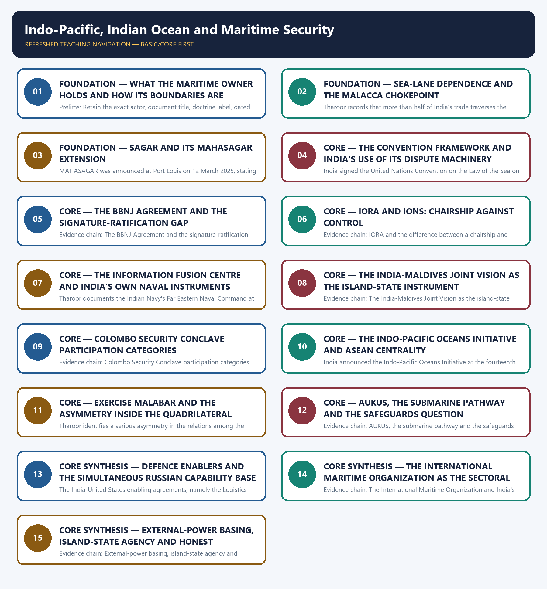

# Indo-Pacific, Indian Ocean and Maritime Security — Learner-v2 Complete Learning Session

> **Authoring-only generation:** 2026-09-03. No PDF was rendered and no tracker or index was mutated.

### SOURCE, PROGRESSION AND CURRENT-LINKAGE AUDIT

- **Generation date:** 2026-09-03.
- **Repository-first evidence:** the Basic owner is taught first and preserved in full; the Advanced owner is retained only in the optional final teaching block.
- **OCR evidence:** Repository Markdown was primary. The OCR-searchable official General Studies question papers held under books\mains and books\more_previous_papers were read only to confirm the printed wording of routed demands. No official answer key, marking scheme, page precision or unsupported quotation was imported from them.
- **Qdrant:** not used; repository Markdown and available OCR context were sufficient.
- **PYQ integrity:** Four General Studies Paper II Mains demands are routed to this topic in the audited routing ledgers and each is reproduced below as a demand card with its printed year, paper, question number, directive, marks and word limit exactly as the ledger records them: 2020 General Studies Paper II question 20 on Indo-United States and Indo-Russian defence deals and Indo-Pacific stability, a Discuss demand of 15 marks and 250 words; 2021 General Studies Paper II question 20 on AUKUS in the Indo-Pacific and existing regional partnerships, a Discuss the strength and impact demand of 15 marks and 250 words, for which the ledger records that the opening clause of the printed stem was truncated in the scan; 2023 General Studies Paper II question 20 on the role of the International Maritime Organization in protecting the environment and maritime safety, a Discuss demand of 15 marks and 250 words with the word limit taken from the instruction block; and 2024 General Studies Paper II question 20 on the geopolitical and geostrategic importance of Maldives for India, a Discuss demand of 15 marks and 250 words. For the 2020, 2021 and 2023 demands the ledger records that the Core route supersedes the older Advanced ownership. Two objective demands are also routed to this owner and are carried as coverage requirements only: 2022 Prelims General Studies Paper I question 85 on Convention provisions for the territorial sea, innocent passage and the exclusive economic zone, and 2022 Prelims General Studies Paper I question 86 on the Senkaku Islands maritime territorial dispute in the East China Sea. The official 2018-2023 Prelims keys are not held locally, and no option or answer letter is recorded or inferred for either objective demand. Where a printed stem is recorded as truncated or defective in the scan, that defect is reported rather than silently repaired. The locally held OCR-searchable official General Studies papers were read only to confirm the printed wording of the routed Mains demands; no question was invented from them, no stem was paraphrased into an apparent routing, and no marking scheme or official answer key was imported.
- **Live-link boundary:** Live official verification was attempted on 2026-09-03 in the priority order required for this topic: the Ministry of External Affairs pages first, then the Indian Navy, the Ministry of Ports, Shipping and Waterways, the International Maritime Organization, the Indian Ocean Rim Association and the United Nations treaty depositary. Every outcome is recorded exactly as observed. The Ministry of External Affairs pages returned a browser-requirement stub or the Ministry's own error page, the Press Information Bureau index returned HTTP 403, one Indian Navy domain failed at transport level and the other returned only a commissioning banner, and the Indian Ocean Rim Association and United Nations depositary pages returned navigation shells. The International Maritime Organization and the Ministry of Ports, Shipping and Waterways returned general descriptive text that agrees with the repository owners but carried no new dated instrument, so no new live item was obtained that would add, alter or date any claim in this package. The package therefore uses only the dated official anchors already carried by the repository owners, each with its actor, exact evidentiary level and date. It invents no maritime deployment, no exercise membership, no corridor or project status, no route alignment, no summit outcome, no sanctions measure, no energy or trade share, no port access, no treaty or statement wording, no border or diplomatic status, no date, no previous-year question, no answer key and no current claim.
- **Fact/inference discipline:** no current-affairs item, PYQ wording, figure or quotation is invented.

### LIVE OFFICIAL-SOURCE ATTEMPT LOG

Every live check below was attempted on 2026-09-03 in the priority order required for International Relations: Ministry of External Affairs official pages first, then other official government or international-organisation documents. Access failures are recorded exactly as observed and no claim is reconstructed from a failed fetch.

- https://www.mea.gov.in/press-releases.htm — attempted 2026-09-03; the request redirected to a browser-requirement stub and returned no press release text, so no live item was taken from it.
- https://www.mea.gov.in/bilateral-documents.htm — attempted 2026-09-03; the request redirected to a browser-requirement stub and returned no bilateral document text, so no live item was taken from it.
- https://www.mea.gov.in/foreign-relation.htm — attempted 2026-09-03; the request redirected to the Ministry's own error page, so no country brief was taken from it.
- https://www.pib.gov.in/indexd.aspx?reg=3&lang=1 — attempted 2026-09-03; the request returned HTTP 403, so no release was taken from it.
- https://indiannavy.gov.in/ — attempted 2026-09-03; the Indian Navy home page returned only a single ship-commissioning banner headline and no policy, deployment or exercise text, so no maritime deployment, exercise membership or operational claim was taken from it.
- https://www.indiannavy.nic.in/ — attempted 2026-09-03; the request failed at transport level with a connection error, so nothing was taken from it.
- https://shipmin.gov.in/ — attempted 2026-09-03; the Ministry of Ports, Shipping and Waterways home page returned a general descriptive statement of the Ministry's mandate over ports, shipping and waterways and no dated item, so no port-access, corridor or capacity claim was taken from it.
- https://www.imo.org/en/About/Pages/Default.aspx — attempted 2026-09-03; the International Maritime Organization returned substantive descriptive text confirming that it is the United Nations specialised agency responsible for the safety and security of shipping and the prevention of marine and atmospheric pollution by ships, which agrees with the repository owners; the page carried no new dated instrument, so no new claim was added.
- https://www.iora.int/en — attempted 2026-09-03; the Indian Ocean Rim Association site returned only a title and a skip-to-content link with no membership, chair or programme text, so no membership or chairship claim was taken from it.
- https://treaties.un.org/Pages/ViewDetails.aspx?src=TREATY&mtdsg_no=XXI-10&chapter=21&clang=_en — attempted 2026-09-03; the United Nations depositary page returned only chapter navigation without any signature or ratification table, so no treaty-status claim was taken from it.

## BASIC LEARNING SESSION

### DEEP-REVIEW LEARNING CONTRACT

| Control | Binding rule for this package |
|---|---|
| Syllabus boundary | Complete International Relations Basic/Core is answer-complete before optional Advanced depth. |
| Status boundary | Announced, negotiated, initialled, signed, ratified, entered into force, operational, suspended and completed remain distinct. |
| Institutional method | Treaty basis or political character → exact membership/status → mandate → decision rule → national instrument → implementation → outcome. |
| Level mapping | Bilateral, subregional/regional, minilateral/plurilateral and systemic levels are separated and then connected. |
| Policy method | Strategic objective → chosen instrument → implementing actors/resources → observed output/outcome → alternative and residual risk. |
| Evidence method | Claim → named India-centric treaty, institution, corridor, operation, agreement or summit → analysis → official source/date/status and causal qualification. |
| Neutrality method | Contested borders, maritime claims and conflicts are attributed neutrally; policy doctrine is distinguished from retrospective analytical label. |
| Practice contract | Every solved item has demand decoding, a detailed examiner-grade model, executable timed/compression plan, marks rationale and answer-specific improvement. |
| Approval | This immutable successor remains `approved: false` pending explicit approval. |

**Canonical Basic/Core owner:** `upsc-ai-kit\knowledge\International-Relations\basic\04_Indo-Pacific-Indian-Ocean-and-Maritime-Security.md`  
**Substantive canonical provenance owner:** `upsc-ai-kit\knowledge\International-Relations\04_Indo-Pacific-Indian-Ocean-and-Maritime-Security_Learner-V2-Complete-Topic-Package.md`  
**Optional Advanced owner:** `upsc-ai-kit\knowledge\International-Relations\advanced\04_Indo-Pacific-Indian-Ocean-and-Maritime-Security.md`  
**Official syllabus mapping:** `upsc-ai-kit\knowledge\International Relations\OFFICIAL-UPSC-SYLLABUS-MAPPING.md`

### EVIDENCE, PYQ AND CURRENT-STATUS CONTROL

- **Membership discipline:** member, observer, dialogue partner, chair, guest and invited participant are not interchangeable; verify the relevant date.
- **Mandate discipline:** treaty organisation, UN organ, specialised agency, court, summit process, political forum, coalition and minilateral retain exact legal character and competence.
- **Agreement discipline:** announcement, negotiation, signature, ratification, entry into force, domestic implementation and measured outcome remain separate.
- **Connectivity discipline:** concept, financing, contract, construction, trial movement, operational segment, completed corridor and commercially viable use remain separate.
- **Conflict discipline:** distinguish verified event, party claim, independent attribution, legal characterisation and analytical inference; use neutral language for contested borders and conflicts.
- **Causal discipline:** chronology, summit language, trade change, deployment or project completion does not alone establish strategic effect; state mechanism, counterfactual and alternatives.
- **Trade-off discipline:** interests, capabilities, constraints, partner agency, escalation, dependence, finance, legitimacy, domestic distribution, alternatives and implementation risks are explicit.
- **PYQ discipline:** exact wording is preserved only where verified; routed or reconstructed demands remain labelled and no model is presented as an official UPSC answer.
- **Current-status note, rechecked 2026-09-03:** volatile relations, agreements, corridors, operations, conflicts, trade and summit outcomes retain official source, publication date and operative/interim/completed status; stale officeholders are omitted.

**Generation-local live/current sources:**
- `https://www.mea.gov.in/press-releases.htm — attempted 2026-09-03; the request redirected to a browser-requirement stub and returned no press release text, so no live item was taken from it.`
- `https://www.mea.gov.in/bilateral-documents.htm — attempted 2026-09-03; the request redirected to a browser-requirement stub and returned no bilateral document text, so no live item was taken from it.`
- `https://www.mea.gov.in/foreign-relation.htm — attempted 2026-09-03; the request redirected to the Ministry's own error page, so no country brief was taken from it.`
- `https://www.pib.gov.in/indexd.aspx?reg=3&lang=1 — attempted 2026-09-03; the request returned HTTP 403, so no release was taken from it.`
- `https://indiannavy.gov.in/ — attempted 2026-09-03; the Indian Navy home page returned only a single ship-commissioning banner headline and no policy, deployment or exercise text, so no maritime deployment, exercise membership or operational claim was taken from it.`
- `https://www.indiannavy.nic.in/ — attempted 2026-09-03; the request failed at transport level with a connection error, so nothing was taken from it.`
- `https://shipmin.gov.in/ — attempted 2026-09-03; the Ministry of Ports, Shipping and Waterways home page returned a general descriptive statement of the Ministry's mandate over ports, shipping and waterways and no dated item, so no port-access, corridor or capacity claim was taken from it.`
- `https://www.imo.org/en/About/Pages/Default.aspx — attempted 2026-09-03; the International Maritime Organization returned substantive descriptive text confirming that it is the United Nations specialised agency responsible for the safety and security of shipping and the prevention of marine and atmospheric pollution by ships, which agrees with the repository owners; the page carried no new dated instrument, so no new claim was added.`
- `https://www.iora.int/en — attempted 2026-09-03; the Indian Ocean Rim Association site returned only a title and a skip-to-content link with no membership, chair or programme text, so no membership or chairship claim was taken from it.`
- `https://treaties.un.org/Pages/ViewDetails.aspx?src=TREATY&mtdsg_no=XXI-10&chapter=21&clang=_en — attempted 2026-09-03; the United Nations depositary page returned only chapter navigation without any signature or ratification table, so no treaty-status claim was taken from it.`




*Distinct embedded teaching-navigation image. The separate continuous Cārvāka-style flowchart package remains an independent at-a-glance artifact.*

### SESSION 1 — FOUNDATION — WHAT THE MARITIME OWNER HOLDS AND HOW ITS BOUNDARIES ARE ROUTED

#### DEFINITION / WHAT THIS IS CALLED

**Plain-language definition:** Evidence chain: What this maritime owner holds and how its boundaries are routed Qualified use: Open a maritime demand by fixing ownership so the answer does not drift into another owner's evidence.

**Technical definition:** Prelims: Retain the exact actor, document title, doctrine label, dated instrument and evidentiary level attached to What the maritime owner holds and how its boundaries are routed, and never upgrade a vision statement into a treaty, a signature into a ratification, a participation category into membership, or an announced corridor into an operating one.

#### ANSWER-GRABBING OPENING — WRITE/ADAPT IN THE EXAM

> Evidence chain: What this maritime owner holds and how its boundaries are routed Qualified use: Open a maritime demand by fixing ownership so the answer does not drift into another owner's evidence.

#### MUST-WRITE KEYWORDS

- **FOUNDATION**
- **What the maritime owner holds**
- **how its boundaries are routed**
- **Evidence chain**
- **Qualified use**
- **This**

**How to use them:** Frame the answer through FOUNDATION; define What the maritime owner holds, connect how its boundaries are routed with Evidence chain to explain the mechanism, and use Qualified use for the decisive comparison or qualification.

#### VISUAL FIRST

```text
WHAT THE MARITIME OWNER HOLDS AND HOW ITS BOUNDARIES ARE ROUTED
01. What this maritime owner holds and how its boundaries are routed
BOUNDARY -> Chokepoint physical geography belongs to Geography, the Quad profile to topic 10, Maldives' general neighbourhood frame to topic 02, the energy-flow linkage to topic 06 and naval operations to Internal Security.
```

*This topic-specific rail fixes the evidence sequence and its exam boundary before analysis.*

#### CORE EXPLANATION

This topic owns the Indo-Pacific concept, the SAGAR doctrine and its MAHASAGAR extension, sea-lane and chokepoint dependence, the United Nations Convention on the Law of the Sea together with the BBNJ Agreement, maritime domain awareness, humanitarian assistance and disaster relief diplomacy and island-state partnership, and its distinctive feature is that it carries four verified General Studies Paper II Mains demands from 2020, 2021, 2023 and 2024 alongside two objective demands from 2022; the physical geography of chokepoints belongs to the Geography owner, the institutional profile of the Quad belongs to topic 10, Maldives as a general neighbourhood relationship belongs to topic 02, the West Asian energy-flow linkage belongs to topic 06, naval and anti-piracy operations belong to the Internal Security maritime and coastal owner, the humanitarian relief cycle belongs to the Disaster Management owners, and treaty-law chronology with domestic legislative detail belongs to the World History and Polity owners.

#### NAMED EVIDENCE AND MECHANISM

- This topic owns the Indo-Pacific concept, the SAGAR doctrine and its MAHASAGAR extension, sea-lane and chokepoint dependence, the United Nations Convention on the Law of the Sea together with the BBNJ Agreement, maritime domain awareness, humanitarian assistance and disaster relief diplomacy and island-state partnership, and its distinctive feature is that it carries four verified General Studies Paper II Mains demands from 2020, 2021, 2023 and 2024 alongside two objective demands from 2022; the physical geography of chokepoints belongs to the Geography owner, the institutional profile of the Quad belongs to topic 10, Maldives as a general neighbourhood relationship belongs to topic 02, the West Asian energy-flow linkage belongs to topic 06, naval and anti-piracy operations belong to the Internal Security maritime and coastal owner, the humanitarian relief cycle belongs to the Disaster Management owners, and treaty-law chronology with domestic legislative detail belongs to the World History and Polity owners.

#### EXAMINER CAUTION

- Chokepoint physical geography belongs to Geography, the Quad profile to topic 10, Maldives' general neighbourhood frame to topic 02, the energy-flow linkage to topic 06 and naval operations to Internal Security.

#### EXAM LINK

- **Prelims:** Retain the exact actor, document title, doctrine label, dated instrument and evidentiary level attached to What the maritime owner holds and how its boundaries are routed, and never upgrade a vision statement into a treaty, a signature into a ratification, a participation category into membership, or an announced corridor into an operating one.
- **Mains:** Open a maritime demand by fixing ownership so the answer does not drift into another owner's evidence.

#### MINI RECAP

- **Evidence chain:** What this maritime owner holds and how its boundaries are routed
- **Qualified use:** Open a maritime demand by fixing ownership so the answer does not drift into another owner's evidence.

#### CLOSING RECALL FLOW — FOUNDATION — WHAT THE MARITIME OWNER HOLDS AND HOW ITS BOUNDARIES ARE ROUTED

```text
START / CONCEPT: FOUNDATION — What the maritime owner holds and how its boundaries are routed
        |
        v
EXACT TERMS: FOUNDATION · What the maritime owner holds · how its boundaries are routed · Evidence chain · Qualified use · This
        |
        v
MECHANISM / ARGUMENT: Prelims: Retain the exact actor, document title, doctrine label, dated instrument and evidentiary level attached to What the maritime owner holds and how its boundaries are routed, and never upgrade a vision statement into a treaty, a signature into a ratification, a participation category into membership, or an announced corridor into an operating one.
        |
        v
CONSEQUENCE / CONTRAST: Mains: Open a maritime demand by fixing ownership so the answer does not drift into another owner's evidence.
        |
        v
UPSC TRAP / ANSWER-USE: Do not miss this limiting distinction: this topic owns the Indo-Pacific concept, the SAGAR doctrine and its MAHASAGAR extension, sea-lane...
        |
        v
ANSWER-GRABBING FORMULATION: Evidence chain: What this maritime owner holds and how its boundaries are routed Qualified use: Open a maritime demand by fixing ownership so the answer does not drift into another owner's evidence.
```
### SESSION 2 — FOUNDATION — SEA-LANE DEPENDENCE AND THE MALACCA CHOKEPOINT

#### DEFINITION / WHAT THIS IS CALLED

**Plain-language definition:** Evidence chain: Sea-lane dependence and the Malacca chokepoint as the baseline interest Qualified use: Establish the material interest first so every later instrument is presented as a response to a named vulnerability.

**Technical definition:** Tharoor records that more than half of India's trade traverses the Strait of Malacca, which converts sea-lane security from a naval preference into a first-order economic-security interest, and he links heightened Indian maritime-security consciousness explicitly to the 26/11 attack, when terrorists hijacked an Indian fishing vessel to approach Mumbai by sea; the examinable discipline is that the dependence claim is the starting condition of every answer on this topic, and that a single chokepoint dependency is a structural vulnerability rather than a manageable commercial detail.

#### ANSWER-GRABBING OPENING — WRITE/ADAPT IN THE EXAM

> Evidence chain: Sea-lane dependence and the Malacca chokepoint as the baseline interest Qualified use: Establish the material interest first so every later instrument is presented as a response to a named vulnerability.

#### MUST-WRITE KEYWORDS

- **FOUNDATION**
- **Sea-lane dependence**
- **the Malacca chokepoint**
- **Evidence chain**
- **Qualified use**
- **Tharoor**

**How to use them:** Frame the answer through FOUNDATION; define Sea-lane dependence, connect the Malacca chokepoint with Evidence chain to explain the mechanism, and use Qualified use for the decisive comparison or qualification.

#### VISUAL FIRST

```text
SEA-LANE DEPENDENCE AND THE MALACCA CHOKEPOINT
01. Sea-lane dependence and the Malacca chokepoint as the baseline interest
BOUNDARY -> Dependence is the starting condition of the answer and never a decorative opening line, and a single chokepoint is a structural vulnerability rather than a commercial detail.
```

*This topic-specific rail fixes the evidence sequence and its exam boundary before analysis.*

#### CORE EXPLANATION

Tharoor records that more than half of India's trade traverses the Strait of Malacca, which converts sea-lane security from a naval preference into a first-order economic-security interest, and he links heightened Indian maritime-security consciousness explicitly to the 26/11 attack, when terrorists hijacked an Indian fishing vessel to approach Mumbai by sea; the examinable discipline is that the dependence claim is the starting condition of every answer on this topic, and that a single chokepoint dependency is a structural vulnerability rather than a manageable commercial detail.

#### NAMED EVIDENCE AND MECHANISM

- Tharoor records that more than half of India's trade traverses the Strait of Malacca, which converts sea-lane security from a naval preference into a first-order economic-security interest, and he links heightened Indian maritime-security consciousness explicitly to the 26/11 attack, when terrorists hijacked an Indian fishing vessel to approach Mumbai by sea; the examinable discipline is that the dependence claim is the starting condition of every answer on this topic, and that a single chokepoint dependency is a structural vulnerability rather than a manageable commercial detail.

#### EXAMINER CAUTION

- Dependence is the starting condition of the answer and never a decorative opening line, and a single chokepoint is a structural vulnerability rather than a commercial detail.

#### EXAM LINK

- **Prelims:** Retain the exact actor, document title, doctrine label, dated instrument and evidentiary level attached to Sea-lane dependence and the Malacca chokepoint, and never upgrade a vision statement into a treaty, a signature into a ratification, a participation category into membership, or an announced corridor into an operating one.
- **Mains:** Establish the material interest first so every later instrument is presented as a response to a named vulnerability.

#### MINI RECAP

- **Evidence chain:** Sea-lane dependence and the Malacca chokepoint as the baseline interest
- **Qualified use:** Establish the material interest first so every later instrument is presented as a response to a named vulnerability.

#### CLOSING RECALL FLOW — FOUNDATION — SEA-LANE DEPENDENCE AND THE MALACCA CHOKEPOINT

```text
START / CONCEPT: FOUNDATION — Sea-lane dependence and the Malacca chokepoint
        |
        v
EXACT TERMS: FOUNDATION · Sea-lane dependence · the Malacca chokepoint · Evidence chain · Qualified use · Tharoor
        |
        v
MECHANISM / ARGUMENT: Tharoor records that more than half of India's trade traverses the Strait of Malacca, which converts sea-lane security from a naval preference into a first-order economic-security interest, and he links heightened Indian maritime-security consciousness explicitly to the 26/11 attack, when terrorists hijacked an Indian fishing vessel to approach Mumbai by sea; the examinable discipline is that the dependence claim is the starting condition of every answer on this topic, and that a single chokepoint dependency is a structural vulnerability rather than a manageable commercial detail.
        |
        v
CONSEQUENCE / CONTRAST: Dependence is the starting condition of the answer and never a decorative opening line, and a single chokepoint is a structural vulnerability rather than a commercial detail.
        |
        v
UPSC TRAP / ANSWER-USE: Do not miss this limiting distinction: establish the material interest first so every later instrument is presented as a response...
        |
        v
ANSWER-GRABBING FORMULATION: Evidence chain: Sea-lane dependence and the Malacca chokepoint as the baseline interest Qualified use: Establish the material interest first so every later instrument is presented as a response to a named vulnerability.
```
### SESSION 3 — FOUNDATION — SAGAR AND ITS MAHASAGAR EXTENSION

#### DEFINITION / WHAT THIS IS CALLED

**Plain-language definition:** Evidence chain: SAGAR as a declared vision and not a treaty - MAHASAGAR as extension of scope and not replacement Qualified use: Use the exact doctrinal vocabulary so the answer describes India's actual commitment level rather than a stronger one.

**Technical definition:** MAHASAGAR was announced at Port Louis on 12 March 2025, stating that India's vision for the Global South would be going beyond SAGAR and would be Mutual and Holistic Advancement for Security and Growth Across Regions, encompassing trade for development, capacity building for sustainable growth, and mutual security for a shared future, delivered through technology sharing, concessional loan and grants; the decisive precision the owners require is that the same speech reaffirms that India is moving ahead with the SAGAR Vision, so MAHASAGAR is an extension of scope to the wider Global South and never a replacement of the earlier doctrine.

#### ANSWER-GRABBING OPENING — WRITE/ADAPT IN THE EXAM

> Evidence chain: SAGAR as a declared vision and not a treaty - MAHASAGAR as extension of scope and not replacement Qualified use: Use the exact doctrinal vocabulary so the answer describes India's actual commitment level rather than a stronger one.

#### MUST-WRITE KEYWORDS

- **FOUNDATION**
- **SAGAR**
- **its MAHASAGAR extension**
- **Evidence chain**
- **Qualified use**
- **Security**

**How to use them:** Frame the answer through FOUNDATION; define SAGAR, connect its MAHASAGAR extension with Evidence chain to explain the mechanism, and use Qualified use for the decisive comparison or qualification.

#### VISUAL FIRST

```text
SAGAR AND ITS MAHASAGAR EXTENSION
01. SAGAR as a declared vision and not a treaty
    |
    v
02. MAHASAGAR as extension of scope and not replacement
BOUNDARY -> SAGAR is a declared vision and not a treaty, and MAHASAGAR extends its scope to the Global South rather than replacing it.
```

*This topic-specific rail fixes the evidence sequence and its exam boundary before analysis.*

#### CORE EXPLANATION

SAGAR, standing for Security and Growth for All in the Region, is India's declared maritime vision for the Indian Ocean Region articulated in Mauritius on 12 March 2015, combining security cooperation with economic and developmental partnership for littoral and island states; the owners fix its evidentiary level precisely as a declared vision guiding regional maritime engagement and not as a binding treaty or alliance, so an answer must call it a doctrine or vision and never a legal instrument creating obligations on India or on any partner state. MAHASAGAR was announced at Port Louis on 12 March 2025, stating that India's vision for the Global South would be going beyond SAGAR and would be Mutual and Holistic Advancement for Security and Growth Across Regions, encompassing trade for development, capacity building for sustainable growth, and mutual security for a shared future, delivered through technology sharing, concessional loan and grants; the decisive precision the owners require is that the same speech reaffirms that India is moving ahead with the SAGAR Vision, so MAHASAGAR is an extension of scope to the wider Global South and never a replacement of the earlier doctrine.

#### NAMED EVIDENCE AND MECHANISM

- SAGAR, standing for Security and Growth for All in the Region, is India's declared maritime vision for the Indian Ocean Region articulated in Mauritius on 12 March 2015, combining security cooperation with economic and developmental partnership for littoral and island states; the owners fix its evidentiary level precisely as a declared vision guiding regional maritime engagement and not as a binding treaty or alliance, so an answer must call it a doctrine or vision and never a legal instrument creating obligations on India or on any partner state.
- MAHASAGAR was announced at Port Louis on 12 March 2025, stating that India's vision for the Global South would be going beyond SAGAR and would be Mutual and Holistic Advancement for Security and Growth Across Regions, encompassing trade for development, capacity building for sustainable growth, and mutual security for a shared future, delivered through technology sharing, concessional loan and grants; the decisive precision the owners require is that the same speech reaffirms that India is moving ahead with the SAGAR Vision, so MAHASAGAR is an extension of scope to the wider Global South and never a replacement of the earlier doctrine.

#### EXAMINER CAUTION

- SAGAR is a declared vision and not a treaty, and MAHASAGAR extends its scope to the Global South rather than replacing it.

#### EXAM LINK

- **Prelims:** Retain the exact actor, document title, doctrine label, dated instrument and evidentiary level attached to SAGAR and its MAHASAGAR extension, and never upgrade a vision statement into a treaty, a signature into a ratification, a participation category into membership, or an announced corridor into an operating one.
- **Mains:** Use the exact doctrinal vocabulary so the answer describes India's actual commitment level rather than a stronger one.

#### MINI RECAP

- **Evidence chain:** SAGAR as a declared vision and not a treaty -> MAHASAGAR as extension of scope and not replacement
- **Qualified use:** Use the exact doctrinal vocabulary so the answer describes India's actual commitment level rather than a stronger one.

#### CLOSING RECALL FLOW — FOUNDATION — SAGAR AND ITS MAHASAGAR EXTENSION

```text
START / CONCEPT: FOUNDATION — SAGAR and its MAHASAGAR extension
        |
        v
EXACT TERMS: FOUNDATION · SAGAR · its MAHASAGAR extension · Evidence chain · Qualified use · Security
        |
        v
MECHANISM / ARGUMENT: MAHASAGAR was announced at Port Louis on 12 March 2025, stating that India's vision for the Global South would be going beyond SAGAR and would be Mutual and Holistic Advancement for Security and Growth Across Regions, encompassing trade for development, capacity building for sustainable growth, and mutual security for a shared future, delivered through technology sharing, concessional loan and grants; the decisive precision the owners require is that the same speech reaffirms that India is moving ahead with the SAGAR Vision, so MAHASAGAR is an extension of scope to the wider Global South and never a replacement of the earlier doctrine.
        |
        v
CONSEQUENCE / CONTRAST: SAGAR is a declared vision and not a treaty, and MAHASAGAR extends its scope to the Global South rather than replacing it.
        |
        v
UPSC TRAP / ANSWER-USE: SAGAR, standing for Security and Growth for All in the Region, is India's declared maritime vision for the Indian Ocean Region articulated in Mauritius on 12 March 2015, combining security cooperation with economic and developmental partnership for littoral and island states; the owners fix its evidentiary level precisely as a declared vision guiding regional maritime engagement and not as a binding treaty or alliance, so an answer must call it a doctrine or vision and never a legal instrument creating obligations on India or on any partner state.
        |
        v
ANSWER-GRABBING FORMULATION: Evidence chain: SAGAR as a declared vision and not a treaty - MAHASAGAR as extension of scope and not replacement Qualified use: Use the exact doctrinal vocabulary so the answer describes India's actual commitment level rather than a stronger one.
```
### SESSION 4 — CORE — THE CONVENTION FRAMEWORK AND INDIA'S USE OF ITS DISPUTE MACHINERY

#### DEFINITION / WHAT THIS IS CALLED

**Plain-language definition:** India's use of the treaty-based order is evidenced by two dated acts, namely its acceptance of the maritime-boundary award with Bangladesh delivered on 7 July 2014 by an Annex-VII tribunal administered by the Permanent Court of Arbitration, and its statement of 12 July 2016 on the South China Sea Annex-VII award calling for freedom of navigation and overflight, peaceful settlement, self-restraint and respect for the Convention; the owners fix the boundary of that statement precisely, because India called for those principles without pronouncing on the merits of the award, so an answer may cite the statement as evidence of India's rules-based position and may not convert it into an Indian verdict on the underlying dispute.

**Technical definition:** India signed the United Nations Convention on the Law of the Sea on 10 December 1982 and ratified it on 29 June 1995, and domestically the Territorial Waters, Continental Shelf, Exclusive Economic Zone and Other Maritime Zones Act, 1976 defines India's maritime zones, while the Convention itself supplies the treaty framework governing territorial waters, exclusive economic zones and high-seas navigation rights that underpins all maritime-security diplomacy; the owners route treaty-law chronology and domestic legislative detail to the World History and Polity owners and keep only the application of that framework to India's regional engagement here.

#### ANSWER-GRABBING OPENING — WRITE/ADAPT IN THE EXAM

> India's use of the treaty-based order is evidenced by two dated acts, namely its acceptance of the maritime-boundary award with Bangladesh delivered on 7 July 2014 by an Annex-VII tribunal administered by the Permanent Court of Arbitration, and its statement of 12 July 2016 on the South China Sea Annex-VII award calling for freedom of navigation and overflight, peaceful settlement, self-restraint and respect for the Convention; the owners fix the boundary of that statement precisely, because India called for those principles without pronouncing on the merits of the award, so an answer may cite the statement as evidence of India's rules-based position and may not convert it into an Indian verdict on the underlying dispute.

#### MUST-WRITE KEYWORDS

- **The Convention framework**
- **Evidence chain**
- **Qualified use**
- **India**
- **United Nations Convention**
- **Law**

**How to use them:** Frame the answer through The Convention framework; define Evidence chain, connect Qualified use with India to explain the mechanism, and use United Nations Convention for the decisive comparison or qualification.

#### VISUAL FIRST

```text
THE CONVENTION FRAMEWORK AND INDIA'S USE OF ITS DISPUTE MACHINERY
01. India's UNCLOS position and its domestic maritime-zones law
    |
    v
02. India as a user and defender of the treaty-based maritime order
BOUNDARY -> India called for principles in its 2016 statement without pronouncing on the merits, and treaty-law chronology belongs to other owners.
```

*This topic-specific rail fixes the evidence sequence and its exam boundary before analysis.*

#### CORE EXPLANATION

India signed the United Nations Convention on the Law of the Sea on 10 December 1982 and ratified it on 29 June 1995, and domestically the Territorial Waters, Continental Shelf, Exclusive Economic Zone and Other Maritime Zones Act, 1976 defines India's maritime zones, while the Convention itself supplies the treaty framework governing territorial waters, exclusive economic zones and high-seas navigation rights that underpins all maritime-security diplomacy; the owners route treaty-law chronology and domestic legislative detail to the World History and Polity owners and keep only the application of that framework to India's regional engagement here. India's use of the treaty-based order is evidenced by two dated acts, namely its acceptance of the maritime-boundary award with Bangladesh delivered on 7 July 2014 by an Annex-VII tribunal administered by the Permanent Court of Arbitration, and its statement of 12 July 2016 on the South China Sea Annex-VII award calling for freedom of navigation and overflight, peaceful settlement, self-restraint and respect for the Convention; the owners fix the boundary of that statement precisely, because India called for those principles without pronouncing on the merits of the award, so an answer may cite the statement as evidence of India's rules-based position and may not convert it into an Indian verdict on the underlying dispute.

#### NAMED EVIDENCE AND MECHANISM

- India signed the United Nations Convention on the Law of the Sea on 10 December 1982 and ratified it on 29 June 1995, and domestically the Territorial Waters, Continental Shelf, Exclusive Economic Zone and Other Maritime Zones Act, 1976 defines India's maritime zones, while the Convention itself supplies the treaty framework governing territorial waters, exclusive economic zones and high-seas navigation rights that underpins all maritime-security diplomacy; the owners route treaty-law chronology and domestic legislative detail to the World History and Polity owners and keep only the application of that framework to India's regional engagement here.
- India's use of the treaty-based order is evidenced by two dated acts, namely its acceptance of the maritime-boundary award with Bangladesh delivered on 7 July 2014 by an Annex-VII tribunal administered by the Permanent Court of Arbitration, and its statement of 12 July 2016 on the South China Sea Annex-VII award calling for freedom of navigation and overflight, peaceful settlement, self-restraint and respect for the Convention; the owners fix the boundary of that statement precisely, because India called for those principles without pronouncing on the merits of the award, so an answer may cite the statement as evidence of India's rules-based position and may not convert it into an Indian verdict on the underlying dispute.

#### EXAMINER CAUTION

- India called for principles in its 2016 statement without pronouncing on the merits, and treaty-law chronology belongs to other owners.

#### EXAM LINK

- **Prelims:** Retain the exact actor, document title, doctrine label, dated instrument and evidentiary level attached to The Convention framework and India's use of its dispute machinery, and never upgrade a vision statement into a treaty, a signature into a ratification, a participation category into membership, or an announced corridor into an operating one.
- **Mains:** Evidence a rules-based position with two dated acts instead of a generic claim that India supports the Convention.

#### MINI RECAP

- **Evidence chain:** India's UNCLOS position and its domestic maritime-zones law -> India as a user and defender of the treaty-based maritime order
- **Qualified use:** Evidence a rules-based position with two dated acts instead of a generic claim that India supports the Convention.

#### CLOSING RECALL FLOW — CORE — THE CONVENTION FRAMEWORK AND INDIA'S USE OF ITS DISPUTE MACHINERY

```text
START / CONCEPT: CORE — The Convention framework and India's use of its dispute machinery
        |
        v
EXACT TERMS: The Convention framework · Evidence chain · Qualified use · India · United Nations Convention · Law
        |
        v
MECHANISM / ARGUMENT: Prelims: Retain the exact actor, document title, doctrine label, dated instrument and evidentiary level attached to The Convention framework and India's use of its dispute machinery, and never upgrade a vision statement into a treaty, a signature into a ratification, a participation category into membership, or an announced corridor into an operating one.
        |
        v
CONSEQUENCE / CONTRAST: India signed the United Nations Convention on the Law of the Sea on 10 December 1982 and ratified it on 29 June 1995, and domestically the Territorial Waters, Continental Shelf, Exclusive Economic Zone and Other Maritime Zones Act, 1976 defines India's maritime zones, while the Convention itself supplies the treaty framework governing territorial waters, exclusive economic zones and high-seas navigation rights that underpins all maritime-security diplomacy; the owners route treaty-law chronology and domestic legislative detail to the World History and Polity owners and keep only the application of that framework to India's regional engagement here.
        |
        v
UPSC TRAP / ANSWER-USE: Do not miss this limiting distinction: india's UNCLOS position and its domestic maritime-zones law - India as a user and...
        |
        v
ANSWER-GRABBING FORMULATION: India's use of the treaty-based order is evidenced by two dated acts, namely its acceptance of the maritime-boundary award with Bangladesh delivered on 7 July 2014 by an Annex-VII tribunal administered by the Permanent Court of Arbitration, and its statement of 12 July 2016 on the South China Sea Annex-VII award calling for freedom of navigation and overflight, peaceful settlement, self-restraint and respect for the Convention; the owners fix the boundary of that statement precisely, because India called for those principles without pronouncing on the merits of the award, so an answer may cite the statement as evidence of India's rules-based position and may not convert it into an Indian verdict on the underlying dispute.
```
### SESSION 5 — CORE — THE BBNJ AGREEMENT AND THE SIGNATURE-RATIFICATION GAP

#### DEFINITION / WHAT THIS IS CALLED

**Plain-language definition:** The BBNJ Agreement, the implementing agreement on marine biodiversity of areas beyond national jurisdiction also called the High Seas Treaty, was adopted on 19 June 2023, opened for signature on 20 September 2023 and entered into force on 17 January 2026 after the sixtieth ratification was deposited on 19 September 2025, while India signed it on 25 September 2024 and had not deposited ratification as of 3 August 2026; the owners require the status to be written as signatory and not party, and they name the concrete examinable cost, namely that a state which is not a party cannot vote at the Conference of the Parties that will design implementation.

**Technical definition:** Evidence chain: The BBNJ Agreement and the signature-ratification gap Qualified use: Apply the legal-status discipline in its sharpest form and name the concrete cost of remaining outside the Conference of the Parties.

#### ANSWER-GRABBING OPENING — WRITE/ADAPT IN THE EXAM

> The BBNJ Agreement, the implementing agreement on marine biodiversity of areas beyond national jurisdiction also called the High Seas Treaty, was adopted on 19 June 2023, opened for signature on 20 September 2023 and entered into force on 17 January 2026 after the sixtieth ratification was deposited on 19 September 2025, while India signed it on 25 September 2024 and had not deposited ratification as of 3 August 2026; the owners require the status to be written as signatory and not party, and they name the concrete examinable cost, namely that a state which is not a party cannot vote at the Conference of the Parties that will design implementation.

#### MUST-WRITE KEYWORDS

- **The BBNJ Agreement**
- **the signature-ratification gap**
- **Evidence chain**
- **Qualified use**
- **High Seas Treaty**
- **India**

**How to use them:** Frame the answer through The BBNJ Agreement; define the signature-ratification gap, connect Evidence chain with Qualified use to explain the mechanism, and use High Seas Treaty for the decisive comparison or qualification.

#### VISUAL FIRST

```text
THE BBNJ AGREEMENT AND THE SIGNATURE-RATIFICATION GAP
01. The BBNJ Agreement and the signature-ratification gap
BOUNDARY -> Signature expresses consent to the text while party status requires ratification, which India had not deposited as of 3 August 2026.
```

*This topic-specific rail fixes the evidence sequence and its exam boundary before analysis.*

#### CORE EXPLANATION

The BBNJ Agreement, the implementing agreement on marine biodiversity of areas beyond national jurisdiction also called the High Seas Treaty, was adopted on 19 June 2023, opened for signature on 20 September 2023 and entered into force on 17 January 2026 after the sixtieth ratification was deposited on 19 September 2025, while India signed it on 25 September 2024 and had not deposited ratification as of 3 August 2026; the owners require the status to be written as signatory and not party, and they name the concrete examinable cost, namely that a state which is not a party cannot vote at the Conference of the Parties that will design implementation.

#### NAMED EVIDENCE AND MECHANISM

- The BBNJ Agreement, the implementing agreement on marine biodiversity of areas beyond national jurisdiction also called the High Seas Treaty, was adopted on 19 June 2023, opened for signature on 20 September 2023 and entered into force on 17 January 2026 after the sixtieth ratification was deposited on 19 September 2025, while India signed it on 25 September 2024 and had not deposited ratification as of 3 August 2026; the owners require the status to be written as signatory and not party, and they name the concrete examinable cost, namely that a state which is not a party cannot vote at the Conference of the Parties that will design implementation.

#### EXAMINER CAUTION

- Signature expresses consent to the text while party status requires ratification, which India had not deposited as of 3 August 2026.

#### EXAM LINK

- **Prelims:** Retain the exact actor, document title, doctrine label, dated instrument and evidentiary level attached to The BBNJ Agreement and the signature-ratification gap, and never upgrade a vision statement into a treaty, a signature into a ratification, a participation category into membership, or an announced corridor into an operating one.
- **Mains:** Apply the legal-status discipline in its sharpest form and name the concrete cost of remaining outside the Conference of the Parties.

#### MINI RECAP

- **Evidence chain:** The BBNJ Agreement and the signature-ratification gap
- **Qualified use:** Apply the legal-status discipline in its sharpest form and name the concrete cost of remaining outside the Conference of the Parties.

#### CLOSING RECALL FLOW — CORE — THE BBNJ AGREEMENT AND THE SIGNATURE-RATIFICATION GAP

```text
START / CONCEPT: CORE — The BBNJ Agreement and the signature-ratification gap
        |
        v
EXACT TERMS: The BBNJ Agreement · the signature-ratification gap · Evidence chain · Qualified use · High Seas Treaty · India
        |
        v
MECHANISM / ARGUMENT: Evidence chain: The BBNJ Agreement and the signature-ratification gap Qualified use: Apply the legal-status discipline in its sharpest form and name the concrete cost of remaining outside the Conference of the Parties.
        |
        v
CONSEQUENCE / CONTRAST: Signature expresses consent to the text while party status requires ratification, which India had not deposited as of 3 August 2026.
        |
        v
UPSC TRAP / ANSWER-USE: Do not miss this limiting distinction: the BBNJ Agreement, the implementing agreement on marine biodiversity of areas beyond national jurisdiction...
        |
        v
ANSWER-GRABBING FORMULATION: The BBNJ Agreement, the implementing agreement on marine biodiversity of areas beyond national jurisdiction also called the High Seas Treaty, was adopted on 19 June 2023, opened for signature on 20 September 2023 and entered into force on 17 January 2026 after the sixtieth ratification was deposited on 19 September 2025, while India signed it on 25 September 2024 and had not deposited ratification as of 3 August 2026; the owners require the status to be written as signatory and not party, and they name the concrete examinable cost, namely that a state which is not a party cannot vote at the Conference of the Parties that will design implementation.
```
### SESSION 6 — CORE — IORA AND IONS: CHAIRSHIP AGAINST CONTROL

#### DEFINITION / WHAT THIS IS CALLED

**Plain-language definition:** The Indian Ocean Rim Association is a twenty-three-member regional intergovernmental organisation with twelve dialogue partners and a Secretariat at Ebène in Mauritius, and India assumed its chair in November 2025 for the 2025-27 term; the owners attach the limitation directly, because the Association is a consensus-based body in which a chairship confers agenda-setting and convening advantage rather than decision-making authority over members, and conflating the two is recorded as the single most common overstatement in answers on this topic.

**Technical definition:** Evidence chain: IORA and the difference between a chairship and control - IONS as a voluntary naval-cooperation symposium Qualified use: Refuse the commonest overstatement on this topic while still crediting India's genuine convening role.

#### ANSWER-GRABBING OPENING — WRITE/ADAPT IN THE EXAM

> Evidence chain: IORA and the difference between a chairship and control - IONS as a voluntary naval-cooperation symposium Qualified use: Refuse the commonest overstatement on this topic while still crediting India's genuine convening role.

#### MUST-WRITE KEYWORDS

- **IORA**
- **IONS**
- **chairship against control**
- **Evidence chain**
- **Qualified use**
- **2025-27**

**How to use them:** Frame the answer through IORA; define IONS, connect chairship against control with Evidence chain to explain the mechanism, and use Qualified use for the decisive comparison or qualification.

#### VISUAL FIRST

```text
IORA AND IONS: CHAIRSHIP AGAINST CONTROL
01. IORA and the difference between a chairship and control
    |
    v
02. IONS as a voluntary naval-cooperation symposium
BOUNDARY -> A chairship in a consensus body confers agenda-setting and convening advantage and never decision-making authority over members.
```

*This topic-specific rail fixes the evidence sequence and its exam boundary before analysis.*

#### CORE EXPLANATION

The Indian Ocean Rim Association is a twenty-three-member regional intergovernmental organisation with twelve dialogue partners and a Secretariat at Ebène in Mauritius, and India assumed its chair in November 2025 for the 2025-27 term; the owners attach the limitation directly, because the Association is a consensus-based body in which a chairship confers agenda-setting and convening advantage rather than decision-making authority over members, and conflating the two is recorded as the single most common overstatement in answers on this topic. The Indian Ocean Naval Symposium was established in 2008 as a voluntary initiative to increase maritime cooperation among the navies of Indian Ocean littoral states, and India assumed its chair on 20 February 2026; the owners insist that the Symposium, the Indian Ocean Rim Association and the Information Fusion Centre are three distinct mechanisms rather than interchangeable names for one body, because the Symposium is a naval-cooperation format, the Association is a regional intergovernmental organisation and the Centre is an information-sharing facility.

#### NAMED EVIDENCE AND MECHANISM

- The Indian Ocean Rim Association is a twenty-three-member regional intergovernmental organisation with twelve dialogue partners and a Secretariat at Ebène in Mauritius, and India assumed its chair in November 2025 for the 2025-27 term; the owners attach the limitation directly, because the Association is a consensus-based body in which a chairship confers agenda-setting and convening advantage rather than decision-making authority over members, and conflating the two is recorded as the single most common overstatement in answers on this topic.
- The Indian Ocean Naval Symposium was established in 2008 as a voluntary initiative to increase maritime cooperation among the navies of Indian Ocean littoral states, and India assumed its chair on 20 February 2026; the owners insist that the Symposium, the Indian Ocean Rim Association and the Information Fusion Centre are three distinct mechanisms rather than interchangeable names for one body, because the Symposium is a naval-cooperation format, the Association is a regional intergovernmental organisation and the Centre is an information-sharing facility.

#### EXAMINER CAUTION

- A chairship in a consensus body confers agenda-setting and convening advantage and never decision-making authority over members.

#### EXAM LINK

- **Prelims:** Retain the exact actor, document title, doctrine label, dated instrument and evidentiary level attached to IORA and IONS: chairship against control, and never upgrade a vision statement into a treaty, a signature into a ratification, a participation category into membership, or an announced corridor into an operating one.
- **Mains:** Refuse the commonest overstatement on this topic while still crediting India's genuine convening role.

#### MINI RECAP

- **Evidence chain:** IORA and the difference between a chairship and control -> IONS as a voluntary naval-cooperation symposium
- **Qualified use:** Refuse the commonest overstatement on this topic while still crediting India's genuine convening role.

#### CLOSING RECALL FLOW — CORE — IORA AND IONS: CHAIRSHIP AGAINST CONTROL

```text
START / CONCEPT: CORE — IORA and IONS: chairship against control
        |
        v
EXACT TERMS: IORA · IONS · chairship against control · Evidence chain · Qualified use · 2025-27
        |
        v
MECHANISM / ARGUMENT: The Indian Ocean Rim Association is a twenty-three-member regional intergovernmental organisation with twelve dialogue partners and a Secretariat at Ebène in Mauritius, and India assumed its chair in November 2025 for the 2025-27 term; the owners attach the limitation directly, because the Association is a consensus-based body in which a chairship confers agenda-setting and convening advantage rather than decision-making authority over members, and conflating the two is recorded as the single most common overstatement in answers on this topic.
        |
        v
CONSEQUENCE / CONTRAST: The Indian Ocean Naval Symposium was established in 2008 as a voluntary initiative to increase maritime cooperation among the navies of Indian Ocean littoral states, and India assumed its chair on 20 February 2026; the owners insist that the Symposium, the Indian Ocean Rim Association and the Information Fusion Centre are three distinct mechanisms rather than interchangeable names for one body, because the Symposium is a naval-cooperation format, the Association is a regional intergovernmental organisation and the Centre is an information-sharing facility.
        |
        v
UPSC TRAP / ANSWER-USE: Do not miss this limiting distinction: iORA and the difference between a chairship and control - IONS as a voluntary...
        |
        v
ANSWER-GRABBING FORMULATION: Evidence chain: IORA and the difference between a chairship and control - IONS as a voluntary naval-cooperation symposium Qualified use: Refuse the commonest overstatement on this topic while still crediting India's genuine convening role.
```
### SESSION 7 — CORE — THE INFORMATION FUSION CENTRE AND INDIA'S OWN NAVAL INSTRUMENTS

#### DEFINITION / WHAT THIS IS CALLED

**Plain-language definition:** The Information Fusion Centre-Indian Ocean Region is a regional maritime-security centre hosted by the Indian Navy, established in 2018 at Gurugram for maritime domain awareness and information-sharing, and as stated in November 2025 it collaborated with twenty-five partner countries and hosted International Liaison Officers from fifteen countries; the owners define maritime domain awareness as the capacity to detect, understand and respond to activity in maritime space affecting security, economy or environment, and they treat the Centre as the operational fusion layer of a graduated stack that runs from political forum through naval symposium to information fusion.

**Technical definition:** Tharoor documents the Indian Navy's Far Eastern Naval Command at Port Blair and the biennial Milan naval-fleet gathering, which has run since 1995, as concrete instruments of regional maritime engagement, and he records India's active participation in the Regional Cooperation Agreement on Combating Piracy and Armed Robbery against Ships in Asia, abbreviated ReCAAP, as the multilateral anti-piracy channel, while Sagar Prahari Bal is a specialised Indian Navy force raised in 2009 for protecting naval bases and adjacent vulnerable areas and points; the owners route naval and anti-piracy operations themselves to the Internal Security maritime and coastal owner and keep the diplomatic architecture here.

#### ANSWER-GRABBING OPENING — WRITE/ADAPT IN THE EXAM

> The Information Fusion Centre-Indian Ocean Region is a regional maritime-security centre hosted by the Indian Navy, established in 2018 at Gurugram for maritime domain awareness and information-sharing, and as stated in November 2025 it collaborated with twenty-five partner countries and hosted International Liaison Officers from fifteen countries; the owners define maritime domain awareness as the capacity to detect, understand and respond to activity in maritime space affecting security, economy or environment, and they treat the Centre as the operational fusion layer of a graduated stack that runs from political forum through naval symposium to information fusion.

#### MUST-WRITE KEYWORDS

- **The Information Fusion Centre**
- **India's own naval instruments**
- **Evidence chain**
- **Qualified use**
- **The Information Fusion Centre-Indian Ocean Region**
- **The Information Fusion Centre-Indian Ocean**

**How to use them:** Frame the answer through The Information Fusion Centre; define India's own naval instruments, connect Evidence chain with Qualified use to explain the mechanism, and use The Information Fusion Centre-Indian Ocean Region for the decisive comparison or qualification.

#### VISUAL FIRST

```text
THE INFORMATION FUSION CENTRE AND INDIA'S OWN NAVAL INSTRUMENTS
01. IFC-IOR as the operational maritime-domain-awareness layer
    |
    v
02. India's own naval and anti-piracy instruments
BOUNDARY -> Partner and liaison-officer numbers are as stated in November 2025, and operational anti-piracy work belongs to the Internal Security owner.
```

*This topic-specific rail fixes the evidence sequence and its exam boundary before analysis.*

#### CORE EXPLANATION

The Information Fusion Centre-Indian Ocean Region is a regional maritime-security centre hosted by the Indian Navy, established in 2018 at Gurugram for maritime domain awareness and information-sharing, and as stated in November 2025 it collaborated with twenty-five partner countries and hosted International Liaison Officers from fifteen countries; the owners define maritime domain awareness as the capacity to detect, understand and respond to activity in maritime space affecting security, economy or environment, and they treat the Centre as the operational fusion layer of a graduated stack that runs from political forum through naval symposium to information fusion. Tharoor documents the Indian Navy's Far Eastern Naval Command at Port Blair and the biennial Milan naval-fleet gathering, which has run since 1995, as concrete instruments of regional maritime engagement, and he records India's active participation in the Regional Cooperation Agreement on Combating Piracy and Armed Robbery against Ships in Asia, abbreviated ReCAAP, as the multilateral anti-piracy channel, while Sagar Prahari Bal is a specialised Indian Navy force raised in 2009 for protecting naval bases and adjacent vulnerable areas and points; the owners route naval and anti-piracy operations themselves to the Internal Security maritime and coastal owner and keep the diplomatic architecture here.

#### NAMED EVIDENCE AND MECHANISM

- The Information Fusion Centre-Indian Ocean Region is a regional maritime-security centre hosted by the Indian Navy, established in 2018 at Gurugram for maritime domain awareness and information-sharing, and as stated in November 2025 it collaborated with twenty-five partner countries and hosted International Liaison Officers from fifteen countries; the owners define maritime domain awareness as the capacity to detect, understand and respond to activity in maritime space affecting security, economy or environment, and they treat the Centre as the operational fusion layer of a graduated stack that runs from political forum through naval symposium to information fusion.
- Tharoor documents the Indian Navy's Far Eastern Naval Command at Port Blair and the biennial Milan naval-fleet gathering, which has run since 1995, as concrete instruments of regional maritime engagement, and he records India's active participation in the Regional Cooperation Agreement on Combating Piracy and Armed Robbery against Ships in Asia, abbreviated ReCAAP, as the multilateral anti-piracy channel, while Sagar Prahari Bal is a specialised Indian Navy force raised in 2009 for protecting naval bases and adjacent vulnerable areas and points; the owners route naval and anti-piracy operations themselves to the Internal Security maritime and coastal owner and keep the diplomatic architecture here.

#### EXAMINER CAUTION

- Partner and liaison-officer numbers are as stated in November 2025, and operational anti-piracy work belongs to the Internal Security owner.

#### EXAM LINK

- **Prelims:** Retain the exact actor, document title, doctrine label, dated instrument and evidentiary level attached to The Information Fusion Centre and India's own naval instruments, and never upgrade a vision statement into a treaty, a signature into a ratification, a participation category into membership, or an announced corridor into an operating one.
- **Mains:** Show the operational layer that converts doctrine into capability, using dated institutional evidence rather than assertion.

#### MINI RECAP

- **Evidence chain:** IFC-IOR as the operational maritime-domain-awareness layer -> India's own naval and anti-piracy instruments
- **Qualified use:** Show the operational layer that converts doctrine into capability, using dated institutional evidence rather than assertion.

#### CLOSING RECALL FLOW — CORE — THE INFORMATION FUSION CENTRE AND INDIA'S OWN NAVAL INSTRUMENTS

```text
START / CONCEPT: CORE — The Information Fusion Centre and India's own naval instruments
        |
        v
EXACT TERMS: The Information Fusion Centre · India's own naval instruments · Evidence chain · Qualified use · The Information Fusion Centre-Indian Ocean Region · The Information Fusion Centre-Indian Ocean
        |
        v
MECHANISM / ARGUMENT: Evidence chain: IFC-IOR as the operational maritime-domain-awareness layer - India's own naval and anti-piracy instruments Qualified use: Show the operational layer that converts doctrine into capability, using dated institutional evidence rather than assertion.
        |
        v
CONSEQUENCE / CONTRAST: Tharoor documents the Indian Navy's Far Eastern Naval Command at Port Blair and the biennial Milan naval-fleet gathering, which has run since 1995, as concrete instruments of regional maritime engagement, and he records India's active participation in the Regional Cooperation Agreement on Combating Piracy and Armed Robbery against Ships in Asia, abbreviated ReCAAP, as the multilateral anti-piracy channel, while Sagar Prahari Bal is a specialised Indian Navy force raised in 2009 for protecting naval bases and adjacent vulnerable areas and points; the owners route naval and anti-piracy operations themselves to the Internal Security maritime and coastal owner and keep the diplomatic architecture here.
        |
        v
UPSC TRAP / ANSWER-USE: Do not miss this limiting distinction: partner and liaison-officer numbers are as stated in November 2025.
        |
        v
ANSWER-GRABBING FORMULATION: The Information Fusion Centre-Indian Ocean Region is a regional maritime-security centre hosted by the Indian Navy, established in 2018 at Gurugram for maritime domain awareness and information-sharing, and as stated in November 2025 it collaborated with twenty-five partner countries and hosted International Liaison Officers from fifteen countries; the owners define maritime domain awareness as the capacity to detect, understand and respond to activity in maritime space affecting security, economy or environment, and they treat the Centre as the operational fusion layer of a graduated stack that runs from political forum through naval symposium to information fusion.
```
### SESSION 8 — CORE — THE INDIA-MALDIVES JOINT VISION AS THE ISLAND-STATE INSTRUMENT

#### DEFINITION / WHAT THIS IS CALLED

**Plain-language definition:** The India-Maldives Joint Vision titled India and Maldives: A Vision for Comprehensive Economic and Maritime Security Partnership is dated 7 October 2024 and is the anchor bilateral document translating the SAGAR doctrine into a specific island-state partnership, recording support of four hundred million United States dollars and thirty billion Indian rupees as a currency-swap arrangement, followed by the signature of free trade agreement Terms of Reference with the launch of negotiations and an Indian rupee four thousand eight hundred and fifty crore Line of Credit on 25 July 2025; the owners qualify each item exactly, because a currency-swap arrangement is an arranged facility rather than evidence of drawdown, Terms of Reference are not a concluded agreement, and the Joint Vision is a bilateral political commitment rather than a self-executing treaty.

**Technical definition:** Evidence chain: The India-Maldives Joint Vision as the island-state instrument Qualified use: Cite the concrete dated bilateral instrument that a Maldives demand expects, with each component priced at its exact level.

#### ANSWER-GRABBING OPENING — WRITE/ADAPT IN THE EXAM

> Evidence chain: The India-Maldives Joint Vision as the island-state instrument Qualified use: Cite the concrete dated bilateral instrument that a Maldives demand expects, with each component priced at its exact level.

#### MUST-WRITE KEYWORDS

- **The India-Maldives Joint Vision as the island-state instrument**
- **Evidence chain**
- **Qualified use**
- **The India-Maldives Joint Vision**
- **India**
- **Maldives**

**How to use them:** Frame the answer through The India-Maldives Joint Vision as the island-state instrument; define Evidence chain, connect Qualified use with The India-Maldives Joint Vision to explain the mechanism, and use India for the decisive comparison or qualification.

#### VISUAL FIRST

```text
THE INDIA-MALDIVES JOINT VISION AS THE ISLAND-STATE INSTRUMENT
01. The India-Maldives Joint Vision as the island-state instrument
BOUNDARY -> A currency-swap arrangement is an arranged facility rather than a drawdown, and Terms of Reference launch negotiations rather than conclude an agreement.
```

*This topic-specific rail fixes the evidence sequence and its exam boundary before analysis.*

#### CORE EXPLANATION

The India-Maldives Joint Vision titled India and Maldives: A Vision for Comprehensive Economic and Maritime Security Partnership is dated 7 October 2024 and is the anchor bilateral document translating the SAGAR doctrine into a specific island-state partnership, recording support of four hundred million United States dollars and thirty billion Indian rupees as a currency-swap arrangement, followed by the signature of free trade agreement Terms of Reference with the launch of negotiations and an Indian rupee four thousand eight hundred and fifty crore Line of Credit on 25 July 2025; the owners qualify each item exactly, because a currency-swap arrangement is an arranged facility rather than evidence of drawdown, Terms of Reference are not a concluded agreement, and the Joint Vision is a bilateral political commitment rather than a self-executing treaty.

#### NAMED EVIDENCE AND MECHANISM

- The India-Maldives Joint Vision titled India and Maldives: A Vision for Comprehensive Economic and Maritime Security Partnership is dated 7 October 2024 and is the anchor bilateral document translating the SAGAR doctrine into a specific island-state partnership, recording support of four hundred million United States dollars and thirty billion Indian rupees as a currency-swap arrangement, followed by the signature of free trade agreement Terms of Reference with the launch of negotiations and an Indian rupee four thousand eight hundred and fifty crore Line of Credit on 25 July 2025; the owners qualify each item exactly, because a currency-swap arrangement is an arranged facility rather than evidence of drawdown, Terms of Reference are not a concluded agreement, and the Joint Vision is a bilateral political commitment rather than a self-executing treaty.

#### EXAMINER CAUTION

- A currency-swap arrangement is an arranged facility rather than a drawdown, and Terms of Reference launch negotiations rather than conclude an agreement.

#### EXAM LINK

- **Prelims:** Retain the exact actor, document title, doctrine label, dated instrument and evidentiary level attached to The India-Maldives Joint Vision as the island-state instrument, and never upgrade a vision statement into a treaty, a signature into a ratification, a participation category into membership, or an announced corridor into an operating one.
- **Mains:** Cite the concrete dated bilateral instrument that a Maldives demand expects, with each component priced at its exact level.

#### MINI RECAP

- **Evidence chain:** The India-Maldives Joint Vision as the island-state instrument
- **Qualified use:** Cite the concrete dated bilateral instrument that a Maldives demand expects, with each component priced at its exact level.

#### CLOSING RECALL FLOW — CORE — THE INDIA-MALDIVES JOINT VISION AS THE ISLAND-STATE INSTRUMENT

```text
START / CONCEPT: CORE — The India-Maldives Joint Vision as the island-state instrument
        |
        v
EXACT TERMS: The India-Maldives Joint Vision as the island-state instrument · Evidence chain · Qualified use · The India-Maldives Joint Vision · India · Maldives
        |
        v
MECHANISM / ARGUMENT: The India-Maldives Joint Vision titled India and Maldives: A Vision for Comprehensive Economic and Maritime Security Partnership is dated 7 October 2024 and is the anchor bilateral document translating the SAGAR doctrine into a specific island-state partnership, recording support of four hundred million United States dollars and thirty billion Indian rupees as a currency-swap arrangement, followed by the signature of free trade agreement Terms of Reference with the launch of negotiations and an Indian rupee four thousand eight hundred and fifty crore Line of Credit on 25 July 2025; the owners qualify each item exactly, because a currency-swap arrangement is an arranged facility rather than evidence of drawdown, Terms of Reference are not a concluded agreement, and the Joint Vision is a bilateral political commitment rather than a self-executing treaty.
        |
        v
CONSEQUENCE / CONTRAST: A currency-swap arrangement is an arranged facility rather than a drawdown, and Terms of Reference launch negotiations rather than conclude an agreement.
        |
        v
UPSC TRAP / ANSWER-USE: Do not miss this limiting distinction: the India-Maldives Joint Vision as the island-state instrument Qualified use.
        |
        v
ANSWER-GRABBING FORMULATION: Evidence chain: The India-Maldives Joint Vision as the island-state instrument Qualified use: Cite the concrete dated bilateral instrument that a Maldives demand expects, with each component priced at its exact level.
```
### SESSION 9 — CORE — COLOMBO SECURITY CONCLAVE PARTICIPATION CATEGORIES

#### DEFINITION / WHAT THIS IS CALLED

**Plain-language definition:** Member, observer, guest and decided to join are four distinct categories that must never be collapsed into one claim.

**Technical definition:** Evidence chain: Colombo Security Conclave participation categories Qualified use: Win the close-option marks by naming participation categories exactly instead of listing states as an undifferentiated membership.

#### ANSWER-GRABBING OPENING — WRITE/ADAPT IN THE EXAM

> Evidence chain: Colombo Security Conclave participation categories Qualified use: Win the close-option marks by naming participation categories exactly instead of listing states as an undifferentiated membership.

#### MUST-WRITE KEYWORDS

- **Colombo Security Conclave participation categories**
- **Evidence chain**
- **Qualified use**
- **At**
- **National Security Adviser-level**
- **New Delhi**

**How to use them:** Frame the answer through Colombo Security Conclave participation categories; define Evidence chain, connect Qualified use with At to explain the mechanism, and use National Security Adviser-level for the decisive comparison or qualification.

#### VISUAL FIRST

```text
COLOMBO SECURITY CONCLAVE PARTICIPATION CATEGORIES
01. Colombo Security Conclave participation categories
BOUNDARY -> Member, observer, guest and decided to join are four distinct categories that must never be collapsed into one claim.
```

*This topic-specific rail fixes the evidence sequence and its exam boundary before analysis.*

#### CORE EXPLANATION

At the National Security Adviser-level meeting held in New Delhi on 20 November 2025 the verified members of the Colombo Security Conclave were Bangladesh, India, Maldives, Mauritius and Sri Lanka, with Seychelles attending as an observer and Malaysia as a guest, and on 9 February 2026 India welcomed Seychelles' decision to become a full member without an officially recorded effective accession date; the owners treat this as precisely the case where the categories member, observer, guest and decided to join must never be collapsed into one claim, because each category carries a different set of rights and obligations.

#### NAMED EVIDENCE AND MECHANISM

- At the National Security Adviser-level meeting held in New Delhi on 20 November 2025 the verified members of the Colombo Security Conclave were Bangladesh, India, Maldives, Mauritius and Sri Lanka, with Seychelles attending as an observer and Malaysia as a guest, and on 9 February 2026 India welcomed Seychelles' decision to become a full member without an officially recorded effective accession date; the owners treat this as precisely the case where the categories member, observer, guest and decided to join must never be collapsed into one claim, because each category carries a different set of rights and obligations.

#### EXAMINER CAUTION

- Member, observer, guest and decided to join are four distinct categories that must never be collapsed into one claim.

#### EXAM LINK

- **Prelims:** Retain the exact actor, document title, doctrine label, dated instrument and evidentiary level attached to Colombo Security Conclave participation categories, and never upgrade a vision statement into a treaty, a signature into a ratification, a participation category into membership, or an announced corridor into an operating one.
- **Mains:** Win the close-option marks by naming participation categories exactly instead of listing states as an undifferentiated membership.

#### MINI RECAP

- **Evidence chain:** Colombo Security Conclave participation categories
- **Qualified use:** Win the close-option marks by naming participation categories exactly instead of listing states as an undifferentiated membership.

#### CLOSING RECALL FLOW — CORE — COLOMBO SECURITY CONCLAVE PARTICIPATION CATEGORIES

```text
START / CONCEPT: CORE — Colombo Security Conclave participation categories
        |
        v
EXACT TERMS: Colombo Security Conclave participation categories · Evidence chain · Qualified use · At · National Security Adviser-level · New Delhi
        |
        v
MECHANISM / ARGUMENT: At the National Security Adviser-level meeting held in New Delhi on 20 November 2025 the verified members of the Colombo Security Conclave were Bangladesh, India, Maldives, Mauritius and Sri Lanka, with Seychelles attending as an observer and Malaysia as a guest, and on 9 February 2026 India welcomed Seychelles' decision to become a full member without an officially recorded effective accession date; the owners treat this as precisely the case where the categories member, observer, guest and decided to join must never be collapsed into one claim, because each category carries a different set of rights and obligations.
        |
        v
CONSEQUENCE / CONTRAST: Member, observer, guest and decided to join are four distinct categories that must never be collapsed into one claim.
        |
        v
UPSC TRAP / ANSWER-USE: Do not miss this limiting distinction: colombo Security Conclave participation categories Qualified use.
        |
        v
ANSWER-GRABBING FORMULATION: Evidence chain: Colombo Security Conclave participation categories Qualified use: Win the close-option marks by naming participation categories exactly instead of listing states as an undifferentiated membership.
```
### SESSION 10 — CORE — THE INDO-PACIFIC OCEANS INITIATIVE AND ASEAN CENTRALITY

#### DEFINITION / WHAT THIS IS CALLED

**Plain-language definition:** CORE — The Indo-Pacific Oceans Initiative and ASEAN centrality comprises The Indo-Pacific Oceans Initiative, ASEAN centrality and Evidence chain as its core connected dimensions.

**Technical definition:** India announced the Indo-Pacific Oceans Initiative at the fourteenth East Asia Summit in Bangkok on 4 November 2019 with seven pillars covering maritime security, maritime ecology, maritime resources, capacity building and resource sharing, disaster-risk reduction and management, science, technology and academic cooperation, and trade, connectivity and maritime transport, and India's Indo-Pacific approach treats the Association of Southeast Asian Nations as the central regional architecture while describing the Initiative and the ASEAN Outlook on the Indo-Pacific as complementary, with the East Asia Summit serving as a leaders-led strategic forum and the ASEAN Regional Forum providing wider confidence-building; the owners attach the limits directly, namely that the Initiative is not a treaty, alliance or centralised funding body, that consensus and internal diversity can slow common ASEAN action, and that dialogue forums have weak enforcement.

#### ANSWER-GRABBING OPENING — WRITE/ADAPT IN THE EXAM

> Evidence chain: The Indo-Pacific Oceans Initiative and ASEAN centrality Qualified use: Show that India's Indo-Pacific policy is broader than a containment coalition, which qualifies any binary reading of the region.

#### MUST-WRITE KEYWORDS

- **The Indo-Pacific Oceans Initiative**
- **ASEAN centrality**
- **Evidence chain**
- **Qualified use**
- **India**
- **Indo-Pacific Oceans Initiative**

**How to use them:** Frame the answer through The Indo-Pacific Oceans Initiative; define ASEAN centrality, connect Evidence chain with Qualified use to explain the mechanism, and use India for the decisive comparison or qualification.

#### VISUAL FIRST

```text
THE INDO-PACIFIC OCEANS INITIATIVE AND ASEAN CENTRALITY
01. The Indo-Pacific Oceans Initiative and ASEAN centrality
BOUNDARY -> The Initiative is not a treaty, alliance or centralised funding body, and consensus can slow common regional action.
```

*This topic-specific rail fixes the evidence sequence and its exam boundary before analysis.*

#### CORE EXPLANATION

India announced the Indo-Pacific Oceans Initiative at the fourteenth East Asia Summit in Bangkok on 4 November 2019 with seven pillars covering maritime security, maritime ecology, maritime resources, capacity building and resource sharing, disaster-risk reduction and management, science, technology and academic cooperation, and trade, connectivity and maritime transport, and India's Indo-Pacific approach treats the Association of Southeast Asian Nations as the central regional architecture while describing the Initiative and the ASEAN Outlook on the Indo-Pacific as complementary, with the East Asia Summit serving as a leaders-led strategic forum and the ASEAN Regional Forum providing wider confidence-building; the owners attach the limits directly, namely that the Initiative is not a treaty, alliance or centralised funding body, that consensus and internal diversity can slow common ASEAN action, and that dialogue forums have weak enforcement.

#### NAMED EVIDENCE AND MECHANISM

- India announced the Indo-Pacific Oceans Initiative at the fourteenth East Asia Summit in Bangkok on 4 November 2019 with seven pillars covering maritime security, maritime ecology, maritime resources, capacity building and resource sharing, disaster-risk reduction and management, science, technology and academic cooperation, and trade, connectivity and maritime transport, and India's Indo-Pacific approach treats the Association of Southeast Asian Nations as the central regional architecture while describing the Initiative and the ASEAN Outlook on the Indo-Pacific as complementary, with the East Asia Summit serving as a leaders-led strategic forum and the ASEAN Regional Forum providing wider confidence-building; the owners attach the limits directly, namely that the Initiative is not a treaty, alliance or centralised funding body, that consensus and internal diversity can slow common ASEAN action, and that dialogue forums have weak enforcement.

#### EXAMINER CAUTION

- The Initiative is not a treaty, alliance or centralised funding body, and consensus can slow common regional action.

#### EXAM LINK

- **Prelims:** Retain the exact actor, document title, doctrine label, dated instrument and evidentiary level attached to The Indo-Pacific Oceans Initiative and ASEAN centrality, and never upgrade a vision statement into a treaty, a signature into a ratification, a participation category into membership, or an announced corridor into an operating one.
- **Mains:** Show that India's Indo-Pacific policy is broader than a containment coalition, which qualifies any binary reading of the region.

#### MINI RECAP

- **Evidence chain:** The Indo-Pacific Oceans Initiative and ASEAN centrality
- **Qualified use:** Show that India's Indo-Pacific policy is broader than a containment coalition, which qualifies any binary reading of the region.

#### CLOSING RECALL FLOW — CORE — THE INDO-PACIFIC OCEANS INITIATIVE AND ASEAN CENTRALITY

```text
START / CONCEPT: CORE — The Indo-Pacific Oceans Initiative and ASEAN centrality
        |
        v
EXACT TERMS: The Indo-Pacific Oceans Initiative · ASEAN centrality · Evidence chain · Qualified use · India · Indo-Pacific Oceans Initiative
        |
        v
MECHANISM / ARGUMENT: India announced the Indo-Pacific Oceans Initiative at the fourteenth East Asia Summit in Bangkok on 4 November 2019 with seven pillars covering maritime security, maritime ecology, maritime resources, capacity building and resource sharing, disaster-risk reduction and management, science, technology and academic cooperation, and trade, connectivity and maritime transport, and India's Indo-Pacific approach treats the Association of Southeast Asian Nations as the central regional architecture while describing the Initiative and the ASEAN Outlook on the Indo-Pacific as complementary, with the East Asia Summit serving as a leaders-led strategic forum and the ASEAN Regional Forum providing wider confidence-building; the owners attach the limits directly, namely that the Initiative is not a treaty, alliance or centralised funding body, that consensus and internal diversity can slow common ASEAN action, and that dialogue forums have weak enforcement.
        |
        v
CONSEQUENCE / CONTRAST: The Initiative is not a treaty, alliance or centralised funding body, and consensus can slow common regional action.
        |
        v
UPSC TRAP / ANSWER-USE: Do not miss this limiting distinction: show that India's Indo-Pacific policy is broader than a containment coalition, which qualifies any...
        |
        v
ANSWER-GRABBING FORMULATION: Evidence chain: The Indo-Pacific Oceans Initiative and ASEAN centrality Qualified use: Show that India's Indo-Pacific policy is broader than a containment coalition, which qualifies any binary reading of the region.
```
### SESSION 11 — CORE — EXERCISE MALABAR AND THE ASYMMETRY INSIDE THE QUADRILATERAL GROUPING

#### DEFINITION / WHAT THIS IS CALLED

**Plain-language definition:** Exercise Malabar is the India-United States naval exercise that expanded to include Japan and, from 2020, regular Australian participation, and the owners treat it as interoperability evidence among all four states of the Quadrilateral grouping; the limitation is stated in the same breath, because an exercise creates no collective-defence obligation, so a candidate may cite Malabar to evidence practical naval convergence but may never convert participation in an exercise into an alliance commitment or a guaranteed operational response.

**Technical definition:** Tharoor identifies a serious asymmetry in the relations among the various countries of the Quadrilateral configuration, observing that Washington enjoys long-established treaty relationships that other members including India do not share among themselves, so cooperation proceeds despite rather than because of symmetric alliance ties; the owners draw two consequences, namely that the grouping is a non-treaty coalition whose full institutional and membership profile is owned by topic 10, and that India cannot rely on it as a substitute for its own bilateral naval capacity-building through the Information Fusion Centre and Sagar Prahari Bal.

#### ANSWER-GRABBING OPENING — WRITE/ADAPT IN THE EXAM

> Exercise Malabar is the India-United States naval exercise that expanded to include Japan and, from 2020, regular Australian participation, and the owners treat it as interoperability evidence among all four states of the Quadrilateral grouping; the limitation is stated in the same breath, because an exercise creates no collective-defence obligation, so a candidate may cite Malabar to evidence practical naval convergence but may never convert participation in an exercise into an alliance commitment or a guaranteed operational response.

#### MUST-WRITE KEYWORDS

- **Exercise Malabar**
- **the asymmetry inside the Quadrilateral grouping**
- **Evidence chain**
- **Qualified use**
- **India-United States**
- **Japan**

**How to use them:** Frame the answer through Exercise Malabar; define the asymmetry inside the Quadrilateral grouping, connect Evidence chain with Qualified use to explain the mechanism, and use India-United States for the decisive comparison or qualification.

#### VISUAL FIRST

```text
EXERCISE MALABAR AND THE ASYMMETRY INSIDE THE QUADRILATERAL GROUPING
01. Exercise Malabar as interoperability evidence without obligation
    |
    v
02. Quad asymmetry as a structural limit on minilateral cooperation
BOUNDARY -> An exercise creates no collective-defence obligation, and treaty relationships among members are unequal rather than symmetric.
```

*This topic-specific rail fixes the evidence sequence and its exam boundary before analysis.*

#### CORE EXPLANATION

Exercise Malabar is the India-United States naval exercise that expanded to include Japan and, from 2020, regular Australian participation, and the owners treat it as interoperability evidence among all four states of the Quadrilateral grouping; the limitation is stated in the same breath, because an exercise creates no collective-defence obligation, so a candidate may cite Malabar to evidence practical naval convergence but may never convert participation in an exercise into an alliance commitment or a guaranteed operational response. Tharoor identifies a serious asymmetry in the relations among the various countries of the Quadrilateral configuration, observing that Washington enjoys long-established treaty relationships that other members including India do not share among themselves, so cooperation proceeds despite rather than because of symmetric alliance ties; the owners draw two consequences, namely that the grouping is a non-treaty coalition whose full institutional and membership profile is owned by topic 10, and that India cannot rely on it as a substitute for its own bilateral naval capacity-building through the Information Fusion Centre and Sagar Prahari Bal.

#### NAMED EVIDENCE AND MECHANISM

- Exercise Malabar is the India-United States naval exercise that expanded to include Japan and, from 2020, regular Australian participation, and the owners treat it as interoperability evidence among all four states of the Quadrilateral grouping; the limitation is stated in the same breath, because an exercise creates no collective-defence obligation, so a candidate may cite Malabar to evidence practical naval convergence but may never convert participation in an exercise into an alliance commitment or a guaranteed operational response.
- Tharoor identifies a serious asymmetry in the relations among the various countries of the Quadrilateral configuration, observing that Washington enjoys long-established treaty relationships that other members including India do not share among themselves, so cooperation proceeds despite rather than because of symmetric alliance ties; the owners draw two consequences, namely that the grouping is a non-treaty coalition whose full institutional and membership profile is owned by topic 10, and that India cannot rely on it as a substitute for its own bilateral naval capacity-building through the Information Fusion Centre and Sagar Prahari Bal.

#### EXAMINER CAUTION

- An exercise creates no collective-defence obligation, and treaty relationships among members are unequal rather than symmetric.

#### EXAM LINK

- **Prelims:** Retain the exact actor, document title, doctrine label, dated instrument and evidentiary level attached to Exercise Malabar and the asymmetry inside the Quadrilateral grouping, and never upgrade a vision statement into a treaty, a signature into a ratification, a participation category into membership, or an announced corridor into an operating one.
- **Mains:** Use interoperability evidence honestly while conceding the structural limit that most answers on minilateral cooperation omit.

#### MINI RECAP

- **Evidence chain:** Exercise Malabar as interoperability evidence without obligation -> Quad asymmetry as a structural limit on minilateral cooperation
- **Qualified use:** Use interoperability evidence honestly while conceding the structural limit that most answers on minilateral cooperation omit.

#### CLOSING RECALL FLOW — CORE — EXERCISE MALABAR AND THE ASYMMETRY INSIDE THE QUADRILATERAL GROUPING

```text
START / CONCEPT: CORE — Exercise Malabar and the asymmetry inside the Quadrilateral grouping
        |
        v
EXACT TERMS: Exercise Malabar · the asymmetry inside the Quadrilateral grouping · Evidence chain · Qualified use · India-United States · Japan
        |
        v
MECHANISM / ARGUMENT: Tharoor identifies a serious asymmetry in the relations among the various countries of the Quadrilateral configuration, observing that Washington enjoys long-established treaty relationships that other members including India do not share among themselves, so cooperation proceeds despite rather than because of symmetric alliance ties; the owners draw two consequences, namely that the grouping is a non-treaty coalition whose full institutional and membership profile is owned by topic 10, and that India cannot rely on it as a substitute for its own bilateral naval capacity-building through the Information Fusion Centre and Sagar Prahari Bal.
        |
        v
CONSEQUENCE / CONTRAST: Evidence chain: Exercise Malabar as interoperability evidence without obligation - Quad asymmetry as a structural limit on minilateral cooperation Qualified use: Use interoperability evidence honestly while conceding the structural limit that most answers on minilateral cooperation omit.
        |
        v
UPSC TRAP / ANSWER-USE: Mains: Use interoperability evidence honestly while conceding the structural limit that most answers on minilateral cooperation omit.
        |
        v
ANSWER-GRABBING FORMULATION: Exercise Malabar is the India-United States naval exercise that expanded to include Japan and, from 2020, regular Australian participation, and the owners treat it as interoperability evidence among all four states of the Quadrilateral grouping; the limitation is stated in the same breath, because an exercise creates no collective-defence obligation, so a candidate may cite Malabar to evidence practical naval convergence but may never convert participation in an exercise into an alliance commitment or a guaranteed operational response.
```
### SESSION 12 — CORE — AUKUS, THE SUBMARINE PATHWAY AND THE SAFEGUARDS QUESTION

#### DEFINITION / WHAT THIS IS CALLED

**Plain-language definition:** India is not an AUKUS member, the pathway is a schedule subject to approvals, and a safeguards negotiation proves neither violation nor removal of risk.

**Technical definition:** Evidence chain: AUKUS, the submarine pathway and the safeguards question Qualified use: Answer the 2021 demand with dated, correctly classified evidence instead of a general judgement about regional arms racing.

#### ANSWER-GRABBING OPENING — WRITE/ADAPT IN THE EXAM

> Australia, the United Kingdom and the United States announced the enhanced trilateral security partnership called AUKUS on 15 September 2021, whose first initiative supports Australia's acquisition of conventionally armed, nuclear-powered submarines while an advanced-capabilities track covers cyber, artificial intelligence, quantum and additional undersea capabilities; the March 2023 pathway envisages rotational United Kingdom and United States submarine presence in Australia from as early as 2027, sale of Virginia-class submarines from the early 2030s subject to United States approval, and later Australian-built SSN-AUKUS boats, while Australia remains a non-nuclear-weapon state whose Article 14 safeguards arrangement with the International Atomic Energy Agency for naval nuclear propulsion was still under negotiation in November 2025, Australia's cancellation of the French Naval Group submarine programme produced a settlement of five hundred and fifty-five million euro in June 2022, and India is not an AUKUS member.

#### MUST-WRITE KEYWORDS

- **AUKUS**
- **the submarine pathway**
- **the safeguards question**
- **Evidence chain**
- **Qualified use**
- **Article 14**

**How to use them:** Frame the answer through AUKUS; define the submarine pathway, connect the safeguards question with Evidence chain to explain the mechanism, and use Qualified use for the decisive comparison or qualification.

#### VISUAL FIRST

```text
AUKUS, THE SUBMARINE PATHWAY AND THE SAFEGUARDS QUESTION
01. AUKUS, the submarine pathway and the safeguards question
BOUNDARY -> India is not an AUKUS member, the pathway is a schedule subject to approvals, and a safeguards negotiation proves neither violation nor removal of risk.
```

*This topic-specific rail fixes the evidence sequence and its exam boundary before analysis.*

#### CORE EXPLANATION

Australia, the United Kingdom and the United States announced the enhanced trilateral security partnership called AUKUS on 15 September 2021, whose first initiative supports Australia's acquisition of conventionally armed, nuclear-powered submarines while an advanced-capabilities track covers cyber, artificial intelligence, quantum and additional undersea capabilities; the March 2023 pathway envisages rotational United Kingdom and United States submarine presence in Australia from as early as 2027, sale of Virginia-class submarines from the early 2030s subject to United States approval, and later Australian-built SSN-AUKUS boats, while Australia remains a non-nuclear-weapon state whose Article 14 safeguards arrangement with the International Atomic Energy Agency for naval nuclear propulsion was still under negotiation in November 2025, Australia's cancellation of the French Naval Group submarine programme produced a settlement of five hundred and fifty-five million euro in June 2022, and India is not an AUKUS member.

#### NAMED EVIDENCE AND MECHANISM

- Australia, the United Kingdom and the United States announced the enhanced trilateral security partnership called AUKUS on 15 September 2021, whose first initiative supports Australia's acquisition of conventionally armed, nuclear-powered submarines while an advanced-capabilities track covers cyber, artificial intelligence, quantum and additional undersea capabilities; the March 2023 pathway envisages rotational United Kingdom and United States submarine presence in Australia from as early as 2027, sale of Virginia-class submarines from the early 2030s subject to United States approval, and later Australian-built SSN-AUKUS boats, while Australia remains a non-nuclear-weapon state whose Article 14 safeguards arrangement with the International Atomic Energy Agency for naval nuclear propulsion was still under negotiation in November 2025, Australia's cancellation of the French Naval Group submarine programme produced a settlement of five hundred and fifty-five million euro in June 2022, and India is not an AUKUS member.

#### EXAMINER CAUTION

- India is not an AUKUS member, the pathway is a schedule subject to approvals, and a safeguards negotiation proves neither violation nor removal of risk.

#### EXAM LINK

- **Prelims:** Retain the exact actor, document title, doctrine label, dated instrument and evidentiary level attached to AUKUS, the submarine pathway and the safeguards question, and never upgrade a vision statement into a treaty, a signature into a ratification, a participation category into membership, or an announced corridor into an operating one.
- **Mains:** Answer the 2021 demand with dated, correctly classified evidence instead of a general judgement about regional arms racing.

#### MINI RECAP

- **Evidence chain:** AUKUS, the submarine pathway and the safeguards question
- **Qualified use:** Answer the 2021 demand with dated, correctly classified evidence instead of a general judgement about regional arms racing.

#### CLOSING RECALL FLOW — CORE — AUKUS, THE SUBMARINE PATHWAY AND THE SAFEGUARDS QUESTION

```text
START / CONCEPT: CORE — AUKUS, the submarine pathway and the safeguards question
        |
        v
EXACT TERMS: AUKUS · the submarine pathway · the safeguards question · Evidence chain · Qualified use · Article 14
        |
        v
MECHANISM / ARGUMENT: Evidence chain: AUKUS, the submarine pathway and the safeguards question Qualified use: Answer the 2021 demand with dated, correctly classified evidence instead of a general judgement about regional arms racing.
        |
        v
CONSEQUENCE / CONTRAST: India is not an AUKUS member, the pathway is a schedule subject to approvals, and a safeguards negotiation proves neither violation nor removal of risk.
        |
        v
UPSC TRAP / ANSWER-USE: Do not miss this limiting distinction: australia, the United Kingdom and the United States announced the enhanced trilateral security partnership...
        |
        v
ANSWER-GRABBING FORMULATION: Australia, the United Kingdom and the United States announced the enhanced trilateral security partnership called AUKUS on 15 September 2021, whose first initiative supports Australia's acquisition of conventionally armed, nuclear-powered submarines while an advanced-capabilities track covers cyber, artificial intelligence, quantum and additional undersea capabilities; the March 2023 pathway envisages rotational United Kingdom and United States submarine presence in Australia from as early as 2027, sale of Virginia-class submarines from the early 2030s subject to United States approval, and later Australian-built SSN-AUKUS boats, while Australia remains a non-nuclear-weapon state whose Article 14 safeguards arrangement with the International Atomic Energy Agency for naval nuclear propulsion was still under negotiation in November 2025, Australia's cancellation of the French Naval Group submarine programme produced a settlement of five hundred and fifty-five million euro in June 2022, and India is not an AUKUS member.
```
### SESSION 13 — CORE SYNTHESIS — DEFENCE ENABLERS AND THE SIMULTANEOUS RUSSIAN CAPABILITY BASE

#### DEFINITION / WHAT THIS IS CALLED

**Plain-language definition:** Evidence chain: Defence enablers and the simultaneous Russian capability base Qualified use: Convert the 2020 demand into a bounded argument about stability rather than a list of procurement headlines.

**Technical definition:** The India-United States enabling agreements, namely the Logistics Exchange Memorandum of Agreement of 2016, the Communications Compatibility and Security Agreement of 2018 and the Basic Exchange and Cooperation Agreement of 2020, strengthen logistics, secure communications and geospatial exchange and combine with Exercise Malabar to provide a maritime interoperability route, while the India-Russia capability base of Su-30MKI and BrahMos cooperation together with the S-400 contract shows that Russia remains relevant to India's deterrence and air-defence capacity; the owners record both the gain and the cost, because interoperability is not alliance dependence or an Article 5 commitment, Russian-origin spares concentration and sanctions exposure can constrain readiness and procurement choice, and diversified capability strengthens Indo-Pacific stability only when combined with crisis communication, international law and non-alliance autonomy.

#### ANSWER-GRABBING OPENING — WRITE/ADAPT IN THE EXAM

> Evidence chain: Defence enablers and the simultaneous Russian capability base Qualified use: Convert the 2020 demand into a bounded argument about stability rather than a list of procurement headlines.

#### MUST-WRITE KEYWORDS

- **CORE SYNTHESIS**
- **Defence enablers**
- **the simultaneous Russian capability base**
- **Evidence chain**
- **Qualified use**
- **Article 5**

**How to use them:** Frame the answer through CORE SYNTHESIS; define Defence enablers, connect the simultaneous Russian capability base with Evidence chain to explain the mechanism, and use Qualified use for the decisive comparison or qualification.

#### VISUAL FIRST

```text
DEFENCE ENABLERS AND THE SIMULTANEOUS RUSSIAN CAPABILITY BASE
01. Defence enablers and the simultaneous Russian capability base
BOUNDARY -> Enabling agreements are not an Article 5 commitment, and Russian-origin spares concentration with sanctions exposure remains a real constraint.
```

*This topic-specific rail fixes the evidence sequence and its exam boundary before analysis.*

#### CORE EXPLANATION

The India-United States enabling agreements, namely the Logistics Exchange Memorandum of Agreement of 2016, the Communications Compatibility and Security Agreement of 2018 and the Basic Exchange and Cooperation Agreement of 2020, strengthen logistics, secure communications and geospatial exchange and combine with Exercise Malabar to provide a maritime interoperability route, while the India-Russia capability base of Su-30MKI and BrahMos cooperation together with the S-400 contract shows that Russia remains relevant to India's deterrence and air-defence capacity; the owners record both the gain and the cost, because interoperability is not alliance dependence or an Article 5 commitment, Russian-origin spares concentration and sanctions exposure can constrain readiness and procurement choice, and diversified capability strengthens Indo-Pacific stability only when combined with crisis communication, international law and non-alliance autonomy.

#### NAMED EVIDENCE AND MECHANISM

- The India-United States enabling agreements, namely the Logistics Exchange Memorandum of Agreement of 2016, the Communications Compatibility and Security Agreement of 2018 and the Basic Exchange and Cooperation Agreement of 2020, strengthen logistics, secure communications and geospatial exchange and combine with Exercise Malabar to provide a maritime interoperability route, while the India-Russia capability base of Su-30MKI and BrahMos cooperation together with the S-400 contract shows that Russia remains relevant to India's deterrence and air-defence capacity; the owners record both the gain and the cost, because interoperability is not alliance dependence or an Article 5 commitment, Russian-origin spares concentration and sanctions exposure can constrain readiness and procurement choice, and diversified capability strengthens Indo-Pacific stability only when combined with crisis communication, international law and non-alliance autonomy.

#### EXAMINER CAUTION

- Enabling agreements are not an Article 5 commitment, and Russian-origin spares concentration with sanctions exposure remains a real constraint.

#### EXAM LINK

- **Prelims:** Retain the exact actor, document title, doctrine label, dated instrument and evidentiary level attached to Defence enablers and the simultaneous Russian capability base, and never upgrade a vision statement into a treaty, a signature into a ratification, a participation category into membership, or an announced corridor into an operating one.
- **Mains:** Convert the 2020 demand into a bounded argument about stability rather than a list of procurement headlines.

#### MINI RECAP

- **Evidence chain:** Defence enablers and the simultaneous Russian capability base
- **Qualified use:** Convert the 2020 demand into a bounded argument about stability rather than a list of procurement headlines.

#### CLOSING RECALL FLOW — CORE SYNTHESIS — DEFENCE ENABLERS AND THE SIMULTANEOUS RUSSIAN CAPABILITY BASE

```text
START / CONCEPT: CORE SYNTHESIS — Defence enablers and the simultaneous Russian capability base
        |
        v
EXACT TERMS: CORE SYNTHESIS · Defence enablers · the simultaneous Russian capability base · Evidence chain · Qualified use · Article 5
        |
        v
MECHANISM / ARGUMENT: The India-United States enabling agreements, namely the Logistics Exchange Memorandum of Agreement of 2016, the Communications Compatibility and Security Agreement of 2018 and the Basic Exchange and Cooperation Agreement of 2020, strengthen logistics, secure communications and geospatial exchange and combine with Exercise Malabar to provide a maritime interoperability route, while the India-Russia capability base of Su-30MKI and BrahMos cooperation together with the S-400 contract shows that Russia remains relevant to India's deterrence and air-defence capacity; the owners record both the gain and the cost, because interoperability is not alliance dependence or an Article 5 commitment, Russian-origin spares concentration and sanctions exposure can constrain readiness and procurement choice, and diversified capability strengthens Indo-Pacific stability only when combined with crisis communication, international law and non-alliance autonomy.
        |
        v
CONSEQUENCE / CONTRAST: Enabling agreements are not an Article 5 commitment, and Russian-origin spares concentration with sanctions exposure remains a real constraint.
        |
        v
UPSC TRAP / ANSWER-USE: Do not miss this limiting distinction: defence enablers and the simultaneous Russian capability base Qualified use.
        |
        v
ANSWER-GRABBING FORMULATION: Evidence chain: Defence enablers and the simultaneous Russian capability base Qualified use: Convert the 2020 demand into a bounded argument about stability rather than a list of procurement headlines.
```
### SESSION 14 — CORE SYNTHESIS — THE INTERNATIONAL MARITIME ORGANIZATION AS THE SECTORAL RULE-MAKER

#### DEFINITION / WHAT THIS IS CALLED

**Plain-language definition:** The International Maritime Organization Convention was adopted in 1948 and entered into force in 1958, and the Organization is the United Nations specialised agency for global shipping standards, with an Assembly including all members, a Council as executive organ and core committees covering maritime safety, marine environment protection, legal affairs, technical cooperation and facilitation; its instruments include the Convention for the Safety of Life at Sea, the Convention for the Prevention of Pollution from Ships, the Ballast Water Management Convention which entered into force in 2017 and the Hong Kong ship-recycling Convention which entered into force on 26 June 2025, the global sulphur limit outside emission-control areas fell from three point five zero per cent to zero point five zero per cent mass by mass from 1 January 2020, the 2023 greenhouse-gas strategy aims at net-zero emissions from international shipping by or around 2050 with 2030 and 2040 checkpoints while the proposed Net-Zero Framework was approved at committee level but was not adopted in October 2025 and talks were adjourned, and India was elected to the Council in Category (b) for the 2026-27 biennium as a state with a major interest in international seaborne trade, which gives rule-shaping access rather than a guarantee of preferred outcomes.

**Technical definition:** Evidence chain: The International Maritime Organization and India's Council seat Qualified use: Answer the 2023 demand with named instruments and honest status language instead of a general claim about maritime governance.

#### ANSWER-GRABBING OPENING — WRITE/ADAPT IN THE EXAM

> The International Maritime Organization Convention was adopted in 1948 and entered into force in 1958, and the Organization is the United Nations specialised agency for global shipping standards, with an Assembly including all members, a Council as executive organ and core committees covering maritime safety, marine environment protection, legal affairs, technical cooperation and facilitation; its instruments include the Convention for the Safety of Life at Sea, the Convention for the Prevention of Pollution from Ships, the Ballast Water Management Convention which entered into force in 2017 and the Hong Kong ship-recycling Convention which entered into force on 26 June 2025, the global sulphur limit outside emission-control areas fell from three point five zero per cent to zero point five zero per cent mass by mass from 1 January 2020, the 2023 greenhouse-gas strategy aims at net-zero emissions from international shipping by or around 2050 with 2030 and 2040 checkpoints while the proposed Net-Zero Framework was approved at committee level but was not adopted in October 2025 and talks were adjourned, and India was elected to the Council in Category (b) for the 2026-27 biennium as a state with a major interest in international seaborne trade, which gives rule-shaping access rather than a guarantee of preferred outcomes.

#### MUST-WRITE KEYWORDS

- **CORE SYNTHESIS**
- **The International Maritime Organization as the sectoral rule-maker**
- **Evidence chain**
- **Qualified use**
- **The International Maritime Organization Convention**
- **2026-27**

**How to use them:** Frame the answer through CORE SYNTHESIS; define The International Maritime Organization as the sectoral rule-maker, connect Evidence chain with Qualified use to explain the mechanism, and use The International Maritime Organization Convention for the decisive comparison or qualification.

#### VISUAL FIRST

```text
THE INTERNATIONAL MARITIME ORGANIZATION AS THE SECTORAL RULE-MAKER
01. The International Maritime Organization and India's Council seat
BOUNDARY -> The Net-Zero Framework was approved at committee level, was not adopted in October 2025 and the talks were adjourned.
```

*This topic-specific rail fixes the evidence sequence and its exam boundary before analysis.*

#### CORE EXPLANATION

The International Maritime Organization Convention was adopted in 1948 and entered into force in 1958, and the Organization is the United Nations specialised agency for global shipping standards, with an Assembly including all members, a Council as executive organ and core committees covering maritime safety, marine environment protection, legal affairs, technical cooperation and facilitation; its instruments include the Convention for the Safety of Life at Sea, the Convention for the Prevention of Pollution from Ships, the Ballast Water Management Convention which entered into force in 2017 and the Hong Kong ship-recycling Convention which entered into force on 26 June 2025, the global sulphur limit outside emission-control areas fell from three point five zero per cent to zero point five zero per cent mass by mass from 1 January 2020, the 2023 greenhouse-gas strategy aims at net-zero emissions from international shipping by or around 2050 with 2030 and 2040 checkpoints while the proposed Net-Zero Framework was approved at committee level but was not adopted in October 2025 and talks were adjourned, and India was elected to the Council in Category (b) for the 2026-27 biennium as a state with a major interest in international seaborne trade, which gives rule-shaping access rather than a guarantee of preferred outcomes.

#### NAMED EVIDENCE AND MECHANISM

- The International Maritime Organization Convention was adopted in 1948 and entered into force in 1958, and the Organization is the United Nations specialised agency for global shipping standards, with an Assembly including all members, a Council as executive organ and core committees covering maritime safety, marine environment protection, legal affairs, technical cooperation and facilitation; its instruments include the Convention for the Safety of Life at Sea, the Convention for the Prevention of Pollution from Ships, the Ballast Water Management Convention which entered into force in 2017 and the Hong Kong ship-recycling Convention which entered into force on 26 June 2025, the global sulphur limit outside emission-control areas fell from three point five zero per cent to zero point five zero per cent mass by mass from 1 January 2020, the 2023 greenhouse-gas strategy aims at net-zero emissions from international shipping by or around 2050 with 2030 and 2040 checkpoints while the proposed Net-Zero Framework was approved at committee level but was not adopted in October 2025 and talks were adjourned, and India was elected to the Council in Category (b) for the 2026-27 biennium as a state with a major interest in international seaborne trade, which gives rule-shaping access rather than a guarantee of preferred outcomes.

#### EXAMINER CAUTION

- The Net-Zero Framework was approved at committee level, was not adopted in October 2025 and the talks were adjourned.

#### EXAM LINK

- **Prelims:** Retain the exact actor, document title, doctrine label, dated instrument and evidentiary level attached to The International Maritime Organization as the sectoral rule-maker, and never upgrade a vision statement into a treaty, a signature into a ratification, a participation category into membership, or an announced corridor into an operating one.
- **Mains:** Answer the 2023 demand with named instruments and honest status language instead of a general claim about maritime governance.

#### MINI RECAP

- **Evidence chain:** The International Maritime Organization and India's Council seat
- **Qualified use:** Answer the 2023 demand with named instruments and honest status language instead of a general claim about maritime governance.

#### CLOSING RECALL FLOW — CORE SYNTHESIS — THE INTERNATIONAL MARITIME ORGANIZATION AS THE SECTORAL RULE-MAKER

```text
START / CONCEPT: CORE SYNTHESIS — The International Maritime Organization as the sectoral rule-maker
        |
        v
EXACT TERMS: CORE SYNTHESIS · The International Maritime Organization as the sectoral rule-maker · Evidence chain · Qualified use · The International Maritime Organization Convention · 2026-27
        |
        v
MECHANISM / ARGUMENT: Evidence chain: The International Maritime Organization and India's Council seat Qualified use: Answer the 2023 demand with named instruments and honest status language instead of a general claim about maritime governance.
        |
        v
CONSEQUENCE / CONTRAST: The Net-Zero Framework was approved at committee level, was not adopted in October 2025 and the talks were adjourned.
        |
        v
UPSC TRAP / ANSWER-USE: Do not miss this limiting distinction: the International Maritime Organization Convention was adopted in 1948 and entered into force in...
        |
        v
ANSWER-GRABBING FORMULATION: The International Maritime Organization Convention was adopted in 1948 and entered into force in 1958, and the Organization is the United Nations specialised agency for global shipping standards, with an Assembly including all members, a Council as executive organ and core committees covering maritime safety, marine environment protection, legal affairs, technical cooperation and facilitation; its instruments include the Convention for the Safety of Life at Sea, the Convention for the Prevention of Pollution from Ships, the Ballast Water Management Convention which entered into force in 2017 and the Hong Kong ship-recycling Convention which entered into force on 26 June 2025, the global sulphur limit outside emission-control areas fell from three point five zero per cent to zero point five zero per cent mass by mass from 1 January 2020, the 2023 greenhouse-gas strategy aims at net-zero emissions from international shipping by or around 2050 with 2030 and 2040 checkpoints while the proposed Net-Zero Framework was approved at committee level but was not adopted in October 2025 and talks were adjourned, and India was elected to the Council in Category (b) for the 2026-27 biennium as a state with a major interest in international seaborne trade, which gives rule-shaping access rather than a guarantee of preferred outcomes.
```
### SESSION 15 — CORE SYNTHESIS — EXTERNAL-POWER BASING, ISLAND-STATE AGENCY AND HONEST QUESTION OWNERSHIP

#### DEFINITION / WHAT THIS IS CALLED

**Plain-language definition:** Island-state agency limits India's leverage, the net security provider label is commentary rather than settled doctrine, and no routed demand may be answered from a key.

**Technical definition:** Evidence chain: External-power basing, island-state agency and honest question ownership Qualified use: Close with the contested-order frame, the agency constraint and an explicit ownership boundary.

#### ANSWER-GRABBING OPENING — WRITE/ADAPT IN THE EXAM

> Evidence chain: External-power basing, island-state agency and honest question ownership Qualified use: Close with the contested-order frame, the agency constraint and an explicit ownership boundary.

#### MUST-WRITE KEYWORDS

- **CORE SYNTHESIS**
- **External-power basing**
- **island-state agency**
- **honest question ownership**
- **Evidence chain**
- **Qualified use**

**How to use them:** Frame the answer through CORE SYNTHESIS; define External-power basing, connect island-state agency with honest question ownership to explain the mechanism, and use Evidence chain for the decisive comparison or qualification.

#### VISUAL FIRST

```text
EXTERNAL-POWER BASING, ISLAND-STATE AGENCY AND HONEST QUESTION OWNERSHIP
01. External-power basing, island-state agency and honest question ownership
BOUNDARY -> Island-state agency limits India's leverage, the net security provider label is commentary rather than settled doctrine, and no routed demand may be answered from a key.
```

*This topic-specific rail fixes the evidence sequence and its exam boundary before analysis.*

#### CORE EXPLANATION

Value-added maritime-security material records ports and naval bases such as Djibouti and Gwadar as reflecting the growing military ambitions of external powers in the otherwise peaceful Indian Ocean region, which the owners treat as a structural and ongoing feature rather than a one-off event, while island states including Maldives, Seychelles, Mauritius and Sri Lanka retain genuine agency to balance India against other external partners for their own developmental and security calculus, the label net security provider is a strategic-studies commentary framing rather than settled official doctrine absent a specific dated official source, and disruption around the southern Red Sea and Bab-el-Mandeb can divert Asia-Europe shipping around the Cape of Good Hope, raising time, freight and insurance costs, although route disruption and complete closure are different claims; on ownership the audited ledgers route four Mains demands to this owner, namely 2020 General Studies Paper II question 20, 2021 General Studies Paper II question 20, 2023 General Studies Paper II question 20 and 2024 General Studies Paper II question 20, together with two objective demands, namely 2022 Prelims General Studies Paper I question 85 on Convention provisions for the territorial sea, innocent passage and the exclusive economic zone and 2022 Prelims General Studies Paper I question 86 on the Senkaku Islands maritime territorial dispute in the East China Sea, for which the official keys are not held locally and no option or answer is recorded or inferred.

#### NAMED EVIDENCE AND MECHANISM

- Value-added maritime-security material records ports and naval bases such as Djibouti and Gwadar as reflecting the growing military ambitions of external powers in the otherwise peaceful Indian Ocean region, which the owners treat as a structural and ongoing feature rather than a one-off event, while island states including Maldives, Seychelles, Mauritius and Sri Lanka retain genuine agency to balance India against other external partners for their own developmental and security calculus, the label net security provider is a strategic-studies commentary framing rather than settled official doctrine absent a specific dated official source, and disruption around the southern Red Sea and Bab-el-Mandeb can divert Asia-Europe shipping around the Cape of Good Hope, raising time, freight and insurance costs, although route disruption and complete closure are different claims; on ownership the audited ledgers route four Mains demands to this owner, namely 2020 General Studies Paper II question 20, 2021 General Studies Paper II question 20, 2023 General Studies Paper II question 20 and 2024 General Studies Paper II question 20, together with two objective demands, namely 2022 Prelims General Studies Paper I question 85 on Convention provisions for the territorial sea, innocent passage and the exclusive economic zone and 2022 Prelims General Studies Paper I question 86 on the Senkaku Islands maritime territorial dispute in the East China Sea, for which the official keys are not held locally and no option or answer is recorded or inferred.

#### EXAMINER CAUTION

- Island-state agency limits India's leverage, the net security provider label is commentary rather than settled doctrine, and no routed demand may be answered from a key.

#### EXAM LINK

- **Prelims:** Retain the exact actor, document title, doctrine label, dated instrument and evidentiary level attached to External-power basing, island-state agency and honest question ownership, and never upgrade a vision statement into a treaty, a signature into a ratification, a participation category into membership, or an announced corridor into an operating one.
- **Mains:** Close with the contested-order frame, the agency constraint and an explicit ownership boundary.

#### MINI RECAP

- **Evidence chain:** External-power basing, island-state agency and honest question ownership
- **Qualified use:** Close with the contested-order frame, the agency constraint and an explicit ownership boundary.
#### COMPLETE BASIC OWNER EVIDENCE BANK

> **Subject:** International Relations | **Tier:** Must-Do (foundation) | **GS Paper:** GS-II.
> **Core area:** Indo-Pacific concept, SAGAR and its MAHASAGAR extension, sea
> lanes, UNCLOS and the BBNJ Agreement, maritime domain awareness, HADR
> diplomacy and Maldives.
> **Grounded in:** Shashi Tharoor, *Pax Indica*; Rajiv Sikri, *Challenges and
> Strategy*; MEA India-Maldives Joint Vision and MAHASAGAR announcement; UN
> treaty-depositary records; IORA/IONS/Indian Navy official material; VisionIAS
> maritime-security value-added material; `00_Master-Framework.md` Sections 2
> and 5.
> ✅ = source-grounded | ⚠️ = analytical inference | 📰 = current anchor.
> *Companion: `advanced/04_Indo-Pacific-Indian-Ocean-and-Maritime-Security.md`.*

#### 1. Visual foundation

```text
INDIAN OCEAN AS STRATEGIC SPACE
sea lanes carrying most of India's trade
and energy imports
             |
             v
SAGAR DOCTRINE (2015) ->
MAHASAGAR EXTENSION (2025)
Security and Growth for All in the Region
-> Mutual and Holistic Advancement for
Security and Growth Across Regions
             |
             v
INSTITUTIONS AND MECHANISMS
IORA | IONS | IFC-IOR | Colombo Security
Conclave | ReCAAP | UNCLOS + BBNJ framework
             |
             v
ISLAND-STATE PARTNERSHIPS
Maldives, Seychelles, Mauritius, Sri Lanka
             |
             v
NON-TRADITIONAL THREATS
piracy, maritime terrorism, HADR needs,
illegal fishing, trafficking
             |
             v
EXTERNAL-POWER COMPETITION
other major powers' naval presence and
basing arrangements in the region
             |
             v
OUTCOME: MARITIME DOMAIN AWARENESS +
REGIONAL STABILITY (goal, not guaranteed)
```

**Core proposition:** ⚠️ India's Indo-Pacific/Indian Ocean engagement combines a
declared doctrine (SAGAR), institutional architecture (IORA, IONS, IFC-IOR),
bilateral island-state partnerships and non-treaty coalitions (Quad) to manage
sea-lane security and non-traditional maritime threats, in a space where other
major powers are also present and competing for influence.

#### 2. Essential definitions

| Concept | Exam-ready meaning |
|---|---|
| ✅ **SAGAR (Security and Growth for All in the Region)** | India's declared maritime vision for the Indian Ocean Region, articulated in Mauritius on 12 March 2015, combining security cooperation with economic and developmental partnership for littoral and island states. |
| ✅ **MAHASAGAR (2025)** | ✅ Announced at Port Louis on 12 March 2025: India's vision for the Global South would be "going beyond SAGAR — it will be MAHASAGAR, i.e. 'Mutual and Holistic Advancement for Security and Growth Across Regions'," encompassing "trade for development, capacity building for sustainable growth, and mutual security for a shared future," delivered through "technology sharing, concessional loan and grants." ⚠️ An extension of scope, not a replacement: the same speech reaffirms that India is "moving ahead with the SAGAR Vision." |
| ✅ **UNCLOS** | The UN Convention on the Law of the Sea — the treaty framework governing territorial waters, exclusive economic zones and high-seas navigation rights that underpins all maritime-security diplomacy. India signed on 10 December 1982 and ratified on 29 June 1995; domestically, the Territorial Waters, Continental Shelf, Exclusive Economic Zone and Other Maritime Zones Act, 1976 defines India's maritime zones (World History/Polity own treaty-law chronology and domestic legislative detail; IR applies it to India's regional engagement). |
| ✅ **BBNJ Agreement ("High Seas Treaty")** | The UNCLOS implementing agreement on marine biodiversity of areas beyond national jurisdiction: adopted 19 June 2023, opened for signature 20 September 2023, and **entered into force on 17 January 2026** after the 60th ratification was deposited on 19 September 2025. ⚠️ India **signed on 25 September 2024** but had not deposited ratification as of 3 August 2026 — signature is not ratification, and India is therefore not yet a party. |
| ✅ **Indian Ocean Rim Association (IORA)** | A 23-member regional intergovernmental organisation (Secretariat at Ebène, Mauritius) with 12 dialogue partners; ✅ referenced in VisionIAS security material as a mechanism India works to strengthen, alongside linkages to the Indian Ocean Naval Symposium (IONS). 📰 India assumed the IORA chair in November 2025 for the 2025-27 term. |
| ✅ **Indian Ocean Naval Symposium (IONS)** | ✅ A voluntary initiative (established 2008) to increase maritime cooperation among navies of Indian Ocean littoral states. 📰 India assumed the IONS chair on 20 February 2026. |
| ✅ **Information Fusion Centre-Indian Ocean Region (IFC-IOR)** | ✅ A regional maritime-security centre hosted by the Indian Navy, established in 2018 in Gurugram, for maritime domain awareness and information-sharing. 📰 As stated in November 2025 it collaborated with 25 partner countries and hosted International Liaison Officers from 15 countries. |
| ⚠️ **Maritime domain awareness** | The capacity to detect, understand and respond to activity in maritime space affecting security, economy or environment — built through data-sharing centres such as IFC-IOR. |
| ⚠️ **HADR (Humanitarian Assistance and Disaster Relief) diplomacy** | Cooperative frameworks and readiness for disaster response at sea and among island/coastal states — IR owns the diplomatic architecture; `Disaster-Management/basic/17` and `18` own the operational relief cycle and international-cooperation machinery. |

#### 3. How the maritime-security mechanism works

1. **Trade-dependence rationale:** ✅ Tharoor notes "more than half of India's
   trade" traverses the Strait of Malacca, making sea-lane security a direct
   economic-security interest, not only a naval concern.
2. **Institutional layering:** India strengthens IORA while building linkages to
   IONS ✅ "to ensure effective implementation of actions for strengthening
   maritime security" (VisionIAS), and hosts IFC-IOR (established 2018,
   Gurugram) for shared maritime domain awareness.
3. **Bilateral naval presence and exercises:** ✅ Tharoor documents the Indian
   Navy's Far Eastern Naval Command at Port Blair and the biennial "Milan"
   naval-fleet gathering (since 1995) as concrete instruments of regional
   maritime engagement.
4. **Multilateral anti-piracy cooperation:** ✅ Tharoor cites India's active
   participation in ReCAAP (Regional Cooperation Agreement on Combating Piracy
   and Armed Robbery against Ships in Asia), with maritime-security
   consciousness sharpened after the 26/11 terrorists hijacked an Indian fishing
   vessel to approach Mumbai by sea.
5. **Island-state partnership:** bilateral vision documents (e.g., the
   India-Maldives Joint Vision, 7 October 2024) translate the SAGAR doctrine
   into specific economic and maritime-security commitments with individual
   island states; ✅ the MAHASAGAR announcement (12 March 2025) restates the same
   logic for the wider Global South, adding trade-for-development, capacity
   building, technology sharing and concessional finance to the security frame.
6. **External-power-competition awareness:** ✅ VisionIAS material notes the
   presence of ports and naval bases such as Djibouti and Gwadar as reflecting
   "the growing military ambitions" of external powers in the Indian Ocean
   region, requiring India to bolster its own regional maritime-security
   framework in response.
7. **Legal-order layer:** ✅ India's UNCLOS ratification (29 June 1995), its
   acceptance of the Annex-VII maritime-boundary award with Bangladesh (7 July
   2014) and its 12 July 2016 statement on the South China Sea award position
   India as a user and defender of the treaty-based order. 📰 The BBNJ
   Agreement's entry into force (17 January 2026) extends that order to the high
   seas — ⚠️ India is a signatory (25 September 2024), not yet a party.

#### 4. Institutions and agreements

- ✅ **IORA (23 members, 12 dialogue partners; Secretariat at Ebène, Mauritius),
  IONS (2008) and IFC-IOR (2018, Gurugram)** — the institutional core of
  India's maritime domain-awareness architecture. 📰 India chairs IORA for
  2025-27 (assumed November 2025) and chairs IONS from 20 February 2026 —
  ⚠️ a chairship is an agenda-setting role, not institutional control.
- ✅ **ReCAAP** — multilateral anti-piracy cooperation mechanism.
- 📰 **India-Maldives Joint Vision, "India and Maldives: A Vision for
  Comprehensive Economic and Maritime Security Partnership," 7 October 2024** —
  the anchor bilateral vision document for island-state maritime-security
  partnership (MEA). It records support of USD 400 million and INR 30 billion as
  a currency-swap arrangement; ⚠️ that is an arranged facility, not evidence of
  drawdown. 📰 FTA Terms of Reference were signed and negotiations launched on
  25 July 2025 — ⚠️ not a concluded FTA.
- 📰 **Colombo Security Conclave (CSC)** — a maritime-security grouping whose
  verified members at the New Delhi National Security Adviser-level meeting of
  20 November 2025 were Bangladesh, India, Maldives, Mauritius and Sri Lanka,
  with Seychelles attending as an **observer** and Malaysia as a **guest**. On
  9 February 2026 India welcomed Seychelles' **decision** to become a full
  member. ⚠️ Distinguish member, observer and guest precisely.
- 📰 **Indian Ocean Conference** — the track-1.5 regional convening: 8th edition
  Muscat, 16 February 2025; 9th edition Port Louis, 10 April 2026.
- ✅ **Sagar Prahari Bal** — ✅ a specialised Indian Navy force raised in 2009 for
  protecting naval bases and adjacent vulnerable areas/points.
- ⚠️ **Quad maritime cooperation** — a non-treaty minilateral coalition with a
  maritime-security dimension; its institutional profile (membership, summit
  history) is treated in topic 10 to avoid duplication here.
- ✅ **UNCLOS and its dispute machinery** — the treaty framework for maritime
  zones and navigation rights (India ratified 29 June 1995). India has used and
  accepted Annex-VII arbitration: the India-Bangladesh maritime-boundary award
  was delivered on 7 July 2014 by a tribunal administered by the Permanent Court
  of Arbitration, and India accepted it. On 12 July 2016 MEA noted the South
  China Sea Annex-VII award and called for freedom of navigation and overflight,
  peaceful settlement, self-restraint and respect for UNCLOS — ⚠️ without
  pronouncing on the merits.
- 📰 **BBNJ Agreement** — in force 17 January 2026; India signed 25 September
  2024 and had not ratified as of 3 August 2026. ⚠️ Cite India's status as
  "signatory, not party."

##### India's Indo-Pacific institutional layer

- ✅ **Indo-Pacific Oceans Initiative (IPOI):** India announced IPOI at the
  **14th East Asia Summit in Bangkok on 4 November 2019**. Its seven pillars are
  maritime security; maritime ecology; maritime resources; capacity building
  and resource sharing; disaster-risk reduction and management; science,
  technology and academic cooperation; and trade, connectivity and maritime
  transport.
  **Significance:** IPOI converts SAGAR's vision into voluntary, practical,
  partner-led cooperation across the maritime commons.
  **Limitation:** it is not a treaty, alliance or centralised funding body.
- ✅ **ASEAN centrality:** India's Indo-Pacific approach treats ASEAN as the
  central regional architecture and describes IPOI and the **ASEAN Outlook on
  the Indo-Pacific** as complementary.
  **Significance:** India's policy is broader than a China-containment
  coalition.
  **Limitation:** ASEAN consensus and internal diversity can slow common action.
- ✅ **EAS and ARF:** the East Asia Summit is a leaders-led strategic forum,
  while the ASEAN Regional Forum provides wider confidence-building and
  security dialogue.
  **Significance:** India combines broad institutions with smaller
  minilaterals.
  **Limitation:** dialogue forums have weak enforcement.
- ✅ **Exercise Malabar:** the India-US naval exercise expanded to include
  Japan and, from 2020, regular Australian participation.
  **Significance:** it provides interoperability evidence among all four Quad
  states.
  **Limitation:** an exercise creates no collective-defence obligation.

##### AUKUS and the regional balance

- ✅ **AUKUS:** Australia, the United Kingdom and the United States announced
  the enhanced trilateral security partnership on **15 September 2021**.
  Its first initiative supports Australia's acquisition of conventionally
  armed, nuclear-powered submarines; the advanced-capabilities track covers
  cyber, AI, quantum and additional undersea capabilities.
- ✅ **Submarine pathway:** the March 2023 pathway envisages rotational UK-US
  submarine presence in Australia from as early as 2027, sale of Virginia-class
  submarines from the early 2030s subject to US approval, and later
  Australian-built SSN-AUKUS boats.
  **Significance:** it deepens deterrence and technology integration.
  **Limitation:** the schedule depends on industrial capacity, approvals and
  sustained political commitment.
- ⚠️ **Non-proliferation question:** Australia remains a non-nuclear-weapon
  state; an Article 14 safeguards arrangement with the IAEA for naval nuclear
  propulsion was still under negotiation in November 2025.
  **Significance:** AUKUS tests whether safeguards can protect non-proliferation
  while permitting non-proscribed military nuclear use.
  **Limitation:** safeguards negotiation is not proof of either violation or
  complete risk removal.
- ✅ **Alliance-management cost:** Australia's cancellation of the French Naval
  Group submarine programme produced a **EUR 555 million settlement in June
  2022**.
  **Significance:** minilateral capability gains can impose diplomatic costs on
  other partners.
  **Limitation:** compensation does not measure the full strategic cost.
- ⚠️ **Regional reception and India:** ASEAN reactions varied, with concerns
  over arms racing alongside more accommodating positions. India is not an
  AUKUS member; its Quad participation is a parallel, non-treaty route.
  **Significance:** the Indo-Pacific order contains overlapping instruments.
  **Limitation:** neither ASEAN nor India should be reduced to a binary
  pro-/anti-AUKUS position.

##### Defence partnerships and Indo-Pacific stability

- ✅ **India-US defence enablers:** LEMOA (2016), COMCASA (2018) and BECA
  (2020) strengthen logistics, secure communications and geospatial exchange;
  Exercise Malabar provides a maritime interoperability route.
  **Significance:** these instruments improve India's ability to operate with
  partners and contribute to maritime-domain awareness.
  **Limitation:** interoperability is not alliance dependence or an Article 5
  commitment.
- ✅ **India-Russia capability base:** Su-30MKI/BrahMos cooperation and the
  S-400 contract show that Russia remains relevant to India's deterrence and
  air-defence capacity even as Indo-US cooperation deepens.
  **Significance:** simultaneous defence ties embody strategic autonomy.
  **Limitation:** Russian-origin spares concentration and sanctions exposure can
  constrain readiness and procurement choice.
- ⚠️ **Stability effect:** diversified capabilities can strengthen deterrence
  and burden-sharing, but competing supplier blocs and alliance perceptions can
  also intensify regional mistrust.
  **Verdict:** defence deals contribute to Indo-Pacific stability only when
  combined with crisis communication, international law and non-alliance
  autonomy.
- ⚠️ **Red Sea/Bab-el-Mandeb route risk:** disruption around the southern Red
  Sea and Bab-el-Mandeb can divert Asia-Europe shipping around the Cape of Good
  Hope, raising time, freight and insurance costs.
  **Significance:** maritime security affects trade even outside India's
  immediate waters.
  **Limitation:** route disruption and complete closure are different claims;
  use dated shipping evidence before quantifying impact.

##### International Maritime Organization

- ✅ The IMO Convention was adopted in **1948** and entered into force in
  **1958**. IMO is the UN specialised agency responsible for global shipping
  standards. Its Assembly includes all members; its Council is the executive
  organ; core committees include MSC, MEPC, Legal, Technical Cooperation and
  Facilitation.
- ✅ **Safety and pollution instruments:** SOLAS governs safety of life at sea;
  MARPOL addresses ship-source pollution; the Ballast Water Management
  Convention entered into force in 2017; the Hong Kong ship-recycling
  Convention entered into force on **26 June 2025**.
  **Significance:** IMO converts maritime risks into common technical rules.
  **Limitation:** effectiveness depends on flag, port and coastal-state
  implementation.
- ✅ **Air pollution:** from **1 January 2020**, the global sulphur limit outside
  emission-control areas fell from 3.50% to 0.50% m/m.
  **Significance:** a universal technical standard can reduce pollution across
  a mobile global industry.
  **Limitation:** compliance and fuel-cost burdens vary across states and firms.
- ✅ **Climate governance:** the 2023 IMO GHG Strategy aims at net-zero
  emissions from international shipping by or around 2050, with 2030 and 2040
  checkpoints. The proposed Net-Zero Framework was approved at committee level
  but **not adopted** in October 2025; talks were adjourned.
  **Significance:** IMO is the principal sectoral arena for shipping
  decarbonisation.
  **Limitation:** ambition, burden-sharing and adoption remain contested.
- 📰 **India:** India was elected to IMO Council **Category (b)** for the
  **2026-27 biennium**, representing states with a major interest in
  international seaborne trade.
  **Significance:** Council membership gives India rule-shaping access.
  **Limitation:** membership does not guarantee preferred outcomes.

#### 5. Indian applications and examples

- ✅ **Direct PYQ (2024 Q20):** *Discuss the geopolitical and geostrategic
  importance of Maldives for India with a focus on global trade and energy
  flows. Further also discuss how this relationship affects India's maritime
  security and regional stability amidst international competition?* (15
  marks, 250 words) — this is the anchor PYQ for this topic.
- ✅ A strong answer to 2024 Q20 should cite the India-Maldives Joint Vision for
  Comprehensive Economic and Maritime Security Partnership (7 October 2024) as
  the concrete, dated instrument, alongside SAGAR/MAHASAGAR, IORA/IONS and the
  external-power-competition context (Djibouti/Gwadar bases) as the
  "international competition" dimension the question asks about.
- ⚠️ Tharoor's observation about "serious asymmetry" among Quad members —
  "Washington enjoys long-established treaty relationships" that India does
  not share — is a useful qualifier against overstating Quad as a symmetric
  alliance; reserve detailed Quad treatment for topic 10.

#### 6. Must-Know Facts for Prelims

- ✅ More than half of India's trade transits the Strait of Malacca (Tharoor).
- ✅ SAGAR was articulated in Mauritius on 12 March 2015; MAHASAGAR was announced
  at Port Louis on 12 March 2025 as its Global South extension.
- ✅ India signed UNCLOS on 10 December 1982 and ratified it on 29 June 1995;
  India's maritime zones are defined domestically by the Territorial Waters,
  Continental Shelf, Exclusive Economic Zone and Other Maritime Zones Act, 1976.
- ✅ IONS was established in 2008 as a voluntary Indian Ocean littoral-navy
  cooperation initiative; India assumed its chair on 20 February 2026.
- ✅ IORA has 23 member states and 12 dialogue partners, with its Secretariat at
  Ebène, Mauritius; India holds the chair for 2025-27.
- ✅ IFC-IOR was established in 2018 and is hosted by the Indian Navy in
  Gurugram; in November 2025 it was stated to collaborate with 25 partner
  countries and host International Liaison Officers from 15 countries.
- ✅ Sagar Prahari Bal was raised by the Indian Navy in 2009.
- ✅ India participates in ReCAAP for regional anti-piracy cooperation.
- 📰 The India-Maldives Joint Vision for Comprehensive Economic and Maritime
  Security Partnership is dated 7 October 2024.
- 📰 The BBNJ Agreement entered into force on 17 January 2026; India signed it on
  25 September 2024 but has not deposited ratification.
- 📰 The India-Bangladesh maritime-boundary award under UNCLOS Annex VII was
  delivered on 7 July 2014.
- ✅ The Indian Navy's biennial "Milan" naval gathering, hosted at Port Blair,
  has run since 1995.

#### 7. UPSC traps

- ❌ SAGAR is a formal treaty or alliance. -> It is a declared vision (12 March
  2015) guiding India's regional maritime engagement, not a binding treaty;
  MAHASAGAR (12 March 2025) extends the same declaratory form to the Global
  South.
- ❌ India is a formally declared "net security provider" under settled official
  doctrine. -> This phrase is used in commentary but should not be asserted as
  fixed, official Indian policy doctrine without a specific dated official
  source.
- ❌ India is a party to the BBNJ Agreement because it signed in September 2024.
  -> Signature expresses consent to the text and an obligation not to defeat its
  object; party status requires ratification, which India had not deposited as
  of 3 August 2026.
- ❌ Chairing IORA and IONS gives India control over Indian Ocean security
  policy. -> Both are consensus-based bodies; a chairship confers agenda-setting
  and convening advantage, not decision-making authority over members.
- ❌ Quad is a symmetric military alliance akin to NATO. -> Tharoor notes real
  asymmetry among members (only the US has long-established treaty
  relationships with some partners); Quad itself is a non-treaty coalition (full
  treatment in topic 10).
- ❌ Maldives' importance to India is purely a bilateral neighbourhood matter. ->
  Its salience (2024 Q20) is explicitly maritime, energy-flow and
  international-competition related — the dedicated maritime/Indo-Pacific frame
  used here, not the general neighbourhood frame of topic 02.
- ❌ IONS, IORA and IFC-IOR are interchangeable names for one body. -> They are
  three distinct mechanisms: IORA (regional intergovernmental organisation),
  IONS (naval cooperation symposium) and IFC-IOR (information-sharing centre).

#### 8. 📰 Current anchor

- 📰 The **India-Maldives Joint Vision (7 October 2024)** remains the anchor
  bilateral document — cite it as the concrete instrument translating SAGAR into
  a specific island-state partnership, and pair it with the "international
  competition" framing (external naval-basing presence) required by 2024 Q20.
- 📰 Three newer dated anchors update this topic: **MAHASAGAR (12 March 2025)**
  as the doctrinal extension; **India's IORA chairship (2025-27) and IONS
  chairship (from 20 February 2026)** as institutional leadership markers; and
  the **BBNJ Agreement's entry into force (17 January 2026)** as the legal-order
  development, where India is a signatory but not yet a party.

#### 9. PYQ application

- ✅ **2020 GS-II Quad cross-route:** "'Quadrilateral Security Dialogue
  (QUAD)' is transforming itself into a trade bloc from a military
  alliance, in present times — Discuss." Use this file for the maritime/
  Indo-Pacific function, while topic `10` owns grouping classification and
  the correction that Quad is neither a treaty alliance nor a trade bloc.
- ✅ **2024 Q20 (direct):** *Discuss the geopolitical and geostrategic
  importance of Maldives for India with a focus on global trade and energy
  flows. Further also discuss how this relationship affects India's maritime
  security and regional stability amidst international competition?* Structure:
  (1) Maldives' location astride key Indian Ocean sea lanes carrying trade and
  energy flows; (2) the India-Maldives Joint Vision (7
  October 2024) as the concrete cooperation instrument; (3) SAGAR/MAHASAGAR and
  IORA/IONS/IFC-IOR as the doctrinal and institutional backdrop, noting India's
  IORA (2025-27) and IONS (from 20 February 2026) chairships; (4)
  external-power naval presence (Djibouti/Gwadar-type bases) as
  the "international competition" India must navigate without overstating its
  own "net security provider" role.

#### 10. Mains angles

- ⚠️ Always connect Maldives/Indo-Pacific questions to concrete trade and
  energy-flow data points (sea-lane dependence), not only to abstract
  geopolitics.
- ⚠️ Use SAGAR (2015) plus its MAHASAGAR extension (2025) and a named
  institution (IORA, IONS or IFC-IOR) rather than asserting maritime cooperation
  in the abstract.
- ⚠️ Qualify any "net security provider" claim; prefer "maritime-security
  partner" language absent a specific dated official doctrine citation.
- ⚠️ Cite India's UNCLOS ratification and the BBNJ signature-not-ratification
  status when a question turns on the rules-based maritime order — legal
  precision scores better than generic "India supports UNCLOS."
- ⚠️ Distinguish HADR diplomacy (frameworks and partnerships, IR's domain) from
  HADR operations (relief execution, Disaster Management's domain).

> **Answer thesis:** India's Indo-Pacific and Indian Ocean engagement converts
> sea-lane trade-and-energy dependence into a declared vision (SAGAR, 2015,
> extended as MAHASAGAR, 2025), an institutional architecture it now chairs
> (IORA 2025-27, IONS from 2026, plus IFC-IOR), a treaty-based legal position
> (UNCLOS ratified 1995; BBNJ signed but not ratified) and dated bilateral
> partnerships (the India-Maldives Joint Vision, 7 October 2024), managing
> non-traditional threats and external-power competition without claiming an
> exclusive security guarantor role.

#### 11. Probable questions

- ⚠️ **Prelims:** In which year was the Information Fusion Centre-Indian Ocean
  Region (IFC-IOR) established, and where is it hosted?
- ✅ **Mains (15 marks, direct 2024 PYQ):** Discuss the geopolitical and
  geostrategic importance of Maldives for India with a focus on global trade and
  energy flows, and how this relationship affects India's maritime security and
  regional stability amidst international competition.
- ⚠️ **Mains (10 marks):** Explain the SAGAR doctrine. How do IORA, IONS and
  IFC-IOR operationalise it institutionally?

#### 11A. Answer architecture (10/15/20-mark support)

Core owns the 2020 India-US/India-Russia defence-and-stability demand, the 2021 AUKUS
demand and the 2023 IMO demand, superseding `advanced/04`.

- **Maritime chain:** sea-lane/chokepoint interest -> rules under UNCLOS -> awareness
  and capacity -> partnerships/groupings -> island-state trust -> security outcome.
- **Evidence:** SAGAR/MAHASAGAR, IFC-IOR, IORA/IONS, Quad, Colombo Security Conclave,
  Maldives, BBNJ and IMO.
- **Balance:** external balancing and minilateral capacity can deter coercion, but
  alliance perceptions, unequal capacity and island-state domestic politics constrain.

**10 marks:** map the interest and three instruments. **15 marks:** security, economy,
law, HADR and island partners. **20 marks:** compare continental/maritime strategy,
China/US roles, UNCLOS institutions, blue economy, climate and non-traditional threats.

> **Reasoned verdict:** India's Indo-Pacific influence rests less on alliance imitation
> than on rules, domain awareness, capacity provision and trusted island partnerships.

#### 12. Study links

- ✅ Advanced companion: `advanced/04_Indo-Pacific-Indian-Ocean-and-Maritime-Security.md`.
- ✅ `Geography/basic/35_Indian-Political-Geography-Boundaries-and-Neighbours.md`
  and `Geography/advanced/12_Indian-Ocean-and-IOD.md` — chokepoint and physical
  maritime geography (Geography owns this detail).
- ⚠️ **Cross-links within this folder:** topic 02 for Maldives' general
  neighbourhood context; topic 10 for Quad's institutional profile; topic 06 for
  West Asia energy-flow linkage. Route anti-piracy/coastal operations to
  `Internal-Security/basic/07_Maritime-and-Coastal-Security.md` and the HADR
  operational cycle to
  `Disaster-Management/basic/17_Humanitarian-Logistics-Relief-Rehabilitation-and-Recovery.md`.
<!-- BEGIN GENERATED PYQ INTEGRATION: 2024-2025 -->

#### Recent PYQ Integration (2024-2025)

> **Status:** 2024-2025 question-level PYQ demand is integrated into this owner.
> **Provenance:** Audited local official-paper routing ledgers: `_PYQ-ROUTING-MAINS-GS1-GS2-ESSAY-2024-2025.md`.

- **Years represented:** 2024
- **Paper(s):** GS-II
- **Routed question demands:** 1

| Year | Paper | Q | PYQ demand (neutral rendering) | Directive / format | Source status | Owner requirement |
|---:|---|---|---|---|---|---|
| 2024 | GS-II | 20 | Geopolitical and geostrategic importance of Maldives for India | Discuss · 15 marks · 250 words | Routed to owning topic | Prepare context, core dimensions, evidence/examples, counterpoint and a concise conclusion. |

##### What this owner must now support

- Geopolitical and geostrategic importance of Maldives for India

> This block integrates the 2024-2025 examinable demand and paper metadata. It is kept separate from the 2018-2023 block and does not convert an unkeyed/answer-free objective question into a solved answer.
<!-- END GENERATED PYQ INTEGRATION: 2024-2025 -->

<!-- BEGIN GENERATED PYQ INTEGRATION: 2018-2023 -->

#### Historical PYQ Integration (2018-2023)

> **Status:** Question-level PYQ demand is integrated into this owner.
> **Provenance:** Audited local official-paper routing ledgers: `_PYQ-ROUTING-MAINS-GS1-GS2-ESSAY-2018-2023.md`, `_PYQ-ROUTING-PRELIMS-2018-2023.md`.
> **Answer-key rule:** The official 2018-2023 Prelims/CSAT keys are not held locally; no option or answer has been inferred.

- **Years represented:** 2020, 2021, 2022, 2023
- **Paper(s):** GS-II, Prelims GS-I
- **Routed question demands:** 5

| Year | Paper | Q | PYQ demand (neutral rendering) | Directive / format | Source status | Owner requirement |
|---:|---|---:|---|---|---|---|
| 2020 | GS-II | 20 | Indo-US and Indo-Russian defence deals and Indo-Pacific stability | Discuss · 15 marks · 250 words | Core route supersedes older Advanced ownership | Prepare context, core dimensions, evidence/examples, counterpoint and a concise conclusion. |
| 2021 | GS-II | 20 | AUKUS in the Indo-Pacific and existing regional partnerships | Discuss the strength and impact · 15 marks · 250 words | Core route supersedes older Advanced ownership | Prepare context, core dimensions, evidence/examples, counterpoint and a concise conclusion. |
| 2022 | Prelims GS-I | 85 | UNCLOS territorial sea innocent passage and EEZ provisions | Objective question; official key unavailable locally | Routed; key unavailable locally | Cover the named fact/concept and its likely statement-level distinctions. |
| 2022 | Prelims GS-I | 86 | Senkaku Islands maritime territorial dispute East China Sea | Objective question; official key unavailable locally | Routed; key unavailable locally | Cover the named fact/concept and its likely statement-level distinctions. |
| 2023 | GS-II | 20 | Role of the IMO in protecting environment and maritime safety | Discuss · 15 marks · 250 words | Core route supersedes older Advanced ownership | Prepare context, core dimensions, evidence/examples, counterpoint and a concise conclusion. |

##### What this owner must now support

- Indo-US and Indo-Russian defence deals and Indo-Pacific stability
- AUKUS in the Indo-Pacific and existing regional partnerships
- UNCLOS territorial sea innocent passage and EEZ provisions
- Senkaku Islands maritime territorial dispute East China Sea
- Role of the IMO in protecting environment and maritime safety

> The table integrates the examinable demand and paper metadata. It does not turn an unkeyed objective question into a solved answer, and it does not claim that lexical presence alone proves full conceptual sufficiency.
<!-- END GENERATED PYQ INTEGRATION: 2018-2023 -->

#### CLOSING RECALL FLOW — CORE SYNTHESIS — EXTERNAL-POWER BASING, ISLAND-STATE AGENCY AND HONEST QUESTION OWNERSHIP

```text
START / CONCEPT: CORE SYNTHESIS — External-power basing, island-state agency and honest question ownership
        |
        v
EXACT TERMS: CORE SYNTHESIS · External-power basing · island-state agency · honest question ownership · Evidence chain · Qualified use
        |
        v
MECHANISM / ARGUMENT: ✅ IORA (23 members, 12 dialogue partners; Secretariat at Ebène, Mauritius), IONS (2008) and IFC-IOR (2018, Gurugram) — the institutional core of India's maritime domain-awareness architecture. 📰 India chairs IORA for ⚠️ a chairship is an agenda-setting role, not institutional control. ✅ ReCAAP — multilateral anti-piracy cooperation mechanism. 📰 India-Maldives Joint Vision, "India and Maldives: A Vision for Comprehensive Economic and Maritime Security Partnership," 7 October 2024 — the anchor bilateral vision document for island-state maritime-security partnership (MEA).
        |
        v
CONSEQUENCE / CONTRAST: Value-added maritime-security material records ports and naval bases such as Djibouti and Gwadar as reflecting the growing military ambitions of external powers in the otherwise peaceful Indian Ocean region, which the owners treat as a structural and ongoing feature rather than a one-off event, while island states including Maldives, Seychelles, Mauritius and Sri Lanka retain genuine agency to balance India against other external partners for their own developmental and security calculus, the label net security provider is a strategic-studies commentary framing rather than settled official doctrine absent a specific dated official source, and disruption around the southern Red Sea and Bab-el-Mandeb can divert Asia-Europe shipping around the Cape of Good Hope, raising time, freight and insurance costs, although route disruption and complete closure are different claims; on ownership the audited ledgers route four Mains demands to this owner, namely 2020 General Studies Paper II question 20, 2021 General Studies Paper II question 20, 2023 General Studies Paper II question 20 and 2024 General Studies Paper II question 20, together with two objective demands, namely 2022 Prelims General Studies Paper I question 85 on Convention provisions for the territorial sea, innocent passage and the exclusive economic zone and 2022 Prelims General Studies Paper I question 86 on the Senkaku Islands maritime territorial dispute in the East China Sea, for which the official keys are not held locally and no option or answer is recorded or inferred.
        |
        v
UPSC TRAP / ANSWER-USE: Balance: external balancing and minilateral capacity can deter coercion, but alliance perceptions, unequal capacity and island-state domestic politics constrain.
        |
        v
ANSWER-GRABBING FORMULATION: Evidence chain: External-power basing, island-state agency and honest question ownership Qualified use: Close with the contested-order frame, the agency constraint and an explicit ownership boundary.
```
### INTERNATIONAL RELATIONS DEEP-REVIEW CORE CONTROL

- **Must remember:** The Indo-Pacific and Indian Ocean framework links sea-lane security, maritime domain awareness, naval diplomacy, coastal resilience, blue economy, connectivity and a rules-based order while retaining ASEAN centrality and the sovereignty of littoral and island states.
- **Close distinction:** UNCLOS membership is not acceptance of every maritime claim, freedom of navigation is not identical to a specific naval operation, the Quad is not a treaty alliance, SAGAR is a policy vision, and an exercise or logistics agreement does not prove automatic combat commitment.
- **Status / evidence / implementation limit:** Verify grouping membership, exercise participants, institutional mandate and operational status; separate objective, platform, deployment, capacity-building and outcome while testing escalation, access, interoperability, environmental, fiscal and small-state agency risks.

## BASIC MCQS / REMEDIATION

### Q1. Which statement correctly identifies What this maritime owner holds and how its boundaries are routed?

A. This topic owns the Indo-Pacific concept, the SAGAR doctrine and its MAHASAGAR extension, sea-lane and chokepoint dependence, the United Nations Convention on the Law of the Sea together with the BBNJ Agreement, maritime domain awareness, humanitarian assistance and disaster relief diplomacy and island-state partnership, and its distinctive feature is that it carries four verified General Studies Paper II Mains demands from 2020, 2021, 2023 and 2024 alongside two objective demands from 2022; the physical geography of chokepoints belongs to the Geography owner, the institutional profile of the Quad belongs to topic 10, Maldives as a general neighbourhood relationship belongs to topic 02, the West Asian energy-flow linkage belongs to topic 06, naval and anti-piracy operations belong to the Internal Security maritime and coastal owner, the humanitarian relief cycle belongs to the Disaster Management owners, and treaty-law chronology with domestic legislative detail belongs to the World History and Polity owners.
B. Tharoor records that more than half of India's trade traverses the Strait of Malacca, which converts sea-lane security from a naval preference into a first-order economic-security interest, and he links heightened Indian maritime-security consciousness explicitly to the 26/11 attack, when terrorists hijacked an Indian fishing vessel to approach Mumbai by sea; the examinable discipline is that the dependence claim is the starting condition of every answer on this topic, and that a single chokepoint dependency is a structural vulnerability rather than a manageable commercial detail.
C. MAHASAGAR was announced at Port Louis on 12 March 2025, stating that India's vision for the Global South would be going beyond SAGAR and would be Mutual and Holistic Advancement for Security and Growth Across Regions, encompassing trade for development, capacity building for sustainable growth, and mutual security for a shared future, delivered through technology sharing, concessional loan and grants; the decisive precision the owners require is that the same speech reaffirms that India is moving ahead with the SAGAR Vision, so MAHASAGAR is an extension of scope to the wider Global South and never a replacement of the earlier doctrine.
D. SAGAR, standing for Security and Growth for All in the Region, is India's declared maritime vision for the Indian Ocean Region articulated in Mauritius on 12 March 2015, combining security cooperation with economic and developmental partnership for littoral and island states; the owners fix its evidentiary level precisely as a declared vision guiding regional maritime engagement and not as a binding treaty or alliance, so an answer must call it a doctrine or vision and never a legal instrument creating obligations on India or on any partner state.

**Answer: A.**
**Explanation:** This topic owns the Indo-Pacific concept, the SAGAR doctrine and its MAHASAGAR extension, sea-lane and chokepoint dependence, the United Nations Convention on the Law of the Sea together with the BBNJ Agreement, maritime domain awareness, humanitarian assistance and disaster relief diplomacy and island-state partnership, and its distinctive feature is that it carries four verified General Studies Paper II Mains demands from 2020, 2021, 2023 and 2024 alongside two objective demands from 2022; the physical geography of chokepoints belongs to the Geography owner, the institutional profile of the Quad belongs to topic 10, Maldives as a general neighbourhood relationship belongs to topic 02, the West Asian energy-flow linkage belongs to topic 06, naval and anti-piracy operations belong to the Internal Security maritime and coastal owner, the humanitarian relief cycle belongs to the Disaster Management owners, and treaty-law chronology with domestic legislative detail belongs to the World History and Polity owners. The remaining options belong to different actors, instruments, evidentiary levels or analytical categories.

### Q2. Which card should be filed under What this maritime owner holds and how its boundaries are routed in an International Relations answer?

A. SAGAR, standing for Security and Growth for All in the Region, is India's declared maritime vision for the Indian Ocean Region articulated in Mauritius on 12 March 2015, combining security cooperation with economic and developmental partnership for littoral and island states; the owners fix its evidentiary level precisely as a declared vision guiding regional maritime engagement and not as a binding treaty or alliance, so an answer must call it a doctrine or vision and never a legal instrument creating obligations on India or on any partner state.
B. This topic owns the Indo-Pacific concept, the SAGAR doctrine and its MAHASAGAR extension, sea-lane and chokepoint dependence, the United Nations Convention on the Law of the Sea together with the BBNJ Agreement, maritime domain awareness, humanitarian assistance and disaster relief diplomacy and island-state partnership, and its distinctive feature is that it carries four verified General Studies Paper II Mains demands from 2020, 2021, 2023 and 2024 alongside two objective demands from 2022; the physical geography of chokepoints belongs to the Geography owner, the institutional profile of the Quad belongs to topic 10, Maldives as a general neighbourhood relationship belongs to topic 02, the West Asian energy-flow linkage belongs to topic 06, naval and anti-piracy operations belong to the Internal Security maritime and coastal owner, the humanitarian relief cycle belongs to the Disaster Management owners, and treaty-law chronology with domestic legislative detail belongs to the World History and Polity owners.
C. MAHASAGAR was announced at Port Louis on 12 March 2025, stating that India's vision for the Global South would be going beyond SAGAR and would be Mutual and Holistic Advancement for Security and Growth Across Regions, encompassing trade for development, capacity building for sustainable growth, and mutual security for a shared future, delivered through technology sharing, concessional loan and grants; the decisive precision the owners require is that the same speech reaffirms that India is moving ahead with the SAGAR Vision, so MAHASAGAR is an extension of scope to the wider Global South and never a replacement of the earlier doctrine.
D. India signed the United Nations Convention on the Law of the Sea on 10 December 1982 and ratified it on 29 June 1995, and domestically the Territorial Waters, Continental Shelf, Exclusive Economic Zone and Other Maritime Zones Act, 1976 defines India's maritime zones, while the Convention itself supplies the treaty framework governing territorial waters, exclusive economic zones and high-seas navigation rights that underpins all maritime-security diplomacy; the owners route treaty-law chronology and domestic legislative detail to the World History and Polity owners and keep only the application of that framework to India's regional engagement here.

**Answer: B.**
**Explanation:** This topic owns the Indo-Pacific concept, the SAGAR doctrine and its MAHASAGAR extension, sea-lane and chokepoint dependence, the United Nations Convention on the Law of the Sea together with the BBNJ Agreement, maritime domain awareness, humanitarian assistance and disaster relief diplomacy and island-state partnership, and its distinctive feature is that it carries four verified General Studies Paper II Mains demands from 2020, 2021, 2023 and 2024 alongside two objective demands from 2022; the physical geography of chokepoints belongs to the Geography owner, the institutional profile of the Quad belongs to topic 10, Maldives as a general neighbourhood relationship belongs to topic 02, the West Asian energy-flow linkage belongs to topic 06, naval and anti-piracy operations belong to the Internal Security maritime and coastal owner, the humanitarian relief cycle belongs to the Disaster Management owners, and treaty-law chronology with domestic legislative detail belongs to the World History and Polity owners. The remaining options belong to different actors, instruments, evidentiary levels or analytical categories.

### Q3. Which option preserves the source-bounded meaning of What this maritime owner holds and how its boundaries are routed?

A. MAHASAGAR was announced at Port Louis on 12 March 2025, stating that India's vision for the Global South would be going beyond SAGAR and would be Mutual and Holistic Advancement for Security and Growth Across Regions, encompassing trade for development, capacity building for sustainable growth, and mutual security for a shared future, delivered through technology sharing, concessional loan and grants; the decisive precision the owners require is that the same speech reaffirms that India is moving ahead with the SAGAR Vision, so MAHASAGAR is an extension of scope to the wider Global South and never a replacement of the earlier doctrine.
B. The BBNJ Agreement, the implementing agreement on marine biodiversity of areas beyond national jurisdiction also called the High Seas Treaty, was adopted on 19 June 2023, opened for signature on 20 September 2023 and entered into force on 17 January 2026 after the sixtieth ratification was deposited on 19 September 2025, while India signed it on 25 September 2024 and had not deposited ratification as of 3 August 2026; the owners require the status to be written as signatory and not party, and they name the concrete examinable cost, namely that a state which is not a party cannot vote at the Conference of the Parties that will design implementation.
C. This topic owns the Indo-Pacific concept, the SAGAR doctrine and its MAHASAGAR extension, sea-lane and chokepoint dependence, the United Nations Convention on the Law of the Sea together with the BBNJ Agreement, maritime domain awareness, humanitarian assistance and disaster relief diplomacy and island-state partnership, and its distinctive feature is that it carries four verified General Studies Paper II Mains demands from 2020, 2021, 2023 and 2024 alongside two objective demands from 2022; the physical geography of chokepoints belongs to the Geography owner, the institutional profile of the Quad belongs to topic 10, Maldives as a general neighbourhood relationship belongs to topic 02, the West Asian energy-flow linkage belongs to topic 06, naval and anti-piracy operations belong to the Internal Security maritime and coastal owner, the humanitarian relief cycle belongs to the Disaster Management owners, and treaty-law chronology with domestic legislative detail belongs to the World History and Polity owners.
D. India signed the United Nations Convention on the Law of the Sea on 10 December 1982 and ratified it on 29 June 1995, and domestically the Territorial Waters, Continental Shelf, Exclusive Economic Zone and Other Maritime Zones Act, 1976 defines India's maritime zones, while the Convention itself supplies the treaty framework governing territorial waters, exclusive economic zones and high-seas navigation rights that underpins all maritime-security diplomacy; the owners route treaty-law chronology and domestic legislative detail to the World History and Polity owners and keep only the application of that framework to India's regional engagement here.

**Answer: C.**
**Explanation:** This topic owns the Indo-Pacific concept, the SAGAR doctrine and its MAHASAGAR extension, sea-lane and chokepoint dependence, the United Nations Convention on the Law of the Sea together with the BBNJ Agreement, maritime domain awareness, humanitarian assistance and disaster relief diplomacy and island-state partnership, and its distinctive feature is that it carries four verified General Studies Paper II Mains demands from 2020, 2021, 2023 and 2024 alongside two objective demands from 2022; the physical geography of chokepoints belongs to the Geography owner, the institutional profile of the Quad belongs to topic 10, Maldives as a general neighbourhood relationship belongs to topic 02, the West Asian energy-flow linkage belongs to topic 06, naval and anti-piracy operations belong to the Internal Security maritime and coastal owner, the humanitarian relief cycle belongs to the Disaster Management owners, and treaty-law chronology with domestic legislative detail belongs to the World History and Polity owners. The remaining options belong to different actors, instruments, evidentiary levels or analytical categories.

### Q4. Which statement avoids a close-option trap about What this maritime owner holds and how its boundaries are routed?

A. India signed the United Nations Convention on the Law of the Sea on 10 December 1982 and ratified it on 29 June 1995, and domestically the Territorial Waters, Continental Shelf, Exclusive Economic Zone and Other Maritime Zones Act, 1976 defines India's maritime zones, while the Convention itself supplies the treaty framework governing territorial waters, exclusive economic zones and high-seas navigation rights that underpins all maritime-security diplomacy; the owners route treaty-law chronology and domestic legislative detail to the World History and Polity owners and keep only the application of that framework to India's regional engagement here.
B. The BBNJ Agreement, the implementing agreement on marine biodiversity of areas beyond national jurisdiction also called the High Seas Treaty, was adopted on 19 June 2023, opened for signature on 20 September 2023 and entered into force on 17 January 2026 after the sixtieth ratification was deposited on 19 September 2025, while India signed it on 25 September 2024 and had not deposited ratification as of 3 August 2026; the owners require the status to be written as signatory and not party, and they name the concrete examinable cost, namely that a state which is not a party cannot vote at the Conference of the Parties that will design implementation.
C. The Indian Ocean Rim Association is a twenty-three-member regional intergovernmental organisation with twelve dialogue partners and a Secretariat at Ebène in Mauritius, and India assumed its chair in November 2025 for the 2025-27 term; the owners attach the limitation directly, because the Association is a consensus-based body in which a chairship confers agenda-setting and convening advantage rather than decision-making authority over members, and conflating the two is recorded as the single most common overstatement in answers on this topic.
D. This topic owns the Indo-Pacific concept, the SAGAR doctrine and its MAHASAGAR extension, sea-lane and chokepoint dependence, the United Nations Convention on the Law of the Sea together with the BBNJ Agreement, maritime domain awareness, humanitarian assistance and disaster relief diplomacy and island-state partnership, and its distinctive feature is that it carries four verified General Studies Paper II Mains demands from 2020, 2021, 2023 and 2024 alongside two objective demands from 2022; the physical geography of chokepoints belongs to the Geography owner, the institutional profile of the Quad belongs to topic 10, Maldives as a general neighbourhood relationship belongs to topic 02, the West Asian energy-flow linkage belongs to topic 06, naval and anti-piracy operations belong to the Internal Security maritime and coastal owner, the humanitarian relief cycle belongs to the Disaster Management owners, and treaty-law chronology with domestic legislative detail belongs to the World History and Polity owners.

**Answer: D.**
**Explanation:** This topic owns the Indo-Pacific concept, the SAGAR doctrine and its MAHASAGAR extension, sea-lane and chokepoint dependence, the United Nations Convention on the Law of the Sea together with the BBNJ Agreement, maritime domain awareness, humanitarian assistance and disaster relief diplomacy and island-state partnership, and its distinctive feature is that it carries four verified General Studies Paper II Mains demands from 2020, 2021, 2023 and 2024 alongside two objective demands from 2022; the physical geography of chokepoints belongs to the Geography owner, the institutional profile of the Quad belongs to topic 10, Maldives as a general neighbourhood relationship belongs to topic 02, the West Asian energy-flow linkage belongs to topic 06, naval and anti-piracy operations belong to the Internal Security maritime and coastal owner, the humanitarian relief cycle belongs to the Disaster Management owners, and treaty-law chronology with domestic legislative detail belongs to the World History and Polity owners. The remaining options belong to different actors, instruments, evidentiary levels or analytical categories.

### Q5. Which statement correctly identifies Sea-lane dependence and the Malacca chokepoint as the baseline interest?

A. Tharoor records that more than half of India's trade traverses the Strait of Malacca, which converts sea-lane security from a naval preference into a first-order economic-security interest, and he links heightened Indian maritime-security consciousness explicitly to the 26/11 attack, when terrorists hijacked an Indian fishing vessel to approach Mumbai by sea; the examinable discipline is that the dependence claim is the starting condition of every answer on this topic, and that a single chokepoint dependency is a structural vulnerability rather than a manageable commercial detail.
B. SAGAR, standing for Security and Growth for All in the Region, is India's declared maritime vision for the Indian Ocean Region articulated in Mauritius on 12 March 2015, combining security cooperation with economic and developmental partnership for littoral and island states; the owners fix its evidentiary level precisely as a declared vision guiding regional maritime engagement and not as a binding treaty or alliance, so an answer must call it a doctrine or vision and never a legal instrument creating obligations on India or on any partner state.
C. India signed the United Nations Convention on the Law of the Sea on 10 December 1982 and ratified it on 29 June 1995, and domestically the Territorial Waters, Continental Shelf, Exclusive Economic Zone and Other Maritime Zones Act, 1976 defines India's maritime zones, while the Convention itself supplies the treaty framework governing territorial waters, exclusive economic zones and high-seas navigation rights that underpins all maritime-security diplomacy; the owners route treaty-law chronology and domestic legislative detail to the World History and Polity owners and keep only the application of that framework to India's regional engagement here.
D. MAHASAGAR was announced at Port Louis on 12 March 2025, stating that India's vision for the Global South would be going beyond SAGAR and would be Mutual and Holistic Advancement for Security and Growth Across Regions, encompassing trade for development, capacity building for sustainable growth, and mutual security for a shared future, delivered through technology sharing, concessional loan and grants; the decisive precision the owners require is that the same speech reaffirms that India is moving ahead with the SAGAR Vision, so MAHASAGAR is an extension of scope to the wider Global South and never a replacement of the earlier doctrine.

**Answer: A.**
**Explanation:** Tharoor records that more than half of India's trade traverses the Strait of Malacca, which converts sea-lane security from a naval preference into a first-order economic-security interest, and he links heightened Indian maritime-security consciousness explicitly to the 26/11 attack, when terrorists hijacked an Indian fishing vessel to approach Mumbai by sea; the examinable discipline is that the dependence claim is the starting condition of every answer on this topic, and that a single chokepoint dependency is a structural vulnerability rather than a manageable commercial detail. The remaining options belong to different actors, instruments, evidentiary levels or analytical categories.

### Q6. Which card should be filed under Sea-lane dependence and the Malacca chokepoint as the baseline interest in an International Relations answer?

A. The BBNJ Agreement, the implementing agreement on marine biodiversity of areas beyond national jurisdiction also called the High Seas Treaty, was adopted on 19 June 2023, opened for signature on 20 September 2023 and entered into force on 17 January 2026 after the sixtieth ratification was deposited on 19 September 2025, while India signed it on 25 September 2024 and had not deposited ratification as of 3 August 2026; the owners require the status to be written as signatory and not party, and they name the concrete examinable cost, namely that a state which is not a party cannot vote at the Conference of the Parties that will design implementation.
B. Tharoor records that more than half of India's trade traverses the Strait of Malacca, which converts sea-lane security from a naval preference into a first-order economic-security interest, and he links heightened Indian maritime-security consciousness explicitly to the 26/11 attack, when terrorists hijacked an Indian fishing vessel to approach Mumbai by sea; the examinable discipline is that the dependence claim is the starting condition of every answer on this topic, and that a single chokepoint dependency is a structural vulnerability rather than a manageable commercial detail.
C. India signed the United Nations Convention on the Law of the Sea on 10 December 1982 and ratified it on 29 June 1995, and domestically the Territorial Waters, Continental Shelf, Exclusive Economic Zone and Other Maritime Zones Act, 1976 defines India's maritime zones, while the Convention itself supplies the treaty framework governing territorial waters, exclusive economic zones and high-seas navigation rights that underpins all maritime-security diplomacy; the owners route treaty-law chronology and domestic legislative detail to the World History and Polity owners and keep only the application of that framework to India's regional engagement here.
D. MAHASAGAR was announced at Port Louis on 12 March 2025, stating that India's vision for the Global South would be going beyond SAGAR and would be Mutual and Holistic Advancement for Security and Growth Across Regions, encompassing trade for development, capacity building for sustainable growth, and mutual security for a shared future, delivered through technology sharing, concessional loan and grants; the decisive precision the owners require is that the same speech reaffirms that India is moving ahead with the SAGAR Vision, so MAHASAGAR is an extension of scope to the wider Global South and never a replacement of the earlier doctrine.

**Answer: B.**
**Explanation:** Tharoor records that more than half of India's trade traverses the Strait of Malacca, which converts sea-lane security from a naval preference into a first-order economic-security interest, and he links heightened Indian maritime-security consciousness explicitly to the 26/11 attack, when terrorists hijacked an Indian fishing vessel to approach Mumbai by sea; the examinable discipline is that the dependence claim is the starting condition of every answer on this topic, and that a single chokepoint dependency is a structural vulnerability rather than a manageable commercial detail. The remaining options belong to different actors, instruments, evidentiary levels or analytical categories.

### Q7. Which option preserves the source-bounded meaning of Sea-lane dependence and the Malacca chokepoint as the baseline interest?

A. The Indian Ocean Rim Association is a twenty-three-member regional intergovernmental organisation with twelve dialogue partners and a Secretariat at Ebène in Mauritius, and India assumed its chair in November 2025 for the 2025-27 term; the owners attach the limitation directly, because the Association is a consensus-based body in which a chairship confers agenda-setting and convening advantage rather than decision-making authority over members, and conflating the two is recorded as the single most common overstatement in answers on this topic.
B. The BBNJ Agreement, the implementing agreement on marine biodiversity of areas beyond national jurisdiction also called the High Seas Treaty, was adopted on 19 June 2023, opened for signature on 20 September 2023 and entered into force on 17 January 2026 after the sixtieth ratification was deposited on 19 September 2025, while India signed it on 25 September 2024 and had not deposited ratification as of 3 August 2026; the owners require the status to be written as signatory and not party, and they name the concrete examinable cost, namely that a state which is not a party cannot vote at the Conference of the Parties that will design implementation.
C. Tharoor records that more than half of India's trade traverses the Strait of Malacca, which converts sea-lane security from a naval preference into a first-order economic-security interest, and he links heightened Indian maritime-security consciousness explicitly to the 26/11 attack, when terrorists hijacked an Indian fishing vessel to approach Mumbai by sea; the examinable discipline is that the dependence claim is the starting condition of every answer on this topic, and that a single chokepoint dependency is a structural vulnerability rather than a manageable commercial detail.
D. India signed the United Nations Convention on the Law of the Sea on 10 December 1982 and ratified it on 29 June 1995, and domestically the Territorial Waters, Continental Shelf, Exclusive Economic Zone and Other Maritime Zones Act, 1976 defines India's maritime zones, while the Convention itself supplies the treaty framework governing territorial waters, exclusive economic zones and high-seas navigation rights that underpins all maritime-security diplomacy; the owners route treaty-law chronology and domestic legislative detail to the World History and Polity owners and keep only the application of that framework to India's regional engagement here.

**Answer: C.**
**Explanation:** Tharoor records that more than half of India's trade traverses the Strait of Malacca, which converts sea-lane security from a naval preference into a first-order economic-security interest, and he links heightened Indian maritime-security consciousness explicitly to the 26/11 attack, when terrorists hijacked an Indian fishing vessel to approach Mumbai by sea; the examinable discipline is that the dependence claim is the starting condition of every answer on this topic, and that a single chokepoint dependency is a structural vulnerability rather than a manageable commercial detail. The remaining options belong to different actors, instruments, evidentiary levels or analytical categories.

### Q8. Which statement avoids a close-option trap about Sea-lane dependence and the Malacca chokepoint as the baseline interest?

A. The Indian Ocean Rim Association is a twenty-three-member regional intergovernmental organisation with twelve dialogue partners and a Secretariat at Ebène in Mauritius, and India assumed its chair in November 2025 for the 2025-27 term; the owners attach the limitation directly, because the Association is a consensus-based body in which a chairship confers agenda-setting and convening advantage rather than decision-making authority over members, and conflating the two is recorded as the single most common overstatement in answers on this topic.
B. The BBNJ Agreement, the implementing agreement on marine biodiversity of areas beyond national jurisdiction also called the High Seas Treaty, was adopted on 19 June 2023, opened for signature on 20 September 2023 and entered into force on 17 January 2026 after the sixtieth ratification was deposited on 19 September 2025, while India signed it on 25 September 2024 and had not deposited ratification as of 3 August 2026; the owners require the status to be written as signatory and not party, and they name the concrete examinable cost, namely that a state which is not a party cannot vote at the Conference of the Parties that will design implementation.
C. The Indian Ocean Naval Symposium was established in 2008 as a voluntary initiative to increase maritime cooperation among the navies of Indian Ocean littoral states, and India assumed its chair on 20 February 2026; the owners insist that the Symposium, the Indian Ocean Rim Association and the Information Fusion Centre are three distinct mechanisms rather than interchangeable names for one body, because the Symposium is a naval-cooperation format, the Association is a regional intergovernmental organisation and the Centre is an information-sharing facility.
D. Tharoor records that more than half of India's trade traverses the Strait of Malacca, which converts sea-lane security from a naval preference into a first-order economic-security interest, and he links heightened Indian maritime-security consciousness explicitly to the 26/11 attack, when terrorists hijacked an Indian fishing vessel to approach Mumbai by sea; the examinable discipline is that the dependence claim is the starting condition of every answer on this topic, and that a single chokepoint dependency is a structural vulnerability rather than a manageable commercial detail.

**Answer: D.**
**Explanation:** Tharoor records that more than half of India's trade traverses the Strait of Malacca, which converts sea-lane security from a naval preference into a first-order economic-security interest, and he links heightened Indian maritime-security consciousness explicitly to the 26/11 attack, when terrorists hijacked an Indian fishing vessel to approach Mumbai by sea; the examinable discipline is that the dependence claim is the starting condition of every answer on this topic, and that a single chokepoint dependency is a structural vulnerability rather than a manageable commercial detail. The remaining options belong to different actors, instruments, evidentiary levels or analytical categories.

### Q9. Which statement correctly identifies SAGAR as a declared vision and not a treaty?

A. SAGAR, standing for Security and Growth for All in the Region, is India's declared maritime vision for the Indian Ocean Region articulated in Mauritius on 12 March 2015, combining security cooperation with economic and developmental partnership for littoral and island states; the owners fix its evidentiary level precisely as a declared vision guiding regional maritime engagement and not as a binding treaty or alliance, so an answer must call it a doctrine or vision and never a legal instrument creating obligations on India or on any partner state.
B. The BBNJ Agreement, the implementing agreement on marine biodiversity of areas beyond national jurisdiction also called the High Seas Treaty, was adopted on 19 June 2023, opened for signature on 20 September 2023 and entered into force on 17 January 2026 after the sixtieth ratification was deposited on 19 September 2025, while India signed it on 25 September 2024 and had not deposited ratification as of 3 August 2026; the owners require the status to be written as signatory and not party, and they name the concrete examinable cost, namely that a state which is not a party cannot vote at the Conference of the Parties that will design implementation.
C. MAHASAGAR was announced at Port Louis on 12 March 2025, stating that India's vision for the Global South would be going beyond SAGAR and would be Mutual and Holistic Advancement for Security and Growth Across Regions, encompassing trade for development, capacity building for sustainable growth, and mutual security for a shared future, delivered through technology sharing, concessional loan and grants; the decisive precision the owners require is that the same speech reaffirms that India is moving ahead with the SAGAR Vision, so MAHASAGAR is an extension of scope to the wider Global South and never a replacement of the earlier doctrine.
D. India signed the United Nations Convention on the Law of the Sea on 10 December 1982 and ratified it on 29 June 1995, and domestically the Territorial Waters, Continental Shelf, Exclusive Economic Zone and Other Maritime Zones Act, 1976 defines India's maritime zones, while the Convention itself supplies the treaty framework governing territorial waters, exclusive economic zones and high-seas navigation rights that underpins all maritime-security diplomacy; the owners route treaty-law chronology and domestic legislative detail to the World History and Polity owners and keep only the application of that framework to India's regional engagement here.

**Answer: A.**
**Explanation:** SAGAR, standing for Security and Growth for All in the Region, is India's declared maritime vision for the Indian Ocean Region articulated in Mauritius on 12 March 2015, combining security cooperation with economic and developmental partnership for littoral and island states; the owners fix its evidentiary level precisely as a declared vision guiding regional maritime engagement and not as a binding treaty or alliance, so an answer must call it a doctrine or vision and never a legal instrument creating obligations on India or on any partner state. The remaining options belong to different actors, instruments, evidentiary levels or analytical categories.

### Q10. Which card should be filed under SAGAR as a declared vision and not a treaty in an International Relations answer?

A. The Indian Ocean Rim Association is a twenty-three-member regional intergovernmental organisation with twelve dialogue partners and a Secretariat at Ebène in Mauritius, and India assumed its chair in November 2025 for the 2025-27 term; the owners attach the limitation directly, because the Association is a consensus-based body in which a chairship confers agenda-setting and convening advantage rather than decision-making authority over members, and conflating the two is recorded as the single most common overstatement in answers on this topic.
B. SAGAR, standing for Security and Growth for All in the Region, is India's declared maritime vision for the Indian Ocean Region articulated in Mauritius on 12 March 2015, combining security cooperation with economic and developmental partnership for littoral and island states; the owners fix its evidentiary level precisely as a declared vision guiding regional maritime engagement and not as a binding treaty or alliance, so an answer must call it a doctrine or vision and never a legal instrument creating obligations on India or on any partner state.
C. India signed the United Nations Convention on the Law of the Sea on 10 December 1982 and ratified it on 29 June 1995, and domestically the Territorial Waters, Continental Shelf, Exclusive Economic Zone and Other Maritime Zones Act, 1976 defines India's maritime zones, while the Convention itself supplies the treaty framework governing territorial waters, exclusive economic zones and high-seas navigation rights that underpins all maritime-security diplomacy; the owners route treaty-law chronology and domestic legislative detail to the World History and Polity owners and keep only the application of that framework to India's regional engagement here.
D. The BBNJ Agreement, the implementing agreement on marine biodiversity of areas beyond national jurisdiction also called the High Seas Treaty, was adopted on 19 June 2023, opened for signature on 20 September 2023 and entered into force on 17 January 2026 after the sixtieth ratification was deposited on 19 September 2025, while India signed it on 25 September 2024 and had not deposited ratification as of 3 August 2026; the owners require the status to be written as signatory and not party, and they name the concrete examinable cost, namely that a state which is not a party cannot vote at the Conference of the Parties that will design implementation.

**Answer: B.**
**Explanation:** SAGAR, standing for Security and Growth for All in the Region, is India's declared maritime vision for the Indian Ocean Region articulated in Mauritius on 12 March 2015, combining security cooperation with economic and developmental partnership for littoral and island states; the owners fix its evidentiary level precisely as a declared vision guiding regional maritime engagement and not as a binding treaty or alliance, so an answer must call it a doctrine or vision and never a legal instrument creating obligations on India or on any partner state. The remaining options belong to different actors, instruments, evidentiary levels or analytical categories.

### Q11. Which option preserves the source-bounded meaning of SAGAR as a declared vision and not a treaty?

A. The BBNJ Agreement, the implementing agreement on marine biodiversity of areas beyond national jurisdiction also called the High Seas Treaty, was adopted on 19 June 2023, opened for signature on 20 September 2023 and entered into force on 17 January 2026 after the sixtieth ratification was deposited on 19 September 2025, while India signed it on 25 September 2024 and had not deposited ratification as of 3 August 2026; the owners require the status to be written as signatory and not party, and they name the concrete examinable cost, namely that a state which is not a party cannot vote at the Conference of the Parties that will design implementation.
B. The Indian Ocean Naval Symposium was established in 2008 as a voluntary initiative to increase maritime cooperation among the navies of Indian Ocean littoral states, and India assumed its chair on 20 February 2026; the owners insist that the Symposium, the Indian Ocean Rim Association and the Information Fusion Centre are three distinct mechanisms rather than interchangeable names for one body, because the Symposium is a naval-cooperation format, the Association is a regional intergovernmental organisation and the Centre is an information-sharing facility.
C. SAGAR, standing for Security and Growth for All in the Region, is India's declared maritime vision for the Indian Ocean Region articulated in Mauritius on 12 March 2015, combining security cooperation with economic and developmental partnership for littoral and island states; the owners fix its evidentiary level precisely as a declared vision guiding regional maritime engagement and not as a binding treaty or alliance, so an answer must call it a doctrine or vision and never a legal instrument creating obligations on India or on any partner state.
D. The Indian Ocean Rim Association is a twenty-three-member regional intergovernmental organisation with twelve dialogue partners and a Secretariat at Ebène in Mauritius, and India assumed its chair in November 2025 for the 2025-27 term; the owners attach the limitation directly, because the Association is a consensus-based body in which a chairship confers agenda-setting and convening advantage rather than decision-making authority over members, and conflating the two is recorded as the single most common overstatement in answers on this topic.

**Answer: C.**
**Explanation:** SAGAR, standing for Security and Growth for All in the Region, is India's declared maritime vision for the Indian Ocean Region articulated in Mauritius on 12 March 2015, combining security cooperation with economic and developmental partnership for littoral and island states; the owners fix its evidentiary level precisely as a declared vision guiding regional maritime engagement and not as a binding treaty or alliance, so an answer must call it a doctrine or vision and never a legal instrument creating obligations on India or on any partner state. The remaining options belong to different actors, instruments, evidentiary levels or analytical categories.

### Q12. Which statement avoids a close-option trap about SAGAR as a declared vision and not a treaty?

A. The Information Fusion Centre-Indian Ocean Region is a regional maritime-security centre hosted by the Indian Navy, established in 2018 at Gurugram for maritime domain awareness and information-sharing, and as stated in November 2025 it collaborated with twenty-five partner countries and hosted International Liaison Officers from fifteen countries; the owners define maritime domain awareness as the capacity to detect, understand and respond to activity in maritime space affecting security, economy or environment, and they treat the Centre as the operational fusion layer of a graduated stack that runs from political forum through naval symposium to information fusion.
B. The Indian Ocean Naval Symposium was established in 2008 as a voluntary initiative to increase maritime cooperation among the navies of Indian Ocean littoral states, and India assumed its chair on 20 February 2026; the owners insist that the Symposium, the Indian Ocean Rim Association and the Information Fusion Centre are three distinct mechanisms rather than interchangeable names for one body, because the Symposium is a naval-cooperation format, the Association is a regional intergovernmental organisation and the Centre is an information-sharing facility.
C. The Indian Ocean Rim Association is a twenty-three-member regional intergovernmental organisation with twelve dialogue partners and a Secretariat at Ebène in Mauritius, and India assumed its chair in November 2025 for the 2025-27 term; the owners attach the limitation directly, because the Association is a consensus-based body in which a chairship confers agenda-setting and convening advantage rather than decision-making authority over members, and conflating the two is recorded as the single most common overstatement in answers on this topic.
D. SAGAR, standing for Security and Growth for All in the Region, is India's declared maritime vision for the Indian Ocean Region articulated in Mauritius on 12 March 2015, combining security cooperation with economic and developmental partnership for littoral and island states; the owners fix its evidentiary level precisely as a declared vision guiding regional maritime engagement and not as a binding treaty or alliance, so an answer must call it a doctrine or vision and never a legal instrument creating obligations on India or on any partner state.

**Answer: D.**
**Explanation:** SAGAR, standing for Security and Growth for All in the Region, is India's declared maritime vision for the Indian Ocean Region articulated in Mauritius on 12 March 2015, combining security cooperation with economic and developmental partnership for littoral and island states; the owners fix its evidentiary level precisely as a declared vision guiding regional maritime engagement and not as a binding treaty or alliance, so an answer must call it a doctrine or vision and never a legal instrument creating obligations on India or on any partner state. The remaining options belong to different actors, instruments, evidentiary levels or analytical categories.

### Q13. Which statement correctly identifies MAHASAGAR as extension of scope and not replacement?

A. MAHASAGAR was announced at Port Louis on 12 March 2025, stating that India's vision for the Global South would be going beyond SAGAR and would be Mutual and Holistic Advancement for Security and Growth Across Regions, encompassing trade for development, capacity building for sustainable growth, and mutual security for a shared future, delivered through technology sharing, concessional loan and grants; the decisive precision the owners require is that the same speech reaffirms that India is moving ahead with the SAGAR Vision, so MAHASAGAR is an extension of scope to the wider Global South and never a replacement of the earlier doctrine.
B. India signed the United Nations Convention on the Law of the Sea on 10 December 1982 and ratified it on 29 June 1995, and domestically the Territorial Waters, Continental Shelf, Exclusive Economic Zone and Other Maritime Zones Act, 1976 defines India's maritime zones, while the Convention itself supplies the treaty framework governing territorial waters, exclusive economic zones and high-seas navigation rights that underpins all maritime-security diplomacy; the owners route treaty-law chronology and domestic legislative detail to the World History and Polity owners and keep only the application of that framework to India's regional engagement here.
C. The Indian Ocean Rim Association is a twenty-three-member regional intergovernmental organisation with twelve dialogue partners and a Secretariat at Ebène in Mauritius, and India assumed its chair in November 2025 for the 2025-27 term; the owners attach the limitation directly, because the Association is a consensus-based body in which a chairship confers agenda-setting and convening advantage rather than decision-making authority over members, and conflating the two is recorded as the single most common overstatement in answers on this topic.
D. The BBNJ Agreement, the implementing agreement on marine biodiversity of areas beyond national jurisdiction also called the High Seas Treaty, was adopted on 19 June 2023, opened for signature on 20 September 2023 and entered into force on 17 January 2026 after the sixtieth ratification was deposited on 19 September 2025, while India signed it on 25 September 2024 and had not deposited ratification as of 3 August 2026; the owners require the status to be written as signatory and not party, and they name the concrete examinable cost, namely that a state which is not a party cannot vote at the Conference of the Parties that will design implementation.

**Answer: A.**
**Explanation:** MAHASAGAR was announced at Port Louis on 12 March 2025, stating that India's vision for the Global South would be going beyond SAGAR and would be Mutual and Holistic Advancement for Security and Growth Across Regions, encompassing trade for development, capacity building for sustainable growth, and mutual security for a shared future, delivered through technology sharing, concessional loan and grants; the decisive precision the owners require is that the same speech reaffirms that India is moving ahead with the SAGAR Vision, so MAHASAGAR is an extension of scope to the wider Global South and never a replacement of the earlier doctrine. The remaining options belong to different actors, instruments, evidentiary levels or analytical categories.

### Q14. Which card should be filed under MAHASAGAR as extension of scope and not replacement in an International Relations answer?

A. The BBNJ Agreement, the implementing agreement on marine biodiversity of areas beyond national jurisdiction also called the High Seas Treaty, was adopted on 19 June 2023, opened for signature on 20 September 2023 and entered into force on 17 January 2026 after the sixtieth ratification was deposited on 19 September 2025, while India signed it on 25 September 2024 and had not deposited ratification as of 3 August 2026; the owners require the status to be written as signatory and not party, and they name the concrete examinable cost, namely that a state which is not a party cannot vote at the Conference of the Parties that will design implementation.
B. MAHASAGAR was announced at Port Louis on 12 March 2025, stating that India's vision for the Global South would be going beyond SAGAR and would be Mutual and Holistic Advancement for Security and Growth Across Regions, encompassing trade for development, capacity building for sustainable growth, and mutual security for a shared future, delivered through technology sharing, concessional loan and grants; the decisive precision the owners require is that the same speech reaffirms that India is moving ahead with the SAGAR Vision, so MAHASAGAR is an extension of scope to the wider Global South and never a replacement of the earlier doctrine.
C. The Indian Ocean Naval Symposium was established in 2008 as a voluntary initiative to increase maritime cooperation among the navies of Indian Ocean littoral states, and India assumed its chair on 20 February 2026; the owners insist that the Symposium, the Indian Ocean Rim Association and the Information Fusion Centre are three distinct mechanisms rather than interchangeable names for one body, because the Symposium is a naval-cooperation format, the Association is a regional intergovernmental organisation and the Centre is an information-sharing facility.
D. The Indian Ocean Rim Association is a twenty-three-member regional intergovernmental organisation with twelve dialogue partners and a Secretariat at Ebène in Mauritius, and India assumed its chair in November 2025 for the 2025-27 term; the owners attach the limitation directly, because the Association is a consensus-based body in which a chairship confers agenda-setting and convening advantage rather than decision-making authority over members, and conflating the two is recorded as the single most common overstatement in answers on this topic.

**Answer: B.**
**Explanation:** MAHASAGAR was announced at Port Louis on 12 March 2025, stating that India's vision for the Global South would be going beyond SAGAR and would be Mutual and Holistic Advancement for Security and Growth Across Regions, encompassing trade for development, capacity building for sustainable growth, and mutual security for a shared future, delivered through technology sharing, concessional loan and grants; the decisive precision the owners require is that the same speech reaffirms that India is moving ahead with the SAGAR Vision, so MAHASAGAR is an extension of scope to the wider Global South and never a replacement of the earlier doctrine. The remaining options belong to different actors, instruments, evidentiary levels or analytical categories.

### Q15. Which option preserves the source-bounded meaning of MAHASAGAR as extension of scope and not replacement?

A. The Indian Ocean Rim Association is a twenty-three-member regional intergovernmental organisation with twelve dialogue partners and a Secretariat at Ebène in Mauritius, and India assumed its chair in November 2025 for the 2025-27 term; the owners attach the limitation directly, because the Association is a consensus-based body in which a chairship confers agenda-setting and convening advantage rather than decision-making authority over members, and conflating the two is recorded as the single most common overstatement in answers on this topic.
B. The Information Fusion Centre-Indian Ocean Region is a regional maritime-security centre hosted by the Indian Navy, established in 2018 at Gurugram for maritime domain awareness and information-sharing, and as stated in November 2025 it collaborated with twenty-five partner countries and hosted International Liaison Officers from fifteen countries; the owners define maritime domain awareness as the capacity to detect, understand and respond to activity in maritime space affecting security, economy or environment, and they treat the Centre as the operational fusion layer of a graduated stack that runs from political forum through naval symposium to information fusion.
C. MAHASAGAR was announced at Port Louis on 12 March 2025, stating that India's vision for the Global South would be going beyond SAGAR and would be Mutual and Holistic Advancement for Security and Growth Across Regions, encompassing trade for development, capacity building for sustainable growth, and mutual security for a shared future, delivered through technology sharing, concessional loan and grants; the decisive precision the owners require is that the same speech reaffirms that India is moving ahead with the SAGAR Vision, so MAHASAGAR is an extension of scope to the wider Global South and never a replacement of the earlier doctrine.
D. The Indian Ocean Naval Symposium was established in 2008 as a voluntary initiative to increase maritime cooperation among the navies of Indian Ocean littoral states, and India assumed its chair on 20 February 2026; the owners insist that the Symposium, the Indian Ocean Rim Association and the Information Fusion Centre are three distinct mechanisms rather than interchangeable names for one body, because the Symposium is a naval-cooperation format, the Association is a regional intergovernmental organisation and the Centre is an information-sharing facility.

**Answer: C.**
**Explanation:** MAHASAGAR was announced at Port Louis on 12 March 2025, stating that India's vision for the Global South would be going beyond SAGAR and would be Mutual and Holistic Advancement for Security and Growth Across Regions, encompassing trade for development, capacity building for sustainable growth, and mutual security for a shared future, delivered through technology sharing, concessional loan and grants; the decisive precision the owners require is that the same speech reaffirms that India is moving ahead with the SAGAR Vision, so MAHASAGAR is an extension of scope to the wider Global South and never a replacement of the earlier doctrine. The remaining options belong to different actors, instruments, evidentiary levels or analytical categories.

### Q16. Which statement avoids a close-option trap about MAHASAGAR as extension of scope and not replacement?

A. The Indian Ocean Naval Symposium was established in 2008 as a voluntary initiative to increase maritime cooperation among the navies of Indian Ocean littoral states, and India assumed its chair on 20 February 2026; the owners insist that the Symposium, the Indian Ocean Rim Association and the Information Fusion Centre are three distinct mechanisms rather than interchangeable names for one body, because the Symposium is a naval-cooperation format, the Association is a regional intergovernmental organisation and the Centre is an information-sharing facility.
B. The Information Fusion Centre-Indian Ocean Region is a regional maritime-security centre hosted by the Indian Navy, established in 2018 at Gurugram for maritime domain awareness and information-sharing, and as stated in November 2025 it collaborated with twenty-five partner countries and hosted International Liaison Officers from fifteen countries; the owners define maritime domain awareness as the capacity to detect, understand and respond to activity in maritime space affecting security, economy or environment, and they treat the Centre as the operational fusion layer of a graduated stack that runs from political forum through naval symposium to information fusion.
C. Tharoor documents the Indian Navy's Far Eastern Naval Command at Port Blair and the biennial Milan naval-fleet gathering, which has run since 1995, as concrete instruments of regional maritime engagement, and he records India's active participation in the Regional Cooperation Agreement on Combating Piracy and Armed Robbery against Ships in Asia, abbreviated ReCAAP, as the multilateral anti-piracy channel, while Sagar Prahari Bal is a specialised Indian Navy force raised in 2009 for protecting naval bases and adjacent vulnerable areas and points; the owners route naval and anti-piracy operations themselves to the Internal Security maritime and coastal owner and keep the diplomatic architecture here.
D. MAHASAGAR was announced at Port Louis on 12 March 2025, stating that India's vision for the Global South would be going beyond SAGAR and would be Mutual and Holistic Advancement for Security and Growth Across Regions, encompassing trade for development, capacity building for sustainable growth, and mutual security for a shared future, delivered through technology sharing, concessional loan and grants; the decisive precision the owners require is that the same speech reaffirms that India is moving ahead with the SAGAR Vision, so MAHASAGAR is an extension of scope to the wider Global South and never a replacement of the earlier doctrine.

**Answer: D.**
**Explanation:** MAHASAGAR was announced at Port Louis on 12 March 2025, stating that India's vision for the Global South would be going beyond SAGAR and would be Mutual and Holistic Advancement for Security and Growth Across Regions, encompassing trade for development, capacity building for sustainable growth, and mutual security for a shared future, delivered through technology sharing, concessional loan and grants; the decisive precision the owners require is that the same speech reaffirms that India is moving ahead with the SAGAR Vision, so MAHASAGAR is an extension of scope to the wider Global South and never a replacement of the earlier doctrine. The remaining options belong to different actors, instruments, evidentiary levels or analytical categories.

### Q17. Which statement correctly identifies India's UNCLOS position and its domestic maritime-zones law?

A. India signed the United Nations Convention on the Law of the Sea on 10 December 1982 and ratified it on 29 June 1995, and domestically the Territorial Waters, Continental Shelf, Exclusive Economic Zone and Other Maritime Zones Act, 1976 defines India's maritime zones, while the Convention itself supplies the treaty framework governing territorial waters, exclusive economic zones and high-seas navigation rights that underpins all maritime-security diplomacy; the owners route treaty-law chronology and domestic legislative detail to the World History and Polity owners and keep only the application of that framework to India's regional engagement here.
B. The Indian Ocean Rim Association is a twenty-three-member regional intergovernmental organisation with twelve dialogue partners and a Secretariat at Ebène in Mauritius, and India assumed its chair in November 2025 for the 2025-27 term; the owners attach the limitation directly, because the Association is a consensus-based body in which a chairship confers agenda-setting and convening advantage rather than decision-making authority over members, and conflating the two is recorded as the single most common overstatement in answers on this topic.
C. The Indian Ocean Naval Symposium was established in 2008 as a voluntary initiative to increase maritime cooperation among the navies of Indian Ocean littoral states, and India assumed its chair on 20 February 2026; the owners insist that the Symposium, the Indian Ocean Rim Association and the Information Fusion Centre are three distinct mechanisms rather than interchangeable names for one body, because the Symposium is a naval-cooperation format, the Association is a regional intergovernmental organisation and the Centre is an information-sharing facility.
D. The BBNJ Agreement, the implementing agreement on marine biodiversity of areas beyond national jurisdiction also called the High Seas Treaty, was adopted on 19 June 2023, opened for signature on 20 September 2023 and entered into force on 17 January 2026 after the sixtieth ratification was deposited on 19 September 2025, while India signed it on 25 September 2024 and had not deposited ratification as of 3 August 2026; the owners require the status to be written as signatory and not party, and they name the concrete examinable cost, namely that a state which is not a party cannot vote at the Conference of the Parties that will design implementation.

**Answer: A.**
**Explanation:** India signed the United Nations Convention on the Law of the Sea on 10 December 1982 and ratified it on 29 June 1995, and domestically the Territorial Waters, Continental Shelf, Exclusive Economic Zone and Other Maritime Zones Act, 1976 defines India's maritime zones, while the Convention itself supplies the treaty framework governing territorial waters, exclusive economic zones and high-seas navigation rights that underpins all maritime-security diplomacy; the owners route treaty-law chronology and domestic legislative detail to the World History and Polity owners and keep only the application of that framework to India's regional engagement here. The remaining options belong to different actors, instruments, evidentiary levels or analytical categories.

### Q18. Which card should be filed under India's UNCLOS position and its domestic maritime-zones law in an International Relations answer?

A. The Information Fusion Centre-Indian Ocean Region is a regional maritime-security centre hosted by the Indian Navy, established in 2018 at Gurugram for maritime domain awareness and information-sharing, and as stated in November 2025 it collaborated with twenty-five partner countries and hosted International Liaison Officers from fifteen countries; the owners define maritime domain awareness as the capacity to detect, understand and respond to activity in maritime space affecting security, economy or environment, and they treat the Centre as the operational fusion layer of a graduated stack that runs from political forum through naval symposium to information fusion.
B. India signed the United Nations Convention on the Law of the Sea on 10 December 1982 and ratified it on 29 June 1995, and domestically the Territorial Waters, Continental Shelf, Exclusive Economic Zone and Other Maritime Zones Act, 1976 defines India's maritime zones, while the Convention itself supplies the treaty framework governing territorial waters, exclusive economic zones and high-seas navigation rights that underpins all maritime-security diplomacy; the owners route treaty-law chronology and domestic legislative detail to the World History and Polity owners and keep only the application of that framework to India's regional engagement here.
C. The Indian Ocean Naval Symposium was established in 2008 as a voluntary initiative to increase maritime cooperation among the navies of Indian Ocean littoral states, and India assumed its chair on 20 February 2026; the owners insist that the Symposium, the Indian Ocean Rim Association and the Information Fusion Centre are three distinct mechanisms rather than interchangeable names for one body, because the Symposium is a naval-cooperation format, the Association is a regional intergovernmental organisation and the Centre is an information-sharing facility.
D. The Indian Ocean Rim Association is a twenty-three-member regional intergovernmental organisation with twelve dialogue partners and a Secretariat at Ebène in Mauritius, and India assumed its chair in November 2025 for the 2025-27 term; the owners attach the limitation directly, because the Association is a consensus-based body in which a chairship confers agenda-setting and convening advantage rather than decision-making authority over members, and conflating the two is recorded as the single most common overstatement in answers on this topic.

**Answer: B.**
**Explanation:** India signed the United Nations Convention on the Law of the Sea on 10 December 1982 and ratified it on 29 June 1995, and domestically the Territorial Waters, Continental Shelf, Exclusive Economic Zone and Other Maritime Zones Act, 1976 defines India's maritime zones, while the Convention itself supplies the treaty framework governing territorial waters, exclusive economic zones and high-seas navigation rights that underpins all maritime-security diplomacy; the owners route treaty-law chronology and domestic legislative detail to the World History and Polity owners and keep only the application of that framework to India's regional engagement here. The remaining options belong to different actors, instruments, evidentiary levels or analytical categories.

### Q19. Which option preserves the source-bounded meaning of India's UNCLOS position and its domestic maritime-zones law?

A. The Information Fusion Centre-Indian Ocean Region is a regional maritime-security centre hosted by the Indian Navy, established in 2018 at Gurugram for maritime domain awareness and information-sharing, and as stated in November 2025 it collaborated with twenty-five partner countries and hosted International Liaison Officers from fifteen countries; the owners define maritime domain awareness as the capacity to detect, understand and respond to activity in maritime space affecting security, economy or environment, and they treat the Centre as the operational fusion layer of a graduated stack that runs from political forum through naval symposium to information fusion.
B. Tharoor documents the Indian Navy's Far Eastern Naval Command at Port Blair and the biennial Milan naval-fleet gathering, which has run since 1995, as concrete instruments of regional maritime engagement, and he records India's active participation in the Regional Cooperation Agreement on Combating Piracy and Armed Robbery against Ships in Asia, abbreviated ReCAAP, as the multilateral anti-piracy channel, while Sagar Prahari Bal is a specialised Indian Navy force raised in 2009 for protecting naval bases and adjacent vulnerable areas and points; the owners route naval and anti-piracy operations themselves to the Internal Security maritime and coastal owner and keep the diplomatic architecture here.
C. India signed the United Nations Convention on the Law of the Sea on 10 December 1982 and ratified it on 29 June 1995, and domestically the Territorial Waters, Continental Shelf, Exclusive Economic Zone and Other Maritime Zones Act, 1976 defines India's maritime zones, while the Convention itself supplies the treaty framework governing territorial waters, exclusive economic zones and high-seas navigation rights that underpins all maritime-security diplomacy; the owners route treaty-law chronology and domestic legislative detail to the World History and Polity owners and keep only the application of that framework to India's regional engagement here.
D. The Indian Ocean Naval Symposium was established in 2008 as a voluntary initiative to increase maritime cooperation among the navies of Indian Ocean littoral states, and India assumed its chair on 20 February 2026; the owners insist that the Symposium, the Indian Ocean Rim Association and the Information Fusion Centre are three distinct mechanisms rather than interchangeable names for one body, because the Symposium is a naval-cooperation format, the Association is a regional intergovernmental organisation and the Centre is an information-sharing facility.

**Answer: C.**
**Explanation:** India signed the United Nations Convention on the Law of the Sea on 10 December 1982 and ratified it on 29 June 1995, and domestically the Territorial Waters, Continental Shelf, Exclusive Economic Zone and Other Maritime Zones Act, 1976 defines India's maritime zones, while the Convention itself supplies the treaty framework governing territorial waters, exclusive economic zones and high-seas navigation rights that underpins all maritime-security diplomacy; the owners route treaty-law chronology and domestic legislative detail to the World History and Polity owners and keep only the application of that framework to India's regional engagement here. The remaining options belong to different actors, instruments, evidentiary levels or analytical categories.

### Q20. Which statement avoids a close-option trap about India's UNCLOS position and its domestic maritime-zones law?

A. The Information Fusion Centre-Indian Ocean Region is a regional maritime-security centre hosted by the Indian Navy, established in 2018 at Gurugram for maritime domain awareness and information-sharing, and as stated in November 2025 it collaborated with twenty-five partner countries and hosted International Liaison Officers from fifteen countries; the owners define maritime domain awareness as the capacity to detect, understand and respond to activity in maritime space affecting security, economy or environment, and they treat the Centre as the operational fusion layer of a graduated stack that runs from political forum through naval symposium to information fusion.
B. The India-Maldives Joint Vision titled India and Maldives: A Vision for Comprehensive Economic and Maritime Security Partnership is dated 7 October 2024 and is the anchor bilateral document translating the SAGAR doctrine into a specific island-state partnership, recording support of four hundred million United States dollars and thirty billion Indian rupees as a currency-swap arrangement, followed by the signature of free trade agreement Terms of Reference with the launch of negotiations and an Indian rupee four thousand eight hundred and fifty crore Line of Credit on 25 July 2025; the owners qualify each item exactly, because a currency-swap arrangement is an arranged facility rather than evidence of drawdown, Terms of Reference are not a concluded agreement, and the Joint Vision is a bilateral political commitment rather than a self-executing treaty.
C. Tharoor documents the Indian Navy's Far Eastern Naval Command at Port Blair and the biennial Milan naval-fleet gathering, which has run since 1995, as concrete instruments of regional maritime engagement, and he records India's active participation in the Regional Cooperation Agreement on Combating Piracy and Armed Robbery against Ships in Asia, abbreviated ReCAAP, as the multilateral anti-piracy channel, while Sagar Prahari Bal is a specialised Indian Navy force raised in 2009 for protecting naval bases and adjacent vulnerable areas and points; the owners route naval and anti-piracy operations themselves to the Internal Security maritime and coastal owner and keep the diplomatic architecture here.
D. India signed the United Nations Convention on the Law of the Sea on 10 December 1982 and ratified it on 29 June 1995, and domestically the Territorial Waters, Continental Shelf, Exclusive Economic Zone and Other Maritime Zones Act, 1976 defines India's maritime zones, while the Convention itself supplies the treaty framework governing territorial waters, exclusive economic zones and high-seas navigation rights that underpins all maritime-security diplomacy; the owners route treaty-law chronology and domestic legislative detail to the World History and Polity owners and keep only the application of that framework to India's regional engagement here.

**Answer: D.**
**Explanation:** India signed the United Nations Convention on the Law of the Sea on 10 December 1982 and ratified it on 29 June 1995, and domestically the Territorial Waters, Continental Shelf, Exclusive Economic Zone and Other Maritime Zones Act, 1976 defines India's maritime zones, while the Convention itself supplies the treaty framework governing territorial waters, exclusive economic zones and high-seas navigation rights that underpins all maritime-security diplomacy; the owners route treaty-law chronology and domestic legislative detail to the World History and Polity owners and keep only the application of that framework to India's regional engagement here. The remaining options belong to different actors, instruments, evidentiary levels or analytical categories.

### Q21. Which statement correctly identifies The BBNJ Agreement and the signature-ratification gap?

A. The BBNJ Agreement, the implementing agreement on marine biodiversity of areas beyond national jurisdiction also called the High Seas Treaty, was adopted on 19 June 2023, opened for signature on 20 September 2023 and entered into force on 17 January 2026 after the sixtieth ratification was deposited on 19 September 2025, while India signed it on 25 September 2024 and had not deposited ratification as of 3 August 2026; the owners require the status to be written as signatory and not party, and they name the concrete examinable cost, namely that a state which is not a party cannot vote at the Conference of the Parties that will design implementation.
B. The Indian Ocean Rim Association is a twenty-three-member regional intergovernmental organisation with twelve dialogue partners and a Secretariat at Ebène in Mauritius, and India assumed its chair in November 2025 for the 2025-27 term; the owners attach the limitation directly, because the Association is a consensus-based body in which a chairship confers agenda-setting and convening advantage rather than decision-making authority over members, and conflating the two is recorded as the single most common overstatement in answers on this topic.
C. The Information Fusion Centre-Indian Ocean Region is a regional maritime-security centre hosted by the Indian Navy, established in 2018 at Gurugram for maritime domain awareness and information-sharing, and as stated in November 2025 it collaborated with twenty-five partner countries and hosted International Liaison Officers from fifteen countries; the owners define maritime domain awareness as the capacity to detect, understand and respond to activity in maritime space affecting security, economy or environment, and they treat the Centre as the operational fusion layer of a graduated stack that runs from political forum through naval symposium to information fusion.
D. The Indian Ocean Naval Symposium was established in 2008 as a voluntary initiative to increase maritime cooperation among the navies of Indian Ocean littoral states, and India assumed its chair on 20 February 2026; the owners insist that the Symposium, the Indian Ocean Rim Association and the Information Fusion Centre are three distinct mechanisms rather than interchangeable names for one body, because the Symposium is a naval-cooperation format, the Association is a regional intergovernmental organisation and the Centre is an information-sharing facility.

**Answer: A.**
**Explanation:** The BBNJ Agreement, the implementing agreement on marine biodiversity of areas beyond national jurisdiction also called the High Seas Treaty, was adopted on 19 June 2023, opened for signature on 20 September 2023 and entered into force on 17 January 2026 after the sixtieth ratification was deposited on 19 September 2025, while India signed it on 25 September 2024 and had not deposited ratification as of 3 August 2026; the owners require the status to be written as signatory and not party, and they name the concrete examinable cost, namely that a state which is not a party cannot vote at the Conference of the Parties that will design implementation. The remaining options belong to different actors, instruments, evidentiary levels or analytical categories.

### Q22. Which card should be filed under The BBNJ Agreement and the signature-ratification gap in an International Relations answer?

A. Tharoor documents the Indian Navy's Far Eastern Naval Command at Port Blair and the biennial Milan naval-fleet gathering, which has run since 1995, as concrete instruments of regional maritime engagement, and he records India's active participation in the Regional Cooperation Agreement on Combating Piracy and Armed Robbery against Ships in Asia, abbreviated ReCAAP, as the multilateral anti-piracy channel, while Sagar Prahari Bal is a specialised Indian Navy force raised in 2009 for protecting naval bases and adjacent vulnerable areas and points; the owners route naval and anti-piracy operations themselves to the Internal Security maritime and coastal owner and keep the diplomatic architecture here.
B. The BBNJ Agreement, the implementing agreement on marine biodiversity of areas beyond national jurisdiction also called the High Seas Treaty, was adopted on 19 June 2023, opened for signature on 20 September 2023 and entered into force on 17 January 2026 after the sixtieth ratification was deposited on 19 September 2025, while India signed it on 25 September 2024 and had not deposited ratification as of 3 August 2026; the owners require the status to be written as signatory and not party, and they name the concrete examinable cost, namely that a state which is not a party cannot vote at the Conference of the Parties that will design implementation.
C. The Indian Ocean Naval Symposium was established in 2008 as a voluntary initiative to increase maritime cooperation among the navies of Indian Ocean littoral states, and India assumed its chair on 20 February 2026; the owners insist that the Symposium, the Indian Ocean Rim Association and the Information Fusion Centre are three distinct mechanisms rather than interchangeable names for one body, because the Symposium is a naval-cooperation format, the Association is a regional intergovernmental organisation and the Centre is an information-sharing facility.
D. The Information Fusion Centre-Indian Ocean Region is a regional maritime-security centre hosted by the Indian Navy, established in 2018 at Gurugram for maritime domain awareness and information-sharing, and as stated in November 2025 it collaborated with twenty-five partner countries and hosted International Liaison Officers from fifteen countries; the owners define maritime domain awareness as the capacity to detect, understand and respond to activity in maritime space affecting security, economy or environment, and they treat the Centre as the operational fusion layer of a graduated stack that runs from political forum through naval symposium to information fusion.

**Answer: B.**
**Explanation:** The BBNJ Agreement, the implementing agreement on marine biodiversity of areas beyond national jurisdiction also called the High Seas Treaty, was adopted on 19 June 2023, opened for signature on 20 September 2023 and entered into force on 17 January 2026 after the sixtieth ratification was deposited on 19 September 2025, while India signed it on 25 September 2024 and had not deposited ratification as of 3 August 2026; the owners require the status to be written as signatory and not party, and they name the concrete examinable cost, namely that a state which is not a party cannot vote at the Conference of the Parties that will design implementation. The remaining options belong to different actors, instruments, evidentiary levels or analytical categories.

### Q23. Which option preserves the source-bounded meaning of The BBNJ Agreement and the signature-ratification gap?

A. The Information Fusion Centre-Indian Ocean Region is a regional maritime-security centre hosted by the Indian Navy, established in 2018 at Gurugram for maritime domain awareness and information-sharing, and as stated in November 2025 it collaborated with twenty-five partner countries and hosted International Liaison Officers from fifteen countries; the owners define maritime domain awareness as the capacity to detect, understand and respond to activity in maritime space affecting security, economy or environment, and they treat the Centre as the operational fusion layer of a graduated stack that runs from political forum through naval symposium to information fusion.
B. The India-Maldives Joint Vision titled India and Maldives: A Vision for Comprehensive Economic and Maritime Security Partnership is dated 7 October 2024 and is the anchor bilateral document translating the SAGAR doctrine into a specific island-state partnership, recording support of four hundred million United States dollars and thirty billion Indian rupees as a currency-swap arrangement, followed by the signature of free trade agreement Terms of Reference with the launch of negotiations and an Indian rupee four thousand eight hundred and fifty crore Line of Credit on 25 July 2025; the owners qualify each item exactly, because a currency-swap arrangement is an arranged facility rather than evidence of drawdown, Terms of Reference are not a concluded agreement, and the Joint Vision is a bilateral political commitment rather than a self-executing treaty.
C. The BBNJ Agreement, the implementing agreement on marine biodiversity of areas beyond national jurisdiction also called the High Seas Treaty, was adopted on 19 June 2023, opened for signature on 20 September 2023 and entered into force on 17 January 2026 after the sixtieth ratification was deposited on 19 September 2025, while India signed it on 25 September 2024 and had not deposited ratification as of 3 August 2026; the owners require the status to be written as signatory and not party, and they name the concrete examinable cost, namely that a state which is not a party cannot vote at the Conference of the Parties that will design implementation.
D. Tharoor documents the Indian Navy's Far Eastern Naval Command at Port Blair and the biennial Milan naval-fleet gathering, which has run since 1995, as concrete instruments of regional maritime engagement, and he records India's active participation in the Regional Cooperation Agreement on Combating Piracy and Armed Robbery against Ships in Asia, abbreviated ReCAAP, as the multilateral anti-piracy channel, while Sagar Prahari Bal is a specialised Indian Navy force raised in 2009 for protecting naval bases and adjacent vulnerable areas and points; the owners route naval and anti-piracy operations themselves to the Internal Security maritime and coastal owner and keep the diplomatic architecture here.

**Answer: C.**
**Explanation:** The BBNJ Agreement, the implementing agreement on marine biodiversity of areas beyond national jurisdiction also called the High Seas Treaty, was adopted on 19 June 2023, opened for signature on 20 September 2023 and entered into force on 17 January 2026 after the sixtieth ratification was deposited on 19 September 2025, while India signed it on 25 September 2024 and had not deposited ratification as of 3 August 2026; the owners require the status to be written as signatory and not party, and they name the concrete examinable cost, namely that a state which is not a party cannot vote at the Conference of the Parties that will design implementation. The remaining options belong to different actors, instruments, evidentiary levels or analytical categories.

### Q24. Which statement avoids a close-option trap about The BBNJ Agreement and the signature-ratification gap?

A. The India-Maldives Joint Vision titled India and Maldives: A Vision for Comprehensive Economic and Maritime Security Partnership is dated 7 October 2024 and is the anchor bilateral document translating the SAGAR doctrine into a specific island-state partnership, recording support of four hundred million United States dollars and thirty billion Indian rupees as a currency-swap arrangement, followed by the signature of free trade agreement Terms of Reference with the launch of negotiations and an Indian rupee four thousand eight hundred and fifty crore Line of Credit on 25 July 2025; the owners qualify each item exactly, because a currency-swap arrangement is an arranged facility rather than evidence of drawdown, Terms of Reference are not a concluded agreement, and the Joint Vision is a bilateral political commitment rather than a self-executing treaty.
B. Tharoor documents the Indian Navy's Far Eastern Naval Command at Port Blair and the biennial Milan naval-fleet gathering, which has run since 1995, as concrete instruments of regional maritime engagement, and he records India's active participation in the Regional Cooperation Agreement on Combating Piracy and Armed Robbery against Ships in Asia, abbreviated ReCAAP, as the multilateral anti-piracy channel, while Sagar Prahari Bal is a specialised Indian Navy force raised in 2009 for protecting naval bases and adjacent vulnerable areas and points; the owners route naval and anti-piracy operations themselves to the Internal Security maritime and coastal owner and keep the diplomatic architecture here.
C. At the National Security Adviser-level meeting held in New Delhi on 20 November 2025 the verified members of the Colombo Security Conclave were Bangladesh, India, Maldives, Mauritius and Sri Lanka, with Seychelles attending as an observer and Malaysia as a guest, and on 9 February 2026 India welcomed Seychelles' decision to become a full member without an officially recorded effective accession date; the owners treat this as precisely the case where the categories member, observer, guest and decided to join must never be collapsed into one claim, because each category carries a different set of rights and obligations.
D. The BBNJ Agreement, the implementing agreement on marine biodiversity of areas beyond national jurisdiction also called the High Seas Treaty, was adopted on 19 June 2023, opened for signature on 20 September 2023 and entered into force on 17 January 2026 after the sixtieth ratification was deposited on 19 September 2025, while India signed it on 25 September 2024 and had not deposited ratification as of 3 August 2026; the owners require the status to be written as signatory and not party, and they name the concrete examinable cost, namely that a state which is not a party cannot vote at the Conference of the Parties that will design implementation.

**Answer: D.**
**Explanation:** The BBNJ Agreement, the implementing agreement on marine biodiversity of areas beyond national jurisdiction also called the High Seas Treaty, was adopted on 19 June 2023, opened for signature on 20 September 2023 and entered into force on 17 January 2026 after the sixtieth ratification was deposited on 19 September 2025, while India signed it on 25 September 2024 and had not deposited ratification as of 3 August 2026; the owners require the status to be written as signatory and not party, and they name the concrete examinable cost, namely that a state which is not a party cannot vote at the Conference of the Parties that will design implementation. The remaining options belong to different actors, instruments, evidentiary levels or analytical categories.

### Q25. Which statement correctly identifies IORA and the difference between a chairship and control?

A. The Indian Ocean Rim Association is a twenty-three-member regional intergovernmental organisation with twelve dialogue partners and a Secretariat at Ebène in Mauritius, and India assumed its chair in November 2025 for the 2025-27 term; the owners attach the limitation directly, because the Association is a consensus-based body in which a chairship confers agenda-setting and convening advantage rather than decision-making authority over members, and conflating the two is recorded as the single most common overstatement in answers on this topic.
B. The Indian Ocean Naval Symposium was established in 2008 as a voluntary initiative to increase maritime cooperation among the navies of Indian Ocean littoral states, and India assumed its chair on 20 February 2026; the owners insist that the Symposium, the Indian Ocean Rim Association and the Information Fusion Centre are three distinct mechanisms rather than interchangeable names for one body, because the Symposium is a naval-cooperation format, the Association is a regional intergovernmental organisation and the Centre is an information-sharing facility.
C. Tharoor documents the Indian Navy's Far Eastern Naval Command at Port Blair and the biennial Milan naval-fleet gathering, which has run since 1995, as concrete instruments of regional maritime engagement, and he records India's active participation in the Regional Cooperation Agreement on Combating Piracy and Armed Robbery against Ships in Asia, abbreviated ReCAAP, as the multilateral anti-piracy channel, while Sagar Prahari Bal is a specialised Indian Navy force raised in 2009 for protecting naval bases and adjacent vulnerable areas and points; the owners route naval and anti-piracy operations themselves to the Internal Security maritime and coastal owner and keep the diplomatic architecture here.
D. The Information Fusion Centre-Indian Ocean Region is a regional maritime-security centre hosted by the Indian Navy, established in 2018 at Gurugram for maritime domain awareness and information-sharing, and as stated in November 2025 it collaborated with twenty-five partner countries and hosted International Liaison Officers from fifteen countries; the owners define maritime domain awareness as the capacity to detect, understand and respond to activity in maritime space affecting security, economy or environment, and they treat the Centre as the operational fusion layer of a graduated stack that runs from political forum through naval symposium to information fusion.

**Answer: A.**
**Explanation:** The Indian Ocean Rim Association is a twenty-three-member regional intergovernmental organisation with twelve dialogue partners and a Secretariat at Ebène in Mauritius, and India assumed its chair in November 2025 for the 2025-27 term; the owners attach the limitation directly, because the Association is a consensus-based body in which a chairship confers agenda-setting and convening advantage rather than decision-making authority over members, and conflating the two is recorded as the single most common overstatement in answers on this topic. The remaining options belong to different actors, instruments, evidentiary levels or analytical categories.

### Q26. Which card should be filed under IORA and the difference between a chairship and control in an International Relations answer?

A. The India-Maldives Joint Vision titled India and Maldives: A Vision for Comprehensive Economic and Maritime Security Partnership is dated 7 October 2024 and is the anchor bilateral document translating the SAGAR doctrine into a specific island-state partnership, recording support of four hundred million United States dollars and thirty billion Indian rupees as a currency-swap arrangement, followed by the signature of free trade agreement Terms of Reference with the launch of negotiations and an Indian rupee four thousand eight hundred and fifty crore Line of Credit on 25 July 2025; the owners qualify each item exactly, because a currency-swap arrangement is an arranged facility rather than evidence of drawdown, Terms of Reference are not a concluded agreement, and the Joint Vision is a bilateral political commitment rather than a self-executing treaty.
B. The Indian Ocean Rim Association is a twenty-three-member regional intergovernmental organisation with twelve dialogue partners and a Secretariat at Ebène in Mauritius, and India assumed its chair in November 2025 for the 2025-27 term; the owners attach the limitation directly, because the Association is a consensus-based body in which a chairship confers agenda-setting and convening advantage rather than decision-making authority over members, and conflating the two is recorded as the single most common overstatement in answers on this topic.
C. Tharoor documents the Indian Navy's Far Eastern Naval Command at Port Blair and the biennial Milan naval-fleet gathering, which has run since 1995, as concrete instruments of regional maritime engagement, and he records India's active participation in the Regional Cooperation Agreement on Combating Piracy and Armed Robbery against Ships in Asia, abbreviated ReCAAP, as the multilateral anti-piracy channel, while Sagar Prahari Bal is a specialised Indian Navy force raised in 2009 for protecting naval bases and adjacent vulnerable areas and points; the owners route naval and anti-piracy operations themselves to the Internal Security maritime and coastal owner and keep the diplomatic architecture here.
D. The Information Fusion Centre-Indian Ocean Region is a regional maritime-security centre hosted by the Indian Navy, established in 2018 at Gurugram for maritime domain awareness and information-sharing, and as stated in November 2025 it collaborated with twenty-five partner countries and hosted International Liaison Officers from fifteen countries; the owners define maritime domain awareness as the capacity to detect, understand and respond to activity in maritime space affecting security, economy or environment, and they treat the Centre as the operational fusion layer of a graduated stack that runs from political forum through naval symposium to information fusion.

**Answer: B.**
**Explanation:** The Indian Ocean Rim Association is a twenty-three-member regional intergovernmental organisation with twelve dialogue partners and a Secretariat at Ebène in Mauritius, and India assumed its chair in November 2025 for the 2025-27 term; the owners attach the limitation directly, because the Association is a consensus-based body in which a chairship confers agenda-setting and convening advantage rather than decision-making authority over members, and conflating the two is recorded as the single most common overstatement in answers on this topic. The remaining options belong to different actors, instruments, evidentiary levels or analytical categories.

### Q27. Which option preserves the source-bounded meaning of IORA and the difference between a chairship and control?

A. At the National Security Adviser-level meeting held in New Delhi on 20 November 2025 the verified members of the Colombo Security Conclave were Bangladesh, India, Maldives, Mauritius and Sri Lanka, with Seychelles attending as an observer and Malaysia as a guest, and on 9 February 2026 India welcomed Seychelles' decision to become a full member without an officially recorded effective accession date; the owners treat this as precisely the case where the categories member, observer, guest and decided to join must never be collapsed into one claim, because each category carries a different set of rights and obligations.
B. Tharoor documents the Indian Navy's Far Eastern Naval Command at Port Blair and the biennial Milan naval-fleet gathering, which has run since 1995, as concrete instruments of regional maritime engagement, and he records India's active participation in the Regional Cooperation Agreement on Combating Piracy and Armed Robbery against Ships in Asia, abbreviated ReCAAP, as the multilateral anti-piracy channel, while Sagar Prahari Bal is a specialised Indian Navy force raised in 2009 for protecting naval bases and adjacent vulnerable areas and points; the owners route naval and anti-piracy operations themselves to the Internal Security maritime and coastal owner and keep the diplomatic architecture here.
C. The Indian Ocean Rim Association is a twenty-three-member regional intergovernmental organisation with twelve dialogue partners and a Secretariat at Ebène in Mauritius, and India assumed its chair in November 2025 for the 2025-27 term; the owners attach the limitation directly, because the Association is a consensus-based body in which a chairship confers agenda-setting and convening advantage rather than decision-making authority over members, and conflating the two is recorded as the single most common overstatement in answers on this topic.
D. The India-Maldives Joint Vision titled India and Maldives: A Vision for Comprehensive Economic and Maritime Security Partnership is dated 7 October 2024 and is the anchor bilateral document translating the SAGAR doctrine into a specific island-state partnership, recording support of four hundred million United States dollars and thirty billion Indian rupees as a currency-swap arrangement, followed by the signature of free trade agreement Terms of Reference with the launch of negotiations and an Indian rupee four thousand eight hundred and fifty crore Line of Credit on 25 July 2025; the owners qualify each item exactly, because a currency-swap arrangement is an arranged facility rather than evidence of drawdown, Terms of Reference are not a concluded agreement, and the Joint Vision is a bilateral political commitment rather than a self-executing treaty.

**Answer: C.**
**Explanation:** The Indian Ocean Rim Association is a twenty-three-member regional intergovernmental organisation with twelve dialogue partners and a Secretariat at Ebène in Mauritius, and India assumed its chair in November 2025 for the 2025-27 term; the owners attach the limitation directly, because the Association is a consensus-based body in which a chairship confers agenda-setting and convening advantage rather than decision-making authority over members, and conflating the two is recorded as the single most common overstatement in answers on this topic. The remaining options belong to different actors, instruments, evidentiary levels or analytical categories.

### Q28. Which statement avoids a close-option trap about IORA and the difference between a chairship and control?

A. India announced the Indo-Pacific Oceans Initiative at the fourteenth East Asia Summit in Bangkok on 4 November 2019 with seven pillars covering maritime security, maritime ecology, maritime resources, capacity building and resource sharing, disaster-risk reduction and management, science, technology and academic cooperation, and trade, connectivity and maritime transport, and India's Indo-Pacific approach treats the Association of Southeast Asian Nations as the central regional architecture while describing the Initiative and the ASEAN Outlook on the Indo-Pacific as complementary, with the East Asia Summit serving as a leaders-led strategic forum and the ASEAN Regional Forum providing wider confidence-building; the owners attach the limits directly, namely that the Initiative is not a treaty, alliance or centralised funding body, that consensus and internal diversity can slow common ASEAN action, and that dialogue forums have weak enforcement.
B. The India-Maldives Joint Vision titled India and Maldives: A Vision for Comprehensive Economic and Maritime Security Partnership is dated 7 October 2024 and is the anchor bilateral document translating the SAGAR doctrine into a specific island-state partnership, recording support of four hundred million United States dollars and thirty billion Indian rupees as a currency-swap arrangement, followed by the signature of free trade agreement Terms of Reference with the launch of negotiations and an Indian rupee four thousand eight hundred and fifty crore Line of Credit on 25 July 2025; the owners qualify each item exactly, because a currency-swap arrangement is an arranged facility rather than evidence of drawdown, Terms of Reference are not a concluded agreement, and the Joint Vision is a bilateral political commitment rather than a self-executing treaty.
C. At the National Security Adviser-level meeting held in New Delhi on 20 November 2025 the verified members of the Colombo Security Conclave were Bangladesh, India, Maldives, Mauritius and Sri Lanka, with Seychelles attending as an observer and Malaysia as a guest, and on 9 February 2026 India welcomed Seychelles' decision to become a full member without an officially recorded effective accession date; the owners treat this as precisely the case where the categories member, observer, guest and decided to join must never be collapsed into one claim, because each category carries a different set of rights and obligations.
D. The Indian Ocean Rim Association is a twenty-three-member regional intergovernmental organisation with twelve dialogue partners and a Secretariat at Ebène in Mauritius, and India assumed its chair in November 2025 for the 2025-27 term; the owners attach the limitation directly, because the Association is a consensus-based body in which a chairship confers agenda-setting and convening advantage rather than decision-making authority over members, and conflating the two is recorded as the single most common overstatement in answers on this topic.

**Answer: D.**
**Explanation:** The Indian Ocean Rim Association is a twenty-three-member regional intergovernmental organisation with twelve dialogue partners and a Secretariat at Ebène in Mauritius, and India assumed its chair in November 2025 for the 2025-27 term; the owners attach the limitation directly, because the Association is a consensus-based body in which a chairship confers agenda-setting and convening advantage rather than decision-making authority over members, and conflating the two is recorded as the single most common overstatement in answers on this topic. The remaining options belong to different actors, instruments, evidentiary levels or analytical categories.

### Q29. Which statement correctly identifies IONS as a voluntary naval-cooperation symposium?

A. The Indian Ocean Naval Symposium was established in 2008 as a voluntary initiative to increase maritime cooperation among the navies of Indian Ocean littoral states, and India assumed its chair on 20 February 2026; the owners insist that the Symposium, the Indian Ocean Rim Association and the Information Fusion Centre are three distinct mechanisms rather than interchangeable names for one body, because the Symposium is a naval-cooperation format, the Association is a regional intergovernmental organisation and the Centre is an information-sharing facility.
B. The Information Fusion Centre-Indian Ocean Region is a regional maritime-security centre hosted by the Indian Navy, established in 2018 at Gurugram for maritime domain awareness and information-sharing, and as stated in November 2025 it collaborated with twenty-five partner countries and hosted International Liaison Officers from fifteen countries; the owners define maritime domain awareness as the capacity to detect, understand and respond to activity in maritime space affecting security, economy or environment, and they treat the Centre as the operational fusion layer of a graduated stack that runs from political forum through naval symposium to information fusion.
C. The India-Maldives Joint Vision titled India and Maldives: A Vision for Comprehensive Economic and Maritime Security Partnership is dated 7 October 2024 and is the anchor bilateral document translating the SAGAR doctrine into a specific island-state partnership, recording support of four hundred million United States dollars and thirty billion Indian rupees as a currency-swap arrangement, followed by the signature of free trade agreement Terms of Reference with the launch of negotiations and an Indian rupee four thousand eight hundred and fifty crore Line of Credit on 25 July 2025; the owners qualify each item exactly, because a currency-swap arrangement is an arranged facility rather than evidence of drawdown, Terms of Reference are not a concluded agreement, and the Joint Vision is a bilateral political commitment rather than a self-executing treaty.
D. Tharoor documents the Indian Navy's Far Eastern Naval Command at Port Blair and the biennial Milan naval-fleet gathering, which has run since 1995, as concrete instruments of regional maritime engagement, and he records India's active participation in the Regional Cooperation Agreement on Combating Piracy and Armed Robbery against Ships in Asia, abbreviated ReCAAP, as the multilateral anti-piracy channel, while Sagar Prahari Bal is a specialised Indian Navy force raised in 2009 for protecting naval bases and adjacent vulnerable areas and points; the owners route naval and anti-piracy operations themselves to the Internal Security maritime and coastal owner and keep the diplomatic architecture here.

**Answer: A.**
**Explanation:** The Indian Ocean Naval Symposium was established in 2008 as a voluntary initiative to increase maritime cooperation among the navies of Indian Ocean littoral states, and India assumed its chair on 20 February 2026; the owners insist that the Symposium, the Indian Ocean Rim Association and the Information Fusion Centre are three distinct mechanisms rather than interchangeable names for one body, because the Symposium is a naval-cooperation format, the Association is a regional intergovernmental organisation and the Centre is an information-sharing facility. The remaining options belong to different actors, instruments, evidentiary levels or analytical categories.

### Q30. Which card should be filed under IONS as a voluntary naval-cooperation symposium in an International Relations answer?

A. Tharoor documents the Indian Navy's Far Eastern Naval Command at Port Blair and the biennial Milan naval-fleet gathering, which has run since 1995, as concrete instruments of regional maritime engagement, and he records India's active participation in the Regional Cooperation Agreement on Combating Piracy and Armed Robbery against Ships in Asia, abbreviated ReCAAP, as the multilateral anti-piracy channel, while Sagar Prahari Bal is a specialised Indian Navy force raised in 2009 for protecting naval bases and adjacent vulnerable areas and points; the owners route naval and anti-piracy operations themselves to the Internal Security maritime and coastal owner and keep the diplomatic architecture here.
B. The Indian Ocean Naval Symposium was established in 2008 as a voluntary initiative to increase maritime cooperation among the navies of Indian Ocean littoral states, and India assumed its chair on 20 February 2026; the owners insist that the Symposium, the Indian Ocean Rim Association and the Information Fusion Centre are three distinct mechanisms rather than interchangeable names for one body, because the Symposium is a naval-cooperation format, the Association is a regional intergovernmental organisation and the Centre is an information-sharing facility.
C. At the National Security Adviser-level meeting held in New Delhi on 20 November 2025 the verified members of the Colombo Security Conclave were Bangladesh, India, Maldives, Mauritius and Sri Lanka, with Seychelles attending as an observer and Malaysia as a guest, and on 9 February 2026 India welcomed Seychelles' decision to become a full member without an officially recorded effective accession date; the owners treat this as precisely the case where the categories member, observer, guest and decided to join must never be collapsed into one claim, because each category carries a different set of rights and obligations.
D. The India-Maldives Joint Vision titled India and Maldives: A Vision for Comprehensive Economic and Maritime Security Partnership is dated 7 October 2024 and is the anchor bilateral document translating the SAGAR doctrine into a specific island-state partnership, recording support of four hundred million United States dollars and thirty billion Indian rupees as a currency-swap arrangement, followed by the signature of free trade agreement Terms of Reference with the launch of negotiations and an Indian rupee four thousand eight hundred and fifty crore Line of Credit on 25 July 2025; the owners qualify each item exactly, because a currency-swap arrangement is an arranged facility rather than evidence of drawdown, Terms of Reference are not a concluded agreement, and the Joint Vision is a bilateral political commitment rather than a self-executing treaty.

**Answer: B.**
**Explanation:** The Indian Ocean Naval Symposium was established in 2008 as a voluntary initiative to increase maritime cooperation among the navies of Indian Ocean littoral states, and India assumed its chair on 20 February 2026; the owners insist that the Symposium, the Indian Ocean Rim Association and the Information Fusion Centre are three distinct mechanisms rather than interchangeable names for one body, because the Symposium is a naval-cooperation format, the Association is a regional intergovernmental organisation and the Centre is an information-sharing facility. The remaining options belong to different actors, instruments, evidentiary levels or analytical categories.

### Q31. Which option preserves the source-bounded meaning of IONS as a voluntary naval-cooperation symposium?

A. India announced the Indo-Pacific Oceans Initiative at the fourteenth East Asia Summit in Bangkok on 4 November 2019 with seven pillars covering maritime security, maritime ecology, maritime resources, capacity building and resource sharing, disaster-risk reduction and management, science, technology and academic cooperation, and trade, connectivity and maritime transport, and India's Indo-Pacific approach treats the Association of Southeast Asian Nations as the central regional architecture while describing the Initiative and the ASEAN Outlook on the Indo-Pacific as complementary, with the East Asia Summit serving as a leaders-led strategic forum and the ASEAN Regional Forum providing wider confidence-building; the owners attach the limits directly, namely that the Initiative is not a treaty, alliance or centralised funding body, that consensus and internal diversity can slow common ASEAN action, and that dialogue forums have weak enforcement.
B. At the National Security Adviser-level meeting held in New Delhi on 20 November 2025 the verified members of the Colombo Security Conclave were Bangladesh, India, Maldives, Mauritius and Sri Lanka, with Seychelles attending as an observer and Malaysia as a guest, and on 9 February 2026 India welcomed Seychelles' decision to become a full member without an officially recorded effective accession date; the owners treat this as precisely the case where the categories member, observer, guest and decided to join must never be collapsed into one claim, because each category carries a different set of rights and obligations.
C. The Indian Ocean Naval Symposium was established in 2008 as a voluntary initiative to increase maritime cooperation among the navies of Indian Ocean littoral states, and India assumed its chair on 20 February 2026; the owners insist that the Symposium, the Indian Ocean Rim Association and the Information Fusion Centre are three distinct mechanisms rather than interchangeable names for one body, because the Symposium is a naval-cooperation format, the Association is a regional intergovernmental organisation and the Centre is an information-sharing facility.
D. The India-Maldives Joint Vision titled India and Maldives: A Vision for Comprehensive Economic and Maritime Security Partnership is dated 7 October 2024 and is the anchor bilateral document translating the SAGAR doctrine into a specific island-state partnership, recording support of four hundred million United States dollars and thirty billion Indian rupees as a currency-swap arrangement, followed by the signature of free trade agreement Terms of Reference with the launch of negotiations and an Indian rupee four thousand eight hundred and fifty crore Line of Credit on 25 July 2025; the owners qualify each item exactly, because a currency-swap arrangement is an arranged facility rather than evidence of drawdown, Terms of Reference are not a concluded agreement, and the Joint Vision is a bilateral political commitment rather than a self-executing treaty.

**Answer: C.**
**Explanation:** The Indian Ocean Naval Symposium was established in 2008 as a voluntary initiative to increase maritime cooperation among the navies of Indian Ocean littoral states, and India assumed its chair on 20 February 2026; the owners insist that the Symposium, the Indian Ocean Rim Association and the Information Fusion Centre are three distinct mechanisms rather than interchangeable names for one body, because the Symposium is a naval-cooperation format, the Association is a regional intergovernmental organisation and the Centre is an information-sharing facility. The remaining options belong to different actors, instruments, evidentiary levels or analytical categories.

### Q32. Which statement avoids a close-option trap about IONS as a voluntary naval-cooperation symposium?

A. Exercise Malabar is the India-United States naval exercise that expanded to include Japan and, from 2020, regular Australian participation, and the owners treat it as interoperability evidence among all four states of the Quadrilateral grouping; the limitation is stated in the same breath, because an exercise creates no collective-defence obligation, so a candidate may cite Malabar to evidence practical naval convergence but may never convert participation in an exercise into an alliance commitment or a guaranteed operational response.
B. At the National Security Adviser-level meeting held in New Delhi on 20 November 2025 the verified members of the Colombo Security Conclave were Bangladesh, India, Maldives, Mauritius and Sri Lanka, with Seychelles attending as an observer and Malaysia as a guest, and on 9 February 2026 India welcomed Seychelles' decision to become a full member without an officially recorded effective accession date; the owners treat this as precisely the case where the categories member, observer, guest and decided to join must never be collapsed into one claim, because each category carries a different set of rights and obligations.
C. India announced the Indo-Pacific Oceans Initiative at the fourteenth East Asia Summit in Bangkok on 4 November 2019 with seven pillars covering maritime security, maritime ecology, maritime resources, capacity building and resource sharing, disaster-risk reduction and management, science, technology and academic cooperation, and trade, connectivity and maritime transport, and India's Indo-Pacific approach treats the Association of Southeast Asian Nations as the central regional architecture while describing the Initiative and the ASEAN Outlook on the Indo-Pacific as complementary, with the East Asia Summit serving as a leaders-led strategic forum and the ASEAN Regional Forum providing wider confidence-building; the owners attach the limits directly, namely that the Initiative is not a treaty, alliance or centralised funding body, that consensus and internal diversity can slow common ASEAN action, and that dialogue forums have weak enforcement.
D. The Indian Ocean Naval Symposium was established in 2008 as a voluntary initiative to increase maritime cooperation among the navies of Indian Ocean littoral states, and India assumed its chair on 20 February 2026; the owners insist that the Symposium, the Indian Ocean Rim Association and the Information Fusion Centre are three distinct mechanisms rather than interchangeable names for one body, because the Symposium is a naval-cooperation format, the Association is a regional intergovernmental organisation and the Centre is an information-sharing facility.

**Answer: D.**
**Explanation:** The Indian Ocean Naval Symposium was established in 2008 as a voluntary initiative to increase maritime cooperation among the navies of Indian Ocean littoral states, and India assumed its chair on 20 February 2026; the owners insist that the Symposium, the Indian Ocean Rim Association and the Information Fusion Centre are three distinct mechanisms rather than interchangeable names for one body, because the Symposium is a naval-cooperation format, the Association is a regional intergovernmental organisation and the Centre is an information-sharing facility. The remaining options belong to different actors, instruments, evidentiary levels or analytical categories.

### Q33. Which statement correctly identifies IFC-IOR as the operational maritime-domain-awareness layer?

A. The Information Fusion Centre-Indian Ocean Region is a regional maritime-security centre hosted by the Indian Navy, established in 2018 at Gurugram for maritime domain awareness and information-sharing, and as stated in November 2025 it collaborated with twenty-five partner countries and hosted International Liaison Officers from fifteen countries; the owners define maritime domain awareness as the capacity to detect, understand and respond to activity in maritime space affecting security, economy or environment, and they treat the Centre as the operational fusion layer of a graduated stack that runs from political forum through naval symposium to information fusion.
B. Tharoor documents the Indian Navy's Far Eastern Naval Command at Port Blair and the biennial Milan naval-fleet gathering, which has run since 1995, as concrete instruments of regional maritime engagement, and he records India's active participation in the Regional Cooperation Agreement on Combating Piracy and Armed Robbery against Ships in Asia, abbreviated ReCAAP, as the multilateral anti-piracy channel, while Sagar Prahari Bal is a specialised Indian Navy force raised in 2009 for protecting naval bases and adjacent vulnerable areas and points; the owners route naval and anti-piracy operations themselves to the Internal Security maritime and coastal owner and keep the diplomatic architecture here.
C. The India-Maldives Joint Vision titled India and Maldives: A Vision for Comprehensive Economic and Maritime Security Partnership is dated 7 October 2024 and is the anchor bilateral document translating the SAGAR doctrine into a specific island-state partnership, recording support of four hundred million United States dollars and thirty billion Indian rupees as a currency-swap arrangement, followed by the signature of free trade agreement Terms of Reference with the launch of negotiations and an Indian rupee four thousand eight hundred and fifty crore Line of Credit on 25 July 2025; the owners qualify each item exactly, because a currency-swap arrangement is an arranged facility rather than evidence of drawdown, Terms of Reference are not a concluded agreement, and the Joint Vision is a bilateral political commitment rather than a self-executing treaty.
D. At the National Security Adviser-level meeting held in New Delhi on 20 November 2025 the verified members of the Colombo Security Conclave were Bangladesh, India, Maldives, Mauritius and Sri Lanka, with Seychelles attending as an observer and Malaysia as a guest, and on 9 February 2026 India welcomed Seychelles' decision to become a full member without an officially recorded effective accession date; the owners treat this as precisely the case where the categories member, observer, guest and decided to join must never be collapsed into one claim, because each category carries a different set of rights and obligations.

**Answer: A.**
**Explanation:** The Information Fusion Centre-Indian Ocean Region is a regional maritime-security centre hosted by the Indian Navy, established in 2018 at Gurugram for maritime domain awareness and information-sharing, and as stated in November 2025 it collaborated with twenty-five partner countries and hosted International Liaison Officers from fifteen countries; the owners define maritime domain awareness as the capacity to detect, understand and respond to activity in maritime space affecting security, economy or environment, and they treat the Centre as the operational fusion layer of a graduated stack that runs from political forum through naval symposium to information fusion. The remaining options belong to different actors, instruments, evidentiary levels or analytical categories.

### Q34. Which card should be filed under IFC-IOR as the operational maritime-domain-awareness layer in an International Relations answer?

A. At the National Security Adviser-level meeting held in New Delhi on 20 November 2025 the verified members of the Colombo Security Conclave were Bangladesh, India, Maldives, Mauritius and Sri Lanka, with Seychelles attending as an observer and Malaysia as a guest, and on 9 February 2026 India welcomed Seychelles' decision to become a full member without an officially recorded effective accession date; the owners treat this as precisely the case where the categories member, observer, guest and decided to join must never be collapsed into one claim, because each category carries a different set of rights and obligations.
B. The Information Fusion Centre-Indian Ocean Region is a regional maritime-security centre hosted by the Indian Navy, established in 2018 at Gurugram for maritime domain awareness and information-sharing, and as stated in November 2025 it collaborated with twenty-five partner countries and hosted International Liaison Officers from fifteen countries; the owners define maritime domain awareness as the capacity to detect, understand and respond to activity in maritime space affecting security, economy or environment, and they treat the Centre as the operational fusion layer of a graduated stack that runs from political forum through naval symposium to information fusion.
C. India announced the Indo-Pacific Oceans Initiative at the fourteenth East Asia Summit in Bangkok on 4 November 2019 with seven pillars covering maritime security, maritime ecology, maritime resources, capacity building and resource sharing, disaster-risk reduction and management, science, technology and academic cooperation, and trade, connectivity and maritime transport, and India's Indo-Pacific approach treats the Association of Southeast Asian Nations as the central regional architecture while describing the Initiative and the ASEAN Outlook on the Indo-Pacific as complementary, with the East Asia Summit serving as a leaders-led strategic forum and the ASEAN Regional Forum providing wider confidence-building; the owners attach the limits directly, namely that the Initiative is not a treaty, alliance or centralised funding body, that consensus and internal diversity can slow common ASEAN action, and that dialogue forums have weak enforcement.
D. The India-Maldives Joint Vision titled India and Maldives: A Vision for Comprehensive Economic and Maritime Security Partnership is dated 7 October 2024 and is the anchor bilateral document translating the SAGAR doctrine into a specific island-state partnership, recording support of four hundred million United States dollars and thirty billion Indian rupees as a currency-swap arrangement, followed by the signature of free trade agreement Terms of Reference with the launch of negotiations and an Indian rupee four thousand eight hundred and fifty crore Line of Credit on 25 July 2025; the owners qualify each item exactly, because a currency-swap arrangement is an arranged facility rather than evidence of drawdown, Terms of Reference are not a concluded agreement, and the Joint Vision is a bilateral political commitment rather than a self-executing treaty.

**Answer: B.**
**Explanation:** The Information Fusion Centre-Indian Ocean Region is a regional maritime-security centre hosted by the Indian Navy, established in 2018 at Gurugram for maritime domain awareness and information-sharing, and as stated in November 2025 it collaborated with twenty-five partner countries and hosted International Liaison Officers from fifteen countries; the owners define maritime domain awareness as the capacity to detect, understand and respond to activity in maritime space affecting security, economy or environment, and they treat the Centre as the operational fusion layer of a graduated stack that runs from political forum through naval symposium to information fusion. The remaining options belong to different actors, instruments, evidentiary levels or analytical categories.

### Q35. Which option preserves the source-bounded meaning of IFC-IOR as the operational maritime-domain-awareness layer?

A. Exercise Malabar is the India-United States naval exercise that expanded to include Japan and, from 2020, regular Australian participation, and the owners treat it as interoperability evidence among all four states of the Quadrilateral grouping; the limitation is stated in the same breath, because an exercise creates no collective-defence obligation, so a candidate may cite Malabar to evidence practical naval convergence but may never convert participation in an exercise into an alliance commitment or a guaranteed operational response.
B. India announced the Indo-Pacific Oceans Initiative at the fourteenth East Asia Summit in Bangkok on 4 November 2019 with seven pillars covering maritime security, maritime ecology, maritime resources, capacity building and resource sharing, disaster-risk reduction and management, science, technology and academic cooperation, and trade, connectivity and maritime transport, and India's Indo-Pacific approach treats the Association of Southeast Asian Nations as the central regional architecture while describing the Initiative and the ASEAN Outlook on the Indo-Pacific as complementary, with the East Asia Summit serving as a leaders-led strategic forum and the ASEAN Regional Forum providing wider confidence-building; the owners attach the limits directly, namely that the Initiative is not a treaty, alliance or centralised funding body, that consensus and internal diversity can slow common ASEAN action, and that dialogue forums have weak enforcement.
C. The Information Fusion Centre-Indian Ocean Region is a regional maritime-security centre hosted by the Indian Navy, established in 2018 at Gurugram for maritime domain awareness and information-sharing, and as stated in November 2025 it collaborated with twenty-five partner countries and hosted International Liaison Officers from fifteen countries; the owners define maritime domain awareness as the capacity to detect, understand and respond to activity in maritime space affecting security, economy or environment, and they treat the Centre as the operational fusion layer of a graduated stack that runs from political forum through naval symposium to information fusion.
D. At the National Security Adviser-level meeting held in New Delhi on 20 November 2025 the verified members of the Colombo Security Conclave were Bangladesh, India, Maldives, Mauritius and Sri Lanka, with Seychelles attending as an observer and Malaysia as a guest, and on 9 February 2026 India welcomed Seychelles' decision to become a full member without an officially recorded effective accession date; the owners treat this as precisely the case where the categories member, observer, guest and decided to join must never be collapsed into one claim, because each category carries a different set of rights and obligations.

**Answer: C.**
**Explanation:** The Information Fusion Centre-Indian Ocean Region is a regional maritime-security centre hosted by the Indian Navy, established in 2018 at Gurugram for maritime domain awareness and information-sharing, and as stated in November 2025 it collaborated with twenty-five partner countries and hosted International Liaison Officers from fifteen countries; the owners define maritime domain awareness as the capacity to detect, understand and respond to activity in maritime space affecting security, economy or environment, and they treat the Centre as the operational fusion layer of a graduated stack that runs from political forum through naval symposium to information fusion. The remaining options belong to different actors, instruments, evidentiary levels or analytical categories.

### Q36. Which statement avoids a close-option trap about IFC-IOR as the operational maritime-domain-awareness layer?

A. Exercise Malabar is the India-United States naval exercise that expanded to include Japan and, from 2020, regular Australian participation, and the owners treat it as interoperability evidence among all four states of the Quadrilateral grouping; the limitation is stated in the same breath, because an exercise creates no collective-defence obligation, so a candidate may cite Malabar to evidence practical naval convergence but may never convert participation in an exercise into an alliance commitment or a guaranteed operational response.
B. Australia, the United Kingdom and the United States announced the enhanced trilateral security partnership called AUKUS on 15 September 2021, whose first initiative supports Australia's acquisition of conventionally armed, nuclear-powered submarines while an advanced-capabilities track covers cyber, artificial intelligence, quantum and additional undersea capabilities; the March 2023 pathway envisages rotational United Kingdom and United States submarine presence in Australia from as early as 2027, sale of Virginia-class submarines from the early 2030s subject to United States approval, and later Australian-built SSN-AUKUS boats, while Australia remains a non-nuclear-weapon state whose Article 14 safeguards arrangement with the International Atomic Energy Agency for naval nuclear propulsion was still under negotiation in November 2025, Australia's cancellation of the French Naval Group submarine programme produced a settlement of five hundred and fifty-five million euro in June 2022, and India is not an AUKUS member.
C. India announced the Indo-Pacific Oceans Initiative at the fourteenth East Asia Summit in Bangkok on 4 November 2019 with seven pillars covering maritime security, maritime ecology, maritime resources, capacity building and resource sharing, disaster-risk reduction and management, science, technology and academic cooperation, and trade, connectivity and maritime transport, and India's Indo-Pacific approach treats the Association of Southeast Asian Nations as the central regional architecture while describing the Initiative and the ASEAN Outlook on the Indo-Pacific as complementary, with the East Asia Summit serving as a leaders-led strategic forum and the ASEAN Regional Forum providing wider confidence-building; the owners attach the limits directly, namely that the Initiative is not a treaty, alliance or centralised funding body, that consensus and internal diversity can slow common ASEAN action, and that dialogue forums have weak enforcement.
D. The Information Fusion Centre-Indian Ocean Region is a regional maritime-security centre hosted by the Indian Navy, established in 2018 at Gurugram for maritime domain awareness and information-sharing, and as stated in November 2025 it collaborated with twenty-five partner countries and hosted International Liaison Officers from fifteen countries; the owners define maritime domain awareness as the capacity to detect, understand and respond to activity in maritime space affecting security, economy or environment, and they treat the Centre as the operational fusion layer of a graduated stack that runs from political forum through naval symposium to information fusion.

**Answer: D.**
**Explanation:** The Information Fusion Centre-Indian Ocean Region is a regional maritime-security centre hosted by the Indian Navy, established in 2018 at Gurugram for maritime domain awareness and information-sharing, and as stated in November 2025 it collaborated with twenty-five partner countries and hosted International Liaison Officers from fifteen countries; the owners define maritime domain awareness as the capacity to detect, understand and respond to activity in maritime space affecting security, economy or environment, and they treat the Centre as the operational fusion layer of a graduated stack that runs from political forum through naval symposium to information fusion. The remaining options belong to different actors, instruments, evidentiary levels or analytical categories.

### Q37. Which statement correctly identifies India's own naval and anti-piracy instruments?

A. Tharoor documents the Indian Navy's Far Eastern Naval Command at Port Blair and the biennial Milan naval-fleet gathering, which has run since 1995, as concrete instruments of regional maritime engagement, and he records India's active participation in the Regional Cooperation Agreement on Combating Piracy and Armed Robbery against Ships in Asia, abbreviated ReCAAP, as the multilateral anti-piracy channel, while Sagar Prahari Bal is a specialised Indian Navy force raised in 2009 for protecting naval bases and adjacent vulnerable areas and points; the owners route naval and anti-piracy operations themselves to the Internal Security maritime and coastal owner and keep the diplomatic architecture here.
B. At the National Security Adviser-level meeting held in New Delhi on 20 November 2025 the verified members of the Colombo Security Conclave were Bangladesh, India, Maldives, Mauritius and Sri Lanka, with Seychelles attending as an observer and Malaysia as a guest, and on 9 February 2026 India welcomed Seychelles' decision to become a full member without an officially recorded effective accession date; the owners treat this as precisely the case where the categories member, observer, guest and decided to join must never be collapsed into one claim, because each category carries a different set of rights and obligations.
C. The India-Maldives Joint Vision titled India and Maldives: A Vision for Comprehensive Economic and Maritime Security Partnership is dated 7 October 2024 and is the anchor bilateral document translating the SAGAR doctrine into a specific island-state partnership, recording support of four hundred million United States dollars and thirty billion Indian rupees as a currency-swap arrangement, followed by the signature of free trade agreement Terms of Reference with the launch of negotiations and an Indian rupee four thousand eight hundred and fifty crore Line of Credit on 25 July 2025; the owners qualify each item exactly, because a currency-swap arrangement is an arranged facility rather than evidence of drawdown, Terms of Reference are not a concluded agreement, and the Joint Vision is a bilateral political commitment rather than a self-executing treaty.
D. India announced the Indo-Pacific Oceans Initiative at the fourteenth East Asia Summit in Bangkok on 4 November 2019 with seven pillars covering maritime security, maritime ecology, maritime resources, capacity building and resource sharing, disaster-risk reduction and management, science, technology and academic cooperation, and trade, connectivity and maritime transport, and India's Indo-Pacific approach treats the Association of Southeast Asian Nations as the central regional architecture while describing the Initiative and the ASEAN Outlook on the Indo-Pacific as complementary, with the East Asia Summit serving as a leaders-led strategic forum and the ASEAN Regional Forum providing wider confidence-building; the owners attach the limits directly, namely that the Initiative is not a treaty, alliance or centralised funding body, that consensus and internal diversity can slow common ASEAN action, and that dialogue forums have weak enforcement.

**Answer: A.**
**Explanation:** Tharoor documents the Indian Navy's Far Eastern Naval Command at Port Blair and the biennial Milan naval-fleet gathering, which has run since 1995, as concrete instruments of regional maritime engagement, and he records India's active participation in the Regional Cooperation Agreement on Combating Piracy and Armed Robbery against Ships in Asia, abbreviated ReCAAP, as the multilateral anti-piracy channel, while Sagar Prahari Bal is a specialised Indian Navy force raised in 2009 for protecting naval bases and adjacent vulnerable areas and points; the owners route naval and anti-piracy operations themselves to the Internal Security maritime and coastal owner and keep the diplomatic architecture here. The remaining options belong to different actors, instruments, evidentiary levels or analytical categories.

### Q38. Which card should be filed under India's own naval and anti-piracy instruments in an International Relations answer?

A. At the National Security Adviser-level meeting held in New Delhi on 20 November 2025 the verified members of the Colombo Security Conclave were Bangladesh, India, Maldives, Mauritius and Sri Lanka, with Seychelles attending as an observer and Malaysia as a guest, and on 9 February 2026 India welcomed Seychelles' decision to become a full member without an officially recorded effective accession date; the owners treat this as precisely the case where the categories member, observer, guest and decided to join must never be collapsed into one claim, because each category carries a different set of rights and obligations.
B. Tharoor documents the Indian Navy's Far Eastern Naval Command at Port Blair and the biennial Milan naval-fleet gathering, which has run since 1995, as concrete instruments of regional maritime engagement, and he records India's active participation in the Regional Cooperation Agreement on Combating Piracy and Armed Robbery against Ships in Asia, abbreviated ReCAAP, as the multilateral anti-piracy channel, while Sagar Prahari Bal is a specialised Indian Navy force raised in 2009 for protecting naval bases and adjacent vulnerable areas and points; the owners route naval and anti-piracy operations themselves to the Internal Security maritime and coastal owner and keep the diplomatic architecture here.
C. Exercise Malabar is the India-United States naval exercise that expanded to include Japan and, from 2020, regular Australian participation, and the owners treat it as interoperability evidence among all four states of the Quadrilateral grouping; the limitation is stated in the same breath, because an exercise creates no collective-defence obligation, so a candidate may cite Malabar to evidence practical naval convergence but may never convert participation in an exercise into an alliance commitment or a guaranteed operational response.
D. India announced the Indo-Pacific Oceans Initiative at the fourteenth East Asia Summit in Bangkok on 4 November 2019 with seven pillars covering maritime security, maritime ecology, maritime resources, capacity building and resource sharing, disaster-risk reduction and management, science, technology and academic cooperation, and trade, connectivity and maritime transport, and India's Indo-Pacific approach treats the Association of Southeast Asian Nations as the central regional architecture while describing the Initiative and the ASEAN Outlook on the Indo-Pacific as complementary, with the East Asia Summit serving as a leaders-led strategic forum and the ASEAN Regional Forum providing wider confidence-building; the owners attach the limits directly, namely that the Initiative is not a treaty, alliance or centralised funding body, that consensus and internal diversity can slow common ASEAN action, and that dialogue forums have weak enforcement.

**Answer: B.**
**Explanation:** Tharoor documents the Indian Navy's Far Eastern Naval Command at Port Blair and the biennial Milan naval-fleet gathering, which has run since 1995, as concrete instruments of regional maritime engagement, and he records India's active participation in the Regional Cooperation Agreement on Combating Piracy and Armed Robbery against Ships in Asia, abbreviated ReCAAP, as the multilateral anti-piracy channel, while Sagar Prahari Bal is a specialised Indian Navy force raised in 2009 for protecting naval bases and adjacent vulnerable areas and points; the owners route naval and anti-piracy operations themselves to the Internal Security maritime and coastal owner and keep the diplomatic architecture here. The remaining options belong to different actors, instruments, evidentiary levels or analytical categories.

### Q39. Which option preserves the source-bounded meaning of India's own naval and anti-piracy instruments?

A. India announced the Indo-Pacific Oceans Initiative at the fourteenth East Asia Summit in Bangkok on 4 November 2019 with seven pillars covering maritime security, maritime ecology, maritime resources, capacity building and resource sharing, disaster-risk reduction and management, science, technology and academic cooperation, and trade, connectivity and maritime transport, and India's Indo-Pacific approach treats the Association of Southeast Asian Nations as the central regional architecture while describing the Initiative and the ASEAN Outlook on the Indo-Pacific as complementary, with the East Asia Summit serving as a leaders-led strategic forum and the ASEAN Regional Forum providing wider confidence-building; the owners attach the limits directly, namely that the Initiative is not a treaty, alliance or centralised funding body, that consensus and internal diversity can slow common ASEAN action, and that dialogue forums have weak enforcement.
B. Exercise Malabar is the India-United States naval exercise that expanded to include Japan and, from 2020, regular Australian participation, and the owners treat it as interoperability evidence among all four states of the Quadrilateral grouping; the limitation is stated in the same breath, because an exercise creates no collective-defence obligation, so a candidate may cite Malabar to evidence practical naval convergence but may never convert participation in an exercise into an alliance commitment or a guaranteed operational response.
C. Tharoor documents the Indian Navy's Far Eastern Naval Command at Port Blair and the biennial Milan naval-fleet gathering, which has run since 1995, as concrete instruments of regional maritime engagement, and he records India's active participation in the Regional Cooperation Agreement on Combating Piracy and Armed Robbery against Ships in Asia, abbreviated ReCAAP, as the multilateral anti-piracy channel, while Sagar Prahari Bal is a specialised Indian Navy force raised in 2009 for protecting naval bases and adjacent vulnerable areas and points; the owners route naval and anti-piracy operations themselves to the Internal Security maritime and coastal owner and keep the diplomatic architecture here.
D. Australia, the United Kingdom and the United States announced the enhanced trilateral security partnership called AUKUS on 15 September 2021, whose first initiative supports Australia's acquisition of conventionally armed, nuclear-powered submarines while an advanced-capabilities track covers cyber, artificial intelligence, quantum and additional undersea capabilities; the March 2023 pathway envisages rotational United Kingdom and United States submarine presence in Australia from as early as 2027, sale of Virginia-class submarines from the early 2030s subject to United States approval, and later Australian-built SSN-AUKUS boats, while Australia remains a non-nuclear-weapon state whose Article 14 safeguards arrangement with the International Atomic Energy Agency for naval nuclear propulsion was still under negotiation in November 2025, Australia's cancellation of the French Naval Group submarine programme produced a settlement of five hundred and fifty-five million euro in June 2022, and India is not an AUKUS member.

**Answer: C.**
**Explanation:** Tharoor documents the Indian Navy's Far Eastern Naval Command at Port Blair and the biennial Milan naval-fleet gathering, which has run since 1995, as concrete instruments of regional maritime engagement, and he records India's active participation in the Regional Cooperation Agreement on Combating Piracy and Armed Robbery against Ships in Asia, abbreviated ReCAAP, as the multilateral anti-piracy channel, while Sagar Prahari Bal is a specialised Indian Navy force raised in 2009 for protecting naval bases and adjacent vulnerable areas and points; the owners route naval and anti-piracy operations themselves to the Internal Security maritime and coastal owner and keep the diplomatic architecture here. The remaining options belong to different actors, instruments, evidentiary levels or analytical categories.

### Q40. Which statement avoids a close-option trap about India's own naval and anti-piracy instruments?

A. Australia, the United Kingdom and the United States announced the enhanced trilateral security partnership called AUKUS on 15 September 2021, whose first initiative supports Australia's acquisition of conventionally armed, nuclear-powered submarines while an advanced-capabilities track covers cyber, artificial intelligence, quantum and additional undersea capabilities; the March 2023 pathway envisages rotational United Kingdom and United States submarine presence in Australia from as early as 2027, sale of Virginia-class submarines from the early 2030s subject to United States approval, and later Australian-built SSN-AUKUS boats, while Australia remains a non-nuclear-weapon state whose Article 14 safeguards arrangement with the International Atomic Energy Agency for naval nuclear propulsion was still under negotiation in November 2025, Australia's cancellation of the French Naval Group submarine programme produced a settlement of five hundred and fifty-five million euro in June 2022, and India is not an AUKUS member.
B. Tharoor identifies a serious asymmetry in the relations among the various countries of the Quadrilateral configuration, observing that Washington enjoys long-established treaty relationships that other members including India do not share among themselves, so cooperation proceeds despite rather than because of symmetric alliance ties; the owners draw two consequences, namely that the grouping is a non-treaty coalition whose full institutional and membership profile is owned by topic 10, and that India cannot rely on it as a substitute for its own bilateral naval capacity-building through the Information Fusion Centre and Sagar Prahari Bal.
C. Exercise Malabar is the India-United States naval exercise that expanded to include Japan and, from 2020, regular Australian participation, and the owners treat it as interoperability evidence among all four states of the Quadrilateral grouping; the limitation is stated in the same breath, because an exercise creates no collective-defence obligation, so a candidate may cite Malabar to evidence practical naval convergence but may never convert participation in an exercise into an alliance commitment or a guaranteed operational response.
D. Tharoor documents the Indian Navy's Far Eastern Naval Command at Port Blair and the biennial Milan naval-fleet gathering, which has run since 1995, as concrete instruments of regional maritime engagement, and he records India's active participation in the Regional Cooperation Agreement on Combating Piracy and Armed Robbery against Ships in Asia, abbreviated ReCAAP, as the multilateral anti-piracy channel, while Sagar Prahari Bal is a specialised Indian Navy force raised in 2009 for protecting naval bases and adjacent vulnerable areas and points; the owners route naval and anti-piracy operations themselves to the Internal Security maritime and coastal owner and keep the diplomatic architecture here.

**Answer: D.**
**Explanation:** Tharoor documents the Indian Navy's Far Eastern Naval Command at Port Blair and the biennial Milan naval-fleet gathering, which has run since 1995, as concrete instruments of regional maritime engagement, and he records India's active participation in the Regional Cooperation Agreement on Combating Piracy and Armed Robbery against Ships in Asia, abbreviated ReCAAP, as the multilateral anti-piracy channel, while Sagar Prahari Bal is a specialised Indian Navy force raised in 2009 for protecting naval bases and adjacent vulnerable areas and points; the owners route naval and anti-piracy operations themselves to the Internal Security maritime and coastal owner and keep the diplomatic architecture here. The remaining options belong to different actors, instruments, evidentiary levels or analytical categories.

### Q41. Which statement correctly identifies The India-Maldives Joint Vision as the island-state instrument?

A. The India-Maldives Joint Vision titled India and Maldives: A Vision for Comprehensive Economic and Maritime Security Partnership is dated 7 October 2024 and is the anchor bilateral document translating the SAGAR doctrine into a specific island-state partnership, recording support of four hundred million United States dollars and thirty billion Indian rupees as a currency-swap arrangement, followed by the signature of free trade agreement Terms of Reference with the launch of negotiations and an Indian rupee four thousand eight hundred and fifty crore Line of Credit on 25 July 2025; the owners qualify each item exactly, because a currency-swap arrangement is an arranged facility rather than evidence of drawdown, Terms of Reference are not a concluded agreement, and the Joint Vision is a bilateral political commitment rather than a self-executing treaty.
B. At the National Security Adviser-level meeting held in New Delhi on 20 November 2025 the verified members of the Colombo Security Conclave were Bangladesh, India, Maldives, Mauritius and Sri Lanka, with Seychelles attending as an observer and Malaysia as a guest, and on 9 February 2026 India welcomed Seychelles' decision to become a full member without an officially recorded effective accession date; the owners treat this as precisely the case where the categories member, observer, guest and decided to join must never be collapsed into one claim, because each category carries a different set of rights and obligations.
C. India announced the Indo-Pacific Oceans Initiative at the fourteenth East Asia Summit in Bangkok on 4 November 2019 with seven pillars covering maritime security, maritime ecology, maritime resources, capacity building and resource sharing, disaster-risk reduction and management, science, technology and academic cooperation, and trade, connectivity and maritime transport, and India's Indo-Pacific approach treats the Association of Southeast Asian Nations as the central regional architecture while describing the Initiative and the ASEAN Outlook on the Indo-Pacific as complementary, with the East Asia Summit serving as a leaders-led strategic forum and the ASEAN Regional Forum providing wider confidence-building; the owners attach the limits directly, namely that the Initiative is not a treaty, alliance or centralised funding body, that consensus and internal diversity can slow common ASEAN action, and that dialogue forums have weak enforcement.
D. Exercise Malabar is the India-United States naval exercise that expanded to include Japan and, from 2020, regular Australian participation, and the owners treat it as interoperability evidence among all four states of the Quadrilateral grouping; the limitation is stated in the same breath, because an exercise creates no collective-defence obligation, so a candidate may cite Malabar to evidence practical naval convergence but may never convert participation in an exercise into an alliance commitment or a guaranteed operational response.

**Answer: A.**
**Explanation:** The India-Maldives Joint Vision titled India and Maldives: A Vision for Comprehensive Economic and Maritime Security Partnership is dated 7 October 2024 and is the anchor bilateral document translating the SAGAR doctrine into a specific island-state partnership, recording support of four hundred million United States dollars and thirty billion Indian rupees as a currency-swap arrangement, followed by the signature of free trade agreement Terms of Reference with the launch of negotiations and an Indian rupee four thousand eight hundred and fifty crore Line of Credit on 25 July 2025; the owners qualify each item exactly, because a currency-swap arrangement is an arranged facility rather than evidence of drawdown, Terms of Reference are not a concluded agreement, and the Joint Vision is a bilateral political commitment rather than a self-executing treaty. The remaining options belong to different actors, instruments, evidentiary levels or analytical categories.

### Q42. Which card should be filed under The India-Maldives Joint Vision as the island-state instrument in an International Relations answer?

A. Australia, the United Kingdom and the United States announced the enhanced trilateral security partnership called AUKUS on 15 September 2021, whose first initiative supports Australia's acquisition of conventionally armed, nuclear-powered submarines while an advanced-capabilities track covers cyber, artificial intelligence, quantum and additional undersea capabilities; the March 2023 pathway envisages rotational United Kingdom and United States submarine presence in Australia from as early as 2027, sale of Virginia-class submarines from the early 2030s subject to United States approval, and later Australian-built SSN-AUKUS boats, while Australia remains a non-nuclear-weapon state whose Article 14 safeguards arrangement with the International Atomic Energy Agency for naval nuclear propulsion was still under negotiation in November 2025, Australia's cancellation of the French Naval Group submarine programme produced a settlement of five hundred and fifty-five million euro in June 2022, and India is not an AUKUS member.
B. The India-Maldives Joint Vision titled India and Maldives: A Vision for Comprehensive Economic and Maritime Security Partnership is dated 7 October 2024 and is the anchor bilateral document translating the SAGAR doctrine into a specific island-state partnership, recording support of four hundred million United States dollars and thirty billion Indian rupees as a currency-swap arrangement, followed by the signature of free trade agreement Terms of Reference with the launch of negotiations and an Indian rupee four thousand eight hundred and fifty crore Line of Credit on 25 July 2025; the owners qualify each item exactly, because a currency-swap arrangement is an arranged facility rather than evidence of drawdown, Terms of Reference are not a concluded agreement, and the Joint Vision is a bilateral political commitment rather than a self-executing treaty.
C. Exercise Malabar is the India-United States naval exercise that expanded to include Japan and, from 2020, regular Australian participation, and the owners treat it as interoperability evidence among all four states of the Quadrilateral grouping; the limitation is stated in the same breath, because an exercise creates no collective-defence obligation, so a candidate may cite Malabar to evidence practical naval convergence but may never convert participation in an exercise into an alliance commitment or a guaranteed operational response.
D. India announced the Indo-Pacific Oceans Initiative at the fourteenth East Asia Summit in Bangkok on 4 November 2019 with seven pillars covering maritime security, maritime ecology, maritime resources, capacity building and resource sharing, disaster-risk reduction and management, science, technology and academic cooperation, and trade, connectivity and maritime transport, and India's Indo-Pacific approach treats the Association of Southeast Asian Nations as the central regional architecture while describing the Initiative and the ASEAN Outlook on the Indo-Pacific as complementary, with the East Asia Summit serving as a leaders-led strategic forum and the ASEAN Regional Forum providing wider confidence-building; the owners attach the limits directly, namely that the Initiative is not a treaty, alliance or centralised funding body, that consensus and internal diversity can slow common ASEAN action, and that dialogue forums have weak enforcement.

**Answer: B.**
**Explanation:** The India-Maldives Joint Vision titled India and Maldives: A Vision for Comprehensive Economic and Maritime Security Partnership is dated 7 October 2024 and is the anchor bilateral document translating the SAGAR doctrine into a specific island-state partnership, recording support of four hundred million United States dollars and thirty billion Indian rupees as a currency-swap arrangement, followed by the signature of free trade agreement Terms of Reference with the launch of negotiations and an Indian rupee four thousand eight hundred and fifty crore Line of Credit on 25 July 2025; the owners qualify each item exactly, because a currency-swap arrangement is an arranged facility rather than evidence of drawdown, Terms of Reference are not a concluded agreement, and the Joint Vision is a bilateral political commitment rather than a self-executing treaty. The remaining options belong to different actors, instruments, evidentiary levels or analytical categories.

### Q43. Which option preserves the source-bounded meaning of The India-Maldives Joint Vision as the island-state instrument?

A. Tharoor identifies a serious asymmetry in the relations among the various countries of the Quadrilateral configuration, observing that Washington enjoys long-established treaty relationships that other members including India do not share among themselves, so cooperation proceeds despite rather than because of symmetric alliance ties; the owners draw two consequences, namely that the grouping is a non-treaty coalition whose full institutional and membership profile is owned by topic 10, and that India cannot rely on it as a substitute for its own bilateral naval capacity-building through the Information Fusion Centre and Sagar Prahari Bal.
B. Australia, the United Kingdom and the United States announced the enhanced trilateral security partnership called AUKUS on 15 September 2021, whose first initiative supports Australia's acquisition of conventionally armed, nuclear-powered submarines while an advanced-capabilities track covers cyber, artificial intelligence, quantum and additional undersea capabilities; the March 2023 pathway envisages rotational United Kingdom and United States submarine presence in Australia from as early as 2027, sale of Virginia-class submarines from the early 2030s subject to United States approval, and later Australian-built SSN-AUKUS boats, while Australia remains a non-nuclear-weapon state whose Article 14 safeguards arrangement with the International Atomic Energy Agency for naval nuclear propulsion was still under negotiation in November 2025, Australia's cancellation of the French Naval Group submarine programme produced a settlement of five hundred and fifty-five million euro in June 2022, and India is not an AUKUS member.
C. The India-Maldives Joint Vision titled India and Maldives: A Vision for Comprehensive Economic and Maritime Security Partnership is dated 7 October 2024 and is the anchor bilateral document translating the SAGAR doctrine into a specific island-state partnership, recording support of four hundred million United States dollars and thirty billion Indian rupees as a currency-swap arrangement, followed by the signature of free trade agreement Terms of Reference with the launch of negotiations and an Indian rupee four thousand eight hundred and fifty crore Line of Credit on 25 July 2025; the owners qualify each item exactly, because a currency-swap arrangement is an arranged facility rather than evidence of drawdown, Terms of Reference are not a concluded agreement, and the Joint Vision is a bilateral political commitment rather than a self-executing treaty.
D. Exercise Malabar is the India-United States naval exercise that expanded to include Japan and, from 2020, regular Australian participation, and the owners treat it as interoperability evidence among all four states of the Quadrilateral grouping; the limitation is stated in the same breath, because an exercise creates no collective-defence obligation, so a candidate may cite Malabar to evidence practical naval convergence but may never convert participation in an exercise into an alliance commitment or a guaranteed operational response.

**Answer: C.**
**Explanation:** The India-Maldives Joint Vision titled India and Maldives: A Vision for Comprehensive Economic and Maritime Security Partnership is dated 7 October 2024 and is the anchor bilateral document translating the SAGAR doctrine into a specific island-state partnership, recording support of four hundred million United States dollars and thirty billion Indian rupees as a currency-swap arrangement, followed by the signature of free trade agreement Terms of Reference with the launch of negotiations and an Indian rupee four thousand eight hundred and fifty crore Line of Credit on 25 July 2025; the owners qualify each item exactly, because a currency-swap arrangement is an arranged facility rather than evidence of drawdown, Terms of Reference are not a concluded agreement, and the Joint Vision is a bilateral political commitment rather than a self-executing treaty. The remaining options belong to different actors, instruments, evidentiary levels or analytical categories.

### Q44. Which statement avoids a close-option trap about The India-Maldives Joint Vision as the island-state instrument?

A. Australia, the United Kingdom and the United States announced the enhanced trilateral security partnership called AUKUS on 15 September 2021, whose first initiative supports Australia's acquisition of conventionally armed, nuclear-powered submarines while an advanced-capabilities track covers cyber, artificial intelligence, quantum and additional undersea capabilities; the March 2023 pathway envisages rotational United Kingdom and United States submarine presence in Australia from as early as 2027, sale of Virginia-class submarines from the early 2030s subject to United States approval, and later Australian-built SSN-AUKUS boats, while Australia remains a non-nuclear-weapon state whose Article 14 safeguards arrangement with the International Atomic Energy Agency for naval nuclear propulsion was still under negotiation in November 2025, Australia's cancellation of the French Naval Group submarine programme produced a settlement of five hundred and fifty-five million euro in June 2022, and India is not an AUKUS member.
B. The India-United States enabling agreements, namely the Logistics Exchange Memorandum of Agreement of 2016, the Communications Compatibility and Security Agreement of 2018 and the Basic Exchange and Cooperation Agreement of 2020, strengthen logistics, secure communications and geospatial exchange and combine with Exercise Malabar to provide a maritime interoperability route, while the India-Russia capability base of Su-30MKI and BrahMos cooperation together with the S-400 contract shows that Russia remains relevant to India's deterrence and air-defence capacity; the owners record both the gain and the cost, because interoperability is not alliance dependence or an Article 5 commitment, Russian-origin spares concentration and sanctions exposure can constrain readiness and procurement choice, and diversified capability strengthens Indo-Pacific stability only when combined with crisis communication, international law and non-alliance autonomy.
C. Tharoor identifies a serious asymmetry in the relations among the various countries of the Quadrilateral configuration, observing that Washington enjoys long-established treaty relationships that other members including India do not share among themselves, so cooperation proceeds despite rather than because of symmetric alliance ties; the owners draw two consequences, namely that the grouping is a non-treaty coalition whose full institutional and membership profile is owned by topic 10, and that India cannot rely on it as a substitute for its own bilateral naval capacity-building through the Information Fusion Centre and Sagar Prahari Bal.
D. The India-Maldives Joint Vision titled India and Maldives: A Vision for Comprehensive Economic and Maritime Security Partnership is dated 7 October 2024 and is the anchor bilateral document translating the SAGAR doctrine into a specific island-state partnership, recording support of four hundred million United States dollars and thirty billion Indian rupees as a currency-swap arrangement, followed by the signature of free trade agreement Terms of Reference with the launch of negotiations and an Indian rupee four thousand eight hundred and fifty crore Line of Credit on 25 July 2025; the owners qualify each item exactly, because a currency-swap arrangement is an arranged facility rather than evidence of drawdown, Terms of Reference are not a concluded agreement, and the Joint Vision is a bilateral political commitment rather than a self-executing treaty.

**Answer: D.**
**Explanation:** The India-Maldives Joint Vision titled India and Maldives: A Vision for Comprehensive Economic and Maritime Security Partnership is dated 7 October 2024 and is the anchor bilateral document translating the SAGAR doctrine into a specific island-state partnership, recording support of four hundred million United States dollars and thirty billion Indian rupees as a currency-swap arrangement, followed by the signature of free trade agreement Terms of Reference with the launch of negotiations and an Indian rupee four thousand eight hundred and fifty crore Line of Credit on 25 July 2025; the owners qualify each item exactly, because a currency-swap arrangement is an arranged facility rather than evidence of drawdown, Terms of Reference are not a concluded agreement, and the Joint Vision is a bilateral political commitment rather than a self-executing treaty. The remaining options belong to different actors, instruments, evidentiary levels or analytical categories.

### Q45. Which statement correctly identifies Colombo Security Conclave participation categories?

A. At the National Security Adviser-level meeting held in New Delhi on 20 November 2025 the verified members of the Colombo Security Conclave were Bangladesh, India, Maldives, Mauritius and Sri Lanka, with Seychelles attending as an observer and Malaysia as a guest, and on 9 February 2026 India welcomed Seychelles' decision to become a full member without an officially recorded effective accession date; the owners treat this as precisely the case where the categories member, observer, guest and decided to join must never be collapsed into one claim, because each category carries a different set of rights and obligations.
B. Exercise Malabar is the India-United States naval exercise that expanded to include Japan and, from 2020, regular Australian participation, and the owners treat it as interoperability evidence among all four states of the Quadrilateral grouping; the limitation is stated in the same breath, because an exercise creates no collective-defence obligation, so a candidate may cite Malabar to evidence practical naval convergence but may never convert participation in an exercise into an alliance commitment or a guaranteed operational response.
C. Australia, the United Kingdom and the United States announced the enhanced trilateral security partnership called AUKUS on 15 September 2021, whose first initiative supports Australia's acquisition of conventionally armed, nuclear-powered submarines while an advanced-capabilities track covers cyber, artificial intelligence, quantum and additional undersea capabilities; the March 2023 pathway envisages rotational United Kingdom and United States submarine presence in Australia from as early as 2027, sale of Virginia-class submarines from the early 2030s subject to United States approval, and later Australian-built SSN-AUKUS boats, while Australia remains a non-nuclear-weapon state whose Article 14 safeguards arrangement with the International Atomic Energy Agency for naval nuclear propulsion was still under negotiation in November 2025, Australia's cancellation of the French Naval Group submarine programme produced a settlement of five hundred and fifty-five million euro in June 2022, and India is not an AUKUS member.
D. India announced the Indo-Pacific Oceans Initiative at the fourteenth East Asia Summit in Bangkok on 4 November 2019 with seven pillars covering maritime security, maritime ecology, maritime resources, capacity building and resource sharing, disaster-risk reduction and management, science, technology and academic cooperation, and trade, connectivity and maritime transport, and India's Indo-Pacific approach treats the Association of Southeast Asian Nations as the central regional architecture while describing the Initiative and the ASEAN Outlook on the Indo-Pacific as complementary, with the East Asia Summit serving as a leaders-led strategic forum and the ASEAN Regional Forum providing wider confidence-building; the owners attach the limits directly, namely that the Initiative is not a treaty, alliance or centralised funding body, that consensus and internal diversity can slow common ASEAN action, and that dialogue forums have weak enforcement.

**Answer: A.**
**Explanation:** At the National Security Adviser-level meeting held in New Delhi on 20 November 2025 the verified members of the Colombo Security Conclave were Bangladesh, India, Maldives, Mauritius and Sri Lanka, with Seychelles attending as an observer and Malaysia as a guest, and on 9 February 2026 India welcomed Seychelles' decision to become a full member without an officially recorded effective accession date; the owners treat this as precisely the case where the categories member, observer, guest and decided to join must never be collapsed into one claim, because each category carries a different set of rights and obligations. The remaining options belong to different actors, instruments, evidentiary levels or analytical categories.

### Q46. Which card should be filed under Colombo Security Conclave participation categories in an International Relations answer?

A. Australia, the United Kingdom and the United States announced the enhanced trilateral security partnership called AUKUS on 15 September 2021, whose first initiative supports Australia's acquisition of conventionally armed, nuclear-powered submarines while an advanced-capabilities track covers cyber, artificial intelligence, quantum and additional undersea capabilities; the March 2023 pathway envisages rotational United Kingdom and United States submarine presence in Australia from as early as 2027, sale of Virginia-class submarines from the early 2030s subject to United States approval, and later Australian-built SSN-AUKUS boats, while Australia remains a non-nuclear-weapon state whose Article 14 safeguards arrangement with the International Atomic Energy Agency for naval nuclear propulsion was still under negotiation in November 2025, Australia's cancellation of the French Naval Group submarine programme produced a settlement of five hundred and fifty-five million euro in June 2022, and India is not an AUKUS member.
B. At the National Security Adviser-level meeting held in New Delhi on 20 November 2025 the verified members of the Colombo Security Conclave were Bangladesh, India, Maldives, Mauritius and Sri Lanka, with Seychelles attending as an observer and Malaysia as a guest, and on 9 February 2026 India welcomed Seychelles' decision to become a full member without an officially recorded effective accession date; the owners treat this as precisely the case where the categories member, observer, guest and decided to join must never be collapsed into one claim, because each category carries a different set of rights and obligations.
C. Exercise Malabar is the India-United States naval exercise that expanded to include Japan and, from 2020, regular Australian participation, and the owners treat it as interoperability evidence among all four states of the Quadrilateral grouping; the limitation is stated in the same breath, because an exercise creates no collective-defence obligation, so a candidate may cite Malabar to evidence practical naval convergence but may never convert participation in an exercise into an alliance commitment or a guaranteed operational response.
D. Tharoor identifies a serious asymmetry in the relations among the various countries of the Quadrilateral configuration, observing that Washington enjoys long-established treaty relationships that other members including India do not share among themselves, so cooperation proceeds despite rather than because of symmetric alliance ties; the owners draw two consequences, namely that the grouping is a non-treaty coalition whose full institutional and membership profile is owned by topic 10, and that India cannot rely on it as a substitute for its own bilateral naval capacity-building through the Information Fusion Centre and Sagar Prahari Bal.

**Answer: B.**
**Explanation:** At the National Security Adviser-level meeting held in New Delhi on 20 November 2025 the verified members of the Colombo Security Conclave were Bangladesh, India, Maldives, Mauritius and Sri Lanka, with Seychelles attending as an observer and Malaysia as a guest, and on 9 February 2026 India welcomed Seychelles' decision to become a full member without an officially recorded effective accession date; the owners treat this as precisely the case where the categories member, observer, guest and decided to join must never be collapsed into one claim, because each category carries a different set of rights and obligations. The remaining options belong to different actors, instruments, evidentiary levels or analytical categories.

### Q47. Which option preserves the source-bounded meaning of Colombo Security Conclave participation categories?

A. Tharoor identifies a serious asymmetry in the relations among the various countries of the Quadrilateral configuration, observing that Washington enjoys long-established treaty relationships that other members including India do not share among themselves, so cooperation proceeds despite rather than because of symmetric alliance ties; the owners draw two consequences, namely that the grouping is a non-treaty coalition whose full institutional and membership profile is owned by topic 10, and that India cannot rely on it as a substitute for its own bilateral naval capacity-building through the Information Fusion Centre and Sagar Prahari Bal.
B. Australia, the United Kingdom and the United States announced the enhanced trilateral security partnership called AUKUS on 15 September 2021, whose first initiative supports Australia's acquisition of conventionally armed, nuclear-powered submarines while an advanced-capabilities track covers cyber, artificial intelligence, quantum and additional undersea capabilities; the March 2023 pathway envisages rotational United Kingdom and United States submarine presence in Australia from as early as 2027, sale of Virginia-class submarines from the early 2030s subject to United States approval, and later Australian-built SSN-AUKUS boats, while Australia remains a non-nuclear-weapon state whose Article 14 safeguards arrangement with the International Atomic Energy Agency for naval nuclear propulsion was still under negotiation in November 2025, Australia's cancellation of the French Naval Group submarine programme produced a settlement of five hundred and fifty-five million euro in June 2022, and India is not an AUKUS member.
C. At the National Security Adviser-level meeting held in New Delhi on 20 November 2025 the verified members of the Colombo Security Conclave were Bangladesh, India, Maldives, Mauritius and Sri Lanka, with Seychelles attending as an observer and Malaysia as a guest, and on 9 February 2026 India welcomed Seychelles' decision to become a full member without an officially recorded effective accession date; the owners treat this as precisely the case where the categories member, observer, guest and decided to join must never be collapsed into one claim, because each category carries a different set of rights and obligations.
D. The India-United States enabling agreements, namely the Logistics Exchange Memorandum of Agreement of 2016, the Communications Compatibility and Security Agreement of 2018 and the Basic Exchange and Cooperation Agreement of 2020, strengthen logistics, secure communications and geospatial exchange and combine with Exercise Malabar to provide a maritime interoperability route, while the India-Russia capability base of Su-30MKI and BrahMos cooperation together with the S-400 contract shows that Russia remains relevant to India's deterrence and air-defence capacity; the owners record both the gain and the cost, because interoperability is not alliance dependence or an Article 5 commitment, Russian-origin spares concentration and sanctions exposure can constrain readiness and procurement choice, and diversified capability strengthens Indo-Pacific stability only when combined with crisis communication, international law and non-alliance autonomy.

**Answer: C.**
**Explanation:** At the National Security Adviser-level meeting held in New Delhi on 20 November 2025 the verified members of the Colombo Security Conclave were Bangladesh, India, Maldives, Mauritius and Sri Lanka, with Seychelles attending as an observer and Malaysia as a guest, and on 9 February 2026 India welcomed Seychelles' decision to become a full member without an officially recorded effective accession date; the owners treat this as precisely the case where the categories member, observer, guest and decided to join must never be collapsed into one claim, because each category carries a different set of rights and obligations. The remaining options belong to different actors, instruments, evidentiary levels or analytical categories.

### Q48. Which statement avoids a close-option trap about Colombo Security Conclave participation categories?

A. The India-United States enabling agreements, namely the Logistics Exchange Memorandum of Agreement of 2016, the Communications Compatibility and Security Agreement of 2018 and the Basic Exchange and Cooperation Agreement of 2020, strengthen logistics, secure communications and geospatial exchange and combine with Exercise Malabar to provide a maritime interoperability route, while the India-Russia capability base of Su-30MKI and BrahMos cooperation together with the S-400 contract shows that Russia remains relevant to India's deterrence and air-defence capacity; the owners record both the gain and the cost, because interoperability is not alliance dependence or an Article 5 commitment, Russian-origin spares concentration and sanctions exposure can constrain readiness and procurement choice, and diversified capability strengthens Indo-Pacific stability only when combined with crisis communication, international law and non-alliance autonomy.
B. The International Maritime Organization Convention was adopted in 1948 and entered into force in 1958, and the Organization is the United Nations specialised agency for global shipping standards, with an Assembly including all members, a Council as executive organ and core committees covering maritime safety, marine environment protection, legal affairs, technical cooperation and facilitation; its instruments include the Convention for the Safety of Life at Sea, the Convention for the Prevention of Pollution from Ships, the Ballast Water Management Convention which entered into force in 2017 and the Hong Kong ship-recycling Convention which entered into force on 26 June 2025, the global sulphur limit outside emission-control areas fell from three point five zero per cent to zero point five zero per cent mass by mass from 1 January 2020, the 2023 greenhouse-gas strategy aims at net-zero emissions from international shipping by or around 2050 with 2030 and 2040 checkpoints while the proposed Net-Zero Framework was approved at committee level but was not adopted in October 2025 and talks were adjourned, and India was elected to the Council in Category (b) for the 2026-27 biennium as a state with a major interest in international seaborne trade, which gives rule-shaping access rather than a guarantee of preferred outcomes.
C. Tharoor identifies a serious asymmetry in the relations among the various countries of the Quadrilateral configuration, observing that Washington enjoys long-established treaty relationships that other members including India do not share among themselves, so cooperation proceeds despite rather than because of symmetric alliance ties; the owners draw two consequences, namely that the grouping is a non-treaty coalition whose full institutional and membership profile is owned by topic 10, and that India cannot rely on it as a substitute for its own bilateral naval capacity-building through the Information Fusion Centre and Sagar Prahari Bal.
D. At the National Security Adviser-level meeting held in New Delhi on 20 November 2025 the verified members of the Colombo Security Conclave were Bangladesh, India, Maldives, Mauritius and Sri Lanka, with Seychelles attending as an observer and Malaysia as a guest, and on 9 February 2026 India welcomed Seychelles' decision to become a full member without an officially recorded effective accession date; the owners treat this as precisely the case where the categories member, observer, guest and decided to join must never be collapsed into one claim, because each category carries a different set of rights and obligations.

**Answer: D.**
**Explanation:** At the National Security Adviser-level meeting held in New Delhi on 20 November 2025 the verified members of the Colombo Security Conclave were Bangladesh, India, Maldives, Mauritius and Sri Lanka, with Seychelles attending as an observer and Malaysia as a guest, and on 9 February 2026 India welcomed Seychelles' decision to become a full member without an officially recorded effective accession date; the owners treat this as precisely the case where the categories member, observer, guest and decided to join must never be collapsed into one claim, because each category carries a different set of rights and obligations. The remaining options belong to different actors, instruments, evidentiary levels or analytical categories.

### Q49. Which statement correctly identifies The Indo-Pacific Oceans Initiative and ASEAN centrality?

A. India announced the Indo-Pacific Oceans Initiative at the fourteenth East Asia Summit in Bangkok on 4 November 2019 with seven pillars covering maritime security, maritime ecology, maritime resources, capacity building and resource sharing, disaster-risk reduction and management, science, technology and academic cooperation, and trade, connectivity and maritime transport, and India's Indo-Pacific approach treats the Association of Southeast Asian Nations as the central regional architecture while describing the Initiative and the ASEAN Outlook on the Indo-Pacific as complementary, with the East Asia Summit serving as a leaders-led strategic forum and the ASEAN Regional Forum providing wider confidence-building; the owners attach the limits directly, namely that the Initiative is not a treaty, alliance or centralised funding body, that consensus and internal diversity can slow common ASEAN action, and that dialogue forums have weak enforcement.
B. Exercise Malabar is the India-United States naval exercise that expanded to include Japan and, from 2020, regular Australian participation, and the owners treat it as interoperability evidence among all four states of the Quadrilateral grouping; the limitation is stated in the same breath, because an exercise creates no collective-defence obligation, so a candidate may cite Malabar to evidence practical naval convergence but may never convert participation in an exercise into an alliance commitment or a guaranteed operational response.
C. Tharoor identifies a serious asymmetry in the relations among the various countries of the Quadrilateral configuration, observing that Washington enjoys long-established treaty relationships that other members including India do not share among themselves, so cooperation proceeds despite rather than because of symmetric alliance ties; the owners draw two consequences, namely that the grouping is a non-treaty coalition whose full institutional and membership profile is owned by topic 10, and that India cannot rely on it as a substitute for its own bilateral naval capacity-building through the Information Fusion Centre and Sagar Prahari Bal.
D. Australia, the United Kingdom and the United States announced the enhanced trilateral security partnership called AUKUS on 15 September 2021, whose first initiative supports Australia's acquisition of conventionally armed, nuclear-powered submarines while an advanced-capabilities track covers cyber, artificial intelligence, quantum and additional undersea capabilities; the March 2023 pathway envisages rotational United Kingdom and United States submarine presence in Australia from as early as 2027, sale of Virginia-class submarines from the early 2030s subject to United States approval, and later Australian-built SSN-AUKUS boats, while Australia remains a non-nuclear-weapon state whose Article 14 safeguards arrangement with the International Atomic Energy Agency for naval nuclear propulsion was still under negotiation in November 2025, Australia's cancellation of the French Naval Group submarine programme produced a settlement of five hundred and fifty-five million euro in June 2022, and India is not an AUKUS member.

**Answer: A.**
**Explanation:** India announced the Indo-Pacific Oceans Initiative at the fourteenth East Asia Summit in Bangkok on 4 November 2019 with seven pillars covering maritime security, maritime ecology, maritime resources, capacity building and resource sharing, disaster-risk reduction and management, science, technology and academic cooperation, and trade, connectivity and maritime transport, and India's Indo-Pacific approach treats the Association of Southeast Asian Nations as the central regional architecture while describing the Initiative and the ASEAN Outlook on the Indo-Pacific as complementary, with the East Asia Summit serving as a leaders-led strategic forum and the ASEAN Regional Forum providing wider confidence-building; the owners attach the limits directly, namely that the Initiative is not a treaty, alliance or centralised funding body, that consensus and internal diversity can slow common ASEAN action, and that dialogue forums have weak enforcement. The remaining options belong to different actors, instruments, evidentiary levels or analytical categories.

### Q50. Which card should be filed under The Indo-Pacific Oceans Initiative and ASEAN centrality in an International Relations answer?

A. Australia, the United Kingdom and the United States announced the enhanced trilateral security partnership called AUKUS on 15 September 2021, whose first initiative supports Australia's acquisition of conventionally armed, nuclear-powered submarines while an advanced-capabilities track covers cyber, artificial intelligence, quantum and additional undersea capabilities; the March 2023 pathway envisages rotational United Kingdom and United States submarine presence in Australia from as early as 2027, sale of Virginia-class submarines from the early 2030s subject to United States approval, and later Australian-built SSN-AUKUS boats, while Australia remains a non-nuclear-weapon state whose Article 14 safeguards arrangement with the International Atomic Energy Agency for naval nuclear propulsion was still under negotiation in November 2025, Australia's cancellation of the French Naval Group submarine programme produced a settlement of five hundred and fifty-five million euro in June 2022, and India is not an AUKUS member.
B. India announced the Indo-Pacific Oceans Initiative at the fourteenth East Asia Summit in Bangkok on 4 November 2019 with seven pillars covering maritime security, maritime ecology, maritime resources, capacity building and resource sharing, disaster-risk reduction and management, science, technology and academic cooperation, and trade, connectivity and maritime transport, and India's Indo-Pacific approach treats the Association of Southeast Asian Nations as the central regional architecture while describing the Initiative and the ASEAN Outlook on the Indo-Pacific as complementary, with the East Asia Summit serving as a leaders-led strategic forum and the ASEAN Regional Forum providing wider confidence-building; the owners attach the limits directly, namely that the Initiative is not a treaty, alliance or centralised funding body, that consensus and internal diversity can slow common ASEAN action, and that dialogue forums have weak enforcement.
C. The India-United States enabling agreements, namely the Logistics Exchange Memorandum of Agreement of 2016, the Communications Compatibility and Security Agreement of 2018 and the Basic Exchange and Cooperation Agreement of 2020, strengthen logistics, secure communications and geospatial exchange and combine with Exercise Malabar to provide a maritime interoperability route, while the India-Russia capability base of Su-30MKI and BrahMos cooperation together with the S-400 contract shows that Russia remains relevant to India's deterrence and air-defence capacity; the owners record both the gain and the cost, because interoperability is not alliance dependence or an Article 5 commitment, Russian-origin spares concentration and sanctions exposure can constrain readiness and procurement choice, and diversified capability strengthens Indo-Pacific stability only when combined with crisis communication, international law and non-alliance autonomy.
D. Tharoor identifies a serious asymmetry in the relations among the various countries of the Quadrilateral configuration, observing that Washington enjoys long-established treaty relationships that other members including India do not share among themselves, so cooperation proceeds despite rather than because of symmetric alliance ties; the owners draw two consequences, namely that the grouping is a non-treaty coalition whose full institutional and membership profile is owned by topic 10, and that India cannot rely on it as a substitute for its own bilateral naval capacity-building through the Information Fusion Centre and Sagar Prahari Bal.

**Answer: B.**
**Explanation:** India announced the Indo-Pacific Oceans Initiative at the fourteenth East Asia Summit in Bangkok on 4 November 2019 with seven pillars covering maritime security, maritime ecology, maritime resources, capacity building and resource sharing, disaster-risk reduction and management, science, technology and academic cooperation, and trade, connectivity and maritime transport, and India's Indo-Pacific approach treats the Association of Southeast Asian Nations as the central regional architecture while describing the Initiative and the ASEAN Outlook on the Indo-Pacific as complementary, with the East Asia Summit serving as a leaders-led strategic forum and the ASEAN Regional Forum providing wider confidence-building; the owners attach the limits directly, namely that the Initiative is not a treaty, alliance or centralised funding body, that consensus and internal diversity can slow common ASEAN action, and that dialogue forums have weak enforcement. The remaining options belong to different actors, instruments, evidentiary levels or analytical categories.

### Q51. Which option preserves the source-bounded meaning of The Indo-Pacific Oceans Initiative and ASEAN centrality?

A. The India-United States enabling agreements, namely the Logistics Exchange Memorandum of Agreement of 2016, the Communications Compatibility and Security Agreement of 2018 and the Basic Exchange and Cooperation Agreement of 2020, strengthen logistics, secure communications and geospatial exchange and combine with Exercise Malabar to provide a maritime interoperability route, while the India-Russia capability base of Su-30MKI and BrahMos cooperation together with the S-400 contract shows that Russia remains relevant to India's deterrence and air-defence capacity; the owners record both the gain and the cost, because interoperability is not alliance dependence or an Article 5 commitment, Russian-origin spares concentration and sanctions exposure can constrain readiness and procurement choice, and diversified capability strengthens Indo-Pacific stability only when combined with crisis communication, international law and non-alliance autonomy.
B. The International Maritime Organization Convention was adopted in 1948 and entered into force in 1958, and the Organization is the United Nations specialised agency for global shipping standards, with an Assembly including all members, a Council as executive organ and core committees covering maritime safety, marine environment protection, legal affairs, technical cooperation and facilitation; its instruments include the Convention for the Safety of Life at Sea, the Convention for the Prevention of Pollution from Ships, the Ballast Water Management Convention which entered into force in 2017 and the Hong Kong ship-recycling Convention which entered into force on 26 June 2025, the global sulphur limit outside emission-control areas fell from three point five zero per cent to zero point five zero per cent mass by mass from 1 January 2020, the 2023 greenhouse-gas strategy aims at net-zero emissions from international shipping by or around 2050 with 2030 and 2040 checkpoints while the proposed Net-Zero Framework was approved at committee level but was not adopted in October 2025 and talks were adjourned, and India was elected to the Council in Category (b) for the 2026-27 biennium as a state with a major interest in international seaborne trade, which gives rule-shaping access rather than a guarantee of preferred outcomes.
C. India announced the Indo-Pacific Oceans Initiative at the fourteenth East Asia Summit in Bangkok on 4 November 2019 with seven pillars covering maritime security, maritime ecology, maritime resources, capacity building and resource sharing, disaster-risk reduction and management, science, technology and academic cooperation, and trade, connectivity and maritime transport, and India's Indo-Pacific approach treats the Association of Southeast Asian Nations as the central regional architecture while describing the Initiative and the ASEAN Outlook on the Indo-Pacific as complementary, with the East Asia Summit serving as a leaders-led strategic forum and the ASEAN Regional Forum providing wider confidence-building; the owners attach the limits directly, namely that the Initiative is not a treaty, alliance or centralised funding body, that consensus and internal diversity can slow common ASEAN action, and that dialogue forums have weak enforcement.
D. Tharoor identifies a serious asymmetry in the relations among the various countries of the Quadrilateral configuration, observing that Washington enjoys long-established treaty relationships that other members including India do not share among themselves, so cooperation proceeds despite rather than because of symmetric alliance ties; the owners draw two consequences, namely that the grouping is a non-treaty coalition whose full institutional and membership profile is owned by topic 10, and that India cannot rely on it as a substitute for its own bilateral naval capacity-building through the Information Fusion Centre and Sagar Prahari Bal.

**Answer: C.**
**Explanation:** India announced the Indo-Pacific Oceans Initiative at the fourteenth East Asia Summit in Bangkok on 4 November 2019 with seven pillars covering maritime security, maritime ecology, maritime resources, capacity building and resource sharing, disaster-risk reduction and management, science, technology and academic cooperation, and trade, connectivity and maritime transport, and India's Indo-Pacific approach treats the Association of Southeast Asian Nations as the central regional architecture while describing the Initiative and the ASEAN Outlook on the Indo-Pacific as complementary, with the East Asia Summit serving as a leaders-led strategic forum and the ASEAN Regional Forum providing wider confidence-building; the owners attach the limits directly, namely that the Initiative is not a treaty, alliance or centralised funding body, that consensus and internal diversity can slow common ASEAN action, and that dialogue forums have weak enforcement. The remaining options belong to different actors, instruments, evidentiary levels or analytical categories.

### Q52. Which statement avoids a close-option trap about The Indo-Pacific Oceans Initiative and ASEAN centrality?

A. The India-United States enabling agreements, namely the Logistics Exchange Memorandum of Agreement of 2016, the Communications Compatibility and Security Agreement of 2018 and the Basic Exchange and Cooperation Agreement of 2020, strengthen logistics, secure communications and geospatial exchange and combine with Exercise Malabar to provide a maritime interoperability route, while the India-Russia capability base of Su-30MKI and BrahMos cooperation together with the S-400 contract shows that Russia remains relevant to India's deterrence and air-defence capacity; the owners record both the gain and the cost, because interoperability is not alliance dependence or an Article 5 commitment, Russian-origin spares concentration and sanctions exposure can constrain readiness and procurement choice, and diversified capability strengthens Indo-Pacific stability only when combined with crisis communication, international law and non-alliance autonomy.
B. The International Maritime Organization Convention was adopted in 1948 and entered into force in 1958, and the Organization is the United Nations specialised agency for global shipping standards, with an Assembly including all members, a Council as executive organ and core committees covering maritime safety, marine environment protection, legal affairs, technical cooperation and facilitation; its instruments include the Convention for the Safety of Life at Sea, the Convention for the Prevention of Pollution from Ships, the Ballast Water Management Convention which entered into force in 2017 and the Hong Kong ship-recycling Convention which entered into force on 26 June 2025, the global sulphur limit outside emission-control areas fell from three point five zero per cent to zero point five zero per cent mass by mass from 1 January 2020, the 2023 greenhouse-gas strategy aims at net-zero emissions from international shipping by or around 2050 with 2030 and 2040 checkpoints while the proposed Net-Zero Framework was approved at committee level but was not adopted in October 2025 and talks were adjourned, and India was elected to the Council in Category (b) for the 2026-27 biennium as a state with a major interest in international seaborne trade, which gives rule-shaping access rather than a guarantee of preferred outcomes.
C. India's use of the treaty-based order is evidenced by two dated acts, namely its acceptance of the maritime-boundary award with Bangladesh delivered on 7 July 2014 by an Annex-VII tribunal administered by the Permanent Court of Arbitration, and its statement of 12 July 2016 on the South China Sea Annex-VII award calling for freedom of navigation and overflight, peaceful settlement, self-restraint and respect for the Convention; the owners fix the boundary of that statement precisely, because India called for those principles without pronouncing on the merits of the award, so an answer may cite the statement as evidence of India's rules-based position and may not convert it into an Indian verdict on the underlying dispute.
D. India announced the Indo-Pacific Oceans Initiative at the fourteenth East Asia Summit in Bangkok on 4 November 2019 with seven pillars covering maritime security, maritime ecology, maritime resources, capacity building and resource sharing, disaster-risk reduction and management, science, technology and academic cooperation, and trade, connectivity and maritime transport, and India's Indo-Pacific approach treats the Association of Southeast Asian Nations as the central regional architecture while describing the Initiative and the ASEAN Outlook on the Indo-Pacific as complementary, with the East Asia Summit serving as a leaders-led strategic forum and the ASEAN Regional Forum providing wider confidence-building; the owners attach the limits directly, namely that the Initiative is not a treaty, alliance or centralised funding body, that consensus and internal diversity can slow common ASEAN action, and that dialogue forums have weak enforcement.

**Answer: D.**
**Explanation:** India announced the Indo-Pacific Oceans Initiative at the fourteenth East Asia Summit in Bangkok on 4 November 2019 with seven pillars covering maritime security, maritime ecology, maritime resources, capacity building and resource sharing, disaster-risk reduction and management, science, technology and academic cooperation, and trade, connectivity and maritime transport, and India's Indo-Pacific approach treats the Association of Southeast Asian Nations as the central regional architecture while describing the Initiative and the ASEAN Outlook on the Indo-Pacific as complementary, with the East Asia Summit serving as a leaders-led strategic forum and the ASEAN Regional Forum providing wider confidence-building; the owners attach the limits directly, namely that the Initiative is not a treaty, alliance or centralised funding body, that consensus and internal diversity can slow common ASEAN action, and that dialogue forums have weak enforcement. The remaining options belong to different actors, instruments, evidentiary levels or analytical categories.

### Q53. Which statement correctly identifies Exercise Malabar as interoperability evidence without obligation?

A. Exercise Malabar is the India-United States naval exercise that expanded to include Japan and, from 2020, regular Australian participation, and the owners treat it as interoperability evidence among all four states of the Quadrilateral grouping; the limitation is stated in the same breath, because an exercise creates no collective-defence obligation, so a candidate may cite Malabar to evidence practical naval convergence but may never convert participation in an exercise into an alliance commitment or a guaranteed operational response.
B. The India-United States enabling agreements, namely the Logistics Exchange Memorandum of Agreement of 2016, the Communications Compatibility and Security Agreement of 2018 and the Basic Exchange and Cooperation Agreement of 2020, strengthen logistics, secure communications and geospatial exchange and combine with Exercise Malabar to provide a maritime interoperability route, while the India-Russia capability base of Su-30MKI and BrahMos cooperation together with the S-400 contract shows that Russia remains relevant to India's deterrence and air-defence capacity; the owners record both the gain and the cost, because interoperability is not alliance dependence or an Article 5 commitment, Russian-origin spares concentration and sanctions exposure can constrain readiness and procurement choice, and diversified capability strengthens Indo-Pacific stability only when combined with crisis communication, international law and non-alliance autonomy.
C. Tharoor identifies a serious asymmetry in the relations among the various countries of the Quadrilateral configuration, observing that Washington enjoys long-established treaty relationships that other members including India do not share among themselves, so cooperation proceeds despite rather than because of symmetric alliance ties; the owners draw two consequences, namely that the grouping is a non-treaty coalition whose full institutional and membership profile is owned by topic 10, and that India cannot rely on it as a substitute for its own bilateral naval capacity-building through the Information Fusion Centre and Sagar Prahari Bal.
D. Australia, the United Kingdom and the United States announced the enhanced trilateral security partnership called AUKUS on 15 September 2021, whose first initiative supports Australia's acquisition of conventionally armed, nuclear-powered submarines while an advanced-capabilities track covers cyber, artificial intelligence, quantum and additional undersea capabilities; the March 2023 pathway envisages rotational United Kingdom and United States submarine presence in Australia from as early as 2027, sale of Virginia-class submarines from the early 2030s subject to United States approval, and later Australian-built SSN-AUKUS boats, while Australia remains a non-nuclear-weapon state whose Article 14 safeguards arrangement with the International Atomic Energy Agency for naval nuclear propulsion was still under negotiation in November 2025, Australia's cancellation of the French Naval Group submarine programme produced a settlement of five hundred and fifty-five million euro in June 2022, and India is not an AUKUS member.

**Answer: A.**
**Explanation:** Exercise Malabar is the India-United States naval exercise that expanded to include Japan and, from 2020, regular Australian participation, and the owners treat it as interoperability evidence among all four states of the Quadrilateral grouping; the limitation is stated in the same breath, because an exercise creates no collective-defence obligation, so a candidate may cite Malabar to evidence practical naval convergence but may never convert participation in an exercise into an alliance commitment or a guaranteed operational response. The remaining options belong to different actors, instruments, evidentiary levels or analytical categories.

### Q54. Which card should be filed under Exercise Malabar as interoperability evidence without obligation in an International Relations answer?

A. The International Maritime Organization Convention was adopted in 1948 and entered into force in 1958, and the Organization is the United Nations specialised agency for global shipping standards, with an Assembly including all members, a Council as executive organ and core committees covering maritime safety, marine environment protection, legal affairs, technical cooperation and facilitation; its instruments include the Convention for the Safety of Life at Sea, the Convention for the Prevention of Pollution from Ships, the Ballast Water Management Convention which entered into force in 2017 and the Hong Kong ship-recycling Convention which entered into force on 26 June 2025, the global sulphur limit outside emission-control areas fell from three point five zero per cent to zero point five zero per cent mass by mass from 1 January 2020, the 2023 greenhouse-gas strategy aims at net-zero emissions from international shipping by or around 2050 with 2030 and 2040 checkpoints while the proposed Net-Zero Framework was approved at committee level but was not adopted in October 2025 and talks were adjourned, and India was elected to the Council in Category (b) for the 2026-27 biennium as a state with a major interest in international seaborne trade, which gives rule-shaping access rather than a guarantee of preferred outcomes.
B. Exercise Malabar is the India-United States naval exercise that expanded to include Japan and, from 2020, regular Australian participation, and the owners treat it as interoperability evidence among all four states of the Quadrilateral grouping; the limitation is stated in the same breath, because an exercise creates no collective-defence obligation, so a candidate may cite Malabar to evidence practical naval convergence but may never convert participation in an exercise into an alliance commitment or a guaranteed operational response.
C. Tharoor identifies a serious asymmetry in the relations among the various countries of the Quadrilateral configuration, observing that Washington enjoys long-established treaty relationships that other members including India do not share among themselves, so cooperation proceeds despite rather than because of symmetric alliance ties; the owners draw two consequences, namely that the grouping is a non-treaty coalition whose full institutional and membership profile is owned by topic 10, and that India cannot rely on it as a substitute for its own bilateral naval capacity-building through the Information Fusion Centre and Sagar Prahari Bal.
D. The India-United States enabling agreements, namely the Logistics Exchange Memorandum of Agreement of 2016, the Communications Compatibility and Security Agreement of 2018 and the Basic Exchange and Cooperation Agreement of 2020, strengthen logistics, secure communications and geospatial exchange and combine with Exercise Malabar to provide a maritime interoperability route, while the India-Russia capability base of Su-30MKI and BrahMos cooperation together with the S-400 contract shows that Russia remains relevant to India's deterrence and air-defence capacity; the owners record both the gain and the cost, because interoperability is not alliance dependence or an Article 5 commitment, Russian-origin spares concentration and sanctions exposure can constrain readiness and procurement choice, and diversified capability strengthens Indo-Pacific stability only when combined with crisis communication, international law and non-alliance autonomy.

**Answer: B.**
**Explanation:** Exercise Malabar is the India-United States naval exercise that expanded to include Japan and, from 2020, regular Australian participation, and the owners treat it as interoperability evidence among all four states of the Quadrilateral grouping; the limitation is stated in the same breath, because an exercise creates no collective-defence obligation, so a candidate may cite Malabar to evidence practical naval convergence but may never convert participation in an exercise into an alliance commitment or a guaranteed operational response. The remaining options belong to different actors, instruments, evidentiary levels or analytical categories.

### Q55. Which option preserves the source-bounded meaning of Exercise Malabar as interoperability evidence without obligation?

A. The India-United States enabling agreements, namely the Logistics Exchange Memorandum of Agreement of 2016, the Communications Compatibility and Security Agreement of 2018 and the Basic Exchange and Cooperation Agreement of 2020, strengthen logistics, secure communications and geospatial exchange and combine with Exercise Malabar to provide a maritime interoperability route, while the India-Russia capability base of Su-30MKI and BrahMos cooperation together with the S-400 contract shows that Russia remains relevant to India's deterrence and air-defence capacity; the owners record both the gain and the cost, because interoperability is not alliance dependence or an Article 5 commitment, Russian-origin spares concentration and sanctions exposure can constrain readiness and procurement choice, and diversified capability strengthens Indo-Pacific stability only when combined with crisis communication, international law and non-alliance autonomy.
B. India's use of the treaty-based order is evidenced by two dated acts, namely its acceptance of the maritime-boundary award with Bangladesh delivered on 7 July 2014 by an Annex-VII tribunal administered by the Permanent Court of Arbitration, and its statement of 12 July 2016 on the South China Sea Annex-VII award calling for freedom of navigation and overflight, peaceful settlement, self-restraint and respect for the Convention; the owners fix the boundary of that statement precisely, because India called for those principles without pronouncing on the merits of the award, so an answer may cite the statement as evidence of India's rules-based position and may not convert it into an Indian verdict on the underlying dispute.
C. Exercise Malabar is the India-United States naval exercise that expanded to include Japan and, from 2020, regular Australian participation, and the owners treat it as interoperability evidence among all four states of the Quadrilateral grouping; the limitation is stated in the same breath, because an exercise creates no collective-defence obligation, so a candidate may cite Malabar to evidence practical naval convergence but may never convert participation in an exercise into an alliance commitment or a guaranteed operational response.
D. The International Maritime Organization Convention was adopted in 1948 and entered into force in 1958, and the Organization is the United Nations specialised agency for global shipping standards, with an Assembly including all members, a Council as executive organ and core committees covering maritime safety, marine environment protection, legal affairs, technical cooperation and facilitation; its instruments include the Convention for the Safety of Life at Sea, the Convention for the Prevention of Pollution from Ships, the Ballast Water Management Convention which entered into force in 2017 and the Hong Kong ship-recycling Convention which entered into force on 26 June 2025, the global sulphur limit outside emission-control areas fell from three point five zero per cent to zero point five zero per cent mass by mass from 1 January 2020, the 2023 greenhouse-gas strategy aims at net-zero emissions from international shipping by or around 2050 with 2030 and 2040 checkpoints while the proposed Net-Zero Framework was approved at committee level but was not adopted in October 2025 and talks were adjourned, and India was elected to the Council in Category (b) for the 2026-27 biennium as a state with a major interest in international seaborne trade, which gives rule-shaping access rather than a guarantee of preferred outcomes.

**Answer: C.**
**Explanation:** Exercise Malabar is the India-United States naval exercise that expanded to include Japan and, from 2020, regular Australian participation, and the owners treat it as interoperability evidence among all four states of the Quadrilateral grouping; the limitation is stated in the same breath, because an exercise creates no collective-defence obligation, so a candidate may cite Malabar to evidence practical naval convergence but may never convert participation in an exercise into an alliance commitment or a guaranteed operational response. The remaining options belong to different actors, instruments, evidentiary levels or analytical categories.

### Q56. Which statement avoids a close-option trap about Exercise Malabar as interoperability evidence without obligation?

A. India's use of the treaty-based order is evidenced by two dated acts, namely its acceptance of the maritime-boundary award with Bangladesh delivered on 7 July 2014 by an Annex-VII tribunal administered by the Permanent Court of Arbitration, and its statement of 12 July 2016 on the South China Sea Annex-VII award calling for freedom of navigation and overflight, peaceful settlement, self-restraint and respect for the Convention; the owners fix the boundary of that statement precisely, because India called for those principles without pronouncing on the merits of the award, so an answer may cite the statement as evidence of India's rules-based position and may not convert it into an Indian verdict on the underlying dispute.
B. The International Maritime Organization Convention was adopted in 1948 and entered into force in 1958, and the Organization is the United Nations specialised agency for global shipping standards, with an Assembly including all members, a Council as executive organ and core committees covering maritime safety, marine environment protection, legal affairs, technical cooperation and facilitation; its instruments include the Convention for the Safety of Life at Sea, the Convention for the Prevention of Pollution from Ships, the Ballast Water Management Convention which entered into force in 2017 and the Hong Kong ship-recycling Convention which entered into force on 26 June 2025, the global sulphur limit outside emission-control areas fell from three point five zero per cent to zero point five zero per cent mass by mass from 1 January 2020, the 2023 greenhouse-gas strategy aims at net-zero emissions from international shipping by or around 2050 with 2030 and 2040 checkpoints while the proposed Net-Zero Framework was approved at committee level but was not adopted in October 2025 and talks were adjourned, and India was elected to the Council in Category (b) for the 2026-27 biennium as a state with a major interest in international seaborne trade, which gives rule-shaping access rather than a guarantee of preferred outcomes.
C. Value-added maritime-security material records ports and naval bases such as Djibouti and Gwadar as reflecting the growing military ambitions of external powers in the otherwise peaceful Indian Ocean region, which the owners treat as a structural and ongoing feature rather than a one-off event, while island states including Maldives, Seychelles, Mauritius and Sri Lanka retain genuine agency to balance India against other external partners for their own developmental and security calculus, the label net security provider is a strategic-studies commentary framing rather than settled official doctrine absent a specific dated official source, and disruption around the southern Red Sea and Bab-el-Mandeb can divert Asia-Europe shipping around the Cape of Good Hope, raising time, freight and insurance costs, although route disruption and complete closure are different claims; on ownership the audited ledgers route four Mains demands to this owner, namely 2020 General Studies Paper II question 20, 2021 General Studies Paper II question 20, 2023 General Studies Paper II question 20 and 2024 General Studies Paper II question 20, together with two objective demands, namely 2022 Prelims General Studies Paper I question 85 on Convention provisions for the territorial sea, innocent passage and the exclusive economic zone and 2022 Prelims General Studies Paper I question 86 on the Senkaku Islands maritime territorial dispute in the East China Sea, for which the official keys are not held locally and no option or answer is recorded or inferred.
D. Exercise Malabar is the India-United States naval exercise that expanded to include Japan and, from 2020, regular Australian participation, and the owners treat it as interoperability evidence among all four states of the Quadrilateral grouping; the limitation is stated in the same breath, because an exercise creates no collective-defence obligation, so a candidate may cite Malabar to evidence practical naval convergence but may never convert participation in an exercise into an alliance commitment or a guaranteed operational response.

**Answer: D.**
**Explanation:** Exercise Malabar is the India-United States naval exercise that expanded to include Japan and, from 2020, regular Australian participation, and the owners treat it as interoperability evidence among all four states of the Quadrilateral grouping; the limitation is stated in the same breath, because an exercise creates no collective-defence obligation, so a candidate may cite Malabar to evidence practical naval convergence but may never convert participation in an exercise into an alliance commitment or a guaranteed operational response. The remaining options belong to different actors, instruments, evidentiary levels or analytical categories.

### Q57. Which statement correctly identifies AUKUS, the submarine pathway and the safeguards question?

A. Australia, the United Kingdom and the United States announced the enhanced trilateral security partnership called AUKUS on 15 September 2021, whose first initiative supports Australia's acquisition of conventionally armed, nuclear-powered submarines while an advanced-capabilities track covers cyber, artificial intelligence, quantum and additional undersea capabilities; the March 2023 pathway envisages rotational United Kingdom and United States submarine presence in Australia from as early as 2027, sale of Virginia-class submarines from the early 2030s subject to United States approval, and later Australian-built SSN-AUKUS boats, while Australia remains a non-nuclear-weapon state whose Article 14 safeguards arrangement with the International Atomic Energy Agency for naval nuclear propulsion was still under negotiation in November 2025, Australia's cancellation of the French Naval Group submarine programme produced a settlement of five hundred and fifty-five million euro in June 2022, and India is not an AUKUS member.
B. The International Maritime Organization Convention was adopted in 1948 and entered into force in 1958, and the Organization is the United Nations specialised agency for global shipping standards, with an Assembly including all members, a Council as executive organ and core committees covering maritime safety, marine environment protection, legal affairs, technical cooperation and facilitation; its instruments include the Convention for the Safety of Life at Sea, the Convention for the Prevention of Pollution from Ships, the Ballast Water Management Convention which entered into force in 2017 and the Hong Kong ship-recycling Convention which entered into force on 26 June 2025, the global sulphur limit outside emission-control areas fell from three point five zero per cent to zero point five zero per cent mass by mass from 1 January 2020, the 2023 greenhouse-gas strategy aims at net-zero emissions from international shipping by or around 2050 with 2030 and 2040 checkpoints while the proposed Net-Zero Framework was approved at committee level but was not adopted in October 2025 and talks were adjourned, and India was elected to the Council in Category (b) for the 2026-27 biennium as a state with a major interest in international seaborne trade, which gives rule-shaping access rather than a guarantee of preferred outcomes.
C. The India-United States enabling agreements, namely the Logistics Exchange Memorandum of Agreement of 2016, the Communications Compatibility and Security Agreement of 2018 and the Basic Exchange and Cooperation Agreement of 2020, strengthen logistics, secure communications and geospatial exchange and combine with Exercise Malabar to provide a maritime interoperability route, while the India-Russia capability base of Su-30MKI and BrahMos cooperation together with the S-400 contract shows that Russia remains relevant to India's deterrence and air-defence capacity; the owners record both the gain and the cost, because interoperability is not alliance dependence or an Article 5 commitment, Russian-origin spares concentration and sanctions exposure can constrain readiness and procurement choice, and diversified capability strengthens Indo-Pacific stability only when combined with crisis communication, international law and non-alliance autonomy.
D. Tharoor identifies a serious asymmetry in the relations among the various countries of the Quadrilateral configuration, observing that Washington enjoys long-established treaty relationships that other members including India do not share among themselves, so cooperation proceeds despite rather than because of symmetric alliance ties; the owners draw two consequences, namely that the grouping is a non-treaty coalition whose full institutional and membership profile is owned by topic 10, and that India cannot rely on it as a substitute for its own bilateral naval capacity-building through the Information Fusion Centre and Sagar Prahari Bal.

**Answer: A.**
**Explanation:** Australia, the United Kingdom and the United States announced the enhanced trilateral security partnership called AUKUS on 15 September 2021, whose first initiative supports Australia's acquisition of conventionally armed, nuclear-powered submarines while an advanced-capabilities track covers cyber, artificial intelligence, quantum and additional undersea capabilities; the March 2023 pathway envisages rotational United Kingdom and United States submarine presence in Australia from as early as 2027, sale of Virginia-class submarines from the early 2030s subject to United States approval, and later Australian-built SSN-AUKUS boats, while Australia remains a non-nuclear-weapon state whose Article 14 safeguards arrangement with the International Atomic Energy Agency for naval nuclear propulsion was still under negotiation in November 2025, Australia's cancellation of the French Naval Group submarine programme produced a settlement of five hundred and fifty-five million euro in June 2022, and India is not an AUKUS member. The remaining options belong to different actors, instruments, evidentiary levels or analytical categories.

### Q58. Which card should be filed under AUKUS, the submarine pathway and the safeguards question in an International Relations answer?

A. India's use of the treaty-based order is evidenced by two dated acts, namely its acceptance of the maritime-boundary award with Bangladesh delivered on 7 July 2014 by an Annex-VII tribunal administered by the Permanent Court of Arbitration, and its statement of 12 July 2016 on the South China Sea Annex-VII award calling for freedom of navigation and overflight, peaceful settlement, self-restraint and respect for the Convention; the owners fix the boundary of that statement precisely, because India called for those principles without pronouncing on the merits of the award, so an answer may cite the statement as evidence of India's rules-based position and may not convert it into an Indian verdict on the underlying dispute.
B. Australia, the United Kingdom and the United States announced the enhanced trilateral security partnership called AUKUS on 15 September 2021, whose first initiative supports Australia's acquisition of conventionally armed, nuclear-powered submarines while an advanced-capabilities track covers cyber, artificial intelligence, quantum and additional undersea capabilities; the March 2023 pathway envisages rotational United Kingdom and United States submarine presence in Australia from as early as 2027, sale of Virginia-class submarines from the early 2030s subject to United States approval, and later Australian-built SSN-AUKUS boats, while Australia remains a non-nuclear-weapon state whose Article 14 safeguards arrangement with the International Atomic Energy Agency for naval nuclear propulsion was still under negotiation in November 2025, Australia's cancellation of the French Naval Group submarine programme produced a settlement of five hundred and fifty-five million euro in June 2022, and India is not an AUKUS member.
C. The International Maritime Organization Convention was adopted in 1948 and entered into force in 1958, and the Organization is the United Nations specialised agency for global shipping standards, with an Assembly including all members, a Council as executive organ and core committees covering maritime safety, marine environment protection, legal affairs, technical cooperation and facilitation; its instruments include the Convention for the Safety of Life at Sea, the Convention for the Prevention of Pollution from Ships, the Ballast Water Management Convention which entered into force in 2017 and the Hong Kong ship-recycling Convention which entered into force on 26 June 2025, the global sulphur limit outside emission-control areas fell from three point five zero per cent to zero point five zero per cent mass by mass from 1 January 2020, the 2023 greenhouse-gas strategy aims at net-zero emissions from international shipping by or around 2050 with 2030 and 2040 checkpoints while the proposed Net-Zero Framework was approved at committee level but was not adopted in October 2025 and talks were adjourned, and India was elected to the Council in Category (b) for the 2026-27 biennium as a state with a major interest in international seaborne trade, which gives rule-shaping access rather than a guarantee of preferred outcomes.
D. The India-United States enabling agreements, namely the Logistics Exchange Memorandum of Agreement of 2016, the Communications Compatibility and Security Agreement of 2018 and the Basic Exchange and Cooperation Agreement of 2020, strengthen logistics, secure communications and geospatial exchange and combine with Exercise Malabar to provide a maritime interoperability route, while the India-Russia capability base of Su-30MKI and BrahMos cooperation together with the S-400 contract shows that Russia remains relevant to India's deterrence and air-defence capacity; the owners record both the gain and the cost, because interoperability is not alliance dependence or an Article 5 commitment, Russian-origin spares concentration and sanctions exposure can constrain readiness and procurement choice, and diversified capability strengthens Indo-Pacific stability only when combined with crisis communication, international law and non-alliance autonomy.

**Answer: B.**
**Explanation:** Australia, the United Kingdom and the United States announced the enhanced trilateral security partnership called AUKUS on 15 September 2021, whose first initiative supports Australia's acquisition of conventionally armed, nuclear-powered submarines while an advanced-capabilities track covers cyber, artificial intelligence, quantum and additional undersea capabilities; the March 2023 pathway envisages rotational United Kingdom and United States submarine presence in Australia from as early as 2027, sale of Virginia-class submarines from the early 2030s subject to United States approval, and later Australian-built SSN-AUKUS boats, while Australia remains a non-nuclear-weapon state whose Article 14 safeguards arrangement with the International Atomic Energy Agency for naval nuclear propulsion was still under negotiation in November 2025, Australia's cancellation of the French Naval Group submarine programme produced a settlement of five hundred and fifty-five million euro in June 2022, and India is not an AUKUS member. The remaining options belong to different actors, instruments, evidentiary levels or analytical categories.

### Q59. Which option preserves the source-bounded meaning of AUKUS, the submarine pathway and the safeguards question?

A. The International Maritime Organization Convention was adopted in 1948 and entered into force in 1958, and the Organization is the United Nations specialised agency for global shipping standards, with an Assembly including all members, a Council as executive organ and core committees covering maritime safety, marine environment protection, legal affairs, technical cooperation and facilitation; its instruments include the Convention for the Safety of Life at Sea, the Convention for the Prevention of Pollution from Ships, the Ballast Water Management Convention which entered into force in 2017 and the Hong Kong ship-recycling Convention which entered into force on 26 June 2025, the global sulphur limit outside emission-control areas fell from three point five zero per cent to zero point five zero per cent mass by mass from 1 January 2020, the 2023 greenhouse-gas strategy aims at net-zero emissions from international shipping by or around 2050 with 2030 and 2040 checkpoints while the proposed Net-Zero Framework was approved at committee level but was not adopted in October 2025 and talks were adjourned, and India was elected to the Council in Category (b) for the 2026-27 biennium as a state with a major interest in international seaborne trade, which gives rule-shaping access rather than a guarantee of preferred outcomes.
B. India's use of the treaty-based order is evidenced by two dated acts, namely its acceptance of the maritime-boundary award with Bangladesh delivered on 7 July 2014 by an Annex-VII tribunal administered by the Permanent Court of Arbitration, and its statement of 12 July 2016 on the South China Sea Annex-VII award calling for freedom of navigation and overflight, peaceful settlement, self-restraint and respect for the Convention; the owners fix the boundary of that statement precisely, because India called for those principles without pronouncing on the merits of the award, so an answer may cite the statement as evidence of India's rules-based position and may not convert it into an Indian verdict on the underlying dispute.
C. Australia, the United Kingdom and the United States announced the enhanced trilateral security partnership called AUKUS on 15 September 2021, whose first initiative supports Australia's acquisition of conventionally armed, nuclear-powered submarines while an advanced-capabilities track covers cyber, artificial intelligence, quantum and additional undersea capabilities; the March 2023 pathway envisages rotational United Kingdom and United States submarine presence in Australia from as early as 2027, sale of Virginia-class submarines from the early 2030s subject to United States approval, and later Australian-built SSN-AUKUS boats, while Australia remains a non-nuclear-weapon state whose Article 14 safeguards arrangement with the International Atomic Energy Agency for naval nuclear propulsion was still under negotiation in November 2025, Australia's cancellation of the French Naval Group submarine programme produced a settlement of five hundred and fifty-five million euro in June 2022, and India is not an AUKUS member.
D. Value-added maritime-security material records ports and naval bases such as Djibouti and Gwadar as reflecting the growing military ambitions of external powers in the otherwise peaceful Indian Ocean region, which the owners treat as a structural and ongoing feature rather than a one-off event, while island states including Maldives, Seychelles, Mauritius and Sri Lanka retain genuine agency to balance India against other external partners for their own developmental and security calculus, the label net security provider is a strategic-studies commentary framing rather than settled official doctrine absent a specific dated official source, and disruption around the southern Red Sea and Bab-el-Mandeb can divert Asia-Europe shipping around the Cape of Good Hope, raising time, freight and insurance costs, although route disruption and complete closure are different claims; on ownership the audited ledgers route four Mains demands to this owner, namely 2020 General Studies Paper II question 20, 2021 General Studies Paper II question 20, 2023 General Studies Paper II question 20 and 2024 General Studies Paper II question 20, together with two objective demands, namely 2022 Prelims General Studies Paper I question 85 on Convention provisions for the territorial sea, innocent passage and the exclusive economic zone and 2022 Prelims General Studies Paper I question 86 on the Senkaku Islands maritime territorial dispute in the East China Sea, for which the official keys are not held locally and no option or answer is recorded or inferred.

**Answer: C.**
**Explanation:** Australia, the United Kingdom and the United States announced the enhanced trilateral security partnership called AUKUS on 15 September 2021, whose first initiative supports Australia's acquisition of conventionally armed, nuclear-powered submarines while an advanced-capabilities track covers cyber, artificial intelligence, quantum and additional undersea capabilities; the March 2023 pathway envisages rotational United Kingdom and United States submarine presence in Australia from as early as 2027, sale of Virginia-class submarines from the early 2030s subject to United States approval, and later Australian-built SSN-AUKUS boats, while Australia remains a non-nuclear-weapon state whose Article 14 safeguards arrangement with the International Atomic Energy Agency for naval nuclear propulsion was still under negotiation in November 2025, Australia's cancellation of the French Naval Group submarine programme produced a settlement of five hundred and fifty-five million euro in June 2022, and India is not an AUKUS member. The remaining options belong to different actors, instruments, evidentiary levels or analytical categories.

### Q60. Which statement avoids a close-option trap about AUKUS, the submarine pathway and the safeguards question?

A. India's use of the treaty-based order is evidenced by two dated acts, namely its acceptance of the maritime-boundary award with Bangladesh delivered on 7 July 2014 by an Annex-VII tribunal administered by the Permanent Court of Arbitration, and its statement of 12 July 2016 on the South China Sea Annex-VII award calling for freedom of navigation and overflight, peaceful settlement, self-restraint and respect for the Convention; the owners fix the boundary of that statement precisely, because India called for those principles without pronouncing on the merits of the award, so an answer may cite the statement as evidence of India's rules-based position and may not convert it into an Indian verdict on the underlying dispute.
B. This topic owns the Indo-Pacific concept, the SAGAR doctrine and its MAHASAGAR extension, sea-lane and chokepoint dependence, the United Nations Convention on the Law of the Sea together with the BBNJ Agreement, maritime domain awareness, humanitarian assistance and disaster relief diplomacy and island-state partnership, and its distinctive feature is that it carries four verified General Studies Paper II Mains demands from 2020, 2021, 2023 and 2024 alongside two objective demands from 2022; the physical geography of chokepoints belongs to the Geography owner, the institutional profile of the Quad belongs to topic 10, Maldives as a general neighbourhood relationship belongs to topic 02, the West Asian energy-flow linkage belongs to topic 06, naval and anti-piracy operations belong to the Internal Security maritime and coastal owner, the humanitarian relief cycle belongs to the Disaster Management owners, and treaty-law chronology with domestic legislative detail belongs to the World History and Polity owners.
C. Value-added maritime-security material records ports and naval bases such as Djibouti and Gwadar as reflecting the growing military ambitions of external powers in the otherwise peaceful Indian Ocean region, which the owners treat as a structural and ongoing feature rather than a one-off event, while island states including Maldives, Seychelles, Mauritius and Sri Lanka retain genuine agency to balance India against other external partners for their own developmental and security calculus, the label net security provider is a strategic-studies commentary framing rather than settled official doctrine absent a specific dated official source, and disruption around the southern Red Sea and Bab-el-Mandeb can divert Asia-Europe shipping around the Cape of Good Hope, raising time, freight and insurance costs, although route disruption and complete closure are different claims; on ownership the audited ledgers route four Mains demands to this owner, namely 2020 General Studies Paper II question 20, 2021 General Studies Paper II question 20, 2023 General Studies Paper II question 20 and 2024 General Studies Paper II question 20, together with two objective demands, namely 2022 Prelims General Studies Paper I question 85 on Convention provisions for the territorial sea, innocent passage and the exclusive economic zone and 2022 Prelims General Studies Paper I question 86 on the Senkaku Islands maritime territorial dispute in the East China Sea, for which the official keys are not held locally and no option or answer is recorded or inferred.
D. Australia, the United Kingdom and the United States announced the enhanced trilateral security partnership called AUKUS on 15 September 2021, whose first initiative supports Australia's acquisition of conventionally armed, nuclear-powered submarines while an advanced-capabilities track covers cyber, artificial intelligence, quantum and additional undersea capabilities; the March 2023 pathway envisages rotational United Kingdom and United States submarine presence in Australia from as early as 2027, sale of Virginia-class submarines from the early 2030s subject to United States approval, and later Australian-built SSN-AUKUS boats, while Australia remains a non-nuclear-weapon state whose Article 14 safeguards arrangement with the International Atomic Energy Agency for naval nuclear propulsion was still under negotiation in November 2025, Australia's cancellation of the French Naval Group submarine programme produced a settlement of five hundred and fifty-five million euro in June 2022, and India is not an AUKUS member.

**Answer: D.**
**Explanation:** Australia, the United Kingdom and the United States announced the enhanced trilateral security partnership called AUKUS on 15 September 2021, whose first initiative supports Australia's acquisition of conventionally armed, nuclear-powered submarines while an advanced-capabilities track covers cyber, artificial intelligence, quantum and additional undersea capabilities; the March 2023 pathway envisages rotational United Kingdom and United States submarine presence in Australia from as early as 2027, sale of Virginia-class submarines from the early 2030s subject to United States approval, and later Australian-built SSN-AUKUS boats, while Australia remains a non-nuclear-weapon state whose Article 14 safeguards arrangement with the International Atomic Energy Agency for naval nuclear propulsion was still under negotiation in November 2025, Australia's cancellation of the French Naval Group submarine programme produced a settlement of five hundred and fifty-five million euro in June 2022, and India is not an AUKUS member. The remaining options belong to different actors, instruments, evidentiary levels or analytical categories.

### Q61. Which statement correctly identifies Quad asymmetry as a structural limit on minilateral cooperation?

A. Tharoor identifies a serious asymmetry in the relations among the various countries of the Quadrilateral configuration, observing that Washington enjoys long-established treaty relationships that other members including India do not share among themselves, so cooperation proceeds despite rather than because of symmetric alliance ties; the owners draw two consequences, namely that the grouping is a non-treaty coalition whose full institutional and membership profile is owned by topic 10, and that India cannot rely on it as a substitute for its own bilateral naval capacity-building through the Information Fusion Centre and Sagar Prahari Bal.
B. The India-United States enabling agreements, namely the Logistics Exchange Memorandum of Agreement of 2016, the Communications Compatibility and Security Agreement of 2018 and the Basic Exchange and Cooperation Agreement of 2020, strengthen logistics, secure communications and geospatial exchange and combine with Exercise Malabar to provide a maritime interoperability route, while the India-Russia capability base of Su-30MKI and BrahMos cooperation together with the S-400 contract shows that Russia remains relevant to India's deterrence and air-defence capacity; the owners record both the gain and the cost, because interoperability is not alliance dependence or an Article 5 commitment, Russian-origin spares concentration and sanctions exposure can constrain readiness and procurement choice, and diversified capability strengthens Indo-Pacific stability only when combined with crisis communication, international law and non-alliance autonomy.
C. The International Maritime Organization Convention was adopted in 1948 and entered into force in 1958, and the Organization is the United Nations specialised agency for global shipping standards, with an Assembly including all members, a Council as executive organ and core committees covering maritime safety, marine environment protection, legal affairs, technical cooperation and facilitation; its instruments include the Convention for the Safety of Life at Sea, the Convention for the Prevention of Pollution from Ships, the Ballast Water Management Convention which entered into force in 2017 and the Hong Kong ship-recycling Convention which entered into force on 26 June 2025, the global sulphur limit outside emission-control areas fell from three point five zero per cent to zero point five zero per cent mass by mass from 1 January 2020, the 2023 greenhouse-gas strategy aims at net-zero emissions from international shipping by or around 2050 with 2030 and 2040 checkpoints while the proposed Net-Zero Framework was approved at committee level but was not adopted in October 2025 and talks were adjourned, and India was elected to the Council in Category (b) for the 2026-27 biennium as a state with a major interest in international seaborne trade, which gives rule-shaping access rather than a guarantee of preferred outcomes.
D. India's use of the treaty-based order is evidenced by two dated acts, namely its acceptance of the maritime-boundary award with Bangladesh delivered on 7 July 2014 by an Annex-VII tribunal administered by the Permanent Court of Arbitration, and its statement of 12 July 2016 on the South China Sea Annex-VII award calling for freedom of navigation and overflight, peaceful settlement, self-restraint and respect for the Convention; the owners fix the boundary of that statement precisely, because India called for those principles without pronouncing on the merits of the award, so an answer may cite the statement as evidence of India's rules-based position and may not convert it into an Indian verdict on the underlying dispute.

**Answer: A.**
**Explanation:** Tharoor identifies a serious asymmetry in the relations among the various countries of the Quadrilateral configuration, observing that Washington enjoys long-established treaty relationships that other members including India do not share among themselves, so cooperation proceeds despite rather than because of symmetric alliance ties; the owners draw two consequences, namely that the grouping is a non-treaty coalition whose full institutional and membership profile is owned by topic 10, and that India cannot rely on it as a substitute for its own bilateral naval capacity-building through the Information Fusion Centre and Sagar Prahari Bal. The remaining options belong to different actors, instruments, evidentiary levels or analytical categories.

### Q62. Which card should be filed under Quad asymmetry as a structural limit on minilateral cooperation in an International Relations answer?

A. The International Maritime Organization Convention was adopted in 1948 and entered into force in 1958, and the Organization is the United Nations specialised agency for global shipping standards, with an Assembly including all members, a Council as executive organ and core committees covering maritime safety, marine environment protection, legal affairs, technical cooperation and facilitation; its instruments include the Convention for the Safety of Life at Sea, the Convention for the Prevention of Pollution from Ships, the Ballast Water Management Convention which entered into force in 2017 and the Hong Kong ship-recycling Convention which entered into force on 26 June 2025, the global sulphur limit outside emission-control areas fell from three point five zero per cent to zero point five zero per cent mass by mass from 1 January 2020, the 2023 greenhouse-gas strategy aims at net-zero emissions from international shipping by or around 2050 with 2030 and 2040 checkpoints while the proposed Net-Zero Framework was approved at committee level but was not adopted in October 2025 and talks were adjourned, and India was elected to the Council in Category (b) for the 2026-27 biennium as a state with a major interest in international seaborne trade, which gives rule-shaping access rather than a guarantee of preferred outcomes.
B. Tharoor identifies a serious asymmetry in the relations among the various countries of the Quadrilateral configuration, observing that Washington enjoys long-established treaty relationships that other members including India do not share among themselves, so cooperation proceeds despite rather than because of symmetric alliance ties; the owners draw two consequences, namely that the grouping is a non-treaty coalition whose full institutional and membership profile is owned by topic 10, and that India cannot rely on it as a substitute for its own bilateral naval capacity-building through the Information Fusion Centre and Sagar Prahari Bal.
C. India's use of the treaty-based order is evidenced by two dated acts, namely its acceptance of the maritime-boundary award with Bangladesh delivered on 7 July 2014 by an Annex-VII tribunal administered by the Permanent Court of Arbitration, and its statement of 12 July 2016 on the South China Sea Annex-VII award calling for freedom of navigation and overflight, peaceful settlement, self-restraint and respect for the Convention; the owners fix the boundary of that statement precisely, because India called for those principles without pronouncing on the merits of the award, so an answer may cite the statement as evidence of India's rules-based position and may not convert it into an Indian verdict on the underlying dispute.
D. Value-added maritime-security material records ports and naval bases such as Djibouti and Gwadar as reflecting the growing military ambitions of external powers in the otherwise peaceful Indian Ocean region, which the owners treat as a structural and ongoing feature rather than a one-off event, while island states including Maldives, Seychelles, Mauritius and Sri Lanka retain genuine agency to balance India against other external partners for their own developmental and security calculus, the label net security provider is a strategic-studies commentary framing rather than settled official doctrine absent a specific dated official source, and disruption around the southern Red Sea and Bab-el-Mandeb can divert Asia-Europe shipping around the Cape of Good Hope, raising time, freight and insurance costs, although route disruption and complete closure are different claims; on ownership the audited ledgers route four Mains demands to this owner, namely 2020 General Studies Paper II question 20, 2021 General Studies Paper II question 20, 2023 General Studies Paper II question 20 and 2024 General Studies Paper II question 20, together with two objective demands, namely 2022 Prelims General Studies Paper I question 85 on Convention provisions for the territorial sea, innocent passage and the exclusive economic zone and 2022 Prelims General Studies Paper I question 86 on the Senkaku Islands maritime territorial dispute in the East China Sea, for which the official keys are not held locally and no option or answer is recorded or inferred.

**Answer: B.**
**Explanation:** Tharoor identifies a serious asymmetry in the relations among the various countries of the Quadrilateral configuration, observing that Washington enjoys long-established treaty relationships that other members including India do not share among themselves, so cooperation proceeds despite rather than because of symmetric alliance ties; the owners draw two consequences, namely that the grouping is a non-treaty coalition whose full institutional and membership profile is owned by topic 10, and that India cannot rely on it as a substitute for its own bilateral naval capacity-building through the Information Fusion Centre and Sagar Prahari Bal. The remaining options belong to different actors, instruments, evidentiary levels or analytical categories.

### Q63. Which option preserves the source-bounded meaning of Quad asymmetry as a structural limit on minilateral cooperation?

A. This topic owns the Indo-Pacific concept, the SAGAR doctrine and its MAHASAGAR extension, sea-lane and chokepoint dependence, the United Nations Convention on the Law of the Sea together with the BBNJ Agreement, maritime domain awareness, humanitarian assistance and disaster relief diplomacy and island-state partnership, and its distinctive feature is that it carries four verified General Studies Paper II Mains demands from 2020, 2021, 2023 and 2024 alongside two objective demands from 2022; the physical geography of chokepoints belongs to the Geography owner, the institutional profile of the Quad belongs to topic 10, Maldives as a general neighbourhood relationship belongs to topic 02, the West Asian energy-flow linkage belongs to topic 06, naval and anti-piracy operations belong to the Internal Security maritime and coastal owner, the humanitarian relief cycle belongs to the Disaster Management owners, and treaty-law chronology with domestic legislative detail belongs to the World History and Polity owners.
B. Value-added maritime-security material records ports and naval bases such as Djibouti and Gwadar as reflecting the growing military ambitions of external powers in the otherwise peaceful Indian Ocean region, which the owners treat as a structural and ongoing feature rather than a one-off event, while island states including Maldives, Seychelles, Mauritius and Sri Lanka retain genuine agency to balance India against other external partners for their own developmental and security calculus, the label net security provider is a strategic-studies commentary framing rather than settled official doctrine absent a specific dated official source, and disruption around the southern Red Sea and Bab-el-Mandeb can divert Asia-Europe shipping around the Cape of Good Hope, raising time, freight and insurance costs, although route disruption and complete closure are different claims; on ownership the audited ledgers route four Mains demands to this owner, namely 2020 General Studies Paper II question 20, 2021 General Studies Paper II question 20, 2023 General Studies Paper II question 20 and 2024 General Studies Paper II question 20, together with two objective demands, namely 2022 Prelims General Studies Paper I question 85 on Convention provisions for the territorial sea, innocent passage and the exclusive economic zone and 2022 Prelims General Studies Paper I question 86 on the Senkaku Islands maritime territorial dispute in the East China Sea, for which the official keys are not held locally and no option or answer is recorded or inferred.
C. Tharoor identifies a serious asymmetry in the relations among the various countries of the Quadrilateral configuration, observing that Washington enjoys long-established treaty relationships that other members including India do not share among themselves, so cooperation proceeds despite rather than because of symmetric alliance ties; the owners draw two consequences, namely that the grouping is a non-treaty coalition whose full institutional and membership profile is owned by topic 10, and that India cannot rely on it as a substitute for its own bilateral naval capacity-building through the Information Fusion Centre and Sagar Prahari Bal.
D. India's use of the treaty-based order is evidenced by two dated acts, namely its acceptance of the maritime-boundary award with Bangladesh delivered on 7 July 2014 by an Annex-VII tribunal administered by the Permanent Court of Arbitration, and its statement of 12 July 2016 on the South China Sea Annex-VII award calling for freedom of navigation and overflight, peaceful settlement, self-restraint and respect for the Convention; the owners fix the boundary of that statement precisely, because India called for those principles without pronouncing on the merits of the award, so an answer may cite the statement as evidence of India's rules-based position and may not convert it into an Indian verdict on the underlying dispute.

**Answer: C.**
**Explanation:** Tharoor identifies a serious asymmetry in the relations among the various countries of the Quadrilateral configuration, observing that Washington enjoys long-established treaty relationships that other members including India do not share among themselves, so cooperation proceeds despite rather than because of symmetric alliance ties; the owners draw two consequences, namely that the grouping is a non-treaty coalition whose full institutional and membership profile is owned by topic 10, and that India cannot rely on it as a substitute for its own bilateral naval capacity-building through the Information Fusion Centre and Sagar Prahari Bal. The remaining options belong to different actors, instruments, evidentiary levels or analytical categories.

### Q64. Which statement avoids a close-option trap about Quad asymmetry as a structural limit on minilateral cooperation?

A. Value-added maritime-security material records ports and naval bases such as Djibouti and Gwadar as reflecting the growing military ambitions of external powers in the otherwise peaceful Indian Ocean region, which the owners treat as a structural and ongoing feature rather than a one-off event, while island states including Maldives, Seychelles, Mauritius and Sri Lanka retain genuine agency to balance India against other external partners for their own developmental and security calculus, the label net security provider is a strategic-studies commentary framing rather than settled official doctrine absent a specific dated official source, and disruption around the southern Red Sea and Bab-el-Mandeb can divert Asia-Europe shipping around the Cape of Good Hope, raising time, freight and insurance costs, although route disruption and complete closure are different claims; on ownership the audited ledgers route four Mains demands to this owner, namely 2020 General Studies Paper II question 20, 2021 General Studies Paper II question 20, 2023 General Studies Paper II question 20 and 2024 General Studies Paper II question 20, together with two objective demands, namely 2022 Prelims General Studies Paper I question 85 on Convention provisions for the territorial sea, innocent passage and the exclusive economic zone and 2022 Prelims General Studies Paper I question 86 on the Senkaku Islands maritime territorial dispute in the East China Sea, for which the official keys are not held locally and no option or answer is recorded or inferred.
B. This topic owns the Indo-Pacific concept, the SAGAR doctrine and its MAHASAGAR extension, sea-lane and chokepoint dependence, the United Nations Convention on the Law of the Sea together with the BBNJ Agreement, maritime domain awareness, humanitarian assistance and disaster relief diplomacy and island-state partnership, and its distinctive feature is that it carries four verified General Studies Paper II Mains demands from 2020, 2021, 2023 and 2024 alongside two objective demands from 2022; the physical geography of chokepoints belongs to the Geography owner, the institutional profile of the Quad belongs to topic 10, Maldives as a general neighbourhood relationship belongs to topic 02, the West Asian energy-flow linkage belongs to topic 06, naval and anti-piracy operations belong to the Internal Security maritime and coastal owner, the humanitarian relief cycle belongs to the Disaster Management owners, and treaty-law chronology with domestic legislative detail belongs to the World History and Polity owners.
C. Tharoor records that more than half of India's trade traverses the Strait of Malacca, which converts sea-lane security from a naval preference into a first-order economic-security interest, and he links heightened Indian maritime-security consciousness explicitly to the 26/11 attack, when terrorists hijacked an Indian fishing vessel to approach Mumbai by sea; the examinable discipline is that the dependence claim is the starting condition of every answer on this topic, and that a single chokepoint dependency is a structural vulnerability rather than a manageable commercial detail.
D. Tharoor identifies a serious asymmetry in the relations among the various countries of the Quadrilateral configuration, observing that Washington enjoys long-established treaty relationships that other members including India do not share among themselves, so cooperation proceeds despite rather than because of symmetric alliance ties; the owners draw two consequences, namely that the grouping is a non-treaty coalition whose full institutional and membership profile is owned by topic 10, and that India cannot rely on it as a substitute for its own bilateral naval capacity-building through the Information Fusion Centre and Sagar Prahari Bal.

**Answer: D.**
**Explanation:** Tharoor identifies a serious asymmetry in the relations among the various countries of the Quadrilateral configuration, observing that Washington enjoys long-established treaty relationships that other members including India do not share among themselves, so cooperation proceeds despite rather than because of symmetric alliance ties; the owners draw two consequences, namely that the grouping is a non-treaty coalition whose full institutional and membership profile is owned by topic 10, and that India cannot rely on it as a substitute for its own bilateral naval capacity-building through the Information Fusion Centre and Sagar Prahari Bal. The remaining options belong to different actors, instruments, evidentiary levels or analytical categories.

### Q65. Which statement correctly identifies Defence enablers and the simultaneous Russian capability base?

A. The India-United States enabling agreements, namely the Logistics Exchange Memorandum of Agreement of 2016, the Communications Compatibility and Security Agreement of 2018 and the Basic Exchange and Cooperation Agreement of 2020, strengthen logistics, secure communications and geospatial exchange and combine with Exercise Malabar to provide a maritime interoperability route, while the India-Russia capability base of Su-30MKI and BrahMos cooperation together with the S-400 contract shows that Russia remains relevant to India's deterrence and air-defence capacity; the owners record both the gain and the cost, because interoperability is not alliance dependence or an Article 5 commitment, Russian-origin spares concentration and sanctions exposure can constrain readiness and procurement choice, and diversified capability strengthens Indo-Pacific stability only when combined with crisis communication, international law and non-alliance autonomy.
B. India's use of the treaty-based order is evidenced by two dated acts, namely its acceptance of the maritime-boundary award with Bangladesh delivered on 7 July 2014 by an Annex-VII tribunal administered by the Permanent Court of Arbitration, and its statement of 12 July 2016 on the South China Sea Annex-VII award calling for freedom of navigation and overflight, peaceful settlement, self-restraint and respect for the Convention; the owners fix the boundary of that statement precisely, because India called for those principles without pronouncing on the merits of the award, so an answer may cite the statement as evidence of India's rules-based position and may not convert it into an Indian verdict on the underlying dispute.
C. Value-added maritime-security material records ports and naval bases such as Djibouti and Gwadar as reflecting the growing military ambitions of external powers in the otherwise peaceful Indian Ocean region, which the owners treat as a structural and ongoing feature rather than a one-off event, while island states including Maldives, Seychelles, Mauritius and Sri Lanka retain genuine agency to balance India against other external partners for their own developmental and security calculus, the label net security provider is a strategic-studies commentary framing rather than settled official doctrine absent a specific dated official source, and disruption around the southern Red Sea and Bab-el-Mandeb can divert Asia-Europe shipping around the Cape of Good Hope, raising time, freight and insurance costs, although route disruption and complete closure are different claims; on ownership the audited ledgers route four Mains demands to this owner, namely 2020 General Studies Paper II question 20, 2021 General Studies Paper II question 20, 2023 General Studies Paper II question 20 and 2024 General Studies Paper II question 20, together with two objective demands, namely 2022 Prelims General Studies Paper I question 85 on Convention provisions for the territorial sea, innocent passage and the exclusive economic zone and 2022 Prelims General Studies Paper I question 86 on the Senkaku Islands maritime territorial dispute in the East China Sea, for which the official keys are not held locally and no option or answer is recorded or inferred.
D. The International Maritime Organization Convention was adopted in 1948 and entered into force in 1958, and the Organization is the United Nations specialised agency for global shipping standards, with an Assembly including all members, a Council as executive organ and core committees covering maritime safety, marine environment protection, legal affairs, technical cooperation and facilitation; its instruments include the Convention for the Safety of Life at Sea, the Convention for the Prevention of Pollution from Ships, the Ballast Water Management Convention which entered into force in 2017 and the Hong Kong ship-recycling Convention which entered into force on 26 June 2025, the global sulphur limit outside emission-control areas fell from three point five zero per cent to zero point five zero per cent mass by mass from 1 January 2020, the 2023 greenhouse-gas strategy aims at net-zero emissions from international shipping by or around 2050 with 2030 and 2040 checkpoints while the proposed Net-Zero Framework was approved at committee level but was not adopted in October 2025 and talks were adjourned, and India was elected to the Council in Category (b) for the 2026-27 biennium as a state with a major interest in international seaborne trade, which gives rule-shaping access rather than a guarantee of preferred outcomes.

**Answer: A.**
**Explanation:** The India-United States enabling agreements, namely the Logistics Exchange Memorandum of Agreement of 2016, the Communications Compatibility and Security Agreement of 2018 and the Basic Exchange and Cooperation Agreement of 2020, strengthen logistics, secure communications and geospatial exchange and combine with Exercise Malabar to provide a maritime interoperability route, while the India-Russia capability base of Su-30MKI and BrahMos cooperation together with the S-400 contract shows that Russia remains relevant to India's deterrence and air-defence capacity; the owners record both the gain and the cost, because interoperability is not alliance dependence or an Article 5 commitment, Russian-origin spares concentration and sanctions exposure can constrain readiness and procurement choice, and diversified capability strengthens Indo-Pacific stability only when combined with crisis communication, international law and non-alliance autonomy. The remaining options belong to different actors, instruments, evidentiary levels or analytical categories.

### Q66. Which card should be filed under Defence enablers and the simultaneous Russian capability base in an International Relations answer?

A. This topic owns the Indo-Pacific concept, the SAGAR doctrine and its MAHASAGAR extension, sea-lane and chokepoint dependence, the United Nations Convention on the Law of the Sea together with the BBNJ Agreement, maritime domain awareness, humanitarian assistance and disaster relief diplomacy and island-state partnership, and its distinctive feature is that it carries four verified General Studies Paper II Mains demands from 2020, 2021, 2023 and 2024 alongside two objective demands from 2022; the physical geography of chokepoints belongs to the Geography owner, the institutional profile of the Quad belongs to topic 10, Maldives as a general neighbourhood relationship belongs to topic 02, the West Asian energy-flow linkage belongs to topic 06, naval and anti-piracy operations belong to the Internal Security maritime and coastal owner, the humanitarian relief cycle belongs to the Disaster Management owners, and treaty-law chronology with domestic legislative detail belongs to the World History and Polity owners.
B. The India-United States enabling agreements, namely the Logistics Exchange Memorandum of Agreement of 2016, the Communications Compatibility and Security Agreement of 2018 and the Basic Exchange and Cooperation Agreement of 2020, strengthen logistics, secure communications and geospatial exchange and combine with Exercise Malabar to provide a maritime interoperability route, while the India-Russia capability base of Su-30MKI and BrahMos cooperation together with the S-400 contract shows that Russia remains relevant to India's deterrence and air-defence capacity; the owners record both the gain and the cost, because interoperability is not alliance dependence or an Article 5 commitment, Russian-origin spares concentration and sanctions exposure can constrain readiness and procurement choice, and diversified capability strengthens Indo-Pacific stability only when combined with crisis communication, international law and non-alliance autonomy.
C. India's use of the treaty-based order is evidenced by two dated acts, namely its acceptance of the maritime-boundary award with Bangladesh delivered on 7 July 2014 by an Annex-VII tribunal administered by the Permanent Court of Arbitration, and its statement of 12 July 2016 on the South China Sea Annex-VII award calling for freedom of navigation and overflight, peaceful settlement, self-restraint and respect for the Convention; the owners fix the boundary of that statement precisely, because India called for those principles without pronouncing on the merits of the award, so an answer may cite the statement as evidence of India's rules-based position and may not convert it into an Indian verdict on the underlying dispute.
D. Value-added maritime-security material records ports and naval bases such as Djibouti and Gwadar as reflecting the growing military ambitions of external powers in the otherwise peaceful Indian Ocean region, which the owners treat as a structural and ongoing feature rather than a one-off event, while island states including Maldives, Seychelles, Mauritius and Sri Lanka retain genuine agency to balance India against other external partners for their own developmental and security calculus, the label net security provider is a strategic-studies commentary framing rather than settled official doctrine absent a specific dated official source, and disruption around the southern Red Sea and Bab-el-Mandeb can divert Asia-Europe shipping around the Cape of Good Hope, raising time, freight and insurance costs, although route disruption and complete closure are different claims; on ownership the audited ledgers route four Mains demands to this owner, namely 2020 General Studies Paper II question 20, 2021 General Studies Paper II question 20, 2023 General Studies Paper II question 20 and 2024 General Studies Paper II question 20, together with two objective demands, namely 2022 Prelims General Studies Paper I question 85 on Convention provisions for the territorial sea, innocent passage and the exclusive economic zone and 2022 Prelims General Studies Paper I question 86 on the Senkaku Islands maritime territorial dispute in the East China Sea, for which the official keys are not held locally and no option or answer is recorded or inferred.

**Answer: B.**
**Explanation:** The India-United States enabling agreements, namely the Logistics Exchange Memorandum of Agreement of 2016, the Communications Compatibility and Security Agreement of 2018 and the Basic Exchange and Cooperation Agreement of 2020, strengthen logistics, secure communications and geospatial exchange and combine with Exercise Malabar to provide a maritime interoperability route, while the India-Russia capability base of Su-30MKI and BrahMos cooperation together with the S-400 contract shows that Russia remains relevant to India's deterrence and air-defence capacity; the owners record both the gain and the cost, because interoperability is not alliance dependence or an Article 5 commitment, Russian-origin spares concentration and sanctions exposure can constrain readiness and procurement choice, and diversified capability strengthens Indo-Pacific stability only when combined with crisis communication, international law and non-alliance autonomy. The remaining options belong to different actors, instruments, evidentiary levels or analytical categories.

### Q67. Which option preserves the source-bounded meaning of Defence enablers and the simultaneous Russian capability base?

A. Tharoor records that more than half of India's trade traverses the Strait of Malacca, which converts sea-lane security from a naval preference into a first-order economic-security interest, and he links heightened Indian maritime-security consciousness explicitly to the 26/11 attack, when terrorists hijacked an Indian fishing vessel to approach Mumbai by sea; the examinable discipline is that the dependence claim is the starting condition of every answer on this topic, and that a single chokepoint dependency is a structural vulnerability rather than a manageable commercial detail.
B. Value-added maritime-security material records ports and naval bases such as Djibouti and Gwadar as reflecting the growing military ambitions of external powers in the otherwise peaceful Indian Ocean region, which the owners treat as a structural and ongoing feature rather than a one-off event, while island states including Maldives, Seychelles, Mauritius and Sri Lanka retain genuine agency to balance India against other external partners for their own developmental and security calculus, the label net security provider is a strategic-studies commentary framing rather than settled official doctrine absent a specific dated official source, and disruption around the southern Red Sea and Bab-el-Mandeb can divert Asia-Europe shipping around the Cape of Good Hope, raising time, freight and insurance costs, although route disruption and complete closure are different claims; on ownership the audited ledgers route four Mains demands to this owner, namely 2020 General Studies Paper II question 20, 2021 General Studies Paper II question 20, 2023 General Studies Paper II question 20 and 2024 General Studies Paper II question 20, together with two objective demands, namely 2022 Prelims General Studies Paper I question 85 on Convention provisions for the territorial sea, innocent passage and the exclusive economic zone and 2022 Prelims General Studies Paper I question 86 on the Senkaku Islands maritime territorial dispute in the East China Sea, for which the official keys are not held locally and no option or answer is recorded or inferred.
C. The India-United States enabling agreements, namely the Logistics Exchange Memorandum of Agreement of 2016, the Communications Compatibility and Security Agreement of 2018 and the Basic Exchange and Cooperation Agreement of 2020, strengthen logistics, secure communications and geospatial exchange and combine with Exercise Malabar to provide a maritime interoperability route, while the India-Russia capability base of Su-30MKI and BrahMos cooperation together with the S-400 contract shows that Russia remains relevant to India's deterrence and air-defence capacity; the owners record both the gain and the cost, because interoperability is not alliance dependence or an Article 5 commitment, Russian-origin spares concentration and sanctions exposure can constrain readiness and procurement choice, and diversified capability strengthens Indo-Pacific stability only when combined with crisis communication, international law and non-alliance autonomy.
D. This topic owns the Indo-Pacific concept, the SAGAR doctrine and its MAHASAGAR extension, sea-lane and chokepoint dependence, the United Nations Convention on the Law of the Sea together with the BBNJ Agreement, maritime domain awareness, humanitarian assistance and disaster relief diplomacy and island-state partnership, and its distinctive feature is that it carries four verified General Studies Paper II Mains demands from 2020, 2021, 2023 and 2024 alongside two objective demands from 2022; the physical geography of chokepoints belongs to the Geography owner, the institutional profile of the Quad belongs to topic 10, Maldives as a general neighbourhood relationship belongs to topic 02, the West Asian energy-flow linkage belongs to topic 06, naval and anti-piracy operations belong to the Internal Security maritime and coastal owner, the humanitarian relief cycle belongs to the Disaster Management owners, and treaty-law chronology with domestic legislative detail belongs to the World History and Polity owners.

**Answer: C.**
**Explanation:** The India-United States enabling agreements, namely the Logistics Exchange Memorandum of Agreement of 2016, the Communications Compatibility and Security Agreement of 2018 and the Basic Exchange and Cooperation Agreement of 2020, strengthen logistics, secure communications and geospatial exchange and combine with Exercise Malabar to provide a maritime interoperability route, while the India-Russia capability base of Su-30MKI and BrahMos cooperation together with the S-400 contract shows that Russia remains relevant to India's deterrence and air-defence capacity; the owners record both the gain and the cost, because interoperability is not alliance dependence or an Article 5 commitment, Russian-origin spares concentration and sanctions exposure can constrain readiness and procurement choice, and diversified capability strengthens Indo-Pacific stability only when combined with crisis communication, international law and non-alliance autonomy. The remaining options belong to different actors, instruments, evidentiary levels or analytical categories.

### Q68. Which statement avoids a close-option trap about Defence enablers and the simultaneous Russian capability base?

A. This topic owns the Indo-Pacific concept, the SAGAR doctrine and its MAHASAGAR extension, sea-lane and chokepoint dependence, the United Nations Convention on the Law of the Sea together with the BBNJ Agreement, maritime domain awareness, humanitarian assistance and disaster relief diplomacy and island-state partnership, and its distinctive feature is that it carries four verified General Studies Paper II Mains demands from 2020, 2021, 2023 and 2024 alongside two objective demands from 2022; the physical geography of chokepoints belongs to the Geography owner, the institutional profile of the Quad belongs to topic 10, Maldives as a general neighbourhood relationship belongs to topic 02, the West Asian energy-flow linkage belongs to topic 06, naval and anti-piracy operations belong to the Internal Security maritime and coastal owner, the humanitarian relief cycle belongs to the Disaster Management owners, and treaty-law chronology with domestic legislative detail belongs to the World History and Polity owners.
B. Tharoor records that more than half of India's trade traverses the Strait of Malacca, which converts sea-lane security from a naval preference into a first-order economic-security interest, and he links heightened Indian maritime-security consciousness explicitly to the 26/11 attack, when terrorists hijacked an Indian fishing vessel to approach Mumbai by sea; the examinable discipline is that the dependence claim is the starting condition of every answer on this topic, and that a single chokepoint dependency is a structural vulnerability rather than a manageable commercial detail.
C. SAGAR, standing for Security and Growth for All in the Region, is India's declared maritime vision for the Indian Ocean Region articulated in Mauritius on 12 March 2015, combining security cooperation with economic and developmental partnership for littoral and island states; the owners fix its evidentiary level precisely as a declared vision guiding regional maritime engagement and not as a binding treaty or alliance, so an answer must call it a doctrine or vision and never a legal instrument creating obligations on India or on any partner state.
D. The India-United States enabling agreements, namely the Logistics Exchange Memorandum of Agreement of 2016, the Communications Compatibility and Security Agreement of 2018 and the Basic Exchange and Cooperation Agreement of 2020, strengthen logistics, secure communications and geospatial exchange and combine with Exercise Malabar to provide a maritime interoperability route, while the India-Russia capability base of Su-30MKI and BrahMos cooperation together with the S-400 contract shows that Russia remains relevant to India's deterrence and air-defence capacity; the owners record both the gain and the cost, because interoperability is not alliance dependence or an Article 5 commitment, Russian-origin spares concentration and sanctions exposure can constrain readiness and procurement choice, and diversified capability strengthens Indo-Pacific stability only when combined with crisis communication, international law and non-alliance autonomy.

**Answer: D.**
**Explanation:** The India-United States enabling agreements, namely the Logistics Exchange Memorandum of Agreement of 2016, the Communications Compatibility and Security Agreement of 2018 and the Basic Exchange and Cooperation Agreement of 2020, strengthen logistics, secure communications and geospatial exchange and combine with Exercise Malabar to provide a maritime interoperability route, while the India-Russia capability base of Su-30MKI and BrahMos cooperation together with the S-400 contract shows that Russia remains relevant to India's deterrence and air-defence capacity; the owners record both the gain and the cost, because interoperability is not alliance dependence or an Article 5 commitment, Russian-origin spares concentration and sanctions exposure can constrain readiness and procurement choice, and diversified capability strengthens Indo-Pacific stability only when combined with crisis communication, international law and non-alliance autonomy. The remaining options belong to different actors, instruments, evidentiary levels or analytical categories.

### Q69. Which statement correctly identifies The International Maritime Organization and India's Council seat?

A. The International Maritime Organization Convention was adopted in 1948 and entered into force in 1958, and the Organization is the United Nations specialised agency for global shipping standards, with an Assembly including all members, a Council as executive organ and core committees covering maritime safety, marine environment protection, legal affairs, technical cooperation and facilitation; its instruments include the Convention for the Safety of Life at Sea, the Convention for the Prevention of Pollution from Ships, the Ballast Water Management Convention which entered into force in 2017 and the Hong Kong ship-recycling Convention which entered into force on 26 June 2025, the global sulphur limit outside emission-control areas fell from three point five zero per cent to zero point five zero per cent mass by mass from 1 January 2020, the 2023 greenhouse-gas strategy aims at net-zero emissions from international shipping by or around 2050 with 2030 and 2040 checkpoints while the proposed Net-Zero Framework was approved at committee level but was not adopted in October 2025 and talks were adjourned, and India was elected to the Council in Category (b) for the 2026-27 biennium as a state with a major interest in international seaborne trade, which gives rule-shaping access rather than a guarantee of preferred outcomes.
B. This topic owns the Indo-Pacific concept, the SAGAR doctrine and its MAHASAGAR extension, sea-lane and chokepoint dependence, the United Nations Convention on the Law of the Sea together with the BBNJ Agreement, maritime domain awareness, humanitarian assistance and disaster relief diplomacy and island-state partnership, and its distinctive feature is that it carries four verified General Studies Paper II Mains demands from 2020, 2021, 2023 and 2024 alongside two objective demands from 2022; the physical geography of chokepoints belongs to the Geography owner, the institutional profile of the Quad belongs to topic 10, Maldives as a general neighbourhood relationship belongs to topic 02, the West Asian energy-flow linkage belongs to topic 06, naval and anti-piracy operations belong to the Internal Security maritime and coastal owner, the humanitarian relief cycle belongs to the Disaster Management owners, and treaty-law chronology with domestic legislative detail belongs to the World History and Polity owners.
C. India's use of the treaty-based order is evidenced by two dated acts, namely its acceptance of the maritime-boundary award with Bangladesh delivered on 7 July 2014 by an Annex-VII tribunal administered by the Permanent Court of Arbitration, and its statement of 12 July 2016 on the South China Sea Annex-VII award calling for freedom of navigation and overflight, peaceful settlement, self-restraint and respect for the Convention; the owners fix the boundary of that statement precisely, because India called for those principles without pronouncing on the merits of the award, so an answer may cite the statement as evidence of India's rules-based position and may not convert it into an Indian verdict on the underlying dispute.
D. Value-added maritime-security material records ports and naval bases such as Djibouti and Gwadar as reflecting the growing military ambitions of external powers in the otherwise peaceful Indian Ocean region, which the owners treat as a structural and ongoing feature rather than a one-off event, while island states including Maldives, Seychelles, Mauritius and Sri Lanka retain genuine agency to balance India against other external partners for their own developmental and security calculus, the label net security provider is a strategic-studies commentary framing rather than settled official doctrine absent a specific dated official source, and disruption around the southern Red Sea and Bab-el-Mandeb can divert Asia-Europe shipping around the Cape of Good Hope, raising time, freight and insurance costs, although route disruption and complete closure are different claims; on ownership the audited ledgers route four Mains demands to this owner, namely 2020 General Studies Paper II question 20, 2021 General Studies Paper II question 20, 2023 General Studies Paper II question 20 and 2024 General Studies Paper II question 20, together with two objective demands, namely 2022 Prelims General Studies Paper I question 85 on Convention provisions for the territorial sea, innocent passage and the exclusive economic zone and 2022 Prelims General Studies Paper I question 86 on the Senkaku Islands maritime territorial dispute in the East China Sea, for which the official keys are not held locally and no option or answer is recorded or inferred.

**Answer: A.**
**Explanation:** The International Maritime Organization Convention was adopted in 1948 and entered into force in 1958, and the Organization is the United Nations specialised agency for global shipping standards, with an Assembly including all members, a Council as executive organ and core committees covering maritime safety, marine environment protection, legal affairs, technical cooperation and facilitation; its instruments include the Convention for the Safety of Life at Sea, the Convention for the Prevention of Pollution from Ships, the Ballast Water Management Convention which entered into force in 2017 and the Hong Kong ship-recycling Convention which entered into force on 26 June 2025, the global sulphur limit outside emission-control areas fell from three point five zero per cent to zero point five zero per cent mass by mass from 1 January 2020, the 2023 greenhouse-gas strategy aims at net-zero emissions from international shipping by or around 2050 with 2030 and 2040 checkpoints while the proposed Net-Zero Framework was approved at committee level but was not adopted in October 2025 and talks were adjourned, and India was elected to the Council in Category (c) for the 2026-27 biennium as a state with a major interest in international seaborne trade, which gives rule-shaping access rather than a guarantee of preferred outcomes. The remaining options belong to different actors, instruments, evidentiary levels or analytical categories.

### Q70. Which card should be filed under The International Maritime Organization and India's Council seat in an International Relations answer?

A. This topic owns the Indo-Pacific concept, the SAGAR doctrine and its MAHASAGAR extension, sea-lane and chokepoint dependence, the United Nations Convention on the Law of the Sea together with the BBNJ Agreement, maritime domain awareness, humanitarian assistance and disaster relief diplomacy and island-state partnership, and its distinctive feature is that it carries four verified General Studies Paper II Mains demands from 2020, 2021, 2023 and 2024 alongside two objective demands from 2022; the physical geography of chokepoints belongs to the Geography owner, the institutional profile of the Quad belongs to topic 10, Maldives as a general neighbourhood relationship belongs to topic 02, the West Asian energy-flow linkage belongs to topic 06, naval and anti-piracy operations belong to the Internal Security maritime and coastal owner, the humanitarian relief cycle belongs to the Disaster Management owners, and treaty-law chronology with domestic legislative detail belongs to the World History and Polity owners.
B. The International Maritime Organization Convention was adopted in 1948 and entered into force in 1958, and the Organization is the United Nations specialised agency for global shipping standards, with an Assembly including all members, a Council as executive organ and core committees covering maritime safety, marine environment protection, legal affairs, technical cooperation and facilitation; its instruments include the Convention for the Safety of Life at Sea, the Convention for the Prevention of Pollution from Ships, the Ballast Water Management Convention which entered into force in 2017 and the Hong Kong ship-recycling Convention which entered into force on 26 June 2025, the global sulphur limit outside emission-control areas fell from three point five zero per cent to zero point five zero per cent mass by mass from 1 January 2020, the 2023 greenhouse-gas strategy aims at net-zero emissions from international shipping by or around 2050 with 2030 and 2040 checkpoints while the proposed Net-Zero Framework was approved at committee level but was not adopted in October 2025 and talks were adjourned, and India was elected to the Council in Category (b) for the 2026-27 biennium as a state with a major interest in international seaborne trade, which gives rule-shaping access rather than a guarantee of preferred outcomes.
C. Value-added maritime-security material records ports and naval bases such as Djibouti and Gwadar as reflecting the growing military ambitions of external powers in the otherwise peaceful Indian Ocean region, which the owners treat as a structural and ongoing feature rather than a one-off event, while island states including Maldives, Seychelles, Mauritius and Sri Lanka retain genuine agency to balance India against other external partners for their own developmental and security calculus, the label net security provider is a strategic-studies commentary framing rather than settled official doctrine absent a specific dated official source, and disruption around the southern Red Sea and Bab-el-Mandeb can divert Asia-Europe shipping around the Cape of Good Hope, raising time, freight and insurance costs, although route disruption and complete closure are different claims; on ownership the audited ledgers route four Mains demands to this owner, namely 2020 General Studies Paper II question 20, 2021 General Studies Paper II question 20, 2023 General Studies Paper II question 20 and 2024 General Studies Paper II question 20, together with two objective demands, namely 2022 Prelims General Studies Paper I question 85 on Convention provisions for the territorial sea, innocent passage and the exclusive economic zone and 2022 Prelims General Studies Paper I question 86 on the Senkaku Islands maritime territorial dispute in the East China Sea, for which the official keys are not held locally and no option or answer is recorded or inferred.
D. Tharoor records that more than half of India's trade traverses the Strait of Malacca, which converts sea-lane security from a naval preference into a first-order economic-security interest, and he links heightened Indian maritime-security consciousness explicitly to the 26/11 attack, when terrorists hijacked an Indian fishing vessel to approach Mumbai by sea; the examinable discipline is that the dependence claim is the starting condition of every answer on this topic, and that a single chokepoint dependency is a structural vulnerability rather than a manageable commercial detail.

**Answer: B.**
**Explanation:** The International Maritime Organization Convention was adopted in 1948 and entered into force in 1958, and the Organization is the United Nations specialised agency for global shipping standards, with an Assembly including all members, a Council as executive organ and core committees covering maritime safety, marine environment protection, legal affairs, technical cooperation and facilitation; its instruments include the Convention for the Safety of Life at Sea, the Convention for the Prevention of Pollution from Ships, the Ballast Water Management Convention which entered into force in 2017 and the Hong Kong ship-recycling Convention which entered into force on 26 June 2025, the global sulphur limit outside emission-control areas fell from three point five zero per cent to zero point five zero per cent mass by mass from 1 January 2020, the 2023 greenhouse-gas strategy aims at net-zero emissions from international shipping by or around 2050 with 2030 and 2040 checkpoints while the proposed Net-Zero Framework was approved at committee level but was not adopted in October 2025 and talks were adjourned, and India was elected to the Council in Category (b) for the 2026-27 biennium as a state with a major interest in international seaborne trade, which gives rule-shaping access rather than a guarantee of preferred outcomes. The remaining options belong to different actors, instruments, evidentiary levels or analytical categories.

### Q71. Which option preserves the source-bounded meaning of The International Maritime Organization and India's Council seat?

A. This topic owns the Indo-Pacific concept, the SAGAR doctrine and its MAHASAGAR extension, sea-lane and chokepoint dependence, the United Nations Convention on the Law of the Sea together with the BBNJ Agreement, maritime domain awareness, humanitarian assistance and disaster relief diplomacy and island-state partnership, and its distinctive feature is that it carries four verified General Studies Paper II Mains demands from 2020, 2021, 2023 and 2024 alongside two objective demands from 2022; the physical geography of chokepoints belongs to the Geography owner, the institutional profile of the Quad belongs to topic 10, Maldives as a general neighbourhood relationship belongs to topic 02, the West Asian energy-flow linkage belongs to topic 06, naval and anti-piracy operations belong to the Internal Security maritime and coastal owner, the humanitarian relief cycle belongs to the Disaster Management owners, and treaty-law chronology with domestic legislative detail belongs to the World History and Polity owners.
B. SAGAR, standing for Security and Growth for All in the Region, is India's declared maritime vision for the Indian Ocean Region articulated in Mauritius on 12 March 2015, combining security cooperation with economic and developmental partnership for littoral and island states; the owners fix its evidentiary level precisely as a declared vision guiding regional maritime engagement and not as a binding treaty or alliance, so an answer must call it a doctrine or vision and never a legal instrument creating obligations on India or on any partner state.
C. The International Maritime Organization Convention was adopted in 1948 and entered into force in 1958, and the Organization is the United Nations specialised agency for global shipping standards, with an Assembly including all members, a Council as executive organ and core committees covering maritime safety, marine environment protection, legal affairs, technical cooperation and facilitation; its instruments include the Convention for the Safety of Life at Sea, the Convention for the Prevention of Pollution from Ships, the Ballast Water Management Convention which entered into force in 2017 and the Hong Kong ship-recycling Convention which entered into force on 26 June 2025, the global sulphur limit outside emission-control areas fell from three point five zero per cent to zero point five zero per cent mass by mass from 1 January 2020, the 2023 greenhouse-gas strategy aims at net-zero emissions from international shipping by or around 2050 with 2030 and 2040 checkpoints while the proposed Net-Zero Framework was approved at committee level but was not adopted in October 2025 and talks were adjourned, and India was elected to the Council in Category (b) for the 2026-27 biennium as a state with a major interest in international seaborne trade, which gives rule-shaping access rather than a guarantee of preferred outcomes.
D. Tharoor records that more than half of India's trade traverses the Strait of Malacca, which converts sea-lane security from a naval preference into a first-order economic-security interest, and he links heightened Indian maritime-security consciousness explicitly to the 26/11 attack, when terrorists hijacked an Indian fishing vessel to approach Mumbai by sea; the examinable discipline is that the dependence claim is the starting condition of every answer on this topic, and that a single chokepoint dependency is a structural vulnerability rather than a manageable commercial detail.

**Answer: C.**
**Explanation:** The International Maritime Organization Convention was adopted in 1948 and entered into force in 1958, and the Organization is the United Nations specialised agency for global shipping standards, with an Assembly including all members, a Council as executive organ and core committees covering maritime safety, marine environment protection, legal affairs, technical cooperation and facilitation; its instruments include the Convention for the Safety of Life at Sea, the Convention for the Prevention of Pollution from Ships, the Ballast Water Management Convention which entered into force in 2017 and the Hong Kong ship-recycling Convention which entered into force on 26 June 2025, the global sulphur limit outside emission-control areas fell from three point five zero per cent to zero point five zero per cent mass by mass from 1 January 2020, the 2023 greenhouse-gas strategy aims at net-zero emissions from international shipping by or around 2050 with 2030 and 2040 checkpoints while the proposed Net-Zero Framework was approved at committee level but was not adopted in October 2025 and talks were adjourned, and India was elected to the Council in Category (d) for the 2026-27 biennium as a state with a major interest in international seaborne trade, which gives rule-shaping access rather than a guarantee of preferred outcomes. The remaining options belong to different actors, instruments, evidentiary levels or analytical categories.

### Q72. Which statement avoids a close-option trap about The International Maritime Organization and India's Council seat?

A. MAHASAGAR was announced at Port Louis on 12 March 2025, stating that India's vision for the Global South would be going beyond SAGAR and would be Mutual and Holistic Advancement for Security and Growth Across Regions, encompassing trade for development, capacity building for sustainable growth, and mutual security for a shared future, delivered through technology sharing, concessional loan and grants; the decisive precision the owners require is that the same speech reaffirms that India is moving ahead with the SAGAR Vision, so MAHASAGAR is an extension of scope to the wider Global South and never a replacement of the earlier doctrine.
B. Tharoor records that more than half of India's trade traverses the Strait of Malacca, which converts sea-lane security from a naval preference into a first-order economic-security interest, and he links heightened Indian maritime-security consciousness explicitly to the 26/11 attack, when terrorists hijacked an Indian fishing vessel to approach Mumbai by sea; the examinable discipline is that the dependence claim is the starting condition of every answer on this topic, and that a single chokepoint dependency is a structural vulnerability rather than a manageable commercial detail.
C. SAGAR, standing for Security and Growth for All in the Region, is India's declared maritime vision for the Indian Ocean Region articulated in Mauritius on 12 March 2015, combining security cooperation with economic and developmental partnership for littoral and island states; the owners fix its evidentiary level precisely as a declared vision guiding regional maritime engagement and not as a binding treaty or alliance, so an answer must call it a doctrine or vision and never a legal instrument creating obligations on India or on any partner state.
D. The International Maritime Organization Convention was adopted in 1948 and entered into force in 1958, and the Organization is the United Nations specialised agency for global shipping standards, with an Assembly including all members, a Council as executive organ and core committees covering maritime safety, marine environment protection, legal affairs, technical cooperation and facilitation; its instruments include the Convention for the Safety of Life at Sea, the Convention for the Prevention of Pollution from Ships, the Ballast Water Management Convention which entered into force in 2017 and the Hong Kong ship-recycling Convention which entered into force on 26 June 2025, the global sulphur limit outside emission-control areas fell from three point five zero per cent to zero point five zero per cent mass by mass from 1 January 2020, the 2023 greenhouse-gas strategy aims at net-zero emissions from international shipping by or around 2050 with 2030 and 2040 checkpoints while the proposed Net-Zero Framework was approved at committee level but was not adopted in October 2025 and talks were adjourned, and India was elected to the Council in Category (b) for the 2026-27 biennium as a state with a major interest in international seaborne trade, which gives rule-shaping access rather than a guarantee of preferred outcomes.

**Answer: D.**
**Explanation:** The International Maritime Organization Convention was adopted in 1948 and entered into force in 1958, and the Organization is the United Nations specialised agency for global shipping standards, with an Assembly including all members, a Council as executive organ and core committees covering maritime safety, marine environment protection, legal affairs, technical cooperation and facilitation; its instruments include the Convention for the Safety of Life at Sea, the Convention for the Prevention of Pollution from Ships, the Ballast Water Management Convention which entered into force in 2017 and the Hong Kong ship-recycling Convention which entered into force on 26 June 2025, the global sulphur limit outside emission-control areas fell from three point five zero per cent to zero point five zero per cent mass by mass from 1 January 2020, the 2023 greenhouse-gas strategy aims at net-zero emissions from international shipping by or around 2050 with 2030 and 2040 checkpoints while the proposed Net-Zero Framework was approved at committee level but was not adopted in October 2025 and talks were adjourned, and India was elected to the Council in Category (c) for the 2026-27 biennium as a state with a major interest in international seaborne trade, which gives rule-shaping access rather than a guarantee of preferred outcomes. The remaining options belong to different actors, instruments, evidentiary levels or analytical categories.

### Q73. Which statement correctly identifies India as a user and defender of the treaty-based maritime order?

A. India's use of the treaty-based order is evidenced by two dated acts, namely its acceptance of the maritime-boundary award with Bangladesh delivered on 7 July 2014 by an Annex-VII tribunal administered by the Permanent Court of Arbitration, and its statement of 12 July 2016 on the South China Sea Annex-VII award calling for freedom of navigation and overflight, peaceful settlement, self-restraint and respect for the Convention; the owners fix the boundary of that statement precisely, because India called for those principles without pronouncing on the merits of the award, so an answer may cite the statement as evidence of India's rules-based position and may not convert it into an Indian verdict on the underlying dispute.
B. Tharoor records that more than half of India's trade traverses the Strait of Malacca, which converts sea-lane security from a naval preference into a first-order economic-security interest, and he links heightened Indian maritime-security consciousness explicitly to the 26/11 attack, when terrorists hijacked an Indian fishing vessel to approach Mumbai by sea; the examinable discipline is that the dependence claim is the starting condition of every answer on this topic, and that a single chokepoint dependency is a structural vulnerability rather than a manageable commercial detail.
C. This topic owns the Indo-Pacific concept, the SAGAR doctrine and its MAHASAGAR extension, sea-lane and chokepoint dependence, the United Nations Convention on the Law of the Sea together with the BBNJ Agreement, maritime domain awareness, humanitarian assistance and disaster relief diplomacy and island-state partnership, and its distinctive feature is that it carries four verified General Studies Paper II Mains demands from 2020, 2021, 2023 and 2024 alongside two objective demands from 2022; the physical geography of chokepoints belongs to the Geography owner, the institutional profile of the Quad belongs to topic 10, Maldives as a general neighbourhood relationship belongs to topic 02, the West Asian energy-flow linkage belongs to topic 06, naval and anti-piracy operations belong to the Internal Security maritime and coastal owner, the humanitarian relief cycle belongs to the Disaster Management owners, and treaty-law chronology with domestic legislative detail belongs to the World History and Polity owners.
D. Value-added maritime-security material records ports and naval bases such as Djibouti and Gwadar as reflecting the growing military ambitions of external powers in the otherwise peaceful Indian Ocean region, which the owners treat as a structural and ongoing feature rather than a one-off event, while island states including Maldives, Seychelles, Mauritius and Sri Lanka retain genuine agency to balance India against other external partners for their own developmental and security calculus, the label net security provider is a strategic-studies commentary framing rather than settled official doctrine absent a specific dated official source, and disruption around the southern Red Sea and Bab-el-Mandeb can divert Asia-Europe shipping around the Cape of Good Hope, raising time, freight and insurance costs, although route disruption and complete closure are different claims; on ownership the audited ledgers route four Mains demands to this owner, namely 2020 General Studies Paper II question 20, 2021 General Studies Paper II question 20, 2023 General Studies Paper II question 20 and 2024 General Studies Paper II question 20, together with two objective demands, namely 2022 Prelims General Studies Paper I question 85 on Convention provisions for the territorial sea, innocent passage and the exclusive economic zone and 2022 Prelims General Studies Paper I question 86 on the Senkaku Islands maritime territorial dispute in the East China Sea, for which the official keys are not held locally and no option or answer is recorded or inferred.

**Answer: A.**
**Explanation:** India's use of the treaty-based order is evidenced by two dated acts, namely its acceptance of the maritime-boundary award with Bangladesh delivered on 7 July 2014 by an Annex-VII tribunal administered by the Permanent Court of Arbitration, and its statement of 12 July 2016 on the South China Sea Annex-VII award calling for freedom of navigation and overflight, peaceful settlement, self-restraint and respect for the Convention; the owners fix the boundary of that statement precisely, because India called for those principles without pronouncing on the merits of the award, so an answer may cite the statement as evidence of India's rules-based position and may not convert it into an Indian verdict on the underlying dispute. The remaining options belong to different actors, instruments, evidentiary levels or analytical categories.

### Q74. Which card should be filed under India as a user and defender of the treaty-based maritime order in an International Relations answer?

A. This topic owns the Indo-Pacific concept, the SAGAR doctrine and its MAHASAGAR extension, sea-lane and chokepoint dependence, the United Nations Convention on the Law of the Sea together with the BBNJ Agreement, maritime domain awareness, humanitarian assistance and disaster relief diplomacy and island-state partnership, and its distinctive feature is that it carries four verified General Studies Paper II Mains demands from 2020, 2021, 2023 and 2024 alongside two objective demands from 2022; the physical geography of chokepoints belongs to the Geography owner, the institutional profile of the Quad belongs to topic 10, Maldives as a general neighbourhood relationship belongs to topic 02, the West Asian energy-flow linkage belongs to topic 06, naval and anti-piracy operations belong to the Internal Security maritime and coastal owner, the humanitarian relief cycle belongs to the Disaster Management owners, and treaty-law chronology with domestic legislative detail belongs to the World History and Polity owners.
B. India's use of the treaty-based order is evidenced by two dated acts, namely its acceptance of the maritime-boundary award with Bangladesh delivered on 7 July 2014 by an Annex-VII tribunal administered by the Permanent Court of Arbitration, and its statement of 12 July 2016 on the South China Sea Annex-VII award calling for freedom of navigation and overflight, peaceful settlement, self-restraint and respect for the Convention; the owners fix the boundary of that statement precisely, because India called for those principles without pronouncing on the merits of the award, so an answer may cite the statement as evidence of India's rules-based position and may not convert it into an Indian verdict on the underlying dispute.
C. SAGAR, standing for Security and Growth for All in the Region, is India's declared maritime vision for the Indian Ocean Region articulated in Mauritius on 12 March 2015, combining security cooperation with economic and developmental partnership for littoral and island states; the owners fix its evidentiary level precisely as a declared vision guiding regional maritime engagement and not as a binding treaty or alliance, so an answer must call it a doctrine or vision and never a legal instrument creating obligations on India or on any partner state.
D. Tharoor records that more than half of India's trade traverses the Strait of Malacca, which converts sea-lane security from a naval preference into a first-order economic-security interest, and he links heightened Indian maritime-security consciousness explicitly to the 26/11 attack, when terrorists hijacked an Indian fishing vessel to approach Mumbai by sea; the examinable discipline is that the dependence claim is the starting condition of every answer on this topic, and that a single chokepoint dependency is a structural vulnerability rather than a manageable commercial detail.

**Answer: B.**
**Explanation:** India's use of the treaty-based order is evidenced by two dated acts, namely its acceptance of the maritime-boundary award with Bangladesh delivered on 7 July 2014 by an Annex-VII tribunal administered by the Permanent Court of Arbitration, and its statement of 12 July 2016 on the South China Sea Annex-VII award calling for freedom of navigation and overflight, peaceful settlement, self-restraint and respect for the Convention; the owners fix the boundary of that statement precisely, because India called for those principles without pronouncing on the merits of the award, so an answer may cite the statement as evidence of India's rules-based position and may not convert it into an Indian verdict on the underlying dispute. The remaining options belong to different actors, instruments, evidentiary levels or analytical categories.

### Q75. Which option preserves the source-bounded meaning of India as a user and defender of the treaty-based maritime order?

A. Tharoor records that more than half of India's trade traverses the Strait of Malacca, which converts sea-lane security from a naval preference into a first-order economic-security interest, and he links heightened Indian maritime-security consciousness explicitly to the 26/11 attack, when terrorists hijacked an Indian fishing vessel to approach Mumbai by sea; the examinable discipline is that the dependence claim is the starting condition of every answer on this topic, and that a single chokepoint dependency is a structural vulnerability rather than a manageable commercial detail.
B. MAHASAGAR was announced at Port Louis on 12 March 2025, stating that India's vision for the Global South would be going beyond SAGAR and would be Mutual and Holistic Advancement for Security and Growth Across Regions, encompassing trade for development, capacity building for sustainable growth, and mutual security for a shared future, delivered through technology sharing, concessional loan and grants; the decisive precision the owners require is that the same speech reaffirms that India is moving ahead with the SAGAR Vision, so MAHASAGAR is an extension of scope to the wider Global South and never a replacement of the earlier doctrine.
C. India's use of the treaty-based order is evidenced by two dated acts, namely its acceptance of the maritime-boundary award with Bangladesh delivered on 7 July 2014 by an Annex-VII tribunal administered by the Permanent Court of Arbitration, and its statement of 12 July 2016 on the South China Sea Annex-VII award calling for freedom of navigation and overflight, peaceful settlement, self-restraint and respect for the Convention; the owners fix the boundary of that statement precisely, because India called for those principles without pronouncing on the merits of the award, so an answer may cite the statement as evidence of India's rules-based position and may not convert it into an Indian verdict on the underlying dispute.
D. SAGAR, standing for Security and Growth for All in the Region, is India's declared maritime vision for the Indian Ocean Region articulated in Mauritius on 12 March 2015, combining security cooperation with economic and developmental partnership for littoral and island states; the owners fix its evidentiary level precisely as a declared vision guiding regional maritime engagement and not as a binding treaty or alliance, so an answer must call it a doctrine or vision and never a legal instrument creating obligations on India or on any partner state.

**Answer: C.**
**Explanation:** India's use of the treaty-based order is evidenced by two dated acts, namely its acceptance of the maritime-boundary award with Bangladesh delivered on 7 July 2014 by an Annex-VII tribunal administered by the Permanent Court of Arbitration, and its statement of 12 July 2016 on the South China Sea Annex-VII award calling for freedom of navigation and overflight, peaceful settlement, self-restraint and respect for the Convention; the owners fix the boundary of that statement precisely, because India called for those principles without pronouncing on the merits of the award, so an answer may cite the statement as evidence of India's rules-based position and may not convert it into an Indian verdict on the underlying dispute. The remaining options belong to different actors, instruments, evidentiary levels or analytical categories.

### Q76. Which statement avoids a close-option trap about India as a user and defender of the treaty-based maritime order?

A. India signed the United Nations Convention on the Law of the Sea on 10 December 1982 and ratified it on 29 June 1995, and domestically the Territorial Waters, Continental Shelf, Exclusive Economic Zone and Other Maritime Zones Act, 1976 defines India's maritime zones, while the Convention itself supplies the treaty framework governing territorial waters, exclusive economic zones and high-seas navigation rights that underpins all maritime-security diplomacy; the owners route treaty-law chronology and domestic legislative detail to the World History and Polity owners and keep only the application of that framework to India's regional engagement here.
B. MAHASAGAR was announced at Port Louis on 12 March 2025, stating that India's vision for the Global South would be going beyond SAGAR and would be Mutual and Holistic Advancement for Security and Growth Across Regions, encompassing trade for development, capacity building for sustainable growth, and mutual security for a shared future, delivered through technology sharing, concessional loan and grants; the decisive precision the owners require is that the same speech reaffirms that India is moving ahead with the SAGAR Vision, so MAHASAGAR is an extension of scope to the wider Global South and never a replacement of the earlier doctrine.
C. SAGAR, standing for Security and Growth for All in the Region, is India's declared maritime vision for the Indian Ocean Region articulated in Mauritius on 12 March 2015, combining security cooperation with economic and developmental partnership for littoral and island states; the owners fix its evidentiary level precisely as a declared vision guiding regional maritime engagement and not as a binding treaty or alliance, so an answer must call it a doctrine or vision and never a legal instrument creating obligations on India or on any partner state.
D. India's use of the treaty-based order is evidenced by two dated acts, namely its acceptance of the maritime-boundary award with Bangladesh delivered on 7 July 2014 by an Annex-VII tribunal administered by the Permanent Court of Arbitration, and its statement of 12 July 2016 on the South China Sea Annex-VII award calling for freedom of navigation and overflight, peaceful settlement, self-restraint and respect for the Convention; the owners fix the boundary of that statement precisely, because India called for those principles without pronouncing on the merits of the award, so an answer may cite the statement as evidence of India's rules-based position and may not convert it into an Indian verdict on the underlying dispute.

**Answer: D.**
**Explanation:** India's use of the treaty-based order is evidenced by two dated acts, namely its acceptance of the maritime-boundary award with Bangladesh delivered on 7 July 2014 by an Annex-VII tribunal administered by the Permanent Court of Arbitration, and its statement of 12 July 2016 on the South China Sea Annex-VII award calling for freedom of navigation and overflight, peaceful settlement, self-restraint and respect for the Convention; the owners fix the boundary of that statement precisely, because India called for those principles without pronouncing on the merits of the award, so an answer may cite the statement as evidence of India's rules-based position and may not convert it into an Indian verdict on the underlying dispute. The remaining options belong to different actors, instruments, evidentiary levels or analytical categories.

### Q77. Which statement correctly identifies External-power basing, island-state agency and honest question ownership?

A. Value-added maritime-security material records ports and naval bases such as Djibouti and Gwadar as reflecting the growing military ambitions of external powers in the otherwise peaceful Indian Ocean region, which the owners treat as a structural and ongoing feature rather than a one-off event, while island states including Maldives, Seychelles, Mauritius and Sri Lanka retain genuine agency to balance India against other external partners for their own developmental and security calculus, the label net security provider is a strategic-studies commentary framing rather than settled official doctrine absent a specific dated official source, and disruption around the southern Red Sea and Bab-el-Mandeb can divert Asia-Europe shipping around the Cape of Good Hope, raising time, freight and insurance costs, although route disruption and complete closure are different claims; on ownership the audited ledgers route four Mains demands to this owner, namely 2020 General Studies Paper II question 20, 2021 General Studies Paper II question 20, 2023 General Studies Paper II question 20 and 2024 General Studies Paper II question 20, together with two objective demands, namely 2022 Prelims General Studies Paper I question 85 on Convention provisions for the territorial sea, innocent passage and the exclusive economic zone and 2022 Prelims General Studies Paper I question 86 on the Senkaku Islands maritime territorial dispute in the East China Sea, for which the official keys are not held locally and no option or answer is recorded or inferred.
B. SAGAR, standing for Security and Growth for All in the Region, is India's declared maritime vision for the Indian Ocean Region articulated in Mauritius on 12 March 2015, combining security cooperation with economic and developmental partnership for littoral and island states; the owners fix its evidentiary level precisely as a declared vision guiding regional maritime engagement and not as a binding treaty or alliance, so an answer must call it a doctrine or vision and never a legal instrument creating obligations on India or on any partner state.
C. This topic owns the Indo-Pacific concept, the SAGAR doctrine and its MAHASAGAR extension, sea-lane and chokepoint dependence, the United Nations Convention on the Law of the Sea together with the BBNJ Agreement, maritime domain awareness, humanitarian assistance and disaster relief diplomacy and island-state partnership, and its distinctive feature is that it carries four verified General Studies Paper II Mains demands from 2020, 2021, 2023 and 2024 alongside two objective demands from 2022; the physical geography of chokepoints belongs to the Geography owner, the institutional profile of the Quad belongs to topic 10, Maldives as a general neighbourhood relationship belongs to topic 02, the West Asian energy-flow linkage belongs to topic 06, naval and anti-piracy operations belong to the Internal Security maritime and coastal owner, the humanitarian relief cycle belongs to the Disaster Management owners, and treaty-law chronology with domestic legislative detail belongs to the World History and Polity owners.
D. Tharoor records that more than half of India's trade traverses the Strait of Malacca, which converts sea-lane security from a naval preference into a first-order economic-security interest, and he links heightened Indian maritime-security consciousness explicitly to the 26/11 attack, when terrorists hijacked an Indian fishing vessel to approach Mumbai by sea; the examinable discipline is that the dependence claim is the starting condition of every answer on this topic, and that a single chokepoint dependency is a structural vulnerability rather than a manageable commercial detail.

**Answer: A.**
**Explanation:** Value-added maritime-security material records ports and naval bases such as Djibouti and Gwadar as reflecting the growing military ambitions of external powers in the otherwise peaceful Indian Ocean region, which the owners treat as a structural and ongoing feature rather than a one-off event, while island states including Maldives, Seychelles, Mauritius and Sri Lanka retain genuine agency to balance India against other external partners for their own developmental and security calculus, the label net security provider is a strategic-studies commentary framing rather than settled official doctrine absent a specific dated official source, and disruption around the southern Red Sea and Bab-el-Mandeb can divert Asia-Europe shipping around the Cape of Good Hope, raising time, freight and insurance costs, although route disruption and complete closure are different claims; on ownership the audited ledgers route four Mains demands to this owner, namely 2020 General Studies Paper II question 20, 2021 General Studies Paper II question 20, 2023 General Studies Paper II question 20 and 2024 General Studies Paper II question 20, together with two objective demands, namely 2022 Prelims General Studies Paper I question 85 on Convention provisions for the territorial sea, innocent passage and the exclusive economic zone and 2022 Prelims General Studies Paper I question 86 on the Senkaku Islands maritime territorial dispute in the East China Sea, for which the official keys are not held locally and no option or answer is recorded or inferred. The remaining options belong to different actors, instruments, evidentiary levels or analytical categories.

### Q78. Which card should be filed under External-power basing, island-state agency and honest question ownership in an International Relations answer?

A. MAHASAGAR was announced at Port Louis on 12 March 2025, stating that India's vision for the Global South would be going beyond SAGAR and would be Mutual and Holistic Advancement for Security and Growth Across Regions, encompassing trade for development, capacity building for sustainable growth, and mutual security for a shared future, delivered through technology sharing, concessional loan and grants; the decisive precision the owners require is that the same speech reaffirms that India is moving ahead with the SAGAR Vision, so MAHASAGAR is an extension of scope to the wider Global South and never a replacement of the earlier doctrine.
B. Value-added maritime-security material records ports and naval bases such as Djibouti and Gwadar as reflecting the growing military ambitions of external powers in the otherwise peaceful Indian Ocean region, which the owners treat as a structural and ongoing feature rather than a one-off event, while island states including Maldives, Seychelles, Mauritius and Sri Lanka retain genuine agency to balance India against other external partners for their own developmental and security calculus, the label net security provider is a strategic-studies commentary framing rather than settled official doctrine absent a specific dated official source, and disruption around the southern Red Sea and Bab-el-Mandeb can divert Asia-Europe shipping around the Cape of Good Hope, raising time, freight and insurance costs, although route disruption and complete closure are different claims; on ownership the audited ledgers route four Mains demands to this owner, namely 2020 General Studies Paper II question 20, 2021 General Studies Paper II question 20, 2023 General Studies Paper II question 20 and 2024 General Studies Paper II question 20, together with two objective demands, namely 2022 Prelims General Studies Paper I question 85 on Convention provisions for the territorial sea, innocent passage and the exclusive economic zone and 2022 Prelims General Studies Paper I question 86 on the Senkaku Islands maritime territorial dispute in the East China Sea, for which the official keys are not held locally and no option or answer is recorded or inferred.
C. SAGAR, standing for Security and Growth for All in the Region, is India's declared maritime vision for the Indian Ocean Region articulated in Mauritius on 12 March 2015, combining security cooperation with economic and developmental partnership for littoral and island states; the owners fix its evidentiary level precisely as a declared vision guiding regional maritime engagement and not as a binding treaty or alliance, so an answer must call it a doctrine or vision and never a legal instrument creating obligations on India or on any partner state.
D. Tharoor records that more than half of India's trade traverses the Strait of Malacca, which converts sea-lane security from a naval preference into a first-order economic-security interest, and he links heightened Indian maritime-security consciousness explicitly to the 26/11 attack, when terrorists hijacked an Indian fishing vessel to approach Mumbai by sea; the examinable discipline is that the dependence claim is the starting condition of every answer on this topic, and that a single chokepoint dependency is a structural vulnerability rather than a manageable commercial detail.

**Answer: B.**
**Explanation:** Value-added maritime-security material records ports and naval bases such as Djibouti and Gwadar as reflecting the growing military ambitions of external powers in the otherwise peaceful Indian Ocean region, which the owners treat as a structural and ongoing feature rather than a one-off event, while island states including Maldives, Seychelles, Mauritius and Sri Lanka retain genuine agency to balance India against other external partners for their own developmental and security calculus, the label net security provider is a strategic-studies commentary framing rather than settled official doctrine absent a specific dated official source, and disruption around the southern Red Sea and Bab-el-Mandeb can divert Asia-Europe shipping around the Cape of Good Hope, raising time, freight and insurance costs, although route disruption and complete closure are different claims; on ownership the audited ledgers route four Mains demands to this owner, namely 2020 General Studies Paper II question 20, 2021 General Studies Paper II question 20, 2023 General Studies Paper II question 20 and 2024 General Studies Paper II question 20, together with two objective demands, namely 2022 Prelims General Studies Paper I question 85 on Convention provisions for the territorial sea, innocent passage and the exclusive economic zone and 2022 Prelims General Studies Paper I question 86 on the Senkaku Islands maritime territorial dispute in the East China Sea, for which the official keys are not held locally and no option or answer is recorded or inferred. The remaining options belong to different actors, instruments, evidentiary levels or analytical categories.

### Q79. Which option preserves the source-bounded meaning of External-power basing, island-state agency and honest question ownership?

A. MAHASAGAR was announced at Port Louis on 12 March 2025, stating that India's vision for the Global South would be going beyond SAGAR and would be Mutual and Holistic Advancement for Security and Growth Across Regions, encompassing trade for development, capacity building for sustainable growth, and mutual security for a shared future, delivered through technology sharing, concessional loan and grants; the decisive precision the owners require is that the same speech reaffirms that India is moving ahead with the SAGAR Vision, so MAHASAGAR is an extension of scope to the wider Global South and never a replacement of the earlier doctrine.
B. India signed the United Nations Convention on the Law of the Sea on 10 December 1982 and ratified it on 29 June 1995, and domestically the Territorial Waters, Continental Shelf, Exclusive Economic Zone and Other Maritime Zones Act, 1976 defines India's maritime zones, while the Convention itself supplies the treaty framework governing territorial waters, exclusive economic zones and high-seas navigation rights that underpins all maritime-security diplomacy; the owners route treaty-law chronology and domestic legislative detail to the World History and Polity owners and keep only the application of that framework to India's regional engagement here.
C. Value-added maritime-security material records ports and naval bases such as Djibouti and Gwadar as reflecting the growing military ambitions of external powers in the otherwise peaceful Indian Ocean region, which the owners treat as a structural and ongoing feature rather than a one-off event, while island states including Maldives, Seychelles, Mauritius and Sri Lanka retain genuine agency to balance India against other external partners for their own developmental and security calculus, the label net security provider is a strategic-studies commentary framing rather than settled official doctrine absent a specific dated official source, and disruption around the southern Red Sea and Bab-el-Mandeb can divert Asia-Europe shipping around the Cape of Good Hope, raising time, freight and insurance costs, although route disruption and complete closure are different claims; on ownership the audited ledgers route four Mains demands to this owner, namely 2020 General Studies Paper II question 20, 2021 General Studies Paper II question 20, 2023 General Studies Paper II question 20 and 2024 General Studies Paper II question 20, together with two objective demands, namely 2022 Prelims General Studies Paper I question 85 on Convention provisions for the territorial sea, innocent passage and the exclusive economic zone and 2022 Prelims General Studies Paper I question 86 on the Senkaku Islands maritime territorial dispute in the East China Sea, for which the official keys are not held locally and no option or answer is recorded or inferred.
D. SAGAR, standing for Security and Growth for All in the Region, is India's declared maritime vision for the Indian Ocean Region articulated in Mauritius on 12 March 2015, combining security cooperation with economic and developmental partnership for littoral and island states; the owners fix its evidentiary level precisely as a declared vision guiding regional maritime engagement and not as a binding treaty or alliance, so an answer must call it a doctrine or vision and never a legal instrument creating obligations on India or on any partner state.

**Answer: C.**
**Explanation:** Value-added maritime-security material records ports and naval bases such as Djibouti and Gwadar as reflecting the growing military ambitions of external powers in the otherwise peaceful Indian Ocean region, which the owners treat as a structural and ongoing feature rather than a one-off event, while island states including Maldives, Seychelles, Mauritius and Sri Lanka retain genuine agency to balance India against other external partners for their own developmental and security calculus, the label net security provider is a strategic-studies commentary framing rather than settled official doctrine absent a specific dated official source, and disruption around the southern Red Sea and Bab-el-Mandeb can divert Asia-Europe shipping around the Cape of Good Hope, raising time, freight and insurance costs, although route disruption and complete closure are different claims; on ownership the audited ledgers route four Mains demands to this owner, namely 2020 General Studies Paper II question 20, 2021 General Studies Paper II question 20, 2023 General Studies Paper II question 20 and 2024 General Studies Paper II question 20, together with two objective demands, namely 2022 Prelims General Studies Paper I question 85 on Convention provisions for the territorial sea, innocent passage and the exclusive economic zone and 2022 Prelims General Studies Paper I question 86 on the Senkaku Islands maritime territorial dispute in the East China Sea, for which the official keys are not held locally and no option or answer is recorded or inferred. The remaining options belong to different actors, instruments, evidentiary levels or analytical categories.

### Q80. Which statement avoids a close-option trap about External-power basing, island-state agency and honest question ownership?

A. The BBNJ Agreement, the implementing agreement on marine biodiversity of areas beyond national jurisdiction also called the High Seas Treaty, was adopted on 19 June 2023, opened for signature on 20 September 2023 and entered into force on 17 January 2026 after the sixtieth ratification was deposited on 19 September 2025, while India signed it on 25 September 2024 and had not deposited ratification as of 3 August 2026; the owners require the status to be written as signatory and not party, and they name the concrete examinable cost, namely that a state which is not a party cannot vote at the Conference of the Parties that will design implementation.
B. MAHASAGAR was announced at Port Louis on 12 March 2025, stating that India's vision for the Global South would be going beyond SAGAR and would be Mutual and Holistic Advancement for Security and Growth Across Regions, encompassing trade for development, capacity building for sustainable growth, and mutual security for a shared future, delivered through technology sharing, concessional loan and grants; the decisive precision the owners require is that the same speech reaffirms that India is moving ahead with the SAGAR Vision, so MAHASAGAR is an extension of scope to the wider Global South and never a replacement of the earlier doctrine.
C. India signed the United Nations Convention on the Law of the Sea on 10 December 1982 and ratified it on 29 June 1995, and domestically the Territorial Waters, Continental Shelf, Exclusive Economic Zone and Other Maritime Zones Act, 1976 defines India's maritime zones, while the Convention itself supplies the treaty framework governing territorial waters, exclusive economic zones and high-seas navigation rights that underpins all maritime-security diplomacy; the owners route treaty-law chronology and domestic legislative detail to the World History and Polity owners and keep only the application of that framework to India's regional engagement here.
D. Value-added maritime-security material records ports and naval bases such as Djibouti and Gwadar as reflecting the growing military ambitions of external powers in the otherwise peaceful Indian Ocean region, which the owners treat as a structural and ongoing feature rather than a one-off event, while island states including Maldives, Seychelles, Mauritius and Sri Lanka retain genuine agency to balance India against other external partners for their own developmental and security calculus, the label net security provider is a strategic-studies commentary framing rather than settled official doctrine absent a specific dated official source, and disruption around the southern Red Sea and Bab-el-Mandeb can divert Asia-Europe shipping around the Cape of Good Hope, raising time, freight and insurance costs, although route disruption and complete closure are different claims; on ownership the audited ledgers route four Mains demands to this owner, namely 2020 General Studies Paper II question 20, 2021 General Studies Paper II question 20, 2023 General Studies Paper II question 20 and 2024 General Studies Paper II question 20, together with two objective demands, namely 2022 Prelims General Studies Paper I question 85 on Convention provisions for the territorial sea, innocent passage and the exclusive economic zone and 2022 Prelims General Studies Paper I question 86 on the Senkaku Islands maritime territorial dispute in the East China Sea, for which the official keys are not held locally and no option or answer is recorded or inferred.

**Answer: D.**
**Explanation:** Value-added maritime-security material records ports and naval bases such as Djibouti and Gwadar as reflecting the growing military ambitions of external powers in the otherwise peaceful Indian Ocean region, which the owners treat as a structural and ongoing feature rather than a one-off event, while island states including Maldives, Seychelles, Mauritius and Sri Lanka retain genuine agency to balance India against other external partners for their own developmental and security calculus, the label net security provider is a strategic-studies commentary framing rather than settled official doctrine absent a specific dated official source, and disruption around the southern Red Sea and Bab-el-Mandeb can divert Asia-Europe shipping around the Cape of Good Hope, raising time, freight and insurance costs, although route disruption and complete closure are different claims; on ownership the audited ledgers route four Mains demands to this owner, namely 2020 General Studies Paper II question 20, 2021 General Studies Paper II question 20, 2023 General Studies Paper II question 20 and 2024 General Studies Paper II question 20, together with two objective demands, namely 2022 Prelims General Studies Paper I question 85 on Convention provisions for the territorial sea, innocent passage and the exclusive economic zone and 2022 Prelims General Studies Paper I question 86 on the Senkaku Islands maritime territorial dispute in the East China Sea, for which the official keys are not held locally and no option or answer is recorded or inferred. The remaining options belong to different actors, instruments, evidentiary levels or analytical categories.

## PYQS AND ANSWER PRACTICE

### VERIFIED PYQ OWNERSHIP AUDIT

Four General Studies Paper II Mains demands are routed to this topic in the audited routing ledgers and each is reproduced below as a demand card with its printed year, paper, question number, directive, marks and word limit exactly as the ledger records them: 2020 General Studies Paper II question 20 on Indo-United States and Indo-Russian defence deals and Indo-Pacific stability, a Discuss demand of 15 marks and 250 words; 2021 General Studies Paper II question 20 on AUKUS in the Indo-Pacific and existing regional partnerships, a Discuss the strength and impact demand of 15 marks and 250 words, for which the ledger records that the opening clause of the printed stem was truncated in the scan; 2023 General Studies Paper II question 20 on the role of the International Maritime Organization in protecting the environment and maritime safety, a Discuss demand of 15 marks and 250 words with the word limit taken from the instruction block; and 2024 General Studies Paper II question 20 on the geopolitical and geostrategic importance of Maldives for India, a Discuss demand of 15 marks and 250 words. For the 2020, 2021 and 2023 demands the ledger records that the Core route supersedes the older Advanced ownership. Two objective demands are also routed to this owner and are carried as coverage requirements only: 2022 Prelims General Studies Paper I question 85 on Convention provisions for the territorial sea, innocent passage and the exclusive economic zone, and 2022 Prelims General Studies Paper I question 86 on the Senkaku Islands maritime territorial dispute in the East China Sea. The official 2018-2023 Prelims keys are not held locally, and no option or answer letter is recorded or inferred for either objective demand. Where a printed stem is recorded as truncated or defective in the scan, that defect is reported rather than silently repaired. The locally held OCR-searchable official General Studies papers were read only to confirm the printed wording of the routed Mains demands; no question was invented from them, no stem was paraphrased into an apparent routing, and no marking scheme or official answer key was imported.

### OWNER PYQ LEDGER EXTRACTS

#### 9. PYQ application

- ✅ **2020 GS-II Quad cross-route:** "'Quadrilateral Security Dialogue
  (QUAD)' is transforming itself into a trade bloc from a military
  alliance, in present times — Discuss." Use this file for the maritime/
  Indo-Pacific function, while topic `10` owns grouping classification and
  the correction that Quad is neither a treaty alliance nor a trade bloc.
- ✅ **2024 Q20 (direct):** *Discuss the geopolitical and geostrategic
  importance of Maldives for India with a focus on global trade and energy
  flows. Further also discuss how this relationship affects India's maritime
  security and regional stability amidst international competition?* Structure:
  (1) Maldives' location astride key Indian Ocean sea lanes carrying trade and
  energy flows; (2) the India-Maldives Joint Vision (7
  October 2024) as the concrete cooperation instrument; (3) SAGAR/MAHASAGAR and
  IORA/IONS/IFC-IOR as the doctrinal and institutional backdrop, noting India's
  IORA (2025-27) and IONS (from 20 February 2026) chairships; (4)
  external-power naval presence (Djibouti/Gwadar-type bases) as
  the "international competition" India must navigate without overstating its
  own "net security provider" role.

#### Recent PYQ Integration (2024-2025)

> **Status:** 2024-2025 question-level PYQ demand is integrated into this owner.
> **Provenance:** Audited local official-paper routing ledgers: `_PYQ-ROUTING-MAINS-GS1-GS2-ESSAY-2024-2025.md`.

- **Years represented:** 2024
- **Paper(s):** GS-II
- **Routed question demands:** 1

| Year | Paper | Q | PYQ demand (neutral rendering) | Directive / format | Source status | Owner requirement |
|---:|---|---|---|---|---|---|
| 2024 | GS-II | 20 | Geopolitical and geostrategic importance of Maldives for India | Discuss · 15 marks · 250 words | Routed to owning topic | Prepare context, core dimensions, evidence/examples, counterpoint and a concise conclusion. |

##### What this owner must now support

- Geopolitical and geostrategic importance of Maldives for India

> This block integrates the 2024-2025 examinable demand and paper metadata. It is kept separate from the 2018-2023 block and does not convert an unkeyed/answer-free objective question into a solved answer.
<!-- END GENERATED PYQ INTEGRATION: 2024-2025 -->

<!-- BEGIN GENERATED PYQ INTEGRATION: 2018-2023 -->

#### Historical PYQ Integration (2018-2023)

> **Status:** Question-level PYQ demand is integrated into this owner.
> **Provenance:** Audited local official-paper routing ledgers: `_PYQ-ROUTING-MAINS-GS1-GS2-ESSAY-2018-2023.md`, `_PYQ-ROUTING-PRELIMS-2018-2023.md`.
> **Answer-key rule:** The official 2018-2023 Prelims/CSAT keys are not held locally; no option or answer has been inferred.

- **Years represented:** 2020, 2021, 2022, 2023
- **Paper(s):** GS-II, Prelims GS-I
- **Routed question demands:** 5

| Year | Paper | Q | PYQ demand (neutral rendering) | Directive / format | Source status | Owner requirement |
|---:|---|---:|---|---|---|---|
| 2020 | GS-II | 20 | Indo-US and Indo-Russian defence deals and Indo-Pacific stability | Discuss · 15 marks · 250 words | Core route supersedes older Advanced ownership | Prepare context, core dimensions, evidence/examples, counterpoint and a concise conclusion. |
| 2021 | GS-II | 20 | AUKUS in the Indo-Pacific and existing regional partnerships | Discuss the strength and impact · 15 marks · 250 words | Core route supersedes older Advanced ownership | Prepare context, core dimensions, evidence/examples, counterpoint and a concise conclusion. |
| 2022 | Prelims GS-I | 85 | UNCLOS territorial sea innocent passage and EEZ provisions | Objective question; official key unavailable locally | Routed; key unavailable locally | Cover the named fact/concept and its likely statement-level distinctions. |
| 2022 | Prelims GS-I | 86 | Senkaku Islands maritime territorial dispute East China Sea | Objective question; official key unavailable locally | Routed; key unavailable locally | Cover the named fact/concept and its likely statement-level distinctions. |
| 2023 | GS-II | 20 | Role of the IMO in protecting environment and maritime safety | Discuss · 15 marks · 250 words | Core route supersedes older Advanced ownership | Prepare context, core dimensions, evidence/examples, counterpoint and a concise conclusion. |

##### What this owner must now support

- Indo-US and Indo-Russian defence deals and Indo-Pacific stability
- AUKUS in the Indo-Pacific and existing regional partnerships
- UNCLOS territorial sea innocent passage and EEZ provisions
- Senkaku Islands maritime territorial dispute East China Sea
- Role of the IMO in protecting environment and maritime safety

> The table integrates the examinable demand and paper metadata. It does not turn an unkeyed objective question into a solved answer, and it does not claim that lexical presence alone proves full conceptual sufficiency.
<!-- END GENERATED PYQ INTEGRATION: 2018-2023 -->

#### 10. PYQ-based analytical application

- ✅ **2020 Quad cross-route:** evaluate maritime-security cooperation and
  widening functional agendas, but route the alliance/trade-bloc taxonomy
  correction to topic `10`.
- ✅ **2024 Q20 (direct):** *Discuss the geopolitical and geostrategic
  importance of Maldives for India with a focus on global trade and energy
  flows. Further also discuss how this relationship affects India's maritime
  security and regional stability amidst international competition?* An
  advanced answer should:
  1. Ground Maldives' importance in specific sea-lane/chokepoint logic
     (Geography-owned detail applied diplomatically).
  2. Cite the dated Vision document (7 October 2024) as the concrete instrument.
  3. Name the external-power basing dynamic (Djibouti/Gwadar-type) explicitly
     as the "international competition" the question asks about.
  4. Qualify any "net security provider" claim and note island-state agency as
     a genuine constraint on India's leverage.

#### Historical PYQ Integration (2018-2023)

> **Status:** Question-level PYQ demand is integrated into this owner.
> **Provenance:** Audited local official-paper routing ledgers: `_PYQ-ROUTING-MAINS-GS1-GS2-ESSAY-2018-2023.md`.

- **Years represented:** 2020, 2021, 2023
- **Paper(s):** GS-II
- **Routed question demands:** 3

| Year | Paper | Q | PYQ demand (neutral rendering) | Directive / format | Source status | Owner requirement |
|---:|---|---:|---|---|---|---|
| 2020 | GS-II | 20 | Indo-US and Indo-Russian defence deals and Indo-Pacific stability | Discuss · 15 marks · 250 words | Routed to owning topic | Prepare context, core dimensions, evidence/examples, counterpoint and a concise conclusion. |
| 2021 | GS-II | 20 | AUKUS in the Indo-Pacific and existing regional partnerships | Discuss the strength and impact · 15 marks · 250 words | Routed to owning topic; opening clause of the printed stem truncated in scan | Prepare context, core dimensions, evidence/examples, counterpoint and a concise conclusion. |
| 2023 | GS-II | 20 | Role of the IMO in protecting environment and maritime safety | Discuss · 15 marks · 250 words | Routed to owning topic; word limit taken from the instruction block | Prepare context, core dimensions, evidence/examples, counterpoint and a concise conclusion. |

##### What this owner must now support

- Indo-US and Indo-Russian defence deals and Indo-Pacific stability
- AUKUS in the Indo-Pacific and existing regional partnerships
- Role of the IMO in protecting environment and maritime safety

> The table integrates the examinable demand and paper metadata. It does not turn an unkeyed objective question into a solved answer, and it does not claim that lexical presence alone proves full conceptual sufficiency.
<!-- END GENERATED PYQ INTEGRATION: 2018-2023 -->

### PYQ DEMAND CARD 1 — 2020 General Studies Paper II Question 20

**Demand:** Indo-United States and Indo-Russian defence deals and Indo-Pacific stability, a Discuss demand of 15 marks and 250 words, exactly as recorded in the audited 2018-2023 Mains routing ledger, where the Core route is recorded as superseding the older Advanced ownership.

**Status:** Routed to this owner in the audited 2018-2023 Mains routing ledger. No official answer key exists for a Mains demand and none is claimed.

**Model solution:** Claim: simultaneous defence relationships with the United States and Russia contribute to Indo-Pacific stability only in a bounded and conditional sense, because they raise India's operational capability and interoperability without creating any obligation that would settle a regional crisis. Named evidence and example: the Logistics Exchange Memorandum of Agreement of 2016, the Communications Compatibility and Security Agreement of 2018 and the Basic Exchange and Cooperation Agreement of 2020, which strengthen logistics, secure communications and geospatial exchange; Exercise Malabar, which expanded to include Japan and, from 2020, regular Australian participation, as the maritime interoperability route among all four Quadrilateral states; and, on the Russian side, Su-30MKI and BrahMos cooperation together with the S-400 contract, which the owners record as evidence that Russia remains relevant to India's deterrence and air-defence capacity. Analysis: the two tracks answer different needs, since the United States instruments raise the quality of shared maritime domain awareness and the reach of joint operation, while the Russian base sustains platforms and air defence that no other supplier currently substitutes, and their simultaneity is itself the demonstration of strategic autonomy that a single-supplier relationship could not produce; stability improves because deterrence and burden-sharing improve, and because a state able to operate with several partners is less easily coerced by any one of them. Qualification: the answer must not overstate the effect, because interoperability is not alliance dependence or an Article 5 commitment, Russian-origin spares concentration and sanctions exposure can constrain readiness and procurement choice, competing supplier blocs and alliance perceptions can intensify regional mistrust, and the owners' own verdict is that defence deals contribute to stability only when combined with crisis communication, international law and non-alliance autonomy. Why this earns marks: it discusses a causal mechanism rather than listing procurement headlines, prices each instrument at its exact legal character, and supplies the destabilising counter-reading that most answers omit.

**Demand decoding:** The directive **answer** requires a direct position on “PYQ DEMAND CARD 1 — 2020 General Studies Paper II Question 20”, every clause, bilateral/regional/systemic mapping, interests and constraints, objective-instrument-implementation-outcome separation, named Indian evidence, trade-offs, alternatives, implementation risks and a qualified conclusion.

**Detailed examiner-grade model answer:**

**Introduction and thesis:** Claim: simultaneous defence relationships with the United States and Russia contribute to Indo-Pacific stability only in a bounded and conditional sense, because they raise India's operational capability and interoperability without creating any obligation that would settle a regional crisis. Named evidence and example: the Logistics Exchange Memorandum of Agreement of 2016, the Communications Compatibility and Security Agreement of 2018 and the Basic Exchange and Cooperation Agreement of 2020, which strengthen logistics, secure communications and geospatial exchange; Exercise Malabar, which expanded to include Japan and, from 2020, regular Australian participation, as the maritime interoperability route among all four Quadrilateral states; and, on the Russian side, Su-30MKI and BrahMos cooperation together with the S-400 contract, which the owners record as evidence that Russia remains relevant to India's deterrence and air-defence capacity. Analysis: the two tracks answer different needs, since the United States instruments raise the quality of shared maritime domain awareness and the reach of joint operation, while the Russian base sustains platforms and air defence that no other supplier currently substitutes, and their simultaneity is itself the demonstration of strategic autonomy that a single-supplier relationship could not produce; stability improves because deterrence and burden-sharing improve, and because a state able to operate with several partners is less easily coerced by any one of them. Qualification: the answer must not overstate the effect, because interoperability is not alliance dependence or an Article 5 commitment, Russian-origin spares concentration and sanctions exposure can constrain readiness and procurement choice, competing supplier blocs and alliance perceptions can intensify regional mistrust, and the owners' own verdict is that defence deals contribute to stability only when combined with crisis communication, international law and non-alliance autonomy. Why this earns marks: it discusses a causal mechanism rather than listing procurement headlines, prices each instrument at its exact legal character, and supplies the destabilising counter-reading that most answers omit.

**Analytical body:**

1. **Claim and named evidence:** PYQ DEMAND CARD 1 — 2020 General Studies Paper II Question 20 **Analysis:** Connect Indian and partner interests → chosen diplomatic, security, economic or institutional instrument → implementation mechanism → bilateral, regional and systemic consequence. **Qualification:** State membership and mandate, announced/signed/ratified/operative/completed status, official source and date, partner agency, causal limit, trade-off, alternative or residual implementation risk.
2. **Claim and named evidence:** Status: Routed to this owner in the audited 2018-2023 Mains routing ledger. No official answer key exists for a Mains demand and none is claimed. **Analysis:** Connect Indian and partner interests → chosen diplomatic, security, economic or institutional instrument → implementation mechanism → bilateral, regional and systemic consequence. **Qualification:** State membership and mandate, announced/signed/ratified/operative/completed status, official source and date, partner agency, causal limit, trade-off, alternative or residual implementation risk.

**Counter-position / limit:** A doctrine label, summit declaration, signed document, project announcement, military exercise, trade change or diplomatic statement cannot alone establish binding obligation, operational delivery or strategic outcome; test legal character, implementation, partner response, alternatives and evidence status.

**Qualified conclusion:** Claim: simultaneous defence relationships with the United States and Russia contribute to Indo-Pacific stability only in a bounded and conditional sense, because they raise India's operational capability and interoperability without creating any obligation that would settle a regional crisis. Named evidence and example: the Logistics Exchange Memorandum of Agreement of 2016, the Communications Compatibility and Security Agreement of 2018 and the Basic Exchange and Cooperation Agreement of 2020, which strengthen logistics, secure communications and geospatial exchange; Exercise Malabar, which expanded to include Japan and, from 2020, regular Australian participation, as the maritime interoperability route among all four Quadrilateral states; and, on the Russian side, Su-30MKI and BrahMos cooperation together with the S-400 contract, which the owners record as evidence that Russia remains relevant to India's deterrence and air-defence capacity. Analysis: the two tracks answer different needs, since the United States instruments raise the quality of shared maritime domain awareness and the reach of joint operation, while the Russian base sustains platforms and air defence that no other supplier currently substitutes, and their simultaneity is itself the demonstration of strategic autonomy that a single-supplier relationship could not produce; stability improves because deterrence and burden-sharing improve, and because a state able to operate with several partners is less easily coerced by any one of them. Qualification: the answer must not overstate the effect, because interoperability is not alliance dependence or an Article 5 commitment, Russian-origin spares concentration and sanctions exposure can constrain readiness and procurement choice, competing supplier blocs and alliance perceptions can intensify regional mistrust, and the owners' own verdict is that defence deals contribute to stability only when combined with crisis communication, international law and non-alliance autonomy. Why this earns marks: it discusses a causal mechanism rather than listing procurement headlines, prices each instrument at its exact legal character, and supplies the destabilising counter-reading that most answers omit.

**Executable exam-length answer / compression plan:** For 15 marks, spend one-sixth of the time decoding the directive and drawing level → interest → instrument → implementation → outcome → alternative; state a thesis; write four to seven claim → named evidence → analysis → qualification points; reserve the final minute for source, date, membership, operative status, partner agency, causation, escalation and residual risk.

**How to improve this answer:** For “PYQ DEMAND CARD 1 — 2020 General Studies Paper II Question 20”, replace the weakest event-list point with one named actor, interest, instrument, implementation bottleneck, measurable outcome, alternative and source-date-status qualification.

### PYQ DEMAND CARD 2 — 2021 General Studies Paper II Question 20

**Demand:** AUKUS in the Indo-Pacific and existing regional partnerships, a Discuss the strength and impact demand of 15 marks and 250 words, exactly as recorded in the audited 2018-2023 Mains routing ledger. The ledger records that the opening clause of the printed stem was truncated in the scan, and that defect is reported here rather than repaired by invented wording.

**Status:** Routed to this owner in the audited 2018-2023 Mains routing ledger, where the Core route is recorded as superseding the older Advanced ownership. No official answer key exists for a Mains demand and none is claimed, and no reconstruction of the truncated opening clause is attempted.

**Model solution:** Claim: the strength of AUKUS lies in long-horizon capability and technology integration rather than in immediate deployable force, and its impact on existing regional partnerships is to add an overlapping instrument to an already plural Indo-Pacific order rather than to replace any of them. Named evidence and example: the announcement of the enhanced trilateral security partnership on 15 September 2021 by Australia, the United Kingdom and the United States; the first initiative supporting Australia's acquisition of conventionally armed, nuclear-powered submarines alongside an advanced-capabilities track covering cyber, artificial intelligence, quantum and additional undersea capabilities; the March 2023 pathway envisaging rotational United Kingdom and United States submarine presence in Australia from as early as 2027, sale of Virginia-class submarines from the early 2030s subject to United States approval and later Australian-built SSN-AUKUS boats; the settlement of five hundred and fifty-five million euro in June 2022 following Australia's cancellation of the French Naval Group submarine programme; and India's own parallel, non-treaty route through the Quadrilateral grouping and Exercise Malabar. Analysis: the deterrence effect is real but deferred, because the pathway is a schedule conditioned on industrial capacity, approvals and sustained political commitment, so its present impact is felt through signalling, technology-sharing precedent and alliance management rather than through hulls at sea; the French settlement shows that a minilateral capability gain can impose diplomatic costs on other partners, and varied reactions within the Association of Southeast Asian Nations, ranging from arms-racing concern to more accommodating positions, show that the region reads the partnership plurally rather than as a single bloc choice. Qualification: the discussion must not treat Australia as having acquired a nuclear-weapons capability, since Australia remains a non-nuclear-weapon state whose Article 14 safeguards arrangement with the International Atomic Energy Agency for naval nuclear propulsion was still under negotiation in November 2025, and that negotiation proves neither a violation nor the complete removal of proliferation risk; nor may India or the Association be reduced to a binary pro- or anti-AUKUS position. Why this earns marks: it addresses both limbs of the directive with dated evidence, distinguishes announced schedule from delivered capability, and refuses two of the commonest overstatements in one qualification.

**Demand decoding:** The directive **answer** requires a direct position on “PYQ DEMAND CARD 2 — 2021 General Studies Paper II Question 20”, every clause, bilateral/regional/systemic mapping, interests and constraints, objective-instrument-implementation-outcome separation, named Indian evidence, trade-offs, alternatives, implementation risks and a qualified conclusion.

**Detailed examiner-grade model answer:**

**Introduction and thesis:** Claim: the strength of AUKUS lies in long-horizon capability and technology integration rather than in immediate deployable force, and its impact on existing regional partnerships is to add an overlapping instrument to an already plural Indo-Pacific order rather than to replace any of them. Named evidence and example: the announcement of the enhanced trilateral security partnership on 15 September 2021 by Australia, the United Kingdom and the United States; the first initiative supporting Australia's acquisition of conventionally armed, nuclear-powered submarines alongside an advanced-capabilities track covering cyber, artificial intelligence, quantum and additional undersea capabilities; the March 2023 pathway envisaging rotational United Kingdom and United States submarine presence in Australia from as early as 2027, sale of Virginia-class submarines from the early 2030s subject to United States approval and later Australian-built SSN-AUKUS boats; the settlement of five hundred and fifty-five million euro in June 2022 following Australia's cancellation of the French Naval Group submarine programme; and India's own parallel, non-treaty route through the Quadrilateral grouping and Exercise Malabar. Analysis: the deterrence effect is real but deferred, because the pathway is a schedule conditioned on industrial capacity, approvals and sustained political commitment, so its present impact is felt through signalling, technology-sharing precedent and alliance management rather than through hulls at sea; the French settlement shows that a minilateral capability gain can impose diplomatic costs on other partners, and varied reactions within the Association of Southeast Asian Nations, ranging from arms-racing concern to more accommodating positions, show that the region reads the partnership plurally rather than as a single bloc choice. Qualification: the discussion must not treat Australia as having acquired a nuclear-weapons capability, since Australia remains a non-nuclear-weapon state whose Article 14 safeguards arrangement with the International Atomic Energy Agency for naval nuclear propulsion was still under negotiation in November 2025, and that negotiation proves neither a violation nor the complete removal of proliferation risk; nor may India or the Association be reduced to a binary pro- or anti-AUKUS position. Why this earns marks: it addresses both limbs of the directive with dated evidence, distinguishes announced schedule from delivered capability, and refuses two of the commonest overstatements in one qualification.

**Analytical body:**

1. **Claim and named evidence:** PYQ DEMAND CARD 2 — 2021 General Studies Paper II Question 20 **Analysis:** Connect Indian and partner interests → chosen diplomatic, security, economic or institutional instrument → implementation mechanism → bilateral, regional and systemic consequence. **Qualification:** State membership and mandate, announced/signed/ratified/operative/completed status, official source and date, partner agency, causal limit, trade-off, alternative or residual implementation risk.

**Counter-position / limit:** A doctrine label, summit declaration, signed document, project announcement, military exercise, trade change or diplomatic statement cannot alone establish binding obligation, operational delivery or strategic outcome; test legal character, implementation, partner response, alternatives and evidence status.

**Qualified conclusion:** Claim: the strength of AUKUS lies in long-horizon capability and technology integration rather than in immediate deployable force, and its impact on existing regional partnerships is to add an overlapping instrument to an already plural Indo-Pacific order rather than to replace any of them. Named evidence and example: the announcement of the enhanced trilateral security partnership on 15 September 2021 by Australia, the United Kingdom and the United States; the first initiative supporting Australia's acquisition of conventionally armed, nuclear-powered submarines alongside an advanced-capabilities track covering cyber, artificial intelligence, quantum and additional undersea capabilities; the March 2023 pathway envisaging rotational United Kingdom and United States submarine presence in Australia from as early as 2027, sale of Virginia-class submarines from the early 2030s subject to United States approval and later Australian-built SSN-AUKUS boats; the settlement of five hundred and fifty-five million euro in June 2022 following Australia's cancellation of the French Naval Group submarine programme; and India's own parallel, non-treaty route through the Quadrilateral grouping and Exercise Malabar. Analysis: the deterrence effect is real but deferred, because the pathway is a schedule conditioned on industrial capacity, approvals and sustained political commitment, so its present impact is felt through signalling, technology-sharing precedent and alliance management rather than through hulls at sea; the French settlement shows that a minilateral capability gain can impose diplomatic costs on other partners, and varied reactions within the Association of Southeast Asian Nations, ranging from arms-racing concern to more accommodating positions, show that the region reads the partnership plurally rather than as a single bloc choice. Qualification: the discussion must not treat Australia as having acquired a nuclear-weapons capability, since Australia remains a non-nuclear-weapon state whose Article 14 safeguards arrangement with the International Atomic Energy Agency for naval nuclear propulsion was still under negotiation in November 2025, and that negotiation proves neither a violation nor the complete removal of proliferation risk; nor may India or the Association be reduced to a binary pro- or anti-AUKUS position. Why this earns marks: it addresses both limbs of the directive with dated evidence, distinguishes announced schedule from delivered capability, and refuses two of the commonest overstatements in one qualification.

**Executable exam-length answer / compression plan:** For 15 marks, spend one-sixth of the time decoding the directive and drawing level → interest → instrument → implementation → outcome → alternative; state a thesis; write four to seven claim → named evidence → analysis → qualification points; reserve the final minute for source, date, membership, operative status, partner agency, causation, escalation and residual risk.

**How to improve this answer:** For “PYQ DEMAND CARD 2 — 2021 General Studies Paper II Question 20”, replace the weakest event-list point with one named actor, interest, instrument, implementation bottleneck, measurable outcome, alternative and source-date-status qualification.

### PYQ DEMAND CARD 3 — 2023 General Studies Paper II Question 20

**Demand:** The role of the International Maritime Organization in protecting the environment and maritime safety, a Discuss demand of 15 marks and 250 words, exactly as recorded in the audited 2018-2023 Mains routing ledger with the word limit taken from the instruction block.

**Status:** Routed to this owner in the audited 2018-2023 Mains routing ledger, where the Core route is recorded as superseding the older Advanced ownership. No official answer key exists for a Mains demand and none is claimed.

**Model solution:** Claim: the Organization protects the environment and maritime safety by converting mobile, jurisdictionally awkward maritime risks into universally adopted technical rules, and its effectiveness is therefore bounded by implementation rather than by ambition. Named evidence and example: the Convention adopted in 1948 and entered into force in 1958, establishing the United Nations specialised agency for global shipping standards with an Assembly of all members, a Council as executive organ and committees covering maritime safety, marine environment protection, legal affairs, technical cooperation and facilitation; the Convention for the Safety of Life at Sea governing safety of life at sea and the Convention for the Prevention of Pollution from Ships addressing ship-source pollution; the Ballast Water Management Convention in force in 2017 and the Hong Kong ship-recycling Convention in force on 26 June 2025; the reduction of the global sulphur limit outside emission-control areas from three point five zero per cent to zero point five zero per cent mass by mass from 1 January 2020; and the 2023 greenhouse-gas strategy aiming at net-zero emissions from international shipping by or around 2050 with 2030 and 2040 checkpoints. Analysis: a universal technical standard works precisely because shipping is a single international industry in which a ship can change flag but cannot escape port-state and coastal-state inspection, so a rule adopted at the Organization reaches the whole fleet in a way no national regulation could; the sulphur limit demonstrates the mechanism, since one adopted figure altered fuel choice across a mobile global industry, while the ship-recycling and ballast-water instruments show the same method extended from air emissions to end-of-life and biological risk. Qualification: effectiveness depends on flag, port and coastal-state implementation, compliance and fuel-cost burdens vary across states and firms, and the climate limb remains contested, because the proposed Net-Zero Framework was approved at committee level but was not adopted in October 2025 and the talks were adjourned; India's election to the Council in Category (b) for the 2026-27 biennium as a state with a major interest in international seaborne trade gives rule-shaping access and no guarantee of preferred outcomes. Why this earns marks: it explains a regulatory mechanism instead of listing conventions, dates every instrument, and states the adoption failure honestly rather than implying a settled climate regime.

**Demand decoding:** The directive **answer** requires a direct position on “PYQ DEMAND CARD 3 — 2023 General Studies Paper II Question 20”, every clause, bilateral/regional/systemic mapping, interests and constraints, objective-instrument-implementation-outcome separation, named Indian evidence, trade-offs, alternatives, implementation risks and a qualified conclusion.

**Detailed examiner-grade model answer:**

**Introduction and thesis:** Claim: the Organization protects the environment and maritime safety by converting mobile, jurisdictionally awkward maritime risks into universally adopted technical rules, and its effectiveness is therefore bounded by implementation rather than by ambition. Named evidence and example: the Convention adopted in 1948 and entered into force in 1958, establishing the United Nations specialised agency for global shipping standards with an Assembly of all members, a Council as executive organ and committees covering maritime safety, marine environment protection, legal affairs, technical cooperation and facilitation; the Convention for the Safety of Life at Sea governing safety of life at sea and the Convention for the Prevention of Pollution from Ships addressing ship-source pollution; the Ballast Water Management Convention in force in 2017 and the Hong Kong ship-recycling Convention in force on 26 June 2025; the reduction of the global sulphur limit outside emission-control areas from three point five zero per cent to zero point five zero per cent mass by mass from 1 January 2020; and the 2023 greenhouse-gas strategy aiming at net-zero emissions from international shipping by or around 2050 with 2030 and 2040 checkpoints. Analysis: a universal technical standard works precisely because shipping is a single international industry in which a ship can change flag but cannot escape port-state and coastal-state inspection, so a rule adopted at the Organization reaches the whole fleet in a way no national regulation could; the sulphur limit demonstrates the mechanism, since one adopted figure altered fuel choice across a mobile global industry, while the ship-recycling and ballast-water instruments show the same method extended from air emissions to end-of-life and biological risk. Qualification: effectiveness depends on flag, port and coastal-state implementation, compliance and fuel-cost burdens vary across states and firms, and the climate limb remains contested, because the proposed Net-Zero Framework was approved at committee level but was not adopted in October 2025 and the talks were adjourned; India's election to the Council in Category (b) for the 2026-27 biennium as a state with a major interest in international seaborne trade gives rule-shaping access and no guarantee of preferred outcomes. Why this earns marks: it explains a regulatory mechanism instead of listing conventions, dates every instrument, and states the adoption failure honestly rather than implying a settled climate regime.

**Analytical body:**

1. **Claim and named evidence:** PYQ DEMAND CARD 3 — 2023 General Studies Paper II Question 20 **Analysis:** Connect Indian and partner interests → chosen diplomatic, security, economic or institutional instrument → implementation mechanism → bilateral, regional and systemic consequence. **Qualification:** State membership and mandate, announced/signed/ratified/operative/completed status, official source and date, partner agency, causal limit, trade-off, alternative or residual implementation risk.

**Counter-position / limit:** A doctrine label, summit declaration, signed document, project announcement, military exercise, trade change or diplomatic statement cannot alone establish binding obligation, operational delivery or strategic outcome; test legal character, implementation, partner response, alternatives and evidence status.

**Qualified conclusion:** Claim: the Organization protects the environment and maritime safety by converting mobile, jurisdictionally awkward maritime risks into universally adopted technical rules, and its effectiveness is therefore bounded by implementation rather than by ambition. Named evidence and example: the Convention adopted in 1948 and entered into force in 1958, establishing the United Nations specialised agency for global shipping standards with an Assembly of all members, a Council as executive organ and committees covering maritime safety, marine environment protection, legal affairs, technical cooperation and facilitation; the Convention for the Safety of Life at Sea governing safety of life at sea and the Convention for the Prevention of Pollution from Ships addressing ship-source pollution; the Ballast Water Management Convention in force in 2017 and the Hong Kong ship-recycling Convention in force on 26 June 2025; the reduction of the global sulphur limit outside emission-control areas from three point five zero per cent to zero point five zero per cent mass by mass from 1 January 2020; and the 2023 greenhouse-gas strategy aiming at net-zero emissions from international shipping by or around 2050 with 2030 and 2040 checkpoints. Analysis: a universal technical standard works precisely because shipping is a single international industry in which a ship can change flag but cannot escape port-state and coastal-state inspection, so a rule adopted at the Organization reaches the whole fleet in a way no national regulation could; the sulphur limit demonstrates the mechanism, since one adopted figure altered fuel choice across a mobile global industry, while the ship-recycling and ballast-water instruments show the same method extended from air emissions to end-of-life and biological risk. Qualification: effectiveness depends on flag, port and coastal-state implementation, compliance and fuel-cost burdens vary across states and firms, and the climate limb remains contested, because the proposed Net-Zero Framework was approved at committee level but was not adopted in October 2025 and the talks were adjourned; India's election to the Council in Category (b) for the 2026-27 biennium as a state with a major interest in international seaborne trade gives rule-shaping access and no guarantee of preferred outcomes. Why this earns marks: it explains a regulatory mechanism instead of listing conventions, dates every instrument, and states the adoption failure honestly rather than implying a settled climate regime.

**Executable exam-length answer / compression plan:** For 15 marks, spend one-sixth of the time decoding the directive and drawing level → interest → instrument → implementation → outcome → alternative; state a thesis; write four to seven claim → named evidence → analysis → qualification points; reserve the final minute for source, date, membership, operative status, partner agency, causation, escalation and residual risk.

**How to improve this answer:** For “PYQ DEMAND CARD 3 — 2023 General Studies Paper II Question 20”, replace the weakest event-list point with one named actor, interest, instrument, implementation bottleneck, measurable outcome, alternative and source-date-status qualification.

### PYQ DEMAND CARD 4 — 2024 General Studies Paper II Question 20

**Demand:** Discuss the geopolitical and geostrategic importance of Maldives for India with a focus on global trade and energy flows. Further also discuss how this relationship affects India's maritime security and regional stability amidst international competition. A Discuss demand of 15 marks and 250 words, exactly as recorded in the audited 2024-2025 Mains routing ledger.

**Status:** Routed to this owner in the audited 2024-2025 Mains routing ledger and reproduced in the Basic owner as the anchor demand for this topic. No official answer key exists for a Mains demand and none is claimed.

**Model solution:** Claim: Maldives matters to India because it sits astride the Indian Ocean sea lanes on which India's trade and energy flows depend, and the relationship affects maritime security and regional stability chiefly by testing whether India can hold an island partner's confidence in a space where other external powers are simultaneously present. Named evidence and example: Tharoor's record that more than half of India's trade traverses the Strait of Malacca, which establishes the sea-lane dependence the question asks about; the India-Maldives Joint Vision for Comprehensive Economic and Maritime Security Partnership of 7 October 2024, with support of four hundred million United States dollars and thirty billion Indian rupees as a currency-swap arrangement, followed on 25 July 2025 by free trade agreement Terms of Reference with the launch of negotiations and an Indian rupee four thousand eight hundred and fifty crore Line of Credit; the doctrinal frame of SAGAR of 12 March 2015 extended as MAHASAGAR on 12 March 2025; the institutional backdrop of the Indian Ocean Rim Association chaired by India for 2025-27, the Indian Ocean Naval Symposium chaired by India from 20 February 2026 and the Information Fusion Centre-Indian Ocean Region established in 2018 at Gurugram, which in November 2025 collaborated with twenty-five partner countries and hosted International Liaison Officers from fifteen countries; and, as the international-competition dimension the question expressly demands, the ports and naval bases such as Djibouti and Gwadar recorded as reflecting the growing military ambitions of external powers in the region. Analysis: the dated instrument sequence shows that India answered a period of political distance with more instruments rather than fewer, which is the operative test of whether accommodation survives partner-state political change; the institutional stack converts that bilateral trust into shared awareness, since a single island partnership is only as valuable as the regional information architecture into which it feeds; and the competitive backdrop explains why the relationship is priced strategically rather than commercially, because external basing is a structural, ongoing feature of the maritime commons and not a one-off event. Qualification: the answer must not overstate any limb, because the Joint Vision is a bilateral political commitment rather than a self-executing treaty, the currency-swap arrangement is an arranged facility and not evidence of drawdown, Terms of Reference launch negotiations and do not conclude an agreement, chairships confer convening advantage and not control, and Maldives retains genuine agency to balance India against other partners for its own developmental and security calculus, so the net security provider label should be qualified rather than asserted. Why this earns marks: it answers both limbs of the printed demand, supplies the international-competition dimension the stem explicitly requires, and prices every instrument at its exact evidentiary level.

**Demand decoding:** The directive **answer** requires a direct position on “PYQ DEMAND CARD 4 — 2024 General Studies Paper II Question 20”, every clause, bilateral/regional/systemic mapping, interests and constraints, objective-instrument-implementation-outcome separation, named Indian evidence, trade-offs, alternatives, implementation risks and a qualified conclusion.

**Detailed examiner-grade model answer:**

**Introduction and thesis:** Claim: Maldives matters to India because it sits astride the Indian Ocean sea lanes on which India's trade and energy flows depend, and the relationship affects maritime security and regional stability chiefly by testing whether India can hold an island partner's confidence in a space where other external powers are simultaneously present. Named evidence and example: Tharoor's record that more than half of India's trade traverses the Strait of Malacca, which establishes the sea-lane dependence the question asks about; the India-Maldives Joint Vision for Comprehensive Economic and Maritime Security Partnership of 7 October 2024, with support of four hundred million United States dollars and thirty billion Indian rupees as a currency-swap arrangement, followed on 25 July 2025 by free trade agreement Terms of Reference with the launch of negotiations and an Indian rupee four thousand eight hundred and fifty crore Line of Credit; the doctrinal frame of SAGAR of 12 March 2015 extended as MAHASAGAR on 12 March 2025; the institutional backdrop of the Indian Ocean Rim Association chaired by India for 2025-27, the Indian Ocean Naval Symposium chaired by India from 20 February 2026 and the Information Fusion Centre-Indian Ocean Region established in 2018 at Gurugram, which in November 2025 collaborated with twenty-five partner countries and hosted International Liaison Officers from fifteen countries; and, as the international-competition dimension the question expressly demands, the ports and naval bases such as Djibouti and Gwadar recorded as reflecting the growing military ambitions of external powers in the region. Analysis: the dated instrument sequence shows that India answered a period of political distance with more instruments rather than fewer, which is the operative test of whether accommodation survives partner-state political change; the institutional stack converts that bilateral trust into shared awareness, since a single island partnership is only as valuable as the regional information architecture into which it feeds; and the competitive backdrop explains why the relationship is priced strategically rather than commercially, because external basing is a structural, ongoing feature of the maritime commons and not a one-off event. Qualification: the answer must not overstate any limb, because the Joint Vision is a bilateral political commitment rather than a self-executing treaty, the currency-swap arrangement is an arranged facility and not evidence of drawdown, Terms of Reference launch negotiations and do not conclude an agreement, chairships confer convening advantage and not control, and Maldives retains genuine agency to balance India against other partners for its own developmental and security calculus, so the net security provider label should be qualified rather than asserted. Why this earns marks: it answers both limbs of the printed demand, supplies the international-competition dimension the stem explicitly requires, and prices every instrument at its exact evidentiary level.

**Analytical body:**

1. **Claim and named evidence:** PYQ DEMAND CARD 4 — 2024 General Studies Paper II Question 20 **Analysis:** Connect Indian and partner interests → chosen diplomatic, security, economic or institutional instrument → implementation mechanism → bilateral, regional and systemic consequence. **Qualification:** State membership and mandate, announced/signed/ratified/operative/completed status, official source and date, partner agency, causal limit, trade-off, alternative or residual implementation risk.
2. **Claim and named evidence:** Status: Routed to this owner in the audited 2024-2025 Mains routing ledger and reproduced in the Basic owner as the anchor demand for this topic. No official answer key exists for a Mains demand and none is claimed. **Analysis:** Connect Indian and partner interests → chosen diplomatic, security, economic or institutional instrument → implementation mechanism → bilateral, regional and systemic consequence. **Qualification:** State membership and mandate, announced/signed/ratified/operative/completed status, official source and date, partner agency, causal limit, trade-off, alternative or residual implementation risk.

**Counter-position / limit:** A doctrine label, summit declaration, signed document, project announcement, military exercise, trade change or diplomatic statement cannot alone establish binding obligation, operational delivery or strategic outcome; test legal character, implementation, partner response, alternatives and evidence status.

**Qualified conclusion:** Claim: Maldives matters to India because it sits astride the Indian Ocean sea lanes on which India's trade and energy flows depend, and the relationship affects maritime security and regional stability chiefly by testing whether India can hold an island partner's confidence in a space where other external powers are simultaneously present. Named evidence and example: Tharoor's record that more than half of India's trade traverses the Strait of Malacca, which establishes the sea-lane dependence the question asks about; the India-Maldives Joint Vision for Comprehensive Economic and Maritime Security Partnership of 7 October 2024, with support of four hundred million United States dollars and thirty billion Indian rupees as a currency-swap arrangement, followed on 25 July 2025 by free trade agreement Terms of Reference with the launch of negotiations and an Indian rupee four thousand eight hundred and fifty crore Line of Credit; the doctrinal frame of SAGAR of 12 March 2015 extended as MAHASAGAR on 12 March 2025; the institutional backdrop of the Indian Ocean Rim Association chaired by India for 2025-27, the Indian Ocean Naval Symposium chaired by India from 20 February 2026 and the Information Fusion Centre-Indian Ocean Region established in 2018 at Gurugram, which in November 2025 collaborated with twenty-five partner countries and hosted International Liaison Officers from fifteen countries; and, as the international-competition dimension the question expressly demands, the ports and naval bases such as Djibouti and Gwadar recorded as reflecting the growing military ambitions of external powers in the region. Analysis: the dated instrument sequence shows that India answered a period of political distance with more instruments rather than fewer, which is the operative test of whether accommodation survives partner-state political change; the institutional stack converts that bilateral trust into shared awareness, since a single island partnership is only as valuable as the regional information architecture into which it feeds; and the competitive backdrop explains why the relationship is priced strategically rather than commercially, because external basing is a structural, ongoing feature of the maritime commons and not a one-off event. Qualification: the answer must not overstate any limb, because the Joint Vision is a bilateral political commitment rather than a self-executing treaty, the currency-swap arrangement is an arranged facility and not evidence of drawdown, Terms of Reference launch negotiations and do not conclude an agreement, chairships confer convening advantage and not control, and Maldives retains genuine agency to balance India against other partners for its own developmental and security calculus, so the net security provider label should be qualified rather than asserted. Why this earns marks: it answers both limbs of the printed demand, supplies the international-competition dimension the stem explicitly requires, and prices every instrument at its exact evidentiary level.

**Executable exam-length answer / compression plan:** For 15 marks, spend one-sixth of the time decoding the directive and drawing level → interest → instrument → implementation → outcome → alternative; state a thesis; write four to seven claim → named evidence → analysis → qualification points; reserve the final minute for source, date, membership, operative status, partner agency, causation, escalation and residual risk.

**How to improve this answer:** For “PYQ DEMAND CARD 4 — 2024 General Studies Paper II Question 20”, replace the weakest event-list point with one named actor, interest, instrument, implementation bottleneck, measurable outcome, alternative and source-date-status qualification.

### ORIGINAL MAINS 1 — 10 MARKS

**Question:** Explain why sea-lane and chokepoint dependence makes maritime security a first-order economic interest for India rather than a purely naval concern. Answer in about 150 words.

**Model thesis:** Dependence rather than ambition is the starting condition, so the answer must open with the Malacca transit share and the 26/11 maritime approach, convert that dependence into the domain-awareness and anti-piracy instruments that answer it, and close by conceding that awareness architecture manages rather than removes chokepoint vulnerability.

**Claim → named evidence → analysis → qualification:**

- Tharoor records that more than half of India's trade traverses the Strait of Malacca, which converts sea-lane security from a naval preference into a first-order economic-security interest, and he links heightened Indian maritime-security consciousness explicitly to the 26/11 attack, when terrorists hijacked an Indian fishing vessel to approach Mumbai by sea; the examinable discipline is that the dependence claim is the starting condition of every answer on this topic, and that a single chokepoint dependency is a structural vulnerability rather than a manageable commercial detail.
- The Information Fusion Centre-Indian Ocean Region is a regional maritime-security centre hosted by the Indian Navy, established in 2018 at Gurugram for maritime domain awareness and information-sharing, and as stated in November 2025 it collaborated with twenty-five partner countries and hosted International Liaison Officers from fifteen countries; the owners define maritime domain awareness as the capacity to detect, understand and respond to activity in maritime space affecting security, economy or environment, and they treat the Centre as the operational fusion layer of a graduated stack that runs from political forum through naval symposium to information fusion.
- Tharoor documents the Indian Navy's Far Eastern Naval Command at Port Blair and the biennial Milan naval-fleet gathering, which has run since 1995, as concrete instruments of regional maritime engagement, and he records India's active participation in the Regional Cooperation Agreement on Combating Piracy and Armed Robbery against Ships in Asia, abbreviated ReCAAP, as the multilateral anti-piracy channel, while Sagar Prahari Bal is a specialised Indian Navy force raised in 2009 for protecting naval bases and adjacent vulnerable areas and points; the owners route naval and anti-piracy operations themselves to the Internal Security maritime and coastal owner and keep the diplomatic architecture here.
- Value-added maritime-security material records ports and naval bases such as Djibouti and Gwadar as reflecting the growing military ambitions of external powers in the otherwise peaceful Indian Ocean region, which the owners treat as a structural and ongoing feature rather than a one-off event, while island states including Maldives, Seychelles, Mauritius and Sri Lanka retain genuine agency to balance India against other external partners for their own developmental and security calculus, the label net security provider is a strategic-studies commentary framing rather than settled official doctrine absent a specific dated official source, and disruption around the southern Red Sea and Bab-el-Mandeb can divert Asia-Europe shipping around the Cape of Good Hope, raising time, freight and insurance costs, although route disruption and complete closure are different claims; on ownership the audited ledgers route four Mains demands to this owner, namely 2020 General Studies Paper II question 20, 2021 General Studies Paper II question 20, 2023 General Studies Paper II question 20 and 2024 General Studies Paper II question 20, together with two objective demands, namely 2022 Prelims General Studies Paper I question 85 on Convention provisions for the territorial sea, innocent passage and the exclusive economic zone and 2022 Prelims General Studies Paper I question 86 on the Senkaku Islands maritime territorial dispute in the East China Sea, for which the official keys are not held locally and no option or answer is recorded or inferred.

**Qualified conclusion:** Dependence rather than ambition is the starting condition, so the answer must open with the Malacca transit share and the 26/11 maritime approach, convert that dependence into the domain-awareness and anti-piracy instruments that answer it, and close by conceding that awareness architecture manages rather than removes chokepoint vulnerability.

**Demand decoding:** The directive **explain** requires a direct position on “Explain why sea-lane and chokepoint dependence makes maritime security a first-order economic…”, every clause, bilateral/regional/systemic mapping, interests and constraints, objective-instrument-implementation-outcome separation, named Indian evidence, trade-offs, alternatives, implementation risks and a qualified conclusion.

**Detailed examiner-grade model answer:**

**Introduction and thesis:** Dependence rather than ambition is the starting condition, so the answer must open with the Malacca transit share and the 26/11 maritime approach, convert that dependence into the domain-awareness and anti-piracy instruments that answer it, and close by conceding that awareness architecture manages rather than removes chokepoint vulnerability.

**Analytical body:**

1. **Claim and named evidence:** Tharoor records that more than half of India's trade traverses the Strait of Malacca, which converts sea-lane security from a naval preference into a first-order economic-security interest, and he links heightened Indian maritime-security consciousness explicitly to the 26/11 attack, when terrorists hijacked an Indian fishing vessel to approach Mumbai by sea; the examinable discipline is that the dependence claim is the starting condition of every answer on this topic, and that a single chokepoint dependency is a structural vulnerability rather than a manageable commercial detail. **Analysis:** Connect Indian and partner interests → chosen diplomatic, security, economic or institutional instrument → implementation mechanism → bilateral, regional and systemic consequence. **Qualification:** State membership and mandate, announced/signed/ratified/operative/completed status, official source and date, partner agency, causal limit, trade-off, alternative or residual implementation risk.
2. **Claim and named evidence:** The Information Fusion Centre-Indian Ocean Region is a regional maritime-security centre hosted by the Indian Navy, established in 2018 at Gurugram for maritime domain awareness and information-sharing, and as stated in November 2025 it collaborated with twenty-five partner countries and hosted International Liaison Officers from fifteen countries; the owners define maritime domain awareness as the capacity to detect, understand and respond to activity in maritime space affecting security, economy or environment, and they treat the Centre as the operational fusion layer of a graduated stack that runs from political forum through naval symposium to information fusion. **Analysis:** Connect Indian and partner interests → chosen diplomatic, security, economic or institutional instrument → implementation mechanism → bilateral, regional and systemic consequence. **Qualification:** State membership and mandate, announced/signed/ratified/operative/completed status, official source and date, partner agency, causal limit, trade-off, alternative or residual implementation risk.
3. **Claim and named evidence:** Tharoor documents the Indian Navy's Far Eastern Naval Command at Port Blair and the biennial Milan naval-fleet gathering, which has run since 1995, as concrete instruments of regional maritime engagement, and he records India's active participation in the Regional Cooperation Agreement on Combating Piracy and Armed Robbery against Ships in Asia, abbreviated ReCAAP, as the multilateral anti-piracy channel, while Sagar Prahari Bal is a specialised Indian Navy force raised in 2009 for protecting naval bases and adjacent vulnerable areas and points; the owners route naval and anti-piracy operations themselves to the Internal Security maritime and coastal owner and keep the diplomatic architecture here. **Analysis:** Connect Indian and partner interests → chosen diplomatic, security, economic or institutional instrument → implementation mechanism → bilateral, regional and systemic consequence. **Qualification:** State membership and mandate, announced/signed/ratified/operative/completed status, official source and date, partner agency, causal limit, trade-off, alternative or residual implementation risk.
4. **Claim and named evidence:** Value-added maritime-security material records ports and naval bases such as Djibouti and Gwadar as reflecting the growing military ambitions of external powers in the otherwise peaceful Indian Ocean region, which the owners treat as a structural and ongoing feature rather than a one-off event, while island states including Maldives, Seychelles, Mauritius and Sri Lanka retain genuine agency to balance India against other external partners for their own developmental and security calculus, the label net security provider is a strategic-studies commentary framing rather than settled official doctrine absent a specific dated official source, and disruption around the southern Red Sea and Bab-el-Mandeb can divert Asia-Europe shipping around the Cape of Good Hope, raising time, freight and insurance costs, although route disruption and complete closure are different claims; on ownership the audited ledgers route four Mains demands to this owner, namely 2020 General Studies Paper II question 20, 2021 General Studies Paper II question 20, 2023 General Studies Paper II question 20 and 2024 General Studies Paper II question 20, together with two objective demands, namely 2022 Prelims General Studies Paper I question 85 on Convention provisions for the territorial sea, innocent passage and the exclusive economic zone and 2022 Prelims General Studies Paper I question 86 on the Senkaku Islands maritime territorial dispute in the East China Sea, for which the official keys are not held locally and no option or answer is recorded or inferred. **Analysis:** Connect Indian and partner interests → chosen diplomatic, security, economic or institutional instrument → implementation mechanism → bilateral, regional and systemic consequence. **Qualification:** State membership and mandate, announced/signed/ratified/operative/completed status, official source and date, partner agency, causal limit, trade-off, alternative or residual implementation risk.

**Counter-position / limit:** A doctrine label, summit declaration, signed document, project announcement, military exercise, trade change or diplomatic statement cannot alone establish binding obligation, operational delivery or strategic outcome; test legal character, implementation, partner response, alternatives and evidence status.

**Qualified conclusion:** Dependence rather than ambition is the starting condition, so the answer must open with the Malacca transit share and the 26/11 maritime approach, convert that dependence into the domain-awareness and anti-piracy instruments that answer it, and close by conceding that awareness architecture manages rather than removes chokepoint vulnerability.

**Executable exam-length answer / compression plan:** For 10 marks, spend one-sixth of the time decoding the directive and drawing level → interest → instrument → implementation → outcome → alternative; state a thesis; write four to seven claim → named evidence → analysis → qualification points; reserve the final minute for source, date, membership, operative status, partner agency, causation, escalation and residual risk.

**Why this earns marks:** The answer obeys the directive, explains strategy and implementation rather than listing visits or groupings, uses named India-centric evidence and preserves institutional, status, level, causal and geopolitical distinctions.

**How to improve this answer:** For “Explain why sea-lane and chokepoint dependence makes maritime security a first-order economic…”, replace the weakest event-list point with one named actor, interest, instrument, implementation bottleneck, measurable outcome, alternative and source-date-status qualification.

### ORIGINAL MAINS 2 — 10 MARKS

**Question:** Comment on the proposition that chairing the Indian Ocean Rim Association and the Indian Ocean Naval Symposium has given India control over Indian Ocean security policy. Answer in about 150 words.

**Model thesis:** The proposition fails on the difference between convening authority and decision authority, so the comment must date both chairships precisely, name the consensus character of each body, and use the Information Fusion Centre's partner numbers as the evidence of what India can actually deliver without control.

**Claim → named evidence → analysis → qualification:**

- The Indian Ocean Rim Association is a twenty-three-member regional intergovernmental organisation with twelve dialogue partners and a Secretariat at Ebène in Mauritius, and India assumed its chair in November 2025 for the 2025-27 term; the owners attach the limitation directly, because the Association is a consensus-based body in which a chairship confers agenda-setting and convening advantage rather than decision-making authority over members, and conflating the two is recorded as the single most common overstatement in answers on this topic.
- The Indian Ocean Naval Symposium was established in 2008 as a voluntary initiative to increase maritime cooperation among the navies of Indian Ocean littoral states, and India assumed its chair on 20 February 2026; the owners insist that the Symposium, the Indian Ocean Rim Association and the Information Fusion Centre are three distinct mechanisms rather than interchangeable names for one body, because the Symposium is a naval-cooperation format, the Association is a regional intergovernmental organisation and the Centre is an information-sharing facility.
- The Information Fusion Centre-Indian Ocean Region is a regional maritime-security centre hosted by the Indian Navy, established in 2018 at Gurugram for maritime domain awareness and information-sharing, and as stated in November 2025 it collaborated with twenty-five partner countries and hosted International Liaison Officers from fifteen countries; the owners define maritime domain awareness as the capacity to detect, understand and respond to activity in maritime space affecting security, economy or environment, and they treat the Centre as the operational fusion layer of a graduated stack that runs from political forum through naval symposium to information fusion.
- Value-added maritime-security material records ports and naval bases such as Djibouti and Gwadar as reflecting the growing military ambitions of external powers in the otherwise peaceful Indian Ocean region, which the owners treat as a structural and ongoing feature rather than a one-off event, while island states including Maldives, Seychelles, Mauritius and Sri Lanka retain genuine agency to balance India against other external partners for their own developmental and security calculus, the label net security provider is a strategic-studies commentary framing rather than settled official doctrine absent a specific dated official source, and disruption around the southern Red Sea and Bab-el-Mandeb can divert Asia-Europe shipping around the Cape of Good Hope, raising time, freight and insurance costs, although route disruption and complete closure are different claims; on ownership the audited ledgers route four Mains demands to this owner, namely 2020 General Studies Paper II question 20, 2021 General Studies Paper II question 20, 2023 General Studies Paper II question 20 and 2024 General Studies Paper II question 20, together with two objective demands, namely 2022 Prelims General Studies Paper I question 85 on Convention provisions for the territorial sea, innocent passage and the exclusive economic zone and 2022 Prelims General Studies Paper I question 86 on the Senkaku Islands maritime territorial dispute in the East China Sea, for which the official keys are not held locally and no option or answer is recorded or inferred.

**Qualified conclusion:** The proposition fails on the difference between convening authority and decision authority, so the comment must date both chairships precisely, name the consensus character of each body, and use the Information Fusion Centre's partner numbers as the evidence of what India can actually deliver without control.

**Demand decoding:** The directive **comment** requires a direct position on “Comment on the proposition that chairing the Indian Ocean Rim Association and the Indian…”, every clause, bilateral/regional/systemic mapping, interests and constraints, objective-instrument-implementation-outcome separation, named Indian evidence, trade-offs, alternatives, implementation risks and a qualified conclusion.

**Detailed examiner-grade model answer:**

**Introduction and thesis:** The proposition fails on the difference between convening authority and decision authority, so the comment must date both chairships precisely, name the consensus character of each body, and use the Information Fusion Centre's partner numbers as the evidence of what India can actually deliver without control.

**Analytical body:**

1. **Claim and named evidence:** The Indian Ocean Rim Association is a twenty-three-member regional intergovernmental organisation with twelve dialogue partners and a Secretariat at Ebène in Mauritius, and India assumed its chair in November 2025 for the 2025-27 term; the owners attach the limitation directly, because the Association is a consensus-based body in which a chairship confers agenda-setting and convening advantage rather than decision-making authority over members, and conflating the two is recorded as the single most common overstatement in answers on this topic. **Analysis:** Connect Indian and partner interests → chosen diplomatic, security, economic or institutional instrument → implementation mechanism → bilateral, regional and systemic consequence. **Qualification:** State membership and mandate, announced/signed/ratified/operative/completed status, official source and date, partner agency, causal limit, trade-off, alternative or residual implementation risk.
2. **Claim and named evidence:** The Indian Ocean Naval Symposium was established in 2008 as a voluntary initiative to increase maritime cooperation among the navies of Indian Ocean littoral states, and India assumed its chair on 20 February 2026; the owners insist that the Symposium, the Indian Ocean Rim Association and the Information Fusion Centre are three distinct mechanisms rather than interchangeable names for one body, because the Symposium is a naval-cooperation format, the Association is a regional intergovernmental organisation and the Centre is an information-sharing facility. **Analysis:** Connect Indian and partner interests → chosen diplomatic, security, economic or institutional instrument → implementation mechanism → bilateral, regional and systemic consequence. **Qualification:** State membership and mandate, announced/signed/ratified/operative/completed status, official source and date, partner agency, causal limit, trade-off, alternative or residual implementation risk.
3. **Claim and named evidence:** The Information Fusion Centre-Indian Ocean Region is a regional maritime-security centre hosted by the Indian Navy, established in 2018 at Gurugram for maritime domain awareness and information-sharing, and as stated in November 2025 it collaborated with twenty-five partner countries and hosted International Liaison Officers from fifteen countries; the owners define maritime domain awareness as the capacity to detect, understand and respond to activity in maritime space affecting security, economy or environment, and they treat the Centre as the operational fusion layer of a graduated stack that runs from political forum through naval symposium to information fusion. **Analysis:** Connect Indian and partner interests → chosen diplomatic, security, economic or institutional instrument → implementation mechanism → bilateral, regional and systemic consequence. **Qualification:** State membership and mandate, announced/signed/ratified/operative/completed status, official source and date, partner agency, causal limit, trade-off, alternative or residual implementation risk.
4. **Claim and named evidence:** Value-added maritime-security material records ports and naval bases such as Djibouti and Gwadar as reflecting the growing military ambitions of external powers in the otherwise peaceful Indian Ocean region, which the owners treat as a structural and ongoing feature rather than a one-off event, while island states including Maldives, Seychelles, Mauritius and Sri Lanka retain genuine agency to balance India against other external partners for their own developmental and security calculus, the label net security provider is a strategic-studies commentary framing rather than settled official doctrine absent a specific dated official source, and disruption around the southern Red Sea and Bab-el-Mandeb can divert Asia-Europe shipping around the Cape of Good Hope, raising time, freight and insurance costs, although route disruption and complete closure are different claims; on ownership the audited ledgers route four Mains demands to this owner, namely 2020 General Studies Paper II question 20, 2021 General Studies Paper II question 20, 2023 General Studies Paper II question 20 and 2024 General Studies Paper II question 20, together with two objective demands, namely 2022 Prelims General Studies Paper I question 85 on Convention provisions for the territorial sea, innocent passage and the exclusive economic zone and 2022 Prelims General Studies Paper I question 86 on the Senkaku Islands maritime territorial dispute in the East China Sea, for which the official keys are not held locally and no option or answer is recorded or inferred. **Analysis:** Connect Indian and partner interests → chosen diplomatic, security, economic or institutional instrument → implementation mechanism → bilateral, regional and systemic consequence. **Qualification:** State membership and mandate, announced/signed/ratified/operative/completed status, official source and date, partner agency, causal limit, trade-off, alternative or residual implementation risk.

**Counter-position / limit:** A doctrine label, summit declaration, signed document, project announcement, military exercise, trade change or diplomatic statement cannot alone establish binding obligation, operational delivery or strategic outcome; test legal character, implementation, partner response, alternatives and evidence status.

**Qualified conclusion:** The proposition fails on the difference between convening authority and decision authority, so the comment must date both chairships precisely, name the consensus character of each body, and use the Information Fusion Centre's partner numbers as the evidence of what India can actually deliver without control.

**Executable exam-length answer / compression plan:** For 10 marks, spend one-sixth of the time decoding the directive and drawing level → interest → instrument → implementation → outcome → alternative; state a thesis; write four to seven claim → named evidence → analysis → qualification points; reserve the final minute for source, date, membership, operative status, partner agency, causation, escalation and residual risk.

**Why this earns marks:** The answer obeys the directive, explains strategy and implementation rather than listing visits or groupings, uses named India-centric evidence and preserves institutional, status, level, causal and geopolitical distinctions.

**How to improve this answer:** For “Comment on the proposition that chairing the Indian Ocean Rim Association and the Indian…”, replace the weakest event-list point with one named actor, interest, instrument, implementation bottleneck, measurable outcome, alternative and source-date-status qualification.

### ORIGINAL MAINS 3 — 15 MARKS

**Question:** Examine the exact legal position India occupies in the treaty-based maritime order and state what that position does and does not permit. Answer in about 250 words.

**Model thesis:** Legal precision is the whole examination, so the answer must separate signature from ratification and ratification from party status, evidence India's use of Annex-VII arbitration and its 2016 statement at their exact levels, and name the concrete cost of the signature-ratification gap in the BBNJ Conference of the Parties.

**Claim → named evidence → analysis → qualification:**

- India signed the United Nations Convention on the Law of the Sea on 10 December 1982 and ratified it on 29 June 1995, and domestically the Territorial Waters, Continental Shelf, Exclusive Economic Zone and Other Maritime Zones Act, 1976 defines India's maritime zones, while the Convention itself supplies the treaty framework governing territorial waters, exclusive economic zones and high-seas navigation rights that underpins all maritime-security diplomacy; the owners route treaty-law chronology and domestic legislative detail to the World History and Polity owners and keep only the application of that framework to India's regional engagement here.
- The BBNJ Agreement, the implementing agreement on marine biodiversity of areas beyond national jurisdiction also called the High Seas Treaty, was adopted on 19 June 2023, opened for signature on 20 September 2023 and entered into force on 17 January 2026 after the sixtieth ratification was deposited on 19 September 2025, while India signed it on 25 September 2024 and had not deposited ratification as of 3 August 2026; the owners require the status to be written as signatory and not party, and they name the concrete examinable cost, namely that a state which is not a party cannot vote at the Conference of the Parties that will design implementation.
- India's use of the treaty-based order is evidenced by two dated acts, namely its acceptance of the maritime-boundary award with Bangladesh delivered on 7 July 2014 by an Annex-VII tribunal administered by the Permanent Court of Arbitration, and its statement of 12 July 2016 on the South China Sea Annex-VII award calling for freedom of navigation and overflight, peaceful settlement, self-restraint and respect for the Convention; the owners fix the boundary of that statement precisely, because India called for those principles without pronouncing on the merits of the award, so an answer may cite the statement as evidence of India's rules-based position and may not convert it into an Indian verdict on the underlying dispute.
- The International Maritime Organization Convention was adopted in 1948 and entered into force in 1958, and the Organization is the United Nations specialised agency for global shipping standards, with an Assembly including all members, a Council as executive organ and core committees covering maritime safety, marine environment protection, legal affairs, technical cooperation and facilitation; its instruments include the Convention for the Safety of Life at Sea, the Convention for the Prevention of Pollution from Ships, the Ballast Water Management Convention which entered into force in 2017 and the Hong Kong ship-recycling Convention which entered into force on 26 June 2025, the global sulphur limit outside emission-control areas fell from three point five zero per cent to zero point five zero per cent mass by mass from 1 January 2020, the 2023 greenhouse-gas strategy aims at net-zero emissions from international shipping by or around 2050 with 2030 and 2040 checkpoints while the proposed Net-Zero Framework was approved at committee level but was not adopted in October 2025 and talks were adjourned, and India was elected to the Council in Category (b) for the 2026-27 biennium as a state with a major interest in international seaborne trade, which gives rule-shaping access rather than a guarantee of preferred outcomes.

**Qualified conclusion:** Legal precision is the whole examination, so the answer must separate signature from ratification and ratification from party status, evidence India's use of Annex-VII arbitration and its 2016 statement at their exact levels, and name the concrete cost of the signature-ratification gap in the BBNJ Conference of the Parties.

**Demand decoding:** The directive **examine** requires a direct position on “Examine the exact legal position India occupies in the treaty-based maritime order and state…”, every clause, bilateral/regional/systemic mapping, interests and constraints, objective-instrument-implementation-outcome separation, named Indian evidence, trade-offs, alternatives, implementation risks and a qualified conclusion.

**Detailed examiner-grade model answer:**

**Introduction and thesis:** Legal precision is the whole examination, so the answer must separate signature from ratification and ratification from party status, evidence India's use of Annex-VII arbitration and its 2016 statement at their exact levels, and name the concrete cost of the signature-ratification gap in the BBNJ Conference of the Parties.

**Analytical body:**

1. **Claim and named evidence:** India signed the United Nations Convention on the Law of the Sea on 10 December 1982 and ratified it on 29 June 1995, and domestically the Territorial Waters, Continental Shelf, Exclusive Economic Zone and Other Maritime Zones Act, 1976 defines India's maritime zones, while the Convention itself supplies the treaty framework governing territorial waters, exclusive economic zones and high-seas navigation rights that underpins all maritime-security diplomacy; the owners route treaty-law chronology and domestic legislative detail to the World History and Polity owners and keep only the application of that framework to India's regional engagement here. **Analysis:** Connect Indian and partner interests → chosen diplomatic, security, economic or institutional instrument → implementation mechanism → bilateral, regional and systemic consequence. **Qualification:** State membership and mandate, announced/signed/ratified/operative/completed status, official source and date, partner agency, causal limit, trade-off, alternative or residual implementation risk.
2. **Claim and named evidence:** The BBNJ Agreement, the implementing agreement on marine biodiversity of areas beyond national jurisdiction also called the High Seas Treaty, was adopted on 19 June 2023, opened for signature on 20 September 2023 and entered into force on 17 January 2026 after the sixtieth ratification was deposited on 19 September 2025, while India signed it on 25 September 2024 and had not deposited ratification as of 3 August 2026; the owners require the status to be written as signatory and not party, and they name the concrete examinable cost, namely that a state which is not a party cannot vote at the Conference of the Parties that will design implementation. **Analysis:** Connect Indian and partner interests → chosen diplomatic, security, economic or institutional instrument → implementation mechanism → bilateral, regional and systemic consequence. **Qualification:** State membership and mandate, announced/signed/ratified/operative/completed status, official source and date, partner agency, causal limit, trade-off, alternative or residual implementation risk.
3. **Claim and named evidence:** India's use of the treaty-based order is evidenced by two dated acts, namely its acceptance of the maritime-boundary award with Bangladesh delivered on 7 July 2014 by an Annex-VII tribunal administered by the Permanent Court of Arbitration, and its statement of 12 July 2016 on the South China Sea Annex-VII award calling for freedom of navigation and overflight, peaceful settlement, self-restraint and respect for the Convention; the owners fix the boundary of that statement precisely, because India called for those principles without pronouncing on the merits of the award, so an answer may cite the statement as evidence of India's rules-based position and may not convert it into an Indian verdict on the underlying dispute. **Analysis:** Connect Indian and partner interests → chosen diplomatic, security, economic or institutional instrument → implementation mechanism → bilateral, regional and systemic consequence. **Qualification:** State membership and mandate, announced/signed/ratified/operative/completed status, official source and date, partner agency, causal limit, trade-off, alternative or residual implementation risk.
4. **Claim and named evidence:** The International Maritime Organization Convention was adopted in 1948 and entered into force in 1958, and the Organization is the United Nations specialised agency for global shipping standards, with an Assembly including all members, a Council as executive organ and core committees covering maritime safety, marine environment protection, legal affairs, technical cooperation and facilitation; its instruments include the Convention for the Safety of Life at Sea, the Convention for the Prevention of Pollution from Ships, the Ballast Water Management Convention which entered into force in 2017 and the Hong Kong ship-recycling Convention which entered into force on 26 June 2025, the global sulphur limit outside emission-control areas fell from three point five zero per cent to zero point five zero per cent mass by mass from 1 January 2020, the 2023 greenhouse-gas strategy aims at net-zero emissions from international shipping by or around 2050 with 2030 and 2040 checkpoints while the proposed Net-Zero Framework was approved at committee level but was not adopted in October 2025 and talks were adjourned, and India was elected to the Council in Category (b) for the 2026-27 biennium as a state with a major interest in international seaborne trade, which gives rule-shaping access rather than a guarantee of preferred outcomes. **Analysis:** Connect Indian and partner interests → chosen diplomatic, security, economic or institutional instrument → implementation mechanism → bilateral, regional and systemic consequence. **Qualification:** State membership and mandate, announced/signed/ratified/operative/completed status, official source and date, partner agency, causal limit, trade-off, alternative or residual implementation risk.

**Counter-position / limit:** A doctrine label, summit declaration, signed document, project announcement, military exercise, trade change or diplomatic statement cannot alone establish binding obligation, operational delivery or strategic outcome; test legal character, implementation, partner response, alternatives and evidence status.

**Qualified conclusion:** Legal precision is the whole examination, so the answer must separate signature from ratification and ratification from party status, evidence India's use of Annex-VII arbitration and its 2016 statement at their exact levels, and name the concrete cost of the signature-ratification gap in the BBNJ Conference of the Parties.

**Executable exam-length answer / compression plan:** For 15 marks, spend one-sixth of the time decoding the directive and drawing level → interest → instrument → implementation → outcome → alternative; state a thesis; write four to seven claim → named evidence → analysis → qualification points; reserve the final minute for source, date, membership, operative status, partner agency, causation, escalation and residual risk.

**Why this earns marks:** The answer obeys the directive, explains strategy and implementation rather than listing visits or groupings, uses named India-centric evidence and preserves institutional, status, level, causal and geopolitical distinctions.

**How to improve this answer:** For “Examine the exact legal position India occupies in the treaty-based maritime order and state…”, replace the weakest event-list point with one named actor, interest, instrument, implementation bottleneck, measurable outcome, alternative and source-date-status qualification.

### ORIGINAL MAINS 4 — 15 MARKS

**Question:** Examine the instruments through which India converts the SAGAR doctrine into island-state partnership, and state what those instruments do not establish. Answer in about 250 words.

**Model thesis:** Every instrument is real, dated and bounded, so the examination must move from the doctrinal statements of 2015 and 2025 through the Joint Vision of 7 October 2024 and the Conclave participation categories of 20 November 2025, and close by refusing to convert a vision document, an arranged facility or an observer seat into a guaranteed outcome.

**Claim → named evidence → analysis → qualification:**

- SAGAR, standing for Security and Growth for All in the Region, is India's declared maritime vision for the Indian Ocean Region articulated in Mauritius on 12 March 2015, combining security cooperation with economic and developmental partnership for littoral and island states; the owners fix its evidentiary level precisely as a declared vision guiding regional maritime engagement and not as a binding treaty or alliance, so an answer must call it a doctrine or vision and never a legal instrument creating obligations on India or on any partner state.
- MAHASAGAR was announced at Port Louis on 12 March 2025, stating that India's vision for the Global South would be going beyond SAGAR and would be Mutual and Holistic Advancement for Security and Growth Across Regions, encompassing trade for development, capacity building for sustainable growth, and mutual security for a shared future, delivered through technology sharing, concessional loan and grants; the decisive precision the owners require is that the same speech reaffirms that India is moving ahead with the SAGAR Vision, so MAHASAGAR is an extension of scope to the wider Global South and never a replacement of the earlier doctrine.
- The India-Maldives Joint Vision titled India and Maldives: A Vision for Comprehensive Economic and Maritime Security Partnership is dated 7 October 2024 and is the anchor bilateral document translating the SAGAR doctrine into a specific island-state partnership, recording support of four hundred million United States dollars and thirty billion Indian rupees as a currency-swap arrangement, followed by the signature of free trade agreement Terms of Reference with the launch of negotiations and an Indian rupee four thousand eight hundred and fifty crore Line of Credit on 25 July 2025; the owners qualify each item exactly, because a currency-swap arrangement is an arranged facility rather than evidence of drawdown, Terms of Reference are not a concluded agreement, and the Joint Vision is a bilateral political commitment rather than a self-executing treaty.
- At the National Security Adviser-level meeting held in New Delhi on 20 November 2025 the verified members of the Colombo Security Conclave were Bangladesh, India, Maldives, Mauritius and Sri Lanka, with Seychelles attending as an observer and Malaysia as a guest, and on 9 February 2026 India welcomed Seychelles' decision to become a full member without an officially recorded effective accession date; the owners treat this as precisely the case where the categories member, observer, guest and decided to join must never be collapsed into one claim, because each category carries a different set of rights and obligations.

**Qualified conclusion:** Every instrument is real, dated and bounded, so the examination must move from the doctrinal statements of 2015 and 2025 through the Joint Vision of 7 October 2024 and the Conclave participation categories of 20 November 2025, and close by refusing to convert a vision document, an arranged facility or an observer seat into a guaranteed outcome.

**Demand decoding:** The directive **examine** requires a direct position on “Examine the instruments through which India converts the SAGAR doctrine into island-state…”, every clause, bilateral/regional/systemic mapping, interests and constraints, objective-instrument-implementation-outcome separation, named Indian evidence, trade-offs, alternatives, implementation risks and a qualified conclusion.

**Detailed examiner-grade model answer:**

**Introduction and thesis:** Every instrument is real, dated and bounded, so the examination must move from the doctrinal statements of 2015 and 2025 through the Joint Vision of 7 October 2024 and the Conclave participation categories of 20 November 2025, and close by refusing to convert a vision document, an arranged facility or an observer seat into a guaranteed outcome.

**Analytical body:**

1. **Claim and named evidence:** SAGAR, standing for Security and Growth for All in the Region, is India's declared maritime vision for the Indian Ocean Region articulated in Mauritius on 12 March 2015, combining security cooperation with economic and developmental partnership for littoral and island states; the owners fix its evidentiary level precisely as a declared vision guiding regional maritime engagement and not as a binding treaty or alliance, so an answer must call it a doctrine or vision and never a legal instrument creating obligations on India or on any partner state. **Analysis:** Connect Indian and partner interests → chosen diplomatic, security, economic or institutional instrument → implementation mechanism → bilateral, regional and systemic consequence. **Qualification:** State membership and mandate, announced/signed/ratified/operative/completed status, official source and date, partner agency, causal limit, trade-off, alternative or residual implementation risk.
2. **Claim and named evidence:** MAHASAGAR was announced at Port Louis on 12 March 2025, stating that India's vision for the Global South would be going beyond SAGAR and would be Mutual and Holistic Advancement for Security and Growth Across Regions, encompassing trade for development, capacity building for sustainable growth, and mutual security for a shared future, delivered through technology sharing, concessional loan and grants; the decisive precision the owners require is that the same speech reaffirms that India is moving ahead with the SAGAR Vision, so MAHASAGAR is an extension of scope to the wider Global South and never a replacement of the earlier doctrine. **Analysis:** Connect Indian and partner interests → chosen diplomatic, security, economic or institutional instrument → implementation mechanism → bilateral, regional and systemic consequence. **Qualification:** State membership and mandate, announced/signed/ratified/operative/completed status, official source and date, partner agency, causal limit, trade-off, alternative or residual implementation risk.
3. **Claim and named evidence:** The India-Maldives Joint Vision titled India and Maldives: A Vision for Comprehensive Economic and Maritime Security Partnership is dated 7 October 2024 and is the anchor bilateral document translating the SAGAR doctrine into a specific island-state partnership, recording support of four hundred million United States dollars and thirty billion Indian rupees as a currency-swap arrangement, followed by the signature of free trade agreement Terms of Reference with the launch of negotiations and an Indian rupee four thousand eight hundred and fifty crore Line of Credit on 25 July 2025; the owners qualify each item exactly, because a currency-swap arrangement is an arranged facility rather than evidence of drawdown, Terms of Reference are not a concluded agreement, and the Joint Vision is a bilateral political commitment rather than a self-executing treaty. **Analysis:** Connect Indian and partner interests → chosen diplomatic, security, economic or institutional instrument → implementation mechanism → bilateral, regional and systemic consequence. **Qualification:** State membership and mandate, announced/signed/ratified/operative/completed status, official source and date, partner agency, causal limit, trade-off, alternative or residual implementation risk.
4. **Claim and named evidence:** At the National Security Adviser-level meeting held in New Delhi on 20 November 2025 the verified members of the Colombo Security Conclave were Bangladesh, India, Maldives, Mauritius and Sri Lanka, with Seychelles attending as an observer and Malaysia as a guest, and on 9 February 2026 India welcomed Seychelles' decision to become a full member without an officially recorded effective accession date; the owners treat this as precisely the case where the categories member, observer, guest and decided to join must never be collapsed into one claim, because each category carries a different set of rights and obligations. **Analysis:** Connect Indian and partner interests → chosen diplomatic, security, economic or institutional instrument → implementation mechanism → bilateral, regional and systemic consequence. **Qualification:** State membership and mandate, announced/signed/ratified/operative/completed status, official source and date, partner agency, causal limit, trade-off, alternative or residual implementation risk.

**Counter-position / limit:** A doctrine label, summit declaration, signed document, project announcement, military exercise, trade change or diplomatic statement cannot alone establish binding obligation, operational delivery or strategic outcome; test legal character, implementation, partner response, alternatives and evidence status.

**Qualified conclusion:** Every instrument is real, dated and bounded, so the examination must move from the doctrinal statements of 2015 and 2025 through the Joint Vision of 7 October 2024 and the Conclave participation categories of 20 November 2025, and close by refusing to convert a vision document, an arranged facility or an observer seat into a guaranteed outcome.

**Executable exam-length answer / compression plan:** For 15 marks, spend one-sixth of the time decoding the directive and drawing level → interest → instrument → implementation → outcome → alternative; state a thesis; write four to seven claim → named evidence → analysis → qualification points; reserve the final minute for source, date, membership, operative status, partner agency, causation, escalation and residual risk.

**Why this earns marks:** The answer obeys the directive, explains strategy and implementation rather than listing visits or groupings, uses named India-centric evidence and preserves institutional, status, level, causal and geopolitical distinctions.

**How to improve this answer:** For “Examine the instruments through which India converts the SAGAR doctrine into island-state…”, replace the weakest event-list point with one named actor, interest, instrument, implementation bottleneck, measurable outcome, alternative and source-date-status qualification.

### ORIGINAL MAINS 5 — 20 MARKS

**Question:** Assess whether minilateral and plurilateral maritime instruments can substitute for India's own maritime capacity in the Indo-Pacific. Answer in about 300 words.

**Model thesis:** Substitution is the wrong frame because every minilateral instrument in this space is non-treaty and asymmetric, so the assessment must price the Initiative, the exercise and the trilateral partnership at their exact evidentiary levels, use Tharoor's asymmetry finding as the structural limit, and conclude that supplementation rather than substitution is the defensible verdict.

**Claim → named evidence → analysis → qualification:**

- India announced the Indo-Pacific Oceans Initiative at the fourteenth East Asia Summit in Bangkok on 4 November 2019 with seven pillars covering maritime security, maritime ecology, maritime resources, capacity building and resource sharing, disaster-risk reduction and management, science, technology and academic cooperation, and trade, connectivity and maritime transport, and India's Indo-Pacific approach treats the Association of Southeast Asian Nations as the central regional architecture while describing the Initiative and the ASEAN Outlook on the Indo-Pacific as complementary, with the East Asia Summit serving as a leaders-led strategic forum and the ASEAN Regional Forum providing wider confidence-building; the owners attach the limits directly, namely that the Initiative is not a treaty, alliance or centralised funding body, that consensus and internal diversity can slow common ASEAN action, and that dialogue forums have weak enforcement.
- Exercise Malabar is the India-United States naval exercise that expanded to include Japan and, from 2020, regular Australian participation, and the owners treat it as interoperability evidence among all four states of the Quadrilateral grouping; the limitation is stated in the same breath, because an exercise creates no collective-defence obligation, so a candidate may cite Malabar to evidence practical naval convergence but may never convert participation in an exercise into an alliance commitment or a guaranteed operational response.
- Australia, the United Kingdom and the United States announced the enhanced trilateral security partnership called AUKUS on 15 September 2021, whose first initiative supports Australia's acquisition of conventionally armed, nuclear-powered submarines while an advanced-capabilities track covers cyber, artificial intelligence, quantum and additional undersea capabilities; the March 2023 pathway envisages rotational United Kingdom and United States submarine presence in Australia from as early as 2027, sale of Virginia-class submarines from the early 2030s subject to United States approval, and later Australian-built SSN-AUKUS boats, while Australia remains a non-nuclear-weapon state whose Article 14 safeguards arrangement with the International Atomic Energy Agency for naval nuclear propulsion was still under negotiation in November 2025, Australia's cancellation of the French Naval Group submarine programme produced a settlement of five hundred and fifty-five million euro in June 2022, and India is not an AUKUS member.
- Tharoor identifies a serious asymmetry in the relations among the various countries of the Quadrilateral configuration, observing that Washington enjoys long-established treaty relationships that other members including India do not share among themselves, so cooperation proceeds despite rather than because of symmetric alliance ties; the owners draw two consequences, namely that the grouping is a non-treaty coalition whose full institutional and membership profile is owned by topic 10, and that India cannot rely on it as a substitute for its own bilateral naval capacity-building through the Information Fusion Centre and Sagar Prahari Bal.

**Qualified conclusion:** Substitution is the wrong frame because every minilateral instrument in this space is non-treaty and asymmetric, so the assessment must price the Initiative, the exercise and the trilateral partnership at their exact evidentiary levels, use Tharoor's asymmetry finding as the structural limit, and conclude that supplementation rather than substitution is the defensible verdict.

**Demand decoding:** The directive **assess** requires a direct position on “Assess whether minilateral and plurilateral maritime instruments can substitute for India's…”, every clause, bilateral/regional/systemic mapping, interests and constraints, objective-instrument-implementation-outcome separation, named Indian evidence, trade-offs, alternatives, implementation risks and a qualified conclusion.

**Detailed examiner-grade model answer:**

**Introduction and thesis:** Substitution is the wrong frame because every minilateral instrument in this space is non-treaty and asymmetric, so the assessment must price the Initiative, the exercise and the trilateral partnership at their exact evidentiary levels, use Tharoor's asymmetry finding as the structural limit, and conclude that supplementation rather than substitution is the defensible verdict.

**Analytical body:**

1. **Claim and named evidence:** India announced the Indo-Pacific Oceans Initiative at the fourteenth East Asia Summit in Bangkok on 4 November 2019 with seven pillars covering maritime security, maritime ecology, maritime resources, capacity building and resource sharing, disaster-risk reduction and management, science, technology and academic cooperation, and trade, connectivity and maritime transport, and India's Indo-Pacific approach treats the Association of Southeast Asian Nations as the central regional architecture while describing the Initiative and the ASEAN Outlook on the Indo-Pacific as complementary, with the East Asia Summit serving as a leaders-led strategic forum and the ASEAN Regional Forum providing wider confidence-building; the owners attach the limits directly, namely that the Initiative is not a treaty, alliance or centralised funding body, that consensus and internal diversity can slow common ASEAN action, and that dialogue forums have weak enforcement. **Analysis:** Connect Indian and partner interests → chosen diplomatic, security, economic or institutional instrument → implementation mechanism → bilateral, regional and systemic consequence. **Qualification:** State membership and mandate, announced/signed/ratified/operative/completed status, official source and date, partner agency, causal limit, trade-off, alternative or residual implementation risk.
2. **Claim and named evidence:** Exercise Malabar is the India-United States naval exercise that expanded to include Japan and, from 2020, regular Australian participation, and the owners treat it as interoperability evidence among all four states of the Quadrilateral grouping; the limitation is stated in the same breath, because an exercise creates no collective-defence obligation, so a candidate may cite Malabar to evidence practical naval convergence but may never convert participation in an exercise into an alliance commitment or a guaranteed operational response. **Analysis:** Connect Indian and partner interests → chosen diplomatic, security, economic or institutional instrument → implementation mechanism → bilateral, regional and systemic consequence. **Qualification:** State membership and mandate, announced/signed/ratified/operative/completed status, official source and date, partner agency, causal limit, trade-off, alternative or residual implementation risk.
3. **Claim and named evidence:** Australia, the United Kingdom and the United States announced the enhanced trilateral security partnership called AUKUS on 15 September 2021, whose first initiative supports Australia's acquisition of conventionally armed, nuclear-powered submarines while an advanced-capabilities track covers cyber, artificial intelligence, quantum and additional undersea capabilities; the March 2023 pathway envisages rotational United Kingdom and United States submarine presence in Australia from as early as 2027, sale of Virginia-class submarines from the early 2030s subject to United States approval, and later Australian-built SSN-AUKUS boats, while Australia remains a non-nuclear-weapon state whose Article 14 safeguards arrangement with the International Atomic Energy Agency for naval nuclear propulsion was still under negotiation in November 2025, Australia's cancellation of the French Naval Group submarine programme produced a settlement of five hundred and fifty-five million euro in June 2022, and India is not an AUKUS member. **Analysis:** Connect Indian and partner interests → chosen diplomatic, security, economic or institutional instrument → implementation mechanism → bilateral, regional and systemic consequence. **Qualification:** State membership and mandate, announced/signed/ratified/operative/completed status, official source and date, partner agency, causal limit, trade-off, alternative or residual implementation risk.
4. **Claim and named evidence:** Tharoor identifies a serious asymmetry in the relations among the various countries of the Quadrilateral configuration, observing that Washington enjoys long-established treaty relationships that other members including India do not share among themselves, so cooperation proceeds despite rather than because of symmetric alliance ties; the owners draw two consequences, namely that the grouping is a non-treaty coalition whose full institutional and membership profile is owned by topic 10, and that India cannot rely on it as a substitute for its own bilateral naval capacity-building through the Information Fusion Centre and Sagar Prahari Bal. **Analysis:** Connect Indian and partner interests → chosen diplomatic, security, economic or institutional instrument → implementation mechanism → bilateral, regional and systemic consequence. **Qualification:** State membership and mandate, announced/signed/ratified/operative/completed status, official source and date, partner agency, causal limit, trade-off, alternative or residual implementation risk.

**Counter-position / limit:** A doctrine label, summit declaration, signed document, project announcement, military exercise, trade change or diplomatic statement cannot alone establish binding obligation, operational delivery or strategic outcome; test legal character, implementation, partner response, alternatives and evidence status.

**Qualified conclusion:** Substitution is the wrong frame because every minilateral instrument in this space is non-treaty and asymmetric, so the assessment must price the Initiative, the exercise and the trilateral partnership at their exact evidentiary levels, use Tharoor's asymmetry finding as the structural limit, and conclude that supplementation rather than substitution is the defensible verdict.

**Executable exam-length answer / compression plan:** For 20 marks, spend one-sixth of the time decoding the directive and drawing level → interest → instrument → implementation → outcome → alternative; state a thesis; write four to seven claim → named evidence → analysis → qualification points; reserve the final minute for source, date, membership, operative status, partner agency, causation, escalation and residual risk.

**Why this earns marks:** The answer obeys the directive, explains strategy and implementation rather than listing visits or groupings, uses named India-centric evidence and preserves institutional, status, level, causal and geopolitical distinctions.

**How to improve this answer:** For “Assess whether minilateral and plurilateral maritime instruments can substitute for India's…”, replace the weakest event-list point with one named actor, interest, instrument, implementation bottleneck, measurable outcome, alternative and source-date-status qualification.

### ORIGINAL MAINS 6 — 20 MARKS

**Question:** Assess India's Indo-Pacific and Indian Ocean engagement as a single strategic design rather than a collection of unrelated maritime instruments. Answer in about 300 words.

**Model thesis:** The instruments cohere because each answers a different limb of one dependence problem, so the assessment must fix ownership first, evidence the legal, institutional and capability limbs with dated anchors, price external-power basing and island-state agency as genuine constraints, and close with a graded verdict rather than a claim of settled regional primacy.

**Claim → named evidence → analysis → qualification:**

- This topic owns the Indo-Pacific concept, the SAGAR doctrine and its MAHASAGAR extension, sea-lane and chokepoint dependence, the United Nations Convention on the Law of the Sea together with the BBNJ Agreement, maritime domain awareness, humanitarian assistance and disaster relief diplomacy and island-state partnership, and its distinctive feature is that it carries four verified General Studies Paper II Mains demands from 2020, 2021, 2023 and 2024 alongside two objective demands from 2022; the physical geography of chokepoints belongs to the Geography owner, the institutional profile of the Quad belongs to topic 10, Maldives as a general neighbourhood relationship belongs to topic 02, the West Asian energy-flow linkage belongs to topic 06, naval and anti-piracy operations belong to the Internal Security maritime and coastal owner, the humanitarian relief cycle belongs to the Disaster Management owners, and treaty-law chronology with domestic legislative detail belongs to the World History and Polity owners.
- The India-United States enabling agreements, namely the Logistics Exchange Memorandum of Agreement of 2016, the Communications Compatibility and Security Agreement of 2018 and the Basic Exchange and Cooperation Agreement of 2020, strengthen logistics, secure communications and geospatial exchange and combine with Exercise Malabar to provide a maritime interoperability route, while the India-Russia capability base of Su-30MKI and BrahMos cooperation together with the S-400 contract shows that Russia remains relevant to India's deterrence and air-defence capacity; the owners record both the gain and the cost, because interoperability is not alliance dependence or an Article 5 commitment, Russian-origin spares concentration and sanctions exposure can constrain readiness and procurement choice, and diversified capability strengthens Indo-Pacific stability only when combined with crisis communication, international law and non-alliance autonomy.
- The International Maritime Organization Convention was adopted in 1948 and entered into force in 1958, and the Organization is the United Nations specialised agency for global shipping standards, with an Assembly including all members, a Council as executive organ and core committees covering maritime safety, marine environment protection, legal affairs, technical cooperation and facilitation; its instruments include the Convention for the Safety of Life at Sea, the Convention for the Prevention of Pollution from Ships, the Ballast Water Management Convention which entered into force in 2017 and the Hong Kong ship-recycling Convention which entered into force on 26 June 2025, the global sulphur limit outside emission-control areas fell from three point five zero per cent to zero point five zero per cent mass by mass from 1 January 2020, the 2023 greenhouse-gas strategy aims at net-zero emissions from international shipping by or around 2050 with 2030 and 2040 checkpoints while the proposed Net-Zero Framework was approved at committee level but was not adopted in October 2025 and talks were adjourned, and India was elected to the Council in Category (b) for the 2026-27 biennium as a state with a major interest in international seaborne trade, which gives rule-shaping access rather than a guarantee of preferred outcomes.
- Value-added maritime-security material records ports and naval bases such as Djibouti and Gwadar as reflecting the growing military ambitions of external powers in the otherwise peaceful Indian Ocean region, which the owners treat as a structural and ongoing feature rather than a one-off event, while island states including Maldives, Seychelles, Mauritius and Sri Lanka retain genuine agency to balance India against other external partners for their own developmental and security calculus, the label net security provider is a strategic-studies commentary framing rather than settled official doctrine absent a specific dated official source, and disruption around the southern Red Sea and Bab-el-Mandeb can divert Asia-Europe shipping around the Cape of Good Hope, raising time, freight and insurance costs, although route disruption and complete closure are different claims; on ownership the audited ledgers route four Mains demands to this owner, namely 2020 General Studies Paper II question 20, 2021 General Studies Paper II question 20, 2023 General Studies Paper II question 20 and 2024 General Studies Paper II question 20, together with two objective demands, namely 2022 Prelims General Studies Paper I question 85 on Convention provisions for the territorial sea, innocent passage and the exclusive economic zone and 2022 Prelims General Studies Paper I question 86 on the Senkaku Islands maritime territorial dispute in the East China Sea, for which the official keys are not held locally and no option or answer is recorded or inferred.

**Qualified conclusion:** The instruments cohere because each answers a different limb of one dependence problem, so the assessment must fix ownership first, evidence the legal, institutional and capability limbs with dated anchors, price external-power basing and island-state agency as genuine constraints, and close with a graded verdict rather than a claim of settled regional primacy.

**Demand decoding:** The directive **assess** requires a direct position on “Assess India's Indo-Pacific and Indian Ocean engagement as a single strategic design rather…”, every clause, bilateral/regional/systemic mapping, interests and constraints, objective-instrument-implementation-outcome separation, named Indian evidence, trade-offs, alternatives, implementation risks and a qualified conclusion.

**Detailed examiner-grade model answer:**

**Introduction and thesis:** The instruments cohere because each answers a different limb of one dependence problem, so the assessment must fix ownership first, evidence the legal, institutional and capability limbs with dated anchors, price external-power basing and island-state agency as genuine constraints, and close with a graded verdict rather than a claim of settled regional primacy.

**Analytical body:**

1. **Claim and named evidence:** This topic owns the Indo-Pacific concept, the SAGAR doctrine and its MAHASAGAR extension, sea-lane and chokepoint dependence, the United Nations Convention on the Law of the Sea together with the BBNJ Agreement, maritime domain awareness, humanitarian assistance and disaster relief diplomacy and island-state partnership, and its distinctive feature is that it carries four verified General Studies Paper II Mains demands from 2020, 2021, 2023 and 2024 alongside two objective demands from 2022; the physical geography of chokepoints belongs to the Geography owner, the institutional profile of the Quad belongs to topic 10, Maldives as a general neighbourhood relationship belongs to topic 02, the West Asian energy-flow linkage belongs to topic 06, naval and anti-piracy operations belong to the Internal Security maritime and coastal owner, the humanitarian relief cycle belongs to the Disaster Management owners, and treaty-law chronology with domestic legislative detail belongs to the World History and Polity owners. **Analysis:** Connect Indian and partner interests → chosen diplomatic, security, economic or institutional instrument → implementation mechanism → bilateral, regional and systemic consequence. **Qualification:** State membership and mandate, announced/signed/ratified/operative/completed status, official source and date, partner agency, causal limit, trade-off, alternative or residual implementation risk.
2. **Claim and named evidence:** The India-United States enabling agreements, namely the Logistics Exchange Memorandum of Agreement of 2016, the Communications Compatibility and Security Agreement of 2018 and the Basic Exchange and Cooperation Agreement of 2020, strengthen logistics, secure communications and geospatial exchange and combine with Exercise Malabar to provide a maritime interoperability route, while the India-Russia capability base of Su-30MKI and BrahMos cooperation together with the S-400 contract shows that Russia remains relevant to India's deterrence and air-defence capacity; the owners record both the gain and the cost, because interoperability is not alliance dependence or an Article 5 commitment, Russian-origin spares concentration and sanctions exposure can constrain readiness and procurement choice, and diversified capability strengthens Indo-Pacific stability only when combined with crisis communication, international law and non-alliance autonomy. **Analysis:** Connect Indian and partner interests → chosen diplomatic, security, economic or institutional instrument → implementation mechanism → bilateral, regional and systemic consequence. **Qualification:** State membership and mandate, announced/signed/ratified/operative/completed status, official source and date, partner agency, causal limit, trade-off, alternative or residual implementation risk.
3. **Claim and named evidence:** The International Maritime Organization Convention was adopted in 1948 and entered into force in 1958, and the Organization is the United Nations specialised agency for global shipping standards, with an Assembly including all members, a Council as executive organ and core committees covering maritime safety, marine environment protection, legal affairs, technical cooperation and facilitation; its instruments include the Convention for the Safety of Life at Sea, the Convention for the Prevention of Pollution from Ships, the Ballast Water Management Convention which entered into force in 2017 and the Hong Kong ship-recycling Convention which entered into force on 26 June 2025, the global sulphur limit outside emission-control areas fell from three point five zero per cent to zero point five zero per cent mass by mass from 1 January 2020, the 2023 greenhouse-gas strategy aims at net-zero emissions from international shipping by or around 2050 with 2030 and 2040 checkpoints while the proposed Net-Zero Framework was approved at committee level but was not adopted in October 2025 and talks were adjourned, and India was elected to the Council in Category (b) for the 2026-27 biennium as a state with a major interest in international seaborne trade, which gives rule-shaping access rather than a guarantee of preferred outcomes. **Analysis:** Connect Indian and partner interests → chosen diplomatic, security, economic or institutional instrument → implementation mechanism → bilateral, regional and systemic consequence. **Qualification:** State membership and mandate, announced/signed/ratified/operative/completed status, official source and date, partner agency, causal limit, trade-off, alternative or residual implementation risk.
4. **Claim and named evidence:** Value-added maritime-security material records ports and naval bases such as Djibouti and Gwadar as reflecting the growing military ambitions of external powers in the otherwise peaceful Indian Ocean region, which the owners treat as a structural and ongoing feature rather than a one-off event, while island states including Maldives, Seychelles, Mauritius and Sri Lanka retain genuine agency to balance India against other external partners for their own developmental and security calculus, the label net security provider is a strategic-studies commentary framing rather than settled official doctrine absent a specific dated official source, and disruption around the southern Red Sea and Bab-el-Mandeb can divert Asia-Europe shipping around the Cape of Good Hope, raising time, freight and insurance costs, although route disruption and complete closure are different claims; on ownership the audited ledgers route four Mains demands to this owner, namely 2020 General Studies Paper II question 20, 2021 General Studies Paper II question 20, 2023 General Studies Paper II question 20 and 2024 General Studies Paper II question 20, together with two objective demands, namely 2022 Prelims General Studies Paper I question 85 on Convention provisions for the territorial sea, innocent passage and the exclusive economic zone and 2022 Prelims General Studies Paper I question 86 on the Senkaku Islands maritime territorial dispute in the East China Sea, for which the official keys are not held locally and no option or answer is recorded or inferred. **Analysis:** Connect Indian and partner interests → chosen diplomatic, security, economic or institutional instrument → implementation mechanism → bilateral, regional and systemic consequence. **Qualification:** State membership and mandate, announced/signed/ratified/operative/completed status, official source and date, partner agency, causal limit, trade-off, alternative or residual implementation risk.

**Counter-position / limit:** A doctrine label, summit declaration, signed document, project announcement, military exercise, trade change or diplomatic statement cannot alone establish binding obligation, operational delivery or strategic outcome; test legal character, implementation, partner response, alternatives and evidence status.

**Qualified conclusion:** The instruments cohere because each answers a different limb of one dependence problem, so the assessment must fix ownership first, evidence the legal, institutional and capability limbs with dated anchors, price external-power basing and island-state agency as genuine constraints, and close with a graded verdict rather than a claim of settled regional primacy.

**Executable exam-length answer / compression plan:** For 20 marks, spend one-sixth of the time decoding the directive and drawing level → interest → instrument → implementation → outcome → alternative; state a thesis; write four to seven claim → named evidence → analysis → qualification points; reserve the final minute for source, date, membership, operative status, partner agency, causation, escalation and residual risk.

**Why this earns marks:** The answer obeys the directive, explains strategy and implementation rather than listing visits or groupings, uses named India-centric evidence and preserves institutional, status, level, causal and geopolitical distinctions.

**How to improve this answer:** For “Assess India's Indo-Pacific and Indian Ocean engagement as a single strategic design rather…”, replace the weakest event-list point with one named actor, interest, instrument, implementation bottleneck, measurable outcome, alternative and source-date-status qualification.

## OPTIONAL ADVANCED DEPTH — NOT REQUIRED FOR A CORE ANSWER

> **Subject:** International Relations | **Tier:** Advanced | **GS Paper:** GS-II.
> **Core area:** Maritime commons management, external-power competition,
> island-state agency, non-traditional threats and regional order.
> **Grounded in:** Shashi Tharoor, *Pax Indica*; Rajiv Sikri, *Challenges and
> Strategy*; MEA India-Maldives Vision document; VisionIAS maritime-security
> material; `00_Master-Framework.md` Sections 2, 5 and 7.
> ✅ = source-grounded | ⚠️ = inference/analysis | 📰 = current anchor.
> *Companion: `basic/04_Indo-Pacific-Indian-Ocean-and-Maritime-Security.md`.*

#### 1. Architecture

```text
MARITIME COMMONS (Indian Ocean + Indo-Pacific)
             |
   +---------+---------+
   |         |         |
   v         v         v
TRADE/ENERGY   NON-TRADITIONAL   EXTERNAL-POWER
FLOW SECURITY  THREATS           COMPETITION
(sea lanes,    (piracy, mari-    (basing presence,
Malacca)       time terrorism,   naval build-up)
               HADR needs)
   |         |         |
   +---------+---------+
             |
             v
INDIA'S RESPONSE ARCHITECTURE
SAGAR doctrine + IORA/IONS/IFC-IOR +
Sagar Prahari Bal + bilateral vision
documents + minilateral coalitions (Quad)
             |
             v
ISLAND-STATE AGENCY
Maldives, Seychelles, Mauritius, Sri Lanka
each balance India, other major powers and
their own domestic politics
             |
             v
REGIONAL ORDER OUTCOME
contested, not settled — no single power
has an uncontested security-guarantor role
```

**Analytical claim:** ⚠️ The Indian Ocean/Indo-Pacific maritime order is
contested rather than settled: India builds institutional depth (IORA, IONS,
IFC-IOR) and bilateral partnerships, but island states retain genuine agency to
balance India against other external powers, and no single actor — including
India — holds an uncontested security-guarantor position.

#### 2. Concepts and distinctions

| Concept | Precise meaning |
|---|---|
| ⚠️ **Maritime commons vs. territorial waters** | The "commons" framing treats sea lanes and high-seas areas as shared strategic space requiring cooperative management (UNCLOS-governed), distinct from a state's sovereign territorial waters or EEZ. |
| ✅ **Asymmetry within Quad (Tharoor)** | ✅ Tharoor notes "a serious asymmetry in the relations among the various countries" in the Quad configuration: "Washington enjoys long-established treaty relationships" that other members, including India, do not share among themselves — Quad cooperation proceeds despite, not because of, symmetric alliance ties. |
| ⚠️ **Island-state agency vs. dependency framing** | Treating Maldives, Seychelles, Mauritius or Sri Lanka merely as objects of India-China competition understates their own agency in balancing multiple partners for their own developmental and security interests — a framing correction examiners reward. |
| ✅ **Net security provider — a contested, not settled, label** | ⚠️ The phrase is used in strategic-studies commentary to describe India's aspirational regional security role, but it is not asserted here as fixed, official doctrine absent a specific dated official source — treat any Mains use of the term as a commentary framing, not a proven institutional status. |
| ✅ **External-power basing as a structural feature** | ✅ VisionIAS material notes ports and naval bases (e.g., Djibouti, Gwadar-type facilities) reflecting "growing military ambitions" of external powers "in the otherwise peaceful Indian Ocean region" — a structural, ongoing feature of the maritime commons, not a one-off event. |
| ⚠️ **HADR diplomacy vs. HADR operations** | IR studies the cooperative frameworks and readiness partnerships (diplomacy); the operational relief cycle (evacuation, logistics, command) belongs to `Disaster-Management/basic/17` and `18` — a boundary this folder maintains. |
| 📰 **Chairship vs. control** | India chairs IORA (2025-27, assumed November 2025) and IONS (from 20 February 2026), and hosts IFC-IOR (25 partner countries; International Liaison Officers from 15 countries, as stated November 2025). ⚠️ In consensus bodies a chairship confers agenda-setting and convening advantage, not decision authority — conflating the two is the single most common overstatement in answers on this topic. |
| 📰 **Legal-order participation vs. rule-shaping** | India ratified UNCLOS on 29 June 1995 and accepted the Annex-VII India-Bangladesh maritime-boundary award of 7 July 2014; it signed the BBNJ Agreement on 25 September 2024 but had not ratified when the Agreement entered into force on 17 January 2026. ⚠️ A state that is not a party cannot vote at the Conference of the Parties that will design implementation — a concrete, examinable cost of the signature-ratification gap. |

#### 3. Detailed causal chain: from trade dependence to contested order

1. **Trade/energy dependence establishes the baseline interest.** ✅ Tharoor:
   more than half of India's trade transits the Strait of Malacca — a single
   chokepoint dependency that makes sea-lane security a first-order economic
   interest.
2. **Institutional layering builds shared awareness and response capacity.**
   IORA (regional forum), IONS (2008, naval cooperation) and IFC-IOR (2018,
   Gurugram, information-sharing) form a graduated institutional stack from
   political forum to operational fusion centre.
3. **Non-traditional threats sharpen the security dimension.** ✅ Tharoor links
   heightened Indian maritime-security consciousness explicitly to the 26/11
   attack, when terrorists hijacked an Indian fishing vessel to approach Mumbai
   by sea — a formative event for India's coastal/maritime-security posture.
4. **Bilateral vision documents translate doctrine into partner-specific
   commitments.** The India-Maldives Vision (7 October 2024) exemplifies how
   SAGAR is operationalised country-by-country rather than through one uniform
   regional instrument.
5. **External-power competition intensifies the stakes.** VisionIAS's
   observation about Djibouti/Gwadar-type basing shows that India's institutional
   build-out responds to a structural, ongoing competitive dynamic, not a
   hypothetical future risk.
6. **Island-state agency mediates outcomes.** Partner states weigh India's
   offer against other major powers' offers and their own domestic political
   considerations — outcomes are not simply a function of India's own effort.
7. **Minilateral coalitions add depth but not symmetry.** Quad cooperation
   proceeds despite the asymmetry Tharoor identifies among members' treaty
   relationships — a genuine limitation on how far minilateral cooperation can
   substitute for a formal alliance structure.
8. **Net outcome: a contested, evolving regional order**, in which India's
   institutional and bilateral investments matter but do not guarantee a
   particular security-guarantor status.

#### 4. Institutional and reform architecture

- ✅ **IORA:** the principal regional political forum for littoral-state
  economic and security dialogue.
- ✅ **IONS (2008):** voluntary naval-cooperation symposium among Indian Ocean
  littoral navies.
- ✅ **IFC-IOR (2018, Gurugram):** the operational information-sharing layer for
  maritime domain awareness, hosted by the Indian Navy.
- ✅ **Sagar Prahari Bal (2009):** a specialised Indian Navy force for base and
  vulnerable-point protection — an internal capacity-building instrument
  supporting the broader diplomatic architecture.
- 📰 **India-Maldives Vision for Comprehensive Economic and Maritime Security
  Partnership (7 October 2024):** the current dated bilateral-instrument anchor.
- ⚠️ **Quad's maritime-security dimension:** a non-treaty, asymmetric coalition
  (per Tharoor) — full institutional/membership profile reserved for topic 10 to
  avoid duplicating that treatment here.
- ⚠️ **Colombo Security Conclave:** a regional maritime and security-cooperation
  mechanism. 📰 At the National Security Adviser-level meeting in New Delhi on
  20 November 2025 its verified members were Bangladesh, India, Maldives,
  Mauritius and Sri Lanka, with Seychelles attending as an **observer** and
  Malaysia as a **guest**; on 9 February 2026 India welcomed Seychelles'
  **decision** to become a full member, without an officially recorded effective
  accession date. ⚠️ Precisely the kind of case where "member," "observer,"
  "guest" and "decided to join" must not be collapsed into one claim.
- ⚠️ **Route Internal Security (naval/anti-piracy operations) to
  `Internal-Security/basic/07_Maritime-and-Coastal-Security.md` and the HADR
  operational cycle to `Disaster-Management/basic/17` and `18`.**

#### 5. Indian applications and boundary cases

- ✅ **Direct PYQ boundary case (2024 Q20):** the question explicitly asks about
  "international competition" — an advanced answer must name the external-power
  basing dynamic (Djibouti/Gwadar-type) rather than treating Maldives purely as
  a bilateral India-Maldives issue.
- ⚠️ **Boundary case — Maldives' own hedging:** consistent with island-state
  agency, Maldives (like other littoral states) balances India against other
  external partners for its own developmental and security calculus — a
  dynamic mirroring India's own strategic-autonomy logic (topic 01) at a
  smaller scale. 📰 The dated arc is instructive: the Joint Vision of 7 October
  2024, then FTA Terms of Reference and an INR 4,850 crore Line of Credit on
  25 July 2025 — ⚠️ India responded to a period of political distance with more
  instruments, not fewer, which is itself the operative test of whether
  non-reciprocal accommodation survives partner-state political change.
- ⚠️ **Boundary case — chairship without control:** India simultaneously chairs
  IORA (2025-27) and IONS (from February 2026) and hosts IFC-IOR. ⚠️ An
  advanced answer should treat this as convening capacity, not as evidence that
  the regional order has settled in India's favour; the same period saw the
  Colombo Security Conclave still working through membership questions and the
  BBNJ Agreement enter into force without India as a party.
- ⚠️ **Boundary case — Quad asymmetry:** Tharoor's point about unequal treaty
  relationships among Quad members means India cannot rely on Quad as a
  substitute for its own bilateral naval capacity-building (Sagar Prahari Bal,
  IFC-IOR) — Quad supplements rather than replaces India's own institutional
  investment.
- ⚠️ **Boundary case — "net security provider" framing:** using this label
  without qualification risks overstating India's settled institutional role;
  an advanced answer should present it as an aspiration under active
  development, not a completed status.

#### 6. Limitations and trade-offs

- ⚠️ **Institutional layering does not guarantee delivery:** IORA/IONS/IFC-IOR
  build shared awareness and dialogue capacity but do not by themselves resolve
  underlying disputes or basing competition among external powers.
- ⚠️ **Bilateral vision documents are political commitments, not treaties:**
  the India-Maldives Vision (7 October 2024) sets a cooperative direction but is
  not self-executing — implementation status requires separate, dated
  verification (announcement-delivery gap, `00_Master-Framework.md` Section 7).
- ⚠️ **Quad's coordination limits:** asymmetric treaty relationships among
  members constrain how far Quad can function as a unified security architecture
  rather than a looser consultative coalition.
- ⚠️ **Island-state agency limits India's leverage:** partner states can and do
  pursue parallel engagement with other major powers, meaning India's
  institutional investment does not translate automatically into exclusive
  partnership.
- ⚠️ **External-power basing is a structural, not resolvable, feature:** India's
  response (institutional build-out, bilateral vision documents) manages rather
  than eliminates this competitive dynamic.

#### 7. Must-Know Facts for Advanced Prelims

- ✅ Tharoor identifies a "serious asymmetry" among Quad members' treaty
  relationships as a structural limitation on the coalition's cohesion.
- ✅ VisionIAS material links Djibouti- and Gwadar-type external basing directly
  to "growing military ambitions" in the Indian Ocean region as the rationale
  for India's own maritime-security-framework strengthening.
- ✅ The 26/11 attack (use of a hijacked Indian fishing vessel for maritime
  approach) is cited by Tharoor as a formative driver of heightened Indian
  maritime-security consciousness.
- ✅ IFC-IOR (2018, Gurugram) and IONS (2008) represent two different
  generations/levels of India's institutional maritime-security build-out —
  political-naval symposium versus operational information-fusion centre.

#### 8. Advanced Prelims traps

- ❌ India's Indian Ocean institutional architecture (IORA/IONS/IFC-IOR)
  guarantees India a dominant security role. -> Island-state agency and
  external-power competition mean the regional order remains contested, not
  settled in India's favour.
- ❌ Quad functions as a symmetric, treaty-bound alliance. -> Tharoor's own
  analysis flags the asymmetry among members; Quad is a non-treaty coalition
  (full treatment in topic 10).
- ❌ The India-Maldives Vision (7 October 2024) is a binding treaty guaranteeing
  specific outcomes. -> It is a bilateral vision/political-commitment document;
  its implementation status must be separately, and currently, verified.
- ❌ "Net security provider" is India's settled, official self-description. ->
  Treat this as a commentary/strategic-studies framing unless a specific dated
  official source is cited.
- ❌ Signing the BBNJ Agreement gave India a seat at its Conference of the
  Parties. -> Party status follows ratification; India signed on 25 September
  2024 and had not ratified when the Agreement entered into force on
  17 January 2026.
- ❌ Seychelles was a Colombo Security Conclave member in 2025. -> It attended
  the 20 November 2025 NSA-level meeting as an observer; India welcomed its
  decision to become a full member on 9 February 2026, with no officially
  recorded effective accession date.

#### 9. 📰 Current-anchor note

- 📰 The India-Maldives Joint Vision for Comprehensive Economic and Maritime
  Security Partnership (7 October 2024) remains the anchor bilateral instrument.
  Three later dated developments update the analysis: **MAHASAGAR (12 March
  2025)** as doctrinal extension, **India's IORA (2025-27) and IONS (from
  20 February 2026) chairships** as institutional leadership, and the **BBNJ
  Agreement's entry into force (17 January 2026)** with India a signatory but
  not a party. ⚠️ Any claim about implementation status, or about a newer summit
  outcome, requires independent, dated verification before being treated as ✅.

#### 10. PYQ-based analytical application

- ✅ **2020 Quad cross-route:** evaluate maritime-security cooperation and
  widening functional agendas, but route the alliance/trade-bloc taxonomy
  correction to topic `10`.
- ✅ **2024 Q20 (direct):** *Discuss the geopolitical and geostrategic
  importance of Maldives for India with a focus on global trade and energy
  flows. Further also discuss how this relationship affects India's maritime
  security and regional stability amidst international competition?* An
  advanced answer should:
  1. Ground Maldives' importance in specific sea-lane/chokepoint logic
     (Geography-owned detail applied diplomatically).
  2. Cite the dated Vision document (7 October 2024) as the concrete instrument.
  3. Name the external-power basing dynamic (Djibouti/Gwadar-type) explicitly
     as the "international competition" the question asks about.
  4. Qualify any "net security provider" claim and note island-state agency as
     a genuine constraint on India's leverage.

#### 11. Mains-ready framework

**Central thesis:** India manages a contested maritime commons — not a settled
sphere of influence — by converting sea-lane dependence into layered
institutions (IORA, IONS, IFC-IOR), bilateral vision partnerships and
minilateral cooperation (Quad), while island-state agency and external-power
basing competition mean outcomes remain genuinely open rather than guaranteed.

1. **Establish the trade/energy sea-lane dependence baseline.**
2. **Name the institutional stack** (IORA -> IONS -> IFC-IOR) by its specific
   function, not as one undifferentiated grouping.
3. **Cite the dated bilateral vision instrument** relevant to the question.
4. **Name the external-power competitive dynamic explicitly.**
5. **Acknowledge island-state agency** as a genuine limit on India's leverage.
6. **Qualify any "net security provider" claim** rather than asserting it as
   settled fact.
7. **Close by linking back to SAGAR** as the organising doctrine, and to
   strategic autonomy (topic 01) as the underlying principle.

#### 12. Probable questions

- ✅ **Mains (15 marks, direct 2024 PYQ):** Discuss the geopolitical and
  geostrategic importance of Maldives for India with a focus on global trade and
  energy flows, and how this relationship affects India's maritime security and
  regional stability amidst international competition.
- ⚠️ **Mains (15 marks):** "The Indian Ocean maritime order is contested, not
  settled." Critically examine with reference to island-state agency and
  external-power basing competition.
- ⚠️ **Mains (10 marks):** Assess the asymmetry within the Quad as a limitation
  on its maritime-security cooperation.

#### 13. Study links

- ✅ Foundation companion: `basic/04_Indo-Pacific-Indian-Ocean-and-Maritime-Security.md`.
- ✅ `Geography/advanced/12_Indian-Ocean-and-IOD.md` — physical maritime geography.
- ✅ `00_Master-Framework.md` Section 7 — the announcement-delivery gap applied
  to bilateral vision documents.
- ⚠️ **Cross-links within this folder:** topic 01 (advanced) for strategic
  autonomy mirrored in island-state agency; topic 02 for Maldives' general
  neighbourhood context; topic 10 for Quad's full institutional profile. Route
  naval/anti-piracy operations to
  `Internal-Security/basic/07_Maritime-and-Coastal-Security.md` and the HADR
  operational cycle to
  `Disaster-Management/basic/17_Humanitarian-Logistics-Relief-Rehabilitation-and-Recovery.md`
  and `Disaster-Management/basic/18_Governance-Capacity-and-International-Cooperation.md`.

<!-- BEGIN GENERATED PYQ INTEGRATION: 2018-2023 -->

#### Historical PYQ Integration (2018-2023)

> **Status:** Question-level PYQ demand is integrated into this owner.
> **Provenance:** Audited local official-paper routing ledgers: `_PYQ-ROUTING-MAINS-GS1-GS2-ESSAY-2018-2023.md`.

- **Years represented:** 2020, 2021, 2023
- **Paper(s):** GS-II
- **Routed question demands:** 3

| Year | Paper | Q | PYQ demand (neutral rendering) | Directive / format | Source status | Owner requirement |
|---:|---|---:|---|---|---|---|
| 2020 | GS-II | 20 | Indo-US and Indo-Russian defence deals and Indo-Pacific stability | Discuss · 15 marks · 250 words | Routed to owning topic | Prepare context, core dimensions, evidence/examples, counterpoint and a concise conclusion. |
| 2021 | GS-II | 20 | AUKUS in the Indo-Pacific and existing regional partnerships | Discuss the strength and impact · 15 marks · 250 words | Routed to owning topic; opening clause of the printed stem truncated in scan | Prepare context, core dimensions, evidence/examples, counterpoint and a concise conclusion. |
| 2023 | GS-II | 20 | Role of the IMO in protecting environment and maritime safety | Discuss · 15 marks · 250 words | Routed to owning topic; word limit taken from the instruction block | Prepare context, core dimensions, evidence/examples, counterpoint and a concise conclusion. |

##### What this owner must now support

- Indo-US and Indo-Russian defence deals and Indo-Pacific stability
- AUKUS in the Indo-Pacific and existing regional partnerships
- Role of the IMO in protecting environment and maritime safety

> The table integrates the examinable demand and paper metadata. It does not turn an unkeyed objective question into a solved answer, and it does not claim that lexical presence alone proves full conceptual sufficiency.
<!-- END GENERATED PYQ INTEGRATION: 2018-2023 -->

## CONSOLIDATED REGISTER NOTES

### Indo-Pacific, Indian Ocean and Maritime Security: RAPID ACTOR, INSTRUMENT AND DATED-ANCHOR MAP

1. **What this maritime owner holds and how its boundaries are routed:** This topic owns the Indo-Pacific concept, the SAGAR doctrine and its MAHASAGAR extension, sea-lane and chokepoint dependence, the United Nations Convention on the Law of the Sea together with the BBNJ Agreement, maritime domain awareness, humanitarian assistance and disaster relief diplomacy and island-state partnership, and its distinctive feature is that it carries four verified General Studies Paper II Mains demands from 2020, 2021, 2023 and 2024 alongside two objective demands from 2022; the physical geography of chokepoints belongs to the Geography owner, the institutional profile of the Quad belongs to topic 10, Maldives as a general neighbourhood relationship belongs to topic 02, the West Asian energy-flow linkage belongs to topic 06, naval and anti-piracy operations belong to the Internal Security maritime and coastal owner, the humanitarian relief cycle belongs to the Disaster Management owners, and treaty-law chronology with domestic legislative detail belongs to the World History and Polity owners.
2. **Sea-lane dependence and the Malacca chokepoint as the baseline interest:** Tharoor records that more than half of India's trade traverses the Strait of Malacca, which converts sea-lane security from a naval preference into a first-order economic-security interest, and he links heightened Indian maritime-security consciousness explicitly to the 26/11 attack, when terrorists hijacked an Indian fishing vessel to approach Mumbai by sea; the examinable discipline is that the dependence claim is the starting condition of every answer on this topic, and that a single chokepoint dependency is a structural vulnerability rather than a manageable commercial detail.
3. **SAGAR as a declared vision and not a treaty:** SAGAR, standing for Security and Growth for All in the Region, is India's declared maritime vision for the Indian Ocean Region articulated in Mauritius on 12 March 2015, combining security cooperation with economic and developmental partnership for littoral and island states; the owners fix its evidentiary level precisely as a declared vision guiding regional maritime engagement and not as a binding treaty or alliance, so an answer must call it a doctrine or vision and never a legal instrument creating obligations on India or on any partner state.
4. **MAHASAGAR as extension of scope and not replacement:** MAHASAGAR was announced at Port Louis on 12 March 2025, stating that India's vision for the Global South would be going beyond SAGAR and would be Mutual and Holistic Advancement for Security and Growth Across Regions, encompassing trade for development, capacity building for sustainable growth, and mutual security for a shared future, delivered through technology sharing, concessional loan and grants; the decisive precision the owners require is that the same speech reaffirms that India is moving ahead with the SAGAR Vision, so MAHASAGAR is an extension of scope to the wider Global South and never a replacement of the earlier doctrine.
5. **India's UNCLOS position and its domestic maritime-zones law:** India signed the United Nations Convention on the Law of the Sea on 10 December 1982 and ratified it on 29 June 1995, and domestically the Territorial Waters, Continental Shelf, Exclusive Economic Zone and Other Maritime Zones Act, 1976 defines India's maritime zones, while the Convention itself supplies the treaty framework governing territorial waters, exclusive economic zones and high-seas navigation rights that underpins all maritime-security diplomacy; the owners route treaty-law chronology and domestic legislative detail to the World History and Polity owners and keep only the application of that framework to India's regional engagement here.
6. **The BBNJ Agreement and the signature-ratification gap:** The BBNJ Agreement, the implementing agreement on marine biodiversity of areas beyond national jurisdiction also called the High Seas Treaty, was adopted on 19 June 2023, opened for signature on 20 September 2023 and entered into force on 17 January 2026 after the sixtieth ratification was deposited on 19 September 2025, while India signed it on 25 September 2024 and had not deposited ratification as of 3 August 2026; the owners require the status to be written as signatory and not party, and they name the concrete examinable cost, namely that a state which is not a party cannot vote at the Conference of the Parties that will design implementation.
7. **IORA and the difference between a chairship and control:** The Indian Ocean Rim Association is a twenty-three-member regional intergovernmental organisation with twelve dialogue partners and a Secretariat at Ebène in Mauritius, and India assumed its chair in November 2025 for the 2025-27 term; the owners attach the limitation directly, because the Association is a consensus-based body in which a chairship confers agenda-setting and convening advantage rather than decision-making authority over members, and conflating the two is recorded as the single most common overstatement in answers on this topic.
8. **IONS as a voluntary naval-cooperation symposium:** The Indian Ocean Naval Symposium was established in 2008 as a voluntary initiative to increase maritime cooperation among the navies of Indian Ocean littoral states, and India assumed its chair on 20 February 2026; the owners insist that the Symposium, the Indian Ocean Rim Association and the Information Fusion Centre are three distinct mechanisms rather than interchangeable names for one body, because the Symposium is a naval-cooperation format, the Association is a regional intergovernmental organisation and the Centre is an information-sharing facility.
9. **IFC-IOR as the operational maritime-domain-awareness layer:** The Information Fusion Centre-Indian Ocean Region is a regional maritime-security centre hosted by the Indian Navy, established in 2018 at Gurugram for maritime domain awareness and information-sharing, and as stated in November 2025 it collaborated with twenty-five partner countries and hosted International Liaison Officers from fifteen countries; the owners define maritime domain awareness as the capacity to detect, understand and respond to activity in maritime space affecting security, economy or environment, and they treat the Centre as the operational fusion layer of a graduated stack that runs from political forum through naval symposium to information fusion.
10. **India's own naval and anti-piracy instruments:** Tharoor documents the Indian Navy's Far Eastern Naval Command at Port Blair and the biennial Milan naval-fleet gathering, which has run since 1995, as concrete instruments of regional maritime engagement, and he records India's active participation in the Regional Cooperation Agreement on Combating Piracy and Armed Robbery against Ships in Asia, abbreviated ReCAAP, as the multilateral anti-piracy channel, while Sagar Prahari Bal is a specialised Indian Navy force raised in 2009 for protecting naval bases and adjacent vulnerable areas and points; the owners route naval and anti-piracy operations themselves to the Internal Security maritime and coastal owner and keep the diplomatic architecture here.
11. **The India-Maldives Joint Vision as the island-state instrument:** The India-Maldives Joint Vision titled India and Maldives: A Vision for Comprehensive Economic and Maritime Security Partnership is dated 7 October 2024 and is the anchor bilateral document translating the SAGAR doctrine into a specific island-state partnership, recording support of four hundred million United States dollars and thirty billion Indian rupees as a currency-swap arrangement, followed by the signature of free trade agreement Terms of Reference with the launch of negotiations and an Indian rupee four thousand eight hundred and fifty crore Line of Credit on 25 July 2025; the owners qualify each item exactly, because a currency-swap arrangement is an arranged facility rather than evidence of drawdown, Terms of Reference are not a concluded agreement, and the Joint Vision is a bilateral political commitment rather than a self-executing treaty.
12. **Colombo Security Conclave participation categories:** At the National Security Adviser-level meeting held in New Delhi on 20 November 2025 the verified members of the Colombo Security Conclave were Bangladesh, India, Maldives, Mauritius and Sri Lanka, with Seychelles attending as an observer and Malaysia as a guest, and on 9 February 2026 India welcomed Seychelles' decision to become a full member without an officially recorded effective accession date; the owners treat this as precisely the case where the categories member, observer, guest and decided to join must never be collapsed into one claim, because each category carries a different set of rights and obligations.
13. **The Indo-Pacific Oceans Initiative and ASEAN centrality:** India announced the Indo-Pacific Oceans Initiative at the fourteenth East Asia Summit in Bangkok on 4 November 2019 with seven pillars covering maritime security, maritime ecology, maritime resources, capacity building and resource sharing, disaster-risk reduction and management, science, technology and academic cooperation, and trade, connectivity and maritime transport, and India's Indo-Pacific approach treats the Association of Southeast Asian Nations as the central regional architecture while describing the Initiative and the ASEAN Outlook on the Indo-Pacific as complementary, with the East Asia Summit serving as a leaders-led strategic forum and the ASEAN Regional Forum providing wider confidence-building; the owners attach the limits directly, namely that the Initiative is not a treaty, alliance or centralised funding body, that consensus and internal diversity can slow common ASEAN action, and that dialogue forums have weak enforcement.
14. **Exercise Malabar as interoperability evidence without obligation:** Exercise Malabar is the India-United States naval exercise that expanded to include Japan and, from 2020, regular Australian participation, and the owners treat it as interoperability evidence among all four states of the Quadrilateral grouping; the limitation is stated in the same breath, because an exercise creates no collective-defence obligation, so a candidate may cite Malabar to evidence practical naval convergence but may never convert participation in an exercise into an alliance commitment or a guaranteed operational response.
15. **AUKUS, the submarine pathway and the safeguards question:** Australia, the United Kingdom and the United States announced the enhanced trilateral security partnership called AUKUS on 15 September 2021, whose first initiative supports Australia's acquisition of conventionally armed, nuclear-powered submarines while an advanced-capabilities track covers cyber, artificial intelligence, quantum and additional undersea capabilities; the March 2023 pathway envisages rotational United Kingdom and United States submarine presence in Australia from as early as 2027, sale of Virginia-class submarines from the early 2030s subject to United States approval, and later Australian-built SSN-AUKUS boats, while Australia remains a non-nuclear-weapon state whose Article 14 safeguards arrangement with the International Atomic Energy Agency for naval nuclear propulsion was still under negotiation in November 2025, Australia's cancellation of the French Naval Group submarine programme produced a settlement of five hundred and fifty-five million euro in June 2022, and India is not an AUKUS member.
16. **Quad asymmetry as a structural limit on minilateral cooperation:** Tharoor identifies a serious asymmetry in the relations among the various countries of the Quadrilateral configuration, observing that Washington enjoys long-established treaty relationships that other members including India do not share among themselves, so cooperation proceeds despite rather than because of symmetric alliance ties; the owners draw two consequences, namely that the grouping is a non-treaty coalition whose full institutional and membership profile is owned by topic 10, and that India cannot rely on it as a substitute for its own bilateral naval capacity-building through the Information Fusion Centre and Sagar Prahari Bal.
17. **Defence enablers and the simultaneous Russian capability base:** The India-United States enabling agreements, namely the Logistics Exchange Memorandum of Agreement of 2016, the Communications Compatibility and Security Agreement of 2018 and the Basic Exchange and Cooperation Agreement of 2020, strengthen logistics, secure communications and geospatial exchange and combine with Exercise Malabar to provide a maritime interoperability route, while the India-Russia capability base of Su-30MKI and BrahMos cooperation together with the S-400 contract shows that Russia remains relevant to India's deterrence and air-defence capacity; the owners record both the gain and the cost, because interoperability is not alliance dependence or an Article 5 commitment, Russian-origin spares concentration and sanctions exposure can constrain readiness and procurement choice, and diversified capability strengthens Indo-Pacific stability only when combined with crisis communication, international law and non-alliance autonomy.
18. **The International Maritime Organization and India's Council seat:** The International Maritime Organization Convention was adopted in 1948 and entered into force in 1958, and the Organization is the United Nations specialised agency for global shipping standards, with an Assembly including all members, a Council as executive organ and core committees covering maritime safety, marine environment protection, legal affairs, technical cooperation and facilitation; its instruments include the Convention for the Safety of Life at Sea, the Convention for the Prevention of Pollution from Ships, the Ballast Water Management Convention which entered into force in 2017 and the Hong Kong ship-recycling Convention which entered into force on 26 June 2025, the global sulphur limit outside emission-control areas fell from three point five zero per cent to zero point five zero per cent mass by mass from 1 January 2020, the 2023 greenhouse-gas strategy aims at net-zero emissions from international shipping by or around 2050 with 2030 and 2040 checkpoints while the proposed Net-Zero Framework was approved at committee level but was not adopted in October 2025 and talks were adjourned, and India was elected to the Council in Category (b) for the 2026-27 biennium as a state with a major interest in international seaborne trade, which gives rule-shaping access rather than a guarantee of preferred outcomes.
19. **India as a user and defender of the treaty-based maritime order:** India's use of the treaty-based order is evidenced by two dated acts, namely its acceptance of the maritime-boundary award with Bangladesh delivered on 7 July 2014 by an Annex-VII tribunal administered by the Permanent Court of Arbitration, and its statement of 12 July 2016 on the South China Sea Annex-VII award calling for freedom of navigation and overflight, peaceful settlement, self-restraint and respect for the Convention; the owners fix the boundary of that statement precisely, because India called for those principles without pronouncing on the merits of the award, so an answer may cite the statement as evidence of India's rules-based position and may not convert it into an Indian verdict on the underlying dispute.
20. **External-power basing, island-state agency and honest question ownership:** Value-added maritime-security material records ports and naval bases such as Djibouti and Gwadar as reflecting the growing military ambitions of external powers in the otherwise peaceful Indian Ocean region, which the owners treat as a structural and ongoing feature rather than a one-off event, while island states including Maldives, Seychelles, Mauritius and Sri Lanka retain genuine agency to balance India against other external partners for their own developmental and security calculus, the label net security provider is a strategic-studies commentary framing rather than settled official doctrine absent a specific dated official source, and disruption around the southern Red Sea and Bab-el-Mandeb can divert Asia-Europe shipping around the Cape of Good Hope, raising time, freight and insurance costs, although route disruption and complete closure are different claims; on ownership the audited ledgers route four Mains demands to this owner, namely 2020 General Studies Paper II question 20, 2021 General Studies Paper II question 20, 2023 General Studies Paper II question 20 and 2024 General Studies Paper II question 20, together with two objective demands, namely 2022 Prelims General Studies Paper I question 85 on Convention provisions for the territorial sea, innocent passage and the exclusive economic zone and 2022 Prelims General Studies Paper I question 86 on the Senkaku Islands maritime territorial dispute in the East China Sea, for which the official keys are not held locally and no option or answer is recorded or inferred.

### Indo-Pacific, Indian Ocean and Maritime Security: CLOSE-OPTION AND STATUS-UPGRADE TRAPS

- Do not call SAGAR a treaty or an alliance, because the owners record it as a declared vision articulated in Mauritius on 12 March 2015 that guides regional maritime engagement without creating binding obligations.
- Do not present MAHASAGAR as a replacement for SAGAR, because the same speech of 12 March 2025 reaffirms that India is moving ahead with the SAGAR Vision, making MAHASAGAR an extension of scope to the Global South.
- Do not state that India is a party to the BBNJ Agreement because it signed on 25 September 2024, because party status requires ratification and India had not deposited ratification as of 3 August 2026.
- Do not say that chairing the Indian Ocean Rim Association and the Indian Ocean Naval Symposium gives India control over regional security policy, because both are consensus bodies in which a chairship is agenda-setting and convening authority only.
- Do not treat the Indian Ocean Rim Association, the Indian Ocean Naval Symposium and the Information Fusion Centre-Indian Ocean Region as interchangeable names for one body, because they are a regional intergovernmental organisation, a naval-cooperation symposium and an information-sharing centre respectively.
- Do not describe the Quadrilateral grouping as a symmetric military alliance on the NATO model, because Tharoor records a serious asymmetry among members' treaty relationships and the grouping remains a non-treaty coalition owned institutionally by topic 10.
- Do not convert participation in Exercise Malabar into an alliance commitment, because an exercise creates interoperability evidence and no collective-defence obligation.
- Do not describe the Logistics Exchange Memorandum of Agreement, the Communications Compatibility and Security Agreement or the Basic Exchange and Cooperation Agreement as an Article 5 guarantee, because they are enabling agreements for logistics, secure communications and geospatial exchange.
- Do not assert that India is an AUKUS member or that the submarine pathway is already delivering boats, because India is not a member and the March 2023 pathway sets out rotational presence from as early as 2027 and Virginia-class sale from the early 2030s subject to United States approval.
- Do not present the negotiation of an Article 14 safeguards arrangement for Australian naval nuclear propulsion as proof of either a violation or the complete removal of proliferation risk, because negotiation was still under way in November 2025 and proves neither.
- Do not treat the India-Maldives Joint Vision of 7 October 2024 as a binding treaty guaranteeing outcomes, because it is a bilateral vision and political-commitment document whose implementation status requires separate dated verification.
- Do not read the four hundred million United States dollar and thirty billion Indian rupee currency-swap arrangement as evidence of drawdown, because the owners record it as an arranged facility only.
- Do not describe the free trade agreement Terms of Reference signed on 25 July 2025 as a concluded agreement with Maldives, because Terms of Reference launch negotiations rather than conclude them.
- Do not call Seychelles a Colombo Security Conclave member in 2025, because it attended the New Delhi meeting of 20 November 2025 as an observer and India welcomed its decision to become a full member only on 9 February 2026 with no officially recorded effective accession date.
- Do not describe the Indo-Pacific Oceans Initiative as a treaty, alliance or centralised funding body, because it was announced at the fourteenth East Asia Summit on 4 November 2019 as voluntary, practical and partner-led cooperation.
- Do not assert net security provider as India's settled official doctrine, because the owners treat it as a commentary framing that requires a specific dated official source before being stated as policy.
- Do not convert Red Sea and Bab-el-Mandeb route disruption into a claim of closure, because the owners record disruption and complete closure as different claims requiring dated shipping evidence before quantification.
- Do not present India's statement of 12 July 2016 on the South China Sea award as an Indian verdict on the merits, because India called for freedom of navigation and overflight, peaceful settlement, self-restraint and respect for the Convention without pronouncing on the merits.
- Do not state that the International Maritime Organization adopted its Net-Zero Framework in October 2025, because the Framework was approved at committee level, was not adopted and the talks were adjourned.
- Do not treat election to the International Maritime Organization Council in Category (b) for the 2026-27 biennium as control over outcomes, because Council membership gives rule-shaping access and no guarantee of preferred results.
- Do not invent a maritime deployment, an exercise membership, a corridor or project status, a route alignment, a summit outcome, a sanctions measure, an energy or trade share, a port-access arrangement, a treaty or statement wording, a border or diplomatic status, a date, a previous-year question, an answer key or a current claim for this topic.

### Indo-Pacific, Indian Ocean and Maritime Security: ANSWER-WRITING SPINE

```text
NAME INDIA'S PRECISE INTEREST -> IDENTIFY THE EXTERNAL ACTOR AND ITS OWN INCENTIVE
-> CHOOSE THE LEVEL: BILATERAL, REGIONAL, MINILATERAL, MULTILATERAL OR DIASPORA
-> CITE ONE DATED INSTRUMENT AND STATE ITS EXACT EVIDENTIARY LEVEL
-> SEPARATE ANNOUNCED FROM SIGNED, SIGNED FROM IN FORCE, IN FORCE FROM DELIVERED
-> NAME THE BINDING CONSTRAINT: ASYMMETRY, RIVAL POWER, PARTNER POLITICS OR CAPACITY
-> CLOSE WITH A CALIBRATED WAY FORWARD AND AN EXPLICIT STRATEGIC-AUTONOMY LINK
```

### Indo-Pacific, Indian Ocean and Maritime Security: LIVE-SOURCE AND DATED-CLAIM BOUNDARY

Live official verification was attempted on 2026-09-03 in the priority order required for this topic: the Ministry of External Affairs pages first, then the Indian Navy, the Ministry of Ports, Shipping and Waterways, the International Maritime Organization, the Indian Ocean Rim Association and the United Nations treaty depositary. Every outcome is recorded exactly as observed. The Ministry of External Affairs pages returned a browser-requirement stub or the Ministry's own error page, the Press Information Bureau index returned HTTP 403, one Indian Navy domain failed at transport level and the other returned only a commissioning banner, and the Indian Ocean Rim Association and United Nations depositary pages returned navigation shells. The International Maritime Organization and the Ministry of Ports, Shipping and Waterways returned general descriptive text that agrees with the repository owners but carried no new dated instrument, so no new live item was obtained that would add, alter or date any claim in this package. The package therefore uses only the dated official anchors already carried by the repository owners, each with its actor, exact evidentiary level and date. It invents no maritime deployment, no exercise membership, no corridor or project status, no route alignment, no summit outcome, no sanctions measure, no energy or trade share, no port access, no treaty or statement wording, no border or diplomatic status, no date, no previous-year question, no answer key and no current claim.

### COMPLETE TOPIC ASCII MASTER FLOW DIAGRAM

#### ASCII MASTER FLOW — PANEL 1/12: Central maritime question and its root dependence

```ascii-master
CENTRAL QUESTION -> how does India secure a maritime space it does not control?
ROOT CONDITION -> more than half of India's trade traverses the Strait of Malacca
  |
  v  formative shock: 26/11 terrorists hijacked an Indian fishing vessel
AXIS 1 -> RULES: UNCLOS ratified 29 June 1995; BBNJ signed 25 September 2024
AXIS 2 -> AWARENESS: IFC-IOR 2018, Gurugram; IORA; IONS 2008
AXIS 3 -> PARTNERS: island-state vision documents; non-treaty minilaterals
RULE -> dependence is the premise; every later instrument answers it
MUST REMEMBER: The Indo-Pacific and Indian Ocean framework links sea-lane security,...
MUST REMEMBER: The Indo-Pacific and Indian Ocean framework links sea-lane security,...
```

#### ASCII MASTER FLOW — PANEL 2/12: Doctrine ladder: SAGAR to MAHASAGAR

```ascii-master
12 MARCH 2015, MAURITIUS -> SAGAR: Security and Growth for All in the Region
  |-- security cooperation + economic and developmental partnership
  v
12 MARCH 2025, PORT LOUIS -> MAHASAGAR: Mutual and Holistic Advancement for
  Security and Growth Across Regions; trade for development; capacity building;
  mutual security; technology sharing, concessional loan and grants
SAME SPEECH -> India is moving ahead with the SAGAR Vision
LIMIT -> extension of scope to the Global South; declared vision, not a treaty
```

#### ASCII MASTER FLOW — PANEL 3/12: Legal-status ladder in the maritime order

```ascii-master
10 DECEMBER 1982 -> India signs the Convention on the Law of the Sea
-> 29 JUNE 1995: India ratifies; domestic zones under the 1976 Maritime Zones Act
-> 19 JUNE 2023: BBNJ adopted   -> 20 SEPTEMBER 2023: opened for signature
-> 25 SEPTEMBER 2024: India signs -> 19 SEPTEMBER 2025: 60th ratification lodged
-> 17 JANUARY 2026: BBNJ enters into force
STATUS -> India is a signatory and not a party as of 3 August 2026
COST -> a non-party cannot vote at the Conference of the Parties
```

#### ASCII MASTER FLOW — PANEL 4/12: Three distinct mechanisms, three distinct functions

```ascii-master
IORA -> regional intergovernmental organisation; 23 members; 12 dialogue partners
       Secretariat at Ebene, Mauritius; India chairs 2025-27 from November 2025
IONS -> voluntary naval-cooperation symposium, established 2008;
       India assumed the chair on 20 February 2026
IFC-IOR -> Indian Navy information-fusion centre, 2018, Gurugram; November 2025:
       25 partner countries and International Liaison Officers from 15 countries
TRAP -> three separate bodies, never interchangeable names for one mechanism
LIMIT -> a chairship is agenda-setting and convening power, not control
```

#### ASCII MASTER FLOW — PANEL 5/12: India's own capability instruments

```ascii-master
FAR EASTERN NAVAL COMMAND -> Port Blair, cited as a regional engagement instrument
MILAN -> biennial naval-fleet gathering running since 1995
ReCAAP -> multilateral anti-piracy cooperation India actively participates in
SAGAR PRAHARI BAL -> Indian Navy force raised in 2009 for base and
  vulnerable-point protection
BOUNDARY -> operations route to the Internal Security maritime and coastal owner
```

#### ASCII MASTER FLOW — PANEL 6/12: Maldives instrument priced component by component

```ascii-master
7 OCTOBER 2024 -> India-Maldives Joint Vision for Comprehensive Economic and
  Maritime Security Partnership
USD 400 MILLION + INR 30 BILLION -> currency-swap arrangement
  LEVEL: arranged facility, not evidence of drawdown
25 JULY 2025 -> FTA Terms of Reference signed and negotiations launched;
  INR 4,850 crore Line of Credit
LEVEL -> Terms of Reference launch talks; they do not conclude an agreement
READING -> India answered political distance with more instruments, not fewer
```

#### ASCII MASTER FLOW — PANEL 7/12: Colombo Security Conclave category matrix

```ascii-master
STATUS ON 20 NOVEMBER 2025, NEW DELHI, NSA-LEVEL MEETING
MEMBER    | Bangladesh | India | Maldives | Mauritius | Sri Lanka
OBSERVER  | Seychelles
GUEST     | Malaysia
9 FEBRUARY 2026 -> India welcomed Seychelles' decision to become a full member
MISSING   -> no officially recorded effective accession date
TRAP -> member, observer, guest and decided to join are four separate claims
```

#### ASCII MASTER FLOW — PANEL 8/12: Indo-Pacific architecture and its seven pillars

```ascii-master
4 NOVEMBER 2019, BANGKOK, 14th EAST ASIA SUMMIT -> Indo-Pacific Oceans Initiative
PILLARS -> maritime security | maritime ecology | maritime resources |
  capacity building and resource sharing | disaster-risk reduction and management |
  science, technology and academic cooperation | trade, connectivity, maritime transport
ASEAN CENTRALITY -> the Initiative and the ASEAN Outlook are complementary
FORUMS -> East Asia Summit is leaders-led; ASEAN Regional Forum builds confidence
LIMIT -> not a treaty, alliance or centralised funding body; weak enforcement
```

#### ASCII MASTER FLOW — PANEL 9/12: Minilateral capability against structural asymmetry

```ascii-master
MALABAR -> India-US exercise; Japan added; regular Australian participation from 2020
  PROVES: interoperability among all four Quadrilateral states
  DOES NOT PROVE: any collective-defence obligation
THAROOR'S ASYMMETRY -> Washington holds long-established treaty relationships that
  other members, India included, do not share among themselves
CONSEQUENCE -> the grouping supplements Indian capacity; it never substitutes for it
OWNERSHIP -> the grouping's institutional profile belongs to topic 10
```

#### ASCII MASTER FLOW — PANEL 10/12: AUKUS pathway and its open questions

```ascii-master
15 SEPTEMBER 2021 -> AUKUS announced by Australia, the UK and the United States
TRACK 1 -> conventionally armed, nuclear-powered submarines for Australia
TRACK 2 -> cyber, artificial intelligence, quantum, further undersea capabilities
MARCH 2023 PATHWAY -> rotational UK-US presence from as early as 2027;
  Virginia-class sale from the early 2030s subject to US approval; later SSN-AUKUS
JUNE 2022 -> EUR 555 million settlement over the cancelled French programme
NOVEMBER 2025 -> IAEA Article 14 safeguards arrangement still under negotiation
INDIA -> not an AUKUS member; its Quadrilateral route is parallel and non-treaty
CLOSE DISTINCTION: UNCLOS membership is not acceptance of every maritime claim, freedom...
CLOSE DISTINCTION: UNCLOS membership is not acceptance of every maritime claim, freedom...
```

#### ASCII MASTER FLOW — PANEL 11/12: Sectoral rule-making at the International Maritime Organization

```ascii-master
1948 CONVENTION ADOPTED -> 1958 ENTRY INTO FORCE -> UN specialised agency
ORGANS -> Assembly (all members) | Council (executive) | MSC, MEPC, Legal, TC, FAL
INSTRUMENTS -> SOLAS | MARPOL | Ballast Water Management, in force 2017 |
  Hong Kong ship recycling, in force 26 June 2025
1 JANUARY 2020 -> global sulphur limit cut from 3.50% to 0.50% m/m
2023 GHG STRATEGY -> net zero by or around 2050, with 2030 and 2040 checkpoints
OCTOBER 2025 -> Net-Zero Framework approved at committee level, NOT adopted; adjourned
INDIA -> elected to Council Category (b) for 2026-27; access, not guaranteed outcomes
EVIDENCE LIMIT: STATUS / LEVELS / IMPLEMENTATION: Verify grouping membership, exercise...
EVIDENCE LIMIT: STATUS / LEVELS / IMPLEMENTATION: Verify grouping membership, exercise...
```

#### ASCII MASTER FLOW — PANEL 12/12: Answer spine for a maritime demand

```ascii-master
OPEN -> name the sea-lane dependence and the exact interest it creates
BUILD -> rules, awareness and partners, each with one dated instrument at its level
TEST -> price external-power basing, island-state agency and minilateral asymmetry
CLOSE -> qualify the net security provider label and give a graded contested-order verdict
```
