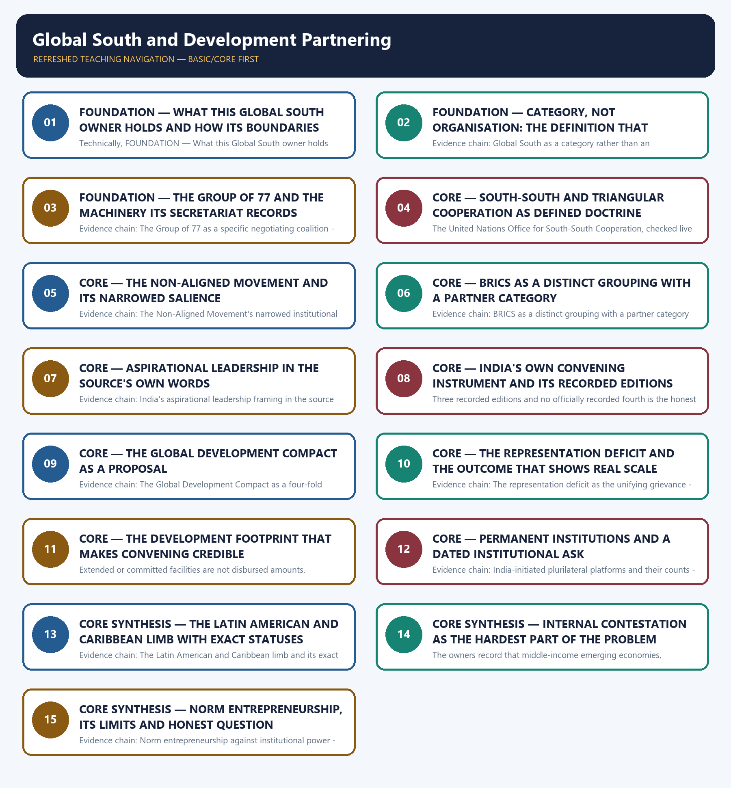

# Global South and Development Partnering — Learner-v2 Complete Learning Session

> **Authoring-only generation:** 2026-09-03. No PDF was rendered and no tracker or index was mutated.

### SOURCE, PROGRESSION AND CURRENT-LINKAGE AUDIT

- **Generation date:** 2026-09-03.
- **Repository-first evidence:** the Basic owner is taught first and preserved in full; the Advanced owner is retained only in the optional final teaching block.
- **OCR evidence:** Repository Markdown was primary. The OCR-searchable official General Studies question papers held under books\mains and books\more_previous_papers were read only to confirm the printed wording of routed demands. No official answer key, marking scheme, page precision or unsupported quotation was imported from them.
- **Qdrant:** not used; repository Markdown and available OCR context were sufficient.
- **PYQ integrity:** One General Studies Paper II Mains demand is routed to this topic in the audited routing ledgers and it is reproduced below as a demand card with its printed year, paper, question number, directive, marks and word limit exactly as the ledger records them: 2019 General Studies Paper II question 19 on India's image as a leader of the oppressed and marginalised nations, an Elaborate demand of 15 marks and 250 words, for which the ledger records that the Core route supersedes the older Advanced ownership and that the word limit was taken from the paper's instruction block rather than from a per-question printed tail, a defect that is reported here rather than repaired by invented wording. No objective demand from any audited Prelims routing ledger is routed to this owner, so none is listed, invented or answered. The Basic and Advanced owners separately record that no General Studies Paper II Mains question in the audited 2024-2025 papers directly names the Global South, South-South cooperation or India's voice-aggregator role; that absence is stated honestly instead of force-fitting an adjacent question onto this owner. The locally held OCR-searchable official General Studies papers were read only to confirm the printed wording of the routed Mains demand; no question was invented from them, no stem was paraphrased into an apparent routing, and no marking scheme or official answer key was imported.
- **Live-link boundary:** Live official verification was attempted on 2026-09-03 in the priority order required for this topic: the Ministry of External Affairs pages first, then the Press Information Bureau, then the multilateral bodies that own the vocabulary of this topic. Every outcome is recorded exactly as observed. The Ministry of External Affairs press-release, bilateral-document and country-brief pages returned a browser-requirement stub or the Ministry's own error page, and the Press Information Bureau index returned HTTP 403, so no Indian official item was obtained. The Group of 77 Secretariat and the United Nations Office for South-South Cooperation did return substantive official text, and it is used here only for the institutional and doctrinal facts those pages actually state. The package therefore uses the dated official anchors already carried by the repository owners together with those two multilateral sources, each with its actor, exact evidentiary level and date. It invents no membership list, no coalition size, no summit edition, outcome or declaration wording, no development-partnership or line-of-credit figure, no platform membership count, no negotiating position, no reform decision, no date, no previous-year question, no answer key and no current claim.
- **Fact/inference discipline:** no current-affairs item, PYQ wording, figure or quotation is invented.

### LIVE OFFICIAL-SOURCE ATTEMPT LOG

Every live check below was attempted on 2026-09-03 in the priority order required for International Relations: Ministry of External Affairs official pages first, then other official government or international-organisation documents. Access failures are recorded exactly as observed and no claim is reconstructed from a failed fetch.

- https://www.mea.gov.in/press-releases.htm — attempted 2026-09-03; the request redirected to a browser-requirement stub and returned no press release text, so no live item was taken from it.
- https://www.mea.gov.in/bilateral-documents.htm — attempted 2026-09-03; the request redirected to a browser-requirement stub and returned no bilateral document text, so no live item was taken from it.
- https://www.mea.gov.in/foreign-relation.htm — attempted 2026-09-03; the request redirected to the Ministry's own error page, so no country brief was taken from it.
- https://www.pib.gov.in/indexd.aspx?reg=3&lang=1 — attempted 2026-09-03; the request returned HTTP 403, so no release was taken from it.
- https://www.g77.org/doc/ — attempted 2026-09-03; the Group of 77 Secretariat returned substantive official text on the Group's operating modalities, its rotating one-year Chairmanship, the South Summit as its supreme decision-making body, the first two South Summits at Havana from 10-14 April 2000 and Doha from 12-16 June 2005, the Intergovernmental Follow-up and Coordination Committee on South-South Cooperation and the Caracas Programme of Action of 1981. That text is used only for those institutional facts. The same page still described the Third South Summit as due to be held in Africa, which is recorded here as the page's own state on the date of access and not as a claim about whether such a summit has since been held.
- https://unsouthsouth.org/about/about-sstc/ — attempted 2026-09-03; the United Nations Office for South-South Cooperation returned substantive official text defining triangular cooperation, listing the guiding principles of South-South cooperation and setting out the objectives of the Buenos Aires Plan of Action endorsed by General Assembly resolution 33/134 of 1978. That text is used only for those doctrinal definitions and no Indian programme, figure or outcome was taken from it.

## BASIC LEARNING SESSION

### DEEP-REVIEW LEARNING CONTRACT

| Control | Binding rule for this package |
|---|---|
| Syllabus boundary | Complete International Relations Basic/Core is answer-complete before optional Advanced depth. |
| Status boundary | Announced, negotiated, initialled, signed, ratified, entered into force, operational, suspended and completed remain distinct. |
| Institutional method | Treaty basis or political character → exact membership/status → mandate → decision rule → national instrument → implementation → outcome. |
| Level mapping | Bilateral, subregional/regional, minilateral/plurilateral and systemic levels are separated and then connected. |
| Policy method | Strategic objective → chosen instrument → implementing actors/resources → observed output/outcome → alternative and residual risk. |
| Evidence method | Claim → named India-centric treaty, institution, corridor, operation, agreement or summit → analysis → official source/date/status and causal qualification. |
| Neutrality method | Contested borders, maritime claims and conflicts are attributed neutrally; policy doctrine is distinguished from retrospective analytical label. |
| Practice contract | Every solved item has demand decoding, a detailed examiner-grade model, executable timed/compression plan, marks rationale and answer-specific improvement. |
| Approval | This immutable successor remains `approved: false` pending explicit approval. |

**Canonical Basic/Core owner:** `upsc-ai-kit\knowledge\International-Relations\basic\08_Global-South-and-Development-Partnering.md`  
**Substantive canonical provenance owner:** `upsc-ai-kit\knowledge\International-Relations\08_Global-South-and-Development-Partnering_Learner-V2-Complete-Topic-Package.md`  
**Optional Advanced owner:** `upsc-ai-kit\knowledge\International-Relations\advanced\08_Global-South-and-Development-Partnering.md`  
**Official syllabus mapping:** `upsc-ai-kit\knowledge\International Relations\OFFICIAL-UPSC-SYLLABUS-MAPPING.md`

### EVIDENCE, PYQ AND CURRENT-STATUS CONTROL

- **Membership discipline:** member, observer, dialogue partner, chair, guest and invited participant are not interchangeable; verify the relevant date.
- **Mandate discipline:** treaty organisation, UN organ, specialised agency, court, summit process, political forum, coalition and minilateral retain exact legal character and competence.
- **Agreement discipline:** announcement, negotiation, signature, ratification, entry into force, domestic implementation and measured outcome remain separate.
- **Connectivity discipline:** concept, financing, contract, construction, trial movement, operational segment, completed corridor and commercially viable use remain separate.
- **Conflict discipline:** distinguish verified event, party claim, independent attribution, legal characterisation and analytical inference; use neutral language for contested borders and conflicts.
- **Causal discipline:** chronology, summit language, trade change, deployment or project completion does not alone establish strategic effect; state mechanism, counterfactual and alternatives.
- **Trade-off discipline:** interests, capabilities, constraints, partner agency, escalation, dependence, finance, legitimacy, domestic distribution, alternatives and implementation risks are explicit.
- **PYQ discipline:** exact wording is preserved only where verified; routed or reconstructed demands remain labelled and no model is presented as an official UPSC answer.
- **Current-status note, rechecked 2026-09-03:** volatile relations, agreements, corridors, operations, conflicts, trade and summit outcomes retain official source, publication date and operative/interim/completed status; stale officeholders are omitted.

**Generation-local live/current sources:**
- `https://www.mea.gov.in/press-releases.htm — attempted 2026-09-03; the request redirected to a browser-requirement stub and returned no press release text, so no live item was taken from it.`
- `https://www.mea.gov.in/bilateral-documents.htm — attempted 2026-09-03; the request redirected to a browser-requirement stub and returned no bilateral document text, so no live item was taken from it.`
- `https://www.mea.gov.in/foreign-relation.htm — attempted 2026-09-03; the request redirected to the Ministry's own error page, so no country brief was taken from it.`
- `https://www.pib.gov.in/indexd.aspx?reg=3&lang=1 — attempted 2026-09-03; the request returned HTTP 403, so no release was taken from it.`
- `https://www.g77.org/doc/ — attempted 2026-09-03; the Group of 77 Secretariat returned substantive official text on the Group's operating modalities, its rotating one-year Chairmanship, the South Summit as its supreme decision-making body, the first two South Summits at Havana from 10-14 April 2000 and Doha from 12-16 June 2005, the Intergovernmental Follow-up and Coordination Committee on South-South Cooperation and the Caracas Programme of Action of 1981. That text is used only for those institutional facts. The same page still described the Third South Summit as due to be held in Africa, which is recorded here as the page's own state on the date of access and not as a claim about whether such a summit has since been held.`
- `https://unsouthsouth.org/about/about-sstc/ — attempted 2026-09-03; the United Nations Office for South-South Cooperation returned substantive official text defining triangular cooperation, listing the guiding principles of South-South cooperation and setting out the objectives of the Buenos Aires Plan of Action endorsed by General Assembly resolution 33/134 of 1978. That text is used only for those doctrinal definitions and no Indian programme, figure or outcome was taken from it.`




*Distinct embedded teaching-navigation image. The separate continuous Cārvāka-style flowchart package remains an independent at-a-glance artifact.*

### SESSION 1 — FOUNDATION — WHAT THIS GLOBAL SOUTH OWNER HOLDS AND HOW ITS BOUNDARIES ARE ROUTED

#### DEFINITION / WHAT THIS IS CALLED

**Plain-language definition:** Evidence chain: What this Global South owner holds and how its boundaries are routed Qualified use: Open a Global South demand by fixing ownership so the answer does not drift into another owner's evidence.

**Technical definition:** Technically, FOUNDATION — What this Global South owner holds and how its boundaries are routed is analysed by relating FOUNDATION to how its boundaries are routed, then testing the relationship through Evidence chain and Qualified use.

#### ANSWER-GRABBING OPENING — WRITE/ADAPT IN THE EXAM

> Evidence chain: What this Global South owner holds and how its boundaries are routed Qualified use: Open a Global South demand by fixing ownership so the answer does not drift into another owner's evidence.

#### MUST-WRITE KEYWORDS

- **FOUNDATION**
- **how its boundaries are routed**
- **Evidence chain**
- **Qualified use**
- **This**
- **Global South**

**How to use them:** Frame the answer through FOUNDATION; define how its boundaries are routed, connect Evidence chain with Qualified use to explain the mechanism, and use This for the decisive comparison or qualification.

#### VISUAL FIRST

```text
WHAT THIS GLOBAL SOUTH OWNER HOLDS AND HOW ITS BOUNDARIES ARE ROUTED
01. What this Global South owner holds and how its boundaries are routed
BOUNDARY -> Institutional profiles of BRICS and the Group of Twenty belong to topic 10, reform architecture to topic 12, Africa delivery to topic 07 and multi-alignment vocabulary to topic 01.
```

*This topic-specific rail fixes the evidence sequence and its exam boundary before analysis.*

#### CORE EXPLANATION

This topic owns the Global South as a political-development category, the coalitions through which it is expressed, South-South and triangular cooperation as doctrines, India's convening and norm-entrepreneurship role, the development-partnership footprint that gives the convening credibility, and the representation-deficit grievance that unifies otherwise diverse states; its distinctive feature is that the subject has no single organisation to describe, so precision about categories and instruments carries the marks, and one General Studies Paper II Mains demand from 2019 is routed here with no objective demand routed at all, while the BRICS and Group of Twenty institutional profiles belong to topic 10, the United Nations and Bretton Woods reform architecture belongs to topic 12, Africa-specific delivery belongs to topic 07 and multi-alignment vocabulary belongs to topic 01.

#### NAMED EVIDENCE AND MECHANISM

- This topic owns the Global South as a political-development category, the coalitions through which it is expressed, South-South and triangular cooperation as doctrines, India's convening and norm-entrepreneurship role, the development-partnership footprint that gives the convening credibility, and the representation-deficit grievance that unifies otherwise diverse states; its distinctive feature is that the subject has no single organisation to describe, so precision about categories and instruments carries the marks, and one General Studies Paper II Mains demand from 2019 is routed here with no objective demand routed at all, while the BRICS and Group of Twenty institutional profiles belong to topic 10, the United Nations and Bretton Woods reform architecture belongs to topic 12, Africa-specific delivery belongs to topic 07 and multi-alignment vocabulary belongs to topic 01.

#### EXAMINER CAUTION

- Institutional profiles of BRICS and the Group of Twenty belong to topic 10, reform architecture to topic 12, Africa delivery to topic 07 and multi-alignment vocabulary to topic 01.

#### EXAM LINK

- **Prelims:** Retain the exact actor, document title, doctrine label, dated instrument and evidentiary level attached to What this Global South owner holds and how its boundaries are routed, and never upgrade a vision statement into a treaty, a signature into a ratification, a participation category into membership, or an announced corridor into an operating one.
- **Mains:** Open a Global South demand by fixing ownership so the answer does not drift into another owner's evidence.

#### MINI RECAP

- **Evidence chain:** What this Global South owner holds and how its boundaries are routed
- **Qualified use:** Open a Global South demand by fixing ownership so the answer does not drift into another owner's evidence.

#### CLOSING RECALL FLOW — FOUNDATION — WHAT THIS GLOBAL SOUTH OWNER HOLDS AND HOW ITS BOUNDARIES ARE ROUTED

```text
START / CONCEPT: FOUNDATION — What this Global South owner holds and how its boundaries are routed
        |
        v
EXACT TERMS: FOUNDATION · how its boundaries are routed · Evidence chain · Qualified use · This · Global South
        |
        v
MECHANISM / ARGUMENT: This topic owns the Global South as a political-development category, the coalitions through which it is expressed, South-South and triangular cooperation as doctrines, India's convening and norm-entrepreneurship role, the development-partnership footprint that gives the convening credibility, and the representation-deficit grievance that unifies otherwise diverse states; its distinctive feature is that the subject has no single organisation to describe, so precision about categories and instruments carries the marks, and one General Studies Paper II Mains demand from 2019 is routed here with no objective demand routed at all, while the BRICS and Group of Twenty institutional profiles belong to topic 10, the United Nations and Bretton Woods reform architecture belongs to topic 12, Africa-specific delivery belongs to topic 07 and multi-alignment vocabulary belongs to topic 01.
        |
        v
CONSEQUENCE / CONTRAST: Prelims: Retain the exact actor, document title, doctrine label, dated instrument and evidentiary level attached to What this Global South owner holds and how its boundaries are routed, and never upgrade a vision statement into a treaty, a signature into a ratification, a participation category into membership, or an announced corridor into an operating one.
        |
        v
UPSC TRAP / ANSWER-USE: Mains: Open a Global South demand by fixing ownership so the answer does not drift into another owner's evidence.
        |
        v
ANSWER-GRABBING FORMULATION: Evidence chain: What this Global South owner holds and how its boundaries are routed Qualified use: Open a Global South demand by fixing ownership so the answer does not drift into another owner's evidence.
```
### SESSION 2 — FOUNDATION — CATEGORY, NOT ORGANISATION: THE DEFINITION THAT CARRIES THE MARK

#### DEFINITION / WHAT THIS IS CALLED

**Plain-language definition:** The owners define the Global South as a political-development category referring broadly to developing and least-developed countries across Asia, Africa and Latin America, defined more by shared development challenges and historical positioning than by formal institutional membership, and they insist that it is not a treaty body, has no fixed membership roll and takes no binding decisions; the examinable consequence is that an answer must engage it through multiple overlapping platforms rather than describe a single institution, because treating the category as a bloc converts a defensible framing into a scoring error.

**Technical definition:** Evidence chain: Global South as a category rather than an organisation Qualified use: Secure the definitional mark before any argument, because most answers lose it in the first sentence.

#### ANSWER-GRABBING OPENING — WRITE/ADAPT IN THE EXAM

> Evidence chain: Global South as a category rather than an organisation Qualified use: Secure the definitional mark before any argument, because most answers lose it in the first sentence.

#### MUST-WRITE KEYWORDS

- **FOUNDATION**
- **Category**
- **not organisation**
- **the definition that carries the mark**
- **Evidence chain**
- **Qualified use**

**How to use them:** Frame the answer through FOUNDATION; define Category, connect not organisation with the definition that carries the mark to explain the mechanism, and use Evidence chain for the decisive comparison or qualification.

#### VISUAL FIRST

```text
CATEGORY, NOT ORGANISATION: THE DEFINITION THAT CARRIES THE MARK
01. Global South as a category rather than an organisation
BOUNDARY -> The category has no treaty body, no fixed membership roll and no binding decision-making power.
```

*This topic-specific rail fixes the evidence sequence and its exam boundary before analysis.*

#### CORE EXPLANATION

The owners define the Global South as a political-development category referring broadly to developing and least-developed countries across Asia, Africa and Latin America, defined more by shared development challenges and historical positioning than by formal institutional membership, and they insist that it is not a treaty body, has no fixed membership roll and takes no binding decisions; the examinable consequence is that an answer must engage it through multiple overlapping platforms rather than describe a single institution, because treating the category as a bloc converts a defensible framing into a scoring error.

#### NAMED EVIDENCE AND MECHANISM

- The owners define the Global South as a political-development category referring broadly to developing and least-developed countries across Asia, Africa and Latin America, defined more by shared development challenges and historical positioning than by formal institutional membership, and they insist that it is not a treaty body, has no fixed membership roll and takes no binding decisions; the examinable consequence is that an answer must engage it through multiple overlapping platforms rather than describe a single institution, because treating the category as a bloc converts a defensible framing into a scoring error.

#### EXAMINER CAUTION

- The category has no treaty body, no fixed membership roll and no binding decision-making power.

#### EXAM LINK

- **Prelims:** Retain the exact actor, document title, doctrine label, dated instrument and evidentiary level attached to Category, not organisation: the definition that carries the mark, and never upgrade a vision statement into a treaty, a signature into a ratification, a participation category into membership, or an announced corridor into an operating one.
- **Mains:** Secure the definitional mark before any argument, because most answers lose it in the first sentence.

#### MINI RECAP

- **Evidence chain:** Global South as a category rather than an organisation
- **Qualified use:** Secure the definitional mark before any argument, because most answers lose it in the first sentence.

#### CLOSING RECALL FLOW — FOUNDATION — CATEGORY, NOT ORGANISATION: THE DEFINITION THAT CARRIES THE MARK

```text
START / CONCEPT: FOUNDATION — Category, not organisation: the definition that carries the mark
        |
        v
EXACT TERMS: FOUNDATION · Category · not organisation · the definition that carries the mark · Evidence chain · Qualified use
        |
        v
MECHANISM / ARGUMENT: The owners define the Global South as a political-development category referring broadly to developing and least-developed countries across Asia, Africa and Latin America, defined more by shared development challenges and historical positioning than by formal institutional membership, and they insist that it is not a treaty body, has no fixed membership roll and takes no binding decisions; the examinable consequence is that an answer must engage it through multiple overlapping platforms rather than describe a single institution, because treating the category as a bloc converts a defensible framing into a scoring error.
        |
        v
CONSEQUENCE / CONTRAST: The category has no treaty body, no fixed membership roll and no binding decision-making power.
        |
        v
UPSC TRAP / ANSWER-USE: Do not miss this limiting distinction: global South as a category rather than an organisation Qualified use.
        |
        v
ANSWER-GRABBING FORMULATION: Evidence chain: Global South as a category rather than an organisation Qualified use: Secure the definitional mark before any argument, because most answers lose it in the first sentence.
```
### SESSION 3 — FOUNDATION — THE GROUP OF 77 AND THE MACHINERY ITS SECRETARIAT RECORDS

#### DEFINITION / WHAT THIS IS CALLED

**Plain-language definition:** The Group of 77 Secretariat's own page, checked live on 2026-09-03, records that a Chairman acts as spokesman and coordinates the Group's action in each Chapter, that the Chairmanship is the highest political body within the organisational structure and rotates on a regional basis between Africa, Asia-Pacific and Latin America and the Caribbean for one year in all the Chapters, that for the year 2026 the Oriental Republic of Uruguay holds the Chairmanship of the Group of 77 in New York, that the South Summit is the supreme decision-making body with the first held at Havana from 10-14 April 2000 and the second at Doha from 12-16 June 2005, that the Annual Meeting of the Ministers for Foreign Affairs is convened at the beginning of the regular session of the United Nations General Assembly in New York, and that the Intergovernmental Follow-up and Coordination Committee on South-South Cooperation is a plenary body of senior officials meeting once every two years to review implementation of the Caracas Programme of Action adopted in 1981; the same page still described the Third South Summit as due to be held in Africa, which is recorded here as the page's own state on the date of access rather than as a claim about whether such a summit has since been held.

**Technical definition:** Evidence chain: The Group of 77 as a specific negotiating coalition - The Group of 77's own machinery as its Secretariat records it Qualified use: Replace the vague phrase developing-country grouping with named, dated institutional machinery.

#### ANSWER-GRABBING OPENING — WRITE/ADAPT IN THE EXAM

> Evidence chain: The Group of 77 as a specific negotiating coalition - The Group of 77's own machinery as its Secretariat records it Qualified use: Replace the vague phrase developing-country grouping with named, dated institutional machinery.

#### MUST-WRITE KEYWORDS

- **FOUNDATION**
- **The Group of 77**
- **the machinery its Secretariat records**
- **Evidence chain**
- **Qualified use**
- **2026-09**

**How to use them:** Frame the answer through FOUNDATION; define The Group of 77, connect the machinery its Secretariat records with Evidence chain to explain the mechanism, and use Qualified use for the decisive comparison or qualification.

#### VISUAL FIRST

```text
THE GROUP OF 77 AND THE MACHINERY ITS SECRETARIAT RECORDS
01. The Group of 77 as a specific negotiating coalition
    |
    v
02. The Group of 77's own machinery as its Secretariat records it
BOUNDARY -> A coalition fact must carry its own source, and a page describing a summit as due is not evidence about whether it has since been held.
```

*This topic-specific rail fixes the evidence sequence and its exam boundary before analysis.*

#### CORE EXPLANATION

Tharoor describes the Group of 77 as the massive gathering of over 120 developing countries, which the owners treat as a specific and long-standing negotiating coalition inside the United Nations system rather than as a synonym for the Global South; the distinction is repeatedly tested, because the Group of 77 has a defined membership and an institutional structure while the Global South is a looser category that is not fully coextensive with it, so an answer that uses the two words interchangeably has already lost the definitional mark. The Group of 77 Secretariat's own page, checked live on 2026-09-03, records that a Chairman acts as spokesman and coordinates the Group's action in each Chapter, that the Chairmanship is the highest political body within the organisational structure and rotates on a regional basis between Africa, Asia-Pacific and Latin America and the Caribbean for one year in all the Chapters, that for the year 2026 the Oriental Republic of Uruguay holds the Chairmanship of the Group of 77 in New York, that the South Summit is the supreme decision-making body with the first held at Havana from 10-14 April 2000 and the second at Doha from 12-16 June 2005, that the Annual Meeting of the Ministers for Foreign Affairs is convened at the beginning of the regular session of the United Nations General Assembly in New York, and that the Intergovernmental Follow-up and Coordination Committee on South-South Cooperation is a plenary body of senior officials meeting once every two years to review implementation of the Caracas Programme of Action adopted in 1981; the same page still described the Third South Summit as due to be held in Africa, which is recorded here as the page's own state on the date of access rather than as a claim about whether such a summit has since been held.

#### NAMED EVIDENCE AND MECHANISM

- Tharoor describes the Group of 77 as the massive gathering of over 120 developing countries, which the owners treat as a specific and long-standing negotiating coalition inside the United Nations system rather than as a synonym for the Global South; the distinction is repeatedly tested, because the Group of 77 has a defined membership and an institutional structure while the Global South is a looser category that is not fully coextensive with it, so an answer that uses the two words interchangeably has already lost the definitional mark.
- The Group of 77 Secretariat's own page, checked live on 2026-09-03, records that a Chairman acts as spokesman and coordinates the Group's action in each Chapter, that the Chairmanship is the highest political body within the organisational structure and rotates on a regional basis between Africa, Asia-Pacific and Latin America and the Caribbean for one year in all the Chapters, that for the year 2026 the Oriental Republic of Uruguay holds the Chairmanship of the Group of 77 in New York, that the South Summit is the supreme decision-making body with the first held at Havana from 10-14 April 2000 and the second at Doha from 12-16 June 2005, that the Annual Meeting of the Ministers for Foreign Affairs is convened at the beginning of the regular session of the United Nations General Assembly in New York, and that the Intergovernmental Follow-up and Coordination Committee on South-South Cooperation is a plenary body of senior officials meeting once every two years to review implementation of the Caracas Programme of Action adopted in 1981; the same page still described the Third South Summit as due to be held in Africa, which is recorded here as the page's own state on the date of access rather than as a claim about whether such a summit has since been held.

#### EXAMINER CAUTION

- A coalition fact must carry its own source, and a page describing a summit as due is not evidence about whether it has since been held.

#### EXAM LINK

- **Prelims:** Retain the exact actor, document title, doctrine label, dated instrument and evidentiary level attached to The Group of 77 and the machinery its Secretariat records, and never upgrade a vision statement into a treaty, a signature into a ratification, a participation category into membership, or an announced corridor into an operating one.
- **Mains:** Replace the vague phrase developing-country grouping with named, dated institutional machinery.

#### MINI RECAP

- **Evidence chain:** The Group of 77 as a specific negotiating coalition -> The Group of 77's own machinery as its Secretariat records it
- **Qualified use:** Replace the vague phrase developing-country grouping with named, dated institutional machinery.

#### CLOSING RECALL FLOW — FOUNDATION — THE GROUP OF 77 AND THE MACHINERY ITS SECRETARIAT RECORDS

```text
START / CONCEPT: FOUNDATION — The Group of 77 and the machinery its Secretariat records
        |
        v
EXACT TERMS: FOUNDATION · The Group of 77 · the machinery its Secretariat records · Evidence chain · Qualified use · 2026-09
        |
        v
MECHANISM / ARGUMENT: Tharoor describes the Group of 77 as the massive gathering of over 120 developing countries, which the owners treat as a specific and long-standing negotiating coalition inside the United Nations system rather than as a synonym for the Global South; the distinction is repeatedly tested, because the Group of 77 has a defined membership and an institutional structure while the Global South is a looser category that is not fully coextensive with it, so an answer that uses the two words interchangeably has already lost the definitional mark.
        |
        v
CONSEQUENCE / CONTRAST: A coalition fact must carry its own source, and a page describing a summit as due is not evidence about whether it has since been held.
        |
        v
UPSC TRAP / ANSWER-USE: The Group of 77 Secretariat's own page, checked live on 2026-09-03, records that a Chairman acts as spokesman and coordinates the Group's action in each Chapter, that the Chairmanship is the highest political body within the organisational structure and rotates on a regional basis between Africa, Asia-Pacific and Latin America and the Caribbean for one year in all the Chapters, that for the year 2026 the Oriental Republic of Uruguay holds the Chairmanship of the Group of 77 in New York, that the South Summit is the supreme decision-making body with the first held at Havana from 10-14 April 2000 and the second at Doha from 12-16 June 2005, that the Annual Meeting of the Ministers for Foreign Affairs is convened at the beginning of the regular session of the United Nations General Assembly in New York, and that the Intergovernmental Follow-up and Coordination Committee on South-South Cooperation is a plenary body of senior officials meeting once every two years to review implementation of the Caracas Programme of Action adopted in 1981; the same page still described the Third South Summit as due to be held in Africa, which is recorded here as the page's own state on the date of access rather than as a claim about whether such a summit has since been held.
        |
        v
ANSWER-GRABBING FORMULATION: Evidence chain: The Group of 77 as a specific negotiating coalition - The Group of 77's own machinery as its Secretariat records it Qualified use: Replace the vague phrase developing-country grouping with named, dated institutional machinery.
```
### SESSION 4 — CORE — SOUTH-SOUTH AND TRIANGULAR COOPERATION AS DEFINED DOCTRINE

#### DEFINITION / WHAT THIS IS CALLED

**Plain-language definition:** The same United Nations source defines triangular cooperation as Southern-driven partnerships between two or more developing countries supported by a developed country or countries or by multilateral organisations to implement development cooperation programmes and projects, and records the reasoning that Southern partners often require the financial and technical support and expertise of multilateral or developed-country partners while Northern partners benefit from increased institutional capacity in the South and from leveraging the resources of multiple Southern partners; the owners use this to supply the precise vocabulary an answer needs when it argues that South-South cooperation complements rather than replaces North-South development assistance, provided the process is led and owned by Southern actors.

**Technical definition:** The United Nations Office for South-South Cooperation, checked live on 2026-09-03, records that South-South cooperation is a manifestation of solidarity among peoples and countries of the South contributing to their national well-being, their national and collective self-reliance and the attainment of internationally agreed development goals, and that its agenda and initiatives must be determined by the countries of the South and guided by the principles of respect for national sovereignty, national ownership and independence, equality, non-conditionality, non-interference in domestic affairs and mutual benefit; it further records that the basic objectives come from the Buenos Aires Plan of Action for Promoting and Implementing Technical Cooperation among Developing Countries endorsed by the General Assembly in 1978 through resolution 33/134, which include fostering self-reliance, pooling technical resources, strengthening joint analysis of development problems, creating and strengthening technological capacities, improving communication among developing countries and responding to the problems of least developed countries, landlocked developing countries and small island developing States.

#### ANSWER-GRABBING OPENING — WRITE/ADAPT IN THE EXAM

> The same United Nations source defines triangular cooperation as Southern-driven partnerships between two or more developing countries supported by a developed country or countries or by multilateral organisations to implement development cooperation programmes and projects, and records the reasoning that Southern partners often require the financial and technical support and expertise of multilateral or developed-country partners while Northern partners benefit from increased institutional capacity in the South and from leveraging the resources of multiple Southern partners; the owners use this to supply the precise vocabulary an answer needs when it argues that South-South cooperation complements rather than replaces North-South development assistance, provided the process is led and owned by Southern actors.

#### MUST-WRITE KEYWORDS

- **South-South**
- **triangular cooperation as defined doctrine**
- **Evidence chain**
- **Qualified use**
- **The United Nations Office**
- **2026-09**

**How to use them:** Frame the answer through South-South; define triangular cooperation as defined doctrine, connect Evidence chain with Qualified use to explain the mechanism, and use The United Nations Office for the decisive comparison or qualification.

#### VISUAL FIRST

```text
SOUTH-SOUTH AND TRIANGULAR COOPERATION AS DEFINED DOCTRINE
01. The doctrinal definition of South-South cooperation
    |
    v
02. Triangular cooperation as the third structural form
BOUNDARY -> The guiding principles must be quoted in their exact terms, and complementarity is not substitution.
```

*This topic-specific rail fixes the evidence sequence and its exam boundary before analysis.*

#### CORE EXPLANATION

The United Nations Office for South-South Cooperation, checked live on 2026-09-03, records that South-South cooperation is a manifestation of solidarity among peoples and countries of the South contributing to their national well-being, their national and collective self-reliance and the attainment of internationally agreed development goals, and that its agenda and initiatives must be determined by the countries of the South and guided by the principles of respect for national sovereignty, national ownership and independence, equality, non-conditionality, non-interference in domestic affairs and mutual benefit; it further records that the basic objectives come from the Buenos Aires Plan of Action for Promoting and Implementing Technical Cooperation among Developing Countries endorsed by the General Assembly in 1978 through resolution 33/134, which include fostering self-reliance, pooling technical resources, strengthening joint analysis of development problems, creating and strengthening technological capacities, improving communication among developing countries and responding to the problems of least developed countries, landlocked developing countries and small island developing States. The same United Nations source defines triangular cooperation as Southern-driven partnerships between two or more developing countries supported by a developed country or countries or by multilateral organisations to implement development cooperation programmes and projects, and records the reasoning that Southern partners often require the financial and technical support and expertise of multilateral or developed-country partners while Northern partners benefit from increased institutional capacity in the South and from leveraging the resources of multiple Southern partners; the owners use this to supply the precise vocabulary an answer needs when it argues that South-South cooperation complements rather than replaces North-South development assistance, provided the process is led and owned by Southern actors.

#### NAMED EVIDENCE AND MECHANISM

- The United Nations Office for South-South Cooperation, checked live on 2026-09-03, records that South-South cooperation is a manifestation of solidarity among peoples and countries of the South contributing to their national well-being, their national and collective self-reliance and the attainment of internationally agreed development goals, and that its agenda and initiatives must be determined by the countries of the South and guided by the principles of respect for national sovereignty, national ownership and independence, equality, non-conditionality, non-interference in domestic affairs and mutual benefit; it further records that the basic objectives come from the Buenos Aires Plan of Action for Promoting and Implementing Technical Cooperation among Developing Countries endorsed by the General Assembly in 1978 through resolution 33/134, which include fostering self-reliance, pooling technical resources, strengthening joint analysis of development problems, creating and strengthening technological capacities, improving communication among developing countries and responding to the problems of least developed countries, landlocked developing countries and small island developing States.
- The same United Nations source defines triangular cooperation as Southern-driven partnerships between two or more developing countries supported by a developed country or countries or by multilateral organisations to implement development cooperation programmes and projects, and records the reasoning that Southern partners often require the financial and technical support and expertise of multilateral or developed-country partners while Northern partners benefit from increased institutional capacity in the South and from leveraging the resources of multiple Southern partners; the owners use this to supply the precise vocabulary an answer needs when it argues that South-South cooperation complements rather than replaces North-South development assistance, provided the process is led and owned by Southern actors.

#### EXAMINER CAUTION

- The guiding principles must be quoted in their exact terms, and complementarity is not substitution.

#### EXAM LINK

- **Prelims:** Retain the exact actor, document title, doctrine label, dated instrument and evidentiary level attached to South-South and triangular cooperation as defined doctrine, and never upgrade a vision statement into a treaty, a signature into a ratification, a participation category into membership, or an announced corridor into an operating one.
- **Mains:** Supply the doctrinal vocabulary that turns a descriptive answer into a definitional one.

#### MINI RECAP

- **Evidence chain:** The doctrinal definition of South-South cooperation -> Triangular cooperation as the third structural form
- **Qualified use:** Supply the doctrinal vocabulary that turns a descriptive answer into a definitional one.

#### CLOSING RECALL FLOW — CORE — SOUTH-SOUTH AND TRIANGULAR COOPERATION AS DEFINED DOCTRINE

```text
START / CONCEPT: CORE — South-South and triangular cooperation as defined doctrine
        |
        v
EXACT TERMS: South-South · triangular cooperation as defined doctrine · Evidence chain · Qualified use · The United Nations Office · 2026-09
        |
        v
MECHANISM / ARGUMENT: The United Nations Office for South-South Cooperation, checked live on 2026-09-03, records that South-South cooperation is a manifestation of solidarity among peoples and countries of the South contributing to their national well-being, their national and collective self-reliance and the attainment of internationally agreed development goals, and that its agenda and initiatives must be determined by the countries of the South and guided by the principles of respect for national sovereignty, national ownership and independence, equality, non-conditionality, non-interference in domestic affairs and mutual benefit; it further records that the basic objectives come from the Buenos Aires Plan of Action for Promoting and Implementing Technical Cooperation among Developing Countries endorsed by the General Assembly in 1978 through resolution 33/134, which include fostering self-reliance, pooling technical resources, strengthening joint analysis of development problems, creating and strengthening technological capacities, improving communication among developing countries and responding to the problems of least developed countries, landlocked developing countries and small island developing States.
        |
        v
CONSEQUENCE / CONTRAST: Evidence chain: The doctrinal definition of South-South cooperation - Triangular cooperation as the third structural form Qualified use: Supply the doctrinal vocabulary that turns a descriptive answer into a definitional one.
        |
        v
UPSC TRAP / ANSWER-USE: The guiding principles must be quoted in their exact terms, and complementarity is not substitution.
        |
        v
ANSWER-GRABBING FORMULATION: The same United Nations source defines triangular cooperation as Southern-driven partnerships between two or more developing countries supported by a developed country or countries or by multilateral organisations to implement development cooperation programmes and projects, and records the reasoning that Southern partners often require the financial and technical support and expertise of multilateral or developed-country partners while Northern partners benefit from increased institutional capacity in the South and from leveraging the resources of multiple Southern partners; the owners use this to supply the precise vocabulary an answer needs when it argues that South-South cooperation complements rather than replaces North-South development assistance, provided the process is led and owned by Southern actors.
```
### SESSION 5 — CORE — THE NON-ALIGNED MOVEMENT AND ITS NARROWED SALIENCE

#### DEFINITION / WHAT THIS IS CALLED

**Plain-language definition:** The owners record the Non-Aligned Movement as historically linked to Global South solidarity while noting that its contemporary institutional salience has narrowed, and they place its bloc-avoidance heritage alongside the Group of 77's negotiating function and the financial-voice focus of BRICS as three different responses to the same underlying grievance; the analytical consequence is that an answer must not treat the three as interchangeable expressions of one movement, because each addresses a different facet of the representation problem and none has merged into the others.

**Technical definition:** Evidence chain: The Non-Aligned Movement's narrowed institutional salience Qualified use: Handle the movement honestly instead of inflating or dismissing it.

#### ANSWER-GRABBING OPENING — WRITE/ADAPT IN THE EXAM

> The owners record the Non-Aligned Movement as historically linked to Global South solidarity while noting that its contemporary institutional salience has narrowed, and they place its bloc-avoidance heritage alongside the Group of 77's negotiating function and the financial-voice focus of BRICS as three different responses to the same underlying grievance; the analytical consequence is that an answer must not treat the three as interchangeable expressions of one movement, because each addresses a different facet of the representation problem and none has merged into the others.

#### MUST-WRITE KEYWORDS

- **The Non-Aligned Movement**
- **its narrowed salience**
- **Evidence chain**
- **Qualified use**
- **Non-Aligned Movement**
- **Global South**

**How to use them:** Frame the answer through The Non-Aligned Movement; define its narrowed salience, connect Evidence chain with Qualified use to explain the mechanism, and use Non-Aligned Movement for the decisive comparison or qualification.

#### VISUAL FIRST

```text
THE NON-ALIGNED MOVEMENT AND ITS NARROWED SALIENCE
01. The Non-Aligned Movement's narrowed institutional salience
BOUNDARY -> Historical solidarity is not contemporary institutional weight, and the three coalitions have not merged.
```

*This topic-specific rail fixes the evidence sequence and its exam boundary before analysis.*

#### CORE EXPLANATION

The owners record the Non-Aligned Movement as historically linked to Global South solidarity while noting that its contemporary institutional salience has narrowed, and they place its bloc-avoidance heritage alongside the Group of 77's negotiating function and the financial-voice focus of BRICS as three different responses to the same underlying grievance; the analytical consequence is that an answer must not treat the three as interchangeable expressions of one movement, because each addresses a different facet of the representation problem and none has merged into the others.

#### NAMED EVIDENCE AND MECHANISM

- The owners record the Non-Aligned Movement as historically linked to Global South solidarity while noting that its contemporary institutional salience has narrowed, and they place its bloc-avoidance heritage alongside the Group of 77's negotiating function and the financial-voice focus of BRICS as three different responses to the same underlying grievance; the analytical consequence is that an answer must not treat the three as interchangeable expressions of one movement, because each addresses a different facet of the representation problem and none has merged into the others.

#### EXAMINER CAUTION

- Historical solidarity is not contemporary institutional weight, and the three coalitions have not merged.

#### EXAM LINK

- **Prelims:** Retain the exact actor, document title, doctrine label, dated instrument and evidentiary level attached to The Non-Aligned Movement and its narrowed salience, and never upgrade a vision statement into a treaty, a signature into a ratification, a participation category into membership, or an announced corridor into an operating one.
- **Mains:** Handle the movement honestly instead of inflating or dismissing it.

#### MINI RECAP

- **Evidence chain:** The Non-Aligned Movement's narrowed institutional salience
- **Qualified use:** Handle the movement honestly instead of inflating or dismissing it.

#### CLOSING RECALL FLOW — CORE — THE NON-ALIGNED MOVEMENT AND ITS NARROWED SALIENCE

```text
START / CONCEPT: CORE — The Non-Aligned Movement and its narrowed salience
        |
        v
EXACT TERMS: The Non-Aligned Movement · its narrowed salience · Evidence chain · Qualified use · Non-Aligned Movement · Global South
        |
        v
MECHANISM / ARGUMENT: Evidence chain: The Non-Aligned Movement's narrowed institutional salience Qualified use: Handle the movement honestly instead of inflating or dismissing it.
        |
        v
CONSEQUENCE / CONTRAST: Historical solidarity is not contemporary institutional weight, and the three coalitions have not merged.
        |
        v
UPSC TRAP / ANSWER-USE: Do not miss this limiting distinction: the owners record the Non-Aligned Movement as historically linked to Global South solidarity while...
        |
        v
ANSWER-GRABBING FORMULATION: The owners record the Non-Aligned Movement as historically linked to Global South solidarity while noting that its contemporary institutional salience has narrowed, and they place its bloc-avoidance heritage alongside the Group of 77's negotiating function and the financial-voice focus of BRICS as three different responses to the same underlying grievance; the analytical consequence is that an answer must not treat the three as interchangeable expressions of one movement, because each addresses a different facet of the representation problem and none has merged into the others.
```
### SESSION 6 — CORE — BRICS AS A DISTINCT GROUPING WITH A PARTNER CATEGORY

#### DEFINITION / WHAT THIS IS CALLED

**Plain-language definition:** The owners record BRICS as a distinct and expanding grouping with a financial-architecture-specific agenda whose seventeenth summit issued the Rio de Janeiro Declaration on 6-7 July 2025, with its full institutional profile reserved for topic 10, and they warn that BRICS is only partially coextensive with the Global South and is not a larger version of the Group of 77; they add an instructive detail, namely that the separate partner-country category created on 24 October 2024 widens participation without widening membership rights, which is precisely the distinction the Global South itself presses against the Security Council and the Bretton Woods institutions.

**Technical definition:** Evidence chain: BRICS as a distinct grouping with a partner category Qualified use: Use a live minilateral example to sharpen the participation-versus-membership distinction.

#### ANSWER-GRABBING OPENING — WRITE/ADAPT IN THE EXAM

> The owners record BRICS as a distinct and expanding grouping with a financial-architecture-specific agenda whose seventeenth summit issued the Rio de Janeiro Declaration on 6-7 July 2025, with its full institutional profile reserved for topic 10, and they warn that BRICS is only partially coextensive with the Global South and is not a larger version of the Group of 77; they add an instructive detail, namely that the separate partner-country category created on 24 October 2024 widens participation without widening membership rights, which is precisely the distinction the Global South itself presses against the Security Council and the Bretton Woods institutions.

#### MUST-WRITE KEYWORDS

- **Evidence chain**
- **Qualified use**
- **BRICS**
- **Rio**
- **Janeiro Declaration**
- **Global South**

**How to use them:** Frame the answer through Evidence chain; define Qualified use, connect BRICS with Rio to explain the mechanism, and use Janeiro Declaration for the decisive comparison or qualification.

#### VISUAL FIRST

```text
BRICS AS A DISTINCT GROUPING WITH A PARTNER CATEGORY
01. BRICS as a distinct grouping with a partner category
BOUNDARY -> Participation without membership rights is exactly the asymmetry the Global South criticises elsewhere.
```

*This topic-specific rail fixes the evidence sequence and its exam boundary before analysis.*

#### CORE EXPLANATION

The owners record BRICS as a distinct and expanding grouping with a financial-architecture-specific agenda whose seventeenth summit issued the Rio de Janeiro Declaration on 6-7 July 2025, with its full institutional profile reserved for topic 10, and they warn that BRICS is only partially coextensive with the Global South and is not a larger version of the Group of 77; they add an instructive detail, namely that the separate partner-country category created on 24 October 2024 widens participation without widening membership rights, which is precisely the distinction the Global South itself presses against the Security Council and the Bretton Woods institutions.

#### NAMED EVIDENCE AND MECHANISM

- The owners record BRICS as a distinct and expanding grouping with a financial-architecture-specific agenda whose seventeenth summit issued the Rio de Janeiro Declaration on 6-7 July 2025, with its full institutional profile reserved for topic 10, and they warn that BRICS is only partially coextensive with the Global South and is not a larger version of the Group of 77; they add an instructive detail, namely that the separate partner-country category created on 24 October 2024 widens participation without widening membership rights, which is precisely the distinction the Global South itself presses against the Security Council and the Bretton Woods institutions.

#### EXAMINER CAUTION

- Participation without membership rights is exactly the asymmetry the Global South criticises elsewhere.

#### EXAM LINK

- **Prelims:** Retain the exact actor, document title, doctrine label, dated instrument and evidentiary level attached to BRICS as a distinct grouping with a partner category, and never upgrade a vision statement into a treaty, a signature into a ratification, a participation category into membership, or an announced corridor into an operating one.
- **Mains:** Use a live minilateral example to sharpen the participation-versus-membership distinction.

#### MINI RECAP

- **Evidence chain:** BRICS as a distinct grouping with a partner category
- **Qualified use:** Use a live minilateral example to sharpen the participation-versus-membership distinction.

#### CLOSING RECALL FLOW — CORE — BRICS AS A DISTINCT GROUPING WITH A PARTNER CATEGORY

```text
START / CONCEPT: CORE — BRICS as a distinct grouping with a partner category
        |
        v
EXACT TERMS: Evidence chain · Qualified use · BRICS · Rio · Janeiro Declaration · Global South
        |
        v
MECHANISM / ARGUMENT: Evidence chain: BRICS as a distinct grouping with a partner category Qualified use: Use a live minilateral example to sharpen the participation-versus-membership distinction.
        |
        v
CONSEQUENCE / CONTRAST: Participation without membership rights is exactly the asymmetry the Global South criticises elsewhere.
        |
        v
UPSC TRAP / ANSWER-USE: Do not miss this limiting distinction: use a live minilateral example to sharpen the participation-versus-membership distinction.
        |
        v
ANSWER-GRABBING FORMULATION: The owners record BRICS as a distinct and expanding grouping with a financial-architecture-specific agenda whose seventeenth summit issued the Rio de Janeiro Declaration on 6-7 July 2025, with its full institutional profile reserved for topic 10, and they warn that BRICS is only partially coextensive with the Global South and is not a larger version of the Group of 77; they add an instructive detail, namely that the separate partner-country category created on 24 October 2024 widens participation without widening membership rights, which is precisely the distinction the Global South itself presses against the Security Council and the Bretton Woods institutions.
```
### SESSION 7 — CORE — ASPIRATIONAL LEADERSHIP IN THE SOURCE'S OWN WORDS

#### DEFINITION / WHAT THIS IS CALLED

**Plain-language definition:** Sikri writes that for countries that may be too weak to follow autonomous policies but remain ready to rally behind a stronger country that can be an independent global player, India has become a potential leader, and the owners insist that this is explicitly aspirational language describing an opportunity India can pursue rather than an achieved or universally acknowledged status; the defensible formulation for an answer is therefore that India speaks within the Global South rather than for it, because whether weaker states rally behind an Indian framing on any given issue depends on whether the specific proposal matches their own interests.

**Technical definition:** Evidence chain: India's aspirational leadership framing in the source Qualified use: Answer the 2019 demand from the source's exact framing rather than from a patriotic assertion.

#### ANSWER-GRABBING OPENING — WRITE/ADAPT IN THE EXAM

> Evidence chain: India's aspirational leadership framing in the source Qualified use: Answer the 2019 demand from the source's exact framing rather than from a patriotic assertion.

#### MUST-WRITE KEYWORDS

- **Aspirational leadership in the source's own words**
- **Evidence chain**
- **Qualified use**
- **Sikri**
- **India**
- **Global South**

**How to use them:** Frame the answer through Aspirational leadership in the source's own words; define Evidence chain, connect Qualified use with Sikri to explain the mechanism, and use India for the decisive comparison or qualification.

#### VISUAL FIRST

```text
ASPIRATIONAL LEADERSHIP IN THE SOURCE'S OWN WORDS
01. India's aspirational leadership framing in the source
BOUNDARY -> Potential leader is an opportunity described in the source and never an achieved or acknowledged status.
```

*This topic-specific rail fixes the evidence sequence and its exam boundary before analysis.*

#### CORE EXPLANATION

Sikri writes that for countries that may be too weak to follow autonomous policies but remain ready to rally behind a stronger country that can be an independent global player, India has become a potential leader, and the owners insist that this is explicitly aspirational language describing an opportunity India can pursue rather than an achieved or universally acknowledged status; the defensible formulation for an answer is therefore that India speaks within the Global South rather than for it, because whether weaker states rally behind an Indian framing on any given issue depends on whether the specific proposal matches their own interests.

#### NAMED EVIDENCE AND MECHANISM

- Sikri writes that for countries that may be too weak to follow autonomous policies but remain ready to rally behind a stronger country that can be an independent global player, India has become a potential leader, and the owners insist that this is explicitly aspirational language describing an opportunity India can pursue rather than an achieved or universally acknowledged status; the defensible formulation for an answer is therefore that India speaks within the Global South rather than for it, because whether weaker states rally behind an Indian framing on any given issue depends on whether the specific proposal matches their own interests.

#### EXAMINER CAUTION

- Potential leader is an opportunity described in the source and never an achieved or acknowledged status.

#### EXAM LINK

- **Prelims:** Retain the exact actor, document title, doctrine label, dated instrument and evidentiary level attached to Aspirational leadership in the source's own words, and never upgrade a vision statement into a treaty, a signature into a ratification, a participation category into membership, or an announced corridor into an operating one.
- **Mains:** Answer the 2019 demand from the source's exact framing rather than from a patriotic assertion.

#### MINI RECAP

- **Evidence chain:** India's aspirational leadership framing in the source
- **Qualified use:** Answer the 2019 demand from the source's exact framing rather than from a patriotic assertion.

#### CLOSING RECALL FLOW — CORE — ASPIRATIONAL LEADERSHIP IN THE SOURCE'S OWN WORDS

```text
START / CONCEPT: CORE — Aspirational leadership in the source's own words
        |
        v
EXACT TERMS: Aspirational leadership in the source's own words · Evidence chain · Qualified use · Sikri · India · Global South
        |
        v
MECHANISM / ARGUMENT: Sikri writes that for countries that may be too weak to follow autonomous policies but remain ready to rally behind a stronger country that can be an independent global player, India has become a potential leader, and the owners insist that this is explicitly aspirational language describing an opportunity India can pursue rather than an achieved or universally acknowledged status; the defensible formulation for an answer is therefore that India speaks within the Global South rather than for it, because whether weaker states rally behind an Indian framing on any given issue depends on whether the specific proposal matches their own interests.
        |
        v
CONSEQUENCE / CONTRAST: Potential leader is an opportunity described in the source and never an achieved or acknowledged status.
        |
        v
UPSC TRAP / ANSWER-USE: Do not miss this limiting distinction: india's aspirational leadership framing in the source Qualified use.
        |
        v
ANSWER-GRABBING FORMULATION: Evidence chain: India's aspirational leadership framing in the source Qualified use: Answer the 2019 demand from the source's exact framing rather than from a patriotic assertion.
```
### SESSION 8 — CORE — INDIA'S OWN CONVENING INSTRUMENT AND ITS RECORDED EDITIONS

#### DEFINITION / WHAT THIS IS CALLED

**Plain-language definition:** The Voice of Global South Summit is India's dedicated virtual platform for aggregating developing-country priorities before and after major multilateral events, and the owners record its editions exactly: the first on 12-13 January 2023, the second on 17 November 2023 and the third on 17 August 2024, with no fourth edition officially recorded as held or announced as of 3 August 2026; the owners treat this as a convening and agenda-setting instrument rather than a decision-making or treaty body, so the honest statement about convening capacity includes the absence of a recorded fourth edition.

**Technical definition:** Three recorded editions and no officially recorded fourth is the honest statement of convening capacity.

#### ANSWER-GRABBING OPENING — WRITE/ADAPT IN THE EXAM

> The Voice of Global South Summit is India's dedicated virtual platform for aggregating developing-country priorities before and after major multilateral events, and the owners record its editions exactly: the first on 12-13 January 2023, the second on 17 November 2023 and the third on 17 August 2024, with no fourth edition officially recorded as held or announced as of 3 August 2026; the owners treat this as a convening and agenda-setting instrument rather than a decision-making or treaty body, so the honest statement about convening capacity includes the absence of a recorded fourth edition.

#### MUST-WRITE KEYWORDS

- **India's own convening instrument**
- **its recorded editions**
- **Evidence chain**
- **Qualified use**
- **The Voice of Global South Summit**
- **The Voice**

**How to use them:** Frame the answer through India's own convening instrument; define its recorded editions, connect Evidence chain with Qualified use to explain the mechanism, and use The Voice of Global South Summit for the decisive comparison or qualification.

#### VISUAL FIRST

```text
INDIA'S OWN CONVENING INSTRUMENT AND ITS RECORDED EDITIONS
01. The Voice of Global South Summit as India's own instrument
BOUNDARY -> Three recorded editions and no officially recorded fourth is the honest statement of convening capacity.
```

*This topic-specific rail fixes the evidence sequence and its exam boundary before analysis.*

#### CORE EXPLANATION

The Voice of Global South Summit is India's dedicated virtual platform for aggregating developing-country priorities before and after major multilateral events, and the owners record its editions exactly: the first on 12-13 January 2023, the second on 17 November 2023 and the third on 17 August 2024, with no fourth edition officially recorded as held or announced as of 3 August 2026; the owners treat this as a convening and agenda-setting instrument rather than a decision-making or treaty body, so the honest statement about convening capacity includes the absence of a recorded fourth edition.

#### NAMED EVIDENCE AND MECHANISM

- The Voice of Global South Summit is India's dedicated virtual platform for aggregating developing-country priorities before and after major multilateral events, and the owners record its editions exactly: the first on 12-13 January 2023, the second on 17 November 2023 and the third on 17 August 2024, with no fourth edition officially recorded as held or announced as of 3 August 2026; the owners treat this as a convening and agenda-setting instrument rather than a decision-making or treaty body, so the honest statement about convening capacity includes the absence of a recorded fourth edition.

#### EXAMINER CAUTION

- Three recorded editions and no officially recorded fourth is the honest statement of convening capacity.

#### EXAM LINK

- **Prelims:** Retain the exact actor, document title, doctrine label, dated instrument and evidentiary level attached to India's own convening instrument and its recorded editions, and never upgrade a vision statement into a treaty, a signature into a ratification, a participation category into membership, or an announced corridor into an operating one.
- **Mains:** Cite a dated platform instead of an undated claim of Global South leadership.

#### MINI RECAP

- **Evidence chain:** The Voice of Global South Summit as India's own instrument
- **Qualified use:** Cite a dated platform instead of an undated claim of Global South leadership.

#### CLOSING RECALL FLOW — CORE — INDIA'S OWN CONVENING INSTRUMENT AND ITS RECORDED EDITIONS

```text
START / CONCEPT: CORE — India's own convening instrument and its recorded editions
        |
        v
EXACT TERMS: India's own convening instrument · its recorded editions · Evidence chain · Qualified use · The Voice of Global South Summit · The Voice
        |
        v
MECHANISM / ARGUMENT: Evidence chain: The Voice of Global South Summit as India's own instrument Qualified use: Cite a dated platform instead of an undated claim of Global South leadership.
        |
        v
CONSEQUENCE / CONTRAST: Three recorded editions and no officially recorded fourth is the honest statement of convening capacity.
        |
        v
UPSC TRAP / ANSWER-USE: Do not miss this limiting distinction: the Voice of Global South Summit is India's dedicated virtual platform for aggregating developing-country...
        |
        v
ANSWER-GRABBING FORMULATION: The Voice of Global South Summit is India's dedicated virtual platform for aggregating developing-country priorities before and after major multilateral events, and the owners record its editions exactly: the first on 12-13 January 2023, the second on 17 November 2023 and the third on 17 August 2024, with no fourth edition officially recorded as held or announced as of 3 August 2026; the owners treat this as a convening and agenda-setting instrument rather than a decision-making or treaty body, so the honest statement about convening capacity includes the absence of a recorded fourth edition.
```
### SESSION 9 — CORE — THE GLOBAL DEVELOPMENT COMPACT AS A PROPOSAL

#### DEFINITION / WHAT THIS IS CALLED

**Plain-language definition:** India proposed the Global Development Compact at the third Voice of Global South Summit on 17 August 2024 as a four-fold framework covering trade for development, capacity building for sustainable growth, technology sharing, and project-specific concessional finance and grants, and the owners require it to be described as a proposal announced at a summit rather than as an operational institution with its own secretariat, budget or finance window; the examinable consequence is that a candidate should treat it as an agenda item unless a dated operational instrument is cited, and should not convert a four-part proposal into a functioning programme.

**Technical definition:** Evidence chain: The Global Development Compact as a four-fold proposal Qualified use: Show the four limbs while refusing the upgrade that most answers make automatically.

#### ANSWER-GRABBING OPENING — WRITE/ADAPT IN THE EXAM

> Evidence chain: The Global Development Compact as a four-fold proposal Qualified use: Show the four limbs while refusing the upgrade that most answers make automatically.

#### MUST-WRITE KEYWORDS

- **The Global Development Compact as a proposal**
- **Evidence chain**
- **Qualified use**
- **India**
- **Global Development Compact**
- **Voice**

**How to use them:** Frame the answer through The Global Development Compact as a proposal; define Evidence chain, connect Qualified use with India to explain the mechanism, and use Global Development Compact for the decisive comparison or qualification.

#### VISUAL FIRST

```text
THE GLOBAL DEVELOPMENT COMPACT AS A PROPOSAL
01. The Global Development Compact as a four-fold proposal
BOUNDARY -> A four-fold proposal announced at a summit is not an operational institution with a finance window.
```

*This topic-specific rail fixes the evidence sequence and its exam boundary before analysis.*

#### CORE EXPLANATION

India proposed the Global Development Compact at the third Voice of Global South Summit on 17 August 2024 as a four-fold framework covering trade for development, capacity building for sustainable growth, technology sharing, and project-specific concessional finance and grants, and the owners require it to be described as a proposal announced at a summit rather than as an operational institution with its own secretariat, budget or finance window; the examinable consequence is that a candidate should treat it as an agenda item unless a dated operational instrument is cited, and should not convert a four-part proposal into a functioning programme.

#### NAMED EVIDENCE AND MECHANISM

- India proposed the Global Development Compact at the third Voice of Global South Summit on 17 August 2024 as a four-fold framework covering trade for development, capacity building for sustainable growth, technology sharing, and project-specific concessional finance and grants, and the owners require it to be described as a proposal announced at a summit rather than as an operational institution with its own secretariat, budget or finance window; the examinable consequence is that a candidate should treat it as an agenda item unless a dated operational instrument is cited, and should not convert a four-part proposal into a functioning programme.

#### EXAMINER CAUTION

- A four-fold proposal announced at a summit is not an operational institution with a finance window.

#### EXAM LINK

- **Prelims:** Retain the exact actor, document title, doctrine label, dated instrument and evidentiary level attached to The Global Development Compact as a proposal, and never upgrade a vision statement into a treaty, a signature into a ratification, a participation category into membership, or an announced corridor into an operating one.
- **Mains:** Show the four limbs while refusing the upgrade that most answers make automatically.

#### MINI RECAP

- **Evidence chain:** The Global Development Compact as a four-fold proposal
- **Qualified use:** Show the four limbs while refusing the upgrade that most answers make automatically.

#### CLOSING RECALL FLOW — CORE — THE GLOBAL DEVELOPMENT COMPACT AS A PROPOSAL

```text
START / CONCEPT: CORE — The Global Development Compact as a proposal
        |
        v
EXACT TERMS: The Global Development Compact as a proposal · Evidence chain · Qualified use · India · Global Development Compact · Voice
        |
        v
MECHANISM / ARGUMENT: India proposed the Global Development Compact at the third Voice of Global South Summit on 17 August 2024 as a four-fold framework covering trade for development, capacity building for sustainable growth, technology sharing, and project-specific concessional finance and grants, and the owners require it to be described as a proposal announced at a summit rather than as an operational institution with its own secretariat, budget or finance window; the examinable consequence is that a candidate should treat it as an agenda item unless a dated operational instrument is cited, and should not convert a four-part proposal into a functioning programme.
        |
        v
CONSEQUENCE / CONTRAST: A four-fold proposal announced at a summit is not an operational institution with a finance window.
        |
        v
UPSC TRAP / ANSWER-USE: Mains: Show the four limbs while refusing the upgrade that most answers make automatically.
        |
        v
ANSWER-GRABBING FORMULATION: Evidence chain: The Global Development Compact as a four-fold proposal Qualified use: Show the four limbs while refusing the upgrade that most answers make automatically.
```
### SESSION 10 — CORE — THE REPRESENTATION DEFICIT AND THE OUTCOME THAT SHOWS REAL SCALE

#### DEFINITION / WHAT THIS IS CALLED

**Plain-language definition:** The owners identify the representation deficit as the argument that existing multilateral institutions, specifically Security Council composition and International Monetary Fund and World Bank governance, under-represent developing countries relative to their demographic and economic weight, and they treat it as the most consistent unifying theme across otherwise diverse Southern states; the analytical discipline attached is that aggregating this grievance through a convening platform is agenda-setting input while the reform decisions themselves are taken in the institutional venues owned by topic 12, so the two steps must never be merged.

**Technical definition:** Evidence chain: The representation deficit as the unifying grievance - The Group of Twenty outcome that shows realistic scale Qualified use: Give the grievance its precise institutional content and then benchmark achievable success.

#### ANSWER-GRABBING OPENING — WRITE/ADAPT IN THE EXAM

> Evidence chain: The representation deficit as the unifying grievance - The Group of Twenty outcome that shows realistic scale Qualified use: Give the grievance its precise institutional content and then benchmark achievable success.

#### MUST-WRITE KEYWORDS

- **The representation deficit**
- **Evidence chain**
- **Qualified use**
- **Security Council**
- **International Monetary Fund**
- **World Bank**

**How to use them:** Frame the answer through The representation deficit; define Evidence chain, connect Qualified use with Security Council to explain the mechanism, and use International Monetary Fund for the decisive comparison or qualification.

#### VISUAL FIRST

```text
THE REPRESENTATION DEFICIT AND THE OUTCOME THAT SHOWS REAL SCALE
01. The representation deficit as the unifying grievance
    |
    v
02. The Group of Twenty outcome that shows realistic scale
BOUNDARY -> Agenda-setting input is not a reform decision, and one forum's seat is not systemic redistribution.
```

*This topic-specific rail fixes the evidence sequence and its exam boundary before analysis.*

#### CORE EXPLANATION

The owners identify the representation deficit as the argument that existing multilateral institutions, specifically Security Council composition and International Monetary Fund and World Bank governance, under-represent developing countries relative to their demographic and economic weight, and they treat it as the most consistent unifying theme across otherwise diverse Southern states; the analytical discipline attached is that aggregating this grievance through a convening platform is agenda-setting input while the reform decisions themselves are taken in the institutional venues owned by topic 12, so the two steps must never be merged. The African Union became a permanent member of the Group of Twenty at the New Delhi Summit on 9 September 2023, and the owners treat this as the one concrete representation change achieved in this cycle and as useful precisely because it shows what success looks like at realistic scale, namely one forum and one seat rather than systemic redistribution; the qualification is that this outcome does not resolve financing, implementation or United Nations representation deficits, so it should be cited as a benchmark for achievable change rather than as evidence that the wider grievance has been met.

#### NAMED EVIDENCE AND MECHANISM

- The owners identify the representation deficit as the argument that existing multilateral institutions, specifically Security Council composition and International Monetary Fund and World Bank governance, under-represent developing countries relative to their demographic and economic weight, and they treat it as the most consistent unifying theme across otherwise diverse Southern states; the analytical discipline attached is that aggregating this grievance through a convening platform is agenda-setting input while the reform decisions themselves are taken in the institutional venues owned by topic 12, so the two steps must never be merged.
- The African Union became a permanent member of the Group of Twenty at the New Delhi Summit on 9 September 2023, and the owners treat this as the one concrete representation change achieved in this cycle and as useful precisely because it shows what success looks like at realistic scale, namely one forum and one seat rather than systemic redistribution; the qualification is that this outcome does not resolve financing, implementation or United Nations representation deficits, so it should be cited as a benchmark for achievable change rather than as evidence that the wider grievance has been met.

#### EXAMINER CAUTION

- Agenda-setting input is not a reform decision, and one forum's seat is not systemic redistribution.

#### EXAM LINK

- **Prelims:** Retain the exact actor, document title, doctrine label, dated instrument and evidentiary level attached to The representation deficit and the outcome that shows real scale, and never upgrade a vision statement into a treaty, a signature into a ratification, a participation category into membership, or an announced corridor into an operating one.
- **Mains:** Give the grievance its precise institutional content and then benchmark achievable success.

#### MINI RECAP

- **Evidence chain:** The representation deficit as the unifying grievance -> The Group of Twenty outcome that shows realistic scale
- **Qualified use:** Give the grievance its precise institutional content and then benchmark achievable success.

#### CLOSING RECALL FLOW — CORE — THE REPRESENTATION DEFICIT AND THE OUTCOME THAT SHOWS REAL SCALE

```text
START / CONCEPT: CORE — The representation deficit and the outcome that shows real scale
        |
        v
EXACT TERMS: The representation deficit · Evidence chain · Qualified use · Security Council · International Monetary Fund · World Bank
        |
        v
MECHANISM / ARGUMENT: The African Union became a permanent member of the Group of Twenty at the New Delhi Summit on 9 September 2023, and the owners treat this as the one concrete representation change achieved in this cycle and as useful precisely because it shows what success looks like at realistic scale, namely one forum and one seat rather than systemic redistribution; the qualification is that this outcome does not resolve financing, implementation or United Nations representation deficits, so it should be cited as a benchmark for achievable change rather than as evidence that the wider grievance has been met.
        |
        v
CONSEQUENCE / CONTRAST: Prelims: Retain the exact actor, document title, doctrine label, dated instrument and evidentiary level attached to The representation deficit and the outcome that shows real scale, and never upgrade a vision statement into a treaty, a signature into a ratification, a participation category into membership, or an announced corridor into an operating one.
        |
        v
UPSC TRAP / ANSWER-USE: The owners identify the representation deficit as the argument that existing multilateral institutions, specifically Security Council composition and International Monetary Fund and World Bank governance, under-represent developing countries relative to their demographic and economic weight, and they treat it as the most consistent unifying theme across otherwise diverse Southern states; the analytical discipline attached is that aggregating this grievance through a convening platform is agenda-setting input while the reform decisions themselves are taken in the institutional venues owned by topic 12, so the two steps must never be merged.
        |
        v
ANSWER-GRABBING FORMULATION: Evidence chain: The representation deficit as the unifying grievance - The Group of Twenty outcome that shows realistic scale Qualified use: Give the grievance its precise institutional content and then benchmark achievable success.
```
### SESSION 11 — CORE — THE DEVELOPMENT FOOTPRINT THAT MAKES CONVENING CREDIBLE

#### DEFINITION / WHAT THIS IS CALLED

**Plain-language definition:** Evidence chain: India's development-partnership footprint worldwide Qualified use: Convert a rhetorical leadership claim into a material one without overstating delivery.

**Technical definition:** Extended or committed facilities are not disbursed amounts.

#### ANSWER-GRABBING OPENING — WRITE/ADAPT IN THE EXAM

> Evidence chain: India's development-partnership footprint worldwide Qualified use: Convert a rhetorical leadership claim into a material one without overstating delivery.

#### MUST-WRITE KEYWORDS

- **The development footprint that makes convening credible**
- **Evidence chain**
- **Qualified use**
- **Extended or committed facilities**
- **Extended**
- **India's**

**How to use them:** Frame the answer through The development footprint that makes convening credible; define Evidence chain, connect Qualified use with Extended or committed facilities to explain the mechanism, and use Extended for the decisive comparison or qualification.

#### VISUAL FIRST

```text
THE DEVELOPMENT FOOTPRINT THAT MAKES CONVENING CREDIBLE
01. India's development-partnership footprint worldwide
BOUNDARY -> Extended or committed facilities are not disbursed amounts.
```

*This topic-specific rail fixes the evidence sequence and its exam boundary before analysis.*

#### CORE EXPLANATION

The Ministry of External Affairs records more than 260 Lines of Credit valued above USD 26 billion across roughly 62 countries worldwide, which the owners treat as the material base that makes India's convening role credible rather than merely rhetorical; the boundary is stated in the same place, because these are extended or committed facilities and not disbursed amounts, so an answer that cites the figure must attach the commitment qualifier or it converts a partnership claim into an unverified delivery claim.

#### NAMED EVIDENCE AND MECHANISM

- The Ministry of External Affairs records more than 260 Lines of Credit valued above USD 26 billion across roughly 62 countries worldwide, which the owners treat as the material base that makes India's convening role credible rather than merely rhetorical; the boundary is stated in the same place, because these are extended or committed facilities and not disbursed amounts, so an answer that cites the figure must attach the commitment qualifier or it converts a partnership claim into an unverified delivery claim.

#### EXAMINER CAUTION

- Extended or committed facilities are not disbursed amounts.

#### EXAM LINK

- **Prelims:** Retain the exact actor, document title, doctrine label, dated instrument and evidentiary level attached to The development footprint that makes convening credible, and never upgrade a vision statement into a treaty, a signature into a ratification, a participation category into membership, or an announced corridor into an operating one.
- **Mains:** Convert a rhetorical leadership claim into a material one without overstating delivery.

#### MINI RECAP

- **Evidence chain:** India's development-partnership footprint worldwide
- **Qualified use:** Convert a rhetorical leadership claim into a material one without overstating delivery.

#### CLOSING RECALL FLOW — CORE — THE DEVELOPMENT FOOTPRINT THAT MAKES CONVENING CREDIBLE

```text
START / CONCEPT: CORE — The development footprint that makes convening credible
        |
        v
EXACT TERMS: The development footprint that makes convening credible · Evidence chain · Qualified use · Extended or committed facilities · Extended · India's
        |
        v
MECHANISM / ARGUMENT: Extended or committed facilities are not disbursed amounts.
        |
        v
CONSEQUENCE / CONTRAST: The resulting consequence is that extended or committed facilities are not disbursed amounts.
        |
        v
UPSC TRAP / ANSWER-USE: Do not miss this limiting distinction: extended or committed facilities are not disbursed amounts.
        |
        v
ANSWER-GRABBING FORMULATION: Evidence chain: India's development-partnership footprint worldwide Qualified use: Convert a rhetorical leadership claim into a material one without overstating delivery.
```
### SESSION 12 — CORE — PERMANENT INSTITUTIONS AND A DATED INSTITUTIONAL ASK

#### DEFINITION / WHAT THIS IS CALLED

**Plain-language definition:** The Coalition for Disaster Resilient Infrastructure had 70 members, comprising 58 countries and 12 partner organisations, as of June 2026; the Global Biofuels Alliance, launched on 9 September 2023, had 25 countries and 12 international organisations agreeing to join as of 30 July 2026; and the treaty-based International Solar Alliance Framework Agreement entered into force on 6 December 2017, establishing an intergovernmental organisation headquartered in India for solar policy coordination, finance mobilisation, capacity building and technology cooperation; the owners record all three as evidence that India converts a Global South concern into a permanent institution, while insisting that membership counts and aggregate targets are not country-level delivery evidence.

**Technical definition:** Evidence chain: India-initiated plurilateral platforms and their counts - India's Security Council candidature for 2028-29 Qualified use: Evidence institution building and a live ask, which a 20-mark assessment specifically rewards.

#### ANSWER-GRABBING OPENING — WRITE/ADAPT IN THE EXAM

> The Coalition for Disaster Resilient Infrastructure had 70 members, comprising 58 countries and 12 partner organisations, as of June 2026; the Global Biofuels Alliance, launched on 9 September 2023, had 25 countries and 12 international organisations agreeing to join as of 30 July 2026; and the treaty-based International Solar Alliance Framework Agreement entered into force on 6 December 2017, establishing an intergovernmental organisation headquartered in India for solar policy coordination, finance mobilisation, capacity building and technology cooperation; the owners record all three as evidence that India converts a Global South concern into a permanent institution, while insisting that membership counts and aggregate targets are not country-level delivery evidence.

#### MUST-WRITE KEYWORDS

- **Permanent institutions**
- **a dated institutional ask**
- **Evidence chain**
- **Qualified use**
- **The Coalition**
- **2028-29**

**How to use them:** Frame the answer through Permanent institutions; define a dated institutional ask, connect Evidence chain with Qualified use to explain the mechanism, and use The Coalition for the decisive comparison or qualification.

#### VISUAL FIRST

```text
PERMANENT INSTITUTIONS AND A DATED INSTITUTIONAL ASK
01. India-initiated plurilateral platforms and their counts
    |
    v
02. India's Security Council candidature for 2028-29
BOUNDARY -> Membership counts measure participation, and the reform architecture itself belongs to topic 12.
```

*This topic-specific rail fixes the evidence sequence and its exam boundary before analysis.*

#### CORE EXPLANATION

The Coalition for Disaster Resilient Infrastructure had 70 members, comprising 58 countries and 12 partner organisations, as of June 2026; the Global Biofuels Alliance, launched on 9 September 2023, had 25 countries and 12 international organisations agreeing to join as of 30 July 2026; and the treaty-based International Solar Alliance Framework Agreement entered into force on 6 December 2017, establishing an intergovernmental organisation headquartered in India for solar policy coordination, finance mobilisation, capacity building and technology cooperation; the owners record all three as evidence that India converts a Global South concern into a permanent institution, while insisting that membership counts and aggregate targets are not country-level delivery evidence. India launched its candidature for a non-permanent United Nations Security Council seat for 2028-29 on 13 July 2026, which the owners treat as the clearest current expression of the representation-deficit grievance converted into a specific and dated institutional ask; the boundary is that the reform architecture itself, including permanent-membership questions and the negotiating formats through which they are pursued, belongs to topic 12, so this owner cites the candidature as a live ask rather than analysing the reform process.

#### NAMED EVIDENCE AND MECHANISM

- The Coalition for Disaster Resilient Infrastructure had 70 members, comprising 58 countries and 12 partner organisations, as of June 2026; the Global Biofuels Alliance, launched on 9 September 2023, had 25 countries and 12 international organisations agreeing to join as of 30 July 2026; and the treaty-based International Solar Alliance Framework Agreement entered into force on 6 December 2017, establishing an intergovernmental organisation headquartered in India for solar policy coordination, finance mobilisation, capacity building and technology cooperation; the owners record all three as evidence that India converts a Global South concern into a permanent institution, while insisting that membership counts and aggregate targets are not country-level delivery evidence.
- India launched its candidature for a non-permanent United Nations Security Council seat for 2028-29 on 13 July 2026, which the owners treat as the clearest current expression of the representation-deficit grievance converted into a specific and dated institutional ask; the boundary is that the reform architecture itself, including permanent-membership questions and the negotiating formats through which they are pursued, belongs to topic 12, so this owner cites the candidature as a live ask rather than analysing the reform process.

#### EXAMINER CAUTION

- Membership counts measure participation, and the reform architecture itself belongs to topic 12.

#### EXAM LINK

- **Prelims:** Retain the exact actor, document title, doctrine label, dated instrument and evidentiary level attached to Permanent institutions and a dated institutional ask, and never upgrade a vision statement into a treaty, a signature into a ratification, a participation category into membership, or an announced corridor into an operating one.
- **Mains:** Evidence institution building and a live ask, which a 20-mark assessment specifically rewards.

#### MINI RECAP

- **Evidence chain:** India-initiated plurilateral platforms and their counts -> India's Security Council candidature for 2028-29
- **Qualified use:** Evidence institution building and a live ask, which a 20-mark assessment specifically rewards.

#### CLOSING RECALL FLOW — CORE — PERMANENT INSTITUTIONS AND A DATED INSTITUTIONAL ASK

```text
START / CONCEPT: CORE — Permanent institutions and a dated institutional ask
        |
        v
EXACT TERMS: Permanent institutions · a dated institutional ask · Evidence chain · Qualified use · The Coalition · 2028-29
        |
        v
MECHANISM / ARGUMENT: India launched its candidature for a non-permanent United Nations Security Council seat for 2028-29 on 13 July 2026, which the owners treat as the clearest current expression of the representation-deficit grievance converted into a specific and dated institutional ask; the boundary is that the reform architecture itself, including permanent-membership questions and the negotiating formats through which they are pursued, belongs to topic 12, so this owner cites the candidature as a live ask rather than analysing the reform process.
        |
        v
CONSEQUENCE / CONTRAST: Evidence chain: India-initiated plurilateral platforms and their counts - India's Security Council candidature for 2028-29 Qualified use: Evidence institution building and a live ask, which a 20-mark assessment specifically rewards.
        |
        v
UPSC TRAP / ANSWER-USE: Do not miss this limiting distinction: and the reform architecture itself belongs to topic 12.
        |
        v
ANSWER-GRABBING FORMULATION: The Coalition for Disaster Resilient Infrastructure had 70 members, comprising 58 countries and 12 partner organisations, as of June 2026; the Global Biofuels Alliance, launched on 9 September 2023, had 25 countries and 12 international organisations agreeing to join as of 30 July 2026; and the treaty-based International Solar Alliance Framework Agreement entered into force on 6 December 2017, establishing an intergovernmental organisation headquartered in India for solar policy coordination, finance mobilisation, capacity building and technology cooperation; the owners record all three as evidence that India converts a Global South concern into a permanent institution, while insisting that membership counts and aggregate targets are not country-level delivery evidence.
```
### SESSION 13 — CORE SYNTHESIS — THE LATIN AMERICAN AND CARIBBEAN LIMB WITH EXACT STATUSES

#### DEFINITION / WHAT THIS IS CALLED

**Plain-language definition:** Brazil is a bilateral strategic partner and co-member with India of BRICS, the India-Brazil-South Africa Dialogue Forum, the Group of Twenty and the Group of Four, with cooperation spanning biofuels, agriculture, pharmaceuticals, defence and global-governance reform; the India-MERCOSUR Preferential Trade Agreement was signed in 2004 and became operational from 1 June 2009 as a limited goods-preference agreement rather than a comprehensive free-trade agreement; the existing India-Chile Preferential Trade Agreement was expanded in 2017, comprehensive economic partnership terms of reference were signed in May 2025 and a fourth negotiation round concluded on 5 December 2025, which the owners insist is negotiation progress and not an agreement concluded or in force; and India-Community of Latin American and Caribbean States dialogue provides a regional route across a diverse thirty-three-state region whose commercial conversion is constrained by distance, limited connectivity, language, awareness and modest institutional density.

**Technical definition:** Evidence chain: The Latin American and Caribbean limb and its exact status Qualified use: Widen the geography beyond Africa while keeping every legal status exact.

#### ANSWER-GRABBING OPENING — WRITE/ADAPT IN THE EXAM

> Evidence chain: The Latin American and Caribbean limb and its exact status Qualified use: Widen the geography beyond Africa while keeping every legal status exact.

#### MUST-WRITE KEYWORDS

- **CORE SYNTHESIS**
- **The Latin American**
- **Caribbean limb with exact statuses**
- **Evidence chain**
- **Qualified use**
- **Brazil**

**How to use them:** Frame the answer through CORE SYNTHESIS; define The Latin American, connect Caribbean limb with exact statuses with Evidence chain to explain the mechanism, and use Qualified use for the decisive comparison or qualification.

#### VISUAL FIRST

```text
THE LATIN AMERICAN AND CARIBBEAN LIMB WITH EXACT STATUSES
01. The Latin American and Caribbean limb and its exact status
BOUNDARY -> Negotiation progress is not an agreement concluded, and a preferential agreement is not a free-trade agreement.
```

*This topic-specific rail fixes the evidence sequence and its exam boundary before analysis.*

#### CORE EXPLANATION

Brazil is a bilateral strategic partner and co-member with India of BRICS, the India-Brazil-South Africa Dialogue Forum, the Group of Twenty and the Group of Four, with cooperation spanning biofuels, agriculture, pharmaceuticals, defence and global-governance reform; the India-MERCOSUR Preferential Trade Agreement was signed in 2004 and became operational from 1 June 2009 as a limited goods-preference agreement rather than a comprehensive free-trade agreement; the existing India-Chile Preferential Trade Agreement was expanded in 2017, comprehensive economic partnership terms of reference were signed in May 2025 and a fourth negotiation round concluded on 5 December 2025, which the owners insist is negotiation progress and not an agreement concluded or in force; and India-Community of Latin American and Caribbean States dialogue provides a regional route across a diverse thirty-three-state region whose commercial conversion is constrained by distance, limited connectivity, language, awareness and modest institutional density.

#### NAMED EVIDENCE AND MECHANISM

- Brazil is a bilateral strategic partner and co-member with India of BRICS, the India-Brazil-South Africa Dialogue Forum, the Group of Twenty and the Group of Four, with cooperation spanning biofuels, agriculture, pharmaceuticals, defence and global-governance reform; the India-MERCOSUR Preferential Trade Agreement was signed in 2004 and became operational from 1 June 2009 as a limited goods-preference agreement rather than a comprehensive free-trade agreement; the existing India-Chile Preferential Trade Agreement was expanded in 2017, comprehensive economic partnership terms of reference were signed in May 2025 and a fourth negotiation round concluded on 5 December 2025, which the owners insist is negotiation progress and not an agreement concluded or in force; and India-Community of Latin American and Caribbean States dialogue provides a regional route across a diverse thirty-three-state region whose commercial conversion is constrained by distance, limited connectivity, language, awareness and modest institutional density.

#### EXAMINER CAUTION

- Negotiation progress is not an agreement concluded, and a preferential agreement is not a free-trade agreement.

#### EXAM LINK

- **Prelims:** Retain the exact actor, document title, doctrine label, dated instrument and evidentiary level attached to The Latin American and Caribbean limb with exact statuses, and never upgrade a vision statement into a treaty, a signature into a ratification, a participation category into membership, or an announced corridor into an operating one.
- **Mains:** Widen the geography beyond Africa while keeping every legal status exact.

#### MINI RECAP

- **Evidence chain:** The Latin American and Caribbean limb and its exact status
- **Qualified use:** Widen the geography beyond Africa while keeping every legal status exact.

#### CLOSING RECALL FLOW — CORE SYNTHESIS — THE LATIN AMERICAN AND CARIBBEAN LIMB WITH EXACT STATUSES

```text
START / CONCEPT: CORE SYNTHESIS — The Latin American and Caribbean limb with exact statuses
        |
        v
EXACT TERMS: CORE SYNTHESIS · The Latin American · Caribbean limb with exact statuses · Evidence chain · Qualified use · Brazil
        |
        v
MECHANISM / ARGUMENT: Brazil is a bilateral strategic partner and co-member with India of BRICS, the India-Brazil-South Africa Dialogue Forum, the Group of Twenty and the Group of Four, with cooperation spanning biofuels, agriculture, pharmaceuticals, defence and global-governance reform; the India-MERCOSUR Preferential Trade Agreement was signed in 2004 and became operational from 1 June 2009 as a limited goods-preference agreement rather than a comprehensive free-trade agreement; the existing India-Chile Preferential Trade Agreement was expanded in 2017, comprehensive economic partnership terms of reference were signed in May 2025 and a fourth negotiation round concluded on 5 December 2025, which the owners insist is negotiation progress and not an agreement concluded or in force; and India-Community of Latin American and Caribbean States dialogue provides a regional route across a diverse thirty-three-state region whose commercial conversion is constrained by distance, limited connectivity, language, awareness and modest institutional density.
        |
        v
CONSEQUENCE / CONTRAST: Negotiation progress is not an agreement concluded, and a preferential agreement is not a free-trade agreement.
        |
        v
UPSC TRAP / ANSWER-USE: Do not miss this limiting distinction: the Latin American and Caribbean limb and its exact status Qualified use.
        |
        v
ANSWER-GRABBING FORMULATION: Evidence chain: The Latin American and Caribbean limb and its exact status Qualified use: Widen the geography beyond Africa while keeping every legal status exact.
```
### SESSION 14 — CORE SYNTHESIS — INTERNAL CONTESTATION AS THE HARDEST PART OF THE PROBLEM

#### DEFINITION / WHAT THIS IS CALLED

**Plain-language definition:** Evidence chain: Internal contestation inside the South Qualified use: Concede divergence with concrete interest conflicts, which is where the critical marks sit.

**Technical definition:** The owners record that middle-income emerging economies, least-developed countries, small island states and resource-rich states within the Global South category often have divergent and sometimes conflicting interests, with climate burden-sharing as the standing example, since small island states face existential climate risk, resource-exporting states face transition costs and larger emerging economies press development-space claims; the analytical consequence is that Global South unity on any issue is a negotiated outcome rather than a natural given, so an answer that assumes a single unified negotiating position has assumed away the hardest part of the problem.

#### ANSWER-GRABBING OPENING — WRITE/ADAPT IN THE EXAM

> The owners record that middle-income emerging economies, least-developed countries, small island states and resource-rich states within the Global South category often have divergent and sometimes conflicting interests, with climate burden-sharing as the standing example, since small island states face existential climate risk, resource-exporting states face transition costs and larger emerging economies press development-space claims; the analytical consequence is that Global South unity on any issue is a negotiated outcome rather than a natural given, so an answer that assumes a single unified negotiating position has assumed away the hardest part of the problem.

#### MUST-WRITE KEYWORDS

- **CORE SYNTHESIS**
- **Evidence chain**
- **Qualified use**
- **Global South**
- **Unity on any issue**
- **Unity**

**How to use them:** Frame the answer through CORE SYNTHESIS; define Evidence chain, connect Qualified use with Global South to explain the mechanism, and use Unity on any issue for the decisive comparison or qualification.

#### VISUAL FIRST

```text
INTERNAL CONTESTATION AS THE HARDEST PART OF THE PROBLEM
01. Internal contestation inside the South
BOUNDARY -> Unity on any issue is a negotiated outcome and never a natural given.
```

*This topic-specific rail fixes the evidence sequence and its exam boundary before analysis.*

#### CORE EXPLANATION

The owners record that middle-income emerging economies, least-developed countries, small island states and resource-rich states within the Global South category often have divergent and sometimes conflicting interests, with climate burden-sharing as the standing example, since small island states face existential climate risk, resource-exporting states face transition costs and larger emerging economies press development-space claims; the analytical consequence is that Global South unity on any issue is a negotiated outcome rather than a natural given, so an answer that assumes a single unified negotiating position has assumed away the hardest part of the problem.

#### NAMED EVIDENCE AND MECHANISM

- The owners record that middle-income emerging economies, least-developed countries, small island states and resource-rich states within the Global South category often have divergent and sometimes conflicting interests, with climate burden-sharing as the standing example, since small island states face existential climate risk, resource-exporting states face transition costs and larger emerging economies press development-space claims; the analytical consequence is that Global South unity on any issue is a negotiated outcome rather than a natural given, so an answer that assumes a single unified negotiating position has assumed away the hardest part of the problem.

#### EXAMINER CAUTION

- Unity on any issue is a negotiated outcome and never a natural given.

#### EXAM LINK

- **Prelims:** Retain the exact actor, document title, doctrine label, dated instrument and evidentiary level attached to Internal contestation as the hardest part of the problem, and never upgrade a vision statement into a treaty, a signature into a ratification, a participation category into membership, or an announced corridor into an operating one.
- **Mains:** Concede divergence with concrete interest conflicts, which is where the critical marks sit.

#### MINI RECAP

- **Evidence chain:** Internal contestation inside the South
- **Qualified use:** Concede divergence with concrete interest conflicts, which is where the critical marks sit.

#### CLOSING RECALL FLOW — CORE SYNTHESIS — INTERNAL CONTESTATION AS THE HARDEST PART OF THE PROBLEM

```text
START / CONCEPT: CORE SYNTHESIS — Internal contestation as the hardest part of the problem
        |
        v
EXACT TERMS: CORE SYNTHESIS · Evidence chain · Qualified use · Global South · Unity on any issue · Unity
        |
        v
MECHANISM / ARGUMENT: Evidence chain: Internal contestation inside the South Qualified use: Concede divergence with concrete interest conflicts, which is where the critical marks sit.
        |
        v
CONSEQUENCE / CONTRAST: Unity on any issue is a negotiated outcome and never a natural given.
        |
        v
UPSC TRAP / ANSWER-USE: Do not miss this limiting distinction: concede divergence with concrete interest conflicts, which is where the critical marks sit.
        |
        v
ANSWER-GRABBING FORMULATION: The owners record that middle-income emerging economies, least-developed countries, small island states and resource-rich states within the Global South category often have divergent and sometimes conflicting interests, with climate burden-sharing as the standing example, since small island states face existential climate risk, resource-exporting states face transition costs and larger emerging economies press development-space claims; the analytical consequence is that Global South unity on any issue is a negotiated outcome rather than a natural given, so an answer that assumes a single unified negotiating position has assumed away the hardest part of the problem.
```
### SESSION 15 — CORE SYNTHESIS — NORM ENTREPRENEURSHIP, ITS LIMITS AND HONEST QUESTION OWNERSHIP

#### DEFINITION / WHAT THIS IS CALLED

**Plain-language definition:** The owners define norm entrepreneurship as active agenda-setting on a specific normative claim, such as vaccine equity, digital public infrastructure as a shareable public good or climate-finance justice, intended to reshape how the international community frames an issue, and they separate it sharply from institutional power; the point that earns marks is that securing an agenda item does not by itself secure the institutional change the grievance targets, that coalition overlap across the Group of 77, the Non-Aligned Movement, BRICS and dedicated summits raises coordination and resource costs, and that norm entrepreneurship succeeds issue by issue rather than uniformly.

**Technical definition:** Evidence chain: Norm entrepreneurship against institutional power - Honest question ownership for this Global South owner Qualified use: Close with a graded verdict and an explicit statement of what this owner does and does not own.

#### ANSWER-GRABBING OPENING — WRITE/ADAPT IN THE EXAM

> Evidence chain: Norm entrepreneurship against institutional power - Honest question ownership for this Global South owner Qualified use: Close with a graded verdict and an explicit statement of what this owner does and does not own.

#### MUST-WRITE KEYWORDS

- **CORE SYNTHESIS**
- **Norm entrepreneurship**
- **its limits**
- **honest question ownership**
- **Evidence chain**
- **Qualified use**

**How to use them:** Frame the answer through CORE SYNTHESIS; define Norm entrepreneurship, connect its limits with honest question ownership to explain the mechanism, and use Evidence chain for the decisive comparison or qualification.

#### VISUAL FIRST

```text
NORM ENTREPRENEURSHIP, ITS LIMITS AND HONEST QUESTION OWNERSHIP
01. Norm entrepreneurship against institutional power
    |
    v
02. Honest question ownership for this Global South owner
BOUNDARY -> Setting an agenda item does not secure an institutional change, and no unrouted question may be force-fitted here.
```

*This topic-specific rail fixes the evidence sequence and its exam boundary before analysis.*

#### CORE EXPLANATION

The owners define norm entrepreneurship as active agenda-setting on a specific normative claim, such as vaccine equity, digital public infrastructure as a shareable public good or climate-finance justice, intended to reshape how the international community frames an issue, and they separate it sharply from institutional power; the point that earns marks is that securing an agenda item does not by itself secure the institutional change the grievance targets, that coalition overlap across the Group of 77, the Non-Aligned Movement, BRICS and dedicated summits raises coordination and resource costs, and that norm entrepreneurship succeeds issue by issue rather than uniformly. The audited ledgers route one General Studies Paper II Mains demand to this owner, namely 2019 General Studies Paper II question 19 on India's image as a leader of the oppressed and marginalised nations, an Elaborate demand of 15 marks and 250 words for which the ledger records that the Core route supersedes the older Advanced ownership and that the word limit was taken from the paper's instruction block rather than from a per-question printed tail; no objective demand from any audited Prelims ledger is routed to this owner, and the Basic owner separately records that no General Studies Paper II Mains question in the audited 2024-2025 papers directly names the Global South, South-South cooperation or India's voice-aggregator role, which is stated honestly here instead of force-fitting an adjacent question, and no option, answer letter or unrouted question is recorded or inferred.

#### NAMED EVIDENCE AND MECHANISM

- The owners define norm entrepreneurship as active agenda-setting on a specific normative claim, such as vaccine equity, digital public infrastructure as a shareable public good or climate-finance justice, intended to reshape how the international community frames an issue, and they separate it sharply from institutional power; the point that earns marks is that securing an agenda item does not by itself secure the institutional change the grievance targets, that coalition overlap across the Group of 77, the Non-Aligned Movement, BRICS and dedicated summits raises coordination and resource costs, and that norm entrepreneurship succeeds issue by issue rather than uniformly.
- The audited ledgers route one General Studies Paper II Mains demand to this owner, namely 2019 General Studies Paper II question 19 on India's image as a leader of the oppressed and marginalised nations, an Elaborate demand of 15 marks and 250 words for which the ledger records that the Core route supersedes the older Advanced ownership and that the word limit was taken from the paper's instruction block rather than from a per-question printed tail; no objective demand from any audited Prelims ledger is routed to this owner, and the Basic owner separately records that no General Studies Paper II Mains question in the audited 2024-2025 papers directly names the Global South, South-South cooperation or India's voice-aggregator role, which is stated honestly here instead of force-fitting an adjacent question, and no option, answer letter or unrouted question is recorded or inferred.

#### EXAMINER CAUTION

- Setting an agenda item does not secure an institutional change, and no unrouted question may be force-fitted here.

#### EXAM LINK

- **Prelims:** Retain the exact actor, document title, doctrine label, dated instrument and evidentiary level attached to Norm entrepreneurship, its limits and honest question ownership, and never upgrade a vision statement into a treaty, a signature into a ratification, a participation category into membership, or an announced corridor into an operating one.
- **Mains:** Close with a graded verdict and an explicit statement of what this owner does and does not own.

#### MINI RECAP

- **Evidence chain:** Norm entrepreneurship against institutional power -> Honest question ownership for this Global South owner
- **Qualified use:** Close with a graded verdict and an explicit statement of what this owner does and does not own.
#### COMPLETE BASIC OWNER EVIDENCE BANK

> **Subject:** International Relations | **Tier:** Must-Do (foundation) | **GS Paper:** GS-II.
> **Core area:** The Global South as a political-development category;
> South-South cooperation; climate, debt, food, health and technology equity.
> **Grounded in:** Rajiv Sikri, *Challenges and Strategy*; Shashi Tharoor, *Pax
> Indica*; MEA Voice of Global South Summit references; `00_Master-Framework.md`
> Sections 3-4.
> ✅ = source-grounded | ⚠️ = analytical inference | 📰 = current anchor.
> *Companion: `advanced/08_Global-South-and-Development-Partnering.md`.*

#### 1. Visual foundation

```text
GLOBAL SOUTH
political-development category, NOT a
formal organisation or single bloc
             |
             v
G77 + NAM + BRICS-linked overlap
(different, overlapping memberships —
not synonymous with "Global South")
             |
             v
INDIA'S ROLE: VOICE-AGGREGATOR
convening dedicated summits to surface
developing-country priorities
             |
             v
ISSUE AGENDA
climate finance/justice, debt relief,
food and health security, technology
access, institutional representation
             |
             v
INSTRUMENT: VOICE OF GLOBAL SOUTH SUMMIT
(three virtual editions: Jan 2023, Nov 2023,
17 Aug 2024) + Global Development Compact
(proposed at the third edition)
             |
             v
OUTCOME: AGENDA-SETTING AND SOLIDARITY
(not binding institutional authority)
```

**Core proposition:** ⚠️ India positions itself as a voice-aggregator for
developing-country concerns — climate finance, debt relief, food/health
security and institutional representation — through dedicated platforms like
the Voice of Global South Summit, without claiming to speak for a homogeneous
bloc or substituting for the distinct memberships of G77, NAM or BRICS.

#### 2. Essential definitions

| Concept | Exam-ready meaning |
|---|---|
| ⚠️ **Global South** | A political-development category referring broadly to developing and least-developed countries across Asia, Africa and Latin America, defined more by shared development challenges and historical positioning than by formal institutional membership. |
| ✅ **G77** | ✅ Tharoor describes the G77 as "the massive gathering of over 120 developing countries" — a specific, long-standing negotiating coalition within the UN system, distinct from but overlapping with the broader "Global South" category. |
| ⚠️ **South-South cooperation** | Development cooperation among developing countries themselves (technology transfer, capacity building, trade), positioned as a complement to, not a replacement for, North-South development assistance. |
| ✅ **India as a potential leader for weaker states** | ✅ Sikri: "For countries that may be too weak to follow autonomous policies but remain ready to rally behind a stronger country that can be an independent global player, India has become a potential leader" — framing India's aspirational role within the Global South. |
| ✅ **Voice of Global South Summit (VoGSS)** | An India-convened virtual platform aggregating developing-country priorities and concerns ahead of, and after, major multilateral events: 📰 first edition 12-13 January 2023; second 17 November 2023; third 17 August 2024. ⚠️ No fourth edition had been officially recorded as held or announced as of 3 August 2026. |
| 📰 **Global Development Compact** | ✅ Proposed by India at the third VoGSS (17 August 2024) as a **four-fold** framework: trade for development; capacity building for sustainable growth; technology sharing; and project-specific concessional finance and grants. ⚠️ A proposal announced at a summit — not an operational institution with its own secretariat or budget. |
| ⚠️ **Representation deficit** | The Global South's argument that existing multilateral institutions (UNSC, IMF/World Bank governance) under-represent developing countries relative to their population and economic weight — the core grievance driving Global South coalition-building (full institutional-reform treatment in topic 12). |

#### 3. How the Global South mechanism works

1. **Category, not organisation:** the Global South is a political-development
   framing rather than a single treaty body — India engages it through multiple
   overlapping platforms (G77, NAM, BRICS, and dedicated summits) rather than
   one institution.
2. **India's aspirational leadership role:** ✅ Sikri frames India as a
   "potential leader" for weaker states seeking an independent global voice
   without themselves having the capacity for fully autonomous foreign policy.
3. **Dedicated convening instrument:** the Voice of Global South Summit is
   India's own platform for aggregating developing-country priorities,
   distinct from pre-existing bodies like G77 or NAM.
4. **Issue agenda-setting:** climate finance/justice, debt relief, food and
   health security, and technology access are the recurring substantive themes
   raised through these platforms.
5. **Institutional-reform linkage:** representation-deficit arguments feed into
   the broader UN/Bretton Woods reform debate (topic 12), with the Global South
   platform serving as an agenda-setting input rather than a decision-making
   body in itself.

#### 4. Institutions and agreements

- ✅ **G77:** a specific, long-standing UN-system negotiating coalition of over
  120 developing countries (Tharoor).
- ⚠️ **NAM:** historically linked to Global South solidarity, though its
  contemporary institutional salience has narrowed (cross-link to topic 01's
  treatment of non-alignment's evolution).
- 📰 **Voice of Global South Summit (first 12-13 January 2023; second 17
  November 2023; third 17 August 2024, all virtual):** India's dedicated
  convening platform — the anchor current instrument for this topic. The
  **Global Development Compact** was proposed at the third edition.
- 📰 **African Union's permanent G20 membership (9 September 2023, New Delhi
  Summit):** the single most concrete institutional-representation outcome
  achieved during India's G20 presidency — ⚠️ a change in one forum's
  membership, not a systemic reform of global governance.
- 📰 **India's development-partnership footprint (MEA):** more than **260 Lines
  of Credit**, valued above **USD 26 billion**, across roughly **62 countries**
  worldwide. ⚠️ Extended/committed facilities, not disbursed amounts.
- 📰 **India-initiated plurilateral platforms:** the **Coalition for Disaster
  Resilient Infrastructure** had 70 members (58 countries and 12 partner
  organisations) as of June 2026; the **Global Biofuels Alliance**, launched
  9 September 2023, had 25 countries and 12 international organisations agreeing
  to join as of 30 July 2026. ⚠️ These are membership counts, not evidence of
  delivered projects.
- 📰 **India's UNSC candidature for 2028-29 (launched 13 July 2026):** the
  clearest current expression of the representation-deficit argument converted
  into a specific institutional ask (topic 12 owns the reform architecture).
- ⚠️ **BRICS:** a distinct grouping with its own membership and agenda, only
  partially overlapping with "Global South" — full institutional profile in
  topic 10; avoid treating BRICS as synonymous with the Global South.
- ✅ **International Solar Alliance:** the ISA Framework Agreement entered into
  force on **6 December 2017** and established a treaty-based intergovernmental
  organisation headquartered in India for solar policy coordination, finance
  mobilisation, capacity building and technology cooperation.
  **Significance:** ISA shows India converting a Global South concern into a
  permanent institution.
  **Limitation:** aggregate membership and targets are not country-level
  delivery evidence.

#### 5. Indian applications and examples

##### Latin America and the Caribbean

- ✅ **Brazil:** a bilateral strategic partner and co-member of BRICS, IBSA, G20 and G4;
  cooperation spans biofuels, agriculture, pharmaceuticals, defence and global-governance
  reform. Grouping overlap does not substitute for bilateral delivery.
- ✅ **India-MERCOSUR PTA:** signed in 2004, operational from 1 June 2009; it is a
  limited goods-preference agreement, not a comprehensive FTA.
- ✅ **India-Chile:** the existing PTA was expanded in 2017. CEPA terms of reference were
  signed in May 2025 and a fourth negotiation round concluded on 5 December 2025;
  negotiations progressing is not an agreement concluded or in force.
- ⚠️ **CELAC outreach:** India-CELAC dialogue provides a regional diplomatic route across
  a diverse 33-state region. Distance, limited connectivity, language, awareness and
  modest institutional density constrain commercial conversion.
- ⚠️ Latin America broadens critical-mineral, energy, food, pharma and Global South
  partnerships, but it must not be treated as a homogeneous commodity frontier.

- ⚠️ **PYQ mapping:** no GS-II Mains question in the audited 2024-2025 papers
  directly names the Global South, South-South cooperation or India's voice-
  aggregator role. State this honestly rather than force-fitting an adjacent
  PYQ; use the Voice of Global South Summit (17 August 2024) and the multi-
  alignment framework (topic 01) as the structuring devices for any Global
  South-themed question.
- ⚠️ India's G20 presidency-era emphasis on African Union inclusion and Global
  South priorities is the clearest example of translating summit convening into
  institutional representation advocacy: 📰 the African Union became a permanent
  G20 member at the New Delhi Summit on 9 September 2023.
- ⚠️ Climate-finance and debt-relief advocacy at UN climate and financial fora
  illustrate the substantive issue agenda the Global South platform aggregates,
  though specific outcome claims require separate, dated verification.
- 📰 India launched its candidature for a non-permanent UN Security Council seat
  for **2028-29** on **13 July 2026** — the representation-deficit grievance
  expressed as a concrete, dated institutional bid (topic 12).

#### 6. Must-Know Facts for Prelims

- ✅ G77 comprises over 120 developing countries within the UN system
  (Tharoor's figure).
- 📰 The Voice of Global South Summit has had three editions — 12-13 January
  2023, 17 November 2023 and 17 August 2024 — all convened virtually by India;
  no fourth edition was officially recorded as of 3 August 2026.
- 📰 The Global Development Compact, proposed at the third VoGSS on 17 August
  2024, is a four-fold framework: trade for development; capacity building for
  sustainable growth; technology sharing; and project-specific concessional
  finance and grants.
- 📰 The African Union became a permanent member of the G20 on 9 September 2023
  at the New Delhi Summit.
- 📰 MEA records more than 260 Lines of Credit worth over USD 26 billion across
  roughly 62 countries — commitments, not disbursements.
- 📰 India launched its candidature for a UNSC non-permanent seat for 2028-29 on
  13 July 2026.
- ✅ Sikri frames India as a "potential leader" for weaker states seeking
  independent global positioning without their own capacity for fully
  autonomous foreign policy.
- ⚠️ "Global South" is a political-development category, not a single formal
  organisation with fixed membership.
- ⚠️ Representation-deficit arguments (UNSC, IMF/World Bank governance) are the
  core institutional grievance linking Global South advocacy to UN/Bretton
  Woods reform debates (topic 12).

#### 7. UPSC traps

- ❌ "Global South" and "G77" are interchangeable terms. -> G77 is a specific
  120+-country UN negotiating coalition; "Global South" is a broader,
  looser political-development category.
- ❌ The Global South is a homogeneous bloc with unified interests. -> It
  encompasses highly diverse states with differing income levels, regional
  priorities and institutional alignments; treating it as unified is a scoring
  error.
- ❌ BRICS is synonymous with the Global South. -> BRICS has a specific,
  distinct membership and agenda; only partial overlap exists with the broader
  Global South category (full BRICS treatment in topic 10).
- ❌ India's Voice of Global South Summit is a decision-making or treaty body.
  -> It is a convening/agenda-setting platform, not an institution with binding
  authority.
- ❌ South-South cooperation replaces the need for North-South development
  assistance. -> It is presented as a complement, not a substitute, within the
  broader development-partnership landscape.
- ❌ The Global Development Compact is a functioning institution with its own
  finance window. -> It was announced at the third VoGSS (17 August 2024) as a
  four-fold framework proposal; treat it as an agenda item unless a dated
  operational instrument is cited.

#### 8. 📰 Current anchor

- 📰 The **third Voice of Global South Summit (17 August 2024, virtual)** and the
  **Global Development Compact** proposed there are the anchor current
  instruments for this topic — cite them, dated, as the concrete example of
  India's contemporary Global South convening role, and note that no fourth
  edition had been officially recorded as of 3 August 2026.
- 📰 For an outcome (rather than convening) example, cite the **African Union's
  admission as a permanent G20 member on 9 September 2023**; for a live ask,
  cite **India's UNSC candidature for 2028-29, launched 13 July 2026**.

#### 9. PYQ application

- ⚠️ No GS-II Mains question in the audited 2024-2025 papers directly names the
  Global South or South-South cooperation. State this honestly. Use the
  Voice of Global South Summit (17 August 2024) and the representation-deficit
  argument as the structuring vocabulary for any Global South-themed question,
  while cross-linking to topic 12 for the institutional-reform dimension.

#### 10. Mains angles

- ⚠️ Always distinguish "Global South" (category) from G77/NAM/BRICS (specific
  institutions) explicitly.
- ⚠️ Cite the Voice of Global South Summit (dated 17 August 2024) rather than
  an undated "Global South leadership" claim.
- ⚠️ Frame India's role as aspirational leadership/voice-aggregation, not
  settled or exclusive representation of the Global South.
- ⚠️ Connect representation-deficit arguments to the institutional-reform
  debate (topic 12) rather than treating them as a self-contained grievance.

> **Answer thesis:** The Global South is best understood as a political-
> development category encompassing diverse states united by shared
> development challenges and an institutional representation-deficit
> grievance; India's contribution is aspirational voice-aggregation — most
> concretely through the Voice of Global South Summit (17 August 2024) — rather
> than formal leadership of a unified bloc.

#### 11. Probable questions

- ⚠️ **Prelims:** The third Voice of Global South Summit, convened by India,
  was held on which date?
- ⚠️ **Mains (10 marks):** Distinguish "Global South," G77 and BRICS as
  categories/institutions relevant to India's development-partnership
  diplomacy.
- ⚠️ **Mains (15 marks):** Assess India's aspirational leadership role within
  the Global South, with reference to the representation-deficit argument in
  global governance.

#### 11A. Answer architecture (10/15/20-mark support)

The **2019 GS-II leadership of oppressed/marginalised nations** demand is owned here,
superseding `advanced/08`.

- **Structure:** shared grievance -> convening/coalition -> development instrument ->
  institutional outcome -> representation claim -> delivery/legitimacy limit.
- **Geographic evidence:** Africa delivery, Latin America/MERCOSUR/CELAC, G77, VoGSS,
  AU-G20 inclusion, LoCs, ISA, CDRI and Global Biofuels Alliance.

**10 marks:** define Global South and distinguish G77/BRICS. **15 marks:** voice,
development delivery and representation with 4-6 examples. **20 marks:** test leadership
claims against diversity, resources, delivery, competing powers and Latin American/
African agency.

> **Reasoned verdict:** India can aggregate Global South priorities but earns leadership
> only through representative agenda-setting and verifiable development outcomes.

#### 12. Study links

- ✅ Advanced companion: `advanced/08_Global-South-and-Development-Partnering.md`.
- ✅ `00_Master-Framework.md` Section 3 — the reputation/rule-shaping interest
  category underlying Global South leadership.
- ⚠️ **Cross-links within this folder:** topic 01 for multi-alignment's
  inclusion of G77 alongside other platforms; topic 07 for Africa-specific
  delivery; topic 10 for BRICS/G20 institutional profiles; topic 12 for the
  UN/Bretton Woods representation-deficit and reform debate.

<!-- BEGIN GENERATED PYQ INTEGRATION: 2018-2023 -->

#### Historical PYQ Integration (2018-2023)

> **Status:** Question-level PYQ demand is integrated into this owner.
> **Provenance:** Audited local official-paper routing ledgers: `_PYQ-ROUTING-MAINS-GS1-GS2-ESSAY-2018-2023.md`.

- **Years represented:** 2019
- **Paper(s):** GS-II
- **Routed question demands:** 1

| Year | Paper | Q | PYQ demand (neutral rendering) | Directive / format | Source status | Owner requirement |
|---:|---|---:|---|---|---|---|
| 2019 | GS-II | 19 | India's image as leader of the oppressed and marginalised nations | Elaborate · 15 marks · 250 words | Core route supersedes older Advanced ownership | Prepare context, core dimensions, evidence/examples, counterpoint and a concise conclusion. |

##### What this owner must now support

- India's image as leader of the oppressed and marginalised nations

> The table integrates the examinable demand and paper metadata. It does not turn an unkeyed objective question into a solved answer, and it does not claim that lexical presence alone proves full conceptual sufficiency.
<!-- END GENERATED PYQ INTEGRATION: 2018-2023 -->

#### CLOSING RECALL FLOW — CORE SYNTHESIS — NORM ENTREPRENEURSHIP, ITS LIMITS AND HONEST QUESTION OWNERSHIP

```text
START / CONCEPT: CORE SYNTHESIS — Norm entrepreneurship, its limits and honest question ownership
        |
        v
EXACT TERMS: CORE SYNTHESIS · Norm entrepreneurship · its limits · honest question ownership · Evidence chain · Qualified use
        |
        v
MECHANISM / ARGUMENT: The owners define norm entrepreneurship as active agenda-setting on a specific normative claim, such as vaccine equity, digital public infrastructure as a shareable public good or climate-finance justice, intended to reshape how the international community frames an issue, and they separate it sharply from institutional power; the point that earns marks is that securing an agenda item does not by itself secure the institutional change the grievance targets, that coalition overlap across the Group of 77, the Non-Aligned Movement, BRICS and dedicated summits raises coordination and resource costs, and that norm entrepreneurship succeeds issue by issue rather than uniformly.
        |
        v
CONSEQUENCE / CONTRAST: The audited ledgers route one General Studies Paper II Mains demand to this owner, namely 2019 General Studies Paper II question 19 on India's image as a leader of the oppressed and marginalised nations, an Elaborate demand of 15 marks and 250 words for which the ledger records that the Core route supersedes the older Advanced ownership and that the word limit was taken from the paper's instruction block rather than from a per-question printed tail; no objective demand from any audited Prelims ledger is routed to this owner, and the Basic owner separately records that no General Studies Paper II Mains question in the audited 2024-2025 papers directly names the Global South, South-South cooperation or India's voice-aggregator role, which is stated honestly here instead of force-fitting an adjacent question, and no option, answer letter or unrouted question is recorded or inferred.
        |
        v
UPSC TRAP / ANSWER-USE: Setting an agenda item does not secure an institutional change, and no unrouted question may be force-fitted here.
        |
        v
ANSWER-GRABBING FORMULATION: Evidence chain: Norm entrepreneurship against institutional power - Honest question ownership for this Global South owner Qualified use: Close with a graded verdict and an explicit statement of what this owner does and does not own.
```
### INTERNATIONAL RELATIONS DEEP-REVIEW CORE CONTROL

- **Must remember:** Global South diplomacy aggregates development, finance, food, health, climate, technology and representation concerns across diverse states; India may convene and articulate positions but cannot presume a uniform constituency or permanent leadership mandate.
- **Close distinction:** Global South is a political-analytical category rather than a treaty organisation with fixed membership, summit participation is not legal membership, chairmanship is not ownership, and declaration language is not implementation or consensus on every issue.
- **Status / evidence / implementation limit:** Verify summit title, host, date, participation basis, institutional follow-up and announced versus delivered outcome; map bilateral assistance, plurilateral coalition and systemic reform levels while testing representation, resources, delivery capacity and competing preferences.

## BASIC MCQS / REMEDIATION

### Q1. Which statement correctly identifies What this Global South owner holds and how its boundaries are routed?

A. This topic owns the Global South as a political-development category, the coalitions through which it is expressed, South-South and triangular cooperation as doctrines, India's convening and norm-entrepreneurship role, the development-partnership footprint that gives the convening credibility, and the representation-deficit grievance that unifies otherwise diverse states; its distinctive feature is that the subject has no single organisation to describe, so precision about categories and instruments carries the marks, and one General Studies Paper II Mains demand from 2019 is routed here with no objective demand routed at all, while the BRICS and Group of Twenty institutional profiles belong to topic 10, the United Nations and Bretton Woods reform architecture belongs to topic 12, Africa-specific delivery belongs to topic 07 and multi-alignment vocabulary belongs to topic 01.
B. Tharoor describes the Group of 77 as the massive gathering of over 120 developing countries, which the owners treat as a specific and long-standing negotiating coalition inside the United Nations system rather than as a synonym for the Global South; the distinction is repeatedly tested, because the Group of 77 has a defined membership and an institutional structure while the Global South is a looser category that is not fully coextensive with it, so an answer that uses the two words interchangeably has already lost the definitional mark.
C. The Group of 77 Secretariat's own page, checked live on 2026-09-03, records that a Chairman acts as spokesman and coordinates the Group's action in each Chapter, that the Chairmanship is the highest political body within the organisational structure and rotates on a regional basis between Africa, Asia-Pacific and Latin America and the Caribbean for one year in all the Chapters, that for the year 2026 the Oriental Republic of Uruguay holds the Chairmanship of the Group of 77 in New York, that the South Summit is the supreme decision-making body with the first held at Havana from 10-14 April 2000 and the second at Doha from 12-16 June 2005, that the Annual Meeting of the Ministers for Foreign Affairs is convened at the beginning of the regular session of the United Nations General Assembly in New York, and that the Intergovernmental Follow-up and Coordination Committee on South-South Cooperation is a plenary body of senior officials meeting once every two years to review implementation of the Caracas Programme of Action adopted in 1981; the same page still described the Third South Summit as due to be held in Africa, which is recorded here as the page's own state on the date of access rather than as a claim about whether such a summit has since been held.
D. The owners define the Global South as a political-development category referring broadly to developing and least-developed countries across Asia, Africa and Latin America, defined more by shared development challenges and historical positioning than by formal institutional membership, and they insist that it is not a treaty body, has no fixed membership roll and takes no binding decisions; the examinable consequence is that an answer must engage it through multiple overlapping platforms rather than describe a single institution, because treating the category as a bloc converts a defensible framing into a scoring error.

**Answer: A.**
**Explanation:** This topic owns the Global South as a political-development category, the coalitions through which it is expressed, South-South and triangular cooperation as doctrines, India's convening and norm-entrepreneurship role, the development-partnership footprint that gives the convening credibility, and the representation-deficit grievance that unifies otherwise diverse states; its distinctive feature is that the subject has no single organisation to describe, so precision about categories and instruments carries the marks, and one General Studies Paper II Mains demand from 2019 is routed here with no objective demand routed at all, while the BRICS and Group of Twenty institutional profiles belong to topic 10, the United Nations and Bretton Woods reform architecture belongs to topic 12, Africa-specific delivery belongs to topic 07 and multi-alignment vocabulary belongs to topic 01. The remaining options belong to different actors, instruments, evidentiary levels or analytical categories.

### Q2. Which card should be filed under What this Global South owner holds and how its boundaries are routed in an International Relations answer?

A. The United Nations Office for South-South Cooperation, checked live on 2026-09-03, records that South-South cooperation is a manifestation of solidarity among peoples and countries of the South contributing to their national well-being, their national and collective self-reliance and the attainment of internationally agreed development goals, and that its agenda and initiatives must be determined by the countries of the South and guided by the principles of respect for national sovereignty, national ownership and independence, equality, non-conditionality, non-interference in domestic affairs and mutual benefit; it further records that the basic objectives come from the Buenos Aires Plan of Action for Promoting and Implementing Technical Cooperation among Developing Countries endorsed by the General Assembly in 1978 through resolution 33/134, which include fostering self-reliance, pooling technical resources, strengthening joint analysis of development problems, creating and strengthening technological capacities, improving communication among developing countries and responding to the problems of least developed countries, landlocked developing countries and small island developing States.
B. This topic owns the Global South as a political-development category, the coalitions through which it is expressed, South-South and triangular cooperation as doctrines, India's convening and norm-entrepreneurship role, the development-partnership footprint that gives the convening credibility, and the representation-deficit grievance that unifies otherwise diverse states; its distinctive feature is that the subject has no single organisation to describe, so precision about categories and instruments carries the marks, and one General Studies Paper II Mains demand from 2019 is routed here with no objective demand routed at all, while the BRICS and Group of Twenty institutional profiles belong to topic 10, the United Nations and Bretton Woods reform architecture belongs to topic 12, Africa-specific delivery belongs to topic 07 and multi-alignment vocabulary belongs to topic 01.
C. The Group of 77 Secretariat's own page, checked live on 2026-09-03, records that a Chairman acts as spokesman and coordinates the Group's action in each Chapter, that the Chairmanship is the highest political body within the organisational structure and rotates on a regional basis between Africa, Asia-Pacific and Latin America and the Caribbean for one year in all the Chapters, that for the year 2026 the Oriental Republic of Uruguay holds the Chairmanship of the Group of 77 in New York, that the South Summit is the supreme decision-making body with the first held at Havana from 10-14 April 2000 and the second at Doha from 12-16 June 2005, that the Annual Meeting of the Ministers for Foreign Affairs is convened at the beginning of the regular session of the United Nations General Assembly in New York, and that the Intergovernmental Follow-up and Coordination Committee on South-South Cooperation is a plenary body of senior officials meeting once every two years to review implementation of the Caracas Programme of Action adopted in 1981; the same page still described the Third South Summit as due to be held in Africa, which is recorded here as the page's own state on the date of access rather than as a claim about whether such a summit has since been held.
D. Tharoor describes the Group of 77 as the massive gathering of over 120 developing countries, which the owners treat as a specific and long-standing negotiating coalition inside the United Nations system rather than as a synonym for the Global South; the distinction is repeatedly tested, because the Group of 77 has a defined membership and an institutional structure while the Global South is a looser category that is not fully coextensive with it, so an answer that uses the two words interchangeably has already lost the definitional mark.

**Answer: B.**
**Explanation:** This topic owns the Global South as a political-development category, the coalitions through which it is expressed, South-South and triangular cooperation as doctrines, India's convening and norm-entrepreneurship role, the development-partnership footprint that gives the convening credibility, and the representation-deficit grievance that unifies otherwise diverse states; its distinctive feature is that the subject has no single organisation to describe, so precision about categories and instruments carries the marks, and one General Studies Paper II Mains demand from 2019 is routed here with no objective demand routed at all, while the BRICS and Group of Twenty institutional profiles belong to topic 10, the United Nations and Bretton Woods reform architecture belongs to topic 12, Africa-specific delivery belongs to topic 07 and multi-alignment vocabulary belongs to topic 01. The remaining options belong to different actors, instruments, evidentiary levels or analytical categories.

### Q3. Which option preserves the source-bounded meaning of What this Global South owner holds and how its boundaries are routed?

A. The Group of 77 Secretariat's own page, checked live on 2026-09-03, records that a Chairman acts as spokesman and coordinates the Group's action in each Chapter, that the Chairmanship is the highest political body within the organisational structure and rotates on a regional basis between Africa, Asia-Pacific and Latin America and the Caribbean for one year in all the Chapters, that for the year 2026 the Oriental Republic of Uruguay holds the Chairmanship of the Group of 77 in New York, that the South Summit is the supreme decision-making body with the first held at Havana from 10-14 April 2000 and the second at Doha from 12-16 June 2005, that the Annual Meeting of the Ministers for Foreign Affairs is convened at the beginning of the regular session of the United Nations General Assembly in New York, and that the Intergovernmental Follow-up and Coordination Committee on South-South Cooperation is a plenary body of senior officials meeting once every two years to review implementation of the Caracas Programme of Action adopted in 1981; the same page still described the Third South Summit as due to be held in Africa, which is recorded here as the page's own state on the date of access rather than as a claim about whether such a summit has since been held.
B. The same United Nations source defines triangular cooperation as Southern-driven partnerships between two or more developing countries supported by a developed country or countries or by multilateral organisations to implement development cooperation programmes and projects, and records the reasoning that Southern partners often require the financial and technical support and expertise of multilateral or developed-country partners while Northern partners benefit from increased institutional capacity in the South and from leveraging the resources of multiple Southern partners; the owners use this to supply the precise vocabulary an answer needs when it argues that South-South cooperation complements rather than replaces North-South development assistance, provided the process is led and owned by Southern actors.
C. This topic owns the Global South as a political-development category, the coalitions through which it is expressed, South-South and triangular cooperation as doctrines, India's convening and norm-entrepreneurship role, the development-partnership footprint that gives the convening credibility, and the representation-deficit grievance that unifies otherwise diverse states; its distinctive feature is that the subject has no single organisation to describe, so precision about categories and instruments carries the marks, and one General Studies Paper II Mains demand from 2019 is routed here with no objective demand routed at all, while the BRICS and Group of Twenty institutional profiles belong to topic 10, the United Nations and Bretton Woods reform architecture belongs to topic 12, Africa-specific delivery belongs to topic 07 and multi-alignment vocabulary belongs to topic 01.
D. The United Nations Office for South-South Cooperation, checked live on 2026-09-03, records that South-South cooperation is a manifestation of solidarity among peoples and countries of the South contributing to their national well-being, their national and collective self-reliance and the attainment of internationally agreed development goals, and that its agenda and initiatives must be determined by the countries of the South and guided by the principles of respect for national sovereignty, national ownership and independence, equality, non-conditionality, non-interference in domestic affairs and mutual benefit; it further records that the basic objectives come from the Buenos Aires Plan of Action for Promoting and Implementing Technical Cooperation among Developing Countries endorsed by the General Assembly in 1978 through resolution 33/134, which include fostering self-reliance, pooling technical resources, strengthening joint analysis of development problems, creating and strengthening technological capacities, improving communication among developing countries and responding to the problems of least developed countries, landlocked developing countries and small island developing States.

**Answer: C.**
**Explanation:** This topic owns the Global South as a political-development category, the coalitions through which it is expressed, South-South and triangular cooperation as doctrines, India's convening and norm-entrepreneurship role, the development-partnership footprint that gives the convening credibility, and the representation-deficit grievance that unifies otherwise diverse states; its distinctive feature is that the subject has no single organisation to describe, so precision about categories and instruments carries the marks, and one General Studies Paper II Mains demand from 2019 is routed here with no objective demand routed at all, while the BRICS and Group of Twenty institutional profiles belong to topic 10, the United Nations and Bretton Woods reform architecture belongs to topic 12, Africa-specific delivery belongs to topic 07 and multi-alignment vocabulary belongs to topic 01. The remaining options belong to different actors, instruments, evidentiary levels or analytical categories.

### Q4. Which statement avoids a close-option trap about What this Global South owner holds and how its boundaries are routed?

A. The United Nations Office for South-South Cooperation, checked live on 2026-09-03, records that South-South cooperation is a manifestation of solidarity among peoples and countries of the South contributing to their national well-being, their national and collective self-reliance and the attainment of internationally agreed development goals, and that its agenda and initiatives must be determined by the countries of the South and guided by the principles of respect for national sovereignty, national ownership and independence, equality, non-conditionality, non-interference in domestic affairs and mutual benefit; it further records that the basic objectives come from the Buenos Aires Plan of Action for Promoting and Implementing Technical Cooperation among Developing Countries endorsed by the General Assembly in 1978 through resolution 33/134, which include fostering self-reliance, pooling technical resources, strengthening joint analysis of development problems, creating and strengthening technological capacities, improving communication among developing countries and responding to the problems of least developed countries, landlocked developing countries and small island developing States.
B. The same United Nations source defines triangular cooperation as Southern-driven partnerships between two or more developing countries supported by a developed country or countries or by multilateral organisations to implement development cooperation programmes and projects, and records the reasoning that Southern partners often require the financial and technical support and expertise of multilateral or developed-country partners while Northern partners benefit from increased institutional capacity in the South and from leveraging the resources of multiple Southern partners; the owners use this to supply the precise vocabulary an answer needs when it argues that South-South cooperation complements rather than replaces North-South development assistance, provided the process is led and owned by Southern actors.
C. The owners record the Non-Aligned Movement as historically linked to Global South solidarity while noting that its contemporary institutional salience has narrowed, and they place its bloc-avoidance heritage alongside the Group of 77's negotiating function and the financial-voice focus of BRICS as three different responses to the same underlying grievance; the analytical consequence is that an answer must not treat the three as interchangeable expressions of one movement, because each addresses a different facet of the representation problem and none has merged into the others.
D. This topic owns the Global South as a political-development category, the coalitions through which it is expressed, South-South and triangular cooperation as doctrines, India's convening and norm-entrepreneurship role, the development-partnership footprint that gives the convening credibility, and the representation-deficit grievance that unifies otherwise diverse states; its distinctive feature is that the subject has no single organisation to describe, so precision about categories and instruments carries the marks, and one General Studies Paper II Mains demand from 2019 is routed here with no objective demand routed at all, while the BRICS and Group of Twenty institutional profiles belong to topic 10, the United Nations and Bretton Woods reform architecture belongs to topic 12, Africa-specific delivery belongs to topic 07 and multi-alignment vocabulary belongs to topic 01.

**Answer: D.**
**Explanation:** This topic owns the Global South as a political-development category, the coalitions through which it is expressed, South-South and triangular cooperation as doctrines, India's convening and norm-entrepreneurship role, the development-partnership footprint that gives the convening credibility, and the representation-deficit grievance that unifies otherwise diverse states; its distinctive feature is that the subject has no single organisation to describe, so precision about categories and instruments carries the marks, and one General Studies Paper II Mains demand from 2019 is routed here with no objective demand routed at all, while the BRICS and Group of Twenty institutional profiles belong to topic 10, the United Nations and Bretton Woods reform architecture belongs to topic 12, Africa-specific delivery belongs to topic 07 and multi-alignment vocabulary belongs to topic 01. The remaining options belong to different actors, instruments, evidentiary levels or analytical categories.

### Q5. Which statement correctly identifies Global South as a category rather than an organisation?

A. The owners define the Global South as a political-development category referring broadly to developing and least-developed countries across Asia, Africa and Latin America, defined more by shared development challenges and historical positioning than by formal institutional membership, and they insist that it is not a treaty body, has no fixed membership roll and takes no binding decisions; the examinable consequence is that an answer must engage it through multiple overlapping platforms rather than describe a single institution, because treating the category as a bloc converts a defensible framing into a scoring error.
B. The United Nations Office for South-South Cooperation, checked live on 2026-09-03, records that South-South cooperation is a manifestation of solidarity among peoples and countries of the South contributing to their national well-being, their national and collective self-reliance and the attainment of internationally agreed development goals, and that its agenda and initiatives must be determined by the countries of the South and guided by the principles of respect for national sovereignty, national ownership and independence, equality, non-conditionality, non-interference in domestic affairs and mutual benefit; it further records that the basic objectives come from the Buenos Aires Plan of Action for Promoting and Implementing Technical Cooperation among Developing Countries endorsed by the General Assembly in 1978 through resolution 33/134, which include fostering self-reliance, pooling technical resources, strengthening joint analysis of development problems, creating and strengthening technological capacities, improving communication among developing countries and responding to the problems of least developed countries, landlocked developing countries and small island developing States.
C. The Group of 77 Secretariat's own page, checked live on 2026-09-03, records that a Chairman acts as spokesman and coordinates the Group's action in each Chapter, that the Chairmanship is the highest political body within the organisational structure and rotates on a regional basis between Africa, Asia-Pacific and Latin America and the Caribbean for one year in all the Chapters, that for the year 2026 the Oriental Republic of Uruguay holds the Chairmanship of the Group of 77 in New York, that the South Summit is the supreme decision-making body with the first held at Havana from 10-14 April 2000 and the second at Doha from 12-16 June 2005, that the Annual Meeting of the Ministers for Foreign Affairs is convened at the beginning of the regular session of the United Nations General Assembly in New York, and that the Intergovernmental Follow-up and Coordination Committee on South-South Cooperation is a plenary body of senior officials meeting once every two years to review implementation of the Caracas Programme of Action adopted in 1981; the same page still described the Third South Summit as due to be held in Africa, which is recorded here as the page's own state on the date of access rather than as a claim about whether such a summit has since been held.
D. Tharoor describes the Group of 77 as the massive gathering of over 120 developing countries, which the owners treat as a specific and long-standing negotiating coalition inside the United Nations system rather than as a synonym for the Global South; the distinction is repeatedly tested, because the Group of 77 has a defined membership and an institutional structure while the Global South is a looser category that is not fully coextensive with it, so an answer that uses the two words interchangeably has already lost the definitional mark.

**Answer: A.**
**Explanation:** The owners define the Global South as a political-development category referring broadly to developing and least-developed countries across Asia, Africa and Latin America, defined more by shared development challenges and historical positioning than by formal institutional membership, and they insist that it is not a treaty body, has no fixed membership roll and takes no binding decisions; the examinable consequence is that an answer must engage it through multiple overlapping platforms rather than describe a single institution, because treating the category as a bloc converts a defensible framing into a scoring error. The remaining options belong to different actors, instruments, evidentiary levels or analytical categories.

### Q6. Which card should be filed under Global South as a category rather than an organisation in an International Relations answer?

A. The Group of 77 Secretariat's own page, checked live on 2026-09-03, records that a Chairman acts as spokesman and coordinates the Group's action in each Chapter, that the Chairmanship is the highest political body within the organisational structure and rotates on a regional basis between Africa, Asia-Pacific and Latin America and the Caribbean for one year in all the Chapters, that for the year 2026 the Oriental Republic of Uruguay holds the Chairmanship of the Group of 77 in New York, that the South Summit is the supreme decision-making body with the first held at Havana from 10-14 April 2000 and the second at Doha from 12-16 June 2005, that the Annual Meeting of the Ministers for Foreign Affairs is convened at the beginning of the regular session of the United Nations General Assembly in New York, and that the Intergovernmental Follow-up and Coordination Committee on South-South Cooperation is a plenary body of senior officials meeting once every two years to review implementation of the Caracas Programme of Action adopted in 1981; the same page still described the Third South Summit as due to be held in Africa, which is recorded here as the page's own state on the date of access rather than as a claim about whether such a summit has since been held.
B. The owners define the Global South as a political-development category referring broadly to developing and least-developed countries across Asia, Africa and Latin America, defined more by shared development challenges and historical positioning than by formal institutional membership, and they insist that it is not a treaty body, has no fixed membership roll and takes no binding decisions; the examinable consequence is that an answer must engage it through multiple overlapping platforms rather than describe a single institution, because treating the category as a bloc converts a defensible framing into a scoring error.
C. The same United Nations source defines triangular cooperation as Southern-driven partnerships between two or more developing countries supported by a developed country or countries or by multilateral organisations to implement development cooperation programmes and projects, and records the reasoning that Southern partners often require the financial and technical support and expertise of multilateral or developed-country partners while Northern partners benefit from increased institutional capacity in the South and from leveraging the resources of multiple Southern partners; the owners use this to supply the precise vocabulary an answer needs when it argues that South-South cooperation complements rather than replaces North-South development assistance, provided the process is led and owned by Southern actors.
D. The United Nations Office for South-South Cooperation, checked live on 2026-09-03, records that South-South cooperation is a manifestation of solidarity among peoples and countries of the South contributing to their national well-being, their national and collective self-reliance and the attainment of internationally agreed development goals, and that its agenda and initiatives must be determined by the countries of the South and guided by the principles of respect for national sovereignty, national ownership and independence, equality, non-conditionality, non-interference in domestic affairs and mutual benefit; it further records that the basic objectives come from the Buenos Aires Plan of Action for Promoting and Implementing Technical Cooperation among Developing Countries endorsed by the General Assembly in 1978 through resolution 33/134, which include fostering self-reliance, pooling technical resources, strengthening joint analysis of development problems, creating and strengthening technological capacities, improving communication among developing countries and responding to the problems of least developed countries, landlocked developing countries and small island developing States.

**Answer: B.**
**Explanation:** The owners define the Global South as a political-development category referring broadly to developing and least-developed countries across Asia, Africa and Latin America, defined more by shared development challenges and historical positioning than by formal institutional membership, and they insist that it is not a treaty body, has no fixed membership roll and takes no binding decisions; the examinable consequence is that an answer must engage it through multiple overlapping platforms rather than describe a single institution, because treating the category as a bloc converts a defensible framing into a scoring error. The remaining options belong to different actors, instruments, evidentiary levels or analytical categories.

### Q7. Which option preserves the source-bounded meaning of Global South as a category rather than an organisation?

A. The same United Nations source defines triangular cooperation as Southern-driven partnerships between two or more developing countries supported by a developed country or countries or by multilateral organisations to implement development cooperation programmes and projects, and records the reasoning that Southern partners often require the financial and technical support and expertise of multilateral or developed-country partners while Northern partners benefit from increased institutional capacity in the South and from leveraging the resources of multiple Southern partners; the owners use this to supply the precise vocabulary an answer needs when it argues that South-South cooperation complements rather than replaces North-South development assistance, provided the process is led and owned by Southern actors.
B. The owners record the Non-Aligned Movement as historically linked to Global South solidarity while noting that its contemporary institutional salience has narrowed, and they place its bloc-avoidance heritage alongside the Group of 77's negotiating function and the financial-voice focus of BRICS as three different responses to the same underlying grievance; the analytical consequence is that an answer must not treat the three as interchangeable expressions of one movement, because each addresses a different facet of the representation problem and none has merged into the others.
C. The owners define the Global South as a political-development category referring broadly to developing and least-developed countries across Asia, Africa and Latin America, defined more by shared development challenges and historical positioning than by formal institutional membership, and they insist that it is not a treaty body, has no fixed membership roll and takes no binding decisions; the examinable consequence is that an answer must engage it through multiple overlapping platforms rather than describe a single institution, because treating the category as a bloc converts a defensible framing into a scoring error.
D. The United Nations Office for South-South Cooperation, checked live on 2026-09-03, records that South-South cooperation is a manifestation of solidarity among peoples and countries of the South contributing to their national well-being, their national and collective self-reliance and the attainment of internationally agreed development goals, and that its agenda and initiatives must be determined by the countries of the South and guided by the principles of respect for national sovereignty, national ownership and independence, equality, non-conditionality, non-interference in domestic affairs and mutual benefit; it further records that the basic objectives come from the Buenos Aires Plan of Action for Promoting and Implementing Technical Cooperation among Developing Countries endorsed by the General Assembly in 1978 through resolution 33/134, which include fostering self-reliance, pooling technical resources, strengthening joint analysis of development problems, creating and strengthening technological capacities, improving communication among developing countries and responding to the problems of least developed countries, landlocked developing countries and small island developing States.

**Answer: C.**
**Explanation:** The owners define the Global South as a political-development category referring broadly to developing and least-developed countries across Asia, Africa and Latin America, defined more by shared development challenges and historical positioning than by formal institutional membership, and they insist that it is not a treaty body, has no fixed membership roll and takes no binding decisions; the examinable consequence is that an answer must engage it through multiple overlapping platforms rather than describe a single institution, because treating the category as a bloc converts a defensible framing into a scoring error. The remaining options belong to different actors, instruments, evidentiary levels or analytical categories.

### Q8. Which statement avoids a close-option trap about Global South as a category rather than an organisation?

A. The same United Nations source defines triangular cooperation as Southern-driven partnerships between two or more developing countries supported by a developed country or countries or by multilateral organisations to implement development cooperation programmes and projects, and records the reasoning that Southern partners often require the financial and technical support and expertise of multilateral or developed-country partners while Northern partners benefit from increased institutional capacity in the South and from leveraging the resources of multiple Southern partners; the owners use this to supply the precise vocabulary an answer needs when it argues that South-South cooperation complements rather than replaces North-South development assistance, provided the process is led and owned by Southern actors.
B. The owners record the Non-Aligned Movement as historically linked to Global South solidarity while noting that its contemporary institutional salience has narrowed, and they place its bloc-avoidance heritage alongside the Group of 77's negotiating function and the financial-voice focus of BRICS as three different responses to the same underlying grievance; the analytical consequence is that an answer must not treat the three as interchangeable expressions of one movement, because each addresses a different facet of the representation problem and none has merged into the others.
C. The owners record BRICS as a distinct and expanding grouping with a financial-architecture-specific agenda whose seventeenth summit issued the Rio de Janeiro Declaration on 6-7 July 2025, with its full institutional profile reserved for topic 10, and they warn that BRICS is only partially coextensive with the Global South and is not a larger version of the Group of 77; they add an instructive detail, namely that the separate partner-country category created on 24 October 2024 widens participation without widening membership rights, which is precisely the distinction the Global South itself presses against the Security Council and the Bretton Woods institutions.
D. The owners define the Global South as a political-development category referring broadly to developing and least-developed countries across Asia, Africa and Latin America, defined more by shared development challenges and historical positioning than by formal institutional membership, and they insist that it is not a treaty body, has no fixed membership roll and takes no binding decisions; the examinable consequence is that an answer must engage it through multiple overlapping platforms rather than describe a single institution, because treating the category as a bloc converts a defensible framing into a scoring error.

**Answer: D.**
**Explanation:** The owners define the Global South as a political-development category referring broadly to developing and least-developed countries across Asia, Africa and Latin America, defined more by shared development challenges and historical positioning than by formal institutional membership, and they insist that it is not a treaty body, has no fixed membership roll and takes no binding decisions; the examinable consequence is that an answer must engage it through multiple overlapping platforms rather than describe a single institution, because treating the category as a bloc converts a defensible framing into a scoring error. The remaining options belong to different actors, instruments, evidentiary levels or analytical categories.

### Q9. Which statement correctly identifies The Group of 77 as a specific negotiating coalition?

A. Tharoor describes the Group of 77 as the massive gathering of over 120 developing countries, which the owners treat as a specific and long-standing negotiating coalition inside the United Nations system rather than as a synonym for the Global South; the distinction is repeatedly tested, because the Group of 77 has a defined membership and an institutional structure while the Global South is a looser category that is not fully coextensive with it, so an answer that uses the two words interchangeably has already lost the definitional mark.
B. The same United Nations source defines triangular cooperation as Southern-driven partnerships between two or more developing countries supported by a developed country or countries or by multilateral organisations to implement development cooperation programmes and projects, and records the reasoning that Southern partners often require the financial and technical support and expertise of multilateral or developed-country partners while Northern partners benefit from increased institutional capacity in the South and from leveraging the resources of multiple Southern partners; the owners use this to supply the precise vocabulary an answer needs when it argues that South-South cooperation complements rather than replaces North-South development assistance, provided the process is led and owned by Southern actors.
C. The United Nations Office for South-South Cooperation, checked live on 2026-09-03, records that South-South cooperation is a manifestation of solidarity among peoples and countries of the South contributing to their national well-being, their national and collective self-reliance and the attainment of internationally agreed development goals, and that its agenda and initiatives must be determined by the countries of the South and guided by the principles of respect for national sovereignty, national ownership and independence, equality, non-conditionality, non-interference in domestic affairs and mutual benefit; it further records that the basic objectives come from the Buenos Aires Plan of Action for Promoting and Implementing Technical Cooperation among Developing Countries endorsed by the General Assembly in 1978 through resolution 33/134, which include fostering self-reliance, pooling technical resources, strengthening joint analysis of development problems, creating and strengthening technological capacities, improving communication among developing countries and responding to the problems of least developed countries, landlocked developing countries and small island developing States.
D. The Group of 77 Secretariat's own page, checked live on 2026-09-03, records that a Chairman acts as spokesman and coordinates the Group's action in each Chapter, that the Chairmanship is the highest political body within the organisational structure and rotates on a regional basis between Africa, Asia-Pacific and Latin America and the Caribbean for one year in all the Chapters, that for the year 2026 the Oriental Republic of Uruguay holds the Chairmanship of the Group of 77 in New York, that the South Summit is the supreme decision-making body with the first held at Havana from 10-14 April 2000 and the second at Doha from 12-16 June 2005, that the Annual Meeting of the Ministers for Foreign Affairs is convened at the beginning of the regular session of the United Nations General Assembly in New York, and that the Intergovernmental Follow-up and Coordination Committee on South-South Cooperation is a plenary body of senior officials meeting once every two years to review implementation of the Caracas Programme of Action adopted in 1981; the same page still described the Third South Summit as due to be held in Africa, which is recorded here as the page's own state on the date of access rather than as a claim about whether such a summit has since been held.

**Answer: A.**
**Explanation:** Tharoor describes the Group of 77 as the massive gathering of over 120 developing countries, which the owners treat as a specific and long-standing negotiating coalition inside the United Nations system rather than as a synonym for the Global South; the distinction is repeatedly tested, because the Group of 77 has a defined membership and an institutional structure while the Global South is a looser category that is not fully coextensive with it, so an answer that uses the two words interchangeably has already lost the definitional mark. The remaining options belong to different actors, instruments, evidentiary levels or analytical categories.

### Q10. Which card should be filed under The Group of 77 as a specific negotiating coalition in an International Relations answer?

A. The owners record the Non-Aligned Movement as historically linked to Global South solidarity while noting that its contemporary institutional salience has narrowed, and they place its bloc-avoidance heritage alongside the Group of 77's negotiating function and the financial-voice focus of BRICS as three different responses to the same underlying grievance; the analytical consequence is that an answer must not treat the three as interchangeable expressions of one movement, because each addresses a different facet of the representation problem and none has merged into the others.
B. Tharoor describes the Group of 77 as the massive gathering of over 120 developing countries, which the owners treat as a specific and long-standing negotiating coalition inside the United Nations system rather than as a synonym for the Global South; the distinction is repeatedly tested, because the Group of 77 has a defined membership and an institutional structure while the Global South is a looser category that is not fully coextensive with it, so an answer that uses the two words interchangeably has already lost the definitional mark.
C. The same United Nations source defines triangular cooperation as Southern-driven partnerships between two or more developing countries supported by a developed country or countries or by multilateral organisations to implement development cooperation programmes and projects, and records the reasoning that Southern partners often require the financial and technical support and expertise of multilateral or developed-country partners while Northern partners benefit from increased institutional capacity in the South and from leveraging the resources of multiple Southern partners; the owners use this to supply the precise vocabulary an answer needs when it argues that South-South cooperation complements rather than replaces North-South development assistance, provided the process is led and owned by Southern actors.
D. The United Nations Office for South-South Cooperation, checked live on 2026-09-03, records that South-South cooperation is a manifestation of solidarity among peoples and countries of the South contributing to their national well-being, their national and collective self-reliance and the attainment of internationally agreed development goals, and that its agenda and initiatives must be determined by the countries of the South and guided by the principles of respect for national sovereignty, national ownership and independence, equality, non-conditionality, non-interference in domestic affairs and mutual benefit; it further records that the basic objectives come from the Buenos Aires Plan of Action for Promoting and Implementing Technical Cooperation among Developing Countries endorsed by the General Assembly in 1978 through resolution 33/134, which include fostering self-reliance, pooling technical resources, strengthening joint analysis of development problems, creating and strengthening technological capacities, improving communication among developing countries and responding to the problems of least developed countries, landlocked developing countries and small island developing States.

**Answer: B.**
**Explanation:** Tharoor describes the Group of 77 as the massive gathering of over 120 developing countries, which the owners treat as a specific and long-standing negotiating coalition inside the United Nations system rather than as a synonym for the Global South; the distinction is repeatedly tested, because the Group of 77 has a defined membership and an institutional structure while the Global South is a looser category that is not fully coextensive with it, so an answer that uses the two words interchangeably has already lost the definitional mark. The remaining options belong to different actors, instruments, evidentiary levels or analytical categories.

### Q11. Which option preserves the source-bounded meaning of The Group of 77 as a specific negotiating coalition?

A. The owners record BRICS as a distinct and expanding grouping with a financial-architecture-specific agenda whose seventeenth summit issued the Rio de Janeiro Declaration on 6-7 July 2025, with its full institutional profile reserved for topic 10, and they warn that BRICS is only partially coextensive with the Global South and is not a larger version of the Group of 77; they add an instructive detail, namely that the separate partner-country category created on 24 October 2024 widens participation without widening membership rights, which is precisely the distinction the Global South itself presses against the Security Council and the Bretton Woods institutions.
B. The owners record the Non-Aligned Movement as historically linked to Global South solidarity while noting that its contemporary institutional salience has narrowed, and they place its bloc-avoidance heritage alongside the Group of 77's negotiating function and the financial-voice focus of BRICS as three different responses to the same underlying grievance; the analytical consequence is that an answer must not treat the three as interchangeable expressions of one movement, because each addresses a different facet of the representation problem and none has merged into the others.
C. Tharoor describes the Group of 77 as the massive gathering of over 120 developing countries, which the owners treat as a specific and long-standing negotiating coalition inside the United Nations system rather than as a synonym for the Global South; the distinction is repeatedly tested, because the Group of 77 has a defined membership and an institutional structure while the Global South is a looser category that is not fully coextensive with it, so an answer that uses the two words interchangeably has already lost the definitional mark.
D. The same United Nations source defines triangular cooperation as Southern-driven partnerships between two or more developing countries supported by a developed country or countries or by multilateral organisations to implement development cooperation programmes and projects, and records the reasoning that Southern partners often require the financial and technical support and expertise of multilateral or developed-country partners while Northern partners benefit from increased institutional capacity in the South and from leveraging the resources of multiple Southern partners; the owners use this to supply the precise vocabulary an answer needs when it argues that South-South cooperation complements rather than replaces North-South development assistance, provided the process is led and owned by Southern actors.

**Answer: C.**
**Explanation:** Tharoor describes the Group of 77 as the massive gathering of over 120 developing countries, which the owners treat as a specific and long-standing negotiating coalition inside the United Nations system rather than as a synonym for the Global South; the distinction is repeatedly tested, because the Group of 77 has a defined membership and an institutional structure while the Global South is a looser category that is not fully coextensive with it, so an answer that uses the two words interchangeably has already lost the definitional mark. The remaining options belong to different actors, instruments, evidentiary levels or analytical categories.

### Q12. Which statement avoids a close-option trap about The Group of 77 as a specific negotiating coalition?

A. The owners record BRICS as a distinct and expanding grouping with a financial-architecture-specific agenda whose seventeenth summit issued the Rio de Janeiro Declaration on 6-7 July 2025, with its full institutional profile reserved for topic 10, and they warn that BRICS is only partially coextensive with the Global South and is not a larger version of the Group of 77; they add an instructive detail, namely that the separate partner-country category created on 24 October 2024 widens participation without widening membership rights, which is precisely the distinction the Global South itself presses against the Security Council and the Bretton Woods institutions.
B. Sikri writes that for countries that may be too weak to follow autonomous policies but remain ready to rally behind a stronger country that can be an independent global player, India has become a potential leader, and the owners insist that this is explicitly aspirational language describing an opportunity India can pursue rather than an achieved or universally acknowledged status; the defensible formulation for an answer is therefore that India speaks within the Global South rather than for it, because whether weaker states rally behind an Indian framing on any given issue depends on whether the specific proposal matches their own interests.
C. The owners record the Non-Aligned Movement as historically linked to Global South solidarity while noting that its contemporary institutional salience has narrowed, and they place its bloc-avoidance heritage alongside the Group of 77's negotiating function and the financial-voice focus of BRICS as three different responses to the same underlying grievance; the analytical consequence is that an answer must not treat the three as interchangeable expressions of one movement, because each addresses a different facet of the representation problem and none has merged into the others.
D. Tharoor describes the Group of 77 as the massive gathering of over 120 developing countries, which the owners treat as a specific and long-standing negotiating coalition inside the United Nations system rather than as a synonym for the Global South; the distinction is repeatedly tested, because the Group of 77 has a defined membership and an institutional structure while the Global South is a looser category that is not fully coextensive with it, so an answer that uses the two words interchangeably has already lost the definitional mark.

**Answer: D.**
**Explanation:** Tharoor describes the Group of 77 as the massive gathering of over 120 developing countries, which the owners treat as a specific and long-standing negotiating coalition inside the United Nations system rather than as a synonym for the Global South; the distinction is repeatedly tested, because the Group of 77 has a defined membership and an institutional structure while the Global South is a looser category that is not fully coextensive with it, so an answer that uses the two words interchangeably has already lost the definitional mark. The remaining options belong to different actors, instruments, evidentiary levels or analytical categories.

### Q13. Which statement correctly identifies The Group of 77's own machinery as its Secretariat records it?

A. The Group of 77 Secretariat's own page, checked live on 2026-09-03, records that a Chairman acts as spokesman and coordinates the Group's action in each Chapter, that the Chairmanship is the highest political body within the organisational structure and rotates on a regional basis between Africa, Asia-Pacific and Latin America and the Caribbean for one year in all the Chapters, that for the year 2026 the Oriental Republic of Uruguay holds the Chairmanship of the Group of 77 in New York, that the South Summit is the supreme decision-making body with the first held at Havana from 10-14 April 2000 and the second at Doha from 12-16 June 2005, that the Annual Meeting of the Ministers for Foreign Affairs is convened at the beginning of the regular session of the United Nations General Assembly in New York, and that the Intergovernmental Follow-up and Coordination Committee on South-South Cooperation is a plenary body of senior officials meeting once every two years to review implementation of the Caracas Programme of Action adopted in 1981; the same page still described the Third South Summit as due to be held in Africa, which is recorded here as the page's own state on the date of access rather than as a claim about whether such a summit has since been held.
B. The same United Nations source defines triangular cooperation as Southern-driven partnerships between two or more developing countries supported by a developed country or countries or by multilateral organisations to implement development cooperation programmes and projects, and records the reasoning that Southern partners often require the financial and technical support and expertise of multilateral or developed-country partners while Northern partners benefit from increased institutional capacity in the South and from leveraging the resources of multiple Southern partners; the owners use this to supply the precise vocabulary an answer needs when it argues that South-South cooperation complements rather than replaces North-South development assistance, provided the process is led and owned by Southern actors.
C. The owners record the Non-Aligned Movement as historically linked to Global South solidarity while noting that its contemporary institutional salience has narrowed, and they place its bloc-avoidance heritage alongside the Group of 77's negotiating function and the financial-voice focus of BRICS as three different responses to the same underlying grievance; the analytical consequence is that an answer must not treat the three as interchangeable expressions of one movement, because each addresses a different facet of the representation problem and none has merged into the others.
D. The United Nations Office for South-South Cooperation, checked live on 2026-09-03, records that South-South cooperation is a manifestation of solidarity among peoples and countries of the South contributing to their national well-being, their national and collective self-reliance and the attainment of internationally agreed development goals, and that its agenda and initiatives must be determined by the countries of the South and guided by the principles of respect for national sovereignty, national ownership and independence, equality, non-conditionality, non-interference in domestic affairs and mutual benefit; it further records that the basic objectives come from the Buenos Aires Plan of Action for Promoting and Implementing Technical Cooperation among Developing Countries endorsed by the General Assembly in 1978 through resolution 33/134, which include fostering self-reliance, pooling technical resources, strengthening joint analysis of development problems, creating and strengthening technological capacities, improving communication among developing countries and responding to the problems of least developed countries, landlocked developing countries and small island developing States.

**Answer: A.**
**Explanation:** The Group of 77 Secretariat's own page, checked live on 2026-09-03, records that a Chairman acts as spokesman and coordinates the Group's action in each Chapter, that the Chairmanship is the highest political body within the organisational structure and rotates on a regional basis between Africa, Asia-Pacific and Latin America and the Caribbean for one year in all the Chapters, that for the year 2026 the Oriental Republic of Uruguay holds the Chairmanship of the Group of 77 in New York, that the South Summit is the supreme decision-making body with the first held at Havana from 10-14 April 2000 and the second at Doha from 12-16 June 2005, that the Annual Meeting of the Ministers for Foreign Affairs is convened at the beginning of the regular session of the United Nations General Assembly in New York, and that the Intergovernmental Follow-up and Coordination Committee on South-South Cooperation is a plenary body of senior officials meeting once every two years to review implementation of the Caracas Programme of Action adopted in 1981; the same page still described the Third South Summit as due to be held in Africa, which is recorded here as the page's own state on the date of access rather than as a claim about whether such a summit has since been held. The remaining options belong to different actors, instruments, evidentiary levels or analytical categories.

### Q14. Which card should be filed under The Group of 77's own machinery as its Secretariat records it in an International Relations answer?

A. The owners record BRICS as a distinct and expanding grouping with a financial-architecture-specific agenda whose seventeenth summit issued the Rio de Janeiro Declaration on 6-7 July 2025, with its full institutional profile reserved for topic 10, and they warn that BRICS is only partially coextensive with the Global South and is not a larger version of the Group of 77; they add an instructive detail, namely that the separate partner-country category created on 24 October 2024 widens participation without widening membership rights, which is precisely the distinction the Global South itself presses against the Security Council and the Bretton Woods institutions.
B. The Group of 77 Secretariat's own page, checked live on 2026-09-03, records that a Chairman acts as spokesman and coordinates the Group's action in each Chapter, that the Chairmanship is the highest political body within the organisational structure and rotates on a regional basis between Africa, Asia-Pacific and Latin America and the Caribbean for one year in all the Chapters, that for the year 2026 the Oriental Republic of Uruguay holds the Chairmanship of the Group of 77 in New York, that the South Summit is the supreme decision-making body with the first held at Havana from 10-14 April 2000 and the second at Doha from 12-16 June 2005, that the Annual Meeting of the Ministers for Foreign Affairs is convened at the beginning of the regular session of the United Nations General Assembly in New York, and that the Intergovernmental Follow-up and Coordination Committee on South-South Cooperation is a plenary body of senior officials meeting once every two years to review implementation of the Caracas Programme of Action adopted in 1981; the same page still described the Third South Summit as due to be held in Africa, which is recorded here as the page's own state on the date of access rather than as a claim about whether such a summit has since been held.
C. The same United Nations source defines triangular cooperation as Southern-driven partnerships between two or more developing countries supported by a developed country or countries or by multilateral organisations to implement development cooperation programmes and projects, and records the reasoning that Southern partners often require the financial and technical support and expertise of multilateral or developed-country partners while Northern partners benefit from increased institutional capacity in the South and from leveraging the resources of multiple Southern partners; the owners use this to supply the precise vocabulary an answer needs when it argues that South-South cooperation complements rather than replaces North-South development assistance, provided the process is led and owned by Southern actors.
D. The owners record the Non-Aligned Movement as historically linked to Global South solidarity while noting that its contemporary institutional salience has narrowed, and they place its bloc-avoidance heritage alongside the Group of 77's negotiating function and the financial-voice focus of BRICS as three different responses to the same underlying grievance; the analytical consequence is that an answer must not treat the three as interchangeable expressions of one movement, because each addresses a different facet of the representation problem and none has merged into the others.

**Answer: B.**
**Explanation:** The Group of 77 Secretariat's own page, checked live on 2026-09-03, records that a Chairman acts as spokesman and coordinates the Group's action in each Chapter, that the Chairmanship is the highest political body within the organisational structure and rotates on a regional basis between Africa, Asia-Pacific and Latin America and the Caribbean for one year in all the Chapters, that for the year 2026 the Oriental Republic of Uruguay holds the Chairmanship of the Group of 77 in New York, that the South Summit is the supreme decision-making body with the first held at Havana from 10-14 April 2000 and the second at Doha from 12-16 June 2005, that the Annual Meeting of the Ministers for Foreign Affairs is convened at the beginning of the regular session of the United Nations General Assembly in New York, and that the Intergovernmental Follow-up and Coordination Committee on South-South Cooperation is a plenary body of senior officials meeting once every two years to review implementation of the Caracas Programme of Action adopted in 1981; the same page still described the Third South Summit as due to be held in Africa, which is recorded here as the page's own state on the date of access rather than as a claim about whether such a summit has since been held. The remaining options belong to different actors, instruments, evidentiary levels or analytical categories.

### Q15. Which option preserves the source-bounded meaning of The Group of 77's own machinery as its Secretariat records it?

A. The owners record the Non-Aligned Movement as historically linked to Global South solidarity while noting that its contemporary institutional salience has narrowed, and they place its bloc-avoidance heritage alongside the Group of 77's negotiating function and the financial-voice focus of BRICS as three different responses to the same underlying grievance; the analytical consequence is that an answer must not treat the three as interchangeable expressions of one movement, because each addresses a different facet of the representation problem and none has merged into the others.
B. Sikri writes that for countries that may be too weak to follow autonomous policies but remain ready to rally behind a stronger country that can be an independent global player, India has become a potential leader, and the owners insist that this is explicitly aspirational language describing an opportunity India can pursue rather than an achieved or universally acknowledged status; the defensible formulation for an answer is therefore that India speaks within the Global South rather than for it, because whether weaker states rally behind an Indian framing on any given issue depends on whether the specific proposal matches their own interests.
C. The Group of 77 Secretariat's own page, checked live on 2026-09-03, records that a Chairman acts as spokesman and coordinates the Group's action in each Chapter, that the Chairmanship is the highest political body within the organisational structure and rotates on a regional basis between Africa, Asia-Pacific and Latin America and the Caribbean for one year in all the Chapters, that for the year 2026 the Oriental Republic of Uruguay holds the Chairmanship of the Group of 77 in New York, that the South Summit is the supreme decision-making body with the first held at Havana from 10-14 April 2000 and the second at Doha from 12-16 June 2005, that the Annual Meeting of the Ministers for Foreign Affairs is convened at the beginning of the regular session of the United Nations General Assembly in New York, and that the Intergovernmental Follow-up and Coordination Committee on South-South Cooperation is a plenary body of senior officials meeting once every two years to review implementation of the Caracas Programme of Action adopted in 1981; the same page still described the Third South Summit as due to be held in Africa, which is recorded here as the page's own state on the date of access rather than as a claim about whether such a summit has since been held.
D. The owners record BRICS as a distinct and expanding grouping with a financial-architecture-specific agenda whose seventeenth summit issued the Rio de Janeiro Declaration on 6-7 July 2025, with its full institutional profile reserved for topic 10, and they warn that BRICS is only partially coextensive with the Global South and is not a larger version of the Group of 77; they add an instructive detail, namely that the separate partner-country category created on 24 October 2024 widens participation without widening membership rights, which is precisely the distinction the Global South itself presses against the Security Council and the Bretton Woods institutions.

**Answer: C.**
**Explanation:** The Group of 77 Secretariat's own page, checked live on 2026-09-03, records that a Chairman acts as spokesman and coordinates the Group's action in each Chapter, that the Chairmanship is the highest political body within the organisational structure and rotates on a regional basis between Africa, Asia-Pacific and Latin America and the Caribbean for one year in all the Chapters, that for the year 2026 the Oriental Republic of Uruguay holds the Chairmanship of the Group of 77 in New York, that the South Summit is the supreme decision-making body with the first held at Havana from 10-14 April 2000 and the second at Doha from 12-16 June 2005, that the Annual Meeting of the Ministers for Foreign Affairs is convened at the beginning of the regular session of the United Nations General Assembly in New York, and that the Intergovernmental Follow-up and Coordination Committee on South-South Cooperation is a plenary body of senior officials meeting once every two years to review implementation of the Caracas Programme of Action adopted in 1981; the same page still described the Third South Summit as due to be held in Africa, which is recorded here as the page's own state on the date of access rather than as a claim about whether such a summit has since been held. The remaining options belong to different actors, instruments, evidentiary levels or analytical categories.

### Q16. Which statement avoids a close-option trap about The Group of 77's own machinery as its Secretariat records it?

A. The Voice of Global South Summit is India's dedicated virtual platform for aggregating developing-country priorities before and after major multilateral events, and the owners record its editions exactly: the first on 12-13 January 2023, the second on 17 November 2023 and the third on 17 August 2024, with no fourth edition officially recorded as held or announced as of 3 August 2026; the owners treat this as a convening and agenda-setting instrument rather than a decision-making or treaty body, so the honest statement about convening capacity includes the absence of a recorded fourth edition.
B. The owners record BRICS as a distinct and expanding grouping with a financial-architecture-specific agenda whose seventeenth summit issued the Rio de Janeiro Declaration on 6-7 July 2025, with its full institutional profile reserved for topic 10, and they warn that BRICS is only partially coextensive with the Global South and is not a larger version of the Group of 77; they add an instructive detail, namely that the separate partner-country category created on 24 October 2024 widens participation without widening membership rights, which is precisely the distinction the Global South itself presses against the Security Council and the Bretton Woods institutions.
C. Sikri writes that for countries that may be too weak to follow autonomous policies but remain ready to rally behind a stronger country that can be an independent global player, India has become a potential leader, and the owners insist that this is explicitly aspirational language describing an opportunity India can pursue rather than an achieved or universally acknowledged status; the defensible formulation for an answer is therefore that India speaks within the Global South rather than for it, because whether weaker states rally behind an Indian framing on any given issue depends on whether the specific proposal matches their own interests.
D. The Group of 77 Secretariat's own page, checked live on 2026-09-03, records that a Chairman acts as spokesman and coordinates the Group's action in each Chapter, that the Chairmanship is the highest political body within the organisational structure and rotates on a regional basis between Africa, Asia-Pacific and Latin America and the Caribbean for one year in all the Chapters, that for the year 2026 the Oriental Republic of Uruguay holds the Chairmanship of the Group of 77 in New York, that the South Summit is the supreme decision-making body with the first held at Havana from 10-14 April 2000 and the second at Doha from 12-16 June 2005, that the Annual Meeting of the Ministers for Foreign Affairs is convened at the beginning of the regular session of the United Nations General Assembly in New York, and that the Intergovernmental Follow-up and Coordination Committee on South-South Cooperation is a plenary body of senior officials meeting once every two years to review implementation of the Caracas Programme of Action adopted in 1981; the same page still described the Third South Summit as due to be held in Africa, which is recorded here as the page's own state on the date of access rather than as a claim about whether such a summit has since been held.

**Answer: D.**
**Explanation:** The Group of 77 Secretariat's own page, checked live on 2026-09-03, records that a Chairman acts as spokesman and coordinates the Group's action in each Chapter, that the Chairmanship is the highest political body within the organisational structure and rotates on a regional basis between Africa, Asia-Pacific and Latin America and the Caribbean for one year in all the Chapters, that for the year 2026 the Oriental Republic of Uruguay holds the Chairmanship of the Group of 77 in New York, that the South Summit is the supreme decision-making body with the first held at Havana from 10-14 April 2000 and the second at Doha from 12-16 June 2005, that the Annual Meeting of the Ministers for Foreign Affairs is convened at the beginning of the regular session of the United Nations General Assembly in New York, and that the Intergovernmental Follow-up and Coordination Committee on South-South Cooperation is a plenary body of senior officials meeting once every two years to review implementation of the Caracas Programme of Action adopted in 1981; the same page still described the Third South Summit as due to be held in Africa, which is recorded here as the page's own state on the date of access rather than as a claim about whether such a summit has since been held. The remaining options belong to different actors, instruments, evidentiary levels or analytical categories.

### Q17. Which statement correctly identifies The doctrinal definition of South-South cooperation?

A. The United Nations Office for South-South Cooperation, checked live on 2026-09-03, records that South-South cooperation is a manifestation of solidarity among peoples and countries of the South contributing to their national well-being, their national and collective self-reliance and the attainment of internationally agreed development goals, and that its agenda and initiatives must be determined by the countries of the South and guided by the principles of respect for national sovereignty, national ownership and independence, equality, non-conditionality, non-interference in domestic affairs and mutual benefit; it further records that the basic objectives come from the Buenos Aires Plan of Action for Promoting and Implementing Technical Cooperation among Developing Countries endorsed by the General Assembly in 1978 through resolution 33/134, which include fostering self-reliance, pooling technical resources, strengthening joint analysis of development problems, creating and strengthening technological capacities, improving communication among developing countries and responding to the problems of least developed countries, landlocked developing countries and small island developing States.
B. The same United Nations source defines triangular cooperation as Southern-driven partnerships between two or more developing countries supported by a developed country or countries or by multilateral organisations to implement development cooperation programmes and projects, and records the reasoning that Southern partners often require the financial and technical support and expertise of multilateral or developed-country partners while Northern partners benefit from increased institutional capacity in the South and from leveraging the resources of multiple Southern partners; the owners use this to supply the precise vocabulary an answer needs when it argues that South-South cooperation complements rather than replaces North-South development assistance, provided the process is led and owned by Southern actors.
C. The owners record BRICS as a distinct and expanding grouping with a financial-architecture-specific agenda whose seventeenth summit issued the Rio de Janeiro Declaration on 6-7 July 2025, with its full institutional profile reserved for topic 10, and they warn that BRICS is only partially coextensive with the Global South and is not a larger version of the Group of 77; they add an instructive detail, namely that the separate partner-country category created on 24 October 2024 widens participation without widening membership rights, which is precisely the distinction the Global South itself presses against the Security Council and the Bretton Woods institutions.
D. The owners record the Non-Aligned Movement as historically linked to Global South solidarity while noting that its contemporary institutional salience has narrowed, and they place its bloc-avoidance heritage alongside the Group of 77's negotiating function and the financial-voice focus of BRICS as three different responses to the same underlying grievance; the analytical consequence is that an answer must not treat the three as interchangeable expressions of one movement, because each addresses a different facet of the representation problem and none has merged into the others.

**Answer: A.**
**Explanation:** The United Nations Office for South-South Cooperation, checked live on 2026-09-03, records that South-South cooperation is a manifestation of solidarity among peoples and countries of the South contributing to their national well-being, their national and collective self-reliance and the attainment of internationally agreed development goals, and that its agenda and initiatives must be determined by the countries of the South and guided by the principles of respect for national sovereignty, national ownership and independence, equality, non-conditionality, non-interference in domestic affairs and mutual benefit; it further records that the basic objectives come from the Buenos Aires Plan of Action for Promoting and Implementing Technical Cooperation among Developing Countries endorsed by the General Assembly in 1978 through resolution 33/134, which include fostering self-reliance, pooling technical resources, strengthening joint analysis of development problems, creating and strengthening technological capacities, improving communication among developing countries and responding to the problems of least developed countries, landlocked developing countries and small island developing States. The remaining options belong to different actors, instruments, evidentiary levels or analytical categories.

### Q18. Which card should be filed under The doctrinal definition of South-South cooperation in an International Relations answer?

A. The owners record BRICS as a distinct and expanding grouping with a financial-architecture-specific agenda whose seventeenth summit issued the Rio de Janeiro Declaration on 6-7 July 2025, with its full institutional profile reserved for topic 10, and they warn that BRICS is only partially coextensive with the Global South and is not a larger version of the Group of 77; they add an instructive detail, namely that the separate partner-country category created on 24 October 2024 widens participation without widening membership rights, which is precisely the distinction the Global South itself presses against the Security Council and the Bretton Woods institutions.
B. The United Nations Office for South-South Cooperation, checked live on 2026-09-03, records that South-South cooperation is a manifestation of solidarity among peoples and countries of the South contributing to their national well-being, their national and collective self-reliance and the attainment of internationally agreed development goals, and that its agenda and initiatives must be determined by the countries of the South and guided by the principles of respect for national sovereignty, national ownership and independence, equality, non-conditionality, non-interference in domestic affairs and mutual benefit; it further records that the basic objectives come from the Buenos Aires Plan of Action for Promoting and Implementing Technical Cooperation among Developing Countries endorsed by the General Assembly in 1978 through resolution 33/134, which include fostering self-reliance, pooling technical resources, strengthening joint analysis of development problems, creating and strengthening technological capacities, improving communication among developing countries and responding to the problems of least developed countries, landlocked developing countries and small island developing States.
C. The owners record the Non-Aligned Movement as historically linked to Global South solidarity while noting that its contemporary institutional salience has narrowed, and they place its bloc-avoidance heritage alongside the Group of 77's negotiating function and the financial-voice focus of BRICS as three different responses to the same underlying grievance; the analytical consequence is that an answer must not treat the three as interchangeable expressions of one movement, because each addresses a different facet of the representation problem and none has merged into the others.
D. Sikri writes that for countries that may be too weak to follow autonomous policies but remain ready to rally behind a stronger country that can be an independent global player, India has become a potential leader, and the owners insist that this is explicitly aspirational language describing an opportunity India can pursue rather than an achieved or universally acknowledged status; the defensible formulation for an answer is therefore that India speaks within the Global South rather than for it, because whether weaker states rally behind an Indian framing on any given issue depends on whether the specific proposal matches their own interests.

**Answer: B.**
**Explanation:** The United Nations Office for South-South Cooperation, checked live on 2026-09-03, records that South-South cooperation is a manifestation of solidarity among peoples and countries of the South contributing to their national well-being, their national and collective self-reliance and the attainment of internationally agreed development goals, and that its agenda and initiatives must be determined by the countries of the South and guided by the principles of respect for national sovereignty, national ownership and independence, equality, non-conditionality, non-interference in domestic affairs and mutual benefit; it further records that the basic objectives come from the Buenos Aires Plan of Action for Promoting and Implementing Technical Cooperation among Developing Countries endorsed by the General Assembly in 1978 through resolution 33/134, which include fostering self-reliance, pooling technical resources, strengthening joint analysis of development problems, creating and strengthening technological capacities, improving communication among developing countries and responding to the problems of least developed countries, landlocked developing countries and small island developing States. The remaining options belong to different actors, instruments, evidentiary levels or analytical categories.

### Q19. Which option preserves the source-bounded meaning of The doctrinal definition of South-South cooperation?

A. The owners record BRICS as a distinct and expanding grouping with a financial-architecture-specific agenda whose seventeenth summit issued the Rio de Janeiro Declaration on 6-7 July 2025, with its full institutional profile reserved for topic 10, and they warn that BRICS is only partially coextensive with the Global South and is not a larger version of the Group of 77; they add an instructive detail, namely that the separate partner-country category created on 24 October 2024 widens participation without widening membership rights, which is precisely the distinction the Global South itself presses against the Security Council and the Bretton Woods institutions.
B. Sikri writes that for countries that may be too weak to follow autonomous policies but remain ready to rally behind a stronger country that can be an independent global player, India has become a potential leader, and the owners insist that this is explicitly aspirational language describing an opportunity India can pursue rather than an achieved or universally acknowledged status; the defensible formulation for an answer is therefore that India speaks within the Global South rather than for it, because whether weaker states rally behind an Indian framing on any given issue depends on whether the specific proposal matches their own interests.
C. The United Nations Office for South-South Cooperation, checked live on 2026-09-03, records that South-South cooperation is a manifestation of solidarity among peoples and countries of the South contributing to their national well-being, their national and collective self-reliance and the attainment of internationally agreed development goals, and that its agenda and initiatives must be determined by the countries of the South and guided by the principles of respect for national sovereignty, national ownership and independence, equality, non-conditionality, non-interference in domestic affairs and mutual benefit; it further records that the basic objectives come from the Buenos Aires Plan of Action for Promoting and Implementing Technical Cooperation among Developing Countries endorsed by the General Assembly in 1978 through resolution 33/134, which include fostering self-reliance, pooling technical resources, strengthening joint analysis of development problems, creating and strengthening technological capacities, improving communication among developing countries and responding to the problems of least developed countries, landlocked developing countries and small island developing States.
D. The Voice of Global South Summit is India's dedicated virtual platform for aggregating developing-country priorities before and after major multilateral events, and the owners record its editions exactly: the first on 12-13 January 2023, the second on 17 November 2023 and the third on 17 August 2024, with no fourth edition officially recorded as held or announced as of 3 August 2026; the owners treat this as a convening and agenda-setting instrument rather than a decision-making or treaty body, so the honest statement about convening capacity includes the absence of a recorded fourth edition.

**Answer: C.**
**Explanation:** The United Nations Office for South-South Cooperation, checked live on 2026-09-03, records that South-South cooperation is a manifestation of solidarity among peoples and countries of the South contributing to their national well-being, their national and collective self-reliance and the attainment of internationally agreed development goals, and that its agenda and initiatives must be determined by the countries of the South and guided by the principles of respect for national sovereignty, national ownership and independence, equality, non-conditionality, non-interference in domestic affairs and mutual benefit; it further records that the basic objectives come from the Buenos Aires Plan of Action for Promoting and Implementing Technical Cooperation among Developing Countries endorsed by the General Assembly in 1978 through resolution 33/134, which include fostering self-reliance, pooling technical resources, strengthening joint analysis of development problems, creating and strengthening technological capacities, improving communication among developing countries and responding to the problems of least developed countries, landlocked developing countries and small island developing States. The remaining options belong to different actors, instruments, evidentiary levels or analytical categories.

### Q20. Which statement avoids a close-option trap about The doctrinal definition of South-South cooperation?

A. Sikri writes that for countries that may be too weak to follow autonomous policies but remain ready to rally behind a stronger country that can be an independent global player, India has become a potential leader, and the owners insist that this is explicitly aspirational language describing an opportunity India can pursue rather than an achieved or universally acknowledged status; the defensible formulation for an answer is therefore that India speaks within the Global South rather than for it, because whether weaker states rally behind an Indian framing on any given issue depends on whether the specific proposal matches their own interests.
B. The Voice of Global South Summit is India's dedicated virtual platform for aggregating developing-country priorities before and after major multilateral events, and the owners record its editions exactly: the first on 12-13 January 2023, the second on 17 November 2023 and the third on 17 August 2024, with no fourth edition officially recorded as held or announced as of 3 August 2026; the owners treat this as a convening and agenda-setting instrument rather than a decision-making or treaty body, so the honest statement about convening capacity includes the absence of a recorded fourth edition.
C. India proposed the Global Development Compact at the third Voice of Global South Summit on 17 August 2024 as a four-fold framework covering trade for development, capacity building for sustainable growth, technology sharing, and project-specific concessional finance and grants, and the owners require it to be described as a proposal announced at a summit rather than as an operational institution with its own secretariat, budget or finance window; the examinable consequence is that a candidate should treat it as an agenda item unless a dated operational instrument is cited, and should not convert a four-part proposal into a functioning programme.
D. The United Nations Office for South-South Cooperation, checked live on 2026-09-03, records that South-South cooperation is a manifestation of solidarity among peoples and countries of the South contributing to their national well-being, their national and collective self-reliance and the attainment of internationally agreed development goals, and that its agenda and initiatives must be determined by the countries of the South and guided by the principles of respect for national sovereignty, national ownership and independence, equality, non-conditionality, non-interference in domestic affairs and mutual benefit; it further records that the basic objectives come from the Buenos Aires Plan of Action for Promoting and Implementing Technical Cooperation among Developing Countries endorsed by the General Assembly in 1978 through resolution 33/134, which include fostering self-reliance, pooling technical resources, strengthening joint analysis of development problems, creating and strengthening technological capacities, improving communication among developing countries and responding to the problems of least developed countries, landlocked developing countries and small island developing States.

**Answer: D.**
**Explanation:** The United Nations Office for South-South Cooperation, checked live on 2026-09-03, records that South-South cooperation is a manifestation of solidarity among peoples and countries of the South contributing to their national well-being, their national and collective self-reliance and the attainment of internationally agreed development goals, and that its agenda and initiatives must be determined by the countries of the South and guided by the principles of respect for national sovereignty, national ownership and independence, equality, non-conditionality, non-interference in domestic affairs and mutual benefit; it further records that the basic objectives come from the Buenos Aires Plan of Action for Promoting and Implementing Technical Cooperation among Developing Countries endorsed by the General Assembly in 1978 through resolution 33/134, which include fostering self-reliance, pooling technical resources, strengthening joint analysis of development problems, creating and strengthening technological capacities, improving communication among developing countries and responding to the problems of least developed countries, landlocked developing countries and small island developing States. The remaining options belong to different actors, instruments, evidentiary levels or analytical categories.

### Q21. Which statement correctly identifies Triangular cooperation as the third structural form?

A. The same United Nations source defines triangular cooperation as Southern-driven partnerships between two or more developing countries supported by a developed country or countries or by multilateral organisations to implement development cooperation programmes and projects, and records the reasoning that Southern partners often require the financial and technical support and expertise of multilateral or developed-country partners while Northern partners benefit from increased institutional capacity in the South and from leveraging the resources of multiple Southern partners; the owners use this to supply the precise vocabulary an answer needs when it argues that South-South cooperation complements rather than replaces North-South development assistance, provided the process is led and owned by Southern actors.
B. Sikri writes that for countries that may be too weak to follow autonomous policies but remain ready to rally behind a stronger country that can be an independent global player, India has become a potential leader, and the owners insist that this is explicitly aspirational language describing an opportunity India can pursue rather than an achieved or universally acknowledged status; the defensible formulation for an answer is therefore that India speaks within the Global South rather than for it, because whether weaker states rally behind an Indian framing on any given issue depends on whether the specific proposal matches their own interests.
C. The owners record BRICS as a distinct and expanding grouping with a financial-architecture-specific agenda whose seventeenth summit issued the Rio de Janeiro Declaration on 6-7 July 2025, with its full institutional profile reserved for topic 10, and they warn that BRICS is only partially coextensive with the Global South and is not a larger version of the Group of 77; they add an instructive detail, namely that the separate partner-country category created on 24 October 2024 widens participation without widening membership rights, which is precisely the distinction the Global South itself presses against the Security Council and the Bretton Woods institutions.
D. The owners record the Non-Aligned Movement as historically linked to Global South solidarity while noting that its contemporary institutional salience has narrowed, and they place its bloc-avoidance heritage alongside the Group of 77's negotiating function and the financial-voice focus of BRICS as three different responses to the same underlying grievance; the analytical consequence is that an answer must not treat the three as interchangeable expressions of one movement, because each addresses a different facet of the representation problem and none has merged into the others.

**Answer: A.**
**Explanation:** The same United Nations source defines triangular cooperation as Southern-driven partnerships between two or more developing countries supported by a developed country or countries or by multilateral organisations to implement development cooperation programmes and projects, and records the reasoning that Southern partners often require the financial and technical support and expertise of multilateral or developed-country partners while Northern partners benefit from increased institutional capacity in the South and from leveraging the resources of multiple Southern partners; the owners use this to supply the precise vocabulary an answer needs when it argues that South-South cooperation complements rather than replaces North-South development assistance, provided the process is led and owned by Southern actors. The remaining options belong to different actors, instruments, evidentiary levels or analytical categories.

### Q22. Which card should be filed under Triangular cooperation as the third structural form in an International Relations answer?

A. The Voice of Global South Summit is India's dedicated virtual platform for aggregating developing-country priorities before and after major multilateral events, and the owners record its editions exactly: the first on 12-13 January 2023, the second on 17 November 2023 and the third on 17 August 2024, with no fourth edition officially recorded as held or announced as of 3 August 2026; the owners treat this as a convening and agenda-setting instrument rather than a decision-making or treaty body, so the honest statement about convening capacity includes the absence of a recorded fourth edition.
B. The same United Nations source defines triangular cooperation as Southern-driven partnerships between two or more developing countries supported by a developed country or countries or by multilateral organisations to implement development cooperation programmes and projects, and records the reasoning that Southern partners often require the financial and technical support and expertise of multilateral or developed-country partners while Northern partners benefit from increased institutional capacity in the South and from leveraging the resources of multiple Southern partners; the owners use this to supply the precise vocabulary an answer needs when it argues that South-South cooperation complements rather than replaces North-South development assistance, provided the process is led and owned by Southern actors.
C. Sikri writes that for countries that may be too weak to follow autonomous policies but remain ready to rally behind a stronger country that can be an independent global player, India has become a potential leader, and the owners insist that this is explicitly aspirational language describing an opportunity India can pursue rather than an achieved or universally acknowledged status; the defensible formulation for an answer is therefore that India speaks within the Global South rather than for it, because whether weaker states rally behind an Indian framing on any given issue depends on whether the specific proposal matches their own interests.
D. The owners record BRICS as a distinct and expanding grouping with a financial-architecture-specific agenda whose seventeenth summit issued the Rio de Janeiro Declaration on 6-7 July 2025, with its full institutional profile reserved for topic 10, and they warn that BRICS is only partially coextensive with the Global South and is not a larger version of the Group of 77; they add an instructive detail, namely that the separate partner-country category created on 24 October 2024 widens participation without widening membership rights, which is precisely the distinction the Global South itself presses against the Security Council and the Bretton Woods institutions.

**Answer: B.**
**Explanation:** The same United Nations source defines triangular cooperation as Southern-driven partnerships between two or more developing countries supported by a developed country or countries or by multilateral organisations to implement development cooperation programmes and projects, and records the reasoning that Southern partners often require the financial and technical support and expertise of multilateral or developed-country partners while Northern partners benefit from increased institutional capacity in the South and from leveraging the resources of multiple Southern partners; the owners use this to supply the precise vocabulary an answer needs when it argues that South-South cooperation complements rather than replaces North-South development assistance, provided the process is led and owned by Southern actors. The remaining options belong to different actors, instruments, evidentiary levels or analytical categories.

### Q23. Which option preserves the source-bounded meaning of Triangular cooperation as the third structural form?

A. Sikri writes that for countries that may be too weak to follow autonomous policies but remain ready to rally behind a stronger country that can be an independent global player, India has become a potential leader, and the owners insist that this is explicitly aspirational language describing an opportunity India can pursue rather than an achieved or universally acknowledged status; the defensible formulation for an answer is therefore that India speaks within the Global South rather than for it, because whether weaker states rally behind an Indian framing on any given issue depends on whether the specific proposal matches their own interests.
B. The Voice of Global South Summit is India's dedicated virtual platform for aggregating developing-country priorities before and after major multilateral events, and the owners record its editions exactly: the first on 12-13 January 2023, the second on 17 November 2023 and the third on 17 August 2024, with no fourth edition officially recorded as held or announced as of 3 August 2026; the owners treat this as a convening and agenda-setting instrument rather than a decision-making or treaty body, so the honest statement about convening capacity includes the absence of a recorded fourth edition.
C. The same United Nations source defines triangular cooperation as Southern-driven partnerships between two or more developing countries supported by a developed country or countries or by multilateral organisations to implement development cooperation programmes and projects, and records the reasoning that Southern partners often require the financial and technical support and expertise of multilateral or developed-country partners while Northern partners benefit from increased institutional capacity in the South and from leveraging the resources of multiple Southern partners; the owners use this to supply the precise vocabulary an answer needs when it argues that South-South cooperation complements rather than replaces North-South development assistance, provided the process is led and owned by Southern actors.
D. India proposed the Global Development Compact at the third Voice of Global South Summit on 17 August 2024 as a four-fold framework covering trade for development, capacity building for sustainable growth, technology sharing, and project-specific concessional finance and grants, and the owners require it to be described as a proposal announced at a summit rather than as an operational institution with its own secretariat, budget or finance window; the examinable consequence is that a candidate should treat it as an agenda item unless a dated operational instrument is cited, and should not convert a four-part proposal into a functioning programme.

**Answer: C.**
**Explanation:** The same United Nations source defines triangular cooperation as Southern-driven partnerships between two or more developing countries supported by a developed country or countries or by multilateral organisations to implement development cooperation programmes and projects, and records the reasoning that Southern partners often require the financial and technical support and expertise of multilateral or developed-country partners while Northern partners benefit from increased institutional capacity in the South and from leveraging the resources of multiple Southern partners; the owners use this to supply the precise vocabulary an answer needs when it argues that South-South cooperation complements rather than replaces North-South development assistance, provided the process is led and owned by Southern actors. The remaining options belong to different actors, instruments, evidentiary levels or analytical categories.

### Q24. Which statement avoids a close-option trap about Triangular cooperation as the third structural form?

A. The Voice of Global South Summit is India's dedicated virtual platform for aggregating developing-country priorities before and after major multilateral events, and the owners record its editions exactly: the first on 12-13 January 2023, the second on 17 November 2023 and the third on 17 August 2024, with no fourth edition officially recorded as held or announced as of 3 August 2026; the owners treat this as a convening and agenda-setting instrument rather than a decision-making or treaty body, so the honest statement about convening capacity includes the absence of a recorded fourth edition.
B. The owners identify the representation deficit as the argument that existing multilateral institutions, specifically Security Council composition and International Monetary Fund and World Bank governance, under-represent developing countries relative to their demographic and economic weight, and they treat it as the most consistent unifying theme across otherwise diverse Southern states; the analytical discipline attached is that aggregating this grievance through a convening platform is agenda-setting input while the reform decisions themselves are taken in the institutional venues owned by topic 12, so the two steps must never be merged.
C. India proposed the Global Development Compact at the third Voice of Global South Summit on 17 August 2024 as a four-fold framework covering trade for development, capacity building for sustainable growth, technology sharing, and project-specific concessional finance and grants, and the owners require it to be described as a proposal announced at a summit rather than as an operational institution with its own secretariat, budget or finance window; the examinable consequence is that a candidate should treat it as an agenda item unless a dated operational instrument is cited, and should not convert a four-part proposal into a functioning programme.
D. The same United Nations source defines triangular cooperation as Southern-driven partnerships between two or more developing countries supported by a developed country or countries or by multilateral organisations to implement development cooperation programmes and projects, and records the reasoning that Southern partners often require the financial and technical support and expertise of multilateral or developed-country partners while Northern partners benefit from increased institutional capacity in the South and from leveraging the resources of multiple Southern partners; the owners use this to supply the precise vocabulary an answer needs when it argues that South-South cooperation complements rather than replaces North-South development assistance, provided the process is led and owned by Southern actors.

**Answer: D.**
**Explanation:** The same United Nations source defines triangular cooperation as Southern-driven partnerships between two or more developing countries supported by a developed country or countries or by multilateral organisations to implement development cooperation programmes and projects, and records the reasoning that Southern partners often require the financial and technical support and expertise of multilateral or developed-country partners while Northern partners benefit from increased institutional capacity in the South and from leveraging the resources of multiple Southern partners; the owners use this to supply the precise vocabulary an answer needs when it argues that South-South cooperation complements rather than replaces North-South development assistance, provided the process is led and owned by Southern actors. The remaining options belong to different actors, instruments, evidentiary levels or analytical categories.

### Q25. Which statement correctly identifies The Non-Aligned Movement's narrowed institutional salience?

A. The owners record the Non-Aligned Movement as historically linked to Global South solidarity while noting that its contemporary institutional salience has narrowed, and they place its bloc-avoidance heritage alongside the Group of 77's negotiating function and the financial-voice focus of BRICS as three different responses to the same underlying grievance; the analytical consequence is that an answer must not treat the three as interchangeable expressions of one movement, because each addresses a different facet of the representation problem and none has merged into the others.
B. The Voice of Global South Summit is India's dedicated virtual platform for aggregating developing-country priorities before and after major multilateral events, and the owners record its editions exactly: the first on 12-13 January 2023, the second on 17 November 2023 and the third on 17 August 2024, with no fourth edition officially recorded as held or announced as of 3 August 2026; the owners treat this as a convening and agenda-setting instrument rather than a decision-making or treaty body, so the honest statement about convening capacity includes the absence of a recorded fourth edition.
C. Sikri writes that for countries that may be too weak to follow autonomous policies but remain ready to rally behind a stronger country that can be an independent global player, India has become a potential leader, and the owners insist that this is explicitly aspirational language describing an opportunity India can pursue rather than an achieved or universally acknowledged status; the defensible formulation for an answer is therefore that India speaks within the Global South rather than for it, because whether weaker states rally behind an Indian framing on any given issue depends on whether the specific proposal matches their own interests.
D. The owners record BRICS as a distinct and expanding grouping with a financial-architecture-specific agenda whose seventeenth summit issued the Rio de Janeiro Declaration on 6-7 July 2025, with its full institutional profile reserved for topic 10, and they warn that BRICS is only partially coextensive with the Global South and is not a larger version of the Group of 77; they add an instructive detail, namely that the separate partner-country category created on 24 October 2024 widens participation without widening membership rights, which is precisely the distinction the Global South itself presses against the Security Council and the Bretton Woods institutions.

**Answer: A.**
**Explanation:** The owners record the Non-Aligned Movement as historically linked to Global South solidarity while noting that its contemporary institutional salience has narrowed, and they place its bloc-avoidance heritage alongside the Group of 77's negotiating function and the financial-voice focus of BRICS as three different responses to the same underlying grievance; the analytical consequence is that an answer must not treat the three as interchangeable expressions of one movement, because each addresses a different facet of the representation problem and none has merged into the others. The remaining options belong to different actors, instruments, evidentiary levels or analytical categories.

### Q26. Which card should be filed under The Non-Aligned Movement's narrowed institutional salience in an International Relations answer?

A. Sikri writes that for countries that may be too weak to follow autonomous policies but remain ready to rally behind a stronger country that can be an independent global player, India has become a potential leader, and the owners insist that this is explicitly aspirational language describing an opportunity India can pursue rather than an achieved or universally acknowledged status; the defensible formulation for an answer is therefore that India speaks within the Global South rather than for it, because whether weaker states rally behind an Indian framing on any given issue depends on whether the specific proposal matches their own interests.
B. The owners record the Non-Aligned Movement as historically linked to Global South solidarity while noting that its contemporary institutional salience has narrowed, and they place its bloc-avoidance heritage alongside the Group of 77's negotiating function and the financial-voice focus of BRICS as three different responses to the same underlying grievance; the analytical consequence is that an answer must not treat the three as interchangeable expressions of one movement, because each addresses a different facet of the representation problem and none has merged into the others.
C. The Voice of Global South Summit is India's dedicated virtual platform for aggregating developing-country priorities before and after major multilateral events, and the owners record its editions exactly: the first on 12-13 January 2023, the second on 17 November 2023 and the third on 17 August 2024, with no fourth edition officially recorded as held or announced as of 3 August 2026; the owners treat this as a convening and agenda-setting instrument rather than a decision-making or treaty body, so the honest statement about convening capacity includes the absence of a recorded fourth edition.
D. India proposed the Global Development Compact at the third Voice of Global South Summit on 17 August 2024 as a four-fold framework covering trade for development, capacity building for sustainable growth, technology sharing, and project-specific concessional finance and grants, and the owners require it to be described as a proposal announced at a summit rather than as an operational institution with its own secretariat, budget or finance window; the examinable consequence is that a candidate should treat it as an agenda item unless a dated operational instrument is cited, and should not convert a four-part proposal into a functioning programme.

**Answer: B.**
**Explanation:** The owners record the Non-Aligned Movement as historically linked to Global South solidarity while noting that its contemporary institutional salience has narrowed, and they place its bloc-avoidance heritage alongside the Group of 77's negotiating function and the financial-voice focus of BRICS as three different responses to the same underlying grievance; the analytical consequence is that an answer must not treat the three as interchangeable expressions of one movement, because each addresses a different facet of the representation problem and none has merged into the others. The remaining options belong to different actors, instruments, evidentiary levels or analytical categories.

### Q27. Which option preserves the source-bounded meaning of The Non-Aligned Movement's narrowed institutional salience?

A. The owners identify the representation deficit as the argument that existing multilateral institutions, specifically Security Council composition and International Monetary Fund and World Bank governance, under-represent developing countries relative to their demographic and economic weight, and they treat it as the most consistent unifying theme across otherwise diverse Southern states; the analytical discipline attached is that aggregating this grievance through a convening platform is agenda-setting input while the reform decisions themselves are taken in the institutional venues owned by topic 12, so the two steps must never be merged.
B. The Voice of Global South Summit is India's dedicated virtual platform for aggregating developing-country priorities before and after major multilateral events, and the owners record its editions exactly: the first on 12-13 January 2023, the second on 17 November 2023 and the third on 17 August 2024, with no fourth edition officially recorded as held or announced as of 3 August 2026; the owners treat this as a convening and agenda-setting instrument rather than a decision-making or treaty body, so the honest statement about convening capacity includes the absence of a recorded fourth edition.
C. The owners record the Non-Aligned Movement as historically linked to Global South solidarity while noting that its contemporary institutional salience has narrowed, and they place its bloc-avoidance heritage alongside the Group of 77's negotiating function and the financial-voice focus of BRICS as three different responses to the same underlying grievance; the analytical consequence is that an answer must not treat the three as interchangeable expressions of one movement, because each addresses a different facet of the representation problem and none has merged into the others.
D. India proposed the Global Development Compact at the third Voice of Global South Summit on 17 August 2024 as a four-fold framework covering trade for development, capacity building for sustainable growth, technology sharing, and project-specific concessional finance and grants, and the owners require it to be described as a proposal announced at a summit rather than as an operational institution with its own secretariat, budget or finance window; the examinable consequence is that a candidate should treat it as an agenda item unless a dated operational instrument is cited, and should not convert a four-part proposal into a functioning programme.

**Answer: C.**
**Explanation:** The owners record the Non-Aligned Movement as historically linked to Global South solidarity while noting that its contemporary institutional salience has narrowed, and they place its bloc-avoidance heritage alongside the Group of 77's negotiating function and the financial-voice focus of BRICS as three different responses to the same underlying grievance; the analytical consequence is that an answer must not treat the three as interchangeable expressions of one movement, because each addresses a different facet of the representation problem and none has merged into the others. The remaining options belong to different actors, instruments, evidentiary levels or analytical categories.

### Q28. Which statement avoids a close-option trap about The Non-Aligned Movement's narrowed institutional salience?

A. The owners identify the representation deficit as the argument that existing multilateral institutions, specifically Security Council composition and International Monetary Fund and World Bank governance, under-represent developing countries relative to their demographic and economic weight, and they treat it as the most consistent unifying theme across otherwise diverse Southern states; the analytical discipline attached is that aggregating this grievance through a convening platform is agenda-setting input while the reform decisions themselves are taken in the institutional venues owned by topic 12, so the two steps must never be merged.
B. The African Union became a permanent member of the Group of Twenty at the New Delhi Summit on 9 September 2023, and the owners treat this as the one concrete representation change achieved in this cycle and as useful precisely because it shows what success looks like at realistic scale, namely one forum and one seat rather than systemic redistribution; the qualification is that this outcome does not resolve financing, implementation or United Nations representation deficits, so it should be cited as a benchmark for achievable change rather than as evidence that the wider grievance has been met.
C. India proposed the Global Development Compact at the third Voice of Global South Summit on 17 August 2024 as a four-fold framework covering trade for development, capacity building for sustainable growth, technology sharing, and project-specific concessional finance and grants, and the owners require it to be described as a proposal announced at a summit rather than as an operational institution with its own secretariat, budget or finance window; the examinable consequence is that a candidate should treat it as an agenda item unless a dated operational instrument is cited, and should not convert a four-part proposal into a functioning programme.
D. The owners record the Non-Aligned Movement as historically linked to Global South solidarity while noting that its contemporary institutional salience has narrowed, and they place its bloc-avoidance heritage alongside the Group of 77's negotiating function and the financial-voice focus of BRICS as three different responses to the same underlying grievance; the analytical consequence is that an answer must not treat the three as interchangeable expressions of one movement, because each addresses a different facet of the representation problem and none has merged into the others.

**Answer: D.**
**Explanation:** The owners record the Non-Aligned Movement as historically linked to Global South solidarity while noting that its contemporary institutional salience has narrowed, and they place its bloc-avoidance heritage alongside the Group of 77's negotiating function and the financial-voice focus of BRICS as three different responses to the same underlying grievance; the analytical consequence is that an answer must not treat the three as interchangeable expressions of one movement, because each addresses a different facet of the representation problem and none has merged into the others. The remaining options belong to different actors, instruments, evidentiary levels or analytical categories.

### Q29. Which statement correctly identifies BRICS as a distinct grouping with a partner category?

A. The owners record BRICS as a distinct and expanding grouping with a financial-architecture-specific agenda whose seventeenth summit issued the Rio de Janeiro Declaration on 6-7 July 2025, with its full institutional profile reserved for topic 10, and they warn that BRICS is only partially coextensive with the Global South and is not a larger version of the Group of 77; they add an instructive detail, namely that the separate partner-country category created on 24 October 2024 widens participation without widening membership rights, which is precisely the distinction the Global South itself presses against the Security Council and the Bretton Woods institutions.
B. India proposed the Global Development Compact at the third Voice of Global South Summit on 17 August 2024 as a four-fold framework covering trade for development, capacity building for sustainable growth, technology sharing, and project-specific concessional finance and grants, and the owners require it to be described as a proposal announced at a summit rather than as an operational institution with its own secretariat, budget or finance window; the examinable consequence is that a candidate should treat it as an agenda item unless a dated operational instrument is cited, and should not convert a four-part proposal into a functioning programme.
C. Sikri writes that for countries that may be too weak to follow autonomous policies but remain ready to rally behind a stronger country that can be an independent global player, India has become a potential leader, and the owners insist that this is explicitly aspirational language describing an opportunity India can pursue rather than an achieved or universally acknowledged status; the defensible formulation for an answer is therefore that India speaks within the Global South rather than for it, because whether weaker states rally behind an Indian framing on any given issue depends on whether the specific proposal matches their own interests.
D. The Voice of Global South Summit is India's dedicated virtual platform for aggregating developing-country priorities before and after major multilateral events, and the owners record its editions exactly: the first on 12-13 January 2023, the second on 17 November 2023 and the third on 17 August 2024, with no fourth edition officially recorded as held or announced as of 3 August 2026; the owners treat this as a convening and agenda-setting instrument rather than a decision-making or treaty body, so the honest statement about convening capacity includes the absence of a recorded fourth edition.

**Answer: A.**
**Explanation:** The owners record BRICS as a distinct and expanding grouping with a financial-architecture-specific agenda whose seventeenth summit issued the Rio de Janeiro Declaration on 6-7 July 2025, with its full institutional profile reserved for topic 10, and they warn that BRICS is only partially coextensive with the Global South and is not a larger version of the Group of 77; they add an instructive detail, namely that the separate partner-country category created on 24 October 2024 widens participation without widening membership rights, which is precisely the distinction the Global South itself presses against the Security Council and the Bretton Woods institutions. The remaining options belong to different actors, instruments, evidentiary levels or analytical categories.

### Q30. Which card should be filed under BRICS as a distinct grouping with a partner category in an International Relations answer?

A. The Voice of Global South Summit is India's dedicated virtual platform for aggregating developing-country priorities before and after major multilateral events, and the owners record its editions exactly: the first on 12-13 January 2023, the second on 17 November 2023 and the third on 17 August 2024, with no fourth edition officially recorded as held or announced as of 3 August 2026; the owners treat this as a convening and agenda-setting instrument rather than a decision-making or treaty body, so the honest statement about convening capacity includes the absence of a recorded fourth edition.
B. The owners record BRICS as a distinct and expanding grouping with a financial-architecture-specific agenda whose seventeenth summit issued the Rio de Janeiro Declaration on 6-7 July 2025, with its full institutional profile reserved for topic 10, and they warn that BRICS is only partially coextensive with the Global South and is not a larger version of the Group of 77; they add an instructive detail, namely that the separate partner-country category created on 24 October 2024 widens participation without widening membership rights, which is precisely the distinction the Global South itself presses against the Security Council and the Bretton Woods institutions.
C. The owners identify the representation deficit as the argument that existing multilateral institutions, specifically Security Council composition and International Monetary Fund and World Bank governance, under-represent developing countries relative to their demographic and economic weight, and they treat it as the most consistent unifying theme across otherwise diverse Southern states; the analytical discipline attached is that aggregating this grievance through a convening platform is agenda-setting input while the reform decisions themselves are taken in the institutional venues owned by topic 12, so the two steps must never be merged.
D. India proposed the Global Development Compact at the third Voice of Global South Summit on 17 August 2024 as a four-fold framework covering trade for development, capacity building for sustainable growth, technology sharing, and project-specific concessional finance and grants, and the owners require it to be described as a proposal announced at a summit rather than as an operational institution with its own secretariat, budget or finance window; the examinable consequence is that a candidate should treat it as an agenda item unless a dated operational instrument is cited, and should not convert a four-part proposal into a functioning programme.

**Answer: B.**
**Explanation:** The owners record BRICS as a distinct and expanding grouping with a financial-architecture-specific agenda whose seventeenth summit issued the Rio de Janeiro Declaration on 6-7 July 2025, with its full institutional profile reserved for topic 10, and they warn that BRICS is only partially coextensive with the Global South and is not a larger version of the Group of 77; they add an instructive detail, namely that the separate partner-country category created on 24 October 2024 widens participation without widening membership rights, which is precisely the distinction the Global South itself presses against the Security Council and the Bretton Woods institutions. The remaining options belong to different actors, instruments, evidentiary levels or analytical categories.

### Q31. Which option preserves the source-bounded meaning of BRICS as a distinct grouping with a partner category?

A. The owners identify the representation deficit as the argument that existing multilateral institutions, specifically Security Council composition and International Monetary Fund and World Bank governance, under-represent developing countries relative to their demographic and economic weight, and they treat it as the most consistent unifying theme across otherwise diverse Southern states; the analytical discipline attached is that aggregating this grievance through a convening platform is agenda-setting input while the reform decisions themselves are taken in the institutional venues owned by topic 12, so the two steps must never be merged.
B. India proposed the Global Development Compact at the third Voice of Global South Summit on 17 August 2024 as a four-fold framework covering trade for development, capacity building for sustainable growth, technology sharing, and project-specific concessional finance and grants, and the owners require it to be described as a proposal announced at a summit rather than as an operational institution with its own secretariat, budget or finance window; the examinable consequence is that a candidate should treat it as an agenda item unless a dated operational instrument is cited, and should not convert a four-part proposal into a functioning programme.
C. The owners record BRICS as a distinct and expanding grouping with a financial-architecture-specific agenda whose seventeenth summit issued the Rio de Janeiro Declaration on 6-7 July 2025, with its full institutional profile reserved for topic 10, and they warn that BRICS is only partially coextensive with the Global South and is not a larger version of the Group of 77; they add an instructive detail, namely that the separate partner-country category created on 24 October 2024 widens participation without widening membership rights, which is precisely the distinction the Global South itself presses against the Security Council and the Bretton Woods institutions.
D. The African Union became a permanent member of the Group of Twenty at the New Delhi Summit on 9 September 2023, and the owners treat this as the one concrete representation change achieved in this cycle and as useful precisely because it shows what success looks like at realistic scale, namely one forum and one seat rather than systemic redistribution; the qualification is that this outcome does not resolve financing, implementation or United Nations representation deficits, so it should be cited as a benchmark for achievable change rather than as evidence that the wider grievance has been met.

**Answer: C.**
**Explanation:** The owners record BRICS as a distinct and expanding grouping with a financial-architecture-specific agenda whose seventeenth summit issued the Rio de Janeiro Declaration on 6-7 July 2025, with its full institutional profile reserved for topic 10, and they warn that BRICS is only partially coextensive with the Global South and is not a larger version of the Group of 77; they add an instructive detail, namely that the separate partner-country category created on 24 October 2024 widens participation without widening membership rights, which is precisely the distinction the Global South itself presses against the Security Council and the Bretton Woods institutions. The remaining options belong to different actors, instruments, evidentiary levels or analytical categories.

### Q32. Which statement avoids a close-option trap about BRICS as a distinct grouping with a partner category?

A. The African Union became a permanent member of the Group of Twenty at the New Delhi Summit on 9 September 2023, and the owners treat this as the one concrete representation change achieved in this cycle and as useful precisely because it shows what success looks like at realistic scale, namely one forum and one seat rather than systemic redistribution; the qualification is that this outcome does not resolve financing, implementation or United Nations representation deficits, so it should be cited as a benchmark for achievable change rather than as evidence that the wider grievance has been met.
B. The Ministry of External Affairs records more than 260 Lines of Credit valued above USD 26 billion across roughly 62 countries worldwide, which the owners treat as the material base that makes India's convening role credible rather than merely rhetorical; the boundary is stated in the same place, because these are extended or committed facilities and not disbursed amounts, so an answer that cites the figure must attach the commitment qualifier or it converts a partnership claim into an unverified delivery claim.
C. The owners identify the representation deficit as the argument that existing multilateral institutions, specifically Security Council composition and International Monetary Fund and World Bank governance, under-represent developing countries relative to their demographic and economic weight, and they treat it as the most consistent unifying theme across otherwise diverse Southern states; the analytical discipline attached is that aggregating this grievance through a convening platform is agenda-setting input while the reform decisions themselves are taken in the institutional venues owned by topic 12, so the two steps must never be merged.
D. The owners record BRICS as a distinct and expanding grouping with a financial-architecture-specific agenda whose seventeenth summit issued the Rio de Janeiro Declaration on 6-7 July 2025, with its full institutional profile reserved for topic 10, and they warn that BRICS is only partially coextensive with the Global South and is not a larger version of the Group of 77; they add an instructive detail, namely that the separate partner-country category created on 24 October 2024 widens participation without widening membership rights, which is precisely the distinction the Global South itself presses against the Security Council and the Bretton Woods institutions.

**Answer: D.**
**Explanation:** The owners record BRICS as a distinct and expanding grouping with a financial-architecture-specific agenda whose seventeenth summit issued the Rio de Janeiro Declaration on 6-7 July 2025, with its full institutional profile reserved for topic 10, and they warn that BRICS is only partially coextensive with the Global South and is not a larger version of the Group of 77; they add an instructive detail, namely that the separate partner-country category created on 24 October 2024 widens participation without widening membership rights, which is precisely the distinction the Global South itself presses against the Security Council and the Bretton Woods institutions. The remaining options belong to different actors, instruments, evidentiary levels or analytical categories.

### Q33. Which statement correctly identifies India's aspirational leadership framing in the source?

A. Sikri writes that for countries that may be too weak to follow autonomous policies but remain ready to rally behind a stronger country that can be an independent global player, India has become a potential leader, and the owners insist that this is explicitly aspirational language describing an opportunity India can pursue rather than an achieved or universally acknowledged status; the defensible formulation for an answer is therefore that India speaks within the Global South rather than for it, because whether weaker states rally behind an Indian framing on any given issue depends on whether the specific proposal matches their own interests.
B. India proposed the Global Development Compact at the third Voice of Global South Summit on 17 August 2024 as a four-fold framework covering trade for development, capacity building for sustainable growth, technology sharing, and project-specific concessional finance and grants, and the owners require it to be described as a proposal announced at a summit rather than as an operational institution with its own secretariat, budget or finance window; the examinable consequence is that a candidate should treat it as an agenda item unless a dated operational instrument is cited, and should not convert a four-part proposal into a functioning programme.
C. The owners identify the representation deficit as the argument that existing multilateral institutions, specifically Security Council composition and International Monetary Fund and World Bank governance, under-represent developing countries relative to their demographic and economic weight, and they treat it as the most consistent unifying theme across otherwise diverse Southern states; the analytical discipline attached is that aggregating this grievance through a convening platform is agenda-setting input while the reform decisions themselves are taken in the institutional venues owned by topic 12, so the two steps must never be merged.
D. The Voice of Global South Summit is India's dedicated virtual platform for aggregating developing-country priorities before and after major multilateral events, and the owners record its editions exactly: the first on 12-13 January 2023, the second on 17 November 2023 and the third on 17 August 2024, with no fourth edition officially recorded as held or announced as of 3 August 2026; the owners treat this as a convening and agenda-setting instrument rather than a decision-making or treaty body, so the honest statement about convening capacity includes the absence of a recorded fourth edition.

**Answer: A.**
**Explanation:** Sikri writes that for countries that may be too weak to follow autonomous policies but remain ready to rally behind a stronger country that can be an independent global player, India has become a potential leader, and the owners insist that this is explicitly aspirational language describing an opportunity India can pursue rather than an achieved or universally acknowledged status; the defensible formulation for an answer is therefore that India speaks within the Global South rather than for it, because whether weaker states rally behind an Indian framing on any given issue depends on whether the specific proposal matches their own interests. The remaining options belong to different actors, instruments, evidentiary levels or analytical categories.

### Q34. Which card should be filed under India's aspirational leadership framing in the source in an International Relations answer?

A. India proposed the Global Development Compact at the third Voice of Global South Summit on 17 August 2024 as a four-fold framework covering trade for development, capacity building for sustainable growth, technology sharing, and project-specific concessional finance and grants, and the owners require it to be described as a proposal announced at a summit rather than as an operational institution with its own secretariat, budget or finance window; the examinable consequence is that a candidate should treat it as an agenda item unless a dated operational instrument is cited, and should not convert a four-part proposal into a functioning programme.
B. Sikri writes that for countries that may be too weak to follow autonomous policies but remain ready to rally behind a stronger country that can be an independent global player, India has become a potential leader, and the owners insist that this is explicitly aspirational language describing an opportunity India can pursue rather than an achieved or universally acknowledged status; the defensible formulation for an answer is therefore that India speaks within the Global South rather than for it, because whether weaker states rally behind an Indian framing on any given issue depends on whether the specific proposal matches their own interests.
C. The African Union became a permanent member of the Group of Twenty at the New Delhi Summit on 9 September 2023, and the owners treat this as the one concrete representation change achieved in this cycle and as useful precisely because it shows what success looks like at realistic scale, namely one forum and one seat rather than systemic redistribution; the qualification is that this outcome does not resolve financing, implementation or United Nations representation deficits, so it should be cited as a benchmark for achievable change rather than as evidence that the wider grievance has been met.
D. The owners identify the representation deficit as the argument that existing multilateral institutions, specifically Security Council composition and International Monetary Fund and World Bank governance, under-represent developing countries relative to their demographic and economic weight, and they treat it as the most consistent unifying theme across otherwise diverse Southern states; the analytical discipline attached is that aggregating this grievance through a convening platform is agenda-setting input while the reform decisions themselves are taken in the institutional venues owned by topic 12, so the two steps must never be merged.

**Answer: B.**
**Explanation:** Sikri writes that for countries that may be too weak to follow autonomous policies but remain ready to rally behind a stronger country that can be an independent global player, India has become a potential leader, and the owners insist that this is explicitly aspirational language describing an opportunity India can pursue rather than an achieved or universally acknowledged status; the defensible formulation for an answer is therefore that India speaks within the Global South rather than for it, because whether weaker states rally behind an Indian framing on any given issue depends on whether the specific proposal matches their own interests. The remaining options belong to different actors, instruments, evidentiary levels or analytical categories.

### Q35. Which option preserves the source-bounded meaning of India's aspirational leadership framing in the source?

A. The owners identify the representation deficit as the argument that existing multilateral institutions, specifically Security Council composition and International Monetary Fund and World Bank governance, under-represent developing countries relative to their demographic and economic weight, and they treat it as the most consistent unifying theme across otherwise diverse Southern states; the analytical discipline attached is that aggregating this grievance through a convening platform is agenda-setting input while the reform decisions themselves are taken in the institutional venues owned by topic 12, so the two steps must never be merged.
B. The African Union became a permanent member of the Group of Twenty at the New Delhi Summit on 9 September 2023, and the owners treat this as the one concrete representation change achieved in this cycle and as useful precisely because it shows what success looks like at realistic scale, namely one forum and one seat rather than systemic redistribution; the qualification is that this outcome does not resolve financing, implementation or United Nations representation deficits, so it should be cited as a benchmark for achievable change rather than as evidence that the wider grievance has been met.
C. Sikri writes that for countries that may be too weak to follow autonomous policies but remain ready to rally behind a stronger country that can be an independent global player, India has become a potential leader, and the owners insist that this is explicitly aspirational language describing an opportunity India can pursue rather than an achieved or universally acknowledged status; the defensible formulation for an answer is therefore that India speaks within the Global South rather than for it, because whether weaker states rally behind an Indian framing on any given issue depends on whether the specific proposal matches their own interests.
D. The Ministry of External Affairs records more than 260 Lines of Credit valued above USD 26 billion across roughly 62 countries worldwide, which the owners treat as the material base that makes India's convening role credible rather than merely rhetorical; the boundary is stated in the same place, because these are extended or committed facilities and not disbursed amounts, so an answer that cites the figure must attach the commitment qualifier or it converts a partnership claim into an unverified delivery claim.

**Answer: C.**
**Explanation:** Sikri writes that for countries that may be too weak to follow autonomous policies but remain ready to rally behind a stronger country that can be an independent global player, India has become a potential leader, and the owners insist that this is explicitly aspirational language describing an opportunity India can pursue rather than an achieved or universally acknowledged status; the defensible formulation for an answer is therefore that India speaks within the Global South rather than for it, because whether weaker states rally behind an Indian framing on any given issue depends on whether the specific proposal matches their own interests. The remaining options belong to different actors, instruments, evidentiary levels or analytical categories.

### Q36. Which statement avoids a close-option trap about India's aspirational leadership framing in the source?

A. The Ministry of External Affairs records more than 260 Lines of Credit valued above USD 26 billion across roughly 62 countries worldwide, which the owners treat as the material base that makes India's convening role credible rather than merely rhetorical; the boundary is stated in the same place, because these are extended or committed facilities and not disbursed amounts, so an answer that cites the figure must attach the commitment qualifier or it converts a partnership claim into an unverified delivery claim.
B. The Coalition for Disaster Resilient Infrastructure had 70 members, comprising 58 countries and 12 partner organisations, as of June 2026; the Global Biofuels Alliance, launched on 9 September 2023, had 25 countries and 12 international organisations agreeing to join as of 30 July 2026; and the treaty-based International Solar Alliance Framework Agreement entered into force on 6 December 2017, establishing an intergovernmental organisation headquartered in India for solar policy coordination, finance mobilisation, capacity building and technology cooperation; the owners record all three as evidence that India converts a Global South concern into a permanent institution, while insisting that membership counts and aggregate targets are not country-level delivery evidence.
C. The African Union became a permanent member of the Group of Twenty at the New Delhi Summit on 9 September 2023, and the owners treat this as the one concrete representation change achieved in this cycle and as useful precisely because it shows what success looks like at realistic scale, namely one forum and one seat rather than systemic redistribution; the qualification is that this outcome does not resolve financing, implementation or United Nations representation deficits, so it should be cited as a benchmark for achievable change rather than as evidence that the wider grievance has been met.
D. Sikri writes that for countries that may be too weak to follow autonomous policies but remain ready to rally behind a stronger country that can be an independent global player, India has become a potential leader, and the owners insist that this is explicitly aspirational language describing an opportunity India can pursue rather than an achieved or universally acknowledged status; the defensible formulation for an answer is therefore that India speaks within the Global South rather than for it, because whether weaker states rally behind an Indian framing on any given issue depends on whether the specific proposal matches their own interests.

**Answer: D.**
**Explanation:** Sikri writes that for countries that may be too weak to follow autonomous policies but remain ready to rally behind a stronger country that can be an independent global player, India has become a potential leader, and the owners insist that this is explicitly aspirational language describing an opportunity India can pursue rather than an achieved or universally acknowledged status; the defensible formulation for an answer is therefore that India speaks within the Global South rather than for it, because whether weaker states rally behind an Indian framing on any given issue depends on whether the specific proposal matches their own interests. The remaining options belong to different actors, instruments, evidentiary levels or analytical categories.

### Q37. Which statement correctly identifies The Voice of Global South Summit as India's own instrument?

A. The Voice of Global South Summit is India's dedicated virtual platform for aggregating developing-country priorities before and after major multilateral events, and the owners record its editions exactly: the first on 12-13 January 2023, the second on 17 November 2023 and the third on 17 August 2024, with no fourth edition officially recorded as held or announced as of 3 August 2026; the owners treat this as a convening and agenda-setting instrument rather than a decision-making or treaty body, so the honest statement about convening capacity includes the absence of a recorded fourth edition.
B. India proposed the Global Development Compact at the third Voice of Global South Summit on 17 August 2024 as a four-fold framework covering trade for development, capacity building for sustainable growth, technology sharing, and project-specific concessional finance and grants, and the owners require it to be described as a proposal announced at a summit rather than as an operational institution with its own secretariat, budget or finance window; the examinable consequence is that a candidate should treat it as an agenda item unless a dated operational instrument is cited, and should not convert a four-part proposal into a functioning programme.
C. The owners identify the representation deficit as the argument that existing multilateral institutions, specifically Security Council composition and International Monetary Fund and World Bank governance, under-represent developing countries relative to their demographic and economic weight, and they treat it as the most consistent unifying theme across otherwise diverse Southern states; the analytical discipline attached is that aggregating this grievance through a convening platform is agenda-setting input while the reform decisions themselves are taken in the institutional venues owned by topic 12, so the two steps must never be merged.
D. The African Union became a permanent member of the Group of Twenty at the New Delhi Summit on 9 September 2023, and the owners treat this as the one concrete representation change achieved in this cycle and as useful precisely because it shows what success looks like at realistic scale, namely one forum and one seat rather than systemic redistribution; the qualification is that this outcome does not resolve financing, implementation or United Nations representation deficits, so it should be cited as a benchmark for achievable change rather than as evidence that the wider grievance has been met.

**Answer: A.**
**Explanation:** The Voice of Global South Summit is India's dedicated virtual platform for aggregating developing-country priorities before and after major multilateral events, and the owners record its editions exactly: the first on 12-13 January 2023, the second on 17 November 2023 and the third on 17 August 2024, with no fourth edition officially recorded as held or announced as of 3 August 2026; the owners treat this as a convening and agenda-setting instrument rather than a decision-making or treaty body, so the honest statement about convening capacity includes the absence of a recorded fourth edition. The remaining options belong to different actors, instruments, evidentiary levels or analytical categories.

### Q38. Which card should be filed under The Voice of Global South Summit as India's own instrument in an International Relations answer?

A. The Ministry of External Affairs records more than 260 Lines of Credit valued above USD 26 billion across roughly 62 countries worldwide, which the owners treat as the material base that makes India's convening role credible rather than merely rhetorical; the boundary is stated in the same place, because these are extended or committed facilities and not disbursed amounts, so an answer that cites the figure must attach the commitment qualifier or it converts a partnership claim into an unverified delivery claim.
B. The Voice of Global South Summit is India's dedicated virtual platform for aggregating developing-country priorities before and after major multilateral events, and the owners record its editions exactly: the first on 12-13 January 2023, the second on 17 November 2023 and the third on 17 August 2024, with no fourth edition officially recorded as held or announced as of 3 August 2026; the owners treat this as a convening and agenda-setting instrument rather than a decision-making or treaty body, so the honest statement about convening capacity includes the absence of a recorded fourth edition.
C. The owners identify the representation deficit as the argument that existing multilateral institutions, specifically Security Council composition and International Monetary Fund and World Bank governance, under-represent developing countries relative to their demographic and economic weight, and they treat it as the most consistent unifying theme across otherwise diverse Southern states; the analytical discipline attached is that aggregating this grievance through a convening platform is agenda-setting input while the reform decisions themselves are taken in the institutional venues owned by topic 12, so the two steps must never be merged.
D. The African Union became a permanent member of the Group of Twenty at the New Delhi Summit on 9 September 2023, and the owners treat this as the one concrete representation change achieved in this cycle and as useful precisely because it shows what success looks like at realistic scale, namely one forum and one seat rather than systemic redistribution; the qualification is that this outcome does not resolve financing, implementation or United Nations representation deficits, so it should be cited as a benchmark for achievable change rather than as evidence that the wider grievance has been met.

**Answer: B.**
**Explanation:** The Voice of Global South Summit is India's dedicated virtual platform for aggregating developing-country priorities before and after major multilateral events, and the owners record its editions exactly: the first on 12-13 January 2023, the second on 17 November 2023 and the third on 17 August 2024, with no fourth edition officially recorded as held or announced as of 3 August 2026; the owners treat this as a convening and agenda-setting instrument rather than a decision-making or treaty body, so the honest statement about convening capacity includes the absence of a recorded fourth edition. The remaining options belong to different actors, instruments, evidentiary levels or analytical categories.

### Q39. Which option preserves the source-bounded meaning of The Voice of Global South Summit as India's own instrument?

A. The Ministry of External Affairs records more than 260 Lines of Credit valued above USD 26 billion across roughly 62 countries worldwide, which the owners treat as the material base that makes India's convening role credible rather than merely rhetorical; the boundary is stated in the same place, because these are extended or committed facilities and not disbursed amounts, so an answer that cites the figure must attach the commitment qualifier or it converts a partnership claim into an unverified delivery claim.
B. The Coalition for Disaster Resilient Infrastructure had 70 members, comprising 58 countries and 12 partner organisations, as of June 2026; the Global Biofuels Alliance, launched on 9 September 2023, had 25 countries and 12 international organisations agreeing to join as of 30 July 2026; and the treaty-based International Solar Alliance Framework Agreement entered into force on 6 December 2017, establishing an intergovernmental organisation headquartered in India for solar policy coordination, finance mobilisation, capacity building and technology cooperation; the owners record all three as evidence that India converts a Global South concern into a permanent institution, while insisting that membership counts and aggregate targets are not country-level delivery evidence.
C. The Voice of Global South Summit is India's dedicated virtual platform for aggregating developing-country priorities before and after major multilateral events, and the owners record its editions exactly: the first on 12-13 January 2023, the second on 17 November 2023 and the third on 17 August 2024, with no fourth edition officially recorded as held or announced as of 3 August 2026; the owners treat this as a convening and agenda-setting instrument rather than a decision-making or treaty body, so the honest statement about convening capacity includes the absence of a recorded fourth edition.
D. The African Union became a permanent member of the Group of Twenty at the New Delhi Summit on 9 September 2023, and the owners treat this as the one concrete representation change achieved in this cycle and as useful precisely because it shows what success looks like at realistic scale, namely one forum and one seat rather than systemic redistribution; the qualification is that this outcome does not resolve financing, implementation or United Nations representation deficits, so it should be cited as a benchmark for achievable change rather than as evidence that the wider grievance has been met.

**Answer: C.**
**Explanation:** The Voice of Global South Summit is India's dedicated virtual platform for aggregating developing-country priorities before and after major multilateral events, and the owners record its editions exactly: the first on 12-13 January 2023, the second on 17 November 2023 and the third on 17 August 2024, with no fourth edition officially recorded as held or announced as of 3 August 2026; the owners treat this as a convening and agenda-setting instrument rather than a decision-making or treaty body, so the honest statement about convening capacity includes the absence of a recorded fourth edition. The remaining options belong to different actors, instruments, evidentiary levels or analytical categories.

### Q40. Which statement avoids a close-option trap about The Voice of Global South Summit as India's own instrument?

A. The Ministry of External Affairs records more than 260 Lines of Credit valued above USD 26 billion across roughly 62 countries worldwide, which the owners treat as the material base that makes India's convening role credible rather than merely rhetorical; the boundary is stated in the same place, because these are extended or committed facilities and not disbursed amounts, so an answer that cites the figure must attach the commitment qualifier or it converts a partnership claim into an unverified delivery claim.
B. The Coalition for Disaster Resilient Infrastructure had 70 members, comprising 58 countries and 12 partner organisations, as of June 2026; the Global Biofuels Alliance, launched on 9 September 2023, had 25 countries and 12 international organisations agreeing to join as of 30 July 2026; and the treaty-based International Solar Alliance Framework Agreement entered into force on 6 December 2017, establishing an intergovernmental organisation headquartered in India for solar policy coordination, finance mobilisation, capacity building and technology cooperation; the owners record all three as evidence that India converts a Global South concern into a permanent institution, while insisting that membership counts and aggregate targets are not country-level delivery evidence.
C. India launched its candidature for a non-permanent United Nations Security Council seat for 2028-29 on 13 July 2026, which the owners treat as the clearest current expression of the representation-deficit grievance converted into a specific and dated institutional ask; the boundary is that the reform architecture itself, including permanent-membership questions and the negotiating formats through which they are pursued, belongs to topic 12, so this owner cites the candidature as a live ask rather than analysing the reform process.
D. The Voice of Global South Summit is India's dedicated virtual platform for aggregating developing-country priorities before and after major multilateral events, and the owners record its editions exactly: the first on 12-13 January 2023, the second on 17 November 2023 and the third on 17 August 2024, with no fourth edition officially recorded as held or announced as of 3 August 2026; the owners treat this as a convening and agenda-setting instrument rather than a decision-making or treaty body, so the honest statement about convening capacity includes the absence of a recorded fourth edition.

**Answer: D.**
**Explanation:** The Voice of Global South Summit is India's dedicated virtual platform for aggregating developing-country priorities before and after major multilateral events, and the owners record its editions exactly: the first on 12-13 January 2023, the second on 17 November 2023 and the third on 17 August 2024, with no fourth edition officially recorded as held or announced as of 3 August 2026; the owners treat this as a convening and agenda-setting instrument rather than a decision-making or treaty body, so the honest statement about convening capacity includes the absence of a recorded fourth edition. The remaining options belong to different actors, instruments, evidentiary levels or analytical categories.

### Q41. Which statement correctly identifies The Global Development Compact as a four-fold proposal?

A. India proposed the Global Development Compact at the third Voice of Global South Summit on 17 August 2024 as a four-fold framework covering trade for development, capacity building for sustainable growth, technology sharing, and project-specific concessional finance and grants, and the owners require it to be described as a proposal announced at a summit rather than as an operational institution with its own secretariat, budget or finance window; the examinable consequence is that a candidate should treat it as an agenda item unless a dated operational instrument is cited, and should not convert a four-part proposal into a functioning programme.
B. The owners identify the representation deficit as the argument that existing multilateral institutions, specifically Security Council composition and International Monetary Fund and World Bank governance, under-represent developing countries relative to their demographic and economic weight, and they treat it as the most consistent unifying theme across otherwise diverse Southern states; the analytical discipline attached is that aggregating this grievance through a convening platform is agenda-setting input while the reform decisions themselves are taken in the institutional venues owned by topic 12, so the two steps must never be merged.
C. The African Union became a permanent member of the Group of Twenty at the New Delhi Summit on 9 September 2023, and the owners treat this as the one concrete representation change achieved in this cycle and as useful precisely because it shows what success looks like at realistic scale, namely one forum and one seat rather than systemic redistribution; the qualification is that this outcome does not resolve financing, implementation or United Nations representation deficits, so it should be cited as a benchmark for achievable change rather than as evidence that the wider grievance has been met.
D. The Ministry of External Affairs records more than 260 Lines of Credit valued above USD 26 billion across roughly 62 countries worldwide, which the owners treat as the material base that makes India's convening role credible rather than merely rhetorical; the boundary is stated in the same place, because these are extended or committed facilities and not disbursed amounts, so an answer that cites the figure must attach the commitment qualifier or it converts a partnership claim into an unverified delivery claim.

**Answer: A.**
**Explanation:** India proposed the Global Development Compact at the third Voice of Global South Summit on 17 August 2024 as a four-fold framework covering trade for development, capacity building for sustainable growth, technology sharing, and project-specific concessional finance and grants, and the owners require it to be described as a proposal announced at a summit rather than as an operational institution with its own secretariat, budget or finance window; the examinable consequence is that a candidate should treat it as an agenda item unless a dated operational instrument is cited, and should not convert a four-part proposal into a functioning programme. The remaining options belong to different actors, instruments, evidentiary levels or analytical categories.

### Q42. Which card should be filed under The Global Development Compact as a four-fold proposal in an International Relations answer?

A. The African Union became a permanent member of the Group of Twenty at the New Delhi Summit on 9 September 2023, and the owners treat this as the one concrete representation change achieved in this cycle and as useful precisely because it shows what success looks like at realistic scale, namely one forum and one seat rather than systemic redistribution; the qualification is that this outcome does not resolve financing, implementation or United Nations representation deficits, so it should be cited as a benchmark for achievable change rather than as evidence that the wider grievance has been met.
B. India proposed the Global Development Compact at the third Voice of Global South Summit on 17 August 2024 as a four-fold framework covering trade for development, capacity building for sustainable growth, technology sharing, and project-specific concessional finance and grants, and the owners require it to be described as a proposal announced at a summit rather than as an operational institution with its own secretariat, budget or finance window; the examinable consequence is that a candidate should treat it as an agenda item unless a dated operational instrument is cited, and should not convert a four-part proposal into a functioning programme.
C. The Coalition for Disaster Resilient Infrastructure had 70 members, comprising 58 countries and 12 partner organisations, as of June 2026; the Global Biofuels Alliance, launched on 9 September 2023, had 25 countries and 12 international organisations agreeing to join as of 30 July 2026; and the treaty-based International Solar Alliance Framework Agreement entered into force on 6 December 2017, establishing an intergovernmental organisation headquartered in India for solar policy coordination, finance mobilisation, capacity building and technology cooperation; the owners record all three as evidence that India converts a Global South concern into a permanent institution, while insisting that membership counts and aggregate targets are not country-level delivery evidence.
D. The Ministry of External Affairs records more than 260 Lines of Credit valued above USD 26 billion across roughly 62 countries worldwide, which the owners treat as the material base that makes India's convening role credible rather than merely rhetorical; the boundary is stated in the same place, because these are extended or committed facilities and not disbursed amounts, so an answer that cites the figure must attach the commitment qualifier or it converts a partnership claim into an unverified delivery claim.

**Answer: B.**
**Explanation:** India proposed the Global Development Compact at the third Voice of Global South Summit on 17 August 2024 as a four-fold framework covering trade for development, capacity building for sustainable growth, technology sharing, and project-specific concessional finance and grants, and the owners require it to be described as a proposal announced at a summit rather than as an operational institution with its own secretariat, budget or finance window; the examinable consequence is that a candidate should treat it as an agenda item unless a dated operational instrument is cited, and should not convert a four-part proposal into a functioning programme. The remaining options belong to different actors, instruments, evidentiary levels or analytical categories.

### Q43. Which option preserves the source-bounded meaning of The Global Development Compact as a four-fold proposal?

A. The Ministry of External Affairs records more than 260 Lines of Credit valued above USD 26 billion across roughly 62 countries worldwide, which the owners treat as the material base that makes India's convening role credible rather than merely rhetorical; the boundary is stated in the same place, because these are extended or committed facilities and not disbursed amounts, so an answer that cites the figure must attach the commitment qualifier or it converts a partnership claim into an unverified delivery claim.
B. India launched its candidature for a non-permanent United Nations Security Council seat for 2028-29 on 13 July 2026, which the owners treat as the clearest current expression of the representation-deficit grievance converted into a specific and dated institutional ask; the boundary is that the reform architecture itself, including permanent-membership questions and the negotiating formats through which they are pursued, belongs to topic 12, so this owner cites the candidature as a live ask rather than analysing the reform process.
C. India proposed the Global Development Compact at the third Voice of Global South Summit on 17 August 2024 as a four-fold framework covering trade for development, capacity building for sustainable growth, technology sharing, and project-specific concessional finance and grants, and the owners require it to be described as a proposal announced at a summit rather than as an operational institution with its own secretariat, budget or finance window; the examinable consequence is that a candidate should treat it as an agenda item unless a dated operational instrument is cited, and should not convert a four-part proposal into a functioning programme.
D. The Coalition for Disaster Resilient Infrastructure had 70 members, comprising 58 countries and 12 partner organisations, as of June 2026; the Global Biofuels Alliance, launched on 9 September 2023, had 25 countries and 12 international organisations agreeing to join as of 30 July 2026; and the treaty-based International Solar Alliance Framework Agreement entered into force on 6 December 2017, establishing an intergovernmental organisation headquartered in India for solar policy coordination, finance mobilisation, capacity building and technology cooperation; the owners record all three as evidence that India converts a Global South concern into a permanent institution, while insisting that membership counts and aggregate targets are not country-level delivery evidence.

**Answer: C.**
**Explanation:** India proposed the Global Development Compact at the third Voice of Global South Summit on 17 August 2024 as a four-fold framework covering trade for development, capacity building for sustainable growth, technology sharing, and project-specific concessional finance and grants, and the owners require it to be described as a proposal announced at a summit rather than as an operational institution with its own secretariat, budget or finance window; the examinable consequence is that a candidate should treat it as an agenda item unless a dated operational instrument is cited, and should not convert a four-part proposal into a functioning programme. The remaining options belong to different actors, instruments, evidentiary levels or analytical categories.

### Q44. Which statement avoids a close-option trap about The Global Development Compact as a four-fold proposal?

A. The Coalition for Disaster Resilient Infrastructure had 70 members, comprising 58 countries and 12 partner organisations, as of June 2026; the Global Biofuels Alliance, launched on 9 September 2023, had 25 countries and 12 international organisations agreeing to join as of 30 July 2026; and the treaty-based International Solar Alliance Framework Agreement entered into force on 6 December 2017, establishing an intergovernmental organisation headquartered in India for solar policy coordination, finance mobilisation, capacity building and technology cooperation; the owners record all three as evidence that India converts a Global South concern into a permanent institution, while insisting that membership counts and aggregate targets are not country-level delivery evidence.
B. India launched its candidature for a non-permanent United Nations Security Council seat for 2028-29 on 13 July 2026, which the owners treat as the clearest current expression of the representation-deficit grievance converted into a specific and dated institutional ask; the boundary is that the reform architecture itself, including permanent-membership questions and the negotiating formats through which they are pursued, belongs to topic 12, so this owner cites the candidature as a live ask rather than analysing the reform process.
C. Brazil is a bilateral strategic partner and co-member with India of BRICS, the India-Brazil-South Africa Dialogue Forum, the Group of Twenty and the Group of Four, with cooperation spanning biofuels, agriculture, pharmaceuticals, defence and global-governance reform; the India-MERCOSUR Preferential Trade Agreement was signed in 2004 and became operational from 1 June 2009 as a limited goods-preference agreement rather than a comprehensive free-trade agreement; the existing India-Chile Preferential Trade Agreement was expanded in 2017, comprehensive economic partnership terms of reference were signed in May 2025 and a fourth negotiation round concluded on 5 December 2025, which the owners insist is negotiation progress and not an agreement concluded or in force; and India-Community of Latin American and Caribbean States dialogue provides a regional route across a diverse thirty-three-state region whose commercial conversion is constrained by distance, limited connectivity, language, awareness and modest institutional density.
D. India proposed the Global Development Compact at the third Voice of Global South Summit on 17 August 2024 as a four-fold framework covering trade for development, capacity building for sustainable growth, technology sharing, and project-specific concessional finance and grants, and the owners require it to be described as a proposal announced at a summit rather than as an operational institution with its own secretariat, budget or finance window; the examinable consequence is that a candidate should treat it as an agenda item unless a dated operational instrument is cited, and should not convert a four-part proposal into a functioning programme.

**Answer: D.**
**Explanation:** India proposed the Global Development Compact at the third Voice of Global South Summit on 17 August 2024 as a four-fold framework covering trade for development, capacity building for sustainable growth, technology sharing, and project-specific concessional finance and grants, and the owners require it to be described as a proposal announced at a summit rather than as an operational institution with its own secretariat, budget or finance window; the examinable consequence is that a candidate should treat it as an agenda item unless a dated operational instrument is cited, and should not convert a four-part proposal into a functioning programme. The remaining options belong to different actors, instruments, evidentiary levels or analytical categories.

### Q45. Which statement correctly identifies The representation deficit as the unifying grievance?

A. The owners identify the representation deficit as the argument that existing multilateral institutions, specifically Security Council composition and International Monetary Fund and World Bank governance, under-represent developing countries relative to their demographic and economic weight, and they treat it as the most consistent unifying theme across otherwise diverse Southern states; the analytical discipline attached is that aggregating this grievance through a convening platform is agenda-setting input while the reform decisions themselves are taken in the institutional venues owned by topic 12, so the two steps must never be merged.
B. The Ministry of External Affairs records more than 260 Lines of Credit valued above USD 26 billion across roughly 62 countries worldwide, which the owners treat as the material base that makes India's convening role credible rather than merely rhetorical; the boundary is stated in the same place, because these are extended or committed facilities and not disbursed amounts, so an answer that cites the figure must attach the commitment qualifier or it converts a partnership claim into an unverified delivery claim.
C. The Coalition for Disaster Resilient Infrastructure had 70 members, comprising 58 countries and 12 partner organisations, as of June 2026; the Global Biofuels Alliance, launched on 9 September 2023, had 25 countries and 12 international organisations agreeing to join as of 30 July 2026; and the treaty-based International Solar Alliance Framework Agreement entered into force on 6 December 2017, establishing an intergovernmental organisation headquartered in India for solar policy coordination, finance mobilisation, capacity building and technology cooperation; the owners record all three as evidence that India converts a Global South concern into a permanent institution, while insisting that membership counts and aggregate targets are not country-level delivery evidence.
D. The African Union became a permanent member of the Group of Twenty at the New Delhi Summit on 9 September 2023, and the owners treat this as the one concrete representation change achieved in this cycle and as useful precisely because it shows what success looks like at realistic scale, namely one forum and one seat rather than systemic redistribution; the qualification is that this outcome does not resolve financing, implementation or United Nations representation deficits, so it should be cited as a benchmark for achievable change rather than as evidence that the wider grievance has been met.

**Answer: A.**
**Explanation:** The owners identify the representation deficit as the argument that existing multilateral institutions, specifically Security Council composition and International Monetary Fund and World Bank governance, under-represent developing countries relative to their demographic and economic weight, and they treat it as the most consistent unifying theme across otherwise diverse Southern states; the analytical discipline attached is that aggregating this grievance through a convening platform is agenda-setting input while the reform decisions themselves are taken in the institutional venues owned by topic 12, so the two steps must never be merged. The remaining options belong to different actors, instruments, evidentiary levels or analytical categories.

### Q46. Which card should be filed under The representation deficit as the unifying grievance in an International Relations answer?

A. The Ministry of External Affairs records more than 260 Lines of Credit valued above USD 26 billion across roughly 62 countries worldwide, which the owners treat as the material base that makes India's convening role credible rather than merely rhetorical; the boundary is stated in the same place, because these are extended or committed facilities and not disbursed amounts, so an answer that cites the figure must attach the commitment qualifier or it converts a partnership claim into an unverified delivery claim.
B. The owners identify the representation deficit as the argument that existing multilateral institutions, specifically Security Council composition and International Monetary Fund and World Bank governance, under-represent developing countries relative to their demographic and economic weight, and they treat it as the most consistent unifying theme across otherwise diverse Southern states; the analytical discipline attached is that aggregating this grievance through a convening platform is agenda-setting input while the reform decisions themselves are taken in the institutional venues owned by topic 12, so the two steps must never be merged.
C. India launched its candidature for a non-permanent United Nations Security Council seat for 2028-29 on 13 July 2026, which the owners treat as the clearest current expression of the representation-deficit grievance converted into a specific and dated institutional ask; the boundary is that the reform architecture itself, including permanent-membership questions and the negotiating formats through which they are pursued, belongs to topic 12, so this owner cites the candidature as a live ask rather than analysing the reform process.
D. The Coalition for Disaster Resilient Infrastructure had 70 members, comprising 58 countries and 12 partner organisations, as of June 2026; the Global Biofuels Alliance, launched on 9 September 2023, had 25 countries and 12 international organisations agreeing to join as of 30 July 2026; and the treaty-based International Solar Alliance Framework Agreement entered into force on 6 December 2017, establishing an intergovernmental organisation headquartered in India for solar policy coordination, finance mobilisation, capacity building and technology cooperation; the owners record all three as evidence that India converts a Global South concern into a permanent institution, while insisting that membership counts and aggregate targets are not country-level delivery evidence.

**Answer: B.**
**Explanation:** The owners identify the representation deficit as the argument that existing multilateral institutions, specifically Security Council composition and International Monetary Fund and World Bank governance, under-represent developing countries relative to their demographic and economic weight, and they treat it as the most consistent unifying theme across otherwise diverse Southern states; the analytical discipline attached is that aggregating this grievance through a convening platform is agenda-setting input while the reform decisions themselves are taken in the institutional venues owned by topic 12, so the two steps must never be merged. The remaining options belong to different actors, instruments, evidentiary levels or analytical categories.

### Q47. Which option preserves the source-bounded meaning of The representation deficit as the unifying grievance?

A. The Coalition for Disaster Resilient Infrastructure had 70 members, comprising 58 countries and 12 partner organisations, as of June 2026; the Global Biofuels Alliance, launched on 9 September 2023, had 25 countries and 12 international organisations agreeing to join as of 30 July 2026; and the treaty-based International Solar Alliance Framework Agreement entered into force on 6 December 2017, establishing an intergovernmental organisation headquartered in India for solar policy coordination, finance mobilisation, capacity building and technology cooperation; the owners record all three as evidence that India converts a Global South concern into a permanent institution, while insisting that membership counts and aggregate targets are not country-level delivery evidence.
B. India launched its candidature for a non-permanent United Nations Security Council seat for 2028-29 on 13 July 2026, which the owners treat as the clearest current expression of the representation-deficit grievance converted into a specific and dated institutional ask; the boundary is that the reform architecture itself, including permanent-membership questions and the negotiating formats through which they are pursued, belongs to topic 12, so this owner cites the candidature as a live ask rather than analysing the reform process.
C. The owners identify the representation deficit as the argument that existing multilateral institutions, specifically Security Council composition and International Monetary Fund and World Bank governance, under-represent developing countries relative to their demographic and economic weight, and they treat it as the most consistent unifying theme across otherwise diverse Southern states; the analytical discipline attached is that aggregating this grievance through a convening platform is agenda-setting input while the reform decisions themselves are taken in the institutional venues owned by topic 12, so the two steps must never be merged.
D. Brazil is a bilateral strategic partner and co-member with India of BRICS, the India-Brazil-South Africa Dialogue Forum, the Group of Twenty and the Group of Four, with cooperation spanning biofuels, agriculture, pharmaceuticals, defence and global-governance reform; the India-MERCOSUR Preferential Trade Agreement was signed in 2004 and became operational from 1 June 2009 as a limited goods-preference agreement rather than a comprehensive free-trade agreement; the existing India-Chile Preferential Trade Agreement was expanded in 2017, comprehensive economic partnership terms of reference were signed in May 2025 and a fourth negotiation round concluded on 5 December 2025, which the owners insist is negotiation progress and not an agreement concluded or in force; and India-Community of Latin American and Caribbean States dialogue provides a regional route across a diverse thirty-three-state region whose commercial conversion is constrained by distance, limited connectivity, language, awareness and modest institutional density.

**Answer: C.**
**Explanation:** The owners identify the representation deficit as the argument that existing multilateral institutions, specifically Security Council composition and International Monetary Fund and World Bank governance, under-represent developing countries relative to their demographic and economic weight, and they treat it as the most consistent unifying theme across otherwise diverse Southern states; the analytical discipline attached is that aggregating this grievance through a convening platform is agenda-setting input while the reform decisions themselves are taken in the institutional venues owned by topic 12, so the two steps must never be merged. The remaining options belong to different actors, instruments, evidentiary levels or analytical categories.

### Q48. Which statement avoids a close-option trap about The representation deficit as the unifying grievance?

A. The owners record that middle-income emerging economies, least-developed countries, small island states and resource-rich states within the Global South category often have divergent and sometimes conflicting interests, with climate burden-sharing as the standing example, since small island states face existential climate risk, resource-exporting states face transition costs and larger emerging economies press development-space claims; the analytical consequence is that Global South unity on any issue is a negotiated outcome rather than a natural given, so an answer that assumes a single unified negotiating position has assumed away the hardest part of the problem.
B. Brazil is a bilateral strategic partner and co-member with India of BRICS, the India-Brazil-South Africa Dialogue Forum, the Group of Twenty and the Group of Four, with cooperation spanning biofuels, agriculture, pharmaceuticals, defence and global-governance reform; the India-MERCOSUR Preferential Trade Agreement was signed in 2004 and became operational from 1 June 2009 as a limited goods-preference agreement rather than a comprehensive free-trade agreement; the existing India-Chile Preferential Trade Agreement was expanded in 2017, comprehensive economic partnership terms of reference were signed in May 2025 and a fourth negotiation round concluded on 5 December 2025, which the owners insist is negotiation progress and not an agreement concluded or in force; and India-Community of Latin American and Caribbean States dialogue provides a regional route across a diverse thirty-three-state region whose commercial conversion is constrained by distance, limited connectivity, language, awareness and modest institutional density.
C. India launched its candidature for a non-permanent United Nations Security Council seat for 2028-29 on 13 July 2026, which the owners treat as the clearest current expression of the representation-deficit grievance converted into a specific and dated institutional ask; the boundary is that the reform architecture itself, including permanent-membership questions and the negotiating formats through which they are pursued, belongs to topic 12, so this owner cites the candidature as a live ask rather than analysing the reform process.
D. The owners identify the representation deficit as the argument that existing multilateral institutions, specifically Security Council composition and International Monetary Fund and World Bank governance, under-represent developing countries relative to their demographic and economic weight, and they treat it as the most consistent unifying theme across otherwise diverse Southern states; the analytical discipline attached is that aggregating this grievance through a convening platform is agenda-setting input while the reform decisions themselves are taken in the institutional venues owned by topic 12, so the two steps must never be merged.

**Answer: D.**
**Explanation:** The owners identify the representation deficit as the argument that existing multilateral institutions, specifically Security Council composition and International Monetary Fund and World Bank governance, under-represent developing countries relative to their demographic and economic weight, and they treat it as the most consistent unifying theme across otherwise diverse Southern states; the analytical discipline attached is that aggregating this grievance through a convening platform is agenda-setting input while the reform decisions themselves are taken in the institutional venues owned by topic 12, so the two steps must never be merged. The remaining options belong to different actors, instruments, evidentiary levels or analytical categories.

### Q49. Which statement correctly identifies The Group of Twenty outcome that shows realistic scale?

A. The African Union became a permanent member of the Group of Twenty at the New Delhi Summit on 9 September 2023, and the owners treat this as the one concrete representation change achieved in this cycle and as useful precisely because it shows what success looks like at realistic scale, namely one forum and one seat rather than systemic redistribution; the qualification is that this outcome does not resolve financing, implementation or United Nations representation deficits, so it should be cited as a benchmark for achievable change rather than as evidence that the wider grievance has been met.
B. The Ministry of External Affairs records more than 260 Lines of Credit valued above USD 26 billion across roughly 62 countries worldwide, which the owners treat as the material base that makes India's convening role credible rather than merely rhetorical; the boundary is stated in the same place, because these are extended or committed facilities and not disbursed amounts, so an answer that cites the figure must attach the commitment qualifier or it converts a partnership claim into an unverified delivery claim.
C. India launched its candidature for a non-permanent United Nations Security Council seat for 2028-29 on 13 July 2026, which the owners treat as the clearest current expression of the representation-deficit grievance converted into a specific and dated institutional ask; the boundary is that the reform architecture itself, including permanent-membership questions and the negotiating formats through which they are pursued, belongs to topic 12, so this owner cites the candidature as a live ask rather than analysing the reform process.
D. The Coalition for Disaster Resilient Infrastructure had 70 members, comprising 58 countries and 12 partner organisations, as of June 2026; the Global Biofuels Alliance, launched on 9 September 2023, had 25 countries and 12 international organisations agreeing to join as of 30 July 2026; and the treaty-based International Solar Alliance Framework Agreement entered into force on 6 December 2017, establishing an intergovernmental organisation headquartered in India for solar policy coordination, finance mobilisation, capacity building and technology cooperation; the owners record all three as evidence that India converts a Global South concern into a permanent institution, while insisting that membership counts and aggregate targets are not country-level delivery evidence.

**Answer: A.**
**Explanation:** The African Union became a permanent member of the Group of Twenty at the New Delhi Summit on 9 September 2023, and the owners treat this as the one concrete representation change achieved in this cycle and as useful precisely because it shows what success looks like at realistic scale, namely one forum and one seat rather than systemic redistribution; the qualification is that this outcome does not resolve financing, implementation or United Nations representation deficits, so it should be cited as a benchmark for achievable change rather than as evidence that the wider grievance has been met. The remaining options belong to different actors, instruments, evidentiary levels or analytical categories.

### Q50. Which card should be filed under The Group of Twenty outcome that shows realistic scale in an International Relations answer?

A. Brazil is a bilateral strategic partner and co-member with India of BRICS, the India-Brazil-South Africa Dialogue Forum, the Group of Twenty and the Group of Four, with cooperation spanning biofuels, agriculture, pharmaceuticals, defence and global-governance reform; the India-MERCOSUR Preferential Trade Agreement was signed in 2004 and became operational from 1 June 2009 as a limited goods-preference agreement rather than a comprehensive free-trade agreement; the existing India-Chile Preferential Trade Agreement was expanded in 2017, comprehensive economic partnership terms of reference were signed in May 2025 and a fourth negotiation round concluded on 5 December 2025, which the owners insist is negotiation progress and not an agreement concluded or in force; and India-Community of Latin American and Caribbean States dialogue provides a regional route across a diverse thirty-three-state region whose commercial conversion is constrained by distance, limited connectivity, language, awareness and modest institutional density.
B. The African Union became a permanent member of the Group of Twenty at the New Delhi Summit on 9 September 2023, and the owners treat this as the one concrete representation change achieved in this cycle and as useful precisely because it shows what success looks like at realistic scale, namely one forum and one seat rather than systemic redistribution; the qualification is that this outcome does not resolve financing, implementation or United Nations representation deficits, so it should be cited as a benchmark for achievable change rather than as evidence that the wider grievance has been met.
C. India launched its candidature for a non-permanent United Nations Security Council seat for 2028-29 on 13 July 2026, which the owners treat as the clearest current expression of the representation-deficit grievance converted into a specific and dated institutional ask; the boundary is that the reform architecture itself, including permanent-membership questions and the negotiating formats through which they are pursued, belongs to topic 12, so this owner cites the candidature as a live ask rather than analysing the reform process.
D. The Coalition for Disaster Resilient Infrastructure had 70 members, comprising 58 countries and 12 partner organisations, as of June 2026; the Global Biofuels Alliance, launched on 9 September 2023, had 25 countries and 12 international organisations agreeing to join as of 30 July 2026; and the treaty-based International Solar Alliance Framework Agreement entered into force on 6 December 2017, establishing an intergovernmental organisation headquartered in India for solar policy coordination, finance mobilisation, capacity building and technology cooperation; the owners record all three as evidence that India converts a Global South concern into a permanent institution, while insisting that membership counts and aggregate targets are not country-level delivery evidence.

**Answer: B.**
**Explanation:** The African Union became a permanent member of the Group of Twenty at the New Delhi Summit on 9 September 2023, and the owners treat this as the one concrete representation change achieved in this cycle and as useful precisely because it shows what success looks like at realistic scale, namely one forum and one seat rather than systemic redistribution; the qualification is that this outcome does not resolve financing, implementation or United Nations representation deficits, so it should be cited as a benchmark for achievable change rather than as evidence that the wider grievance has been met. The remaining options belong to different actors, instruments, evidentiary levels or analytical categories.

### Q51. Which option preserves the source-bounded meaning of The Group of Twenty outcome that shows realistic scale?

A. India launched its candidature for a non-permanent United Nations Security Council seat for 2028-29 on 13 July 2026, which the owners treat as the clearest current expression of the representation-deficit grievance converted into a specific and dated institutional ask; the boundary is that the reform architecture itself, including permanent-membership questions and the negotiating formats through which they are pursued, belongs to topic 12, so this owner cites the candidature as a live ask rather than analysing the reform process.
B. Brazil is a bilateral strategic partner and co-member with India of BRICS, the India-Brazil-South Africa Dialogue Forum, the Group of Twenty and the Group of Four, with cooperation spanning biofuels, agriculture, pharmaceuticals, defence and global-governance reform; the India-MERCOSUR Preferential Trade Agreement was signed in 2004 and became operational from 1 June 2009 as a limited goods-preference agreement rather than a comprehensive free-trade agreement; the existing India-Chile Preferential Trade Agreement was expanded in 2017, comprehensive economic partnership terms of reference were signed in May 2025 and a fourth negotiation round concluded on 5 December 2025, which the owners insist is negotiation progress and not an agreement concluded or in force; and India-Community of Latin American and Caribbean States dialogue provides a regional route across a diverse thirty-three-state region whose commercial conversion is constrained by distance, limited connectivity, language, awareness and modest institutional density.
C. The African Union became a permanent member of the Group of Twenty at the New Delhi Summit on 9 September 2023, and the owners treat this as the one concrete representation change achieved in this cycle and as useful precisely because it shows what success looks like at realistic scale, namely one forum and one seat rather than systemic redistribution; the qualification is that this outcome does not resolve financing, implementation or United Nations representation deficits, so it should be cited as a benchmark for achievable change rather than as evidence that the wider grievance has been met.
D. The owners record that middle-income emerging economies, least-developed countries, small island states and resource-rich states within the Global South category often have divergent and sometimes conflicting interests, with climate burden-sharing as the standing example, since small island states face existential climate risk, resource-exporting states face transition costs and larger emerging economies press development-space claims; the analytical consequence is that Global South unity on any issue is a negotiated outcome rather than a natural given, so an answer that assumes a single unified negotiating position has assumed away the hardest part of the problem.

**Answer: C.**
**Explanation:** The African Union became a permanent member of the Group of Twenty at the New Delhi Summit on 9 September 2023, and the owners treat this as the one concrete representation change achieved in this cycle and as useful precisely because it shows what success looks like at realistic scale, namely one forum and one seat rather than systemic redistribution; the qualification is that this outcome does not resolve financing, implementation or United Nations representation deficits, so it should be cited as a benchmark for achievable change rather than as evidence that the wider grievance has been met. The remaining options belong to different actors, instruments, evidentiary levels or analytical categories.

### Q52. Which statement avoids a close-option trap about The Group of Twenty outcome that shows realistic scale?

A. Brazil is a bilateral strategic partner and co-member with India of BRICS, the India-Brazil-South Africa Dialogue Forum, the Group of Twenty and the Group of Four, with cooperation spanning biofuels, agriculture, pharmaceuticals, defence and global-governance reform; the India-MERCOSUR Preferential Trade Agreement was signed in 2004 and became operational from 1 June 2009 as a limited goods-preference agreement rather than a comprehensive free-trade agreement; the existing India-Chile Preferential Trade Agreement was expanded in 2017, comprehensive economic partnership terms of reference were signed in May 2025 and a fourth negotiation round concluded on 5 December 2025, which the owners insist is negotiation progress and not an agreement concluded or in force; and India-Community of Latin American and Caribbean States dialogue provides a regional route across a diverse thirty-three-state region whose commercial conversion is constrained by distance, limited connectivity, language, awareness and modest institutional density.
B. The owners record that middle-income emerging economies, least-developed countries, small island states and resource-rich states within the Global South category often have divergent and sometimes conflicting interests, with climate burden-sharing as the standing example, since small island states face existential climate risk, resource-exporting states face transition costs and larger emerging economies press development-space claims; the analytical consequence is that Global South unity on any issue is a negotiated outcome rather than a natural given, so an answer that assumes a single unified negotiating position has assumed away the hardest part of the problem.
C. The owners define norm entrepreneurship as active agenda-setting on a specific normative claim, such as vaccine equity, digital public infrastructure as a shareable public good or climate-finance justice, intended to reshape how the international community frames an issue, and they separate it sharply from institutional power; the point that earns marks is that securing an agenda item does not by itself secure the institutional change the grievance targets, that coalition overlap across the Group of 77, the Non-Aligned Movement, BRICS and dedicated summits raises coordination and resource costs, and that norm entrepreneurship succeeds issue by issue rather than uniformly.
D. The African Union became a permanent member of the Group of Twenty at the New Delhi Summit on 9 September 2023, and the owners treat this as the one concrete representation change achieved in this cycle and as useful precisely because it shows what success looks like at realistic scale, namely one forum and one seat rather than systemic redistribution; the qualification is that this outcome does not resolve financing, implementation or United Nations representation deficits, so it should be cited as a benchmark for achievable change rather than as evidence that the wider grievance has been met.

**Answer: D.**
**Explanation:** The African Union became a permanent member of the Group of Twenty at the New Delhi Summit on 9 September 2023, and the owners treat this as the one concrete representation change achieved in this cycle and as useful precisely because it shows what success looks like at realistic scale, namely one forum and one seat rather than systemic redistribution; the qualification is that this outcome does not resolve financing, implementation or United Nations representation deficits, so it should be cited as a benchmark for achievable change rather than as evidence that the wider grievance has been met. The remaining options belong to different actors, instruments, evidentiary levels or analytical categories.

### Q53. Which statement correctly identifies India's development-partnership footprint worldwide?

A. The Ministry of External Affairs records more than 260 Lines of Credit valued above USD 26 billion across roughly 62 countries worldwide, which the owners treat as the material base that makes India's convening role credible rather than merely rhetorical; the boundary is stated in the same place, because these are extended or committed facilities and not disbursed amounts, so an answer that cites the figure must attach the commitment qualifier or it converts a partnership claim into an unverified delivery claim.
B. The Coalition for Disaster Resilient Infrastructure had 70 members, comprising 58 countries and 12 partner organisations, as of June 2026; the Global Biofuels Alliance, launched on 9 September 2023, had 25 countries and 12 international organisations agreeing to join as of 30 July 2026; and the treaty-based International Solar Alliance Framework Agreement entered into force on 6 December 2017, establishing an intergovernmental organisation headquartered in India for solar policy coordination, finance mobilisation, capacity building and technology cooperation; the owners record all three as evidence that India converts a Global South concern into a permanent institution, while insisting that membership counts and aggregate targets are not country-level delivery evidence.
C. India launched its candidature for a non-permanent United Nations Security Council seat for 2028-29 on 13 July 2026, which the owners treat as the clearest current expression of the representation-deficit grievance converted into a specific and dated institutional ask; the boundary is that the reform architecture itself, including permanent-membership questions and the negotiating formats through which they are pursued, belongs to topic 12, so this owner cites the candidature as a live ask rather than analysing the reform process.
D. Brazil is a bilateral strategic partner and co-member with India of BRICS, the India-Brazil-South Africa Dialogue Forum, the Group of Twenty and the Group of Four, with cooperation spanning biofuels, agriculture, pharmaceuticals, defence and global-governance reform; the India-MERCOSUR Preferential Trade Agreement was signed in 2004 and became operational from 1 June 2009 as a limited goods-preference agreement rather than a comprehensive free-trade agreement; the existing India-Chile Preferential Trade Agreement was expanded in 2017, comprehensive economic partnership terms of reference were signed in May 2025 and a fourth negotiation round concluded on 5 December 2025, which the owners insist is negotiation progress and not an agreement concluded or in force; and India-Community of Latin American and Caribbean States dialogue provides a regional route across a diverse thirty-three-state region whose commercial conversion is constrained by distance, limited connectivity, language, awareness and modest institutional density.

**Answer: A.**
**Explanation:** The Ministry of External Affairs records more than 260 Lines of Credit valued above USD 26 billion across roughly 62 countries worldwide, which the owners treat as the material base that makes India's convening role credible rather than merely rhetorical; the boundary is stated in the same place, because these are extended or committed facilities and not disbursed amounts, so an answer that cites the figure must attach the commitment qualifier or it converts a partnership claim into an unverified delivery claim. The remaining options belong to different actors, instruments, evidentiary levels or analytical categories.

### Q54. Which card should be filed under India's development-partnership footprint worldwide in an International Relations answer?

A. The owners record that middle-income emerging economies, least-developed countries, small island states and resource-rich states within the Global South category often have divergent and sometimes conflicting interests, with climate burden-sharing as the standing example, since small island states face existential climate risk, resource-exporting states face transition costs and larger emerging economies press development-space claims; the analytical consequence is that Global South unity on any issue is a negotiated outcome rather than a natural given, so an answer that assumes a single unified negotiating position has assumed away the hardest part of the problem.
B. The Ministry of External Affairs records more than 260 Lines of Credit valued above USD 26 billion across roughly 62 countries worldwide, which the owners treat as the material base that makes India's convening role credible rather than merely rhetorical; the boundary is stated in the same place, because these are extended or committed facilities and not disbursed amounts, so an answer that cites the figure must attach the commitment qualifier or it converts a partnership claim into an unverified delivery claim.
C. India launched its candidature for a non-permanent United Nations Security Council seat for 2028-29 on 13 July 2026, which the owners treat as the clearest current expression of the representation-deficit grievance converted into a specific and dated institutional ask; the boundary is that the reform architecture itself, including permanent-membership questions and the negotiating formats through which they are pursued, belongs to topic 12, so this owner cites the candidature as a live ask rather than analysing the reform process.
D. Brazil is a bilateral strategic partner and co-member with India of BRICS, the India-Brazil-South Africa Dialogue Forum, the Group of Twenty and the Group of Four, with cooperation spanning biofuels, agriculture, pharmaceuticals, defence and global-governance reform; the India-MERCOSUR Preferential Trade Agreement was signed in 2004 and became operational from 1 June 2009 as a limited goods-preference agreement rather than a comprehensive free-trade agreement; the existing India-Chile Preferential Trade Agreement was expanded in 2017, comprehensive economic partnership terms of reference were signed in May 2025 and a fourth negotiation round concluded on 5 December 2025, which the owners insist is negotiation progress and not an agreement concluded or in force; and India-Community of Latin American and Caribbean States dialogue provides a regional route across a diverse thirty-three-state region whose commercial conversion is constrained by distance, limited connectivity, language, awareness and modest institutional density.

**Answer: B.**
**Explanation:** The Ministry of External Affairs records more than 260 Lines of Credit valued above USD 26 billion across roughly 62 countries worldwide, which the owners treat as the material base that makes India's convening role credible rather than merely rhetorical; the boundary is stated in the same place, because these are extended or committed facilities and not disbursed amounts, so an answer that cites the figure must attach the commitment qualifier or it converts a partnership claim into an unverified delivery claim. The remaining options belong to different actors, instruments, evidentiary levels or analytical categories.

### Q55. Which option preserves the source-bounded meaning of India's development-partnership footprint worldwide?

A. The owners define norm entrepreneurship as active agenda-setting on a specific normative claim, such as vaccine equity, digital public infrastructure as a shareable public good or climate-finance justice, intended to reshape how the international community frames an issue, and they separate it sharply from institutional power; the point that earns marks is that securing an agenda item does not by itself secure the institutional change the grievance targets, that coalition overlap across the Group of 77, the Non-Aligned Movement, BRICS and dedicated summits raises coordination and resource costs, and that norm entrepreneurship succeeds issue by issue rather than uniformly.
B. The owners record that middle-income emerging economies, least-developed countries, small island states and resource-rich states within the Global South category often have divergent and sometimes conflicting interests, with climate burden-sharing as the standing example, since small island states face existential climate risk, resource-exporting states face transition costs and larger emerging economies press development-space claims; the analytical consequence is that Global South unity on any issue is a negotiated outcome rather than a natural given, so an answer that assumes a single unified negotiating position has assumed away the hardest part of the problem.
C. The Ministry of External Affairs records more than 260 Lines of Credit valued above USD 26 billion across roughly 62 countries worldwide, which the owners treat as the material base that makes India's convening role credible rather than merely rhetorical; the boundary is stated in the same place, because these are extended or committed facilities and not disbursed amounts, so an answer that cites the figure must attach the commitment qualifier or it converts a partnership claim into an unverified delivery claim.
D. Brazil is a bilateral strategic partner and co-member with India of BRICS, the India-Brazil-South Africa Dialogue Forum, the Group of Twenty and the Group of Four, with cooperation spanning biofuels, agriculture, pharmaceuticals, defence and global-governance reform; the India-MERCOSUR Preferential Trade Agreement was signed in 2004 and became operational from 1 June 2009 as a limited goods-preference agreement rather than a comprehensive free-trade agreement; the existing India-Chile Preferential Trade Agreement was expanded in 2017, comprehensive economic partnership terms of reference were signed in May 2025 and a fourth negotiation round concluded on 5 December 2025, which the owners insist is negotiation progress and not an agreement concluded or in force; and India-Community of Latin American and Caribbean States dialogue provides a regional route across a diverse thirty-three-state region whose commercial conversion is constrained by distance, limited connectivity, language, awareness and modest institutional density.

**Answer: C.**
**Explanation:** The Ministry of External Affairs records more than 260 Lines of Credit valued above USD 26 billion across roughly 62 countries worldwide, which the owners treat as the material base that makes India's convening role credible rather than merely rhetorical; the boundary is stated in the same place, because these are extended or committed facilities and not disbursed amounts, so an answer that cites the figure must attach the commitment qualifier or it converts a partnership claim into an unverified delivery claim. The remaining options belong to different actors, instruments, evidentiary levels or analytical categories.

### Q56. Which statement avoids a close-option trap about India's development-partnership footprint worldwide?

A. The owners define norm entrepreneurship as active agenda-setting on a specific normative claim, such as vaccine equity, digital public infrastructure as a shareable public good or climate-finance justice, intended to reshape how the international community frames an issue, and they separate it sharply from institutional power; the point that earns marks is that securing an agenda item does not by itself secure the institutional change the grievance targets, that coalition overlap across the Group of 77, the Non-Aligned Movement, BRICS and dedicated summits raises coordination and resource costs, and that norm entrepreneurship succeeds issue by issue rather than uniformly.
B. The owners record that middle-income emerging economies, least-developed countries, small island states and resource-rich states within the Global South category often have divergent and sometimes conflicting interests, with climate burden-sharing as the standing example, since small island states face existential climate risk, resource-exporting states face transition costs and larger emerging economies press development-space claims; the analytical consequence is that Global South unity on any issue is a negotiated outcome rather than a natural given, so an answer that assumes a single unified negotiating position has assumed away the hardest part of the problem.
C. The audited ledgers route one General Studies Paper II Mains demand to this owner, namely 2019 General Studies Paper II question 19 on India's image as a leader of the oppressed and marginalised nations, an Elaborate demand of 15 marks and 250 words for which the ledger records that the Core route supersedes the older Advanced ownership and that the word limit was taken from the paper's instruction block rather than from a per-question printed tail; no objective demand from any audited Prelims ledger is routed to this owner, and the Basic owner separately records that no General Studies Paper II Mains question in the audited 2024-2025 papers directly names the Global South, South-South cooperation or India's voice-aggregator role, which is stated honestly here instead of force-fitting an adjacent question, and no option, answer letter or unrouted question is recorded or inferred.
D. The Ministry of External Affairs records more than 260 Lines of Credit valued above USD 26 billion across roughly 62 countries worldwide, which the owners treat as the material base that makes India's convening role credible rather than merely rhetorical; the boundary is stated in the same place, because these are extended or committed facilities and not disbursed amounts, so an answer that cites the figure must attach the commitment qualifier or it converts a partnership claim into an unverified delivery claim.

**Answer: D.**
**Explanation:** The Ministry of External Affairs records more than 260 Lines of Credit valued above USD 26 billion across roughly 62 countries worldwide, which the owners treat as the material base that makes India's convening role credible rather than merely rhetorical; the boundary is stated in the same place, because these are extended or committed facilities and not disbursed amounts, so an answer that cites the figure must attach the commitment qualifier or it converts a partnership claim into an unverified delivery claim. The remaining options belong to different actors, instruments, evidentiary levels or analytical categories.

### Q57. Which statement correctly identifies India-initiated plurilateral platforms and their counts?

A. The Coalition for Disaster Resilient Infrastructure had 70 members, comprising 58 countries and 12 partner organisations, as of June 2026; the Global Biofuels Alliance, launched on 9 September 2023, had 25 countries and 12 international organisations agreeing to join as of 30 July 2026; and the treaty-based International Solar Alliance Framework Agreement entered into force on 6 December 2017, establishing an intergovernmental organisation headquartered in India for solar policy coordination, finance mobilisation, capacity building and technology cooperation; the owners record all three as evidence that India converts a Global South concern into a permanent institution, while insisting that membership counts and aggregate targets are not country-level delivery evidence.
B. Brazil is a bilateral strategic partner and co-member with India of BRICS, the India-Brazil-South Africa Dialogue Forum, the Group of Twenty and the Group of Four, with cooperation spanning biofuels, agriculture, pharmaceuticals, defence and global-governance reform; the India-MERCOSUR Preferential Trade Agreement was signed in 2004 and became operational from 1 June 2009 as a limited goods-preference agreement rather than a comprehensive free-trade agreement; the existing India-Chile Preferential Trade Agreement was expanded in 2017, comprehensive economic partnership terms of reference were signed in May 2025 and a fourth negotiation round concluded on 5 December 2025, which the owners insist is negotiation progress and not an agreement concluded or in force; and India-Community of Latin American and Caribbean States dialogue provides a regional route across a diverse thirty-three-state region whose commercial conversion is constrained by distance, limited connectivity, language, awareness and modest institutional density.
C. India launched its candidature for a non-permanent United Nations Security Council seat for 2028-29 on 13 July 2026, which the owners treat as the clearest current expression of the representation-deficit grievance converted into a specific and dated institutional ask; the boundary is that the reform architecture itself, including permanent-membership questions and the negotiating formats through which they are pursued, belongs to topic 12, so this owner cites the candidature as a live ask rather than analysing the reform process.
D. The owners record that middle-income emerging economies, least-developed countries, small island states and resource-rich states within the Global South category often have divergent and sometimes conflicting interests, with climate burden-sharing as the standing example, since small island states face existential climate risk, resource-exporting states face transition costs and larger emerging economies press development-space claims; the analytical consequence is that Global South unity on any issue is a negotiated outcome rather than a natural given, so an answer that assumes a single unified negotiating position has assumed away the hardest part of the problem.

**Answer: A.**
**Explanation:** The Coalition for Disaster Resilient Infrastructure had 70 members, comprising 58 countries and 12 partner organisations, as of June 2026; the Global Biofuels Alliance, launched on 9 September 2023, had 25 countries and 12 international organisations agreeing to join as of 30 July 2026; and the treaty-based International Solar Alliance Framework Agreement entered into force on 6 December 2017, establishing an intergovernmental organisation headquartered in India for solar policy coordination, finance mobilisation, capacity building and technology cooperation; the owners record all three as evidence that India converts a Global South concern into a permanent institution, while insisting that membership counts and aggregate targets are not country-level delivery evidence. The remaining options belong to different actors, instruments, evidentiary levels or analytical categories.

### Q58. Which card should be filed under India-initiated plurilateral platforms and their counts in an International Relations answer?

A. The owners define norm entrepreneurship as active agenda-setting on a specific normative claim, such as vaccine equity, digital public infrastructure as a shareable public good or climate-finance justice, intended to reshape how the international community frames an issue, and they separate it sharply from institutional power; the point that earns marks is that securing an agenda item does not by itself secure the institutional change the grievance targets, that coalition overlap across the Group of 77, the Non-Aligned Movement, BRICS and dedicated summits raises coordination and resource costs, and that norm entrepreneurship succeeds issue by issue rather than uniformly.
B. The Coalition for Disaster Resilient Infrastructure had 70 members, comprising 58 countries and 12 partner organisations, as of June 2026; the Global Biofuels Alliance, launched on 9 September 2023, had 25 countries and 12 international organisations agreeing to join as of 30 July 2026; and the treaty-based International Solar Alliance Framework Agreement entered into force on 6 December 2017, establishing an intergovernmental organisation headquartered in India for solar policy coordination, finance mobilisation, capacity building and technology cooperation; the owners record all three as evidence that India converts a Global South concern into a permanent institution, while insisting that membership counts and aggregate targets are not country-level delivery evidence.
C. Brazil is a bilateral strategic partner and co-member with India of BRICS, the India-Brazil-South Africa Dialogue Forum, the Group of Twenty and the Group of Four, with cooperation spanning biofuels, agriculture, pharmaceuticals, defence and global-governance reform; the India-MERCOSUR Preferential Trade Agreement was signed in 2004 and became operational from 1 June 2009 as a limited goods-preference agreement rather than a comprehensive free-trade agreement; the existing India-Chile Preferential Trade Agreement was expanded in 2017, comprehensive economic partnership terms of reference were signed in May 2025 and a fourth negotiation round concluded on 5 December 2025, which the owners insist is negotiation progress and not an agreement concluded or in force; and India-Community of Latin American and Caribbean States dialogue provides a regional route across a diverse thirty-three-state region whose commercial conversion is constrained by distance, limited connectivity, language, awareness and modest institutional density.
D. The owners record that middle-income emerging economies, least-developed countries, small island states and resource-rich states within the Global South category often have divergent and sometimes conflicting interests, with climate burden-sharing as the standing example, since small island states face existential climate risk, resource-exporting states face transition costs and larger emerging economies press development-space claims; the analytical consequence is that Global South unity on any issue is a negotiated outcome rather than a natural given, so an answer that assumes a single unified negotiating position has assumed away the hardest part of the problem.

**Answer: B.**
**Explanation:** The Coalition for Disaster Resilient Infrastructure had 70 members, comprising 58 countries and 12 partner organisations, as of June 2026; the Global Biofuels Alliance, launched on 9 September 2023, had 25 countries and 12 international organisations agreeing to join as of 30 July 2026; and the treaty-based International Solar Alliance Framework Agreement entered into force on 6 December 2017, establishing an intergovernmental organisation headquartered in India for solar policy coordination, finance mobilisation, capacity building and technology cooperation; the owners record all three as evidence that India converts a Global South concern into a permanent institution, while insisting that membership counts and aggregate targets are not country-level delivery evidence. The remaining options belong to different actors, instruments, evidentiary levels or analytical categories.

### Q59. Which option preserves the source-bounded meaning of India-initiated plurilateral platforms and their counts?

A. The audited ledgers route one General Studies Paper II Mains demand to this owner, namely 2019 General Studies Paper II question 19 on India's image as a leader of the oppressed and marginalised nations, an Elaborate demand of 15 marks and 250 words for which the ledger records that the Core route supersedes the older Advanced ownership and that the word limit was taken from the paper's instruction block rather than from a per-question printed tail; no objective demand from any audited Prelims ledger is routed to this owner, and the Basic owner separately records that no General Studies Paper II Mains question in the audited 2024-2025 papers directly names the Global South, South-South cooperation or India's voice-aggregator role, which is stated honestly here instead of force-fitting an adjacent question, and no option, answer letter or unrouted question is recorded or inferred.
B. The owners define norm entrepreneurship as active agenda-setting on a specific normative claim, such as vaccine equity, digital public infrastructure as a shareable public good or climate-finance justice, intended to reshape how the international community frames an issue, and they separate it sharply from institutional power; the point that earns marks is that securing an agenda item does not by itself secure the institutional change the grievance targets, that coalition overlap across the Group of 77, the Non-Aligned Movement, BRICS and dedicated summits raises coordination and resource costs, and that norm entrepreneurship succeeds issue by issue rather than uniformly.
C. The Coalition for Disaster Resilient Infrastructure had 70 members, comprising 58 countries and 12 partner organisations, as of June 2026; the Global Biofuels Alliance, launched on 9 September 2023, had 25 countries and 12 international organisations agreeing to join as of 30 July 2026; and the treaty-based International Solar Alliance Framework Agreement entered into force on 6 December 2017, establishing an intergovernmental organisation headquartered in India for solar policy coordination, finance mobilisation, capacity building and technology cooperation; the owners record all three as evidence that India converts a Global South concern into a permanent institution, while insisting that membership counts and aggregate targets are not country-level delivery evidence.
D. The owners record that middle-income emerging economies, least-developed countries, small island states and resource-rich states within the Global South category often have divergent and sometimes conflicting interests, with climate burden-sharing as the standing example, since small island states face existential climate risk, resource-exporting states face transition costs and larger emerging economies press development-space claims; the analytical consequence is that Global South unity on any issue is a negotiated outcome rather than a natural given, so an answer that assumes a single unified negotiating position has assumed away the hardest part of the problem.

**Answer: C.**
**Explanation:** The Coalition for Disaster Resilient Infrastructure had 70 members, comprising 58 countries and 12 partner organisations, as of June 2026; the Global Biofuels Alliance, launched on 9 September 2023, had 25 countries and 12 international organisations agreeing to join as of 30 July 2026; and the treaty-based International Solar Alliance Framework Agreement entered into force on 6 December 2017, establishing an intergovernmental organisation headquartered in India for solar policy coordination, finance mobilisation, capacity building and technology cooperation; the owners record all three as evidence that India converts a Global South concern into a permanent institution, while insisting that membership counts and aggregate targets are not country-level delivery evidence. The remaining options belong to different actors, instruments, evidentiary levels or analytical categories.

### Q60. Which statement avoids a close-option trap about India-initiated plurilateral platforms and their counts?

A. The owners define norm entrepreneurship as active agenda-setting on a specific normative claim, such as vaccine equity, digital public infrastructure as a shareable public good or climate-finance justice, intended to reshape how the international community frames an issue, and they separate it sharply from institutional power; the point that earns marks is that securing an agenda item does not by itself secure the institutional change the grievance targets, that coalition overlap across the Group of 77, the Non-Aligned Movement, BRICS and dedicated summits raises coordination and resource costs, and that norm entrepreneurship succeeds issue by issue rather than uniformly.
B. This topic owns the Global South as a political-development category, the coalitions through which it is expressed, South-South and triangular cooperation as doctrines, India's convening and norm-entrepreneurship role, the development-partnership footprint that gives the convening credibility, and the representation-deficit grievance that unifies otherwise diverse states; its distinctive feature is that the subject has no single organisation to describe, so precision about categories and instruments carries the marks, and one General Studies Paper II Mains demand from 2019 is routed here with no objective demand routed at all, while the BRICS and Group of Twenty institutional profiles belong to topic 10, the United Nations and Bretton Woods reform architecture belongs to topic 12, Africa-specific delivery belongs to topic 07 and multi-alignment vocabulary belongs to topic 01.
C. The audited ledgers route one General Studies Paper II Mains demand to this owner, namely 2019 General Studies Paper II question 19 on India's image as a leader of the oppressed and marginalised nations, an Elaborate demand of 15 marks and 250 words for which the ledger records that the Core route supersedes the older Advanced ownership and that the word limit was taken from the paper's instruction block rather than from a per-question printed tail; no objective demand from any audited Prelims ledger is routed to this owner, and the Basic owner separately records that no General Studies Paper II Mains question in the audited 2024-2025 papers directly names the Global South, South-South cooperation or India's voice-aggregator role, which is stated honestly here instead of force-fitting an adjacent question, and no option, answer letter or unrouted question is recorded or inferred.
D. The Coalition for Disaster Resilient Infrastructure had 70 members, comprising 58 countries and 12 partner organisations, as of June 2026; the Global Biofuels Alliance, launched on 9 September 2023, had 25 countries and 12 international organisations agreeing to join as of 30 July 2026; and the treaty-based International Solar Alliance Framework Agreement entered into force on 6 December 2017, establishing an intergovernmental organisation headquartered in India for solar policy coordination, finance mobilisation, capacity building and technology cooperation; the owners record all three as evidence that India converts a Global South concern into a permanent institution, while insisting that membership counts and aggregate targets are not country-level delivery evidence.

**Answer: D.**
**Explanation:** The Coalition for Disaster Resilient Infrastructure had 70 members, comprising 58 countries and 12 partner organisations, as of June 2026; the Global Biofuels Alliance, launched on 9 September 2023, had 25 countries and 12 international organisations agreeing to join as of 30 July 2026; and the treaty-based International Solar Alliance Framework Agreement entered into force on 6 December 2017, establishing an intergovernmental organisation headquartered in India for solar policy coordination, finance mobilisation, capacity building and technology cooperation; the owners record all three as evidence that India converts a Global South concern into a permanent institution, while insisting that membership counts and aggregate targets are not country-level delivery evidence. The remaining options belong to different actors, instruments, evidentiary levels or analytical categories.

### Q61. Which statement correctly identifies India's Security Council candidature for 2028-29?

A. India launched its candidature for a non-permanent United Nations Security Council seat for 2028-29 on 13 July 2026, which the owners treat as the clearest current expression of the representation-deficit grievance converted into a specific and dated institutional ask; the boundary is that the reform architecture itself, including permanent-membership questions and the negotiating formats through which they are pursued, belongs to topic 12, so this owner cites the candidature as a live ask rather than analysing the reform process.
B. The owners define norm entrepreneurship as active agenda-setting on a specific normative claim, such as vaccine equity, digital public infrastructure as a shareable public good or climate-finance justice, intended to reshape how the international community frames an issue, and they separate it sharply from institutional power; the point that earns marks is that securing an agenda item does not by itself secure the institutional change the grievance targets, that coalition overlap across the Group of 77, the Non-Aligned Movement, BRICS and dedicated summits raises coordination and resource costs, and that norm entrepreneurship succeeds issue by issue rather than uniformly.
C. The owners record that middle-income emerging economies, least-developed countries, small island states and resource-rich states within the Global South category often have divergent and sometimes conflicting interests, with climate burden-sharing as the standing example, since small island states face existential climate risk, resource-exporting states face transition costs and larger emerging economies press development-space claims; the analytical consequence is that Global South unity on any issue is a negotiated outcome rather than a natural given, so an answer that assumes a single unified negotiating position has assumed away the hardest part of the problem.
D. Brazil is a bilateral strategic partner and co-member with India of BRICS, the India-Brazil-South Africa Dialogue Forum, the Group of Twenty and the Group of Four, with cooperation spanning biofuels, agriculture, pharmaceuticals, defence and global-governance reform; the India-MERCOSUR Preferential Trade Agreement was signed in 2004 and became operational from 1 June 2009 as a limited goods-preference agreement rather than a comprehensive free-trade agreement; the existing India-Chile Preferential Trade Agreement was expanded in 2017, comprehensive economic partnership terms of reference were signed in May 2025 and a fourth negotiation round concluded on 5 December 2025, which the owners insist is negotiation progress and not an agreement concluded or in force; and India-Community of Latin American and Caribbean States dialogue provides a regional route across a diverse thirty-three-state region whose commercial conversion is constrained by distance, limited connectivity, language, awareness and modest institutional density.

**Answer: A.**
**Explanation:** India launched its candidature for a non-permanent United Nations Security Council seat for 2028-29 on 13 July 2026, which the owners treat as the clearest current expression of the representation-deficit grievance converted into a specific and dated institutional ask; the boundary is that the reform architecture itself, including permanent-membership questions and the negotiating formats through which they are pursued, belongs to topic 12, so this owner cites the candidature as a live ask rather than analysing the reform process. The remaining options belong to different actors, instruments, evidentiary levels or analytical categories.

### Q62. Which card should be filed under India's Security Council candidature for 2028-29 in an International Relations answer?

A. The owners record that middle-income emerging economies, least-developed countries, small island states and resource-rich states within the Global South category often have divergent and sometimes conflicting interests, with climate burden-sharing as the standing example, since small island states face existential climate risk, resource-exporting states face transition costs and larger emerging economies press development-space claims; the analytical consequence is that Global South unity on any issue is a negotiated outcome rather than a natural given, so an answer that assumes a single unified negotiating position has assumed away the hardest part of the problem.
B. India launched its candidature for a non-permanent United Nations Security Council seat for 2028-29 on 13 July 2026, which the owners treat as the clearest current expression of the representation-deficit grievance converted into a specific and dated institutional ask; the boundary is that the reform architecture itself, including permanent-membership questions and the negotiating formats through which they are pursued, belongs to topic 12, so this owner cites the candidature as a live ask rather than analysing the reform process.
C. The owners define norm entrepreneurship as active agenda-setting on a specific normative claim, such as vaccine equity, digital public infrastructure as a shareable public good or climate-finance justice, intended to reshape how the international community frames an issue, and they separate it sharply from institutional power; the point that earns marks is that securing an agenda item does not by itself secure the institutional change the grievance targets, that coalition overlap across the Group of 77, the Non-Aligned Movement, BRICS and dedicated summits raises coordination and resource costs, and that norm entrepreneurship succeeds issue by issue rather than uniformly.
D. The audited ledgers route one General Studies Paper II Mains demand to this owner, namely 2019 General Studies Paper II question 19 on India's image as a leader of the oppressed and marginalised nations, an Elaborate demand of 15 marks and 250 words for which the ledger records that the Core route supersedes the older Advanced ownership and that the word limit was taken from the paper's instruction block rather than from a per-question printed tail; no objective demand from any audited Prelims ledger is routed to this owner, and the Basic owner separately records that no General Studies Paper II Mains question in the audited 2024-2025 papers directly names the Global South, South-South cooperation or India's voice-aggregator role, which is stated honestly here instead of force-fitting an adjacent question, and no option, answer letter or unrouted question is recorded or inferred.

**Answer: B.**
**Explanation:** India launched its candidature for a non-permanent United Nations Security Council seat for 2028-29 on 13 July 2026, which the owners treat as the clearest current expression of the representation-deficit grievance converted into a specific and dated institutional ask; the boundary is that the reform architecture itself, including permanent-membership questions and the negotiating formats through which they are pursued, belongs to topic 12, so this owner cites the candidature as a live ask rather than analysing the reform process. The remaining options belong to different actors, instruments, evidentiary levels or analytical categories.

### Q63. Which option preserves the source-bounded meaning of India's Security Council candidature for 2028-29?

A. This topic owns the Global South as a political-development category, the coalitions through which it is expressed, South-South and triangular cooperation as doctrines, India's convening and norm-entrepreneurship role, the development-partnership footprint that gives the convening credibility, and the representation-deficit grievance that unifies otherwise diverse states; its distinctive feature is that the subject has no single organisation to describe, so precision about categories and instruments carries the marks, and one General Studies Paper II Mains demand from 2019 is routed here with no objective demand routed at all, while the BRICS and Group of Twenty institutional profiles belong to topic 10, the United Nations and Bretton Woods reform architecture belongs to topic 12, Africa-specific delivery belongs to topic 07 and multi-alignment vocabulary belongs to topic 01.
B. The audited ledgers route one General Studies Paper II Mains demand to this owner, namely 2019 General Studies Paper II question 19 on India's image as a leader of the oppressed and marginalised nations, an Elaborate demand of 15 marks and 250 words for which the ledger records that the Core route supersedes the older Advanced ownership and that the word limit was taken from the paper's instruction block rather than from a per-question printed tail; no objective demand from any audited Prelims ledger is routed to this owner, and the Basic owner separately records that no General Studies Paper II Mains question in the audited 2024-2025 papers directly names the Global South, South-South cooperation or India's voice-aggregator role, which is stated honestly here instead of force-fitting an adjacent question, and no option, answer letter or unrouted question is recorded or inferred.
C. India launched its candidature for a non-permanent United Nations Security Council seat for 2028-29 on 13 July 2026, which the owners treat as the clearest current expression of the representation-deficit grievance converted into a specific and dated institutional ask; the boundary is that the reform architecture itself, including permanent-membership questions and the negotiating formats through which they are pursued, belongs to topic 12, so this owner cites the candidature as a live ask rather than analysing the reform process.
D. The owners define norm entrepreneurship as active agenda-setting on a specific normative claim, such as vaccine equity, digital public infrastructure as a shareable public good or climate-finance justice, intended to reshape how the international community frames an issue, and they separate it sharply from institutional power; the point that earns marks is that securing an agenda item does not by itself secure the institutional change the grievance targets, that coalition overlap across the Group of 77, the Non-Aligned Movement, BRICS and dedicated summits raises coordination and resource costs, and that norm entrepreneurship succeeds issue by issue rather than uniformly.

**Answer: C.**
**Explanation:** India launched its candidature for a non-permanent United Nations Security Council seat for 2028-29 on 13 July 2026, which the owners treat as the clearest current expression of the representation-deficit grievance converted into a specific and dated institutional ask; the boundary is that the reform architecture itself, including permanent-membership questions and the negotiating formats through which they are pursued, belongs to topic 12, so this owner cites the candidature as a live ask rather than analysing the reform process. The remaining options belong to different actors, instruments, evidentiary levels or analytical categories.

### Q64. Which statement avoids a close-option trap about India's Security Council candidature for 2028-29?

A. This topic owns the Global South as a political-development category, the coalitions through which it is expressed, South-South and triangular cooperation as doctrines, India's convening and norm-entrepreneurship role, the development-partnership footprint that gives the convening credibility, and the representation-deficit grievance that unifies otherwise diverse states; its distinctive feature is that the subject has no single organisation to describe, so precision about categories and instruments carries the marks, and one General Studies Paper II Mains demand from 2019 is routed here with no objective demand routed at all, while the BRICS and Group of Twenty institutional profiles belong to topic 10, the United Nations and Bretton Woods reform architecture belongs to topic 12, Africa-specific delivery belongs to topic 07 and multi-alignment vocabulary belongs to topic 01.
B. The audited ledgers route one General Studies Paper II Mains demand to this owner, namely 2019 General Studies Paper II question 19 on India's image as a leader of the oppressed and marginalised nations, an Elaborate demand of 15 marks and 250 words for which the ledger records that the Core route supersedes the older Advanced ownership and that the word limit was taken from the paper's instruction block rather than from a per-question printed tail; no objective demand from any audited Prelims ledger is routed to this owner, and the Basic owner separately records that no General Studies Paper II Mains question in the audited 2024-2025 papers directly names the Global South, South-South cooperation or India's voice-aggregator role, which is stated honestly here instead of force-fitting an adjacent question, and no option, answer letter or unrouted question is recorded or inferred.
C. The owners define the Global South as a political-development category referring broadly to developing and least-developed countries across Asia, Africa and Latin America, defined more by shared development challenges and historical positioning than by formal institutional membership, and they insist that it is not a treaty body, has no fixed membership roll and takes no binding decisions; the examinable consequence is that an answer must engage it through multiple overlapping platforms rather than describe a single institution, because treating the category as a bloc converts a defensible framing into a scoring error.
D. India launched its candidature for a non-permanent United Nations Security Council seat for 2028-29 on 13 July 2026, which the owners treat as the clearest current expression of the representation-deficit grievance converted into a specific and dated institutional ask; the boundary is that the reform architecture itself, including permanent-membership questions and the negotiating formats through which they are pursued, belongs to topic 12, so this owner cites the candidature as a live ask rather than analysing the reform process.

**Answer: D.**
**Explanation:** India launched its candidature for a non-permanent United Nations Security Council seat for 2028-29 on 13 July 2026, which the owners treat as the clearest current expression of the representation-deficit grievance converted into a specific and dated institutional ask; the boundary is that the reform architecture itself, including permanent-membership questions and the negotiating formats through which they are pursued, belongs to topic 12, so this owner cites the candidature as a live ask rather than analysing the reform process. The remaining options belong to different actors, instruments, evidentiary levels or analytical categories.

### Q65. Which statement correctly identifies The Latin American and Caribbean limb and its exact status?

A. Brazil is a bilateral strategic partner and co-member with India of BRICS, the India-Brazil-South Africa Dialogue Forum, the Group of Twenty and the Group of Four, with cooperation spanning biofuels, agriculture, pharmaceuticals, defence and global-governance reform; the India-MERCOSUR Preferential Trade Agreement was signed in 2004 and became operational from 1 June 2009 as a limited goods-preference agreement rather than a comprehensive free-trade agreement; the existing India-Chile Preferential Trade Agreement was expanded in 2017, comprehensive economic partnership terms of reference were signed in May 2025 and a fourth negotiation round concluded on 5 December 2025, which the owners insist is negotiation progress and not an agreement concluded or in force; and India-Community of Latin American and Caribbean States dialogue provides a regional route across a diverse thirty-three-state region whose commercial conversion is constrained by distance, limited connectivity, language, awareness and modest institutional density.
B. The audited ledgers route one General Studies Paper II Mains demand to this owner, namely 2019 General Studies Paper II question 19 on India's image as a leader of the oppressed and marginalised nations, an Elaborate demand of 15 marks and 250 words for which the ledger records that the Core route supersedes the older Advanced ownership and that the word limit was taken from the paper's instruction block rather than from a per-question printed tail; no objective demand from any audited Prelims ledger is routed to this owner, and the Basic owner separately records that no General Studies Paper II Mains question in the audited 2024-2025 papers directly names the Global South, South-South cooperation or India's voice-aggregator role, which is stated honestly here instead of force-fitting an adjacent question, and no option, answer letter or unrouted question is recorded or inferred.
C. The owners define norm entrepreneurship as active agenda-setting on a specific normative claim, such as vaccine equity, digital public infrastructure as a shareable public good or climate-finance justice, intended to reshape how the international community frames an issue, and they separate it sharply from institutional power; the point that earns marks is that securing an agenda item does not by itself secure the institutional change the grievance targets, that coalition overlap across the Group of 77, the Non-Aligned Movement, BRICS and dedicated summits raises coordination and resource costs, and that norm entrepreneurship succeeds issue by issue rather than uniformly.
D. The owners record that middle-income emerging economies, least-developed countries, small island states and resource-rich states within the Global South category often have divergent and sometimes conflicting interests, with climate burden-sharing as the standing example, since small island states face existential climate risk, resource-exporting states face transition costs and larger emerging economies press development-space claims; the analytical consequence is that Global South unity on any issue is a negotiated outcome rather than a natural given, so an answer that assumes a single unified negotiating position has assumed away the hardest part of the problem.

**Answer: A.**
**Explanation:** Brazil is a bilateral strategic partner and co-member with India of BRICS, the India-Brazil-South Africa Dialogue Forum, the Group of Twenty and the Group of Four, with cooperation spanning biofuels, agriculture, pharmaceuticals, defence and global-governance reform; the India-MERCOSUR Preferential Trade Agreement was signed in 2004 and became operational from 1 June 2009 as a limited goods-preference agreement rather than a comprehensive free-trade agreement; the existing India-Chile Preferential Trade Agreement was expanded in 2017, comprehensive economic partnership terms of reference were signed in May 2025 and a fourth negotiation round concluded on 5 December 2025, which the owners insist is negotiation progress and not an agreement concluded or in force; and India-Community of Latin American and Caribbean States dialogue provides a regional route across a diverse thirty-three-state region whose commercial conversion is constrained by distance, limited connectivity, language, awareness and modest institutional density. The remaining options belong to different actors, instruments, evidentiary levels or analytical categories.

### Q66. Which card should be filed under The Latin American and Caribbean limb and its exact status in an International Relations answer?

A. The owners define norm entrepreneurship as active agenda-setting on a specific normative claim, such as vaccine equity, digital public infrastructure as a shareable public good or climate-finance justice, intended to reshape how the international community frames an issue, and they separate it sharply from institutional power; the point that earns marks is that securing an agenda item does not by itself secure the institutional change the grievance targets, that coalition overlap across the Group of 77, the Non-Aligned Movement, BRICS and dedicated summits raises coordination and resource costs, and that norm entrepreneurship succeeds issue by issue rather than uniformly.
B. Brazil is a bilateral strategic partner and co-member with India of BRICS, the India-Brazil-South Africa Dialogue Forum, the Group of Twenty and the Group of Four, with cooperation spanning biofuels, agriculture, pharmaceuticals, defence and global-governance reform; the India-MERCOSUR Preferential Trade Agreement was signed in 2004 and became operational from 1 June 2009 as a limited goods-preference agreement rather than a comprehensive free-trade agreement; the existing India-Chile Preferential Trade Agreement was expanded in 2017, comprehensive economic partnership terms of reference were signed in May 2025 and a fourth negotiation round concluded on 5 December 2025, which the owners insist is negotiation progress and not an agreement concluded or in force; and India-Community of Latin American and Caribbean States dialogue provides a regional route across a diverse thirty-three-state region whose commercial conversion is constrained by distance, limited connectivity, language, awareness and modest institutional density.
C. This topic owns the Global South as a political-development category, the coalitions through which it is expressed, South-South and triangular cooperation as doctrines, India's convening and norm-entrepreneurship role, the development-partnership footprint that gives the convening credibility, and the representation-deficit grievance that unifies otherwise diverse states; its distinctive feature is that the subject has no single organisation to describe, so precision about categories and instruments carries the marks, and one General Studies Paper II Mains demand from 2019 is routed here with no objective demand routed at all, while the BRICS and Group of Twenty institutional profiles belong to topic 10, the United Nations and Bretton Woods reform architecture belongs to topic 12, Africa-specific delivery belongs to topic 07 and multi-alignment vocabulary belongs to topic 01.
D. The audited ledgers route one General Studies Paper II Mains demand to this owner, namely 2019 General Studies Paper II question 19 on India's image as a leader of the oppressed and marginalised nations, an Elaborate demand of 15 marks and 250 words for which the ledger records that the Core route supersedes the older Advanced ownership and that the word limit was taken from the paper's instruction block rather than from a per-question printed tail; no objective demand from any audited Prelims ledger is routed to this owner, and the Basic owner separately records that no General Studies Paper II Mains question in the audited 2024-2025 papers directly names the Global South, South-South cooperation or India's voice-aggregator role, which is stated honestly here instead of force-fitting an adjacent question, and no option, answer letter or unrouted question is recorded or inferred.

**Answer: B.**
**Explanation:** Brazil is a bilateral strategic partner and co-member with India of BRICS, the India-Brazil-South Africa Dialogue Forum, the Group of Twenty and the Group of Four, with cooperation spanning biofuels, agriculture, pharmaceuticals, defence and global-governance reform; the India-MERCOSUR Preferential Trade Agreement was signed in 2004 and became operational from 1 June 2009 as a limited goods-preference agreement rather than a comprehensive free-trade agreement; the existing India-Chile Preferential Trade Agreement was expanded in 2017, comprehensive economic partnership terms of reference were signed in May 2025 and a fourth negotiation round concluded on 5 December 2025, which the owners insist is negotiation progress and not an agreement concluded or in force; and India-Community of Latin American and Caribbean States dialogue provides a regional route across a diverse thirty-three-state region whose commercial conversion is constrained by distance, limited connectivity, language, awareness and modest institutional density. The remaining options belong to different actors, instruments, evidentiary levels or analytical categories.

### Q67. Which option preserves the source-bounded meaning of The Latin American and Caribbean limb and its exact status?

A. This topic owns the Global South as a political-development category, the coalitions through which it is expressed, South-South and triangular cooperation as doctrines, India's convening and norm-entrepreneurship role, the development-partnership footprint that gives the convening credibility, and the representation-deficit grievance that unifies otherwise diverse states; its distinctive feature is that the subject has no single organisation to describe, so precision about categories and instruments carries the marks, and one General Studies Paper II Mains demand from 2019 is routed here with no objective demand routed at all, while the BRICS and Group of Twenty institutional profiles belong to topic 10, the United Nations and Bretton Woods reform architecture belongs to topic 12, Africa-specific delivery belongs to topic 07 and multi-alignment vocabulary belongs to topic 01.
B. The audited ledgers route one General Studies Paper II Mains demand to this owner, namely 2019 General Studies Paper II question 19 on India's image as a leader of the oppressed and marginalised nations, an Elaborate demand of 15 marks and 250 words for which the ledger records that the Core route supersedes the older Advanced ownership and that the word limit was taken from the paper's instruction block rather than from a per-question printed tail; no objective demand from any audited Prelims ledger is routed to this owner, and the Basic owner separately records that no General Studies Paper II Mains question in the audited 2024-2025 papers directly names the Global South, South-South cooperation or India's voice-aggregator role, which is stated honestly here instead of force-fitting an adjacent question, and no option, answer letter or unrouted question is recorded or inferred.
C. Brazil is a bilateral strategic partner and co-member with India of BRICS, the India-Brazil-South Africa Dialogue Forum, the Group of Twenty and the Group of Four, with cooperation spanning biofuels, agriculture, pharmaceuticals, defence and global-governance reform; the India-MERCOSUR Preferential Trade Agreement was signed in 2004 and became operational from 1 June 2009 as a limited goods-preference agreement rather than a comprehensive free-trade agreement; the existing India-Chile Preferential Trade Agreement was expanded in 2017, comprehensive economic partnership terms of reference were signed in May 2025 and a fourth negotiation round concluded on 5 December 2025, which the owners insist is negotiation progress and not an agreement concluded or in force; and India-Community of Latin American and Caribbean States dialogue provides a regional route across a diverse thirty-three-state region whose commercial conversion is constrained by distance, limited connectivity, language, awareness and modest institutional density.
D. The owners define the Global South as a political-development category referring broadly to developing and least-developed countries across Asia, Africa and Latin America, defined more by shared development challenges and historical positioning than by formal institutional membership, and they insist that it is not a treaty body, has no fixed membership roll and takes no binding decisions; the examinable consequence is that an answer must engage it through multiple overlapping platforms rather than describe a single institution, because treating the category as a bloc converts a defensible framing into a scoring error.

**Answer: C.**
**Explanation:** Brazil is a bilateral strategic partner and co-member with India of BRICS, the India-Brazil-South Africa Dialogue Forum, the Group of Twenty and the Group of Four, with cooperation spanning biofuels, agriculture, pharmaceuticals, defence and global-governance reform; the India-MERCOSUR Preferential Trade Agreement was signed in 2004 and became operational from 1 June 2009 as a limited goods-preference agreement rather than a comprehensive free-trade agreement; the existing India-Chile Preferential Trade Agreement was expanded in 2017, comprehensive economic partnership terms of reference were signed in May 2025 and a fourth negotiation round concluded on 5 December 2025, which the owners insist is negotiation progress and not an agreement concluded or in force; and India-Community of Latin American and Caribbean States dialogue provides a regional route across a diverse thirty-three-state region whose commercial conversion is constrained by distance, limited connectivity, language, awareness and modest institutional density. The remaining options belong to different actors, instruments, evidentiary levels or analytical categories.

### Q68. Which statement avoids a close-option trap about The Latin American and Caribbean limb and its exact status?

A. Tharoor describes the Group of 77 as the massive gathering of over 120 developing countries, which the owners treat as a specific and long-standing negotiating coalition inside the United Nations system rather than as a synonym for the Global South; the distinction is repeatedly tested, because the Group of 77 has a defined membership and an institutional structure while the Global South is a looser category that is not fully coextensive with it, so an answer that uses the two words interchangeably has already lost the definitional mark.
B. The owners define the Global South as a political-development category referring broadly to developing and least-developed countries across Asia, Africa and Latin America, defined more by shared development challenges and historical positioning than by formal institutional membership, and they insist that it is not a treaty body, has no fixed membership roll and takes no binding decisions; the examinable consequence is that an answer must engage it through multiple overlapping platforms rather than describe a single institution, because treating the category as a bloc converts a defensible framing into a scoring error.
C. This topic owns the Global South as a political-development category, the coalitions through which it is expressed, South-South and triangular cooperation as doctrines, India's convening and norm-entrepreneurship role, the development-partnership footprint that gives the convening credibility, and the representation-deficit grievance that unifies otherwise diverse states; its distinctive feature is that the subject has no single organisation to describe, so precision about categories and instruments carries the marks, and one General Studies Paper II Mains demand from 2019 is routed here with no objective demand routed at all, while the BRICS and Group of Twenty institutional profiles belong to topic 10, the United Nations and Bretton Woods reform architecture belongs to topic 12, Africa-specific delivery belongs to topic 07 and multi-alignment vocabulary belongs to topic 01.
D. Brazil is a bilateral strategic partner and co-member with India of BRICS, the India-Brazil-South Africa Dialogue Forum, the Group of Twenty and the Group of Four, with cooperation spanning biofuels, agriculture, pharmaceuticals, defence and global-governance reform; the India-MERCOSUR Preferential Trade Agreement was signed in 2004 and became operational from 1 June 2009 as a limited goods-preference agreement rather than a comprehensive free-trade agreement; the existing India-Chile Preferential Trade Agreement was expanded in 2017, comprehensive economic partnership terms of reference were signed in May 2025 and a fourth negotiation round concluded on 5 December 2025, which the owners insist is negotiation progress and not an agreement concluded or in force; and India-Community of Latin American and Caribbean States dialogue provides a regional route across a diverse thirty-three-state region whose commercial conversion is constrained by distance, limited connectivity, language, awareness and modest institutional density.

**Answer: D.**
**Explanation:** Brazil is a bilateral strategic partner and co-member with India of BRICS, the India-Brazil-South Africa Dialogue Forum, the Group of Twenty and the Group of Four, with cooperation spanning biofuels, agriculture, pharmaceuticals, defence and global-governance reform; the India-MERCOSUR Preferential Trade Agreement was signed in 2004 and became operational from 1 June 2009 as a limited goods-preference agreement rather than a comprehensive free-trade agreement; the existing India-Chile Preferential Trade Agreement was expanded in 2017, comprehensive economic partnership terms of reference were signed in May 2025 and a fourth negotiation round concluded on 5 December 2025, which the owners insist is negotiation progress and not an agreement concluded or in force; and India-Community of Latin American and Caribbean States dialogue provides a regional route across a diverse thirty-three-state region whose commercial conversion is constrained by distance, limited connectivity, language, awareness and modest institutional density. The remaining options belong to different actors, instruments, evidentiary levels or analytical categories.

### Q69. Which statement correctly identifies Internal contestation inside the South?

A. The owners record that middle-income emerging economies, least-developed countries, small island states and resource-rich states within the Global South category often have divergent and sometimes conflicting interests, with climate burden-sharing as the standing example, since small island states face existential climate risk, resource-exporting states face transition costs and larger emerging economies press development-space claims; the analytical consequence is that Global South unity on any issue is a negotiated outcome rather than a natural given, so an answer that assumes a single unified negotiating position has assumed away the hardest part of the problem.
B. The owners define norm entrepreneurship as active agenda-setting on a specific normative claim, such as vaccine equity, digital public infrastructure as a shareable public good or climate-finance justice, intended to reshape how the international community frames an issue, and they separate it sharply from institutional power; the point that earns marks is that securing an agenda item does not by itself secure the institutional change the grievance targets, that coalition overlap across the Group of 77, the Non-Aligned Movement, BRICS and dedicated summits raises coordination and resource costs, and that norm entrepreneurship succeeds issue by issue rather than uniformly.
C. This topic owns the Global South as a political-development category, the coalitions through which it is expressed, South-South and triangular cooperation as doctrines, India's convening and norm-entrepreneurship role, the development-partnership footprint that gives the convening credibility, and the representation-deficit grievance that unifies otherwise diverse states; its distinctive feature is that the subject has no single organisation to describe, so precision about categories and instruments carries the marks, and one General Studies Paper II Mains demand from 2019 is routed here with no objective demand routed at all, while the BRICS and Group of Twenty institutional profiles belong to topic 10, the United Nations and Bretton Woods reform architecture belongs to topic 12, Africa-specific delivery belongs to topic 07 and multi-alignment vocabulary belongs to topic 01.
D. The audited ledgers route one General Studies Paper II Mains demand to this owner, namely 2019 General Studies Paper II question 19 on India's image as a leader of the oppressed and marginalised nations, an Elaborate demand of 15 marks and 250 words for which the ledger records that the Core route supersedes the older Advanced ownership and that the word limit was taken from the paper's instruction block rather than from a per-question printed tail; no objective demand from any audited Prelims ledger is routed to this owner, and the Basic owner separately records that no General Studies Paper II Mains question in the audited 2024-2025 papers directly names the Global South, South-South cooperation or India's voice-aggregator role, which is stated honestly here instead of force-fitting an adjacent question, and no option, answer letter or unrouted question is recorded or inferred.

**Answer: A.**
**Explanation:** The owners record that middle-income emerging economies, least-developed countries, small island states and resource-rich states within the Global South category often have divergent and sometimes conflicting interests, with climate burden-sharing as the standing example, since small island states face existential climate risk, resource-exporting states face transition costs and larger emerging economies press development-space claims; the analytical consequence is that Global South unity on any issue is a negotiated outcome rather than a natural given, so an answer that assumes a single unified negotiating position has assumed away the hardest part of the problem. The remaining options belong to different actors, instruments, evidentiary levels or analytical categories.

### Q70. Which card should be filed under Internal contestation inside the South in an International Relations answer?

A. The audited ledgers route one General Studies Paper II Mains demand to this owner, namely 2019 General Studies Paper II question 19 on India's image as a leader of the oppressed and marginalised nations, an Elaborate demand of 15 marks and 250 words for which the ledger records that the Core route supersedes the older Advanced ownership and that the word limit was taken from the paper's instruction block rather than from a per-question printed tail; no objective demand from any audited Prelims ledger is routed to this owner, and the Basic owner separately records that no General Studies Paper II Mains question in the audited 2024-2025 papers directly names the Global South, South-South cooperation or India's voice-aggregator role, which is stated honestly here instead of force-fitting an adjacent question, and no option, answer letter or unrouted question is recorded or inferred.
B. The owners record that middle-income emerging economies, least-developed countries, small island states and resource-rich states within the Global South category often have divergent and sometimes conflicting interests, with climate burden-sharing as the standing example, since small island states face existential climate risk, resource-exporting states face transition costs and larger emerging economies press development-space claims; the analytical consequence is that Global South unity on any issue is a negotiated outcome rather than a natural given, so an answer that assumes a single unified negotiating position has assumed away the hardest part of the problem.
C. The owners define the Global South as a political-development category referring broadly to developing and least-developed countries across Asia, Africa and Latin America, defined more by shared development challenges and historical positioning than by formal institutional membership, and they insist that it is not a treaty body, has no fixed membership roll and takes no binding decisions; the examinable consequence is that an answer must engage it through multiple overlapping platforms rather than describe a single institution, because treating the category as a bloc converts a defensible framing into a scoring error.
D. This topic owns the Global South as a political-development category, the coalitions through which it is expressed, South-South and triangular cooperation as doctrines, India's convening and norm-entrepreneurship role, the development-partnership footprint that gives the convening credibility, and the representation-deficit grievance that unifies otherwise diverse states; its distinctive feature is that the subject has no single organisation to describe, so precision about categories and instruments carries the marks, and one General Studies Paper II Mains demand from 2019 is routed here with no objective demand routed at all, while the BRICS and Group of Twenty institutional profiles belong to topic 10, the United Nations and Bretton Woods reform architecture belongs to topic 12, Africa-specific delivery belongs to topic 07 and multi-alignment vocabulary belongs to topic 01.

**Answer: B.**
**Explanation:** The owners record that middle-income emerging economies, least-developed countries, small island states and resource-rich states within the Global South category often have divergent and sometimes conflicting interests, with climate burden-sharing as the standing example, since small island states face existential climate risk, resource-exporting states face transition costs and larger emerging economies press development-space claims; the analytical consequence is that Global South unity on any issue is a negotiated outcome rather than a natural given, so an answer that assumes a single unified negotiating position has assumed away the hardest part of the problem. The remaining options belong to different actors, instruments, evidentiary levels or analytical categories.

### Q71. Which option preserves the source-bounded meaning of Internal contestation inside the South?

A. Tharoor describes the Group of 77 as the massive gathering of over 120 developing countries, which the owners treat as a specific and long-standing negotiating coalition inside the United Nations system rather than as a synonym for the Global South; the distinction is repeatedly tested, because the Group of 77 has a defined membership and an institutional structure while the Global South is a looser category that is not fully coextensive with it, so an answer that uses the two words interchangeably has already lost the definitional mark.
B. This topic owns the Global South as a political-development category, the coalitions through which it is expressed, South-South and triangular cooperation as doctrines, India's convening and norm-entrepreneurship role, the development-partnership footprint that gives the convening credibility, and the representation-deficit grievance that unifies otherwise diverse states; its distinctive feature is that the subject has no single organisation to describe, so precision about categories and instruments carries the marks, and one General Studies Paper II Mains demand from 2019 is routed here with no objective demand routed at all, while the BRICS and Group of Twenty institutional profiles belong to topic 10, the United Nations and Bretton Woods reform architecture belongs to topic 12, Africa-specific delivery belongs to topic 07 and multi-alignment vocabulary belongs to topic 01.
C. The owners record that middle-income emerging economies, least-developed countries, small island states and resource-rich states within the Global South category often have divergent and sometimes conflicting interests, with climate burden-sharing as the standing example, since small island states face existential climate risk, resource-exporting states face transition costs and larger emerging economies press development-space claims; the analytical consequence is that Global South unity on any issue is a negotiated outcome rather than a natural given, so an answer that assumes a single unified negotiating position has assumed away the hardest part of the problem.
D. The owners define the Global South as a political-development category referring broadly to developing and least-developed countries across Asia, Africa and Latin America, defined more by shared development challenges and historical positioning than by formal institutional membership, and they insist that it is not a treaty body, has no fixed membership roll and takes no binding decisions; the examinable consequence is that an answer must engage it through multiple overlapping platforms rather than describe a single institution, because treating the category as a bloc converts a defensible framing into a scoring error.

**Answer: C.**
**Explanation:** The owners record that middle-income emerging economies, least-developed countries, small island states and resource-rich states within the Global South category often have divergent and sometimes conflicting interests, with climate burden-sharing as the standing example, since small island states face existential climate risk, resource-exporting states face transition costs and larger emerging economies press development-space claims; the analytical consequence is that Global South unity on any issue is a negotiated outcome rather than a natural given, so an answer that assumes a single unified negotiating position has assumed away the hardest part of the problem. The remaining options belong to different actors, instruments, evidentiary levels or analytical categories.

### Q72. Which statement avoids a close-option trap about Internal contestation inside the South?

A. The Group of 77 Secretariat's own page, checked live on 2026-09-03, records that a Chairman acts as spokesman and coordinates the Group's action in each Chapter, that the Chairmanship is the highest political body within the organisational structure and rotates on a regional basis between Africa, Asia-Pacific and Latin America and the Caribbean for one year in all the Chapters, that for the year 2026 the Oriental Republic of Uruguay holds the Chairmanship of the Group of 77 in New York, that the South Summit is the supreme decision-making body with the first held at Havana from 10-14 April 2000 and the second at Doha from 12-16 June 2005, that the Annual Meeting of the Ministers for Foreign Affairs is convened at the beginning of the regular session of the United Nations General Assembly in New York, and that the Intergovernmental Follow-up and Coordination Committee on South-South Cooperation is a plenary body of senior officials meeting once every two years to review implementation of the Caracas Programme of Action adopted in 1981; the same page still described the Third South Summit as due to be held in Africa, which is recorded here as the page's own state on the date of access rather than as a claim about whether such a summit has since been held.
B. The owners define the Global South as a political-development category referring broadly to developing and least-developed countries across Asia, Africa and Latin America, defined more by shared development challenges and historical positioning than by formal institutional membership, and they insist that it is not a treaty body, has no fixed membership roll and takes no binding decisions; the examinable consequence is that an answer must engage it through multiple overlapping platforms rather than describe a single institution, because treating the category as a bloc converts a defensible framing into a scoring error.
C. Tharoor describes the Group of 77 as the massive gathering of over 120 developing countries, which the owners treat as a specific and long-standing negotiating coalition inside the United Nations system rather than as a synonym for the Global South; the distinction is repeatedly tested, because the Group of 77 has a defined membership and an institutional structure while the Global South is a looser category that is not fully coextensive with it, so an answer that uses the two words interchangeably has already lost the definitional mark.
D. The owners record that middle-income emerging economies, least-developed countries, small island states and resource-rich states within the Global South category often have divergent and sometimes conflicting interests, with climate burden-sharing as the standing example, since small island states face existential climate risk, resource-exporting states face transition costs and larger emerging economies press development-space claims; the analytical consequence is that Global South unity on any issue is a negotiated outcome rather than a natural given, so an answer that assumes a single unified negotiating position has assumed away the hardest part of the problem.

**Answer: D.**
**Explanation:** The owners record that middle-income emerging economies, least-developed countries, small island states and resource-rich states within the Global South category often have divergent and sometimes conflicting interests, with climate burden-sharing as the standing example, since small island states face existential climate risk, resource-exporting states face transition costs and larger emerging economies press development-space claims; the analytical consequence is that Global South unity on any issue is a negotiated outcome rather than a natural given, so an answer that assumes a single unified negotiating position has assumed away the hardest part of the problem. The remaining options belong to different actors, instruments, evidentiary levels or analytical categories.

### Q73. Which statement correctly identifies Norm entrepreneurship against institutional power?

A. The owners define norm entrepreneurship as active agenda-setting on a specific normative claim, such as vaccine equity, digital public infrastructure as a shareable public good or climate-finance justice, intended to reshape how the international community frames an issue, and they separate it sharply from institutional power; the point that earns marks is that securing an agenda item does not by itself secure the institutional change the grievance targets, that coalition overlap across the Group of 77, the Non-Aligned Movement, BRICS and dedicated summits raises coordination and resource costs, and that norm entrepreneurship succeeds issue by issue rather than uniformly.
B. The audited ledgers route one General Studies Paper II Mains demand to this owner, namely 2019 General Studies Paper II question 19 on India's image as a leader of the oppressed and marginalised nations, an Elaborate demand of 15 marks and 250 words for which the ledger records that the Core route supersedes the older Advanced ownership and that the word limit was taken from the paper's instruction block rather than from a per-question printed tail; no objective demand from any audited Prelims ledger is routed to this owner, and the Basic owner separately records that no General Studies Paper II Mains question in the audited 2024-2025 papers directly names the Global South, South-South cooperation or India's voice-aggregator role, which is stated honestly here instead of force-fitting an adjacent question, and no option, answer letter or unrouted question is recorded or inferred.
C. This topic owns the Global South as a political-development category, the coalitions through which it is expressed, South-South and triangular cooperation as doctrines, India's convening and norm-entrepreneurship role, the development-partnership footprint that gives the convening credibility, and the representation-deficit grievance that unifies otherwise diverse states; its distinctive feature is that the subject has no single organisation to describe, so precision about categories and instruments carries the marks, and one General Studies Paper II Mains demand from 2019 is routed here with no objective demand routed at all, while the BRICS and Group of Twenty institutional profiles belong to topic 10, the United Nations and Bretton Woods reform architecture belongs to topic 12, Africa-specific delivery belongs to topic 07 and multi-alignment vocabulary belongs to topic 01.
D. The owners define the Global South as a political-development category referring broadly to developing and least-developed countries across Asia, Africa and Latin America, defined more by shared development challenges and historical positioning than by formal institutional membership, and they insist that it is not a treaty body, has no fixed membership roll and takes no binding decisions; the examinable consequence is that an answer must engage it through multiple overlapping platforms rather than describe a single institution, because treating the category as a bloc converts a defensible framing into a scoring error.

**Answer: A.**
**Explanation:** The owners define norm entrepreneurship as active agenda-setting on a specific normative claim, such as vaccine equity, digital public infrastructure as a shareable public good or climate-finance justice, intended to reshape how the international community frames an issue, and they separate it sharply from institutional power; the point that earns marks is that securing an agenda item does not by itself secure the institutional change the grievance targets, that coalition overlap across the Group of 77, the Non-Aligned Movement, BRICS and dedicated summits raises coordination and resource costs, and that norm entrepreneurship succeeds issue by issue rather than uniformly. The remaining options belong to different actors, instruments, evidentiary levels or analytical categories.

### Q74. Which card should be filed under Norm entrepreneurship against institutional power in an International Relations answer?

A. The owners define the Global South as a political-development category referring broadly to developing and least-developed countries across Asia, Africa and Latin America, defined more by shared development challenges and historical positioning than by formal institutional membership, and they insist that it is not a treaty body, has no fixed membership roll and takes no binding decisions; the examinable consequence is that an answer must engage it through multiple overlapping platforms rather than describe a single institution, because treating the category as a bloc converts a defensible framing into a scoring error.
B. The owners define norm entrepreneurship as active agenda-setting on a specific normative claim, such as vaccine equity, digital public infrastructure as a shareable public good or climate-finance justice, intended to reshape how the international community frames an issue, and they separate it sharply from institutional power; the point that earns marks is that securing an agenda item does not by itself secure the institutional change the grievance targets, that coalition overlap across the Group of 77, the Non-Aligned Movement, BRICS and dedicated summits raises coordination and resource costs, and that norm entrepreneurship succeeds issue by issue rather than uniformly.
C. This topic owns the Global South as a political-development category, the coalitions through which it is expressed, South-South and triangular cooperation as doctrines, India's convening and norm-entrepreneurship role, the development-partnership footprint that gives the convening credibility, and the representation-deficit grievance that unifies otherwise diverse states; its distinctive feature is that the subject has no single organisation to describe, so precision about categories and instruments carries the marks, and one General Studies Paper II Mains demand from 2019 is routed here with no objective demand routed at all, while the BRICS and Group of Twenty institutional profiles belong to topic 10, the United Nations and Bretton Woods reform architecture belongs to topic 12, Africa-specific delivery belongs to topic 07 and multi-alignment vocabulary belongs to topic 01.
D. Tharoor describes the Group of 77 as the massive gathering of over 120 developing countries, which the owners treat as a specific and long-standing negotiating coalition inside the United Nations system rather than as a synonym for the Global South; the distinction is repeatedly tested, because the Group of 77 has a defined membership and an institutional structure while the Global South is a looser category that is not fully coextensive with it, so an answer that uses the two words interchangeably has already lost the definitional mark.

**Answer: B.**
**Explanation:** The owners define norm entrepreneurship as active agenda-setting on a specific normative claim, such as vaccine equity, digital public infrastructure as a shareable public good or climate-finance justice, intended to reshape how the international community frames an issue, and they separate it sharply from institutional power; the point that earns marks is that securing an agenda item does not by itself secure the institutional change the grievance targets, that coalition overlap across the Group of 77, the Non-Aligned Movement, BRICS and dedicated summits raises coordination and resource costs, and that norm entrepreneurship succeeds issue by issue rather than uniformly. The remaining options belong to different actors, instruments, evidentiary levels or analytical categories.

### Q75. Which option preserves the source-bounded meaning of Norm entrepreneurship against institutional power?

A. The owners define the Global South as a political-development category referring broadly to developing and least-developed countries across Asia, Africa and Latin America, defined more by shared development challenges and historical positioning than by formal institutional membership, and they insist that it is not a treaty body, has no fixed membership roll and takes no binding decisions; the examinable consequence is that an answer must engage it through multiple overlapping platforms rather than describe a single institution, because treating the category as a bloc converts a defensible framing into a scoring error.
B. Tharoor describes the Group of 77 as the massive gathering of over 120 developing countries, which the owners treat as a specific and long-standing negotiating coalition inside the United Nations system rather than as a synonym for the Global South; the distinction is repeatedly tested, because the Group of 77 has a defined membership and an institutional structure while the Global South is a looser category that is not fully coextensive with it, so an answer that uses the two words interchangeably has already lost the definitional mark.
C. The owners define norm entrepreneurship as active agenda-setting on a specific normative claim, such as vaccine equity, digital public infrastructure as a shareable public good or climate-finance justice, intended to reshape how the international community frames an issue, and they separate it sharply from institutional power; the point that earns marks is that securing an agenda item does not by itself secure the institutional change the grievance targets, that coalition overlap across the Group of 77, the Non-Aligned Movement, BRICS and dedicated summits raises coordination and resource costs, and that norm entrepreneurship succeeds issue by issue rather than uniformly.
D. The Group of 77 Secretariat's own page, checked live on 2026-09-03, records that a Chairman acts as spokesman and coordinates the Group's action in each Chapter, that the Chairmanship is the highest political body within the organisational structure and rotates on a regional basis between Africa, Asia-Pacific and Latin America and the Caribbean for one year in all the Chapters, that for the year 2026 the Oriental Republic of Uruguay holds the Chairmanship of the Group of 77 in New York, that the South Summit is the supreme decision-making body with the first held at Havana from 10-14 April 2000 and the second at Doha from 12-16 June 2005, that the Annual Meeting of the Ministers for Foreign Affairs is convened at the beginning of the regular session of the United Nations General Assembly in New York, and that the Intergovernmental Follow-up and Coordination Committee on South-South Cooperation is a plenary body of senior officials meeting once every two years to review implementation of the Caracas Programme of Action adopted in 1981; the same page still described the Third South Summit as due to be held in Africa, which is recorded here as the page's own state on the date of access rather than as a claim about whether such a summit has since been held.

**Answer: C.**
**Explanation:** The owners define norm entrepreneurship as active agenda-setting on a specific normative claim, such as vaccine equity, digital public infrastructure as a shareable public good or climate-finance justice, intended to reshape how the international community frames an issue, and they separate it sharply from institutional power; the point that earns marks is that securing an agenda item does not by itself secure the institutional change the grievance targets, that coalition overlap across the Group of 77, the Non-Aligned Movement, BRICS and dedicated summits raises coordination and resource costs, and that norm entrepreneurship succeeds issue by issue rather than uniformly. The remaining options belong to different actors, instruments, evidentiary levels or analytical categories.

### Q76. Which statement avoids a close-option trap about Norm entrepreneurship against institutional power?

A. The United Nations Office for South-South Cooperation, checked live on 2026-09-03, records that South-South cooperation is a manifestation of solidarity among peoples and countries of the South contributing to their national well-being, their national and collective self-reliance and the attainment of internationally agreed development goals, and that its agenda and initiatives must be determined by the countries of the South and guided by the principles of respect for national sovereignty, national ownership and independence, equality, non-conditionality, non-interference in domestic affairs and mutual benefit; it further records that the basic objectives come from the Buenos Aires Plan of Action for Promoting and Implementing Technical Cooperation among Developing Countries endorsed by the General Assembly in 1978 through resolution 33/134, which include fostering self-reliance, pooling technical resources, strengthening joint analysis of development problems, creating and strengthening technological capacities, improving communication among developing countries and responding to the problems of least developed countries, landlocked developing countries and small island developing States.
B. Tharoor describes the Group of 77 as the massive gathering of over 120 developing countries, which the owners treat as a specific and long-standing negotiating coalition inside the United Nations system rather than as a synonym for the Global South; the distinction is repeatedly tested, because the Group of 77 has a defined membership and an institutional structure while the Global South is a looser category that is not fully coextensive with it, so an answer that uses the two words interchangeably has already lost the definitional mark.
C. The Group of 77 Secretariat's own page, checked live on 2026-09-03, records that a Chairman acts as spokesman and coordinates the Group's action in each Chapter, that the Chairmanship is the highest political body within the organisational structure and rotates on a regional basis between Africa, Asia-Pacific and Latin America and the Caribbean for one year in all the Chapters, that for the year 2026 the Oriental Republic of Uruguay holds the Chairmanship of the Group of 77 in New York, that the South Summit is the supreme decision-making body with the first held at Havana from 10-14 April 2000 and the second at Doha from 12-16 June 2005, that the Annual Meeting of the Ministers for Foreign Affairs is convened at the beginning of the regular session of the United Nations General Assembly in New York, and that the Intergovernmental Follow-up and Coordination Committee on South-South Cooperation is a plenary body of senior officials meeting once every two years to review implementation of the Caracas Programme of Action adopted in 1981; the same page still described the Third South Summit as due to be held in Africa, which is recorded here as the page's own state on the date of access rather than as a claim about whether such a summit has since been held.
D. The owners define norm entrepreneurship as active agenda-setting on a specific normative claim, such as vaccine equity, digital public infrastructure as a shareable public good or climate-finance justice, intended to reshape how the international community frames an issue, and they separate it sharply from institutional power; the point that earns marks is that securing an agenda item does not by itself secure the institutional change the grievance targets, that coalition overlap across the Group of 77, the Non-Aligned Movement, BRICS and dedicated summits raises coordination and resource costs, and that norm entrepreneurship succeeds issue by issue rather than uniformly.

**Answer: D.**
**Explanation:** The owners define norm entrepreneurship as active agenda-setting on a specific normative claim, such as vaccine equity, digital public infrastructure as a shareable public good or climate-finance justice, intended to reshape how the international community frames an issue, and they separate it sharply from institutional power; the point that earns marks is that securing an agenda item does not by itself secure the institutional change the grievance targets, that coalition overlap across the Group of 77, the Non-Aligned Movement, BRICS and dedicated summits raises coordination and resource costs, and that norm entrepreneurship succeeds issue by issue rather than uniformly. The remaining options belong to different actors, instruments, evidentiary levels or analytical categories.

### Q77. Which statement correctly identifies Honest question ownership for this Global South owner?

A. The audited ledgers route one General Studies Paper II Mains demand to this owner, namely 2019 General Studies Paper II question 19 on India's image as a leader of the oppressed and marginalised nations, an Elaborate demand of 15 marks and 250 words for which the ledger records that the Core route supersedes the older Advanced ownership and that the word limit was taken from the paper's instruction block rather than from a per-question printed tail; no objective demand from any audited Prelims ledger is routed to this owner, and the Basic owner separately records that no General Studies Paper II Mains question in the audited 2024-2025 papers directly names the Global South, South-South cooperation or India's voice-aggregator role, which is stated honestly here instead of force-fitting an adjacent question, and no option, answer letter or unrouted question is recorded or inferred.
B. Tharoor describes the Group of 77 as the massive gathering of over 120 developing countries, which the owners treat as a specific and long-standing negotiating coalition inside the United Nations system rather than as a synonym for the Global South; the distinction is repeatedly tested, because the Group of 77 has a defined membership and an institutional structure while the Global South is a looser category that is not fully coextensive with it, so an answer that uses the two words interchangeably has already lost the definitional mark.
C. The owners define the Global South as a political-development category referring broadly to developing and least-developed countries across Asia, Africa and Latin America, defined more by shared development challenges and historical positioning than by formal institutional membership, and they insist that it is not a treaty body, has no fixed membership roll and takes no binding decisions; the examinable consequence is that an answer must engage it through multiple overlapping platforms rather than describe a single institution, because treating the category as a bloc converts a defensible framing into a scoring error.
D. This topic owns the Global South as a political-development category, the coalitions through which it is expressed, South-South and triangular cooperation as doctrines, India's convening and norm-entrepreneurship role, the development-partnership footprint that gives the convening credibility, and the representation-deficit grievance that unifies otherwise diverse states; its distinctive feature is that the subject has no single organisation to describe, so precision about categories and instruments carries the marks, and one General Studies Paper II Mains demand from 2019 is routed here with no objective demand routed at all, while the BRICS and Group of Twenty institutional profiles belong to topic 10, the United Nations and Bretton Woods reform architecture belongs to topic 12, Africa-specific delivery belongs to topic 07 and multi-alignment vocabulary belongs to topic 01.

**Answer: A.**
**Explanation:** The audited ledgers route one General Studies Paper II Mains demand to this owner, namely 2019 General Studies Paper II question 19 on India's image as a leader of the oppressed and marginalised nations, an Elaborate demand of 15 marks and 250 words for which the ledger records that the Core route supersedes the older Advanced ownership and that the word limit was taken from the paper's instruction block rather than from a per-question printed tail; no objective demand from any audited Prelims ledger is routed to this owner, and the Basic owner separately records that no General Studies Paper II Mains question in the audited 2024-2025 papers directly names the Global South, South-South cooperation or India's voice-aggregator role, which is stated honestly here instead of force-fitting an adjacent question, and no option, answer letter or unrouted question is recorded or inferred. The remaining options belong to different actors, instruments, evidentiary levels or analytical categories.

### Q78. Which card should be filed under Honest question ownership for this Global South owner in an International Relations answer?

A. The Group of 77 Secretariat's own page, checked live on 2026-09-03, records that a Chairman acts as spokesman and coordinates the Group's action in each Chapter, that the Chairmanship is the highest political body within the organisational structure and rotates on a regional basis between Africa, Asia-Pacific and Latin America and the Caribbean for one year in all the Chapters, that for the year 2026 the Oriental Republic of Uruguay holds the Chairmanship of the Group of 77 in New York, that the South Summit is the supreme decision-making body with the first held at Havana from 10-14 April 2000 and the second at Doha from 12-16 June 2005, that the Annual Meeting of the Ministers for Foreign Affairs is convened at the beginning of the regular session of the United Nations General Assembly in New York, and that the Intergovernmental Follow-up and Coordination Committee on South-South Cooperation is a plenary body of senior officials meeting once every two years to review implementation of the Caracas Programme of Action adopted in 1981; the same page still described the Third South Summit as due to be held in Africa, which is recorded here as the page's own state on the date of access rather than as a claim about whether such a summit has since been held.
B. The audited ledgers route one General Studies Paper II Mains demand to this owner, namely 2019 General Studies Paper II question 19 on India's image as a leader of the oppressed and marginalised nations, an Elaborate demand of 15 marks and 250 words for which the ledger records that the Core route supersedes the older Advanced ownership and that the word limit was taken from the paper's instruction block rather than from a per-question printed tail; no objective demand from any audited Prelims ledger is routed to this owner, and the Basic owner separately records that no General Studies Paper II Mains question in the audited 2024-2025 papers directly names the Global South, South-South cooperation or India's voice-aggregator role, which is stated honestly here instead of force-fitting an adjacent question, and no option, answer letter or unrouted question is recorded or inferred.
C. The owners define the Global South as a political-development category referring broadly to developing and least-developed countries across Asia, Africa and Latin America, defined more by shared development challenges and historical positioning than by formal institutional membership, and they insist that it is not a treaty body, has no fixed membership roll and takes no binding decisions; the examinable consequence is that an answer must engage it through multiple overlapping platforms rather than describe a single institution, because treating the category as a bloc converts a defensible framing into a scoring error.
D. Tharoor describes the Group of 77 as the massive gathering of over 120 developing countries, which the owners treat as a specific and long-standing negotiating coalition inside the United Nations system rather than as a synonym for the Global South; the distinction is repeatedly tested, because the Group of 77 has a defined membership and an institutional structure while the Global South is a looser category that is not fully coextensive with it, so an answer that uses the two words interchangeably has already lost the definitional mark.

**Answer: B.**
**Explanation:** The audited ledgers route one General Studies Paper II Mains demand to this owner, namely 2019 General Studies Paper II question 19 on India's image as a leader of the oppressed and marginalised nations, an Elaborate demand of 15 marks and 250 words for which the ledger records that the Core route supersedes the older Advanced ownership and that the word limit was taken from the paper's instruction block rather than from a per-question printed tail; no objective demand from any audited Prelims ledger is routed to this owner, and the Basic owner separately records that no General Studies Paper II Mains question in the audited 2024-2025 papers directly names the Global South, South-South cooperation or India's voice-aggregator role, which is stated honestly here instead of force-fitting an adjacent question, and no option, answer letter or unrouted question is recorded or inferred. The remaining options belong to different actors, instruments, evidentiary levels or analytical categories.

### Q79. Which option preserves the source-bounded meaning of Honest question ownership for this Global South owner?

A. Tharoor describes the Group of 77 as the massive gathering of over 120 developing countries, which the owners treat as a specific and long-standing negotiating coalition inside the United Nations system rather than as a synonym for the Global South; the distinction is repeatedly tested, because the Group of 77 has a defined membership and an institutional structure while the Global South is a looser category that is not fully coextensive with it, so an answer that uses the two words interchangeably has already lost the definitional mark.
B. The United Nations Office for South-South Cooperation, checked live on 2026-09-03, records that South-South cooperation is a manifestation of solidarity among peoples and countries of the South contributing to their national well-being, their national and collective self-reliance and the attainment of internationally agreed development goals, and that its agenda and initiatives must be determined by the countries of the South and guided by the principles of respect for national sovereignty, national ownership and independence, equality, non-conditionality, non-interference in domestic affairs and mutual benefit; it further records that the basic objectives come from the Buenos Aires Plan of Action for Promoting and Implementing Technical Cooperation among Developing Countries endorsed by the General Assembly in 1978 through resolution 33/134, which include fostering self-reliance, pooling technical resources, strengthening joint analysis of development problems, creating and strengthening technological capacities, improving communication among developing countries and responding to the problems of least developed countries, landlocked developing countries and small island developing States.
C. The audited ledgers route one General Studies Paper II Mains demand to this owner, namely 2019 General Studies Paper II question 19 on India's image as a leader of the oppressed and marginalised nations, an Elaborate demand of 15 marks and 250 words for which the ledger records that the Core route supersedes the older Advanced ownership and that the word limit was taken from the paper's instruction block rather than from a per-question printed tail; no objective demand from any audited Prelims ledger is routed to this owner, and the Basic owner separately records that no General Studies Paper II Mains question in the audited 2024-2025 papers directly names the Global South, South-South cooperation or India's voice-aggregator role, which is stated honestly here instead of force-fitting an adjacent question, and no option, answer letter or unrouted question is recorded or inferred.
D. The Group of 77 Secretariat's own page, checked live on 2026-09-03, records that a Chairman acts as spokesman and coordinates the Group's action in each Chapter, that the Chairmanship is the highest political body within the organisational structure and rotates on a regional basis between Africa, Asia-Pacific and Latin America and the Caribbean for one year in all the Chapters, that for the year 2026 the Oriental Republic of Uruguay holds the Chairmanship of the Group of 77 in New York, that the South Summit is the supreme decision-making body with the first held at Havana from 10-14 April 2000 and the second at Doha from 12-16 June 2005, that the Annual Meeting of the Ministers for Foreign Affairs is convened at the beginning of the regular session of the United Nations General Assembly in New York, and that the Intergovernmental Follow-up and Coordination Committee on South-South Cooperation is a plenary body of senior officials meeting once every two years to review implementation of the Caracas Programme of Action adopted in 1981; the same page still described the Third South Summit as due to be held in Africa, which is recorded here as the page's own state on the date of access rather than as a claim about whether such a summit has since been held.

**Answer: C.**
**Explanation:** The audited ledgers route one General Studies Paper II Mains demand to this owner, namely 2019 General Studies Paper II question 19 on India's image as a leader of the oppressed and marginalised nations, an Elaborate demand of 15 marks and 250 words for which the ledger records that the Core route supersedes the older Advanced ownership and that the word limit was taken from the paper's instruction block rather than from a per-question printed tail; no objective demand from any audited Prelims ledger is routed to this owner, and the Basic owner separately records that no General Studies Paper II Mains question in the audited 2024-2025 papers directly names the Global South, South-South cooperation or India's voice-aggregator role, which is stated honestly here instead of force-fitting an adjacent question, and no option, answer letter or unrouted question is recorded or inferred. The remaining options belong to different actors, instruments, evidentiary levels or analytical categories.

### Q80. Which statement avoids a close-option trap about Honest question ownership for this Global South owner?

A. The United Nations Office for South-South Cooperation, checked live on 2026-09-03, records that South-South cooperation is a manifestation of solidarity among peoples and countries of the South contributing to their national well-being, their national and collective self-reliance and the attainment of internationally agreed development goals, and that its agenda and initiatives must be determined by the countries of the South and guided by the principles of respect for national sovereignty, national ownership and independence, equality, non-conditionality, non-interference in domestic affairs and mutual benefit; it further records that the basic objectives come from the Buenos Aires Plan of Action for Promoting and Implementing Technical Cooperation among Developing Countries endorsed by the General Assembly in 1978 through resolution 33/134, which include fostering self-reliance, pooling technical resources, strengthening joint analysis of development problems, creating and strengthening technological capacities, improving communication among developing countries and responding to the problems of least developed countries, landlocked developing countries and small island developing States.
B. The same United Nations source defines triangular cooperation as Southern-driven partnerships between two or more developing countries supported by a developed country or countries or by multilateral organisations to implement development cooperation programmes and projects, and records the reasoning that Southern partners often require the financial and technical support and expertise of multilateral or developed-country partners while Northern partners benefit from increased institutional capacity in the South and from leveraging the resources of multiple Southern partners; the owners use this to supply the precise vocabulary an answer needs when it argues that South-South cooperation complements rather than replaces North-South development assistance, provided the process is led and owned by Southern actors.
C. The Group of 77 Secretariat's own page, checked live on 2026-09-03, records that a Chairman acts as spokesman and coordinates the Group's action in each Chapter, that the Chairmanship is the highest political body within the organisational structure and rotates on a regional basis between Africa, Asia-Pacific and Latin America and the Caribbean for one year in all the Chapters, that for the year 2026 the Oriental Republic of Uruguay holds the Chairmanship of the Group of 77 in New York, that the South Summit is the supreme decision-making body with the first held at Havana from 10-14 April 2000 and the second at Doha from 12-16 June 2005, that the Annual Meeting of the Ministers for Foreign Affairs is convened at the beginning of the regular session of the United Nations General Assembly in New York, and that the Intergovernmental Follow-up and Coordination Committee on South-South Cooperation is a plenary body of senior officials meeting once every two years to review implementation of the Caracas Programme of Action adopted in 1981; the same page still described the Third South Summit as due to be held in Africa, which is recorded here as the page's own state on the date of access rather than as a claim about whether such a summit has since been held.
D. The audited ledgers route one General Studies Paper II Mains demand to this owner, namely 2019 General Studies Paper II question 19 on India's image as a leader of the oppressed and marginalised nations, an Elaborate demand of 15 marks and 250 words for which the ledger records that the Core route supersedes the older Advanced ownership and that the word limit was taken from the paper's instruction block rather than from a per-question printed tail; no objective demand from any audited Prelims ledger is routed to this owner, and the Basic owner separately records that no General Studies Paper II Mains question in the audited 2024-2025 papers directly names the Global South, South-South cooperation or India's voice-aggregator role, which is stated honestly here instead of force-fitting an adjacent question, and no option, answer letter or unrouted question is recorded or inferred.

**Answer: D.**
**Explanation:** The audited ledgers route one General Studies Paper II Mains demand to this owner, namely 2019 General Studies Paper II question 19 on India's image as a leader of the oppressed and marginalised nations, an Elaborate demand of 15 marks and 250 words for which the ledger records that the Core route supersedes the older Advanced ownership and that the word limit was taken from the paper's instruction block rather than from a per-question printed tail; no objective demand from any audited Prelims ledger is routed to this owner, and the Basic owner separately records that no General Studies Paper II Mains question in the audited 2024-2025 papers directly names the Global South, South-South cooperation or India's voice-aggregator role, which is stated honestly here instead of force-fitting an adjacent question, and no option, answer letter or unrouted question is recorded or inferred. The remaining options belong to different actors, instruments, evidentiary levels or analytical categories.

## PYQS AND ANSWER PRACTICE

### VERIFIED PYQ OWNERSHIP AUDIT

One General Studies Paper II Mains demand is routed to this topic in the audited routing ledgers and it is reproduced below as a demand card with its printed year, paper, question number, directive, marks and word limit exactly as the ledger records them: 2019 General Studies Paper II question 19 on India's image as a leader of the oppressed and marginalised nations, an Elaborate demand of 15 marks and 250 words, for which the ledger records that the Core route supersedes the older Advanced ownership and that the word limit was taken from the paper's instruction block rather than from a per-question printed tail, a defect that is reported here rather than repaired by invented wording. No objective demand from any audited Prelims routing ledger is routed to this owner, so none is listed, invented or answered. The Basic and Advanced owners separately record that no General Studies Paper II Mains question in the audited 2024-2025 papers directly names the Global South, South-South cooperation or India's voice-aggregator role; that absence is stated honestly instead of force-fitting an adjacent question onto this owner. The locally held OCR-searchable official General Studies papers were read only to confirm the printed wording of the routed Mains demand; no question was invented from them, no stem was paraphrased into an apparent routing, and no marking scheme or official answer key was imported.

### OWNER PYQ LEDGER EXTRACTS

#### 9. PYQ application

- ⚠️ No GS-II Mains question in the audited 2024-2025 papers directly names the
  Global South or South-South cooperation. State this honestly. Use the
  Voice of Global South Summit (17 August 2024) and the representation-deficit
  argument as the structuring vocabulary for any Global South-themed question,
  while cross-linking to topic 12 for the institutional-reform dimension.

#### Historical PYQ Integration (2018-2023)

> **Status:** Question-level PYQ demand is integrated into this owner.
> **Provenance:** Audited local official-paper routing ledgers: `_PYQ-ROUTING-MAINS-GS1-GS2-ESSAY-2018-2023.md`.

- **Years represented:** 2019
- **Paper(s):** GS-II
- **Routed question demands:** 1

| Year | Paper | Q | PYQ demand (neutral rendering) | Directive / format | Source status | Owner requirement |
|---:|---|---:|---|---|---|---|
| 2019 | GS-II | 19 | India's image as leader of the oppressed and marginalised nations | Elaborate · 15 marks · 250 words | Core route supersedes older Advanced ownership | Prepare context, core dimensions, evidence/examples, counterpoint and a concise conclusion. |

##### What this owner must now support

- India's image as leader of the oppressed and marginalised nations

> The table integrates the examinable demand and paper metadata. It does not turn an unkeyed objective question into a solved answer, and it does not claim that lexical presence alone proves full conceptual sufficiency.
<!-- END GENERATED PYQ INTEGRATION: 2018-2023 -->

#### 10. PYQ-based analytical application

- ⚠️ No GS-II Mains question in the audited 2024-2025 papers directly names the
  Global South or South-South cooperation. An advanced analytical answer on
  this theme should nonetheless:
  1. Distinguish the representation-deficit grievance from the internal
     diversity of Southern states.
  2. Separate G77, NAM and BRICS as distinct, only partially overlapping
     coalitions.
  3. Frame India's role as aspirational norm entrepreneurship rather than
     settled leadership.
  4. Link the representation-deficit grievance explicitly to the UN/Bretton
     Woods reform debate (topic 12).

#### Historical PYQ Integration (2018-2023)

> **Status:** Question-level PYQ demand is integrated into this owner.
> **Provenance:** Audited local official-paper routing ledgers: `_PYQ-ROUTING-MAINS-GS1-GS2-ESSAY-2018-2023.md`.

- **Years represented:** 2019
- **Paper(s):** GS-II
- **Routed question demands:** 1

| Year | Paper | Q | PYQ demand (neutral rendering) | Directive / format | Source status | Owner requirement |
|---:|---|---:|---|---|---|---|
| 2019 | GS-II | 19 | India's image as leader of the oppressed and marginalised nations | Elaborate · 15 marks · 250 words | Routed to owning topic; word limit taken from the instruction block | Prepare context, core dimensions, evidence/examples, counterpoint and a concise conclusion. |

##### What this owner must now support

- India's image as leader of the oppressed and marginalised nations

> The table integrates the examinable demand and paper metadata. It does not turn an unkeyed objective question into a solved answer, and it does not claim that lexical presence alone proves full conceptual sufficiency.
<!-- END GENERATED PYQ INTEGRATION: 2018-2023 -->

### PYQ DEMAND CARD 1 — 2019 General Studies Paper II Question 19

**Demand:** 'The long-sustained image of India as a leader of the oppressed and marginalised nations has disappeared on account of its new found role in the emerging global order.' Elaborate. An Elaborate demand of 15 marks and 250 words, exactly as recorded in the audited 2018-2023 Mains routing ledger and confirmed against the locally held official paper, where the printed per-question tail carries the mark value and the word limit is taken from the paper's instruction block.

**Status:** Routed to this owner in the audited 2018-2023 Mains routing ledger, where the Core route is recorded as superseding the older Advanced ownership. No official answer key exists for a Mains demand and none is claimed, and the word-limit provenance is reported rather than reconstructed.

**Model solution:** Claim: the image has changed rather than disappeared, because India has moved from declaratory solidarity towards instrument-based development partnering and institution building, and the honest verdict is that the leadership claim is now more materially grounded and simultaneously more contested. Named evidence and example: Sikri's framing that for countries too weak to follow autonomous policies but ready to rally behind a stronger country that can be an independent global player India has become a potential leader; Tharoor's description of the Group of 77 as the massive gathering of over 120 developing countries, whose Secretariat records a one-year Chairmanship rotating between Africa, Asia-Pacific and Latin America and the Caribbean, held for the year 2026 by the Oriental Republic of Uruguay in New York, and a South Summit as its supreme decision-making body held at Havana from 10-14 April 2000 and Doha from 12-16 June 2005; the United Nations Office for South-South Cooperation's guiding principles of respect for national sovereignty, national ownership and independence, equality, non-conditionality, non-interference in domestic affairs and mutual benefit, traced to the Buenos Aires Plan of Action endorsed by General Assembly resolution 33/134 of 1978; India's own Voice of Global South Summit convened on 12-13 January 2023, 17 November 2023 and 17 August 2024, with the four-fold Global Development Compact proposed at the third edition; more than 260 Lines of Credit valued above USD 26 billion across roughly 62 countries; the Coalition for Disaster Resilient Infrastructure with 70 members as of June 2026, the Global Biofuels Alliance launched on 9 September 2023 and the International Solar Alliance Framework Agreement in force from 6 December 2017; the African Union's admission as a permanent Group of Twenty member on 9 September 2023; and India's candidature for a non-permanent Security Council seat for 2028-29 launched on 13 July 2026. Analysis: the change is one of register rather than of abandonment, since a rhetoric of anti-colonial solidarity has been replaced by convening platforms, treaty-based institutions, concessional credit and a specific representation ask, and this trades moral universality for verifiable output; the emerging-order role cuts both ways, because participation in the Group of Twenty, the Quad-adjacent conversations and Bretton Woods engagement gives India access that pure solidarity never delivered, while simultaneously exposing it to the charge that it now negotiates as a rising power rather than as a spokesman for the marginalised. Qualification: the elaboration must not overstate either limb, because Sikri's phrase is explicitly aspirational rather than a record of acknowledged leadership, the Global South is internally contested on climate burden-sharing and development space so no single state can speak for it, extended credit lines are commitments and not disbursements, membership counts are participation and not delivery, convening is agenda-setting input while reform decisions are taken in the institutional venues themselves, and the African Union's Group of Twenty seat shows success at the realistic scale of one forum rather than systemic redistribution. Why this earns marks: it answers the directive by tracing a documented change of instrument rather than asserting continuity or collapse, evidences every limb with dated and sourced anchors, and closes with a graded verdict that India speaks within the Global South rather than for it.

**Demand decoding:** The directive **answer** requires a direct position on “PYQ DEMAND CARD 1 — 2019 General Studies Paper II Question 19”, every clause, bilateral/regional/systemic mapping, interests and constraints, objective-instrument-implementation-outcome separation, named Indian evidence, trade-offs, alternatives, implementation risks and a qualified conclusion.

**Detailed examiner-grade model answer:**

**Introduction and thesis:** Claim: the image has changed rather than disappeared, because India has moved from declaratory solidarity towards instrument-based development partnering and institution building, and the honest verdict is that the leadership claim is now more materially grounded and simultaneously more contested. Named evidence and example: Sikri's framing that for countries too weak to follow autonomous policies but ready to rally behind a stronger country that can be an independent global player India has become a potential leader; Tharoor's description of the Group of 77 as the massive gathering of over 120 developing countries, whose Secretariat records a one-year Chairmanship rotating between Africa, Asia-Pacific and Latin America and the Caribbean, held for the year 2026 by the Oriental Republic of Uruguay in New York, and a South Summit as its supreme decision-making body held at Havana from 10-14 April 2000 and Doha from 12-16 June 2005; the United Nations Office for South-South Cooperation's guiding principles of respect for national sovereignty, national ownership and independence, equality, non-conditionality, non-interference in domestic affairs and mutual benefit, traced to the Buenos Aires Plan of Action endorsed by General Assembly resolution 33/134 of 1978; India's own Voice of Global South Summit convened on 12-13 January 2023, 17 November 2023 and 17 August 2024, with the four-fold Global Development Compact proposed at the third edition; more than 260 Lines of Credit valued above USD 26 billion across roughly 62 countries; the Coalition for Disaster Resilient Infrastructure with 70 members as of June 2026, the Global Biofuels Alliance launched on 9 September 2023 and the International Solar Alliance Framework Agreement in force from 6 December 2017; the African Union's admission as a permanent Group of Twenty member on 9 September 2023; and India's candidature for a non-permanent Security Council seat for 2028-29 launched on 13 July 2026. Analysis: the change is one of register rather than of abandonment, since a rhetoric of anti-colonial solidarity has been replaced by convening platforms, treaty-based institutions, concessional credit and a specific representation ask, and this trades moral universality for verifiable output; the emerging-order role cuts both ways, because participation in the Group of Twenty, the Quad-adjacent conversations and Bretton Woods engagement gives India access that pure solidarity never delivered, while simultaneously exposing it to the charge that it now negotiates as a rising power rather than as a spokesman for the marginalised. Qualification: the elaboration must not overstate either limb, because Sikri's phrase is explicitly aspirational rather than a record of acknowledged leadership, the Global South is internally contested on climate burden-sharing and development space so no single state can speak for it, extended credit lines are commitments and not disbursements, membership counts are participation and not delivery, convening is agenda-setting input while reform decisions are taken in the institutional venues themselves, and the African Union's Group of Twenty seat shows success at the realistic scale of one forum rather than systemic redistribution. Why this earns marks: it answers the directive by tracing a documented change of instrument rather than asserting continuity or collapse, evidences every limb with dated and sourced anchors, and closes with a graded verdict that India speaks within the Global South rather than for it.

**Analytical body:**

1. **Claim and named evidence:** PYQ DEMAND CARD 1 — 2019 General Studies Paper II Question 19 **Analysis:** Connect Indian and partner interests → chosen diplomatic, security, economic or institutional instrument → implementation mechanism → bilateral, regional and systemic consequence. **Qualification:** State membership and mandate, announced/signed/ratified/operative/completed status, official source and date, partner agency, causal limit, trade-off, alternative or residual implementation risk.

**Counter-position / limit:** A doctrine label, summit declaration, signed document, project announcement, military exercise, trade change or diplomatic statement cannot alone establish binding obligation, operational delivery or strategic outcome; test legal character, implementation, partner response, alternatives and evidence status.

**Qualified conclusion:** Claim: the image has changed rather than disappeared, because India has moved from declaratory solidarity towards instrument-based development partnering and institution building, and the honest verdict is that the leadership claim is now more materially grounded and simultaneously more contested. Named evidence and example: Sikri's framing that for countries too weak to follow autonomous policies but ready to rally behind a stronger country that can be an independent global player India has become a potential leader; Tharoor's description of the Group of 77 as the massive gathering of over 120 developing countries, whose Secretariat records a one-year Chairmanship rotating between Africa, Asia-Pacific and Latin America and the Caribbean, held for the year 2026 by the Oriental Republic of Uruguay in New York, and a South Summit as its supreme decision-making body held at Havana from 10-14 April 2000 and Doha from 12-16 June 2005; the United Nations Office for South-South Cooperation's guiding principles of respect for national sovereignty, national ownership and independence, equality, non-conditionality, non-interference in domestic affairs and mutual benefit, traced to the Buenos Aires Plan of Action endorsed by General Assembly resolution 33/134 of 1978; India's own Voice of Global South Summit convened on 12-13 January 2023, 17 November 2023 and 17 August 2024, with the four-fold Global Development Compact proposed at the third edition; more than 260 Lines of Credit valued above USD 26 billion across roughly 62 countries; the Coalition for Disaster Resilient Infrastructure with 70 members as of June 2026, the Global Biofuels Alliance launched on 9 September 2023 and the International Solar Alliance Framework Agreement in force from 6 December 2017; the African Union's admission as a permanent Group of Twenty member on 9 September 2023; and India's candidature for a non-permanent Security Council seat for 2028-29 launched on 13 July 2026. Analysis: the change is one of register rather than of abandonment, since a rhetoric of anti-colonial solidarity has been replaced by convening platforms, treaty-based institutions, concessional credit and a specific representation ask, and this trades moral universality for verifiable output; the emerging-order role cuts both ways, because participation in the Group of Twenty, the Quad-adjacent conversations and Bretton Woods engagement gives India access that pure solidarity never delivered, while simultaneously exposing it to the charge that it now negotiates as a rising power rather than as a spokesman for the marginalised. Qualification: the elaboration must not overstate either limb, because Sikri's phrase is explicitly aspirational rather than a record of acknowledged leadership, the Global South is internally contested on climate burden-sharing and development space so no single state can speak for it, extended credit lines are commitments and not disbursements, membership counts are participation and not delivery, convening is agenda-setting input while reform decisions are taken in the institutional venues themselves, and the African Union's Group of Twenty seat shows success at the realistic scale of one forum rather than systemic redistribution. Why this earns marks: it answers the directive by tracing a documented change of instrument rather than asserting continuity or collapse, evidences every limb with dated and sourced anchors, and closes with a graded verdict that India speaks within the Global South rather than for it.

**Executable exam-length answer / compression plan:** For 15 marks, spend one-sixth of the time decoding the directive and drawing level → interest → instrument → implementation → outcome → alternative; state a thesis; write four to seven claim → named evidence → analysis → qualification points; reserve the final minute for source, date, membership, operative status, partner agency, causation, escalation and residual risk.

**How to improve this answer:** For “PYQ DEMAND CARD 1 — 2019 General Studies Paper II Question 19”, replace the weakest event-list point with one named actor, interest, instrument, implementation bottleneck, measurable outcome, alternative and source-date-status qualification.

### ORIGINAL MAINS 1 — 10 MARKS

**Question:** Distinguish the Global South as a category from the Group of 77 and BRICS as institutions, and explain why the distinction matters for India's development diplomacy. Answer in about 150 words.

**Model thesis:** Precision is the whole answer here, so the distinction must define the category, contrast it with a named coalition and a named grouping, and show that the practical consequence is which platform India uses for which purpose.

**Claim → named evidence → analysis → qualification:**

- The owners define the Global South as a political-development category referring broadly to developing and least-developed countries across Asia, Africa and Latin America, defined more by shared development challenges and historical positioning than by formal institutional membership, and they insist that it is not a treaty body, has no fixed membership roll and takes no binding decisions; the examinable consequence is that an answer must engage it through multiple overlapping platforms rather than describe a single institution, because treating the category as a bloc converts a defensible framing into a scoring error.
- Tharoor describes the Group of 77 as the massive gathering of over 120 developing countries, which the owners treat as a specific and long-standing negotiating coalition inside the United Nations system rather than as a synonym for the Global South; the distinction is repeatedly tested, because the Group of 77 has a defined membership and an institutional structure while the Global South is a looser category that is not fully coextensive with it, so an answer that uses the two words interchangeably has already lost the definitional mark.
- The Group of 77 Secretariat's own page, checked live on 2026-09-03, records that a Chairman acts as spokesman and coordinates the Group's action in each Chapter, that the Chairmanship is the highest political body within the organisational structure and rotates on a regional basis between Africa, Asia-Pacific and Latin America and the Caribbean for one year in all the Chapters, that for the year 2026 the Oriental Republic of Uruguay holds the Chairmanship of the Group of 77 in New York, that the South Summit is the supreme decision-making body with the first held at Havana from 10-14 April 2000 and the second at Doha from 12-16 June 2005, that the Annual Meeting of the Ministers for Foreign Affairs is convened at the beginning of the regular session of the United Nations General Assembly in New York, and that the Intergovernmental Follow-up and Coordination Committee on South-South Cooperation is a plenary body of senior officials meeting once every two years to review implementation of the Caracas Programme of Action adopted in 1981; the same page still described the Third South Summit as due to be held in Africa, which is recorded here as the page's own state on the date of access rather than as a claim about whether such a summit has since been held.
- The owners record BRICS as a distinct and expanding grouping with a financial-architecture-specific agenda whose seventeenth summit issued the Rio de Janeiro Declaration on 6-7 July 2025, with its full institutional profile reserved for topic 10, and they warn that BRICS is only partially coextensive with the Global South and is not a larger version of the Group of 77; they add an instructive detail, namely that the separate partner-country category created on 24 October 2024 widens participation without widening membership rights, which is precisely the distinction the Global South itself presses against the Security Council and the Bretton Woods institutions.

**Qualified conclusion:** Precision is the whole answer here, so the distinction must define the category, contrast it with a named coalition and a named grouping, and show that the practical consequence is which platform India uses for which purpose.

**Demand decoding:** The directive **explain** requires a direct position on “Distinguish the Global South as a category from the Group of 77 and BRICS as institutions,…”, every clause, bilateral/regional/systemic mapping, interests and constraints, objective-instrument-implementation-outcome separation, named Indian evidence, trade-offs, alternatives, implementation risks and a qualified conclusion.

**Detailed examiner-grade model answer:**

**Introduction and thesis:** Precision is the whole answer here, so the distinction must define the category, contrast it with a named coalition and a named grouping, and show that the practical consequence is which platform India uses for which purpose.

**Analytical body:**

1. **Claim and named evidence:** The owners define the Global South as a political-development category referring broadly to developing and least-developed countries across Asia, Africa and Latin America, defined more by shared development challenges and historical positioning than by formal institutional membership, and they insist that it is not a treaty body, has no fixed membership roll and takes no binding decisions; the examinable consequence is that an answer must engage it through multiple overlapping platforms rather than describe a single institution, because treating the category as a bloc converts a defensible framing into a scoring error. **Analysis:** Connect Indian and partner interests → chosen diplomatic, security, economic or institutional instrument → implementation mechanism → bilateral, regional and systemic consequence. **Qualification:** State membership and mandate, announced/signed/ratified/operative/completed status, official source and date, partner agency, causal limit, trade-off, alternative or residual implementation risk.
2. **Claim and named evidence:** Tharoor describes the Group of 77 as the massive gathering of over 120 developing countries, which the owners treat as a specific and long-standing negotiating coalition inside the United Nations system rather than as a synonym for the Global South; the distinction is repeatedly tested, because the Group of 77 has a defined membership and an institutional structure while the Global South is a looser category that is not fully coextensive with it, so an answer that uses the two words interchangeably has already lost the definitional mark. **Analysis:** Connect Indian and partner interests → chosen diplomatic, security, economic or institutional instrument → implementation mechanism → bilateral, regional and systemic consequence. **Qualification:** State membership and mandate, announced/signed/ratified/operative/completed status, official source and date, partner agency, causal limit, trade-off, alternative or residual implementation risk.
3. **Claim and named evidence:** The Group of 77 Secretariat's own page, checked live on 2026-09-03, records that a Chairman acts as spokesman and coordinates the Group's action in each Chapter, that the Chairmanship is the highest political body within the organisational structure and rotates on a regional basis between Africa, Asia-Pacific and Latin America and the Caribbean for one year in all the Chapters, that for the year 2026 the Oriental Republic of Uruguay holds the Chairmanship of the Group of 77 in New York, that the South Summit is the supreme decision-making body with the first held at Havana from 10-14 April 2000 and the second at Doha from 12-16 June 2005, that the Annual Meeting of the Ministers for Foreign Affairs is convened at the beginning of the regular session of the United Nations General Assembly in New York, and that the Intergovernmental Follow-up and Coordination Committee on South-South Cooperation is a plenary body of senior officials meeting once every two years to review implementation of the Caracas Programme of Action adopted in 1981; the same page still described the Third South Summit as due to be held in Africa, which is recorded here as the page's own state on the date of access rather than as a claim about whether such a summit has since been held. **Analysis:** Connect Indian and partner interests → chosen diplomatic, security, economic or institutional instrument → implementation mechanism → bilateral, regional and systemic consequence. **Qualification:** State membership and mandate, announced/signed/ratified/operative/completed status, official source and date, partner agency, causal limit, trade-off, alternative or residual implementation risk.
4. **Claim and named evidence:** The owners record BRICS as a distinct and expanding grouping with a financial-architecture-specific agenda whose seventeenth summit issued the Rio de Janeiro Declaration on 6-7 July 2025, with its full institutional profile reserved for topic 10, and they warn that BRICS is only partially coextensive with the Global South and is not a larger version of the Group of 77; they add an instructive detail, namely that the separate partner-country category created on 24 October 2024 widens participation without widening membership rights, which is precisely the distinction the Global South itself presses against the Security Council and the Bretton Woods institutions. **Analysis:** Connect Indian and partner interests → chosen diplomatic, security, economic or institutional instrument → implementation mechanism → bilateral, regional and systemic consequence. **Qualification:** State membership and mandate, announced/signed/ratified/operative/completed status, official source and date, partner agency, causal limit, trade-off, alternative or residual implementation risk.

**Counter-position / limit:** A doctrine label, summit declaration, signed document, project announcement, military exercise, trade change or diplomatic statement cannot alone establish binding obligation, operational delivery or strategic outcome; test legal character, implementation, partner response, alternatives and evidence status.

**Qualified conclusion:** Precision is the whole answer here, so the distinction must define the category, contrast it with a named coalition and a named grouping, and show that the practical consequence is which platform India uses for which purpose.

**Executable exam-length answer / compression plan:** For 10 marks, spend one-sixth of the time decoding the directive and drawing level → interest → instrument → implementation → outcome → alternative; state a thesis; write four to seven claim → named evidence → analysis → qualification points; reserve the final minute for source, date, membership, operative status, partner agency, causation, escalation and residual risk.

**Why this earns marks:** The answer obeys the directive, explains strategy and implementation rather than listing visits or groupings, uses named India-centric evidence and preserves institutional, status, level, causal and geopolitical distinctions.

**How to improve this answer:** For “Distinguish the Global South as a category from the Group of 77 and BRICS as institutions,…”, replace the weakest event-list point with one named actor, interest, instrument, implementation bottleneck, measurable outcome, alternative and source-date-status qualification.

### ORIGINAL MAINS 2 — 10 MARKS

**Question:** Comment on the proposition that convening a summit is equivalent to securing institutional reform. Answer in about 150 words.

**Model thesis:** Convening and reform are separate steps, so the comment must date the convening instrument, name the grievance it aggregates, cite the one realistic-scale outcome actually achieved, and refuse to treat momentum as a decision.

**Claim → named evidence → analysis → qualification:**

- The Voice of Global South Summit is India's dedicated virtual platform for aggregating developing-country priorities before and after major multilateral events, and the owners record its editions exactly: the first on 12-13 January 2023, the second on 17 November 2023 and the third on 17 August 2024, with no fourth edition officially recorded as held or announced as of 3 August 2026; the owners treat this as a convening and agenda-setting instrument rather than a decision-making or treaty body, so the honest statement about convening capacity includes the absence of a recorded fourth edition.
- The owners identify the representation deficit as the argument that existing multilateral institutions, specifically Security Council composition and International Monetary Fund and World Bank governance, under-represent developing countries relative to their demographic and economic weight, and they treat it as the most consistent unifying theme across otherwise diverse Southern states; the analytical discipline attached is that aggregating this grievance through a convening platform is agenda-setting input while the reform decisions themselves are taken in the institutional venues owned by topic 12, so the two steps must never be merged.
- The African Union became a permanent member of the Group of Twenty at the New Delhi Summit on 9 September 2023, and the owners treat this as the one concrete representation change achieved in this cycle and as useful precisely because it shows what success looks like at realistic scale, namely one forum and one seat rather than systemic redistribution; the qualification is that this outcome does not resolve financing, implementation or United Nations representation deficits, so it should be cited as a benchmark for achievable change rather than as evidence that the wider grievance has been met.
- The owners define norm entrepreneurship as active agenda-setting on a specific normative claim, such as vaccine equity, digital public infrastructure as a shareable public good or climate-finance justice, intended to reshape how the international community frames an issue, and they separate it sharply from institutional power; the point that earns marks is that securing an agenda item does not by itself secure the institutional change the grievance targets, that coalition overlap across the Group of 77, the Non-Aligned Movement, BRICS and dedicated summits raises coordination and resource costs, and that norm entrepreneurship succeeds issue by issue rather than uniformly.

**Qualified conclusion:** Convening and reform are separate steps, so the comment must date the convening instrument, name the grievance it aggregates, cite the one realistic-scale outcome actually achieved, and refuse to treat momentum as a decision.

**Demand decoding:** The directive **comment** requires a direct position on “Comment on the proposition that convening a summit is equivalent to securing institutional…”, every clause, bilateral/regional/systemic mapping, interests and constraints, objective-instrument-implementation-outcome separation, named Indian evidence, trade-offs, alternatives, implementation risks and a qualified conclusion.

**Detailed examiner-grade model answer:**

**Introduction and thesis:** Convening and reform are separate steps, so the comment must date the convening instrument, name the grievance it aggregates, cite the one realistic-scale outcome actually achieved, and refuse to treat momentum as a decision.

**Analytical body:**

1. **Claim and named evidence:** The Voice of Global South Summit is India's dedicated virtual platform for aggregating developing-country priorities before and after major multilateral events, and the owners record its editions exactly: the first on 12-13 January 2023, the second on 17 November 2023 and the third on 17 August 2024, with no fourth edition officially recorded as held or announced as of 3 August 2026; the owners treat this as a convening and agenda-setting instrument rather than a decision-making or treaty body, so the honest statement about convening capacity includes the absence of a recorded fourth edition. **Analysis:** Connect Indian and partner interests → chosen diplomatic, security, economic or institutional instrument → implementation mechanism → bilateral, regional and systemic consequence. **Qualification:** State membership and mandate, announced/signed/ratified/operative/completed status, official source and date, partner agency, causal limit, trade-off, alternative or residual implementation risk.
2. **Claim and named evidence:** The owners identify the representation deficit as the argument that existing multilateral institutions, specifically Security Council composition and International Monetary Fund and World Bank governance, under-represent developing countries relative to their demographic and economic weight, and they treat it as the most consistent unifying theme across otherwise diverse Southern states; the analytical discipline attached is that aggregating this grievance through a convening platform is agenda-setting input while the reform decisions themselves are taken in the institutional venues owned by topic 12, so the two steps must never be merged. **Analysis:** Connect Indian and partner interests → chosen diplomatic, security, economic or institutional instrument → implementation mechanism → bilateral, regional and systemic consequence. **Qualification:** State membership and mandate, announced/signed/ratified/operative/completed status, official source and date, partner agency, causal limit, trade-off, alternative or residual implementation risk.
3. **Claim and named evidence:** The African Union became a permanent member of the Group of Twenty at the New Delhi Summit on 9 September 2023, and the owners treat this as the one concrete representation change achieved in this cycle and as useful precisely because it shows what success looks like at realistic scale, namely one forum and one seat rather than systemic redistribution; the qualification is that this outcome does not resolve financing, implementation or United Nations representation deficits, so it should be cited as a benchmark for achievable change rather than as evidence that the wider grievance has been met. **Analysis:** Connect Indian and partner interests → chosen diplomatic, security, economic or institutional instrument → implementation mechanism → bilateral, regional and systemic consequence. **Qualification:** State membership and mandate, announced/signed/ratified/operative/completed status, official source and date, partner agency, causal limit, trade-off, alternative or residual implementation risk.
4. **Claim and named evidence:** The owners define norm entrepreneurship as active agenda-setting on a specific normative claim, such as vaccine equity, digital public infrastructure as a shareable public good or climate-finance justice, intended to reshape how the international community frames an issue, and they separate it sharply from institutional power; the point that earns marks is that securing an agenda item does not by itself secure the institutional change the grievance targets, that coalition overlap across the Group of 77, the Non-Aligned Movement, BRICS and dedicated summits raises coordination and resource costs, and that norm entrepreneurship succeeds issue by issue rather than uniformly. **Analysis:** Connect Indian and partner interests → chosen diplomatic, security, economic or institutional instrument → implementation mechanism → bilateral, regional and systemic consequence. **Qualification:** State membership and mandate, announced/signed/ratified/operative/completed status, official source and date, partner agency, causal limit, trade-off, alternative or residual implementation risk.

**Counter-position / limit:** A doctrine label, summit declaration, signed document, project announcement, military exercise, trade change or diplomatic statement cannot alone establish binding obligation, operational delivery or strategic outcome; test legal character, implementation, partner response, alternatives and evidence status.

**Qualified conclusion:** Convening and reform are separate steps, so the comment must date the convening instrument, name the grievance it aggregates, cite the one realistic-scale outcome actually achieved, and refuse to treat momentum as a decision.

**Executable exam-length answer / compression plan:** For 10 marks, spend one-sixth of the time decoding the directive and drawing level → interest → instrument → implementation → outcome → alternative; state a thesis; write four to seven claim → named evidence → analysis → qualification points; reserve the final minute for source, date, membership, operative status, partner agency, causation, escalation and residual risk.

**Why this earns marks:** The answer obeys the directive, explains strategy and implementation rather than listing visits or groupings, uses named India-centric evidence and preserves institutional, status, level, causal and geopolitical distinctions.

**How to improve this answer:** For “Comment on the proposition that convening a summit is equivalent to securing institutional…”, replace the weakest event-list point with one named actor, interest, instrument, implementation bottleneck, measurable outcome, alternative and source-date-status qualification.

### ORIGINAL MAINS 3 — 15 MARKS

**Question:** Elaborate on the claim that India's long-sustained image as a leader of the oppressed and marginalised nations has disappeared on account of its new-found role in the emerging global order. Answer in about 250 words.

**Model thesis:** The claim is testable rather than rhetorical, so the elaboration must weigh the aspirational leadership framing against dated convening, development-partnership and representation evidence, and must concede internal contestation before delivering a graded verdict.

**Claim → named evidence → analysis → qualification:**

- Sikri writes that for countries that may be too weak to follow autonomous policies but remain ready to rally behind a stronger country that can be an independent global player, India has become a potential leader, and the owners insist that this is explicitly aspirational language describing an opportunity India can pursue rather than an achieved or universally acknowledged status; the defensible formulation for an answer is therefore that India speaks within the Global South rather than for it, because whether weaker states rally behind an Indian framing on any given issue depends on whether the specific proposal matches their own interests.
- The Voice of Global South Summit is India's dedicated virtual platform for aggregating developing-country priorities before and after major multilateral events, and the owners record its editions exactly: the first on 12-13 January 2023, the second on 17 November 2023 and the third on 17 August 2024, with no fourth edition officially recorded as held or announced as of 3 August 2026; the owners treat this as a convening and agenda-setting instrument rather than a decision-making or treaty body, so the honest statement about convening capacity includes the absence of a recorded fourth edition.
- The African Union became a permanent member of the Group of Twenty at the New Delhi Summit on 9 September 2023, and the owners treat this as the one concrete representation change achieved in this cycle and as useful precisely because it shows what success looks like at realistic scale, namely one forum and one seat rather than systemic redistribution; the qualification is that this outcome does not resolve financing, implementation or United Nations representation deficits, so it should be cited as a benchmark for achievable change rather than as evidence that the wider grievance has been met.
- The owners record that middle-income emerging economies, least-developed countries, small island states and resource-rich states within the Global South category often have divergent and sometimes conflicting interests, with climate burden-sharing as the standing example, since small island states face existential climate risk, resource-exporting states face transition costs and larger emerging economies press development-space claims; the analytical consequence is that Global South unity on any issue is a negotiated outcome rather than a natural given, so an answer that assumes a single unified negotiating position has assumed away the hardest part of the problem.

**Qualified conclusion:** The claim is testable rather than rhetorical, so the elaboration must weigh the aspirational leadership framing against dated convening, development-partnership and representation evidence, and must concede internal contestation before delivering a graded verdict.

**Demand decoding:** The directive **answer** requires a direct position on “Elaborate on the claim that India's long-sustained image as a leader of the oppressed and…”, every clause, bilateral/regional/systemic mapping, interests and constraints, objective-instrument-implementation-outcome separation, named Indian evidence, trade-offs, alternatives, implementation risks and a qualified conclusion.

**Detailed examiner-grade model answer:**

**Introduction and thesis:** The claim is testable rather than rhetorical, so the elaboration must weigh the aspirational leadership framing against dated convening, development-partnership and representation evidence, and must concede internal contestation before delivering a graded verdict.

**Analytical body:**

1. **Claim and named evidence:** Sikri writes that for countries that may be too weak to follow autonomous policies but remain ready to rally behind a stronger country that can be an independent global player, India has become a potential leader, and the owners insist that this is explicitly aspirational language describing an opportunity India can pursue rather than an achieved or universally acknowledged status; the defensible formulation for an answer is therefore that India speaks within the Global South rather than for it, because whether weaker states rally behind an Indian framing on any given issue depends on whether the specific proposal matches their own interests. **Analysis:** Connect Indian and partner interests → chosen diplomatic, security, economic or institutional instrument → implementation mechanism → bilateral, regional and systemic consequence. **Qualification:** State membership and mandate, announced/signed/ratified/operative/completed status, official source and date, partner agency, causal limit, trade-off, alternative or residual implementation risk.
2. **Claim and named evidence:** The Voice of Global South Summit is India's dedicated virtual platform for aggregating developing-country priorities before and after major multilateral events, and the owners record its editions exactly: the first on 12-13 January 2023, the second on 17 November 2023 and the third on 17 August 2024, with no fourth edition officially recorded as held or announced as of 3 August 2026; the owners treat this as a convening and agenda-setting instrument rather than a decision-making or treaty body, so the honest statement about convening capacity includes the absence of a recorded fourth edition. **Analysis:** Connect Indian and partner interests → chosen diplomatic, security, economic or institutional instrument → implementation mechanism → bilateral, regional and systemic consequence. **Qualification:** State membership and mandate, announced/signed/ratified/operative/completed status, official source and date, partner agency, causal limit, trade-off, alternative or residual implementation risk.
3. **Claim and named evidence:** The African Union became a permanent member of the Group of Twenty at the New Delhi Summit on 9 September 2023, and the owners treat this as the one concrete representation change achieved in this cycle and as useful precisely because it shows what success looks like at realistic scale, namely one forum and one seat rather than systemic redistribution; the qualification is that this outcome does not resolve financing, implementation or United Nations representation deficits, so it should be cited as a benchmark for achievable change rather than as evidence that the wider grievance has been met. **Analysis:** Connect Indian and partner interests → chosen diplomatic, security, economic or institutional instrument → implementation mechanism → bilateral, regional and systemic consequence. **Qualification:** State membership and mandate, announced/signed/ratified/operative/completed status, official source and date, partner agency, causal limit, trade-off, alternative or residual implementation risk.
4. **Claim and named evidence:** The owners record that middle-income emerging economies, least-developed countries, small island states and resource-rich states within the Global South category often have divergent and sometimes conflicting interests, with climate burden-sharing as the standing example, since small island states face existential climate risk, resource-exporting states face transition costs and larger emerging economies press development-space claims; the analytical consequence is that Global South unity on any issue is a negotiated outcome rather than a natural given, so an answer that assumes a single unified negotiating position has assumed away the hardest part of the problem. **Analysis:** Connect Indian and partner interests → chosen diplomatic, security, economic or institutional instrument → implementation mechanism → bilateral, regional and systemic consequence. **Qualification:** State membership and mandate, announced/signed/ratified/operative/completed status, official source and date, partner agency, causal limit, trade-off, alternative or residual implementation risk.

**Counter-position / limit:** A doctrine label, summit declaration, signed document, project announcement, military exercise, trade change or diplomatic statement cannot alone establish binding obligation, operational delivery or strategic outcome; test legal character, implementation, partner response, alternatives and evidence status.

**Qualified conclusion:** The claim is testable rather than rhetorical, so the elaboration must weigh the aspirational leadership framing against dated convening, development-partnership and representation evidence, and must concede internal contestation before delivering a graded verdict.

**Executable exam-length answer / compression plan:** For 15 marks, spend one-sixth of the time decoding the directive and drawing level → interest → instrument → implementation → outcome → alternative; state a thesis; write four to seven claim → named evidence → analysis → qualification points; reserve the final minute for source, date, membership, operative status, partner agency, causation, escalation and residual risk.

**Why this earns marks:** The answer obeys the directive, explains strategy and implementation rather than listing visits or groupings, uses named India-centric evidence and preserves institutional, status, level, causal and geopolitical distinctions.

**How to improve this answer:** For “Elaborate on the claim that India's long-sustained image as a leader of the oppressed and…”, replace the weakest event-list point with one named actor, interest, instrument, implementation bottleneck, measurable outcome, alternative and source-date-status qualification.

### ORIGINAL MAINS 4 — 15 MARKS

**Question:** Examine the doctrinal principles that distinguish South-South cooperation from traditional development assistance, and assess how far India's practice matches them. Answer in about 250 words.

**Model thesis:** Doctrine must be quoted precisely and then tested, so the examination must name the United Nations guiding principles and the Buenos Aires Plan of Action, define triangular cooperation, and match Indian instruments to each principle without claiming a perfect fit.

**Claim → named evidence → analysis → qualification:**

- The United Nations Office for South-South Cooperation, checked live on 2026-09-03, records that South-South cooperation is a manifestation of solidarity among peoples and countries of the South contributing to their national well-being, their national and collective self-reliance and the attainment of internationally agreed development goals, and that its agenda and initiatives must be determined by the countries of the South and guided by the principles of respect for national sovereignty, national ownership and independence, equality, non-conditionality, non-interference in domestic affairs and mutual benefit; it further records that the basic objectives come from the Buenos Aires Plan of Action for Promoting and Implementing Technical Cooperation among Developing Countries endorsed by the General Assembly in 1978 through resolution 33/134, which include fostering self-reliance, pooling technical resources, strengthening joint analysis of development problems, creating and strengthening technological capacities, improving communication among developing countries and responding to the problems of least developed countries, landlocked developing countries and small island developing States.
- The same United Nations source defines triangular cooperation as Southern-driven partnerships between two or more developing countries supported by a developed country or countries or by multilateral organisations to implement development cooperation programmes and projects, and records the reasoning that Southern partners often require the financial and technical support and expertise of multilateral or developed-country partners while Northern partners benefit from increased institutional capacity in the South and from leveraging the resources of multiple Southern partners; the owners use this to supply the precise vocabulary an answer needs when it argues that South-South cooperation complements rather than replaces North-South development assistance, provided the process is led and owned by Southern actors.
- The Ministry of External Affairs records more than 260 Lines of Credit valued above USD 26 billion across roughly 62 countries worldwide, which the owners treat as the material base that makes India's convening role credible rather than merely rhetorical; the boundary is stated in the same place, because these are extended or committed facilities and not disbursed amounts, so an answer that cites the figure must attach the commitment qualifier or it converts a partnership claim into an unverified delivery claim.
- India proposed the Global Development Compact at the third Voice of Global South Summit on 17 August 2024 as a four-fold framework covering trade for development, capacity building for sustainable growth, technology sharing, and project-specific concessional finance and grants, and the owners require it to be described as a proposal announced at a summit rather than as an operational institution with its own secretariat, budget or finance window; the examinable consequence is that a candidate should treat it as an agenda item unless a dated operational instrument is cited, and should not convert a four-part proposal into a functioning programme.

**Qualified conclusion:** Doctrine must be quoted precisely and then tested, so the examination must name the United Nations guiding principles and the Buenos Aires Plan of Action, define triangular cooperation, and match Indian instruments to each principle without claiming a perfect fit.

**Demand decoding:** The directive **examine** requires a direct position on “Examine the doctrinal principles that distinguish South-South cooperation from traditional…”, every clause, bilateral/regional/systemic mapping, interests and constraints, objective-instrument-implementation-outcome separation, named Indian evidence, trade-offs, alternatives, implementation risks and a qualified conclusion.

**Detailed examiner-grade model answer:**

**Introduction and thesis:** Doctrine must be quoted precisely and then tested, so the examination must name the United Nations guiding principles and the Buenos Aires Plan of Action, define triangular cooperation, and match Indian instruments to each principle without claiming a perfect fit.

**Analytical body:**

1. **Claim and named evidence:** The United Nations Office for South-South Cooperation, checked live on 2026-09-03, records that South-South cooperation is a manifestation of solidarity among peoples and countries of the South contributing to their national well-being, their national and collective self-reliance and the attainment of internationally agreed development goals, and that its agenda and initiatives must be determined by the countries of the South and guided by the principles of respect for national sovereignty, national ownership and independence, equality, non-conditionality, non-interference in domestic affairs and mutual benefit; it further records that the basic objectives come from the Buenos Aires Plan of Action for Promoting and Implementing Technical Cooperation among Developing Countries endorsed by the General Assembly in 1978 through resolution 33/134, which include fostering self-reliance, pooling technical resources, strengthening joint analysis of development problems, creating and strengthening technological capacities, improving communication among developing countries and responding to the problems of least developed countries, landlocked developing countries and small island developing States. **Analysis:** Connect Indian and partner interests → chosen diplomatic, security, economic or institutional instrument → implementation mechanism → bilateral, regional and systemic consequence. **Qualification:** State membership and mandate, announced/signed/ratified/operative/completed status, official source and date, partner agency, causal limit, trade-off, alternative or residual implementation risk.
2. **Claim and named evidence:** The same United Nations source defines triangular cooperation as Southern-driven partnerships between two or more developing countries supported by a developed country or countries or by multilateral organisations to implement development cooperation programmes and projects, and records the reasoning that Southern partners often require the financial and technical support and expertise of multilateral or developed-country partners while Northern partners benefit from increased institutional capacity in the South and from leveraging the resources of multiple Southern partners; the owners use this to supply the precise vocabulary an answer needs when it argues that South-South cooperation complements rather than replaces North-South development assistance, provided the process is led and owned by Southern actors. **Analysis:** Connect Indian and partner interests → chosen diplomatic, security, economic or institutional instrument → implementation mechanism → bilateral, regional and systemic consequence. **Qualification:** State membership and mandate, announced/signed/ratified/operative/completed status, official source and date, partner agency, causal limit, trade-off, alternative or residual implementation risk.
3. **Claim and named evidence:** The Ministry of External Affairs records more than 260 Lines of Credit valued above USD 26 billion across roughly 62 countries worldwide, which the owners treat as the material base that makes India's convening role credible rather than merely rhetorical; the boundary is stated in the same place, because these are extended or committed facilities and not disbursed amounts, so an answer that cites the figure must attach the commitment qualifier or it converts a partnership claim into an unverified delivery claim. **Analysis:** Connect Indian and partner interests → chosen diplomatic, security, economic or institutional instrument → implementation mechanism → bilateral, regional and systemic consequence. **Qualification:** State membership and mandate, announced/signed/ratified/operative/completed status, official source and date, partner agency, causal limit, trade-off, alternative or residual implementation risk.
4. **Claim and named evidence:** India proposed the Global Development Compact at the third Voice of Global South Summit on 17 August 2024 as a four-fold framework covering trade for development, capacity building for sustainable growth, technology sharing, and project-specific concessional finance and grants, and the owners require it to be described as a proposal announced at a summit rather than as an operational institution with its own secretariat, budget or finance window; the examinable consequence is that a candidate should treat it as an agenda item unless a dated operational instrument is cited, and should not convert a four-part proposal into a functioning programme. **Analysis:** Connect Indian and partner interests → chosen diplomatic, security, economic or institutional instrument → implementation mechanism → bilateral, regional and systemic consequence. **Qualification:** State membership and mandate, announced/signed/ratified/operative/completed status, official source and date, partner agency, causal limit, trade-off, alternative or residual implementation risk.

**Counter-position / limit:** A doctrine label, summit declaration, signed document, project announcement, military exercise, trade change or diplomatic statement cannot alone establish binding obligation, operational delivery or strategic outcome; test legal character, implementation, partner response, alternatives and evidence status.

**Qualified conclusion:** Doctrine must be quoted precisely and then tested, so the examination must name the United Nations guiding principles and the Buenos Aires Plan of Action, define triangular cooperation, and match Indian instruments to each principle without claiming a perfect fit.

**Executable exam-length answer / compression plan:** For 15 marks, spend one-sixth of the time decoding the directive and drawing level → interest → instrument → implementation → outcome → alternative; state a thesis; write four to seven claim → named evidence → analysis → qualification points; reserve the final minute for source, date, membership, operative status, partner agency, causation, escalation and residual risk.

**Why this earns marks:** The answer obeys the directive, explains strategy and implementation rather than listing visits or groupings, uses named India-centric evidence and preserves institutional, status, level, causal and geopolitical distinctions.

**How to improve this answer:** For “Examine the doctrinal principles that distinguish South-South cooperation from traditional…”, replace the weakest event-list point with one named actor, interest, instrument, implementation bottleneck, measurable outcome, alternative and source-date-status qualification.

### ORIGINAL MAINS 5 — 20 MARKS

**Question:** Assess whether India can convert Global South convening capacity into verifiable development outcomes. Answer in about 300 words.

**Model thesis:** Conversion is the analytical question, so the assessment must set convening against delivery evidence, price commitments and membership counts honestly, use the one achieved representation outcome as the benchmark, and close on what would count as proof.

**Claim → named evidence → analysis → qualification:**

- The African Union became a permanent member of the Group of Twenty at the New Delhi Summit on 9 September 2023, and the owners treat this as the one concrete representation change achieved in this cycle and as useful precisely because it shows what success looks like at realistic scale, namely one forum and one seat rather than systemic redistribution; the qualification is that this outcome does not resolve financing, implementation or United Nations representation deficits, so it should be cited as a benchmark for achievable change rather than as evidence that the wider grievance has been met.
- The Ministry of External Affairs records more than 260 Lines of Credit valued above USD 26 billion across roughly 62 countries worldwide, which the owners treat as the material base that makes India's convening role credible rather than merely rhetorical; the boundary is stated in the same place, because these are extended or committed facilities and not disbursed amounts, so an answer that cites the figure must attach the commitment qualifier or it converts a partnership claim into an unverified delivery claim.
- The Coalition for Disaster Resilient Infrastructure had 70 members, comprising 58 countries and 12 partner organisations, as of June 2026; the Global Biofuels Alliance, launched on 9 September 2023, had 25 countries and 12 international organisations agreeing to join as of 30 July 2026; and the treaty-based International Solar Alliance Framework Agreement entered into force on 6 December 2017, establishing an intergovernmental organisation headquartered in India for solar policy coordination, finance mobilisation, capacity building and technology cooperation; the owners record all three as evidence that India converts a Global South concern into a permanent institution, while insisting that membership counts and aggregate targets are not country-level delivery evidence.
- Brazil is a bilateral strategic partner and co-member with India of BRICS, the India-Brazil-South Africa Dialogue Forum, the Group of Twenty and the Group of Four, with cooperation spanning biofuels, agriculture, pharmaceuticals, defence and global-governance reform; the India-MERCOSUR Preferential Trade Agreement was signed in 2004 and became operational from 1 June 2009 as a limited goods-preference agreement rather than a comprehensive free-trade agreement; the existing India-Chile Preferential Trade Agreement was expanded in 2017, comprehensive economic partnership terms of reference were signed in May 2025 and a fourth negotiation round concluded on 5 December 2025, which the owners insist is negotiation progress and not an agreement concluded or in force; and India-Community of Latin American and Caribbean States dialogue provides a regional route across a diverse thirty-three-state region whose commercial conversion is constrained by distance, limited connectivity, language, awareness and modest institutional density.

**Qualified conclusion:** Conversion is the analytical question, so the assessment must set convening against delivery evidence, price commitments and membership counts honestly, use the one achieved representation outcome as the benchmark, and close on what would count as proof.

**Demand decoding:** The directive **assess** requires a direct position on “Assess whether India can convert Global South convening capacity into verifiable development…”, every clause, bilateral/regional/systemic mapping, interests and constraints, objective-instrument-implementation-outcome separation, named Indian evidence, trade-offs, alternatives, implementation risks and a qualified conclusion.

**Detailed examiner-grade model answer:**

**Introduction and thesis:** Conversion is the analytical question, so the assessment must set convening against delivery evidence, price commitments and membership counts honestly, use the one achieved representation outcome as the benchmark, and close on what would count as proof.

**Analytical body:**

1. **Claim and named evidence:** The African Union became a permanent member of the Group of Twenty at the New Delhi Summit on 9 September 2023, and the owners treat this as the one concrete representation change achieved in this cycle and as useful precisely because it shows what success looks like at realistic scale, namely one forum and one seat rather than systemic redistribution; the qualification is that this outcome does not resolve financing, implementation or United Nations representation deficits, so it should be cited as a benchmark for achievable change rather than as evidence that the wider grievance has been met. **Analysis:** Connect Indian and partner interests → chosen diplomatic, security, economic or institutional instrument → implementation mechanism → bilateral, regional and systemic consequence. **Qualification:** State membership and mandate, announced/signed/ratified/operative/completed status, official source and date, partner agency, causal limit, trade-off, alternative or residual implementation risk.
2. **Claim and named evidence:** The Ministry of External Affairs records more than 260 Lines of Credit valued above USD 26 billion across roughly 62 countries worldwide, which the owners treat as the material base that makes India's convening role credible rather than merely rhetorical; the boundary is stated in the same place, because these are extended or committed facilities and not disbursed amounts, so an answer that cites the figure must attach the commitment qualifier or it converts a partnership claim into an unverified delivery claim. **Analysis:** Connect Indian and partner interests → chosen diplomatic, security, economic or institutional instrument → implementation mechanism → bilateral, regional and systemic consequence. **Qualification:** State membership and mandate, announced/signed/ratified/operative/completed status, official source and date, partner agency, causal limit, trade-off, alternative or residual implementation risk.
3. **Claim and named evidence:** The Coalition for Disaster Resilient Infrastructure had 70 members, comprising 58 countries and 12 partner organisations, as of June 2026; the Global Biofuels Alliance, launched on 9 September 2023, had 25 countries and 12 international organisations agreeing to join as of 30 July 2026; and the treaty-based International Solar Alliance Framework Agreement entered into force on 6 December 2017, establishing an intergovernmental organisation headquartered in India for solar policy coordination, finance mobilisation, capacity building and technology cooperation; the owners record all three as evidence that India converts a Global South concern into a permanent institution, while insisting that membership counts and aggregate targets are not country-level delivery evidence. **Analysis:** Connect Indian and partner interests → chosen diplomatic, security, economic or institutional instrument → implementation mechanism → bilateral, regional and systemic consequence. **Qualification:** State membership and mandate, announced/signed/ratified/operative/completed status, official source and date, partner agency, causal limit, trade-off, alternative or residual implementation risk.
4. **Claim and named evidence:** Brazil is a bilateral strategic partner and co-member with India of BRICS, the India-Brazil-South Africa Dialogue Forum, the Group of Twenty and the Group of Four, with cooperation spanning biofuels, agriculture, pharmaceuticals, defence and global-governance reform; the India-MERCOSUR Preferential Trade Agreement was signed in 2004 and became operational from 1 June 2009 as a limited goods-preference agreement rather than a comprehensive free-trade agreement; the existing India-Chile Preferential Trade Agreement was expanded in 2017, comprehensive economic partnership terms of reference were signed in May 2025 and a fourth negotiation round concluded on 5 December 2025, which the owners insist is negotiation progress and not an agreement concluded or in force; and India-Community of Latin American and Caribbean States dialogue provides a regional route across a diverse thirty-three-state region whose commercial conversion is constrained by distance, limited connectivity, language, awareness and modest institutional density. **Analysis:** Connect Indian and partner interests → chosen diplomatic, security, economic or institutional instrument → implementation mechanism → bilateral, regional and systemic consequence. **Qualification:** State membership and mandate, announced/signed/ratified/operative/completed status, official source and date, partner agency, causal limit, trade-off, alternative or residual implementation risk.

**Counter-position / limit:** A doctrine label, summit declaration, signed document, project announcement, military exercise, trade change or diplomatic statement cannot alone establish binding obligation, operational delivery or strategic outcome; test legal character, implementation, partner response, alternatives and evidence status.

**Qualified conclusion:** Conversion is the analytical question, so the assessment must set convening against delivery evidence, price commitments and membership counts honestly, use the one achieved representation outcome as the benchmark, and close on what would count as proof.

**Executable exam-length answer / compression plan:** For 20 marks, spend one-sixth of the time decoding the directive and drawing level → interest → instrument → implementation → outcome → alternative; state a thesis; write four to seven claim → named evidence → analysis → qualification points; reserve the final minute for source, date, membership, operative status, partner agency, causation, escalation and residual risk.

**Why this earns marks:** The answer obeys the directive, explains strategy and implementation rather than listing visits or groupings, uses named India-centric evidence and preserves institutional, status, level, causal and geopolitical distinctions.

**How to improve this answer:** For “Assess whether India can convert Global South convening capacity into verifiable development…”, replace the weakest event-list point with one named actor, interest, instrument, implementation bottleneck, measurable outcome, alternative and source-date-status qualification.

### ORIGINAL MAINS 6 — 20 MARKS

**Question:** Assess the proposition that the Global South is unified by grievance rather than by homogeneity. Answer in about 300 words.

**Model thesis:** The proposition is largely correct but needs evidencing on both limbs, so the assessment must establish the shared grievance, evidence internal divergence with concrete interest conflicts, separate agenda-setting from institutional power, and end with a qualified verdict rather than a slogan.

**Claim → named evidence → analysis → qualification:**

- The owners identify the representation deficit as the argument that existing multilateral institutions, specifically Security Council composition and International Monetary Fund and World Bank governance, under-represent developing countries relative to their demographic and economic weight, and they treat it as the most consistent unifying theme across otherwise diverse Southern states; the analytical discipline attached is that aggregating this grievance through a convening platform is agenda-setting input while the reform decisions themselves are taken in the institutional venues owned by topic 12, so the two steps must never be merged.
- The owners record that middle-income emerging economies, least-developed countries, small island states and resource-rich states within the Global South category often have divergent and sometimes conflicting interests, with climate burden-sharing as the standing example, since small island states face existential climate risk, resource-exporting states face transition costs and larger emerging economies press development-space claims; the analytical consequence is that Global South unity on any issue is a negotiated outcome rather than a natural given, so an answer that assumes a single unified negotiating position has assumed away the hardest part of the problem.
- The owners define norm entrepreneurship as active agenda-setting on a specific normative claim, such as vaccine equity, digital public infrastructure as a shareable public good or climate-finance justice, intended to reshape how the international community frames an issue, and they separate it sharply from institutional power; the point that earns marks is that securing an agenda item does not by itself secure the institutional change the grievance targets, that coalition overlap across the Group of 77, the Non-Aligned Movement, BRICS and dedicated summits raises coordination and resource costs, and that norm entrepreneurship succeeds issue by issue rather than uniformly.
- The owners define the Global South as a political-development category referring broadly to developing and least-developed countries across Asia, Africa and Latin America, defined more by shared development challenges and historical positioning than by formal institutional membership, and they insist that it is not a treaty body, has no fixed membership roll and takes no binding decisions; the examinable consequence is that an answer must engage it through multiple overlapping platforms rather than describe a single institution, because treating the category as a bloc converts a defensible framing into a scoring error.

**Qualified conclusion:** The proposition is largely correct but needs evidencing on both limbs, so the assessment must establish the shared grievance, evidence internal divergence with concrete interest conflicts, separate agenda-setting from institutional power, and end with a qualified verdict rather than a slogan.

**Demand decoding:** The directive **assess** requires a direct position on “Assess the proposition that the Global South is unified by grievance rather than by…”, every clause, bilateral/regional/systemic mapping, interests and constraints, objective-instrument-implementation-outcome separation, named Indian evidence, trade-offs, alternatives, implementation risks and a qualified conclusion.

**Detailed examiner-grade model answer:**

**Introduction and thesis:** The proposition is largely correct but needs evidencing on both limbs, so the assessment must establish the shared grievance, evidence internal divergence with concrete interest conflicts, separate agenda-setting from institutional power, and end with a qualified verdict rather than a slogan.

**Analytical body:**

1. **Claim and named evidence:** The owners identify the representation deficit as the argument that existing multilateral institutions, specifically Security Council composition and International Monetary Fund and World Bank governance, under-represent developing countries relative to their demographic and economic weight, and they treat it as the most consistent unifying theme across otherwise diverse Southern states; the analytical discipline attached is that aggregating this grievance through a convening platform is agenda-setting input while the reform decisions themselves are taken in the institutional venues owned by topic 12, so the two steps must never be merged. **Analysis:** Connect Indian and partner interests → chosen diplomatic, security, economic or institutional instrument → implementation mechanism → bilateral, regional and systemic consequence. **Qualification:** State membership and mandate, announced/signed/ratified/operative/completed status, official source and date, partner agency, causal limit, trade-off, alternative or residual implementation risk.
2. **Claim and named evidence:** The owners record that middle-income emerging economies, least-developed countries, small island states and resource-rich states within the Global South category often have divergent and sometimes conflicting interests, with climate burden-sharing as the standing example, since small island states face existential climate risk, resource-exporting states face transition costs and larger emerging economies press development-space claims; the analytical consequence is that Global South unity on any issue is a negotiated outcome rather than a natural given, so an answer that assumes a single unified negotiating position has assumed away the hardest part of the problem. **Analysis:** Connect Indian and partner interests → chosen diplomatic, security, economic or institutional instrument → implementation mechanism → bilateral, regional and systemic consequence. **Qualification:** State membership and mandate, announced/signed/ratified/operative/completed status, official source and date, partner agency, causal limit, trade-off, alternative or residual implementation risk.
3. **Claim and named evidence:** The owners define norm entrepreneurship as active agenda-setting on a specific normative claim, such as vaccine equity, digital public infrastructure as a shareable public good or climate-finance justice, intended to reshape how the international community frames an issue, and they separate it sharply from institutional power; the point that earns marks is that securing an agenda item does not by itself secure the institutional change the grievance targets, that coalition overlap across the Group of 77, the Non-Aligned Movement, BRICS and dedicated summits raises coordination and resource costs, and that norm entrepreneurship succeeds issue by issue rather than uniformly. **Analysis:** Connect Indian and partner interests → chosen diplomatic, security, economic or institutional instrument → implementation mechanism → bilateral, regional and systemic consequence. **Qualification:** State membership and mandate, announced/signed/ratified/operative/completed status, official source and date, partner agency, causal limit, trade-off, alternative or residual implementation risk.
4. **Claim and named evidence:** The owners define the Global South as a political-development category referring broadly to developing and least-developed countries across Asia, Africa and Latin America, defined more by shared development challenges and historical positioning than by formal institutional membership, and they insist that it is not a treaty body, has no fixed membership roll and takes no binding decisions; the examinable consequence is that an answer must engage it through multiple overlapping platforms rather than describe a single institution, because treating the category as a bloc converts a defensible framing into a scoring error. **Analysis:** Connect Indian and partner interests → chosen diplomatic, security, economic or institutional instrument → implementation mechanism → bilateral, regional and systemic consequence. **Qualification:** State membership and mandate, announced/signed/ratified/operative/completed status, official source and date, partner agency, causal limit, trade-off, alternative or residual implementation risk.

**Counter-position / limit:** A doctrine label, summit declaration, signed document, project announcement, military exercise, trade change or diplomatic statement cannot alone establish binding obligation, operational delivery or strategic outcome; test legal character, implementation, partner response, alternatives and evidence status.

**Qualified conclusion:** The proposition is largely correct but needs evidencing on both limbs, so the assessment must establish the shared grievance, evidence internal divergence with concrete interest conflicts, separate agenda-setting from institutional power, and end with a qualified verdict rather than a slogan.

**Executable exam-length answer / compression plan:** For 20 marks, spend one-sixth of the time decoding the directive and drawing level → interest → instrument → implementation → outcome → alternative; state a thesis; write four to seven claim → named evidence → analysis → qualification points; reserve the final minute for source, date, membership, operative status, partner agency, causation, escalation and residual risk.

**Why this earns marks:** The answer obeys the directive, explains strategy and implementation rather than listing visits or groupings, uses named India-centric evidence and preserves institutional, status, level, causal and geopolitical distinctions.

**How to improve this answer:** For “Assess the proposition that the Global South is unified by grievance rather than by…”, replace the weakest event-list point with one named actor, interest, instrument, implementation bottleneck, measurable outcome, alternative and source-date-status qualification.

## OPTIONAL ADVANCED DEPTH — NOT REQUIRED FOR A CORE ANSWER

> **Subject:** International Relations | **Tier:** Advanced | **GS Paper:** GS-II.
> **Core area:** Representation deficit; coalition formation; contestation
> within the South; norm entrepreneurship.
> **Grounded in:** Rajiv Sikri, *Challenges and Strategy*; Shashi Tharoor, *Pax
> Indica*; MEA Voice of Global South Summit references; `00_Master-Framework.md`
> Sections 3, 4 and 7.
> ✅ = source-grounded | ⚠️ = inference/analysis | 📰 = current anchor.
> *Companion: `basic/08_Global-South-and-Development-Partnering.md`.*

#### 1. Architecture

```text
REPRESENTATION-DEFICIT GRIEVANCE
(UNSC composition, IMF/World Bank
voting-share structure seen as outdated)
             |
             v
COALITION-FORMATION LANDSCAPE
┌───────────┬───────────┬────────────┐
│    G77     │    NAM     │   BRICS    │
│ (120+      │ (bloc-     │ (5 core    │
│ countries, │ avoidance  │ members +  │
│ UN-system  │ heritage,  │ expansion, │
│ negotiating│ narrowing  │ financial- │
│ bloc)      │ salience)  │ voice focus)│
└───────────┴───────────┴────────────┘
             |
             v
INDIA'S DUAL POSITIONING
member of every overlapping platform +
convenor of its own dedicated summit
(Voice of Global South: Jan 2023,
Nov 2023, 17 Aug 2024)
             |
             v
NORM ENTREPRENEURSHIP
India frames specific issues (vaccine
equity, DPI-sharing, climate finance)
as Global South priorities requiring
reformed global governance
             |
             v
INTERNAL CONTESTATION
differing income levels, regional
blocs and great-power alignments within
the "South" itself limit unified action
```

**Analytical claim:** ⚠️ India's Global South strategy operates on two tracks
simultaneously — participating in pre-existing coalitions (G77, NAM, BRICS) and
convening its own dedicated platform — while acting as a norm entrepreneur on
specific issues (vaccine/DPI equity, climate finance); the central analytical
challenge is that the "South" itself is internally contested, not a unified
negotiating bloc, which constrains how far any single leadership claim can go.

#### 2. Concepts and distinctions

| Concept | Precise meaning |
|---|---|
| ✅ **G77 as a specific coalition, not a synonym for "Global South"** | ✅ Tharoor's figure of "over 120 developing countries" defines G77 precisely; the broader "Global South" is a looser category that is not fully coextensive with G77 membership. |
| ⚠️ **Norm entrepreneurship** | Active agenda-setting on a specific normative claim (e.g., vaccine equity, DPI-sharing as a public good, climate-finance justice) intended to reshape how the international community frames an issue — a more active role than simple coalition membership. |
| ✅ **India's aspirational leadership framing (Sikri)** | ✅ Sikri's description of India as a "potential leader" for weaker states "ready to rally behind a stronger country that can be an independent global player" is explicitly aspirational — it describes an opportunity India can pursue, not a settled or universally acknowledged status. |
| ⚠️ **Internal contestation within the South** | Middle-income emerging economies, least-developed countries, small island states and resource-rich states within the "Global South" category often have divergent, sometimes conflicting, interests (e.g., on climate mitigation burden-sharing) — a genuine analytical complication for any claim of unified Southern solidarity. |
| ⚠️ **Representation deficit as the unifying grievance** | Despite internal diversity, the shared grievance that existing multilateral institutions (UNSC permanent membership, IMF/World Bank quota structures) under-represent the Global South relative to demographic and economic weight functions as the most consistent unifying theme across otherwise diverse Southern states. |

#### 3. Detailed causal chain: from grievance to convening platform

1. **Representation-deficit grievance forms the unifying starting point:**
   Global South states across otherwise diverse interests share a common
   critique that UNSC and Bretton Woods institutions reflect a mid-20th-century
   power distribution.
2. **Coalition formation follows multiple, overlapping tracks:** G77 (UN-system
   negotiating bloc), NAM (historical bloc-avoidance heritage, narrowing
   salience) and BRICS (financial-voice-focused, expanding membership) each
   address different facets of the grievance without fully merging into one
   organisation.
3. **India pursues dual positioning:** participating actively in each
   pre-existing coalition while also convening its own dedicated platform (Voice
   of Global South Summit) to aggregate priorities that existing bodies may not
   fully capture.
4. **Norm entrepreneurship translates grievance into specific policy asks:**
   India uses its convening platforms to advance particular framings (vaccine
   equity, DPI as a shareable public good, climate-finance justice) as
   Global South priorities requiring institutional reform.
5. **Aspirational leadership claim tested by internal contestation:** ✅ Sikri's
   "potential leader" framing is aspirational; whether weaker states actually
   rally behind India's framing on any given issue depends on whether India's
   specific proposal aligns with their own particular interests — not automatic.
6. **Institutional-reform linkage closes the loop:** representation-deficit
   grievances aggregated through Global South platforms feed into the broader
   UN/Bretton Woods reform debate (topic 12), where the actual decision-making
   authority resides — Global South convening is agenda-setting input, not
   binding institutional change.

#### 4. Institutional and reform architecture

- ✅ **G77:** the longest-standing, largest (120+ member) UN-system negotiating
  coalition — the most institutionally established Global South-linked body.
- ⚠️ **NAM:** retains historical solidarity value but has narrowed contemporary
  institutional salience (cross-link to topic 01's advanced non-alignment
  analysis).
- ⚠️ **BRICS:** a distinct, expanding grouping whose 17th Summit issued the Rio
  de Janeiro Declaration (6-7 July 2025 — full treatment in topic 10),
  addressing financial-architecture reform, only partially overlapping with the
  broader Global South agenda. ⚠️ Its separate **partner-country** category
  (created 24 October 2024) is itself an instructive case: it widens
  participation without widening membership rights, the same distinction the
  Global South presses against the UNSC and Bretton Woods institutions.
- 📰 **Voice of Global South Summit (first 12-13 January 2023; second
  17 November 2023; third 17 August 2024, all virtual):** India's own dedicated
  convening instrument, distinguishing its approach from relying solely on
  pre-existing coalitions. The **Global Development Compact** proposed at the
  third edition is a four-fold framework — trade for development; capacity
  building for sustainable growth; technology sharing; and project-specific
  concessional finance and grants. ⚠️ A proposal, not an operational institution;
  and no fourth edition was officially recorded as of 3 August 2026.
- 📰 **Outcome benchmark:** the African Union's admission as a permanent G20
  member on 9 September 2023 is the one concrete representation change achieved
  in this cycle — ⚠️ useful precisely because it shows what "success" looks like
  at realistic scale: one forum, one seat, not systemic redistribution.
- ⚠️ **UNSC/Bretton Woods reform tracks:** the ultimate institutional venues
  where representation-deficit grievances would need to be formally addressed —
  full treatment reserved for topic 12 to avoid duplicating that analysis here.

#### 5. Indian applications and boundary cases

- ⚠️ **Boundary case — India's dual membership and convening role:** being
  simultaneously a G77 member, a NAM member, a BRICS member and a dedicated-
  summit convenor raises the analytical question of whether India speaks "for"
  the Global South or merely "within" it — an advanced answer should favour the
  latter, more defensible framing.
- ⚠️ **Boundary case — internal contestation on climate burden-sharing:**
  differing interests among small island states (existential climate risk),
  resource-exporting states (transition-cost concerns) and larger emerging
  economies (development-space claims) illustrate that "Global South unity" on
  climate finance is a negotiated outcome, not a natural given.
- ⚠️ **Boundary case — norm entrepreneurship versus institutional power:**
  India's ability to set an agenda item (e.g., DPI-sharing) does not by itself
  secure the institutional reform (e.g., IMF quota change) the grievance
  ultimately targets — agenda-setting and institutional change are analytically
  distinct steps.
- ⚠️ **Boundary case — Sikri's "potential leader" framing versus verified
  outcomes:** treat this as a documented aspiration in the source, not as
  evidence that India has achieved recognised leadership status across the
  Global South — an important distinction for accurate analytical framing.

#### 6. Limitations and trade-offs

- ⚠️ **Internal diversity limits unified bargaining power:** the Global South's
  heterogeneity (income levels, regional priorities, great-power alignments)
  constrains how far any single country's convening effort can produce a
  genuinely unified negotiating position.
- ⚠️ **Convening is not the same as institutional authority:** the Voice of
  Global South Summit aggregates priorities and generates political momentum but
  has no binding decision-making power over UNSC or Bretton Woods reform.
- ⚠️ **Aspirational leadership claims risk overstatement:** Sikri's framing is
  explicitly aspirational; presenting it as an achieved, uncontested status
  would overstate the source and the underlying reality.
- ⚠️ **Coalition overlap creates redundancy and coordination costs:** G77, NAM,
  BRICS and dedicated summits each require separate diplomatic engagement,
  raising the resource and coordination burden of pursuing Global South
  leadership across multiple platforms simultaneously.
- ⚠️ **Norm entrepreneurship success is issue-specific and not guaranteed:**
  advancing a particular framing (e.g., vaccine equity) may succeed on one
  issue while failing to gain traction on another, depending on the alignment
  of interests among the diverse Southern states being addressed.

#### 7. Must-Know Facts for Advanced Prelims

- ✅ G77's membership figure (120+ developing countries) is the most precise,
  source-grounded coalition-size data point for this topic.
- ✅ Sikri's explicit "potential leader" framing is the key textual anchor for
  any question on India's aspirational (not settled) Global South leadership
  role.
- 📰 The Voice of Global South Summit has had three editions — 12-13 January
  2023, 17 November 2023 and 17 August 2024 — all virtual; the Global
  Development Compact proposed at the third is a four-fold framework.
- 📰 The African Union became a permanent G20 member on 9 September 2023;
  India launched its UNSC candidature for 2028-29 on 13 July 2026.
- ⚠️ BRICS, G77 and NAM have distinct, only partially overlapping memberships —
  a frequently tested distinction; BRICS additionally distinguishes full members
  from partner countries (category created 24 October 2024).

#### 8. Advanced Prelims traps

- ❌ India has achieved recognised, uncontested leadership of the Global South.
  -> Sikri's framing is explicitly aspirational ("potential leader"); no source
  reviewed here documents an achieved, uncontested leadership status.
- ❌ The Global South acts as a single unified negotiating bloc on every issue.
  -> Internal contestation (climate burden-sharing, differing income levels) is
  a genuine, persistent limitation on unified action.
- ❌ Convening the Voice of Global South Summit is equivalent to securing UNSC
  or IMF reform. -> Convening generates agenda-setting momentum; institutional
  reform requires separate, harder-to-achieve decision-making processes (topic
  12). The African Union's G20 seat (9 September 2023) shows what an achievable
  outcome looks like — one forum's membership, not systemic redistribution.
- ❌ BRICS is simply a larger version of G77. -> BRICS has a distinct,
  narrower core membership with an expanding-but-different composition and a
  financial-architecture-specific agenda, not a general development-partnership
  mandate; it also distinguishes full members from partner countries.

#### 9. 📰 Current-anchor note

- 📰 The third Voice of Global South Summit (17 August 2024) and the Global
  Development Compact proposed there remain the most recent verified dated
  instruments for this topic; ⚠️ no fourth edition was officially recorded as
  held or announced as of 3 August 2026, which is itself worth stating honestly
  in an answer on convening capacity. For a dated *outcome* rather than a dated
  *convening*, use the African Union's permanent G20 membership (9 September
  2023). Any claim about a subsequent edition or specific outcome requires
  independent, dated verification before being treated as ✅.

#### 10. PYQ-based analytical application

- ⚠️ No GS-II Mains question in the audited 2024-2025 papers directly names the
  Global South or South-South cooperation. An advanced analytical answer on
  this theme should nonetheless:
  1. Distinguish the representation-deficit grievance from the internal
     diversity of Southern states.
  2. Separate G77, NAM and BRICS as distinct, only partially overlapping
     coalitions.
  3. Frame India's role as aspirational norm entrepreneurship rather than
     settled leadership.
  4. Link the representation-deficit grievance explicitly to the UN/Bretton
     Woods reform debate (topic 12).

#### 11. Mains-ready framework

**Central thesis:** The Global South is a category unified more by a shared
representation-deficit grievance against existing multilateral institutions
than by internal homogeneity; India pursues an aspirational, dual-track
strategy — coalition participation (G77, NAM, BRICS) plus dedicated convening
(Voice of Global South Summit) and issue-specific norm entrepreneurship — whose
success is necessarily partial given the genuine diversity of interests within
the Global South itself.

1. **State the representation-deficit grievance** as the unifying thread.
2. **Distinguish the specific coalitions** (G77, NAM, BRICS) precisely.
3. **Frame India's role as aspirational, dual-track leadership**, not settled
   authority.
4. **Cite the dated convening instrument** (Voice of Global South Summit, 17
   August 2024).
5. **Acknowledge internal contestation** within the Global South explicitly.
6. **Distinguish agenda-setting from institutional reform** as two separate
   steps.
7. **Close by linking to the UN/Bretton Woods reform debate** (topic 12) as
   the ultimate institutional venue for the underlying grievance.

#### 12. Probable questions

- ⚠️ **Mains (15 marks):** "The Global South is unified by grievance, not by
  homogeneity." Critically examine with reference to India's convening role.
- ⚠️ **Mains (10 marks):** Distinguish norm entrepreneurship from coalition
  membership as strategies for advancing Global South priorities.
- ⚠️ **Mains (15 marks):** Assess whether India's aspirational leadership
  claim within the Global South is supported by verifiable institutional
  outcomes.

#### 13. Study links

- ✅ Foundation companion: `basic/08_Global-South-and-Development-Partnering.md`.
- ✅ `00_Master-Framework.md` Section 7 — the homogeneity gap applied to Global
  South analysis.
- ⚠️ **Cross-links within this folder:** topic 01 (advanced) for multi-alignment
  including G77; topic 07 for Africa-specific delivery; topic 10 for BRICS/G20
  institutional detail; topic 12 for the full UN/Bretton Woods representation-
  deficit and reform debate.

<!-- BEGIN GENERATED PYQ INTEGRATION: 2018-2023 -->

#### Historical PYQ Integration (2018-2023)

> **Status:** Question-level PYQ demand is integrated into this owner.
> **Provenance:** Audited local official-paper routing ledgers: `_PYQ-ROUTING-MAINS-GS1-GS2-ESSAY-2018-2023.md`.

- **Years represented:** 2019
- **Paper(s):** GS-II
- **Routed question demands:** 1

| Year | Paper | Q | PYQ demand (neutral rendering) | Directive / format | Source status | Owner requirement |
|---:|---|---:|---|---|---|---|
| 2019 | GS-II | 19 | India's image as leader of the oppressed and marginalised nations | Elaborate · 15 marks · 250 words | Routed to owning topic; word limit taken from the instruction block | Prepare context, core dimensions, evidence/examples, counterpoint and a concise conclusion. |

##### What this owner must now support

- India's image as leader of the oppressed and marginalised nations

> The table integrates the examinable demand and paper metadata. It does not turn an unkeyed objective question into a solved answer, and it does not claim that lexical presence alone proves full conceptual sufficiency.
<!-- END GENERATED PYQ INTEGRATION: 2018-2023 -->

## CONSOLIDATED REGISTER NOTES

### Global South and Development Partnering: RAPID ACTOR, INSTRUMENT AND DATED-ANCHOR MAP

1. **What this Global South owner holds and how its boundaries are routed:** This topic owns the Global South as a political-development category, the coalitions through which it is expressed, South-South and triangular cooperation as doctrines, India's convening and norm-entrepreneurship role, the development-partnership footprint that gives the convening credibility, and the representation-deficit grievance that unifies otherwise diverse states; its distinctive feature is that the subject has no single organisation to describe, so precision about categories and instruments carries the marks, and one General Studies Paper II Mains demand from 2019 is routed here with no objective demand routed at all, while the BRICS and Group of Twenty institutional profiles belong to topic 10, the United Nations and Bretton Woods reform architecture belongs to topic 12, Africa-specific delivery belongs to topic 07 and multi-alignment vocabulary belongs to topic 01.
2. **Global South as a category rather than an organisation:** The owners define the Global South as a political-development category referring broadly to developing and least-developed countries across Asia, Africa and Latin America, defined more by shared development challenges and historical positioning than by formal institutional membership, and they insist that it is not a treaty body, has no fixed membership roll and takes no binding decisions; the examinable consequence is that an answer must engage it through multiple overlapping platforms rather than describe a single institution, because treating the category as a bloc converts a defensible framing into a scoring error.
3. **The Group of 77 as a specific negotiating coalition:** Tharoor describes the Group of 77 as the massive gathering of over 120 developing countries, which the owners treat as a specific and long-standing negotiating coalition inside the United Nations system rather than as a synonym for the Global South; the distinction is repeatedly tested, because the Group of 77 has a defined membership and an institutional structure while the Global South is a looser category that is not fully coextensive with it, so an answer that uses the two words interchangeably has already lost the definitional mark.
4. **The Group of 77's own machinery as its Secretariat records it:** The Group of 77 Secretariat's own page, checked live on 2026-09-03, records that a Chairman acts as spokesman and coordinates the Group's action in each Chapter, that the Chairmanship is the highest political body within the organisational structure and rotates on a regional basis between Africa, Asia-Pacific and Latin America and the Caribbean for one year in all the Chapters, that for the year 2026 the Oriental Republic of Uruguay holds the Chairmanship of the Group of 77 in New York, that the South Summit is the supreme decision-making body with the first held at Havana from 10-14 April 2000 and the second at Doha from 12-16 June 2005, that the Annual Meeting of the Ministers for Foreign Affairs is convened at the beginning of the regular session of the United Nations General Assembly in New York, and that the Intergovernmental Follow-up and Coordination Committee on South-South Cooperation is a plenary body of senior officials meeting once every two years to review implementation of the Caracas Programme of Action adopted in 1981; the same page still described the Third South Summit as due to be held in Africa, which is recorded here as the page's own state on the date of access rather than as a claim about whether such a summit has since been held.
5. **The doctrinal definition of South-South cooperation:** The United Nations Office for South-South Cooperation, checked live on 2026-09-03, records that South-South cooperation is a manifestation of solidarity among peoples and countries of the South contributing to their national well-being, their national and collective self-reliance and the attainment of internationally agreed development goals, and that its agenda and initiatives must be determined by the countries of the South and guided by the principles of respect for national sovereignty, national ownership and independence, equality, non-conditionality, non-interference in domestic affairs and mutual benefit; it further records that the basic objectives come from the Buenos Aires Plan of Action for Promoting and Implementing Technical Cooperation among Developing Countries endorsed by the General Assembly in 1978 through resolution 33/134, which include fostering self-reliance, pooling technical resources, strengthening joint analysis of development problems, creating and strengthening technological capacities, improving communication among developing countries and responding to the problems of least developed countries, landlocked developing countries and small island developing States.
6. **Triangular cooperation as the third structural form:** The same United Nations source defines triangular cooperation as Southern-driven partnerships between two or more developing countries supported by a developed country or countries or by multilateral organisations to implement development cooperation programmes and projects, and records the reasoning that Southern partners often require the financial and technical support and expertise of multilateral or developed-country partners while Northern partners benefit from increased institutional capacity in the South and from leveraging the resources of multiple Southern partners; the owners use this to supply the precise vocabulary an answer needs when it argues that South-South cooperation complements rather than replaces North-South development assistance, provided the process is led and owned by Southern actors.
7. **The Non-Aligned Movement's narrowed institutional salience:** The owners record the Non-Aligned Movement as historically linked to Global South solidarity while noting that its contemporary institutional salience has narrowed, and they place its bloc-avoidance heritage alongside the Group of 77's negotiating function and the financial-voice focus of BRICS as three different responses to the same underlying grievance; the analytical consequence is that an answer must not treat the three as interchangeable expressions of one movement, because each addresses a different facet of the representation problem and none has merged into the others.
8. **BRICS as a distinct grouping with a partner category:** The owners record BRICS as a distinct and expanding grouping with a financial-architecture-specific agenda whose seventeenth summit issued the Rio de Janeiro Declaration on 6-7 July 2025, with its full institutional profile reserved for topic 10, and they warn that BRICS is only partially coextensive with the Global South and is not a larger version of the Group of 77; they add an instructive detail, namely that the separate partner-country category created on 24 October 2024 widens participation without widening membership rights, which is precisely the distinction the Global South itself presses against the Security Council and the Bretton Woods institutions.
9. **India's aspirational leadership framing in the source:** Sikri writes that for countries that may be too weak to follow autonomous policies but remain ready to rally behind a stronger country that can be an independent global player, India has become a potential leader, and the owners insist that this is explicitly aspirational language describing an opportunity India can pursue rather than an achieved or universally acknowledged status; the defensible formulation for an answer is therefore that India speaks within the Global South rather than for it, because whether weaker states rally behind an Indian framing on any given issue depends on whether the specific proposal matches their own interests.
10. **The Voice of Global South Summit as India's own instrument:** The Voice of Global South Summit is India's dedicated virtual platform for aggregating developing-country priorities before and after major multilateral events, and the owners record its editions exactly: the first on 12-13 January 2023, the second on 17 November 2023 and the third on 17 August 2024, with no fourth edition officially recorded as held or announced as of 3 August 2026; the owners treat this as a convening and agenda-setting instrument rather than a decision-making or treaty body, so the honest statement about convening capacity includes the absence of a recorded fourth edition.
11. **The Global Development Compact as a four-fold proposal:** India proposed the Global Development Compact at the third Voice of Global South Summit on 17 August 2024 as a four-fold framework covering trade for development, capacity building for sustainable growth, technology sharing, and project-specific concessional finance and grants, and the owners require it to be described as a proposal announced at a summit rather than as an operational institution with its own secretariat, budget or finance window; the examinable consequence is that a candidate should treat it as an agenda item unless a dated operational instrument is cited, and should not convert a four-part proposal into a functioning programme.
12. **The representation deficit as the unifying grievance:** The owners identify the representation deficit as the argument that existing multilateral institutions, specifically Security Council composition and International Monetary Fund and World Bank governance, under-represent developing countries relative to their demographic and economic weight, and they treat it as the most consistent unifying theme across otherwise diverse Southern states; the analytical discipline attached is that aggregating this grievance through a convening platform is agenda-setting input while the reform decisions themselves are taken in the institutional venues owned by topic 12, so the two steps must never be merged.
13. **The Group of Twenty outcome that shows realistic scale:** The African Union became a permanent member of the Group of Twenty at the New Delhi Summit on 9 September 2023, and the owners treat this as the one concrete representation change achieved in this cycle and as useful precisely because it shows what success looks like at realistic scale, namely one forum and one seat rather than systemic redistribution; the qualification is that this outcome does not resolve financing, implementation or United Nations representation deficits, so it should be cited as a benchmark for achievable change rather than as evidence that the wider grievance has been met.
14. **India's development-partnership footprint worldwide:** The Ministry of External Affairs records more than 260 Lines of Credit valued above USD 26 billion across roughly 62 countries worldwide, which the owners treat as the material base that makes India's convening role credible rather than merely rhetorical; the boundary is stated in the same place, because these are extended or committed facilities and not disbursed amounts, so an answer that cites the figure must attach the commitment qualifier or it converts a partnership claim into an unverified delivery claim.
15. **India-initiated plurilateral platforms and their counts:** The Coalition for Disaster Resilient Infrastructure had 70 members, comprising 58 countries and 12 partner organisations, as of June 2026; the Global Biofuels Alliance, launched on 9 September 2023, had 25 countries and 12 international organisations agreeing to join as of 30 July 2026; and the treaty-based International Solar Alliance Framework Agreement entered into force on 6 December 2017, establishing an intergovernmental organisation headquartered in India for solar policy coordination, finance mobilisation, capacity building and technology cooperation; the owners record all three as evidence that India converts a Global South concern into a permanent institution, while insisting that membership counts and aggregate targets are not country-level delivery evidence.
16. **India's Security Council candidature for 2028-29:** India launched its candidature for a non-permanent United Nations Security Council seat for 2028-29 on 13 July 2026, which the owners treat as the clearest current expression of the representation-deficit grievance converted into a specific and dated institutional ask; the boundary is that the reform architecture itself, including permanent-membership questions and the negotiating formats through which they are pursued, belongs to topic 12, so this owner cites the candidature as a live ask rather than analysing the reform process.
17. **The Latin American and Caribbean limb and its exact status:** Brazil is a bilateral strategic partner and co-member with India of BRICS, the India-Brazil-South Africa Dialogue Forum, the Group of Twenty and the Group of Four, with cooperation spanning biofuels, agriculture, pharmaceuticals, defence and global-governance reform; the India-MERCOSUR Preferential Trade Agreement was signed in 2004 and became operational from 1 June 2009 as a limited goods-preference agreement rather than a comprehensive free-trade agreement; the existing India-Chile Preferential Trade Agreement was expanded in 2017, comprehensive economic partnership terms of reference were signed in May 2025 and a fourth negotiation round concluded on 5 December 2025, which the owners insist is negotiation progress and not an agreement concluded or in force; and India-Community of Latin American and Caribbean States dialogue provides a regional route across a diverse thirty-three-state region whose commercial conversion is constrained by distance, limited connectivity, language, awareness and modest institutional density.
18. **Internal contestation inside the South:** The owners record that middle-income emerging economies, least-developed countries, small island states and resource-rich states within the Global South category often have divergent and sometimes conflicting interests, with climate burden-sharing as the standing example, since small island states face existential climate risk, resource-exporting states face transition costs and larger emerging economies press development-space claims; the analytical consequence is that Global South unity on any issue is a negotiated outcome rather than a natural given, so an answer that assumes a single unified negotiating position has assumed away the hardest part of the problem.
19. **Norm entrepreneurship against institutional power:** The owners define norm entrepreneurship as active agenda-setting on a specific normative claim, such as vaccine equity, digital public infrastructure as a shareable public good or climate-finance justice, intended to reshape how the international community frames an issue, and they separate it sharply from institutional power; the point that earns marks is that securing an agenda item does not by itself secure the institutional change the grievance targets, that coalition overlap across the Group of 77, the Non-Aligned Movement, BRICS and dedicated summits raises coordination and resource costs, and that norm entrepreneurship succeeds issue by issue rather than uniformly.
20. **Honest question ownership for this Global South owner:** The audited ledgers route one General Studies Paper II Mains demand to this owner, namely 2019 General Studies Paper II question 19 on India's image as a leader of the oppressed and marginalised nations, an Elaborate demand of 15 marks and 250 words for which the ledger records that the Core route supersedes the older Advanced ownership and that the word limit was taken from the paper's instruction block rather than from a per-question printed tail; no objective demand from any audited Prelims ledger is routed to this owner, and the Basic owner separately records that no General Studies Paper II Mains question in the audited 2024-2025 papers directly names the Global South, South-South cooperation or India's voice-aggregator role, which is stated honestly here instead of force-fitting an adjacent question, and no option, answer letter or unrouted question is recorded or inferred.

### Global South and Development Partnering: CLOSE-OPTION AND STATUS-UPGRADE TRAPS

- Do not use Global South and Group of 77 interchangeably, because the Group of 77 is a specific negotiating coalition of over 120 developing countries inside the United Nations system while the Global South is a looser political-development category that is not fully coextensive with it.
- Do not describe the Global South as a homogeneous bloc with unified interests, because income levels, regional priorities and great-power alignments differ and unity on any issue is a negotiated outcome.
- Do not treat BRICS as a larger version of the Group of 77, because it has a distinct narrower core membership, a financial-architecture-specific agenda and a separate partner-country category created on 24 October 2024 that widens participation without widening membership rights.
- Do not attribute Group of 77 chairmanship or summit facts loosely, because the Secretariat's own page records a one-year Chairmanship rotating between Africa, Asia-Pacific and Latin America and the Caribbean, with Uruguay holding it in New York for the year 2026.
- Do not report the state of the Third South Summit as settled, because the Secretariat page consulted on 2026-09-03 still described it as due to be held in Africa and that page state is not evidence about whether such a summit has since been held.
- Do not describe South-South cooperation as a substitute for North-South assistance, because the United Nations definition presents triangular cooperation as Southern-driven partnerships supported by developed-country or multilateral partners and led and owned by Southern actors.
- Do not state the guiding principles of South-South cooperation loosely, because the United Nations text names respect for national sovereignty, national ownership and independence, equality, non-conditionality, non-interference in domestic affairs and mutual benefit, and those exact words carry the definitional mark.
- Do not present India's leadership of the Global South as achieved or uncontested, because Sikri's wording is explicitly that India has become a potential leader for states ready to rally behind a stronger independent player.
- Do not treat the Voice of Global South Summit as a decision-making or treaty body, because it is a convening and agenda-setting platform with three recorded editions on 12-13 January 2023, 17 November 2023 and 17 August 2024 and no fourth edition officially recorded as of 3 August 2026.
- Do not describe the Global Development Compact as a functioning institution with its own finance window, because it was proposed at the third Voice of Global South Summit on 17 August 2024 as a four-fold framework.
- Do not present the African Union's permanent Group of Twenty membership of 9 September 2023 as systemic redistribution, because it is one forum's membership and is useful precisely as a benchmark of realistic scale.
- Do not report more than 260 Lines of Credit worth over USD 26 billion across roughly 62 countries as disbursed development spending, because these are extended or committed facilities.
- Do not use platform membership counts as delivery evidence, because 70 members of the Coalition for Disaster Resilient Infrastructure as of June 2026 and 25 countries with 12 international organisations agreeing to join the Global Biofuels Alliance as of 30 July 2026 measure participation and not country-level outcomes.
- Do not describe the India-Chile comprehensive economic partnership as concluded, because terms of reference were signed in May 2025 and a fourth negotiation round concluded on 5 December 2025, which is negotiation progress rather than an agreement in force.
- Do not describe the India-MERCOSUR Preferential Trade Agreement as a comprehensive free-trade agreement, because it was signed in 2004, became operational from 1 June 2009 and remains a limited goods-preference agreement.
- Do not merge agenda-setting with institutional reform, because securing a normative framing does not secure a quota change or a Security Council decision, and the reform architecture belongs to topic 12.
- Do not force-fit an adjacent previous-year question onto this owner, because no General Studies Paper II Mains question in the audited 2024-2025 papers directly names the Global South or South-South cooperation and no objective demand is routed here at all.
- Do not invent a membership list, a coalition size, a summit edition or outcome, a declaration wording, a development-partnership or line-of-credit figure, a platform membership count, a negotiating position, a reform decision, a date, a previous-year question, an answer key or a current claim for this topic.

### Global South and Development Partnering: ANSWER-WRITING SPINE

```text
NAME INDIA'S PRECISE INTEREST -> IDENTIFY THE EXTERNAL ACTOR AND ITS OWN INCENTIVE
-> CHOOSE THE LEVEL: BILATERAL, REGIONAL, MINILATERAL, MULTILATERAL OR DIASPORA
-> CITE ONE DATED INSTRUMENT AND STATE ITS EXACT EVIDENTIARY LEVEL
-> SEPARATE ANNOUNCED FROM SIGNED, SIGNED FROM IN FORCE, IN FORCE FROM DELIVERED
-> NAME THE BINDING CONSTRAINT: ASYMMETRY, RIVAL POWER, PARTNER POLITICS OR CAPACITY
-> CLOSE WITH A CALIBRATED WAY FORWARD AND AN EXPLICIT STRATEGIC-AUTONOMY LINK
```

### Global South and Development Partnering: LIVE-SOURCE AND DATED-CLAIM BOUNDARY

Live official verification was attempted on 2026-09-03 in the priority order required for this topic: the Ministry of External Affairs pages first, then the Press Information Bureau, then the multilateral bodies that own the vocabulary of this topic. Every outcome is recorded exactly as observed. The Ministry of External Affairs press-release, bilateral-document and country-brief pages returned a browser-requirement stub or the Ministry's own error page, and the Press Information Bureau index returned HTTP 403, so no Indian official item was obtained. The Group of 77 Secretariat and the United Nations Office for South-South Cooperation did return substantive official text, and it is used here only for the institutional and doctrinal facts those pages actually state. The package therefore uses the dated official anchors already carried by the repository owners together with those two multilateral sources, each with its actor, exact evidentiary level and date. It invents no membership list, no coalition size, no summit edition, outcome or declaration wording, no development-partnership or line-of-credit figure, no platform membership count, no negotiating position, no reform decision, no date, no previous-year question, no answer key and no current claim.

### COMPLETE TOPIC ASCII MASTER FLOW DIAGRAM

#### ASCII MASTER FLOW — PANEL 1/12: Central question and the category that has no head office

```ascii-master
CENTRAL QUESTION -> can a category without an organisation be led at all?
GLOBAL SOUTH -> political-development category across Asia, Africa, Latin America
  defined by shared development challenges, not by formal membership
EXPRESSED THROUGH -> G77 | NAM | BRICS | India's own dedicated summit
UNIFIED BY -> the representation deficit, not by homogeneity
INDIA'S ROLE -> voice-aggregator and norm entrepreneur, speaking within not for
BOUNDARY -> BRICS/G20 profiles to topic 10; reform architecture to topic 12
MUST REMEMBER: Global South diplomacy aggregates development, finance, food, health,...
MUST REMEMBER: Global South diplomacy aggregates development, finance, food, health,...
```

#### ASCII MASTER FLOW — PANEL 2/12: Three coalitions that must never be merged

```ascii-master
G77   -> over 120 developing countries; UN-system negotiating coalition
         Chairmanship: highest political body, one year, rotating between
         Africa, Asia-Pacific and Latin America and the Caribbean
         For 2026 the Oriental Republic of Uruguay chairs the G77 in New York
NAM   -> bloc-avoidance heritage; contemporary institutional salience has narrowed
BRICS -> narrower core; financial-architecture agenda; Rio de Janeiro Declaration,
         6-7 July 2025; partner-country category created 24 October 2024
RULE  -> partial overlap only; none is a synonym for the Global South
```

#### ASCII MASTER FLOW — PANEL 3/12: G77 machinery exactly as the Secretariat records it

```ascii-master
SOUTH SUMMIT -> the supreme decision-making body of the Group of 77
  FIRST  -> Havana, Cuba, 10-14 April 2000
  SECOND -> Doha, Qatar, 12-16 June 2005
MINISTERS -> annual meeting of Foreign Ministers at the start of the regular
  session of the UN General Assembly in New York
IFCC -> Intergovernmental Follow-up and Coordination Committee on South-South
  Cooperation; plenary of senior officials; meets once every two years;
  reviews the Caracas Programme of Action adopted in 1981
PAGE STATE 2026-09-03 -> the Third South Summit is described as due to be held
  in Africa; recorded as the page's state, not as a claim about any summit
```

#### ASCII MASTER FLOW — PANEL 4/12: South-South cooperation: the definition that scores

```ascii-master
PRINCIPLES (United Nations Office for South-South Cooperation):
  respect for national sovereignty | national ownership and independence
  equality | non-conditionality | non-interference | mutual benefit
AGENDA -> must be determined by the countries of the South themselves
ORIGIN -> Buenos Aires Plan of Action, endorsed by the General Assembly in 1978
  through resolution 33/134
OBJECTIVES -> self-reliance; pooled technical resources; joint analysis;
  technological capacity; better communication; LDC, LLDC and SIDS needs
```

#### ASCII MASTER FLOW — PANEL 5/12: Triangular cooperation and the complementarity rule

```ascii-master
TWO OR MORE DEVELOPING COUNTRIES -> Southern-driven partnership
-> SUPPORTED BY a developed country or a multilateral organisation
-> IMPLEMENTS development cooperation programmes and projects
WHY -> Southern partners often need financial, technical and expert support
NORTHERN GAIN -> stronger Southern institutional capacity; leveraged aid impact
CONDITION -> the process must be led and owned by Southern actors
RULE -> South-South cooperation complements, expressly not replaces, North-South aid
```

#### ASCII MASTER FLOW — PANEL 6/12: India's convening instrument and its exact record

```ascii-master
12-13 JANUARY 2023 -> first Voice of Global South Summit, virtual
17 NOVEMBER 2023   -> second Voice of Global South Summit, virtual
17 AUGUST 2024     -> third Voice of Global South Summit, virtual;
  Global Development Compact proposed here
AS OF 3 AUGUST 2026 -> no fourth edition officially recorded as held or announced
NATURE -> convening and agenda-setting platform, not a decision-making body
HONEST LINE -> state the absent fourth edition rather than implying continuity
```

#### ASCII MASTER FLOW — PANEL 7/12: The Compact's four limbs and its exact status

```ascii-master
LIMB 1 -> trade for development
LIMB 2 -> capacity building for sustainable growth
LIMB 3 -> technology sharing
LIMB 4 -> project-specific concessional finance and grants
STATUS -> a proposal announced on 17 August 2024
NOT    -> an operational institution with a secretariat, budget or finance window
RULE   -> treat as an agenda item unless a dated operational instrument is cited
```

#### ASCII MASTER FLOW — PANEL 8/12: Grievance, agenda-setting and the reform decision

```ascii-master
GRIEVANCE -> Security Council composition and IMF and World Bank governance
  under-represent developing countries by population and economic weight
-> AGGREGATION: coalitions and dedicated summits collect the priorities
-> AGENDA-SETTING: a framing enters the multilateral conversation
-> REFORM DECISION: taken only in the institutional venue itself
BENCHMARK -> 9 September 2023: the African Union becomes a permanent G20 member
REAL SCALE -> one forum, one seat; financing and UN deficits remain open
```

#### ASCII MASTER FLOW — PANEL 9/12: Material base behind the convening claim

```ascii-master
LINES OF CREDIT -> more than 260, valued above USD 26 billion, roughly 62 countries
  STATUS: extended or committed facilities, expressly not disbursed amounts
CDRI -> 70 members as of June 2026: 58 countries and 12 partner organisations
GLOBAL BIOFUELS ALLIANCE -> launched 9 September 2023; 25 countries and
  12 international organisations agreeing to join as of 30 July 2026
ISA -> Framework Agreement in force 6 December 2017; headquartered in India
RULE -> membership counts measure participation, never country-level delivery
```

#### ASCII MASTER FLOW — PANEL 10/12: Latin America and the Caribbean with exact legal status

```ascii-master
BRAZIL -> strategic partner; co-member in BRICS, IBSA, G20 and G4
INDIA-MERCOSUR PTA -> signed 2004; operational from 1 June 2009
  STATUS: limited goods-preference agreement, not a comprehensive FTA
INDIA-CHILE -> existing PTA expanded 2017; CEPA terms of reference May 2025;
  fourth negotiation round concluded 5 December 2025
  STATUS: negotiation progress, not an agreement concluded or in force
CELAC -> dialogue route across a diverse 33-state region
CONSTRAINTS -> distance, connectivity, language, awareness, institutional density
CLOSE DISTINCTION: Global South is a political-analytical category rather than a treaty...
CLOSE DISTINCTION: Global South is a political-analytical category rather than a treaty...
```

#### ASCII MASTER FLOW — PANEL 11/12: Why unity is negotiated rather than natural

```ascii-master
PROBLEM -> small island states face existential climate risk
  RESPONSE: they press for mitigation urgency and loss-and-damage finance
PROBLEM -> resource-exporting states face transition costs
  RESPONSE: they press for sequencing and compensation
PROBLEM -> larger emerging economies claim development space
  RESPONSE: they press differentiated responsibility
RESULT -> a common Southern position on climate finance is bargained, not given
COST -> overlapping platforms multiply coordination and resource burdens
EVIDENCE LIMIT: STATUS / LEVELS / IMPLEMENTATION: Verify summit title, host, date,...
EVIDENCE LIMIT: STATUS / LEVELS / IMPLEMENTATION: Verify summit title, host, date,...
```

#### ASCII MASTER FLOW — PANEL 12/12: Answer spine for a Global South demand

```ascii-master
OPEN -> define the category and separate it from G77, NAM and BRICS by name
BUILD -> grievance, doctrine and principles, India's dated convening instrument
EVIDENCE -> credit commitments, permanent institutions, one representation outcome
TEST -> internal contestation, agenda-setting against institutional power
OWNERSHIP -> the 2019 Elaborate demand is the only routed Mains question here
CLOSE -> speaks within the Global South, not for it; predict no reform outcome
```
